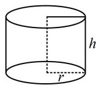
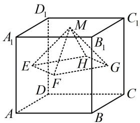
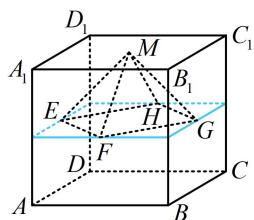
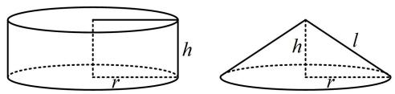
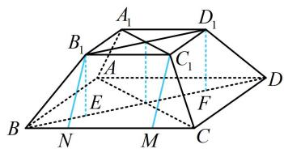
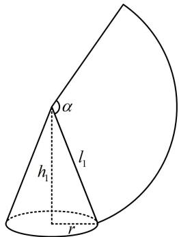
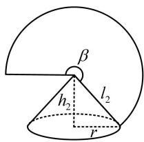
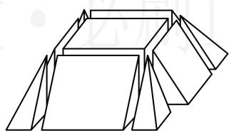
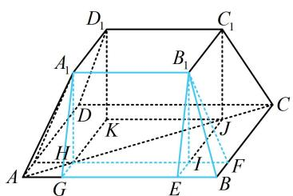

# 强化训练

##### 1. (2022·上海卷·★)

已知圆柱的高为4，底面积为 $9\pi$ ，则圆柱的侧面积为\_\_\_\_。

##### 1. $24\pi$

解析如图，由题意， $h = 4$ ，底面积 $S = \pi r^2 = 9\pi$

所以 $r = 3$ ，故圆柱的侧面积为 $2\pi rh = 24\pi$

##### 2. (2018·天津卷·★★)

已知正方体 $ABCD - A_{1}B_{1}C_{1}D_{1}$ 的棱长为 1，除面 $ABCD$ 外，该正方体其余各面的中心分别为点 $E, F, G, H, M$ （如图），则四棱锥 $M - EFGH$ 的体积为 \_\_\_\_.

##### 2. $\frac{1}{12}$

解析如图，四棱锥 $M - EFGH$ 的高为 $\frac{1}{2}$ ，底面是由蓝色正方形各边中点连线而成的正方形，其边长为 $\frac{\sqrt{2}}{2}$ ，所以 $V_{M - EFGH} = \frac{1}{3} \times \left(\frac{\sqrt{2}}{2}\right)^2 \times \frac{1}{2} = \frac{1}{12}$ .

##### 3. (2024·新课标Ⅰ卷·★★☆)

已知圆柱和圆锥的底面半径相等，侧面积相等，且它们的高均为 $\sqrt{3}$ ，则圆锥的体积为（）

$\quad$A. $2 \sqrt{3} \pi$

$\quad$B. $3 \sqrt{3} \pi$

$\quad$C. $6 \sqrt{3} \pi$

$\quad$D. $9 \sqrt{3} \pi$

##### 3. B

解析求圆锥的体积还差底面半径 $r$ ，我们先翻译已知的侧面积相等，建立方程求 $r$ ，

如图，圆柱和圆锥的高都为 $h = \sqrt{3}$ ，底面半径都是 $r$

则圆锥的母线长 $l = \sqrt{h^2 + r^2} = \sqrt{3 + r^2}$

又因为它们的侧面积相等，所以 $2\pi rh = \pi rl$

从而 $2\pi r \cdot \sqrt{3} = \pi r\sqrt{3 + r^2}$ ，故 $r = 3$ 所以圆锥的体积 $V = \frac{1}{3}\pi r^2 h = \frac{1}{3}\pi \times 3^2 \times \sqrt{3} = 3\sqrt{3}\pi$

##### 4.（2021·新高考Ⅱ卷（改）·★★★）

正四棱台的上、下底面的边长分别为2, 4, 侧棱长为2, 则其体积为\_\_\_\_；侧面积为\_\_\_\_。

##### 4. $\frac{28\sqrt{2}}{3}$ ; $12\sqrt{3}$

解析要算正四棱台的体积，还差高，已知侧棱长，可在包含侧棱的截面 $BDD_{1}B_{1}$ 中来分析，

如图，作 $B_{1}E \perp BD$ 于 $E$ ， $D_{1}F \perp BD$ 于 $F$ ，则 $B_{1}E$ ， $D_{1}F$ 均为正四棱台的高，

由题干所给数据可求得 $BD = 4\sqrt{2}$ ， $B_{1}D_{1} = 2\sqrt{2}$

所以 $EF = B_{1}D_{1} = 2\sqrt{2}$ ， $BE = DF = \frac{1}{2} (BD - EF) = \sqrt{2}$

从而 $B_{1}E = \sqrt{BB_{1}^{2} - BE^{2}} = \sqrt{2}$ ，故正四棱台的体积

$V = \frac {1}{3} \times (2 \times 2 + 4 \times 4 + \sqrt {2 \times 2 \times 4 \times 4}) \times \sqrt {2} = \frac {2 8 \sqrt {2}}{3};$

再算侧面积，侧面为四个全等的等腰梯形，上底和下底已

知，还差高，故先算高，

如图，作 $C_1M \perp BC$ 于 $M, B_1N \perp BC$ 于 $N,$

则 $MN = B_{1}C_{1} = 2$ ， $CM = BN = \frac{1}{2} (BC - MN) = 1$

$B _ {1} N = \sqrt {B B _ {1} ^ {2} - B N ^ {2}} = \sqrt {3},$

所以等腰梯形 $BCC_{1}B_{1}$ 的面积为 $\frac{1}{2}\times (2 + 4)\times \sqrt{3} = 3\sqrt{3}$

故四棱台的侧面积 $S = 4 \times 3\sqrt{3} = 12\sqrt{3}$ .

##### 5. (2023·湖北十一校联考·★★★)

甲、乙两个圆锥的底面积相等，侧面展开图的圆心角之和为 $2\pi$ ，侧面积分别为 $S_{\text{甲}}$ ， $S_{\text{乙}}$ ，体积分别为 $V_{\text{甲}}$ ， $V_{\text{乙}}$ 若 $\frac{S_{\text{甲}}}{S_{\text{乙}}} = 2$ ，则 $\frac{V_{\text{甲}}}{V_{\text{乙}}}$ 等于（）

$\quad$A. $\sqrt{10}$

$\quad$B. $\frac{4\sqrt{10}}{5}$

$\quad$C. $\frac{2\sqrt{10}}{5}$

$\quad$D. $\frac{5\sqrt{10}}{6}$

##### 5. B

解析两个圆锥及其侧面展开示意图如图，

要研究体积之比，需分析关键参数（底面半径和高）的比值，先翻译已知条件，

由题意， $\frac{S_{\text{甲}}}{S_{\text{乙}}} = \frac{\pi r l_1}{\pi r l_2} = \frac{l_1}{l_2} = 2$ ，所以 $l_{1} = 2l_{2}$ ①，还有侧面展开图的圆心角之和为 $2\pi$ 没翻译，故又来翻译它，

设甲、乙两个圆锥的侧面展开图的圆心角分别为 $\alpha$ ， $\beta$

则 $\left\{ \begin{array}{l} \alpha l_{1} = 2\pi r \\ \beta l_{2} = 2\pi r \end{array} \right. \Rightarrow \alpha + \beta = \frac{2\pi r}{l_{1}} + \frac{2\pi r}{l_{2}} = 2\pi \Rightarrow \frac{r}{l_{1}} + \frac{r}{l_{2}} = 1$

结合①可得 $l_{1} = 3r$ ， $l_{2} = \frac{3r}{2}$ ，所以 $h_1 = \sqrt{l_1^2 - r^2} = 2\sqrt{2} r$

$h_2 = \sqrt{l_2^2 - r^2} = \frac{\sqrt{5}r}{2}$ 故 $\frac{V_{\text{甲}}}{V_{\text{乙}}} = \frac{\frac{1}{3}\pi r^2 h_1}{\frac{1}{3}\pi r^2 h_2} = \frac{h_1}{h_2} = \frac{2\sqrt{2}r}{\frac{\sqrt{5}}{2}r} = \frac{4\sqrt{10}}{5}.$

圆锥甲

圆锥乙

##### 6. (2024·浙江模拟·★★★☆)

如图, 将正四棱台切割成九个部分, 其中一个部分为长方体, 四个部分为直三棱柱, 四个部分为四棱锥. 已知每个直三棱柱的体积为 3 , 每个四棱锥的体积为 1 , 则该正四棱台的体积为 ( )

$\quad$A. 36

$\quad$B. 32

$\quad$C. 28

$\quad$D. 24

##### 6. C

解析正四棱台切割方法的示意图如图，条件给出了直三棱柱和四棱锥的体积，可考虑把计算它们需要用到的量设出来，将已知和所求都用所设变量表示，观察二者的联系，

设 HI = IJ = x ， IE = IF = y ， $A_{1}H = B_{1}I = z$ ，

则 $V_{B_1 - BEIF} = \frac{1}{3} y^2 z = 1$ ，所以 $y^{2}z = 3$ ①，

又由题意， $V_{A_1HG - B_1IE} = \frac{1}{2} xzy = 3$ ，所以 $xyz = 6$ ②，

正四棱台的体积 $V = 4V_{A_1HG - B_1IE} + 4V_{B_1 - BEIF} + V_{A_1B_1C_1D_1 - HIJK}$

$= 4 \times 3 + 4 \times 1 + x ^ {2} z = 1 6 + x ^ {2} z \quad ③,$

观察发现所求式不含 $y$ ，故考虑由 $①②$ 消去 $y$ 再观察形式，

由②可得 $y = \frac{6}{xz}$ ，代入①得 $\frac{36}{x^2z^2} \cdot z = 3$ ，

所以 $x^{2}z=12$ ，代入③得 V=28。

