# 强化训练

# 类型 I：规则几何体计算

##### 1. (2023·天津模拟·★★)

如图，半球内有一内接正四棱锥 $S - ABCD$ ，该四棱锥的体积为 $\frac{4\sqrt{2}}{3}$ ，则该半球的体积为（）

$\quad$A. $\frac{\sqrt{2}}{3}\pi$

$\quad$B. $\frac{4\sqrt{2}}{9}\pi$

$\quad$C. $\frac{4\sqrt{2}}{3}\pi$

$\quad$D. $\frac{8\sqrt{2}}{3}\pi$

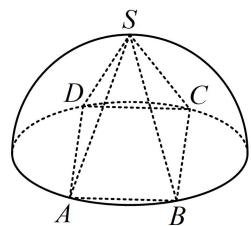

##### 1. C

解析涉及正四棱锥，先作高，由于要算球的半径，故分析包含高 $SO$ 和半径 $OA$ 的截面 $SOA$

如图，设球的半径为 $R$ ，则 $SO = OA = R$ ， $AB = \sqrt{2} R$

正四棱锥的体积 $V=\frac{1}{3}\times(\sqrt{2}R)^{2}\times R=\frac{4\sqrt{2}}{3}$ ,

所以 $R = \sqrt{2}$ ，故半球的体积为 $\frac{1}{2} \times \frac{4}{3} \pi R^3 = \frac{4\sqrt{2}}{3} \pi$

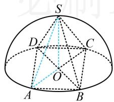

##### 2. (2023·天津模拟·★★☆)

侧棱长为2的正三棱锥，若其底面周长为9，则该正三棱锥的体积是（）

$\quad$A. $\frac{9\sqrt{3}}{2}$

$\quad$B. $\frac{3\sqrt{3}}{4}$

$\quad$C. $\frac{3\sqrt{3}}{2}$

$\quad$D. $\frac{9\sqrt{3}}{4}$

##### 2. B

解析如图，不妨设 $PA = PB = PC = 2$ ， $\triangle ABC$ 是正三

角形，由题意，其周长为9，所以 $AB = BC = AC = 3$

因为已知侧棱，所以研究高和侧棱构成的截面，

作 $PO \perp$ 平面 $ABC$ 于点 $O$ , 则 $O$ 是 $\triangle ABC$ 的中心,

连接 $AO$ 并延长，交 $BC$ 于点 $D$ ，则 $D$ 为 $BC$ 中点，

所以 $AO = \frac{2}{3} AD = \frac{2}{3}\times \frac{\sqrt{3}}{2}\times 3 = \sqrt{3},$ $OP = \sqrt{PA^2 - AO^2} = 1$

所以 $V_{P - ABC} = \frac{1}{3} S_{\triangle ABC}\cdot OP = \frac{1}{3}\times \frac{1}{2}\times 3\times 3\times \frac{\sqrt{3}}{2}\times 1 = \frac{3\sqrt{3}}{4}.$

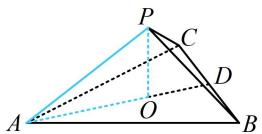

##### 3. (2023·重庆模拟·★★★)

圆台上、下底面圆的圆周都在一个半径为5的球面上，其上、下底面圆的周长分别为 $8\pi$ 和 $10\pi$ ，则该圆台的侧面积为（）

$\quad$A. $8 \sqrt{10} \pi$ 
$\quad$B. $8 \sqrt{11} \pi$   
$\quad$C. $9\sqrt{10}\pi$ 
$\quad$D. $9\sqrt{11}\pi$

##### 3. C

解析如图，圆台和球都是旋转体，到任意的过轴的截面分析均可，不妨选取图中的截面 $OO_{1}BA$ 来算需要的量，

由题意， $\left\{\begin{aligned}&2\pi\cdot O_{1}B=8\pi\\ &2\pi\cdot OA=10\pi\end{aligned}\right.$ ，所以 $\left\{\begin{aligned}O_{1}B=4\\ &OA=5\end{aligned}\right.$

上下底半径有了，求圆台侧面积还差母线长 $AB$

作 $BD \perp OA$ 于 $D$ ，则 $OD = O_1B = 4$ ， $AD = OA - OD = 1$ ，

$O B = 5, O O _ {1} = \sqrt {O B ^ {2} - O _ {1} B ^ {2}} = 3,$

所以 $BD = 3$ ，母线长 $AB = \sqrt{BD^2 + AD^2} = \sqrt{10}$

故圆台的侧面积 $S = \pi (r_1 + r_2)l = \pi \times (4 + 5)\times \sqrt{10} = 9\sqrt{10}\pi$

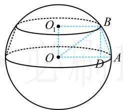

##### 4. (2021·新高考II卷·★★★)

北斗三号全球卫星导航系统是我国航天事业的重要成果。卫星导航系统中，地球静止同步轨道卫星的轨道位于地球赤道所在平面，轨道高度为 $36000 \mathrm{~km}$ （轨道高度指卫星到地球表面的最短距离），把地球看成一个球心为 $O$ ，半径 $r$ 为 $6400 \mathrm{~km}$ 的球，其上点 $A$ 的纬度是指 $OA$ 与赤道所在平面所成角的度数，地球表面能直接观测到一颗地球静止同步轨道卫星的点的纬度的最大值记为 $\alpha$ ，该卫星信号覆盖的地球表面面积 $S = 2 \pi r^{2} (1 - \cos \alpha)$ ，（单位： $\mathrm{km}^{2}$ ），则 $S$ 占地球表面积的百分比为（）

$\quad$A. $26\%$ 
$\quad$B. $34\%$ 
$\quad$C. $42\%$ 
$\quad$D. $50\%$

##### 4. C

解析读完题发现要求的百分比是 $\frac{2\pi r^2(1 - \cos\alpha)}{4\pi r^2} =$

$\frac{1-\cos\alpha}{2}$ ，所以只需求 $\alpha$ ，可画剖面图来看，

如图，同步卫星位于点 $B$ 处，点 $A$ 是地球上能观测到该同步卫星的纬度最大的点，其中 $AB$ 与圆 $O$ 相切，

则 $\angle AOB = \alpha$ 且 $OA\bot AB$ ，设线段 $OB$ 与球 $O$ 表面交于点

C，则 OC = r = 6400，BC = 36000，

所以 $\cos\alpha=\frac{OA}{OB}=\frac{6400}{6400+36000}\approx0.151$

从而 $\frac{1 - \cos\alpha}{2}\approx \frac{1 - 0.151}{2} = 0.4245\approx 0.42$

故 S 占地球表面积的百分比为 42%.

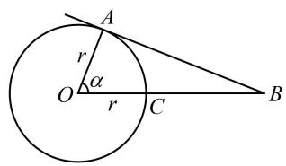

##### 5. (2023·全国乙卷·★★★)

已知圆锥 $PO$ 的底面半径为 $\sqrt{3}$ ， $O$ 为底面圆心， $PA$ ， $PB$ 为圆锥的母线， $\angle AOB = 120^{\circ}$ ，若 $\triangle PAB$ 的面积等于 $\frac{9\sqrt{3}}{4}$ ，则该圆锥的体积为（）

$\quad$A. $\pi$ 
$\quad$B. $\sqrt{6}\pi$ 
$\quad$C. $3\pi$ 
$\quad$D. $3\sqrt{6}\pi$

##### 5. B

解析条件给出 $S_{\triangle PAB}$ ，先看用它能求出什么。由于不知道角，所以用“ $\frac{1}{2} \times$ 底 $\times$ 高”算 $S_{\triangle PAB}$ ，注意到 $AB$ 可在 $\triangle AOB$ 中求得，故若以 $AB$ 为底，则结合 $S_{\triangle PAB}$ 已知，可求出高 $PQ$ ，接下来方向就明确了，只需研究高 $PQ$ 所在的截面，

在 $\triangle AOB$ 中，由余弦定理， $AB^{2} = OA^{2} + OB^{2} -$

$2OA \cdot OB \cdot \cos \angle AOB = 9$ ，所以 AB = 3，

取 $AB$ 中点 $Q$ ，连接 $PQ$ ， $OQ$ ，则 $OQ \perp AB$ ， $PQ \perp AB$

所以 $S_{\triangle PAB}=\frac{1}{2}AB\cdot PQ=\frac{1}{2}\times3\times PQ=\frac{3}{2}PQ$

又 $S_{\triangle PAB} = \frac{9\sqrt{3}}{4}$ ，所以 $\frac{3}{2} PQ = \frac{9\sqrt{3}}{4}$ ，故 $PQ = \frac{3\sqrt{3}}{2}$

在 $\triangle AOQ$ 中， $\angle AOQ = \frac{1}{2}\angle AOB = 60^{\circ}$ ，所以 $OQ =$

$OA\cdot \cos \angle AOQ = \frac{\sqrt{3}}{2}$ ，故 $OP = \sqrt{PQ^2 - OQ^2} = \sqrt{6}$

所以圆锥 $PO$ 的体积 $V = \frac{1}{3}\pi \times (\sqrt{3})^2 \times \sqrt{6} = \sqrt{6}\pi$ .

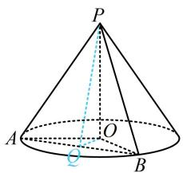

##### 6. (2024·新课标Ⅱ卷·★★★)

已知正三棱台 $ABC - A_{1}B_{1}C_{1}$ 的体积为 $\frac{52}{3}$ , $AB = 6$ , $A_{1}B_{1} = 2$ , 则 $A_{1}A$ 与平面 $ABC$ 所成角的正切值为（）

$\quad$A. $\frac{1}{2}$

$\quad$B. 1

$\quad$C. 2

$\quad$D. 3

##### 6. B

解析已知体积和上下底边长，可建立方程求出正三棱台的高，设正三棱台的高为 $h$ ，由题意，上底面积 $S' = \frac{1}{2} \times 2 \times 2 \times \sin \frac{\pi}{3} = \sqrt{3}$ ，下底面积 $S = \frac{1}{2} \times 6 \times 6 \times \sin \frac{\pi}{3} = 9\sqrt{3}$ ，

所以正三棱台的体积 $V=\frac{1}{3}(S+S'+\sqrt{SS'})h$

$= \frac{1}{3}\times (\sqrt{3} +9\sqrt{3} +\sqrt{\sqrt{3}\times 9\sqrt{3}})h = \frac{13\sqrt{3}}{3} h$ ，又由题意，

三棱台的体积为 $\frac{52}{3}$ ，所以 $\frac{13\sqrt{3}}{3} h = \frac{52}{3}$ ，故 $h = \frac{4\sqrt{3}}{3}$ ，

正三棱台是规则几何体，常到包含高的截面中分析问题，结合所求可知应选取包含高和 $A_{1}A$ 的截面来分析，

如图， $O_{1}$ ， $O$ 分别是上、下底面中心，作 $A_{1}I\perp OA$ 于点 $I$ ，则 $A_{1}I\perp$ 平面ABC， $A_{1}I = OO_{1} = h = \frac{4\sqrt{3}}{3}$

又因为 $OA = \frac{2}{3} \times 6 \times \frac{\sqrt{3}}{2} = 2\sqrt{3}$ ， $O_{1}A_{1} = \frac{2}{3} \times 2 \times \frac{\sqrt{3}}{2} = \frac{2\sqrt{3}}{3}$ ，所以 $IA = OA - OI = OA - O_{1}A_{1} = \frac{4\sqrt{3}}{3}$ ，从而 $\tan \angle A_{1}IA = \frac{A_{1}I}{IA} = 1$ ，故直线 $A_{1}A$ 与平面 $ABC$ 所成角的正切值为 1.

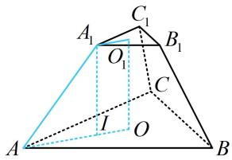

##### 7. (2023·云南红河州一模·★★★)

如图所示是一块边长为 $10 \mathrm{~cm}$ 的正方形铝片, 其中阴影部分由四个全等的等腰梯形和一个正方形组成, 将阴影部分裁剪下来, 并将其拼接成一个无上盖的容器 ( 铝片厚度不计), 则该容器的容积为 ( )

$\quad$A. $\frac{80\sqrt{3}}{3}\mathrm{cm}^3$

$\quad$B. $\frac{104\sqrt{3}}{3}\mathrm{cm}^3$

$\quad$C. $80 \sqrt{3} \mathrm{~cm}^{3}$

$\quad$D. $104 \sqrt{3} \mathrm{~cm}^{3}$

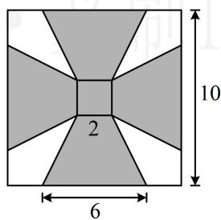

##### 7. B

解析可以想象拼接后的容器是正四棱台，上、下底面边长分别为2和6，斜高为4，如图1，正四棱台如图2，要求体积，还需算高OG.已知斜高，故在截面OGIE中分析，其中I，G分别为所在棱中点，

作 $IT \perp OE$ 于 $T$ , 则 $OT = IG = 1$ ,

$T E = O E - O T = 3 - 1 = 2, \quad I E = 4,$

在 $\triangle ITE$ 中， $IT = \sqrt{IE^2 - TE^2} = 2\sqrt{3}$

所以 $OG = IT = 2\sqrt{3}$ ，故正四棱台的体积

$V = \frac {1}{3} \times (2 \times 2 + 6 \times 6 + \sqrt {2 \times 2 \times 6 \times 6}) \times 2 \sqrt {3} = \frac {1 0 4 \sqrt {3}}{3}.$

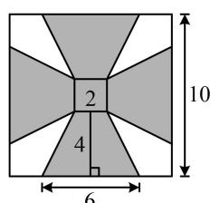

图1

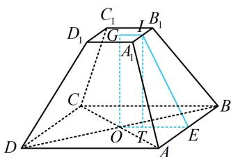

图2

# 8. (★★★★)

如图, 圆形纸片的圆心为 $O$ , 半径为 $5 \mathrm{~cm}$ , 该纸片上的等边三角形 $ABC$ 的中心为 $O, D, E, F$ 为圆 $O$ 上的点, $\triangle DBC$ , $\triangle ECA$ , $\triangle FAB$ 分别是以 $BC$ , $CA$ , $AB$ 为底边的等腰三角形. 沿虚线剪开后, 分别以 $BC$ , $CA$ , $AB$ 为折痕折起 $\triangle DBC$ , $\triangle ECA$ , $\triangle FAB$ , 使得 $D, E, F$ 重合, 得到三棱锥. 当 $\triangle ABC$ 的边长变化时, 所得三棱锥体积 (单位: $\mathrm{cm}^{3}$ ) 的最大值为 \_\_\_\_.

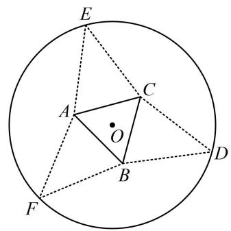

##### 8. $4 \sqrt{15}$

解析折起后的图形是正三棱锥，注意到图2中的 $PM + OM$ 等于图1中的 $OE$ ，为定值，故到截面POM中分析，不妨设 $OM$ 为变量，则 $OP$ 也能用 $OM$ 表示，从而把 $V_{P - ABC}$ 表示成关于 $OM$ 的单变量函数，

在图1中，设 $OM = x$ ，则 $EM = 5 - x$

因为 $AB \times \frac{\sqrt{3}}{2} \times \frac{1}{3} = OM$ ，所以 $AB = 2\sqrt{3} x$

故在图2中， $PM = 5 - x$ ， $OM = x$

由 $PM > OM$ 可得 $5 - x > x$ ，所以 $0 < x < \frac{5}{2}$

因为 $PO \perp$ 平面 $ABC$ ，所以 $PO \perp OM$ ，

从而 $PO = \sqrt{PM^2 - OM^2} = \sqrt{(5 - x)^2 - x^2} = \sqrt{25 - 10x}$

故 $V_{P-ABC}=\frac{1}{3}S_{\triangle ABC}\cdot PO$

$= \frac {1}{3} \times \frac {1}{2} \times (2 \sqrt {3} x) ^ {2} \times \frac {\sqrt {3}}{2} \times \sqrt {2 5 - 1 0 x} = \sqrt {(7 5 - 3 0 x) x ^ {4}},$

要求 $V_{P - ABC}$ 的最大值，可将根号内的部分单独拿出来，构造函数求导分析，设 $f(x) = (75 - 30x)x^4\left(0 < x < \frac{5}{2}\right)$ ，

则 $f'(x) = -30x^{4} + (75 - 30x)\cdot 4x^{3} = 150x^{3}(2 - x)$

所以 $f'(x) > 0\Leftrightarrow 0 <   x <   2$ ， $f'(x) <   0\Leftrightarrow 2 <   x <   \frac{5}{2},$

从而 $f(x)$ 在 $(0,2)$ 上 $\nearrow$ ，在 $\left(2,\frac{5}{2}\right)$ 上 $\searrow$

故 $f(x)_{\mathrm{max}} = f(2) = 240$ ，所以 $(V_{P - ABC})_{\mathrm{max}} = 4\sqrt{15}$

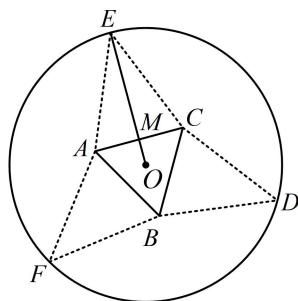

图1

图2

# 类型 II：内切球问题

##### 9. (2024·广东深圳二模·★★★)

已知圆锥的内切球半径为 1，底面半径为 $\sqrt{2}$ ，则该圆锥的表面积为\_\_\_\_。（注：在圆锥内部，且与底面和各母线均有且只有一个公共点的球，称为圆锥的内切球）

##### 9. $8\pi$

解析已有圆锥的底面半径，求表面积还差母线长。条件给出了圆锥的内切球半径，圆锥和球都是旋转体，故任选一个过轴的截面来分析几何关系，都能求圆锥的母线长，不妨选取图中的截面 $SAB$ 来分析，

如图，由题意， $O_{1}B = \sqrt{2}$ ， $OD = OO_{1} = 1$

所以 $\tan \angle OBO_{1} = \frac{OO_{1}}{O_{1}B} = \frac{\sqrt{2}}{2}$ ，故 $\tan \angle SBO_{1} = \tan 2\angle OBO_{1}$

$= \frac {2 \tan \angle O B O _ {1}}{1 - \tan^ {2} \angle O B O _ {1}} = \frac {2 \times \frac {\sqrt {2}}{2}}{1 - \left(\frac {\sqrt {2}}{2}\right) ^ {2}} = 2 \sqrt {2},$

又 $\tan \angle SBO_{1} = \frac{SO_{1}}{O_{1}B}$ ，所以 $\frac{SO_1}{O_1B} = 2\sqrt{2}$

故 $SO_{1} = 2\sqrt{2} O_{1}B = 4$ ， $SB = \sqrt{SO_1^2 + O_1B^2} = 3\sqrt{2}$

所以圆锥的表面积为 $S = \pi \times (\sqrt{2})^2 +\pi \times \sqrt{2}\times 3\sqrt{2} = 8\pi$

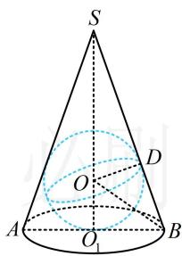

##### 10. (2025·全国Ⅱ卷·★★★☆)

一个底面半径为 $4 \mathrm{~cm}$ , 高为 $9 \mathrm{~cm}$ 的封闭圆柱形容器 (容器厚度忽略不计) 内有两个半径相等的铁球, 则铁球半径的最大值为 \_\_\_\_ cm.

##### 10. $\frac{5}{2}$

解析如图1，可以想象，若球的半径等于圆柱的底面半径，则只能放下一个球，所以要放下两个半径相等的球，应如图2，如何计算此时球的半径？不妨画出剖面图来分析，如图3，设两个球的半径为 $R(R < 4)$ ，

怎样建立方程求 $R$ ？观察发现两个球是外切的，于是 $MN = 2R$ ，故只要再把 $MC$ 和 $CN$ 用 $R$ 表示，就能在 $\triangle CMN$ 中用勾股定理建立方程求 $R$ ，于是按此尝试，

由图3可知， $MN = 2R$ ， $MC = DE - DM - CE$

$= D E - D M - N F = 8 - 2 R,$

$N C = A B - A N - B C = A B - A N - M G = 9 - 2 R,$

在 $\triangle CMN$ 中， $MC^2 +NC^2 = MN^2$

所以 $(8 - 2R)^{2} + (9 - 2R)^{2} = 4R^{2}$

解得： $R = \frac{5}{2}$ 或 $\frac{29}{2}$ （舍去）.

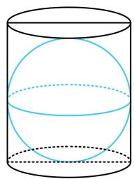

图1

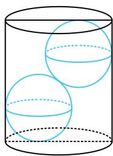

图2

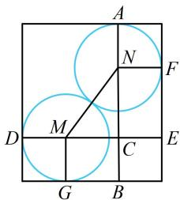

图3

##### 11. (2023·江苏苏锡常镇四市一模·★★★☆)

已知正四面体 $P - ABC$ 的棱长为1，点 $O$ 为底面 $ABC$ 的中心，球 $O$ 与该正四面体的其余三个面都有且只有一个公共点，且公共点非该正四面体的顶点，则球 $O$ 的半径为（）

$\quad$A. $\frac{\sqrt{6}}{12}$

$\quad$B. $\frac{\sqrt{6}}{9}$

$\quad$C. $\frac{\sqrt{2}}{9}$

$\quad$D. $\frac{\sqrt{2}}{3}$

##### 11. B

【解法1】由题意，面 $PAB$ ， $PAC$ ， $PBC$ 都与球 $O$ 相切，所以球 $O$ 的半径即为点 $O$ 到面 $PAB$ 的距离，怎样求此距离？正四面体是规则几何体，结合对称性可以想象切点 $E$ 应在中线 $PD$ 上，故分析过高 $PO$ 和中线 $PD$ 的截面，

如图，设 $D$ 为 $AB$ 中点，则 $AB \perp PD$ ， $AB \perp CD$ ，所以 $AB \perp$ 平面 $PCD$ ，作 $OE \perp PD$ 于 $E$ ，则 $OE \subset$ 平面 $PCD$ ，所以 $OE \perp AB$ ，故 $OE \perp$ 平面 $PAB$ ，怎样计算 $OE$ ？我们发现它是 Rt $\triangle POD$ 斜边上的高，故可用等面积法计算，

因为 O 是 $\triangle ABC$ 的中心，所以它也是重心，

故 $OD = \frac{1}{3} CD = \frac{1}{3}\times \frac{\sqrt{3}}{2}\times 1 = \frac{\sqrt{3}}{6},$

又 $PD = \frac{\sqrt{3}}{2}$ ，所以 $PO = \sqrt{PD^2 - OD^2} = \frac{\sqrt{6}}{3}$

因为 $S_{\triangle POD} = \frac{1}{2} PO\cdot OD = \frac{1}{2} PD\cdot OE$ ，所以 $OE = \frac{PO\cdot OD}{PD}$

$= \frac{\frac{\sqrt{6}}{3} \times \frac{\sqrt{3}}{6}}{\frac{\sqrt{3}}{2}} = \frac{\sqrt{6}}{9}$ 故球 $O$ 的半径为 $\frac{\sqrt{6}}{9}$ .

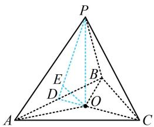

【解法2】: 注意到 $O$ 到正四面体的三个侧面等距, 而距离可以与体积联系起来, 故可考虑用等体积法建立方程求该距离. 上述思路也是求解棱锥内切球问题的一个通用思路,

设球 O 的半径为 r，如图， $V_{P-ABC}=V_{O-PAB}+V_{O-PBC}+$

$\begin{array}{l} V _ {O - P A C} = \frac {1}{3} S _ {\triangle P A B} \cdot r + \frac {1}{3} S _ {\triangle P B C} \cdot r + \frac {1}{3} S _ {\triangle P A C} \cdot r \\ = \frac {r}{3} (S _ {\triangle P A B} + S _ {\triangle P B C} + S _ {\triangle P A C}) \quad ①, \\ \end{array}$

又由题意，正四面体 $P - ABC$ 每个面的面积都为

$\frac {1}{2} \times 1 \times 1 \times \sin \frac {\pi}{3} = \frac {\sqrt {3}}{4},$

结合①得 $V_{P-ABC}=\frac{r}{3}\times\left(\frac{\sqrt{3}}{4}+\frac{\sqrt{3}}{4}+\frac{\sqrt{3}}{4}\right)=\frac{\sqrt{3}r}{4}$ ②,

另一方面， $O$ 为 $\triangle ABC$ 的中心，也是重心，所以 $OC =$

$\frac {2}{3} C D = \frac {2}{3} \times \frac {\sqrt {3}}{2} \times 1 = \frac {\sqrt {3}}{3}, O P = \sqrt {P C ^ {2} - O C ^ {2}} = \frac {\sqrt {6}}{3},$

故 $V_{P - ABC} = \frac{1}{3} S_{\triangle ABC}\cdot OP = \frac{1}{3}\times \frac{\sqrt{3}}{4}\times \frac{\sqrt{6}}{3} = \frac{\sqrt{2}}{12},$

与②对比可得 $\frac{\sqrt{3}r}{4} = \frac{\sqrt{2}}{12}$ ，解得： $r = \frac{\sqrt{6}}{9}$ .

【反思】与三角形内切圆半径的等面积法计算原理类似，三棱锥的内切球半径也可用等体积法来计算.

##### 12. (2024·湖北武汉模拟·★★★★)

已知正四棱台的上底面与下底面的边长之比为1:2，其内切球的半径为1，则该正四棱台的体积为\_\_\_\_。

##### 12. $\frac{28}{3}$

解析如图，由正四棱台的对称性，其内切球 $O$ 与上、下底面的切点为上、下底面的中心，与侧面的切点应在侧面等腰梯形上下底边中点的连线上，因为球 $O$ 的半径 $R = 1$ ，所以正四棱台的高 $h = IJ = 2R = 2$ ，

求正四棱台的体积还差上、下底面边长，由于是内切球，切点非常关键，又已知高，故考虑到包含高和切点的截面（如图中的截面 EFGH）中来分析几何关系，求上、下底面边长，设正四棱台的上底面边长为 a，

由题意，下底面边长为 $2a$ ，所以 $IG = \frac{a}{2}$ ， $JF = a$

作 $GP \perp JF$ 于点 $P$ ，则 $GP = IJ = 2$ ，

$J P = I G = \frac {a}{2}, \quad P F = J F - J P = a - \frac {a}{2} = \frac {a}{2},$

由切线长相等， $GK = IG = \frac{a}{2}$ ， $FK = JF = a$

所以 $GF = GK + FK = \frac{a}{2} + a = \frac{3a}{2}$ ,

在 $\triangle GPF$ 中， $GP^{2} + PF^{2} = GF^{2}$

所以 $2^{2} + \left(\frac{a}{2}\right)^{2} = \left(\frac{3a}{2}\right)^{2}$ ，解得： $a = \sqrt{2}$

所以正四棱台的上底面积 $S = a^2 = 2$ ，下底面积 $S' = (2a)^2 = 8$ ，故其体积 $V = \frac{1}{3} (S + S' + \sqrt{SS'})h$

$= \frac {1}{3} \times (2 + 8 + \sqrt {2 \times 8}) \times 2 = \frac {2 8}{3}.$

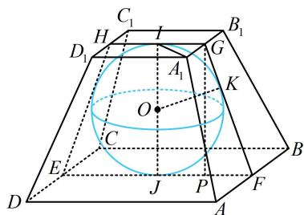

