# 第 4 节 立体几何常见方法综合（★★☆）

# 内容提要

本节归纳立体几何中的几类常见方法.

##### 1. 斜二测画法

①在已知图形中取互相垂直的 $x$ 轴、 $y$ 轴，两轴相交于点 $O$ ，画直观图时，把它们画成对应的 $x'$ 轴与 $y'$ 轴，两轴相交于点 $O'$ ，且使 $\angle x'O'y' = 45^\circ$ （或 $135^\circ$ ），它们确定的平面表示水平面；

②已知图形中平行于 $x$ 轴或 $y$ 轴的线段，在直观图中分别画成平行于 $x'$ 轴或 $y'$ 轴的线段；

③已知图形中平行于 $x$ 轴的线段，在直观图中保持原长度不变，平行于 $y$ 轴的线段，在直观图中长度变为原来的一半；

④斜二测直观图与原图的面积关系： $S=2\sqrt{2}S'$ ，其中S和 $S'$ 分别为原图和直观图的面积.

##### 2. 最短路径问题：空间中最短路径问题，常将几何体展开为平面，到平面上分析最短路径.

##### 3. 等体积法

①当直接计算某三棱锥体积不方便时，可考虑转换顶点来算体积.
②在求点到平面的距离时，也可用等体积法. 例如，要求点 A 到平面 BCD 的距离 d，若能求得 $S_{\triangle BCD}$ ，以及转换顶点后的三棱锥 D-ABC 的体积 $V_{D-ABC}$ ，则可由 $\frac{1}{3}S_{\triangle BCD} \cdot d = V_{D-ABC}$ 解出 d.

##### 4. 扩大截面: 常用平行线法和延长线法来寻找多面体的完整截面, 详见本节例 4 和例 5.

# 类型 I：斜二测画法

【例 1】（多选）用斜二测画法画水平放置的平面图形的直观图时，下述结论正确的是（）

$\quad$A. 梯形的直观图仍旧是梯形

$\quad$B. 若 $\triangle ABC$ 的直观图是边长为 2 的等边三角形, 那么 $\triangle ABC$ 的面积为 $\sqrt{6}$

$\quad$C. $\triangle ABC$ 的直观图如图所示, $A'B'$ 在 $x'$ 轴上, $A'B' = 2$ , $B'C'$ 与 $x'$ 轴垂直,

且 $B'C' = \sqrt{2}$ ，则 $\triangle ABC$ 的面积为4

$\quad$D. 菱形的直观图可以是矩形

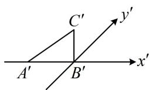

解析A 项，斜二测画法不改变平行关系，也不改变平行线段的长度大小关系，所以梯形的直观图仍旧是梯形，故 A 项正确；

B 项，原图与直观图的面积关系为 $S = 2\sqrt{2} S'$ ，直观图的面积 $S'$ 容易求得，故可由此求得原图面积 $S$ ，直观图是边长为 2 的等边三角形 $\Rightarrow S' = \frac{1}{2} \times 2 \times 2 \times \frac{\sqrt{3}}{2} = \sqrt{3} \Rightarrow S = 2\sqrt{2} S' = 2\sqrt{6}$ ，故 B 项错误；

C 项， $S_{\triangle A'B'C'} = \frac{1}{2} \times 2 \times \sqrt{2} = \sqrt{2} \Rightarrow S_{\triangle ABC} = 2\sqrt{2} \times \sqrt{2} = 4$ ，故 C 项正确；

D 项，如图 1，菱形 ABCD 满足 AC = 2，BD = 4，

那么在图2中， $A'C'=B'D'=2$ ，

所以 $A'B'C'D'$ 为矩形，故 D 项正确.

答案: ACD

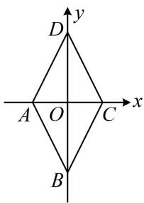

图1

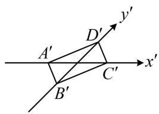

图2

# 类型 II：最短路径问题

##### 【例2】如图，已知圆锥的母线长 $SA = 3$ ，一只蚂蚁从点 $A$ 出发绕着圆锥的侧面爬行一圈回到点 $A$ 的最短距离为 $3\sqrt{3}$ ，则该圆锥的底面半径为（）

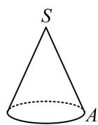

$\quad$A. 1

$\quad$B. 2

$\quad$C. $\sqrt{2}$

$\quad$D. $\sqrt{3}$

解析要分析最短距离，直接从圆锥上看不易，可把圆锥侧面展开，到平面上来看，

如图为圆锥的侧面展开图，题干的最短距离即为在扇形内，从 $A$ 到 $A'$ 的最短距离，显然沿直线最短，

所以 $AA' = 3\sqrt{3}$ ，又 $SA = SA' = 3$ ，所以 $\cos \angle ASA' = \frac{SA^2 + SA'^2 - AA'^2}{2SA\cdot SA'} = -\frac{1}{2}$

从而 $\angle ASA' = \frac{2\pi}{3}$ ，故扇形的圆弧长 $l = \frac{2\pi}{3} \times 3 = 2\pi$

又 $l = 2\pi r$ ，其中 $r$ 为底面半径，所以 $2\pi r = 2\pi$ ，解得： $r = 1$

答案: A

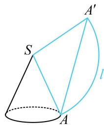

【反思】不管什么空间图形，涉及最短距离问题，一般都把空间图形展开为平面图形，到平面上来分析.

# 类型III：等体积法

【例 3】(2020·海南卷) 已知正方体 $ABCD-A_{1}B_{1}C_{1}D_{1}$ 的棱长为 2, M, N 分别为 $BB_{1}$ , AB 的中点，则三棱锥 $A-NMD_{1}$ 的体积为 \_\_\_\_.

解析如图，以 $A$ 为顶点求体积，高不好找，但若转换成以 $D_{1}$ 为顶点，则高即为 $A_{1}D_{1}$ ，底面积也好算，

由题意， $V_{A - NMD_1} = V_{D_1 - AMN} = \frac{1}{3} S_{\triangle AMN}\cdot A_1D_1 = \frac{1}{3}\times \frac{1}{2}\times 1\times 1\times 2 = \frac{1}{3}.$

答案: $\frac{1}{3}$

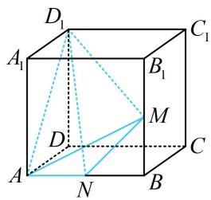

##### 【变式】某车间生产一种圆台形零件，其下底面的直径为4，上底面的直径为8，已知 $AB$ 为上底面的直径，圆台的高 $h = 4$ ，点 $P$ 是上底面圆周上一点，且 $AP = BP$ ， $PC$ 是该圆台的一条母线，则点 $P$ 到平面 $ABC$ 的距离为（）

$\quad$A. $\frac{8 \sqrt{5}}{15}$

$\quad$B. $\frac{4 \sqrt{5}}{5}$

$\quad$C. $\frac{6\sqrt{5}}{5}$

$\quad$D. $\frac{8\sqrt{5}}{5}$

解析如图，直接算距离需作垂线，较麻烦，但观察发现 $V_{C - PAB}$ 和 $S_{\triangle ABC}$ 好求，故用等体积法， $\left\{ \begin{array}{l}AP = BP\\ AB\text{为直径} \end{array} \right.\Rightarrow \triangle PAB$ 是等腰 Rt 三角形，又 $AB = 8$ ，所以 $PA = PB = 4\sqrt{2}$ ， $S_{\triangle PAB} = \frac{1}{2}\times (4\sqrt{2})^2 = 16$

点 $C$ 到平面 $PAB$ 的距离等于棱台的高 $h$ ，所以 $V_{C - PAB} = \frac{1}{3}\times 16\times 4 = \frac{64}{3}$

接下来求距离，也即三棱锥 $P - ABC$ 的以 $\triangle ABC$ 为底面的高，还差 $S_{\triangle ABC}$ ，故再算它，

由图可知 $O_{1}C = \sqrt{O_{1}O_{2}^{2} + O_{2}C^{2}} = \sqrt{4^{2} + 2^{2}} = 2\sqrt{5}$ ，且由对称性可知 $AC = BC$

所以 $O_{1}C \perp AB$ ，故 $S_{\triangle ABC} = \frac{1}{2} AB \cdot O_{1}C = \frac{1}{2} \times 8 \times 2\sqrt{5} = 8\sqrt{5}$

设点 $P$ 到平面 $ABC$ 的距离为 $d$ ，则 $V_{P - ABC} = \frac{1}{3} S_{\triangle ABC} \cdot d = \frac{8\sqrt{5}}{3} d$

因为 $V_{P - ABC} = V_{C - PAB}$ ，所以 $\frac{8\sqrt{5}}{3} d = \frac{64}{3}$ ，解得： $d = \frac{8\sqrt{5}}{5}$

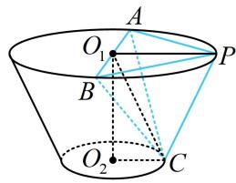

答案: D

【总结】等体积法除了用于把难求的体积转化为好求的体积计算之外，还可用于求点到平面的距离.

# 类型IV：多面体的截面问题

【例 4】如图，在棱长为 2 的正方体 $ABCD-A_{1}B_{1}C_{1}D_{1}$ 中，E 是棱 $BB_{1}$ 的中点，则正方体过 $A_{1}$ ，D，E 三点的截面的面积为 \_\_\_\_.

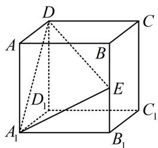

解析 $\triangle A_{1}DE$ 的边 $DE$ 在正方体内部，截面不完整，需将其扩大，观察发现 $A_{1}D$ 和$E$ 分别位于左、右两个面内，且过 $E$ 在面 $BB_{1}C_{1}C$ 内易作 $A_{1}D$ 的平行线，故直接作平行线即可扩大截面，如图1，取 $BC$ 中点 $F$ ，连接 $DF$ ， $EF$ ，则 $EF//B_{1}C//A_{1}D$ ，所以截面为 $A_{1}DFE$ ，正方体棱长为 $2 \Rightarrow A_{1}D = 2\sqrt{2}$ ， $EF = \sqrt{2}$ ， $DF = \sqrt{CD^{2} + CF^{2}} = \sqrt{5}$ ， $A_{1}E = \sqrt{A_{1}B_{1}^{2} + B_{1}E^{2}} = \sqrt{5}$ ，把截面单独画出来如图2，作 $EM\perp A_{1}D$ 于M,

$FN \perp A_{1}D$ 于 $N$ ，则 $MN = EF = \sqrt{2}$ ， $A_{1}M = DN = \frac{\sqrt{2}}{2}$ ，

所以 $FN = \sqrt{DF^2 - DN^2} = \frac{3}{\sqrt{2}}$

故 $S_{A_1DFE} = \frac{1}{2}\times (\sqrt{2} +2\sqrt{2})\times \frac{3}{\sqrt{2}} = \frac{9}{2}.$

答案: $\frac{9}{2}$

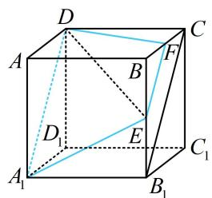

图1

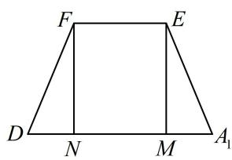

图2

【反思】直接在表面上作对侧直线的平行线是最常见的扩大截面的方法，我们称之为“平行线法”.

【例 5】如图，正方体 $ABCD-A_{1}B_{1}C_{1}D_{1}$ 的棱长为 1, M, N 分别为 $C_{1}D_{1}$ 和 $B_{1}C_{1}$ 的中点，用过 A, M, N 的平面去截正方体，则所得截面图形的周长为 \_\_\_\_.

解析直线 $MN$ 和点 $A$ 分别在上、下两个平行的面内，但若过 $A$ 作 $MN$ 的平行线 $l$ ，则 $l$ 在正方体外，如图1，不像例4那么好处理了，怎么办呢？此时可用“延长线法”，我们一般通过延长表面的线，找它与棱的交点，从而扩大截面。可以发现 $\triangle AMN$ 中的 $MN$ 在表面，所以延长它，

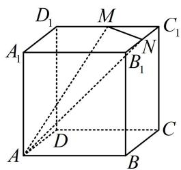

如图2，延长 $MN$ 和 $A_{1}B_{1}$ 交于点 $H$ ，则 $H$ 是平面 $AMN$ 与平面 $ABB_{1}A_{1}$ 的一个公共点，此时“小面” $AMN$ 就扩大为了“大面” $AMH$ . 连接 $AH$ 交 $BB_{1}$ 于 $P$ ，连接 $NP$ ，则 $AP$ ， $NP$ 都是截面的边界线，

在做下一步之前, 需先分析 $P$ 在 $B{B}_{1}$ 上的位置, 先看 $H$ 的位置,

因为 $N$ 是 $B_{1}C_{1}$ 中点，所以 $NB_{1} = NC_{1}$ ，结合 $\left\{ \begin{array}{l} \angle MC_{1}N = \angle HB_{1}N = 90^{\circ} \\ \angle C_{1}NM = \angle B_{1}NH \end{array} \right.$ 可得 $\triangle MNC_{1} \cong \triangle HNB_{1}$ ，

所以 $B_{1}H = MC_{1} = \frac{1}{2} AB$ ，又 $\triangle B_{1}PH\sim \triangle BPA$ ，所以 $\frac{B_1P}{PB} = \frac{B_1H}{AB} = \frac{1}{2}$

再找截面与正方体剩余面的交线，注意到此时过 $M$ 在面 $CDD_{1}C_{1}$ 内易作直线 $AP$ 的平行线，故无需再用上面找点 $P$ 的方法来扩大截面，直接作平行线即可，

作 $MG \parallel AP$ 交 $DD_{1}$ 于 $G$ ，可以发现 $\triangle D_{1}GM \sim \triangle BPA$ ，所以 $\frac{D_{1}G}{BP} = \frac{D_{1}M}{AB} = \frac{1}{2}$ ，

故 $G$ 是靠近 $D_{1}$ 的三等分点，连接 $AG$ ，完整的截面即为五边形 $AGMNP$

可求得 $AG = \sqrt{AD^2 + DG^2} = \frac{\sqrt{13}}{3}$ ， $GM = \sqrt{D_1G^2 + D_1M^2} = \frac{\sqrt{13}}{6}$ ， $MN = \frac{\sqrt{2}}{2}$

$N P = \sqrt {B _ {1} N ^ {2} + B _ {1} P ^ {2}} = \frac {\sqrt {1 3}}{6}, \quad P A = \sqrt {A B ^ {2} + B P ^ {2}} = \frac {\sqrt {1 3}}{3},$

故所求截面周长为 $AG + GM + MN + NP + PA = \frac{\sqrt{2}}{2} +\sqrt{13}$

答案 $\frac{\sqrt{2}}{2} +\sqrt{13}$

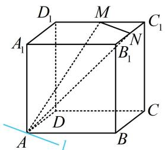

图1

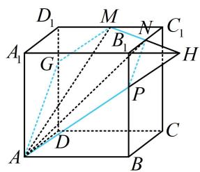

图2

【反思】当直接作平行线得到的直线在多面体外时，可通过延长表面的线，找它与棱的交点来扩大截面。如图，以求过 $A$

M, N三点的截面为例, 只需延长 $MN$ , 找到它与棱所在直线的交点 $H$ , I, 截面就由 $AMN$ 扩大为了 $AHI$ , 再看面 $AHI$ 与其它棱的交点. 当然, 有时只需找到 $H$ , I中的一个, 就能用平行线法扩大截面了.

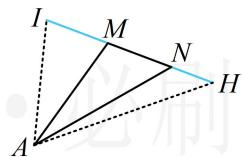

【例 6】如图是棱长为 1 的正方体，E, F, G 分别是所在棱的中点，则正方体的过 E, F, G 三点的截面的面积为 \_\_\_\_.

解析连接 GE, EF, FG, $\triangle GEF$ 三边都不在表面，上面的两种方法都不好做，怎么办？注意到 G, E, F 都是中点，故通过直观想象可猜测截面与 $A_{1}D_{1}$ ，AB, $CC_{1}$ 的交点也是中点，故先取中点来看看，

设 $H, I, J$ 分别为 $A_{1}D_{1}, AB, CC_{1}$ 的中点，则由图可知截面是正六边形，其边长为 $\frac{\sqrt{2}}{2}$ ，故截面面积 $S = 6 \times \frac{1}{2} \times \frac{\sqrt{2}}{2} \times \frac{\sqrt{2}}{2} \times \frac{\sqrt{3}}{2} = \frac{3\sqrt{3}}{4}$ .

答案 $\frac{3\sqrt{3}}{4}$

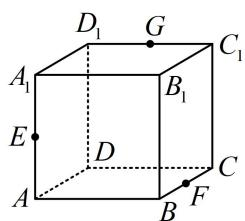

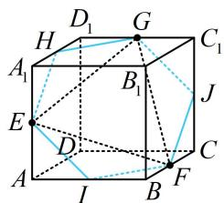

【反思】上述截面是正方体的一个特殊截面，它与正方体所有棱所成的角都相等，可把它记住.

# 强化训练

##### 1. (★★) (多选)

如图， $\triangle A'B'C'$ 表示水平放置的 $\triangle ABC$ 根据斜二测画法得到的直观图， $A'B'$ 在 $x'$ 轴上， $B'C'$ 与 $x'$ 轴垂直，且 $B'C' = \sqrt{2}$ ，则下列说法正确的是（）

$\quad$A. $\triangle ABC$ 的边 $AB$ 上的高为 2  
$\quad$B. $\triangle ABC$ 的边 $AB$ 上的高为 4  
$\quad$C. $AC > BC$   
$\quad$D. $AC < BC$

##### 2. (2022·安徽定远模拟·★★)

如图，正三棱柱 $ABC - A_{1}B_{1}C_{1}$ 中， $AA_{1} = 4$ ， $AB = 1$ ，一只蚂蚁从点 $A$ 出发，沿每个侧面爬到 $A_{1}$ ，路线为 $A \to M \to N \to A_{1}$ ，则蚂蚁爬行的最短路程是（）

$\quad$A. 4 
$\quad$B. 5 
$\quad$C. 6 
$\quad$D. $2 \sqrt{5} + 1$

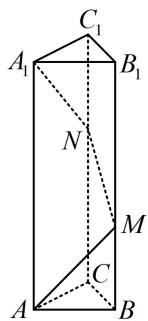

##### 3. (★★☆)

如图，在正四棱柱 $ABCD - A_{1}B_{1}C_{1}D_{1}$ 中，底面边长为2，高为1，则点 $D$ 到平面 $ACD_{1}$ 的距离是

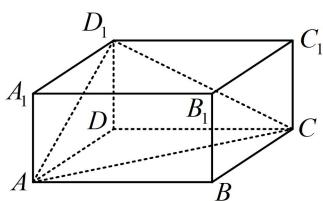

##### 4. (★★★)

如图, 直四棱柱 $ABCD-A_{1}B_{1}C_{1}D_{1}$ 的底面是菱形, $AA_{1}=4$ , $AB=2$ , $\angle BAD=60^{\circ}$ , $E$ 是 $BC$ 的中点, 则点 $C$ 到平面 $C_{1}DE$ 的距离为 \_\_\_\_.

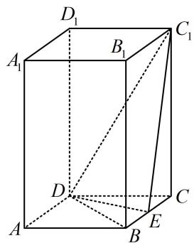

##### 5. (★★★)

在棱长为2的正方体 $ABCD - A_{1}B_{1}C_{1}D_{1}$ 中， $E$ ， $F$ 分别为 $DD_{1}$ ，DB的中点，则三棱锥 $B_{1} - CEF$ 的体积为

##### 6. (★★★☆)

三棱柱 $ABC - A_{1}B_{1}C_{1}$ 的所有棱长都为 1，侧棱 $AA_{1} \perp$ 底面 $ABC, E, F$ 分别为 $BC$ 和 $A_{1}C_{1}$ 的中点，若经过点 $A, E, F$ 的平面将此三棱柱分割成两部分，则这两部分中体积较大者与体积较小者的体积之比为 \_\_\_\_.

##### 7.（2023·新课标Ⅰ卷·★★★★★）（多选）

下列物体中, 能够被整体放入棱长为 1 (单位: m) 的正方体容器 (容器壁厚度忽略不计) 内的有 ( )

$\quad$A. 直径为 $0.99 \mathrm{~m}$ 的球体  
$\quad$B. 所有棱长均为 $1.4 \mathrm{~m}$ 的正四面体  
$\quad$C. 底面直径为 $0.01 \mathrm{~m}$ , 高为 $1.8 \mathrm{~m}$ 的圆柱体  
$\quad$D. 底面直径为 $1.2 \mathrm{~m}$ , 高为 $0.01 \mathrm{~m}$ 的圆柱体

