# 模块二 位置关系的判定

# 第1节 平行关系证明思路大全（★★）

# 内容提要

本节主要归纳立体几何大题第一问常见的证明平行关系的思路，先梳理需要用到的一些定理.

①线面平行的判定定理：如图1，若 $a \not\subset \alpha$ ， $b \subset \alpha$ ， $a \parallel b$ ，则 $a \parallel \alpha$ .  
②面面平行的判定定理：如图2，若 $a\subset\alpha,\ b\subset\alpha,\ a\cap b=P,\ a//\beta,\ b//\beta$ ，则 $\alpha//\beta$ .  
③线面平行的性质定理：如图3，若 $a / / \alpha$ ， $a\subset \beta$ ， $\alpha \cap \beta = l$ ，则 $a / / l$   
④面面平行的性质定理1：如图4，若 $\alpha // \beta$ ， $\gamma \cap \alpha = a$ ， $\gamma \cap \beta = b$ ，则 $a // b$   
⑤面面平行的性质定理2：如图2，若 $\alpha // \beta$ ， $a \subset \alpha$ ，则 $a // \beta$

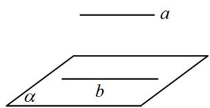

图1

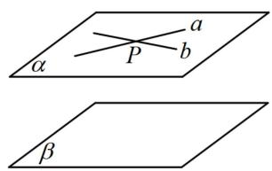

图2

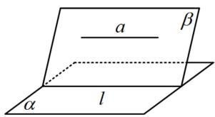

图3

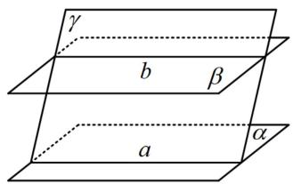

图4

平行关系的证明题中，最常见的是证线面平行，以下是三大作辅助线的思路：

##### 1. 找平行四边形：可先在面内作一条与已知直线平行的直线，观察构成的图形像不像平行四边形，若像，就尝试去找理由，进行论证即可.   
##### 2. 两个重要图形的运用（其原理是上面的线面平行的性质定理，运用时选①还是②，一般看图就知道）

①点线位于面的两侧：如图5，要证 $AB \parallel \alpha$ ，可在 $\alpha$ 的另一侧尝试找一点 $P$ ，连接 $PA, PB,$ 则面 $PAB$ 与 $\alpha$ 的交线就是我们证线面平行要找的 $\alpha$ 内的直线.  
②点线位于面的同侧：如图6，要证 $AB \parallel \alpha$ ，可在 $\alpha$ 的同侧尝试找一点 $P$ ，连接 $PA, PB$ ，则面 $PAB$ 与 $\alpha$ 的交线就是我们证线面平行要找的 $\alpha$ 内的直线.

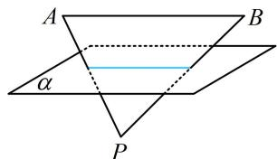

图5

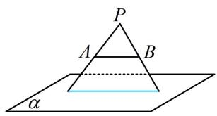

图6

##### 3. 造面面平行：若前面的两个方法都不易解决问题，那么还可以考虑通过证面面平行，来证明线面平行.

提醒: 本节题目只节选了原题中的 1 个小问, 所给条件可能有多余, 这些条件是用在其它小问的. 之所以没有把它们去掉, 是因为应试时本来也需要我们去判断该用哪些条件去证明结论.

# 类型 I：找平行四边形

【例 1】(2022·北京卷（节选）) 如图，三棱柱 $ABC-A_{1}B_{1}C_{1}$ 中，侧面 $BCC_{1}B_{1}$ 为正方形，平面 $BCC_{1}B_{1} \perp$ 平面 $ABB_{1}A_{1}$ ，AB = BC = 2，M，N 分别为 $A_{1}B_{1}$ ，AC 的中点。证明：MN// 平面 $BCC_{1}B_{1}$ 。

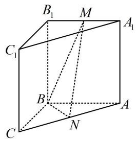

证明：（要证线面平行，先考虑在面内找与已知直线平行的直线，故尝试过 $B_{1}$ 作 $MN$ 的平行线 $B_{1}T$ ，作出来就发现 $B_{1}MNT$ 像平行四边形，思路就出来了。可以发现 $T$ 的位置很像中点，故取中点尝试）如图，取 $BC$ 中点 $T$ ，连接 $B_{1}T$ ， $TN$ ，

因为 $N$ 是 $AC$ 中点，所以 $TN \parallel AB$ 且 $TN = \frac{1}{2} AB$

又 $M$ 是 $A_{1}B_{1}$ 的中点，所以 $B_{1}M \parallel AB$ 且 $B_{1}M = \frac{1}{2} AB$ ，故 $TN \parallel B_{1}M$ 且 $TN = B_{1}M$ ，所以四边形 $B_{1}MNT$ 为平行四边形，故 $MN \parallel B_{1}T$ ，

因为 $MN \not\subset$ 平面 $BCC_{1}B_{1}$ ， $B_{1}T \subset$ 平面 $BCC_{1}B_{1}$ ，所以 $MN //$ 平面 $BCC_{1}B_{1}$ .

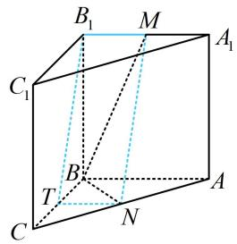

##### 【变式1】如图，在四棱锥 $P - ABCD$ 中， $PA \perp$ 平面 $ABCD$ ， $AD \perp CD$ ， $AD \parallel BC$ ，且 $PA = AD = CD = 2$ ， $BC = 3$ ， $E$ 是 $PD$ 的中点，点 $F$ 在 $PC$ 上，且 $PF = 2FC$ 。证明： $DF \parallel$ 平面 $PAB$ .

证明：（过 $A$ 作 $DF$ 的平行线交 $PB$ 于 $M$ ， $MADF$ 很像平行四边形，但 $M$ 不像中点。要确定 $M$ 的位置，可逆推，若 $MADF$ 是平行四边形，则 $MF \parallel AD$ ，而 $AD \parallel BC$ ，故 $MF \parallel BC$ ， $M$ 在 $PB$ 上的位置就找到了）在棱 $PB$ 上取点 $M$ ，使 $PM = 2MB$ ，因为 $PF = 2FC$ ，所以 $MF \parallel BC$ ，且 $MF = \frac{2}{3} BC$ ，

又由题意， $AD \parallel BC$ ，且 $AD = 2$ ， $BC = 3$ ，所以 $AD = \frac{2}{3} BC$

故 $MF \parallel AD$ 且 $MF = AD$ ，所以四边形 $MADF$ 是平行四边形，故 $DF \parallel AM$ ，又 $DF \not\subset$ 平面 $PAB$ ， $AM \subset$ 平面 $PAB$ ，所以 $DF \parallel$ 平面 $PAB$ .

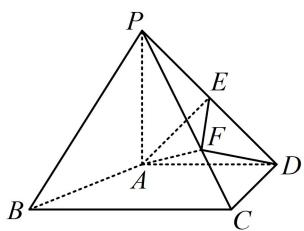

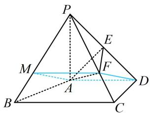

##### 【变式2】如图，四棱台 $ABCD - A_{1}B_{1}C_{1}D_{1}$ 的下底面和上底面分别是边长为4和2的正方形，侧棱 $CC_{1}$ 上的点 $E$ 满足 $\frac{C_1E}{C_1C} = \frac{1}{3}$ ，证明：直线 $A_{1}B //$ 平面 $AD_{1}E$ .

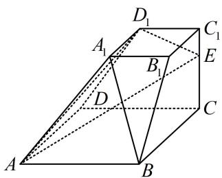

证明: (过 $D_{1}$ 作 $A_{1}B$ 的平行线, 若另一端点取在 $AE$ 上, 则其位置不好确定, 且不构成平行四边形, 这是因为 $AD_{1}E$ 还不是四棱台的完整截面, 得把完整的截面画出来, 才能看出端倪. 要画此截面, 可延长截面 $AD_{1}E$ 中位于表面的线来扩大截面, 所以我们延长 $D_{1}E$ , 找它与棱 $DC$ 的交点)

如图，延长 $D_{1}E$ ， $DC$ 交于点 $F$ ，则 $F$ 为面 $AD_{1}E$ 和面ABCD的一个公共点，

又 $A$ 也为此二面的公共点，所以连接 $AF$ 交 $BC$ 于 $N$ ，则 $AF$ 即为面 $AD_{1}E$ 和面ABCD的交线，连接NE，（截面就补充完整了，此时我们再观察图形，发现 $D_{1}N$ 就是要找的平行线，下面先论证 $N$ 的位置）

由图可知 $\triangle EC_{1}D_{1}\sim \triangle ECF$ ，所以 $\frac{C_1D_1}{CF} = \frac{C_1E}{CE} = \frac{1}{2}$ ，故 $CF = 2C_1D_1 = 4$

所以 $CF = AB$ ，结合 $\angle FCN = \angle ABN = 90^{\circ}$ ， $\angle CNF = \angle BNA$ 可得 $\triangle ABN\cong \triangle FCN$

所以 $NB = NC$ ，从而 $N$ 为 $BC$ 中点，故 $BN = 2 = A_{1}D_{1}$

又 $A_{1}D_{1} \parallel B_{1}C_{1}$ , $BN \parallel B_{1}C_{1}$ , 所以 $A_{1}D_{1} \parallel BN$ ,

从而四边形 $A_{1}D_{1}NB$ 是平行四边形，故 $A_{1}B \parallel D_{1}N$

又 $A_{1}B \not\subset$ 平面 $AD_{1}E$ ， $D_{1}N \subset$ 平面 $AD_{1}E$

所以 $A_{1}B$ // 平面 $AD_{1}E$ .

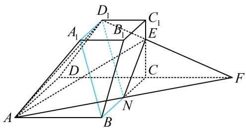

【总结】①证线面平行，先尝试找线，可在已知平面内作已知直线的

平行线，观察所得图形的特征，如有无平行四边形等；②取中点连线是立几大题里频率最高的辅助线作法，但不是唯一的作法；③若截面不完整，可尝试画出完整截面再观察.

# 类型 II：两个重要图形的运用

【例 2】如图, 四边形 ABCD 为矩形, $AF \perp$ 平面 ABCD, $EF \parallel AB$ , AD = 2,

$AB = AF = 2EF = 1$ ，点 $P$ 为 $DF$ 的中点.证明： $BF / /$ 平面APC.

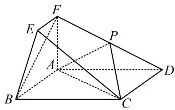

证明: (若过 $P$ 在面内作 $BF$ 的平行线, 可发现得到的显然不是平行四边形, 那怎么办? 我们发现 $BF$ 和 $D$ 分居于面 $APC$ 两侧, 由内容提要 2 的①可知只需连接 $FD$ , $BD$ , 证明 $BF$ 平行于交线 $PQ$ 即可)

如图，连接 $BD$ 交 $AC$ 于点 $Q$ ，连接 $PQ,$

因为四边形 $ABCD$ 为矩形，所以 $Q$ 为 $BD$ 中点，

又 $P$ 为 $DF$ 中点，所以 $PQ \parallel BF,$

因为 $BF \not\subset$ 平面 $APC, PQ \subset$ 平面 $APC$ , 所以 $BF \parallel$ 平面 $APC$ .

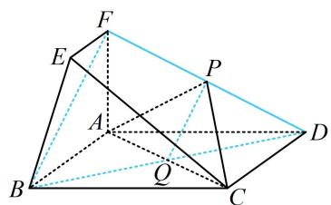

##### 【变式】如图， $PD \perp$ 梯形ABCD所在平面， $\angle ADC = \angle BAD = 90^{\circ}$ ， $F$ 为 $PA$ 的中点， $PD = \sqrt{2}$ ， $AB = AD = \frac{1}{2} CD = 1$ ，四边形PDCE为矩形。证明：AC // 平面DEF.

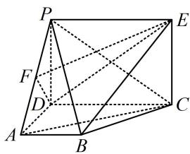

证明：（P 和 AC 位于平面 DEF 两侧，连接端点，交线就出来了）

如图，设 $PC \cap DE = Q$ ，连接 $FQ$

因为四边形 $PDCE$ 为矩形，所以 $Q$ 为 $PC$ 的中点，

又 $F$ 是 $PA$ 的中点，所以 $FQ \parallel AC$ ,

因为 $AC \not\subset$ 平面 $DEF, FQ \subset$ 平面 $DEF$ , 所以 $AC \parallel$ 平面 $DEF$ .

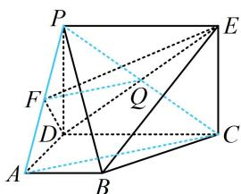

【例 3】（2022·天津卷（节选））直三棱柱 $ABC-A_{1}B_{1}C_{1}$ 中， $AA_{1}=AB=AC=2$ ， $AA_{1}\perp AB$ ， $AC\perp AB$ ，D 为 $A_{1}B_{1}$ 中点，E 为 $AA_{1}$ 中点，F 为 CD 中点，证明：EF//平面 ABC.

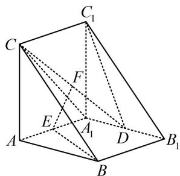

证明: (相对于 $EF$ , 面 $ABC$ 的对侧没有点, 但观察发现 $CF$ 上有点 $D$ , 且 $D$ 和 $EF$ 位于面 $ABC$ 的同侧, 符合内容提要 2 中②的重要图形, 故连接 $DE$ 并延长, 找到与面 $ABC$ 的交点, 平行线就作出来了)

如图，延长 DE 和 BA 交于点 G，连接 CG，

由题意，面 $ABB_{1}A_{1}$ 是矩形，E 为 $AA_{1}$ 中点，

所以 $\angle EAG = \angle EA_{1}D = 90^{\circ}$ ， $AE = A_{1}E$

又 $\angle AEG = \angle A_{1}ED$ ，所以 $\triangle AEG\cong \triangle A_{1}ED$ ，故 $GE = DE$

所以 E 为 GD 中点，又 F 是 CD 中点，所以 $EF \parallel CG$ ，

因为 $EF \not\subset$ 平面 $ABC, CG \subset$ 平面 $ABC$ , 所以 $EF \parallel$ 平面 $ABC$ .

【总结】可以发现，只要题目中出现了两个重要图形，对应连线就可轻松找到思路.

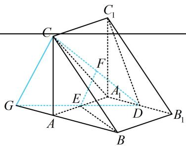

# 类型III：造面面平行的思路

##### 【例4】如图, 四边形ABCD是正方形, $PA \perp$ 平面ABCD, $EB \parallel PA$ , $AB = PA = 4$ , $EB = 2$ , $F$ 为PD的中点, 证明: $BD \parallel$ 平面PEC.

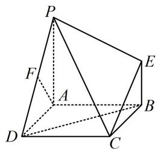

证明: (过 $E$ 在 $\triangle PEC$ 内作 $BD$ 的平行线, 不构成 $\square$ , 同侧与对面也没有点, 咋办? 这种情况可尝试造面, 先找过 $B$ 与面 $PEC$ 平行的直线, 可过 $B$ 作 $PE$ 的平行线 $BT$ , 则 $BT \parallel$ 面 $PEC$ , 接下来只需证 $TD \parallel$ 面 $PEC$ 即可, 显然可以猜想 $T$ 为 $PA$ 中点)如图，取 $PA$ 中点 $T$ ，连接 $BT$ ， $DT$ ， $TE$ ，因为 $PA = 4$ ，所以 $PT = 2$ ，又 $EB = 2$ ，所以 $PT = EB$ 结合 $EB \parallel PA$ 可得四边形BEPT是平行四边形，所以 $BT \parallel PE$ 因为 $BT \not\subset$ 平面 $PCE, PE \subset$ 平面 $PCE$ , 所以 $BT \parallel$ 平面 $PCE$ ①,又 $AT = BE = 2$ ， $AT / / BE$ ，所以四边形ABET是平行四边形，故 $TE / / AB$ 且 $TE = AB$ 因为四边形 $ABCD$ 是正方形，所以 $CD \parallel AB$ 且 $CD = AB$ ，故 $TE \parallel CD$ 且 $TE = CD$ 所以四边形 $CDTE$ 为平行四边形，故 $DT \parallel CE$ 因为 $DT \not\subset$ 平面 $PCE, CE \subset$ 平面 $PCE$ , 所以 $DT \parallel$ 平面 $PCE$ ②,因为 $DT$ ， $BT\subset$ 平面BDT， $DT\cap BT = T$ ，结合①②得平面BDT//平面PCE，又 $BD\subset$ 平面BDT，所以 $BD / /$ 平面PCE.

【总结】通过构造面面平行来证线面平行，常见的方法是过线段端点作面的平行线.

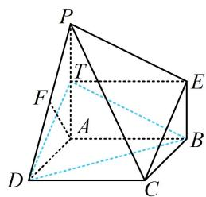

# 类型IV：线面平行、面面平行的性质定理的应用

【例 5】如图，在四棱锥 P-ABCD 中，底面 ABCD 是正方形，点 F 为棱 PC 上的点，平面 ADF 与棱 PB 交于点 E，证明：EF//AD.

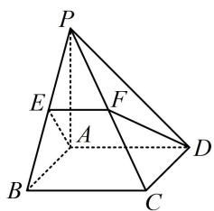

证明: (点 $E$ 是以线面交点的形式给出的, 要证的是线线平行, 这时常考虑用线面平行或面面平行的性质定理, 把 $EF$ 看成平面 $ADF$ 与平面 $PBC$ 的交线, 我们发现只需证 $AD \parallel$ 平面 $PBC$ ) 因为底面 $ABCD$ 是正方形, 所以 $AD \parallel BC$ , 又 $AD \not\subset$ 平面 $PBC$ , $BC \subset$ 平面 $PBC$ , 所以 $AD \parallel$ 平面 $PBC$ , 因为 $AD \subset$ 平面 $ADF$ , 平面 $ADF \cap$ 平面 $PBC = EF$ , 所以 $AD \parallel EF$ .

##### 【例6】如图,矩形ACFE中, $AE = 1$ , $AE \perp$ 平面ABCD, $AB \parallel CD$ , $\angle BAD = 90^{\circ}$ $AB = 1$ , $AD = CD = 2$ , 平面ADF与棱BE交于点G, 求证: $AG \parallel DF$ .

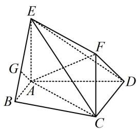

证明: (G 是面 ADF 与棱 BE 交点, 意味着 AG 是面 ADF 与面 ABE 的交线, 考虑用线面平行或面面平行的性质定理, 由图可猜测平面 ABE 与平面 CDF 平行, 故用面面平行的性质定理证明结论)

由题意，ACFE 是矩形，所以 $CF \parallel AE$ ，又 $CF \not\subset$ 平面 $ABE$ ， $AE \subset$ 平面 $ABE$ ，所以 $CF \parallel$ 平面 $ABE$ ①，因为 $AB \parallel CD$ ， $CD \not\subset$ 平面 $ABE$ ， $AB \subset$ 平面 $ABE$ ，所以 $CD \parallel$ 平面 $ABE$ ②，

因为 $CF$ ， $CD \subset$ 平面 $CDF$ ， $CF \cap CD = C$ ，结合①②可得平面 $CDF \parallel$ 平面 $ABE$

由题意，平面 $ADF \cap$ 平面 $CDF = DF$ ，平面 $ADF \cap$ 平面 $ABE = AG$ ，所以 $AG \parallel DF$ .

【总结】何时该用线面平行、面面平行的性质定理？①需要证明线线平行；②几何体中存在某条直线是以面面相交，或某个点是以线面交点的形式给出的；③题干已经给出了线面平行或面面平行这类条件。具备这三个特征中的任何一个，就可以考虑用线面平行、面面平行的性质定理来解决问题。

# 强化训练

##### 1. (2024·江苏南京模拟（节选）·★★)

如图，在四面体 $ABCD$ 中， $\triangle ACD$ 是边长为 3 的正三角形， $\triangle ABC$ 是以 $AB$ 为斜边的等腰直角三角形， $E, F$ 分别为线段 $AB, BC$ 的中点， $\overrightarrow{AM} = 2\overrightarrow{MD}$ ， $\overrightarrow{CN} = 2\overrightarrow{ND}$ ，求证： $EF //$ 平面 $MNB$ .

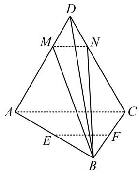

##### 2. (2024·广东广州一模（节选）·★★)

如图, 在四棱锥 $P - A B C D$ 中, 底面 $A B C D$ 是边长为 2 的菱形, $\triangle D C P$ 是等边三角形, $\angle D C B = \angle P C B = \frac {\pi}{4}$ , 点 $M, N$ 分别为 $D P$ 和 $A B$ 的中点, 求证: $M N / /$ 平面 $P B C$ .

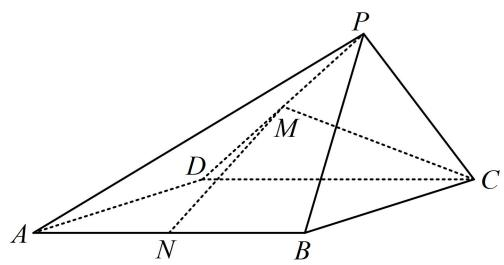

##### 3. (2024·广东模拟（节选）·★★)

如图，在直三棱柱 $ABC - A_{1}B_{1}C_{1}$ 中， $D$ 为 $A_{1}B_{1}$ 的中点，证明： $B_{1}C \parallel$ 平面 $AC_{1}D$ 。

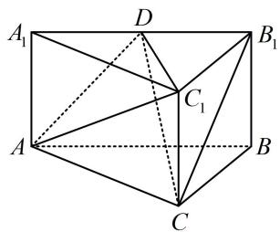

##### 4. (2023·山东潍坊三模（节选）·★★☆）

如图， $P$ 为圆锥的顶点， $O$ 是圆锥底面的圆心， $AC$ 为底面直径， $\triangle ABD$ 为底面圆 $O$ 的内接正三角形，且边长为 $\sqrt{3}$ ，点 $E$ 在母线 $PC$ 上，且 $AE = \sqrt{3}$ ， $CE = 1$ ，求证：直线 $PO //$ 平面 $BDE$ .

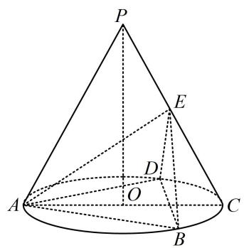

##### 5. (2023·广东六校联考（节选）·★★☆)

如图, 在四棱锥 $P - ABCD$ 中, 侧面 $\triangle PAD$ 是正三角形, 且与底面 $ABCD$ 垂直, $BC \parallel$ 平面 $PAD$ , $BC = \frac{1}{2} AD = 1$ , $E$ 是棱 $PD$ 上的动点, 当 $E$ 是棱 $PD$ 的中点时, 求证: $CE \parallel$ 平面 $PAB$ .

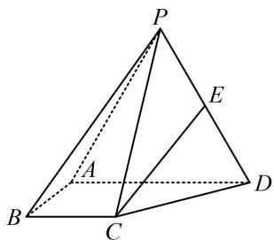

##### 6. (2023·湖北模拟（节选）·★★)

如图， $AE \perp$ 平面ABCD， $BF / /$ 平面ADE， $CF / / AE$ ， $AD \perp AB$ ， $AB = AD = 2$ ， $AE = BC = 4$ ，证明： $AD / / BC.$

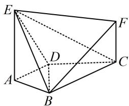

##### 7. (★★☆)

如图，三棱柱 $ABC - A_{1}B_{1}C_{1}$ 的所有棱长均为 2， $\angle BAC = \angle BAA_{1} = \angle CAA_{1} = 60^{\circ}$ ， $P, Q$ 分别在 $AB$ ， $A_{1}C_{1}$ 上（不包括端点）， $AP = A_{1}Q$ ，证明： $PQ //$ 平面 $BCC_{1}B_{1}$ .

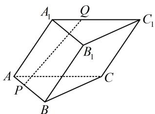

##### 8. (2022·新课标Ⅱ卷（节选）·★★★)

如图， $PO$ 是三棱锥 $P - ABC$ 的高， $PA = PB$ ， $AB\bot AC$ ， $E$ 为 $PB$ 的中点，证明： $OE / /$ 平面 $PAC.$

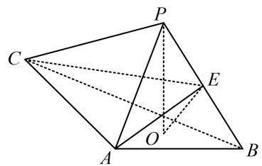

