# 强化训练

##### 1. (2023·四川成都模拟（节选）·★★)

如图，在三棱锥 $P - ABC$ 中， $AB$ 是 $\triangle ABC$ 的外接圆直径， $PC$ 垂直于圆所在的平面， $D$ ， $E$ 分别是棱 $PB$ ， $PC$ 的中点，证明： $DE \perp$ 平面 $PAC$ .

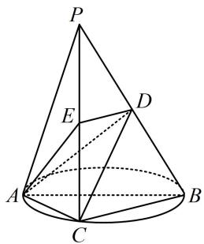

##### 1. 证明: (D, E 都是中点, 联想到中位线, 故可借助 $DE \parallel BC$

把结论转化为证 $BC \perp$ 平面 PAC)

因为 $PC \perp$ 平面 $ABC, BC \subset$ 平面 $ABC$ , 所以 $BC \perp PC$ ,

又 $AB$ 是 $\triangle ABC$ 的外接圆直径，所以 $BC \perp AC$

因为 $PC$ ， $AC\subset$ 平面 $PAC$ ， $PC\cap AC = C$

所以 $BC \perp$ 平面 $PAC$ , 又 $D, E$ 分别是棱 $PB, PC$ 的中点,

所以 $DE \parallel BC$ ，故 $DE \perp$ 平面 $PAC$ .

##### 2. (2023·陕西榆林一模（节选）·★★)

如图，在四棱锥 $P - ABCD$ 中，平面 $PAD \perp$ 平面 $ABCD, AB \parallel CD, \angle DAB = 60^{\circ}, PA \perp PD$ ，且 $PA = PD = \sqrt{2}$ ， $AB = 2CD = 2$ ，证明： $AD \perp PB$ .

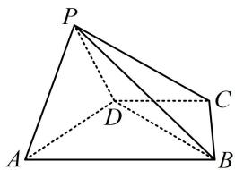

##### 2. 证明: (条件中有面 $PAD \perp$ 面 $ABCD$ , 可构造线面垂直, 找

到 $PB$ 在平面ABCD内的射影，结合三垂线定理，我们发现只需证 $AD$ 与该射影垂直即可）

如图，取 $AD$ 中点 $O$ ，连接 $OP$ ，OB，因为 $PA = PD =$

$\sqrt{2}$ ，所以 $PO \perp AD$ ，又 $PA \perp PD$ ，所以 AD = 2，

因为 $AB = 2$ ， $\angle DAB = 60^{\circ}$ ，所以 $\triangle ADB$ 是正三角形，

故 $AD \perp OB$ ，因为 $OP, OB \subset$ 平面 $POB, OP \cap OB = O$ ，

所以 $AD \perp$ 平面 $POB$ ，又 $PB \subset$ 平面 $POB$ ，所以 $AD \perp PB$ .

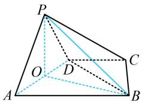

# 3. (2020·新课标Ⅰ卷(节选)·★★☆)

如图, $D$ 为圆锥的顶点, $O$ 是圆锥底面的圆心, $\triangle ABC$ 是底面的内接正三角形, $P$ 为 $DO$ 上一点, $\angle APC = 90^{\circ}$ , 证明: 平面 $PAB \perp$ 平面 $PAC$ .

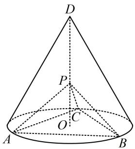

# 3. 证法1：（要证面面垂直，又已知交线，故只需在一个面内

找与交线垂直的直线，它必垂直于另一个面，由 $\angle APC = 90^{\circ}$ 可发现应选 $PC$ ，证 $PC \perp$ 面 $PAB$ 即可，而要证这一结果，还需证 $PC \perp AB$ 或 $PB$ ，下面先考虑证 $PC \perp AB$ ，注意到 $PC$ 在面 $ABC$ 内的射影是 $CO$ ，故只需证 $AB \perp CO$ ）

如图1，连接 $CO$ 并延长，交 $AB$ 于点 $G$

则 $G$ 为 $AB$ 中点，且 $AB \perp CG$ ，

因为 $PO \perp$ 平面 $ABC, AB \subset$ 平面 $ABC$ , 所以 $AB \perp PO$ ,

又 $CG, PO \subset$ 平面 $POC$ , $CG \cap PO = O$ ,

所以 $AB \perp$ 平面 POC,

因为 $PC \subset$ 平面 $POC$ ，所以 $AB \perp PC$ ，

由题意， $\angle APC = 90^{\circ}$ ，所以 $PA\bot PC$

又 $PA, AB \subset$ 平面 $PAB, PA \cap AB = A$ ,

所以 $PC \perp$ 平面 $PAB$ ,

因为 $PC \subset$ 平面 $PAC$ , 所以平面 $PAB \perp$ 平面 $PAC$ .

证法 2: (也可通过证 $PC \perp PB$ 来证 $PC \perp$ 平面 $PAB$ , 只需证 $\triangle PAC \cong \triangle PBC$ , 观察发现又只需证 $PA = PB$ , 要证这一结果, 可通过证 $\triangle POA \cong \triangle POB$ 来完成)

如图2，连接 $OA$ ，OB，则 $OA = OB$

由题意， $PO \perp$ 平面 ABC，OA，OB ⊂ 平面 ABC，

所以 $PO \perp OA$ ， $PO \perp OB$ ，故 $\angle POA = \angle POB = 90^{\circ}$

结合 $PO = PO$ 可得 $\triangle POA\cong \triangle POB$ ，所以 $PA = PB$

又 $\triangle ABC$ 是正三角形，所以 $AC = BC$ ，

结合 $PC = PC$ 可得 $\triangle PAC \cong \triangle PBC$

所以 $\angle BPC = \angle APC = 90^{\circ}$ ，故 $PC\bot PB$ ， $PC\bot PA$

又 $PA, PB \subset$ 平面 $PAB, PA \cap PB = P$ ,

所以 $PC \perp$ 平面 $PAB$ ,

因为 $PC \subset$ 平面 $PAC$ , 所以平面 $PAB \perp$ 平面 $PAC$ .

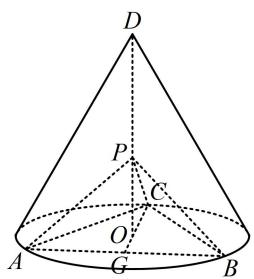

图1

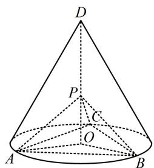

图2

##### 4. (2023·湖南模拟（节选）·★★☆)

如图，在四棱锥 $P - ABCD$ 中，平面 $PAD \perp$ 平面 $ABCD$ ，底面 $ABCD$ 是菱形， $\triangle PAD$ 是正三角形， $\angle ABC = \frac{2\pi}{3}$ ， $E$ 是 $AB$ 的中点，证明： $AC \perp PE$ 。

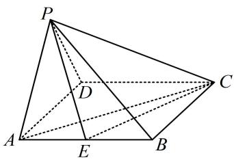

##### 4. 证明：（证线线垂直，需找线面垂直，若无思路，可尝试逆

推. 假设 $AC \perp PE$ , 若能再找一个与 $AC$ 或 $PE$ 有关的线线垂直与之组合, 就能得到线面垂直, 找谁呢? 看到面 $PAD \perp$ 面 $ABCD$ , 想到最常见的辅助线: 过 $P$ 作 $AD$ 的垂线 $PO$ , 得到 $PO \perp$ 底面 $ABCD$ , 于是 $PO \perp$ 该面内所有直线, 哪条有用呢? 显然是 $AC$ , 故可通过证 $AC \perp$ 面 $POE$ 来证本题的结论)

如图，取 $AD$ 中点 $O$ ，连接 $PO, OE$ ，因为 $\triangle PAD$ 是正三角形， $O$ 是 $AD$ 的中点，所以 $PO \perp AD$

因为平面 $PAD \perp$ 平面 $ABCD$ ，且平面 $PAD \cap$ 平面 $ABCD = AD$ ， $PO \subset$ 平面 $PAD$ ，所以 $PO \perp$ 平面 $ABCD$ ，

因为 $AC \subset$ 平面 ABCD，所以 $AC \perp PO$ ①，

因为 $ABCD$ 是菱形，所以 $AC \perp BD$ ，又因为 $O, E$ 分别为 $AD, AB$ 的中点，所以 $OE \parallel BD$ ，故 $AC \perp OE$ ，

结合①以及 $PO$ ， $OE \subset$ 平面 $POE$ ， $PO \cap OE = O$ 可得 $AC \perp$ 平面 $POE$ ，因为 $PE \subset$ 平面 $POE$ ，所以 $AC \perp PE$ ：

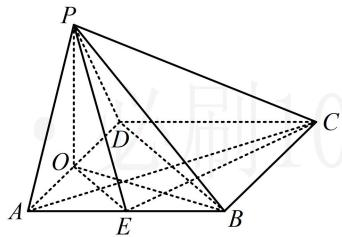

##### 5. (2024·河南模拟（节选）·★★★)

如图，在三棱柱 $ABC - A_{1}B_{1}C_{1}$ 中， $AA_{1} \perp$ 平面 $ABC$ ， $AB_{1} \perp A_{1}C$ ， $AB \perp BC$ ， $AB = BC = 2$ ，求证： $AB_{1} \perp$ 平面 $A_{1}BC$ 。

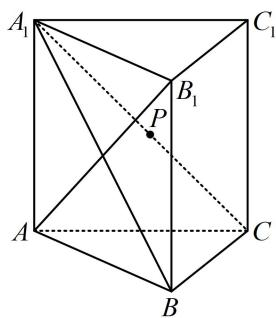

##### 5. 证明：(要证 $AB_{1} \perp$ 面 $A_{1}BC$ , 需证 $AB_{1} \perp$ 该面内的两条)

相交直线. 已有 $AB_{1} \perp A_{1}C$ ，另一条选谁呢？不外乎 $A_{1}B$ 或 $BC$ ，题干还给出了 $AB \perp BC$ ，故考虑选 $BC$ ，怎样证 $AB_{1} \perp BC$ ？若无思路，可尝试逆推，假设 $AB_{1} \perp BC$ ，结合 $AB \perp BC$ 可得 $BC \perp$ 面 $ABB_{1}A_{1}$ ，故可通过证此线面垂直来证明 $AB_{1} \perp BC$ ）

因为 $AA_{1} \perp$ 平面 $ABC, BC \subset$ 平面 $ABC$ , 所以 $AA_{1} \perp BC$ ,

又 $AB \perp BC$ ， $AB \subset$ 平面 $ABB_{1}A_{1}$ ， $AA_{1} \subset$ 平面 $ABB_{1}A_{1}$

$AB \cap AA_{1} = A$ ，所以 $BC \perp$ 平面 $ABB_{1}A_{1}$ ，

因为 $AB_{1} \subset$ 平面 $ABB_{1}A_{1}$ ，所以 $AB_{1} \perp BC$ ，

因为 $AB_{1} \perp A_{1}C$ ，且 $A_{1}C$ ， $BC \subset$ 平面 $A_{1}BC$ ，

$A_{1}C \cap BC = C$ ，所以 $AB_{1} \perp$ 平面 $A_{1}BC$ .

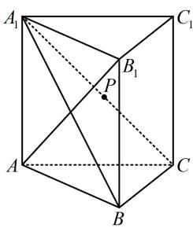

##### 6. (2024·湖北武汉四调（节选）·★★★☆)

如图，三棱柱 $ABC - A_{1}B_{1}C_{1}$ 中，侧面 $ABB_{1}A_{1}\perp$ 底面 $ABC$ ， $AB = BB_{1} = 2$ ， $AC = 2\sqrt{3}$ ， $\angle B_1BA = 60^\circ$ ，点 $D$ 是棱 $A_{1}B_{1}$ 的中点， $\overrightarrow{BC} = 4\overrightarrow{BE}$ ， $DE\perp BC$ ，证明： $AC\perp BB_{1}$

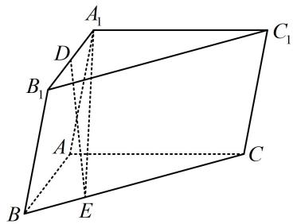

##### 6. 证明：（怎样证 $AC \perp BB_{1}$ ？证线线垂直，常找线面垂直，

若无思路，可尝试逆推. 假设 $AC \perp BB_{1}$ ，题干还有侧面 $ABB_{1}A_{1} \perp$ 底面 $ABC$ ，于是面 $ABB_{1}A_{1}$ 内还存在与面 $ABC$ 垂直的直线， $AC$ 应垂直于该直线，结合 $AC \perp BB_{1}$ 可得 $AC \perp$ 面 $ABB_{1}A_{1}$ ，故可通过证此线面垂直来证明 $AC \perp BB_{1}$ . 下面我们先用面面垂直构造一个线面垂直出来）

如图，连接 $DA$ ，EA，由题意， $DA_{1} = 1$ ， $AA_{1} = 2$

$\angle DA_{1}A = \angle B_{1}BA = 60^{\circ}$ ，在 $\triangle AA_{1}D$ 中，由余弦定理，

$A D ^ {2} = A _ {1} D ^ {2} + A A _ {1} ^ {2} - 2 A _ {1} D \cdot A A _ {1} \cdot \cos \angle D A _ {1} A$

$= 1 ^ {2} + 2 ^ {2} - 2 \times 1 \times 2 \times \cos 6 0 ^ {\circ} = 3,$

所以 $DA = \sqrt{3}$ ，从而 $DA^{2} + DA_{1}^{2} = AA_{1}^{2}$ ，故 $DA\bot DA_{1}$

又 $AB \parallel DA_{1}$ ，所以 $DA \perp AB$ ，

因为平面 $ABB_{1}A_{1}\perp$ 平面 $ABC$ ，且两平面的交线为 $AB$ ， $DA\bot AB$ ， $DA\subset$ 平面 $ABB_{1}A_{1}$ ，所以 $DA\bot$ 平面 $ABC$

又因为 $AC \subset$ 平面 ABC，所以 $AC \perp DA$ ，

（还需在面 $ABB_{1}A_{1}$ 内找一条直线，证该直线 $\perp AC$ ，选谁呢？注意到题干给了 $BC\perp DE$ ，结合 $BC\perp DA$ 得 $BC\perp$ 面 $ADE$ ，于是 $BC\perp AE$ ，又有 $\overrightarrow{BC} = 4\overrightarrow{BE}$ ，由此可研究 $\triangle ABC$ 的各边长，通过验证 $\triangle ABC$ 的三边满足勾股定理来证 $AC\perp AB$ ，故选 $AB)$ 因为 $DA\perp$ 平面 $ABC$ ， $BC\subset$ 平面 $ABC$ ，所以 $DA\perp BC$ ，

又 $DE \perp BC$ ， $DA \cap DE = D$ ，且 $DA$ ， $DE \subset$ 平面 $ADE$ ，所以 $BC \perp$ 平面 $ADE$

因为 $AE \subset$ 平面 $ADE$ ，所以 $BC \perp AE$ ，

设 BE = t ，因为 $\overrightarrow{BC} = 4\overrightarrow{BE}$ ，所以 CE = 3t ，

由 $AE^2 = AB^2 - BE^2 = AC^2 - CE^2$ 可得 $4 - t^2 = 12 - 9t^2$

解得：t=1，所以 BC=4t=4，

从而 $AB^{2} + AC^{2} = 16 = BC^{2}$ ，故 $AC\perp AB$

又因为 $AC \perp DA$ ，且 DA， $AB \subset$ 平面 $ABB_{1}A_{1}$ ，

$DA \cap AB = A$ ，所以 $AC \perp$ 平面 $ABB_{1}A_{1}$

因为 $BB_{1}\subset$ 平面 $ABB_{1}A_{1}$ ，所以 $AC\bot BB_{1}$

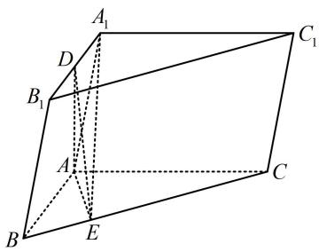

