# 第 3 节 空间点、线、面的位置关系综合小题（★★☆）

# 内容提要

本节题目解题的一般方法是根据题干的描述进行空间想象, 画出图形, 判断正误. 画图的基本顺序是: 先画面面, 再画线面, 最后添线; 若较难想象, 也可借助常见几何体 (如正方体等) 来辅助判断.

##### 【例1】设 $\alpha$ ， $\beta$ 为两个平面，则 $\alpha // \beta$ 的充要条件是（）

$\quad$A. $\alpha$ 内有无数条直线与 $\beta$ 平行

$\quad$B. $\alpha$ 内有两条相交直线与 $\beta$ 平行

$\quad$C. $\alpha, \beta$ 平行于同一条直线

$\quad$D. $\alpha, \beta$ 垂直于同一平面

解析由面面平行的判定定理可以得出B项正确，其余选项为什么错，我们画图来解释，

如图1， $\alpha$ 内有 $a, b, c$ 等无数条平行线均与 $\beta$ 平行，但 $\alpha$ 与 $\beta$ 不平行，故A项错误；

如图2， $\alpha$ 和 $\beta$ 都与直线 $a$ 平行，但 $\alpha$ 与 $\beta$ 不平行，故C项错误；

如图3， $\alpha$ 和 $\beta$ 都与 $\gamma$ 垂直，但 $\alpha$ 与 $\beta$ 不平行，故D项错误.

答案: B

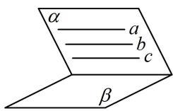  
图1

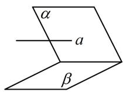  
图2

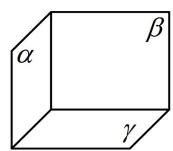  
图3

【例 2】（多选）已知 m，n 是不同的直线， $\alpha$ ， $\beta$ 是不同的平面，则下列命题中正确的有（）

$\quad$A. 若 $m \parallel \alpha, m \parallel \beta, \alpha \cap \beta = n$ ，则 $m \parallel n$   
$\quad$B. 若 $m \parallel n, n \subset \alpha$ ，则 $m \parallel \alpha$   
$\quad$C. 若 $m \perp \alpha, n \perp \beta, m \perp n$ , 则 $\alpha \perp \beta$   
$\quad$D. 若 $m \perp \alpha, m \perp n, \alpha \parallel \beta$ , 则 $n \parallel \beta$

解析A 项，如图 1，可以想象 A 项正确，若要证明，由于已知线面平行，故用线面平行的性质定理，在 $\alpha$ 内取不与 $n$ 重合的直线 $m'$ ，使 $m \parallel m'$ ，则 $m' \parallel \beta$ ，因为 $m' \subset \alpha$ ， $\alpha \cap \beta = n$ ，所以 $m' \parallel n$ ，故 $m \parallel n$ ；

B项，观察发现判定线面平行的条件不够，还差 $m \not\subset \alpha$ ，故B项错误，如图2；

C 项，如图 3，由图可知 C 项正确；  
D项，有面面平行，可先画两个平行的平面，再往里面添线，如图4， $n$ 可以在 $\beta$ 内，故D项错误

答案: AC

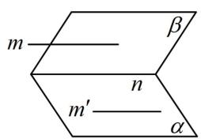

图1

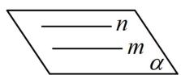  
图2

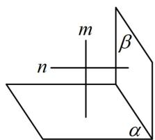

图3

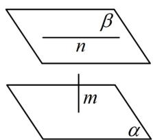

图4

##### 【例3】（多选）已知 $m, n$ 是两条不同的直线， $\alpha, \beta$ 是两个不同的平面，则下列说法错误的是

( )

$\quad$A. 若 $m \perp \alpha, \alpha \perp \beta$ ，则 $m \parallel \beta$   
$\quad$B. 若 $m \parallel \alpha, \alpha \parallel \beta$ , 则 $m \parallel \beta$   
$\quad$C. 若 $m \subset \alpha, n \subset \alpha, m \parallel \beta, n \parallel \beta$ ，则 $\alpha \parallel \beta$   
$\quad$D. 若 $m \perp \alpha, m \perp \beta, n \perp \alpha$ , 则 $n \perp \beta$

解析A项，有面面关系 $\alpha \perp \beta$ ，先画这两个面，再画线 $m$ ，如图1， $m$ 可以在 $\beta$ 内，故A项错误；

B项，有面面关系 $\alpha // \beta$ ，先画它们，再由 $m // \alpha$ 画 $m$ ，如图2， $m$ 可以在 $\beta$ 内，故B项错误；

C 项，没说 m，n 相交，不能判定 $\alpha \parallel \beta$ ，如图 3，故 C 项错误；D 项，如图 4，D 项正确.

答案: ABC

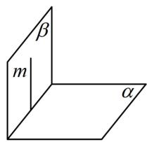

图1

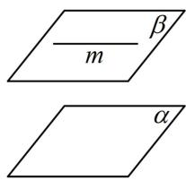

图2

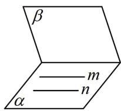

图3

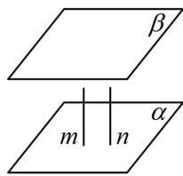

图4

【总结】可以发现，此类题问法多种多样，但我们总是画出草图辅助判断。需注意：想证明选项错误只需一个反例，想说明正确则需要严格的论证，这需要记准所有判定与性质定理。

# 强化训练

##### 1. (2024·湖北武汉四调·★★☆)

设 $m, n$ 是两条不同的直线， $\alpha, \beta$ 是两个不同的平面，则下列命题中正确的是（）

$\quad$A. 若 $\alpha \perp \beta, m \parallel \alpha$ ，则 $m \perp \beta$   
$\quad$B. 若 $\alpha \perp \beta, m \subset \alpha$ ，则 $m \perp \beta$   
$\quad$C. 若 $m \parallel \alpha, n \perp \alpha$ ，则 $m \perp n$   
$\quad$D. 若 $m \perp n, m \parallel \alpha$ ，则 $n \perp \alpha$

##### 2.（2023·全国模拟·★★★）（多选）

已知 $m, n$ 为异面直线，直线 $l$ 与 $m, n$ 都垂直，则下列说法正确的是（）

$\quad$A. 若 $l \perp$ 平面 $\alpha$ ，则 $m \parallel \alpha, n \parallel \alpha$   
$\quad$B. 存在平面 $\alpha$ ，使 $l \perp \alpha$ ， $m \subset \alpha$ ， $n \parallel \alpha$   
$\quad$C. 有且仅有一对互相平行的平面 $\alpha$ 和 $\beta$ , 其中 $m \subset \alpha$ , $n \subset \beta$   
$\quad$D. 有且仅有一对互相垂直的平面 $\alpha$ 和 $\beta$ , 其中 $m \subset \alpha$ , $n \subset \beta$

##### 3. (2023·四省联考·★★★) (多选)

已知平面 $\alpha \cap$ 平面 $\beta = l$ ， $B$ ， $D$ 是 $l$ 上两点，直线 $AB \subset \alpha$ 且 $AB \cap l = B$ ，直线 $CD \subset \beta$ 且 $CD \cap l = D$ ，下列结论中，错误的有（）

$\quad$A. 若 $AB \perp l$ ， $CD \perp l$ ，且 $AB = CD$ ，则ABCD是平行四边形  
$\quad$B. 若 $M$ 是 $AB$ 中点, $N$ 是 $CD$ 中点, 则 $MN \parallel AC$   
$\quad$C. 若 $\alpha \perp \beta$ ， $AB \perp l$ ， $AC \perp l$ ，则 $CD$ 在 $\alpha$ 上的射影是 $BD$   
$\quad$D. 直线 $AB, CD$ 所成角的大小与二面角 $\alpha - l - \beta$ 的大小相等

