# 强化训练

##### 1. (2025·天津卷·★★★)

正方体 $ABCD - A_{1}B_{1}C_{1}D_{1}$ 的棱长为4， $E$ ， $F$ 分别为 $A_{1}D_{1}$ ， $B_{1}C_{1}$ 的中点， $G$ 在棱 $CC_{1}$ 上，且 $CG = 3C_1G$ ：

（1） 求证: $GF \perp$ 平面 $EBF$ ;  
（2） 求平面 $EBF$ 与平面 $EBG$ 夹角的余弦值;  
（3） 求三棱锥 D-BEF 的体积.

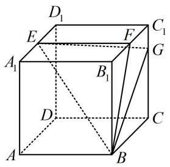

##### 1. 解: （1） (正方体中容易建系, 考虑建系, 用向量法证 $GF \perp$

平面 EBF，只需证 $\overrightarrow{GF} \cdot \overrightarrow{EF} = 0$ 和 $\overrightarrow{GF} \cdot \overrightarrow{EB} = 0$

以 $D$ 为原点建立如图所示的空间直角坐标系，

则 $B(4,4,0)$ ， $E(2,0,4)$ ， $F(2,4,4)$ ， $G(0,4,3)$

所以 $\overrightarrow{GF} = (2,0,1)$ ， $\overrightarrow{EF} = (0,4,0)$ ， $\overrightarrow{EB} = (2,4, - 4)$

从而 $\overrightarrow{GF} \cdot \overrightarrow{EF} = 2 \times 0 + 0 \times 4 + 1 \times 0 = 0$ ,

$\overrightarrow{GF} \cdot \overrightarrow{EB} = 2 \times 2 + 0 \times 4 + 1 \times (-4) = 0$ ，故 $\overrightarrow{GF} \perp \overrightarrow{EF}$ ，

$\overrightarrow{GF} \perp \overrightarrow{EB}$ ，所以 $GF \perp EF$ ， $GF \perp EB$ ，结合 $EF$ ， $EB$ 是平面 $EBF$ 内的相交直线可得 $GF \perp$ 平面 $EBF$ .

（2）（求面面夹角余弦，需要两个面的法向量， $\overrightarrow{GF}$ 可以作为面 $EBF$ 的法向量，故只需求面 $EBG$ 的法向量）

由（1）可得 $\overrightarrow{EG} = (-2,4, - 1)$ ， $\overrightarrow{GB} = (4,0, - 3)$

设平面 $EBG$ 的法向量为 $\pmb {m} = (x,y,z)$

则 $\left\{ \begin{array}{l} \boldsymbol{m} \cdot \overrightarrow{EG} = -2x + 4y - z = 0 \\ \boldsymbol{m} \cdot \overrightarrow{GB} = 4x - 3z = 0 \end{array} \right.$ ，令 $x = 6$ ，则 $\left\{ \begin{array}{l} y = 5 \\ z = 8 \end{array} \right.$ ，

所以 $\boldsymbol{m}=(6,5,8)$ 是平面 EBG 的一个法向量，

由（1）可得 $\overrightarrow{GF} = (2,0,1)$ 是平面 $EBF$ 的一个法向量，

设平面 EBF 与平面 EBG 的夹角为 $\theta$ ，则 $\cos\theta=$

$\left| \cos <   \boldsymbol {m}, \overrightarrow {G F} > \right| = \frac {\left| \boldsymbol {m} \cdot \overrightarrow {G F} \right|}{\left| \boldsymbol {m} \right| \cdot \left| \overrightarrow {G F} \right|} = \frac {\left| 6 \times 2 + 5 \times 0 + 8 \times 1 \right|}{\sqrt {6 ^ {2} + 5 ^ {2} + 8 ^ {2}} \times \sqrt {2 ^ {2} + 1 ^ {2}}} = \frac {4}{5},$

所以平面 $EBF$ 与平面 $EBG$ 夹角的余弦值为 $\frac{4}{5}$ .

（3） (怎样求 $V_{D - BEF}$ ? 不妨以 $BEF$ 为底面, 则高即为点 $D$ 到平面 $BEF$ 的距离, 可用向量法计算, 下面先求此距离)

由（1）可得 $\overrightarrow{DB} = (4,4,0)$ ， $\overrightarrow{GF} = (2,0,1)$ 是平面BEF的一个法向量，所以由点到平面的距离公式，点 $D$ 到平面BEF的距离

$d = \frac {\left| \overrightarrow {D B} \cdot \overrightarrow {G F} \right|}{\left| \overrightarrow {G F} \right|} = \frac {\left| 4 \times 2 + 4 \times 0 + 0 \times 1 \right|}{\sqrt {2 ^ {2} + 1 ^ {2}}} = \frac {8}{\sqrt {5}},$

(再算 $S_{\triangle BEF}$ ，不难发现 $EF \perp BF$ ，下面先用向量法证明)

由（1）可得 $\overrightarrow{EF}=(0,4,0)$ ， $\overrightarrow{BF}=(-2,0,4)$ ，

所以 $EF = |\overrightarrow{EF}| = 4$ ， $BF = |\overrightarrow{BF}| = \sqrt{(-2)^2 + 4^2} = 2\sqrt{5}$

且 $\overrightarrow{EF} \cdot \overrightarrow{BF} = 0 \times (-2) + 4 \times 0 + 0 \times 4 = 0$

所以 $\overrightarrow{EF} \perp \overrightarrow{BF}$ ，从而 $EF \perp BF$

故 $S_{\triangle BEF} = \frac{1}{2} EF\cdot BF = \frac{1}{2}\times 4\times 2\sqrt{5} = 4\sqrt{5}$

所以 $V_{D - BEF} = \frac{1}{3} S_{\triangle BEF}\cdot d = \frac{1}{3}\times 4\sqrt{5}\times \frac{8}{\sqrt{5}} = \frac{32}{3}.$

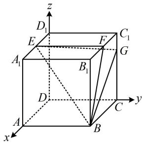

注：由于空间向量计算比较无脑，所以以下题目选取均具有一定灵活性.

##### 2. (2024·广西模拟·★★★)

在六面体 $ABCD - A_{1}B_{1}C_{1}D_{1}$ 中， $AA_{1} \perp$ 平面 $ABCD$ ， $AA_{1} \parallel BB_{1} \parallel CC_{1} \parallel DD_{1}$ ，且底面 $ABCD$ 为菱形.

（1） 证明: $BD \perp$ 平面 $ACC_{1}A_{1}$ ;

（2）若 $AA_{1} = CC_{1} = \frac{7}{2}$ ， $\angle BAD = 60^{\circ}$ ， $AB = BB_{1} =$

2，求平面 $A_{1}B_{1}C_{1}D_{1}$ 与平面ABCD所成二面角的正弦值.

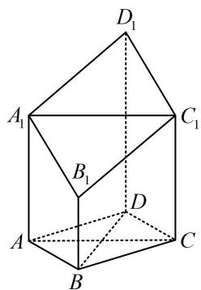

##### 2. 解: （1） (要证线面垂直, 需证直线垂直于平面内的两条相

交直线，这里选面 $ACC_{1}A_{1}$ 内的哪两条相交直线呢？由题设条件不难发现 $AC$ 和 $AA_{1}$ 都与 $BD$ 垂直，所以就选它们）

因为四边形ABCD为菱形，所以 $AC\perp BD$

又 $AA_{1} \perp$ 平面ABCD， $BD \subset$ 平面ABCD，所以 $AA_{1} \perp BD$

因为 $AA_{1} \cap AC = A$ ， $AA_{1} \subset$ 平面 $ACC_{1}A_{1}$ ，

$AC \subset$ 平面 $ACC_{1}A_{1}$ ，所以 $BD \perp$ 平面 $ACC_{1}A_{1}$ .

（2） (图形容易建系, 可考虑直接建系求目标二面角的正弦值) 设 $AC \cap BD = O$ , 以 $O$ 为原点建立如图所示的空间直角坐标系, 因为四边形 $ABCD$ 是菱形, $\angle BAD = 60^{\circ}$ ,

所以 $\triangle ABD$ 和 $\triangle BCD$ 都是正三角形，

又 $AB = 2$ ，所以 $OB = \frac{1}{2} BD = \frac{1}{2} AB = 1$ ， $OA = OC = \sqrt{3}$

故 $A_{1}\left(0, - \sqrt{3},\frac{7}{2}\right),B_{1}(1,0,2),C_{1}\left(0,\sqrt{3},\frac{7}{2}\right),$

所以 $\overrightarrow{A_1B_1} = \left(1,\sqrt{3}, - \frac{3}{2}\right),\quad \overrightarrow{B_1C_1} = \left(-1,\sqrt{3},\frac{3}{2}\right),$

设平面 $A_{1}B_{1}C_{1}D_{1}$ 的法向量为 $\boldsymbol{m}=(x,y,z)$ ,

则 $\left\{ \begin{array}{l} \pmb {m}\cdot \overrightarrow{A_1B_1} = x + \sqrt{3} y - \frac{3}{2} z = 0\\ \pmb {m}\cdot \overrightarrow{B_1C_1} = -x + \sqrt{3} y + \frac{3}{2} z = 0 \end{array} \right.$ ，令 $z = 2$ 得 $\left\{ \begin{array}{l} x = 3\\ y = 0 \end{array} \right.,$

所以 $\boldsymbol{m}=(3,0,2)$ 是平面 $A_{1}B_{1}C_{1}D_{1}$ 的一个法向量，

由图可知 $n = (0,0,1)$ 是平面ABCD的一个法向量，

所以 $\cos < m, n > = \frac{m \cdot n}{|m| \cdot |n|} = \frac{3 \times 0 + 0 \times 0 + 2 \times 1}{\sqrt{3^2 + 2^2} \times 1} = \frac{2\sqrt{13}}{13}$ ,

故所求二面角的正弦值为 $\sqrt{1 - \left(\frac{2\sqrt{13}}{13}\right)^2} = \frac{3\sqrt{13}}{13}$

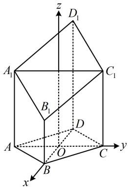

##### 3. (2022·山东模拟·★★★)

如图, 在四棱锥 $P - ABCD$ 中, 底面 $ABCD$ 为正方形, $AB = 2$ , $AP = 3$ , 直线 $PA \perp$ 平面 $ABCD$ , $E$ , $F$ 分别为 $PA$ , $AB$ 的中点, 直线 $AC$ 与 $DF$ 相交于点 $O$ .

（1）证明：OE 与 CD 不垂直；  
（2） 求二面角 B - PC - D 的余弦值.

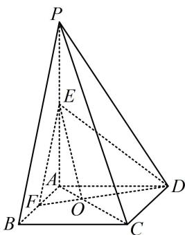

##### 3. 解: （1） (几何法不好证, 但图形本身就有三条两两垂直的

直线，故很方便建系，只需证 $\overrightarrow{OE} \cdot \overrightarrow{CD} \neq 0$

以 $A$ 为原点建立如图所示的空间直角坐标系, 则

$E\left(0,0,\frac{3}{2}\right)$ ， $C(2,2,0)$ ， $D(0,2,0)$ ，所以 $\overrightarrow{CD}=(-2,0,0)$ ，

(求 $\overrightarrow{OE}$ 需要点 O 的坐标，故得找到 O 在 AC 上的位置，可借助相似分析相似比)

由图可知 $\triangle AOF\sim \triangle COD$ ，所以 $\frac{OA}{OC} = \frac{AF}{CD} = \frac{1}{2}$

从而 $OA = \frac{1}{2} OC$ ，故 $OA = \frac{1}{3} AC$

所以 $O\left(\frac{2}{3}, \frac{2}{3}, 0\right)$ ，从而 $\overrightarrow{OE} = \left(-\frac{2}{3}, -\frac{2}{3}, \frac{3}{2}\right)$ ，

故 $\overrightarrow{OE} \cdot \overrightarrow{CD} = \frac{4}{3} \neq 0$ ，所以 $OE$ 与 $CD$ 不垂直.

（2）由图可知， $B(2,0,0)$ ， $P(0,0,3)$

所以 $\overrightarrow{BC} = (0,2,0)$ ， $\overrightarrow{CP} = (-2, - 2,3)$

设平面 BPC，PCD 的法向量分别为 $\boldsymbol{m}=(x_{1},y_{1},z_{1})$ ，

$\boldsymbol{n}=(x_{2},y_{2},z_{2})$ ，则 $\left\{\begin{aligned}\boldsymbol{m}\cdot\overrightarrow{BC}&=2y_{1}=0\\\boldsymbol{m}\cdot\overrightarrow{CP}&=-2x_{1}-2y_{1}+3z_{1}=0\end{aligned}\right.$

所以 $\left\{ \begin{array}{l} y_{1} = 0 \\ -2x_{1} + 3z_{1} = 0 \end{array} \right.$ ，令 $x_{1} = 3$ ，则 $z_{1} = 2$ ，

故 $m = (3,0,2)$ 是平面BPC的一个法向量，

(此处由图可以想象所求二面角为钝角, 若想不出来, 取法向量时, 就取成一个朝内, 一个朝外, 如图)

又 $\left\{ \begin{array}{l} \pmb{n} \cdot \overrightarrow{CP} = -2x_2 - 2y_2 + 3z_2 = 0 \\ \pmb{n} \cdot \overrightarrow{CD} = -2x_2 = 0 \end{array} \right.$ ，所以 $\left\{ \begin{array}{l} x_2 = 0 \\ -2y_2 + 3z_2 = 0 \end{array} \right.$ ，

令 $y_{2} = -3$ ，则 $x_{2} = 0$ ， $z_{2} = -2$

所以 $\boldsymbol{n}=(0,-3,-2)$ 是平面 PCD 的一个法向量，

从而 $\cos < m, n > = \frac{m \cdot n}{|m| \cdot |n|} = \frac{-4}{\sqrt{13} \times \sqrt{13}} = -\frac{4}{13}$ ,

由图可知，二面角 B-PC-D 为钝角，故其余弦值为 $-\frac{4}{13}$ .

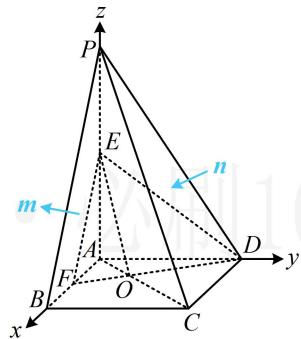

【反思】若看图不易得出二面角的钝锐，可将法向量取成一个朝内，一个朝外，它们的夹角即为二面角，如图.

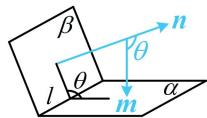

##### 4. (2024·新课标Ⅰ卷·★★★)

如图，四棱锥 $P - ABCD$ 中， $PA \perp$ 底面 $ABCD$ ， $PA = AC = 2$ ， $BC = 1$ ， $AB = \sqrt{3}$ 。

（1） 若 $AD \perp PB$ , 证明: $AD \parallel$ 平面 $PBC$ ;  
（2）若 $AD \perp DC$ ，且二面角 $A - CP - D$ 的正弦值为 $\frac{\sqrt{42}}{7}$ ，求 $AD$ .

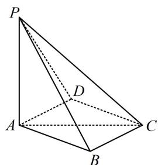

##### 4. 解: （1） (证线面平行, 先找线线平行, 观察图形可猜测

$AD \parallel BC$ ，故尝试找理由）因为 $PA \perp$ 平面ABCD，

$AD \subset$ 平面 ABCD，所以 $AD \perp PA$ ，

又 $AD \perp PB$ ，且 $PA, PB \subset$ 平面 $PAB, PA \cap PB = P$ ，

所以 $AD \perp$ 平面 $PAB$ ,

因为 $AB \subset$ 平面 PAB，所以 $AD \perp AB$ ①，

由题意， $BC = 1$ ， $AB = \sqrt{3}$ ， $AC = 2$

所以 $BC^{2} + AB^{2} = AC^{2}$ ，故 $BC \perp AB$ ②，

由①②以及 $AD$ ， $BC$ ， $AB$ 都是平面ABCD内的直线可得 $AD / / BC$ ，又因为 $AD\not\subset$ 平面PBC， $BC\subset$ 平面PBC，所以 $AD / /$ 平面PBC.

（2） (有 $AD \perp DC$ , 则可以 $D$ 为原点建系, 方便写 $A, C$ 的坐标, 用向量法计算二面角 $A - CP - D$ )

以 $D$ 为原点建立如图所示的空间直角坐标系，

设 $AD = a(0 < a < 2)$ ，则 $CD = \sqrt{AC^2 - AD^2} = \sqrt{4 - a^2}$ ，

所以 $D(0,0,0)$ ， $P(a,0,2)$ ， $A(a,0,0)$ ， $C(0,\sqrt{4 - a^2},0)$

故 $\overrightarrow{DP} = (a,0,2)$ ， $\overrightarrow{CP} = (a, - \sqrt{4 - a^2},2)$ ， $\overrightarrow{AP} = (0,0,2)$

设平面 $DCP$ 和平面 $ACP$ 的法向量分别为 $\pmb {m} = (x_1,y_1,z_1)$

$\pmb {n} = (x_{2},y_{2},z_{2})$ ，则 $\left\{ \begin{array}{l}\pmb {\cdot}\overrightarrow{DP} = ax_1 + 2z_1 = 0\\ \pmb {\cdot}\overrightarrow{CP} = ax_1 - \sqrt{4 - a^2} y_1 + 2z_1 = 0 \end{array} \right.$

令 $x_{1} = 2$ ，则 $\left\{ \begin{array}{l}y_{1} = 0\\ z_{1} = -a \end{array} \right.$

所以 $\boldsymbol{m}=(2,0,-a)$ 是平面 DCP 的一个法向量，

$\left\{ \begin{array}{l} \boldsymbol {n} \cdot \overrightarrow {C P} = a x _ {2} - \sqrt {4 - a ^ {2}} y _ {2} + 2 z _ {2} = 0 \\ \boldsymbol {n} \cdot \overrightarrow {A P} = 2 z _ {2} = 0 \end{array} , \right.$

令 $x_{2} = \sqrt{4 - a^{2}}$ ，则 $\left\{ \begin{array}{l}y_{2} = a\\ z_{2} = 0 \end{array} \right.$

所以 $\boldsymbol{n}=(\sqrt{4-a^{2}},a,0)$ 是平面 ACP 的一个法向量，

设二面角 $A - CP - D$ 的大小为 $\theta$ ，则 $\left|\cos \theta \right| = \left|\cos < m, n >\right|$

$= \frac {| \boldsymbol {m} \cdot \boldsymbol {n} |}{| \boldsymbol {m} | \cdot | \boldsymbol {n} |} = \frac {2 \sqrt {4 - a ^ {2}}}{\sqrt {4 + a ^ {2}} \cdot \sqrt {4 - a ^ {2} + a ^ {2}}} = \frac {\sqrt {4 - a ^ {2}}}{\sqrt {4 + a ^ {2}}},$

由题意， $\sin \theta = \frac{\sqrt{42}}{7}$ ，所以 $|\cos \theta | = \sqrt{1 - \sin^2\theta} = \frac{1}{\sqrt{7}}$

故 $\frac{\sqrt{4 - a^2}}{\sqrt{4 + a^2}} = \frac{1}{\sqrt{7}}$ ，解得： $a = \sqrt{3}$ ，所以 $AD = \sqrt{3}$

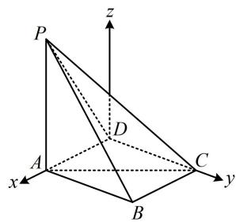

【反思】本题坐标看着吓人，但只要合理的设点与计算，计算量还是在正常范围内；本题也可以用几何法解，注意到 $PA \perp$ 平面ABCD，所以过点D容易作出平面PAC的垂线，故也可考虑用三垂线法作出二面角A-CP-D的平面角来分析，感兴趣可以试试.

##### 5. (2023·新课标II卷·★★★)

如图，三棱锥 A-BCD 中，DA=DB=DC， $BD\perp CD$ ， $\angle ADB=\angle ADC=60^{\circ}$ ，E 为 BC 的中点.

（1） 证明: $BC \perp DA$ ;

（2） 点 F 满足 $\overrightarrow{EF} = \overrightarrow{DA}$ ，求二面角 D - AB - F 的正弦值.

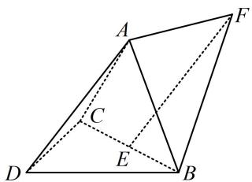

##### 5. 解: （1） (BC 和 DA 是异面直线, 证异面直线垂直, 常找线面垂直, 可用逆推法. 假设 $BC \perp DA$ , 注意到条件中还有 $DB = DC$ , 所以 $BC \perp DE$ , 二者结合可得到 $BC \perp$ 面 $ADE$ , 故可通过证此线面垂直来证 $BC \perp DA$ )

因为 $DA = DB = DC$ ， $\angle ADB = \angle ADC = 60^{\circ}$

所以 $\triangle ADB$ 和 $\triangle ADC$ 是全等的正三角形，故 $AB = AC$

又 $E$ 为 $BC$ 中点，所以 $BC \perp AE$ ， $BC \perp DE$ ，

因为 $AE$ ， $DE\subset$ 平面 $ADE$ ， $AE\cap DE = E$

所以 $BC \perp$ 平面 $ADE$ ，又 $DA \subset$ 平面 $ADE$ ，所以 $BC \perp DA$ 。

（2） (由图可猜想 $EA, EB, ED$ 两两垂直, 若能证出这一结果, 就能建系处理, 故先尝试证明)

不妨设 $DA = DB = DC = 2$ ，则 $AB = AC = 2$

因为 $BD \perp CD$ ，所以 $BC = \sqrt{DB^2 + DC^2} = 2\sqrt{2}$

故 $DE = CE = BE = \frac{1}{2} BC = \sqrt{2}$ ， $AE = \sqrt{AC^2 - CE^2} = \sqrt{2}$

所以 $AE^2 + DE^2 = 4 = AD^2$ ，故 $AE \perp DE$

所以 $EA$ ，EB，ED两两垂直，

以 $E$ 为原点建立如图所示的空间直角坐标系，

则 $A(0,0,\sqrt{2})$ ， $D(\sqrt{2},0,0)$ ， $B(0,\sqrt{2},0)$

所以 $\overrightarrow{DA} = (-\sqrt{2}, 0, \sqrt{2})$ ， $\overrightarrow{AB} = (0, \sqrt{2}, -\sqrt{2})$ ，由 $\overrightarrow{EF} = \overrightarrow{DA}$ 可

知四边形 ADEF 是平行四边形，所以 $\overrightarrow{FA} = \overrightarrow{ED} = (\sqrt{2}, 0, 0)$ ，

设平面 $DAB$ 和平面 $ABF$ 的法向量分别为 $\pmb {m} = (x_1,y_1,z_1)$

$\boldsymbol{n}=(x_{2},y_{2},z_{2})$ ，则 $\left\{\begin{aligned}\boldsymbol{m}\cdot\overrightarrow{DA}&=-\sqrt{2}x_{1}+\sqrt{2}z_{1}=0\\\boldsymbol{m}\cdot\overrightarrow{AB}&=\sqrt{2}y_{1}-\sqrt{2}z_{1}=0\end{aligned}\right.$ ，令 $x_{1}=1$ ，

则 $\left\{ \begin{array}{l} y_{1} = 1 \\ z_{1} = 1 \end{array} \right.$ ，所以 $\pmb {m} = (1,1,1)$ 是平面 $DAB$ 的一个法向量，

$\left\{ \begin{array}{l} \pmb{n} \cdot \overrightarrow{AB} = \sqrt{2} y_{2} - \sqrt{2} z_{2} = 0 \\ \pmb{n} \cdot \overrightarrow{FA} = \sqrt{2} x_{2} = 0 \end{array} \right.$ ，令 $y_{2} = 1$ ，则 $\left\{ \begin{array}{l} x_{2} = 0 \\ z_{2} = 1 \end{array} \right.$ ，

所以 $\boldsymbol{n}=(0,1,1)$ 是平面 ABF 的一个法向量，

从而 $|\cos < m, n >| = \frac{|m \cdot n|}{|m| \cdot |n|} = \frac{2}{\sqrt{3} \times \sqrt{2}} = \frac{\sqrt{6}}{3}$ ,

故二面角 $D - AB - F$ 的正弦值为 $\sqrt{1 - \left(\frac{\sqrt{6}}{3}\right)^2} = \frac{\sqrt{3}}{3}$ .

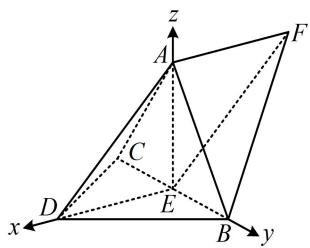

##### 6. (2024·全国甲卷·★★★☆)

如图，在以 $A$ ， $B$ ， $C$ ， $D$ ， $E$ ， $F$ 为顶点的五面体中，四边形ABCD与四边形ADEF均为等腰梯形， $EF / / AD$ ， $BC / / AD$ ， $AD = 4$ ， $AB = BC = EF = 2$ ， $ED = \sqrt{10}$ ， $FB = 2\sqrt{3}$ ， $M$ 为 $AD$ 的中点.

（1） 证明: $BM \parallel$ 平面 $CDE$ ;  
（2） 求二面角 F-BM-E 的正弦值.

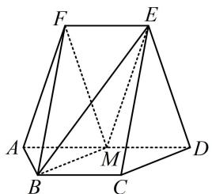

##### 6. 解: （1） (证线面平行, 先找线线平行. 观察发现四边形

BCDM像□，若是，则 $BM \parallel CD$ ，故尝试找理由）

由题意， $BC \parallel AD$ ，且 $BC = \frac{1}{2} AD$

又因为 $M$ 为 $AD$ 中点，所以 $BC \parallel MD$ ，且 $BC = MD$

从而四边形 $BCDM$ 是平行四边形，故 $BM \parallel CD$

因为 $BM \not\subset$ 平面 $CDE, CD \subset$ 平面 $CDE,$

所以 BM// 平面 CDE.

（2）（求二面角考虑建系，怎样建？观察图形可发现 $\triangle FAM$ 和 $\triangle BAM$ 是有公共底边的等腰三角形，这种双等腰三角形模型中，常取公共底边中点，作辅助线）

如图，取 $AM$ 中点 $O$ ，连接 $FO$ ， $BO$ ，由（1）可得 $BM =$

$CD$ ，又 $CD = AB = 2$ ， $AM = \frac{1}{2} AD = 2$ ，所以 $AB = BM =$

$AM = 2$ ，结合 $O$ 为 $AM$ 中点得 $OB \perp AM$

由题意可得 $EF \parallel DM$ ，且 $EF = DM$ ，

所以四边形 EFMD 为平行四边形，故 FM = ED，

又因为四边形 ADEF 为等腰梯形，所以 ED = AF，

故 $FM = AF$ ，结合 $O$ 为 $AM$ 中点可得 $FO \perp AM$ ，

（此时观察图形可猜测 $FO \perp OB$ ，若猜想成立，则可以 $O$ 为原点建系处理，故尝试找理由。由于题设条件有大量长度，故考虑通过验证 $\triangle FOB$ 满足勾股定理来证明 $FO \perp OB$ ）

由题意， $AF = ED = \sqrt{10}$ ，OA = 1，

所以 $FO = \sqrt{AF^2 - OA^2} = 3$ ，前面已证 $\triangle ABM$ 是边长为2的正三角形，所以 $OB = \sqrt{3}$

又 $FB = 2\sqrt{3}$ ，所以 $FO^{2} + OB^{2} = 12 = FB^{2}$ ，故 $FO \perp OB$ ，

以 $O$ 为原点建立如图所示的空间直角坐标系，

则 $M(0,1,0)$ ， $F(0,0,3)$ ， $B(\sqrt{3},0,0)$ ， $E(0,2,3)$

所以 $\overrightarrow{FB} = (\sqrt{3},0, - 3)$ ， $\overrightarrow{MB} = (\sqrt{3}, - 1,0)$ ， $\overrightarrow{ME} = (0,1,3)$

设平面 FBM 和平面 BME 的法向量分别为 $\boldsymbol{m}=(x_{1},y_{1},z_{1})$ ,

$\boldsymbol{n}=(x_{2},y_{2},z_{2})$ ，则 $\left\{\begin{aligned}\boldsymbol{m}\cdot\overrightarrow{FB}&=\sqrt{3}x_{1}-3z_{1}=0\\\boldsymbol{m}\cdot\overrightarrow{MB}&=\sqrt{3}x_{1}-y_{1}=0\end{aligned}\right.$ ，令 $x_{1}=\sqrt{3}$ ，

则 $\left\{ \begin{array}{l} y_{1} = 3 \\ z_{1} = 1 \end{array} \right.$ ，所以 $m = (\sqrt{3}, 3, 1)$ 是平面 $FBM$ 的一个法向量，

又 $\left\{ \begin{array}{l} \pmb{n} \cdot \overrightarrow{MB} = \sqrt{3} x_2 - y_2 = 0 \\ \pmb{n} \cdot \overrightarrow{ME} = y_2 + 3z_2 = 0 \end{array} \right.$ ，令 $y_2 = 3$ ，则 $\left\{ \begin{array}{l} x_2 = \sqrt{3} \\ z_2 = -1 \end{array} \right.$ ，

所以 $\boldsymbol{n}=(\sqrt{3},3,-1)$ 是平面 BME 的一个法向量，

设二面角 $F - BM - E$ 的大小为 $\theta$ ，则 $\left|\cos \theta \right| = \left|\cos < m, n >\right|$

$= \frac{|m\cdot n|}{|m|\cdot|n|} = \frac{11}{13}$ 所以 $\sin \theta = \sqrt{1 - \cos^2\theta} = \frac{4\sqrt{3}}{13}$

故二面角 $F - BM - E$ 的正弦值为 $\frac{4\sqrt{3}}{13}$

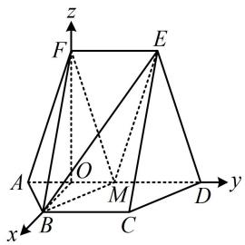

# 7. (2025·全国Ⅰ卷·★★★☆)

如图所示的四棱锥 $P - ABCD$ 中， $PA \perp$ 平面 $ABCD$ ， $BC \parallel AD$ ， $AB \perp AD$ .

（1） 证明: 平面 $PAB \perp$ 平面 $PAD$ ;

（2）若 $PA = AB = \sqrt{2}$ ， $AD = \sqrt{3} +1$ ， $BC = 2$ ， $P$ ， $B$ ， $C$ ， $D$ 在同一个球面上，设该球面的球心为 $O$

(i) 证明: $O$ 在平面 $ABCD$ 上;

（ii）求直线 $AC$ 与直线 $PO$ 所成角的余弦值.

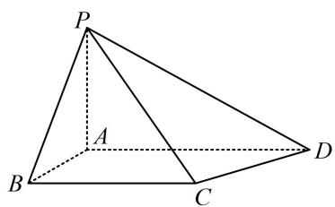

# 7. 解：（1）（证面面垂直，先找线面垂直，由题设条件不难）

发现 $PA, AB, AD$ 两两垂直，故 $AB \perp$ 面 $PAD, AD \perp$ 面 $PAB$ , 任选其一来证明, 都能证得此小问的结论)

由 $PA \perp$ 平面ABCD， $AB \subset$ 平面ABCD可得 $AB \perp PA$ ，

又 $AB \perp AD$ ，且 $PA, AD \subset$ 平面 $PAD, PA \cap AD = A$

所以 $AB \perp$ 平面 PAD，

结合 $AB \subset$ 平面 PAB 可得平面 $PAB \perp$ 平面 PAD.

（2）（i）解法1：（怎么找球心的位置？可以逆向思考，根据要证的结论，我们知道球心在平面ABCD上，且到B，C，D等距，则球心必为 $\triangle BCD$ 的外心，怎么找该外心？不妨把梯形ABCD单独画出来看看，如图1，BC与CD的中垂线交点 $G$ 就是 $\triangle BCD$ 的外心，由图可猜想点 $G$ 在AD上，故尝试证明）

如图1，取 $BC$ 中点 $E$ ，过 $E$ 作 $BC$ 的垂线交 $AD$ 于点 $G$ ，连接 $GB$ ， $GC$ ，则 $AGEB$ 是矩形，

所以 $GA = BE = \frac{1}{2} BC = 1$ ， $GD = AD - GA = \sqrt{3}$ ，

$G E = A B = \sqrt {2}, G C = G B = \sqrt {A B ^ {2} + G A ^ {2}} = \sqrt {3},$

（我们发现 $G$ 到 $B, C, D$ 的距离相等，所以 $G$ 就是 $\triangle BCD$ 的外心，如何证明它也是球心？只需证 $GP$ 也等于 $\sqrt{3}$ ，观察图2发现 $GP$ 容易在 $\triangle PGA$ 中求得）

如图2，连接 $GP$ ，由 $PA \perp$ 平面ABCD， $GP \subset$ 平面ABCD得 $PA \perp GA$ ，所以 $GP = \sqrt{PA^2 + GA^2} = \sqrt{3}$

所以 $GP = GB = GC = GD = \sqrt{3}$ ，故 $P$ ， $B$ ， $C$ ， $D$ 都在以 $G$ 为球心， $\sqrt{3}$ 为半径的球面上，

由题意，点 $O$ 与 $G$ 重合，所以 $O$ 在平面ABCD上.

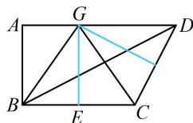  
图1

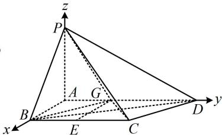

图2

【解法2】（经分析，三棱锥 $P - BCD$ 不特殊，没有对应的外接球模型可套，怎么找球心 $O$ ？注意到图中天然有三条两两垂直的直线，故不妨考虑建系处理，可直接设 $O$ 的坐标，抓住 $OP = OB = OC = OD$ 来建立方程组求解所设坐标）

以 $A$ 为原点建立如图2所示的空间直角坐标系，则由题意， $P(0,0,\sqrt{2})$ ， $B(\sqrt{2},0,0)$ ， $C(\sqrt{2},2,0)$ ， $D(0,\sqrt{3} +1,0)$ ，

设 $O(x,y,z)$ ，因为 $P$ ， $B$ ， $C$ ， $D$ 在球 $O$ 的球面上，所以 $OP = OB = OC = OD$ ，从而 $OP^2 = OB^2 = OC^2 = OD^2$

故 $x^{2} + y^{2} + (z - \sqrt{2})^{2} = (x - \sqrt{2})^{2} + y^{2} + z^{2} = (x - \sqrt{2})^{2} + (y - 2)^{2} + z^{2} = x^{2} + (y - \sqrt{3} -1)^{2} + z^{2}$ ①，

（上述连等式比较复杂，如何求解？应尝试寻找结构类似的两部分，从该处入手，以便于抵消掉一些项，达到化简的目的，观察发现 $(x - \sqrt{2})^2 + y^2 + z^2 = (x - \sqrt{2})^2 + (y - 2)^2 + z^2$ 化简后未知数只有 $y$ ，从而能求出 $y$ ，故由此切入）

由①中的 $(x - \sqrt{2})^2 + y^2 + z^2 = (x - \sqrt{2})^2 + (y - 2)^2 + z^2$ 可知 $y^2 = (y - 2)^2$ ，解得： $y = 1$ ，

代回式①化简得： $x^{2} + (z - \sqrt{2})^{2} + 1 = (x - \sqrt{2})^{2} + z^{2} + 1 = x^{2} + z^{2} + 3$

由其中 $(x - \sqrt{2})^2 + z^2 + 1 = x^2 + z^2 + 3$ 这部分可求得 $x = 0$ ，代入 $x^2 + (z - \sqrt{2})^2 + 1 = (x - \sqrt{2})^2 + z^2 + 1$ 可求得 $z = 0$

所以球心 O 的坐标为 $(0,1,0)$ ，该点在平面 ABCD 内.

（ii）由（i）可得 $\overrightarrow{AC} = (\sqrt{2}, 2, 0)$ ， $\overrightarrow{PO} = (0, 1, -\sqrt{2})$ ，所以 $\left|\cos < \overrightarrow{AC}, \overrightarrow{PO}\right| = \frac{\left|\overrightarrow{AC} \cdot \overrightarrow{PO}\right|}{\left|\overrightarrow{AC}\right| \cdot \left|\overrightarrow{PO}\right|} = \frac{\left|\sqrt{2} \times 0 + 2 \times 1 + 0 \times (-\sqrt{2})\right|}{\sqrt{(\sqrt{2})^2 + 2^2} \times \sqrt{1^2 + (-\sqrt{2})^2}} = \frac{\sqrt{2}}{3}$ ，

故直线 $AC$ 与 $PO$ 所成角的余弦值为 $\frac{\sqrt{2}}{3}$ .

##### 8.（2023·广东深圳模拟·★★★★）

在四棱柱 $ABCD - A_{1}B_{1}C_{1}D_{1}$ 中，底面 $ABCD$ 为正方形，侧面 $ADD_{1}A_{1}$ 为菱形，且平面 $ADD_{1}A_{1} \perp$ 平面 $ABCD$ .

（1）证明： $AD_{1}\bot A_{1}C$

（2）设点 $P$ 在棱 $A_{1}B_{1}$ 上运动，若 $\angle A_{1}AD = \frac{\pi}{3}$ ，且 $AB = 2$ ，记直线 $AD_{1}$ 与平面 $PBC$ 所成的角为 $\theta$ ，当 $\sin \theta = \frac{1}{4}$ 时，求 $A_{1}P$ 的长度.

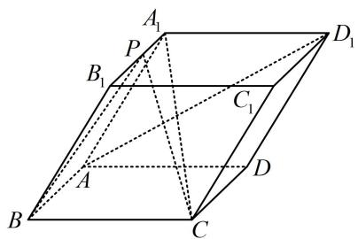

##### 8. 解: （1） (证线线垂直, 应找线面垂直. 结合题干的面面垂

直，我们发现 $A_{1}C$ 在面 $ADD_{1}A_{1}$ 内的射影是 $A_{1}D$ ，故由三垂线定理可知要找的面是 $A_{1}CD$ ，即先证 $AD_{1} \perp$ 面 $A_{1}CD$ ）

如图，连接 $A_{1}D$ ，因为ABCD为正方形，所以 $CD \perp AD$ ，

又平面 $ADD_{1}A_{1}\perp$ 平面ABCD，

平面 $ADD_{1}A_{1}\cap$ 平面 $ABCD = AD$ ， $CD\subset$ 平面 $ABCD$

所以 $CD \perp$ 平面 $ADD_{1}A_{1}$

因为 $AD_{1} \subset$ 平面 $ADD_{1}A_{1}$ ，所以 $AD_{1} \perp CD$ ①，

又 $ADD_{1}A_{1}$ 为菱形，所以 $AD_{1} \perp A_{1}D$ ，结合①以及 $A_{1}D$

$CD\subset$ 平面 $A_{1}CD$ ， $A_{1}D\cap CD = D$ 可得 $AD_{1}\bot$ 平面 $A_{1}CD$

因为 $A_{1}C \subset$ 平面 $A_{1}CD$ ，所以 $AD_{1} \perp A_{1}C$

（2） (z轴位置选哪？看见题目有面面垂直，故过 $A_{1}$ 作交线AD的垂线，z轴就有了)

取 $AD$ 中点 $O$ ，连接 $A_{1}O$ ，因为 $ADD_{1}A_{1}$ 为菱形，

所以 $AA_{1} = AD$ ，又 $\angle A_{1}AD = \frac{\pi}{3}$ ，所以 $\triangle AA_{1}D$ 为正三角形，

故 $A_{1}O \perp AD$ ，结合平面 $ADD_{1}A_{1} \perp$ 平面ABCD可得 $A_{1}O \perp$

平面ABCD，

以 $O$ 为原点建立如图所示的空间直角坐标系，

由 $AB = 2$ 可得 $AD = 2$ ， $A_{1}O = \sqrt{3}$

所以 $A_{1}(0,0,\sqrt{3})$ ， $B_{1}(2,0,\sqrt{3})$ ， $B(2, - 1,0)$ ， $C(2,1,0)$

$A (0, - 1, 0), \quad D _ {1} (0, 2, \sqrt {3}),$

(P 是动点, 观察发现直线 $A_{1}B_{1}$ 在面 $ABCD$ 上的射影就是 $x$ 轴, 所以 $P$ 的坐标只有 $x$ 分量会变)

点 $P$ 在 $A_{1}B_{1}$ 上运动，可设 $P(m,0,\sqrt{3})(0\leq m\leq 2)$

所以 $\overrightarrow{AD_1} = (0,3,\sqrt{3})$ ， $\overrightarrow{BC} = (0,2,0)$ ， $\overrightarrow{BP} = (m - 2,1,\sqrt{3})$

设平面 PBC 的法向量为 $\boldsymbol{n}=(x,y,z)$ ,

则 $\left\{ \begin{array}{l} \boldsymbol{n} \cdot \overrightarrow{BC} = 2y = 0 \\ \boldsymbol{n} \cdot \overrightarrow{BP} = (m - 2)x + y + \sqrt{3}z = 0 \end{array} \right.$

令 $x = \sqrt{3}$ ，则 $y = 0$ ， $z = 2 - m$

所以 $n = (\sqrt{3}, 0, 2 - m)$ 是平面 $PBC$ 的一个法向量，

由题意， $\sin \theta = |\cos <  \overrightarrow{AD_1},\pmb {n} > | = \frac{| \overrightarrow{AD_1}\cdot\pmb{n}|}{|\overrightarrow{AD_1}||\cdot|\pmb{n}|}$

$= \frac{\sqrt{3}(2 - m)}{2\sqrt{3}\times\sqrt{3 + (2 - m)^{2}}} = \frac{1}{4}$ ，解得： $m = 1$ ，所以 $A_{1}P = 1$

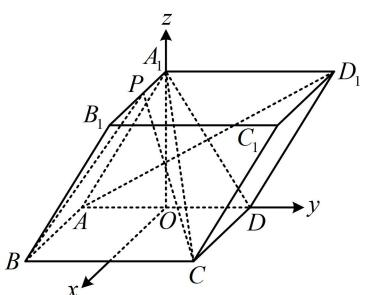

【反思】当 $P$ 是线上动点时，若能看出其坐标规律，则可直接设坐标.如本题点 $P$ 的 $y$ 坐标为0， $z$ 坐标为 $\sqrt{3}$ ，只有 $x$ 坐标未定，则可直接设 $P(m,0,\sqrt{3})$ . 若没看出此规律，也可设 $\overrightarrow{A_1P} = \lambda \overrightarrow{A_1B}$ ，并由此将点 $P$ 的坐标用 $\lambda$ 表示.

