# 强化训练

# 类型 I：空间角的计算

##### 1. (2024·东北三省三校第一次联考·★★★)

如图，四边形ABCD是正方形，PA⊥平面ABCD，且 $PA = AB = 2$ ，M是线段PB的中点，则异面直线DM与PA所成角的正切值为\_\_\_\_。

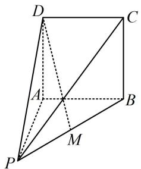

##### 1. $\sqrt{5}$

解析求线线角，考虑平移成相交直线处理，这里有 $M$ 为 $PB$ 中点，故可构造中位线实现前述平移，

如图，取 AB 中点 N，连接 MN，DN，

因为 M 是 PB 中点，所以 $MN \parallel PA$ ，

因为 $PA \perp$ 平面ABCD，所以 $MN \perp$ 平面ABCD，

故 $MN \perp DN$ ，由题意可知， $MN = \frac{1}{2} PA = 1$ ，

$A N = \frac {1}{2} A B = 1, \quad A D = 2, \quad D N = \sqrt {A D ^ {2} + A N ^ {2}} = \sqrt {5},$

所以 $\tan\angle DMN=\frac{DN}{MN}=\sqrt{5}$

故直线 DM 与 PA 所成角的正切值为 $\sqrt{5}$ .

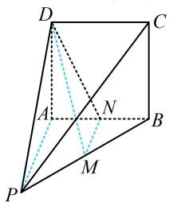

##### 2. (2023·全国乙卷·★★★)

已知 $\triangle ABC$ 为等腰直角三角形， $AB$ 为斜边， $\triangle ABD$ 为等边三角形，若二面角 $C - AB - D$ 为 $150^{\circ}$ ，则直线 $CD$ 与平面 $ABC$ 所成角的正切值为（）

$\quad$A. $\frac{1}{5}$

$\quad$B. $\frac{\sqrt{2}}{5}$

$\quad$C. $\frac{\sqrt{3}}{5}$

$\quad$D. $\frac{2}{5}$

##### 2. C

解析两个等腰三角形有公共的底边，这种情况常取底边中点构造线面垂直，

如图，取 $AB$ 中点 $E$ ，连接 $DE$ ， $CE$ ，由题意， $DA = DB$

$AC = BC$ ，所以 $AB\bot DE$ ， $AB\bot CE$

故 $\angle DEC$ 即为二面角 $C - AB - D$ 的平面角，

且 $AB \perp$ 平面 $CDE$ , 所以 $\angle DEC = 150^{\circ}$ ,

作 $DO \perp CE$ 的延长线于 $O$ ，则 $DO \subset$ 平面 $CDE$

所以 $DO \perp AB$ ，故 $DO \perp$ 平面 $ABC$

所以 $\angle DCO$ 即为直线 $CD$ 与平面 $ABC$ 所成的角，

不妨设 $AB = 2$ ，则 $CE = 1$ ， $DE = \sqrt{3}$

因为 $\angle DEC = 150^{\circ}$ ，所以 $\angle DEO = 30^{\circ}$

故 $OE = DE\cdot \cos \angle DEO = \frac{3}{2},\quad OD = DE\cdot \sin \angle DEO = \frac{\sqrt{3}}{2},$

$OC = OE + CE = \frac{5}{2}$ ，所以 $\tan \angle DCO = \frac{OD}{OC} = \frac{\sqrt{3}}{5}$

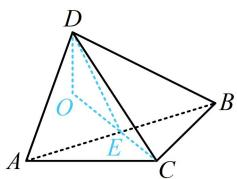

【反思】再次强调，两个等腰三角形有公共底边这类图形，常取底边中点，构造两个线线垂直，进而得出线面垂直.

##### 3. (2022·浙江期中·★★★)

如图，圆锥 $AO$ 中， $B$ ， $C$ 是圆 $O$ 上的不同两点，若 $\angle OAB = 30^{\circ}$ ，且二面角 $B - AO - C$ 为 $60^{\circ}$ ，动点 $P$ 在线段 $AB$ 上，则 $CP$ 与平面 $AOB$ 所成角的正切值的最大值为（）

$\quad$A. 2

$\quad$B. $\sqrt{3}$

$\quad$C. $\sqrt{2}$

$\quad$D. 1

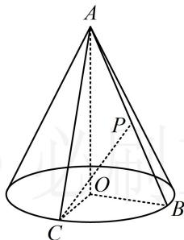

##### 3. A

解析 $AO \perp$ 面 $BOC \Rightarrow \begin{cases} AO \perp OB \\ AO \perp OC \end{cases} \Rightarrow \angle BOC$ 是二面角

$B - AO - C$ 的平面角，由题意， $\angle BOC = 60^{\circ}$

要找 $CP$ 与面 $AOB$ 所成的角, 先过 $C$ 作面 $AOB$ 的垂线, 注意到 $AO \perp$ 面 $BOC$ , 所以只需作 $OB$ 的垂线,

如图1，取OB中点G，连接CG，PG，因为OB=OC，

$\angle BOC = 60^{\circ}$ ，所以 $\triangle OBC$ 是正三角形，故 $CG\bot OB$

结合 $CG \perp AO$ 可得 $CG \perp$ 面 $AOB$ ，所以 $\angle CPG$ 即为直线 $CP$ 与面 $AOB$ 所成的角， $\tan \angle CPG = \frac{CG}{PG}$ ①，

不妨设 $OB = OC = 2$ ，则 $CG = \sqrt{3}$ ，代入①得：

$\tan\angle CPG=\frac{\sqrt{3}}{PG}$ ②，PG 最小时， $\tan\angle CPG$ 最大，

因为 $\angle OAB = 30^{\circ}$ ，所以 $OA = 2\sqrt{3}$

如图2，当 $PG \perp AB$ 时，PG最小，所以 $PG_{\min} =$

$BG \cdot \sin \angle PBG = \frac{\sqrt{3}}{2}$ ，代入②得 $(\tan \angle CPG)_{\max} = 2$ .

图1

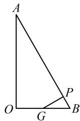  
图2

# 类型 II：压轴综合多选题

##### 4. (2023·广东六校联考·★★★☆)(多选)

如图，正方体 $ABCD - A_{1}B_{1}C_{1}D_{1}$ 的棱长为2，若点 $M$ 在线段 $BC_{1}$ 上运动，则下列结论正确的是（）

$\quad$A. 直线 $A_{1} M$ 可能与平面 $A C D_{1}$ 相交  
$\quad$B. 三棱锥 $A - MCD$ 与三棱锥 $D_{1} - MCD$ 的体积之和为 $\frac{4}{3}$   
$\quad$C. $\triangle AMC$ 的周长的最小值为 $8 + 4\sqrt{2}$   
$\quad$D. 当点 $M$ 是 $BC_{1}$ 的中点时, $CM$ 与平面 $AD_{1}C_{1}$ 所成角最大

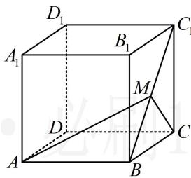

##### 4. BD

解析A 项，观察发现当 M 在 $BC_{1}$ 上运动时， $A_{1}M$ 始终在面 $A_{1}BC_{1}$ 内，故若 $A_{1}M$ 始终与面 $ACD_{1}$ 不相交，那一定是面 $A_{1}BC_{1}$ 与面 $ACD_{1}$ 平行的情况，于是我们来看看这两个面是否平行，

如图1， $AC / / A_{1}C_{1}$ ， $AD_{1} / / BC_{1}$ ，所以面 $ACD_{1} / /$ 面 $A_{1}BC_{1}$ ，又 $A_{1}M\subset$ 面 $A_{1}BC_{1}$ ，所以 $A_{1}M / /$ 面 $ACD_{1}$ ，故A项错误；

B 项, 若分别以 $A$ 和 $D_{1}$ 为顶点算体积, 则高都不好找, 考虑转换顶点. 观察发现若都以 $M$ 为顶点, 则底面分别为 $\triangle ACD$ 和 $\triangle CDD_{1}$ , 它们都在正方体的表面上, 点 $M$ 到它们所在平面的距离容易找, 故以 $M$ 为顶点来求两个三棱锥的体积,

如图2，作 $MN \perp BC$ 于点 $N$ ， $MP \perp CC_1$ 于点 $P$ ，则 $MN \perp$ 平面 $ACD$ ， $MP \perp$ 平面 $CDD_1$ ，设 $MN = a$ ，则 $PC = a$

$C_1P = 2 - a$ ，结合 $\triangle MPC_{1}$ 为等腰 Rt $\triangle$ 可得 $MP = C_1P$

$= 2 - a$ ，所以 $V_{A - MCD} = V_{M - ACD} = \frac{1}{3} S_{\triangle ACD}\cdot MN$

$\begin{array}{l} = \frac {1}{3} \times \frac {1}{2} \times 2 \times 2 \times a = \frac {2 a}{3}, V _ {D _ {1} - M C D} = V _ {M - C D D _ {1}} \\ = \frac {1}{3} S _ {\triangle C D D _ {1}} \cdot M P = \frac {1}{3} \times \frac {1}{2} \times 2 \times 2 \times (2 - a) = \frac {4 - 2 a}{3}, \\ \end{array}$

从而 $V_{A - MCD} + V_{D_1 - MCD} = \frac{2a}{3} +\frac{4 - 2a}{3} = \frac{4}{3}$ ，故B项正确；

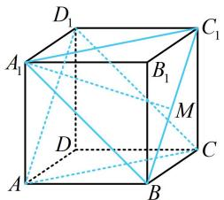

图1

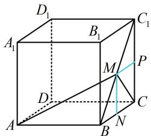

图2

C 项， $\triangle AMC$ 的周长 $L_{\triangle AMC} = AM + CM + AC = AM + CM + 2\sqrt{2}$ ①，故只需找 $M$ 到 $A$ ， $C$ 两点距离之和的最小值，注意到 $AM$ 和 $CM$ 分别在面 $ABC_{1}$ 和面 $BCC_{1}$ 内，可将它们沿 $BC_{1}$ 翻折到同一平面上来看，

将 $\triangle BCC_{1}$ 沿 $BC_{1}$ 翻折，使其与 $\triangle ABC_{1}$ 在同一平面，如图3，当 $M$ 在 $BC_{1}$ 上运动时， $AM + MC \geq AC$

当且仅当 $M$ 与图中 $M_0$ 重合时取等号，因为 $AB = BC = 2$ ， $\angle ABC = 135^{\circ}$ ，所以由余弦定理，

$AC^2 = AB^2 + BC^2 - 2AB \cdot BC \cdot \cos \angle ABC = 2^2 + 2^2 - 2 \times 2 \times 2 \times \cos 135^\circ = 8 + 4\sqrt{2}$ ，故 $AC = \sqrt{8 + 4\sqrt{2}}$ ，

所以 $AM + MC \geq \sqrt{8 + 4\sqrt{2}}$ ，代入①得 $L_{\triangle AMC} \geq \sqrt{8 + 4\sqrt{2}} + 2\sqrt{2}$ ，故C项错误；

D项，如图4，平面 $AD_{1}C_{1}$ 即平面 $ABC_{1}D_{1}$ ，当 $M$ 为 $BC_{1}$ 中点时， $CM \perp BC_{1}$ ，又 $AB \perp$ 平面 $BCC_{1}B_{1}$ ，所以 $CM \perp AB$

从而 $CM \perp$ 平面 $ABC_{1}D_{1}$ ，故 $CM \perp$ 平面 $AD_{1}C_{1}$ ，所以 $CM$ 与平面 $AD_{1}C_{1}$ 成 $90^{\circ}$ 角，线面角不超过 $90^{\circ}$ ，从而此时 $CM$ 与平面 $AD_{1}C_{1}$ 所成角最大，故 D 项正确.

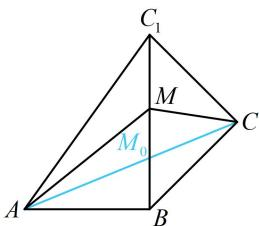

图3

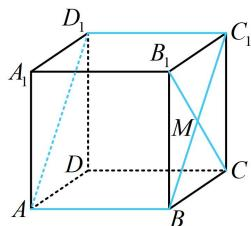

图4

##### 5. (2024·湖北武汉二调·★★★☆)(多选)

将两个各棱长均为1的正三棱锥 $D - ABC$ 和 $E - ABC$ 的底面重合，得到如图所示的六面体，则（）

$\quad$A. 该几何体的表面积为 $\frac{3\sqrt{3}}{2}$   
$\quad$B. 该几何体的体积为 $\frac{\sqrt{3}}{6}$   
$\quad$C. 过该多面体任意三个顶点的截面中存在两个平面互相垂直   
$\quad$D. 直线 $AD \parallel$ 平面 $BCE$

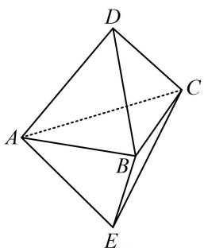

##### 5. AC

解析A项，几何体的表面由6个边长为1的正三角形组

成，故表面积为 $6 \times \frac{1}{2} \times 1 \times 1 \times \sin \frac{\pi}{3} = \frac{3\sqrt{3}}{2}$ ，故A项正确；

B 项，如图 1，设直线 $DE \cap$ 平面 ABC = F，

$CF\cap AB = G$ ，由图形的对称性， $F$ 为 $\triangle ABC$ 的中心，

且 $DE \perp$ 平面 $ABC$ ，所以 $CF = \frac{2}{3} CG = \frac{2}{3} \times \frac{\sqrt{3}}{2} \times 1 = \frac{\sqrt{3}}{3}$ ，

$DF = \sqrt{CD^2 - CF^2} = \frac{\sqrt{6}}{3}$ 故 $V_{D - ABC} = \frac{1}{3} S_{\triangle ABC}\cdot DF$

$= \frac {1}{3} \times \frac {1}{2} \times 1 \times 1 \times \sin \frac {\pi}{3} \times \frac {\sqrt {6}}{3} = \frac {\sqrt {2}}{1 2},$

所以该几何体的体积为 $2V_{D - ABC} = \frac{\sqrt{2}}{6}$ ，故B项错误；

C项，分析面面垂直，先找线面垂直，注意到各面都是正三角形，所以棱的垂面容易构造出来，下面我们以 $AB$ 为例来分析，如图1， $AB \perp DG$ ， $AB \perp EG$ ，

所以 $AB \perp$ 平面 $CDGE$ , 故平面 $ABC \perp$ 平面 $CDGE$ ,

所以该几何体过 $A, B, C$ 三点的截面与过 $C, D, E$ 三点的截面垂直，故 C 项正确；

D项，直观想象可以得出 $AD$ 与平面 $BCE$ 相交，它们不平行. 若要严格论证，可先假设它们平行，由此出发推矛盾，

假设 $AD \parallel$ 平面 $BCE$ ，如图2，设 $AF \cap BC = I$ ，

因为 $AD \subset$ 平面 $ADIE$ ，平面 $ADIE \cap$ 平面 $BCE = IE$ ，

所以 $AD \parallel IE$ ，故 $\frac{AF}{IF} = \frac{DF}{EF}$ ，

实际上，因为 $F$ 是 $\triangle ABC$ 的中心，也是重心，

所以 $\frac{AF}{IF} = 2$ ，而 $\frac{DF}{EF} = 1$ ，所以 $\frac{AF}{IF} \neq \frac{DF}{EF}$ ，矛盾，

所以 AD 与平面 BCE 不平行，故 D 项错误.

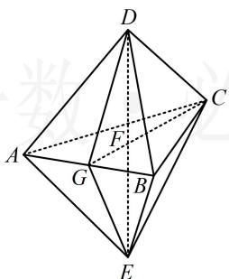

图1

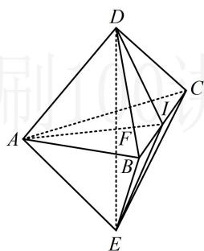

图2

##### 6. (2024·新疆乌鲁木齐一模·★★★☆) (多选)

某广场设置了一些石凳供大家休息，这些石凳是由棱长为 $40 \mathrm{~cm}$ 的正方体截去八个一样的四面体得到的，则（）

$\quad$A. 该几何体的顶点数为 12

$\quad$B. 该几何体的棱数为 24

$\quad$C. 该几何体的表面积为 $(4800 + 800\sqrt{3})\mathrm{cm}^2$

$\quad$D. 该几何体外接球的表面积是原正方体内切球、外接球表面积的等差中项

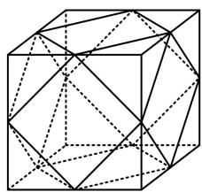

##### 6. ABD

解析A 项，如图 1，顶点有 A, B, C, D, E, F, G, H, I, J, K, L，共 12 个，它们都是正方体的棱中点，故 A 项正确；B 项，一条条地数可行，但图形较复杂，容易数错，可先找该多面体的正方形面或三角形面有几个，再来计算棱的条数，如图 1，该几何体中像 ABCD 这样的正方形面有 6 个，共 $6 \times 4 = 24$ 条棱，此时结合图形可发现几何体的每条棱都刚好只在一个正方形中，所以该几何体的棱数为 24，故 B 项正确；

C 项，因为正方体的棱长为 $40\mathrm{cm}$ ，所以该几何体每条棱的长都为 $20\sqrt{2}\mathrm{cm}$ ，由图可知该几何体的表面由 6 个正方形和 8 个正三角形构成，所以其表面积 $S = 6 \times (20\sqrt{2})^2 +$

$8 \times \frac{1}{2} \times 20\sqrt{2} \times 20\sqrt{2} \times \sin 60^{\circ} = (4800 + 1600\sqrt{3}) \, \text{cm}^{2}$ ，故 C 项错误；

D项，结论涉及的球的表面积关系依赖于它们半径的关系，故不妨先把结论翻译成半径的关系，再判断，

设该几何体的外接球半径为 $R$ ，原正方体的内切球、外接球半径分别为 $R_{1}$ ， $R_{2}$ ，则此项的结论即为 $2\times 4\pi R^2 =$

$4\pi R_{1}^{2}+4\pi R_{2}^{2}$ ，化简得： $2R^{2}=R_{1}^{2}+R_{2}^{2}$ ①，

由图形的对称性，该几何体的外接球球心为正方体的中心 $O$ ，如图2，半径 $R = OD$

设 $T$ 为正方形ABCD的中心，则 $OT \perp$ 平面ABCD，

所以 $OT \perp TD$ 且 $OT = TD = 20 \, cm$ ,

故 $R = OD = \sqrt{OT^{2} + TD^{2}} = 20\sqrt{2} \, cm,$

又原正方体的内切球半径 $R_{1} = \frac{1}{2}\times 40 = 20\mathrm{cm}$ ，外接球半径 $R_{2} = \frac{1}{2}\times 40\sqrt{3} = 20\sqrt{3}\mathrm{cm}$

所以 $R_{1}^{2} + R_{2}^{2} = 1600 = 2R^{2}$ ，从而式①成立，故D项正确.

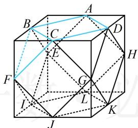

图1

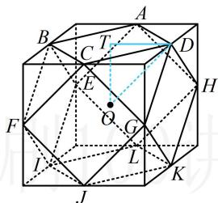

图2

##### 7.（2024·江西模拟·★★★★）（多选）

正方体 $ABCD - A_{1}B_{1}C_{1}D_{1}$ 的体积为8，线段 $CC_{1}$ ， $BC$ 的中点分别为 $E$ ， $F$ ，动点 $G$ 在下底面 $A_{1}B_{1}C_{1}D_{1}$ 内（含边界），动点 $H$ 在直线 $AD_{1}$ 上， $GE = AA_{1}$ ，则（）

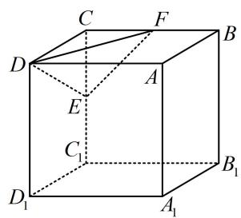

$\quad$A. 三棱锥 $H - DEF$ 的体积为定值  
$\quad$B. 动点 $G$ 的轨迹长度为 $\frac{\sqrt{5}\pi}{2}$   
$\quad$C. 不存在点 $G$ , 使得 $EG \perp$ 平面 $DEF$   
$\quad$D. 四面体 $DEFG$ 体积的最大值为 $\frac{\sqrt{15} + 2}{6}$

##### 7. ACD

解析A项，由于 $\triangle DEF$ 是不变的，故若 $V_{H - DEF}$ 为定值，则 $H$ 到平面DEF的距离不变，而 $H$ 在直线 $AD_{1}$ 上运动，所以应有直线 $AD_{1} / /$ 平面DEF，于是只需看此线面平行是否成立，

如图1，由 $E$ ， $F$ 分别是 $CC_{1}$ ， $BC$ 的中点可得 $EF / / BC_{1}$ ，由正方体的结构特征可知 $BC_{1} / / AD_{1}$ ，所以 $AD_{1} / / EF$

所以 $AD_{1} //$ 平面DEF，故 $H$ 到平面DEF的距离 $d$ 不变，又 $S_{\triangle DEF}$ 也不变，所以 $V_{H - DEF} = \frac{1}{3} S_{\triangle DEF} \cdot d$ 为定值，故A项正确；

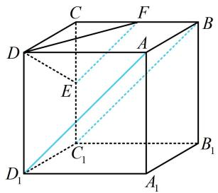

图1

B项，设正方体的棱长为 $a$ ，则由题意，正方体的体积

$V = a^{3} = 8$ ，所以 $a = 2$ ，故 $GE = AA_{1} = 2$

怎样由此寻找点 $G$ 的轨迹？注意到 $G$ 在面 $A_{1}B_{1}C_{1}D_{1}$ 内，故考虑把 $GE$ 转化到面 $A_{1}B_{1}C_{1}D_{1}$ 内来分析，

因为 $C_1E \perp$ 平面 $A_1B_1C_1D_1$ ，所以 $C_1E \perp C_1G$ ，

从而 $C_1G = \sqrt{GE^2 - C_1E^2} = \sqrt{3}$ ，故点 $G$ 在以 $C_1$ 为圆心， $\sqrt{3}$ 为半径的圆上，如图2，点 $G$ 的轨迹是一段四分之一圆弧，所以点 $G$ 的轨迹长度为 $\frac{1}{4} \times 2\pi \times \sqrt{3} = \frac{\sqrt{3}\pi}{2}$ ，故B项错误；

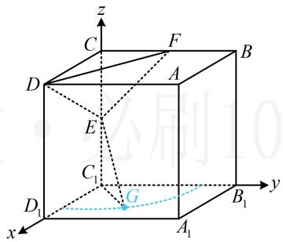

图2

C项，用几何的方法找面DEF的垂线稍显麻烦，线面垂直容易用向量法处理，正方体建系也方便，故考虑建系，以 $C_1$ 为原点建立如图2所示的空间直角坐标系，

则 $E(0,0,1)$ ， $D(2,0,2)$ ， $F(0,1,2)$

由B项的分析， $G$ 在以 $C_1$ 为圆心， $\sqrt{3}$ 为半径且圆心角为 $\angle B_{1}C_{1}D_{1} = \frac{\pi}{2}$ 的圆弧上，

故可设 $G(\sqrt{3}\cos \theta ,\sqrt{3}\sin \theta ,0)$ ， $0\leq \theta \leq \frac{\pi}{2}$

所以 $\overrightarrow{EG}=(\sqrt{3}\cos\theta,\sqrt{3}\sin\theta,-1)$ ， $\overrightarrow{ED}=(2,0,1)$ ，

$\overrightarrow{DF} = (-2,1,0)$ ，设平面 $DEF$ 的法向量为 $\pmb {m} = (x,y,z)$

则 $\left\{ \begin{array}{l} \pmb{m} \cdot \overrightarrow{ED} = 2x + z = 0 \\ \pmb{m} \cdot \overrightarrow{DF} = -2x + y = 0 \end{array} \right.$ ，令 $x = 1$ ，则 $y = 2$ ， $z = -2$ ，

所以 $\boldsymbol{m}=(1,2,-2)$ 是平面 DEF 的一个法向量，

若 $EG \perp$ 平面 $DEF$ , 则 $\overrightarrow{EG} // m$ ,

所以 $\frac{\sqrt{3}\cos\theta}{1} = \frac{\sqrt{3}\sin\theta}{2} = \frac{-1}{-2}$

故 $\cos \theta = \frac{\sqrt{3}}{6}$ ， $\sin \theta = \frac{\sqrt{3}}{3}$ ，不满足 $\cos^2\theta +\sin^2\theta = 1$

所以不存在点 $G$ ，使得 $EG \perp$ 平面 $DEF$ ，故C项正确；

D 项， $DE = \sqrt{CD^{2} + CE^{2}} = \sqrt{5}$ ， $EF = \sqrt{CE^{2} + CF^{2}} = \sqrt{2}$

$D F = \sqrt {C D ^ {2} + C F ^ {2}} = \sqrt {5},$

因为 $DE = DF$ ，所以等腰 $\triangle DEF$ 的底边 $EF$ 上的高为

$\sqrt {D E ^ {2} - \left(\frac {1}{2} E F\right) ^ {2}} = \frac {3 \sqrt {2}}{2}, \text {故} S _ {\triangle D E F} = \frac {1}{2} \times \sqrt {2} \times \frac {3 \sqrt {2}}{2} = \frac {3}{2},$

于是求 $V_{DEFG}$ 的最大值核心是求 $G$ 到面DEF距离的最大值，该距离可用向量法计算，故先算该距离，再分析最值，

由C项分析可知 $\overrightarrow{EG} = (\sqrt{3}\cos \theta ,\sqrt{3}\sin \theta , - 1)$

平面 DEF 的一个法向量为 $\boldsymbol{m}=(1,2,-2)$ ,

所以点 $G$ 到平面 $DEF$ 的距离 $d' = \frac{\left|\overrightarrow{EG} \cdot \boldsymbol{m}\right|}{\left|\boldsymbol{m}\right|}$

$= \frac {\left| \sqrt {3} \cos \theta + 2 \sqrt {3} \sin \theta + 2 \right|}{\sqrt {1 ^ {2} + 2 ^ {2} + (- 2) ^ {2}}} = \frac {\left| \sqrt {1 5} \sin (\theta + \varphi) + 2 \right|}{3},$

其中 $\tan \varphi = \frac{1}{2}$ ，且 $\varphi$ 为锐角，

因为 $\theta \in \left[0, \frac{\pi}{2}\right]$ ，所以当 $\theta = \frac{\pi}{2} - \varphi$ 时，

$\sin(\theta+\varphi)=\sin\frac{\pi}{2}=1$ ，此时 $d'$ 取得最大值 $\frac{\sqrt{15}+2}{3}$ ，

所以 $(V_{G - DEF})_{\max} = \frac{1}{3}\times \frac{3}{2}\times \frac{\sqrt{15} + 2}{3} = \frac{\sqrt{15} + 2}{6}$ ，故D项正确.

##### 8.（2023·湖北统考·★★★★）（多选）

折纸是一种高雅的艺术活动，已知正方形纸片 ABCD 的边长为 2，现将 $\triangle ACD$ 沿对角线 AC 旋转 $180^{\circ}$ ，记旋转过程中点 D 的位置为点 P（不含起始位置和与 B 重合的情形），AC，AP，BC 的中点分别为 O，E，F，则（）

$\quad$A. $AC \perp BP$

$\quad$B. $PB + PD$ 的最大值为 $4 \sqrt{2}$

$\quad$C. 旋转过程中, $EF$ 与平面 $BOP$ 所成角的正弦值的取值范围是 $\left(\frac{\sqrt{2}}{2},1\right)$

$\quad$D. $\triangle ACD$ 旋转形成的几何体的体积是 $\frac{2\sqrt{2}\pi}{3}$

##### 8. ACD

解析 $\triangle ACD$ 旋转过程中形成的是两个共底面的半圆锥，如图2，

A项， $BP$ 在半圆所在的平面上， $AC\bot$ 半圆所在平面，

所以 $AC \perp BP$ ，故 A 项正确；

B项，点 $P$ 在半圆上，故先由勾股定理找到 $PB$ ， $PD$ 的关系，再分析最值， $PB\bot PD\Rightarrow PB^{2} + PD^{2} = BD^{2} = 8$

所以 $(PB + PD)^2 = PB^2 +PD^2 +2PB\cdot PD$

$\leq 2 (P B ^ {2} + P D ^ {2}) = 1 6, \text {故} P B + P D \leq 4,$

当且仅当 $PB = PD = 2$ 时取等号，

所以 $PB + PD$ 的最大值为 4，故 B 项错误；

C 项，几何法分析此线面角较困难，考虑建系，用向量法处理，

如图2建系，则 $A(0,0,\sqrt{2})$ ， $B(0, - \sqrt{2},0)$

$C (0, 0, - \sqrt {2}), F \left(0, - \frac {\sqrt {2}}{2}, - \frac {\sqrt {2}}{2}\right),$

点 $P$ 在半圆上运动，在 $xOy$ 平面内，该半圆的方程为

$x^{2} + y^{2} = 2(x > 0)$ ，故可设 $P(\sqrt{2}\cos \alpha ,\sqrt{2}\sin \alpha ,0)$

其中 $-\frac{\pi}{2} < \alpha < \frac{\pi}{2}$ ，所以 $E\left(\frac{\sqrt{2}}{2}\cos \alpha, \frac{\sqrt{2}}{2}\sin \alpha, \frac{\sqrt{2}}{2}\right)$ ，

故 $\overrightarrow{FE} = \left(\frac{\sqrt{2}}{2}\cos \alpha ,\frac{\sqrt{2}}{2}\sin \alpha +\frac{\sqrt{2}}{2},\sqrt{2}\right),$

由图可知 $\boldsymbol{n}=(0,0,1)$ 是平面 BOP 的一个法向量，

设 $EF$ 与平面 $BOP$ 所成的角为 $\theta$ ，则 $\sin \theta = |\cos < \overrightarrow{FE},\pmb {n} > |$

$= \frac {\left| \overrightarrow {F E} \cdot \boldsymbol {n} \right|}{\left| \overrightarrow {F E} \right| \cdot | \boldsymbol {n} |} = \frac {\sqrt {2}}{\sqrt {\frac {1}{2} \cos^ {2} \alpha + \left(\frac {\sqrt {2}}{2} \sin \alpha + \frac {\sqrt {2}}{2}\right) ^ {2} + 2}} = \frac {\sqrt {2}}{\sqrt {3 + \sin \alpha}},$

因为 $-\frac{\pi}{2} < \alpha < \frac{\pi}{2}$ ，所以 $-1 < \sin \alpha < 1$ ，从而 $\frac{\sqrt{2}}{2} < \sin \theta < 1$

故C项正确；

D项，该旋转体的上下两部分可拼接成一个完整的圆锥，其底面半径和高都是 $\sqrt{2}$ ，

所以其体积 $V = \frac{1}{3}\pi \times (\sqrt{2})^2 \times \sqrt{2} = \frac{2\sqrt{2}\pi}{3}$ ，故D项正确.

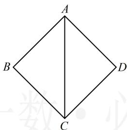

图1

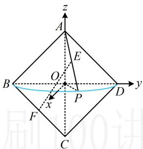

图2

##### 9.（2024·广东模拟·★★★★）（多选）

若 $S, T$ 为某空间几何体表面上的任意两点，则这两点的距离的最大值称为该几何体的线长度。已知圆锥 $PO$ 的底面直径与线长度分别为 2, 4，正四棱台 $ABCD - A_{1}B_{1}C_{1}D_{1}$ 的线长度为 6，且 $AB = 2$ ， $A_{1}B_{1} = 4$ ，则（）

$\quad$A. 圆锥 $PO$ 的体积为 $\frac{8\sqrt{3}\pi}{3}$   
$\quad$B. $AA_{1}$ 与底面 $A_{1}B_{1}C_{1}D_{1}$ 所成角的正切值为3  
$\quad$C. 圆锥 $PO$ 内切球的线长度为 $\frac{2\sqrt{15}}{5}$   
$\quad$D. 正四棱台 $ABCD - A_{1}B_{1}C_{1}D_{1}$ 外接球的表面积为 $42\pi$

##### 9. BC

解析A 项，圆锥 $PO$ 已知底面直径，求体积还差高，条件还给出了圆锥 $PO$ 的线长度为 4，直观想象可知，圆锥表面上任意两点距离的最大值只可能是母线长或底面直径，这里底面直径小于 4，所以线长度即为母线长，我们先由此分析圆锥的高，如图 1，由题意，圆锥 $PO$ 的底面半径 $OM = \frac{1}{2} \times 2 = 1$ ，

圆锥的线长度为 $PM = 4$ ，所以圆锥的高 $PO =$

$\sqrt{PM^2 - OM^2} = \sqrt{15}$ ，从而其体积 $V = \frac{1}{3}\pi \cdot OM^2\cdot PO$ $= \frac{1}{3}\pi \times 1^{2} \times \sqrt{15} = \frac{\sqrt{15}\pi}{3}$ ，故A项错误；

B 项, 如图 2, 正四棱台是规则几何体, 常选取过高的截面来分析问题, 结合所求为 $AA_{1}$ 与底面所成的角可知应选取包含高和 $AA_{1}$ 的截面来分析, 即图 2 中的截面 $AA_{1}C_{1}C$ ,

作 $AE \perp A_{1}C_{1}$ 于点 $E$ ， $CF \perp A_{1}C_{1}$ 于点 $F$

则 $AE \perp$ 平面 $A_{1}B_{1}C_{1}D_{1}$ ，因为 $AB = 2$ ， $A_{1}B_{1} = 4$ ，

所以 $AC = 2\sqrt{2}$ ， $A_{1}C_{1} = 4\sqrt{2}$ ， $A_{1}E = C_{1}F = \frac{1}{2}(A_{1}C_{1} - EF)$

$= \frac {1}{2} (A _ {1} C _ {1} - A C) = \frac {1}{2} \times (4 \sqrt {2} - 2 \sqrt {2}) = \sqrt {2},$

求目标线面角的正切值还差 $AE$ ，怎么求？已知条件还有正四棱台的线长度为 6，可以想象，正四棱台表面上任意两点距离的最大值只可能为 $AC_{1}$ 或 $A_{1}C_{1}$ ，这里 $A_{1}C_{1}<6$ ，所以线长度应为 $AC_{1}$ ，故可将 $AE$ 放到直角 $\triangle AEC_{1}$ 中来算，

正四棱台 $ABCD - A_{1}B_{1}C_{1}D_{1}$ 的线长度为 $6 \Rightarrow AC_{1} = 6$

又 $EC_{1} = A_{1}C_{1} - A_{1}E = 3\sqrt{2}$ ，所以 $AE = \sqrt{AC_1^2 - EC_1^2} = 3\sqrt{2}$

从而 $\tan \angle AA_{1}E = \frac{AE}{A_{1}E} = \frac{3\sqrt{2}}{\sqrt{2}} = 3$ ，即 $AA_{1}$ 与底面 $A_{1}B_{1}C_{1}D_{1}$ 所成角的正切值为3，故B项正确；

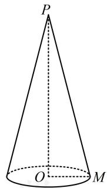

图1

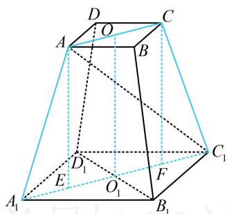

图2

C 项，内切球的线长度即为内切球直径，圆锥和球都是旋转体，选取任意过轴的截面来分析内切球半径均可，

如图3， $\triangle PMN$ 是圆锥的一个轴截面， $O$ ， $G$ 为切点，

设圆锥 $PO$ 的内切球半径为 $r$ ，则 $IO = IG = r$

$PI = PO - IO = \sqrt{15} - r$ ，由切线长相等， $GM = OM = 1$ ，

所以 PG = PM - GM = 4 - 1 = 3，

在 $\triangle PIG$ 中， $PG^{2} + IG^{2} = PI^{2}$

所以 $9 + r^{2} = (\sqrt{15} - r)^{2}$ ，解得： $r = \frac{\sqrt{15}}{5}$ ，

从而圆锥 $PO$ 内切球的线长度为 $2r = \frac{2\sqrt{15}}{5}$ ，故C项正确；

D项，可以想象，正四棱台比较“瘦高”，故猜想球心在正四棱台内部，如图4，我们先按此计算，

设正四棱台外接球的球心为 $H$ ，半径为 $R$

则 $HA = HA_{1} = R \Rightarrow OH = \sqrt{HA^{2} - OA^{2}} = \sqrt{R^{2} - 2}$

$O_{1}H = \sqrt{HA_{1}^{2} - O_{1}A_{1}^{2}} = \sqrt{R^{2} - 8}$ ，由图4可知， $OH + O_1H$

$= OO_{1}$ ，所以 $\sqrt{R^2 - 2} +\sqrt{R^2 - 8} = 3\sqrt{2}$

从而 $\sqrt{R^2 - 2} = 3\sqrt{2} - \sqrt{R^2 - 8}$ ，故 $R^2 - 2 =$

$18 - 6\sqrt{2(R^2 - 8)} + R^2 - 8$ ，化简得： $\sqrt{R^2 - 8} = \sqrt{2}$

所以 $R^{2}-8=2$ ，从而 $R=\sqrt{10}$ ，

R 有解，所以球心确实在棱台内部，之前的猜想正确，

故正四棱台外接球的表面积 $S = 4\pi R^2 = 40\pi$ ，故D项错误

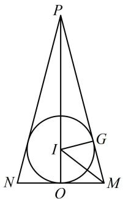

图3

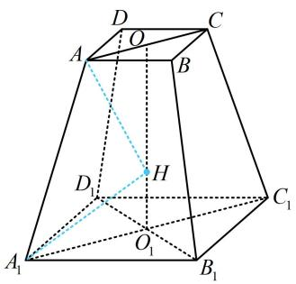

图4

