# 一遍过®

# 学霸都在用的高效刷题秘籍

# 拆解重难题

# 拆命题

提炼44道关键试题，针对性梳理数学重难点，剖析命题逻辑

# 拆解题

分步拆解解题过程，引导学生形成解题思维，提升解题力

# 建模板

点拨答题得分点、易失分点，构建44个高分模板，助力精准得分

# 高考数学

# 电子版免费赠阅

# 模块一 集合、常用逻辑用语与不等式

# 重难题1 换元法求解基本不等式问题

类型1 换元法求解基本不等式问题 01

# 模块二 函数及其性质

# 重难题2 函数的基本性质

类型 2 双对称推周期 …… 02

类型3 利用赋值法求解抽象函数问题 04

# 重难题3 函数与方程

类型 4 结合函数图象的对称性求值或求范围 …… 05

类型5 嵌套函数的零点问题 06

# 模块三 导数及其应用

# 重难题 4 导数的几何意义

类型6 公切线问题 08

# 重难题 5 构造函数比较大小

类型7 构造函数比较大小 10

# 重难题 6 利用导数研究不等式恒（能）成立问题

类型8 求解不等式恒（能）成立问题的方法 …… 11

# 重难题7 利用导数证明不等式

类型 9 不等式证明问题之指对处理 …… 13

类型 10 利用变更主元法证明不等式 …… 14

类型11 利用放缩法证明不等式 16

# 重难题8 隐零点思想的应用

类型 12 隐零点思想的应用 …… 18

# 重难题 9 极值点偏移问题

类型 13 消参减元法…… 19

类型 14 对称构造法…… 22

# ★导数中高分结论的应用

高分结论1 洛必达法则的应用 23

高分结论2 端点效应在不等式问题中的应用 24

高分结论3 对数平均不等式的应用 26

高分结论4 同构单调及同构保值的应用 27

# 模块四 三角函数与解三角形

# 重难题 10 三角函数的图象与性质

类型 15 已知性质求函数解析式 …… 30

类型 16 求参数范围…… 31

# 高分攻略

利用基本不等式求解最值的三种常见方法/P01

有关函数与其导函数的图象对称性之间的关系的结论/P03

应用赋值法求解抽象函数问题时的赋值策略/P04

满足特定抽象函数性质的特殊函数模型/P05

嵌套函数“换元解套”的解题思路/P07

公切线问题的几种常考类型及解题策略/P09

应用泰勒展开式解决问题的关键/P11

常见的双变量不等式问题的类型与转化途径/P13

变更主元法的应用/P15

切线不等式常用的放缩形式及其他常用的放缩不等式/P17

用设而不求法求解隐零点问题的步骤/P19

应用消参减元法求解极值点偏移问题的步骤/P21

用对称构造法求解极值点偏移问题的一般步骤/P23

洛必达法则的常见应用情形及注意事项/P24

端点效应、中间点效应、必要性探路/P25—P26

同构法的类型分析/P29

与 $f(x) = A\sin (\omega x + \varphi)$ 这类函数的性质有关的题目中常见的四个条件的翻译方法/P31

# 模块五 数列

# 重难题 11 数列中的求和问题

类型 17 并项求和…… 33

类型 18 裂项相消法求和…… 35

# 重难题 12 数列的综合应用

类型 19 数列与函数、不等式交汇 …… 37

# 模块六 立体几何

# 重难题13 与球有关的问题

类型20 外接球问题 40

类型 21 内切球及球的相切问题的临界处理…… 42

类型22 与球有关的最值（范围）问题 44

# 重难题 14 立体几何中的截面与探索性问题

类型23 截面问题 45

类型 24 动点轨迹问题 47

类型25 立体几何中的翻折与探索性问题 49

# 模块七 平面解析几何

# 重难题 15 “隐形圆”问题

类型 26 “隐形圆”问题 …… 51

# 重难题16 圆锥曲线的焦点三角形

类型 27 焦点三角形的内心 …… 52

# 重难题 17 与圆锥曲线有关的最值或范围问题

类型28 与圆锥曲线有关的最值或范围问题 …… 53

# 重难题18 与圆锥曲线有关的定点、定值、定线问题

类型 29 定点问题 …… 56

类型30 定值问题 58

类型 31 定线问题…… 60

# ★平面解析几何中的高分结论的应用

高分结论 5 硬解定理的应用 …… 62

高分结论6 超级韦达定理的应用 64

高分结论 7 “非对称” 根与系数的关系的应用 …… 65

# 模块八 计数原理、概率与统计

# 重难题 19 概率与统计与函数、数列交汇

类型32 概率与统计与函数交汇 67

类型33 概率与统计与数列交汇 69

# 模块九 新定义解答题

类型34 概念探究类 71

类型 35 性质转化类 …… 73

类型 36 运算分析类 …… 75

类型 37 高视角理解类 …… 77

# 高分攻略

并项的常见类型及解题策略/P33常用裂项公式/P35

数列问题中常见的放缩策略及放缩形式/P39

八种常见的外接球模型/P41

几何体内切球半径的求解思路/P43

多面体中找截面的基本方法/P46

立体几何中动点轨迹问题的求解策略/P48

立体几何中的翻折问题的处理策略/P50

“隐形圆”问题的常见类型/P52

椭圆与双曲线的焦点三角形的内心/P53

圆锥曲线综合问题中的引参消参策略/P56

证明定值问题的方法/P59

圆锥曲线的极点与极线/P61

椭圆、双曲线、抛物线的硬解定理/P63—P64

巧妙求解斜率之和与斜率之积/P65

解决“非对称”根与系数关系的问题的常用策略/P66

概率与统计应用题的信息提取3步法/P68

不同类型的新定义解答题的备考策略/P73、P75、P76、P78

# 重难题 1 换元法求解基本不等式问题

# 类型 1 换元法求解基本不等式问题

难度: ★★★☆☆ 难点: 观察式子特征, 巧妙换元

[多选][2022 新高考Ⅱ卷,5 分]若 x,y 满足 $x^{2}+y^{2}-xy=1$ , 则

$\quad$A. $x + y \leqslant 1$

$\quad$B. $x + y \geqslant -2$

$\quad$C. $x^{2} + y^{2}\leqslant 2$

$\quad$D. $x^{2} + y^{2}\geqslant 1$

命题拆解 本题考查的基本思想是把未知数的个数减少.从减少未知数的角度考虑,有以下两种处理思路:①将x,y满足的等式变形,用其中一个未知数表示另一个未知数;②引入某个参数表示出x,y,这样就可以把 $x+y$ 和 $x^{2}+y^{2}$ 均化成只含有一个未知数的式子,进而探究其取值范围.

# 解题拆解 第1步:观察式子结构特征,确定求解思路

等式 $x^{2} + y^{2} - xy = 1$ 中含有两个未知数, 直接求解较复杂, 且式子中含有平方和的形式, 所以考虑利用引入参数的方法进行消元.

# 第 2 步: 配方

由 $x^{2} + y^{2} - xy = 1$ 可得 $(x - \frac{y}{2})^2 +\left(\frac{\sqrt{3}y}{2}\right)^2 = 1,$

# 第 3 步:三角换元

令 $\left\{ \begin{array}{l} x - \frac{y}{2} = \cos \alpha, \\ 0 \leqslant \alpha < 2\pi, \\ \frac{\sqrt{3}y}{2} = \sin \alpha, \end{array} \right.$ 则 $\left\{ \begin{array}{l} x = \frac{1}{\sqrt{3}}\sin \alpha + \cos \alpha, \\ y = \frac{2}{\sqrt{3}}\sin \alpha, \end{array} \right.$

# 第 4 步: 求 $x + y$ 的取值范围

则 $x + y = \sqrt{3}\sin \alpha +\cos \alpha = 2\sin (\alpha +\frac{\pi}{6})$ ，所以 $x + y\in [-2,2]$ ，故A错，B对；

# 第 5 步: 求 $x^{2} + y^{2}$ 的取值范围

$x^{2} + y^{2} = \frac{5}{3}\sin^{2}\alpha +\frac{2}{\sqrt{3}}\sin \alpha \cos \alpha +\cos^{2}\alpha = \frac{4}{3} +\frac{2}{3}\sin (2\alpha +\varphi)$ ，其中 $\tan \varphi = -\frac{\sqrt{3}}{3}$ 所以 $x^{2} + y^{2}\in [\frac{2}{3},2]$ ，故C对，D错.故选BC.

# 高分模板

# 利用基本不等式求解最值的三种常见方法

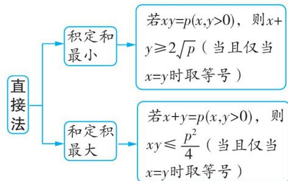

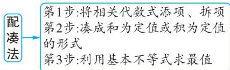

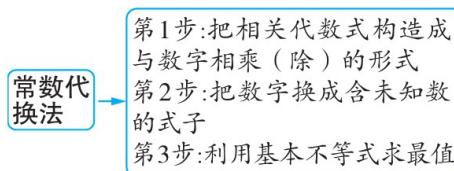

得分点 能利用两个数的和、差、积、平方和之间的恒等变换及配方法,发掘待证不等式的结构特征

易失分点 在应用换元法时,不能将代数式正确变换,应用三角换元时,不能正确应用辅助角公式

# 难点攻略

思路拓展: 令 $x = a + b, y = a - b$ ，则 $x^{2} + y^{2} - xy = a^{2} + 2ab + b^{2} + a^{2} - 2ab + b^{2} - (a^{2} - b^{2}) = a^{2} + 3b^{2} = 1$ ，则 $a \in [-1, 1]$ ， $b \in \left[-\frac{\sqrt{3}}{3}, \frac{\sqrt{3}}{3}\right]$ ，故 $x + y = 2a \in [-2, 2]$ ， $x^{2} + y^{2} = 2a^{2} + 2b^{2} = 2(1 - 3b^{2}) + 2b^{2} = 2 - 4b^{2} \in \left[\frac{2}{3}, 2\right]$ 。故选 BC.

三角换元法: 涉及平方和或平方差为常数的求最值问题, 可考虑利用三角换元法求解. 例如, 若已知 $x^{2} + y^{2} = r^{2}$ , 则可令 $\left\{\begin{aligned} x &= r \cos \theta, \\ y &= r \sin \theta, \end{aligned}\right.$ 把求最值的式子化为关于 $\theta$ 的式子进行分析; 若已知 $x^{2} - y^{2} = r^{2}$ , 则可令 $\left\{\begin{aligned} x &= \frac{r}{\cos \theta}, \\ y &= r \tan \theta. \end{aligned}\right.$ 一般情况下, 平方和的三角换元比较常用, 平方差的三角换元用得较少.

# 重难题 2 函数的基本性质

# 类型 2 双对称推周期

难度: ★★★★☆

难点: 周期性和图象对称性间的转化

[多选][2022 新高考 I 卷,5 分] 已知函数 $f(x)$ 及其导函数 $f'(x)$ 的定义域均为 $\mathbf{R}$ , 记 $g(x) = f'(x)$ . 若 $f\left(\frac{3}{2} - 2x\right), g(2 + x)$ 均为偶函数, 则

$A f （0） = 0$

$B g (- \frac {1}{2}) = 0$

$C f (- 1) = f （4）$

$D g (- 1) = g （2）$

命题拆解 以抽象函数为载体考查函数性质综合应用的题目, 抽象性强, 灵活度大, 在考查有关周期的结论的基础上, 题目的考查内容与考查形式均有所创新. 本题题干给出了函数的奇偶性, 实际上是给出了函数图象的对称性, 由此想到可以推函数的周期. 下面给出双对称推周期问题的几种常见类型.

<table><tr><td>类型</td><td>结论</td></tr><tr><td>函数f(x)的图象关于直线x=a和直线x=b对称(a≠b)</td><td>f(x)是周期函数,且2|b-a|是它的一个周期</td></tr><tr><td>函数f(x)的图象关于点(a,0)和点(b,0)对称(a≠b)</td><td>f(x)是周期函数,且2|b-a|是它的一个周期</td></tr><tr><td>函数f(x)的图象关于直线x=a对称且关于点(b,0)对称(a≠b)</td><td>f(x)是周期函数,且4|b-a|是它的一个周期</td></tr></table>

解题拆解 由 $f(\frac{3}{2}-2x)$ 为偶函数, 得 $f(\frac{3}{2}-2x)=f(\frac{3}{2}+2x)$ , 即 $f(\frac{3}{2}-x)=f(\frac{3}{2}+x)$ , 所以函数 $f(x)$ 的图象关于直线 $x=\frac{3}{2}$ 对称, 则函数 $g(x)=f'(x)$ 的图象关于点 $(\frac{3}{2},0)$ 对称.

【点拨】已知 $f(x)$ 及其导函数 $f'(x)$ 的定义域均为R, 若 $f(x)$ 的图象关于直线x=a对称, 则 $f'(x)$ 的图象关于点 $(a,0)$ 对称
由 $g(2+x)$ 为偶函数, 得 $g(2+x)=g(2-x)$ , 则函数 $g(x)=f'(x)$ 的图象关于直线 x=2 对称, 所以函数 $f(x)$ 的图象关于点 $(2,t)$ 对称.

【点拨】已知 $f(x)$ 及其导函数 $f'(x)$ 的定义域均为 R, 若 $f'(x)$ 的图象关于直线 x = a 对称, 则 $f(x)$ 的图象关于点 $(a, t)$ 对称

则 $T = 4 \times \left(2 - \frac{3}{2}\right) = 2$ 是函数 $f(x)$ 的一个周期, 易知 2 也是导函数 $f'(x)$ 的一个周期.

【点拨】已知函数 $f(x)$ 及其导函数 $f'(x)$ 的定义域均为R,若函数 $f(x)$ 是周期为T的函数,则 $f'(x)$ 也是周期为T的函数

# 高分模板

# 利用双对称推周期的结论解题的步骤

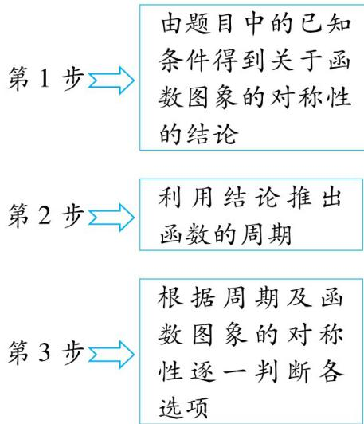

易失分点1 不能建立函数与其导函数的图象对称性之间的联系

得分点1 熟知双对称推周期的相关结论

对于选项 A, 由 $f(x)$ 的周期为 2 和其图象关于点 $(2, t)$ 对称, 知 $f(0) = f(2) = t, t$ 不一定等于 0 , 故 A 错误. 对于选项 B, 由 $g(x)$ 的周期为 2 和 $g(x)$ 的图象关于点 $\left(\frac{3}{2}, 0\right)$ 对称, 知 $g(-\frac{1}{2}) = g(\frac{3}{2}) = 0$ , 故 B 正确. 对于选项 C, 由 $f(x)$ 的周期为 2 , 得 $f(-1) = f(1), f(4) = f(2)$ , 由 $f(x)$ 的图象关于直线 $x = \frac{3}{2}$ 对称, 知 $f(1) = f(2)$ , 所以 $f(-1) = f(4)$ , 故 C 正确. 对于选项 D, 由 $g(x)$ 的图象关于点 $\left(\frac{3}{2}, 0\right)$ 对称, 知 $g(1) + g(2) = 0$ , 由 $g(x)$ 的周期为 2 , 得 $g(-1) + g(2) = 0$ , 即 $g(-1) = -g(2)$ , 故 D 错误. 综上, 选 BC.

得分点2 能根据周期和图象的对称性正确判断各选项

易失分点2 误认为 $f(2) = 0$

# 难点攻略

# 1. 关于函数周期及函数图象对称性的常用结论

已知函数 $f(x), x \in \mathbb{R}, a > 0, a \neq b$ ，（1） 若 $f(x + a) = f(x - a)$ ，则函数 $f(x)$ 的周期为 $2a$ ; （2） 若 $f(x + a) = -f(x)$ ，则函数 $f(x)$ 的周期为 $2a$ ; （3） 若 $f(x + a) = \pm \frac{1}{f(x)}$ ，则函数 $f(x)$ 的周期为 $2a$ ; （4） $f(a - x) = f(a + x) \Leftrightarrow f(-x) = f(2a + x) \Leftrightarrow f(x) = f(2a - x) \Leftrightarrow$ 函数 $f(x)$ 的图象关于直线 $x = a$ 对称；（5） $f(a + x) = f(b - x) \Leftrightarrow$ 函数 $f(x)$ 的图象关于直线 $x = \frac{a + b}{2}$ 对称；（6） $f(a + x) = -f(b - x) \Leftrightarrow$ 函数 $f(x)$ 的图象关于点 $(\frac{a + b}{2}, 0)$ 对称.

# 2. 有关函数与其导函数的图象对称性之间的关系的结论

已知连续可导函数 $f(x)$ 的导函数为 $f'(x)$ ，且定义域均为R.

（1） 已知 $f(x)$ 的图象关于直线 x=a 对称，则 $f'(x)$ 的图象关于点 $(c,0)$ 对称.

证明: $f(x)$ 的图象关于直线 $x = a$ 对称等价于 $f(a + x) = f(a - x)$ , 两边同时对 $x$ 求导可得 $f'(a + x) = -f'(a - x)$ , 则 $f'(x)$ 的图象关于点 $(a,0)$ 对称.

特别地,若 $f(x)$ 为偶函数,则 $f'(x)$ 为奇函数.

（2）已知 $f(x)$ 的图象关于点 $(a,b)$ 对称,则 $f'(x)$ 的图象关于直线x=a对称.

证明: $f(x)$ 的图象关于点 $(a,b)$ 对称等价于 $f(a+x)=-f(a-x)+2b$ ，两边同时对x求导可得 $f'(a+x)=f'(a-x)$ ，则 $f'(x)$ 的图象关于直线x=a对称.

特别地,若 $f(x)$ 为奇函数,则 $f'(x)$ 为偶函数.

（3） $f'(x)$ 的图象关于点 $(a,b)$ 对称, $f(x)$ 的图象不一定关于直线x=a对称.

分析: $f'(x)$ 的图象关于点 $(a,b)$ 对称等价于 $f'(a+x)=-f'(a-x)+2b$ ，则可得 $f(a+x)=f(a-x)+2bx+c$ ，所以 $f(x)$ 的图象不一定关于直线x=a对称.

（4） $f'(x)$ 的图象关于直线x=a对称,则 $f(x)$ 的图象关于点 $(a,b)$ 对称.

证明: $f'(x)$ 的图象关于直线 x=a 对称等价于 $f'(a+x)=f'(a-x)$ ，则可得 $f(a+x)=-f(a-x)+2b$ ，所以 $f(x)$ 的图象关于点 $(a,b)$ 对称.

说明:这里常数写成2b是为了凑对称点 $(a,b)$ .

（5） 若 $f(x)$ 是周期为 T 的函数, 则 $f'(x)$ 也是周期为 T 的函数.

（6） 若 $f'(x)$ 是周期为 T 的函数, 则 $f'(x + T) = f'(x)$ , 得 $f(x + T) = f(x) + m$ , 故 $f(x)$ 不一定是周期为 T 的函数.

# 类型 3 利用赋值法求解抽象函数问题 难度: ★★★★☆ 难点: 需要对试题进行分析, 找到合适的数值

[多选][2023 新课标 I 卷,5 分]已知函数 $f(x)$ 的定义域为 $\mathbf{R}, f(xy) = y^2 f(x) + x^2 f(y)$ , 则

$\quad$A. $f(0) = 0$

$\quad$B. $f(1) = 0$

$\quad$C. $f(x)$ 是偶函数

$\quad$D. $x = 0$ 为 $f(x)$ 的极小值点

命题拆解 本题是一道重思维、轻计算的题目,题目中关于 $f(x)$ 的方程的形式具有“齐次性”,即把 $f(x)$ 换成 $kf(x)$ 时,方程是不变的.对于这种只给了函数满足的关系式的问题,一般用赋值法求解.

解题拆解 由题意, $f(xy)=y^{2}f(x)+x^{2}f(y)$ ,

对于 A, 令 x = y = 0, 得 $f(0) = 0$ , 故 A 正确.

对于 B, 令 x = y = 1, 得 $f(1) = f(1) + f(1)$ , 则 $f(1) = 0$ , 故 B 正确.

对于 C, 令 x = y = -1, 得 $f(1) = f(-1) + f(-1) = 2f(-1)$ , 则 $f(-1) = 0$ ,

令 $y = -1$ ，得 $f(-x) = f(x) + x^2 f(-1) = f(x)$ ，又函数 $f(x)$ 的定义域为 $\mathbf{R}$ ，所以 $f(x)$ 为偶函数，故 $\mathrm{C}$ 正确.

【点拨】要判断奇偶性,就要看 $f(-x)$ 与 $f(x)$ 间的关系,为了产生 $f(-x)$ ,可将 y 取成 -1

对于 D, 解法一 不妨令 $f(x)=0$ , 易知符合题设条件, 显然 x=0 不是 $f(x)$ 的极小值点, 故 D 错误.

解法二 当 $x^{2}y^{2}\neq 0$ 时，将 $f(xy) = y^{2}f(x) + x^{2}f(y)$ 两边同时除以 $x^{2}y^{2}$ 得 $\frac{f(xy)}{x^2y^2} = \frac{f(x)}{x^2} +\frac{f(y)}{y^2}$ 故可设 $\frac{f(x)}{x^2} = \ln |x| (x\neq 0)$

则 $f(x) = \left\{ \begin{array}{ll}x^{2}\ln |x|, & x\neq 0,\\ 0,x = 0, \end{array} \right.$ 当 $x > 0$ 时， $f(x) = x^2\ln x$

则 $f'(x) = 2x \ln x + x^2 \cdot \frac{1}{x} = x(2 \ln x + 1)$ ,

令 $f'(x)<0$ ，得 $0<x<\mathrm{e}^{-\frac{1}{2}}$ ；令 $f'(x)>0$ ，得 $x>\mathrm{e}^{-\frac{1}{2}}$

故 $f(x)$ 在 $(0, \mathrm{e}^{-\frac{1}{2}})$ 上单调递减，在 $(\mathrm{e}^{-\frac{1}{2}}, +\infty)$ 上单调递增，

因为 $f(x)$ 为偶函数,所以 $f(x)$ 在 $(-e^{-\frac{1}{2}},0)$ 上单调递增,在 $(-∞,-e^{-\frac{1}{2}})$ 上单调递减,作出 $f(x)$ 的大致图象如图所示,显然,此时x=0是 $f(x)$ 的极大值点,故D错误.故选ABC.

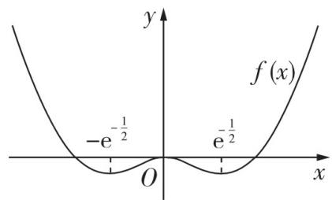

# 高分模板

# 应用赋值法求解抽象函数问题时的赋值策略

（1） 令 $x = -2, -1, 0, 1, 2$ 等特殊值, 求抽象函数的函数值  
（2） 令 $x = x_{2}, y = x_{1}$ 或 $y = \frac{1}{x_{1}}$ , 且 $x_{1} < x_{2}$ , 判断抽象函数的单调性  
（3）令 $y = -x$ , 判断抽象函数的奇偶性  
（4） 换 $x$ 为 $x + T$ , 确定抽象函数的周期  
（5） 用 $x = \frac{x}{2} + \frac{x}{2}$ 或换 $x$ 为 $\frac{1}{x}$ 等来解答抽象函数的一些其他问题

易失分点1对于C选项，不能通过连续赋值进行判断，不能正确理解偶函数的含义

易失分点2 对于 D 选项, 正面推理较为困难, 不能采用举反例的方法进行判断

思路拓展 D 选项所陈述的性质与“齐次性”相悖,所以容易判断 D 错误

# 难点攻略

对于此类问题,有时也可以取特殊函数进行求解.以下为满足特定抽象函数性质的特殊函数模型.

<table><tr><td>抽象函数的性质</td><td>对应的函数模型</td></tr><tr><td> $f(x \pm y) = f(x) \pm f(y)$ </td><td>正比例函数  $f(x) = kx (k \ne 0)$ </td></tr><tr><td> $f(x + y) = f(x)f(y)$  或  $f(x - y) = \frac{f(x)}{f(y)}$ </td><td>指数函数  $f(x) = a^{x} (a > 0 \text{ 且 } a \ne 1)$ </td></tr><tr><td> $f(x + y) + f(x - y) = 2f(x)f(y)$  或  $f(x) + f(y) = 2f(\frac{x + y}{2})f(\frac{x - y}{2})$ </td><td>余弦函数  $f(x) = \cos x$ </td></tr><tr><td> $f(xy) = f(x)f(y)$  或  $f(\frac{x}{y}) = \frac{f(x)}{f(y)}$ </td><td>幂函数  $f(x) = x^{n}$ </td></tr><tr><td> $f(xy) = f(x) + f(y) (x > 0, y > 0)$  或  $f(\frac{x}{y}) = f(x) - f(y) (x > 0, y > 0)$ </td><td>对数函数  $f(x) = \log_{a}x (a > 0 \text{ 且 } a \ne 1)$ </td></tr><tr><td> $f(x \pm y) = \frac{f(x) \pm f(y)}{1 \mp f(x)f(y)}$ </td><td>正切函数  $f(x) = \tan x$ </td></tr></table>

重

# 类型4 结合函数图象的对称性求值或求范围

难度: ★★★★☆ 难点: 结合其他知识求范围

[多选][2024 福建宁德模拟]已知函数 $f(x) = \begin{cases} \sin \pi x, & 0 < x \leqslant 1, \\ |\log_2 (x - 1)|, & x > 1, \end{cases}$ 若存在 4 个实数 $x_1, x_2, x_3, x_4 (x_1 < x_2 < x_3 < x_4)$ ，使得 $f(x_1) = f(x_2) = f(x_3) = f(x_4) = t$ ，则

【条件转化】函数 $y = f(x)$ 的图象与函数 $y = l$ 的图象有4个交点

$\quad$A. $t \in (0,1)$

$\quad$B. $x_{3}x_{4}\in (3,6)$

$\quad$C. $x_{1} + x_{2} + x_{3} + x_{4}\in (5,\frac{11}{2})$

$\quad$D. $x_{1}f(x_{4})\in (0,\frac{1}{2})$

命题拆解 结合函数图象的对称性进行命题深受高考命题人的青睐,这类问题主要结合函数的奇偶性、单调性、周期性等知识进行考查.针对这类问题,若直接求解,则运算量很大,很难求出正确结果,但如果能够结合函数图象的对称性,并朝着这个方向对问题进行等价转化,便可迅速厘清思路,得出正确答案.

# 解题拆解 第1步:作出函数 $y=f(x)$ 及函数

$y = t$ 的大致图象

作出函数 $y = f(x) = \left\{ \begin{array}{l} \sin \pi x, 0 < x \leqslant 1, \\ |\log_2(x - 1)|, x > 1 \end{array} \right.$ 及函数 $y = t$ 的大致图象如图所示，

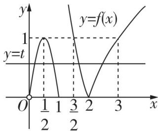

第2步:确定函数 $y=f(x)$ 的图象与函数 y=t 的图象的交点个数

由存在4个实数 $x_{1}, x_{2}, x_{3}, x_{4} (x_{1} < x_{2} < x_{3} < x_{4})$ ，使得 $f(x_{1}) = f(x_{2}) = f(x_{3}) = f(x_{4}) = t$ ，可知函数 $y = f(x)$ 的图象与函数 $y = t$ 的图象有4个不同的交点，

第 3 步: 确定 t 的范围以及 $x_{1}, x_{2}, x_{3}, x_{4}$ 的范围

数形结合可得 $0 < t < 1, 0 < x_{1} < \frac{1}{2} < x_{2} < 1, \frac{3}{2} < x_{3} < 2 < x_{4} < 3$ ，故 A 正确.

# 高分模板

得分点1 正确作出函数 $y = f(x)$ 的图象, 结合题意, 正确得出函数 $y = t$ 的图象的大致位置

易失分点1 作 $y = |\log_2(x - 1)|$ ( $x > 1$ ) 的图象时出错

得分点2 根据图象正确得出 $x_{1}, x_{2}, x_{3}, x_{4}$ 的大致范围

第 4 步: 确定 $x_{1}$ 与 $x_{2}, x_{3}$ 与 $x_{4}$ 之间的关系

$\pi x_{1} + \pi x_{2} = \pi$ ，则 $x_{1} + x_{2} = 1, -\log_{2}(x_{3} - 1) = \log_{2}(x_{4} - 1)$ ，则 $\log_2[(x_3 - 1)(x_4 - 1)] = 0$ ，所以 $(x_{3} - 1)(x_{4} - 1) = 1$ ，则 $x_{3} = \frac{1}{x_{4} - 1} +1,$ $x_{3}x_{4} = x_{3} + x_{4},$

第5步: 把 $x_{3}x_{4}, x_{1} + x_{2} + x_{3} + x_{4}, x_{1}f(x_{4})$ 分别表示成只含一个未知数的形式

则 $x_{3}x_{4} = x_{3} + x_{4} = \frac{1}{x_{4} - 1} +1 + x_{4} = \frac{1}{x_{4} - 1} +(x_{4} - 1) + 2,x_{1} + x_{2} + x_{3} + x_{4} =$ $1 + x_3 + x_4 = \frac{1}{x_4 - 1} +(x_4 - 1) + 3,x_1f(x_4) = x_1f(x_1) = x_1\sin \pi x_1.$

第6步:根据 $x_{4}$ 的范围,利用对勾函数的单调性确定 $x_{3}x_{4}, x_{1} + x_{2} + x_{3} + x_{4}$ 的范围

由 $2 < x_{4} < 3$ ，得 $x_{4} - 1 \in (1,2)$ ，所以 $x_{3}x_{4} \in (4, \frac{9}{2}), x_{1} + x_{2} + x_{3} + x_{4} \in (5, \frac{11}{2})$ ，故B错误，C正确.

第 7 步:由 $x_{1}$ 的范围, 确定 $x_{1} f(x_{4})$ 的范围

因为 $x_{1} \in (0, \frac{1}{2})$ ，所以 $0 < \pi x_{1} < \frac{\pi}{2}, 0 < \sin \pi x_{1} < 1$ ，易知 $y = x \sin \pi x (0 < x < \frac{1}{2})$ 为增函数，所以 $x_{1} f(x_{4}) = x_{1} \sin \pi x_{1} \in (0, \frac{1}{2})$ ，故 D 正确。故选 ACD.

得分点3 结合正弦函数的性质确定 $x_{1}$ 与 $x_{2}$ 间的关系；去绝对值，并利用对数运算确定 $x_{3}$ 与 $x_{4}$ 间的关系

得分点4 用只含一个未知数的形式表示 $x_{1}f(x_{4})$ 时，应用 $f(x_4) = f(x_1) = \sin \pi x_1$ 进行消元

易失分点2 不熟悉对勾函数的单调性, 进而不能快速得出 $x_{3}x_{4}, x_{1} + x_{2} + x_{3} + x_{4}$ 的范围

得分点5 正确判断出 $y = x \sin \pi x (0 < x < \frac{1}{2})$ 为增函数

# 难点攻略

结合函数图象的对称性求值或范围时的思路点拨
### 一、正确作出两个函数的大致图象是解题的关键
### 二、根据题意确定出交点个数，进而确定出参数及交点横坐标的范围
### 三、此类问题一般以分段函数为载体，且分段函数的一段是二次函数或正弦、余弦函数，一段带有绝对值.确定参数范围后，可以根据函数图象的对称性确定其中几个交点横坐标的和或直接根据参数范围确定其中几个交点横坐标的值，带有绝对值时需要去掉绝对值找交点横坐标之间的关系
### 四、求范围时需要先消元，再借助基本不等式或函数的单调性等进行求解

注意:此类问题有时还会结合指数函数、对数函数、反比例函数等进行考查,如函数 $y = \ln x$ 与 $y = e^{x}$ 的图象关于直线 y = x 对称, $y = \frac{1}{x}$ 的图象关于直线 y = x 对称.

# 类型 5 嵌套函数的零点问题

难度: ★★★★☆ 难点: 分解复合函数及数形结合思想的应用

[2024 广西南宁测试] 已知函数 $f(x)=\left\{\begin{aligned}\frac{2^{x}+2}{2},&x\leqslant1,\\ |\log_{2}(x-1)|,&x>1,\end{aligned}\right.$ 则函数 $F(x)=f[f(x)]-2f(x)-\frac{3}{2}$ 的零点个数是

$\quad$A. 4

$\quad$B. 5

$\quad$C. 6

$\quad$D. 7

# 高分模板

思路点拨

令 $t = f(x)$

$F(x) = 0$

$f(t) - 2t -$

$\frac{3}{2} = 0$

命题拆解 与嵌套函数有关的零点个数、零点范围、参数范围等问题常见于高考和各类模拟试题的小题压轴位置, 常见的两类嵌套函数分别是“自(互)嵌套型”和“二次嵌套型”, 解题的主要思路是先通过“换元”达到“解套”的目的, 再利用数形结合思想解决具体问题.

# 解题拆解 第1步:换元

令 $t = f(x)$ ，则由 $F(x) = 0$ ，得 $f(t) - 2t - \frac{3}{2} = 0$

# 第2步:转化函数的零点

则函数 $F(x)$ 的零点个数就是方程组 $\left\{ \begin{array}{l} t = f(x), \\ f(t) - 2t - \frac{3}{2} = 0 \end{array} \right.$ 中 $x$ 的解的个数.

# 第3步:确定方程中 t 的解的个数,以及每个解的值或范围

方程 $f(t)-2t-\frac{3}{2}=0$ 的解的个数, 就是方程 $f(t)=2t+\frac{3}{2}$ 的解的个数, 也就是曲线 $y=f(t)$ 和直线 $y=2t+\frac{3}{2}$ 的交点个数. 画出曲线 $y=f(t)$ 与直线 $y=2t+\frac{3}{2}$ 如图1所示, 观察发现, 二者有2个交点, 设交点的横坐标分别为 $t_{1}, t_{2}$ , 则 $t_{1}=0, t_{2}\in(1,2)$ .

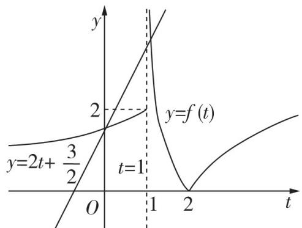

图1

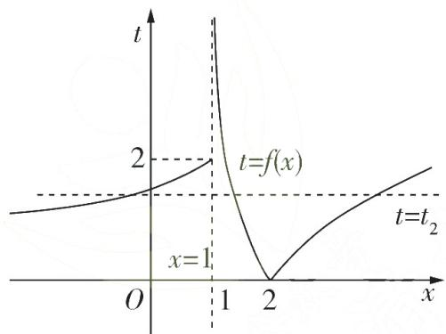

图2

# 第 4 步: 根据 t 的解确定 x 的解的个数

关于 $x$ 的方程 $t = f(x)$ 的解的个数, 就是曲线 $t = f(x)$ 与直线 $t = t_1$ , $t = t_2$ 的交点个数的和, 画出曲线 $t = f(x)$ 与直线 $t = t_1$ (即 $x$ 轴), $t = t_2$ 如图2所示, 曲线 $t = f(x)$ 与直线 $t = t_1$ 只有1个交点, 曲线 $t = f(x)$ 与直线 $t = t_2$ 有3个交点, 所以关于 $x$ 的方程 $F(x) = 0$ 共有4个解, 即函数 $F(x)$ 有4个零点, 故选A.

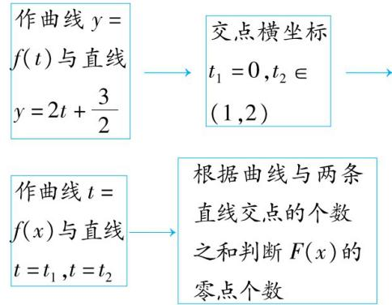

得分点1 换元,正确确定内层函数及外层函数

得分点2 第一次数形结合,正确作出函数图象

得分点3 正确确定方程中 $t$ 的解的个数及每个解的值或范围

得分点4 第二次数形结合,正确作出内层函数的图象

易失分点 没有发现函数 $y = \frac{2^x + 2}{2}$ 的图象与直线 $y = 1$ 的位置关系, 即不能确定函数 $y = \frac{2^x + 2}{2}$ 的图象存在“渐近线”

# 难点攻略

# 嵌套函数“换元解套”的解题思路

正向求解：知嵌套函数求零点

# 第一次数形结合

作外层函数 $y=F(t)$ 的图象，
横轴：t轴，纵轴：y轴.
确定函数 $y=F(t)$ 的零点 $t=t_{i}(i=1,2,3,\cdots)$

外层函数 $y=F(t)$ 内层函数 $t=f(x)$

# 第二次数形结合

作内层函数 $t=f(x)$ 的图象，
横轴：x轴，纵轴：t轴.
确定直线 $t=t_{i}(i=1,2,3,\cdots)$ 与曲线 $t=f(x)$ 的交点

逆向求解：知零点求参数

# 重难题 4 导数的几何意义

# 类型6 公切线问题

难度: ★★★☆☆ 难点: 对切线的斜率进行转化和过渡

[2022 全国甲卷(文),12 分]已知函数 $f(x) = x^3 - x, g(x) = x^2 + a$ ，曲线 $y = f(x)$ 在点 $(x_1, f(x_1))$ 处的切线也是曲线 $y = g(x)$ 的切线.

（1） 若 $x_{1} = -1$ ，求 $a$ ;  
（2） 求 a 的取值范围.

命题拆解 在近几年高考卷的导数试题中,曲线的公切线问题成为高考的热点题型之一,题目既有基础客观题,也有压轴客观题,时而也会以解答题的形式出现,难度中等偏上.本题考查根据公切线求参数,考查方程思想、化归与转化思想,考查学生的运算求解能力.

解题拆解 （1）由题意知, $f(-1)=-1-(-1)=0,f'(x)=3x^{2}-1$ , $f'(-1)=3-1=2$ , 则曲线 $y=f(x)$ 在点 $(-1,0)$ 处的切线方程为 $y=2(x+1)$ , 即 $y=2x+2$ . [1] (3分)

【记知识】曲线 $y = f(x)$ 在点 $(x_{0}, f(x_{0}))$ 处的切线方程是 $y - f(x_{0}) = f'(x_{0}) \cdot (x - x_{0})$

$g'(x)=2x$ , 设该切线与曲线 $y=g(x)$ 切于点 $(x_{0}, g(x_{0}))$ ,

【易错警示】注意切线与曲线 $y = f(x)$ 和曲线 $y = g(x)$ 的切点不一定是同一点

则 $g'(x_0) = 2x_0 = 2$ ，解得 $x_0 = 1$

则 $g(1) = 1 + a = 2 + 2$ ，解得 $a = 3$ （5分）

（2） 第 1 步: 根据导数的几何意义求出曲线 $y = f(x)$ 在点 $(x_{1}, f(x_{1}))$ 处的切线方程

由题意知 $f'(x) = 3x^2 - 1$ ，所以曲线 $y = f(x)$ 在点 $(x_1, f(x_1))$ 处的切线方程为 $y - (x_1^3 - x_1) = (3x_1^2 - 1)(x - x_1)$ ，整理得 $y = (3x_1^2 - 1)x - 2x_1^3$ . [2] (6分)

第 2 步: 设出曲线 $y = g(x)$ 上的切点坐标, 由导数的几何意义写出切线方程

设该切线与曲线 $y = g(x)$ 切于点 $(x_{2}, g(x_{2}))$ ，则 $g'(x_{2}) = 2x_{2}$ ，切线方程为 $y - (x_{2}^{2} + a) = 2x_{2}(x - x_{2})$ ，整理得 $y = 2x_{2}x - x_{2}^{2} + a$ ，[3] (7 分)

第 3 步:由切线相同列出方程组,并将 a 用 $x_{1}$ 表示出来

则 $\left\{ \begin{array}{l}3x_{1}^{2} - 1 = 2x_{2},\\ -2x_{1}^{3} = -x_{2}^{2} + a, \end{array} \right.$ 整理得 $a = x_2^2 -2x_1^3 = (\frac{3x_1^2}{2} -\frac{1}{2})^2 -2x_1^3 = \frac{9}{4} x_1^4 -$ $2x_{1}^{3} - \frac{3}{2} x_{1}^{2} + \frac{1}{4}.$ (8分）

【技巧】将双变量问题转化为单变量问题是解决这类问题的常用方法

第 4 步: 构造函数并利用导数研究其单调性, 进而得出其值域

令 $h(x) = \frac{9}{4} x^4 - 2x^3 - \frac{3}{2} x^2 + \frac{1}{4}$ ,

则 $h'(x) = 9x^{3} - 6x^{2} - 3x = 3x(3x + 1)(x - 1)$

【提醒】求导后进行因式分解可快速判断函数的单调性

# 高分模板

评分标准 [1] 正确求得曲线 $y = f(x)$ 在点 $(-1,0)$ 处的切线方程给3分

[2] 表示出曲线 $y = f(x)$ 在点 $(x_{1}, f(x_{1}))$ 处的切线方程给 1 分

[3]设出曲线 $y = g(x)$ 上的切点坐标 $(x_{2}, g(x_{2}))$ ，并表示出切线方程给 1 分

[4] 构造函数, 求导研究其单调性, 正确求得新函数的值域给 3 分

得分点1 根据公切线的斜率相等正确计算出曲线 $g(x)$ 的切点的横坐标，进而根据切点既在曲线上又在切线上求出 $a$ 的值

易失分点1 误认为曲线 $y = f(x)$ 与 $y = g(x)$ 上的切点是同一个

得分点2 根据斜率和纵截距相等列关于切点横坐标的方程组,并利用消元思想和函数思想表示出 a

# 思路点拨

曲线 $y = f(x)$ 与曲线 $y = g(x)$ 有公切线

关于 $x_{1}$ 的方程 $a = \frac{9}{4} x_1^4 - 2x_1^3 - \frac{3}{2} x_1^2 + \frac{1}{4}$ 有解

直线 $y = a$ 与函数 $y = h(x)$ 的图象有公共点

求导,利用导数研究函数 $h(x)$ 的单调性、值域

令 $h'(x) > 0$ ，解得 $-\frac{1}{3} < x < 0$ 或 $x > 1$ ；令 $h'(x) < 0$ ，解得 $x < -\frac{1}{3}$ 或 $0 < x < 1$

则 $x$ 变化时， $h'(x), h(x)$ 的变化情况如表所示，

<table><tr><td>x</td><td> $(-∞,-\frac{1}{3})$ </td><td> $-\frac{1}{3}$ </td><td> $(-\frac{1}{3},0)$ </td><td>0</td><td>(0,1)</td><td>1</td><td> $(1,+∞)$ </td></tr><tr><td>h&#x27;(x)</td><td>-</td><td>0</td><td>+</td><td>0</td><td>-</td><td>0</td><td>+</td></tr><tr><td>h(x)</td><td>↘</td><td> $\frac{5}{27}$ </td><td>↗</td><td> $\frac{1}{4}$ </td><td>↘</td><td>-1</td><td>↗</td></tr></table>

则 $h(x)$ 的值域为 $[-1, +\infty)$ . [4] (11分)

# 第5步:求得结果

故 $a$ 的取值范围为 $[-1, +\infty)$ . (12分)

易失分点2 判断 $h(x)$ 的单调性时出错

# 难点攻略

# 1. 公切线问题的几种常考类型及解题策略

<table><tr><td>类型</td><td>解题策略</td></tr><tr><td>求两曲线的公切线方程</td><td>设公切线l与曲线y=f(x)和曲线y=g(x)的切点分别是P1(x1,f(x1))和P2(x2,g(x2)),求出切线方程分别为y=f&#x27;(x1)x+f(x1)-x1f&#x27;(x1)和y=g&#x27;(x2)x+g(x2)-x2g&#x27;(x2),则这两条直线的斜率和纵截距分别相等,即{f&#x27;(x1)=g&#x27;(x2),解得x1和x2,将其中一个代入切线方程求得公f(x1)-x1f&#x27;(x1)=g(x2)-x2g&#x27;(x2),切线方程.</td></tr><tr><td>已知公切线求参数的取值(或范围)</td><td>第1步:分别设出切点坐标,表示出两曲线的切线方程;第2步:根据斜率和纵截距相等列关于切点横坐标的方程组;第3步:消元得含参数的方程;第4步:分离参数,通过求构造的函数的值域求参数的取值范围.</td></tr><tr><td>判断公切线的条数</td><td>第1步:分别设出切点坐标,表示出两曲线的切线方程;第2步:利用两切线重合,建立关于切点横坐标的方程组;第3步:消元得关于某一切点横坐标的方程;第4步:通过判断方程在规定范围内解的个数判断公切线的条数.</td></tr></table>

# 2. 将一元三次函数的解析式进行因式分解的策略

（1）当一元三次函数的解析式的常数项为0时,如 $y = x^{3} - 2x^{2} - 3x$ ,提出一个 $x$ ,括号里面是二次函数,可以用十字相乘法进行因式分解.

（2）当一元三次函数的解析式的常数项不为0时,可以根据整系数多项式方程的整数根一定是常数项的因数这一定理进行因式分解,如 $y = x^{3} - 2x^{2} - x + 2$ , 常数项的因数是 $\pm 1, \pm 2$ , 其中 $\pm 1, 2$ 是三次方程 $x^{3} - 2x^{2} - x + 2 = 0$ 的根, 所以 $y = (x - 1)(x + 1)(x - 2)$ .

# 重难题 5 构造函数比较大小

# 类型7 构造函数比较大小

难度: ★★★★☆ 难点: 观察式子结构, 构造合适的函数

[2022 新高考 I 卷,5 分] 设 $a=0.1e^{0.1}$ , $b=\frac{1}{9}$ , $c=-\ln0.9$ , 则

$\quad$A. $a < b < c$

$\quad$B. $c < b < a$

$\quad$C. $c < a < b$

$\quad$D. $a < c < b$

命题拆解 比较数与式的大小一直是高考的热点,前些年通常考查利用幂函数、指数函数与对数函数的单调性比较大小,近几年考查趋势转移到复杂式子大小的比较,求解此类问题的关键是观察所给式子的结构,通过结构的特点构造相应的函数,再借助导数进行求解.

# 解题拆解 通解一 第1步:观察要比较的数与式,构造对应函数

设 $u(x) = x\mathrm{e}^{x}(0 < x \leqslant 0.1), v(x) = \frac{x}{1 - x} (0 < x \leqslant 0.1), w(x) = -\ln (1 - x)(0 < x \leqslant 0.1)$ ，则当 $0 < x \leqslant 0.1$ 时， $u(x) > 0, v(x) > 0, w(x) > 0.$

第2步:作差并构造函数,求导,利用函数的单调性比较a,b的大小

①设 $f(x)=\ln[u(x)]-\ln[v(x)]=\ln x+x-\left[\ln x-\ln(1-x)\right]=x+\ln(1-x)(0<x\leqslant0.1)$ ，则 $f'(x)=1-\frac{1}{1-x}=\frac{x}{x-1}<0$ 在 $(0,0.1]$ 上恒成立，所以 $f(x)$ 在 $(0,0.1]$ 上单调递减，所以 $f(0.1)<0+\ln(1-0)=0$ ，即 $\ln[u(0.1)]-\ln[v(0.1)]<0$ ，所以 $\ln[u(0.1)]<\ln[v(0.1)]$ ，又函数 $y=\ln x$ 在 $(0,+\infty)$ 上单调递增，所以 $u(0.1)<v(0.1)$ ，即 $0.1e^{0.1}<\frac{1}{9}$ ，所以a<b。

第3步:作差并构造函数,求导,利用函数的单调性比较 a,c 的大小

②设 $g(x) = u(x) - w(x) = x\mathrm{e}^x +\ln (1 - x)(0 <   x\leqslant 0.1)$ ，则 $g'(x) = (x+$ $1)\mathrm{e}^{x} - \frac{1}{1 - x} = \frac{(1 - x^{2})\mathrm{e}^{x} - 1}{1 - x} (0 <   x\leqslant 0.1)$ ，设 $h(x) = (1 - x^2)\mathrm{e}^x -1(0<$ $x\leqslant 0.1)$ ，则 $h^' (x) = (1 - 2x - x^2)\mathrm{e}^x >0$ 在 $(0,0.1]$ 上恒成立，所以 $h(x)$ 在 $(0,0.1]$ 上单调递增，所以 $h(x) > (1 - 0^2)\times \mathrm{e}^0 -1 = 0$ ，即 $g'(x) > 0$ 在 $(0,0.1]$ 上恒成立，所以 $g(x)$ 在 $(0,0.1]$ 上单调递增，所以 $g(0.1) > 0\times \mathrm{e}^0+$ $\ln (1 - 0) = 0$ ，即 $g(0.1) = u(0.1) - w(0.1) > 0$ ，所以 $0.1\mathrm{e}^{0.1} > - \ln 0.9,$ 即 $a > c.$

# 第 4 步: 得出结论

综上,c<a<b,故选C.

通解二 因为 $\mathrm{e}^x\geqslant x + 1$ ，当且仅当 $x = 0$ 时，有 $\mathrm{e}^x = x + 1$ ，从而当 $x = -0.1$ 时， $\mathrm{e}^{-0.1} > 0.9 = \frac{9}{10}$ ，于是 $\mathrm{e}^{0.1} <   \frac{10}{9},a = 0.1\mathrm{e}^{0.1} <   \frac{1}{9} = b.$

设函数 $f(x)=xe^{x}+\ln(1-x)$ ，则 $f'(x)=(x+1)e^{x}-\frac{1}{1-x}=\frac{(1-x^{2})e^{x}-1}{1-x}$ .
当0<x<0.1时， $(1-x^{2})\mathrm{e}^{x}-1>(1-x^{2})(x+1)-1=x(1-x-x^{2})>0$ ，所以 $f'(x)>0,f(x)$ 在 $(0,0.1)$ 上单调递增，有 $f(0.1)>f(0)=0$ ，即 $0.1\mathrm{e}^{0.1}+\ln0.9>0$ ，所以a>c。故选C.

优解(泰勒展开式法) 因为 $e^{x}=1+x+\frac{x^{2}}{2!}+\frac{x^{3}}{3!}+\cdots+\frac{x^{n}}{n!}+\cdots,\ln(1+x)=x-\frac{x^{2}}{2}+\frac{x^{3}}{3}-\cdots+(-1)^{n-1}\frac{x^{n}}{n}+\cdots$ ，所以 $a=0.1e^{0.1}\approx0.1(1+0.1+\frac{1}{2}\times0.01+\frac{1}{6}\times0.001)\approx0.110517,c=-\ln(1-0.1)\approx0.1+\frac{0.01}{2}+\frac{0.001}{3}\approx0.1053.$ 又 $b=\frac{1}{9}\approx0.111$ ，所以 c<a<b。故选 C.

# 高分模板

# 通解一

得分点1 观察要比较的数与式,可以发现虽然式子不一样,但是都与0.1有关,由此正确构造函数

得分点2 对 $u(x)$ 和 $v(x)$ 分别取对数, 并利用作差法比较大小, 如果没有先取对数, 而是直接作差, 计算量大, 求导会更复杂

得分点3 利用作差法比较 $a, c$ 的大小

易失分点 求导时出错

# 通解二

得分点1 根据 $\mathrm{e}^x\geqslant x + 1(x = 0$ 时取等号)比较 $a,b$ 的大小

得分点2 利用作差法比较 $a, c$ 的大小

# 优解

# 利用泰勒展开式求解比较大小问题的步骤

观察已知条件的特征,与函数 $y=e^{x},y=\ln x$ 等相对照,列出相应的泰勒展开式

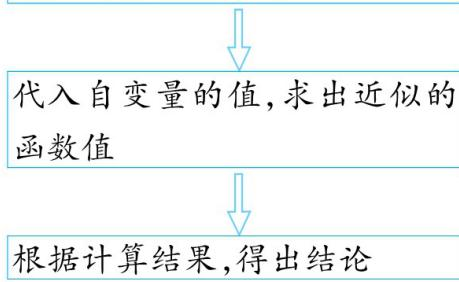

# 难点攻略

##### 1. 常见的构造函数的类型及解题策略

<table><tr><td>类型</td><td>解题策略</td></tr><tr><td>构造相同函数,比较不同函数值</td><td>题干形式统一、相似,就可以通过变形,构造出一个函数,利用导数研究函数的单调性,再比较大小</td></tr><tr><td>构造不同函数,比较相同函数值</td><td>可以利用作差法或借助泰勒展开式比较大小</td></tr><tr><td>构造不同函数,比较不同函数值</td><td>构造切线不等式:  $y = \mathrm{e}^{x},y = \ln x,y = \sin x$  的图象都具有凹凸性,因此可以利用切线放缩的方法来构造不等式</td></tr><tr><td>先同构,再构造,最后比较</td><td>当题干呈现一个较复杂的等式或者不等式,且没有前几类那么明显的特征时,需要先对等式或不等式进行变形,构造出相同的函数特征,再设出函数,求导,最后比较大小</td></tr></table>

##### 2. 应用泰勒展开式解决问题的关键

<table><tr><td>掌握常见泰勒展开式</td><td> $e^x \approx 1 + x + \frac{x^2}{2!} + \cdots + \frac{x^n}{n!}, \sin x \approx x - \frac{x^3}{3!} + \frac{x^5}{5!} - \cdots + (-1)^n \frac{x^{2n+1}}{(2n+1)!}, \cos x \approx 1 - \frac{x^2}{2!} + \frac{x^4}{4!} - \cdots + (-1)^n \frac{x^{2n}}{(2n)!}, \tan x = x + \frac{1}{3}x^3 + \frac{2}{15}x^5 + \frac{17}{315}x^7 + \cdots (|x| < \frac{\pi}{2}), \ln(1+x) \approx x - \frac{x^2}{2} + \frac{x^3}{3} - \cdots + (-1)^{n-1} \frac{x^n}{n}, \frac{1}{1-x} \approx 1 + x + x^2 + \cdots + x^n, \sqrt{1+x} \approx 1 + \frac{1}{2}x - \frac{1}{8}x^2 + \frac{1}{16}x^3, (1+x)^n \approx 1 + nx + \frac{n(n-1)}{2!}x^2 (n \geqslant 3, n \in \mathbf{N}^*)</td></tr><tr><td>确定泰勒展开式需要的项数</td><td>一般选取前3项或前4项,如比较\( e^{0.1}$ 与 $\frac{10}{9}$ 的大小,取 $e^x \approx 1 + x + \frac{x^2}{2}$ ,则 $e^{0.1} \approx 1 + 0.1 + \frac{1}{2} \times 0.01 = 1.105 < 1.111\cdots$ </td></tr><tr><td>若证不等式,明确所证不等式的方向</td><td>如 $e^x \geqslant 1 + x$ , $\sin x \geqslant x - \frac{x^3}{6} (x \geqslant 0)$ , $\cos x \geqslant 1 - \frac{x^2}{2}$ , $\tan x > x > \sin x (0 < x < \frac{\pi}{2})$ , $\ln x \leqslant x - 1 (x > 0)$ , $e^x \geqslant 1 + x + \frac{x^2}{2} (x \geqslant 0)$ , $e^x \leqslant 1 + x + \frac{x^2}{2} (x \leqslant 0)$ </td></tr></table>

# 重难题 6 利用导数研究不等式恒（能）成立问题

# 类型 8 求解不等式恒（能）成立问题的方法 难度: ★★★★☆ 难点: 需要先思考,选择合适的方法求解

[2024 东北三省教研联合体模拟,15 分]已知函数 $f(x)=\frac{x}{\mathrm{e}^{x}}-a\mathrm{e}^{x},a\in\mathbf{R}$ .

（1） 当 $a = 0$ 时, 求曲线 $y = f(x)$ 在 $x = 1$ 处的切线方程;  
（2） 当 $a = 1$ 时, 求 $f(x)$ 的单调区间和极值;  
（3） 若对任意 $x \in R, f(x) \leqslant e^{x-1}$ 恒成立，求 a 的取值范围.

命题拆解 恒(能)成立问题是高考的常考问题,既有较基础的试题,也有难度较大的试题,在求解问题时,需要学生先分析问题,再寻找合适的解题方法.

解题拆解 （1） 当 $a = 0$ 时, $f(x) = \frac{x}{\mathrm{e}^x}$ , 则 $f'(x) = \frac{1 - x}{\mathrm{e}^x}, f'（1） = 0$ , 又 $f(1) = \frac{1}{\mathrm{e}}$ ,

所以曲线 $y = f(x)$ 在 $x = 1$ 处的切线方程为 $y = \frac{1}{\mathrm{e}}$ . [1] (3分)

（2） 第1步: 将 a=1 代入 $f(x)$ 的解析式, 并对函数 $f(x)$ 求导

当 $a = 1$ 时， $f(x) = x\mathrm{e}^{-x} - \mathrm{e}^x$ ，则 $f'(x) = (1 - x)\mathrm{e}^{-x} - \mathrm{e}^x = \frac{1 - x - \mathrm{e}^{2x}}{\mathrm{e}^x}$ . [2] (4分)

# 第 2 步: 求导函数的零点

令 $g(x)=1-x-e^{2x}$ ，则 $g'(x)=-1-2e^{2x}<0$ ，

故 $g(x)$ 在 R 上单调递减, 又 $g(0)=0$ ,

所以 0 是 $g(x)$ 在 R 上的唯一零点，

即0是 $f'(x)$ 在R上的唯一零点. (6分)

# 第 3 步: 讨论 $f'(x)$ 的符号

当 $x$ 变化时, $f'(x), f(x)$ 的变化情况如下表:

<table><tr><td>x</td><td> $\left( {-\infty ,0}\right)$ </td><td>0</td><td> $\left( {0, + \infty }\right)$ </td></tr><tr><td> ${f}^{' }\left( x\right)$ </td><td>+</td><td>0</td><td>-</td></tr><tr><td> $f\left( x\right)$ </td><td>单调递增</td><td>-1</td><td>单调递减</td></tr></table>

# 第 4 步: 求出函数 $f(x)$ 的单调区间和极值

所以 $f(x)$ 的单调递增区间为 $(-∞,0)$ ，单调递减区间为 $(0,+∞)$ ，(8分)

$f(x)$ 的极大值为 $f(0) = -1$ ，无极小值. [3] (9分)

# （3） 第 1 步: 分离参数

由题意知 $x\mathrm{e}^{-x} - a\mathrm{e}^x \leqslant \mathrm{e}^{x - 1}$ , 即 $a \geqslant \frac{x\mathrm{e}^{-x} - \mathrm{e}^{x - 1}}{\mathrm{e}^x}$ , 即 $a \geqslant \frac{x}{\mathrm{e}^{2x}} - \frac{1}{\mathrm{e}}$ .

# 第 2 步: 构造新函数, 并对其求导

设 $m(x) = \frac{x}{\mathrm{e}^{2x}} -\frac{1}{\mathrm{e}}$ ，则 $m'(x) = \frac{\mathrm{e}^{2x} - 2x\mathrm{e}^{2x}}{(\mathrm{e}^{2x})^2} = \frac{1 - 2x}{\mathrm{e}^{2x}},[4]$ (11分）

# 第 3 步: 判断新函数的单调性, 并求其最值

令 $m'(x)=0$ , 解得 $x=\frac{1}{2}$

当 $x \in (-\infty, \frac{1}{2})$ 时， $m'(x) > 0, m(x)$ 单调递增，当 $x \in (\frac{1}{2}, +\infty)$ 时， $m'(x) < 0, m(x)$ 单调递减，

所以 $m(x)_{\mathrm{max}} = m\left(\frac{1}{2}\right) = \frac{1}{2\mathrm{e}} -\frac{1}{\mathrm{e}} = -\frac{1}{2\mathrm{e}}.$ (14分）

# 第 4 步: 求出参数的取值范围

所以 $a \geqslant -\frac{1}{2\mathrm{e}}$ ，即 $a$ 的取值范围为 $[- \frac{1}{2\mathrm{e}}, +\infty)$ . (15分)

# 高分模板

评分标准 [1] 正确求出曲线 $y = f(x)$ 在 $x = 1$ 处的切线方程给3分

[2] 将 $a = 1$ 代入 $f(x)$ 的解析式, 并正确求出导函数给 1 分

[3] 只得出 $f(x)$ 的极大值为 $f(0) = -1$ ，不说无极小值，不给分

[4] 分离参数, 构造新函数并正确求出导函数给 2 分

得分点1 当 a=1 时, 正确求出 $f'(x)$ , 并化简变形

得分点2 观察 $g(x)$ 的结构特征, 得到 $g(0)=0$

易失分点1 求 $f(x)$ 的极值时，没有写无极小值

得分点3 能正确判断 $m'(x)$ 的符号, 得出 $m(x)$ 的单调性

易失分点2 利用分离参数法求参数范围时,判断错误参数与函数最值的大小关系

# 难点攻略

# 1. 使用分离参数或等价转化法求解单变量不等式恒(能)成立问题

假设 $f(x)$ , $g(x)$ 在区间 D 上存在最大值、最小值.

<table><tr><td>恒成立问题</td><td>能成立问题</td></tr><tr><td> $a < f(x)$ 在区间  $D$  上恒成立 $\Leftrightarrow a < f(x)_{\min}$ </td><td> $a < f(x)$ 在区间  $D$  上能成立 $\Leftrightarrow a < f(x)_{\max}$ </td></tr><tr><td> $a >f(x)$ 在区间  $D$  上恒成立 $\Leftrightarrow a >f(x)_{\max}$ </td><td> $a >f(x)$ 在区间  $D$  上能成立 $\Leftrightarrow a >f(x)_{\min}$ </td></tr><tr><td> $f(x) >g(x)$ 在区间  $D$  上恒成立 $\Leftrightarrow [f(x) - g(x)]_{\min} >0$ </td><td> $f(x) >g(x)$ 在区间  $D$  上能成立 $\Leftrightarrow [f(x) - g(x)]_{\max} >0$ </td></tr></table>

使用分离参数法求解单变量不等式恒(能)成立问题的要求:①参数与变量可以比较容易地分离开;②分离参数后得到的函数的形式不复杂,通过导数来研究函数的单调性、最值等比较容易;③分离参数后得到的函数的值域容易计算,不会出现必须使用洛必达法则才能解决问题的情形.

##### 2. 求解不等式恒(能)成立问题的其他技法

<table><tr><td>方法</td><td>解题策略</td></tr><tr><td>分类讨论</td><td>分类讨论时要对每一种情况都进行分析,不重不漏,分类的依据一般是函数的单调性、零点等.</td></tr><tr><td>必要性探路</td><td>在一些含参问题中,还可以通过取一些特殊值(通常为0,1等)来缩小参数的取值范围,从而减少讨论参数取值范围时分析讨论的量.采用这种方法处理问题相当于先算出了最终结果的一个必要条件,所以我们把这种处理问题的方法称为必要性探路.关于必要性探路,同学们可以结合着本模块的高分结论2一起学习.</td></tr></table>

##### 3. 常见的双变量不等式问题的类型与转化途径

假设 $f(x)$ , $g(x)$ 在相应区间上都存在最值.

（1） 对于任意的 $x_{1} \in [a, b]$ , 总存在 $x_{2} \in [m, n]$ , 使得 $f(x_{1}) < g(x_{2}) \Leftrightarrow f(x_{1})_{\max} < g(x_{2})_{\max}$ ;

（2） 对于任意的 $x_{1} \in [a, b]$ , 总存在 $x_{2} \in [m, n]$ , 使得 $f(x_{1}) > g(x_{2}) \Leftrightarrow f(x_{1})_{\min} > g(x_{2})_{\min}$ ;

（3） 存在 $x_{1} \in [a, b]$ , 使得对于任意的 $x_{2} \in [m, n]$ , $f(x_{1}) < g(x_{2}) \Leftrightarrow f(x_{1})_{\min} < g(x_{2})_{\min}$ ;

（4） 存在 $x_{1} \in [a, b]$ , 使得对于任意的 $x_{2} \in [m, n]$ , $f(x_{1}) > g(x_{2}) \Leftrightarrow f(x_{1})_{\max} > g(x_{2})_{\max}$ ;

（5） 对于任意的 $x_{1} \in [a, b], x_{2} \in [m, n], f(x_{1}) < g(x_{2}) \Leftrightarrow f(x_{1})_{\max} < g(x_{2})_{\min}$ ;

（6） 对于任意的 $x_{1} \in [a, b], x_{2} \in [m, n], f(x_{1}) > g(x_{2}) \Leftrightarrow f(x_{1})_{\min} > g(x_{2})_{\max}$ .

# 重难题 7 需难解答的不等式

# 类型 9 不等式证明问题之指对处理

难度: ★★★★☆ 难点: 恒等变形

[2024 辽宁大连一模,15 分]已知函数 $f(x) = x \ln x + ax + 1 (a \in \mathbf{R})$ .

（1） 若 $f(x) \geqslant 0$ 恒成立, 求 a 的取值范围;  
（2） 当 $x > 1$ 时, 证明: $\mathrm{e}^x \ln x > \mathrm{e}(x - 1)$ .

命题拆解 在导数解答题中,一个函数的解析式中存在指数形式 $e^{x}$ 或对数形式 $\ln x$ 时,求解前需要先观察函数解析式,看直接求导得到的导函数是否比原函数复杂,如果复杂,那么需要先对函数所在的不等式进行变形,再求解.

解题拆解 （1）第1步:分离参数

由已知得， $-a\leqslant \ln x + \frac{1}{x}$ 在 $(0, + \infty)$ 上恒成立，

第2步:构造函数 $g(x)$ ，并求导

设 $g(x) = \ln x + \frac{1}{x}$ , 则 $g'(x) = \frac{1}{x} - \frac{1}{x^2} = \frac{x - 1}{x^2}, [1]$ (2分)

第 3 步: 研究 $g(x)$ 的单调性

令 $g'(x) > 0$ ，得 $x > 1$ ，令 $g'(x) < 0$ ，得 $0 < x < 1$

∴ $g(x)$ 在 $(0,1)$ 上单调递减，在 $(1,+\infty)$ 上单调递增，[2] (4 分)

第 4 步: 求 $g(x)$ 的最小值, 进而得 a 的范围

$\therefore g(x) \geqslant g(1) = 1$ ，即 $-a \leqslant 1$

∴ $a \geqslant -1$ ，即 a 的取值范围为 $[-1, +\infty)$ . (6 分)

# 高分模板

评分标准 [1] 构造函数 $g(x)$ 并正确求导给2分

[2] 正确分析 $g(x)$ 的单调性给 2 分

[3] 对不等式进行恒等变形, 构造函数 $G(x)$ , 并正确求导给 2 分

[4] 正确得出所证结论给 2 分

得分点1 正确分离参数

# （2） 第 1 步: 对不等式变形, 将问题转化

当 $x > 1$ 时，若证 $\mathrm{e}^x\ln x > \mathrm{e}(x - 1)$ 成立，即证 $\ln x > \frac{x - 1}{\mathrm{e}^{x - 1}}$ 成立，

# 第2步:构造函数 $G(x)$ , 求导

设 $G(x) = \ln x - \frac{x-1}{\mathrm{e}^{x-1}}$ ，则 $G'(x) = \frac{1}{x} - \frac{\mathrm{e}^{x-1} - (x-1)\mathrm{e}^{x-1}}{(\mathrm{e}^{x-1})^2} = \frac{\mathrm{e}^{x-1} + x^2 - 2x}{x\mathrm{e}^{x-1}}, [3]$ (8分)

# 第3步:构造函数 $m(x)$ , 求导

设 $m(x)=\mathrm{e}^{x-1}+x^{2}-2x$ , 则 $m'(x)=\mathrm{e}^{x-1}+2x-2=\mathrm{e}^{x-1}+2(x-1)$ .
(9 分)

# 第 4 步: 研究当 x > 1 时, $m(x)$ 的单调性和取值情况

当 $x > 1$ 时， $m'(x) > 0, \therefore m(x)$ 在 $(1, +\infty)$ 上单调递增.

∴ 当 x > 1 时, $m(x) > m(1) = 0$ ,

# 第 5 步: 研究当 x > 1 时, $G(x)$ 的单调性和取值情况

∴ 当 x > 1 时, $G'(x) > 0$ , (11 分)

∴ $G(x)$ 在 $(1, +\infty)$ 上单调递增，∴ 当 x > 1 时， $G(x) > G(1) = 0$ .
(13 分)

# 第6步:得出结论

由此可证,当 x > 1 时, $e^{x}\ln x > e(x - 1)$ 成立. [4] (15 分)

易失分点1 不会根据指对处理的技巧对不等式进行恒等变形

名师语要 对不等式进行变形时,如果不等号两边需要同时乘或除以一个式子,一定记得判断该式子的符号及该式子是否存在等于0的情况

得分点2 无法直接判断 $G'(x)$ 表达式中分子的符号时,构造函数 $m(x) = \mathrm{e}^{x - 1} + x^{2} - 2x$

易失分点2 不会判断 $m'(x)$ 的符号

# 难点攻略

# 函数解析式中含指数形式或对数形式时,处理的原则:

允许指数 $e^{x}$ 与关于 x 的整式、分式乘在一起,但不允许对数 $\ln x$ 与关于 x 的整式、分式乘在一起.这样处理完毕后再求导,得到的导函数与 0 的大小关系容易比较,一般只取决于多项式与 0 的大小关系.上述处理方法,可以称为“指成双,对落单”.若待求式子不符合上述原则,则需要先改造成符合这一原则的形式,再进行计算.

##### 例如 $f(x)=\frac{1}{x+1}+\ln x, f'(x)=\frac{x^{2}+x+1}{x(x+1)^{2}}, g(x)=(x^{2}+2x+3)e^{x}, g'(x)=(x^{2}+4x+5)e^{x}.$

# 类型 10 利用变更主元法证明不等式

难度: ★★★★★ 难点: 主元的变更

[2024 山东济南诊断,13 分]已知函数 $f(x) = (x - 1)\mathrm{e}^{x - a} - \ln x$ .

（1） 当 a = 1 时, 求 $f(x)$ 的最小值.  
（2） 证明: 当 $0 < a \leqslant 1$ 时, $f(x) \geqslant \ln a$ 恒成立.

命题拆解 利用导数证明含参不等式的试题中,经常涉及多个变量(如含有 a,x 两个变量),受惯性思维的影响,我们往往会选择以 x 为主元进行求解,以 x 为主元进行求解的解题过程经常是比较烦琐的,此时,不妨改变一下角度,选择以变量 a 为主元,把原问题视为关于变量 a 的问题.以 a 为主元进行求解时,可以直接根据 a 的范围对式子进行放缩,转化为关于 x 的不等式进行证明,也可以将 a 看成变量,直接求导进行证明.

解题拆解 （1） 当 $a = 1$ 时, $f(x) = (x - 1)\mathrm{e}^{x - 1} - \ln x, x > 0$ ,

则 $f'(x) = x\mathrm{e}^{x - 1} - \frac{1}{x},[1]$ (1分)

令 $g(x) = x\mathrm{e}^{x - 1} - \frac{1}{x} (x\in (0, + \infty))$ ，则 $g'(x) = (x + 1)\mathrm{e}^{x - 1} + \frac{1}{x^2} >0,$

所以 $g(x)$ 在 $(0, +\infty)$ 上单调递增. (2分)

又 $g(1)=0$ ，所以当 0<x<1 时， $g(x)<0, f'(x)<0$ ，则 $f(x)$ 单调递减；
当 x>1 时， $g(x)>0, f'(x)>0$ ，则 $f(x)$ 单调递增.

故当 $x = 1$ 时， $f(x)$ 取得最小值，为0，即 $f(x)$ 的最小值为0. [2] （5分）

（2） $(x - 1)\mathrm{e}^{x - a} - \ln x\geqslant \ln a$ 等价于 $(x - 1)\mathrm{e}^{x - a} - \ln x - \ln a\geqslant 0.$

令 $h(a)=(x-1)\mathrm{e}^{x-a}-\ln x-\ln a,a\in(0,1]$ ,

【变更主元】将 $a$ 看作自变量, 构造函数. 求导的时候要特别注意自变量为 $a$ , 而不是 $x$ , 不要弄错

则 $h'(a) = -(x - 1)\mathrm{e}^{x - a} - \frac{1}{a} = \frac{1}{\mathrm{e}^{a}}\big[(1 - x)\mathrm{e}^{x} - \frac{\mathrm{e}^{a}}{a}\big].$ [3] (7分)

设 $s(x) = (1 - x)\mathrm{e}^x, x > 0, t(a) = \frac{\mathrm{e}^a}{a}, 0 < a \leqslant 1$

【破障碍】 $h'(a)$ 的符号由 $(1-x)e^{x}$ 与 $\frac{e^{a}}{a}$ 的大小关系决定, 根据两个式子的特征分别构造函数求最值即可

当 $x > 0$ 时， $s'(x) = -x\mathrm{e}^x < 0$ ，则 $s(x)$ 单调递减，

所以 $s(x) < (1 - 0) \times \mathrm{e}^0 = 1$

当 $a \in (0,1]$ 时， $t'(a) = \frac{(a - 1)e^a}{a^2} \leqslant 0$ ，则 $t(a)$ 单调递减，

所以 $t(a) \geqslant t(1) = \mathrm{e}$ . [4] (9分)

所以当 $a \in (0,1], x \in (0, +\infty)$ 时， $(1 - x)e^{x} < 1 < e \leqslant \frac{e^{a}}{a}$ ，即 $h'(a) < 0$ ，所以 $h(a)$ 单调递减， $h(a) \geqslant h(1) = (x - 1)e^{x - 1} - \ln x.$ (11分)

由（1）知， $(x - 1)\mathrm{e}^{x - 1} - \ln x\geqslant 0$ ，故当 $a\in (0,1]$ 时， $h(a)\geqslant h(1) = (x-$ $1)\mathrm{e}^{x - 1} - \ln x\geqslant 0.$

所以当 $0 < a \leqslant 1$ 时， $(x - 1)\mathrm{e}^{x - a} - \ln x \geqslant \ln a$ 恒成立. (13分)

# 高分模板

评分标准 [1] 当 $a = 1$ 时，正确对 $f(x)$ 求导给1分

[2] 正确求出当 $a = 1$ 时， $f(x)$ 的最小值给3分

[3] 正确写出 $f(x) \geqslant \ln a$ 的等价形式, 构造关于 $a$ 的函数 $h(a)$ , 并正确求导给 2 分

[4] 正确判断出 $s(x), t(a)$ 的取值情况各给1分

易失分点1 $f'(x)$ 的符号不易判断时，想不到构造函数再次求导

易失分点2 不能直观看出 $g(1) = 0$

得分点1 判断 $h'(a)$ 的符号时, 能想到构造两个不同的函数

得分点2 能关注到第（1）问的结论,并直接应用,判断出当 $a \in (0,1]$ 时, $h(a) \geqslant 0$

# 难点攻略

变更主元法常用于解决含参函数的恒成立问题、同范围双独立变量的不等式证明问题等. 破解此类问题的解题模型如下:

对于解析式中含有参数 $a$ 的函数 $f(x) = h(x, a), x \in D$ , 当要证明 $\forall a \in E, x \in D, f(x) \geqslant 0$ , 但 $f(x)$ 的单调性与值域难以分析时, 可以考虑把参数 $a$ 当作主元, 将 $h(x, a)$ 看作关于 $a$ 的函数 $t(a) = h(x, a)$ , 此时只需证 $\forall a \in E, x \in D, t(a) \geqslant 0$ 即可

模型2 → 对于含双变量的不等式证明问题,如“对数均值不等式”“指数均值不等式”“二元形式的琴生不等式”等的证明,都可以考虑用变更主元法

# 类型11 利用放缩法证明不等式

[2024 广东湛江二模,17 分]已知函数 $f(x) = \mathrm{e}^{x} + x\ln x$ .

（1） 求曲线 $y = f(x)$ 在点 $(1, f(1))$ 处的切线方程；  
（2） 若 $a > 0, b > 0$ ，且 $a^2 + b^2 = 1$ ，证明： $f(a) + f(b) < e + 1$ .

命题拆解 放缩法是求解不等式证明问题的常用方法,对于复杂问题,灵活运用放缩法能弱化题目本身的难度,从而快速接近问题,起到进一步提高解题效率的作用.

解题拆解 （1） 由 $f(x) = \mathrm{e}^{x} + x\ln x$ 得 $f'(x) = \mathrm{e}^{x} + \ln x + 1$ ，[1] (2分)

则 $f(1) = \mathrm{e}, f'（1） = \mathrm{e} + 1.$ [2] (4分)

故曲线 $y = f(x)$ 在点(1, $f(1)$ )处的切线方程为 $y - e = (e + 1)(x - 1)$ ，即 $(e + 1)x - y - 1 = 0$ . (6分)

（2） 第 1 步: 利用三角代换将所证的不等式进行转化

由 $a > 0, b > 0$ ，且 $a^2 + b^2 = 1$ ，不妨设 $a = \cos x, b = \sin x, x \in (0, \frac{\pi}{2})$

【提醒】三角换元需要注意自变量 $x$ 的取值范围

则要证 $f(a) + f(b) < \mathrm{e} + 1$ ，即证 $f(\cos x) + f(\sin x) < \mathrm{e} + 1, x \in (0, \frac{\pi}{2})$ 即证 $\mathrm{e}^{\cos x} + \cos x \cdot \ln (\cos x) + \mathrm{e}^{\sin x} + \sin x \cdot \ln (\sin x) < \mathrm{e} + 1, x \in (0, \frac{\pi}{2}).$ [3] (8分)

第2步:构造函数 $g(x)=x-\ln x-1$ ，并利用导数研究其单调性

令 $g(x)=x-\ln x-1$ ，则 $g'(x)=\frac{x-1}{x}$ ，当 $x\in(0,1)$ 时， $g'(x)<0, g(x)$ 单调递减，故当 $x \in (0, \frac{\pi}{2})$ 时， $g(\cos x) > g(1) = 0, g(\sin x) > g(1) = 0,$ 即 $\ln(\cos x) < \cos x - 1, \ln(\sin x) < \sin x - 1,$ (10 分)

第 3 步: 将转化后的不等式进行放缩

则 $\mathrm{e}^{\cos x} + \cos x\cdot \ln (\cos x) + \mathrm{e}^{\sin x} + \sin x\cdot \ln (\sin x) <   \mathrm{e}^{\cos x} + \cos x(\cos x - 1) + \mathrm{e}^{\sin x} + \sin x(\sin x - 1) = \mathrm{e}^{\cos x} + \mathrm{e}^{\sin x} - \cos x - \sin x + 1,x\in (0,\frac{\pi}{2}),$

则要证 $\mathrm{e}^{\cos x} + \cos x\cdot \ln (\cos x) + \mathrm{e}^{\sin x} + \sin x\cdot \ln (\sin x) <   \mathrm{e} + 1,x\in (0,$ $\frac{\pi}{2})$

只需证 $\mathrm{e}^{\cos x} + \mathrm{e}^{\sin x} - \cos x - \sin x <   \mathrm{e},x\in (0,\frac{\pi}{2}).$ [4] (12分)

【点拨】放缩法是证明不等式的常用方法

第 4 步: 构造函数 $h(x) = \mathrm{e}^{\cos x} + \mathrm{e}^{\sin x} - \cos x - \sin x$ ，并利用导数研究其单调性

令 $h(x) = \mathrm{e}^{\cos x} + \mathrm{e}^{\sin x} - \cos x - \sin x, x \in (0, \frac{\pi}{2})$

则 $h'(x) = \sin x \cos x \left( \frac{\mathrm{e}^{\sin x} - 1}{\sin x} - \frac{\mathrm{e}^{\cos x} - 1}{\cos x} \right)$ ,

【技巧】化为同构形式,从而构造函数

# 高分模板

评分标准 [1] 求导正确给2分

[2] 正确求出 $f(1)$ 和 $f'（1）$ 给 2 分, 求对其中 1 个给 1 分

[3]利用三角代换将所证不等式进行转化给2分

[4] 正确将转化后的不等式进行放缩, 转化为证明 $e^{\cos x} + e^{\sin x} - \cos x - \sin x < e (x \in (0, \frac{\pi}{2}))$ 给 2 分

[5] 正确得出所证结论给2分

得分点1 根据 $a > 0, b > 0$ ，且 $a^2 + b^2 = 1$ 进行三角换元

思路点拨 $\mathrm{e}^{\cos x} + \cos x\cdot$ $\ln (\cos x) + \mathrm{e}^{\sin x} + \sin x\cdot$

$\ln (\sin x) < \mathrm{e} + 1$ 中既有对数又有指数, 直接构造函数求导较为复杂, 考虑运用切线不等式 $\ln x \leqslant x - 1 (x = 1$ 时取等号) 进行放缩

易失分点1 运用切线不等式进行放缩时,没有证明,而是直接使用

得分点2 构造函数 $h(x)$ 并求导, 对 $h'(x)$ 进行合理变形

令 $\varphi(x) = \frac{\mathrm{e}^x - 1}{x}, x \in (0,1)$ , 则 $\varphi'(x) = \frac{(x - 1)\mathrm{e}^x + 1}{x^2}$ ,

令 $m(x) = (x - 1)\mathrm{e}^x +1,x\in (0,1)$ ，则 $m'(x) = x\mathrm{e}^{x} > 0$ 在 $(0,1)$ 上恒成立，

则 $m(x) > (0 - 1) \times \mathrm{e}^0 + 1 = 0$ ，则 $\varphi'(x) > 0$ 在 $(0,1)$ 上恒成立， $\varphi(x)$ 在 $(0,1)$ 上单调递增.

当 $x \in (0, \frac{\pi}{4})$ 时， $\sin x < \cos x$ ，则 $\varphi(\sin x) < \varphi(\cos x)$ ，则 $h'(x) < 0$ ， $h(x)$ 在 $(0, \frac{\pi}{4})$ 上单调递减；

当 $x \in (\frac{\pi}{4}, \frac{\pi}{2})$ 时, $\sin x > \cos x$ , 则 $\varphi(\sin x) > \varphi(\cos x)$ , 则 $h'(x) > 0$ , $h(x)$ 在 $(\frac{\pi}{4}, \frac{\pi}{2})$ 上单调递增. (15分)

# 第5步:得出结论

因为 $\mathrm{e}^{\cos 0} + \mathrm{e}^{\sin 0} - \cos 0 - \sin 0 = \mathrm{e}^{\cos \frac{\pi}{2}} + \mathrm{e}^{\sin \frac{\pi}{2}} - \cos \frac{\pi}{2} - \sin \frac{\pi}{2} = \mathrm{e}$ ，所以 $h(x) < \mathrm{e}$ ，即 $\mathrm{e}^{\cos x} + \mathrm{e}^{\sin x} - \cos x - \sin x < \mathrm{e}$ 在 $(0, \frac{\pi}{2})$ 上恒成立，

从而 $f(a) + f(b) < \mathrm{e} + 1$ [5] (17分)

得分点3 根据 $\sin x$ 与 $\cos x$ 在 $(0, \frac{\pi}{2})$ 上的大小关系分类讨论 $h(x)$ 的单调性

易失分点2 没有比较 $h(x)$ 在 $(0, \frac{\pi}{2})$ 上两端点值的大小关系，直接得结论

# 难点攻略

# 1. 切线不等式常用的放缩形式

$\boxed {\ln x \leqslant \frac {1}{\mathrm{e}} x} \xleftarrow {\text {用} \ln x \text {代替} x} \boxed {\mathrm{e} ^ {x} \geqslant \mathrm{e} x}$

$\begin{array}{c} \uparrow \text {同乘} \mathrm{e} \\ \boxed {\mathrm{e} ^ {x - 1} \geqslant x} \end{array}$

$\boxed {\mathrm{e} ^ {x} > x} \xleftarrow {\text {放缩}} \boxed {\mathrm{e} ^ {x} \geqslant x + 1}$

$\begin{array}{r l} & {\quad \downarrow \text {用} - x \text {代替} x} \\ & {\boxed {\mathrm{e} ^ {- x} \geqslant - x + 1}} \end{array}$

$\ln (x + 2) \leqslant x + 1 \leqslant \mathrm{e} ^ {x}$

$\uparrow \text {用} x + 1 \text {代替} x$

$\ln (x + 1) \leqslant x$

$\begin{array}{r l} & \text { 用 } x + 1 \text { 代替 } x \\ & \boxed {\ln x \leqslant x - 1} \xrightarrow {\text { 放缩 }} \boxed {\ln x <   x} \end{array}$

$\xrightarrow {\text {用} \frac {1}{x} \text {代替} x} \boxed {1 - \frac {1}{x} \leqslant \ln x}$

# 2. 其他常用的放缩不等式

<table><tr><td>三角不等式</td><td>1当x∈[0,+∞)时,有sinx≤x,cos x≥1-x2.2当x∈[0,π/2]时,有cos x≤1-x2/4.3当x∈(0,π/2)时,有sin x&lt;x&lt; tan x.4当x∈(0,π/2]时,有sin x≥2/π.</td></tr><tr><td>特殊不等式</td><td>当x∈(-1,+∞),n≥2,n∈N*时,(1+x)n≥1+nx,(1+x)^{1/n}≤1+x/n.</td></tr></table>

# 重难题8 隐零点思想的应用

# 类型 12 隐零点思想的应用

难度: ★★★★★ 难点: 应用设而不求思想进行恒等变形

[2024 山东济南名校联盟模拟,15 分]已知函数 $f(x) = ax^{2} - \ln x - 1$ , $g(x) = xe^{x} - ax^{2} (a \in \mathbf{R})$ .

（1） 讨论 $f(x)$ 的单调性；  
（2） 证明: $f(x) + g(x) \geqslant x$ .

命题拆解 零点问题是高考中的热点问题,其中隐零点的代换与估计问题是函数零点中常见的问题之一,这是因为含指数形式、对数形式的方程有时没办法直接求实数根,所以我们只能判断出零点存在后估计零点的大致范围.高考中曾多次考查隐零点的代换与估计问题,这类试题难度较大,着重考查方程思想、化归与转化思想.

解题拆解 （1）由题意可得 $f(x)$ 的定义域为 $(0, +\infty)$ , $f'(x) = 2ax - \frac{1}{x} = \frac{2ax^2 - 1}{x}$ , [1] (2分)

当 $a \leqslant 0$ 时, $2ax^{2} - 1 < 0$ 在 $(0, +\infty)$ 上恒成立, $f(x)$ 在 $(0, +\infty)$ 上单调递减; (3分)

当 $a > 0$ 时，令 $f'(x) > 0$ ，解得 $x > \sqrt{\frac{1}{2a}}$ ，令 $f'(x) < 0$ ，解得 $0 < x < \sqrt{\frac{1}{2a}}$

【技巧】涉及含参函数的单调性的判断往往需要对参数进行分类讨论所以 $f(x)$ 在 $(0, \sqrt{\frac{1}{2a}})$ 上单调递减，在 $(\sqrt{\frac{1}{2a}}, +\infty)$ 上单调递增. [2] (4分)

综上所述,当 $a \leqslant 0$ 时, $f(x)$ 在 $(0, +\infty)$ 上单调递减; 当 a > 0 时, $f(x)$ 在 $(0, \sqrt{\frac{1}{2a}})$ 上单调递减, 在 $(\sqrt{\frac{1}{2a}}, +\infty)$ 上单调递增. [3] (5 分)

（2） 第 1 步: 构造函数 $F(x) = f(x) + g(x) - x$ 并求出其导函数

构造函数 $F(x) = f(x) + g(x) - x = x\mathrm{e}^{x} - \ln x - x - 1, x > 0$

则 $F'(x) = (x + 1)\mathrm{e}^{x} - \frac{1}{x} -1 = (x + 1)(\mathrm{e}^{x} - \frac{1}{x}),[4]$ (7分）

第2步:构造函数 $h(x)=\mathrm{e}^{x}-\frac{1}{x}$ 并研究其单调性

由 $x > 0$ 可知 $x + 1 > 0$ ，构造函数 $h(x) = \mathrm{e}^{x} - \frac{1}{x}, x > 0,$

因为 $y = \mathrm{e}^{x}, y = -\frac{1}{x}$ 在 $(0, +\infty)$ 上均单调递增，所以 $h(x)$ 在 $(0, +\infty)$ 上单调递增. (8分)

第3步:根据函数 $h(x)$ 的单调性及零点存在定理确定隐零点

又 $h\left(\frac{1}{2}\right) = \sqrt{\mathrm{e}} - 2 < 0, h(1) = \mathrm{e} - 1 > 0,$

所以 $h(x)$ 在 $(0, +\infty)$ 上存在唯一零点 $x_{0} \in (\frac{1}{2}, 1)$ ，且当 $0 < x < x_{0}$ 时， $h(x) < 0$ ，即 $F'(x) < 0$ ，当 $x > x_{0}$ 时， $h(x) > 0$ ，即 $F'(x) > 0$ 。

所以 $F(x)$ 在 $(0, x_0)$ 上单调递减，在 $(x_0, +\infty)$ 上单调递增，

所以 $F(x)\geqslant F(x_0) = x_0\mathrm{e}^{x_0} - \ln x_0 - x_0 - 1.$ [5] (12分)

第 4 步: 根据 $x_{0}$ 满足的关系式得出 $F(x_{0})$ 的值

因为 $\mathrm{e}^{x_0} - \frac{1}{x_0} = 0$ ，所以 $\mathrm{e}^{x_0} = \frac{1}{x_0}, x_0 = \mathrm{e}^{-x_0}, x_0 \in (\frac{1}{2}, 1)$

# 高分模板

评分标准 [1] 正确求得 $f'(x)$ 给2分

[2] 正确判断 $a \leqslant 0$ 和 $a > 0$ 时函数 $f(x)$ 的单调性各给1分

[3] 正确写出总结性的语句给 1 分

[4]构造函数 $F(x) = f(x) + g(x) - x$ 并正确求导给2分

[5] 锁定隐零点的区间并得出 $F(x)$ 的单调性给4分

[6] 正确证得 $F(x_0) = x_0 \times \frac{1}{x_0} - \ln \mathrm{e}^{-x_0} - x_0 - 1 = 0$ 给2分

得分点1 得到 $F'(x) = (x + 1)\cdot \mathrm{e}^{x} - \frac{1}{x} -1 = (x + 1)(\mathrm{e}^{x} -$

$\frac{1}{x})$ ，并单独讨论 $h(x) = \mathrm{e}^{x} - \frac{1}{x}$ $x > 0$ 的单调性

得分点2 取特殊值确定 $h(x)$ 的隐零点所在的区间

得分点3 根据 $\mathrm{e}^{x_0} - \frac{1}{x_0} = 0$ 得到 $F(x_0) = x_0 \times \frac{1}{x_0} - \ln \mathrm{e}^{-x_0} - x_0 - 1 = 0$

易失分点 第（1）问讨论 $f(x)$ 的单调性时没有写出总结性的语句

可得 $F(x_0) = x_0 \times \frac{1}{x_0} - \ln \mathrm{e}^{-x_0} - x_0 - 1 = 0, [6]$ (14分)

# 第5步:得出结论

所以 $F(x)\geqslant 0$ ，所以 $f(x) + g(x)\geqslant x.$ (15分）

# 难点攻略

# 1. 用设而不求法求解隐零点问题的步骤

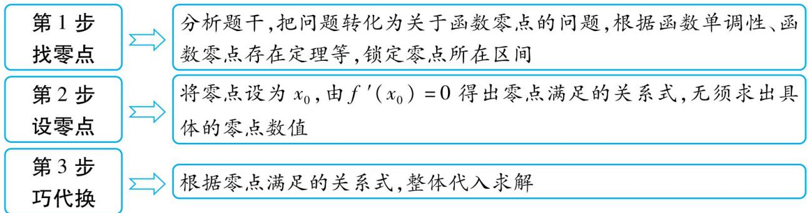

# 2. 求解隐零点问题需要重点关注以下两个方面：

（1） 隐零点确认, 隐零点的范围可结合函数的单调性及零点存在定理, 取特殊值进行判断, 也可借助函数图象判断, 判断范围时应尽可能将其缩小; （2） 在对表达式进行变形时, 尽可能将复杂的表达式变形为常见的整式或分式, 应特别注意替换其中的指数或对数式, 为后续的探究作铺垫.

# 重对 9 极 10

# 类型 13 消参减元法

难度: ★★★★★ 难点: 建立 $x_{1}, x_{2}$ 之间的关系, 从而消参减元

[2024 江苏连云港测试,17 分]已知函数 $f(x)=\ln x+\frac{1}{2}ax^{2}-(a+1)x(a\in\mathbf{R})$ .

（1） 当 a=1 时, 求函数 $f(x)$ 的零点个数;  
（2） 若关于 $x$ 的方程 $f(x) = \frac{1}{2} ax^2$ 有两个不同实根 $x_1, x_2$ , 求实数 $a$ 的取值范围, 并证明 $x_1 \cdot x_2 > e^2$ .

命题拆解 函数与导数一直是高考中的热点与难点,近几年高考试卷及各地模拟试卷中常出现与函数极值点偏移有关的问题,这类试题设问新颖、综合性强,难度较大,主要考查化归与转化思想,考查学生的推理论证能力以及分析问题、解决问题的能力.换元法是解决极值点偏移问题的常见方法之一.

解题拆解 （1） 当 $a = 1$ 时, $f(x) = \ln x + \frac{1}{2} x^2 - 2x (x > 0)$ ,

$f ^ {'} (x) = \frac {1}{x} + x - 2 = \frac {(x - 1) ^ {2}}{x} \geqslant 0, [ 1 ] \tag {2分}$

所以函数 $f(x)$ 在 $(0, +\infty)$ 上单调递增. (3分)

因为 $f(1) = -\frac{3}{2} < 0, f(4) = \ln 4 > 0,$

所以函数 $f(x)$ 有且仅有一个零点. [2] (5 分)

（2） 第 1 步: 将已知方程等价转化为方程 $\ln x - (a + 1)x = 0$

方程 $f(x) = \frac{1}{2} ax^2$ 有两个不同实根 $x_1, x_2$ ，等价于方程 $\ln x - (a + 1)x = 0$ 有两个不同实根 $x_1, x_2$ ，因为 $x > 0$ ，所以 $a + 1 = \frac{\ln x}{x}$ .

第2步:构造函数 $\varphi(x)=\frac{\ln x}{x}$ 并利用导数研究其单调性与最值
令 $\varphi(x)=\frac{\ln x}{x}$ ，则 $\varphi'(x)=\frac{1-\ln x}{x^{2}}$

# 高分模板

评分标准 [1] 正确求出 $f'(x)$ 并判断出 $f'(x)$ 的符号给2分

[2]根据函数零点存在定理正确判断函数 $f(x)$ 的零点个数给2分

[3]构造函数 $\varphi (x) = \frac{\ln x}{x}$ 并利用导数研究其单调性与最值给1分

[4]根据方程组正确得出 $x_{1}$ ， $x_{2}$ 之间的关系给3分

[5] 正确换元并构造函数给1分

令 $\varphi'(x)>0$ , 解得 0<x<e; 令 $\varphi'(x)<0$ , 解得 x>e.

所以 $\varphi(x) = \frac{\ln x}{x}$ 在 $(0, e)$ 上单调递增，在 $(e, +\infty)$ 上单调递减，

所以当 $x = \mathrm{e}$ 时， $\varphi (x) = \frac{\ln x}{x}$ 取得最大值 $\frac{1}{\mathrm{e}}$ [3] (6分)

# 第 3 步:作出函数 $\varphi(x)$ 的大致图象并判断方程的根的个数

由 $\varphi(1) = 0, x \to +\infty$ 时， $\varphi(x) > 0$ ，得当 $x \in (0,1)$ 时， $\varphi(x) < 0$

当 $x \in (1, +\infty)$ 时， $\varphi(x) > 0$ ，作出 $\varphi(x)$ 的大致图象如图所示，

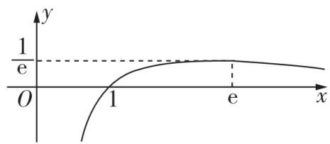

所以当 $a + 1 \in (0, \frac{1}{\mathrm{e}})$ , 即 $a \in (-1, \frac{1}{\mathrm{e}} - 1)$ 时, 关于 $x$ 的方程 $f(x) = \frac{1}{2} ax^2$ 有两个不同实根 $x_1, x_2$ . (8分)

# 第 4 步: 列方程组, 建立 $x_{1}, x_{2}$ 之间的关系

不妨设 $0 < x_{1} < x_{2}$ ，则 $\left\{ \begin{array}{l} \ln x_{1} = (a + 1)x_{1}, \\ \ln x_{2} = (a + 1)x_{2}, \end{array} \right.$

两式相加得 $\ln (x_{1}x_{2}) = (a + 1)(x_{1} + x_{2})$ ，两式相减得 $\ln \frac{x_2}{x_1} = (a + 1)(x_2 - x_1)$ ，所以 $\frac{\ln x_1x_2}{\ln\frac{x_2}{x_1}} = \frac{x_1 + x_2}{x_2 - x_1},[4]$ (11分）

# 第 5 步: 根据 $x_{1}, x_{2}$ 之间的关系等价转化所证不等式

要证 $x_{1} \cdot x_{2} > \mathrm{e}^{2}$ , 只需证 $\ln (x_{1}x_{2}) = \frac{x_{1} + x_{2}}{x_{2} - x_{1}} \cdot \ln \frac{x_{2}}{x_{1}} > 2$ ,

即证 $\ln \frac{x_2}{x_1} >\frac{2(x_2 - x_1)}{x_1 + x_2} = \frac{2(\frac{x_2}{x_1} - 1)}{1 + \frac{x_2}{x_1}}.$ (13分）

# 第6步:换元,构造新函数并研究其单调性

设 $t = \frac{x_2}{x_1}$ 则 $t > 1$ ，令 $F(t) = \ln t - \frac{2(t - 1)}{1 + t} = \ln t + \frac{4}{t + 1} -2,t > 1,[5]$ (14分）

则 $F'(t) = \frac{1}{t} -\frac{4}{(t + 1)^{2}} = \frac{(t - 1)^{2}}{t(t + 1)^{2}} >0,$

所以函数 $F(t)$ 在 $(1, +\infty)$ 上单调递增，又 $\ln 1 - \frac{2 \times (1 - 1)}{1 + 1} = 0$

所以 $F(t)>0$ , 即 $\ln t>\frac{2(t-1)}{1+t}$

# 第7步:给出结论

所以 $x_{1} \cdot x_{2} > \mathrm{e}^{2}$ , 原命题得证. (17 分)

得分点1 由 $\ln x - (a + 1)x = 0$ 得到 $a + 1 = \frac{\ln x}{x}$

得分点2 能准确作出 $\varphi(x)$ 的大致图象,从而数形结合正确得出 a 的取值范围

易失分点1 不会消去参数 $a$

得分点3 根据所得 $x_{1}, x_{2}$ 之间的关系式, 对 $x_{1} \cdot x_{2} > \mathrm{e}^{2}$ 两边同时取对数, 将其转化为 $\ln (x_{1}x_{2}) = \frac{x_{1} + x_{2}}{x_{2} - x_{1}} \cdot \ln \frac{x_{2}}{x_{1}} > 2$

得分点4 利用齐次化思想得到

$\ln \frac {x _ {2}}{x _ {1}} > \frac {2 (x _ {2} - x _ {1})}{x _ {1} + x _ {2}} = \frac {2 (\frac {x _ {2}}{x _ {1}} - 1)}{1 + \frac {x _ {2}}{x _ {1}}}$

易失分点2 换元后忽视新元的范围

# 难点攻略

# 1. 极值点偏移问题

已知函数 $y = f(x)$ 的极值点为 $x_0$ ，且函数 $y = f(x)$ 的图象与直线 $y = m$ 交于 $(x_1, y_1), (x_2, y_2)$ 两点，判断 $x_1 + x_2$ 与 $2x_0$ 或 $x_1x_2$ 与 $x_0^2$ 的大小关系.

# 2. 拐点偏移的情形

拐点,即函数图象的凹凸性发生变化的点.如图展示了拐点不偏移与偏移的情况.

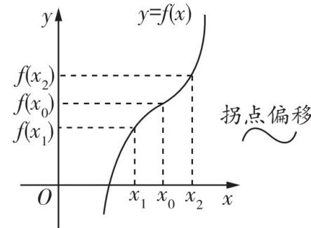

$f (x _ {1}) + f (x _ {2}) = 2 f (x _ {0}) \Rightarrow$

$x _ {1} + x _ {2} = 2 x _ {0}$

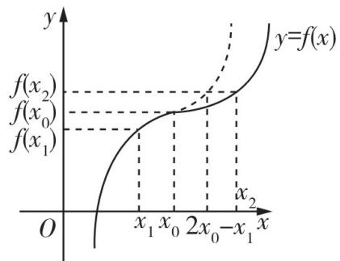

$f (x _ {1}) + f (x _ {2}) = 2 f (x _ {0}) \Rightarrow x _ {2} >$

$2 x _ {0} - x _ {1} \Longrightarrow x _ {1} + x _ {2} > 2 x _ {0}$

##### 3. 应用消参减元法求解极值点偏移问题的步骤

<table><tr><td>第1步联立消参</td><td>利用方程 $f(x_1) = f(x_2)$ 消掉解析式中的参数,一般地,含有对数时,通过求差、求和、作商建立联系,含有指数时,用作商法建立联系</td></tr><tr><td>第2步转化所证</td><td>根据所求问题,结合消参后的式子合理转化为 $x_1, x_2$ 间的关系</td></tr><tr><td>第3步换元构造</td><td>令 $t = \frac{x_2}{x_1}$ 或令 $t = x_1 - x_2$ ,将原式子转化为关于t的式子,并构造函数</td></tr><tr><td>第4步用导求解</td><td>利用导数求解关于t的函数的极值、最值等问题</td></tr></table>

# 重难变式练

[差值换元|2024天星原创,15分]已知函数 $f(x)=\mathrm{e}^{x-1}-\frac{1}{2}ax^{2}+ax+1$ .

（1） 讨论 $f(x)$ 的极值点个数；  
（2） 若 $f(x)$ 有两个不同的极值点 $x_{1}, x_{2}$ ，证明： $x_{1} + x_{2} > 4$ .

【参考答案】 $（1）f'(x) = \mathrm{e}^{x - 1} - ax + a.$

因为 $f'（1）=1\neq0$ ，所以1不是 $f(x)$ 的极值点.

(2 分)

$f'(x) = \mathrm{e}^{x - 1} - a(x - 1) = 0$ 可变形为 $\frac{\mathrm{e}^{x - 1}}{x - 1} = a,$

【会思考】分离参数,找出目标函数

令 $g(x)=\frac{\mathrm{e}^{x-1}}{x-1}$ ，则 $g'(x)=\frac{\mathrm{e}^{x-1}(x-2)}{(x-1)^{2}}$ ，令 $g'(x)=0$ ，得 x=2，又 $x\neq1$ ，所以 $g(x)$ 在 $(-∞,1)$ ， $(1,2)$ 上单调递减，在 $(2,+∞)$ 上单调递增。（4分）

因为 $g(2)=\mathrm{e}$ ，且当 x<1 时， $g(x)<0$ ，

所以当 $a \in [0, e]$ 时， $f(x)$ 没有极值点；当 $a \in (-\infty, -\infty)$

【明误区】可导函数的极值点就是导函数的变号零点. 当 a = e 时, 直线 y = a 与函数 $g(x)$ 的图象虽然有 1 个交点, 但当 $x \in (1, +\infty)$ 时, 函数图象恒在该直线的上方, 因此函数 $f(x)$ 没有极值点

0) 时, $f(x)$ 有一个极值点; 当 $a \in (\mathrm{e}, +\infty)$ 时, $f(x)$ 有两个极值点. (7 分)

（2）由已知得 $\left\{\begin{aligned}\mathrm{e}^{x_{1}-1}&=a(x_{1}-1),\\ \mathrm{e}^{x_{2}-1}&=a(x_{2}-1)\end{aligned}\right.$

不妨设 $x_{2} > x_{1}$ ，记 $t = x_{2} - x_{1}$ ，则 $t > 0, x_{2} = x_{1} + t$ ，则有 $\left\{ \begin{array}{l} \mathrm{e}^{x_1 - 1} = a(x_1 - 1), \\ \mathrm{e}^{x_1 + t - 1} = a(x_1 + t - 1), \end{array} \right.$

两式相除得 $\frac{\mathrm{e}^{x_1 + t - 1}}{\mathrm{e}^{x_1 - 1}} = \frac{a(x_1 + t - 1)}{a(x_1 - 1)}$ ，即 $\mathrm{e}^t = 1 + \frac{t}{x_1 - 1}$ 整理得 $x_{1} = \frac{t}{\mathrm{e}^{t} - 1} +1.$

故 $x_{2} = x_{1} + t = \frac{t}{\mathrm{e}^{t} - 1} +1 + t.$ (10分）

所证不等式 $x_{1} + x_{2} > 4$ 等价于 $\left(\frac{t}{\mathrm{e}^t - 1} +1\right) + \left(\frac{t}{\mathrm{e}^t - 1} +1 + t\right) > 4$ ，即 $\frac{2t}{\mathrm{e}^t - 1} +t > 2.$

因为 t > 0，所以 $e^{t} - 1 > 0$ ，故不等式等价于 $2t + (t - 2)(e^{t} - 1) > 0$ ，即 $t + 2 + (t - 2)e^{t} > 0$ 。 (11 分)

记 $m(x) = x + 2 + (x - 2)\mathrm{e}^{x}(x > 0)$ ，则 $m'(x) = 1 + (x - 1)\mathrm{e}^{x}$ ，

记 $k(x) = 1 + (x - 1)\mathrm{e}^{x}(x > 0)$ ，则 $k'(x) = x\mathrm{e}^x$ （13分）

因为 $x > 0, \mathrm{e}^{x} > 0$ ，所以 $k'(x) > 0$ ，故函数 $k(x)$ 在 $(0, +\infty)$ 上单调递增，

故 $k(x) > 1 + (0 - 1) \times \mathrm{e}^{0} = 0$ ，所以 $m'(x) > 0$ ，故函数 $m(x)$ 在 $(0, +\infty)$ 上单调递增，

所以 $m(x)>0+2+(0-2)\times\mathrm{e}^{0}=0$ , 即当 x>0 时, $x+2+(x-2)\mathrm{e}^{x}>0$ .

原不等式得证. (15 分)

# 类型 14 对称构造法

[2022全国甲卷(理),12分]已知函数 $f(x)=\frac{\mathrm{e}^{x}}{x}-\ln x+x-a$ .

（1） 若 $f(x) \geqslant 0$ ，求 a 的取值范围；  
（2） 证明: 若 $f(x)$ 有两个零点 $x_{1}, x_{2}$ , 则 $x_{1}x_{2} < 1$ .

命题拆解 对称构造法在解决极值点偏移问题时是一种较为实用的方法.

解题拆解 （1） $f(x)$ 的定义域为 $(0, +\infty), f'(x) = \frac{(\mathrm{e}^x + x)(x - 1)}{x^2}$ .

当 $x \in (0,1)$ 时， $f'(x) < 0$ ；当 $x \in (1, +\infty)$ 时， $f'(x) > 0$ .

所以 $f(x)$ 在(0,1)上单调递减，在 $(1,+\infty)$ 上单调递增，[1]（1分）

当 $x = 1$ 时， $f(x)$ 取得最小值，最小值为 $f(1) = \mathrm{e} + 1 - a.$ [2] (2分)

由题设得 $e + 1 - a \geqslant 0$ ,

故 $a$ 的取值范围为 $(- \infty, e + 1]$ . [3] (4分)

（2）解法一(同构构造函数转化等式) 不妨设 $x_{1} < x_{2}$ , 则由 （1） 知

$0 <   x _ {1} <   1 <   x _ {2}, 0 <   \frac {1}{x _ {2}} <   1. [ 4 ] \tag {5分}$

由 $f(x_{1}) = f(x_{2}) = 0$ ，得 $\frac{\mathrm{e}^{x_1}}{x_1} -\ln x_1 + x_1 = \frac{\mathrm{e}^{x_2}}{x_2} -\ln x_2 + x_2,$

即 $\mathrm{e}^{x_1 - \ln x_1} + x_1 - \ln x_1 = \mathrm{e}^{x_2 - \ln x_2} + x_2 - \ln x_2.$ [5] (7分）

因为函数 $y=e^{x}+x$ 在 R 上单调递增, 所以 $x_{1}-\ln x_{1}=x_{2}-\ln x_{2}$ 成立.

构造函数 $h(x) = x - \ln x, g(x) = h(x) - h\left(\frac{1}{x}\right) = x - \frac{1}{x} - 2\ln x,$ (8分)

则 $g'(x) = 1 + \frac{1}{x^{2}} -\frac{2}{x} = \frac{(x - 1)^{2}}{x^{2}}\geqslant 0,$ (9分）

所以函数 $g(x)$ 在 $(0, +\infty)$ 上单调递增，

所以当 $x > 1$ 时， $g(x) > g(1) = 0$ ，即当 $x > 1$ 时， $h(x) > h(\frac{1}{x})$ ，（10分）

所以 $h(x_{1}) = h(x_{2}) > h\left(\frac{1}{x_{2}}\right)$ （11分）

又 $h'(x) = 1 - \frac{1}{x} = \frac{x - 1}{x}$ , 所以 $h(x)$ 在 $(0,1)$ 上单调递减,

所以 $0 < x_{1} < \frac{1}{x_{2}} < 1$ ，即 $x_{1}x_{2} < 1.$ (12分)

解法二(对数平均不等式) 由题意得 $f(x)=\frac{\mathrm{e}^{x}}{x}+\ln\frac{\mathrm{e}^{x}}{x}-a,x>0$ .

令 $t = \frac{\mathrm{e}^x}{x}$ 则 $t > 1$ ，令 $g(t) = t + \ln t - a, t > 1, g'(t) = 1 + \frac{1}{t} > 0$ ，（5分）

【点拨】当 x > 0 时, 易知 $e^{x} > x$ , 即 $t = \frac{e^{x}}{x} > 1$

所以 $g(t)=t+\ln t-a$ 在 $(1,+\infty)$ 上单调递增，故 $g(t)=0$ 在 $(1,+\infty)$ 上只有 1 个解 $t_{0}$ .

因为 $f(x) = \frac{\mathrm{e}^x}{x} +\ln \frac{\mathrm{e}^x}{x} -a$ 有两个零点 $x_{1},x_{2}$ ，所以 $t_0 = \frac{\mathrm{e}^{x_1}}{x_1} = \frac{\mathrm{e}^{x_2}}{x_2},$

两边同时取对数得, $x_{1}-\ln x_{1}=x_{2}-\ln x_{2}$ ，即 $\frac{x_{1}-x_{2}}{\ln x_{1}-\ln x_{2}}=1.$ (7分)

因为 $\sqrt{x_1x_2} < \frac{x_1 - x_2}{\ln x_1 - \ln x_2}$ ，所以 $\sqrt{x_1x_2} < 1$ ，即 $x_{1}x_{2} < 1$ 。（8分）

# 高分模板

评分标准 [1] 求导正确并正确判断函数 $f(x)$ 的单调性给 1 分

[2] 正确得出 $f(x)$ 的最小值给 1 分

[3]根据题意正确得到 $a$ 的取值范围给2分

[4]由（1）得到 $x_{1},x_{2}$ 的取值范围给1分

[5] 正确建立关于 $x_{1}, x_{2}$ 的等式给 2 分

得分点1 正确判断 $f(x)$ 的导函数的符号,从而得出 $f(x)$ 的单调性

得分点2 由（1）正确得到 $x_{1}$ ， $x_{2}$ 的取值范围

得分点3 由 $x_{1}, x_{2}$ 为 $f(x)$ 的两个零点, 列方程, 正确建立关于 $x_{1}, x_{2}$ 的等式

易失分点 建立关于 $x_{1}, x_{2}$ 的等式时, 对指、对运算不熟悉, 不能正确化简成同构形式

破题关键 求解本题的关键是通过分析法,构造函数 $h(x)=x-\ln x$ , $g(x)=h(x)-h\left(\frac{1}{x}\right)=x-\frac{1}{x}-2\ln x$ 来证明不等式,其中函数 $g(x)$ 在试题中经常出现,需要熟练掌握其性质

# 利用对数平均不等式解决极值点偏移问题的步骤

第1步 $\boxed{ \begin{array}{l} 根据 f(x_{1}) = \\ f(x_{2}) 建立等量\\ 关系 \end{array} }$

第2步\$\xrightarrow{\text{如果等量关系中含有参数，那么可考虑消参；如果等量关系中含有指数式，那么可考虑将等式两边同时取对数}}\$

下证 $\sqrt{x_1x_2} < \frac{x_1 - x_2}{\ln x_1 - \ln x_2}$ .

不妨设 $x_{1} > x_{2}$ ，则 $\sqrt{x_1x_2} < \frac{x_1 - x_2}{\ln x_1 - \ln x_2}\Leftrightarrow \ln x_1 - \ln x_2 <   \frac{x_1 - x_2}{\sqrt{x_1x_2}}\Leftrightarrow \ln \frac{x_1}{x_2} <$ $\sqrt{\frac{x_1}{x_2}} -\sqrt{\frac{x_2}{x_1}},$

不妨设 $k = \sqrt{\frac{x_1}{x_2}}$ ，则 $k > 1$ ，则证 $2\ln k < k - \frac{1}{k}$ 即可. (10分) 构造函数 $h(k) = 2\ln k - k + \frac{1}{k}, k > 1$ ，则 $h'(k) = \frac{2}{k} - 1 - \frac{1}{k^2} = -(1 - \frac{1}{k})^2 < 0$ ，故 $h(k) = 2\ln k - k + \frac{1}{k}$ 在 $(1, +\infty)$ 上单调递减，故 $h(k) < 2\ln 1 - 1 + \frac{1}{1} = 0$ ，即 $2\ln k < k - \frac{1}{k}$ ，得证. (12分)

第3步

恒等变形转化出对数平均数，再利用对数平均不等式进行证明

# 难点攻略

用对称构造法求解极值点偏移问题的一般步骤

第1步，定函数（极值点为 $x_{0}$ ）：利用导函数符号的变化判断函数 $f(x)$ 的单调性，进而确定函数的极值点 $x_{0}$

第2步，构造函数：对结论 $x_{1} + x_{2} > 2x_{0}$ 型，构造函数 $F(x) = f(x) - f(2x_{0} - x)$ 或 $F(x) = f(x_{0} + x) - f(x_{0} - x)$ ；对结论 $x_{1} \cdot x_{2} > x_{0}^{2}$ 型，构造函数 $F(x) = f(x) - f(\frac{x_{0}^{2}}{x})$ ，通过研究 $F(x)$ 的单调性获得不等式

第3步，判断单调性：利用导数讨论 $F(x)$ 的单调性

第4步，比较大小：判断函数 $F(x)$ 在某段区间上的正负，并得出 $f(x)$ 与 $f(2x_{0}-x)$ 或 $f(x)$ 与 $f(\frac{x_{0}^{2}}{x})$ 的大小关系

第5步, 转化: 利用函数 $f(x)$ 的单调性, 将 $f(x)$ 与 $f(2x_{0} - x)$ 或 $f(x)$ 与 $f(\frac{x_0^2}{x})$ 的大小关系转化为 $x$ 与 $2x_{0} - x$ 或 $x$ 与 $\frac{x_0^2}{x}$ 之间的关系, 进而得到所证或所求

# ★导数中高分结论的应用

# 高分结论1 洛必达法则的应用

[2024 天星原创] 已知函数 $f(x) = x\mathrm{e}^{ax} - \mathrm{e}^x$ ，当 $x > 0$ 时， $f(x) < -1$ 恒成立，则 $a$ 的取值范围是 \_\_\_\_.

命题拆解 洛必达法则是高等数学中的内容,是快解极限问题的一种有效方式,在高考解小题时若能灵活应用,则可以节省很多时间.特别需要强调的是洛必达法则在小题中可以直接使用,但是在解答题中直接使用会扣分.

解题拆解 当 $x > 0$ 时, $f(x) < -1$ 恒成立, 则 $a < \frac{\ln(\mathrm{e}^x - 1) - \ln x}{x}$ , 令 $F(x) = \frac{\ln(\mathrm{e}^x - 1) - \ln x}{x} (x > 0)$ , 则 $F'(x) =$

# 高分模板

得分点1 参变分离,转化不等式,构造新函数  
得分点2 正确求出新函数的导函数

$\frac{\frac{x\mathrm{e}^x}{\mathrm{e}^x - 1} - 1 - \ln (\mathrm{e}^x - 1) + \ln x}{x^2}$ . 令 $\varphi(x) = \frac{x\mathrm{e}^x}{\mathrm{e}^x - 1} - 1 - \ln (\mathrm{e}^x - 1) + \ln x (x >$

0），则 $\varphi'(x) = \frac{(\mathrm{e}^{x} - 1)^{2} - x^{2}\mathrm{e}^{x}}{x(\mathrm{e}^{x} - 1)^{2}}, (\mathrm{e}^{x} - 1)^{2} - x^{2}\mathrm{e}^{x} = (\mathrm{e}^{x} - 1 + x\mathrm{e}^{\frac{x}{2}})(\mathrm{e}^{x} - 1 - x\mathrm{e}^{\frac{x}{2}})$ ，易知当 $x > 0$ 时， $\mathrm{e}^{x} - 1 + x\mathrm{e}^{\frac{x}{2}} > 0$ ，令 $m(x) = \mathrm{e}^{x} - 1 - x\mathrm{e}^{\frac{x}{2}}(x > 0)$ ，则 $m'(x) = \mathrm{e}^{\frac{x}{2}}(\mathrm{e}^{\frac{x}{2}} - 1 - \frac{x}{2})$ ，易知当 $x > 0$ 时， $\mathrm{e}^{\frac{x}{2}} > 1 + \frac{x}{2}$ ，所以 $m'(x) >$

【记结论】 $e^{x}\geqslant1+x$ ，当且仅当x=0时等号成立，这是一个很常用的不等式
0, $m(x)$ 单调递增, $m(x) > e^{0} - 1 - 0 \times e^{\frac{0}{2}} = 0$ , 则 $\varphi'(x) > 0$ , 所以 $\varphi(x)$ 单调递增. $\varphi(x) = \frac{x e^{x}}{e^{x} - 1} - 1 - \ln(e^{x} - 1) + \ln x = \frac{(x-1)e^{x}+1}{e^{x}-1} - \ln\frac{e^{x}-1}{x}$ ,
因为 $\lim_{x\to0^{+}}\left[\frac{(x-1)e^{x}+1}{e^{x}-1}-\ln\frac{e^{x}-1}{x}\right]=\lim_{x\to0^{+}}\frac{(x-1)e^{x}+1}{e^{x}-1}-\lim_{x\to0^{+}}\ln\frac{e^{x}-1}{x}=$ $\lim_{x\to0^{+}}\frac{xe^{x}}{e^{x}}-\lim_{x\to0^{+}}\ln\frac{e^{x}}{1}=0$ ，所以 $\varphi(x)>0$ ，即 $F'(x)>0$ ，所以 $F(x)$ 在 $(0,+\infty)$ 上单调递增，

$\lim_{x \to 0^{+}} \frac{\ln(e^{x} - 1) - \ln x}{x} = \lim_{x \to 0^{+}} \left( \frac{e^{x}}{e^{x} - 1} - \frac{1}{x} \right) = \lim_{x \to 0^{+}} \frac{(x - 1)e^{x} + 1}{x(e^{x} - 1)} = \lim_{x \to 0^{+}} \frac{x e^{x}}{(x + 1)e^{x} - 1} = \lim_{x \to 0^{+}} \frac{x + 1}{x + 2} = \frac{1}{2}$ , 所以 $a \leqslant \frac{1}{2}$ , 即实数 $a$ 的取值范围是 $(- \infty, \frac{1}{2}]$ .

得分点3 将 $(\mathrm{e}^x - 1)^2 - x^2\mathrm{e}^x$ 进行因式分解，并判断出当 $x > 0$ 时， $\mathrm{e}^x - 1 + x\mathrm{e}^{\frac{x}{2}} > 0$

得分点4 结合 $\mathrm{e}^x\geqslant 1 + x$ 判断 $m'(x)$ 的符号

得分点5 应用洛必达法则求出 $\varphi (x) > 0$

得分点6 应用洛必达法则求出 $F(x)$ 的取值情况

应用指导 若符合洛必达法则的应用条件, 则可连续多次使用, 直到求出极限, 即 $\lim_{x \to a} \frac{f(x)}{g(x)} = \lim_{x \to a} \frac{f'(x)}{g'(x)}$ , 若满足条件, 还可继续使用洛必达法则

# 结论拓展

# 洛必达法则的常见应用情形及注意事项

情形1 $\frac{0}{0}$ 型，若函数 $f(x)$ 和 $g(x)$ 满足下列条件：

（1） $\lim_{x\to a}f(x) = 0, \lim_{x\to a}g(x) = 0$ ; （2） 在点 $a$ 的某去心邻域内两者都可导, 且 $g'(x) \neq 0$ ; （3） $\lim_{x\to a}\frac{f'(x)}{g'(x)} = A(A$ 可为实数, 也可为 $\pm \infty$ . 则 $\lim_{x\to a}\frac{f(x)}{g(x)} = \lim_{x\to a}\frac{f'(x)}{g'(x)} = A$ .

情形2 $\frac{\infty}{\infty}$ 型，若函数 $f(x)$ 和 $g(x)$ 满足下列条件：

（1） $\lim_{x\to a}f(x) = \infty$ ， $\lim_{x\to a}g(x) = \infty$ ；（2）在点 $a$ 的某去心邻域内两者都可导，且 $g'(x)\neq 0$ ；（3） $\lim_{x\to a}\frac{f'(x)}{g'(x)} = A(A$ 可为实数，也可为 $\pm \infty$ ).则 $\lim_{x\to a}\frac{f(x)}{g(x)} = \lim_{x\to a}\frac{f'(x)}{g'(x)} = A.$

注意:1. 将上面公式中的 $x \rightarrow a$ , 换成 $x \rightarrow +\infty, x \rightarrow -\infty, x \rightarrow a^{+}, x \rightarrow a^{-}$ , 洛必达法则也成立.

##### 2. 在着手求极限前,要检查是否满足使用洛必达法则的条件,否则滥用洛必达法则会出错.当不满足使用洛必达法则的条件时,就不能用洛必达法则,应从另外的途径求解.

# 高分结论 2 端点效应在不等式问题中的应用

[2023 全国甲卷(文),12 分]已知函数 $f(x)=ax-\frac{\sin x}{\cos^{2}x},x\in(0,\frac{\pi}{2})$ .

（1） 当 a=1 时, 讨论 $f(x)$ 的单调性;  
（2） 若 $f(x) + \sin x < 0$ ，求 a 的取值范围.

命题拆解 若可导函数 $f(x)$ 在 $x = x_0$ 处的函数值 $f(x_0)$ 恰好为 0 , 则当 $x \in (x_0, +\infty)$ 时, 函数 $f(x) > 0$ 恒成立的一个必要条件为 $f'(x_0) \geqslant 0$ ; 当 $x \in (x_0, +\infty)$ 时, 函数 $f(x) < 0$ 恒成立的一个必要条件为 $f'(x_0) \leqslant 0$ . 根据该方法, 要解决某个区间上函数的恒成立问题, 可以先判断“端点”处的导数值的符号, 这就是“端点效应”.

解题拆解 （1） 当 $a = 1$ 时, $f(x) = x - \frac{\sin x}{\cos^2 x}, x \in (0, \frac{\pi}{2})$ ,

则 $f'(x) = 1 - \frac{\cos x\cos^{2}x - 2\cos x(-\sin x)\sin x}{\cos^{4}x} =$ $\frac{\cos^3x + \cos^2x - 2}{\cos^3x}.[1]$ (2分）

当 $x \in (0, \frac{\pi}{2})$ 时， $\cos x \in (0,1)$ ，所以 $\cos^3 x + \cos^2 x - 2 < 0$ 所以 $f'(x) = \frac{\cos^3 x + \cos^2 x - 2}{\cos^3 x} < 0$ 在 $(0, \frac{\pi}{2})$ 上恒成立，[2] (5分)

所以当 $a = 1$ 时， $f(x)$ 在 $(0, \frac{\pi}{2})$ 上单调递减. [3] (6分)

（2） 第 1 步: 整体审题, 分析题意, 判断是否可以应用端点效应

令 $g(x) = ax - \frac{\sin x}{\cos^2 x} + \sin x (0 \leqslant x < \frac{\pi}{2})$ ，则 $g'(x) = a - \frac{1 + \sin^2 x}{\cos^3 x} + \cos x$ ，

问题等价于 $g(x) < 0$ 在 $x \in (0, \frac{\pi}{2})$ 上恒成立, $g(0) = 0$ ,

第 2 步: 代入端点值, 求参数范围

于是 $g(x)=f(x)+\sin x<0$ 的必要条件为 $g'（0）\leqslant0$ ，即 $g'（0）=a-1+1=a\leqslant0$ ，解得 $a\leqslant0.$ [4] (8分)

【析疑难】若 $g(x) < 0$ 在 $x \in (0, \frac{\pi}{2})$ 上恒成立，且 $g(0) = 0$ ，则有 $g'（0） \leqslant 0$ ，此方法利用了端点效应，但是由此得到的参数范围可能比正确范围要大，所以一定要进行检验

第 3 步: 证明充分性, 求得结果

当 $a = 0$ 时， $g(x) = \sin x - \frac{\sin x}{\cos^2 x} = \sin x(1 - \frac{1}{\cos^2 x})$

由 $x \in (0, \frac{\pi}{2})$ ，得 $0 < \sin x < 1, 0 < \cos x < 1$ ，则 $\frac{1}{\cos^2 x} > 1$

所以 $g(x)=\sin x-\frac{\sin x}{\cos^{2}x}<0$ , 满足题意. [5] (10 分)

当 $a < 0$ 时，由 $0 < x < \frac{\pi}{2}$ ，得 $ax < 0$

所以 $g(x)=ax-\frac{\sin x}{\cos^{2}x}+\sin x<\sin x-\frac{\sin x}{\cos^{2}x}<0$ , 满足题意.

所以 $a \leqslant 0$ 是 $g(x) < 0$ 在 $x \in (0, \frac{\pi}{2})$ 上恒成立的充要条件.

所以 $a$ 的取值范围为 $(- \infty, 0]$ . [6] (12分)

# 高分模板

评分标准 [1] 正确求出 $f(x)$ 的导函数给2分

[2] 判断出 $f'(x)$ 的正负给3分  
[3] 得出 $f(x)$ 单调性的结论给 1 分  
[4]应用必要条件判断出 $a$ 的范围给2分  
[5] 证明出 $a = 0$ 时满足题意给2分  
[6] 证明出 $a < 0$ 时满足题意并得出结论给2分

得分点1 对 $f'(x)$ 进行化简, 得到 $f'(x)=\frac{\cos^{3}x+\cos^{2}x-2}{\cos^{3}x}$

得分点2 能根据 $x \in (0, \frac{\pi}{2})$ 时 $\cos x$ 的范围判断 $f'(x)$ 的符号

得分点3 判断出 $g(0) = 0$

易失分点 应用端点效应判断 a 的范围时, 将必要条件写成 $g'（0） < 0$

得分点4 当 $a < 0$ 时, 根据 $ax < 0$ 将 $g(x)$ 放缩, 推出 $g(x) < 0$

# 高分攻略

##### 1. 端点效应类导数题的 3 大类型

（1） 区间端点值包含参数型: 若函数 $f(x) \geqslant 0$ 在区间 $[a, b]$ 上恒成立, 则 $\left\{\begin{aligned} f(a) & \geqslant 0, \\ f(b) & \geqslant 0. \end{aligned}\right.$   
（2） 区间端点值为 0 型: 若函数 $f(x) \geqslant 0$ 在区间 $[a, b]$ 上恒成立, 且 $f(a) = 0$ (或 $f(b) = 0$ ), 则 $f'(a) \geqslant 0$ (或 $f'(b) \leqslant 0$ ).  
（3） 区间端点处的函数值与导数值均为 0 型: 若函数 $f(x) \geqslant 0$ 在区间 $[a, b]$ 上恒成立, 且 $f(a) = 0$ , $f'(a) = 0$ (或 $f(b) = 0$ , $f'(b) = 0$ ), 则 $f''(a) \geqslant 0$ (或 $f''(b) \leqslant 0$ ) ( $f''(x)$ 为 $f'(x)$ 的导函数).

# 2. 中间点效应

（1） 如果函数 $f(x)$ 满足 $\forall x \in [a, b]$ , $f(x) \geqslant 0$ , 且 $f(x_{0}) = 0$ , 其中 $x_{0} \in (a, b)$ , 则存在 $\delta_{1} \in [a, x_{0})$ , 使得 $\forall x \in [\delta_{1}, x_{0}]$ , $f'(x) \leqslant 0$ 恒成立, 存在 $\delta_{2} \in (x_{0}, b]$ , 使得 $\forall x \in [x_{0}, \delta_{2}]$ , $f'(x) \geqslant 0$ 恒成立, 于是就有 $f'(x_{0}) = 0$ , 且 $f''(x_{0}) \geqslant 0$ .

$f''(x)$ 表示 $f'(x)$ 的导函数

（2） 如果函数 $f(x)$ 满足 $\forall x \in [a, b]$ , $f(x) \leqslant 0$ , 且 $f(x_{0}) = 0$ , 其中 $x_{0} \in (a, b)$ , 则存在 $\delta_{1} \in [a, x_{0})$ , 使得 $\forall x \in [\delta_{1}, x_{0}]$ , $f'(x) \geqslant 0$ 恒成立, 存在 $\delta_{2} \in (x_{0}, b]$ , 使得 $\forall x \in [x_{0}, \delta_{2}]$ , $f'(x) \leqslant 0$ 恒成立, 于是就有 $f'(x_{0}) = 0$ , 且 $f''(x_{0}) \leqslant 0$ .

$f''(x)$ 表示 $f'(x)$ 的导函数

##### 3. 必要性探路: 若 $f(x, t) \geqslant 0$ (t 为参数) 在 $[a, b]$ (a, b 为常数) 上恒成立, 则 $\forall x_0 \in [a, b]$ , 均有 $f(x_0) \geqslant 0$ , 我们可以带一些特数值, 如遇到对数取 1 , 遇到指数取 0 或遇到三角取特殊角等, 算出一个参数的范围, 再在这个范围内进行分类讨论, 或证明这个条件是充分条件.

# 高分结论3 对数平均不等式的应用

[2024 广东佛山期中,15 分]已知函数 $f(x)=\ln x-\frac{2(x-1)}{x+1}$ .

（1） 证明: 函数 $f(x)$ 在定义域内存在唯一零点;  
（2） 设 $0 < a < b$ ，试比较 $\frac{b + a}{2}$ 与 $\frac{b - a}{\ln b - \ln a}$ 的大小，并说明理由；  
（3） 若数列 $\{a_{n}\}$ 的通项公式为 $a_{n}=1+\frac{1}{2}+\frac{1}{3}+\cdots+\frac{1}{n}$ ，求证： $\ln(2n+1)>a_{n}$ .

命题拆解 对数平均不等式在解答题中不能直接使用,若要使用需补充证明过程,对数平均不等式更多的是给我们提供一个放缩的思路.遇见想用对数平均不等式解决的问题时,需要从齐次化的角度考虑,把式子往齐次化上转化.

解题拆解 （1） $f(x)=\ln x-\frac{2(x-1)}{x+1}=\ln x+\frac{4}{x+1}-2$ ，定义域为(0, +∞)，

则 $f'(x) = \frac{1}{x} -\frac{4}{(x + 1)^{2}} = \frac{(x - 1)^{2}}{x(x + 1)^{2}}\geqslant 0,[1]$ (2分）

所以函数 $f(x)$ 在 $(0, +\infty)$ 上单调递增，

当 $x = 1$ 时, $f(x) = 0$ , 所以函数 $f(x)$ 在定义域内存在唯一零点. (4分)

【点拨】结合函数的单调性即可得证

（2） $\frac{b + a}{2} > \frac{b - a}{\ln b - \ln a}$ , 理由如下.

【提醒】先判断出 $\frac{b+a}{2}>\frac{b-a}{\ln b-\ln a}$ ，再写证明过程

要证 $\frac{b + a}{2} >\frac{b - a}{\ln b - \ln a}$ 只需证 $\ln b - \ln a > \frac{2(b - a)}{b + a},$

【点拨】把式子往齐次化上转化

即证 $\ln \frac{b}{a} >\frac{2(\frac{b}{a} - 1)}{\frac{b}{a} + 1}$ 即证 $\ln \frac{b}{a} -\frac{2(\frac{b}{a} - 1)}{\frac{b}{a} + 1} >0(b > a > 0).$ [2] (6分)

令 $\frac{b}{a} = t$ ，则 $t > 1$ ，从而即证 $\ln t - \frac{2(t - 1)}{t + 1} >0(t > 1)$

设 $h(t) = \ln t - \frac{2(t - 1)}{t + 1} (t > 1)$ , [3] (7分)

由（1）知函数 $h(t)$ 在区间 $(1, +\infty)$ 上单调递增，

# 高分模板

评分标准 [1] 正确求出 $f(x)$ 的导函数给2分

[2] 正确将不等式进行转化给 2 分  
[3]换元并构造函数 $h(t) = \ln t - \frac{2(t - 1)}{t + 1} (t > 1)$ 给1分  
[4]根据所证不等式正确赋值给3分  
[5] 正确利用累加法进行证明给3分

得分点1 利用齐次化思想转化所证不等式

得分点2 换元,构造函数

易失分点 换元后忽视新元的取值范围

所以 $h(t) > 0$ ，即 $\ln t - \frac{2(t - 1)}{t + 1} >0(t > 1)$ 成立，

故 $\frac{b + a}{2} >\frac{b - a}{\ln b - \ln a}$ (9分）

（3）由（2）知,若b>a>0,则总有 $\ln b-\ln a>\frac{2(b-a)}{b+a}$ 成立.

不妨令 $b = 2n + 1, a = 2n - 1, n \in \mathbf{N}^*$ ，则有 $\ln (2n + 1) - \ln (2n - 1) > \frac{4}{4n} = \frac{1}{n}$ . [4] (12分)

由于 $n \in N^{*}$ ，所以 $\ln 3 - \ln 1 > 1, \ln 5 - \ln 3 > \frac{1}{2}, \cdots, \ln(2n + 1) - \ln(2n - 1) > \frac{1}{n}$ ,

所以 $(\ln 3 - \ln 1) + (\ln 5 - \ln 3) + \cdots + [\ln (2n + 1) - \ln (2n - 1)] > 1 + \frac{1}{2} + \frac{1}{3} + \cdots + \frac{1}{n},$

所以 $\ln(2n+1)>1+\frac{1}{2}+\frac{1}{3}+\cdots+\frac{1}{n}$ ,

即有 $\ln (2n + 1) > a_{n}$ 成立. [5] (15分)

# 第（3）问的思路点拨

所证不等式中含有对数

考虑利用第（2）问的结论

式子中含有 $2n + 1$ 和 $\frac{1}{n}$

目标: 与 $2n + 1$ 结合凑出 n, $2n+1+2n-1=4n,2[2n+1-(2n-1)]=4$ 令 $b=2n+1, a=2n-1$

名师语要 本题如果没有第（2）问, 而是直接证 $\ln(2n+1)>a_{n}$ , 就要根据 $a_{n}$ 的特征, 将 $a_{n}$ 看成前 n 项的和, 逆推不等式, 直至推出证 $\ln b-\ln a>\frac{2(b-a)}{b+a}(b>a>0)$ 成立.

# 结论拓展

对数平均不等式: 若 a > 0, b > 0, $a \neq b$ , 则 $\frac{a + b}{2} > \frac{a - b}{\ln a - \ln b} > \sqrt{ab}$ , 其中 $\frac{a - b}{\ln a - \ln b}$ 被称为对数平均数.

对于 $\frac{a+b}{2}>\frac{a-b}{\ln a-\ln b}$ ，不妨设a>b，上面的典例中已经进行了证明。对于 $\frac{a-b}{\ln a-\ln b}>\sqrt{ab}$ ，不妨设a>b，
类型14的典例第（2）问的解法二中给出了证明过程。综上所述， $\frac{a+b}{2}>\frac{a-b}{\ln a-\ln b}>\sqrt{ab}$ 。

补充: 若 a > b > 0, 则 $b < \frac{2}{\frac{1}{a} + \frac{1}{b}} < \sqrt{ab} < \frac{a - b}{\ln a - \ln b} < \frac{a + b}{2} < \sqrt{\frac{a^{2} + b^{2}}{2}} < a.$

【点拨】调和平均数＜几何平均数＜对数平均数＜算术平均数＜平方平均数，简记为调几对算方

# 高分结论 4 同构单调及同构保值的应用

[2024 四川成都二模,12 分]已知函数 $f(x) = \frac{ae^x - 1}{x}$ 的图象在点(1, $f(1)$ )处的切线经过点(2,e).

（1） 求 $a$ 的值及函数 $f(x)$ 的单调区间；  
（2） 若关于 $x$ 的不等式 $\mathrm{e}^x\ln x - \frac{\ln x + x^2 + (\lambda - 1)x - \lambda}{\mathrm{e}^\lambda}\geqslant 0$ 在区间 $(1, + \infty)$ 上恒成立，求正实数 $\lambda$ 的取值范围.

命题拆解 同构是指将不同的代数式(或不等式、方程)进行变形,转化为形式结构相同或相近的式子,然后构造函数.同构法常用于求解具有对数、指数等混合式子结构的等式或不等式问题.试题考查形式灵活多样,思维量大,对学生的观察能力、化归与转化能力要求较高.

解题拆解 （1） 因为 $f(x) = \frac{a\mathrm{e}^x - 1}{x}$ ，所以 $f(1) = a\mathrm{e} - 1$ ，

又 $f'(x)=\frac{a x e^{x}-a e^{x}+1}{x^{2}}$ ，所以 $f'（1）=1,[1]$ (1分)

又函数 $f(x)$ 的图象在点 $(1, f(1))$ 处的切线经过点 $(2, e)$ ,

所以 $\frac{ae-1-e}{1-2}=1$ , 解得 a=1. (2分)

【提醒】直线斜率公式的应用

所以 $f(x) = \frac{\mathrm{e}^x - 1}{x}$ , 其定义域为 $(- \infty, 0) \cup (0, +\infty)$ ,

则 $f'(x)=\frac{x\mathrm{e}^{x}-\mathrm{e}^{x}+1}{x^{2}}.$

令 $g(x) = x\mathrm{e}^{x} - \mathrm{e}^{x} + 1$ ，则 $g'(x) = x\mathrm{e}^{x}$ （3分）

所以当 $x > 0$ 时 $g'(x) > 0$ ，当 $x <   0$ 时 $g'(x) <   0$

所以 $g(x)$ 在 $(0, +\infty)$ 上单调递增，在 $(- \infty, 0)$ 上单调递减，

所以 $g(x) \geqslant g(0) = 0$ ,

所以当 $x \neq 0$ 时 $x\mathrm{e}^{x} - \mathrm{e}^{x} + 1 > 0$ 恒成立，即 $f'(x) > 0$ 恒成立，

所以 $f(x)$ 在 $(-\infty, 0), (0, +\infty)$ 上单调递增.

故 $f(x)$ 的单调递增区间为 $(-∞,0),(0,+∞)$ ，无单调递减区间. [2] (5分)

（2） 不等式 $\mathrm{e}^x\ln x - \frac{\ln x + x^2 + (\lambda - 1)x - \lambda}{\mathrm{e}^\lambda} \geqslant 0$ 在区间 $(1, +\infty)$ 上恒成立，

因为 $x \in (1, +\infty)$ , 所以 $\ln x > 0$ ,

则 $\mathrm{e}^{x + \lambda}\geqslant \frac{\ln x + x^2 + (\lambda - 1)x - \lambda}{\ln x}$ 在区间 $(1, + \infty)$ 上恒成立，

所以 $\mathrm{e}^{x + \lambda} - 1\geqslant \frac{(x + \lambda)(x - 1)}{\ln x}$ 在区间 $(1, + \infty)$ 上恒成立，

又 $\lambda > 0$ ，所以 $x + \lambda > 0$

所以 $\frac{\mathrm{e}^{x + \lambda} - 1}{x + \lambda}\geqslant \frac{x - 1}{\ln x} = \frac{\mathrm{e}^{\ln x} - 1}{\ln x}$ 在区间 $(1, + \infty)$ 上恒成立，

【点拨】借助 $x = \mathrm{e}^{\ln x}$ 凑出不等式两边结构相同的形式

即 $f(x + \lambda) \geqslant f(\ln x)$ 在区间 $(1, +\infty)$ 上恒成立. [3] (8分)

由（1）可知 $f(x)$ 在 $(0, +\infty)$ 上单调递增，

所以 $x + \lambda \geqslant \ln x$ 在区间 $(1, +\infty)$ 上恒成立，即 $\lambda \geqslant -x + \ln x$ 在区间 $(1, +\infty)$ 上恒成立.

【关键】参变分离

令 $h(x) = -x + \ln x, x \in (1, +\infty)$ ，(10分)

则 $h'(x) = -1 + \frac{1}{x} = \frac{1 - x}{x} < 0$

所以 $h(x)$ 在 $(1, +\infty)$ 上单调递减，

所以 $h(x) < -1 + \ln 1 = -1$ ，即 $-x + \ln x < -1$ 区间 $(1, +\infty)$ 上恒成立，

所以当 $\lambda > 0$ 时, $\lambda \geqslant -x + \ln x$ 在区间 $(1, +\infty)$ 上恒成立,

即对任意 $\lambda \in (0, +\infty)$ ，关于 $x$ 的不等式 $\mathrm{e}^x\ln x - \frac{\ln x + x^2 + (\lambda - 1)x - \lambda}{\mathrm{e}^\lambda} \geqslant 0$ 在区间 $(1, +\infty)$ 上恒成立. (12分)

# 高分模板

评分标准 [1] 正确求出 $f(x)$ 的导函数并得出 $f'（1） = 1$ 给1分

[2]将单调区间用“或”连接不给分

[3] 正确对不等式进行转化得 3 分

得分点1 观察出 $f'（1） = 1$

易失分点1 写单调递增区间时用“或”连接

易失分点2 没有写无单调递减区间

# 第（2）问的思路点拨

结合给出的自变量的取值范围将 $\ln x$ 移到不等式一侧

不等式中含有 $\mathrm{e}^{x + \lambda}$ ，结合 $f(x) =$ $\frac{\mathrm{e}^x - 1}{x}$ ，想办法将不等号两边的式子往 $f(x)$ 的形式上凑

$\mathrm{e} ^ {x + \lambda} - 1 \geqslant \frac {(x + \lambda) (x - 1)}{\ln x}$

$\frac {\mathrm{e} ^ {x + \lambda} - 1}{x + \lambda} \geqslant \frac {x - 1}{\ln x} = \frac {\mathrm{e} ^ {\ln x} - 1}{\ln x}$

得分点2 参变分离,构造 $h(x)$

得分点3 结合 $\lambda$ 为正实数求出 $\lambda$ 的范围

# 结论拓展

# 同构法的类型分析

# 类型一 地位同等同构

对于含有两个变量 $x_{1}, x_{2}$ 的不等式, 一般通过变形将 $x_{1}, x_{2}$ 分别化到不等式的两边, 若不等式两边结构相同, 则根据结构特征构造函数, 利用函数的单调性解决问题. 注意不等式的转化要等价. 如:

（1） $\frac{f(x_1) - f(x_2)}{x_1 - x_2} > k(x_1 < x_2) \Leftrightarrow f(x_1) - f(x_2) < kx_1 - kx_2 \Leftrightarrow f(x_1) - kx_1 < f(x_2) - kx_2$ ，构造函数 $y = f(x) - kx$ ；  
（2） $\frac{f(x_1) - f(x_2)}{x_1 - x_2} < \frac{k}{x_1x_2} (x_1 < x_2) \Leftrightarrow f(x_1) - f(x_2) > \frac{k(x_1 - x_2)}{x_1x_2} = \frac{k}{x_2} - \frac{k}{x_1} \Leftrightarrow f(x_1) + \frac{k}{x_1} > f(x_2) + \frac{k}{x_2}$ , 构造函数 $y = f(x) + \frac{k}{x}$ .

# 类型二 指对跨阶同构

<table><tr><td>积型</td><td> $ae^{a} \leqslant b\ln b \Rightarrow \begin{cases} 同右: e^{a}\ln e^{a} \leqslant b\ln b \rightarrow f(x) = x\ln x \\ 同左: ae^{a} \leqslant (\ln b)e^{\ln b} \rightarrow f(x) = xe^{x} \\ 满足 a > 0, \ln b > 0 时, 取对: a + \ln a \leqslant \ln b + \ln(\ln b) \rightarrow f(x) = x + \ln x \end{cases}$ </td></tr><tr><td>商型</td><td> $\frac{e^{a}}{a} < \frac{b}{\ln b} \Rightarrow \begin{cases} 同右: \frac{e^{a}}{\ln e^{a}} < \frac{b}{\ln b} \rightarrow f(x) = \frac{x}{\ln x} \\ 同左: \frac{e^{a}}{a} < \frac{e^{\ln b}}{\ln b} \rightarrow f(x) = \frac{e^{x}}{x} \\ 满足 a > 0, \ln b > 0 时, 取对: a - \ln a < \ln b - \ln(\ln b) \rightarrow f(x) = x - \ln x \end{cases}$ </td></tr><tr><td>和差型</td><td> $e^{a} \pm a > b \pm \ln b \Rightarrow \begin{cases} 同右: e^{a} \pm \ln e^{a} > b \pm \ln b \rightarrow f(x) = x \pm \ln x \\ 同左: e^{a} \pm a > e^{\ln b} \pm \ln b \rightarrow f(x) = e^{x} \pm x \end{cases}$ </td></tr></table>

# 类型三 无中生有同构

观察不等式的结构特征,在不等式两边同乘或同加某一式子,进行变形,甚至放缩来进行同构.

（1） $ae^{ax}>\ln x\xrightarrow{同乘x}axe^{ax}>x\ln x$ ，后面的转化同积型.  
（2） $\mathrm{e}^x > a\ln (ax - a) - a \Leftrightarrow \frac{1}{a}\mathrm{e}^x > \ln [a(x - 1)] - 1 \Leftrightarrow \mathrm{e}^{x - \ln a} - \ln a > \ln (x - 1) - 1 \xrightarrow{\text{同加} x} \mathrm{e}^{x - \ln a} + x - \ln a >$ $\ln (x - 1) + x - 1 = \mathrm{e}^{\ln (x - 1)} + \ln (x - 1) \Leftrightarrow x - \ln a > \ln (x - 1)$ , 其中 $a > 0$ 且 $a \neq 1$ .  
（3） $a^{x} > \log_{a} x \Leftrightarrow e^{x \ln a} > \frac{\ln x}{\ln a} \Leftrightarrow (x \ln a) e^{x \ln a} > x \ln x (x \ln a > 0)$ ，后面的转化同积型，其中 $a > 0$ 且 $a \neq 1$ .

# 类型四 含有指、对、幂形式的同构

x>0 时,结合指数运算和对数运算的法则,可以得到下述结论:

（1） $x\mathrm{e}^{x} = \mathrm{e}^{x + \ln x}, x + \ln x = \ln (x\mathrm{e}^{x})$ ；（2） $\frac{\mathrm{e}^x}{x} = \mathrm{e}^{x - \ln x}, x - \ln x = \ln \frac{\mathrm{e}^x}{x}$ ; （3） $x^2\mathrm{e}^x = \mathrm{e}^{x + 2\ln x}, x + 2\ln x = \ln (x^2\mathrm{e}^x)$ ;   
（4） $\frac{\mathrm{e}^x}{x^2} = \mathrm{e}^{x - 2\ln x}, x - 2\ln x = \ln \frac{\mathrm{e}^x}{x^2}$ .

再结合常用的切线不等式 $\ln x \leqslant x - 1, \mathrm{e}^{x} \geqslant x + 1, \mathrm{e}^{x} \geqslant \mathrm{e}x$ 等，可以得到更多结论，这里仅以（1）为例进行引申： $x\mathrm{e}^{x} = \mathrm{e}^{x + \ln x} \geqslant x + \ln x + 1, x + \ln x = \ln (x\mathrm{e}^{x}) \leqslant x\mathrm{e}^{x} - 1, x\mathrm{e}^{x} = \mathrm{e}^{x + \ln x} \geqslant \mathrm{e}(x + \ln x)$ .

# 重难题10 三角函数的图象与性质

# 类型 15 已知性质求函数解析式

难度: ★★★★☆ 难点: 三角恒等变换和图象性质的综合应用

[2022 新高考 I 卷,5 分] 记函数 $f(x) = \sin (\omega x + \frac{\pi}{4}) + b(\omega > 0)$ 的最小正周期为 $T$ . 若 $\frac{2\pi}{3} < T < \pi$ , 且 $y = f(x)$ 的图象关于点 $(\frac{3\pi}{2}, 2)$ 中心对称, 则 $f(\frac{\pi}{2}) =$

$\quad$A. 1

$\quad$B. $\frac{3}{2}$

$\quad$C. $\frac{5}{2}$

$\quad$D. 3

命题拆解 三角函数在高考试题中一般以小题形式出现,重点考查三角恒等变换、三角函数图象的变换及三角函数图象与性质的综合应用. 在平时的复习过程中,同学们还应该注重三角函数的图象与性质和其他知识的交汇考查.

# 解题拆解 第1步:根据已知条件求 $\omega$ 的范围

由函数 $f(x)$ 的最小正周期 $T$ 满足 $\frac{2\pi}{3} < T < \pi$ ，得 $\frac{2\pi}{3} < \frac{2\pi}{\omega} < \pi$ ，得 $2 < \omega < 3$ .

第2步:根据图象关于点 $\left(\frac{3\pi}{2},2\right)$ 中心对称求 $\omega$ 的表达式及b的值

因为函数 $y=f(x)$ 的图象关于点 $\left(\frac{3\pi}{2},2\right)$ 中心对称，所以 $\frac{3\pi}{2}\omega+\frac{\pi}{4}=k\pi,$ $k \in Z$ ，且 b = 2，所以 $\omega = -\frac{1}{6} + \frac{2}{3}k, k \in Z.$

第 3 步: 求 $\omega$ 的值

又 $2 < \omega < 3$ ，所以 $\omega = \frac{5}{2}$ 则 $f(x) = \sin \left(\frac{5}{2} x + \frac{\pi}{4}\right) + 2,$

第4步:求 $f(\frac{\pi}{2})$

所以 $f(\frac{\pi}{2})=\sin(\frac{5}{4}\pi+\frac{\pi}{4})+2=1$ . 故选 A.

# 高分模板

得分点1 函数 $y = \sin x + b$ 的图象的对称中心为 $(k\pi, b) (k \in \mathbf{Z})$

得分点2 能正确根据 $\omega$ 的范围及表达式求出 $\omega$ 的值

易失分点 $f(\frac{\pi}{2})$ 中的 $\frac{\pi}{2}$ 是 $x$ 的值, 不是 $\omega x$ 的值

# 难点攻略

##### 1. 求三角函数解析式 $f(x) = A\sin (\omega x + \varphi) + B$ 的常见题型有化简 $f(x)$ 的解析式、根据图象求解析式等.

（1） 将 $f(x)$ 化简, 得到 $f(x) = A\sin (\omega x + \varphi) + B$ , 一般分为“拆”“降”“合”三步.

①拆,若解析式中有 $\cos(2x-\frac{\pi}{6})$ 这类结构,通常先拆开;  
②降,遇到 $\sin^{2}x,\cos^{2}x,\sin x\cos x$ 这些结构,可降次(“拆”和“降”的顺序要视情况而定);  
③合,完成前两步后,通常就化为了 $f(x)=a\sin\omega x+b\cos\omega x+B$ 这类结构,可利用辅助角公式进行合并.  
（2）根据图象求解析式 $f(x)=A\sin(\omega x+\varphi)+B$ :  
①用最大值和最小值求 $A, B, \begin{cases} f(x)_{\max} = |A| + B, \\ f(x)_{\min} = -|A| + B \end{cases} \Rightarrow |A| = \frac{f(x)_{\max} - f(x)_{\min}}{2}, B = \frac{f(x)_{\max} + f(x)_{\min}}{2};$   
②用最小正周期 $T$ 求 $\omega, |\omega| = \frac{2\pi}{T}$ ;

（3）求 $\varphi$ , 将函数图象上的最大值或最小值点对应的坐标代入解析式, 求出 $\varphi$ , 若图象上没有标出最值点, 也无法通过简单的推理得出最值点, 则考虑代图象上的其他已知点的坐标求 $\varphi$ , 此时要注意该点是在图象的上升段还是下降段上, 或者可以以“五点作图法”中的一个点为突破口进行求解.

##### 2. 与 $f(x) = A\sin (\omega x + \varphi)$ 这类函数的性质有关的题目中常见的四个条件的翻译方法.

<table><tr><td>单调区间</td><td>从左到右,最大值点到相邻最小值点为单调递减区间,最小值点到相邻最大值点为单调递增区间.当条件给出在某区间单调时,则该区间不超过半个周期.</td></tr><tr><td>函数值相等</td><td>一个周期内,两个点的函数值相等,则它们中间必为对称轴(若恰好为一个周期,则结论不一定成立).如图,同周期内的A,B两点处函数值相等,则中间为对称轴;同周期内的B,C两点处函数值相等,中间也为对称轴;A,C之间恰好为一个周期,它们的中间不是对称轴.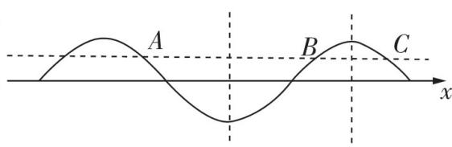</td></tr><tr><td>函数值相反</td><td>半个周期内(不包括恰好为半个周期)或同一段单调区间上,两个点的函数值相反,则它们的中点必为对称中心.如图,D,E两点在半个周期内(也在同一段单调区间上),函数值相反,所以它们的中点F为对称中心;G和H之间恰好为半个周期(不在同一段单调区间上),它们的中点不是对称中心.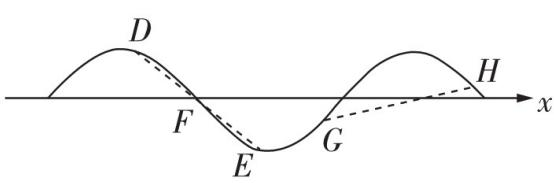</td></tr><tr><td>隐含的最值点</td><td>若f(x)≤f(x0)恒成立,则f(x)在x=x0处取得最大值;若f(x)≥f(x0)恒成立,则f(x)在x=x0处取得最小值;若f(x)≤|f(x0)|恒成立,则f(x)在x=x0处取得最值(最大值、最小值均可).</td></tr></table>

# 类型 16 求参数范围

难度: ★★★★☆ 难点: 结合性质求参数范围

[2024 高三名校联考] 将函数 $f(x) = \cos \omega x (\omega > 0)$ 的图象向左平移 $\frac{\pi}{6}$ 个单位长度后, 得到函数 $y = g(x)$ 的图象, 若函数 $g(x)$ 在区间 $[0, \frac{\pi}{2}]$ 上单调递减, 则实数 $\omega$ 的最大值为

$\quad$A. $\frac{5}{2}$

$\quad$B. $\frac{2}{3}$

$\quad$C. $\frac{3}{2}$

$\quad$D. $\frac{7}{2}$

命题拆解 在近几年的高考试题中,求参数 $\omega$ 的取值范围(或最值)问题常以小题的形式呈现,常见的有根据函数的单调性、零点、极值、最值等求 $\omega$ 的取值范围(或最值),题目有一定的难度.解决此类问题最为直接的方法是通过整体换元将问题转化为正弦、余弦、正切函数问题,再通过函数的性质列出相关约束条件,进而求解,因此掌握正弦、余弦、正切函数的相关性质是解决此类题的关键.

# 解题拆解 第1步:根据已知条件得到 $g(x)$ 的解析式

由题意,将函数 $f(x)=\cos\omega x(\omega>0)$ 的图象向左平移 $\frac{\pi}{6}$ 个单位长度,得到函数 $y=g(x)=\cos\left[\omega\left(x+\frac{\pi}{6}\right)\right]=\cos\left(\omega x+\frac{\omega\pi}{6}\right)$ 的图象.

第2步:根据x的范围求 $\omega x+\frac{\omega\pi}{6}$ 的范围

当 $x \in [0, \frac{\pi}{2}]$ 时， $\omega x + \frac{\omega \pi}{6} \in [\frac{\omega \pi}{6}, \frac{2\omega \pi}{3}]$ ，

第3步:根据余弦函数的单调性及整体思想求 $\omega$ 的大致范围

∵ 函数 $g(x)$ 在区间 $[0, \frac{\pi}{2}]$ 上单调递减，

$\therefore \left[ \frac {\omega \pi}{6}, \frac {2 \omega \pi}{3} \right] \subseteq \left[ 2 k \pi , 2 k \pi + \pi \right], k \in \mathbf {Z},$

$\therefore \frac {2 \omega \pi}{3} - \frac {\omega \pi}{6} = \frac {\omega \pi}{2} \leqslant (2 k \pi + \pi) - 2 k \pi = \pi , \therefore \omega \leqslant 2.$

【点拨】单调区间不超过半个周期

又 $\omega > 0, \therefore 0 < \omega \leqslant 2$

第 4 步: 根据 $\omega$ 的大致范围对 k 赋值, 求 $\omega$ 的具体范围

$\therefore 0 < \frac{\omega\pi}{6} < \frac{2\omega\pi}{3} \leqslant \frac{4\pi}{3}, \therefore k = 0$ ，即 $[\frac{\omega\pi}{6}, \frac{2\omega\pi}{3}] \subseteq [0, \pi]$ ，

【关键】根据 $\omega$ 的范围得到 $k$ 的取值

∴ $\left\{\begin{aligned}\frac{\omega\pi}{6}>0,\\ \frac{2\omega\pi}{3}\leqslant\pi,\end{aligned}\right.$ 解得 $0<\omega\leqslant\frac{3}{2},\therefore$ 实数 $\omega$ 的最大值为 $\frac{3}{2}$ . 故选 C.

# 高分模板

得分点1 正确利用三角函数图象的变换法则得到 $g(x) = \cos(\omega x + \frac{\omega \pi}{6})$

得分点2 掌握余弦函数的单调区间

得分点3 根据函数 $g(x)$ 在区间 $[0, \frac{\pi}{2}]$ 上单调递减及单调区间不超过半个周期, 得到 $\omega \leqslant 2$

易失分点 忽视 $\omega > 0$ 这一条件

# 难点攻略

已知函数 $y = A \sin (\omega x + \varphi) (A > 0, \omega > 0)$ 在区间 $[x_1, x_2]$ 上单调递增（或递减），求 $\omega$ 的取值范围的解题步骤：

根据题意可知区间 $[x_{1}, x_{2}]$ 的长度不大于该函数最小正周期 $T$ 的一半, 即 $x_{2} - x_{1} \leqslant \frac{1}{2} T = \frac{\pi}{\omega}$ , 求得 $0 < \omega \leqslant \frac{\pi}{x_{2} - x_{1}}$

第2步\$\xrightarrow{}\$ 以单调递增为例,得到 $\left[\omega x_{1}+\varphi,\omega x_{2}+\varphi\right]\subseteq\left[-\frac{\pi}{2}+2k\pi,\frac{\pi}{2}+2k\pi\right],k\in\mathbf{Z}$

第3步\$\rightarrow\$ 结合第1步求出的\$\omega\$ 的范围对\$k\$ 进行赋值,从而求出\$\omega\$(不含参数)的取值范围

<table><tr><td>与y=Asin(ωx+φ)(A&gt;0, ω&gt;0)的零点和极值点有关的问题的解题策略</td><td>若区间上至少含有k个零点,需要确定含有k个零点的区间长度;若区间上至多含有k个零点,需要确定包含(k+1)个零点的区间长度的最小值,但是要注意端点值的取舍.极值点的处理方法也是类似的.</td></tr><tr><td>与y=Asin(ωx+φ)(A&gt;0, ω&gt;0)的最值有关的问题的解题策略</td><td>函数图象的对称轴经过图象的最高点或最低点,函数图象的对称中心就是图象与x轴的交点,根据函数在区间上的值域求ω的范围时,需要先结合函数的最值确定ω所满足的关系,再进行求解.</td></tr></table>

# 重难题 11 数列中的求和问题

# 类型 17 并项求和

难度: ★★★★☆ 难点: 探索并项的方法

[2024 江苏盐城期中,15 分]已知正项递增等比数列 $\{a_{n}\}$ 的前 n 项和是 $S_{n}$ ，且 $S_{3}=91, a_{1}a_{3}=81$ .

（1）求数列 $\{a_{n}\}$ 的通项公式;  
（2） 记 $a_{n}$ 的个位数为 $b_{n}$ , 求数列 $\{a_{n} b_{n}\}$ 的前 $2n$ 项和 $T_{2n}$ .

命题拆解 利用并项求和法求和是高考试题及各地模考试题中的考查热点,并项求和法是把有规律的某些项按一定的方式合并成新的项,从而转化为新的数列进行求和的方法.并项的常见类型及解题策略见下表:

<table><tr><td>类型</td><td>解题策略</td></tr><tr><td>首末等距并项</td><td>数列求和中的倒序相加法的本质就是一种首末并项求和的方法,通过配对的两项之和重新构造新数列,从而转化为等差(或等比)数列求和.</td></tr><tr><td>周期并项</td><td>这类问题通常通过计算数列的前几项进行归纳或利用函数的周期性发现数列的周期性,在求和时要注意所求和的项数是否为周期的整数倍,求和要做到不重不漏.</td></tr><tr><td>隔项并项</td><td>一般地,相邻两项之间用 $(-1)^n$ 连接的求和问题通常可以用隔项并项求和的方法来解决,即观察相邻两个奇数项以及相邻两个偶数项之间的规律来实现求和的目的.</td></tr><tr><td>类周期并项</td><td>此类数列的通项通常是由一个周期数列与一个非周期数列对应项相乘得到的,求和时一般按以下三个步骤进行:（1）按照其中周期数列部分的周期确定并项的项数,构造新数列并求出新的通项公式;（2）求出当项数n恰好是周期整数倍时的前n项和Sn;（3）再利用通项an与前n项和Sn之间的关系Sn+1=Sn+an+1求出非周期倍数时的和.</td></tr><tr><td>分段并项</td><td>这种方法是将有规律的前两项(或三项或更多项)合并成新的项,转化为新的数列进行求和的方法,如通项中含有 $(-1)^n$ 或分奇偶项进行求和或已知条件是an+an+1+···+an+k=f(n)(n,k∈N*)等类型的求和.</td></tr></table>

# 解题拆解 （1）第1步:设 $\{a_{n}\}$ 的公比为q,得到q>1

设 $\{a_{n}\}$ 的公比为 $q$ ，因为 $\{a_{n}\}$ 是正项递增等比数列，所以 $q > 1$ ，[1]（1分）

【强规范】在运用基本量法解决等差(比)数列问题时,如果题中没有给出公差 d(公比 q),要先设出公差 d(公比 q)

第 2 步:由等比数列的性质得到 $a_{2} = 9$

由 $a_1a_3 = a_2^2 = 81$ ，得 $a_2 = 9$ ，(2分)

【技巧】等比数列中的连续三项成等比数列

第3步:由 $S_{3}=91$ 得 $a_{1}+a_{3}=82$

由 $S_{3} = 91$ 得 $a_1 + a_2 + a_3 = 91$ ，所以 $a_1 + a_3 = 82$ ，[2] (4分)

【提醒】等比数列求和时,如果求和项数较少,直接列出和式可能比运用求和公式更好一点

# 高分模板

评分标准 [1] 正确得出数列 $\{a_{n}\}$ 的公比 $q > 1$ 给1分

[2]根据 $a_2 = 9$ 和 $S_{3} = 91$ 得出 $a_1 + a_3 = 82$ 给2分

[3] $b_{2n - 1}$ 和 $b_{2n}$ 求对一个给2分

[4] 正确并项给 1 分

易失分点1 在运用基本量法解决等差(比)数列问题时没有设出公差(比)

第 4 步:由等比数列的性质求得公比 q = 9

所以 $\frac{9}{q} + 9q = 82$ ，整理得 $9q^2 - 82q + 9 = 0$ ，因为 $q > 1$ ，所以 $q = 9$ 。（5分）

第5步:得数列 $\{a_{n}\}$ 的通项公式

所以数列 $\{a_{n}\}$ 的通项公式为 $a_{n} = a_{2} \times 9^{n - 2} = 9^{n - 1}$ . (6分)

（2）第1步:求出 $b_{2n-1},b_{2n}$

由（1）得 $a_{n}=9^{n-1}$ ，因为 $b_{n}$ 为 $a_{n}$ 的个位数，

所以由幂运算的性质可得 $b_{2n - 1} = 1, b_{2n} = 9$ ，[3] (10分)

【学知识】一般地,正整数的正整数次幂的个位数具有明显的规律

第2步:根据 $\{a_{n}b_{n}\}$ 的通项公式的特点进行并项

所以 $a_{n}b_{n} = \left\{ \begin{array}{l}9^{n - 1},n\text{为奇数，}\\ 9^n,n\text{为偶数，} \end{array} \right.$ (12分)

将相邻的奇数项与偶数项并项得 $a_{2n - 1}b_{2n - 1} + a_{2n}b_{2n} = 9^{2n - 2} + 9^{2n - 1}\cdot 9 =$ $82\cdot 9^{2n - 2},[4]$ (13分）

【强技能】一般地,数列的通项具有奇偶项特征时,可以考虑运用并项求和法求和

第 3 步: 求和

$\begin{array}{l} \left. a _ {2} b _ {2}\right) + \left(a _ {3} b _ {3} + a _ {4} b _ {4}\right) + \dots + \left(a _ {2 n - 1} b _ {2 n - 1} + a _ {2 n} b _ {2 n}\right) = 8 2 \times 1 + 8 2 \times 9 ^ {2} + \dots + \\ 8 2 \times 9 ^ {2 n - 2} = \frac {8 2 (1 - 8 1 ^ {n})}{1 - 8 1} = \frac {4 1}{4 0} (8 1 ^ {n} - 1). \tag {15分} \\ \end{array}$

所以 $T_{2n}=a_{1}b_{1}+a_{2}b_{2}+a_{3}b_{3}+a_{4}b_{4}+\cdots+a_{2n-1}b_{2n-1}+a_{2n}b_{2n}=(a_{1}b_{1}+$

易失分点2 在审题时忽略正项递增等比数列这一条件,产生增解,导致出错

思路点拨 由 $a_1 + a_3 = 82$ 得 $\frac{9}{q} + 9q = 82$ ，运用的是等比数列中任意两项之间的关系，即 $a_n = a_m q^{n - m}(n, m \in \mathbf{N}^*)$ ，其本质上是等比数列通项公式的推广

得分点1 根据 $a_{n} = 9^{n - 1}$ 得出其个位数的规律，归纳出 $b_{2n - 1},b_{2n}$

得分点2 用分段形式正确写出数列 $\{a_{n}b_{n}\}$ 的通项公式

得分点3 能将数列 $\{a_{n}b_{n}\}$ 的相邻两项 $a_{2n - 1}b_{2n - 1} + a_{2n}b_{2n}$ 进行并项思路拓展本题还可以先分别求出奇数项的和与偶数项的和，再合并求和

# 难点攻略

##### 1. 关于 $a^n (a \in \mathbf{N}^*, 1 \leqslant a \leqslant 9, n \in \mathbf{N}^*)$ 的个位数字 $b_n$ 有以下结论：

$（1） a = 1 \text {时}, b _ {n} = 1; （2） a = 2 \text {时}, b _ {n} = \left\{ \begin{array}{l l} 2, n = 4 k - 3, \\ 4, n = 4 k - 2, \\ 8, n = 4 k - 1, \\ 6, n = 4 k; \end{array} \right. （3） a = 3 \text {时}, b _ {n} = \left\{ \begin{array}{l l} 3, n = 4 k - 3, \\ 9, n = 4 k - 2, \\ 7, n = 4 k - 1, \\ 1, n = 4 k; \end{array} \right.$

$（4） a = 4 \text {时}, b _ {n} = \left\{ \begin{array}{l l} 4, n = 2 k - 1, \\ 6, n = 2 k; \end{array} \right. （5） a = 5 \text {时}, b _ {n} = 5; （6） a = 6 \text {时}, b _ {n} = 6;$

$（7） a = 7 \text {时}, b _ {n} = \left\{ \begin{array}{l l} 7, n = 4 k - 3, \\ 9, n = 4 k - 2, \\ 3, n = 4 k - 1, \\ 1, n = 4 k; \end{array} \right. （8） a = 8 \text {时}, b _ {n} = \left\{ \begin{array}{l l} 8, n = 4 k - 3, \\ 4, n = 4 k - 2, \\ 2, n = 4 k - 1, \\ 6, n = 4 k; \end{array} \right. （9） a = 9 \text {时}, b _ {n} = \left\{ \begin{array}{l l} 9, n = 2 k - 1, \\ 1, n = 2 k. \end{array} \right. \text {其中} k \in \mathbf {N} ^ {*}.$

##### 2. 三个常见数列的求和公式: （1） $1^{2} + 2^{2} + 3^{2} + \cdots + n^{2} = \frac{1}{6} n(n + 1)(2n + 1)$ ; （2） $1^{3} + 2^{3} + 3^{3} + \cdots + n^{3} = \frac{1}{4} n^{2}(n + 1)^{2}$ ; （3） $\mathrm{C}_{n}^{0} + \mathrm{C}_{n}^{1} + \cdots + \mathrm{C}_{n}^{n} = 2^{n}(n \geqslant 1, n \in \mathbf{N}^{*})$ .

# 重难变式练

[隔项并项12024 湖北部分高中联考]已知数列 $\{a_{n}\}$ 满足 $a_{n + 1} + (-1)^{n}a_{n} = 2n - 1$ ，则 $\{a_{n}\}$ 的前40项的和为\_\_\_\_.

解析当 n 为奇数时， $a_{n+1}-a_{n}=2n-1$ ， $a_{n+2}+a_{n+1}=2n+1$ ，两式相减得 $a_{n+2}+a_{n}=2$ ；当 n 为偶数时， $a_{n+1}+a_{n}=2n-1$ ， $a_{n+2}-a_{n+1}=2n+1$ ，两式相加得 $a_{n+2}+a_{n}=4n$ 。所以前 40 项的和 $S_{40}=(a_{1}+a_{3}+a_{5}+\cdots+a_{39})+(a_{2}+a_{4}+\cdots+a_{40})=2\times10+4\times(2+6+\cdots+38)=20+4\times\frac{2+38}{2}\times10=820$ 。

# 类型 18 裂项相消法求和

难度: ★★★★☆ 难点: 正确裂项

[2024 山东青岛模拟,13 分]已知数列 $\{a_{n}\}$ 满足 $a_{1} = 3, a_{n+1} = 3a_{n} - 4n$ .

（1） 判断数列 $\{a_{n}-2n-1\}$ 是否为等比数列，并求数列 $\{a_{n}\}$ 的通项公式；  
（2） 若 $b_{n} = \frac{(2n - 1)2^{n}}{a_{n}a_{n + 1}}$ ，求数列 $\{b_{n}\}$ 的前 $n$ 项和 $S_{n}$ .

命题拆解 裂项相消法求和是指把数列 $\{a_{n}\}$ 的通项拆分为 $f(n) - f(n + k)$ 或 $f(n + k) - f(n)(k \in \mathbf{N}^{*})$ 的形式, 通过累加将一些正、负项相互抵消, 这时只剩下有限的几项, 从而求出该数列的前 $n$ 项和. 分式型或根式型数列求和时多用此法. 主要类型见下表:

<table><tr><td>类型</td><td>常用裂项公式</td></tr><tr><td>等差型</td><td>若数列 $\{a_n\}$ 是各项都不为0,公差为 $d(d \ne 0)$ 的等差数列,则 $\frac{1}{a_k a_{k+1}} = \frac{1}{d} (\frac{1}{a_k} - \frac{1}{a_{k+1}}); \frac{1}{a_k a_{k+1} a_{k+2}} = \frac{1}{2d} (\frac{1}{a_k a_{k+1}} - \frac{1}{a_{k+1} a_{k+2}}).$ </td></tr><tr><td>无理型</td><td> $\frac{1}{\sqrt{n+k}+\sqrt{n}} = \frac{1}{k} (\sqrt{n+k}-\sqrt{n})(k \in \mathbf{N}^*); \frac{\sqrt{n+1}-\sqrt{n}}{\sqrt{n(n+1)}} = \frac{1}{\sqrt{n}} - \frac{1}{\sqrt{n+1}}.$ </td></tr><tr><td>指数型</td><td> $\frac{2^n}{(2^{n+1}-1)(2^n-1)} = \frac{1}{2^n-1} - \frac{1}{2^{n+1}-1}; \frac{n+2}{n(n+1) \cdot 2^n} = \frac{1}{n \cdot 2^{n-1}} - \frac{1}{(n+1) \cdot 2^n}.$ </td></tr><tr><td>对数型</td><td> $\log_a \frac{c_{n+1}}{c_n} = \log_a c_{n+1} - \log_a c_n (a > 0, a \ne 1).$ </td></tr><tr><td> $(-1)^n$ 型</td><td> $(-1)^n \frac{2n+1}{n(n+1)} = (-1)^n (\frac{1}{n} + \frac{1}{n+1}).$ </td></tr><tr><td>与计数原理交汇</td><td> $\frac{n}{(n+1)!} = \frac{1}{n!} - \frac{1}{(n+1)!}; C_n^{m-1} = C_{n+1}^m - C_n^m.$ </td></tr></table>

# 解题拆解 （1）第1步:判断出数列 $\{a_{n}-2n-1\}$ 不是等比数列

因为 $a_{1}=3$ ，所以 $a_{1}-2\times1-1=0$ 。

由于等比数列中的各项都不可能为0,所以数列 $\{a_{n}-2n-1\}$ 不是等比数【提醒】等比数列中各项都不为0,这是判断一个数列是等比数列的必要条件

列. [1] (2 分)

第 2 步: 结合递推关系式得出 $c_{n+1}=3c_{n}$

设 $c_{n} = a_{n} - 2n - 1$ ，则将 $a_{n} = c_{n} + 2n + 1, a_{n + 1} = c_{n + 1} + 2n + 3$ 代入 $a_{n + 1} = 3a_{n} - 4n$ ，整理得 $c_{n + 1} = 3c_{n}$

【技巧】这里通过换元的方法将数列 $\{a_{n}\}$ 中的递推关系 $a_{n+1}=3a_{n}-4n$ 转化为数列 $\{c_{n}\}$ 中的递推关系 $c_{n+1}=3c_{n}$ ，是一种常用的方法

# 第 3 步: 求出 $\{a_{n}\}$ 的通项公式

因为 $c_{1}=a_{1}-2\times1-1=0$ ，所以 $c_{n}=0$ ，即 $a_{n}-2n-1=0$ ，

【提醒】一般地,在递推关系 $a_{n+1}=ka_{n}(k\in\mathbf{R},k\neq0,n\in\mathbf{N}^{*})$ 中,若 $a_{1}=0$ , 则有 $a_{n}=0(n\in\mathbf{N}^{*})$ ; 若 $a_{1}\neq0$ , 则有 $a_{n}\neq0(n\in\mathbf{N}^{*})$

所以 $a_{n}=2n+1$ . [2] (6分)

（2） 第 1 步: 求 $b_{n}$

由（1）得 $a_{n} = 2n + 1$ ，所以 $b_{n} = \frac{(2n - 1)2^{n}}{(2n + 1)(2n + 3)}$ ，[3] (7分)

【提醒】若一个数列的通项具有分式形式,且该数列既不是等差数列又不是等比数列,可考虑运用裂项相消法求和

# 第2步:裂项

进一步得 $b_{n} = \frac{2^{n + 1}}{2n + 3} -\frac{2^{n}}{2n + 1},$ (9分)

# 第 3 步: 求和

则 $S_{n}=b_{1}+b_{2}+\cdots+b_{n}=\frac{2^{2}}{5}-\frac{2}{3}+\frac{2^{3}}{7}-\frac{2^{2}}{5}+\frac{2^{4}}{9}-\frac{2^{3}}{7}+\cdots+\frac{2^{n}}{2n+1}-$

$\frac{2^{n - 1}}{2n - 1} +\frac{2^{n + 1}}{2n + 3} -\frac{2^n}{2n + 1} = \frac{2^{n + 1}}{2n + 3} -\frac{2}{3}. \tag{13分}$

【明规律】一般地,裂项相消后余下的项具有“位置对称,符号相反”的规律

# 高分模板

评分标准 [1] 正确判断出数列 $\{a_{n} - 2n - 1\}$ 不是等比数列给2分

[2] 正确求出 $\{a_{n}\}$ 的通项公式给 4 分

[3] 正确写出数列 $\{b_{n}\}$ 的通项公式给1分

易失分点1 判断 $\{a_{n}-2n-1\}$ 是否为等比数列时, 没有重视数列是等比数列的必要条件而造成误判

思路拓展 由必要条件判断出 $\{a_{n} - 2n - 1\}$ 不是等比数列后, 求 $\{a_{n}\}$ 的通项公式时, 如果想不到设 $c_{n} = a_{n} - 2n - 1$ , 可以用待定系数法求解, 即设 $a_{n + 1} + A(n + 1) + B = 3(a_{n} + An + B)$ , 再进行展开

易失分点2 利用裂项相消法时不会裂项,或者裂项时出错

易失分点3 求和时漏项或多项

破题关键 1. 在 $c_{n+1} = 3c_n$ 中, 由 $c_1 = 0$ 得到 $c_n = 0$ , 从而求得 $a_n = 2n + 1$ ; 2. 由 $b_n = \frac{(2n - 1)2^n}{(2n + 1)(2n + 3)}$

得到 $b_{n} = \frac{2^{n + 1}}{2n + 3} -\frac{2^{n}}{2n + 1}.$

# 难点攻略

##### 1. 对于一些证明不等式的问题,能将通项直接裂项时,可以先裂项再求和,进而证明,不能直接裂项时可能需要先放缩,再用裂项相消求和的方法进行证明.例如,在证明不等式 $2(\sqrt{n+1}-1)<1+\frac{1}{\sqrt{2}}+\frac{1}{\sqrt{3}}+\cdots+\frac{1}{\sqrt{n}}<2\sqrt{n}$ 时,需先将 $\frac{1}{\sqrt{n}}$ 放缩为 $2(\sqrt{n+1}-\sqrt{n})<\frac{1}{\sqrt{n}}<2(\sqrt{n}-\sqrt{n-1})$ 后,再通过相消的方法达到证明的目的.  
##### 2. 一般地, 数列通项的裂项公式可以用待定系数法求得. 例如, 若 $a_{n} = \frac{1}{(2n - 1)(2n + 1)}$ , 则可设 $a_{n} = \frac{A}{2n - 1} - \frac{B}{2n + 1}$ , 所以 $a_{n} = \frac{2(A - B)n + (A + B)}{(2n - 1)(2n + 1)}$ , 得 $2(A - B)n + (A + B) = 1$ , 所以 $\left\{ \begin{array}{l} 2(A - B) = 0, \\ A + B = 1, \end{array} \right.$ 得 $A = B = \frac{1}{2}$ , 所以 $a_{n} = \frac{1}{2} (\frac{1}{2n - 1} - \frac{1}{2n + 1})$ .

# 重难题 12 数列的综合应用

# 类型 19 数列与函数、不等式交汇

难度: ★★★★☆ 难点: 放缩策略的选择

[2024 广东佛山二模,17 分] 已知数列 $\{a_{n}\}$ 满足 $a_{1}=1, a_{n+1}=\left\{\begin{aligned}a_{n}+1,n &为奇数,\\ 3a_{n},&为偶数,\end{aligned}\right.$ 且 $b_{n}=a_{2n+1}-a_{2n-1}$ .

（1） 证明 $\{b_{n}\}$ 为等比数列, 并求数列 $\{b_{n}\}$ 的通项公式;  
（2） 设 $c_{n} = \frac{b_{n} - 5}{b_{n + 1} - 5}$ , 且数列 $\{c_{n}\}$ 的前 $n$ 项和为 $T_{n}$ , 证明: 当 $n \geqslant 2$ 时, $\frac{1}{2} (\frac{1}{3^{n - 1}} - 3) < 3T_{n} - n < \ln \frac{3^{n}}{3^{n} - 1} - 1$ .

命题拆解 在数学知识交汇处命制试题是高考创新命题的深层体现,数列与函数、不等式等的交汇是高考中的热点,这类试题设题灵活,考查的数学思想方法较多,难度较大.总结几种常考类型如下:

<table><tr><td>类型</td><td>解题策略</td></tr><tr><td>数列的函数特性问题的研究</td><td>（1）与数列增减性有关的问题:与数列增减性有关的问题主要包括判断数列的增减性和已知增减性求参数取值范围这两类,一般地,这两类问题可以通过数形结合(借助数列对应的函数的图象)或根据相邻两项之间的关系加以解决.（2）数列中的最值问题:求数列中的最大(小)项的方法主要有两种,1根据数列{an}的增减性求最大(小)项;2利用不等式组{ak≥ak+1,ak≤ak+1,ak≥ak-1}(ak≤ak+1,ak≤ak-1)找到数列的最大(小)项.求数列的最大(小)项,其本质就是求相应函数的最大(小)值,但要注意数列中的n∈N*. （3）数列的周期性问题:解决此类问题的一般方法是根据给出的关系式求出数列的若干项,通过观察,归纳出数列的周期,进而求有关项的值或者前n项的和.</td></tr><tr><td>数列条件下的函数问题</td><td>已知有关数列的条件,解决函数问题时,一般要先利用数列的通项公式、前n项和公式、递推公式等对式子进行化简变形,再进一步求解.解决此类问题时要注意数列与函数的不同之处.</td></tr><tr><td>函数条件下的数列问题</td><td>已知有关函数的条件,解决数列问题时,一般要利用函数的图象与性质研究数列问题.若为抽象函数条件下的数列问题,大多可以通过赋值的方法求解或先建立递推关系,再进行求解.</td></tr><tr><td>数列条件下的不等式问题</td><td>（1）判断数列问题中的一些不等关系,可以利用数列的增减性,或者借助数列对应函数的单调性进行判断;（2）对于数列中的恒成立问题,大部分都需要利用分离参数的方法将问题转化为求最值的问题进行解决;（3）对于与数列有关的不等式的证明问题,常通过构造函数,或者利用放缩法证明.</td></tr></table>

解题拆解 （1） 因为 $a_1 = 1, a_{n+1} = \begin{cases} a_n + 1, & n \text{为奇数,} \\ 3a_n, & n \text{为偶数,} \end{cases}$

所以 $a_{2}=a_{1}+1=2,a_{3}=3a_{2}=3\times2=6,b_{1}=a_{3}-a_{1}=6-1=5.$ (2分)

【提醒】通过赋值的方法探求数列的信息是在递推数列的条件下常用的方法之一

由 $b_{n} = a_{2n + 1} - a_{2n - 1}$ 得 $b_{n + 1} = a_{2n + 3} - a_{2n + 1} = 3a_{2n + 2} - 3a_{2n} = 3(a_{2n + 1} + 1) -$ $3(a_{2n - 1} + 1) = 3(a_{2n + 1} - a_{2n - 1})$ ，则 $b_{n + 1} = 3b_n$ ，[1] (4分）

【强技能】在递推数列的条件下,通过升阶或降阶的方法建立新的递推关系是常用的转化方法

# 高分模板

评分标准 [1] 根据递推关系正确得出 $b_{n + 1} = 3b_n$ 给2分

[2]得出 $\{b_{n}\}$ 是等比数列给2分  
[3] 正确得到 $n \geqslant 2$ 时, $c_{n} = \frac{3^{n - 1} - 1}{3^{n} - 1} > \frac{3^{n - 1} - 1}{3^{n}} = \frac{1}{3} - \frac{1}{3^{n}}$

给1分

得分点1 利用赋值法求出 $b_{1}$

因为 $b_{1} = 5\neq 0$ ，所以 $b_{n}\neq 0$ ，所以 $\frac{b_{n + 1}}{b_n} = 3$ ，所以 $\{b_n\}$ 是等比数列. [2] (6分)

所以 $b_{n} = 5\cdot 3^{n - 1}$ （7分）

（2）由（1）可得 $c_{n}=\frac{b_{n}-5}{b_{n+1}-5}=\frac{5\cdot3^{n-1}-5}{5\cdot3^{n}-5}=\frac{3^{n-1}-1}{3^{n}-1}.$ (8分)

先证左边: $\frac{1}{2}\left(\frac{1}{3^{n-1}}-3\right)<3T_{n}-n.$

当 $n \geqslant 2$ 时, $c_{n} = \frac{3^{n - 1} - 1}{3^{n} - 1} > \frac{3^{n - 1} - 1}{3^{n}} = \frac{1}{3} - \frac{1}{3^{n}}, [3]$ (9分)

【强技能】证明不等式时,放缩与分拆是常用的变形转化技巧

$c_{1}=0$ ，所以 $T_{n}>\left(\frac{1}{3}-\frac{1}{3^{1}}\right)+\left(\frac{1}{3}-\frac{1}{3^{2}}\right)+\cdots+\left(\frac{1}{3}-\frac{1}{3^{n}}\right)=\frac{n}{3}-$

【易错】求和时会用到 $c_{1}$ , 所以一定要验证 $c_{1}$ 与 $\frac{1}{3} - \frac{1}{3^{1}}$ 的大小关系

$\frac {\frac {1}{3} \left[ 1 - \left(\frac {1}{3}\right) ^ {n} \right]}{1 - \frac {1}{3}} = \frac {n}{3} - \frac {1}{2} (1 - \frac {1}{3 ^ {n}}), n \geqslant 2,$

所以 $3T_{n} - n > \frac{1}{2}\left(\frac{1}{3^{n - 1}} -3\right),n\geqslant 2.$ (11分)

再证右边: $3T_{n} - n < \ln \frac{3^{n}}{3^{n} - 1} - 1.$

当 $n \in \mathbf{N}^*$ 时, $c_n = \frac{3^{n-1} - 1}{3^n - 1} = \frac{1}{3} \cdot \frac{3^n - 3}{3^n - 1} = \frac{1}{3}(1 - \frac{2}{3^n - 1}) < \frac{1}{3}(1 - \frac{2}{3^n}) = \frac{1}{3} - \frac{2}{3^{n+1}}$ , (12分)

所以 $T_{n}<\left(\frac{1}{3}-\frac{2}{3^{2}}\right)+\left(\frac{1}{3}-\frac{2}{3^{3}}\right)+\cdots+\left(\frac{1}{3}-\frac{2}{3^{n+1}}\right)=\frac{n}{3}-\frac{\frac{2}{3^{2}}\left[1-\left(\frac{1}{3}\right)^{n}\right]}{1-\frac{1}{3}}=$ $\frac{n}{3}-\frac{1}{3}+\frac{1}{3^{n+1}}$ , (13分)

即 $3T_{n} - n < \frac{1}{3^{n}} - 1$ ，下面证明 $\frac{1}{3^n} - 1 < \ln \frac{3^n}{3^n - 1} - 1$

即证 $\frac{1}{3^n} < \ln \frac{3^n}{3^n - 1}$ , 即证 $\frac{1}{3^n} < -\ln \frac{3^n - 1}{3^n} = -\ln (1 - \frac{1}{3^n})$ .

设 $1 - \frac{1}{3^n} = t$ ，则 $t\in [\frac{2}{3},1),\frac{1}{3^n} = 1 - t$ ，设 $f(t) = \ln t + 1 - t,t\in [\frac{2}{3},1)$

【强技能】式子中含有复杂的分式或根式时,可以先将相同的部分换元,对式子进行变形,换元后要注意新元的取值范围

因为 $f'(t)=\frac{1}{t}-1=\frac{1-t}{t}>0$ ，所以函数 $f(t)=\ln t+1-t$ 在 $\left[\frac{2}{3},1\right)$ 上单调递增，

则 $f(t) < \ln 1 + 1 - 1 = 0$ ，即 $1 - t < -\ln t, t \in \left[\frac{2}{3}, 1\right)$ ，

所以 $\frac{1}{3^n} < -\ln (1 - \frac{1}{3^n})$ ， (15分)

所以 $3T_{n} - n < \frac{1}{3^{n}} - 1 < \ln \frac{3^{n}}{3^{n} - 1} - 1.$ (16分)

综上, 当 $n \geqslant 2$ 时, $\frac{1}{2}(\frac{1}{3^{n-1}} - 3) < 3T_{n} - n < \ln \frac{3^{n}}{3^{n} - 1} - 1.$ (17 分)

易失分点 不会对 $c_{n}$ 进行放缩

思路点拨 $c_{n} = \frac{3^{n - 1} - 1}{3^{n} - 1}$ 既不是等差数列的通项公式，也不是等比数列的通项公式，所以需要对 $c_{n}$ 进行放缩，放缩成容易求和的形式，要证 $\frac{1}{2} (\frac{1}{3^{n - 1}} -3) <   3T_n - n,$ 需要将 $c_{n}$ 缩小，可由 $3^n -1 <   3^n$ 得 $\frac{3^{n - 1} - 1}{3^n - 1} >\frac{3^{n - 1} - 1}{3^n} = \frac{1}{3} -$ $\frac{1}{3^n} (n\geqslant 2)$ ，再求和即可；要证 $3T_{n} - n <   \ln \frac{3^{n}}{3^{n} - 1} -1$ ，需要将 $c_{n}$ 放大，若放大成 $\frac{3^{n - 1}}{3^n - 1}$ ，则不易求和，所以考虑 $c_{n} = \frac{3^{n - 1} - 1}{3^{n} - 1} = \frac{1}{3}\cdot$ $\frac{3^n - 3}{3^n - 1}$ 化成 $\frac{ax + b}{cx + d}(a,b,c,d$ 为实数，且均不为0）这样的形式，便可利用配凑法得 $c_{n} = \frac{1}{3} (1-$ $\frac{2}{3^n - 1})$ ，进而得 $c_{n} <   \frac{1}{3} (1 - \frac{2}{3^{n}})$ ，再求和即可

得分点2 先证明 $3T_{n} - n < \frac{1}{3^{n}} - 1$ ，再证明 $\frac{1}{3^n} - 1 < \ln \frac{3^n}{3^n - 1} - 1$

得分点3 换元并构造函数,利用导数研究函数的单调性

# 难点攻略

# 1. 常见的放缩策略

<table><tr><td>分组放缩</td><td>先将数列{an}的前n项和Sn分成若干组,再对每组单独确定放缩或不放缩.</td></tr><tr><td>等比放缩</td><td>如果数列{an}满足an=1/q+n+mn(q&gt;1,m&gt;0),则有an&lt;1/qn,因此数列{an}的前n项和Sn满足Sn&lt;1/q+1/q2+···+1/qn=1-1/qn.这样就完成了对数列{an}的放缩,其中等比数列{1/q}是辅助数列.这种所构造的辅助数列是等比数列的放缩方式称为等比放缩.需要注意的是1等比放缩需要数列{an}的通项公式满足an=1/q+n+m(q&gt;1,m&gt;0),形式相对固定;2等比放缩的放缩结果1-1/q-1也比较固定,很容易导致放缩后的精确度不满足题目要求,当精确度过低时,需要综合分组放缩,保留数列的前几项不予放缩.</td></tr><tr><td>裂项放缩</td><td>所构造的辅助数列是可以裂项相消求和的数列的放缩方式称为裂项放缩.</td></tr><tr><td>基本不等式放缩</td><td>如果数列{an}的某些项的和符合可以利用基本不等式的形式,可以直接利用基本不等式进行放缩.</td></tr><tr><td>递推放缩</td><td>如果题目只给了递推关系式an+1=f(an),且根据这个递推关系式没办法直接求出{an}的通项分式,然而又需要我们证明一个不等式,此时就需要直接利用递推关系式an+1=f(an),构建一个放缩式.这种利用题目中给出的递推关系式直接进行放缩的放缩方式称为递推放缩.一般来说我们采用以下两种思路处理这类问题:1写出递推关系式an+1=f(an),然后通过恒等变形得到放缩式;2写出an+1=f(an),an=f(an-1),然后将an+1=f(an)与an=f(an-1)这两个关系式进行加减乘除(更多的是相减和相除),再恒等变形得到放缩式.</td></tr><tr><td>函数放缩</td><td>常用公式可以学习模块三类型11的难点攻略.</td></tr></table>

# 2. 数列放缩常见形式

① $\frac{1}{n(n+1)}<\frac{1}{n^{2}}<\frac{1}{n(n-1)}$ ，其中 $n\geqslant2,n\in N^{*}$ ；② $2(\sqrt{n+1}-\sqrt{n})<\frac{1}{\sqrt{n}}<2(\sqrt{n}-\sqrt{n-1})$ ；③ $\frac{b}{a}>\frac{b+m}{a+m}(b>$

$a > 0, m > 0), \frac {b}{a} <   \frac {b + m}{a + m} (a > b > 0, m > 0); ④ \frac {k ^ {n}}{\left(k ^ {n} - 1\right) ^ {2}} <   \frac {1}{k ^ {n - 1} - 1} - \frac {1}{k ^ {n} - 1} (n \geqslant 2, k \geqslant 2, k, n \in \mathbf {N} ^ {*});$

⑤ $\frac{1}{\sqrt{n^3}} < \frac{1}{n\sqrt{n - 1}} = \frac{2}{\sqrt{n - 1} \cdot \sqrt{n} \cdot 2\sqrt{n}} < \frac{2}{\sqrt{n - 1} \cdot \sqrt{n} \cdot (\sqrt{n} + \sqrt{n - 1})} = \frac{2}{\sqrt{n - 1}} - \frac{2}{\sqrt{n}} (n \geqslant 2)$ ;

⑥ $\frac{1}{2^n - 1} = \frac{1}{(1 + 1)^n - 1} < \frac{1}{\mathrm{C}_n^0 + \mathrm{C}_n^1 + \mathrm{C}_n^2 - 1} = \frac{2}{n(n + 1)} = \frac{2}{n} - \frac{2}{n + 1} (n \geqslant 3)$ ;

⑦ $a_{n}=\frac{1}{q^{n}-m}<\frac{1}{q-1}(a_{n-1}-a_{n})(q>1,0<m<q,n\geqslant2)$ ，证明如下：因为q>1,0<m<q，所以 $qa_{n}=\frac{q}{q^{n}-m}=$ $\frac{1}{q^{n-1}-\frac{1}{q}\cdot m}<\frac{1}{q^{n-1}-m}=a_{n-1}$ ，所以 $(q-1)a_{n}<a_{n-1}-a_{n}$ ，即 $a_{n}<\frac{1}{q-1}(a_{n-1}-a_{n})$ .

# 重难题 13 与球有关的问题

# 类型 20 外接球问题

难度: ★★★★☆ 难点: 建立模型, 快速找到外接球球心

[2022 新高考 I 卷,5 分] 已知正四棱锥的侧棱长为 $l$ , 其各顶点都在同一球面上. 若该球的体积为 $36 \pi$ , 且 $3 \leqslant l \leqslant 3 \sqrt{3}$ , 则该正四棱锥体积的取值范围是

$\quad$A. $[18, \frac{81}{4}]$

$\quad$B. $\left[\frac{27}{4},\frac{81}{4}\right]$

$\quad$C. $\left[\frac{27}{4}, \frac{64}{3}\right]$

$\quad$D. [18,27]

命题拆解 求几何体外接球的表面积或者体积的关键是求出外接球的半径 $R$ , 常规的方法是结合图形, 通过作一些辅助线, 找到球心, 将立体几何问题转化为平面几何问题, 再利用勾股定理或正、余弦定理等进行求解. 对于一些特殊的几何体, 还可以巧建模型, 利用模型解题.

# 解题拆解 第1步:确定模型

∵ 几何体为正四棱锥, ∴ 此外接球模型为斗笠模型.

【关键点拨】正 $n$ 棱锥的外接球模型均为斗笠模型

# 第 2 步: 求外接球半径

设外接球的半径为 $R, \because$ 外接球的体积为 $36\pi, \therefore \frac{4}{3}\pi R^3 = 36\pi$ , 解得 $R = 3$ .

# 第 3 步: 表示出正四棱锥的体积

设正四棱锥顶点到底面的距离为 $H$ ，底面外接圆的半径为 $r$

由斗笠模型外接球半径公式 $R=\frac{H^{2}+r^{2}}{2H}$ 得， $r^{2}=6H-H^{2},\because H^{2}+r^{2}=l^{2},$ ∴ $H = \frac{l^{2}}{6}$ ,

$\because 3 \leqslant l \leqslant 3 \sqrt {3}, \therefore \frac {3}{2} \leqslant H \leqslant \frac {9}{2},$

∴ 正四棱锥的体积 $V=\frac{1}{3}\left(\sqrt{2}r\right)^{2}H=\frac{2}{3}H^{2}(6-H)$ ,

# 第 4 步: 求范围

$\because V' = 2H(4 - H), \therefore V = \frac{2}{3} H^2 (6 - H)$ 在 $[\frac{3}{2}, 4]$ 上单调递增，在 $[4, \frac{9}{2}]$ 上单调递减， $\therefore V_{\max} = \frac{2}{3} \times 4^2 \times (6 - 4) = \frac{64}{3}$ .

将 $H = \frac{3}{2}$ 代入得 $V = \frac{2}{3} \times \left(\frac{3}{2}\right)^2 \times \left(6 - \frac{3}{2}\right) = \frac{27}{4}$ ,

将 $H = \frac{9}{2}$ 代入得 $V = \frac{2}{3} \times \left(\frac{9}{2}\right)^2 \times \left(6 - \frac{9}{2}\right) = \frac{81}{4}$ ,

∴ 正四棱锥体积的最小值为 $\frac{27}{4}$ ,

∴该正四棱锥体积的取值范围是 $\left[\frac{27}{4},\frac{64}{3}\right]$ .故选C.

# 高分模板

得分点1 根据球的体积公式求出外接球半径 $R$

得分点2 根据 $R = \frac{H^2 + r^2}{2H}$ 和 $H^{2} + r^{2} = l^{2}$ 得到 $H$ 与 $l$ 之间的关系

易失分点 求 $H$ 的范围时出错

得分点3 利用消元思想得到 $V = \frac{2}{3} H^{2}(6 - H)$

得分点4 利用导数研究函数的单调性,从而求得取值范围

得分点5 求最小值时,比较端点处函数值的大小

# 难点攻略

八种常见的外接球模型

<table><tr><td>名称</td><td>适用条件</td><td>公式</td><td>说明</td></tr><tr><td>墙角模型</td><td>三条棱两两垂直的三棱锥</td><td> $R^{2}=\frac{a^{2}+b^{2}+c^{2}}{4}$  $a,b,c$ :三条两两垂直的棱的长度</td><td>三棱锥P-ABC中,AP,AB,AC两两垂直,且AB=a,AC=b,AP=c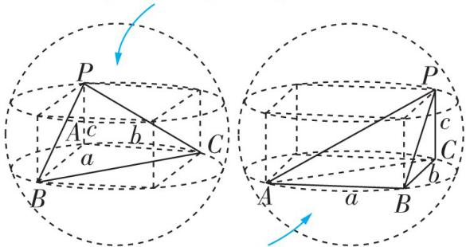三棱锥P-ABC中,AB,BC,PC两两垂直,且AB=a,BC=b,PC=c</td></tr><tr><td>麻花模型</td><td>对棱相等的三棱锥</td><td> $R^{2}=\frac{x^{2}+y^{2}+z^{2}}{8}$  $x,y,z$ :三组对棱的长度</td><td>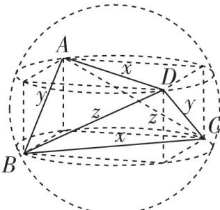 三棱锥A-BCD中, $AD=BC=x$ ,  $AB=$  $CD=y$ ,  $AC=BD=z$ </td></tr><tr><td>垂面模型</td><td>有一条棱垂直于底面的棱锥</td><td> $R^{2}=r^{2}+\frac{l^{2}}{4}$  $r$ :底面外接圆半径 $l$ :垂直于底面的棱的长度</td><td>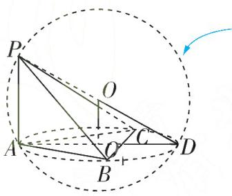 三棱锥P-ABC中,PA⊥底面ABC,PA=l,底面△ABC外接圆圆心为 $O_{1}$ ,半径为 $O_{1}D=r$ ,球心为O,在Rt△ $OO_{1}D$ 中,根据 $OO_{1}^{2}+O_{1}D^{2}=OD^{2}$ ,即 $(\frac{l}{2})^{2}+r^{2}=R^{2}$ 可求</td></tr><tr><td>斗笠模型</td><td>顶点在底面上的射影为底面外接圆圆心的棱锥</td><td> $R=\frac{H^{2}+r^{2}}{2H}$  $H$ :顶点到底面的距离 $r$ :底面外接圆半径</td><td>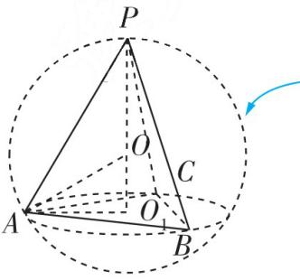 三棱锥P-ABC中,顶点P在-底面ABC上的射影为底面△ABC外接圆的圆心 $O_{1}$ ,外接圆半径 $O_{1}A=r$ ,外接球球心为O, $PO_{1}=H$ ,在Rt△ $OO_{1}A$ 中,根据 $(H-R)^{2}+r^{2}=R^{2}$ 可求</td></tr><tr><td>切瓜模型</td><td>有两个侧面互相垂直的棱锥</td><td> $R^{2}=r_{1}^{2}+r_{2}^{2}-\frac{l^{2}}{4}$  $r_{1},r_{2}$ :互相垂直的两侧面的外接圆半径 $l$ :互相垂直的两侧面的公共棱长</td><td>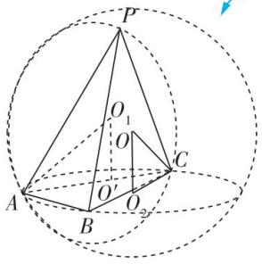 三棱锥P-ABC中,平面PAC⊥平面ABC,记△PAC外接圆圆心为 $O_{1}$ ,半径为 $O_{1}A=r_{1}$ ,棱AC的长为l,中点为 $O'$ ,则在Rt△ $O_{1}AO'$ 中,有 $O_{1}O'^{2}=O_{1}A^{2}-O'A^{2}=r_{1}^{2}-\frac{l^{2}}{4}$ .记△ABC的外接圆圆心为 $O_{2}$ ,半径为 $O_{2}C=r_{2}$ ,三棱锥P-ABC的外接球球心为O,则在Rt△ $OO_{2}C$ 中,根据 $R^{2}=OC^{2}=OO_{2}^{2}+O_{2}C^{2}=O_{1}O'^{2}+O_{2}C^{2}=r_{1}^{2}-\frac{l^{2}}{4}+r_{2}^{2}$ 可求</td></tr><tr><td>台体模型</td><td>正棱台、圆台的外接球</td><td> $\begin{cases}d_1=\sqrt{R^2-r_1^2},\\d_2=\sqrt{R^2-r_2^2},\\|d_1\pm d_2|=h\end{cases}$ </td><td> $d_1,d_2$ :外接球球心到上、下底面的距离 $r_1,r_2$ :上、下底面的外接圆半径 $h$ :台体上、下底面间的距离</td></tr><tr><td>开扇模型</td><td>两个直角三角形斜边拼接在一起的棱锥</td><td> $R=\frac{l}{2}$  $l$ :两个直角三角形共同的斜边长</td><td>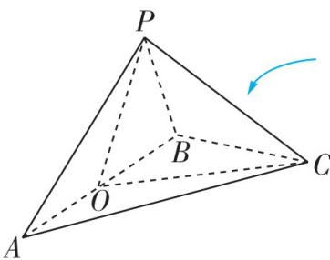三棱锥 $P-ABC$ 中, $AP\perp PB,AC\perp BC$ ,记 $AB$ 的中点为 $O,AB=l$ ,则 $OA=OB=OC=OP$ ,故 $O$ 为外接球球心,根据 $R=\frac{AB}{2}=\frac{l}{2}$ 可求</td></tr><tr><td>汉堡模型</td><td>直棱柱、圆柱的外接球</td><td> $R^2=r^2+(\frac{h}{2})^2$  $h$ :柱体的高 $r$ :底面外接圆半径</td><td>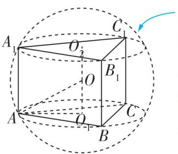直三棱柱 $ABC-A_1B_1C_1$ 中, $高O_1O_2=h$ ,底面外接圆半径为 $r$ ,在 $Rt\triangle OO_1A$ 中,根据 $OA^2=O_1A^2+OO_1^2=r^2+(\frac{h}{2})^2$ 可求</td></tr></table>

注意: 求任意三角形外接圆半径 r 常用正弦定理, 即 $\frac{a}{\sin A} = \frac{b}{\sin B} = \frac{c}{\sin C} = 2r$ , 特殊地, 如直角三角形, 其外接圆直径为直角三角形的斜边.

# 类型 21 内切球及球的相切问题的临界处理

难度: ★★★★☆ 难点: 找临界状态与内切球的球心

[2024 湖北模拟]已知四棱锥 $P - ABCD$ 的底面为矩形, $AB = 2\sqrt{3}, BC = 4$ , 侧面 $PAB$ 为正三角形, 且垂直于底面 $ABCD, M$ 为四棱锥 $P - ABCD$ 内切球表面上一点, 则点 $M$ 到直线 $CD$ 距离的最小值为

$\quad$A. $\sqrt{10} - 2$

$\quad$B. $\sqrt{10} - 1$

$\quad$C. $2 \sqrt{3} - 2$

$\quad$D. $2 \sqrt{3} - 1$

命题拆解 对于内切球或与球有关的相切问题,无论是柱体切球、锥体切球、台体切球、还是某几何体中能放的最大球等,我们处理此类问题的基本逻辑都是去寻找这些几何体之间刚好卡住的临界情况,并且根据此情况直接找空间关系或找一个特殊截面,将问题转化为平面问题,进而求解.

# 解题拆解 第1步:确定内切球球心位置

如图, 球 O 为四棱锥 P-ABCD 的内切球, 设四棱锥的内切球的半径为 r, 取 AB 的中点 H, CD 的中点 N, 连接 PH, PN, HN. 因为底面 ABCD 为矩形, 侧面 PAB 为正三角形, 且侧面 PAB 垂直于底面 ABCD, 所以平面 PHN 截四棱锥 P-ABCD 的内切球球 O 所得的截面圆

为大圆(即过球心 O 的截面圆), 易知此圆为 $\triangle PHN$ 的内切圆. (提示: 确定内切球的球心为截面圆的圆心, 将立体几何问题转化为平面几何问题)

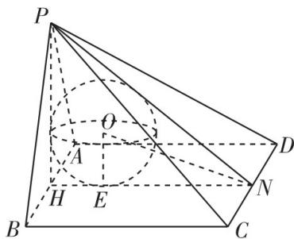

# 高分模板

得分点1 根据题设条件作出过内切球球心的一个截面,进而确定球心的位置

得分点2 确定截面圆为 $\triangle PHN$ 的内切圆

# 第 2 步: 求内切球半径

因为 $\triangle PAB$ 为正三角形, 所以 $PH \perp AB$ , 因为平面 $PAB \perp$ 平面 $ABCD$ , 平面 $PAB \cap$ 平面 $ABCD = AB$ , $PH \subset$ 平面 $PAB$ , 所以 $PH \perp$ 平面 $ABCD$ , 又 $HN \subset$ 平面 $ABCD$ , 所以 $PH \perp HN$ .

由 $AB = 2\sqrt{3}, BC = 4$ ，得 $PH = 3, HN = 4$ ，则 $PN = 5$ ，在 Rt $\triangle PHN$ 中， $S_{\triangle PHN} = \frac{1}{2} \times 3 \times 4 = \frac{1}{2} r(3 + 4 + 5)$ ，解得 $r = 1$ ，所以四棱锥 $P - ABCD$ 的内切球半径为 1。（点拨：大圆的半径即内切球的半径）

# 第 3 步: 根据几何意义求出距离的最小值

连接 ON, 因为 $PH \perp$ 平面 ABCD, $CD \subset$ 平面 ABCD, 所以 $CD \perp PH$ ,

又 $CD \perp HN, PH, HN \subset$ 平面 $PHN, PH \cap HN = H$ ,

所以 $CD \perp$ 平面PHN，又 $ON \subset$ 平面PHN，所以 $ON \perp CD$

所以内切球表面上一点 $M$ 到直线 $CD$ 的距离的最小值即线段 $ON$ 的长减去球的半径. 设内切球与 $HN$ 切于点 $E$ , 连接 $OE, ON = \sqrt{OE^2 + EN^2} = \sqrt{10}$ , 所以四棱锥 $P - ABCD$ 内切球表面上的一点 $M$ 到直线 $CD$ 的距离的最小值为 $\sqrt{10} - 1$ . 故选 B.

得分点3 证出 $PH \perp HN$ ，并利用等面积法求出内切球半径

得分点4 根据已知条件证得 $ON \perp CD$

易失分点 求最小值时忘记减去内切球的半径

# 难点攻略

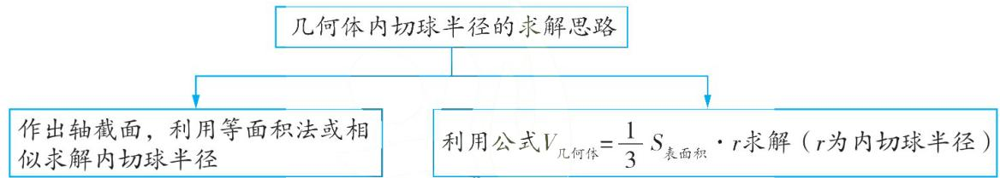

圆柱的内切球:等边圆柱(轴截面是正方形的圆柱)才有内切球,球心为圆柱的中心,内切球半径与圆柱底面圆半径相等.

圆锥内切球半径的求解公式: $R=\frac{r}{h}\left(\sqrt{h^{2}+r^{2}}-r\right)$ ，其中R为内切球半径，r为圆锥底面半径，h为圆锥的高.

# 重难变式练

[临界思维的运用] 已知一个圆锥底面圆的直径为 3, 圆锥的高为 $\frac{3\sqrt{3}}{2}$ , 在该圆锥内放置一个棱长为 $a$ 的正四面体, 并且正四面体在该圆锥内可以任意转动, 则 $a$ 的最大值为 \_\_\_\_.

解析此题表面上看与内切球无关,实际上正四面体任意转动时形成的轨迹就是一个球.由于圆锥底面圆的直径为3,圆锥的高为 $\frac{3\sqrt{3}}{2}$ ,因此此圆锥的轴截面是个边长为3的等边三角形,如图所示.由于边长为3的等边三角形的内切圆半径为 $\frac{\sqrt{3}}{2}$ ,因此圆锥的

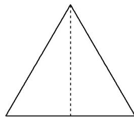

内切球半径也为 $\frac{\sqrt{3}}{2}$ . 又棱长为 a 的正四面体任意转动所形成的轨迹是半径为 $\frac{\sqrt{6}}{4}a$ 的外接球, 因此让在圆锥内的正四面体不断膨胀, 其半径为 $\frac{\sqrt{6}}{4}a$ 的外接球也不断膨胀, 这样膨胀所出现的临界情况是“正四面体的外接球刚好是圆锥的内切球”, 即 $\frac{\sqrt{6}}{4}a_{\max} = \frac{\sqrt{3}}{2}$ , 从而求出 a 的最大值为 $\sqrt{2}$ .

# 类型 22 与球有关的最值（范围）问题

难度: ★★★★☆ 难点: 寻找合适的求解最值问题的方法

[2024 河南周口项城一高模拟]正三棱锥 P-ABC 的内切球的半径为 r, 外接球的半径为 R, 若 $AB = 2\sqrt{3}$ , 则 $\frac{R}{r}$ 的最小值为 \_\_\_\_.

命题拆解 球是高考数学中的难点,最值(范围)问题的求解是高考数学考查的重点,两者结合所产生的问题具有灵活的特点,且对学生的数学技能及创新意识的考查具有独到之处.本题考查正三棱锥的外接球与内切球,考查函数与方程思想,考查学生的空间想象能力、运用所学知识解决问题的能力.

# 解题拆解 第1步:根据已知条件建立内切球的半径 r 与正三棱锥的高 h 之间的等量关系

设正三棱锥 $P - ABC$ 的高为 $h, E$ 为 $AB$ 的中点， $O$ 为底面 $ABC$ 的中心，连接 $CE, PE$ ，则 $O$ 在 $CE$ 上，由 $AB = 2\sqrt{3}$ ，得 $CE = \frac{\sqrt{3}}{2} AB = 3$ ，所以 $OE = \frac{1}{3} CE = 1, PE = \sqrt{h^2 + 1}$ ，

则正三棱锥 $P - ABC$ 的表面积 $S_{\text{表}} = 3S_{\triangle PAB} + S_{\triangle ABC} = 3 \times (\frac{1}{2} \times \sqrt{h^2 + 1} \times 2\sqrt{3}) + \frac{\sqrt{3}}{4} \times (2\sqrt{3})^2 = 3\sqrt{3} (\sqrt{h^2 + 1} + 1)$ ，则正三棱锥 $P - ABC$ 的体积为 $\frac{1}{3} S_{\triangle ABC} \cdot h = \frac{1}{3} S_{\text{表}} \cdot r$ ，即 $\frac{1}{3} \times 3\sqrt{3} \times h = \frac{1}{3} \times 3\sqrt{3} (\sqrt{h^2 + 1} + 1) \times r$ ，故 $r = \frac{h}{\sqrt{h^2 + 1} + 1}$ .

第2步:由勾股定理得到外接球半径R与高h之间的等量关系,进而求得 $\frac{R}{r}$ 的表达式

由 $CO = 2$ ，得 $(h - R)^2 + 2^2 = R^2$ ，则 $R = \frac{h^2 + 4}{2h}$

故 $\frac{R}{r} = \frac{\frac{h^2 + 4}{2h}}{\frac{h}{\sqrt{h^2 + 1} + 1}} = \frac{(h^2 + 4)(\sqrt{h^2 + 1} + 1)}{2h^2}.$

第 3 步: 换元, 并利用基本不等式求最值

令 $\sqrt{h^2 + 1} + 1 = t$ ，则 $t > 2, h^2 = t^2 - 2t$

则 $\frac{R}{r} = \frac{(t^2 - 2t + 4)t}{2(t^2 - 2t)} = \frac{t^2 - 2t + 4}{2(t - 2)} = \frac{(t - 2)^2 + 2(t - 2) + 4}{2(t - 2)} = \frac{1}{2} [(t - 2) + \frac{4}{t - 2} + 2] \geqslant \frac{1}{2} \times (2\sqrt{4} + 2) = 3,$

当且仅当 $t-2=\frac{4}{t-2}$ ，即 $t=4, h=2\sqrt{2}$ 时取等号，（易错：利用基本不等式求最值时，注意检验等号能否取到）故 $\frac{R}{r}$ 的最小值为 3.

# 高分模板

得分点1 设出正三棱锥的高,根据已知条件,用高表示出正三棱锥的表面积

得分点2 利用等体积法将 $r$ 用 $h$ 表示出来

快速解题 正三棱锥的外接球模型是斗笠模型,对于小题,可直接利用公式得 $R=\frac{h^{2}+4}{2h}$

易失分点 不会换元、化简分式

思路点拨 对于 $f(x) = \frac{ax^{2} + bx + c}{dx + e}(a, b, c, d, e \in \mathbf{R}, ad \neq 0)$ ，可把分母看作一个整体进行换元，化成对勾函数的形式，进而求解出其值域.

# 难点攻略

球中涉及最值的问题主要有四类,一是距离(长度)的最值问题;二是面积(体积)的最值问题;三是根据已知条件得到关系式,从而求解最值;四是在最值已知的条件下,确定参数(或其他几何量)的值.

从解答思路看,有几何法(利用几何特征)和代数法(应用函数思想、基本不等式等)两种,这两种方法都需要我们正确揭示空间图形与平面图形之间的联系,并有效实施空间图形与平面图形之间的转换.解决立体几何中的最值问题时,要善于将空间问题转化为平面问题,这一步要求学生具备较强的空间想象能力,牢牢抓住几何体的结构特征.

利用对勾函数求分式型函数值域的方法,同学们可以学习答案册专题一考点4第2题答案下方的“方法技巧”栏目.

# 重难变式练

[几何法求最值|2024 湖南衡阳二模]已知三棱锥 A-BCD 中, AB=6, AC=3, BC=3 $\sqrt{3}$ , 三棱锥 A-BCD 的体积为 $\frac{21\sqrt{3}}{2}$ , 其外接球的体积为 $\frac{500}{3}\pi$ , 则线段 CD 长度的最大值为

$\quad$A.7

$\quad$B. 8

$\quad$C. $7 \sqrt{2}$

$\quad$D. 10

解析如图,设外接球的半径为 R, 则 $\frac{4}{3}\pi R^{3}=\frac{500}{3}\pi$ , 可得 R=5, 因为 AB=6, AC=3, $BC=3\sqrt{3}$ , 所以 $AB^{2}=AC^{2}+BC^{2}$ , 即 $\angle ACB=90^{\circ}$ , 则 $S_{\triangle ABC}=\frac{1}{2}\times3\times3\sqrt{3}=\frac{9\sqrt{3}}{2}$ . 设点 D 到平面 ABC 的距离为 h, 则 $\frac{1}{3}h\times\frac{9\sqrt{3}}{2}=\frac{21\sqrt{3}}{2}$ , 可得 h=7. 由题意, D 在外接球的截面圆上, 设截面圆所在的平面为 $\alpha$ , 当 $\alpha$ 与平面 ABC 平行时, DC 有最大值, 设球心到平面ABC 的距离为 d，易知 $\triangle ABC$ 的外心为 AB 的中点，其外接圆的半径为 $\frac{1}{2}AB = 3$ ，则 $d = \sqrt{5^{2} - 3^{2}} = 4$ ，故球心到平面 $\alpha$ 的距离为 7 - 4 = 3，进而可得 D 所在截面圆的半径为 $\sqrt{5^{2} - 3^{2}} = 4$ 。设 C 在平面 $\alpha$ 上的射影为 E，连接 CE, DE，则 E 的轨迹为半径为 3 的圆，设该圆圆心为 O，则当 D, O, E 三点共线且点 O 在 D, E 中间时，DE 最长，此时 $DE = 3 + 4 = 7$ ，故线段 CD 长度的最大值为 $\sqrt{7^{2} + 7^{2}} = 7\sqrt{2}$ 。故选 C。

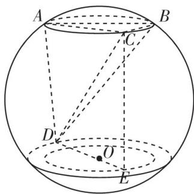

# 重难题 14

# 类型 23 截面问题

难度: ★★★★☆ 难点: 截面的确定

[2024 山东烟台模拟]如图,在直三棱柱 $ABC - A_{1}B_{1}C_{1}$ 中, $AB \perp BC$ , $AB = BC = 5$ , $AA_{1} = 2$ , 则该三棱柱外接球的表面积为\_\_\_\_; 若点 $P$ 为线段 $AC$ 的中点, 点 $Q$ 为线段 $AC_{1}$ 上一动点 (不与 $A, C_{1}$ 重合), 则平面 $BPQ$ 截三棱柱 $ABC - A_{1}B_{1}C_{1}$ 所得截面面积的最大值为\_\_\_\_.

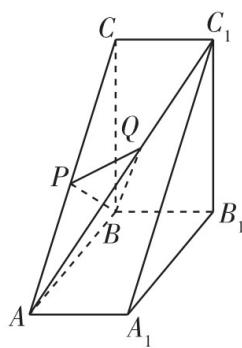

命题拆解 多面体中的截面与交线问题是高中数学的难点,常以选择题和填空题的形式进行考查,此时多考查截面面积或周长的求解、截面图形的判断,在解答题中考查时,常在第（1）问考查作出截面,解决此类问题的依据是4个基本事实及推论,线面平行、面面平行

# 解题拆解 第1步:补直三棱柱为一个长方体,求得外接球的半径

由题意,直三棱柱 $ABC-A_{1}B_{1}C_{1}$ 中, $AB \perp BC, AB = BC = 5, AA_{1} = 2$ ,
所以可将直三棱柱 $ABC-A_{1}B_{1}C_{1}$ 补形成一个长方体，则直三棱柱 $ABC-A_{1}B_{1}C_{1}$ 的外接球和补形成的长方体的外接球是同一个，且长方体过同一顶点的三条棱的长分别为 5, 5, 2，所以长方体体对角线的长为 $\sqrt{5^{2}+5^{2}+2^{2}}=\sqrt{54}$ ，所以外接球的半径为 $\frac{\sqrt{54}}{2}$ ，则该三棱柱外接球的表面积为 $4\pi\times\left(\frac{\sqrt{54}}{2}\right)^{2}=54\pi$ .

# 第2步:作出截面

如图所示,取 $A_{1}C_{1}$ 的中点M,连接 $B_{1}M,PM$ ,则 $B_{1}M=BP$ 且 $B_{1}M\parallel BP$ ,延长PQ交 $A_{1}C_{1}$ 于点E,过点E作 $EF\parallel B_{1}M$ ,交 $B_{1}C_{1}$ 于F,连接BF,可得 $EF\parallel BP$ ,则四边形BPEF即平面BPQ截三棱柱所得的截面.

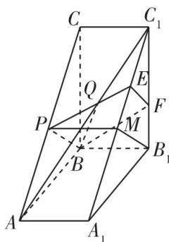

# 高分模板

得分点1 根据已知条件发现直三棱柱的结构特征,将其补形成长方体,进而得外接球半径

# 易失分点1不会找截面

思路点拨 $BP, PQ$ 均在几何体的表面上, 所以可以用作平行线的方法找出截面

# 第 3 步:通过分析,确定截面的形状

在 $\triangle ABC$ 中,因为 $AB=BC$ ,且 $P$ 为 $AC$ 的中点,所以 $BP\perp AC$ ,因为 $AA_{1}\perp$ 平面 $ABC,BP\subset$ 平面 $ABC$ ,所以 $BP\perp AA_{1}$ ,

因为 $AC \cap AA_{1} = A$ ，且 $AC, AA_{1} \subset$ 平面 $ACC_{1}A_{1}$ ，所以 $BP \perp$ 平面 $ACC_{1}A_{1}$ .

因为 $PE \subset$ 平面 $ACC_{1}A_{1}$ ，所以 $BP \perp PE$ ，所以当点 Q 不为 $AC_{1}$ 的中点时，截面 BPEF 为直角梯形.

# 第 4 步: 求截面面积的表达式

根据对称性,不妨设点 E 在线段 $C_{1}M$ 上,在 $\triangle ABC$ 中,由 AB = BC = 5 且 $AB \perp BC$ , 可得 $AC = 5\sqrt{2}$ , 所以 $BP = \frac{1}{2}AC = \frac{5\sqrt{2}}{2}$ , 设 $ME = x (0 < x < \frac{5\sqrt{2}}{2})$ , 在 Rt $\triangle PME$ 中, 可得 $PE = \sqrt{PM^{2} + ME^{2}} = \sqrt{4 + x^{2}}$ , 由 $C_{1}E = C_{1}M - ME = \frac{5\sqrt{2}}{2} - x$ , 可得 $EF = C_{1}E = \frac{5\sqrt{2}}{2} - x$ ,

所以直角梯形 BPEF 的面积为 $S(x)=\frac{1}{2}(BP+EF)\times PE=\frac{1}{2}(\frac{5\sqrt{2}}{2}+\frac{5\sqrt{2}}{2}-x)\times\sqrt{4+x^{2}}=\frac{1}{2}(5\sqrt{2}-x)\times\sqrt{4+x^{2}}=\frac{1}{2}\sqrt{(5\sqrt{2}-x)^{2}\cdot(4+x^{2})}$ ，其中 $0<x<\frac{5\sqrt{2}}{2}$ .

# 第 5 步: 构造函数, 求导研究其单调性, 进而求得最值

设 $f(x)=(5\sqrt{2}-x)^{2}\cdot(4+x^{2})$ ， $0<x<\frac{5\sqrt{2}}{2}$ ，则 $f'(x)=\left[(5\sqrt{2}-x)^{2}\right]'$

$\left(4 + x ^ {2}\right) + \left(5 \sqrt {2} - x\right) ^ {2} \cdot \left(4 + x ^ {2}\right) ^ {'} = 4 \left(x - 5 \sqrt {2}\right) \left(x - \frac {\sqrt {2}}{2}\right) \left(x - 2 \sqrt {2}\right),$

当 $x \in (0, \frac{\sqrt{2}}{2})$ 时， $f'(x) < 0, f(x)$ 单调递减；当 $x \in (\frac{\sqrt{2}}{2}, 2\sqrt{2})$ 时， $f'(x) > 0, f(x)$ 单调递增；当 $x \in (2\sqrt{2}, \frac{5\sqrt{2}}{2})$ 时， $f'(x) < 0, f(x)$ 单调递减。又 $(5\sqrt{2} - 0)^2 \times (4 + 0^2) = 200, f(2\sqrt{2}) = 216$ ，所以当 $x = 2\sqrt{2}$ 时，函数 $f(x)$ 取得最大值，为 216，即此时 $S(x)$ 的最大值为 $S(2\sqrt{2}) = 3\sqrt{6}$ 。

当点 $Q$ 为 $AC_{1}$ 的中点时，截面 $BPEF$ 为矩形 $BPMB_{1}$ ，由 $BP = \frac{5\sqrt{2}}{2}, PM = 2$ ，得此时截面面积为 $\frac{5\sqrt{2}}{2} \times 2 = 5\sqrt{2}$ . 因为 $5\sqrt{2} < 3\sqrt{6}$ ，所以所得截面面积的最大值为 $3\sqrt{6}$ .

得分点2 根据已知条件证得 $BP \perp$ 平面 $ACC_{1}A_{1}$

名师指导 截面图形是四边形,所以求面积时可先判断截面具体形状,再继续求解

得分点3 设未知量,表示出截面的面积

易失分点2忽视未知量的取值范围

得分点4 构造函数,利用导数研究函数的单调性、最值

易失分点3求最值时,没有比较区间端点对应函数值的大小

# 难点攻略

# 1. 正方体中的基本斜截面

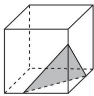  
锐角三角形

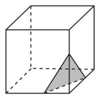  
等腰三角形

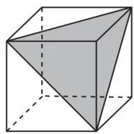  
等边三角形

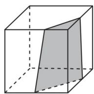  
梯形

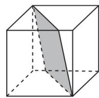  
平行四边形

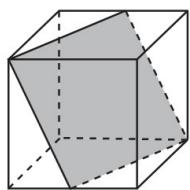  
菱形

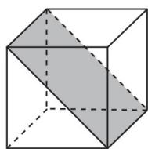  
矩形

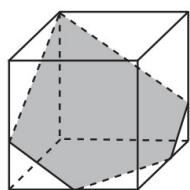  
任意五边形

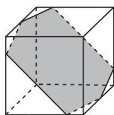  
任意六边形

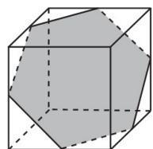  
正六边形

# 2. 多面体中找截面的基本方法

（1） 平行线法: 适用于有两个或两个以上截面线段在几何体表面上的情形;  
（2）延长线法:适用于只有一个截面线段在几何体表面上的情形.

<table><tr><td>情形举例</td><td>如图,在正方体 $ABCD-A_1B_1C_1D_1$ 中, $E$ 是 $BB_1$ 上一点,找出平面 $AED_1$ 截正方体所得的截面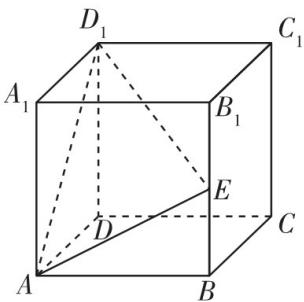</td><td>如图,在正方体 $ABCD-A_1B_1C_1D_1$ 中, $M,N$ 分别是 $C_1D_1,B_1C_1$ 的中点,找出平面AMN截正方体所得的截面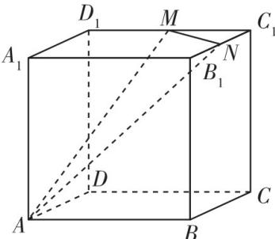-</td><td>如图, $E,F$ 分别是正方体所在棱的中点, $G$ 是一条面对角线上的一定点,找出平面EFG截正方体所得的截面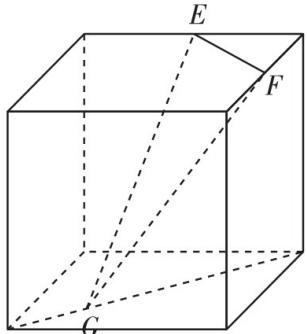-</td></tr><tr><td>找出截面</td><td> $AE,AD_1$ 都在正方体表面上,连接 $BC_1$ ,过 $E$ 作 $BC_1$ 的平行线交 $B_1C_1$ 于 $F$ ,连接 $D_1F$ ,即得截面 $AEFD_1$ 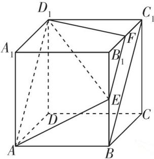</td><td>设直线 $MN$ 分别交线段 $A_1D_1,A_1B_1$ 的延长线于点 $P,Q$ ,连接 $AP,AQ$ ,分别交 $DD_1,BB_1$ 于点 $E,F$ ,连接 $EM,NF$ ,即得截面 $AEMNF$ 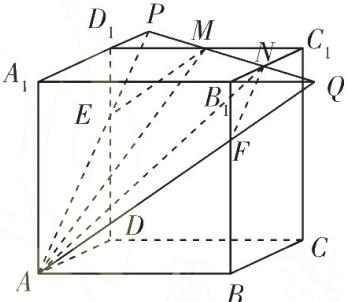</td><td> $G$ 不在棱上,考虑转换到棱上,过 $G$ 作 $PQ//EF$ ,与棱有交点,再用延长线法依次作下去,可得截面为六边形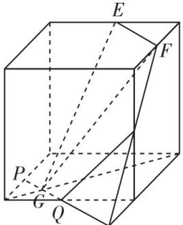-</td></tr></table>

特殊情形举例:如图,在正方体中,E,F,G均为所在棱的中点,找出平面EFG截正方体所得的截面,可以先过E作底面的垂线,再连接垂足和底面的一个顶点,用延长线的方法依次作下去.

判断截面是否完整的策略是看一下是不是截面图形所有的边都在几何体表面上.

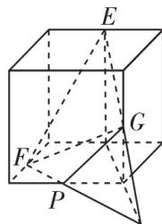

# 类型 24 动点轨迹问题

难度: ★★★★☆ 难点: 动点轨迹的确定

[2024 广东汕头模拟]在棱长为 1 的正方体 $ABCD - A_{1}B_{1}C_{1}D_{1}$ 中, $M, N$ 为线段 $BD_{1}$ 上的两个三等分点, 动点 $G$ 在 $\triangle AB_{1}C$ 内, 且 $S_{\triangle GMN} = \frac{1}{6}$ , 则点 $G$ 的轨迹长度为

$\quad$A. $\frac{2\sqrt{3}\pi}{3}$

$\quad$B. $\frac{\sqrt{3}\pi}{6}$

$\quad$C. $\frac{\sqrt{3}\pi}{3}$

$\quad$D. $\frac{\sqrt{3}\pi}{4}$

命题拆解 立体几何中的动点轨迹问题主要结合空间几何体的结构特征,考查动点轨迹的求解、线面位置关系的判断等,求解时需要找到包含未知点的量和已知量之间的等量关系或不等关系.常以选择题和填空题的形式出现,难度中等偏上,对学生的空间想象能力要求较高.

# 解题拆解 第1步:确定点 N 在平面 $AB_{1}C$ 内

不妨设 $M$ 靠近点 $D_{1}$ , 如图 1, 连接 $BC_{1}$ , 易得 $BD_{1} = \sqrt{1 + 1 + 1} = \sqrt{3}$ , 因为 $M, N$ 为线段 $BD_{1}$ 上的两个三等分点, 所以 $BN = \frac{\sqrt{3}}{3}$ , 易知 $B_{1}C \perp BC_{1}$ , $C_{1}D_{1} \perp B_{1}C$ , 又 $C_{1}D_{1} \cap BC_{1} = C_{1}, BC_{1} \subset$ 平面 $BC_{1}D_{1}, C_{1}D_{1} \subset$ 平面 $BC_{1}D_{1}$ ,

# 高分模板

得分点1 根据三等分点,得出BN的长度

所以 $B_{1}C \perp$ 平面 $BC_{1}D_{1}$ , 所以 $B_{1}C \perp BD_{1}$ , 同理可证得 $AC \perp BD_{1}$ , 又 $AC \subset$ 平面 $B_{1}AC, B_{1}C \subset$ 平面 $B_{1}AC, B_{1}C \cap AC = C$ , 所以 $BD_{1} \perp$ 平面 $B_{1}AC$ . 设点 $B$ 到平面 $B_{1}AC$ 的距离为 $h$ , 则四面体 $BB_{1}AC$ 的体积为 $V_{B - B_{1}AC} = V_{B_{1} - BAC}$ , 即 $\frac{1}{3} S_{\triangle B_{1}AC} \times h = \frac{1}{3} S_{\triangle ABC} \times 1$ ,

即 $\frac{1}{3} \times \frac{\sqrt{3}}{4} \times 2 \times h = \frac{1}{3} \times \frac{1}{2} \times 1$ ，得 $h = \frac{\sqrt{3}}{3} = BN$

所以 N 在平面 $AB_{1}C$ 内，(点拨:根据等体积法,确定 N 在平面 $AB_{1}C$ 内)

# 第 2 步: 根据 NG 的长度确定点 G 在平面内的轨迹

则 $GN \perp MN$ ，所以 $S_{\triangle GMN} = \frac{1}{2} \times MN \times NG = \frac{1}{2} \times \frac{\sqrt{3}}{3} \times NG = \frac{1}{6}$ ，得 $NG = \frac{\sqrt{3}}{3}$ ，所以点 $G$ 在 $\triangle AB_1C$ 所在平面内的轨迹是以 $N$ 为圆心， $\frac{\sqrt{3}}{3}$ 为半径的圆.

# 第 3 步: 根据点 G 的轨迹, 作出平面图形解决问题

如图2,在正三角形 $B_{1}AC$ 中, $B_{1}T\perp AC,N$ 为三角形的中心,圆N的半径为 $\frac{\sqrt{3}}{3}$ ,即 $NE=NF=\frac{\sqrt{3}}{3}$ , $NT=\frac{1}{3}B_{1}T=\frac{1}{3}\times\frac{\sqrt{6}}{2}=\frac{\sqrt{6}}{6}$

所以在三角形 $ENT$ 中， $NE = NF = \frac{\sqrt{3}}{3} = \sqrt{2} NT$ ，则

$\angle ENT = \angle FNT = \frac{\pi}{4}$ , 得 $\angle ENF = \frac{\pi}{2}$ , 由对称性, 可知三段虚线弧对应圆心角的弧度数之和为 $\frac{\pi}{2} \times 3 = \frac{3\pi}{2}$ , 则三段实线弧对应圆心角的弧度数之和为 $2\pi - \frac{3\pi}{2} = \frac{\pi}{2}$ , 所以点 $G$ 的轨迹长度为 $\frac{\pi}{2} \times \frac{\sqrt{3}}{3} = \frac{\sqrt{3}\pi}{6}$ . (点拨: 计算动点轨迹的长度时, 为了计算方便, 需要将动点轨迹所在的平面单独提取出来, 此时更容易看出点、线、面之间的关系) 故选 B.

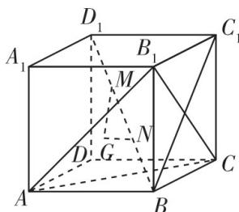

图1

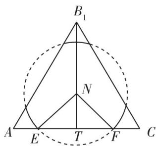

图2

得分点2 根据等体积法,求得点B到平面 $B_{1}AC$ 的距离,进而得点N在平面 $AB_{1}C$ 内

快速解题 这是一道小题,根据正方体的结构特征,易知 $BD_{1} \perp$ 平面 $B_{1}AC$ 且点 N 在平面 $B_{1}AC$ 内

得分点3 根据面积求得动点在平面内的轨迹是一个圆

易失分点1 误认为动点在 $\triangle AB_{1}C$ 内的轨迹是整个圆, 从而得出错误答案

易失分点2不会求解动点轨迹对应的弧度数

# 难点攻略

立体几何中动点轨迹问题的求解策略

<table><tr><td>由动点保持
平行性求轨迹</td><td>处理由一动点P(在某一定平面γ内或某空间几何体的表面Γ上)与一定点A形成的动直线AP与定平面β平行,求动点P的轨迹问题时,一般有两种策略:1将线面平行转化为面面平行,即过点A作平面α,使得α//β,α与γ或Γ的交线即为动点P的轨迹;2利用法向量垂直关系求轨迹,即设点P的坐标,得到直线AP的方向向量,利用 $\overrightarrow{AP} \cdot n = 0$ (n为平面β的法向量)得到动点P的轨迹方程.</td></tr><tr><td>由动点保持
垂直性求轨迹</td><td>处理由一动点P(在某一定平面γ内或某空间几何体的表面Γ上)与一定点M形成的动直线MP与定直线l垂直,求动点P的轨迹问题时,一般有两种策略:1将线线垂直转化为线面垂直,即过点M作平面α,使得l⊥α,α与γ或Γ的交线即为动点P的轨迹;2利用向量垂直关系求轨迹,即设点P的坐标,得到直线MP的方向向量,利用 $\overrightarrow{MP} \cdot a = 0$ (a为直线l的方向向量),得到动点P的轨迹方程.</td></tr><tr><td>由动点保持定距(或等距)求轨迹</td><td>若由两个动点M,N(或一个动点M与一个定点N)构成的动线段MN的长度为定值,处理该线段的中点P的轨迹问题时,一般有两种策略:1根据问题特征,找到与M,N所在直线(或面)有关联的定点F,研究线段PF的长度是否为定值,根据题意判断点P的轨迹是球(或圆);2建立空间直角坐标系,将题中几何语言“翻译”为代数语言,得到动点P的轨迹方程.</td></tr><tr><td>由动点保持定角或顶角求轨迹</td><td>已知由一个动点Q(在某一定平面γ内或某空间几何体的表面Γ上)与一个定点N(在某一定平面α内)构成的动直线QN,两定点M,N构成定线段MN,若动直线NQ与定直线MN的夹角为定值(或动直线NQ与平面α所成角为定值),则动点Q的轨迹为圆锥体的侧面与平面γ(或表面Γ)的交线(一般为圆、椭圆、双曲线、抛物线的全部或一部分).若需定量知道曲线的长度(围成的区域面积),则可借助空间直角坐标系,通过设动点Q的坐标,利用向量的夹角公式等,得到动点Q的轨迹方程.</td></tr></table>

# 类型 25 立体几何中的翻折与探索性问题

难度: ★★★★☆ 难点: 变量及不变量的确定

[2024 广东四校联考,15 分]如图,在棱长为 2 的正方体 ABCD-EFGH 中,点 M 是正方体的中心,将四棱锥 M-BCGF 绕直线 CG 逆时针方向旋转 $\alpha(0<\alpha<\pi)$ 后,得到四棱锥 $M'-B'CGF'$ .

（1） 若 $\alpha = \frac{\pi}{2}$ , 求证: 平面 $MCG \parallel$ 平面 $M'B'F'$ .  
（2）是否存在 $\alpha$ , 使得直线 $M'F'\perp$ 平面 $MBC$ ? 若存在, 求出 $\alpha$ 的值; 若不存在, 请说明理由.

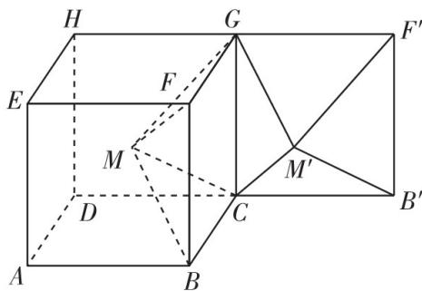

命题拆解 翻折问题和存在性探索问题是立体几何中的难点,翻折问题经常和存在性探索问题一起考查,在小题中常以多选题的形式出现,设题复杂,难度较大;在解答题中常需建立空间直角坐标系,借助空间向量进行求解.

解题拆解 （1） 若 $\alpha = \frac{\pi}{2}$ , 则平面 $DCGH$ 和平面 $CB'F'G$ 为同一个平面, (1 分)

如图1,连接 $BH,BF',MM'$ ,则M在BH上,且是BH的中点, $M'$ 在 $BF'$ 上,且是 $BF'$ 的中点,

故 $MM'$ 是 $\triangle BHF'$ 的中位线，

所以 $MM' / / GF', MM' = \frac{1}{2} HF' = GF'$

所以四边形 $MM'F'G$ 是平行四边形，所以 $MG \parallel M'F'$ ，

又 $MG \not\subset$ 平面 $M'B'F', M'F' \subset$ 平面 $M'B'F'$ , 所以 $MG \parallel$ 平面 $M'B'F'$ .

同理可得, $MC \parallel$ 平面 $M'B'F'$ , [1] (5 分)

又 $MG \cap MC = M, MG, MC \subset$ 平面 $MCG$ ,

所以平面 $MCG \parallel$ 平面 $M'B'F'$ . [2] (6分)

（2） 假设存在 $\alpha$ , 使得直线 $M' F'\perp$ 平面 $MBC$ .

如图2,以 C 为原点, $\overrightarrow{CB},\overrightarrow{DC},\overrightarrow{CG}$ 的方向分别为 x,y,z 轴的正方向建立空间直角坐标系,则 $C(0,0,0),B(2,0,0),M(1,-1,1)$ ,故 $\overrightarrow{CB}=(2,0,$

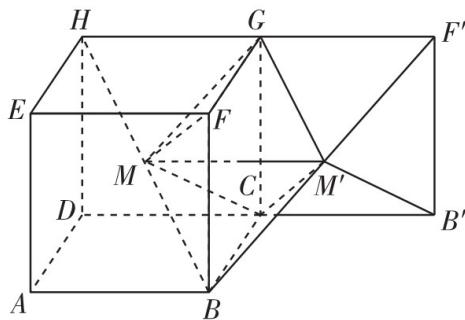

图1

# 高分模板

评分标准 [1] 利用线面平行的判定定理证得 $MG \parallel$ 平面 $M'B'F'$ , 不写具体的证明过程, 同理得到 $MC \parallel$ 平面 $M'B'F'$ 给 4 分

[2]写全面面平行的判定定理的条件,证得平面 $MCG \parallel$ 平面 $M'B'F'$ 给 1 分,条件没写全不给分  
[3] 建立合适的空间直角坐标系, 并正确写出相关点及向量的坐标给 2 分  
[4] 正确化简 $\overrightarrow{M'F'}$ 的坐标给2分

得分点1 证得四边形 $MM'F'G$ 是平行四边形

0), $\overrightarrow{CM} = (1, -1, 1)$ . (点拨: 坐标系的建立要以方便计算为前提) [3] (8 分)

设 $\pmb {m} = (x,y,z)$ 是平面MBC的法向

量,则 $\left\{\begin{aligned}m\cdot\overrightarrow{CB}&=0,\\ m\cdot\overrightarrow{CM}&=0,\end{aligned}\right.$

所以 $\left\{\begin{aligned}2x&=0,\\ x-y+z&=0,\end{aligned}\right.$

则 $x = 0$ ，取 $y = 1$ ，得 $z = 1$ ，所以 $\pmb{m} = (0,1,1)$ （10分）

取 $CG$ 的中点 $P, BF$ 的中点 $Q$ , 连接

$PM, PQ, PM'$ , 则 $PM \perp CG, PQ \perp CG, PM' \perp CG$ . 所以 $\angle MPM'$ 是二面角 $M - CG - M'$ 的平面角, $\angle MPQ$ 是二面角 $M - CG - Q$ 的平面角, $\angle QPM'$ 是二面角 $Q - CG - M'$ 的平面角, 所以 $\angle MPM' = \alpha, \angle MPQ = \frac{\pi}{4}$ ,

所以 $\angle QPM' = \alpha -\frac{\pi}{4}$ （11分）

易知 $PM' = \sqrt{2}$

故 $M'(\sqrt{2}\cos (\alpha -\frac{\pi}{4}),\sqrt{2}\sin (\alpha -\frac{\pi}{4}),1)$ ，同理可得， $F'(2\cos \alpha ,2\sin \alpha ,2)$ 所以 $\overrightarrow{M'F'} = (2\cos \alpha -\sqrt{2}\cos (\alpha -\frac{\pi}{4}),2\sin \alpha -\sqrt{2}\sin (\alpha -\frac{\pi}{4}),1)$

因为 $2\cos \alpha -\sqrt{2}\cos (\alpha -\frac{\pi}{4}) = 2\cos \alpha -\sqrt{2}\cos \alpha \cos \frac{\pi}{4} -\sqrt{2}\sin \alpha \sin \frac{\pi}{4} =$ $\cos \alpha -\sin \alpha ,2\sin \alpha -\sqrt{2}\sin (\alpha -\frac{\pi}{4}) = 2\sin \alpha -\sqrt{2}\sin \alpha \cos \frac{\pi}{4} +$ $\sqrt{2}\cos \alpha \sin \frac{\pi}{4} = \cos \alpha +\sin \alpha ,$

所以 $\overrightarrow{M'F'} = (\cos \alpha -\sin \alpha ,\cos \alpha +\sin \alpha ,1).$ [4] (13分)

若直线 $M'F'\perp$ 平面 MBC，则 $\overrightarrow{M'F'} \parallel m$ ，即存在 $\lambda \in R$ ，使得 $\overrightarrow{M'F'} = \lambda m$ ，
则 $\left\{\begin{aligned}\cos\alpha-\sin\alpha&=0,\\ \cos\alpha+\sin\alpha&=\lambda,\end{aligned}\right.$ 此方程组无解，
(14 分)

所以不存在 $\alpha$ ，使得直线 $M'F'\perp$ 平面MBC. (15分)

图2

# 利用空间向量法解决探索性问题的步骤

根据已知条件找到或作出三条两两垂直的直线,建立空间直角坐标系,并假设求解的结果存在

根据题中所给的长度写出相关点与向量的坐标,将立体几何问题转化为向量问题并进行计算

得出结论. 如果找到了符合题目结果的条件, 则存在; 如果找不到符合题目结果的条件, 或出现了矛盾, 则不存在

得分点2 求出平面 MBC 的一个法向量

思路点拨 想判断是否垂直,需要找到 $M', F'$ 的坐标→构造直角三角形,建立 $M', F'$ 的坐标和 $\alpha$ 之间的关系→找到二面角的平面角之间的关系

得分点3 用 $\alpha$ 表示出 $\overrightarrow{M'F'}$ 的坐标

易失分点1化简 $\overrightarrow{M'F'}$ 的坐标时出错

易失分点2不会运用空间向量平行的充要条件建立 $\overrightarrow{M'F'}$ 和 $m$ 之间的关系

# 难点攻略

立体几何中的翻折问题的处理策略:1. 明确翻折前后变与不变的量,翻折前后在同一平面内的量不发生变化,翻折前后不在同一平面内的量发生变化;

##### 2. 翻折后变化的量的大小要进行计算、证明,不能从图形中凭感觉主观判断;  
##### 3. 翻折后不易计算的量,可以回归到翻折前的图形中进行计算.

# 重难题15 “隐形圆”问题

# 类型 26 “隐形圆”问题

难度: ★★★☆☆ 难点: 从题干中分析、发现圆

[2024 湘豫名校联考]已知直线 $l_{1}: y = tx + 5 (t \in \mathbf{R})$ 与直线 $l_{2}: x + ty - t + 4 = 0 (t \in \mathbf{R})$ 相交于点 $P$ , 且点 $P$ 到点 $Q(a,3)$ 的距离等于 1 , 则实数 $a$ 的取值范围是

$\quad$A. $[-2\sqrt{2} - 3, -2\sqrt{2} - 1]$   
$\quad$B. $[-2\sqrt{2} - 3, 2\sqrt{2} - 1]$   
$\quad$C. $[-2\sqrt{2} - 3, -2\sqrt{2} - 1] \cup [2\sqrt{2} + 1, 2\sqrt{2} + 3]$   
$\quad$D. $[-2\sqrt{2} - 3, -2\sqrt{2} - 1] \cup [2\sqrt{2} - 3, 2\sqrt{2} - 1]$

命题拆解 圆的方程是高考的重要考点,但有些时候,在已知条件中没有直接给出圆(或圆的方程),而是需要通过分析和转化条件,发现圆(或圆的方程),然后利用圆的知识进行求解,我们称这类问题为“隐形圆”问题.

# 解题拆解 第1步:观察直线 $l_{1}$ 和 $l_{2}$ 方程的特征,得出几何结论

易知直线 $l_{1}: y = tx + 5$ 过定点 A(0,5)，

由直线 $l_{2}: x + ty - t + 4 = 0$ ，即 $l_{2}: x + t(y - 1) + 4 = 0$ ，得直线 $l_{2}$ 过定点 $B(-4, 1)$ ，易知 $l_{1} \perp l_{2}$ .

【点拨】当 t=0 时, 易知直线 $l_{1}, l_{2}$ 垂直, 当 $t \neq 0$ 时, 直线 $l_{1}: y = tx + 5$ 和直线 $l_{2}: x + ty - t + 4 = 0$ 的斜率分别为 $t, -\frac{1}{l}$ , 满足 $t \times \left(-\frac{1}{l}\right) = -1$ , 则 $l_{1} \perp l_{2}$ , 综上, $l_{1} \perp l_{2}$

第2步:根据 $|PA|^{2}+|PB|^{2}$ 是定值确定“隐形圆”,得出该圆的方程连接AB,因此点 $P(x,y)$ 的轨迹是以线段AB为直径的圆,圆心C(-2,3),半径 $r=2\sqrt{2}$ ,则圆C的方程为 $(x+2)^{2}+(y-3)^{2}=8$ (易知 $x\neq0$ 且 $y\neq1$ ).【点拨】由题意知直线 $l_{1}$ 的斜率存在,所以点P不能为点(0,1)

第3步:根据 $|PQ|$ 是定值,利用圆的定义确定“隐形圆”,得出该圆的方程
连接 PQ, 因为 $Q(a,3)$ , $|PQ|=1$ , 所以点 P 在圆 $Q:(x-a)^{2}+(y-3)^{2}=1$ 上.

# 第 4 步: 将已知问题转化为圆 C 与圆 Q 的位置关系问题, 得出参数 a 满足的条件

依题意, 圆 C 与圆 Q 有公共点, 显然点 $(0,1)$ 与点 Q 的距离大于 1, 所以公共点不可能是点 $(0,1)$ , 连接 CQ, 则 $2\sqrt{2}-1 \leqslant |CQ| \leqslant 2\sqrt{2}+1$ , 即 $2\sqrt{2}-1 \leqslant |a+2| \leqslant 2\sqrt{2}+1$ , 解得 $-2\sqrt{2}-3 \leqslant a \leqslant -2\sqrt{2}-1$ 或 $2\sqrt{2}-3 \leqslant a \leqslant 2\sqrt{2}-1$ .

# 第 5 步: 总结, 得出结论

所以实数 $a$ 的取值范围是 $[-2\sqrt{2} - 3, -2\sqrt{2} - 1] \cup [2\sqrt{2} - 3, 2\sqrt{2} - 1]$ . 故选D.

# 高分模板

得分点 1 观察直线 $l_{1}$ 和 $l_{2}$ 的方程, 得到它们都是过定点的直线且它们互相垂直

得分点2 正确确定“隐形圆”的方程

易失分点1求轨迹方程时,忽视隐含的点不能取到的情况

思路点拨 根据定长对定点确定点 $P$ 所在的另一个圆的方程

易失分点2注意判断点(0,1)与点Q之间的距离,若刚好等于1,求a的取值范围时需要排除这一情况

得分点3 将问题转化为两圆有公共点的问题进行解决

# 难点攻略

# “隐形圆”问题的常见类型

##### 1. 定长对定点: 平面上到定点 $C(a, b)$ 的距离等于定长 $r$ 的点 $P$ 的轨迹是圆, 如图 1.

##### 2. 定长对定角: ①平面上过两定点 $A$ 和 $B$ 的直线 $l_{1}, l_{2}$ 互相垂直, 则它们的交点 $P$ 的轨迹为圆, 如图2;

②平面上与两定点A和B所成视角为固定锐角(或钝角)的点的轨迹为一段圆弧,如图3.

##### 3. 定长对定比(阿波罗尼斯圆): 设 A 和 B 是平面内两定点, 若点 P 满足 $\frac{|PA|}{|PB|} = \lambda (\lambda > 0 \text{ 且 } \lambda \neq 1)$ , 则点 P 的轨迹是圆, 该圆被称为阿波罗尼斯圆, 如图4. 连接 MP, 当点 P 不在 M, A, B 三点所在直线上时, $\triangle MAP \sim \triangle MPB$ (此为阿波罗尼斯圆的一个性质).

图1

图2

图3

图4

##### 4. 已知两定点 $A, B$ , 动点 $P$ 满足 $|PA|^2 + |PB|^2$ 是定值, 则这个点的轨迹是一个圆, 当然这个定值会有一定的范围, 否则轨迹不存在.

# 重难题 16 圆锥曲线的焦点三角形

# 类型 27 焦点三角形的内心

难度: ★★★★☆ 难点: 灵活运用焦点三角形内心的性质

[2024 重庆南开中学质检]如图,双曲线 $C: \frac{x^2}{a^2} - \frac{y^2}{b^2} = 1 (a > 0, b > 0)$ 的左、右焦点分别为 $F_1, F_2$ , 若存在过 $F_2$ 的直线 $l$ 交双曲线 $C$ 的右支于 $A, B$ 两点, 且 $\triangle AF_1F_2, \triangle BF_1F_2$ 的内切圆半径 $r_1, r_2$ 满足 $3r_1 = 4r_2$ , 则双曲线 $C$ 的离心率的取值范围为

$\quad$A. $(1,3)$

$\quad$B. $(1,7)$

$\quad$C. $(2,4\sqrt{3})$

$\quad$D. $(1,4\sqrt{3})$

命题拆解 圆锥曲线与三角形的“四心”结合考查时,涉及的知识面较广,既注重知识

考查又注重能力考查,还突出考查圆锥曲线的本质特征,是考查学生能力的“好”点,其中焦点三角形的内心具有典型的性质,在解题时如果能运用性质解题,便可节省做题时间,提高效率.

# 解题拆解 第1步:根据切线长定理和双曲线定义推出两焦点三

# 角形内心的横坐标

如图, 设 $\triangle AF_{1}F_{2}, \triangle BF_{1}F_{2}$ 的内切圆圆心分别为 $O_{1}, O_{2}, \triangle AF_{1}F_{2}$ 的内切圆与 x 轴的切点为 H, 与 $AF_{1}$ 的切点为 D, 与 $AF_{2}$ 的切点为 E, 由双曲线的定义得, $|AF_{1}| - |AF_{2}| = 2a$ , 结合圆的切线长定理得 $|HF_{1}| - |HF_{2}| = 2a$ ,

【提醒】 $\left|AF_{1}\right|-\left|AF_{2}\right|=\left(\left|AD\right|+\left|DF_{1}\right|\right)-\left(\left|AE\right|+\left|EF_{2}\right|\right)=\left|DF_{1}\right|-\left|EF_{2}\right|=\left|F_{1}H\right|-\left|HF_{2}\right|=2a$

则点 $H$ 的横坐标为 $a$ , 即点 $H$ 是双曲线的右顶点. 同理可得, 点 $H$ 也是【记结论】利用双曲线焦点三角形内心的性质可快速得到结论

$\triangle BF_{1}F_{2}$ 的内切圆与 $x$ 轴的切点，连接 $O_{1}O_{2}, O_{1}F_{2}, O_{2}F_{2}$ ，可知 $O_{1}O_{2} \perp x$ 轴。第2步：利用已知条件及解三角形知识得到直线 $l$ 的斜率

设直线 $l$ 的倾斜角为 $\theta (0 <   \theta <  \pi)$ ，则 $\angle O_1F_2H = \frac{\pi - \theta}{2},\angle O_2F_2H = \frac{\theta}{2},$

# 高分模板

名师语要 1. 遇到双曲线(或椭圆)的焦点三角形时,首先要想到双曲线(或椭圆)的定义的应用.

##### 2. 过圆外一点作圆的切线时, 要想到切线长定理的应用.

##### 3. 双曲线(或椭圆)的定义和切线长定理都是与长度有关的等式, 将二者结合起来, 便可建立一些等量关系.

得分点1 求得 $\triangle AF_{1}F_{2}$ 的内切圆内心的横坐标后, 同理得到 $\triangle BF_{1}F_{2}$ 内心的横坐标, 进而得 $O_{1}O_{2}$ 与 $x$ 轴的位置关系

因为 $|F_{2}H|=c-a$ ，所以 $r_{1}=|O_{1}H|=(c-a)\tan\frac{\pi-\theta}{2}=\frac{c-a}{\tan\frac{\theta}{2}}$

$r_2 = |O_2H| = (c - a)\tan \frac{\theta}{2}$ , 所以 $3(c - a) \times \frac{1}{\tan \frac{\theta}{2}} = 4(c - a)\tan \frac{\theta}{2}$ ,

【提醒】根据题设 $3r_{1} = 4r_{2}$ 建立关系

得 $\tan \frac{\theta}{2} = \frac{\sqrt{3}}{2}$ , 所以 $k_{l} = \tan \theta = \frac{2\tan\frac{\theta}{2}}{1 - \tan^{2}\frac{\theta}{2}} = 4\sqrt{3}$ ,

第 3 步: 通过渐近线与直线 l 斜率的关系得出不等关系

所以 $\frac{b}{a} < k_l = 4\sqrt{3}$

第 4 步: 结合 $c^{2}=a^{2}+b^{2}$ 得出离心率的取值范围

所以离心率 $e = \frac{c}{a} = \sqrt{1 + \frac{b^2}{a^2}}\in (1,7)$ .故选B.

思路点拨 已知 $3r_{1}=4r_{2}\rightarrow$ 引入参数, 表示出 $r_{1}, r_{2}\rightarrow$ 设直线 AB 的倾斜角为 $\theta\rightarrow r_{1}=|O_{1}H|=\frac{c-a}{\tan\frac{\theta}{2}}$ ,

$r _ {2} = | O _ {2} H | = (c - a) \tan \frac {\theta}{2} \rightarrow 3 (c -$

$a) \times \frac {1}{\tan \frac {\theta}{2}} = 4 (c - a) \tan \frac {\theta}{2}$

得分点2 根据 $\frac{b}{a}$ 与 $k_{l}$ 的关系建立不等式

# 难点攻略

# 1. 椭圆的焦点三角形的内心

如图, 若点 I 是焦点三角形 $PF_{1}F_{2}$ 的内心, 则有下列结论:

①若 r 为焦点三角形 $PF_{1}F_{2}$ 的内切圆半径, 则使用等面积法, 就有 $S_{\triangle PF_{1}F_{2}} = S_{\triangle PF_{1}I} + S_{\triangle PF_{2}I} + S_{\triangle IF_{1}F_{2}} = \frac{1}{2} (|PF_{1}| + |PF_{2}| + |F_{1}F_{2}|)r = (a + c)r.$   
②若 $\angle F_{1}PF_{2}$ 的平分线交 $F_{1}F_{2}$ 于点 $G$ ，则在 $\triangle PF_1F_2$ 中，根据角平分线定理得到 $\frac{|PF_1|}{|GF_1|} = \frac{|PF_2|}{|GF_2|} = \frac{|PF_1| + |PF_2|}{|GF_1| + |GF_2|} = \frac{a}{c}.$   
③在 $\triangle PF_{1}G$ 中使用角平分线定理得到 $\frac{|PI|}{|IG|} = \frac{|PF_1|}{|GF_1|} = \frac{a}{c}$ .

# 2. 双曲线的焦点三角形的内心

①若点 $P$ 在双曲线 $\frac{x^2}{a^2} - \frac{y^2}{b^2} = 1 (a > 0, b > 0)$ 的右支上且不与右顶点重合, 则焦点三角形 $PF_1F_2$ 的内心 $I$ 的横坐标为 $a$ .  
②同理, 若点 P 在双曲线 $\frac{x^{2}}{a^{2}} - \frac{y^{2}}{b^{2}} = 1 (a > 0, b > 0)$ 的左支上且不与左顶点重合, 则焦点三角形 $PF_{1}F_{2}$ 的内心 I 的横坐标为 -a.

与圆锥曲线焦点三角形有关的结论,同学们可以去答案册的栏目中进行学习.

# 重难题 17 与圆锥曲线有关的最值或范围问题

# 类型 28 与圆锥曲线有关的最值或范围问题 难度: ★★★★★ 难点: 结合函数、不等式等研究问题

[2023 新课标 I 卷,12 分]在直角坐标系 $xOy$ 中,点 $P$ 到 $x$ 轴的距离等于点 $P$ 到点 $(0, \frac{1}{2})$ 的距离,记动点 $P$ 的轨迹为 $W$ .

（1） 求 W 的方程;  
（2）已知矩形ABCD有三个顶点在 $W$ 上，证明：矩形ABCD的周长大于 $3\sqrt{3}$ .

命题拆解 圆锥曲线作为高考必考题,其中与圆锥曲线有关的最值或范围问题是高考考查的热点问题,这类问题考查的知识容量大、对学生的能力要求较高,难度较大,近几年的高考中选填题和解答题的形式均有出现.因此,掌握解决圆锥曲线中最值或范围问题的常见方法与技巧是非常有必要的.

解题拆解 （1） 设 $P(x, y)$ , 则 $|y| = \sqrt{x^2 + (y - \frac{1}{2})^2}$ , 等号两边同时平方化简得 $y = x^2 + \frac{1}{4}$ , 故 $W$ 的方程为 $y = x^2 + \frac{1}{4}$ . [1] (4分)

（2）解法一 第1步:设出矩形的三个顶点A, B,C的坐标,利用斜率公式表示出 $k_{AB},k_{BC}$ 如图,设矩形的三个顶点 $A(a,a^{2}+\frac{1}{4}),B(b,b^{2}+\frac{1}{4}),C(c,c^{2}+\frac{1}{4})$ 在W上,且a<b<c,易知矩形四条边所在直线的斜率均存在,且不为0,

则 $k_{AB} \cdot k_{BC} = -1, a + b < b + c$ ，令 $k_{AB} = \frac{b^2 + \frac{1}{4} - (a^2 + \frac{1}{4})}{b - a} = a + b = m < 0$ ，

同理, 令 $k_{BC}=b+c=n>0$ , 且 mn=-1, 则 $m=-\frac{1}{n}$ , $k_{BC}-k_{AB}=c-a=n-m=n+\frac{1}{n}$ ,
(6 分)

# 第2步:利用放缩法建立关于周长的不等关系

设矩形ABCD的周长为 $L$ ，记 $t = \min \{n, \frac{1}{n}\}$ ，则 $\frac{1}{2} L = |AB| + |BC| = (b - a)\sqrt{1 + m^2} + (c - b)\sqrt{1 + n^2} = (b - a)\sqrt{1 + \frac{1}{n^2}} + (c - b)\sqrt{1 + n^2} \geqslant (c - a)\sqrt{1 + t^2} = (t + \frac{1}{t})\sqrt{1 + t^2}$ ，当且仅当 $\frac{1}{n} = n$ ，即 $n = 1$ 时等号成立. $t > 0$ ，易知 $(t + \frac{1}{t})\sqrt{1 + t^2} > 0,[2]$ （8分）

# 第 3 步: 构造函数, 并利用导数求出其最小值

令 $f(x)=(x+\frac{1}{x})^{2}(1+x^{2}),x>0$ ，则 $f'(x)=2(x+\frac{1}{x})^{2}(2x-\frac{1}{x})$ 令 $f'(x)=0$ ，解得 $x=\frac{\sqrt{2}}{2}$ ，当 $x\in(0,\frac{\sqrt{2}}{2})$ 时， $f'(x)<0,f(x)$ 单调递减，当 $x\in(\frac{\sqrt{2}}{2},+\infty)$ 时， $f'(x)>0,f(x)$ 单调递增，则 $f(x)_{\min}=f(\frac{\sqrt{2}}{2})=\frac{27}{4}$ ，
[3] (10 分)

# 第 4 步: 根据周长的不等关系得出周长 L 的取值范围

故 $\frac{1}{2} L \geqslant \sqrt{\frac{27}{4}} = \frac{3\sqrt{3}}{2}$ , 即 $L \geqslant 3\sqrt{3}$ .

# 第 5 步: 验证边界值是否满足题意, 并得出结论

当 $L = 3\sqrt{3}$ 时， $t = \frac{\sqrt{2}}{2}$ ，即 $n = \frac{\sqrt{2}}{2}, m = -\sqrt{2}$ ，或 $n = \sqrt{2}, m = -\frac{\sqrt{2}}{2}$ ，与 $n = 1$ 矛盾，故 $L > 3\sqrt{3}$ . [4] (12分)

# 解法二 第1步:设出直线AB的方程,将其与抛物线方程联立

设 $A, B, D$ 在 $W$ 上，且 $BA \perp DA$ ，依题意可设 $A(a, a^2 + \frac{1}{4})$ ，易知直线

# 高分模板

评分标准 [1] 正确求得 $W$ 的方程给4分

[2] 利用放缩法正确建立关于周长的不等关系给 2 分

[3] 构造函数, 并利用导数正确求出函数的最小值给 2 分

[4]根据周长的不等关系得出周长的取值范围,并验证边界值是否满足题意,正确得出结论给2分,没有验证边界值是否满足题意,直接得出结论不给分

# 解法一

易失分点1忽视两直线垂直,进而未找出参数m,n之间的关系式

破题关键 本解法的关键是通过放缩得到 $\frac{1}{2} L = |AB| + |BC| \geqslant (t + \frac{1}{t})\sqrt{1 + t^2}$ （当且仅当 $n = 1$ 时等号成立），同时为了简便运算，对不等号右边的式子平方后再构造新函数，求最值，最后排除边界值

易失分点2计算函数的导数时出错,导致后面求解出错

易失分点3没有验证边界值是否满足题意,直接得结论

BA, DA 的斜率均存在且不为 0 , 则设 BA, DA 的斜率分别为 k 和 $-\frac{1}{k}$ , 由对称性, 不妨设 $|k| \leqslant 1$ ,

直线 $AB$ 的方程为 $y = k(x - a) + a^2 +\frac{1}{4}$ ，由 $\left\{ \begin{array}{ll}y = x^{2} + \frac{1}{4},\\ y = k(x - a) + a^{2} + \frac{1}{4}, \end{array} \right.$ 得

关于 x 的方程 $x^{2}-kx+ka-a^{2}=0$ ,

$\Delta = k^{2} - 4(ka - a^{2}) = (k - 2a)^{2} > 0,$ 则 $k \neq 2a,$ (6分)

第2步:利用弦长公式分别计算 $|AB|$ , $|AD|$

则 $|AB| = \sqrt{1 + k^2} |k - 2a|$ ，同理 $|AD| = \sqrt{1 + \frac{1}{k^2}} |\frac{1}{k} + 2a|$ ，

第 3 步: 利用放缩法得出关于 $\left|AB\right| + \left|AD\right|$ 的不等关系

所以 $|AB| + |AD| = \sqrt{1 + k^2} |k - 2a| + \sqrt{1 + \frac{1}{k^2}} |\frac{1}{k} + 2a| \geqslant \sqrt{1 + k^2} (|k - 2a|)$

$2a\mid +\mid \frac{1}{k} +2a\mid)\geqslant \sqrt{1 + k^2}\mid k + \frac{1}{k}\mid = \sqrt{\frac{(1 + k^2)^3}{k^2}}$ ， (8分)

第 4 步: 利用换元法和导数知识求出 $\left| AB \right| + \left| AD \right|$ 的范围

令 $k^2 = m$ ，则 $m\in (0,1]$ ，设 $f(m) = \frac{(m + 1)^3}{m} = m^2 +3m + \frac{1}{m} +3,$

则 $f'(m)=2m+3-\frac{1}{m^{2}}=\frac{(2m-1)(m+1)^{2}}{m^{2}}$ ，令 $f'(m)=0$ ，解得 $m=\frac{1}{2}$

当 $m \in (0, \frac{1}{2})$ 时， $f'(m) < 0, f(m)$ 单调递减，当 $m \in (\frac{1}{2}, +\infty)$ 时， $f'(m) > 0, f(m)$ 单调递增，

则 $f(m)_{\min} = f(\frac{1}{2}) = \frac{27}{4}$ , 所以 $|AB| + |AD| \geqslant \frac{3\sqrt{3}}{2}$ , 此时 $k = \pm \frac{\sqrt{2}}{2}$ , (10分)

第 5 步: 验证边界值是否满足题意, 并得出结论

又 $\sqrt{1 + k^2} |k - 2a| + \sqrt{1 + \frac{1}{k^2}} |\frac{1}{k} + 2a| \geqslant \sqrt{1 + k^2} (|k - 2a| + |\frac{1}{k} + 2a|)$ ,

当且仅当 k=1 时取等号,与 $k=\pm\frac{\sqrt{2}}{2}$ 矛盾,故 $\left|AB\right|+\left|AD\right|>\frac{3\sqrt{3}}{2}$ ,所以矩形 ABCD 的周长大于 $3\sqrt{3}$ .

(12 分)

【避陷阱】利用绝对值不等式求最值,一定要注意等号成立的条件,否则容易产生增解

# 解法二

得分点1 根据对称性设出直线 $AB$ 的斜率 $k$ 的范围

得分点2 利用弦长公式正确表示弦长 $|AB|$ , $|AD|$

破题关键 本解法的关键是利用绝对值不等式 $|x - y| + |y - z| \geqslant |x - z|$ , 缩小 $|AB| + |AD|$ 的范围, 将 $a$ 消去, 转化为只含 $k$ 的式子

易失分点 没有验证边界值是否满足题意

# 难点攻略

# 1. 圆锥曲线中的最值问题的解题策略

圆锥曲线中的最值问题的解题方法主要有两种:一是几何法,即利用曲线的定义、几何性质以及平面几何中的定理、性质等进行求解;二是代数法,即把要求的最值的几何量或代数表达式表示为关于某个(或某些)参数的解析式,然后利用导数或基本不等式等进行求解.

##### 2. 解决圆锥曲线中的范围问题常考虑以下几个方面：

<table><tr><td>1</td><td>利用圆锥曲线的几何性质或一元二次方程根的判别式构造不等关系,从而确定参数的取值范围</td></tr><tr><td>2</td><td>利用已知参数的范围,求新参数的范围,解题关键是建立两个参数间的等量关系</td></tr><tr><td>3</td><td>利用隐含的不等关系建立不等式,从而求出参数的取值范围,如圆锥曲线中点的横(纵)坐标的范围;直线和双曲线相交时,直线斜率与双曲线渐近线斜率之间的关系;圆锥曲线中线段长的范围等</td></tr><tr><td>4</td><td>利用已知的不等关系构造不等式,从而求出参数的取值范围,如三角形两边之和大于第三边、直角三角形中斜边大于直角边、点的横(纵)坐标的大小比较等</td></tr></table>

# 3. 圆锥曲线综合问题中的引参消参策略

解析几何题目多在动态情形下进行探究,变化的主体为点和线,因此在引入参数时,大多与点的坐标和直线斜率、截距相关,即设点与设线.引入参数就意味着需要消参,通过条件的转化建立参数之间的关系.在引入参数时,原则是越少越好,所要用到的条件尽可能都能用引入的参数表示.

引参情形一:设点 变化主体为点,且这些点相对独立,引参时通常考虑设点.

引参情形二:设点、设线结合 变化主体为线,且变化的点为该直线和曲线的交点,对于此类情形,引参时通常考虑设点与设线结合,交点的坐标往往用设而不求的方式处理,联立方程并化简后,利用根与系数的关系建立参数关系式. 设线一般有两种形式,一种是“正设”直线,即 $y = kx + m$ 形式,适用于直线斜率存在的情形;一种是“反设”直线,即 $x = ty + m$ 形式,适用于直线斜率可能不存在,但斜率不为0的情形.

# 重难题 18 与圆锥曲线有关的定点、定值、定线问题

# 类型 29 定点问题

难度: ★★★★★ 难点: 定点(坐标)的确定或证明

[2023 全国乙卷(理), 12 分]已知椭圆 $C: \frac{y^2}{a^2} + \frac{x^2}{b^2} = 1 (a > b > 0)$ 的离心率为 $\frac{\sqrt{5}}{3}$ , 点 $A(-2,0)$ 在 $C$ 上.

（1） 求 $C$ 的方程;  
（2） 过点 $(-2,3)$ 的直线交 C 于 P, Q 两点, 直线 AP, AQ 与 y 轴的交点分别为 M, N, 证明: 线段 MN 的中点为定点.

命题拆解 在解析几何中,动直线或动曲线不论如何变化总是经过某定点,探求这个定点的坐标的问题为“定点问题”. 定点问题在高考试题中经常以解答题的形式出现,其题型多为求证某个图形(含直线、圆)过定点,这类问题着重考查数形结合思想、化归与转化思想,难度较大,是近几年高考的热点和难点问题.

解题拆解 （1）由题意得 $\left\{ \begin{array}{l}b = 2,\\ a^2 = b^2 +c^2,\\ e = \frac{c}{a} = \frac{\sqrt{5}}{3}, \end{array} \right.$ 解得 $\left\{ \begin{array}{ll}a = 3,\\ b = 2,\\ c = \sqrt{5}, \end{array} \right.$ (3分)

所以椭圆 $C$ 的方程为 $\frac{y^2}{9} +\frac{x^2}{4} = 1.$ (4分)

（2）解法一 由题意可知,直线 PQ 的斜率存在,

【提醒】注意分析直线 $PQ$ 的斜率是否存在

设 $PQ:y = k(x + 2) + 3,P(x_{1},y_{1}),Q(x_{2},y_{2})$

联立方程, 得 $\left\{\begin{aligned}y&=k(x+2)+3,\\ \frac{y^{2}}{9}&+\frac{x^{2}}{4}=1,\end{aligned}\right.$ 消去 y 得 $(4k^{2}+9)x^{2}+8k(2k+3)x+$ $16(k^{2}+3k)=0,$

【技巧】“设而不求”思想是解决直线与圆锥曲线综合问题的常用技巧则 $\Delta = 64k^{2}(2k + 3)^{2} - 64(4k^{2} + 9)(k^{2} + 3k) = -1728k > 0$ ，解得 k < 0，

【提醒】注意判别式 $\Delta > 0$ 这一隐藏条件

可得 $x_{1} + x_{2} = -\frac{8k(2k + 3)}{4k^{2} + 9}, x_{1}x_{2} = \frac{16(k^{2} + 3k)}{4k^{2} + 9}$ . [2] (6分)

因为 $A(-2,0)$ ，所以直线 $AP:y = \frac{y_1}{x_1 + 2} (x + 2)$

令 $x = 0$ ，解得 $y = \frac{2y_1}{x_1 + 2}$ 即 $M(0,\frac{2y_1}{x_1 + 2})$

# 高分模板

# 利用直接推理法求解定点问题的一般步骤

选(设参): 定点问题中的定点不随某一个量的变化而变化, 可选择这个量为变量(有时可选择两个变量, 如点的坐标, 斜率、截距等, 然后利用其他辅助条件消去其中之一)

求(用参): 求出定点坐标所满足的方程

定点(消参): 对上述方程进行必要的化简, 即可得到定点坐标

评分标准 [1] 正确求出 $a, b,$ $c$ 的值给3分

[2]设出直线 PQ 的方程,与椭圆方程联立并化简,正确写出根与系数的关系给 2 分

[3] 正确得到 $M, N$ 的坐标各给 1 分

[4]根据中点坐标公式计算出线段 $MN$ 的中点纵坐标为3给3分

[5]得出结论给1分

# 解法一

得分点1 联立直线 $PQ$ 与椭圆的方程, 并由根与系数的关系正确得出 $x_{1} + x_{2}, x_{1}x_{2}$ 的表达式

同理可得 $N(0, \frac{2y_2}{x_2 + 2}), [3]$ (8分)

$\begin{array}{l} \text {则} \frac {\frac {2 y _ {1}}{x _ {1} + 2} + \frac {2 y _ {2}}{x _ {2} + 2}}{2} = \frac {k (x _ {1} + 2) + 3}{x _ {1} + 2} + \frac {k (x _ {2} + 2) + 3}{x _ {2} + 2} \\ = \frac {\left[ k x _ {1} + (2 k + 3) \right] \left(x _ {2} + 2\right) + \left[ k x _ {2} + (2 k + 3) \right] \left(x _ {1} + 2\right)}{\left(x _ {1} + 2\right) \left(x _ {2} + 2\right)} \\ = \frac {2 k x _ {1} x _ {2} + (4 k + 3) (x _ {1} + x _ {2}) + 4 (2 k + 3)}{x _ {1} x _ {2} + 2 (x _ {1} + x _ {2}) + 4} \\ \end{array}$

$= \frac {\frac {3 2 k (k ^ {2} + 3 k)}{4 k ^ {2} + 9} - \frac {8 k (4 k + 3) (2 k + 3)}{4 k ^ {2} + 9} + 4 (2 k + 3)}{\frac {1 6 (k ^ {2} + 3 k)}{4 k ^ {2} + 9} - \frac {1 6 k (2 k + 3)}{4 k ^ {2} + 9} + 4}$

$= \frac {1 0 8}{3 6}$

=3,[4] (11分)

所以线段 $MN$ 的中点为定点 $(0,3)$ . [5] (12分)

【记知识】线段 AB 的中点坐标公式为 $\left(\frac{x_{1}+x_{2}}{2},\frac{y_{1}+y_{2}}{2}\right)$ ，其中 $A(x_{1},y_{1})$ ， $B(x_{2},y_{2})$

解法二 设点 $B(-2,3), P(x_1 - 2, y_1), Q(x_2 - 2, y_2), M(0, y_3), N(0, y_4)$

将 $P, Q$ 的坐标分别代入椭圆方程，得 $\left\{ \begin{array}{l} y_1^2 = 9x_1 - \frac{9}{4} x_1^2, \\ y_2^2 = 9x_2 - \frac{9}{4} x_2^2, \end{array} \right.$ (5分)

由 $B, P, Q$ 三点共线得 $\frac{y_1 - 3}{x_1} = \frac{y_2 - 3}{x_2}$ ,

所以 $x_{1}y_{2} - x_{2}y_{1} = 3(x_{1} - x_{2})$ ，所以 $x_{1}y_{2} + x_{2}y_{1} = \frac{(x_{1}y_{2})^{2} - (x_{2}y_{1})^{2}}{x_{1}y_{2} - x_{2}y_{1}} = 3x_{1}x_{2}.$ (8分）

由 $A, P, M$ 三点共线得 $y_{3} = \frac{2y_{1}}{x_{1}}$ , 由 $A, N, Q$ 三点共线得 $y_{4} = \frac{2y_{2}}{x_{2}}$ ,

所以 $\frac{y_3 + y_4}{2} = \frac{y_1}{x_1} +\frac{y_2}{x_2} = \frac{x_2y_1 + x_1y_2}{x_1x_2} = 3,$ (11分）

所以线段 $MN$ 的中点为定点 $(0,3)$ . (12分)

易失分点1没想到利用直线 $AP$ ， $AQ$ 的方程表示出 $M, N$ 的坐标

得分点2 利用中点坐标公式正确求出 $MN$ 的中点坐标

易失分点2化简 $MN$ 中点的纵坐标时出错

# 解法二

得分点1 巧设点 $P$ 、点 $Q$ 的坐标

得分点2 根据三点共线分别得到 $x_{1}y_{2} - x_{2}y_{1} = 3(x_{1} - x_{2}), y_{3} = \frac{2y_{1}}{x_{1}}, y_{4} = \frac{2y_{2}}{x_{2}}$

名师语要 不设直线方程,而是直接设点的坐标时,要注意利用三点共线建立点的坐标之间的关系

# 难点攻略

##### 1. 求曲线过定点问题时, 还可以先找到特殊情况, 求出定点坐标, 再证明一般情况时曲线也经过该定点.  
##### 2. 证明曲线过某一定点(定点坐标已知)时,可以用逆推法,即把要证明的结论当作条件,进行逆推,若得到使已知条件成立的结果,则证明了曲线过该定点.

# 类型 30 定值问题

[2024 河南省部分重点高中联考,15 分]已知双曲线 $C:\frac{x^{2}}{a^{2}}-\frac{y^{2}}{b^{2}}=1(a>0,b>0)$ 只经过点 $A_{1}(5,2)$ , $A_{2}(5,-2)$ , $A_{3}(-3,\frac{\sqrt{15}}{2})$ , $A_{4}(-4,0)$ , $A_{5}(4,3)$ , $A_{6}(-5,2)$ 中的两个点.

（1） 求 C 的方程.  
（2） 设直线 $l_{1}: x = -a, l_{2}: x = a$ 与 $x$ 轴分别交于点 $B_{1}, B_{2}$ , 点 $P$ 在 $C$ 的右支上且与 $B_{2}$ 不重合, 过点 $P$ 作 $C$ 的切线与 $l_{1}, l_{2}$ 分别交于点 $D, E$ , 直线 $B_{1}E$ 与直线 $B_{2}D$ 交于点 $Q$ , 直线 $PQ$ 与 $x$ 轴交于点 $M$ , 判断 $\frac{|PM|}{|PQ|}$ 是否为定值. 若为定值, 求出该定值; 若不为定值, 说明理由.

命题拆解 圆锥曲线中的定值问题常以主观题的形式进行考查,主要是结合直线与圆锥曲线的位置关系进行命题.此类问题是高考命题的一个热点,也是一个难点.定值是在变化中所表现出来的不变量,与题中的变量无关,所以可运用函数思想,选定适当的参数,结合等式恒成立来解决问题.

解题拆解 （1） 根据双曲线的对称性可知, $A_{1}(5,2), A_{2}(5,-2)$ , $A_{6}(-5,2)$ 不在双曲线 $C$ 上, 且 $A_{4}(-4,0), A_{5}(4,3)$ 有且仅有一个在双曲线 $C$ 上, (2分)

【点拨】双曲线关于 $x$ 轴对称, 也关于 $y$ 轴对称

若 $A_{3}(-3, \frac{\sqrt{15}}{2}), A_{4}(-4, 0)$ 在双曲线 $C$ 上，

则 $\left\{ \begin{array}{l} \frac{9}{a^2} - \frac{\frac{15}{4}}{b^2} = 1, \\ \frac{16}{a^2} - 0 = 1, \end{array} \right.$ 得 $\left\{ \begin{array}{l} a^2 = 16, \\ b^2 = -\frac{60}{7}, \end{array} \right.$ 不符合题意；[1] (4分)

若 $A_{3}(-3, \frac{\sqrt{15}}{2}), A_{5}(4,3)$ 在双曲线 $C$ 上，则 $\left\{ \begin{array}{l} \frac{9}{a^2} - \frac{\frac{15}{4}}{b^2} = 1, \\ \frac{16}{a^2} - \frac{9}{b^2} = 1, \end{array} \right.$ 得 $\left\{ \begin{array}{l} a^2 = 4, \\ b^2 = 3. \end{array} \right.$

综上所述， $\left\{ \begin{array}{l}a^2 = 4,\\ b^2 = 3, \end{array} \right.$ 所以 $C$ 的方程为 $\frac{x^2}{4} -\frac{y^2}{3} = 1.$ [2] (7分)

（2） $\frac{|PM|}{|PQ|}$ 为定值,且定值为2.理由如下:

如图, 易知切线 PD 的斜率存在, 设 $P(x_{0}, y_{0}), x_{0} > 2$ , 切线 PD: $y = mx + n (m \neq 0, n \neq 0)$ , 联立方程得 $\left\{\begin{aligned} y &= mx + n, \\ \frac{x^{2}}{4} - \frac{y^{2}}{3} &= 1, \end{aligned}\right.$ 消去 y 得 $(3 - 4m^{2})x^{2} - 8mnx - (4n^{2} + 12) = 0$ ,

则 $\left\{\begin{aligned}3-4m^{2}\neq0,\\ \Delta=64m^{2}n^{2}+4(3-4m^{2})(4n^{2}+12)=0,\end{aligned}\right.$ 整理得 $n^{2}=4m^{2}-3\neq0,[3]$

【提醒】由直线与双曲线相切可知判别式 $\Delta = 0$ (8分)

# 高分模板

# 利用参数法破解定值问题的一般步骤

第1步,确定参数:根据题目选取恰当的参数,常见的参数有斜率、截距、角度等

第2步,条件坐标化:将题目中提供的几何信息坐标化

第3步,目标代数化:通过点的坐标以及根与系数的关系表示出关于所求目标的代数式

第4步,化简变形:结合题目中的条件将目标代数式进行转化,得到定值

评分标准 [1] 讨论 $A_{3}(-3, \frac{\sqrt{15}}{2}), A_{4}(-4,0)$ 在双曲线 $C$ 上时的情况, 并正确得出结论给 2 分

[2] 正确求出双曲线的方程给3分  
[3]设出切线方程,与双曲线方程联立,根据相切得出判别式 $\Delta=0$ ,进而正确得m,n间的关系式给1分  
[4] 正确得到点 $D, E$ 的坐标各给1分  
[5] 正确得到点 $Q, M$ 的坐标各给1分

易失分点1不能准确判断哪两个点在双曲线 $C$ 上

得分点1 利用相切正确得出 $m, n$ 间的关系式

则 $x_0 = \frac{4mn}{3 - 4m^2} = \frac{4mn}{-n^2} = -\frac{4m}{n}, y_0 = mx_0 + n = -\frac{4m^2}{n} + n = -\frac{3}{n}$ , 即 $P(-\frac{4m}{n}, -\frac{3}{n})$ .

由题意可知 $B_{1}(-2,0), B_{2}(2,0), l_{1}: x = -2, l_{2}: x = 2,$

联立方程得 $\left\{\begin{aligned}x&=-2,\\ y&=mx+n,\end{aligned}\right.$ 解得y=n-2m，即 $D(-2,n-2m)$ ,

【记知识】联立两直线的方程求交点的坐标

同理可得, $E(2,n+2m)$ ,[4] (10分)

则直线 $B_{1}E$ 的方程为 $y = \frac{2m + n}{4} (x + 2)$ ，直线 $B_{2}D$ 的方程为 $y = \frac{2m - n}{4} (x - 2)$ ，(11分)

联立方程得 $\left\{ \begin{array}{l} y = \frac{2m + n}{4} (x + 2), \\ y = \frac{2m - n}{4} (x - 2), \end{array} \right.$ 解得 $\left\{ \begin{array}{l} x = -\frac{4m}{n}, \\ y = -\frac{3}{2n}, \end{array} \right.$ 即 $Q(-\frac{4m}{n}, -\frac{3}{2n})$

则直线 $PQ: x = -\frac{4m}{n}$ , 可得 $M(-\frac{4m}{n}, 0), [5]$ (13 分)

所以 $\frac{|PM|}{|PQ|} = \frac{1 - \frac{3}{n}|}{1 - \frac{3}{2n}|} = 2.$ (15分）

【点拨】由 P, M, Q 三点共线可得, 长度之比等于纵坐标差的绝对值之比, 即 $\frac{|PM|}{|PQ|} = \frac{|y_{P} - y_{M}|}{|y_{P} - y_{Q}|}$ .

易失分点2不会计算相应点的坐标

得分点2 正确将长度之比转化为点的纵坐标之差的绝对值之比

# 难点攻略

<table><tr><td>证明定值问题的方法</td><td>原理</td></tr><tr><td>特殊探究,一般证明</td><td>从特殊情况入手,求出定值,再证明这个值与变量无关.</td></tr><tr><td>引进变量法</td><td>选择适当的动点坐标或动直线中的系数为变量,然后把需要用到的中间结果(弦长、距离、向量等)用引入的变量表示出来,最后用引入的变量表示出目标量,并将中间结果代入目标量,化简,消去变量,得到定值.</td></tr></table>

定值问题的常见类型:斜率型、距离型、面积型、向量型、角度型、参数型、坐标型.这些问题大多都可以用上述的两种方法进行求解,其中对于参数型定值问题,有时也会用参数表示出点的坐标,根据点在圆锥曲线上,得出参数满足的一元二次方程,再利用根与系数的关系求解.如果所求的定值为比值型,一般可以先利用几何性质将比值转化为点的坐标之间的关系,再进行求解.

# 常见的条件转化

##### 1. 对边平行: 斜率相等, 或向量平行.  
##### 2. 两边垂直: 斜率乘积为 -1, 或向量数量积为 0.  
##### 3. 两角相等: 斜率成相反数或相等或利用角平分线性质解题.   
##### 4. 直角三角形斜边中线的性质: 两点间的距离公式.  
##### 5. A, B, C 三点共线: $\overrightarrow{AB} = \overrightarrow{BC}$ 或直线 AB 的斜率等于直线 BC 的斜率.

# 重难变式练

[参数型|2024 湖南名校联考]已知双曲线 $C: x^{2} - \frac{y^{2}}{b^{2}} = 1 (b > 0)$ ，过点 $D(2,0)$ 的直线 l 与该双曲线的两支分别交于 M, N 两点，设 $M(x_{1}, y_{1}), N(x_{2}, y_{2})$ .

（1） 若 $b = \sqrt{2}$ ，点 $O$ 为坐标原点，当 $OM \perp ON$ 时，求 $x_{1} \cdot x_{2}$ 的值；  
（2） 设直线 $l$ 与 $y$ 轴交于点 $E, \overrightarrow{EM} = \lambda \overrightarrow{MD}, \overrightarrow{EN} = \mu \overrightarrow{ND}$ , 证明: $\lambda + \mu$ 为定值.

【参考答案】易知直线 l 的斜率存在, 设直线 l 的方程为 $y = k(x - 2)$ .

（1） 当 $b = \sqrt{2}$ 时, 双曲线 $C: x^2 - \frac{y^2}{2} = 1$ , 将直线 $l$ 的方程与 $C$ 的方程联立并整理化简, 得 $(2 - k^2)x^2 + 4k^2x - 4k^2 -$ $2 = 0, \Delta = 8(3k^2 + 2) > 0$ ，则 $\left\{ \begin{array}{l} 2 - k^2 \neq 0, \\ x_1 + x_2 = \frac{-4k^2}{2 - k^2}, \\ x_1x_2 = \frac{-4k^2 - 2}{2 - k^2} < 0, \end{array} \right.$ 则 $k^2 < 2$ ，

由 $\overrightarrow{OM} \cdot \overrightarrow{ON} = x_1x_2 + y_1y_2 = x_1x_2 + k^2(x_1 - 2)(x_2 - 2) = (k^2 + 1)x_1x_2 - 2k^2(x_1 + x_2) + 4k^2 = 0,$

可得 $\frac{2k^{2}-2}{2-k^{2}}=0$ ，所以 $k^{2}=1$ ，所以 $x_{1}\cdot x_{2}=\frac{-4k^{2}-2}{2-k^{2}}=-6$ .

（2）由题意可得 $E(0,-2k)$ ,

由 $\overrightarrow{EM} = \lambda \overrightarrow{MD},\overrightarrow{EN} = \mu \overrightarrow{ND}$ ，得 $\left\{ \begin{array}{l}(x_1,y_1 + 2k) = \lambda (2 - x_1, - y_1),\\ (x_2,y_2 + 2k) = \mu (2 - x_2, - y_2), \end{array} \right.$ 易知 $\lambda \neq -1,\mu \neq -1$

所以 $x_{1} = \frac{2\lambda}{1 + \lambda},y_{1} = -\frac{2k}{1 + \lambda},x_{2} = \frac{2\mu}{1 + \mu},y_{2} = -\frac{2k}{1 + \mu}.$

由点 $M$ 在双曲线 $C$ 上，可得 $(\frac{2\lambda}{1 + \lambda})^2 -\frac{(-\frac{2k}{1 + \lambda})^2}{b^2} = 1,$

化简得 $3b^{2}\lambda^{2}-2b^{2}\lambda-4k^{2}-b^{2}=0$

同理可得 $3b^{2}\mu^{2} - 2b^{2}\mu -4k^{2} - b^{2} = 0$

故 $\lambda, \mu$ 是关于 $x$ 的方程 $3b^{2}x^{2} - 2b^{2}x - 4k^{2} - b^{2} = 0$ 的两根，

则 $\lambda +\mu = \frac{2b^2}{3b^2} = \frac{2}{3}$ 为定值

# 类型 31 定线问题

[2023 新课标Ⅱ卷,12 分]已知双曲线 C 的中心为坐标原点,左焦点为 $(-2\sqrt{5},0)$ , 离心率为 $\sqrt{5}$ .

（1） 求 $C$ 的方程;  
（2）记 $C$ 的左、右顶点分别为 $A_{1}, A_{2}$ , 过点 $(-4, 0)$ 的直线与 $C$ 的左支交于 $M, N$ 两点, $M$ 在第二象限, 直线 $MA_{1}$ 与 $NA_{2}$ 交于点 $P$ , 证明: 点 $P$ 在定直线上.

命题拆解 定直线问题是指因图象变化或点的移动而产生的动点在定直线上的问题. 证明动点在定直线上是圆锥曲线的常规题型, 也是近几年高考的热点和难点, 多以解答题的形式出现, 着重考查方程思想、化归与转化思想.

解题拆解 （1） 设双曲线 $C$ 的方程为 $\frac{x^2}{a^2} - \frac{y^2}{b^2} = 1 (a > 0, b > 0)$ , 由左焦点坐标可知 $c = 2\sqrt{5}$ , (1 分)

由 $e = \frac{c}{a} = \sqrt{5}$ ，可得 $a = 2$ ，则 $b = \sqrt{c^2 - a^2} = 4$ ，[1] (3分)

所以双曲线 C 的方程为 $\frac{x^{2}}{4}-\frac{y^{2}}{16}=1.$ [2] (4 分)

难度: ★★★★★★ 难点: 定线的确定

# 高分模板

# 圆锥曲线中动点在定直线上问题的求解策略

第1步\$\xrightarrow{\text{提取题目信息,设出点的坐标及有关直线的方程,设直线方程时,需注意判断直线斜率的情况}}\$

第2步 $\rightarrow$ 联立直线方程与圆锥曲线方程,化简,写出根与系数的关系

第3步→根据题中条件,利用根与系数的关系化简,求出动点的坐标满足的关系

# （2） 第 1 步: 设点 M, N 的坐标及直线 MN 的方程

如图,由（1）可得 $A_{1}(-2,0)$ , $A_{2}(2,0)$ ,

显然直线 MN 的斜率不为 0，设直线 MN 的方程为 x = my - 4， $M(x_{1})$

【记知识】直线与双曲线相交时,交点均在左支,一个交点在左支、另一个交点在右支,交点均在右支这三种情况下直线斜率所满足的条件不同

$\left. y _ {1}\right), N \left(x _ {2}, y _ {2}\right),$

# 第2步:联立直线MN的方程和双曲线方程并化简,得出 $y_{1}+y_{2},y_{1}y_{2}$

联立直线 $MN$ 的方程与双曲线的方程，并化简整理，可得 $(4m^{2} - 1)y^{2} - 32my + 48 = 0$ ，且 $4m^{2} - 1\neq 0,\Delta = 64(4m^{2} + 3) > 0$ ，则 $y_{1} + y_{2} =$ $\frac{32m}{4m^2 - 1},y_1y_2 = \frac{48}{4m^2 - 1},[3]$ (6分）

【提醒】注意此时 $y_{1}y_{2}=\frac{48}{4m^{2}-1}<0$ , 即 $-\frac{1}{2}<m<\frac{1}{2}$ , 求与范围有关的问题时, 需要注意隐含的条件

# 第3步:写出直线 $MA_{1}$ 的方程和直线 $NA_{2}$ 的方程,求出其交点坐标直线 $MA_{1}$ 的方程为 $y=\frac{y_{1}}{x_{1}+2}(x+2)$ ,

直线 $NA_{2}$ 的方程为 $y = \frac{y_2}{x_2 - 2} (x - 2)$ , [4] (8分)

联立直线 $MA_{1}$ 与直线 $NA_{2}$ 的方程可得，

$\frac {x + 2}{x - 2} = \frac {y _ {2} (x _ {1} + 2)}{y _ {1} (x _ {2} - 2)} = \frac {y _ {2} (m y _ {1} - 2)}{y _ {1} (m y _ {2} - 6)} = \frac {m y _ {1} y _ {2} - 2 (y _ {1} + y _ {2}) + 2 y _ {1}}{m y _ {1} y _ {2} - 6 y _ {1}} =$

$\frac {m \cdot \frac {4 8}{4 m ^ {2} - 1} - 2 \cdot \frac {3 2 m}{4 m ^ {2} - 1} + 2 y _ {1}}{m \cdot \frac {4 8}{4 m ^ {2} - 1} - 6 y _ {1}} = \frac {\frac {- 1 6 m}{4 m ^ {2} - 1} + 2 y _ {1}}{\frac {4 8 m}{4 m ^ {2} - 1} - 6 y _ {1}} = - \frac {1}{3}, \tag {10分}$

【技巧】利用消参思想与设而不求思想将 $\frac{x+2}{x-2}$ 用 $y_{1}+y_{2},y_{1}y_{2}$ 表示出来，并化简整合，得出定值

# 第 4 步: 解方程, 得出结论

由 $\frac{x+2}{x-2}=-\frac{1}{3}$ 可得x=-1，即 $x_{P}=-1$ ，(11分)

所以点 $P$ 在定直线 $x = -1$ 上. [5] (12分)

第4步

确定结果,一般是得到动点的横坐标或者纵坐标为定值

# 评分标准 [1] 正确求出 $a, b$ 的值各给 1 分

[2] 正确写出双曲线的方程给 1 分

[3] 正确写出根与系数的关系给2分

[4] 正确写出直线 $MA_{1}$ ，直线 $NA_{2}$ 的方程各给 1 分

[5] 正确给出总结性语句给1分

易失分点1设直线 $MN$ 的方程时, 忽略直线 $MN$ 的斜率不存在的情况, 将直线 $MN$ 的方程设为 $x = my - 4$ , 可以避免对直线 $MN$ 的斜率不存在时的情况的讨论

得分点1 由根与系数的关系正确得出 $y_{1} + y_{2}, y_{1}y_{2}$ 的表达式

得分点2 利用消参思想与设而不求思想将 $\frac{x + 2}{x - 2}$ 用 $y_{1} + y_{2}, y_{1}y_{2}$ 表示出来

易失分点2化简 $\frac{x + 2}{x - 2}$ 时出错

# 难点攻略

# 二级结论 圆锥曲线的极点与极线

（1） 对于圆锥曲线 $\Gamma: Ax^{2} + Bxy + Cy^{2} + Dx + Ey + F = 0$ , 已知点 $P(x_{0}, y_{0})$ (非坐标原点) 及直线 $l$ :

$Ax_{0}x+\frac{x_{0}y+y_{0}x}{2}B+Cy_{0}y+\frac{x_{0}+x}{2}D+\frac{y_{0}+y}{2}E+F=0$ , 我们称点 $P(x_{0},y_{0})$ 为直线 l 关于圆锥曲线 $\Gamma$ 的极点, 称

【简化记忆】在椭圆和双曲线中， $B = D = E = 0$ ，因此直线 $l: Ax_{0}x + Cy_{0}y + F = 0$

直线 l 为点 P 关于圆锥曲线 $\Gamma$ 的极线.

# （2） 圆锥曲线的自极三角形

如图, 点 N 是不在圆锥曲线 $\Gamma$ 上的点, 且不为原点, 过点 N 作割线 AD, BC, 得到四边形 ABCD.

记四边形 ABCD 对角线交点 $K = AC \cap BD$ ，两组对边所在直线的交点分别为 $M = AB \cap CD, N = AD \cap BC$ ，则直线 MN 是点 K 的极线，点 K 是直线 MN 的极点，简记为 $l_{K} = MN$ ，同样地， $l_{M} = KN, l_{N} = KM, \triangle KMN$ 称为四边形 ABCD 关于圆锥曲线 $\Gamma$ 的自极三角形.

结论解题 如图,我们通过四边形 $MA_{1}A_{2}N$ 来寻找自极三角形.

【难点分析】自极三角形可以简单理解为“以四边形对角线交点和两组对边交点为顶点的三角形”,所以我们利用自极三角形解题的思考途径就是选择圆锥曲线上的四个点→用铅笔画交点→观察是否能辅助解题,能则继续,不能则再换四个点重复以上过程

连接 $NA_{1}$ , 与 $MA_{2}$ 交于点 $Q$ , 设 $MN$ 与 $A_{1}A_{2}$ 交于点 $D$ , 连接 $DP, DQ, PQ$ , 则得到的自极三角形为 $\triangle DPQ$ , 点 $D$ 的极线为直线 $PQ$ .

点 $D(-4,0)$ 关于双曲线的极线 $PQ$ 的方程为 $4 \times (-4) \times x - 1 \times 0 \times y - 16 = 0$ , 即 $x = -1$ , 所以点 $P$ 在定直线 $x = -1$ 上.

方法总结 解决圆锥曲线中的定线问题,也可以根据其本身的特点采用一些特殊的方法.

<table><tr><td>方法类型</td><td>原理</td></tr><tr><td>设点法</td><td>设出点的轨迹方程,利用已知点的轨迹,消去参数,从而得到轨迹方程</td></tr><tr><td>待定系数法</td><td>设出含参数的直线方程,用待定系数法求解出系数</td></tr><tr><td>验证法</td><td>通过特殊点位置求出直线方程,再对一般位置进行验证</td></tr></table>

# ★ 平面解析几何中的高分结论的应用

# 高分结论5 硬解定理的应用

[2023 全国甲卷(理),12 分]已知直线 $x - 2y + 1 = 0$ 与抛物线 $C: y^{2} = 2px (p > 0)$ 交于 A, B 两点, $|AB| = 4\sqrt{15}$ .

（1） 求 $p$ ;   
（2） 设 F 为 C 的焦点, M, N 为 C 上两点, 且 $\overrightarrow{FM} \cdot \overrightarrow{FN} = 0$ , 求 $\triangle MFN$ 面积的最小值.

命题拆解 将直线方程与圆锥曲线方程联立并化简,得到根的判别式及根与系数的关系,再利用结果进一步求解时,不少学生容易计算出错,导致失分,因此这里介绍一下硬解定理,帮助大家快速计算与验证结果.值得注意的是,硬解定理的结论不能在解答题中直接使用.

# 解题拆解 （1）第1步:设点A,B的坐标

设 $A(x_{1},y_{1}),B(x_{2},y_{2})$ ,

第2步:联立直线与抛物线方程,得出关于y的一元二次方程

把 x=2y-1 代入 $y^{2}=2px$ ，得 $y^{2}-4py+2p=0$ ，[1] (1 分)

第 3 步: 写出判别式及根与系数的关系

由 $\Delta_{1} = 16p^{2} - 8p > 0$ ，得 $p > \frac{1}{2}$

由根与系数的关系,可得 $y_{1} + y_{2} = 4p, y_{1}y_{2} = 2p$ , [2] (2 分)

第 4 步: 根据弦长公式列方程并求解

所以 $|AB| = \sqrt{1 + \frac{1}{\left(\frac{1}{2}\right)^2}} \cdot \sqrt{(y_1 + y_2)^2 - 4y_1y_2} = \sqrt{5} \cdot \sqrt{16p^2 - 8p} =$

# 高分模板

评分标准 [1] 将 $x = 2y - 1$ 代入 $y^{2} = 2px$ 并正确化简给1分

[2] 正确写出根与系数的关系给 1 分  
[3]根据 $\overrightarrow{FM} \cdot \overrightarrow{FN} = 0$ 得到 $m, n$ 间的关系式给1分  
[4] 正确写出弦长 $|MN|$ 的表达式给 1 分  
[5] 利用点到直线的距离公式正确得到点 F 到直线 MN 的距离, 并写出 $\triangle MFN$ 的面积的表达式给 1 分  
[6] 正确求出 $n$ 的范围给 1 分

$4\sqrt{15}$ , 解得 p=2 或 $p=-\frac{3}{2}$ (舍去), (3 分)

# 第5步:得出结果

故 $p = 2$ （4分）

（2）由（1）知抛物线 $C: y^{2} = 4x$ ，焦点 $F(1,0)$ .

设 $M(x_{M},y_{M}),N(x_{N},y_{N})$ ，直线 $MN:x = my + n.$ （5分）

由 $\overrightarrow{FM} \cdot \overrightarrow{FN} = 0$ 得 $(x_{M} - 1)(x_{N} - 1) + y_{M}y_{N} = 0$ ，即

$(1 + m^2)y_My_N + m(n - 1)(y_M + y_N) + (n - 1)^2 = 0$ ①.[3] (6分)

由 $\left\{\begin{aligned}y^{2}&=4x,\\ x&=my+n,\end{aligned}\right.$ 得 $y^{2}-4my-4n=0,\Delta=16m^{2}+16n>0,$

故 $y_{M} + y_{N} = 4m, y_{M}y_{N} = -4n$ ②. (8分)

于是 $|MN|=\sqrt{1+m^{2}}\cdot|y_{M}-y_{N}|=\sqrt{1+m^{2}}\cdot\sqrt{(y_{M}-y_{N})^{2}}=\sqrt{1+m^{2}}$

$\sqrt{(y_M + y_N)^2 - 4y_My_N} = 4\sqrt{(1 + m^2)(m^2 + n)}.$ [4] (9分)

又点 $F$ 到直线 $MN$ 的距离 $d = \frac{|n - 1|}{\sqrt{1 + m^2}}$

所以 $\triangle MFN$ 的面积 $S = \frac{1}{2} \times |MN| \times d = 2|n - 1|\sqrt{m^2 + n}$ . [5] (10分)

又由①②知 $4(m^{2} + n) = (n - 1)^{2}$ , 故 $S = (n - 1)^{2}$ , 其中 $n$ 满足 $n^{2} - 6n + 1 = 4m^{2} \geqslant 0$ , 亦即 $n \leqslant 3 - 2\sqrt{2}$ 或 $n \geqslant 3 + 2\sqrt{2}$ , 均满足 $\Delta > 0$ . [6] (11分)

所以 $S \geqslant (2 - 2\sqrt{2})^2 = 12 - 8\sqrt{2}$ , 且当 $M(3 - 2\sqrt{2}, 2\sqrt{2} - 2), N(3 - 2\sqrt{2}, 2 - 2\sqrt{2})$ 或 $M(3 - 2\sqrt{2}, 2 - 2\sqrt{2}), N(3 - 2\sqrt{2}, 2\sqrt{2} - 2)$ 时等号成立.

因此 $\triangle MFN$ 面积的最小值为 $12 - 8\sqrt{2}$ . (12分)

# 定理验证

$| A B | = \frac {2 p \sqrt {1 + 4} \cdot \sqrt {4 - \frac {2}{p}}}{1 ^ {2}} =$

$\sqrt {5} \cdot \sqrt {1 6 p ^ {2} - 8 p}$

得分点1 根据 $\overrightarrow{FM} \cdot \overrightarrow{FN} = 0$ 得到 $m, n$ 间的关系式

# 定理验证

$| M N | = \frac {4 \sqrt {1 + m ^ {2}} \cdot \sqrt {m ^ {2} + \frac {2 n}{2}}}{1 ^ {2}} =$

$4 \sqrt {(1 + m ^ {2}) (m ^ {2} + n)}$

得分点2 用 $m, n$ 正确表示出 $\triangle MFN$ 的面积

得分点 3 根据已知条件及根与系数的关系得到 $4(m^{2} + n) = (n - 1)^{2}$

易失分点 不会求 $n$ 的范围

# 结论拓展

# 1. 椭圆与双曲线的硬解定理

已知椭圆 $\frac{x^2}{a^2} +\frac{y^2}{b^2} = 1(a > b > 0)$ 与直线 $Ax + By + C = 0$ 相交于 $E(x_{1},y_{1}),F(x_{2},y_{2})$ 两点，联立方程得 $\left\{ \begin{array}{ll}\frac{x^2}{a^2} +\frac{y^2}{b^2} = 1, & \\ & \text{消去} y\text{整理得}(a^{2}A^{2} + b^{2}B^{2})x^{2} + 2ACa^{2}x + a^{2}(C^{2} - b^{2}B^{2}) = 0.\\ Ax + By + C = 0, & \end{array} \right.$ 则

（1） 判别式 $\Delta_{x} = 4a^{2}b^{2}B^{2}(a^{2}A^{2} + b^{2}B^{2} - C^{2})$ , $\Delta_{x}$ 的正负等价于 $\Delta_{x}' = a^{2}A^{2} + b^{2}B^{2} - C^{2}$ 的正负 (等效判别式), 巧记为 “大方小方成对和, 减去 $C$ 方”.

（2） $x_{1} + x_{2} = -\frac{2a^{2}AC}{a^{2}A^{2} + b^{2}B^{2}}, x_{1}x_{2} = \frac{a^{2}(C^{2} - b^{2}B^{2})}{a^{2}A^{2} + b^{2}B^{2}}.$

（3） 弦长 $|EF| = \sqrt{1 + \left(-\frac{A}{B}\right)^2} \cdot \sqrt{(x_1 + x_2)^2 - 4x_1x_2} = \sqrt{\frac{A^2 + B^2}{B^2}} \cdot \frac{\sqrt{\Delta_x}}{|a^2A^2 + b^2B^2|} = \frac{2\sqrt{a^2b^2(A^2 + B^2)(a^2A^2 + b^2B^2 - C^2)}}{|a^2A^2 + b^2B^2|} (B \neq 0).$

巧记为“小方积、大方和,大方小方成对和去减单 C 方,减完 C 方去下方,不要忘记 2 根号”.
若联立直线方程和椭圆方程消去 x，整理得 $(a^{2}A^{2}+b^{2}B^{2})y^{2}+2BCb^{2}y+b^{2}(C^{2}-a^{2}A^{2})=0$ . 则

（1） $\Delta_y = 4a^2 b^2(A^2)(a^2 A^2 + b^2 B^2 - C^2)$ , 等效判别式 $\Delta_y' = a^2 A^2 + b^2 B^2 - C^2$ 与 $\Delta_x'$ 一样.

和 $\Delta_{x}$ 对比仅 $B^{2}$ 改为 $A^{2}$

（2） $y_{1}+y_{2}=\frac{-2b^{2}BC}{a^{2}A^{2}+b^{2}B^{2}},y_{1}y_{2}=\frac{b^{2}(C^{2}-a^{2}A^{2})}{a^{2}A^{2}+b^{2}B^{2}}.$

分母一样,分子上:A,B互换; $a^{2}$ , $b^{2}$ 互换;C不变

（3） 弦长 $|EF| = \sqrt{1 + (-\frac{B}{A})^2} \cdot \sqrt{(y_1 + y_2)^2 - 4y_1y_2} = \frac{2\sqrt{a^2b^2(A^2 + B^2)(a^2A^2 + b^2B^2 - C^2)}}{|a^2A^2 + b^2B^2|} (A \neq 0)$ , 与消去 $y$ 结果一样.

双曲线的硬解定理只是把椭圆硬解定理中的 $b^{2}$ 换成了 $-b^{2}$ , 唯一不太一样的是等效判别式, 如 $\Delta_{x}=4a^{2}(-b^{2})B^{2}(a^{2}A^{2}-b^{2}B^{2}-C^{2})=4a^{2}b^{2}B^{2}[C^{2}-(a^{2}A^{2}-b^{2}B^{2})]$ , 等效判别式为 $\Delta_{x}'=C^{2}-(a^{2}A^{2}-b^{2}B^{2})$ . 弦长公式中分母的绝对值符号对于椭圆是可以去掉的, 但对于双曲线不能.

##### 2. 抛物线 $y^{2} = 2px (p > 0)$ 的硬解定理

如果直线 $Ax + By + C = 0 (A \neq 0)$ 与抛物线 $y^{2} = 2px (p > 0)$ 有两个交点 $E(x_{1}, y_{1}), F(x_{2}, y_{2})$ ，先将直线方程 $Ax + By + C = 0 (A \neq 0)$ 与抛物线方程 $y^{2} = 2px (p > 0)$ 进行联立，并化简，得到 $\frac{A}{2p} y^{2} + By + C = 0$ ，于是判别式 $\Delta = B^{2} - \frac{2AC}{p} > 0$ ，再

根据根与系数的关系得到 $\left\{ \begin{array}{l} y_{1} + y_{2} = -\frac{2pB}{A}, \\ y_{1}y_{2} = \frac{2pC}{A}, \end{array} \right.$ 于是有 $(y_{2} - y_{1})^{2} = (y_{1} + y_{2})^{2} - 4y_{1}y_{2} = \frac{4p^{2}\Delta}{A^{2}}$ ，从而 $|EF| =$

$\sqrt {\left(x _ {2} - x _ {1}\right) ^ {2} + \left(y _ {2} - y _ {1}\right) ^ {2}} = \sqrt {1 + \left(- \frac {B}{A}\right) ^ {2}} \cdot \sqrt {\left(y _ {2} - y _ {1}\right) ^ {2}} = \frac {2 p \sqrt {A ^ {2} + B ^ {2}} \cdot \sqrt {\Delta}}{A ^ {2}}.$

如果直线 $Ax + By + C = 0(B \neq 0)$ 与抛物线 $x^{2} = 2py(p > 0)$ 有两个交点 $E(x_{1},y_{1}), F(x_{2},y_{2})$ ，依葫芦画瓢可知，

$| E F | = \frac {2 p \sqrt {A ^ {2} + B ^ {2}} \cdot \sqrt {\Delta}}{B ^ {2}}.$

实际上与抛物线 $y^{2} = 2px (p > 0)$ 的硬解定理的区别就是把 $A, B$ 对调了一下

# 高分结论6 超级韦达定理的应用

[2024 山东菏泽模拟, 15 分] 已知椭圆 $C: \frac{x^2}{a^2} + \frac{y^2}{b^2} = 1 (a > b > 0)$ 的左、右焦点分别为 $F_1, F_2$ , 上顶点为 $M$ , $\triangle MF_1F_2$ 是等腰直角三角形, 且其面积为 1.

（1） 求椭圆 C 的方程;  
（2） 过点 $M$ 分别作直线 $MA, MB$ 交椭圆 $C$ 于 $A, B$ 两点, 设两条直线的斜率分别为 $k_{1}, k_{2}$ , 且 $k_{1} + k_{2} = 2$ , 证明: 直线 $AB$ 过定点.

命题拆解 已知 $ax^2 + bx + c = 0 (a \neq 0, b, c$ 为实数), 当 $\Delta > 0$ 时, 设 $ax^2 + bx + c = 0$ 的两根分别为 $x_1, x_2$ , 则 $x_1 + x_2 = -\frac{b}{a}, x_1 x_2 = \frac{c}{a}$ , 并且可以得到 $ax^2 + bx + c = a(x - x_1)(x - x_2)$ , 变形后有 $(x - x_1)(x - x_2) = \frac{ax^2 + bx + c}{a}$ , 简记为 $(x - x_1)(x - x_2) = \frac{f(x)}{a}$ , 这样的形式叫做超级韦达定理, 利用超级韦达定理可以大大降低运算量, 在求解圆锥曲线问题时, 常能达到化繁为简的目的.

解题拆解 （1）依题意得 $b = c$ ，且 $S_{\triangle MF_1F_2} = bc = 1$ ，所以 $b = c = 1.$ [1] (2分)

因为 $a^2 = b^2 + c^2$ ，所以 $a = \sqrt{2}$ ，(3分)

所以椭圆 C 的方程为 $\frac{x^{2}}{2} + y^{2} = 1$ . (5 分)

（2） 因为过点 $M(0,1)$ 分别作直线 $MA, MB$ 交椭圆 $C$ 于 $A, B$ 两点, 所以直线 $AB$ 不过点 $M$ , 所以可设直线 $AB$ 的方程为 $px + q(y - 1) = 1 (p, q$ 至少一个不为 0), [2] (6 分)

# 高分模板

评分标准 [1] 得到 $b, c$ 间的关系并正确求出 $b, c$ 的值给2分

[2] 正确设出直线 $AB$ 的方程给 1 分  
[3] 由根与系数的关系得到 $-\frac{2p}{2q+1}=2$ 给2分  
[4] 写出结论给 1 分

联立得 $\left\{ \begin{array}{l} \frac{x^2}{2} + y^2 = 1, \\ px + q(y - 1) = 1, \end{array} \right.$ 所以 $\frac{x^2}{2} + [(y - 1) + 1]^2 = 1$ ，所以 $\frac{x^2}{2} + [(y - 1) + 1] = 1$

$1) + px + q(y - 1)]^2 = [px + q(y - 1)]^2$ ，所以 $\frac{1}{2} + [(q + 1) \cdot \frac{y - 1}{x} + p]^2 = (p + q \cdot \frac{y - 1}{x})^2.$ (8分）

因为直线 $MA, MB$ 的斜率分别为 $k_{1}, k_{2}$ , 所以 $k_{1}, k_{2}$ 是关于 $k$ 的一元二次方程 $\frac{1}{2} + [(q + 1)k + p]^{2} = (p + qk)^{2}$ 的两个实数根, (9 分)

即 $(2q + 1)k^{2} + 2pk + \frac{1}{2} = 0$ ，由根与系数的关系可得 $k_{1} + k_{2} = -\frac{2p}{2q + 1}$

因为 $k_{1} + k_{2} = 2$ ，所以 $-\frac{2p}{2q + 1} = 2,[3]$ (11分)

所以 $p = -(2q + 1)$ ，所以直线 $AB$ 的方程为 $-(2q + 1)x + q(y - 1) = 1$ 即 $(-2x + y - 1)q - x - 1 = 0$ （13分）

令 $\left\{\begin{aligned}-2x+y-1&=0,\\ -x-1&=0,\end{aligned}\right.$ 解得 $\left\{\begin{aligned}x&=-1,\\ y&=-1,\end{aligned}\right.$ (14分)

所以直线 $AB$ 过定点 $(-1, -1)$ . [4] (15分)

得分点1 根据 $\triangle MF_{1}F_{2}$ 是等腰直角三角形得到 $b = c$

得分点2 根据直线 $AB$ 不过 $M$ 设出直线 $AB$ 的方程

得分点3 利用1的代换将直线方程与椭圆方程建立联系

得分点4 将方程两边同时除以 $x^{2}$ , 配凑出关于斜率的等式

得分点5 利用根与系数的关系得到 $p, q$ 之间的关系

易失分点 不会将直线方程化成 $f(x,y)+mg(x,y)=0$ 的形式,从而无法确定定点坐标

# 高分攻略

# 巧妙求解斜率之和与斜率之积

已知二次曲线 $C: \frac{x^2}{m} + \frac{y^2}{n} = 1 (m, n$ 至少一个为正数), 定点 $P(x_0, y_0)$ , 且不过点 $P$ 的直线 $l$ 与曲线 $C$ 交于 $A(x_1, y_1)$ , $B(x_2, y_2)$ 两点, 若直线 $PA, PB$ 的斜率 $k_{PA}, k_{PB}$ 都存在, 则可按照下面步骤得到斜率之和 $(k_{PA} + k_{PB})$ 与斜率之积 $(k_{PA} k_{PB})$ .

第1步 $\rightarrow$ 设出直线 $l$ 的方程 $p(x - x_0) + q(y - y_0) = 1 (p, q$ 至少一个不为0）

第2步 $\Longrightarrow$ 将曲线 $C$ 的方程 $\frac{x^2}{m} +\frac{y^2}{n} = 1$ 配凑成 $\frac{\left[(x - x_0) + x_0\right]^2}{m} +\frac{\left[(y - y_0) + y_0\right]^2}{n} = 1$

把1替换成 $[p(x - x_0) + q(y - y_0)]^2$ ，得到关于 $(x - x_0), (y - y_0)$ 的二次齐次方程

第3步 $\Longrightarrow$ $\frac{[(x - x_0) + x_0]^2}{m} + \frac{[(y - y_0) + y_0]^2}{n} = [p(x - x_0) + q(y - y_0)]^2$

第4步 $\rightarrow$ 对关于 $(x - x_{0})$ , $(y - y_{0})$ 的二次齐次方程,两边同时除以 $(x - x_{0})^{2}$ ,就能得到实数根为直线 $PA, PB$ 的斜率 $k_{PA}, k_{PB}$ 的一元二次方程

第5步 $\rightarrow$ 用根与系数的关系得到斜率之和 $(k_{PA} + k_{PB})$ 与斜率之积 $(k_{PA}k_{PB})$

# 高分结论 7 “非对称”根与系数的关系的应用

[2024 陕西部分学校联考改编]已知点 F 为椭圆 $E: \frac{x^{2}}{4} + \frac{y^{2}}{3} = 1$ 的右焦点, A, B 分别是左、右顶点, 过 F 作直线 l 与椭圆交于 M, N 两点 (不与 A, B 重合), 记直线 AM 与 BN 的斜率分别为 $k_{1}, k_{2}$ , 证明: $\frac{k_{1}}{k_{2}}$ 是定值.

命题拆解 利用根与系数的关系解题时,一般是将已知条件转化为“ $m(x_1 + x_2) + nx_1x_2 + p = 0$ ”的形式,但是并不是所有的题都可以走这个套路,如有的题目将已知条件转化为方程后,会出现“ $x_1 = \lambda x_2$ ”“ $mx_1 + nx_2 + p = 0$ ”“ $mx_1 + nx_2 + px_1x_2 + q = 0$ ”或“ $\frac{r_1x_1x_2 + m_1x_1 + n_1x_2 + p_1}{r_2x_1x_2 + m_2x_1 + n_2x_2 + p_2}$ ”等形式,以上情况是无法直接利用根与系数的关系的,这类题一般称为“非对称”根与系数的关系问题.

解题拆解 由已知得 $F(1,0)$ , 直线 $l$ 的斜率不为 0 , 因而设直线 $l$ 的方程为 $x = ty + 1$ ,

与椭圆方程联立, 得 $\left\{\begin{aligned}\frac{x^{2}}{4}+\frac{y^{2}}{3}&=1,\\ x&=ty+1,\end{aligned}\right.$ 得 $(4+3t^{2})y^{2}+6ty-9=0,$

$\Delta = 3 6 t ^ {2} + 3 6 (4 + 3 t ^ {2}) > 0.$

设 $M(x_{1},y_{1}),N(x_{2},y_{2})$

则 $y_{1} + y_{2} = -\frac{6t}{4 + 3t^{2}}, y_{1}y_{2} = -\frac{9}{4 + 3t^{2}}$

又 $A(-2,0), B(2,0)$ ，所以 $k_{1} = \frac{y_{1}}{x_{1} + 2}, k_{2} = \frac{y_{2}}{x_{2} - 2}$ ，

解法一（和积转换）则 $\frac{k_1}{k_2} = \frac{\frac{y_1}{x_1 + 2}}{\frac{y_2}{x_2 - 2}} = \frac{y_1}{x_1 + 2}\cdot \frac{x_2 - 2}{y_2} = \frac{y_1(ty_2 - 1)}{y_2(ty_1 + 3)} =$

$\frac {t y _ {1} y _ {2} - y _ {1}}{t y _ {1} y _ {2} + 3 y _ {2}}.$

由 $y_{1} + y_{2} = -\frac{6t}{4 + 3t^{2}},y_{1}y_{2} = -\frac{9}{4 + 3t^{2}}$ 知， $ty_{1}y_{2} = \frac{3}{2}(y_{1} + y_{2})$

所以 $\frac{k_1}{k_2} = \frac{ty_1y_2 - y_1}{ty_1y_2 + 3y_2} = \frac{\frac{3}{2}(y_1 + y_2) - y_1}{\frac{3}{2}(y_1 + y_2) + 3y_2} = \frac{1}{3}$ , 为定值.

解法二（配凑半代换）所以 $\frac{k_1}{k_2} = \frac{y_1(ty_2 - 1)}{y_2(ty_1 + 3)} = \frac{ty_1y_2 - y_1}{ty_1y_2 + 3y_2} =$ $\frac{ty_1y_2 - (y_1 + y_2) + y_2}{ty_1y_2 + 3y_2} = \frac{-\frac{9t}{4 + 3t^2} + \frac{6t}{4 + 3t^2} + y_2}{-\frac{9t}{4 + 3t^2} + 3y_2} = \frac{-\frac{3t}{4 + 3t^2} + y_2}{-\frac{9t}{4 + 3t^2} + 3y_2} = \frac{1}{3}$ ，为

定值.

# 高分模板

得分点1 设出直线方程,并将其与椭圆方程联立

得分点2 用斜率公式表示出 $k_{1}, k_{2}$

# 解法一

易失分点 不能利用消参思想得到 $\frac{k_1}{k_2} = \frac{ty_1y_2 - y_1}{ty_1y_2 + 3y_2}$

得分点3 将积转换为和,从而得结果

# 解法二

得分点3 利用配凑法得到 $\frac{k_1}{k_2} = \frac{ty_1y_2 - (y_1 + y_2) + y_2}{ty_1y_2 + 3y_2}$ , 再利用根与系数的关系进行化简

# 高分攻略

解决“非对称”根与系数关系的问题的常用策略

和积转换:找出式子中相应的两根之和与两根之积,然后进行转换.

配凑半代换:对能代换的部分进行根与系数关系的代换,剩余的部分进行配凑.

先猜后证:如求有关定值问题时,先寻找一个特殊情况得到定值,再证明其余情况也为该定值.

# 重难题 19 概率与统计与函数、数列交汇

# 类型 32 概率与统计与函数交汇

难度: ★★★★☆ 难点: 提取信息, 构建函数模型

[2023 新课标Ⅱ卷,12 分]某研究小组经过研究发现某种疾病的患病者与未患病者的某项医学指标有明显差异,经过大量调查,得到如下的患病者和未患病者该指标的频率分布直方图:

【读图提醒】频率分布直方图的纵轴表示的是频率/组距,不是频率

利用该指标制定一个检测标准,需要确定临界值 c,将该指标大于 c 的人判定为阳性,小于或等于 c 的人判定为阴性. 此检测标准的漏诊率是将患病者判定为阴性的概率,记为 $p(c)$ ; 误诊率是将未患病者判定为阳性的概率,记为 $q(c)$ . 假设数据在组内均匀分布. 以事件发生的频率作为相应事件发生的概率.

【信息提取】①将患病者(实际为阳性的患者)判定为阴性的概率是漏诊率；②将未患病者判定为阳性的概率是误诊率

（1） 当漏诊率 $p(c)=0.5\%$ 时, 求临界值 c 和误诊率 $q(c)$ ;

【信息提醒】 $p(c)$ 是0.005,不是0.5,注意百分号

（2） 设函数 $f(c) = p(c) + q(c)$ ，当 $c \in [95, 105]$ 时，求 $f(c)$ 的解析式，并求 $f(c)$ 在区间[95, 105]的最小值.

命题拆解 概率与统计和函数是高考数学的两大主题,这两部分内容既相对独立又相互联系,近几年概率与统计和函数交汇命题成为一大热点.这种题型是以概率与统计为主导的,函数在这里所起的是辅助作用,是研究概率与统计问题的一种工具.下面是一些常见的交汇类型:

<table><tr><td>交汇类型</td><td>具体情形</td></tr><tr><td>与基本初等函数交汇</td><td>多与二项分布、数学期望及方差或频率分布直方图中的相关计算有关,所建立的函数模型大多为多项式型、分式型或分段函数型,函数的变量往往是相关事件的概率或频率分布直方图中的横坐标.</td></tr><tr><td>与导数知识交汇</td><td>以导数为工具,研究所建立的函数模型的单调性、最值等.</td></tr></table>

# 解题拆解 （1）第1步:确定c的取值范围

由题意知， $(100 - 95) \times 0.002 = 1\% > 0.5\%$

所以 $95 < c < 100$ ，[1] (1分)

第2步:根据漏诊率 $p(c)=0.5\%$ 求出 c 的值

所以 $(c - 95) \times 0.002 = 0.5\%$ ，解得 $c = 97.5$ ，[2] (3分)

【提醒】在根据漏诊率求临界值 c 时, 应从患病者指标对应的频率分布直方图中获取信息

# 高分模板

<table><tr><td>评分标准 [1]通过计算,得到95&lt;c&lt;100给1分[2]求出临界值c给2分[3]求出c=97.5时的误诊率q(c)给2分</td></tr></table>

第 3 步: 求出误诊率 $q(c)$

则 $q(97.5) = 0.01 \times (100 - 97.5) + 5 \times 0.002 = 0.035 = 3.5\%$ . [3]

【提醒】求误诊率时应根据未患病者指标对应的频率分布直方图求解
(5 分)

（2） 第 1 步: 分别写出当 $c \in [95, 100], c \in (100, 105]$ 时 $f(c)$ 的表达式

当 $c \in [95, 100]$ 时， $f(c) = p(c) + q(c) = (c - 95) \times 0.002 + (100 - c) \times 0.01 + 5 \times 0.002 = -0.008c + 0.82$ ；[4] (7分)

当 $c \in (100, 105]$ 时， $f(c) = p(c) + q(c) = 5 \times 0.002 + (c - 100) \times 0.012 +$

【提醒】因为 $c \in [95, 105]$ ，所以此处要分段求 $f(c)$ 的表达式，且要根据两个频率分布直方图中的信息，分别计算漏诊率和误诊率，再相加

(105-c)×0.002=0.01c-0.98.[5] (9分)

第 2 步: 写出 $f(c)$ 在区间 [95, 105] 上的表达式, 并分段研究其取值情况

故 $f(c) = \left\{ \begin{array}{ll} - 0.008c + 0.82, & 95 \leqslant c \leqslant 100, \\ 0.01c - 0.98, & 100 < c \leqslant 105, \end{array} \right.$

【提醒】分段函数的表达式书写要规范,不要漏写定义域

当 $c \in [95, 100]$ 时， $f(c) = -0.008c + 0.82 \geqslant 0.02$

当 $c\in (100,105]$ 时， $f(c) = 0.01c - 0.98 > 0.02.$ [6] (11分）

第 3 步: 确定出 $f(c)$ 在区间 [95, 105] 上的最小值

所以 $f(c)$ 在区间[95,105]上的最小值为0.02,

【强技能】分段函数的最值要先分段求,再比较大小,最终求得定义域上的最值

当且仅当 $c = 100$ 时取得最小值. (12分)

【提醒】函数求最值时一定要记得验证等号能否取到哦

[4] 写出 $c \in [95, 100]$ 时 $f(c)$ 的表达式给2分

[5] 写出 $c \in (100, 105]$ 时 $f(c)$ 的表达式给2分

[6] 正确求出各段上 $f(c)$ 的取值情况给 2 分

得分点1 能正确分析题目信息,理解漏诊率和误诊率的含义,理解2个频率分布直方图的含义

得分点2 由患病者指标对应的频率分布直方图确定临界值 c 的取值范围, 再利用面积求出临界值 c

得分点3 求 $f(c)$ 在区间[95,105]上的表达式时,能正确根据题意分 $c\in[95,100]$ 和 $c\in(100,105]$ 分别求出 $f(c)$ 的表达式,再整合

易失分点 没有将 $f(c)$ 的表达式规范地表示为分段函数的形式

得分点4 分别求出每段上 $f(c)$ 的取值情况

# 难点攻略

# 概率与统计应用题的信息提取3步法

第1步 $\rightarrow$ 读文字 $\rightarrow$ 通读题目,理解题意,了解需要求解哪些量

第2步 → 析图表 → 或变化趋势等,座清图表中的数据,散点图、折线图、频率分布宜分图还需要弄清横轴与纵轴所代表的含义及数据的含义,表格则只需关注其中的数据和数据所在项

第3步 $\rightarrow$ 找数据 $\rightarrow$ 结合题意及图表的特征,提取关键信息和数据,融入问题进行求解

# 类型 33 概率与统计与数列交汇

难度: ★★★★☆ 难点: 多思少算, 建立递推模型

[2023 新课标 I 卷, 12 分]甲、乙两人投篮, 每次由其中一人投篮, 规则如下: 若命中则此人继续投篮, 若未命中则换为对方投篮. 无论之前投篮情况如何, 甲每次投篮的命中率均为 0.6, 乙每次投篮的命中率均为 0.8. 由抽签确定第 1 次投篮的人选, 第 1 次投篮的人是甲、乙的概率各为 0.5.

（1）求第2次投篮的人是乙的概率.  
（2） 求第 $i$ 次投篮的人是甲的概率.  
（3）已知:若随机变量 $X_{i}$ 服从两点分布,且 $P(X_{i}=1)=1-P(X_{i}=0)=q_{i}, i=1,2,\cdots,n$ , 则 $E\left(\sum_{i=1}^{n}X_{i}\right)=\sum_{i=1}^{n}q_{i}$ .

记前 n 次(即从第 1 次到第 n 次投篮)中甲投篮的次数为 Y, 求 $E(Y)$ .

命题拆解 概率与统计和数列交汇是近几年高考的命题热点,也是难点.这类题型打破以往的命题方式,体现了探索性、创新性,对学生的数据分析能力、逻辑推理能力要求较高.本题由人教A版选择性必修第三册第91页复习参考题7第10题改编而来,以篮球为背景设置考题,考查数列的递推关系,分布列及期望等,综合性强,难度较大.

解题拆解 【信息提取与翻译】

<table><tr><td>关键信息</td><td>翻译与转化</td></tr><tr><td>若命中则此人继续投篮,若未命中则换为对方投篮</td><td>下一次投篮的人受上一次投篮结果的影响,求解需分类</td></tr><tr><td>甲每次投篮的命中率均为0.6,乙每次投篮的命中率均为0.8</td><td>甲、乙两人每次投篮命中的概率相互独立</td></tr><tr><td>随机变量 $X_i$ 服从两点分布</td><td> $X_i$ 的所有可能取值为0,1</td></tr><tr><td> $E(\sum_{i=1}^{n}X_i)=\sum_{i=1}^{n}q_i$ </td><td> $E(\sum_{i=1}^{n}X_i)=\sum_{i=1}^{n}q_i=q_1+q_2+\cdots+q_n$ ,考虑数列求和</td></tr></table>

【参考答案】（1）第1步:用字母表示出随机事件

记“第2次投篮的人是乙”为事件A, “第1次投篮的人是甲”为事件B, 则 $A=BA+\overline{B}A$ , [1] (1分)

第 2 步: 根据全概率公式及概率的乘法公式求解

所以 $P(A) = P(BA + \overline{B} A) = P(BA) + P(\overline{B} A) = P(B)P(A|B) +$ $P(\overline{B})P(A|\overline{B}) = 0.5\times (1 - 0.6) + 0.5\times 0.8 = 0.6.$ （3分）

（2） 第1步: 设第 $i$ 次投篮的人是甲的概率为 $p_i$ , 确定出 $p_i$ 和 $p_{i+1}$ 的递推关系

设第 $i$ 次投篮的人是甲的概率为 $p_i$ ，由题意可知， $p_1 = \frac{1}{2}, p_{i+1} = p_i \times 0.6 + (1 - p_i) \times (1 - 0.8)$ ，即 $p_{i+1} = 0.4p_i + 0.2 = \frac{2}{5}p_i + \frac{1}{5}$ ，[2]（6分）

第 2 步: 根据递推关系, 构造等比数列求出 $p_{i}$

所以 $p_{i + 1} - \frac{1}{3} = \frac{2}{5} (p_i - \frac{1}{3})$

又 $p_1 - \frac{1}{3} = \frac{1}{2} -\frac{1}{3} = \frac{1}{6}$ ，所以数列 $\{p_i - \frac{1}{3}\}$ 是以 $\frac{1}{6}$ 为首项， $\frac{2}{5}$ 为公比的等比数列，

所以 $p_i - \frac{1}{3} = \frac{1}{6} \times \left(\frac{2}{5}\right)^{i-1}$ , 所以 $p_i = \frac{1}{3} + \frac{1}{6} \times \left(\frac{2}{5}\right)^{i-1}$ . [3] (7 分)

# 高分模板

<table><tr><td>评分标准 [1] 正确用字母表示出事件给1分[2]设第i次投篮的人是甲的概率为pi,正确建立递推关系式pi+1=0.4pi+0.2给3分[3]得到{pi-1/3}是等比数列,并写出所求的概率表达式给1分[4]写出Y=X1+X2+X3+···+Xn给1分</td></tr></table>

易失分点1没有将随机事件符号化(设出事件)

得分点1 正确建立事件之间的关系,得到 $P(A)=P(B)P(A|B)+P(\overline{B})P(A|\overline{B})$

得分点2 根据题意,得出 $p_{i+1}=$ $p_{i} \times 0.6 + (1 - p_{i}) \times (1 - 0.8)$

得分点3利用构造法递推,得到 $\left\{p_{i}-\frac{1}{3}\right\}$ 为等比数列,进而得 $p_{i}$ 的表达式

（3） 第 1 步: 设第 $i$ 次投篮时甲投篮的次数为 $X_{i}$ , 求出 $X_{i}$ 的分布列和数学期望

设第 $i$ 次投篮时甲投篮的次数为 $X_{i}$ , 则 $X_{i}$ 的可能取值为 0 或 1, $X_{i} = 0$ 表示第 $i$ 次投篮的人是乙, $X_{i} = 1$ 表示第 $i$ 次投篮的人是甲, 所以 $P(X_{i} = 1) = p_{i}, P(X_{i} = 0) = 1 - p_{i}$ , 所以 $E(X_{i}) = p_{i}$ . (8 分)

第2步:表示出随机变量Y,根据题目中所给的结论写出 $E(Y)$

$Y = X _ {1} + X _ {2} + X _ {3} + \dots + X _ {n}, [ 4 ] \tag {9分}$

则 $E(Y)=E(X_{1}+X_{2}+X_{3}+\cdots+X_{n})=p_{1}+p_{2}+p_{3}+\cdots+p_{n}$ ，(10分)

第 3 步: 根据 $p_{i}=\frac{1}{3}+\frac{1}{6}\times\left(\frac{2}{5}\right)^{i-1}$ ，利用分组求和法及等比数列的前 n 项和公式求出 $E(Y)$

由（2）知, $p_{i}=\frac{1}{3}+\frac{1}{6}\times\left(\frac{2}{5}\right)^{i-1}$ ，所以 $E(Y)=\frac{n}{3}+\frac{1}{6}\times\left[1+\frac{2}{5}+\left(\frac{2}{5}\right)^{2}+\cdots+ \right.$

$(\frac {2}{5}) ^ {n - 1} ] = \frac {n}{3} + \frac {1}{6} \times \frac {1 - (\frac {2}{5}) ^ {n}}{1 - \frac {2}{5}} = \frac {n}{3} + \frac {5}{1 8} \times [ 1 - (\frac {2}{5}) ^ {n} ]. \tag {12分}$

易失分点2没有理解题意,不能根据题意得到 $P(X_{i}=1)=p_{i}$ , $P(X_{i}=0)=1-p_{i}$

得分点4 根据题意得到 $Y = X_{1} + X_{2} + X_{3} + \cdots + X_{n}$

得分点5 运用等比数列的前 $n$ 项和公式正确求和

# 难点攻略

##### 1. 概率与数列交汇命题的解决方法

##### 2. 与概率交汇的数列递推关系的常见类型

类型一: 当 $n \geqslant 2$ 时, $a_{n} = pa_{n-1} + q (p, q \neq 0, p \neq 1)$ , 可变形为 $a_{n} + \frac{q}{p-1} = p (a_{n-1} + \frac{q}{p-1})$ , 从而构造等比数列求解.

类型二: 当 $n \geqslant 2$ 时, $a_{n+1} = pa_{n} + qa_{n-1}$ , 可变形为 $a_{n+1} - xa_{n} = y(a_{n} - xa_{n-1})$ , 从而构造等比数列求解, 其中 $x + y = p, xy = -q$ .

##### 3. 期望与方差的性质

<table><tr><td>期望的性质</td><td>1E(k)=k(k为常数).2E(aX+b)=aE(X)+b(a,b为常数).3E(X1+X2)=E(X1)+E(X2).4若随机变量X1,X2对应的事件相互独立,则E(X1X2)=E(X1)E(X2).</td></tr><tr><td>方差的性质</td><td>1D(k)=0(k为常数).2D(aX+b)=a2D(X)(a,b为常数).3D(X)=E(X2)-[E(X)]2.4若随机变量X1,X2,···,Xn对应的事件两两独立,且都存在方差,则D(X1+X2+···+Xn)=D(X1)+D(X2)+···+D(Xn).</td></tr></table>

命题解读 《普通高中数学课程标准》中 C 类课程的“逻辑推理初步”部分,特别强调了“数学定义”,要求通过实例了解数学定义、数学命题和数学推理之间的关系.新定义题型中所说的“新定义”其实是相对课标、教材而言,在题目中定义了高中数学中没有学过的一些新概念、新运算、新符号,但是题型已在多年的高考甚至中考中出现,某种程度上讲新定义题并不是完全创新的题型,只是对学生的化归与转化能力要求较高,在解题中真正的障碍是理解“新定义”、转化“新定义”.

# 类型 34 概念探究类

难度: ★★★★★ 难点: 理解新概念

[2024 浙江温州二模,17 分]如图,对于曲线 $\Gamma$ , 存在圆 C 满足如下条件:

①圆 C 与曲线 $\Gamma$ 有公共点 A，且圆心在曲线 $\Gamma$ 凹的一侧；  
②圆 C 与曲线 $\Gamma$ 在点 A 处有相同的切线；  
（3）曲线 $\Gamma$ 的导函数在点 $A$ 处的导数（即曲线 $\Gamma$ 的二阶导数）等于圆 $C$ 在点 $A$ 处的二阶导数（已知圆 $(x - a)^2 + (y - b)^2 = r^2$ 在点 $A(x_0, y_0)$ 处的二阶导数等于 $\frac{r^2}{(b - y_0)^3}$ ）.

【读懂概念】曲线 $\Gamma$ 在点 $A$ 处的二阶导数等于圆 $C$ 在点 $A$ 处的二阶导数

则称圆 C 为曲线 $\Gamma$ 在点 A 处的曲率圆, 其半径 r 称为曲率半径.

（1）求抛物线 $y = x^{2}$ 在原点处的曲率圆的方程;

【读懂题意】“在原点处的曲率圆”说明原点是点 $A$

（2） 求曲线 $y = \frac{1}{x}$ 的曲率半径的最小值；

【问题翻译】点 $A$ 未知, 需要设出点 $A$ 的坐标; 求曲率半径的最小值, 需要根据概念用一个未知数表示出曲率半径

（3） 若曲线 $y = \mathrm{e}^{x}$ 在点 $(x_{1},\mathrm{e}^{x_{1}})$ 和 $(x_{2},\mathrm{e}^{x_{2}})(x_{1}\neq x_{2})$ 处有相同的曲率半径，求证： $x_{1} + x_{2} < -\ln 2$ .

命题拆解 新定义题目的核心是“新”,但解题时依靠的并非只是全新的内容,一般还需要将新概念、新知识与原有的知识方法等有机结合.此类题目突出对阅读理解、化归与转化等能力的考查,对学生的学习能力、信息迁移能力具有很好的区分度.本题以一个新概念为主题,由浅入深进行考查,需要学生对题干进行深入挖掘,并设法探寻通往答案的道路.

解题拆解 （1） 如图, 记 $f(x) = x^{2}$ , 设抛物线 $y = x^{2}$ 在原点处的曲率圆的方程为 $x^{2} + (y - t)^{2} = t^{2}$ , 其中 $t$ 为曲率半径,

则 $f'(x)=2x,f''(x)=2,[1]$ (1分)

故 $2 = f''（0） = \frac{t^2}{(t - 0)^3} = \frac{1}{t}, [2]$ (3分)

得 $t = \frac{1}{2}$ （4分）

所以抛物线 $y = x^{2}$ 在原点处的曲率圆的方程为 $x^{2} + (y - \frac{1}{2})^{2} = \frac{1}{4}$ . (5分)

（2） 设曲线 $y = h(x) = \frac{1}{x}$ 在点 $(x_{0}, y_{0})$ 处的曲率圆的方程为 $(x - a)^{2} + (y - b)^{2} = r^{2}$ ，则 $h'(x) = -\frac{1}{x^{2}}, h''(x) = \frac{2}{x^{3}}$ ,

解法一 则 $\left\{ \begin{array}{l} h'(x_0) = -\frac{x_0 - a}{y_0 - b}, \\ h''(x_0) = \frac{r^2}{(b - y_0)^3}, \end{array} \right.$ [3] (7分)

# 高分模板

评分标准 [1] 求导正确给 1 分

[2]根据概念得出 $2 = f''（0） = \frac{t^{2}}{(t-0)^{3}}$ 给 2 分, 直接写 $2 = \frac{t^{2}}{t^{3}}$ 给 1 分  
[3] 正确写出两个等式各给 1 分  
[4] 写出取等条件给 1 分  
[5] 恰当换元给 1 分  
[6] 正确利用基本不等式得结论给2分

得分点1 用斜率公式表示出 $h'(x_0)$

由 $(x_0 - a)^2 + (y_0 - b)^2 = r^2$ 知， $[h'(x_0)]^2 + 1 = \frac{r^2}{(y_0 - b)^2}$ ，

所以 $r = \frac{\{[h'(x_0)]^2 + 1\}^{\frac{3}{2}}}{|h''(x_0)|},$ (8分)

故曲线 $y = \frac{1}{x}$ 在点 $(x_0, y_0)$ 处的曲率半径 $r = \frac{\left[ \left( -\frac{1}{x_0^2} \right)^2 + 1 \right]^{\frac{3}{2}}}{\left| \frac{2}{x_0^3} \right|}$ ，（9分）

所以 $r^2 = \frac{\left(\frac{1}{x_0^4} + 1\right)^3}{\left|\frac{2}{x_0^3}\right|^2} = \frac{1}{4}\left(x_0^2 + \frac{1}{x_0^2}\right)^3 \geqslant 2$

则 $r = \frac{1}{2} (x_0^2 +\frac{1}{x_0^2})^{\frac{3}{2}}\geqslant \sqrt{2}$ ，当且仅当 $x_0^2 = \frac{1}{x_0^2}$ 即 $x_0^2 = 1$ 时取等号，[4]（10分）

故曲线 $y = \frac{1}{x}$ 的曲率半径的最小值为 $\sqrt{2}$ . (11分)

解法二 则 $\left\{ \begin{array}{l} -\frac{1}{x_0^2} = -\frac{x_0 - a}{y_0 - b}, \\ \frac{2}{x_0^3} = \frac{r^2}{(b - y_0)^3}, \end{array} \right.$ (7分)

所以 $\left\{ \begin{array}{l} y_{0} - b = -\frac{x_{0} \cdot r^{\frac{2}{3}}}{2^{\frac{1}{3}}}, \\ x_{0} - a = -\frac{r^{\frac{2}{3}}}{2^{\frac{1}{3}}x_{0}}, \end{array} \right.$

又 $r^2 = (x_0 - a)^2 + (y_0 - b)^2 = \frac{r^{\frac{4}{3}}}{2^{\frac{2}{3}}\cdot x_0^2} +\frac{x_0^2\cdot r^{\frac{4}{3}}}{2^{\frac{2}{3}}},$

所以 $r^{\frac{2}{3}} = 2^{-\frac{2}{3}}(x_0^2 +\frac{1}{x_0^2})$ ，可得 $r = \frac{1}{2} (x_0^2 +\frac{1}{x_0^2})^{\frac{3}{2}},$ （9分）

则 $r^2 = \frac{1}{4} (x_0^2 +\frac{1}{x_0^2})^3\geqslant 2$

故 $r \geqslant \sqrt{2}$ , 当且仅当 $x_0^2 = \frac{1}{x_0^2}$ , 即 $x_0^2 = 1$ 时取等号, (10 分)

故曲线 $y = \frac{1}{x}$ 的曲率半径的最小值为 $\sqrt{2}$ . (11分)

（3）由 $y = \mathrm{e}^{x}$ 得 $y' = \mathrm{e}^{x}, y'' = \mathrm{e}^{x}$ ,

则由（2）解法一知, 曲线 $y = e^{x}$ 在点 $(x, e^{x})$ 处的曲率半径 $r' =$

$\frac{\left(\mathrm{e}^{2x}+1\right)^{\frac{3}{2}}}{\mathrm{e}^{x}},$ (12分)

故 $r^{' \frac{2}{3}} = \mathrm{e}^{\frac{4}{3} x} + \mathrm{e}^{-\frac{2}{3} x}$

解法一 由题意知, $e^{\frac{4}{3}x_{1}}+e^{-\frac{2}{3}x_{1}}=e^{\frac{4}{3}x_{2}}+e^{-\frac{2}{3}x_{2}}$

令 $t_{1}=\mathrm{e}^{\frac{2}{3}x_{1}},t_{2}=\mathrm{e}^{\frac{2}{3}x_{2}}$

则有 $t_{1}^{2}+\frac{1}{t_{1}}=t_{2}^{2}+\frac{1}{t_{2}}$ ，[5] (13分)

所以 $t_{1}^{2}-t_{2}^{2}=\frac{1}{t_{2}}-\frac{1}{t_{1}}$ ，即 $(t_{1}-t_{2})(t_{1}+t_{2})=\frac{t_{1}-t_{2}}{t_{1}t_{2}}$

又 $x_{1} \neq x_{2}$ , 所以 $t_{1} \neq t_{2}$ , 故 $t_{1}t_{2}(t_{1} + t_{2}) = 1$ . (15 分)

所以 $1 = t_{1}t_{2}(t_{1} + t_{2}) > t_{1}t_{2}\cdot 2\sqrt{t_{1}t_{2}} = 2(t_{1}t_{2})^{\frac{3}{2}}$ ，即 $2\mathrm{e}^{x_1 + x_2} <   1$

得分点2 由 $h'(x_0) = -\frac{x_0 - a}{y_0 - b}$ , $h''(x_0) = \frac{r^2}{(b - y_0)^3}$ 及曲率圆的方程, 得到曲率半径的一般式

得分点3 应用整数思想和基本不

等式得到 $r^2 = \frac{(\frac{1}{x_0^4} + 1)^3}{|\frac{2}{x_0^3}|^2} = \frac{1}{4}(x_0^2 +$

$\left. \frac {1}{x _ {0} ^ {2}}\right) ^ {3} \geqslant 2$

易失分点1没有写取等条件

第（2）问解法二的思路点拨

得分点4 运用第（2）问解法一中曲率半径的一般式表示出曲率半径

得分点5 化简得到 $r^{' \frac{2}{3}} = \mathrm{e}^{\frac{4}{3} x} +$ $\mathrm{e}^{-\frac{2}{3} x}$

易失分点2没有想到将 $t_1^2 - t_2^2 = \frac{1}{t_2} - \frac{1}{t_1}$ 进行变形

所以 $x_{1} + x_{2} < -\ln 2.$ [6] (17分)

解法二 设 $g(x) = \mathrm{e}^{\frac{4}{3} x} + \mathrm{e}^{-\frac{2}{3} x}$ , 则 $g'(x) = \frac{4}{3} \mathrm{e}^{\frac{4}{3} x} - \frac{2}{3} \mathrm{e}^{-\frac{2}{3} x} = \frac{2}{3} \mathrm{e}^{-\frac{2}{3} x}(2 \mathrm{e}^{2x} - 1)$ ,

所以当 $x \in (-\infty, -\frac{1}{2} \ln 2)$ 时 $g'(x) < 0$ ，当 $x \in (-\frac{1}{2} \ln 2, +\infty)$ 时 $g'(x) > 0$ ，

所以 $g(x)$ 在 $(-\infty, -\frac{1}{2}\ln 2)$ 上单调递减，在 $(- \frac{1}{2}\ln 2, +\infty)$ 上单调递增，

不妨设 $x_{1} < x_{2}$ ，则 $x_{1} < -\frac{1}{2}\ln 2 < x_{2}$ （14分）

所以 $x_{1}, -\ln 2 - x_{2}\in (-\infty , - \frac{1}{2}\ln 2).$

要证 $x_{1} + x_{2} < -\ln 2$ ，即证 $x_{1} < -\ln 2 - x_{2}$

即证 $g(x_{2}) = g(x_{1}) > g(-\ln 2 - x_{2}).$ (15分)

下面证当 $x \in (-\frac{1}{2} \ln 2, +\infty)$ 时，有 $g(x) > g(-\ln 2 - x)$ ，

设函数 $G(x) = g(x) - g(-\ln 2 - x)$ （其中 $x > -\frac{1}{2}\ln 2$ ），

则 $G'(x) = g'(x) + g'(-\ln 2 - x) = \frac{2}{3} (2\mathrm{e}^{2x} - 1)(\mathrm{e}^{\frac{2}{3} x} - 2^{-\frac{1}{3}})\cdot \mathrm{e}^{-\frac{4}{3} x} > 0,$

故 $G(x)$ 在 $(- \frac{1}{2} \ln 2, +\infty)$ 上单调递增，则 $G(x) > g(-\frac{1}{2} \ln 2) - g(-\ln 2 + \frac{1}{2} \ln 2) = 0$

故 $g(x_{2}) > g(-\ln 2 - x_{2})$ ，所以 $x_{1} + x_{2} <   - \ln 2.$ (17分）

方法指导 证明的是 $x_{1} + x_{2} < -\ln 2$ 这是典型的极值点偏移问题.

对于 $x_{1} + x_{2} < 2x_{0}$ 型的极值点偏移问题的处理步骤：

第1步\$\xrightarrow{\text{构造函数} G(x) =}\$ \$g(x)-g(2x\_{0}-x)\$

第2步\$\xrightarrow{\text{利用导数研究}G(x)}\$的单调性

第3步 $\rightarrow$ 判断 $G(x)$ 在某段区间上的正负

得到 $g(x)$ 与 $g(2x_{0}-x)$ 的大小关系, 从而得证

# 备考策略

解决此类问题,同学们需要做到以下几点:

（1） 提炼信息——圈画出题干中的关键信息,并通过探究,理解新概念的具体含义与应用方法;  
（2）积极探路——此类题难度往往不大,只要找到了正确的破解之道,剩下的便是一马平川的推导运算了,因此,应积极尝试多样化的入手点,总会有灵光乍现的一刻;  
（3） 双向奔赴——将已知条件与待求结果有机结合起来, 多思考由已知能推出什么, 什么能得到结果, 它们之间有什么联系, 等等, 这样可以提高解题效率.

# 类型 35 性质转化类

难度: ★★★★★ 难点: 读懂题意,运用新性质解题

[2024 河南郑州一模,17 分]若有穷数列 $A:a_{1},a_{2},\cdots,a_{n}(n>4)$ 满足: $a_{i}+a_{n+1-i}=c(c\in\mathbf{R},i=1,2,\cdots,n)$ ，则称此数列具有性质 $P_{c}$ .

（1） 若数列 $A: -2, a_{2}, a_{3}, 2, 6$ 具有性质 $P_{c}$ , 求 $a_{2}, a_{3}, c$ 的值.  
（2）设数列 A 具有性质 $P_{0}$ ，且 $a_{1}<a_{2}<\cdots<a_{n}$ ，n 为奇数，当 $a_{i}, a_{j}>0 (1 \leqslant i, j \leqslant n)$ 时，存在正整数 $k_{0} (1 \leqslant k_{0} \leqslant n)$ ，使得 $a_{j}-a_{i}=a_{k_{0}}$ ，求证：数列 A 为等差数列.

【信息提取】① $a_{i}+a_{n+1-i}=0$ ; ②n为奇数; ③数列A递增; ④当 $a_{i},a_{j}>0$ 时,两项的差是数列A中的项

【信息转化】由②n 为奇数可以设 $n=2k+1(k\in\mathbf{N},k\geqslant2)$ ; 由① $a_{i}+a_{n+1-i}=0$ 得 $a_{k+1}+a_{k+1}=0$ , 得 $a_{k+1}=0$ ;

结合③数列递增,可得 $a_{1}<a_{2}<\cdots<a_{k}<a_{k+1}=0<a_{k+2}<a_{k+3}<\cdots<a_{2k+1}$ ; 结合④当 $a_{i},a_{j}>0$ 时,两项的差

是数列 A 中的项, 可得 $a_{k+3}-a_{k+2}, a_{k+4}-a_{k+2}, a_{k+5}-a_{k+2}, \cdots, a_{2k+1}-a_{k+2}$ 这 $(k-1)$ 项均为数列 A 中的项（3） 把具有性质 $P_{c}$ , 且满足 $\left|a_{2k_{1}-1} + a_{2k_{1}}\right| = m (k_{1} \in \mathbf{N}^{*}, k_{1} \leqslant \frac{n}{2}, m$ 为常数) 的数列 $A$ 构成的集合记作 $T_{c}(n, m)$ . 求出所有的 $n$ , 使得对任意给定的 $m, c$ , 当数列 $A \in T_{c}(n, m)$ 时, 数列 $A$ 中一定有相同的两项, 即存在 $a_{i} = a_{j} (i \neq j, 1 \leqslant i, j \leqslant n)$ .

【信息提取】①数列 A 具有性质 $P_{c}$ ; ② $\left|a_{2k_{1}-1} + a_{2k_{1}}\right| = m$ ; ③当数列 $A \in T_{c}(n, m)$ 时, 数列 A 中一定有相同的两项

命题拆解 性质转化类新定义题要求学生在阅读理解的基础上,依据题目提供的信息,联系所学的知识和方法,实现信息的迁移,达到灵活解题的目的.遇到此类试题,应耐心读题,分析新性质的特点,“照章办事”,逐条分析、验证、运算,使问题得以解决.

解题拆解 （1）由已知可得数列 $A$ 共有 5 项, 所以 $n = 5$ ,

当 $i = 1$ 时，有 $a_1 + a_5 = -2 + 6 = 4$ ，所以 $c = 4$ ，[1] (2分)

则当 $i = 2$ 时，有 $a_2 + a_4 = a_2 + 2 = 4$ ，所以 $a_2 = 2$ ，(3分)

当 $i = 3$ 时，有 $a_3 + a_3 = 4$ ，所以 $a_3 = 2$ （4分）

（2） 数列 A 具有性质 $P_{0}$ ，且 $a_{1} < a_{2} < \cdots < a_{n}$ ，n 为奇数，令 $n = 2k + 1 (k \in \mathbf{N}, k \geqslant 2)$ ，则 $a_{k+1} + a_{k+1} = 0$ ，得 $a_{k+1} = 0$ . (6 分)

设 $a_{1}<a_{2}<\cdots<a_{k}<a_{k+1}=0<a_{k+2}<a_{k+3}<\cdots<a_{2k+1}$

当 $a_{i}, a_{j} > 0 (1 \leqslant i, j \leqslant n)$ 时，存在正整数 $k_{0} (1 \leqslant k_{0} \leqslant n)$ ，使得 $a_{j} - a_{i} = a_{k_{0}}$ ，所以 $a_{k+3} - a_{k+2}, a_{k+4} - a_{k+2}, a_{k+5} - a_{k+2}, \cdots, a_{2k+1} - a_{k+2}$ 这 $(k-1)$ 项均为数列 A 中的项，(7 分)

且 $0 < a_{k + 3} - a_{k + 2} < a_{k + 4} - a_{k + 2} < a_{k + 5} - a_{k + 2} < \dots < a_{2k + 1} - a_{k + 2} < a_{2k + 1}$

因此一定有 $a_{k+3}-a_{k+2}=a_{k+2}, a_{k+4}-a_{k+2}=a_{k+3}, a_{k+5}-a_{k+2}=a_{k+4}, \cdots, a_{2k+1}-a_{k+2}=a_{2k}$ ,

即 $a_{k+3}-a_{k+2}=a_{k+2}, a_{k+4}-a_{k+3}=a_{k+2}, a_{k+5}-a_{k+4}=a_{k+2}, \cdots, a_{2k+1}-a_{2k}=a_{k+2}$ ，(8分)

这说明 $a_{k+2}, a_{k+3}, a_{k+4}, \cdots, a_{2k+1}$ 是公差为 $a_{k+2}$ 的等差数列，又数列 A 具有性质 $P_{0}, a_{k+1} = 0$ ，所以数列 A 为等差数列. [2] (10 分)

（3） 当 $n = 4k + 2 (k \in \mathbf{N}^{*})$ 时，

数列 $A: a_{1}, a_{2}, a_{3}, a_{4}, \cdots, a_{2k-1}, a_{2k}, a_{2k+1}, a_{2k+2}, a_{2k+3}, a_{2k+4}, \cdots, a_{4k+1}, a_{4k+2}$ ,

该数列具有性质 $P_{c}$ ，则 $a_{2k + 1} + a_{4k + 2 + 1 - 2k - 1} = c$ ，即 $a_{2(k + 1) - 1} + a_{2(k + 1)} = c$ 当 $k_{1} = k + 1$ 时， $a_{2k_1 - 1} + a_{2k_1} = c$ ，又 $\left|a_{2k_1 - 1} + a_{2k_1}\right| = m,$

所以 $c = \pm m$ ，当 $c = m$ 时，不妨设 $a_1 + a_2 = m$ ，此时 $a_2 = m - a_1$ 又 $a_2 = m - a_{4k + 1}$ ，所以 $a_{4k + 1} = a_1$ ，结论成立，

当 c = -m 时, 同理可证结论成立.

所以当 $n = 4k + 2(k\in \mathbf{N}^{*})$ 时，结论成立. [3] (13分)

当 $n = 4k (k \in \mathbf{N}^*, k \geqslant 2)$ 时，不妨设 $c = 0, m = 1$ ，反例如下：

$-2k,2k-1,-2k+2,2k-3,\cdots,1,-1,2,\cdots,-2k+3,2k-2,-2k+1,$ $2k.$ [4] (15 分)

当 $n = 4k + 1 (k \in \mathbf{N}^*)$ 时，不妨设 $c = 0, m = 1$ ，反例如下：

$(-1)^{k+1} \cdot (k+1), (-1)^{k} \cdot k, \cdots, -1, 0, 1, -2, \cdots, (-1)^{k-2} \cdot (k-1), (-1)^{k-1} \cdot k, (-1)^{k} \cdot (k+1).$

当 $n = 4k + 3(k\in \mathbf{N}^*)$ 时，不妨设 $c = 0,m = 1$ ，反例如下：

$(-1)^{k+2} \cdot (k+2), (-1)^{k+1} \cdot (k+1), \cdots, -1, 0, 1, \cdots, (-1)^{k-1} \cdot k,$ $(-1)^{k} \cdot (k+1), (-1)^{k+1} \cdot (k+2).$

综上所述, $n=4k+2(k\in\mathbf{N}^{*})$ 时符合题意. (17分)

# 高分模板

评分标准 [1] 得出 $n = 5$ 并根据性质求出 $c$ 的值给2分

[2] 得到 $a_{k+2}, a_{k+3}, a_{k+4}, \cdots, a_{2k+1}$ 为公差为 $a_{k+2}$ 的等差数列后不说明数列 A 具有性质 $P_{0}$ 以及 $a_{k+1} = 0$ ，而是直接得数列 A 为等差数列，不给分

[3] 证明 $n = 4k + 2 (k \in \mathbf{N}^{*})$ 时符合题意给3分

[4]举例说明 $n=4k(k\in\mathbf{N}^{*},k\geqslant2)$ 时不符合题意,且举例正确,给2分

得分点1 根据数列递增得到 $0 < a_{k + 3} - a_{k + 2} < a_{k + 4} - a_{k + 2} < a_{k + 5} - a_{k + 2} < \dots < a_{2k + 1} - a_{k + 2} < a_{2k + 1}$

得分点2 判断出 $a_{k+3}-a_{k+2}=$ $a_{k+2}, a_{k+4} - a_{k+2} = a_{k+3}, a_{k+5} -$ $a_{k+2} = a_{k+4}, \cdots, a_{2k+1} - a_{k+2} = a_{2k}$

易失分点1没考虑 $a_{n} < 0$ 时的情况, 直接得数列 $A$ 为等差数列

得分点3 分 $n = 4k, n = 4k + 1$ ， $n = 4k + 2, n = 4k + 3$ 进行讨论

易失分点2不会举反例证明 $n = 4k, n = 4k + 1, n = 4k + 3$ 时不符合题意

# 备考策略

解决此类问题,同学们需要做到以下几点:

（1） 重组题干——用高中体系内的语言将题目的关键信息复述一遍, 这样可以减少对题目的陌生感, 有助于寻找隐藏的解题关键点;  
（2）联想探路——联想与该性质有共同之处的常规解题方法,并以此为依据尝试探索出一条解决该题的路径;  
（3） 放平心态——这种新定义题前（2）问相对简单,思维难度不算太大,因此在做题时,不必过于紧张,耐心读题,根据题意拿到能拿的分.

# 类型 36 运算分析类

难度: ★★★★★ 难点: 需要理解透彻运算性质

[2024 湖南常德一中考试,17 分]对于给定的正整数 n, 记集合 $R^{n}=\{\alpha\mid\alpha=(x_{1},x_{2},x_{3},\cdots,x_{n}),x_{j}\in\mathbf{R},j=1,2,3,\cdots,n\}$ , 其中元素 $\alpha$ 称为一个 n 维向量. 特别地, $\mathbf{0}=(0,0,\cdots,0)$ 称为零向量. 设 $k\in\mathbf{R},\alpha=(a_{1},a_{2},\cdots,a_{n})$ ,

【信息提取】 $R^n$ 是 $n$ 维向量的集合

$\boldsymbol{\beta}=(b_{1},b_{2},\cdots,b_{n})\in R^{n}$ ，定义加法和数乘： $\boldsymbol{\alpha}+\boldsymbol{\beta}=(a_{1}+b_{1},a_{2}+b_{2},\cdots,a_{n}+b_{n}),k\boldsymbol{\alpha}=(ka_{1},ka_{2},\cdots,ka_{n})$ 。对一组向量 $\alpha_{1},\alpha_{2},\cdots,\alpha_{s}(s\in N,s\geqslant2)$ ，若存在一组不全为零的实数 $k_{1},k_{2},\cdots,k_{s}$ ，使得 $k_{1}\alpha_{1}+k_{2}\alpha_{2}+\cdots+k_{s}\alpha_{s}=0$ ，则称这组向量线性相关。否则，称为线性无关。

【条件翻译】判定一组向量线性相关时,注意是存在一组,且不全为零的实数 $k_{1},k_{2},\cdots,k_{s}$ 满足等式,而不是对任意一组实数都满足等式

（1） 当 n=3 时, 判断下列各组向量是线性相关还是线性无关, 说明理由.

① $\boldsymbol{\alpha}=(1,1,1)$ , $\boldsymbol{\beta}=(2,2,2)$ ;   
② $\boldsymbol{\alpha}=(1,1,1)$ , $\boldsymbol{\beta}=(2,2,2)$ , $\boldsymbol{\gamma}=(5,1,4)$ ;   
③ $\boldsymbol{\alpha}=(1,1,0)$ , $\boldsymbol{\beta}=(1,0,1)$ , $\boldsymbol{\gamma}=(0,1,1)$ , $\boldsymbol{\delta}=(1,1,1)$ .

（2）已知向量 $\alpha, \beta, \gamma$ 线性无关, 判断向量 $\alpha + \beta, \beta + \gamma, \alpha + \gamma$ 是线性相关还是线性无关, 说明理由.  
（3）已知 $m(m \geqslant 2)$ 个向量 $\alpha_{1}, \alpha_{2}, \dots, \alpha_{m}$ 线性相关，但其中任意 $(m - 1)$ 个向量都线性无关，证明下列结论：

①如果存在等式 $k_{1}\alpha_{1}+k_{2}\alpha_{2}+\cdots+k_{m}\alpha_{m}=0(k_{i}\in\mathbf{R},i=1,2,3,\cdots,m)$ ，则这些系数 $k_{1},k_{2},\cdots,k_{m}$ 或者全为零，或者全不为零；

②如果两个等式 $k_{1}\alpha_{1}+k_{2}\alpha_{2}+\cdots+k_{m}\alpha_{m}=0$ , $l_{1}\alpha_{1}+l_{2}\alpha_{2}+\cdots+l_{m}\alpha_{m}=0$ ( $k_{i}\in R, l_{i}\in R, i=1,2,3,\cdots,m$ ) 同时成立, 其中 $l_{1}\neq0$ , 则 $\frac{k_{1}}{l_{1}}=\frac{k_{2}}{l_{2}}=\cdots=\frac{k_{m}}{l_{m}}$ .

命题拆解 运算是数学的灵魂,再复杂的数学“大厦”也是由一个个运算对象与基本运算构成的.运算分析类新定义题往往以新的运算对象(如几维向量)或新的运算符(如⊕、⊗、\*等符号,其具体含义完全由命题人规定)为基本出发点,通过结果导向的归因分析进行势能积累,进而考查学生的运算能力与数学表达能力.

解题拆解 （1） 对于①, 设 $k_{1} \alpha + k_{2} \beta = 0$ , 则可得 $k_{1} + 2k_{2} = 0, k_{1}, k_{2}$ 可以不全为零,

所以 $\alpha,\beta$ 线性相关. (1 分)

对于②, 设 $k_{1}\alpha + k_{2}\beta + k_{3}\gamma = 0$ , 则可得 $\left\{\begin{aligned}k_{1} + 2k_{2} + 5k_{3} &= 0, \\ k_{1} + 2k_{2} + k_{3} &= 0, \\ k_{1} + 2k_{2} + 4k_{3} &= 0,\end{aligned}\right.$

所以 $k_{1} + 2k_{2} = 0, k_{3} = 0, k_{1}, k_{2}, k_{3}$ 可以不全为零，

所以 $\alpha, \beta, \gamma$ 线性相关. (3 分)

# 高分模板

评分标准 [1] 判断出第 1 组向量线性相关给 1 分, 判断出第 2 组和第 3 组向量均线性相关各给 2 分

[2]根据题意推出存在某个 $k_{t}=0$ 时, $k_{1},k_{2},\cdots,k_{m}$ 都等于0给1分  
[3]得出系数 $k_{1},k_{2},\cdots,k_{m}$ 或者全为零,或者全不为零给2分

对于③, 设 $k_{1}\alpha + k_{2}\beta + k_{3}\gamma + k_{4}\delta = 0$ , 则可得 $\left\{\begin{aligned}k_{1} + k_{2} + k_{4} &= 0, \\ k_{1} + k_{3} + k_{4} &= 0, \\ k_{2} + k_{3} + k_{4} &= 0,\end{aligned}\right.$ 可取 $k_{1} = k_{2} + k_{3} + k_{4} = 0$ , 符合该方程组, 所以 $\alpha, \beta, \gamma, \delta$ 线性相关. [1] (5 分)

（2） 设 $\alpha + \beta, \beta + \gamma, \alpha + \gamma$ 线性相关，则 $k_{1}(\alpha + \beta) + k_{2}(\beta + \gamma) + k_{3}(\alpha + \gamma) = 0$ ，且 $k_{1}, k_{2}, k_{3}$ 不全为零，则 $(k_{1} + k_{3})\alpha + (k_{1} + k_{2})\beta + (k_{2} + k_{3})\gamma = 0$ ，
因为向量 $\alpha, \beta, \gamma$ 线性无关，所以 $\left\{\begin{aligned}k_{1}+k_{3}&=0,\\ k_{1}+k_{2}&=0,\\ k_{2}+k_{3}&=0,\end{aligned}\right.$ 解得 $k_{1}=k_{2}=k_{3}=0$ ，与假

设矛盾,所以向量 $\alpha + \beta, \beta + \gamma, \alpha + \gamma$ 线性无关. (10 分)

【指点迷津】向量线性无关的充要条件是所有向量的系数都同时为0，据此求解判断

（3）①对于 $k_{1}\alpha_{1}+k_{2}\alpha_{2}+\cdots+k_{m}\alpha_{m}=0$ ，如果存在某个 $k_{t}=0, t\in\{1,2,\cdots,m\}$ ，
则 $k_{1}\alpha_{1}+k_{2}\alpha_{2}+\cdots+k_{m}\alpha_{m}-k_{t}\alpha_{t}=0.$

因为任意 $(m-1)$ 个向量都线性无关,所以 $k_{1},k_{2},\cdots,k_{m}$ 都等于0. [2] (11分)

所以系数 $k_{1}, k_{2}, \cdots, k_{m}$ 或者全为零，或者全不为零. [3] (13 分)
②结合①知，因为 $l_{1} \neq 0$ ，所以 $l_{1}, l_{2}, \cdots, l_{m}$ 全不为零，

所以由 $l_{1}\alpha_{1}+l_{2}\alpha_{2}+\cdots+l_{m}\alpha_{m}=0$ 可得 $\alpha_{1}=-\frac{l_{2}}{l_{1}}\alpha_{2}-\cdots-\frac{l_{m}}{l_{1}}\alpha_{m}$

代入 $k_{1}\alpha_{1}+k_{2}\alpha_{2}+\cdots+k_{m}\alpha_{m}=0$ 可得 $k_{1}\left(-\frac{l_{2}}{l_{1}}\alpha_{2}-\cdots-\frac{l_{m}}{l_{1}}\alpha_{m}\right)+k_{2}\alpha_{2}+\cdots+k_{m}\alpha_{m}=0$ ,

所以 $\left(-\frac{l_{2}}{l_{1}}k_{1}+k_{2}\right)\boldsymbol{\alpha}_{2}+\left(-\frac{l_{3}}{l_{1}}k_{1}+k_{3}\right)\boldsymbol{\alpha}_{3}+\cdots+\left(-\frac{l_{m}}{l_{1}}k_{1}+k_{m}\right)\boldsymbol{\alpha}_{m}=0,$ (14 分)

因为 $\alpha_{2},\alpha_{3},\cdots,\alpha_{m}$ 线性无关，

所以 $-\frac{l_{2}}{l_{1}}k_{1}+k_{2}=0,-\frac{l_{3}}{l_{1}}k_{1}+k_{3}=0,\cdots,-\frac{l_{m}}{l_{1}}k_{1}+k_{m}=0.$

所以 $\frac{k_1}{l_1} = \frac{k_2}{l_2} = \dots = \frac{k_m}{l_m}$ . [4] (17分)

[4]得到 $\left(-\frac{l_{2}}{l_{1}}k_{1}+k_{2}\right)\alpha_{2}+\cdots+$ $\left(-\frac{l_{m}}{l_{1}}k_{1}+k_{m}\right)\alpha_{m}=0$ 后，没写全
证明过程,而是直接得 $\frac{k_{1}}{l_{1}}=$ $\frac{k_{2}}{l_{2}}=\cdots=\frac{k_{m}}{l_{m}}$ 给1分

得分点1 利用假设法证明向量 $\alpha +\beta ,\beta +\gamma ,\alpha +\gamma$ 线性无关

得分点2 假设存在某个 $k_{t}=0$ ,
推出 $k_{1},k_{2},\cdots,k_{m}$ 都等于0

指点迷津 $k_{1}, k_{2}, \cdots, k_{m}$ 的值存在 3 种情况: 全为零; 一部分为零, 一部分不为零; 全不为零. 由第 （3）①问前面的分析可知一部分为零, 一部分不为零是不可能的, 全为零是可能的, 又由线性相关的定义知 $k_{1}, k_{2}, \cdots, k_{m}$ 不全为零是一定存在的, 且一部分为零, 一部分不为零不可能, 那么 $k_{1}, k_{2}, \cdots, k_{m}$ 只能全不为零, 即全不为零是可能的

易失分点 不能根据 $l_{1}\pmb{\alpha}_{1}+$ $l_{2}\pmb{\alpha}_{2} + \dots + l_{m}\pmb{\alpha}_{m} = \mathbf{0}$ 得到 $\pmb{\alpha}_{1} = -\frac{l_{2}}{l_{1}}\pmb{\alpha}_{2} - \dots - \frac{l_{m}}{l_{1}}\pmb{\alpha}_{m}$

# 备考策略

此类题的题干往往很长,对相关的背景知识与新运算的规则进行了全面的阐述.面对此类题,同学们该如何破局?给出以下建议:

（1） 压缩时间——此类题阅读与理解费时较多, 在前 18 题中应尽量压缩时间, 为第 19 题留出 15 分钟及以上的答题时间;  
（2）逐个击破——将题干中的若干个新定义逐个击破,如果难以理解,可向各个运算对象赋一些特殊值,通过列表的方法探寻规律,弄清楚各个运算的底层逻辑;  
（3）类比探究——此类题目的各小问中往往存在一些潜在的逻辑关系,因此,分析各小问之间的联系十分重要,如果发现某一问无从下手,不妨反思一下前几问中都用到了什么,得到了什么.

# 类型 37 高视角理解类

难度: ★★★★★ 难点: 思维难度与运算难度大

[2024 湖北十一校联考(二),17 分]我们知道,通过牛顿-莱布尼茨公式可以求曲线梯形(如图 1 所示的阴影部分)的面积 $A = \begin{cases} \int_{a}^{b} f(x) \mathrm{d}x, & f(x) > 0, \\ -\int_{a}^{b} f(x) \mathrm{d}x, & f(x) < 0, \end{cases}$ 其中 $\int_{a}^{b} f(x) \mathrm{d}x = F(b) - F(a), F'(x) = f(x)$ . 如果平面图形由两

【条件翻译】 $f(x) > 0$ 时, $\int_{a}^{b} f(x) \mathrm{d} x$ 表示的是曲线梯形的面积; $f(x) < 0$ 时, $\int_{a}^{b} f(x) \mathrm{d} x$ 表示的是曲线梯形的面积的相反数

条曲线围成(如图2所示的阴影部分), 曲线 $C_1$ 可以表示为 $y = f_1(x)$ , 曲线 $C_2$ 可以表示为 $y = f_2(x)$ , 那么阴影区域的面积 $A = \int_{a}^{b}\left[f_2(x) - f_1(x)\right]\mathrm{d}x$ , 其中 $\int_{a}^{b}\left[f_2(x) - f_1(x)\right]\mathrm{d}x = \int_{a}^{b}f_2(x)\mathrm{d}x - \int_{a}^{b}f_1(x)\mathrm{d}x.$

图1

图2

图3

（1）如图3,连续函数 $y = f(x)$ 在区间 $[-3, -2]$ 与 $[2,3]$ 上的图象与 $x$ 轴围成的图形分别为直径为1的上、下半圆,在区间 $[-2,0]$ 与 $[0,2]$ 上的图象与 $x$ 轴围成的图形分别为直径为2的下、上半圆,设 $F(x) = \int_{0}^{x} f(t) \mathrm{d}t$ , 求 $\frac{5}{4} F(2) - F(3)$ 的值;

（2） 在曲线 $f(x) = x^{2} (x \geqslant 0)$ 上某一个点处作切线, 使之与曲线和 $x$ 轴所围成图形的面积为 $\frac{1}{12}$ , 求切线方程;  
（3） 正项数列 $\{b_{n}\}$ 是公差为 d (d 为常数, d > 0) 的等差数列, $b_{1} = 1$ , 两条抛物线 $y = b_{n}x^{2} + \frac{1}{b_{n}}$ , $y = b_{n+1}x^{2} + \frac{1}{b_{n+1}}$ ( $n \in N^{*}$ ), 记它们交点的横坐标的绝对值为 $a_{n}$ , 两条抛物线围成的封闭图形的面积为 $S_{n}$ , 求证: $\frac{S_{1}}{a_{1}} + \frac{S_{2}}{a_{2}} + \cdots + \frac{S_{n}}{a_{n}} < \frac{4}{3}$ .

命题拆解 取材于高等数学的内容往往是与中学内容更贴近的固有定义,如曲率、数阵(行列式)、伯努利不等式、泰勒展开式等.本题涉及的是高等数学中的牛顿-莱布尼茨公式,并与数列知识交汇,理解了定义的真正含义便可解决本题.

# 解题拆解 （1）第1步:根据题意求出 $F(2)$ 和 $F(3)$

由题意可知 $F(2) = \int_{0}^{2} f(t) \, \mathrm{d}t = \frac{1}{2} \times \pi \times 1^{2} = \frac{\pi}{2}, F(3) = \int_{0}^{3} f(t) \, \mathrm{d}t = \int_{0}^{2} f(t) \, \mathrm{d}t + \int_{2}^{3} f(t) \, \mathrm{d}t = \frac{\pi}{2} - \frac{\pi}{8} = \frac{3}{8}\pi, [1]$ (2分)

第2步:求出 $\frac{5}{4}F(2)-F(3)$

所以 $\frac{5}{4} F(2) - F(3) = \frac{5}{4} \times \frac{\pi}{2} - \frac{3}{8}\pi = \frac{\pi}{4}$ . (4分)

（2） 第 1 步: 设切点的坐标, 求出切线斜率

如图 a, 设切点为 $A(x_{0}, x_{0}^{2})$ , 则切线的斜率为 $y' = 2x_{0}$ ,

第 2 步: 求出切线方程, 切线与 x 轴交点的坐标

则切线方程为 $y - x_0^2 = 2x_0(x - x_0)$ ，所以切线与 $x$ 轴的交点为 $B(\frac{x_0}{2}, 0)$ ，[2] (6分)

# 高分模板

评分标准 [1] $F(2)$ 和 $F(3)$ 计算正确各给1分

[2] 正确表示出切线方程, 并求出切线与 x 轴交点的坐标给 2 分

[3] 正确表示出所围成图形的面积给 2 分

[4]得到 $\int_0^{a_n}f(x)\mathrm{d}x = F(a_n) -$ $F(0) = -\frac{d}{3} a_n^3 +\frac{da_n}{b_nb_{n + 1}}$ ，从而得

$S_{n} = -\frac{2d}{3} a_{n}^{3} + \frac{2da_{n}}{b_{n}b_{n + 1}}$ 也给2分

第 3 步: 根据所围成图形的面积列式子, 求出切点的坐标并写出切线方程

过点 A 作 x 轴的垂线, 垂足为 C, 则 $C(x_{0}, 0)$ ,

所以由题意可知所围成图形的面积 $S = \int_{0}^{x_0} x^2 \mathrm{d}x - S_{\triangle ABC} = \frac{1}{3} x_0^3 - \frac{1}{2} \times \frac{1}{2} x_0 \cdot x_0^2 = \frac{1}{12}$ , 得 $x_0 = 1$ ,

所以切点坐标为(1,1)，切线方程为 $y=2x-1$ .

图a

(9 分)

（3）第1步:联立两条抛物线方程,求出 $a_{n}$

两条抛物线的大致图象及位置如图b.

联立得 $\left\{\begin{aligned}y&=b_{n}x^{2}+\frac{1}{b_{n}},\\ y&=b_{n+1}x^{2}+\frac{1}{b_{n+1}},\end{aligned}\right.$ 得 $x^{2}=\frac{1}{b_{n}b_{n+1}}$ ，则 $a_{n}=$

$\left(\frac{1}{b_n b_{n+1}}\right)^{\frac{1}{2}},$

(10 分)

图b

第 2 步:用积分表示出 $S_{n}$

由对称性可知,两条抛物线围成的封闭图形的面积为

$S _ {n} = 2 \int_ {0} ^ {a _ {n}} \left[ b _ {n} x ^ {2} + \frac {1}{b _ {n}} - (b _ {n + 1} x ^ {2} + \frac {1}{b _ {n + 1}}) \right] \mathrm{d} x = 2 \int_ {0} ^ {a _ {n}} (- d x ^ {2} + \frac {d}{b _ {n} b _ {n + 1}}) \mathrm{d} x,   [ 3 ] \tag {12分}$

第3步:构造函数 $f(x)$ ，求出 $F(x)$ ，根据公式计算出所围成的封闭图形的面积，并求出 $S_{n}$

令 $f(x) = -dx^{2} + \frac{d}{b_{n}b_{n+1}}$ ，由 $F'(x) = f(x)$ 得 $F(x) = -\frac{d}{3}x^{3} + \frac{dx}{b_{n}b_{n+1}} + C(C$ 为常数），所以 $\int_{0}^{a_{n}}f(x)\mathrm{d}x = F(a_{n}) - F(0) = -\frac{d}{3}a_{n}^{3} + \frac{da_{n}}{b_{n}b_{n+1}} = \frac{2d}{3}\left(\frac{1}{b_{n}b_{n+1}}\right)^{\frac{3}{2}}$ ，

所以 $S_{n} = \frac{4d}{3}\left(\frac{1}{b_{n}b_{n + 1}}\right)^{\frac{3}{2}},[4]$ (14分）

第 4 步: 写出 $\frac{S_{n}}{a_{n}}$ 并裂项

所以 $\frac{S_n}{a_n} = \frac{4d}{3} \cdot \frac{1}{b_nb_{n+1}} = \frac{4}{3}\left(\frac{1}{b_n} - \frac{1}{b_{n+1}}\right)$ , (15分)

第 5 步: 不等式放缩, 证明结论

则 $\frac{S_{1}}{a_{1}}+\frac{S_{2}}{a_{2}}+\cdots+\frac{S_{n}}{a_{n}}=\frac{4}{3}\left(\frac{1}{b_{1}}-\frac{1}{b_{2}}+\frac{1}{b_{2}}-\frac{1}{b_{3}}+\cdots+\frac{1}{b_{n}}-\frac{1}{b_{n+1}}\right)=\frac{4}{3}\left(\frac{1}{b_{1}}-\frac{1}{b_{n+1}}\right)<\frac{4}{3}.$ (17分)

名师指点 试题中含有图形,需要借助图形理解新定义含义时,在解题过程中也要注意作图,数形结合进行求解

得分点1数形结合,将 $F(3)$ 拆成 $\int_{0}^{2}f(t)\mathrm{d}t+\int_{2}^{3}f(t)\mathrm{d}t$

易失分点1 将 $\int_0^2 f(t)\mathrm{d}t + \int_2^3 f(t)\mathrm{d}t$ 算成 $\frac{\pi}{2} +\frac{\pi}{8}$

得分点2 数形结合,表示出切线与曲线和x轴所围成图形的面积

易失分点2混淆 $y = b_{n}x^{2} + \frac{1}{b_{n}}$ 和 $y = b_{n + 1}x^2 +\frac{1}{b_{n + 1}}$ 图象的位置关系

得分点3 由对称性表示出 $S_{n}$

易失分点3求原函数时出错

得分点4 得到 $\frac{S_n}{a_n} = \frac{4d}{3} \cdot \frac{1}{b_nb_{n+1}}$ 后进行裂项

# 备考策略

此类题往往思维难度与运算难度都不低,很难在短时间内有效地完成题干信息的提取与题目解法的构思.面对此类题,考生不妨考虑从以下几点备考:

（1）拓展学域——主动了解一些常考常用的大学知识,但不必苛求甚解,这样可以帮助考生开阔眼界、拓展思维,且当相应知识真的在考场中出现时,可节约阅读时间;  
（2） 迁移应用——将前面简单的问题所反映的数学思想进行总结,并结合题干中尚未充分利用的信息“合击”压轴设问;  
（3）不必纠缠——对于与高中知识结合极少的一些难题,大部分考生会束手无策,所以要学会舍得,有时主动放弃,腾出时间攻克中等难度试题,反而可以使总分实现最大化.

