# 高考数学

一轮课后题

(创新拔高册)

# 20 25

凉学长数学

# 2025 一轮复习课后题—创新拔高册

# 函数……1

### 题型一：轴对称函数有唯一零点……1

### 题型二：基础同构....1

### 题型三：同除简化函数……1

### 题型四： $f(|x|)$ 与 $|f(x)|$ ……2

### 题型五：伸缩平移类问题……2

### 题型六：数形结合的巧妙应用 …… 3

### 题型七：函数套函数问题……4

### 题型八：抽象函数问题......5

模型一：赋值类问题......5

模型二：构造抽象函数……6

### 题型九: $x^{2}$ 与 $2^{x}$ 的图像关系....7

# 导数....8

### 题型一：画草图辅助法秒杀导数大题……8

### 题型二：同构....9

### 题型三：必要性探路……10

### 题型四：数列思想在导数证明中的应用 ..... 12

### 题型五：端点效应....14

### 题型六：对数均值不等式及其巧妙应用 …… 15

### 题型七：一种特殊的证明恒成立的方法....16

### 题型八：含三角函数的导数&分段讨论的思想……16题型九：找函数值定号的点……18

### 题型十：双切线放缩....19

### 题型十一：证明一个数列大于或小于一个等比数列……20

# 三角函数....21

### 题型一：给定某条件求 w 范围 ..... 21

### 题型二：三角函数图像内部的几何性质....22

### 题型三：动态三角函数图像的考察....22

### 题型四：最值点的给法……23

### 题型五：与奇偶函数结合……24

# 解三角形....25

### 题型一：略新颖的给角的方法……25

### 题型二：阿波罗尼斯圆....25

### 题型三：三角形中 sin cos 比较大总结 ..... 26

### 题型四：给角分线长度和角，求邻边线性组合的最值……26

### 题型五：分角定理....27

### 题型六：向量法&倍长法....28

### 题型七：正切恒等式及其应用 28

### 题型八：巧用常数....29

### 题型九：给一边及高的比值，求另两边比值+比值倒数的最值……30

### 题型十：解三角形与均值不等式……31

### 题型十一：两三角形共底边模型……31

# 数列 32

### 题型一：数列放缩 32

### 题型二：隔项等比（等差）数列....32

### 题型三：周期数列....33

### 题型四：摆动数列....33

### 题型五：特征根....34

### 题型六：数列递推式含正负交错项……34

### 题型七: 前 f (k) 项和为 g (k) 的数列......35

### 题型八：构造新数列……35

### 题型九：双递推数列....36

### 题型十：数列阵问题 …… 37

### 题型十二：双错位相减……38

平面向量....39

### 题型一：处理三向量线性组合关系的常见操作……39

### 题型二：向量点乘的几何意义的高级考察……39

### 题型三：点到直线最短距离模型……40

### 题型四：涉及三角形外心的向量运算……41

### 题型六：奔驰定理及其应用 41

### 题型七：向量等和线……42

不等式....43

### 题型一：不等式与曲线……43

### 题型二：双管齐下 43

### 题型三：基本不等式之无关系两用均值法……43 题型四：基本不等式之配凑法……44

### 题型五：三字母不等式问题……44

立体几何选填 45

### 题型一：立体几何与函数最值结合……45

### 题型二：补体的思想....45

### 题型三：动点问题......46

### 题型四：平行六面体处理通法……47

### 题型五：祖暅原理....48

### 题型六：立体几何综合题……50

### 题型七：与圆锥曲线结合....53

立体几何大题....54

### 题型一：平行线转化法求点到平面距离……54

### 题型二：有难度的求体积问题……55

### 题型三：设角类动点问题……56

### 题型四：计算点面点线距离....57

### 题型五：翻折模型....58

### 题型六：利用未知数个数和方程个数解点坐标……60

### 题型七：台体的考察....61

直线与圆 62

### 题型一：半圆的给法……62

### 题型二：圆内定长弦中点的轨迹问题……62

### 题型三：过直线上一点做圆的两条切线的夹角问题……63题型四：直线和圆综合题……64

### 题型六：动直线定圆问题……66

### 题型七：角分线的考察....66

圆锥曲线选填....68

### 题型一：最大顶角问题总结……68

### 题型二: 抛物线以 AF,BF,AB 为直径的圆与 y 轴准线相切 …… 68

### 题型三：mmnnpp 模型……69

### 题型四：圆锥曲线的光学性质 ..... 70

### 题型五：旋转后的椭圆与双曲 ..... 70

### 题型六：同焦点的椭圆双曲线问题……71

### 题型七：抛物线综合题……71

### 题型八：与生活结合....75

圆锥曲线....76

### 题型一：k 的韦达……76

### 题型二：直线与双曲线渐近线联立……77

### 题型三：硬解定理及其应用....78

### 题型四：双根式简化一类式子的计算....79

### 题型五：第一问的新鲜给法……80

### 题型七：与圆的结合....80

### 题型八：圆锥曲线的同构模型 83

### 题型九：四次比三次式的经典处理方法……85

### 题型十：极点极线和调和点列问题 86题型十一：到角公式及其应用 87

计数原理....88

### 题型一：组合数运算公式补充....88

### 题型三：二项式定理略有难度的题目 88

### 题型四：排列组合综合题……89

概率统计....91

### 题型一：分层抽样的方差....91

### 题型二：回归斜率与相关系数的关系....92

### 题型三：数据特征的深入考察....93

### 题型四：复杂的回归问题....95

### 题型五：摸到停模型....99

### 题型六：概率统计与函数导数……100

### 题型七：概率统计与数列（含马尔科夫模型）……101

### 题型八：求二项分布中的最大概率项……103

### 题型九：混血测病问题.... 104

### 题型十：正态分布标准化……105

备战 19 题.... 106

### 题型一：北京数列一二问训练....106

### 题型二：优质模拟 19 题……109

# 函数

# 题型一：轴对称函数有唯一零点

等级 (R)

2024 押题课

【练习1】已知函数 $f(x) = a\cos x - x^2 - 1$ 有且只有1个零点，则实数 $a$ 的值是（）

$\quad$A. 0

$\quad$B. 1

$\quad$C. 2

$\quad$D. 3

# 题型二：基础同构

等级 (R)

【练习1】已知当 $m, n \in [-1, 1]$ 时， $\sin \frac{\pi m}{2} - \sin \frac{\pi n}{2} < n^3 - m^3$ ，则以下判断正确的是

$\quad$A.m>n

$\quad$B. $\left| m\right|  < \left| n\right|$

$\quad$C.m<n

$\quad$D.m 与 n 的大小关系不确定

# 题型三：同除简化函数

等级（R）

【练习1】不等式 $5^{x} - 2^{x} - 3^{x} > 0$ 的解集为

# 题型四： $f(|x|)$ 与 $|f(x)|$

等级 (R)

【练习1】关于函数 $f(x) = \cos |x| + |\cos x|$ 有下述四个结论：

① $f(x)$ 是偶函数；② $f(x)$ 在区间 $\left(-\frac{\pi}{2},0\right)$ 上单调递增；③ $f(x)$ 在 $[-π,π]$ 上有4个零点；④ $f(x)$ 的最大值为2

其中所有正确结论的编号是（）

$\quad$A.①②④

$\quad$B.②④

$\quad$C.①④

$\quad$D.①③

# 题型五：伸缩平移类问题

等级（R）

【练习1】定义在 $R$ 上的函数 $f(x)$ 满足 $f(x + 2) = 2f(x)$ ，当 $x \in [0, 2]$ 时， $f(x) = x^2 - 2x$ ，则当 $x \in [-4, -2]$ 时，函数 $f(x)$ 的最小值为 \_\_\_\_.

等级（R）

【练习2】设函数 $f(x)$ 的定义域为 $R$ ，满足 $f(x+1)=2f(x)$ ，且当 $x\in(0,1]$ 时， $f(x)=x(x-1)$ ，若对任意 $x\in(-\infty,m]$ ，都有 $f(x)\geq-\frac{8}{9}$ ，则 $m$ 的取值范围是（）.

$\quad$A. $\left(-\infty,\frac{9}{4}\right]$

$\quad$B. $\left(-\infty,\frac{7}{3}\right]$

$\quad$C. $\left(-\infty,\frac{5}{2}\right]$

$\quad$D. $\left(-\infty,\frac{8}{3}\right]$

等级（SR）

【练习 3】已知定义在 R 上的函数 $f(x)$ ，满足 $f(1+x)=f(1-x)$ ，当 $x\in[1,+\infty)$ 时， $f(x)=\left\{\begin{aligned}&1-|x-2|,x\in[1,3)\\ &2f(\frac{x-1}{2}),x\in[3,+\infty)\end{aligned}\right.$ ，则函数 $f(x)$ 的图像与函数 $g(x)=\left\{\begin{aligned}\ln x,x&\geq1\\ \ln(2-x),&x<1\end{aligned}\right.$ 的图像在区间 $[-5,7]$ 上所有交点的横坐标之和为（）

$\quad$A.5

$\quad$B.6

$\quad$C.7

$\quad$D.9

# 题型六：数形结合的巧妙应用

等级（SSR）

2022年全国乙卷

【练习1】已知 $x = x_{1}$ 和 $x = x_{2}$ 分别是函数 $f(x) = 2a^{x} - \mathrm{e}x^{2}$ （ $a > 0$ 且 $a \neq 1$ ）的极小值点和极大值点．若 $x_{1} < x_{2}$ ，则 $a$ 的取值范围是 \_\_\_\_.

# 题型七：函数套函数问题

等级 (R)

【练习 1】已知函数 $f(x) = \frac{\ln x}{x}$ 则关于的方程 $e[f(x)]^2 - f(x) < 0$ （其中 $e$ 为自然对数的底）的解集为

$\quad$A. $(1, e)$

$\quad$B. $(e, +\infty)$

$\quad$C. $(1, e)(e, +\infty)$

$\quad$D. $(1, +\infty)$

等级（SR）

【练习2】已知 $f(x) = |xe^x|$ ，又 $g(x) = f^2(x) - tf(x) (t \in R)$ ，若满足 $g(x) = -1$ 的 $x$ 有四个，则 $t$ 的取值范围是（）

$\quad$A. $\left(-\infty, -\frac{e^2 + 1}{e}\right)$

$\quad$B. $\left(\frac{e^2 + 1}{e}, +\infty\right)$

$\quad$C. $\left(-\frac{e^2 + 1}{e}, -2\right)$

$\quad$D. $\left(2, \frac{e^2 + 1}{e}\right)$

等级（SR）

【练习3】 $f(x) = (ae^x + x + 1)(e^x + x + 1)$ 与 $g(x) = e^{2x}$ 的图象至少有三个不同的公共点，其中 $e$ 为自然数的底数，则 $a$ 的取值范围是

$\quad$A. $\left(-\frac{1}{2}, \frac{\sqrt{2}}{2}\right)$

$\quad$B. $\left(-\frac{1}{2},1\right)$

$\quad$C. $\left(\frac{\sqrt{2}}{2},1\right)$

$\quad$D. $(1,\sqrt{2})$

# 题型八：抽象函数问题

模型一：赋值类问题

等级 (R)

2023 新高考一卷

【练习1】已知函数 $f(x)$ 的定义域为R， $f(xy)=y^{2}f(x)+x^{2}f(y)$ ，则下列说法错误的是（）

$\quad$A. $f(0) = 0$

$\quad$B. $f(1) = 0$

$\quad$C. $f(x)$ 是偶函数

$\quad$D. $x = 0$ 为 $f(x)$ 的极小值点

# 模型二：构造抽象函数

等级（SR）

【练习1】已知 $f(x)$ 是可导函数，且 $f'(x) < f(x)$ 对于 $x \in R$ 恒成立，则（）

$A \frac {f （1）}{e} <   \mathrm{f(0)}, \frac {f (2 0 1 8)}{e ^ {2 0 1 8}} > \mathrm{f(0)}$

$B \frac {f （1）}{e} > \mathrm{f(0)}, \frac {f (2 0 1 8)}{e ^ {2 0 1 8}} > \mathrm{f(0)}$

$C \frac {f （1）}{e} > \mathrm{f(0)}, \frac {f (2 0 1 8)}{e ^ {2 0 1 8}} <   \mathrm{f(0)}$

$\mathrm{D}. \frac {f （1）}{e} <   \mathrm{f(0)}, \frac {f (2 0 1 8)}{e ^ {2 0 1 8}} <   \mathrm{f(0)}$

等级（SR）

【练习2】已知函数 $y = f(x)$ 对任意 $x \in (-\frac{\pi}{2}, \frac{\pi}{2})$ 满足 $f'(x)\cos x + f(x)\sin x > 0$ ，(其中 $f'(x)$ 是函数 $f(x)$ 的导函数)，则下列不等式成立的是（）

$\sqrt {2} \mathrm{f} (- \frac {\pi}{3}) <   \mathrm{f} (- \frac {\pi}{4})$

$B \sqrt {2} \mathrm{f} \left(\frac {\pi}{3}\right) <   \mathrm{f} \left(\frac {\pi}{4}\right)$

$\mathrm{C.f} （0） > 2 \mathrm{f} (\frac {\pi}{3})$

$\mathrm{D.f} （0） > \sqrt {2} \mathrm{f} (\frac {\pi}{4})$

# 题型九： $x^{2}$ 与 $2^{x}$ 的图像关系

等级（R）

【练习1】已知正数a，b，c满足 $2^{a}=b^{2}=log_{2}c=k(4<k<16)$ ，则()

$\quad$A.a<b<c

$\quad$B.b<a<c

$\quad$C. $c < a < b$

$\quad$D.a<c<b

# 导数

# 题型一：画草图辅助法秒杀导数大题

等级（SR）

2021 苏锡常镇二模

【练习1】已知函数 $f(x) = \frac{ax}{e^x}$ (e为自然对数的底数)。

（1） 若函数 $g(x) = x - f(x)$ 在 $(0, +\infty)$ 上为增函数，求实数 $a$ 的取值范围；  
（2） 证明: 对任意实数 $a$ , 函数 $h(x) = f(x) - \ln x$ 有且只有一个零点。

# 题型二：同构

等级（SR）

2022 新高考一卷

【练习1】已知函数 $f(x) = e^{x} - ax$ 和 $g(x) = ax - \ln x$ 有相同的最小值.

（1）求 $a$ ；  
（2）证明存在直线 $y = b$ ，其与两条曲线 $y = f(x)$ 和 $y = g(x)$ 共有三个不同的交点，并且从左到右的三个交点的横坐标成等差数列。

# 题型三：必要性探路

等级（SR）

2021 聊城一模

【练习1】已知函数 $f(x) = ax + x^{2} \ln x$

（1）证明：当 $a \leq 0$ 时，函数 $f(x)$ 有唯一的极值点  
（2）设 $a$ 为正整数, 若不等式 $f\left( x\right)  < {e}^{x}$ 在 $\left( {0, + \infty }\right)$ 内恒成立,求 $a$ 的最大值

等级（SR）

2024 北京朝阳一模

【练习2】已知函数 $f(x) = (1 - ax)\mathrm{e}^{x}(a\in \mathbf{R})$

（1） 讨论 $f(x)$ 的单调性;  
（2） 若关于 $x$ 的不等式 $f(x) > a (1 - x)$ 无整数解, 求 $a$ 的取值范围.

# 题型四：数列思想在导数证明中的应用

等级（R）

【练习1】已知 $f(x) = ax + \frac{b}{x} + 2 - 2a (a > 0)$ 的图像在点 $(1, f(1))$ 处的切线与直线 $y = 2x + 1$ 平行

（1） 求 $a, b$ 满足的关系式  
（2） 若 $f(x) \geq 2\ln x$ 在 $[1, +\infty)$ 上恒成立，求 $a$ 的取值范围  
（3） 证明: $1 + \frac{1}{3} + \frac{1}{5} + \cdots + \frac{1}{2n - 1} > \frac{1}{2} \ln (2n + 1) + \frac{n}{2n + 1} (n \in N^{*})$

等级（R）

2022 东北三省三校一模

【练习2】已知函数 $f(x) = e^{x} - k^{2}\ln x$ （其中e是自然对数的底数）

（1） 当 $k = 1$ 时, 证明: $f(x) > 2$   
（2） (i) 当 $x \in [1, +\infty)$ 时, $f(x) > kx$ 恒成立, 求正整数 $\mathrm{k}$ 的取值集合;  
(ii) 证明: $e^{n+1} - \ln(n!) > \frac{n^2 + n}{2} (n \geq N^*)$

# 题型五：端点效应

等级（SR）

2024 石家庄一模

【练习1】已知函数 $f(x) = e^{x} - ax^{2}, (a > 0)$

（1） 若函数 $f(x)$ 有 3 个不同的零点, 求 $a$ 的取值范围  
（2） 已知 $f'(x)$ 为函数 $f(x)$ 的导函数, $f'(x)$ 在 $R$ 上有极小值 0 , 对于某点 $P(x_0, f(x_0))$ , $f(x)$ 在 $P$ 点的切线方程为 $y = g(x)$ , 对于 $\forall x \in R$ , 都有 $(x - x_0) \cdot [f(x) - g(x)] \geq 0$ , 则称 $P$ 为好点.

(i)求 $a$ 的值

(ii)求所有的好点

# 题型六：对数均值不等式及其巧妙应用

等级（SR）

2024 茂名二模

【练习 1】（多选）已知 $6 \ln m = m + a, 6n = e^{n} + a$ ，其中 $m \neq e^{n}$ ，则 $m + e^{n}$ 的取值范围可以是（）

$\quad$A. e

$\quad$B. ${\mathrm{e}}^{2}$

$\quad$C. $3{\mathrm{e}}^{2}$

$\quad$D. $4e^{2}$

等级（SSR）

2024 深圳中学二轮二阶测试

【练习2】已知曲线 $y = \ln x + a (a \in R)$ 和圆 $O: x^{2} + y^{2} = r^{2} (r \in R, r > 0)$ 相交于 $A, B$ 两个不同点，记直线 $AB$ 的斜率为 $k$ .

（1）当 $r=\sqrt{2}$ 时，证明：a>-1；  
（2） 当 $r = \frac{\sqrt{3}}{2}$ 时，证明： $k > \sqrt{2}$ .

# 题型七：一种特殊的证明恒成立的方法

等级 (R)

2014 新课标一理

【练习 1】设函数 $f(x)=ae^{x}\ln x+\frac{be^{x-1}}{x}$ ，曲线 $y=f(x)$ 在点 $(1,f(1))$ 的切线为 $y=e(x-1)+2$ . (I) 求 a, b; (II) 证明: $f(x)>1$ .

# 题型八：含三角函数的导数&分段讨论的思想

等级 (R)

2019 全国一文

【练习1】已知函数 $f(x) = 2\sin x - x\cos x - x$ ， $f'(x)$ 为 $f(x)$ 的导数.

（1） 证明: $f'(x)$ 在区间 $(0, \pi)$ 存在唯一零点;  
（2） 若 $x \in [0, \pi]$ 时, $f(x) \geq ax$ , 求 $a$ 的取值范围.

等级（SR）

2019 全国一理 20

【练习2】已知函数 $f(x) = \sin x - \ln (1 + x)$ ， $f'(x)$ 为 $f(x)$ 的导数。证明：

（1） $f'(x)$ 在区间 $(-1, \frac{\pi}{2})$ 存在唯一极大值点;  
（2） $f(x)$ 有且仅有 2 个零点

# 题型九：找函数值定号的点

等级（SSR）

【练习1】已知函数 $f(x) = \frac{1}{2} ax - a + 1 - \frac{\ln x}{x}$

（1） 若函数 $f(x)$ 为减函数, 求实数 $a$ 的取值范围;  
（2） 若函数 $f(x)$ 有两个不同的零点, 求实数 $a$ 的取值范围, 并说明理由

# 题型十：双切线放缩

等级（SR）

大连一模

【练习1】已知函数 $f(x) = 2\sin x - x^{2} + 2\pi x - a$

（1） 当 $a = 0$ 时, 求 $f(x)$ 零点处的切线方程;  
（2） 若 $f(x)$ 有两个零点 $x_{1}, x_{2} (x_{1} < x_{2})$ , 求证 $\frac{1 - \pi^{2}}{\pi} (x_{2} - x_{1} - 2\pi) \geq a$

# 题型十一：证明一个数列大于或小于一个等比数列

等级（SSR）

2020 新高考模拟

【练习1】函数 $f(x) = \frac{a + x}{1 + x} (x > 0)$ ，曲线 $y = f(x)$ 在点 $(1, f(1))$ 处的切线在 $y$ 轴上的截距为 $\frac{11}{2}$ .

（1） 求 $a$ ;   
（2） 讨论 $g(x)=x(f(x))^{2}$ 的单调性;  
（3） 设 $a_{1} = 1, a_{n+1} = f(a_{n})$ ，证明： $2^{n-2} \left| 2 \ln a_{n} - \ln 7 \right| < 1$ .

# 三角函数

# 题型一：给定某条件求 w 范围

等级 (R)

【练习1】 $f(x)=\sin\left(\omega x+\frac{\pi}{6}\right)\omega>0$ ，在区间 $\left[-\frac{\pi}{4},\frac{2\pi}{3}\right]$ 上单调递增，则 $\omega$ 的取值范围为

$\quad$A. $\left(0,\frac{8}{3}\right]$

$\quad$B. $\left(0,\frac{1}{2}\right]$

$\quad$C. $\left[\frac{1}{2}, \frac{8}{3}\right]$

$\quad$D. $\left[\frac{8}{3},2\right]$

等级（R）

【练习 2】 $f(x)=\sin\left(\omega x-\frac{\pi}{4}\right)\left(\omega>0\right)$ ，若 $f(x)$ 在区间 $(\pi,2\pi)$ 上存在零点，则 $\omega$ 的取值范围为 \_\_\_\_.

# 题型二：三角函数图像内部的几何性质

等级 (R)

2022 苏锡常镇一模

【练习1】已知函数 $f(x)=\sqrt{3}\sin(\omega x+\varphi)\left(\omega>0,|\varphi|<\frac{\pi}{2}\right)$ 在一个周期内的图像如图所示，其中点P，Q分别是图象的最高的和最低点，点M是图像与x轴的交点，且MP⊥MQ，若 $f\left(\frac{1}{2}\right)=\frac{\sqrt{3}}{2}$ ，则 $\tan\varphi=$

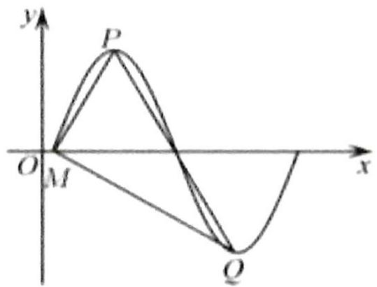

# 题型三：动态三角函数图像的考察

等级（R）

2024 吕梁三模

【练习 1】对任意闭区间 I，用 $M_{I}$ 表示函数 $y = \cos x$ 在 I 上的最大值，若正实数 a 满足 $M_{[0,a]} = 2M_{[a,2a]}$ ，则 a 的值为 \_\_\_\_.

等级（SSR）

2024 温州三模

【练习2】(多选)已知函数 $f(x) = \sin (\omega x + \varphi)(\omega > 0), x \in \left[\frac{\pi}{2}, \pi\right]$ 的值域是 $[a, b]$ ，则下列命题正确的是（）

$\quad$A. 若 $b - a = 2, \varphi = \frac{\pi}{6}$ , 则 $\omega$ 不存在最大值

$\quad$B. 若 $b - a = 2, \varphi = \frac{\pi}{6}$ , 则 $\omega$ 的最小值是 $\frac{7}{3}$

$\quad$C. 若 $b - a = \sqrt{3}$ ，则 $\omega$ 的最小值是 $\frac{4}{3}$

$\quad$D. 若 $b - a = \frac{3}{2}$ ，则 $\omega$ 的最小值是 $\frac{4}{3}$

# 题型四：最值点的给法

等级（R）

2024 湖丽衢二模

【练习 1】将函数 $f(x)=\cos2x$ 的图象向右平移 $\varphi\left(0<\varphi<\frac{\pi}{2}\right)$ 个单位后得到函数 $g(x)$ 的图象，若对满足 $\left|f(x_{1})-g(x_{2})\right|=2$ 的 $x_{1},x_{2}$ ，有 $\left|x_{1}-x_{2}\right|_{\min}=\frac{\pi}{3}$ ，则 $\varphi=(\quad)$

$\quad$A. $\frac{\pi}{6}$

$\quad$B. $\frac{\pi}{4}$

$\quad$C. $\frac{\pi}{3}$

$\quad$D. $\frac{5\pi}{12}$

# 题型五：与奇偶函数结合

等级 (R)

2022 全国甲卷

【练习 1】将函数 $f(x)=\sin\left(\omega x+\frac{\pi}{3}\right)(\omega>0)$ 的图象向左平移 $\frac{\pi}{2}$ 个单位长度后得到曲线 C，若 C 关于 y 轴对称，则 $\omega$ 的最小值是( )

$\quad$A. $\frac{1}{6}$

$\quad$B. $\frac{1}{4}$

$\quad$C. $\frac{1}{3}$

$\quad$D. $\frac{1}{2}$

# 解三角形

# 题型一：略新颖的给角的方法

等级（SR）

2024T8 第二次联考

【练习1】在 $\triangle ABC$ 中， $\sin(B-A)=\frac{1}{4},2a^{2}+c^{2}=2b^{2}$ ，则 $\sin C=$ （）

$\quad$A. $\frac{2}{3}$

$\quad$B. $\frac{\sqrt{3}}{2}$

$\quad$C. $\frac{1}{2}$

$\quad$D.1

# 题型二：阿波罗尼斯圆

等级（R）

2024 江西重点中学高三联考

【练习1】在三角形ABC中，BC=4,角A的平分线AD交BC于点D,若 $\frac{BD}{DC}=\frac{1}{3}$ ,则三角形ABC面积的最大值为\_\_\_\_.

# 题型三：三角形中 $\sin \cos$ 比较大总结

等级 (R)

【练习 1】在△ABC 中，给出下列命题

1) 若 $\mathrm{A} > \mathrm{B}$ , 则 $\sin \mathrm{A} > \sin \mathrm{B}$ 的逆命题、否命题、逆否命题都是真命题  
2) A>B 是 $\cos A < \cos B$ 的充要条件  
3) 若 $\triangle ABC$ 是锐角三角形, 则 $\sin A > \cos B$   
4) $\cos A + \cos B > 0$

则正确的命题个数为

# 题型四：给角分线长度和角，求邻边线性组合的最值

等级（R）

【练习1】在 $\triangle ABC$ 中，内角A，B，C所对的边分别为a，b，c， $a+b=c\cos B-b\cos C.$

（1） 求角 C 的大小;  
（2） 设 CD 是 $\triangle ABC$ 的角平分线，求证 $\frac{1}{CA} + \frac{1}{CB} = \frac{1}{CD}$

等级（R）

2024 南昌一模

【练习 2】如图, 两块直角三角形模具, 斜边靠在一起, 其中公共斜边 $AC = 10$ , $\angle BAC = \frac{\pi}{3}$ , $\angle DAC = \frac{\pi}{4}$ , $BD$ 交 $AC$ 于点 $E$

（1） 求 $\mathrm{BD}^{2}$   
（2） 求 AE

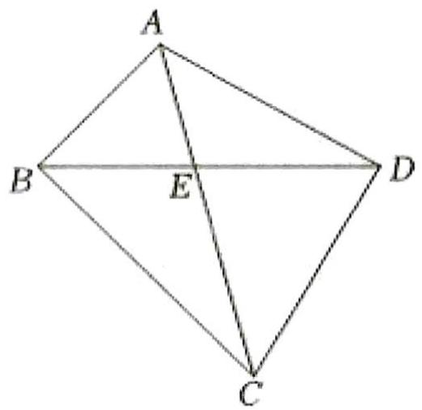

# 题型五：分角定理

等级 (R)

【练习1】如图, 在 $\triangle ABC$ 中, D 是边 BC 上一点, AB = AC, BD = 1, $\sin \angle CAD = 3\sin \angle BAD$ .

（1） 求 DC 的长;  
（2） 若 AD=2，求 $\Delta ABC$ 的面积。

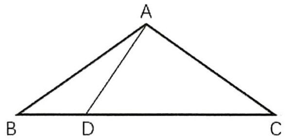

# 题型六：向量法&倍长法

等级（R）

【练习1】在 $\triangle ABC$ 中, 内角 $A, B, C$ 的对边分别为 $a, b, c, A = 60^{0}$ , 已知 $D$ 为 $BC$ 边上一点 $CD = 2DB$ , 若 $AD = \frac{\sqrt{21}}{3} b$

（Ⅰ）求 $\frac{\sin B}{\sin C}$ 的值；

(II) 若 $\triangle ABC$ 的面积为 $2 \sqrt{3}$ , 求 $a$ 的值.

# 题型七：正切恒等式及其应用

等级 (N)

2022 江苏基地三月联考

【练习1】在 $\triangle ABC$ 中，若 $\tan A+\tan B+\sqrt{2}=\sqrt{2}\tan A\tan B$ ，则 $\tan 2C=$ （）

$\quad$A. $- 2\sqrt{2}$

$\quad$B. $2\sqrt{2}$

$\quad$C. $- 2\sqrt{3}$

$\quad$D. $2\sqrt{3}$

等级 (N)

2022 遵义三统

【练习2】 $\triangle ABC$ 内角 $A 、 B 、 C$ 的对边分别为 $a, b, c, c = 2$ ，

$\tan A + \tan B + \sqrt{3} = \tan A\tan B\tan C$ ，则△ABC周长的最大值为（）

$\quad$A.4

$\quad$B.6

$\quad$C.8

$\quad$D.10

# 题型八：巧用常数

等级（SR）

2022 东北三省三校三模

【练习 1】在△ABC 中，内角 A,B,C 所对的边分别为 a, b, c，已知 acosC=2,2b+c=4，则△ABC 面积的最大值为

# 题型九：给一边及高的比值，求另两边比值+比值倒数的最值

等级（SR）

【练习1】已知三角形的三个内角 A,B,C 的对边分别为 a, b, c, $\Delta ABC$ 的面积为 S，且 $a^{2} = 4\sqrt{3}S$

（1） 若 C=60° 且 b=1，求 a 边的值；  
（2） 当 $\frac{c}{b}=2+\sqrt{3}$ 时，求 $\angle A$ 的大小。

# 题型十：解三角形与均值不等式

等级（SR）

【练习1】在 $\triangle ABC$ 中，若 $\sin^{2}C=3\sin^{2}A+3\sin^{2}B-2\sqrt{3}\sin A\sin B\sin C$ ，则角C=\_\_\_\_。

# 题型十一：两三角形共底边模型

等级 (R)

2024 广东二模

【练习 1】在平面直角坐标系 $xOy$ 中, 已知圆 $O: x^{2} + y^{2} = 1$ , 若等腰直角 $\Delta ABC$ 的直角边 $AC$ 为圆 $O$ 的一条弦, 且圆心 $O$ 在 $\Delta ABC$ 外, 点 $B$ 在圆 $O$ 外, 则四边形 $OABC$ 的面积的最大值为 ( )

$\quad$A. $\frac{\sqrt{5}}{2} + 1$

$\quad$B. $\sqrt{2} + 1$

$\quad$C. $\frac{\sqrt{6}}{2} + 1$

$\quad$D. $\sqrt{3} + 1$

# 数列

# 题型一：数列放缩

等级（R）

【练习1】已知数列 $\{a_{n}\}$ 满足 $a_{1} = 1, a_{n} > 0, a_{n}^{2} - a_{n-1}^{2} = 2n - 1 (n \geq 2)$

（1） 求 $\left\{a_{n}\right\}$ 的通项公式  
（2） 证明: $\frac{1}{a_{1}^{2}} + \frac{1}{a_{2}^{2}} + \cdots + \frac{1}{a_{n}^{2}} < 2$

# 题型二：隔项等比（等差）数列

等级（SR）

【练习1】数列 $\{a_{n}\}$ 的前 $n$ 项和为 $S_{n}$ , 若 $a_{1} = 1, a_{n} \neq 0, 3 S_{n} = a_{n} a_{n+1} + 1$ , 则 $a_{2019} =$

# 题型三：周期数列

等级（R）

【练习1】已知数列 $\{a_{n}\}$ 满足 $a_{n+1} = a_{n} - a_{n-1} (n \geqslant 2), a_{1} = 1, a_{2} = 2, S_{n}$ 为数列 $\{a_{n}\}$ 的前 $n$ 项和，则 $S_{2018} = (\quad)$

$\quad$A.3

$\quad$B.2

$\quad$C.1

$\quad$D.0

# 题型四：摆动数列

等级（SR）

2022 宁德三检

【练习 1】设数列 $\{a_{n}\}$ 的前 n 项和为 $S_{n}$ ， $a_{1}=3$ ，数列 $\{S_{n}+3\}$ 为等比数列，且 $S_{1}, S_{3}, S_{4}-2S_{1}$ 成等差数列

（1） 求数列 $\{S_{n}\}$ 的通项公式  
（2） 若 $N \leq \frac{(-1)^{n} \cdot S_{n}}{a_{n}} \leq M$ ，求 M - N 的最小值

# 题型五：特征根

等级（SR）

2019 新课标一理

【练习1】 $p_0 = 0, p_8 = 1$ ， $p_i = 0.4p_{i - 1} + 0.5p_i + 0.1p_{i + 1}$ ，求 $p_4$

# 题型六：数列递推式含正负交错项

等级（SR）

2020 全国乙卷文数

【练习1】数列 $\{a_{n}\}$ 满足 $a_{n+2} + (-1)^{n} a_{n} = 3 n - 1$ ，前16项和为540，则 $a_{1=}$ \_\_\_\_.

# 题型七：前 f（k）项和为 g（k）的数列

等级（SSR）

2017 新课标一理数

【练习 1】几位大学生响应国家的创业号召, 开发了一款应用软件。为激发大家学习数学的兴趣,他们推出了 “解数学题获取软件激活码” 的活动. 这款软件的激活码为下面数学问题的答案: 已知数列 $1,1,2,1,2,4,1,2,4,8,1,2,4,8,16$ , 其中第一项是 $2^{0}$ , 接下来的两项是 $2^{0},2^{1}$ , 再接下来的三项是 $2^{0},2^{1},2^{2}$ , 依此类推。求满足如下条件的最小整数 N:N>100 且该数列的前 N 项和为 2 的整数幂。那么该款软件的激活码是

$\quad$A.440

$\quad$B.330

$\quad$C.220

$\quad$D.110

# 题型八：构造新数列

等级（R）

【练习1】

已知等差数列 $\left\{a_{n}\right\}$ 满足 $\left(a_{1}+a_{2}\right)+\left(a_{2}+a_{3}\right)+\cdots+\left(a_{n}+a_{n+1}\right)=2n(n+1)\left(n\in N^{*}\right)$

（1） 求数列 $\left\{a_{n}\right\}$ 的通项公式;

（2） 数列 $\{b_{n}\}$ 中, $b_{1} = 1, b_{2} = 2$ , 从数列 $\{a_{n}\}$ 中取出第 $b_{n}$ 项记为 $c_{n}$ , 若 $\{c_{n}\}$ 是等比数列, 求 $\{b_{n}\}$ 的前 $n$ 项和 $T_{n}$

等级（SR）

2023 南昌二模

【练习2】已知数列 $\{a_{n}\}$ 的通项公式为 $a_{n} = 2^{n - 1}$ , 保持数列 $\{a_{n}\}$ 中各项顺序不变, 对任意的 $k \in \mathbf{N}_{+}$ , 在数列 $\{a_{n}\}$ 的 $a_{k}$ 与 $a_{k + 1}$ 项之间, 都插入 $\mathbf{k} (k \in \mathbf{N}_{+})$ 个相同的数 $(-1)^{k} k$ ,

组成数列 $\{b_{n}\}$ , 记数列 $\{b_{n}\}$ 的前 $\mathbf{n}$ 项的和为 $T_{n}$ , 则 $T_{100} =$

$\quad$A. 4056

$\quad$B. 4096

$\quad$C. 8152

$\quad$D. 8192

# 题型九：双递推数列

等级（SR）

2021 辽宁重点中学协作体

【练习 1】设数列 $\{a_{n}\}$ 的各项均为非零实数，记其前 n 项和 $S_{n}$ ， $2S_{n}=a_{n}^{2}+a_{n}$

（1） 求 $a_{1}, a_{2}$ ;

（2） 是否存在一个无穷数列 $\{a_{n}\}$ , 满足 $a_{2021} = -2020$ . 若存在, 请给出符合条件的数列 $\{a_{n}\}$ 的一个通项公式; 若不存在, 请说明理由.

# 题型十：数列阵问题

等级（SR）

2022 山西一模

【练习1】已知数列 $\{a_{n}\}$ 的前 n 项和 $S_{n} = 2n^{2} + n$ ，将该数列排成一个数阵（如右图），其中第 n 行有 $2^{n-1}$ 个数，则该数阵第 9 行从左向右第 8 个数是（）

$\quad$A.263

$\quad$B.1052

$\quad$C.528

$\quad$D.1051

$a_{1}$

$a_{2}$

$a_{3}$

$a_{4}$

$a_{5}$

$a_{6}$

$a_{7}$

10

11

12

13

14

15

等级（SR）

【练习2】已知数列 $\{a_{n}\}$ 的通项公式为 $a_{n} = 2n + 2$ ，将这个数列中

的项摆放成如图所示的数阵.记 $b_{n}$ 为数阵从左至右的n列，从上到下

的 $n$ 行共 $n^{2}$ 个数的和, 则数列 $\left\{\frac{n}{b_{n}}\right\}$ 的前 2020 项和为 ( )

$a_{1}$ $a_{2}$ $a_{3}$ $\dots$ $a_{n}$

$a_{2}$ $a_{3}$ $a_{4}$ $\cdots$ $a_{n + 1}$

$a_{3}$ $a_4$ $a_5$ $\dots$ $a_{n + 2}$

... ... ... ... ...

$a_{n}$ $a_{n + 1}$ $a_{n + 2}$ $\cdots$ $a_{2n - 1}$

$A. \frac {1 0 1 1}{2 0 2 0}$

$B. \frac {2 0 1 9}{2 0 2 0}$

$C. \frac {2 0 2 0}{2 0 2 1}$

$D. \frac {1 0 1 0}{2 0 2 1}$

# 题型十二：双错位相减

等级（SR）

【练习1】 $a_{n} = 2^{n}\cdot \mathbf{n}^{2}$ ，求它的前 $\pmb{n}$ 项和 $S_{n}$

# 平面向量

# 题型一：处理三向量线性组合关系的常见操作

等级（SR）

【练习1】如图1, 已知 $|\overrightarrow{OA}| = |\overrightarrow{OB}| = 1$ , $\overrightarrow{OA}$ 与 $\overrightarrow{OB}$ 的夹角为 $120^{\circ}$ , $\overrightarrow{OC}$ 与 $\overrightarrow{OA}$ 的夹角为 $30^{\circ}$ , $|\overrightarrow{OC}| = 5$ , 且 $\overrightarrow{OC} = x\overrightarrow{OA} + y\overrightarrow{OB}$ , 求 $x, y$ 的值

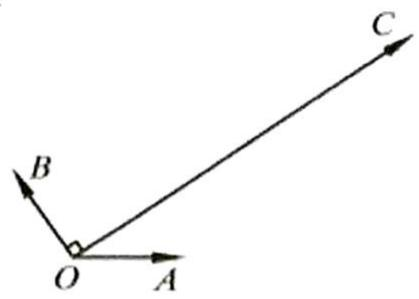

图 1

# 题型二：向量点乘的几何意义的高级考察

等级（R）

2024 娄底一模

【练习1】已知圆内接四边形ABCD中，AD=2， $\angle ADB=\frac{\pi}{4}$ ，BD是圆的直径， $\overrightarrow{AC} \cdot \overrightarrow{BD}=2$ ，则 $\angle ADC=$ （）

$\quad$A. $\frac{5 \pi}{12}$

$\quad$B. $\frac{\pi}{2}$

$\quad$C. $\frac{7\pi}{12}$

$\quad$D. $\frac{2 \pi}{3}$

等级（SR）

2022 新余二模

【练习 2】右图是由两个有一个公共边的正六边形构成的平面图形 $\Gamma$ ，其中正六边形边长为 1. 设 $\overrightarrow{AG} = x\overrightarrow{AB} + y\overrightarrow{AI}$ ，则 $x + y =$ \_\_\_\_ ; P 是平面图形 $\Gamma$ 边上的动点，则 $\overrightarrow{AC} \cdot \overrightarrow{BP}$ 的取值范围是 \_\_\_\_.

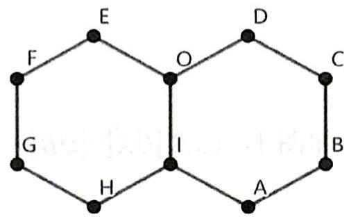

# 题型三：点到直线最短距离模型

等级（SR）

【练习 1】已知平面向量 $\vec{a}, \vec{b}, \vec{a} = (2\cos \alpha, 2\sin \alpha)$ ， $\vec{b} = (\cos \beta, \sin \beta)$ ，若对任意的实数 $\lambda$ ， $|\vec{a} - \lambda \vec{b}|$ 的最小值为 $\sqrt{3}$ ，则此时 $|\vec{a} - \vec{b}| =$

# 题型四：涉及三角形外心的向量运算

等级（SR）

2022 佛山二模

【练习1】 $\triangle ABC$ 中, $AB=\sqrt{2}$ , $\angle ACB=\frac{\pi}{4}$ , $O$ 是 $\triangle ABC$ 外接圆圆心, 则 $\overrightarrow{OC} \cdot \overrightarrow{AB}+\overrightarrow{CA} \cdot \overrightarrow{CB}$ 的最大值为( )

$\quad$A.0

$\quad$B.1

$\quad$C.3

$\quad$D.5

# 题型六：奔驰定理及其应用

等级（R）

【练习1】已知0是△ABC内部一点，满足 $\overrightarrow{OA}+2\overrightarrow{OB}+m\overrightarrow{OC}=0,\quad\frac{S_{\triangle AOB}}{S_{\triangle ABC}}=\frac{4}{7}$ ，则实数m=()

$\quad$A. 2

$\quad$B.3

$\quad$C.4

$\quad$D.5

# 题型七：向量等和线

等级 (R)

【练习1】如图,在正六边形ABCDEF中,点P是 $\triangle CDE$ 内(包括边界)的一个动点,设 $\overrightarrow{AP}=\lambda\overrightarrow{AB}+\mu\overrightarrow{AF}$ ( $\lambda,\quad\mu\in R$ ),则 $\lambda+\mu$ 的取值范围是()

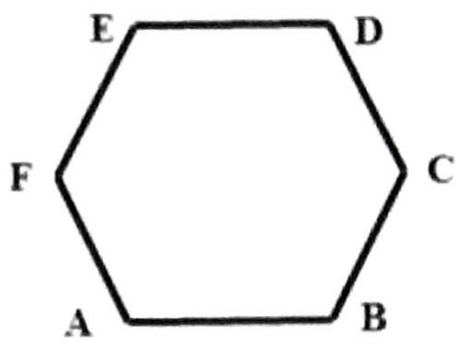

# 不等式

# 题型一：不等式与曲线

等级（SR）

【练习1】数学中有很多形状优美、寓意美好的曲线，例如：四叶草曲线就是其中的一种，其方程为 $(x^{2} + y^{2})^{3} = x^{2}y^{2}$ . 给出下列四个结论：

①曲线 C 上的点有四条对称轴;  
②曲线 C 上的点到原点的最大距离为 $\frac{1}{4}$ ;  
③曲线 C 第一象限上任意一点作两坐标轴的垂线与两坐标轴围成的矩形面积最大值为 $\frac{1}{8}$ ;  
④四叶草面积小于 $\frac{\pi}{4}$

其中，所有正确结论的序号是（）

$\quad$A.①②

$\quad$B.①③

$\quad$C.①③④

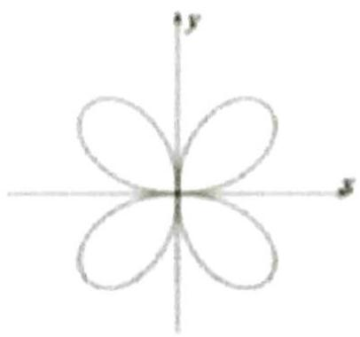

$\quad$D.①②④

# 题型二：双管齐下

等级（SR）

【练习1】已知a，b， $c \in R$ ，且满足 $\left\{\begin{array}{l} a+b+c=2 \\ a^{2}+b^{2}+c^{2}=2 \end{array}\right.$ ，则c的取值范围为\_\_\_\_

# 题型三：基本不等式之无关系两用均值法

等级（R）

【练习 1】已知a > 0, b > 0, 则 $\frac{1}{a} + \frac{1}{b} + 2\sqrt{ab}$ 的最小值是（）

$\quad$A. 2

$\quad$B. 3

$\quad$C. 4

$\quad$D. 5

# 题型四：基本不等式之配凑法

等级（SR）

【练习1】已知a，b是正数，且 $(a+b)(a+2b)+a+b=9$ ，求 $3a+4b$ 的最小值

# 题型五：三字母不等式问题

等级（SR）

2021 山西一模

【练习1】已知 $a, b, c \in \mathbb{R}$ , 且 $a > 4$ , $ab + ac = 4$ , 则 $\frac{2}{a} + \frac{2}{b + c} + \frac{32}{a + b + c}$ 的最小值是 ( )

$\quad$A. 8

$\quad$B. 6

$\quad$C. 4

$\quad$D. 2

# 立体几何选填

# 题型一：立体几何与函数最值结合

等级（SR）

【练习 1】一个等腰三角形的周长为 10，四个这样相同等腰三角形底边围成正方形，如图，若这四个三角形都绕底边旋转，四个顶点能重合在一起，构成一个四棱锥，则围成的四棱锥的体积最大值为

$\quad$A. $\frac{500\sqrt{2}}{81}$

$\quad$B. $\frac{500 \sqrt{2}}{27}$

$\quad$C. $5\sqrt{3}$

$\quad$D. ${15}\sqrt{2}$

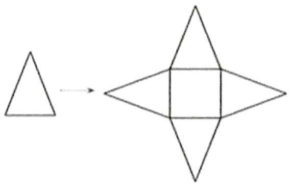

# 题型二：补体的思想

等级（SR）

【练习1】

(多选)如图, 棱长为 2 的正四面体 $ABCD$ 中, $M$ , $N$ 分别为棱 $AD$ , $BC$ 的中点, $O$ 为线段 $MN$ 的中点, 球 $O$ 的表面与线段 $AD$ 相切于点 $M$ , 则下列结论中正确的是 ( )

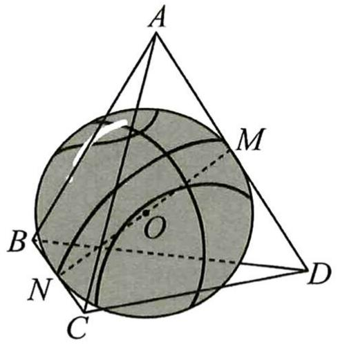

$\quad$A. $AO \perp$ 平面 $BCD$   
$\quad$B. 球 $O$ 的体积为 $\frac{\sqrt{2}}{3}\pi$   
$\quad$C. 球 $O$ 被平面 $BCD$ 截得的截面面积为 $\frac{4}{3} \pi$   
$\quad$D. 球 $O$ 被正四面体 $ABCD$ 表面截得的截面周长为 $\frac{8\sqrt{3}}{3}\pi$

# 题型三：动点问题

等级 (R)

2024 南京盐城二模

【练习1】在棱长为 $2a (a > 0)$ 的正方体 $ABCD - A_{1}B_{1}C_{1}D_{1}$ 中, 点 $M, N$ 分别为棱 $AB, D_{1}C_{1}$ 的中点. 已知动点 $P$ 在该正方体的表面上, 且 $\overrightarrow{PM} \cdot \overrightarrow{PN} = 0$ , 则点 $P$ 的轨迹长度为( )

$\quad$A. ${12a}$

$\quad$B. $12 \pi a$

$\quad$C. ${24a}$

$\quad$D. ${24\pi a}$

等级（R）

【练习2】在棱长为2的正方形ABCD- $A_{1}B_{1}C_{1}D_{1}$ 中，点E,F分别是棱 $C_{1}D_{1}, B_{1}C_{1}$ 的中点，P是上底面 $A_{1}B_{1}C_{1}D_{1}$ 内一点（含边界），若AP∥平面BDEF，则P点的轨迹长为（）

$\quad$A.1

$\quad$B. $\sqrt{2}$

$\quad$C.2

$\quad$D. $2\sqrt{2}$

等级（SR）

2023 福建质检

【练习 3】(多选) 正方体 $ABCD - A_{1}B_{1}C_{1}D_{1}$ 的棱长为 1，M 为侧面 $AA_{1}D_{1}D$ 上的点，N 为侧面 $CC_{1}D_{1}D$ 上的点，则下列判断正确的是（）

$\quad$A. 若 ${BM} = \frac{\sqrt{5}}{2}$ ,则 $M$ 到直线 ${A}_{1}D$ 的距离的最小值为 $\frac{\sqrt{2}}{4}$   
$\quad$B. 若 ${B}_{1}N \perp  A{C}_{1}$ ,则 $N \in  C{D}_{1}$ ,且直线 ${B}_{1}N//$ 平面 ${A}_{1}{BD}$   
$\quad$C. 若 $M \in A_{1}D$ ，则 $B_{1}M$ 与平面 $A_{1}BD$ 所成角正弦的最小值为 $\frac{\sqrt{3}}{3}$   
$\quad$D. 若 $M \in A_{1}D, N \in CD_{1}$ ，则 M, N 两点之间距离的最小值为 $\frac{\sqrt{3}}{3}$

# 题型四：平行六面体处理通法

如图, 在平行六面体 $ABCD - A'B'C'D'$ 中, $AB = 4$ , $AD = 3$ , $AA' = 5$ , $\angle BAD = 90^\circ$ , $\angle BAA' = \angle DAA' = 60^\circ$ . 求: $AC'$ 的长.

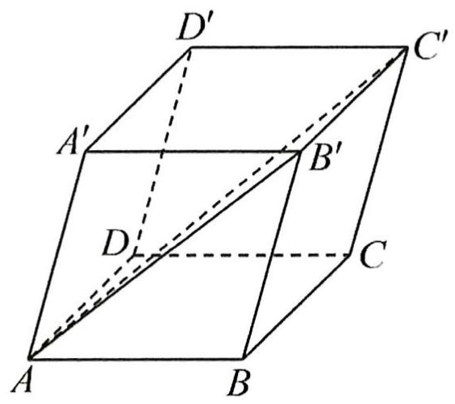

# 题型五：祖暅原理

等级（SR）

【练习 1】我国南北朝时期的数学家祖暅提出了计算体积的祖暅原理：“幂势既同，则积不容异。”意思是：两个等高的几何体若在所有等高处的水平载面的面积相等，则这两个几何体的体积相等。已知曲线 $C: y = x^{2}$ ，直线 1 为曲线 C 在点（1，1）处的切线。如图所示，阴影部分为曲线 C. 直线 1 以及 x 轴所围成的平面图形，记该平面图形统 y 轴旋转一周所得到的几何体为 $\Gamma$ ，给出以下四个几何体：

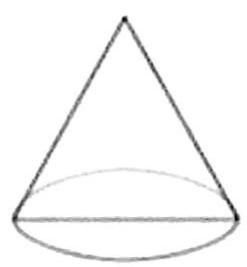  
①

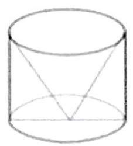  
②

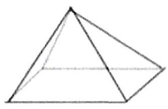  
③

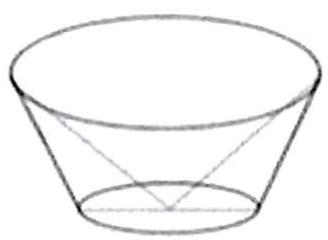  
④

图①是底面直径和高均为1的圆锥；

图②是将底面直径和高均为 1 的圆柱挖掉一个与圆柱同底等高的倒置圆锥得到的几何体;

图③是底面边长和高均为1的正四棱锥；

图④是将上底面直径为 2，下底面直径为 1，高为 1 的圆台挖掉一个底面直径为 2，高为 1 的倒置圆锥得到的几何体。

根据祖暅原理，以上四个几何体中与 $\Gamma$ 的体积相等的是 A

$\quad$A.①

$\quad$B.②

$\quad$C.③

$\quad$D.④

等级（SR）

【练习 2】我国南北朝时期著名数学家祖暅提出了祖暅原理：“幂势既同，则积不容异”。意思是：夹在两平行平面向的两个几何体，被平行于这两个平行平面的任何平面所截，若截得的两个截面面积总相等，则这两几何体的体积相等，为计算球的体积，构造一个底面半径和高都与球半径相等的圆柱，然后在圆柱内挖去一个以图柱下底面圆心为顶点，圆柱上底面为底面的圆锥，运用祖暅原理可证明此几何体与半球体积相等（任何一个平面所截的两个截面面积都相等），将椭圆 $\frac{x^{2}}{9}+\frac{y^{2}}{16}=1$ 绕 y 轴旋转一周后得一橄榄状的几何体，类比上述方法，运用祖暅原理可求得其体积等于

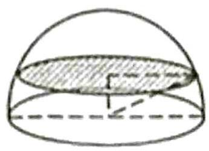

$\quad$A. ${24\pi }$

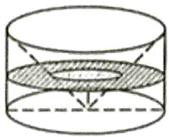

$\quad$B. ${32\pi }$

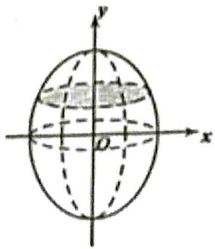

$\quad$C. $48 \pi$

$\quad$D. ${64\pi }$

# 题型六：立体几何综合题

等级（SR）

2024 台州二模

【练习1】(多选) 已知正方体 $ABCD - A_{1}B_{1}C_{1}D_{1}$ 的棱长为 1, $P$ 为平面 $ABCD$ 内一动点, 且直线 $D_{1}P$ 与平面 $ABCD$ 所成角为 $\frac{\pi}{3}$ , $E$ 为正方形 $A_{1}ADD_{1}$ 的中心, 则下列结论正确的是 ( )

$\quad$A. 点 $P$ 的轨迹为抛物线  
$\quad$B. 正方体 $ABCD - A_{1}B_{1}C_{1}D_{1}$ 的内切球被平面 $A_{1}BC_{1}$ 所截得的截面面积为 $\frac{\pi}{6}$   
$\quad$C. 直线 CP 与平面 $CDD_{1}C_{1}$ 所成角的正弦值的最大值为 $\frac{\sqrt{3}}{3}$   
$\quad$D. 点 M 为直线 $D_{1}B$ 上一动点，则 $MP + ME$ 的最小值为 $\sqrt{\frac{11 - 2\sqrt{6}}{6}}$

等级（SR）

2024 贵州省统测

【练习2】(多选) 如图, 正四棱锥 $P - ABCD$ 每一个侧面都是边长为 4 的正三角形, 若点 $M$ 在四边形 $ABCD$ 内 (包含边界) 运动, $N$ 为 $PD$ 的中点, 则 ( )

$\quad$A. 当 $M$ 为 $AD$ 的中点时, 异面直线 $MN$ 与 $PC$ 所成角为 $\frac{\pi}{2}$   
$\quad$B. 当 $MN \parallel$ 平面 $PBC$ 时, 点 $M$ 的轨迹长度为 $2 \sqrt{3}$   
$\quad$C. 当 $MP \perp MD$ 时，点 M 到 AB 的距离可能为 $\frac{3\sqrt{3}}{2}$   
$\quad$D. 存在一个体积为 $\frac{5 \pi}{3}$ 的圆柱体可整体放入正四棱锥 $P - A B C D$ 内

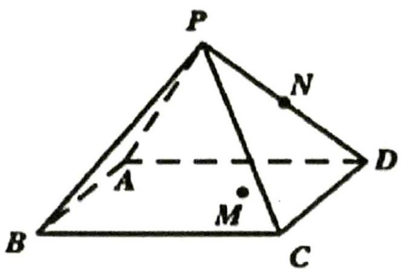

等级（SR）

2024 皖北协作区高三联考

【练习 3】(多选) 在棱长为1的正方体 $ABCD - A_{1}B_{1}C_{1}D_{1}$ 中，以 $A, C_{1}$ 为焦点的椭圆，绕着轴 $AC_{1}$ 旋转 $180^{\circ}$ 得到的旋转体称为椭球 $AC_{1}$ ，椭圆的长轴就是椭球的长轴，若椭球 $AC_{1}$ 的长轴长为 2，则下列结论中正确的是()

$\quad$A.椭球 $A{C}_{1}$ 的表面与正方体 ${ABCD} - {A}_{1}{B}_{1}{C}_{1}{D}_{1}$ 的六个面都有交线  
$\quad$B. 在正方体 $ABCD - A_{1}B_{1}C_{1}D_{1}$ 的所有棱中，只有六条棱与椭球 $AC_{1}$ 的表面相交  
$\quad$C. 若椭球 $AC_{1}$ 的表面与正方体 $ABCD - A_{1}B_{1}C_{1}D_{1}$ 的某条棱相交, 则交点必是该棱的一个三等分点  
$\quad$D.椭球 $AC_{1}$ 的表面与正方体 $ABCD - A_{1}B_{1}C_{1}D_{1}$ 的一个面的交线是椭圆的

# 题型七：与圆锥曲线结合

等级 (R)

2022 江苏基地三月联考

【练习1】某同学画“切面圆柱体”（用与圆柱底面不平行的平面切圆柱，底面与切面之间的部分叫做切面圆柱体），发现切面与圆柱侧面的交线是一个椭圆（如图所示）。若该同学所画的椭圆的离心率为 $\frac{1}{2}$ ，则“切面”所在平面与底面所成的角为（）

$\quad$A. $\frac{\pi}{12}$

$\quad$B. $\frac{\pi}{6}$

$\quad$C. $\frac{\pi}{4}$

$\quad$D. $\frac{\pi}{3}$

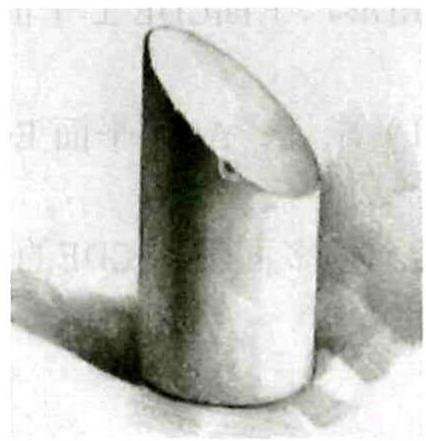

等级 (R)

2022 湖南高三三月联考

【练习2】如图, 圆锥底圆O的直径长为 $4 \sqrt{2}, \angle A P B = 90^{\circ}$ , AB, CD是底圆的两条直径, 且AB⊥CD, E是母线PB的中点, 已知过CD与E的平面与圆锥侧面的交线是以E为顶点的抛物线的一部分, 则该抛物线的焦点到圆锥顶点P的距离等于

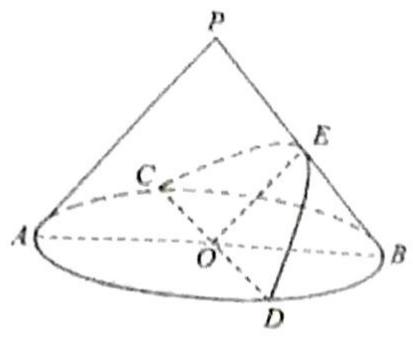

# 立体几何大题

# 题型一：平行线转化法求点到平面距离

等级（SR）

2022 河南六市三月联考

【练习1】多面体ABCDE中, $\Delta$ BCD与 $\Delta$ CDE均为边长为2的等边三角形, $\Delta$ ABC为腰长 $\sqrt{13}$ 的等腰三角形, 平面CDE⊥平面BCD, 平面ABC⊥平面BCD, F为BC的中点.

（1） 求证: $AF \parallel$ 平面 $ECD$ ;  
（2） 求多面体ABCDE的体积。

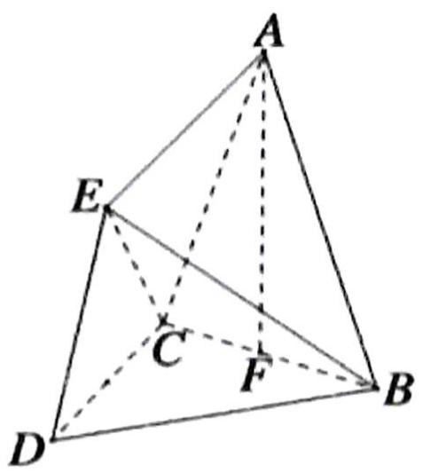

# 题型二：有难度的求体积问题

等级 (R)

2021 攀枝花三统

【练习1】如图, 三棱锥 P-ABC 中, $PA \perp$ 面 ABC, $\triangle ABC$ 为正三角形, 点 $A_{1}$ 在棱 PA 上, 且 $PA = 4PA_{1}$ , $B_{1} 、 C_{1}$ 分别是棱 PB、PC 的中点, 直线 $A_{1}B_{1}$ 与直线 AB 交于点 D, 直线 $A_{1}C_{1}$ 与直线 AC 交于点 E, AB = 6, $PA = 8$ .

（1） 求证: DE // BC;   
（2） 求几何体 $ABC-A_{1}B_{1}C_{1}$ 的体积.

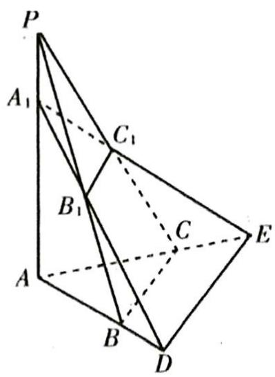

# 题型三：设角类动点问题

等级（SR）

2024 天域名校协作体

【练习 1】在三棱锥 P-ABC 中，PB ⊥ 平面 ABC，AB = BC = BP = 2，点 E 在平面 ABC 内，且满足平面 PAE ⊥ 平面 PBE

（1） 当 $\angle ABE \in \left[\frac{\pi}{8}, \frac{\pi}{3}\right]$ 时，求点 E 的轨迹长度；  
（2） 当二面角 $E - PA - B$ 的余弦值为 $\frac{\sqrt{3}}{3}$ 且 $\mathrm{BA} \perp \mathrm{BC}$ . 求三棱锥 $E - PCB$ 的体积

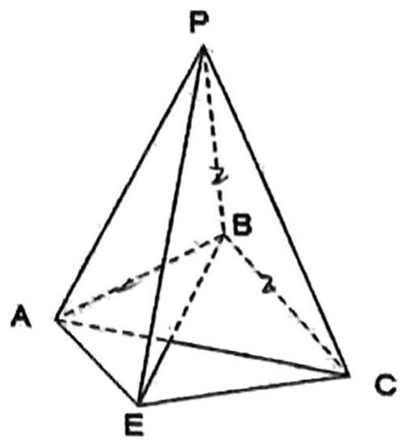

# 题型四：计算点面点线距离

等级 (R)

【练习 1】在底面是直角梯形的四棱锥 P-ABCD 中，侧棱 PA⊥底面 ABCD，BC//AD， $\angle ABC=90^{\circ}$ ，PA=AB=BC=2，AD=1，则 AD 到平面 PBC 的距离为 \_\_\_\_.

等级（SR）

【练习 2】如图, 在棱长为 1 的正方体 $A B C D - A _ { 1 } B _ { 1 } C _ { 1 } D _ { 1 }$ 中, O 为平面 $A _ { 1} A B B _ { 1 }$ 的中心, E 为 BC 的中点,

求点O到直线 $A_{1}E$ 的距离

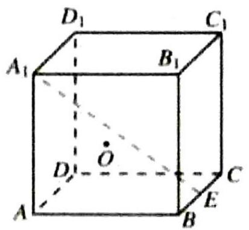

# 题型五：翻折模型

等级 (R)

2022 合肥二模

【练习 1】如图, 在矩形 $ABCD$ 中, $AB = 2AD$ , 点 $\mathrm{M}$ 为边 $AB$ 的中点, 以 $CM$ 为折痕把 $\triangle BCM$ 折起, 使点 $\mathrm{B}$ 到达点 $\mathrm{P}$ 的位置, 使得 $\angle PMB = \frac{\pi}{3}$ , 连接 $\mathrm{PA}, \mathrm{PB}, \mathrm{PD}$

（1） 证明: 平面 $P M C \perp$ 平面 $A M C D$ ;  
（2） 求直线 PC 与平面 PAD 所成角的正弦值;

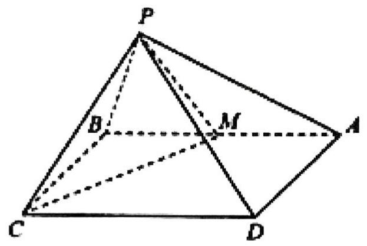

等级（SR）

2022 江淮十校第三次联考

【练习2】矩形 ATCD 中，AD=2DC=2，B 为 TC 中点， $\triangle TAB$ 沿 AB 翻折，使得点 T 到达点 P 的位置，连结 PD，得到如图所示的四棱锥 P-ABCD，M 为 PD 的中点

（1） 求线段 CM 的长度;

（2） 求直线 CM 与平面 ABCD 所成角的正弦值的最大值;

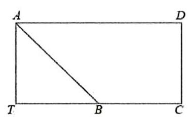

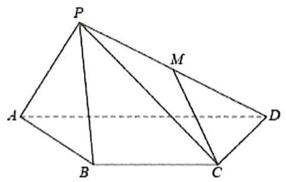

# 题型六：利用未知数个数和方程个数解点坐标

等级（SR）

2020 新课标二理数

【练习 1】如图, 已知三棱柱 $ABC - A_{1}B_{1}C_{1}$ 的底面是正三角形, 侧面 $BB_{1}C_{1}C$ 是矩形, M, N分别为 $BC, B_{1}C_{1}$ 的中点, P为AM上一点, 过 $B_{1}C_{1}$ 和P的平面交AB于E, 交AC于F。

（1）证明： $AA_{1}\parallel MN$ ，且平面 $A_{1}AMN\perp$ 平面 $EB_{1}C_{1}F$ ;  
（2） 设O为 $\Delta A_{1}B_{1}C_{1}$ 的中心. 若AO∥平面 $EB_{1}C_{1}F$ , 且AO=AB, 求直线 $B_{1}E$ 与平面 $A_{1}AMN$ 所成角的正弦值.

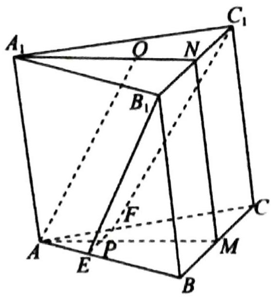

# 题型七：台体的考察

等级(R)

2021 泰州南通二模

【练习1】如图,在三棱台 $ABC-A_{1}B_{1}C_{1}$ 中,AC⊥A₁B,0是BC的中点,A₁O⊥平面ABC,

（1） 求证: $AC \perp BC$ ;   
（2） 若 ${A}_{1}0 = 1,{AC} = 2\sqrt{3},BC = {A}_{1}{B}_{1} = 2$ ,求二面角 ${B}_{1} - {BC} - A$ 的大小.

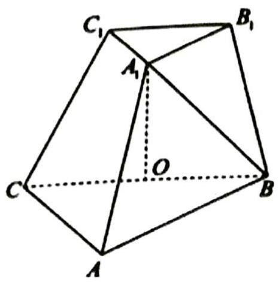

# 直线与圆

# 题型一：半圆的给法

等级（R）

2024 新疆第一次适应性检测

【练习 1】已知直线 l 的方程为 $x \cos \theta + y \sin \theta = m (0 \leq \theta < 2\pi, \text{m为常数})$ ，曲线 C 的方程为 $y = \sqrt{1 - x^{2}}$ ，则“|m| ≤ 1”是“直线 l 与曲线 C 有公共点”的（）

$\quad$A. 充分而不必要条件

$\quad$B. 必要而不充分条件

$\quad$C. 充分必要条件

$\quad$D.既不充分也不必要条件

# 题型二：圆内定长弦中点的轨迹问题

等级（SR）

【练习 1】A,B 是圆 O: $x^{2} + y^{2} = 1$ 上两个动点, 且 $\angle AOB = 120^{\circ}$ , A,B 到直线 1: $3x + 4y - 10 = 0$ 的距离分别为 $d_{1}, d_{2}$ , 则 $d_{1} + d_{2}$ 的最大值是

$\quad$A.3

$\quad$B.4

$\quad$C.5

$\quad$D.6

# 题型三：过直线上一点做圆的两条切线的夹角问题

等级（R）

【练习1】已知 $\odot 0: x^{2} + y^{2} - 4y + 3 = 0$ , 直线 $L: y = x$ , 若过直线 $L$ 上的点 $P$ 所作的 $\odot 0$ 的两条切线互相垂直, 则点 $P$ 的坐标是 ( )

$\quad$A. $\left(\frac{1}{2},\frac{1}{2}\right)$

$\quad$B.(0,0)或(2,2)

$\quad$C.(1,1)

$\quad$D. $\left(\frac{2}{3},\frac{2}{3}\right)$ 或 $\left(\frac{4}{3},\frac{4}{3}\right)$

等级 (R)

【练习2】过直线 $x + y - 2\sqrt{2} = 0$ 上的点 $P$ 作圆 $x^{2} + y^{2} = 1$ 的两条切线, 若两切线的夹角为 $60^{\circ}$ , 则点 $\mathbf{P}$ 的坐标为 ( )

$\quad$A. $(0, 2\sqrt{2})$

$\quad$B. $(2\sqrt{2},0)$

$\quad$C. $(\sqrt{2}, \sqrt{2})$

$\quad$D. $\left(\frac{3}{2}\sqrt{2},\frac{\sqrt{2}}{2}\right)$ 或 $\left(\frac{\sqrt{2}}{2},\frac{3}{2}\sqrt{2}\right)$

等级（SR）

【练习 3】已知点 P 是直线 L.3x+4y-7=0 上的动点，过点 P 引圆 C: $(x+1)^{2} + y^{2} = r^{2}(r > 0)$ 的两条切线 PM, PN, M, N 为切点，当 $\angle MPN$ 的最大值为 $\frac{\pi}{3}$ 时，则 r 的值为（）

$\quad$A.4

$\quad$B.3

$\quad$C.2

$\quad$D.1

# 题型四：直线和圆综合题

等级（SR）

2024 河南济洛平许三测

【练习1】直线 $l_{1}:mx-y-5m+1=0$ 与 $l_{2}:x+my-5m-1=0$ 交于点P，圆 $C:(x+2)^{2}+(y+2)^{2}=4$ 上有两动点A，B，且 $|AB|=2\sqrt{2}$ ，则 $|\overrightarrow{PA}+\overrightarrow{PB}|$ 的最小值为（）

$\quad$A. $2\sqrt{2}$

$\quad$B. $4\sqrt{2}$

$\quad$C. $6\sqrt{2}$

$\quad$D. ${10}\sqrt{2}$

等级（SR）

2024 重庆二诊

【练习2】已知圆 $O: x^{2} + y^{2} = 3$ , P 是圆 O 外一点, 过点 P 作圆 O 的两条切线, 切点分别为 A, B, 若 $\overrightarrow{PA} \cdot \overrightarrow{PB} = \frac{9}{2}$ , 则 $|\mathrm{OP}| = (\quad)$

$\quad$A. $\sqrt{6}$

$\quad$B.3

$\quad$C. $2\sqrt{3}$

$\quad$D. $\sqrt{15}$

等级（SR）

2022 武汉二调

【练习3】(多选)在平面直角坐标系中, 已知圆 $K: (x - k)^{2} + (y - k)^{2} = \frac{k^{2}}{2}$ , 其中 $k \neq 0$ 则 ( )

$\quad$A. 圆 K 过定点

$\quad$B. 圆 K 的圆心在定直线上

$\quad$C. 圆 K 与定直线相切

$\quad$D. 圆 K 与定圆相切

# 题型六：动直线定圆问题

等级（SR）

2023 湖北四月调考

【练习 1】已知动直线 l 的方程为 $(1-a^{2})x+2ay-3a^{2}-3=0, a \in R, P(\sqrt{3},1)$ ，0 为坐标原点，过点 0 作直线 l 的垂线，垂足为 Q，则线段 PQ 长度的取值范围为

$\quad$A. (0, 5]

$\quad$B. $[1, 5]$

$\quad$C. $[5, +\infty)$

$\quad$D. (0, 3]

# 题型七：角分线的考察

等级（SR）

【练习1】已知三角形ABC的三个顶点 $A\left(\frac{1}{3}, 3\right), B(-1, 2), C(4, 3)$ ，求： $\angle A$ 的平分线所在的直线方程.

等级（SR）

2008 全国卷 II

【练习2】等腰三角形两腰所在直线的方程分别为 $x + y - 2 = 0$ 和 $x - 7y - 4 = 0$ , 原点在等腰三角形的底边上, 则底边所在直线的斜率为 ( )

$\quad$A.3

$\quad$B.2

$\quad$C. $-\frac{1}{3}$

$\quad$D. $- \frac{1}{2}$

# 圆锥曲线选填

# 题型一：最大顶角问题总结

等级（SR）

2021 长春四模

【练习 1】已知F是椭圆 $\frac{x^{2}}{a^{2}}+\frac{y^{2}}{b^{2}}=1(a>b>0)$ 的一个焦点，若直线y=kx与椭圆相交于A,B两点，且 $\angle AFB$ 等于 $60^{\circ}$ ，则椭圆离心率的取值范围是（）

$\quad$A. $\left(0,\ \frac{\sqrt{3}}{2}\right)$

$\quad$B. $\left(\frac{\sqrt{3}}{2},1\right)$

$\quad$C. $\left(0,\ \frac{1}{2}\right)$

$\quad$D. $\left(\frac{1}{2},1\right)$

# 题型二: 抛物线以 $\mathrm{{AF}},\mathrm{{BF}},\mathrm{{AB}}$ 为直径的圆与 $\mathrm{y}$ 轴准线相切

等级 (R)

【练习 1】已知点 M（0，2），过抛物线 $y^{2}=4x$ 的焦点 F 的直线 AB 交抛物线于 A，B 两点，若 $\overrightarrow{AM} \cdot \overrightarrow{FM} = 0$ ，则点 B 的纵坐标为 \_\_\_\_

等级（SR）

2024 顶尖联盟第三次考试

【练习 2】已知抛物线 C: $y^{2}=4x$ 的焦点为 F, 过 F 的直线 l 与 C 交于 A, B 两点, 点 $P(-1,2)$ , 若 PA ⊥ PB, 则 $\left|AB\right|=(\quad)$

$\quad$A.6

$\quad$B.8

$\quad$C.10

$\quad$D.12

# 题型三：mmnnpp 模型

等级（SR）

【练习1】已知双曲线 $E: \frac{x^{2}}{a^{2}} - \frac{y^{2}}{b^{2}} = 1 (a > 0, b > 0)$ 的左、右焦点分别为 $F_{1}, F_{2}$ , 半焦距为 4, $P$ 是 $E$ 左支上的一点, $PF_{2}$ 与 $y$ 轴交于点 $A$ , $\triangle PAF_{1}$ 的内切圆与边 $AF_{1}$ 切于点 $Q$ , 若 $|AQ| = 2$ , 则 $E$ 的离心率是

$\quad$A. $\sqrt{2}$

$\quad$B. $\sqrt{3}$

$\quad$C.2

$\quad$D. $\sqrt{5}$

# 题型四：圆锥曲线的光学性质

等级 (R)

2021 临沂一模

【练习1】双曲线的光学性质为: 如图①, 从双曲线右焦点 $F_{2}$ , 发出的光线经双曲线镜面反射, 反射光线的反向延长线经过左焦点 $F_{1}$ . 我国首先研制成功的“双曲线新闻灯”, 就是利用了双曲线的这个光学性质. 某 “双曲线新闻灯” 的轴截面是双曲线一部分, 如图②, 其方程为 $\frac{x^{2}}{a^{2}} - \frac{y^{2}}{b^{2}} = 1$ , $F_{1}$ , $F_{2}$ 为其左、右焦点, 若从右焦点 $F_{2}$ 发出的光线经双曲线上的点 A 和点 B 反射后, 满足 $\angle B A D = 90^{\circ}$ , $\tan \angle A B C = - \frac{3}{4}$ , 则该双曲线的离心率为 ( )

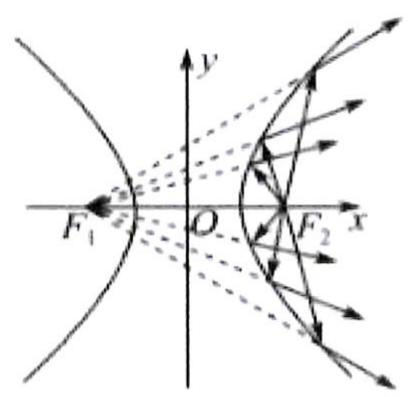

图①

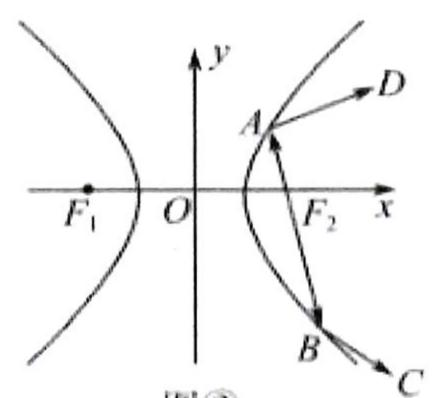

图②

$\quad$A. $\frac{\sqrt{5}}{2}$

$\quad$B. $\sqrt{5}$

$\quad$C. $\frac{\sqrt{10}}{2}$

$\quad$D. $\sqrt{10}$

# 题型五：旋转后的椭圆与双曲

等级（SR）

【练习1】人教A版必修第一册第92页上“探究与发现”的学习内容是“探究函数 $y = x + \frac{1}{x}$ 的图象与性质”，经探究它的图象实际上是双曲线。现将函数 $y = 2x + \frac{1}{x}$ 的图象绕原点顺时针旋转得到焦点位于 $x$ 轴上的双曲线 $C$ ，则该双曲线 $C$ 的离心率是（）

$\quad$A. $\frac{\sqrt{10 - 2\sqrt{5}}}{2}$

$\quad$B. $\frac{5 - \sqrt{5}}{2}$

$\quad$C. $10 - 4 \sqrt{5}$

$\quad$D. $\sqrt{10 - 4\sqrt{5}}$

# 题型六：同焦点的椭圆双曲线问题

等级（SR）.

【练习1】

已知有公共焦点的椭圆 $C_1$ 与双曲线 $C_2$ 的四个公共点构成一个正方形, 若 $\mathrm{e}_1, \mathrm{e}_2$

分别是 $C_1$ ， $C_2$ 的离心率，且 $\mathrm{e}_1 = \frac{\sqrt{2}}{2}$ ，则 $\mathrm{e}_2 = (\quad)$

$\quad$A. $\sqrt{2}$

$\quad$B. $\sqrt{3}$

$\quad$C. $\sqrt{6}$

$\quad$D.3

# 题型七：抛物线综合题

等级（SR）

2023 宁波二模

【练习 1】（多选）三支不同的曲线 $y = a_{i} \cdot |x - 1| (a_{i} > 0, i = 1, 2, 3)$ 交抛物线 $y^{2} = 4x$ 于点 $A_{i}, B_{i}$ ( $i = 1, 2, 3$ ), $F$ 为抛物线的焦点，记 $\triangle A_{i}FB_{i}$ 的面积为 $S_{i}$ ，下列说法正确的是（）

$\quad$A. $\frac{1}{|FA_i|} +\frac{1}{|FB_i|}\left(i = 1,2,3\right)$ 为定值  
$\quad$B. $A_{1} B_{1} / / A_{2} B_{2} / / A_{3} B_{3}$   
$\quad$C. 若 $S_{1} + S_{2} = 2S_{3}$ ，则 $a_1 + a_2 = 2a_3$   
$\quad$D. 若 $S_{1}S_{2} = S_{3}^{2}$ ，则 $a_{1}a_{2} = a_{3}^{2}$

等级（SR）

2024 嘉兴二模

【练习2】(多选)抛物线有如下光学性质: 由其焦点射出的光线经抛物线反射后, 沿平行于抛物线对称轴的方向射出; 反之, 平行于抛物线对称轴的入射光线经抛物线反射后必过抛物线的焦点. 如图, 已知抛物线 $\Omega: y^{2} = 2px (p > 0)$ 的准线为 $l, O$ 为坐标原点, 在 $\mathbf{x}$ 轴上方有两束平行于 $\mathbf{x}$ 轴的入射光线 $l_{1}$ 和 $l_{2}$ , 分别经 $\Omega$ 上的点 $A(x_{1}, y_{1})$ 和点 $B(x_{2}, y_{2})$ 反射后, 再经 $\Omega$ 上相应的点 $\mathbf{C}$ 和点 $\mathbf{D}$ 反射, 最后沿直线 $l_{3}$ 和 $l_{4}$ 射出, 且 $l_{1}$ 与 $l_{2}$ 之间的距离等于 $l_{3}$ 与 $l_{4}$ 之间的距离. 则下列说法中正确的是

$\quad$A. 若直线 $l_{3}$ 与准线 $l$ 相交于点 $\mathrm{P}$ , 则 $\mathrm{A}, \mathrm{O}, \mathrm{P}$ 三点共线  
$\quad$B. 若直线 $l_{3}$ 与准线 $l$ 相交于点 $\mathrm{P}$ , 则 $\mathrm{PF}$ 平分 $\angle \mathrm{APC}$   
$\quad$C. ${y}_{1}{y}_{2} = {p}^{2}$   
$\quad$D. 若直线 $l_{1}$ 的方程为 $y = 2p$ , 则 $\cos \angle AFB = \frac{7}{25}$

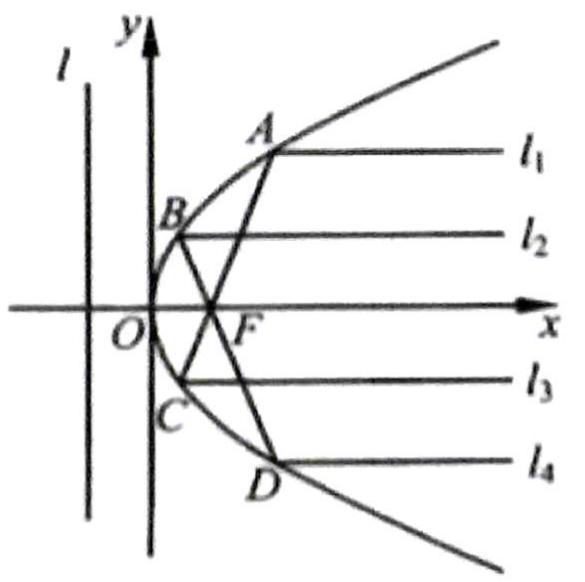

等级（SR）

2024 杭州二模

【练习 3】(多选) 过点 $P(2,0)$ 的直线与抛物线 $C: y^{2} = 4x$ 交于 A, B 两点. 抛物线 C 在点 A 处的切线与直线 x = -2 交于点 N, 作 $NM \perp AP$ 交 AB 于点 M, 则()

$\quad$A. 直线 NB 与抛物线 C 有 2 个公共点  
$\quad$B. 直线 $MN$ 恒过定点  
$\quad$C. 点 M 的轨迹方程是 $(x-1)^{2} + y^{2} = 1 (x \neq 0)$   
$\quad$D. $\frac{MN^{3}}{AB}$ 的最小值为 $8 \sqrt{2}$

等级（SR）

2023 锦州四月质量检测

【练习4】(多选) 已知抛物线 C: $y^{2}=4x$ 的焦点为 F, 准线为 l, 过点 F 且斜率大于 0 的直线交抛物线 C 于 A, B 两点 (其中 A 在 B 的上方), O 为坐标原点, 过线段 AB 的中点 M 且与 x 轴平行的直线依次交直线 OA, OB, l 于点 P, Q, N, 则 ( )

$\quad$A. 若 $|AF|=2|FB|$ ，则直线 AB 的斜率为 $2\sqrt{2}$   
$\quad$B. $\left| {PM}\right|  = \left| {NQ}\right|$   
$\quad$C. 若 P, Q 是线段 MN 的三等分点, 则直线 AB 的斜率为 $2 \sqrt{2}$   
$\quad$D. 若 P, Q 不是线段 MN 的三等分点, 则 $\left|PQ\right|\succ\left|OQ\right|$ .

# 题型八：与生活结合

等级（SR）

2021 南昌二模

【练习 1】通过研究发现: 点光源 P 斜照射球, 在底面上形成的投影是椭圆, 且球与底面相切于椭圆的一个焦点 $\mathrm{F}_{1}$ (如图所示), 下图是底面边长为 2 , 高为 3 的正四棱柱, 一实心小球与正四棱柱的下底面以及四个侧面均相切, 若点光源 P 位于 AD 的中点处时, 则在平面 $\mathrm{A}_{1} \mathrm{~B}_{1} \mathrm{C}_{1} \mathrm{~D}_{1}$ 上的投影形成的椭圆的离心率是

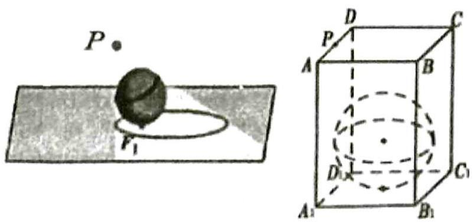

# 圆锥曲线

# 题型一：k 的韦达

等级（R）

2024 河南济洛平许三测

【练习 1】已知 $M(x_{0}, y_{0})$ 是椭圆 $C: \frac{x^{2}}{4} + \frac{y^{2}}{3} = 1$ 上的动点，过原点 O 向圆 $M: (x - x_{0})^{2} + (y - y_{0})^{2} = r^{2}$ 引两条切线，分别与椭圆 C 交于 P, Q 两点（如图所示），记直线 OP, OQ 的斜率依次为 $k_{1}, k_{2}$ , 且 $k_{1} \cdot k_{2} = -\frac{3}{4}$

（1）求圆 $M$ 的半径 $\mathbf{r}$

（2）求证: $|OP|^{2}+|OQ|^{2}$ 为定值

（3）求四边形 OPMQ 的面积的最大值

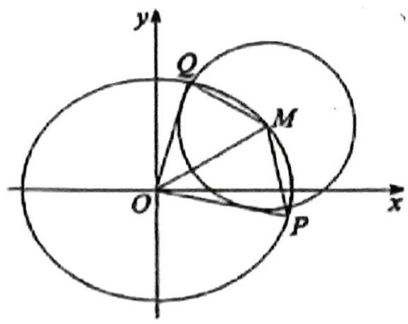

# 题型二：直线与双曲线渐近线联立

等级（SR）

2021 岳阳二模

【练习 1】已知双曲线C的焦点到其渐近线 $y = \pm 2x$ 的距离为2

（1） 求双曲线 $C$ 的标准方程  
（2） 设双曲线 $C$ 的焦点在 $x$ 轴上, 过点 $P(0, 2)$ 的直线 $l$ 交 $C$ 双曲线的左右两支分别于 $A, B$ , 交渐近线分别于 $M, N$ , 证明: $AM = BN$

# 题型三：硬解定理及其应用

等级（SR）

2023 广州一模

【练习 1】已知椭圆 $C: \frac{x^{2}}{a^{2}} + \frac{y^{2}}{b^{2}} = 1 (a > b > 0)$ 的离心率为 $\frac{\sqrt{2}}{2}$ , 以 $C$ 的短轴为直径的圆与直线 $y = ax + 6$ 相切.

（1）求 $C$ 的方程;  
（2）直线 $l: y = k(x - 1) (k \geq 0)$ 与 $C$ 相交于 $A, B$ 两点，过 $C$ 上的点 $P$ 作 $x$ 轴的平行线交线段 $AB$ 于点 $Q$ , 直线 $OP$ 的斜率为 $k'$ ( $O$ 为坐标原点)， $\triangle APQ$ 的面积为 $S_1$ ， $\triangle BPQ$ 的面积为 $S_2$ ，若 $|AP| \cdot S_2 = |BP| \cdot S_1$ , 判断 $k \cdot k'$ 是否为定值? 并说明理由.

# 题型四：双根式简化一类式子的计算

等级（SR）

【练习1】已知椭圆 $C: \frac{x^2}{4} + \frac{y^2}{2} = 1$ 和点 $P(1,1)$ ，过点 $P$ 且斜率为 2 的直线与椭圆 $C$ 交于 $A$ 、 $B$ 两点.

（1） 求 $\left|PA\right|\cdot\left|PB\right|$ 的值;  
（2） 直线 $l$ 过点 $P$ 与椭圆 $C$ 交于不与 $A 、 B$ 重合的 $M 、 N$ 两点, 若 $|PA| \cdot |PB| = |PM| \cdot |PN|$ , 求直线 $l$ 的方程.

# 题型五：第一问的新鲜给法

等级 (R)

2024 青岛一模

【练习1】已知O为坐标原点，点W为 $\odot O: x^{2} + y^{2} = 4$ 和 $\odot M$ 的公共点， $\overline{OM} \cdot \overline{OW} = 0, \odot M$ 与直线 $x + 2 = 0$ 相切，记动点M的轨迹为C，

（1）求 $C$ 的方程;

# 题型七：与圆的结合

等级（R）

2017 新课标 III

【练习1】在直角坐标系 $x Q y$ 中, 曲线 $y = x^{2} + m x - 2$ 与 $x$ 轴交于 $A$ , $B$ 两点, 点 $C$ 的坐标为 (0,1) 当 $m$ 变化时, 解答下列问题:

（1） 能否出现 $AC \perp BC$ 的情况？说明理由；  
（2） 证明过 $A, B, C$ 三点的圆在 $y$ 轴上截得的弦长为定值.

等级（R）

2024 绵阳三诊

【练习2】已知椭圆 $C: \frac{x^2}{a^2} + \frac{y^2}{b^2} = 1 (a > 1 > b > 0)$ 的离心率为 $\frac{\sqrt{3}}{2}$ , 过点 $M(1,0)$ 的直线 $l$ 交椭圆 $C$ 于点 $A, B$ , 且当 $l \perp x$ 轴时, $|AB| = \sqrt{3}$ .

（1） 求椭圆 C 的方程;  
（2） 记椭圆 $C$ 的左焦点为 $F$ , 若过 $F, A, B$ 三点的圆的圆心恰好在 $\mathcal{Y}$ 轴上, 求直线 $AB$ 的方程.

等级（SR）

2013 新课标 I

【练习 3】已知圆 M: $(x+1)^{2}+y^{2}=1$ ，圆 N: $(x-1)^{2}+y^{2}=9$ ，动圆 P 与圆 M 外切并与圆 N 内切，圆心 P 的轨迹为曲线 C.

（Ⅰ）求 C 的方程；  
(II) I 是与圆 P, 圆 M 都相切的一条直线, I 与曲线 C 交于 A, B 两点, 当圆 P 的半径最长时, 求 $|AB|$ .

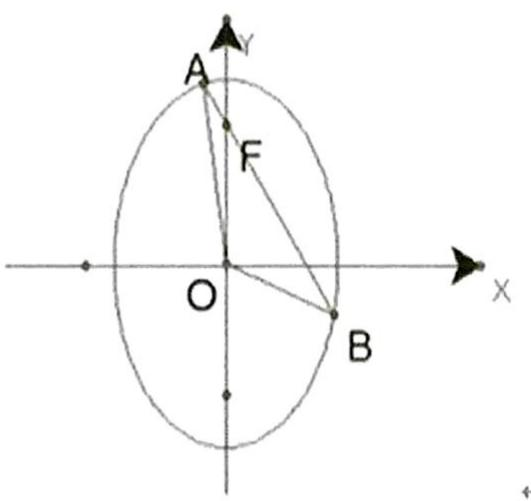

等级（SR）

2011 全国卷

【练习4】.已知O为坐标原点，F为椭圆 $x^{2}+\frac{y^{2}}{2}=1$ 在y轴正半轴上的焦点，过F且斜率为 $-\sqrt{2}$

的直线1与C交于A、B两点，点P满足 $\overrightarrow{OA}+\overrightarrow{OB}+\overrightarrow{OP}=\overrightarrow{0}$

（1）证明：点P在C上，设点P关于O的对称点为Q

（2） 证明: A, P, B, Q 四点在同一个圆上

# 题型八：圆锥曲线的同构模型

等级（SR）

2021 全国甲文+理

【练习1】抛物线C的顶点为坐标原点O，焦点在x轴上，直线1：x=1交C于P,Q两点，且OP⊥OQ，已知点M(2,0)，且⊙M与1相切.

求抛物线 C，⊙M 的方程；

设 $A_{1}, A_{2}, A_{3}$ 是抛物线 C 上的三个点, 直线 $A_{1} A_{2}, A_{1} A_{3}$ 均与 $\odot M$ 相切, 判断直线 $A_{2} A_{3}$ 与 $\odot M$ 的位置关系, 并说明理由.

# 2021 深圳二模

等级（SR）

【练习2】在平面直角坐标系 xOy 中，O 是坐标原点，P 是直线 x = -2 上的动点，过 P 作两条相异直线 l₁ 和 l₂，其中 l₁ 与抛物线 C: y² = 4x 交于 A、B 两点，l₂ 与 C 交于 M、N 两点，记 l₁、l₂ 和直线 OP 的斜率分别为 k₁、k₂ 和 k₃。

（1） 当P在 x 轴上，且A为 PB 中点时，求 $|k_{1}|$ ;  
（2） 当AM为 $\Delta$ PBN的中位线时, 请问是否存在常数 $\mu$ , 使得 $\frac{1}{k_{1}}+\frac{1}{k_{2}}=\mu k_{3}$ ? 若存在, 求出 $\mu$ 的值; 若不存在, 请说明理由.

# 题型九：四次比三次式的经典处理方法

等级（SR）

2023 四川九市二诊

【练习1】已知椭圆 $E: \frac{x^2}{a^2} + \frac{y^2}{b^2} = 1 (a > b > 0)$ 经过点 $A(0,1), T\left(-\frac{8}{5}, -\frac{3}{5}\right)$ 两点, $M, N$ 是椭圆 $E$ 上异于 $T$ 的两动点，且 $\angle MAT = \angle NAT$ ，若直线 $AM, AN$ 的斜率均存在，并分别记为 $k_1, k_2$ .

（1）求证: $k_{1} k_{2}$ 为常数;   
（2）求 $\triangle AMN$ 面积的最大值.

# 题型十：极点极线和调和点列问题

等级（SR）

2023 大连一模

【练习 1】已知双曲线 $C = \{(x, y) | ax^2 - by^2 = 1 (a > 0, b > 0)\}$ 和集合 $Q = \{(x, y) 0 < ax^2 - by^2 < 1 (a > 0, b > 0)\}$ , 直角坐标平面内任意点 $N(x_0, y_0)$ , 直线 $l: ax_o x - by_o y = 1$ 称为点 $N$ 关双曲线 $C$ 的 “相关直线”.

(I)若 $N \in C$ , 判断直线 $l$ 与双曲线 $C$ 的位置关系, 并说明理由;  
(II)若直线 l 与双曲线 C 的一支有 2 个交点，求证: $N \in Q$ ;  
(III)若点 $N \in Q$ ，点 $M$ 在直线 $l$ 上，直线 $MN$ 交双曲线 $C$ 于 $A, B$ , 求证: $\frac{|MA|}{|AN|} = \frac{|MB|}{|BN|}$ .

# 题型十一：到角公式及其应用

等级（SR）

2023 沈阳三模

【练习1】已知椭圆 $C: \frac{x^2}{a^2} + \frac{y^2}{b^2} = 1 (a > b > 0)$ 的离心率为 $\frac{\sqrt{2}}{2}$ , 其左焦点为 $F_1(-2,0)$

（1）求椭圆 $C$ 的方程;  
（2）如图, 过椭圆 $C$ 的上顶点 $P$ , 作以 $F_{1}$ 为圆心的动圆 $D$ 的切线, 两条切线分别交椭圆于 $M, N$ 两点, 请判断是否存在圆 $D$ 使得 $\triangle PMN$ 是以 $PN$ 为斜边的直角三角形? 若存在, 求出圆 $D$ 的半径; 若不存在, 请说明理由.

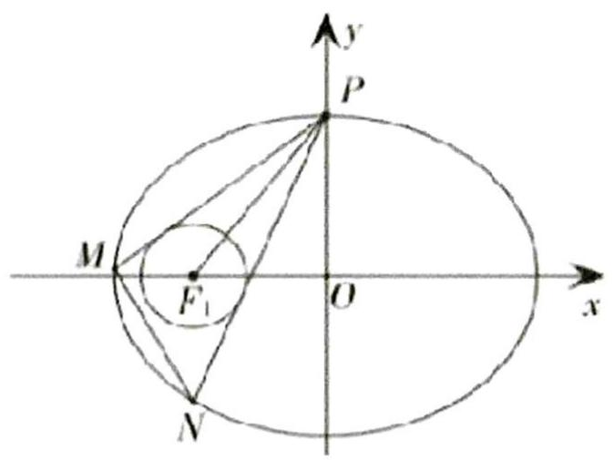

# 计数原理

# 题型一：组合数运算公式补充

等级 (R)

【练习1】（多选）下列等式正确的是（）

$\quad$A. $C_{n}^{m} = C_{n}^{n - m}$

$\quad$B. $C_{n}^{m} = \frac{A_{n}^{m}}{n!}$

$\quad$C. $(n + 2)(n + 1)A_{n}^{m} = A_{n + 2}^{m + 2}$

$\quad$D. $C_{n}^{r} = C_{n - 1}^{r - 1} + C_{n - 1}^{r}$

# 题型三：二项式定理略有难度的题目

等级 (R)

2024 青桐鸣 4 月联考

【练习1】若二项式 $(1 - x)^{9}$ 的展开式中 $x^{k}$ 的系数为 $a_{k}$ , 则 $\sum_{k=1}^{9} \frac{1}{a_{k}} =$

等级 (R)

2024 江门一模

【练习2】已知 $(1 + x)^{4} + (1 + x)^{5} + \dots + (1 + x)^{11} = a_{0} + a_{1}(2 + x) + a_{2}(2 + x)^{2} + \dots + a_{11}(2 + x)^{11}$ , 则 $a_{0} + a_{2} + a_{4} + \dots + a_{10}$ 的值是（）

$\quad$A.680

$\quad$B.-680

$\quad$C.1360

$\quad$D.-1360

等级（R）

2024 安康三模

【练习3】

已知 $(1 - 2x)^{7} = a_{0} + a_{1}x + a_{2}x^{2} + a_{3}x^{3} + a_{4}x^{4} + a_{5}x^{5} + a_{6}x^{6} + a_{7}x^{7}$ ，则 $a_0 + 2a_1 + 3a_2 + 4a_3 + 5a_4+$ $6a_{5} + 7a_{6} + 8a_{7} =$ （）

$\quad$A.-15

$\quad$B.-6

$\quad$C.6

$\quad$D.15

# 题型四：排列组合综合题

等级（SR）

【练习 1】已知数列 $\left\{a_{n}\right\}$ 共 16 项，且 $a_{1}=1$ ， $a_{8}=4$ 。记关于 x 的函数 $f_{n}(x)=\frac{1}{3}x^{3}-a_{n}x^{2}+\left(a_{n}^{2}-1\right)x,n\in N^{*}$ 。若 $x=a_{n+1}(1\leq n\leq15)$ 是函数 $f_{n}(x)$ 的极值点，且曲线 $y=f_{8}(x)$ 在点 $\left(a_{16},f_{8}\left(a_{16}\right)\right)$ 处的切线的斜率为 15，则满足条件的数列 $\left\{a_{n}\right\}$ 的个数为 \_\_\_\_.

等级（SSR）

2024 临沂一模

【练习2】将1到30这30个正整数分成甲、乙两组,每组各15个数,使得甲组的中位数比乙组的中位数小2.则不同的分组方法数是（）

$\quad$A. $2(C_{13}^{7})^{2}$

$\quad$B. $2{C}_{13}^{7}{C}_{14}^{7}$

$\quad$C. $2C_{14}^{6} C_{14}^{7}$

$\quad$D. $2(C_{14}^{7})^{2}$

# 概率统计

# 题型一：分层抽样的方差

等级 (R)

2024 安庆师范高中 4 月联考

【练习1】已知一组数据 $x_{1}, x_{2}, \cdots, x_{m}$ 的平均数为 $\overline{x}$ , 另一组数据 $y_{1}, y_{2}, \cdots, y_{n}$ 的平均数为 $\overline{y} (\overline{x} \neq \overline{y})$ . 若数据 $x_{1}, x_{2}, \cdots, x_{m}, y_{1}, y_{2}, \cdots, y_{n}$ 的平均数为 $\overline{z} = a \overline{x} + (1 - a) \overline{y}$ , 其中 $\frac{1}{2} < a < 1$ , 则 $m, n$ 的大小关系为 ( )

$\quad$A. $m < n$

$\quad$B. $m > n$

$\quad$C. $m = n$

$\quad$D. $m, n$ 的大小关系不确定

等级 (R)

2022 南阳一中第四次月考

【练习 2】在高一期中考试中，甲、乙两个班的数学成绩统计如下表：

<table><tr><td>班级</td><td>人数</td><td>平均分数</td><td>方差</td></tr><tr><td>甲</td><td>20</td><td> $\overline{x}_{\text{甲}}$ </td><td>2</td></tr><tr><td>乙</td><td>30</td><td> $\overline{x}_{\text{乙}}$ </td><td>3</td></tr></table>

其中 $\overline{x_{甲}}=\overline{x_{乙}}$ ，则两个班数学成绩的方差为（）

$\quad$A.3

$\quad$B.2

$\quad$C.2.6

$\quad$D.2.5

# 题型二：回归斜率与相关系数的关系

等级（SR）

2024 南通 2.5 模

【练习1】（多选）某农科所针对耕种深度 $x$ （单位：cm）与水稻每公顷产量（单位：t）的关系进行研究，所得部分数据如下表：

<table><tr><td>耕种深度x/cm</td><td>8</td><td>10</td><td>12</td><td>14</td><td>16</td><td>18</td></tr><tr><td>每公顷产量y/t</td><td>6</td><td>8</td><td>m</td><td>n</td><td>11</td><td>12</td></tr></table>

已知 m < n ，用最小二乘法求出 y 关于 x 的经验回归方程： $\hat{y} = \hat{b}x + \hat{a}$ ， $\sum_{i=1}^{6} y_{i}^{2} = 510$ ， $\sum_{i=1}^{6}\left(y_{i}-\bar{y}\right)^{2}=24$ ，数据在样本(12,m)，(14,n)的残差分别为 $\varepsilon_{1},\varepsilon_{2}$

（参考数据：两个变量 $x, y$ 之间的相关系数 $r$ 为 $\sqrt{\frac{20}{21}}$ ，参考公式： $\hat{b} = \frac{\sum_{i=1}^{n} (x_i - \overline{x})(y_i - \overline{y})}{\sum_{i=1}^{n} (x_i - \overline{x})^2}$ ，

$\hat{a} = \overline{y} -\hat{b}\cdot \overline{x},r = \frac{\sum_{i = 1}^{n}(x_{i} - \overline{x})(y_{i} - \overline{y})}{\sqrt{\sum_{i = 1}^{n}(x_{i} - \overline{x})^{2}}\cdot\sqrt{\sum_{i = 1}^{n}(y_{i} - \overline{y})^{2}}}$ ，则（）

$\quad$A. $m + n = 17$

$\quad$B. $\hat{b} = \frac{4}{7}$

$\quad$C. $\hat{a} = \frac{10}{7}$

$\quad$D. $\varepsilon_{1} + \varepsilon_{2} = -1$

# 题型三：数据特征的深入考察

等级 (R)

【练习1】中医药, 是包括汉族和少数民族医药在内的我国各民族医药的统称, 反映了中华民族对生命、健康和疾病的认识, 具有悠久历史传统和独特理论及技术方法的医药学体系, 是中华民族的瑰宝。某科研机构研究发现, 某品种中医药的药物成分甲的含量 $x$ (单位: 克) 与药物功效 $y$ (单位: 药物单位) 之间满足 $y = 15 x - 2 x ^ {2}$ , 检测这种药品一个批次的 6 个样本, 得到成分甲的含量的平均值为 5 克, 标准差为 $\sqrt {5}$ 克, 则估计这批中医药的药物功效的平均值为 ( )

$\quad$A.14 药物单位

$\quad$B.15 药物单位

$\quad$C. 15.5 药物单位

$\quad$D..16 药物单位

等级 (R)

【练习2】已知某样本的容量为50, 平均数为70, 方差为75。现发现在收集这些数据时, 其中的两个数据记录有误, 一个错将80记录为60, 另一个错将70记录为90。在对错误的数据进行更正后, 重新求得样本的平均数为 $\bar{x}$ , 方差为 $s^2$ , 则

$A \overline {{{{\mathrm{x}}}}} = 7 0, \mathrm{s} ^ {2} <   7 5$

$B \bar {\mathrm{x}} = 7 0, \mathrm{s} ^ {2} > 7 5$

$C \overline {{{{\mathrm{x}}}}} > 7 0, \quad \mathrm{s} ^ {2} <   7 5$

$D \bar {\mathrm{x}} <   7 0, \quad \mathrm{s} ^ {2} > 7 5$

等级 (R)

2024 燕博园 3 月综合能力测试

【练习 3】已知 a, b, c 是正整数，且 $a \in [10, 20]$ , $b \in (20, 30]$ , $c \in (30, 40]$ ，当 a, b, c 方差最小时，写出满足条件的一组 a, b, c 的值

等级（SR）

2023 福建四月测评

【练习 4】（多选）已知一组 $2n(n \in N^{*})$ 个数据： $a_{1}, a_{2}, \ldots, a_{2n}$ ，满足： $a_{1} \leq a_{2} \leq \ldots \leq a_{2n}$ ，平均值为 M，中位数为 N，方差为 $s^{2}$ ，则

$\quad$A. $a_{n} \leq M \leq a_{n + 1}$

$\quad$B. $a_{n} \leq N \leq a_{n+1}$

$\quad$C. 函数 $f(x) = \sum_{i=1}^{2n}(x - a_i)^2$ 的最小值为 $2ns^2$

$\quad$D. 若 $a_{1}, a_{2}, \ldots, a_{2 n}$ 成等差数列，则 $\mathrm{M} = \mathrm{N}$

# 题型四：复杂的回归问题

等级（SR）

2024 广州三模冲刺三

【练习1】(多选)已知变量 $x$ 和变量 $y$ 的一组成对样本数据 $\left(x_{i}, y_{i}\right) (i = 1, 2, \cdots, n)$ 的散点落在一条直线附近， $\overline{x} = \frac{1}{n} \sum_{i=1}^{n} x_{i}$ ， $\overline{y} = \frac{1}{n} \sum_{i=1}^{n} y_{i}$ ，相关系数为 $r$ ，线性回归方程为 $\hat{y} = \hat{b} x + \hat{a}$ ，则（）

$\quad$A. 当 $r$ 越大时, 成对样本数据的线性相关程度越强  
$\quad$B. 当 $r > 0$ 时, $\hat{b} > 0$   
$\quad$C. 当 $x_{n+1} = \overline{x}$ ， $y_{n+1} = \overline{y}$ 时，成对样本数据 $(x_{i}, y_{i}) (i = 1, 2, \cdots, n, n + 1)$ 的相关系数 $r'$ 满足 $r' = r$   
$\quad$D. 当 $x_{n+1} = \overline{x}, y_{n+1} = \overline{y}$ 时，成对样本数据 $(x_{i}, y_{i}) (i = 1, 2, \cdots, n, n + 1)$ 的线性回归方程 $\hat{y} = \hat{d}x + \hat{c}$ 满足 $\hat{d} = \hat{b}$

参考公式： $r = \frac{\sum_{i = 1}^{n}(x_i - \overline{x})(y_i - \overline{y})}{\sqrt{\sum_{i = 1}^{n}(x_i - \overline{x})^2}\sqrt{\sum_{i = 1}^{n}(y_i - \overline{y})^2}},\hat{b} = \frac{\sum_{i = 1}^{n}(x_i - \overline{x})(y_i - \overline{y})}{\sum_{i = 1}^{n}(x_i - \overline{x})^2}.$

等级（SR）

【练习 2】某企业生产一种产品，从流水线上随机抽取 100 件产品，统计其质量指标值并得到其频率分布表：

<table><tr><td>质量指标值分组</td><td>[65,75)</td><td>[75,85)</td><td>[85,95)</td><td>[95,105)</td><td>[105,115]</td></tr><tr><td>频数</td><td>5</td><td>20</td><td>40</td><td>25</td><td>10</td></tr></table>

销售时质量指标值在[65, 75) 的产品每件亏1元，在[75, 105) 的产品每件盈利3元，在[105, 115]的产品每件盈利5元。

（1） 估计该企业生产的产品平均一件的利润;  
（2） 该企业为了解年营销费用 $x$ (单位: 万元) 对年销售量 $y$ (单位: 万件) 的影响, 对近五年的年营销费用 $x$ , 和年销售量 $y_{i} = (i = 1, 2, 3, 4, 5)$ 数据做了初步处理, 得到如图的散点图及一些统计量的值。

<table><tr><td> $\sum_{i=1}^{5} u_i$ </td><td> $\sum_{i=1}^{5} v_i$ </td><td> $\sum_{i=1}^{5} (u_i - \overline{u})(v_i - \overline{v})$ </td><td> $\sum_{i=1}^{5} (u_i - \overline{u})^2$ </td></tr><tr><td>16.30</td><td>23.20</td><td>0.81</td><td>1.62</td></tr></table>

表中 $u_{i} = \ln x_{i}$ ， $v_{i} = \ln y_{i}$ ， $\overline{u} = \frac{1}{5}\sum_{i = 1}^{5}u_{i}$ ， $\overline{\nu} = \frac{1}{5}\sum_{i = 1}^{5}v_{i}$

根据散点图判断， $y=ax^{b}$ 可以作为年销售量 y （万件）

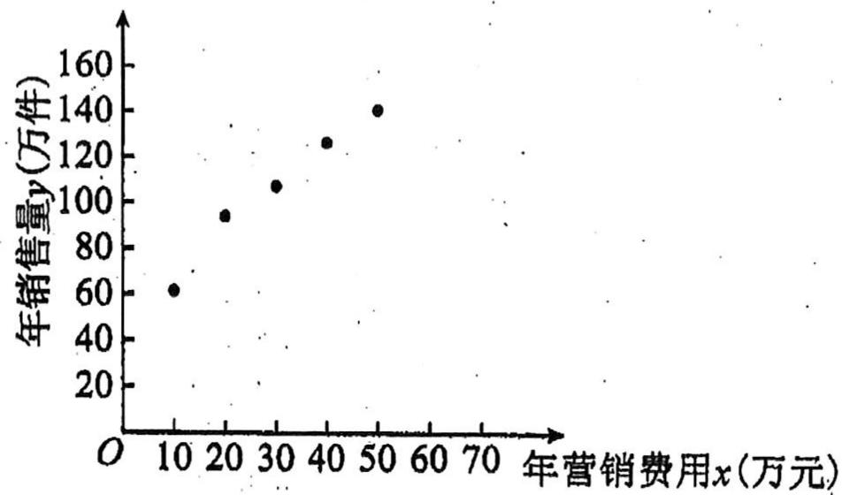

年营销费用 $x$ 费用（万元）

(收益=销售利润-营销费用, 取 $e^{3.01}=20$ )

附注：①对于一组数据 $(u_{1}, v_{1}), (u_{2}, v_{2}), (u_{n}, v_{n})$ ，其回归直线 $v = \alpha + \beta u$ 的斜率和截距的最小

二乘估计分别为 $\hat{\beta} = \frac{\sum_{i=1}^{n} u_i v_i - n \overline{uv}}{\sum_{i=1}^{n} u_i^2 - n \overline{u}^2}$ , $\hat{\alpha} = \overline{v} - \hat{\beta} \overline{u}$ ;

求 $y$ 关于 $x$ 的回归方程

②用所求的回归方程估计该企业应投入多少年营销费, 才能使得该企业的年收益的预报值达到最大?

等级（SR）

【练习 3】某公司生产的某种产品，如果年返修率不超过千分之一，则其生产部门当年考核优秀，鲜活的该公司 2011-2018 年的相关数据如下表所示：

<table><tr><td>年份</td><td>2011</td><td>2012</td><td>2013</td><td>2014</td><td>2015</td><td>2016</td><td>2017</td><td>2018</td></tr><tr><td>年生产台数(万台)</td><td>2</td><td>3</td><td>4</td><td>5</td><td>6</td><td>7</td><td>10</td><td>11</td></tr><tr><td>该产品的年利润(百万台)</td><td>2.1</td><td>2.75</td><td>3.5</td><td>3.25</td><td>3</td><td>4.9</td><td>6</td><td>6.5</td></tr><tr><td>年返修台数(台)</td><td>21</td><td>22</td><td>28</td><td>65</td><td>80</td><td>65</td><td>84</td><td>88</td></tr><tr><td colspan="9">部分计算结果: $\overline{x}=\frac{1}{8}\sum_{i=1}^{8}x_i=6,\quad\overline{y}=\frac{1}{8}\sum_{i=1}^{8}y_i=4,\quad\sum_{i=1}^{8}\left(x_i-\overline{x}\right)^2=72$  $\sum_{i=1}^{8}\left(y_i-\overline{y}\right)^2=18.045,\quad\sum_{i=1}^{8}\left(x_i-\overline{x}\right)\left(y_i-\overline{y}\right)=34.5$ </td></tr></table>

注：年返修率= $\frac{年返修台数}{年生产台数}$

（1） 从该公司 2011-2018 年的相关数据中任意选取 3 年的数据, 以 $\varepsilon$ 表示 3 年中生产部门获得考核优秀的次数, 求 $\varepsilon$ 的分布列和数学期望值:  
（2） 根据散点图发现 2015 年数据偏差较大, 如果去掉该年的数据, 试用剩下的数据求出年利润 $y$ (百万元) 关于年生产台数 $x$ (万台) 的线性回归方程 (精确到 0.01).

参考公式： $\hat{y} = \hat{b} x + \hat{a}$ ， $\hat{b} = \frac{\sum_{i=1}^{n}(x_i - \overline{x})(y_i - \overline{y})}{\sum_{i=1}^{n}(x_i - \overline{x})^2} = \frac{\sum_{i=1}^{n}x_iy_i - n\overline{xy}}{\sum_{i=1}^{n}x_i^2 - n\overline{x}^2},\quad \hat{a} = \hat{y} -\hat{b}\cdot \overline{x}$

# 题型五：摸到停模型

等级（R）

2023 辽宁教研联盟一模

【练习 1】口袋中装有大小重量完全相同的 2 个红球 3 个白球, 从口袋中一次摸出一个球, 摸出的球不再放回, 如果 2 个红球全部被摸出, 就停止摸球, 则恰好摸球三次就停止摸球的概率为( )

$\frac {1}{5}$

$B \frac {1}{4}$

$C \frac {3}{1 0}$

$D \frac {2}{5}$

等级 (R)

2023 陕西四模

【练习2】盒子中有9个大小质地完全相同的小球，其中3个红球，6个黑球，从中依次随机摸出3个小球，则第三次摸到红球的概率为( )

$^ {\mathrm{A}} \cdot \frac {1 9}{8 4}$

$B \frac {1}{4}$

$C \frac {1}{3}$

$D \frac {5}{1 4}$

# 题型六：概率统计与函数导数

等级（SR）

2021 龙岩 5 月质检

【练习 1】甲、乙两人进行对抗比赛, 每场比赛均能分出胜负. 已知本次比赛的主办方提供 8000 元奖金并规定: ①若有人先赢 4 场, 则先赢 4 场者获得全部奖金同时比赛终止; ②若无人先赢 4 场且比赛意外终止, 则甲、乙便按照比赛继续进行各自赢得全部奖金的概率之比分配奖金. 已知每场比赛甲赢的概率为 $p (0 < p < 1)$ , 乙赢的概率为 $1 - p$ , 且每场比赛相互独立.

（1） 设每场比赛甲赢的概率为 $\frac{1}{2}$ , 若比赛进行了 5 场, 主办方决定颁发奖金, 求甲获得奖金的分布列;  
（2） 规定: 若随机事件发生的概率小于 0.05, 则称该随机事件为小概率事件, 我们可以认为该事件不可能发生, 否则认为该事件有可能发生. 若本次比赛 $p \geq \frac{4}{5}$ , 且在已进行的 3 场比赛中甲赢 2 场、乙赢 1 场, 请判断: 比赛继续进行乙赢得全部奖金是否有可能发生, 并说明理由.

# 题型七：概率统计与数列（含马尔科夫模型）

等级（SR）

2023 杭州二模

【练习1】马尔科夫链是概率统计中的一个重要模型, 也是机器学习和人工智能的基石, 在强化学习、自然语言处理、金融领域、天气预测等方面都有着极其广泛的应用. 其数学定义为: 假设我们的序列状态是..., $X_{t-2}, X_{t-1}, X_t, X_{t+1}, \ldots$ , 那么 $X_{t+1}$ 时刻的状态的条件概率仅依赖前一状态 $X_t$ , 即 $P(X_{t+1} | \ldots, X_{t-2}, X_{t-1}, X_t) = P(X_{t+1} | X_t)$ .

现实生活中也存在着许多马尔科夫链，例如著名的赌徒模型。

假如一名赌徒进入赌场参与一个赌博游戏, 每一局赌徒赌赢的概率为 $50\%$ , 且每局赌赢可以赢得1元, 每一局赌徒赌输的概率为 $50\%$ , 且赌输就要输掉1元. 赌徒会一直玩下去, 直到遇到如下两种情况才会结束赌博游戏: 一种是手中赌金为0元, 即赌徒输光; 一种是赌金达到预期的 $B$ 元, 赌徒停止赌博.记赌徒的本金为 $A (A \in N^{*}, A < B)$ , 赌博过程如下图的数轴所示.

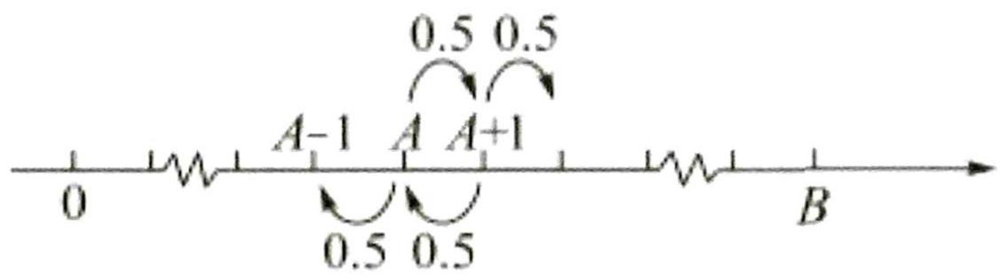

当赌徒手中有 $n$ 元 $(0 \leq n \leq B, n \in \mathbf{N})$ 时, 最终输光的概率为 $P(n)$ , 请回答下列问题: （1） 请直接写出 $P(0)$ 与 $P(B)$ 的数值.

（2） 证明 $\{P(n)\}$ 是一个等差数列，并写出公差 $d$ .  
（3） 当 $A = 100$ 时, 分别计算 $B = 200, B = 1000$ 时, $P(A)$ 的数值, 并结合实际,

解释当 $B\to\infty$ 时， $P(A)$ 的统计含义.

等级（SR）

【练习2】一只蚂蚁在如图所示的棱长为1米的正四面体的楼上爬行,每次当它到达四面体顶点后,会在过此顶点的三条棱中等可能的选择一条棱继续爬行(包含来时的棱),已知蚂蚁每分钟爬行1米,t=0时蚂蚁位于点A处.

（1） 2 分钟末蚂蚁位于哪点的概率最大;  
（2） 记第 $\mathrm{n}$ 分钟末蚂蚁位于点 $\mathrm{A},\mathrm{B},\mathrm{C},\mathrm{D}$ 的概率分别为 ${P}_{n}\left( \mathrm{A}\right) ,{P}_{n}\left( \mathrm{B}\right) ,{P}_{n}\left( \mathrm{C}\right) ,{P}_{n}\left( \mathrm{D}\right)$ .

①求证： $P_{n}(B)=P_{n}(C)=P_{n}(D)$   
②辰辰同学认为, 一段时间后蚂蚁位于点 A,B,C,D 的概率应该相差无几, 请你通过计算 10 分钟末蚂蚁位于各点的概率解释辰辰同学观点的合理性.

附： $(\frac{1}{3})^9\approx 5\times 10^{-5},(\frac{1}{3})^{10} = 1.7\times 10^{-5},(\frac{1}{2})^9\approx 1.9\times 10^{-9},(\frac{1}{3})^{10}\approx 9.8\times 10^{-4}$

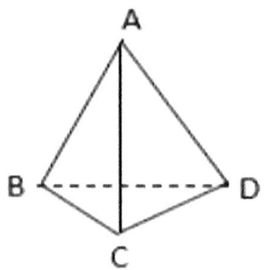

# 题型八：求二项分布中的最大概率项

等级（SR）

2023 四省联考

【练习 1】一个池塘里的鱼的数目记为 N，从池塘里捞出 200 尾鱼，并给鱼作上标识，然后把鱼放回池塘里，过一小段时间后再从池塘里捞出 500 尾鱼，X 表示捞出的 500 尾鱼中有标识的鱼的数目。

（1）若 N=5000，求 X 的数学期望；  
（2）已知捞出的 500 尾鱼中 15 尾有标识, 试给出 $N$ 的估计值 (以使得 $P(X = 15)$ 最大的 $N$ 的值作为 $N$ 的估计值).

# 题型九：混血测病问题

等级(SR)

【练习 1】单位计划组织 55 名职工进行一种疾病的调查，先到本单位医务室进行血检，血检呈阳性再到医院进一步检测，已知随机一人血检呈阳性的概率为 1%，且每个人血检是否呈阳性相互独立

（1） 根据经验, 采用分组的测法可有效减少工作量, 具体操作如下: 将待检人员随机等分成若干组, 先将每组的血样混在一起化验, 若结果呈阴性, 则可断定本组血样全部为阴性, 不必再化验; 若结果呈阳性, 则本组中至少有一人呈阳性, 再逐个化验。

现有两个分组方案:

方案一: 将 55 人分成 11 组, 每组 5 人;

方案二：将 55 人分成 5 组，每组 11 人

试分析哪一个方案工作量更少？

（2） 若该疾病的患病率为 $0.4\%$ , 且患该疾病者血检呈阳性的概率为 $99\%$ , 该单位有一职工血检呈阳性, 求该职工确实患该疾病的概率。(参考数据: $0.99^{5} = 0.951, 0.99^{11} = 0.895$ )

# 题型十：正态分布标准化

等级（SR）

【练习 1】某大型国有企业计划招聘 300 名员工, 应聘者必须通过初试和复试两场考试, 每场考试各 400 分, 应聘者通过初试后取成绩排名在前 2000 的人参加复试, 复试成绩在前 300 的应聘者可获得相应岗位, 现将初试成绩统计如下表示.

<table><tr><td>初试成绩(单位:分)</td><td>[0,100)</td><td>[100,200)</td><td>[200,300)</td><td>[300,400]</td></tr><tr><td>频数</td><td>1000</td><td>6000</td><td>2000</td><td>1000</td></tr></table>

（1） 试估计所有应聘者初试的平均成绩 (同一组中的数据用该组所在区间的中点值代替)  
（2） 现按照分层抽样从成绩在 $[200, 300)$ 和 $[300, 400]$ 的应聘者中随机抽取 12 人, 再从这 12 人中抽取 3 人, 记其中成绩在 $[300, 400]$ 的人数为 $X$ , 求 $X$ 的分布列及数学期望;  
（3） 假设复试的成绩服从正态分布 $\mathrm{N}(180, \sigma^{2})$ , 且 $360$ 分以下 (含 $360$ 分) 的有 $1970$ 人, 若甲的复试成绩为 $250$ 分, 试通过计算说明甲是否能够获得相应岗位。

(计算过程中σ取整数)

参考数据: （1） 当 X\~N (μ, σ²), 令 Y=X-μ/σ, 则 Y\~N (0,1);

（2） 当 Y\~N (0,1) 时，P (Y≤2.17) =0.985，P (Y<1.04) =0.85.

# 备战 19 题

# 题型一：北京数列一二问训练

【练习1】【2018年北京理科20】

设 n 为正整数，集合 $A=\{\alpha \mid \alpha=(t_{1},t_{2},\cdots,t_{n}),t_{n}\in\{0,1\},k=1,2,\cdots,n\}$ 。对于集合 A 中的任意元素 $\alpha=(x_{1},x_{2},\cdots,x_{n})$ 和 $\beta=(y_{1},y_{2},\cdots,y_{n})$ ，记

$M (\alpha , \beta) = \frac {1}{2} [ (x _ {1} + y _ {1} - | x _ {1} - y _ {1} |) + (x _ {2} + y _ {2} - | x _ {2} - y _ {2} |) + \dots + (x _ {n} + y _ {n} - | x _ {n} - y _ {n} |) ].$

(I) 当 $n = 3$ 时, 若 $\alpha = (1,1,0)$ , $\beta = (0,1,1)$ , 求 $M(\alpha, \alpha)$ 和 $M(\alpha, \beta)$ 的值;

(II) 当 $n = 4$ 时, 设 $B$ 是 $A$ 的子集, 且满足: 对于 $B$ 中的任意元素 $\alpha, \beta$ , 当 $\alpha, \beta$ 相同时, $M(\alpha, \beta)$ 是奇数; 当 $\alpha, \beta$ 不同时, $M(\alpha, \beta)$ 是偶数. 求集合 $B$ 中元素个数的最大值;

（III）给定不小于 2 的 $n$ ，设 $B$ 是 $A$ 的子集，且满足：对于 $B$ 中的任意两个不同的元素 $\alpha, \beta$ ， $M(\alpha, \beta) = 0$ 。写出一个集合 $B$ ，使其元素个数最多，并说明理由。

【练习2】【2017年北京理科20】

设 $\{a_{n}\}$ 和 $\{b_{n}\}$ 是两个等差数列，记 $c_{n} = \max \{b_{1} - a_{1} n, b_{2} - a_{2} n, \ldots, b_{n} - a_{n} n\} (n = 1, 2, 3, \ldots)$ ，其中 $\max \{x_{1}, x_{2}, \ldots, x_{s}\}$ 表示 $x_{1}, x_{2}, \ldots, x_{s}$ 这 $s$ 个数中最大的数。

（1） 若 $a_{n} = n, b_{n} = 2n - 1$ , 求 $c_{1}, c_{2}, c_{3}$ 的值, 并证明 $\{\mathbf{c}_{\mathrm{n}}\}$ 是等差数列;  
（2） 证明: 或者对任意正数 $M$ , 存在正整数 $m$ , 当 $n \geq m$ 时, $\frac{c_n}{n} > M$ ; 或者存在正整数 $m$ , 使得 $c_m$ , $c_{m+1}$ , $c_{m+2}$ , ...是等差数列.

【练习 3】【2016 年北京理科 20】

设数列 $A: a_{1}, a_{2}, \ldots, a_{N} (N \geq 2)$ . 如果对小于 $n (2 \leq n \leq N)$ 的每个正整数 $k$ 都有 $a_{k} < a_{n}$ , 则称 $n$ 是数列 $A$ 的一个“ $G$ 时刻”, 记 $G(A)$ 是数列 $A$ 的所有“ $G$ 时刻”组成的集合.

(I) 对数列 $A: -2, 2, -1, 1, 3$ , 写出 $G(A)$ 的所有元素;  
（II）证明：若数列 A 中存在 $a_{n}$ 使得 $a_{n} > a_{1}$ ，则 $G(A) \neq \varnothing$ ;  
（III）证明：若数列 A 满足 $a_{n}-a_{n-1}\leq1$ （ $n=2,3,\ldots,N$ ），则 G（A）的元素个数不小于 $a_{N}-a_{1}$ .

【练习 4】【2015 年北京理科 20】

已知数列 $\{a_{n}\}$ 满足： $a_{1} \in \mathbf{N}^{*}$ ， $a_{1} \leq 36$ ，且 $a_{n+1} = \begin{cases} 2a_{n}, & a_{n} \leq 18 \\ 2a_{n} - 36, & a_{n > 18} \end{cases}$ （ $n=1, 2, \ldots$ ），记集合 $M=\{a_{n} | n \in \mathbf{N}^{*}\}$ .

(I) 若 $a_{1} = 6$ ，写出集合 $M$ 的所有元素；  
(II) 如集合 $M$ 存在一个元素是 3 的倍数, 证明: $M$ 的所有元素都是 3 的倍数;  
（III）求集合 M 的元素个数的最大值.

【练习 5】【2014 年北京理科 20】

对于数对序列 $P: (a_{1}, b_{1}), (a_{2}, b_{2}), \ldots, (a_{n}, b_{n})$ , 记 $T_{1}(P) = a_{1} + b_{1}$ , $T_{k}(P) = b_{k} + \max\{T_{k-1}(P), a_{1} + a_{2} + \ldots + a_{k}\}$ ( $2 \leq k \leq n$ ), 其中 $\max\{T_{k-1}(P), a_{1} + a_{2} + \ldots + a_{k}\}$ 表示 $T_{k-1}(P)$ 和 $a_{1} + a_{2} + \ldots + a_{k}$ 两个数中最大的数,

(I) 对于数对序列 $P: (2, 5), (4, 1)$ , 求 $T_{1}(P), T_{2}(P)$ 的值;  
(II) 记 $m$ 为 $a, b, c, d$ 四个数中最小的数, 对于由两个数对 $(a, b)$ , $(c, d)$ 组成的数对序列 $P: (a, b), (c, d)$ 和 $P': (c, d), (a, b)$ , 试分别对 $m = a$ 和 $m = d$ 两种情况比较 $T_{2}(P)$ 和 $T_{2}(P')$ 的大小;  
(III) 在由五个数对 (11, 8), (5, 2), (16, 11), (11, 11), (4, 6) 组成的所有数对序列中, 写出一个数对序列 $P$ 使 $T_{5}(P)$ 最小, 并写出 $T_{5}(P)$ 的值 (只需写出结论).

# 题型二：优质模拟 19 题

(东北师大附中第五次模拟)

【练习 1】对于数列 $\left\{a_{n}\right\}$ ，称 $\left\{\Delta a_{n}\right\}$ 为数列 $\left\{a_{n}\right\}$ 的一阶差分数列，其中 $\Delta a_{n}=a_{n+1}-a_{n}(n\in N^{*})$ .
对正整数 $k(k \geq 2)$ ，称 $\left\{\Delta^{k}a_{n}\right\}$ 为数列 $\left\{a_{n}\right\}$ 的 k 阶差分数列，其中 $\Delta^{k}a_{n}=\Delta\left(\Delta^{k-1}a_{n}\right)=\Delta^{k-1}a_{n}-\Delta^{k-1}a_{n}$ .

已知数列 $\{a_{n}\}$ 的首项 $a_1 = 1$ ，且 $\{\Delta a_{n+1} - a_n - 2^n\}$ 为 $\{a_{n}\}$ 的二阶差分数列.

（1） 求数列 $\left\{a_{n}\right\}$ 的通项公式;

（2） 设 $b_{n} = \frac{1}{2} (n^{2} - n + 2)$ ， $\{x_{n}\}$ 为数列 $\{b_{n}\}$ 的一阶差分数列，对 $\forall n \in \mathbb{N}^{*}$ ，是否都有 $\sum_{i=1}^{n} x_{i} C_{n}^{i} = a_{n}$ 成立？并说明理由：（其中 $C_{n}^{i}$ 为组合数）

（3） 对于 （2） 中的数列 $\{x_{n}\}$ , 令 $y_{n} = \frac{t^{x_{n}} + t^{-x_{n}}}{2}$ , 其中 $\frac{1}{2} < t < 2$ .

证明： $\sum_{i = 1}^{n}y_{i} <   2^{n} - 2^{-\frac{n}{2}}.$

(南通盐城三模)

【练习2】“熵”常用来判断系统中信息含量的多少，也用来判断概率分布中随机变量的不确定性大小，一般熵越大表示随机变量的不确定性越明显，定义：随机变量 $X$ 对应取值 $x_{i}$ 的概率为 $p_{i} = P(X = x_{i})$ ，其单位为bit的熵为 $H(X) = -\sum_{i=1}^{n} p_{i} \log_{2} p_{i}$ ，且 $\sum_{i=1}^{n} p_{i} = 1$ 。（当 $p_{i} = 0$ ，规定 $p_{i} \log_{2} p_{i} = 0$ 。）

（1） 若抛掷一枚硬币 1 次, 正面向上的概率为 $m (0 < m < 1)$ , 正面向上的次数为 $X$ , 分别比较 $m = \frac{1}{2}$ 与 $m = \frac{1}{4}$ 时对应 $H(X)$ 的大小, 并根据你的理解说明结论的实际含义;  
（2） 若抛掷一枚质地均匀的硬币 $n$ 次, 设 $X$ 表示正面向上的总次数, $Y$ 表示第 $n$ 次反面向上的次数 (0 或 1). $p(x_{1}, y_{1})$ 表示正面向上 $x_{1}$ 次且第 $n$ 次反面向上 $y_{1}$ 次的概率.

如 n=3 时， $p(0,1)=\frac{1}{8}$ . 对于两个离散的随机变量 X,Y，其单位为 bit 的联合熵记为

$H (X, Y) = - \left(\sum_ {i = 1} ^ {n} p \left(x _ {i}, 0\right) \log_ {2} p \left(x _ {i}, 0\right) + \sum_ {i = 1} ^ {n} p \left(x _ {i}, 1\right) \log_ {2} p \left(x _ {i}, 1\right)\right),$

且 $\sum_{i=1}^{n} p(x_i, 0) + \sum_{i=1}^{n} p(x_i, 1) = 1$ .

(i) 当 $n = 3$ 时, 求 $H(X, Y)$ 的值;  
(ii) 求证: $H(X, Y) < n - \frac{1}{2^{n-1}} (n \geq 3)$ .

# 2024 汕头二模

【练习 3】日常生活中，较多产品的包装盒呈正四棱柱状，比如月饼盒，烘焙店在售卖月饼时，为美观起见，通常会用彩绳对月饼盒做一个捆扎，常见的捆扎方式有两种，如图（A）、（B）所示，并配上花结.

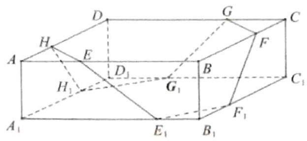

(A)

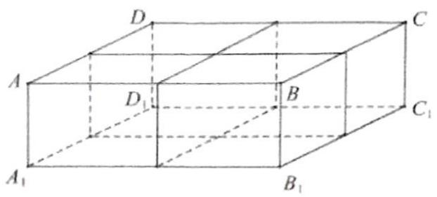

(B)

图(A)中,正四棱柱 $ABCD - A_{1}B_{1}C_{1}D_{1}$ 的底面 $ABCD$ 是正方形,且 $AB = 3$ , $AA_{1} = 1$ .

（1） 若 $AH = AE = B_{1}E_{1} = B_{1}F_{1} = CF = CG = D_{1}G_{1} = D_{1}H_{1} = 1$ ，记点 H 关于平面 $F_{1}FGG_{1}$ 的对称点为 $P_{1}$ ，点 H 关于直线 $F_{1}G_{1}$ 的对称点为 $P_{2}$ 。  
(i) 求线段 $HP_{1}$ 的长;  
(ii) 直线 $P_{1} P_{2}$ 与平面 $ABCD$ 所成角的正弦值.  
（2） 据烘焙店的店员说, 图 (A) 这样的捆扎不仅漂亮, 而且比图 (B) 的十字捆扎更节省彩绳. 你同意这种说法吗? 请给出你的理由 (注意, 时 $A H 、 A E 、 B _ { 1 } E _ { 1 } 、 B _ { 1 } F _ { 1 } 、 C F 、 C G 、 D _ { 1 } G _ { 1 } 、 D _ { 1 } H _ { 1 }$ 这 8 条线段可能长短不一)

# 凉学长数学内部资料

