# 2025 高分必刷千题册—创新拔高册（上）

# 函数 1

### 题型一：轴对称函数有唯一零点....1

### 题型二：伸缩平移类问题....2

### 题型三：奇偶函数加减乘除的性质则推广到点对称轴对称....4

### 题型四：抽象函数问题大总结....6

### 题型五：数形结合的巧妙应用....10

### 题型六：同除简化函数....12

### 题型七：函数套函数问题....13

### 题型八：反函数问题....16

### 题型九：函数奇偶性的深入考察....18

### 题型十：写出满足某条件的函数....19

### 题型十一：分段含参函数讨论问题....21

### 题型十二：三连等的常见操作....23

### 题型十三：取整函数....25

### 题型十四：动点运动的图像问题....26

### 题型十五：韦达定理在求函数最值时的应用....28

### 题型十六：双曲函数....29

### 题型十七：一种解方程组的方法....30

### 题型十八：比大小问题新题难题....30

# 导数选填 36

### 题型一：导数综合题....36

### 题型二：对数均值不等式的应用....37

### 题型三：同最值点函数交点问题....39

### 题型四：导数小题中的恒成立存在问题....39

### 题型五：y 同 x 差的最值问题 42

### 题型六：构造抽象函数....43

### 题型七：解集含若干个整数问题....46

### 题型八：导数的“周期性”……48

### 题型九： $f(x)$ 与 $f(f(x))$ 同值域的翻译方法……48

导数大题 49

### 题型一：含三角函数的导数大题....49

### 题型二：一种特殊的证明恒成立的方法....58

### 题型三：自对称函数的导数问题....60

### 题型四：高级换元法....64

### 题型五：导函数图像的妙用 65

### 题型六：证明一个数列大于或小于一个等比数列模板....68

### 题型七：双切线放缩法....70

### 题型八：双参数恒成立问题....73

### 题型九：函数奇偶性在导数大题中的应用 75

### 题型十：过三次函数极值点的直线....77

### 题型十一：主要考察讨论的导数大题....78

### 题型十二：同构难题....81

### 题型十三：泰勒展开为背景的导数大题....83题型十四：找函数值定号的点....85

### 题型十五：与解析几何结合....92

# 三角函数....94

### 题型一：三角函数图像第 x 个正零点的翻译....94

### 题型二：在某区间有某特征求 w 范围 ..... 94

### 题型三：动态三角函数的考察....96

### 题型四：三角函数最值问题....100

### 题型五：三角函数图像内部的几何性质....101

### 题型六：三角函数图像对称性的考察....103

### 题型七：含绝对值的三角函数....104

### 题型八：运动中的三角函数....106

### 题型九：三角函数图像的深入考察（数形结合）....108

### 题型十：三角函数最值点的给法.... 113

### 题型十一：横线与三角函数交点问题....114

### 题型十二：高次高倍角三角函数....117

### 题型十三：辅助角公式的深入考察....118

### 题型十四：滚动问题.... 118

### 题型十五：写出符合某条件的三角函数.... 119

### 题型十六：三角函数的任意存在.... 119

# 解三角形选填....120

### 题型一：正切的考察....120

### 题型二：角分线长度相关....124题型三：阿波罗尼斯圆 126

### 题型四：巧用常数....128

### 题型五：数学文化中的解三角形....130

### 题型六：求最值范围类问题....134

模型一：边和高已知，求周长最小值....134

模型二：已知三边平方的线性关系，求面积的最值……134

模型三：给周长和对角，求对边的最小值 135

模型四：给一边及高的比值，求另两边比值+比值倒数的最值……136

模型五：其他 137

### 题型七：三角形中 sin sos 比较 …… 138

### 题型八：与其他板块结合考察....139

模型一：解三角形与均值不等式....139

模型二：解三角形与向量....140

模型三：解三角形与椭圆 142

模型四：解三角形与立体几何 …… 142

### 题型九：过某边等分点做另两边垂线所围三角形面积....143

### 题型十：三角形内切圆相关....143

### 题型十一：托勒密定理....144

### 题型十二：圆内接正 n 边形问题..... 145

### 题型十三：垂心模型 145

解三角形大题....146

### 题型一：巧用常数....146题型二：三角形边等分线夹角的求法....150

### 题型三：分角定理相关....151

### 题型四：已知角被拆的解三角形问题（倍长中线）....155

### 题型五：角分线长度和邻两边长度的关系....159

### 题型六：含正切的解三角形大题....162

### 题型七：两三角形共底边模型....166

### 题型八：两类解三角形题目 …… 168

模型一：两边已知，两角呈二倍关系，解三角形....168

模型二：知一边及对角及另两边比值，解三角形....169

### 题型九：高倍角的处理方式....170

### 题型十：辅助角公式的深入理解....172

数列选填....174

### 题型一：构造新数列....174

### 题型二：摆动数列....175

### 题型三：隔项等比（等差）数列....176

### 题型四：双递推数列....178

### 题型五：写出满足某条件的数列....180

### 题型六：相邻两项和为等差或等比数列的数列求和问题....181

### 题型七：数列与三角换元....182

### 题型八：对称数列....184

### 题型九：需要分奇偶的数列....184

### 题型十：欧拉函数....185题型十一：数列递推式含正负交错项....185

### 题型十二：按一定规律排列的数字问题....187

### 题型十三：特征根....192

### 题型十四：汉诺塔问题....194

### 题型十五：取整问题....194

### 题型十六：斐波那契数列....196

### 题型十七：与三角函数相结合的数列问题....199

### 题型十八：新定义数列问题....200

### 题型十九：牛顿迭代法....201

### 题型二十：特别的“错位相减” 201

数列大题....202

### 题型一：等差数列绝对值求和通法....202

### 题型二：正负交错数列....205

### 题型三：构造新数列....211

### 题型四：（类）周期数列 217

### 题型五：摆动数列....220

### 题型六：通过判断通项的正负判断 Sn 的单调性..... 224

### 题型七：抽象数列....226

### 题型八：对称数列....228

### 题型九：双错位相减....229

### 题型十：前 f（k）项和为 g（k）的数列.....230

### 题型十一：分析法在数列证明题中的应用 232

# 平面向量....233

### 题型一：斜坐标系下的向量....233

### 题型二：三向量线性关系的处理办法....233

### 题型三：点到直线最短距离模型....235

### 题型四：向量点乘的几何意义的高级考察....236

### 题型五：走路的思想处理向量....238

### 题型六：三角形的心与向量....239

### 题型七：用向量求角分线方程....243

### 题型八：向量中的“巧用常数” 244

### 题型九：向量与解三角形结合....244

### 题型十：向量与生活....245

### 题型十一：奔驰定理....246

### 题型十二：向量等和线....247

# 不等式....248

### 题型一：均值不等式之无关系两用均值法....248

### 题型二：均值不等式之配凑法....248

### 题型三：均值不等式之双管齐下 249

### 题型四：均值不等式与曲线....251

### 题型五：与平面解析几何结合 253

### 题型六：解特殊的不等式....255

### 题型七：三字母不等式....256

### 题型八：数轴设线段法处理不等式问题....257

# 立体几何选填....259

### 题型一：立体几何与函数最值....259

### 题型二：动点问题....263

### 题型三：对称性的考察....268

### 题型四：对棱相等四面体处理技巧....272

### 题型五：立体几何综合题....274

### 题型六：翻折问题....289

### 题型七：祖暅原理....292

### 题型八：正四面体砍半面的深入研究....296

### 题型九：过某点做某线垂面通法....296

### 题型十：三角形扔进三棱柱....297

### 题型十一：两曲面交线问题....298

### 题型十二：二面角背景下的立体几何问题....300

### 题型十三：立体几何中比较角的大小....301

### 题型十四：到底面三边距离相等的点....302

### 题型十五：化三维为二维的思想....302

# 立体几何大题....304

### 题型一：第一问的新鲜考法....304

### 题型二：对称翻折模型....307

### 题型三：设角类动点问题....313

### 题型四：非建系类大题....315

模型一：平行线转化法求点到平面距离....315

模型二：拆棱法求体积....318

### 题型五：利用未知数个数与方程个数的思想解坐标....320

### 题型六：台体的考察....323

### 题型七：爪子模型....326

### 题型八：不规则几何体的建系....327

### 题型九：点在平面上的翻译方法....328

### 题型十：非常规建系....330

### 题型十一：补体法在立体几何大题中的应用 333

### 题型十二：截面问题难题....335

### 题型十三：几何体旋转问题....337

# 函数

# 题型一：轴对称函数有唯一零点

等级（R）

##### 001. 已知函数 $f(x) = x^2 - 2x + a(e^{x-1} + e^{-x+1})$ 有唯一零点，则 $a = (\quad)$

$\quad$A. $-\frac{1}{2}$

$\quad$B. $\frac{1}{3}$

$\quad$C. $\frac{1}{2}$

$\quad$D. 1

等级（R）

2024 新高考二卷

##### 002.设函数 $f(x) = a(x + 1)^2 - 1$ ， $g(x) = \cos x + 2ax$ ，当 $x \in (-1,1)$ 时，曲线 $y = f(x)$ 与 $y = g(x)$ 恰有一个交点，则 $a =$ （）

$\quad$A. -1

$\quad$B. $\frac{1}{2}$

$\quad$C. 1

$\quad$D. 2

等级（SR）

##### 003. 已知函数 $f(x) = \frac{1}{2} ax^2 + \cos x - 1 (a \in R)$ ，若 $f(x)$ 有唯一零点，则 $a$ 的取值范围为（）

$\quad$A. $(- \infty, 0)$

$\quad$B. $(- \infty, 0] \cup [1, +\infty)$

$\quad$C. $(- \infty, -1] \cup [1, +\infty)$

$\quad$D. $(- \infty, 0) \cup [1, +\infty)$

# 题型二：伸缩平移类问题

等级（R）

2022 长春三模

##### 004. 已知函数 $f(x)$ 满足 $f(x + 2) = 2f(x)$ ，当 $x \in [0, 2)$ 时， $f(x) = x$ ，那么 $f(21) = (\quad)$

$\quad$A. $2^{10}$

$\quad$B. $2^{11}$

$\quad$C. $2^{20}$

$\quad$D. $2^{21}$

等级（R）

##### 005. 定义在 $R$ 上的函数 $f(x)$ 满足 $f(x + 2) = 2f(x)$ ，当 $x \in [0,2]$ 时， $f(x) = x^2 - 2x$ ，则当 $x \in [-4, -2]$ 时，函数 $f(x)$ 的最小值为 \_\_\_\_

等级（SR）

##### 006. 设函数 $f(x)$ 的定义域为 $R$ ，满足 $f(x + 1) = 2f(x)$ ，且当 $x \in (0,1]$ 时， $f(x) = x(x - 1)$ ，若对任意 $x \in (-\infty, m]$ ，都有 $f(x) \geq -\frac{8}{9}$ ，则 $m$ 的取值范围是（ ）.

$\quad$A. $\left(-\infty,\frac{9}{4}\right]$

$\quad$B. $\left(-\infty,\frac{7}{3}\right]$

$\quad$C. $\left(-\infty,\frac{5}{2}\right]$

$\quad$D. $\left(-\infty,\frac{8}{3}\right]$

等级（SR）

##### 007. 已知函数 $f(x)=\left\{\begin{aligned}&1-\left|1-x\right|,&x\in(-\infty,2)\\ &2f(x-2),&x\in(2,+\infty)\end{aligned}\right.$ ，设方程 $f(x)=2^{\frac{x-1}{2}}$ 的根从小到大依次为 $x_{1},x_{2},x_{3}\cdots x_{n},\cdots,n\in N^{*}$ ，则数列 $\left\{f(x_{n})\right\}$ 的前n项和为（）

$\quad$A. $n^2$

$\quad$B. $n^2 + n$

$\quad$C. $2^{n} - 1$

$\quad$D. $2^{n - 1} - 1$

等级（SSR）

##### 008. 已知定义在 $\mathbb{R}$ 上的函数 $f(x)$ ，满足 $f(1 + x) = f(1 - x)$ ，当 $x \in [1, +\infty)$ 时，， $f(x) = \begin{cases} 1 - |x - 2|, & x \in [1,3) \\ 2f(\frac{x - 1}{2}), & x \in [3, +\infty) \end{cases}$ ，则函数 $f(x)$ 的图像与函数 $g(x) = \begin{cases} \ln x, & x \geq 1 \\ \ln (2 - x), & x < 1 \end{cases}$ 的图像在区间 $[-5,7]$ 上所有交点的横坐标之和为（）

$\quad$A. 5

$\quad$B. 6

$\quad$C. 7

$\quad$D. 9

等级（SSR）

2022 广西四市四月质检

##### 009. 设函数 $f(x) = \begin{cases} 1 - x, & 0 \leq x < 1, \\ f\left(\frac{x}{2}\right) + 1, & x \geq 1, \end{cases}$ 若方程 $f(x) = \log_a x$ （a > 0 且 a ≠ 1）有唯一实根，则 a 的取值范围是（）

$\quad$A. $(\frac{1}{e}, 1) \cup (\sqrt[5]{4}, +\infty)$

$\quad$B. $(\frac{1}{e}, 1) \cup (1, \sqrt[5]{4})$

$\quad$C. $(0, \frac{1}{e}) \cup (\sqrt[5]{4}, +\infty)$

$\quad$D. $(0, \frac{1}{e}) \cup (1, \sqrt[5]{4})$

# 题型三：奇偶函数加减乘除的性质则推广到点对称轴对称

等级（SR）

##### 010. 设函数 $f(x) = \sin x + \frac{1}{\sin x}$ ，则（）

$\quad$A. $f(x)$ 的最小值为2

$\quad$B. $f(x)$ 的图像关于 $\mathbf{y}$ 轴对称

$\quad$C. $f(x)$ 的图像关于直线 $x = \pi$ 对称

$\quad$D. $f(x)$ 的图像关于直线 $x = \frac{\pi}{2}$ 对称

等级（SR）

##### 011. 已知函数 $f(x) = \frac{2\sin x}{1 + 2\sin x}$ ，将此函数图像分别作以下变换，那么变换后的图像可以与原图像重合的变换方式有（）

①绕着 x 轴上一点旋转180°

②以 $\mathbf{x}$ 轴为轴，作轴对称

③沿 x 轴正方向平移

④以 x 轴的某一条垂线为轴，作轴对称

$\quad$A. ①③

$\quad$B. ③④

$\quad$C. ②③

$\quad$D. ②④

等级（SR）

##### 012. 已知函数 $f(x) = \cos x \cdot \sin 2x$ ，下列结论错误的是（）

$\quad$A. $y = f(x)$ 的图像关于 $(\pi, 0)$ 中心对称

$\quad$B. $y = f(x)$ 的图像关于 $x = \frac{\pi}{2}$ 对称

$\quad$C. $f(x)$ 的最大值为 $\frac{\sqrt{3}}{2}$

$\quad$D. $f(x)$ 既是奇函数，又是周期函数

# 题型四：抽象函数问题大总结

等级 (N)

##### 013. 设 $f(x)$ 是周期为 2 的奇函数，当 $0 \leq x \leq 1$ 时， $f(x) = 2x(1 - x)$ ，则 $f\left(-\frac{5}{2}\right) =$ （）

$\quad$A. $-\frac{1}{2}$

$\quad$B. $- \frac{1}{4}$

$\quad$C. $\frac{1}{4}$

$\quad$D. $\frac{1}{2}$

等级 (N)

##### 014. 若 $f(x)$ 是 R 上周期为 5 的奇函数，且满足 $f(1)=1$ ， $f(2)=2$ ，则 $f(3)-f(4)=()$

$\quad$A. -1

$\quad$B. 1

$\quad$C. -2

$\quad$D. 2

等级 (R)

##### 015. 设函数 $f(x) (x \in R)$ 为奇函数 $f(1) = \frac{1}{2}$ ， $f(x + 2) = f(x) + f(2)$ ，则 $f(5) =$ （）

$\quad$A. 0

$\quad$B. 1

$\quad$C. $\frac{5}{2}$

$\quad$D. 5

等级（R）

##### 016. 设函数 $f(x)$ 对任意 $x, y$ 满足 $f(x + y) = f(x) + f(y)$ ，且 $f(2) = 4$ ，则 $f(-1)$ 的值为（）

$\quad$A. -2

$\quad$B. $\pm \frac{1}{2}$

$\quad$C. $\pm 1$

$\quad$D. 2

等级（R）

##### 017. 设函数 $y = f(x)$ 对任意正实数 $x$ ， $y$ 都有 $f(x \cdot y) = f(x) + f(y)$ ，已知 $f(8) = 3$ ，则 $f(\sqrt{2})$ 等于（）

$\quad$A. 1

$\quad$B. -1

$\quad$C. $\frac{1}{2}$

$\quad$D. $-\frac{1}{2}$

等级（R）

2023新高考一卷（多选）

##### 018. 已知函数 $f(x)$ 的定义域为 $\mathbf{R}$ ， $f(xy) = y^2 f(x) + x^2 f(y)$ ，则（ ）.

$\quad$A. $f(0) = 0$

$\quad$B. $f(1) = 0$

$\quad$C. $f(x)$ 是偶函数

$\quad$D. $x = 0$ 为 $f(x)$ 的极小值点

等级（R）

2024 杭州二模

##### 019.（多选）已知函数 $f(x)$ 对任意实数 $x$ 均满足 $2f(x) + f(x^2 - 1) = 1$ ，则（）

$\quad$A. $f(-x) = f(x)$

$\quad$B. $f(\sqrt{2}) = 1$

$\quad$C. $f(-1) = \frac{1}{3}$

$\quad$D. 函数 $f(x)$ 在区间 $(\sqrt{2}, \sqrt{3})$ 上不单调

等级（R）

2024南京二模

##### 020. (多选)已知函数 $f(x)$ 满足 $f(x)f(y) = f(xy) + |x| + |y|$ ，则（）

$\quad$A. $f(0) = 1$

$\quad$B. $f(1) = -1$

$\quad$C. $f(x)$ 是偶函数

$\quad$D. $f(x)$ 是奇函数

等级（SR）

2024 福建 4 月九市联考

##### 021.（多选）定义在 $R$ 上的函数 $f(x)$ 的值域为 $(- \infty, 0)$ ，且 $f(2x) + f(x + y)f(x - y) = 0$ ，则（）

$\quad$A. $f(0) = -1$

$\quad$B. $f(4) + [f(1)]^2 = 0$

$\quad$C. $f(x)f(-x) = 1$

$\quad$D. $f(x) + f(-x)\leqslant -2$

等级（SR）

2024益阳四月调研

##### 022. 已知函数 $f(x)$ 的定义域为 $(- \infty, + \infty)$ ，对任意 $x, y \in R$ 恒有 $f(x + y)f(x - y) = [f(x) + f(y)][f(x) - f(y)]$ ，且 $f(1) = 2, f(2) = 0$ ，则 $f(2023) + f(2024) =$ \_\_\_\_.

等级（SR）

2024 金科新未来 4 月联考

##### 023.（多选）已知函数 $f(x)$ 的定义域为 $R, f(x + y) - f(x - y) = f(x + \frac{3}{2})f(y + \frac{3}{2})$ ， $f(0) \neq 0$ ，则（）

$\quad$A. $f\left(\frac{3}{2}\right) = 0$

$\quad$B. $f(0) = -2$

$\quad$C. $f(x)$ 的一个周期为3 
$\quad$D. $\sum_{k = 1}^{2022}f\left(\frac{k}{2}\right) = 2$

等级（SSR）

2024 福州三中第十六次检测

##### 024.(多选)已知函数 $f(x)$ 及其导函数 $f'(x)$ 的定义域均为R，若 $f(x)$ 是奇函数，

$f(2) = -f(1) \neq 0$ ，且对任意 $x, y \in \mathbb{R}$ ， $f(x + y) = f(x)f'(y) + f'(x)f(y)$ ，则（）

$\quad$A. $f'（1） = -\frac{1}{2}$

$\quad$B. $f(6) = 0$

$\quad$C. $\sum_{k = 1}^{2024}f(k) = 1$

$\quad$D. $\sum_{k=1}^{2024} f'(k) = -1$

# 题型五：数形结合的巧妙应用

等级（SR）

2024常德一模

##### 025.（多选）若函数 $f(x) = 2^{x}\sin x - 1 \left(0 < x < \frac{\pi}{2}\right)$ 的零点为 $x_{1}$ ，函数 $g(x) = 2^{x}\cos x - 1$ （ $0 < x < \frac{\pi}{2}$ ）的零点为 $x_{2}$ ，则（）

$\quad$A. $x_{1}x_{2} > \frac{\pi}{2}$

$\quad$B. $x_{1} + x_{2} <   \frac{3\pi}{4}$

$\quad$C. $\cos (x_{1} + x_{2}) < 0$

$\quad$D. $\cos x_{1} - \sin x_{2} < 0$

等级（SR）

2024济南一模

##### 026. 若不等式 $\ln x \leqslant \frac{a}{x} + b \leqslant e^x (a, b \in \mathbf{R})$ 对于任意 $x \in \left[1, \frac{3}{2}\right]$ 的恒成立，则 $a$ 的最小值为（）

$\quad$A. $-3\mathrm{e}^{\frac{3}{2}}$

$\quad$B. $-\frac{5}{2}\mathrm{e}^{\frac{3}{2}}$

c. $\frac{3}{2} \ln \frac{3}{2}$

$\quad$D. $3 \mathrm{e} - 3 \ln \frac{3}{2}$

等级（SSR）

2022年全国乙卷

##### 027. 已知 $x = x_{1}$ 和 $x = x_{2}$ 分别是函数 $f(x) = 2a^{x} - \mathrm{e}x^{2}$ ( $a > 0$ 且 $a \neq 1$ ) 的极小值点和极大值点。若 $x_{1} < x_{2}$ ，则 $a$ 的取值范围是 \_\_\_\_.

# 题型六：同除简化函数

等级（SR）

2023济南一模

##### 028. 函数 $f(x) = a^{x} + (a + 2)^{x} - 2(a + 1)^{x} (a \succ 0 \text{且} a \neq 1)$ 的零点个数为

$\quad$A. 1

$\quad$B. 2

$\quad$C. 3

$\quad$D. 4

等级（SR）

邯郸一模

##### 029. 不等式 $10^{x} - 6^{x} - 3^{x} \geq 1$ 的解集为

等级（SR）

2023 全国乙卷数学

##### 030. 设 $a \in (0,1)$ ，若函数 $f(x) = a^x + (1 + a)^x$ 在 $(0, +\infty)$ 上单调递增，则 a 取值范围是 \_\_\_\_.

# 题型七：函数套函数问题

等级（R）

##### 031. 已知函数 $f(x) = \frac{\ln x}{x}$ 则关于的方程 $e[f(x)]^2 - f(x) < 0$ （其中 $e$ 为自然对数的底）的解集为（）

$\quad$A. $(1,e)$

$\quad$B. $(e, +\infty)$

$\quad$C. $(1,e)(e, + \infty)$

$\quad$D. $(1, +\infty)$

等级（SR）

##### 032. 已知 $f(x) = \left|xe^{x}\right|$ ，又 $g(x) = f^{2}(x) - tf(x)(t \in R)$ ，若满足 $g(x) = -1$ 的 $x$ 有四个，则 $t$ 的取值范围是（）

$\quad$A. $\left(-\infty, -\frac{e^2 + 1}{e}\right)$

$\quad$B. $\left(\frac{e^2 + 1}{e}, +\infty\right)$

$\quad$C. $\left(-\frac{e^2 + 1}{e}, -2\right)$

$\quad$D. $\left(2, \frac{e^2 + 1}{e}\right)$

等级（SR）

##### 033. $f(x) = (ae^{x} + x + 1)(e^{x} + x + 1)$ 与 $g(x) = e^{2x}$ 的图象至少有三个不同的公共点，其中 $e$ 为自然数的底数，则 $a$ 的取值范围是（）

$\quad$A. $\left(-\frac{1}{2}, \frac{\sqrt{2}}{2}\right)$

$\quad$B. $\left(-\frac{1}{2},1\right)$

$\quad$C. $\left(\frac{\sqrt{2}}{2},1\right)$

$\quad$D. $(1, \sqrt{2})$

等级（SR）

##### 034. 若关于 $x$ 的方程 $(\ln x - ax)\ln x = x^2$ 存在三个不等实根，则实数 $a$ 的取值范围是（）

$\quad$A. $\left(-\infty, \frac{1}{e} - e\right)$

$\quad$B. $\left(\frac{1}{e^{2}}-\frac{1}{e},0\right)$

$\quad$C. $\left(-\infty, \frac{1}{e^2} - \frac{1}{e}\right)$

$\quad$D. $\left(\frac{1}{e} -\mathbf{e},0\right)$

等级（SR）

##### 035. 函数 $f(x) = \begin{cases} \frac{e^x + ax + a}{x + 1}, & x > -1 \\ x^2 + 4x + 3, & x \leq -1 \end{cases}$ ，则关于 $x$ 的方程 $f[f(x)] = 0$ 的实数解最多有（）

(A) 4 个

(B) 7 个

(C) 10 个

(D) 12 个

等级（SR）

##### 036. 若关于 $x$ 的方程 $\frac{x}{e^x} + \frac{e^x}{x - e^x} + m = 0$ 有三个不相等的实数解 $x_1, x_2, x_3$ ，且 $x_1 < 0 < x_2 < x_3$ ，其中 $m \in R$ ， $e = 2.71828$ ，则 $\left(\frac{x_1}{e^{x_1}} - 1\right)^2\left(\frac{x_2}{e^{x_2}} - 1\right)\left(\frac{x_3}{e^{x_3}} - 1\right)$ 的值为（）

# 题型八：反函数问题

等级（R）

##### 037. 设点 $P$ 在曲线 $y = \frac{1}{2} e^{x}$ 上，点 $Q$ 在曲线 $y = \ln (2x)$ 上，则 $\left|PQ\right|$ 最小值为（）

$\quad$A. $1 - \ln 2$

$\quad$B. $\sqrt{2} (1 - \ln 2)$

$\quad$C. $1 + \ln 2$

$\quad$D. $\sqrt{2} (1 + \ln 2)$

等级（SR）

##### 038. 已知函数 $f(x) = e^{x} + x - 2$ 的零点为 $a$ ，函数 $g(x) = \ln x + x - 2$ 的零点为 $b$ ，则下列不等式成立的是（）

$\quad$A. $e^a +\ln b > 2$ 
$\quad$B. $e^a +\ln b <   2$ 
$\quad$C. $a^2 +b^2 <  3$ 
$\quad$D. $ab > 1$

等级（SR）

2024合肥一模

##### 039. 已知点 $A(x_{1}, y_{1}), B(x_{2}, y_{2})$ ，定义 $d_{AB} = \sqrt{(x_{1} - y_{2})^{2} + (x_{2} - y_{1})^{2}}$ 为 A, B 的“镜像距离”。
点 A, B 在曲线 $y = \ln (x - a) + 2$ 上，且 d 的最小值为 2，则实数 $a$ 的值为

等级（SR）

2024南通盐城三模

##### 040.(多选)已知 $2^{a}=\log_{\frac{1}{2}}a,\log_{2}b=\left(\frac{1}{2}\right)^{b}$ ，则（）

$\quad$A. $a + 2^{a} = b + 2^{-b}$

$\quad$B. $a + b = 2^{b} + 2^{-a}$

$\quad$C. $2^{b} + 1 > \mathrm{e}^{\frac{1}{a}}$

$\quad$D. $2^{a} > \mathrm{e}^{1 - \frac{1}{b}}$

# 题型九：函数奇偶性的深入考察

等级（SR）

2022 全国乙卷文数

##### 041. 若 $f(x) = \ln \left| a + \frac{1}{1 - x} \right| + b$ 是奇函数，则 $a =$ ， $b =$

等级（SR）

2022 山西二模

##### 042. 已知集合 A 满足 $\varnothing \subsetneq A \subsetneq R$ ，若 $f(x) = \begin{cases} |x|, & x \in A \\ 2x - 1, & x \in C_{R}A \end{cases}$ 是偶函数，则 $C_{R}A$ 中的元素（）

$\quad$A. 仅有一个

$\quad$B. 最多有 2 个

$\quad$C. 最多有 3 个

$\quad$D. 有无数多个

# 题型十：写出满足某条件的函数

等级（N）

2021年新高考2卷

##### 043. 写出一个同时具有下列性质①②③的函数 $f(x)$ : \_\_\_\_.

① $f(x_{1}x_{2})=f(x_{1})f(x_{2})$ ；②当 $x\in(0,+\infty)$ 时， $f'(x)>0$ ；③ $f'(x)$ 是奇函数.

等级（R）

2022西安五区县联考

##### 044. 已知函数 $y = f(x)$ 的图像过原点，且 $y = f(x)$ 在原点的切线为第一、三象限的平分线，试写出一个满足条件的函数\_\_\_\_。

等级（SR）

2021武汉四调

##### 045. 写出一个定义在 $R$ 上且值域为 $(-1, 1)$ 的奇函数 $f(x) =$ \_\_\_\_。

等级（SR）

2023岳阳二模

##### 046. 已知函数 $f(x) = -x^3 + mx^2 (m > 0), x \in [1, +\infty)$ ，数列 $\{a_n\}$ 满足 $a_n = f(n), n \in N_+$ ，给出下列两个条件：① 函数 $f(x)$ 是递减函数：② 数列 $\{a_n\}$ 是递减数列。试写出一个满足条件②但不满足条件①的函数 $f(x)$ 的解析式： $f(x) =$ \_\_\_\_

# 题型十一：分段含参函数讨论问题

等级（SR）

2022 天津数学

##### 047. 记 $f(x)=\min\left\{\left|x\right|-2,x^{2}-ax+3a-5\right\}$ ，若 $f(x)$ 至少有 3 个零点，则实数 d 的取值范围为 \_\_\_\_

等级（SR）

2022 北京数学

##### 048. 设函数 $f(x) = \begin{cases} -ax + 1, & x < a \\ (x - 2)^2, & x \geq a \end{cases}$ ，若 $f(x)$ 存在最小值，则 $a$ 的一个取值为 \_\_\_\_. $a$ 的最大值为 \_\_\_\_.

等级（SR）

##### 049. 若函数 $f(x) = \begin{cases} 4e^{x} - a (x \leq 0) \\ x^{3} - ax + 2 (x > 0) \end{cases}$ ，有三个不同的零点，则实数 $a$ 的取值范围是（）

$\quad$A. $(1,2]$

$\quad$B. $(2,4]$

$\quad$C. $(3,4]$

$\quad$D. $(3,5)$

等级（SR）

##### 050. 已知函数 $f(x) = \begin{cases} x^2 - (a + 2)x + 2a, & x \leq 1 \\ e^x - ax, & x > 1 \end{cases}$ ，若函数 $y = f(x)$ 在 $\mathbb{R}$ 上有零点，则实数 $a$ 的取值范围为 \_\_\_\_.

# 题型十二：三连等的常见操作

等级（R）

##### 051. 已知正数 $x, y, z$ 满足 $\log_2 x = \log_3 y = \log_5 z > 0$ ，则下列结论不可能成立的是（）

$\quad$A. $\frac{x}{2} = \frac{y}{3} = \frac{z}{5}$

$\quad$B. $\frac{y}{3} < \frac{z}{5} < \frac{x}{2}$

$\quad$C. $\frac{x}{2} >\frac{y}{3} >\frac{z}{5}$

$\quad$D. $\frac{x}{2} < \frac{y}{3} < \frac{z}{5}$ 等级（R）

2022 桂林一模

##### 052. 若正数 $a, b$ 满足 $1 + \log_{\sqrt{2}} a = 2 + \log_{\sqrt{3}} b = \log_{\sqrt{6}} (a - b)$ ，则 $\frac{1}{a} - \frac{1}{b}$ 的值为（）

$\quad$A. $-3\sqrt{2}$

$\quad$B. $-2\sqrt{3}$

$\quad$C. $2 \sqrt{3}$

$\quad$D. $3 \sqrt{2}$

等级（SR）

##### 053. 若 $x, y, z \in R^{+}$ , 且 $3^{x} = 4^{y} = 12^{z}$ , $\frac{x + y}{z} \in (n, n + 1)$ , $n \in N$ , 则 $n$ 的值是（）

$\quad$A. 2

$\quad$B. 3

$\quad$C. 4

$\quad$D. 5

# 题型十三：取整函数

等级（R）

##### 054. 高斯是德国著名的数学家，近代数学奠基者之一，享有“数学王子”的称号，人们常把高斯和阿基米德、欧拉、牛顿一起称为世界上最伟大的数学家。在高斯的数学巨著《算术研究》中记录了一个数学符号“[]”，后世称为高斯符号。[x]表示不超过 x 的最大整数，例如：[-1.3]=-2，[2.1]=2。下列说法正确是（）

$\quad$A. $f(x) = [x]$ 在 $\mathbf{R}$ 上是奇函数

$\quad$B. $f(x) = [x]$ 在 $\mathbf{R}$ 上是增函数

$\quad$C. $\left[\left[x\right]\right] = \left[x\right]$

$\quad$D. $[2x] = 2[x]$

等级（SR）

##### 055. 已知函数 $f(x) = \frac{1}{\{x\} - x}$ ，其中 $\{x\}$ 为不小于 $x$ 最小整数，如 $\{3.5\} = 4, \{3\} = 3$ ，则关于 $f(x)$ 性质的表述，正确的是（）

$\quad$A. 定义域为 $(- \infty, 0) \cup (0, +\infty)$

$\quad$B. 在定义域内为增函数

$\quad$C. 函数 $f(x)$ 为周期函数

$\quad$D. 函数 $f(x)$ 为奇函数

等级（SR）

2022 沈阳市郊联体 4 月线上测试

##### 056. 我们把不超过 $x$ 的最大整数记作 $[x]$ , 如 $[0.6] = 0$ , $[3.5] = 3$ , $[-1.5] = -2$ , 若实数 $a, b$ 满足 $2^a = 3^b$ , 且 $\frac{1}{a} + \frac{1}{b} = 1$ , 则 $[ab] = (\quad)$

$\quad$A. 3

$\quad$B. 4

$\quad$C. 5

$\quad$D. 6

# 题型十四：动点运动的图像问题

等级（R）

##### 057. 如图, 长方形 ABCD 的边 $AB = 2$ , $BC = 1$ , $O$ 是 AB 的中点, 点 P 沿着边 BC、CD 与 DA 运动, 记 $\angle BOP = x$ , 将动点 P 到 A, B 两点距离之和表示为的函数 $f(x)$ , 则 $y = f(x)$ 的图象大致为 ( )

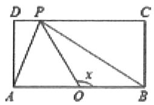

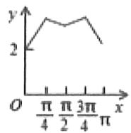

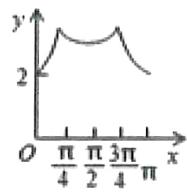

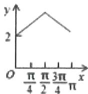

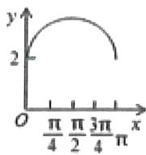

$\quad$C.

$\quad$D.

等级（R）

##### 058. 如图, 边长为 1 的正方形 ABCD, 其中边 DA 在 $x$ 轴上, 点 D 与坐标原点重合, 若正方形沿 $x$ 轴正向滚动, 先以 A 为中心顺时针旋转, 当 B 落在 $x$ 轴上时, 再以 B 为中心顺时针旋转, 如此继续,当正方形 ABCD 的某个顶点落在 $x$ 轴上时, 则以该顶点为中心顺时针旋转, 设顶点 $C(x,y)$ 滚动时形成的曲线为 $y = f(x)$ , 则 $f(2019) =$ \_\_\_\_.

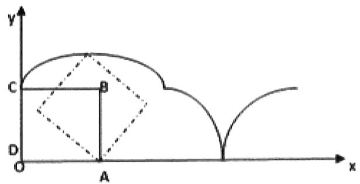

等级（R）

##### 059. 如图, 在平面直角坐标系 $xOy$ 中, 边长为 2 的正方形 ABCD 沿 x 轴滚动 (无滑动滚动), 点 D 恰好经过坐标原点, 设顶点 $B(x,y)$ 的轨迹方程是 $y = f(x)$ , 则 $f(19) = \_$ .

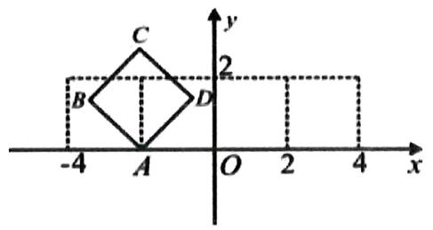

等级（R）

2024 广东二模

##### 060..如图, 在平面直角坐标系 $xOy$ 中放置着一个边长为 1 的等边三角形 $PAB$ , 且满足 $PB$ 与 $x$ 轴平行, 点 $A$ 在 $x$ 轴上. 现将三角形 $PAB$ 沿 $x$ 轴在平面直角坐标系 $xOy$ 内滚动, 设顶点 $P(x,y)$ 的轨迹方程是 $y = f(x)$ , 则 $f(x)$ 的最小正周期为\_\_\_\_; $y = f(x)$ 在其两个相邻零点间的图象与 $x$ 轴所围区域的面积为\_\_\_\_.

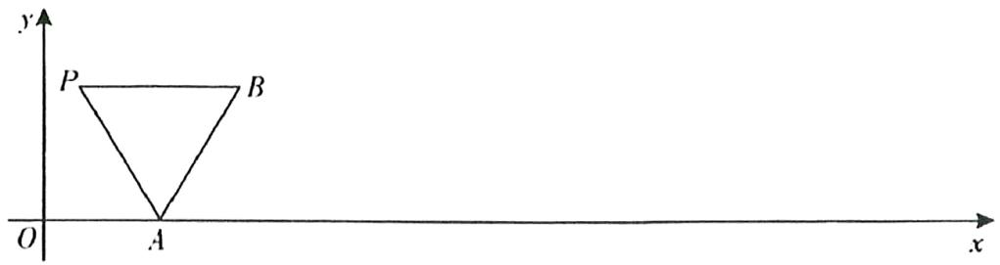

# 题型十五：韦达定理在求函数最值时的应用

等级（SR）

2021 唐山一模

##### 061.（多选）函数 $f(x) = 2x^{2} + \frac{1}{x}$ 的图像（如右图）称为牛顿三叉戟曲线，则（）

$\quad$A. $f(x)$ 的极小值点为 $\frac{1}{2}$

$\quad$B. 当 $x > 0$ 时， $|f(-x)| < f(x)$

$\quad$C. 过原点且与曲线 $y = f(x)$ 相切的直线仅有 2 条

$\quad$D. 若 $f(x_{1}) = f(x_{2}), x_{1} < 0 < x_{2}$ ，则 $x_{2} - x_{1}$ 的最小值为 $\sqrt{3}$

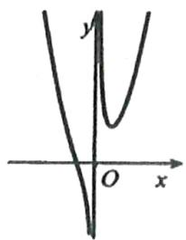

等级（SR）

2021 浙江返校联考

##### 062. 已知函数 $f(x) = ax + \frac{b}{x}$ ，若存在量相异实数 $m$ ， $n$ 使 $f(m) = f(n) = c$ ，且 $a + 4b + c = 0$ ，则 $|m - n|$ 的最小值为（）

$\quad$A. $\frac{\sqrt{2}}{2}$

$\quad$B. $\frac{\sqrt{3}}{2}$

$\quad$C. $\sqrt{2}$

$\quad$D. $\sqrt{3}$

# 题型十六：双曲函数

等级（SR）

2021福州一检

##### 063.（多选）在数学中，双曲函数是一类与三角函数类似的函数，最基本的双曲函数是双曲正弦函数 $sinh x = \frac{e^x - e^{-x}}{2}$ 和双曲余弦函数 $cosh x = \frac{e^x + e^{-x}}{2}$ 等双曲函数在物理及生活中有着某些重要的应用，臂如达·芬奇苦苦思索的悬链线(例如固定项链的两端，使其在重力的作用下自然下垂，那么项链所形成的曲线即为悬链线)问题，可以用双曲余弦型函数来刻画.则下列结论正确的是（）

$\quad$A. $cosh^2 x + sinh^2 x = 1$

$\quad$B. $y = \cosh x$ 为偶函数，且存在最小值

$\quad$C. $\forall x_0 > 0, \sinh (\sinh x_0) > \sinh x_0$

$\quad$D. $\forall x_{1},x_{2}\in R,$ 且 $x_{1}\neq x_{2},\frac{\sinh x_{1} - \sinh x_{2}}{x_{1} - x_{2}} >1$

# 题型十七：一种解方程组的方法

等级（SR）

2021 衡阳二模

##### 064. 若相异两实数 $x$ ， $y$ 满足 $\left\{ \begin{array}{l} x^2 + y - 2 = 0 \\ y^2 + x - 2 = 0 \end{array} \right.$ ，则 $x^3 - 2xy + y^3$ 之值为（）

$\quad$A. 3

$\quad$B. 4

$\quad$C. 5

$\quad$D. 6

# 题型十八：比大小问题新题难题

等级（SR）

##### 065. 已知 $0 < a < b < \frac{1}{e}$ ，则下列正确的是（）

$\quad$A. $\sqrt[b]{b} >\sqrt[b]{a} >\sqrt[a]{b} >\sqrt[a]{a}$

$\quad$B. $\sqrt[b]{a} >\sqrt[4]{a} >\sqrt[6]{b} >\sqrt[4]{b}$

$\quad$C. $\sqrt[b]{b} >\sqrt[a]{b} >\sqrt[b]{a} >\sqrt[a]{a}$

$\quad$D. 以上均不正确

等级（SR）

2022 甲卷文

##### 066. 已知 $9^{\mathrm{m}} = 10$ ， $a = 10^{m} - 11, b = 8^{m} - 9,$ 则（）

$A. a > 0 > b \quad B. a > b > 0 \quad C. b > a > 0 \quad D. b > 0 > a$

等级（SR）

2021 长郡十五校第二次联考

##### 067. 已知 $0 < x < 1$ ，令 $a = \frac{\sin x}{x}$ ， $b = \left(\frac{\sin x}{x}\right)^2$ ， $c = \frac{\sin x^2}{x^2}$ ，则 $a, b, c$ 的大小关系是（）

$A. c <   b <   a \quad B. b <   c <   a \quad C. a <   b <   c \quad D. b <   a <   c$

等级（SR）

2022 德阳高三第二次质检

##### 068. 设 $a = 2022 \ln 2020$ ， $b = 2021 \ln 2021$ ， $c = 2020 \ln 2022$ ，则（）

$\quad$A. $a > b > c$   
$\quad$B. $c > b > a$   
$\quad$C. $a > c > b$   
$\quad$D. $b > a > c$

等级（SR）

2023 福建质检

##### 069. 已知 $a = \ln 2, b = e - \frac{1}{a}, c = 2^a - a$ ，则

$\quad$A. b>c>a

$\quad$B. b>a>c

$\quad$C. c>a>b

$\quad$D. c>b>a

等级（SR）

2022 池州二模

##### 070. 设 $a, b, c$ 是正实数，定义： $(a, b, c) = a^{b^c}$ ，设集合 $M = \{(i, j, k) | i, j, k$ 为 $a, b, c$ 的一个排列 $\}$ 若 $a = 3, b = 7, c = 8$ ，则集合 $\mathbb{M}$ 中的最大数是（）

$\quad$A. (3, 7, 8)

$\quad$B. (3, 8, 7)

$\quad$C. (7, 3, 8)

$\quad$D. (8, 7, 3)

等级（SR）

2022鄂东南高三五月联考

##### 071. (多选)已知正实数 a、b、c 满足 $c^{b}<b^{a}<1<\log_{c}a$ ，则一定有（）

$\quad$A. $a < 1$

$\quad$B. a<b

$\quad$C. $b < c$

$\quad$D. c<a

等级（SR）

##### 072. 若实数 $a \geq 2$ ，则下列不等式一定成立的是（）

$\quad$A. $(a + 1)^{a + 2} > (a + 2)^{a + 1}$

$\quad$B. $\log_a(a + 1) > \log_{a + 1}(a + 2)$

$\quad$C. $\log_a(a + 1) < \frac{a + 1}{a}$

$\quad$D. $\log_{a + 1}(a + 2) < \frac{a + 2}{a + 1}$

等级（SR）

2021全国乙卷

##### 073. 设 $a = 2\ln 1.01, b = \ln 1.02, c = \sqrt{1.04} - 1$ ，则（）

$A.a < b < c$ B. $b < c < a$

$\quad$C. $b < a < c$ 
$\quad$D.c $< a < b$

等级（SSR）

2022厦门三检

##### 074. 已知 $a = \log_b c, b = \log_c a$ , 则（）

$\quad$A. $a < b < c$

$\quad$B. $b < c < a$

$\quad$C. $c < a < b$

$\quad$D. $c < b < a$

等级（SSR）

2024成都二诊

##### 075. 已知函数 $f(x) = \log_6(2^x + 3^x), g(x) = \log_3(6^x - 2^x)$ . 给出下列四个结论：

① $f(\frac{1}{2})<g(\frac{1}{2})$

②存在 $x_0 \in (0,1)$ ，使得 $f(x_0) = g(x_0) = x_0$

③对于任意的 $x \in (1, +\infty)$ ，都有 $f(x) < g(x)$

④对于任意的 $x \in (0, +\infty)$ ，都有 $|x - f(x)| \leq |g(x) - x|$

其中所有正确结论的序号是\_\_\_\_。

# 导数选填

# 题型一：导数综合题

等级（SR）

2022合肥二模

##### 001. 过平面内一点 P 作曲线 $y = |\ln x|$ 两条互相垂直的切线 $l_{1}$ , $l_{2}$ , 切点为 $P_{1}, P_{2}$ ( $P_{1}, P_{2}$ 不重合), 设直线 $l_{1}$ , $l_{2}$ 分别与 y 轴交于点 A, B, 则下列结论正确的个数是 ( )

① $P_{1}, P_{2}$ 两点的横坐标之积为定值   
②直线 $P_{1}P_{2}$ 的斜率为定值  
③线段 AB 的长度为定值  
④三角形ABP面积的取值范围为（0,1]

$\quad$A. 1

$\quad$B. 2

$\quad$C. 3

$\quad$D. 4

等级（SR）

2022广州二模

##### 002. 已知 $a > 0$ , 且 $a \neq 1$ , 若集合 $M = \{x | x^2 < x\}$ , $N = \{x | x^2 < \log_a x\}$ , 且 $N \subseteq M$ , 则实数 $a$ 的取值范围是 ( )

$\quad$A. $(0,1)\cup (1,e^{\frac{1}{e}}]$

$\quad$B. $(0,1)\cup [e^{\frac{1}{e}}, + \infty)$

$\quad$C. $(0,1)\cup (1,e^{\frac{1}{2e}}]$

$\quad$D. $(0,1)\cup [e^{\frac{1}{2e}}, + \infty)$

等级（SR）

2021 唐山二模

##### 003.（多选）若直线 $y = ax$ 与曲线 $f(x) = e^x$ 相交于不同两点 $A(x_1, y_1), B(x_2, y_2)$ ，曲线 $f(x) = e^x$ 在 $A, B$ 点处切线交于 $M(x_0, y_0)$ ，则（）

$A. a > e$

$B. x _ {1} + x _ {2} - x _ {0} = 1$

$C. k _ {A M} + k _ {B M} > 2 k _ {A B}$

$\quad$D. 存在 $a$ ，使得 $\angle AMB = 135^{\circ}$

# 题型二：对数均值不等式的应用

等级（SR）

2024 广州一模

##### 004.（多选）已知直线 y=kx 与曲线 $y=\ln x$ 相交于不同两点 $M(x_{1},y_{1}), N(x_{2},y_{2})$ ，曲线 $y=\ln x$ 在点 M 处的切线与在点 N 处的切线相交于点 $P(x_{0},y_{0})$ ，则（）

$A 0 <   k <   \frac {1}{e}$

$B x _ {1} x _ {2} = e x _ {0}$

$C y _ {1} + y _ {2} = 1 + y _ {0}$

$D y _ {1} y _ {2} <   1$

等级（SR）

2024 重庆二诊

##### 005. 设函数 $f(x) = \ln (x - 2)$ ，点 $A(x_{1}, f(x_{1})), B(x_{2}, f(x_{2}))$ ，其中 $2 < x_{1} < x_{2}$ ，且 $\frac{1}{x_{1}} + \frac{1}{x_{2}} = \frac{1}{2}$ ，则直线 $AB$ 斜率的取值范围是（）

$\quad$A. $(0, \frac{1}{2})$

$\quad$B. $(0,\frac{1}{\mathrm{e}})$

$\quad$C. $(0, \frac{1}{4})$

$\quad$D. $(0, \frac{1}{2e})$

等级（SR）

2024 茂名二模

##### 006.（多选）已知 $6\ln m = m + a, 6n = e^n + a$ ，其中 $m \neq e^n$ ，则 $m + e^n$ 的取值范围可以是（）

$\quad$A.e

$\quad$B. $\mathrm{e}^2$

$\quad$C. $3\mathrm{e}^2$

$\quad$D. $4\mathrm{e}^2$

# 题型三：同最值点函数交点问题

等级（R）

##### 007. 已知 $f(x) = \frac{e^x}{x} + x, g(x) = \frac{\ln x}{x} + k$ ，若函数 $f(x)$ 和 $g(x)$ 的图象有两个交点，则实数 $k$ 的取值范围是（）

$\quad$A. $(0,1)$

$\quad$B. $(e, e + 1)$

$\quad$C. $(e, +\infty)$

$\quad$D. $(e + 1, + \infty)$

等级（R）

##### 008. 已知函数 $f(x) = \frac{\ln x}{x} - x^2 + 2ex - a$ 有两个零点，则实数 $a$ 的取值范围是（）

$\quad$A. $\left(-\infty, e^2 + \frac{1}{e}\right]$

$\quad$B. $\left(-\infty, e^2 + \frac{1}{e}\right)$

$\quad$C. $\left[e^2 -\frac{1}{e}, + \infty\right)$

$\quad$D. $\left(e^{2} - \frac{1}{e}, +\infty\right)$

# 题型四：导数小题中的恒成立存在问题

等级（N）

2023 新高考二卷数学

##### 009. 已知函数 $f(x) = ae^x - \ln x$ 在区间 $(1,2)$ 上单调递增，则 $a$ 的最小值为（ ）.

$\quad$A. $e^2$

$\quad$B. e

$\quad$C. $\mathbf{e}^{-1}$

$\quad$D. $\mathbf{e}^{-2}$

等级（R）

湖北四月线上调研

##### 010. 已知函数 $f(x) \begin{cases} -x^2 + ax, & x \leq 1 \\ 3ax - 7, & x > 1 \end{cases}$ ，若存在 $x_1, x_2 \in R$ ，且 $x_1 \neq x_2$ 使得 $f(x_1) = f(x_2)$ 成立，则实数 $a$ 的取值范围是（）

$\quad$A. (2,2)

$\quad$B. $(-2, 2]$

$\quad$C. $(- \infty, 3)$

$\quad$D. $(- \infty, 3]$

等级（SR）

2022 A10 联盟最后一卷

##### 011. 已知不等式 $ax - \frac{\ln x}{x^2} \geq \frac{a}{x}$ 对 $\forall x \in [1, +\infty)$ 恒成立，则实数 $a$ 的最小值为（）

$\quad$A. $\frac{1}{4}$

$\quad$B. $\frac{1}{3}$

$\quad$C. $\frac{1}{2}$

$\quad$D. 1

等级（SR）

##### 012. 已知函数 $f(x) = 2ax^3 - 3ax^2 + 1, g(x) = -\frac{a}{4}x + \frac{3}{2}$ ，若对任意给定的 $m \in [0,2]$ ，关于 $x$ 的方程 $f(x) = g(m)$ 在区间 $[0,2]$ 上总存在唯一的一个解，则实数 $a$ 的取值范围是（）

$\quad$A. $(- \infty, 1]$

$\quad$B. $\left[\frac{1}{8}, 1\right)$

$\quad$C. $(0,1)\cup \{-1\}$

$\quad$D. $(-1,0)\cup \left(0,\frac{1}{8}\right]$

等级（SSR）

##### 013. 已知函数 $f(x) = -\ln x + x + m$ ，在区间 $\left[\frac{1}{e}, e\right]$ 上任取三个实数 $a, b, c$ 均存在以 $f(a), f(b), f(c)$ 为边长的三角形，则实数 $\mathfrak{m}$ 的取值范围是（）

$\quad$A. $(- \infty, -1)$

$\quad$B. $(- \infty, e - 3)$

$\quad$C. $(-1, +\infty)$

$\quad$D. $(e - 3, + \infty)$

# 题型五：y同x差的最值问题

等级（R）

##### 014. 已知 $f(x) = x + 1, g(x) = \ln x$ ，若 $f(x_1) = g(x_2)$ ，则 $x_2 - x_1$ 的最小值为（）

$\quad$A. 1

$\quad$B. 2

$\quad$C. $2 - \ln 2$

$\quad$D. $2 + \ln 2$

等级（SR）

2023 A10 联盟最后一卷

##### 015. 已知函数 $f(x) = e^{x} + 2x$ ， $g(x) = 4x$ ，且 $f(m) = g(n)$ ，则 $|n - m|$ 的最小值为 \_\_\_\_

# 题型六：构造抽象函数

等级（SR）

##### 016. 已知 $f(x)$ 是可导函数，且 $f'(x) < f(x)$ 对于 $x \in R$ 恒成立，则（）

$A. \frac {f （1）}{e} <   f （0）, \frac {f (2 0 1 8)}{e ^ {2 0 1 8}} > f （0）$

$B. \frac {f （1）}{e} > f （0）, \frac {f (2 0 1 8)}{e ^ {2 0 1 8}} > f （0）$

$C. \frac {f （1）}{e} > f （0）, \frac {f (2 0 1 8)}{e ^ {2 0 1 8}} <   f （0）$

$D. \frac {f （1）}{e} <   f （0）, \frac {f (2 0 1 8)}{e ^ {2 0 1 8}} <   f （0）$

等级（SR）

##### 017. 已知函数 $y = f(x)$ 对任 $x \in \left(-\frac{\pi}{2}, \frac{\pi}{2}\right)$ 满足 $f'(x) \cos x + f(x) \sin x > 0$ , (其中 $f'(x)$ 是函数 $f(x)$ 的导函数), 则下列不等式成立的是()

$A. \sqrt {2} f \left(- \frac {\pi}{3}\right) <   f \left(- \frac {\pi}{4}\right)$

$B. \sqrt {2} f \left(\frac {\pi}{3}\right) <   f \left(\frac {\pi}{4}\right)$

$C. f （0） > 2 f \left(\frac {\pi}{3}\right)$

$D. f （0） > \sqrt {2} f \left(\frac {\pi}{4}\right)$

等级 (SR)

2024 河南普高联考测评（五）

##### 018. 已知函数 $f(x)$ 及其导函数 $f'(x)$ 的定义域均为 R, 且满足 $f(x) = f(-x) + 2x$ , 当 $x \geq 0$ 时 $f'(x) - 1 > 0$ , 若当 $x \geq -1$ 时, 不等式 $f(x + \ln a) > f(x) + \ln a$ 恒成立, 则实数 $a$ 的取值范围是 \_\_\_\_.

等级（SR）

2024金丽衢十二校联考

##### 019.（多选）设定义在 $\mathbb{R}$ 上的函数 $f(x)$ 的导函数为 $f'(x)$ ，若 $\forall x \in R$ ，均有 $xf'(x) = (x + 1)f(x)$ ，则（）

$\quad$A. $f(0) = 0$

$\quad$B. $f''(-2) = 0$ （ $f''(x)$ 为 $f(x)$ 的二阶导数）

$\quad$C. $f(2) < 2f(1)$

$\quad$D. $x = -1$ 是函数 $\mathrm{f(x)}$ 的极大值点

等级（SR）

##### 020. 设 $f'(x)$ 为函数 $f(x)$ 的导函数，已知 $x^2 f'(x) + xf(x) = \ln x$ ， $f(e) = \frac{1}{e}$ ，则下列结论正确的是（）

$\quad$A. $f(x)$ 在 $(0, +\infty)$ 单调递增 
$\quad$B. $f(x)$ 在 $(0, +\infty)$ 单调递减  
$\quad$C. $f(x)$ 在 $(0, +\infty)$ 上有极大值 
$\quad$D. $f(x)$ 在 $(0, +\infty)$ 上有极小值

等级（SR）

2023哈三中二模

##### 021. 设 $f(x)$ 是定义在 $R$ 上的可导函数， $f(x)$ 的导函数为 $f'(x)$ ，且 $f'(x) \bullet f(x) > 2x^3$ 在 $R$ 上恒成立，则下列说法中正确的是

$\quad$A. $f(2023) < f(-2023)$   
$\quad$B. $f(2023) > f(-2023)$   
$\quad$C. $|\mathrm{f}（2023）| < |\mathrm{f}(-2023)|$   
$\quad$D. $|\mathrm{f}（2023）| > |\mathrm{f}(-2023)|$

# 题型七：解集含若干个整数问题

等级（SR）

2021 唐山三模  
##### 022. 关于 x 的不等式 $x^{2}-a(x-1)e^{x}<0$ 恰有一个整数解，则实数 a 的取值范围是 \_\_\_\_

等级（SR）

##### 023. 已知函数 $f(x) = \left(kx + \frac{1}{4}\right)e^x - 3x$ ，若 $f(x) < 0$ 的解集中恰有两个正整数，则 $k$ 的取值范围为（）

$\quad$A. $\left(\frac{3}{e^2} -\frac{1}{12},\frac{3}{e^2} -\frac{1}{8}\right]$

$\quad$B. $\left[\frac{3}{e^2} -\frac{1}{12},\frac{3}{e^2} -\frac{1}{8}\right)$

$\quad$C. $\left(\frac{3}{e^2} -\frac{1}{8},\frac{3}{e} -\frac{1}{4}\right]$

$\quad$D. $\left[\frac{3}{e^2} -\frac{1}{8},\frac{3}{e} -\frac{1}{4}\right)$

等级（SR）

##### 024. 已知函数 $f(x) = \ln x + (a - 1)x + 2 - 2a$ . 若不等式 $f(x) > 0$ 的解集中整数的个数为 3, 则 $a$ 的取值范围是

$\quad$A. $(1 - \ln 3,0]$

$\quad$B. $(1 - \ln 3,2\ln 2]$

c. $(1 - \ln 3,1 - \ln 2]$

$\quad$D. $[0,1 - \ln 2]$

等级（SR）

##### 025. 若关于 $x$ 的不等式 $\ln x - ax^2 - (a - 1)x > 0$ 有唯一整数解，则实数 $a$ 的取值范围是（）

$\quad$A. $\left[\frac{2 + \ln 2}{6},\frac{1}{2}\right)$

$\quad$B. $\left[\frac{2+\ln2}{6},\frac{1}{e}\right)$

$\quad$C. $\left[\frac{3 + \ln 3}{12},\frac{1}{2}\right)$

$\quad$D. $\left(\frac{1}{2},\frac{1}{e}\right)$

# 题型八：导数的“周期性”

等级（SR）

广州线上一模

##### 026. 已知函数 $f(x)$ 的导函数为 $f'(x)$ ，记 $f_1(x) = f'(x), f_2(x) = f_1'(x), \ldots, f_{n+1}(x) = f_n'(x) (\mathbf{n} \in N^*)$ ，若 $f(x) = x \sin x$ ，则 $f_{2019}(x) + f_{2021}(x) = (\quad)$

$\quad$A. $-2\cos x$

$\quad$B. $-2\sin x$

$\quad$C. $2 \cos x$

$\quad$D. $2 \sin x$

# 题型九： $f(x)$ 与 $f(f(x))$ 同值域的翻译方法

等级（SR）

2021 杭州二模

##### 027. 已知函数 $f(x) = ae^{x} - \frac{a}{12} x^{3} - ax - 2 (a > 0)$ . 若函数 $y = f(x)$ 与函数 $y = f(f(x))$ 有相同的最小值，则 $a$ 的最大值为（）

$\quad$A.1 
$\quad$B.2 
$\quad$C.3 
$\quad$D.4

# 导数大题

# 题型一：含三角函数的导数大题

等级（R）

2019 全国一文

##### 001. 已知函数 $f(x) = 2\sin x - x\cos x - x$ ， $f'(x)$ 为 $f(x)$ 的导数.

（1）证明： $f'(x)$ 在区间 $(0,\pi)$ 存在唯一零点；  
（2）若 $x \in [0, \pi]$ 时， $f(x) \geq ax$ ，求 $a$ 的取值范围.

等级（SR）

2019 全国一理 20

##### 002. 已知函数 $f(x) = \sin x - \ln (1 + x)$ ， $f'(x)$ 为 $f(x)$ 的导数。证明：

（1） $f'(x)$ 在区间 $(-1, \frac{\pi}{2})$ 存在唯一极大值点；  
（2） $f(x)$ 有且仅有 2 个零点。

等级（SR）

2020江西四校联盟

##### 003. 已知函数 $f(x) = \frac{a\ln x}{4} - \frac{1}{2} x^2 (a \in R)$

（1） 讨论 $f(x)$ 的单调性;  
（2）设 $a = 4$ ，且 $x\in (0,\frac{\pi}{6})$ ，求证： $\tan x <   e^{-\frac{1}{2}\cos 2x} <   e^{-\frac{1}{4}}$

等级（SR）

2021 莆田二检

##### 004. 设函数 $f(x) = 2e^{x} + a\cos x, a \in R$ .

（1）. 若 $f(x)$ 在 $(0, \frac{\pi}{2})$ 上存在零点，求实数 $a$ 的取值范围  
（2）. 证明：当 $a \in [1,2]$ 时， $f(x) \geq 2x + 3$

等级（SR）

2022南昌一模

##### 005. 已知函数 $f(x) = ax + \cos x (0 \leq x \leq \pi, a \in R)$

（1）当 $a = \frac{1}{2}$ 时，求 $f(x)$ 的单调区间  
（2）若函数 $f(x)$ 恰有两个极值点，记极大值和极小值分别为 $M, m$ ，求证： $2M - m \geq \frac{3}{2}$

等级（SR）

2022 许昌平顶山济源二检

##### 006. 设函数 $f(x) = x\sin x + \cos x + ax^2$

（1）当 $a = -\frac{1}{4}$ 时，求 $f(x)$ 在 $(- \pi, \pi)$ 上的单调区间；  
（2） 记 $g(x)=f(x)-ax^{2}-\cos x-\frac{1}{3}\tan x$ ，讨论函数 $g(x)$ 在 $\left(-\frac{\pi}{2},\frac{\pi}{2}\right)$ 上零点的个数；

等级（SR）

2021 枣庄二调

##### 007. 已知函数 $f(x) = a\cos x + 1 - e^{\frac{\pi}{2} - x}$ ，且 $f'(\frac{\pi}{2}) = 0$

（1）. 求实数 $a$ 的值，并判断 $f(x)$ 在 $(0, \frac{\pi}{2})$ 上的单调性  
（2）. 对确定的 $k \in N^{*}$ , 求 $\mathrm{f(x)}$ 在 $\left[2k\pi + \frac{\pi}{2}, 2k\pi + \pi\right]$ 上的零点个数

等级（SSR）

2020 新课标二理

##### 008. 已知函数 $f(x) = \sin^2 x \sin 2x$ .

（1）讨论 $f(x)$ 在区间 $(0, \pi)$ 的单调性；  
（2）证明： $\left|f(x)\right|\leq\frac{3\sqrt{3}}{8}$ ；  
（3）设 $n \in \mathbb{N}^*$ ，证明： $\sin^2 x \sin^2 2x \sin^2 4x \cdots \sin^2 2^n x \leq \frac{3^n}{4^n}$ .

等级（SSR）

深圳二模

##### 009. 已知函数 $f(x)=e^{ax-1}\cdot\cos x(a>0)$ (其中常数 $e=2.71828\cdots$ ，是自然对数的底数)

（1）若 $a = \sqrt{3}$ ，求 $f(x)$ 在 $(0,\frac{\pi}{2})$ 上的极大值点；

（2） (i) 证明 $f(x)$ 在 $(0, \frac{a}{\sqrt{1 + a^2}})$ 上单调递增；

（ii）求关于 $x$ 的方程 $f(x) = e^{-\frac{1}{a}}$ 在 $[0, \frac{\pi}{2}]$ 上的实数解的个数

# 题型二：一种特殊的证明恒成立的方法

等级（R）

2014 新课标一理

##### 010. 设函数 $f(x) = ae^{x} \ln x + \frac{be^{x - 1}}{x}$ ，曲线 $y = f(x)$ 在点(1, $f(1)$ )的切线为 $y = e(x - 1) + 2$ .（I）求 $a, b$ ;（II）证明： $f(x) > 1$ .

等级（SR）

安庆示范高中4月联考

##### 011. 已知函数 $f(x) = e^{x - 2}$ ，函数 $g(x) = \frac{a\ln x + b}{x}$ （ $a, b \in \mathbb{R}$ ）在 $x = e$ 处取得最大值.

（1） 求 a 的取值范围;  
（2） 当 $0 < a \leqslant 2$ 时，求证： $f(x) > g(x)$ .

# 题型三：自对称函数的导数问题

等级（N）

2024广州二模

##### 012.（多选）已知函数 $f(x) = \ln x - \frac{x + 1}{x - 1}$ ，则（）

$\quad$A. $f(x)$ 的定义域为 $(0, +\infty)$

$\quad$B. $f(x)$ 的图象在点 $(2, f(2))$ 处的切线斜率

为 $\frac{5}{2}$

$\quad$C. $f\left(\frac{1}{x}\right) + f(x) = 0$

$\quad$D. $f(x)$ 有两个零点 $x_{1}$ , $x_{2}$ , 且 $x_{1} x_{2} = 1$

等级（R）

2019 新课标二理

##### 013. 已知函数 $f(x) = \ln x - \frac{x + 1}{x - 1}$ .

（1）讨论 $f(x)$ 的单调性，并证明 $f(x)$ 有且仅有两个零点；

等级（SR）

##### 014. 已知函数 $f(x) = \ln (x + 1) - \frac{ax^2 + x}{(x + 1)^2}$ ，其中 $a$ 为常数

（1）当 $1 < a \leq 2$ 时，讨论 $f(x)$ 的单调性；  
（2）当 $x > 0$ 时，求 $g(x) = x\ln (1 + \frac{1}{x}) + \frac{1}{x}\ln (1 + x)$ 的最大值.

等级（SR）

福州适应性练习

##### 015. 已知函数 $f(x) = \ln \frac{ex}{2} - ax, g(x) = \frac{x - 4a}{x}$ .

（1） 求函数 $f(x)$ 的极值点;  
（2）当 $a > 0$ 时，当函数 $h(x) = f(x) - g(x)$ 恰有三个不同的零点，求实数 $a$ 的取之范围.

# 题型四：高级换元法

等级（SR）

2021云南省第二次统测

##### 016. 已知 $\mathbf{e}$ 是自然对数的底数， $f(x) = xe^x - 1$ ， $F(x) = f(x) - a (lnx + x)$ .

（1） 当 $a \leqslant 0$ 时，求证： $F(x)$ 在 $(0, +\infty)$ 上单调递增；  
（2） 是否存在实数 $a$ ，对任何 $x \in (0, +\infty)$ ，都有 $F(x) \geq 0$ ? 若存在，求出 $a$ 的所有值；若不存在，请说明理由。

# 题型五：导函数图像的妙用

等级（SR）

深圳一模线上考试

##### 017. 已知函数 $f(x) = e^{x} - a\ln (x - 1)$ （其中常数 $e = 2.71828 \ldots$ ，是自然对数的底数）

（1）若 $a \in R$ ，求函数 $f(x)$ 的极值点个数；  
（2）若函数 $f(x)$ 在区间 $(1,1+e^{-a})$ 上不单调，证明： $\frac{1}{a}+\frac{1}{a+1}>a$

等级（SR）

##### 018. 已知函数 $f(x) = (1 - k)x - k\ln x + k - 1$ ，其中 $k \in R, k \neq 0$ .

（Ⅰ）讨论函数 $f(x)$ 的单调性；

（Ⅱ）设函数 $f(x)$ 的导函数为 $g(x)$ ，若函数 $f(x)$ 恰有两个零点 $x_{1}, x_{2} (x_{1} < x_{2})$ ，证明： $g(\frac{x_{1} + 2x_{2}}{3}) > 0$ .

等级（SR）

##### 019. 已知函数 $f(x) = x \ln x - \frac{a}{2} x^2 - x (a \in R)$ .

（1）若曲线 $y = f(x)$ 在 $x = e$ 处切线的斜率为-1，求此切线方程；  
（2）若 $f(x)$ 有两个极值点 $x_{1}, x_{2}$ ，求 $a$ 的取值范围，并证明： $x_{1}x_{2} > x_{1} + x_{2}$ .

# 题型六：证明一个数列大于或小于一个等比数列模板

等级（SR）

2020 新高考模拟

##### 020. 函数 $f(x) = \frac{a + x}{1 + x} (x > 0)$ ，曲线 $y = f(x)$ 在点 $(1, f(1))$ 处的切线在 $y$ 轴上的截距为 $\frac{11}{2}$ .

（1） 求a;   
（2） 讨论 $g(x) = x(f(x))^2$ 的单调性;  
（3） 设 $a_1 = 1, a_{n+1} = f(a_n)$ , 证明: $2^{n-2}|2\ln a_n - \ln 7| < 1$ .

等级（SSR）

2024 福建质检

##### 021.对于函数 $f(x)$ ，若实数 $x_0$ 满足 $f(x_0) = x_0$ ，则称 $x_0$ 为 $f(x)$ 的不动点。已知 $a \geq 0$ ，且 $f(x) = \frac{1}{2} \ln x + ax^2 + 1 - a$ 的不动点的集合为 $A$ 。以 $\min M$ 和 $\max M$ 分别表示集合 $M$ 中的最小元素和最大元素。

（1）若 $a = 0$ ，求 $A$ 的元素个数及 $\max A$   
（2）当 $A$ 恰有一个元素时， $a$ 的取值集合记为 $B$ .

(i)求 $B$

(ii)若 $a = \min B$ ，数列 $\{a_{n}\}$ 满足 $a_1 = 2, a_{n+1} = \frac{f(a_n)}{a_n}$ ，集合 $C_n = \{\sum_{k=1}^{n} |a_k - 1|, \frac{4}{3}\}, n \in \mathbf{N}^*$ .

求证： $\forall n\in \mathbf{N}^*$ ,max $C_n = \frac{4}{3}$

# 题型七：双切线放缩法

等级（SR）

##### 022. 已知函数 $f(x) = (x + b)(e^x - a)(b > 0)$ ，在 $(-1, f(-1))$ 处的切线方程为 $(e - 1)x + ey + e - 1 = 0$

（1） 求 a, b   
（2）若方程 $f(x) = m$ 有两个实数根 $x_{1}, x_{2}$ 且 $x_{1} < x_{2}$ ，证明 $x_{2} - x_{1} \leq 1 + \frac{m(1 - 2e)}{1 - e}$

等级（SR）

大连一模

##### 023. 已知函数 $f(x) = 2\sin x - x^2 + 2\pi x - a$

（1） 当 a=0 时, 求 $f(x)$ 零点处的切线方程;  
（2） 若 $f(x)$ 有两个零点 $x_{1}, x_{2} (x_{1} < x_{2})$ ，求证 $\frac{1-\pi^{2}}{\pi}(x_{2}-x_{1}-2\pi) \geq a$

等级（SR）

2024合肥二模

##### 024. 已知曲线 $C: f(x) = \mathrm{e}^{x} - x\mathrm{e}^{x}$ 在点 $A(1, f(1))$ 处的切线为 $l$ .

（1） 求直线 l 的方程;  
（2）证明：除点 $A$ 外，曲线 $C$ 在直线 $l$ 的下方；  
（3）设 $f(x_{1}) = f(x_{2}) = t$ ， $x_{1}\neq x_{2}$ ，求证： $x_{1} + x_{2} <   2t - \frac{t}{\mathrm{e}} -1.$

# 题型八：双参数恒成立问题

等级（R）

##### 025. 已知函数 $f(x) = a\frac{e^x}{x} + (\ln x - x)$ （其中 $a \in R$ 且 $a$ 为常数， $e$ 为自然对数， $e = 2.71828$ ）

（1）若函数 $f(x)$ 的极值点只有一个，求常数 $\pmb{a}$ 的取值范围  
（2）当 $a = 0$ 时，若 $f(x)\leq kx + m$ （其中 $m > 0$ ）恒成立，求 $(k + 1)m$ 的最小值， $h(m)$ 的最大值

等级（R）

##### 026. 已知函数 $f(x) = \ln x - (ax + b)$

（1）当 $a + b = 0$ 时，若 $f(x)\leq 0$ 恒成立，求 $a$ 的值  
（2）若 $f(x)\leq 0$ 且 $\ln x - e^x\leq f(x)$ 恒成立，求 $a + b$ 的取值范围

# 题型九：函数奇偶性在导数大题中的应用

等级（SR）

##### 027. 已知函数 $f(x) = \sin x - ax + \frac{1}{6} x^3$

（I）求函数 $f(x)$ 在点 $(0, f(0))$ 处的切线方程；  
（II）若 $f(x)$ 存在极小值点 $x_{1}$ 与极大值点 $x_{2}$ ，求证： $x_{1} - 2a < x_{2} + 2$ 。

等级（SR）

2022济南三模

##### 028. 已知函数 $f(x) = \ln |x| + a\cos x + bx$ ，其中， $a \geq 0, b \in R$

（1）当 $a = 0$ 时，若 $f(x)$ 存在大于零的极值点，求b的取值范围；  
（2）若存在 $x_{1}, x_{2} \in [-\frac{\pi}{2}, 0) \cup (0, \frac{\pi}{2}]$ （其中 $x_{1} \neq x_{2}$ ），使得曲线 $y = f(x)$ 在点 $(x_{1}, f(x_{1}))$ 与点 $(x_{2}, f(x_{2}))$ 处有相同的切线，求 $a$ 的取值范围

# 题型十：过三次函数极值点的直线

等级（SR）

2012全国卷

##### 029. 已知函数 $f(x) = \frac{1}{3} x^3 + x^2 + ax$

（1） $f(x)$ 讨论的单调性  
（2）设 $f(x)$ 有两个极值点 $x_{1}, x_{2}$ ，若过两点 $(x_{1}, f(x_{1}))$ ， $(x_{2}, f(x_{2}))$ 的直线 $l$ 与 $x$ 轴的交点在曲线上 $y = f(x)$ ，求 $a$ 的值

# 题型十一：主要考察讨论的导数大题

等级（SR）

2021 蚌埠第四次教学质量检测

##### 030. 已知函数: $f(x) = x^3 - ax + 1$ , $a \in R$ .

（1）讨论函数 $f(x)$ 的单调性；  
（2）设 $g(x)=|f(x)|$ ， $g(x)$ 在区间 $[0,1]$ 上的最大值为 M(a)，求 M(a) 的最小值.

等级（SR）

2024 广州二模

##### 031.已知函数 $f(x) = a(x + 1)\mathrm{e}^{-x} + x^{2}$

（1）讨论 $f(x)$ 的零点个数；  
（2）若 $f(x)$ 存在两个极值点，记 $x_0$ 为 $f(x)$ 的极大值点， $x_1$ 为 $f(x)$ 的零点。证明 $x_0 - 2x_1 > 2$ .

等级（SSR）

2021成都二诊

##### 032. 已知函数 $f(x) = x + \frac{a}{x} - (a - 1)\ln x - 2$ ，其中 $a \in R$

(I) 若 $f(x)$ 存在唯一极值点，且极值为0，求a的值；  
(Ⅱ) 讨论 $f(x)$ 在区间 $[1, e^2]$ 上的零点个数

# 题型十二：同构难题

等级（SSR）

2023大湾区二模

##### 033. 已知函数 $f(x) = \frac{x^2}{e^{x - a}} - \ln x - a$ ，其中 $a$ 为常数， $e = 2.71828 \dots$ 是自然对数的底数.

（1）当 $a = 1$ 时，求曲线 $y = f(x)$ 在 $x = 1$ 处的切线方程；  
（2）当 $a > 1$ 时，问 $f(x)$ 有几个零点，请说明理由.

等级（SSR）

2023 长郡中学第七次月考

##### 034. 已知 $a > 0$ ，函数 $f(x) = \mathrm{e}^{ax} \sin x (x \in [0, +\infty))$ ，记 $x_{n}$ 为 $f(x)$ 的从小到大的第 $n$ ( $n \in N^{*}$ ) 个极值点.

（1） 证明: （1） 数列 $\left\{f(x_n)\right\}$ 是等比数列  
（2） 若 $a \geq \frac{1}{\sqrt{e^2 - 1}}$ ，则对一切 $n \in N^*$ , $x_n < \left|f(x_n)\right|$ 恒成立.

# 题型十三：泰勒展开为背景的导数大题

等级（SR）

2021 山东五月针对训练

##### 035. 已知函数 $f_{n}$ （x）=1+x+ $\frac{x^{2}}{2!}$ + $\frac{x^{3}}{3!}$ + $\cdots$ + $\frac{x^{n}}{n!}$ (n∈N+).

（1）证明： $f_{3}$ （x）单调递增且有唯一零点；  
（2）已知 $f_{2n - 1}$ （x）单调递增且有唯一零点；判断 $f_{2n}$ （x）的零点个数

等级（SR）

2023 永州三模

##### 036. 已知函数 $f(x) = xe^{-x} \cdot \ln a, g(x) = \sin x$

（1） 若 $x = 0$ 是函数 $h(x) = f(x) + ag(x)$ 的极小值点, 讨论 $h(x)$ 在区间 $(- \infty, \pi)$ 上的零点个数;  
（2）英国数学家泰勒发现了如下公式：

$\cos x = \sum_ {n = 0} ^ {\infty} \frac {(- 1) ^ {n} x ^ {2 n}}{(2 n) !} = 1 - \frac {x ^ {2}}{2 !} + \frac {x ^ {4}}{4 !} - \frac {x ^ {6}}{6 !} + \dots + \frac {(- 1) ^ {n} x ^ {2 n}}{(2 n) !} + \dots (n \in N ^ {*})$

这个公式被编入计算工具，计算足够多的项时就可以确保显示值的精确性，现已知：

${\frac {g (x)}{x}} = (1 - {\frac {x}{\pi}}) (1 + {\frac {x}{\pi}}) (1 - {\frac {x}{2 \pi}}) (1 + {\frac {x}{2 \pi}}) (1 + {\frac {x}{2 \pi}}) (1 - {\frac {x}{3 \pi}}) (1 + {\frac {x}{3 \pi}}) \dots (1 - {\frac {x}{n \pi}}) (1 + {\frac {x}{n \pi}}) \dots ,$

利用上述知识，试求 $\sum_{n=1}^{\infty} \frac{1}{n^2}$ 的值.

# 题型十四：找函数值定号的点

等级（R）

2020 新课标一文

##### 037. 已知函数 $f(x) = \mathrm{e}^{x} - a(x + 2)$ .

（1）当 $a = 1$ 时，讨论 $f(x)$ 的单调性；  
（2） 若 $f(x)$ 有两个零点，求 a 的取值范围.

等级（R）

##### 038. $e$ 是自然对数的底数，已知函数 $f(x) = x(x - 2)e^{x}, x \in R$ .

（1）求函数 $y = f(x)$ 的最小值；  
（2）函数 $g(x) = f(x) - f(-\sqrt{2})$ 在上能否恰有两个零点？证明你的结论.

等级（SR）

皖江联盟最后一卷

##### 039. 已知函数 $f(x) = e^{x} - \frac{1}{2} x^{2} - kx - 1 (k \in R)$

（1）当 $k > 1$ 时，讨论 $f(x)$ 极值点的个数  
（2） 若 $a, b$ 分别为 $f(x)$ 的最大零点和最小零点，当 $a - b \geq 8$ 时，求证 $k > 2$

等级（SR）

##### 040. 已知函数 $f(x) = \frac{1}{2} ax - a + 1 - \frac{\ln x}{x}$

（1）若函数 $f(x)$ 为减函数，求实数 $\pmb{a}$ 的取值范围；  
（2）若函数 $f(x)$ 有两个不同的零点，求实数 $\pmb{a}$ 的取值范围，并说明理由

等级（SR）

##### 041. 已知函数 $f(x) = ax^2 + (a - 2)x - \ln x$ .

（1） 讨论 $f(x)$ 的单调性;  
（2） 若 $f(x)$ 有两个零点，求 a 的取值范围.

等级（SR）

##### 042. 已知函数 $f(x) = x \ln x - ax^2 (a \neq 0)$ .

（I）若 $a = 1$ ，证明： $f(x) + x\leq 0$   
（II）若 $f(x)$ 只有一个极值点 $x_0$ ，求 $a$ 的取值范围，并证明： $f(x_0) > -\frac{1}{e}$ .

等级（SR）

宜宾三诊

##### 043. 已知函数 $f(x) = e^{x} - a(x - 2)^{2}, a > 0, f'(x)$ 为 $f(x)$ 的导函数

（1）讨论 $f'(x)$ 的单调性，设 $f'(x)$ 的最小值为 $\mathfrak{m}$ ，求证 $m \leq e^2$   
（2） 若 $f(x)$ 有三个零点，求 a 的取值范围

# 题型十五：与解析几何结合

等级（SR）

2023青岛一模

##### 044. 已知函数 $f(x) = \ln x$ ，圆 $C: x^2 + (y - b)^2 = 2$ .

（1） 若 $b = 1$ ，写出曲线 $y = f(x)$ 与与圆 $C$ 的一条公切线的方程 (无需证明);

（2） 若曲线 $y = f(x)$ 与圆 $C$ 恰有三条公切线.

i. 求 $b$ 的取值范围；

ii. 证明：曲线 $D: \frac{y^2}{2} - x^2 = 1$ 上存在点 $T(m, n) (m > 0, n > 0)$ . 对任意 $x > 0$ ，

$f (m x) = f (x) + n - 1 - b.$

等级（SSR）

2024 深圳中学二轮二阶测试

##### 045. 已知曲线 $y = \ln x + a (a \in R)$ 和圆 $O: x^2 + y^2 = r^2 (r \in R, r > 0)$ 相交于 $A, B$ 两个不同点，记直线 $AB$ 的斜率为 $k$ .

（1）当 $r = \sqrt{2}$ 时，证明： $a > - 1$   
（2）当 $r = \frac{\sqrt{3}}{2}$ 时，证明： $k > \sqrt{2}$

# 三角函数

# 题型一：三角函数图像第 $\mathbf{x}$ 个正零点的翻译

等级（SR）

2023 武汉二月调研

##### 001. 已知函数 $f(x) = A\sin (\omega x + \varphi)$ 的部分图像如图所示，其中 $A > 0, \omega > 0, -\frac{\pi}{2} < \varphi < 0$ . 在已知

$\frac{x_2}{x_1}$ 的条件下，则下列选项中可以确定其值的量为（）

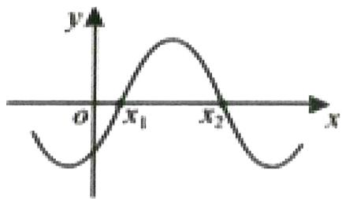

$\quad$A. $\omega$

$\quad$B. $\varphi$

$\quad$C. $\frac{\varphi}{\omega}$

$\quad$D. Asinφ

# 题型二：在某区间有某特征求 w 范围

等级（R）

##### 002. 若 $f(x) = 2\sin wx + 1 (w > 0)$ 在区间 $\left[-\frac{\pi}{2}, \frac{2\pi}{3}\right]$ 上是增函数，求 $\omega$ 的取值范围

等级（R）

##### 003. 已知函数 $f(x) = \sin \left( \omega x + \frac{\pi}{6} \right) \omega > 0$ ，在区间 $\left[-\frac{\pi}{4}, \frac{2\pi}{3}\right]$ 上单调递增，则 $\omega$ 的取值范围为（）

$\quad$A. $\left(0, \frac{8}{3}\right]$

$\quad$B. $\left(0,\frac{1}{2}\right]$

$\quad$C. $\left[\frac{1}{2},\frac{8}{3}\right]$

$\quad$D. $\left[\frac{8}{3}, 2\right]$

等级（R）

##### 004. 已知函数 $f(x) = \sin \left( \omega x - \frac{\pi}{4} \right) (\omega > 0)$ ，若 $f(x)$ 在区间 $(\pi, 2\pi)$ 上存在零点，则 $\omega$ 的取值范围为 \_\_\_\_.

等级（R）

##### 005. 函数 $f(x) = \sin 2\omega x + \cos 2\omega x (\omega > 0)$ 在区间 $\left[\frac{\pi}{12}, \frac{\pi}{3}\right]$ 上没有零点，则 $\omega$ 的取值范围是（）

$\quad$A. $\left(\frac{9}{8},\frac{3}{2}\right)$

$\quad$B. $\left(\frac{3}{2},\frac{15}{8}\right)$

$\quad$C. $\left(0, \frac{15}{8}\right)$

$\quad$D. $\left(0,\frac{9}{8}\right)$

等级（SR）

2022 山西一模

##### 006. 已知函数 $f(x) = \sin \left( \omega x + \frac{\pi}{3} \right) (\omega > 0)$ 在 $\left[\frac{\pi}{3}, \pi\right]$ 上恰有3个零点，则 $\omega$ 的取值范围是（）

$\quad$A. $\left[\frac{8}{3}, \frac{11}{3}\right) \cup \left(4, \frac{14}{3}\right)$

$\quad$B. $\left[\frac{11}{3},\quad4\right)\cup\left[\frac{14}{3},\quad\frac{17}{3}\right)$

$\quad$C. $\left[\frac{11}{3},\quad\frac{14}{3}\right)\cup\left(5,\quad\frac{17}{3}\right)$

$\quad$D. $\left[\frac{14}{3},5\right)\cup\left[\frac{17}{3},\frac{20}{3}\right)$

# 题型三：动态三角函数的考察

等级（R）

##### 007. 已知平面向量 $\vec{a} = (\sin x, 1)$ , $\vec{b} = (\sqrt{3}, \cos x)$ , 若函数 $f(x) = \vec{a} \cdot \vec{b}$ 在 $[-m, m]$ 上是单调递增函数, 则 $f(2m)$ 的取值范围为

等级（R）

##### 008. 已知函数 $f(x) = \cos (\omega x + \varphi)(\omega > 0, 0 \leq \varphi \leq \pi)$ 是奇函数，且在 $\left[-\frac{\pi}{4}, \frac{\pi}{3}\right]$ 上单调递减，则 $\omega$ 的最大值是（）

$\quad$A. $\frac{1}{2}$

$\quad$B. $\frac{2}{3}$

$\quad$C. $\frac{3}{2}$

$\quad$D. 2

等级（R）

##### 009. 函数 $f(x) = \sqrt{3} \sin \omega x + \cos \omega x (\omega > 0)$ 在区间 $\left[-\frac{\pi}{4}, \frac{\pi}{3}\right]$ 上恰有一个最大值点和一个最小值点，则实数 $\omega$ 的取值范围是（）

$\quad$A. $\left[\frac{8}{3},7\right)$

$\quad$B. $\left[\frac{8}{3},4\right)$

$\quad$C. $\left[4, \frac{20}{3}\right)$

$\quad$D. $\left(\frac{20}{3},7\right)$

等级（R）

2022厦门三检

##### 010. 已知函数 $f(x) = \sin(\omega x + \varphi)(0 < \varphi < \pi)$ ，写出一个同时满足以下条件的 $\omega$ 的值

① $\omega \in \mathbb{N}^*$ ;

② $f(x)$ 是偶函数；

③ $f(x)$ 在 $\left(-\frac{\pi}{6}, \frac{\pi}{3}\right)$ 上恰有两个极值点.

等级（R）

2024 重庆二诊

##### 011.若函数 $f(x) = \sin (2x - \varphi)(0\leq \varphi <  \pi)$ 在 $(0,\frac{\pi}{3})$ 上单调递增，则 $\varphi$ 的最小值为（）

$\quad$A. $\frac{\pi}{12}$

$\quad$B. $\frac{\pi}{6}$

$\quad$C. $\frac{\pi}{4}$

$\quad$D. $\frac{\pi}{3}$

等级（R）

2024吕梁三模

##### 012.对任意闭区间 I，用 $M_{I}$ 表示函数 $y = \cos x$ 在 I 上的最大值，若正实数 a 满足 $M_{[0,a]} = 2M_{[a,2a]}$ ，则 a 的值为 \_\_\_\_.

等级（SR）

2024 绍兴二模

##### 013. 已知函数 $f(x) = \sin \omega x (\omega > 0)$ , 若 $\exists x_1, x_2 \in [\frac{\pi}{3}, \pi]$ , $f(x_1) = -1$ , $f(x_2) = 1$ , 则实数 $\omega$ 的取值范围是 \_\_\_\_.

等级（SSR）

2024温州三模

##### 014.(多选)已知函数 $f(x)=\sin(\omega x+\varphi)(\omega>0),x\in\left[\frac{\pi}{2},\pi\right]$ 的值域是 $[a,b]$ ，则下列命题正确的是()

$\quad$A. 若 $b - a = 2, \varphi = \frac{\pi}{6}$ ，则 $\omega$ 不存在最大值

$\quad$B. 若 $b - a = 2, \varphi = \frac{\pi}{6}$ ，则 $\omega$ 的最小值是 $\frac{7}{3}$

$\quad$C. 若 $b - a = \sqrt{3}$ ，则 $\omega$ 的最小值是 $\frac{4}{3}$

$\quad$D. 若 $b - a = \frac{3}{2}$ ，则 $\omega$ 的最小值是 $\frac{4}{3}$

# 题型四：三角函数最值问题

等级（R）

高三五月联考新高考卷

##### 015. 函数 $f(x) = 4 \tan (\pi - x) - \frac{1}{\cos^2 x}$ 的最大值为（）

$\quad$A. 2

$\quad$B. 3

$\quad$C. 4

$\quad$D. 5

等级（R）

2022 广东二模

##### 016. 若函数 $f(x) = \sin x \cdot \cos (x + \varphi)$ 的最大值为 1，则常数 $\varphi$ 的一个取值为 \_\_\_\_。

# 题型五：三角函数图像内部的几何性质

等级（R）

2022苏锡常镇一模

##### 017. 已知函数 $f(x) = \sqrt{3} \sin(\omega x + \varphi) \left( \omega > 0, |\varphi| < \frac{\pi}{2} \right)$ 在一个周期内的图像如图所示，其中点 $P, Q$ 分别是图象的最高的和最低点，点 $M$ 是图像与 $x$ 轴的交点，且 $MP \perp MQ$ ，若 $f\left(\frac{1}{2}\right) = \frac{\sqrt{3}}{2}$ ，则 $\tan \varphi =$

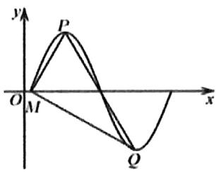

等级（R）

2021达州二诊

##### 018. 已知函数 $f(x) = A \sin \omega x (A > 0, \omega > 0)$ 的部分图像如图，0为坐标原点，M点是该图像与x轴的一个交点，N点是该图像的一个最高点，且 $ON \perp MN, |MN| = \sqrt{3}$ ，则A与 $\omega$ 分别为（）

$\quad$A. $\frac{\sqrt{3}}{2}, \pi$

$\quad$B. $\frac{3}{2}, \pi$

$\quad$C. $\frac{\sqrt{3}}{2}, \frac{2}{3}\pi$

$\quad$D. $\frac{3}{2}, \quad \frac{2}{3}\pi$

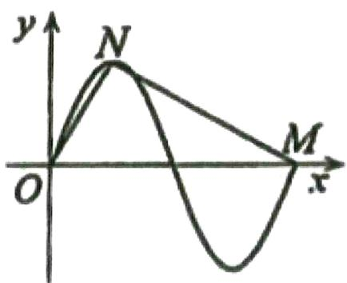

等级（R）

2021 桂林崇左四月联考

##### 019. 如图, 函数 $f(x) = 2\sin (\omega x + \phi)(\omega > 0, 0 < \phi < \pi)$ 的图像与坐标轴交于点 A, B, C, 直线 BC 交 $f(x)$ 的图像于点 D, O (坐标原点) 为△ABD 的重心 (三条边中线的交点), 其中 A (-π, 0), 则△ABD 的面积为 \_\_\_\_

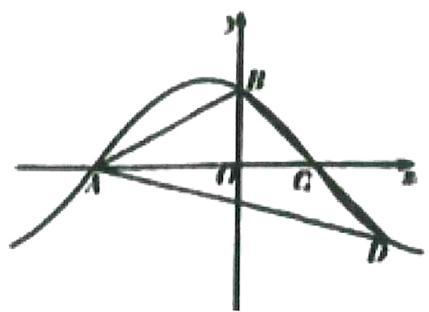

# 题型六：三角函数图像对称性的考察

等级（SR）

2021南昌三模

##### 020. 已知函数 $f(x) = \sin x - \sqrt{3} \cos x$ 与直线 $y = a (0 < a < 2)$ 在第一象限的交点横坐标从小到大依次分别为 x1, x2, xn, …，则 $f(x1 - 2x2 - 3x3) = (\quad)$

$\quad$A.-1

$\quad$B. 0

$\quad$C. 1

$\quad$D. $\sqrt{3}$

等级（SR）

2021云南二统

##### 021. 已知函数 $f(x) = 3\sin (\omega x + \phi) (\omega > 0, |\phi| < \pi)$ , $f(4) = f(2) - 6$ ，且 $f(x)$ 在[2,4]上单调。设函数 $g(x) = f(x) - 1$ ，且 $g(x)$ 的定义域为[-5,8]，则 $g(x)$ 的所有零点之和等于（）

$\quad$A. 0

$\quad$B. 4

$\quad$C. 12

$\quad$D. 16

等级（SR）

2022 湖北十一校三月联考

##### 022. 已知函数 $f(x) = 2 \sin \left( 2x + \frac{\pi}{6} \right) - m, x \in \left[ 0, \frac{7\pi}{6} \right]$ 有三个不同的零点 $x_1, x_2, x_3$ ，且 $x_1 < x_2 < x_3$ ，则 $m(x_1 + 2x_2 + x_3)$ 的范围是 \_\_\_\_

# 题型七：含绝对值的三角函数

等级（SR）

盐城三模

##### 023. 若函数 $f(x) = |\sin (2x + \theta)|$ 关于直线 $x = \frac{\pi}{4}$ 对称，则 $\theta$ 的最小正值为 \_\_\_\_。

等级（SR）

2021 华大新高考联盟三月质检

##### 024. 函数 $f(x) = 5|\sin^2 x - \sin |x|| - 1$ 在 $x \in [-\frac{5\pi}{2}, \frac{5\pi}{2}]$ 上的零点个数为（）.

$\quad$A. 12

$\quad$B. 14

$\quad$C. 16

$\quad$D. 18

等级（SR）

济南一模

##### 025. 已知函数 $f(x) = (\sin x + \cos x) |\sin x - \cos x|$ ，下列说法正确的是（）

$\quad$A. $f(x)$ 是周期函数

$\quad$B. $f(x)$ 在区间 $\left[-\frac{\pi}{2}, \frac{\pi}{2}\right]$ 上是增函数

$\quad$C. 若 $\left|f(x_{1})\right|+\left|f(x_{2})\right|=2$ ，则 $x_{1}+x_{2}=\frac{k\pi}{2}(k\in Z)$

$\quad$D. 函数 $g(x) = f(x) + 1$ 在区间 $[0, 2\pi]$ 上有且仅有一个零点

# 题型八：运动中的三角函数

等级（N）

2010 新课标理

##### 026. 如图，质点 $P$ 在半径为 2 的圆周上逆时针运动，其初始位置为 $P_{0}(\sqrt{2}, -\sqrt{2})$ ，角速度为 1，那么点 $P$ 到 $x$ 轴距离 $d$ 关于时间 $t$ 的函数图像大致为（）

$\quad$A.

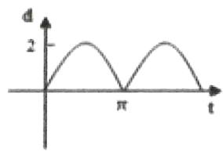

$\quad$B.

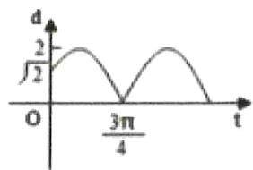

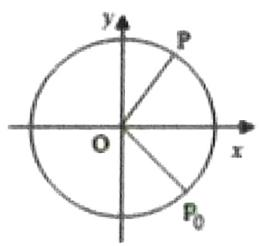

$\quad$C.

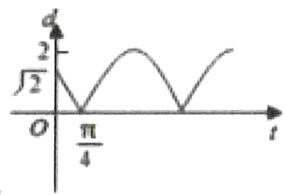

$\quad$D.

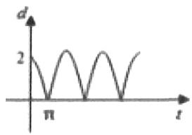

等级（R）

##### 027. 如图, 在平面直角坐标系 $xOy$ 中, 质点 $M$ 、 $N$ 间隔 3 分钟先后从 $P$ 点出发, 绕原点按逆时针方向做角速度为 $\frac{\pi}{6}$ 弧度/分钟的均速圆周运动. 则 $M$ 与 $N$ 的纵坐标之差第 4 次达到最大值时, $N$ 运动的时间为 ( )

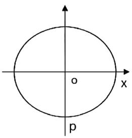

$\quad$A. 37.5 分钟

$\quad$B. 40.5 分钟

$\quad$C. 49.5 分钟

$\quad$D. 52.5 分钟

等级（R）

##### 028. 如图 Rt△ABC 中， $AB \perp BC$ ， $|AB| = \sqrt{6}$ ， $|BC| = \sqrt{2}$ ，若其顶点 A 在 x 轴上运动，顶点 B 在 y 轴的非负半轴上运动，设顶点 C 的横坐标非负，纵坐标为 y，且直线 AB 的斜率角为 $\theta$ ，则函数 $y = f(\theta)$ 的图像大致是（）

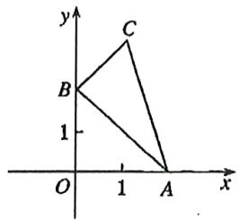

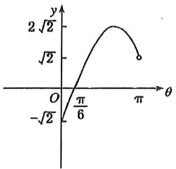

A

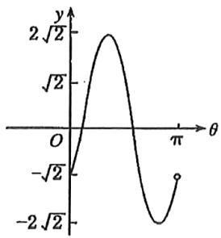

B

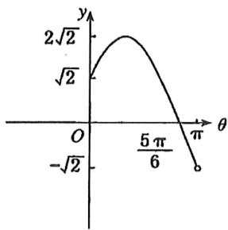

C

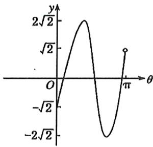

D

# 题型九：三角函数图像的深入考察（数形结合）

等级（R）

2021 衡阳一模

##### 029. 已知函数 $f(x) = \cos \omega x (\omega > 0)$ ，将 $f(x)$ 的图像向右平移 $\frac{\pi}{3\omega}$ 个单位得到函数 $g(x)$ 的图像，点 A, B, C, 是 $f(x)$ 与 $g(x)$ 图像的连续相邻三个交点，若 $\Delta ABC$ 是钝角三角形，则 $\omega$ 的取值范围为（）

$\quad$A. $(0, \frac{\sqrt{2}}{2}\pi)$

$\quad$B. $(0, \frac{\sqrt{3}}{3}\pi)$

$\quad$C. $\left(\frac{\sqrt{3}}{3} \pi, +\infty\right)$

$\quad$D. $\left(\frac{\sqrt{2}}{2} \pi, +\infty\right)$

等级（R）

##### 030. 已知函数 $f(x) = \sin (\omega x + \varphi)$ ，其中， $\omega > 0, 0 < \varphi < \pi$ ， $f(x) \leq f\left(\frac{\pi}{4}\right)$ 恒成立，且 $f(x)$ 在区间 $\left(0, \frac{\pi}{4}\right)$ 上恰有两个零点，则 $\omega$ 的取值范围是（）

$\quad$A. (6,10)

$\quad$B. (6,8)

$\quad$C. (8,10)

$\quad$D. (6,12)

等级（SR）

池州二模

##### 031. 已知函数 $f(x) = \sin (\omega x + \varphi)(\omega > 0)$ 满足 $f(\frac{\pi}{4}) = 1$ ， $f(\frac{\pi}{2}) = 0$ ，且 $f(x)$ 在区间 $(\frac{\pi}{4}, \frac{\pi}{3})$ 上单调，则 $\omega$ 取值的个数有 \_\_\_\_ 个。

等级（SR）

2021南昌一模

##### 032. 已知 $f(x) = |x + a| - \sin(2x + \frac{\pi}{3})$ 的最小值为 0，则正实数 $a$ 的最小值是（）

$\quad$A. $\frac{1}{2}$

$\quad$B. $\frac{\sqrt{3}}{3}$

$\quad$C. $\frac{\sqrt{3}}{2}$

$\quad$D. 1

等级（SR）

2022 潍坊一模

##### 033. 设函数 $y = \sin \left(2x + \frac{\pi}{3}\right)$ 在区间 $\left[t, t + \frac{\pi}{4}\right]$ 上的最大值为 $g_1(t)$ ，最小值为 $g_2(t)$ ，则 $g_1(t) - g_2(t)$ 的最小值为（）

$\quad$A. 1

$\quad$B. $\frac{\sqrt{2}}{2}$

$\quad$C. $\frac{\sqrt{2} - 1}{2}$

$\quad$D. $\frac{2 - \sqrt{2}}{2}$ 等级（SR）

厦门三检

##### 034. 已知函数 $f(x) = \sin (2x - \frac{\pi}{3})$ ，若 $f(x_{1}) + f(x_{2}) = 0$ ，且 $x_{1}x_{2} \leq 0$ ，则 $|x_{1} - x_{2}|$ 的最小值为（）

$\quad$A. $\frac{\pi}{6}$

$\quad$B. $\frac{\pi}{3}$

$\quad$C. $\frac{\pi}{2}$

$\quad$D. $\frac{2\pi}{3}$

等级（SR）

武汉毕业生六月供题二

##### 035. 将函数 $f(x) = \sqrt{3} \sin 2x + 2\cos^2 x - 1$ 的图像向右平移 $\varphi (0 < \varphi < \frac{\pi}{2})$ 个单位长度后得到函数 $g(x)$ 的图像，若对于满足 $\left|f(x_1) - g(x_2)\right| = 4$ 的 $x_1$ ， $x_2$ 有 $\left|x_1 - x_2\right|_{\min} = \frac{\pi}{6}$ ，则 $\varphi = (\quad)$

$\quad$A. $\frac{\pi}{6}$

$\quad$B. $\frac{\pi}{4}$

$\quad$C. $\frac{\pi}{3}$

$\quad$D. $\frac{5\pi}{12}$ 等级（SR）

广东六校联盟第三次联考

##### 036. 设函数 $f(x) = \sin (wx + \varphi)$ ，若 $f\left(\frac{\pi}{6}\right) = f\left(\frac{7\pi}{6}\right) = -f\left(\frac{\pi}{3}\right)$ ，则 $w$ 的最小正值是（）

$\quad$A.1

$B. \frac {6}{5}$

$\quad$C.2

$\quad$D.6

等级（SR）

山西省二模

##### 037. 已知函数 $f(x) = \sin \omega x + \sqrt{3} \cos \omega x, \omega > 0$ ，若该函数图像的对称轴与函数 $h(x) = 3\cos (2x + \varphi) - 1$ 图像的对称轴完全相同，则 $\omega =$ \_\_\_\_，若函数 $f(x)$ 在区间（0， $\pi$ ）内单调递增，在区间（2π,3π）内单调递减，则 $\omega$ 的最小值是\_\_\_\_。

# 题型十：三角函数最值点的给法

等级（R）

2022攀枝花三统

##### 038. 已知函数 $f(x) = \sqrt{3} \sin x - \cos x$ ，且 $f(x_1) \cdot f(x_2) = -4$ ，则 $|x_1 + x_2|$ 的最小值为（）

$\quad$A. $\frac{\pi}{3}$

$\quad$B. $\frac{\pi}{2}$

$\quad$C. $\frac{2\pi}{3}$

$\quad$D. $\pi$

等级（R）

2024 湖丽衢二模

##### 039. 将函数 $f(x) = \cos 2x$ 的图象向右平移 $\varphi \left(0 < \varphi < \frac{\pi}{2}\right)$ 个单位后得到函数 $g(x)$ 的图象，若对满足 $|f(x_1) - g(x_2)| = 2$ 的 $x_1, x_2$ ，有 $|x_1 - x_2|_{\min} = \frac{\pi}{3}$ ，则 $\varphi = (\quad)$

$\quad$A. $\frac{\pi}{6}$

$\quad$B. $\frac{\pi}{4}$

$\quad$C. $\frac{\pi}{3}$

$\quad$D. $\frac{5\pi}{12}$

等级（SR）

2022 安徽 A10 联盟 4 月联考

##### 040. 已知函数 $f(x) = 2 \cos \omega x + 2\sqrt{3} \cos \left( \omega x + \frac{3\pi}{2} \right) (\omega \in \mathbb{N}^*)$ ，若对 $\forall \lambda \in R$ ，在 $[\lambda, \lambda + 3]$ 上至少存在两个不等的实数 $m, n$ ，使得 $f(m)f(n) = 16$ ，则 $\omega$ 的最小值为（）

$\quad$A. 2

$\quad$B. 3

$\quad$C. 4

$\quad$D. 6

# 题型十一：横线与三角函数交点问题

等级（R）

##### 041. 已知函数 $f(x) = 2\sin (wx + \vartheta)(w > 0, |\vartheta| \leq \frac{\pi}{2})$ ，其图像与直线 $y = -2$ 相邻两个交点的距离为 $\pi$ ，若 $f(x) > 0$ 对 $\forall x \in \left(-\frac{\pi}{12}, \frac{\pi}{3}\right)$ 恒成立，则 $\varphi$ 的取值范围是（）

$\quad$A. $\left[\frac{\pi}{12},\frac{\pi}{6}\right]$

$\quad$B. $\left[\frac{\pi}{6},\frac{\pi}{2}\right]$

$\quad$C. $\left[\frac{\pi}{12},\frac{\pi}{3}\right]$

$\quad$D. $\left[\frac{\pi}{6},\frac{\pi}{3}\right]$

等级（SR）

##### 042. 已知函数 $f(x) = \sin \left( \omega x + \frac{\pi}{6} \right) + \frac{1}{2} (\omega > 0)$ ，点 $P, Q, R$ 是直线 $y = m (m > 0)$ 与函数 $f(x)$ 的图像自左至右的某三个相邻交点，且 $2|PQ| = |QR| = \frac{2\pi}{3}$ ，则 $\omega + m =$ （）

$\quad$A. $\frac{2}{5}$

$\quad$B. $2 + \frac{\sqrt{3}}{2}$

$\quad$C. 3

$\quad$D. $\frac{5 + \sqrt{3}}{2}$

等级（SR）

##### 043. 已知函数 $f(x) = 2\sin \omega x - \cos \omega x (\omega > 0)$ ，若 $f(x)$ 的两个零点 $x_1, x_2$ 满足 $|x_1 - x_2|_{\min} = 2$ ，则 $f(1)$ 的值为（）

$\quad$A. 2

$\quad$B. -2

$\quad$C. $\frac{\sqrt{10}}{2}$

$\quad$D. $-\frac{\sqrt{10}}{2}$ 等级（SR）

##### 044. 若关于 $x$ 的方程 $\left(\sin x + \cos x\right)^2 + \cos 2x = m$ 在区间 $[0, \pi)$ 上有两个根 $x_1, x_2$ 且 $\left|x_1 - x_2\right| \geq \frac{\pi}{4}$ , 则实数 $m$ 的取值范围是（）

$\quad$A. $[0,2)$

$\quad$B. $[0,2]$

$\quad$C. $\left[1, \sqrt{2} + 1\right]$

$\quad$D. $\left[1, \sqrt{2} + 1\right)$

等级（SR）

##### 045. 已知函数 $f(x) = 2\sin \left(2x + \frac{\pi}{6}\right)$ ，若对任意的 $a \in (1,2)$ ，关于 $x$ 的方程 $|f(x)| - a = 0 (0 \leq x < m)$ 总有两个不同的实数根，则 $m$ 的取值范围为（）

$\quad$A. $\left[\frac{\pi}{2},\frac{2\pi}{3}\right]$

$\quad$B. $\left[\frac{\pi}{3},\frac{\pi}{2}\right]$

$\quad$C. $\left[\frac{\pi}{2},\frac{2\pi}{3}\right]$

$\quad$D. $\left[\frac{\pi}{6},\frac{\pi}{3}\right]$

# 题型十二：高次高倍角三角函数

等级（SR）

2004 全国卷

##### 046. 函数 $y = \sin^4 x + \cos^2 x$ 的最小正周期为（）

$\quad$A. $\frac{\pi}{4}$

$\quad$B. $\frac{\pi}{2}$

$\quad$C. $\pi$

$\quad$D. 2

等级（SR）

2024 湖北圆创联盟

##### 047.已知函数 $f(x) = \cos 2x + \cos 3x, x \in (0, \pi)$ ，若 $f(x)$ 有两个零点 $x_{1}, x_{2} (x_{1} < x_{2})$ ，则（）

$\quad$A. $\frac{2\pi}{5} \in \{x_1, x_2\}$

$\quad$B. $x_{2} = 2x_{1}$

$\quad$C. $\cos x_{1} + \cos x_{2} = \frac{1}{2}$

$\quad$D. $\cos x_{1}\cos x_{2} = \frac{\sqrt{3}}{2}$

# 题型十三：辅助角公式的深入考察

等级（SR）

##### 048. 函数 $f(x) = \sin x + 2\cos x$ 的图像向右平移 $\phi$ 个单位长度得到 $g(x) = 2\sin x + \cos x$ 的图像，若 $x = \phi$ 为 $h(x) = \sin x + a\cos x$ 的一条对称轴，则 $a =$ \_\_\_\_

# 题型十四：滚动问题

等级（SR）

九江二模

##### 049. 现有边长均为 1 的正方形、正五边形、正六边形以及半径为 1 的圆各一个，在水平桌面上无滑动滚动一周，他们的中心的运动轨迹长分别为 $l_{1}, l_{2}, l_{3}, l_{4}$ 则（）

$\quad$A. $l_{1} < l_{2} < l_{3} < l_{4}$

$\quad$B. $l_{1} < l_{2} < l_{3} = l_{4}$

$\quad$C. $l_{1} = l_{2} = l_{3} = l_{4}$

$\quad$D. $l_{1} = l_{2} = l_{3} <   l_{4}$

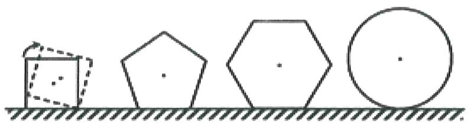

# 题型十五：写出符合某条件的三角函数

等级（SR）

2022抚顺一模

##### 050. 已知函数 $f(x)$ ，①函数 $f(x)$ 的图像关于直线 $x = -\frac{\pi}{6}$ 对称，②当 $x \in \left[\frac{\pi}{2}, \pi\right]$ 时，函数 $f(x)$ 的取值范围是 $[-2, 1]$ ，则同时满足条件①②的函数 $f(x)$ 的一个解析式为 \_\_\_\_.

# 题型十六：三角函数的任意存在

等级（SR）

2022炎德英才大联考

##### 051. 已知 $f(x) = 3 \sin x + 2$ ，对于任意的 $x_{2} \in [0, \frac{\pi}{2}]$ ，都存在 $x_{1} \in [0, \frac{\pi}{2}]$ ，使得 $f(x_{1}) + 2f(x_{2} + \theta) = 3$ 成立，则下列选项中， $\theta$ 可能的值是（）

$\quad$A. $\frac{3\pi}{5}$   
$\quad$B. $\frac{4\pi}{5}$   
$\quad$C. $\frac{6\pi}{5}$   
$\quad$D. $\frac{7\pi}{5}$

# 解三角形选填

# 题型一：正切的考察

等级（N）

2022 江苏基地三月联考

##### 001. 在 $\triangle ABC$ 中，若 $\tan A + \tan B + \sqrt{2} = \sqrt{2}\tan A\tan B$ ，则 $\tan 2C = (\quad)$

$\quad$A. $-2\sqrt{2}$

$\quad$B. $2 \sqrt{2}$

$\quad$C. $-2\sqrt{3}$

$\quad$D. $2 \sqrt{3}$

等级（R）

##### 002. 在 $\triangle ABC$ 中，角 $A, B, C$ 的对边分别为 $a, b, c$ ，若 $a = 2, c = 3\sqrt{2}, \tan B = 2\tan A$ ，则 $\triangle ABC$ 的面积为（）

$\quad$A. 2

$\quad$B. 3

$\quad$C. $3 \sqrt{2}$

$\quad$D. $4 \sqrt{2}$

等级（R）

2022宜宾三诊

##### 003. 在 $\Delta ABC$ ，角 $A, B, C$ 的对边分别为 $a, b, c$ ，且 $a^2 = b^2 - 3c$ ， $\sin(B - A) = 2\sin A\cos B$ ，则边 $c = ()$

$\quad$A. 3

$\quad$B. 6

$\quad$C. 9

$\quad$D. 12

等级（SR）

2021 乌鲁木齐第二次质量检测

##### 004. 在 $\triangle ABC$ 中， $\tan B=2\tan C$ ，则 $\frac{\sin B}{\sin C}$ 的取值范围是\_\_\_\_。

等级（SR）

2022江西重点中学协作体第二次联考

##### 005. 在 $\Delta ABC$ 中, 角 A, B, C 所对应的边分别为 a, b, c, 若 ac=8, $\sin B + 2 \sin C \cos A = 0$ , 则 $\Delta ABC$ 面积的最大值为 ( )

$\quad$A. 1

$\quad$B. 3

$\quad$C. 4

$\quad$D. 2

等级（SR）

##### 006. 在 $\triangle ABC$ 中，若 $\frac{1}{\tan B} + \frac{1}{\tan C} = \frac{1}{\tan A}$ ，则 $\cos A$ 的取值范围为（ ）

$\quad$A. $(0, \frac{1}{3}]$

$\quad$B. $\left[\frac{1}{3}, 1\right)$

c. $(0, \frac{2}{3}]$

$\quad$D. $\left[\frac{2}{3}, 1\right)$

等级（SR）

2022 云南第一次统测

##### 007. 已知 $\Delta ABC$ 的三个内角分别为 A、B、C，若 $sin^2 C = 2sin^2 A - 3sin^2 B$ ，则 $\tan B$ 的最大值为（）

$\quad$A. $\frac{\sqrt{5}}{3}$

$\quad$B. $\frac{\sqrt{5}}{2}$

$\quad$C. $\frac{11\sqrt{5}}{20}$

$\quad$D. $\frac{3\sqrt{5}}{5}$ 等级（SR）

2022 西南 3+3+3 联考

##### 008. 在锐角三角形 ABC 中，D 是线段 BC 上的一点，且满足 $\overrightarrow{AB} + \overrightarrow{AC} = 2\overrightarrow{AD}$ ，AD = AB，则 $\tan A + \tan B + \tan C$ 的最小值是 \_\_\_\_.

等级（SR）

2021 朝阳一模

##### 009. 在 $\Delta ABC$ 中，“ $\tan A\tan B < 1$ ”是“ $\Delta ABC$ 为钝角三角形”的（）

$\quad$A. 充分不必要条件

$\quad$B. 必要不充分条件

$\quad$C. 充分必要条件

$\quad$D. 既不充分也不必要条件

等级（SR）

2021江南十校三月联考

##### 010. 在 $\Delta ABC$ 中，角 $A, B, C$ 的对边分别为 $a, b, c, a = c \sin B$ ，则 $\tan A$ 的最大值为（）

$\quad$A.1

$\quad$B. $\frac{5}{4}$

$\quad$C. $\frac{4}{3}$

$\quad$D. $\frac{3}{2}$

# 题型二：角分线长度相关

等级（SR）

##### 011. 在 $\Delta ABC$ 中, 内角 A、B、C 对的边分别为 $a, b, c, \angle ABC = \frac{2\pi}{3}$ , BD 平分 $\angle ABC$ 交 AC 于点 D, BD=2, 则 $\Delta ABC$ 的面积的最小值为 ( )

A $3\sqrt{3}$

$\quad$B. $4 \sqrt{3}$

$\quad$C. $5 \sqrt{3}$

$\quad$D. $6 \sqrt{3}$

等级（SR）

2023 全国甲卷数学

##### 012. 在 $\triangle ABC$ 中， $AB = 2$ ， $\angle BAC = 60^\circ, BC = \sqrt{6}$ ， $D$ 为 $BC$ 上一点， $AD$ 为 $\angle BAC$ 的平分线，则 $AD =$ \_\_\_\_.

等级（SR）

##### 013. 在 $\triangle ABC$ 中, $AC = 2$ . $AB = 1$ , 点 D 为 BC 边上的点, AD 是 $\angle BAC$ 的角平分线, 则 AD 的取值范围是

等级（SR）

##### 014. $\triangle ABC$ 的内角 $A$ , $B, C$ 的对边分别为 $a, b, c$ , 角 $A$ 的内角平分线交 $BC$ 于点 $D$ , 若 $a = 1, \frac{1}{b} + \frac{1}{c} = 2$ , 则 $AD$ 的取值范围是 \_\_\_\_.

# 题型三：阿波罗尼斯圆

等级（R）

##### 015. 已知两定点 $A(-2,0), B(1,0)$ ，如果动点 $\mathrm{P}$ 满足条件 $|PA| = 2 |PB|$ 则点 $\mathrm{P}$ 的轨迹所包围的图形的面积等于（）

(A) $\pi$

B) $4\pi$

(C) $8\pi$

(D) $9\pi$

等级（R）

2024江西重点中学高三联考

##### 016.在三角形 ABC 中, BC=4,角 A 的平分线 AD 交 BC 于点 D,若 $\frac{BD}{DC}=\frac{1}{3}$ ,则三角形 ABC 面积的最大值为 \_\_\_\_.

等级（SSR）

2023 武汉二月调研

##### 017. 设 A, B 是半径为 3 的球体 O 表面上两定点，且 $\angle AOB = 60^{\circ}$ ，球体 O 表面上动点 P 满足 PA = 2PB，则点 P 的轨迹长度为（）

$\quad$A. $\frac{12\sqrt{11}}{11}\pi$

$\quad$B. $\frac{4\sqrt{15}}{5}\pi$

$\quad$C. $\frac{6\sqrt{14}}{7}\pi$

$\quad$D. $\frac{12\sqrt{13}}{13}\pi$

# 题型四：巧用常数

等级（SR）

2022 东北三省三校三模

##### 018. 在 $\triangle ABC$ 中, 内角 A, B, C 所对的边分别为 a, b, c, 已知 $acosC = 2, 2b+c=4$ , 则 $\triangle ABC$ 面积的最大值为\_.

等级（SR）

##### 019. 在 $_{\triangle ABC}$ 中, 内角 A, B, C 的对边分别是 a, b, c, 已知 $a = 2$ , $\sin B - \sin C = \sin(2A + C) = \frac{\sqrt{3}}{3}$ , 则 $_{\triangle ABC}$ 的面积为\_\_\_\_

等级（SR）

##### 020. 在 $\triangle ABC$ 中，内角 $A, B, C$ 的对边分别为 $a, b, c$ ， $a = 1, \sin 2B + b \sin A = 0$ ，若 $\triangle ABC$ 的面积 $S = \sqrt{3}$ ，则 $b =$ \_\_\_\_

# 题型五：数学文化中的解三角形

等级（N）

2021年乙卷理科

##### 021. 魏晋时刘徽撰写的《海岛算经》是有关测量的数学著作，其中第一题是测海岛的高．如图，点 $E$ ， $H$ ， $G$ 在水平线 $AC$ 上， $DE$ 和 $FG$ 是两个垂直于水平面且等高的测量标杆的高度，称为“表高”， $EG$ 称为“表距”， $GC$ 和 $EH$ 都称为“表目距”， $GC$ 与 $EH$ 的差称为“表目距的差”则海岛的高 $AB = (\quad)$

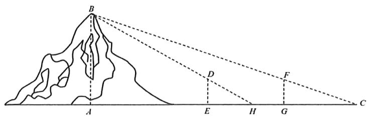

$\quad$A. $\frac{\text{表高} \times \text{表距}}{\text{表目距的差}} + \text{表高}$

$\quad$B. $\frac{\text{表高} \times \text{表距}}{\text{表目距的差}} - \text{表高}$

$\quad$C. $\frac{\text{表高} \times \text{表距}}{\text{表目距的差}} + \text{表距}$

$\quad$D. $\frac{\text{表高} \times \text{表距}}{\text{表目距的差}} - \text{表距}$

等级（R）

2022惠州一模

##### 022. 如图, 曲柄连杆机构中, 曲柄 CB 绕点 C 点旋转时, 通过连杆 AB 的传递, 活塞做直线往复运动, 当曲柄在 $\mathrm{CB}_{0}$ 位置时, 曲柄和连杆成一条直线, 连杆的端点 A 在 $\mathrm{A}_{0}$ 处。设连杆 AB 长 $200 \mathrm{~mm}$ , 曲柄 CB 长 $70 \mathrm{~mm}$ , 则曲柄 $\mathrm{CB}_{0}$ 按顺时针方向旋转 $53.2^{\circ}$ 时, 活塞移动的距离 (即连杆的端点 A 移动的距离 $\mathrm{A}_{0} \mathrm{~A}$ ) 约为 \_\_\_\_ mm. (结果保留整数) (参考数据: $\sin 53.2^{\circ} \approx 0.8$ )

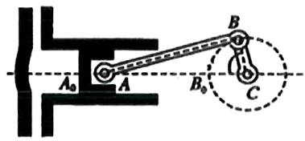

等级（R）

##### 023. 秦九韶是我国南宋著名数学家，在他的著作《数书九章》中有已知三边求三角形面积的方法：“以小斜幂，并大斜幂，减中斜幂，余半之，自乘于上；以小斜幂乘大斜幂，减上，余四约之，为实；一为从隅（yu），开平方得积”如果把以上这段文字写成公式就是 $S = \sqrt{\frac{1}{4}\left[a^2c^2 - \left(\frac{a^2 + c^2 - b^2}{2}\right)^2\right]}$ ，其中 $a, b, c$ 是△ABC的内角A, B, C对边 $\sin C = 2\sin A\cos B$ ，且 $b^2, 1, C^2$ 成等差数列，则△ABC面积S的最大值为\_\_\_\_。

等级（R）

2023湖南炎德三月大联考

##### 024. 逢山开路，遇水架桥，我国摘取了一系列高速公路“世界之最”，锻造出中国路、中国桥等一张张闪亮的“中国名片”。如图，一辆汽车在一条水平的高速公路上直线行驶，在 A, B, C 三处测得道路一侧山顶 P 的仰角依次为 $30^{\circ}$ ， $45^{\circ}$ ， $60^{\circ}$ ，其中 AB = a，BC = b（ $0 < a < 3b$ ），则此山的高度为（）

$\quad$A. $\frac{1}{2}\sqrt{\frac{2ab(a + b)}{3b - a}}$

$\quad$B. $\frac{1}{2}\sqrt{\frac{3ab(a + b)}{3b - a}}$

$\quad$C. $\frac{1}{2}\sqrt{\frac{5ab(a + b)}{3b - a}}$

$\quad$D. $\frac{1}{2}\sqrt{\frac{6ab(a + b)}{3b - a}}$

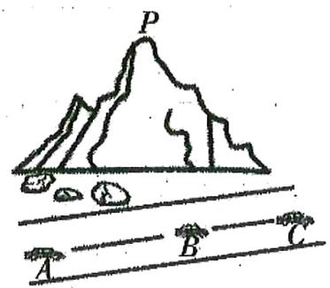

等级（SR）

2021 深圳一模

##### 025. 拿破仑定理是法国著名军事家拿破仑·波拿马最早提出的一个几何定理：“以任意三角形的三条边为边，向外构造三个等边三角形，则这三个等边三角形的外接圆圆心恰为另一个等边三角形（此等边三角形称为拿破仑三角形）的顶点。”已知△ABC内接于单位圆，以BC，AC，AB为边向外作三个等边三角形，其外接圆圆心依次记为 $A', B', C'$ 。若 $\angle ACB = 30^\circ$ 则△A'B'C'的面积最大值为\_\_\_\_

等级（R）

2023 鹰潭一模

##### 026. 十七世纪法国业余数学家之王的皮埃尔·德·费马提出的一个著名的几何问题：“已知一个三角形，求作一点，使其与这个三角形的三个顶点的距离之和最小”它的答案是：当三角形的三个角均小于 $120^{\circ}$ 时，所求的点为三角形的正等角中心，即该点与三角形的三个顶点的连线两两成角 $120^{\circ}$ ；当三角形有一内角大于或等于 $120^{\circ}$ 时，所求点为三角形最大内角的顶点。在费马问题中所求的点称为费马点。已知 a, b, c 分别是 $\triangle ABC$ 三个内角 A、B、C 的对边，且 $C = \frac{\pi}{3}$ ， $a = \sqrt{3}$ ，b=2，若点 P 为 $\triangle ABC$ 的费马点，则 $\overrightarrow{PA} \cdot \overrightarrow{PB} + \overrightarrow{PB} \cdot \overrightarrow{PC} + \overrightarrow{PA} \cdot \overrightarrow{PC} =$

等级（SR）

2021 深圳二模

##### 027. 著名的费马问题是法国数学家皮埃尔·德·费马（1601-1665）于 1643 年提出的平面几何极值问题：“已知一个三角形，求作一点，使其与此三角形的三个顶点的距离之和最小。”费马问题中所求点称为费马点，已知对于每个给定的三角形，都存在唯一的费马点，当 $\triangle ABC$ 的三个内角均小于 $120^{\circ}$ 时，则使得 $\angle APB = \angle BPC = \angle CPA = 120^{\circ}$ 的点 P 即为费马点。已知点 P 为 $\triangle ABC$ 的费马点，且 $AC \perp BC$ ，若 $|PA| + |PB| = \lambda |PC|$ ，则实数 $\lambda$ 的最小值为 \_\_\_\_.

# 题型六：求最值范围类问题

# 模型一：边和高已知，求周长最小值

等级（R）

##### 028. $\Delta ABC$ 的内角 A, B, C 的对边分别为 a, b, c 若 $\mathbf{ccos} B + b\cos C = 2$ , $\sin B\sin C = \sqrt{2}\sin A$ , 则 $\Delta ABC$ 周长的最小值为

# 模型二：已知三边平方的线性关系，求面积的最值

等级（SR）

2022河南省许平汝联盟模拟

##### 029. 在 $\Delta ABC$ 中角 $A, B, C$ 所对的边分别为 $a, b, c, a = 2$ , $\cos 2C = \cos 2A + 4\sin^2 B$ , 则 $\Delta ABC$ 面积的最大值是 ( )

$\quad$A. $\frac{2}{3}$

$\quad$B. 1

$\quad$C. $\frac{4}{3}$

$\quad$D. 2

等级（SR）

2022银川四月质检

##### 030. $\Delta ABC$ 的内角 $A, B, C$ 的对边分别为 $a, b, c$ . 若 $\overrightarrow{AB} \cdot \overrightarrow{AC} + a^2 = 6$ , 则 $\Delta ABC$ 面积的最大值为 ( )

$\quad$A. $\sqrt{2}$

$\quad$B. $\sqrt{3}$

$\quad$C. $2 \sqrt{2}$

$\quad$D. $2 \sqrt{3}$

# 模型三：给周长和对角，求对边的最小值

等级（SR）

##### 031. $\Delta ABC$ 的内角 A, B, C 的对边分别是 a, b, c，若 $\Delta ABC$ 的面积为 $\frac{\sqrt{3}}{4}\left(a^2 + c^2 - b^2\right)$ ，周长为 6，这则 b 的最小值是（）

$\quad$A. $\sqrt{3}$

$\quad$B. 2

$\quad$C. 3

$\quad$D. $\frac{4\sqrt{3}}{3}$

模型四：给一边及高的比值，求另两边比值+比值倒数的最值

等级（SR）

##### 032. 在 $\triangle ABC$ 中，角 $ABC$ 的对应边分别为a、b、c，BC边上的高为 $\frac{a}{2}$ ，则 $\frac{b}{2c}+\frac{c}{2b}$ 的最大值是\_\_\_\_

等级（SR）

##### 033. 已知三角形的三个内角 A, B, C 的对边分别为 a, b, c, $\Delta ABC$ 的面积为 S，且 $a^{2} = 4\sqrt{3}S$

（1）若 $C = 60^{\circ}$ 且 $b = 1$ ，求a边的值；  
（2） 当 $\frac{c}{b}=2+\sqrt{3}$ 时，求 $\angle A$ 的大小。

# 模型五：其他

等级（R）

2024台州二模

##### 034.在 $\triangle ABC$ 中，角A,B,C所对的边分别为a,b,c.若 $a\cos C=2c\cos A$ ，则 $\frac{bc}{a^{2}}$ 的最大值为( )

$\quad$A. $\sqrt{3}$

$\quad$B. $\frac{3}{2}$

$\quad$C. $\frac{\sqrt{3}}{2}$

$\quad$D.3

等级（SR）

2024江西重点中学联盟第二次联考

##### 035.在 $\triangle ABC$ 中，若 $\sin A = 2\cos B\cos C$ ，则 $\cos^2 B + \cos^2 C$ 的取值范围为（）

$\quad$A. $\left[1, \frac{6}{5}\right)$

$\quad$B. $\left[1,\frac{\sqrt{2}+1}{2}\right]$

$\quad$C. $\left(\frac{6}{5}, 2\right)$

$\quad$D. $\left[\frac{\sqrt{2}+1}{2},2\right)$

等级（SSR）

2024武汉五调

##### 036.在三角形 $ABC$ 中，角 $A, B, C$ 的对边分别为 $a, b, c$ 且满足 $c^2 - a^2 = ab$ ， $c = 2$ ，则 $\Delta ABC$ 面积取最大值时， $\cos C = (\quad)$

$\quad$A. $\frac{\sqrt{3} - 1}{2}$

$\quad$B. $\frac{\sqrt{3} + 1}{4}$

$\quad$C. $\frac{2 - \sqrt{2}}{2}$

$\quad$D. $\frac{2 + \sqrt{2}}{4}$

# 题型七：三角形中 sin sos 比较

等级 (SR)

##### 037.在 $\triangle ABC$ 中，给出下列说法：

①若 $\mathrm{A} > \mathrm{B}$ ，则一定有 $sinA > sinB$   
②恒有 $\cos A + \cos B > 0;$   
③若 $\sin A < \cos B$ ，则 $\triangle ABC$ 为锐角三角形。

其中正确说法的个数为

$\quad$A.0

$\quad$B.1

$\quad$C.2

$\quad$D.3

# 题型八：与其他板块结合考察

# 模型一：解三角形与均值不等式

等级（R）

##### 038. 在 $\triangle ABC$ 中， $\tan A + \tan B = 3\tan C$ 则 $\tan C$ 的最小值为（）

$\quad$A. 1

$\quad$B. $\frac{4}{3}$

$\quad$C. $\sqrt{2}$

$\quad$D. 2

等级（SR）

##### 039. 在 $\Delta ABC$ 中，若 $\sin^2 C = 3\sin^2 A + 3\sin^2 B - 2\sqrt{3}\sin A\sin B\sin C$ ，则角 $C =$ \_\_\_\_.

等级（SR）

##### 040. 在 $\triangle ABC$ 中，角 A., B, C 的对边长分别为 $a, b, c$ ，满足

$a^2 - 2a(\sin B + \sqrt{3}\cos B) + 4 = 0, b = 2\sqrt{7}$ ，则 $\triangle ABC$ 的面积为 \_\_\_\_.

# 模型二：解三角形与向量

等级（R）

##### 041. 在 $\triangle ABC$ 中， $a$ 、 $b$ 、 $c$ 所对的角为 $A$ 、 $B$ 、 $C$ ，满足条件：

$\cos A \cdot (b - 2c) = a \cdot (2\cos C - \sqrt{3}\sin B), c = 2b$ 且 $|\overrightarrow{AB} + 2\overrightarrow{AC}| = 6$ ，则边长 $a$ 的值为 \_\_\_\_.

等级（R）

2024 石家庄二模

##### 042.在平行四边形ABCD中, $\frac{\overrightarrow{AB}}{|\overrightarrow{AB}|} +\frac{3\overrightarrow{AD}}{|\overrightarrow{AD}|} +\frac{\lambda\overrightarrow{AC}}{|\overrightarrow{AC}|},\lambda \in [\sqrt{7},3]$ ，则cos∠BAD的取值范围

$\quad$A. $[- \frac{1}{2}, -\frac{1}{6}]$

$\quad$B. $[- \frac{1}{2}, \frac{1}{3}]$

$\quad$C. $[- \frac{2}{3}, \frac{1}{3}]$

$\quad$D. $[- \frac{2}{3}, -\frac{1}{6}]$

等级（SR）

##### 043. 已知 $\triangle ABC$ 中，长为2的线段AQ为BC边上的高，满足 $\overrightarrow{AB}\sin B + \overrightarrow{AC}\sin C = \overrightarrow{AQ}$ 且 $\overrightarrow{AH} = \frac{1}{2}\overrightarrow{AC}$ , 则 $BH = (\quad)$

$\quad$A. $\frac{4\sqrt{7}}{7}$

$\quad$B. $4 \sqrt{7}$

$\quad$C. $\frac{4\sqrt{3}}{3}$

$\quad$D. $2 \sqrt{7}$

等级（SR）

##### 044. 已知 $\Delta ABC$ 中, 角 A, B, C 所对的边分别为 a, b, c, 且 $a = 6$ , 点 0 为其外接圆的圆心, 已知 $\overrightarrow{BO} \cdot \overrightarrow{AC} = 15$ , 则当角 C 取到最大值时 $\Delta ABC$ 的面积为 ( )

$\quad$A. $3 \sqrt{5}$

$\quad$B. $2 \sqrt{5}$

$\quad$C. $\sqrt{30}$

$\quad$D. $5 \sqrt{6}$

# 模型三：解三角形与椭圆

等级（SR）

##### 045. 在 $\Delta ABC$ 中，角 $A, B, C$ 所对的边分别为 $a, b, c$ ，若 $(3 - \cos A) \sin B = \sin A (1 + \cos B)$ ， $a + c = 6$ ，则 $\Delta ABC$ 的面积的最大值为 \_\_\_\_

# 模型四：解三角形与立体几何

等级（SR）

2024广东一模

##### 046.分别以锐角三角形 ABC 的边 AB, BC, AC 为旋转轴旋转一周后得到的几何体体积之比为 $\sqrt{3}:\sqrt{6}:2$ ，则 $\cos B = (\quad)$

$\quad$A. $\frac{5\sqrt{3}}{12}$

$\quad$B. $\frac{5\sqrt{2}}{12}$

$\quad$C. $\frac{3\sqrt{2}}{8}$

$\quad$D. $\frac{\sqrt{6}}{12}$

# 题型九：过某边等分点做另两边垂线所围三角形面积

等级（SR）

##### 047. 已知 $\triangle ABC$ 的面积为 2, $A = \frac{2\pi}{3}$ , P 为线段 BC 上一点, $\overrightarrow{PC} = 2\overrightarrow{BP}$ , 点 P 在线段 AB 和 AC 上的投影分别为点 M, N, 则 $\triangle PMN$ 的面积为 ( )

$\quad$A. $\frac{2}{9}$

$\quad$B. $\frac{1}{3}$

$\quad$C. $\frac{4}{9}$

$\quad$D. $\frac{5}{9}$

# 题型十：三角形内切圆相关

等级（SR）

##### 048. 在 $\triangle ABC$ 中，a, b, c 分别为角 A, B, C 所对的边，已知 $a = 7$ ， $b = 5$ ， $c = 3$ ，点 I 是 $\triangle ABC$ 的内心，的 IB= \_\_\_\_

等级（SSR）

##### 049. 已知 $\triangle ABC$ 的周长为 9，若 $\cos \frac{A - B}{2} = 2\sin \frac{C}{2}$ ，则 $\triangle ABC$ 的内切圆半径的最大值为（）

$\quad$A. $\frac{1}{2}$

$\quad$B. 1

$\quad$C. 2

$\quad$D. $\frac{\sqrt{3}}{2}$

# 题型十一：托勒密定理

等级（SR）

2024成都二诊

##### 050.平面四边形ABCD中, $BC = CD = 2, \frac{AB}{BD} = \frac{3}{4}, \angle ABD = 90^{\circ}$ , 则 $AC$ 的最大值为

# 题型十二：圆内接正 $\mathbf{n}$ 边形问题

等级（SR）

##### 051. 单位圆的内接正 $n(n \geq 3)$ 边形的面积记为

$f(n)$ ，则 $f(3)=$ \_\_\_\_；

下面是关于 $f(n)$ 的描述：

① $f(n) = \frac{n}{2}\sin \frac{2\pi}{n}$   
② $f(n)$ 的最大值为 $\pi$ ；  
③ $f(n) < f(n+1)$ ;   
④ $f(n) < f(2n) \leq 2f(n)$ .

其中正确结论的序号为\_\_\_\_（注：请写出所有正确结论的序号）

# 题型十三：垂心模型

等级（SR）

2024甘肃二诊

##### 052.△ABC 的内角 A,B,C 的对边分别为 a,b,c,点 P 为△ABC 的垂心,若已知 a:b:c=4:5:6,记线段 PA,PB,PC 的长度分别为 x,y,z ,则 x:y:z = \_\_\_\_.

# 解三角形大题

# 题型一：巧用常数

等级（R）

2022年新高考2卷

##### 001. 记 $\triangle ABC$ 的内角 $A, B, C$ 的对边分别为 $a, b, c$ , 分别以 $a, b, c$ 为边长的三个正三角形的面积依次为 $S_{1}, S_{2}, S_{3}$ , 已知 $S_{1} - S_{2} + S_{3} = \frac{\sqrt{3}}{2}, \sin B = \frac{1}{3}$ .

（1） 求 $\triangle ABC$ 的面积;  
（2） 若 $\sin A\sin C = \frac{\sqrt{2}}{3}$ , 求 $b$ .

等级（R）

2021 保定二模

##### 002. 已知 $\triangle ABC$ 的内角 $A$ 、 $B$ 、 $C$ 的对边分别为 $a, b, c$ ，且 $2\sin B + b\cos A = b, a = 2\sqrt{3}$ .

(I) 求角A的大小;  
(II) 若 $\sin C = 2\sin B$ , 求 $\Delta ABC$ 的面积

等级（SR）

##### 003. $\Delta ABC$ 的内角 $A, B, C$ 的对边分别是 $a, b, c$ , $b = 1$ , $c \cos B = \sqrt{2} \sin A - \cos C$ .

（1）求 $B$   
（2）若 $B, A, C$ 成等差数列，求 $\Delta ABC$ 的面积.

等级（SR）

##### 004. $\triangle ABC$ 的内角 $A, B, C$ 的对边分别为， $a, b, c$ ，已知 $a = 4, \triangle ABC$ 的面积为 $2\sqrt{3}$

（1）若 $A = \frac{\pi}{3}$ ，则 $\triangle ABC$ 的周长  
（2） 求 $\sin B \cdot \sin C$ 的最大值

等级（SR）

2024宁波十校三月联考

##### 005. $\Delta ABC$ 的内角 A, B, C 的对边分别为 $a, b, c$ ，且 $\sin(A - B) \cos C = \cos B \sin(A - C)$ .

（1） 判断 $\Delta ABC$ 的形状;  
（2） 若 $\Delta ABC$ 为锐角三角形, $\sin A = \frac{1}{b}$ , 求 $\frac{2}{a^{2}} + \frac{1}{2b} + \frac{1}{2c}$ 的最大值.

# 题型二：三角形边等分线夹角的求法

等级（R）

2021 深圳一模

##### 006. 如图, 在 $\triangle ABC$ 中, 已知 $AB = 2, AC = 6\sqrt{2}, \angle BAC = 45^{\circ}, BC, AC$ 边上的两条中线 AM, BN 相

交于点P

（1） 求 $\angle BAM$ 的正弦值  
（2） 求 $\angle MPN$ 的余弦值

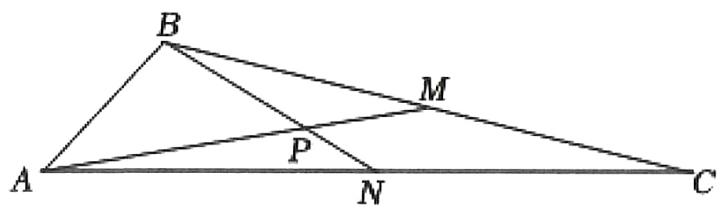

# 题型三：分角定理相关

等级（R）

##### 007. 如图，在 $\triangle ABC$ 中，D 是边 BC 上一点，AB=AC，BD=1， $\sin \angle CAD = 3\sin \angle BAD$ .

（1） 求 DC 的长;  
（2）若 $\mathrm{AD} = 2$ ，求 $\Delta ABC$ 的面积。

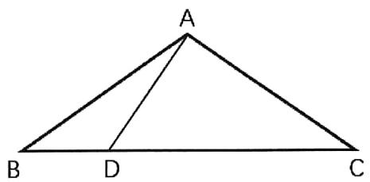

等级（SR）

2021盐城三模

##### 008. 在 $\Delta ABC$ 中，角 $A, B, C$ 的对边分别为 $a, b, c$ ，点 $D$ 满足 $3\overrightarrow{BD} = \overrightarrow{BC}$ 与 $\overrightarrow{AD} \cdot \overrightarrow{AC} = 0$ .

（1） 若 $b = c$ ，求 $A$ 的值  
（2） 求 $B$ 的最大值

等级（SR）

2022 九师联盟三月联考

##### 009. 在 $\triangle ABC$ 中，已知 D 是边 BC 上一点，且

$B C = 3, B D = 1, \angle B A C = 3 \angle B A D, \sin \angle B A D = \frac {\sqrt {6}}{3}$

（1） 求 $\frac{AB}{AC}$ 的值  
（2） 求 AC 的长

等级（SR）

2024 福建质检

##### 010.在 $\Delta ABC$ 中， $D$ 为 $BC$ 的中点，且 $\angle DAC + \angle BAC = \pi .$

（1） 求 $\frac{AB}{AD}$ ;   
（2） 若 $BC = 2\sqrt{2}AC$ ，求 $\cos C$

# 题型四：已知角被拆的解三角形问题（倍长中线）

等级（R）

2024 梅州二模

##### 011. 在 $\Delta ABC$ 中，角 A, B, C 所对的边分别为 $a, b, c$ ， $\sqrt{3} a \cos B - b \sin A = \sqrt{3} c, c = 2,$

（1） 求角 A 的大小;  
（2） 点 D 在 BC 上,

(i) 当 $AD \perp AB$ ，且 $AD = 1$ 时，求 $AC$ 的长；  
（ii）当 $BD = 2DC$ ，且 $AD = 1$ 时，求 $\Delta ABC$ 的面积 $\mathbf{S}_{\Delta ABC}$

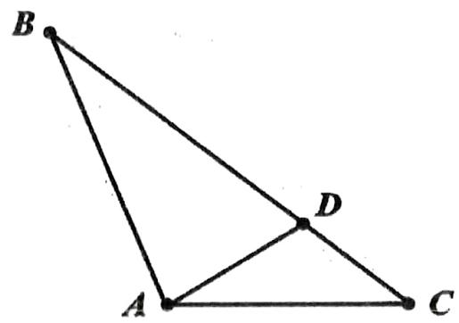

等级（R）

2021 茂名一模

##### 012. 在 $\Delta ABC$ 中, $a$ , $b$ , $c$ 分别是内角 $A$ , $B$ , $C$ 的对边, 其中 $A = \frac{\pi}{3}$ , $b + c = 4$ , $M$ 为线段 $BC$ 的中点, 则 $|AM|$ 的最小值为 \_\_\_\_.

等级（SR）

##### 013. 在 $\Delta ABC$ 中, 内角 $A, B, C$ 的对边分别为 $a, b, c$ , $A = 60^0$ , 已知 $D$ 为 $BC$ 边上一点 $CD = 2DB$ ,

若 $AD = \frac{\sqrt{21}}{3} b$

（I）求 $\frac{\sin B}{\sin C}$ 的值；  
（II）若 $\triangle ABC$ 的面积为 $2\sqrt{3}$ ，求 $a$ 的值.

等级（SR）

##### 014. $\Delta ABC$ 的内角 $A, B, C$ 所对的边分别为 $a, b, c$ ，已知 $\cos 2A + \cos 2B + 2\sin A\sin B = 1 + \cos 2C$ .

（1） 求角C   
（2）设D为边AB的中点， $\Delta ABC$ 的面积为2，求 $CD^{2}$ 的最小值.

# 题型五：角分线长度和邻两边长度的关系

等级（R）

2021福州一模

##### 015. 在 $\Delta ABC$ 中，内角 $A, B, C$ 所对的边分别为 $a, b, c, a + b = c\cos B - b\cos C$ .

（1） 求角C的大小;   
（2）设 $CD$ 是 $\Delta ABC$ 的角平分线，求证 $\frac{1}{CA} +\frac{1}{CB} = \frac{1}{CD}$

等级（R）

2024南昌一模

##### 016.如图，两块直角三角形模具，斜边靠在一起，其中公共斜边 $AC = 10, \angle BAC = \frac{\pi}{3}$

$\angle DAC = \frac{\pi}{4}, BD$ 交 $AC$ 于点E

（1） 求 $\mathbf{BD}^2$   
（2） 求 AE

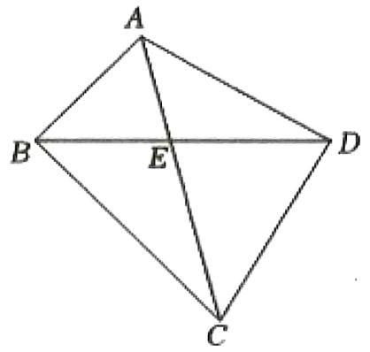

等级（SR）

2022 蚌埠三检

##### 017. 在 $\triangle ABC$ 中，内角 A, B, C 的对边分别为 $a, b, c, A = 120^{\circ}$ ，点 D 在边 BC 上，满足 $CD = 2BD$ 且

$\frac {\sin \angle B A D}{b} + \frac {\sin \angle C A D}{c} = \frac {3 \sqrt {3}}{2 a}$

（1） 求证: $AD=\frac{1}{3}a$ ;

（2） 求角 C

# 题型六：含正切的解三角形大题

等级（R）

2023 新高考一卷数学

##### 018. 已知在 $\triangle ABC$ 中， $A + B = 3C, 2\sin (A - C) = \sin B$ 。

（1） 求 $\sin A$ ;   
（2） 设 AB = 5，求 AB 边上的高.

等级（SR）

##### 019. 在三角 ABC 中，内角 A, B, C 的对边分别为 a, b, c，已知 $b + 2c \cos A = 0$ .

（1）若 $b = c = 1$ ，求a和 $S_{\Delta ABC}$   
（2） 求 $\cos B$ 的最小值.

等级（SR）

2004全国卷

##### 020. 已知锐角三角形 $ABC$ 中， $\sin(A + B) = \frac{3}{5}, \sin(A - B) = \frac{1}{5}$

（1） 求证 $\tan A = 2 \tan B$   
（2）设 $AB = 3$ ，求AB边上的高

等级（SR）

2023 安徽 A10 四月联考

##### 021. 在 $\triangle ABC$ 中， $\sin^2 A + 3\sin^2 C = 3\sin^2 B$ .

（1） 若 $\sin B\cos C = \frac{2}{3}$ , 判断 $\triangle ABC$ 的形状;  
（2） 求 $\tan (B - C)$ 的最大值.

# 题型七：两三角形共底边模型

等级（R）

2023南通三月联考

##### 022. 如图，在平面四边形 $ABCD$ 中， $AB = 1, AD = \sqrt{3}, CD = 2, BC = \sqrt{2}$ .

（1） 若 $BC \perp CD$ ，求 $\sin \angle ADC$ ；  
（2） 记 $\triangle ABD$ 与 $\triangle BCD$ 的面积分别记为 $S_{1}$ 和 $S_{2}$ ，求 $S_{1}^{2} + S_{2}^{2}$ 的最大值.

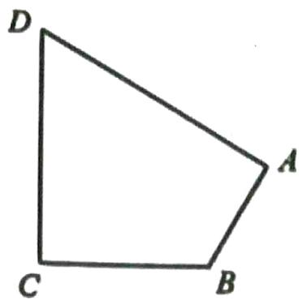

等级（SR）

2023 湖南湘考王三月联考

##### 023. 如图，在平面四边形 $ABCD$ 中， $AB = 2, BC = 6, AD = CD = 4$ .

（1） 当四边形 $ABCD$ 内接于圆 $O$ 时，求角 $C$ ；  
（2） 当四边形 $ABCD$ 的面积最大时, 求对角线 $BD$ 的长.

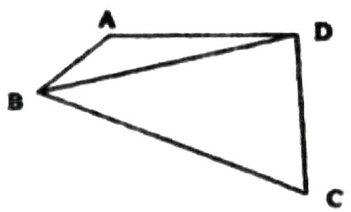

# 题型八：两类解三角形题目

# 模型一：两边已知，两角呈二倍关系，解三角形

等级（R）

##### 024. 如图，平面四边形ABCD，点B,C,D均在半径为 $\frac{5\sqrt{3}}{3}$ 的圆上，且 $\angle BCD = \frac{\pi}{3}$ ，

（1） 求 BD 的长度;  
（2）若 AD=3， $\angle ADB=2\angle ABD$ ，求 $\triangle ABD$ 的面积

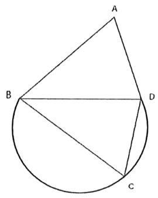

# 模型二：知一边及对角及另两边比值，解三角形

等级（SR）

2021 唐山二模

##### 025. 在 $\triangle ABC$ 中，角 $A, B, C$ 的对边分别为 $a, b, c$ ， $C = \frac{\pi}{3}$ ， $AB$ 边上的高为 $\sqrt{3}$ .

(I) 若 $S_{\triangle ABC} = 2\sqrt{3}$ ，求 $\triangle ABC$ 的周长；  
(II) 求 $\frac{2}{a} + \frac{1}{b}$ 的最大值

# 题型九：高倍角的处理方式

等级（SR）

2024广州三模冲刺一

##### 026.在 $\Delta ABC$ 中， $D$ 是 $BC$ 边上一点， $BD = 3CD$ ，若 $\angle BAD = 2\angle DAC = 2\angle ABD$ ，且 $\Delta ACD$ 的面积为 $\frac{\sqrt{3}}{2}$ ，则 $AD = \_$ .

等级（SR）

2021 唐山一模

##### 027. 在 $\triangle ABC$ 中，角 $A, B, C$ 的对边分别为 $a, b, c$ ，且 $C = 2B$ .

（1）若 $a = 2$ ， $B = 15$ ，求 $\triangle ABC$ 的面积；  
（2）若 $a + b = \sqrt{2} c$ ，证明： $\triangle ABC$ 为等腰直角三角形。

# 题型十：辅助角公式的深入理解

等级（SR）

2021 金华十校联考

##### 028. 在 $\Delta ABC$ 中, 角 $A, B, C$ 所对的边分别为 $a, b, c$ , 已知 $A = 60^{\circ}$ , $c = kb (k \in R$ 为系数)

（1）. 若 $k = 3$ , 求 $\sin B$ ;   
（2）. 求 $\sin B + 2\sin C$ 取到最大值时， $k$ 的取值.

# 题型十一：向量法证明正弦定理余弦定理

等级（SR）

2024 乌鲁木齐三模

##### 029. 直线 $l$ 与锐角 $\Delta ABC$ 的边 $AB$ 夹角为 $\theta, l$ 的方向向量为 $i$ ，设 $AB = c$ ， $BC = a$ ， $CA = b$ .

（I）计算 $i\cdot (\overrightarrow{AB} +\overrightarrow{BC} +\overrightarrow{CA})$ ，并由此证明 $c\cos \theta = b\cos (A + \theta) + a\cos (B - \theta)$

（II）根据（I）证明 $\frac{a}{\sin A} = \frac{b}{\sin B}, c^2 = a^2 + b^2 - 2ab\cos C.$

# 数列选填

# 题型一：构造新数列

等级（R）

2023广州一模

##### 001. 已知 $n \in N^{*}$ ，将数列 $\{2n-1\}$ 与数列 $\{n^{2}-1\}$ 的公共项从小到大排列得到新数列 $\{a_{n}\}$ ，则 $\frac{1}{a_{1}} + \frac{1}{a_{2}} + \ldots + \frac{1}{a_{10}} =$ \_\_\_\_ .

等级（R）

2024漳州三月质检

##### 002.将数列 $\{3n - 1\}$ 与 $\{2^n\}$ 的公共项从小到大排列得到数列 $\{a_n\}$ , 则 $a_{20} = (\quad)$

$\quad$A. $2^{37}$

$\quad$B. $2^{38}$

$\quad$C. $2^{39}$

$\quad$D. $2^{40}$

等级（SR）

2023南昌二模

##### 003. 已知数列 $\{a_{n}\}$ 的通项公式为 $a_{n} = 2^{n - 1}$ ，保持数列 $\{a_{n}\}$ 中各项顺序不变，对任意的 $k \in \mathbf{N}_{+}$ ，

在数列 $\{a_{n}\}$ 的 $a_{k}$ 与 $a_{k + 1}$ 项之间，都插入 $\mathrm{k}$ （ $k\in \mathbf{N}_{+}$ ）个相同的数 $(-1)^{k}k$

组成数列 $\{b_{n}\}$ ，记数列 $\{b_{n}\}$ 的前 n 项的和为 $T_{n}$ ，则 $T_{100} =$

$\quad$A. 4056

$\quad$B. 4096

$\quad$C. 8152

$\quad$D. 8192

# 题型二：摆动数列

等级（SR）

2021 海淀一模

##### 004. 设无穷等比数列 $\{a_{n}\}$ 的前 n 项和为 $S_{n}$ ，若 $-a_{1} < a_{2} < a_{1}$ ，则（）

$\quad$A. $\{S_{n}\}$ 为递减数列

$\quad$B. $\{S_n\}$ 为递增数列

$\quad$C. 数列 $\{S_{n}\}$ 有最大项

$\quad$D. 数列 $\{S_{n}\}$ 有最小项

等级（SR）

2024江西重点中学联盟第二次联考

##### 005.已知等差数列 $\{a_{n}\}$ 与等比数列 $\{b_n\}$ 的首项均为-1，且 $a_2 = 8b_4 = 1$ ，则数列 $\{a_nb_n\}$ （）

$\quad$A. 既有最大项又有最小项

$\quad$B. 只有最大项没有最小项

$\quad$C. 只有最小项没有最大项

$\quad$D. 没有最大项也没有最小项

# 题型三：隔项等比（等差）数列

等级（R）

##### 006. 已知数列 $\{a_{n}\}$ 的奇数项依次成等差数列，偶数次项依次成等比数列，且

$a _ {1} = 1, a _ {2} = 2, a _ {3} + a _ {4} = 7, a _ {5} + a _ {6} = 1 3, \text {则} a _ {7} + a _ {8} = (\quad)$

$\quad$A. $4 + \sqrt{2}$

$\quad$B. 19

$\quad$C. 20

$\quad$D. 23

等级（SR）

##### 007. 设数列 $\{a_{n}\}, a_{1} = 1, a_{2} = 2, a_{n + 2} = 3a_{n}$ ，求 $\{a_{n}\}$ 的前 $n$ 项和 $S_{n}$

等级（SR）

##### 008. 数列 $\{a_{n}\}$ 的前 $n$ 项和为 $S_{n}$ ，若 $a_{1} = 1$ ， $a_{n} \neq 0$ ， $3S_{n} = a_{n}a_{n+1} + 1$ ，则 $a_{2019} = (\quad)$ 。

等级（SR）

##### 009. 已知单调数列 $\{a_{n}\}$ 的前 n 项和为 $S_{n}$ ，若 $S_{n} + S_{n+1} = n^{2} + n$ 则首项 $a_{1}$ 的取值范围是 \_\_\_\_.

# 题型四：双递推数列

等级（SR）

2024南昌三模

##### 010.已知数列 $\{a_{n}\}$ 的前 $n$ 项和为 $S_{n}$ ，且满足 $a_{1} = 1$ ， $S_{n} = \frac{a_{n + 1}^{2} - a_{n + 1}}{2}$ ，则 $S_{5}$ 的值不可能是（）

$\quad$A.1

$\quad$B.2

$\quad$C.3

$\quad$D.15

等级（SR）

2021 辽宁重点中学协作体

##### 011. 设数列 $\{a_{n}\}$ 的各项均为非零实数，记其前 $n$ 项和 $S_{n}$ ， $2S_{n} = a_{n}^{2} + a_{n}$ .

（1） 求 $a_{1}, a_{2}$ ;   
（2）是否存在一个无穷数列 $\{\mathbf{a}_{\mathbf{n}}\}$ ，满足 $a_{2021} = -2020$ 。若存在，请给出符合条件的数列 $\{\mathbf{a}_{\mathbf{n}}\}$ 的一个通项公式；若不存在，请说明理由。

# 题型五：写出满足某条件的数列

等级（R）

2021苏锡常镇二模

##### 012. 已知等差数列 $\{a_{n}\}$ 的首项为 $a$ ，公差为 $b$ ，（其中 $a, b \in \mathbb{N}_{+}$ ），且 $a_{2} < ab < a_{3}$ ，写出一个满足条件的数列 $\{a_{n}\}$ 的通项公式：\_\_\_\_

等级（R）

2022丹东二模

##### 013. 写出一个通项公式 $a_{n} =$ \_\_\_\_，使你写出的数列 $\{a_{n}\}$ 具有性质①②：

① $a_{m+n}+a_{m}a_{n}=0$

② $\{a_{n}\}$ 为递减数列.

等级（R）

2023大湾区二模

##### 014. 若数列 $\{a_{n}\}$ 满足 $a_{n+1} > a_{n}$ 且 $S_{n+1} < S_{n}$ ，其中 $S_{n}$ 为数列 $\{a_{n}\}$ 的前 n 项和，请写出一个满足上述条件的数列通项 $a_{n} =$ \_\_\_\_.

# 题型六：相邻两项和为等差或等比数列的数列求和问题

等级（R）

##### 015. 设数列 $\{a_{n}\}$ 的前 $n$ 项和为 $S_{n}$ ，且 $a_{1} = 2$ ， $a_{n} + a_{n+1} = 2^{n}(n \in N^{*})$ ，则 $S_{13} = (\quad)$

$\quad$A. $\frac{2^{13} - 4}{3}$

$\quad$B. $\frac{2^{13} + 2}{3}$

$\quad$C. $\frac{2^{14} - 4}{3}$

$\quad$D. $\frac{2^{14} + 2}{3}$ 等级（R）

2024 潍坊一模

##### 016.已知数列 $\{a_{n}\}$ 满足 $a_1 = 0, a_2 = 1$ .若数列 $\{a_{n} + a_{n+1}\}$ 是公比为2的等比数列，则 $a_{2024} = (\quad)$

$\quad$A. $\frac{2^{2023} + 1}{3}$

$\quad$B. $\frac{2^{2024} + 1}{3}$

$\quad$C. $2^{1012} - 1$

$\quad$D. $2^{1011} - 1$

# 题型七：数列与三角换元

等级（SR）

2023 鹰潭二模

##### 017. 已知等差数列 $\{a_{n}\}$ 满足 $a_{1}^{2} + a_{4}^{2} = 4$ ，则 $a_{2} + a_{3}$ 可能取的值是（）

$\quad$A.-2

$\quad$B.-3

$\quad$C. 4

$\quad$D. 6

等级（SR）

##### 018. 在等差数列 $\{a_{n}\}$ 中， $a_{1}^{2} + a_{2}^{2} = 1$ ，数列 $\{a_{n}\}$ 的前9项和 $S_{9}$ 的最大值为

等级（SR）

##### 019. 已知等差数列 $\{a_{n}\}$ 满足 $a_1^2 + a_5^2 = 8$ ，则 $a_1 + a_2$ 的最大值为（）

$\quad$A. 2

$\quad$B. 3

$\quad$C. 4

$\quad$D. 5

# 题型八：对称数列

等级（R）

2023锦州四月质量检测

##### 020.（多选）如果有限数列 $\{a_{n}\}$ 满足 $a_{i} = a_{n - i + 1}(i = 1,2,\dots,n)$ ，则称其为“对称数列”，设 $\{b_{n}\}$ 是项数为 $2k - 1 (k\in N^{*})$ 的“对称数列”，其中 $b_{k}, b_{k + 1}, \ldots, b_{2k - 1}$ 是首项为50，公差为-4的等差数列，则（）

$\quad$A. 若 $k = 10$ ，则 $b_{1} = 10$

$\quad$B. 若 $k = 10$ ，则 $\{b_n\}$ 所有项的和为 590

$\quad$C. 当 $k = 13$ 时， $\{b_n\}$ 所有项的和最大

$\quad$D. $\{b_{n}\}$ 所有项的和可能为0

# 题型九：需要分奇偶的数列

等级（SR）

2022 龙岩一检

##### 021.（多选）已知数列 $\{a_{n}\}$ 的前 $n$ 项和为 $S_{n}$ ， $a_{1} = 1$ ， $a_{n+1} = \begin{cases} a_{n} + (-2)^{n}, n \text{ 为奇数} \\ a_{n} + 2^{n+1}, n \text{ 为偶数} \end{cases}$ ，则下列选项正确的是（）

$\quad$A. 数列 $\{a_{n}\}$ 的奇数项构成的数列是等差数列

$\quad$B. 数列 $\{a_{n}\}$ 的偶数项构成的数列是等比数列

$\quad$C. $a_{13} = 8191$

$\quad$D. $S_{10} = 671$

# 题型十：欧拉函数

等级（SR）

2024南昌三模

##### 022. 欧拉函数 $\varphi(n)(n \in N^{*})$ 的函数值等于所有不超过正整数 $n$ ，且与 $n$ 互质的正整数的个数（公约数只有 1 的两个正整数称为互质整数），例如： $\varphi(3) = 2$ ， $\varphi(4) = 2$ ，则数列 $\left\{\frac{\varphi(2^n)}{\varphi(3^n)}\right\}$ 的前 $n$ 项和为 \_\_\_\_.

# 题型十一：数列递推式含正负交错项

等级（R）

2020年新课标1卷文科

##### 023. 数列 $\{a_{n}\}$ 满足 $a_{n+2} + (-1)^{n} a_{n} = 3n - 1$ ，前 16 项和为 540，则 $a_{1} = \underline{\hspace{2cm}}$ .

等级（R）

##### 024. 已知数列 $\{a_{n}\}$ 的前 $n$ 项和 $S_{n} = (-1)^{n} a_{n} - \frac{1}{2^{n}} (n \in N^{*})$ ，则 $a_{5} = (\quad)$

$\quad$A. $\frac{1}{64}$

$\quad$B. $-\frac{1}{64}$

$\quad$C. $\frac{1}{128}$

$\quad$D. $-\frac{1}{128}$

等级（SR）

##### 025. 已知数列 $\{a_{n}\}$ 满足: $a_{1} = 3 \cdot a_{n} = 2a_{n-1} - 3(-1)^{n} (n \geqslant 2)$ . 设 $\{a_{k_{t}}\}$ 是等差数列, 数列 $\{k_{t}\} (t \in \mathbb{N}^{*})$ 是各项均为正整数的递增数列, 若 $k_{1} = 1$ , 则 $k_{3} - k_{2} =$ \_\_\_\_.

# 题型十二：按一定规律排列的数字问题

等级（R）

##### 026. 删去正整数数列 1, 2, 3, …中的所有完全平方数，得到一个新数列，这个数列的第 2018 项是（）

$\quad$A. 2062

$\quad$B. 2063

$\quad$C. 2064

$\quad$D. 2065

等级（SR）

2024 枣庄二调

##### 027.(多选) 将数列 $\left\{a_{n}\right\}$ 中的所有项排成如下数阵:

$\begin{array}{l l l l l} a _ {1} & & & \\ a _ {2} & a _ {3} & a _ {4} & & \\ a _ {5} & a _ {6} & a _ {7} & a _ {8} & a _ {9} \\ \dots & & & \end{array}$

从第 2 行开始每一行比上一行多两项，且从左到右均构成以 2 为公比的等比数列；第 1 列数 $a_{1}, a_{2}, a_{5}, \ldots$ 成等差数列. 若 $a_{2} = 2, a_{10} = 8$ ，则（）

$\quad$A. $a_1 = -1$

$\quad$B. $\sum_{i=2}^{9} a_i = 168$

$\quad$C. $a_{2024}$ 位于第45行第88列

$\quad$D.2024 在数阵中出现两次

等级（SR）

##### 028. 数列 1, -2, 2, -3, 3, -3, 4, -4, 4, -4, 5, -5, 5, -5, 5, …的项正负交替，且项的绝对值为 1 个 1, 2 个 2, 3 个 3, …, n 个 n，则此数列的前 100 项和为（）

$\quad$A. 7

$\quad$B. 21

$\quad$C.-21

$\quad$D.-7

等级（SR）

2022 山西一模

##### 029. 已知数列 $\{a_{n}\}$ 的前 n 项和 $S_{n} = 2n^{2} + n$ ，将该数列排成一个数阵（如右图），其中第 n 行有 $2^{n-1}$ 个数，则该数阵第 9 行从左向右第 8 个数是（）

$\quad$A. 263

$\quad$B. 1052

$\quad$C. 528

$\quad$D. 1051

$a_{1}$

$a_{2}$

$a_{3}$

$a_4$

$a_{5}$

$a_{6}$

$a_{7}$

等级（SR）

##### 030. 已知数列 $\{a_{n}\}$ 的通项公式为 $a_{n} = 2n + 2$ ，将这个数列中的

项摆放成如图所示的数阵. 记 $b_{n}$ 为数阵从左至右的 $n$ 列，从上到

下的 $n$ 行共 $n^2$ 个数的和，则数列 $\{\frac{n}{b_n}\}$ 的前2020项和为（）

$a_{1}$ $a_{2}$ $a_{3}$ $\dots$ $a_{n}$

$a_{2}$ $a_{3}$ $a_{4}$ $\dots$ $a_{n + 1}$

$a_{3}$ $a_4$ $a_5$ $\dots$ $a_{n + 2}$

... ... ... ... ... ... ...

$a_{n}$ $a_{n + 1}$ $a_{n + 2}$ $\cdots$ $a_{2n - 1}$

$\quad$A. $\frac{1011}{2020}$

$\quad$B. $\frac{2019}{2020}$

$\quad$C. $\frac{2020}{2021}$

$\quad$D. $\frac{1010}{2021}$

等级（SR）

##### 031. 公元前四世纪，毕达哥拉斯学派对数和形的关系进行了研究，他们借助几何图形（或格点）来表示数，称为形数，形数是联系算数和几何的纽带。图为五角形数的前4个，则第10个五角形数为（）

$\quad$A. 120

$\quad$B. 145

$\quad$C. 270

$\quad$D. 285

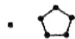

1 5

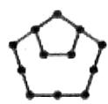

12

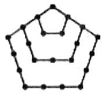

22

等级（SR）

2021广州一模

##### 032.（多选）在数学课堂上，教师引导学生构造新数列：在数列的每相邻两项之间插入此两项的和，形成新的数列，再把所得数列按照同样的方法不断构造出新的数列，将数列1，2进行构造，第1次得到数列1，3，2；第2次得到数列1，4，3，5，2；…；第 $n(n \in N^{*})$ 次得到数列1， $x_{1}$ ， $x_{2}$ ， $x_{3}$ ，…， $x_{k}$ ，2；…记 $a_{n}=1+x_{1}+x_{2}+x_{3}+\cdots+x_{k}+2$ ，数列 $\{a_{n}\}$ 的前n项为 $S_{n}$ ，则（）

$\quad$A. $k + 1 = 2^{n}$   
$\quad$B. $a_{n + 1} = 3a_{n} - 3$   
$\quad$C. $a_{n} = \frac{3}{2} (n^{2} + 3n)$   
D, $S_{n} = \frac{3}{4} (3^{n + 1} + 2n - 3)$

等级（SR）

##### 033. 计算机内部运算通常使用的是二进制，用 1 和 0 两个数字与电路通和断两种状态相对应，现有一个 2019 位的二进制数，其第一个数字为 1，第二个数字为 0，且在第 k 个 0 和第 $k+1$ 个 0 之间有 $2k+1$ 个 $1(k \in N^{*})$ ，即 $101110111110\cdots$ ，则该数的所有数字之和为（）

$\quad$A. 1973

$\quad$B. 1974

$\quad$C. 1975

$\quad$D. 1976

等级（SR）

##### 034. 将集合 $\left\{2^{x} + 2^{y} \mid 0 \leq x < y, x, y \in N\right\}$ 中的所有元素按照从小到大的顺序排列成一个数表，如图所示，则第61个数是（）

$\quad$A. 2019

$\quad$B. 2050

$\quad$C. 2064

$\quad$D. 2080

等级（SSR）

##### 035. 已知数列1,1,2,1,2,4,1,2,4,8,1,2,4,8,16…其中第一项是 $2^{0}$ ，接下来的两项是 $2^{0}$ ， $2^{1}$ ，再接下来的三项是 $2^{0}$ ， $2^{1}$ ， $2^{2}$ ，以此类推，若该数列前n项和N满足：①N>80，②N是2的整数次幂，则满足条件的最小的n为（）

$\quad$A.21

$\quad$B.91

$\quad$C.95

$\quad$D.10

第一行

第二行

第三行

第四行

第五行

第 $n$ 行

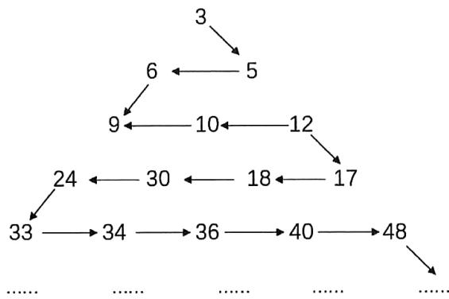

等级（SSR）

##### 036. 几位大学生响应国家的创业号召，开发了一款应用软件。为激发大家学习数学的兴趣，他们推出了“解数学题获取软件激活码”的活动。这款软件的激活码为下面数学问题的答案：已知数列 1, 1, 2, 1, 2, 4, 1, 2, 4, 8, 1, 2, 4, 8, 16, …，其中第一项是 $2^{0}$ ，接下来的两项是 $2^{0}, 2^{1}$ ，再接下来的三项是 $2^{0}, 2^{1}, 2^{2}$ ，依此类推。求满足如下条件的最小整数 N, N>100 且该数列的前 N 项和为 2 的整数幂。那么该款软件的激活码是（）

$\quad$A. 440

$\quad$B. 330

$\quad$C. 220

$\quad$D. 110

# 题型十三：特征根

等级（SR）

##### 037. 已知数列 $\{a_{n}\}$ 满足 $a_{1} = 1, a_{2} = \frac{1}{3}$ ，若 $a_{n}a_{n-1} + 2a_{n}a_{n+1} = 3a_{n-1}a_{n+1}(n \geq 2, n \in N^{*})$ ，则数列 $\{a_{n}\}$ 的通项 $a_{n} =$ \_\_\_\_

等级（SR）

##### 038. $p_0 = 0, p_8 = 1$ ， $p_i = 0.4p_{i - 1} + 0.5p_i + 0.1p_{i + 1}$ ，求 $p_4$

等级（SSR）

2023苏锡常镇一模

##### 039. 已知数列 $\{a_{n}\}$ 的前 $n$ 项和为 $S_{n}$ ， $a_{1} = 1$ ，若对任意正整数 $n$ ， $S_{n+1} = -3a_{n+1} + a_{n} + 3$ ， $S_{n} + a_{n} \succ (-1)^{n}a$ ，则实数 $a$ 的取值范围是

$\quad$A. $(-1, \frac{3}{2})$

$\quad$B. $(-1,\frac{5}{2})$

$\quad$C. $(-2, \frac{5}{2})$

$\quad$D. $(-2,3)$

# 题型十四：汉诺塔问题

等级（SR）

##### 040. 如图所示, 在著名的汉诺塔问题中, 有三根高度相同的柱子和一些大小及颜色各不相同的圆盘, 三根柱子分别为起始柱、辅助柱及目标柱。已知起始柱上套有 $n$ 个圆盘, 较大的圆盘都在较小的圆

盘下面. 现把圆盘从起始柱全部移到目标柱上, 规则如下: 每次只能移动一个圆盘, 且每次移动后, 每根柱上较大的圆盘不能放在较小的圆盘上面, 规定一个圆盘从任一根柱上移动到另一根柱上为一次移动, 若将 $n$ 个圆盘从起始柱移到目标柱上最少需要移动的次数记为 $p(n)$ , 则 $p(4) = (\quad)$

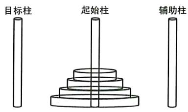

$\quad$A. 33

$\quad$B. 31

$\quad$C. 17

$\quad$D. 15

# 题型十五：取整问题

等级（R）

##### 041. 如果 $x = [x] + \{x\}, [x] \in Z, 0 \leq \{x\}$ ，就称 $[x]$ 表示 $x$ 的整数部分， $\{x\}$ 表示 $x$ 的小数部分，已知数列 $\{a_n\}$ 满足 $a_1 = \sqrt{5}$ ， $a_{n+1} = [a_n] + \frac{2}{\{a_n\}}$ ，则 $a_{2019} - a_{2018}$ 等于（）

$\quad$A. $2019 - \sqrt{5}$

$\quad$B. $2018 + \sqrt{5}$

$\quad$C. $6 + \sqrt{5}$

$\quad$D. $6 - \sqrt{5}$

等级（SR）

##### 042. 已知对 $\forall n \in \mathbf{N}^*$ ，关于 $x$ 的函数 $f_n(x) = x + (1 - a_n)\ln x (n < x < n + 1)$ 都不单调，其中 $a_n(n = 1, 2, \cdots, k, \cdots)$ 为常数定义 $[x]$ 为不超过实数 $x$ 的最大整数，如 $[0.8] = 0$ ， $[x] = 3$ 设 $b_n = \left[\sqrt[3]{a_n}\right]$ ，记数列 $\{b_n\}$ 的前 $n$ 项和为 $S_n$ ，则 $S_{100}$ 的值为（）

(A) 310

(B) 309

(C) 308

(D) 307

等级（SR）

##### 043. 设 $[\mathbf{x}]$ 为不超过 $\mathbf{x}$ 的最大整数， $a_{n}$ 为 $[x[x]]$ ( $x \in [0, n)$ ) 可能取到所有值的个数， $S_{n}$ 是数列 $\{\frac{1}{a_{n} + 2n}\}$ 前 $n$ 项的和，则下列结论正确个数的有（）

（1） $a_{3} = 4$   
（2） 190 是数列 $\left\{a_{n}\right\}$ 中的项。  
（3） $\mathbf{S}_{10} = \frac{5}{6}$   
（4）当 $n = 7$ 时， $\frac{a_n + 21}{n}$ 取最小值

$\quad$A. 1 个

$\quad$B. 2 个

$\quad$C. 3 个

$\quad$D. 4 个

# 题型十六：斐波那契数列

等级（R）

2024 新高考一卷

##### 044. 已知函数为 $f(x)$ 的定义域为R， $f(x) > f(x - 1) + f(x - 2)$ ，且当 $x < 3$ 时 $f(x) = x$ 则下列结论中一定正确的是（）

$\quad$A. $f(10) > 100$

$\quad$B. $f(20) > 1000$

$\quad$C. $f(10) < 1000$

$\quad$D. $f(20) < 10000$

等级（R）

2021新疆第一次适应性检测

##### 045. 形如 1, 1, 2, 3, 5... 的数列叫斐波那契数列，其特点是从第三项开始，每一项都等于前面两项的和，如果把数列第一项换成正整数 a，第二项换成正整数 b，第三项开始仿照斐波那契数列的规则，可以得到一个新的数列，如果新的数列中某一项出现了 100，则 $a + b$ 的最小值为（）

$\quad$A. 6

$\quad$B. 8

$\quad$C. 10

$\quad$D. 12

等级（SR）

##### 046. 著名的斐波那契数列 $\{a_{n}\}:1,1,2,3,5,8\cdots\cdots$ ，满足 $a_{1}=a_{2}=1, a_{n+2}=a_{n+1}+a_{n}, n\in N^{*}$ ，若 $a_{k}=\sum_{n=1}^{2020}a_{2n-1}$ ，则 $k=(\quad)$

$\quad$A. 2020

$\quad$B. 4038

$\quad$C. 4039

$\quad$D. 4040

等级（SR）

2021 枣庄二调

##### 047.（多选）列昂纳多·斐波那契（Leonardo Fibonacci，1170-1250年）是意大利数学家，1202年斐波拉契在其代表作《算盘书》中提出了著名的“兔子问题”，于是得斐波那契数列，斐波那契数列可以如下递推的方式定义：用 $F(n)(n \in N^{*})$ 表示斐波那契数列的第 $n$ 项，则数列 $\{F(n)\}$ 满足： $F(1) = F(2) = 1$ ， $F(n+2) = F(n+1) + F(n)$ .斐波那契数列在生活中有着广泛的应用，美国13岁男孩Aidan Dwyer观察到树枝分叉的分布模式类似斐波那契数列，因此猜想可按期排列太阳能电池。找到了能够大幅改良太阳能科技的方法.苹果公司的logo设计，电影《达芬奇密码》等，均有斐波那契数列的影子.下列选项正确的是（）

$\quad$A. $\left[\mathrm{F}（8）\right]^2 = \mathrm{F}（7）\mathrm{F}（9） + 1$   
$\quad$B. F （1） + F （2） +... + F （6） + 1 = F （8）   
$\quad$C. F （2） + F （4） + ... + F (2n) = F (2n+1) - 2   
$\quad$D. $[F(1)]^2 + [F(2)]^2 + \ldots + [F(n)]^2 = F(n) \cdot F(n+1)$

等级（SR）

##### 048. 数列 $\{F_n\}$ : 1, 1, 2, 3, 5, 8, 13, 21, 34, .. 称为斐波那契数列, 是由十三世纪意大利数学家列昂纳多斐波那契以兔子繁殖为例子而引入, 故又称“兔子数列”, 该数列从第三项开始, 每项等于其前相邻两项之和, 记该数列 $\{F_n\}$ 的前 n 项和为 Sn, 则下列结论正确的是 ( )

$\quad$A. $S_{2019} = F_{2021} - 1$

$\quad$B. $S_{2019} = F_{2021} + 2$

$\quad$C. $S_{2019} = F_{2020} - 1$

$\quad$D. $S_{2019} = F_{2020} + 2$

等级（SR）

##### 049. 意大利数学家斐波那契以兔子繁殖数量为例，引入数列：1，1，2，3，5，8……，该数列从第三项起，每一项都等于前两项之和，即 $a_{n+2} = a_{n+1} + a_n (n \in N^*)$ ，故此数列成为斐波那契数列，又称“兔子数列”，其通项公式为 $a_n = \frac{1}{\sqrt{5}}[(\frac{1+\sqrt{5}}{2})^n - (\frac{1-\sqrt{5}}{2})^n]$ 设 n 是不等式 $\log_{\sqrt{2}}[(1+\sqrt{5})^x - (1-\sqrt{5})^x] > 2x + 11$ 的正整数解，则 n 的最小值为（）

$\quad$A. 10

$\quad$B. 9

$\quad$C. 8

$\quad$D. 7

# 题型十七：与三角函数相结合的数列问题

等级（SR）

##### 050. 记函数 $f(x) = \sin 2nx - \cos nx$ 在区间 $[0, \pi]$ 内的零点个数为 $a_{n}(n \in N_{+})$ ，则数列 $\{a_{n}\}$ 的前20项的和是（）

$\quad$A. 430

$\quad$B. 840

$\quad$C. 1250

$\quad$D. 1660

等级（SR）

##### 051. 已知 $f(x) = \tan x$ ，数列 $\{a_n\}$ 满足：对任意 $\mathbf{n} \in N^*$ ， $a_n \in \left(0, \frac{\pi}{2}\right)$ ，且 $a_1 = \frac{\pi}{3}$ ，

$f\left(a_{n + 1}\right) = \sqrt{f'\left(a_{n}\right)}$ ，则使得 $\sin a_1\cdot \sin a_2\dots \sin a_k <   \frac{1}{10}$ 成立的最小正整数k为

# 题型十八：新定义数列问题

等级（R）

##### 052. 在数列 $\{a_{n}\}$ 中，若 $a_{n}^{2} - a_{n - 1}^{2} = p\left(n\geqslant 2,n\in N^{*},p\text{为常数}\right)$ ，则 $\{a_{n}\}$ 称为“等方差数列”。下列对“等方差数列”的判断：

①若 $\{a_{n}\}$ 是等方差数列，则 $\{a_{n}^{2}\}$ 是等差数列；  
② $\left\{(-1)^n\right\}$ 是等方差数列；  
③若 $\{a_{n}\}$ 是等方差数列，则 $\{a_{kn}\} (k\in N^{*},k$ 为常数）也是等方差数列。

其中正确命题序号为\_\_\_\_（写出所有正确命题的序号）.

等级（SR）

##### 053. 已知函数 $f(x)$ ，设数列 $\{a_n\}$ 中不超过 $f(m)$ 的项数为 $b_m \left( m \in \mathbb{N}^* \right)$ . 给出下列三个结论：

① $a_{n} = n^{2}$ 且 $f(m) = m^2$ ，则 $b_{1} = 1, b_{2} = 2, b_{3} = 3$   
② $a_{n} = 2n$ 且 $f(m) = \mathrm{m},\left\{b_m\right\}$ 的前 $m$ 项和为 $S_{m}$ ，则 $S_{2018} = 1009^{2}$ ；  
③ $a_{n} = 2^{n}$ 且 $f(m) = Am^{3}(A \in N^{*})$ ，若数列 $\{b_{m}\}$ 中， $b_{1}, b_{2}, b_{5}$ 成公差为 $d(d \neq 0)$ 的等差数列，则 $b_{5} = b_{1} + 3$

则正确结论的序号\_\_\_\_。（请填上所有正确结论的序号）

# 题型十九：牛顿迭代法

等级（SR）

2021汉中二检

##### 054. 牛顿迭代法是牛顿在17世纪提出的一种在实数集上近似求解方程根的一种方法。具体步骤如下：设 $r$ 是函数 $y = f(x)$ 的一个零点，任意选取 $x_0$ 作为 $r$ 的初始近似值，过点 $\left(x_0, f(x_0)\right)$ 作曲线 $y = f(x)$ 的切线 $l_1$ ，设 $l_1$ 与 $x$ 轴交点的横坐标为 $x_1$ ，并称 $x_1$ 为 $r$ 的 1次近似值；过点 $\left(x_1, f(x_1)\right)$ 作曲线 $y = f(x)$ 的切线 $l_2$ ，设 $l_2$ 与 $x$ 轴交点的横坐标为 $x_2$ ，并称 $x_2$ 为 $r$ 的 2次近似值。一般的，过点 $\cdot \left(x_n, f(x_n)\right) (n \in N)$ 作曲线 $y = f(x)$ 的切线 $l_{n+1}$ ，记 $l_{n+1}$ 与 $x$ 轴交点的横坐标为 $x_{n+1}$ ，并称 $x_{n+1}$ 为 $r$ 的 $n + 1$ 次近似值。设 $f(x) = x^3 + x - 1 (x \geq 0)$ 的零点为 $r$ ，取 $x_0 = 0$ ，则 $r$ 的 2次近似值为 \_\_\_\_；设 $a_n = \frac{3x_n^3 + x_n}{2x_n^3 + 1}$ ，数列 $\{a_n\}$ 的前 $n$ 项积为 $T_n$ 。若任意 $n \in N$ ， $T_n \leq \lambda$ 恒成立，则整数 $\lambda$ 的最小值为 \_\_\_\_.

# 题型二十：特别的“错位相减”

等级（SR）

2022 厦门三检

##### 055. 已知数列 $\left\{\frac{n^2}{2n - 1}\right\}$ 与数列 $\left\{\frac{n^2}{2n + 1}\right\}$ 的前 $n$ 项和分别为 $S_{n}$ , $T_{n}$ , 则 $S_{5} - T_{5} =$ \_\_\_\_.

若 $S_{n}-T_{n}<\lambda(n+1)(n+16)$ 对于 $\forall n\in N^{*}$ 恒成立，则实数 $\lambda$ 的取值范围是\_\_\_\_.

# 数列大题

# 题型一：等差数列绝对值求和通法

等级（R）

##### 001. 等差数列 $\{a_{n}\}$ 满足 $S_{4} = S_{9}$ 且 $a_{1} = -12$ .

（1）求通项公式 $a_{n}$ ，前 $\pmb{n}$ 项和公式 $S_{n}$   
（2） 求数列 $\left\{\left|a_{n}\right|\right\}$ 的前 n 项和 $T_{n}$ .

等级（R）

##### 002. 在公差为 $d$ 的等差数列 $\{a_{n}\}$ 中，已知 $a_1 = 10$ ，且 $a_1, 2a_2 + 2,5a_3$ 成等比数列.

（1） 求 $d, a_{n}$ ;   
（2）若 $d < 0$ ，求 $\left|a_1\right| + \left|a_2\right| + \left|a_3\right| + \ldots +\left|a_n\right|$

等级（R）

##### 003. 已知数列 $\{a_{n}\}$ 的前 $n$ 项和为 $S_{n}$ ，且满足 $S_{n} = 2a_{n} - 1 (n \in N^{*})$

（1）求数列 $\{a_{n}\}$ 的通项公式 $a_{n}$ 及 $S_{n}$   
（2）若数列 $\{b_n\}$ 满足 $b_{n} = |S_{n} - 15|$ ，求数列 $\{b_n\}$ 的前 $n$ 项的和为 $T_{n}$

等级（SR）

2022抚顺一模

##### 004. 已知等差数列 $\{a_{n}\}$ 的前 $n$ 项和为 $S_{n}$ ，又对任意的正整数 $m, n$ ，都有 $\frac{a_{n} - a_{m}}{n - m} = -2$ ，且 $S_{5} = 30$

（1）求数列 $\{a_{n}\}$ 的通项公式；  
（2）设 $b_{n} = 2^{\left|\frac{a_{n}}{2}\right|}$ ，求数列 $\{b_n\}$ 的前n项和 $T_{n}$

# 题型二：正负交错数列

等级（R）

##### 005. 已知等差数列 $\{a_{n}\}, a_{2} = 5$ ，前4项和 $S_{4} = 28$ .

（1） 求数列 $\left\{a_{n}\right\}$ 的通项公式;  
（2） 若 $b_{n}=(-1)^{n}a_{n}$ ，求数列 $\left\{b_{n}\right\}$ 的前 2n 项和 $T_{2n}$ .

等级（R）

##### 006. 已知等差数列 $\{a_{n}\}$ 的前 $n$ 项和为 $S_{n}$ ，且满足 $S_{4} = 24, S_{7} = 63$

（1）求数列 $\{a_{n}\}$ 的通项公式  
（2）若 $b_{n} = 2^{a_{n}} + (-1)^{n}a_{n}$ ，求 $\{b_n\}$ 的前 $n$ 项和 $T_{n}$

等级（R）

##### 007. 已知等比数列 $\{a_{n}\}$ 中， $a_{n} > 0, a_{1} = \frac{1}{64}, \frac{1}{a_{n}} - \frac{1}{a_{n+1}} = \frac{2}{a_{n+2}}, n \in \mathbf{N}^{*}$ .

（I）求 $\{a_{n}\}$ 的通项公式；  
（II）设 $b_{n} = (-1)^{n}\cdot \left(\log_{2}a_{n}\right)^{2}$ ，求数列 $\{b_n\}$ 的前 $2n$ 项和 $T_{2n}$

等级（R）

##### 008. 已知数列 $\{a_{n}\}$ 的各项均为正数，其前 n 项和 $S_{n}$ 满足 $4S_{n} = a_{n}^{2} + 2a_{n}, (n \in N^{*})$ ，设 $b_{n} = (-1)^{n} \cdot a_{n}a_{n+1}, T_{n}$ 为数列 $\{b_{n}\}$ 的前 n 项和，则 $T_{20} = (\quad)$

$\quad$A. 110

$\quad$B. 220

$\quad$C. 440

$\quad$D. 880

等级（R）

2022 唐山一模

##### 009. 已知数列 $\{a_{n}\}$ 的各项均不为零， $S_{n}$ 为其前 $n$ 项和，且 $a_{n}a_{n + 1} = 2S_{n} - 1$

（1）证明： $a_{n + 2} - a_n = 2;$   
（2）若 $a_1 = -1$ ，数列 $\{b_n\}$ 为等比数列， $b_{1} = a_{1},b_{2} = a_{3}$ ，求数列 $\{a_n b_n\}$ 的前2022项和 $T_{2022}$

等级（SR）

2022惠州一模

##### 010. 已知数列 $\{a_{n}\}$ , $\{b_{n}\}$ 满足 $b_{n} = a_{n} - (-1)^{n} n^{2} (n \in N^{*})$ , $a_{1} + b_{1} = 1$ , $a_{2} + b_{2} = 8$ , 且数列 $\{b_{n}\}$ 是等差数列。

（1） 求数列 $\{a_{n}\}$ 的通项公式;  
（2）设数列 $\{a_{n}\}$ 的前 $\mathbf{n}$ 项和为 $S_{n}$ ，若 $\mathrm{A} = \{n|S_n\leq 110$ ， $n\leq 110$ ， $n\in N^{*}\}$ ，求集合A中所有元素的和T.

等级（SR）

##### 011. 已知函数 $\{a_{n}\}$ 的前 $n$ 项和为 $S_{n}$ ， $a_{1} = 1$ ，且满足 $S_{n+1} = S_{n} + a_{n} + 2n + 1 (n \in N_{+})$

（1）求 $\{a_{n}\}$ 的通项公式  
（2）若 $b_{n} = \sin \left(\frac{n\pi}{2}\right)\cdot a_{n}$ ，求数列 $\{b_n\}$ 的前100项和 $T_{100}$

# 题型三：构造新数列

等级（R）

##### 012. 已知等差数列 $\left\{a_{n}\right\}$ 满足 $\left(a_{1}+a_{2}\right)+\left(a_{2}+a_{3}\right)+\cdots+\left(a_{n}+a_{n+1}\right)=2n(n+1)\left(n\in N^{*}\right)$

（1）求数列 $\{a_{n}\}$ 的通项公式；

（2） 数列 $\{b_n\}$ 中， $b_1 = 1, b_2 = 2$ ，从数列 $\{a_n\}$ 中取出第 $b_n$ 项记为 $c_n$ ，若 $\{c_n\}$ 是等比数列，求 $\{b_n\}$ 的前 $n$ 项和 $T_n$

等级（R）

2021 茂名一模

##### 013. 已知等差数列 $\{a_{n}\}$ 的前 n 项和为 $S_{n}$ 且 $S_{4} = S_{5} = -20$ .

（1） 求数列 $\{a_{n}\}$ 的通项公式;  
（2） 已知 $\{b_n\}$ 是以 4 为首项，4 为公比的等比数列，若数列 $\{a_n\}$ 与 $\{b_n\}$ 的公共项为 $a_m$ ，记 m 从小到大构成数列 $\{c_n\}$ ，求 $\{c_n\}$ 的前 n 项和 $T_n$ .

等级（R）

2022烟台一模

##### 014. 已知等差数列 $\{a_{n}\}$ 的前 $n$ 项和为 $S_{n}$ ， $a_{4} = 9, S_{3} = 15$

（1） 求 $\{a_{n}\}$ 的通项公式;  
（2）保持数列 $\{a_{n}\}$ 中各项先后顺序不变，在 $a_{k}$ 和 $a_{k + 1}(k = 1,2,\ldots)$ 之间插入 $2^{k}$ 个1，使它们和原数列的项构成一个新的数列 $\{b_n\}$ ，记 $\{b_{n}\}$ 的前 $n$ 项和为 $T_{n}$ ，求 $T_{100}$ 的值

等级（SR）

2024 浙江金丽衢十二校第一次联考

##### 015. 已知数列 $\left\{a_{n}\right\}$ 满足 $\frac{a_{1}}{2} + \frac{a_{2}}{2^{2}} + \cdots + \frac{a_{n}}{2^{n}} = 3 - \frac{2n + 3}{2^{n}} (n \in \mathbb{N}^{*})$ ，记数列 $\left\{a_{n}\right\}$ 的前 n 项和为 $S_{n}$ .

（1）求 $S_{n}$

（2）已知 $k_{n} \in N^{*}$ 且 $k_{1} = 1, k_{2} = 2$ , 若数列 $\left\{a_{k_n}\right\}$ 是等比数列, 记 $\left\{k_{n}\right\}$ 的前 $n$ 项和为 $T_{n}$ , 求使得 $S_{n} \geq T_{n}$ 成立的 $n$ 的取值范围.

等级（SR）

2021青岛二模

##### 016. 已知等差数列 $\{a_{n}\}$ 满足 $a_{3} - a_{1} = 8$ ，且 $a_{2} - 1$ 是 $a_{1}$ 和 $a_{3} + 1$ 的等比中项，数列 $\{b_{n}\}$ 的前 n 项和为 $S_{n}$ ，且满足 $b_{1} = 3$ ， $2S_{n} = b_{n+1} - 3$ .

（1）求数列 $\{a_{n}\}$ 和 $\{b_{n}\}$ 的通项公式；  
（2）将数列 $\{a_{n}\}$ 和 $\{b_{n}\}$ 中的公共项按从小到大的顺序依次排成一个新的数列 $\{c_{k}\}$ ， $\mathbf{k} \in \mathbb{N}^{*}$ ，令 $d_{k} = \log_{3} c_{k}$ ，求数列 $\{\frac{1}{d_{k} d_{k+1}}\}$ 的前 $\mathbf{k}$ 项和 $T_{k}$ .

等级（SR）

##### 017. 已知等差数列 $\{a_{n}\}$ 中, $a_{1} = 1$ 且 $a_{1}, a_{2}, a_{7} - 4$ 成等比数列, 数列 $\{b_{n}\}$ 的前 $n$ 项和为 $S_{n}$ 满足 $3b_{n} - 2S_{n} = 1$

（1）求数列 $\{a_{n}\}$ 和数列 $\{b_{n}\}$ 的通项公式；

（2） 将数列 $\{a_{n}\}$ ， $\{b_{n}\}$ 的公共项 $a_{k_{1}}, a_{k_{2}}, \cdots, a_{k_{n}}$ 按原来的顺序组成新的数列，试求数列 $\{k_{n}\}$ 的通项公式，并求该数列前 n 项和 $T_{n}$

# 题型四：（类）周期数列

等级（SR）

2021 石家庄一模

##### 018. 已知数列 $\{an\}$ 的通项公式为 $a_{n} = n \cdot \sin \frac{n\pi}{3}$ ，则 $a_{1} + a_{2} + a_{3} + \cdots + a_{2021} = (\quad)$

$\quad$A. $-1011\sqrt{3}$

$\quad$B. $\frac{5}{2}\sqrt{3}$

$\quad$C. $-\frac{5}{2}\sqrt{3}$

$\quad$D. $1011\sqrt{3}$

等级（SR）

2022 重庆三诊

##### 019. 已知数列 $\{a_{n}\}$ 的前 n 项和为 $S_{n}$ ， $a_{n+1} + (-1)^{n+1} a_{n} = \sin \frac{n\pi}{4} (n \in N^{*})$ ，则 $S_{2022} = ()$

$\quad$A. $-\frac{\sqrt{2}}{2}$

$\quad$B. 0

$\quad$C. $\frac{\sqrt{2}}{2}$

$\quad$D. $\sqrt{2}$

等级（SR）

##### 020. 已知函数 $f(x) = \frac{(\sin x + \cos x)^2 - 1}{\cos^2 x - \sin^2 x}$ ，方程 $f(x) = \sqrt{3}$ 在 $(0, +\infty)$ 上的解按从小到大的顺序排成数列 $\{a_n\} (n \in N^*)$

（1）求数列 $\{a_{n}\}$ 的通项公式  
（2）设 $b_{n} = \sin a_{n}$ ，求数列 $\{b_n\}$ 的前 $n$ 项和 $S_{n}$

等级（SR）

##### 021. 已知数列 $\{a_{n}\}$ 的公差不为 0 的等差数列，且 $a_{1}, a_{3}, a_{9}$ 成等比数列， $a_{2} + a_{4} = 6$ .

（1）求数列 $\{a_{n}\}$ 的通项 $a_{n}$ ;  
（2）设 $b_{n} = a_{n}\cos \frac{(2a_{n} + 1)\pi}{3}$ ，求数列 $\{b_n\}$ 的前2020项和 $S_{2020}$ .

# 题型五：摆动数列

等级（SR）

2022宁德三检

##### 022. 设数列 $\{a_{n}\}$ 的前 n 项和为 $S_{n}$ ， $a_{1} = 3$ ，数列 $\{S_{n} + 3\}$ 为等比数列，且 $S_{1}, S_{3}, S_{4} - 2S_{1}$ 成等差数列

（1）求数列 $\{S_{n}\}$ 的通项公式  
（2） 若 $N \leq \frac{(-1)^{n} \cdot S_{n}}{a_{n}} \leq M$ ，求 M - N 的最小值

等级（SR）

2024 南充二诊

##### 023.在数列 $\{a_{n}\}$ 中， $S_{n}$ 是其前 $n$ 项和，且 $3S_{n} - a_{n} = 64$

（1）求数列 $\{a_{n}\}$ 的通项公式；  
（2） 若 $\forall n \in N_{+}, \lambda - 1 < S_{n} \leq 4\lambda + 4$ 恒成立，求 $\lambda$ 的取值范围.

等级（SR）

2021宁波二模

##### 024. 设 $\mathrm{S}_{\mathfrak{n}}$ 为等差数列 $\left\{a_{n}\right\}$ 的前 $\mathfrak{n}$ 项和，其中 $a_1 = 1$ ，且 $\frac{S_n}{a_n} = \lambda a_{n + 1}(n\in \mathbf{N}^*)$

（1）. 求常数 $\lambda$ 的值，并写出 $\{a_{n}\}$ 的通项公式；  
（2）. 设 $\mathrm{T}_{\mathrm{n}}$ 为数列 $\left\{(-\frac{1}{2})^{a_n}\right\}$ 的前 $\mathbf{n}$ 项和，若对任意的 $n \in N^*$ ，都有 $|\mathrm{pT}_{\mathrm{n}} - 2| \leqslant 1$ ，求实数 $\mathfrak{p}$ 的取值范围.

等级（SR）

2024韶关二模

##### 025. 记 $R$ 上的可导函数 $f(x)$ 的导函数为 $f'(x)$ , 满足 $x_{n+1} = x_n - \frac{f(x_n)}{f'(x_n)} (n \in \mathbb{N}^*)$ 的数列 $\{x_n\}$ 称为函数 $f(x)$ 的“牛顿数列”. 已知数列 $\{x_n\}$ 为函数 $f(x) = x^2 - x$ 的牛顿数列, 且数列 $\{a_n\}$ 满足 $a_1 = 2, a_n = \ln \frac{x_n}{x_n - 1}, x_n > 1$ .

（1） 求 $a_{2}$ ;   
（2）证明数列 $\{a_{n}\}$ 是等比数列并求 $a_{n}$   
（3）设数列 $\{a_{n}\}$ 的前 $n$ 项和为 $S_{n}$ ，若不等式 $(-1)^{n} \cdot t S_{n} - 14 \leq S_{n}^{2}$ 对任意的 $n \in N^{*}$ 恒成立，求 $t$ 的取值范围

# 题型六：通过判断通项的正负判断 Sn 的单调性

等级（SR）

##### 026. 设数列 $\{a_{n}\}$ 满足 $a_1 \cdot \frac{a_2}{2} \cdot \frac{a_3}{3} \cdots \frac{a_n}{n} = 2^n (n \in N^*)$

（I）求数列 $\{a_{\mathrm{n}}\}$ 的通项公式  
（II）若数列 $\{\mathbf{b}_n\}$ 满足 $\mathbf{b}_1 = -1, b_4 = 0$ ，且数列 $\{a_n + b_n\}$ 是等比数列，求 $\{\mathbf{b}_n\}$ 的前n项和 $S_n$ 的最小值

等级（SR）

##### 027. 已知数列 $\left\{a_{n}\right\}$ 满足 $\frac{1}{n}\left(a_{1}+2a_{2}+\cdots+2^{n-1}a_{n}\right)=2^{n+1}\left(n\in N^{*}\right)$

（1）求 $a_1, a_2$ 和 $\{a_n\}$ 的通项公式；  
（2）记数列 $\{a_{n} - kn\}$ 的前 $n$ 项和为 $S_{n}$ ，若 $S_{n} \leq S_{4}$ 对任意的正整数 $n$ 恒成立，求实数 $k$ 的取值范围.

# 题型七：抽象数列

等级（R）

2021苏锡常镇一模   
##### 028. 已知等比数列 $\{\mathbf{a}_{\mathbf{n}}\}$ 的各项均为整数，公比为 $q$ ，且 $|q| > 1$ ，数列 $\{\mathbf{a}_{\mathbf{n}}\}$ 中有连续四项在集合 $M = \{-96, -24, 36, 48, 192\}$ 中.

（1）求 $q$ ，并写出数列 $\{a_{n}\}$ 的一个通项公式；

（2）设数列 $\{\mathbf{a}_{\mathbf{n}}\}$ 的前 $\mathbf{n}$ 项和为 $S_{n}$ ，证明：数列 $\{S_{n}\}$ 中的任意连续三项按适当顺序排列后，可以成等差数列。

等级（SR）

##### 029. 设等比数列 $\{a_{n}\}$ 的等比为 $q$ ，前 $n$ 项和 $S_{n} > 0 (n = 1, 2 \cdots)$

（1） 求 q 的取值范围  
（2）设 $b_{n} = a_{n + 2} - \frac{3}{2} a_{n + 1}$ ，记 $\{b_n\}$ 的前项和为 $T_{n}$ ，试比较 $S_{n}$ 和 $T_{n}$ 的大小

# 题型八：对称数列

等级（SR）

2022青岛二模

##### 030. 已知等比数列 $\{a_{n}\}$ 为递增数列， $a_{1} = 1, a_{1} + 2$ 是 $a_{2}$ 与 $a_{3}$ 的等差中项

（1）求数列 $\{a_{n}\}$ 的通项公式；

（2）若项数为 n 的数列 $\{b_{n}\}$ 满足： $b_{i}=b_{n+1-i}(i=1,2,3,\cdots,n)$ ，我们称其为 n 项的“对称数列”。例如：数列 1，2，2，1 为 4 项的“对称数列”；数列 1，2，3，2，1，为 5 项的“对称数列”。设数列 $\{c_{n}\}$ 为 $2k-1(k\geq2)$ 项的“对称数列”，其中 $c_{1},c_{2},c_{3},\cdots,c_{k}$ 是公差为 2 的等差数列，数列 $\{c_{n}\}$ 的最大项等于 $a_{4}$ 。记数列 $\{c_{n}\}$ 的前 2k-1 项和为 $S_{2k-1}$ ，若 $S_{2k-1}=32$ ，求 k

# 题型九：双错位相减

等级（SR）

2024 山西 T8 联考

##### 031. 已知数列 $\{a_{n}\}$ 的前 $n$ 项和为 $S_{n}$ ，且 $a_{n} = \frac{n^{2} + n}{3^{n}}$ .

（1）探究数列 $\{a_{n}\}$ 的单调性；  
（2）证明： $4S_{n}-9<0.$

# 题型十：前f（k）项和为g（k）的数列

等级（SSR）

2022 南京盐城二模

##### 032. 已知数列 $\{a_{n}\}$ ，当 $n \in [2^{k-1}, 2^{k})$ 时， $a_{n} = 2^{k}, k \in N^{*}$ 记数列 $\{a_{n}\}$ 的前 n 项和为 $S_{n}$

（1） 求 $a_{2}, a_{20}$ ;   
（2）求使得 $S_{n} < 2022$ 成立的正整数 $\mathbf{n}$ 的最大值；

等级（SSR）

2021 南京三模

##### 033. 已知等差数列 $\{a_{n}\}$ 满足 $a_{1} + 3, a_{3}, a_{4}$ 成等差数列，且 $a_{1}, a_{3}, a_{8}$ 成等比数列.

（1） 求数列 $\{a_{n}\}$ 的通项公式;  
（2） 在任意相邻两项 $a_{k}$ 与 $a_{k+1} (k=1,2,\cdots)$ 之间插入 $2^{k}$ 个 2，使它们和原数列的项构成一个新的数列 $\{b_{n}\}$ . 记 $S_{n}$ 为数列 $\{b_{n}\}$ 的前 n 项和，求满足 $S_{n}<500$ 的 n 的最大值.

# 题型十一：分析法在数列证明题中的应用

等级（SR）

##### 034. 设数列 $\left\{a_{n}\right\}$ 的首项 $a_{1}\in(0,1)$ , $a_{n}=\frac{3-a_{n-1}}{2}$ , $n=2,3,4,\cdots$ .

（I）求 $\{a_{n}\}$ 的通项公式；  
（II）设 $b_{n}=a_{n}\sqrt{3-2a_{n}}$ ，证明 $b_{n}<b_{n+1}$ ，其中n为正整数.

# 平面向量

# 题型一：斜坐标系下的向量

等级（R）

2024 临汾二模

##### 001.（多选）设 $Ox, Oy$ 是平面内相交成 $60^{\circ}$ 角的两条数轴， $e_1, e_2$ 分别是与 $\mathbf{x}$ 轴、 $\mathbf{y}$ 轴正方向同向的单位向量。若 $\overrightarrow{OP} = xe_1 + ye_2$ ，则把有序实数对 $(x, y)$ 叫做向量 $\overrightarrow{OP}$ 在斜坐标系 $Oxy$ 中的坐标，记作 $\overrightarrow{OP} = (x, y)$ 。则下列说法正确的是（ ）

$\quad$A. 若 $\overrightarrow{OP} = (2,1)$ , 则 $|\overrightarrow{OP}| = \sqrt{7}$   
$\quad$B. 若 $\overrightarrow{AB} = (2,1), \overrightarrow{BC} = (-1, -\frac{1}{2})$ ，则 A, B, C 三点共线  
$\quad$C. 若 $\overrightarrow{OP_1} = (3,2), \overrightarrow{OP_2} = (2,-3)$ , 则 $\overrightarrow{OP_1} \perp \overrightarrow{OP_2}$   
$\quad$D. 若 $\overrightarrow{OA} = (2,0), \overrightarrow{OB} = (0,3), \overrightarrow{OC} = (4,1)$ , 则四边形 OACB 的面积为 $\frac{7\sqrt{3}}{2}$

# 题型二：三向量线性关系的处理办法

等级（R）

2022苏锡常镇一模

##### 002. 平面内三个单位向量 a, b, c 满足 $a+2b+3c=0$ ，则（）

$\quad$A. a, b 方向相同

$\quad$B. a, c 方向相同

$\quad$C. b, c 方向相同

$\quad$D. a, b, c 两两互不共线

等级（R）

2023 稳派四月联考

##### 003. 已知向量 $a, b, c$ 满足 $|b| = 1, a + 2b = 4c, a \bullet c = 3, b \bullet c = 1$ ，则 $|a| =$

$\quad$A. $\sqrt{2}$

$\quad$B. 2

$\quad$C. $2 \sqrt{2}$

$\quad$D. 4

等级（SR）

2021江淮十校第三次联考

##### 004. 已知 $\Delta ABC$ 的外接圆半径为 1，圆心为 $O$ ，且 $\overrightarrow{OA} + \sqrt{3OB} + 2\overrightarrow{OC} = \vec{0}$ ，则 $\overrightarrow{OC} \cdot \overrightarrow{AB}$ 的值为（）

$\quad$A. $\frac{1 - \sqrt{3}}{2}$

$\quad$B. $\frac{\sqrt{3}-1}{2}$

$BC. - \frac{\sqrt{3} + 1}{2}$

B
$\quad$D. $\frac{\sqrt{3} + 1}{2}$ 等级（SR）

2024宁波二模

##### 005.（多选）若平面向量 $\vec{a}$ ， $\vec{b}$ ， $\vec{c}$ 满足 $|\vec{a}| = 1$ ， $|\vec{b}| = 1$ ， $|\vec{c}| = 3$ 且 $\vec{a} \cdot \vec{c} = \vec{b} \cdot \vec{c}$ ，则（）

$\quad$A. $|\vec{a} +\vec{b} +\vec{c} |$ 的最小值为2

$\quad$B. $|\vec{a} +\vec{b} +\vec{c} |$ 的最大值为5

$\quad$C. $|\vec{a} -\vec{b} +\vec{c} |$ 的最小值为2

$\quad$D. $|\vec{a} -\vec{b} +\vec{c} |$ 的最大值为 $\sqrt{13}$

# 题型三：点到直线最短距离模型

等级（SR）

##### 006. 已知向量 $\vec{a} \neq \vec{e}$ ， $\left|\vec{e}\right| = 1$ ，对任意 $t \in R$ ，恒有 $\left|\vec{a} - \vec{te}\right| \geq \left|\vec{a} - \vec{e}\right|$ ，则（）

$\quad$A. $\vec{a} \perp \vec{e}$

$\quad$B. $\vec{a} \perp (\vec{a} - \vec{e})$

$\quad$C. $\vec{e} \perp (\vec{a} - \vec{e})$

$\quad$D. $(\vec{a} +\vec{e})\perp (\vec{a} -\vec{e})$

等级（SR）

##### 007. 已知平面向量 $\vec{a}, \vec{b}, \vec{a} = (2\cos \alpha, 2\sin \alpha)$ ， $\vec{b} = (\cos \beta, \sin \beta)$ ，若对任意的实数 $\lambda$ ， $|\vec{a} - \lambda \vec{b}|$ 的最小值为 $\sqrt{3}$ ，则此时 $|\vec{a} - \vec{b}| = (\quad)$

# 题型四：向量点乘的几何意义的高级考察

等级（R）

2024 安徽 A10 联盟

##### 008. 已知 AB 是圆 $O: x^{2} + y^{2} = 2$ 的直径, M, N 是圆 O 上两点, 且 $\angle MON = 120^{\circ}$ , 则 $(\overrightarrow{OM} + \overrightarrow{ON}) \cdot \overrightarrow{AB}$ 的最小值为（）

$\quad$A.0

$\quad$B.-2

$\quad$C.-4

$\quad$D. $-4\sqrt{3}$

等级（R）

2024 娄底一模

##### 009. 已知圆内接四边形 ABCD 中, AD=2, $\angle ADB=\frac{\pi}{4}$ , BD 是圆的直径, $\overrightarrow{AC} \cdot \overrightarrow{BD}=2$ , 则 $\angle ADC=$ ( )

$\quad$A. $\frac{5\pi}{12}$

$\quad$B. $\frac{\pi}{2}$

$\quad$C. $\frac{7\pi}{12}$

$\quad$D. $\frac{2\pi}{3}$

等级（SR）

##### 010. 已知点 A 在圆 $C: (x - \sqrt{5})^2 + (y - \sqrt{5})^2 = 1$ 上, OB 是圆 C 的切线, 切点为 B, 则 $\overrightarrow{OA} \cdot \overrightarrow{OB}$ 的最大值为 \_\_\_\_

# 题型五：走路的思想处理向量

# 等级（SR）

##### 011. 下图是由六个边长为 1 的正六边形组成的蜂果图形，定点 A, B 是如图所示的两个顶点，动点 P 在这些正六边形的边上运动，则 $\overrightarrow{AP} \cdot \overrightarrow{AB}$ 的最大值为

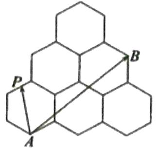

# 等级（SR）

##### 012. 下面左图是某晶体的阴阳离子单层排列的平面示意图, 其阴离子排列如下面右图所示, 右图中圆的半径均为 1 , 且相邻的圆都相切, A, B, C, D, 是其中四个圆的圆心, 则 $\overrightarrow{AB} \cdot \overrightarrow{CD} =$ ( )

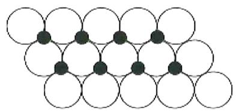

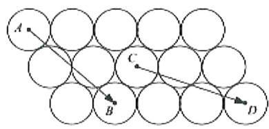

$\quad$A. 24

$\quad$B. 26

$\quad$C. 28

$\quad$D. 32

等级（SR）

2022 新余二模

##### 013. 右图是由两个有一个公共边的正六边形构成的平面图形 $\Gamma$ ，其中正六边形边长为 1. 设 $\overrightarrow{AG} = x\overrightarrow{AB} + y\overrightarrow{AI}$ ，则 $x + y =$ \_\_\_\_；P 是平面图形 $\Gamma$ 边上的动点，则 $\overrightarrow{AC} \cdot \overrightarrow{BP}$ 的取值范围是 \_\_\_\_.

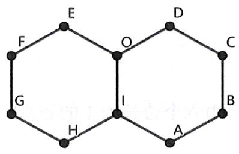

# 题型六：三角形的心与向量

等级（R）

##### 014. 已知 $A, B, C$ 是平面上不共线的三点， $O$ 是 $\triangle ABC$ 的重心，动点 $P$ 满足 $\overrightarrow{OP} = \frac{1}{3}\left(\frac{1}{2}\overrightarrow{OA} + \frac{1}{2}\overrightarrow{OB} + 2\overrightarrow{OC}\right)$ ，则 $P$ 一定为 $\triangle ABC$ 的（）

(A) $AB$ 边中线的三等分点（非重心）

(B) $AB$ 边的中点

(C) $AB$ 边中线的中点

(D) 重心

等级（SR）

2022佛山二模

##### 015. $\Delta ABC$ 中， $AB = \sqrt{2}$ ， $\angle ACB = \frac{\pi}{4}$ ，0 是 $\Delta ABC$ 外接圆圆心，则 $\overrightarrow{OC} \cdot \overrightarrow{AB} + \overrightarrow{CA} \cdot \overrightarrow{CB}$ 的最大值为（）

$\quad$A. 0

$\quad$B. 1

$\quad$C. 3

$\quad$D. 5

等级（SR）

2023 重庆二诊

##### 016. 已知点 0 是 $\triangle ABC$ 的外心， $AB = 6$ ， $BC = 8$ ， $B = \frac{2\pi}{3}$ ，若 $\overrightarrow{BO} = x\overrightarrow{BA} + y\overrightarrow{BC}$ ，则 $3x + 4y =$

$\quad$A. 5

$\quad$B. 6

$\quad$C. 7

$\quad$D. 8

等级（SR）

##### 017. $\triangle ABC$ 外接圆的半径为 1，圆心为 $o$ ，且 $2\overrightarrow{OA} + \overrightarrow{AB} + \overrightarrow{AC} = 0$ ， $|\overrightarrow{OA}| = |\overrightarrow{AB}|$ ，则 $\overrightarrow{CA} \cdot \overrightarrow{CB} = (\quad)$

$\quad$A. $\frac{3}{2}$

$\quad$B. $\sqrt{3}$

$\quad$C. 3

$\quad$D. $2 \sqrt{3}$

等级（SR）

##### 018. 在 $\triangle ABC$ 中，0 为外心，已知 $\overrightarrow{CO} = x\overrightarrow{CB} + y\overrightarrow{CA}$ ，且 $2x + y = 1, \cos B = \frac{1}{3}$ ，

则 $\frac{\overrightarrow{AO} \cdot \overrightarrow{AB}}{\overrightarrow{BO} \cdot \overrightarrow{BC}} =$ （ ）

$\quad$A. $\frac{9}{4}$

$\quad$B. $\frac{\sqrt{2}}{2}$

$\quad$C. $\frac{\sqrt{2}}{4}$

$\quad$D. $\frac{1}{4}$

等级（SR）

##### 019. 已知 0 为 $\Delta ABC$ 的外心， $AB = 3$ ， $AC = 4$ ， $\overrightarrow{AO} = x\overrightarrow{AB} + y\overrightarrow{AC}$ ，且 $2x + y = 1 (x, y \neq 0)$ ，则 $\cos \angle BAC = (\quad)$

$\quad$A. $\frac{3}{8}$

$\quad$B. $\frac{3}{4}$

$\quad$C. $\frac{2}{3}$

$\quad$D. $\frac{1}{2}$

等级（SR）

##### 020. 著名数学家欧拉提出了如下定理, 三角形外心、重心、垂心依次位于同一直线上, 且重心到外心的距离是重心到垂心距离的一半, 此直线被称为三角形的欧拉线, 该定理则被称为欧拉线定理, 设 $O$ , $H$ 分别是 $\Delta ABC$ 的外心、垂心, 且 $M$ 为 $BC$ 的中点, 则 ( )

$A. \overrightarrow {A B} + \overrightarrow {A C} = 3 \overrightarrow {H M} + 3 \overrightarrow {M O}$

$B. \overrightarrow {A B} + \overrightarrow {A C} = 3 \overrightarrow {H M} - 3 \overrightarrow {M O}$

$C. \overrightarrow {A B} + \overrightarrow {A C} = 2 \overrightarrow {H M} + 4 \overrightarrow {M O}$

$D. \overrightarrow {A B} + \overrightarrow {A C} = 2 \overrightarrow {H M} - 4 \overrightarrow {M O}$

# 题型七：用向量求角分线方程

等级（N）

2023济南二模

##### 021. 已知向量 $a = (1, 2), b = (4, 2)$ ，若非零向量 c 与 $a, b$ 的夹角均相等，则 c 的坐标为 \_\_\_\_.（写出一个符合要求的答案即可）.

等级（SR）

##### 022. 在直角坐标系 $xOy$ 中, 已知点 $A(0,1)$ 和点 $B(-3,4)$ , 若点 $C$ 在 $\angle AOB$ 的平分线上, 且 $|\overrightarrow{OC}| = 3\sqrt{10}$ , 则向量 $\overrightarrow{OC}$ 的坐标为

# 题型八：向量中的“巧用常数”

等级（SR）

2024 福建质检

##### 023. 已知 O 是 $\triangle ABC$ 所在平面内一点，且 $|\overrightarrow{AB}| = 2, \overrightarrow{OA} \cdot \overrightarrow{AC} = -1, \overrightarrow{OC} \cdot \overrightarrow{AC} = 1$ ，则 $\angle ABC$ 的最大值为（）

$\frac {\pi}{6}$

$B \frac {\pi}{4}$

$C \frac {\pi}{3}$

$D \frac {\pi}{2}$

# 题型九：向量与解三角形结合

等级（SR）

##### 024. 已知不共线向量 $\overrightarrow{OA}$ , $\overrightarrow{OB}$ 的夹角为 $a$ , $|\overrightarrow{OA}| = 1$ , $|\overrightarrow{OB}| = 2$ . $\overrightarrow{OP} = (1 - t)\overrightarrow{OA}, \overrightarrow{OQ} = t\overrightarrow{OB} (0 \leq t \leq 1)$ , $\left|\overrightarrow{PQ}\right|$ 在 $t = t_0$ 处取最小值, 当 $0 < t_0 < \frac{1}{5}$ 时, $a$ 的取值范围为（）

$\quad$A. $\left(0,\frac{\pi}{3}\right)$

$\quad$B. $\left(\frac{\pi}{3},\frac{\pi}{2}\right)$

$\quad$C. $\left(\frac{\pi}{2},\frac{2\pi}{3}\right)$

$\quad$D. $\left(\frac{2\pi}{3},\pi\right)$

等级（SR）

##### 025. 自平面上一点 O 引两条射线 OA, OB, 点 P 在 OA 上运动, 点 Q 在 OB 上运动且保持 $\left|\overline{PQ}\right|$ 为定值 a (点 P, Q 不与点 O 重合), 已知 $\angle AOB=60^{\circ}$ , $a=\sqrt{7}$ , 则 $\frac{\overline{PQ}\cdot\overline{PO}}{\left|\overline{PO}\right|}+\frac{\overline{QP}\cdot\overline{QO}}{\left|\overline{QO}\right|}$ 的取值范围为 ( )

$\quad$A. $\left(\frac{1}{2},\sqrt{7}\right]$

$\quad$B. $\left(\frac{\sqrt{7}}{2},\sqrt{7}\right]$

$\quad$C. $\left(-\frac{1}{2},\sqrt{7}\right]$

$\quad$D. $\left(-\frac{\sqrt{7}}{2},\sqrt{7}\right]$

# 题型十：向量与生活

等级（R）

哈九中二模

##### 026. 窗的运用是中式园林设计的重要组成部分，在表现方式上常常运用象征、隐喻、借景等手法，将民族文化与哲理融入其中，营造出广阔的审美意境，从窗的外形看，常见的有圆形、菱形、正六边形、正八边形等。已知圆 0 是某窗的平面图，0 为圆心，点 A 在圆 0 的圆周上，点 P 是圆 0 内部一点，若 $\left|\overrightarrow{OA}\right|=2$ ，且 $\overrightarrow{OA} \cdot \overrightarrow{AP} = -2$ ，则 $\left|\overrightarrow{OA} + \overrightarrow{OP}\right|$ 的最小值是（）

$\quad$A. 3

$\quad$B. 4

$\quad$C. 9

$\quad$D. 16

等级（SR）

##### 027. 图（1）是第七届国际数学教育大会（ICME-7）的会徽图案，它是由一串直角三角形演化而成的（如图（2）），其中 $OA_{1}=A_{1}A_{2}=A_{2}A_{3}=\cdots=A_{7}A_{8}=1$ ，则 $\overrightarrow{A_{6}A_{7}}\cdot\overrightarrow{A_{7}A_{8}}$ 的值是 \_\_\_\_.

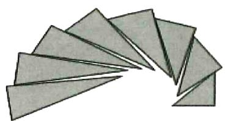

①

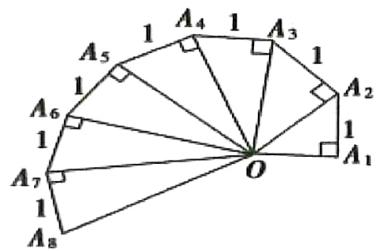

②

# 题型十一：奔驰定理

等级（R）

##### 028. 已知0是△ABC内部一点，满足 $\overrightarrow{OA} + 2\overrightarrow{OB} + m\overrightarrow{OC} = \overrightarrow{0}, \frac{S_{AOB}}{S_{ABC}} = \frac{4}{7}$ ，则实数m=( )

$\quad$A.2

$\quad$B.3

$\quad$C.4

$\quad$D.5

# 题型十二：向量等和线

等级（R）

##### 029. 如图，在正六边形 ABCDEF 中，点 P 是 $\triangle$ CDE 内（包括边界）的一个动点，设 $\overrightarrow{AP} = \lambda \overrightarrow{AB} + \mu \overrightarrow{AF} (\lambda, \mu \in R)$ ，则 $\lambda + \mu$ 的取值范围是 \_\_\_\_

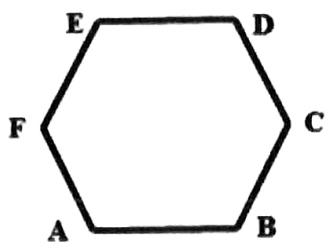

# 不等式

# 题型一：均值不等式之无关系两用均值法

等级（R）

##### 001. 若 $a, b \in R, ab > 0$ ，则 $\frac{a^4 + 4b^4 + 1}{ab}$ 的最小值为（）

$\quad$A. 6

$\quad$B. 4

$\quad$C. $2 \sqrt{2}$

$\quad$D. $\sqrt{2}$

等级（R）

##### 002. 已知 $a > 0, b > 0$ ，则 $\frac{1}{a} + \frac{1}{b} + 2\sqrt{ab}$ 的最小值是（）

$\quad$A. 2

$\quad$B. 3

$\quad$C. 4

$\quad$D. 5

# 题型二：均值不等式之配凑法

等级（R）

2022 天津和平区高三一模

##### 003. 已知 $a > b > 0$ ，则 $a + \frac{4}{a + b} + \frac{1}{a - b}$ 的最小值为

等级（SR）

##### 004. 已知 $5x^{2}y^{2} + y^{4} = 1(x, y \in R)$ ，则 $x^{2} + y^{2}$ 的最小值是（）

等级（SR）

##### 005. 已知 $a, b$ 是正数，且 $(a + b)(a + 2b) + a + b = 9$ ，求 $3a + 4b$ 的最小值。

# 题型三：均值不等式之双管齐下

等级（SR）

##### 006. 已知存在两个正数 $x$ 和 $y$ 满足 $\left\{ \begin{array}{l} 4x + \frac{1}{y} = a, \\ \frac{1}{x} + 9y = 26 - a, \end{array} \right.$ ，则实数 $a$ 的取值范围是 \_\_\_\_.

等级（SR）

##### 007. 已知 $a, b, c \in R$ ，且满足 $\left\{ \begin{array}{l} a + b + c = 2 \\ a^2 + b^2 + c^2 = 2 \end{array} \right.$ ，则 $c$ 的取值范围为 \_\_\_\_

等级（SR）

2021 潍坊一模

##### 008.（多选）已知实数 $x, y, z$ 满足 $x + y + z = 1$ ，且 $x^{2} + y^{2} + z^{2} = 1$ ，则下列结论正确的是（）

$\quad$A. $xy + yz + xz = 0$

$\quad$B.z的最大值为 $\frac{1}{2}$

$\quad$C.z的最小值为 $-\frac{1}{3}$

$\quad$D.xyz的最小值为 $-\frac{4}{27}$

# 题型四：均值不等式与曲线

等级（SR）

##### 009. 数学中有许多形状优美、寓意美好的曲线，曲线 $C: x^{2} + y^{2} = 1 + |x|y$ 就是其中之一（如图）. 给出下列三个结论：

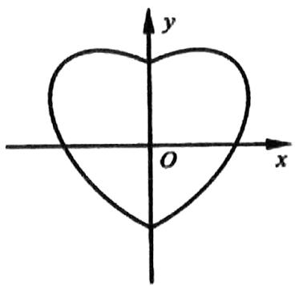

① 曲线 $C$ 恰好经过6个整点（即横、纵坐标均为整数的点）；  
②曲线 $C$ 上任意一点到原点的距离都不超过 $\sqrt{2}$ ；  
② 曲线 $C$ 所围成的“心形”区域的面积小于3.

其中，所有正确结论的序号是（ ）

(A) ①

(B) ②

(C) ①②

(D) ①②③

等级（SR）

##### 010. 数学中有许多形状优美、寓意美好的曲线，例如：四叶草曲线就是其中一种，其方程为

$(x^{2} + y^{2})^{3} = x^{2}y^{2}$ . 给出下列四个结论:

①曲线C上的点有四条对称轴；  
②曲线C上的点到原点的最大距离为 $\frac{1}{4}$ ;  
③曲线 $C$ 第一象限上任意一点作两坐标轴的垂线与两坐标轴围成的矩形面积最大值为 $\frac{1}{8}$ ;

④ 四叶草面积小于 $\frac{\pi}{4}$

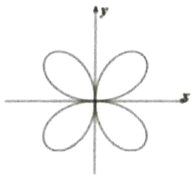

其中，所有正确结论的序号是（）

$\quad$A.①②

$\quad$B.①③

$\quad$C.①③④

$\quad$D.①②④

等级（SR）

2021 南京无锡一模

##### 011. 罗默、伯努利家族、莱布尼兹等大数学家都先后研究过星形线 $C: x^{\frac{2}{3}} + y^{\frac{2}{3}} = 1$ 的性质, 其形美观, 常用于超轻材料的设计, 曲线 $C$ 围成的图形的面积的 $S$ 2 (选填“>”、“<”或“=”), 曲线 $C$ 上的动点到原点的距离的取值范围是\_\_\_\_. (第一空 2 分, 第二空 3 分).

# 题型五：与平面解析几何结合

等级（R）

(2023 安徽 A10 四月联考)

##### 012. 在平面直角坐标系 $xOy$ 中，定义 $A(x_{1}, y_{1}), B(x_{2}, y_{2})$ 两点间的折线距离 $d(A, B) = |x_{1} - x_{2}| + |y_{1} - y_{2}|$ ，该距离也称曼哈顿距离。已知点 $M(2,0), N(a, b)$ ，若 $d(M, N) = 2$ ，则 $a^{2} + b^{2} - 4a$ 的最小值与最大值之和为（）

$\quad$A. 0

$\quad$B. -2

$\quad$C. -4

$\quad$D. -6

等级（R）

2023 贵州六校联考

##### 013. 已知 $x, y \in R^{*}$ , 满足 $2x + y = 2$ , 则 $x + \sqrt{x^2 + y^2}$ 的最小值为

$\quad$A. $\frac{4}{5}$

$\quad$B. $\frac{8}{5}$

$\quad$C. 1

$\quad$D. $\frac{1 + \sqrt{2}}{3}$ 等级（SR）

2024 华大新高考联盟 3 月联考

##### 014.已知实数a,b满足 $a^2 + b^2 - |a| - |b| = 0$ ，则 $|a + b - 3|$ 的最小值与最大值之和为（）

$\quad$A.4

$\quad$B.5

$\quad$C.6

$\quad$D.7

等级（SR）

2022江南十校联考

##### 015. 已知实数 $a$ ， $b$ 满足 $2a^2 - b^2 = 1$ ，则 $|2a - b|$ 的最小值为（）

$\quad$A. 0

$\quad$B. $\frac{1}{2}$

$\quad$C. 1

$\quad$D. $\sqrt{2}$

# 题型六：解特殊的不等式

等级（SR）

邯郸一模

##### 016. 不等式 $10^{x}-6^{x}-3^{x}\geq1$ 的解集为 \_\_\_\_

等级（SR）

2022遵义三统

##### 017. 满足不等式 $(\mathrm{x} - 1^2)(\mathrm{x} - 2^2)(\mathrm{x} - 3^2) \cdots (\mathrm{x} - 100^2) \leq 0$ 整数解个数为（）

$\quad$A. 4950

$\quad$B. 5000

$\quad$C. 5050

$\quad$D. 5100

# 题型七：三字母不等式

等级（R）

2023宁波十校三月联考

##### 018. 非零实数 $a, b, c$ 满足 $\frac{bc}{a}, \frac{ac}{b}, \frac{ab}{c}$ 成等差数列，则 $\frac{a^2 + 2c^2}{b^2}$ 的最小值为

$\quad$A. $2 \sqrt{2}$

$\quad$B. $\frac{3}{2} +\sqrt{2}$

$\quad$C. 3

$\quad$D. $3 + 2\sqrt{2}$

等级（SR）

2024 福州三中第十六次检测

##### 019. 已知三个实数 $a, b, c$ , 当 $c > 0$ 时, $b \leq 2a + 3c$ 且 $bc = a^2$ , 则 $\frac{a - 2c}{b}$ 的取值范围是 \_\_\_\_.

等级（SR）

2022宁波四月模拟

##### 020. 若正实数 $a, b, c$ 互不相等且满足 $a^2 + b^2 + c^2 = 2ab + bc$ ，则下列结论成立的是（）

$\quad$A. $2 \mathrm{~a} > \mathrm{b} > \mathrm{c}$

$\quad$B. $2\mathrm{a} > \mathrm{c} > \mathrm{b}$

$\quad$C. $2 \mathrm{~c} > \mathrm{a} > \mathrm{b}$

$\quad$D. $2 \mathrm{~c} > \mathrm{b} > \mathrm{a}$

# 题型八：数轴设线段法处理不等式问题

等级（SR）

2024天域名校协作体4月联考

##### 021.（多选）已知正实数 $a, b, c$ ，且 $a > b > c$ ， $x, y, z$ 为自然数，则满足 $\frac{x}{a - b} + \frac{y}{b - c} + \frac{z}{c - a} > 0$ 恒成立的 $x, y, z$ 可以是（）

$\quad$A. $x = 1, y = 1, z = 4$

$\quad$B. $x = 1, y = 2, z = 5$

$\quad$C. $x = 2, y = 2, z = 7$

$\quad$D. $x = 1, y = 3, z = 9$

等级（SR）

2024 深圳一模

##### 022. 已知函数 $f(x) = a(x - x_1)(x - x_2)(x - x_3) (a > 0)$ ，设曲线 $y = f(x)$ 在点 $(x_i, f(x_i))$ 处切线的斜率为 $k_i (i=1,2,3)$ ，若 $x_1, x_2, x_3$ 均不相等，且 $k_2 = -2$ ，则 $k_1 + 4k_3$ 的最小值为 \_\_\_\_.

等级（SSR）

2024 九省联考

##### 023. 以 $\max M$ 表示数集 $M$ 中最大的数．设 $0 < a < b < c < 1$ ，已知 $b \geq 2a$ 或 $a + b \leq 1$ ，则 $\max \{b - a, c - b, 1 - c\}$ 的最小值为 \_\_\_\_.

# 立体几何选填

# 题型一：立体几何与函数最值

等级（R）

2023 武汉二月调研

##### 001. 某车间需要对一个圆柱形工件进行加工, 该工件底面半径 $15 \mathrm{~cm}$ , 高 $10 \mathrm{~cm}$ , 加工方法为在底面中心处打一个半径为 $r \mathrm{~cm}$ 且和原工件有相同轴的圆柱形通孔. 若要求工件加工后的表面积最大,

则 $r$ 的值应设计为（）

$\quad$A. $\sqrt{10}$

$\quad$B. $\sqrt{15}$

$\quad$C. 4

$\quad$D. 5

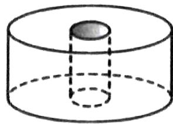

等级（SR）

2023 东北三省四市二模

##### 002. 如图, 圆 O 的半径为 1, 从中剪出扇形 AOB 围成一个圆锥 (无底), 所得的圆锥的体积的最大值为 ( )

$\quad$A. $\frac{\sqrt{2}\pi}{4}$

$\quad$B. $\frac{\sqrt{2}\pi}{12}$

$\quad$C. $\frac{4\sqrt{3}\pi}{9}$

$\quad$D. $\frac{2\sqrt{3}\pi}{27}$ 等级（SR）

2023三明三检

##### 003. 某社会实践小组需要对一个实心圆锥形工件进行加工, 该工件底面半径为 $10 \mathrm{~cm}$ , 高为 $8 \mathrm{~cm}$ , 加工方法为挖掉一个与该圆锥形工件同底面共圆心的内接圆柱, 若要求加工后工件的质量最轻, 则圆柱的半径应设计为( )

$\quad$A. $\frac{20}{3} cm$

$\quad$B. $\frac{10}{3} cm$

$\quad$C. $3 \mathrm{~cm}$

$\quad$D. $\frac{5}{3} cm$

等级（SR）

##### 004. 一个等腰三角形的周长为 10，四个这样相同等腰三角形底边围成正方形，如图，若这四个三角形都绕底边旋转，四个顶点能重合在一起，构成一个四棱锥，则围成的四棱锥的体积最大值为（）

$\quad$A. $\frac{500\sqrt{2}}{81}$

$\quad$B. $\frac{500\sqrt{2}}{27}$

$\quad$C. $5 \sqrt{3}$

$\quad$D. $15 \sqrt{2}$

等级（SR）

2021苏锡常镇二模

##### 005. 一个组合体由上下两部分组成, 上部是一个半球, 下部是一个圆柱, 半球的底面与圆柱的上底面重合。若该组合体的体积为定值 $V$ , 则当圆柱底面半径 $r =$ \_\_\_\_时, 该组合体的表面积最小

等级（SR）

##### 006. 如图所示, 某几何体由底面半径和高均为 1 的圆柱与半径为 1 的半球对接而成, 在该封闭几何体内部放入一个小圆柱体, 且小圆柱体的上下底面均与外层圆柱的底面平行, 则小圆柱体积的最大值为

等级（SR）

2021三明三检

##### 007. 在三棱锥 $S - ABC$ 中, 侧棱 $SA, SB, SC$ 两两垂直, 且 $SA + SB = SC = 2$ , 设 $SA = x$ , 该三棱锥的表面积为函数 $y = f(x)$ , 以下判断正确的是 ( )

$\quad$A. $f(x)$ 为常数

$\quad$B. $f(x)$ 有极小值

$\quad$C. $f(x)$ 有极大值

$D.f(x)$ 是单调函数

等级（SSR）

##### 008. 现为一球状巧克力调序圆锥体的包装盒，若该巧克力球的半径为 3，则其包装盒的体积为最小值为（）

等级（SSR）

##### 009. 已知正三棱锥的体积为 $\sqrt{3}$ ，则其表面积的最小值为 \_\_\_\_

等级（SSR）

##### 010. 某工厂现将一棱长为 $\sqrt{3}$ 的正四面体毛坯件切割成一个圆柱体零件，则该圆柱体体积的最大值为 \_\_\_\_

# 题型二：动点问题

等级（R）

2022 四川九市二诊

##### 011. 如图, 长方体 $ABCD - A_{1}B_{1}C_{1}D_{1}$ 中, 点 E, F 分别是棱 $DD_{1}, BB_{1}$ 上的动点 (异于所在棱的端

点)，给出以下结论：

① 在 F 运动的过程中，直线 $FC_{1}$ 能与 AE 平行；

② 直线 $AC_{1}$ 与 EF 必然异面；

③ 设直线 AE, AF 分别与平面 $A_{1}B_{1}C_{1}D_{1}$ 相交于点 P, Q, 则点 $C_{1}$ 可能在直线 PQ 上。

其中，所有正确结论的序号是（）

$\quad$A. ①②

$\quad$B. ①③

$\quad$C. ②③

$\quad$D. ①②③

等级（R）

2021 龙岩三月质检

##### 012. 正方体 ABCD-A1B1C1D1 的棱长为 a，P 是正方体表面上的动点，若 $\left|AP\right| = \sqrt{2}a$ ，则动点 P 的轨迹长度为 \_\_\_\_.

等级（R）

2024 南京盐城二模

##### 013.在棱长为 $2a(a > 0)$ 的正方体 $ABCD - A_{1}B_{1}C_{1}D_{1}$ 中，点 $M, N$ 分别为棱 $AB, D_{1}C_{1}$ 的中点.已知动点 $P$ 在该正方体的表面上，且 $\overrightarrow{PM} \cdot \overrightarrow{PN} = 0$ ，则点 $P$ 的轨迹长度为（）

$\quad$A. $12a$

$\quad$B. $12\pi a$

$\quad$C. $24a$

$\quad$D. $24\pi a$

等级（SR）

2023 山大附中三月诊断

##### 014. 如图, 在正四棱柱 $ABCD - A_{1}B_{1}C_{1}D_{1}$ 中, $AA_{1} = 2$ , $AB = CB = 1$ , 动点 $P, Q$ 分别在线段 $C_{1}D$ , AC 上, 则线段 $PQ$ 长度的最小值是 ( )

$\quad$A. $\frac{\sqrt{2}}{3}$

$\quad$B. $\frac{\sqrt{3}}{3}$

$\quad$C. $\frac{2}{3}$

$\quad$D. $\frac{\sqrt{5}}{3}$

等级（R）

2021 肇庆二模

##### 015. 牙雕套球又称“鬼工球”，取鬼斧神工的意思，制作相当繁复，工艺要求极高，明代曹昭在《格古要论·珍奇·鬼工毬》中写道：“尝有象牙圆毬儿一箇，中直通一窍，内车数重，皆可转动，故谓之鬼工毬”，现有某“鬼工球”，由外及里是两层表面积分别为 $100\pi \mathrm{cm}^2$ 和 $64\pi \mathrm{cm}^2$ 的同心球（球壁

的厚度忽略不计), 在外球表面上有一点 A, 在内球表面上有一点 B, 连接线代 AB, 若线段 AB 不穿过小球内部, 则线段 AB 长度的最大值是 ( )

$\quad$A. $\sqrt{41} cm$

$\quad$B. $9\mathrm{cm}$

$\quad$C. $3 \mathrm{~cm}$

$\quad$D. $2 \mathrm{~cm}$

等级（SR）

2022吕梁四月联考

##### 016. 已知正方体 $ABCD-A_{1}B_{1}C_{1}D_{1}$ 的棱长为 2, E, F 分别是棱 $B_{1}C_{1}$ 和 $CC_{1}$ 的中点, 点 P 在正方形 $BCC_{1}B_{1}$ (包括边界) 内, 当 AP∥ 平面 $A_{1}EF$ 时, AP 长度的最大值为 $a$ , 以 A 为球心, $a$ 为半径的球面与底面 $A_{1}B_{1}C_{1}D_{1}$ 的交线长为( )

$\quad$A. $\frac{\pi}{2}$

$\quad$B. $\pi$

$\quad$C. $\frac{\sqrt{5}\pi}{2}$

$\quad$D. $\sqrt{5}\pi$

等级（SR）

2022 重庆八中第六次月考

##### 017. 在四面体 ABCD 中， $\Delta ABC$ 是正三角形， $\Delta ACD$ 是直角三角形且 $AD=CD$ ， $AB=BD=2$ 。若点 P 是侧面 CBD 内一动点，且满足 $AP \perp BD$ ，则 P 点所形成的轨迹长度是 \_\_\_\_

等级（SR）

2021 河南六市高三一模

##### 018. 如图, 在棱长为 1 的正方体 $ABCD - A_{1}B_{1}C_{1}D_{1}$ 中, M 为棱 AB 的中点, 动点 P 在侧面 $BCC_{1}B_{1}$ 及其边界上运动, 总有 $AP \perp D_{1}M$ , 则动点 P 的轨迹长度为 ( )

$\quad$A. $\frac{\sqrt{2}}{2}$

$\mathrm{B}\frac{\sqrt{5}}{2}$

C $\frac{\pi}{16}$

$\mathrm{D}\frac{\sqrt{3}}{2}$

等级（SR）

2022 燕博园测试

##### 019. 如图, 正方体 $ABCD - A_{1}B_{1}C_{1}D_{1}$ 的棱长为 1, P 为平面 $\mathrm{DBA}_{1}$ 内的动点, 且 $\mathrm{AP} = \frac{\sqrt{2}}{2}$ . 设直线 BD 与 AP 所成的角为 $\theta$ , 则当 $\theta$ 最小时, $\cos \theta$ 的值为

等级（SSR）

##### 020. 已知直四棱柱 $ABCD - A_{1}B_{1}C_{1}D_{1}$ 的所长是 1， $\angle ABC = 60^{\circ}$ $AC \cap BD = O$

$A_{1}C_{1}\cap B_{1}D_{1}=O_{1}$ ，点H在线段 $OB_{1}$ ，上， $OH=3HB_{1}$ ，点M是线段BD上的动点，则三棱锥 $M-C_{1}O_{1}H$ 的体积的最小值为\_\_\_\_.

# 题型三：对称性的考察

等级（R）

2022 辽宁部分重点中学协作体 5 月联考

##### 021. 经过长方体 $ABCD - A_{1}B_{1}C_{1}D_{1}$ 的一个顶点 $\mathbf{A}$ 的直线与该长方体的十二条棱所在的直线成的角都相等, 符合这样条件的直线的条数为 ( )

$\quad$A. 4

$\quad$B. 1

$\quad$C. 0

$\quad$D. 无数多个

等级（R）

##### 022. 已知正四面体 ABCD 的表面积为 S，其四个面的中心分别为 E、F、G、H. 设四面体 EFGH 的表面积为 T. 则 $\frac{T}{S}$ 等于（）

$\quad$A. $\frac{1}{9}$

$\quad$B. $\frac{4}{9}$

$\quad$C. $\frac{1}{4}$

$\quad$D. $\frac{1}{3}$

等级（SR）

##### 023.与正方体 $ABCD - A_{1}B_{1}C_{1}D_{1}$ 的三条棱 $AB$ 、 $CC_{1}$ 、 $A_{1}D_{1}$ 所在直线的距离相等的点（

A有且只有1个

B有且只有2个

$\quad$C. 有且只有 3 个

$\quad$D. 有无数个

等级（SR）

##### 024. 已知在半径为 2 的球面上有 A、B、C、D 四点，若 AB=CD=2，则四面体 ABCD 的体积的最大值为（）

(A) $\frac{2\sqrt{3}}{3}$

(B) $\frac{4\sqrt{3}}{3}$

(C) $2\sqrt{3}$

(D) $\frac{8\sqrt{3}}{3}$

等级（SR）

##### 025. 如图, 圆锥 SO 的高 $\mathrm{SO} = 2$ , 底面直径 $\mathrm{AB} = \mathrm{CD} = 4$ , M, N 分别是 SC, SD 的中点, 则四面体 ABMN 体积的最大值是

等级（SR）

##### 026. 已知正方体的棱长为 1，每条棱所在直线与平面 $a$ 所成的角相等，则 $a$ 截此正方体所得截面面积的最大值为（）

$\quad$A. $\frac{3\sqrt{3}}{4}$

$\quad$B. $\frac{2\sqrt{3}}{3}$

$\quad$C. $\frac{3\sqrt{2}}{4}$

$\quad$D. $\frac{\sqrt{3}}{2}$

等级（SR）

##### 027. 一个封闭的校长为 2 的正方体容器, 当水平放置时, 如图, 水面的高度正好为棱长的一半, 若将该正方体任意旋转, 则容器里水面的最大高度为 ( )

$\quad$A. 1

$\quad$B. $\sqrt{2}$

$\quad$C. $\sqrt{3}$

$\quad$D. $\frac{2\sqrt{3}}{3}$

# 题型四：对棱相等四面体处理技巧

等级(R)

2024 浙江五校联考

##### 028.（多选）在三棱锥 $A - BCD$ 中，已知 $AB = AC = BD = CD = 3, \quad AD = BC = 2$ ，点 $M, N$ 分别是 $AD, BC$ 的中点，则（）

$\quad$A. $MN \perp AD$   
$\quad$B. 异面直线 $AN, CM$ 所成角的余弦值是 $\frac{7}{8}$   
$\quad$C.三棱锥 $A - BCD$ 的体积为 $\frac{4\sqrt{7}}{3}$   
$\quad$D.三棱锥 $A - BCD$ 的外接球表面积为 $11\pi$

等级（SR）

##### 029. 若四面体 $ABCD$ 的三组对棱分别相等，即 $AB = CD$ ， $AC = BD$ ， $AD = BC$ ，给出下列结论：

①四面体 ABCD 每组对棱相互垂直；  
②四面体 ABCD 每个面的面积相等;  
③从四面体ABCD每个顶点出发的三条棱两两夹角之和大于 $90^{\circ}$ 而小于 $180^{\circ}$ ；  
④连接四面体 ABCD 每组对棱中点的线段相互垂直平分.

其中正确结论的序号是\_\_\_\_。（写出所有正确结论的序号）

等级（SR）

2021 山东 5 月针对性训练

##### 030. 已知正四面体 ABCD 的棱长为 2，平面 $\alpha$ 与棱 AB, CD 均平行，则 $\alpha$ 截此正四面体所得截面面积的最大值为（）

$\quad$A. 1

$\quad$B. $\sqrt{2}$

$\quad$C. $\sqrt{3}$

$\quad$D. 2

等级（SR）

##### 031. 如图, 在三棱锥 A-BCD 中, AB=CD=2, AC=BD= $\sqrt{3}$ , BC=AD= $\sqrt{5}$ , E, F 分别是 AB, CD 的中点, 若用一个与直线 EF 垂直的平面去截该三棱锥, 与棱 AC, AD, BD, BC 分别交于 M, N, P, Q 四点, 则四边形 MNPQ 面积的最大值为 \_\_\_\_。

# 题型五：立体几何综合题

等级（R）

2022 T8 第二次联考

##### 032. 如图, 已知正四面体 ABCD 的棱长为 1 , 过点 B 做截面 $\alpha$ 分别交侧棱 AC, AD 于 E, F 两点, 且四面体 ABEF 的体积为四面体 ABCD 体积的 $\frac{1}{3}$ , 则 EF 的最小值为 ( )

$\quad$A. $\frac{\sqrt{2}}{2}$

$\quad$B. $\frac{\sqrt{3}}{2}$

$\quad$C. $\frac{1}{3}$

$\quad$D. $\frac{\sqrt{3}}{3}$

等级（R）

2022 浙江七彩阳光联盟

##### 033. 每个面均为正三角形的八面体称为正八面体, 如图。若点 G、H、M、N 分别是正八面体 ABCDEF 的棱 DE、BC、AD、BF 的中点，则下列结论正确的是（）

$\quad$A. GH⊥平面 FBC

$\quad$B. GH 与 MN 是异面直线

$\quad$C. GH||平面 EAB

$\quad$D.MN与GH是相交直线

等级（SR）

2021年新高考1卷

##### 034.（多选）在正三棱柱 $ABC - A_{1}B_{1}C_{1}$ 中， $AB = AA_{1} = 1$ ，点 $P$ 满足 $\overrightarrow{BP} = \lambda \overrightarrow{BC} + \mu \overrightarrow{BB_{1}}$ ，其中 $\lambda \in [0,1]$ ， $\mu \in [0,1]$ ，则（）

$\quad$A. 当 $\lambda = 1$ 时， $\triangle AB_{1}P$ 的周长为定值  
$\quad$B. 当 $\mu = 1$ 时，三棱锥 $P - A_{1}BC$ 的体积为定值  
$\quad$C. 当 $\lambda = \frac{1}{2}$ 时，有且仅有一个点 $P$ ，使得 $A_{1}P\perp BP$   
$\quad$D. 当 $\mu = \frac{1}{2}$ 时，有且仅有一个点 $P$ ，使得 $A_{1}B \perp$ 平面 $AB_{1}P$

等级(SR)

2024 湖北七市联考

##### 035.(多选)如图,棱长为2的正方体 $ABCD - A_{1}B_{1}C_{1}D_{1}$ 中, $E$ 为棱 $DD_{1}$ 的中点, $F$ 为正方形 $C_{1}CDD_{1}$ 内一个动点(包括边界),且 $B_{1}F$ //平面 $A_{1}BE$ ,则下列说法正确的有()

$\quad$A.动点 $F$ 轨迹的长度为 $\sqrt{2}$

$\quad$B.三棱锥 $B_{1} - D_{1}EF$ 体积的最小值为 $\frac{1}{3}$

$\quad$C. $B_{1}F$ 与 $A_{1}B$ 不可能垂直

$\quad$D. 当三棱锥 $B_{1} - D_{1}DF$ 的体积最大时, 其外接球的表面积为 $\frac{25}{2}\pi$

等级(SR)

2024苏锡常镇一模

##### 036.（多选）如图，在棱长为2的正方体 $ABCD - A_{1}B_{1}C_{1}D_{1}$ 中， $E$ 为棱 $AA_{1}$ 的中点，点 $F$ 满足 $\overline{A_1F} = \lambda \overline{A_1B_1}(0 \leqslant \lambda \leqslant 1)$ ，则（）

$\quad$A.当 $\lambda = 0$ 时， $AC_{1}\perp$ 平面BDF  
$\quad$B. 任意 $\lambda \in [0,1]$ , 三棱锥 $F - BDE$ 的体积是定值  
$\quad$C. 存在 $\lambda \in [0,1]$ ，使得 $AC$ 与平面 $BDF$ 所成的角为 $\frac{\pi}{3}$   
$\quad$D. 当 $\lambda = \frac{2}{3}$ 时，平面 $BDF$ 截该正方体的外接球所得截面的  
面积为 $\frac{56}{19}\pi$

等级(SR)

2024 新高考教学教研联盟（长郡十八校）

##### 037.(多选)已知体积为2的四棱锥 $P - ABCD$ ，底面ABCD是菱形， $AB = 2, PA = 3$ ，则下列说法正确的是( )

$\quad$A. 若 $PA \perp$ 平面 $ABCD$ , 则 $\angle BAD$ 为 $\frac{\pi}{6}$   
$\quad$B. 过点 $P$ 作 $PO \perp$ 平面 $ABCD$ , 若 $AO \perp BD$ , 则 $BO \perp PC$   
$\quad$C. $PA$ 与底面 $ABCD$ 所成角的最小值为 $\frac{\pi}{6}$   
$\quad$D. 若点 P 仅在平面 ABCD 的一侧, 且 $AB \perp AD$ ,  
则点 $P$ 轨迹长度为 $3\sqrt{3}\pi$

等级(SR)

2024 太原三模

##### 038.（多选）已知正方体 $ABCD$ 中， $E$ 是 $A_{1}B_{1}$ 的中点，点 $F$ 是线段 $A_{1}C$ 上的动点，则下列结论正确的是（）

$\quad$A.三棱锥 $B - C_{1}EF$ 的体积为定值  
$\quad$B. 存在点 $F$ ，使得 $DF \perp$ 平面 $BC_{1}E$   
$\quad$C. 不存在点 $F$ ，使得 $BC \parallel$ 平面 $AEF$   
$\quad$D.不存在点 $F$ ，使得 $AEF\perp$ 平面 $BC_{1}E$

等级(SR)

2024 皖江名校联盟 4 月联考

##### 039.(多选)已知正方体 $ABCD - A_{1}B_{1}C_{1}D_{1}$ 的棱长为 1, P, Q 分别为棱 $C_{1}D_{1}, B_{1}C$ 上的动点，则()

$\quad$A.四面体 $PQAB$ 的体积为定值

$\quad$B. 四面体 $PQA_{1}D$ 的体积为定值

$\quad$C. 四面体 $PQAC$ 的体积最大值为 $\frac{1}{3}$

$\quad$D. 四面体的体积最大值为 $\frac{1}{6}$

等级(SR)

2024长沙一中第七次月考

##### 040.(多选)设二面角 A-CD-B 的大小为 $\frac{2\pi}{3}$ ，AC ⊥ CD, BD ⊥ CD，且 CD=1, AC+BD=2，
则()

$\quad$A. $\triangle ABD$ 是钝角三角形  
$\quad$B. 异面直线 $AD$ 与 $BC$ 可能垂直  
$\quad$C.线段 $AB$ 长度的取值范围是 $\left[2, \sqrt{5}\right)$   
$\quad$D. 四面体 A - BCD 体积的最大值为 $\frac{\sqrt{3}}{4}$

等级（SR）

2024 台州二模

##### 041.（多选）已知正方体 $ABCD - A_{1}B_{1}C_{1}D_{1}$ 的棱长为 1， $P$ 为平面 $ABCD$ 内一动点，且直线 $D_{1}P$ 与平面 $ABCD$ 所成角为 $\frac{\pi}{3}$ ， $E$ 为正方形 $A_{1}ADD_{1}$ 的中心，则下列结论正确的是（）

$\quad$A.点 $P$ 的轨迹为抛物线  
$\quad$B. 正方体 $ABCD - A_{1}B_{1}C_{1}D_{1}$ 的内切球被平面 $A_{1}BC_{1}$ 所截得的截面面积为 $\frac{\pi}{6}$   
$\quad$C. 直线 CP 与平面 $CDD_{1}C_{1}$ 所成角的正弦值的最大值为 $\frac{\sqrt{3}}{3}$   
$\quad$D. 点 $M$ 为直线 $D_{1}B$ 上一动点，则 $MP + ME$ 的最小值为 $\sqrt{\frac{11 - 2\sqrt{6}}{6}}$

等级（SR）

2024 贵州省统测

##### 042.（多选）如图，正四棱锥 P-ABCD 每一个侧面都是边长为 4 的正三角形，若点 M 在四边形 ABCD 内(包含边界)运动，N 为 PD 的中点，则（）

$\quad$A. 当 $M$ 为 $AD$ 的中点时, 异面直线 $MN$ 与 $PC$ 所成角为 $\frac{\pi}{2}$   
$\quad$B. 当 $MN$ // 平面 $PBC$ 时，点 $M$ 的轨迹长度为 $2\sqrt{3}$   
$\quad$C. 当 $MP \perp MD$ 时，点 $M$ 到 $AB$ 的距离可能为 $\frac{3\sqrt{3}}{2}$   
$\quad$D. 存在一个体积为 $\frac{5\pi}{3}$ 的圆柱体可整体放入正四棱锥 $P - ABCD$ 内

等级(SR)

临汾二模

##### 043.(多选) 在正四面体 $ABCD$ 中, $P, Q$ 分别为棱 $AB$ 和 $CD$ 上(包括端点)的动点, 直线 $PQ$ 与平面 $ABC$ , 平面 $ABD$ 所成角分别为 $a, \beta$ , 则下列说法正确的是()

$\quad$A. $sin\alpha - \sin\beta$ 的正负与点 $P, Q$ 位置都有关系  
$\quad$B. $\sin a - \sin \beta$ 的正负由点 $Q$ 位置确定，与点 $P$ 位置无关  
$\quad$C. $sin\alpha + \sin\beta$ 的最大值为 $\frac{2\sqrt{3}}{3}$   
$\quad$D. $\sin\alpha+\sin\beta$ 的最小值为 $\frac{\sqrt{6}}{3}$

等级（SR）

2024皖北协作区高三联考

##### 044.(多选) 在棱长为1的正方体 $ABCD - A_{1}B_{1}C_{1}D_{1}$ 中, 以 $A, C_{1}$ 为焦点的椭圆, 绕着轴 $AC_{1}$ 旋转

$180^{\circ}$ 得到的旋转体称为椭球 $AC_{1}$ , 椭圆的长轴就是椭球的长轴, 若椭球 $AC_{1}$ 的长轴长为 2 , 则下列结论中正确的是 ( )

$\quad$A.椭球 $AC_{1}$ 的表面与正方体 $ABCD - A_{1}B_{1}C_{1}D_{1}$ 的六个面都有交线  
$\quad$B. 在正方体 $ABCD - A_{1}B_{1}C_{1}D_{1}$ 的所有棱中，只有六条棱与椭球 $AC_{1}$ 的表面相交  
$\quad$C. 若椭球 $AC_{1}$ 的表面与正方体 $ABCD - A_{1}B_{1}C_{1}D_{1}$ 的某条棱相交, 则交点必是该棱的一个三等分点  
$\quad$D. 椭球 $AC_{1}$ 的表面与正方体 $ABCD - A_{1}B_{1}C_{1}D_{1}$ 的一个面的交线是椭圆的

等级（SR）

2021苏锡常镇一模

##### 045.（多选）

1982年美国数学学会出了一道题：一个正四面体和一个正四棱锥的所有棱长都相等，将正四面体的一个面和正四棱锥的一个侧面紧贴重合在一起，得到一个新几何体。中学生丹尼尔做了一个如图所示的模型寄给美国数学学会，美国数学学会根据丹尼尔的模型修改了有关结论。

对于该新几何体，则（）

$\quad$A. AF // CD

$\quad$B.AF⊥DE

$\quad$C. 新几何体有 7 个面

$\quad$D. 新几何体六个顶点不能在同一个球面上

等级（SR）

2021合肥二模

##### 046. 已知空间三条直线 $l_{1}$ 、 $l_{2}$ 、 $l_{3}$ 满足 $l_{1} \parallel l_{2} \parallel l_{3}$ ，两两之间的距离都为 2，点 A、B 是直线 $l_{1}$ 上的两动点，且 AB=2，C、D 分别在直线 $l_{2}$ ， $l_{3}$ 上运动。下列命题：

①四面体ABCD的体积是定值；   
②四面体ABCD的棱AB与CD所成角为 $\theta$ ，CD·sin $\theta$ 是定值；  
③四面体ABCD表面积的最小值是 $\sqrt{3} +\sqrt{7} +4$   
④四面体ABCD的内切球的体积最大值为 $\frac{\sqrt{3}}{16}\pi$

其中真命题是\_\_\_\_（填上所有真命题的序号）

等级（SR）

2021 金华十校联考

##### 047. 已知四面体 $A - BCD, AB = \sqrt{2}, BC = BD = 2, AB \perp$ 平面 $BCD, BE \perp AC$ 于 $E, BF \perp AD$ 于 F, 则（）

$\quad$A. AC 可能与 EF 垂直， $\Delta BEF$ 的面积有最大值  
$\quad$B. AC 不可能与 EF 垂直， $\Delta$ BEF 的面积有最大值  
$\quad$C. AC 可能与 EF 垂直， $\Delta$ BEF 的面积没有最大值  
$\quad$D. AC 不可能与 EF 垂直， $\Delta$ BEF 的面积没有最大值

等级(SR)

2024江南十校一模

##### 048.（多选）已知点 $S, A, B, C$ 均在半径为 $\sqrt{5}$ 的球面上， $\Delta ABC$ 是边长为 $2\sqrt{3}$ 的等边三角形， $SA \perp BC, SA = 3\sqrt{2}$ ，则三棱锥 $S - ABC$ 的体积可以为（）

$\quad$A. $\frac{\sqrt{3}}{3}$

$\quad$B. $\frac{3\sqrt{3}}{5}$

$\quad$C. $3 \sqrt{3}$

$\quad$D. $\sqrt{51}$

等级(SSR)

2024青岛一模

##### 049. 已知球 O 的表面积为 $12\pi$ ，正四面体 ABCD 的顶点 B, C, D 均在球 O 的表面上，球心 O 为 $\Delta$ BCD 的外心，棱 AB 与球面交于点 P。若 $A \in$ 平面 $\alpha_{1}$ ， $B \in$ 平面 $\alpha_{2}$ ， $C \in$ 平面 $\alpha_{3}$ ， $D \in$ 平面 $\alpha_{4}$ ， $\alpha_{i} // \alpha_{i+1} (i = 1, 2, 3)$ 且 $\alpha_{i}$ 与 $\alpha_{i+1} (i = 1, 2, 3)$ 之间的距离为同一定值，棱 AC，AD 分别与 $\alpha_{2}$ 与交于点 Q, R，则 $\Delta$ PQR 的周长为 \_\_\_\_。

# 题型六：翻折问题

等级（R）

##### 050. 已知等边 $\Delta ABC$ 的边长为 2, 现把 $\Delta ABC$ 绕着边 BC 旋转到 $\Delta PBC$ 的位置, 给出以下三个命题:

①对于任意点 P，PA⊥BC；  
②存在点 P，使得 PA⊥平面 PBC;  
③三棱锥 P-ABC 的体积的最大值为 1。

以上命题正确的是（ ）

$\quad$A. ①②

$\quad$B. ①③

$\quad$C. ②③

$\quad$D. ①②③

等级(R)

2024北京东城一模

##### 051.如图 1,正三角形 ABD 与以 BD 为直径的半圆拼在一起，C 是弧 $\widehat{BD}$ 的中点，O 为 $\triangle ABD$ 的中心.现将 $\triangle ABD$ 沿 BD 翻折为 $\triangle A_{1}BD$ ，记 $\triangle A_{1}BD$ 的中心为 $O_{1}$ ，如图 2.设直线 $CO_{1}$ 与平面 BCD 所成的角为 $\theta$ ，则 $\sin\theta$ 的最大值为（）

图1

图2

$\quad$A. $\frac{1}{3}$

$\quad$B. $\frac{1}{2}$

$\quad$C. $\frac{\sqrt{3}}{3}$

$\quad$D. $\frac{\sqrt{6}}{3}$ 等级（SR）

2022 中学生标准能力测试

##### 052. 如图所示, 已知四边形 ABCD 是由一个等腰直角三角形 ABC 和一个有一内角为 $30^{\circ}$ 的直角三角形 ACD 拼接而成, 将 $\Delta$ ACD 绕 AC 边旋转的过程中, 下列结论中不可能成立的是 ( )

$\quad$A. $\mathrm{CD} \perp \mathrm{AB}$   
$\quad$B. BC⊥AD   
$\quad$C. BD⊥ AB   
$\quad$D. BC⊥ CD

等级（SR）

2022南昌一模

##### 053. 已知在边长为 6 的菱形 ABCD 中， $\angle BAD = 60^{\circ}$ ，点 E, F 分别是线段 AD, BC 上的点，且 $AE = BF = 2$ 。将四边形 ABFE 沿 EF 翻折，当折起后得到的几何体 AED—BFC 的体积最大时，下列说法：

①AD⊥EF;   
②BC || 平面 ADE;  
③平面 DEFC ⊥ 平面 ABFE;  
④平面 ADE ⊥ 平面 ABFE，其中正确的个数是（）

$\quad$A. 1 个

$\quad$B. 2 个

$\quad$C. 3 个

$\quad$D. 4 个

等级（SR）

##### 054. 点 D 是 Rt△ABC 斜边 AB 上异于 A, B 的一动点，AC=1, BC=2，连结 CD，将 △BCD 沿着 CD 翻折到 △B'DC 使 △B'DC 与 △ADC 所在平面构成直二面角，则翻折后 AB' 的最小值是 \_\_\_\_.

等级（SR）

##### 055. 如图, 等腰 $\triangle PAB$ 所在平面为 $\alpha$ , $PA \perp PB$ , $AB = 6$ . G 是 $\triangle PAB$ 的重心, 平面 $\alpha$ 内经过点 G 的直线 $l$ 将 $\triangle PAB$ 分成两部分, 把点 $P$ 所在的部分沿直线 $l$ 翻折, 使点 $P$ 到达点 $P'$ ( $P' \notin$ 平面 $\alpha$ ), 若 $P'$ 在平面 $\alpha$ 内的射影 $H$ 恰好在翻折前的线段 $AB$ 上, 则线段 $P'H$ 的长度的取值范围是 \_\_\_\_.

等级（SR）

2022 东北三省三校三模

##### 056. 直角 $\Delta ABC$ 中, $AB = 2$ , $BC = 1$ , D 是斜边 AC 上的一动点, 沿 BD 将 $\Delta ABD$ 翻折到 $\Delta A \cdot BD$ , 使二面角 $A' - BD - C$ 为直二面角, 当线段 $A \cdot C$ 的长度最小时, 四面体 $A \cdot BCD$ 的外接球的表面积为 ( )

$\quad$A. $\frac{13\pi}{4}$

$\quad$B. $\frac{21\pi}{5}$

$\quad$C. $\frac{13\pi}{3}$

$\quad$D. $\frac{14\pi}{3}$

# 题型七：祖暅原理

等级（SR）

2022 深圳二模

##### 057. 祖暅是我国南北朝时期伟大的科学家，他于 5 世纪末提出了“幂势既同，则积不容异”的体积计算原理，即“夹在两个平行平面之间的两个几何体，被平行于这两个平面的任意平面所截，如果截得的两个截面的面积总相等，那么这两个几何体的体积相等”。现已知直线 $y = \pm 2$ 与双曲线 $x^{2} - y^{2} = 1$ 及其渐近线围成的平面图形 G 如图所示。若将图形 G 被直线 $y = t \quad (-2 \leqslant t \leqslant 2)$ 所截得的两条线段绕 y 轴旋转一周，则形成的旋转面的面积 $S =$ \_\_\_\_；若将图形 G 绕 y 轴旋转一周，则形成的旋转体的体积 $V =$ \_\_\_\_。

等级（SR）

南昌二模

##### 058. 我国南北朝时期的科学家组祖暅，提出了计算体积的祖暅原理：“幂势既同，则积不容异，”意思是：如果两个等高的几何体，在等高处的截面积恒等，则这两个几何体的体积相等。利用此原理求以下几何体的体积：曲线 $y = x^{2} (0 \leq y \leq L)$ 绕 y 轴旋转一周得几何体 Z，将 Z 放在与 Y 轴垂直的水平面 $\alpha$ 上，用平行于平面 $\alpha$ ，且与 Z 的顶点 O 距离为 l 的平面截几何体 Z，得截面圆的面积为 $\pi (\sqrt{l})^{2} = \pi l$ 。由此构造右边的几何体 $Z_{1}$ ：共中 $AC \perp$ 平面 $\alpha, AC = L, AA_{1} \subset \alpha, AA_{1} = \pi$ ，它与 Z 的等高处的截面面积都相等，图中 EFPQ 为矩形，且 $PQ = \pi, FP = l$ ，则几何体 Z 的体积为（）

$\quad$A. $\pi L^2$

$\quad$B. $\pi L^3$

$\quad$C. $\frac{1}{2}\pi L^2$

$\quad$D. $\frac{1}{2}\pi L^3$

等级（SR）

##### 059. 我国南北朝时期的数学家祖暅提出了计算体积的祖暅原理: “幂势既同, 则积不容异。”意思是: 两个等高的几何体若在所有等高处的水平截面的面积相等, 则这两个几何体的体积相等。已知曲线 $C: y = x^2$ , 直线 1 为曲线 C 在点 (1, 1) 处的切线。如图所示, 阴影部分为曲线 C. 直线 1 以及 x 轴所围成的平面图形, 记该平面图形统 y 轴旋转一周所得到的几何体为 $\Gamma$ , 给出以下四个几何体:

①

  
②

③

④

图①是底面直径和高均为1的圆锥；  
图②是将底面直径和高均为1的圆柱挖掉一个与圆柱同底等高的倒置圆锥得到的几何体；  
图③是底面边长和高均为1的正四棱锥；  
图④是将上底面直径为 2，下底面直径为 1，高为 1 的圆台挖掉一个底面直径为 2，高为 1 的倒置圆锥得到的几何体。

根据祖暅原理，以上四个几何体中与 $\Gamma$ 的体积相等的是（）

$\quad$A. ①

$\quad$B. ②

$\quad$C. ③

$\quad$D. ④

# 等级（SR）

##### 060. 我国南北朝时期著名数学家祖暅提出了祖暅原理：“幂势既同，则积不容异”。意思是：夹在两平行平面向的两个几何体，被平行于这两个平行平面的任何平面所截，若截得的两个截面面积总相等，则这两几何体的体积相等，为计算球的体积，构造一个底面半径和高都与球半径相等的圆柱，然后在圆柱内挖去一个以图柱下底面圆心为顶点，圆柱上底面为底面的圆锥，运用祖暅原理可证明此几何体与半球体积相等（任何一个平面所截的两个截面面积都相等），将椭圆 $\frac{x^2}{9} + \frac{y^2}{16} = 1$ 绕 $y$ 轴旋转一周后得一橄榄状的几何体，类比上述方法，运用祖暅原理可求得其体积等于（）

$\quad$A. $24 \pi$

$\quad$B. $32\pi$

$\quad$C. $48\pi$

$\quad$D. $64\pi$

# 题型八：正四面体砍半面的深入研究

等级（SR）

2022 莆田三检

##### 061. 已知正四面体 ABCD 的棱长为 $2\sqrt{6}$ ，点 E, F 满足 $\overrightarrow{BC} = \lambda \overrightarrow{BE}, \overrightarrow{BD} = \lambda \overrightarrow{BF}$ 用过 A, E, F 三点的平面截正四面体 ABCD 的外接球 0，当 $\lambda \in [1,3]$ 时，截面的面积可能为（）

$\quad$A. $6\pi$

$\quad$B. $7 \pi$

$\quad$C. $8\pi$

$\quad$D. $9 \pi$

# 题型九：过某点做某线垂面通法

等级（SR）

2022岳阳二模

##### 062. (多选) 在正方体 $ABCD-A_{1}B_{1}C_{1}D_{1}$ 中, E, F 分别是 $A_{1}D_{1}$ , DC 的中点, 若过点 B 且与直线 1 垂直的平面截正方体所得的截面图形为三角形, 则 1 可以是下列哪些线段所在的直线 ( )

$\quad$A. $A_{1}\mathrm{F}$

$\quad$B. CE

$\quad$C. EF

$\quad$D. $B_{1}\mathrm{F}$

等级（SR）

##### 063. 已知正方体 $ABCD - A_{1}B_{1}C_{1}D_{1}$ 棱长为 4,

$P$ 是 $AA_{1}$ 中点，过点 $D_{1}$ 作平面 $\alpha$ ，满足 $CP \perp$ 平面 $\alpha$ ，则平面 $\alpha$ 与正方体 $ABCD - A_{1}B_{1}C_{1}D_{1}$ 的截面周长为（）

A, $4\sqrt{5} + 6\sqrt{2}$

B, $12\sqrt{2}$

C, $8\sqrt{2} + 8$

D, $8\sqrt{5}$

# 题型十：三角形扔进三棱柱

等级（SR）

##### 064. 一个等腰直角三角形的三个顶点分别在正三棱柱的三条侧棱上, 已知正三棱柱的底面边长为 2 , 则三角形的斜边长为 \_\_\_\_.

等级（SR）

##### 065. 一个直角三角形的三个顶点分别在底面棱长为 2 的正三棱柱的侧棱上, 则该直角三角形斜边的最小值为 \_\_\_\_

# 题型十一：两曲面交线问题

等级（SR）

##### 066. 如图, 三棱锥 A-BCD 中, $AC = AD = BC = BD = 10$ , $AB = 8$ , $CD = 12$ , 点 P 在侧面 ACD 上, 且到直线 AB 的距离为 $\sqrt{21}$ , 则 PB 的最大值是 ( )。

等级（SR）

##### 067. 在正方体 $ABCD-A_{1}B_{1}C_{1}D_{1}$ 中，点 $\mathbf{E} \in$ 平面 $AA_{1}B_{1}B$ ，点 $\mathbf{F}$ 是段 $AA_{1}$ 的中点，若 $D_{1}E \perp CF$ ，则当 $\Delta EBC$ 的面积取得最小值时， $\frac{S_{\Delta EBC}}{S_{\text {四边形 } ABCD}} = (\quad)$

$\quad$A. $\frac{2\sqrt{5}}{5}$

$\quad$B. $\frac{1}{2}$

$\quad$C. $\frac{\sqrt{5}}{5}$

$\quad$D. $\frac{\sqrt{5}}{10}$

等级（SR）

##### 068. 在棱长为 1 的正方体 $ABCD-A_{1}B_{1}C_{1}D_{1}$ 中, 设以上、下底面各边中点为顶点的正四棱柱为 P, 以左、右侧面各边中点为顶点的正四棱柱为 Q, 则正方体体对角线 $AC_{1}$ 在 P, Q 公共部分的长度为

# 题型十二：二面角背景下的立体几何问题

等级（SR）

##### 069. 已知直二面角 $\alpha - l - \beta$ ，点 $A \in a$ ， $AC \perp l$ ，C 为垂足， $B \in \beta$ ，BD 垂直 1，D 为垂足，若 AB = 2，AC = BD = 1，则 D 到平面 ABC 的距离为（）

$\quad$A. $\frac{\sqrt{2}}{3}$

$\quad$B. $\frac{\sqrt{3}}{3}$

$\quad$C. $\frac{\sqrt{6}}{3}$

$\quad$D. 1

等级（SR）

##### 070. 已知二面角 $a - 1 - \beta$ 的大小为 $\frac{\pi}{3}$ , 点 $P \in \alpha$ 点 $\mathrm{P}$ 在 $\beta$ 内的正投影为点 $A$ , $PA = 2\sqrt{3}$ , 过点 $A$ 作 $AB \perp 1$ , 垂足为点 $B$ , 点 $C \in I, BC = 2\sqrt{2}$ , 点 $D \in \beta$ , 且四边形 $ABCD$ 满足 $\angle BCD + \angle DAB = \pi$ 若四面体 $PACD$ 的四个顶点都在同一球面上, 则该球的体积为 \_\_\_\_.

# 题型十三：立体几何中比较角的大小

等级（SR）

##### 071. 如图正四棱锥 $P - ABCD$ ， $E$ 为线段 $BC$ 上的一个动点，记二面角 $P - CD - B$ 为 $\alpha$ ， $PE$ 与平面 $ABCD$ 所成的角为 $\beta$ ， $PE$ 与 $CD$ 所成的角为 $\gamma$ ，则（）

$A. \alpha \leq \beta \leq \gamma$

$B. \gamma \leq \alpha \leq \beta$

$C. \beta \leq \alpha \leq \gamma$

$D. \gamma \leq \beta \leq \alpha$

等级（SR）

##### 072. 已知 $C$ 为 $Rt\Delta ABD$ 斜边 $BD$ 上一点, 且 $\Delta ACD$ 为等边三角形, 现将 $\Delta ABC$ 沿 $AC$ 翻折至 $\Delta AB'C$ , 若在三棱锥 $B' - ACD$ 中, 直线 $CB'$ 和直线 $AB'$ 与平面 $ACD$ 所成角分别为 $\alpha$ , $\beta$ , 则 ( )

$A. 0 <   \alpha <   \beta$

$B. \beta <   \alpha \leq 2 \beta$

$C. 2 \beta \leq \alpha <   3 \beta$

$D. \alpha > 3 \beta$

# 题型十四：到底面三边距离相等的点

# 等级（SR）

##### 073. 在三棱锥 $P - ABC$ 中， $PC = 5$ ，底面 $\Delta ABC$ 是以 $C$ 为直角顶点的直角三角形，且 $BC = 5, AC =$   
12, 点 $P$ 到 $\triangle ABC$ 三边的距离相等, 且点 $P$ 在平面 $ABC$ 上的射影落在 $\triangle ABC$ 内, 则 $CP$ 与平面 $ABC$ 所成角的正切值为

# 题型十五：化三维为二维的思想

# 等级（SR）

# 2021 泰州南通二模

##### 074. 在三棱锥 P-ABC 中，AB⊥BC，AC=8，点 P 到底面 ABC 的距离为 7，若点 P，A，B，C 均在一个半径为 5 的球面上，则 PA²+PB²+PC² 的最小值为 \_\_\_\_.

等级（SR）

##### 075. 已知正方体 $ABCD - A_1B_1C_1D_1$ 中， $|AB| = 2$ ，E 为 AD 的中点，P 为正方形 $A_1B_1C_1D_1$ 内的一个动点（含边界），且 $|PE| \leq \sqrt{5}$ ，则 $\left|\overrightarrow{PA_1} + \overrightarrow{PB_1} + \overrightarrow{PC_1}\right|$ 的最小值为（）

$\quad$A. $\sqrt{17} - 1$

$\quad$B. $\sqrt{17} - 3$

$\quad$C. $\sqrt{17}$

$\quad$D. $\sqrt{17} + 1$

# 立体几何大题

# 题型一：第一问的新鲜考法

等级（R）

##### 001. 如图，三棱柱 $ABC - A_{1}B_{1}C_{1}$ 中，CA = CB， $\angle BAA_{1} = 45^{\circ}$ ，平面 $AA_{1}C_{1}C \perp$ 平面 $AA_{1}B_{1}B$ .

（1） 求证: $AA_{1} \perp BC;$

等级（R）

##### 002. 如图，四棱锥 $E - ABCD$ 中，四边形 $ABCD$ 是边长为 2 的菱形， $\angle DAE = \angle BAE = 45^{\circ}$ ， $\angle DAB = 60^{\circ}$

（1）证明：平面 $ADE \perp$ 平面 $ABE$ ;

等级（R）

2024南昌三模

##### 003.如图1，四边形ABCD为菱形， $\angle ABC = \frac{\pi}{3}$ ， $E, F$ 分别为 $AD, DC$ 的中点，如图2，将 $\Delta ABC$ 沿 $AC$ 向上折叠，使得平面 $ABC \perp$ 平面 $ACFE$ ，将 $\Delta DEF$ 沿 $EF$ 向上折叠，使得平面 $DEF \perp$ 平面 $ACFE$ ，连接 $BD$ 。

（1）求证： $A,B,D,E$ 四点共面；

图1

图2

等级（R）

##### 004. 如图, 三棱锥 $P - ABC$ 中, $PA \perp$ 面 $ABC$ , $AB \perp BC$ , 点 $A_{1}$ , $B_{1}$ , $C_{1}$ 分别在侧棱 $PA$ , $PB$ , $PC$ 上, 且 $PA = 3PA_{1}$ , $PB = 2PB_{1}$ , $PC = \frac{3}{2}PC_{1}$ , $AB = BC = 6$ .

（1）设直线 $B_{1}C_{1}$ 与BC交于点 $A_{2}$ ，直线 $A_{1}C_{1}$ 与 $AC$ 交于点 $B_{2}$

直线 $A_{1}B_{1}$ 与 $AB$ 交于点 $C_2$ ，求证： $A_{2}$ ， $B_{2}$ ， $C_2$ 三点共线；

# 题型二：对称翻折模型

等级（R）

2022 合肥二模

##### 005. 如图, 在矩形 $ABCD$ 中, $AB = 2AD$ , 点 $\mathbb{M}$ 为边 $AB$ 的中点, 以 $CM$ 为折痕把 $\triangle BCM$ 折起,使点 B 到达点 P 的位置, 使得 $\angle PMB = \frac{\pi}{3}$ , 连接 PA, PB, PD

（1）证明：平面 $PMC \perp$ 平面AMCD；  
（2） 求直线 PC 与平面 PAD 所成角的正弦值;

等级（R）

2023湖南高三三月调研

##### 006. 如图，四边形 ABCD 为平行四边形，AB=5，AD=4，BD=3，将△ABD 沿 BD 翻折到△PBD 位置且∠PDA=120°。

（1） 求 P, C 两点之间的距离;   
（2） 求二面角 D-PB-C 的余弦值.

等级（R）

2021 山东新高考质量测评联盟 4 月联考

##### 007. 已知四边形 ABCD, $\angle BAC = \angle ADC = 90^{\circ}$ , DC = DA = $\frac{\sqrt{2}}{2} AB$ ，将 $\triangle ADC$ 沿 AC 翻折至 $\triangle PAC$ .

（1） 若 PA=PB，求证 PA⊥BC;   
（2） 若二面角 P-AC-B 为 $\frac{\pi}{4}$ , 求直线 BC 与平面 PAB 所成角的正弦值,

等级（R）

杭州二模

##### 008. 在三棱锥 S-ABC 中，底面 $\triangle ABC$ 为等腰直角三角形， $\angle SAB = \angle SCB = \angle ABC = 90^{\circ}$ .

（1） 求证: AC⊥SB;   
（2）若 AB=2， $SC=2\sqrt{2}$ ，求平面 SAC 与平面 SBC 夹角的余弦值.

等级（SR）

2022 石家庄一模

##### 009. 如图, 在梯形ABCD中, $\angle BAD$ 为直角, $AD\parallel BC$ , $AB=AD=\frac{1}{2}BC=2\sqrt{2}$ , 将三角形ABD沿BD折起至PBD.

（1）设平面PBD⊥平面BCD，求证：PB⊥PC；  
（2）设E是PC的中点，若二面角E-BD-C为 $30^{\circ}$ ，求二面角P-BD-C的大小

图1

图2

等级（SR）

2022 江淮十校第三次联考

##### 010. 矩形 ATCD 中, AD=2DC=2, B 为 TC 中点, $\triangle TAB$ 沿 AB 翻折, 使得点 T 到达点 P 的位置, 连结 PD, 得到如图所示的四棱锥 $P-ABCD$ , M 为 PD 的中点

（1） 求线段 CM 的长度;  
（2）求直线 CM 与平面 ABCD 所成角的正弦值的最大值；

等级（SR）

2024 昆明一中第八次月考

##### 011.如图，三棱台 $ABC - A_{1}B_{1}C_{1}$ 中， $\triangle ABC$ 是边长为2的等边三角形，四边形 $ACC_{1}A_{1}$ 是等腰梯形，且 $A_{1}C_{1} = AA_{1} = 1, D$ 为 $A_{1}C_{1}$ 的中点.

（1） 证明: $AC \perp BD$ ;   
（2） 若直线 $AA_{1}$ 与平面 $BB_{1}C_{1}C$ 所成角的正弦值为 $\frac{3\sqrt{13}}{13}$ , 求二面角 $A_{1}-AC-B$ 的大小

# 题型三：设角类动点问题

等级(R)

2024 新高考一卷

##### 012.如图，四棱锥 $P - ABCD$ 中， $PA\bot$ 底面 $ABCD$ ， $PA = AC = 2$ ， $BC = 1,AB = \sqrt{3}$

（1）若 $AD \perp PB$ ，证明： $AD \parallel$ 平面 $PBC$ ；  
（2）若 $AD \perp DC$ ，且二面角 $A - CP - D$ 的正弦值为 $\frac{\sqrt{42}}{7}$ ，求 $AD$ .

等级（SR）

2024天域名校协作体

##### 013. 在三棱锥 $P - ABC$ 中， $PB \perp$ 平面 $ABC$ ， $AB = BC = BP = 2$ ，点 $E$ 在平面 $ABC$ 内，且满足平面 $PAE \perp$ 平面 $PBE$

（1）当 $\angle ABE\in \left[\frac{\pi}{8},\frac{\pi}{3}\right]$ 时，求点 $E$ 的轨迹长度；  
（2） 当二面角 E-PA-B 的余弦值为 $\frac{\sqrt{3}}{3}$ 且 BA⊥BC. 求三棱锥 E-PCB 的体积

# 题型四：非建系类大题

# 模型一：平行线转化法求点到平面距离

等级（R）

##### 014. 如图，在四棱锥 $P - ABCD$ 中，底面 $ABCD$ 是平行四边形， $PA = PC = \sqrt{3}$ ，

$P B = P D = \sqrt {6}, \angle A P B = \angle C P D = 9 0 ^ {\circ} \text {, 设 平面} P A B \cap \text {平面} P C D = l$

（1） 证明: $l \parallel AB$   
（2） 若平面 $PAB \perp$ 平面 $PCD$ , 求四棱锥 $P - ABCD$ 的体积

等级（SR）

2022运城二模

##### 015. 如图，在几何体 ABCDE 中, $\triangle ABC$ , $\triangle BCD$ , $\triangle CDE$ 均为边长为 2 的等边三角形，平面 ABC⊥ 平面 BCD，平面 DCE⊥ 平面 BCD.

（1） 求证: AE//BD;   
（2） 求点 B 到平面 ACE 的距离.

等级（SR）

##### 016.如图，四边形ABCD为长方形， $AB = 2BC = 4$ ，E、F分别为AB、CD的中点，将 $\Delta ADF$ 沿AF折到 $\Delta AD'F$ 的位置，将 $\Delta BCE$ 沿CE折到 $\Delta B'CE$ 的位置，使得平面 $AD'F \perp$ 底面AECF，平面 $B'CE \perp$ 底面AECF，连接 $B'D'$ .

（1） 求证: $B'D' / / \text{平面} A E C F$ ;   
（2） 求三棱锥 $B' - AD'F$ 的体积;

# 模型二：拆棱法求体积

等级（SR）

2021江南十校三月联考

##### 017. 已知菱形ABCD边长为1， $AC=\sqrt{3}$ ，以BD为折痕把 $\Delta ABD$ 和 $\Delta CBD$ 折起，使点A到达点E的位置，点C到达点F的位置，E,F不重合

（1） 求证: BD⊥EF   
（2）若 $\mathrm{EF} = \frac{3}{2}$ ，求点B到平面DEF的距离

等级（SR）

2022大湾区4月联考

##### 018. 如图，在三棱锥 P-ABC 中， $\triangle PAB$ 是等边三角形， $\angle PAC = \angle PBC = 90^{\circ}$ .

（1） 证明: AB⊥PC;   
（2）若 PC=6，且平面 PAC⊥平面 PBC，求三棱锥 P-ABC 的体积.

# 题型五：利用未知数个数与方程个数的思想解坐标

等级(SR)

##### 019. 如图, 在四棱锥 $P - ABCD$ 中, $\angle ABC = \angle BCD = 90^{\circ}$ , $\angle BAD = 60^{\circ}$ , $\triangle ADP$ 是等边三角形, $AB = AP = 2CD = 2$ , $BP = 3$ .

（1） 求证: $AD \perp BP$ ;   
（2） 求直线 BC 与平面 ADP 所成的角的正弦值.

等级(SR)

2020 新课标二理数

##### 020. 如图, 已知三棱柱 $ABC - A_{1}B_{1}C_{1}$ 的底面是正三角形, 侧面 $BB_{1}C_{1}C$ 是矩形, $M$ , $N$ 分别为 $BC$ , $B_{1}C_{1}$ 的中点, $P$ 为 $AM$ 上一点, 过 $B_{1}C_{1}$ 和 $P$ 的平面交 $AB$ 于 $E$ , 交 $AC$ 于 $F$ .

（1）证明： $AA_{1} // MN$ ，且平面 $A_{1}AMN \perp$ 平面 $EB_{1}C_{1}F$ ;  
（2）设 $O$ 为 $\triangle A_{1}B_{1}C_{1}$ 的中心，若 $AO//$ 平面 $EB_{1}C_{1}F$ ，且 $AO = AB$ ，求直线 $B_{1}E$ 与平面 $A_{1}AMN$ 所成角的正弦值.

等级(SR)

2022 石家庄二模

##### 021. 如图, 平行六面体 $ABCD - A_{1}B_{1}C_{1}D_{1}$ 的底面 ABCD 是矩形, P 为棱 $A_{1}B_{1}$ 上一点, 且 $\mathrm{PA} = \mathrm{PB}$ , F 为 CD 的中点;

（1） 证明: $AB \perp PF$   
（2） 若 $AB = AD = PD = 2$ , 当直线 $PB$ 与平面 PCD 所成的角为 $45^{\circ}$ , 且二面角 $P - CD - A$ 的平面角为锐角时, 求三棱锥 $B - APD$ 的体积

# 题型六：台体的考察

等级（SR）

2023苏北七市二模

##### 022. 如图, 在圆台 $\mathbf{OO}_1$ 中, $A_1B_1, AB$ 分别为上, 下底面直径, 且 $A_1B_1 // AB$ , $AB = 2A_1B_1$ , $CC_1$ 为异于 $AA_1$ , $BB_1$ 的一条母线.

（1）若M为AC的中点，证明： $C_1M / /$ 平面 $ABB_{1}A_{1}$   
（2）若 $OO_{1}=3$ ，AB=4， $\angle ABC=30^{\circ}$ ，求二面角 $A-C_{1}C-O$ 的正弦值.

等级（SR）

2023济南二模

##### 023. 如图，在正三棱台 ABC-DEF 中，M，N 分别为棱 AB，BC 的中点，AB=2DE.

（1）证明：四边形MNFD为矩形；  
（2）若四边形MNFD为正方形，求直线BC与平面ACFD所成角的正弦值.

等级（SR）

2023泉州三检

##### 024. 如图，三棱台 $ABC - A_{1}B_{1}C_{1}$ 中， $AB = BC = 2B_{1}C_{1} = 2$ ，D 是 AC 的中点，E 是棱 BC 上的动点.

（1） 试确定点 E 的位置, 使 $A B_{1} / / \text {平面} D E C_{1}$ ;

等级（SSR）

2023 武汉二调

##### 025. 如图, 四棱台 $ABCD-A_{1}B_{1}C_{1}D_{1}$ 的下底面和上底面分别是边 4 和 2 的正方形, 侧棱 $CC_{1}$ 上点 $E$ 满足 $\frac{C_{1}E}{C_{1}C} = \frac{1}{3}$

（1） 证明: 直线 $\mathrm{A}_{1} \mathrm{~B} / /$ 平面 $\mathrm{AD}_{1} \mathrm{E}$ ;

# 题型七：爪子模型

等级(R)

2024 云南师大附中第八次月考

##### 026. 如图, 在平行六面体 $ABCD - A_1B_1C_1D_1$ 中, $AC \cap BD = O$ , $AB = AD = 2$ , $AA_1 = 3$ $\angle BAA_{1} = \angle BAD = \angle DAA_{1} = \frac{\pi}{3}$ , 点 $P$ 满足 $\overrightarrow{DP} = \frac{2}{3}\overrightarrow{DA} + \frac{2}{3}\overrightarrow{DC} + \frac{1}{3}\overrightarrow{DD_{1}}$ .

（1）证明： $O, P, B_{1}$ 三点共线  
（2） 求直线 $A_{1}C$ 与平面 PAB 所成角的正弦值.

# 题型八：不规则几何体的建系

等级（N）

##### 027. 已知多面体 $ABC-DEF$ ，四面体 $BCDE$ 为矩形， $\triangle ADE$ 与 $\triangle BCF$ 为边长 $2\sqrt{2}$ 的等边三确形， $AB=AC=CD=DF=EF=2$ .

（1）证明：平面 ADE// 平面 BCF;  
（2） 求 BD 与平面 BCF 所成角的正弦值.

等级（R）

##### 028. 如图，正方形 $ABCD$ 所在平面与三角形 $CDE$ 所在平面交于 $CD$ ， $AE \perp$ 平面 $CDE$

（1） 求证: $AB \perp$ 平面 $ADE$ ;  
（2）当 $EA = ED$ 时，求二面角 $D - EB - C$ 的余弦值.

# 题型九：点在平面上的翻译方法

等级(R)

2021 内江三模

##### 029. 如图, 在四棱锥 $P - ABCD$ 中, $PA \perp$ 平面 $ABCD$ , $AD \perp CD$ , $AD // BC$ , $PA = AD = CD = 2$ , $BC = 3$ . $E$ 为 $PD$ 的中点, 点 $F$ 在 $PC$ 上, 且 $\frac{PF}{PC} = \frac{1}{3}$

（1） 求证: $CD \perp$ 平面 $PAD$ ;  
（2） 求二面角F-AE-P的余弦值;   
（3） 设点 $G$ 在 $PB$ 上, 且 $\frac{PG}{PB} = \frac{2}{3}$ , 判断点 $G$ 是否在平面 $AEF$ 内, 说明理由.

等级（SR）

##### 030. 在四棱锥 $P - ABCD$ 中, $AB \perp PA$ , $AB // CD$ , $AB = \frac{1}{2} CD$ , $\triangle PAD$ 是等边三角形, 点 $M$ 在棱 $PC$ 上, 平面 $PAD \perp$ 平面 $ABCD$ .

（1） 求证: 平面 $PCD \perp$ 平面 $PAD$ ;  
（2）若 $AB = AD$ ，求直线 $AM$ 与平面 $PBC$ 所成角的正弦值的最大值；  
（3）设直线 $AM$ 与平面PBD相交于点 $N$ ，

若 $\frac{AN}{AM} = \frac{PM}{PC}$ ，求 $\frac{AN}{AM}$ 的值.

# 题型十：非常规建系

# 等级（R）

##### 031. 如图，四棱锥 $S - ABCD$ 中， $AB // CD$ ， $BC \perp CD$ ，侧面 $SAB$ 为等边三角形 $AB = BC = 2$ ， $CD = SD = 1$ .

（1）证明： $SD \perp$ 平面SAB  
（2）求 $AB$ 与平面SBC所成角的正弦值

等级（SR）

2024南开中学第七次质量检测

##### 032.如图，几何体 $PABCD$ 中， $\triangle PBD$ 和 $\triangle CBD$ 均为等边三角形，平面 $ABD \perp$ 平面 $PBD$ ， $AB = AD = \sqrt{5}$ ， $BD = 2, PC = \sqrt{3}$ ， $M$ 为 $BD$ 中点

（1）证明： $P, A, M, C$ 四点共面；  
（2） 求直线 AB 与平面 PBC 所成角的正弦值.

等级（SR）

##### 033. 斜三棱柱 $ABC - A_{1}B_{1}C_{1}$ 中，底面是边长为2的正三角形， $A_{1}B = \sqrt{7}$ ， $\angle A_{1}AB = \angle A_{1}AC = 60^{\circ}$

（Ⅰ）证明：平面 $A_{1}BC$ 上平面 $ABC$   
（II）求直线 $BC_{1}$ 与平面 $ABB_{1}A_{1}$ 所成角的正弦值

等级（SR）

##### 034. 如图, 四边形 $ABCD$ 是边长为 2 的正方形, $E$ 为 $CD$ 的中点, 以 $AE$ 为折痕把 $\triangle ADE$ 折起, 使点 $D$ 到达点 $P$ 的位置, 且 $\angle PAB = 60^{\circ}$

（1）求证：平面 $PEC \perp$ 平面 $PAB$   
（2） 求二面角 P-AE-B 的余弦值。

# 题型十一：补体法在立体几何大题中的应用

等级(N)

##### 035. 如图, 平面 $ABCD \cap$ 平面 $ABEF = AB$ , 四边形 $ABCD$ 和 $ABEF$ 都是边长为 2 的正方形, 点 $M$ , $N$ 分别是 $AF$ , $AB$ 的中点, 二面角 $D - AB - F$ 的大小为 $60^{\circ}$ .

（1）求证：MN//平面BCF  
（2）求直线DE与平面BCF所成角的正弦值.

等级(SR)

##### 036. 在三棱锥 $S - ABC$ 中， $\angle BAC = \angle SBA = \angle SCA = 90^{\circ}$ ， $\angle SAB = 45^{\circ}$ ，

$\angle SAC = 60^{\circ}$ ， $D$ 为棱 $AB$ 的中点， $SA = 2$

（I）证明： $SD \perp BC$ ;

（Ⅱ）求直线 $SD$ 与平面 $SBC$ 所成角的正弦值.

# 题型十二：截面问题难题

等级（SR）

2023 黄冈中学 5 月二模

##### 037. 如图，已知四棱锥 $P - ABCD$ 的底面为菱形，且 $\angle ABC = 60^{\circ}, AB = PC = 2, PA = PB = \sqrt{2}.M$ 是棱 $PD$ 上的点，且四面体 $MPBC$ 的体积为 $\frac{\sqrt{3}}{6}$

（1） 证明： $PM = MD$ ;  
（2）若过点 $C, M$ 的平面 $\alpha$ 与 $BD$ 平行，且交 $PA$ 于点 $Q$ ，求平面 $BCQ$ 与平面 $ABCD$ 夹角的余弦值.

等级（SSR）

2023武昌区五调

##### 038. 如图，四棱锥 $P - ABCD$ 中，底面 $ABCD$ 是平行四边形，侧面 $PAB$ 是等边三角形，平面 $PAB \perp$ 平面 $ABCD$ ， $BC = 2AB, \angle ABC = 60^\circ$ .

（1） 证明: $\mathrm{PB} \perp \mathrm{AC}$ ;   
（2） 点 $Q$ 在侧棱 $PD$ 上, $DQ = 2QP$ , 过 $B, Q$ 两点作平面 $\alpha$ , 设平面 $\alpha$ 与 $PA, PC$ 分别交于点 $E, F$ , 当直线 $AC \parallel \alpha$ 时, 求二面角 $B - EQ - D$ 的余弦值

# 题型十三：几何体旋转问题

等级（SR）

2023 湖北圆创第四次联考

##### 039. 如图，在棱长为 2 的正方体 ABCD-EFGH 中，点 M 是正方体的中心，将四棱锥 M-BCGF 绕直线

CG 逆时针旋转 $\alpha (0 < \alpha < \pi)$ 后, 得到四棱锥 $M - B' CGF'$

（1）若 $\alpha = \frac{\pi}{2}$ ，求证：平面MCG//平面 $\mathbf{M}'\mathbf{B}'\mathbf{F}'$

（2） 是否存在 $\alpha$ ，使得直线 $M' F'\perp$ 平面 MBC？若存在，求出 $\alpha$ 的值；若不存在，请说明理由。

