# 2025 高分必刷千题册—基础知识册

# 1 集合与常用逻辑用语.... 1

##### 1.1 集合 ..... 1  
##### 1.2 常用逻辑用语....4

# 2 不等式....6

##### 2.1 等式性质与不等式性质 …… 6   
##### 2.2 基本不等式....7  
##### 2.3 二次函数与一元二次方程、不等式....9

# 3 函数....10

##### 3.1 函数的概念及其表示.... 10  
##### 3.2 函数的基本性质 ..... 11  
##### 3.3 幂函数....14  
##### 3.4 指数与指数函数..... 15  
##### 3.5 对数与对数函数..... 17  
##### 3.6 函数的三种图象变换.....21  
##### 3.7 函数的零点与方程的解..... 23  
##### 3.8 函数模型的应用 ..... 24

# 4 导数....25

##### 4.1 导数的概念及其意义..... 25  
##### 4.2 导数的运算.... 25   
##### 4.3 导数在研究函数中的应用 ..... 27

# 5 三角函数....29

##### 5.1 任意角和弧度制....29  
##### 5.2 三角函数的概念....31  
##### 5.3 诱导公式....32  
##### 5.4 三角函数的图象与性质....33  
##### 5.5 函数 $y = A \sin(\omega x + \varphi)$ ..... 34  
##### 5.6 三角恒等变换....35

6 解三角形....37

7 数列.... 39

##### 7.1 数列的概念....39   
##### 7.2 等差数列....41   
##### 7.3 等比数列 ..... 42

8 平面向量....44

##### 8.1 平面向量的概念及线性运算....44  
##### 8.2 平面向量基本定理及坐标表示....46  
##### 8.3 平面向量的数量积.....48

9 复数....50

10 立体几何 …… 52

##### 10.1 基本立体图形、简单几何体的表面积与体积....52  
##### 10.2 空间点、直线、平面之间的位置关系....54  
##### 10.3 空间直线、平面的平行 ..... 56  
##### 10.4 空间直线、平面的垂直....60  
##### 10.5 空间向量及其运算、空间向量基本定理....65

##### 10.6 空间向量的应用 ..... 67

11 直线和圆 69

##### 11.1 直线的倾斜角与斜率 69

##### 11.2 直线的方程....70

##### 11.3 直线的交点坐标与距离公式....72

##### 11.4 圆的方程....74

##### 11.5 直线与圆、圆与圆的位置关系 ..... 76

12 圆锥曲线....78

##### 12.1 椭圆....78

##### 12.2 双曲线....80

##### 12.3 抛物线....83

##### 12.4 圆锥曲线综合....86

13 概率统计（一） 88

##### 13.1 随机抽样....88

##### 13.2 用样本估计总体....90

##### 13.3 成对数据的统计相关性....93

##### 13.4 一元线性回归模型及其应用 ..... 94

##### 13.5 列联表与独立性检验....96

14 计数原理....97

##### 14.1 分类加法计数原理与分步乘法计数原理 97

##### 14.2 排列与组合....99

##### 14.3 二项式定理..... 101

# 15 概率统计（二）.... 102

##### 15.1 随机事件与概率.... 102   
##### 15.2 事件的相互独立性..... 105  
##### 15.3 条件概率与全概率公式.... 107  
##### 15.4 离散型随机变量及其分布列、数字特征..... 109  
##### 15.5 二项分布与超几何分布 …… 110  
##### 15.6 正态分布.... 113

# 1 集合与常用逻辑用语

# 1.1 集合

【练习1】.用符号“∈”或“∉”填空：

（1） $\frac{1}{3}$ \_\_\_\_ N;   
（2） -10 Z ;   
（3） $\pi$ \_\_\_\_Q;   
（4） $\sqrt{5}$ \_\_\_\_ R.

【练习2】.设集合 $A = \{x\mid 0\leq x <   3$ ，且 $x\in N\}$ ,则集合A的真子集的个数是（）

$\quad$A.16

$\quad$B.8

$\quad$C.7

$\quad$D.4

2023 新高考二卷

【练习3】.设集合 $A = \{0, - a\}$ ， $B = \{1,a - 2,2a - 2\}$ ，若 $A\subseteq B$ ，则 $a = (\quad)$

$\quad$A. 2

$\quad$B. 1

$\quad$C. $\frac{2}{3}$

$\quad$D. -1

2021年新高考1卷

【练习4】.设集合 $A = \{x\mid -2 <   x <   4\}$ ， $B = \{2,3,4,5\}$ ，则 $A\cap B =$ （

$\quad$A. $\{2\}$

$\quad$B. $\{2,3\}$

$\quad$C. $\{3,4\}$

$\quad$D. $\{2,3,4\}$

【练习5】.设全集 $U = \{1,2,3,4,5\}$ ，集合 $M = \{1,4\}, N = \{2,5\}$ ，则 $N \cup \complement_U M = (\quad)$

$\quad$A. $\{2,3,5\}$

$\quad$B. $\{1,3,4\}$

$\quad$C. $\{1,2,4,5\}$

$\quad$D. $\{2,3,4,5\}$

2021年甲卷理科

【练习6】.设集合 $M = \{x\mid 0 <   x <   4\} ,N = \left\{x\Big|\frac{1}{3}\leq x\leq 5\right\}$ ，则 $M\cap N =$ （

$\quad$A. $\left\{x\mid 0 <   x\leq \frac{1}{3}\right\}$

$\quad$B. $\left\{x\mid \frac{1}{3}\leq x <   4\right\}$

$\quad$C. $\{x\mid 4\leq x <   5\}$

$\quad$D. $\{x\mid 0 <   x\leq 5\}$

【练习7】.已知集合 $A = \{x|x = 3n + 2,n\in N\} ,B = \{6,8,10,12,14\}$ ，则集合 $A\cap B$ 中的元素个数为（）

$\quad$A.5

$\quad$B.4

$\quad$C.3

$\quad$D.2

2020年新课标1卷理科

【练习8】.设集合 $A = \{x|x^2 -4\leqslant 0\}$ ， $B = \{x|2x + a\leqslant 0\}$ ，且 $A\cap B = \{x| - 2\leqslant x\leqslant 1\}$ ，则 $a =$ （

$\quad$A. -4

$\quad$B. -2

$\quad$C. 2

$\quad$D. 4

【练习 9】.某中学的学生积极参加体育锻炼, 其中有 $96 \%$ 的学生喜欢足球或游泳, $60 \%$ 的学生喜欢足球, $82 \%$ 的学生喜欢游泳, 则该中学既喜欢足球又喜欢游泳的学生数占该校学生总数的比例是 ( )

$\quad$A. $62\%$

$\quad$B. $56\%$

$\quad$C. $46\%$

$\quad$D. $42\%$

# 1.2 常用逻辑用语

【练习1】.“ $1 < x < 2$ ”是“ $x < 2$ ”成立的

$\quad$A. 充分不必要条件

$\quad$B. 必要不充分条件

$\quad$C. 充分必要条件

$\quad$D. 既不充分也不必要条件

【练习2】.“ $a > 0$ 且 $b > 0$ ”是“ $ab > 0$ ”的（）

$\quad$A. 充分而不必要条件

$\quad$B. 必要而不充分条件

$\quad$C. 充分必要条件

$\quad$D. 既不充分也不必要条件

【练习3】.设命题 $\mathbf{p}$ ： $\forall \mathbf{x}\in \mathbb{R}$ ， $\mathbf{x}^2 +1 > 0$ ，则 $\neg p$ 为

$\quad$A. $\forall \mathbf{x}_0\in R,\mathbf{x}^2 +1 > 0$

$\quad$B. $\exists \mathbf{x}_0\in R,\quad \mathbf{x}^2 +1\leq 0$

$\quad$C. $\exists x_0\in R,\quad x^2 +1 <   0$

$\quad$D. $\forall x_0\in R,\quad x^2 +1\leq 0$

【练习4】.命题“ $\exists x_0 \in \complement_R Q$ ， $x_0^3 \in Q$ ”的否定是（ ）.

$\quad$A. $\exists x_0\in \complement_RQ$ ， $x_0^3\in Q$

$\quad$B. $\exists x_0\in \complement_RQ$ ， $x_0^3\notin \mathbf{Q}$

$\quad$C. $\forall x\in \complement_{\mathbb{R}}\mathbf{Q},\quad x^{3}\in Q$

$\quad$D. $\forall x\in \complement_{\mathbf{R}}\mathbf{Q},\quad x^3\notin Q$

【练习 5】. 存在 $x \in [1,3]$ ， $a \leqslant 2x + 1$ ，求 a 的范围 \_\_\_\_

【练习6】.任意 $x \in [1,3)$ , $a > 2x + 1$ , 求 $a$ 的范围

# 2 不等式

# 2.1 等式性质与不等式性质

【练习1】.已知 $a, b \in \mathbb{R}$ ，设 $M = a^2 - ab, N = ab - b^2$ ，则 $M$ 与 $N$ 的值的大小关系是（）

$\quad$A. $M <   N$

$\quad$B. $M \leq N$

$\quad$C. $M > N$

$\quad$D. $M \geq N$

【练习2】.下列命题为真命题的是（）

$\quad$A. 若 $a > b > 0$ ，则 $ac^2 > bc^2$

$\quad$B. 若 $a > b > 0$ ，则 $a^2 > b^2$

$\quad$C. 若 $a < b < 0$ ，则 $a^2 < ab$

$\quad$D. 若 $a < b < 0$ ，则 $\frac{1}{a} < \frac{1}{b}$

【练习3】.已知实数 $a, b, c, d$ 满足 $a > b > 0 > c > d$ ，则下列不等式一定正确的是（）

$\quad$A. $\frac{a}{d} >\frac{b}{c}$

$\quad$B. $a + d > b + c$

$\quad$C. $a - d > b - c$

$\quad$D. $ac > bd$

【练习4】.已知 $2 < m < 4$ ， $3 < n < 5$ ，求下列各式的取值范围

（1） $m + 2n$

（2） $m - n$ ;

（3）mn;

（4） $\frac{m}{n}$ .

# 2.2 基本不等式

【练习1】.设 $x, y$ 满足 $x + y = 10$ ，且 $x, y$ 都是正数，则 $xy$ 的最大值为

【练习2】.若 $x > 0$ ，则 $y = 2x + \frac{2}{x}$ 的最小值是（）

$\quad$A. $2 \sqrt{2}$

$\quad$B. $\sqrt{2}$

$\quad$C. 4

$\quad$D. 2

【练习3】.求函数 $y = \frac{1}{x - 3} + x (x > 3)$ 的最小值

【练习4】.已知 $ab = 1,4a^2 +9b^2$ 的最小值为

【练习5】.若 $x > 0, y > 0, \frac{1}{x} + \frac{4}{y} = 10$ ，则 $xy$ 的最小值为

【练习6】.已知 $a > 0, b > 0$ ，且 $\frac{1}{a} + \frac{4}{b} = 2$ ，求 $a + b$ 的最小值

【练习7】.画出草图

（1） $y = 2x + \frac{6}{x}$

（2） $y=2x-\frac{6}{x}$

# 2.3 二次函数与一元二次方程、不等式

【练习1】.已知集合 $A = \{x\| x| < 2\}$ ， $B = \{x|x^2 -2x - 3 < 0\}$ ，则 $A\cap B$ 为（）

$\quad$A. $[-1,2]$

$\quad$B. $[-2, 2]$

$\quad$C. $[-1, 2)$

$\quad$D. $(-1,2)$

【练习 2】.（多选）若关于 x 的一元二次不等式 $ax^{2} + bx + c > 0 (a, b, c \in \mathbb{R})$ 的解集为 $\left\{x \mid -2 < x < 3\right\}$ ，则（）

$\quad$A. $a > 0$

$\quad$B. $bc > 0$

$\quad$C. $a + b = 0$

$\quad$D. $a - b + c > 0$

【练习3】.不等式 $\frac{x - 1}{x + 2} > - 1$ 的解集为（）

$\quad$A. $\left(-2, -\frac{1}{2}\right)$

$\quad$B. $(- \infty, -2)$

$\quad$C. $\left(-\frac{1}{2},\infty\right)$

$\quad$D. $(- \infty, -2) \cup \left(-\frac{1}{2}, +\infty\right)$

【练习4】.不等式 $|5x - x^2| > 6$ 的解集为

# 3 函数

# 3.1 函数的概念及其表示

【练习1】.设 $f(x)=2x+3$ , $g(x)=f(x-2)$ ，则 $g(x)=$ \_\_\_\_.

【练习2】.函数 $y = \frac{x^3 - 1}{\sqrt{9 - x^2}}$ 定义域为（）

$\quad$A. $[-3, 3]$

$\quad$B. $(-3,1) \cup (1,3)$

$\quad$C. $(-3,3)$

$\quad$D. $(- \infty, -3) \cup (3, +\infty)$

【练习3】.函数 $f(x)$ 与 $g(x)$ 为相同函数的序号是

① $f(x) = x + 2$ ， $g(x) = \frac{x^2 - 4}{x - 2}$   
② $f(x) = |x|$ , $g(x) = \sqrt{x^2}$ ;   
③ $f(x) = x$ ， $g(x) = \frac{x}{x^2}$

【练习4】.已知函数 $f(x) = \begin{cases} \frac{2}{1 - x}, & x \leq 0 \\ x^2, & x > 0 \end{cases}$ ，则 $f(f(-1)) =$ \_\_\_\_.

# 3.2 函数的基本性质

【练习1】.如果函数 $y = 4x^{2} + kx + 8$ 在区间[1,4]上单调递减，那么实数 $k$ 的取值范围是（）

$\quad$A. $k \geq 32$

$\quad$B. $k \geq -8$

$\quad$C. $-32 \leqslant k \leqslant -8$

$\quad$D. $k \leqslant -32$

【练习2】.(多选)已知函数 $f(x)=\left\{\begin{aligned}x-2,x>0\\ x+2,x<0\end{aligned}\right.$ ，则（）

$\quad$A. $f(x)$ 的定义域为 $\{x \mid x \neq 0\}$

$\quad$B. $f(x)$ 的值域为 $\mathbf{R}$

$\quad$C. $f(x)$ 为增函数

$\quad$D. $f(x)$ 的图象关于坐标原点对称

【练习3】.已知 $f(x)$ 是定义在R上的增函数，且 $f(x+5)<f(3-x)$ ，则x的取值范围为\_\_\_\_。

【练习4】.函数 $f(x) = \frac{1}{\sqrt{-x^2 + 5x - 6}}$ 的单调区间是\_\_\_\_.

【练习5】.“函数 $f(x)$ 在区间 $[a, b]$ 上单调递增”是“函数 $f(x)$ 在区间 $[a, b]$ 上有最大值”的（）

$\quad$A. 充分不必要条件

$\quad$B. 必要不充分条件

$\quad$C. 充要条件

$\quad$D. 既不充分也不必要条件

【练习6】.若函数 $y = ax + 1$ 在[1,2]上的最大值与最小值的差为2，则实数 $a$ 的值是（）

$\quad$A. 2

$\quad$B. -2

$\quad$C. 2 或 -2

$\quad$D. 0

【练习7】.函数 $f(x) = \frac{2x + 3}{x + 4}$ 在区间[2,4]上的最小值为\_\_\_\_.

【练习8】.若函数 $y = f(x), x \in [-2, a]$ 是偶函数，则 $a$ 的值为 \_\_\_\_.

【练习9】.已知函数 $f(x) = \frac{ax + b}{x^2 + 1}$ 是奇函数，且 $f\left(\frac{1}{2}\right) = \frac{2}{5}$ ，则 $f(2) =$ \_\_\_\_.

【练习 10】. 已知奇函数 $y=f(x)(x \in \mathbb{R})$ ，且 $f(x)=f(x+4)$ ， $f(1)=2$ ，则函数 $f(x)$ 的周期为 \_\_\_\_， $f(2)+f(3)+f(4)=$ \_\_\_\_.

# 3.3 幂函数

【练习1】.已知幂函数 $f(x) = (m^2 + m - 1)x^{-2m + 1}$ 在 $(0, +\infty)$ 上单调递减，则实数 $m$ 的值为（）

$\quad$A. -2或1

$\quad$B. -1或2

$\quad$C. 1

$\quad$D.-2

【练习2】.幂函数 $y = x^{-1}$ 及直线 $y = x, y = 1, x = 1$ 将平面直角坐标系的第一象限分成八个“卦限”：①，②，③，④，⑤，⑥，⑦，⑧（如图所示），那么幂函数 $y = x^{\frac{1}{2}}$ 的图像经过的“卦限”是\_\_\_\_。

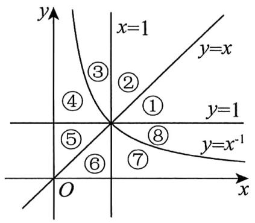

【练习3】.对幂函数 $f(x) = x^{-\frac{3}{2}}$ ，下列结论正确的是（）

$\quad$A. $f(x)$ 的定义域是 $\{x | x \neq 0, x \in \mathbb{R}\}$

$\quad$B. $f(x)$ 的值域是 $(0, +\infty)$

$\quad$C. $f(x)$ 的图象只在第一象限

$\quad$D. $f(x)$ 在 $(0, +\infty)$ 上递减

# 3.4 指数与指数函数

【练习1】 $\sqrt{(\pi - 4)^2} + \sqrt[3]{(\pi - 3)^3} =$

【练习2】.化简求值：

（1） $\frac{a\sqrt{a\sqrt{a}}}{\sqrt[4]{a^3\cdot a^{-1}}}\big(a > 0\big);$   
（2） $\left(\frac{27}{8}\right)^{-\frac{1}{3}} + \frac{1}{\sqrt{7} + 2} + 2 \cdot (e - 1)^0 - 8^{\frac{1}{4}} \times \sqrt[4]{2}$

【练习3】.函数 $y = a^{2x - 1} + 4$ 过定点\_\_\_\_.

【练习4】.函数 $f(x) = \sqrt{2 - 4^x} - \frac{1}{x}$ 的定义域为（）

$\quad$A. $\left[\frac{1}{2}, +\infty\right)$

$\quad$B. $(- \infty, 0) \cup \left(0, \frac{1}{2}\right]$

$\quad$C. $(- \infty, -2]$

$\quad$D. $\left(0,\frac{1}{2}\right]$

【练习5】.设集合 $M = \{x\mid -1\leq x\leq 1\}$ ， $N = \{y\big|y = \mathsf{e}^x,x\leq 0\}$ ，则 $M\cup N =$ （）

$\quad$A. $(0,1)$

$\quad$B. $(0,1]$

$\quad$C. $[-1, 1]$

$\quad$D. $[0,1]$

【练习6】.已知集合 $A = \{x\mid y = \sqrt{2x - x^2}\} ,B = \{y\mid y = 2^{|x| - 1}\} ,$ 则 $A\cap B$ 为（）

$\quad$A. $\left[\frac{1}{2}, 1\right]$

$\quad$B. $[1,2]$

$\quad$C. $\left[\frac{1}{2},2\right]$

$\quad$D. $[0, +\infty)$

【练习7】.满足 $\left(\frac{1}{4}\right)^{x-4}>64$ 的x的取值范围为\_\_\_\_.

【练习8】.已知函数 $f(x) = 2^{x} - m$ 在[0,2]上的最小值为2，则 $f(m) =$ \_\_\_\_.

# 3.5 对数与对数函数

【练习1】.若 $x = \log_23$ ，则 $4^{x} =$

【练习2】.求下列各式的值.

（1） $\frac{1}{2}\lg 25 + \lg 2 - \lg \sqrt{0.1} - \log_2 9 \times \log_3 2$ .   
（2） $\lg 5 \cdot \lg 20 + \lg^2 2 + 2^{1 + 2\log_23}$   
（3） $2\left(\lg \sqrt{2}\right)^{2} + \lg \sqrt{2} \cdot \lg 5 + \sqrt{\left(\lg \sqrt{2}\right)^{2} - \lg 2 + 1}$ .   
（4） $\log_3\sqrt{27} + \lg 25 + \lg 4 - 7^{\log_73} + \log_38 \cdot \log_4\sqrt[3]{3}$   
（5） $\log_4 9 \cdot \log_3 8 - \lg 2 \cdot \lg 50 - \lg 25 - (\lg 2)^2 - e^{-3\ln 2}$   
（6） $\log_535 + 2\log_{\frac{1}{2}}\sqrt{2} -\log_5\frac{1}{50} -\log_514$

【练习3】.若 $3^{a} = 12, b = \log_{4}12$ ，则 $\frac{1}{a} + \frac{1}{b} =$

【练习4】.设 $\lg 2 = a, \lg 3 = b$ ，则 $\log_5 12 =$ \_\_\_\_.

【练习5】.下列函数的定义域：

（1） $y = \frac{1}{\log_2 x}$ ;   
（2） $y = \sqrt{\lg(x - 3)}$ ;   
（3） $y = \log_2\left(16 - 4^x\right)$ ;   
（4） $y = \log_{(x-1)} (3 - x)$ .

【练习6】.函数 $f(x) = \log_3 (x^2 + 1)$ 的值域为（）

$\quad$A. $(0, +\infty)$

$\quad$B. $[0, +\infty)$

$\quad$C. $(1, +\infty)$

$\quad$D. $[1, +\infty)$

【练习7】.设 $a > 0$ 且 $a \neq 1$ ，函数 $y = \log_a(x - 3) - x$ 的图像必经过定点 \_\_\_\_.

【练习8】.同一直角坐标系中，函数 $f(x) = (a - 1)x, g(x) = \log_a x$ 的图象可能是（）

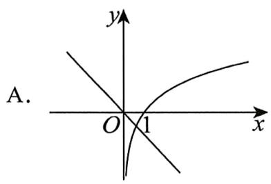

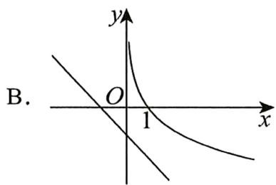

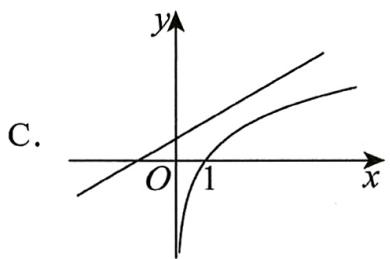

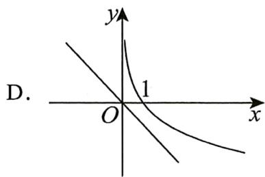

【练习9】.满足不等式 $\lg (x + 1) < \lg (3 - x)$ 的实数 $x$ 的取值范围是（）

$\quad$A. $(-\infty, 1)$

$\quad$B. $(-1, 1)$

$\quad$C. $(-1,3)$

$\quad$D. (1,3)

【练习10】.已知集合 $A = \{x|\log_2x > 2\}$ ， $B = \{x|x - 5 <   0\}$ ，则 $A\cap B =$ （）

$\quad$A. $(4, +\infty)$

$\quad$B. (4,5)

$\quad$C. $(2,5)$

$\quad$D. $(5, + \infty)$

【练习11】.函数 $f(x) = \log_{\frac{1}{2}}(x^2 - 3)$ 的单调递减区间是\_\_\_\_.

【练习12】.已知实数 $a$ 满足 $0 < a < 1$ ，则函数 $y = \log_a x$ 在 $[a^3, a^2]$ 上的最大值是（）

$\quad$A. 3

$\quad$B. 2

$\quad$C. $\frac{1}{3}$

$\quad$D. $\frac{1}{2}$

# 3.6 函数的三种图象变换

【练习1】.若函数 $f(x)$ 是R上的奇函数，则函数 $y = f(x - 1) - 1$ 的图象必过定点\_\_\_\_.

【练习2】.要得到函数 $y = 2^{2x - 1}$ 的图象，只需将指数函数 $y = 4^x$ 的图象（）

$\quad$A. 向左平移1个单位

$\quad$B. 向右平移1个单位

$\quad$C. 向左平移 $\frac{1}{2}$ 个单位

$\quad$D. 向右平移 $\frac{1}{2}$ 个单位

【练习3】.已知函数 $f(x)$ 的图象如图1所示，则图2所表示的函数是（）

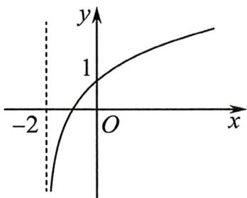

图1

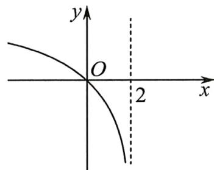

图2

$\quad$A. $1 - f(x)$

$\quad$B. $-f(2 - x)$

$\quad$C. $f(-x) - 1$

$\quad$D. $1 - f(-x)$

【练习4】.函数 $f(x) = |\ln x|$ 的图象是（

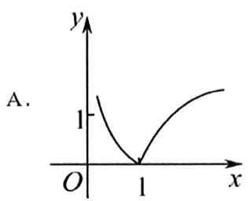

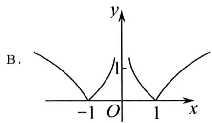

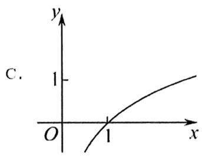

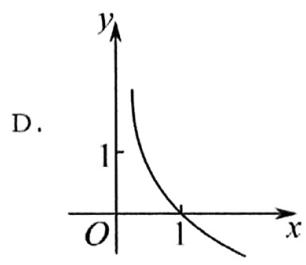

【练习5】.画出函数草图

$y = \left(\frac {1}{2}\right) ^ {| x |} - 1.$

# 3.7 函数的零点与方程的解

【练习1】.方程 $2x + \ln x - 5 = 0$ 的解所在区间为（）

$\quad$A. $(4,5)$

$\quad$B. (3,4)

$\quad$C. (2,3)

$\quad$D. $(1,2)$

【练习2】.函数 $f(x) = \lg |x| - |x^2 - 2|$ 的零点个数为（）

$\quad$A. 2

$\quad$B. 3

$\quad$C. 4

$\quad$D. 5

【练习3】.已知函数 $f(x) = \ln (x + 1) + 2x - m(m\in \mathbb{R})$ 的一个零点附近的函数值的参考数据如下表：

<table><tr><td>x</td><td>0</td><td>0.5</td><td>0.53125</td><td>0.5625</td><td>0.625</td><td>0.75</td><td>1</td></tr><tr><td>f(x)</td><td>-1.307</td><td>-0.084</td><td>-0.009</td><td>0.066</td><td>0.215</td><td>0.512</td><td>1.099</td></tr></table>

由二分法求得方程 $\ln (x + 1) + 2x - m = 0$ 的近似解（误差不超过0.02）可能是（

$\quad$A. 0.547

$\quad$B. -0.009

$\quad$C. 0.5625

$\quad$D. 0.066

# 3.8 函数模型的应用

【练习1】.下列函数增长速度最快的是（）

$\quad$A. $y = 1.1^{x}$

$\quad$B. $y = 2023x^{2}$

$\quad$C. $y = \log_{2023} x$

$\quad$D. $y = 2023x$

【练习2】.根据下表实验数据，下列所给函数模型比较适合的是（）

<table><tr><td>x</td><td>1</td><td>2</td><td>3</td><td>4</td></tr><tr><td>y</td><td>14</td><td>20</td><td>29</td><td>43</td></tr></table>

$\quad$A. $y = \frac{t}{x} + b(t > 0)$

$\quad$B. $y = d\cdot \log_r x + s(d > 0,r > 1)$

$\quad$C. $y = m\cdot a^{x} + n(m > 0,a > 1)$

$\quad$D. $y = kx + b (k > 0)$

【练习 3】.通过实验数据可知, 某液体的蒸发速度 $y$ (单位: 升/小时)与液体所处环境的温度 $x$ (单位: ℃)近似地满足函数关系 $y = \mathrm{e}^{kx + b}$ ( $e$ 为自然对数的底数, $k, b$ 为常数). 若该液体在 $0^\circ \mathrm{C}$ 的蒸发速度是 0.1 升/小时, 在 $30^\circ \mathrm{C}$ 的蒸发速度为 0.8 升/小时, 则该液体在 $20^\circ \mathrm{C}$ 的蒸发速度为 \_\_\_\_ 升/小时.

# 4 导数

# 4.1 导数的概念及其意义

【练习1】.如图，函数 $y = f(x)$ 的图象在点 $P$ 处的切线方程是 $y = -x + 8$ ，则 $f(5) + f'（5） = (\quad)$

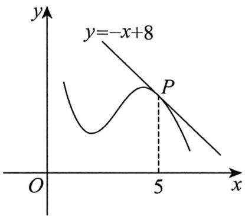

$\quad$A. 1

$\quad$B. 2

$\quad$C. 3

$\quad$D. 4

# 4.2 导数的运算

【练习1】.求下列函数的导数

（1） $y = \ln 3$ ;   
（2） $y = x^{-3}$ ;   
（3） $f(x) = \frac{\cos x}{\mathrm{e}^x}$ ;   
（4） $y = (2x^{2} - 1)(3x + 1)$ ;   
（5） $f(x) = \ln \sqrt{1 + x^2}$ ;   
（6） $y = \frac{1 + \cos x}{\sin x}$ .

【练习2】.已知函数 $f(x) = x^{2} - \ln x$ ， $f'\left(\frac{1}{2}\right) = (\quad)$

$\quad$A.-1

$\quad$B.0

$\quad$C.1

$\quad$D.3

【练习3】.曲线 $f(x) = x\ln x$ 在 $x = \mathrm{e}^{-2}$ 处的切线方程为（）

$\quad$A. $y = -x - 3\mathrm{e}^{-2}$

$\quad$B. $y = -x + 3\mathrm{e}^{-2}$

$\quad$C. $y = -x - \mathrm{e}^{-2}$

$\quad$D. $y = -x + \mathrm{e}^{-2}$

# 4.3 导数在研究函数中的应用

【练习1】.如果函数 $y = f(x)$ 的图象如图，那么导函数 $y = f'(x)$ 的图象可能是（）

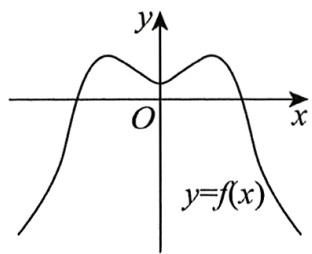

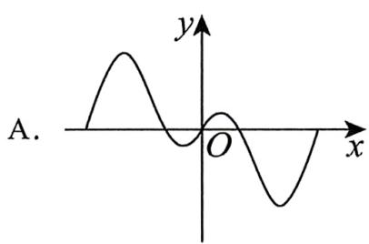

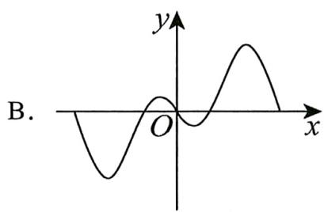

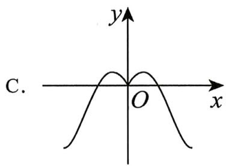

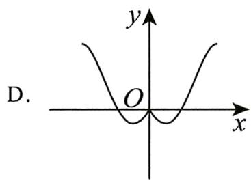

【练习2】.函数 $f(x) = x \ln x$ 的单调减区间是（）

$\quad$A. $(- \infty, -\mathrm{e})$

$\quad$B. $\left(-\infty,\frac{1}{e}\right)$

$\quad$C. $\left(0, \frac{1}{\mathrm{e}}\right)$

$\quad$D. $(0,\mathrm{e})$

【练习3】.函数 $f(x) = x - \ln x$ 的（）

$\quad$A. 极大值为 1

$\quad$B. 极小值为 1

$\quad$C. 极小值为-1

$\quad$D. 极小值为 $\mathrm{e} - 1$

【练习4】.若 $x = a$ 是函数 $f(x) = (x - a)^2 (x - 1)$ 的极小值点，则 $a$ 的取值范围是（）

$\quad$A. $a <   1$

$\quad$B. $a \leq 1$

$\quad$C. $a > 1$

$\quad$D. $a \geq 1$

【练习5】.函数 $f(x) = x^{3} - 6x^{2} + 16$ ， $x \in [0,5]$ 的最小值为（）

$\quad$A. -16

$\quad$B. -9

$\quad$C. 9

$\quad$D. 16

# 5 三角函数

# 5.1 任意角和弧度制

【练习1】. $200^{\circ}$ 角是（）

$\quad$A. 第一象限角

$\quad$B. 第二象限角

$\quad$C. 第三象限角

$\quad$D. 第四象限角

【练习2】.若 $\theta = -5$ ，则角 $\theta$ 的终边所在的象限是（）

$\quad$A. 第四象限

$\quad$B. 第三象限

$\quad$C. 第二象限

$\quad$D. 第一象限

【练习3】.将 $-1485^{\circ}$ 表示成 $\alpha + 2k\pi$ ， $k \in \mathbf{Z}$ 的形式，且 $0 \leq \alpha \leq 2\pi$

【练习4】.若 $\alpha$ 是第二象限角，则角 $-\frac{\pi}{2} - \alpha$ 的终边所在的象限是（ ）

$\quad$A. 第一象限

$\quad$B. 第二象限

$\quad$C. 第三象限

$\quad$D. 第四象限

【练习5】.已知扇形的半径为 $4\mathrm{cm}$ ，面积为 $8\mathrm{cm}^2$ ，则扇形圆心角的弧度数为（）

$\quad$A. 1

$\quad$B. 2

$\quad$C. 3

$\quad$D. 4

# 5.2 三角函数的概念

【练习1】.角 $\alpha$ 的终边上有一点 $P(3, - 2)$ ，则 $\sin \alpha =$

【练习2】.若 $\alpha \in (-\frac{\pi}{2},0)$ ，则点 $(\cos \alpha ,\tan \alpha)$ 在第（）象限.

$\quad$A. 一

$\quad$B. 二

$\quad$C. 三

$\quad$D. 四

【练习3】.已知 $\alpha$ 是第二象限角，且 $\sin \alpha = \frac{\sqrt{3}}{3}$ ，则 $\tan \alpha = (\quad)$

$\quad$A. $-\sqrt{2}$

$\quad$B. $-\frac{\sqrt{2}}{2}$

$\quad$C. $-\frac{\sqrt{2}}{3}$

$\quad$D. $-\frac{3\sqrt{2}}{2}$

# 5.3 诱导公式

【练习1】.若 $\sin \left(\frac{\pi}{2} -\alpha\right) = \frac{1}{2}$ 则 $\cos (-\alpha) =$

【练习2】. $\cos \left(\frac{3\pi}{2} -\theta\right) + \sin (\theta +\pi) =$ （）

$\quad$A. $-2\sin \theta$

$\quad$B. 0

$\quad$C. $\cos \theta - \sin \theta$

$\quad$D. $-\cos \theta + \sin \theta$

【练习3】. $\cos 600^{\circ} =$

# 5.4 三角函数的图象与性质

【练习1】.函数 $y = 3\sin x - 2$ ， $x \in \left[0, \frac{\pi}{6}\right]$ 的最大值是 \_\_\_\_.

【练习2】.比较 $\tan 48^{\circ}$ 、 $\tan (-22^{\circ})$ 、 $\tan 114^{\circ}$ 的大小关系（）

$\quad$A. $\tan 114^{\circ} > \tan 48^{\circ} > \tan (-22^{\circ})$

$\quad$B. $\tan (-22^{\circ}) > \tan 114^{\circ} > \tan 48^{\circ}$

$\quad$C. $\tan (-22^{\circ}) > \tan 48^{\circ} > \tan 114^{\circ}$

$\quad$D. $\tan 48^{\circ} > \tan (-22^{\circ}) > \tan 114^{\circ}$

【练习3】.求函数 $y = \sqrt{2\sin x + 1}$ 的定义域

# 5.5 函数 $y = A \sin (\omega x + \varphi)$

2024 新高考一卷数学

【练习1】.当 $x \in [0, 2\pi]$ 时，曲线 $y = \sin x$ 与 $y = 2\sin \left(3x - \frac{\pi}{6}\right)$ 的交点个数为（）

$\quad$A. 3

$\quad$B. 4

$\quad$C. 6

$\quad$D. 8

【练习2】.将函数 $f(x) = \sin \left(4x - \frac{\pi}{3}\right)$ 的图象向左平移 $\frac{\pi}{6}$ 个单位长度.再将所得图象上所有点的横坐标伸长到原来的2倍，纵坐标不变，得到曲线 $y = g(x)$ ，则曲线 $y = g(x)$ （）

$\quad$A. 关于直线 $x = \frac{\pi}{8}$ 对称

$\quad$B. 关于直线 $x = \frac{\pi}{12}$ 对称

$\quad$C. 关于点 $\left(-\frac{\pi}{4}, 0\right)$ 对称

$\quad$D. 关于点 $\left(-\frac{\pi}{24}, 0\right)$ 对称

【练习3】.将函数 $f(x) = \cos \left( x + \frac{\pi}{6} \right)$ 的图像上所有点的横坐标缩短为原来的 $\frac{1}{2}$ 倍，纵坐标保持不变，得到函数 $g(x)$ 的图像，则函数 $g(x)$ 的一个减区间是（）

$\quad$A. $\left[-\frac{\pi}{6}, \frac{\pi}{3}\right]$

$\quad$B. $\left[-\frac{\pi}{3}, \frac{5\pi}{3}\right]$

$\quad$C. $\left[-\frac{\pi}{6}, \frac{11\pi}{6}\right]$

$\quad$D. $\left[-\frac{\pi}{12}, \frac{5\pi}{12}\right]$

# 5.6 三角恒等变换

【练习1】. $\cos 15^{\circ}\cos 45^{\circ} + \sin 15^{\circ}\sin 45^{\circ}$ 等于

$\quad$A. $\frac{1}{2}$

$\quad$B. $\frac{\sqrt{2}}{2}$

$\quad$C. $\frac{\sqrt{3}}{2}$

$\quad$D. 1

【练习2】.已知 $\alpha \in (0,\pi)$ ，且 $\tan \alpha = -2$ ，则 $\tan \left(\alpha +\frac{\pi}{4}\right) = \_$ .

【练习3】.化简 $\sin (x + y)\sin (x - y) - \cos (x + y)\cos (x - y)$ 的结果是（）

$\quad$A. $\sin 2x$

$\quad$B. $\cos 2x$

$\quad$C. $-\cos 2x$

$\quad$D. $-\sin 2x$

【练习4】.函数 $y = \sin x + \sqrt{3}\cos x$ ， $x \in [0, \pi]$ 的最大值是 \_\_\_\_.

【练习5】.已知 $\cos \theta = -\frac{1}{3}$ ， $\theta \in (0,\pi)$ ，则 $\cos \left(\frac{\pi}{2} -2\theta\right) =$

【练习6】.若 $\sin \left(\alpha +\frac{3\pi}{2}\right) + 3\cos \left(\alpha -\frac{\pi}{2}\right) = 0$ ，则 $\tan 2\alpha =$ （）

$\quad$A. $-\frac{4}{3}$

$\quad$B. $\frac{4}{3}$

$\quad$C. $-\frac{3}{4}$

$\quad$D. $\frac{3}{4}$

【练习7】.函数 $f(x) = 2\sin x\cos x\cos 2x$ 的周期是（）

$\quad$A. $\frac{\pi}{4}$

$\quad$B. $\frac{\pi}{2}$

$\quad$C. $\pi$

$\quad$D. $2\pi$

2023 新高考二卷数学

【练习8】.已知 $\alpha$ 为锐角， $\cos \alpha = \frac{1 + \sqrt{5}}{4}$ ，则 $\sin \frac{\alpha}{2} = ()$

$\quad$A. $\frac{3 - \sqrt{5}}{8}$

$\quad$B. $\frac{-1 + \sqrt{5}}{8}$

$\quad$C. $\frac{3 - \sqrt{5}}{4}$

$\quad$D. $\frac{-1 + \sqrt{5}}{4}$

# 6 解三角形

【练习1】.在 $\triangle ABC$ 中，若 $BC = \sqrt{2}$ ， $AC = \sqrt{5}$ ， $B = \frac{\pi}{6}$ ，则 $\sin A = (\quad)$

$\quad$A. $\frac{\sqrt{10}}{10}$

$\quad$B. $\frac{\sqrt{10}}{5}$

$\quad$C. $\frac{\sqrt{5}}{10}$

$\quad$D. $\frac{\sqrt{5}}{5}$

【练习2】.在 $\triangle ABC$ 中，已知 $b = 3$ ， $c = 2\sqrt{3}$ ， $A = 30^{\circ}$ ，则 $a$ 的值为

【练习3】.在 $\triangle ABC$ 中，角 $A,B,C$ 的对边分别为 $a,b,c$ ，若 $\sin A:\sin B:\sin C=2:3:4$ ，则 $\sin C=$

【练习4】. $\Delta ABC$ 中，角 $A, B, C$ 所对的边分别为 $a, b, c$ ，若 $(\sqrt{3} b - c) \cos A = a \cos C$ ，则 $\cos A = (\quad)$

$\quad$A. $\frac{1}{2}$

$\quad$B. $\frac{\sqrt{3}}{2}$

$\quad$C. $\frac{\sqrt{3}}{3}$

$\quad$D. $\sqrt{3}$

【练习5】.在 $\triangle ABC$ 中，记内角 $A, B, C$ 所对的边分别为 $a, b, c$ . 若 $c^2 - ab = (a - b)^2$ ，则 $C = (\quad)$

$\quad$A. $\frac{\pi}{6}$

$\quad$B. $\frac{\pi}{4}$

$\quad$C. $\frac{\pi}{3}$

$\quad$D. $\frac{2\pi}{3}$

【练习6】.已知 $\triangle ABC$ 的内角 $A, B, C$ 所对的边分别为 $a, b, c$ , 若 $b = c\cos A$ , 则 $C = (\quad)$

$\quad$A. $\frac{\pi}{3}$

$\quad$B. $\frac{\pi}{6}$

$\quad$C. $\frac{\pi}{2}$

$\quad$D. $\frac{\pi}{4}$

【练习7】.在 $\triangle ABC$ 中 $\cos C = \frac{1}{3}, AC = 3, AB = 2\sqrt{2}$ , 则 $\triangle ABC$ 的面积为（）

$\quad$A. $2 \sqrt{2}$

$\quad$B. $\sqrt{2}$

$\quad$C. $\frac{4\sqrt{2}}{3}$

$\quad$D. 1

【练习8】.已知 $\triangle ABC$ 的三边长 $AB = 4\mathrm{cm}, BC = 2\mathrm{cm}, AC = 3\mathrm{cm}$ ，则 $\triangle ABC$ 的面积为 \_\_\_\_ $\mathrm{cm}^2$ .

# 7 数列

# 7.1 数列的概念

【练习1】.数列 $-2, \frac{4}{3}, -\frac{6}{5}, \frac{8}{7}, \cdots$ 的通项公式可以为（）

$\quad$A. $(-1)^{n}\frac{n}{2n + 1}$

$\quad$B. $(-1)^{n}\frac{2n}{2n - 1}$

$\quad$C. $(-1)^{n - 1}\frac{2n}{2n + 1}$

$\quad$D. $(-1)^{n + 1}\frac{2n}{2n - 1}$

【练习2】.若数列 $\{a_{n}\}$ 的前 $n$ 项和 $S_{n} = n^{3} - n(n\in \mathbf{N},n\geq 1)$ ，则 $a_{10} = \underline{\quad}$ .

【练习3】.已知数列 $\{a_{n}\}$ 中， $a_1 = 1$ ， $a_2 = 1$ ，且 $a_{n} = a_{n - 1} + 3a_{n - 2}(n\geq 3)$ ，则 $a_4 =$ （

$\quad$A. 4

$\quad$B. 6

$\quad$C. 7

$\quad$D. 13

【练习4】.设 $S_{n}$ 为数列 $\{a_{n}\}$ 的前 $n$ 项和， $S_{n} = n^{2} - 10n$ ，求 $a_1$ 及 $a_{n}$

【练习 5】. 若 $\left\{a_{n}\right\}$ 满足： $0 < a_{n+1} < a_{n} < 1 (\forall n \in \mathbf{N}^{*})$ ，则满足上述条件数列 $\left\{a_{n}\right\}$ 的一个通项公式为 \_\_\_\_.

# 7.2 等差数列

【练习1】.若等差数列 $\{a_{n}\}$ 的前三项依次为1， $a + 1$ ， $a + 3$ ，则实数 $a$ 的值为

【练习2】.已知 $\{a_{n}\}$ 是等差数列 $a_4 + a_6 = 6$ ，其前5项和 $S_{5} = 10$ ．则其公差 $d =$

【练习3】.已知数列 $\{a_{n}\}$ 的通项 $a_{n} = -5n + 2$ ，则其前 $n$ 项和为 $S_{n} =$

# 7.3 等比数列

【练习1】.等比数列 $\{a_{n}\}$ 中， $a_4 = 48$ ， $a_8 = 3$ ，则 $a_4$ 与 $a_8$ 的等比中项为（）

$\quad$A. 12

$\quad$B. -12

$\quad$C. $\pm 12$

$\quad$D. 30

【练习2】.若数列 $\{a_{n}\}$ 满足 $a_1 = 1, a_{n+1} = 2a_n, n = 1, 2, 3, \ldots$ , 则 $a_1 + a_2 + \ldots + a_n =$

【练习3】.在等比数列 $\{a_{n}\}$ 中， $a_7a_8 = 8a_{12}$ ，则 $a_3 =$ （

$\quad$A. 2

$\quad$B. 4

$\quad$C. 8

$\quad$D. 16

【练习4】.已知等比数列 $\{a_{n}\}$ 的前 $n$ 项和为 $S_{n}$ ， $a_{1} + a_{3} = 10$ ， $a_{2} + a_{4} = 20$ ，则 $S_{5} = (\quad)$

$\quad$A. 62

$\quad$B. 50

$\quad$C. 40

$\quad$D. 22

【练习5】.记 $S_{n}$ 为等比数列 $\{a_{n}\}$ 的前 $n$ 项和，若 $a_1 = \frac{1}{3}$ ， $a_4^2 = a_6$ ，则 $S_{5} = (\quad)$

【练习6】.等比数列 $\{a_{n}\}$ 的前 $n$ 项和为 $S_{n}$ ，且 $4a_{1}$ ， $2a_{2}$ ， $a_{3}$ 成等差数列，若 $a_{1} = 1$ ，则 $s_4 =$

$\quad$A.7

$\quad$B.8

$\quad$C.15

$\quad$D.16

【练习7】.已知数列 $\{a_{n}\}$ 中， $a_{n} = 2n - 1 + \frac{1}{3^{n}}$ ，求数列 $\{a_{n}\}$ 的前 $n$ 项和 $S_{n}$

# 8 平面向量

# 8.1 平面向量的概念及线性运算

【练习1】. $\overrightarrow{MN} -\overrightarrow{PQ} -\overrightarrow{MP} =$ （

$\quad$A. $\overrightarrow{QN}$

$\quad$B. $\overrightarrow{NQ}$

$\quad$C. $\overrightarrow{PM}$

$\quad$D. $\overrightarrow{MP}$

【练习2】.如图, 在平行四边形 $ABCD$ 中, 对角线 $AC$ 与 $BD$ 交于点 $O$ , 下列计算正确的是 ( )

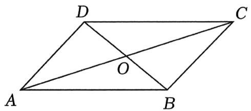

$\quad$A. $\overrightarrow{AB} +\overrightarrow{AD} = \overrightarrow{AC}$

$\quad$B. $\overrightarrow{AC} +\overrightarrow{CD} +\overrightarrow{DO} = \overrightarrow{OA}$

$\quad$C. $\overrightarrow{AB} +\overrightarrow{AC} +\overrightarrow{CD} = \overrightarrow{AC}$

$\quad$D. $\overrightarrow{AC} +\overrightarrow{BA} +\overrightarrow{DA} = \overrightarrow{0}$

【练习3】. $(2\vec{a} -\vec{b}) - (2\vec{a} +\vec{b})$ 等于（ ）

$\quad$A. $\vec{a} - 2\vec{b}$

$\quad$B. $-2\vec{b}$

$\quad$C. $\vec{0}$

$\quad$D. $\vec{b} -\vec{a}$

【练习4】.已知正方形ABCD的边长为2，则 $\left|\overrightarrow{AB}+\overrightarrow{BC}+\overrightarrow{AC}\right|=\quad()$

$\quad$A. $\sqrt{2}$

$\quad$B. $2 \sqrt{2}$

$\quad$C. $4 \sqrt{2}$

$\quad$D. $6 \sqrt{2}$

【练习5】.已知 $\vec{a}$ , $\vec{b}$ 是两个不共线的向量, 且向量 $2\vec{a} - \vec{b}$ 与 $\lambda \vec{a} + 5\vec{b}$ 共线, 则实数 $\lambda$ 的值为

【练习6】.已知 $\vec{a}$ ， $\vec{b}$ 是不共线的向量，且 $\overrightarrow{AB} = \overrightarrow{a} +\overrightarrow{b}$ ， $\overrightarrow{AC} = m\overrightarrow{a} +2\overrightarrow{b}$ ， $\overrightarrow{CD} = 3\overrightarrow{a} +2\overrightarrow{b}$ ，若 $B,C,D$ 三点共线，则 $m =$ （）

$\quad$A. $\frac{1}{2}$

$\quad$B. $\frac{3}{2}$

$\quad$C. $\frac{5}{2}$

$\quad$D. $\frac{7}{2}$

【练习7】.已知 $G$ 为 $\triangle ABC$ 的重心，则（）

$\quad$A. $\overrightarrow{BG} = \frac{2}{3}\overrightarrow{AB} -\frac{1}{3}\overrightarrow{AC}$

$\quad$B. $\overrightarrow{BG} = -\frac{2}{3}\overrightarrow{AB} +\frac{1}{3}\overrightarrow{AC}$

$\quad$C. $\overrightarrow{BG} = -\frac{1}{3}\overrightarrow{AB} +\frac{2}{3}\overrightarrow{AC}$

$\quad$D. $\overrightarrow{BG} = \frac{1}{3}\overrightarrow{AB} -\frac{2}{3}\overrightarrow{AC}$

# 8.2 平面向量基本定理及坐标表示

【练习1】.如图，在平行四边形ABCD中，E是BC的中点， $\overrightarrow{AE}=3\overrightarrow{AF}$ ，则 $\overrightarrow{DF}=$ （）

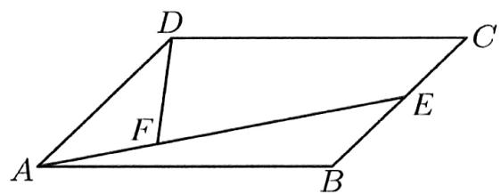

$\quad$A. $-\frac{1}{3}\overrightarrow{AB} +\frac{2}{3}\overrightarrow{AD}$

$\quad$B. $\frac{1}{3}\overrightarrow{AB} -\frac{2}{3}\overrightarrow{AD}$

$\quad$C. $\frac{1}{3}\overrightarrow{AB} -\frac{5}{6}\overrightarrow{AD}$

$\quad$D. $\frac{1}{3}\overrightarrow{AB} -\frac{3}{4}\overrightarrow{AD}$

【练习2】.在平行四边形ABCD中， $M$ 为BC的中点，设 $\overrightarrow{AB} = \vec{a}$ ， $\overrightarrow{DM} = \vec{b}$ ，则 $\overrightarrow{DB} =$ （）

$\quad$A. $2\vec{b} -\vec{a}$

$\quad$B. $\vec{a} - 2\vec{b}$

$\quad$C. $3\vec{a} - 2\vec{b}$

$\quad$D. $3\vec{a} + 2\vec{b}$

【练习3】.已知向量 $\vec{e}_1$ ， $\vec{e}_2$ 不共线，则下列向量不可以作为一组基底的是（）

$\quad$A. $\vec{e}_1 + \vec{e}_2$ 和 $\vec{e}_1 - \vec{e}_2$

$\quad$B. $4\vec{e}_1 - 2\vec{e}_2$ 和 $6\vec{e}_1 - 3\vec{e}_2$

$\quad$C. $2\vec{e}_1 - \vec{e}_2$ 和 $\vec{e}_2$

$\quad$D. $\vec{e}_1 - \vec{e}_2$ 和 $2\vec{e}_2 + \vec{e}_1$

2022 全国乙卷

【练习4】.已知向量 $\vec{a} = (2,1),\vec{b} = (-2,4)$ ，则 $\left|\vec{a} -\vec{b}\right|$ （）

$\quad$A. 2

$\quad$B. 3

$\quad$C. 4

$\quad$D. 5

【练习5】.已知向量 $\vec{a} = (1,2),\vec{b} = (2,3),\vec{c} = (3,4)$ ，且 $\vec{c} = \lambda_1\vec{a} +\lambda_2\vec{b}$ ，则 $\lambda_{1},\lambda_{2}$ 的值分别为（

$\quad$A. -2, 1

$\quad$B. 1, -2

$\quad$C. 2, -1

$\quad$D. -1, 2

【练习6】.已知向量 $\vec{a} = (1,1)$ ， $\vec{b} = (m, - 2)$ ，若 $\vec{a} //(\vec{a} +\vec{b})$ ，则 $m =$

# 8.3 平面向量的数量积

【练习1】.已知 $|\vec{a}| = 5, |\vec{b}| = 4$ ，且 $\vec{a} \cdot \vec{b} = -10$ ，则向量 $\vec{a}$ 与 $\vec{b}$ 的夹角为（）

$\quad$A. $\frac{\pi}{6}$

$\quad$B. $\frac{\pi}{3}$

$\quad$C. $\frac{2\pi}{3}$

$\quad$D. $\frac{5\pi}{6}$

【练习2】.若 $\vec{a}$ 与 $\vec{b}$ 满足 $\left|\vec{a}\right| = \left|\vec{b}\right| = 1$ ， $\left\langle \vec{a},\vec{b}\right\rangle = 60^{\circ}$ ，则 $\vec{a}\cdot \vec{a} +\vec{a}\cdot \vec{b}$ 等于（）

$\quad$A. $\frac{1}{2}$

$\quad$B. $\frac{3}{2}$

$\quad$C. $1 + \frac{\sqrt{3}}{2}$

$\quad$D. 2

2021全国乙卷

【练习3】.已知向量 $\vec{a} = (1,3),\vec{b} = (3,4)$ ，若 $(\vec{a} -\lambda \vec{b})\bot (\vec{b} -\vec{a})$ ，则 $\lambda =$

【练习4】.已知 $\vec{a} = (1,0)$ ， $\vec{b} = (3,4)$ ，则向量 $\vec{a}$ 在向量 $\vec{b}$ 方向上的投影向量为\_\_\_\_（用坐标表示）.

【练习5】.已知向量 $\vec{a}$ 与 $\vec{b}$ 满足 $|\vec{a}| = 1, |\vec{b}| = 2, \langle \vec{a}, \vec{b} \rangle = \frac{2\pi}{3}$ , 则 $|3\vec{a} + \vec{b}| = (\quad)$

$\quad$A. 7

$\quad$B. $\sqrt{7}$

$\quad$C. 19

$\quad$D. $\sqrt{19}$

【练习6】.已知向量 $|\vec{a}| = 1$ ， $\vec{b} = (1,1)$ ， $|\vec{a} +\vec{b}| = 2$ ，则 $\vec{a}\cdot \vec{b} =$

# 2024 重庆一中三模

【练习7】.已知 $\vec{a} = (1,2)$ ，向量 $\vec{b}$ 为单位向量， $(\vec{a} + \vec{b}) \cdot \vec{a} = 4$ ，则 $\cos \langle \vec{a}, \vec{b} \rangle = (\quad)$

$\quad$A. $\frac{\sqrt{5}}{5}$

$\quad$B. $-\frac{\sqrt{5}}{5}$

$\quad$C. $\frac{1}{5}$

$\quad$D. $-\frac{1}{5}$

# 2024 四川百师联盟

【练习8】.已知向量 $\left|\vec{b}\right|=2\left|\vec{a}\right|=2\sqrt{3},\vec{a}\cdot\vec{b}=2$ ，则 $\cos<\vec{a},\vec{a}-\vec{b}>=()$

$\quad$A. $\frac{1}{11}$

$\quad$B. $\frac{\sqrt{33}}{33}$

$\quad$C. $\frac{\sqrt{11}}{33}$

$\quad$D. $\frac{\sqrt{11}}{11}$

# 9 复数

2022 新高考一卷

【练习1】.设 $(1 + 2\mathrm{i})a + b = -2\mathrm{i}$ ，其中 $a,b$ 为实数，则（）

$\quad$A. $a = 1, b = -1$

$\quad$B. $a = 1, b = 1$

$\quad$C. $a = -1, b = -1$

$\quad$D. $a = -1, b = 1$

2024 新高考二卷

【练习2】.已知i是虚数单位，若 $z = -1 - \mathrm{i}$ ，则 $\left|z\right| =$ （）

$\quad$A. 0

$\quad$B. 1

$\quad$C. $\sqrt{2}$

$\quad$D. 2

2024全国甲卷

【练习3】.设 $z = \sqrt{2}\mathrm{i}$ ，则 $z\cdot \overline{z} =$ （

$\quad$A. -2

$\quad$B. $\sqrt{2}$

$\quad$C. $-\sqrt{2}$

$\quad$D. 2

2020 新课标三卷

【练习4】.若 $\overline{z} (1 + i) = 1 - i$ ，则 $z =$ （

$\quad$A. $1 - i$

$\quad$B. $1 + i$

$\quad$C. $-i$

$\quad$D. $i$

【练习5】.若复数 $z = \frac{a + 3i}{1 + 2i}$ （i为虚数单位）是纯虚数，则实数 $a =$

$\quad$A. -6

$\quad$B. -2

$\quad$C. 4

$\quad$D. 6

2023 全国甲卷

【练习6】.复数 $z = \frac{5(1 + \mathrm{i}^3)}{(2 + \mathrm{i})(2 - \mathrm{i})}$ 的共轭复数为（）

$\quad$A. -1

$\quad$B. 1

$\quad$C. $1 - \mathrm{i}$

$\quad$D. $1 + \mathrm{i}$

【练习7】.在复平面内，复数 $\frac{1}{1 - i}$ （i为虚数单位）的共轭复数对应的点位于（ ）.

$\quad$A. 第一象限;

$\quad$B. 第二象限;

$\quad$C. 第三象限;

$\quad$D. 第四象限.

# 10 立体几何

# 10.1 基本立体图形、简单几何体的表面积与体积

【练习1】.已知某圆锥的母线长为4，底面圆的半径为2，则圆锥的全面积为（）

$\quad$A. $10\pi$

$\quad$B. $12\pi$

$\quad$C. $14\pi$

$\quad$D. $16\pi$

【练习2】.一个圆锥的底面直径和高都同一个球的直径相等，那么圆锥与球的体积之比是（）

$\quad$A. $1:3$

$\quad$B. 2:3

$\quad$C. $1: 2$

$\quad$D. 2:9

【练习3】.若一个圆台如图所示，则其侧面积等于（）

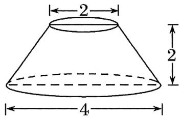

$\quad$A. 6

$\quad$B. $6\pi$

$\quad$C. $3 \sqrt{5} \pi$

$\quad$D. $6 \sqrt{5} \pi$

【练习4】.圆台上底半径为2，下底半径为6，母线长为5，则圆台的体积为

$\quad$A. $40\pi$

$\quad$B. $52\pi$

$\quad$C. $50\pi$

$\quad$D. $\frac{212}{3}\pi$

【练习 5】. 已知圆锥的底面半径为 2，且它的侧面展开图是一个半圆，则这个圆锥的体积为 \_\_\_\_.

【练习6】.已知正四棱锥 $S - ABCD$ 的底面边长为2，侧棱长为 $\sqrt{3}$ ，则该正四棱锥的体积等于（）

$\quad$A. $\frac{4}{3}$

$\quad$B. $\frac{4 \sqrt{3}}{3}$

$\quad$C. $4 \sqrt{3}$

$\quad$D. 4

# 10.2 空间点、直线、平面之间的位置关系

【练习1】.如图所示，用符号语言可表达为（）

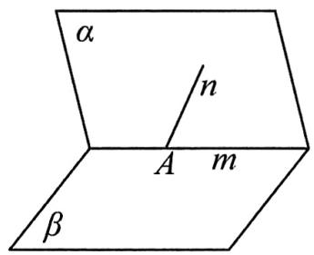

$\quad$A. $\alpha \cap \beta = m, n \subset \alpha, A \subset m, A \subset n$

$\quad$B. $\alpha \cap \beta = m, n \in \alpha, A \in m, A \in n$

$\quad$C. $\alpha \cap \beta = m, n \subset \alpha, m \cap n = A$

$\quad$D. $\alpha \cap \beta = m, n \in \alpha, m \cap n = A$

【练习2】.已知 $a$ 、 $b$ 是异面直线，直线 $c / /$ 直线 $a$ ，则直线 $c$ 与直线 $b$ 的位置关系是

【练习3】.如图，在正方体 $ABCD - A_{1}B_{1}C_{1}D_{1}$ 中，直线 $AD_{1}$ 与 $A_{1}B$ 所成角的大小为【练习 4】.如图, 在直三棱柱 $ABC - A_{1}B_{1}C_{1}$ (侧棱 $AA_{1}$ 垂直于底面 $ABC$ 中, $D$ 为 $A_{1}B_{1}$ 的中点, $AB = BC = BB_{1} = 2$ , $AC = 2\sqrt{5}$ , 则异面直线 $BD$ 与 $AC$ 所成的角为 ( )

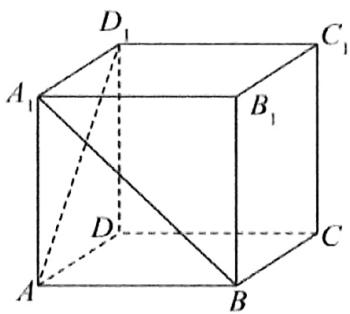

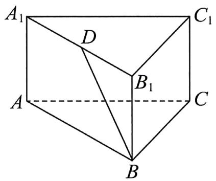

$\quad$A. $30^{\circ}$

$\quad$B. $45^{\circ}$

$\quad$C. $60^{\circ}$

$\quad$D. $90^{\circ}$

# 10.3 空间直线、平面的平行

【练习1】.若 $a / / \alpha ,b / / \alpha$ ，则两直线 $a$ 与 $b$ 的位置关系是

【练习2】.能保证直线 $a$ 与平面 $\alpha$ 平行的条件是（）

$\quad$A. $b \subset \alpha, a // b$   
$\quad$B. $b \subset \alpha, c \parallel \alpha, a \parallel b, a \parallel c$   
$\quad$C. $b \subset \alpha, A \in a, B \in a, C \in b, D \in b$ ，且 $AC = BD$   
$\quad$D. $a \not\subset \alpha, b \subset \alpha, a \parallel b$

【练习3】.已知不重合的直线 $a, b$ 和平面 $\alpha$ ，下列命题正确的是（）

$\quad$A. 若 $a \parallel \alpha, b \subset \alpha$ ，则 $a \parallel b$   
$\quad$B. 若 $a \parallel \alpha, b \parallel \alpha$ ，则 $a \parallel b$   
$\quad$C. 若 $a \parallel b$ ， $b \subset \alpha$ ，则 $a \parallel \alpha$   
$\quad$D. 若 $a \perp \alpha, b \perp \alpha$ ，则 $a \parallel b$

【练习 4】.如图, 已知四棱锥 $P - ABCD$ 中, 底面 $ABCD$ 为平行四边形, 点 $M 、 N 、 Q$ 分别是 $PA 、 BD 、 PD$ 的中点.求证:

（1） $MN \parallel$ 平面 $PCD$ ;  
（2）平面 $MNQ \parallel$ 平面 $PBC$ .

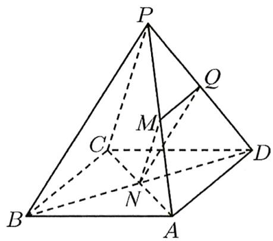

【练习5】.如图，在三棱柱 $ABC-A_{1}B_{1}C_{1}$ 中，D为AC的中点.

求证： $AB_{1}$ // 平面 $BC_{1}D$ ;

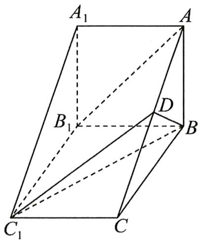

【练习6】.如图, 在四棱锥 $P-ABCD$ 中, $M$ , $N$ 分别为 $AC$ , $PC$ 上的点, 且 $MN\|$ 平面 $PAD$ , 则 ( )

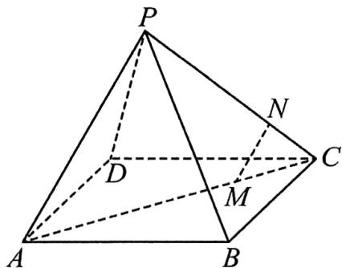

$\quad$A. $MN\| PD$

$\quad$B. $MN\| PA$

$\quad$C. $MN\| AD$

$\quad$D. 以上均有可能

【练习 7】.如图是长方体被一平面所截得到的几何体,四边形 EFGH 为截面,长方形 ABCD 为底面,则四边形 EFGH 的形状为（）

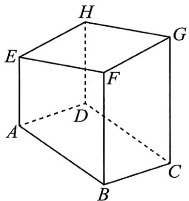

$\quad$A. 梯形

$\quad$B. 平行四边形

$\quad$C. 可能是梯形也可能是平行四边形

$\quad$D. 矩形

【练习8】.如图，已知四棱锥 $P - ABCD$ 的底面是平行四边形，点 $F$ 在棱 $PA$ 上， $PF = \lambda AF$ ，若 $PC \parallel$ 平面 $BDF$ ，则 $\lambda$ 的值为（）

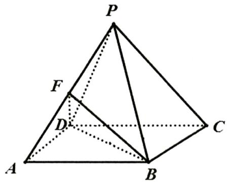

$\quad$A. 1

$\quad$B. $\frac{3}{2}$

$\quad$C. 3

$\quad$D. 2

# 10.4 空间直线、平面的垂直

【练习1】.设 $\alpha, \beta$ 是两个平面， $m, l$ 是两条直线，则下列命题为真命题的是（）

$\quad$A. 若 $\alpha \perp \beta, m / / \alpha, l / / \beta$ ，则 $m \perp l$   
$\quad$B. 若 $m \subset \alpha, l \subset \beta, m \parallel l$ ，则 $\alpha \parallel \beta$   
$\quad$C. 若 $\alpha \cap \beta = m, l // \alpha, l // \beta$ ，则 $m // l$   
$\quad$D. 若 $m \perp \alpha, l \perp \beta, m // l$ ，则 $\alpha \perp \beta$

【练习2】.已知 $a$ ， $b$ 是空间内两条不同的直线， $\alpha$ ， $\beta$ ， $\gamma$ 是空间内三个不同的平面，则下列说法正确的是（）

$\quad$A. 若 $\alpha \perp \beta$ ， $a \subset \alpha$ ，则 $a \perp \beta$   
$\quad$B. 若 $a \perp \beta, \alpha \perp \beta$ ，则 $a \parallel \alpha$   
$\quad$C. 若 $\alpha \cap \beta = a$ ， $\alpha \perp \gamma$ ， $\beta \perp \gamma$ ，则 $a \perp \gamma$   
$\quad$D. 若 $\alpha \perp \beta$ ， $\alpha \cap \beta = a$ ， $b \perp a$ ，则 $b \perp \alpha$ 或 $b \perp \beta$

【练习3】.已知平面 $\alpha \perp$ 平面 $\beta$ ，平面 $\alpha \cap$ 平面 $\beta = l$ ，则下列命题中正确的是（）

$\quad$A. 若直线 $m \parallel \alpha, m \parallel \beta$ ，则 $m \parallel l$   
$\quad$B. 若平面 $\gamma \perp \alpha$ ， $\gamma \perp \beta$ ，则 $\gamma \perp l$   
$\quad$C. 若 $m \subset \alpha, n \subset \beta, m \perp n$ ，则 $m \perp \beta$   
$\quad$D. 若 $P \in m$ ， $P \in \alpha$ ， $m \perp l$ ，则 $m \perp \beta$

【练习4】.如图，在四棱锥 $P - ABCD$ 中，底面ABCD是矩形

已知 $AB = 3, AD = 2, PA = 2, PD = 2\sqrt{2}, \angle PAB = 60^{\circ}$

证明 $AD \perp$ 平面 $PAB$ ;

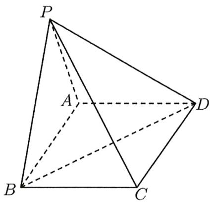

【练习5】.如图，在正方体 $ABCD - A_{1}B_{1}C_{1}D_{1}$ 中，

（1）求证： $AB / /$ 平面 $A_{1}DCB_{1}$

（2）求证： $BC_{1}\perp$ 平面 $A_{1}DCB_{1}$

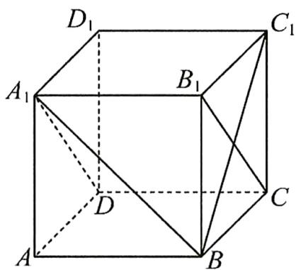

【练习6】.如图,在四棱锥 $P - ABCD$ 中,四边形ABCD是菱形, $PA = PC,E$ 为 $PB$ 的中点．求证:

（1） $PD \parallel$ 平面 $AEC$ ;  
（2）平面 $AEC \perp$ 平面 $PBD$ .

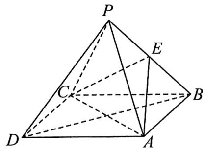

【练习 7】. 已知正方体 $ABCD - A_{1}B_{1}C_{1}D_{1}$ ，直线 $AC_{1}$ 与平面 ABCD 所成角的正弦值为 \_\_\_\_.

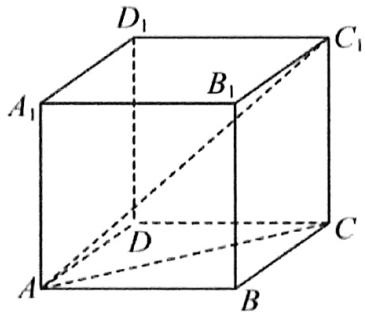

【练习8】.如图在正四面体 $A - BOC$ 中，直线 $OA$ 与平面 $OBC$ 所成的角为 $\theta$ ，则 $\tan \theta =$ （

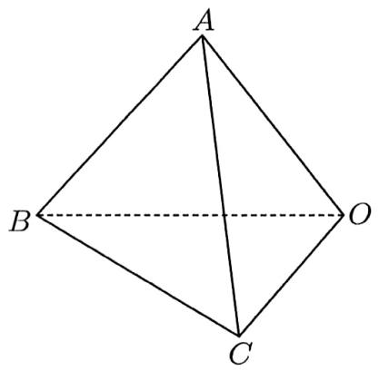

$\quad$A. $\sqrt{2}$

$\quad$B. $\sqrt{3}$

$\quad$C. $\frac{\sqrt{2}}{2}$

$\quad$D. $\frac{\sqrt{3}}{3}$

【练习9】.如图，在长方体 $ABCD - A_{1}B_{1}C_{1}D_{1}$ 中， $AB = 1$ ， $AD = 2$ ， $AA_{1} = 2$ ，则二面角 $A - DD_{1} - B$ 的平面角大小是 $\theta$ ，则 $\tan \theta =$ \_\_\_\_.

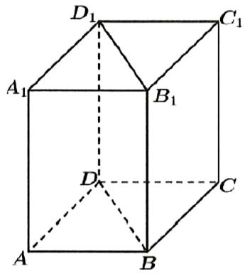

【练习10】.在正四面体 $A - BCD$ 中，二面角 $A - CD - B$ 的平面角的余弦值为（）

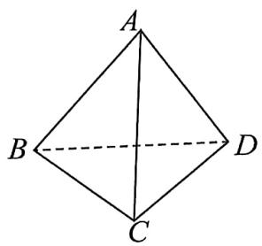

$\quad$A. $\frac{1}{2}$

$\quad$B. $\frac{1}{3}$

$\quad$C. $\frac{\sqrt{3}}{3}$

$\quad$D. $\frac{\sqrt{2}}{3}$

# 10.5 空间向量及其运算、空间向量基本定理

【练习1】.设 $x, y \in \mathbb{R}$ , 向量 $\vec{a} = (x, 1, 1)$ , $\vec{b} = (1, y, 1)$ , $\vec{c} = (1, -2, 1)$ , 且 $\vec{a} \perp \vec{c}$ , $\vec{b} \parallel \vec{c}$ , 则 $|\vec{a} + \vec{b}| =$ \_\_\_\_.

【练习2】.已知点 $A(2, - 5, - 1),B(-1, - 4, - 2),C(m + 3, - 3,n)$ 在同一直线上，则 $m + n$ 的值为（）

$\quad$A. 10

$\quad$B. -10

$\quad$C. 6

$\quad$D. -6

【练习3】.已知向量 $\vec{a} = (1,0,2)$ ， $\vec{b} = (-2,1, - 2)$ ， $\vec{c} = (0,1,\lambda)$ ，若 $\vec{a}$ ， $\vec{b}$ ， $\vec{c}$ 三个向量共面，则实数 $\lambda =$ （）

$\quad$A. 1

$\quad$B. 2

$\quad$C. 3

$\quad$D. 4

【练习 4】.如图, 在三棱锥 $S-ABC$ 中, 点 $E$ 、 $F$ 分别是 $SA$ 、 $BC$ 的中点, 点 $G$ 在 $EF$ 上, 且满足 $\frac{EG}{GF}=\frac{1}{2}$ , 若 $\overrightarrow{SA}=\vec{a}$ , $\overrightarrow{SB}=\vec{b}$ , $\overrightarrow{SC}=\vec{c}$ , 则 $\overrightarrow{SG}=$ \_\_\_\_.

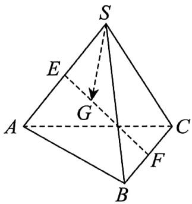

# 10.6 空间向量的应用

【练习1】.在空间直角坐标系内，平面 $\alpha$ 经过三点 $A(1,0,2)$ 、 $B(0,1,0)$ 、 $C(-2,1,1)$ ，向量 $\vec{n} = (1,\lambda ,\mu)$ 是平面 $\alpha$ 的一个法向量，则 $\lambda +\mu =$ \_\_\_\_.

【练习2】.如图,在棱长为2的正方体中,E,F分别是 $DD_{1},DB$ 的中点,G在棱CD上,且 $CG=\frac{1}{3}CD$ ,H是 $C_{1}G$ 的中点．建立适当的空间直角坐标系,解决下列问题:

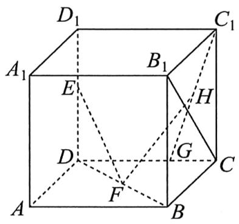

（1）求证： $EF \perp B_{1}C$ ;  
（2）求异面直线 EF 与 $C_{1}G$ 所成角的余弦值.

【练习3】.如图，在长方体 $ABCD - A_{1}B_{1}C_{1}D_{1}$ 中， $AB = AD = 2$ ， $DD_{1} = 4$ ，则 $A_{1}B_{1}$ 与平面 $A_{1}C_{1}D$ 所成的角的正弦值为 \_\_\_\_.

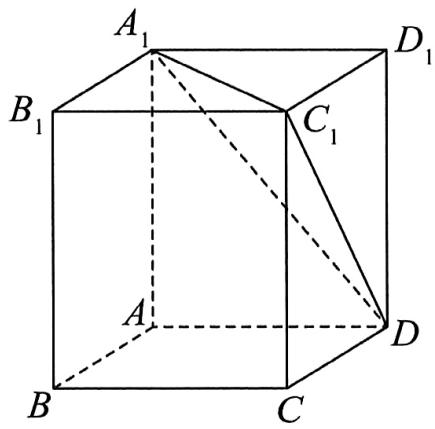

【练习4】.如图, 在空间直角坐标系 $Dxyz$ 中, 四棱柱 $ABCD - A_{1}B_{1}C_{1}D_{1}$ 为长方体, $AA_{1} = AB = 2AD$ , 点 $E$ , $F$ 分别为 $C_{1}D_{1}, A_{1}B$ 的中点, 求平面 $B_{1}A_{1}B$ 与平面 $A_{1}BE$ 夹角的余弦值.

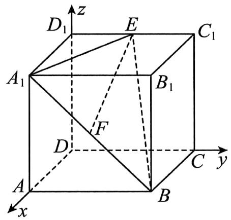

# 11 直线和圆

# 11.1 直线的倾斜角与斜率

【练习1】.已知两点 $P(m,2)$ ， $Q(2,4)$ 所在直线的斜率为1，则 $m = \_$ .

【练习2】.若直线 $l: x + my + 1 = 0$ 的倾斜角为 $\frac{2\pi}{3}$ ，则实数 $m$ 值为（）

$\quad$A. $\sqrt{3}$

$\quad$B. $-\sqrt{3}$

$\quad$C. $\frac{\sqrt{3}}{3}$

$\quad$D. $-\frac{\sqrt{3}}{3}$

【练习 3】. 已知点 $A(-1,-1)$ , $B(2,4)$ , $C(4,1)$ ，过点 A 的直线 l 与线段 BC 相交，则直线 l 的斜率 k 的取值范围是 \_\_\_\_.

【练习4】.直线 $l:2x + 3y - 1 = 0$ 的一个方向向量为（）

$\quad$A. $(2, - 3)$

$\quad$B. $(-3,2)$

$\quad$C. (2,3)

$\quad$D. (3,2)

# 11.2 直线的方程

【练习1】.直线 $l: x + \sqrt{3} y = 1$ 在 $x$ 轴的截距为（）

$\quad$A. $\sqrt{3}$

$\quad$B. $\frac{\sqrt{3}}{3}$

$\quad$C. -1

$\quad$D. 1

【练习2】.过点 $P(-\sqrt{3},1)$ ，倾斜角为 $60^{\circ}$ 的直线方程是（）

$\quad$A. $\sqrt{3} x + y + 4 = 0$

$\quad$B. $x - \sqrt{3} y + 2\sqrt{3} = 0$

$\quad$C. $\sqrt{3} x - y + 4 = 0$

$\quad$D. $x + \sqrt{3} y + 2\sqrt{3} = 0$

【练习3】.直线 $a(x + 1) - y + 1 = 0$ 恒过定点（）

$\quad$A. $(-1, 1)$

$\quad$B. $(-1, - 1)$

$\quad$C. $(1, - 1)$

$\quad$D. $(1,1)$

【练习4】.当 $m$ 变化时，直线 $(m + 2)x + (2 - m)y + 4 = 0$ 恒过定点

【练习5】.若点 $(k,0)$ 与 $(b,0)$ 的中点为 $(-3,0)$ ，则直线 $y = kx + b$ 必定经过点（）

$\quad$A. $(1, - 6)$

$\quad$B. $(1,6)$

$\quad$C. $(-1,6)$

$\quad$D. $(-1, - 6)$

# 11.3 直线的交点坐标与距离公式

【练习1】.已知 $a \in R$ ，设直线 $l_1: x + ay - 1 = 0$ ， $l_2: ax + y - 1 = 0$ ，若 $l_1 // l_2$ ，则 $a =$ \_\_\_\_.

【练习2】.若直线 $l_{1}:x + (a - 4)y + 1 = 0$ 与 $l_{2}:bx + y - 2 = 0$ 垂直，则 $a + b$ 的值为（）

$\quad$A. 2

$\quad$B. $\frac{4}{5}$

$\quad$C. $\frac{2}{3}$

$\quad$D. 4

【练习3】.已知点 $A(1,2)$ ， $B(3,4)$ ，则线段 $AB$ 的垂直平分线的方程是 \_\_\_\_.

【练习4】.若直线 $y = x + 2k + 1$ 与直线 $y = -\frac{1}{2} x + 2$ 的交点在第一象限，则实数 $k$ 的取值范围是（）

$\quad$A. $\left(-\frac{5}{2}, \frac{1}{2}\right)$

$\quad$B. $\left(-\frac{2}{5},\frac{1}{2}\right)$

$\quad$C. $\left[-\frac{5}{2}, -\frac{1}{2}\right]$

$\quad$D. $\left[-\frac{2}{5}, \frac{1}{2}\right]$

【练习5】.三角形的三个顶点为 $A(3, -2), B(3, 4), C(-5, 4)$ ， $D$ 为 $AC$ 中点，则 $BD$ 的长为（）

$\quad$A. 3

$\quad$B. 5

$\quad$C. 9

$\quad$D. 25

【练习6】.点 $P(2,3)$ 到直线 $l:y = -2x + 3$ 的距离是

【练习7】.直线 $l_{1}:2x - y + 1 = 0$ 与直线 $l_{2}:4x - 2y - 2 = 0$ 之间的距离为

【练习8】.(多选)下列直线与直线 $l: y = 2x - 1$ 平行，且与它的距离为 $2\sqrt{5}$ 的是（）

$\quad$A. $2x - y + 9 = 0$

$\quad$B. $2x - y - 11 = 0$

$\quad$C. $2x - y + 10 = 0$

$\quad$D. $2x - y - 12 = 0$

# 11.4 圆的方程

【练习1】.以 $(1, - 2)$ 为圆心， $\sqrt{2}$ 为半径的圆的方程是（）

$\quad$A. $(x - 1)^2 +(y + 2)^2 = 2$

$\quad$B. $(x + 1)^2 +(y - 2)^2 = 2$

$\quad$C. $(x - 1)^2 + (y + 2)^2 = \sqrt{2}$

$\quad$D. $(x + 1)^2 +(y - 2)^2 = \sqrt{2}$

【练习2】.已知 $\odot C: x^2 + y^2 + x - 2y + \frac{1}{2} = 0$ ，则该圆的圆心坐标和半径分别为（）

$\quad$A. $\left(-\frac{1}{2}, 1\right), \frac{\sqrt{3}}{2}$

$\quad$B. $(-1,2)$ , $\sqrt{3}$

$\quad$C. $\left(\frac{1}{2}, 1\right), \sqrt{3}$

$\quad$D. $(1, - 2)$ ， $\frac{\sqrt{3}}{2}$

【练习3】.若圆 $C:(x - a)^2 +(y - 4a)^2 = 4$ 被直线 $l:3x - y + 2 = 0$ 平分，则 $a =$ （）

$\quad$A. $\frac{1}{2}$

$\quad$B. 1

$\quad$C. $\frac{3}{2}$

$\quad$D. 2

【练习4】.已知 $A(-1,0)$ ， $B(4,0)$ ， $C(0,2)$ ，则 $\Delta ABC$ 外接圆的方程为

【练习 5】.如果方程 $x^{2} + y^{2} + kx + 2y + k^{2} = 0$ 表示一个圆，那么实数 k 的取值范围是什么？ $A(1,2)$ 与圆是怎样的位置关系呢？

# 11.5 直线与圆、圆与圆的位置关系

【练习1】.若直线 $3x - 4y + a = 0$ 与圆 $(x - 2)^{2} + (y - 1)^{2} = 4$ 相交，则实数 $a$ 的取值范围是

【练习2】.过点 $A(-1,4)$ 作圆 $(x - 2)^{2} + (y - 3)^{2} = 4$ 的切线，切点为 $B$ ，则切线段 $AB$ 长为（）

$\quad$A. $\sqrt{5}$

$\quad$B. 3

$\quad$C. $\sqrt{6}$

$\quad$D. $\sqrt{7}$

【练习3】.求过点 $P(4, - 3)$ 且与圆 $(x - 1)^{2} + (y - 3)^{2} = 9$ 相切的直线方程为【练习4】.已知圆 $E:(x - 2)^{2} + (y - 4)^{2} = 25$ ，圆 $F:(x - 2)^{2} + (y - 2)^{2} = 1$ ，则这两圆的位置关系为（）

$\quad$A. 内含

$\quad$B. 相切

$\quad$C. 相交

$\quad$D. 外离

【练习5】.圆 $x^{2} + y^{2} = 1$ 与圆 $x^{2} + y^{2} - 2x - 2y = 0$ 的位置关系是（）

$\quad$A. 相交

$\quad$B. 相离

$\quad$C. 内含

$\quad$D. 外切

【练习6】.已知圆 $C_1:(x - 1)^2 +(y + 1)^2 = 4$ 与圆 $C_2:(x - 4)^2 +(y + 1)^2 = r^2 (r > 0)$ 外切，则 $r = \_$ .

# 12 圆锥曲线

# 12.1 椭圆

【练习1】.椭圆 $C:4x^{2} + y^{2} = 16$ 的焦点坐标为（）

$\quad$A. $(\pm 2\sqrt{3},0)$

$\quad$B. $(\pm 2\sqrt{5},0)$

$\quad$C. $(0, \pm 2\sqrt{3})$

$\quad$D. $(0, \pm 2\sqrt{5})$

【练习2】.(多选)已知椭圆 $C: \frac{x^{2}}{4} + \frac{y^{2}}{6} = 1$ ，则下列说法中正确的是（）

$\quad$A. 椭圆 $C$ 的焦点在 $x$ 轴上

$\quad$B. 椭圆 $C$ 的长轴长是 $2 \sqrt{6}$

$\quad$C. 椭圆 $C$ 的焦距为 4

$\quad$D. 椭圆 $C$ 的离心率为 $\frac{\sqrt{3}}{3}$

【练习3】.已知方程 $\frac{y^2}{m - 3} +\frac{x^2}{4 - m} = 1$ 表示焦点在 $x$ 轴上的椭圆，则实数 $m$ 的取值范围是（）

$\quad$A. (3,4)

$\quad$B. $\left(\frac{7}{2},4\right)$

$\quad$C. $(3, +\infty)$

$\quad$D. $\left(3,\frac{7}{2}\right)$

【练习 4】. 已知椭圆 $C: \frac{x^{2}}{8} + \frac{y^{2}}{2} = 1$ ， $F_{1}, F_{2}$ 为其左右两个焦点，过 $F_{1}$ 的直线与椭圆交于 AB 两点，则 $\triangle ABF_{2}$ 的周长为（）

$\quad$A. $4 \sqrt{2}$

$\quad$B. $2 \sqrt{2}$

$\quad$C. $8 \sqrt{2}$

$\quad$D. $16 \sqrt{2}$

2021 新高考一卷

【练习5】.已知 $F_{1}$ ， $F_{2}$ 是椭圆 $C$ ： $\frac{x^2}{4} +\frac{y^2}{9} = 1$ 的两个焦点，点 $M$ 在 $C$ 上，则 $\left|MF_1\right|\cdot \left|MF_2\right|$ 的最大值为（）

$\quad$A. 13

$\quad$B. 12

$\quad$C. 9

$\quad$D. 6

【练习 6】. 已知 $F_{1}, F_{2}$ 分别为椭圆 $\frac{x^{2}}{18} + \frac{y^{2}}{10} = 1$ 的左、右焦点，P 为椭圆上一点且 $\left|PF_{1}\right| = 2\left|PF_{2}\right|$ ，则 $\Delta PF_{1}F_{2}$ 的面积为 \_\_\_\_.

【练习7】.设 $e$ 是椭圆 $\frac{x^2}{k} +\frac{y^2}{4} = 1$ 的离心率，且 $e\in \left(\frac{1}{2},1\right)$ ，则实数 $k$ 的取值范围是

# 12.2 双曲线

【练习1】已知双曲线 $E: \frac{x^2}{4} - \frac{y^2}{b^2} = 1 (b > 0)$ 的离心率为 $\sqrt{3}$ ，则 $b =$

【练习2】双曲线 $x^{2} - ky^{2} = 1$ 的一个焦点是(2,0)，则 $k =$

【练习 3】已知双曲线 $C: \frac{x^{2}}{3} - \frac{y^{2}}{4} = 1$ 的左顶点为 $A_{1}$ ，右焦点为 $F_{2}$ ，虚轴长为 m，离心率为 e，则（）

$\quad$A. $A_{1}(-3,0)$

$\quad$B. $F_{2}(1,0)$

$\quad$C. $m = 2$

$\quad$D. $e = \frac{\sqrt{21}}{3}$

【练习4】双曲线 $\frac{y^2}{4} -\frac{x^2}{9} = 1$ 的渐近线方程为（）

$\quad$A. $3x \pm 2y = 0$

$\quad$B. $2x \pm 3y = 0$

$\quad$C. $4x \pm 9y = 0$

$\quad$D. $9x \pm 4y = 0$

【练习5】已知双曲线 $E: \frac{y^2}{a^2} - \frac{x^2}{b^2} = 1 (a > 0, b > 0)$ 的一条渐近线方程是 $y = 2x$ ，则 $E$ 的离心率是（）

$\quad$A. $\frac{5}{2}$

$\quad$B. $\frac{\sqrt{5}}{2}$

$\quad$C. 5

$\quad$D. $\sqrt{5}$

【练习6】与双曲线 $C: \frac{x^2}{4} - \frac{y^2}{2} = 1$ 共渐近线，且过点 $(2\sqrt{2}, \sqrt{6})$ 的双曲线的标准方程是（）

$\quad$A. $\frac{x^2}{4} -\frac{y^2}{2} = 1$

$\quad$B. $\frac{x^2}{2} -\frac{y^2}{4} = 1$

$\quad$C. $\frac{y^2}{4} -\frac{x^2}{2} = 1$

$\quad$D. $\frac{y^2}{2} -\frac{x^2}{4} = 1$

【练习 7】已知双曲线 C 的对称中心是原点，对称轴是坐标轴，若 x 轴上一点 $P(2,0)$ 到双曲线 C 的渐近线距离为 $\sqrt{3}$ ，则 C 的离心率为 \_\_\_\_.

# 2024天河区三模

【练习8】已知 $F_{1}$ , $F_{2}$ 是双曲线 $C$ 的两个焦点, $P$ 为 $C$ 上一点, 且 $\cos \angle F_{1}PF_{2} = \frac{1}{6}$ , $\left|PF_{1}\right| = 3\left|PF_{2}\right|$ , 则 $C$ 的离心率为（）

$\quad$A. $\frac{3}{4}$

$\quad$B. $\frac{\sqrt{5}}{2}$

$\quad$C. $\frac{3}{2}$

$\quad$D. 3

2024 新高考一卷

【练习9】设双曲线 $C: \frac{x^2}{a^2} - \frac{y^2}{b^2} = 1 (a > 0, b > 0)$ 的左右焦点分别为 $F_1$ 、 $F_2$ ，过 $F_2$ 作平行于 $y$ 轴的直线交 $C$ 于 $A$ ， $B$ 两点，若 $|F_1 A| = 13, |AB| = 10$ ，则 $C$ 的离心率为 \_\_\_\_.

# 12.3 抛物线

【练习1】已知抛物线 $C$ 的方程为 $x^{2} + 8y = 0$ ，则抛物线的焦点坐标为（）

$\quad$A. $(-2,0)$

$\quad$B. $(2,0)$

$\quad$C. $(0, - 2)$

$\quad$D. $(0,2)$

【练习2】抛物线 $x^{2} = \frac{1}{a} y$ 的准线方程为 $y = 1$ ，则实数 $a$ 的值为

【练习 3】已知点 $P(2, -4)$ 在抛物线 $C: y^{2} = 2px$ 上，则点 $P$ 到抛物线 $C$ 的焦点的距离为 \_\_\_\_.

【练习4】等边三角形的一个顶点位于原点，另外两个顶点在抛物线 $y^{2} = 2x$ 上，则这个等边三角形的边长为（）

$\quad$A. 2

$\quad$B. $2 \sqrt{3}$

$\quad$C. 4

$\quad$D. $4 \sqrt{3}$

【练习5】已知抛物线 $C:y^{2} = 8x$ 的焦点为 $F$ ， $P$ 是抛物线 $C$ 上的一点， $O$ 为坐标原点， $\vert OP\vert = 4\sqrt{3}$ ， $|PF| = (\quad)$

$\quad$A. 4

$\quad$B. 6

$\quad$C. 8

$\quad$D. 10

【练习6】已知 $F$ 是抛物线 $y^{2} = 4x$ 的焦点， $A, B$ 是该抛物线上的两点， $|AF| + |BF| = 8$ ，则线段 $AB$ 的中点到 $y$ 轴的距离为 \_\_\_\_.

【练习7】点 $F$ 抛物线 $y^{2} = 2x$ 的焦点， $A, B, C$ 为抛物线上三点，若 $\overrightarrow{FA} + \overrightarrow{FB} + \overrightarrow{FC} = \overrightarrow{0}$ ，则 $|\overrightarrow{FA}| + |\overrightarrow{FB}| + |\overrightarrow{FC}| = (\quad)$

$\quad$A. 2

$\quad$B. $2 \sqrt{3}$

$\quad$C. 3

$\quad$D. $4 \sqrt{3}$

【练习8】设 $M$ 是抛物线 $y^{2} = 4x$ 上的一点， $F$ 是抛物线的焦点， $O$ 足坐标原点，若 $\angle OFM = 120^{\circ}$ ，则 $\left|FM\right| = (\quad)$

$\quad$A. 5

$\quad$B. 4

$\quad$C. 3

$\quad$D. 2

【练习9】已知抛物线 $x^{2} = 2py(p > 0)$ 的焦点到直线 $y = x + 4$ 的距离为 $\sqrt{2}$ ，则 $p = (\quad)$

$\quad$A. 4

$\quad$B. 6

$\quad$C. 4或12

$\quad$D. 12

# 12.4 圆锥曲线综合

【练习1】椭圆 $C: \frac{x^2}{4} + \frac{y^2}{2} = 1$ 的左焦点为 $F$ ，过 $F$ 且与 $x$ 轴垂直的直线交椭圆 C 于 A、B 两点，则 $|AB| =$

【练习2】下列方程表示的椭圆中，形状最接近圆的是（）

$\quad$A. $\frac{x^2}{3} +\frac{y^2}{2} = 1$

$\quad$B. $\frac{x^2}{5} +\frac{y^2}{4} = 1$

$\quad$C. $\frac{x^2}{8} +\frac{y^2}{9} = 1$

$\quad$D. $x^{2} + \frac{y^{2}}{2} = 1$

【练习3】双曲线 $C_1: \frac{x^2}{a_1^2} - \frac{y^2}{b_1^2} = 1$ 和 $C_2: \frac{y^2}{a_2^2} - \frac{x^2}{b_2^2} = 1$ 的离心率分别为 $e_1$ 和 $e_2$ ，若满足 $e_1 > e_2$ ，则下列说法正确是（）

$\quad$A. $C_{1}$ 的渐近线斜率的绝对值较大, $C_{1}$ 的开口较开阔  
$\quad$B. $C_1$ 的渐近线斜率的绝对值较大, $C_1$ 的开口较狭窄  
$\quad$C. $C_{2}$ 的渐近线斜率的绝对值较大, $C_{2}$ 的开口较开阔  
$\quad$D. $C_{2}$ 的渐近线斜率的绝对值较大, $C_{2}$ 的开口较狭窄

【练习 4】已知抛物线方程 $y^{2}=4x$ ，过点 $P(0,2)$ 的直线与抛物线只有一个交点，这样的直线有（）条

$\quad$A. 0

$\quad$B. 1

$\quad$C. 2

$\quad$D. 3

# 13 概率统计（一）

# 13.1 随机抽样

【练习1】某班级有60名学生，班主任用不放回的简单随机抽样的方法从这60名学生中抽取5人进行家访，则同学 $a$ 被抽到的可能性为（）

$\quad$A. $\frac{1}{12}$

$\quad$B. $\frac{1}{5}$

$\quad$C. $\frac{1}{60}$

$\quad$D. $\frac{1}{11}$

【练习 2】一支羽毛球队有男运动员 64 人，女运动员 56 人，按性别进行分层，用分层随机抽样的方法从全体运动员中抽出一个容量为 30 的样本，如果样本按比例分配，那么男运动员应抽取的人数为 \_\_\_\_.

【练习 3】某高中学校进行问卷调查, 用比例分配的分层随机抽样方法从该校三个年级中抽取 36 人进行问卷调查, 其中高一年级抽取了 15 人, 高二年级抽取了 12 人, 且高三年级共有学生 900 人, 则该高中的学生总数为\_\_\_\_人.

【练习 4】要考查某种品牌的 850 颗种子的发芽率，从中抽取 50 颗种子进行实验，利用随机数表法抽取种子，先将 850 颗种子按 001, 002, ..., 850 进行编号，如果从随机数表第 2 行第 2 列的数开始并向右读，下列选项中属于最先检验的 4 颗种子依次是\_\_\_\_。

(下面抽取了随机数表第1行至第3行)

03 47 43 73 86 36 96 47 36 61 46 98 63 71 62 33 26 16 80 45 60 11 14 10 95

97 74 94 67 74 42 81 14 57 20 42 53 32 37 32 27 07 36 07 51 24 51 79 89 73

16 76 62 27 66 56 50 26 71 07 32 90 79 78 53 13 55 38 58 59 88 97 54 14 10

# 13.2 用样本估计总体

【练习 1】(多选)某学校对高一学生选科情况进行了统计，发现学生选科仅有物化生、政史地、物化地、物化政、生史地五种组合，其中选考物化地和物化政组合的人数相等，并绘制得到如下的扇形图和条形图，则（）

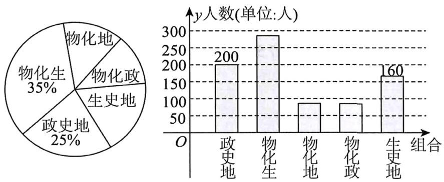

$\quad$A. 该校高一学生总数为 800  
$\quad$B. 该校高一学生中选考物化政组合的人数为 96  
$\quad$C. 该校高一学生中选考物理的人数比选考历史的人数多  
$\quad$D. 用比例分配的分层随机抽样方法从该校高一学生抽取20人，则生史地组合抽取6人

【练习2】要调查某地区高中学生身体素质，从高中生中抽取100人进行跳远测试，根据测试成绩制作频率分布直方图如下图，现再从这100人中用分层抽样的方法抽取20人，应从[120,130)间抽取人数为 $b$ ，则 $b$ 为（）

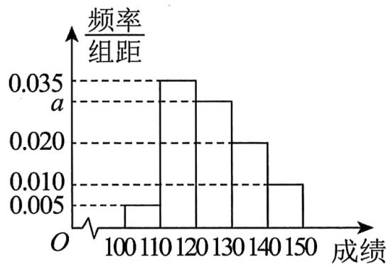

$\quad$A. 4

$\quad$B. 5

$\quad$C. 6

$\quad$D. 7

【练习3】一组数据4.3，6.5，7.8，6.2，9.6，15.9，7.6，8.1，10，12.3，11，3，则它们的 $75\%$ 分位数是（）

$\quad$A. 10.3

$\quad$B. 10.4

$\quad$C. 10.5

$\quad$D. 10.6

【练习 4】某高中生创新能力大赛中 8 位选手的面试得分分别为 90, 86, 93, 91, 89, 95, 92, 94，其中位数和极差分别为（）

$\quad$A. 90, 8

$\quad$B. 91.5, 9

$\quad$C. 91, 9

$\quad$D. 91.5, 8

【练习 5】现有甲、乙两人参加射箭比赛, 成绩如下: 甲: 51,56,60,63,65,65, 乙: 74,75,76,81,82,86, 则下列说法错误的是（）

$\quad$A. 甲的射箭成绩的中位数为61.5  
$\quad$B. 乙的射箭成绩的平均数为78  
$\quad$C. 甲的射箭成绩的方差为 26  
$\quad$D. 乙的射箭成绩的标准差为 $\frac{\sqrt{168}}{3}$

【练习 6】若数据 $x_{1}, x_{2}, x_{3}, \cdots, x_{n}$ 的标准差为 s，则数据 $3x_{1} + 1$ ， $3x_{2} + 1$ ， $3x_{3} + 1$ ，…， $3x_{n} + 1$ 的标准差为（）

$\quad$A. $\sqrt{3} s + 1$

$\quad$B. $\sqrt{3} s$

$\quad$C. $3s + 1$

$\quad$D. $3s$

# 13.3 成对数据的统计相关性

【练习1】对变量 $x, y$ 由观测数据 $(x_{i}, y_{i}) (i \in \mathbf{N}^{*})$ 得散点图1；对变量 $u, v$ 由观测数据 $(u_{i}, v_{i}) (i \in \mathbf{N}^{*})$ 得散点图2． $r_{1}$ 表示变量 $x, y$ 之间的线性相关系数， $r_{2}$ 表示变量 $u, v$ 之间的线性相关系数，则下列说法正确的是（）

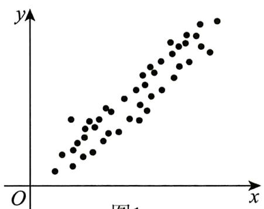

图1

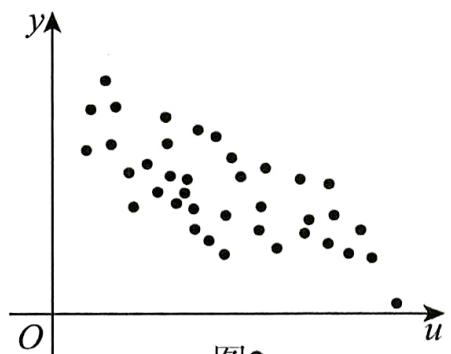

图2

$\quad$A. 变量 $x$ 与 $y$ 呈现正相关，且 $\left|r_1\right| > \left|r_2\right|$   
$\quad$B. 变量 $x$ 与 $y$ 呈现负相关，且 $\left|r_1\right| < \left|r_2\right|$   
$\quad$C. 变量 $u$ 与 $\nu$ 呈现正相关，且 $\left|r_1\right| > \left|r_2\right|$   
$\quad$D. 变量 $u$ 与 $\nu$ 呈现负相关，且 $\left|r_1\right| < \left|r_2\right|$

【练习2】已知四组不同数据的两变量的线性相关系数 $r$ 如下: 数据组①的相关系数 $r_1 = 0$ ; 数据组②的相关系数 $r_2 = -0.95$ ; 数据组③的相关系数 $\left|r_3\right| = 0.89$ ; 数据组④的相关系数 $r_4 = 0.75$ . 则下列说法正确的是（）

$\quad$A. 数据组①对应的数据点都在同一直线上  
$\quad$B. 数据组②中的两变量线性相关性最强  
$\quad$C. 数据组③中的两变量线性相关性最强  
$\quad$D. 数据组④中的两变量线性相关性最弱

# 13.4 一元线性回归模型及其应用

【练习1】由4对样本数据 $(1,1), (2,2.8), (3,5.2), (4,7)$ 得到的 $y$ 关于 $x$ 的经验回归方程为 $\hat{y} = 2x + a$ ，则 $a =$ \_\_\_\_.

【练习2】已知一系列样本点 $(x_{i},y_{i})(i=1,2,3,\cdots)$ 的一个经验回归方程为 $\hat{y}=2x+\hat{a}$ ，若样本点 $(1,-1)$ 的残差为2，则 $\hat{a}=(\quad)$ .

$\quad$A. -1

$\quad$B. 1

$\quad$C. -5

$\quad$D. 5

【练习 3】学习了《高中数学必修3》的内容后，高二年级某学生认为：考试成绩与考试次数存在相关关系.于是他收集了自己进入高二以后的前5次考试成绩，列表如下：

<table><tr><td>第x次考试</td><td>1</td><td>2</td><td>3</td><td>4</td><td>5</td></tr><tr><td>考试成绩y</td><td>80</td><td>95</td><td>95</td><td>100</td><td>105</td></tr></table>

经过进一步研究，他发现：考试成绩 $y$ 与考试的次数 $x$ 具有线性相关关系.

（1）求 $y$ 关于 $x$ 的线性回归方程 $\hat{y} = \hat{b} x + \hat{a}$ ;  
（2）判断变量 $y$ 与 $x$ 之间是正相关还是负相关（只写出结论即可）；  
（3）按计划, 高二年级两学期共有10次考试, 请你预测该同学高二最后一次考试的成绩 (四舍五入, 结果保留整数).

附：回归直线的斜率和截距的最小二乘法估计公式分别为：

$\hat {b} = \frac {\sum_ {i = 1} ^ {n} x _ {i} y _ {i} - n \overline {{{x}}} \overline {{{y}}}}{\sum_ {i = 1} ^ {n} x _ {i} ^ {2} - n \overline {{{x}}} ^ {2}} = \frac {\sum_ {i = 1} ^ {n} \left(x _ {i} - \overline {{{x}}}\right) \left(y _ {i} - \overline {{{y}}}\right)}{\sum_ {i = 1} ^ {n} \left(x _ {i} - \overline {{{x}}}\right) ^ {2}}, \quad \hat {a} = \overline {{{y}}} - \hat {b} \overline {{{x}}}$

# 13.5 列联表与独立性检验

【练习1】某机构为了解学生是否喜欢绘画与性别有关，调查了400名学生（男女各一半）的选择，发现喜欢绘画的人数是300，喜欢绘画的男生比女生少60人.

（1）完成下面的 $2 \times 2$ 列联表；

<table><tr><td></td><td>喜欢绘画</td><td>不喜欢绘画</td><td>总计</td></tr><tr><td>男生</td><td></td><td></td><td></td></tr><tr><td>女生</td><td></td><td></td><td></td></tr><tr><td>总计</td><td></td><td></td><td></td></tr></table>

（2）根据调查数据回答：有 $99.9\%$ 的把握认为是否喜欢绘画与性别有关吗？

附： $\chi^2 = \frac{n(ad - bc)^2}{(a + b)(c + d)(a + c)(b + d)}.$ 临界值表如下：

<table><tr><td> $\alpha = P\left( {{\chi }^{2} \geq k}\right)$ </td><td>0.10</td><td>0.05</td><td>0.01</td><td>0.005</td><td>0.001</td></tr><tr><td>k</td><td>2.706</td><td>3.841</td><td>6.635</td><td>7.879</td><td>10.828</td></tr></table>

# 14 计数原理

# 14.1 分类加法计数原理与分步乘法计数原理

【练习1】张三某天从甲地前往乙地，已知每天从甲地到乙地的航班有5班，铁路有高铁10趟、动车6趟，城际大巴有12班．则其出行方案共有（）

$\quad$A. 22种

$\quad$B. 33种

$\quad$C. 300种

$\quad$D. 3600 种

【练习2】从 $A$ 村去 $B$ 村的道路有2条，从 $B$ 村去 $C$ 村的道路有3条，则从 $A$ 村经 $B$ 村再去 $C$ 村，不同路线的条数是（）

$\quad$A. 5

$\quad$B. 6

$\quad$C. 8

$\quad$D. 9

【练习3】某市人民医院急诊科有3名男医生和4名女医生，内科有4名男医生和4名女医生，现从该医院急诊科和内科各选派1名男医生和1名女医生组成4人组，参加省人民医院组织的交流会，则所有不同的选派方案有（）

$\quad$A. 192种

$\quad$B. 180种

$\quad$C. 29种

$\quad$D. 15种

【练习4】用数字0,1,2,3组成三位数，各数位上的数字允许重复，则满足条件的三位数的个数为（）

$\quad$A. 12

$\quad$B. 24

$\quad$C. 48

$\quad$D. 64

【练习5】现南京有4个家庭准备在2023年五一小长假期间选择吉林、白山、四平三个城市中的一个城市旅游，则这4个家庭共有多少种不同的安排方法（）

$\quad$A. 24种

$\quad$B. 6种

$\quad$C. 64种

$\quad$D. 81种

【练习 6】五一小长假前夕，甲、乙、丙三人从 A, B, C 三个旅游景点中任选一个前去游玩，其中甲到过 A 景点，所以甲不选 A 景点，则不同的选法有（）

$\quad$A. 12

$\quad$B. 16

$\quad$C. 18

$\quad$D. 24

# 14.2 排列与组合

【练习1】 $\mathrm{C}_5^3\cdot 3!$ 的值为（）

$\quad$A. 10

$\quad$B. 30

$\quad$C. 60

$\quad$D. 180

【练习2】 $\mathrm{C}_7^4 -\mathrm{A}_5^2$

【练习3】若 $\mathrm{A}_m^2 = 3\mathrm{C}_m^3$ ，则 $m$ 等于（）

$\quad$A. 6

$\quad$B. 5

$\quad$C. 4

$\quad$D. 3

【练习4】从6人中选3人参加演讲比赛，则不同的选择共有（）

$\quad$A. 15种

$\quad$B. 18种

$\quad$C. 20种

$\quad$D. 120种

【练习5】从4名学生中挑选2人，分别担任正、副班长，则不同的安排方案有（）种.

$\quad$A. 6

$\quad$B. 12

$\quad$C. 16

$\quad$D. 20

【练习6】A, B, C, D, E五人站成一排，那么排法种数为

【练习7】某校组队参加辩论赛，从7名学生中选出4人分别担任一、二、三、四辩，若其中学生甲必须参加且不担任四辩，则不同的安排方法种数为（）

$\quad$A. 180

$\quad$B. 120

$\quad$C. 90

$\quad$D. 360

【练习8】从5名男生和4名女生中选出4人去参加数学竞赛.

（1）如果选出的4人中男生、女生各2人，那么有多少种选法？

# 14.3 二项式定理

【练习1】 $\left(2x^{3} - \frac{1}{x^{2}}\right)^{5}$ 的展开式中常数项是\_\_\_\_。（用数字作答）

【练习2】在二项式 $(x^{2} - \frac{1}{x})^{5}$ 的展开式中，含 $x^{7}$ 的项的系数是

【练习3】在 $\left(x^{2} - y\right)^{5}$ 的展开式中， $x^{4}y^{3}$ 项的系数为（）

$\quad$A. 10

$\quad$B. -10

$\quad$C. 20

$\quad$D. -20

# 15 概率统计（二）

# 15.1 随机事件与概率

【练习1】投掷两枚质地均匀的硬币，用 $a_{i}$ 表示“第i枚硬币正面朝上”， $b_{i}$ 表示“第i枚硬币反面朝上” $(i = 1,2)$ ，则该试验的样本空间 $\Omega =$ \_\_\_\_.

【练习2】抛掷一颗质地均匀的骰子，有如下随机事件： $C_{i}$ = “点数为i”，其中i=1,2,3,4,5,6； $D_{1}$ = “点数不大于2”； $D_{2}$ = “点数大于2”， $D_{3}$ = “点数大于4”，则下列结论正确的是（Ω表示样本空间）（）

$\quad$A. $C_1 = D_1$

$\quad$B. $C_3 \subseteq D_2$

$\quad$C. $D_{1} \cup D_{2} = \Omega$

$\quad$D. $D_{2} \cap D_{3} = D_{2}$

【练习 3】某小组有 3 名男生和 2 名女生，从中任选 2 名同学参加演讲比赛，判断下列每对事件是不是互斥事件，如果是，再判别它们是不是对立事件。

（1）恰有 1 名男生与恰有 2 名男生;  
（2）至少有1名男生与全是男生；  
（3）至少有 1 名男生与全是女生;   
（4）至少有 1 名男生与至少有 1 名女生.

【练习4】若事件A与B互斥，且 $P(A \cup B) = 0.5$ ， $P(B) = 0.2$ ，则 $P(\overline{A}) = \underline{\quad}$

【练习5】已知 $P(A) = \frac{1}{4}$ ， $P(B) = \frac{1}{6}$ ， $P(A \cup B) = \frac{1}{3}$ ，则 $P(AB) = (\quad)$

$\quad$A. $\frac{1}{12}$

$\quad$B. $\frac{1}{3}$

$\quad$C. $\frac{1}{4}$

$\quad$D. $\frac{5}{12}$

【练习6】某射击运动员平时训练成绩的统计结果如下：

<table><tr><td>命中环数</td><td>6</td><td>7</td><td>8</td><td>9</td><td>10</td></tr><tr><td>频率</td><td>0.1</td><td>0.15</td><td>0.25</td><td>0.3</td><td>0.2</td></tr></table>

如果这名运动员只射击一次，命中的环数大于8环的概率是\_\_\_\_。

【练习 7】某学校食堂推出两款优惠套餐，甲、乙、丙三位同学选择同一款套餐的概率为\_\_\_\_。

【练习8】暑假即将来临，某校为开展学生的社会实践活动，从甲、乙、丙、丁、戊5人中随机选3人去参加“敬老院志愿服务”活动，则乙和丙两人中只有1人入选的概率为（）

$\quad$A. $\frac{1}{2}$

$\quad$B. $\frac{2}{3}$

$\quad$C. $\frac{3}{4}$

$\quad$D. $\frac{3}{5}$

【练习9】从4，2，3，8，9中任取两个不同的数，记为 $(a,b)$ ，则 $\log_a b$ 为正整数的概率为（）

$\quad$A. $\frac{3}{20}$

$\quad$B. $\frac{1}{5}$

$\quad$C. $\frac{1}{10}$

$\quad$D. $\frac{3}{10}$

# 15.2 事件的相互独立性

【练习1】已知 $A, B$ 是相互独立事件，且 $P(A) = \frac{1}{2}, P(B) = \frac{2}{3}$ ，则 $P(AB) =$ \_\_\_\_.

【练习2】已知 $A, B$ 是相互独立事件，且 $P(A) = 0.7, P(B) = 0.8$ ，则 $P(A \cup B) =$ \_\_\_\_.

【练习 3】（多选）连续两次抛掷一个质地均匀的骰子，并记录每次正面朝上的数字，记事件 A 为“两次记录的数字之和为奇数”，事件 B 为“第一次记录的数字为奇数”，事件 C 为“第二次记录的数字为偶数”，则下列结论正确的是（）

$\quad$A. 事件 $B$ 与事件 $C$ 是独立事件

$\quad$B. 事件A与事件B是独立事件

$\quad$C. $P(A) = 2P(B)P(C)$

$\quad$D. $P(ABC) = P(A)\cdot P(B)\cdot P(C)$

【练习4】某射击运动员每次射击命中十环的概率均为 $\frac{4}{5}$ , 若该射击运动员连续射击两次, 且两次射击相互独立, 则至多有一次命中十环的概率为 ( )

$\quad$A. $\frac{9}{25}$

$\quad$B. $\frac{2}{5}$

$\quad$C. $\frac{13}{25}$

$\quad$D. $\frac{16}{25}$

# 15.3 条件概率与全概率公式

【练习1】已知 $P(B|A) = \frac{1}{3}$ ， $P(AB) = \frac{2}{15}$ ，则 $P(A) = (\quad)$

$\quad$A. $\frac{2}{45}$

$\quad$B. $\frac{3}{5}$

$\quad$C. $\frac{2}{5}$

$\quad$D. $\frac{1}{3}$

【练习2】已知事件 $A, B$ 相互独立，且 $P(A) = 0.3$ ， $P(B) = 0.4$ ，那么 $P(A \mid B) = (\quad)$

$\quad$A. 0.12

$\quad$B. 0.3

$\quad$C. 0.4

$\quad$D. 0.75

【练习3】袋中有10个大小相同的小球，其中7个黄球，3个红球.每次从袋子中随机摸出一个球，摸出的球不再放回，则在第一次摸到黄球的前提下，第二次又摸到黄球的概率为（）

$\quad$A. $\frac{2}{3}$

$\quad$B. $\frac{1}{2}$

$\quad$C. $\frac{1}{3}$

$\quad$D. $\frac{3}{10}$

【练习4】已知 $P(B) > 0, P(A) = \frac{2}{3}, P(AB) = \frac{1}{3}$ ，则 $P(\overline{B} | A) = (\quad)$

$\quad$A. $\frac{5}{6}$

$\quad$B. $\frac{1}{2}$

$\quad$C. $\frac{1}{4}$

$\quad$D. $\frac{2}{3}$

【练习 5】在一个关于AI智能助手的准确率测试中，有三种不同的AI模型A，B，C. 模型A的准确率为0.8，模型B的准确率为0.75，模型C的准确率为0.7. 已知选择模型A，B，C的概率分别为0.4，0.4，0.2. 现随机选取一个模型进行测试，则准确率为（）

$\quad$A. 0.56

$\quad$B. 0.66

$\quad$C. 0.76

$\quad$D. 0.86

【练习6】已知 $P(A) = 0.4$ ， $P(B) = 0.5$ ， $P(B\mid A) = 0.8$ ，则 $P(B\mid \overline{A}) = \underline{\quad}$

【练习 7】某一地区的患有癌症的人占 0.004，患者对一种试验反应是阳性的概率为 0.95，正常人对这种试验反应是阳性的概率为 0.02。现抽查了一个人，试验反应是阳性，则此人是癌症患者的概率约为（）

$\quad$A. 0.16

$\quad$B. 0.32

$\quad$C. 0.42

$\quad$D. 0.84

# 15.4 离散型随机变量及其分布列、数字特征

【练习1】若随机变量 $X$ 的分布列为（如表），

<table><tr><td>X</td><td>1</td><td>2</td><td>3</td></tr><tr><td>P</td><td> $\frac{1}{6}$ </td><td>a</td><td> $\frac{1}{3}$ </td></tr></table>

则 $a =$ \_\_\_\_；若随机变量 $Y = 2X + 1$ ，则随机变量 $Y$ 的数学期望 $E(Y) =$ \_\_\_\_。（用数字作答）

【练习 2】已知离散型随机变量 $\xi$ 的分布列为

<table><tr><td>ξ</td><td>0</td><td>1</td><td>2</td><td>3</td></tr><tr><td>P</td><td>m</td><td>4/9</td><td>2/9</td><td>n</td></tr></table>

若 $E(\xi) = 1$ ，则 $D(\xi) = \underline{\quad}$

【练习3】已知离散型随机变量 $X$ 的方差为2，则 $D(2X - 1) =$ （）

$\quad$A.2

$\quad$B.3

.7

$\quad$D.8

# 15.5 二项分布与超几何分布

【练习1】某班级共有40名同学，其中15人是团员。现从该班级通过抽签选择10名同学参加活动，定义随机变量 $X$ 为其中团员的人数，则 $X$ 服从（）

$\quad$A. 二项分布

$\quad$B. 超几何分布

$\quad$C. 正态分布

$\quad$D. 伯努利分布

【练习2】已知 $X \sim B\left(4, \frac{1}{3}\right)$ ，则 $P(X = 1) = (\quad)$

$\quad$A. $\frac{8}{81}$

$\quad$B. $\frac{32}{81}$

$\quad$C. $\frac{4}{27}$

$\quad$D. $\frac{8}{27}$

【练习3】已知随机变量 $X \sim B(10, p)$ ，且期望 $E(X) = 3$ ，则方差 $D(X) =$ \_\_\_\_.

【练习 4】某公司为招聘新员工设计了一个面试方案：应聘者从6道备选题中一次性随机抽取3道题，按照题目要求独立完成。规定：至少正确完成其中2道题便可通过。已知6道备选题中应聘者甲有4道题能正确完成，2道题不能完成；应聘者乙每题正确完成的概率都是 $\frac{2}{3}$ ，且每题正确完成与否互不影响。

（1）求甲恰好正确完成两个面试题的概率;  
（2）求乙正确完成面试题数 $\eta$ 的分布列及其期望.

【练习 5】“英才计划”最早开始于 2013 年，由中国科协、教育部共同组织实施，到 2023 年已经培养了 6000 多名具有创新潜质的优秀中学生，为选拔培养对象，某高校在暑假期间从中学里挑选优秀学生参加学科知识竞答活动，题库中共有 10 道题目，随机抽取 3 道让学生回答。已知某同学只能答对其中的 6 道，试求：

（1）抽到他能答对题目数 $X$ 的分布列；  
（2）求 $X$ 的期望和方差.

【练习6】一批产品的二等品率为0.3，从这批产品中每次随机取一件，并有放回地抽取20次，用 $X$ 表示抽到二等品的件数，求 $D(X)$

# 15.6 正态分布

【练习1】已知随机变量 $X \sim N(2, \sigma^2)$ ，且 $P(X > 3) = 0.3$ ，则 $P(1 < X \leq 2) = (\quad)$

$\quad$A. 0.7

$\quad$B. 0.3

$\quad$C. 0.2

$\quad$D. 0.1

【练习2】已知随机变量 $X \sim N(\mu, \sigma^2), Y \sim B(6, p)$ ，且 $P(X \leq 4) = \frac{1}{2}, E(X) = E(Y)$ ，则 $p = (\quad)$

$\quad$A. $\frac{1}{3}$

$\quad$B. $\frac{2}{3}$

$\quad$C. $\frac{1}{4}$

$\quad$D. $\frac{1}{2}$

【练习 3】已知某批产品的质量指标 X 服从正态分布 $N(25,0.16)$ ，其中 $X \in [24.6,26.2]$ 的产品为合格产品，则在 1000 件该产品中合格产品件数约为 \_\_\_\_.

参考数据：若 $X \sim N\left(\mu, \sigma^2\right)$ ，则 $P(\mu - \sigma \leq X \leq \mu + \sigma) = 0.6827$ ， $P(\mu - 2\sigma \leq X \leq \mu + 2\sigma) = 0.9545$ ， $P(\mu - 3\sigma \leq X \leq \mu + 3\sigma) = 0.9973$

【练习4】已知随机变量 $X$ 服从正态分布 $N(2,2^2)$ ，则 $P(2 < X < 6) = (\quad)$

(参考数据: $P(\mu - \sigma < X < \mu + \sigma) = 0.6826$ , $P(\mu - 2\sigma < X < \mu + 2\sigma) = 0.9544$ )

$\quad$A. 0.3413

$\quad$B. 0.4772

$\quad$C. 0.6826

$\quad$D. 0.9544

【练习 5】某地生产的甲、乙两类水果的质量 X, Y（单位: kg）分别服从正态分布 $N(\lambda, \sigma_{1}^{2})$ , $N(\mu, \sigma_{2}^{2})$ ，它们的正态分布的密度曲线如图所示，则下列说法中正确的是（）

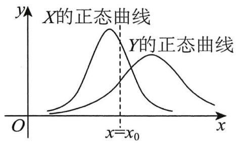

$\quad$A. $\lambda < \mu$

$\quad$B. ${\sigma }_{1} > {\sigma }_{2}$

$\quad$C. $P(X \geq x_0) > P(Y \geq x_0)$

$\quad$D. $P(X \geq x_0) < P(Y \geq x_0)$

