# 2025 高分必刷千题册—经典重点册（上）

集合 1

### 题型一：非纯送分集合题....1

函数 4

### 题型一：定义域值域问题....4

### 题型二：分段函数....5

模型一：分段函数基础....5

模型二：狄利克雷函数与符号函数....6

模型三：简单的含参分段函数问题....7

模型四：分段含参函数单调问题....8

### 题型三：奇偶性相关....10

模型一：奇偶性基础....10

模型二：给定含参函数奇偶性求参数....12

模型三：给奇（偶）函数一半的表达式，求另一半....14

模型四：奇函数+常数模型 …… 15

### 题型四：幂指对函数的综合考察及生活实际模型....16

### 题型五：求函数解析式....20

### 题型六：画草图解不等式（比大小） 21

### 题型七：必会四大基本功....24

模型一：三次函数分解因式....24

模型二：解超越方程（超越不等式）....25

模型三：求分式的最值....26

模型四：口算对称点....27   
### 题型八：函数图像相关....27

模型一：图像识别问题....27

模型二：图像交点问题（零点问题）……33

模型三：曲线关于直线对称曲线的求法 …… 36

模型四： $f(|x|)$ 与 $|f(x)|$ ……38

### 题型九：比大小问题基础....40

### 题型十：复合函数单调性及奇偶性....43

### 题型十一：周期性对称性问题....46

### 题型十二： $x^{2}$ 与 $2^{x}$ 的图像关系……51

### 题型十三：二次函数根的分布....52

### 题型十四：两函数相乘定号模型....54

导数选填....55

### 题型一：导数基础....55

### 题型二：切线问题大总结....57

### 题型三：三次函数相关....65

### 题型四：函数零点问题（图像交点问题）……70

### 题型五：同构的思想....73

### 题型六：奇、偶函数的导数及其推广 79

### 题型七：抽象函数图像识别 80

### 题型八：导数必会图像 83

### 题型九：含三角函数的导数小题....86

# 导数大题 88

### 题型一：求函数解析式....88

### 题型二：讨论单调性....89

### 题型三：导数基础五题....93

### 题型四：含参恒成立问题——分析法和分参法....98

### 题型五：切线问题....105

### 题型六：虚设零点及其高级考法....108

### 题型七：放缩法在导数证明题中的应用....117

### 题型八：必要性探路....125

### 题型九：导数技巧之端点效应法.... 129

### 题型十：解超越方程（超越不等式）....133

### 题型十一：数列思想在导数证明中的应用....136

### 题型十二：画草图辅助法处理导数大题....140

### 题型十三：双变量问题....145

模型一：双变量问题之 $k_{AB}$ 和 $f'(x_0)$ 关系模板 145

模型二：双变量问题之变型构造....148

模型三：双变量问题之极值点偏移（非常重要）☆ 150

模型四：双变量问题之双变量为极值点 …… 157

模型五：双变量问题补充....160

# 三角函数....166

### 题型一：扇形与弧度制....166

### 题型二：三角函数....166

### 题型三：和与差的三角函数公式....172

### 题型四：二倍角公式....177

### 题型五：诱导公式....181

### 题型六：记住特殊的三角函数（直角三角形法求三角函数）……185

### 题型七：看图求解析式....188

### 题型八：三角函数平移大总结....193

### 题型九：给一个角的三角函数值，求另一个角....198

### 题型十：两角和差的弦与正切乘除的关系....199

### 题型十一：三角函数的三角恋....199

### 题型十二：求齐次三角函数和或差的范围....201

### 题型十三：求非齐次三角函数和或差的范围....204

### 题型十四：三角函数与奇偶性....206

### 题型十五：求齐次三角函数比值的范围（含万能公式，凑 tan 的思想）……209

### 题型十六：左定右动类问题（近年热点）....211

解三角形选填....213

### 题型一：解三角形基础....213

基础一：正弦定理的简单应用之纯正弦定理 ……213

基础二：正弦定理的简单应用之边 sin 互化....213

基础三：正弦定理的简单应用之 sin 一角=sin 另两角和 .....216

基础四：纯余弦定理....218

基础五：三角形面积公式....220

### 题型二：正余弦定理的综合考察....223

### 题型三：aA 模型 ..... 227

模型一：一条边和所对角已知，求面积的最大值....227

模型二：一边及对角已知，另两条边的线性组合或乘积的最值问题……228

### 题型四： $\sin(A-B)$ 与 $\sin C$ 230

### 题型五：cosA 与 cosBcosC....231

### 题型六：角分线定理....232

### 题型七：中线定理....233

### 题型八：两角三角函数相等解角的关系....234

### 题型九：A=2B 的翻译 ..... 235

### 题型十：图形中的解三角形问题....236

### 题型十一：三角形解的个数问题....239

### 题型十二：给定两边比值求一角的范围....240

### 题型十三：几何法秒算解三角形....240

解三角形大题 242

### 题型一：知一角及另两角三角函数的线性关系，解三角形 242

### 题型二：凉弦定理....244

### 题型三：几何法秒解三角形大题....246

### 题型四：正余弦定理的综合考察....247

### 题型五：形状知，大小未知的三角形的处理方法....252

### 题型六：角分线定理....252

### 题型七：中线定理及其变形....253

### 题型八：两角三角函数相等解角的关系....256

### 题型九：锐角三角形的翻译....259

### 题型十：图形中的解三角形问题....261

### 题型十一：画图能力的考察....268

### 题型十二：判断三角形是否存在....269

数列选填....271

### 题型一：等差等比数列基础题....271

一：等差数列基础 …… 271

二：等比数列基础 …… 273

三：简单的等差等比混合问题....276

### 题型二： $a_{n}$ 和 $S_{n}$ 关系。……277

### 题型三：数列秒杀技巧....279

### 题型四：裂项相消 282

### 题型五：错位相减....283

### 题型六：数学文化中的数列....284

### 题型七：常见递推式的处理方法....289

### 题型八：构造同型递推式....291

### 题型九：数列与函数....294

### 题型十：Sn 的增减性与最值....299

### 题型十一：数列的前 n 项积....303

### 题型十二：最一般数列单调性的判断方法....305

### 题型十三：等差等比数列的深入考察....305

### 题型十四：周期数列....310

# 数列大题....312

### 题型一：简单的等差等比数列....312

### 题型二： $a_{n}$ 和 $S_{n}$ 关系及 $\pmb {n}\geq 2$ … 316

### 题型三：证明一个新数列是等差或等比数列....319

### 题型四：裂项相消大题....324

### 题型五：错位相减及其新奇考法....331

### 题型六：叠乘法及其应用 334

### 题型七：若干组相同数相加问题....339

### 题型八：数列的放缩....340

### 题型九：给新数列的前 n 项和求老数列....347

### 题型十：判断最一般数列的增减性....350

### 题型十一：构造同型递推式....355

### 题型十二：分奇偶的数列....358

### 题型十三：数列的前 n 项积....365

### 题型十四： $(\sqrt{S_n})$ 是等差数列的翻译方法.... 367

### 题型十五：方程组的思想....369

# 集合

# 题型一：非纯送分集合题

等级（N）

2024 九省联考数学

##### 001. 已知集合 $A = \{-2, 0, 2, 4\}$ , $B = \{x | |x - 3| \leq m\}$ , 若 $A \cap B = A$ , 则 $m$ 的最小值为 \_\_\_\_.

等级（N）

2024 长郡十八校第二次联考

##### 002. 已知集合 $M = \{x \mid x^2 - 2x - 3 < 0\}$ , $N = \{x \mid x^2 - ax < 0, x \in Z\}$ . 若集合 $M \cap N$ 恰有两个元素, 则实数 $a$ 的取值范围是 \_\_\_\_.

等级（N）

2022 云南师大附中第九次月考

##### 003. 已知集合 $A = \{0, 1, 2\}$ , $B = \{(x, y) | x \in A, y \in A, x + y \in A, x - y \in A\}$ , 则集合 $B$ 中元素的个数是（）

$\quad$A.4

$\quad$B.3

$\quad$C.2

$\quad$D.1

等级（R）

2021 石家庄一模

##### 004. 若集合 A, B, U 满足: A⊆B⊆U, 则 U = ( )

$\quad$A. $\mathrm{B} \cap C_{u} A$

$\quad$B. A ∩ C\_u B

$\quad$C. $\mathrm{B}\cup C_uA$

$\quad$D. $A \cup C_{u}B$

等级（R）

2022 新疆第二次适应性检测

##### 005.已知集合 $\mathrm{A} = \{\mathrm{a}\mid \mathrm{a} = 3\mathrm{n} - 1,\mathrm{n}\in \mathbb{Z}\} ,\mathrm{B} = \{\mathrm{b}\mid \mathrm{b} = 3\mathrm{n} + 1,\mathrm{n}\in \mathbb{Z}\}$ ，全集 $\mathrm{U} = \mathrm{Z}$ ，则 $\mathrm{A}\cap (\mathrm{C_U B}) = (\quad)$

$\quad$A.A

$\quad$B.B

$\quad$C.∅

$\quad$D.Z

等级（R）

2021 湖北十一校第二次联考

##### 006.已知非空集合A，B满足以下两个条件：

（1） A $\cup$ B = {1,2,3,4}, A $\cap$ B = $\varnothing$   
（2） A 的元素个数不是 A 中的元素, B 的元素个数不是 B 中的元素.

则有序集合对（A，B）的个数为（ ）.

$\quad$A.1

$\quad$B.2

$\quad$C.3

$\quad$D.4

等级（SR）

2024宜春二模

##### 007.（多选）已知 $A \subseteq R$ ，如果实数 $x_0$ 满足对任意的 $a > 0$ ，都存在 $x \in A$ ，使得 $0 < |x - x_0| < a$ ，则称 $x_0$ 为集合 A 的“开点”，则下列集合中以 0 为“开点”的集合有

$\quad$A. $\{x|x\neq 0,x\in R\}$

$\quad$B. $\{x|x\neq 0,x\in Z\}$

$\quad$C. $\{y\mid y = \frac{1}{x},x\in N_{+}\}$

$\quad$D. $\{y\mid y = \frac{x}{x + 1},x\in N_{+}\}$

等级（SR）

2024 柳州三模

##### 008.(多选)设 S 是至少含有两个元素的集合, 在 S 上定义了一个二元运算“\*”(即对任意的 $a, b \in S$ , 对于有序元素对 $(a, b)$ , 在 S 中有唯一确定的元素 $a^*b$ 与之对应). 若对任意的 $a, b \in S$ , 有 $a^*(b^*a) = b$ , 则对任意的 $a, b \in S$ , 下列等式中恒成立的是 ( )

$\quad$A. $(a^{*}b)^{*}a = a$

$\quad$B. $[a^{*}(b^{*}a)]^{*}(a^{*}b) = a$

$\quad$C. $b^{*}(b*b) = b$

$\quad$D. $(a^{*}b)^{*}[b^{*}(a^{*}b)] = b$

# 函数

# 题型一：定义域值域问题

等级（N）

2020北京

##### 001. 函数 $f(x) = \frac{1}{x + 1} + \ln x$ 的定义域是 \_\_\_\_.

等级（N）

##### 002. 函数 $y=\frac{\sqrt{\lg x+1}}{x-1}$ 的定义域为 \_\_\_\_.

等级（N）

##### 003. 函数 $f(x) = \frac{\sqrt{|x - 2| - 1}}{\log_2(x - 1)}$ 的定义域为 \_\_\_\_.

等级（N）

##### 004. 已知函数 $f(x) = \lg (4 - x)$ 的定义域为 $M$ ， $g(x) = \sqrt{0.5^x - 4}$ 的值域为 $N$ ，则 $M \cap N = (\quad)$

$\quad$A. $M$

$\quad$B. $N$

$\quad$C. $[0,4)$

$\quad$D. $[0, +\infty)$

# 题型二：分段函数

# 模型一：分段函数基础

等级（N）

##### 005.已知 $f(x) = \left\{ \begin{array}{l}2x,(x > 0)\\ f(x + 1),(x <   0) \end{array} \right.$ ，则 $f\left(-\frac{4}{3}\right) + f\left(\frac{4}{3}\right)$ 等于

等级（N）

##### 006. 设 $f(x) = \begin{cases} x + 3 (x > 10) \\ f(f(x + 5)) (x \leq 10) \end{cases}$ ，则 $f(5)$ 的值是（）

$\quad$A.24

$\quad$B.21

$\quad$C.18

$\quad$D.16

# 模型二：狄利克雷函数与符号函数

等级（N）

##### 007.著名的Dirichlet函数 $D(x) = \left\{ \begin{array}{ll}1,x\text{为有理数}\\ 0,x\text{为无理数} \end{array} \right.$ ，则 $D[D(x)] = ()$

$\quad$A.0

$\quad$B.1

$\quad$C. $\left\{ \begin{array}{l}1, x \text{为无理数}\\ 0,x\text{为有理数} \end{array} \right.$

$\quad$D. $\left\{ \begin{array}{l}1, x \text{为有理数}\\ 0,x\text{为无理数} \end{array} \right.$

等级（N）

##### 008. 设 $x \in R$ ，定义符号函数 $\operatorname{sgn} x = \begin{cases} 1, & x > 0 \\ 0, & x = 0 \\ -1, & x < 0 \end{cases}$ ，则函数 $f(x) = |x| \operatorname{sgn} x$ 的图象大致是（）.

$\quad$A.

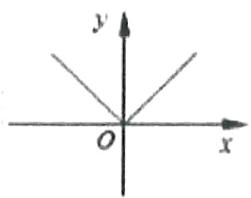

$\quad$B.

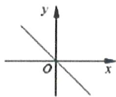

$\quad$C.

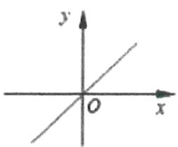

$\quad$D.

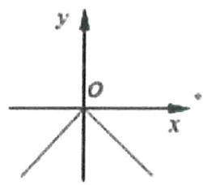

等级（R）

2023 山西一模

##### 009.十九世纪德国数学家狄利克雷提出了“狄利克雷函数” $D(x)=\left\{\begin{aligned}1,x&\in\mathbf{Q}\\ 0,x&\in C_{R}\mathbf{Q}\end{aligned}\right.$ ，它在现代数学的发展过程中有着重要意义，若函数 $f(x)=x^{2}-D(x)$ ，则下列实数不属于函数 $f(x)$ 值域的是（）

$\quad$A.0

$\quad$B.1

$\quad$C.2

$\quad$D.3

# 模型三：简单的含参分段函数问题

等级（N）

##### 010.已知实数 $a \neq 0$ ，函数 $f(x) = \begin{cases} 2x + a, & x < 1 \\ -x - 2a, & x \geq 1 \end{cases}$ ，若 $f(1 - a) = f(1 + a)$ ，则 $a$ 的值为（）

$\quad$A. $-\frac{3}{4}$

$\quad$B. $\frac{3}{4}$

$\quad$C. $-\frac{3}{5}$

$\quad$D. $\frac{3}{5}$

等级（R）

##### 011. 设 $f(x) = \begin{cases} \sqrt{x}, & 0 < x < 1 \\ 2(x - 1), & x \geq 1 \end{cases}$ ，若 $f(a) = f(a + 1)$ ，则 $f\left(\frac{1}{a}\right) =$ \_\_\_\_

# 模型四：分段含参函数单调问题

等级（N）

##### 012. 已知 $f(x) = \begin{cases} (2 - a)x - 3a + 3, & x < 1 \\ \log_a x, & x \geq 1 \end{cases}$ 是 $\mathbb{R}$ 上单调递增函数，那么 $a$ 的取值范围是（）

$\quad$A. $(1,2)$

$\quad$B. $\left(1,\frac{5}{4}\right]$

$\quad$C. $\left[\frac{5}{4},2\right)$

$\quad$D. $(1, +\infty)$

等级（N）

2024 新高考一卷

##### 013. 已知函数为 $f(x) = \begin{cases} -x^2 - 2ax - a, & x < 0 \\ e^x + \ln (x + 1), & x \geq 0 \end{cases}$ ，在 R 上单调递增，则 $a$ 的范围是（）

$\quad$A. $(- \infty, 0]$

$\quad$B. $[-1,0]$

$\quad$C. $[-1, 1]$

$\quad$D. $[0, +\infty)$

等级（R）

##### 014. 已知函数 $f(x) \begin{cases} -x^2 + ax, & x \leq 1 \\ 3ax - 7, & x > 1 \end{cases}$ ，若存在 $x_1, x_2 \in R$ ，且 $x_1 \neq x_2$ 使得 $f(x_1) = f(x_2)$ 成立，则实数 $a$ 的取值范围是（）

$\quad$A. $(-2, 2)$

$\quad$B. $(-2,2]$

$\quad$C. $(- \infty, 3)$

$\quad$D. $(- \infty, 3]$

# 题型三：奇偶性相关

# 模型一：奇偶性基础

等级（N）

##### 015.下列函数为偶函数的是（）

$\quad$A. $y = \sin x$

$\quad$B. $y = x^{3}$

$\quad$C. $y = e^{x}$

$\quad$D. $y = \ln \sqrt{x^2 + 1}$

等级（N）

##### 016.函数 $f(x) = \frac{4^x + 1}{2^x}$ 的图象（）

$\quad$A.关于原点对称

$\quad$B. 关于直线 $y = x$ 对称

$\quad$C. 关于 x 轴对称

$\quad$D. 关于 y 轴对称

等级（N）

##### 017.函数的图象 $y = \log_2\frac{2 - x}{2 + x}$ 的图象（）

$\quad$A.关于原点对称

$\quad$B. 关于直线 $y = -x$ 对称

$\quad$C. 关于 y 轴对称

$\quad$D. 关于直线 $y = x$ 对称

等级（N）

##### 018.下列函数既是偶函数又在 $(0, + \infty)$ 上单调递增的函数是（）

$\quad$A. $y = x^{3}$

$\quad$B. $y = |x| + 1$

$\quad$C. $y = -x^{2} + 1$

$\quad$D. $y = 2^{-|x|}$

等级（N）

##### 019.已知函数 $f(x) = 3^{x} - \left(\frac{1}{3}\right)^{x}$ ，则 $f(x)$ （）

$\quad$A.是偶函数，且在 $\mathbf{R}$ 上是增函数

$\quad$B.是奇函数，且在 $\mathbf{R}$ 上是增函数

$\quad$C. 是偶函数，且在 $\mathbf{R}$ 上是减函数

$\quad$D.是奇函数，且在 $\mathbf{R}$ 上是减函数

等级（N）

##### 020.设函数 $f(x) = x^3 -\frac{1}{x^3}$ ，则 $f(x)$ （）

$\quad$A.是奇函数，且在 $(0, + \infty)$ 上单调递增

$\quad$B. 是奇函数，且在 $(0, +\infty)$ 上单调递减

$\quad$C. 是偶函数，且在 $(0, +\infty)$ 上单调递增

$\quad$D. 是偶函数，且在 $(0, +\infty)$ 上单调递减

等级（R）

2020 新课标

##### 021.设函数 $f(x) = \ln |2x + 1| - \ln |2x - 1|$ ，则 $f(x)$ （）

$\quad$A.是偶函数，且在 $\left(\frac{1}{2}, + \infty\right)$ 单调递增

$\quad$B.是奇函数，且在 $\left(-\frac{1}{2},\frac{1}{2}\right)$ 单调递减

$\quad$C. 是偶函数，且在 $\left(-\infty, -\frac{1}{2}\right)$ 单调递增

$\quad$D. 是奇函数，且在 $\left(-\infty, -\frac{1}{2}\right)$ 单调递减

# 模型二：给定含参函数奇偶性求参数

等级（N）

##### 022.已知函数 $f(x) = ax^{2} + 2x$ 是奇函数，则实数 $a =$ \_\_\_\_.

等级（N）

##### 023.设函数 $f(x) = \frac{(x + 1)(x + a)}{x}$ 为奇函数，则 $a =$ \_\_\_\_.

等级（N）

##### 024. 已知函数 $f(x) = \begin{cases} x^2 + x, & x \leq 0 \\ ax^2 + bx, & x > 0 \end{cases}$ 为奇函数，则 $a =$ \_\_\_\_； $b =$ \_\_\_\_.

等级（N）

##### 025.若函数 $f(x) = \ln (e^x + 1) + ax$ 为偶函数，则实数 $a =$

等级（R）

##### 026.若函数 $g(x) = f(2x) - x^2$ 是奇函数，且 $f(1) = 2$ ，则 $f(-1) = \_$ .

等级（R）

2024新疆第二次适应性检测

##### 027.若函数 $f(x) = \frac{ax - 1}{x - 1}$ 的图象关于点(1,2)对称,则 $a = (\quad)$

$\quad$A.-2

$\quad$B.-1

$\quad$C.1

$\quad$D.2

# 模型三：给奇（偶）函数一半的表达式，求另一半

等级（N）

##### 028. 函数 $f(x)$ 在 $\mathbb{R}$ 上为偶函数，且 $x > 0$ 时， $f(x) = \sqrt{x} + 1$ ，则当 $x < 0$ 时， $f(x) =$ \_\_\_\_.

等级（N）

##### 029. 已知函数 $f(x)$ 是定义在 $\mathbb{R}$ 上的奇函数，且 $x > 0$ 时， $f(x) = x^2 - 2x$ ，则当 $x \leq 0$ 时， $f(x) =$ \_\_\_\_.

等级（N）

2016年新课标III

##### 030. 已知 $f(x)$ 为偶函数，当 $x < 0$ 时， $f(x) = \ln (-x) + 3x$ ，则曲线 $y = f(x)$ 在点(1, -3)处的切线方程是 \_\_\_\_.

# 模型四：奇函数+常数模型

等级（R）

2018·新课标III

##### 031. 已知函数 $f(x) = \ln \left( \sqrt{1 + x^2} - x \right) + 1$ ， $f(a) = 4$ ，则 $f(-a) =$

等级（R）

2022 许昌平顶山济源二检

##### 032.已知函数 $f(x) = \frac{e^x}{e^x + e^{-x}}$ ，若 $f(\lg (\log_3 10)) = a$ ，则 $f(\lg (\lg 3)) =$ （）

$\quad$A. $e^{a - 1}$

$\quad$B. $1 - a$

$\quad$C. $e^{1 - 3a}$

$\quad$D. $3a - 1$

等级（R）

##### 033.若关于 x 的函数 $f(x)=\frac{tx^{2}+2x+t^{2}+\sin x}{x^{2}+t}(t>0)$ 的最大值为 M，最小值为 N，且 $M+N=4$ ，则实数 t 的值为 \_\_\_\_.

# 题型四：幂指对函数的综合考察及生活实际模型

等级（N）

##### 034. 已知函数 $y = ax^2 - bx + c$ 的图象如图所示，则函数 $y = a^{-x}$ 与 $y = \log_b x$ 在同一坐标系中的图象是（）

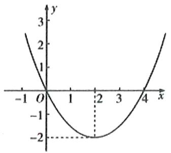

$\quad$A.

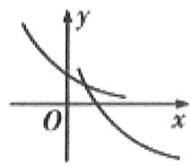

$\quad$B.

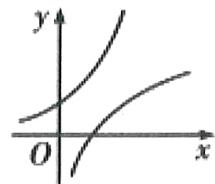

$\quad$C.

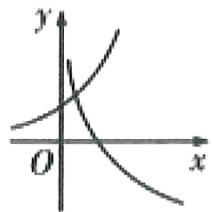

$\quad$D.

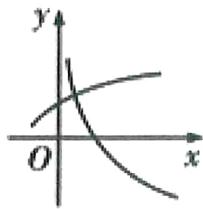

等级（N）

2022 浙江数学

##### 035. 已知 $2^{\mathrm{a}} = 5$ ， $\log_83 = b$ ，则 $4^{a - 3b} = ()$

$\quad$A.25

$\quad$B.5

$\quad$C. $\frac{25}{9}$

$\quad$D. $\frac{5}{3}$

等级（R）

2016 浙江卷

##### 036.已知 $a, b > 0$ ，且 $a \neq 1, b \neq 1$ ，若 $\log_a b > 1$ ，则（）

$\quad$A. $(a - 1)(b - 1) < 0$

$\quad$B. $(a - 1)(a - b) > 0$

$\quad$C. $(b - 1)(b - a) < 0$

$\quad$D. $(b - 1)(b - a) > 0$

等级（R）

2012 新课标

##### 037.当 $0 < x \leq \frac{1}{2}$ 时， $4^{x} < \log_{a} x$ ，则 $a$ 的取值范围是（）

$\quad$A. $\left(0,\frac{\sqrt{2}}{2}\right)$

$\quad$B. $\left(\frac{\sqrt{2}}{2},1\right)$

$\quad$C. $(1, \sqrt{2})$

$\quad$D. $(\sqrt{2}, 2)$

等级（N）

2020新课标

##### 038.某校一个课外学习小组为研究某作物种子的发芽率 y 和温度 x（单位：℃）的关系，在 20 个不同的温度条件下进行种子发芽实验，由实验数据 $(x_{i}, y_{i}) (i = 1, 2, \cdots, 20)$ 得到下面的散点图：

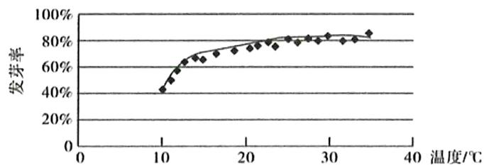

由此散点图，在 $10^{\circ} \mathrm{C}$ 至 $40^{\circ} \mathrm{C}$ 之间，下面四个回归方程类型中最适宜作为发芽率 $\mathbf{y}$ 和温度 $\mathbf{x}$ 的回归方程类型的是（）

$\quad$A. $y = a + bx$

$\quad$B. $y = a + bx^{2}$

$\quad$C. $y = a + be^{x}$

$\quad$D. $y = a + b\ln x$

等级（N）

2020新高考

##### 039. 基本再生数 $R_{0}$ 与世代间隔 T 是新冠肺炎的流行病学基本参数。基本再生数指一个感染者传染的平均人数，世代间隔指相邻两代间传染所需的平均时间。在新冠肺炎疫情初始阶段，可以用指数模型： $I(t) = e^{rt}$ 描述累计感染病例数 $I(t)$ 随时间 t（单位：天）的变化规律，指数增长率 r 与 $R_{0}$ ，T 近似满足 $R_{0} = 1 + rT$ ，有学者基于已有数据估计出 $R_{0} = 3.28$ ， $T = 6$ ，据此，在新冠肺炎中疫情初始阶段，累计感染病例数增加 1 倍需要的时间约为（ $\ln 2 \approx 0.69$ ）（）

$\quad$A.1.2天

$\quad$B.1.8天

$\quad$C.2.5天

$\quad$D.3.5天

等级（N）

2019北京

##### 040. 在天文学中，天体的明暗程度可以用星等或亮度来描述. 两颗星的星等与亮度满足 $m_{2} - m_{1} = \frac{5}{2} \lg \frac{E_{1}}{E_{2}}$ ，其中星等为 $m_{k}$ 的星的亮度为 $E_{k}(k = 1,2)$ . 已知太阳的星等为 $-26.7$ ，天狼星的星等为 $-1.45$ ，则太阳与天狼星的亮度的比值为（）

$\quad$A. $10^{10.1}$

$\quad$B. 10.1

$\quad$C. $\lg 10.1$

$\quad$D. $10^{-10.1}$

等级（R）

##### 041.一种药在病人血液中的量保持 1500mg 以上才有疗效.而低于 500mg 病人就有危险.现给某病人静脉注射了这种药 2500mg.如果药在血液中以每小时 20%的比例衰减,为了充分发挥药物的利用价值,那么从现在起经过\_\_\_\_小时向病人的血液补充这种药才能保持疗效.(附: $\lg 2 = 0.3010$ , $\lg 3 = 0.4771$ .精确到 0.1h)

等级（R）

2024佛山二模

##### 042. 已知 $0 < a < 1$ 且 $a \neq \frac{1}{2}$ ，若函数 $f(x) = 2\log_a x - \log_{2a} x$ 在 $(0, +\infty)$ 上单调递减，则实数 $a$ 的取值范围为（）

$\quad$A. $\left(\frac{1}{4},\frac{1}{2}\right)$

$\quad$B. $\left(0,\frac{1}{4}\right)$

$\quad$C. $\left(\frac{1}{4},\frac{1}{2}\right)\cup \left(\frac{1}{2},1\right)$

$\quad$D. $\left(0, \frac{1}{4}\right) \cup \left(\frac{1}{2}, 1\right)$

# 题型五：求函数解析式

等级（N）

##### 043. 已知函数 $f(x + 1) = 3x + 2$ ，求 $f(x)$ .

等级（N）

##### 044.已知 $2f(x) + f\left(\frac{1}{x}\right) = 4x$ ，求 $f(x)$ 的表达式

等级（N）

##### 045. 已知函数 $f(x)$ 是一次函数，若 $f(f(x)) = 4x + 8$ ，求 $f(x)$ 解析式.

# 题型六：画草图解不等式（比大小）

等级（N）

##### 046. 已知定义域为 $\mathbf{R}$ 的偶函数 $f(x)$ 在 $(0, +\infty)$ 上为减函数，且有 $f(2) = 0$ ，则满足 $f(x) < 0$ 的 $x$ 的集合为 \_\_\_\_.

等级（N）

##### 047. 定义在 R 上的偶函数 $f(x)$ 满足：对任意 $x_{1}, x_{2} \in [0, +\infty)(x_{1} \neq x_{2})$ ，有 $\frac{f(x_{2}) - f(x_{1})}{x_{2} - x_{1}} < 0$ ，则（）

$\quad$A. $f(3) <   f(-2) <   f(1)$

$\quad$B. $f(1) < f(-2) < f(3)$

$\quad$C. $f(-2) < f(1) < f(3)$

$\quad$D. $f(3) < f(1) < f(-2)$

等级（N）

##### 048. 已知偶函数 $f(x)$ 在 $[0, +\infty)$ 上单调递减， $f(2) = 0$ ，若 $f(x - 1) > 0$ ，则 $x$ 的取值范围是 \_\_\_\_.

等级（N）

##### 049. 函数 $f(x)$ 在 $(- \infty, +\infty)$ 单调递减，且为奇函数。若 $f(1) = -1$ ，则满足 $-1 \leq f(x - 2) \leq 1$ 的 $x$ 的取值范围是 \_\_\_\_.

等级（R）

##### 050.函数 $y = f(x)$ 在 $[0,2]$ 上单调递增，且函数 $f(x + 2)$ 是偶函数，则下列结论成立的是（）

$\quad$A. $f(1) < f\left(\frac{5}{2}\right) < f\left(\frac{7}{2}\right)$

$\quad$B. $f\left(\frac{7}{2}\right) <   f(1) <   f\left(\frac{5}{2}\right)$

$\quad$C. $f\left(\frac{7}{2}\right) <   f\left(\frac{5}{2}\right) <   f(1)$

$\quad$D. $f\left(\frac{5}{2}\right) <   f(1) <   f\left(\frac{7}{2}\right)$

等级（R）

##### 051. 若函数 $f(x)$ 在 $(- \infty, 0) \cup (0, +\infty)$ 上为奇函数，且在 $(0, +\infty)$ 上是单调增函数， $f(-2) = 0$ ，则不等式 $xf(x) < 0$ 的解集为 \_\_\_\_.

等级（R）

2008 全国卷 1

##### 052.设奇函数 $f(x)$ 在 $(0, +\infty)$ 上为增函数，且 $f(1) = 0$ ，则不等式 $\frac{f(x) - f(-x)}{x} < 0$ 的解集为（）

$\quad$A. $(-1,0)\cup (1, + \infty)$

$\quad$B. $(- \infty, -1) \cup (0, 1)$

$\quad$C. $(- \infty, -1) \cup (1, +\infty)$

$\quad$D. $(-1,0)\cup (0,1)$

等级（R）

2020新高考

##### 053. 若定义在 $\mathbb{R}$ 的奇函数 $f(x)$ 在 $(- \infty, 0)$ 单调递减，且 $f(2) = 0$ ，则满足 $xf(x - 1) \geq 0$ 的 $x$ 的取值范围是（）

$\quad$A. $[-1, 1] \cup [3, +\infty)$

$\quad$B. $[-3, - 1]\cup [0,1]$

$\quad$C. $[-1,0] \cup [1, +\infty)$

$\quad$D. $[-1,0] \cup [1,3]$

# 题型七：必会四大基本功

# 模型一：三次函数分解因式

等级（N）

##### 054.已知方程 $x^{3} - 2x^{2} - x + 2 = 0$ ，求 $x$

# 模型二：解超越方程（超越不等式）

等级（N）

##### 055. $e^x + e^{-x} = 2$ ，求 $\mathbf{x}$

等级（N）

##### 056.解 $-\mathrm{x}^2 -\ln \mathrm{x} + 2 - 2\mathrm{x} + \frac{1}{x}\geqslant 0$

等级（N）

2024 新高考二卷数学改编

##### 057. 解不等式 $\mathbf{x} - \mathbf{x}\ln \mathbf{x} - \mathbf{x}^3 < 0$

等级（R）

##### 058. 求 $4^{x} + 4^{-x} - 4 \cdot 2^{x} - 4 \cdot 2^{-x} + 6 = 0$ ，求 $x$

# 模型三：求分式的最值

等级（N）

##### 059. 求 $y = \frac{3x^2 + 2x + 1}{x^2 + x + 1}$ 值域

等级（R）

2022年全国甲卷

##### 060. 已知 $\triangle ABC$ 中，点 $D$ 在边 $BC$ 上， $\angle ADB = 120^{\circ}, AD = 2, CD = 2BD$ 。当 $\frac{AC}{AB}$ 取得最小值时， $BD =$ \_\_\_\_.

模型四：口算对称点

等级（N）

##### 061. $P(2,1)$ 关于直线 $x + y - 1 = 0$ 的对称点 $Q$ 的坐标为

# 题型八：函数图像相关

# 模型一：图像识别问题

等级（N）

##### 062.函数 $y = -x\cos x$ 的部分图象是（）

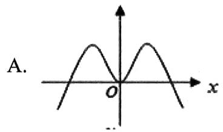

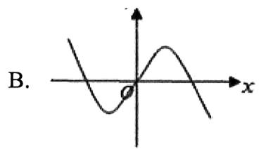

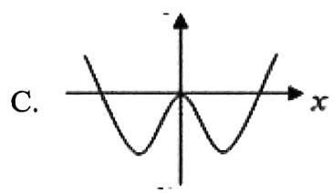

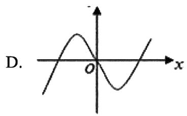

等级（N）

2022年全国乙卷

##### 063. 如图是下列四个函数中的某个函数在区间 $[-3, 3]$ 的大致图像，则该函数是（）

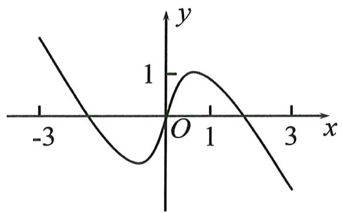

$\quad$A. $y = \frac{-x^3 + 3x}{x^2 + 1}$

$\quad$B. $y = \frac{x^{3} - x}{x^{2} + 1}$

$\quad$C. $y = \frac{2x\cos x}{x^2 + 1}$

$\quad$D. $y = \frac{2\sin x}{x^2 + 1}$

等级（N）

##### 064.数 $y = x^{2} + \frac{\ln|x|}{x}$ 的图像大致为（ ）

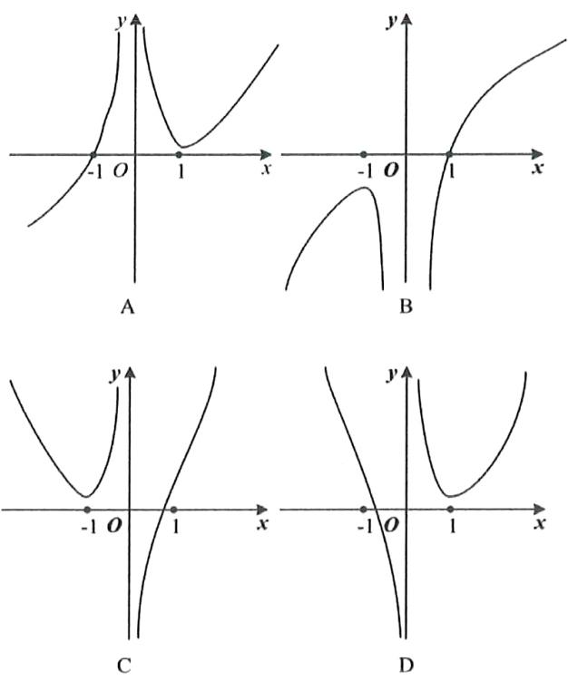

等级（N）

##### 065.函数 $f(x) = \frac{2^x\cdot x^2}{4^x - 1}$ 的图像的大致形状是（）

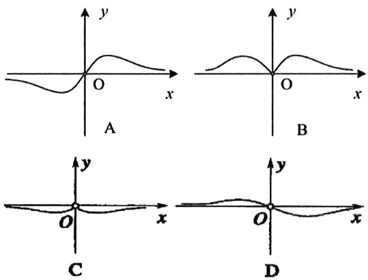

等级（N）

##### 066.函数 $y = \frac{x^3}{3^x - 1}$ 的图象大致是（）

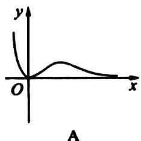

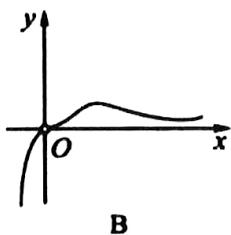

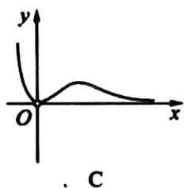

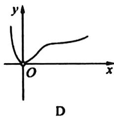

等级（R）

2018新课标三

##### 067.函数 $y = -x^{4} + x^{2} + 2$ 的图像大致为（）

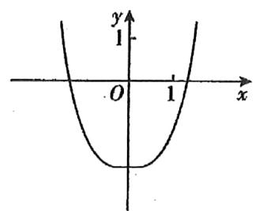

A

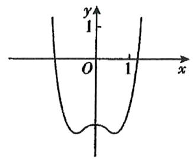

B

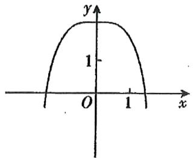

C

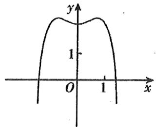

D

等级（R）

##### 068.函数 $y = (x^{2} - 1)e^{|x|}$ 的图像大致为

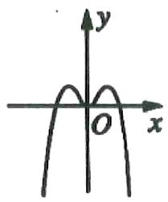  
A

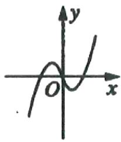  
B

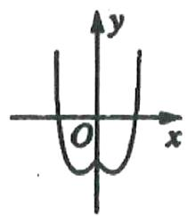  
C

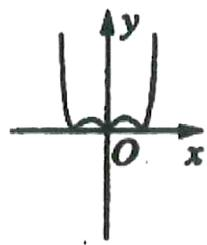  
D

等级（R）

2024 四川九市二诊

##### 069. 已知函数 $f(x) = (ax + 1)e^x$ ，给出下列4个图像：

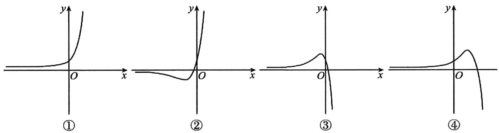

其中，可以作为函数 $f(x)$ 的大致图像的个数为（ ）

$\quad$A.1

$\quad$B.2

$\quad$C.3

$\quad$D.4

等级（R）

2022 苏北七市二模

##### 070.函数 $f(x) = \frac{ax + b}{x^2 + c}$ （a，b， $\mathbf{c}\in \mathbb{R}$ ）的图像可能是（

$\quad$A.

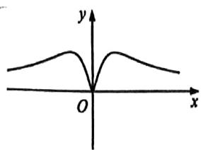

$\quad$B.

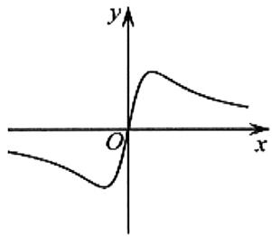

$\quad$C.

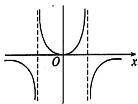

$\quad$D.

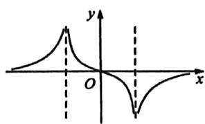

等级（R）

2024 郑州三模

##### 071. 下列可以作为方程 $x^{3} + y^{3} = 3xy$ 的图象的是（）

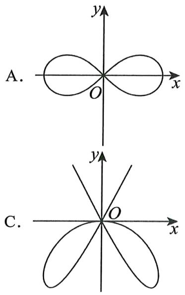

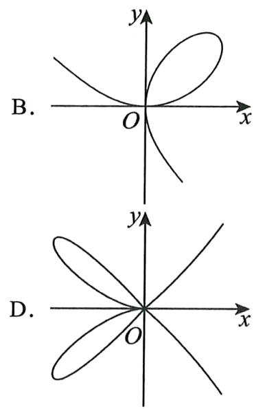

等级（SR）

2021 福建四月质检

##### 072.音乐是用声音来表达人的思想感情的一种艺术。声音的本质是声波，而声波在空气中的振动可以用三角函数来刻画，在音乐中可以用正弦函数来表示单音，用正弦函数相叠加表示和弦，某二和弦可表示为 $f(x) = \sin 2x + \sin 3x$ ，则函数 $y = f(x)$ 的图像大致为（）

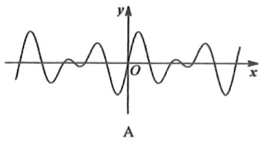

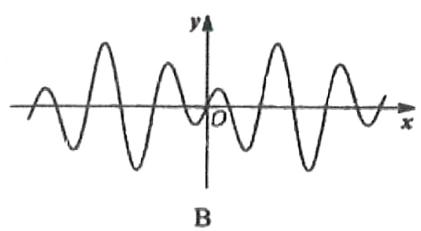

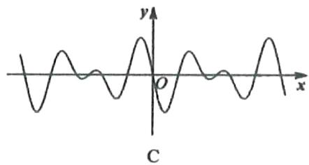

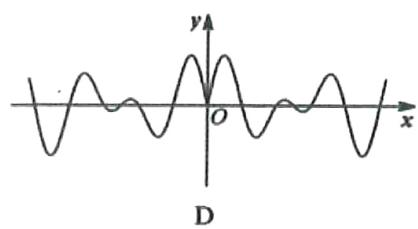

# 模型二：图像交点问题（零点问题）

等级（N）

##### 073.函数 $f(x) = x^{2} - \left(\frac{1}{2}\right)^{|x|}$ 的零点个数为（ ）

$\quad$A.0

$\quad$B.1

$\quad$C.2

$\quad$D.3

等级（N）

##### 074. 已知函数 $f(x) = \begin{cases} e^x, & x \leq 0 \\ \ln x, & x > 0 \end{cases}$ ， $g(x) = f(x) + x + a$ ，若 $g(x)$ 存在 2 个零点，则 $a$ 的取值范围是（）

$\quad$A. $[-1,0)$

$\quad$B. $[0, +\infty)$

$\quad$C. $[-1, +\infty)$

$\quad$D. $[1, +\infty)$

等级（R）

##### 075.函数 $f(x) = x\cos (x^{2} - 2x - 3)$ 在区间 $[-1,4]$ 上的零点个数为（）

$\quad$A. 5

$\quad$B. 4

$\quad$C. 3

$\quad$D. 2

等级（SR）

##### 076. 已知函数 $f(x)=\frac{2x}{x-1}$ ，函数 $g(x)$ 对任意的 $x \in R$ 都有 $g(2018-x)=4-g(x-2016)$ 成立，且 $y=f(x)$ 与 $y=g(x)$ 的图像有 m 个交点为 $(x_{1},y_{1}),(x_{2},y_{2})\cdots(x_{m},y_{m})$ ，则 $\sum_{i=1}^{m}(x_{i}+y_{i})=$ \_\_\_\_.

等级（SR）

##### 077. 已知函数 $f(x) = \begin{cases} |x + 1| & x \leq 0 \\ |\log_3 x| & x > 0 \end{cases}$ ，若方程 $f(x) = a$ 有四个不同的解 $x_1, x_2, x_3, x_4$ ，且 $x_1 < x_2 < x_3 < x_4$ ，则 $x_1 + x_2 + \frac{1}{x_3} + \frac{1}{x_4}$ 的取值范围是（）

$\quad$A. $[0, +\infty)$

$\quad$B. $\left[0,\frac{4}{3}\right)$

$\quad$C. $\left(0,\frac{4}{3}\right]$

$\quad$D. $(0, +\infty)$

等级（SR）

##### 078.设函数 $f(x) = \left\{ \begin{array}{l} \left|2^{x + 1} - 2\right|, x \leq 2 \\ x^2 - 11x + 30, x > 2 \end{array} \right.$ ，若互不相等的实数 $a, b, c, d$ 满足 $f(a) = f(b) = f(c) = f(d)$ ，则 $2^a + 2^b + 2^c + 2^d$ 的取值范围是（）

$\quad$A. $\left(64\sqrt{2} + 2,146\right)$

$\quad$B. (98,146)

$\quad$C. $(64\sqrt{2} + 2, 266)$

$\quad$D. (98,266)

等级（SR）

##### 079. 已知函数 $f(x)=\frac{4}{2+2^{x}}-1$ 的图像与 $g(x)=2\sin\pi x$ 的图像在 $[-8,10]$ 有 k 个交点，分别记作 $(x_{1},y_{1}),(x_{2},y_{2}),\cdots,(x_{k},y_{k})$ ，则 $\sum_{i=1}^{k}(x_{i}+y_{i})=(\quad)$

$\quad$A.9

$\quad$B.10

$\quad$C.19

$\quad$D.20

# 模型三：曲线关于直线对称曲线的求法

等级（N）

##### 080.曲线 $y^{2} = 4x$ 关于直线 $x = 2$ 对称的曲线方程是（）

$\quad$A. $y^{2} = 8 - 4x$

$\quad$B. $y^{2} = 4x - 8$

$\quad$C. $y^{2} = 16 - 4x$

$\quad$D. $y^{2} = 4x - 16$

等级（R）

2021兰州一诊

##### 081.函数 $f(x) = x \ln x$ 的图象如图所示，则函数 $f(1 - x)$ 的图象为（）

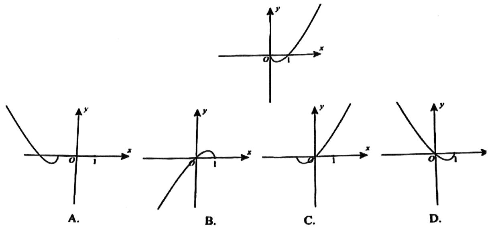

等级（R）

##### 082..若函数 $f(x) = \begin{cases} \frac{x^2 + 1}{x}, & x > 1 \\ \ln (x + a), & x \leq 1 \end{cases}$ 的图像上存在关于直线 $x = 1$ 对称的不同两点，则实数 $a$ 的取值范围是（）

$\quad$A. $(e^{2} - 1, + \infty)$

$\quad$B. $(e^{2} + 1, + \infty)$

$\quad$C. $(- \infty, e^2 - 1)$

$\quad$D. $(- \infty, e^{2} + 1)$

等级（SR）

##### 083.若函数 $f(x) = 3x^{2} + e^{\mathrm{x}} - 2(x < 0)$ 与 $\mathrm{g(x)} = 3\mathrm{x}^2 + \ln (\mathrm{x} + \mathrm{t})$ 图象上存在关于y轴对称的点，则t的取值范围是( )

$\quad$A. $\left(-\infty,\frac{1}{e}\right)$

$\quad$B. $(-∞,e)$

$\quad$C. $\left(-e,\frac{1}{e}\right)$

$\quad$D. $\left(-\frac{1}{e},e\right)$

模型四： $\mathbf{f}(|\mathbf{x}|)$ 与 $|\mathbf{f}(\mathbf{x})|$

等级（R）

##### 084. 设函数 $f(x)$ 定义域为全体实数，令 $g(x) = f(|x|) - |f(x)|$ ，有以下六个论断

① $f(x)$ 是奇函数时， $g(x)$ 是奇函数  
② $f(x)$ 是偶函数时， $g(x)$ 是奇函数  
③ $f(x)$ 是偶函数时， $g(x)$ 是偶函数  
④ $f(x)$ 是奇函数时， $g(x)$ 是偶函数  
⑤ $g(x)$ 是偶函数  
⑥对任意的实数 $x, g(x) \leq 0$

正确论断的编号是（ ）

$\quad$A. ③④

$\quad$B. ①②⑥

$\quad$C. ③④⑥

$\quad$D. ③④⑤

等级（R）

2019 新课标一理

##### 085.关于函数 $f(x) = \sin |x| + |\sin x|$ 有下述四个结论：

① $f(x)$ 是偶函数  
② $f(x)$ 在区间 $\left(\frac{\pi}{2},\pi\right)$ 单调递增  
③ $f(x)$ 在 $[- \pi, \pi]$ 有4个零点  
④ $f(x)$ 的最大值为2

其中所有正确的结论的编号是（）

$\quad$A.①②④

$\quad$B.②④

$\quad$C.①④

$\quad$D.①③

等级（SR）

2023丹东二模

##### 086. 设函数 $y = f(x)$ 由关系式 $x \mid x \mid +y \mid y \mid = 1$ 确定，函数 $g(x) = \begin{cases} -f(x), & x \geq 0 \\ f(-x), & x < 0 \end{cases}$ ，则（）

$\quad$A.g (x) 为增函数

$\quad$B.g（x）为奇函数

$\quad$C.g (x) 值域为 $[-1, +\infty)$

$\quad$D.函数 $\mathbf{y} = \mathbf{f}(-\mathbf{x}) - \mathbf{g}(\mathbf{x})$ 没有正零点

# 题型九：比大小问题基础

等级（N）

2019新课标一

##### 087.已知 $a = \log_20.2$ ， $b = 2^{0.2}$ ， $c = 0.2^{0.3}$ ，则（）

$\quad$A. $a < b < c$

$\quad$B. $a < c < b$

$\quad$C. $c < a < b$

$\quad$D. $b < c < a$

等级（N）

##### 088.已知 $a = \log_3\frac{7}{2}$ ， $b = \left(\frac{1}{4}\right)^{\frac{1}{3}}$ ， $c = \log_{\frac{1}{3}}\frac{1}{5}$ ，则 $a,b,c$ 的大小关系为（）

$\quad$A. $a > b > c$

$\quad$B. $b > a > c$

$\quad$C. $b > c > a$

$\quad$D. $c > a > b$

等级（N）

##### 089.已知 $a = 2^{\frac{4}{3}}$ ， $b = 4^{\frac{2}{5}}$ ， $c = 25^{\frac{1}{3}}$ ，则（

$\quad$A. $b < a < c$

$\quad$B. $a < b < c$

$\quad$C. $b < c < a$

$\quad$D. $c < a < b$

等级（N）

##### 090. 设 $a = \log_3 6$ ， $b = \log_5 10$ ， $c = \log_7 14$ ，则（）

$\quad$A. $c > b > a$

$\quad$B. $b > c > a$

$\quad$C. $a > c > b$

$\quad$D. $a > b > c$

等级（R）

2020新课标三

##### 091. 设 $a = \log_3 2$ ， $b = \log_5 3$ ， $c = \frac{2}{3}$ 则（）

$\quad$A. $a < c < b$

$\quad$B. $a < b < c$

$\quad$C. $b < c < a$

$\quad$D. $c < a < b$

等级（R）

##### 092.已知 $a = \sqrt{2}$ ， $b = \sqrt[5]{5}$ ， $c = \sqrt[7]{7}$ ，则（

$\quad$A. $a > b > c$

$\quad$B. $a > c > b$

$\quad$C. $b > a > c$

$\quad$D. $c > b > a$

等级（R）

2022南昌三模

##### 093. 已知实数 x, y, z 满足 $\ln x = e^{y} = \frac{1}{z}$ ，则下列关系式不可能成立的是（）

$\mathrm{A.x} > \mathrm{y} > \mathrm{z}$

$\mathrm{B.x} > \mathrm{z} > \mathrm{y}$

$\mathrm{C.z} > \mathrm{x} > \mathrm{y}$

$\mathrm{D.z>y>x}$

等级（R）

2024 巴蜀中学第八次月考

##### 094. 已知 $a = 3^{\ln 7}, b = 4^{\ln 6}, c = 5^{\ln 5}, d = 6^{\ln 4}$ ，则在

$|b-a|,|c-b|,|d-c|,|d-b|,|d-a|,|c-a|$ 这6个数中最小的是()

$\quad$A. $|b - a|$

$\quad$B. $|c-b|$

$\quad$C. $|d-b|$

$\quad$D. $|c-a|$

等级（R）

2020新课标三

##### 095.已知 $5^{5} < 8^{4}$ ， $13^{4} < 8^{5}$ ，设 $a = \log_53$ ， $b = \log_85$ ， $c = \log_{13}8$ 则（）

$\quad$A. $a < b < c$

$\quad$B. $b < a < c$

$\quad$C. $b < c < a$

$\quad$D. $c < a < b$

# 题型十：复合函数单调性及奇偶性

等级（N）

2020年新高考2卷（海南卷）

##### 096.已知函数 $f(x) = \lg (x^2 - 4x - 5)$ 在 $(a, +\infty)$ 上单调递增，则 $a$ 的取值范围是（）

$\quad$A. $(2, +\infty)$

$\quad$B. $[2, +\infty)$

$\quad$C. $(5, +\infty)$

$\quad$D. $[5, +\infty)$

等级（N）

2023 新高考一卷

##### 097. 设函数 $f(x) = 2^{x(x - a)}$ 在区间 $(0,1)$ 上单调递减，则 $a$ 的取值范围是（）

$\quad$A. $(- \infty, -2]$

$\quad$B. $\left[-2,0\right)$

$\quad$C. $(0,2]$

$\quad$D. $[2, +\infty)$

等级（R）

2007全国卷1

##### 098.函数 $f(x) = \cos^2 x - 2\cos^2\frac{x}{2}$ 的一个单调增区间是（

$\quad$A. $\left(\frac{\pi}{3},\frac{2\pi}{3}\right)$

$\quad$B. $\left(\frac{\pi}{6},\frac{\pi}{2}\right)$

$\quad$C. $\left(0, \frac{\pi}{3}\right)$

$\quad$D. $\left(-\frac{\pi}{6},\frac{\pi}{6}\right)$

等级（R）

2024成都七中二模

##### 099.华罗庚是享誉世界的数学大师，国际上以华氏命名的数学科研成果有“华氏定理”“华氏不等式”“华氏算子”“华一王方法”等，其斐然成绩早为世人所推崇。他曾说：“数缺形时少直观，形缺数时难入微”，告知我们把“数”与“形”，“式”与“图”结合起来是解决数学问题的有效途径。在数学的学习和研究中，常用函数的图象来研究函数的性质，也常用函数的解析式来分析函数图象的特征。已知函数 $y = f(x)$ 的图象如图所示，则 $f(x)$ 的解析式可能是（）

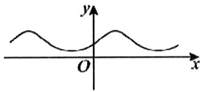

$\quad$A. $f(x) = 3^{\sin x}$

$\quad$B. $f(x) = 3^{\cos x}$

$\quad$C. $f(x) = \left(\frac{1}{3}\right)^{\sin x}$

$\quad$D. $f(x) = \left(\frac{1}{3}\right)^{\cos x}$

等级（R）

2024南昌一模

##### 100. 已知函数 $f(x) = \sin \left( x - \frac{1}{x} \right), x \in [-2, -1] \cup [1, 2]$ ，则下列结论中错误的是（）

$\quad$A. $f(x)$ 是奇函数

$\quad$B. $f(x)_{\min} = 1$

$\quad$C. $f(x)$ 在[-2,-1]上递增

$\quad$D. $f(x)$ 在[1,2]上递增

# 题型十一：周期性对称性问题

等级（R）

2021全国甲卷文

##### 101. 设 $f(x)$ 是定义域为 $R$ 的奇函数，且 $f(1 + x) = f(-x)$ . 若 $f\left(-\frac{1}{3}\right) = \frac{1}{3}$ ，则 $f\left(\frac{5}{3}\right) = (\quad)$

$\quad$A. $-\frac{5}{3}$

$\quad$B. $-\frac{1}{3}$

$\quad$C. $\frac{1}{3}$

$\quad$D. $\frac{5}{3}$

等级（R）

##### 102.设定义在 $\mathbb{R}$ 上的函数 $f(x)$ 满足 $f(x)\cdot f(x + 2) = 13$ ，若 $f(1) = 2$ ，则 $f(99) =$ （

$\quad$A. 13

$\quad$B. 2

$\quad$C. $\frac{13}{2}$

$\quad$D. $\frac{2}{13}$

等级（SR）

2018年新课标II卷

##### 103. 已知 $f(x)$ 是定义域 $(-∞,+∞)$ 为的奇函数，满足 $f(1-x)=f(1+x)$ ，若 $f(1)=2$ ，则 $f(1)+f(2)+f(3)+\cdots+f(50)$ 等于（）

$\quad$A. -50

$\quad$B. 0

$\quad$C. 2

$\quad$D. 50

等级（SR）

##### 104. 已知定义在 $R$ 上的奇函数 $f(x)$ 满足 $f(x - 4) = -f(x)$ ，且在区间 $[0,2]$ 上是增函数，则（）

$\quad$A. $f(-25) < f(11) < f(80)$

$\quad$B. $f(80) < f(11) < f(-25)$

$\quad$C. $f(11) < f(80) < f(-25)$

$\quad$D. $f(-25) < f(80) < f(11)$

等级（SR）

2020 山东新高考模拟

##### 105.函数 $f(x)$ 的定义域为 $R$ ，且 $f(x + 1)$ 与 $f(x + 2)$ 都为奇函数，则（）

$\quad$A. $f(x)$ 为奇函数

$\quad$B. $f(x)$ 为周期函数

$\quad$C. $f(x + 3)$ 为奇函数

$\quad$D. $f(x + 4)$ 为偶函数

等级（SR）

2021年新高考2卷

##### 106.已知函数 $f(x)$ 的定义域为 $\mathbb{R}$ ， $f(x + 2)$ 为偶函数， $f(2x + 1)$ 为奇函数，则（）

$\quad$A. $f\left(-\frac{1}{2}\right) = 0$

$\quad$B. $f(-1) = 0$

$\quad$C. $f(2) = 0$

$\quad$D. $f(4) = 0$

等级（SR）

2022南京盐城二模

##### 107. 已知定义在 R 上的奇函数 $f(x)$ 满足 $f(1-x)+f(1+x)=2$ 当 $x\in[0,1]$ 时， $f(x)=2x-x^{2}$ ，
若 $f(x) \geq x + b$ 对一切 $x \in R$ 恒成立，则实数 b 的最大值为 \_\_\_\_.

等级（SSR）

2022 新高考一卷数学（多选）

##### 108.已知函数 $f(x)$ 及其导函数 $f'(x)$ 的定义域均为 $\mathbb{R}$ ，记 $\mathrm{g}(x) = f'(x)$

若 $f\left(\frac{3}{2} - 2x\right), g(2 + x)$ 均为偶函数，则（）

$A. f （0） = 0 \quad \mathrm{B.g} (- \frac {1}{2}) = 0 \quad \mathrm{C.f} (- 1) = f （4） \quad \mathrm{D.g} (- 1) = \mathrm{g} （2）$

等级（SSR）

2022年全国乙卷

##### 109.已知函数 $f(x), g(x)$ 的定义域均为R，且 $f(x) + g(2 - x) = 5, g(x) - f(x - 4) = 7$ . 若 $y = g(x)$ 的图像关于直线 $x = 2$ 对称， $g(2) = 4$ ，则 $\sum_{k=1}^{22} f(k) = (\quad)$

$\quad$A. -21

$\quad$B. -22

$\quad$C. -23

$\quad$D. -24

等级（SSR）

2022年新高考2卷

##### 110. 已知函数 $f(x)$ 的定义域为 R，且 $f(x + y) + f(x - y) = f(x)f(y), f(1) = 1$ ，则 $\sum_{k=1}^{22} f(k) = (\quad)$

$\quad$A. -3

$\quad$B. -2

$\quad$C. 0

$\quad$D. 1

# 题型十二： $x^{2}$ 与 $2^{x}$ 的图像关系

等级（SR）

##### 111. 已知正数a, b, c满足 $2^{a}=b^{2}=log_{2}c=k(4<k<16)$ , 则()

$\quad$A. $a < b < c$

$\quad$B. $b < a < c$

$\quad$C. $c < a < b$

$\quad$D.a<c<b

等级（SR）

2022 惠州一模

##### 112. 已知函数 $f(x) = \begin{cases} e^{x - 4} & (x \leq 4) \\ (x - 16)^2 - 143(x > 4) \end{cases}$ ，则当 $x \geq 0$ 时， $f(2^x)$ 与 $f(x^2)$ 的大小关系是（）

$\quad$A. $f(2^{x}) \geq f(x^{2})$

$\quad$B. $f(2^{x}) \leq f(x^{2})$

$\quad$C.f(2x) = f(x²)

$\quad$D. 不确定

等级（SR）

##### 113. 已知函数 $f(x) = \begin{cases} 2^x, & x \in M \\ x^2, & x \in P \end{cases}$ ，其中 $M \cup P = R$ ，下列结论一定正确的是（）

$\quad$A. $f(x)$ 一定存在最大值

$\quad$B. $f(x)$ 一定存在最小值

$\quad$C. $f(x)$ 一定不存在最大值

$\quad$D. $f(x)$ 一定不存在最小值

# 题型十三：二次函数根的分布

等级（R）

2020 秋·深圳月考

##### 114..如果方程 $x^{2} - 4ax + 3a^{2} = 0$ 的一根小于1，另一根大于1，那么实数 $a$ 的取值范围是( )

$A. \frac {1}{3} <   a <   1$

$\mathrm{B.a} > 1$

$C. a <   \frac {1}{3}$

$\mathrm{D.a=1}$

等级（R）

2020 秋·南京月考

##### 115.已知一元二次方程 $\mathbf{x}^2 +\mathbf{mx} + 1 = 0$ 的两根都在(0，2)内，则实数 $\mathbf{m}$ 的取值范围是（

$\quad$A. $\left(-\frac{5}{2},-2\right]\cup[2,+\infty)$

$B.\left(-\frac{5}{2}, - 2\right)\cup (2, + \infty)$

$\quad$C. $\left(-\frac{5}{2},-2\right]$

$\quad$D. $\left(-\frac{5}{2},-2\right)$

等级（R）

2023 新高考二卷（多选）

##### 116.若函数 $f(x) = a\ln x + \frac{b}{x} +\frac{c}{x^2} (a\neq 0)$ 既有极大值也有极小值，则（ ）.

$\quad$A. $bc > 0$

$\quad$B. $ab > 0$

$\quad$C. $b^{2} + 8ac > 0$

$\quad$D. $ac < 0$

# 题型十四：两函数相乘定号模型

等级（R）

2024 新高考二卷

##### 117.设函数 $f(x) = (x + a)\ln (x + b)$ ，若 $f(x)\geq 0$ ，则 $a^2 +b^2$ 的最小值为（）

$\quad$A. $\frac{1}{8}$

$\quad$B. $\frac{1}{4}$

$\quad$C. $\frac{1}{2}$

$\quad$D. 1

等级（SR）

##### 118.若不等式 $(|x - a| - b)(2x - x^2)\leq 0$ 对任意实数 $x$ 恒成立，则 $a + b =$

# 导数选填

# 题型一：导数基础

等级（N）

##### 001.

（1）函数 $f(x) = x^3 - 3x$ 的极小值为 \_\_\_\_；  
（2）已知函数 $f(x) = 2\ln x - x^2$ ，则函数 $f(x)$ 的极大值为 \_\_\_\_.

等级（N）

##### 002.函数 $f(x)$ 在 $x = x_0$ 处导数存在，若 $p: f'(x_0) = 0, q: x = x_0$ 是 $f(x)$ 的极值点，则（）

$\quad$A. $p$ 是 $\pmb{q}$ 的充分必要条件  
$\quad$B. $p$ 是 $q$ 的充分条件，但不是 $q$ 的必要条件  
$\quad$C. $p$ 是 $q$ 的必要条件，但不是 $q$ 的充分条件  
$\quad$D. $p$ 既不是 $q$ 的充分条件，也不是 $q$ 的必要条件

等级（N）

##### 003.函数 $f(x) = 12x - x^3$ 在区间 $[-3,3]$ 上的最小值是（）

$\quad$A.-9

$\quad$B.-16

$\quad$C.-12

$\quad$D.-11

等级（N）

##### 004.某产品的销售收入 $y_{1}$ （万元）是产品 $x$ （千台）的函数， $y_{1} = 17x^{2}$ ，生产总成本 $y_{2}$ （万元）也是 $x$ 的函数， $y_{2} = 2x^{3} - x^{2}(x > 0)$ ，为使利润最大，应生产（）

$\quad$A. 9千台

$\quad$B. 8千台

$\quad$C. 6千台

$\quad$D. 3千台

等级（R）

2021年乙卷文科

##### 005.设 $a \neq 0$ ，若 $x = a$ 为函数 $f(x) = a(x - a)^2 (x - b)$ 的极大值点，则（）

$a <   b$

$\quad$B. $a > b$

$\quad$C. $ab < a^2$

$\quad$D. $ab > a^2$

等级（R）

2021年新高考1卷

##### 006.函数 $f(x)=|2x-1|-2\ln x$ 的最小值为 \_\_\_\_.

等级（R）

2021 安徽 A10 最后一卷

##### 007..已知直线 $l$ 与曲线 $y = x^{2} + \ln x$ 相切，则下列直线不可能与 $l$ 平行的是（

$A y = 3 x - 1$

$\mathrm{B.y} = 7 x + 1$

$C y = \sqrt {2} x - 1$

$D y = 2 \sqrt {2} x + 1$

等级（SR）

2021 湖北十一校第二次联考

##### 008. 已知函数 $f(x) = \begin{cases} 2 + 3\ln x, & x \geq 1 \\ x + 1, & x < 1 \end{cases}$ ，若 $m \neq n$ ，且 $f(m) + f(n) = 4$ ，则 $m + n$ 的最小值是（）

$\quad$A.2

$\quad$B.e-1

$\quad$C.4-3ln3

$\quad$D.3-3ln2

# 题型二：切线问题大总结

等级（N）

##### 009.若曲线 $y = ax^{2} - \ln x$ 在点 $(1, a)$ 处的切线平行于 $x$ 轴，则

等级（N）

##### 010. 曲线 $y = xe^{x} + 1$ 在点 $(0,1)$ 处的切线方程是 \_\_\_\_.

等级（N）

2019新课标

##### 011. 曲线 $y = 2\sin x + \cos x$ 在点 $(\pi, -1)$ 处的切线方程为（）

$\quad$A. $x - y - \pi - 1 = 0$

$\quad$B. $2x - y - 2\pi - 1 = 0$

$\quad$C. $2x + y - 2\pi + 1 = 0$

$\quad$D. $x + y - \pi + 1 = 0$

等级（N）

##### 012. 直线 $y = \frac{1}{2}x + b$ 是曲线 $y = \ln x$ 的一条切线，则实数 b 的值为 \_\_\_\_.

等级（R）

##### 013. 曲线 $y = e^{x - 1} - x$ 的一条切线经过坐标原点，则该切线方程为 \_\_\_\_

等级（R）

##### 014.在平面直角坐标系 $xOy$ 中，点 $A$ 在曲线 $y = \ln x$ 上，且该曲线在点 $A$ 处的切线经过点 $(-e, - 1)$ （ $e$ 为自然对数的底数），则点 $A$ 的坐标是 \_\_\_\_.

等级（R）

2020年新课标3卷理科

##### 015.若直线 $l$ 与曲线 $y = \sqrt{x}$ 和 $x^{2} + y^{2} = \frac{1}{5}$ 都相切，则 $l$ 的方程为（）

$\quad$A. $y = 2x + 1$

$\quad$B. $y = 2x + \frac{1}{2}$

$\quad$C. $y = \frac{1}{2} x + 1$

$\quad$D. $y = \frac{1}{2} x + \frac{1}{2}$ 等级（R）

##### 016.将函数 $y = e^{x}$ （ $e$ 为自然对数的底数）的图像绕坐标原点 $O$ 顺时针旋转角 $\theta$ 后第一次与 $x$ 轴相切，则角 $\theta$ 满足的条件时（）

$\quad$A. $e\sin \theta = \cos \theta$

$\quad$B. $\sin \theta = e\cos \theta$

$\quad$C. $e \sin \theta = 1$

$\quad$D. $e\cos \theta = 1$

等级（SR）

##### 017. 已知函数 $f(x) = \sin 2x$ 的图像与直线 $2kx - 2y - k\pi = 0 (k > 0)$ 恰有三个公共点，这三个点的横坐标从小到大分别为 $x_1, x_2, x_3$ ，则 $(x_1 - x_3) \tan (x_2 - 2x_3) =$ \_\_\_\_

(A) -2

(B) -1

(C) 0

(D) 1

等级（R）

2021年新高考1卷

##### 018.若过点 $(a,b)$ 可以作曲线 $y = \mathrm{e}^{x}$ 的两条切线，则（）

$\quad$A. $\mathbf{e}^b <  a$

$\quad$B. $\mathbf{e}^a < b$

$\quad$C. $0 < a < \mathbf{e}^{b}$

$\quad$D. $0 < b < \mathrm{e}^{a}$

等级（R）

2022年新高考1卷

##### 019.若曲线 $y=(x+a)\mathrm{e}^{x}$ 有两条过坐标原点的切线，则a的取值范围是\_\_\_\_

等级（R）

##### 020.已知函数 $f(x) = 2x^{3} - 3x$

（I）求 $f(x)$ 在区间[-2,1]上的最大值；

（Ⅱ）若过点 $P(1,t)$ 存在3条直线与曲线 $y = f(x)$ 相切，求 $t$ 的取值范围；

等级（SR）

2022年全国甲卷

##### 021. 已知函数 $f(x) = x^3 - x, g(x) = x^2 + a$ ，曲线 $y = f(x)$ 在点 $\left(x_1, f(x_1)\right)$ 处的切线也是曲线 $y = g(x)$ 的切线.

（1）若 $x_{1} = -1$ ，求 $a$   
（2） 求 a 的取值范围.

等级（R）

##### 022.设直线 $1:y = kx + b(k > 0)$ ，圆 $C_1:x^2 +y^2 = 1,C_2(x - 4)^2 +y^2 = 1$ ，若直线1与 $C_1$ ， $C_2$ 都相切，则 $\mathbf{k} = \_$ ； $\mathbf{b} = \_$

等级（R）

2022 新高考一卷

##### 023.写出与圆 $x^{2}+y^{2}=1$ 和 $(x-3)^{2}+(y-4)^{2}=16$ 都相切的一条直线的方程\_\_\_\_.

等级（SR）

2024济南一模

##### 024.与抛物线 $x^{2} = 2y$ 和圆 $x^{2} + (y + 1)^{2} = 1$ 都相切的直线的条数为（）

$\quad$A.0

$\quad$B.1

$\quad$C.2

$\quad$D.3

等级（SR）

2022 南充三诊

##### 025.已知函数 $f(x) = x + \frac{1}{x}$ ，过点 $P(1,0)$ 作函数 $y = f(x)$ 图像的两条切线，切点分别为M、N，则下列说法正确的是（）

$\quad$A.PM $\perp$ PN

$\quad$B. 直线 MN 的方程为 $2x - y + 1 = 0$

$\quad$C. $|\mathrm{MN}| = 2\sqrt{10}$

$\quad$D. $\Delta$ PMN的面积为 $3\sqrt{2}$

等级（SR）

##### 026. 已知函数 $f(x) = x^2 + 2ax, g(x) = 4a^2 \ln x + b$ ，设两曲线 $y = f(x), y = g(x)$ 有公共点 $P$ ，且在 $P$ 点处的切线相同，当 $a \in (0, +\infty)$ ，实数 $b$ 的最大值是 \_\_\_\_

# 题型三：三次函数相关

等级（N）

2015 安徽

##### 027. 函数 $f(x) = ax^3 + bx^2 + cx + d$ 的图象如图所示，则下列结论成立的是()

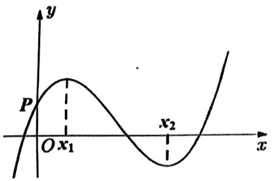

$\quad$A. $a > 0, b < 0, c > 0, d > 0$

$\quad$B. $a > 0, b < 0, c < 0, d > 0$

$\quad$C. $a <   0,b <   0,c <   0,d > 0$

$\quad$D. $a > 0, b > 0, c > 0, d < 0$

等级（R）

2022 新高考一卷（多选）

##### 028.已知函数 $f(x) = x^3 - x + 1$ ，则（）

$\quad$A.f(x)有两个极值点

$\quad$B.f(x)有三个零点

$\quad$C. 点(0,1)是曲线 $y = f(x)$ 的对称中心

$\quad$D. 直线 $y = 2x$ 是曲线 $y = f(x)$ 的切线

等级（R）

2024 太原三模

##### 029.（多选）已知 $x_{1}$ 是函数 $f(x) = x^{3} + mx + n(m < 0)$ 的极值点，若 $f(x_{2}) = f(x_{1})(x_{1} \neq x_{2})$ ，则下列结论正确的是（）

$\quad$A. $f(x)$ 的对称中心为 $(0, n)$

$\quad$B. $f(-x_{1}) > f(x_{1})$

$\quad$C. $2x_{1} + x_{2} = 0$

$\quad$D. $x_{1} + x_{2} > 0$

等级（R）

2024南昌三模

##### 030.（多选）已知函数 $f(x) = ax^3 + bx^2 + cx + d (a \neq 0)$ ，若 $y = |f(x) - 2|$ 的图象关于直线 $x = 1$ 对称，则下列说法正确的是（）

$\quad$A. $y = |f(x)|$ 的图象也关于直线 $x = 1$ 对称

$\quad$B. $y = f(x)$ 的图象关于(1,2)中心对称

$\quad$C. $a + b + c + d = 2$

$\quad$D. $3a + b = 0$

等级（R）

2012全国卷

##### 031.已知函数 $y = x^{3} - 3x + c$ 的图象与 $x$ 轴恰有两个公共点，则 $c =$ （ ）。

A: -2 或 2

B: -9 或 3

C: -9或1

D: -3 或 1

等级（SR）

2021 莆田二检

##### 032. 已知函数 $f(x) = \ln (ax^3 + bx + c) (a, b, c \in R)$ 的定义域为 $(-3, +\infty)$ ，其图像大致如图所示，

则（ ）

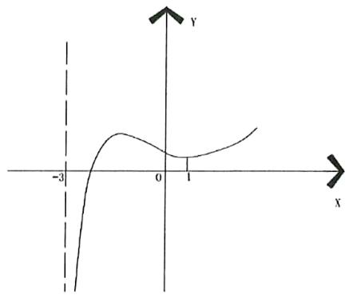

$\quad$A.b<a<c

$\quad$B.b<c<a

$\quad$C.a<b<c

$\quad$D.a<c<b

等级（SR）

济南一模

##### 033.已知直线 $y = ax + b (b > 0)$ 与曲线 $y = x^3$ 有且只有两个公共点 $A(x_1, y_1), B(x_2, y_2)$ ，其中 $x_1 < x_2$ ，则 $2x_1 + x_2 = (\quad)$

$\quad$A. -1

$\quad$B.0

C,1

$\quad$D.a

等级（SR）

2022南昌一模

##### 034. 已知函数 $f(x) = x^3 + ax^2 + bx + c(a, b, c \in R)$ ，若不等式 $f(x) > 0$ 的解集为 $\{x | x > m, \text{且} x \neq n\}$ ，且 $n - m = 1$ ，则函数 $f(x)$ 的极大值为（）

$\quad$A. $\frac{1}{4}$

$\quad$B. $\frac{4}{27}$

$\quad$C.0

$\quad$D. $\frac{4}{9}$

等级（SSR）

2024 湖北八市联考

##### 035.（多选）已知函数 $f(x) = ax^3 + bx^2 + cx + d$ 存在两个极值点 $x_1, x_2 (x_1 < x_2)$ ，且 $f(x_1) = -x_1, f(x_2) = x_2$ . 设 $f(x)$ 的零点个数为 $m$ ，方程 $3a(f(x))^2 + 2bf(x) + c = 0$ 的实根个数为 $n$ ，则（）

$\quad$A. 当 $a > 0$ 时， $n = 3$

$\quad$B. 当 $a < 0$ 时， $\mathrm{m} + 2 = \mathrm{n}$

$\quad$C. $mn$ 一定能被3整除

$\quad$D. $m + n$ 的取值集合为 $\{4,5,6,7\}$

# 题型四：函数零点问题（图像交点问题）

等级（N）

##### 036. 已知函数 $f(x) = \begin{cases} \mathrm{e}^x, & x \leq 0, \\ \ln x, & x > 0, \end{cases}$ $g(x) = f(x) + x + a$ . 若 $g(x)$ 存在 2 个零点，则 $a$ 的取值范围是（）

$\quad$A. $[-1, 0)$

$\quad$B. $[0, +\infty)$

$\quad$C. $[-1, +\infty)$

$\quad$D. $[1, +\infty)$

等级（N）

##### 037. 已知函数 $f(x) = e^{x} - 2x + a$ 有零点，则 a 的取值范围是 \_\_\_\_.

等级（N）

##### 038.设 $a \in R$ ，若函数 $y = e^{x} + ax$ 有大于零的极值点，则实数 $a$ 的取值范围是（）

$\quad$A. $a < -1$

$\quad$B. $a > - 1$

$\quad$C. $a > - \frac{1}{e}$

$\quad$D. $a < -\frac{1}{e}$ 等级（R）

##### 039. 已知函数 $f(x) = \begin{cases} x^2 - 3x + 2, & x \leq 1, \\ \ln x, & x > 1 \end{cases}$ , $g(x) = f(x) - ax + a$ ，若 $g(x)$ 恰有 1 个零点，则 $a$ 的取值范围是（）

$\quad$A. $[-1,0]\cup [1, + \infty)$

$\quad$B. $(- \infty, -1] \cup [0, 1]$

$\quad$C. $[-1, 1]$

$\quad$D. $(- \infty, -1] \cup [1, +\infty)$

等级（SR）

##### 040. 函数 $f(x) = 1 + x - \frac{x^2}{2} + \frac{x^3}{3}, g(x) = 1 - x + \frac{x^2}{2} - \frac{x^3}{3}$ 若函数 $F(x) = f(x + 3)g(x - 4)$ ，且函数 $F(x)$ 的零点均在 $[a, b](a < b, b \in Z)$ 内，则 $b - a$ 的最小值为 \_\_\_\_.

等级（SR）

贵阳一模

##### 041.若函数 $f(x) = a(\ln |x| - \frac{1}{2})$ 与函数 $g(x) = x^2$ 有四个不同的交点，则实数 $a$ 的取值范围是（）

$A. (0, \frac {e ^ {2}}{2})$

$B. (\frac {e ^ {2}}{2}, \infty)$

$D. (0, 2 e ^ {2})$

$D. (2 e ^ {2}, + \infty)$

等级（SR）

广州二模

##### 042.若关于 x 的不等式 $e^{2x}-a\ln x\geq\frac{1}{2}a$ 恒成立，则实数 a 的取值范围是（）

$\quad$A. $[0,2e]$

$\quad$B. $(- \infty, 2e]$

$\quad$C. $[0,2e^{2}]$

$\quad$D. $(- \infty, 2e^{2}]$

等级（SSR）

2022年全国乙卷

##### 043. 已知 $x = x_{1}$ 和 $x = x_{2}$ 分别是函数 $f(x) = 2a^{x} - \mathrm{e}x^{2}$ （ $a > 0$ 且 $a \neq 1$ ）的极小值点和极大值点。若 $x_{1} < x_{2}$ ，则 $a$ 的取值范围是 \_\_\_\_.

# 题型五：同构的思想

等级（R）

2020全国甲卷

##### 044.若 $2^{x} - 2^{y} < 3^{-x} - 3^{-y}$ ，则（

$\quad$A. $\ln |x - y| > 0$

$\quad$B. $\ln |x - y| < 0$

$\quad$C. $\ln |y - x + 1| > 0$

$\quad$D. $\ln |y - x + 1| < 0$

等级（SR）

2022中学生标准能力测试

##### 045.对任意的 $x_{1}$ ， $x_{2}\in(1,2]$ ，当 $x_{1}<x_{2}$ 时， $x_{2}-x_{1}+\frac{a}{2}\ln\frac{x_{1}}{x_{2}}<0$ 恒成立，则实数a的取值范围是()

$(2, + \infty)$

$\quad$B.[2,+∞)

$\quad$C. $(4, + \infty)$

$\quad$D.[4,+∞)

等级（SR）

##### 046.若 $2^{a} + \log_{2}a = 4^{b} + 2\log_{4}b$ ，则（

$\quad$A. $a > 2b$

$\quad$B. $a <   2b$

$\quad$C. $a > b^{2}$

$\quad$D. $a < b^{2}$

等级（SR）

2023 泸州二诊

##### 047.若两个正实数 $x, y$ 满足 $x(1 + \ln x) = ye^{y - 1}$ ，给出下列不等式。① $y < x < 1$ ; ② $1 < x < y$ ; ③ $1 < y < x$ ; ④ $y < 1 < x$ ; 其中可能成立的个数为（）

$\quad$A.0

$\quad$B.1

$\quad$C.2

$\quad$D.3

等级（SR）

2022广州一模

##### 048.若正实数 a,b 满足 a>b,且 $\ln a \cdot \ln b > 0$ ，则下列不等式一定成立的是()

$\log_ {a} b <   0$

$B a - \frac {1}{b} > b - \frac {1}{a}$

$C 2 ^ {a b + 1} <   2 ^ {a + b}$

$D a ^ {b - 1} <   b ^ {a - 1}$

等级（SR）

2022 南充二诊

##### 049. 已知函数 $f(x) = xe^x, g(x) = x\ln x$ ，若 $f(m) = g(n) = t (t > 0)$ ，则 $mn \cdot \ln t$ 的取值范围为（）

$\quad$A. $(- \infty, \frac{1}{e})$

$\quad$B. $(\frac{1}{e^2}, +\infty)$

$\quad$C. $\left(\frac{1}{e},+\infty\right)$

$\quad$D. $\left[-\frac{1}{e}, +\infty\right)$

等级（SR）

2022 苏北七市二模

##### 050.（多选）已知直线 $y = a$ 与曲线 $y = \frac{x}{e^x}$ 相交于 A, B 两点，与曲线 $y = \frac{\ln x}{x}$ 相交于 B, C 两点，

A, B, C 的横坐标分别为 $x_{1}, x_{2}, x_{3}$ , 则（）

$\quad$A. $x_{2} = ae^{x_{2}}$

$\quad$B. $x_{2} = \ln x_{1}$

$\quad$C. $x_{3} = e^{x_{2}}$

$\quad$D. $x_{1}x_{3} = x_{2}^{2}$

等级（SR）

2022 新乡二模

##### 051.知α，β均为锐角， $(\tan\alpha+\sqrt{\tan^{2}\alpha+1})(\sqrt{\tan^{2}\beta+1}-1)>\tan\beta$ ，则()

$\quad$A. $\sin \alpha >\sin \beta$

$\quad$B. $\cos \alpha >\cos \beta$

$\quad$C. $\cos \alpha >\sin \beta$

$\quad$D. $\sin \beta >\cos \alpha$

等级（SR）

2021江西八校四月联考

##### 052.已知函数 $f(x) = x + a\ln x$ ， $g(x) = e^{-x} - \ln x - 2x$

(I) 讨论函数 $f(x)$ 的单调性；  
（II）若 $g(x_0) = 0$ ，求 $x_0 + \ln x_0$ 的值  
（III）证明： $x - x\ln x\leq e^{-x} + x^{2}$

# 题型六：奇、偶函数的导数及其推广

等级（R）

2021 新高考二卷数学

##### 053. 写出一个同时具有下列性质①②③的函数 $f(x)$ : \_\_\_\_.

① $f(x_{1}x_{2})=f(x_{1})f(x_{2})$ ；②当 $x\in(0,+\infty)$ 时， $f'(x)>0$ ；③ $f'(x)$ 是奇函数.

等级（SR）

2023宁波二模

##### 054.（多选）已知函数 $f(x)$ 与 $g(x)$ 及其导函数 $f'(x)$ 与 $g'(x)$ 的定义域均为 R， $f(x)$ 是偶函数， $g(x)$ 的图象关于点（1,0）对称，则（）

$\quad$A. $g[f(-1)] = g[f(1)]$

$\quad$B. $f[g(3)] = f[g(-1)]$

$\quad$C. $f[g'（3）] = f[g'(-1)]$

$\quad$D. $g[f'(-1)] = g[f'（1）]$

# 题型七：抽象函数图像识别

等级（N）

##### 055. 函数 $y = f(x)$ 的导函数 $y = f'(x)$ 的图象如图所示，则函数 $y = f(x)$ 的图象可能是（）

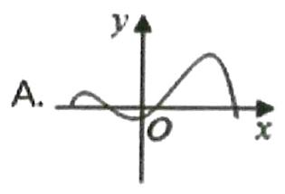

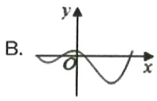

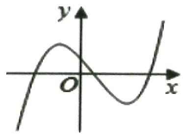

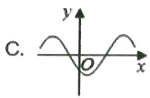

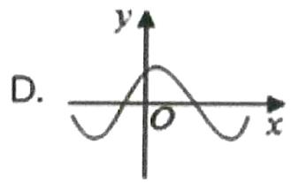

等级（N）

##### 056.如果函数 $y = f(x)$ 的图像如图所示，那么导函数 $y = f'(x)$ 的图像可能是（）

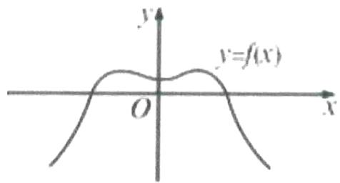

  
A

  
C

  
B

  
D

等级（R）

##### 057. 已知函数 $y = f(x)$ 的图像是下列四个图像之一，且其导函数 $y = f'(x)$ 的图像如图所示，则该函数的图像是（）

$\quad$A.

$\quad$B.

$\quad$C.

$\quad$D.

等级（R）

2024东北三省四市一模

##### 058.在同一平面直角坐标系内，函数 $y = f(x)$ 及其导函数 $y = f'(x)$ 的图象如图所示，已知两图象有且仅有一个公共点，其坐标为(0,1)，则()

$\quad$A.函数 $y = f(x)\bullet e^{x}$ 的最大值为1

$\quad$C. 函数 $y = \frac{f(x)}{e^x}$ 的最大值为 1

$\quad$B. 函数 $y = f(x) \bullet e^x$ 的最小值为 1

$\quad$D.函数 $y = \frac{f(x)}{e^x}$ 的最小值为1

等级（SR）

宜昌二诊

##### 059.定义在[-2,2]上的函数 $f(x)$ 与其导函数 $f'(x)$ 的图像如图所示，设O为坐标原点，A,B,C,D四点的横坐标依次为 $-\frac{1}{2}$ ， $-\frac{1}{6}$ ，1， $\frac{4}{3}$ ，则函数 $y = \frac{f(x)}{e^x}$ 的单调递减区间是（）

$\quad$A. $\left(-\frac{1}{6},\frac{4}{3}\right)$

$\quad$B. $(- \frac{1}{2}, 1)$

$\quad$C. $(- \frac{1}{2}, -\frac{1}{6})$

$\quad$D. (1,2)

等级（SR）

##### 060. 设函数 $f(x)$ 在 $R$ 上可导，其导函数为 $f'(x)$ ，若函数 $f(x)$ 在 $x = 1$ 处取得极大值，则函数 $y = -x \cdot f'(x)$ 的图像可能是（）

  
A

  
B

  
C

  
D

等级（SR）

##### 061.已知函数 $\frac{f(x)}{e^x}$ 在其定义域上单调递减，则函数 $f(x)$ 的图像可能是（ ）

A

B

C

D

# 题型八：导数必会图像

等级（R）

##### 062.已知 $a > b > 0, a^b = b^a$ ，则（ ）

$A. \ln a + \ln b > 1$

$B. \ln a + \ln b <   1$

$C. \ln a > \ln b > 1$

$D. 1 > \ln a > \ln b$

等级（R）

2021年甲卷理科

##### 063. 已知 $a > 0$ 且 $a \neq 1$ , 函数 $f(x) = \frac{x^a}{a^x} (x > 0)$ .

（1）当 $a = 2$ 时，求 $f(x)$ 的单调区间；  
（2）若曲线 $y = f(x)$ 与直线 $y = 1$ 有且仅有两个交点，求 $a$ 的取值范围.

等级（SR）

##### 064. 已知函数 $f(x) = ae^{x} - \frac{1}{2} x^{2} - b, (a, b \in R)$ ，若函数 $f(x)$ 有两个极值点 $x_{1}, x_{2}$ ，且 $\frac{x_{2}}{x_{1}} \geq 2$ ，则实数 $a$ 的取值范围是

等级（SR）

2022 唐山一模

##### 065.（多选）已知 $a > 1$ ， $x_{1}, x_{2}, x_{3}$ 为函数 $f(x) = a^{x} - x^{2}$ 的零点， $x_{1} < x_{2} < x_{3}$ ，则下列结论中正确的是（）

$\quad$A. $x_{1} > - 1$

$\quad$B. $x_{1} + x_{2} < 0$

$\quad$C. 若 $2x_{2} = x_{1} + x_{3}$ , 则 $\frac{x_3}{x_2} = \sqrt{2} + 1$

$\quad$D. $a$ 取值范围是 $(1, e^{\frac{2}{e}})$

# 题型九：含三角函数的导数小题

等级（R）

##### 066. 已知函数 $f(x) = \frac{1}{x} + \cos x$ ，给出下列结论：

① $f(x)$ 在 $\left(0, \frac{\pi}{2}\right)$ 上是减函数  
② $f(x)$ 在 $(0, \pi)$ 的最小值为 $\frac{2}{\pi}$   
③ $f(x)$ 在 $(0,2\pi)$ 至少有两个零点

其中正确的结论序号为\_\_\_\_（写出所有正确结论序号）

等级（SR）

##### 067.设函数 $f(x) = ae^{x} - 2\sin x, x \in [0, \pi]$ 有且仅有一个零点，则实数 $a$ 的值为（）

$\quad$A. $\sqrt{2} e^{\frac{\pi}{4}}$

$\quad$B. $\sqrt{2} e^{-\frac{\pi}{4}}$

$\quad$C. $\sqrt{2} e^{\frac{\pi}{2}}$

$\quad$D. $\sqrt{2} e^{-\frac{\pi}{2}}$ 等级（SR）

##### 068.已知函数 $f(x) = x^{2} - 2x\cos x$ ，则下列关于 $f(x)$ 的表述正确的是（）

$\quad$A. $f(x)$ 的图像关于 $y$ 轴对称

$\quad$B. $\exists x_0\in R$ 满足 $f(x_0) = -1$

$\quad$C. $f(x)$ 有4个零点

$\quad$D. $f(x)$ 有无数个极值点

等级（SR）

##### 069.若函数 $g(x) = mx + \frac{\sin x}{e^x}$ 在区间 $(0,2\pi)$ 有一个极大值和一个极小值，则实数 $m$ 的取值范围是（）

$\quad$A. $\left(-e^{-2\pi}, e^{-\frac{\pi}{2}}\right)$

$\quad$B. $\left(-e^{-\pi}, e^{-2\pi}\right)$

$\quad$C. $\left(-e^{\pi}, e^{-\frac{5}{2}\pi}\right)$

$\quad$D. $\left(-e^{-3\pi}, e^{\pi}\right)$

# 导数大题

# 题型一：求函数解析式

等级（N）

##### 001. 已知函数 $f(x) = x + \frac{a}{x} + b (x \neq 0)$ ，其中 $a, b \in R$ ，若曲线 $y = f(x)$ 在点 $P(2, f(2))$ 处的切线方程为 $y = 3x + 1$ ，求函数 $f(x)$ 的解析式.

等级（N）

##### 002. 已知 $f(x)=x^{3}+f'\left(\frac{2}{3}\right)x^{2}-x$ ，则 $f(x)$ 的图象在点 $\left(\frac{2}{3}, f\left(\frac{2}{3}\right)\right)$ 处的切线斜率是 \_\_\_\_.

# 题型二：讨论单调性

等级（N）

2019年全国卷III

##### 003. 已知函数 $f(x) = 2x^{3} - ax^{2} + b$ . 讨论 $f(x)$ 的单调性;

等级（N）

##### 004.函数 $f(x) = x^3 +ax^2 +\frac{1}{4} a^2 x + 1(a > 0)$ .求函数 $f(x)$ 的单调区间；

等级（R）

2021年甲卷文科

##### 005.设函数 $f(x) = a^{2}x^{2} + ax - 3\ln x + 1$ ，其中 $a > 0$ .

（1）讨论 $f(x)$ 的单调性；  
（2）若 $y = f(x)$ 的图象与 $x$ 轴没有公共点，求 $a$ 的取值范围.

等级（R）

##### 006. 已知函数 $f(x) = a \ln (x + 1) - x - 1 (a \in R)$ . 讨论函数 $f(x)$ 的单调性;

等级（SR）

##### 007. 已知 $f(x) = (ax^2 - x) \ln x - \frac{1}{2} ax^2 + x$ ，求 $f(x)$ 单调区间.

等级（SR）

##### 008.已知函数 $f(x) = x^{2} - 2x + a\ln x(a\in R)$ 。

（1）当 $a > 0$ 时，讨论函数的单调性

等级（SR）

##### 009. 讨论函数 $f(x) = \frac{1}{2} ax^2 + x - (a + 1)\ln x$ 在 $a \in R$ 时的单调性.

等级（SR）

##### 010. 已知 $a \neq 0$ ，函数 $f(x) = |e^x - e| + e^x + ax$ 讨论 $f(x)$ 的单调性

等级（SR）

2021 华南师大附中高三第三次测试

##### 011. 已知当 $x \in R$ 时，均有不等式 $(ae^x - 1)(ae^x + 2x) \geqslant 0$ 成立，则实数 $a$ 的取值范围为

# 题型三：导数基础五题

等级（R）

##### 012.已知 $f(x) = ax - 1 - x\ln x(a\in R)$

（1）若 $f(x)\leq 0$ 恒成立，求 $\pmb{a}$ 的范围  
（2）证明：当 $x > 1$ 时， $\frac{1}{x - 1} >e^{\frac{1}{x}} - 1$

等级（R）

2007全国卷1文

##### 013.设函数 $f(x) = 2x^{3} + 3ax^{2} + 3bx + 8c$ 在 $x = 1$ 及 $x = 2$ 时取得极值

（1）求 $a, b$ 的值  
（2）若对于任意的 $x \in [0,3]$ ，都有 $f(x) < c^2$ 成立，求 $c$ 的取值范围

等级（R）

2020 新课标二文

##### 014.已知函数 $f(x) = 2\ln x + 1$

（1）若 $f(x)\leqslant 2x + c$ ，求 $\pmb{c}$ 的取值范围；  
（2）设 $a > 0$ 时，讨论函数 $g(x) = \frac{f(x) - f(a)}{x - a}$ 的单调性.

等级（R）

2023 新高考一卷数学

##### 015. 已知函数 $f(x) = a(\mathrm{e}^x + a) - x$ .

（1） 讨论 $f(x)$ 的单调性;  
（2）证明：当 $a > 0$ 时， $f(x) > 2\ln a + \frac{3}{2}$ .

等级（R）

2024 新高考二卷数学

##### 016.已知函数 $f(x) = \mathrm{e}^{x} - ax - a^{3}$

（1）当 $a = 1$ 时，求曲线 $y = f(x)$ 在点 $(1, f(1))$ 处的切线方程；  
（2） 若 $f(x)$ 有极小值，且极小值小于 0，求 a 的取值范围.

# 题型四：含参恒成立问题——分析法和分参法

等级（R）

##### 017. 已知函数 $f(x) = \ln x$ 。

（1）求函数 $g(x)=f(x+1)-x$ 的最大值;  
（2）若对任意 $x > 0$ ，不等式 $\mathrm{f(x)}\leqslant \mathrm{ax}\leqslant \mathrm{x}^2 +1$ 恒成立，求实数 $a$ 的取值范围。

等级（R）

##### 018. 函数. $f(x) = x^2 - 2ax + \ln x (a \in R)$ 。

（1）若曲线 $y=f(x)$ 在点 $(1,f(1))$ 处的切线与直线 $x-2y+1=0$ 垂直, 求 a 的值;  
（2）若不等式 $2\mathrm{x}\ln \mathrm{x}\geqslant -\mathrm{x}^2 +\mathrm{ax} - 3$ 在区间(0，e]上恒成立，求实数a的取值范围。

等级（R）

##### 019.已知函数 $f(x) = a\ln (x + 1) - x - 1(a\in R)$

（1）讨论函数 $f(x)$ 的单调性  
（2）令函数 $g(x) = f(x) + e^x$ ，若 $x\in [0, + \infty)$ 时， $\mathbf{g}(\mathbf{x})\geq 0$ ，求实数 $a$ 的取值范围.

等级（R）

##### 020.若对任意的 $x > 0$ ，不等式 $x^{2} - 2m\ln x\geq 1(m\neq 0)$ 恒成立，则 $m$ 的取值范围是（）

(A) [1]

(B) $[1, +\infty)$

(C) $[2, +\infty)$

(D) $[e, +\infty)$

等级（SR）

##### 021. 设函数 $f(x) = x^2 - ax + 2\sin x$ .

（1）若 $a = 1$ ，求曲线 $\mathbf{y} = \mathbf{f}(\mathbf{x})$ 的斜率为1的切线方程；  
（2）若 $f(x)$ 在区间 $(0, 2\pi)$ 上有唯一零点，求实数 $a$ 的取值范围

等级（SR）

##### 022.已知函数 $f(x) = \ln (ax + 2) + \frac{2}{1 + x} (x\geq 0)$

（1）当 $a = 2$ 时，求 $f(x)$ 的最小值  
（2）若 $f(x)\geq 2\ln 2 + 1$ 恒成立，求实数 $\pmb{a}$ 的取值范围

等级（SR）

2021 东北三省四市一模

##### 023.已知函数 $F(x)=\frac{lnx}{x-1}-\frac{a}{x+1}$ .

(I) 设函数 $h(x) = (x - 1)F(x)$ , 当 $a = 2$ 时, 证明: 当 $x > 1$ 时, $h(x) > 0$   
(Ⅱ) 若 $F(x) > 0$ 恒成立，求实数 $a$ 的取值范围；  
（III）若 $a$ 使 $F(x)$ 有两个不同的零点 $x_{1}, x_{2}$ ，证明： $2\sqrt{a^2 - 2a} < |x_2 - x_1| < e^a - e^{-a}$

等级（SR）

2021 唐山一模

##### 024.已知函数 $f(x) = \frac{lnx}{x - 1}$

（1） 证明: $f(x)$ 在定义域内为减函数;  
（2） 当 $a > 0$ 时, $f(x) \geq \frac{2a}{x + a}$ , 求 $a$ 的取值范围;

等级（SR）

##### 025. 已知 $f'(x)$ 为函数 $f(x)$ 的导函数， $f(x)=e^{2x}+2f(0)e^{x}-f'（0）x$ .

（1）求 $f(x)$ 的单调区间；  
（2）当 $x > 0$ 时， $af(x) < e^x - x$ 恒成立，求 $a$ 的取值范围.

# 题型五：切线问题

等级（R）

2021年乙卷文科  
##### 026. 已知函数 $f(x) = x^3 - x^2 + ax + 1$ .

（1） 讨论 $f(x)$ 的单调性;  
（2） 求曲线 $y = f(x)$ 过坐标原点的切线与曲线 $y = f(x)$ 的公共点的坐标.

等级（SR）

##### 027.已知函数 $f(x) = x^{2} - ax + 1$ ， $g(x) = \ln x + a (a \in R)$ .

（1）讨论函数 $h(x) = f(x) + g(x)$ 的单调性；  
（2）若存在与函数 $f(x)$ ， $g(x)$ 的图像都相切的直线，求实数 $a$ 的取值范围.

等级（SR）

##### 028.已知函数 $f(x) = e^{x - 1}$ ， $g(x) = \ln x + a$ ：

（1）设 $F(x) = xf(x)$ ，求 $F(x)$ 的最小值  
（2）证明：当 $a < 1$ 时，总存在两条直线与曲线 $y = f(x)$ 与 $y = g(x)$ 都相切.

# 题型六：虚设零点及其高级考法

等级（R）

##### 029. 求证: $e^{x} - \ln x > 2$

等级（R）

##### 030. 已知当 $x \in (1, +\infty)$ 时，关于 $x$ 的方程 $\frac{x \ln x + (2 - k)x}{k} = -1$ 有唯一的实数解，则 $k$ 值所在的范围是（）

$\quad$A. (3,4)

$\quad$B. (4,5)

$\quad$C. (5,6)

$\quad$D. (6,7)

等级（SR）

广安等九市二诊

##### 031. 已知函数 $f(x) = e^{x} - x \ln x + ax$ ， $f'(x)$ 为 $f(x)$ 的导数，函数 $f'(x)$ 在 $x = x_{0}$ 处取得最小值.

（1）求证： $\ln x_0 + x_0 = 0$   
（2）若 $x \geq x_0$ 时， $f(x) \geq 1$ 恒成立，求 $a$ 的取值范围.

等级（SR）

2020新高考

##### 032.已知函数 $f(x) = ae^{x - 1} - \ln x + \ln a$

（1）当 $a = \mathrm{e}$ 时，求曲线 $y = f(x)$ 在点（1， $f(1)$ ）处的切线与两坐标轴围成的三角形的面积；  
（2） 若 $f(x) \geq 1$ ，求 a 的取值范围.

等级（SR）

2017 新课标二理

##### 033. 已知函数 $f(x) = ax^2 - ax - x \ln x$ ，且 $f(x) \geq 0$ .

（1） 求 a;   
（2）证明： $f(x)$ 存在唯一的极大值点 $x_0$ ，且 $e^{-2} < f(x_0) < 2^{-2}$

等级（SR）

##### 034. 已知函数 $f(x) = xe^{x} + a(\ln x + x)$ .

（1）若 $a = -e$ ，求 $f(x)$ 的单调区间；  
（2）当 $a < 0$ 时，记 $f(x)$ 的最小值为 $m$ ，求证： $m\leq 1$

等级（SR）

##### 035.已知函数 $f(x) = \frac{e^x}{x} +a(\ln x - x)$

（1）若 $y = f(x)$ 在 $x = 2$ 处的切线与直线 $4x + e^2 y = 0$ 垂直，求实数 $a$ 的值  
（2） 当 $0 \leq a \leq e^{2}$ 时，求证 $f(x) + e^{2} \geq 0$ .

等级（SR）

2024 浙江七彩阳光返校联考

##### 036. 设实数 $a > 0$ ，已知函数 $f(x) = e^x - 2ax + a\ln (ax)$ .

（1）当 $a = 1$ 时，求函数 $y = f(x)$ 在 $(1, f(1))$ 处的切线方程；  
（2） 若 $f(x) \geq 0$ 在 $x \in [1, +\infty)$ 上恒成立，求 a 的取值范围.

等级（SR）

2024 泸州三诊

##### 037.已知函数 $f(x) = ax\mathrm{e}^{x} - 1(a > 0)$

(I) 讨论函数 $f(x)$ 的零点个数；  
（II）若 $|f(x)| > x + x\ln x$ 恒成立，求函数 $f(x)$ 的零点 $x_0$ 的取值范围.

等级（SR）

##### 038.已知函数 $f(x) = ax + \ln x + 1$

（1）讨论函数 $f(x)$ 的零点个数；  
（2）对任意的 $x > 0$ ， $f(x)\leq xe^{2x}$ 恒成立，求实数 $a$ 的取值范围.

# 题型七：放缩法在导数证明题中的应用

等级（R）

##### 039.已知函数 $f(x) = ae^{x} - \ln x - 1,$ 证明：当 $a\geq \frac{1}{e}$ 时， $f(x)\geq 0$

等级（R）

##### 040.已知函数 $f(x) = 2x + \frac{a}{x} -\ln x - 5.$

（1）当 $a = 1$ 时,求 $\mathbf{f}(\mathbf{x})$ 的单调区间.

（2） $a\geq4$ ,证明:f(x)>0.

等级（R）

##### 041. 已知函数 $f(x) = e^{x} + \ln (x + 1) - ax - \cos x$ ，其中 $a \in R$ ，

（1）若 $a \leq 1$ ，证明： $f(x)$ 是定义域上的增函数；  
（2）是否存在 $a$ ，使得 $f(x)$ 在 $x = 0$ 处取得极小值？请说明理由；

等级（SR）

2010 全国一卷（理）

##### 042.已知函数 $f(x) = (x + 1)\ln x - x + 1$

（1）若 $x \cdot f'(x) \leq x^2 + ax + 1$ ，求 $a$ 的取值范围  
（2） 证明 $(x-1)\cdot f(x)\geq0$

等级（SR）

2021南昌一模

##### 043. 已知函数 $f(x) = (x - b)e^x - \frac{a}{2} (x - b + 1)^2$ （ $a > 0, b \in \mathbb{R}, e$ 为自然对数的底数）.

(I) 当 $b = 2$ 时，讨论 $f(x)$ 的单调性；  
(II) 若 $f(x)$ 在 $R$ 上单调递增，求证： $e^{a - 1} \geq b$

等级（SR）

2022 九江二模

##### 044.已知函数 $f(x) = x\ln x - ax + 1(a\in R)$

（1）若 $a \leq 1$ ，讨论 $f(x)$ 零点的个数；  
（2） 求证: $(x \ln x + 1) \ln x + \frac{2}{ex} > \ln 2$ (注: $\ln 2 \approx 0.6931$ )

等级（SR）

##### 045. 已知函数若 $f(x) = e^{x}$ ， $g(x) = \frac{1}{x - a}$

（1）设函数 $F(x) = f(x) + g(x)$ ，试讨论 $F(x)$ 零点的个数。  
（2）若 $a = -2$ ， $x > 0$ ，求证： $f(x)\cdot g(x) > \sqrt{x + 1} +\frac{x^2 - 8}{2x + 4}.$

等级（SR）

榆林市高三线上检测

##### 046. 已知函数 $f(x) = \ln x - ax + a$ ，其中 $a > 0$ .

（1）讨论函数 $f(x)$ 的零点个数；  
（2）求证： $e^x +\sin x > x\ln x + 1$

等级（SSR）

浙江名校协作体第二次联考

##### 047. 已知函数 $f(x) = (e - k)e \ln x + kx$ ，其中 $k > 0$ . $g(x) = e^x$ .

（1）求函数 $f(x)$ 的单调区间；  
（2） 证明: 当 $e < k < 2e^{2} + e$ 时, 存在唯一的整数 $x_{0}$ , 使得 $f(x_{0}) > g(x_{0})$ .

（注： $e=2.71828\ldots$ 为自然对数的底数，且 $\ln2\approx0.693,\quad\ln3\approx1.099$ ）

# 题型八：必要性探路

等级（SR）

2022西工大附中第六次适应性训练

##### 048. 已知不等式 $\ln x - e^{x} + (e^{a} - 1)x + a \leqslant 0$ 在 $(0, +\infty)$ 上恒成立，则实数 $a$ 的取值范围是

$\quad$A.[1,e]

$\quad$B.[1,+∞)

$\quad$C. $(- \infty, e]$

$\quad$D. $(- \infty, 1]$

等级（SR）

聊城一模

##### 049.已知函数 $f(x) = ax + x^{2}\ln x$

（1）证明：当 $a \leq 0$ 时，函数 $f(x)$ 有唯一的极值点  
（2）设 $a$ 正整数，若不等式 $f(x) < e^{x}$ 在 $(0, +\infty)$ 内恒成立，求 $a$ 的最大值

等级（SR）

2024北京朝阳一模

##### 050. 已知函数 $f(x) = (1 - ax)\mathrm{e}^{x} (a \in \mathbb{R})$ .

（1） 讨论 $f(x)$ 的单调性;  
（2）若关于 x 的不等式 $f(x) > a(1 - x)$ 无整数解，求 a 的取值范围.

等级（SSR）

2023佛山二模

##### 051. 已知函数 $f(x) = \frac{1}{a} \mathrm{e}^{x} - 3x$ ，其中 $a \neq 0$ .

（1）若 $f(x)$ 有两个零点，求 $\alpha$ 的取值范围；  
（2）若 $f(x)\geq a(1 - 2\sin x)$ ，求 $\pmb{a}$ 的取值范围.

# 题型九：导数技巧之端点效应法

等级（R）

##### 052. $f(x) = a\ln x + x - 1$ 在 $(1, +\infty)$ 恒正，求 $a$ 的范围

等级（SR）

2023青岛三模

##### 053. 已知函数 $f(x) = \frac{b\sin x + c}{a^x} (a > 0, a \neq 1)$ ，当 $a = e, b = 1$ 时，曲线 $y = f(x)$ 在 $x = 0$ 处的切线与 $x$ 轴平行.

(I)求 $c$   
（2）当 $x \in [0, \pi]$ 时， $f(x) \leq 1$ ，时，证明： $a \geq eb$ .

等级（SR）

2023 新高考二卷数学

##### 054.（1）证明：当 $0 < x < 1$ 时， $x - x^2 < \sin x < x$ ；

（2）已知函数 $f(x) = \cos ax - \ln (1 - x^2)$ ，若 $x = 0$ 是 $f(x)$ 的极大值点，求 $a$ 的取值范围.

等级（SR）

2024 新高考一卷

##### 055.已知函数 $f(x) = \ln \frac{x}{2 - x} + ax + b(x - 1)^3.$

（1）若 b = 0，且 $f'(x) \geq 0$ ，求 a 的最小值；  
（2）证明：曲线 $y = f(x)$ 是中心对称图形；  
（3） 若 $f(x) > -2$ 当且仅当 $1 < x < 2$ ，求 $b$ 的取值范围.

# 题型十：解超越方程（超越不等式）

等级（R）

##### 056.已知函数 $f(x) = \frac{x}{e^x}$ ， $g(x) = e^{x - 1} - \frac{1}{x} - \ln x - x + a$ .

（1） 求 $f(x)$ 的最大值;  
（2） 若曲线 $y = g(x)$ 与 x 轴相切，求 a 的值.

等级（SR）

##### 057. 已知函数 $f(x) = \frac{x^2 + ax + 1}{e^x}$ ，其中 $a \in R$

（1）讨论 $f(x)$ 的单调性；  
（2） 若函数 $x_0$ 为函数 $f(x)$ 的极大值点, 且 $f(x_0) > \frac{3}{e^2}$ , 求实数 $a$ 的取值范围.

等级（SR）

2022苏锡常镇一模

##### 058.已知实数 $a > 0$ ，函数 $f(x) = x\ln a - a\ln x + (x - e)^2$ ，e是自然对数的底数

（1）当 $a = e$ 时，求函数 $f(x)$ 的单调区间；  
（2）求证： $f(x)$ 存在极值点 $x_0$ ，并求 $x_0$ 的最小值；

# 题型十一：数列思想在导数证明中的应用

等级（SR）

##### 059.已知 $f(x) = ax + \frac{b}{x} + 2 - 2a (a > 0)$ 的图像在点(1, $f(1)$ )处的切线与直线 $y = 2x + 1$ 平行

（1）求 $a, b$ 满足的关系式  
（2）若 $f(x)\geq 2\ln x$ 在 $[1, + \infty)$ 上恒成立，求 $a$ 的取值范围  
（3）证明： $1+\frac{1}{3}+\frac{1}{5}+\cdots+\frac{1}{2n-1}>\frac{1}{2}\ln(2n+1)+\frac{n}{2n+1}(n\in N^{*})$

等级（SR）

##### 060.已知函数 $f(x) = \ln (x - 1) - k(x - 1) + 1$

（1） 求函数 $f(x)$ 的极值点  
（2）若 $f(x)\leq 0$ 恒成立，试确定实数 $k$ 的取值范围  
（3）证明 $\frac{\ln 2}{3} +\frac{\ln 3}{8} +\frac{\ln 4}{15} +\dots \frac{\ln n}{n^2 - 1} <  \frac{(n + 4)(n - 1)}{6} (n\in N^{*},N > 1):$

等级（SR）

2022 东北三省三校一模

##### 061.已知函数 $f(x) = e^{x} - k^{2}\ln x$ （其中e是自然对数的底数）

（1）当 $k = 1$ 时，证明： $f(x) > 2$   
（2） (i) 当 $x \in [1, +\infty)$ 时， $f(x) > kx$ 恒成立，求正整数 $\mathbf{k}$ 的取值集合；  
（ii）证明： $e^{n + 1} - \ln (n!) > \frac{n^2 + n}{2} (n\geq N^*)$

等级（SR）

2023 广州二模

##### 062.已知函数 $f(x) = \ln (1 + x),g(x) = ax^{2} + x$

（1）当 $x > -1$ 时， $f(x) \leqslant g(x)$ ，求实数 $a$ 的取值范围；

（2）已知 $n \in \mathbf{N}^*$ , 证明: $\sin \frac{1}{n + 1} + \sin \frac{1}{n + 2} + \cdots + \sin \frac{1}{2n} < \ln 2$ .

# 题型十二：画草图辅助法处理导数大题

等级（SR）

2021 湖北十一校第二次联考

##### 063. 已知函数 $f(x) = \frac{ax^2 + b}{e^x}$ 在 $x = 2$ 时取到极大值 $\frac{4}{e^2}$ .

（1） 求实数 a、b 的值;  
（2） 用 $\min\{m, n\}$ 表示 $m, n$ 中的最小值，设函数 $g(x) = \min\{f(x), x - \frac{1}{x}\} (x > 0)$ ，若函数 $h(x) = g(x) - tx^2$ 为增函数，求实数 $t$ 的取值范围.

等级（SR）

2021苏锡常镇二模

##### 064.已知函数 $f(x) = \frac{ax}{e^x}$ （e为自然对数的底数）。

（1）若函数 $g(x) = x - f(x)$ 在 $(0, +\infty)$ 上为增函数，求实数 $a$ 的取值范围；  
（2）证明：对任意实数 $a$ ，函数 $\mathrm{h}(\mathbf{x}) = \mathrm{f}(\mathbf{x}) - \ln x$ 有且只有一个零点。

等级（SR）

2022 泉州五检

##### 065.已知函数 $f(x) = e^{x - a} - \sqrt{2}\cos x(a > 0)$

（1）证明： $f(x)$ 在区间 $(0,\frac{\pi}{2})$ 内有唯一零点 $x_0$ ，且 $f'(x_0)\leq 2$   
（2）当 $x \geq -\pi$ 时, $f(x) \geq 2\sin \left(x - \frac{\pi}{4}\right)$ , 求实数 $a$ 的取值范围;

等级（SR）

2024 海淀一模

##### 066.已知函数 $f(x) = x\mathrm{e}^{a - \frac{1}{2} x}$

（1） 求 $f(x)$ 的单调区间；  
（2）若函数 $g(x) = |f(x) + \mathrm{e}^{-2}a|$ ， $x \in (0, +\infty)$ 存在最大值，求 $a$ 的值范围.

等级（SSR）

2022 武汉四月调研

##### 067. 定义在 $(- \frac{\pi}{2}, +\infty)$ 上的函数 $f(x) = (x - k) \sin x$

（1）当 $k = \frac{\pi}{6}$ 时，求曲线 $y = f(x)$ 在点 $(\frac{\pi}{6},0)$ 处的切线与两坐标轴所围成的三角形的面积；  
（2）将 $f(x)$ 的所有极值点按照从小到大的顺序排列构成数列 $\{x_{n}\}$ ，若 $f(x_{1}) + f(x_{2}) = 0$ ，求 $\mathbf{k}$ 的值。

# 题型十三：双变量问题

模型一：双变量问题之 $k_{AB}$ 和 $f'(x_0)$ 关系模板

等级（R）

##### 068. 已知二次函数 $f(x) = ax^2 + bx + c$ 和伪二次函数 $g(x) = ax^2 + bx + c \ln x (a, b, c \in R, abc \neq 0)$

（1）证明：只要 $a < 0$ ，无论 $b$ 取何值，函数 $g(x)$ 在定义域内不可能总为增函数  
（2）在二次函数 $f(x) = ax^{2} + bx + c$ 图像上任意不同两个点 $A(x_{1},y_{1}), B(x_{2},y_{2})$ ，在线段AB中点的横坐标为 $x_{0}$ ，记直线AB的斜率为 $k$

(i) 求证: $k = f'(x_0)$

（ii）对于伪二次函数 $g(x) = ax^{2} + bx + c\ln x$ ，是否有（1）同样的性质？证明你的结论

等级（R）

2011·辽宁

##### 069.已知函数 $f(x) = \ln x - ax^2 + (2 - a)x$ .

（I）讨论 $f(x)$ 的单调性；  
（II）设 $a > 0$ ，证明：当 $0 < x < \frac{1}{a}$ 时， $f(\frac{1}{a} + x) > f(\frac{1}{a} - x)$ ；  
(III)若函数 $y = f(x)$ 的图像与 $x$ 轴交于A、B两点，线段AB中点的横坐标为 $x_0$ ，证明： $f'(x_0) < 0$ .

等级（R）

##### 070. 已知函数 $f(x) = \ln x$ ， $g(x) = ax^2 + bx (a \neq 0, b \in R)$ .

（1）若 a=2，b=3，求函数 $F(x)=f(x)-g(x)$ 的单调区间；  
（2） 若函数 $f(x)$ 与 $g(x)$ 的图像有两个不同的交点 $(x_1, f(x_1))$ ， $(x_2, f(x_2))$ ，记 $x_0 = \frac{x_1 + x_2}{2}$ ，设 $f'(x)$ ， $g'(x)$ 分别是 $f(x)$ ， $g(x)$ 的导函数，证明： $f'(x_0) < g'(x_0)$ .

# 模型二：双变量问题之变型构造

等级（SR）

##### 071. 已知函数 $f(x) = (a + 1)\ln x + ax^2 + 1$ .

（1）讨论函数 $f(x)$ 的单调性；  
（2）设 $a \leq -2$ ，证明：对任意 $x_{1}, x_{2} \in (0, +\infty)$ ， $\left|f(x_{1}) - f(x_{2})\right| \geq 4\left|x_{1} - x_{2}\right|$ .

等级（SR）

西南名校联盟线上联考

##### 072. 已知函数 $f(x) = \ln x + ax^2 - 3x (a \in R)$ .

（1）函数 $f(x)$ 在点（1， $f(1)$ ）处的切线方程为y=-2，求函数 $f(x)$ 的极值；  
（2）当 $a = 1$ 时，对于任意 $x_{1}, x_{2} \in [1,10]$ ，当 $x_{2} > x_{1}$ 时， $f(x_{1}) - f(x_{2}) > \frac{m(x_{2} - x_{1})}{x_{1}x_{2}}$ 恒成立，求出实数 $m$ 的取值范围.

# 模型三：双变量问题之极值点偏移（非常重要）☆

等级（R）

2013 湖南文

##### 073.已知函数 $f(x) = \frac{1 - x}{1 + x^2} e^x$

（1） 求 $f(x)$ 的单调区间;  
（2）证明：当 $f(x_{1}) = f(x_{2})(x_{1}\neq x_{2})$ 时， $x_{1} + x_{2} <   0$

等级（SR）

2021 新高考一卷数学

##### 074. 已知函数 $f(x) = x(1 - \ln x)$ .

（1）讨论 $\mathbf{f}(\mathbf{x})$ 的单调性：  
（2）设 a,b 为两个不相等的正数,且 blna-alnb=a-b,证明: $2 < \frac{1}{a} + \frac{1}{b} < e$ .

等级（SR）

2022 聊城一模

##### 075.已知函数 $f(x) = ax - \ln x,g(x) = x^{2} - nx + m$

（1）讨论 $f(x)$ 的单调性；  
（2）当 $0 < a < \frac{1}{4}$ 时，若对于任意的 $x > 0$ ，都有 $f(x)g(x)\geq 0$ ，求证： $2 < \ln m < \frac{n}{4}$

等级（SR）

##### 076. 已知 $m > 0$ ，函数 $f(x) = e^x - mx$ ，直线 $l: y = -m$

（1）讨论 $f(x)$ 的图象与直线 $l$ 的交点个数  
（2）若函数 $f(x)$ 的图形与直线 $l:y = -m$ 相交于两点 $M(x_{1},y_{1}),N(x_{2},y_{2})$ ， $(x_{1} <   x_{2})$ 证明：

$\frac {1}{x _ {1}} + \frac {1}{x _ {2}} > 1.$

等级（SR）

2022年全国甲卷

##### 077.已知函数 $f(x) = \frac{e^x}{x} - \ln x + x - a$ .

（1）若 $f(x)\geq0$ ，求a的取值范围；  
（2）证明：若 $f(x)$ 有两个零点 $x_{1}, x_{2}$ ，则 $x_{1}x_{2} < 1$ .

等级（SR）

##### 078.已知 $f(x) = 4e^{x} - e^{-2x} - ax$

（1）若 $f(x)$ 在 $R$ 上单调递增，求 $\pmb{a}$ 的取值范围.  
（2） 若 $f(x)$ 有两个极值点 $x_{1}, x_{2}, \quad x_{1} < x_{2}$ .

证明① $x_{1}+x_{2}>0$ ② $f(x_{1})+f(x_{2})<6$

等级（SR）

2023宁波二模

##### 079. 已知函数 $f(x) = \ln x - ax^2$ .

(I)讨论函数 $f(x)$ 的单调性;  
(II)若 $x_{1}$ ， $x_{2}$ 是方程 $f(x) = 0$ 的两不等实根，求证：

(i) $x_{1}^{2} + x_{2}^{2} > 2\mathrm{e};$

(ii) $x_{1}x_{2} > \sqrt{\frac{e}{2a}}.$

# 模型四：双变量问题之双变量为极值点

等级（SR）

##### 080.设函数 $f(x) = x - \frac{1}{x} -a\ln x(a\in R)$

（1） 讨论 $f(x)$ 的单调性  
（2） 若 $f(x)$ 有两个极值点 $x_{1}, x_{2}$ ，记过点 $A(x_{1}, f(x_{1}))$ ， $B(x_{2}, f(x_{2}))$ 的直线斜率为 $k$ ，问：是否存在 $a$ ，使得 $k = 2 - a$ ？若存在，求出 $a$ 的值；若不存在，请说明理由

等级（SR）

##### 081.已知函数 $f(x) = \ln x + \frac{1}{2} x^2 -2kx(k\in R)$

（1） 讨论 $f(x)$ 的单调性  
（2） 若 $f(x)$ 有两个极值点 $x_{1}$ , $x_{2}$ , 且 $x_{1} < x_{2}$ , 试证明 $f(x_{2}) < -\frac{3}{2}$

等级（SR）

2009全国卷2

##### 082.设函数 $f(x) = x^{2} + aIn(1 + x)$ 有两个极值点 $x_{1}$ ， $x_{2}$ ，且 $x_{1} < x_{2}$

（Ⅰ）求 $a$ 的取值范围，并讨论 $f(x)$ 的单调性；

（II）证明： $f(x_{2}) > \frac{1 - 2In2}{4}$

# 模型五：双变量问题补充

等级（SR）

2022广州二模

##### 083. 已知函数 $f(x) = 2x \ln x - x^2 - mx + 1$ .

（1）若 $\mathrm{m} = 0$ ，求 $f(x)$ 的单调区间；  
（2）若 $\mathrm{m} < 0$ ， $0 < \mathrm{b} < \mathrm{a}$ ，证明： $2\ln \frac{a + b}{a - b} < \frac{4ab}{a^2 - b^2} -\mathrm{m}.$

等级（SR）

2021 山西一模

##### 084.已知函数 $f(x)=x\ln x-\frac{1}{2}kx^{2}-x,g(x)=\ln x-kx.$

（1）当 $k = 1$ 时，求 $g(x)$ 的最大值；  
（2） 当 $0 < k < \frac{1}{e}$ 时，

(i)判断函数 $g(x)$ 的零点个数；

(ii)求证： $f(x)$ 有两个极值点 $x_{1}, x_{2}$ ，且 $\frac{\mathrm{f}(x_1)}{x_1} + \frac{f(x_2)}{x_2} > -1$ .

等级（SR）

2021广州一模

##### 085.已知函数 $f(x)=x\ln x-ax^{2}+x(a\in\mathbb{R})$ .

（1）证明：曲线 $y = f(x)$ 在点（1， $f(1)$ ）处的切线l恒过定点；  
（2）若 $f(x)$ 有两个零点 $x_{1},x_{2}$ ，且 $x_{2}>2x_{1}$ ，证明： $\sqrt{x_{1}^{2}+x_{2}^{2}}>\frac{4}{e}$ .

等级（SR）

2022江西九校三月联考

##### 086.设函数 $f(x) = x^{m} - m\ln x + \ln^{2}x(m\in R)$

（1）当 $m = -1$ 时，讨论 $f(x)$ 的单调性；  
（2）若对于任意 $x_{1}, x_{2} \in [\frac{1}{e}, e]$ ，都有 $\left|f(x_{1}) - f(x_{2})\right| \leq e^{2} - 2$ ，求 $m$ 的取值范围；

等级（SSR）

2022成都二诊

##### 087.已知函数 $f(x) = e^{x} - \frac{1}{2} ax^{2} - 2ax,$ 其中 $a\in R$

（1）若函数 $f(x)$ 在 $[0, +\infty)$ 上单调递增，求 $a$ 的取值范围.  
（2）若函数 $f(x)$ 存在两个极值点 $x_{1}, x_{2} (x_{1} < x_{2})$ ，当 $x_{1} + x_{2} \in [3 \ln 2 - 4, \frac{5 - 3e}{e - 1}]$ 时，求 $\frac{x_{2} + 2}{x_{1} + 2}$ 的取值范围。

等级（SSR）

2022佛山二模

##### 088.已知函数 $f(x) = \frac{-1 + 2e^x}{2e^{2x}} +\frac{x}{a}$ ，其中 $\mathbf{e}$ 为自然对数的底数

（1）当 $a = -\frac{1}{2}$ 时，求 $f(x)$ 的单调区间；  
（2）当 $a > 0$ 时，若 $f(x)$ 有两个极值点 $x_{1}, x_{2}$ ，且 $f(x_{1}) + f(x_{2}) > k \cdot f\left(\frac{\ln a}{2}\right)$ 恒成立，求 $\mathbf{k}$ 的最大值；

# 三角函数

# 题型一：扇形与弧度制

等级（N）

##### 001. 已知扇形的周长是 $6 \mathrm{~cm}$ , 面积 $2 \mathrm{~cm}^{2}$ , 则扇形的圆心角的弧度数是 ( )

$\quad$A. 1

$\quad$B. 4

$\quad$C. 1 或 4

$\quad$D. 2 或 4

# 题型二：三角函数

等级（N）

##### 002. 已知 $\cos \theta \cdot \tan \theta < 0$ ，那么叫角 $\theta$ 是（）

$\quad$A. 第一或第二象限角

$\quad$B. 第二或第三象限角

$\quad$C. 第三或第四象限角

$\quad$D. 第一或第四象限角

等级（N）

2020 新课标二卷

##### 003. 若 $\alpha$ 为第四象限角，则（）

$\quad$A. $\cos 2\alpha >0$

$\quad$B. $\cos 2\alpha < 0$

$\quad$C. $\sin 2\alpha >0$

$\quad$D. $\sin 2\alpha < 0$

等级（N）

##### 004. 某巨型摩天轮。其旋转半径 50 米，最高点距地面 110 米，运行一周大约 21 分钟。某人在最低点的位置坐上摩天轮，则第 35 分钟时他距地面大约是（）米。

$\quad$A. 75

$\quad$B. 85

$\quad$C. 100

$\quad$D. 110

等级（N）

##### 005. 下列区间为函数 $y = 2\sin \left( x + \frac{\pi}{4} \right)$ 的增区间的是（）

$\quad$A. $\left[-\frac{\pi}{2}, \frac{\pi}{2}\right]$

$\quad$B. $\left[-\frac{3\pi}{4}, \frac{\pi}{4}\right]$

$\quad$C. $[- \pi, 0]$

$\quad$D. $\left[-\frac{\pi}{4}, \frac{3\pi}{4}\right]$ 等级（N）

##### 006.函数 $y = \sin \left(2x + \frac{\pi}{3}\right)$ 的图象的对称轴方程可能是（）

$\quad$A. $x = -\frac{\pi}{6}$

$\quad$B. $x = -\frac{\pi}{12}$

$\quad$C. $x = \frac{\pi}{6}$

$\quad$D. $x = \frac{\pi}{12}$

等级（N）

##### 007.已知函数 $f(x) = \sin \left(\omega x + \frac{\pi}{3}\right)(\omega > 0)$ 的最小正周期为 $\pi$ ，则该函数的图象（）

$\quad$A. 关于点 $\left(\frac{\pi}{3}, 0\right)$ 对称

.关于直线 $x = \frac{\pi}{4}$ 对称

$\quad$C. 关于点 $\left(\frac{\pi}{4}, 0\right)$ 对称

$\quad$D. 关于直线 $x = \frac{\pi}{3}$ 对称

等级（N）

2022年新高考2卷

##### 008.已知函数 $f(x)=\sin(2x+\varphi)(0<\varphi<\pi)$ 的图像关于点 $\left(\frac{2\pi}{3},0\right)$ 中心对称，则（）

$\quad$A. $f(x)$ 在区间 $\left(0, \frac{5\pi}{12}\right)$ 单调递减  
$\quad$B. $f(x)$ 在区间 $\left(-\frac{\pi}{12}, \frac{11\pi}{12}\right)$ 有两个极值点  
$\quad$C. 直线 $x = \frac{7\pi}{6}$ 是曲线 $y = f(x)$ 的对称轴  
$\quad$D. 直线 $y = \frac{\sqrt{3}}{2} - x$ 是曲线 $y = f(x)$ 的切线

等级（N）

2022年全国乙卷

##### 009. 记函数 $f(x) = \cos(\omega x + \varphi)(\omega > 0, 0 < \varphi < \pi)$ 的最小正周期为 $T$ ，若 $f(T) = \frac{\sqrt{3}}{2}$ ， $x = \frac{\pi}{9}$ 为 $f(x)$ 的零点，则 $\omega$ 的最小值为 \_\_\_\_.

等级（N）

##### 010.函数 $f(x)=\cos2x-2\sqrt{3}\sin x\cdot\cos x$ 的最小正周期是 \_\_\_\_

等级（N）

宁德六月质检

##### 011. 已知函数 $y = \tan (\omega x + \varphi)(\omega > 0, |\varphi| < \frac{\pi}{2})$ 的最小正周期为 $\frac{\pi}{2}$ ，其图像过点 $(0, \sqrt{3})$ ，则其对称中心为（）

A $(\frac{k\pi}{4} -\frac{\pi}{6},0)(k\in Z)$

$\quad$B. $(\frac{k\pi}{4} -\frac{\pi}{12},0)(k\in Z)$

$\quad$C. $(\frac{k\pi}{2} -\frac{\pi}{6},0)(k\in Z)$

$\quad$D. $(\frac{k\pi}{2} +\frac{\pi}{12},0)(k\in Z)$

等级（N）

##### 012. 已知 $M$ 、 $N$ 是曲线 $y = \pi \sin x$ 与曲线 $\pi \cos x$ 的两个不同的交点，则 $\left|MN\right|$ 的最小值为（）

$\quad$A. $2\pi$

$\quad$B. $\sqrt{2}\pi$

$\quad$C. $\pi$

$\quad$D. $\sqrt{3}\pi$

等级（R）

##### 013. 已知角 $a$ 的顶点为坐标原点, 始边与 $x$ 轴的非负半轴重合, 终边上一点 $A(2 \sin a, 3)$ , 则 $\cos a = (\quad)$

$\quad$A. $\frac{1}{2}$

$\quad$B. $-\frac{1}{2}$

$\quad$C. $\frac{\sqrt{3}}{2}$

$\quad$D. $-\frac{\sqrt{3}}{2}$

等级（R）

2023苏锡常镇二模

##### 014.在平面直角坐标系 xOy 中,已知点 A $\left(\frac{3}{5},\frac{4}{5}\right)$ , 将线段 OA 绕原点顺时针旋转 $\frac{\pi}{3}$ 得到线段 OB, 则点 B 的横坐标为 \_\_\_\_.

等级（R）

##### 015.设函数 $y = 6\cos x$ 与 $y = 5\tan x$ 的图像在 $y$ 轴右侧的第一个交点为 $A$ ，过点 $A$ 作 $y$ 轴的平行线交函数 $y = \sin 2x$ 的图像于点 $B$ ，则线段 $AB$ 的长度为( )

$\sqrt{5}$

$\quad$B. $\frac{3\sqrt{5}}{2}$

$\quad$C. $\frac{14\sqrt{5}}{9}$

$\quad$D. $2 \sqrt{5}$

等级（R）

广州二模

##### 016.已知第二象限角 $\theta$ 的终边上有两点A（-1，a），B（b,2)，且cos $\theta +3\sin \theta = 0$ ，则 $3a - b =$ （

$\quad$A.-7

$\quad$B.-5

$\quad$C.5

$\quad$D.7

# 题型三：和与差的三角函数公式

等级（N）

2020新课标三卷

##### 017. 已知 $2 \tan \theta - \tan (\theta + \frac{\pi}{4}) = 7$ ，则 $\tan \theta = (\quad)$

$\quad$A.-2

$\quad$B. -1

$\quad$C. 1

$\quad$D. 2

等级（N）

##### 018.设 $\tan \alpha$ ， $\tan \beta$ 是方程 $x^{2} - 3x + 2 = 0$ 的两个根，则 $\tan (\alpha +\beta) =$ 的值为（）

(A) -3

(B) -1

(C) 1

(D) 3

等级（N）

扬州二模

##### 019. 若 $\alpha + \beta = \frac{3\pi}{4}$ ，则 $(\tan \alpha - 1)(\tan \beta - 1) =$ \_\_\_\_

等级（N）

2022年新高考2卷

##### 020.若 $\sin (\alpha +\beta) + \cos (\alpha +\beta) = 2\sqrt{2}\cos \left(\alpha +\frac{\pi}{4}\right)\sin \beta$ ，则（

$\quad$A. $\tan (\alpha -\beta) = 1$

$\quad$B. $\tan (\alpha +\beta) = 1$

$\quad$C. $\tan (\alpha -\beta) = -1$

$\quad$D. $\tan (\alpha +\beta) = -1$

等级（N）

##### 021. 已知 $\theta$ 是第四象限角，且 $\sin\left(\theta+\frac{\pi}{4}\right)=-\frac{3}{5}$ ，则 $\tan\left(\theta-\frac{\pi}{4}\right)=$ \_\_\_\_.

等级（N）

2020新课标三卷

##### 022.已知 $\sin \theta +\sin (\theta +\frac{\pi}{3}) = 1$ ，则 $\sin (\theta +\frac{\pi}{6}) =$ （

$\quad$A. $\frac{1}{2}$

$\quad$B. $\frac{\sqrt{3}}{3}$

$\quad$C. $\frac{2}{3}$

$\quad$D. $\frac{\sqrt{2}}{2}$

等级（R）

##### 023. 已知 $a \in \left(\frac{\pi}{4}, \frac{3\pi}{4}\right)$ , $\beta \in \left(0, \frac{\pi}{4}\right)$ , 且 $\cos \left(\frac{\pi}{4} - \alpha\right) = \frac{3}{5}$ , $\sin \left(\frac{5}{4}\pi + \beta\right) = -\frac{12}{13}$ , 则 $\cos (\alpha + \beta) =$ \_\_\_\_.

等级（R）

##### 024.函数 $f(x) = \sin (x + 2\phi) - 2\sin \phi \cos (x + \phi)$ 的最大值为

等级（R）

2023 新高考一卷数学

##### 025. 已知 $\sin (\alpha - \beta) = \frac{1}{3}, \cos \alpha \sin \beta = \frac{1}{6}$ ，则 $\cos (2\alpha + 2\beta) = (\quad)$ .

$\quad$A. $\frac{7}{9}$

$\quad$B. $\frac{1}{9}$

$\quad$C. $-\frac{1}{9}$

$\quad$D. $-\frac{7}{9}$

等级（R）

2024 金华十校四月模拟

##### 026.已知 $\cos (\alpha -\beta) = \frac{1}{3},\sin \alpha \sin \beta = -\frac{1}{12}$ ，则 $\cos^2\alpha -\sin^2\beta =$ （

$\quad$A. $\frac{1}{2}$

$\quad$B. $\frac{1}{3}$

$\quad$C. $\frac{1}{6}$

$\quad$D. $\frac{1}{8}$

等级（R）

2022 重庆八中第六次月考

##### 027.若 $2\cos 80^{\circ} = \cos 20^{\circ} + \lambda \sin 20^{\circ}$ ，则 $\lambda =$ （

$\quad$A. $-\sqrt{3}$

$\quad$B.-1

$\quad$C.1

$\quad$D. $\sqrt{3}$

等级（R）

##### 028.写出一个使等式 $\frac{\sin\alpha}{\sin\left(\alpha + \frac{\pi}{6}\right)} + \frac{\cos\alpha}{\cos\left(\alpha + \frac{\pi}{6}\right)} = 2$ 成立的 $\alpha$ 的值为

等级（SR）

2024天域名校协作体4月联考

##### 029.已知 $\cos (\alpha +\beta)\cos \gamma -\cos \alpha \cos (\beta +\gamma) = \frac{1}{3}$ ，则 $\sin \alpha \sin (\beta +\gamma) - \sin (\alpha +\beta)\sin \gamma =$ （

$\quad$A. $-\frac{1}{6}$

$\quad$B. $-\frac{1}{3}$

$\quad$C. $\frac{1}{6}$

$\quad$D. $\frac{1}{3}$

等级（SR）

2024 深圳中学适应性测试

##### 030.已知 $0 < \alpha < \beta < \frac{\pi}{2}$ ， $\cos 2\alpha + \cos 2\beta + 1 = 2\cos (\alpha - \beta) + \cos (\alpha + \beta)$ ，则（）

$\quad$A. $\alpha +\beta = \frac{\pi}{6}$

$\quad$B. $\alpha +\beta = \frac{\pi}{3}$

$\quad$C. $\beta -\alpha = \frac{\pi}{6}$

$\quad$D. $\beta -\alpha = \frac{\pi}{3}$

# 题型四：二倍角公式

等级（N）

2020 新课标二卷

##### 031. 若 $\sin x = -\frac{2}{3}$ ，则 $\cos 2x =$ \_\_\_\_.

等级（N）

2019 新课标二

##### 032. 已知 $\alpha \in (0, \frac{\pi}{2})$ ， $2\sin 2\alpha = \cos 2\alpha + 1$ ，则 $\sin \alpha = (\quad)$

$\quad$A. $\frac{1}{5}$

$\quad$B. $\frac{\sqrt{5}}{5}$

$\quad$C. $\frac{\sqrt{3}}{3}$

$\quad$D. $\frac{2\sqrt{5}}{5}$

等级（N）

##### 033. 若 $\sin \left( \frac{\pi}{2} + \theta \right) = \frac{3}{5}$ , 则 $\cos 2\theta =$ \_\_\_\_

等级（N）

2011全国卷

##### 034. 已知角 $\theta$ 的顶点与原点重合, 始边与 $x$ 轴的正半轴重合, 终边在直线 $y = 2x$ 上, 则 $\cos 2\theta =$ \_\_\_\_。

等级（N）

2021年甲卷文科

##### 035.若 $\alpha \in \left(0,\frac{\pi}{2}\right),\tan 2\alpha = \frac{\cos\alpha}{2 - \sin\alpha}$ ，则 $\tan \alpha =$ （）

$\quad$A. $\frac{\sqrt{15}}{15}$

$\quad$B. $\frac{\sqrt{5}}{5}$

$\quad$C. $\frac{\sqrt{5}}{3}$

$\quad$D. $\frac{\sqrt{15}}{3}$ 等级（N）

2023 新高考二卷数学

##### 036. 已知 $\alpha$ 为锐角， $\cos \alpha = \frac{1 + \sqrt{5}}{4}$ ，则 $\sin \frac{\alpha}{2} = (\quad)$ .

$\quad$A. $\frac{3 - \sqrt{5}}{8}$

$\quad$B. $\frac{-1 + \sqrt{5}}{8}$

$\quad$C. $\frac{3 - \sqrt{5}}{4}$

$\quad$D. $\frac{-1 + \sqrt{5}}{4}$

等级（R）

2022 广东一模

##### 037.如下图, 已知扇形 AOB 的半径为 10, 以 0 为原点建立平面直角坐标系, $\overrightarrow{\mathrm{OA}} = (10,0), \overrightarrow{\mathrm{OB}} = (6,8)$ , 则 $\widehat{AB}$ 的中点 C 的坐标为

等级（R）

2024广州三模冲刺一

##### 038.已知 $\alpha, \beta$ 为锐角， $\tan (\alpha - \beta) = \frac{3}{4}$ ， $\sin \alpha \sin \beta = \frac{1}{2}$ ，则 $\sin \frac{\alpha + \beta}{2} = (\quad)$

$\quad$A. $\frac{4}{5}$

$\quad$B. $\frac{3}{5}$

$\quad$C. $\frac{2\sqrt{5}}{5}$

$\quad$D. $\frac{\sqrt{15}}{5}$

# 题型五：诱导公式

等级（N）

2019 新课标一

$039.\tan 255^{\circ} =$ （

$\quad$A. $-2 - \sqrt{3}$

$\quad$B. $-2 + \sqrt{3}$

$\quad$C. $2 - \sqrt{3}$

$\quad$D. $2 + \sqrt{3}$

等级（N）

2015·全国Ⅰ卷

$0 4 0. \sin 2 0 ^ {\circ} \cos 1 0 ^ {\circ} - \cos 1 6 0 ^ {\circ} \sin 1 0 ^ {\circ} = (\quad)$

$\quad$A. $-\frac{\sqrt{3}}{2}$

$\quad$B. $\frac{\sqrt{3}}{2}$

$\quad$C. $-\frac{1}{2}$

$\quad$D. $\frac{1}{2}$

等级（N）

2021年乙卷文科

$0 4 1. \cos^ {2} \frac {\pi}{1 2} - \cos^ {2} \frac {5 \pi}{1 2} = (\quad)$

$\quad$A. $\frac{1}{2}$

$\quad$B. $\frac{\sqrt{3}}{3}$

$\quad$C. $\frac{\sqrt{2}}{2}$

$\quad$D. $\frac{\sqrt{3}}{2}$ 等级（R）

大庆实验中学模拟

##### 042. 设 $a = \frac{\sqrt{2}}{2} (\sin 56^\circ - \cos 56^\circ), b = \cos 50^\circ \cos 128^\circ + \cos 40^\circ \cos 38^\circ, c = \cos 80^\circ$ ，则 a, b, c 的大小关系是（）

A, $a > b > c$

$\quad$B.b>a>c

$\quad$C.c>a>b

$\quad$D.a>c>b

等级（SR）

2021南昌一模

##### 043.已知 $\sin (\frac{5\pi}{6} -2x) = \cos (x - \frac{\pi}{6})$ ，则 $\sin (\frac{2\pi}{3} -x) = ()$

$\quad$A. $-\frac{1}{2}$ 或 1

$\quad$B. $\frac{1}{2}$ 或-1

$\quad$C. $-\frac{\sqrt{3}}{2}$ 或 1

$\quad$D. $\frac{\sqrt{3}}{2}$ 或 -1

等级（SR）

2022 贵阳一中第六次月考

##### 044.若 $\frac{\sin\left(\alpha - \frac{4\pi}{7}\right)}{\sin\left(\alpha - \frac{3\pi}{7}\right)} = -3$ ，则 $\frac{\tan\alpha}{\tan\frac{3\pi}{7}} =$

等级（SR）

2021 福建四月质检

##### 045.（多选）已知 $\tan (\alpha +\beta) = \tan \alpha +\tan \beta$ ，其中 $\alpha \neq \frac{k\pi}{2} (k\in Z)$ 且 $\beta \neq \frac{m\pi}{2} (m\in Z)$ ，则下列结论一定正确的是（）

$\quad$A. $\sin (\alpha +\beta) = 0$

$\quad$B. $\cos (\alpha +\beta) = 1$

$\quad$C. $\sin^2\frac{\alpha}{2} +\sin^2\frac{\beta}{2} = 1$

$\quad$D. $\sin^2\alpha +\cos^2\beta = 1$

等级（SR）

2021 海淀二模

##### 046. 已知实数 $\alpha, \beta, \alpha + \beta = 2k\pi, k \in \mathbb{Z}$ 是 “ $\sin (\alpha + \beta) = \sin \alpha + \sin \beta$ ” 的（）

$\quad$A. 充分而不必要条件

$\quad$B. 必要而不充分条件

$\quad$C. 充分必要条件

$\quad$D.既不充分也不必要条件

# 题型六：记住特殊的三角函数（直角三角形法求三角函数）

等级（N）

##### 047. 已知 $\tan \alpha = 2$ ，则 $\cos^2 \alpha + 1 =$

等级（N）

##### 048. 已知 $a \in \left(0, \frac{\pi}{2}\right)$ , $\tan a = 2$ , 则 $\cos \left(a - \frac{\pi}{4}\right) =$

等级（N）

##### 049. $a$ 是第四象限角， $\cos a = \frac{12}{13}$ ，则 $\sin a = (\quad)$

$\quad$A. $\frac{5}{13}$

$\quad$B. $-\frac{5}{13}$

$\quad$C. $\frac{5}{12}$

$\quad$D. $-\frac{5}{12}$

等级（N）

##### 050.已知 $\tan \alpha = -\frac{1}{2}$ ，且 $\alpha \in (0,\pi)$ ，则 $\sin 2\alpha = (\quad)$

$\quad$A. $\frac{4}{5}$

$\quad$B. $-\frac{4}{5}$

$\quad$C. $\frac{3}{5}$

$\quad$D. $-\frac{3}{5}$

等级（N）

##### 051. 若 $\cos a = -\frac{3}{5}$ , 且 $a \in \left( \pi, \frac{3\pi}{2} \right)$ , 则 $\tan a =$ \_\_\_\_

等级（N）

##### 052. 已知 $a$ 是第二象限的角， $\tan a = -\frac{1}{2}$ ，则 $\cos a =$ \_\_\_\_

# 题型七：看图求解析式

等级（N）

##### 053. 函数 $f(x) = A \sin (\omega x + \varphi) (A > 0, \omega > 0, |\varphi| < \frac{\pi}{2})$ 的部分图象如图所示，则函数 $f(x)$ 的解析式为（）

$\quad$A. $f(x) = 2\sin \left(x - \frac{\pi}{6}\right)$

$\quad$B. $f(x) = 2\sin \left(2x - \frac{\pi}{3}\right)$

$\quad$C. $f(x) = 2\sin \left(x + \frac{\pi}{12}\right)$

$\quad$D. $f(x) = 2\sin \left(2x - \frac{\pi}{6}\right)$

等级（N）

##### 054. 若函数 $y = \sin (\omega x - \varphi)(\omega > 0, |\varphi| < \frac{\pi}{2})$ 在区间 $\left[-\frac{\pi}{2}, \pi\right]$ 上的图象如图所示，则 $\omega, \varphi$ 的值分别是（）

$\quad$A. $\omega = 2, \varphi = \frac{\pi}{3}$

$\quad$B. $\omega = 2, \varphi = -\frac{2\pi}{3}$

$\quad$C. $\omega = \frac{1}{2},\varphi = \frac{\pi}{3}$

$\quad$D. $\omega = \frac{1}{2},\varphi = -\frac{2\pi}{3}$

等级（N）

##### 055. 若函数 $y = \sin (\omega x + \varphi)(\omega > 0)$ 的部分图像如图，则 $\omega =$ （）

$\quad$A. 5   
$\quad$B. 4   
$\quad$C. 3   
$\quad$D. 2

等级（N）

##### 056. 已知 $\omega > 0, 0 < \phi < \pi$ 直线 $x = \frac{\pi}{4}$ 和 $x = \frac{5\pi}{4}$ 是函数 $f(x) = \sin (\omega x + \phi)$ 图像的两条相邻的对称轴，则 $\phi = (\quad)$

$\quad$A. $\frac{\pi}{4}$

$\quad$B. $\frac{\pi}{3}$

$\quad$C. $\frac{\pi}{2}$

$\quad$D. $\frac{3\pi}{4}$ 等级（N）

2020 新课标一卷

##### 057. 设函数 $f(x) = \cos (\omega x + \frac{\pi}{6})$ 在 $[- \pi, \pi]$ 的图像大致如下图，则 $f(x)$ 的最小正周期为（）

$\quad$A. $\frac{10\pi}{9}$

$\quad$B. $\frac{7\pi}{6}$

$\quad$C. $\frac{4\pi}{3}$

$\quad$D. $\frac{3\pi}{2}$

等级（N）

2020 新高考（多选）

##### 058. 下图是函数 $y = \sin (\omega x + \phi)$ 的部分图像，则 $\sin (\omega x + \phi) = ()$

$\quad$A. $\sin (x + \frac{\pi}{3})$

$\quad$B. $\sin (\frac{\pi}{3} - 2x)$

$\quad$C. $\cos (2x + \frac{\pi}{6})$

$\quad$D. $\cos (\frac{5\pi}{6} -2x)$

等级（R）

2022年新高考1卷

##### 059. 记函数 $f(x) = \sin (\omega x + \frac{\pi}{4}) + b (\omega > 0)$ 的最小正周期为 $T$ . 若 $\frac{2\pi}{3} < T < \pi$ , 且 $y = f(x)$ 的图象关于点 $(\frac{3\pi}{2}, 2)$ 中心对称, 则 $f(\frac{\pi}{2}) =$ ( )

$\quad$A. 1

$\quad$B. $\frac{3}{2}$

$\quad$C. $\frac{5}{2}$

$\quad$D. 3

等级（R）

2022赣州一模

##### 060. 设函数 $f(x) = 2\sin (\omega x + \phi)(\omega > 0, 0 < \phi < \pi)$ 的部分图像如图所示，若 $f(\alpha) = \frac{\sqrt{3}}{3}$ ，则 $\cos (\alpha + \frac{2\pi}{3}) = (\quad)$

$\quad$A. $-\frac{5}{6}$

$\quad$B. $\frac{5}{6}$

$\quad$C. $\frac{1 - 2\sqrt{6}}{6}$

$\quad$D. $\frac{1 + 2\sqrt{6}}{6}$

等级（SR）

2022 南充二诊

##### 061. 已知函数 $f(x) = A \sin(2x + \theta) \left( \left| \theta \right| \leq \frac{\pi}{2}, A > 0 \right)$ 的部分图像如图所示，且 $f(a) = f(b) = 0$ ，对不同的 $x_1, x_2 \in [a, b]$ ，若 $f(x_1) = f(x_2)$ ，有 $f(x_1 + x_2) = \sqrt{3}$ ，则（）

$\quad$A. $f(x)$ 在 $\left(\frac{\pi}{12}, \frac{7\pi}{12}\right)$ 上单调递减

$\quad$B. $f(\mathbf{x})$ 关于直线 $\mathbf{x} = \frac{\pi}{3}$ 对称

$\quad$C. $f(\mathbf{x})$ 关于点 $\left(\frac{\pi}{12}, 0\right)$ 对称

$\quad$D. $f(x)$ 在 $\left(\frac{\pi}{3}, \frac{5\pi}{6}\right)$ 上单调递增

等级（SR）

2021年甲卷理科

##### 062. 已知函数 $f(x) = 2\cos (\omega x + \varphi)$ 的部分图像如图所示，则满足条件 $\left(f(x)-f\left(-\frac{7\pi}{4}\right)\right)\left(f(x)-f\left(\frac{4\pi}{3}\right)\right)>0$ 的最小正整数 $x$ 为 \_\_\_\_.

等级（SR）

2023 新高考二卷数学

##### 063. 已知函数 $f(x) = \sin (\omega x + \varphi)$ ，如图 $A, B$ 是直线 $y = \frac{1}{2}$ 与曲线 $y = f(x)$ 的两个交点，若 $|AB| = \frac{\pi}{6}$ ，则 $f(\pi) =$ \_\_\_\_.

# 题型八：三角函数平移大总结

等级（N）

##### 064. 将函数 $y = 2\sin \left(2x + \frac{\pi}{6}\right)$ 的图象向右平移 $\frac{1}{4}$ 个周期后，所得图象对应的函数为（）

$\quad$A. $y = 2\sin \left(2x + \frac{\pi}{4}\right)$

$\quad$B. $y = 2\sin \left(2x + \frac{\pi}{3}\right)$

$\quad$C. $y = 2\sin \left(2x - \frac{\pi}{4}\right)$

$\quad$D. $y = 2\sin \left(2x - \frac{\pi}{3}\right)$

等级（N）

##### 065.为了得到函数 $y = \sin 2x$ 的图像，可以将 $y = \cos \left(2x - \frac{\pi}{6}\right)$ 的图像（）

$\quad$A. 向右平移 $\frac{\pi}{6}$ 个单位长度

$\quad$B. 向右平移 $\frac{\pi}{3}$ 个单位长度

$\quad$C. 向左平移 $\frac{\pi}{6}$ 个单位长度

$\quad$D. 向左平移 $\frac{\pi}{3}$ 个单位长度

等级（N）

##### 066.为了得到函数 $y = \sin \left(\frac{5\pi}{6} - x\right)$ 的图像，可以将函数 $y = \sin x$ 的图像（）

(A) 向右平移 $\frac{\pi}{6}$ 个单位长度

(B) 向右平移 $\frac{\pi}{3}$ 个单位长度

(C) 向左平移 $\frac{\pi}{6}$ 个单位长度

(D) 向左平移 $\frac{\pi}{3}$ 个单位长度

等级（N）

##### 067. 要得到函数 $y = \sin \left(2x + \frac{\pi}{3}\right)$ 的图像，只需将函数 $y = \cos \left(2x - \frac{\pi}{3}\right)$ 的图像上所有点（）

$\quad$A. 向左平移 $\frac{\pi}{6}$ 个长度单位

$\quad$B. 向右平移 $\frac{\pi}{6}$ 个长度单位

$\quad$C. 向左平移 $\frac{\pi}{12}$ 个长度单位

$\quad$D. 向右平移 $\frac{\pi}{12}$ 个长度单位

等级（N）

##### 068. 将函数 $f(x) = \sin \left(2x + \frac{\pi}{3}\right)$ 的图像向右平移 $a$ 个单位得到函数 $g(x) = \cos 2x$ ，则 $a$ 的值可以为（）

$\quad$A. $\frac{\pi}{12}$

$\quad$B. $\frac{5\pi}{12}$

$\quad$C. $\frac{11\pi}{12}$

. $\frac{17\pi}{12}$ 等级（N）

##### 069. 将函数 $y = \sin x$ 的图象向左平移 $\phi (0 \leq \phi \leq 2\pi)$ 个单位后，得到函数 $y = \sin \left( x - \frac{\pi}{6} \right)$ 的图象，则 $\phi = (\quad)$

$\quad$A. $\frac{\pi}{6}$

$\quad$B. $\frac{5\pi}{6}$

$\quad$C. $\frac{7\pi}{6}$

$\quad$D. $\frac{11\pi}{6}$

等级（N）

##### 070. 为了得到函数 $y = 2\sin \left(\frac{x}{3} + \frac{\pi}{6}\right)$ ， $x \in R$ 的图象，只需把函数 $y = 2\sin x, x \in R$ 的图象上所有的点（）

$\quad$A. 向左平移 $\frac{\pi}{6}$ 个单位长度，再把所得各点的横坐标缩短到原来的 $\frac{1}{3}$ 倍（纵坐标不变）  
$\quad$B. 向右平移 $\frac{\pi}{6}$ 个单位长度，再把所得各点的横坐标缩短到原来的 $\frac{1}{3}$ 倍（纵坐标不变）  
$\quad$C. 向左平移 $\frac{\pi}{6}$ 个单位长度, 再把所得各点的横坐标缩短到原来的 3 倍 (纵坐标不变)  
$\quad$D. 向右平移 $\frac{\pi}{6}$ 个单位长度，再把所得各点的横坐标缩短到原来的3倍（纵坐标不变）

等级（N）

西南名校联盟线上联考

##### 071. 要得到函数 $y = \frac{1}{2} \cos x$ 的图像，只需将函数 $y = \frac{1}{2} \sin \left( 2x + \frac{\pi}{3} \right)$ 的图像上所有点的（）

$\quad$A. 横坐标缩短到原来的 $\frac{1}{2}$ （纵坐标不变），再向左平移 $\frac{\pi}{3}$ 个单位长度  
$\quad$B.横坐标缩短到原来的 $\frac{1}{2}$ （纵坐标不变），再向右平移 $\frac{\pi}{6}$ 个单位长度  
$\quad$C. 横坐标伸长到原来的2倍（纵坐标不变），再向左平移 $\frac{\pi}{6}$ 个单位长度  
$\quad$D. 横坐标伸长到原来的2倍（纵坐标不变），再向右平移 $\frac{\pi}{3}$ 个单位长度

等级（R）

2023 厦门三检

##### 072. 已知 $f(x) = \sin (2x + \varphi)(-\frac{\pi}{2} < \varphi < \frac{\pi}{2})$ ，将 $f(x)$ 图象向左平移 $\frac{\pi}{6}$ 个单位后得到 $g(x)$ 的图象，若 $f(x)$ 与 $g(x)$ 的图象关于 $y$ 轴对称，则 $\varphi =$ \_\_\_\_.

# 题型九：给一个角的三角函数值，求另一个角

等级（N）

南宁一模

##### 073. 已知 $\alpha \in (0, \pi), \cos (\alpha + \frac{\pi}{6}) = \frac{3}{5}$ ，则 $\sin \alpha$ 的值为（）

$\quad$A. $\frac{4\sqrt{3} - 3}{10}$

$\quad$B. $\frac{3\sqrt{3} - 4}{10}$

$\quad$C. $\frac{7}{10}$

$\quad$D. $\frac{2\sqrt{3}}{5}$

等级（N）

##### 074. 若 $\cos\left(a-\frac{\pi}{3}\right)=\frac{1}{3}$ ，则 $\sin\left(2a-\frac{\pi}{6}\right)$ 的值是 \_\_\_\_.

等级（N）

##### 075. 设 $a$ 为锐角，若 $\cos\left(a+\frac{\pi}{6}\right)=\frac{4}{5}$ ，则 $\sin\left(2a+\frac{\pi}{12}\right)$ 的值为 \_\_\_\_

# 题型十：两角和差的弦与正切乘除的关系

等级（R）

江苏百校联盟第五次考试

##### 076. 已知角 $\alpha, \beta$ 满足 $\tan \alpha = 2 \tan \beta$ , 若 $\sin (\alpha + \beta) = \frac{3}{5}$ , 则 $\sin (\alpha - \beta)$ 的值是 \_\_\_\_。

等级（N）

2024 新高考一卷

##### 077. 已知 $\cos (\alpha + \beta) = m, \tan \alpha \tan \beta = 2$ ，则 $\cos (\alpha - \beta) =$ （

$\quad$A. $-3m$

$\quad$B. $-\frac{m}{3}$

$\quad$C. $\frac{m}{3}$

$\quad$D. $3m$

# 题型十一：三角函数的三角恋

等级（N）

##### 078. 已知 $\sin a - \cos a = \frac{4}{3}$ ，则 $\sin 2a =$ \_\_\_\_

等级（N）

##### 079. 已知 $\theta \in \left(0, \frac{\pi}{2}\right)$ ，且 $\sin \left(\theta - \frac{\pi}{4}\right) = \frac{\sqrt{2}}{10}$ ，则 $\tan 2\theta =$ \_\_\_\_.

等级（N）

##### 080. 当 $\alpha \in \left(\frac{\pi}{2}, \pi\right)$ 时，若 $\sin (\pi - \alpha) - \cos (\pi + \alpha) = \frac{\sqrt{2}}{3}$ ，则 $\sin \alpha - \cos \alpha$ 的值为（）

$\quad$A. $\frac{\sqrt{2}}{3}$

$\quad$B. $-\frac{\sqrt{2}}{3}$

$\quad$C. $\frac{4}{3}$

$\quad$D. $-\frac{4}{3}$

等级（N）

##### 081. 已知 $\sin a = \frac{1}{2} + \cos a$ ，且 $a \in \left(0, \frac{\pi}{2}\right)$ ，则 $\frac{\cos 2a}{\sin \left(a - \frac{\pi}{4}\right)}$ 的值为 \_\_\_\_.

等级（R）

##### 082. 已知 $\sin\alpha + \cos\beta = 1$ , $\cos\alpha + \sin\beta = 0$ , 则 $\sin(\alpha + \beta) =$ \_\_\_\_

等级（R）

2024 南京盐城二模

##### 083. 已知 $\alpha, \beta \in (0, \frac{\pi}{2})$ ，且 $\sin \alpha - \sin \beta = -\frac{1}{2}, \cos \alpha - \cos \beta = \frac{1}{2}$ ，则 $\tan \alpha + \tan \beta =$ \_\_\_\_.

# 题型十二：求齐次三角函数和或差的范围

等级（N）

##### 084. 求 $\sin x + \sin \left(x + \frac{\pi}{6}\right)$ 范围

等级（N）

##### 085. 求 $\sin x\sin \left(x + \frac{\pi}{6}\right)$ 范围

等级（N）

##### 086. 函数 $f(x) = \frac{1}{5}\sin \left( x + \frac{\pi}{3} \right) + \cos \left( x - \frac{\pi}{6} \right)$ 的最大值为（）

$\quad$A. $\frac{6}{5}$

$\quad$B. 1

$\quad$C. $\frac{3}{5}$

$\quad$D. $\frac{1}{5}$

等级（N）

##### 087. 函数 $f(x)=2\cos^{2}x+\sin2x$ 的最小值是 \_\_\_\_.

等级（N）

##### 088. 已知函数 $f(x) = \sin \left(2x + \frac{\pi}{3}\right) + \sin \left(2x - \frac{\pi}{3}\right) + 2\cos^2 x - 1, x \in R$

（1）求函数 $f(x)$ 的最小正周期  
（2） 求函数 $f(x)$ 在区间 $\left[-\frac{\pi}{4}, \frac{\pi}{4}\right]$ 上的最值。

等级（R）

2024南昌一模

##### 089. “南昌之星”摩天轮半径为 80 米, 建成时为世界第一高摩天轮, 成为南昌地标建筑之一. 已知摩天轮转一圈的时间为 30 分钟, 甲乙两人相差 10 分钟坐上摩天轮, 那么在摩天轮上, 他们离地面高度差的绝对值的取值范围是 \_\_\_\_.

# 题型十三：求非齐次三角函数和或差的范围

等级（N）

##### 090. 函数 $f(x) = \cos 2x + 2\sin x$ 的最小值和最大值分别为（ ）.

等级（N）

2019 新课标一文数

##### 091. 函数 $f(x) = \sin \left(2x + \frac{3\pi}{2}\right) - 3\cos x$ 的最小值为 \_\_\_\_.

等级（R）

2024佛山二模

##### 092. 已知角 $\theta$ 满足 $\frac{2}{\sin 2\theta} + \frac{3}{\tan \theta} + \frac{4}{\cos \theta} = 0$ ，则 $\cos 2\theta$ 的值为（）

$\quad$A. $-\frac{5}{9}$

$\quad$B. $-\frac{1}{9}$

$\quad$C. $\frac{1}{9}$

$\quad$D. $\frac{5}{9}$

等级（SR）

2013 大纲卷

##### 093. 已知函数 $f(x) = \cos x \cdot \sin 2x$ ，下列结论错误的是（）

$\quad$A. $y = f(x)$ 的图像关于 $(\pi, 0)$ 中心对称

$\quad$B. $y = f(x)$ 的图像关于 $x = \frac{\pi}{2}$ 对称

$\quad$C. $f(x)$ 的最大值为 $\frac{\sqrt{3}}{2}$

$\quad$D. $f(x)$ 既是奇函数，又是周期函数

等级（SR）

2021 蚌埠第三次教学质量检查

##### 094. 关于函数 $f(x) = \frac{2}{3} \sin^3 x - \cos x$ ，下列命题正确的是（）

$\quad$A. $f(x)$ 不是周期函数

$\quad$B. $f(x)$ 在区间 $[0, \pi]$ 上单调递减

$\quad$C. $f(x)$ 的值域为 $[-1, 1]$

$\quad$D. $x = \pi$ 是曲线 $y = f(x)$ 的一条对称轴

# 题型十四：三角函数与奇偶性

等级（N）

##### 095. 已知函数 $f(x) = 2\sin (2x + \varphi)(0 < \varphi < \pi)$ ，若将函数 $f(x)$ 的图像向右平移 $\frac{\pi}{6}$ 个单位后，关于 $y$ 轴对称，则下列结论不正确的是（）

$\quad$A. $\varphi = \frac{5\pi}{6}$

$\quad$B. $\left(\frac{\pi}{12}, 0\right)$ 是 $f(x)$ 图像的一个对称中心

$\quad$C. $f(\varphi) = -2$

$\quad$D. $x = -\frac{\pi}{6}$ 是 $f(x)$ 图像的一条对称轴

等级（N）

2022年全国甲卷

##### 096. 将函数 $f(x) = \sin \left( \omega x + \frac{\pi}{3} \right) (\omega > 0)$ 的图像向左平移 $\frac{\pi}{2}$ 个单位长度后得到曲线 $C$ ，若 $C$ 关于 $y$ 轴对称，则 $\omega$ 的最小值是（）

$\quad$A. $\frac{1}{6}$

$\quad$B. $\frac{1}{4}$

$\quad$C. $\frac{1}{3}$

$\quad$D. $\frac{1}{2}$

等级（N）

##### 097. 设函数 $f(x) = \sin (2x + \varphi)(|\varphi| < \frac{\pi}{2})$ 向左平移 $\frac{\pi}{3}$ 个单位长度后得到的函数是一个奇函数，则 $\varphi =$ \_\_\_\_.

等级（N）

2011 新课标

##### 098. 设函数 $f(x) = \sin (\omega x + \varphi) + \cos (\omega x + \varphi)(\omega > 0, |\varphi| < \frac{\pi}{2})$ 的最小正周期为 $\pi$ ，且 $f(-x) = f(x)$ ，则（）

(A) $f(x)$ 在 $\left(0, \frac{\pi}{2}\right)$ 单调递减

(B) $f(x)$ 在 $\left(\frac{\pi}{4},\frac{3\pi}{4}\right)$ 单调递减

(C) $f(x)$ 在 $\left(0, \frac{\pi}{2}\right)$ 单调递增

(D) $f(x)$ 在 $\left(\frac{\pi}{4},\frac{3\pi}{4}\right)$ 单调递增

等级（R）

2006 全国一

##### 099. 设函数 $f(x) = \cos (\sqrt{3} x + \varphi)(0 < \varphi < \pi)$ . 若 $f(x) + f'(x)$ 是奇函数，则 $\varphi =$ \_\_\_\_.

等级（R）

2023 金丽衢十二校二模

##### 100.（多选）已知函数 $f(x) = \sin (x + \varphi) - \sin (x + 7\varphi)$ 为奇函数，则参数 $\varphi$ 的可能值为（）

$\quad$A. $\frac{\pi}{8}$

$\quad$B. $\frac{\pi}{4}$

$\quad$C. $\frac{3\pi}{8}$

$\quad$D. $\frac{\pi}{2}$

# 题型十五：求齐次三角函数比值的范围（含万能公式，凑 tan 的思想）

等级（N）

##### 101. 若 $\tan a = 2$ ，则 $\frac{2\sin a - \cos a}{\sin a + 2\cos a}$ 的值为（）

$\quad$A. 0

$\quad$B. $\frac{3}{4}$

$\quad$C. 1

$\quad$D. $\frac{5}{4}$

等级（N）

##### 102. 若 $\tan a = \frac{3}{4}$ ，则 $\cos^2 a + 2\sin 2a =$ \_\_\_\_

等级（N）

2021年新高考1卷

##### 103. 若 $\tan \theta = -2$ ，则 $\frac{\sin \theta(1 + \sin 2\theta)}{\sin \theta + \cos \theta} = (\quad)$

$\quad$A. $-\frac{6}{5}$

$\quad$B. $-\frac{2}{5}$

$\quad$C. $\frac{2}{5}$

$\quad$D. $\frac{6}{5}$

等级（SR）

2021八省联考数学

##### 104.（多选）设函数 $f(x) = \frac{\cos 2x}{2 + \sin x\cos x}$ ，则（

$\quad$A. $f(x) = f(x + \pi)$

$\quad$B. $f(x)$ 的最大值为 $\frac{1}{2}$

$\quad$C. $f(x)$ 在 $\left(-\frac{\pi}{4},0\right)$ 单调递增

$\quad$D. $f(x)$ 在 $\left(0, \frac{\pi}{4}\right)$ 单调递减

# 题型十六：左定右动类问题（近年热点）

等级（R）

2022 贵阳二模

##### 105. 已知函数 $f(x) = \sin \left( \omega x + \frac{\pi}{3} \right) (\omega > 0)$ 在 $\left(0, \frac{\pi}{12}\right)$ 内单调递增，则 $f(x)$ 在 $\left(0, 2\pi\right)$ 内的零点个数最多为（）

$\quad$A.3

$\quad$B.4

$\quad$C.5

$\quad$D.6

等级（R）

2019三卷理12

##### 106. 设函数 $f(x) = \sin \left( \omega x + \frac{\pi}{5} \right) (\omega > 0)$ ，已知 $f(x)$ 在 $[0, 2\pi]$ 上有且仅有 5 个零点，下述四个结论：

① $f(x)$ 在 $(0,2\pi)$ 上有且仅有3个极大值点

② $f(x)$ 在 $(0,2\pi)$ 上有且仅有2个极小值点

③ $f(x)$ 在 $\left(0, \frac{\pi}{10}\right)$ 上单调递增

① $\omega$ 的取值范围是 $\left[\frac{12}{5},\frac{29}{10}\right)$

其中所有正确结论的编号是（ ）.

A: ①④

B: ②③

C: ①②③

D: ①③④

等级（SR）

深圳一模线上考试

##### 107. 已知定义在 $\left[0, \frac{\pi}{4}\right]$ 上的函数， $f(x) = \sin\left(\omega x - \frac{\pi}{6}\right)(\omega > 0)$ 的最大值为 $\frac{\omega}{3}$ ，则正实数 $\omega$ 的取值个数最多为（）

$\quad$A. 4

$\quad$B. 3

$\quad$C. 2

$\quad$D. 1

等级（SR）

泉州二检

##### 108. 若 $\omega > 0$ , 函数 $f(x) = 3\sin \omega x + 4\cos \omega x (0 \leq x \leq \frac{\pi}{3})$ 的值域为 $[4, 5]$ , 则 $\cos (\frac{\pi}{3}\omega)$ 的取值范围是（）

$\quad$A. $[-1, -\frac{7}{25}]$

$\quad$B. $[- \frac{7}{25}, 1]$

$\quad$C. $\left[\frac{7}{25},\frac{3}{5}\right]$

$\quad$D. $\left[\frac{7}{25},\frac{4}{5}\right]$

# 解三角形选填

# 题型一：解三角形基础

# 基础一：正弦定理的简单应用之纯正弦定理

等级（N）

##### 001. 在 $\Delta ABC$ 中，角 $A, B, C$ 所对的边分别为 $a, b, c$ ，若 $a = \sqrt{2}, b = 2, \sin B + \cos B = \sqrt{2}$ ，则角 $A$ 的大小为 \_\_\_\_

等级（N）

2017 新课标三

##### 002. $\triangle ABC$ 的内角 $A, B, C$ 的对边分别为 $a, b, c$ , 已知 $C = 60^{\circ}, b = \sqrt{6}, c = 3$ , 则 $A =$ \_\_\_\_.

# 基础二：正弦定理的简单应用之边 sin 互化

等级（N）

##### 003. 在锐角 $\Delta ABC$ 中，角 $A, B$ 所对的边长分别为 $a, b$ ，若 $2a\sin B = \sqrt{3}b$ ，则角 $A$ 等于（）

$\quad$A. $\frac{\pi}{12}$

$\quad$B. $\frac{\pi}{4}$

$\quad$C. $\frac{\pi}{6}$

$\quad$D. $\frac{\pi}{3}$

等级（N）

##### 004. ABC 中，A: B: C=1: 1: 4，则 a: b: c 等于（）

$\quad$A. 1: 1: $\sqrt{3}$

$\quad$B. 2: 2: $\sqrt{3}$

$\quad$C. 1: 1: 2

$\quad$D. 1: 1: 4

等级（N）

2019 新课标二文

##### 005. 三角形内角 ABC 的对边分别为 a, b, c，已知 $b \sin A + a \cos B = 0$ ，则 B=

等级（N）

##### 006. 三角形 ABC 中， $\angle A=\frac{2\pi}{3}$ ， $a=\sqrt{3}c$ ，则 $\frac{b}{c}=$ \_\_\_\_.

等级（N）

##### 007. 在三角形 $ABC$ 中，内角 $A, B, C$ 所对的边分别为 $a, b, c$ ，若 $a \cos A = b \sin B$ ，则 $\sin A \cos A + \cos^2 B$ 等于（）

$\quad$A. $-\frac{1}{2}$

$\quad$B. 1

$\quad$C.-1

$\quad$D. $\frac{1}{2}$

等级（R）

2021 龙岩五月质检

##### 008. 在 $\Delta ABC$ 中，角 $A, B, C$ 的对边为 $a, b, c$ ，则“ $A = B$ ”成立的必要不充分条件为（）

$\quad$A. $\sin A = \cos (B - \frac{\pi}{2})$

$\quad$B. $a\cos A - b\cos B = 0$

$\quad$C.bcosA=acosB

$\quad$D. $\frac{a}{\cos A} = \frac{b}{\cos B} = \frac{C}{\cos C}$

# 基础三：正弦定理的简单应用之 sin 一角 = sin 另两角和

等级（N）

##### 009. $C$ 的内角 $A, B, C$ 的对边分别为 $a, b, c$ . 已知 $\sin B + \sin A (\sin C - \cos C) = 0, a = 2, c = \sqrt{2}$ , 则 $C =$ （）

$\quad$A. $\frac{\pi}{12}$

$\quad$B. $\frac{\pi}{6}$

$\quad$C. $\frac{\pi}{4}$

$\quad$D. $\frac{\pi}{3}$

等级（N）

##### 010. 设 $\Delta ABC$ 的内角 $A, B, C$ 的对边分别为 $a, b, c$ ，且 $\cos A = \frac{3}{5}$ ， $\cos B = \frac{5}{13}$ ， $b = 3$ ，求 $c$ 的值。

等级（N）

##### 011. $\Delta ABC$ 的内角 $A, B, C$ 的对边分别为 $a, b, c$ ，若 $2b\cos B = a\cos C + c\cos A$ ，则 $B = \_$ .

等级（SR）

##### 012. 在 $\triangle ABC$ 中，若 $a = 1$ ， $\angle A = \frac{\pi}{4}$ ，则 $\frac{\sqrt{2}b}{\sin C + \cos C} =$ \_\_\_\_.

等级（SR）

##### 013. $\triangle ABC$ 中， $\sin A + 2\sin B\cos C = 0, \sqrt{3}\sin B = \sin C,$ 则 $\cos C = (\quad)$

$\quad$A. $\frac{1}{2}$

$\quad$B. $\frac{\sqrt{3}}{2}$

$\quad$C. $-\frac{1}{2}$

$\quad$D. $-\frac{\sqrt{3}}{2}$

# 基础四：纯余弦定理

等级（N）

2020 新课标三理

##### 014. 在 $\triangle ABC$ 中， $\cos C = \frac{2}{3}$ ， $AC = 4$ ， $BC = 3$ ，则 $\cos B = (\quad)$

$\quad$A. $\frac{1}{9}$

$\quad$B. $\frac{1}{3}$

$\quad$C. $\frac{1}{2}$

$\quad$D. $\frac{2}{3}$

等级（N）

2021年甲卷文科

##### 015. 在 $\triangle ABC$ 中，已知 $B = 120^{\circ}$ ， $AC = \sqrt{19}$ ， $AB = 2$ ，则 $BC = ($

$\quad$A. 1

$\quad$B. $\sqrt{2}$

$\quad$C. $\sqrt{5}$

$\quad$D. 3

等级（N）

##### 016. $\Delta ABC$ 的内角 $A, B, C$ 所对的边 $a, b, c$ 满足 $(a + b)^2 - c^2 = 4$ ，且 $C = 60^\circ$ ，则 $ab$ 的值为（）

$\quad$A. $\frac{4}{3}$

$\quad$B. $8 - 4\sqrt{3}$

$\quad$C. 1

$\quad$D. $\frac{2}{3}$

等级（N）

##### 017. 在 $\triangle ABC$ 中， $\cos \frac{C}{2} = \frac{\sqrt{5}}{5}$ ， $BC = 1$ ， $AC = 5$ ，则 $AB = (\quad)$

$\quad$A. $4 \sqrt{2}$

$\quad$B. $\sqrt{30}$

$\quad$C. $\sqrt{29}$

$\quad$D. $2 \sqrt{5}$

等级（N）

##### 018. 在 $\Delta ABC$ 中，角 $A, B, C$ 的对边分别为 $a, b, c$ ，若 $\left(a^2 + c^2 - b^2\right) \tan B = \sqrt{3} ac$ ，则角 $B$ 的值为（）

$\quad$A. $\frac{\pi}{6}$

$\quad$B. $\frac{\pi}{3}$ 或 $\frac{2\pi}{3}$

$\quad$C. $\frac{\pi}{3}$

$\quad$D. $\frac{\pi}{6}$ 或 $\frac{5\pi}{6}$

等级（N）

2022西安二检

##### 019. 在 $\Delta ABC$ 中，角 A、B、C 所对应的边分别为 a、b、c，则 $\frac{c}{a+b} + \frac{b}{a+c} = 1$ ，则 $B+C=$ （）

$\quad$A. $\frac{\pi}{3}$

$\quad$B. $\frac{2\pi}{3}$

$\quad$C. $\frac{\pi}{6}$

$\quad$D. $\frac{\pi}{4}$

# 基础五：三角形面积公式

等级（N）

2019 新课标二理

##### 020. $\triangle ABC$ 的内角 $A, B, C$ 的对边分别为 $a, b, c$ . 若 $b = 6, a = 2c, B = \frac{\pi}{3}$ , 则 $\triangle ABC$ 的面积为 \_\_\_\_.

等级（N）

2021年乙卷文科

##### 021. 记 $\triangle ABC$ 的内角 $A, B, C$ 的对边分别为 $a, b, c$ , 面积为 $\sqrt{3}$ , $B = 60^{\circ}$ , $a^{2} + c^{2} = 3ac$ , 则 $b =$ \_\_\_\_.

等级（N）

##### 022. 在 $\triangle ABC$ 中，内角 $A, B, C$ 所对的边分别是 $a, b, c$ ，若 $c^2 = (a - b)^2 + 6, C = \frac{\pi}{3}$ ，则 $\triangle ABC$ 的面积是（）

$\quad$A. $\frac{3\sqrt{3}}{2}$

$\quad$B. $\frac{9\sqrt{3}}{2}$

$\quad$C. $\sqrt{3}$

$\quad$D. $3 \sqrt{3}$

等级（R）

##### 023. 已知三角形的三条边成公差为 2 的等差数列，且它的最大角的正弦值为 $\frac{\sqrt{3}}{2}$ ，则这个三角形的面积为 \_\_\_\_.

等级（R）

##### 024. 若 $\triangle ABC$ 的周长为 20，面积为 $10\sqrt{3}$ ， $A = 60^{\circ}$ ，则 $a$ 的值为（）

$\quad$A. 5

$\quad$B. 6

$\quad$C. 7

$\quad$D. 8

等级（R）

2004全国卷

##### 025. $\Delta ABC$ 中, $a, b, c$ 分别为 $\angle A$ 、 $\angle B$ 、 $\angle C$ 的对边, 如果 $a, b, c$ 成等差数列 $\angle B = 30^{\circ}$ , $\Delta ABC$ 的面积为 $\frac{3}{2}$ , 那么 $b = (\quad)$

$\quad$A. $\frac{1 + \sqrt{3}}{2}$

$B. 1 + \sqrt {3}$

$\quad$C. $\frac{2 + \sqrt{3}}{2}$

$D. 2 + \sqrt {3}$

等级（R）

##### 026. $\Delta ABC$ 中, 角 $A, B, C$ 所对的边分别是 $a, b, c$ , $\Delta ABC$ 的面积 $S = \frac{1}{2}$ 且满足 $a \sin B = b \cos A$ , 则 $\frac{1}{ab} + \cos C$ 的取值范围是 ( )

$\quad$A. $(0,\sqrt{2} ]$

$\quad$B. $[\frac{1}{2},\frac{\sqrt{2}}{2} ]$

$\quad$C. $\left[\frac{\sqrt{2}}{2},1\right)$

$\quad$D. $(1, \sqrt{2}]$

等级（R）

2022宁夏吴忠一模

##### 027. 已知 $\Delta ABC$ 的三边为 $a, b, c$ , 且 $b + c = 16$ , $\Delta ABC$ 面积为 $S$ , 且 $S = b^2 + c^2 - a^2$ , 则面积 $S$ 的最大值为 ( )

$\quad$A. $\frac{8\sqrt{17}}{17}$

$\quad$B. $\frac{16\sqrt{17}}{17}$

$\quad$C. $\frac{128\sqrt{17}}{17}$

$\quad$D. $\frac{64\sqrt{17}}{17}$

# 题型二：正余弦定理的综合考察

等级（N）

##### 028. 在 $\triangle ABC$ 中，已知三个内角为 $A, B, C$ 满足 $\sin A: \sin B: \sin C = 6:5:4$ ，则 $\sin B = (\quad)$

$\quad$A. $\frac{\sqrt{7}}{4}$

$\quad$B. $\frac{3}{4}$

$\quad$C. $\frac{5\sqrt{7}}{16}$

$\quad$D. $\frac{9}{16}$

等级（N）

##### 029. 在 $\Delta ABC$ 中， $a = 4, b = 5, c = 6$ ，则 $\frac{\sin 2A}{\sin C} =$ \_\_\_\_

等级（N）

2019 新课标一文

##### 030. $\triangle ABC$ 的内角 $A, B, C$ 的对边分别为 $a, b, c$ , 已知 $a \sin A - b \sin B = 4c \sin C$ , $\cos A = -\frac{1}{4}$ , 则 $\frac{b}{c} =$ ( )

$\quad$A. 6

$\quad$B. 5

$\quad$C. 4

$\quad$D. 3

等级（N）

2021 成都七中三诊

##### 031. 在 $\triangle ABC$ 中，内角A，B，C成等差数列，则 $\sin^{2}A + \sin^{2}C - \sin A\sin C = \_$ .

等级（N）

广东省第二次模拟

##### 032. 在 $\triangle ABC$ 中，角 $A, B, C$ 的对边为 $a, b, c$ ，若 $A = \frac{\pi}{3}$ ， $c = 1$ ， $a \sin C = b \sin B$ ，则 $\triangle ABC$ 的面积为（）

$\quad$A. $\frac{\sqrt{3}}{3}$

$\quad$B. $\frac{\sqrt{3}}{2}$

$\quad$C. $\frac{\sqrt{3}}{8}$

$\quad$D. $\frac{\sqrt{3}}{4}$

等级（N）

##### 033. 在 $\Delta ABC$ 中，内角 $A, B, C$ 的对边分别是 $a, b, c$ ，若 $a^2 - b^2 = \sqrt{3}bc, \sin C = 2\sqrt{3}\sin B$ ，则 $A = (\quad)$

$\quad$A. $30^{\circ}$

$\quad$B. $60^{\circ}$

$\quad$C. $120^{\circ}$

$\quad$D. $150^{\circ}$

等级（R）

##### 034. 在 $\triangle ABC$ 中，角 $A, B, C$ 所对的边分别为 $a, b, c$ ，且 $b^2 = ac, a^2 + bc = c^2 + ac$ ，则 $\frac{c}{b\sin B}$ 的值为（）

$\quad$A. $\frac{1}{2}$

$\quad$B. $\frac{\sqrt{3}}{2}$

$\quad$C.2

$\quad$D. $\frac{2\sqrt{3}}{3}$

等级（R）

##### 035. 在 $\Delta ABC$ 中，内角 $A$ 、 $B$ 、 $C$ 的对边长分别为 $a, b, c$ ，已知 $a^2 - c^2 = 2b$ 且 $\sin A \cos C = 3 \cos A \sin C$ ，求 $b$

# 题型三：aA 模型

# 模型一：一条边和所对角已知，求面积的最大值

等级（N）

##### 036. 已知 a, b, c 分别为 $\triangle ABC$ 的三个角 A, B, C 的对边，b=2，B=120°，则 $\triangle ABC$ 面积的最大值为 \_\_\_\_

等级（N）

2014 新课标一理数

##### 037. 已知 $a, b, c$ 分别为 $\Delta ABC$ 的三个内角 $A, B, C$ 的对边， $a = 2$ ，且

$(2 + b)(\sin A - \sin B) = (c - b)\sin C$ ，则 $\Delta ABC$ 面积的最大值为

等级（R）

##### 038. 在锐角 $\triangle ABC$ 中, $2\sqrt{3} \cos^2 \frac{A}{2} = 3 \sin A, BC = 3$ , 则 $\triangle ABC$ 面积的取值范围为 ( )

$\quad$A. $(\frac{3\sqrt{3}}{2}, 2\sqrt{3}]$

$\quad$B. $(2\sqrt{3}, 3\sqrt{3}]$

$\quad$C. $\left(\frac{3\sqrt{3}}{2}, \frac{9\sqrt{3}}{4}\right]$

$\quad$D. $(2\sqrt{3},\frac{9\sqrt{3}}{4} ]$

# 模型二：一边及对角已知，另两条边的线性组合或乘积的最值问题

等级（N）

2020 新课标二理数

##### 039. $\triangle ABC$ 中， $\sin^2 A - \sin^2 B - \sin^2 C = \sin B \sin C$ .

（1） 求 A;   
（2）若 $BC = 3$ ，求 $\triangle ABC$ 周长的最大值.

等级（N）

##### 040. 在 $\Delta ABC$ 中， $AB = 2$ ， $C = \frac{\pi}{6}$ ，则 $AC + \sqrt{3} BC$ 的最大值为（）

$\quad$A. $\sqrt{7}$

$\quad$B. $2 \sqrt{7}$

$\quad$C. $3 \sqrt{7}$

$\quad$D. $4 \sqrt{7}$

等级（N）

##### 041. 已知 $\triangle ABC$ 三个内角 $A, B, C$ 所对的边分别是 $a, b, c$ 若 $(a - c)(\sin A + \sin C) = b(\sin A - \sin B)$

（1） 求角 C  
（2） 若 $\triangle ABC$ 外接圆半径为 2，求 $\triangle ABC$ 周长最大值。

# 题型四： $\sin (\mathrm{A - B})$ 与 $\sin C$

等级（R）

##### 042. 已知 a, b, c 分别为 $\Delta ABC$ 三个内角 A, B, C. 若 D 是 AC 边的中点， $BD = \sqrt{7}$ ，b = 2， $\sin(A-B)=\sin C-\sin B$ ，则 $a=(\quad)$

$\quad$A. 2

$\quad$B. $\sqrt{7}$

$\quad$C. $2 \sqrt{3}$

$\quad$D. $\sqrt{19}$

等级（R）

2009 全国卷 2

##### 043. 设 $\Delta ABC$ 的内角 $A$ 、 $B$ 、 $C$ 的对边长分别为 $a, b, c, \cos(A - C) + \cos B = \frac{3}{2}, b^2 = ac$ ，求 $B =$ \_\_\_\_

等级（SR）

2024T8第二次联考

##### 044.在 $\triangle ABC$ 中， $\sin (B - A) = \frac{1}{4},2a^2 +c^2 = 2b^2$ ，则 $\sin C =$ （

$\quad$A. $\frac{2}{3}$

$\quad$B. $\frac{\sqrt{3}}{2}$

$\quad$C. $\frac{1}{2}$

$\quad$D.1

# 题型五：cosA 与 cosBcosC

等级（R）

##### 045. 已知 $\Delta ABC$ 的内角 $A, B, C$ 的对边分别为 $a, b, c$ , 若 $\cos A(\sin C - \cos C) = \cos B$ , $a = 2, c = \sqrt{2}$ , 则角 $C$ 大小为

等级（R）

##### 046. 在锐角 $\triangle ABC$ 中, 角 A, B, C 所对的边为 $a, b, c$ 若 $\cos A + \cos B (\cos C - \sqrt{3} \sin C) = 0$ , 且 $b = 1$ , 则 $a + c$ 的取值范围为 \_\_\_\_.

等级（R）

##### 047. 锐角 $\triangle ABC$ 的外接圆半径为 1，边 $AC = \sqrt{3}, BC > AB$ ，且满足 $\cos A \cos C = \frac{\sqrt{3} - 1}{4}$ ，则 $C =$ （）

$\quad$A. $\frac{\pi}{12}$

$\quad$B. $\frac{\pi}{6}$

$\quad$C. $\frac{\pi}{4}$

$\quad$D. $\frac{5}{12}\pi$ 等级（SR）

##### 048. 已知 $\triangle ABC$ 的面积为 1，角 A, B, C 的对边分别是 $a, b, c$ ，若 $a \sin A - b \sin B = \sqrt{2} c \sin B + c \sin C, \cos B \cos C = \frac{3\sqrt{2}}{5}$ ，则 $a = (\quad)$

$\quad$A. $\frac{\sqrt{5}}{2}$

$\quad$B. $\frac{\sqrt{10}}{2}$

C $\sqrt{5}$

D $\sqrt{10}$

# 题型六：角分线定理

等级（R）

2023苏锡常镇一模

##### 049. 在 $\triangle ABC$ 中， $\angle BAC = \frac{2\pi}{3}$ ， $\angle BAC$ 的角平分线 AD 交 BC 于点 D， $\triangle ABD$ 的面

积是 $\triangle ADC$ 面积的3倍，则 $\tan B =$

$\quad$A. $\frac{\sqrt{3}}{7}$

$\quad$B. $\frac{\sqrt{3}}{5}$

$\quad$C. $\frac{3\sqrt{3}}{5}$

$\quad$D. $\frac{6 - \sqrt{3}}{33}$

# 题型七：中线定理

等级（R）

2024 江苏七市二模

##### 050.在 $\triangle ABC$ 中， $AB=\sqrt{7}, AC=1, M$ 为BC的中点， $\angle MAC=60^{\circ}$ ，则 $AM=$ \_\_\_\_.

等级（R）

##### 051. 已知 $\triangle ABC$ 中, $AB = AC = 3$ , $\sin \angle ABC = 2\sin A$ , 延长 $AB$ 到 $D$ 使得 $BD = AB$ . 连结 $CD$ . 则 $CD$ 的长为 ( )

$\quad$A. $\frac{3\sqrt{3}}{2}$

. $\frac{3\sqrt{10}}{2}$

$\quad$C. $\frac{3\sqrt{6}}{2}$

D $3\sqrt{6}$

等级（R）

2024 太原三模

##### 052. 已知 $\Delta ABC$ 中, $A = 120^{\circ}$ , $D$ 是 $BC$ 的中点, 且 $AD = 1$ , 则 $\Delta ABC$ 面积的最大值 ( )

$\quad$A. $\sqrt{3}$

$\quad$B. $2 \sqrt{3}$

$\quad$C. 1

$\quad$D. 2

等级（SR）

2022 宜春八校 5 月联考

##### 053. 已知在 $\Delta ABC$ 中, 角 $A, B, C$ 的对边分别为 $a$ , $b$ , $c$ , $2a\cos B = c$ , $D$ 是 $BC$ 的中点, 若 $AD = 2$ , 则 $b + \sqrt{2} c$ 的最大值为 \_\_\_\_.

# 题型八：两角三角函数相等解角的关系

等级（N）

2024 娄底一模

##### 054.在 $\triangle ABC$ 中“ $\sin A=\cos B$ ”是“ $C=90^{\circ}$ ”的（）

$\quad$A. 必要不充分条件

$\quad$B. 充分不必要条件

$\quad$C. 充要条件

$\quad$D.既不充分也不必要条件

等级（R）

2024南昌三模

##### 055.在 $\Delta ABC$ 中， $\frac{a}{b} = 2\cos B <   1$ ，则 $\cos (B - C) =$

# 题型九：A=2B 的翻译

等级（N）

##### 056. 在 $\Delta ABC$ 的三内角 $A, B, C$ 的对边边长分别为 $a, b, c$ 。若 $a = \frac{\sqrt{5}}{2} b, A = 2B$ ，则 $\cos B =$ \_\_\_\_

等级（N）

##### 057. 设 $\triangle ABC$ 的内角 A, B, C 的对边分别为 a, b, c，且 $b = 6$ ， $c = 4$ ， $A = 2B$ ，则 $a =$ \_\_\_\_

等级（SR）

2021江淮十校第三次联考

##### 058. 已知 $\triangle ABC$ 的三边 $a, b, c$ 构成等差数列，且最大内角是最小内角的 2 倍，则最小内角的余弦值是（）

$\quad$A. $\frac{2}{3}$

$\quad$B. $\frac{3}{4}$

$\quad$C. $\frac{5}{6}$

$\quad$D. $\frac{7}{10}$

# 题型十：图形中的解三角形问题

等级（R）

##### 059. 如图，在 $\Delta ABC$ 中，已知点 $D$ 在 $BC$ 边上， $AD \perp AC, \sin \angle BAC = \frac{2\sqrt{2}}{3}, AB = 3\sqrt{2}$ ,

$AD = 3$ ，则 $BD$ 的长为

等级（R）

2024青岛二模

##### 060.在 $\triangle ABC$ 中， $\angle ACB = 120^{\circ}$ ， $BC = 2AC$ ， $D$ 为 $\triangle ABC$ 内一点， $AD \perp CD$ ， $\angle BDC = 120^{\circ}$ ，则 $\tan \angle ACD = (\quad)$

$\quad$A. $2 \sqrt{2}$

$\quad$B. $\frac{3\sqrt{3}}{2}$

$\quad$C. $\sqrt{6}$

$\quad$D. $\frac{\sqrt{3}}{2}$

等级（SR）

##### 061. 台球是一项国际上广泛流行的高雅室内体育运动，也叫桌球（中国粤港澳地区的叫法）、撞球（中国台湾地区的叫法）。控制撞球点、球的旋转等控制母球走位是击球的一项重要技术，一次台球的技术表演节目中，在台球桌上，画出如图正方形ABCD，在点E,F处各放一个目标球，表演者先将母球放在点A处，通过击打母球，使其依次撞击点E,F处的目标球，最后停在点C处，若AE=50cm,EF=40cm,FC=30cm, $\angle AEF=\angle CFE=60^{\circ}$ ，则该正方形的边长为（）

$\quad$A. $50 \sqrt{2} c m$

$B.40\sqrt{2}cm$

$\quad$C.50cm

$D.20\sqrt{6}cm$

等级（SR）

##### 062. 某小区拟将如图的一直角三角形 ABC 区域进行改建：在三边上各选一点连成等边三角形 DEF，在其内建造文化景观。已知 AB=20m，AC=10m，则 $\Delta DEF$ 区域面积（单位： $m^{2}$ ）的最小值为（）

$\quad$A. $25 \sqrt{3}$

$\quad$B. $\frac{75\sqrt{3}}{14}$

$\quad$C. $\frac{100\sqrt{3}}{7}$

$\quad$D. $\frac{75\sqrt{3}}{7}$ 等级（SR）

2021苏北四市联考

##### 063. 如图，直角三角形 PQR 的三个顶点分别在等边三角形 ABC 的边 AB、BC、CA 上，且 $PQ=2\sqrt{3}$ ，QR=2， $\angle PQR=\frac{\pi}{2}$ ，则 AB 长度的最大值为（）

$\quad$A. $\frac{10\sqrt{3}}{3}$

$\quad$B. 6

$\quad$C. $\frac{4\sqrt{21}}{3}$

$\quad$D. $\frac{8\sqrt{6}}{3}$

等级（SR）

2021 潍坊一模

##### 064. 某市为表彰在脱贫攻坚工作中做出突出贡献的先进单位, 制作了一批奖杯, 奖杯的剖面图形如图所示, 其中扇形 $OAB$ 的半径为 10, $\angle PBA = \angle QAB = 60^{\circ}$ , $AQ = QP = PB$ , 若按此方案设计, 工艺制造厂发现, 当 $OP$ 最长时, 该奖杯比较美观, 此时 $\angle AOB =$ \_\_\_\_.

等级（SR）

2021 贵阳二模

##### 065. 已知在三角形 $\Delta ABC$ 中， $AC = 8, BC = 10, 32\cos (A - B) = 31$ ，则 $\Delta ABC$ 的面积是（）

$\quad$A. $15 \sqrt{7}$

$\quad$B.40

$\quad$C. $20\sqrt{3}$

$\quad$D.20

# 题型十一：三角形解的个数问题

等级（R）

2021温州二模

##### 066. 在 $\Delta ABC$ 中, 角 A, B, C 所对的边分别为 a, b, c, 下列条件使得 $\Delta ABC$ 无法唯一确定的是 ( )

$\mathrm{A.a=3,B=15°,C=25°}$

$\mathrm{B}. a = 3, \mathrm{b} = 4, \mathrm{C} = 4 0 ^ {\circ}$

$\mathrm{C.a=3,b=4,A=40°}$

$\mathrm{D.a=3,b=4,B=40°}$

等级（R）

2022江西新八校五月联考

##### 067. 在 $\Delta ABC$ 中，若 $b = 3$ ， $c = 2$ ， $B = 45^{\circ}$ ，则此三角形解的情况为（）

$\quad$A. 无解

$\quad$B. 两解

$\quad$C. 一解

$\quad$D. 解的个数不能确定

# 题型十二：给定两边比值求一角的范围

等级（N）

##### 068. 在 $\triangle ABC$ 中， $AB = 1$ ， $BC = 2$ ，则角 $C$ 的取值范围是（）

$\quad$A. $(0, \frac{\pi}{6}]$

$\quad$B. $(\frac{\pi}{4}, \frac{\pi}{2})$

$\quad$C. $\left[\frac{\pi}{6},\frac{\pi}{2}\right)$

$\quad$D. $\left(\frac{\pi}{6},\frac{\pi}{2}\right)$

等级（N）

2021漳州二检

##### 069. 设 $\Delta ABC$ 的内角 $A, B, C$ 所对的边分别为 $a, b, c$ , 若 $a = 2\sqrt{2}, b = \sqrt{2}$ , 则角 $B$ 可以是( )

$\quad$A. $15^{\circ}$

$\quad$B. $30^{\circ}$

$\quad$C. $45^{\circ}$

$\quad$D. $75^{\circ}$

# 题型十三：几何法秒算解三角形

等级（R）

2023济宁二模

##### 070. $\triangle ABC$ 的内角 $A, B, C$ 的对边分别为 $a, b, c$ , 若 $AB$ 边上的高为 $2c$ , $A = \frac{\pi}{4}$ , 则 $\cos C =$ ( )

$\quad$A. $\frac{\sqrt{10}}{10}$

$\quad$B. $\frac{3\sqrt{10}}{10}$

$\quad$C. $\frac{3\sqrt{5}}{10}$

$\quad$D. $\frac{\sqrt{5}}{5}$ 等级（SR）

##### 071. 在 $\triangle ABC$ 中, $AB = 4$ , $AC = 3$ , $\cos (C - B) = \frac{3}{4}$ , 则下列结论错误的是（）

$\quad$A. AB 边上的中线长为 2

$\quad$B. $\triangle ABC$ 为锐角三角形

$\quad$C. $\cos B = \frac{4}{5}$

$\quad$D. $\triangle ABC$ 的周长为 12

# 解三角形大题

# 题型一：知一角及另两角三角函数的线性关系，解三角形

等级（N）

##### 001. $\triangle ABC$ 的内角 $A, B, C$ 的对边分别为 $a, b, c$ , 设 $(\sin B - \sin C)^2 = \sin^2 A - \sin B \sin C$ .

（1） 求 A;   
（2） 若 $\sqrt{2}a + b = 2c$ ，求 $\sin C$ .

等级（N）

##### 002. $\triangle ABC$ 的内角 $A, B, C$ 的对边分别为 $a, b, c$ . 已知 $B = 150^{\circ}$ .

（1）若 $a = \sqrt{3} c, b = 2\sqrt{7}$ ，求 $\triangle ABC$ 的面积；  
（2） 若 $\sin A + \sqrt{3}\sin C = \frac{\sqrt{2}}{2}$ ，求 C.

等级（N）

2020 新课标二文

##### 003. $\triangle ABC$ 的内角 $A, B, C$ 的对边分别为 $a, b, c$ , 已知 $\cos^2\left(\frac{\pi}{2} + A\right) + \cos A = \frac{5}{4}$ .

（1） 求 A;   
（2）若 $b - c = \frac{\sqrt{3}}{3} a$ ，证明： $\triangle ABC$ 是直角三角形.

等级（R）

##### 004. 在 $\triangle ABC$ 中， $A = \frac{\pi}{6}$ 且 $\frac{1}{2} \sin B = \cos^2 \frac{C}{2}$ ， $BC$ 边上的中线长为 $\sqrt{7}$ ，则 $\triangle ABC$ 的面积是 \_\_\_\_

# 题型二：凉弦定理

等级（N）

##### 005. $\triangle ABC$ 的内角 $A$ 、 $B$ 、 $C$ 所对的边分别是， $a$ 、 $b$ 、 $c$ ， $\triangle ABC$ 的面积 $S = \frac{\sqrt{3}}{2}\overrightarrow{AB}\cdot \overrightarrow{AC}$

(I) 求 A 的大小;

（II）若 $b+c=5,\quad a=\sqrt{7}$ ，求 $\triangle ABC$ 的面积的大小.

等级（N）

2017 新课标二理数 17

##### 006. $\Delta ABC$ 的内角 $A, B, C$ 的对边分别为 $a, b, c$ , 已知 $\sin (A + C) = 8\sin^2\frac{B}{2}$

（1） 求 $\cos B$

（2）若 $a + c = 6$ ， $\Delta ABC$ 面积为2，求 $b$

等级（N）

##### 007.已知函数 $f(x) = \sqrt{3}\sin^2 x + \sin x\cos x$

（1）当 $x \in \left[0, \frac{\pi}{3}\right]$ 时，求 $f(x)$ 的值域

（2）已知 $\Delta ABC$ 的内角 $A, B, C$ 的对边分别为 $a, b, c, f\left(\frac{A}{2}\right) = \frac{\sqrt{3}}{2}, a = 4, b + c = 5$ 求 $\Delta ABC$ 的面积

等级（N）

##### 008. 已知 $a, b, c$ 分别为 $\triangle ABC$ 三个内角 $A, B, C$ 的对边，且 $\frac{\sqrt{3}a}{c} = \frac{\cos A + 2}{\sin C}$

（1） 求角 A 的大小;

（2）若 $b + c = 5$ ，且 $\triangle ABC$ 的面积为 $\sqrt{3}$ ，求 $a$ 的值

等级（R）

##### 009. $\Delta ABC$ 的内角 $A, B, C$ 的对边分别为 $a, b, c$ ，已知 $c \cos B = (3a - b) \cos C$

（1） 求 $\sin C$ 的值  
（2）若 $C = 2\sqrt{6}$ ， $\mathrm{b - a = 2}$ ，求△ABC的面积

# 题型三：几何法秒解解三角形大题

等级（N）

2024 新高考一卷

##### 010. 记 $\triangle ABC$ 的内角 $A$ 、 $B$ 、 $C$ 的对边分别为 $a$ ， $b$ ， $c$ ，已知 $\sin C = \sqrt{2} \cos B$ ， $a^2 + b^2 - c^2 = \sqrt{2} ab$

（1） 求 $B$ ;   
（2） 若 $\triangle ABC$ 的面积为 $3 + \sqrt{3}$ ，求 $c$ .

等级（N）

2024 新高考二卷

##### 011. 记 $\triangle ABC$ 的内角 $A, B, C$ 的对边分别为 $a, b, c$ , 已知 $\sin A + \sqrt{3} \cos A = 2$ .

（1） 求 $A$ .   
（2） 若 $a = 2$ ， $\sqrt{2} b \sin C = c \sin 2B$ ，求 $\triangle ABC$ 的周长

# 题型四：正余弦定理的综合考察

等级（R）

2021 广州一模

##### 012. 已知 $\Delta ABC$ 的内角 $A, B, C$ 的对边分别为 $a, b, c$ , 且 $b = 3$ , $\cos 2B = \cos (A + C)$

$\mathrm{asin} A + c \sin C = 6 \sin B$

（1） 求 $B$   
（2） 求 $\Delta ABC$ 的周长

等级（R）

##### 013. 在 $\Delta ABC$ 中，角 $A, B, C$ 的对边分别为 $a, b, c, 2c = \sqrt{3} a + 2b\cos A$

（1） 求角 B:  
（2） 若 c = 7， $b \sin A = \sqrt{3}$ ，求 b.

等级（R）

2021济南一模

##### 014. 在 $\triangle ABC$ 中，已知角 $A, B, C$ 所对的边分别是 $a, b, c$ ， $a = \sqrt{5}, b = 3, \sin A + \sqrt{5} \sin B = 2\sqrt{2}$ 。

（1） 求角 A 的值;  
（2） 求 $\triangle ABC$ 的面积

等级（R）

2021苏锡常镇二模

##### 015. 在 $\Delta ABC$ 中， $a, b, c$ 分别为内角 $A, B, C$ 的对边，且 $a - b = a\cos B - b\cos A$

（1） 求证: a = b

（2）若 $c = 4$ ， $\cos C = \frac{3}{5}$ ，求 $\Delta ABC$ 的面积

等级（SR）

2022年全国乙卷

##### 016. 记 $\triangle ABC$ 的内角 $A, B, C$ 的对边分别为 $a, b, c$ ，已知 $\sin C \sin (A - B) = \sin B \sin (C - A)$ .

（1） 证明： $2a^{2}=b^{2}+c^{2}$ ;  
（2） 若 $a = 5, \cos A = \frac{25}{31}$ , 求 $\triangle ABC$ 的周长.

等级（SR）

2021 柳州三模

##### 017. 在 $\Delta ABC$ 中，内角 $A, B, C$ 所对的边分别为 $a, b, c$ ，已知 $a = 2\sin A$ ， $\cos 2C - \cos 2B = \frac{a(b - a)}{2}$ .

（1） 求角 $C$ 的大小;  
（2） 若 $\Delta ABC$ 是锐角三角形，求 $a^2 + b^2$ 的取值范围.

# 题型五：形状知，大小未知的三角形的处理方法

等级（N）

##### 018. 在 $\triangle ABC$ 中， $\cos B = -\frac{5}{13}$ ， $\cos C = \frac{4}{5}$

（I）求 $\sin A$ 的值；  
（II）求 $\triangle ABC$ 的面积 $S_{ABC} = \frac{33}{2}$ ，求BC的长.

# 题型六：角分线定理

等级（R）

##### 019.在 $\Delta ABC$ 中,内角 $A,B,C$ 的对边分为 $a,b,c$ ，则面积 $S = b^2\sin A$

（1） 求 $\frac{c}{b}$ 的值;  
（2）设内角 $A$ 的角平分线 $AD$ 交 $BC$ 于 $D, AD = \frac{2\sqrt{3}}{3}, a = \sqrt{3}$ ，求 $b$

# 题型七：中线定理及其变形

等级（R）

2022 石家庄一模

##### 020. 在 $\triangle ABC$ 中，角 $A$ 、 $B$ 、 $C$ 的对边分别为 $a, b, c$ 已知 $\sqrt{3} a \cos C - a \sin C = \sqrt{3} b$

（1） 求角 A 的大小;  
（2）若 $a = 2$ ，求BC边上的中线AD长度的最小值；

等级（R）

2023 新高考二卷数学

##### 021. 记 $\triangle ABC$ 的内角 $A, B, C$ 的对边分别为 $a, b, c$ ，已知 $\triangle ABC$ 的面积为 $\sqrt{3}$ ， $D$ 为 $BC$ 中点，且 $AD = 1$ .

（1）若 $\angle ADC = \frac{\pi}{3}$ ，求 $\tan B$ ；  
（2） 若 $b^{2} + c^{2} = 8$ ，求 b, c.

等级（SR）

2021年新高考1卷

##### 022. 记 $\triangle ABC$ 是内角 A，B，C 的对边分别为 $a$ ， $b$ ， $c$ 。已知 $b^2 = ac$ ，点 D 在边 AC 上，

$B D \sin \angle A B C = a \sin C.$

（1）证明： $BD = b$   
（2）若 $AD = 2DC$ ，求 $\cos \angle ABC$

等级（SR）

石家庄三模

##### 023. 在 $\triangle ABC$ 中，内角 A, B, C, 的对边分别为 $a, b, c,$ 已知 $\tan A + \tan B = \frac{\sqrt{3}c}{b\cos A}$

（1） 求角 B 的大小;  
（2）D是AC边上的点，若 $\mathrm{CD} = 1$ ， $\mathrm{AD} = \mathrm{BD} = 3$ ，求 $\triangle BCD$ 的面积。

# 题型八：两角三角函数相等解角的关系

等级（R）

##### 024. 在三角形 ABC 中，已知内角 A, B, C 所对的边分别为 a, b, c, $a = 3\sqrt{2}$ , b = 3, $\cos A = \cos 2B$ ,

（1） 求边长 c 的长;  
（2）若D为直线BC上的一点，且 $|\overrightarrow{CD}| = 2|\overrightarrow{BD}|$ ，求 $|\overrightarrow{AD}|$ .

等级（R）

2021南昌二模

##### 025. 在钝角 $\Delta ABC$ 中，A 为钝角，角 A, B, C 所对的边分别为 a, b, c， $\sin A = \cos B$ ， $C = 2B$ .

（1） 求角 C;  
（2） 若 $c = 2\sqrt{2}$ , 求 $\Delta ABC$ 的面积.

等级（R）

2022 安庆示范高中 4 月联考

##### 026. 已知 $a, b, c$ 分别为 $\Delta ABC$ 三个内角 $A, B, C$ 的对边，且 $a + b = 2c \cos A$ .

（1） 求证: C=2A;   
（2） 若 b 为 a, c 的等差中项，且 b=10，求 $\Delta ABC$ 的面积。

等级(SR)

2022年新高考1卷

##### 027. 记 $\triangle ABC$ 的内角 $A, B, C$ 的对边分别为 $a, b, c$ , 已知 $\frac{\cos A}{1 + \sin A} = \frac{\sin 2B}{1 + \cos 2B}$ .

（1） 若 $C = \frac{2\pi}{3}$ , 求 $B$ ;   
（2） 求 $\frac{a^2 + b^2}{c^2}$ 的最小值.

# 题型九：锐角三角形的翻译

等级（R）

佛山二模

##### 028. 已知 $\triangle ABC$ 为锐角三角形，且 $\cos A + \sin B = \sqrt{3} (\sin A + \cos B)$ .

（1） 若 $C = \frac{\pi}{3}$ ，求 $A$ ;  
（2） 已知点 $D$ 在边 $AC$ 上且 $AD = BD = 2$ , 求 $CD$ 的取值范围.

等级（SR）

##### 029. $\triangle ABC$ 的内角 $A, B, C$ 的对边分别为 $a, b, c$ , 已知 $a \sin \frac{A + C}{2} = b \sin A$ .

（1） 求 B;   
（2）若 $\triangle ABC$ 为锐角三角形，且 $c = 1$ ，求 $\triangle ABC$ 面积的取值范围.

# 题型十：图形中的解三角形问题

等级（R）

2022 重庆八中第六次月考

##### 030. 如图，扇形 OMN 的半径为 $\sqrt{3}$ ，圆心角为 $\frac{\pi}{3}$ ，A 为弧 MN 上一动点，B 为半径上一点且满足 $\angle OBA = \frac{2\pi}{3}$ .

（1）若 $OB = 1$ ，求AB的长  
（2） 求 $\triangle ABM$ 面积的最大值

等级（R）

2024 南京盐城二模

##### 031.在 $\Delta ABC$ 中， $\sin (B - A) + \sqrt{2}\sin A = \sin C.$

（1） 求角 B 的大小

（2） 延长 BC 至点 M，使得 $2\overrightarrow{BC} = \overrightarrow{CM}$ . 若 $\angle CAM = \frac{\pi}{4}$ ，求 $\angle BAC$ 的大小.

等级（R）

##### 032. 在 $\triangle ABC$ 中, 角 $A, B, C$ 的对边分别为 $a, b, c$ , 若 $\sqrt{3} a = b (\sin C + \sqrt{3} \cos C)$ 。

（1） 求角 B 的大小

（2） 若 $A = \frac{\pi}{3}, D$ 为 $\triangle ABC$ 外一点, $DB = 2$ , $CD = 1$ , 求四边形ABDC面积的最大值

等级（R）

2024 重庆二诊

##### 033. 在 $\Delta ABC$ 中，内角 A, B, C 所对的边分别为 $a, b, c$ ，已知 $b^2 + c^2 = 4 + 2bc\cos A$ ，且 $\sin A = 2\sin B\sin C$ .

（1） 若 $AE \perp BC$ 于点 E，求 AE 的长；  
（2） 若 D 为边 BC 的中点， $\angle BAD = \frac{\pi}{4}$ ，求 B.

等级（R）

2023 唐山一模

##### 034. 如图，在平面四边形 $ABCD$ 中， $AC \perp AD$ ， $\mathrm{AC} = \mathrm{AD} = 7$ ， $\mathrm{AB} = 3$ .

（1）若 $DB = 8$ ，求 $\triangle ABC$ 的面积；  
（2） 若 $\angle BAC = \angle ADB$ ，求 BD.

等级（SR）

##### 035. 如图, 半圆O的直径AB=2, 点C在AB的延长线上, BC=1, 点P为半圆上异于A, B两点的一个动点, 以点P为直角顶点作等腰直角△PCD, 且点D与圆心O分布在PC的两侧, 设∠PAC=θ

（1）把线段PC的长表示为 $\theta$ 的函数；  
（2）求四边形ACDP面积的最大值；

等级（SR）

2022 南京盐城二模

##### 036. 在平面四边形ABCD中，已知 $\angle ABC = \frac{2\pi}{3}$ ， $\angle ADC = \frac{\pi}{6}$ ， $AC$ 平分 $\angle BAD$

（1）若 $\angle BAD = \frac{\pi}{3}$ ， $AC = 2$ ，求四边形ABCD的面积；  
（2） 若 $CD = 2\sqrt{3}AB$ ，求 $\tan \angle BAC$ 的值；

等级（SR）

2022 连云港二调

##### 037. 平面四边形 ABCD 中， $\angle CAD = \angle BAC = 60^{\circ}, \angle DCB = 150^{\circ}, BD = \sqrt{13}, BC = 2$

（1）求 $\triangle DCB$ 的面积；  
（2）求AC的长;

等级（SR）

2022 广东二模

##### 038.已知 $\triangle ABC$ 内有一点P，满足 $\angle PAB = \angle PBC = \angle PCA = \alpha$

（1）证明： $PB\sin \angle ABC = AB\sin \alpha$

（2）若 $\angle ABC = 90^{\circ}, AB = BC = 1$ ，求PC

# 题型十一：画图能力的考察

等级（R）

2020 新高考模拟

##### 039. 在 $\Delta ABC$ 中， $\angle A = 90^{\circ}$ ，点 $D$ 在 $BC$ 边上，在平面 $ABC$ 内，过 $D$ 作 $DF \perp BC$ 且 $DF = AC$ 。

（1）若 $D$ 为 $BC$ 的中点，且 $\Delta CDF$ 的面积等于 $\Delta ABC$ 的面积，求 $\angle ABC$ ；  
（2）若 $\angle ABC = 45^{\circ}$ ，且 $BD = 3CD$ ，求 $\cos \angle CFB$ 。

等级（R）

##### 040. 在平面四边形ABCD中， $AB = \sqrt{2}$ ， $AD = \sqrt{17}$ ， $\angle ABD = 45^{\circ}$

（1） 求 $\triangle ABD$ 的面积  
（2）设M为BD的中点，且MC=MB，求四边形ABCD周长的最大值。

等级（R）

2021 泰州南通二模

##### 041. 在 $\triangle ABC$ 中，角 $A, B, C$ 所对边分别为 $a, b, c$ ， $b = \sqrt{5}c, c \sin A = 1$ ，点 $D$ 是 $AC$ 的中点， $BD \perp AB$ ，求 $c$ 和 $\angle ABC$ 。

# 题型十二：判断三角形是否存在

等级（R）

2021年新高考2卷

##### 042. 在 $\triangle ABC$ 中，角 A、B、C 所对的边长分别为 $a$ 、 $b$ 、 $c$ ， $b = a + 1$ ， $c = a + 2$ 。

（1）若 $2\sin C = 3\sin A$ ，求 $\triangle ABC$ 的面积；  
（2）是否存在正整数 $a$ ，使得 $\triangle ABC$ 为钝角三角形?若存在，求出 $a$ 的值；若不存在，说明理由.

等级（R）

2021 苏北四市联考

##### 043. 在 $\triangle ABC$ 中，角 $A$ 、 $B$ 、 $C$ 的对边分别为 $a, b, c$ ，且 $a < b < c$ ，现有三个条件：

①a, b, c 为连续自然数；②c = 3a；③C = 2A.

(I) 从上述三个条件中选出两个，使得 $\Delta ABC$ 不存在，并说明理由（写出一组作答即可）；  
(Ⅱ) 从上述三个条件中选出两个，使得 $\triangle ABC$ 存在，并求 $a$ 的值.

# 数列选填

# 题型一：等差等比数列基础题

# 一：等差数列基础

等级（N）

##### 001. 已知 $\{a_{n}\}$ 为等差数列， $S_{n}$ 为其前 $n$ 项和，若 $a_{1} = 6, a_{3} + a_{5} = 0$ 则 $S_{6} = (\quad)$

$\quad$A. 6

$\quad$B. 5

$\quad$C. 3

$\quad$D. 0

等级（N）

##### 002. 在等差数列 $\{a_{n}\}$ 中，已知 $a_{2} = -8$ ，公差 $d = 2$ ，则 $a_{12} =$ （）

$\quad$A.10

$\quad$B.12

$\quad$C.14

$\quad$D.16

等级（N）

##### 003. 记 $S_{n}$ 为等差数列 $\{a_{n}\}$ 的前 $n$ 项和. 若 $3S_{3} = S_{2} + S_{4}$ , $a_{1} = 2$ , 则 $a_{5} = (\quad)$

$\quad$A. -12

$\quad$B. -10

$\quad$C. 10

$\quad$D. 12

等级（N）

2022年全国乙卷

##### 004. 记 $S_{n}$ 为等差数列 $\{a_{n}\}$ 的前 n 项和．若 $2S_{3}=3S_{2}+6$ ，则公差 $d=$ \_\_\_\_.

等级（N）

##### 005. 记 $S_{n}$ 为等差数列 $\{a_{n}\}$ 的前 $n$ 项和。若 $a_{1} \neq 0, a_{2} = 3a_{1}$ ，则 $\frac{S_{10}}{S_{5}} =$ \_\_\_\_

等级（N）

##### 006. 设 $S_{n}$ 是等差数列 $\{a_{n}\}$ 的前 $n$ 项和，若 $\frac{a_5}{a_3} = \frac{5}{9}$ ，则 $\frac{S_9}{S_5} = (\quad)$

$\quad$A. 1

$\quad$B.-1

$\quad$C. 2

$\quad$D. $\frac{1}{2}$

等级（N）

2022高三五月联考新高考卷

##### 007. 若一个等差数列的前 5 项和为 15，后 5 项和为 145，且该数列共有 31 项，则这个等差数列的公差为 \_\_\_\_。

# 二：等比数列基础

等级（N）

##### 008. 已知等比数列 $\{a_{n}\}$ 满足 $a_{1} + a_{3} = 10$ ， $a_{2} + a_{4} = 5$ ，则 $a_{5} = (\quad)$

$\quad$A. 1

$\quad$B. $\frac{1}{2}$

$\quad$C. $\frac{1}{4}$

$\quad$D. 4

等级（N）

##### 009. 记 $S_{n}$ 为等比数列 $\{a_{n}\}$ 的前 $n$ 项和。若 $a_{1} = 1, S_{3} = \frac{3}{4}$ ，则 $S_{4} =$ \_\_\_\_

等级（N）

##### 010. 已知各项均为正数的等比数列 $\{a_{n}\}$ 的前 $n$ 项和为 $S_{n}$ ，若 $S_{3} + 3S_{7} = 4S_{5}$ ，则数列 $\{a_{n}\}$ 的公比等于（）

$\quad$A.3

$\quad$B. $\sqrt{3}$

$\quad$C. $\frac{\sqrt{3}}{3}$

$\quad$D. $\frac{1}{3}$

等级（N）

##### 011. 正项等比数列 $\{a_{n}\}$ 中， $a_{3} = 2$ ， $a_{4} \cdot a_{6} = 64$ ，则 $\frac{a_{5} + a_{6}}{a_{1} + a_{2}}$ 的值是（）

$\quad$A. 4

$\quad$B. 8

$\quad$C. 16

$\quad$D. 64

等级（N）

##### 012. 设 $S_{n}$ 为等比数列 $\{a_{n}\}$ 的前 $n$ 项和， $8a_{2} + a_{5} = 0$ ，则 $\frac{S_5}{S_2} = (\quad)$

$\quad$A. -11

$\quad$B. -8

$\quad$C. 5

$\quad$D. 11

等级（N）

2021年甲卷文科

##### 013. 记 $S_{n}$ 为等比数列 $\{a_{n}\}$ 的前 $n$ 项和. 若 $S_{2} = 4$ ， $S_{4} = 6$ ，则 $S_{6} = (\quad)$

$\quad$A. 7

$\quad$B. 8

$\quad$C. 9

$\quad$D. 10

等级（N）

##### 014.已知等比数列 $\{a_{n}\}$ 满足 $2a_{n} = a_{n + 1}\cdot a_{n - 1}(n\in N,n\geq 2)$ 则 $a_{2n} =$ （

$\quad$A.1

$\quad$B.2

$\quad$C.n

$\quad$D.2n

等级（N）

##### 015. 在等比数列 $\{a_{n}\}$ 中， $a_{1} = \frac{1}{2}, a_{4} = -4$ 则公比 $q =$ \_\_\_\_

$\left| a _ {1} \right| + \left| a _ {2} \right| + \dots + \left| a _ {n} \right| =$

等级（N）

2022年全国乙卷

##### 016. 已知等比数列 $\{a_{n}\}$ 的前3项和为168， $a_{2} - a_{5} = 42$ ，则 $a_{6} = (\quad)$

$\quad$A. 14

$\quad$B. 12

$\quad$C. 6

$\quad$D. 3

# 三：简单的等差等比混合问题

等级（N）

##### 017. 等差数列 $\{a_{n}\}$ 的首项为 1，公差不为 0，若 $a_{2}, a_{3}, a_{6}$ 成等比数列，则 $\{a_{n}\}$ 前 6 项的和为（）

$\quad$A.-24

$\quad$B.-3

$\quad$C. 3

$\quad$D. 8

等级（N）

##### 018. 等差数列 $\{a_{n}\}$ 的公差为 2，若 $a_{2}, a_{4}, a_{8}$ 成等比数列，则 $\{a_{n}\}$ 的前 $n$ 项和 $S_{n} = (\quad)$

$\quad$A. $
$\quad$A.n(n+1)$

$\quad$B. $n(n - 1)$

$\quad$C. $\frac{n(n + 1)}{2}$

$\quad$D. $\frac{n(n - 1)}{2}$

等级（N）

2024东北三省三校二模

##### 019.在公差不为0的等差数列 $\{a_{n}\}$ 中， $a_3, a_7, a_m$ 是公比为2的等比数列，则 $m = (\quad)$

$\quad$A.11

$\quad$B.13

$\quad$C.15

$\quad$D.17

等级（R）

##### 020. 已知等比数列 $\{a_{n}\}$ 满足公比 $q \neq 1, S_{n}$ 为其前 $\mathbf{n}$ 项和， $S_{2}, S_{4}, S_{6}$ 构成等差数列则 $S_{2020} =$ \_\_\_\_。

# 题型二： $a_{n}$ 和 $S_{n}$ 关系。

等级（N）

##### 021. 若数列 $\{a_{n}\}$ 的前 $n$ 项和为 $S_{n} = \frac{2}{3} a_{n} + \frac{1}{3}$ ，则数列 $\{a_{n}\}$ 的通项公式是 $a_{n} = \underline{\quad}$ 。

等级（N）

##### 022. 已知数列 $\{a_{n}\}$ 的前 $n$ 项和 $\mathbf{S}_{\mathrm{n}} = 3 - 3 \times 2^{n}$ , $\mathbf{n} \in \mathbb{N}^{*}$ , 则 $a_{n} = \underline{\quad}$ .

等级（N）

##### 023. 记 $S_{n}$ 为数列 $\{a_{n}\}$ 的前 $n$ 项和，若 $S_{n} = 2a_{n} + 1$ ，则 $S_{6} =$

等级（N）

2024 安徽 A10 联盟最后一卷

##### 024.已知数列 $\left\{\frac{a_n}{n}\right\}$ 的前 $n$ 项和 $S_{n}$ ，满足 $S_{n} = n^{3} + n$ ，则 $a_4 =$ （）

$\quad$A.272

$\quad$B.152

$\quad$C.68

$\quad$D.38

# 题型三：数列秒杀技巧

等级（N）

##### 025. 已知各项均为正数的等比数列 $\{a_{n}\}$ 的前4项和为15，且 $a_{5} = 3a_{3} + 4a_{1}$ ，则 $a_{3} = (\quad)$

$\quad$A.16

$\quad$B.8

$\quad$C.4

$\quad$D.2

等级（N）

##### 026. 已知等比数列 $\{a_{n}\}$ 满足 $a_{1} + a_{2} = 3, a_{2} + a_{3} = 6$ 则 $a_{7} = (\quad)$

$\quad$A. 64

$\quad$B.81

$\quad$C.128

$\quad$D.243

等级（N）

##### 027. 等比数列 $\{an\}$ 中各项均为正数， $S_{n}$ 是其前 $n$ 项和，满足 $2s_{3} = 8a_{1} + 3a_{2}, a_{4} = 16$ ，则 $S_{4} = (\quad)$

$\quad$A.9

$\quad$B.15

$\quad$C.18

$\quad$D.30

等级（N）

##### 028. 已知单调递增的等比数列 $\{a_{n}\}$ 的前 $n$ 项和为 $S_{n}$ ，若 $\frac{4}{a_{2}} + \frac{4}{a_{4}} = 5, a_{3} = 2, S_{10} =$

$\quad$A. $2^{9} - \frac{1}{2}$

$\quad$B. $2^{9} - 1$

$\quad$C. $2^{10} - \frac{1}{2}$

$\quad$D. $2^{10} - 1$

等级（N）

##### 029. 在等差数列 $\{a_{n}\}$ 中，已知 $a_{3} + a_{8} = 10$ ，则 $3a_{5} + a_{7} =$ \_\_\_\_。

等级（N）

##### 030. 设 $S_{n}$ 是等差数列 $\{an\}$ 的前 $n$ 项和，若 $a_{1} + a_{3} + a_{5} = 3$ ，则 $\mathrm{s}_{5} =$ （

$\quad$A.5

$\quad$B.7

$\quad$C.9

$\quad$D.11

等级（N）

##### 031. 在等差数列 $\{a_{n}\}$ 中，若 $a_4 + a_6 = 12$ ， $S_{n}$ 是数列 $\{a_{n}\}$ 的前 $n$ 项和，则 $S_{9}$ 的值为（）

$\quad$A.48

$\quad$B.54

$\quad$C.60

$\quad$D.66

等级（N）

##### 032. 设正向等比数列 $\{a_{n}\}$ 的前 n 项和为 $S_{n}$ ，且 $a_{n}a_{n+1} = \frac{1}{9^{n}}$ ，则 $\frac{S_6}{S_3} = (\quad)$

$\quad$A. $\frac{28}{27}$

$\quad$B.28

$\quad$C. $\frac{26}{27}$

$\quad$D. $\frac{9}{8}$

等级（N）

##### 033. 若等比数列 $\{a_{n}\}$ 满足 $a_{n}a_{n + 1} = 16^{n}$ ，则公比为（）

$\quad$A. 2

$\quad$B. 4

$\quad$C. 8

$\quad$D. 16

等级（N）

2023 全国甲卷

##### 034. 已知正项等比数列 $\{a_{n}\}$ 中， $a_{1} = 1, S_{n}$ 为 $\{a_{n}\}$ 前 $n$ 项和， $S_{5} = 5S_{3} - 4$ ，则 $S_{4} = (\quad)$

$\quad$A. 7

$\quad$B. 9

$\quad$C. 15

$\quad$D. 30

# 题型四：裂项相消

等级（N）

##### 035. 等差数列 $\{a_{n}\}$ 的前 $n$ 项和为 $S_{n}, a_{3} = 3, S_{4} = 10$ ，则 $\sum_{k=1}^{n} \frac{1}{S_{k}} =$ \_\_\_\_

等级 (N)

##### 036. 已知 $a_{n} = \frac{1}{(2n - 1)(2n + 3)}$ ，求 $a_{n}$ 的前 $n$ 项和

等级（SR）

2022 宜春四月统考

##### 037. 已知数列 $\{a_{n}\}$ 满足: $a_{n} = \frac{1}{5} (2 \times 4^{n} - 3 \times 2^{n} + 1)$ , 记数列 $\left\{\frac{2^n}{a_n}\right\}$ 的前 n 项和 $T_{n}$ , 若 $T_{n} < \lambda$ 恒成立, 则 $\lambda$ 的最小值为 \_\_\_\_

等级（SR）

##### 038. 已知 $S_{n}$ 是等差数列 $\{a_{n}\}$ 的前 $n$ 项和，若 $S_{2018} < S_{2020} < S_{2019}$ ，设 $b_{n} = a_{n}a_{n + 1}a_{n + 2}$ ，则数列 $\{\frac{1}{b_n}\}$ 的前 $n$ 项和 $T_{n}$ 取最大值时 $n$ 的取值（）

$\quad$A. 2020

$\quad$B.2019

$\quad$C.2018

$\quad$D.2017

# 题型五：错位相减

等级(N)

##### 039. 已知 $a_{n} = n2^{n}$ ，求 $a_{n}$ 的前 $n$ 项和

等级（SR）

2021年新高考1卷

##### 040. 某校学生在研究民间剪纸艺术时, 发现剪纸时经常会沿纸的某条对称轴把纸对折, 规格为 $20 \mathrm{dm} \times 12 \mathrm{dm}$ 的长方形纸, 对折 1 次共可以得到 $10 \mathrm{dm} \times 12 \mathrm{dm}$ , $20 \mathrm{dm} \times 6 \mathrm{dm}$ 两种规格的图形, 它们的面积之和 $S_{1} = 240 \mathrm{dm}^{2}$ , 对折 2 次共可以得到 $5 \mathrm{dm} \times 12 \mathrm{dm}$ , $10 \mathrm{dm} \times 6 \mathrm{dm}$ , $20 \mathrm{dm} \times 3 \mathrm{dm}$ 三种规格的图形, 它们的面积之和 $S_{2} = 180 \mathrm{dm}^{2}$ , 以此类推, 则对折 4 次共可以得到不同规格图形的种数为 \_\_\_\_; 如果对折 $n$ 次, 那么 $\sum_{k=1}^{n} S_{k} =$ \_\_\_\_ $\mathrm{dm}^{2}$ .

# 题型六：数学文化中的数列

等级（N）

##### 041. 《九章算术》竹九节问题, 现有一根 9 节, 自上而下各节的容积成等差数列, 上面 4 节容积共 5 升, 下面 3 节的容积共 4 升, 则第五节的容积为

等级（N）

##### 042.《九章算术》是我国古代内容极为丰富的数学名著，书中有如下问题：“今有女善织，日益功，疾，初日织五尺，今一月织九匹三丈（1匹=40尺，一丈=10尺），问日益几何？”其意思为：“有一女子擅长织布，每天比前一天更加用功，织布的速度也越来越快，从第二天起，每天比前一天多织相同量的布，第一天织5尺，一月织了九匹三丈，问每天增加多少尺布？”若一个月按30天算，则每天增加量为（）

$\quad$A. $\frac{1}{2}$ 尺

$\quad$B. $\frac{8}{15}$ 尺

c. $\frac{16}{29}$ 尺

$\quad$D. $\frac{16}{31}$ 尺

等级（N）

2020年新课标2卷理科

##### 043. 北京天坛的圜丘坛为古代祭天的场所，分上、中、下三层，上层中心有一块圆形石板(称为天心石)，环绕天心石砌9块扇面形石板构成第一环，向外每环依次增加9块，下一层的第一环比上一层的最后一环多9块，向外每环依次也增加9块，已知每层环数相同，且下层比中层多729块，则三层共有扇面形石板(不含天心石)（）

$\quad$A. 3699 块

$\quad$B. 3474 块

$\quad$C. 3402 块

$\quad$D. 3339 块

等级（N）

##### 044. 中国历法推测遵循以测为辅、以算为主的原则. 例如《周髀算经》和《易经》里对二十四节气的晷影长的记录中, 冬至和夏至的晷影长是实测得到的, 其它节气的晷影长则是按照等差数列的规

律计算得出的. 下表为《周髀算经》对二十四节气晷影长的记录, 其中 $115.1 \frac{4}{6}$ 表示 115 寸 $1 \frac{4}{6}$ 分 (1 寸 = 10 分)

<table><tr><td>节气←</td><td>冬至←</td><td>小寒←(大雪)←</td><td>大寒←(小雪)←</td><td>立春←(立冬)←</td><td>雨水←(霜降)←</td><td>惊蛰←(寒露)←</td><td>春分←(秋分)←</td><td>清明←(白露)←</td><td>谷雨←(处暑)←</td><td>立夏←(立秋)←</td><td>小满←(大暑)←</td><td>芒种←(小暑)←</td><td>夏至←</td></tr><tr><td>晨影长←(寸)←</td><td>135←</td><td> $125 \frac{5}{6}$ ←</td><td> $115.1 \frac{4}{6}$ ←</td><td> $105.2 \frac{4}{6}$ ←</td><td> $95.3 \frac{2}{6}$ ←</td><td> $85.4 \frac{2}{6}$ ←</td><td>75.5←</td><td> $66.5 \frac{5}{6}$ ←</td><td> $55.6 \frac{4}{6}$ ←</td><td> $45.7 \frac{3}{6}$ ←</td><td> $35.8 \frac{2}{6}$ ←</td><td> $25.9 \frac{1}{6}$ ←</td><td>16.0←</td></tr></table>

已知《易经》中记录某年的冬至晷影长为 130.0 寸, 夏至晷影长为 14.8 寸, 按照上述规律那么《易经》中所记录的春分的晷影长应为（）

$\quad$A. 91.6寸

$\quad$B. 82 寸

$\quad$C. 81.4 寸

$\quad$D. 72.4 寸

等级（N）

##### 045. 著名物理学家李政道说：“科学和艺术是不可分割的”，音乐中使用的乐音在高度上不是任意定的，他们是按照严格的数学方法确定的，我国明代的数学家、音乐理论家朱载堉创立了十二平均律，是第一个利用数学使音律公式化的人，十二平均律的生律法是精确规定八度的比例，把八度分为十三个半音，使相邻两个半音之间的频率比是常数，如下表所示，其中

$a_{1},a_{2},\cdots,a_{13}$ 表示这些半音的频率，他们满足 $\log_{2}\left(\frac{a_{i+1}}{a_{i}}\right)^{12}=1(i=1,2,\cdots12)$ 若某一半音与 $D^{\#}$ 的频率之比为 $\sqrt[3]{2}$ ，则该半音为（）

<table><tr><td>频率</td><td> $a_1$ </td><td> $a_2$ </td><td> $a_3$ </td><td> $a_4$ </td><td> $a_5$ </td><td> $a_6$ </td><td> $a_7$ </td><td> $a_8$ </td><td> $a_9$ </td><td> $a_{10}$ </td><td> $a_{11}$ </td><td> $a_{12}$ </td><td> $a_{13}$ </td></tr><tr><td>半音</td><td>C</td><td> $C^\#$ </td><td>D</td><td> $D^\#$ </td><td>E</td><td>F</td><td> $F^\#$ </td><td>G</td><td> $G^\#$ </td><td>A</td><td> $A^\#$ </td><td>B</td><td>C(八度)</td></tr></table>

$\quad$A. $F^{\#}$

$\quad$B. $G$

$\quad$C. $G^{\#}$

$\quad$D. $A$

等级（N）

2022年新高考2卷

##### 046. 中国的古建筑不仅是挡风遮雨的住处，更是美学和哲学的体现。如图是某古建筑物的剖面图， $DD_{1}, CC_{1}, BB_{1}, AA_{1}$ 是举， $OD_{1}, DC_{1}, CB_{1}, BA_{1}$ 是相等的步，相邻桁的举步之比分别为 $\frac{DD_{1}}{OD_{1}} = 0.5, \frac{CC_{1}}{DC_{1}} = k_{1}, \frac{BB_{1}}{CB_{1}} = k_{2}, \frac{AA_{1}}{BA_{1}} = k_{3}$ ，若 $k_{1}, k_{2}, k_{3}$ 是公差为 0.1 的等差数列，且直线 $OA$ 的斜率为 0.725，则 $k_{3} = (\quad)$

$\quad$A. 0.75   
$\quad$B. 0.8

$\quad$C. 0.85   
$\quad$D. 0.9

等级（N）

2023 武汉四调

##### 047. “中国剩余定理”又称“孙子定理”，1852年英国来华传教士伟烈亚力将《孙子算经》中“物不知数”问题的解法传至欧洲。1874年英国数学家马西森指出此法符合1801年由高斯得出的关于同余式解法的一般性定理，因而西方称之为“中国剩余定理”，“中国剩余定理”讲的是一个关于同余的问题。现有这样一个问题：将正整数中能被3除余1且被2除余1的数按由小到大的顺序排成一列，构成数列 $\{a_{n}\}$ ，则 $a_{10} =$ （ ）

$\quad$A. 55

$\quad$B. 49

$\quad$C. 43

$\quad$D. 37

等级（R）

##### 048. 如图所示, 玩具计数算盘的三挡上各有 7 个算珠, 现将每档算珠分为左右两部分, 左侧的每个算珠表示数 2 , 右侧的每个算珠表示数 1 (允许一侧无珠), 记上、中、下三挡的数字和分别为 a, b, c. 例如, 图中上档的数字和 $a = 9$ , 若 a, b, c 成等差数列, 则不同的分珠计数法有\_\_\_\_种

等级（SR）

2021 山西一模

##### 049. 十九世纪下半叶集合论的创立奠定了现代数学的基础，著名的“康托三分集”是数学理性思维的构造产物，具有典型的分形特征。仿照“康托三分集”我们可以构造一个“四分集”，其操作过程如下：将闭区间[0, 1]均分为四段，去掉其中的区间段 $\left(\frac{1}{4}, \frac{1}{2}\right]$ ，记为第一次操作；再将剩下的三个区间 $\left[0, \frac{1}{4}\right]$ ， $\left(\frac{1}{2}, \frac{3}{4}\right]$ ， $\left(\frac{3}{4}, 1\right]$ 分别均分为四段，并各自去掉第二个区间段，记为第二次操作；…如此这样，每次在上一次操作的基础上，将剩下的各个区间分别均分为四段，同样各自去掉第二个区间段。操作过程不断地进行下去，以至无穷，剩下的区间集合即是“四分集”。若使去掉的各区间长度之和不小于 $\frac{19}{20}$ ，则需要操作的次数n的最小值为（）

（参考数据： $\lg2\approx0.3010,\quad\lg3\approx0.4771$ ）

$\quad$A. 11

$\quad$B. 10

$\quad$C. 9

$\quad$D. 8

# 题型七：常见递推式的处理方法

等级（N）

2021 深圳一模

##### 050. 在数列 $\{a_{n}\}$ 中， $a_{1}=3,\quad a_{m}+a_{n}=a_{m+n}(m,n\in N^{*})$ ，若 $a_{1}+a_{2}+a_{3}+\cdots+a_{k}=135$ ，则 k=（）

$\quad$A. 10

$\quad$B. 9

$\quad$C. 8

$\quad$D. 7

等级（N）

##### 051. 若在数列 $\{a_{n}\}$ 中， $a_{1} = 3, a_{n+1} = a_{n} + n$ ，求通项 $a_{n}$

等级（N）

##### 052. 在数列 $\{a_{n}\}$ 中， $a_{1} = 2, a_{n+1} = a_{n} + \ln\left(1 + \frac{1}{n}\right)$ ，则 $a_{n} =$ \_\_\_\_

等级（R）

##### 053. 已知数列 $\{a_{n}\}$ 满足 $a_{n} = 2a_{n - 1} + 3$ 且 $a_1 = 1$ ，求数列 $\{a_{n}\}$ 的通项公式。

等级（R）

##### 054. 已知数列 $\{a_{n}\}$ 满足 $a_{n+1} = 2a_{n} + 4 \cdot 3^{n-1}, a_{1} = 1$ ，求数列 $\{a_{n}\}$ 的通项公式

等级（R）

##### 055. 已知 $a_1 = 1$ ， $a_n = \frac{n - 1}{n + 1} a_{n-1}$ ，求 $a_n$ 。

# 题型八：构造同型递推式

等级（R）

2021济源平顶山许昌第二次质检

##### 056. 已知数列 $\{a_{n}\}$ 的前 n 项和为 $S_{n}$ ， $S_{n} = n^{2}a_{n}$ ， $a_{1} = 1$ ，则 $S_{n} = (\quad)$

$\quad$A. $\frac{2n}{n + 1}$

$\quad$B. $\frac{2n^2}{(n + 1)^2}$

$\quad$C. $\frac{n^2}{2^n - 1}$

$\quad$D. $\frac{n^2}{2n - 1}$

等级（R）

##### 057. 记 $S_{n}$ 为数列 $\{a_{n}\}$ 的前 n 项和，若 $a_{1} = 1, a_{2} = 2, 2nS_{n} = (n + 1)S_{n + 1} + (n - 1)S_{n - 1}(n \geq 2)$ ，则 $\{a_{n}\}$ 的通项公式 $a_{n} =$ \_\_\_\_。

等级（SR）

##### 058. 已知数列 $\{a_{n}\}$ 满足 $\frac{a_{n}}{n} = \frac{n - 1}{n} (\frac{a_{n + 1}}{n + 1} - 1) + 1 (n \in N^{*})$ , 且 $a_{2} = 6$ , 则 $\{a_{n}\}$ 的通项公式为 \_\_\_\_。

等级（SR）

##### 059. 已知数列 $\{a_{n}\}$ 满足 $a_{1} = \frac{1}{2}$ , $na_{n+1} = (2n + 4)a_{n}$ , 则 $a_{8} =$

等级（SR）

##### 060. 已知数列 $\{a_{n}\}$ 中， $a_{1} = 2$ ， $a_{n+1} = \frac{na_{n}}{n + 1 + 2a_{n}} (n \in N^{*})$ ，则 $\sum_{k=1}^{n} \frac{1}{a_{k}} =$ \_\_\_\_

等级（SR）

2021 晋城三模

##### 061. 在数列 $\{a_{n}\}$ 中, $a_{1} = 2, (n^{2} + 1)a_{n+1} = 2(n^{2} - 2n + 2)a_{n}$ , 则 $a_{n} =$ \_\_\_\_.

等级（SR）

2021 梅州一模

##### 062. 某软件研发公司对某软件进行升级，主要是对软件程序中的某序列 $A = \{a_1, a_2, a_3, \ldots\}$ 进行重新编辑，重新编辑后的新序列为 $A^* = \{\frac{a_2}{a_1}, \frac{a_3}{a_2}, \frac{a_4}{a_3}, \ldots\}$ ，它的第 $n$ 项为 $\frac{a_{n+1}}{a_n}$ ，若序列 $(A^*)^*$ 的所有项都是 2，且 $a_5 = 1, a_6 = 32$ ，则 $a_1$ 等于（）

$\quad$A. $\frac{1}{512}$

$\quad$B. $\frac{1}{256}$

$\quad$C. $\frac{1}{2048}$

$\quad$D. $\frac{1}{1024}$

# 题型九：数列与函数

等级（N）

##### 063. 设等比数列 $\{a_{n}\}$ 满足 $a_1 + a_3 = 10$ ， $a_2 + a_4 = 5$ ，则 $a_1a_2\dots a_n$ 的最大值为

等级（N）

##### 064. 已知数列是 $\{a_{n}\}$ 等差数列， $\{b_{n}\}$ 是等比数列， $a_{2} = b_{2} = m, a_{3} = b_{3} = n$ 若 $m, n$ 为正数，且 $m \neq n$ 则（）

$\quad$A. $a_1 < b_1$

$\quad$B. $a_1 > b_1$

$\quad$C. $a_1 = b_1$

$\mathbf{D}a_{1}, b_{1}$ 的大小关系不确定

等级（N）

2024锦州质量检测

##### 065. 数列 $\{a_{n}\}$ 的通项公式为 $a_{n} = \frac{n - \sqrt{2023}}{n - \sqrt{2024}}$ ，该数列的前50项中最大项是（）

$\quad$A. $a_{1}$

$\quad$B. $a_{44}$

$\quad$C. $a_{45}$

$\quad$D. $a_{50}$

等级（R）

##### 066. 已知 $S_{n}$ 是等差数列 $\{a_{n}\}$ 的前 $n$ 项和，则 $^{u} S_{n} < n a_{n}$ ，对 $n \geq 2$ 恒成立”是“数列 $\{a_{n}\}$ 为递增数列”的（）

$\quad$A. 充分而不必要条件

$\quad$B. 必要而不充分条件

$\quad$C. 充分必要条件

$\quad$D.既不充分也不必要条件

等级（SR）

2022佛山二模

##### 067. 公比为 q 的等比数列 $\{a_{n}\}$ 满足： $a_{9} = \ln a_{10} > 0$ ，记 $T_{n} = a_{1}a_{2}a_{3} \ldots \ldots a_{n}$ ，则当 q 最小时，使 $T_{n} \geq 1$ 成立的最小 n 值是 \_\_\_\_.

等级（SR）

2021 金华十校联考

##### 068. 已知数列 $\left\{\frac{n}{a_n}\right\}$ 是等差数列，则（）

$A. a _ {3} + a _ {6} = 2 a _ {4} \qquad B. a _ {3} + a _ {6} = a _ {4} + a _ {5} \quad C. \frac {1}{a _ {3}} + \frac {1}{a _ {6}} = \frac {2}{a _ {4}} \quad D. \frac {1}{a _ {3}} + \frac {1}{a _ {6}} = \frac {1}{a _ {4}} + \frac {1}{a _ {5}}$

等级（SR）

2021 龙岩五月质检

##### 069.（多选）已知数列 $\{a_{n}\}$ 的前 $\mathbf{n}$ 项和为 $S_{n}$ ，则下列结论正确的是（

$\quad$A. 若数列 $\{S_{n}\}$ 为等差数列，则数列 $\{a_{n}\}$ 为等差数列

$\quad$B. 若数列 $\left\{\frac{S_n}{n}\right\}$ 为等差数列，则数列 $\{a_n\}$ 为等差数列

$\quad$C. 若数列 $\{a_{n}\}$ 和 $\left\{\frac{a_n^2}{n}\right\}$ 均为等差数列，则 $S_3 = 2a_3$

$\quad$D. 若数列 $\{a_{n}\}$ 和 $\{a_{n}^{2}\}$ 均为等差数列，则数列 $\{a_{n}\}$ 是常数数列

等级（SR）

2022杭州高三期末

##### 070. 若数列 $\{a_{n}\}$ 满足 $a_{n} < a_{n + 1}$ ，则下列说法错误的是（）

$\quad$A. 存在数列 $\{a_{n}\}$ 使得对任意整数 $p$ ， $q$ 都满足 $a_{pq} = a_{p} + a_{q}$   
$\quad$B. 存在数列 $\{a_{n}\}$ 使得对任意整数 $p$ ， $q$ 都满足 $a_{pq} = pa_{q} + qa_{p}$   
$\quad$C. 存在数列 $\{a_{n}\}$ 使得对任意整数 $p$ ， $q$ 都满足 $a_{p + q} = pa_{q} + qa_{p}$   
$\quad$D. 存在数列 $\{a_{n}\}$ 使得对任意整数 $p$ ， $q$ 都满足 $a_{p + q} = a_{p}a_{q}$

等级（SR）

##### 071. 已知 $\{a_{n}\}$ 为等差数列，且 $\ln a_{2} = 2a_{1} + a_{3}$ ，则（）

$A.   |   a _ {1}   | <   |   a _ {2}   |   \text {且}   |   a _ {3}   | <   |   a _ {4}   |$

$B. | a _ {1} | <   | a _ {2} | \text {且} | a _ {3} | > | a _ {4} |$

$C. | a _ {1} | > | a _ {2} | \text {且} | a _ {3} | <   | a _ {4} |$

$D. | a _ {1} | > | a _ {2} | \text {且} | a _ {3} | > | a _ {4} |$

# 题型十：Sn的增减性与最值

等级（N）

##### 072. 设 $\{a_{n}\}$ 是等差数列，且公差不为零，其前n项和为 $S_{n}$ ，则“ $\forall n\in N^{*},S_{n+1}>S_{n}$ ”是“ $\{a_{n}\}$ 为递增数列”的（）

$\quad$A. 充分而不必要条件

$\quad$B. 必要而不充分条件

$\quad$C. 充分必要条件

$\quad$D. 既不充分也不必要条件

等级（R）

##### 073. 已知数列 $a_{n}$ 的通项公式为 $a_{n} = \frac{n - 2}{2n - 15}$ , 前 $\mathbf{n}$ 项和为 $S_{n}$ , 求 $S_{n}$ 取得最小值时 $\mathbf{n}$ 的值.

等级（R）

2024温州二模

##### 074.已知等差数列 $\{a_{n}\}$ 的前 $\mathbf{n}$ 项和为 $S_{\mathrm{n}}$ ，公差为d，且 $\{S_{\mathrm{n}}\}$ 单调递增.若 $a_5 = 5$ ，则 $d\in (\quad)$ ：

$\quad$A. $\left[0,\frac{5}{3}\right)$

$\quad$B. $\left[0,\frac{10}{7}\right)$

$\quad$C. $\left(0,\frac{5}{3}\right)$

$\quad$D. $\left(0,\frac{10}{7}\right)$

等级（R）

2021年甲卷理科

##### 075. 等比数列 $\{a_{n}\}$ 的公比为 $q$ ，前 $n$ 项和为 $S_{n}$ ，设甲： $q > 0$ ，乙： $\{S_{n}\}$ 是递增数列，则（）

$\quad$A. 甲是乙的充分条件但不是必要条件  
$\quad$B. 甲是乙的必要条件但不是充分条件  
$\quad$C. 甲是乙的充要条件  
$\quad$D. 甲既不是乙的充分条件也不是乙的必要条件

等级（R）

2022 南充二诊

##### 076. 设等差数列 $\{a_{n}\}$ 的前 n 项和为 $S_{n}$ ，满足 $a_{1} < 0$ ， $S_{9} = S_{16}$ ，则（）

$\quad$A. $\mathrm{d} < 0$   
$\quad$B. $S_{n}$ 的最小值为 $S_{25}$   
$\quad$C. $a_{13} = 0$   
$\quad$D. 满足 $S_{n} > 0$ 的最大自然数 $\mathbf{n}$ 的值为25

等级（R）

2022 福州一检

##### 077.（多选）已知等差数列 $\{a_{n}\}$ 的前 $\mathbf{n}$ 项和为 $S_{n}$ ，公差 $\mathrm{d} \neq 0$ 。若 $S_{n} \leq S_{6}$ ，则（）

$\quad$A. $a_1 < 0$   
$\quad$B. $\mathrm{d} < 0$   
$\quad$C. $a_{6} = 0$   
$\quad$D. $S_{13} \leq 0$

等级（R）

2022 云南师大附中第九次月考

##### 078. 已知 $\{a_{n}\}$ 是等差数列, $S_{n}$ 是 $\{a_{n}\}$ 的前 n 项和, 则“对任意的 $\mathbf{n} \in \mathbb{N}^{*}$ , 且 $\mathbf{n} \neq 3$ , $S_{n} > S_{3}$ ”是“ $a_{4} > a_{3}$ ”的（）

$\quad$A. 充分不必要条件

$\quad$B. 必要不充分条件

$\quad$C. 充要条件

$\quad$D. 既不充分也不必要条件

等级（R）

##### 079. 已知公差为 $d(d \neq 0)$ 的等差数列 $\{a_n\}$ 的前 $n$ 项和为 $S_n$ ，给出下列的四个命题：则下列命题错误的是（）

$\quad$A. 若公差 $d < 0$ ，则数列 $\{S_n\}$ 有最大项  
$\quad$B. 若数列 $\{S_{n}\}$ 有最大项，则公差 $d < 0$ ；  
$\quad$C. 若对于任意 $n \in N^{*}$ ，均有 $S_{n} > 0$ ，则数列 $\{S_{n}\}$ 是递增数列；  
$\quad$D. 若数列 $\{S_n\}$ 是递增数列，则对于任意 $n \in N^*$ ，均有 $S_n > 0$ ；

等级（R）

2022 新余二模

##### 080. 设等差数列 $\{a_{n}\}$ 的前 n 项和为 $S_{n}$ ，且 $S_{2020} > 0$ ， $S_{2021} < 0$ ，则当 $S_{n}$ 最大时， $n = (\quad)$

$\quad$A. 1011

$\quad$B. 1010

$\quad$C. 1009

$\quad$D. 1012

等级（R）

##### 081. 设 $S_{n}$ 为等差数列 $\{a_{n}\}$ 的前 n 项和, 已知在 $S_{n}$ 中只有 $S_{7}$ 最小, 则 $S_{15} - 2S_{13}$ \_\_\_\_0. (填“<”:>或“=” )

# 题型十一：数列的前 $\mathbf{n}$ 项积

等级（R）

2022宁德三检

##### 082. (多选)数列 $\{a_{n}\}$ 中，设 $T_{n}=a_{1}\cdot a_{2}\cdots a_{n}$ . 若 $T_{n}$ 存在最大值，则 $a_{n}$ 可以是（）

$\quad$A. $a_{n} = 2^{n - 6}$

$\quad$B. $a_{n} = (-1)^{n}$

$\quad$C. $a_{n} = 2n - 9$

$\quad$D. $a_{n} = \frac{n + 1}{2n - 1}$ 等级（R）

2024泉州三月质检

##### 083.（多选）等差数列 $\{a_{n}\}$ 中， $a_2 = -7, a_5 = -1$ ，若 $S_{n} = a_{1} + a_{2} + \ldots + a_{n}$ ， $T_{n} = a_{1}a_{2}\ldots a_{n}$ ，则（ ）

$\quad$A. $S_{n}$ 有最小值， $T_{n}$ 无最小值

$\quad$B. $S_{n}$ 有最小值， $T_{n}$ 无最大值

$\quad$C. $S_{n}$ 无最小值， $T_{n}$ 有最小值

$\quad$D. $S_{n}$ 无最大值， $T_{n}$ 有最大值

等级（SR）

2024汉中二模

##### 084.已知正项数列 $\{a_{n}\}$ 的前 n 项和为 $S_{n}$ , 且 $2S_{n} = a_{n} + \frac{2}{a_{n}}$ , 数列 $\{b_{n}\}$ 的前 n 项积为 $T_{n}$ 且 $T_{n} = S_{n}^{2}$ , 下列说法错误的是（）

$\quad$A. $S_{n} = \sqrt{2n}$

$\quad$B. $\{b_{n}\}$ 为递减数列

$\quad$C. $b_{2024} = \frac{2024}{2023}$

$\quad$D. $a_{n} = \sqrt{2} (\sqrt{n} -\sqrt{n - 1})$

# 题型十二：最一般数列单调性的判断方法

等级（R）

##### 085. 已知数列 $a_{n}$ 的通项公式为 $a_{n} = \frac{n^{3}}{3^{n}}$ , 求使 $a_{n}$ 取得最大值时 $n$ 的值

等级（SR）

##### 086. 已知数列 $\left\{a_{n}\right\}$ 的前 n 项和为 $S_{n}$ ，且 $S_{n}=2a_{n}-2$ ， $M=\left\{n\in N^{*}\mid\lambda a_{n}<1+2+3+\cdots+n\right\}$ 中恰有三个元素，则实数 $\lambda$ 的取值范围是 \_\_\_\_

# 题型十三：等差等比数列的深入考察

等级（R）

2022 江苏基地三月联考

##### 087. 已知等差数列 $\{a_{n}\}$ 的公差为 d，前 n 项和为 $S_{n}$ ，试写出 “ $S_{10} + S_{12} > 2S_{11}$ ” 的一个充分不必要条件为 \_\_\_\_

等级（R）

##### 088. 已知等比数列 $\{a_{n}\}$ 的前 n 项的和为 $S_{n}$ ，则“ $a_{1} > 0$ ”是“ $S_{2017} > 0$ ”的（）

$\quad$A. 充分不必要条件

$\quad$B. 必要不充分条件

$\quad$C. 充分必要条件

$\quad$D.既不充分也不必要条件

等级（R）

2021 太原一模

##### 089. 已知 $\{a_{n}\}$ 是各项均为正数的等比数列, 其前 $n$ 项和为 $S_{n}$ , 且 $\{S_{n}\}$ 是等差数列, 给出以下结论: ① $\{a_{n} + S_{n}\}$ 是等差数列; ② $\{a_{n} \cdot S_{n}\}$ 是等比数列; ③ $\{a_{n}^{2}\}$ 是等差数列; ④ $\{\frac{S_{n}}{n}\}$ 是等比数列, 则其中正确结论的个数为 ( )

$\quad$A.4

$\quad$B.3

$\quad$C.2

$\quad$D.1

等级（SR）

2021佛山二模

##### 090.（多选）已知无穷等差数列 $\{a_{n}\}$ 的公差为 $d \in N^{*}$ ，且5，17，23是 $\{a_{n}\}$ 中的三项，则下列结论正确的是（ ）

$\quad$A. $d$ 的最大值是6

$\quad$B. $2a_{2} \leq a_{8}$

$\quad$C. $a_{n}$ 一定是奇数

$\quad$D.137一定是数列 $\{a_{n}\}$ 中的项

等级(SR)

2021南昌三模

##### 091. 已知公差不为 0 的等差数列 $\left\{a_{n}\right\}$ 满足 $a_{5}^{2} + a_{6}^{2} = a_{7}^{2} + a_{8}^{2}$ ，则（）

$\quad$A. $a_{6} = 0$

$\quad$B. $a_{7} = 0$

$\quad$C. $S_{12} = 0$

$\quad$D. $S_{13} = 0$

等级（SR）

2021江西重点中学协作体第二次联考

##### 092. 已知等比数列 $\{\mathrm{an}\}$ 满足: $a1 + a2 + a3 + a4 + a5 = 6, a3 = 3$ , 则 $\frac{1}{a_1} + \frac{1}{a_2} + \frac{1}{a_3} + \frac{1}{a_4} + \frac{1}{a_5} =$ \_\_\_\_.

等级（SR）

2023 新高考二卷数学

##### 093. 记 $S_{n}$ 为等比数列 $\{a_{n}\}$ 的前 $n$ 项和，若 $S_{4} = -5$ ， $S_{6} = 21S_{2}$ ，则 $S_{8} = (\quad)$ .

$\quad$A. 120

$\quad$B. 85

$\quad$C. -85

$\quad$D. -120

等级（SR）

2024 重庆八中第六次月考

##### 094. 已知数列 $\{a_{n}\}$ 的前 n 项和为 $S_{\mathrm{n}}$ ，设甲： $\{a_{n}\}$ 是等差数列，乙： $S_{n} = \frac{(a_{1} + a_{n})n}{2}$ ，则甲是乙的（）

$\quad$A. 充分而不必要条件

$\quad$B. 必要而不充分条件

$\quad$C. 充要条件

$\quad$D.既不充分也不必要条件

等级（SR）

2024甘肃二诊

##### 095.数列 $\{a_{n}\}$ 的前 n 项和为 $S_{n}(n\in N^{*})$ ，设甲： $S_{2n - 1} = (2n - 1)a_{n}$ ；乙： $\{a_{n}\}$ 为等差数列，则甲是乙的（）

$\quad$A. 充分不必要条件

$\quad$B. 必要不充分条件

$\quad$C.充要条件

$\quad$D.既不充分也不必要条件

# 题型十四：周期数列

等级（R）

##### 096. 已知数列 $\{a_{n}\}$ 满足 $a_{n+1} = a_{n} - a_{n-1} (n \geqslant 2), a_{1} = 1, a_{2} = 2, S_{n}$ 为数列 $\{a_{n}\}$ 的前 $n$ 项和，则 $S_{2018} =$ （）

$\quad$A.3

$\quad$B.2

$\quad$C.1

$\quad$D.0

等级（R）

2024 辽宁协作校 4 月联考

##### 097. 数列 $\{a_{n}\}$ 中， $a_{1} = 4$ ， $a_{2} = 3$ ， $a_{n+1} = \frac{a_{n}}{a_{n-1}} (n \in N^{*}, n \geq 2)$ ，则 $a_{1000}$ 的值为（）

$\quad$A. $\frac{1}{4}$

$\quad$B. $\frac{3}{4}$

$\quad$C. 3

$\quad$D. $\frac{4}{3}$

等级（R）

##### 098. 在数列 $\{a_{n}\}$ 中， $a_{1} = \frac{1}{2}, a_{n} = \frac{1}{1 - a_{n-1}} (n \geq 2, n \in N^{*})$ 若，. 则 $a_{2010}$ 等于 \_\_\_\_.

等级（SR）

##### 099. 各项均为正数数列 $\{a_n\}$ 满足 $a_1 = 1$ ， $a_n \cdot a_{n+2} = 3a_{n+1}$ （ $n \in N^*$ ），则 $a_5 \cdot a_{2019} =$ \_\_\_\_

等级（SR）

2022 浙江强基联盟统测

##### 100. 若正项数列 $\{a_{n}\}$ 满足 $a_1 = a_2 = 1$ ，且对任意的正整数 $n$ ，有 $a_{n+2} = a_{n+1} - a_n + n + 2$ ，则 $a_4 = \_$ ， $a_{2022} = \_$ .

# 数列大题

# 题型一：简单的等差等比数列

等级（N）

##### 001. 记 $S_{n}$ 为等差数列 $\{a_{n}\}$ 的前 $n$ 项和，已知 $a_{1} = -7, S_{3} = -15$ 。

（1） 求 $\left\{a_{n}\right\}$ 的通项公式;  
（2）求 $S_{n}$ ，并求 $S_{n}$ 的最小值。

等级（N）

##### 002. 已知等差数列 $\{a_{n}\}$ 的前 $n$ 项和为 $S_{n}$ ，等比数列 $\{b_{n}\}$ 的前 $n$ 项和为 $T_{n}$ ，

$a _ {1} = - 1, b _ {1} = 1, a _ {2} + b _ {2} = 2 \text { 。 }$

（1）若 $a_3 + b_3 = 5$ ，求 $\{b_n\}$ 的通项公式；  
（2） 若 $T_{3}=21$ , 求 $S_{3}$

等级（N）

2021年新高考2卷

##### 003. 记 $S_{n}$ 是公差不为 0 的等差数列 $\{a_{n}\}$ 的前 $n$ 项和，若 $a_{3} = S_{5}, a_{2}a_{4} = S_{4}$ .

（1）求数列 $\{a_{n}\}$ 的通项公式 $a_{n}$ ；  
（2） 求使 $S_{n} > a_{n}$ 成立的 n 的最小值.

等级（R）

2022年全国甲卷

##### 004. 记 $S_{n}$ 为数列 $\{a_{n}\}$ 的前 $n$ 项和．已知 $\frac{2S_n}{n} + n = 2a_n + 1$ .

（1） 证明： $\{a_{n}\}$ 是等差数列；  
（2） 若 $a_4, a_7, a_9$ 成等比数列，求 $S_n$ 的最小值.

等级（R）

2022年新高考2卷

##### 005. 已知 $\{a_{n}\}$ 为等差数列， $\{b_{n}\}$ 是公比为2的等比数列，且 $a_{2} - b_{2} = a_{3} - b_{3} = b_{4} - a_{4}$ .

（1） 证明: $a_{1} = b_{1}$ ;   
（2） 求集合 $\{k | b_k = a_m + a_1, 1 \leq m \leq 500\}$ 中元素个数.

等级（R）

2021 云南第一次统测

##### 006. 已知数列 $\{a_{n}\}$ 的前 $n$ 项和为 $S_{n}$ , $a_{n} = 2 - 2S_{n}$ .

（1）求数列 $\{\mathbf{a}_{\mathbf{n}}\}$ 的通项公式；  
（2）用 $[\mathbf{x}]$ 表示不小于实数 $\mathbf{x}$ 的最小整数，例如 $[-6.8] = -6$ ， $[0] = 0$ ， $[1.5] = 2$ 。  
设 $b_{n}=[-\log_{3}a_{n}]$ ，求数列 $\{b_{n}\}$ 的前n项和 $T_{n}$ .

等级（SR）

2023 新高考一卷数学

##### 007. 设等差数列 $\{a_{n}\}$ 的公差为 $d$ ，且 $d > 1$ 。令 $b_{n} = \frac{n^{2} + n}{a_{n}}$ ，记 $S_{n}, T_{n}$ 分别为数列 $\{a_{n}\}, \{b_{n}\}$ 的前 $n$ 项和。

（1）若 $3a_{2} = 3a_{1} + a_{3}, S_{3} + T_{3} = 21$ ，求 $\{a_{n}\}$ 的通项公式；  
（2） 若 $\left\{b_{n}\right\}$ 为等差数列，且 $S_{99}-T_{99}=99$ ，求 d .

# 题型二： $a_{n}$ 和 $S_{n}$ 关系及 $n \geq 2$

等级（N）

##### 008. 已知数列 $\{a_{n}\}$ 的前 $n$ 项和 $S_{n} = 1 + \lambda a_{n}$ ，其中 $\lambda \neq 0$ 。

（I）证明 $\{a_{n}\}$ 是等比数列，并求其通项公式；  
（II）若 $S_{5} = \frac{31}{32}$ ，求 $\lambda$ ：

等级（SR）

##### 009. 设数列 $\{a_{n}\}$ 的前 $n$ 项和为 $S_{n}$ . 已知 $a_{1} = a, a_{n+1} = S_{n} + 3^{n}, n \in N^{*}$ .

（I）设 $b_{n} = S_{n} - 3^{n}$ ，求数列 $\{b_n\}$ 的通项公式；  
（II）若 $a_{n + 1}\geq a_n,n\in N^*$ ，求 $\pmb{a}$ 的取值范围.

等级（SR）

##### 010. 已知数列 $\{a_{n}\}$ 的各项均为正数，且 $\forall n \in N^{*}, a_{1}^{3} + a_{2}^{3} + a_{3}^{3} + \cdots + a_{n}^{3} = S_{n}^{2} + 2S_{n}$ ，其中 $S_{n}$ 为数列 $\{a_{n}\}$ 的前 n 项和

（1） 求数列 $\{a_{n}\}$ 的通项公式;  
（2） 设数列 $\{b_{n}\}$ 满足 $b_{n}=\frac{2n+2}{a_{n}^{2}(a_{n}-1)}$ ，求数列 $\{b_{n}\}$ 的前 n 项和 $T_{n}$

# 题型三：证明一个新数列是等差或等比数列

等级（N）

$0 1 1. p _ {0} = 0, p _ {8} = 1, p _ {i} = 0. 4 p _ {i - 1} + 0. 5 p _ {i} + 0. 1 p _ {i + 1}$

(i) 证明： $\left\{p_{i+1}-p_{i}\right\}(i=0,1,2\cdots,7)$ 为等比数列

等级（N）

##### 012. 数列 $\{a_{n}\}$ 满足 $a_1 = 1, a_2 = 2, a_{n+2} = 2a_{n+1} - a_n + 2$

（1）设 $b_{n} = a_{n + 1} - a_{n}$ ，证明 $\{b_n\}$ 是等差数列；

等级（N）

##### 013. 已知数列 $\{a_{n}\}$ 的前 $n$ 项和为 $S_{n}$ ，且 $a_{1} = 1$ ， $a_{n+1} = \frac{n + 2}{n} S_{n}(n \in N^{\times})$ ，求证：数列 $\left\{\frac{S_n}{n}\right\}$ 是等比数列。

等级（N）

##### 014. 设 $S_{n}$ 为数列 $\{a_{n}\}$ 的前 $n$ 项和，已知 $\{a_{n}\} > 0, a_{1} = 1, \sqrt{s_{n}} + \sqrt{s_{n-1}} = a_{n} (n \geq 2, n \in N^{*})$   
（1）求证 $\left\{\sqrt{S_n}\right\}$ 是等差数列

等级（N）

##### 015. 数列 $\{a_{n}\}$ 的前 $n$ 项和 $S_{n}$ 满足 $S_{n} = 2a_{n} - n$ 求证数列 $\{a_{n} + 1\}$ 是等比数列，并求 $a_{n}$ ；

等级（N）

##### 016. 已知数列 $\{a_{n}\}$ 满足 $a_{1} = 1$ ， $na_{n+1} = 2(n + 1)a_{n}$ ，设 $b_{n} = \frac{a_{n}}{n}$

（1） 求 $b_{1}, b_{2}, b_{3}$ ;   
（2）判断数列 $\{b_n\}$ 是否为等比数列，并说明理由；  
（3） 求 $\left\{a_{n}\right\}$ 的通项公式

等级（SR）

##### 017. 已知正数数列 $\{a_{n}\}$ ，满足： $a_{1} = 2, a_{n} + a_{n-1} = \frac{2n - 1}{a_{n} - a_{n-1}} + 2 (n \geqslant 2)$ .

（1） 求 $a_{2}, a_{3}$ ;

（2）设数列 $\{b_n\}$ ，满足 $b_{n} = (a_{n} - 1)^{2} - n^{2}$ ，证明：数列 $\{b_{n}\}$ 是等差数列，并求数列 $\{a_{n}\}$ 的通项 $a_{n}$ .

等级（SR）

##### 018. 设数列 $\{a_{n}\}$ 满足 $a_{1} = 1, a_{n + 1} = \frac{4}{4 - a_{n}} (n \in N^{*})$

（1）求证：数列 $\left\{\frac{1}{a_n - 2}\right\}$ 是等差数列；  
（2）设 $b_{n} = \frac{a_{2n}}{a_{2n - 1}}$ ，求数列 $\{b_n\}$ 的前 $n$ 项和为 $T_{n}$

# 题型四：裂项相消大题

等级（N）

##### 019. 等差数列 $\{a_{n}\}$ 的前 $n$ 项和为 $S_{n}$ ，已知 $a_{1} = 10, a_{2}$ 为整数，且 $S_{n} \leq S_{4}$

（1）求 $\{a_{n}\}$ 的通项公式；  
（2）设 $b_{n} = \frac{1}{a_{n}a_{n + 1}}$ ，求数列 $\{b_n\}$ 的前 $n$ 项和 $T_{n}$

等级（N）

##### 020. 等差数列 $\{a_{n}\}$ 的首项 $a_{1} \in N^{*}$ ，公差 $d \in \left(-\frac{1}{3}, -\frac{1}{5}\right)$ ，前 $n$ 项和 $S_{n}$ 满足 $S_{5} = S_{12}$ .

（1） 求数列 $\left\{a_{n}\right\}$ 的通项公式;  
（2）若 $b_{n} = \frac{9}{4} - a_{n}$ ，数列 $\left\{\frac{1}{b_n b_{n + 2}}\right\}$ 的前 $n$ 项和为 $T_{n}$ ，求证 $T_{n} < 12$

等级（R）

##### 021. 记数列 $\{a_{n}\}$ 的前 $n$ 项和为 $S_{n}$ ，已知 $a_{n}, S_{n}$ 成等差数列.

（1） 求 $\left\{a_{n}\right\}$ 的通项公式;  
（2）若 $b_{n} = \frac{a_{n + 1}}{(a_{n + 1} - 1)(a_{n + 2} - 1)}$ ，试证明： $\frac{2}{3}\leq b_1 + b_2 + \dots\dots +b_n <   1$

等级（R）

##### 022. 设数列 $\{a_{n}\}$ 满足 $a_{1} = 0$ 且 $\frac{1}{1 - a_{n + 1}} - \frac{1}{1 - a_n} = 1$ .

（I）求 $\{a_{n}\}$ 的通项公式；  
（II）设 $b_{n}=\frac{1-\sqrt{a_{n+1}}}{\sqrt{n}}$ ，记 $S_{n}=\sum_{k=1}^{n}b_{k}$ ，证明： $S_{n}<1$ 。

等级（R）

2021郑州二测

##### 023. 已知数列 $\{a_{n}\}$ 满足 $a_{1} = 1$ ， $S_{n} = \frac{(n + 1)a_{n}}{2}$ .

（1） 求数列 $\{a_{n}\}$ 的通项公式；  
（2） 若 $b_{n} = (-1)^{n+1} \frac{2a_{n} + 1}{a_{n}a_{n+1}}$ ，数列 $\{b_{n}\}$ 的前 $n$ 项和为 $T_{n}$ ，求 $T_{2021}$

等级（SR）

##### 024. 已知数列 $\{a_{n}\}$ 满足: $a_{1} = 2, \frac{a_{n+1}}{n} = \frac{2a_{n}}{n+1} (n \in N^{*})$ .

（1） 求 $a_{n}$ .   
（2）设 $b_{n} = \frac{n - 1}{n + 1} a_{n}$ ，求数列 $\{b_n\}$ 的前 $n$ 项的 $S_{n}$

等级（SR）

##### 025. 设 $\{a_{n}\}$ 是等比数列，公比大于 0，其前 $n$ 项和为 $S_{n}(n \in N^{*})$ ， $\{b_{n}\}$ 是等差数列，已知

$a _ {1} = 1, a _ {3} = a _ {2} + 2, a _ {4} = b _ {3} + b _ {5}, a _ {5} = b _ {4} + 2 b _ {6}$

（1）求 $\{a_{n}\}$ 和 $\{b_{n}\}$ 的通项公式

（2）证明： $\sum_{k = 1}^{n}\frac{\left(T_k + b_{k + 2}\right)b_k}{(k + 1)(k + 2)} = \frac{2^{n + 2}}{n + 2} -2\Big(n\in N^{*}\Big)$

等级（SR）

2023 唐山三模

##### 026. 设 $S_{n}$ 为数列 $\{a_{n}\}$ 的前 $n$ 项和， $a_{n} > 0, a_{n}^{2} + 2a_{n} + 1 = 4S_{n}$ .

（1） 求数列 $\{a_{n}\}$ 的通项公式；  
（2） 求数列 $\left\{(-1)^n\left(\frac{4n}{a_n a_{n+1}}\right)\right\}$ 的前 $n$ 项和 $T_{\mathrm{n}}$ .

等级（SR）

2022 广东一模

##### 027. 已知正项数列 $\{a_{n}\}$ ，其前 n 项和 $S_{n}$ 满足 $a_{n}(2S_{n} - a_{n}) = 1 (n \in N^{*})$

（1）求证：数列 $\{S_n^2\}$ 是等差数列，并求出 $S_{n}$ 的表达式；  
（2） 数列 $\{a_{n}\}$ 中是否存在连续三项 $a_{k}, a_{k+1}, a_{k+2}$ , 使得 $\frac{1}{a_{k}}, \frac{1}{a_{k+1}}, \frac{1}{a_{k+2}}$ 构成等差数列? 请说明理由;

# 题型五：错位相减及其新奇考法

等级（N）

2021年乙卷文科

##### 028. 设 $\{a_{n}\}$ 是首项为 1 的等比数列，数列 $\{b_{n}\}$ 满足 $b_{n} = \frac{na_{n}}{3}$ 。已知 $a_{1}, 3a_{2}, 9a_{3}$ 成等差数列。

（1） 求 $\left\{a_{n}\right\}$ 和 $\left\{b_{n}\right\}$ 的通项公式;  
（2）记 $S_{n}$ 和 $T_{n}$ 分别为 $\{a_n\}$ 和 $\{b_n\}$ 的前 $n$ 项和．证明： $T_{n} <   \frac{S_{n}}{2}$

等级（N）

##### 029. 已知数列 $\{a_{n}\}$ 是首项为正数的等差数列，数列 $\left\{\frac{1}{a_n \cdot a_{n+1}}\right\}$ 的前 $n$ 项和为 $\frac{n}{2n + 1}$ 。

（1）求数列 $\{a_{n}\}$ 的通项公式；  
（2）设 $b_{n} = (a_{n} + 1)\cdot 2^{a_{n}}$ ，求数列 $\{b_n\}$ 的 $n$ 项和 $T_{n}$

等级（SR）

##### 030. 已知数列 $\{a_{n}\}$ 的前 $n$ 项和为 $S_{n}$ ，且 $2S_{n} = 3^{n}p + m(p, m$ 为常数）， $a_{1} = a_{2} = 3$ 。

（1） 求数列 $\left\{a_{n}\right\}$ 的通项公式.  
（2）设 $b_{n} = \log_{3}a_{n}$ ，求数列 $a_{n}\cdot b_{n}$ 的前 $n$ 项和 $T_{n}$

# 题型六：叠乘法及其应用

等级（R）

2022年新高考1卷

##### 031. 记 $S_{n}$ 为数列 $\{a_{n}\}$ 的前 $n$ 项和，已知 $a_{1} = 1, \left\{\frac{S_{n}}{a_{n}}\right\}$ 是公差为 $\frac{1}{3}$ 的等差数列.

（1） 求 $\{a_{n}\}$ 的通项公式;  
（2） 证明： $\frac{1}{a_{1}}+\frac{1}{a_{2}}+\cdots+\frac{1}{a_{n}}<2.$

等级（R）

2024 鹰潭一模

##### 032. 设 $S_{n}$ 为数列 $\{a_{n}\}$ 的前 $n$ 项和，已知 $\left\{\frac{S_n}{n(n + 1)}\right\}$ 是首项为 $\frac{1}{2}$ ，公差为 $\frac{1}{3}$ 的等差数列.

（1）求 $\{a_{n}\}$ 的通项公式；  
（2）令 $b_{n}=\frac{(2n-1)a_{n}}{S_{n}}$ ， $T_{n}$ 为数列 $\left\{b_{n}\right\}$ 的前n项积，证明： $T_{n}\leq6^{n-1}$ .

等级（SR）

2023南昌一模

##### 033. 已知正项数列 $\{a_{n}\}$ 满足 $a_{1} = 1, a_{2} = 2, a_{4} = 64$ ，且 $a_{n}a_{n + 2} = ka_{n + 1}^{2}(n \in N^{*})$ .

（1） 求 k 的值;  
（2） 求数列 $\left\{a_{n}\right\}$ 的通项公式.

等级（SR）

##### 034. 各项均不为零的数列 $\left\{a_{n}\right\}$ 前 n 项和为 $S_{n}$ ，数列 $\left\{na_{n}^{2}\right\}$ 前 n 项和为 $T_{n}$ ，且 $a_{1}=2$ ， $T_{n}=S_{n}^{2}(n=1,2,3,\cdots)$ .

（I）求 $a_{2}$ 的值；  
（II）求数列 $\{a_{n}\}$ 的通项公式.

等级（SR）

2021 浙江名校 Z20 联盟

##### 035. 已知等差数列 $\{a_{n}\}$ 的前 n 项和为 $S_{n}$ , 且满足 $a_{1} = 1$ , 当 $n \geqslant 2 (n \in N *)$ 时

$(n - 1) S _ {n} ^ {-} (n + 1) S _ {n - 1} = \frac {1}{3} (n ^ {3} - n)$

（1） 证明 $\left\{\frac{S_{n}}{n(n+1)}\right\}$ 为等差数列，并求数列 $\{a_{n}\}$ 的通项公式；  
（2） 记数列 $b_{n}=\frac{a_{2n+1}}{a_{2n}}$ （ $n\in N*$ ），记 $T_{n}$ 为 $\{b_{n}\}$ 前 n 项积，证明： $T_{n}>n+1$ 。

# 题型七：若干组相同数相加问题

等级（N）

##### 036. $S_{n}$ 为等差数列 $\{a_{n}\}$ 的前 $n$ 项和，且 $a_1 = 1, S_7 = 28$ ，记 $\mathbf{b}_n = [\lg \mathbf{a}_n]$ ，其中 $[x]$ 表示不超过 $x$ 的最大整数，如 $[0.9] = 0, [\lg 99] = 1$ ：

（I）求 $\mathbf{b}_1,\mathbf{b}_{11},\mathbf{b}_{101}$   
（II）求数列 $\{b_{n}\}$ 的前1000项和.

等级（N）

##### 037. 已知公比大于1的等比数列 $\{a_{n}\}$ 满足 $a_{2} + a_{4} = 20, a_{3} = 8$ .

（1） 求 $\{a_{n}\}$ 的通项公式;  
（2） 记 $b_{m}$ 为 $\{a_{n}\}$ 在区间 $(0, m](m \in \mathbf{N}^{*})$ 中的项的个数，求数列 $\{b_{m}\}$ 的前100项和 $S_{100}$ .

# 题型八：数列的放缩

等级（R）

##### 038. 求证： $\frac{1}{2 + 1} + \frac{1}{2^2 + 2} + \frac{1}{2^3 + 3} + \dots + \frac{1}{2^n + n} < 1 (n \in N^*)$

等级（R）

##### 039. 求证： $1 + \frac{1}{2^{2}} + \frac{1}{3^{2}} + \cdots + \frac{1}{n^{2}} < 2(n \in N^{*})$

等级（R）

##### 040. 已知数列 $\{a_{n}\}$ 满足 $a_{1} = 1, a_{n+1} = 3a_{n} + 1$ .

（1）证明 $\left\{a_{n} + \frac{1}{2}\right\}$ 是等比数列，并求 $\{a_{n}\}$ 的通项公式；  
（2） 证明 $\frac{1}{a_{1}} + \frac{1}{a_{2}} + \ldots + \frac{1}{a_{n}} < \frac{3}{2}$ .

等级（R）

2022邵阳二模

##### 041. 已知数列 $\{a_{n}\}$ 满足 $a_{1} = 1, a_{n} > 0, a_{n}^{2} - a_{n-1}^{2} = 2n - 1 (n \geq 2)$ .

（1） 求 $\{a_{n}\}$ 的通项公式  
（2）证明： $\frac{1}{a_1^2} +\frac{1}{a_2^2} +\dots +\frac{1}{a_n^2} <  2$

等级（R）

##### 042. 已知数列 $\{a_{n}\}$ 的前 $n$ 项和为 $S_{n}$ ，当 $n \in N^{*}$ 时， $S_{n} = 2^{n + 1} - n - 2$ .

（1）求数列 $\{a_{n}\}$ 的通项公式；

（2）证明：当 $n \in N^*$ 时， $\frac{a_2}{a_1} + \frac{a_3}{a_2} + \frac{a_4}{a_3} + \cdots + \frac{a_{n+1}}{a_n} < 2n + 2.$

等级（R）

##### 043. 已知数列 $\{a_{n}\}$ 满足 $a_{1} = \frac{1}{2}, a_{n + 1} = \frac{a_{n}}{2a_{n} + 1} (n \in N^{*})$ .

（1）求数列 $\{a_{n}\}$ 的通项公式；  
（2）证明： $a_{1}^{2}+a_{2}^{2}+a_{3}^{2}+\cdots+a_{n}^{2}<\frac{1}{2}.$

等级（SR）

2024湖北圆创联盟

##### 044. 若 $n < \sum_{k=1}^{2024} \frac{1}{\sqrt{k}} < n + 1 (n \in N^*)$ ，则 $n = (\quad)$

$\quad$A.88

$\quad$B.87

$\quad$C.86

$\quad$D.85

等级（SR）

2021 衡阳二模

##### 045. 已知数列 $\{a_{n}\}$ 满足 $a_{n} = \frac{1}{n}$ .

（1）可否从数列 $\{a_{n}\}$ 中抽取四项，使之成等比数列或等差数列？若能，请举例说明，若不能，请说明理由；  
（2） 证明: $2(a_{1}^{2} + a_{2}^{2} + \dots + a_{n}^{2}) < a_{1} + a_{2} + \dots + a_{64}$

等级（SR）

##### 046. 已知等差数列 $\{a_{n}\}$ 满足 $a_{n+1} + n = 2a_{n} + 1, n \in N^{*}$

（1） 求数列 $\{a_{n}\}$ 的通项公式  
（2）设数列 $\{b_n\}$ 满足： $b_{1} = a_{1},\frac{b_{n + 1} - b_{n}}{b_{n + 1}b_{n}} <  \frac{1}{a_{n + 1}^{2}}$ ，求证：对 $\forall n\in N^{*},b_{n}\leq a_{n}$

等级（SR）

##### 047. 已知等比数列 $\{a_{n}\}$ 的公比 $q > 1$ ，且 $a_{2} + a_{3} + a_{4} = 14$ ， $a_{3} + 1$ 是 $a_{2}, a_{4}$ 的等差中项，数列 $\{b_{n}\}$ 满足：数列 $\{a_{n} \cdot b_{n}\}$ 的前 $n$ 项和为 $n \cdot 2^{n}$

（1）求数列 $\{\mathbf{a}_{\mathrm{n}}\} ,\{\mathbf{b}_{\mathrm{n}}\}$ 的通项公式  
（2） 数列 $\{c_{n}\}$ 满足 $c_{1}=3, c_{n+1}=c_{n}+\frac{b_{n}}{c_{n}}, n\in N^{*}$ ，证明 $c_{1}+c_{2}+\cdots+c_{n}>\frac{n(n+2)}{2}, n\in N^{*}$

# 题型九：给新数列的前 $\mathbf{n}$ 项和求老数列

等级（N）

##### 048. 设数列 $\{a_{n}\}$ 满足 $a_{1} + 3a_{2} + \ldots + (2n - 1)a_{n} = 2n$

（1） 求 $\left\{a_{n}\right\}$ 的通项公式;  
（2） 求数列 $\left\{\frac{a_{n}}{2n+1}\right\}$ 的前 n 项和。

等级（SR）

##### 049. 已知数列 $\{a_{n}\}$ 满足： $a_{1} = 2, a_{n} + a_{n-1} = 4n - 2 (n \geq 2)$

（1）求数列 $\{a_{n}\}$ 的通项公式  
（2）若数列 $\{b_n\}$ 满足 $b_{1} + 3b_{2} + 7b_{3} + \dots +(2^{n} - 1)b_{n} = a_{n}$ ，求数列 $\{\mathsf{b}_n\}$ 的通项公式

等级（SR）

2022 邯郸一模

##### 050. 已知数列 $\{a_{n}\}$ 满足 $\frac{a_1}{a_1 - 1} + \frac{a_2}{a_2 - 1} + \frac{a_3}{a_3 - 1} + \dots + \frac{a_n}{a_n - 1} = \frac{2}{a_n - 1}$

（1）证明：数列 $\{\frac{1 - a_n}{a_n}\}$ 为等比数列  
（2）已知 $b_{n} = a_{n}(a_{n + 1} - 1)$ ，求数列 $\{b_n\}$ 的前n项和 $S_{n}$

# 题型十：判断最一般数列的增减性

等级（R）

2022 东北三省三校二模

##### 051. 已知等差数列 $\{a_{n}\}$ 公差不为零， $a_{1} + a_{2} + a_{3} = a_{5}, a_{2}a_{3} = a_{8}$ ，数列 $\{b_{n}\}$ 各项均为正数，

$b _ {1} = 1, b _ {n} ^ {2} - 3 b _ {n + 1} ^ {2} = 2 b _ {n} b _ {n + 1}$

（1）求数列 $\{a_{n}\}$ ， $\{b_n\}$ 的通项公式；  
（2）若 $\frac{\lambda}{b_{n + 1}} +6\geq a_n$ 恒成立，求 $\lambda$ 的最小值；

等级（SR）

2021 保定二模

##### 052. 已知数列 $\{a_{n}\}$ 满足: $a_{1} = \frac{1}{4}, a_{n+1} = \frac{3}{2} a_{n} - 1$

（1）求证数列 $\{a_{n} - 2\}$ 是等比数列；  
（2） 若数列 $\{b_{n}\}$ 满足 $b_{n}=2^{n+2}\cdot a_{n}$ ，求 $b_{n}$ 的最大值.

等级（SR）

2021THUSSAT 三月诊断

##### 053. 已知数列 $\{a_{n}\}$ 的前 $n$ 项和为 $S_{n}$ ，且 $S_{n} - a_{n} = (n - 1)^{2}$ ， $b_{n} = \frac{2^{an}}{S_{n}^{2}}$ 。

（1）求数列 $\{a_{n}\}$ 的通项公式；  
（2）求数列 $\{b_{n}\}$ 的最小项的值。

等级（SR）

2022 巴蜀中学第八次月考

##### 054. 已知数列 $\{a_{n}\}$ 的首项 $a_{1} = 0, a_{n+1} = 3a_{n} + 4n (n \in N_{*})$

（1）证明：数列 $\{a_{n} + 2n + 1\}$ 是等比数列；  
（2） 求数列 $\{a_{n}-100\}$ 的前 n 项和 $S_{n}$ 的最小值；

等级（SR）

2024 江苏七市二模

##### 055.已知数列 $\{a_{n}\}$ 的前 $n$ 项和为 $S_{n}$ ， $S_{n} = a_{n} - 4a_{n + 1}, a_{1} = -1$ .

（1）证明：数列 $\{2a_{n + 1} - a_n\}$ 为等比数列；  
（2）设 $b_{n}=\frac{a_{n+4}}{n(n+1)}$ ，求数列 $\left\{b_{n}\right\}$ 的前n项和；

（3）是否存在正整数 $p, q (p < 6 < q)$ , 使得 $s_p, s_6, s_q$ 成等差数列？若存在，求 $p, q$ ；若不存在，说明理由.

# 题型十一：构造同型递推式

等级（R）

2021 肇庆二模

##### 056. 已知数列 $\{a_{n}\}$ 的前 $n$ 项和为 $S_{n}$ ， $a_{1} = \frac{1}{2}$ ， $S_{n+1} \cdot (2 - S_{n}) = 1$ .

（1）求证： $\left\{\frac{1}{S_n - 1}\right\}$ 是等差数列；  
（2）求数列 $\left\{\frac{1}{a_n}\right\}$ 中最接近2020的数。

等级（SR）

2021安庆二模

##### 057. 已知数列 $\{a_{n}\}$ 满足 $a_{1} = \frac{1}{2}$ , $n(n + 1)a_{n}a_{n - 1} + (n + 1)a_{n} - na_{n - 1} = 0$ , $n \geq 2$ , $n \in N$ .

（1） 求证：数列 $\left\{\frac{1}{(n+1)a_{n}}\right\}$ 为等差数列；  
（2） 设数列 $\{(2n + 1)a_n^2\}$ 的前 $n$ 项和 $S_{n}$ ，证明： $\frac{3}{4} \leq S_{n} < 1$ .

等级（SR）

2021 浙江返校联考

##### 058. 数列 $\{a_{n}\}$ 中， $a_{2} = 7$ 且 $2S_{n} = na_{n} + 4n (n \in N*)$ ，其中 $S_{n}$ 为 $\{a_{n}\}$ 的前 $n$ 项和。

（1） 求 $\{a_{n}\}$ 的通项公式 $a_{n}$ ;  
（2）证明 $\frac{1}{a_1^2} +\frac{1}{a_2^2} +\frac{1}{a_3^2} +\dots +\frac{1}{a_n^2} < \frac{1}{3} -\frac{1}{9n + 3}(n\in N*)$

# 题型十二：分奇偶的数列

等级（R）

2021年新高考1卷

##### 059. 已知数列 $\{a_{n}\}$ 满足 $a_{1} = 1$ ， $a_{n+1} = \begin{cases} a_{n} + 1, & n\text{为奇数}, \\ a_{n} + 2, & n\text{为偶数}. \end{cases}$

（1）记 $b_{n} = a_{2n}$ ，写出 $b_{1}$ ， $b_{2}$ ，并求数列 $\{b_n\}$ 的通项公式；  
（2） 求 $\left\{a_{n}\right\}$ 的前 20 项和.

等级（R）

2022宁波四月模拟

##### 060. 在正项等比数列 $\{a_{n}\}$ 中， $a_{1} = 1$ ， $a_{4} = a_{3} + 2a_{2}$ .

（1） 求数列 $\{a_{n}\}$ 的通项公式;  
（2）设数列 $\{b_{n}\}$ 满足 $b_{n} = \left\{ \begin{array}{ll}2a_{n}, & n\text{为奇数，}\\ \log_2a_n, & n\text{为偶数.} \end{array} \right.$ 求数列 $\left\{\frac{b_n}{a_n}\right\}$ 的前 $2n$ 项和 $S_{2n}$

等级（R）

2023 新高考二卷数学

##### 061. $\{a_{n}\}$ 为等差数列， $b_{n} = \begin{cases} a_{n} - 6, & n\text{为奇数} \\ 2a_{n}, & n\text{为偶数} \end{cases}$ ，记 $S_{n}$ ， $T_{n}$ 分别为数列 $\{a_{n}\}$ ， $\{b_{n}\}$ 的前 $n$ 项和， $S_{4} = 32$ ， $T_{3} = 16$ 。

（1） 求 $\left\{a_{n}\right\}$ 的通项公式;  
（2）证明：当 $n > 5$ 时， $T_{n} > S_{n}$ 。

等级（R）

2024 石家庄二模

##### 062. 已知数列 $\{a_{n}\}$ 满足 $a_{1} = 7, a_{n+1} = \begin{cases} a_{n} - 3, & n \text{为奇数} \\ 2a_{n}, & n \text{为偶数} \end{cases}$

（1） 写出 $a_{2}, a_{3}, a_{4}$ ;  
（2）证明：数列 $\{a_{2n - 1} - 6\}$ 为等比数列；  
（3）若 $b_{n} = a_{2n}$ ，求数列 $\{n\cdot (b_n - 3)\}$ 的前 $n$ 项和 $S_{n}$

等级（SR）

2023 茂名二模

##### 063. 已知数列 $\{a_{n}\}$ 的前 $n(n \in N^{*})$ 项和 $S_{n}$ 满足 $S_{n+1} + S_{n} = 2(n+1)^{2}$ , 且 $a_{1} = 1$

（1） 求 $a_{2}, a_{3}, a_{4}$ ;   
（2） 若 $S_{n}$ 不超过 240，求 $n$ 的最大值.

等级（SR）

2023 福建质检

##### 064. 已知数列 $\{a_{n}\}$ 满足: $a_{1} = 1, a_{2} = 8, a_{2n - 1} + a_{2n + 1} = \log_{2}a_{2n}, a_{2n}a_{2n + 2} = 16^{a_{2n + 1}}.$

（1） 证明: $\{a_{2n-1}\}$ 是等差数列;   
（2） 记 $\{a_{n}\}$ 的前 $n$ 项和为 $S_{n}, S_{n} > 2023$ , 求 $n$ 的最小值.

等级（SR）

2022 厦门三检

##### 065. 已知数列 $\{a_{n}\}$ 的前 n 项和为 $S_{n}$ ，满足 $a_{1} = -3, S_{n+1} + 2S_{n} + 3n + 3 = 0, n \in N^{*}$

（1）证明：数列 $\{a_{n} + 1\}$ 是等比数列

（2）记 $\min \{a,b\} = \left\{ \begin{array}{ll}a,a\leq b\\ b,a > b \end{array} \right.$ ，设 $b_{n} = \min \{a_{n},n - 1\}$ ，求数列 $\{b_n\}$ 的前2n项和 $T_{2n}$

# 题型十三：数列的前 $\mathbf{n}$ 项积

等级（R）

2021年乙卷理科

##### 066. 记 $S_{n}$ 为数列 $\{a_{n}\}$ 的前 $n$ 项和， $b_{n}$ 为数列 $\{S_{n}\}$ 的前 $n$ 项积，已知 $\frac{2}{S_n} + \frac{1}{b_n} = 2$ .

（1）证明：数列 $\{b_n\}$ 是等差数列；  
（2） 求 $\left\{a_{n}\right\}$ 的通项公式.

等级（SR）

2023 汕头一模

##### 067. 已知 $T_{n}$ 为正项数列 $\{a_{n}\}$ 的前 $n$ 项的乘积，且 $a_{1} = 3, T_{n}^{2} = a_{n}^{n + 1}$ .

（1）求数列 $\{a_{n}\}$ 的通项公式；  
（2）设 $b_{n}=\frac{a_{n}-1}{a_{n}+1}$ ，数列 $\left\{b_{n}\right\}$ 的前n项和为 $S_{n}$ ，求 $\left[S_{2023}\right]$ （ $[x]$ 表示不超过x的最大整数）.

# 题型十四： $\langle \sqrt{S_n}\rangle$ 是等差数列的翻译方法

等级（R）

2021年甲卷理科

##### 068. 已知数列 $\{a_{n}\}$ 的各项均为正数，记 $S_{n}$ 为 $\{a_{n}\}$ 的前 $n$ 项和，从下面①②③中选取两个作为条件，证明另外一个成立.

①数列 $\{a_{n}\}$ 是等差数列：②数列 $\{\sqrt{S_n}\}$ 是等差数列；③ $a_2 = 3a_1$

注：若选择不同的组合分别解答，则按第一个解答计分.

等级（R）

2022 桂林一模

##### 069. 已知数列 $\{a_{n}\}$ 的各项均为正数, 记 $S_{n}$ 为 $\{a_{n}\}$ 的前 n 项和, 从下面①②③中选取两个作为条件,证明另外一个成立。

①数列 $\{a_{n}\}$ 是等比数列；②数列 $\{\sqrt{1 - S_n}\}$ 是等比数列；③ $a_2 = a_1(1 - a_1)$

注：若选择不同的组合分别解答，则按第一个解答计分

# 题型十五：方程组的思想

等级 (N)

##### 070. 已知数列 $\{a_{n}\}$ 和 $\{b_{n}\}$ 满足 $a_{1} = 1, b_{1} = 0, 4a_{n+1} = 3a_{n} - b_{n} + 4, 4b_{n+1} = 3b_{n} - a_{n} - 4$ .

（1）证明： $\left\{a_{n}+b_{n}\right\}$ 是等比数列， $\left\{a_{n}-b_{n}\right\}$ 是等差数列；  
（2） 求 $\left\{a_{n}\right\}$ 和 $\left\{b_{n}\right\}$ 的通项公式.

