# 2025 高分必刷千题册—经典重点册（下）

# 圆锥曲线选填....1

# 题型一：圆锥曲线基础题....1

一：椭圆基础题....1

二：双曲线基础题....6

三：椭圆和双曲线的通径....13

四：抛物线基础题....14

五：综合题……20

六：做圆锥曲线小题化繁为简的思想....24

### 题型二：圆锥曲线技巧之焦点三角形面积公式....26

### 题型三：圆锥曲线技巧之双曲线必会cba直角三角形（1） 30

### 题型四：圆锥曲线技巧之双曲线必会 cba 直角三角形（2） 36

### 题型五：圆锥曲线技巧之抛物线小结论大总结....39

### 题型六：圆锥曲线技巧之点差法....53

### 题型七：圆锥曲线技巧之椭圆双曲线第三定义及衍生结论....56

### 题型八：焦点三角形问题大总结（重要）....59

### 题型九：代点法求离心率（或 p）....67

### 题型十：圆锥曲线技巧之双曲线焦点三角形内心小结论....71

### 题型十一：圆锥曲线技巧之抛物线以 AF,BF,AB 为直径的圆与 y 轴准线相切……74

### 题型十二：圆锥曲线技巧之抛物线弦中点与斜率....77

### 题型十三：圆锥曲线技巧之椭圆双曲线焦半径....78

### 题型十四：几何关系的考察（重要） 81题型十五：两线段和的最值问题....99

### 题型十六：圆锥曲线形状与 e 的关系 ..... 102

### 题型十七：与解三角形结合....103

### 题型十八：抛物线其他小结论....108

圆锥曲线大题....110

### 题型一：求圆锥曲线方程....110

一：直白类....110

二：求轨迹方程....112

三：非纯送分类....114

### 题型二：圆锥曲线大题基本功训练....118

### 题型三：定点问题....131

### 题型四：面积类问题....140

### 题型五：形状已知大小未知的圆锥曲线处理通法....145

### 题型六：圆锥曲线大题中角分线的翻译方法....146

### 题型七：过轴点的三点共线问题....146

### 题型八：k 的替换....152

### 题型九：抛物线弦中点与弦斜率的关系....154

### 题型十：抛物线的切点弦问题....158

### 题型十一：韦达的妙用（含非对称韦达）....164

### 题型十二：一条大题常用的抛物线小结论....173

### 题型十三：换元的思想处理 km 关系..... 177

### 题型十四：k 的韦达....180题型十五：抛物线点驱动模型....185

### 题型十六：定值问题....191

### 题型十七：无韦达圆锥曲线大题中定值定点问题处理技巧....195

### 题型十八：与圆结合的圆锥曲线大题....198

### 题型十九：点差法的应用....219

### 题型二十：能否构成平行四边形的圆锥曲线翻译法....222

概率统计选填....225

### 题型一：随机抽样....225

### 题型二：用样本估计总体 227

### 题型三：变量的相关性....235

### 题型四：古典概型....238

### 题型五：线性变换后平均数方差的变化....243

### 题型六：简单的数据分析题....245

### 题型七：分布列与期望方差....251

### 题型八：超几何分布概率计算....255

### 题型九：事件独立性的判断与计算....256

### 题型十：独立事件概率计算....258

### 题型十一：条件概率 263

### 题型十二：二项分布 265

### 题型十三：正态分布 268

### 题型十四：集合法秒杀概率计算+全概率公式....273

### 题型十五：回归分析深入考察....279

# 计数原理....287

# 题型一：排列与组合....287

模型一：分配类问题之超几何分布为背景....287

模型二：分配问题之分组分配问题....288

模型三：相邻不相邻问题....293

模型四：安排类问题....296

模型五：数字问题....299

模型六：选课问题....302

模型七：隔板问题....303

模型八：排列组合综合....304

# 题型二：二项式定理....308

模型一：经典的求某项系数....308

模型二：少乘多类....311

模型三：三项和的次方 312

模型四：二项式定理之展开类问题....314

# 概率统计大题....316

### 题型一：线性变换法秒算均值方差....316

### 题型二：频率分布直方图估平均数、中位数（分位数）和方差……318

### 题型三：独立性检验....324

### 题型四：回归与相关性....328

### 题型五：超几何分布 332

### 题型六：二项分布....334题型七：比赛问题....335

### 题型八：独立事件概率计算....339

### 题型九：正态分布 349

### 题型十：条件概率全概率的考察....350

### 题型十一：卖花模型 354

### 题型十二：两道补充题目 360

# 圆锥曲线选填

# 题型一：圆锥曲线基础题

# 一：椭圆基础题

等级（N）

##### 001.椭圆 $x^{2} + 4y^{2} = 1$ 的离心率为（

$\quad$A. $\frac{\sqrt{3}}{2}$

$\quad$B. $\frac{3}{4}$

$\quad$C. $\frac{\sqrt{2}}{2}$

$\quad$D. $\frac{2}{3}$

等级（N）

##### 002. 在平面直角坐标系 xOy 中，椭圆 C 的中心为原点，焦点 $F_{1}, F_{2}$ 在 x 轴上，离心率为 $\frac{\sqrt{2}}{2}$ ，过 $F_{1}$ 的直线 1 交 C 于 A, B 两点，且 $\triangle ABF_{2}$ 的周长是 16，求椭圆 C 的方程

等级（N）

2023 新高考一卷

##### 003. 设椭圆 $C_1: \frac{x^2}{a^2} + y^2 = 1 (a > 1), C_2: \frac{x^2}{4} + y^2 = 1$ 的离心率分别为 $e_1, e_2$ . 若 $e_2 = \sqrt{3} e_1$ , 则 $a =$ （）

$\quad$A. $\frac{2\sqrt{3}}{3}$

$\quad$B. $\sqrt{2}$

$\quad$C. $\sqrt{3}$

$\quad$D. $\sqrt{6}$

等级（N）

2022年全国甲卷

##### 004. 已知椭圆 $C: \frac{x^2}{a^2} + \frac{y^2}{b^2} = 1 (a > b > 0)$ 的离心率为 $\frac{1}{3}$ , $A_1, A_2$ 分别为 $C$ 的左、右顶点, $B$ 为 $C$ 的上顶点. 若 $\vec{BA}_1 \cdot \vec{BA}_2 = -1$ , 则 $C$ 的方程为 ( )

$\quad$A. $\frac{x^2}{18} +\frac{y^2}{16} = 1$

$\quad$B. $\frac{x^2}{9} +\frac{y^2}{8} = 1$

$\quad$C. $\frac{x^2}{3} +\frac{y^2}{2} = 1$

$\quad$D. $\frac{x^2}{2} + y^2 = 1$

等级（N）

##### 005. 已知椭圆 $\frac{x^2}{25} + \frac{y^2}{m^2} = 1 (m > 0)$ 的焦距为8，则 $m$ 的值为（）

$\quad$A.3或 $\sqrt{41}$

$\quad$B.3

$\quad$C. $\sqrt{41}$

$\quad$D. $\pm 3$ 或 $\pm \sqrt{41}$

等级（N）

2023 新高考二卷数学

##### 006. 已知椭圆 $C: \frac{x^2}{3} + y^2 = 1$ 的左、右焦点分别为 $F_1, F_2$ , 直线 $y = x + m$ 与 $C$ 交于 $A, B$ 两点, 若 $\triangle F_1AB$ 面积是 $\triangle F_2AB$ 面积的 2 倍, 则 $m = (\quad)$ .

$\quad$A. $\frac{2}{3}$

$\quad$B. $\frac{\sqrt{2}}{3}$

$\quad$C. $-\frac{\sqrt{2}}{3}$

$\quad$D. $-\frac{2}{3}$

等级（N）

2021年新高考1卷

##### 007. 已知 $F_{1}$ , $F_{2}$ 是椭圆 $C: \frac{x^{2}}{9} + \frac{y^{2}}{4} = 1$ 的两个焦点, 点 $M$ 在 $C$ 上, 则 $\left|MF_{1}\right| \cdot \left|MF_{2}\right|$ 的最大值为 ( )

$\quad$A. 13

$\quad$B. 12

$\quad$C. 9

$\quad$D. 6

等级（N）

##### 008. 直线 $l$ 经过椭圆的一个顶点和一个焦点, 椭圆中心到 $l$ 的距离为其短轴长的 $\frac{1}{4}$ , 则该椭圆的离心率为 ( )

$\quad$A. $\frac{1}{3}$

$\quad$B. $\frac{1}{2}$

$\quad$C. $\frac{2}{3}$

$\quad$D. $\frac{3}{4}$

等级（R）

##### 009.椭圆 $\frac{x^2}{16} +\frac{y^2}{12} = 1$ 上一点 $P$ 到焦点距离的最大值为（）

$\quad$A.4

$\quad$B.2

$\quad$C. $2 \sqrt{3}$

$\quad$D.6

等级（R）

##### 010. 已知 $A, B$ 是椭圆 $E: \frac{x^2}{a^2} + \frac{y^2}{b^2} = 1 (a > b > 0)$ 的左、右顶点， $M$ 是 $E$ 上不同于 $A$ ,

$B$ 的任意一点，若直线 $AM, BM$ 的斜率之积为 $-\frac{4}{9}$ ，则 E 的离心率为（）

$\quad$A. $\frac{\sqrt{2}}{3}$

$\quad$B. $\frac{\sqrt{3}}{3}$

$\quad$C. $\frac{2}{3}$

$\quad$D. $\frac{\sqrt{5}}{3}$

等级（R）

2024 柳州三模

##### 011..椭圆 $\frac{x^2}{a^2} +\frac{y^2}{b^2} = 1(a > b > 0)$ 的离心率为e,右焦点为F(c,0).方程 $ax^{2} + bx - c = 0$ 的两个实根分别为 $x_{1}$ 和 $x_{2}$ ，则点 $\mathrm{P}(x_1,x_2)$ （）

$\quad$A. 必在圆 $x^{2} + y^{2} = 2$ 内

$\quad$B. 必在圆 $x^{2} + y^{2} = 2$ 上

$\quad$C. 必在圆 $x^{2} + y^{2} = 2$ 外

$\quad$D.与圆 $x^{2} + y^{2} = 2$ 的关系与 $\mathbf{e}$ 有关

# 二：双曲线基础题

等级（N）

##### 012. 双曲线 $x^{2} - \frac{y^{2}}{4} = 1$ 的渐近线方程为（）

$\quad$A. $y = \pm \frac{1}{2} x$

$\quad$B. $y = \pm 2x$

$\quad$C. $y = \pm \frac{\sqrt{3}}{2} x$

$\quad$D. $y = \pm \frac{\sqrt{5}}{2} x$

等级（N）

##### 013. 双曲线 $\frac{x^2}{a^2} - \frac{y^2}{b^2} = 1 (a > 0, b > 0)$ 的离心率为 $\sqrt{3}$ ，则其渐近线方程为（）

$\quad$A. $y = \pm \sqrt{2} x$

$\quad$B. $y = \pm \sqrt{3} x$

$\quad$C. $y = \pm \frac{\sqrt{2}}{2} x$

$\quad$D. $y = \pm \frac{\sqrt{3}}{2} x$

等级（N）

##### 014. 设双曲线 $C: \frac{x^2}{a^2} - \frac{y^2}{b^2} = 1 (a > 0, b > 0)$ 的一条渐近线为 $y = \sqrt{2} x$ ，则 $C$ 的离心率为 \_\_\_\_.

等级（N）

2022年全国甲卷

##### 015. 记双曲线 $C: \frac{x^2}{a^2} - \frac{y^2}{b^2} = 1 (a > 0, b > 0)$ 的离心率为 $e$ ，写出满足条件“直线 $y = 2x$ 与 $C$ 无公共点”的 $e$ 的一个值 \_\_\_\_.

等级（N）

##### 016. 已知双曲线 $C$ 的实轴长为 2，且它的一条渐近线方程为 $y = 2x$ ，则双曲线 $C$ 的方程可能是（）

$\quad$A. $y^{2} - 4x^{2} = 1$

$\quad$B. $\frac{x^2}{4} -\frac{y^2}{64} = 1$

$\quad$C. $\frac{x^2}{4} - x^2 = 1$

$\quad$D. $x^{2} - 4y^{2} = 1$

等级（N）

2021年甲卷文科

##### 017. 点(3,0)到双曲线 $\frac{x^2}{16} - \frac{y^2}{9} = 1$ 的一条渐近线的距离为（）

$\quad$A. $\frac{9}{5}$

$\quad$B. $\frac{8}{5}$

$\quad$C. $\frac{6}{5}$

$\quad$D. $\frac{4}{5}$ 等级（N）

2021年乙卷理科

##### 018. 已知双曲线 $C: \frac{x^2}{m} - y^2 = 1 (m > 0)$ 的一条渐近线为 $\sqrt{3} x + my = 0$ ，则 $C$ 的焦距为 \_\_\_\_.

等级（N）

##### 019. 设 O 为坐标原点，直线 x=a 与双曲线 $C:\frac{x^{2}}{a^{2}}-\frac{y^{2}}{b^{2}}=1(a>0,b>0)$ 的两条渐近线分别交于 D,E 两点，若 $\triangle ODE$ 的面积为 8，则 C 的焦距的最小值为（）

$\quad$A. 4

$\quad$B. 8

$\quad$C. 16

$\quad$D. 32

等级（N）

##### 020. 已知 $F_{1}, F_{2}$ 为双曲线 $C: x^{2} - y^{2} = 2$ 的左、右焦点，点 $\mathbf{P}$ 在 $\mathbf{C}$ 上， $|PF_{1}| = 2|PF_{2}|$ 则 $\cos \angle F_{1}PF_{2} = (\quad)$

$\quad$A. $\frac{1}{4}$

$\quad$B. $\frac{3}{5}$

$\quad$C. $\frac{3}{4}$

$\quad$D. $\frac{4}{5}$

等级（N）

##### 021. 设双曲线 $\frac{x^2}{a^2} - \frac{y^2}{b^2} = I(b > a > 0)$ 的半焦距为 $c$ ，直线 $l$ 过 $A(a, O)$ ， $B(0, b)$ 两点，若原点 $O$ 到 $l$ 的距离为 $\frac{\sqrt{3}}{4} c$ ，则双曲线的离心率为（）

$\quad$A. $\frac{2\sqrt{3}}{3}$ 或 2

$\quad$B.2

$\quad$C. $\sqrt{2}$ 或 $\frac{2\sqrt{3}}{3}$

$\quad$D. $\frac{2\sqrt{3}}{3}$

等级（N）

##### 022. 已知方程 $\frac{x^2}{2 + \lambda} - \frac{y^2}{1 + \lambda} = 1$ 表示双曲线，求 $\lambda$ 的取值范围

等级（N）

##### 023. 已知方程 $\frac{x^2}{m^2 + n} - \frac{y^2}{3m^2 - n} = 1$ 表示双曲线，且该双曲线两焦点间的距离为 4，则 $n$ 的取值范围是（）

$\quad$A. (-1, 3)

$\quad$B. $(-1, \sqrt{3})$

$\quad$C. (0, 3)

$\quad$D. $(0, \sqrt{3})$

等级（N）

##### 024. 已知左、右焦点分别为 $F_{1}$ , $F_{2}$ 的双曲线 $C: \frac{x^{2}}{a^{2}} - \frac{y^{2}}{b^{2}} = 1 (a > 0, b > 0)$ 的一条渐近线与直线 $1: x - 2y = 0$ 相互垂直，点 $P$ 在双曲线 $C$ 上，且 $\left|PF_{1}\right| - \left|PF_{2}\right| = 3$ ，则双曲线 $C$ 的焦距为 \_\_\_\_.

等级（N）

##### 025. 在双曲线 C: $\frac{y^2}{a^2} - \frac{x^2}{b^2} = 1 (a > 0, b > 0)$ 的两条渐近线上各取一点 P, Q, 若以线段 PQ 为直径的圆总过原点, 则 C 的离心率为 \_\_\_\_

等级（N）

##### 026. 已知 $F_{1}, F_{2}$ 是双曲线 $C$ 的两个焦点, $P$ 是 $C$ 上一点, 线段 $PF_{1}$ 的垂直平分线经过点 $F_{2}$ 且 $\angle PF_{1}F_{2} = \frac{\pi}{6}$ , 则此双曲线 $C$ 的离心率为 ( )

$\quad$A. $\sqrt{3} + 1$

$\quad$B. $\sqrt{3} + \frac{1}{2}$

$\quad$C. $\sqrt{3}$

$\quad$D. $\frac{\sqrt{3} + 1}{2}$

等级（R）

##### 027. 已知 0 为坐标原点，双曲线 $\frac{x^2}{a^2} - \frac{y^2}{b^2} = 1$ （a > 0, b > 0）的右焦点为 F，以 OF 为直径的圆交双曲线的一条渐近线于异于原点的 A，若点 A 与 OF 中点的连线与 OF 垂直，则双曲线的离心率 e 为 \_\_\_\_.

等级（R）

##### 028. 已知 $O$ 是坐标原点, $F_{1}$ , $F_{2}$ 分别是双曲线 $C: \frac{x^{2}}{a^{2}} - \frac{y^{2}}{b^{2}} = 1 (a > 0, b > 0)$ 的左、右焦点, 过左焦点 $F_{1}$ 作斜率为 $\frac{1}{2}$ 的直线, 与其中一条渐近线相交于点 $A$ . 若 $|OA| = |OF_{2}|$ , 则双曲线 $C$ 的离心率 $e$ 等于 ( )

$\quad$A. $\frac{5}{4}$

$\quad$B. $\frac{5}{3}$

$\quad$C. $\sqrt{3}$

$\quad$D.2

等级（R）

##### 029. 设双曲线 $\frac{x^2}{a^2} - \frac{y^2}{b^2} = 1 (a > b > 0)$ 的两条渐近线与圆 $x^2 + y^2 = 10$ 相交于 A, B, C, D 四点，若四边形 ABCD 的面积为 12，则双曲线的离心率是（）

$\quad$A. $\frac{\sqrt{10}}{3}$

$\quad$B. $\sqrt{10}$

$\quad$C. $\sqrt{10}$ 或 $\frac{\sqrt{10}}{3}$

$\quad$D. $2 \sqrt{10}$

等级（R）

2021南昌一模

##### 030. 许多建筑融入了数学元素, 更具神韵, 数学赋予了建筑活力, 数学的美也被建筑表现得淋漓尽致. 已知右侧左图是单叶双曲面 (由双曲线绕虚轴旋转形成立体图形) 型建筑, 右图是其中截面最细附近处的部分图象, 上、下底面与地面平行. 现测得下底直径 $AB = 20\sqrt{10}$ 米, 上底直径 $CD = 20\sqrt{2}$ 米, AB 与 CD 间的距离为 80 米, 与上下底面等距离的 G 处的直径等于 CD, 则最细部分处的直径为 ( )

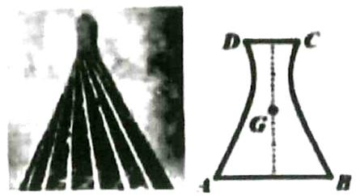

$\quad$A.10米

$\quad$B.20米

$\quad$C. $10\sqrt{3}$ 米

$\quad$D. $10 \sqrt{5}$ 米

等级（R）

2022 德阳高三第二次质检

##### 031. 设双曲线 $x^{2} - \frac{y^{2}}{4} = 1$ 的左、右焦点分别为 $F_{1}, F_{2}$ , 若点 $\mathrm{P}$ 在双曲线上, 且 $\left|PF_{1}\right| = 3$ , 则 $\left|PF_{2}\right| =$ ( )

$\quad$A.1或5

$\quad$B.1

$\quad$C.4

$\quad$D.5

# 三：椭圆和双曲线的通径

等级（N）

##### 032. 已知 $F_{1}(-1,0), F_{2}(1,0)$ 是椭圆 C 的两个焦点，过 $F_{2}$ 且垂直于 x 轴的直线交于 A、B 两点，且 $\vert AB\vert = 3$ ，则 C 的方程为（）

$\quad$A. $\frac{x^2}{2} + y^2 = 1$

$\quad$B. $\frac{x^2}{3} +\frac{y^2}{2} = 1$

$\quad$C. $\frac{x^2}{4} +\frac{y^2}{3} = 1$

$\quad$D. $\frac{x^2}{5} +\frac{y^2}{4} = 1$

等级（N）

##### 033. 已知 F 是双曲线 $C: x^{2} - \frac{y^{2}}{3} = 1$ 的右焦点，P 是 C 上一点，且 PF 与 x 轴垂直，点 A 的坐标是 (1, 3)，则 $\triangle APF$ 的面积为（）

$\quad$A. $\frac{1}{3}$

$\quad$B. $\frac{1}{2}$

$\quad$C. $\frac{2}{3}$

$\quad$D. $\frac{3}{2}$

等级（N）

##### 034. 已知 $F$ 为双曲线 $C: \frac{x^2}{a^2} - \frac{y^2}{b^2} = 1 (a > 0, b > 0)$ 的右焦点， $A$ 为 $C$ 的右顶点， $B$ 为 $C$ 上的点，且 $BF$ 垂直于 $x$ 轴。若 $AB$ 的斜率为 3，则 $C$ 的离心率为 \_\_\_\_.

# 四：抛物线基础题

等级（N）

##### 035. 抛物线 $y = \frac{1}{4} x^{2}$ 的准线方程是（）

$\quad$A. $y = -1$

$\quad$B. $y = -2$

$\quad$C. $x = -1$

$\quad$D. $x = -2$

等级（N）

2021年新高考2卷

##### 036. 抛物线 $y^{2} = 2px (p > 0)$ 的焦点到直线 $y = x + 1$ 的距离为 $\sqrt{2}$ ，则 $p =$ （）

$\quad$A. 1

$\quad$B. 2

$\quad$C. $2 \sqrt{2}$

$\quad$D. 4

等级（N）

##### 037. 已知 $A$ 为抛物线 $C: y^2 = 2px (p > 0)$ 上一点，点 $A$ 到 $C$ 的焦点的距离为 12，到 $y$ 轴的距离为 9，则 $p = (\quad)$

$\quad$A. 2

$\quad$B. 3

$\quad$C. 6

$\quad$D. 9

等级（N）

##### 038. 设 $O$ 为坐标原点，直线 $x = 2$ 与抛物线 $C: y^2 = 2px (p > 0)$ 交于 $D, E$ 两点，若 $OD \perp OE$ ，则 $C$ 的焦点坐标为（）

$\quad$A. $(\frac{1}{4}, 0)$

$\quad$B. $\left(\frac{1}{2},0\right)$

$\quad$C. (1, 0)

$\quad$D. (2, 0)

等级（N）

##### 039. 设抛物线的顶点为 $O$ ，焦点为 $F$ ，准线为 $l$ 。 $P$ 是抛物线上异于 $O$ 的一点，过 $P$ 作 $PQ \perp l$ 于 $Q$ ，则线段 $FQ$ 的垂直平分线（ ）.

$\quad$A. 经过点 $O$

$\quad$B. 经过点 $P$

$\quad$C. 平行于直线 $OP$

$\quad$D. 垂直于直线 $OP$

等级(N)

##### 040. 直线 $l$ 过抛物线 $C: y^{2} = 2px (p > 0)$ 的焦点 $F$ , 交抛物线 $C$ 于点 $A$ (点 $A$ 在 $x$ 轴上方)过点 $A$ 作直线 $x = -\frac{P}{2}$ 的垂线, 垂足为 $M$ , 若垂足 $M$ 恰好在线段 $AF$ 的垂直平分线上则直线 $l$ 的斜率为

等级(N)

2022年全国乙卷

##### 041. 设 $F$ 为抛物线 $C: y^2 = 4x$ 的焦点，点 $A$ 在 $C$ 上，点 $B(3,0)$ ，若 $|AF| = |BF|$ ，则 $|AB| = (\quad)$

$\quad$A. 2

$\quad$B. $2 \sqrt{2}$

$\quad$C. 3

$\quad$D. $3 \sqrt{2}$

等级（N）

##### 042. 过抛物线 $x^{2} = 8y$ 焦点 F 作直线 $l$ 交抛物线于 A、B 两点，若线段 AB 中点 M 的纵坐标为 4，则 $\vert AB\vert =$ \_\_\_\_

等级（N）

##### 043. 过抛物线 $y^{2} = 4x$ 的焦点作直线交抛物线于点 $A(x_{1}, y_{1})$ ，B $(x_{2}, y_{2})$ ，若 $|AB| = 7$ ，则 $AB$ 的中点 $M$ 到抛物线准线的距离为 \_\_\_\_.

等级（N）

2021年新高考1卷

##### 044. 已知 O 为坐标原点，抛物线 C: $y^{2} = 2px$ (p > 0) 的焦点为 F, P 为 C 上一点，PF 与 x 轴垂直，Q 为 x 轴上一点，且 $PQ \perp OP$ ，若 $|FQ| = 6$ ，则 C 的准线方程为 \_\_\_\_.

等级（N）

2022丹东一模

##### 045. 直线 1 过抛物线 C: $y^{2} = 2px (p > 0)$ 的焦点，且与 C 交于 A, B 两点，若使 $|AB| = 2$ 直线 1 有且仅有 1 条，则 $p = (\quad)$

$\quad$A. $\frac{1}{4}$

$\quad$B. $\frac{1}{2}$

$\quad$C.1

$\quad$D.2

等级(R)

##### 046. 已知抛物线 $y^{2} = 4x$ 的焦点为 $F$ ，抛物线上任意一点 $P$ ，且 $PQ \perp y$ 轴交 $y$ 轴与点 $Q$ ，则 $\overrightarrow{PQ} \cdot \overrightarrow{PF}$ 的最小值为（）

A- $\frac{1}{4}$

$\quad$B. $-\frac{1}{2}$

$\quad$C.-1

$\quad$D.1

等级（R）

##### 047. 以坐标原点 0 为圆心的圆与抛物线 $y^{2} = 4x$ 及其准线分别交于点 A, B 和 C, D 若 $|AB| = |CD|$ ，则圆 0 的方程是 \_\_\_\_

等级（R）

##### 048. 设 $F$ 为抛物线 $y^{2} = 4x$ 的焦点， $A, B, C$ 为该抛物线上三点，若 $\overrightarrow{FA} + \overrightarrow{FB} + \overrightarrow{FC} = 0$ . 则 $|\overrightarrow{FA}| + |\overrightarrow{FB}| + |\overrightarrow{FC}| = (\quad)$

$\quad$A.9

$\quad$B.6

$\quad$C.4

$\quad$D.3

等级（R）

##### 049. 已知抛物线 $C: \mathbf{y}^{2} = 2\mathrm{px} (\mathrm{p} > 0)$ 的焦点为 $\mathrm{F}$ , $M\left(\frac{1}{2}, y_{0}\right)$ 为该抛物线上一点, 以 $\mathbb{M}$ 为圆心的圆与 $\mathbb{C}$ 的准线相切于点 $\mathbb{A}$ , $\angle AMF = 120^{\circ}$ , 则抛物线方程为 ( )

$\quad$A. $\mathbf{y}^2 = 2\mathbf{x}$

$\quad$B. $\mathbf{y}^2 = 4\mathbf{x}$

$\quad$C. $\mathbf{y}^2 = 6\mathbf{x}$

$\quad$D. $\mathbf{y}^2 = 8\mathbf{x}$

# 五：综合题

等级（N）

##### 050. 已知曲线 $C: mx^2 + ny^2 = 1$ ，则下列命题不正确的是（）

$\quad$A. 若 $m > n > 0$ ，则 $C$ 是椭圆，其焦点在 $\mathbf{y}$ 轴上  
$\quad$B. 若 $m = n > 0$ ，则 $C$ 是圆, 其半径为 $\sqrt{n}$   
$\quad$C. 若 $mn < 0$ ，则 $C$ 是双曲线，其渐近线方程为 $y = \pm \sqrt{-\frac{m}{n}} x$   
$\quad$D. 若 $m = 0, n > 0$ ，则 $C$ 是两条直线

等级（N）

##### 051. 若抛物线 $y^{2} = 2px$ 的焦点是椭圆 $\frac{x^2}{3p} + \frac{y^2}{p} = 1$ 的一个焦点，则 $p = (\quad)$

$\quad$A.2

$\quad$B.3

$\quad$C.4

$\quad$D.8

等级（N）

##### 052. 已知双曲线 $E$ 的中心在坐标原点, 离心率为 2, $E$ 的右焦点与抛物线 $C: y^{2} = 8x$ 的焦点重合, A、B 是 C 的准线与 $E$ 的两个焦点, 则 $|AB| = (\quad)$

$\quad$A.3

$\quad$B.6

$\quad$C.9

$\quad$D.12

等级（N）

##### 053. 已知双曲线 $C: \frac{x^2}{a^2} - \frac{y^2}{b^2} = 1 (a > 0, b > 0)$ 的一条渐近线方程为 $y = \frac{\sqrt{5}}{2} x$ ，且与椭圆 $\frac{x^2}{12} + \frac{y^2}{3} = 1$ 有公共焦点，则曲线 $C$ 的方程为 \_\_\_\_.

等级（N）

##### 054. 双曲线: $\frac{x^2}{a^2} - \frac{y^2}{b^2} = 1 (a > 0, b > 0)$ 的渐近线与抛物线 $y^2 = 2px (p > 0)$ 的两个交点（原点除外）连线恰好经过抛物线的焦点，则双曲线的离心率为 \_\_\_\_.

等级（N）

2022年全国甲卷

##### 055. 若双曲线 $y^{2}-\frac{x^{2}}{m^{2}}=1(m>0)$ 的渐近线与圆 $x^{2}+y^{2}-4y+3=0$ 相切，则m= \_\_\_\_.

等级（N）

2021 新疆第一次适应性检测

##### 056. 圆心在抛物线 $y = \frac{1}{4} x^2$ 上，且与直线 $y + 1 = 0$ 相切的圆一定过的点是（）

$\quad$A. (1,0)

$\quad$B.(0,1)

$\quad$C. $(-1,0)$

$\quad$D. $(0, - 1)$

等级（R）

2023佛山二模

##### 057. 已知方程 $Ax^2 + By^2 + Cxy + Dx + Ey + F = 0$ ，其中 $\mathrm{A} \geq \mathrm{B} \geq \mathrm{C} \geq \mathrm{D} \geq \mathrm{E} \geq \mathrm{F}$ . 现有四位同学对该方程进行了判断，提出了四个命题：

甲：可以是圆的方程；

乙：可以是抛物线的方程；

丙：可以是椭圆的标准方程；

丁：可以是双曲线的标准方程.；

其中，真命题有（）

$\quad$A.1个

$\quad$B.2个

$\quad$C.3 个

$\quad$D.4个

等级（R）

2021燕博园综合测试

##### 058.（多选）已知方程 $x^{2}\sin \theta - y^{2}\sin 2\theta = 1$ ，则（）

$\quad$A.存在实数 $\theta$ ，该方程对应的图形是圆，且圆的面积为 $\frac{4\pi}{3}$

$\quad$B.存在实数 $\theta$ ，该方程对应的图形是平行于 $\mathbf{x}$ 轴的两条直线

$\quad$C.存在实数 $\theta$ ，该方程对应的图形是焦点在 $\mathbf{x}$ 轴上的双曲线，且双曲线的离心率为 $\sqrt{2}$

$\quad$D.存在实数 $\theta$ ，该方程对应的图形是焦点在 $\mathbf{x}$ 轴上的椭圆，且椭圆的离心率为 $\frac{\sqrt{3}}{3}$

# 六：做圆锥曲线小题化繁为简的思想

等级（R）

##### 059. 点 P 在双曲线 $\frac{x^2}{a^2} - \frac{y^2}{b^2} = 1 (a > 0, b > 0)$ 的右支上，其左、右焦点分别为 $F_1, F_2$ ，直线 $PF_1$ 与以坐标原点 0 为圆心， $a$ 为半径的圆相切于点 A，线段 $PF_1$ 的垂直平分线恰好过 $F_2$ ，则该双曲线的离心率为 \_\_\_\_。

等级（R）

2021 贛州一模

##### 060. 设抛物线 $C: y^{2} = 2x$ 的焦点为 $F$ , 准线为 $l$ , $A$ 为 $C$ 上一点, 以 $F$ 为圆心, $|FA|$ 为半径的圆交 $l$ 于 $B, D$ 两点。若 $\overrightarrow{FB} \cdot \overrightarrow{FD} = 0$ , 则 $\triangle ABD$ 的面积为 \_\_\_\_.

等级（R）

2024广州三模冲刺三

##### 061. 已知双曲线 $\frac{x^2}{a^2} - \frac{y^2}{b^2} = 1 (a > 0, b > 0)$ 的左、右焦点分别为 $F_1, F_2$ ，且 $F_2$ 与抛物线 $y^2 = 2px (p > 0)$ 的焦点重合，双曲线的一条渐近线与抛物线的准线交于 $A$ 点，若 $\angle F_1F_2A = \frac{\pi}{6}$ ，则双曲线的离心率为（）

$\quad$A. $\sqrt{13}$

$\quad$B.3

$\quad$C. $\sqrt{3}$

$\quad$D. $\frac{\sqrt{21}}{3}$

等级（SR）

##### 062. 设双曲线 $C: \frac{x^2}{a^2} - \frac{y^2}{b^2} = 1 (a > 0, b > 0)$ 的左顶点为 $A$ ，右焦点为 $F(c, 0)$ ，若圆 $A(x + a)^2 + y^2 = a^2$ 与直线 $bx - ay = 0$ 交于坐标原点 $O$ 及另一点 $E$ ，且存在以 $O$ 为圆心的圆与线段 $EF$ 相切，切点为 $EF$ 的中点，则双曲线的离心率为（）

$\quad$A. $\frac{\sqrt{6}}{2}$

$\quad$B. $\sqrt{2}$

$\quad$C. $\sqrt{3}$

$\quad$D.3

# 题型二：圆锥曲线技巧之焦点三角形面积公式

焦点三角形面积公式

椭圆： $S = b^{2}\tan \frac{\theta}{2}$

双曲线： $\mathbf{S} = \mathbf{b}^2\cot \frac{\theta}{2}$

等级（N）

##### 063. 设 $F_{1}, F_{2}$ 是椭圆 $\frac{x^{2}}{16} + \frac{y^{2}}{4} = 1$ 的两焦点， $P$ 为椭圆上的点，若 $PF_{1} \perp PF_{2}$ ，则 $\Delta PF_{1}F_{2}$ 的面积为（）

$\quad$A.8

$\quad$B. $4 \sqrt{2}$

$\quad$C.4

$\quad$D. $2 \sqrt{2}$

等级（N）

##### 064. 设 $F_{1}, F_{2}$ 是双曲线 $C: x^{2} - \frac{y^{2}}{3} = 1$ 的两个焦点， $O$ 为坐标原点，点 $P$ 在 $C$ 上且

$OP \models 2$ ，则 $\triangle PF_{1}F_{2}$ 的面积为（）

$\quad$A. $\frac{7}{2}$

$\quad$B. 3

$\quad$C. $\frac{5}{2}$

$\quad$D. 2

等级（N）

##### 065. 设双曲线 $C: \frac{x^2}{a^2} - \frac{y^2}{b^2} = 1 (a > 0, b > 0)$ 的左、右焦点分别为 $F_1, F_2$ ，离心率为 $\sqrt{5}$ . $P$ 是 $C$ 上一点，且 $F_1P \perp F_2P$ . 若 $\triangle PF_1F_2$ 的面积为 4，则 $a = (\quad)$

$\quad$A. 1

$\quad$B. 2

$\quad$C. 4

$\quad$D. 8

等级（N）

##### 066. 已知点 $F_{1}, F_{2}$ , 分别是双曲线 $C_{1} \frac{x^{2}}{a^{2}} - \frac{y^{2}}{b^{2}} = 1 (a > 0, b > 0)$ 的左、右焦点, $O$ 为坐标原点, 点 $P$ 在双曲线 $C$ 的右支上, $\left|F_{1} F_{2}\right| = 2 \mid O P$ , $\Delta P F, F_{2}$ 的面积为 4 , 且该双曲线的两条渐近线互相垂直, 则双曲线 $C$ 的方程为 ( )

$\quad$A. $\frac{x^2}{2} -\frac{y^2}{2} = 1$

$\quad$B. $\frac{x^2}{4} -\frac{y^2}{4} = 1$

$\quad$C. $\frac{x^2}{8} -\frac{y^2}{4} = 1$

$\quad$D. $\frac{x^2}{2} -\frac{y^2}{4} = 1$

等级（N）

##### 067. 已知双曲线 $C: \frac{x^2}{a^2} - \frac{y^2}{b^2} = 1 (a > 0, b > 0)$ 的一条渐近线方程为 $y = 2x$ ，且点 $P$ 为双曲线右支上一点，且 $F_1F_2$ 为双曲线左右焦点， $\Delta F_1F_2P$ 的面积为 $4\sqrt{3}$ ，且 $\angle F_1PF_2 = 60^\circ$ ，则双曲线的实轴的长为（）

$\quad$A.1

$\quad$B.2

$\quad$C.4

$\quad$D. $4\sqrt{3}$

等级（N）

2021年甲卷文科

##### 068. 已知 $F_{1}, F_{2}$ 为椭圆 $C: \frac{x^{2}}{16} + \frac{y^{2}}{4} = 1$ 的两个焦点， $P, Q$ 为 $C$ 上关于坐标原点对称的两点，且 $\left|PQ\right| = \left|F_{1}F_{2}\right|$ ，则四边形 $PF_{1}QF_{2}$ 的面积为 \_\_\_\_.

等级（R）

##### 069. 已知点 $P$ 是双曲线 $E: \frac{x^2}{a^2} - \frac{y^2}{b^2} = 1, (a > 0, b > 0)$ 与圆 $x^2 + y^2 = a^2 + b^2$ 的一个交点，若 $P$ 到 $x$ 轴的距离为 $a$ ，则 $E$ 的离心率为（）

(A) $\frac{\sqrt{5}}{2} + 1$ .

(B) $\frac{3 + \sqrt{5}}{2}$

(C) $\frac{-1 + \sqrt{5}}{2}$

(D) $\frac{1 + \sqrt{5}}{2}$

等级（SR）

##### 070. 已知椭圆 $\frac{x^2}{a^2} + \frac{y^2}{b^2} = 1$ 右焦点分别为 $F_1, F_2$ ，双曲线 $\frac{x^2}{m^2} - \frac{y^2}{n^2} = 1$ 的一条渐近线交椭圆于点 $P$ ，且满足 $PF_1 \perp PF_2$ ，已知椭圆的离心率为 $e_1 = \frac{3}{4}$ ，则双曲线的离心率 $e_2 = (\quad)$

$\quad$A. $\sqrt{2}$

$\quad$B. $\frac{9\sqrt{2}}{8}$

$\quad$C. $\frac{9\sqrt{2}}{4}$

$\quad$D. $\frac{3\sqrt{2}}{2}$

# 题型三：圆锥曲线技巧之双曲线必会cba直角三角形（1）

等级（N）

##### 071. 双曲线 $\frac{x^2}{4} - y^2 = 1$ 的焦点到渐近线的距离为（）

$\quad$A.1

$\quad$B. $\sqrt{2}$

$\quad$C.2

$\quad$D.3

等级（N）

##### 072. 已知双曲线 $C: \frac{x^2}{a^2} - \frac{y^2}{b^2} = 1 (a > 0, b > 0)$ 的离心率为 2，C 的焦点到其渐近线的距离是 $\sqrt{3}$ ，则双曲线 C 的方程为 \_\_\_\_。

等级（N）

##### 073. 已知双曲线 $C: \frac{x^2}{a^2} - \frac{y^2}{b^2} = 1 (a > 0, b > 0)$ 的一条渐近线的倾斜角为 $60^\circ$ ，则 C 的离心率为 \_\_\_\_.

等级（N）

##### 074. 已知双曲线 $C: \frac{x^2}{a^2} - \frac{y^2}{b^2} = 1 (a > 0, b > 0)$ 的右焦点为 $F$ ，以 $F$ 为圆心， $a$ 为半径的圆与双曲线 $C$ 的渐近线相切。则双曲线 $C$ 的渐近线方程为。（）

$\quad$A. $y = \pm x$

$\quad$B. $y = \pm \sqrt{2} x$

$\quad$C. $y = \pm \sqrt{3} x$

$\quad$D. $y = \pm 2x$

等级（N）

##### 075. 已知 $F$ 是双曲线 $C: x^{2} - my^{2} = 3m (m > 0)$ 的一个焦点，则点 $F$ 到 $C$ 的一条渐近线的距离为（）

$\quad$A. $\sqrt{3}$

$\quad$B.3

$\quad$C. $\sqrt{3} m$

$\quad$D.3m

等级（N）

##### 076. 已知 F 是双曲线 $C: \frac{x^{2}}{a^{2}} - \frac{y^{2}}{b^{2}} = 1 (a > 0, b > 0)$ 的右焦点，0 是坐标原点，过 F 作 C 的一条渐近线的垂线，垂足为 P，并交 y 轴于点 Q，若 $\left|OQ\right| = 3\left|OP\right|$ ，则 C 的离心率为（）

$\quad$A. $\frac{3\sqrt{2}}{4}$

$\quad$B. $\frac{3\sqrt{3}}{4}$

$\quad$C. $\sqrt{2}$

$\quad$D. $\sqrt{3}$

等级（N）

##### 077. 已知 $F_{1}, F_{2}$ 分别为双曲线 $C: \frac{x^{2}}{a^{2}} - \frac{y^{2}}{b^{2}} = 1 (a > 0, b > 0)$ 的左焦点和右焦点， $P$ 为 $C$ 上一点，若直线 $y = \frac{b}{a} x$ 为线段 $PF_{2}$ 的垂直平分线，则该双曲线的离心率为（）

$\quad$A. $\sqrt{2}$

$\quad$B. $\sqrt{3}$

$\quad$C. $\sqrt{5}$

D $\sqrt{6}$

等级（N）

2022赣州一模

##### 078. 已知 $F_{1}, F_{2}$ 是双曲线 $C: x^{2} - \frac{y^{2}}{b^{2}} = 1$ 的两个焦点，过 $F_{1}$ 作 C 的渐近线的垂线，垂足为 P，若 $\triangle F_{1}PF_{2}$ 的面积为 $\sqrt{3}$ ，则 C 的离心率为 \_\_\_\_。

等级（R）

2022年全国乙卷

##### 079. (多选) 双曲线 $C$ 的两个焦点为 $F_{1}, F_{2}$ , 以 $C$ 的实轴为直径的圆记为 $D$ , 过 $F_{1}$ 作 $D$ 的切线与 $C$ 交于 $M, N$ 两点, 且 $\cos \angle F_{1}NF_{2} = \frac{3}{5}$ , 则 $C$ 的离心率为 ( )

$\quad$A. $\frac{\sqrt{5}}{2}$

$\quad$B. $\frac{3}{2}$

$\quad$C. $\frac{\sqrt{13}}{2}$

$\quad$D. $\frac{\sqrt{17}}{2}$ 等级（R）

##### 080. 已知 F 是双曲线 C: $\frac{x^2}{a^2} - \frac{y^2}{b^2} - 1 (a > 0, b > 0)$ 的右焦点，P 是 y 轴正半轴上一点，以 OP 为直径的圆在第一象限与双曲线的渐近线交于点 M，若 P.M.F 三点共线，且 $\triangle$ MFO 的面积是 $\triangle$ PMO 面积的 4 倍，则双曲线 C 的离心率（）

$\quad$A. $\sqrt{3}$

$\quad$B. $\sqrt{5}$

$\quad$C. $\sqrt{6}$

$\quad$D. $\sqrt{7}$

等级（R）

2021鄂东南五月联考

##### 081. 如图，已知双曲线 C: $\frac{x^2}{a^2} - \frac{y^2}{b^2} = 1 (a > 0, b > 0)$ 的左、右焦点分别为 $F_{1}, F_{2}$ ，以 $OF_2$ 为直径的圆与双曲线 C 的渐近线在第一象限的交点为 P，线段 $PF_1$ 与另一条渐近线交于点 Q，且 $\triangle OPF_2$ 的面积是 $\triangle OPQ$ 面积的 2 倍，则该双曲线的离心率为（）

$\quad$A. $\frac{3}{2}$

$\quad$B. $\frac{3\sqrt{2}}{2}$

$\quad$C. $\sqrt{2}$

$\quad$D. $\sqrt{3}$

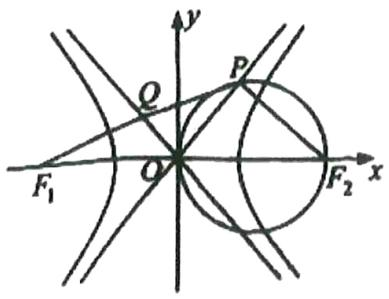

等级（SR）

2022四川大数据精准教学第二次统测

##### 082. 设双曲线 $\frac{x^{2}}{a^{2}} - \frac{y^{2}}{b^{2}} = 1 (a > 0, b > 0)$ 的左、右焦点分别为 $F_{1}, F_{2}$ , 左, 右顶点分别为 A, B, 以 AB 为直径的圆与双曲线的渐近线在第一象限的交点为 P, 若 $\Delta PAF_{2}$ 为等腰三角形, 则直线 $PF_{2}$ 的倾斜角的大小为 \_\_\_\_

等级（SR）

##### 083. 过双曲线 $\frac{x^2}{a^2} - \frac{y^2}{b^2} = 1 (a > b > 0)$ 的右焦点 $F_2$ 的直线在第一、第四象限交两条渐近线分别于 $P, Q$ 两点，且 $\angle OPQ = 90^\circ$ ， $O$ 为坐标原点，若 $\Delta OPQ$ 内切圆的半径为 $\frac{a}{3}$ ，则该双曲线的离心率为（）

$\quad$A. $\sqrt{2}$

$\quad$B. $\frac{\sqrt{5}}{2}$

$\quad$C. $\sqrt{10}$

$\quad$D. $\frac{\sqrt{10}}{2}$ 等级（SR）

2022成都二诊

##### 084. 已知 $F_{2}$ 为双曲线 $\frac{x^{2}}{a^{2}} - \frac{y^{2}}{b^{2}} = 1 (a > 0, b > 0)$ 的右焦点，经过 $F_{2}$ 作直线 1 与双曲线的一条渐近线垂直，垂足为 A，直线 1 与双曲线的另一条渐近线相交于点 B，若 $\left|AF_{2}\right| = \frac{1}{3} \left|BF_{2}\right|$ ，则双曲线的离心率为 \_\_\_\_。

# 题型四：圆锥曲线技巧之双曲线必会 cba 直角三角形（2）

等级（N）

##### 085. 设 A, B 为双曲线 $\frac{x^2}{4} - y^2 = 1$ 的左，右顶点，F 为双曲线的右焦点，以原点 0 为圆心， $|OF|$ 为半径的圆与双曲线的一条渐近线的一个交点为 M，连接 AM. BM，则 $\tan \angle AMB = (\quad)$

$\quad$A.4

$\quad$B. $\sqrt{5}$

$\quad$C.2

$\quad$D. $\sqrt{6}$

等级（R）

2021佛山二模

##### 086. 已知双曲线 $C: \frac{x^2}{a^2} - \frac{y^2}{b^2} = 1 (a > 0, b > 0)$ 的离心率等于 2, $F_1$ , $F_2$ 分别是 $C$ 的左、右焦点, $A$ 为 $C$ 的右顶点, $P$ 在 $C$ 的渐近线上, 且 $PF_1 \perp PF_2$ , 若 $\triangle PAF_1$ 的面积为 $3a$ , 则 $C$ 的虚轴长等于 ( )

$\quad$A. $\sqrt{3}$

$\quad$B. 2

$\quad$C. $2 \sqrt{3}$

$\quad$D.4

等级（SR）

2021 唐山二模

##### 087. 已知 F 为双曲线 $\frac{x^2}{a^2} - \frac{y^2}{b^2} = 1 (a > 0, b > 0)$ 的右焦点，A 为双曲线 C 右支上一点，且位于 x 轴上方，B 为渐近线上一点，O 为坐标原点，若四边形 OFAB 为菱形，则双曲线 C 的离心率 e = （）

$\quad$A. 2

$\quad$B. 3

$\quad$C. $\sqrt{2}$

$\quad$D. $\sqrt{2} + 1$

等级（SR）

##### 088. 已知双曲线 $C: \frac{x^2}{a^2} - \frac{y^2}{b^2} = 1 (a > 0, b > 0)$ 的左右焦点分别为 $F_1, F_2, A$ 为双曲线的左顶点，以 $F_1, F_2$ 为直径的圆交双曲线的一条渐近线于 P, Q 两点，且 $\angle PAQ = \frac{5\pi}{6}$ ，则该双曲线的离心率为（）

$\quad$A. $\sqrt{2}$

$\quad$B. $\sqrt{3}$

$\quad$C. $\frac{\sqrt{21}}{3}$

$\quad$D. $\sqrt{13}$

等级（SR）

2022 乌鲁木齐二模

##### 089. 已知双曲线方程为 $\frac{x^2}{a^2} - \frac{y^2}{b^2} = 1 (a > 0, b > 0)$ ， $F_1, F_2$ 分别是双曲线的左，右焦点，P点位于第一象限的渐近线上，满足 $PF_1 \perp PF_2$ ， $PF_1$ 与另一条渐近线交于点 Q，若 $|PQ|: |QF_1| = 3: 2$ 则双曲线的离心率为（）

$\quad$A. $\frac{5}{4}$

$\quad$B. $\frac{4}{3}$

$\quad$C. $\frac{5}{3}$

$\quad$D.2

# 题型五：圆锥曲线技巧之抛物线小结论大总结

抛物线：

##### 1. $AF = \frac{p}{1 - \cos\theta}$   
##### 2. $BF = \frac{p}{1 + \cos\theta}$   
##### 3. $\frac{1}{AF} +\frac{1}{BF} = \frac{2}{p}$   
##### 4. $AB = \frac{2p}{\sin^2\theta}$   
##### 5. $S_{\Delta AOB} = \frac{p^2}{2\sin\theta}$   
##### 6. $x_{1}x_{2} = m^{2}$   
##### 7. 若 $\overrightarrow{AF} = \lambda \overrightarrow{FB}$ 则 $|\cos \theta| = \left|\frac{\lambda - 1}{\lambda + 1}\right|$

等级（N）

##### 090. 设抛物线 $C: y^{2} = 4x$ 的焦点为 $\mathrm{F}$ , 倾斜角为钝角的直线 $l$ 过 $\mathrm{F}$ 且与 $\mathrm{C}$ 交于 $\mathrm{A}, \mathrm{B}$ 两点。若 $|AB| = \frac{16}{3}$ . 则 $l$ 的斜率为（）

$\quad$A.-1 
$\quad$B. $\frac{\sqrt{3}}{3}$

$\quad$C. $\frac{\sqrt{2}}{2}$ 
$\quad$D. $-\sqrt{3}$

等级（N）

##### 091. 已知直线 1 经过抛物线 C: $y^{2} = 4x$ 的焦点 F, 1 与 C 交与 A, B 两点, 其中点 A 在第四象限, 若 $\overrightarrow{AF} = 2\overrightarrow{FB}$ , 则直线 1 的斜率为 \_\_\_\_。

等级（N）

##### 092. 已知抛物线 C: $y^{2} = 4x$ 的焦点为 F，直线 $y = \sqrt{3}(x - 1)$ 与 C 交于 A、B（A 在 x 轴上方）两点，
若 $\overrightarrow{AF} = m\overrightarrow{FB}$ ，则实数 m 的值为（）

$\quad$A. $\frac{\sqrt{3}}{2}$

$\quad$B. $\sqrt{3}$

$\quad$C.2

$\quad$D.3

等级（N）

##### 093. 已知抛物线 $y^{2} = 4x$ 的焦点为 F，过点 F 和抛物线上一点 $M(2, 2\sqrt{2})$ 的直线 L 交抛物线于另一点 N，则 $|\mathbf{NF}|: |\mathbf{FM}|$ 等于（）

$\quad$A.1: 2

$\quad$B.1: 3

$\quad$C. $1: \sqrt{2}$

$\quad$D. $1: \sqrt{3}$

等级（N）

##### 094. 设 $O$ 为抛物线: $y^{2} = 2px (p > 0)$ 的顶点, $F$ 为焦点, 且 $AB$ 为过焦点 $F$ 的弦, 若 $|AB| = 4p$ , 则 $\triangle AOB$ 的面积为

等级（N）

##### 095. 过抛物线 $y^{2} = 4x$ 的焦点 $F$ 的直线交抛物线于 $A, B$ 两点，点 $O$ 是原点，若 $|AF| = 3$ ；则 $\Delta AOB$ 的面积为（）

(A) $\frac{\sqrt{2}}{2}$

(B) $\sqrt{2}$

(C) $\frac{3\sqrt{2}}{2}$

(D) $2\sqrt{2}$

等级（N）

2023 新高考二卷

##### 096. (多选) 设 $O$ 为坐标原点, 直线 $y = -\sqrt{3} (x - 1)$ 过抛物线 $C: y^2 = 2px (p > 0)$ 的焦点, 且与 $C$ 交于 $M, N$ 两点, $I$ 为 $C$ 的准线, 则 ( ).

$\quad$A. $p = 2$

$\quad$B. $\left|MN\right| = \frac{8}{3}$

$\quad$C. 以 $MN$ 为直径的圆与 $l$ 相切

$\quad$D. $\triangle OMN$ 为等腰三角形

等级（N）

##### 097. 过抛物线 $x^{2} = 8y$ 的焦点 $F$ 的直线交抛物线于 $A, B$ 两点， $O$ 为坐标原点，若 $\frac{|AF|}{|BF|} = \frac{1}{2}$ ，则 $\Delta AOB$ 的面积为（）

$\quad$A. $3 \sqrt{2}$

$\quad$B. $12\sqrt{2}$

$\quad$C. $6 \sqrt{2}$

$\quad$D. $9 \sqrt{2}$

等级（N）

##### 098. 已知抛物线 $C: y^{2} = 4x$ 的焦点为 $F$ ，准线为 $l$ ， $l$ 与 $x$ 轴的交点为 $P$ ，点 $A$ 在抛物线 $C$ 上，过点 $A$ 作 $AA' \perp l$ ，垂足为 $A'$ ，若 $\cos \angle FAA' = \frac{3}{5}$ ，则四边形 $AA'PF$ 的面积为（）

$\quad$A.8

$\quad$B.10

$\quad$C.14

$\quad$D.28

等级（N）

##### 099. 若过抛物线 $y = \frac{1}{4} x^2$ 焦点的直线与抛物线交于 A, B 两点（不重合），则 $\overrightarrow{OA} \cdot \overrightarrow{OB}$ （0 为坐标原点）的值是（）

$\quad$A.-3

$\quad$B. $-\frac{3}{4}$

$\quad$C.3

$\quad$D. $\frac{3}{4}$

等级(R)

2024 保定一模

##### 100. 已知抛物线 $y^{2} = 2px$ 上两点 $A(x_{1},y_{1}), B(x_{2},y_{2})$ ，则 $x_{1}x_{2} = \frac{p^{2}}{4}$ 是直线AB过此抛物线焦点的

$\quad$A. 必要不充分条件

$\quad$B. 充分不必要条件

$\quad$C.充要条件

$\quad$D.既不充分也不必要条件

等级(R)

2024 湖北四调

##### 101.（多选）已知抛物线 $y^{2} = 8x$ 的焦点为 $F$ ，准线与 $x$ 轴的交点为 $C$ ，过点 $C$ 的直线 $l$ 与抛物线交于 $A, B$ 两点， $A$ 点位于 $B$ 点右方，若 $\angle AFB = \angle CFB$ ，则下列结论一定正确的有（）

$\quad$A. $|AF|=8$

$\quad$B. $|AB| = \frac{8\sqrt{7}}{3}$

$\quad$C. $S_{\Delta AFB} = \frac{16\sqrt{3}}{3}$

$\quad$D. 直线 $AF$ 的斜率为 $\sqrt{3}$

等级(R)

2024 云南二统

##### 102. 已知 O 为坐标原点，F 是抛物线 $C: y^{2} = x$ 的焦点，A、B 两点分别位于 x 轴的两侧，且都在抛物线 C 上。记 $\Delta ABO$ 的面积为 $S_{1}$ ， $\Delta AFO$ 的面积为 $S_{2}$ 。若 $\overrightarrow{OA} \cdot \overrightarrow{OB} = 2$ ，则 $S_{1} + S_{2}$ 的最小值为 \_\_\_\_.

等级（R）

##### 103. 已知抛物线 $y^{2} = 4x$ 的焦点为 $F$ ，过点 $F$ 作直线 $l$ 与抛物线分别交于 $A, B$ 两点，若第一象限的点 $M(t,2)$ ，满足 $\overrightarrow{OM} = \frac{1}{2} (\overrightarrow{OA} + \overrightarrow{OB})$ （其中 $O$ 为坐标原点），则 $|AB| =$ \_\_\_\_

等级（R）

##### 104. 已知抛物线 $C: y^{2} = 2px (p > 0)$ ，其焦点为 F，准线为 1，过焦点 F 的直线交抛物线 C 于点 A、B（其中 A 在 x 轴上方），A, B 两点在抛物线的准线上的投影分别为 M, N。若 $\left|MF\right| = 2\sqrt{3}$ $\left|NF\right| = 2$ ，则 $\frac{\left|AF\right|}{\left|BF\right|} = (\quad)$

$\quad$A. $\sqrt{3}$

$\quad$B. 2

$\quad$C. 3

$\quad$D.4

等级（R）

##### 105. 已知点 F 为抛物线 $C: y^{2} = 4x$ 的焦点，直线 1 过点 F 且与抛物线 C 交于 A, B 两点，点 A 在第一象限，M(-2, 0)，若 $\frac{3}{2} \leq \frac{s_{\Delta MAF}}{s_{\Delta MBF}} \leq 2$ （ $S_{\Delta MAF} S_{\Delta MBF}$ 分别表示 $\Delta \mathrm{MAF}, \Delta \mathrm{MBF}$ 的面积），则直线 1 的斜率的取值范围为 \_\_\_\_

等级（R）

##### 106. 已知抛物线 C: $y^{2} = 2px (p > 0)$ 的焦点为 F, 过 F 且倾斜角为 $120^{\circ}$ 的直线与抛物线 C 交于 A.B 两点, 若 AF, BF 的中点在 y 轴上的射影分别为 M, N, 且 $|MN| = 4\sqrt{3}$ , 则抛物线 C 的准线方程为 ( )

$\quad$A. $x = -1$

$\quad$B. $x = -2$

$\quad$C. $x = -\frac{3}{2}$

$\quad$D. $x = -3$

等级（R）

##### 107. 已知抛物线 $y^{2} = 2px (p > 0)$ 的焦点为 $F$ ，准线为 $l$ ，过 $F$ 的直线与抛物线及其准线 $l$ 依次相交于 $G$ 、 $M$ 、 $N$ 三点（其中 $M$ 在 $G$ 、 $N$ 之间且 $G$ 在第一象限），若 $|GF| = 4$ ， $|MN| = 2|MF|$ ，则 $p =$ \_\_\_\_

等级（R）

##### 108. 已知抛物线 C: $y^{2} = 2px (p > 0)$ 的焦点为 F，过点（-1, 0）的直线与 C 交于 A, B 两点，若
4 |FA|+ |FB| 的最小值为 19，抛物线 C 的标准方程为 \_\_\_\_

等级（R）

##### 109. 已知抛物线 C: $y^{2} = 4x$ 的焦点为 F，过点 F 的直线 1 与抛物线相交于 A, B 两点，O 为坐标原点，直线 OA, OB 与抛物线的准线分别相交于点 P, Q，则 $\left|PQ\right|$ 的最小值为 \_\_\_\_

等级（SR）

2023宁波二模

##### 110.（多选）三支不同的曲线 $y = a_{i} \cdot |x - 1| (a_{i} > 0, i = 1, 2, 3)$ 交抛物线 $y^{2} = 4x$ 于点 $A_{i}, B_{i}$ ( $i = 1, 2, 3$ ), $F$ 为抛物线的焦点，记 $\triangle A_{i}FB_{i}$ 的面积为 $S_{i}$ ，下列说法正确的是（）

$\quad$A. $\frac{1}{|FA_i|} +\frac{1}{|FB_i|}\big(i = 1,2,3\big)$ 为定值

$\quad$B. $A_{1}B_{1} / / A_{2}B_{2} / / A_{3}B_{3}$

$\quad$C. 若 $S_{1} + S_{2} = 2S_{3}$ ，则 $a_1 + a_2 = 2a_3$

$\quad$D. 若 $S_{1}S_{2} = S_{3}^{2}$ ，则 $a_{1}a_{2} = a_{3}^{2}$

等级（SR）

##### 111. 已知过抛物线 $y^{2} = 4x$ 焦点 F 的直线与抛物线交于 P, Q 两点, M 为线段 PF 的中点, 连接 OM, 则 $\triangle OMQ$ 的最小面积为 ( )

$\quad$A.1

$\quad$B. $\sqrt{2}$

$\quad$C.2

$\quad$D.4

等级（SR）

##### 112. 已知抛物线 $E: y^{2} = 4x$ 的焦点为 $F$ , 准线为 $I, I$ 交 $x$ 轴于点 $T, A$ 为 $E$ 上一点 $AA_{1}$ 垂直 $l$ , 垂足为 $A_{1}, A_{1}F$ 交 $y$ 轴于点 $S$ , 若 $ST//AF$ , 则 $\left|AF\right| = \_$ .

等级（SR）

##### 113. 设抛物线 $y^{2} = 2px (p > 0)$ 的焦点 F 为圆心，p 为半径作圆交 y 轴于 A, B 两点，连接 FA 交抛物线于点 D(D 在线段 FA 上)，延长 FA 交抛物线的准线于点 C，若 $|AD| = m$ ，且 $m \in [1,2]$ ，则 $|FD||CD|$ 的最大值为 \_\_\_\_

等级（SR）

##### 114. 已知抛物线 $y^{2} = 8x$ 的焦点为 F，直线 1 过 F 且依次交抛物线及圆 $(x - 2)^{2} + y^{2} = 1$ 于点 A, B, C, D 四点，则 $|AB| + 4|CD|$ 的最小值为 \_\_\_\_

等级（SR）

##### 115. 如图，过抛物线 $y^{2} = 2px (p > 0)$ 的焦点 F 作两条互相垂直的弦 AB、CD，若 $\triangle ACF$ 与 $\triangle BDF$ 面积之和的最小值为 16，则抛物线的方程为 \_\_\_\_

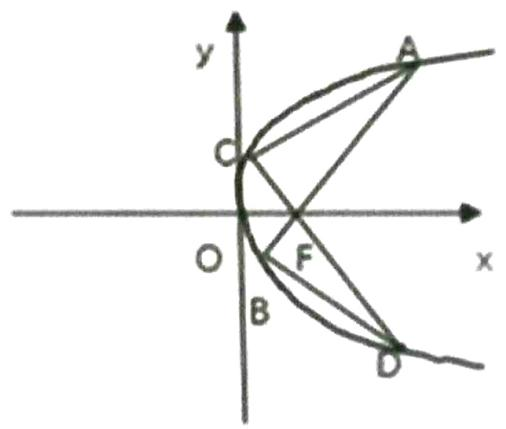

等级（SR）

2021 唐山二模

##### 116. 设抛物线 $E: y^{2} = 4x$ 的焦点为 $F$ , 直线 $l: y = k(x - 1)$ 与 $E$ 交于 $A, B$ , 与 $y$ 轴交于 $C$ , 若 $|AF| = |BC|$ , 则 $|AB| =$ \_\_\_\_

# 题型六：圆锥曲线技巧之点差法

等级（R）.

##### 117. 已知椭圆 $\frac{x^2}{a^2} + \frac{y^2}{b^2} = 1 (a > b > 0)$ ，点 F 为左焦点，点 P 为下顶点，平行于 FP 的直线 1 交椭圆 A, B 两点，且 AB 的中点为 $M\left(1, \frac{1}{2}\right)$ ，则椭圆的离心率为（）.

$\quad$A. $\frac{1}{2}$

$\quad$B. $\frac{\sqrt{2}}{2}$

$\quad$C. $\frac{1}{4}$

$\quad$D. $\frac{\sqrt{3}}{2}$

等级（R）

##### 118. 已知双曲线中心在原点且一个焦点为 F（ $\sqrt{7}$ ，0）直线 x-y-1=0 与其交于 M，N 两点，MN 中点的横坐标为 $-\frac{2}{3}$ ，则此双曲线的方程是（）

$\quad$A. $\frac{x^2}{3} -\frac{y^2}{4} = 1$

$\quad$B. $\frac{x^2}{4} -\frac{y^2}{3} = 1$

$\quad$C. $\frac{x^2}{5} -\frac{y^2}{2} = 1$

$\quad$D. $\frac{x^2}{2} -\frac{y^2}{5} = 1$ 等级（R）

##### 119. 已知椭圆 $\Gamma: \frac{x^2}{a^2} + \frac{y^2}{b^2} = 1 (a > b > 0)$ 的右焦点为 $F(1,0)$ ，且离心率为 $\frac{1}{2}$ ， $\Delta ABC$ 的三个顶点都在椭圆 $\Gamma$ 上，设 $\Delta ABC$ 三条边 $AB$ 、 $BC$ 、 $AC$ 的中点分别为 $D$ 、 $E$ 、 $M$ ，且三条边所在直线的斜率分别为 $k_1, k_2, k_3$ ，且 $k_1, k_2, k_3$ 均不为 $0,0$ 为坐标原点，若直线 $OD, OE, OM$ 的斜率之和为 $1$ ，则 $\frac{1}{k_1} + \frac{1}{k_2} + \frac{1}{k_3} =$

等级（SR）

2023 厦门二检

##### 120. 不与 $x$ 轴重合的直线 $l$ 过点 $\mathrm{N}(x_N, 0) (x_N \neq 0)$ , 双曲线 $C: \frac{x^2}{a^2} - \frac{y^2}{b^2} = 1 (a > 0, b > 0)$ 上存在两点 $A, B$ 关于 $l$ 对称, $AB$ 中点 $M$ 的横坐标为 $x_M$ , 若 $x_N = 4x_M$ 则 $\mathbb{C}$ 的离心率为 \_\_\_\_.

等级（SR）

2022年新高考2卷

##### 121. 已知直线 $l$ 与椭圆 $\frac{x^2}{6} + \frac{y^2}{3} = 1$ 在第一象限交于 $A, B$ 两点， $l$ 与 $x$ 轴， $y$ 轴分别交于 $M, N$ 两点，且 $|MA| = |NB|, |MN| = 2\sqrt{3}$ ，则 $l$ 的方程为 \_\_\_\_.

等级（SR）

##### 122. 椭圆 $\frac{x^2}{4} + y^2 = 1$ 上存在两点 $A, B$ 关于直线 $4x - 2y - 3 = 0$ 对称，若0为坐标原点，则 $\left|\overrightarrow{OA} + \overrightarrow{OB}\right| = (\quad)$

$\quad$A.1

$\quad$B. $\sqrt{3}$

$\quad$C. $\sqrt{5}$

$\quad$D. $\sqrt{7}$

# 题型七：圆锥曲线技巧之椭圆双曲线第三定义及衍生结论

等级（N）

##### 123. 已知双曲线 $C: \frac{x^2}{a^2} - \frac{y^2}{b^2} = 1 (a > 0, b > 0)$ 的一条渐近线方程为 $x - 2y = 0$ ， $A, B$ 是 $C$ 上关于原点对称的两点， $M$ 是 $C$ 上异于 $A, B$ 的动点，直线 $MA$ ， $MB$ 的斜率分别为 $k_1, k_2$ ，若 $1 \leq k_1 \leq 2$ ，则 $k_2$ 的取值范围为（）

$A. [ \frac {1}{8}, \frac {1}{4} ]$

$B. [ \frac {1}{4}, \frac {1}{2} ]$

$C. [ - \frac {1}{4}, - \frac {1}{8} ]$

$D. [ - \frac {1}{2}, - \frac {1}{4} ]$

等级（N）

2022年全国甲卷

##### 124. 椭圆 $C: \frac{x^2}{a^2} + \frac{y^2}{b^2} = 1 (a > b > 0)$ 的左顶点为 $A$ ，点 $P, Q$ 均在 $C$ 上，且关于 $y$ 轴对称。若直线 $AP, AQ$ 的斜率之积为 $\frac{1}{4}$ ，则 $C$ 的离心率为（）

$\quad$A. $\frac{\sqrt{3}}{2}$

$\quad$B. $\frac{\sqrt{2}}{2}$

$\quad$C. $\frac{1}{2}$

$\quad$D. $\frac{1}{3}$

等级（R）

##### 125. 已知点 $M, N$ 是椭圆 $C: \frac{x^2}{a^2} + \frac{y^2}{b^2} = 1 (a > b > 0)$ 上的两点，且线段 $MN$ 恰为圆 $x^2 + y^2 = r^2 (r > 0)$ 的一条直径， $A$ 为椭圆 $C$ 上与 $M, N$ 不重合的一点，且直线 $AM, AN$ 斜率之积为 $-\frac{1}{3}$ ，则椭圆 $C$ 的离心率为（）

$\quad$A. $\frac{1}{3}$

$\quad$B. $\frac{2}{3}$

$\quad$C. $\frac{\sqrt{3}}{3}$

$\quad$D. $\frac{\sqrt{6}}{3}$

等级（R）

##### 126. 在平面直角坐标系 x0y 中，已知双曲线 E: $x - \frac{y^{2}}{4} = 1$ 的左右顶点分别为 A, B，点 P 在圆 C: $(x - 3)^{2} + (y - 2)^{2} = 1$ 上运动，直线 OP 与 E 的右支交于 M，记直线 MA, MB, MP 的斜率分别为 $k_{1}, k_{2}, k_{3}$ ，则 $k_{1} \cdot k_{2} \cdot k_{3}$ 的取值范围是 \_\_\_\_

等级（R）

2023温州三模

##### 127. 如图，A，B 是椭圆 $C: \frac{x^2}{a^2} + \frac{y^2}{b^2} = 1 (a \succ b \succ 0)$ 的左、右顶点，P 是 $\odot O: x^2 + y^2 = a^2$ 上不同于 A，B 的动点，线段 PA 与椭圆 C 交于点 Q，若 $\tan \angle PBA = 3 \tan \angle QBA$ ，则椭圆的离心率为（）

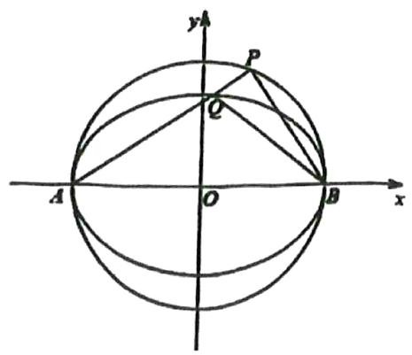

$\quad$A. $\frac{1}{3}$

$\quad$B. $\frac{\sqrt{2}}{3}$

$\quad$C. $\frac{\sqrt{3}}{3}$

$\quad$D. $\frac{\sqrt{6}}{3}$

等级（SR）

2024 绍兴二模

##### 128. 已知点 $A, B, C$ 都在双曲线 $\Gamma: \frac{x^2}{a^2} - \frac{y^2}{b^2} = 1 (a > 0, b > 0)$ 上，且点 $A, B$ 关于原点对称， $\angle CAB = 90^\circ$ . 过 $A$ 作垂直于 $x$ 轴的直线分别交 $\Gamma, BC$ 于点 $M, N$ . 若 $\overrightarrow{AN} = 3\overrightarrow{AM}$ ，则双曲线 $\Gamma$ 的离心率是（）

$\quad$A. $\sqrt{2}$

$\quad$B. $\sqrt{3}$

$\quad$C.2

$\quad$D. $2 \sqrt{3}$

等级（SR）

2022 丹东一模

##### 129. 设双曲线 E 的中心在坐标原点 O, 焦点在 x 轴上, $\Delta OAB$ 的顶点 A 在 x 轴上, 顶点 B 在 E 的左支上, 直线 AB, BO 分别与 E 的右支交于 C, D 两点, 若 $\left|\overrightarrow{BA}\right|=\left|\overrightarrow{BO}\right|$ , 且 $\overrightarrow{BD} \cdot \overrightarrow{CD}=0$ , 则 E 的渐近线方程为 \_\_\_\_

# 题型八：焦点三角形问题大总结（重要）

等级（N）

##### 130. 已知 $\mathrm{F}_{1}$ , $\mathrm{F}_{2}$ 是椭圆 C 的两个焦点, P 是 C 上的一点, 若 $\mathrm{PF}_{1} \perp \mathrm{PF}_{2}$ , 且 $\angle \mathrm{PF}_{2} \mathrm{~F}_{1} = 60^{\circ}$ , 则 C 的离心率为 ( )

$\quad$A. $1 - \frac{\sqrt{3}}{2}$

$\quad$B. $2 - \sqrt{3}$

$\quad$C. $\frac{\sqrt{3} - 1}{2}$

$\quad$D. $\sqrt{3} - 1$

等级（N）

##### 131. 已知点 $F$ 为双曲线 $C: \frac{x^2}{a^2} - \frac{y^2}{b^2} = 1 (a > 0, b > 0)$ 的右焦点, 直线 $y = kx$ , $k \in [\frac{\sqrt{3}}{3}, \sqrt{3}]$ 与双曲线 $C$ 交于 $A$ , $B$ 两点, 若 $AF \perp BF$ , 则该双曲线的离心率的取值范围是 ( )

$A. [ \sqrt {2}, \sqrt {2} + \sqrt {6} ]$

$B. [ \sqrt {2}, \sqrt {3} + 1 ]$

$C. [ 2, \sqrt {3} + 1 ]$

$D. [ 2, \sqrt {2} + \sqrt {6} ]$

等级（R）

##### 132. 设中心在原点的椭圆 C 的两个焦点 $F_{1}$ 、 $F_{2}$ 在 x 轴上，点 P 是 C 上一点，若使 $\triangle PF_{1}F_{2}$ 为直角三角形的点 P 恰有 6 个，且这六个直角三角形中面积的最小值为 $\sqrt{2}$ ，则 C 的方程为 \_\_\_\_.

等级（R）

##### 133. 已知双曲线 $C: \frac{x^2}{a^2} - \frac{y^2}{b^2} = 1 (a > 0, b > 0)$ 的右焦点为F，过原点0作斜率为 $\frac{4}{3}$ 的直线交 $C$ 的右支点于点A，若 $|OA| = |OF|$ ，则双曲线的离心率为（）

$\quad$A. $\sqrt{3}$

$\quad$B. $\sqrt{5}$

$\quad$C. 2

$\quad$D. $\sqrt{3} + 1$

等级（R）

##### 134. 已知双曲线 $\Gamma: \frac{x^2}{a^2} - \frac{y^2}{b^2} = 1 (a > 0, b > 0)$ 的右焦点为 $F$ ，以原点 $O$ 为圆心， $OF$ 为半径的圆分别于双曲线 $\Gamma$ 的一条渐近线及双曲线 $\Gamma$ 交于 $M, N$ 两点（其中 $M, N$ 均为第一象限上的点），当直线 $OM$ 与 $NF$ 的倾斜角互补时，双曲线 $\Gamma$ 的离心率为（）

$\quad$A. $\sqrt{3}$

$\quad$B. $\sqrt{5}$

$\quad$C.2

$\quad$D. $\sqrt{6}$

等级（R）

##### 135. 已知椭圆 $C$ 的方程为: $\frac{x^2}{4} + \frac{y^2}{3} = 1$ , $F_1, F_2$ 为其左、右焦点, $P$ 为 $C$ 上一点, 且 $\triangle F_1PF_2$ 的面积为 $\sqrt{3}$ , 则 $\triangle F_1PF_2$ 外接圆的面积为 ( )

$\quad$A. $\frac{4}{3}\pi$

$\quad$B. $\frac{16}{3}\pi$

$\quad$C. $\frac{4}{\sqrt{3}}\pi$

$\quad$D. $4\pi$

等级（R）

##### 136. 已知双曲线 $\mathrm{E}_1\frac{x^2}{a^2} - \frac{y^2}{b^2} = 1 (a > b > 0)$ 的两个焦点分别为 $F_1, F_2$ ，以原点 0 为圆心， $OF_1$ 为半径作圆，与双曲线 E 相交，若顺次连接这些交点和 $F_1, F_2$ 恰好构成一个正六边形，则双曲线 E 的离心率为（）

$\quad$A. $\sqrt{3}$

$\quad$B.2

$\quad$C. $\sqrt{3} + 1$

$\quad$D.3

等级（R）

##### 137. 在直角坐标系 $x0y$ ，设 F 为双曲线 C: $\frac{x^2}{a^2} - \frac{y^2}{b^2} = 1 (a > 0, b > 0)$ 的右焦点，P 为双曲线 C 的右支上一点，且 $\triangle OPF$ 为正三角形，则双曲线 C 的离心率为 \_\_\_\_

等级（R）

##### 138. 已知 $F_{1}F_{2}$ 是椭圆 $E$ : $\frac{x^{2}}{a^{2}} + \frac{y^{2}}{b^{2}} = 1 (a > b > 0)$ 的两个焦点，过原点的直线 $I$ 交 $E$ 于 $A, B$ 两点， $\overrightarrow{AF_2} \cdot \overrightarrow{BF_2} = 0$ ，且 $\frac{\left|\overrightarrow{AF_2}\right|}{\left|\overrightarrow{BF_2}\right|} = \frac{3}{4}$ ，则 $E$ 的离心率为（）

$\quad$A. $\frac{1}{2}$

$\quad$B. $\frac{3}{4}$

$\quad$C. $\frac{2}{7}$

$\quad$D. $\frac{5}{7}$

等级（R）

##### 139. 已知 $F_{1}$ , $F_{2}$ 为双曲线 $C$ : $x^{2} - y^{2} = 1$ 的左右焦点, 点 $P$ 在 $C$ 上, $\angle F_{1}PF_{2} = 60^{\circ}$ 则 $\left|PF_{1}\right| \cdot \left|PF_{2}\right| =$

等级（R）

##### 140. 已知双曲线 C: $\frac{x^2}{a^2} - \frac{y^2}{b^2} = 1$ 的左焦点为 F，过原点的直线 1 与双曲线的左右两支分别交于 A, B 两点，且 $\overrightarrow{AF} \cdot \overrightarrow{BF} = 0$ ，若 $\angle\mathrm{BAF}$ 的范围为 $\left[\frac{5}{12}\pi, \frac{\pi}{2}\right)$ ，则双曲线 C 的离心率的取值范围为（）

$\quad$A. (1,2]

$\quad$B. $(1, \sqrt{2}]$

$\quad$C. $(1, \sqrt{3}]$

$\quad$D. $[\sqrt{2},\sqrt{3})$

等级（R）

##### 141. 已知椭圆 $C_1$ 与双曲线 $C_2$ 的中心都在原点，焦点都在 $\mathbf{x}$ 轴上， $F_1$ 、 $F_2$ 是椭圆 $C_1$ 的左、右两个焦点，椭圆 $C_1$ 与双曲线 $C_2$ 的一条渐近线交于点 $\mathbb{P}$ ，且 $F_1 P \perp F_2 P$ ，若双曲线的离心率为 2，则椭圆的离心率等于= \_\_\_\_

等级（R）

##### 142. 已知双曲线 $C: \frac{x^2}{a^2} - \frac{y^2}{b^2} = 1 (a > 0, b > 0)$ 的左、右焦点分别为 $F_1$ 、 $F_2$ ，过 $F_2$ 作平行于 $C$ 的渐近线的直线交 $C$ 于点 $P$ . 若 $PF_1 \perp PF_2$ ，则 $C$ 的渐近线方程为（）

$\quad$A. $y = \pm x$

$\quad$B. $y = \pm \sqrt{2} x$

$\quad$C. $y = \pm 2x$

$\quad$D. $y = \pm \sqrt{5} x$

等级（SR）

##### 143. 已知双曲线 $\frac{x^2}{a^2} - \frac{y^2}{b^2} = 1 (a > 0, b > 0)$ 的左右焦点分别为 $F_1, F_2$ , A、B分别是双曲线左右两支上关于坐标原点0对称的两点，且直线AB的斜率为 $2\sqrt{2}$ . M、N分别为 $AF_2$ 、 $BF_2$ 的中点，若原点0在以线段MN为直径的圆上，则双曲线的离心率为（）

$\quad$A. $\sqrt{3}$

$\quad$B. $\sqrt{6}$

$\quad$C. $\sqrt{6} +\sqrt{3}$

$\quad$D. $\sqrt{6} -\sqrt{2}$

等级（SR）

##### 144. 椭圆 $\frac{x^2}{a^2} + \frac{y^2}{b^2} = 1$ ( $a > 0, b > 0$ ) 的左右焦点为 $\mathrm{F}_1$ , $\mathrm{F}_2$ 若在椭圆上存在一点 $\mathrm{P}$ , 使得 $\Delta \mathrm{PF}_1 \mathrm{F}_2$ 的内心 I 与重心 G 满足 $\mathrm{IG} / / \mathrm{F}_1 \mathrm{F}_2$ , 则椭圆的离心率为（）

$\quad$A. $\frac{\sqrt{2}}{2}$

$\quad$B. $\frac{2}{3}$

$\quad$C. $\frac{1}{3}$

$\quad$D. $\frac{1}{2}$

# 题型九：代点法求离心率（或p）

等级（R）

##### 145. 已知抛物线 C: $y^{2} = 2px (p > 0)$ 的准线为 l，过 M(1,0) 且斜率为 $\sqrt{3}$ 的直线与 l 相交于点 A，与 C 的一个交点为 B，若 $\overline{AM} = \overline{MB}$ ，则 P 的值为 \_\_\_\_

等级（R）

##### 146. 设双曲线 $C: \frac{x^2}{a^2} - \frac{y^2}{b^2} = 1 (a > 0, b > 0)$ 的右焦点为 F, 0 为坐标原点，若双曲线及其渐近线上各存在一点使得四边形 OPFQ 为矩形，则其离心率为（）

$\quad$A. $\sqrt{3}$

$\quad$B. 2

$\quad$C. $\sqrt{5}$

$\quad$D. $\sqrt{6}$

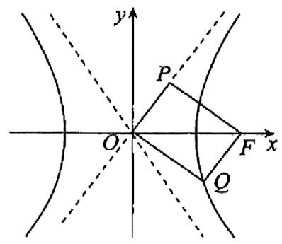

等级（R）

##### 147. 已知抛物线 $x^{2} = 2py$ $(p > 0)$ 的焦点为 $F$ , 准线为 1, 点 $P(4, y_{0})$ 在抛物线上, $K$ 为 $l$ 与 $y$ 轴的交点, 且 $|PK| = \sqrt{2}|PF|$ , 则 $y_{0} =$

等级（R）

2024广州三模冲刺二

##### 148. 已知双曲线 $C: \frac{x^2}{a^2} - \frac{y^2}{b^2} = 1 (a > 0, b > 0)$ 的右焦点为 $F$ ，一条渐近线的方程为 $y = 2x$ ，直线 $y = kx$ 与 $C$ 在第一象限内的交点为 $P$ . 若 $PF = PO$ ，则 $k$ 的值为（）

$\quad$A. $\frac{\sqrt{5}}{2}$

$\quad$B. $\frac{\sqrt{3}}{2}$

$\quad$C. $\frac{2\sqrt{5}}{5}$

$\quad$D. $\frac{4\sqrt{5}}{5}$ 等级（SR）

##### 149. 已知 F 为双曲线 C: $\frac{x^2}{a^2} - \frac{y^2}{b^2} = 1$ (a > b > 0) 的右焦点, A, B 是双曲线 C 的一条渐近线上关于原点对称的两点, AF ⊥ BF, 且 AF 的中点在双曲线 C 上则 C 的离心率为（）

$\quad$A. $\sqrt{5} - 1$

$\quad$B. $\frac{\sqrt{3} + 1}{2}$

$\quad$C. $\frac{\sqrt{5} + 1}{2}$

$\quad$D. $\sqrt{3} + 1$

等级（SR）

##### 150. 已知椭圆 $\frac{x^2}{a^2} + \frac{y^2}{b^2} = 1 (a > b > 0)$ ，直线 $I_1, I_2$ 分别平行于 x 轴和 y 轴， $I_1$ 交椭圆于 A, B 两点， $I_2$ 交椭圆于 C, D 两点， $I_1, I_2$ 交于点 M，若 $|\mathbf{MA}|: |\mathbf{MB}|: |\mathbf{MC}|: |\mathbf{MD}| = 6: 2: 1: 3$ ，则该椭圆的离心率为（）

$\quad$A. $\frac{1}{2}$

$\quad$B. $\frac{\sqrt{3}}{3}$

$\quad$C. $\frac{\sqrt{2}}{2}$

$\quad$D. $\frac{\sqrt{3}}{2}$

等级（SR）

##### 151. 如图，在梯形 $ABCD$ 中，已知 $|AB|=2|CD|$ , $\overrightarrow{AE}=\frac{2}{5}\overrightarrow{AC}$ ，双曲线过 $C, D, E$ 三点，且以 $A, B$ 为焦点，则双曲线的离心率为（）

$\quad$A. $\sqrt{7}$

$\quad$B. $2 \sqrt{2}$

$\quad$C. 3

$\quad$D. $\sqrt{10}$

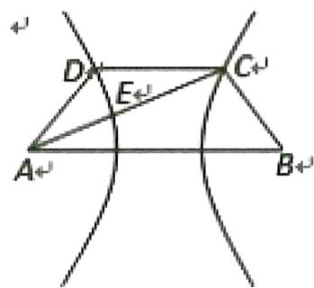

等级（SR）

##### 152. 设 $F_{1}, F_{2}$ 分别是椭圆 $\frac{x^{2}}{a^{2}} + \frac{y^{2}}{b^{2}} = 1 (a > b > 0)$ 的左、右焦点，直线过 $F_{1}$ 交椭圆于 $A, B$ 两点，交 $y$ 轴于 $C$ 点，若满足 $\overrightarrow{F_1C} = \frac{3}{2}\overrightarrow{AF_1}$ ，且 $\angle CF_{1}F_{2} = 30^{\circ}$ ，则椭圆的离心率为（）

$\quad$A. $\frac{\sqrt{3}}{3}$

$\quad$B. $\frac{1}{3}$

$\quad$C. $\frac{\sqrt{3}}{2}$

$\quad$D. $\frac{2}{3}$

等级（SR）

2024 南通盐城三模

##### 153. 已知 $F_{1}, F_{2}$ 是椭圆 $C: \frac{x^{2}}{a^{2}} + y^{2} = 1$ 的左、右焦点， $P$ 是 $C$ 上一点。过点 $F_{1}$ 作直线 $PF_{1}$ 的垂线 $l_{1}$ ，过点 $F_{2}$ 作直线 $PF_{2}$ 的垂线 $l_{2}$ 。若 $l_{1}, l_{2}$ 的交点 $Q$ 在 $C$ 上（ $P, Q$ 均在 $x$ 轴上方），且 $\left|PQ\right| = \frac{8\sqrt{5}}{5}$ ，则 $C$ 的离心率为 \_\_\_\_.

# 题型十：圆锥曲线技巧之双曲线焦点三角形内心小结论

等级（N）

##### 154. $P$ 是双曲线 $\frac{x^2}{3} - \frac{y^2}{4} = 1$ 的右支上一点， $F_1, F_2$ ，分别为双曲线的左，右焦点，则 $\Delta PF_1F_2$ 的内切圆的圆心横坐标为（）

$\quad$A. $\sqrt{3}$

$\quad$B. 2

$\quad$C. $\sqrt{7}$

$\quad$D. 3

等级（N）

##### 155. 双曲线 $C: \frac{x^2}{9} - \frac{y^2}{16} = 1$ 的右支上一点P在第一象限， $\mathrm{F}_1, \mathrm{F}_2$ 分别为双曲线 C 的左、右焦点， $I$ 为 $\triangle PF_1F_2$ 的内心，若内切圆 I 的半径为 1，直线 $IF_1, IF_2$ 的斜率分别为 $K_1, K_2$ 则 $K_1 + K_2$ 的值等于（）

$\quad$A. $\frac{3}{8}$

$\quad$B. $-\frac{3}{8}$

$\quad$C. $-\frac{5}{8}$

$\quad$D. $\frac{5}{8}$

等级（R）

##### 156. 已知双曲线: $\frac{x^2}{a^2} - \frac{y^2}{b^2} = 1 (a > 0, b > 0)$ 的左, 右焦点分别为 $F_1, F_2$ , 点 $A$ 在双曲线上, 且 $AF_2 \perp x$ 轴, 若 $\Delta AF_1F_2$ 的内切圆半径为 $(\sqrt{3} - 1)a$ , 则其离心率为 ( )

$\quad$A. $\sqrt{3}$

$\quad$B.2

$\quad$C. $\sqrt{3} + 1$

$\quad$D. $2\sqrt{3}$

等级（R）

##### 157. 如图，已知双曲线 $\frac{x^2}{a^2} - \frac{y^2}{b^2} = 1 (a > 0, b > 0)$ 的左、右焦点为 $F_1, F_2$ ，过右焦点作平行于一条渐近线的直线交双曲线于点 $A$ ，若 $\Delta AF_1F_2$ 的内切圆半径为 $\frac{b}{4}$ ，则双曲线的离心率为（）

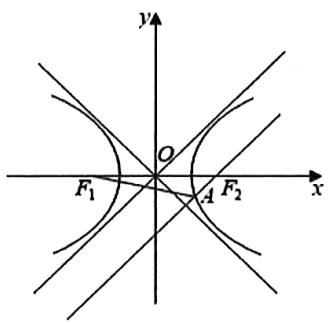

$\quad$A. $\frac{2\sqrt{3}}{3}$

$\quad$B. $\frac{5}{4}$

$\quad$C. $\frac{5}{3}$

$\quad$D. $\frac{3\sqrt{2}}{2}$

等级（SR）

##### 158. 已知双曲线 $\frac{x^2}{4} - \frac{y^2}{3} = 1$ 的左右焦点分别为 $F_1, F_2, 0$ 为双曲线的中心，P 是双曲线右支上的点， $\triangle PF_1F_2$ 的内切圆的圆心为 I，且圆 I 与 x 轴相切于点 A，过 $F_2$ 作直线 PI 的垂线，垂足为 B，则 $\frac{|OB|}{|OA|} = (\quad)$

$\quad$A. 1

, 2

C, 3

D, 4

等级（SR）

##### 159. 已知 $F_{1}, F_{2}$ 分别为双曲线 $\frac{x^{2}}{a^{2}} - \frac{y^{2}}{b^{2}} = 1 (a > 0, b > 0)$ 的左焦点和右焦点，过 $F_{2}$ 的直线 $l$ 与双曲线的右支交于 $A, B$ 两点， $\Delta A F_{1} F_{2}$ 的内切圆半径为 $r_{1}, \Delta B F_{1} F_{2}$ 的内切图半径为 $r_{2}$ ，若 $r_{1} = 2 r_{2}$ ，则直线 $l$ 的斜率为（）

$\quad$A.

$\quad$B. $\sqrt{2}$

$\quad$C. 2

$\quad$D. $2 \sqrt{2}$

# 题型十一：圆锥曲线技巧之抛物线以 AF,BF,AB 为直径的圆与 y 轴准线相切等级(R)

2024江南十校一模

##### 160.（多选）已知抛物线 $E: y^{2} = 2px$ 的焦点为 $\mathrm{F}$ ，从点 $\mathrm{F}$ 发出的光线经过抛物线上的点 $\mathrm{P}$ （原点除外）反射，则反射光线平行于 $\mathbf{x}$ 轴。经过点 $\mathrm{F}$ 且垂直于 $\mathbf{x}$ 轴的直线交抛物线 $\mathrm{E}$ 于 $\mathrm{B}, \mathrm{C}$ 两点，经过点 $\mathrm{P}$ 且垂直于 $\mathbf{x}$ 轴的直线交 $\mathbf{x}$ 轴于点 $\mathrm{Q}$ ；抛物线 $\mathrm{E}$ 在点 $\mathrm{P}$ 处的切线 1 与 $\mathbf{x}, \mathbf{y}$ 轴分别交于 $\mathrm{M}, \mathrm{N}$ ，则（）

$\quad$A. $|PQ|^{2} = |BF| \bullet |QF|$

$\quad$B. $|PQ|^{2} = |BC| \bullet |OQ|$

$\quad$C. $|PF| = |MF|$

$\quad$D. $FN \perp l$

等级（R）

##### 161. 已知点 $M(-1, 1)$ 和抛物线 $C: y^2 = 4x$ ，过 $C$ 的焦点且斜率为 $k$ 的直线与 $C$ 交于 $A$ ， $B$ 两点。若 $\angle AMB = 90^\circ$ ，则 $k = \_$ .

等级（R）

##### 162. 设抛物线 $C: y^{2} = 2px (p > 0)$ 的焦点为 $F$ ，点 $M$ 在 $C$ 上， $|MF| = 5$ ，若以 $MF$ 为直径的圆过点 $(0, 2)$ ，则 $C$ 的方程为（）

$\quad$A. $y^{2} = 4x$ 或 $y^{2} = 8x$

$\quad$B. $y^{2} = 2x$ 或 $y^{2} = 8x$

$\quad$C. $y^{2} = 4x$ 或 $y^{2} = 16x$

$\quad$D. $y^{2} = 2x$ 或 $y^{2} = 16x$

等级（R）

##### 163. 已知点 M(0,2)，过抛物线 $y^{2}=4x$ 的焦点 F 的直线 AB 交抛物线于 A, B 两点，若 $\overrightarrow{AM} \cdot \overrightarrow{FM} = 0$ ，则点 B 的纵坐标为 \_\_\_\_

等级（SR）

##### 164. 已知点 $M(\frac{3}{2}, -1)$ ，直线 1 过抛物线 $C: x^2 = 4y$ 的焦点交抛物线 C 于 A, B 两点，且 AM 恰与抛物线 C 相切，那么线段 AB 的中点坐标为 \_\_\_\_

# 题型十二：圆锥曲线技巧之抛物线弦中点与斜率

等级（SR）

##### 165. 设点 F 为抛物线 $y^{2}=16x$ 的焦点, A, B, C 三点都在抛物线上, 且四边形 ABCF 为平行四边形, 若对角线 $\left|BF\right|=5$ （点 B 在第一象限）, 则对角线 AC 所在的直线方程为（）

$\quad$A. $8x - 2y - 11 = 0$

$\quad$B. $4x - y - 8 = 0$

$\quad$C. $4x - 2y - 3 = 0$

$\quad$D. $2x - y - 3 = 0$

等级（SR）

2024 马鞍山质量检测

##### 166.（多选）已知点 $P, A, B$ 在抛物线 $y^{2} = 2px (p > 0)$ 上，线段 $AB, PA, PB$ 的中点分别为 $D, M, N$ ，线段 $MN$ 的中点为 $E$ ，若直线 $PA, PB$ 的斜率之和为 0，则（）

$\quad$A. 点 $M, N$ 不在 $x$ 轴上

$\quad$B. 点 $E$ 在 $x$ 轴上

$\quad$C. 点 $D$ 与点 $P$ 的横坐标相等

$\quad$D. 点 $D$ 与点 $P$ 的纵坐标互为相反数

# 题型十三：圆锥曲线技巧之椭圆双曲线焦半径

椭圆/双曲线：

##### 1. AF = $\frac{b^{2}}{a + c\cos\theta}$   
##### 2. $\mathrm{BF} = \frac{b^2}{a - c\cos\theta}$   
##### 3. $AB = \frac{2ab^2}{a^2 - c^2\cos^2\theta}$   
##### 4. 若 $\overrightarrow{AF} = \lambda \overrightarrow{FB}$ 则 $|e\cos \theta | = \left|\frac{\lambda - 1}{\lambda + 1}\right|$

等级（N）

##### 167. 已知椭圆 C: $\frac{x^{2}}{a^{2}} + \frac{y^{2}}{b^{2}} = 1$ ( $a > b > 0$ ) 的离心率为 $\frac{1}{2}$ , 过右焦点 F 作倾斜角为 $60^{\circ}$ 的直线 1 交 C 于 A, B 两点, 则 $\frac{|AF|}{|BF|} =$ \_\_\_\_.

等级（N）

##### 168. 已知双曲线 $\frac{x^2}{a^2} - \frac{y^2}{b^2} = 1 (a > 0, b > 0)$ 的右焦点为 $F$ ，直线 1 经过点 F 且与双曲线的一条渐近线垂直，直线 1 与双曲线的右支交于不同两点 A, B，若 $\overrightarrow{AF} = 3\overrightarrow{FB}$ ，则该双曲线的离心率为（）

$\quad$A. $\frac{\sqrt{6}}{2}$

$\quad$B. $\frac{\sqrt{5}}{2}$

$\quad$C. $\frac{2\sqrt{3}}{3}$

$\quad$D. $\sqrt{3}$

等级（N）

##### 169. 若椭圆 $\frac{x^2}{a^2} + \frac{y^2}{b^2} = 1$ ( $a > b > 0$ ) 的左右焦点分别为 $\mathrm{F}_1, \mathrm{F}_2$ , 直线 L 过 $\mathrm{F}_2$ 与 C 交于 M.N 两点, 若 $\left|\mathrm{MF}_1\right| = \left|\mathrm{MF}_2\right|$ , $\overrightarrow{MF_2} = 3\overrightarrow{F_2N}$ , 则椭圆 C 的离心率是 \_\_\_\_.

等级（R）

##### 170. 过等轴双曲线的焦点 F 作它的一条渐近线的平行线分别交另一条渐近线以及双曲线于 M, N 两点，则（）

$\quad$A. $|FN| = |NM|$

$\quad$B. $|FN| > |NM|$

$\quad$C. $|FN| < |NM|$

$\quad$D. $|FN|, |NM|$ 的大小关系不确定

等级（R）

##### 171. 已知椭圆 $C: \frac{x^2}{a^2} + \frac{y^2}{b^2} = 1 (a > b > 0)$ 的长轴长是短轴长的 2 倍，右焦点为 $\mathrm{F}(\mathrm{c}, 0)$ ，过 $\mathrm{F}$ 的直线与椭圆 C 相交于 A，B 两点，其中点 A 在 x 轴的下方，且 $\overrightarrow{\mathrm{AF}} = \overrightarrow{3\mathrm{FB}}$ ，若 M 为 AB 的中点，则直线 OM 的方程为（）

$\quad$A. $y = \frac{\sqrt{2}}{4} x$

$\quad$B. $y = -\frac{\sqrt{2}}{4} x$

$\quad$C. $y = \frac{\sqrt{2}}{8} x$

$\quad$D. $y = -\frac{\sqrt{2}}{8} x$

等级（SR）

2022年新高考1卷

##### 172. 已知椭圆 $C: \frac{x^2}{a^2} + \frac{y^2}{b^2} = 1 (a > b > 0)$ , $C$ 的上顶点为 $A$ , 两个焦点为 $F_1, F_2$ , 离心率为 $\frac{1}{2}$ . 过 $F_1$ 且垂直于 $AF_2$ 的直线与 $C$ 交于 $D, E$ 两点, $|DE| = 6$ , 则 $\triangle ADE$ 的周长是 \_\_\_\_.

等级（SR）

2021 榆林三模

##### 173. 已知双曲线 $\frac{x^2}{a^2} - \frac{y^2}{b^2} = 1 (a > 0, b > 0)$ 的左，右焦点分别为 $F_1, F_2$ ，以 $OF_1$ 为直径的圆与双曲线的一条渐近线交于点 $M$ （异于坐标原点 $O$ ），若线段 $MF_1$ 交双曲线于点 $P$ ，且 $MF_2$ 与 $OP$ 平行，则该双曲线的离心率为 \_\_\_\_

# 题型十四：几何关系的考察（重要）

等级（N）

##### 174. 已知双曲线 $C: \frac{x^2}{16} - \frac{y^2}{b^2} = 1 (b > 0)$ ， $F_1, F_2$ 分别为 $C$ 的左右焦点，过 $F_2$ 的直线 $L$ 交 $C$ 的左，右支分别于 $A, B$ ，且 $\left|AF_1\right| = \left|BF_1\right|$ ，则 $\left|AB\right| = (\quad)$

$\quad$A. 32

$\quad$B. 16

$\quad$C. 8

$\quad$D. 4

等级（R）

##### 175. 已知动点 $M$ 在以 $F_{1}, F_{2}$ 为焦点的椭圆 $x^{2} + \frac{y^{2}}{4} = 1$ 上，动点 $N$ 在以 $M$ 为圆心，半径长为 $|MF_{1}|$ 的圆上，则 $|NF_{2}|$ 的最大值为（）

$\quad$A. 2

$\quad$B. 4

$\quad$C. 8

$\quad$D. 16

等级（R）

##### 176. 双曲线 $\frac{x^2}{a^2} - \frac{y^2}{b^2} = 1 (a > 0, b > 0)$ 的左右焦点为 $F_1, F_2$ ，渐近线分别为 $I_2, I_2$ ，过点 $F_1$ 且与 $I_1$ 垂直的直线分别交 $I_1$ 及 $I_2$ 于 P, Q 两点，若满足 $\overrightarrow{OF_1} + \overrightarrow{OQ} = 2\overrightarrow{OP}$ ，则双曲线的渐近线方程为（）

$\quad$A. $y = \pm x$

$\quad$B. $y = \pm \sqrt{2} x$

$\quad$C. $y = \pm\sqrt{3}x$

$\quad$D. $y = \pm 2x$

等级（R）

2021成都三诊

##### 177. 已知双曲线 $\frac{x^2}{a^2} - \frac{y^2}{b^2} = 1 (a > 0, b > 0)$ 的右焦点为 $F_2$ ，点 $M$ ， $N$ 在双曲线的同一条渐近线上， $O$ 为坐标原点。若直线 $F_2M$ 平行于双曲线的另一条渐近线，且 $OF_2 \perp F_2N, |F_2M| = \frac{\sqrt{5}}{2} |F_2N|$ ，则该双曲线的渐近线方程为（）

$\quad$A. $y = \pm \frac{1}{4} x$

. $y = \pm \frac{1}{2} x$

$\quad$C. $y = \pm \frac{\sqrt{2}}{2} x$

$\quad$D. $y = \pm 2x$

等级（R）

2022苏北七市二模

##### 178. 已知双曲线 $\frac{x^2}{a^2} - \frac{y^2}{b^2} = 1 (a > 0, b > 0)$ 的左、右焦点分别是 $F_1, F_2, P(x_1, y_1), Q(x_2, y_2)$ 是双曲线右支上的两点， $x_1 + y_1 = x_2 + y_2 = 3$ ，记 $\Delta \mathrm{PQF}_1$ ， $\Delta \mathrm{PQF}_2$ 的周长分别为 $C_1, C_2$ ，若 $C_1 - C_2 = 8$ ，则双曲线的右顶点到直线 PQ 的距离为 \_\_\_\_

等级（R）

2023 新高考一卷数学

##### 179. 已知双曲线 $C: \frac{x^2}{a^2} - \frac{y^2}{b^2} = 1 (a > 0, b > 0)$ 的左、右焦点分别为 $F_1, F_2$ 。点 A 在 $C$ 上，点 B 在 $y$ 轴上， $\overrightarrow{F_1A} \perp \overrightarrow{F_1B}, \overrightarrow{F_2A} = -\frac{2}{3}\overrightarrow{F_2B}$ ，则 $C$ 的离心率为 \_\_\_\_.

等级（R）

2024 深圳一模

##### 180. 已知双曲线 $E: \frac{x^2}{a^2} - \frac{y^2}{b^2} = 1 (a > 0, b > 0)$ 的左，右焦点 $F_1, F_2$ ，过点 $F_2$ 的直线与双曲线 E 的右支交于 A, B 两点，若 $|AB| = |AF_1|$ ，且双曲线 E 的离心率为 $\sqrt{2}$ ，则 $\cos \angle BAF_1 = (\quad)$

$\quad$A. $-\frac{3\sqrt{7}}{8}$

$\quad$B. $-\frac{3}{4}$

$\quad$C. $\frac{1}{8}$

$\quad$D. $-\frac{1}{8}$ 等级（R）

2021 晋中二模

##### 181. 已知双曲线 C: $\frac{x^2}{a^2} - \frac{y^2}{b^2} = 1 (a > 0, b > 0)$ 的右焦点为 $F$ ，过点 F 且垂直于 x 轴的直线与双曲线的渐近线交于点 A (A 在第一象限内)，以 OA 为直径的圆与双曲线的另一条渐近线交于点 B，若 BF //OA，则双曲线 C 的离心率为（）

$\quad$A. $\frac{2\sqrt{3}}{3}$

$\quad$B. $\sqrt{2}$

$\quad$C. $\sqrt{3}$

$\quad$D. 2

等级（R）

2021泉州三检

##### 182. 已知双曲线 E 的左、右焦点分别为 $F_{1}$ ， $F_{2}$ ，M，N 是以 $F_{1}$ 为圆心， $|F_{1}F_{2}|$ 为半径的圆与 E 的两交点，若 $|MF_{2}| = |NF_{2}| + |F_{1}F_{2}|$ ，则 E 的离心率是（）

$\quad$A. $\sqrt{2}$

$\quad$B. $\sqrt{3}$

$\quad$C. 2

$\quad$D. $\sqrt{5}$

等级（R）

##### 183. 设椭圆 $E: \frac{x^2}{a^2} + \frac{y^2}{b^2} = 1 (a > b > 0)$ 的右顶点为 $A$ ，右焦点为 $F$ ， $B$ 、 $C$ 为椭圆上关于原点对称的两点，直线 $BF$ 交直线 $AC$ 于 $M$ ，且 $M$ 为 $AC$ 的中点，则椭圆 $E$ 的离心率是（）

$\quad$A. $\frac{2}{3}$

$\quad$B. $\frac{1}{2}$

$\quad$C. $\frac{1}{3}$

$\quad$D. $\frac{1}{4}$

等级（R）

2024南昌二模

##### 184. 已知双曲线 $C: \frac{x^2}{a^2} - \frac{y^2}{b^2} = 1 (a > 0, b > 0)$ 的左、右焦点分别为 $F_1$ ， $F_2$ ，双曲线的右支上有一点 $A$ ， $AF_1$ 与双曲线的左支交于 $B$ ，线段 $AF_2$ 的中点为 $M$ ，且满足 $BM \perp AF_2$ ，若 $\angle F_1AF_2 = \frac{\pi}{3}$ ，则双曲线 $C$ 的离心率为（）

$\quad$A. $\sqrt{3}$

$\quad$B. $\sqrt{5}$

$\quad$C. $\sqrt{6}$

$\quad$D. $\sqrt{7}$

等级（SR）

##### 185. 过双曲线 $C: \frac{x^2}{a^2} - \frac{y^2}{b^2} = 1 (a > 0, b > 0)$ 的左焦点 $F(-c, 0)$ ，作圆 $x^2 + y^2 = a^2$ 的切线，切点为 $T$ ，延长 $FT$ 交双曲线右支于点 $P$ ，若线段 $PF$ 的中点为 $M$ ， $M$ 在线段 $PT$ 上， $O$ 为坐标原点，则 $|OM| - |MT| = (\quad)$

$A. b - a$

$B. a - b$

$C. c - a D. c - b$

等级（SR）

##### 186. 设 $F_{1}, F_{2}$ 为双曲线 $C: \frac{x^{2}}{a^{2}} - \frac{y^{2}}{b^{2}} = 1 (a > 0, b > 0)$ 的左、右焦点，P, Q 分别为双曲线左、右支上的点，若 $\overrightarrow{QF_{2}} = 2\overrightarrow{PF_{1}}$ ，且 $\overrightarrow{PF_{1}} \cdot \overrightarrow{PF_{2}} = 0$ ，则双曲线的离心率为（）

$\quad$A. $\frac{\sqrt{15}}{3}$

$\quad$B. $\frac{\sqrt{17}}{3}$

$\quad$C. $\frac{\sqrt{5}}{2}$

$\quad$D. $\frac{\sqrt{7}}{2}$

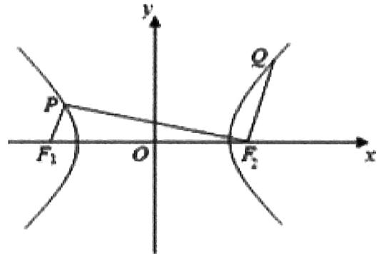

等级（SR）

2022江西稳派5月联考

##### 187. 如图, 椭圆 $\mathrm{M:} \frac{\mathrm{x}^2}{\mathrm{a}^2} + \frac{\mathrm{y}^2}{\mathrm{b}^2} = 1 (a > b > 0)$ 的左、右焦点分别为 $\mathrm{F}_1, \mathrm{F}_2$ , 两平行直线 $l_1, l_2$ 分别过 $\mathrm{F}_1, \mathrm{F}_2$ 交 $\mathrm{M}$ 于 $\mathrm{A}, \mathrm{B}, \mathrm{C}, \mathrm{D}$ 四点, 且 $\mathrm{AF}_2 \perp \mathrm{DF}_2, |\mathrm{AF}_2| = 4|\mathrm{DF}_2|$ , 则 $\mathrm{M}$ 的离心率为

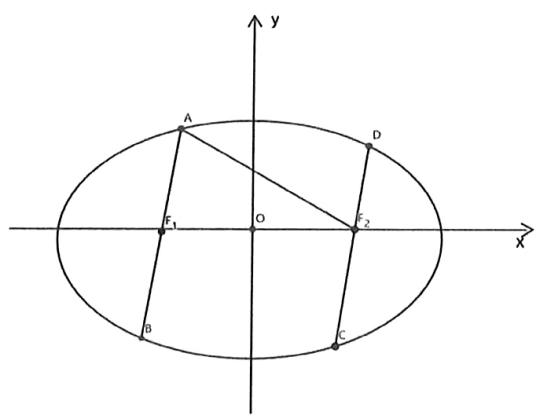

等级（SR）

2021广安等九市二诊

##### 188. 已知 $F_{1}$ , $F_{2}$ 是双曲线 $\frac{x^{2}}{a^{2}} - \frac{y^{2}}{b^{2}} = 1 (a > 0, b > 0)$ 的左, 右焦点, 过点 $F_{1}$ 且倾斜角为 $30^{\circ}$ 的直线与双曲线的左, 右两支分别交于 $A$ , $B$ 。若 $|AF_{2}| = |BF_{2}|$ , 则双曲线 C 的离心率为 ( )

$\quad$A. $\sqrt{2}$

$\quad$B. $\sqrt{3}$

$\quad$C.2

$\quad$D. $\sqrt{5}$

等级（SR）

2022江西质检

##### 189. 已知点 $F_{1}$ 为椭圆 C: $\frac{x^{2}}{a^{2}} + \frac{y^{2}}{b^{2}} = 1 (a > b > 0)$ 的左焦点，点 A 为椭圆 C 的左顶点，过原点 O 的直线 1 交椭圆 C 于 P, Q 两点，若直线 $PF_{1}$ 平分线段 AQ，则椭圆 C 的离心率 e = （）

$\quad$A. $\frac{1}{3}$

$\quad$B. $\frac{1}{2}$

$\quad$C. $\frac{2}{3}$

$\quad$D. $\frac{3}{4}$

等级（SR）

##### 190. 如图所示，点 F 是抛物线 $y^{2}=4x$ 的焦点，点 A, B 分别在抛物线 $y^{2}=4x$ 及圆

$x^{2} + y^{2} - 2x - 8 = 0$ 的实线部分上运动，且AB总是平行于 $\mathbf{x}$ 轴，则 $\Delta FAB$ 的周长的取值范围是

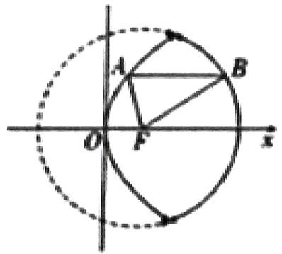

等级（SR）

##### 191. 过双曲线 $\frac{x^2}{a^2} - \frac{y^2}{b^2} = 1 (a > 0, b > 0)$ 的左焦点 F 作圆 $x^2 + y^2 = \frac{a^2}{9}$ 的切线，切点为 E，延长 FE 交双曲线右支于点 P，若 $\overrightarrow{FP} = 2\overrightarrow{FE}$ ，则双曲线的离心率为（）

$\quad$A. $\frac{\sqrt{17}}{3}$

$\quad$B. $\frac{\sqrt{17}}{6}$

$\quad$C. $\frac{\sqrt{10}}{5}$

$\quad$D. $\frac{\sqrt{10}}{2}$

等级（SR）

2024 福建质检

##### 192. 已知双曲线 $C: \frac{x^2}{a^2} - \frac{y^2}{b^2} = 1 (a > 0, b > 0)$ 的左焦点为 F, 过 F 的直线 $l$ 交圆 $x^2 + y^2 = a^2$ 于 A, B 两点, 交 C 的右支于点 P. 若 $|\mathrm{AF}| = |\mathrm{BP}|, |\mathrm{PF}| = 2|\mathrm{AB}|$ , 则 C 的离心率为 \_\_\_\_.

等级（SR）

##### 193. 已知 $F_{1}$ , $F_{2}$ 分别为椭圆 $\frac{x^{2}}{a^{2}} + \frac{y^{2}}{b^{2}} = 1 (a > b > 0)$ 的左、右焦点，点 $P$ 是椭圆上位于第一象限内的点，延长 $PF_{2}$ 交椭圆于点 $Q$ ，若 $PF_{1} \perp PQ$ ，且 $\left|PF_{1}\right| = |PQ|$ ，则椭圆的离心率为（）

$\quad$A. $2 - \sqrt{2}$

$\quad$B. $\sqrt{3} - \sqrt{2}$

$\quad$C. $\sqrt{2} - 1$

$\quad$D. $\sqrt{6} -\sqrt{3}$

等级（SR）

##### 194. 已知双曲线 $C: \frac{x^2}{a^2} + \frac{y^2}{b^2} = 1 (a > 0, b > 0)$ 的左右焦点为 $\mathrm{F}_1$ ， $\mathrm{F}_2$ ，过点 $\mathrm{F}_1$ 的直线 1 与双曲线 C 的左支交于 A，B 两点， $\Delta \mathrm{BF}_1 \mathrm{~F}_2$ 面积为 $\Delta \mathrm{AF}_1 \mathrm{~F}_2$ 面积的三倍， $\angle \mathrm{F}_1 \mathrm{AF}_2 = 90^\circ$ ，则双曲线 C 的离心率为（）

$\quad$A. $\frac{\sqrt{5}}{2}$

$\quad$B. $\frac{\sqrt{10}}{2}$

$\quad$C. $\sqrt{5}$

$\quad$D. $\sqrt{10}$

等级（SR）

##### 195. 已知直线 $y = k(x + 2)(k > 0)$ 与抛物线 $C: y^2 = 8x$ 相交于 $A$ 、 $B$ 两点， $F$ 为 $C$ 的焦点若 $|FA| = 2|FB|$ ，则 $k = (\quad)$

$\quad$A. $\frac{1}{3}$

$\quad$B. $\frac{\sqrt{2}}{3}$

$\quad$C. $\frac{2}{3}$

$\quad$D. $\frac{2\sqrt{2}}{3}$

等级（SR）

##### 196. 已知双曲线 $\frac{y^2}{a^2} - \frac{x^2}{b^2} = 1 (a > 0, b > 0)$ 的上、下焦点分别为 $\mathrm{F}_2$ 、 $\mathrm{F}_1$ ，过 $\mathrm{F}_1$ 且倾斜角为锐角的直线 L 与圆 $x^2 + y^2 = a^2$ 相切，与双曲线的上交于点 M，若线段 $\mathrm{MF}_1$ 的垂直平分线过点 $\mathrm{F}_2$ ，则该双曲线的渐近线的方程为（）.

$\quad$A. $y = \pm \frac{4}{3} x$

$\quad$B. $y = \pm \frac{3}{4} x$

$\quad$C. $y = \pm \frac{5}{3} x$

$\quad$D. $y = \pm \frac{3}{5} x$ 等级（SR）

2022炎德英才大联考

##### 197. 已知 $\mathrm{F}_1$ 、 $\mathrm{F}_2$ 是双曲线 $\mathrm{E}:\frac{\mathrm{x}^2}{\mathrm{a}^2}-\frac{\mathrm{y}^2}{\mathrm{b}^2}=1(a>0, b>0)$ 的左、右焦点，点 M 是双曲线 E 上的任意一点（不是顶点），过 $\mathrm{F}_1$ 作 $\angle \mathrm{F}_1 \mathrm{MF}_2$ 角平分线的垂线，垂足为 N，O 是坐标原点，若 $|ON|=\frac{|F_1 F_2|}{4}$ ，则双曲线 E 的渐近线方程为（）

$\quad$A. $y = \pm \frac{\sqrt{3}}{3} x$

$\quad$B. $y = \pm \frac{\sqrt{2}}{2} x$

$\quad$C. $\mathbf{y} = \pm \sqrt{2}\mathbf{x}$

$\quad$D. $y = \pm \sqrt{3} x$

等级（SR）

2022江西稳派三月联考

##### 198. 已知双曲线 $C: \frac{x^2}{a^2} - \frac{y^2}{b^2} = 1 (a > 0, b > 0)$ 的左、右焦点分别为 $F_1, F_2$ ，若点 M, N 满足 $\left|MF_2\right| - \left|MF_1\right| = \left|NF_1\right| - \left|NF_2\right| = 2a$ ，且四边形 $MNOF_1$ 为棱形，则 C 的离心率为（）

$\quad$A. $\sqrt{3} + 3$

$\quad$B. $\sqrt{3} + 1$

$\quad$C. $\sqrt{3}$

$\quad$D. 1

等级（SR）

2022成都七中二诊

##### 199. 已知双曲线 $\frac{x^2}{a^2} - \frac{y^2}{b^2} = 1 (a > 0, b > 0)$ 的左右焦点 $F_1, F_2$ , 过 $F_2$ 的直线交右支于 A、B 两点, 若 $\left|AF_2\right| = 3\left|F_2B\right|, \left|AF_1\right| = \left|AB\right|$ , 则该双曲线的离心率为（）

$\quad$A. $\frac{\sqrt{5}}{2}$

$\quad$B. 2

$\quad$C. $\sqrt{5}$

$\quad$D. $\sqrt{3}$

等级（SR）

##### 200. 已知 $F_{1}, F_{2}$ 是双曲线 $\frac{x^{2}}{25} - \frac{y^{2}}{9} = 1$ 的左右焦点，点 P 为双曲线上异于顶点的点，直线 1 分别与以 $PF_{1}$ ， $PF_{2}$ 为直径的圆相切于 A, B 两点，若向量 $\overrightarrow{AB}, \overrightarrow{F_{1}F_{2}}$ 的夹角为 $\theta$ ，则 $\cos \theta =$ \_\_\_\_

等级（SR）

##### 201. 以 $F_{1}(-\sqrt{2},0)F_{2}(\sqrt{2},0)$ 为焦点的椭圆与直线 $x - y + 2\sqrt{2} = 0$ 有公共点，则满足条件的椭圆中长轴最短的为（）

$\quad$A. $\frac{x^2}{6} +\frac{y^2}{4} = 1$

$\quad$B. $\frac{x^2}{3} + y^2 = 1$

$\quad$C. $\frac{x^2}{5} +\frac{y^2}{3} = 1$

$\quad$D. $\frac{x^2}{4} +\frac{y^2}{2} = 1$

等级（SR）

##### 202. 已知双曲线 $C: \frac{x^2}{a^2} - \frac{y^2}{b^2} = 1 (a, b > 0)$ 的左焦点为 $F$ , $A, B$ 分别是 $C$ 的左、右顶点, $P$ 为 $C$ 上一点, 且 $PF \perp x$ 轴, 过点 $A$ 的直线 $l$ 与线段 $PF$ 交与点 $M$ , 与 $y$ 轴交于点 $E$ , 直线 $BM$ 与 $y$ 轴交于点 $N$ , 若 $\overline{OE} = 2\overline{NO}$ (o 为坐标原点), 则双曲线 $C$ 的离心率为

等级（SR）

##### 203. 已知 $P$ 为抛物线 $E: y^{2} = x$ 上异于原点 $O$ 的点, $PQ \perp x$ 轴, 垂直为 $Q$ , 过 $PQ$ 的中点作 $x$ 轴的平行线交抛物线于点 $M$ , 直线 $QM$ 交 $y$ 轴于点 $N$ , 则 $\frac{|PQ|}{|NO|} =$ \_\_\_\_.

等级（SR）

##### 204. 设双曲线 $C: \frac{x^2}{a^2} - \frac{y^2}{b^2} = 1 (a, b > 0)$ 的左右焦点分别为 $F_1, F_2$ ，以 $F_1F_2$ 为直径的圆与双曲线左支的一个交点为 $P$ ，若以 $OF_1$ 为直径的圆与 $PF_2$ 相切，则双曲线的离心率为（）

$\quad$A. $\sqrt{2}$

$\quad$B. $\frac{-3 + 6\sqrt{2}}{4}$

$\quad$C. $\sqrt{3}$

$\quad$D. $\frac{3 + 6\sqrt{2}}{7}$

等级（SR）

##### 205. 已知双曲线 $\frac{x^2}{a^2} - \frac{y^2}{b^2} = 1, (a > 0, b > 0)$ 的左右焦点分别为 $F_1, F_2$ ，点 A 为双曲线右支上一点，线段 $AF_1$ 交左支于点 B，若 $AF_2 \perp BF_2$ 且 $\left|BF_1\right| = \frac{1}{3}\left|AF_2\right|$ 则该双曲线的离心率为（）

$\quad$A. $\sqrt{2}$

$\quad$B. $\frac{\sqrt{65}}{5}$

$\quad$C. $\frac{3\sqrt{5}}{5}$

$\quad$D. 3

等级（SR）

2022 安徽 A10 联盟 4 月联考

##### 206. 已知双曲线 $C: \frac{x^2}{a^2} - \frac{y^2}{b^2} = 1 (a > 0, b > 0)$ 的左、右焦点分别为 $F_1, F_2$ , 焦距为 4, 点 M 在圆 E: $x^2 + y^2 + 4x - 8y + 16 = 0$ 上, 且 C 的一条渐近线上存在点 N, 使得四边形 $\mathrm{OMNF}_2$ 为平行四边形, 0 为坐标原点, 则 C 的离心率的取值范围为 ( )

$\quad$A. $[2, +\infty)$

$\quad$B. $[\sqrt{3}, +\infty)$

$\quad$C. $[4, +\infty)$

$\quad$D. $(1, \sqrt{3}]$

等级（SR）

2022 洛阳三统

##### 207. 已知点 M 是椭圆 C: $\frac{x^{2}}{4} + \frac{y^{2}}{3} = 1$ 上异于顶点的动点, $F_{1}$ , $F_{2}$ 分别为椭圆的左、右焦点, 0 为坐标原点, E 为 $MF_{1}$ 的中点, $\angle F_{1}MF_{2}$ 的平分线与直线 EO 交于点 P, 则四边形 $MF_{1}PF_{2}$ 的面积的最大值为( )

$\quad$A. 1

$\quad$B. 2

$\quad$C. 3

$\quad$D. $2 \sqrt{2}$

等级（SR）

2022 宜春四月统考

##### 208. 设 $F_{1}$ 、 $F_{2}$ 分别是椭圆 C: $\frac{x^{2}}{a^{2}}+\frac{y^{2}}{b^{2}}=1(a>b>0)$ 的左右焦点，过 $F_{2}$ 的直线 l 交椭圆于 A、B 两点，且 $(\overrightarrow{AF_{1}}+2\overrightarrow{F_{2}O})\cdot\overrightarrow{F_{2}A}=0,\angle ABF_{1}=\frac{\pi}{3}$ ，则该椭圆的离心率为（）

$\quad$A. $\frac{\sqrt{11} - 2}{2}$

$\quad$B. $\frac{\sqrt{22} - 3}{3}$

$\quad$C. $\frac{\sqrt{22} - 3}{4}$

$\quad$D. $\frac{\sqrt{33} - 3}{4}$

等级（SR）

##### 209. 过抛物线 $y = \frac{1}{4} x^2$ 焦点 $F$ 的直线交抛物线于 $A, B$ 两点，点 $C$ 在直线 $y = -1$ 上，若 $\triangle ABC$ 为正三角形，则其边长为（）

$\quad$A. 11

$\quad$B. 12

$\quad$C. 13

$\quad$D. 14

# 题型十五：两线段和的最值问题

等级（R）

##### 210. 已知 F 是椭圆 C: $\frac{x^{2}}{3} + \frac{y^{2}}{2} = 1$ 的右焦点，P 为椭圆 C 上一点， $A(1, 2\sqrt{2})$ ，则 $|PA| + |PF|$ 的最大值为（）

$\quad$A. $4 + \sqrt{2}$

$\quad$B. $4 \sqrt{2}$

$\quad$C. $4 + \sqrt{3}$

$\quad$D. $4 \sqrt{3}$

等级（R）

##### 211. 已知椭圆 $\frac{x^2}{9} + \frac{y^2}{5} = 1, F_1, F_2$ 分别是椭圆的左、右焦点点 $A(1,1)$ 为椭圆内一点，点 P 为椭圆上一点则 $|PA| + |PF_1|$ 的最大值为（）

$\quad$A. $4 + \sqrt{2}$

$\quad$B. $\sqrt{2}$

$\quad$C. $6 + \sqrt{2}$

$\quad$D. $6 - \sqrt{2}$

等级（SR）

2024四川4月大联考

##### 212. $\sqrt{(x + 4)^2 + (\sqrt{-4x} - 2)^2} +\sqrt{(x + 1)^2 - 4x}$ 的最小值为（

$\quad$A. $2 \sqrt{5}$

$\quad$B. 5

$\quad$C. $2 \sqrt{6}$

$\quad$D. 6

等级（SR）

##### 213. 已知 $F$ 是双曲线 $C: \frac{x^2}{a^2} - \frac{y^2}{b^2} = 1 (a > 0, b > 0)$ 的右焦点， $A$ 是 $C$ 的虚轴上的一个端点，若 $C$ 的左支上存在一点 $P$ 使得 $|PA| + |PF| \leq 4a$ ，则 $C$ 的离心率的取值范围是 \_\_\_\_

等级（SR）

##### 214. 已知 $F$ 是双曲线 $C: x^{2} - \frac{y^{2}}{8} = 1$ 的右焦点，P 是 C 左支上一点， $A(0,6\sqrt{6})$ ，当 $\Delta APF$ 周长最小时，该三角形的面积为 \_\_\_\_.

等级（SR）

##### 215. 椭圆 $C: \frac{x^2}{a^2} + \frac{y^2}{4} = 1 (a > 2)$ 的左焦点为 $F$ , 不过点 $F$ 的直线 $x = m$ 与椭圆 $C$ 相交于点 $M, N$ , 当 $\Delta FMN$ 的周长最大值为 $8\sqrt{5}$ 时, 则椭圆 $C$ 的离心率为 ( )

$\quad$A. $\frac{2\sqrt{5}}{5}$

$\quad$B. $\frac{\sqrt{5}}{5}$

$\quad$C. $\frac{1}{5}$

$\quad$D. $\frac{2}{5}$

# 题型十六：圆锥曲线形状与e的关系

等级（N）

2022 乌鲁木齐二模

##### 216. 下列选项中椭圆的形状更扁的是（）

$\quad$A. $\frac{x^2}{6} +\frac{y^2}{10} = 1$

$\quad$B. $\frac{x^2}{16} +\frac{y^2}{12} = 1$

$\quad$C. $x^{2} + 9y^{2} = 36$

$\quad$D. $9x^{2} + 4y^{2} = 36$

等级（R）

##### 217. 已知双曲线 C: $\frac{x^2}{a^2} - \frac{y^2}{b^2} = 1 (a > 0, b > 0)$ 的左焦点为 F，右顶点为 E，过 F 且垂直于 x 轴的直线与双曲线交于 A，B 两点若 $\triangle ABE$ 是钝角三角形，则该双曲线离心率的取值范围是（）

$\quad$A. (1.2)

$\quad$B. $(2,1 + \sqrt{2})$

$\quad$C. $(1 + \sqrt{2}, +\infty)$

$\quad$D. $(2, +\infty)$

# 题型十七：与解三角形结合

等级（R）

2023 潍坊二模

##### 218. 已知双曲线 $C: \frac{x^2}{a^2} - \frac{y^2}{b^2} = 1 (a > 0, b > 0)$ 的左，右焦点分别为 $F_1, F_2, 0$ 为坐标原点，过 $F_1$ 作 C 的一条渐近线的垂线，垂足为 D，且 $|DF_2| = 2\sqrt{2}|OD|$ ，则 C 的离心率为

$\quad$A. $\sqrt{2}$

$\quad$B. 2

$\quad$C. $\sqrt{5}$

$\quad$D. 3

等级（R）

##### 219. 已知双曲线 $C: \frac{x^2}{a^2} - \frac{y^2}{b^2} = 1$ 的右焦点为 $F$ , 过点 $F$ 向双曲线的一条渐近线引垂线, 垂足为 $M$ , 交另一条渐近线于 $N$ , 若 $2\overrightarrow{MF} = \overrightarrow{FN}$ , 则双曲线的离心率. \_\_\_\_.

等级（R）

##### 220. 已知： $F_{1}$ ， $F_{2}$ 分别是双曲线 C: $\frac{x^{2}}{9}-\frac{y^{2}}{27}=1$ 的左右焦点，点 $A \in C$ ，点 M 的坐标为 $(2,0)$ AM 为 $\angle F_{1}AF_{2}$ 的平分线，则 $\left|AF_{2}\right|=$ \_\_\_\_

等级（R）

2021 玉林南宁三模

##### 221. 已知双曲线 E: $\frac{x^2}{a^2} - \frac{y^2}{b^2} = 1$ (a > 0, b > 0) 的左焦点为 $F_1$ , 过点 $F_1$ 的直线与两条渐近线的交点分别为 M, N 两点 (点 $F_1$ 位于点 M 与点 N 之间), 且 $\overrightarrow{MN} = 3\overrightarrow{F_1N}$ , 又过点 $F_1$ 作 $F_1P \perp OM$ 于 P (点 O 为坐标原点), 且 $|ON| = |OP|$ , 则双曲线 E 的离心率 e = ( )

$\quad$A. $\sqrt{5}$

$\quad$B. $\sqrt{3}$

$\quad$C. $\frac{2\sqrt{3}}{3}$

$\quad$D. $\frac{\sqrt{6}}{2}$

等级（SR）

2022 东北三省三校二模

##### 222. 椭圆 $C: \frac{x^2}{a^2} + \frac{y^2}{b^2} = 1 (a > b > 0)$ 的左焦点为点 F，过原点 O 的直线与椭圆交于 P, Q 两点，若 $\angle PFQ = 120^\circ, |OF| = \sqrt{3}, |OP| = \sqrt{7}$ ，则椭圆 C 的离心率为 \_\_\_\_。

等级（SR）

##### 223. 已知抛物线 $y^{2} = 2px (p > 0)$ 的焦点为 $F$ ，准线为 $I, A, B$ 是抛物线上的两个动点，且满足 $\angle AFB = 60^{\circ}$ 。设线段 $AB$ 的中点 $M$ 在 $I$ 上的投影为 $N$ ，则（）

$\quad$A. $|AB| \geq 2 |MN|$

$\quad$B. $2 \mid AB \mid \geq 3 \mid MN$

$\quad$C. $|AB| \geq 3 |MN|$

$\quad$D. $|AB| \geq |MN|$

等级（SR）

##### 224. 已知点 $A(-\sqrt{2}, 0), B(\sqrt{2}, 0)$ ，动点 P 满足 $\angle APB = \theta$ 且 $|PA| \cdot |PB| \cdot \cos^2 \frac{\theta}{2} = 1$ ，则点 P 的轨迹方程为 \_\_\_\_

等级（SR）

##### 225. $P$ 为双曲线 $x^{2} - my^{2} = 1$ 一点， $F_{1}, F_{2}$ 为其左右焦点， $O$ 为坐标原点，已知， $|OP| = \sqrt{7}$ ， $\angle F_{1}PF_{2} = 60^{\circ}$ 则双曲线的离心率为（）

$\quad$A. $1 + \sqrt{2}$

$\quad$B. $\sqrt{3}$

$\quad$C. $\sqrt{2}$

$\quad$D. $\sqrt{5}$

等级（SR）

##### 226. 已知双曲线 $C: \frac{x^2}{a^2} - \frac{y^2}{b^2} = 1 (a > 0, b > 0)$ 右支上的一点 $P$ ，经过点 $P$ 的直线与双曲线 $C$ 的两条渐近线分别相交于 $A$ 、 $B$ 两点，若点 $A$ 、 $B$ 分别位于第一，四象限， $O$ 为坐标原点，当 $\overrightarrow{AP} = \frac{1}{2}\overrightarrow{PB}$ ， $\Delta AOB$ 的面积为 $2b$ ，则双曲线 $C$ 的实轴长为（）

$\quad$A. $\frac{32}{9}$

$\quad$B. $\frac{16}{9}$

$\quad$C. $\frac{8}{9}$

$\quad$D. $\frac{4}{9}$

等级（SR）

##### 227. 已知双曲线 $\frac{x^2}{4} - \frac{y^2}{b^2} = 1 (b > 0)$ 的左右焦点分别为 $F_1, F_2, P$ 为右支上一点且直线 $PF_2$ 与 $x$ 轴垂直，若 $\angle F_1PF_2$ 的角平分线恰好过点（1，0），则 $\Delta PF_1F_2$ 的面积为（）

$\quad$A. 12

$\quad$B. 24

$\quad$C. 36

$\quad$D. 48

# 题型十八：抛物线其他小结论

等级（N）

##### 228. 已知点 A(-1, 0) B(1, 0)，过 A 的直线与抛物线 $y^{2} = 4x$ 相交于 P, Q 两点，若 P 为 AQ 中点，则 $\frac{|PB|}{|QB|} =$ \_\_\_\_。

等级（R）

2022 安庆示范高中 4 月联考

##### 229. 已知抛物线 C: $y=ax^{2}$ 的焦点为 F，过 C 上一点 P 作 C 的切线与 y 轴交于点 T，则 $\Delta PTF$ 不能为（）

$\quad$A. 锐角三角形

$\quad$B. 直角三角形

$\quad$C. 等边三角形

$\quad$D. 不等边三角形

# 圆锥曲线大题

# 题型一：求圆锥曲线方程

# 一：直白类

等级（N）

##### 001. 已知椭圆 $C: \frac{x^2}{a^2} + \frac{y^2}{b^2} = 1$ 过点 $A(-2, -1)$ ，且 $a = 2b$ 。求椭圆 $C$ 的方程：

等级（N）

##### 002. 已知椭圆 $C: \frac{x^2}{a^2} + \frac{y^2}{b^2} = 1 (a > b > 0)$ 的离心率为 $\frac{\sqrt{2}}{2}$ ，且过点 $A(2, 1)$ 。求 $C$ 的方程：

等级（N）

##### 003. 已知 $A$ 、 $B$ 分别为椭圆 $E$ : $\frac{x^2}{a^2} + y^2 = 1 (a > 1)$ 的左、右顶点, $G$ 为 $E$ 的上顶点, $\overrightarrow{AG} \cdot \overrightarrow{GB} = 8$ , $P$ 为直线 $x = 6$ 上的动点, $PA$ 与 $E$ 的另一交点为 $C$ , $PB$ 与 $E$ 的另一交点为 $D$ . 求 $E$ 的方程;

等级（N）

##### 004. 已知椭圆 $C: \frac{x^2}{25} + \frac{y^2}{m^2} = 1 (0 < m < 5)$ 的离心率为 $\frac{\sqrt{15}}{4}$ , $A$ , $B$ 分别为 $C$ 的左、右顶点. 求 $C$ 的方程;

等级（N）

##### 005. 已知 F 为椭圆 $\frac{x^{2}}{a^{2}} + \frac{y^{2}}{b^{2}} = 1 (a > b > 0)$ 的右焦点， $\left|OF\right| = \sqrt{3}$ ，P, Q 分别为椭圆 C 的上下顶点，且 $\triangle PQF$ 为等边三角形。求椭圆 C 的方程

等级（R）

##### 006. 已知椭圆 $C_1: \frac{x^2}{a^2} + \frac{y^2}{b^2} = 1 (a > b > 0)$ 的右焦点 $F$ 与抛物线 $C_2$ 的焦点重合， $C_1$ 的中心与 $C_2$ 的顶点重合。过 $F$ 且与 $x$ 轴重直的直线交 $C_1$ 于 $A, B$ 两点，交 $C_2$ 于 $C, D$ 两点，且 $|CD| = \frac{4}{3} |AB|$ 。

（1） 求 $C_{1}$ 的离心率;  
（2）若 $C_1$ 的四个顶点到 $C_2$ 的准线距离之和为12，求 $C_1$ 与 $C_2$ 的标准方程.

# 二：求轨迹方程

等级（N）

##### 007. 在平面直角坐标系中，动点 M 分别与两个定点 A(-2, 0)，B(2, 0) 的连线的斜率之积为 $-\frac{1}{2}$ .
求动点 M 的轨迹 C 的方程；

等级（N）

##### 008. 设 $O$ 为坐标原点，动点 $M$ 在椭圆 $C: \frac{x^2}{2} + y^2 = 1$ 上，过 $M$ 做 $x$ 轴的垂线，垂足为 $N$ ，点 $P$ 满足 $\overrightarrow{NP} = \sqrt{2}\overrightarrow{NM}$ ，求点 $P$ 的轨迹方程；

等级（N）

##### 009. 已知 $|MN| = 1, \overrightarrow{MP} = 3\overrightarrow{MN}$ ，当 N, M 分别在 x 轴，y 轴上滑动时，点 P 的轨迹记为 E. 求曲线 E 的方程；

等级（N）

##### 010. 已知动直线 1: $y = k(x + 3) (k \neq 0)$ 与 $y$ 轴交于点 A，过点 A 作直线 AB ⊥ 1，交 $x$ 轴于点 B，点 C 满足 $\overrightarrow{AC} = 3\overrightarrow{AB}$ ，C 的轨迹为 E。求 E 的方程

等级（N）

##### 011. 已知动点 P 到点 $\left(\frac{1}{2}, 0\right)$ 的距离比它到直线 $x = -\frac{5}{2}$ 的距离小 2. 求动点 P 的轨迹方程

等级（N）

##### 012. 已知 $M: (x + 1)^{2} + y^{2} = 1$ ，圆 $N: (x - 1)^{2} + y^{2} = 9$ ，动圆 $P$ 与圆 $M$ 外切并与圆 $N$ 内切，圆心 $P$ 的轨迹为曲线 $C$ . 求 $C$ 的方程；

等级（N）

##### 013. 已知圆 $C_1$ 的方程为 $(x + 2)^2 + y^2 = 32$ ，点 $C_2(2,0)$ ，点 M 为圆 $C_1$ 上的任意一点，线段 $MC_2$ 的垂直平分线与线段 $MC_1$ 相交于点 N。求点 N 的轨迹 C 的方程；

# 三：非纯送分类

等级（R）

##### 014. 已知动圆 $M$ 过定点 $F(1,0)$ 且与 $y$ 轴相切，点 $F$ 关于圆心 $M$ 的对称点为 $T$ ，动点 $T$ 的轨迹记为 $C$ . 求 $C$ 的方程；

等级（R）

2021 汕头一模

##### 015. .在平面直角坐标系 $xOy$ 中， $O$ 为坐标原点， $\mathbb{M}(\sqrt{3}, 0)$ ，已知平行四边形OMNP两条对角线的长度之和等于4，求动点 $P$ 的轨迹方程

等级（SR）

2024青岛一模

##### 016. 已知 A(-2,0)，B(2,0)，设点 P 是圆 $x^{2} + y^{2} = 1$ 上的点，若动点 Q 满足： $\overrightarrow{QP} \cdot \overrightarrow{PB} = 0$ ， $\overrightarrow{QP} = \lambda \left( \frac{\overrightarrow{QA}}{|\overrightarrow{QA}|} + \frac{\overrightarrow{QB}}{|\overrightarrow{QB}|} \right)$ ，则 Q 的轨迹方程为（）

$\quad$A. $x^{2} - \frac{y^{2}}{3} = 1$

$\quad$B. $\frac{x^2}{3} - y^2 = 1$

$\quad$C. $\frac{x^2}{5} + y^2 = 1$

$\quad$D. $\frac{x^2}{6} +\frac{y^2}{2} = 1$

等级（SR）

##### 017. 两定点的坐标分别为 A (-1, 0)，B (2, 0)，动点满足条件 $\angle MBA = 2\angle MAB$ ，动点 M 的轨迹方程是

等级（SR）

##### 018. 已知 $A(-\sqrt{3}, 0), B(\sqrt{3}, 0), P$ 为圆 $x^{2} + y^{2} = 1$ 上的动点， $\overrightarrow{AP} = \overrightarrow{PQ}$ ，过点 $P$ 作与 $AP$ 垂直的直线 $l$ 交直线 $QB$ 于点 $M$ ，则 $M$ 的横坐标范围是（）

$\quad$A. $|x|\geq 1$

$\quad$B. $|x| > 1$

$\quad$C. $|x|\geq 2$

$\quad$D. $|x|\geq \frac{\sqrt{2}}{2}$ 等级（SR）

##### 019. 在平面直角坐标系中取两个定点 $A_{1}(-\sqrt{6}, 0), A_{2}(\sqrt{6}, 0)$ ，再取两个动点 $N_{1}(0, m), N_{2}(0, n)$ ，且 $mn = 2$ 。求直线 $A_{1}N_{1}$ 与 $A_{2}N_{2}$ 交点 $M$ 的轨迹 $C$ 的方程；

等级（SR）

##### 020. 已知抛物线 $C: y^{2} = 4x$ ，其焦点为 F，C 的准线交 x 轴于点 $F'$ ，A，B 为抛物线 C 上动点，且直线 AB 过点 $F'$ ，过 $F'$ ，F 分别作 OA, OB 的平行线 $l_{1}, l_{2}$ ，O 为坐标原点，直线 $l_{1}, l_{2}$ 相交于点 P，记点 P 的运动轨迹为曲线 E，直线 y=kx（k>0）与曲线 E 无交点，则 k 的取值范围是 \_\_\_\_

等级（SR）

##### 021. 已知 P 是 x 轴上的动点（异于原点 0），点 Q 在圆 $O: x^{2} + y^{2} = 4$ 上，且 $\left|PQ\right| = 2$ ，

设线段PQ的中点为M，当点P移动时，记点M的轨迹为曲线E。求曲线E的方程

等级（SR）

2021四川大数据联盟第二次统测

##### 022. 已知点 A 的坐标为 $(-2, 0)$ ，点 B 的坐标为 $(2, 0)$ ，点 P 满足 $\overrightarrow{PA} \cdot \overrightarrow{PB} + |\overrightarrow{PA}| \cdot |\overrightarrow{PB}| = 8$ ，记 P 点的轨迹为 E。证明 $|PA| + |PB|$ 为定值，并写出曲线 E 的方程

# 题型二：圆锥曲线大题基本功训练

等级（N）

##### 023. 设抛物线 $C: y^{2} = 4x$ 的焦点为 $\mathbf{F}$ , 过点 $(-2,0)$ 且斜率为 $\frac{2}{3}$ 的直线与 $\mathbf{C}$ 交于 $\mathbf{M}, \mathbf{N}$ 两点, 则 $\overrightarrow{FM} \cdot \overrightarrow{FN} =$ ( )

$\quad$A. 5

$\quad$B. 6

$\quad$C. 7

$\quad$D. 8

等级（N）

2021年乙卷文科

##### 024. 已知抛物线 $C: y^{2} = 2px (p > 0)$ 的焦点 $F$ 到准线的距离为 2.

（1） 求 C 的方程;  
（2）已知 O 为坐标原点，点 P 在 C 上，点 Q 满足 $\overrightarrow{PQ} = 9\overrightarrow{QF}$ ，求直线 OQ 斜率的最大值.

等级（R）

##### 025. 已知抛物线 $C: y^{2} = 2x$ ，过点（2，0）的直线 $I$ 交 $C$ 与 $A, B$ 两点，圆 $M$ 是以线段 $AB$ 为直径的圆.

证明：坐标原点0在圆 $M$ 上；

等级（R）

##### 026. 已知抛物线 $C: y^{2} = 2x$ ，直线 $l: y = -\frac{1}{2} x + b$ 与抛物线 $C$ 交于 $A, B$ 两点，若以 $AB$ 为直径的圆与 $x$ 轴相切，则 $b$ 的值为 \_\_\_\_

$\quad$A. $-\frac{1}{5}$

$\quad$B. $-\frac{2}{5}$

$\quad$C. $-\frac{4}{5}$

$\quad$D. $-\frac{8}{5}$

等级（R）

##### 027. 已知椭圆 C 的两个焦点为 $F_{1}(-1,0)$ . $F_{2}(1,0)$ ，离心率为 $\frac{1}{2}$

（1） 求椭圆 C 的方程  
（2） 设点 A 是椭圆 C 的右顶点, 过点 $F_{1}$ 的直线与椭圆 C 交于 P, Q 两点, 直线 AP, AQ 与直线 x = -4 分别交于 M, N 两点, 求证: 点 $F_{1}$ 在以 MN 为直径的圆上.

等级（R）

2021年新高考2卷

##### 028. 已知椭圆 $C$ 的方程为 $\frac{x^2}{a^2} + \frac{y^2}{b^2} = 1 (a > b > 0)$ ，右焦点为 $F(\sqrt{2}, 0)$ ，且离心率为 $\frac{\sqrt{6}}{3}$ .

（1） 求椭圆 C 的方程;  
（2）设 M, N 是椭圆 C 上的两点，直线 MN 与曲线 $x^{2} + y^{2} = b^{2} (x > 0)$ 相切．证明：M, N, F 三点共线的充要条件是 $\left|MN\right| = \sqrt{3}$ .

等级（R）

2024 邯郸二模

##### 029. 已知椭圆 $C$ 的中心为坐标原点，对称轴为 $x$ 轴、 $y$ 轴，且过 $M(2,0)$ ， $N\left(1, -\frac{\sqrt{3}}{2}\right)$ 两点.

（1） 求 C 的方程.  
（2） $A, B$ 是 $C$ 上两个动点, $D$ 为 $C$ 的上顶点, 是否存在以 $D$ 为顶点, $AB$ 为底边的等腰直角三角形? 若存在, 求出满足条件的三角形的个数; 若不存在, 请说明理由.

等级（R）

2024 新高考一卷

##### 030. 已知 $A(0,3)$ 和 $P\left(3, \frac{3}{2}\right)$ 为椭圆 $C: \frac{x^2}{a^2} + \frac{y^2}{b^2} = 1 (a > b > 0)$ 上两点.

（1） 求 C 的离心率;  
（2）若过P的直线 $l$ 交C于另一点B，且 $\triangle ABP$ 的面积为9，求 $l$ 的方程

等级（R）

2021佛山二模

##### 031. 已知椭圆 C: $\frac{x^2}{a^2} - \frac{y^2}{b^2} = 1 (a > b > 0)$ 的某三个顶点形成边长为 2 的正三角形, 0 为 C 的中心.

（1） 求椭圆 C 的方程;  
（2） P 在 C 上, 过 C 的左焦点 F 且平行于 OP 的直线与 C 交于 A, B 两点, 是否存在常数 $\lambda$ , 使得 $|AF| \cdot |BF| = \lambda |OP|^2$ ? 若存在, 求出 $\lambda$ 的值; 若不存在, 说明理由.

等级（R）

##### 032. 设抛物线 C: $x^{2}=2\ \text{py}(p>0)$ 的焦点为 F，准线为 1，A∈C，已知以 F 为圆心，FA 为半径的圆 F 交 1 于 B，D 两点；

（1）若 $\angle BFD = 90^{\circ}$ ， $\triangle ABD$ 的面积为 $4\sqrt{2}$ ，求 $p$ 的值及圆 $F$ 的方程；  
（2）若A，B，F三点在同一直线m上，直线n与m平行，且n与C只有一个公共点，求坐标原点到m，n距离的比值.

等级（R）

##### 033. 已知斜率的直线与椭圆 $\frac{x^2}{4} + \frac{y^2}{3} = 1$ 交于 $A$ 、 $B$ 两点，弦 $AB$ 的中垂线交 $x$ 轴于点 $P(x_0, 0)$ ，则 $x_0$ 的取值范围是 \_\_\_\_

等级（SR）

##### 034. 已知圆 $C_1: x^2 + y^2 = 2$ ，圆 $C_2: x^2 + y^2 = 4$ ，如图， $C_1, C_2$ 分别交 $x$ 轴正半轴于点 $E$ ， $A$ . 射线 $OD$ 分别交 $C_1, C_2$ 于点 $B, D$ ，动点 $P$ 满足直线 $BP$ 与 $y$ 轴垂直，直线 $DP$ 与 $x$ 轴垂直.

（1）求动点 $P$ 的轨迹 $C$ 的方程；

（2） 过点 $E$ 作直线 $l$ 交曲线 $C$ 与点 $M, N$ , 射线 $OH \perp l$ 与点 $H$ , 且交曲线 $C$ 于点 $Q$ , 问: $\frac{1}{|MN|} + \frac{1}{|OQ|^2}$ 的值是否是定值? 如果是定值, 请求出该定值; 如果不是定值, 请说明理由

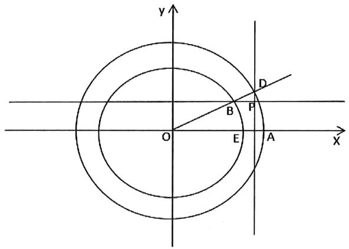

等级（SR）

##### 035. 已知椭圆 $C: \frac{x^2}{a^2} + \frac{y^2}{b^2} = 1 (a > b > 0)$ 的左、右顶点分别为 A、B，焦距为 2，点 P 为椭圆上异于 A、B 的点，且直线 PA 和 PB 的斜率之积为 $-\frac{3}{4}$

（1） 求 C 的方程

（2） 设直线 AP 与 y 轴的交点为 Q，过坐标原点 O 作 OM //AP 交椭圆于点 M，试探究 $\frac{|AP| \cdot |AQ|}{|OM^2|}$ 是否为定值，若是，求出该定值，若不是，请说明理由

等级（SR）

##### 036. 已知椭圆 C: $\frac{x^2}{a^2} + \frac{y^2}{b^2} = 1$ ( $a > b > 0$ ) 的一个焦点与抛物线 $y^2 = 4\sqrt{3} x$ 的焦点重合，且高心率为 $\frac{\sqrt{3}}{2}$ .

（Ⅰ）求椭圆 C 的标准方程；  
（II）不过原点的直线1与椭圆c交于M、N两点，若三直线OM、I、ON的斜率 $\mathrm{k}_1\mathrm{k}\mathrm{k}_2$ 成等比数列，求直线1的斜率及 $|OM|^2 + |ON|^2$ 的值

等级（SR）

2021年新高考1卷

##### 037. 在平面直角坐标系 $xOy$ 中，已知点 $F_{1}(-\sqrt{17}, 0)$ 、 $F_{2}(\sqrt{17}, 0), |MF_{1}| - |MF_{2}| = 2$ ，点 $M$ 的轨迹为 $C$ .

（1） 求 C 的方程;  
（2）设点 $T$ 在直线 $x = \frac{1}{2}$ 上，过 $T$ 的两条直线分别交 $C$ 于A、 $B$ 两点和 $P$ ， $Q$ 两点，且 $\left|TA\right| \cdot \left|TB\right| = \left|TP\right| \cdot \left|TQ\right|$ ，求直线 $AB$ 的斜率与直线 $PQ$ 的斜率之和.

等级（SR）

2021百校联盟5月联考

##### 038. 已知椭圆 C: $\frac{x^{2}}{a^{2}} + \frac{y^{2}}{b^{2}} = 1$ （a > b > 0）的离心率是 $\frac{\sqrt{2}}{2}$ ，过左焦点 F 且与 x 轴垂直的弦长为 $\sqrt{2}$ .

（1） 求椭圆 C 的方程;  
（2） 已知 A, B 为椭圆 C 上两点, O 为坐标原点, 斜率为 k 的直线 1 经过点 P (0, $\frac{1}{2}$ ), 若 A, B 关于 1 对称, 且 OA⊥OB, 求 1 的方程.

等级（SSR）

2022年新高考1卷

##### 039. 已知点 $A(2,1)$ 在双曲线 $C: \frac{x^2}{a^2} - \frac{y^2}{a^2 - 1} = 1 (a > 1)$ 上，直线 $l$ 交 $C$ 于 $P, Q$ 两点，直线 $AP, AQ$ 的斜率之和为0.

（1） 求 $l$ 的斜率；  
（2） 若 $\tan \angle PAQ = 2\sqrt{2}$ , 求 $\triangle PAQ$ 的面积.

# 题型三：定点问题

等级（R）

##### 040. 动点 $C$ 到点（1，0）的距离比它到直线 $x = -2$ 的距离小1，动点的轨迹为 $E$ 。

（1） 求 E 的方程  
（2）若直线 $l:y = kx + m(km < 0)$ 则与曲线 $E$ 相交与 $A,B$ 两个点，且 $\overrightarrow{OA}\cdot \overrightarrow{OB} = 5$   
证明：直线 $l$ 经过一个定点

等级（R）

##### 041. 已知椭圆 $C: \frac{x^2}{a^2} + \frac{y^2}{b^2} = 1 (a > b > 0)$ ，四点 $P_1(1,1)$ ， $P_2(0,1)$ ， $P_3\left(-1, \frac{\sqrt{3}}{2}\right)$ ， $P_4\left(1, \frac{\sqrt{3}}{2}\right)$ 中恰有三点在椭圆 $C$ 上.

（1） 求 C 的方程;  
（2） 设直线 $l$ 不经过 $P_{2}$ 点且与 $C$ 相交于 $A, B$ 两点. 若直线 $P_{2}A$ 与直线 $P_{2}B$ 的斜率的和为 -1 , 证明: $l$ 过定点.

等级（R）

##### 042. 已知 $F$ 为椭圆 $\frac{x^2}{a^2} + \frac{y^2}{b^2} = 1 (a > b > 0)$ 的右焦点， $|OF| = \sqrt{3}$ ， $P$ ， $Q$ 分别为椭圆 $C$ 的上下顶点，且 $\triangle PQF$ 为等边三角形

（1）求椭圆 $C$ 的方程；  
（2） 过点 P 的两条互相垂直的直线 $l_{1}, l_{2}$ 与椭圆 C 分别交于异于点 P 的点 A, B,

①求证：直线 $AB$ 过定点；  
②求证：以 $PA$ ， $PB$ 为直径的两个圆的另一个交点 $H$ 在定圆上，并求此圆的方程

等级（SR）

##### 043. 已知椭圆 $C: \frac{x^2}{a^2} + \frac{y^2}{b^2} = 1 (a > b > 0)$ 的离心率为 $\frac{\sqrt{2}}{2}$ ，且过点 $A(2, 1)$ .

（1） 求 C 的方程:  
（2）点 $M$ ， $N$ 在 $C$ 上，且 $AM \perp AN$ ， $AD \perp MN$ ， $D$ 为垂足．证明：存在定点 $Q$ ，使得 $|DQ|$ 为定值.

等级（SR）

2022 九江二模

##### 044. 已知椭圆 $E: \frac{x^2}{a^2} + \frac{y^2}{b^2} = 1 (a > b > 0)$ 的离心率为 $\frac{\sqrt{3}}{2}$ , $P$ 为椭圆 $E$ 上一点, $Q$ 为圆 $x^2 + y^2 = b^2$ 上一点, $\left| PQ \right|$ 的最大值为 3, (P, Q 异于椭圆 E 的上下顶点)

（1） 求椭圆 E 的方程;  
（2） A 为椭圆 E 的下顶点, 直线 AP, AQ 的斜率分别记为 $k_{1}, k_{2}$ , 且 $k_{2} = 4k_{1}$ , 求证: 直线 PQ 过定点, 并求出此定点的坐标。

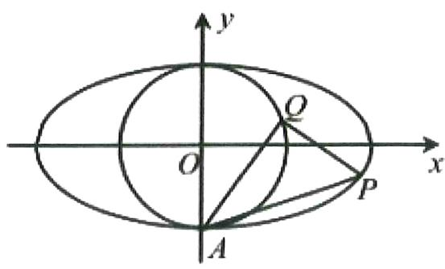

等级（SR）

2022漳州三检

##### 045. 已知圆 $C_1: (x + 2)^2 + y^2 = 9$ ，圆 $C_2: (x - 2)^2 + y^2 = 1$ ，动圆 $\mathrm{P}$ 与圆 $C_1$ ，圆 $C_2$ 都外切，圆心 $\mathrm{P}$ 的轨迹方程为 $\mathrm{C}$

（1） 求 C 的方程;  
（2）已知A、B是C上不同的两点，AB中点的横坐标为2，且AB的中垂线为直线 $l$ ，是否存在半径为1的定圆E，使得 $l$ 被圆E截得的弦长为定值，若存在，求出圆E的方程；若不存在，请说明理由

等级（SR）

2023苏锡常镇二模

##### 046. 已知双曲线 $C_1: \frac{x^2}{a^2} - \frac{y^2}{b^2} = 1 (a > 0, b > 0)$ 的渐近线为 $y = \pm \frac{\sqrt{3}}{2} x$ , 右焦点 $F$ 到渐近线的距离为 $\sqrt{3}$ , 设 $M(x_0, y_0)$ 是双曲线 $C_2: \frac{y^2}{b^2} - \frac{x^2}{a^2} = 1$ 上的动点, 过 $M$ 的两条直线 $l_1, l_2$ 分别平行于 $C_1$ 的两条渐近线, 与 $C_1$ 分别交于 $P, Q$ 两点.

（1） 求 $C_1$ 的标准方程;  
（2） 证明直线 PQ 过定点, 并求出该定点的坐标.

等级（SR）

2022江西稳派5月联考

##### 047. 已知抛物线 $C: x^{2} = 2py (p > 0)$ , 动直线 $l$ 经过点（2, 5）交 C 于 A, B 两点, 0 为坐标原点, 当 $l$ 垂直于 y 轴时, $\triangle OAB$ 的面积为 $10\sqrt{5}$

（1） 求 C 的方程;  
（2）C上是否存在定点P，使得P在以AB为直径的圆上？若存在，求出P点的坐标；若不存在，请说明理由

等级（SSR）

2021 石家庄二模

##### 048. 已知直线 $L: y = x - 1$ 与椭圆 $C: \frac{x^2}{a^2} + \frac{y^2}{b^2} = 1 (a > 1, b > 0)$ 相交于 $P, Q$ 两点， $M(-1, 0), \overrightarrow{MP} \cdot \overrightarrow{MQ} = 0$

（1）证明椭圆过定点 $\mathrm{T}(\mathbf{x}_0,\mathbf{y}_0)$ ，并求出 $\mathbf{x}_0^2 +\mathbf{y}_0^2$ 的值；  
（2） 求弦长 $|\mathrm{PQ}|$ 的取值范围.

等级（SSR）

2022年全国乙卷

##### 049. 已知椭圆 $E$ 的中心为坐标原点，对称轴为 $x$ 轴、 $y$ 轴，且过 $A(0, -2), B\left(\frac{3}{2}, -1\right)$ 两点.

（1） 求 $E$ 的方程;  
（2） 设过点 $P(1, -2)$ 的直线交 $E$ 于 $M, N$ 两点，过 $M$ 且平行于 $x$ 轴的直线与线段 $AB$ 交于点 $T$ ，点 $H$ 满足 $\overrightarrow{MT} = \overrightarrow{TH}$ 。证明：直线 $HN$ 过定点。

# 题型四：面积类问题

等级（R）

##### 050. 如图所示，椭圆 C: $\frac{x^{2}}{a^{2}} + \frac{y^{2}}{b^{2}} = 1 (a > b > 0)$ 的离心率为 $\frac{\sqrt{2}}{2}$ ， $B_{1}$ 、 $B_{2}$ 是椭圆 C 的短轴端点，且 $B_{1}$ 到交点的距离为 $3\sqrt{2}$ ，点 M 在椭圆 C 上运动，且点 M 不与 $B_{1}$ 、 $B_{2}$ 重合，点 N 满足 $NB_{1} \perp MB_{1}, NB_{2} \perp MB_{2}$ .

（1） 求椭圆 C 的方程;  
（2） 求四边形 $\mathrm{MB}_{2} \mathrm{~NB}_{1}$ 面积的最大值

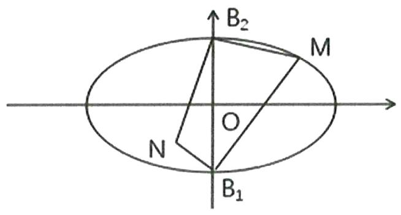

等级（R）

##### 051. 已知过定点 N（1，0）的动圆 P 与圆 M: $(x+1)^{2}+y^{2}=8$ 相内切.

（1）求动圆圆心P的轨迹方程；  
（2） 设动圆圆心 $P$ 的轨迹方程为曲线 $C, A, B$ 是曲线 $C$ 上的两点, 线段 $A B$ 的垂直平分线过点 $D \left(0, \frac{1}{2}\right)$ , 求 $\triangle OAB$ 面积的最大值 (0 是坐标原点).

等级（SR）

2021 唐山三模

##### 052. 在直角坐标系 $xOy$ 中，A $(-1, 0)$ ，B $(1, 0)$ ，C 为动点，设 $\triangle ABC$ 的内切圆分别与边 AC，BC，AB 相切于点 P，Q，R，且 $|CP| = 1$ ，记点 C 的轨迹为曲线 E.

（1） 求曲线 E 的方程;  
（2）不过原点0的直线1与曲线E交于M，N两点，且直线 $y = -\frac{1}{2} x$ 经过MN的中点T，求△OMN的面积的最大值.

等级（SR）

2021宜宾二诊

##### 053. 已知椭圆 C: $\frac{x^{2}}{a^{2}} + \frac{y^{2}}{b^{2}} = 1 (a > b > 0)$ 的左右顶点分别为 A, B, 右焦点为 F, 点 P 为 C 上的一点, PF 恰好垂直平分线段 OB (O 为坐标原点), $|\mathrm{PF}| = \frac{3}{2}$

（1） 求椭圆 C 的方程  
（2）过F的直线1交C于M，N两点，若点Q满足 $\overrightarrow{OQ} = 2\overrightarrow{OM} +\overrightarrow{ON}$ （Q，M，N三点不共线），求四边形OMQN面积的取值范围。

等级（SR）

2022T8第二次联考

##### 054. 已知双曲线 $\tau: \frac{x^2}{a^2} - \frac{y^2}{b^2} = 1 (a > 0, b > 0)$ 过点 $P(\sqrt{3}, \sqrt{6})$ ，且 $\tau$ 的渐近线方程为 $y = \pm \sqrt{3} x$

（1） 求 $\tau$ 的方程  
（2） 如图, 过原点 0 作互相垂直的直线 $l_{1}, l_{2}$ 分别交双曲线于 A, B 两点和 C, D 两点, A, D 在 x 轴同侧, 请从①②两个问题中任选一个作答, 如果多选, 则按所选的第一个计分

①求四边形 ACBD 面积的取值范围;  
②设直线 AD 与两渐近线分别交于 M, N 两点，是否存在直线 AD 使 M, N 为线段 AD 的三等分点，若存在，求出直线 AD 的方程，若不存在，请说明理由。

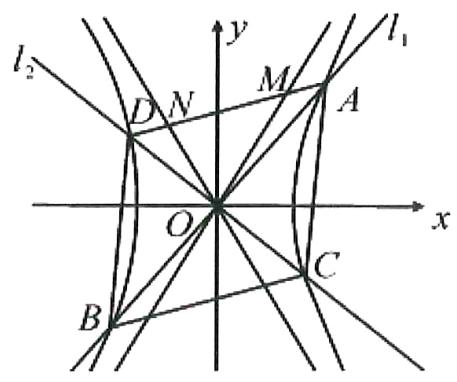

# 题型五：形状已知大小未知的圆锥曲线处理通法

等级（R）

##### 055. 设 $F_{1}, F_{2}$ , 分别是椭圆 $\mathrm{E}:\frac{x^{2}}{a^{2}}+\frac{y^{2}}{b^{2}}=1$ ( $\mathbf{a}>\mathbf{b}>0$ ) 的左、右焦点, 过 $F_{1}$ 斜率为 1 的直线 $l$ 与 $\mathrm{E}$ 相交于 A, B 两点, 且 $\left|AF_{2}\right|, \left|AB\right|, \left|BF_{2}\right|$ 成等差数列。

（I）求E的离心率；  
（Ⅱ）设点 P(0, -1) 满足 $\left|PA\right|=\left|PB\right|$ ，求 E 的方程.

# 题型六：圆锥曲线大题中角分线的翻译方法

等级（R）

##### 056. 设抛物线 $C: y^2 = 2x$ ，点 $A(2, 0)$ ， $B(-2, 0)$ ，过点 $A$ 的直线 $l$ 与 $C$ 交于 $M$ ， $N$ 两点.

（1）当 $l$ 与 $x$ 轴垂直时，求直线 $BM$ 的方程；  
（2） 证明: $\angle A B M = \angle A B N$ .

# 题型七：过轴点的三点共线问题

等级（R）

##### 057. 已知椭圆 $E: \frac{x^2}{4} + \frac{y^2}{2} = 1$ ，过左焦点 $F$ 的直线交椭圆于 $M, N$ 两点，若 $\overrightarrow{MF} = 2\overrightarrow{FN}$ ，求直线 $MN$ 的方程。

等级（R）

##### 058. 在平面直角坐标系中，A（-2，0），B（2，0），且 $\Delta ABC$ 满足 $\tan A\tan B = \frac{1}{2}$

（I）求点C的轨迹E的方程；  
(II) 过 $F(-\sqrt{2}, 0)$ 作直线 MN 交轨迹 E 于 M, N 两点, 若 $\Delta$ MAB 的面积是 $\Delta$ NAB 面积的 2 倍, 求直线 MN 的方程。

等级（R）

##### 059. 已知椭圆 $C: \frac{x^2}{a^2} + \frac{y^2}{b^2} = 1 (a > b > 0)$ 的离心率为 $\frac{\sqrt{3}}{2}$ ，过右焦点 $F$ 且斜率为 $k (k > 0)$ 的直线与 $C$ 相交于 $A$ 、 $B$ 两点。若 $\overrightarrow{AF} = 3\overrightarrow{FB}$ ，则 $k = (\quad)$

(A) 1

(B) $\sqrt{2}$

C) $\sqrt{3}$

(D) 2

等级（SR）

##### 060. 给定抛物线 $C: y^{2} = 4x$ ， $F$ 是 $C$ 的焦点，过点 $F$ 的直线 $l$ 与 $C$ 相交与 $A$ 、 $B$ 两点

（1）设 $l$ 的斜率为1，求 $\overrightarrow{OA}$ 与 $\overrightarrow{OB}$ 夹角的大小  
（2）设 $\overrightarrow{FB} = \lambda \overrightarrow{AF}$ ，若 $\lambda \in [4,9]$ ，求 $l$ 在 $y$ 轴上截距的变化范围

等级（SR）

##### 061. 已知 A 是是焦距为 $2\sqrt{5}$ 的椭圆 $\mathrm{E}:\frac{x^2}{a^2} +\frac{y^2}{b^2} = 1(a > b > 0)$ 的右顶点，点 $p(0,2\sqrt{3})$

直线PA交椭圆E与点B， $\overline{PB} = \overline{BA}$

（1） 求椭圆 E 的方程:  
（2）设过点 P 且斜率为 K 的直线 1 与椭圆 E 交于 M、N 两点（M 在 P、N 之间），若四边形 MNAB 的面积是 $\triangle PMB$ 面积的 5 倍，求直线 1 的斜率 K.

等级（SR）

2022 云南第一次统测

##### 062. 已知椭圆 $C: \frac{x^2}{a^2} + \frac{y^2}{b^2} = 1 (a > b > 0)$ 的左、右焦点分别为 $F_1$ 、 $F_2$ ，过 $F_1$ 的动直线与椭圆 $C$ 交于 $P$ 、 $M$ 两点，直线 $PF_2$ 与椭圆 $C$ 交于 $P$ 、 $N$ 两点，且 $\overrightarrow{PF_1} = \lambda \overrightarrow{F_1M}$ ， $\overrightarrow{PF_2} = \mu \overrightarrow{F_2N}$ . 当 $\Delta F_1PF_2$ 的面积最大时， $\Delta MPN$ 为等边三角形.

(I) 求椭圆C的离心率;

（II）若 $b > \frac{1}{2}$ ，直线 $\lambda x + \mu y = 1$ 与椭圆C是否有公共点？若有，有多少个公共点？若没有，请说明理由.

等级（SR）

##### 063. 已知椭圆 $\mathbf{C} : \frac{x^2}{a^2} + \frac{y^2}{b^2} = 1 (a > b > 0)$ 的离心率 $e = \frac{\sqrt{2}}{2}$ ，且经过点 $\left(-\frac{\sqrt{2}}{2}, \frac{\sqrt{3}}{2}\right)$

（1） 求椭圆 C 的方程  
（2） 过点 P(-2,0) 且不与 x 轴重合的直线 L 与椭圆 C 交于不同的两点 $A(x_{1},y_{1}), B(x_{2},y_{2})$ ,  
过右焦点 F 的直线 AF，BF 分别交椭圆 C 于点 M、N，设 $\overrightarrow{AF} = \alpha \overrightarrow{FM}, \overrightarrow{BF} = \beta \overrightarrow{FN}, \alpha, \beta \in R$ ，求 $\alpha + \beta$ 的取值范围。

# 题型八：k 的替换

等级（R）

##### 064. 已知圆 $F$ 的方程为： $(x - 1)^2 + y^2 = 1$ ，与 $y$ 轴相切的圆 $M$ 与圆 $F$ 相外切且圆 $M$ 在 $y$ 轴右侧；

（1）求圆心 $M$ 的轨迹方程  
（2）过点 $F$ 的两条互相垂直的直线，分别交圆心 $M$ 的轨迹 $A, B, C, D$ 四点，求出 $A, B, C, D$ 四点构成的四边形的面积的最小值。

等级（SR）

2021 唐山一模

##### 065. 已知抛物线 E: $x^{2}=4y$ ，点 P(1, -2)，斜率为 k(k>0) 的直线 l 过点 P，与 E 交于不同的点 A, B.

（1） 求k的取值范围;   
（2）斜率为 $-k$ 的直线 $m$ 过点 $P$ ，与 $E$ 相交于不同的点 $C, D$ ，证明：直线 $AC$ ，直线 $BD$ 及 $y$ 轴围成等腰三角形.

# 题型九：抛物线弦中点与弦斜率的关系

等级（SR）

##### 066. 设 $A(x_{1}, y_{1}), B(x_{2}, y_{2})$ 两点在抛物线 $y = 2x^{2}$ 上， $l$ 是 $AB$ 的垂直平分线

（1）当且仅当 $x_{1} + x_{2}$ 取何值时，直线 $l$ 经过抛物线的焦点 $F$ ? 证明你的结论  
（2）当直线 $l$ 的斜率为2时，求 $l$ 在 $y$ 轴上截距的取值范围

等级（SR）

2023 唐山二模

##### 067. 已知抛物线 $C: y^{2} = 2px (p > 0)$ 的焦点为 $F$ ， $A$ 为 $C$ 上一点， $B$ 为准线 $l$ 上一点，

$\overrightarrow {B F} = 2 \overrightarrow {F A}, | A B | = 9.$

（1） 求 $C$ 的方程;

（2） $M, N, E(x_0, -2)$ 是 $C$ 上的三点，若 $k_{\mathrm{EM}} + k_{\mathrm{EN}} = -\frac{4}{3}$ ，求点 $E$ 到直线 $MN$ 距离的最大值.

等级（SR）

##### 068. 已知抛物线 $C: x^{2} = 4y$ 的焦点为 $\mathrm{F}$ , 点 0 为坐标原点, 过点 $\mathrm{F}$ 的直线 1 与 $\mathrm{C}$ 交于 $\mathrm{A}, \mathrm{B}$ 两点,

（1） 若弦 AB 的中点 P 的纵坐标为 3，求直线 1 的方程  
（2）若直线1与x轴的交点为D，且 $\overrightarrow{DA} = \lambda \overrightarrow{AF},\overrightarrow{DB} = \mu \overrightarrow{BF}$ 试探究： $\lambda +\mu$ 是否为定值，若为定值，求出该定值，若不为定值，试说明理由

等级（SR）

##### 069. 已知抛物线 $C: x^2 = 2py (p > 0)$ , 直线 $l: y = \frac{1}{2}x - 2$ , 过点 $P(1,2)$ 作直线与 $C$ 交于 $A$ $B$ 两点, 当 $AB // l$ 时, $P$ 为 $AB$ 中点

（1） 求 C 的方程  
（2）作 $AA'\perp l,BB'\perp l$ ，垂足分别为 $A',B'$ 两点，若 $AB'$ 与 $A'B$ 交于Q，求证： $PQ//AA'//BB'$

# 题型十：抛物线的切点弦问题

等级（R）

2024齐鲁名校联盟4月联考

##### 070. 已知抛物线 $C: x^2 = 4y$ ，过直线 $l: x + 2y = 4$ 上的动点 $\mathbf{P}$ 可作 $\mathbf{C}$ 的两条切线，记切点为 $\mathrm{A}, \mathrm{B}$ ，则直线AB

$\quad$A. 斜率为 2

$\quad$B. 斜率为 $\pm 2$

$\quad$C. 恒过点 $(0, -2)$

$\quad$D. 恒过点 $(-1, -2)$

等级（SR）

2021年乙卷理科

##### 071. 已知抛物线 $C: x^{2} = 2py(p > 0)$ 的焦点为 $F$ ，且 $F$ 与圆 $M: x^{2} + (y + 4)^{2} = 1$ 上点的距离的最小值为 4。

（1） 求 p;   
（2）若点 $P$ 在 $M$ 上， $PA, PB$ 是 $C$ 的两条切线， $A, B$ 是切点，求 $\triangle PAB$ 面积的最大值.

等级（SR）

##### 072. 若抛物线 C 以双曲线 $2y^{2} - 2x^{2} = 1$ 的焦点 F（0，c）（c > 0）为焦点。

（1）求抛物线 C 的标准方程；  
（2）已知直线 1: x-y-2=0，若 P(X₀, Y₀)为 1 上的一动点，过点 P 作抛物线 C 的两条切线，切点 A. B，求 $\overrightarrow{AF}\left\|\overrightarrow{BF}\right|$ 的最小值。

等级（SR）

##### 073. 已知 O 是坐标原点，抛物线 $C: x^{2} = y$ 的焦点为 F，过 F 且斜率为 1 的直线 1 交抛物线 C 于 A, B 两点，Q 为抛物线 C 的准线上一点，且 $\angle AQB = 90^{\circ}$

（1） 求 Q 点的坐标;   
（2）设与直线1垂直的直线与抛物线C交于M，N两点，过点M，N分别作抛物线C的切线 $1_{1}$ 、 $1_{2}$ ，设直线 $1_{1}$ 与 $1_{2}$ 交于点P，若 $OP\perp OQ$ ，求△MON外接圆的标准方程

等级（SR）

##### 074. 已知抛物线 $C: x^2 = 2py (p > 0)$ 的焦点为 F，直线 $\mathrm{y} = \mathrm{kx} + 2$ 于抛物线 C 交于 A, B 两点，若 k = 1 则 $\left\| BF \right| - \left| AF \right\| = 4\sqrt{3}$

（1） 求抛物线 C 的方程  
（2）分别过点 A, B 作抛物线 C 的切线 $l_{1}, l_{2}$ , 若 $l_{1}, l_{2}$ 分别交 x 轴于点 M, N, 求四边形 ABNM 面积的最小值。

等级（SR）

##### 075. 已知抛物线 $x^{2} = 4y$ 的焦点为 $F, A, B$ 是抛物线上的两动点，且 $\overrightarrow{AF} = \lambda \overrightarrow{FB} (\lambda > 0)$ .

过 $A$ 、 $B$ 两点分别作抛物线的切线，设其交点为 $M$ .

（I）证明 $\overline{FM} \cdot \overline{AB}$ 为定值；  
（Ⅱ）设 $\triangle ABM$ 的面积为 $S$ ，写出 $S = f(\lambda)$ 的表达式，并求 $S$ 的最小值.

# 题型十一：韦达的妙用（含非对称韦达）

等级（SR）

##### 076. 已知椭圆 $C: \frac{x^2}{a^2} + \frac{y^2}{b^2} = 1$ 过点 $A(-2, -1)$ ，且 $a = 2b$ 。

（I）求椭圆 $C$ 的方程：

（II）过点 $B(-4,0)$ 的直线 $l$ 交椭圆 $c$ 于点 $M,N$ ，直线 $MA,NA$ 分别交直线 $x = -4$ 于点 $P,Q$ ：求 $\frac{|PB|}{|BQ|}$ 的值.

等级（SR）

2022 南充二诊

##### 077. 如图所示, $C: \frac{x^2}{a^2} + \frac{y^2}{b^2} = 1 (a > b > 0)$ 的右顶点为 A, 上顶点为 B, 0 为坐标原点, $S_{\triangle OAB} = \sqrt{3}$ , 椭圆离心率为 $\frac{1}{2}$ , 过椭圆左焦点 $F_1$ 作不与 x 轴重合的直线, 与椭圆 C 相交于 M, N 两点, 直线 $l$ 的方程为: $x = -2a$ , 过点 M 作 $l$ 垂线, 垂足为 E

（1）求椭圆C的标准方程  
（2）①求证：线段 EN 过定点，并求定点的坐标；

②求 $\triangle OEN$ 面积的最大值

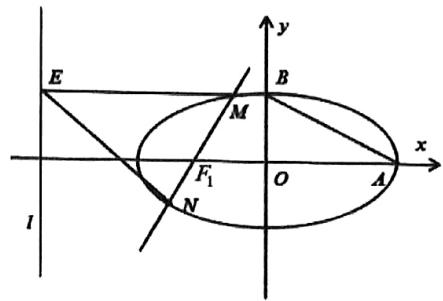

等级（SR）

2021漳州三检

##### 078. 已知复数 $z = x + yi$ （ $x, y \in R$ ）在复平面内对应的点为 $M(x, y)$ ，且 $z$ 满足 $|z + 2| - |z - 2| = 2$ ，点 $M$ 的轨迹为曲线 $C$ .

（1） 求 C 的方程;  
（2）设A（-1,0），B（1,0），若过F（2,0）的直线与C交于P，Q两点，且直线AP与BQ交于点R.证明：

(i) 点 R 在定直线上;

（ii）若直线AQ与BP交于点S，RF⊥SF.

等级（SR）

2022 安徽 A10 联盟 4 月联考

##### 079. 已知椭圆 $C: \frac{x^2}{a^2} + \frac{y^2}{b^2} = 1 (a > b > 0)$ 的左、右焦点分别为 $F_1, F_2$ ，离心率为 $\frac{\sqrt{2}}{2}$ ，P 为 C 上一点，且 $\Delta PF_1F_2$ 面积的最大值为 4.

（1） 求 C 的方程;  
（2）若直线 $y = kx + t (t \neq 0)$ 与 $C$ 交于 $A, B$ 两点，过点 $B$ 作直线 $y = 3$ 的垂线，垂足为 $D$ ，若直线 $AD$ 与 $y$ 轴的交点为定点 $Q$ ，求 $t$ 的值及定点 $Q$ 的坐标。

等级（SR）

##### 080. 已知 $A$ 、 $B$ 分别为椭圆 $E$ : $\frac{x^2}{a^2} + y^2 = 1 (a > 1)$ 的左、右顶点, $G$ 为 $E$ 的上顶点, $\overrightarrow{AG} \cdot \overrightarrow{GB} = 8$ , $P$ 为直线 $x = 6$ 上的动点, $PA$ 与 $E$ 的另一交点为 $C$ , $PB$ 与 $E$ 的另一交点为 $D$ .

（1） 求 E 的方程;  
（2） 证明: 直线 CD 过定点.

等级（SR）

##### 081. 在平面直角坐标系 $xOy$ 中，椭圆 $C: \frac{x^2}{a^2} + \frac{y^2}{b^2} = 1 (a > b > 0)$ 的左、右焦点分别为 $F_1(-c, 0)$ ， $F_2(c, 0)$ . 已知 $(1, e)$ 和 $(\frac{\sqrt{2}}{2}, \frac{\sqrt{3}}{2})$ 都在椭圆上，其中 $e$ 为椭圆的离心率.

（1） 求椭圆C的标准方程;  
（2） 过 $T(t,0)(t > a)$ 作斜率为 $k(k < 0)$ 的直线 $l$ 交椭圆 $C$ 于 $M$ , $N$ 两点（ $M$ 点在 $N$ 点的左侧），且 $F_{1}M // F_{2}N$ ，若 $MF_{1} = MT$ ，求 $t$ 的值.

等级（SR）

##### 082. 已知椭圆 $C: \frac{x^2}{a^2} + \frac{y^2}{b^2} = 1 (a > b > 0)$ 的离心率为 $\frac{\sqrt{6}}{3}$ ，以 $C$ 的短轴为直径的圆与直线 $l: 3x + 4y - 5 = 0$ 相切.

（1） 求C的方程;   
（2） 直线 $y = x + m$ 交 $C$ 于 $M(x_{1}, y_{1}), N(x_{2}, y_{2})$ 两点，且 $x_{1} > x_{2}$ ，已知 $l$ 上存在点 $P$ ，使得 $\Delta PMN$ 是以 $\angle PMN$ 为顶角的等腰直角三角形，若 $P$ 在直线 $MN$ 的右下方，求 $m$ 的值.

等级（SR）

##### 083. 如图，在平面直角坐标系 $xOy$ 中，椭圆 $\mathrm{E}:\frac{x^2}{a^2} +\frac{y^2}{b^2} = 1(a > b > 0)$ 过点 $(1,\frac{\sqrt{2}}{2})$ ，且椭圆的离心率为 $\frac{\sqrt{2}}{2}$ ，直线 $l:y = x + t$ 与椭圆E相交于A、B两点，线段AB的中垂线交椭圆E于C、D两点

（1） 求椭圆 E 的标准方程  
（2） 求线段 CD 长的最大值  
（3） 求 $\overrightarrow{AC} \cdot \overrightarrow{AD}$ 的值

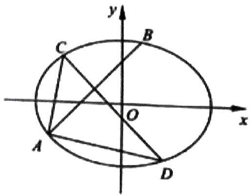

等级（SR）

2024 安徽 A10 联盟

##### 084. 已知椭圆 $C: \frac{x^2}{a^2} + \frac{y^2}{b^2} = 1 (a > b > 0)$ 的短轴长为 4, 过右焦点 $F$ 的动直线 $l$ 与 $C$ 交于 $A, B$ 两点, 点 $A, B$ 在 $x$ 轴上的投影分别为 $A', B'$ ( $A'$ 在 $B'$ 的左侧); 当直线 $l$ 的倾斜角为 $135^\circ$ 时, 线段 $AB$ 的中点坐标为 $\left(\frac{4}{3}, \frac{2}{3}\right)$ .

（1）求 $C$ 的方程；  
（2）若圆 $C': x^2 + y^2 = 8$ , 判断以线段 $AF$ 为直径的圆 $C''$ 与圆 $C'$ 的位置关系，并说明理由；  
（3）若直线 $AB'$ 与直线 $A'B$ 交于点 M, $\triangle MAB$ 的面积为 $\frac{4}{3}$ , 求直线 l 的方程.

# 题型十二：一条大题常用的抛物线小结论

等级（R）

##### 085. 已知顶点为原点 O 的抛物线 C，焦点 F 在 x 轴上，直线 y=x 与抛物线 C 交于 O, M 两点，且线段 OM 的中点为 P（2，2）

（1）求抛物线C的标准方程  
（2）若直线 1 与抛物线 C 交于异于原点的 A, B 两点，交 x 轴的正半轴于点 D，且有 $\left|FA\right| + 1 = \left|FD\right|$ ，直线 $l_{1} // l$ 且 $l_{1}$ 和 C 有且只有一个公共点 E，请问直线 AE 是否恒过定点？若是，请求出定点坐标；若不是，请说明理由

等级（SR）

2022 许昌平顶山济源二检

##### 086. 如图，圆 $x^{2} + (y - 3)^{2} = 5$ 与抛物线 $x^{2} = 2py(p > 0)$ 相交于点A,B,C,D,且 $AB / / CD$

（1） 若抛物线的焦点为 F, N 为其准线上一点, 0 是坐标原点, $\overrightarrow{OF} \cdot \overrightarrow{ON} = -1$ , 求抛物线的方程;  
（2）设AC与BD相交于点G， $\triangle GAD$ 与 $\triangle GBC$ 组成蝶形（如图所示的阴影区域）的面积为S，求点

G 的坐标以及 S 的最大值。

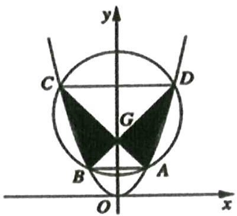

等级（SR）

##### 087. 如图，已知抛物线的标准方程为 $y^{2} = 2px (p > 0)$ ，其中 $O$ 为坐标原点，抛物线的焦点坐标为 $F(1,0)$ ， $A$ 为抛物线上任意一点（原点除外），直线 $AB$ 过焦点 $F$ 交抛物线于 $B$ 点，直线 $AC$ 过点 $M(3,0)$ 交抛物线于 $C$ 点，连接 $CF$ 并延长交抛物线于 $D$ 点.

（1） 若弦 $|AB|$ 的长度为8，求 $\Delta OAB$ 的面积；  
（2） 求 $\left|AB\right|\cdot\left|CD\right|$ 的最小值.

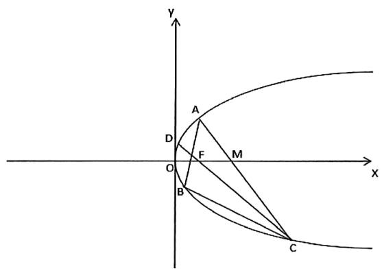

等级（SR）

##### 088. 如图, 已知抛物线 $C: x^{2} = 2py (p > 0)$ 的焦点为 $\mathrm{F}(0,1)$ , 过 $\mathrm{F}$ 的两条动直线 AB, CD 与抛物线交出 A、B、C、D 四点, 直线 AB, CD 的斜率存在并且分别是 $k_{1}(k_{1} > 0), k_{2}$

（1）若直线BD过点（0，3）求直线AC与y轴的交点坐标  
（2） 若 $k_{1}-k_{2}=2$ 求四边形 ACBD 面积的最小值

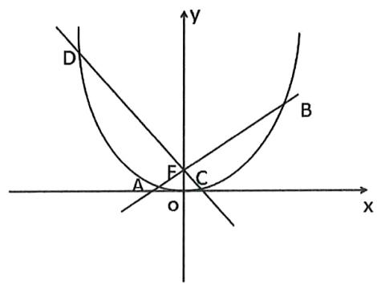

# 题型十三：换元的思想处理 $\mathrm{km}$ 关系

等级（R）

##### 089. 已知椭圆 $C: \frac{x^2}{a^2} + \frac{y^2}{b^2} = 1 (a > b > 0)$ ，点 $(-1, \frac{\sqrt{3}}{2}), (\sqrt{3}, -\frac{1}{2})$ 在椭圆 $C$ 上.

（1） 求椭圆C的方程;   
（2） 若 $M, N$ 是椭圆 $C$ 上的两个不同的动点, $O$ 是原点, 且直线 $OM, ON$ 的斜率分别为 $k_{1}, k_{2}, \Delta OMN$ 的面积为 1 , 求 $k_{1} \cdot k_{2}$ 的值.

等级（SR）

##### 090. 已知动直线与 1 与椭圆 $C: x^2 + \frac{y^2}{2} = 1$ 交与 $P(x_1, y_1), Q(x_2, y_2)$ 两不同点， $\Delta OPQ$ 的面积 $S_{\Delta OPQ} = \frac{\sqrt{2}}{2}$ ，其中 0 为坐标原点

（1）若动直线1垂直于 $\mathbf{x}$ 轴，求直线1的方程  
（2）证明： $x_{1}^{2} + x_{2}^{2}$ 和 $y_{1}^{2} + y_{2}^{2}$ 均为定值  
（3）椭圆C上是否存在点D、E、G、使得三角形面积 $S_{\Delta ODG}=S_{\Delta ODE}=S_{\Delta OEG}=\frac{\sqrt{2}}{2}$ ?若存在，判断 $\Delta DEG$ 的形状，若不存在，请说明理由

等级（SR）

2022 重庆八中第六次月考

##### 091. 设椭圆 $E: \frac{x^2}{4} + \frac{y^2}{3} = 1$ 的右焦点为 F，点 A, B, P 在椭圆 E 上，点 M 是线段 AB 的中点，点 F 是线段 MP 的中点

（1）若M为坐标原点，且 $\triangle ABP$ 的面积为3，求直线AB的方程；  
（2） 求 $\triangle ABP$ 面积的最大值

# 题型十四：k的韦达

等级（R）

2024 河南济洛平许三测

##### 092. 已知 $M(x_{0}, y_{0})$ 是椭圆 $C: \frac{x^{2}}{4} + \frac{y^{2}}{3} = 1$ 上的动点，过原点 O 向圆 $M: (x - x_{0})^{2} + (y - y_{0})^{2} = r^{2}$ 引两条切线，分别与椭圆 C 交于 P, Q 两点（如图所示），记直线 OP, OQ 的斜率依次为 $k_{1}, k_{2}$ ，且

$k _ {1} \cdot k _ {2} = - \frac {3}{4}$

（1） 求圆 $M$ 的半径 $\mathbf{r}$   
（2） 求证: $|OP|^2 + |OQ|^2$ 为定值  
（3）求四边形 OPMQ 的面积的最大值

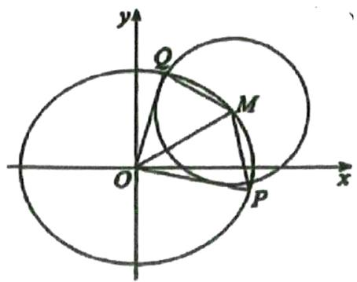

等级（SR）

##### 093. 已知点 M 是抛物线 $C_{1}: y^{2} = 2px (p > 0)$ 的准线与 x 轴的交点，点 P 是抛物线 $C_{1}$ 上的动点，点 A、B 在 y 轴上， $\triangle APB$ 的内切圆为 $C_{2}$ ： $(x - 1)^{2} + y^{2} = 1$ ， $C_{2}$ 为圆心，且 $\left|MC_{2}\right| = 3\left|OM\right|$

其中0为坐标原点

（1） 求抛物线 $C_{1}$ 的标准方程;  
（2） 求 $\triangle APB$ 面积的最小值

等级（SR）

2023 广东实验中学三检

##### 094. 已知抛物线 $C: y^{2} = 2px (p > 0)$ 的焦点 $F$ 到准线的距离为 2，圆 M 与 y 轴相切，且圆心 M 与抛物线 C 的焦点重合.

（1）求抛物线C和圆M的方程；  
（2）设 $P(x_0, y_0)(x_0 \neq 2)$ 为圆 $\mathbb{M}$ 外一点，过点 $\mathrm{P}$ 作圆 $\mathbb{M}$ 的两条切线，分别交抛物线 $\mathrm{C}$ 于两个不同的点 $A(x_1, y_1), B(x_2, y_2)$ ，和 $Q(x_3, y_3), R(x_4, y_4)$ ，且 $y_1y_2y_3y_4 = 16$ ，证明：点 $\mathrm{P}$ 在一条定曲线上.

等级（SR）

2021 辽宁重点中学协作体

##### 095. 在平面直角坐标系 xOy 中，点 M(3,0)，N(-3,0)，动点 Q 满足直线 QM 与 QN 的斜率乘积为 $\frac{-4}{9}$ .

（1） 求动点 Q 的轨迹方程 $C_{1}$ ;  
（2） 已知 $C_{2}: \frac{x^{2}}{15} + \frac{y^{2}}{10} = 1$ , 在 $C_{2}$ 上取一点 $\mathrm{P}(x_{0}, y_{0}) (0 < x_{0} < 3, y_{0} > 0)$ 作 $C_{1}$ 的两条切线 $\mathrm{PA}$ , $\mathrm{PB}$ , 其中 $\mathrm{A}$ , $\mathrm{B}$ 为切点, $\mathrm{PA}$ , $\mathrm{PB}$ 的斜率分别为 $k_{1}, k_{2}$ , 直线 $\mathrm{PA}$ 与 $\mathrm{x}$ 轴的负半轴交于点 $\mathrm{D}$ , 直线 $\mathrm{PB}$ 与 $\mathrm{x}$ 轴的正半轴交于点 $\mathrm{E}$ , 且 $\angle \mathrm{PED} = 2\angle \mathrm{PDE}$ , 求 $k_{1}$ 和 $k_{2}$ .

等级（SR）

2023 南京三模

##### 096. 已知抛物线 $C_1: y^2 = x$ 和圆 $C_2: (x - 3)^2 + y^2 = 2$ .

（1）若抛物线 $C_1$ 的准线与 $x$ 轴相交于点 $T$ , $MN$ 是过 $C_1$ 焦点 $F$ 的弦, 求 $\overrightarrow{TM} \cdot \overrightarrow{TN}$ 的最小值;  
（2） 已知 $P, A, B$ 是抛物线 $C_1$ 上互异的三个点，且 $P$ 点异于原点。若直线 $PA, PB$ 被圆 $C_2$ 截得的弦长都为 2，且 $PA = PB$ ，求点 $P$ 的坐标。

# 题型十五：抛物线点驱动模型

等级（R）

##### 097. 已知动直线 $1: y = k(x + 3) (k \neq 0)$ 与 $y$ 轴交于点 A，过点 A 作直线 AB⊥1，交 $x$ 轴于点 B，点 C 满足 $\overrightarrow{AC} = 3\overrightarrow{AB}$ ，C 的轨迹为 E。

（1） 求 E 的方程;  
（2） 已知点 F (1, 0), 点 G (2, 0), 过 F 作斜率为 $k_{1}$ 的直线交 E 于 M., N 两点, 延长 MG, NG 分别交 E 于 P, Q 两点, 记直线 PQ 的斜率为 $k_{2}$ , 求证: $\frac{k_{1}}{k_{2}}$ 为定值。

等级（SR）

2022年全国甲卷

##### 098. 设抛物线 $C: y^{2} = 2px (p > 0)$ 的焦点为 $F$ ，点 $D(p, 0)$ ，过 $F$ 的直线交 $C$ 于 $M$ ， $N$ 两点。当直线 $M$ 垂直于 $x$ 轴时， $|MF| = 3$ 。

（1） 求 $C$ 的方程;  
（2） 设直线 $MD, ND$ 与 $C$ 的另一个交点分别为 $A, B$ , 记直线 $MN, AB$ 的倾斜角分别为 $\alpha, \beta$ . 当 $\alpha - \beta$ 取得最大值时, 求直线 $AB$ 的方程.

等级（SR）

2022 太原一模

##### 099. 已知抛物线 $y^{2} = 2px (p > 0)$ 的焦点为 F，点 O 为坐标原点，一条直线过定点 M（4，0）与抛物线相交于点 A、B 两点，且 $OA \perp OB$

（1） 求抛物线方程;   
（2） 连接 AF, BF 并延长交抛物线于 C, D 两点，设 $\triangle FAB$ 和 $\triangle FCD$ 的面积分别为 $S_{1}$ 和 $S_{2}$ ，则 $\frac{S_{1}}{S_{2}}$ 是

否为定值？若是，求出其值；若不是，请说明理由；

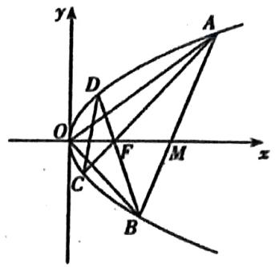

等级（SR）

2021 浙江名校 Z20 联盟

##### 100. 如图, 已知抛物线 $y^{2} = x$ , 过点 $M(1, 0)$ 作斜率为 $k (k > 0)$ 的直线 $l$ 交抛物线于 $A, B$ 两点, 其中点 $A$ 在第一象限, 过点 $A$ 作抛物线的切线与 $x$ 轴相交于点 $P$ , 直线 $PB$ 交抛物线另一点为 $C$ , 线段 $AC$ 交 $x$ 轴于点 $N$ , 记 $\Delta APC$ , $\Delta AMN$ 的面积分别为 $S_{1}$ , $S_{2}$ .

(I) 若 $k = 1$ , 求 $|AB|$ ;  
(II) 求 $\frac{S_1}{S_2}$ 的最小值；

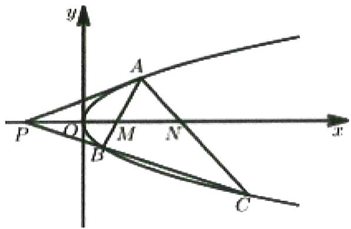

等级（SR）

2021 河北实验中学高三学情调研

##### 101. 如图，已知点 $\mathrm{A}_1$ ， $\mathrm{A}_2$ 分别是椭圆 $C_1: \frac{x^2}{4} + y^2 = 1$ 的左、右顶点，点 $\mathbf{P}$ 是椭圆 $C_1$ 与抛物线 $C_2: y^2 = 2px (p > 0)$ 的交点，直线 $\mathrm{A}_1\mathrm{P}$ ， $\mathrm{A}_2\mathrm{P}$ 分别与抛物线 $C_2$ 交于 $\mathbf{M}$ ， $\mathbf{N}$ 两点（ $\mathbf{M}, \mathbf{N}$ 不同于 $\mathbf{P}$ ）

(I) 求证: 直线 MN 垂直 x 轴:

（II）设坐标原点为0，分别记 $\triangle OPM$ ， $\triangle OMN$ 的面积为 $S_{1}$ ， $S_{2}$ ，当 $\angle OPA_{2}$ 为钝角时，求 $\frac{S_{1}}{S_{2}}$ 的最大值.

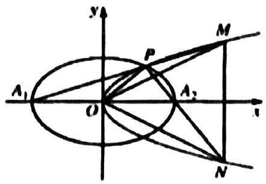

等级（SR）

2021温州二模

##### 102. 如图，过点 F(1, 0) 和点 E(4, 0) 的两条平行线 $l_1$ 和 $l_2$ 分别交抛物线 $y^2 = 4x$ 于 A, B 和 C, D（其中 A, C 在 x 轴上方），AD 交 x 轴于点 G。

(I)求证：点C、点D的纵坐标乘积为定值；

(II)分别记 $\triangle ABG$ 和 $\triangle CDG$ 的面积为 $S_{1}$ 和 $S_{2}$ ，当 $\frac{S_1}{S_2} = \frac{1}{4}$ 时，求直线AD的方程

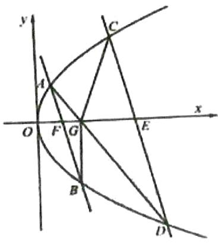

# 题型十六：定值问题

等级（SR）

2022 南充三诊

##### 103. 已知 P 为椭圆 $\frac{x^2}{a^2} + \frac{y^2}{b^2} = 1 (a > b > 0)$ 上任意一点，点 M, N 分别在直线 $l_1: y = \frac{1}{2} x$ 与 $l_2: y = -\frac{1}{2} x$ 上，且 $\mathrm{PM} / / l_2$ ， $\mathrm{PN} / / l_1$ ，若 $|\mathrm{PM}|^2 + |\mathrm{PN}|^2$ 为定值，则椭圆的离心率为（）

$\quad$A. $\frac{1}{2}$ 
$\quad$B. $\frac{\sqrt{3}}{3}$ 
$\quad$C. $\frac{\sqrt{2}}{2}$ 
$\quad$D. $\frac{\sqrt{3}}{2}$

等级（SR）

2022汉中二测

##### 104. 已知椭圆 $C_1: \frac{x^2}{a^2} + \frac{y^2}{b^2} = 1 (a > b > 0)$ 的离心率为 $\frac{\sqrt{6}}{3}$ , 长轴长为 $2\sqrt{3}$ , 抛物线 $C_2: x^2 = 2py (p > 0)$ , 点 P 是椭圆上 $C_1$ 上的动点, 点 Q 是抛物线 $C_2$ 准线上的动点。

（1） 求椭圆 $C_{1}$ 的方程;  
（2）已知 $0\mathrm{P}\bot 0\mathrm{Q}$ （0为坐标原点），且点0到直线PQ的距离为常数，求p的值。

等级（SR）

2021东北三省三校二模

##### 105. 已知点 M（1， $\frac{3}{2}$ ），N（-1， $-\frac{3}{2}$ ），直线 PM，PN 的斜率乘积为 $-\frac{3}{4}$ ，P 点的轨迹为曲线 C.

（1） 求曲线 C 的方程;  
（2）设斜率为 $k$ 的直线交 $x$ 轴于 $T$ ，交曲线 $C$ 于 $A, B$ 两点，是否存在 $k$ 使得 $|AT|^2 + |BT|^2$ 为定值，若存在，求出 $k$ 的值；若不存在，请说明理由.

等级（SR）

2021 重庆巴蜀中学第八次月考

##### 106. 已知椭圆: $\frac{x^2}{a^2} + \frac{y^2}{b^2} = 1 (a > b > 0)$ , 抛物线方程 $y^2 = 2px (p > 0)$ , 0 为坐标原点, F 是抛物线的焦点, 过 F 的直线 1 与抛物线交于 A, B 两点, 如图所示.

（1）证明：直线OA，OB的斜率乘积为定值，并求出该定值；  
（2）反向延长OA，OB分别与椭圆交于C，D两点，且 $OC^2 +OD^2 = 5$ ，求椭圆方程；  
（3）在（2）的条件下，若 $\frac{S_{\triangle OAB}}{S_{\triangle OCD}}$ 的最小值为1，求抛物线方程.

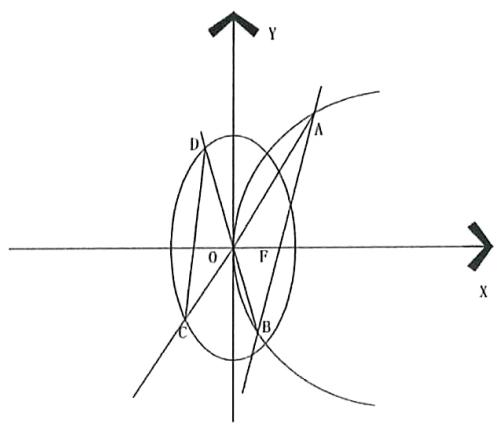

# 题型十七：无韦达圆锥曲线大题中定值定点问题处理技巧

等级（SR）

2021 朝阳一模

##### 107. 已知椭圆 C 的短轴的两个端点分别为 A (0, 1), B (0, -1), 离心率为 $\frac{\sqrt{6}}{3}$ .

（1）求椭圆 C 的方程及焦点的坐标；  
（2）若点 M 为椭圆 C 上异于 A, B 的任意一点，过原点且与直线 MA 平行的直线与直线 y = 3 交于点 P，直线 MB 与直线 y = 3 交于点 Q，试判断以线段 PQ 为直径的圆是否过定点？若过定点，求出定点的坐标；若不过定点，请说明理由.

等级（SR）

2022佛山五校联盟

##### 108. 已知椭圆 $C: \frac{x^2}{a^2} + \frac{y^2}{b^2} = 1 (a > b > 0)$ 的右焦点为 $\mathrm{F}(1, 0)$ ，上下顶点分别为 $B_1, B_2$ ，以点 $\mathrm{F}$ 为圆心， $FB_1$ 为半径作圆，与 $\mathbf{x}$ 轴交于点 $T(3, 0)$

（1） 求椭圆 C 的方程;  
（2） 已知点 $P(2,0)$ , 点 A, B 为椭圆 C 上异于点 P 且关于原点对称的两点, 直线 PA, PB 与 y 轴分别交于点 M, N, 记以 MN 为直径的圆为 $\odot K$ , 试判断是否存在直线 $l$ 截 $\odot K$ 的弦长为定值, 若存在, 请求出该直线的方程, 若不存在, 请说明理由

等级（SR）

2021江西恩博联考

##### 109. 如图，已知椭圆 E: $\frac{x^2}{a^2} + \frac{y^2}{b^2} = 1 (a > b > 0)$ 的离心率为 $\frac{\sqrt{3}}{2}$ , A, B 是椭圆的左右顶点，P 是椭圆 E 上异于 A, B 的一个动点，直线 1 过点 B 且垂直于 x 轴，直线 AP 与 1 交于点 Q，圆 C 以 BQ 为直径。当点 P 在椭圆短轴端点是，圆 C 的面积为 $\pi$ 。

（1） 求椭圆 E 的标准方程;  
（2）设圆 C 与 PB 的另一交点为点 R，记 $\triangle AQR$ 的面积为 S1； $\triangle BQR$ 的面积为 S2；试判断 $\frac{S_{1}}{S_{2}}$ 是否为定值，若是定值，求出这个定值，若不是定值，求 $\frac{S_{1}}{S_{2}}$ 的取值范围.

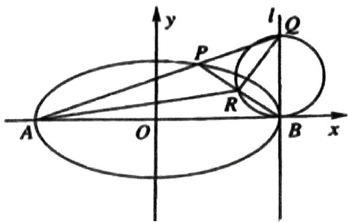

# 题型十八：与圆结合的圆锥曲线大题

等级（R）

##### 110. 在直角坐标系 $xOy$ 中，以 $O$ 为圆心的圆与直线 $x - \sqrt{3} y = 4$ 相切.

（I）求圆 $O$ 的方程；  
（II）圆 $O$ 与 $\mathbf{x}$ 轴相交于 $A, B$ 两点，圆内的动点 $P$ 使 $|PA|$ 、 $|PO|$ 、 $|PB|$ 成等比数列，求 $\overrightarrow{PA} \cdot \overrightarrow{PB}$ 的取值范围.

等级（SR）

2022日照二模

##### 111. 已知抛物线 $C_1: x^2 = 2py (p > 0)$ 过点 $M(4, 4)$ ，0为坐标原点。

（1） 求抛物线 $C_{1}$ 的方程  
（2）直线 $l$ 经过抛物线 $C_1$ 的焦点，且与抛物线 $C_1$ 相交于A,B两点，若弦AB的长等于6，求 $\triangle OAB$ 的面积  
（3）抛物线 $C_1$ 上是否存在异于0，M的点N，使得经过0,M,N三点的圆C和抛物线 $C_1$ 在点N处有相同的切线，若存在，求出点N的坐标，若不存在，请说明理由。

等级（SR）

##### 112. 已知动圆 $M$ 过定点 $F(1,0)$ 且与 $y$ 轴相切，点 $F$ 关于圆心 $M$ 的对称点为 $T$ ，动点 $T$ 的轨迹记为 $C$ .

（I）求 $C$ 的方程：

（Ⅱ）设直线 $l_{1}: x = n_{1}y + 1$ 与曲线 $C$ 交于点 $A, B$ : 直线 $l_{2}: x = n_{2}y + 1$ 与 $C$ 交于点 $P, Q$ , 其中 $n_{1} + n_{2} = -2$ , 以 $AB, PQ$ 为直径的圆 $N_{1}, N_{2}$ , （ $N_{1}, N_{2}$ 为圆心）的公共弦所在直线记为 $I$ , 求 $N_{1}$ 到

直线 $l$ 距离的最小值

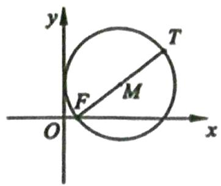

等级（SR）

##### 113. 如图，已知抛物线 $E: y^{2} = x$ 与圆 $M: (x - 4)^{2} + y^{2} = r^{2} (r > 0)$ 相交于 $A$ 、 $B$ 、 $C$ 、 $D$ 四个点。

（I）求 $r$ 得取值范围；  
（Ⅱ）当四边形ABCD的面积最大时，求对角线AC、BD的交点 $P$ 坐标

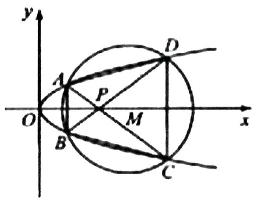

# 等级（SR）

##### 114. 已知抛物线 $C: \mathbf{y}^2 = 4x$ 过点 $\mathrm{P}(2,0)$ 的直线与抛物线 $\mathrm{C}$ 相交于 $\mathrm{M}, \mathrm{N}$ 两点

（1）若点Q是点P关于坐标原点0的对称点，求△MQN面积的最小值；  
（2） 是否存在垂直于 $x$ 轴的直线 1, 使得 1 被以 PM 为直径的圆截得的弦长恒为定值? 若存在, 求出 1 的方程和定值, ; 若不存在, 请说明理由

等级（SR）

##### 115. 在平面直角坐标系中，动点 M 分别与两个定点 A (-2, 0)，B (2, 0) 的连线的斜率之积为 $-\frac{1}{2}$ .

（1） 求动点 M 的轨迹 C 的方程:

（2）设过点（-1，0）的直线与轨迹C交于P，Q两点，判断直线 $x=-\frac{5}{2}$ 与以线段PQ为直径的圆的位置关系，并说明理由.

等级（SR）

##### 116. 如图所示, 已知椭圆 $C: \frac{\mathrm{x}^{2}}{\mathrm{a}^{2}} + \frac{\mathrm{y}^{2}}{\mathrm{b}^{2}} = 1 (a > 0, b > 0)$ , 圆 $0: \mathrm{x}^{2} + \mathrm{y}^{2} = \mathrm{r}^{2} (0 < \mathrm{r} < \mathrm{b})$ , 椭圆 C 的离心率为 $\frac{\sqrt{6}}{3}$ 且过点 $(0, 2)$ , P 为椭圆上的一动点, 过点 P 作圆 O 的两条切线 $l_{1}, l_{2}$ , 且两切线的斜率之积 $k_{1} k_{2}$ 为定值

(I) 求椭圆 C 的方程与 r 的值  
（II）若 $l_{1}$ 与椭圆C交于P,Q两点，与圆0切于点A，与x轴正半轴交与点B，且满足 $\left|PA\right| = \left|QB\right|$ 求 $l_{1}$ 的方程

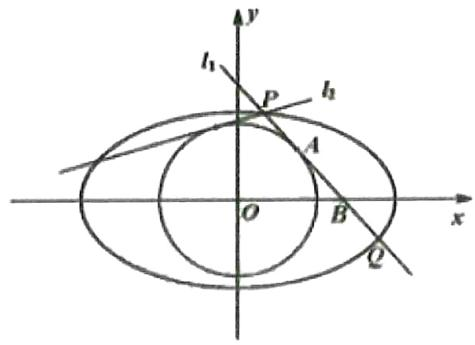

等级（SR）

##### 117. 已知点 A (-2, 0)，点 B (-1, 0) 点 C (1, 0)，动圆 $O'$ 与 x 轴相切于点 A，过点 B 的直线 $l_1$ 与圆 $O'$ 相切于点 D，过点 C 的直线 $l_2$ 与圆 $O'$ 相切于点 E (D, E 均不同于点 A)，且 $l_1$ 与 $l_2$ 交于点 P，设点 P 的轨迹为曲线 $\Gamma$

（1）证明： $|\mathrm{PB}| + |\mathrm{PC}|$ 为定值，并求 $\Gamma$ 的方程；  
（2）设直线 $1_{1}$ 与 $\Gamma$ 的另一个交点为 $Q$ ，直线 $CD$ 与 $\Gamma$ 交于 $M, N$ 两点，当 $O', D, C$ 三点共线时，求四边形 MPNQ 的面积。

等级（SR）

##### 118. 已知点 P 是抛物线 $C: y = \frac{1}{4} x^{2} - 3$ 的顶点, A, B 是 C 上的两个动点，且 $\overrightarrow{PA} \cdot \overrightarrow{PB} = -4$ ,

（1）判断点D（0.1）是否在直线AB上？请说明理由  
（2）设点 M 是 $\triangle PAB$ 的外接圆的圆心，点 M 到 x 轴的距离为 d，点 N（1，0）求 $\left|MN\right|-d$ 的最大值

等级（SR）

##### 119. 设 $F_{1}, F_{2}$ 分别是椭圆 $C: \frac{x^{2}}{a^{2}} + \frac{y^{2}}{b^{2}} = 1 (a > b > 0)$ 的左右焦点，A, B两点分别是椭圆 C 的上，下顶点， $\triangle AF_{1}F_{2}$ 是等腰直角三角形，延长 $AF_{1}$ 交椭圆 C 于 D 点，且 $\triangle ADF_{2}$ 的周长

为 $4\sqrt{2}$

（1） 求椭圆 C 的方程

（2）设点 P 是椭圆 C 上异于 A, B 的动点，直线 AP, BP 与直线 l: y = -2 分别相交于 M, N 两点，点 Q (0, -5)，试问： $\triangle MNQ$ 的外接圆是否恒过 y 轴上的顶点（异于点 Q）？若是，求该顶点坐标，若否，请说明理由

等级（SR）

##### 120. 已知圆 M: $(x+1)^{2}+y^{2}=1$ ，圆 N: $(x-1)^{2}+y^{2}=9$ ，动圆 P 与圆 M 外切并与圆 N 内切，圆心 P 的轨迹为曲线 C.

（I）求C的方程；

（II）I 是与圆 P，圆 M 都相切的一条直线，I 与曲线 C 交于 A，B 两点，当圆 P 的半径最长时，求 |AB|.

等级（SR）

##### 121. 已知 $O$ 为坐标原点， $F$ 为椭圆 $x^{2} + \frac{y^{2}}{2} = 1$ 在 $y$ 轴正半轴上的焦点，过 $F$ 且斜率为 $-\sqrt{2}$ 的直线 $I$ 与 $C$ 交于 $A$ 、 $B$ 两点，点 $P$ 满足 $\overrightarrow{OA} + \overrightarrow{OB} + \overrightarrow{OP} = \vec{0}$

（1） 证明: 点 P 在 C 上,  
（2） 设点 P 关于 O 的对称点为 Q, 证明: A, P, B, Q 四点在同一个圆上

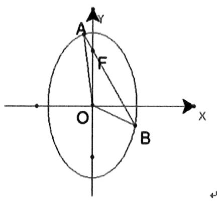

等级（SR）

2022 浙江七彩阳光联盟

##### 122. 过抛物线 $E: y^{2} = 2px (p > 0)$ 焦点 $\mathrm{F}$ 的直线 1 交抛物线于点 A, B, 弦 AB 长的最小值为 4, 直线 $x = -4$ 分别交直线 AO、BO 于点 C, D（0 为原点）

（1）求抛物线E的方程；  
（2）圆 M 过点 C, D。交 x 轴于点 $G(t,0)$ , $H(m,0)$ ，证明：若 t 为定值时，m 也为定值，并求 t = -8 时 $\triangle ABH$ 面积 S 的最小值；

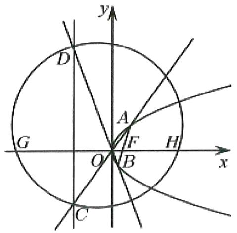

等级（SR）

2022 杭州二模

##### 123. 如图，设抛物线 $C: y^{2} = 2px (p > 0)$ 的焦点为 $\mathrm{F}$ ，圆 $E: (x + 1)^{2} + y^{2} = 4$ 与 $\mathrm{y}$ 轴的正半轴的交点为 $\mathrm{A}$ ， $\triangle AEF$ 为等边三角形

（1） 求抛物线 C 的方程;  
（2）设抛物线 C 上的点 $P(\frac{1}{4}, y_{0})(y_{0} > 0)$ 处的切线与圆 E 交于 M, N 两点，问在圆 E 上是否存在点 Q，使得直线 QM, QN 均为抛物线 C 的切线。若存在，求 Q 点坐标；若不存在，请说明理由；

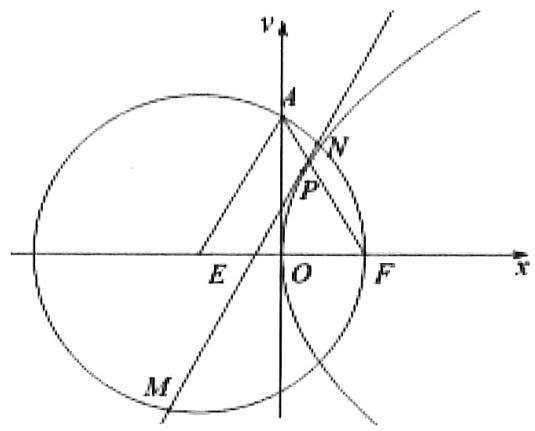

等级（SR）

2023厦门二检

##### 124. 已知椭圆 $C: \frac{x^2}{a^2} + \frac{y^2}{b^2} = 1 (a > b > 0)$ 的离心率为 $\frac{1}{2}$ ，左、右焦点分别为 $F_1, F_2$ ，过 $F_1$ 的直线 $l$ 交 C 于 A、B 两点。当 $l \perp x$ 轴时， $\Delta ABF_2$ 的面积为 3。

（1） 求 C 的方程;  
（2）是否存在定圆 E，使其与以 AB 为直径的圆内切？若存在，求出所有满足条件的圆 E 的方程；若不存在，请说明理由.

等级（SR）

2021 泸州三诊

##### 125.从抛物线 $\mathbf{y}^2 = 4\mathbf{x}$ 上各点向 $\mathbf{x}$ 轴作垂线段，记垂线段中点的轨迹为曲线P.

（1）求曲线 $\mathbf{P}$ 的方程，并说明曲线 $\mathbf{P}$ 是什么曲线；  
（2）过点 M(2,0)的直线 l 交曲线 P 于两点 A,B，线段 AB 的垂直平分线交曲线 P 于两点 C、D，探究是否存在直线 l 使 A、B、C、D 四点共圆？若能，请求出圆的方程；若不能，请说明理由.

等级（SR）

##### 126. 已知抛物线 $C: y^2 = (x + 1)^2$ 与圆 $M: (x - 1)^2 + \left(y - \frac{1}{2}\right)^2 = r^2 (r > 0)$

有一个公共点 $A$ ，且在点 $A$ 处两曲线的切线为同一直线 $I$

（1） 求 r   
（2）设 $m$ 、 $n$ 是异于1且与C及M都相切的两条直线， $m$ 、 $n$ 的交点为D，求D到1的距离。

等级（SR）

##### 127. 已知抛物线 $C: y^{2} = 4x$ 的焦点为 $\mathbf{F}$ , 过点 $K(-1,0)$ 的直线 $l$ 与 $C$ 相交于 $A$ 、 $B$ 两点, 点 $\mathbf{A}$ 关于 $x$ 轴的对称点为 $\mathbf{D}$ .

（I）证明：点 $F$ 在直线 $BD$ 上；  
（II）设 $\overrightarrow{FA} \cdot \overrightarrow{FB} = \frac{8}{9}$ ，求 $\Delta BDK$ 的内切圆 $M$ 的方程

等级（SR）

##### 128. 已知抛物线 $y^{2}=2px$ （p>0）上一点 $(x_{0},2)$ 到焦点 F 的距离. $|PF|=2x_{0}$

（1）求抛物线C的方程；

（2） 过点 P 引圆 $(x-3)^{2}+y^{2}=r^{2}(0\leq r\leq\sqrt{2})$ 的两条切线 PA、PB，切线 PA、PB 与抛物线 c 的另一交点分别为 A, B，线段 AB 中点的横坐标记为 t. 求 t 的取值范围

等级（SR）

##### 129. 已知圆 0: $x^{2}+y^{2}=1$ 和抛物线 E: $y=x^{2}-2$ ，0 为坐标原点.

（1）已知直线1与圆0相切，与抛物线E交于M，N两点，且满足OM⊥ON，求直线1的方程；  
（2）过抛物线 E 上一点 P $(x_{0}, y_{0})$ 作两条直线 PQ，PR 与圆 O 相切，且分别交抛物线 E 于 Q，R 两点，若直线 QR 的斜率为 $-\sqrt{3}$ ，求点 P 的坐标.

等级（SR）

2024长郡中学一模

##### 130. 已知抛物线 $C: y^{2} = 2x$ 的焦点为 $F$ ，其准线 $l$ 与 $x$ 轴交于点 $P$ ，过点 $P$ 的直线与 $C$ 交于 $A, B$ 两点（点 $A$ 在点 $B$ 的左侧）

（1）若点 $A$ 是线段 $PB$ 的中点，求点 $A$ 的坐标；  
（2）若直线 AF 与 C 交于点 D, 记 $\Delta$ BDP 内切圆的半径为 r, 求 r 的取值范围.

# 题型十九：点差法的应用

等级（SR）

##### 131. 已知椭圆 $\frac{x^2}{a^2} + \frac{y^2}{b^2} = 1 (a > b > 0)$ ，右顶点 A（2，0）上顶点为 B，左右焦点分别为 $F_1, F_2$ 且 $\angle F_1BF_2 = 60^\circ$ ，过点 A 作斜率为 k（k ≠ 0）的直线 $l$ 交椭圆于点 D，交 y 轴于点 E

（1） 求椭圆 C 的方程

（2） 设 P 为 AD 的中点, 是否存在定点 Q, 对于任意的 k (k ≠ 0) 都有 OP ⊥ EQ? 若存在, 求出点 Q, 若不存在, 请说明理由。

等级（SR）

##### 132. 已知 P 是 x 轴上的动点（异于原点 0），点 Q 在圆 $O: x^{2} + y^{2} = 4$ 上，且 $\left|PQ\right| = 2$ ，

设线段PQ的中点为M，当点P移动时，记点M的轨迹为曲线E。

（1） 求曲线 E 的方程  
（2） 当直线 PQ 与圆 O 相切于点 Q，且点 Q 在第一象限

(i) 求直线 OM 的斜率

（ii）直线1平行OM，交曲线E于不同的两点A,B，线段AB的中点为N，直线ON与曲线E交于两点C,D证明： $\left|NA\right|\cdot\left|NB\right|=\left|NC\right|\cdot\left|ND\right|$

等级（SR）

2024广州一模

##### 133. 已知 $O$ 为坐标原点，双曲线 $C: \frac{x^2}{a^2} - \frac{y^2}{b^2} = 1 (a > 0, b > 0)$ 的焦距为 4，且经过点 $\left(\sqrt{2}, \sqrt{3}\right)$

（1） 求 C 的方程;  
（2）若直线 l 与 C 交于 A, B 两点，且 $\overrightarrow{OA} \cdot \overrightarrow{OB} = 0$ ，求 $|AB|$ 的取值范围；  
（3）已知点 $P$ 是 $C$ 上的动点，是否存在定圆 $O: x^{2} + y^{2} = r^{2} (r > 0)$ ，使得当过点 $P$ 能作圆 $O$ 的两条切线 $PM, PN$ 时（其中 $M, N$ 分别是两切线与 $C$ 的另一交点），总满足 $|PM| = |PN|$ ？若存在，求出圆 $O$ 的半径 $r$ ；若不存在，请说明理由。

# 题型二十：能否构成平行四边形的圆锥曲线翻译法

等级（SR）

2021 南充二诊

##### 134. 已知椭圆 C: $\frac{x^2}{a^2} + \frac{y^2}{b^2} = 1 (a > b > 0)$ 的离心率 $e = \frac{\sqrt{2}}{2}$ , 以上顶点和右焦点为直径端点的圆与直线 $x + y - 2 = 0$ 相切.

（1） 求椭圆 C 的标准方程.  
（2）是否存在斜率为 2 的直线，使得当直线与椭圆 C 有两个不同的交点 M，N 时，能在直线 $y = \frac{5}{3}$ 上找到一点 P，在椭圆 C 上找到一点 Q，满足 $\overrightarrow{PM} = \overrightarrow{NQ}$ ？若存在，求出直线方程；若不存在，说明理由。

等级（SR）

##### 135. 如图，点 T 为圆 O: $X^{2} + Y^{2} = 1$ 上一动点，过点 T 分别作 x 轴，y 轴的垂线，垂足分别为 A, B，连接 BA 延长至点 P，使得 $\overrightarrow{BA} = \overrightarrow{AP}$ ，点 $P$ 的轨迹记为曲线 C.

（1） 求曲线 c 的方程。  
（2） 若点 A, B 分别位于 $x$ 轴与 $y$ 轴的正半轴上, 直线 $AB$ 与曲线 $C$ 相交于 M, N 两点, 试问在曲线 $C$ 上是否存在点 Q, 使得四边形 $OMQN$ 为平行四边形, 若存在, 求出直线 $l$ 方程; 若不存在, 说明理由.

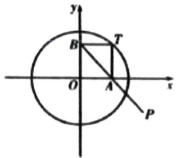

等级（SR）

2024东北三省三校二模

##### 136. 已知椭圆 $C: \frac{x^2}{a^2} + \frac{y^2}{b^2} = 1 (a > b > 0)$ 的左、右焦点分别 $F_1, F_2, B$ 为上顶点，离心率为 $\frac{1}{2}$ ，直线 $BF_2$ 与圆 $4x^2 + 4y^2 - 3 = 0$ 相切.

（1） 求椭圆 C 的标准方程;  
（2） 过 $F_{2}$ 作直线 $l$ 与椭圆 $C$ 交于 $M, N$ 两点,

(i)若 $\overrightarrow{MF_2} = \lambda \overrightarrow{F_2N} (1 < \lambda < 2)$ , 求 $\triangle MON$ 面积的取值范围;

(ii)若 l 斜率存在，是否存在椭圆 C 上一点 Q 及 x 轴上一点 $P(x_{0},0)$ ，使四边形 PMQN 为菱形？若存在，求 $x_{0}$ ，若不存在，请说明理由.

# 概率统计选填

# 题型一：随机抽样

等级（N）

##### 001. 一个总体含有 100 个个体，以简单随机抽样方式从该总体中抽取一个容量为 5 的样本，则指定的某个个体被抽到的概率为 \_\_\_\_.

等级（N）

##### 002. 某工厂甲、乙、丙三个车间生产了同一种产品，数量分别为 120 件，80 件，60 件。为了解它们的产品质量是否存在显著差异，用分层抽样方法抽取了一个容量为 n 的样本进行调查，其中从丙车间的产品中抽取了 3 件，则 n=（）

$\quad$A. 9

$\quad$B. 10

$\quad$C. 12

$\quad$D. 13

等级（N）

##### 003. 某校老年、中年和青年教师的人数见下表，采用分层抽样的方法调查教师的身体状况，在抽取的样本中，青年教师有 320 人，则该样本的老年教师人数为（）

<table><tr><td>类别</td><td>人数</td><td></td><td></td></tr><tr><td>老年教师</td><td>900</td><td></td><td></td></tr><tr><td>中年教师</td><td>1800</td><td></td><td></td></tr><tr><td>青年教师</td><td>1600</td><td></td><td></td></tr><tr><td>合计</td><td>4300</td><td></td><td></td></tr><tr><td>A. 90</td><td>B. 100</td><td>C. 180</td><td>D. 300</td></tr></table>

等级（N）

2022东北三省三校四模

##### 004. 新冠肺炎疫情发生以来，医用口罩成为抗疫急需物资。某医用口罩生产厂家生产 A、B、C 三种不同型号的 N95 口罩，A、B、C 三种型号的口罩产量之比为 2: m: 1. 为了提高这三种口罩的质量，用分层抽样的方法抽取一个容量为 n 的样本。在样本中 B 种口罩数量比 A 种口罩数量多 40 只，比 C 种口罩数量多 80 只，则 n=（）

$\quad$A. 240 
$\quad$B. 280 
$\quad$C. 320 
$\quad$D. 360

# 题型二：用样本估计总体

等级（N）

##### 005. 某学校组织学生参加数学测试, 成绩的频率分布直方图如图, 数据的分组依次为 [20, 40), [40, 60), [60, 80), [80, 100], 若低于 60 分的人数是 15, 则该班的学生人数是 ( )

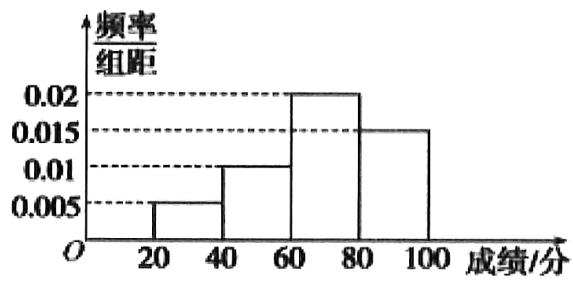

$\quad$A. 45

$\quad$B. 50

$\quad$C. 55

$\quad$D. 60

等级（N）

##### 006. 对一批产品的长度（单位：毫米）进行抽样检测，样本容量为 200，如图为检测结果的频率分布直方图，根据产品标准，单件产品长度在区间 [25, 30) 的为一等品，在区间 [20, 25) 和 [30, 35) 的为二等品，其余均为三等品，则该样本中三等品的件数为（）

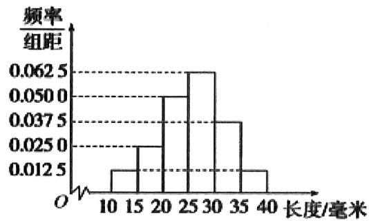

$\quad$A. 5

$\quad$B. 7

$\quad$C. 10

$\quad$D. 50

等级（N）

2021年甲卷文科  
##### 007. 为了解某地农村经济情况，对该地农户家庭年收入进行抽样调查，将农户家庭年收入的调查数据整理得到如下频率分布直方图：

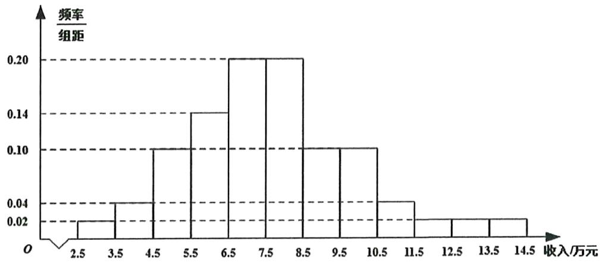

根据此频率分布直方图，下面结论中不正确的是（）

$\quad$A. 该地农户家庭年收入低于4.5万元的农户比率估计为 $6\%$   
$\quad$B. 该地农户家庭年收入不低于10.5万元的农户比率估计为 $10\%$   
$\quad$C. 估计该地农户家庭年收入的平均值不超过6.5万元  
$\quad$D. 估计该地有一半以上的农户, 其家庭年收入介于4.5万元至8.5万元之间

等级（N）

##### 008. 我国高铁发展迅速，技术先进。经统计，在经停某站的高铁列车中，有 10 个车次的正点率为 0.97，有 20 个车次的正点率为 0.98，有 10 个车次的正点率为 0.99，则经停该站高铁列车所有车次的平均正点率的估计值为 \_\_\_\_。

等级（N）

2021年新高考2卷

##### 009.（多选）下列统计量中，能度量样本 $x_{1},x_{2},\cdots,x_{n}$ 的离散程度的是（）

$\quad$A. 样本 $x_{1}, x_{2}, \cdots, x_{n}$ 的标准差

$\quad$B. 样本 $x_{1}, x_{2}, \cdots, x_{n}$ 的中位数

$\quad$C. 样本 $x_{1}, x_{2}, \cdots, x_{n}$ 的极差

$\quad$D. 样本 $x_{1}, x_{2}, \cdots, x_{n}$ 的平均数

等级（N）

##### 010. 已知一组数据 6, 7, 8, 8, 9, 10, 则该组数据的方差是 \_\_\_\_.

等级（N）

2022年全国甲卷

##### 011. 某社区通过公益讲座以普及社区居民的垃圾分类知识。为了解讲座效果，随机抽取 10 位社区居民，让他们在讲座前和讲座后各回答一份垃圾分类知识问卷，这 10 位社区居民在讲座前和讲座后问卷答题的正确率如下图：

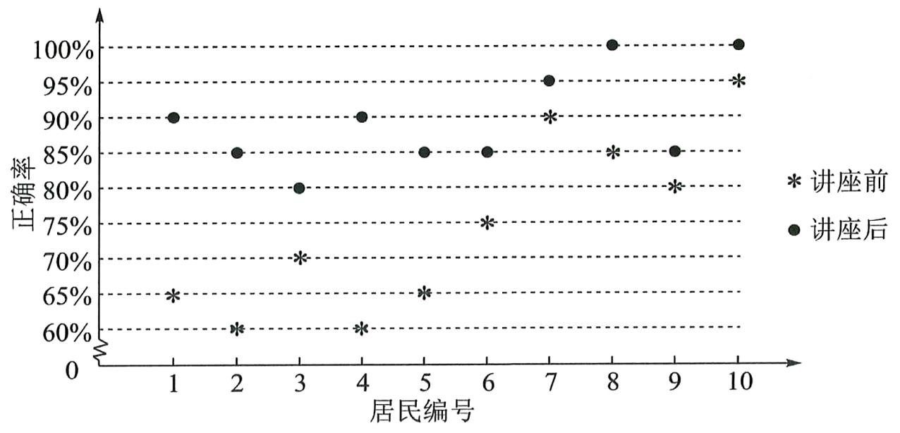

则（ ）

$\quad$A. 讲座前问卷答题的正确率的中位数小于 $70 \%$   
$\quad$B. 讲座后问卷答题的正确率的平均数大于 $85 \%$   
$\quad$C. 讲座前问卷答题的正确率的标准差小于讲座后正确率的标准差  
$\quad$D. 讲座后问卷答题的正确率的极差大于讲座前正确率的极差

等级（N）

##### 012. 演讲比赛共有 9 位评委分别给出某选手的原始评分，评定该选手的成绩时，从 9 个原始评分中去掉 1 个最高分、1 个最低分，得到 7 个有效评分。7 个有效评分与 9 个原始评分相比，不变的数字特征是（）

$\quad$A. 中位数

$\quad$B. 平均数

$\quad$C. 方差

$\quad$D. 极差

等级（N）

##### 013. 已知数据 $x_{1}, x_{2}, x_{3}, \ldots, x_{n}$ 是某市 $n(n \geq 3, n \in \mathbf{N}^{*})$ 个普通职工的年收入，设这 $n$ 个数据的中位数为 $x$ ，平均数为 $y$ ，方差为 $z$ ，如果再加上世界首富的年收入 $x_{n+1}$ ，则这 $n+1$ 个数据中，下列说法正确的是（）

$\quad$A. 年收入平均数可能不变，中位数可能不变，方差可能不变  
$\quad$B. 年收入平均数大大增大，中位数可能不变，方差变大  
$\quad$C. 年收入平均数大大增大，中位数可能不变，方差也不变  
$\quad$D. 年收入平均数大大增大，中位数一定变大，方差可能不变

等级（N）

2021 贵州省统测

##### 014. 小明处理一组数据，漏掉了一个数 10，计算得平均数为 10，方差为 2，加上这个数后的这组数据（）

$\quad$A. 平均数等于10，方差等于2

$\quad$B. 平均数等于10，方差小于2

$\quad$C. 平均数大于10，方差小于2

$\quad$D. 平均数小于10，方差大于2

等级（R）

2022 苏北七市二模

##### 015.（多选）已知一组数据 $x_{1}$ ， $x_{2}$ ，……， $x_{n}$ 的平均数为 $x_{0}$ ，若在这组数据中增添一个数据 $x_{0}$ ，得到一组新数据 $x_{0}$ ， $x_{1}$ ， $x_{2}$ ，……， $x_{n}$ ，则（）

$\quad$A. 这两组数据的平均数相同

$\quad$B. 这两组数据的中位数相同

$\quad$C. 这两组数据的标准差相同

$\quad$D. 这两组数据的极差相同

等级（R）

2022 连云港二调

##### 016.（多选）一组数据 $x_{1}, x_{2}, \cdots, x_{10}$ 是公差为-1的等差数列，若去掉首末两项 $x_{1}, x_{10}$ 后，则（ ）

$\quad$A. 平均数变大

$\quad$B. 中位数没变

$\quad$C. 方差变小

$\quad$D. 极差没变

等级（R）

2022济宁二模

##### 017.（多选）已知一组数据 $x_{1},x_{2},\cdots,x_{11}$ 是公差不为0的等差数列，若是去掉数据 $x_{6}$ ，则（）

$\quad$A. 中位数不变

$\quad$B. 平均数变小

$\quad$C. 方差变大

$\quad$D. 方差变小

等级（N）

2023 新高考一卷数学

##### 018. （多选）有一组样本数据 $x_{1}, x_{2}, \cdots, x_{6}$ ，其中 $x_{1}$ 是最小值， $x_{6}$ 是最大值，则（）

$\quad$A. $x_{2}, x_{3}, x_{4}, x_{5}$ 的平均数等于 $x_{1}, x_{2}, \cdots, x_{6}$ 的平均数  
$\quad$B. $x_{2}, x_{3}, x_{4}, x_{5}$ 的中位数等于 $x_{1}, x_{2}, \cdots, x_{6}$ 的中位数  
$\quad$C. $x_{2}, x_{3}, x_{4}, x_{5}$ 的标准差不小于 $x_{1}, x_{2}, \cdots, x_{6}$ 的标准差  
$\quad$D. $x_{2}, x_{3}, x_{4}, x_{5}$ 的极差不大于 $x_{1}, x_{2}, \cdots, x_{6}$ 的极差

等级（R）

2021甘肃一模

##### 019. 一组数据 $X_{1}, X_{2}, X_{3}, \cdots, X_{n}$ 的平均数为 $\bar{X}$ ，现定义这组数据的平均差为

$D = \frac {\mid x _ {1} - \overline {{{x}}} \mid + \mid x _ {2} - \overline {{{x}}} \mid + \mid x _ {3} - \overline {{{x}}} \mid + \cdots + \mid x _ {n} - \overline {{{x}}} \mid}{n}, \text {下图是甲、乙两组数据的频率分}$

布折线图，根据折线图，可判断甲、乙两组数据的平均差 $\mathrm{D}_1$ ， $\mathrm{D}_2$ 的大小关系是（）

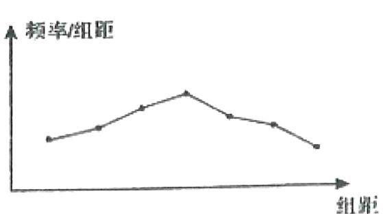

甲组数据频率分布折线图

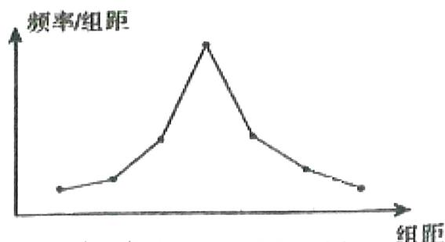

乙组数据频率分布折线图

$\quad$A. $\mathrm{D}_1 <   \mathrm{D}_2$

$\quad$B. $D_{1} = D_{2}$

$\quad$C. $\mathrm{D}_1 > \mathrm{D}_2$

$\quad$D. 无法确定

# 题型三：变量的相关性

等级（N）

##### 020. 某公司在 2016 年上半年的收入 x（单位：万元）与月支出 y（单位：万元）的统计资料如下表所示：

<table><tr><td>月份</td><td>1月</td><td>2月</td><td>3月</td><td>4月</td><td>5月</td><td>6月</td></tr><tr><td>收入x</td><td>12.3</td><td>14.5</td><td>15.0</td><td>17.0</td><td>19.8</td><td>20.6</td></tr><tr><td>支出y</td><td>5.63</td><td>5.75</td><td>5.82</td><td>5.89</td><td>6.11</td><td>6.18</td></tr></table>

根据统计资料，则（）

$\quad$A. 月收入的中位数是15，x与y有正线性相关关系  
$\quad$B. 月收入的中位数是17，x与y有负线性相关关系  
$\quad$C. 月收入的中位数是16，x与y有正线性相关关系  
$\quad$D. 月收入的中位数是16，x与y有负线性相关关系

等级（N）

2024南昌三模

##### 021. 如图对两组数据 $x, y$ 和 $v, u$ 分别进行回归分析，得到散点图如图，并求得线性回归方程分别是 $y = b_{1}x + a_{1}$ 和 $u = b_{2}v + a_{2}$ ，并对变量 $x, y$ 进行线性相关检验，得到相关系数 $r_{1}$ ，对变量 $v, u$ 进行线性相关检验，得到相关系数 $r_{2}$ ，则下列判断正确的是（）

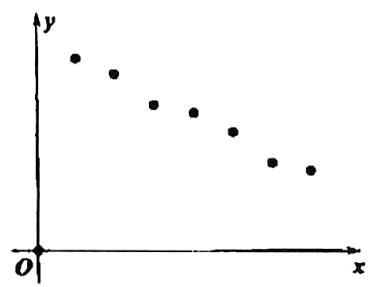

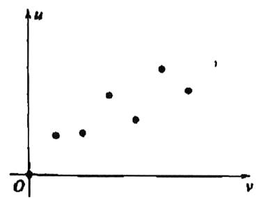

$\quad$A. $b_{1} > 0$

$\quad$B. $b_{2} < 0$

$\quad$C. $\left|r_{1}\right|<\left|r_{2}\right|$

$\quad$D. $r_1 + r_2 < 0$

等级（N）

##### 022. 某家具厂的原材料费支出 x 与销售量 y（单位：万元）之间有如下数据，根据表中提供的全部数据，用最小二乘法得出 y 与 x 的线性回归方程 $\hat{y}=8x+\hat{b}$ ，则 $\hat{b}$ 为（）

<table><tr><td>x</td><td>2</td><td>4</td><td>5</td><td>6</td><td>8</td></tr><tr><td>y</td><td>25</td><td>35</td><td>60</td><td>55</td><td>75</td></tr></table>

$\quad$A. 5

$\quad$B. 15

$\quad$C. 10

$\quad$D. 20

等级（N）

##### 023. 设某大学的女生体重 y（单位：kg）与身高 x（单位：cm）具有线性相关关系，根据一组样本数据 $(x_{i}, y_{i})$ （ $i=1, 2, \cdots, n$ ），用最小二乘法建立的回归方程为 $\hat{y}=0.85x-85.71$ ，则下列结论中不正确的是（）

$\quad$A. y与x具有正的线性相关关系  
$\quad$B. 回归直线过样本点的中心 $\left(\overline{x},\overline{y}\right)$   
$\quad$C. 若该大学某女生身高增加 $1 \mathrm{~cm}$ , 则其体重约增加 $0.85 \mathrm{~kg}$   
$\quad$D. 若该大学某女生身高为 $170 \mathrm{~cm}$ , 则可断定其体重必为 $58.79 \mathrm{~kg}$

等级（N）

##### 024. 在一组样本数据 $(x_{1}, y_{1})$ , $(x_{2}, y_{2})$ , $\cdots\cdots$ , $(x_{n}, y_{n})$ ( $n \geqslant 2$ , $x_{1}$ , $x_{2}$ , $\cdots$ , $x_{n}$ 不全相等) 的散点图中，若所有样本点 $(x_{i}, y_{i})$ ( $i=1, 2, \cdots, n$ ) 都在直线 $y=\frac{1}{2}x+1$ 上，则这组样本数据的样本相关系数为（）

$\quad$A. -1

$\quad$B. 0

$\quad$C. $\frac{1}{2}$

$\quad$D. 1

等级（N）

##### 025. 已知 $x, y$ 的线性回归直线方程为 $\hat{y} = 0.82x + 1.27$ ，且 $x, y$ 之间的一组相关数据如下表所示，则下列说法错误的为（）

<table><tr><td>x</td><td>0</td><td>1</td><td>2</td><td>3</td></tr><tr><td>y</td><td>0.8</td><td>m</td><td>3.1</td><td>4.3</td></tr></table>

$\quad$A. 变量 $x$ ， $y$ 之间呈现正相关关系

$\quad$B. 可以预测当 $x = 5$ 时， $y = 5.37$

$\quad$C. $m = 2$

$\quad$D. 由表格数据可知，该回归直线必过点 $\left(\frac{3}{2}, \frac{5}{2}\right)$

# 题型四：古典概型

等级（N）

2022年全国甲卷

##### 026. 从分别写有 1, 2, 3, 4, 5, 6 的 6 张卡片中无放回随机抽取 2 张，则抽到的 2 张卡片上的数字之积是 4 的倍数的概率为（）

$\quad$A. $\frac{1}{5}$

$\quad$B. $\frac{1}{3}$

$\quad$C. $\frac{2}{5}$

$\quad$D. $\frac{2}{3}$

等级（N）

##### 027. 从 1, 2, 3, 4 中任取 2 个不同的数，则取出的 2 个数之差的绝对值为 2 的概率是（）

$\quad$A. $\frac{1}{2}$

$\quad$B. $\frac{1}{3}$

$\quad$C. $\frac{1}{4}$

$\quad$D. $\frac{1}{6}$

等级（N）

##### 028. 设 $O$ 为正方形 $ABCD$ 的中心, 在 $O, A, B, C, D$ 中任取 3 点, 则取到的 3 点共线的概率为 ( )

$\quad$A. $\frac{1}{5}$

$\quad$B. $\frac{2}{5}$

$\quad$C. $\frac{1}{2}$

$\quad$D. $\frac{4}{5}$

等级（N）

##### 029. 小敏打开计算机时，忘记了开机密码的前两位，只记得第一位是 $M, I, N$ 中的一个字母，第二位是 1, 2, 3, 4, 5 中的一个数字，则小敏输入一次密码能够成功开机的概率是（）

$\quad$A. $\frac{8}{15}$

$\quad$B. $\frac{1}{8}$

$\quad$C. $\frac{1}{15}$

$\quad$D. $\frac{1}{30}$

等级(N)

2022年新高考1卷

##### 030. 从2至8的7个整数中随机取2个不同的数，则这2个数互质的概率为（）

$\quad$A. $\frac{1}{6}$

$\quad$B. $\frac{1}{3}$

$\quad$C. $\frac{1}{2}$

$\quad$D. $\frac{2}{3}$

等级（N）

##### 031. 从分别写有 1, 2, 3, 4, 5 的 5 张卡片中随机抽取 1 张，放回后再随机抽取 1 张，则抽得的第一张卡片上的数大于第二张卡片上的数的概率为（）

$\quad$A. $\frac{1}{10}$

$\quad$B. $\frac{1}{5}$

$\quad$C. $\frac{3}{10}$

$\quad$D. $\frac{2}{5}$

等级（N）

##### 032. 我国数学家陈景润在哥德巴赫猜想的研究中取得了世界领先的成果. 哥德巴赫猜想是 “每个大于 2 的偶数可以表示为两个素数的和”, 如 $30 = 7 + 23$ . 在不超过 30 的素数中, 随机选取两个不同的数, 其和等于 30 的概率是 ( )

$\quad$A. $\frac{1}{12}$

$\quad$B. $\frac{1}{14}$

$\quad$C. $\frac{1}{15}$

$\quad$D. $\frac{1}{18}$

等级（N）

##### 033. 如果 3 个正整数可作为一个直角三角形三条边的边长，则称这 3 个数为一组勾股数。从 1，2，3，4，5 中任取 3 个不同的数，则这 3 个数构成一组勾股数的概率为（）

$\quad$A. $\frac{3}{10}$

$\quad$B. $\frac{1}{5}$

$\quad$C. $\frac{1}{10}$

$\quad$D. $\frac{1}{20}$

等级（N）

##### 034. 甲、乙两名运动员各自等可能地从红、白、蓝 3 种颜色的运动服中选择 1 种，则他们选择相同颜色运动服的概率为 \_\_\_\_.

等级（N）

2021 湛江二模

##### 035. 现有 5 个参加演讲比赛的名额, 要分配给甲、乙、丙三个班级, 要求每班至少要分配一个名额, 则甲班恰好分配到两个名额的概率为 \_\_\_\_

等级（N）

2021年甲卷理科

##### 036. 将 4 个 1 和 2 个 0 随机排成一行，则 2 个 0 不相邻的概率为（）

$\quad$A. $\frac{1}{3}$

$\quad$B. $\frac{2}{5}$

$\quad$C. $\frac{2}{3}$

$\quad$D. $\frac{4}{5}$

等级（N）

##### 037. 我国古代典籍《周易》用“卦”描述万物的变化. 每一“重卦”由从下到上排列的6个爻组成, 爻分为“阳爻”和“阴爻”, 如图就是一重卦. 在所有重卦中随机取一重卦, 则该重卦恰有3个阳爻的概率是（）

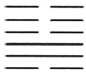

$\quad$A. $\frac{5}{16}$

$\quad$B. $\frac{11}{32}$

$\quad$C. $\frac{21}{32}$

$\quad$D. $\frac{11}{16}$

等级（R）

2022年全国甲卷

##### 038. 从正方体的 8 个顶点中任选 4 个，则这 4 个点在同一个平面的概率为 \_\_\_\_.

等级（R）

##### 039. 将一个骰子连续掷 3 次，它落地时向上的点数依次成等差数列的概率为（）

$\quad$A. $\frac{1}{12}$

$\quad$B. $\frac{1}{9}$

$\quad$C. $\frac{1}{15}$

$\quad$D. $\frac{1}{18}$

等级（R）

##### 040. 齐王与田忌赛马，田忌的上等马优于齐王的中等马，劣于齐王的上等马，田忌的中等马优于齐王的下等马，劣于齐王的中等马，田忌的下等马劣于齐王的下等马，现从双方的马匹中随机选一匹马进行一场比赛，则田忌获胜的概率为（）

$\quad$A. $\frac{1}{3}$

$\quad$B. $\frac{1}{4}$

$\quad$C. $\frac{1}{5}$

$\quad$D. $\frac{1}{6}$

等级（R）

2021广东一模

##### 041. 某圆形广场外围有 12 盏灯，如右图所示，为了节能每天晚上 12 时关掉其中 4 盏灯，则恰好每间隔 2 盏灯关掉 1 盏的概率是 \_\_\_\_

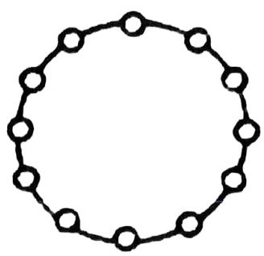

等级（R）

2021马鞍山三模

##### 042. 某动漫公司推出漫画角色盲盒周边售卖, 每个盲盒中等可能的放入该公司的 3 款经典动漫角色玩偶中的一个, 小明购买了 4 个盲盒, 则他能集齐 3 个不同动漫角色的概率是\_\_\_\_

# 题型五：线性变换后平均数方差的变化

等级（N）

##### 043. 设样本数据 $x_{1}, x_{2}, \ldots, x_{10}$ 的均值和方差分别为 1 和 4，若 $y_{i} = x_{i} + a$ （a 为非零常数，i=1, 2, …, 10），则 $y_{1}, y_{2}, \cdots, y_{10}$ 的均值和方差分别为（）

$\quad$A. $1 + a, 4$

$\quad$B. $1 + \mathbf{a}$ ， $4 + \mathbf{a}$

$\quad$C. 1, 4

$\quad$D. 1, $4 + a$

等级（N）

##### 044. 已知一组数据 $x_{1}, x_{2}, \ldots, x_{n}$ 的方差为 2，若数据 $ax_{1} + b, ax_{2} + b, \ldots, ax_{n} + b (a > 0)$ 的方差为 8，则 a 的值为（）

$\quad$A. 1

$\quad$B. $\sqrt{2}$

$\quad$C. 2

$\quad$D. 4

等级（N）

2021年新高考1卷

##### 045. (多选)有一组样本数据 $x_{1}, x_{2}, \cdots, x_{n}$ , 由这组数据得到新样本数据 $y_{1}, y_{2}, \cdots, y_{n}$ , 其中 $y_{i} = x_{i} + c (i = 1, 2, \cdots, n), c$ 为非零常数, 则 ( )

$\quad$A. 两组样本数据的样本平均数相同

$\quad$B. 两组样本数据的样本中位数相同

$\quad$C. 两组样本数据的样本标准差相同

$\quad$D. 两组样本数据的样本极差相同

等级（R）

2023兰州一诊

##### 046. 2022 年 8-12 月某市场上草莓价格（单位：元/千克）x 的取值为：12，16，20，24，28，市场需求量（单位：百千克） $y = -0.5x + 20$ ，则市场需求量的方差为

$\quad$A.8

$\quad$B.4

$\quad$C. $2 \sqrt{2}$

$\quad$D.2

# 题型六：简单的数据分析题

等级（N）

##### 047. 某城市为了解游客人数的变化规律，提高旅游服务质量，收集并整理了 2014 年 1 月至 2016 年 12 月期间月接待游客量（单位：万人）的数据，绘制了下面的折线图。

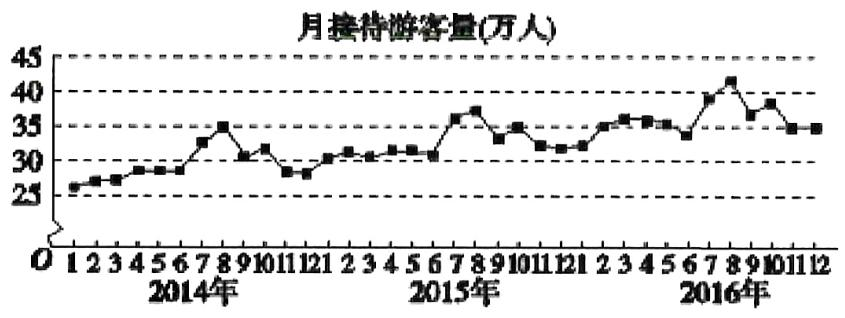

根据该折线图，下列结论错误的是（ ）

$\quad$A. 月接待游客量逐月增加  
$\quad$B. 年接待游客量逐年增加  
$\quad$C. 各年的月接待游客量高峰期大致在 7, 8 月  
$\quad$D. 各年 1 月至 6 月的月接待游客量相对于 7 月至 12 月，波动性更小，变化比较平

等级（N）

##### 048. 某地区经过一年的新农村建设，农村的经济收入增加了一倍，实现翻番，为更好地了解该地区农村的经济收入变化情况，统计了该地区新农村建设前后农村的经济收入构成比例，得到如下饼图：

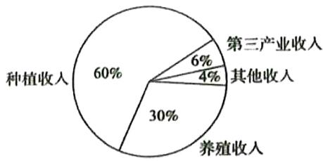

建设前经济收入构成比例

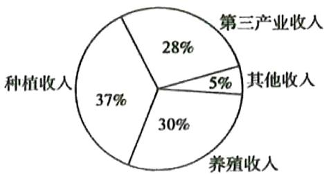

建设后经济收入构成比例

则下面结论不正确的是（）

$\quad$A. 新农村建设后，种植收入减少  
$\quad$B. 新农村建设后，其他收入增加了一倍以上  
$\quad$C. 新农村建设后，养殖收入增加了一倍  
$\quad$D. 新农村建设后, 养殖收与入第三产业收入的总和超过了经济收入的一半

等级（N）

##### 049. 某旅游城市为向游客介绍本地的气温情况, 绘制了一年中各月平均最高气温和平均最低气温的雷达图. 图中 $A$ 点表示十月的平均最高气温约为 $15^{\circ} \mathrm{C}$ , $B$ 点表示四月的平均最低气温约为 $5^{\circ} \mathrm{C}$ . 下面叙述不正确的是 ( )

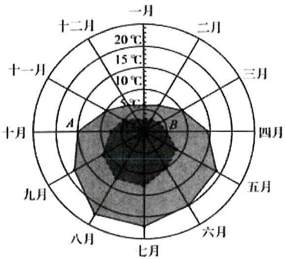

……平均最低气温 —— 平均最高气温

$\quad$A. 各月的平均最低气温都在 $0^{\circ} \mathrm{C}$ 以上  
$\quad$B. 七月的平均温差比一月的平均温差大  
$\quad$C. 三月和十一月的平均最高气温基本相同  
$\quad$D. 平均最高气温高于 $20^{\circ} \mathrm{C}$ 的月份有 5 个

等级（N）

2021三明三检

##### 050. 某市长期追踪市民的经济状况，依照订立的标准将市民分为高收入和低收入两类，统计数据表明该市高收入市民人口一直是低收入市民人口的两倍，且高收入市民中每年有 $40\%$ 会转变为低收入市民，那么该市每年低收入市民中转变为高收入市民的百分比是（）

$\quad$A. $60\%$

$\quad$B. $70\%$

$\quad$C. $80\%$

$\quad$D. $90\%$

等级（N）

##### 051. 一项针对都市熟男（三线以上城市 30\~50 岁男性）消费水平的调查显示，对于最近一年内是否购买过以下七类高价商品，全体被调查者，以及其中包括的 1980 年及以后出生（80 后）被调查者、1980 年以前出生（80 前）被调查者回答“是”的比例分别如下：

<table><tr><td></td><td>全体被调查者</td><td>80后被调查者</td><td>80前被调查者</td></tr><tr><td>电子产品</td><td>56.9%</td><td>66.0%</td><td>48.5%</td></tr><tr><td>服装</td><td>23.0%</td><td>24.9%</td><td>21.2%</td></tr><tr><td>手表</td><td>14.3%</td><td>19.4%</td><td>9.7%</td></tr><tr><td>运动、户外用品</td><td>10.4%</td><td>11.1%</td><td>9.7%</td></tr><tr><td>珠宝首饰</td><td>8.6%</td><td>10.8%</td><td>6.5%</td></tr><tr><td>箱包</td><td>8.1%</td><td>11.3%</td><td>5.1%</td></tr><tr><td>个护与化妆品</td><td>6.6%</td><td>6.0%</td><td>7.2%</td></tr><tr><td>以上皆无</td><td>25.3%</td><td>17.9%</td><td>32.1%</td></tr></table>

根据表格中数据判断，以下分析错误的是（）

$\quad$A. 都市熟男购买比例最高的高价商品是电子产品  
$\quad$B. 从整体上看，80后购买高价商品的意愿高于80前  
$\quad$C. 80 前超过三成一年内从未购买过表格中七类高价商品  
$\quad$D. 被调查的都市熟男中 80 后人数与 80 前人数的比例大约为 2:1

等级（N）

##### 052. 根据如图给出的 2004 年至 2013 年我国二氧化硫年排放量（单位：万吨）柱形图，以下结论中不正确的是（）

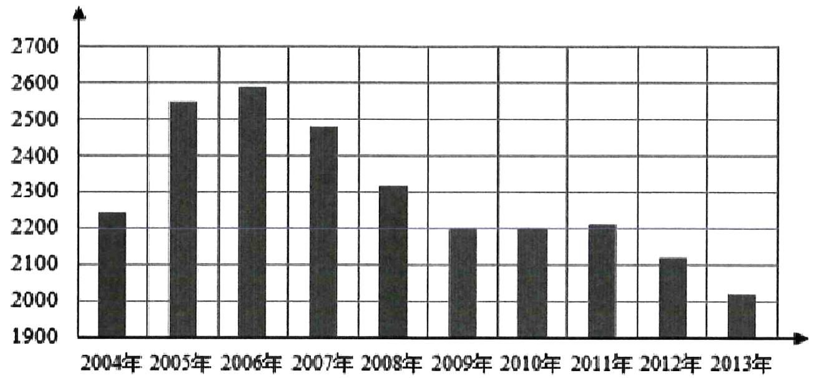

$\quad$A. 逐年比较，2008年减少二氧化硫排放量的效果最显著  
$\quad$B. 2007年我国治理二氧化硫排放显现成效  
$\quad$C. 2006 年以来我国二氧化硫年排放量呈减少趋势  
$\quad$D. 2006 年以来我国二氧化硫年排放量与年份正相关

等级（R）

##### 053. 某地 2019 年第一季度应聘和招聘人数排行榜前 5 个行业的情况列表如下：

<table><tr><td>行业名称</td><td>计算机</td><td>机械</td><td>营销</td><td>物流</td><td>贸易</td></tr><tr><td>应聘人数</td><td>215830</td><td>200250</td><td>154676</td><td>74570</td><td>65280</td></tr><tr><td>行业名称</td><td>计算机</td><td>营销</td><td>机械</td><td>建筑</td><td>化工</td></tr><tr><td>招聘人数</td><td>124620</td><td>102935</td><td>89115</td><td>76516</td><td>70436</td></tr></table>

若用同一行业中应聘人数与招聘人数比值的大小来衡量该行业的就业情况则根据表中的数据，就业形势一定是（）

$\quad$A.计算机行业好于化工行业  
$\quad$B.建筑行业好于物流行业  
$\quad$C. 机械行业最紧张  
$\quad$D. 营销行业比贸易行业紧张

# 题型七：分布列与期望方差

等级（N）

##### 054. 已知随机变量 $X$ 的分布列为

<table><tr><td>X</td><td>0</td><td>1</td><td>2</td></tr><tr><td>P</td><td> $\frac{1}{3}$ </td><td>a</td><td>b</td></tr></table>

若 $E(X) = 1$ ，则 $E(aX + b) = \underline{\hspace{2cm}}$

等级（N）

##### 055. 已知随机变量 X 的分布列如表:

<table><tr><td>X</td><td>a</td><td>2</td><td>3</td><td>4</td></tr><tr><td>P</td><td>1/3</td><td>b</td><td>1/6</td><td>1/4</td></tr></table>

若 E(X)=2，则 a=\_\_\_\_，D(X)=\_\_\_\_。

等级（N）

2021 拉萨二模

##### 056. 设随机变量 X, Y 满足 $Y=2X+3$ ，若 E(X)=2，D(X)=8，则 E(Y) 和 D(Y) 分别等于（）

$\quad$A. 2,8

$\quad$B. 7, 8

$\quad$C. 7, 32

$\quad$D. 7, 35

等级（N）

##### 057. 某种种子每粒发芽的概率都为 0.9，现播种了 1000 粒，对于没有发芽的种子，每粒需再补种 2 粒，补种的种子数记为 $X$ ，则 $X$ 的数学期望为（）

$\quad$A. 100

$\quad$B. 200

$\quad$C. 300

$\quad$D. 400

等级(R)

##### 058. 随机变量 $X$ ， $Y$ 的分布列如下表，其中 $n \in N^{*}$ ，则（）

<table><tr><td>X</td><td>n</td><td>n+1</td><td>n+2</td></tr><tr><td>P</td><td> $\frac{1}{3}$ </td><td> $\frac{1}{3}$ </td><td> $\frac{1}{3}$ </td></tr></table>

<table><tr><td>Y</td><td>n</td><td>n+2</td><td>n+4</td></tr><tr><td>P</td><td>1/3</td><td>1/3</td><td>1/3</td></tr></table>

$\quad$A. $D(X) = D(Y)$

$\quad$B. $D(X) <   D(Y)$

$\quad$C. $D(X) > D(Y)$

$\quad$D. 无法判断 $D(X)$ , $D(Y)$ 的关系

等级（R）

2020 年新课标 3 卷理科

##### 059. 在一组样本数据中，1，2，3，4 出现的频率分别为 $p_1, p_2, p_3, p_4$ ，且 $\sum_{i=1}^{4} p_i = 1$ ，则下面四种情形中，对应样本的标准差最大的一组是（）

$\quad$A. $p_1 = p_4 = 0.1, p_2 = p_3 = 0.4$

$\quad$B. $p_1 = p_4 = 0.4, p_2 = p_3 = 0.1$

$\quad$C. $p_1 = p_4 = 0.2, p_2 = p_3 = 0.3$

$\quad$D. $p_1 = p_4 = 0.3, p_2 = p_3 = 0.2$

等级（R）

2024 深圳中学适应性测试

##### 060..设 $x_{1}$ 、 $x_{2}$ 、 $x_{3}$ 为互不相等的正实数，随机变量 $X$ 和 $Y$ 的分布列如下表，若记 $DX$ ， $DY$ 分别为 $X, Y$ 的方差，则下列说法正确的是（）

<table><tr><td>X</td><td>x1</td><td>x2</td><td>x3</td></tr><tr><td>Y</td><td>x1+x2/2</td><td>x2+x3/2</td><td>x3+x1/2</td></tr><tr><td>P</td><td>1/3</td><td>1/3</td><td>1/3</td></tr></table>

$\quad$A. $D(X) <   D(Y)$   
$\quad$B. $D(X) = D(Y)$   
$\quad$C. $D(X) > D(Y)$   
$\quad$D. $D(X)$ 与 $D(Y)$ 的大小关系与 $x_{1}, x_{2}, x_{3}$ 的取值有关

等级（R）

##### 061. 已知随机变量 $\xi_{i}$ 满足 $P(\xi_{i} = 1) = p_{i}, P(\xi_{i} = 0) = 1 - p_{i}, i = 1, 2$ 。

若 $0 < p_{1} < p_{2} < \frac{1}{2}$ ，则（）

$\quad$A. $\mathrm{E}\left(\xi_{1}\right)<\mathrm{E}\left(\xi_{2}\right)$ ,

$\mathrm{D}\left(\xi_{1}\right) <   \mathrm{D}\left(\xi_{2}\right)$

$\quad$B. $\mathrm{E}\left(\xi_{1}\right)<\mathrm{E}\left(\xi_{2}\right)$ ,

$\mathrm{D}(\xi_1) > \mathrm{D}(\xi_2)$

$\quad$C. $\mathrm{E}\left(\xi_{1}\right) > \mathrm{E}\left(\xi_{2}\right)$ ,

$\mathrm{D}\left(\xi_1\right) <   \mathrm{D}\left(\xi_2\right)$

$\quad$D. $\mathrm{E}\left(\xi_{1}\right) > \mathrm{E}\left(\xi_{2}\right)$ ,

$\mathrm{D}(\xi_1) > \mathrm{D}(\xi_2)$

# 题型八：超几何分布概率计算

等级（N）

##### 062. 生物实验室有 5 只兔子，其中只有 3 只测量过某项指标。若从这 5 只兔子中随机取出 3 只，则恰有 2 只测量过该指标的概率为（）

$\quad$A. $\frac{2}{3}$

$\quad$B. $\frac{3}{5}$

$\quad$C. $\frac{2}{5}$

$\quad$D. $\frac{1}{5}$

等级（N）

##### 063. 某小组共有 10 名学生，其中女生 3 名，现选举 2 名代表，至少有 1 名女生当选的概率为

等级（N）

##### 064. 从一批含有 13 件正品、2 件次品的产品中，不放回地任取 3 件，则取出产品中无次品的概率为（）

$\quad$A. $\frac{22}{35}$

$\quad$B. $\frac{12}{35}$

$\quad$C. $\frac{1}{35}$

$\quad$D. $\frac{34}{35}$

# 题型九：事件独立性的判断与计算

等级（R）

2021年新高考1卷

##### 065. 有 6 个相同的球，分别标有数字 1, 2, 3, 4, 5, 6，从中有放回的随机取两次，每次取 1 个球，甲表示事件 “第一次取出的球的数字是 1”，乙表示事件 “第二次取出的球的数字是 2”，丙表示事件 “两次取出的球的数字之和是 8”，丁表示事件 “两次取出的球的数字之和是 7”，则（）

$\quad$A. 甲与丙相互独立

$\quad$B. 甲与丁相互独立

$\quad$C. 乙与丙相互独立

$\quad$D. 丙与丁相互独立

等级（R）

2024雅礼中学自主测试一

##### 066.若古典概型的样本空间 $\Omega = \{1,2,3,4\}$ , 事件 $A = \{1,2\}$ , 甲:事件 $B = \Omega$ , 乙:事件 $A,B$ 相互独立, 则甲是乙的（）

$\quad$A. 充分不必要条件

$\quad$B. 必要不充分条件

$\quad$C. 充分必要条件

$\quad$D.既不充分也不必要条件

等级（R）

2024大湾区二模

##### 067.抛掷一枚质地均匀的硬币 $n(n \geq 2)$ 次, 记事件 $A =$ “ $n$ 次中至多有一次反面朝上”, 事件 $B =$ “ $n$ 次中全部正面朝上或全部反面朝上”, 若 $A$ 与 $B$ 独立, 则 $n$ 的值为( )

$\quad$A.2

$\quad$B.3

$\quad$C.4

$\quad$D.5

等级（R）

2024 福建 4 月九市联考

##### 068.(多选)投掷一枚质地均匀的硬币三次, 设随机变量 $X_{n} = \left\{ \begin{array}{ll} 1, & \text{第} n \text{次投出正面,}\\ -1, & \text{第} n \text{次投出反面,} \end{array} \right.$ (n=1,2,3).
记 A 表示事件“ $X_{1} + X_{2} = 0$ ”，B 表示事件“ $X_{2} = 1$ ”，C 表示事件“ $X_{1} + X_{2} + X_{3} = -1$ ”，则()

$\quad$A. $B$ 和 $C$ 互为对立事件

$\quad$B.事件 $A$ 和 $C$ 不互斥

$\quad$C.事件 $A$ 和 $\pmb{B}$ 相互独立

$\quad$D.事件 $B$ 和 $C$ 相互独立

# 题型十：独立事件概率计算

等级（N）

##### 069. 先后抛掷硬币三次，则至少一次正面朝上的概率是（）

$\quad$A. $\frac{1}{8}$

$\quad$B. $\frac{3}{8}$

$\quad$C. $\frac{5}{8}$

$\quad$D. $\frac{7}{8}$

等级(N)

##### 070. 田径比赛跳高项目中, 在横杆高度设定后, 运动员有三次试跳机会, 只要有一次试跳成功即完成本轮比赛. 在某学校运动会跳高决赛中, 某跳高运动员成功越过现有高度即可成为本次比赛的冠军, 结合平时训练数据, 每次试跳他能成功越过这个高度的概率为 0.8 (每次试跳之间互不影响), 则本次比赛他获得冠军的概率是 ( )

$\quad$A.0.832

$\quad$B.0.920

$\quad$C.0.960

$\quad$D.0.992

等级（N）

##### 071. 某居民小区有两个相互独立的安全防范系统 A 和 B，系统 A 和系统 B 在任意时刻发生故障的概率分别为 $\frac{1}{8}$ 和 p，若在任意时刻恰有一个系统不发生故障的概率为 $\frac{9}{40}$ ，则 $p = (\quad)$

$\quad$A. $\frac{1}{10}$

$\quad$B. $\frac{2}{15}$

$\quad$C. $\frac{1}{6}$

$\quad$D. $\frac{1}{5}$

等级（N）

##### 072. 甲、乙两队进行篮球决赛，采取七场四胜制（当一队赢得四场胜利时，该队获胜，决赛结束）根据前期比赛成绩，甲队的主客场安排依次为“主主客客主客主”。设甲队主场取胜的概率为 0.6，客场取胜的概率为 0.5，且各场比赛结果相互独立，则甲队以 4:1 获胜的概率是

等级（N）

2021合肥二模

##### 073. 某校高三年级在迎新春趣味运动会上设置了一个三分线外定点投篮比赛项目，规则是：每人投球 5 次，投中一次得 1 分，没投中得 0 分，且连续投中 2 次额外加 1 分，连续投中三次额外加 2 分，连续投中 4 次额外加 3 分，全部投中额外加 5 分。某同学投篮命中概率为 $\frac{1}{3}$ ，则该同学投篮比赛得 3 分的概率为（）

$\quad$A. $\frac{1}{81}$

$\quad$B. $\frac{4}{81}$

$\quad$C. $\frac{4}{27}$

$\quad$D. $\frac{40}{243}$

等级(N)

##### 074. 在我校本年度足球比赛中，经过激烈角逐后，最终 $A, B, C, D$ 四个班级的球队闯入半决赛。在半决赛中，对阵形式为： $A$ 对阵 $C, B$ 对阵 $D$ ，获胜球队进入决赛争夺冠亚军，失利球队争夺三四名若每场比赛是相互独立的，四支球队间相互获胜的概率如下表所示：

<table><tr><td></td><td>A</td><td>B</td><td>C</td><td>D</td></tr><tr><td>A 获胜概率</td><td>—</td><td>0.3</td><td>0.4</td><td>0.8</td></tr><tr><td>B 获胜概率</td><td>0.7</td><td>—</td><td>0.7</td><td>0.5</td></tr><tr><td>C 获胜概率</td><td>0.6</td><td>0.3</td><td>—</td><td>0.3</td></tr><tr><td>D 获胜概率</td><td>0.2</td><td>0.5</td><td>0.7</td><td>—</td></tr></table>

则A队最终获得冠军的概率为\_\_\_\_.

等级（N）

2021 福建四月质检

##### 075. 某地举办“迎建党 100 周年”乒乓球团体赛，比赛采用新斯韦思林杯赛制（5 场单打 3 胜制，即先胜 3 场者获胜，比赛结束）。现有两支球队进行比赛，前 3 场依次分别由甲、乙、丙和 A、B、C 出场比赛。若经过 3 场比赛未分出胜负，则第四场由甲和 B 进行比赛；若经过四场比赛仍未分出胜负；则第 5 场由乙和 A 进行比赛。假设甲与 A 或 B 比赛，甲每场获胜的概率均为 0.6；乙与 A 或 B 比赛，乙每场获胜的概率均为 0.5；丙与 C 比赛，丙每场获胜的概率均为 0.5；各场比赛的结果互不影响。那么，恰好经过四场比赛分出胜负的概率为（）

$\quad$A.0.24

$\quad$B.0.25

$\quad$C.0.38

$\quad$D.0.5

等级(R)

2023 新高考二卷数学

##### 076. (多选)在信道内传输0,1信号,信号的传输相互独立. 发送0时,收到1的概率为 $\alpha(0 < \alpha < 1)$ , 收到0的概率为 $1 - \alpha$ ; 发送1时,收到0的概率为 $\beta(0 < \beta < 1)$ , 收到1的概率为 $1 - \beta$ . 考虑两种传输方案: 单次传输和三次传输. 单次传输是指每个信号只发送1次,三次传输是指每个信号重复发送3次. 收到的信号需要译码,译码规则如下: 单次传输时,收到的信号即为译码;三次传输时,收到的信号中出现次数多的即为译码(例如,若依次收到1,0,1,则译码为1).

$\quad$A. 采用单次传输方案，若依次发送 1, 0, 1，则依次收到 1, 0, 1 的概率为 $(1 - \alpha)(1 - \beta)^2$

$\quad$B. 采用三次传输方案，若发送1，则依次收到1，0，1的概率为 $\beta (1 - \beta)^2$

$\quad$C. 采用三次传输方案，若发送1，则译码为1的概率为 $\beta (1 - \beta)^2 +(1 - \beta)^3$

$\quad$D. 当 $0 < \alpha < 0.5$ 时，若发送0，则采用三次传输方案译码为0的概率大于采用单次传输方案译码为0的概率

等级（SR）

2022年全国乙卷

##### 077. 某棋手与甲、乙、丙三位棋手各比赛一盘，各盘比赛结果相互独立。已知该棋手与甲、乙、丙比赛获胜的概率分别为 $p_{1}, p_{2}, p_{3}$ ，且 $p_{3} > p_{2} > p_{1} > 0$ 。记该棋手连胜两盘的概率为 $p$ ，则（）

$\quad$A. $p$ 与该棋手和甲、乙、丙的比赛次序无关

$\quad$B. 该棋手在第二盘与甲比赛， $p$ 最大

$\quad$C. 该棋手在第二盘与乙比赛， $p$ 最大

$\quad$D. 该棋手在第二盘与丙比赛， $p$ 最大

等级（SR）

2022 武汉 5 月模拟

##### 078. 奥运吉祥物 “雪容融” 是根据中国传统文化中灯笼的造型创作而成，现挂有如图所示的两串灯笼，每次随机选取其中一串并摘下其最下方的一个灯笼，直至某一串灯笼被摘完为止，则左边灯笼先摘完的概率为 \_\_\_\_

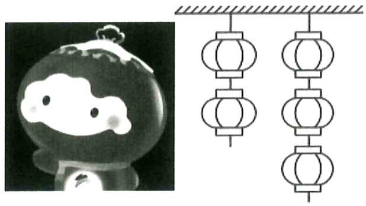

# 题型十一：条件概率

等级（N）

2022 炎德英才雅礼第七次月考

##### 079. 某盒中装有 10 个乒乓球, 其中 6 个新球, 4 个旧球, 不放回地依次摸出 2 个球使用, 在第一次摸出新球的条件下, 第二次也取到新球的概率为

等级（N）

##### 080. 8 张卡片上分别写有数字 1、2、3、4、5、6、7、8，从中随机取出 2 张，记事件 A=“所取 2 张卡片上的数字之和为偶数”，事件 B=“所取 2 张卡片上的数字之和小于 9”，则 P(B|A)=( )

$\quad$A. $\frac{1}{6}$

$\quad$B. $\frac{1}{3}$

$\quad$C. $\frac{1}{2}$

$\quad$D. $\frac{2}{3}$

等级（N）

##### 081. 某地区空气质量监测资料表明，一天的空气质量为优良的概率是 0.75，连续两天为优良的概率是 0.6，已知某天的空气质量为优良，则随后一天的空气质量为优良的概率是（）

$\quad$A.0.8

$\quad$B.0.75

$\quad$C.0.6

$\quad$D.0 45

等级(N)

##### 082. 某种疾病的患病率为 $0.5\%$ ，已知在患该种疾病的条件下血检呈阳性的概率为 $99\%$ ，则患该种疾病且血检呈阳性的概率为（）

$\quad$A. $0.495\%$

$\quad$B.0.9405%

$\quad$C.0.9995%

$\quad$D. $0.99\%$

等级（N）

2022南昌二模

##### 083. 从装有 4 个红球和 3 个蓝球（除颜色外完全相同）的盒子中任取两个球，则在选到的两个球颜色相同的条件下，都是红球的概率为\_\_\_\_。

等级（N）

2024鞍山第二次质量监测

##### 084. 在某次美术专业测试中,若甲、乙、丙三人获得优秀等级的概率分别是 0.6,0.8 和 0.5，且三人的测试结果相互独立，则测试结束后，在甲、乙、丙三人中恰有两人没达优秀等级的前提条件下，乙没有达优秀等级的概率为（）

$\quad$A. $\frac{1}{26}$

$\quad$B. $\frac{5}{13}$

$\quad$C. $\frac{5}{8}$

$\quad$D. $\frac{17}{29}$

等级（N）

2023扬州中学月考

##### 085. 设 $P(A|B) = P(B|A) = \frac{1}{2}, P(A) = \frac{1}{3}$ , 则 $P(B)$ 等于（）

$\quad$A. $\frac{1}{2}$

$\quad$B. $\frac{1}{3}$

$\quad$C. $\frac{1}{4}$

$\quad$D. $\frac{1}{6}$

等级（R）

2022 重庆八中冲刺卷

##### 086. 若随机事件 A, B 满足 P(A) = $\frac{1}{3}$ , P(B) = $\frac{1}{2}$ , P(A∪B) = $\frac{2}{3}$ , 则 P(A|B) = ( )

$\quad$A. $\frac{1}{6}$

$\quad$B. $\frac{1}{3}$

$\quad$C. $\frac{1}{2}$

$\quad$D. $\frac{2}{3}$

# 题型十二：二项分布

等级 (N)

##### 087. 投篮测试中, 每人投 3 次, 至少投中 2 次才能通过测试。已知某同学每次投篮投中的概率为 0.6, 且各次投篮是否投中相互独立, 则该同学通过测试的概率为

等级 (N)

##### 088. 设随机变量 $X \sim B\left(6, \frac{1}{3}\right)$ ，则 $P(2 < X \leq 4) =$ \_\_\_\_.

等级（N）

##### 089. 某人射击一次命中目标的概率为 $\frac{1}{2}$ , 且每次射击相互独立, 则此人射击 7 次, 有 4 次命中且恰有 3 次连续命中的概率为 ( )

$\quad$A. $C_6^3\left(\frac{1}{2}\right)^7$

$\quad$B. $A_4^2\left(\frac{1}{2}\right)^7$

$\quad$C. $C_4^2\left(\frac{1}{2}\right)^7$

$\quad$D. $C_4^1\left(\frac{1}{2}\right)^7$

等级（N）

##### 090. 设随机变量 $X \sim B(2, p)$ , 随机变量 $Y \sim B(3, p)$ , 若 $P(X \geq 1) = \frac{5}{9}$ , 则 $P(Y \geq 1) =$ \_\_\_\_.

等级（N）

##### 091. 已知随机变量 $X \sim B(n, p)$ ，则 E(X) = 2， $D(X) = \frac{3}{2}$ ，则 n= \_\_\_\_，p= \_\_\_\_.

等级（N）

2022大庆三模

##### 092. 已知随机变量 X, Y 满足 $X + Y = 8$ ，若 $X \sim B(10, 0.6)$ ，则 $E(Y) =$ \_\_\_\_ .

等级(R)

2024华大新高考联盟4月测评

##### 093. 如图所示, 已知一质点在外力的作用下, 从原点 $O$ 出发, 每次向左移动的概率为 $\frac{2}{3}$ , 向右移动的概率为 $\frac{1}{3}$ . 若该质点每次移动一个单位长度, 记经过 5 次移动后, 该质点位于 $X$ 的位置, 则 $P(X > 0) = (\quad)$

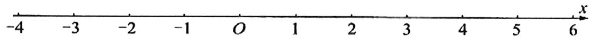

$\quad$A. $\frac{50}{243}$

$\quad$B. $\frac{52}{243}$

$\quad$C. $\frac{2}{9}$

$\quad$D. $\frac{17}{81}$

等级（SR）

2022 福建百校联盟 4 月联考

##### 094.（多选）在某独立重复实验中，事件 A, B 互相独立，且在一次实验中，事件 A 发生的概率为 p，事件 B 发生的概率为 1-p，其中 $p \in (0,1)$ ，若进行 n 次实验，记事件 A 发生的次数为 X，事件 B 发生的次数为 Y，事件 AB 发生的次数为 Z，则下列说法正确的是（）

$\quad$A. $E(X) = E(Y)$

$\quad$B. $D(X) = D(Y)$

$\quad$C. $E(Z) = D(X)$

$\quad$D. $n\cdot D(Z) = D(X)\cdot D(Y)$

# 题型十三：正态分布

等级（N）

##### 095. 已知随机变量 X 服从正态分布 $N(3, \sigma^2)$ ，且 $P(X \leq 4) = 0.84$ ，则 $\mathrm{P}(2 < X < 4) = (\quad)$

$\quad$A.0.84

$\quad$B.0.68

$\quad$C.0.32

$\quad$D.0.16

等级（N）

##### 096. 已知随机变量 X 服从正态分布 N(2, 1)，若 $P(X \leq a - 2) = P(X \geq 2a + 3)$ ，则 a= \_\_\_\_

等级(N)

##### 097. 随机变量 $\zeta \sim N(\mu, \sigma^2)$ ，若 $P(\zeta \leq 1) = 0.3, P(1 < \zeta < 5) = 0.4$ ，则 $\mu = (\quad)$

$\quad$A.1

$\quad$B.2

$\quad$C.3

$\quad$D.4

等级（N）

2021年新高考2卷

##### 098. 某物理量的测量结果服从正态分布 $N(10, \sigma^2)$ ，下列结论中不正确的是（）

$\quad$A. $\sigma$ 越小，该物理量在一次测量中在(9.9,10.1)的概率越大  
$\quad$B. 该物理量在一次测量中大于10的概率为0.5  
$\quad$C. 该物理量在一次测量中小于9.99与大于10.01的概率相等  
$\quad$D. 该物理量在一次测量中落在(9.9,10.2)与落在(10,10.3)的概率相等

等级（N）

##### 099. 设两个正态分布 $N\left(\mu_1, \sigma_1^2\right)\left(\sigma_1 > 0\right)$ 和 $N\left(\mu_2, \sigma_2^2\right)\left(\sigma_2 > 0\right)$ 曲线如图所示，则有（、）

$\quad$A. $\mu_{1} < \mu_{2}, \sigma_{1} > \sigma_{2}$

$\quad$B. $\mu_{1} < \mu_{2}, \sigma_{1} < \sigma_{2}$

$\quad$C. $\mu_{1} > \mu_{2},\sigma_{1} > \sigma_{2}$

$\quad$D. $\mu_{1} > \mu_{2},\sigma_{1} <   \sigma_{2}$

等级（N）

##### 100. 2017 年 1 月我市校高三年级 1600 名学生参加了 2017 届全市高三期末联考，已知数学考试成绩 $X \sim N(100, \sigma^2)$ （试卷满分 150 分）. 统计结果显示数学考试成绩在 80 分到 120 分之间的人数约为总人数的 $\frac{3}{4}$ ，则此次期末联考中成绩不低于 120 分的学生人数约为（）

$\quad$A. 120

##### 8.160

$\quad$C. 200

$\quad$D. 240

等级（N）

2022 唐山一模

##### 101. 为了监控某种食品的生产包装过程，检验员每天从生产线上随机抽取 k（k∈N\*）包食品，并测量其质量（单位：g）。根据长期的生产经验，这条生产线正常状态下每包食品质量服从正态分布 N（μ，σ²）。假设生产状态正常，记ξ表示每天抽取的 k 包食品中其质量在（μ-3σ，μ+3σ）之外的包数，若ξ的数学期望 E（ξ）＞0.05，则 k 的最小值为 \_\_\_\_

附：若随机变量X服从正态分布N（ $\mu$ ， $\sigma^2$ ），则P（ $\mu - 3\sigma < X < \mu + 3\sigma$ ） $\approx 0.9973$

等级（N）

##### 102. 对一个物理量做 $n$ 次测量，并以测量结果的平均值作为该物理量的最后结果。已知最后结果的误差 $\varepsilon_{n} - N\left(0, \frac{2}{n}\right)$ ，为使误差 $\varepsilon_{n}$ 在（-0.5，0.5）的概率不小于 0.9545，至少要测量 \_\_\_\_ 次（若 $X \sim N\left(\mu, \sigma^{2}\right)$ ，则 $P(|X - \mu| < 2\sigma) = 0.9545$ ）。

等级（N）

##### 103. 已知随机变量 $\varepsilon$ 服从正态分布 N（1，2），则 $D(2\varepsilon+3)=$ \_\_\_\_.

等级（N）

##### 104. 根据公共卫生传染病分析中心的研究, 传染病爆发疫情期间, 如果不采取任何措施, 则会出现感染者基数猛增, 重症挤兑, 医疗资源负荷不堪承受的后果. 如果采取公共卫生强制措施, 则会导致峰值下降, 峰期后移. 如图, 设不采取措施、采取措施情况下分别服从正态分布 $N(35,2)$ , $N(70,8)$ , 则峰期后移了\_\_\_\_天, 峰值下降了\_\_\_\_% (注: 正态分布的峰值计算公式为 $\frac{1}{\sqrt{2\pi}\sigma}$ )

等级（SR）

2022 湖北部分重点中学 4 月联考

##### 105.（多选）已知 $X \sim N(\mu_1, \sigma_1^2), Y \sim N(\mu_2, \sigma_2^2), \mu_1 > \mu_2, \sigma_1 > 0, \sigma_2 > 0$ ，则下列结论中一定成立的有（）

$\quad$A. 若 $\sigma_{1} > \sigma_{2}$ ，则 $P(|X - \mu_1| \leq 1) < P(|Y - \mu_2| \leq 1)$   
$\quad$B. 若 $\sigma_{1} > \sigma_{2}$ ，则 $P(|X - \mu_1| \leq 1) > P(|Y - \mu_2| \leq 1)$   
$\quad$C. 若 $\sigma_{1} = \sigma_{2}$ ，则 $P(X > \mu_{2}) + P(Y > \mu_{1}) = 1$   
$\quad$D. 若 $\sigma_{1} = \sigma_{2}$ ，则 $P(X > \mu_{2}) + P(Y > \mu_{1}) < 1$

# 题型十四：集合法秒杀概率计算+全概率公式

等级（R）

2023浙里卷天下百校联考

##### 106. 设集合 $A \subseteq B$ ，且 $P(A) = 0.2$ ， $P(B) = 0.7$ ，则下列说法正确的是（）

$\quad$A. $P(B|A) = \frac{2}{7}$

$\quad$B. $P(A| B) = \frac{2}{3}$

$\quad$C. $P(B|\overline{A}) = \frac{5}{8}$

$\quad$D. $P\left(\overline{A} B\right) = \frac{7}{10}$

等级（R）

2024 江苏七市二模

##### 107.（多选）已知 $P(A) = \frac{1}{5}, P(B|A) = \frac{1}{4}$ . 若随机事件 $A, B$ 相互独立，则（）

$\quad$A. $P(B) = \frac{1}{3}$

$\quad$B. $P(AB) = \frac{1}{20}$

$\quad$C. $P(\overline{A} \mid B) = \frac{4}{5}$

$\quad$D. $P(A + \overline{B}) = \frac{4}{5}$

等级（R）

2023 大庆三模(多选)

##### 108. 已知事件 $A, B$ 满足 $P(A) = 0.3$ , $P(B) = 0.6$ , 则（）

$\quad$A. 若 $A \subseteq B$ , 则 $P(AB) = 0.18$

$\quad$B. 若 $A$ 与 $B$ 互斥，则 $P(A + B) = 0.9$

$\quad$C. 若 $P(A|B) = 0.1$ ，则 $A$ 与 $B$ 相互独立

$\quad$D.若 $A$ 与 $B$ 相互独立，则 $P(A\overline{B}) = 0.12$

等级（R）

2024 娄底一模

##### 109.（多选）对于事件 $A$ 与事件 $B$ , 若 $AUB$ 发生的概率是 0,72, 事件 $B$ 发生的概率是事件 $A$ 发生的概率的 2 倍, 下列说法正确的是（）

$\quad$A. 若事件 A 与事件 B 互斥, 则事件 A 发生的概率为 0.36  
$\quad$B. $P(B\mid A) = 2P(A\mid B)$   
$\quad$C.事件 $A$ 发生的概率的范围为[0,24,0.36]  
$\quad$D. 若事件 $A$ 发生的概率是 0.3, 则事件 $A$ 与事件 $B$ 相互独立

等级（SR）

##### 110. 已知事件 $A, B, C$ 的概率均不为 0，则 $P(A) = P(B)$ 的充要条件是（）

$\quad$A. $P(A \cup B) = P(A) + P(B)$   
$\quad$B. $P(A \cup C) = P(B \cup C)$   
$\quad$C. $P(A\overline{B}) = P(\overline{A} B)$   
$\quad$D. $P(AC) = P(BC)$

等级（SR）

##### 111.（多选）下列各式中能够说明随机事件A与随机事件B相互独立的是（）

$\quad$A. $P(A|B) = P(B|A)$   
$\quad$B. $P(A| B) = P(A|\bar{B})$   
$\quad$C. $P(A) = P(A|B)$   
$\quad$D. $P(B) = P(A|B)$

等级（SR）

2024惠州一模

##### 112.（多选）掷一枚质量均匀的骰子，记事件 $A$ ：掷出的点数为偶数；事件 $B$ ：掷出的点数大于2.则下列说法正确的是（ ）

$\quad$A. $P(A) <   P(B)$

$\quad$B. $P(A\overline{B}) + P(\overline{AB}) + P(B) = 1$

$\quad$C. $P(A\overline{B}) > P(\overline{A} B)$

$\quad$D. $P(B\mid A) > P(A\mid B)$

等级（SR）

2024青桐鸣4月联考

##### 113.（多选）设 $A, B, C$ 均为随机事件，且 $0 < P(A) < 1$ ， $0 < P(B) < 1$ ， $0 < P(C) < 1$ ，则下列结论中一定成立的是（）

$\quad$A. $P(B) = P(B\mid A) + P(B\mid \overline{A})$   
$\quad$B. $\frac{P(ABC)}{P(A)} = P(B|A)P(C|AB)$

$\quad$C. 若 $B \subseteq A$ ，则 $P(B \mid A) = \frac{P(B)}{P(A)}$

$\quad$D. 若 $P(B \mid A) = P(B \mid \overline{A})$ ，则 $P(AB) = P(A)P(B)$

等级（SR）

2024佛山二模

##### 114.（多选）在一个有限样本空间中，假设 $P(A) = P(B) = P(C) = \frac{1}{3}$ ，且 $A$ 与 $B$ 相互独立， $A$ 与 $C$ 互斥，则（）

$\quad$A. $P(A\cup B) = \frac{2}{3}$   
$\quad$B. $P(\overline{C} \mid A) = 2P(A \mid \overline{C})$   
$\quad$C. $P(\overline{C} \mid AB) = 1$ 
$\quad$D. 若 $P(C \mid B) + P(C \mid \overline{B}) = \frac{1}{2}$ ，则 $B$ 与 $C$ 互斥

等级（R）

2022鞍山一中六模（多选）

##### 115. 甲和乙两个箱子中各有质地均匀的9个球，其中甲箱中有4个红球，2个白球，3个黑球，乙箱中有4个红球，3个白球，2个黑球，先从甲箱中随机取出一球放入到乙箱中，分别以 $A_{1} 、 A_{2} 、 A_{3}$ 表示从甲箱中取出的球是红球、白球、黑球的事件、再从乙箱中随机取出一球，以 $B$ 表示乙箱中取出的球是红球的事件，则（）

$\quad$A. $B$ 与 $A_{1}$ 互相独立

$\quad$B. $A_{1}, A_{2}, A_{3}$ 两两互斥

$\quad$C. $P(B\mid A_2) = \frac{2}{5}$

$\quad$D. $P(B) = \frac{1}{2}$

等级（SR）

2023温州三模

##### 116. 一位飞镖运动员向一个目标投掷三次, 记事件 $A_{i} =$ “第 $i$ 次命中目标” $(i = 1,2,3)$ , $P(A_{1}) = \frac{1}{8}$ , $P(A_{i+1}|A_{i}) = 2P(A_{i}), P(A_{i+1}|\overline{A_{i}}) = \frac{1}{8}(i = 1,2)$ , 则 $P(A_{3}) =$ \_\_\_\_.

等级（SR）

2023 浙江精诚联盟 5 月适应性联考

##### 117.（多选）我国为了鼓励新能源汽车的发展，推行了许多购车优惠政策，包括：国家财政补贴、地方财政补贴、免征车辆购置税、充电设施奖补、车船税减免、放宽汽车消费信贷等。记事件 $M$ 表示“政府推出购买电动汽车优惠补贴政策”；事件 $N$ 表示“电动汽车销量增加”， $P(M) > 0$ ， $P(N) > 0$ 。一般来说，推出购车优惠补贴政策的情况下，电动汽车销量增加的概率会比不推出优惠补贴政策时增加的概率要大。基于以上情况，下列不等式正确的是（）

$\quad$A. $P(N|M) > P(N|\overline{M})$   
$\quad$B. $P(\overline{N}|M) > P(\overline{N} |\overline{M})$   
$\quad$C. $P(NM) > P(N) \cdot P(M)$   
$\quad$D. $P(M|N) > P(M|\overline{N})$ .

# 题型十五：回归分析深入考察

等级（R）

2021 山西三模

##### 118. 某公交公司推出扫码支付乘车优惠活动，活动为期两周，活动的前五天数据如下表：

<table><tr><td>第x天</td><td>1</td><td>2</td><td>3</td><td>4</td><td>5</td></tr><tr><td>使用人数（y）</td><td>15</td><td>173</td><td>457</td><td>842</td><td>1333</td></tr></table>

由表中数据可得 $y$ 关于 $x$ 的回归方程为 $\hat{y} = 55x^{2} + m$ ，则据此回归模型相应于点(2，173)的残差为（）

$\quad$A.-5 
$\quad$B.-6 
$\quad$C.3 
$\quad$D.2

等级（R）

2023 江西九校联盟

##### 119. 在一组样本数据 $(x_{1}, y_{1}), (x_{2}, y_{2}), \ldots, (x_{6}, y_{6})$ 的散点图中，若所有样本点 $(x_{i}, y_{i}) (i = 1, 2, \ldots, 6)$ 都在曲线 $y = bx^{2} - \frac{1}{2}$ 附近波动。经计算 $\sum_{i=1}^{6} x_{i} = 12$ ， $\sum_{i=1}^{6} y_{i} = 14$ ， $\sum_{i=1}^{6} x_{i}^{2} = 23$ ，则实数 b 的值为 \_\_\_\_。

等级（R）

2023 九江二模

##### 120. 已知变量的关系可以用模型 $y = k e^{mx}$ 拟合，设 $z = \ln y$ ，其变换后得到一组数据如下。由上表可得线性回归方程 $z = 3x + a$ ，则 $k = (\quad)$

<table><tr><td>x</td><td>1</td><td>2</td><td>3</td><td>4</td><td>5</td></tr><tr><td>z</td><td>2</td><td>4</td><td>5</td><td>10</td><td>14</td></tr></table>

$\quad$A. $e^{-3}$

$\quad$B. $e^{-2}$

$\quad$C. $e^2$

$\quad$D. $e^3$

等级(R)

2024湖北四调

##### 121. 已知 $x, y$ 之间的一组数据：

<table><tr><td>x</td><td>0</td><td>1</td><td>4</td><td>9</td></tr><tr><td>y</td><td>1</td><td>2.98</td><td>5.01</td><td>7.01</td></tr></table>

若 $y$ 与 $\sqrt{x}$ 满足回归方程 $\hat{y} = b\sqrt{x} + a$ ，则此曲线必过点 \_\_\_\_.

等级(R)

2024天域名校协作体

##### 122.（多选）已知由样本数据 $(x_{i},y_{i})(i=1,2,3,\cdots,10)$ 组成的一个样本，得到回归直线方程为 $\hat{y}=-x+3$ ，且 $\bar{x}=4$ 。剔除一个偏离直线较大的异常点 $(-5,-1)$ 后，得到新的回归直线经过点 $(6,-4)$ ，则下列说法正确的是（）

$\quad$A. 相关变量 $x, y$ 具有正相关关系  
$\quad$B.剔除该异常点后，样本相关系数的绝对值变大  
$\quad$C.剔除该异常点后的回归直线方程经过点(5,-1)   
$\quad$D.剔除该异常点后，随 $x$ 值增加相关变量 $\mathcal{Y}$ 值减小速度变小

等级(R)

2024 梅州二模

##### 123. 据一组样本数据 $(x_{1}, y_{1}), (x_{2}, y_{2}), \cdots, (x_{10}, y_{10})$ ，求得经验回归方程为 $\hat{y} = 1.2x + 0.4$ ，且平均数 $\overline{x} = 3$ 。现发现这组样本数据中有两个样本点 (1.2, 0.5) 和 (4.8, 7.5) 误差较大，去除后，重新求得的经验回归方程为 $\hat{y} = 1.1x + a$ ，则 a = （）

$\quad$A.0.5

$\quad$B.0.6

$\quad$C.0.7

$\quad$D.0.8

等级（R）

2022 鞍山一中六模

##### 124. 用模型 $y = ae^{kx}$ 拟合一组数据 $(x_{i}, y_{i})(i=1,2,\ldots,10)$ ，若 $x_{1} + x_{2} + \ldots + x_{10} = 10, y_{1}y_{2}\ldots y_{10} = e^{70}$ ，设 $z = \ln y$ ，得变换后的线性回归方程为 $\hat{z} = \hat{b}x + 4$ ，则 $ak = (\quad)$

$\quad$A.12

$\quad$B. $3e^{4}$

$\quad$C. $4e^{3}$

$\quad$D.7

等级（R）

##### 125. 下图是相关变量 $x, y$ 的散点图，现对这两个变量进行线性相关分析.

方案一：根据图中所有数据，得到线性回归方差 $y = b_{1}x + a_{1}$ ，相关系数为 $r_{1}$

方案二: 剔除点(10,21), 根据剩下数据得到线性回归直线方程 $y = b_{2}x + a_{2}$ ，相关系数为 $r_{2}$ ，则（）

$A. 0 <   r _ {1} <   r _ {2} <   1$

$B. 0 <   r _ {2} <   r _ {1} <   1$

$C. - 1 <   r _ {1} <   r _ {2} <   0$

$D. - 1 <   r _ {2} <   r _ {1} <   0$

等级（R）

2022 汕头二模

##### 126.（多选）如图所示，5个 $(\mathrm{x},\mathrm{y})$ 数据，去掉D(3,10)后，下列说法正确的是（）

$\quad$A. 相关系数 r 变大  
$\quad$B. 残差平方和变大  
$\quad$C. 相关指数 $\mathbf{R}^2$ 变小  
$\quad$D. 解释变量 x 与预报变量 y 的相关性变强

等级（R）

2023 湛江一模

##### 127. (多选)某服装生产商为了解青少年的身高和体重的关系，在 15 岁的男生中随机抽测了 10 人的身高和体重，数据如下表所示：

<table><tr><td>编号</td><td>1</td><td>2</td><td>3</td><td>4</td><td>5</td><td>6</td><td>7</td><td>8</td><td>9</td><td>10</td></tr><tr><td>身高 /cm</td><td>165</td><td>168</td><td>170</td><td>172</td><td>173</td><td>174</td><td>175</td><td>177</td><td>179</td><td>182</td></tr><tr><td>体重 /kg</td><td>55</td><td>89</td><td>61</td><td>65</td><td>67</td><td>70</td><td>75</td><td>75</td><td>78</td><td>80</td></tr></table>

由表中数据制作成如下所示的散点图：

由最小二乘法计算得到经验回归直线 $l_{1}$ 的方程为 $\hat{y} = \hat{b}_{1}x + \hat{a}_{1}$ ，相关系数为 $r_{1}$ ，决定系数为 $R_{1}^{2}$ ；经过残差分析确定（168，89）为离群点（对应残差过大），把它去掉后，再用剩下的9组数据计算得到经验回归直线 $l_{2}$ 的方程为 $\hat{y} = \hat{b}_{2}x + \hat{a}_{2}$ ，相关系数为 $r_{2}$ ，决定系数为 $R_{2}^{2}$ 。则以下结论中正确的有（ ）

$\quad$A. $\hat{a}_1 > \hat{a}_2$

$\quad$B. $\hat{b}_1 > \hat{b}_2$

$\quad$C. $r_1 < r_2$

$\quad$D. $R_{1}^{2} > R_{2}^{2}$

等级（R）

2022 湖南新高考联盟高三二联

##### 128. （多选）已知由样本数据 $(x_{i}, y_{i})(i = 1, 2, 3, \cdots, 10)$ 组成的一个样本，得到回归直线方程为 $\hat{y} = 2x - 0.4$ 且 $\bar{x} = 2$ ，去除两个歧义点 $(-2, 1)$ 和 $(2, -1)$ 后，得到新的回归直线的斜率为 3。则下列说法正确的是（）

$\quad$A. 相关变量 x, y 具有正相关关系  
$\quad$B. 去除歧义点后的回归直线方程为 $\hat{y} = 3x - 3$   
$\quad$C. 去除歧义点后, 随 x 值增加相关变量 y 值增加速度变小  
$\quad$D. 去除歧义点后, 样本(4,8.9)的残差为 0.1

等级（R）（不正规算如何做？）

##### 129. 某网店为增加其商品的销售利润, 调查了该商品投入的广告费用 x 万元与销售利润 y 万元的统计数据如下表:

<table><tr><td>x</td><td>1</td><td>2</td><td>4</td><td>5</td></tr><tr><td>y</td><td>4</td><td>6</td><td>8</td><td>10</td></tr></table>

由表中数据，得回归直线 $1: \hat{y} = \hat{b}x + \hat{a}$ ，现有以下三个结论：

① $\hat{a} > 0$ ;

② $\hat{b} >0;$

③1 过点（3，7）

则正确结论的个数为（ ）

$\quad$A.0

$\quad$B.1

$\quad$C.2

$\quad$D.3

等级（R）

2022 泰安二模

##### 130. 下列说法正确的是（）

$\quad$A. 经验回归方程 $\hat{y} = \hat{b} x + \hat{a}$ 对应的经验回归直线至少经过其样本数据点中的一个点  
$\quad$B. 在残差的散点图中, 残差分布的水平带状区域的宽度越窄, 其模型的拟合效果越好

# 计数原理

# 题型一：排列与组合

# 模型一：分配类问题之超几何分布为背景

等级（N）

##### 001. 从 3 名男生和 4 名女生中随机选取 3 名学生去参加一现活动，则至少有一名女生的抽法共有（）

$\quad$A.34种

$\quad$B.30种

$\quad$C.31种

$\quad$D.32种

等级（N）

##### 002. 从 2 位女生, 4 位男生中选 3 人参加科技比赛, 且至少有 1 位女生入选, 则不同的选法共有 \_\_\_\_ 种. (用数字填写答案)

等级（N）

2022 潍坊一模

##### 003. 第十三届冬残奥会于 2022 年 3 月 4 日至 3 月 13 日在北京举行. 现从 4 名男生, 2 名女生中选 3 人分别担任冬季两项、单板滑雪、轮椅冰壶志愿者, 且至多有 1 名女生被选中, 则不同的选择方案共有( )

$\quad$A.72种

$\quad$B.84种

$\quad$C.96种

$\quad$D.124种

等级（N）

2021泉州三检

##### 004.现有甲、乙两类零件共8件，其中甲类6件，乙类2件，若从这8件零件中选取3件，则甲、乙两类均被选到的方法一共有\_\_\_\_种（用数字填写答案）

# 模型二：分配问题之分组分配问题

等级（N）

##### 005.将 2 名教师，4 名学生分成 2 个小组，分别安排到甲、乙两地参加社会实践活动，每个小组由 1 名教师和 2 名学生组成，不同的安排方案共有（）

$\quad$A. 12种

$\quad$B. 10种

$\quad$C. 9种

$\quad$D. 8种

等级（N）

##### 006. 将 2 名教师, 6 名学生分成 2 个小组, 分别安排到甲、乙两地参加社会实践活动, 每个小组由 1 名教师和 3 名学生组成, 不同的安排方案总数为 \_\_\_\_.

等级（N）

##### 007.3 名医生和 6 名护士被分配到三所学校为学生体检，每校分配 1 名医生和 2 名护士，不同的分配方法共有 \_\_\_\_ 种.

等级（N）

##### 008. 将 3 张不同的奥运会门票分给 10 名同学中的 3 人，每人 1 张，则不同分法的种数是（）

$\quad$A. 2160

$\quad$B. 720

$\quad$C. 240

$\quad$D. 120

等级（N）

2021南京三模

##### 009. 将 5 名学生分配到 A, B, C, D, E 这 5 个社区参加义务劳动，每个社区分配 1 名学生，且学生甲不能分配到 A 社区，则不同的分配方法种数是（）

$\quad$A.72

$\quad$B.96

$\quad$C.108

$\quad$D.120

等级（N）

##### 010. 安排 3 名志愿者完成 4 项工作, 每人至少完成 1 项, 每项工作由 1 人完成, 则不同的安排方式共有 ( )

$\quad$A. 36种

$\quad$B. 24种

$\quad$C. 18种

$\quad$D. 12种

等级（N）

2021年乙卷理科

##### 011. 将 5 名北京冬奥会志愿者分配到花样滑冰、短道速滑、冰球和冰壶 4 个项目进行培训，每名志愿者只分配到 1 个项目，每个项目至少分配 1 名志愿者，则不同的分配方案共有（）

$\quad$A. 60种

$\quad$B. 120种

$\quad$C. 240种

$\quad$D. 480种

等级（N）

##### 012. 2020 年是脱贫攻坚决战决胜之年，某市为早日实现目标，现将甲、乙、丙、丁 4 名干部派遣到 A 、 B 、 C 三个贫困县扶贫，要求每个贫困县至少分到一人；则甲被派遣到 A 县的分法有（）

$\quad$A. 6 种

$\quad$B. 12 种

$\quad$C. 24 种

$\quad$D. 36 种

等级（N）

2024 新乡二模

##### 013. 老师有 6 本不同的课外书要分给甲、乙、丙三人, 其中甲分得 2 本, 乙、丙每人至少分得一本, 则不同的分法有（）

$\quad$A. 248 种

$\quad$B. 168 种

$\quad$C. 360 种

$\quad$D. 210 种

等级（R）

2022 太原一模

##### 014. 为了促进边疆少数民族地区教育事业的发展, 我市教育系统选派了 3 名男教师和 2 名女教师去支援新疆教育, 要求这 5 名教师被分派到 3 个学校对口支教, 每名教师只去一个学校, 每个学校至少安排 1 个教师, 其中 2 名女教师分派到一个学校, 则不同的分派方法有( )

$\quad$A.18种

$\quad$B.36种

$\quad$C.68种

$\quad$D.84种

等级（R）

2021 桂林崇左四月联考

##### 015. 为帮助当地老百姓尽快脱贫，某市政府决定选派8名干部（5男3女）到该市甲、乙两个县去督查扶贫工作，若要求每个县至少要派3名干部，每个干部必须去两个县中的一个督查，且不能仅仅将3名女干部编为一组去某个县督查，则不同的派遣方案共有（）

$\quad$A.90种

$\quad$B.125种

$\quad$C.180种

$\quad$D.250种

等级（R）

##### 016. 第十九届西北医疗器械展览将于 2018 年 5 月 18 日至 20 日在兰州举行，现将 5 名志愿者分配到 3 个不同的展馆参加接待工作，每个展馆至少分配一名志愿者的分配方案种数为（）

$\quad$A.540

$\quad$B.300

$\quad$C.180

$\quad$D.150.

等级（R）

2024聊城二模

##### 017..班主任从甲、乙、丙三位同学中安排四门不同学科的课代表，要求每门学科有且只有一位课代表，每位同学至多担任两门学科的课代表，则不同的安排方案共有（）

$\quad$A.60种

$\quad$B.54种

$\quad$C.48种

$\quad$D.36种

等级(R)

2024西安八校联考

##### 018. 某三甲医院选定 $A, B, C, D, E5$ 名医生到 3 所乡镇医院进行医疗扶持, 每个医院至少一人. 其中, $A$ 与 $B$ 必须在同一医院, $B$ 与 $C$ 一定不在同一医院, 则不同的选派方案有 ( )

$\quad$A. 48 种

$\quad$B.42 种

$\quad$C.36 种

$\quad$D.30种

等级(SR)

2024 邢台五岳联盟

##### 019. 甲、乙等 6 人去 A, B, C 三个不同的景区游览, 每个人去一个景区, 每个景区都有人游览, 若甲、乙两人不去同一景区游览, 则不同的游览方法的种数为（）

$\quad$A.342

$\quad$B.390

$\quad$C.402

$\quad$D.462

# 模型三：相邻不相邻问题

等级（N）

2022 南京盐城二模

##### 020. 2022 年北京冬奥会吉祥物 “冰墩墩” 和冬残奥会吉祥物 “雪容融”，有着可爱的外表和丰富的寓意，深受各国人民的喜爱，某商店有 4 个不同造型的 “冰墩墩” 吉祥物和 3 个不同造型的 “雪容融” 吉祥物展示在柜台上，要求 “冰墩墩” 和 “雪容融” 彼此间隔排列，则不同的排列方法种数为 \_\_\_\_（用数字作答）

等级（N）

2022年新高考2卷

##### 021. 有甲、乙、丙、丁、戊5名同学站成一排参加文艺汇演，若甲不站在两端，丙和丁相邻，则不同排列方式共有（）

$\quad$A. 12种

$\quad$B. 24种

$\quad$C. 36种

$\quad$D. 48种

等级（N）

2022济南一模

##### 022. 随着北京冬残奥会的开幕，吉祥物“雪容融”火遍国内外，现有3个完全相同的“雪容融”，甲，乙，丙3位运动员要与这3个“雪容融”站在一排拍照留念，则有且只有2个“雪容融”相邻的排队方法数为（）

$\quad$A.36

$\quad$B.72

$\quad$C.120

$\quad$D.432

等级（N）

2021 江西八校四月联考

##### 023. 用 1, 2, 3, 4, 5 五个数字组成无重复数字的五位数，其中偶数不在相邻数位上，则满足条件的五位数共有 \_\_\_\_ 个。（用数字作答）

等级（N）

2023 唐山一模

##### 024. 将英文单词 “rabbit” 中的 6 个字母重新排列，其中字母 b 不相邻的排列方法共有（）

$\quad$A.120种

$\quad$B.240种

$\quad$C.480种

$\quad$D.960种

等级（N）

2024新余二模

##### 025.两个大人和4个小孩站成一排合影，若两个大人之间至少有1个小孩，则不同的站法有（）种.

$\quad$A.240

$\quad$B.360

$\quad$C.420

$\quad$D.480

等级（R）

##### 026. 已知有 7 把椅子摆成一排，现有 3 人随机就坐，那么任何两人不相邻的坐法总数为\_\_\_\_（用数字回答）

等级（R）

##### 027. 某学校贯彻 “科学防疫”，实行 “佩戴口罩，间隔而坐”。一排 8 个座位，安排 4 名同学就坐，共有 \_\_\_\_ 种不同的安排方法（用数字做答）

等级（R）

2024 辽宁统一考试二模

##### 028.甲、乙、丙、丁4人参加活动，4人坐在一排有12个空位的座位上，根据求，任意两人之间需间隔至少两个空位，则不同的就座方法共有（）

$\quad$A.120种

$\quad$B.240种

$\quad$C.360种

$\quad$D.480种

# 模型四：安排类问题

等级（N）

##### 029. 某公司安排 6 位员工在元旦假期 (1 月 1 日至 1 月 3 日) 值班: 每天安排 2 人, 每人值班一天: 则 6 位员工中甲不在 1 月 1 日值班的概率为 \_\_\_\_.

等级（N）

##### 030.元旦晚会期间，高三二班的学生准备了6个参会节目，其中有2个舞蹈节目，2个小品节目，2个歌曲节目，要求歌曲节目一定排在首尾，另外2个舞蹈节目一定要排在一起，则这6个节目的不同编排种数为（）

$\quad$A.48

$\quad$B.36

$\quad$C.24

$\quad$D.12

等级（R）

##### 031. 某台小型晚会由 6 个节目组成，演出顺序有如下要求：节目甲必须排在第四位、节目乙不能排在第一位，节目丙必须排在最后一位，该台晚会节目演出顺序的编排方案共有（）

(A) 36 种

(B) 42 种

(C) 48 种

(D) 54 种

等级（R）

##### 032. 某单位安排 7 位员工在 10 月 1 日至 7 日值班，每天安排 1 人，每人值班 1 天，若 7 位员工中的甲、乙排在相邻两天，丙不排在 10 月 1 日，丁不排在 10 月 7 日，则不同的安排方案共有（）

(A) 504 种

(B) 960 种

(C) 1008 种

(D) 1108 种

等级(R)

2024 辽宁 4 月大联考

##### 033. 某班联欢会原定 5 个节目，已排成节目单，开演前又增加了 2 个节目，现将这 2 个新节目插入节目单中，要求新节目既不排在第一位，也不排在最后一位，那么不同的插法种数为（）

$\quad$A.12

$\quad$B.18

$\quad$C.20

$\quad$D.60

等级（R）

2022江淮十校第三次联考

##### 034. 志愿服务是办好 2022 年北京冬奥会的重要基础和保险，现有一冬奥服务站点需要连续六天有志愿者参加志愿服务，每天只需要一名志愿者，现有 6 名志愿者计划依次安排到该服务站点参加服务，要求志愿者甲不安排第一天，志愿者乙和丙不在相邻两天参加服务，则不同的安排方案共有（）

$\quad$A.240种

$\quad$B.408种

$\quad$C.1092种

$\quad$D.1120种

# 模型五：数字问题

等级（N）

##### 035. 某市汽车牌照号码可以上网自编，但规定从左到右第二个号码只能从字母 B，C，D 中选择，其他四个号码可以从 0\~9 这十个数字中选择（数字可以重复），有车主第一个号码（从左到右）只想在数字 3，5，6，8，9 中选择，其他号码只想在 1，3，6，9 中选择，则他的车牌号码可选的所有可能情况有（）

$\quad$A. 180 种

$\quad$B. 360 种

$\quad$C. 720 种

$\quad$D. 960 种

等级（N）

2024 淄博一模

##### 036. 小明设置六位数字的手机密码时, 计划将自然常数 $e = 2.71828 \ldots$ 的前 6 位数字 2, 1, 8, 2, 8, 7 进行某种排列得到密码. 若排列时要求相同数字不相邻, 且相同数字之间有一个数字, 则小明可以设置的不同密码种数为 ( )

$\quad$A.24

$\quad$B.16

$\quad$C.12

$\quad$D.10

等级（R）

2022四省名校第三次大联考

##### 037. 一个 6 位数的密码, 第 1 位的数字位 8 , 其余 5 个位置, 每个数字都小于 3 , 并且 5 个数字之和小于等于 3 , 则满足条件的密码个数为 ( )

$\quad$A.49

$\quad$B.50

$\quad$C.51

$\quad$D.52

等级（R）

##### 038. 由 1、2、3、4、5、6 组成没有重复数字且 1、3 都不与 5 相邻的六位偶数的个数是（）

(A) 72

(B) 96

(C) 108

(D) 144

等级（R）

##### 039. 从 0, 1, 2, 3 这 4 个数字中选 3 个数字组成没有重复数字的三位数，则该三位数能被 3 整除的概率为（）

$\quad$A. $\frac{1}{3}$

$\quad$B. $\frac{5}{12}$

$\quad$C. $\frac{5}{9}$

$\quad$D. $\frac{2}{3}$

等级（R）

2023济南二模

##### 040. 已知 abc 表示一个三位数，如果满足 a > b 且 c > b，那么我们称该三位数为 “凹数”，则没有重复数字的三位 “凹数” 共 \_\_\_\_ 个（用数字作答）.

等级（R）

2021 唐山一模

##### 041. 在 0, 1, 2, 3, 4, 5 组成没有重复数字的两位整数中任取一个，则取到的整数十位上数字比个位上数字大的概率是（）

$\quad$A. $\frac{4}{5}$

$\quad$B. $\frac{3}{5}$

$\quad$C. $\frac{1}{2}$

$\quad$D. $\frac{1}{4}$

等级（SR）

##### 042. 很多网站利用验证码来防止恶意登录，以提升网络安全，莫马拉松赛事报名网站的登陆验证码由0,1,2,…,9中的四个数字随机组成，将从左往右数字依次增大的验证码称为“递增型验证码”（如0123），已知某人收到了一个“递增型验证码”，则该验证码的首位数字是1的概率为\_\_\_\_。

# 模型六：选课问题

等级（N）

##### 043. 某校开设 A 类选修课 3 门，B 类选择课 4 门，一位同学从中共选 3 门，若要求两类课程中各至少选一门，则不同的选法共有（）

(A) 30 种

(B) 35 种

(C) 42 种

(D) 48 种

等级（N）

##### 044. 甲、乙、丙 3 位同学选修课程，从 4 门课程中，甲选修 2 门，乙、丙各选修 3 门，则不同的选修方案共有（）

$\quad$A. 36种

$\quad$B. 48种

$\quad$C. 96种

$\quad$D. 192种

等级（N）

##### 045.4 位同学每人从甲、乙、丙 3 门课程中选修 1 门, 则恰有 2 人选修课程甲的不同选法共有( )

$\quad$A. 12种

$\quad$B. 24种

$\quad$C. 30种

$\quad$D. 36种

等级（N）

2024池州一模

##### 046.甲乙两人分别从 $a, b, c, d, e$ 五项不同科目中随机选三项学习，则两人恰好有两项科目相同的选法有（）

$\quad$A.30种

$\quad$B.60种

$\quad$C.45 种

$\quad$D.90种

# 模型七：隔板问题

等级(N)

##### 047. 共有 10 完全相同的球分到 7 个班里，每个班至少要分到一个球，问有几种不同分法？

等级(R)

2024河南名校联盟4月质量检测

##### 048. 将 8 个数学竞赛名额全部分给 4 个不同的班，其中甲、乙两班至少各有 1 个名额，则不同的分配方案种数为( )

$\quad$A.56

$\quad$B.84

$\quad$C.126

$\quad$D.210

# 模型八：排列组合综合

等级（N）

##### 049. 用红黄蓝三种不同颜色给如图所示的 4 块区域 A、B、C、D 涂色，要求同一块区域用同一种颜色，有公共边的区域使用不同颜色，则共有涂色方法（）

$\quad$A.14种类

$\quad$B.16种

$\quad$C.20种

$\quad$D.18种

等级（N）

2022 河南六市第二次联考

##### 050. 如图，某城市的街区由 12 个全等的矩形组成，（实线表示马路），CD 段马路由于正在维修，暂时不通，则从 A 到 B 的最短路径有（）

$\quad$A.33种

$\quad$B.23种

$\quad$C.20种

$\quad$D.13种

等级（N）

2023 巴蜀中学第八次月考

##### 051. 某楼梯一共有 8 个台阶，甲同学每步可以登一个或两个台阶，一共用 6 步登上该楼梯，则甲同学登上该楼梯的不同方法数是（）

$\quad$A.10

$\quad$B.15

$\quad$C.20

$\quad$D.30

等级（N）

2021漳州一检

##### 052. 2020 年新冠肺炎肆虐，全国各地千千万万的医护者成为“最美逆行者”，医药科研工作者积极研制有效抗疫药物，中医药通过临床筛选出的有效方剂“三药三方”（“三药”是指金花清感颗粒、连花清瘟颗粒（胶囊）和血必净注射液；（三方是指清肺排毒汤、化湿败毒方和宣肺败毒方）发挥了重要的作用。甲因个人原因不能选用血必净注射液，甲、乙两名患者各自独立自主的选择一药一方进行治疗，则两人选取药方完全不同的概率是\_\_\_\_。

等级（N）

2022 连云港二调

##### 053. 2022年北京冬奥会参加冰壶混双比赛的队伍共有10支，冬奥会冰壶比赛的赛程安排如下，先进行循环赛，循环赛规则规定每支队伍都要和其余9支队伍轮流交手一次，循环赛结束后按照比赛规则决出前4名进行半决赛，胜者决冠军，负者争铜牌，则整个冰壶混双比赛的场数是（）

$\quad$A.48

$\quad$B.49

$\quad$C.93

$\quad$D.94.

等级（R）

2022东北三省三校四模

##### 054. 在法国启蒙思想家狄德罗所著的《论盲人书简》一书中向读者介绍了英国的盲人数学家桑德森发明的几何学研究盘，如下图所示，它是在刻着田字格的9个格点处，只要用手触碰钉子的位置和大小，就可以进行结构的研究。假设钉子有大、小两种，在田字格上至少有一个钉子，至多有两个钉子，且田字格的中心必须有一个钉子，如果钉子的不同排法代表不同的几何结构，那么按照这样的规则，共可以研究（）种不同的几何结构？

$\quad$A.18

$\quad$B.32

$\quad$C.34

$\quad$D.36

等级（R）

2021温州二模

##### 055. 有 2 辆不同的红色车和 2 辆不同的黑色车要停放在如图所示的六个车位中的四个内, 要求相同颜色的车不在同一行也不在同一列, 则共有 \_\_\_\_ 种不同的停放方法. (用数字作答)

<table><tr><td>A</td><td>B</td><td>C</td></tr><tr><td>D</td><td>E</td><td>F</td></tr></table>

等级（R）

##### 056. 岳阳高铁站 B1 进站口有 3 个闸机检票通道口，高考完后某班 3 名同学从该进站口检票进站到外地旅游，如果同一个人进的闸机检票通道口选法不同，或几个人进同一个闸机票通道口但次序不同，都视为不同的进站方式，那么这 3 名同学的不同进站方式有（）种.

$\quad$A.24

$\quad$B.36

$\quad$C.42

$\quad$D.60

等级（R）

##### 057. 若把单词 “anyway” 的字母顺序写错了，则可能出现的错误写法的总数为（）

$\quad$A.179

$\quad$B.181

$\quad$C.193

$\quad$D.205

# 题型二：二项式定理

# 模型一：经典的求某项系数

等级（N）

##### 058. $\left(2x + \sqrt{x}\right)^{5}$ 的展开式中， $x^{3}$ 的系数是

等级（N）

##### 059. 若二项式 $\left(2x + \frac{a}{x}\right)^7$ 的展开式中 $\frac{1}{x^3}$ 的系数是84，则 $a = (\quad)$

$\quad$A.2

$\quad$B. $\sqrt[5]{4}$

$\quad$C.1

$\quad$D. $\frac{\sqrt{2}}{4}$

等级（N）

2022南昌二模

##### 060. $(x^{3} - \frac{1}{2\sqrt{x}})^{n}$ 的展开式共有8项，则常数项为

等级（N）

##### 061. $(x + 1)(2x + 1)(3x + 1)\dots (nx + 1)(n\in N^{*})$ 的展开式中 $\mathbf{x}$ 的一次项系数为（）

$\quad$A. $C_n^3$

$\quad$B. $C_{n + 1}^{2}$

$\quad$C. $C_{n}^{n - 1}$

$\quad$D. $\frac{1}{2} C_{n + 1}^{3}$

等级（N）

##### 062. 已知 $(2x-1)^{7}=a_{0}+a_{1}x+a_{2}x^{2}+\cdots+a_{7}x^{7}$ ，则 $a_{2}=$ \_\_\_\_.

等级（N）

2022 河南三市三模

##### 063. 已知 $(x^{2} + \frac{2}{\sqrt{x}})^{n}$ 的展开式中，第 4 项的系数与倒数第四项的系数之比为 $\frac{1}{4}$ ，则展开式中二项式系数最大的项的系数为 \_\_\_\_

等级（N）

2022 皖北协作区三月联考

##### 064. 若 $(2x^{3} + y^{2})^{n}$ 的二项展开式中某项为 $bx^{6}y^{6}$ ，则 $b = (\quad)$

$\quad$A.15

$\quad$B.40

$\quad$C.60

$\quad$D.80

等级（N）

##### 065. $\left(x\sqrt{y} - y\sqrt{x}\right)^4$ 的展开式中 $x^3 y^3$ 的系数为

等级（R）

2022 苏北七市二模

##### 066. 设 $(1+3x)^{n}=a_{0}+a_{1}x+a_{2}x^{2}+\cdots+a_{n}x^{n}$ ，若 $a_{5}=a_{6}$ ，则 $n=(\quad)$

$\quad$A.6

$\quad$B.7

$\quad$C.10

$\quad$D.11

等级（R）

##### 067. $(2x - 3y)^n (n\in N^*)$ 的展开式中倒数第二项与倒数第三项的系数互为相反数，则 $(3x - 2y)^n$ 展开式中各项的二项式系数之和等于（）

$\quad$A.16

$\quad$B.32

$\quad$C.64

$\quad$D.128

# 模型二：少乘多类

等级（N）

##### 068. $(1 + \frac{1}{x})(1 - 2x)^5$ 的展开式中 $x^{2}$ 的系数为

等级（N）

2022年新高考1卷

##### 069. $\left(1-\frac{y}{x}\right)(x+y)^{8}$ 的展开式中 $x^{2}y^{6}$ 的系数为\_\_\_\_（用数字作答）.

等级（R）

2021 莆田二检

##### 070. 在 $(\mathbf{x} + \mathbf{a})(\mathbf{x} - 1)^5$ 的展开式中，若 $\mathbf{x}$ 的奇数次幂项的系数之和为64，则 $a =$ \_\_\_\_。

等级（R）

##### 071. 若 $x\left(x + \frac{1}{x^3}\right)^n (n \in N_+)$ 的展开式中存在常数项，则下列选项中，n 可为（）

$\quad$A.9

$\quad$B.10

$\quad$C.11

$\quad$D.12

# 模型三：三项和的次方

等级（N）

##### 072. $(2x^{2}-x-1)^{5}$ 的展开式中 $x^{2}$ 的系数为 \_\_\_\_.

$\quad$A.400

$\quad$B.120

$\quad$C.80

$\quad$D.0

等级（N）

2021 龙岩 5 月质检

##### 073. $(\mathbf{x} + \mathbf{y} - 2)^5$ 的展开式中， $x^{2}y^{2}$ 的系数为

$\quad$A.-60

$\quad$B.-20

$\quad$C.30

$\quad$D.60

等级（R）

##### 074. $\left(x^{3} - 2x + \frac{1}{x}\right)^{6}$ 展开式中，常数项是（）

$\quad$A.220

$\quad$B.-220

$\quad$C.924

$\quad$D.-924

等级（R）

##### 075. 在 $(x + y + z)^6$ 的展开式中，所有形如 $x^a y^b z^2 (a, b \in N)$ 的项的系数之和是 \_\_\_\_.（用数字作答）。

等级（R）

2021 武汉五调

##### 076. $(1 + x + \frac{1}{x})^{10}$ 展开式的项数为

# 模型四：二项式定理之展开类问题

等级（R）

##### 077. 若 $x^{2020}=a_{0}+a_{1}(x-1)+a_{2}(x-1)^{2}+\cdots+a_{2020}(x-1)^{2020}$ ，则 $\frac{a_{1}}{3}+\frac{a_{2}}{3^{2}}+\cdots+\frac{a_{2020}}{3^{2020}}=$ \_\_\_\_.

等级（R）

2021 重庆二诊

##### 078. 已知多项式 $(1+x)+(1+x)^{2}+\cdots+(1+x)^{n}=a_{0}+a_{1}x+a_{2}x^{2}+\cdots+a_{n}x^{n}$ ，若 $a_{1}+a_{2}+\cdots+a_{n}=57$ ，则正整数n的值为\_\_\_\_。

等级（R）

2021 枣庄二调

##### 079. 若 $x^{6} = a_{0} + a_{1}(x + 1) + a_{2}(x + 1)^{2} + a_{3}(x + 1)^{3} + \ldots + a_{6}(x + 1)^{6}$ ，则 $a_{3} =$ （

$\quad$A.20

$\quad$B.-20

$\quad$C.15

$\quad$D.-15

等级（R）

2021 辽宁部分重点中学高三协作体

##### 080. 若 $(1+2x)^{6}=a_{0}+a_{1}(1+x)+a_{2}(1+x)^{2}+\cdots+a_{6}(1+x)^{6}$ ，则 $a_{3}=(\quad)$

$\quad$A.160

$\quad$B.-160

$\quad$C.80

$\quad$D.-80

等级（R）

2023宁波十校三月联考

##### 081. 已知 $(1+x)(1-2x)^{6}=a_{0}+a_{1}(x-1)+a_{2}(x-1)^{2}+\cdots+a_{7}(x-1)^{7}$ ，则 $a_{2}=$ \_\_\_\_

# 概率统计大题

# 题型一：线性变换法秒算均值方差

等级（N）

2022 大庆三模

##### 001. 从某台机器一天产出的零件中，随机抽取 10 件作为样本，测得其质量如下(单位: 克):

##### 10.5 9.9 9.4 10.7 10.0 9.6 10.8 10.1 9.7 9.3

（1） 求 $\bar{x}, s$ ;   
（2） 将质量在区间 $(\bar{\mathbf{x}} - \mathbf{s}, \bar{\mathbf{x}} + \mathbf{s})$ 内的零件定位一等品.

①估计这台机器生产的零件的一等品率；  
②从样本中的一等品中随机抽取2件，求这两件产品质量之差的绝对值不超过0.3克的概率。

等级（N）

2021年乙卷文科

##### 002. 某厂研制了一种生产高精产品的设备，为检验新设备生产产品的某项指标有无提高，用一台旧设备和一台新设备各生产了10件产品，得到各件产品该项指标数据如下：

<table><tr><td>旧设备</td><td>9.8</td><td>10.3</td><td>10.0</td><td>10.2</td><td>9.9</td><td>9.8</td><td>10.0</td><td>10.1</td><td>10.2</td><td>9.7</td></tr><tr><td>新设备</td><td>10.1</td><td>10.4</td><td>10.1</td><td>10.0</td><td>10.1</td><td>10.3</td><td>10.6</td><td>10.5</td><td>10.4</td><td>10.5</td></tr></table>

旧设备和新设备生产产品的该项指标的样本平均数分别记为 $\overline{x}$ 和 $\overline{y}$ ，样本方差分别记为 $s_1^2$ 和 $s_2^2$ 。

（1） 求 $\overline{x}$ ， $\overline{y}$ ， $s_{1}^{2}$ ， $s_{2}^{2}$ ;

（2）判断新设备生产产品的该项指标的均值较旧设备是否有显著提高（如果 $\overline{y} -\overline{x}\geq 2\sqrt{\frac{s_1^2 + s_2^2}{10}}$ 则认为新设备生产产品的该项指标的均值较旧设备有显著提高，否则不认为有显著提高）.

# 题型二：频率分布直方图估平均数、中位数（分位数）和方差

等级（N）

##### 003. 为了解甲、乙两种离子在小鼠体内的残留程度，进行如下试验：将200只小鼠随机分成A，B两组，每组100只，其中A组小鼠给服甲离子溶液，B组小鼠给服乙离子溶液。每只小鼠给服的溶液体积相同、摩尔浓度相同。经过一段时间后用某种科学方法测算出残留在小鼠体内离子的百分比。根据试验数据分别得到如下直方图：

记 $C$ 为事件：“乙离子残留在体内的百分比不低于5.5”，根据直方图得到 $P(C)$ 的估计值为0.70.

（1） 求乙离子残留百分比直方图中 $a, b$ 的值;  
（2）分别估计甲、乙离子残留百分比的平均值(同一组中的数据用该组区间的中点值为代表).

# 等级（N）

##### 004. 某企业质量检验员为了检测生产线上零件的情况, 从生产线上随机抽取了 80 个零件进行测量,根据所测量的零件尺寸 (单位: $mm$ ), 得到如下的频率分布直方图:

（1）根据频率直方图，求这80个零件尺寸的中位数（结果精确到0.01）；  
（2）已知尺寸在[63.0,64.5)上的零件为一等品，否则为二等品.将这80个零件尺寸的样本频率视为概率，从生产线上随机抽取一个零件，试估计所抽取的零件是二等品的概率.

# 等级（N）

# 2021包头二模

##### 005. 某食品厂为了检查一条自动包装流水线的生产情况, 随机抽取该流水线上的 100 件产品作为样本称出它们的质量 (单位: 克), 质量的分组区间为 $(485, 495], (495, 505], \cdots, (525, 535]$ 由此得到样本的的频率分布直方图如下图.

（1）估计这条生产流水线上，质量超过515克的产品的比例；  
（2）求这条生产流水线上产品质量的平均数 $\bar{x}$ 和方差 $s^2$ 的估计值（同一组中的数据用该组区间的中点值作代表）

等级（R）

##### 006. 某行业主管部门为了解本行业中小企业的生产情况，随机调查了 100 个企业，得到这些企业第一季度相对于前一年第一季度产值增长率 $y$ 的频数分布表.

<table><tr><td>y的分组</td><td>[-0.20,0)</td><td>[0,0.20)</td><td>[0.20,0.40)</td><td>[0.40,0.60)</td><td>[0.60,0.80)</td></tr><tr><td>企业数</td><td>2</td><td>24</td><td>53</td><td>14</td><td>7</td></tr></table>

（1）分别估计这类企业中产值增长率不低于 $40\%$ 的企业比例、产值负增长的企业比例；  
（2）求这类企业产值增长率的平均数与标准差的估计值（同一组中的数据用该组区间的中点值为代表）.（精确到0.01）

附： $\sqrt{74}\approx 8$ .602.

等级（R）

##### 007. 某学校高三年级在开学时举行了入学检测. 为了了解本年级学生寒假期间历史的学习情况, 现从年级 1000 名文科生中随机抽取了 200 名学生本次考试的历史成绩, 得到他们历史分数的频率分布直方图如图 2. 已知本次考试高三年级历史成绩分布区间为 [35,95].

（1）求图中 $a$ 的值；  
（2） 根据频率分布直方图, 估计这 200 名学生历史成绩的平均分, 众数; (每组数据用该组的区间中点值作代表)  
（3） 已知该学校每年高考有 $65\%$ 的同学历史成绩在一本线以上, 用样本估计总体的方法, 请你估计本次入学检测历史学科划定的一本线该为多少分?

等级（SR）

2023 新高考二卷数学

##### 008. 某研究小组经过研究发现某种疾病的患病者与未患病者的某项医学指标有明显差异，经过大量调查，得到如下的患病者和未患病者该指标的频率分布直方图：

利用该指标制定一个检测标准，需要确定临界值 $c$ ，将该指标大于 $c$ 的人判定为阳性，小于或等于 $c$ 的人判定为阴性。此检测标准的漏诊率是将患病者判定为阴性的概率，记为 $p(c)$ ；误诊率是将未患病者判定为阳性的概率，记为 $q(c)$ 。假设数据在组内均匀分布，以事件发生的频率作为相应事件发生的概率。

（1）当漏诊率 $p(c) = 0.5\%$ 时，求临界值 $c$ 和误诊率 $q(c)$ ;  
（2）设函数 $f(c) = p(c) + q(c)$ ，当 $c \in [95,105]$ 时，求 $f(c)$ 的解析式，并求 $f(c)$ 在区间[95,105]的最小值.

# 题型三：独立性检验

等级（N）

##### 009. 某商场为提高服务质量，随机调查了 50 名男顾客和 50 名女顾客，每位顾客对该商场的服务给出满意或不满意的评价，得到下面列联表：

<table><tr><td></td><td>满意</td><td>不满意</td></tr><tr><td>男顾客</td><td>40</td><td>10</td></tr><tr><td>女顾客</td><td>30</td><td>20</td></tr></table>

（1）分别估计男、女顾客对该商场服务满意的概率；  
（2） 能否有 $95\%$ 的把握认为男、女顾客对该商场服务的评价有差异?

$K ^ {2} = \frac {n (a d - b c) ^ {2}}{(a + b) (c + d) (a + c) (b + d)}$

附：

<table><tr><td> $P$  $(K^{2} \geq k)$ </td><td>0.050</td><td>0.010</td><td>0.001</td></tr><tr><td> $k$ </td><td>3.841</td><td>6.635</td><td>10.828</td></tr></table>

等级（N）

##### 010. 为加强环境保护, 治理空气污染, 环境监测部门对某市空气质量进行调研, 随机抽查了 100 天空气中的 $\mathrm{PM} 2.5$ 和 $\mathrm{SO}_2$ 浓度 (单位: $\mu \mathrm{g} / \mathrm{m}^3$ ), 得下表:

<table><tr><td>SO2PM 2.5</td><td>[0,50]</td><td>(50,150]</td><td>(150,475]</td></tr><tr><td>[0,35]</td><td>32</td><td>18</td><td>4</td></tr><tr><td>(35,75]</td><td>6</td><td>8</td><td>12</td></tr><tr><td>(75,115]</td><td>3</td><td>7</td><td>10</td></tr></table>

（1）估计事件“该市一天空气中PM2.5浓度不超过75，且 $\mathrm{SO}_2$ 浓度不超过150”的概率；  
（2）根据所给数据，完成下面的 $2 \times 2$ 列联表：

<table><tr><td> $SO_2$ PM 2.5</td><td>[0,150]</td><td>(150,475]</td></tr><tr><td>[0,75]</td><td></td><td></td></tr><tr><td>(75,115]</td><td></td><td></td></tr></table>

（3） 根据 （2） 中的列联表, 判断是否有 $99 \%$ 的把握认为该市一天空气中 $\mathrm{PM} 2.5$ 浓度与 $\mathrm{SO}_{2}$ 浓度有关?

附： $K^2 = \frac{n(ad - bc)^2}{(a + b)(c + d)(a + c)(b + d)}$

<table><tr><td> $P(K^{2} \geq k)$ </td><td>0.050</td><td>0.010</td><td>0.001</td></tr><tr><td>k</td><td>3.841</td><td>6.635</td><td>10.828</td></tr></table>

等级（R）

2021永州三模

##### 011.（多选）某校对“学生性别和喜欢锻炼是否相关”作了一次调查，其中被调查的男女生人数相同，男生喜欢锻炼的人数占男生总数的 $\frac{4}{5}$ ，女生喜欢锻炼的人数占女生人数总人数的 $\frac{3}{5}$ ，若至少有 $95\%$ 的把握认为“学生性别和喜欢锻炼有关”，则被调查学生中男生的人数可能为（）

$\quad$A. 35

$\quad$B. 40

$\quad$C. 45

$\quad$D. 50

<table><tr><td> $P(K^{2} \geq k_{0})$ </td><td>0.050</td><td>0.010</td></tr><tr><td> $k_{0}$ </td><td>3.841</td><td>6.635</td></tr></table>

$\mathrm{K} ^ {2} = \frac {n (a d - b c) ^ {2}}{(a + b) (c + d) (a + c) (b + d)} (\mathrm{n} = a + b + c + d)$

等级（R）

2022 凉山二诊

##### 012. 在独立性检测中，我们常用随机变量 $K^2$ 来判断“两个分类变量有关系”， $K^2$ 越大关系越强； $K^2$ 越小关系越弱。（附： $K^2 = \frac{n(ad - bc)^2}{(a + b)(c + d)(a + c)(b + d)}$ ），其中 $n = a + b + c + d$ ）下面有甲乙丙丁四组关于“秃顶与患心脏病的列联表”（单位：人）

最能说明秃顶与患心脏病有关的一组数据是（）

甲：

<table><tr><td></td><td>患心脏病</td><td>患其他病</td><td>总计</td></tr><tr><td>秃顶</td><td>30</td><td>20</td><td>50</td></tr><tr><td>不秃顶</td><td>50</td><td>100</td><td>150</td></tr><tr><td>总计</td><td>80</td><td>120</td><td>200</td></tr></table>

乙：

<table><tr><td></td><td>患心脏病</td><td>患其他病</td><td>总计</td></tr><tr><td>秃顶</td><td>25</td><td>55</td><td>80</td></tr><tr><td>不秃顶</td><td>25</td><td>95</td><td>120</td></tr><tr><td>总计</td><td>50</td><td>150</td><td>200</td></tr></table>

丙：

<table><tr><td></td><td>患心脏病</td><td>患其他病</td><td>总计</td></tr><tr><td>秃顶</td><td>85</td><td>65</td><td>150</td></tr><tr><td>不秃顶</td><td>35</td><td>15</td><td>50</td></tr><tr><td>总计</td><td>120</td><td>80</td><td>200</td></tr></table>

丁：

<table><tr><td></td><td>患心脏病</td><td>患其他病</td><td>总计</td></tr><tr><td>秃顶</td><td>88</td><td>32</td><td>120</td></tr><tr><td>不秃顶</td><td>62</td><td>18</td><td>80</td></tr><tr><td>总计</td><td>150</td><td>50</td><td>200</td></tr></table>

$\quad$A.甲

$\quad$B.乙

$\quad$C. 丙

$\quad$D. 丁

# 题型四：回归与相关性

等级（N）

##### 013. 某种产品的广告费支出 $\mathrm{x}$ 与销售额 $\mathrm{y}$ （单位：万元）具有较强的相关性，且两者之间有如下对应数据：

<table><tr><td>x</td><td>2</td><td>4</td><td>5</td><td>6</td><td>8</td></tr><tr><td>y</td><td>28</td><td>36</td><td>52</td><td>56</td><td>78</td></tr></table>

（1）求 y 关于 x 的线性回归方程 $\hat{y} = \hat{b}x + \hat{a}$ ;  
（2） 根据 （1） 中的线性回归方程, 当广告费支出为 10 万元时, 预测销售额是多少?

参考数据： $\sum_{i = 1}^{5}x_{i}^{2} = 145,\sum_{i = 1}^{5}y_{i}^{2} = 14004,\sum_{i = 1}^{5}x_{i}y_{i} = 1420$

附：回归方程中斜率和截距的最小二乘估计公式分别为：

$\hat {b} = \frac {\sum_ {i = 1} ^ {n} (x _ {i} - \overline {{x}}) (y _ {i} - \overline {{y}})}{\sum_ {i = 1} ^ {n} (x _ {i} - \overline {{x}}) ^ {2}} = \frac {\sum_ {i = 1} ^ {n} x _ {i} y _ {i} - n \overline {{x}} \overline {{y}}}{\sum_ {i = 1} ^ {n} x _ {i} ^ {2} - n \overline {{x}} ^ {2}} \quad \hat {a} = \overline {{y}} - \hat {b} \overline {{x}}$

等级（N）

##### 014. 某地区 2010 年至 2016 年农村居民家庭人均纯收入 $y$ （单位：千元）的数据如表：

<table><tr><td>年份</td><td>2010</td><td>2011</td><td>2012</td><td>2013</td><td>2014</td><td>2015</td><td>2016</td></tr><tr><td>年份代号 t</td><td>1</td><td>2</td><td>3</td><td>4</td><td>5</td><td>6</td><td>7</td></tr><tr><td>人均纯收入 y</td><td>2.9</td><td>3.3</td><td>3.6</td><td>4.4</td><td>4.8</td><td>5.2</td><td>5.9</td></tr></table>

（I）求 $y$ 关于 $t$ 的线性回归方程；  
（II）利用（I）中的回归方程，分析 2010 年至 2016 年该地区农村居民家庭人均纯收入的变化情况，并预测该地区 2018 年农村居民家庭人均纯收入.

附：回归直线的斜率和截距的最小二乘估计公式分别为：

$\hat {b} = \frac {\sum_ {i = 1} ^ {n} (t _ {i} - \overline {{t}}) (y _ {i} - \overline {{y}})}{\sum_ {i = 1} ^ {n} (t _ {i} - \overline {{t}}) ^ {2}}$

$\hat {a} = \overline {{{y}}} - \hat {b} \overline {{{t}}}$

等级（N）

##### 015. 某沙漠地区经过治理，生态系统得到很大改善，野生动物数量有所增加。为调查该地区某种野生动物的数量，将其分成面积相近的 200 个地块，从这些地块中用简单随机抽样的方法抽取 20 个作为样区，调查得到样本数据 $(x_{i}, y_{i})$ （ $i=1, 2, \cdots, 20)$ ，其中 $x_{i}$ 和 $y_{i}$ 分别表示第 i 个样区的植物覆盖面积（单位：公顷）和这种野生动物的数量，并计算得 $\sum_{i=1}^{20} x_{i} = 60$ ， $\sum_{i=1}^{20} y_{i} = 1200$ ， $\sum_{i=1}^{20}(x_{i}-\overline{x})^{2}=80,\quad\sum_{i=1}^{20}(y_{i}-\overline{y})^{2}=9000,\quad\sum_{i=1}^{20}(x_{i}-\overline{x})(y_{i}-\overline{y})=800.$

（1） 求该地区这种野生动物数量的估计值 (这种野生动物数量的估计值等于样区这种野生动物数量的平均数乘以地块数);  
（2） 求样本 $(x_{i}, y_{i})$ ( $i=1, 2, \cdots, 20$ ) 的相关系数(精确到0.01);  
（3）根据现有统计资料，各地块间植物覆盖面积差异很大。为提高样本的代表性以获得该地区这种野生动物数量更准确的估计，请给出一种你认为更合理的抽样方法，并说明理由。

附：相关系数 $r = \frac{\sum_{i=1}^{n}(x_i - \overline{x})(y_i - \overline{y})}{\sqrt{\sum_{i=1}^{n}(x_i - \overline{x})^2\sum_{i=1}^{n}(y_i - \overline{y})^2}},$ $\sqrt{2}\approx 1.414.$

等级（R）

2022年全国乙卷

##### 016. 某地经过多年的环境治理，已将荒山改造成了绿水青山。为估计一林区某种树木的总材积量，随机选取了 10 棵这种树木，测量每棵树的根部横截面积（单位： $\mathrm{m}^{2}$ ）和材积量（单位： $\mathrm{m}^{3}$ ），得到如下数据：

<table><tr><td>样本号 i</td><td>1</td><td>2</td><td>3</td><td>4</td><td>5</td><td>6</td><td>7</td><td>8</td><td>9</td><td>10</td><td>总和</td></tr><tr><td>根部横截面积xi</td><td>0.04</td><td>0.06</td><td>0.04</td><td>0.08</td><td>0.08</td><td>0.05</td><td>0.05</td><td>0.07</td><td>0.07</td><td>0.06</td><td>0.6</td></tr><tr><td>材积量yi</td><td>0.25</td><td>0.40</td><td>0.22</td><td>0.54</td><td>0.51</td><td>0.34</td><td>0.36</td><td>0.46</td><td>0.42</td><td>0.40</td><td>3.9</td></tr></table>

并计算得 $\sum_{\mathrm{i = 1}}^{10}x_{\mathrm{i}}^{2} = 0.038,\sum_{\mathrm{i = 1}}^{10}y_{\mathrm{i}}^{2} = 1.6158,\sum_{\mathrm{i = 1}}^{10}x_{\mathrm{i}}y_{\mathrm{i}} = 0.2474.$

（1） 估计该林区这种树木平均一棵的根部横截面积与平均一棵的材积量；  
（2） 求该林区这种树木的根部横截面积与材积量的样本相关系数（精确到 0.01）;  
（3）现测量了该林区所有这种树木的根部横截面积，并得到所有这种树木的根部横截面积总和为 $186\mathrm{m}^2$ 。已知树木的材积量与其根部横截面积近似成正比。利用以上数据给出该林区这种树木的总材积量的估计值。

附：相关系数 $r = \frac{\sum_{i=1}^{n}(x_i - \bar{x})(y_i - \bar{y})}{\sqrt{\sum_{i=1}^{n}(x_i - \bar{x})^2\sum_{i=1}^{n}(y_i - \bar{y})^2}},\sqrt{1.896}\approx 1.377.$

# 题型五：超几何分布

# 等级（N）

##### 017. 已知某单位甲、乙、丙三个部门的员工人数分别为 24, 16, 16. 现采用分层抽样的方法从中抽取 7 人，进行睡眠时间的调查.

（Ⅰ）应从甲、乙、丙三个部门的员工中分别抽取多少人？  
（II）若抽出的7人中有4人睡眠不足，3人睡眠充足，现从这7人中随机抽取3人做进一步的身体检查.  
(i) 用 X 表示抽取的 3 人中睡眠不足的员工人数，求随机变量 X 的分布列与数学期望；  
（ii）设 $A$ 为事件“抽取的3人中，既有睡眠充足的员工，也有睡眠不足的员工”，求事件 $A$ 发生的概率.

等级（N）

##### 018. 一袋中装有 10 个大小相同的黑球和白球. 已知从袋中任意摸出 2 个球, 至少得到 1 个白球的概率是 $\frac{7}{9}$ .

（1） 求白球的个数;   
（2）从袋中任意摸出3个球，记得到白球的个数为X，求随机变量X的分布列.

等级（N）

##### 019. 某大学在一次公益活动中聘用了 10 名志愿者，他们分别来自于 A、B、C 三个不同的专业，其中 A 专业 2 人，B 专业 3 人，C 专业 5 人，现从这 10 人中任意选取 3 人参加一个访谈节目。

（1）求3个人来自两个不同专业的概率；  
（2）设 X 表示取到 B 专业的人数，求 X 的分布列.

# 题型六：二项分布

等级（N）

##### 020. “蛟龙号”从海底中带回的某种生物, 甲乙两个生物小组分别独立开展对该生物离开恒温箱的成活情况进行研究, 每次试验一个生物, 甲组能使生物成活的概率为 $\frac{1}{3}$ , 乙组能使生物成活的概率为 $\frac{1}{2}$ , 假定试验后生物成活, 则称该试验成功, 如果生物不成活, 则称该次试验是失败的。

（1）甲小组做了三次试验，求至少两次试验成功的概率；  
（2）若甲乙两小组各进行2次试验，求两个小组试验成功至少3次的概率.

等级（N）

##### 021. 设甲、乙两位同学上学期间，每天 7:30 之前到校的概率均为 $\frac{2}{3}$ . 假定甲、乙两位同学到校情况互不影响，且任一同学每天到校情况相互独立.

（I）用 $X$ 表示甲同学上学期间的三天中 $7:30$ 之前到校的天数，求随机变量 $X$ 的分布列和数学期望；  
（II）设 M 为事件 “上学期间的三天中，甲同学在 7:30 之前到校的天数比乙同学在 7:30 之前到校的天数恰好多 2”，求事件 M 发生的概率.

# 题型七：比赛问题

等级（N）

##### 022. 乒乓球单打比赛在甲、乙两名运动员间进行，比赛采用7局4胜制（即先胜4局者获胜，比赛结束），假设两人在每一局比赛中获胜的可能性相同。

（1）求乙以4比1获胜的概率；  
（2） 求甲获胜且比赛局数多于 5 局的概率.

等级（N）

##### 023. 乒乓球比赛规则规定：一局比赛，双方比分在 10 平前，一方连续发球 2 次后，对方再连续发球 2 次。依次轮换每次发球，胜方得 1 分，负方得 0 分。设在甲、乙的比赛中，每次发球，发球方得 1 分的概率为 0.6，各次发球的胜负结果相互独立，甲、乙的一局比赛中，甲先发球。

（I）求开始第4次发球时，甲、乙的比分为1比2的概率；  
（II） $\xi$ 表示开始第4次发球时乙的得分，求 $\xi$ 的期望.

等级（N）

2023 湖北高三第三次模拟考试

##### 024. 甲、乙两人进行乒乓球比赛, 采用七局四胜制, 先赢四局者获胜, 没有平局, 甲每局赢的概率为 $\frac{1}{2}$ , 已知前两局甲都输了, 则甲最后获胜的概率为 ( )

$\quad$A. $\frac{1}{16}$

$\quad$B. $\frac{1}{8}$

$\quad$C. $\frac{3}{16}$

$\quad$D. $\frac{1}{4}$

等级（N）

##### 025.11 分制乒乓球比赛中，每赢一球得 1 分，当某局比分为 10:10 后，每球交换发球权，先多得 2 分的一方获胜，该局比赛结束。甲、乙两位同学进行单打比赛，假设甲发球时甲得分的概率为 0.5，乙发球时甲得分的概率为 0.4，各球的结果相互独立。在某局双方比分为 10:10 后，甲先发球，两人又打了 $X$ 个球该局比赛结束。

（1） 求 $P(X=2)$ ;   
（2） 求事件 “X=4 且甲获胜” 的概率.

等级（R）

2022 武汉五月模拟

##### 026. 甲、乙两队进行篮球比赛, 已知甲队每局赢的概率为 $p (0 < p < 1)$ , 乙队每局赢的概率为 $1 - p$ , 每局比赛结果相互独立, 有以下两种方案供甲队选择:

方案一：共比赛三局，甲队至少赢两局算甲队最终获胜；

方案二：共比赛两局，甲队至少赢一局算甲队最终获胜；

（1）当 $p = \frac{1}{3}$ 时，若甲队选择方案一，求甲队最终获胜的概率；  
（2）设方案一、方案二甲队最终获胜的概率分别为 $p_1, p_2$ ，讨论 $p_1, p_2$ 的大小关系；  
（3）根据你的理解说明（2）问结论的实际含义；

等级（SR）

2022 山西一模

##### 027. 甲、乙两名选手争夺一场乒乓球比赛的冠军，比赛采取三局两胜制，即某选手率先获得两局胜利时比赛结束，且该选手夺得冠军，根据两人以往对战的经历，甲、乙在一局比赛中获胜的概率分别为 $\frac{3}{5}, \frac{2}{5}$ ，且每局比赛的结果互相独立。

（1） 求甲夺得冠军的概率   
（2）比赛开始前，工作人员买来一盒新球，共有6个，新球在一局比赛中使用后成为“旧球”，“旧球”再在一局比赛中使用后成为“废球”。每局比赛前裁判员从盒中随机取出一颗球用于比赛，且局中不换球，该局比赛后，如果这颗球成为废球，则直接丢弃，否则裁判员将其放回盒中。记甲、乙决出冠军后，盒内新球的数量为X，求随机变量X的分布列与数学期望。

# 题型八：独立事件概率计算

等级（N）

2022年全国甲卷

##### 028. 甲、乙两个学校进行体育比赛，比赛共设三个项目，每个项目胜方得10分，负方得0分，没有平局。三个项目比赛结束后，总得分高的学校获得冠军。已知甲学校在三个项目中获胜的概率分别为0.5, 0.4, 0.8，各项目的比赛结果相互独立。

（1） 求甲学校获得冠军的概率;  
（2） 用 X 表示乙学校的总得分，求 X 的分布列与期望.

# 等级（N）

2021年新高考1卷

##### 029. 某学校组织 “一带一路” 知识竞赛, 有 $A$ , $B$ 两类问题, 每位参加比赛的同学先在两类问题中选择一类并从中随机抽取一个问题回答, 若回答错误则该同学比赛结束; 若回答正确则从另一类问题中再随机抽取一个问题回答, 无论回答正确与否, 该同学比赛结束. $A$ 类问题中的每个问题回答正确得 20 分, 否则得 0 分; $B$ 类问题中的每个问题回答正确得 80 分, 否则得 0 分, 已知小明能正确回答 $A$ 类问题的概率为 0.8, 能正确回答 $B$ 类问题的概率为 0.6, 且能正确回答问题的概率与回答次序无关.

（1）若小明先回答 $A$ 类问题，记 $X$ 为小明的累计得分，求 $X$ 的分布列；  
（2）为使累计得分的期望最大，小明应选择先回答哪类问题？并说明理由.

等级（N）

##### 030. 眉山市位于四川西南，有“千载诗书城，人文第一州”的美誉，这里是大文豪苏轼、苏洵、苏辙的故乡，也是人们旅游的好地方。在今年的国庆黄金周，为了丰富游客的文化生活，每天在东坡故里三苏祠举行“三苏文化”知识竞赛。已知甲、乙两队参赛，每队3人，每人回答一个问题，答对者为本队赢得一分，答错得零分。假设甲队中每人答对的概率均为 $\frac{2}{3}$ ，乙队中3人答对的概率分别为 $\frac{2}{3}$ ， $\frac{2}{3}$ ， $\frac{1}{2}$ ，且各人回答正确与否相互之间没有影响。

（1）分别求甲队总得分为0分；2分的概率；  
（2） 求甲队得 2 分乙队得 1 分的概率.

等级（N）

##### 031. 一次数学考试有 4 道填空题, 共 20 分, 每道题完全答对得 5 分, 否则得 0 分。在试卷命题时, 设计第一道题使考生都能完全答对, 后三道题能得出正确答案的概率分别为 $P$ 、 $\frac{1}{2}$ 、 $\frac{1}{3}$ 且每题答对与否相互独立。

（1）当 $p = \frac{2}{3}$ 时，求考生填空题得满分的概率  
（2） 若考生填空题得 10 分与得 15 分的概率相等, 求的 $P$ 值。

# 等级（R）

##### 032. 一个摸球游戏，规则如下：在一不透明的纸盒中，装有6个大小相同、颜色各异的玻璃球。参加者交费1元可玩1次游戏，从中有放回地摸球3次。参加者预先指定盒中的某一种颜色的玻璃球，然后摸球。当所指定的玻璃球不出现时，游戏费被没收；当所指定的玻璃球出现1次，2次，3次时，参加者可相应获得游戏费的0倍，1倍，k倍的奖励（ $k \in \mathbb{N}^*$ ），且游戏费仍退还给参加者。记参加者玩1次游戏的收益为 $X$ 元。

（1） 求概率 P (X=0) 的值;  
（2）为使收益 X 的数学期望不小于 0 元，求 k 的最小值.

等级（R）

##### 033. 某地区为贯彻习近平总书记关于“绿水青山就是金山银山”的精神，鼓励农户利用荒坡种植果树。某农户考察三种不同的果树苗 A、B、C，经引种试验后发现，引种树苗 A 的自然成活率为 0.8，引种树苗 B、C 的自然成活率均为 $p (0.7 \leqslant p \leqslant 0.9)$ 。

（1） 任取树苗 A、B、C 各一棵, 估计自然成活的棵数为 $X$ , 求 $X$ 的分布列及 $E(X)$ ;  
（2） 将 （1） 中的 E(X) 取得最大值时 p 的值作为 B 种树苗自然成活的概率. 该农户决定引种 n 棵 B 种树苗, 引种后没有自然成活的树苗中有 $75\%$ 的树苗可经过人工栽培技术处理, 处理后成活的概率为 0.8, 其余的树苗不能成活.

①求一棵 B 种树苗最终成活的概率;

②若每棵树苗引种最终成活后可获利 300 元，不成活的每棵亏损 50 元，该农户为了获利不低于 20 万元，问至少引种 B 种树苗多少棵？

等级（R）

2021上饶二模

##### 034. 某市小型机动车驾照“科二”考试中共有5项考查项目，分别记作①、②、③、④、⑤

（1） 某教练将所带 6 名学员的 “科二” 模拟考试成绩进行统计（如表所示），从恰有 2 项成绩不合格的学员中任意抽出 2 人进行补测（只测不合格的项目），求补测项目种类不超过 3 项的概率。  
（2） “科二”考试中, 学员需缴纳 150 元的报名费, 并进行第一轮测试 (按①、②、③、④、⑤的顺序进行), 如果某项目不合格, 可免费再进行 1 轮补测: 若第一轮补测中仍有不合格的项目, 可选择 “是否补考”: 若选择补考, 则需另外缴纳 300 元补考费, 并获得最多 2 轮补测机会, 否则考试结束。(注: 每一轮补测都按①, ②, ③, ④, ⑤的顺序全部重新测试, 学员在同一轮补测中 5 个项目均合格, 则可通过 “科二”考试)。每人最多只能补考 1 次。学员甲每轮测试或补测通过①、②、③、④、⑤各项测试的概率依次为 1、1、1、 $\frac{5}{6}$ 、 $\frac{4}{5}$ , 且他遇到 “是否补考” 的决断时会选择补考。

求：（i）学员甲能通过“科二”考试的概率：

(ii)学员甲缴纳的考试费用X的数学期望

<table><tr><td>学员\科目</td><td>1</td><td>2</td><td>3</td><td>4</td><td>5</td></tr><tr><td>（1）</td><td>√</td><td>√</td><td></td><td>√</td><td></td></tr><tr><td>（2）</td><td>√</td><td></td><td>√</td><td>√</td><td></td></tr><tr><td>（3）</td><td>√</td><td>√</td><td>√</td><td></td><td>√</td></tr><tr><td>（4）</td><td>√</td><td></td><td>√</td><td></td><td>√</td></tr><tr><td>（5）</td><td>√</td><td>√</td><td>√</td><td>√</td><td></td></tr><tr><td>（6）</td><td>√</td><td>√</td><td></td><td></td><td>√</td></tr><tr><td colspan="6">注“√”表示合格,空白表示不合格</td></tr></table>

等级（SR）

2021佛山二模

##### 035. 某小微企业生产一种如下图所示的电路子模块：

要求三个不同位置 1、2、3 接入三种不同类型的电子元件，且备选电子元件为 A、B、C 型，它们正常工作的概率分别为 0.9、0.8、0.7。假设接入三个位置的元件能否正常工作相互独立。当且仅当 1 号位元件正常工作，同时 2 号位与 3 号位元件中至少有一件正常工作时，电路子模块才能正常工作。

（1） 共可组装出多少种不同的电路子模块？  
（2） 求电路子模块能正常工作的概率最大值;  
（3） 若以每件 5 元、3 元、2 元的价格分别购进 A、B、C 型元件各 1000 件，组装成 1000 套电路子模块出售，设每套子模块组装费为 20 元。每套子模块的售价为 150 元，但每售出 1 套不能正常工作子模块，除退还购买款外，还将支付购买款的 3 倍作为赔偿金。求生产销售 1000 套电路子模块的最大期望利润。

# 等级（SR）

##### 036. 某电台节目的答题闯关游戏为挑战者提供以下的闯关方案: 首先挑战者从题库中随机抽取 5 题进行作答, 记这 5 个题中挑战者答对的题数为 n. 若 $n = 4$ , 则需从该题库中再随机抽取 5 题进行作答 (挑战过程被抽取过的题目不会再被抽到). 如果这 5 题均能答对则挑战者闯关成功; 若 $n = 5$ , 则只需从该题库中再随机抽取题进行作答, 如果能答对该题则挑战者闯关成功; 其他情况下, 均宣布挑战者闯关失败. 假设某位挑战者的答题正确率为 $1/2$ , 且每个题答对与否互不影响.

（1）求该挑战者闯关成功的概率；  
（2）已知节目中挑战者每作答一题，广告商承诺赞助费100元，记该挑战者闯关结束时的广告商赞助费为 $\mathrm{x}$ （单位：元），求 $\mathrm{X}$ 的分布列及数学期望.  
（3）根据等高条形图提供的以往节目中挑战者年龄及闯关结果的信息，能否在犯错误概率不超过0.005的前提下认为挑战者的年龄与闯关结果有关？

附： $K^2 = \frac{n(ad - bc)^2}{(a + b)(c + d)(a + c)(b + d)}$

<table><tr><td> $P = \left( {{K}^{2} \geq k}\right)$ </td><td>0.050</td><td>0.010</td><td>0.005</td><td>0.001</td></tr><tr><td>k</td><td>3.841</td><td>6.635</td><td>7.879</td><td>10.828</td></tr></table>

等级（SR）

##### 037..随着小汽车的普及,“驾驶证”已经成为现代入“必考”的证件之一.若某人报名参加了驾驶证考试,要顺利地拿到驾驶证,他需要通过四个科目的考试,其中科目二为场地考试。在一次报名中,每个学员有5次参加科目二考试的机会(这5次考试机会中任何一次通过考试,就算顺利通过,即进入下一科目考试;若5次都没有通过,则需重新报名),其中前2次参加科目二考试免费,若前2次都没有通过,则以后每次参加科目二考试都需交200元的补考费,某驾校对以往2000个学员第1次参加科目二考试的通过情况进行了统计,得到如表:

<table><tr><td>考试情况</td><td>男学员</td><td>女学员</td></tr><tr><td>第1次考科目二人数</td><td>1200</td><td>800</td></tr><tr><td>第1次通过科目二人数</td><td>960</td><td>600</td></tr><tr><td>第1次未通过科目二人数</td><td>240</td><td>200</td></tr></table>

若以如表得到的男、女学员第1次通过科目二考试的频率分别作为此驾校男、女学员每次通过科目二考试的概率，且每人每次是否通过科目二考试相互独立。现有一对夫妻同时在此驾校报名参加了驾驶证考试，在本次报名中，若这对夫妻参加科目二考试的原则为：通过科目二考试或者用完所有机会为止。

（1）求这对夫妻在本次报名中参加科目二考试都不需要交补考费的概率；  
（2）若这对夫妻前 2 次参加科目二考试均没有通过，记这对夫妻在本次报名中参加科目二考试产生的补考费用之和为 X 元，求 X 的分布列与数学期望.

# 题型九：正态分布

等级（R）

##### 038. 从某企业生产的某种产品中抽取500件，测量这些产品的一项质量指标值，由测量结果得如下图频率分布直方图：

（Ⅰ）求这 500 件产品质量指标值的样本平均值 $\bar{x}$ 和样本方差 $s^{2}$ （同一组的数据用该组区间的中点值作代表）；  
（II）由直方图可以认为，这种产品的质量指标 $Z$ 服从正态分布 $N(\mu, \sigma^2)$ ，其中 $\mu$ 近似为样本平均数 $\overline{x}$ ， $\sigma^2$ 近似为样本方差 $s^2$ 。  
（i）利用该正态分布，求 $P(187.8 < Z < 212.2)$   
（ii）某用户从该企业购买了100件这种产品，记X表示这100件产品中质量指标值位于区间（187.8，212.2）的产品件数.利用（i）的结果，求EX.

附： $\sqrt{150}\approx 12.2$

若 $Z \sim N\left(\mu, \sigma^2\right)$ 则 $P(\mu - \sigma < Z < \mu + \sigma) = 0.6826, P(\mu - 2\sigma < Z < \mu + 2\sigma) = 0.9544$ 。

# 题型十：条件概率全概率的考察

等级（N）

##### 039. 甲、乙两班进行“一带一路”知识竞赛，每班出3人组成甲、乙两支代表队，首轮比赛每人一道必答题，答对则为本队得1分，答错或不答都得0分，已知甲队3人每人答对的概率分别为 $\frac{3}{4}$ ， $\frac{2}{3}$ ， $\frac{1}{2}$ ，乙队每人答对的概率都是 $\frac{2}{3}$ ，设每人回答正确与否相互之间没有影响，用 $\xi$ 表示甲队总得分。

（1） 求 $\xi=2$ 的概率;  
（2）求在甲队和乙队得分之和为4的条件下，甲队比乙队得分高的概率.

# 等级（R）

# 2022 大连一模

##### 040. 甲、乙是北京 2022 冬奥会单板滑雪坡面障碍技巧项目的参赛选手，二人在练习赛中均需要挑战 3 次某高难度动作，每次挑战的结果只有成功和失败两种。

（1）甲在每次挑战中，成功的概率都为 $\frac{1}{2}$ ，设 $X$ 为甲在3次挑战中成功的次数，求 $X$ 的分布列和数学期望；  
（2）乙在第一次挑战时，成功的概率为 0.5，受心理因素影响，从第二次开始，每次成功的概率会发生改变，其规律为：若前一次成功，则该次成功的概率比前一次成功的概率增加 0.1；若前一次失败，则该次成功的概率比前一次成功的概率减少 0.1。

（i）求乙在前两次挑战中，恰好成功一次的概率；

（ii）求乙在第二次成功的条件下，第三次成功的概率。

等级（R）

2022年新高考2卷

##### 041. 在某地区进行流行病学调查，随机调查了 100 位某种疾病患者的年龄，得到如下的样本数据的频率分布直方图：

（1） 估计该地区这种疾病患者的平均年龄（同一组中的数据用该组区间的中点值为代表）；  
（2） 估计该地区一位这种疾病患者的年龄位于区间[20,70)的概率；  
（3） 已知该地区这种疾病的患病率为 $0.1\%$ , 该地区年龄位于区间[40,50)的人口占该地区总人口的 $16\%$ . 从该地区中任选一人, 若此人的年龄位于区间[40,50), 求此人患这种疾病的概率. (以样本数据中患者的年龄位于各区间的频率作为患者的年龄位于该区间的概率, 精确到 0.0001).

等级（R）

2022年新高考1卷

##### 042. 一医疗团队为研究某地的一种地方性疾病与当地居民的卫生习惯（卫生习惯分为良好和不够良好两类）的关系，在已患该疾病的病例中随机调查了100例（称为病例组），同时在未患该疾病的人群中随机调查了100人（称为对照组），得到如下数据：

<table><tr><td></td><td>不够良好</td><td>良好</td></tr><tr><td>病例组</td><td>40</td><td>60</td></tr><tr><td>对照组</td><td>10</td><td>90</td></tr></table>

（1）能否有 $99\%$ 的把握认为患该疾病群体与未患该疾病群体的卫生习惯有差异？  
（2）从该地的人群中任选一人，A 表示事件“选到的人卫生习惯不够良好”，B 表示事件“选到的人患有该疾病”。 $\frac{P(B|A)}{P(\bar{B}|A)}$ 与 $\frac{P(B|\bar{A})}{P(\bar{B}|\bar{A})}$ 的比值是卫生习惯不够良好对患该疾病风险程度的一项度量指标，记该指标为 R.

（i）证明： $R = \frac{P(A|B)}{P(\bar{A} |B)}\cdot \frac{P(\bar{A} |\bar{B})}{P(A|\bar{B})};$

（ii）利用该调查数据，给出 $P(A|B)$ ， $P(A|\bar{B})$ 的估计值，并利用（i）的结果给出R的估计值.
附 $K^{2}=\frac{n(ad-bc)^{2}}{(a+b)(c+d)(a+c)(b+d)}$ ,

<table><tr><td> $P(K^{2} \geq k)$ </td><td>0.050</td><td>0.010</td><td>0.001</td></tr><tr><td>k</td><td>3.841</td><td>6.635</td><td>10.828</td></tr></table>

# 题型十一：卖花模型

# 等级（N）

##### 043. 经销商经销某种农产品，在一个销售季度内，每售出 1t 该产品获得利润 500 元，未售出的产品，每 1t 亏损 300 元。根据历史资料，得到销售季度内市场需求量的频率分布直方图，如图所示，经销商为下一个销售季度购进了 130t 该农产品。以 X（单位：t， $100 \leqslant X \leqslant 150$ ）表示下一个销售季度内的市场需求量，T（单位：元）表示下一个销售季度内经销该农产品的利润。

（1） 将 T 表示为 X 的函数;  
（2）根据频率分布直方图估计利润 $T$ 不少于57000元的概率；  
（3）在频率分布直方图的需求量分组中，以各组的区间中点值代表该组的各个值，需求量落入该区间的频率作为需求量取该区间中点值的概率（例如：若需求量 $X \in [100, 110)$ ，则取 $X = 105$ ，且 $X = 105$ 的概率等于需求量落入 $[100, 110)$ 的频率）。求 $T$ 的数学期望。

等级（R）

##### 044. 某花店每天以每枝5元的价格从农场购进若干枝玫瑰花，然后以每枝10元的价格出售，如果当天卖不完，剩下的玫瑰花作垃圾处理。

（1）若花店一天购进 16 枝玫瑰花，求当天的利润 y（单位：元）关于当天需求量 n（单位：枝，n ∈ N）的函数解析式。

（2）花店记录了100天玫瑰花的日需求量（单位：枝），整理得如表：

<table><tr><td>日需求量 n</td><td>14</td><td>15</td><td>16</td><td>17</td><td>18</td><td>19</td><td>20</td></tr><tr><td>频数</td><td>10</td><td>20</td><td>16</td><td>16</td><td>15</td><td>13</td><td>10</td></tr></table>

以100天记录的各需求量的频率作为各需求量发生的概率。

（i）若花店一天购进16枝玫瑰花，X表示当天的利润（单位：元），求X的分布列，数学期望及方差；

（ii）若花店计划一天购进16枝或17枝玫瑰花，你认为应购进16枝还是17枝?请说明理由。

等级（R）

##### 045. 某公司计划购买 2 台机器, 该种机器使用三年后即被淘汰, 机器有一易损零件, 在购进机器时,可以额外购买这种零件作为备件, 每个 200 元. 在机器使用期间, 如果备件不足再购买, 则每个 500 元. 现需决策在购买机器时应同时购买几个易损零件, 为此搜集并整理了 100 台这种机器在三年使用期内更换的易损零件数, 得下面柱状图:

以这100台机器更换的易损零件数的频率代替1台机器更换的易损零件数发生的概率，记 $X$ 表示2台机器三年内共需更换的易损零件数， $n$ 表示购买2台机器的同时购买的易损零件数.

（1） 求 X 的分布列;  
（2）若要求 $P(X\leqslant n)\geqslant 0$ ，5，确定 $n$ 的最小值；  
（3） 以购买易损零件所需费用的期望值为决策依据, 在 $n = 19$ 与 $n = 20$ 之中选其一, 应选用哪个?

# 等级（SR）

##### 046. 一个经销鲜花产品的微店，为保障售出的百合花品质，每天从云南鲜花基地空运固定数量的百合花，如有剩余则免费分赠给第二天购花顾客，如果不足，则从本地鲜花供应商处进货。今年四月前10天，微店百合花的售价为每支2元，云南空运来的百合花每支进价1.6元，本地供应商处百合花每支进价1.8元，微店这10天的订单中百合花的需求量（单位：支）依次为：251，255，231，243，263，241，265，255，244，252.

（1）求今年四月前10天订单中百合花需求量的平均数和众数，并完成频率分布直方图；  
（2）预计四月的后20天，订单中百合花需求量的频率分布与四月前10天相同，请根据（1）中频率分布直方图（同一组中的需求量数据用该组区间的中点值作代表，位于各区间的频率代替位于该区间的概率）：

（1）写出四月后20天每天百合花需求量 $\xi$ 的分布列；  
（2）若百合花进货价格与售价均不变, 微店从四月十一日起, 每天从云南固定空运 $x (235 \leqslant x \leqslant 265$ , $x \in N$ ) 支百合花, 当 $x$ 为多少时, 四月后 20 天每天百合花销售利润 $Y$ (单位: 元) 的期望值最大?

等级（SR）

##### 047. 东方商店欲购进某种食品（保质期两天），此商店每两天购进该食品一次（购进时，该食品为刚生产的）。根据市场调查，该食品每份进价8元，售价12元，如果两天内无法售出，则食品过期作废，且两天内的销售情况互不影响，为了了解市场的需求情况，现统计该产品在本地区100天的销售量如表：

<table><tr><td>销售量（份）</td><td>15</td><td>16</td><td>17</td><td>18</td></tr><tr><td>天数</td><td>20</td><td>30</td><td>40</td><td>10</td></tr></table>

(视样本频率为概率)

（1） 根据该产品 100 天的销售量统计表，记两天中一共销售该食品份数为，求 $\xi$ 的分布列与期望。  
（2）以两天内该产品所获得的利润期望为决策依据，东方商店一次性购进 32 或 33 份，哪一种得到的利润更大？

等级（SR）

##### 048. 某销售公司在当地A. B两家超市各有一个销售点,每日从同一家食品厂一次性购进一种食品,每件200元,统一零售价每件300元,两家超市之间调配食品不计费用,若进货不足食品厂以每件250元补货,若销售有剩余食品厂以每件150回收。现需决策每日购进食品数量,为此搜集并整理了A,B两家超市往年同期各50天的该食品销售记录,得到如下数据:

<table><tr><td>销售件数</td><td>8</td><td>9</td><td>10</td><td>11</td></tr><tr><td>频数</td><td>20</td><td>40</td><td>20</td><td>20</td></tr></table>

以这些数据的频数代替两家超市的食品销售件数的概率，记 X 表示这两家超市每日共销售食品件数，n 表示销售公司每日共需购进食品的件数。

（1） 求 X 的分布列;  
（2）以销售食品利润的期望为决策依据，在 $n = 19$ 与 $n = 20$ 之中选其一，应选用哪个？

# 题型十二：两道补充题目

等级（N）

贵阳一中第六次月考

##### 049. 一袋中装有 5 个球, 编号为 $1, 2, 3, 4, 5$ , 在袋中同时取出 3 个, 以 $\xi$ 表示取出的三个球中的最小号码, 则随机变量 $\xi$ 的期望为

等级（SR）

2022 高三五月联考（6002）

##### 050. 举办亲子活动, 不仅能促进家庭和幼儿园的合作, 还能增进亲子之间的感情, 对促进幼儿园教育也具有重要作用, 某幼儿园举办了一场亲子活动, 活动中, 从某班 8 组家庭中 (每组家庭由 1 名家长和 1 名小朋友组成) 随机抽取 4 名家长和 4 名小朋友参加活动, 若抽取的家长和小朋友来自同一个家庭, 则称为 1 组家庭。

（1） 求抽取的 8 人中恰有 2 组家庭的概率。  
（2） 记抽取到的家庭组数为 $X$ , 求 $X$ 的分布列和期望。

