# 2025 高分必刷千题册—经典重点册（中）

# 平面向量....1

### 题型一：向量的简单线性运算....1

### 题型二：向量共线/平行的考察（无系）....3

### 题型三：平面向量的数量积....4

### 题型四：系中向量平行垂直的相关计算....6

### 题型五：系中含向量模的计算....8

### 题型六：两向量夹角问题....9

### 题型七：平方的思想处理向量线性组合的模....11

### 题型八：垂直的向量给法....14

### 题型九：投影向量....15

### 题型十：向量点乘的几何意义....16

### 题型十一：建系的思想在向量问题中的应用....19

### 题型十二：向量的几何意义....25

### 题型十三：基底的应用....27

### 题型十四：向量点乘之拆分成好算能算的向量……28

### 题型十五：极化恒等式....31

# 不等式....33

### 题型一：等式与不等式的性质....33

### 题型二：基本不等式....34

### 题型三：经典巧用常数模型....39

### 题型四：二次巧用常数模型....43题型五：解函数不等式....44

### 题型六：分段函数解不等式....47

复数 49

### 题型一：复数的概念与四则运算....49

### 题型二：复平面 52

### 题型三：复数的模....55

### 题型四：复数的周期性....56

### 题型五：设复数的思想....57

### 题型六：复数与向量....58

### 题型七：复数与数学文化....59

### 题型八：复数常用技巧大总结....61

### 题型九：复数与一元二次方程的根....63

### 题型十：两复数相乘为0的翻译及其延伸....64

立体几何选填....65

### 题型一：空间几何体....65

### 题型二：点、直线、平面之间的位置关系....73

### 题型三：基于正方体的内部性质的考察....79

### 题型四：异面直线夹角问题....82

### 题型五：截面问题....85

### 题型六：圆锥圆柱相关....92

### 题型七：正四面体特质及其相关....96

### 题型八：稍复杂的求几何体体积问题....99题型九：翻折展开的思想（线段和的最值问题）....103

### 题型十：正方体体对角线的三等分垂面....105

### 题型十一：补体的思想....107

### 题型十二：平行六面体问题处理通法....109

### 题型十三：球类问题大总结....109

模型一：球类问题之球的祖宗....109

模型二：球类问题之拆棱法求体积.... 116

模型三：外接球问题之非棱锥几何体的外接球问题....119

模型四：外接球问题之补体法....125

模型五：内切球问题....126

模型六：棱切球问题....133

模型七：容器放球问题....134

模型八：外接球问题之顶点在棍模型....137

模型九：外接球问题之棱锥侧棱垂直于底面模型....140

模型十：外接球问题之最一般棱锥模型....142

模型十一：外接球问题补充....145

模型十二：三心面问题....146

模型十三：外接球问题之一类特殊四面体的外接球技巧....147

模型十四：球内接三棱锥体积最值问题....148

模型十五：球内接正三棱锥中的知二求一 149

模型十六：叠球问题....150

立体几何大题....153

# 题型一：平行垂直的证明 …… 153

模型一：线面平行....153

模型二：线线垂直....154

模型三：线面垂直....157

模型四：面面垂直....159

# 题型二：空间向量及其应用....160

### 题型三：口算法向量(听为主)....162

### 题型四：计算点面距离和点线距离....163

### 题型五：常规大题....164

### 题型六：找点问题....171

### 题型七：斜棱柱问题处理通法....174

### 题型八：向量法表示点的坐标....178

### 题型九：面面交线问题大汇总....179

# 题型十：非建系类大题....182

模型一：顶点转化法（非常重要！） 182

模型二：同底面的锥柱....183

模型三：利用同底面积或同高求未知几何体体积....186

模型四：求面积体积....188

模型五：找点问题....191

# 题型十一：与圆锥相结合....192

### 题型十二：以二面角的大小为已知条件....193

# 题型十三：求动角的范围（最值）....195

直线和圆....197

### 题型一：直线与方程....197

### 题型二：求满足某条件的圆的方程....199

### 题型三：直与圆位置关系....202

### 题型四：圆与圆的位置关系....205

### 题型五：直线截圆问题....207

### 题型六：过圆内定点的弦长范围....211

### 题型七：直线的旋转问题....212

### 题型八：涉及圆上点的距离最值问题....213

### 题型九：圆的切点弦问题....217

### 题型十：相交圆问题....219

### 题型十一：圆横纵坐标组合的最值范围问题....220

# 平面向量

# 题型一：向量的简单线性运算

等级（N）

##### 001. 在 $\Delta ABC$ 中， $\overrightarrow{AB} = c, \overrightarrow{AC} = b$ ，若点 $D$ 满足 $\overrightarrow{BD} = 2\overrightarrow{DC}$ ，则 $\overrightarrow{AD} = (\quad)$

$\quad$A. $\frac{2}{3} b + \frac{1}{3} c$

$\quad$B. $\frac{5}{3} c - \frac{2}{3} b$

$\quad$C. $\frac{2}{3} b - \frac{1}{3} c$

$\quad$D. $\frac{1}{3} b + \frac{2}{3} c$

等级（N）

2022年新高考1卷

##### 002. 在 $\triangle ABC$ 中，点 $D$ 在边 $AB$ 上， $BD = 2DA$ 。记 $\overrightarrow{CA} = \overrightarrow{m}$ ， $\overrightarrow{CD} = \overrightarrow{n}$ ，则 $\overrightarrow{CB} = (\quad)$

$\quad$A. $3\overrightarrow{m} - 2\overrightarrow{n}$

$\quad$B. $-2\overrightarrow{m} + 3\overrightarrow{n}$

$\quad$C. $3\overrightarrow{m} + 2\overrightarrow{n}$

$\quad$D. $2\overrightarrow{m} + 3\overrightarrow{n}$

等级（N）

##### 003. 如图所示, 矩形 $ABCD$ 的对角线相交于点 0, E 为 $AO$ 的中点, 若 $\overrightarrow{DE} = \lambda \overrightarrow{AB} + \mu \overrightarrow{AD} (\lambda, \mu \in R)$ , 则 $\lambda + \mu$ 等于 ( ).

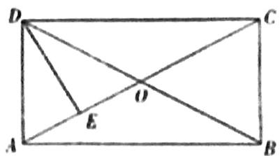

$\quad$A. $-\frac{1}{2}$

$\quad$B. $\frac{1}{2}$

$\quad$C.1

$\quad$D.-1

等级（N）

##### 004. 设 $P$ 是 $\Delta ABC$ 所在平面内的一点，且 $\overrightarrow{BC} + \overrightarrow{BA} = 3\overrightarrow{BP}$ ，则（）

$\quad$A. $\overrightarrow{PB} +\overrightarrow{PA} = \overrightarrow{0}$

$\quad$B. $\overrightarrow{PB} +\overrightarrow{PC} = \overrightarrow{0}$

$\quad$C. $\overrightarrow{PC} +\overrightarrow{PA} = \overrightarrow{0}$

$\quad$D. $\overrightarrow{PA} +\overrightarrow{PB} +\overrightarrow{PC} = \overrightarrow{0}$

等级（R）

##### 005. 设平面向量 $a_1, a_2, a_3$ 的和 $\alpha_1 + \alpha_2 + \alpha_3 = 0$ . 如果平面向量 $b_1, b_2, b_3$ 满足 $\left|b_i\right| = 2\left|a_i\right|$ ，且 $a_i$ 顺时针旋转 $30^\circ$ 后与 $b$ 同向，其中 $i = 1, 2, 3$ . 则（）

(A) $-b_{1} + b_{2} + b_{3} = 0$

(B) $b_{1} - b_{2} + b_{3} = 0$

(C) $b_{1} + b_{2} - b_{3} = 0$

(D) $b_{1} + b_{2} + b_{3} = 0$

# 题型二：向量共线/平行的考察（无系）

等级（N）

##### 006. 已知向量 $a$ ， $b$ 不共线 $\mathbf{c} = ka + b (k \in R)$ ， $d = a - b$ ，如果 $c // d$ ，那么（）

(A) $k = 1$ 且 $c$ 与 $d$ 同向

(B) $k = 1$ 且 $c$ 与 $d$ 反向

(C) $k = -1$ 且 $c$ 与 $d$ 同向

(D) $k = -1$ 且 $c$ 与 $d$ 反向

等级（N）

##### 007. 已知向量 $i$ 与 $j$ 不共线，且 $\overrightarrow{AB} = i + mj$ ， $\overrightarrow{AD} = ni + j$ ，若 $A, B, D$ 三点共线，则实数 $m, n$ 应该满足的条件是（）

(A) $m + n = 1$

(B) $m + n = -1$

(C) $mn = 1$

(D) $mn = -1$

等级（N）

##### 008. P 是 $\triangle ABC$ 所在平面内一点，若 $\overrightarrow{CB} = \lambda \overrightarrow{PA} + \overrightarrow{PB}$ ，其中 $\lambda \in R$ ，则 P 点一定在（）

$\quad$A. $\triangle ABC$ 内部

$\quad$B. $AC$ 边所在直线上

$\quad$C.AB 边所在直线上

$\quad$D.BC 边所在直线上

等级（N）

##### 009. 在 $\Delta ABC$ 中，已知 $D$ 是 $AB$ 边上一点，若 $\overrightarrow{AD} = 2\overrightarrow{DB}, \overrightarrow{CD} = \frac{1}{3}\overrightarrow{CA} + \lambda \overrightarrow{CB}$ ，则 $\lambda$ 等于（）

$\quad$A. $\frac{2}{3}$

$\quad$B. $\frac{1}{3}$

$\quad$C. $-\frac{1}{3}$

$\quad$D. $-\frac{2}{3}$

# 题型三：平面向量的数量积

等级（N）

##### 010. 已知向量 $\vec{a}, \vec{b}$ 满足 $\left|\vec{a}\right|=1, \vec{a} \cdot \vec{b}=-1$ ，则 $\vec{a} \cdot (2\vec{a}-\vec{b})=$ （）

$\quad$A. 4

$\quad$B. 3

$\quad$C. 2

$\quad$D. 0

等级（N）

##### 011. 已知 $a$ 、 $b$ 满足 $|a|=1, |b|=1$ 且 $(a-b)^2=3$ ，则 $a \cdot b=$ \_\_\_\_

等级（N）

##### 012. 已知两个单位向量 $\vec{a}, \vec{b}$ 的夹角为 $60^{\circ}$ ， $\vec{c} = t\vec{a} + (1 - t)\vec{b}$ ，若 $\vec{b} \cdot \vec{c} = 0$ ，则 $t =$ \_\_\_\_。

等级（N）

##### 013. 已知两个单位向量 $\overrightarrow{e_1}, \overrightarrow{e_2}$ 的夹角为 $\frac{\pi}{3}$ ，若向量 $\overrightarrow{b_1} = \overrightarrow{e_1} - 2\overrightarrow{e_2}, \overrightarrow{b_2} = 3\overrightarrow{e_1} + 4\overrightarrow{e_2}$ ，则 $\overrightarrow{b_1} \cdot \overrightarrow{b_2} =$ \_\_\_\_

等级（N）

2020年新课标2卷文科

##### 014. 已知单位向量 $\vec{a}$ ， $\vec{b}$ 的夹角为 $60^{\circ}$ ，则在下列向量中，与 $\vec{b}$ 垂直的是（）

$\quad$A. $\vec{a} + 2\vec{b}$

$\quad$B. $2\vec{a} +\vec{b}$

$\quad$C. $\vec{a} - 2\vec{b}$

$\quad$D. $2\vec{a} -\vec{b}$

等级（N）

##### 015. 已知 ABCD 为菱形，则 $(\overrightarrow{AB} + \overrightarrow{BC}) \cdot (\overrightarrow{AB} - \overrightarrow{AD})$ 的值为 \_\_\_\_.

# 题型四：系中向量平行垂直的相关计算

等级（N）

##### 016. 已知向量 $a = (1,2)$ ， $b = (2,-2)$ ， $c = (1,\lambda)$ 。若 $c // (2a + b)$ ，则 $\lambda =$ \_\_\_\_.

等级（N）

##### 017. 已知向量 $\vec{a} = (-1, 2), \vec{b} = (m, 1)$ ，若向量 $\vec{a} + \vec{b}$ 与 $\vec{a}$ 垂直，则 $m =$ \_\_\_\_

等级（N）

##### 018. 设向量 $\vec{a} = (3, 3), \vec{b} = (1, -1)$ ，若 $(\vec{a} + \lambda \vec{b}) \perp (\vec{a} - \lambda \vec{b})$ ，则实数 $\lambda = (\quad)$

$\quad$A. 3

$\quad$B. 1

$\quad$C. $\pm 1$

$\quad$D. $\pm 3$

等级（N）

##### 019. 已知 $A(3,2), B(-1,-1)$ ，若点 $P\left(x, -\frac{1}{2}\right)$ 在线段 AB 的中垂线上，则 $x=$ \_\_\_\_

等级（N）

2023 新高考一卷数学

##### 020. 已知向量 $\vec{a} = (1, 1), \vec{b} = (1, -1)$ ，若 $(\vec{a} + \lambda \vec{b}) \perp (\vec{a} + \mu \vec{b})$ ，则（）

$\quad$A. $\lambda +\mu = 1$

$\quad$B. $\lambda +\mu = -1$

$\quad$C. $\lambda \mu = 1$

$\quad$D. $\lambda \mu = -1$

# 题型五：系中含向量模的计算

等级（N）

##### 021. 已知 $\overrightarrow{AB} = (2,3), \overrightarrow{AC} = (3,t), |\overrightarrow{BC}| = 1$ ，则 $\overrightarrow{AB} \cdot \overrightarrow{BC} = (\quad)$

$\quad$A. -3

$\quad$B. -2

$\quad$C. 2

$\quad$D. 3

等级（N）

##### 022. 设向量 $\vec{a} = (m, 1), \vec{b} = (1, 2)$ ，且 $\left|\vec{a} + \vec{b}\right|^2 = \left|\vec{a}\right|^2 + \left|\vec{b}\right|^2$ ，则 $m =$ \_\_\_\_。

等级（N）

##### 023. 已知向量 $\vec{a} = (2,1), \vec{a} \cdot \vec{b} = 10, |\vec{a} + \vec{b}| = 5\sqrt{2}$ ，则 $|\vec{b}| = (\quad)$

$\quad$A. $\sqrt{5}$

$\quad$B. $\sqrt{10}$

$\quad$C. 5

$\quad$D. 25

等级（N）

2022年全国乙卷

##### 024. 已知向量 $\vec{a} = (2,1)$ ， $\vec{b} = (-2,4)$ ，则 $|\vec{a} - \vec{b}|$ （）

$\quad$A. 2

$\quad$B. 3

$\quad$C. 4

$\quad$D. 5

等级（N）

2021年新高考1卷

##### 025.（多选）已知 $O$ 为坐标原点，点 $P_{1}(\cos \alpha ,\sin \alpha)$ ， $P_{2}(\cos \beta , - \sin \beta)$

$P_{3}\left(\cos (\alpha +\beta),\sin (\alpha +\beta)\right),\quad A(1,0)$ ，则（

$\quad$A. $|\overrightarrow{OP_1}| = |\overrightarrow{OP_2}|$

$\quad$B. $|\overrightarrow{AP_1}| = |\overrightarrow{AP_2}|$

$\quad$C. $\overrightarrow{OA} \cdot \overrightarrow{OP_3} = \overrightarrow{OP_1} \cdot \overrightarrow{OP_2}$

$\quad$D. $\overrightarrow{OA} \cdot \overrightarrow{OP_1} = \overrightarrow{OP_2} \cdot \overrightarrow{OP_3}$

# 题型六：两向量夹角问题

等级（N）

##### 026. 已知 $a, b$ 为单位向量，且 $a \cdot b = 0$ ，若 $c = 2a - \sqrt{5}b$ ，则 $\cos \langle a, c \rangle =$ \_\_\_\_.

等级（N）

##### 027. 已知向量 $a, b$ 满足 $|a|=5, |b|=6, a \cdot b=-6$ , 则 $\cos \langle a, a+b \rangle=(\quad)$

$\quad$A. $-\frac{31}{35}$

$\quad$B. $-\frac{19}{35}$

$\quad$C. $\frac{17}{35}$

$\quad$D. $\frac{19}{35}$

等级（N）

##### 028. 已知 $a = (-2, -1), b = (\lambda, 1)$ ，若 $a$ 与 $b$ 的夹角为钝角，则 $\lambda$ 的取值范围是（）

$\quad$A. $\left(-\frac{1}{2},2\right)\cup(2,+\infty)$

$\quad$B. $(2, +\infty)$

$\quad$C. $\left(-\frac{1}{2},+\infty\right)$

$\quad$D. $\left(-\infty,-\frac{1}{2}\right)$

等级（N）

2022年新高考2卷

##### 029. 已知向量 $\vec{a} = (3,4), \vec{b} = (1,0), \vec{c} = \vec{a} + t\vec{b}$ ，若 $< \vec{a}, \vec{c} >= < \vec{b}, \vec{c}>$ ，则 $t = (\quad)$

$\quad$A. -6

$\quad$B. -5

$\quad$C. 5

$\quad$D. 6

# 题型七：平方的思想处理向量线性组合的模

等级（N）

##### 030. 已知向量 $a, b$ 满足 $a \cdot b = 0$ , $|a| = 1$ , $|b| = 2$ , 则 $|a - b| = ($

$\quad$A.0

$\quad$B.1

$\quad$C.2

$\quad$D. $\sqrt{5}$

等级（N）

##### 031. 已知向量 $\vec{a}, \vec{b}$ 夹角为 $45^{\circ}$ ，且 $|\vec{a}| = 1, |2\vec{a} - \vec{b}| = \sqrt{10}$ ；则 $|\vec{b}| =$ \_\_\_\_

等级（N）

2022年全国乙卷

##### 032. 已知向量 $\vec{a}, \vec{b}$ 满足 $|\vec{a}| = 1, |\vec{b}| = \sqrt{3}, |\vec{a} - 2\vec{b}| = 3$ ，则 $\vec{a} \cdot \vec{b} = (\quad)$

$\quad$A. -2

$\quad$B. -1

$\quad$C. 1

$\quad$D. 2

等级（N）

##### 033. 设向量 $a, b$ 满足 $|a + b| = \sqrt{10}$ ， $|a - b| = \sqrt{6}$ ，则 $a \cdot b = (\quad)$

等级（N）

2023 新高考二卷数学

##### 034. 已知向量 $\vec{a}$ , $\vec{b}$ 满足 $|\vec{a} - \vec{b}| = \sqrt{3}$ , $|\vec{a} + \vec{b}| = |2\vec{a} - \vec{b}|$ , 则 $|\vec{b}| =$ \_\_\_\_.

等级（N）

2024 燕博园三月测试

##### 035. 已知 $\mathbf{e}$ 为单位向量，向量 $a$ 满足 $a \cdot e = 2, |a - \lambda e| = 1$ ，则 $|a|$ 的最大值为（）

$\quad$A.1

$\quad$B.2

$\quad$C. $\sqrt{5}$

$\quad$D.4

等级（R）

2022 重庆八中第六次月考

##### 036. 已知不共线的平面向量 $\vec{a}, \vec{b}, \vec{c}$ 两两所成的角相等，且 $|\vec{a}| = 1, |\vec{b}| = 4, |\vec{a} + \vec{b} + \vec{c}| = \sqrt{7}$ ，则 $|\vec{c}| =$

等级（R）

2021年新高考2卷

##### 037. 已知向量 $\vec{a} + \vec{b} + \vec{c} = \vec{0}$ , $\left|\vec{a}\right| = 1$ , $\left|\vec{b}\right| = \left|\vec{c}\right| = 2$ , $\vec{a} \cdot \vec{b} + \vec{b} \cdot \vec{c} + \vec{c} \cdot \vec{a} =$ \_\_\_\_.

等级（R）

##### 038. 已知 $a$ 与 $b$ 均为单位向量，其夹角为 $\theta$ ，有下列四个命题

$P _ {1}: | a + b | > 1 \Leftrightarrow \theta \in \left[ 0, \frac {2 \pi}{3}\right)$

$P _ {2}: | a + b | > 1 \Leftrightarrow \theta \in \left(\frac {2 \pi}{3}, \pi \right]$

$P _ {3}: | a - b | > 1 \Leftrightarrow \theta \in \left[ 0, \frac {\pi}{3}\right)$

$P _ {4}: | a - b | > 1 \Leftrightarrow \theta \in \left(\frac {\pi}{3}, \pi \right]$

其中的真命题是（）

(A.) $P_{1}, P_{4}$

(B) $P_{1}, P_{3}$

(C) $P_{2}, P_{3}$

(D) $P_{2}, P_{4}$

# 题型八：垂直的向量给法

等级（N）

##### 039. 设非零向量 $a, b$ 满足 $|a + b| = |a - b|$ 则（）

Aa⊥b

$\quad$B. $|a| = |b|$

$\quad$C. $a\parallel b$

$\quad$D. $|a| > |b|$

等级（N）

##### 040. 已知非零单位向量 $\vec{a}, \vec{b}$ 满足 $|\vec{a} + \vec{b}| = |\vec{a} - \vec{b}|$ ，则 $\vec{a}$ 与 $\vec{b} - \vec{a}$ 的夹角为（）

$\quad$A. $\frac{\pi}{6}$

$\quad$B. $\frac{\pi}{3}$

$\quad$C. $\frac{\pi}{4}$

$\quad$D. $\frac{3\pi}{4}$

等级（N）

##### 041. 在 $\Delta ABC$ 中，若 $\overrightarrow{AB}^2 - \overrightarrow{BC}^2 = \overrightarrow{AB} \cdot \overrightarrow{AC}$ . 则 $\Delta ABC$ 是（）

$\quad$A. 等腰三角形

$\quad$B. 直角三角形

$\quad$C. 等腰直角三角形

$\quad$D. 等边三角形

# 题型九：投影向量

等级（N）

2023 苏锡常镇一模

##### 042. 两个粒子 A, B 从同一发射源发射出来，在某一时刻，它们的位移分别为

$s_A = (4,3), s_B = (-2,6)$ ，则 $s_B$ 在 $s_A$ 上的投影向量的长度为

$\quad$A. 10

$\quad$B. $\frac{\sqrt{10}}{2}$

$\quad$C. $\frac{\sqrt{10}}{10}$

$\quad$D. 2

# 题型十：向量点乘的几何意义

等级（N）

##### 043. 在 $\triangle ABC$ 中， $\left|\overrightarrow{AB}\right| = 4, \overrightarrow{AC} \cdot \overrightarrow{AB} = 8.$ 则 $\overrightarrow{AB} \cdot \overrightarrow{BC} =$ \_\_\_\_。

等级（N）

##### 044. 已知 $P$ 是边长为 2 的正六边形 $ABCDEF$ 内的一点，则 $\overrightarrow{AP} \cdot \overrightarrow{AB}$ 的取值范围是（）

$\quad$A. $(-2,6)$

$\quad$B. $(-6,2)$

$\quad$C. $(-2,4)$

$\quad$D. $(-4,6)$

等级（R）

##### 045. 在 $\triangle ABC$ 中，D 是 BC 边上一点，AD ⊥ AB， $\overrightarrow{BC} = \sqrt{3}\overrightarrow{BD}, |\overrightarrow{AD}| = 1$ ，则 $\overrightarrow{AC} \cdot \overrightarrow{AD} = (\quad)$

$\quad$A. $2 \sqrt{3}$

B, $\frac{\sqrt{3}}{2}$

$\quad$C. $\frac{\sqrt{3}}{3}$

$\quad$D. $\sqrt{3}$

等级（R）

2023 朝阳一模

##### 046.如图，圆M为△ABC的外接圆，AB=4，AC=6，N为边BC的中点，则 $\overrightarrow{AN} \cdot \overrightarrow{AM} =$ （）

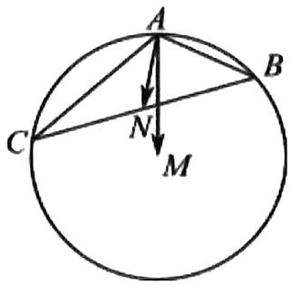

$\quad$A. 5

$\quad$B. 10

$\quad$C. 13

$\quad$D. 26

等级（R）

2022 炎德英才大联考

##### 047. 已知直线 1 与圆 0: $x^{2} + y^{2} = 9$ 相交于不同的两点 P, Q, 点 M 为线段 PQ 的中点, 若平面上一动点 C 满足 $\mathbf{C}\vec{P} = \lambda \mathbf{CQ} (\lambda > 0)$ , 则 $\overrightarrow{\mathbf{OC}} \cdot \overrightarrow{\mathbf{OM}}$ 的取值范围是 ( )

$\quad$A. $[0,3)$

$\quad$B. $(0,3\sqrt{2} ]$

$\quad$C. $[0,9)$

$\quad$D. $(0,6\sqrt{2} ]$

等级（SR）

##### 048. 如图，已知函数 $f(x)=\frac{\sqrt{3}}{2}|\sin\pi x|$ ， $A_{1},A_{2},A_{3}$ 是图像的顶点，O,B,C,D 为 $f(x)$ 与 x 轴的交点，线段 $A_{3}D$ 上有五个不同的点 $Q_{1},Q_{2},\cdots,Q_{5}$ ，记 $n_{i}=\overrightarrow{OA_{2}}\cdot\overrightarrow{OQ_{i}}(i=1,2,\cdots5)$ ，则 $n_{1}+n_{2}+\cdots+n_{5}=$ （）

$\quad$A. $\frac{15}{2}\sqrt{3}$

$\quad$B. $\frac{45}{2}$

$\quad$C. $\frac{14}{4}\sqrt{3}$

$\quad$D. 45

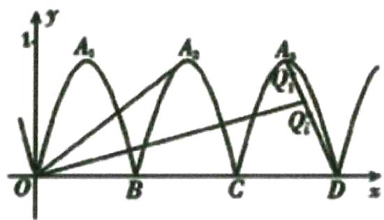

等级（SR）

2021 深圳一模

##### 049.骑自行车是一种能有效改善心肺功能的耐力性有氧运动, 深受大众喜爱, 下面是某一自行车的平面结构示意图, 已知图中的圆 A (前轮), 圆 D (后轮) 的半径均为 $\sqrt{3}$ , $\triangle ABE$ , $\triangle BEC$ , $\triangle ECD$ 均是边长为 4 的等边三角形, 设点 P 为后轮上的一点, 则在骑动该自行车的过程中, $\overrightarrow{AC} \cdot \overrightarrow{BP}$ 的最大值为 ( )

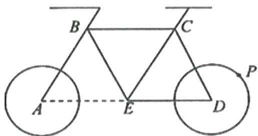

$\quad$A. 18

$\quad$B. 24

$\quad$C. 36

$\quad$D. 48

# 题型十一：建系的思想在向量问题中的应用

等级（N）

##### 050. 如图，在矩形 $ABCD$ 中， $AB = \sqrt{2}, BC = 2$ ，点 $E$ 为 $BC$ 的中点，点 $F$ 在边 $CD$ 上，若 $\overrightarrow{AB} \cdot \overrightarrow{AF} = \sqrt{2}$ ，则 $\overrightarrow{AE} \cdot \overrightarrow{BF}$ 的值是（）

$\quad$A. $2 - \sqrt{2}$

$\quad$B. 1

$\quad$C. $\sqrt{2}$

$\quad$D. 2

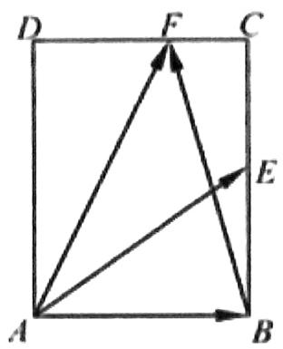

等级（N）

##### 051. 已知 a, b 是两个相互垂直的单位向量，且 $c \cdot a = \sqrt{3}$ ， $c \cdot b = 1$ ，则 $|b + c| = (\quad)$

$\quad$A. $\sqrt{6}$

$\quad$B. $\sqrt{7}$

$\quad$C. $2 \sqrt{2}$

$\quad$D. $2 + \sqrt{3}$

等级（N）

##### 052.在 $\triangle ABC$ 中， $\angle BAC=60^{\circ}$ ， $AB=3$ ， $AC=2$ ，若D为BC的中点，E为AD中点，则 $\overrightarrow{BE} \cdot \overrightarrow{AC}=$

等级（N）

##### 053. 直角 $\triangle ABC$ 中, $\angle B = 90^{\circ}$ , $BC = 2$ , $AB = 1$ , $D$ 为 $BC$ 的中点, $E$ 在斜边 $AC$ 上, 若 $\overrightarrow{AE} = 2\overrightarrow{EC}$ , 则 $\overrightarrow{DE} \cdot \overrightarrow{AC} =$

等级（N）

##### 054.在 $\Delta ABC$ 中， $M$ 是 $BC$ 的中点， $AM = 1$ ，点 $P$ 在 $AM$ 上且满足 $\overrightarrow{AP} = 2\overrightarrow{PM}$ ，则 $\overrightarrow{PA}\cdot (\overrightarrow{PB} +\overrightarrow{PC})$ 等于（）

(A) $-\frac{4}{9}$

(B) $-\frac{4}{3}$

(C) $\frac{4}{3}$

(D) $\frac{4}{9}$ 等级（R）

2021安庆二模

##### 055. 已知 $|\vec{a}| = |\vec{b}| = 2$ ，且 $\vec{a}$ ， $\vec{b}$ 的夹角为 $60^\circ$ ，若向量 $|\vec{c} - \vec{a}| \leqslant 1$ ，则 $\vec{b} \cdot \vec{c}$ 的取值范围是（）

$\quad$A. $[-4, 4]$

$\quad$B. $[-2\sqrt{3}, 2\sqrt{3}]$

$\quad$C.[0,2√3]

$\quad$D.[0,4]

等级（R）

##### 056. 已知腰长为 2 的等腰直角 $\triangle ABC$ 中, $M$ 为斜边 $AB$ 的中点, 点 $P$ 为该平面内一动点, 若 $\left|\overrightarrow{PC}\right| = 2$ , 则 $(\overrightarrow{PA} \cdot \overrightarrow{PB} + 4)(\overrightarrow{PC} \cdot \overrightarrow{PM})$ 的最小值 \_\_\_\_

等级（R）

2022 福州一检

##### 057. 已知平面向量 $a, b, c$ 均为单位向量，且 $\left|a - b\right| = 1$ ，则 $(a - b) \cdot (b - c)$ 的最大值为（）

$\quad$A. $\frac{1}{4}$

$\quad$B. $\frac{1}{2}$

c. 1

$\quad$D. $\frac{3}{2}$

等级（R）

2021银川一中第七次月考

##### 058.在平面直角坐标系 $xOy$ 内，已知直线 $l$ 与圆 $O: x^2 + y^2 = 8$ 相交于 $A, B$ 两点，且 $|AB| = 4$ ，若 $\overrightarrow{OC} = 2\overrightarrow{OA} - \overrightarrow{OB}$ 且 $M$ 是线段 $AB$ 的中点，则 $\overrightarrow{OC} \cdot \overrightarrow{OM}$ 的值为（）

$\quad$A. $\sqrt{3}$

$B.2\sqrt{2}$

$\quad$C.3

$\quad$D.4

等级（R）

2021 重庆二诊

##### 059.（多选）已知 $\Delta PAB$ 中 $AB = 2, PA = PB, C$ 是边 $AB$ 的中点， $Q$ 为 $\Delta PAB$ 所在平面内一点，若 $\Delta CPQ$ 是边长为2的等边三角形，则 $\overrightarrow{AP} \cdot \overrightarrow{BQ}$ 的值可能是（）

$\quad$A. $3 + \sqrt{3}$

$\quad$B. $1 + \sqrt{3}$

$\quad$C. $3 - \sqrt{3}$

$\quad$D. $1 - \sqrt{3}$

等级（SR）

##### 060.平面向量a，b满足 $b\cdot(b-a)=3,\left|a\right|=2$ ，则 $\left|a-b\right|$ 的最大值（）

$\quad$A.1

$\quad$B.2

$\quad$C.3

$\quad$D.4

等级（SR）

##### 061. 设 $\vec{a}, \vec{b}$ 是单位向量， $\vec{a} \cdot \vec{b} = 0$ ，向量 $\vec{c}$ 满足 $|\vec{c} - \vec{a} - \vec{b}| = 1$ ，则 $|\vec{c}|$ 的最大值为 \_\_\_\_

等级（SR）

##### 062. 已知 $A(0,1), B(\sqrt{2},0). O$ 为坐标原点，动点 $\mathbf{P}$ 满足 $|\overrightarrow{OP}| = 2$ ，则 $|\overrightarrow{OA} + \overrightarrow{OB} + \overrightarrow{OP}|$ 的最小值为（）

(A) $2 - \sqrt{3}$

(B) $2 + \sqrt{3}$

(C) $7 + 4\sqrt{3}$

(D) $7 - 4\sqrt{3}$

等级（SR）

##### 063. 已知 $\vec{a}, \vec{b}, \vec{c}$ 是在同一平面内的单位向量，若 $\vec{a}$ 与 $\vec{b}$ 的夹角为 $60^{\circ}$ 则 $(\vec{a} - \vec{b}) \cdot (\vec{a} - 2\vec{c})$ 的最大值是（）

$\quad$A. $\frac{1}{2}$

$\quad$B.-2

$\quad$C. $\frac{\sqrt{3}}{2}$

$\quad$D. $\frac{5}{2}$

等级（SR）

##### 064. 已知 $\overrightarrow{AB} \perp \overrightarrow{AC}$ , $|\overrightarrow{AB}| = \frac{1}{t}$ , $|\overrightarrow{AC}| = t$ , 若点 $P$ 是 $\triangle ABC$ 所在平面内的一点, 且 $\overrightarrow{AP} = \frac{\overrightarrow{AB}}{|\overrightarrow{AB}|} + \frac{4\overrightarrow{AC}}{|\overrightarrow{AC}|}$ , 则 $\overrightarrow{PB} \cdot \overrightarrow{PC}$ 的最大值等于 ( )

$\quad$A.13

$\quad$B.15

$\quad$C.19

$\quad$D.21

等级（SR）

##### 065.在平面内，定点 A,B,C,D,0 满足 $\left|OA\right|=\left|OB\right|=\left|OC\right|$ ，且满足 $\overrightarrow{OAB}=\overrightarrow{OBOC}=\overrightarrow{OCOA}=-6$ ，动点 P,D 满足 $\left|\overrightarrow{AP}\right|=2$ ， $\overrightarrow{PD}=2\overrightarrow{DC}$ ，则 $\left|BD\right|$ 的最大值为：\_\_\_\_.

等级（SSR）

2022中学生标准能力测试

##### 066.平面向量 $\vec{a},\vec{b}$ 满足： $\left|\vec{a}\right|=1,\left|\vec{a}+2\vec{b}\right|=-3\vec{a}\cdot\vec{b}$ ，设向量 $\vec{a},\vec{b}$ 的夹角为 $\theta$ ，则 $\sin\theta$ 的最大值为

# 题型十二：向量的几何意义

等级（N）

##### 067. 设非零向量 $\vec{a}$ 、 $\vec{b}$ 、 $\vec{c}$ 满足 $|\vec{a}| = |\vec{b}| = |\vec{c}|$ ， $\vec{a} + \vec{b} = \vec{c}$ ，则 $\langle \vec{a}, \vec{b} \rangle = (\quad)$

$\quad$A. $150^{\circ}$

$\quad$B. $120^{\circ}$

$\quad$C. $60^{\circ}$

$\quad$D. $30^{\circ}$

等级（N）

##### 068. 在平面上, $e_1, e_2$ 是方向相反的单位向量, 若向量 $b$ 满足 $(b - e_1) \perp (b - e_2)$ , 则 $|b|$ 的值为

等级（N）

##### 069. 若两个非零向量 $a, b$ 满足 $|a + b| = |a - b| = 2|a|$ ，则向量 $a + b$ 与 $a$ 的夹角为 \_\_\_\_.

等级（R）

2021 泰州南通二模

##### 070. 已知 $\vec{a}$ , $\vec{b}$ , $\vec{c}$ 均为单位向量, 且 $\vec{a} + 2\vec{b} = 2\vec{c}$ , 则 $\vec{a} \cdot \vec{c} =$ ( ).

$\quad$A. $-\frac{1}{2}$

$\quad$B. $-\frac{1}{4}$

$\quad$C. $\frac{1}{4}$

$\quad$D. $\frac{1}{2}$

等级（R）

##### 071. $|\overrightarrow{OA}| = 2, |\overrightarrow{OB}| = \sqrt{2}, |\overrightarrow{OC}| = 4, \overrightarrow{OA}$ 与 $\overrightarrow{OB}$ 的夹角为 $135^{\circ}$ ，若 $\overrightarrow{OC} = \lambda \overrightarrow{OA} + 4\overrightarrow{OB}$ .

则 $\lambda =$ （ ）

$\quad$A. 2

$\quad$B. $2 \sqrt{2}$

$\quad$C. 4

$\quad$D. $4 \sqrt{2}$

等级（R）

##### 072. 设向量 $\vec{a}, \vec{b}, \vec{c}$ 满足 $\vec{a} + \vec{b} + \vec{c} = 0$ ，且 $(\vec{a} - \vec{b}) \perp \vec{c}, \vec{a} \perp \vec{b}$ ，若 $|\vec{a}| = 1$ 则 $|\vec{a}|^2 + |\vec{b}|^2 + |\vec{c}|^2$ 的值是

等级（R）

2021 毕节二诊

##### 073. 已知平面向量 $\mathbf{a}$ , $\mathbf{b}$ , 其中 $|b| = 2$ . 向量 $\mathbf{a}$ 与 $\mathbf{b} - \mathbf{a}$ 的夹角为 $150^{\circ}$ , 则 $|\mathbf{a}|$ 的最大值为 ( )

$\quad$A. $2 \sqrt{3}$

$\quad$B. 3

$\quad$C. 4

$\quad$D. $\frac{4\sqrt{3}}{3}$

等级（SR）

2022 重庆二诊

##### 074. 已知点 O, A, B 是同一平面内不同的三个点，且 $\left|\overrightarrow{OA}\right| = \left|\overrightarrow{AB}\right| = 4$ ，若 $\lambda \in [0,1]$ ， $\left|\lambda \overrightarrow{OB} - \overrightarrow{OA}\right| + \left|(1 - \lambda)\overrightarrow{BO} - \frac{1}{2BA}\right|$ 的最小值为 $2\sqrt{5}$ ，则 $\left|\overrightarrow{OB}\right| = (\quad)$

$\quad$A. $2 \sqrt{3}$

$\quad$B. $4\sqrt{3}$

$\quad$C. $2 \sqrt{2}$

$\quad$D. $4\sqrt{2}$

# 题型十三：基底的应用

等级（R）

2024赣州一模

##### 075. 在平行四边形 ABCD 中，AB=3，AD=4， $\overrightarrow{AB}\cdot\overrightarrow{AD}=-6,\overrightarrow{DC}=3\overrightarrow{DM}$ ，则 $\overrightarrow{MA}\cdot\overrightarrow{MB}=$ （）

$\quad$A. 16

$\quad$B. 14

$\quad$C. 12

$\quad$D. 10

等级（R）

##### 076.A, $B$ 是圆 $O: x^2 + y^2 = 1$ 上的两个动点， $\left|\overline{AB}\right| = 1, \overline{OC} = 3\overline{OA} - 2\overline{OB}, M$ 为线段 $AB$ 的中点，则 $\overline{OC} \cdot \overline{OM}$ 的值为

$\quad$A. $\frac{3}{2}$

$\quad$B. $\frac{3}{4}$

$\quad$C. $\frac{1}{2}$

$\quad$D. $\frac{1}{4}$

# 题型十四：向量点乘之拆分成好算能算的向量

等级（R）

T8第二次联考

##### 077.如图, 在同一平面内沿平行四边形 ABCD 两边 AB, AD 向外分别作正方形 ABEF, ADMN, 其中 AB=2, AD=1, $\angle BAD = \frac{\pi}{4}$ , 则 $\overrightarrow{AC} \cdot \overrightarrow{FN} = (\quad)$

$\quad$A. $-2\sqrt{2}$

$\quad$B. $2 \sqrt{2}$

$\quad$C.0

$\quad$D.-1

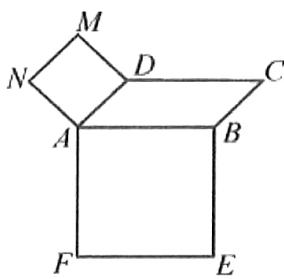

等级（R）

2022乌鲁木齐二模

##### 078.在三棱锥P-ABC中，

$\mathrm{PB = PC = 1}$ ， $\angle APB = \angle APC = 90^{\circ}$ ， $\angle BPC = 60^{\circ}$ ，则 $\overrightarrow{AB}\cdot \overrightarrow{PC} = (\quad)$

$\quad$A. $\frac{1}{2}$

$\quad$B. $\frac{\sqrt{3}}{2}$

$\quad$C.1

$\quad$D. $\sqrt{2}$

等级（R）

2021苏锡常镇二模

##### 079. 我国汉代数学家赵爽为了证明勾股定理，创制了一幅“弦图”，它由四个全等的直角三角形和一个正方形所构成（如图），后人称其为“赵爽弦图”。在直角三角形CGD中，已知 $\mathrm{GC} = 4, \mathrm{GD} = 3$ ，在线段EF上任取一点P，线段BC上任取一点Q，则 $\overrightarrow{AP} \cdot \overrightarrow{AQ}$ 的最大值为（）

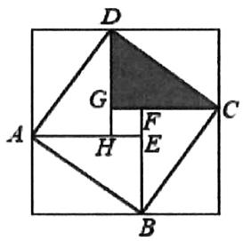

$\quad$A.25

$\quad$B.27

$\quad$C.29

$\quad$D.31

等级（R）

2022鄂东南高三五月联考

##### 080. 如图是第 24 届国际数学家大会的会标，它是根据中国古代数学家赵爽的弦图设计的，大正方形 ABCD 是由 4 个全等的直三角形和中间的小正方形 EFGH 组成的，若大正方形的边长为 $\sqrt{5}$ ，E 为线段 BF 的中点，则 $\overrightarrow{AF} \cdot \overrightarrow{BC} =$ \_\_\_\_.

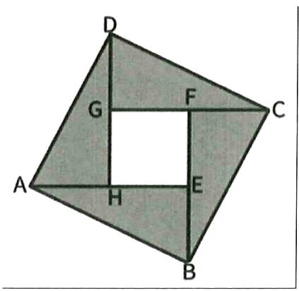

等级（R）

2023 金丽衢十二校二模

##### 081. 在三角形 ABC 中，AB=7，BC=8，AC=9，AM 和 AN 分别是 BC 边上的高和中线，则 $\overrightarrow{MN} \cdot \overrightarrow{BC}=$ （）

$\quad$A. 14

$\quad$B. 15

$\quad$C. 16

$\quad$D. 17

等级（R）

2024韶关二模

##### 082. 已知平面向量 $\vec{a}, \vec{b}, \vec{c}$ 均为单位向量. 且 $|\vec{a} + \vec{b}| = 1$ , 则向量 $\vec{a}$ 与 $\vec{b}$ 的夹角为 \_\_\_\_. $(\vec{a} + \vec{b}) \bullet (\vec{b} - \vec{c})$ 的最小值为 \_\_\_\_.

# 题型十五：极化恒等式

等级（R）

2022 北京数学

##### 083. 在 $\triangle ABC$ 中， $AC = 3, BC = 4, \angle C = 90^\circ$ 。P 为 $\triangle ABC$ 所在平面内的动点，且 $PC = 1$ ，则 $\overrightarrow{PA} \cdot \overrightarrow{PB}$ 的取值范围是（）

$\quad$A. $[-5,3]$

$\quad$B. $[-3,5]$

$\quad$C. $[-6,4]$

$\quad$D. $[-4,6]$

等级（R）

2021盐城三模   
##### 084. 若向量a，b满足 $|a-b|=\sqrt{3}$ ，则 $a\cdot b$ 的最小值为\_\_\_\_

等级（R）

##### 085. 设正方形 ABCD 的边长为 4，动点 P 在以 AB 为直径的圆弧 $\widehat{APB}$ 上（如图所示），则 $\overline{PC} \cdot \overline{PD}$ 的取值范围是 \_\_\_\_

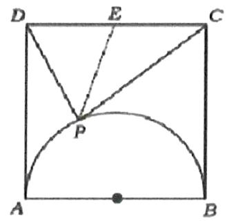

等级（R）

##### 086. 如图, 在半径为 1 的扇形 $AOB$ 中, $\angle AOB = 60^{\circ}$ , $C$ 为弧上的动点, $AB$ 与 $OC$ 交于点 $P$ 则 $\overline{OP} \cdot \overline{BP}$ 的最小值为

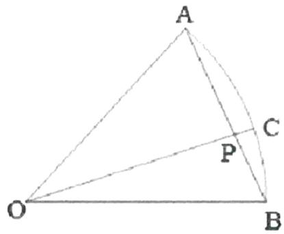

# 不等式

# 题型一：等式与不等式的性质

等级（N）

##### 001. 若 $a > b > c, ac < 0$ ，则下列不等式一定成立的是（）

$\quad$A. $ab > 0$

$\quad$B. $bc < 0$

$\quad$C. $ab > ac$

$\quad$D. $b(a - c) > 0$

等级（N）

##### 002. 设 $a, b, c$ 为实数，且 $a < b < 0$ ，则下列不等式正确的是\_\_\_\_。（填写正确不等式的序号）

① $\frac{1}{a} < \frac{1}{b}$ ; ② $ac^2 < bc^2$ ; ③ $\frac{b}{a} > \frac{a}{b}$ ; ④ $\frac{b}{a} < \frac{a}{b}$ ; ⑤ $\frac{1}{a^2} < \frac{1}{b^2}$

等级（N）

##### 003. 设 $-1 < b < 1 < a$ ，则下列不等式恒成立的是（）

$\quad$A. $\frac{1}{b} >\frac{1}{a}$

$\quad$B. $\frac{1}{b} < \frac{1}{a}$

$\quad$C. $2b < a^{2}$

$\quad$D. $b^{2} < a$

等级（N）

##### 004. 已知 $x > y > z$ ，且 $x + y + z = 0$ ，下列不等式一定成立的是（）

$\quad$A. $xy > yz$

$\quad$B. $xz > yz$

$\quad$C. $xy > xz$

$\quad$D. $xy^{2} > zy^{2}$

等级（R）

2024 广西二模

##### 005.（多选）已知实数 $a, b, c$ 满足 $a > b > c$ ，且 $a + b + c = 0$ ，则下列结论中正确的是（）

$\quad$A. $a + b > 0$

$\quad$B. $ac > bc$

$\quad$C. $\frac{1}{a - b} >\frac{1}{b - c}$

$\quad$D. $(a - c)(b - c) < \frac{9}{4} c^2$

# 题型二：基本不等式

等级（N）

##### 006. 若 $ab > 0$ , 则下列不等式不一定能成立的是（）

$\quad$A. $a^2 + b^2 \geq 2ab$

$\quad$B. $a^2 + b^2 \geq -2ab$

$\quad$C. $\frac{a + b}{2} \geq \sqrt{ab}$

$\quad$D. $\frac{b}{a} +\frac{a}{b}\geq 2$

等级（N）

2021年乙卷文科

##### 007. 下列函数中最小值为 4 的是（）

$\quad$A. $y = x^{2} + 2x + 4$

$\quad$B. $y = |\sin x| + \frac{4}{|\sin x|}$

$\quad$C. $y = 2^{x} + 2^{2 - x}$

$\quad$D. $y = \ln x + \frac{4}{\ln x}$

等级（N）

##### 008. 若 $a > 0$ ， $b > 0$ ，且 $a + b = 4$ ，则下列不等式恒成立的是（）

$\quad$A. $\frac{1}{ab} \leq \frac{1}{4}$

$\quad$B. $\frac{1}{a} + \frac{1}{b} \leq 1$

$\quad$C. $\sqrt{ab} \geq 2$

$\quad$D. $a^2 + b^2 \geq 8$

等级（N）

2020年新高考1卷（山东卷）

##### 009.(多选)已知 a>0, b>0，且 $a+b=1$ ，则（）

$\quad$A. $a^2 + b^2 \geq \frac{1}{2}$

$\quad$B. $2^{a - b} > \frac{1}{2}$

$\quad$C. $\log_2a + \log_2b\geq -2$

$\quad$D. $\sqrt{a} +\sqrt{b}\leq \sqrt{2}$

等级（N）

##### 010. 若正数 $x, y$ 满足 $\frac{x}{3} + \frac{y}{4} = 1$ ，则 $x \cdot y$ 的最大值是 \_\_\_\_.

等级（N）

##### 011. 某公司一年购买某种货物 600 吨，每次购买 x 吨，运费为 6 万元/次，一年的总存储费用为 4x 万元，要使一年的总运费与总存储费之和最小，则 x 的值是 \_\_\_\_.

等级（N）

##### 012. 已知在 $\triangle ABC$ 中, $\angle ACB = 90^{\circ}$ , $BC = 3$ , $AC = 4$ , $P$ 是 $AB$ 上的点, 则点 $P$ 到 $AC$ 、 $BC$ 的距离乘积的最大值是

等级（R）

2024 福建质检

##### 013..已知 $a > 0, b > 0$ ，则使 $\frac{1}{a} + \frac{1}{b} \geq 4$ 成立的一个充分不必要条件是（）

$\quad$A. $a^2 + b^2 = 1$

$\quad$B. $a + b \geq 4ab$

$\quad$C. $a + b = 1$

$\quad$D. $\frac{1}{a^2} +\frac{1}{b^2}\geq 8$

等级（R）

##### 014. 设 $x > 0, y > 0, x + 2y = 5$ ，则 $\frac{(x + 1)(2y + 1)}{\sqrt{xy}}$ 的最小值为 \_\_\_\_.

等级（R）

##### 015. 已知 $a, b \in \mathbb{R}$ ，且 $a - 3b + 6 = 0$ ，则 $2^a + \frac{1}{8^b}$ 的最小值为 \_\_\_\_.

等级（R）

2022 巴蜀中学第八次月考

##### 016.已知正实数 $a$ ，b满足 $\mathrm{ab} + 2\mathrm{a} - 2 = 0$ ，则 $4\mathrm{a} + \mathrm{b}$ 的最小值是（）

$\quad$A.2

$\quad$B. $4 \sqrt{2} - 2$

$\quad$C. $4\sqrt{3} - 2$

$\quad$D.6

等级（R）

##### 017. 某金店用一杆不准确的天平（两边臂不等长）称黄金，某顾客要购买 $10\mathrm{g}$ 黄金，售货员先将 $5\mathrm{g}$ 的砝码放在左盘，将黄金放于右盘使之平衡后给顾客；然后又将 $5\mathrm{g}$ 的砝码放入右盘，将另一黄金放入左盘使之平衡后又给顾客，则顾客实际所得黄金（）

$\quad$A. 大于 $10 \mathrm{~g}$

$\quad$B. 小于 $10\mathrm{g}$

$\quad$C. 大于等于 $10 \mathrm{~g}$

$\quad$D. 小于等于 $10\mathrm{g}$

等级（SR）

2024辽南协作体一模

##### 018.(多选)已知不相等的实数a,b满足ab>0,则下列四个数 $a,b,\frac{a+b}{2},\sqrt{ab}$ 经过适当排序后()

$\quad$A. 可能是等差数列

$\quad$B. 不可能是等差数列

$\quad$C. 可能是等比数列

$\quad$D. 不可能是等比数列

等级（SR）

2021 山西一模

##### 019. 已知 $a, b, c \in R$ ，且 $a > 4, ab + ac = 4$ ，则 $\frac{2}{a} + \frac{2}{b + c} + \frac{32}{a + b + c}$ 的最小值是（）

$\quad$A. 8

$\quad$B. 6

$\quad$C. 4

$\quad$D. 2

# 题型三：经典巧用常数模型

等级（N）

##### 020. 已知 $a > 0, b > 0, a + b = 2$ ，则 $y = \frac{1}{a} + \frac{4}{b}$ 的最小值是（）

$\quad$A. $\frac{7}{2}$

$\quad$B.4

$\quad$C. $\frac{9}{2}$

$\quad$D.5

等级（N）

##### 021. 已知正实数 $a, b$ 满足 $a + b = 4$ ，则 $\frac{1}{a + 1} + \frac{1}{b + 3}$ 的最小值为 \_\_\_\_.

等级（N）

##### 022. 设 $m, n$ 为正数，则 $m + n = 2$ ，则 $\frac{1}{m + 1} + \frac{n + 3}{n + 2}$ 的最小值为（）

$A. \frac {3}{2}$

$B. \frac {5}{3}$

$C. \frac {7}{4}$

$D. \frac {9}{5}$

等级（N）

##### 023. 已知 $a, b > 0, a + 2b = 2$ ，则 $\frac{b}{a} + \frac{1}{b}$ 的取值范围是（）

$\quad$A. $(0, +\infty)$

$\quad$B. $[2, +\infty)$

$\quad$C. $[\sqrt{2} + 1, +\infty)$

$\quad$D. $[2\sqrt{2}, +\infty)$

等级（N）

##### 024. 若正数 $x$ ， $y$ 满足 $3x + y = 5xy$ ，则 $4x + 3y$ 的最小值是 \_\_\_\_.

等级（R）

##### 025. 已知 $x > 0$ ， $y > 0$ ，且 $\frac{1}{x} + \frac{2}{y} = 1$ ，则 $xy + x + y$ 的最小值为

等级（R）

2021江淮十校第三次联考

##### 026. 已知正数 a, b 满足 $a+b+\frac{1}{a}+\frac{4}{b}=10$ ，则 $a+b$ 的最大值是 \_\_\_\_.

等级（R）

2023哈三中一模

##### 027. 已知 $x + y = 4$ ，且 $x > y > 0$ ，则 $\frac{2}{x - y} + \frac{1}{y}$ 的最小值为 \_\_\_\_.

等级（R）

2023 稳派四月联考

##### 028. 已知 $a > 1, b > 1, a^3 b = 100$ ，则 $\log_a 10 + 3\log_b 10$ 的最小值为

$\quad$A. 4

$\quad$B. 6

$\quad$C. 8

$\quad$D. 12

等级（R）

2022 天津南开中学第四次学情调研

##### 029. 已知正数 a, b 满足 $\frac{1}{2a} + \frac{1}{b} = \frac{1}{ab}$ ，则 $4a^{2} + ab + b^{2}$ 的最小值为 \_\_\_\_。

等级（SR）

2021 太原三模

##### 030. 已知锐角 $\alpha$ ， $\beta$ 满足 $\alpha - \beta = \frac{\pi}{3}$ ，则 $\frac{1}{\cos \alpha \cos \beta} + \frac{1}{\sin \alpha \sin \beta}$ 的最小值为（）

$\quad$A. 4

$\quad$B. $4 \sqrt{3}$

$\quad$C. 8

$\quad$D. $8 \sqrt{3}$

等级（SR）

2022 重庆三诊

##### 031. 已知 $a > 0, b > 0$ ，且 $a^2 b + 3ab^2 = 3a + b$ ，则 $a + 3b$ 的最小值为 \_\_\_\_.

等级（SR）

2024 重庆八中第五次月考

##### 032. 对任意的正实数 a, b, c，满足 $b+c=1$ ，则 $\frac{8ab^{2}+a}{bc}+\frac{16}{a+1}$ 的最小值为 \_\_\_\_.

# 题型四：二次巧用常数模型

等级（R）

2022年新高考2卷

##### 033.（多选）若 $x, y$ 满足 $x^{2} + y^{2} - xy = 1$ ，则（）

$\quad$A. $x + y \leq 1$

$\quad$B. $x + y \geq -2$

$\quad$C. $x^{2} + y^{2}\leq 2$

$\quad$D. $x^{2} + y^{2}\geq 1$

等级（R）

2024T8第二次联考

##### 034. 已知 $x_{1}, x_{2}$ 是实数，满足 $x_{1}^{2} + 8x_{2}^{2} - 4x_{1}x_{2} = 8$ ，当 $|x_{1}|$ 取得最大值时， $|x_{1} + x_{2}| =$ \_\_\_\_.

# 题型五：解函数不等式

等级（N）

##### 035. 函数 $y = f(x)$ 在 $R$ 上为增函数，且 $f(2m) > f(-m + 9)$ ，则实数 $m$ 的取值范围（）

$\quad$A. $(- \infty, -3)$

$\quad$B. $(0, +\infty)$

$\quad$C. $(3, +\infty)$

$\quad$D. $(- \infty, -3) \cup (3, +\infty)$

等级（N）

##### 036. 函数 $y = f(x)$ 是 $R$ 上的偶函数，且在 $(- \infty, 0]$ 上是增函数，若 $f(a) \leq f(2)$ ，则实数 $a$ 的取值范围是（）

$\quad$A. $a \leq 2$

$\quad$B. $a \geq -2$

$\quad$C. $-2 \leq a \leq 2$

$\quad$D. $a \leq -2$ 或 $a \geq 2$

等级（N）

##### 037. 若奇函数 $f(x)$ 是定义在 $(-1, 1)$ 上的增函数，试解关于 $a$ 的不等式；

$f (a - 2) + f \left(a ^ {2} - 4\right) <   0$

等级（R）

2022 顺德三模

##### 038. 已知函数 $f(x) = 2^x + a \cdot 2^{-x}$ 的图像关于原点对称，若 $f(2x - 1) > \frac{3}{2}$ ，则 $x$ 的取值范围为 \_\_\_\_.

等级（R）

##### 039.已知 $(x)$ 是定义在 $[-2b, 1 + b]$ 上的偶函数，且在 $[-2b, 0]$ 上为增函数，则 $f(x - 1) \leq f(2x)$ 的解集为（）

$\quad$A. $\left[-1,\frac{2}{3}\right]$

$\quad$B. $\left[-1,\frac{1}{3}\right]$

$\quad$C. $[-1, 1]$

$\quad$D. $\left[\frac{1}{3},1\right]$

等级（R）

##### 040.设函数 $f(x) = \begin{cases} 0 & x \leq 0 \\ 2^x - 2^{-x} & x > 0 \end{cases}$ ，则满足 $f(x^2 - 2) > f(x)$ 的 $x$ 的取值范围是（）

$\quad$A. $(- \infty, -1) \cup (2, +\infty)$

$\quad$B. $(- \infty, -\sqrt{2}) \cup (-\sqrt{2}, +\infty)$

$\quad$C. $(- \infty, -\sqrt{2}) \cup (2, +\infty)$

$\quad$D. $(- \infty, -1) \cup (\sqrt{2}, +\infty)$

等级（R）

##### 041. 已知函数 $f(x) = -\frac{1}{2} x^2 - \cos x$ ，则不等式 $f(x + 1) - f(1 - 3x) \geq 0$ 的解集为 \_\_\_\_

等级（R）

##### 042. 定义在 $R$ 上的函数 $f(-x) = f(x)$ ，且当 $x \geq 0$ 时， $f(x) = \begin{cases} -x^2 + 1, & 0 \leq x \leq 1 \\ 2 - 2^x, & x \geq 1 \end{cases}$ ，若对任意的 $x \in [m, m + 1]$ 不等式 $f(1 - x) \leq f(x + m)$ 恒成立，则实数 $m$ 的最大值是（）

$\quad$A.-1

$\quad$B. $-\frac{1}{2}$

$\quad$C. $-\frac{1}{3}$

$\quad$D. $\frac{1}{3}$

等级（SR）

##### 043.已知函数 $f(x) = \ln \frac{1 + x}{1 - x} +x + 1$ ，且 $f(a) + f(a + 1) > 2$ ，则 $a$ 的取值范围是（）

$\quad$A. $\left(-\frac{1}{2},+\infty\right)$

$\quad$B. $\left(-1,-\frac{1}{2}\right)$

$\quad$C. $\left(-\frac{1}{2},0\right)$

$\quad$D. $\left(-\frac{1}{2},1\right)$

# 题型六：分段函数解不等式

等级（N）

##### 044. 已知函数 $f(x) = \begin{cases} \log_3 x, & x > 0, \\ \left(\frac{1}{3}\right)^x, & x \leq 0, \end{cases}$ 那么不等式 $f(x) \geq 1$ 的解集为 \_\_\_\_.

等级（R）

##### 045. 已知 $f(x)=\left\{\begin{aligned}x^{2}+x(x\geq0),\\ -x^{2}+x(x<0),\end{aligned}\right.$ ，则不等式 $f\left(x^{2}-x+1\right)<12$ 的解集是 \_\_\_\_.

等级（R）

##### 046. 已知函数 $f(x) = \begin{cases} x^2 + 2x, & x \geq 0, \\ x^2 - 2x, & x < 0, \end{cases}$ ，若 $f(-a) + f(a) \leq 2f(1)$ ，则实数 $a$ 的取值范围是 \_\_\_\_.

等级（SR）

##### 047. 函数 $f(x)=\left\{\begin{aligned}x+1,&x\leq0\\ 2^{x},&x>0\end{aligned}\right.$ 则满足 $f(x)+f\left(x-\frac{1}{2}\right)>1$ 的 x 的取值范围是 \_\_\_\_

等级（SR）

##### 048. 已知 $g(x)$ 是 $R$ 上的奇函数，当 $x < 0$ 时， $g(x) = -\ln(1 - x)$ ，函数 $f(x) = \begin{cases} x^3 & x \leq 0 \\ g(x) & x > 0 \end{cases}$ ，若 $f(2 - x^2) > f(x)$ ，则实数 $x$ 的取值范围是 \_\_\_\_.

# 复数

# 题型一：复数的概念与四则运算

等级（N）

##### 001. 若复数 $z$ 满足 $i \cdot z = 1 + 2i$ ，其中 $i$ 是虚数单位，则 $z$ 的实部为 \_\_\_\_.

等级（N）

##### 002. 若复数 $\frac{1+ai}{2-i}$ （i 是虚数单位）为纯虚数，则实数 a= \_\_\_\_.

等级（N）

2023 新高考一卷数学

##### 003. 已知 $z = \frac{1 - \mathrm{i}}{2 + 2\mathrm{i}}$ ，则 $z - \overline{z} =$ （）

$\quad$A. -i

$\quad$B. i

$\quad$C. 0

$\quad$D. 1

等级（N）

2021年乙卷理科

##### 004. 设 $2(z + \overline{z}) + 3(z - \overline{z}) = 4 + 6i$ ，则 $z = (\quad)$

$\quad$A. $1 - 2i$

$\quad$B. $1 + 2i$

$\quad$C. $1 + i$

$\quad$D. $1 - i$

等级（N）

2021年甲卷文科

##### 005.已知 $(1 - i)^2 z = 3 + 2i$ ，则 $z =$ （）

$\quad$A. $-1 - \frac{3}{2} i$

$\quad$B. $-1 + \frac{3}{2} i$

$\quad$C. $-\frac{3}{2} + i$

$\quad$D. $-\frac{3}{2} - i$

等级（N）

2022年全国甲卷

##### 006. 若 $z = -1 + \sqrt{3} \mathrm{i}$ ，则 $\frac{z}{z\bar{z} - 1} = (\quad)$

$\quad$A. $-1 + \sqrt{3}\mathrm{i}$

$\quad$B. $-1 - \sqrt{3}\mathrm{i}$

$\quad$C. $-\frac{1}{3} + \frac{\sqrt{3}}{3}\mathrm{i}$

$\quad$D. $-\frac{1}{3} - \frac{\sqrt{3}}{3}\mathrm{i}$ 等级（N）

2022年全国乙卷

##### 007. 已知 $z = 1 - 2\mathrm{i}$ ，且 $z + a\bar{z} + b = 0$ ，其中 $a, b$ 为实数，则（）

$\quad$A. $a = 1, b = -2$

$\quad$B. $a = -1, b = 2$

$\quad$C. $a = 1, b = 2$

$\quad$D. $a = -1, b = -2$

等级（N）

2021 泉州一检

##### 008.已知i是虚数单位，则“a=i”是“ $a^{2}=-1$ ”（）

$\quad$A. 充分不必要条件

$\quad$B. 必要不充分条件

$\quad$C.充要条件

$\quad$D.既不充分也不必要条件

等级（R）

##### 009. 设有下面四个命题

$P_{1}$ ：若复数 $z$ 满足 $\frac{1}{z} \in \mathbf{R}$ ，则 $z \in \mathbf{R}$ ；

$P_{2}$ ：若复数 $z$ 满足 $z^2\in \mathbf{R}$ ，则 $z\in \mathbf{R}$ ；

$P_{3}$ ：若复数 $z_{1}, z_{2}$ 满足 $z_{1}z \in \mathbf{R}$ ，则 $z_{1} = \overline{z}_{2}$ ；

$P_{4}$ ：若复数 $z\in \mathbf{R}$ ，则 $\overline{z}\in \mathbf{R}$

其中的真命题为（）

$\quad$A. $p_1, p_3$

$\quad$B. $p_1, p_4$

$\quad$C. $p_2, p_3$

$\quad$D. $p_2, p_4$

等级（R）

##### 010. 若 $(4 - mi)(m + i) \geq 0$ ，其中 $i$ 为虚数单位，则实数 $m$ 的值为（）

$\quad$A.-2

$\quad$B.-4

$\quad$C.4

$\quad$D.2

# 题型二：复平面

等级（N）

2023 新高考二卷数学

##### 011.在复平面内， $(1 + 3\mathrm{i})(3 - \mathrm{i})$ 对应的点位于（ ）.

$\quad$A. 第一象限

$\quad$B. 第二象限

$\quad$C. 第三象限

$\quad$D.第四象限

等级（N）

2021年新高考1卷

##### 012. 复数 $\frac{2 - \mathrm{i}}{1 - 3\mathrm{i}}$ 在复平面内对应的点所在的象限为（）

$\quad$A. 第一象限

$\quad$B. 第二象限

$\quad$C. 第三象限

$\quad$D. 第四象限

等级（N）

##### 013.已知为i虚数单位，复数 $z = \frac{5}{2 - i}$ ，则复数 $\overline{z}$ 在复平面内对应的点位于（）

$\quad$A.第一象限

$\quad$B. 第二象限

$\quad$C.第三象限

$\quad$D.第四象限

等级（N）

##### 014.在复平面内，复数 $\frac{a}{1 - i} + i^3$ 对应的点位于第四象限，则实数 $a$ 的取值范围为（ ）。

A:(0,2)

B: $(2, +\infty)$

C: $(- \infty, 0)$

D: (0, 2]

等级（N）

##### 015. 若复数 $z_{1}, z_{2}$ 在复平面内的对应点关于虚轴对称， $z_{1} = 1 + i$ ，则 $\frac{z_{1}}{z_{2}} = (\quad)$

$\quad$A. i

$\quad$B.-i

$\quad$C. 1

$\quad$D. 1

等级（N）

##### 016. 若 $i$ 为虚数单位, 图中复平面内点 $Z$ 表示复数 $z$ , 则表示复数 $\frac{z}{1 + i}$ 的点是 ( )

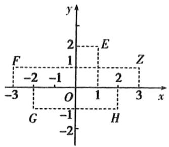

$\quad$A. E

$\quad$B. F

$\quad$C. G

$\quad$D. H

等级（N）

2021 重庆巴蜀中学第八次月考

##### 017.已知复数 $z$ 在复平面内对应的点都在射线 $y = 3x(x > 0)$ 上，且 $|z| = \sqrt{10}$ ，则 $z$ 的虚部为（）

$\quad$A.3

$\quad$B.3i

$\quad$C.±3

$\quad$D.±3i

等级（N）

2021 衡阳二模

##### 018.复数 $z = a + (1 - a)i$ ， $a\in R$ ，则 $\mathbf{z}$ 在复平面内对应的点不可能在的象限为（）

$\quad$A.第一象限

$\quad$B.第二象限

$\quad$C.第三象限

$\quad$D.第四象限

等级（R）

2021盐城二模

##### 019.若复数 $z$ 满足 $\left|z - i\right|\leq 2$ ，则 $z\overline{z}$ 的最大值为（）

$\quad$A.1

$\quad$B.2

$\quad$C.4

$\quad$D.9

# 题型三：复数的模

等级（N）

2022年全国甲卷

##### 020.若 $z = 1 + \mathrm{i}$ ，则 $\left|\mathrm{i}z + 3\bar{z}\right| =$ （）

$\quad$A. $4 \sqrt{5}$

$\quad$B. $4 \sqrt{2}$

$\quad$C. $2 \sqrt{5}$

$\quad$D. $2 \sqrt{2}$

等级（R）

##### 021. 设 $z_{1}, z_{2}$ 是复数，则下列命题中的假命题是（）

$\quad$A. 若 $\left|z_{1} - z_{2}\right| = 0$ ，则 $\overline{z_1} = \overline{z_2}$

$\quad$B. 若 $z_{1} = \overline{z_{2}}$ ，则 $\overline{z_1} = z_2$

$\quad$C. 若 $\left|z_1\right| = \left|z_2\right|$ ，则 $z_{1} \cdot \overline{z_{1}} = z_{2} \cdot \overline{z_{2}}$

$\quad$D. 若 $\left|z_1\right| = \left|z_2\right|$ ，则 $z_1^2 = z_2^2$

# 题型四：复数的周期性

等级（N）

##### 022. $i$ 为虚数单位， $\frac{1}{i} +\frac{1}{i^3} +\frac{1}{i^5} +\frac{1}{i^7}$ 等于（

$\quad$A.0

$\quad$B. $2i$

$\quad$C. $-2i$

$\quad$D. $4i$

等级（N）

##### 023. $i$ 为虚数单位，则 $\left(\frac{1 + i}{1 - i}\right)^{2017}$ 等于（）

$\quad$A. $-i$

$\quad$B.-1

$\quad$C. $i$

$\quad$D.1

等级（R）

2024 深圳中学适应性测试

##### 024.若复数 $z = 1^{0} - \mathrm{i}^{1} + \mathrm{i}^{2} - \mathrm{i}^{3} + \dots +\mathrm{i}^{2022} - \mathrm{i}^{2023} + \mathrm{i}^{2024}$ ，则 $\mid z\mid =$ （

$\quad$A.0

$\quad$B. $\sqrt{2}$

$\quad$C.1

$\quad$D.2

# 题型五：设复数的思想

等级（N）

2023漳州三检

##### 025. 已知复数 $\overline{z}$ 为复数 $z$ 的共轭复数，且满足 $z = \overline{z}^2$ ， $z$ 在复平面内对应的点在第二象限，则 $|z| =$

$\quad$A. $\sqrt{3}$

$\quad$B. $\sqrt{2}$

$\quad$C. 1

$\quad$D. $\frac{1}{2}$

等级（N）

2023 福州三检

##### 026. 在复平面内，复数 $\frac{1}{z}$ 对应的点位于第二象限，则复数 $z$ 对应的点位于（ ）

$\quad$A. 第一象限

$\quad$B. 第二象限

$\quad$C. 第三象限

$\quad$D. 第四象限

等级（R）

2023 武汉二月调研

##### 027. 若虚数 $z$ 使得 $z^2 + z$ 是实数，则 $z$ 满足

$\quad$A. 实部是 $-\frac{1}{2}$

$\quad$B. 实部是 $\frac{1}{2}$

$\quad$C. 虚部是 $-\frac{1}{2}$

$\quad$D. 虚部是 $\frac{1}{2}$

等级（R）

2023 武汉 5 月模拟训练

##### 028. 设复数 $z$ 满足 $\frac{z - 1}{z + 1}$ 为纯虚数, 则 $|z| =$

$\quad$A. 1

$\quad$B. $\sqrt{2}$

$\quad$C. $\sqrt{3}$

$\quad$D. 2

# 题型六：复数与向量

等级（R）

##### 029. 已知复数 $z_{1}, z_{2}$ 满足 $\left|z_{1}\right| = \left|z_{2}\right| = \left|z_{1} - z_{2}\right| = 1$ ，则 $\left|z_{1} + z_{2}\right|$ 等于（）

$\quad$A. 1

$\quad$B. $\sqrt{2}$

$\quad$C. $\sqrt{3}$

$\quad$D. $2 \sqrt{3}$

等级（R）

##### 030. 设复数 $z_{1}$ ， $z_{2}$ 满足 $|z_{1}| = |z_{2}| = 2$ ， $z_{1} + z_{2} = \sqrt{3} + \mathrm{i}$ ，则 $|z_{1} - z_{2}| =$ \_\_\_\_.

等级（R）

2024青岛二模

##### 031.已知复数 $z_{1}, z_{2}, z_{1} \neq z_{2}$ ，若 $z_{1}, z_{2}$ 同时满足 $|z| = 1$ 和 $|z - 1| = |z - i|$ ，则 $\left|z_{1} - z_{2}\right|$ 为（）

$\quad$A. 1

$\quad$B. $\sqrt{3}$

$\quad$C. 2

$\quad$D. $2 \sqrt{3}$

# 题型七：复数与数学文化

等级（R）

2022南昌三模

##### 032. 若复数 $z$ 的实部和虚部均为整数，则称复数 $z$ 为高斯整数，关于高斯整数，有下列命题：

①整数都是高斯整数；②两个高斯整数的乘积也是高斯整数；③模为 3 的非纯虚数可能是高斯整数；④只存在有限个非零高斯整数 $z$ ，使 $\frac{1}{z}$ 也是高斯整数。其中正确的命题有（）

$\quad$A. ①②④

$\quad$B. ①②③

$\quad$C. ①②

$\quad$D. ②③④

等级（R）

##### 033. 欧拉公式 $e^{ix} = \cos x + i\sin x$ （ $i$ 为虚数单位）是由瑞士著名数学家欧拉发现的，它将指数函数的定义域扩大到复数，建立了三角函数和指数函数的关系，它在复变函数论里非常重要，被誉为“数学中的天桥”。根据欧拉公式可知， $e^{\frac{2018}{3}\pi i}$ 表示的复数位于复平面中的（）

$\quad$A. 第一象限

$\quad$B. 第二象限

$\quad$C. 第三象限

$\quad$D. 第四象限

等级（R）

##### 034.在复平面内, 复数 $z = a + bi (a, b \in R)$ 对应向量 $\overrightarrow{OZ}$ (O为坐标原点), 设 $\left|\overrightarrow{OZ}\right| = r$ , 以射线 $Ox$ 为始边, $OZ$ 为终边旋转的角为 $\theta$ , 则 $z = r (\cos \theta + i \sin \theta)$ , 法国数学家棣莫弗发现了棣莫弗定理: $z_{1} = r_{1} (\cos \theta_{1} + i \sin \theta_{1})$ , $z_{2} = r_{2} (\cos \theta_{2} + i \sin \theta_{2})$ , 则 $z_{1} z_{2} = r_{1} r_{2} [\cos (\theta_{1} + \theta_{2}) + i \sin (\theta_{1} + \theta_{2})]$ , 由棣莫弗定理可以导出复数乘方公式: $[r (\cos \theta + i \sin \theta)]^{n} = r^{n} (\cos n \theta + i \sin n \theta)$ , 已知 $z = (\sqrt{3} + i)^{4}$ , 则 $\left|\overline{z}\right| = (\quad)$

$\quad$A. $2 \sqrt{3}$

$\quad$B.4

$\quad$C. $8\sqrt{3}$

$\quad$D.16

# 题型八：复数常用技巧大总结

等级（R）

2024江西3月大联考

##### 035.（多选）复数 $z$ 满足 $z^3 = 1$ ，且 $z \neq 1$ ，则（）

$\quad$A. $|z| = 1$

$\quad$B. $z^2 = \overline{z}$

$\quad$C. $(\overline{z})^2 = -z$

$\quad$D. $z^n + z^{n+1} + z^{n+2} = 0, n \in N^*$

等级（R）

2021 福建 4 月质检

##### 036.设复数 $z_{1}$ ， $z_{2}$ 满足 $z_{2}\neq 0$ ，且 $\vert z_1\cdot \bar{z}_2\vert = 2\vert z_2\vert$ ，则 $z_{1}$ 可以是（）

$\quad$A. -1-I

$\quad$B. $2 + 2\mathrm{i}$

$\quad$C.-1+√3I

$\quad$D.4i

等级（R）

2024 九省联考

##### 037.（多选）已知复数 $z, w$ 均不为0，则（）

$\quad$A. $z^2 = |z|^2$

$\quad$B. $\frac{z}{z} = \frac{z^2}{|z|^2}$

$\quad$C. $\overline{z - w} = \overline{z} -\overline{w}$

$\quad$D. $\left|\frac{z}{w}\right|=\frac{|z|}{|w|}$

等级（R）

2024 宁德五月质检

##### 038.（多选）已知 $z_{1}, z_{2}$ 是两个复数，则下列结论中正确的是（）

$\quad$A. 若 $z_{1} = \overline{z}_{2}$ ，则 $z_{1}z_{2} \in R$

$\quad$B. 若 $z_{1} + z_{2}$ 为实数，则 $z_{1} = \overline{z}_{2}$

$\quad$C. 若 $z_{1}, z_{2}$ 均为纯虚数，则 $\frac{z_{1}}{z_{2}}$ 为实数

$\quad$D. 若 $\frac{z_1}{z_2}$ 为实数，则 $z_1, z_2$ 均为纯虚数

等级（R）

2024 潍坊二模

##### 039.（多选）定义域是复数集的子集的函数称为复变函数， $f(z)=z^{2}$ 就是一个多项式复变函数。给定多项式复变函数 $f(z)$ 之后，对任意一个复数 $z_{0}$ ，通过计算公式 $z_{n+1}=f(z_{n})$ ， $n\in N$ 可以得到一列值 $z_{0},z_{1},z_{2},\cdots,z_{n},\cdots$ 。如果存在一个正数 M，使得 $\left|z_{n}\right|<M$ 对任意 $n\in N$ 都成立，则称 $z_{0}$ 为 $f(z)$ 的收敛点；否则，称为 $f(z)$ 的发散点。则下列选项中是 $f(z)=z^{2}$ 的收敛点的是（）

$\quad$A. $\sqrt{2}$

$\quad$B. -i

$\quad$C. $1 - \mathrm{i}$

$\quad$D. $\frac{1}{2} -\frac{\sqrt{3}}{2}\mathrm{i}$

# 题型九：复数与一元二次方程的根

等级（N）

##### 040.复数范围内解方程：

$2 x ^ {2} - 3 x + 4 = 0$

等级（R）

2024岳阳二模

##### 041.（多选）设 $\alpha, \beta$ 是关于 $x$ 的方程 $2x^{2} + px + q = 0$ 的两根，其中 $p, q \in R$ . 若 $\alpha = 2i - 3$ ( $i$ 为虚数单位), 则（）

$\quad$A. $\beta = 2i + 3$

$\quad$B. $p + q = 38$

$\quad$C. $\alpha +\beta = -6$

$\quad$D. $|\alpha | + |\beta | = 2\sqrt{13}$

# 题型十：两复数相乘为0的翻译及其延伸

等级（SR）

(重庆二诊)

##### 042.（多选）已知复数 $z_{1}, z_{2}$ ，则下列结论中正确的是（）

$\quad$A. 若 $z_{1}z_{2}\in R$ ，则 $z_{2} = \overline{z_{1}}$

$\quad$B. 若 $z_{1}z_{2} = 0$ ，则 $z_{1} = 0$ 或 $z_{2} = 0$

$\quad$C. 若 $z_{1}z_{2} = z_{1}z_{3}$ 且 $z_{1} \neq 0$ ，则 $z_{2} = z_{3}$

$\quad$D. 若 $z_{1}^{2} = z_{2}^{2}$ ，则 $|z_{1}| = |z_{2}|$

等级（R）

2023佛山二模

##### 043.（多选）设 $z$ ， $z_{1}$ ， $z_{2}$ 为复数，且 $z_{1} \neq z_{2}$ ，下列命题中正确的是（

$\quad$A. 若 $\overline{z_1} = z_2$ ，则 $z_1 = \overline{z_2}$

$\quad$B. 若 $\left|z_{1}-z_{2}\right|=\left|z_{1}+z_{2}\right|$ ，则 $z_{1}z_{2}=0$

$\quad$C. 若 $zz_{1} = zz_{2}$ ，则 $z = 0$

$\quad$D. 若 $\left|z - z_{1}\right| = \left|z - z_{2}\right|$ ，则 $z$ 在复平面对应的点在一条直线上

# 立体几何选填

# 题型一：空间几何体

等级（N）

##### 001. 木星的体积约是地球体积的 $240\sqrt{30}$ 倍，则它的表面积约是地球表面积的（）

$\quad$A.60倍

$\quad$B. $60\sqrt{30}$ 倍

$\quad$C. 120 倍

$\quad$D. $120\sqrt{30}$ 倍

等级（N）

##### 002. 如图, 在圆柱 $O_{1} O_{2}$ 内有一个球 $O$ , 该球与圆柱的上、下底面及母线均相切, 记圆柱 $O_{1} O_{2}$ 的体积为 $V_{1}$ , 球 $O$ 的体积为 $V_{2}$ , 则 $\frac{V_{1}}{V_{2}}$ 的值是\_\_\_\_。

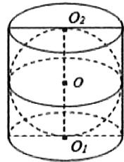

等级（N）

2021永州三模

##### 003.有一个装有水且底面直径为 $12 \mathrm{~cm}$ 的圆柱形容器, 水面与容器口的距离为 $1 \mathrm{~cm}$ 。现往容器中放入一个半径为 $\mathbf{r}$ (单位: $c m$ ) 的小球, 该小球放入水中后直接沉入容器底部, 若使该容器内的水不溢出, 则小球半径 $r$ 的最大值为 ( )

$\quad$A. 1

$\quad$B. 2

$\quad$C. 3

$\quad$D.4

等级（N）

2022年新高考1卷

##### 004.南水北调工程缓解了北方一些地区水资源短缺问题, 其中一部分水蓄入某水库. 已知该水库水位为海拔148. 5m时, 相应水面的面积为140. $0\mathrm{km}^2$ ; 水位为海拔157. 5m时, 相应水面的面积为180. $0\mathrm{km}^2$ , 将该水库在这两个水位间的形状看作一个棱台, 则该水库水位从海拔148. 5m上升到157. 5m时, 增加的水量约为 $(\sqrt{7} \approx 2.65)$ ( )

$\quad$A. $1.0 \times 10^{9} \mathrm{~m}^{3}$

$\quad$B. $1.2 \times 10^{9} \mathrm{~m}^{3}$

$\quad$C. $1.4 \times 10^{9} \mathrm{~m}^{3}$

$\quad$D. $1.6 \times 10^{9} \mathrm{~m}^{3}$

等级（N）

2021年新高考2卷

##### 005.正四棱台的上、下底面的边长分别为2，4，侧棱长为2，则其体积为（）

$\quad$A. $20 + 12\sqrt{3}$

$\quad$B. $28\sqrt{2}$

$\quad$C. $\frac{56}{3}$

$\quad$D. $\frac{28\sqrt{2}}{3}$

等级（N）

##### 006. 把由 $y = |x|$ 和 $y = 2$ 围成的图形绕 $x$ 轴旋转 $360^{\circ}$ ，所得旋转体的体积为 \_\_\_\_.

等级（N）

2021年甲卷文科

##### 007. 已知一个圆锥的底面半径为 6，其体积为 $30\pi$ ，则该圆锥的侧面积为 \_\_\_\_.

等级（N）

2021年新高考1卷

##### 008.已知圆锥的底面半径为 $\sqrt{2}$ ，其侧面展开图为一个半圆，则该圆锥的母线长为（）

$\quad$A. 2

$\quad$B. $2 \sqrt{2}$

$\quad$C.4

$\quad$D. $4 \sqrt{2}$

等级（N）

2023济南一模

##### 009.用一个平行于圆锥底面的平面去截圆锥，截得的圆台上底面半径为1，下底面半径为2，且该圆台侧面积为 $3\sqrt{5}\pi$ ，则原圆锥的母线长为()

$\quad$A.2

$\quad$B. $\sqrt{5}$

$\quad$C.4

$\quad$D. $2 \sqrt{5}$

等级（N）

##### 010.若一个正四棱锥的侧棱和底面边长相等，则该正四棱锥的侧棱和底面所成的角为（）

$\quad$A. $30^{\circ}$

$\quad$B. $45^{\circ}$

$\quad$C. $60^{\circ}$

$\quad$D. $90^{\circ}$

等级（N）

##### 011.埃及胡夫金字塔是古代世界建筑奇迹之一，它的形状可视为一个正四棱锥，以该四棱锥的高为边长的正方形面积等于该四棱锥一个侧面三角形的面积，则其侧面三角形底边上的高与底面正方形的边长的比值为（）

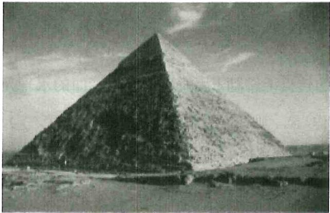

$\quad$A. $\frac{\sqrt{5} - 1}{4}$

$\quad$B. $\frac{\sqrt{5} - 1}{2}$

$\quad$C. $\frac{\sqrt{5} + 1}{4}$

$\quad$D. $\frac{\sqrt{5} + 1}{2}$

等级（N）

##### 012. 日晷是中国古代用来测定时间的仪器, 利用与晷面垂直的晷针投射到晷面的影子来测定时间. 把地球看成一个球(球心记为 $O$ ), 地球上一点 $A$ 的纬度是指 $OA$ 与地球赤道所在平面所成角, 点 $A$ 处的水平面是指过点 $A$ 且与 $OA$ 垂直的平面. 在点 $A$ 处放置一个日晷, 若晷面与赤道所在平面平行, 点 $A$ 处的纬度为北纬 $40^{\circ}$ , 则晷针与点 $A$ 处的水平面所成角为 ( )

$\quad$A. $20^{\circ}$

$\quad$B. $40^{\circ}$

$\quad$C. $50^{\circ}$

$\quad$D. $90^{\circ}$

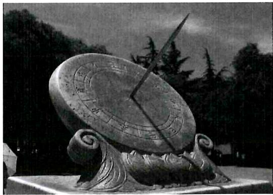

等级（N）

##### 013. 如图所示, 一个棱长为 1 的正方体在一个水平放置的转盘上转动, 用垂直于竖直墙面的水平光线照射, 该正方体在紧直墙面上的投影的面积记作 $S$ , 则 $S$ 的值不可能是 ( )

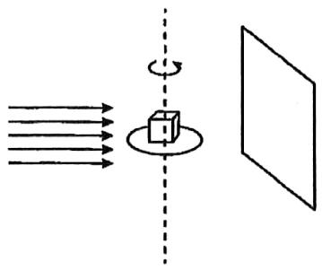

$\quad$A. 1

$\quad$B. $\frac{6}{5}$

$\quad$C. $\frac{4}{3}$

$\quad$D. $\frac{3}{2}$

等级（N）

2021 龙岩五月质检

##### 014.如图, 一个三棱柱的容器盛有水, 水的体积是三棱柱体积的 $\frac{1}{2}$ , 现将其侧面 $AA_{1}B_{1}B$ 放置于水平地面, 水面恰好经过底边 $AC$ 上的点 D, 则 $\frac{AD}{CD}$ 的值为 ( )

$\quad$A. $\frac{1}{2}$ $
$\quad$B.\frac{\sqrt{2}}{2}$ $
$\quad$C.\frac{\sqrt{2} + 1}{2}$ $
$\quad$D.\sqrt{2} -1$

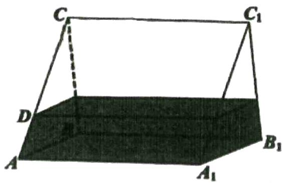

等级（R）

2022 宜春四月统考

##### 015. 2021 年 7 月 20 日河南省遭受特大暴雨袭击，因灾死亡失踪 398 人。郑州日降雨量 622.7mm，其中最大小时降雨量达 201mm。通常说的小雨、中雨。大雨、暴雨等，一般以日降雨量衡量，指从天空降落到地面上的雨水，未经蒸发、渗透、流失而在水面上积聚的水层深度。其中小雨日降水量在 10mm 以下；中雨日降水量在 10-24.9mm；大雨日降水量为 25-49.9mm；暴雨日降水量为 50-99.9mm；大暴雨日降水量为 100-250mm；特大暴雨日降水量在 250mm 以上。为研究宜春某天降水量，某同学自制一个高为 120mm 的无盖正四棱柱形容器底部镶嵌了同底的正四棱锥形实心块，如图 1 所示，接了 24 小时的雨水（不考虑水的损耗），水面刚好没过四棱锥顶点 P，然后盖上盖子密封，将容器倒置，如图 2 所示，水面还恰好没过点 P，则当天的降雨级别为（）

$\quad$A. 小雨

$\quad$B. 中雨

$\quad$C. 大雨

$\quad$D. 暴雨

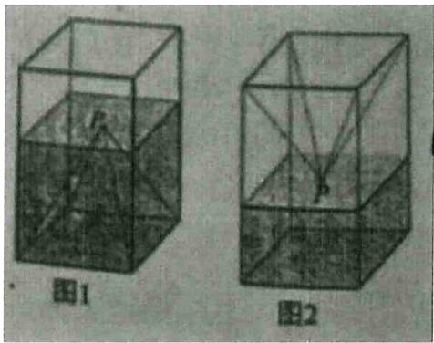

等级（R）

2022南昌一模

##### 016.圆柱形玻璃杯中盛有高度为 $10\mathrm{cm}$ 的水，若放入一个玻璃球（球的半径与圆柱形玻璃杯内壁的底面半径相同）后，水恰好淹没了玻璃球，则玻璃球的半径为（ ）

$\quad$A. $\frac{20}{3}\mathrm{cm}$

$\quad$B. $15 \mathrm{~cm}$

$\quad$C. $10 \sqrt{3} \mathrm{~cm}$

$\quad$D.20cm

等级（R）

##### 017. 小明有一卷纸，纸非常的薄且紧紧缠绕着一个圆柱体轴心卷成一卷，它的整体外貌如图所示，纸卷的直径为 12 厘米，轴的直径为 4 厘米，当小明用掉 $\frac{3}{4}$ 的纸后，则剩下的这卷纸的直径最接近于（）

A, 6 厘米

B, 7 厘米

C, 8 厘米

D, 9 厘米

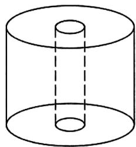

等级（R）

2023 深圳二模

##### 018.设表面积相等的正方体、正四面体和球的体积分别为 $V_{1}, V_{2}$ 和 $V_{3}$ ，则（）

$\quad$A. $V_{1} < V_{2} < V_{3}$

$\quad$B. $V_{2} < V_{1} < V_{3}$

$\quad$C. $V_{3} < V_{1} < V_{2}$

$\quad$D. $V_{2} < V_{2} < V_{1}$

等级（R）

2022 沈阳市郊联体 4 月线上测试

##### 019. 如图, 在正四棱台 $ABCD - A_{1}B_{1}C_{1}D_{1}$ 中, 棱 $AA_{1}, BB_{1}$ 的夹角为 $\frac{\pi}{3}$ , $AB = 2$ , 则棱 $AA_{1}, CC_{1}$ 的夹角为 ( )

$\quad$A. $\frac{\pi}{3}$

$\quad$B. $\frac{\pi}{4}$

$\quad$C. $\frac{2\pi}{3}$

$\quad$D. $\frac{\pi}{2}$

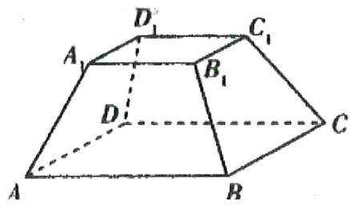

等级（R）

2022南昌二模

##### 020. 已知圆锥内部有一个半径为 1 的球与其侧面和底面均相切，且圆锥的轴截面为等边三角形，圆锥的侧面积为（）

$\quad$A. $2 \pi$

$\quad$B. $4 \pi$

$\quad$C. $6\pi$

$\quad$D. $8\pi$

等级（R）

2024 蚌埠四检

##### 021.如图所示, 圆台的上、下底面半径分别为 $4 \mathrm{~cm}$ 和 $6 \mathrm{~cm}$ , $A A_{1}$ , $B B_{1}$ 为圆台的两条母线, 截面 $A B B_{1} A_{1}$ 与下底面所成的夹角大小为 $60^{\circ}$ , 且 $\odot O_{1}$ 劣弧 $\widehat {A_{1} B_{1}}$ 的弧长为 $\frac{8 \pi}{3} \mathrm{~cm}$ , 则三棱台 $A B O - A_{1} B_{1} O_{1}$ 的体积

为（）

$\quad$A. $\frac{19}{3} \mathrm{~cm}^{3}$

$\quad$B. $10 \sqrt{3} \mathrm{~cm}^{3}$

$\quad$C. $19\mathrm{cm}^3$

$\quad$D. $20 \sqrt{3} \mathrm{~cm}^{3}$

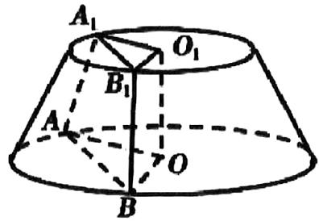

# 题型二：点、直线、平面之间的位置关系

等级（N）

##### 022. 下列命题中正确的个数是（）

1）若直线 1 上有无数个点不在平面 a 内，则 1//a.  
2）若直线1与平面 $a$ 平行，则1与平面 $a$ 内的任意一条直线都平行。  
3）如果两条平行直线中的一条与一个平面平行，那么另一条也与这个平面平行。  
4）若直线1与平面a平行，则1与平面a内的任意一条直线都没有公共点。

$\quad$A. 0

$\quad$B. 1

$\quad$C. 2

$\quad$D. 3

等级（N）

##### 023.已知 $\alpha$ ， $\beta$ 为不同的平面， $a$ ， $b$ 为不同的直线则下列选项正确的是（）

$\quad$A. 若 $a / / \alpha, b \subset \alpha$ . 则 $a / / b$

$\quad$B. 若 $a // \alpha, b // \alpha$ ，则 $a // b$

$\quad$C. 若 $a \parallel b, a \perp \alpha$ , 则 $b \perp \alpha$

$\quad$D. 若 $\alpha \perp \beta, a \subset \alpha$ . 则 $a \perp \beta$

等级（N）

##### 024. 已知 $a, b$ 为两条不同的直线， $\alpha, \beta$ 为两个不同的平面，则下列命题正确的是（）

$\quad$A. 若 $a \parallel a$ ， $b \parallel \alpha$ ，则 $a \parallel b$   
$\quad$B. 若 $a \parallel b$ ， $a \parallel \alpha$ ， $b \parallel \beta$ 则 $\alpha \parallel \beta$   
$\quad$C. 若 $a / / \alpha, b \not\subset \alpha, a / / b$ ，则 $b / / \alpha$   
$\quad$D. $\alpha // \beta, a // \alpha, b // \beta$ ，则 $a // b$

等级（N）

##### 025. 在空间中，给出下列四个命题：

①平行于同一个平面的两条直线互相平行；②垂直于同一个平面的两个平面互相平行；  
③平行于同一条直线的两条直线互相平行；④垂直于同一个平面的两条直线互相平行，  
其中正确命题的序号是（ ）

$\quad$A. ①②   
$\quad$B. ①③   
$\quad$C. ②④   
$\quad$D. ③④

等级（N）

##### 026. 设 $m, n$ 为两条不同的直线， $a, \beta$ 为两个不同的平面，则下列结论正确的是（）

$\quad$A. $\alpha \perp \beta, m \perp \alpha, n \perp \beta$ ，则 $m \perp n$   
$\quad$B. $\alpha \perp \beta, m \perp \alpha, n \subset \beta$ ，则 $m \perp n$   
$\quad$C. $\alpha \perp \beta, m \subset \alpha, n \subset \beta$ ，则 $m \perp n$   
$\quad$D. $\alpha // \beta, m \subset \alpha, n \subset \beta$ ，则 $m // n$

等级（N）

##### 027. 已知 $m, n$ 是两条不同的直线， $a, \beta$ 是两个不同的平面，若 $m \subset \alpha, n \subset \beta$ ，则下列命题正确的是（）

$\quad$A. 若 $n / / \alpha$ ， $m / / \beta$ ，则 $\alpha / / \beta$   
$\quad$B. 若 $\alpha \cap \beta = l$ ，且 $m \perp l$ ，则 $m \perp \beta$   
$\quad$C. 若 $m \parallel n$ ， $m \parallel \beta$ ，则 $\alpha \parallel \beta$   
$\quad$D. 若 $\alpha \cap \beta = l$ ，且 $m / / l$ ，则 $m / / \beta$

等级（R）

##### 028. 设有如下三个命题:

甲：相交直线 $1, \mathrm{m}$ 都在平面 $a$ 内，并且都不在平面 $\beta$ 内；

乙：直线 $1, \mathrm{m}$ 中至少有一条与平面 $\beta$ 相交；

丙：平面 a 与平面 $\beta$ 相交.

则当甲成立时，乙是丙的（）

$\quad$A. 充分而不必要条件

$\quad$B. 必要而不充分条件

$\quad$C. 充分且必要条件

$\quad$D. 既不充分也不必要条件

等级（R）

##### 029. 已知直线 1, m 与平面 $a$ , $\beta$ , 有如下三个命题:

①若在平面 $\gamma$ ，使得 $a \perp \gamma$ ， $\beta \perp \gamma$ ，则 $\alpha // \beta$   
②若 1.m 是两条异面直线， $l \subset \alpha, m \subset \beta, l // \beta, m // \alpha$ ，则 $\alpha // \beta$ ;  
③若 $1 \perp a$ ; $m \perp \beta$ , $1 // m$ , 则 $\alpha // \beta$

则正确的命题的个数是（）

$\quad$A.0

$\quad$B.1

$\quad$C.2

$\quad$D.3

等级（R）

##### 030. 已知两个平面相互垂直，下列命题

①一个平面内已知直线必垂直于另一个平面内的任意一条直线  
②一个平面内已知直线必垂直于另一个平面内的无数条直线  
③一个平面内任意一条直线必垂直于另一个平面  
④过一个平面内任意一点作交线的垂线，则此垂线必垂直于另一个平面其中正确的命题个数是（）

$\quad$A. 3

$\quad$B. 2

$\quad$C. 1

$\quad$D. 0

等级（R）

##### 031. 已知 $a$ ， $b$ 为不垂直的异面直线， $\alpha$ 是一个平面，则 $a$ 、 $b$ 在上 $\alpha$ 的射影有可能是

①两条平行直线；  
②两条互相垂直的直线  
③同一条直线；  
④一条直线及其外一点

在一面结论中，结论正确的编号是\_\_\_\_（写出所以正确结论的编号）

等级（R）

##### 032. 不共面的 4 个定点到平面 $a$ 的距离都相等，这样的平面 $a$ 共有（）

$\quad$A. 3 个

$\quad$B. 4 个

$\quad$C. 6 个

$\quad$D. 7 个

等级（R）

##### 033. 在空间中，与边长均为 $3\mathrm{cm}$ 的 $\Delta ABC$ 的三个顶点距离均为 $1\mathrm{cm}$ 的平面的个数为（）

$\quad$A. 2

$\quad$B. 4

$\quad$C. 6

$\quad$D. 8

# 题型三：基于正方体的内部性质的考察

等级（N）

2021年新高考2卷

##### 034.（多选）如图，在正方体中， $O$ 为底面的中心， $P$ 为所在棱的中点， $M, N$ 为正方体的顶点．则满足 $MN \perp OP$ 的是（ ）

$\quad$A.

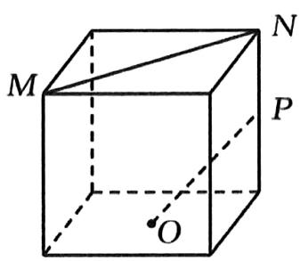

$\quad$B.

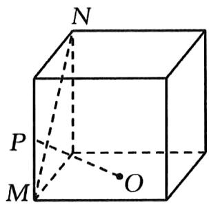

$\quad$C.

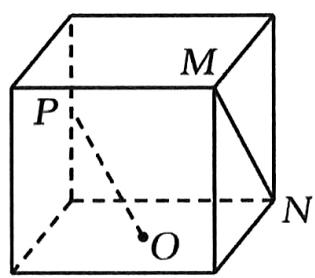

$\quad$D.

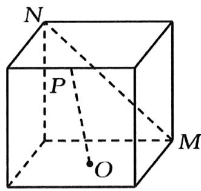

等级（N）

2022年新高考1卷

##### 035.（多选）已知正方体 $ABCD - A_{1}B_{1}C_{1}D_{1}$ ，则（

$\quad$A. 直线 $BC_{1}$ 与 $DA_{1}$ 所成的角为 $90^{\circ}$

$\quad$B. 直线 $BC_{1}$ 与 $CA_{1}$ 所成的角为 $90^{\circ}$

$\quad$C. 直线 $BC_{1}$ 与平面 $BB_{1}D_{1}D$ 所成的角为 $45^{\circ}$

$\quad$D. 直线 $BC_{1}$ 与平面ABCD所成的角为 $45^{\circ}$

等级（N）

2022年全国甲卷

##### 036. 在长方体 $ABCD - A_{1}B_{1}C_{1}D_{1}$ 中，已知 $B_{1}D$ 与平面 $ABCD$ 和平面 $AA_{1}B_{1}B$ 所成的角均为 $30^{\circ}$ ，则（）

$\quad$A. $AB = 2AD$

$\quad$B. $AB$ 与平面 $AB_{1}C_{1}D$ 所成的角为 $30^{\circ}$

$\quad$C. $AC = CB_{1}$

$\quad$D. $B_{1} D$ 与平面 $B B_{1} C_{1} C$ 所成的角为 $45^{\circ}$

等级（N）

2022年全国乙卷

##### 037. 在正方体 $ABCD - A_{1}B_{1}C_{1}D_{1}$ 中， $E, F$ 分别为 $AB, BC$ 的中点，则（）

$\quad$A. 平面 $B_{1}EF \perp$ 平面 $BDD_{1}$

$\quad$B. 平面 $B_{1}EF \perp$ 平面 $A_{1}BD$

$\quad$C. 平面 $B_{1}EF$ //平面 $A_{1}AC$

$\quad$D. 平面 $B_{1}EF$ //平面 $A_{1}C_{1}D$

等级（R）

##### 038. 在棱长为 1 的正方体 $ABCD - A_{1}B_{1}C_{1}D_{1}$ 中, 点 $C$ 关于平面 $BDC_{1}$ 的对称点为 $M$ , 则 $AM$ 与平面 $ABCD$ 所成角的正切值为 ( )

$\quad$A. $\frac{\sqrt{2}}{2}$

$\quad$B. $\sqrt{2}$

$\quad$C. $\sqrt{3}$

$\quad$D.2

等级（R）

##### 039. 如图, 已知 $EF$ 分别为正方体 $ABCD - A_{1}B_{1}C_{1}D_{1}$ 的棱 $AB$ 、 $BC$ 的中点, 平面 $DEC_{1}$ 交棱 $BB_{1}$ 于点 $G$ , 则下列结论中正确的是 ( )

$\quad$A. 平面 $AB_{1}D_{1} //$ 平面 $DEC_{1}$   
$\quad$B. 截面 $DEGC_{1}$ 是直角梯形  
$\quad$C. 直线 $A_{1}F$ 与直线 $DG$ 异面  
$\quad$D. 直线 $A_{1}F \perp$ 平面 $DEC_{1}$

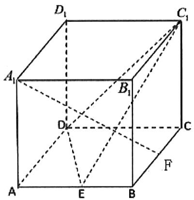

等级（R）

##### 040. 如图, 点 $\mathrm{E}$ 是正方体 $ABCD - A_{1}B_{1}C_{1}D_{1}$ 的棱 $DD_{1}$ 的中点, 点 $\mathrm{F}, \mathrm{M}$ 分别在线段AC, $\mathrm{BD}_{1}$ (不包含端点) 上运动, 则 ( )

$\quad$A. 在点 F 的运动过程中，存在 $EF \parallel BC_{1}$

$\quad$B. 在点 $\mathbb{M}$ 的运动过程中，不存在 $B_{1}M \perp AE$

$\quad$C. 四面体 EMAC 的体积为定值

$\quad$D. 四面体 $FA_{1}C_{1}B$ 的体积不是定值

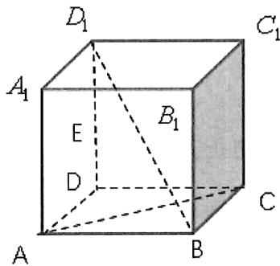

等级（R）

##### 041. 在正方体 $ABCD - A_{1}B_{1}C_{1}D_{1}$ 中，这对角线 $AC_{1}$ 的一个平面交 $BB_{1}$ 于点 $E$ . 交 $DD_{1}$ 于点 $F$ 得四边形 $AEC_{1}F$ 则下列结论正确的是（）

$\quad$A. 四边形 $AEC_{1}F$ 一定是菱形  
$\quad$B. 四边形 $AEC_{1}F$ 在底面 $ABCD$ 内的投影不可能是正方形  
$\quad$C. 四边形 $AEC_{1}F$ 所在平面不可能垂直于平面 $ACC_{1}A_{1}$   
$\quad$D. 四边形 $AEC_{1}F$ 一定不是梯形

# 题型四：异面直线夹角问题

等级（N）

##### 042. 若正方体 $ABCD - A_{1}B_{1}C_{1}D_{1}$ 的棱长为 1，则 $B_{1}D$ 与 $CC_{1}$ 所成角的正切值为

等级（N）

2021年乙卷文科

##### 043. 在正方体 $ABCD - A_{1}B_{1}C_{1}D_{1}$ 中， $P$ 为 $B_{1}D_{1}$ 的中点，则直线 $PB$ 与 $AD_{1}$ 所成的角为（）

$\quad$A. $\frac{\pi}{2}$

$\quad$B. $\frac{\pi}{3}$

$\quad$C. $\frac{\pi}{4}$

$\quad$D. $\frac{\pi}{6}$

等级（SR）

##### 044. 异面直线 $a, b$ 所成的角为 $\frac{\pi}{6}$ ，直线 $a \perp c$ ，则异面直线 $b$ 与 $c$ 所成角的范围为（）

$\quad$A. $\left[\frac{\pi}{3},\frac{\pi}{2}\right]$

$\quad$B. $\left[\frac{\pi}{6},\frac{\pi}{2}\right]$

$\quad$C. $\left[\frac{\pi}{3},\frac{2\pi}{3}\right]$

$\quad$D. $\left[\frac{\pi}{6},\frac{5\pi}{6}\right]$

等级（SR）

##### 045. 若异面直线 $m$ ， $n$ 所成的角是 $60^{\circ}$ ，则以下三个命题：

①存在直线1，满足1与m，n的夹角都是 $60^{\circ}$ ；  
②存在平面 a，满足 $m \subset \alpha$ ，n 与 a 所成角为 $60^{\circ}$ ；  
③存在平面 $a$ ， $\beta$ ，满足 $\mathbf{m} \subset \alpha$ ， $\mathbf{n} \subset \beta$ 与 $\beta$ 所成锐二面角为 $60^\circ$

其中正确命题的个数为（ ）

$\quad$A. 0

$\quad$B. 1

$\quad$C. 2

$\quad$D. 3

等级（SR）

##### 046. 已知圆锥的顶点为 A，高和底面圆半径相等，BE 是底面圆的一条直径，点 D 为底面圆周上的一点，且 $\angle ABD = 60^{\circ}$ ，则异面直线 AB 与 DE 所成角的正弦值为（）

$\quad$A. $\frac{\sqrt{3}}{2}$

$\quad$B. $\frac{\sqrt{2}}{2}$

$\quad$C. $\frac{\sqrt{3}}{3}$

$\quad$D. $\frac{1}{3}$

等级（SR）

2021 桂林崇左四月联考

##### 047. 如图，A, B, C, D, P 是球 O 上 5 个点，ABCD 为正方形，球心 O 在平面 ABCD 内，PB = PD，PA = 2PC，则异面直线 PA 与 CD 所成角的余弦值为（）

$\mathrm{A} \frac {\sqrt {3}}{3}$

$B \frac {\sqrt {5}}{5}$

$C \frac {\sqrt {6}}{3}$

$D \frac {\sqrt {1 0}}{5}$

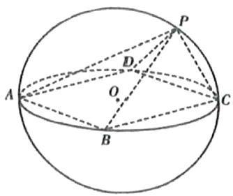

等级（SR）

##### 048. 已知 A, B 两点都在以 PC 为直径的球 O 的表面上, AB⊥BC, AB=2, BC=4, 若球 O 的体积为 $8\sqrt{6}\pi$ , 则异面直线 PB 与 AC 所成角的余弦值为 \_\_\_\_

# 题型五：截面问题

等级（R）

##### 049. 正方体 $ABCD - A_{1}B_{1}C_{1}D_{1}$ 中， $P$ 、 $Q$ 、 $R$ 分别是 $AB$ 、 $AD$ 、 $B_{1}C_{1}$ 的中点。那么，正方体过 $P$ 、 $Q$ 、 $R$ 的截面图形是（）

A三角形

$\quad$B. 四边形

$\quad$C. 五边形

$\quad$D.六边形

等级（R）

2021 唐山一模

##### 050.（多选）在正方体ABCD-A1B1C1D1中，P是面对角线BD上的动点，Q是棱C1D1的中点，过A1，P，Q三点的平面与正方体的表面相交，所得截面多边形可能是（ ）

$\quad$A. 三角形

$\quad$B. 四边形

$\quad$C. 五边形

$\quad$D.六边形

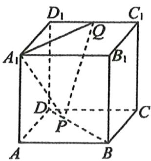

等级（R）

##### 051. 在正方形 $ABCD - A'B'C'D'$ 中，过对角线 $BD'$ 的一个平面交 $AA'$ 于 $E$ ，交 $CC'$ 于 $F$ ，则

①四边形 $BFD'E$ 一定是平行四边形  
②四边形 $BFD'E$ 有可能是正方形  
③四边形 $BFD'E$ 在底面 $ABCD$ 内的投影一定是正方形  
④四边形 $BFD'E$ 有可能垂直于平面 $BB'D$

以上结论正确的为\_\_\_\_，（写出所有正确结论的编号）

等级（R）

##### 052. 已知正方体 $ABCD-A_{1}B_{1}C_{1}D_{1}$ 的体积为 1，点 M 在线段 BC 上（点 M 异于 B、C 两点），点 N 为线段 $CC_{1}$ ，的中点，若平面 AMN 截正方体 $ABCD-A_{1}B_{1}C_{1}D_{1}$ 所得的截面为五边形。则线段 BM 的取值范围为（）

$\quad$A. $\left(0,\frac{1}{2}\right]$

$\quad$B. $\left(\frac{1}{2},1\right)$

$\quad$C. $\left[\frac{1}{3},1\right)$

$\quad$D. $\left[\frac{1}{2},\frac{1}{3}\right]$

等级（R）

##### 053.棱长为2的正方体 $ABCD - A_{1}B_{1}C_{1}D_{1}$ ，中， $\pmb{E}$ 为棱 $AD$ 中点，过点 $B_{1}$ 且与平面 $\mathrm{A}_1\mathrm{BE}$ 平行的正方体的截面面积为（）

$\quad$A. 5

$\quad$B. $2 \sqrt{5}$

$\quad$C. $2 \sqrt{6}$

$\quad$D. 6

等级（SR）

2022绵阳三诊

##### 054. 在棱长为 3 的正方体 $ABCD-A_{1}B_{1}C_{1}D_{1}$ 中, 已知点 $P$ 为棱 $AA_{1}$ 上靠近于点 $A_{1}$ 的三等分点, 点 $Q$ 为棱 $CD$ 上一动点, 若 $M$ 为平面 $D_{1}PQ$ 与平面 $ABB_{1}A_{1}$ 的公共点, $N$ 为平面 $D_{1}PQ$ 与平面 $ABCD$ 的公共点,且点 $M, N$ 都在正方体的表面上, 则由所有满足条件的点 $M$ , $N$ 构成的区域的面积之和为

等级（SR）

2023 湖北四月调考

##### 055. (多选) 已知在棱长为 2 的正方体 $ABCD - A_{1}B_{1}C_{1}D_{1}$ 中, 过棱 $BC, CD$ 的中点 $E, F$ 作正方体的截面多边形, 则下列说法正确的有 ( )

$\quad$A. 截面多边形可能是五边形  
$\quad$B. 若截面与直线 $AC_{1}$ 垂直, 则该截面多边形为正六边形  
$\quad$C. 若截面过 $AB_{1}$ 的中点, 则该截面不可能与直线 $A_{1}C$ 平行  
$\quad$D. 若截面过点 $A_{1}$ , 则该截面多边形的面积为 $\frac{7\sqrt{17}}{6}$

等级（SR）

2021皖西联盟高三联考

##### 056. 在棱长为 1 的正方体 $ABCD - A_{1}B_{1}C_{1}D_{1}$ 中，E 为棱 CD 上的动点（不含端点），过 B，E， $D_{1}$ 的截面与棱 $A_{1}B_{1}$ 交于 F，若截面 $BED_{1}F$ 在平面 $A_{1}B_{1}C_{1}D_{1}$ 和平面 $ABB_{1}A_{1}$ 上正投影的周长分别为 $C_{1}, C_{2}$ ，则 $C_{1} + C_{2}$ （）

$\quad$A. 有最小值 $2 + 2\sqrt{5}$

$\quad$B. 有最大值 $4 + 2\sqrt{2}$

$\quad$C. 是定值 $4 + 2\sqrt{2}$

D是定值 $4 + 2\sqrt{5}$

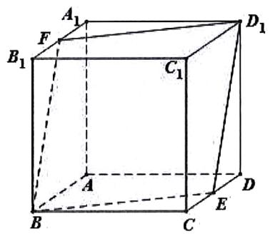

等级（SR）

2023 东北三省三校三模

##### 057. (多选) 正四棱锥 $P - ABCD$ 中, $PA = 2, AB = \sqrt{2}$ , 过点 $B$ 作截面分别交棱 $PA, PC, PD$ 于点 $E, F, M$ , 且 $EF \parallel AC$ , 则下列结论正确的是 ( )

$\quad$A. 若 $M$ 为 $PD$ 中点，则 $EF = \frac{4}{3}$

$\quad$B. 若 $PD \perp$ 平面 $BEMF$ , 则截面 $BEMF$ 的面积为 $\frac{4}{3} \sqrt{3}$

$\quad$C. 若 $E, F$ 为所在棱的中点，则 $PM = \frac{1}{2}$

$\quad$D. 若 $E, F$ 为所在棱的中点，则点 $P$ 到平面 $BEMF$ 的距离为 $\frac{\sqrt{21}}{7}$

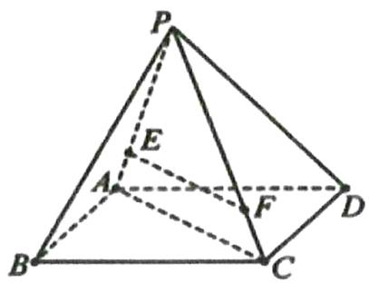

等级（SR）

2023 温州三模

##### 058.（多选）如图，圆柱的轴截面 $ABCD$ 是边长为 2 的正方形， $F, H$ 为圆柱底面圆弧 $\widehat{BC}$ 的两个三等分点， $EF, GH$ 为圆柱的母线，点 $P, Q$ 分别为线段 $AB, GH$ 上的动点，经过点 $D, P, Q$ 的平面 $\alpha$ 与线段 $EF$ 交于点 $R$ ，以下结论正确的是（）

$\quad$A. $QR\parallel PD$   
$\quad$B. 若点 $R$ 与点 $F$ 重合，则直线 $PQ$ 过定点  
$\quad$C. 若平面 $\alpha$ 与平面 $BCF$ 所成角为 $\theta$ ，则 $\tan \theta$ 的最大值为 $\frac{2\sqrt{3}}{3}$   
$\quad$D. 若 $P, Q$ 分别为线段 $AB, GH$ 的中点，则平面 $\alpha$ 与圆柱侧面的公共点到平面 $BCF$ 距离的最小值为

$\frac {1}{2}$

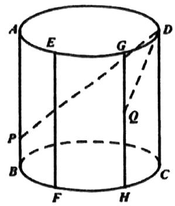

# 题型六：圆锥圆柱相关

等级（N）

##### 059.一个底面半径为 2 的圆锥，其内部有一个底面半径为 1 的内接圆柱，若其内接圆柱的体积为 $\sqrt{3}\pi$ ，则该圆锥的体积为（）

$\quad$A. $2 \sqrt{3} \pi$

$\quad$B. $\frac{2\sqrt{3}}{3}\pi$

$\quad$C. $\frac{4\sqrt{3}}{3}\pi$

$\quad$D. $\frac{8\sqrt{3}}{3}\pi$

等级（R）

2022年全国甲卷

##### 060.甲、乙两个圆锥的母线长相等，侧面展开图的圆心角之和为 $2\pi$ ，侧面积分别为 $S_{\text{甲}}$ 和 $S_{\text{乙}}$ ，体积分别为 $V_{\text{甲}}$ 和 $V_{\text{乙}}$ 。若 $\frac{S_{\text{甲}}}{S_{\text{乙}}} = 2$ ，则 $\frac{V_{\text{甲}}}{V_{\text{乙}}} = (\quad)$

$\quad$A. $\sqrt{5}$

$\quad$B. $2 \sqrt{2}$

$\quad$C. $\sqrt{10}$

$\quad$D. $\frac{5\sqrt{10}}{4}$

等级（R）

2023 新高考二卷（多选）

##### 061. 已知圆锥的顶点为 $P$ ，底面圆心为 $O$ ， $AB$ 为底面直径， $\angle APB = 120^{\circ}$ ， $PA = 2$ ，点 $C$ 在底面圆周上，且二面角 $P - AC - O$ 为 $45^{\circ}$ ，则（）.

$\quad$A. 该圆锥的体积为 $\pi$

$\quad$B. 该圆锥的侧面积为 $4 \sqrt{3} \pi$

$\quad$C. $AC = 2\sqrt{2}$

$\quad$D. $\triangle PAC$ 的面积为 $\sqrt{3}$

等级（SR）

2021 石家庄一模

##### 062. 如图所示, 一个圆锥的侧面展开图为以 $A$ 为圆心, 半径为 2 的半圆, 点 $D 、 M$ 在 $\widehat{BC}$ 上, 且 $\widehat{BD}$ 的长度为 $\frac{\pi}{3}$ , $\widehat{BM}$ 的长度为 $\pi$ , 则在该圆锥中, 点 $M$ 到平面 ABD 的距离为

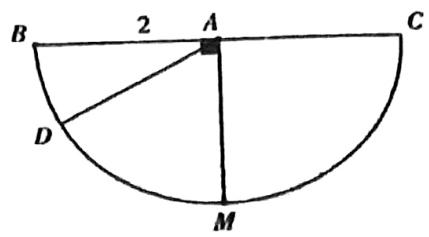

等级（SR）

2023宁波二模

##### 063.(多选)已知 $SO \perp$ 平面 $\alpha$ 于点O,A,B是平面 $\alpha$ 上的两个动点,且 $\angle OSA = \frac{\pi}{6}$ , $\angle OSB = \frac{\pi}{4}$ , 则（）

$\quad$A. $SA$ 与 $SB$ 所成的角可能为 $\frac{\pi}{3}$

$\quad$B. $SA$ 与 $OB$ 所成的角可能为 $\frac{\pi}{6}$

$\quad$C. $SO$ 与平面 $SAB$ 所成的角可能为 $\frac{\pi}{6}$

$\quad$D. 平面 SOB 与平面 SAB 所成的夹角可能为 $\frac{\pi}{2}$

等级（SR）

2023南昌一模

##### 064. 圆锥 $\mathrm{OO}_{1}$ 的底面半径为 1，母线长为 2， $\Delta OAB$ 是圆锥 $\mathrm{OO}_{1}$ 的轴截面， $F$ 是 $OA$ 的中点， $E$ 为底面圆周上的一个动点（异于 $A, B$ 两点），则下列说法正确的是（）

$\quad$A. 存在点 $E$ , 使得 $EF \perp EB$

$\quad$B. 存在点 $E$ , 使得 $EF \parallel OB$

$\quad$C. $OB \parallel$ 平面 $EFO_{1}$

$\quad$D. 三棱锥 $F - ABE$ 体积最大值为 $\frac{\sqrt{3}}{3}$

等级（SR）

2023 泉州五检

##### 065. 已知圆锥 $SO$ 的母线长为 2, $AB$ 是圆 $O$ 的直径, 点 $M$ 是 $SA$ 的中点, 若侧面展开图中, $\triangle ABM$ 为直角三角形, 则该圆锥的侧面积为 ( )

$\quad$A. $\frac{\pi}{3}$

$\quad$B. $\frac{2\pi}{3}$

$\quad$C. $\frac{4\pi}{3}$

$\quad$D. $\frac{8\pi}{3}$ 等级（SR）

##### 066.如图，AB是圆锥S0的底面圆0的直径，D是圆0上异于A，B的任意一点，以A0为直径的

圆与AD的另一个交点为C，P为SD的中点。现给出以下结论

① $\Delta SAC$ 为直角三角形

②平面 SAD⊥平面 SBD

③平面PAB必与圆锥SO的某条母线平行

其中正确结论的个数是（ ）

$\quad$A.0

$\quad$B.1

$\quad$C.2

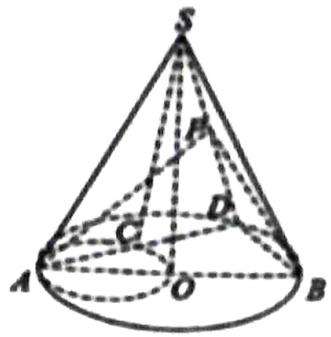

$\quad$D.3

等级（SR）

##### 067. 将边长为 2 的正方形 $AA_{1}O_{1}O$ （及其内部）绕 $OO_{1}$ 旋转一周形成圆柱，点 B、C 分别是圆 O 和圆 $O_{1}$ 上的点， $\widehat{AB}$ 长为 $\frac{2\pi}{3}$ ， $\widehat{A_{1}C}$ 长为 $\frac{4\pi}{3}$ ，且 B 与 C 在平面 $AA_{1}O_{1}O$ 的同侧，则 $A_{1}O_{1}$ 与 BC 所成角的大小为（）

$\quad$A. $\frac{\pi}{3}$

$\quad$B. $\frac{\pi}{6}$

$\quad$C. $\frac{\pi}{4}$

$\quad$D. $\frac{\pi}{2}$

# 题型七：正四面体特质及其相关

等级（N）

##### 068. 已知正四面体内切球的半径是 1，则该正四面体的体积为 \_\_\_\_.

等级（N）

##### 069. 正四面体 ABCD 的外接球的体积为 $4\sqrt{3}\pi$ ，求正四面体的体积.

等级（N）

##### 070. 正四面体棱长为 $\sqrt{2}$ ，则它的体积是

等级（R）

##### 071. 已知球 $O$ 为正四面体 $ABCD$ 的内切球, $E$ 为棱 $BD$ 的中点, $AB = 2$ , 则平面 $ACE$ 截球 $O$ 所得截面圆的面积为 ( )

$\quad$A. $\frac{\pi}{12}$

$\quad$B. $\frac{\pi}{6}$

$\quad$C. $\frac{\pi}{4}$

$\quad$D. $\frac{\pi}{2}$

等级（SR）

2021 重庆二诊

##### 072. 已知球O的半径为 $\frac{\sqrt{10}}{2}$ ，以球心O为中心的正四面体Γ的各条棱均在球O的外部，若球O的球面被Γ的四个面截得的曲线的长度之和为 $8\pi$ ，则正四面体Γ的体积为\_\_\_\_。

等级（SR）

2022山西二模

##### 073. 已知三棱锥 A-BCD 的所有棱长都相等，点 E 为 AD 中点，点 F 为底面 BCD 内的动点，记 EF 的最小值为 $d_{1}$ ，最大值为 $d_{2}$ ，则 $\frac{d_{1}}{d_{2}} =$ \_\_\_\_

等级（SR）

2022 惠州一模

##### 074.（多选）近年来，纳米晶的多项技术和方法在水软化领域均有重要作用。纳米晶体结构众多，下图是一种纳米晶的结构示意图，其是由正四面体沿棱的三等分点作平行于底面的截面得到所有棱

长均为 $n$ 的几何体，则下列说法正确的是（）

$\quad$A. 该结构的纳米晶个体的表面积为 $7 \sqrt{3} n^{2}$

$\quad$B. 该结构的纳米晶个体的体积为 $\frac{23\sqrt{2}}{12} n^3$

$\quad$C. 该结构的纳米晶个体外接球的表面积为 $\frac{11}{4} \pi n^2$

$\quad$D. 二面角 $A_{1} - A_{2}A_{3} - B_{3}$ 的余弦值为 $-\frac{1}{3}$

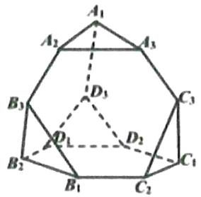

等级（SSR）

2021 福建四月质检

##### 075. 球面几何是几何学的一个重要分支，在航海、航空、卫星定位等方面都有广泛的应用。如图，A, B, C 是球面上不在同一大圆（大圆是过球心的平面与球面的交线）上的三点，经过这三点中任意两点的大圆的劣弧分别为 $\widehat{AB}, \widehat{BC}, \widehat{CA}$ ，由这三条劣弧组成的图形称为球面 ▲ABC。已知地球半径为 R，北极为点 N, P, Q 是地球表面上的两点。若 P, Q 在赤道上，且经度分别为东经 $40^{\circ}$ 和东经 $80^{\circ}$ ，则球面 ▲NPQ 的面积为 \_\_\_\_，若 NP=NQ=PQ= $\frac{2\sqrt{6}}{3}$ R，则球面 ▲NPQ 的面积为 \_\_\_\_

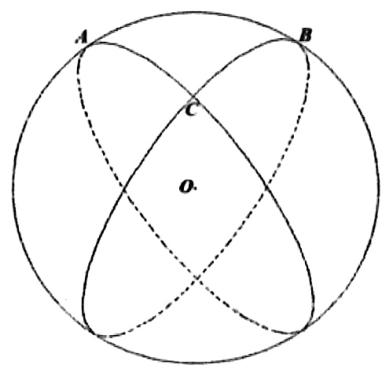

# 题型八：稍复杂的求几何体体积问题

等级（N）

2024 广州天河区三模

##### 076. 已知斜三棱柱 $ABC - A_{1}B_{1}C_{1}$ 中, $O$ 为四边形 $ACC_{1}A_{1}$ 对角线的交点, 设四棱锥 $O - BCC_{1}B_{1}$ 的体积为 $V_{1}$ , 三棱柱 $ABC - A_{1}B_{1}C_{1}$ 的体积为 $V_{2}$ , 则 $V_{1}: V_{2} = (\quad)$

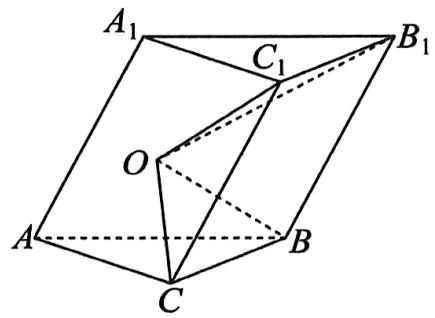

$\quad$A. 2:3

$\quad$B. $1:3$

$\quad$C. 1:4

$\quad$D. 1:6

等级（R）

##### 077. 如图, 在多面体 $ABCDEF$ , 已知 $ABCD$ 是边长为 1 的正方形, 且 $\triangle ADE$ 、 $\triangle BCF$ 均为正三角形, $EF \parallel AB$ , $EF=2$ , 则多面体的体积为 ( )

$\quad$A. $\frac{\sqrt{2}}{3}$

$\quad$B. $\frac{\sqrt{3}}{3}$

$\quad$C. $\frac{4}{3}$

$\quad$D. $\frac{3}{2}$

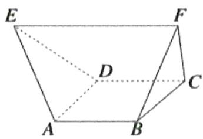

等级（R）

2022年新高考2卷

##### 078. (多选) 如图, 四边形ABCD为正方形, $ED \perp$ 平面ABCD, $FB \parallel ED$ , $AB = ED = 2FB$ , 记三棱锥 $E - ACD$ , $F - ABC$ , $F - ACE$ 的体积分别为 $V_{1}, V_{2}, V_{3}$ , 则 ( )

$\quad$A. $V_{3} = 2 V_{2}$

$\quad$B. $V_{3} = V_{1}$

$\quad$C. $V_{3} = V_{1} + V_{2}$

$\quad$D. $2V_{3} = 3V_{1}$

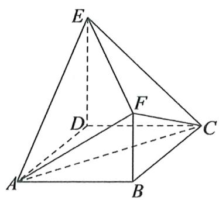

等级（R）

2021南昌一模

##### 079. 如图, ABCD 是圆台的轴截面, $AB = 3CD = 6$ , $AD = 2\sqrt{2}$ , 过点 D 与 AD 垂直的平面交下底圆周于 E, F 两点, 则四面体 CDEF 的体积为 \_\_\_\_.

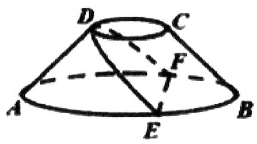

等级（SR）

2021 太原三模

##### 080. 已知三棱台 $ABC - A_{1}B_{1}C_{1}$ 的中，三棱锥 $A - A_{1}B_{1}C_{1}$ 的体积为 4，三棱锥 $A_{1} - ABC$ 的体积为 8，则四面体 $A - B_{1}CC_{1}$ 的体积为（）

$\quad$A. $3 \sqrt{3}$

$\quad$B. $4 \sqrt{2}$

$\quad$C. $4 \sqrt{3}$

$\quad$D. $4\sqrt{7}$

等级（SR）

##### 081. 下图是某个机械零件的几何结构，该几何体是由两个相同的直四棱柱组合而成的，且前后、左右、上下均对称，每个四棱柱的底面都是边长为 2 的正方形，高为 4，且两个四棱柱的侧棱互相垂直，则这个几何体的体积为 \_\_\_\_.

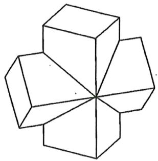

等级（SR）

2022 浙江强基联盟统测

##### 082. 如图, 在四棱锥 $Q - EFGH$ 中, 底面是边长为 $2 \sqrt{2}$ 的正方形, $QE = QF = QG = QH = 4$ , $M$ 为 $QG$ 的中点, 过 $EM$ 作截面将此四棱锥分成上、下两部分, 记上、下两部分的体积分别为 $V_{1}, V_{2}$ , 则 $\frac{V_{1}}{V_{2}}$ 的最小值为 ( )

$\quad$A. $\frac{1}{2}$

$\quad$B. $\frac{1}{3}$

$\quad$C. $\frac{1}{4}$

$\quad$D. $\frac{1}{5}$

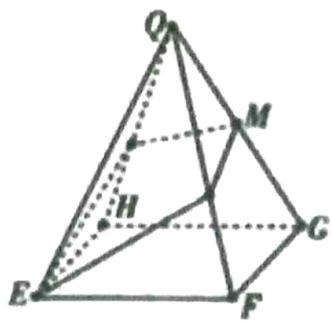

# 题型九：翻折展开的思想（线段和的最值问题）

等级（R）

##### 083. 在三棱锥 P-ABC 中，AP, AB, AC 两两垂直，且 AP = AB = AC = $\sqrt{2}$ ，若点 D, E 分别在棱 PB，PC 上运动（都不含端点），则 AD+DE+EA 的最小值为 \_\_\_\_

等级（SR）

##### 084. 如图，在四棱锥 P-ABCD 中，顶点 P 在底面的投影 O 恰为正方形 ABCD 的中心，且 $AB = \sqrt{2}$ ，设点 M, N 分别为线段 PD. PO 上的动点，已知当 AN+MN 取得最小值时，动点 M 恰为 PD 的中点，则该四棱锥外接球的表面积为（）

$\quad$A. $\frac{9\pi}{2}$

$\quad$B. $\frac{16\pi}{3}$

$\quad$C. $\frac{25\pi}{4}$

$\quad$D. $\frac{64\pi}{9}$ 等级（SR）

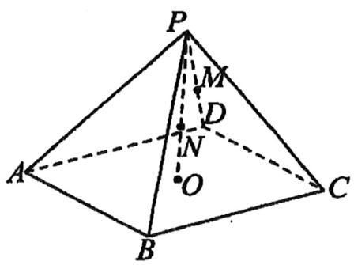

2023 九江二模

##### 085. 如图, 正方体 $ABCD - A_{1}B_{1}C_{1}D_{1}$ 的棱长为 2, $M$ 是面 $BCC_{1}B_{1}$ 内一动点, 且 $DM \perp A_{1}C$ , 则 $DM + MC$ 的最小值为 ( )

$\quad$A. $\sqrt{2} + 2$   
$\quad$B. $2 \sqrt{2} + 2$   
$\quad$C. $\sqrt{2} +\sqrt{6}$   
$\quad$D. 2

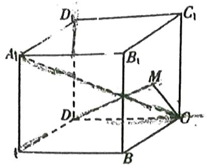

等级（SR）

2023三湘名校第二次大联考

##### 086.（多选）如图，在棱长为1的正方体 $ABCD - A_{1}B_{1}C_{1}D_{1}$ 中，点 $\mathbb{P}$ 在 $\triangle AB_{1}D_{1}$ 内部(不含边界)运动，点 $M$ 在线段 $CC_{1}$ （不含端点）上，若存在点 $P$ 使得 $\left|PM\right| - \left|PA_{1}\right|$ 有最大值，则 $\left|CM\right|$ 的取值范围是（）

$\quad$A. $\left(0, \frac{1}{2}\right)$

$\quad$B. $\left(0,\frac{1}{3}\right)$

$\quad$C. $\left(\frac{1}{3},\frac{1}{2}\right)$

$\quad$D. $\left(\frac{1}{3},\frac{2}{3}\right)$

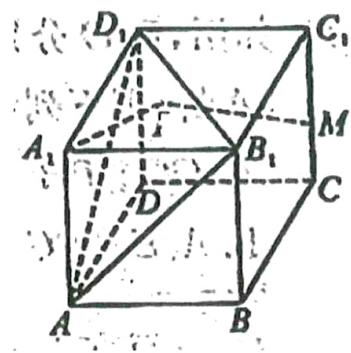

# 题型十：正方体体对角线的三等分垂面

等级（R）

2022 长春三模

##### 087. 如图, 在边长为 2 的正方体 $ABCD-A_{1}B_{1}C_{1}D_{1}$ 中, 点 $P$ 是该正方形对角线 $BD_{1}$ 上的动点, 给出下列四个结论:

① $\mathrm{AC} \perp  {\mathrm{B}}_{1}\mathrm{P}$ ;   
② $\Delta APC$ 面积的最大值是 $2 \sqrt{3}$ ;  
③ $\Delta APC$ 面积的最小值是 $\sqrt{2}$ ;  
④当 $BP = \frac{2\sqrt{3}}{3}$ 时，平面ACP $\parallel$ 平面 $\mathrm{A}_1\mathrm{C}_1\mathrm{D}$   
其中所有正确结论的序号是

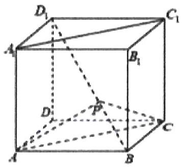

等级（R）

2022 江西质检

##### 088. 已知点 P 在棱长为 2 的正方体 $ABCD - A_{1}B_{1}C_{1}D_{1}$ 的表面上运动，且 $|PB| = |PD_{1}|$ ，则点 P 所形成的轨迹为多边形，以下结论中正确命题的个数为（）

（1） 多边形是共面的正六边形;

（2） $BD_{1}$ 垂直多边形所在的平面;

（3） AC 平行多边形所在的平面;

（4） 多边形的周长为 $6 \sqrt{2}$

$\quad$A. 1

$\quad$B. 2

$\quad$C. 3

$\quad$D. 4

等级（SR）

2022 赣州二模

##### 089. 在四棱锥 $P - ABCD$ 中, $PA \perp$ 平面 $ABCD$ , 底面 $ABCD$ 为正方形, 且 $PA = AB = 6$ , 过点 A 作 PC 的垂面分别交 PB, PC, PD 于点 E, F, G, 则四边形 AEFG 的面积为 ( )

$\quad$A. $5 \sqrt{3}$

$\quad$B. $6 \sqrt{3}$

$\quad$C. $7 \sqrt{3}$

$\quad$D. $8 \sqrt{3}$

等级（SR）

2022佛山二模

##### 090. (多选) 在棱长为 3 的正方体 $ABCD - A_{1}B_{1}C_{1}D_{1}$ 中, M 是 $A_{1}B_{1}$ 的中点, N 在该正方体的棱上运动。则下列说法正确的是 ( )

$\quad$A. 存在点 N，使得 $MN \parallel BC_{1}$   
$\quad$B. 三棱锥 $\mathrm{M} - \mathrm{A}_1\mathrm{BC}_1$ 的体积等于 $\frac{9}{4}$   
$\quad$C. 有且仅有两个点 N，使得MN∥平面A $_{1}$ BC $_{1}$   
$\quad$D. 有且仅有三个点 $\mathrm{N}$ , 使得 $\mathrm{N}$ 到平面 $\mathrm{A}_{1} \mathrm{BC}_{1}$ 的距离为 $\sqrt{3}$

等级（SR）

2022 南充二诊

##### 091. 已知正方体 $ABCD-A_{1}B_{1}C_{1}D_{1}$ 的棱长为 $2\sqrt{3}$ ，E，F 为体对角线 $BD_{1}$ 的三等分点，动点 P 在三角形 $ACB_{1}$ 内，且三角形 PEF 的面积 $S_{\Delta PEF}=2$ ，则点 P 的轨迹长度为 \_\_\_\_

# 题型十一：补体的思想

等级（SR）

2023 厦门二检

##### 092. (多选)如图的六面体中,

$\mathrm{CA} = \mathrm{CB} = \mathrm{CD} = 1, \mathrm{AB} = \mathrm{BD} = \mathrm{AD} = \mathrm{AE} = \mathrm{BE} = \mathrm{DE} = \sqrt{2}$ , 则（）

$\quad$A. $CD \perp$ 平面 $ABC$

$\quad$B. $AC$ 与 $BE$ 所成角的大小为 $\frac{\pi}{3}$

$\quad$C. $CE = \sqrt{3}$

$\quad$D. 该六面体外接球的表面积为 $3 \pi$

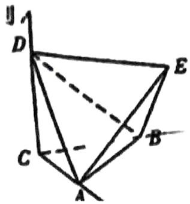

等级（SR）

2023 江苏七市第二次调研

##### 093.（多选）如图，正三棱锥 $A - PBC$ 和正三棱锥 $D - PBC$ 的侧棱长均为 $\sqrt{2}$ ， $BC = 2$ . 若将正三棱锥 $A - PBC$ 绕 $BC$ 旋转，使得点 $A, P$ 分别旋转至点 $A', P'$ 处，且 $A', B, C, D$ 四点共面，点 $A', D$ 分别位于 $BC$ 两侧，则（）

$\quad$A. $A'D \perp CP$

$\quad$B. $PP'\parallel$ 平面 $A'BDC$

$\quad$C. 多面体 $PP' A' BDC$ 的外接球的表面积为 $6 \pi$

$\quad$D. 点 $A, P$ 旋转运动的轨迹长相等

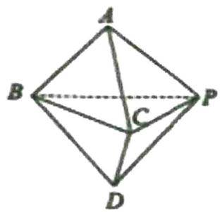

# 题型十二：平行六面体问题处理通法

等级（SR）

2023 汕头一模

##### 094. (多选)如图, 平行六面体 $ABCD - A_{1}B_{1}C_{1}D_{1}$ 中, 以顶点 $A$ 为端点的三条棱长均为 1 , 且它们彼此的夹角都是 $60^{\circ}$ , 则 ( )

$\quad$A. $AC_{1} = \sqrt{6}$

$\quad$B. $AC_{1} \perp BD$

$\quad$C. 四边形 $BDD_{1}B_{1}$ 的面积为 $\frac{\sqrt{2}}{2}$

$\quad$D. 平行六面体 $ABCD - A_{1}B_{1}C_{1}D_{1}$ 的体积为 $\frac{\sqrt{2}}{2}$

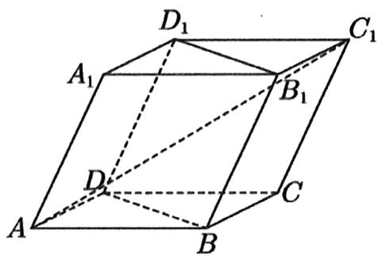

# 题型十三：球类问题大总结

# 模型一：球类问题之球的祖宗

等级（N）

##### 095. 一个与球心距离为 1 的平面截球所得的圆面面积为 $\pi$ ，则球的表面积为（）

$\quad$A. $8 \sqrt{2}$

$\quad$B. $8\pi$

$\quad$C. $4 \sqrt{2} \pi$

$\quad$D. $4 \pi$

等级（N）

##### 096. 已知矩形 $ABCD$ 的顶点都在半径为 4 的球 $O$ 的球面上，且 $AB = 6$ ， $BC = 2\sqrt{3}$ ，则棱锥 $O - ABCD$ 的体积为 \_\_\_\_

等级（N）

##### 097. 已知 OA 为球 O 的半径，过 OA 的中点 M 且垂直与 OA 的平面截球面得到圆 M，若圆 M 为面积为 $3 \pi$ ，则球 O 的表面积为 \_\_\_\_

等级（N）

2021年甲卷理科

##### 098. 已如 $A, B, C$ 是半径为 1 的球 $O$ 的球面上的三个点，且 $AC \perp BC, AC = BC = 1$ ，则三棱锥 $O - ABC$ 的体积为（）

$\quad$A. $\frac{\sqrt{2}}{12}$

$\quad$B. $\frac{\sqrt{3}}{12}$

$\quad$C. $\frac{\sqrt{2}}{4}$

$\quad$D. $\frac{\sqrt{3}}{4}$ 等级（R）

##### 099. 已知 $A, B, C$ 为球 $O$ 的球面上的三个点， $\odot O_1$ 为 $\triangle ABC$ 的外接圆，若 $\odot O_1$ 的面积为 $4\pi$ ， $AB = BC = AC = OO_1$ ，则球 $O$ 的表面积为（）

$\quad$A. $64 \pi$

$\quad$B. $48 \pi$

$\quad$C. $36\pi$

$\quad$D. $32\pi$

等级（R）

##### 100. 已知球的表面积为 $20\pi$ ，球面上有 $A$ 、 $B$ 、 $C$ 三点，如果 $AB = AC = 2.BC = 2\sqrt{3}$ ，则球心到平面 $ABC$ 的距离为（）

$\quad$A.1

$\quad$B. $\sqrt{2}$

$\quad$C. $\sqrt{3}$

$\quad$D.2

等级（R）

##### 101. 已知平面 $a$ 截一球面得圆 $\mathbb{M}$ , 过圆心 $\mathbb{M}$ 且与 $a$ 成 $60^{\circ}$ 二面角的平面 $\beta$ 截该球面得圆 $\mathbb{N}$ . 若该球面的半径为 4, 圆 $\mathbb{M}$ 的面积为 $4\pi$ , 则圆 $\mathbb{N}$ 的面积为 ( )

(A) $7\pi$

(B) $9\pi$

(C) $11\pi$

(D) $13\pi$

等级（R）

##### 102. 设 OA 是球 O 的半径，M 是 OA 的中点，过 M 且与 OA 成 $45^{\circ}$ 角的平面截球 O 的表面得到圆 C。若圆 C 的面积等于 $\frac{7\pi}{4}$ ，则球 O 的表面积等于 \_\_\_\_

等级（R）

##### 103. 已知 H 是球 O 的直径 AB 上一点，AH: HB=1:2 AB⊥平面 a, H 为垂足，a 截球 O 所得截面的面积为 $\pi$ ，则球 O 的表面积为 \_\_\_\_

等级（R）

##### 104. 过半径为 2 的球 O 表面上一点 A 作球 O 的截面，若 OA 与该截面所成的角是 $60^{\circ}$ ，则该截面的面积是（）

$\quad$A. $\pi$

$\quad$B. $2 \pi$

$\quad$C. $3 \pi$

$\quad$D. $2 \sqrt{3} \pi$

等级（R）

2022 丹东二模

##### 105. 用经过球 O 表面上两点 A, B 的平面去截球 O，所得截面面积的最小值为 $9 \pi$ ，若 $\Delta OAB$ 为等边三角形，则球 O 的表面积为 \_\_\_\_

等级（SR）

2022年全国乙卷

##### 106. 已知球 $O$ 的半径为 1，四棱锥的顶点为 $O$ ，底面的四个顶点均在球 $O$ 的球面上，则当该四棱锥的体积最大时，其高为（）

$\quad$A. $\frac{1}{3}$

$\quad$B. $\frac{1}{2}$

$\quad$C. $\frac{\sqrt{3}}{3}$

$\quad$D. $\frac{\sqrt{2}}{2}$ 等级（SR）

2022 邯郸一模

##### 107. 已知 A, B, C, D 四点都在表面积为 $100 \pi$ 的球 O 的表面上，若 AD 是球 O 的直径，且 $BC = 3\sqrt{3}$ ， $\angle BAC = 120^{\circ}$ ，则该三棱锥 A-BCD 体积的最大值为 \_\_\_\_

等级（SR）

2022 苏锡常镇一模

##### 108. 正四面体 ABCD 的棱长为 $a$ ，0 是棱 AB 的中点，以 0 为球心的球面与平面 BCD 的交线和 CD 相切，则球 0 的体积是（）

$\quad$A. $\frac{1}{6} \pi a^3$

$\quad$B. $\frac{\sqrt{2}}{6} \pi a^3$

$\quad$C. $\frac{\sqrt{3}}{6}\pi a^3$

$\quad$D. $\frac{\sqrt{2}}{3}\pi a^3$

等级（SR）

##### 109. 已知长方体 $ABCD - A_{1}B_{1}C_{1}D, AA_{1} = AB = 2AD = 2$ . E.F 分别为棱 $BB_{1}, D_{1}C_{1}$ 的中点，直线 $CD$ 被四面体 $CC_{1}EF$ 外接球截得的线段长为 \_\_\_\_.

等级（SR）

##### 110. 已知正方体 $ABCD - A_{1}B_{1}C_{1}D_{1}$ 的棱长为 2，点 $M$ 为棱 $DD_{1}$ 的中点，则平面 $ACM$ 截该正方体的内切球所得截面面积为（）

$\quad$A. $\frac{\pi}{3}$

$\quad$B. $\frac{2\pi}{3}$

$\quad$C.π

$\quad$D. $\frac{4\pi}{3}$

# 模型二：球类问题之拆棱法求体积

等级（R）

##### 111. 已知球的直径 $\mathrm{SC} = 4, \mathrm{A}, \mathrm{B}$ 是该球球面上的两点， $\mathrm{AB} = 2$ ， $\angle ASC = \angle BSC = 45^\circ$ ，则棱锥 S-ABC 的体积为（）

(A) $\frac{\sqrt{3}}{3}$

(B) $\frac{2\sqrt{3}}{3}$

(C) $\frac{4\sqrt{3}}{3}$

(D) $\frac{5\sqrt{3}}{3}$

等级（R）

##### 112.在三棱锥 S-ABC 中， $SB \perp BC$ ， $SA \perp AC$ ，SB = BC，SA = AC， $AB = \frac{1}{2} SC$ ，且三棱锥 S-ABC 的体积为 $\frac{9\sqrt{3}}{2}$ ，则该三棱锥的外接球半径是（）

$\quad$A.1

$\quad$B.2

$\quad$C.3

$\quad$D.4

等级（R）

2022 兰州一诊

##### 113. 已知三棱锥 P-ABC, PC 为其外接球 O 的直径, PA=PB, 若 D 为棱 AB 上与 A、B 不重合的一点, 则 $\angle$ PDC ( )

$\quad$A.必为锐角

$\quad$B.必为直角

$\quad$C.必为钝角

$\quad$D.无法确定

等级（R）

##### 114. 已知三棱锥 $S - ABC$ 的所有顶点都在球 $O$ 的球面上, $SC$ 是球 $O$ 的直径。若平面 $SCA \perp$ 平面 $SCB$ , $SA = AC$ , $SB = BC$ , 三棱锥 $S - ABC$ 的体积为 9, 则球 $O$ 的表面积为

等级（SR）

##### 115. 已知 $\angle ACB = 90^{\circ}$ , $P$ 为平面 $ABC$ 外一点, $PC = 2$ , 点 $P$ 到 $\angle ACB$ 两边 $AC$ , $BC$ 的距离均为 $\sqrt{3}$ , 那么 $P$ 到平面 $ABC$ 的距离为 \_\_\_\_.

等级（SR）

##### 116. 已知三棱锥 $D - ABC$ 的体积为 2, $\Delta ABC$ 是边长为 2 的等边三角形, 且三棱锥 $D - ABC$ 的外接球的球心 $O$ 恰好是 $CD$ 的中点, 则球 $O$ 的表面积为 ( )

$\quad$A. $\frac{52\pi}{3}$

$\quad$B. $\frac{40\pi}{3}$

$\quad$C. $\frac{25\pi}{3}$

$\quad$D. $24\pi$

等级（SR）

##### 117.在四面体ABCD中，若 $AD = DB = AC = CB = 1.$ 则四面体ABCD体积的最大值是（）

$\quad$A. $\frac{2 \sqrt{3}}{27}$

$\quad$B. $\frac{1}{3}$

$\quad$C. $\frac{2\sqrt{3}}{9}$

$\quad$D. $\frac{\sqrt{3}}{3}$

# 模型三：外接球问题之非棱锥几何体的外接球问题

等级（N）

##### 118. 长方体的长、宽、高分别为 3、2、1，若该长方体的各顶点都在球 $O$ 的表面上，则球 $O$ 的表面积为 \_\_\_\_.

等级（N）

##### 119. 设三棱柱的侧棱垂直于底面，所有棱的长都为 $a$ ，顶点都在一个球面上，则该球的表面积为 \_\_\_\_.

等级（N）

##### 120. 已知底面半径为 1 的圆锥的底面圆周和顶点都在表面积为 $16\pi$ 的球面上，则该圆锥的体积为（）

$\quad$A. $\frac{2 + \sqrt{3}}{3}\pi$

$\quad$B. $\frac{2 - \sqrt{3}}{3}\pi$

$\quad$C. $(2 + \sqrt{3})\pi$

$\quad$D. $\frac{2 + \sqrt{3}}{3}\pi$ 或 $\frac{2 - \sqrt{3}}{3}\pi$

等级（N）

##### 121. 底面是正多边形，顶点在底面的射影是地面中心的棱锥叫做正棱锥，如图，半球内有一内接正四棱锥 $S - ABCD$ ，该四棱锥侧面积为 $4\sqrt{3}$ ，则该半球的体积为（）

$\quad$A. $\frac{4\pi}{3}$

$\quad$B. $\frac{2\pi}{3}$

$\quad$C. $\frac{8\sqrt{2}}{3}\pi$

$\quad$D. $\frac{4\sqrt{2}}{3}\pi$

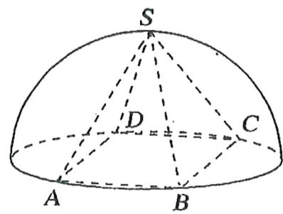

等级（R）

2022年新高考2卷

##### 122.已知正三棱台的高为1，上、下底面边长分别为 $3\sqrt{3}$ 和 $4\sqrt{3}$ ，其顶点都在同一球面上，则该球的表面积为（）

$\quad$A. $100\pi$

$\quad$B. $128\pi$

$\quad$C. $144\pi$

$\quad$D. $192\pi$

等级（R）

##### 123. 已知两个圆锥有公共底面，且两圆锥的顶点和底面的圆周都在同一个球面上, 若圆锥底面面积是这个球面面积的 $\frac{3}{16}$ ，则这两个圆锥中，体积较小者的高与体积较大者的高的比值为

等级（R）

##### 124..已知三棱柱 $ABC - A_{1}B_{1}C_{1}$ 内接于一个半径为 $\sqrt{3}$ 的球, 四边形 $A_{1}ACC_{1}$ 与 $B_{1}BCC_{1}$ 为全等的矩形, $M$ 是 $A_{1}B_{1}$ 的中点, 且 $C_{1}M = \frac{1}{2} A_{1}B_{1}$ , 则三棱柱 $ABC - A_{1}B_{1}C_{1}$ 体积的最大值为 ( )

$\quad$A. $\frac{1}{2}$

$\quad$B. $\frac{1}{6}$

$\quad$C.4

$\quad$D. $\frac{4}{3}$ 等级（R）

2023 南京盐城二模

##### 125. 三星堆古遗址作为 “长江文明之源”, 被誉为人类最伟大的考古发现之一. 3 号坑发现的神树纹玉琮, 为今人研究古蜀社会中神树的意义提供了重要依据. 玉琮是古人用于祭祀的礼器, 有学者认为其外方内圆的构造, 契合了古代 “天圆地方” 观念, 是天地合一的体现, 如图, 假定某玉琮形状对称, 由一个空心圆柱及正方体构成, 且圆柱的外侧面内切于正方体的侧面, 圆柱的高为 $12 \mathrm{~cm}$ , 圆柱底面外圆周和正方体的各个顶点均在球 $O$ 上, 则球 $O$ 的表面积为 ( )

$\quad$A. $72 \pi \mathrm{~cm}^{2}$   
$\quad$B. $162 \pi \mathrm{~cm}^{2}$   
c. $216\pi \mathrm{cm}^2$   
$\quad$D. $288 \pi \mathrm{~cm}^{2}$

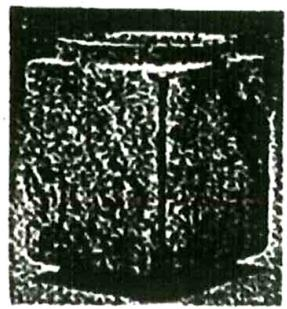

等级（SR）

2022青岛二模

##### 126. 《九章算术》中记录的“羡除”是算学和建筑学术语，指的是一段类似隧道形状的几何体，如图，羡除 ABCDEF 中，底面 ABCD 是正方形，EF ∥ 平面 ABCD，EF = 2，其余棱长都为 1，则这个几何体的外接球的体积为（）

$\quad$A. $\frac{\sqrt{2}}{3}\pi$   
$\quad$B. $\frac{4}{3}\pi$   
$\quad$C. $\frac{8\sqrt{2}}{3}\pi$   
$\quad$D. $4\pi$

等级（SR）

##### 127. 底面是正多边形，顶点在底面的射影是底面中心的棱锥叫做正棱锥，已知同底的两个正四棱锥内接于同一个球，他们的底面边长为 $a$ ，球的半径 $R$ ，设两个正四棱锥的侧面与底面所构成的角分别为 $a, \beta$ ，则 $\tan (\alpha + \beta) =$ \_\_\_\_

等级（SR）

##### 128. 在正三棱柱 $ABC - A_{1}B_{1}C_{1}$ （底面是正三角形，侧棱垂直于底面的棱柱）中，所有棱长之和为定值 $a$ . 若正三棱柱 $ABC - A_{1}B_{1}C_{1}$ 的顶点都在球 $O$ 的表面上，则当正三棱柱侧面积取得最大值 24 时，该球的表面积为（）

(A) $4 \sqrt{3} \pi$

(B) $\frac{32\pi}{3}$

(C) $12\pi$

(D) $\frac{64\pi}{3}$ 等级（SR）

##### 129. 鲁班锁是中国传统的智力玩具, 起源于中国古代建筑中首创的榫卯结构, 它的外观是如图所示的十字立方体, 其上下、左右、前后完全对称, 六根等长的正四楼柱体分成三组, 经 $90^{\circ}$ 樺卯起来. 若正四楼柱的高为 8 , 底面正方形的边长为 2 , 现将该鲁班锁放进一个球形容器内, 则该球形容器的表面积至少为\_\_\_\_ (容器壁的厚度忽略不计, 结果保留 $\pi$ )

等级（SR）

2023 福建四月测评

##### 130. 如图, 正四面体 $ABCD$ 的棱长为 3, $E, F, G$ 分别是 $AC, AD, AB$ 上的点, $AG = 1$ , $AE = 1, AF = 1$ , 截去三棱锥 $A - GEF$ , 同理, 分别以 $B, C, D$ 为顶点, 各截去一个棱长为 1 的小三棱锥, 截后所得的多面体的外接球的表面积为 \_\_\_\_.

# 模型四：外接球问题之补体法

等级（N）

##### 131. 在球面上有四个点 $P, A, B, C$ , 如果 $PA, PB, PC$ 两两互相垂直, 且 $PA = PB = PC = a$ , 那么这个球面的面积是 \_\_\_\_。

等级（R）

##### 132. 如图, 三棱锥 A-PBC, PA, PB, PC 两两垂直, $\mathrm{{PA}} = 1,\mathrm{{PB}} = \sqrt{2},\mathrm{{PC}} = \sqrt{3}$ ,点 0 为三棱锥 A-PBC 外接球的球心, 则 AO 与 PC 所成角的大小为

等级（SR）

##### 133. 如图, 四边形 ABCD 为正方形, 四边形 EFBD 为矩形, 且平面 ABCD 与平面 EFBD 互相垂直, 若多面体 ABCDEF 的体积为 $\frac{16}{3}$ , 则该多面体外接球表面积的最小值为 ( )

$\quad$A. $16\pi$

$\quad$B. $12\pi$

$\quad$C. $8\pi$

D6π

# 模型五：内切球问题

等级（N）

##### 134. 已知三棱锥 P-ABC 的底面 ABC 等腰三形 AB⊥AC，PA⊥底面 ABC，PA=AB=1，则这个三棱锥内切球的半径为 \_\_\_\_.

等级（R）

2021 梧州三月联考

##### 135. 在等腰三角形 ABC 中，AB = AC = 2，顶角为 $120^{\circ}$ ，以底边 BC 所在直线为轴旋转围成的封闭几何体内装有一球，则球的最大体积为（）

$\quad$A. $\frac{\sqrt{3}}{2}\pi$

$\quad$B. $\frac{\sqrt{2}}{2}\pi$

$\quad$C. $\frac{1}{2}\pi$

$\quad$D. $\frac{\sqrt{3}}{3}\pi$

等级（R）

##### 136. 已知在三棱锥 $P - ABC$ 中, $\angle BAC = 90^{\circ}$ , $AB = AC = 2$ , $BC$ 的中点为 $M$ 且 $PM = \sqrt{2}$ , 当该三棱锥体积最大时, 它的内切球半径为 \_\_\_\_.

等级（R）

##### 137.一个各面均为直角三角形的四面体容器，有三条棱长为2，若四面体容器内完全放进一个球，则该球的半径最大值为（）

$\quad$A. $\sqrt{2} - 1$

$\quad$B. $2 - \sqrt{2}$

$\quad$C.1

$\quad$D.2

等级（R）

##### 138. 已知圆锥的高为 3，侧面积为 $20\pi$ 。若此圆锥内有一个体积为 $V$ 的球，则 $V$ 的最大值为 \_\_\_\_.

等级（R）

2023合肥二模

##### 139. 已知球与圆台的上下底面和侧面都相切, 若圆台的侧面积为 $16 \pi$ , 上下底面的面积之比为 $1: 9$ , 则球的表面积为 ( )

$\quad$A. $12 \pi$

$\quad$B. $14\pi$

$\quad$C. $16 \pi$

$\quad$D. $18 \pi$

等级（R）

2024东北师大附中第五次模拟

##### 140. 如图, 为球形物品设计制作正四面体、正六面体、正八面体形状的包装盒, 最少用料分别记为 $S_{1} 、 S_{2} 、 S_{3}$ , 则它们的大小关系为 ( )

$\quad$A. $S_{1} <   S_{2} <   S_{3}$

$\quad$B. $S_{3} <   S_{2} <   S_{1}$

$\quad$C. $S_{3} <   S_{1} <   S_{2}$

$\quad$D. $S_{2} <   S_{3} <   S_{1}$

等级（R）

##### 141.若一个正三棱柱存在外接球与内切球，则它的外接球与内切球表面积之比为（）

$\quad$A.3: 1

$\quad$B.4: 1

$\quad$C.5: 1

$\quad$D.6: 1

等级（SR）

2024 南通盐城三模

##### 142. 已知一个正四棱台的上、下底面边长分别为 2, 8, 侧棱长为 $3 \sqrt{5}$ , 则该正四棱台内半径最大的球的表面积为 ( )

$\quad$A. $12\pi$

$\quad$B. $27\pi$

$\quad$C. $\frac{64\pi}{9}$

$\quad$D. $\frac{64\pi}{3}$

等级（SR）

2024 长春四模

##### 143. 设四棱台 $ABCD - A_{1}B_{1}C_{1}D_{1}$ 的上、下底面积分别为 $S_{1}$ , $S_{2}$ , 侧面积为 $S$ , 若一个小球与该四棱台的每个侧面都相切, 则 ( )

$\quad$A. $S^2 = S_1S_2$

$\quad$B. $S = S_{1} + S_{2}$

$\quad$C. $S = 2\sqrt{S_1S_2}$

$\quad$D. $\sqrt{S} = \sqrt{S_1} +\sqrt{S_2}$

等级（SR）

2021 广州一模

##### 144. 已知三棱锥 $P - ABC$ 的底面 $ABC$ 是边长为 6 的等边三角形, $PA = PB = PC = \sqrt{21}$ , 先在三棱锥 $P - ABC$ 内放入一个内切球 $O_1$ , 然后再放入一个球 $O_2$ , 使得球 $O_2$ 与球 $O_1$ 及三棱 $P - ABC$ 的三个侧面都相切, 则球 $O_1$ 的体积 \_\_\_\_, 球 $O_2$ 的表面积为 \_\_\_\_

等级（SR）

##### 145. 三棱锥 A-BCD 的两条棱 AB=CD=6，其余各棱长均为 5，求三棱锥的内切球半径.

等级（SR）

##### 146. 我国古代劳动人民在筑城. 筑堤. 挖沟. 挖梁建仓, 建国等工程中。积累了丰富的经验. 总结出了一套有关体积、容积计算的方法. 这些方法以实际问题的形式被收入我国古代数学名著《九章算术》中。《九章算术. 商功》: “斜解立方. 得两堑堵. 斜解堑堵, 其一为阳马. 二为鳖臑. 阳马居二, 鳖臑居一。不易之率也。合两鳖臑三而一. 验之以基。其形露矣.” 下图解释了这段话中由一个长方体, 得到 “堑堵”. “阳马”。” 鳖臑”的过程已知堑堵的内切球（与各面均相切）半径为 1. 则鳖臑的体积最小值为 \_\_\_\_.

$\quad$A. $2 + \frac{2\sqrt{2}}{3}$

$\quad$B. $6 + 4\sqrt{2}$

$\quad$C. $2 + \frac{4\sqrt{2}}{3}$

$\quad$D. $1 + \frac{4\sqrt{2}}{3}$

等级（SR）

##### 147. 底面边长为 6 的正三棱锥的内切球半径为 1，则其外接球的表面积为（）

$\quad$A. $49 \pi$

$\quad$B. $36\pi$

$\quad$C. $25\pi$

$\quad$D. $16\pi$

等级（SSR）

2024 温州二模

##### 148.（多选）已知半径为 $r$ 的球与棱长为1的正四面体的三个侧面同时相切，切点在三个侧面三角形的内部（包括边界），记球心到正四面体的四个顶点的距离之和为 $d$ ，则（）

$\quad$A. $r$ 有最大值，但无最小值  
$\quad$B. $r$ 最大时, 球心在正四面体外  
$\quad$C. r 最大时，d 同时取到最大值  
$\quad$D. $d$ 有最小值，但无最大值

# 模型六：棱切球问题

等级（SR）

2024济南二模

##### 149. 已知正三棱锥 $P - ABC$ 的底面边长为 $2\sqrt{3}$ , 若半径为 1 的球与该正三棱锥的各棱均相切, 则三棱锥 $P - ABC$ 的体积为 ( )

$\quad$A. 2

$\quad$B. $2 \sqrt{2}$

$\quad$C. 3

$\quad$D. $2 \sqrt{3}$

等级（SR）

2024宁波二模

##### 150. 在正四棱台 $ABCD - A_{1}B_{1}C_{1}D_{1}$ 中， $AB = 4$ ， $A_{1}B_{1} = 2$ ， $AA_{1} = \sqrt{3}$ ，若球 $O$ 与上底面 $A_{1}B_{1}C_{1}D_{1}$ 以及棱 $AB, BC, CD, DA$ 均相切，则球 $O$ 的表面积为（）

$\quad$A. $9\pi$

$\quad$B. $16\pi$

$\quad$C. $25\pi$

$\quad$D. $36\pi$

# 模型七：容器放球问题

等级（N）

##### 151. 如图, 有一个水平放置的透明无盖的正方体容器, 容器高 $8 \mathrm{~cm}$ , 将一个球放在容器口, 再向容器内注水, 当球面恰好接触水面时测得水深为 $6 \mathrm{~cm}$ , 如果不计容器的厚度, 则球的体积为 ( )

$\quad$A. $\frac{500\pi}{3}\mathrm{cm}^3$

$\quad$B. $\frac{866\pi}{3}\mathrm{cm}^3$

$\quad$C. $\frac{1372\pi}{3}\mathrm{cm}^3$

$\quad$D. $\frac{2048\pi}{3}\mathrm{cm}^3$

等级（R）

##### 152. 在棱长为 4 的正方体内, 有两个半径为 $R$ 的球相外切, 两球心在同一条体对角线上, 每个球与该正方体的共顶点的三个面相切, 则半径 $R$ 为 ( )

$\quad$A. $12 - 6\sqrt{3}$

$\quad$B. $3 - \sqrt{3}$

$\quad$C. $12 + 6\sqrt{3}$

$\quad$D. $3 + \sqrt{3}$

等级（SR）

##### 153. 一个倒置锥形容器, 底面直径与母线长相等, 容器内存有部分水, 向容器内放入一个半径为 1 的铁球, 铁球给好完全没入水中 (水面与铁球相切) 则容器内水的体积为

等级（SR）

##### 154. 如图, 有一个水平放置的透明无盖的正三顶往容器, 其中侧棱长为 $8 \mathrm{~cm}$ , 底面边长为 $12 \mathrm{~cm}$ , 将一个球放在容器口, 再向容器内注水, 当球面恰好密触水面时, 测得水深为 $6 \mathrm{~cm}$ , 如果不计容器约厚度, 则球的表面织为 ( )

$\quad$A. $36 \pi \mathrm{~cm}^{2}$

$\quad$B. $64 \pi \mathrm{cm}^{2}$

$\quad$C. $80 \pi \mathrm{cm}^{2}$

$\quad$D. $100 \pi \mathrm{~cm}^{2}$

等级（SR）

2024南昌二模

##### 155.校足球社团为学校足球比赛设计了一个奖杯, 如图, 奖杯的设计思路是将侧棱长为 6 的正三棱锥 $P-ABC$ 的三个侧面沿 $AB, BC, AC$ 展开得到面 $P_{1}AB$ , $P_{2}BC$ , $P_{3}AC$ , 使得平面 $P_{1}AB$ , $P_{2}BC$ , $P_{3}AC$ 均与平面 $ABC$ 垂直, 再将球 $O$ 放到上面使得 $P_{1}, P_{2}, P_{3}$ 三个点在球 $O$ 的表面上, 若奖杯的总高度为 $6 \sqrt{2}$ , 且 $AB = 4$ , 则球 $O$ 的表面积为 ( )

$\quad$A. $\frac{140\pi}{3}$

$\quad$B. $\frac{100\pi}{9}$

$\quad$C. $\frac{98\pi}{9}$

$\quad$D. $\frac{32\pi}{3}$

# 模型八：外接球问题之顶点在棍模型

等级（N）

##### 156. 正四棱锥 $S - ABCD$ 的底面边长和各侧棱长都为 $\sqrt{2}$ , 点 $S 、 A 、 B 、 C 、 D$ 都在同一个球面上, 则该球的体积为 \_\_\_\_.

等级（R）

##### 157. 在平面四边形 $ABCD$ 中, $AB=BD=2$ , $AD=CD=\sqrt{6}$ , $\angle ABC=90^{\circ}$ , 现将 $\triangle ACD$ 沿 $AC$ 折起, 将点 $D$ 折到 $D$ 处, 当四面体 $ABCD'$ 的体积最大时, 其外接球的表面积为

等级（R）

##### 158.三棱锥 P-ABC 的所有顶点都在半径为 2 的球 O 的球面上，若 $\Delta PAC$ 是等边三角形平面 PAC⊥平面 ACB, AB⊥BC，则三棱锥 P-ABC 体积的最大值为（）

$\quad$A.2

$\quad$B.3

$\quad$C. $2\sqrt{3}$

$\quad$D. $3 \sqrt{3}$

等级（R）

##### 159. 半径为 r 的球 O 上有 A, B, C, D 四点, AB = AC = AD = r, 平面 BCD 被球 O 截得图形的面积为 $9\pi$ , 球 O 的体积为（）

$\quad$A.2

$\quad$B. $32 \sqrt{3} \pi$

$\quad$C.1

$\quad$D. $\sqrt{2}$

等级（SR）

2022年新高考1卷

##### 160. 已知正四棱锥的侧棱长为 $l$ , 其各顶点都在同一球面上. 若该球的体积为 $36 \pi$ , 且 $3 \leq l \leq 3 \sqrt{3}$ , 则该正四棱锥体积的取值范围是 ( )

$\quad$A. $\left[18, \frac{81}{4}\right]$

$\quad$B. $\left[\frac{27}{4},\frac{81}{4}\right]$

$\quad$C. $\left[\frac{27}{4},\frac{64}{3}\right]$

$\quad$D. [18,27]

等级（SR）

##### 161. 已知 $P, A, B, C$ 是半径为 2 球面上的点, $PA = PB = PC = 2$ , $\angle ABC = 90^{\circ}$ , 点 $B$ 在 $AC$ 上的射影为 $D$ , 则三棱锥 $P - ABD$ 体积的最大值是 ( )

$\quad$A. $\frac{3\sqrt{3}}{4}$

$\quad$B. $\frac{3\sqrt{3}}{8}$

$\quad$C. $\frac{1}{2}$

$\quad$D. $\frac{\sqrt{3}}{4}$

等级（SR）

##### 162. 已知正三棱锥 A-BCD 的所有顶点都在球 0 的球面上，其底面边长为 3，E，F，G 分别为侧棱 AB，AC，AD 的中点。若 O 在三棱锥 A-BCD 内，且三棱锥 A-BCD 的体积是三棱锥 0-BCD 体积的三倍，则平面 EFG 截球 O 所得截面的面积为（）

$\quad$A. $\frac{9\sqrt{3}}{8}$

$\quad$B. $\frac{3\pi}{2}$

$\quad$C. $\frac{15\pi}{4}$

$\quad$D. $4\pi$

等级（SR）

##### 163. 已知 $A, B, C, D$ 四点均在以点 $O_{1}$ 为球心的球面上，且 $AB = AC = AD = 2\sqrt{5}, BC = BD = 4\sqrt{2}, \mathrm{CD} = 8$ . 若球 $O_{2}$ 在球 $O_{1}$ 内且与平面 $BCD$ 相切，则球 $O_{2}$ 直径的最大值为（）

$\quad$A.1

$\quad$B.2

$\quad$C.4

$\quad$D.8

模型九：外接球问题之棱锥侧棱垂直于底面模型。

等级（N）

##### 164. 在球面上有四个点 $P, A, B, C$ , 如果 $PA, PB, PC$ 两两互相垂直, 且 $PA = PB = PC = a$ , 那么这个球面的面积是\_\_\_\_。

等级（R）

##### 165.已知三棱锥 P-ABC 的四个顶点都在球 O 的表面上，PA⊥平面 ABC，AB⊥BC，且 PA=8，若平面 ABC 截球 O 所得截面的面积为 $9\pi$ ，则球 O 的表面积为 \_\_\_\_

$\quad$A. $10\pi$

$\quad$B. $25\pi$

$\quad$C.50 $\pi$

$\quad$D. $100\pi$

等级（R）

##### 166. 已知三棱锥 $A - BCD$ 的四个顶点 $A, B, C, D$ 都在球 $O$ 的表面上， $\Delta BCD$ 的边长为 $2\sqrt{3}$ 的正三解形， $AC \perp$ 平面 $BCD$ ，且 $AC = 4$ 则球 $O$ 的体积为（）

$\quad$A. $\frac{8\sqrt{2}}{3}\pi$

$\quad$B. $\frac{16\sqrt{2}}{3}\pi$

$\quad$C. $\frac{32\sqrt{2}}{3}\pi$

$\quad$D. $\frac{64\sqrt{2}}{3}\pi$

等级（R）

##### 167.三棱锥 P-ABC 中，PA⊥平面 ABC，∠ABC-30°，△APC 的面积为 2，则三棱锥 P-ABC 的外接球体积的最小值为（）

$\quad$A. $4 \pi$

$\quad$B. $\frac{4\pi}{3}$

$\quad$C. $64\pi$

$\quad$D. $\frac{32\pi}{3}$ 等级（SR）

##### 168. 图直角三角形 ABC， $\angle ABC = 90^{\circ}$ ，AC + BC = 2，将 $\triangle ABC$ 绕 AB 边旋转至 $\triangle ABC'$ 的位置，若二面角 C - AB - C' 的大小为 $\frac{2\pi}{3}$ ，则四面体 C' - ABC 的外接球的表面积的最小值为（）

$\quad$A. $6\pi$   
$\quad$B. $3 \pi$   
$\quad$C. $\frac{2\pi}{3}$   
$\quad$D. $2\pi$

# 模型十：外接球问题之最一般棱锥模型

等级（R）

##### 169. 已知 P. A. B. C. D 是球 0 的球面上的 5 个点，四边 ABCD 为梯形，AD//BC，AB=DC=AD=2，BC=4，PA⊥PD，平面 PAD⊥平面 ABCD，则球 0 的表面积为 \_\_\_\_

等级（SR）

##### 170. 已知菱形 $ABCD$ 的边长为 $2\sqrt{3}$ , $\angle BAD = 60^{\circ}$ . 沿对角线 $BD$ 将菱形 $ABCD$ 折起, 使得二面角 $A-BD-C$ 的余弦值为 $-\frac{1}{3}$ , 则该四面体 $ABCD$ 外接球的体积为 ( )

$\quad$A. $\frac{28\sqrt{7}}{3}\pi$

$\quad$B. $8 \sqrt{6} \pi$

$\quad$C. $\frac{20\sqrt{5}}{3}\pi$

$\quad$D. $36\pi$

等级（SR）

##### 171.三棱锥 D-ABC 中, CD⊥底面 ABC, $\Delta_{\mathrm{ABC}}$ 正三角形, 若 AE//CD, AB=CD=AE=2, 则三棱锥 D-ABC 与三棱锥 E-ABC 的公共部分构成的几何体的外接球的体积为 ( )

$\quad$A. $\frac{16\sqrt{3}}{9}\pi$

$\quad$B. $\frac{32\sqrt{3}}{27}\pi$

$\quad$C. $\frac{20}{3}\pi$

$\quad$D. $\frac{2\sqrt{3}}{2}\pi$

等级（SR）

##### 172. 已知半径为 4 的球上有两点 A. B, AB = 4√2，球心为 0，若球面上的动点 C 满足二面角 C-AB-0 的大小为 60°，则四面体 OABC 的外接球的半径为 \_\_\_\_

等级（SR）

2023宁波二模

##### 173. 正四面体 $ABCD$ 的棱长为 3 , $P$ 在棱 $AB$ 上, 且满足 $\overrightarrow{BA} = 3\overrightarrow{BP}$ , 记四面体 $ABCD$ 的内切球为球 $O_1$ , 四面体 $PBCD$ 的外接球为球 $O_2$ , 则 $\left|O_1O_2\right| =$ \_\_\_\_.

# 模型十一：外接球问题补充

等级（R）

##### 174. 已知三棱锥 $P - ABC$ 的四个顶点在球 $O$ 的球面上, 球 $O$ 的半径为 4 , $\Delta ABC$ 是边长为 6 的等边三角形, 记 $\Delta ABC$ 的外心为 $O_{1}$ , 若三棱锥 $P - ABC$ 的体积为 $12 \sqrt{3}$ , 则 $PO_{1} = (\quad)$

$\quad$A. $2 \sqrt{3}$

$\quad$B. $2 \sqrt{5}$

$\quad$C. $2 \sqrt{6}$

$\quad$D. $2\sqrt{7}$

等级（SR）

##### 175. 已知正三棱锥 $S - ABC$ 的顶点均在球 $O$ 的球面上, 过侧棱 $SA$ 及球心 $O$ 的平面截三棱锥及球面所得截面如图所示, 已知三棱锥的体积为 $2 \sqrt{3}$ , 则球 $O$ 的表面积为 ( )

$\quad$A. $16 \pi$

$\quad$B. $18 \pi$

$\quad$C. $24\pi$

$\quad$D. $32 \pi$

等级（SSR）

##### 176. 将边长为 5 的棱形 ABCD 沿对角线 AC 折起, 顶点 B 移动至 $B'$ 处, 在以点 $B'$ , $A, C, D$ , 为顶点的四面体 $AB'CD$ 中, 棱 AC、 $B'D$ 的中点分别为 E、F, 若 AC=6. 且四面体 $AB'CD$ 的外接球球心落在四面体内部, 则线段 EF 长度的取值范围为 ( )

$\quad$A. $(\frac{\sqrt{14}}{2}, 2\sqrt{3})$

$\quad$B. $(\frac{\sqrt{14}}{2}, 4)$

$\quad$C. $(\sqrt{3}, 2\sqrt{3})$

$\quad$D. $(\sqrt{3},4)$

# 模型十二：三心面问题

等级（SR）

##### 177. 已知球的半径为 $\sqrt{3}$ 相互垂直的两个平面分别截球面得两个圆, 若两圆的公共弦长为 2 , 这两圆的圆心距等于 ( )

$\quad$A.1

$\quad$B. $\sqrt{2}$

$\quad$C. $\sqrt{3}$

$\quad$D.2

等级（SR）

2021 东北三省三校二模

##### 178. 已知A、B是球O的球面上两点，AB = 2，过AB作互相垂直的两个平面球得到圆 $O_{1}$ 和圆 $O_{2}$ ，若 $\angle AO_{1}B = 90^{\circ}$ ， $\angle AO_{2}B = 60^{\circ}$ ，则球的表面积为（）

$\quad$A. $5 \pi$

$\quad$B. $10 \pi$

$\quad$C. $15 \pi$

$\quad$D. $20 \pi$

# 模型十三：外接球问题之一类特殊四面体的外接球技巧

等级（N）

##### 179. 在四面体 ABCD 中， $AB=\sqrt{2}$ ，DA=DB=CA=CB=1，则四面体 ABCD 的外接球的表面积为（）

$\quad$A. $\pi$

$\quad$B. $2 \pi$

$\quad$C. $3 \pi$

$\quad$D. $4 \pi$

等级（N）

##### 180. 在四面体 A-BCD 中，AB=5，BC=CD=3， $DB=2\sqrt{3}$ ，AC=4， $\angle ACD=60^{\circ}$ 则该四面体的外接球的表面积为 \_\_\_\_.

# 模型十四：球内接三棱锥体积最值问题

等级（R）

##### 181. 设 $A, B, C, D$ 是同一个半径为 4 的球的球面上四点， $\Delta ABC$ 为等边三角形且其面积为 $9\sqrt{3}$ ，则三棱锥 $D-ABC$ 的体积最大值为（）

$\quad$A. $12 \sqrt{3}$

$\quad$B. $18 \sqrt{3}$

$\quad$C. $24 \sqrt{3}$

$\quad$D. $54 \sqrt{3}$

等级（R）

##### 182. 球 $O$ 的球面上有四点 $S, A, B, C$ , 其中 $O, A, B, C$ 四点共面, $\triangle ABC$ 是边长为 2 的正三角形, 面 $SAB \perp$ 面 $ABC$ , 则棱锥 $S-ABC$ 的体积的最大值为 ( )

$\quad$A. $\frac{\sqrt{3}}{3}$

$\quad$B. $\sqrt{3}$

$\quad$C. $2 \sqrt{3}$

$\quad$D. 4

等级（R）

##### 183. 已知 A. B. C 为球 0 的球面上的三个定点， $\angle ABC = 60^{\circ}$ ， $AC = 2$ ，P 为球面上的动点，记三棱锥 P-ABC 的体积为 $V_{1}$ ，三棱锥 O-ABC 的体积为 $V_{2}$ ，若 $\frac{V_{1}}{V_{2}}$ 的最大值为 3，则球 0 的表面积为（）

$\quad$A. $\frac{16\pi}{9}$

$\quad$B. $\frac{64\pi}{9}$

$\quad$C. $\frac{3\pi}{2}$

$\quad$D. $6\pi$

# 模型十五：球内接正三棱锥中的知二求一

等级（SR）

##### 184. 已经高为 H 的正三棱锥 P-ABC 的每个顶点都在半径为 R 的球 O 的球面上，若二面角 P-AB-C 的正切值为 4，则 $\frac{H}{R} = (\quad)$

$\quad$A. $\frac{8}{5}$

$\quad$B. $\frac{9}{5}$

$\quad$C. $\frac{5}{3}$

$\quad$D. $\frac{7}{3}$

# 模型十六：叠球问题

等级（SR）

2021 武昌五月检测

##### 185. 桌面上有三个半径为 2021 的球两两相外切，在其下方空隙中放入一个球，该球与桌面和三个球均相切，则该球的半径是（）

$\quad$A. $\frac{2021}{4}$

$\quad$B. $\frac{2021}{3}$

$\quad$C. $\frac{2021}{2}$

$\quad$D. 2021

等级（SR）

##### 186. 一底面半径为 2 的圆柱形封闭容器内有一个半径为 1 的小球, 与一个半径为 2 的大球, 则该容器内容积最小为 ( )

$\quad$A. $24 \pi$

$\quad$B. $20\pi$

$\quad$C. $(12 + 8\sqrt{2})\pi$

$\quad$D. $16\sqrt{2}\pi$

等级（SSR）

##### 187. 将半径都为 1 的 4 个铅球完全装入形状为正四面体的容品里, 这个正四面体的高最小值为 ( )

$\quad$A. $\frac{\sqrt{3} + 2\sqrt{6}}{3}$

$\quad$B. $2 + \frac{2\sqrt{6}}{3}$

$\quad$C. $4 + \frac{2\sqrt{6}}{3}$

$\quad$D. $\frac{4\sqrt{3} + 2\sqrt{6}}{3}$

等级（SSR）

##### 188. 现有两个半径为 2 的小球和两个半径为 3 的小球两两相切, 若第五个小球和它们都相切, 则这个小球的半径是( )

$\quad$A. $\frac{6}{11}$

$\quad$B. $\frac{3}{11}$

$\quad$C. $\frac{4}{11}$

$\quad$D. $\frac{5}{11}$

等级（SSR）

##### 189. 在棱长为 1 的正方体 $ABCD-A_{1}B_{1}C_{1}D_{1}$ 内有两个球 $O_{1}$ , $O_{2}$ 外切, 球 $O_{1}$ 与面 $ABB_{1}A_{1}$ 、面 $ABCD$ 面 $ADD_{1}A_{1}$ 相切, 球 $O_{2}$ 与面 $BCC_{1}B_{1}$ 、面 $CC_{1}D_{1}D$ 、面 $B_{1}C_{1}D_{1}A_{1}$ 相切, 则两球表面积之和的最大值与最小值的差为 ( )

$\quad$A. $(2 - \sqrt{3})\pi$

$\quad$B. $\frac{(2 - \sqrt{3})\pi}{2}$

$\quad$C. $(3 - \sqrt{3})\pi$

$\quad$D. $\frac{(3 - \sqrt{3})\pi}{2}$

# 立体几何大题

# 题型一：平行垂直的证明

# 模型一：线面平行

等级（N）

##### 001. 如图，直三棱柱 $ABC - A_{1}B_{1}C_{1}$ 中， $D$ 是 $AB$ 的中点.

（1） 证明: $BC_{1} \parallel$ 平面 $A_{1}CD$ ;

等级（N）

##### 002. 如图，四棱锥 $P - ABCD$ 中，底面 $ABCD$ 为矩形， $E$ 为 $PD$ 的中点.

证明： $PB / /$ 平面AEC.

等级（N）

##### 003. 如图, 四棱锥 $P - ABCD$ 的底面是平行四边形, $E$ , $F$ 分别是棱 $AD$ , $PC$ 的中点。证明: $EF//$ 平面 $PAB$ 。

# 模型二：线线垂直

##### 004. 如图, 三棱柱 $ABC - A_{1}B_{1}C_{1}$ 中, 侧面 $BB_{1}C_{1}C$ 为菱形, $B_{1}C$ 的中点为 $0$ , 且 $AO \perp$ 平面 $BB_{1}C_{1}C$ . 证明: $B_{1}C \perp AB$ .

等级（N）

##### 005. 如图，在长方体 $ABCD - A_{1}B_{1}C_{1}D_{1}$ 中，点 $E$ ， $F$ 分别在棱 $DD_{1}$ ， $BB_{1}$ 上，且 $2DE = ED_{1}$ ， $BF = 2FB_{1}$ 。证明：

（1）当 $AB = BC$ 时， $EF \perp AC$ ；  
（2） 点 $C_{1}$ 在平面 AEF 内.

等级（N）

##### 006. 如图, 四棱锥 $P - ABCD$ 中, 底面 $ABCD$ 为平行四边形, $\angle DAB = 60^{\circ}$ , $AB = 2$ , $AD = 1$ , $PD \perp$ 底面 $ABCD$ .

（1） 证明: $PA \perp BD$ ;

等级（N）

##### 007. 如图, 四棱锥 $P - ABCD$ 的底面 $ABCD$ 是边长为 2 的菱形, $\angle BAD = 60^{\circ}$ , 已知 $PB = PD = 2$ , $PA = \sqrt{6}$ .

（1） 证明: $PC \perp BD$

等级（N）

##### 008. 如图，三棱柱 $ABC - A_{1}B_{1}C_{1}$ 中， $CA = CB$ ， $AB = AA_{1}$ ， $\angle BAA_{1} = 60^{\circ}$ .

（1） 证明: $AB \perp A_{1}C$ ;

# 模型三：线面垂直

等级（N）

##### 009. 如图，在四棱锥 $P - ABCD$ 中， $PA \perp$ 平面 $ABCD$ ，底面 $ABCD$ 是菱形.

（1） 求证： $BD \perp$ 平面 PAC;

等级（N）

##### 010. 如图， $AB$ 是圆 $O$ 的直径， $PA$ 垂直圆 $O$ 所在的平面， $C$ 是圆 $O$ 上的点。

求证： $BC\bot$ 平面PAC。

等级（N）

##### 011. 如图，正四棱柱 $ABCD - A_{1}B_{1}C_{1}D_{1}$ 中， $AA_{1} = 2AB = 4$ ，点 $E$ 在 $CC_{1}$ 上且 $C_{1}E = 3EC$ . 证明： $A_{1}C \perp$ 平面 BED.

等级（N）

2021年甲卷文科

##### 012. 已知直三棱柱 $ABC - A_{1}B_{1}C_{1}$ 中，侧面 $AA_{1}B_{1}B$ 为正方形， $AB = BC = 2$ ， $E, F$ 分别为 $AC$ 和 $CC_{1}$ 的中点， $BF \perp A_{1}B_{1}$ .

（1）求三棱锥 $F - EBC$ 的体积；  
（2）已知 $D$ 为棱 $A_{1}B_{1}$ 上的点，证明： $BF \perp DE$ .

# 模型四：面面垂直

等级（N）

##### 013. 如图, 圆柱 $OO_{1}$ 内有一个三棱柱 $ABC - A_{1}B_{1}C_{1}$ , 三棱柱的底面为圆柱底面的内接三角形, 且 $AB$ 是圆 $O$ 的直径. 证明: 平面 $A_{1}ACC_{1} \perp$ 平面 $B_{1}BCC_{1}$ .

等级（N）

##### 014. 在平行六面体 $ABCD - A_{1}B_{1}C_{1}D_{1}$ 中， $AA_{1} = AB$ ， $AB_{1} \perp B_{1}C_{1}$ .

求证：

（1） $AB \parallel$ 平面 $A_{1}B_{1}C$   
（2） 平面 $ABB_{1}A_{1} \perp$ 平面 $A_{1}BC$ .

# 题型二：空间向量及其应用

等级（N）

##### 015. 如图所示, 在平行六面体 $ABCD - A_1B_1C_1D_1$ 中, $M$ 为 $A_1C_1$ 与 $B_1D_1$ 的交点. 若 $\overrightarrow{AB} = a$ , $\overrightarrow{AD} = b$ , $\overrightarrow{A_1}A = c$ , 则下列向量中与 $\overrightarrow{BM}$ 相等的向量是 ( )

$\quad$A. $-\frac{1}{2} a + \frac{1}{2} b + c$

$\quad$B. $\frac{1}{2} a + \frac{1}{2} b + c$

$\quad$C. $-\frac{1}{2} a - \frac{1}{2} b + c$

$\quad$D. $\frac{1}{2} a - \frac{1}{2} b + c$

等级（N）

##### 016. 已知正方体 $ABCD - A_{1}B_{1}C_{1}D_{1}$ 中，点 $E$ 为上底面 $A_{1}C_{1}$ 的中心，若 $\overrightarrow{AE} = \overrightarrow{AA} + x\overrightarrow{AB} + y\overrightarrow{AD}$ 则 $x, y$ 的值分别为（）

$\quad$A. $x = 1, y = 1$

$\quad$B. $x = 1, y = \frac{1}{2}$

$\quad$C. $x = \frac{1}{2}, y = \frac{1}{2}$

$\quad$D. $x = \frac{1}{2}, y = 1$

等级（N）

##### 017. 在正方体 $ABCD - A_{1}B_{1}C_{1}D_{1}$ 中， $M, N$ 分别是棱 $AA_{1}$ ，和 $BB_{1}$ 的中点，则 $\sin \langle \overrightarrow{CM}, \overrightarrow{D_{1}N} \rangle$ 等于（）

(A) $\frac{4\sqrt{5}}{9}$

(B) $\frac{4}{9}$

(C) $\frac{\sqrt{5}}{9}$

(D) $\frac{2\sqrt{5}}{9}$

等级（N）

##### 018. 已知正四棱柱 $ABCD - A_{1}B_{1}C_{1}D_{1}$ 中， $AA_{1} = 2AB$ ，则 $CD$ 与平面 $BDC_{1}$ 所成角的正弦值等于（）

(A) $\frac{2}{3}$

(B) $\frac{\sqrt{3}}{3}$

(C) $\frac{\sqrt{2}}{3}$

(D) $\frac{1}{3}$

等级（N）

##### 019. 在正方体 $ABCD - A_{1}B_{1}C_{1}D_{1}$ 中，点 $E$ 为 $BB_{1}$ 的中点，则平面 $A_{1}ED$ 与平面 $ABCD$ 所成的锐二面角的余弦值为（）

$\quad$A. $\frac{1}{2}$

$\quad$B. $\frac{2}{3}$

$\quad$C. $\frac{\sqrt{3}}{3}$

$\quad$D. $\frac{\sqrt{2}}{2}$

等级（SR）

##### 020. $a, b$ 为空间中两条互相垂直的直线，等腰直角三角形 $ABC$ 的直角边 $AC$ 所在直线与 $a, b$ 都垂直，斜边 $AB$ 以直线 $AC$ 为旋转轴旋转，有下列结论：

①当直线 $AB$ 与 $a$ 成 $60^{\circ}$ 角时， $AB$ 与 $b$ 成 $30^{\circ}$ 角；  
②当直线 $AB$ 与 $a$ 成 $60^{\circ}$ 角时， $AB$ 与 $b$ 成 $60^{\circ}$ 角；  
③直线 AB 与 a 所成角的最小值为 $45^{\circ}$ ;

① 直线 $AB$ 与 $\alpha$ 所成角的最小值为 $60^{\circ}$ ;

其中正确的是\_\_\_\_。（填写所有正确结论的编号）

# 题型三：口算法向量(听为主)

等级（N）

##### 021. 在正方体 $ABCD - A_{1}B_{1}C_{1}D_{1}$ 中， $BB_{1}$ 与平面 $ACD_{1}$ 所成角的正弦值为（）

$\quad$A. $\frac{\sqrt{3}}{2}$

$\quad$B. $\frac{\sqrt{3}}{3}$

$\quad$C. $\frac{3}{5}$

$\quad$D. $\frac{2}{5}$

等级（N）

##### 022. 已知六面体 $ABC - A_{1}B_{1}C_{1}$ 是各棱长均等于 $a$ 的正三棱柱， $D$ 是侧棱 $CC_{1}$ 的中点，则直线 $CC_{1}$ 与平面 $AB_{1}D$ 所成的角为（）

$\quad$A. $45^{\circ}$

$\quad$B. $60^{\circ}$

$\quad$C. $90^{\circ}$

$\quad$D. $30^{\circ}$

# 题型四：计算点面距离和点线距离

等级（R）

##### 023. 在三棱柱 $ABC - A_{1}B_{1}C_{1}$ 中，所有棱长均为 1，且 $AA_{1} \perp$ 底面 $ABC$ ，则点 $B_{1}$ 到平面 $ABC_{1}$ 的距离为 \_\_\_\_

等级（R）

##### 024. 在底面是直角梯形的四棱锥 $P-ABCD$ 中, 侧棱 $PA \perp$ 底面 $ABCD$ , $BC // AD$ , $\angle ABC=90^{\circ}$ , $PA=AB=BC=2$ , $AD=1$ , 则 $AD$ 到平面 $PBC$ 的距离为 \_\_\_\_.

等级（SR）

##### 025. 四面体 $OABC$ 满足 $\angle AOB = \angle BOC = \angle COA = 90^{\circ}, OA = 1, OB = 2, OC = 3$ , 点 $D$ 在棱 $OC$ 上, 且 $OC = 3OD$ , 点 $G$ 为 $\triangle ABC$ 的重心, 则点 $G$ 到直线 $AD$ 的距离为 ( )

$\quad$A. $\frac{\sqrt{2}}{2}$

$\quad$B. $\frac{1}{2}$

$\quad$C. $\frac{\sqrt{3}}{3}$

$\quad$D. $\frac{1}{3}$

# 题型五：常规大题

等级（N）

##### 026. 如图，长方体 $ABCD - A_{1}B_{1}C_{1}D_{1}$ 的底面

ABCD 是正方形，点 E 在棱 $AA_{1}$ 上， $BE \perp EC_{1}$ .

（1）证明： $BE \perp$ 平面 $EB_{1}C_{1}$   
（2）若 $AE = A_{1}E$ ，求二面角 $B - EC - C_{1}$ 的正弦值.

等级(N)

##### 027. 如图，在四棱锥 $P - ABCD$ 中， $AB \parallel CD$ ，且 $\angle BAP = \angle CDP = 90^{\circ}$

（1）证明：平面 $PAB \perp$ 平面 $PAD$ ；  
（2） 若 $PA = PD = AB = DC$ , $\angle APD = 90^{\circ}$ , 求二面角 $A - PB - C$ 的余弦值。

等级(N)

2022年全国甲卷

##### 028. 在四棱锥 $P - ABCD$ 中， $PD \perp$ 底面 $ABCD, CD \parallel AB, AD = DC = CB = 1, AB = 2, DP = \sqrt{3}$ .

（1） 证明: $BD \perp PA$ ;   
（2） 求 $PD$ 与平面 $PAB$ 所成的角的正弦值.

等级(N)

2021年新高考2卷

##### 029. 在四棱锥 $Q - ABCD$ 中，底面 $ABCD$ 是正方形，若 $AD = 2, QD = QA = \sqrt{5}, QC = 3$ .

（1）证明：平面 $QAD \perp$ 平面ABCD；  
（2） 求二面角 B - QD - A 的平面角的余弦值.

等级(N)

2021年新高考1卷

##### 030. 如图，在三棱锥 $A - BCD$ 中，平面 $ABD \perp$ 平面 $BCD$ ， $AB = AD$ ， $O$ 为 $BD$ 的中点.

（1） 证明: $OA \perp CD$ ;   
（2）若 $\triangle OCD$ 是边长为1的等边三角形，点 $E$ 在棱 $AD$ 上， $DE = 2EA$ ，且二面角 $E - BC - D$ 的大小为 $45^{\circ}$ ，求三棱锥 $A - BCD$ 的体积.

等级（R）

##### 031. 如图，四边形 $ABCD$ 为正方形， $E$ ， $F$ 分别为 $AD$ ， $BC$ 的中点，以 $DF$ 为折痕把 $\Delta DFC$ 折起，使点 $C$ 到达点 $P$ 的位置，且 $PF \perp BF$ 。

（1）证明：平面 $PEF \perp$ 平面 $ABFD$ ；  
（2） 求 DP 与平面 ABFD 所成角的正弦值.

等级（R）

2022年全国乙卷

##### 032. 如图，四面体ABCD中， $AD \perp CD, AD = CD, \angle ADB = \angle BDC, E$ 为AC的中点.

（1） 证明：平面 $BED \perp$ 平面 $ACD$ ;  
（2） 设 $AB = BD = 2, \angle ACB = 60^{\circ}$ , 点 $F$ 在 $BD$ 上, 当 $\triangle AFC$ 的面积最小时, 求 $CF$ 与平面 $ABD$ 所成的角的正弦值.

等级(R)

033, 如图，已知平面 $BCE \perp$ 平面 $ABC$ ，直线 $DA \perp$ 平面 $ABC$ ，且 $DA = AB = AC$ .

（I）求： $DA / /$ 平面 $EBC$

（Ⅱ）若 $\angle BAC = \frac{\pi}{2}$ ， $DE \perp$ 平面 $BCE$ ，求二面角 $A - DC - E$ 的余弦值.

等级（R）

2022年新高考1卷

##### 034. 如图，直三棱柱 $ABC-A_{1}B_{1}C_{1}$ 的体积为4， $\triangle A_{1}BC$ 的面积为 $2\sqrt{2}$ .

（1） 求 $A$ 到平面 $A_{1}BC$ 的距离;

（2） 设 $D$ 为 $A_{1}C$ 的中点， $AA_{1} = AB$ ，平面 $A_{1}BC \perp$ 平面 $ABB_{1}A_{1}$ ，求二面角 $A - BD - C$ 的正弦值.

等级（R）

##### 035. 如图， $I_{1}$ 、 $I_{2}$ 是相互垂直的异面直线， $MN$ 是它们的公垂线段点 $A$ 、 $B$ 在 $I_{1}$ 上， $C$ 在 $I_{2}$ 上， $AM = MB = MN$

（1） 证明 $AC \perp NB$   
（2）若 $\angle ACB = 60^{\circ}$ ，求NB与平面ABC所成角的余弦值

等级（SR）

2022年新高考2卷

##### 036. 如图， $PO$ 是三棱锥 $P - ABC$ 的高， $PA = PB$ ， $AB \perp AC$ ， $E$ 是 $PB$ 的中点.

（1） 证明: $OE \parallel$ 平面 $PAC$ ;  
（2） 若 $\angle ABO = \angle CBO = 30^{\circ}$ , $PO = 3$ , $PA = 5$ , 求二面角 $C - AE - B$ 的正弦值.

等级（SR）

2024广西一模

##### 037.如图，四棱锥 $P - ABCD$ 的底面为菱形， $\angle DAB = 60^{\circ},PB = PC = \sqrt{3}.$

（1） 证明: $PD \perp AD$   
（2） 若 AD=2, PD=1, 求二面角 A-PD-C 的正弦值.

# 题型六：找点问题

等级（R）

##### 038. 如图，在四棱锥 $P - ABCD$ 中，底面 $ABCD$ 为菱形， $\angle BAD = 60^{\circ}$ ， $PA = PD = AD = 2$ ，点 $M$ 在线段 $PC$ 上， $N$ 为 $AD$ 的中点。

（1） 求证: $BC \perp$ 平面 $PNB$   
（2） 若平面 $PAD \perp$ 平面 $ABCD, M$ 是线段 $PC$ 上一点，且二面角 $M - BN - D$ 为 $60^{\circ}$ ，试确定 $M$ 的位置。

等级（R）

2023 新高考一卷数学

##### 039.如图，在正四棱柱 $ABCD - A_{1}B_{1}C_{1}D_{1}$ 中， $AB = 2,AA_{1} = 4$ ，点 $A_{2},B_{2},C_{2},D_{2}$ 分别在棱 $AA_{1},BB_{1},CC_{1},DD_{1}$ 上， $AA_{2} = 1,BB_{2} = DD_{2} = 2,CC_{2} = 3$

（1）证明： $B_{2}C_{2} / / A_{2}D_{2}$   
（2）点 $P$ 在棱 $BB_{1}$ 上，当二面角 $P - A_{2}C_{2} - D_{2}$ 为 $150^{\circ}$ 时，求 $B_{2}P$ ：

等级（SR）

##### 040. 如图，在三棱锥 $P - ABC$ 中， $AB = BC = 2\sqrt{2}$ ， $PA = PB = PC = AC = 4$ ， $O$ 为 $AC$ 的中点.

（1）证明： $PO \perp$ 平面 $ABC$ ;  
（2）若点 $M$ 在棱 $BC$ 上，且二面角 $M - PA - C$ 为 $30^{\circ}$ ，求 $PC$ 与平面 $PAM$ 所成角的正弦值.

# 题型七：斜棱柱问题处理通法

等级（R）

##### 041. 如图，四棱柱 $ABCD - A_{1}B_{1}C_{1}D_{1}$ 的底面 $ABCD$ 为菱形，且 $\angle A_{1}AB = \angle A_{1}AD$ 。

（1）证明：四边形 $BB_{\mathrm{I}}D_{\mathrm{I}}D$ 为矩形；  
（2）若 $AB = A_{1}A$ ， $\angle BAD = 60^{\circ}$ ，AA与平面ABCD所成的角为 $30^{\circ}$ ，求二面角 $A_{1} - BB_{1} - D$ 的余弦值。

等级（R）

##### 042. 在底面为菱形的四棱柱 $ABCD - A_{1}B_{1}C_{1}D_{1}$ 中， $AB = AA_{1} = 2$ ， $A_{1}B = A_{1}D$ ， $\angle BAD = 60^{\circ}$ ， $AC \cap BD = O, AO \perp$ 平面 $A_{1}BD$ .

（1）证明： $B_{1}C / /$ 平面 $A_{1}BD$   
（2） 求二面角 $B - AA_{1} - D$ 的正弦值.

等级（SR）

##### 043. 已知三棱柱 $ABC - A_{1}B_{1}C_{1}$ 的侧面 $ACC_{1}A_{1}$ 与底面 $ABC$ 垂直，侧校与底面所在平面成 $60^{\circ}$ 角， $AA_{1} \perp A_{1}C, AC \perp BC, AC = 4, BC = 2$ .

（1）求证：平面 $ABB_{1}A_{1}\bot$ 平面 $A_{1}BC;$   
（2） 求二面角 $B-A_{1}B_{1}-C$ 的余弦值

等级(SR)

##### 044. 如图，在三棱柱 $ABC - A_{1}B_{1}C_{1}$ 中， $BB_{1} \perp BC$ ， $AB = AC$

（1）求证： $A_{1}B = A_{1}C$

（2） 若四边形 $BCC_{1}B_{1}$ , 为正方形, $\Delta A_{1}AB$ 为正三角形, $M$ 是 $C_{1}C$ 的中点, 求二面角 $B - AM - C$ 的余弦值.

等级(SR)

2022 潍坊三模

##### 045. 如图所示，已知平行六面体 $ABCD - A_{1}B_{1}C_{1}D_{1}$ 中，侧面 $CDD_{1}C_{1} \perp$ 底面ABCD， $AB = AD = 2$ ， $\angle BAD = \frac{\pi}{3}$ ， $\angle A_{1}AB = \frac{3\pi}{4}$ ， $O_{1}$ 为线段 $B_{1}D_{1}$ 的中点.

（1） 证明: $AO_{1} \parallel$ 平面 $C_{1}BD$ ;  
（2） 已知二面角 $B - C_{1}D - C$ 的余弦值为 $\frac{\sqrt{7}}{7}$ , 求直线 $A_{1}C$ 与平面 $C_{1}BD$ 所成角的正弦值.

# 题型八：向量法表示点的坐标

等级(R)

2021 泰州南通二模

##### 046. 如图, 在三棱台 $ABC - A_{1}B_{1}C_{1}$ 中, $AC \perp A_{1}B$ , 0 是 BC 的中点, $A_{1}O \perp$ 平面 ABC,

（1）求证：AC⊥BC;  
（2）若 $A_{1}0 = 1$ ， $\mathrm{AC} = 2\sqrt{3}$ ， $\mathrm{BC} = A_1B_1 = 2$ ，求二面角 $B_{1} - BC - A$ 的大小

等级(R)

2021日照二模

##### 047. 如图，在多面体 ABCDE 中，四边形 BCDE 是矩形， $\triangle ADE$ 为等腰直角三角形。且 $\angle ADE = 90^{\circ}$ ， $\frac{1}{2} AB = AD = \sqrt{2}$ ， $BE = 2$

（1）求证：平面 ADE ⊥ 平面 ABE;  
（2） 线段 CD 上存在点 P，使得二面角 P - AE - D 的大小为 $\frac{\pi}{4}$ ，试确定点 P 的位置并证明.

# 题型九：面面交线问题大汇总

等级(R)

2020 新高考

##### 048. 如图，四棱锥 $P - ABCD$ 的底面为正方形， $PD \perp$ 底面 $ABCD$ 。设平面 $PAD$ 与平面 $PBC$ 的交线为 1.

（1）证明： $l \perp$ 平面PDC;  
（2）已知 $PD = AD = 1$ ， $Q$ 为 $l$ 上的点，求 $PB$ 与平面 $QCD$ 所成角的正弦值的最大值.

等级(SR)

2021 邯郸三模

##### 049.如图，四棱台ABCD-EFGH的底面为正方形， $\mathrm{DH}\perp$ 面ABCD， $\mathrm{EH} = \mathrm{DH} = \frac{1}{2}\mathrm{AD} = 1$

（1） 求证: AE // 平面 BDG  
（2）若平面 BDG ∩ 平面 ADH = m，求直线 m 与平面 BCG 所成角的正弦值.

等级(SR)

2021 桂林崇左四月联考

##### 050. 如图，在四棱锥 P-ABCD 中，已知 AB // DC， $AB = AD = 1$ ， $BD = \sqrt{2}$ ， $CD = 2$ 。 $PB = PC = PD = \sqrt{6}$ 。

（1） 证明：平面 PCD⊥平面 ABCD;  
（2） 设平面 PAD 与平面 PBC 的交线为 1，求直线 1 与平面 ABCD 所成角的大小

等级(SR)

2022 湖南师大附中第七次月考

##### 051. 如图，在三棱锥 P-ABC 中，侧面 PAC⊥底面 ABC，AC⊥BC， $\triangle PAC$ 是边长为 2 的正三角形，BC=4，E，F 分别是 PC，PB 的中点，记平面 AEF 与平面 ABC 的交线为 1

（1） 证明: 直线 $1 \perp$ 平面 PAC;  
（2）设点 Q 在直线 1 上，直线 PQ 与平面 AEF 所成的角为 $\alpha$ ，异面直线 PQ 与 EF 所成的角为 $\theta$ ，求当 AQ 为何值时， $\alpha + \theta = \frac{\pi}{2}$

# 题型十：非建系类大题

# 模型一：顶点转化法（非常重要！）

等级（N）

##### 052. 如图所示，在三棱锥 $P - ABC$ 中， $AC = BC = 2$ ， $\angle ACB = 90^{\circ}$ ， $AP = BP$

$= AB$ ， $PC\bot AC$ 求点 $C$ 到平面 $APB$ 的距离。

等级（N）

##### 053. 如图所示，三棱柱 $ABC - A_{1}B_{1}C_{1}$ 中， $CC_{1} \perp$ 平面 $ABC$ ， $\triangle ABC$ 是边长为 2 的等边三角形， $D$ 为 $AB$ 边的中点，且 $CC_{1} = 2AB$ .

（Ⅰ）求证： $AC_{1}$ //平面 $CDB_{1}$ .  
（II）求点 $B$ 到平面 $B_{1}CD$ 的距离。

等级（R）

2022年全国乙卷

##### 054. 如图，四面体ABCD中， $AD \perp CD, AD = CD, \angle ADB = \angle BDC$ ，E为AC的中点.

（1） 证明：平面 $BED \perp$ 平面 $ACD$ ;  
（2） 设 $AB = BD = 2, \angle ACB = 60^{\circ}$ , 点 $F$ 在 $BD$ 上, 当 $\triangle AFC$ 的面积最小时, 求三棱锥 $F - ABC$ 的体积.

# 模型二：同底面的锥柱

2022 新高考一卷

等级（R）

##### 055.如图，直三棱柱 $ABC-A_{1}B_{1}C_{1}$ 的体积为4， $\Delta A_{1}BC$ 的面积为 $2\sqrt{2}$ .

求A 到平面 $A_{1}BC$ 的距离;

等级（R）

2022西工大附中第六次适应性训练

##### 056. 如图, 在三棱柱 $ABC - A_{1}B_{1}C_{1}$ 中, 平面 $A_{1}ACC_{1} \perp$ 平面 $ABC$ , $\triangle ABC$ 和 $\triangle A_{1}AC$ 都是边长 2 的正三角形, D 是 AB 的中点。

（1） 求证: $BC_{1} / /$ 平面 $A_{1}DC$ ;  
（2） 求四棱锥 $C - A_{1}ABB_{1}$ 的体积。

等级（SR）

2022江西八所重点中学联考

##### 057. 如图 1，四边形 ABCD 为矩形，四边形 $ADE_{1}F_{1}$ 和 $BCE_{2}F_{2}$ 都是菱形， $AB=\sqrt{6}$ ，BC=2，

$\angle DE_{1}F_{1} = \angle CE_{2}F_{2} = 60^{\circ}$ ，分别沿AD，BC将四边形 $\mathrm{ADE}_1\mathrm{F}_1$ 和 $\mathrm{BCE}_2\mathrm{F}_2$ 折起，使点 $\mathbf{E}_1$ ， $\mathbf{E}_2$ 重合于点E，点 $\mathrm{F_1}$ ， $\mathrm{F_2}$ 重合于点F，得到如图2所示的几何体

（1） 证明: 平面 AFED⊥平面 BCEF  
（2） 求图 2 中几何体 ABCDEF 的体积 V]

# 模型三：利用同底面积或同高求未知几何体体积

等级（N）

##### 058. 如图, 四棱锥 $P - ABCD$ 中, $PA \perp$ 平面 $ABCD$ , $AD \parallel BC$ , $AB = AD = AC = 3$ , $PA = BC = 4$ , $M$ 为线段 $AD$ 上一点, $AM = 2MD$ , $N$ 为 $PC$ 的中点。

（1）证明直线 $MN / /$ 平面PAB。  
（2）求四面体 $N - BCM$ 的体积。

等级（R）

2022宜宾二诊

##### 059. 如图，在四棱锥 P-ABCD 中， $AB \parallel CD$ ， $AB \perp AD$ ， $AD \perp PD, AB = AD = 1, CD = 2$ ，PD = 3, E 为线段 PB 的中点，且 DE ⊥ BC。

（1）求证：PD⊥平面ABCD；  
（2）若过三点 C, D, E 的平面将四棱锥 P-ABCD 分成上，下两个部分，求上半部分的体积 V.

等级（SR）

##### 060. 如图，四棱锥 $E - ABCD$ 中，四边形 $ABCD$ 边长为 2 菱形， $\angle DAE = \angle BAE = 45^{\circ}$

$\angle \mathrm{DAB} = 6 0 ^ {\circ}$

（Ⅰ）证明：平面 ADE⊥平面 ABE;  
（II）若 $DE = \sqrt{10}$ ，求四棱锥 $E - ABCD$ 的体积.

# 模型四：求面积体积

等级（R）

2019 新课标三文

##### 061. 图 1 是由矩形 ADEB、Rt△ABC 和菱形 BFGC 组成的一个平面图形，其中 AB=1, BE=BF=2, ∠FBC=60° 将其沿 AB, BC 折起使得 BE 与 BF 重合，连结 DG，如图 2.

（1）证明图2中的 $A, C, G, D$ 四点共面，且平面 $ABC \perp$ 平面 $BCGE$ ;  
（2）求图中2中的四边形ACGD的面积。

图1

图2

等级（R）

##### 062. 如图，D 为圆锥的顶点，O 是圆锥底面的圆心， $\triangle ABC$ 是底面的内接正三角形，P 为 DO 上一点， $\angle APC=90^{\circ}$ .

（1） 证明: 平面 $PAB \perp$ 平面 $PAC$ ;  
（2）设 $DO = \sqrt{2}$ ，圆锥的侧面积为 $\sqrt{3}\pi$ ，求三棱锥 $P - ABC$ 的体积.

等级（R）

2021年乙卷文科

##### 063. 如图，四棱锥 $P - ABCD$ 的底面是矩形， $PD \perp$ 底面 $ABCD$ ， $M$ 为 $BC$ 的中点，且 $PB \perp AM$ .

（1）证明：平面 $PAM \perp$ 平面 $PBD$ ；  
（2） 若 $PD = DC = 1$ ，求四棱锥 $P - ABCD$ 的体积.

等级（R）

2022年全国甲卷

##### 064. 小明同学参加综合实践活动，设计了一个封闭的包装盒，包装盒如图所示：底面ABCD是边长为8（单位：cm）的正方形，△EAB, △FBC, △GCD, △HDA均为正三角形，且它们所在的平面都与平面ABCD垂直.

（1） 证明: $EF \parallel$ 平面ABCD;  
（2） 求该包装盒的容积（不计包装盒材料的厚度）.

等级（R）

##### 065. 如图，在几何体 $ABCDEF$ 中，底面 $ABCD$ 为矩形， $EF//CD$ ， $AD \perp FC$ ，点 $M$ 是棱 $FC$ 的中点平面 $ADM$ 与棱 $FB$ 交于点 $N$ .

（1）求证：MN⊥平面CDEF:  
（2）当 $CD \perp EA$ ， $EF = ED = 2$ ， $CD = AD = 4$ 时，求平面ADMN将几何体ABCDEF分成上、下两部分几何体的体积比。

# 模型五：找点问题

等级（R）

2021 新余二模

##### 066. 如图，四棱锥 E-ABCD 中，平面 ABCD ⊥ 平面 ABE，四边形 ABCD 为矩形，AD = 6， AB = 5， BE = 3， F 为 CE 上的点，且 BF ⊥ 平面 ACE

（1） 求证: AE ⊥ BE;   
（2）设点M在线段DE上，且满足 $\mathrm{EM} = 2\mathrm{MD}$ ，试在线段AB上确定一点N，使得MN//平面BCE，请说明理由，并求MN的长

等级（R）

##### 067. 如图 5, 在梯形 $ABCD$ 中, $AD//BC$ , $AB=BC=CD=1$ , $AD=2$ , $E$ 是 $AD$ 的中点, 将 $\triangle ABE$ 沿 $BE$ 折起, 记折起后的三角形为 $\triangle PBE$ , 且 $PC=1$ .

（1） 证明: 平面 PCE⊥平面 PBD  
（2） 问在线段 PD 上是否存在点 F，使得 EF⊥CD，若存在，求出 $\frac{PF}{PD}$ 的值，若不存在，请说明理由.

图5

# 题型十一：与圆锥相结合

等级(N)

##### 068. 如图, $D$ 为圆锥的顶点, $O$ 是圆锥底面的圆心, $AE$ 为底面直径, $AE = AD$ . $\triangle ABC$ 是底面的内接正三角形, $P$ 为 $DO$ 上一点, $PO = \frac{\sqrt{6}}{6} DO$ .

（1）证明： $PA \perp$ 平面 $PBC$ ;  
（2） 求二面角 B-PC-E 的余弦值.

等级(R)

##### 069. 如图, 组合体由半个圆锥 $S - O$ 和一个三棱锥 $S - ACD$ 构成, 其中 $O$ 是圆锥 $S - O$ 底面圆心, $B$ 是圆弧 $AC$ 上一点, 满足 $\angle BOC$ 是锐角, $AC = CD = DA = 2$ .

（1）在平面 SAB 内过点 B 作 BP// 平面 SCD 交 SA 于点 P，并写出作图步骤，但不要求证明；  
（2）在（1）中，若 $P$ 是 $SA$ 中点，且 $SO = \sqrt{3}$ ，求直线 $BP$ 与平面 $SAD$ 所成角的正弦值.

# 题型十二：以二面角的大小为已知条件

等级（R）

##### 070..如图，在以 $A, B, C, D, E, F$ 为顶点的五面体中，面 $ABEF$ 为正方形， $AF = 2FD$ $\angle AFD = 90^{\circ}$ ，且二面角 $D - AF - E$ 与二面角 C-BE-F 都是 $60^{\circ}$ 。

（Ⅰ）证明平面 $ABEF \perp$ 平面 $EFDC$ ;  
（II）求二面角 $E - BC - A$ 的余弦值.

等级（R）

##### 071. 如图，在三棱锥 $A - BCD$ 中， $\Delta ABC$ 是等边三角形， $\angle BAD = \angle BCD = 90^\circ$ ，点 $P$ 是 $AC$ 的中点，连接 $BP, DP$

（Ⅰ）证明：平面 $ACD \perp$ 平面 BDP  
（Ⅱ）若 $BD = \sqrt{6}$ ，且二面角 $A - BD - C$ 为 $120^{\circ}$ ，求直线 $AD$ 与平面 $BCD$ 所成角的正弦值。

等级（SR）

##### 072. 如图所示多面体 $EF-ABCD$ ，其底面 $ABCD$ 为矩形且 $AB = 2\sqrt{3}$ ， $BC=2$ ，四边形 $BDEF$ 为平行四边形，点 $F$ 在底面 $ABCD$ 内的投影恰好是 $BC$ 的中点。

（1）已知 $G$ 为线段 $FC$ 的中点，证明： $BG//$ 平面 $AEF;$   
（2）若二面角 $F - BD - C$ 大小为 $\frac{\pi}{3}$ ，求直线 $AE$ 与平面 $BDEF$ 所成角的正弦值。

# 题型十三：求动角的范围（最值）

等级（N）

2021年甲卷理科

##### 073. 已知直三棱柱 $ABC - A_{1}B_{1}C_{1}$ 中，侧面 $AA_{1}B_{1}B$ 为正方形， $AB = BC = 2$ ， $E, F$ 分别为 $AC$ 和 $CC_{1}$ 的中点， $D$ 为棱 $A_{1}B_{1}$ 上的点。 $BF \perp A_{1}B_{1}$

（1）证明： $BF \perp DE$ ;  
（2） 当 $B_{1}D$ 为何值时, 面 $BB_{1}C_{1}C$ 与面 $DFE$ 所成的二面角的正弦值最小?

等级（SR）

##### 074. 如图，在四校锥 $P - ABCD$ 中， $BC = 2$ ， $AD // BC$ ， $E$ 为棱 $PA$ 的中点， $BE // \text{平面 } PCD$ .

（I）求 $AD$ 的长；  
（Ⅱ）若 $PB = AB = BC = \sqrt{2} BE$ ，平面 $PAB \perp$ 平面 $PBC$ ，求二面角 $B - PC - D$ 的大小的取值范围.

# 直线和圆

# 题型一：直线与方程

等级（R）

##### 001. 直线 $x + y - 1 = 0$ 上与点 $P(-2, 3)$ 的距离等于 $\sqrt{2}$ 的点的坐标是 \_\_\_\_

等级（R）

##### 002. 不管 $m$ 怎样变化，直线 $(m + 2)x - (2m - 1)y - (3m - 4) = 0$ 恒过的定点是（）

$\quad$A. (1, 2)

$\quad$B. $(-1, -2)$

$\quad$C. (2, 1)

$\quad$D. $(-2, -1)$

等级（R）

2021广州一模

##### 003. 已知 A $(-1,0)$ ，B $(0,2)$ ，直线 $1:2x-2ay+3+a=0$ 上存在点 P，满足 $|PA|+|PB|=\sqrt{5}$ ，则 1 的倾斜角的取值范围是（）

$\quad$A. $\left[\frac{\pi}{3},\frac{2\pi}{3}\right]$

$\quad$B. $\left[0, \frac{\pi}{3}\right] \cup \left[\frac{2\pi}{3}, \pi\right)$

$\quad$C. $\left[\frac{\pi}{4},\frac{3\pi}{4}\right]$

$\quad$D. $\left(0, \frac{\pi}{4}\right] \cup \left[\frac{3\pi}{4}, \pi\right)$

等级（R）

2021 江淮十校第三次联考

##### 004.在平面直角坐标系xoy中，第一象限内点A在直线l: $y=\frac{\sqrt{3}}{3}x$ 上， $B(0,4)$ ，以AB为直径的圆C与直线l交于另一个点D，若 $AB\perp CD$ ，则点A的横坐标是（）

$\quad$A. $\sqrt{3} + 1$

$\quad$B. $\sqrt{3} - 1$

$\quad$C. $3 + \sqrt{3}$

$\quad$D. $3 - \sqrt{3}$

等级（R）

2021 杭州二模

##### 005. 在平面直角坐标系中, 已知第一象限内的点 $A$ 在直线 $1: y = 2x$ 上, $B(5,0)$ , 以 $AB$ 为直径的圆 $C$ 与直线 $1$ 的另一个交点为 $D$ . 若 $AB \perp CD$ , 则圆 $C$ 的半径等于

等级（SR）

2023武汉四调

##### 006. 直线 $l_{1}: y = 2x$ 和 $l_{2}: y = kx + 1$ 与 $\mathrm{x}$ 轴围成的三角形是等腰三角形，写出满足条件的 $\mathrm{k}$ 的两个可能取值：\_\_\_\_和\_\_\_\_。

等级（SR）

2023 广东二模

##### 007.（多选）在平面直角坐标系中，已知正方形ABCD四边所在直线与x轴的交点分别为

（0, 0），（1, 0），（2, 0），（4, 0），则正方形 ABCD 四边所在直线中过点（0, 0）的直线的斜率可以是（）

$\quad$A. 2

$\quad$B. $\frac{3}{2}$

$\quad$C. $\frac{3}{4}$

$\quad$D. $\frac{1}{4}$

# 题型二：求满足某条件的圆的方程

等级（N）

##### 008. 圆心为(1, 2)且与直线5x-12y-7=0相切的圆的方程为\_\_\_\_.

等级（N）

2022年全国甲卷

##### 009. 设点 M 在直线 $2x + y - 1 = 0$ 上，点 $(3,0)$ 和 $(0,1)$ 均在 $\odot M$ 上，则 $\odot M$ 的方程为 \_\_\_\_.

等级（N）

##### 010. 已知圆 $C$ 与圆 $(x - 1)^2 + y^2 = 1$ 关于直线 $y = -x$ 对称，则圆 $C$ 的方程为（）

$\quad$A. $(x + 1)^{2} + y^{2} = 1$   
$\quad$B. $x^{2} + y^{2} = 1$   
$\quad$C. $x^{2} + (y + 1)^{2} = 1$   
$\quad$D. $x^{2} + (y - 1)^{2} = 1$

等级（N）

##### 011. 过原点且在 $x, y$ 轴上的截距分别为 $\mathbf{p}, \mathbf{q} (\mathbf{p} \neq 0\mathbf{q} \neq 0)$ 的圆的方程是（）

(A) $x^{2} + y^{2} - px - qy = 0$

(B) $x^{2} + y^{2} + px - qy = 0$

(C) $x^{2} + y^{2} - px + qy = 0$

(D) $x^{2} + y^{2} + px + qy = 0$

等级（N）

##### 012. 求过点 $A(1,2)$ 和 $B(1,10)$ 且与直线 x-2y-1=0 相切的圆的方程.

等级（N）

##### 013. 过三点 A（1，3），B（4，2），C（1，-7）的圆交 y 轴于 M，N 两点，则 $\left|MN\right| = (\quad)$

$\quad$A. $2 \sqrt{6}$

$\quad$B. 8

$\quad$C. $4 \sqrt{6}$

$\quad$D. 10

等级（N）

##### 014. 过点 A（4,1）的圆 C 与直线 x-y=1 相切于点 B（2,1）则圆 C 的方程为 \_\_\_\_

等级（R）

##### 015. 若过点(2,1)的圆与两坐标轴都相切，则圆心到直线 $2x - y - 3 = 0$ 的距离为（）

$\quad$A. $\frac{\sqrt{5}}{5}$

$\quad$B. $\frac{2\sqrt{5}}{5}$

$\quad$C. $\frac{3\sqrt{5}}{5}$

$\quad$D. $\frac{4\sqrt{5}}{5}$ 等级（R）

##### 016.设两圆 $C_1C_2$ ，都和两坐标轴相切，且都过（4,1）则两个圆心的距离 $\left|c_{1}c_{2}\right| =$ （ ）

(A) 4

(B) $4\sqrt{2}$

(C) 8

(D) $8\sqrt{2}$

等级（SR）

2022济南一模

##### 017. 已知直线 $\mathrm{kx - y + 2k = 0}$ 与直线 $\mathrm{x + ky - 2 = 0}$ 相交于点 $\mathrm{P}$ ，点 $\mathrm{A}(4,0)$ ， $0$ 为坐标原点，则 $\tan \angle OAP$ 的最大值为（）

$\quad$A. $2 - \sqrt{3}$

$\quad$B. $\frac{\sqrt{3}}{3}$

$\quad$C. 1

$\quad$D. $\sqrt{3}$

# 题型三：直与圆位置关系

等级（N）

##### 018.设直线 $mx - y + 2 - 0$ 与圆 $x^{2} + y^{2} = 1$ 相切，则实数 $\mathbf{m}$ 的值为（）

(A) $\sqrt{3}$

(B) $-\sqrt{3}$

(C) $\sqrt{3}$ 或 $-\sqrt{3}$

(D)2

等级（N）

##### 019.直线 $3x + 4y - 13 = 0$ 与圆 $(x - 2)^{2} + (y - 3)^{2} = 1$ 的位置关系是：（）

$\quad$A.相离；

B相交;

C 相切;

$\quad$D. 无法判定

等级（N）

##### 020. 对任意的实数 k, 直线 $y = kx + 1$ 与圆 $x^{2} + y^{2} = 2$ 的位置关系一定是（）

$\quad$A. 相离

$\quad$B. 相切

$\quad$C. 相交但直线不过圆心

$\quad$D. 相交且直线过圆心

等级（N）

##### 021. 已知直线 1 过点 $(-2, 0)$ , 当直线 1 与圆 $x^{2} + y^{2} = 2x$ 有两个交点时, 其斜率 $k$ 的取值范围是 ( )

$\quad$A. $(-2\sqrt{2}, 2\sqrt{2})$

$\quad$B. $(- \sqrt{2}, \sqrt{2})$

$\quad$C. $(- \frac{\sqrt{2}}{4}, \frac{\sqrt{2}}{4})$

$\quad$D. $(- \frac{1}{8}, \frac{1}{8})$

等级（N）

2021年新高考2卷

##### 022.（多选）已知直线 $l: ax + by - r^2 = 0$ 与圆 $C: x^2 + y^2 = r^2$ ，点 $A(a, b)$ ，则下列说法正确的是（）

$\quad$A. 若点 $A$ 在圆 $C$ 上，则直线 $l$ 与圆 $C$ 相切

$\quad$B. 若点 $A$ 在圆 $C$ 内，则直线 $l$ 与圆 $C$ 相离

$\quad$C. 若点 $A$ 在圆 $C$ 外, 则直线 $I$ 与圆 $C$ 相离

$\quad$D. 若点 $A$ 在直线 $l$ 上，则直线 $l$ 与圆 $C$ 相切

等级（R）

##### 023. 若直线 $\frac{x}{a} + \frac{y}{b} = 1$ 通过点 $M(\cos \alpha, \sin \alpha)$ ，则（）

$\quad$A. $a^2 + b^2 \leq 1$

$\quad$B. $a^2 + b^2 \geq 1$

$\quad$C. $\frac{1}{a^2} +\frac{1}{b^2}\leq 1$

$\quad$D. $\frac{1}{a^2} +\frac{1}{b^2}\geq 1$

等级（R）

2022年新高考2卷

##### 024. 设点 $A(-2,3), B(0,a)$ ，若直线AB关于y=a对称的直线与圆 $(x+3)^{2}+(y+2)^{2}=1$ 有公共点，则a的取值范围是\_\_\_\_。

等级（R）

2022 重庆三诊

##### 025. 已知点 A (-2, 3), B (2, 1), 圆 C: $x^{2} + y^{2} = r^{2}$ (r > 0) 与线段 AB（包含端点）有公共点，则 r 的取值范围是

等级(SR)

2024 长郡十八校第二次联考

##### 026. 设 $\overrightarrow{OA} = (1,0), \overrightarrow{OB} = (0,2)$ ，对满足条件 $|\overrightarrow{OC} - \overrightarrow{OA} - \overrightarrow{OB}| = 2|\overrightarrow{OA} - \overrightarrow{OB}|$ 的点 $C(x,y)$ , $|x - 2y + m| + |x - 2y - 7|$ 的值与 $x,y$ 无关，则实数 $\mathbf{m}$ 的取值范围为

$\quad$A. $(- \infty, -7)$

$\quad$B.[13,+∞)

$\quad$C. $(13, + \infty)$

$\quad$D. $(- \infty, -7) \cup [13, +\infty)$

# 题型四：圆与圆的位置关系.

等级（N）

##### 027. 若圆 $C_1: x^2 + y^2 = 1$ 与圆 $C_2: x^2 + y^2 - 6x - 8y + m = 0$ 外切，则 $m = (\quad)$

$\quad$A. 21

$\quad$B. 19

$\quad$C. 9

$\quad$D.-11

等级（N）

##### 028. 已知两圆的方程是 $x^{2} + y^{2} = 1$ 和 $x^{2} + y^{2} - 6x - 8y + 9 = 0$ ，那么两圆的位置关系是（）

A、外离

B、相交

C、内切

D、外切

等级（R）

##### 029. 在坐标平面内，与点 A（1，2）距离为 1，且与点 B（3，1）距离为 2 的直线共有（）

$\quad$A. 1 条

$\quad$B.2条

$\quad$C. 3 条

$\quad$D. 4 条

等级（R）

##### 030. 在平面直角坐标系 $zOy$ 中，若与点 $A(2,2)$ 的距离为 1 且与点 $B(m,0)$ 的距离为 3 的直线恰有两条，则实数 $m$ 的取值范围为 \_\_\_\_.

等级(R)

2024济南二模

##### 031. 已知圆 $C: x^{2} + y^{2} = 1$ ， $A(4, a)$ ， $B(4, -a)$ ，若圆 $C$ 上有且仅有一点 $P$ 使 $PA \perp PB$ ，则正实数 $a$ 的取值为（）

$\quad$A.2或4

$\quad$B.2或3

$\quad$C.4或5

$\quad$D.3或5

# 题型五：直线截圆问题

等级（N）

##### 032. 如果圆心坐标为（2，-1）的圆在直线 $x - y - 1 = 0$ 上截得弦长为 $2\sqrt{2}$ ，那么这个圆的方程为（）

$\quad$A. $(x - 2)^{2} + (y + 1)^{2} = 4$

$\quad$B. $(x - 2)^{2} + (y + 1)^{2} = 2$

$\quad$C. $(x - 2)^{2} + (y + 1)^{2} = 8$

$\quad$D. $(x - 2)^{2} + (y + 1)^{2} = 16$

等级（N）

##### 033. 已知关于 $x, y$ 的方程 $\mathrm{C}: x^2 + y^2 - 2x - 4y + m = 0$ . 若圆 $\mathrm{C}$ 与直线 $l: x + 2y - 4 = 0$ 相交于 $\mathrm{M}, \mathrm{N}$ 两点，且 $\mathrm{MN} = \frac{4}{\sqrt{5}}$ ，求 $\mathrm{m}$ 的值。

等级（N）

##### 034. 已知直线 $ax + y - 2 = 0$ 与圆心为 $C$ 的圆 $(x - 1)^2 + (y - a)^2 = 4$ 相交于 $A, B$ 两点，且 $\Delta ABC$ 为等边三角形，则实数 $a =$ \_\_\_\_.

等级（R）

2023 新高考二卷数学

##### 035. 已知直线 $l: x - my + 1 = 0$ 与 $\odot C: (x - 1)^2 + y^2 = 4$ 交于 $A, B$ 两点，写出满足“ $\triangle ABC$ 面积为 $\frac{8}{5}$ ”的 $m$ 的一个值\_\_\_\_。

等级（R）

2022 苏锡常镇二模

##### 036. 在平面直角坐标系 $x_0y$ 中，已知点 P（1,2），直线 1: $y = kx + m$ 与圆 0: $x^2 + y^2 = 5$ 交于 A, B 两点，若 $\Delta PAB$ 为正三角形，则实数 $m$ 的值为 \_\_\_\_

等级（R）

##### 037. 直线 $I_{1}: y = x + a$ 和 $I_{2}: y = x + b$ 将单位圆 $C: x^{2} + y^{2} = 1$ 分成长度相等的四段弧，则 $a^{2} + b^{2} =$ \_\_\_\_

等级（R）

2022贵阳二模

##### 038. 已知直线 $l_{1}: x - my = 0$ 和 $l_{2}: x - my + 2(m - 1) = 0 (m \in R)$ 将圆 $C$ 的圆周四等分, 则圆 $C$ 的面积的最大值是 ( )

$\quad$A. $2 \pi$

$\quad$B. $4\pi$

$\quad$C. $8 \pi$

$\quad$D. $16 \pi$

等级（R）

2021 东北三省三校二模

##### 039. 已知直线 $x + y = a$ 与圆 $x^{2} + y^{2} = 4$ 交于 $A, B$ 两点， $O$ 为坐标原点， $\left|\overrightarrow{OA} + \overrightarrow{OB}\right| = \sqrt{3}\left|\overrightarrow{OA} - \overrightarrow{OB}\right|$ ，则实数 $a$ 的值为（）

$\quad$A. $\pm 2$

$\quad$B. $\pm \sqrt{2}$

$\quad$C. $\pm \sqrt{3}$

$D \pm \sqrt{6}$

等级（R）

2022 湖南师大附中第七次月考

##### 040. 已知直线 1 过点 P(0,1)，且与圆 0: $x^{2} + y^{2} = 3$ 相交于 A、B 两点，设 $\overrightarrow{OC} = \overrightarrow{OA} + \overrightarrow{OB}$ ，若点 C 在圆 0 上，则直线 1 的倾斜角为 \_\_\_\_

等级（R）

2021 东北三省四市一模

##### 041. 在平面直角坐标系中，直线 $mx + y - 2m - 2 = 0$ 与圆 $C: (x - 1)^2 + (y - 4)^2 = 9$ ，交与 $M, N$ 两点，当 $\triangle MNC$ 的面积最大时，实数 $m$ 的值为 \_\_\_\_.

等级（R）

2021成都七中二诊

##### 042. 直线 1 被圆 $x^{2} + y^{2} = 4$ 截得的弦长为 $2\sqrt{3}$ ，若直线 1 分别与 $x, y$ 轴交于 A, B 两点，则 $|AB|$ 最小值为（）

$\quad$A. 4

$\quad$B. $2 \sqrt{3}$

$\quad$C. $2 \sqrt{2}$

$\quad$D. 2

# 题型六：过圆内定点的弦长范围

等级（N）

##### 043.点 $(0, - 1)$ 到直线 $y = k(x + 1)$ 距离的最大值为（）

$\quad$A. 1

$\quad$B. $\sqrt{2}$

$\quad$C. $\sqrt{3}$

$\quad$D. 2

等级（N）

##### 044.已知圆 $x^{2} + y^{2} - 6x = 0$ ，过点（1，2）的直线被该圆所截得的弦的长度的最小值为（）

$\quad$A. 1

$\quad$B. 2

$\quad$C. 3

$\quad$D. 4

等级（N）

##### 045. 已知直线 $I: mx + y - 2m - 1 = 0$ ，圆 $C: x^2 + y^2 - 2x - 4y = 0$ ，当直线 $I$ 被圆 C 所截得的弦长最短时，实数 $\pi =$ \_\_\_\_

等级（N）

##### 046. 已知圆 $C: (x - 1)^2 + (y - 2)^2 = 25$ ，直线 $l: (2m + 1)x + (m + 1)y - 7m - 4 = 0 (m \in R)$

求直线 $l$ 被圆 $C$ 截得的弦长最小时的方程

等级（R）

##### 047. 已知 $a \in \mathbb{R}$ 且为常数, 圆 $C: x^{2} + 2x + y^{2} - 2ay = 0$ , 过圆 $C$ 内一点 (1,2) 的直线 $l$ 与圆 $C$ 相交于 $A, B$ 两点, 当 $\angle ACB$ 最小时, 直线 $l$ 的方程为 $2x - y = 0$ , 则 $a$ 的值为 ( )

(A) 2

(B) 3

(C) 4

(D) 5

# 题型七：直线的旋转问题

等级（N）

##### 048. 将直线 $y = 3x$ 绕原点逆时针旋转90度，再向右平移1个单位，求该直线（）

$\quad$A. $y = -\frac{1}{3} x + \frac{1}{3}$

$\quad$B. $y = -\frac{1}{3} x + 1$

$\quad$C. $y = 3x - 3$

$\quad$D. $y = \frac{1}{3} x + 1$ 等级（R）

##### 049. 若正方形一条对角线所在直线的斜率为 2，则该正方形的两条邻边所在直线的斜率分别为 \_\_\_\_.

等级（R）

2021 昆明二统

##### 050.若等边三角形一边所在直线的斜率为 $3\sqrt{3}$ ，则该三角形另两条边所在直线斜率为（）

$\quad$A. $-\frac{\sqrt{3}}{4}, \frac{\sqrt{3}}{5}$

$\quad$B. $-\frac{\sqrt{3}}{4}$ ， $\frac{\sqrt{3}}{2}$

$\quad$C. $-\frac{\sqrt{3}}{2}$ ， $\frac{\sqrt{3}}{5}$

$\quad$D. $-\frac{\sqrt{3}}{2}$ ， $\frac{\sqrt{3}}{4}$

# 题型八：涉及圆上点的距离最值问题

等级（N）

##### 051. 设 P 是圆 $(x - 3)^{2} + (y + 1)^{2} = 4$ 上的动点，Q 是直线 x = -3 上的动点，则 PQ | 的最小值为 \_\_\_\_.

等级（N）

##### 052. 直线 $x + y + 2 = 0$ 分别与 $x$ 轴、 $y$ 轴交于点 $A, B$ 两点，点 $P$ 在圆 $(x - 2)^{2} + y^{2} = 2$ 上，则 $\Delta A B P$ 面积的取值范围是（）

$\quad$A.[2,6]

$\quad$B.[4,8]

$\quad$C. $[\sqrt{2}, 3\sqrt{2}]$

$\quad$D. $[2\sqrt{2}, 3\sqrt{2}]$

等级（N）

2021年新高考1卷

##### 053.（多选）已知点 $P$ 在圆 $(x - 5)^2 +(y - 5)^2 = 16$ 上，点 $A(4,0)$ 、 $B(0,2)$ ，则

$\quad$A. 点 $P$ 到直线 $AB$ 的距离小于10  
$\quad$B. 点 $P$ 到直线 $AB$ 的距离大于2  
$\quad$C. 当 $\angle PBA$ 最小时， $|PB| = 3\sqrt{2}$   
$\quad$D. 当 $\angle PBA$ 最大时， $|PB| = 3\sqrt{2}$

等级（R）

##### 054. 一束光线从点 $A(-1,1)$ 出发经 $x$ 轴反射到圆 $C: (x - 2)^{2} + (y - 3)^{2} = 1$ 上的最短路程

等级（R）

##### 055. 已知圆 $C_1: (x - 1)^2 + (y + 1)^2 = 1$ ，圆 $C_2: (x - 4)^2 + (y - 5)^2 = 9$ 点 $\mathbb{M}$ 、 $\mathbb{N}$ 分别是圆 $C_1$ 、圆 $C_2$ 上的动点 $\mathbb{P}$ 为 $\mathbf{x}$ 轴上的动点，则 $|PN| - |PM|$ 的最大值是（）

$\quad$A. $2 \sqrt{5} + 4$

$\quad$B. 9

$\quad$C. 7

$\quad$D. $2 \sqrt{5} + 2$

等级（SR）

##### 056. 已知正方形 $ABCD$ 的边长为 1，动点 $P$ 满足 $|\overrightarrow{PB}| = \sqrt{2} |\overrightarrow{PC}|$ ，若 $\overrightarrow{AP} = \lambda \overrightarrow{AB} + \mu \overrightarrow{AD}$ ，则 $\lambda^2 + \mu^2$ 的最大值为（）

$\quad$A. $2 \sqrt{2}$

$\quad$B. $\sqrt{5}$

$\quad$C. $7 + 2\sqrt{10}$

$\quad$D. $\sqrt{5} +\sqrt{2}$

等级（SR）

2021合肥三模

##### 057. 已知圆 $C: x^{2} + y^{2} + 4x + 1 = 0$ ，过圆外一点 $P$ 作圆 $C$ 的切线，切点为 $A$ ，若 $|PA| = \sqrt{2}|PO|$ （ $O$ 为坐标原点），则 $|PC|$ 的最小值为（）

$\quad$A. 4

$\quad$B. $4 - \sqrt{2}$

$\quad$C. $4 - \sqrt{3}$

$\quad$D. $4 - \sqrt{5}$

等级（SR）

2022 太原一模

##### 058. 在平面直角坐标系中, 从 $x$ 轴上点 $P(t, 0)$ 向圆 $(x - 2)^{2} + (y - 3)^{2} = 5$ 作一条切线, 设切线长为 $m$ , 点 $P$ 到直线 $x - 2y - 6 = 0$ 的距离为 $n$ , 当 $m + n$ 取最小值时, $t$ 的值为 ( )

$\quad$A. 2

$\quad$B. 3

$\quad$C. $\frac{7}{2}$

$\quad$D. 4

# 题型九：圆的切点弦问题

等级（N）

##### 059.过点（3,1）作圆 $(x - 1)^2 +y^2 = 1$ 的两条切线，切点分别为 $A$ 、 $B$ ，则直线 $AB$ 的方程为（）

(A) $2x + y - 3 = 0$

(B) $2x - y - 3 = 0$

(C) $4x - y - 3 = 0$

(D) $4x + y - 3 = 0$

等级（R）

##### 060. 已知直线 1, $x + y = 3$ 与圆 $\mathbf{C}: (\mathbf{x} - \mathbf{a})^2 + (\mathbf{y} - 5)^2 = 10$ 交于 A, B 两点, 圆 C 在点 A, B 处的切线 $1_1, 1_2$ 相交于点 $\mathrm{P}\left(-\frac{1}{2}, \frac{5}{2}\right)$ , 则四边形 ACBP 的面积为 \_\_\_\_

等级（R）

##### 061. 已知椭圆 C 的方程为 $\frac{x^{2}}{4} + y^{2} = 1$ ，过直线 x = 4 上任一点 P 作椭圆 C 的两条切线 PA, PB，切点分别为 A, B，则原点 O 到直线 AB 距离的最大值为 \_\_\_\_

等级（SR）

2023上饶二模

##### 062. 已知 $\frac{|x|}{3} + \frac{|y|}{2} = 1$ 上任取点 P 作圆 $x^{2} + y^{2} = 1$ 的两条切线，切点分别为 A, B，过 A, B 的直线与 x 轴，y 轴分别交于 M, N 两点，则 $\triangle MON$ 面积的最小值为 \_\_\_\_.

# 题型十：相交圆问题

等级（N）

##### 063. 圆 $A$ 的方程为 $x^{2} + y^{2} - 2x - 2y - 7 = 0$ ，圆 $B$ 的方程为 $x^{2} + y^{2} + 2x + 2y - 2 = 0$ ，判断圆 $A$ 和圆 $B$ 是否相交，若相交，求过交点的直线的方程；若不相交，说明理由.

等级(R)

2024 温州二模

##### 064.（多选）已知圆 $C_1: x^2 + y^2 = 6$ 与圆 $C_2: x^2 + y^2 + 2x - a = 0$ 相交于 A,B 两点. 若 $S_{\triangle C_1AB} = 2S_{\triangle C_2AB}$ ，则实数 a 的值可以是（）.

$\quad$A.10

$\quad$B.2

$\quad$C. $\frac{22}{3}$

$\quad$D. $\frac{14}{3}$

# 题型十一：圆横纵坐标组合的最值范围问题

等级 (N)

##### 065. 已知 $x, y$ 满足 $x^{2} + y^{2} = 4$ ，分别求 $x + \sqrt{3} y$ 与 $xy$ 的取值范围。

等级 (R)

2023 合肥二模

##### 066. 在平面直角坐标系 $xOy$ 中, 对于点 $A(x_{1}, y_{1})$ , $B(x_{2}, y_{2})$ , 若 $x_{2} - x_{1} = y_{2} - y_{1}$ , 则称点 A 和点 B 互为等差点. 已知点 Q 是圆 $x^{2} + y^{2} = 4$ 上一点, 若直线 $x = 2 \sqrt{2}$ 上存在点 Q 的等差点 P, 则 |OP| 的取值范围为 ( )

$\quad$A. $[2\sqrt{2}, 4\sqrt{2}]$

$\quad$B. $[\sqrt{10}, 2\sqrt{10}]$

$\quad$C. $[2\sqrt{2}, 2\sqrt{10}]$

$\quad$D. $[2 \sqrt{2}, 8]$

等级 (R)

##### 067. 已知 $x$ 、 $y$ 满足 $x^{2} + y^{2} = 3$ ，求 $\frac{y + 1}{x + 3}$ 及 $2x + y$ 的范围

