创于 2003

# 试题 调研

# 教辅资料站

电子教辅

试卷练习

知识总结

备课资源

扫码关注获取更多学习资料

微信公众号

教辅资料站

小考教辅站

初高教辅站

20年纪念版

高考倒计时

杜志建◎主编

# 考前50天50题

临 考 预 测 ， 名 师 押 题 ， 100% 原 创

natural_image

Yellow star-shaped figurine wearing a blue patterned outfit with a red eye-like design, standing on a grid background (no text or symbols)

√ 押最新动向题，预测新考向  
√ 押时事热点题，预测新考法  
√ 押学科热点题，预测新变化  
√ 押疑难易错题，预测新角度

练100遍老题，不如做1次原创新题！

试题调研

专注高考20年

# 第9辑

# 数学理科

# 名师联手 重磅押题

# 首席顾问专家团

(排名不分先后)

曹凤山 浙江师范大学硕士生实践导师

安振平 陕西科技大学兼职硕导

李乐峰 淮北师范大学硕士生导师

陈龙 河南师范大学外国语学院硕士生导师

许传宝 安徽师范大学专业硕士生导师

党宇飞 华中师大龙岗附中副校长

侯建敏 河北师范大学硕士生导师

王 福 湖南师范大学硕士生实践导师

# 参编者单位

(排名不分先后)

郑州一中

合肥一中

衡水中学

长沙一中

重庆一中

黄冈中学

日照一中

郑州二中

合肥八中

辛集中学

雅礼中学

石室中学

盐城中学

潍坊一中

郑州七中

蚌埠二中

邯郸一中

灵璧一中

广元中学

康杰中学

南京师范大学附中

郸城一高

安庆一中

正定中学

铁人中学

枣庄八中

东营一中

中山纪念中学

郑州外国语学校

河南师大附中

石家庄二中

西安铁一中

余杭高级中学

历城二中

# 编写委员会

(排名不分先后)

李瑾 河北省语文特级教师

章礼抗 安徽省数学正高级教师

李胜文 陕西省英语正高级教师

吴常光 重庆市物理正高级教师

赵红梅 河北省生物正高级教师

余秀生 青海省政治正高级教师

耿顺传 山东省地理正高级教师

刘胜武 江苏省语文特级教师

赵 叶 北京市英语特级教师

黄银蒲 河北省英语特级教师

邱峻 河南省化学特级教师

魏 云 四川省政治正高级教师

罗洪钦 广东省历史特级教师

赵祥纯 河南省地理特级教师

# 审订委员会

(排名不分先后)

周玉龙 长沙一中语文高级教师

刘慧玉 郑州七中英语高级教师

陈泽勇 成都石室中学物理高级教师

杨卫东 安庆一中生物高级教师

杨富民 东营一中地理特级教师

朱 勇 灵璧一中数学高级教师

刘启志 西安铁一中物理高级教师

娄善平 日照一中化学高级教师

徐 进 蚌埠二中政治高级教师

刘秋祥 雅礼中学历史高级教师

R

创于2003

# 试题 调研

高考倒计时

# 考前50天50题

临 考 预 测 ， 名 师 押 题 ， 100% 原 创

主 编 杜志建

特约名师

赵成海

正高级教师，河北省优秀教师，省级骨干教师。中国数学奥林匹克一级教练员，中国数学会会员。

章礼抗

安徽省正高级教师，高中数学特级教师。参编教辅用书多部，在各级各类数学杂志上发表论文100多篇，在各类报纸上发表论文近3000篇。

王军

重庆一中数学教师，骨干教师，中国数学奥林匹克一级教练员，曾获“重庆市数学教学论文大赛一等奖”。

第9辑

数学理科

微信公众号编委

教辅资料站

小考教辅站

初高教辅站

朱 勇 赵成海 章礼抗 王博渊 吕二动

管目军 张成凯 王军 杨飞 白东平

# 图书在版编目(CIP)数据

试题调研. 第9辑 考前抢分必备 数学 理科 / 杜志建主编. -- 乌鲁木齐 : 新疆青少年出版社, 2022.4(2023.3重印)

ISBN 978-7-5590-8407-1

I. ①试… II. ①杜… III. ①中学数学课 - 高中 - 升学参考资料 IV. ①G634

中国版本图书馆 CIP 数据核字(2022)第 043411 号

出版人:徐江

策划:王启全

责任编辑:多艳萍

封面设计:天星美工室

试题调研·第9辑 数学理科

SHITI DIAOYAN · DI 9 JI SHUXUE LIKE

杜志建 主编

出版:新疆青少年出版社

社址:乌鲁木齐市北京北路29号 邮政编码:830012

电话:0991-6239223(编辑部) 0371-68698015(读者服务部)

官网:http://www.qingshao.net 天猫旗舰店:http://xjqss.tmall.com

发行:新疆青少年出版社

经销:各地新华书店 法律顾问:王冠华 18699089007

印刷:河南新华印刷集团有限公司

开 本:787mm×1092mm 1/16 版 次:2022年4月第1版

印 张:7 印 次:2023年3月第2次印刷

字 数:130 千字

书号:ISBN 978-7-5590-8407-1

定价:18.90元

CHISO 青少社 版权所有,侵权必究。印装问题可随时同印厂退换。

# 声明

基于对知识和创作的尊重,本书向所选文章、图片的作者支付补贴。因条件所限未能及时联系的作者,我们在此深表歉意,当您看到本书时,请与我们联系,以便我们向您支付补贴和赠送样书。联系方式:0371-68698033。

# 本辑特色

# 练100遍老题，不如做1次原创新题

# 1 押前沿创新题，预测新考向

考前

天

# 第1题 答案不唯一填空题

原创押题 1 （新题型,解题方法灵活）写出同时满足下列条件①②的直线 l 的方程：\_\_\_\_.(写出一个满足条件的答案即可)

①直线 l 在 y 轴上的截距为 3；②直线 l 与双曲线 $\frac{x^{2}}{4}-\frac{y^{2}}{3}=1$ 只有一个交点.

开放性设问，凸显创新（P001）

跨学科交汇，重视应用（P002）

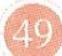

天

第2题

# 模型应用问题

原创押题 1

(以最新社会热点为情境素

押题者据

材,交汇物理学科的同时,构建对数函数模型)北京时间2023年2月10日0时16分,经过约7小时的出舱活动,神舟十五号航天员费俊龙、邓清

随着“一核”“四层”“四翼”的不断深化，近几年高考试题中对数学模型构建的考查不断强化，命题的可能性极高.

原创押题 2 （条件二选一）在平面直角坐标系 $xOy$ 中，①圆 $C$ 过 $A(1,0)$ 和 $B(-1,2)$ ，且圆心在直线 $l:2x+y+2=0$ 上；②圆 $C$ 过 $M(0,\sqrt{3}),N(1,0),G(-1,-2)$ 三点.

(1) 在①②两个条件中, 任选一个条件求圆 C 的标准方程;

(2) 在(1)的条件下, 过点 $P(3,4)$ 分别作圆 $C$ 的两条切线 $PQ, PR(Q, R$ 为切点), 求直线 $QR$ 的方程, 并求弦长 $|QR|$ .

条件不完备，题型新颖（P005）

难度

原创押题

(以农作物需

押题有据

水量为背景考查恒成立问题)保障国家粮食安全是一个永恒课题,任何时候这根弦都不能松.一年之计在于春,眼下,全国春耕备耕从南到北陆

高考数学要求学生具有一定的文字阅读理解能力，时事热点是很好的高考命题素材，要适当关注.

续展开,各粮食产区把保障粮食和重要农产品稳定安全供给作为头等大事,加快提升粮食综合生产能力.受气候影响,我国北方大部分农作物一直遵循着春耕秋收的自然

创设生产情境，贴近生活（P007）

# 押时事热点题，预测新考法

考前

# 天▶第6题 航天强国

原创押题 1

(以火箭的最大速度与质量

押题有据

的关系为载体,构建对数型函数模型)2022年12月4日20时09分,神舟十四号载人飞船返回舱在东风着陆场成功着陆.已知火箭的最大速度v

2022年是中国航天的“超级航天年”，与航天有关的内容很有可能作为命题素材出现在今年的高考中.

(单位:km/s)与燃料质量M(单位:kg)、火箭(除燃料外)质量m(单位:kg)的函数关系

原创押题

北京时间2023年2月3日凌晨，瑞典哥德堡田径室内赛展开多个项

目角逐,在男子60米比赛中,“中国飞人”苏炳添以6秒59夺冠,取得新赛季开门红.本站赛事是苏炳添的个人新赛季首秀,33岁的他是19名参赛者中年龄最大的选手,与他同场竞技的还有2006年出生的选手.这极大地激励了学生对百米赛跑的热爱.甲、乙、

彰显科技成就，关注热点（P009）

微信公众号教辅资料站小考教辅站初高教辅站

聚焦体育赛事，五育并举（P010）

natural_image

Illustration of a document with checkmarks and a target, no text or symbols present

# 押学科热点题，预测新变化

# 押题角度1 新定义数列问题

原创押题 1 （二阶等差数列）对于数列 $\{a_{n}\}$ ，定义 $\Delta_{n}^{(1)} = a_{n+1} - a_{n}$ ，称新数列 $\{\Delta_{n}^{(1)}\}$ 为数列 $\{a_{n}\}$ 的一阶差分数列；定义 $\Delta_{n}^{(2)} = \Delta_{n+1}^{(1)} - \Delta_{n}^{(1)}$ ，称新数列 $\{\Delta_{n}^{(2)}\}$ 为数列 $\{a_{n}\}$ 的二阶差分数列。若 $\Delta_{n}^{(2)} = d(d \in \mathbb{R})$ ，则称数列 $\{a_{n}\}$ 是二阶等差数列。已

# 押题有据

新定义问题属于每年必考的题型，在今年2月四省联考适应性测试中刚刚出现过，这是一个很重要的信号，在高考中出现新定义问题的概率极高！

# 剖析创新命题载体（P017）

# 专研热门命题类型（P014）

# 押题角度 利用高等数学处理数值估算

原创押题 （泰勒公式）泰勒公式是一个用函数在某点的信息描述其附近取值的公式，得名于英国数学家泰勒. 根据泰勒公式，有 $\sin x = x - \frac{x^{3}}{3!} + \frac{x^{5}}{5!} - \frac{x^{7}}{7!} + \cdots + (-1)^{n-1} \frac{x^{2n-1}}{(2n-1)!} + \cdots$ ，其中

# 押题者居

高考的一个功能是实现中学数学与高等数学的过渡与衔接，而接轨高等数学问题可以很好地体现这一功能，很有可能在今年高考中出现。

原创押题 1 （科赫曲线）有人曾提出一种说法，称雪花的周长超过地球的直径，其实这里的“雪花”指的是数学中的“科赫曲线”，科赫曲线是一种像雪花的几何曲线，所以又称为雪花曲线，它是由数学家科赫最早提出来的，是一种典型的分形曲线。科赫曲线的画法如图 1，第 1 个正三角形的边长为 1 厘米，将每边三等分，以每边三等分后中间的一段为边，向外作一个凸出的正三角形，再去掉原边中间的一段，可以得到

# 挖掘新颖命题情境（P018）

# 押题角度1 探究翻折过程中点的运动轨迹

原创押题 1 （双空题）已知如图 1 所示的矩形 ABCD 中， $AB = 3, AD = \sqrt{3}$ ，现将 $\triangle ACD$ 沿 AC 向上翻折（如图 2 所示），在翻折过程中，当点 D 到点 B 的距离在 $\left[\frac{\sqrt{21}}{2}, \frac{\sqrt{30}}{2}\right]$ 内变化时，点 D 的运动轨迹形状为 \_\_\_\_，长度等于 \_\_\_\_。

# 押疑难易错题，预测新角度

# 新题型 + 疑难点，消灭短板（P063）

因为 $OA = R = \sqrt{2}$ ，所以点 $M$ 到平面PAB距离的最大值为 $\frac{1}{2} OA = \frac{\sqrt{2}}{2}$

图2

【扫清障碍】要求三棱锥 M-ABC 体积的最大值，先研究三棱锥的特征，因为 A, B, C 是定点，所以底面 $\triangle ABC$ 的面积固定，问题可转化为求三棱锥的高的最大值，即点 M 到平面 PAB 距离的最大值，显然该值为以 OA 为直径的圆的半径

如图3,作出此球球面与四棱锥各面的交线,分别与棱BC,BP,AP,DP,DC交于点 $M_{1},M_{2},M_{3},M_{4},M_{5}$ ,连接 $AM_{1},AM_{2},AM_{4},AM_{5}$ .

【合作图】一般情况下，我们只需要以 $A$ 为圆心， $\frac{4\sqrt{3}}{3}$ 为半径在四棱锥侧面 $PAB$ 、侧面 $PAD$ 、底面 $ABCD$ 上画弧即可，然而在本题中，由于 $AB = 2$ ， $AD = 2$ ，长度均小于 $\frac{4\sqrt{3}}{3}$ ，所以除了在平面 $PAB$ ，平面 $PAD$ ，平面 $ABCD$ 上有交线之外，平面 $PBC$ 扣平面 $PDC$ 上也有交线，这两条不能遗漏

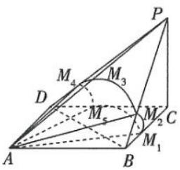  
图3

# 批注式层层剖析，攻克疑难（P057）

# 引导式多维解析，提升能力（P061）

natural_image

Illustration of a document with checkmarks and a target, no text or symbols present

# CONTENTS

# 目录

# 第9辑 数学理科

# 前沿创新题

考前 50 天>>第1题 答案不唯一填空题 001

考前 49 天>>第 2 题 模型应用问题 …… 002

考前 48 天>>第 3 题 条件不完备解答题 …… 004

考前 47 天>>第 4 题 社会热点应用题 …… 006

# 时事热点题

考前 46 天》第 5 题 强国必先强农，农强方能国强 …… 007

考前 45 天>>第 6 题 航天强国 …… 009

考前 44 天>>第 7 题 “中国飞人” 开门红 010

考前 43 天>>第8题 上天入地，大国重器 …… 011

考前 42 天>>第 9 题 二十届二中全会 012

# 学科热点题

# 学科热点

考前 41 天>>第 10 题 新定义创新问题 014

考前 40 天>>第 11 题 接轨高等数学问题 …… 017

考前 39 天>>第 12 题 数学文化问题 018

考前 38 天>>第 13 题 学科融合问题 020

考前 37 天>>第 14 题 图表分析问题 022

考前 36 天>>第 15 题 源于教材的改编问题 …… 023

考前 35 天>>第 16 题 逻辑推理问题 025

# 常考热点

考前 34 天》第 17 题 集合的相关计算问题 …… 027

考前 33 天》第 18 题 充分、必要条件的判断问题 …… 028

考前 32 天>>第 19 题 命题的真假判断问题 …… 029

考前 31 天>>第 20 题 计数原理问题 030

考前 30 天>>第 21 题 函数图象的识别问题 …… 031

考前 29 天>>第 22 题 函数的极值与最值问题 …… 032

考前28天》第23题 三角函数的图象与性质问题 033

考前 27 天>>第 24 题 基本不等式的应用问题 …… 035

考前26天》第25题 比大小问题 036

考前 25 天>>第 26 题 平面向量的基本定理与应用问题 …… 038

考前 24 天>>第 27 题 抽象函数的性质研究问题 …… 039

考前 23 天>>第 28 题 数列的求和问题 …… 041考前 22 天>>第 29 题 几何体的表面积与体积计算问题 …… 042

考前 21 天>>第 30 题 空间角的求解问题 …… 045

考前 20 天》第 31 题 与圆有关的位置关系问题 …… 048

考前 19 天>>第 32 题 椭圆的几何性质问题…… 049

考前 18 天>>第 33 题 双曲线的几何性质问题 …… 050

考前 17 天>>第 34 题 抛物线的几何性质问题 …… 052

考前 16 天>>第 35 题 正态分布问题 …… 054

考前 15 天>>第 36 题 随机事件的概率求解问题 …… 055

# 押疑难易错题

# 疑难压轴题

考前 14 天»第 37 题 动态几何问题 …… 057

考前 13 天>>第 38 题 立体几何中的交线与截面问题 …… 060

考前 12 天>>第 39 题 立体几何中的翻折问题 …… 063

考前 11 天>>第 40 题 数列与不等式交汇问题 …… 068

考前 10 天>>第 41 题 与圆锥曲线有关的定值、定点问题 …… 072

考前9天》第42题 与圆锥曲线有关的最值、范围问题……076

考前8天》第43题 统计案例 080

考前 7 天>>第 44 题 利用导数解决函数的零点问题 …… 084

考前 6 天>>第 45 题 利用导数解决函数的极值与最值问题…… 089

# 易错易失分题

考前5天》第46题 作图不准致误 …… 094

考前 4 天>>第 47 题 混淆定义、公式、定理致误 …… 096

考前 3 天>>第 48 题 分类讨论不全面致误 …… 097

考前 2 天>>第 49 题 忽视限制因素致误 …… 100

考前 1 天>>第 50 题 步骤不规范导致失分 …… 102

# 下辑精彩预告 2023年4月中旬上市!

# 《试题调研》第10辑将隆重推出年度收官之作

——考前抢分必备

本辑为考前1分钟都可以看的抢分宝典，帮你考前速背结论、速纠误区、速通技法、速览热点，实现考前快速抢分。精彩无限，不容错过！

《时政热点（下）》同时上市。

# 押前沿创新题

# 考前 50 天▶第1题 答案不唯一填空题

原创押题 1 （新题型,解题方法灵活）写出同时满足下列条件①②的直线 l 的方程: \_\_\_\_.（写出一个满足条件的答案即可）

①直线 l 在 y 轴上的截距为 3; ②直线 l 与双曲线 $\frac{x^{2}}{4}-\frac{y^{2}}{3}=1$ 只有一个交点.

解析 由直线 l 在 y 轴上的截距为 3, 知直线 l 的斜率存在, 可设直线 l 的方程为 $y = kx + 3$ , 将其代入双曲线方程 $3x^{2} - 4y^{2} = 12$ , 得关于 x 的方程 $(3 - 4k^{2})x^{2} - 24kx - 48 = 0$ .

当 $3 - 4k^{2} = 0$ 时， $k = \pm \frac{\sqrt{3}}{2}$ ，此时直线 $l$ 的方程为

# 押题有据

答案不唯一填空题在近两年新高考中每年必考，试题区分度高，解法灵活，今年再次出现的可能性极高。

【易错陷阱】切勿忽略对二次项系数为0的情况的讨论，直接当成一元二次方程讨论判别式的取值 $y=\frac{\sqrt{3}}{2}x+3$ 或 $y=-\frac{\sqrt{3}}{2}x+3$ ，满足题意.

当 $3-4k^{2}\neq0$ 时,令二次方程的根的判别式 $\Delta=(-24k)^{2}-4\times(3-4k^{2})\times(-48)=0$ ,解得 $k=\pm\sqrt{3}$ ,

【抓题眼】直线 l 与双曲线 $\frac{x^{2}}{4}-\frac{y^{2}}{3}=1$ 只有一个交点，若二次项系数不为 0，则一元二次方程的根的判别式为 0

此时直线 l 的方程为 $y = \sqrt{3}x + 3$ 或 $y = -\sqrt{3}x + 3$ .

秒杀解 双曲线 $\frac{x^2}{4} - \frac{y^2}{3} = 1$ 的渐近线斜率为 $\pm \frac{\sqrt{3}}{2}$ , 结合直线 $l$ 在 $y$ 轴上的截距为 3, 可得满足题意的一个直线 $l$ 的方程为 $y = \frac{\sqrt{3}}{2} x + 3$ (答案不唯一).

【小题快做】从双曲线的渐近线的特征入手，任意上下平移渐近线，所得直线都与双曲线只有一个交点，再根据截距信息便可实现秒解

原创押题 2 (新题型,区分度高)幂函数 $f(x)$ 满足 $\forall x \geqslant 0, f(x) = f(-x) < f(x + 1)$ , 则此函数可以是 $f(x) =$ \_\_\_\_. (写出一个满足条件的答案即可)

解析 令幂函数 $f(x) = x^{\alpha}$ ( $\alpha$ 为常数), 题中没有给出 $f(x)$ 的定义域的限制信息, 因此 $f(x)$

义域可为 R. 由“ $\forall x \geqslant 0, f(x) = f(-x)$ ”知，函数 $f(x)$ 是偶函数。

教辅站又 $\forall x\geqslant0,f(x)<f(x+1)$ ，则函数 $f(x)$ 在 $[0,+\infty)$ 上单调递增，因此 $\alpha$ 可以为正偶数，所以此函数可以是 $f(x)=x^{2},f(x)=x^{4},\cdots$ .

秒杀解 解答案不唯一填空题要本着“特殊思想优先”的原则. 本题中要求的函数是幂函数, 联想常见的幂函数 $f(x) = x^{2}, f(x) = x^{3}$ , 验证其是否满足题目中的要求, 显然 $f(x) = x^{2}$ 符合题意 (答案不唯一).

小编说:高考的脚步越来越近,相信很多同学都想趁这段时间再拼一把,让自己的成绩更进一步,那么如何在这有限的时间里高效复习呢?下面小编就给大家几点建议.

关注微信公众号“初高教辅站”获取更多初高中教辅资料

# 考前 49 天▶第2题 模型应用问题

# 原创押题 1

(以最新社会热点为情境素

材, 交汇物理学科的同时, 构建对数函数模型) 北京时间 2023 年 2 月 10 日 0 时 16 分, 经过约 7 小时的出舱活动, 神舟十五号航天员费俊龙、邓清明、张陆密切协同, 圆满完成出舱活动全部既定

# 题有据

随着 “一核” “四层” “四翼” 的不断深化，近几年高考试题中对数学模型构建的考查不断强化，命题的可能性极高。

任务,出舱活动取得圆满成功.载人飞船进入太空需要搭载运载火箭,火箭在发射时会产生巨大的噪声,已知声音的声强级 $d(x)$ (单位:dB)与声强x(单位:W/m²)满足关系: $d(x)=10\lg\frac{x}{10^{-12}}$ .若人交谈时的声强级约为50 dB,且火箭发射时的声强与人交谈时的声强的比值约为 $10^{9}$ ,则火箭发射时的声强级约为()

A. $130 \mathrm{~dB}$

B. $140 \mathrm{~dB}$

C. $150 \mathrm{~dB}$

D. $160 \mathrm{~dB}$

# 解析

设人交谈时的声强为 $x_{1}$ , 则火箭发射时的声强为 $10^{9} x_{1}$ , 且 $50 = 10 \lg \frac{x_{1}}{10^{-12}}$ , 得 $x_{1} =$

【梳理思路】处理文字较多的信息阅读题的关键是找到题眼,如本题,给出声强级和声强的关系,要求声强级,则要先求出声强,又给出的是人交谈时的声强级,则光根据声强级和声强的关系求出人交谈时的声强,再根据火箭发射时的声强与人交谈时的声强的比值求出火箭发射时的声强,问题即可得解 ${10}^{-7}\mathrm{\;W}/{\mathrm{m}}^{2}$ ,

则火箭发射时的声强约为 $10^{9}\times10^{-7}=10^{2}(W/m^{2})$ ，

将其代入 $d(x) = 10\lg \frac{x}{10^{-12}}$ 中，得 $d(10^2) = 10\lg \frac{10^2}{10^{-12}} = 140(\mathrm{dB})$

故火箭发射时的声强级约为 $140 \mathrm{~dB}$ . 故选 B.

原创押题 2 (构建指数函数模型)蒸发和沸腾都是汽化现象,是汽化的两种不同方式. 蒸发是在液体表面发生的汽化过程,沸腾是在液体内部和表面上同时发生的剧烈的汽化现象. 溶液的蒸发通常是指通过加热使溶液中一部分溶剂汽化,以提高溶液中非挥发性组分的浓度或使溶质从溶液中析出结晶的过程. 通过实验数据可知,某液体的蒸发速度 $y$ (单位: L/h)与液体所处环境的温度 $x$ (单位: ℃)近似地满足函数关系 $y = e^{ax + b}$ (e为自然对数的底数, $a, b$ 为常数). 若该液体在10 ℃时蒸发速度是 0.2 L/h,在20 ℃时蒸发速度是0.4 L/h,则该液体在40 ℃时蒸发速度为 ( )

翻译这两句信息，可得方程组 $\left\{\begin{array}{l}e^{10a+b}=0.2,\\e^{20a+b}=0.4,\end{array}\right.$ 这就是将文字信息翻译成数学语言的体现

A. $0.5 \mathrm{~L} / \mathrm{h}$

B. $0.6 \mathrm{~L} / \mathrm{h}$

C. $0.8 \mathrm{~L} / \mathrm{h}$

D. $1.6 \mathrm{~L} / \mathrm{h}$

解析 由题意得 $\left\{ \begin{array}{l} \mathrm{e}^{10a + b} = 0.2, \\ \mathrm{e}^{20a + b} = 0.4, \end{array} \right.$ 两式相除得 $\mathrm{e}^{10a} = 2$ ，所以 $\mathrm{e}^b = 0.1$

【运算技巧】光不要急着准确算出 a, b 的值，看后面的计算是否可以用到整体代入的思想当 x = 40 时， $e^{40a + b} = (e^{10a})^4 \cdot e^b = 1.6$ ,

所以该液体在 $40^{\circ} \mathrm{C}$ 时蒸发速度为 $1.6 \mathrm{~L} / \mathrm{h}$ . 故选 D.

原创押题 3 (构建分段函数模型) 每年三月中旬至四月上旬是最佳的赏花时期, 某公园的赏花园区投资了 30 万元种植鲜花供市民游赏, 这些鲜花的花期为 30 天. 园区从 3 月 1 号至 30 号开放, 每天的旅游人数 $f(x)$ (单位: 千人) 与第 $x$ 天的关系近似地满足 $f(x)=8+\frac{8}{x}$ , 游客人均消费 $g(x)$ (单位: 元) 与第 $x$ 天的关系近似地满足 $g(x)=143-|x-22|, 1 \leqslant x \leqslant 30$ 且 $x \in \mathbf{N}^{*}$ .

(1)求该园区第 $x$ 天的旅游收入 $p(x)$ (单位:千元)的函数解析式;  
(2)记(1)中 $p(x)$ 的最小值为 m, 若最终总利润为 0.3m 千元, 问该园区能否收回投资成本?

解析

$$
(1) p (x) = f (x) \cdot g (x) = (8 + \frac {8}{x}) (1 4 3 - | x - 2 2 |) =
$$

$$
\left\{ \begin{array}{l l} 8 x + \frac {9 6 8}{x} + 9 7 6, 1 \leqslant x \leqslant 2 2, \\ - 8 x + \frac {1 3 2 0}{x} + 1 3 1 2, 2 3 \leqslant x \leqslant 3 0, \end{array} \right. x \in \mathbf {N} ^ {*}.
$$

(2) 当 $1 \leqslant x \leqslant 22$ 且 $x \in \mathbb{N}^*$ 时, $p(x) = 8x + \frac{968}{x} + 976 \geqslant 2\sqrt{8x \cdot \frac{968}{x}} + 976 = 1152$ , 当且仅当 $8x = \frac{968}{x}$ , 即 $x = 11$ 时取等号, 此时 $p(x)$ 的最小值为 1152 千元.

【易错提醒】使用基本不等式时一定要判断等号成立的条件

当 $23 \leqslant x \leqslant 30$ 且 $x \in \mathbb{N}^*$ 时, $p(x) = -8x + \frac{1320}{x} + 1312$ 为单调递减函数, 所以当 $x = 30$ 时 $p(x)$ 取到最小值, 最小值为 1116 千元.

综上, $p(x)$ 的最小值 m=1 116 千元, 因此 0.3m=334.8 千元 =33.48 万元 >30 万元, 能收回投资成本.

考前

48

天

# 第 3 题 条件不完备解答题

原创押题 1

(条件三选一,题型新颖)已

知 $\triangle ABC$ 中, 内角 $A, B, C$ 所对的边分别为 $a, b$ , $c$ , 且 \_\_\_\_.

题有据

条件不完备解答题是新高考中新出现的题型，近三年每年都考，今年极有可能再次出现。

(1) 求 $\tan B$ 的值;

(2) 若 $\tan A = -\frac{12}{5}, c = \frac{11}{4}$ , 求 $\triangle ABC$ 的周长与面积.

在下面三个条件中任选一个,补充在横线上并作答.

① $a\cos C + c\cos A = \frac{5}{4}b\cos B$ ; ② $5\sin\left(\frac{\pi}{2}+B\right)+5\sin(-B)=1$ ; ③ $B\in(0,\frac{\pi}{2})$ , $\cos 2B = \cos B - \frac{13}{25}$ .

注:如果选择多个条件分别解答,按第一个解答计分.

解析

(1) 若选①, 解题过程如下.

由正弦定理得 $\sin A\cos C + \sin C\cos A = \frac{5}{4}\sin B\cos B$ ，故 $\sin (A + C) = \frac{5}{4}\sin B\cos B$

在 $\triangle ABC$ 中, $\sin (A + C) = \sin (\pi - B) = \sin B$ , 故 $\sin B = \frac{5}{4} \sin B \cos B$ .

又 $B \in (0, \pi)$ , 所以 $\sin B \neq 0$ , 则 $\cos B = \frac{4}{5}, \sin B = \sqrt{1 - \cos^2 B} = \frac{3}{5}, \tan B = \frac{\sin B}{\cos B} = \frac{3}{4}$ .

若选②,解题过程如下.

由 $5\sin \left(\frac{\pi}{2} + B\right) + 5\sin (-B) = 1$ ，化简得 $\cos B - \sin B = \frac{1}{5}$ ，代入 $\cos^2 B + \sin^2 B = 1$ 中，整理得 $25\sin^2 B + 5\sin B - 12 = 0$ ，即 $(5\sin B - 3)(5\sin B + 4) = 0.$

因为 $B \in (0, \pi)$ , 所以 $\sin B > 0$ , 所以 $\sin B = \frac{3}{5}$ , 则 $\cos B = \frac{4}{5}, \tan B = \frac{\sin B}{\cos B} = \frac{3}{4}$ .

若选③,解题过程如下.

因为 $\cos 2B = \cos B - \frac{13}{25}$ , 所以 $2\cos^2 B - 1 = \cos B - \frac{13}{25}$ , 即 $2\cos^2 B - \cos B - \frac{12}{25} = 0$ , 则 $(2\cos B + \frac{3}{5})(\cos B - \frac{4}{5}) = 0$ .

因为 $B \in (0, \frac{\pi}{2})$ ，所以 $\cos B = \frac{4}{5}$ ，则 $\sin B = \sqrt{1 - \cos^2 B} = \frac{3}{5}, \tan B = \frac{\sin B}{\cos B} = \frac{3}{4}$ .

(2) $\tan A = \frac{\sin A}{\cos A} = -\frac{12}{5}, \sin^2 A + \cos^2 A = 1, A \in (0, \pi)$ , 所以 $\cos A = -\frac{5}{13}, \sin A = \frac{12}{13}$ .

由(1)得 $\cos B = \frac{4}{5}$ , $\sin B = \frac{3}{5}$ , 则 $\sin C = \sin(A + B) = \sin A \cos B + \cos A \sin B = \frac{12}{13} \times \frac{4}{5} - \frac{5}{13} \times \frac{3}{5} = \frac{33}{65}$ , 由正弦定理得 $\frac{a}{\sin A} = \frac{b}{\sin B} = \frac{c}{\sin C} = \frac{65}{12}$ , 则 a = 5, $b = \frac{13}{4}$ .

故 $\triangle ABC$ 的周长为 $a + b + c = 11$ ，面积为 $S_{\triangle ABC} = \frac{1}{2} ab\sin C = \frac{1}{2} \times 5 \times \frac{13}{4} \times \frac{33}{65} = \frac{33}{8}$ .

原创押题 2 (条件二选一) 在平面直角坐标系 $xOy$ 中, ①圆 $C$ 过 $A(1,0)$ 和 $B(-1,2)$ , 且圆心在直线 $l:2x+y+2=0$ 上; ②圆 $C$ 过 $M(0,\sqrt{3}), N(1,0), G(-1,-2)$ 三点.

(1) 在①②两个条件中, 任选一个条件求圆 $C$ 的标准方程; (2) 在(1)的条件下, 过点 $P(3,4)$ 分别作圆 $C$ 的两条切线 $PQ, PR(Q, R$ 为切点), 求直线 $QR$ 的方程, 并求弦长 $|QR|$ .

注:如果选择多个条件分别解答,按第一个解答计分.

解析 (1) 若选①, 圆心在直线 $l: 2x + y + 2 = 0$ 上, 设圆心 $C(a, -2 - 2a)$ , 连接 $AC$ , $BC$ , 则 $|AC| = \sqrt{(a - 1)^2 + (-2 - 2a)^2} = |BC| = \sqrt{(a + 1)^2 + (-4 - 2a)^2}$ , 解得 $a = -1$ ,

故圆心为 $C(-1,0)$ ，圆的半径 r=2，则圆 C 的标准方程为 $(x+1)^{2}+y^{2}=4$ 。

若选②,设圆的方程为 $x^{2} + y^{2} + Dx + Ey + F = 0 (D^{2} + E^{2} - 4F > 0)$ ,

因为圆 C 过 M, N, G 三点, 所以 $\left\{\begin{aligned}3+\sqrt{3}E+F=0,\\ 1+D+F=0,\\ 1+4-D-2E+F=0,\end{aligned}\right.$ 解得 $\left\{\begin{aligned}D=2,\\ E=0,\\ F=-3,\end{aligned}\right.$ 所以圆 C 的方程为 $x^{2}+y^{2}+2x-3=0$ , 标准方程为 $(x+1)^{2}+y^{2}=4$ .

【仔细审题】注意题目要求标准方程，一定要转化成标准方程的形式

(2) 连接 CR, CQ, PC, 如图 1. 由题意得, $CQ \perp PQ$ , $CR \perp PR$ , 则 C, R, P, Q 四点共圆且 PC 为直径,

因为 $C(-1,0), P(3,4)$ , 所以 $PC$ 的中点为 $(1,2), |PC| = \sqrt{4^2 + 4^2} = 4\sqrt{2}$ , 所以以线段 $PC$ 为直径的圆的方程为 $(x - 1)^2 + (y - 2)^2 = (\frac{4\sqrt{2}}{2})^2 = 8$ , 整理得 $x^2 + y^2 - 2x - 4y - 3 = 0$ .

因为 R, Q 也在圆 C 上, 所以由两圆的方程作差得 $4x + 4y = 0$ , 即 $x + y = 0$ , 故直线 QR 的方程为 $x + y = 0$ .

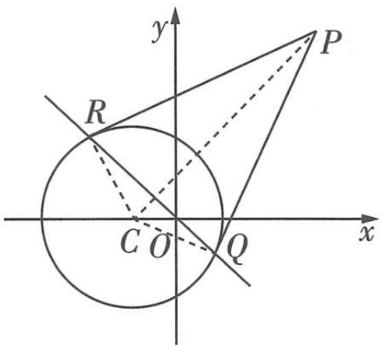

text_image

y
P
R
C O Q
x

图1

因为 C 到直线 QR 的距离 $d=\frac{|-1+0|}{\sqrt{1^{2}+1^{2}}}=\frac{\sqrt{2}}{2}$ ，所以 $|QR|=2\sqrt{4-\frac{1}{2}}=\sqrt{14}$ .

在考试前,可以根据自己的情况,给予自己积极暗示,自我打气,暗示自己:“这次我一定行!”“我进步已经很大了!”.

# 考前 47 天▶第 4 题 社会热点应用题

原创押题 1 （以首届中国非物质文化遗产保护年会开幕式为情境考查古典概型）2023年2月18日，首届中国非物质文化遗产保护年会开幕式在陕西省榆林市举行，年会主题为“打造非遗年度名片、绽放非遗绚丽色彩”。2013年联合国教科文组织正式将中国珠算项目列入教科文组织人类非物质文化遗产名录。图1是我国

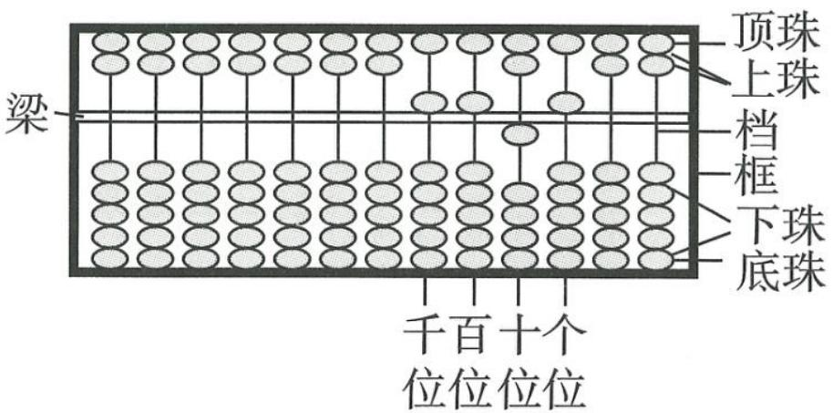

text_image

梁
顶珠
上珠
档
框
下珠
底珠
千百 十个
位位 位位

图1

传统算盘的示意图,每一档有两粒上珠、五粒下珠,也称为“七珠算盘”. 未记数(或表示零)时,每档的各珠位置均与图中最左档一样;记数时,要拨珠靠梁,一个上珠表示“5”,一个下珠表示“1”. 例如图1中,当“千位档”有一个上珠、“百位档”有一个上珠、“十位档”有一个下珠、“个位档”有一个上珠分别靠梁时,所表示的数是5515. 现选定“个位档”“十位档”“百位档”“千位档”,若规定每档拨动一珠靠梁(其他各珠不动),则在其可能表示的所有四位数中随机取一个数,这个数能被3整除的概率为\_\_\_\_.

解析 选定“个位档”“十位档”“百位档”“千位档”,规定每档拨动一珠靠梁(其他各珠不动),则在其可能表示的所有四位数中随机取一个数,包含的基本事件个数为 $2^{4} = 16$ . 这个数能被3整除包含的基本事件有:5 511,5 151,5 115,1 155,1 515,1 551,共6个.

【识别概型】理解题意,判断概型为古典概型,因此要确定总的基本事件个数及满足“这个数能被3整除”所包含的基本事件个数,基本事件个数的比值即所求概率

则这个数能被3整除的概率为 $P = \frac{6}{16} = \frac{3}{8}$ . 故答案为 $\frac{3}{8}$ .

原创押题 2 (2·6 土耳其地震) 据中国地震台网正式测定, 北京时间 2023 年 2 月 6 日 9 时 17 分, 在土耳其发生 7.8 级地震, 震源深度 20 千米, 震中位于北纬 37.15 度, 东经 36.95 度. 地震里氏震级是对地震强度大小的一种度量, 地震释放的能量 $E$ (单位: J) 与地震里氏震级 $M$ 之间的关系为 $\lg E = 4.8 + 1.5 M$ . 已知两次地震的里氏震级分别为 8.0 级和 7.5 级, 若它们释放的能量分别为 $E_{1}$ 和 $E_{2}$ , 则 $\frac{E_{1}}{E_{2}}$ 的值所在的区间为 ( )

A. (3,4)

B. $(4,5)$

C. (5,6)

D. (6,7)

解析 因为 $\lg E = 4.8 + 1.5M$ ，所以 $\lg E_{1} = 4.8 + 1.5\times 8 = 16.8$ ，得 $E_{1} = 10^{16.8}$

$\lg E_{2} = 4.8 + 1.5 \times 7.5 = 16.05$ ，得 $E_{2} = 10^{16.05}$ ，所以 $\frac{E_{1}}{E_{2}} = \frac{10^{16.8}}{10^{16.05}} = 10^{0.75}$ ，因为 $10^{0.75} > 9^{0.75} = 3^{1.5} = 3 \times \sqrt{3} > 5$ ，且 $10^{0.75} = 10^{\frac{3}{4}} = 1000^{\frac{1}{4}} < 1296^{\frac{1}{4}} = 6$ ，所以 $\frac{E_{1}}{E_{2}}$ 的值所在的区间为 (5,6). 故选 C.

# 押时事热点题

# 考前 46 天▶第 5 题 强国必先强农，农强方能国强

难度★★★★☆ 原创押题 （以农作物需

水量为背景考查恒成立问题)保障国家粮食安全是一个永恒课题,任何时候这根弦都不能松.一年之计在于春,眼下,全国春耕备耕从南到北陆

押题有据

高考数学要求学生具有一定的文字阅读理解能力，时事热点是很好的高考命题素材，要适当关注.

续展开,各粮食产区把保障粮食和重要农产品稳定安全供给作为头等大事,加快提升粮食综合生产能力.受气候影响,我国北方大部分农作物一直遵循着春耕秋收的自然规律,农作物生长的时间主要集中在2月份至10月份.为了保证某地A,B两个产粮大镇农作物的用水需求,该地政府决定将原来的蓄水库扩建成一个容量为50万立方米的大型农用蓄水库.已知蓄水库原有水量为18万立方米,计划从2月初每月补进q万立方米地下水,连续补水9个月,以满足A,B两镇农作物灌溉需求.若A镇农作物每月的需水量为2万立方米,B镇的农作物前x个月的总需水量为 $2p\sqrt{x}$ 万立方米,其中 $1 \leq x \leq 9$ 且 $x \in N^{*}$ .已知B镇前4个月的总需水量为24万立方米.

(1)试写出第 $x$ 个月水被抽走后,蓄水库内蓄水量 $\mathbb{W}$ (单位:万立方米)与 $x$ 的函数关系式;  
(2)要使9个月内每月初按计划补进地下水之后,水库的蓄水量不超蓄水库的容量且总能满足A,B两镇的农作物用水需求,试确定q的取值范围.

解析 (1) 因为 $B$ 镇前 4 个月的总需水量为 24 万立方米, 所以 $2p \sqrt{4} = 4p = 24$ , 则 $p = 6$ ,

所以 $W = 18 + qx - 2x - 12\sqrt{x} (1 \leqslant x \leqslant 9, x \in \mathbf{N}^{*})$ .

(2)①由题意知 $W = 18 + qx - 2x - {12}\sqrt{x} \geq  0$ 对 $1 \leq  x \leq  9$ 且 $x \in  {\mathbf{N}}^{ * }$ 恒成立,即 $q \geq$ 【易遗漏】实际应用问题中自变量的取值范围经常被忽视,要认真读题 $- \frac{18}{x} + \frac{12}{\sqrt{x}} + 2$ 对 $1 \leq  x \leq  9$ 且 $x \in  {\mathbf{N}}^{ * }$ 恒成立.

令 $\frac{1}{\sqrt{x}} = t$ ，则 $\frac{1}{3} \leqslant t \leqslant 1$ ，设 $m(t) = -18t^2 + 12t + 2$ ，则 $m(t) = -18(t - \frac{1}{3})^2 + 4 \leqslant 4$ ，所

比如在考前如果觉得很担心,那不妨进行如下的自我质辩:这种担心有必要吗?我为什么会有这种担心?我应该怎样解决这种担心呢?在自我质辩的过程中找到自己的压力源以及解决压力的方法.

关注微信公众号“初高教辅站”获取更多初高中教辅资料

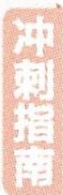

以 $q \geqslant m(t)_{\max} = 4.$

② $18 + q \leqslant 50$ ，即 $q \leqslant 32, 18 + (x + 1)q - 2x - 12\sqrt{x} \leqslant 50$ 对 $1 \leqslant x \leqslant 8$ 且 $x \in N^{*}$ 恒成立，

所以 $q \leqslant \frac{32 + 2x + 12\sqrt{x}}{x + 1}$ 对 $1 \leqslant x \leqslant 8$ 且 $x \in \mathbb{N}^*$ 恒成立，

令 $y = \frac{32 + 2x + 12\sqrt{x}}{x + 1}, 1 \leqslant x \leqslant 8$ 且 $x \in \mathbf{N}^*$ ，则 $y' =$

$$
\frac {(2 + \frac {6}{\sqrt {x}}) (x + 1) - (3 2 + 2 x + 1 2 \sqrt {x})}{(x + 1) ^ {2}} = \frac {\frac {6}{\sqrt {x}} - 6 \sqrt {x} - 3 0}{(x + 1) ^ {2}} = \frac {- 6 (\sqrt {x} - \frac {1}{\sqrt {x}} + 5)}{(x + 1) ^ {2}} = - 6 \times
$$

【会求导】此处求导运算较为繁杂，不要错记成 $\left[\frac{f(x)}{g(x)}\right]'=\frac{f'(x)}{g'(x)}$ 运算，而要根据求导法则 $\left[\frac{f(x)}{g(x)}\right]'=\frac{f'(x)g(x)-f(x)g'(x)}{\left[g(x)\right]^{2}}$ 运算

$$
\frac {x + 5 \sqrt {x} - 1}{\sqrt {x} (x + 1) ^ {2}} = - 6 \times \frac {\left(\sqrt {x} + \frac {5}{2}\right) ^ {2} - \frac {2 9}{4}}{\sqrt {x} (x + 1) ^ {2}}.
$$

因为 $1 \leqslant x \leqslant 8$ 且 $x \in \mathbb{N}^*$ , 所以 $y' < 0$ 恒成立, 所以函数 $y = \frac{32 + 2x + 12\sqrt{x}}{x + 1}$ 单调递减,

所以当 $x = 8$ 时， $y$ 取得最小值，且 $y_{\min} = \frac{32 + 16 + 12\sqrt{8}}{9} = \frac{16 + 8\sqrt{2}}{3} < 32$

所以 $q \leqslant \frac{16 + 8\sqrt{2}}{3}$ .

综合①②可得 q 的取值范围为 $\left[4, \frac{16 + 8\sqrt{2}}{3}\right]$ .

# 有奖征文

想让你的名字出现在《试题调研》上吗？

想让你的作品在学弟学妹之间传阅吗？

# 高分作文有奖征集活动开始啦!

征稿要求 如果你来自市级前五的学校，并且在本市高三模考或联考中写出高分作文（55分及以上），就快快将佳作投递给我们吧！

发送地址及格式 将试卷首页、作文题目页和作文答题卡拍照发送至stdyywz@126.com，所拍照片需有分值且字体清晰可见。

活动时间 即日起至2023年4月30日。

活动奖励 凡投稿且符合条件者，可自选《试题调研》Mook 1本或最新版《随身速记》1本，即投即送。

来信注意事项 邮件请注明姓名+学校+邮寄地址+联系方式+自选图书名（注明书名、辑次、科目等）。

# 考前 45 天▶第6题 航天强国

# 原创押题 1

(以火箭的最大速度与质量

的关系为载体,构建对数型函数模型)2022年12月4日20时09分,神舟十四号载人飞船返回舱在东风着陆场成功着陆.已知火箭的最大速度v

# 题有据

2022 年是中国航天的 “超级航天年”，与航天有关的内容很有可能作为命题素材出现在今年的高考中。

(单位:km/s)与燃料质量 M(单位:kg)、火箭(除燃料外)质量 m(单位:kg)的函数关系为 $v=2\ln\left(1+\frac{M}{m}\right)$ . 已知某火箭的火箭(除燃料外)质量为 3000 kg, 最大速度为 9 km/s, 若保持火箭(除燃料外)质量不变, 为使最大速度达到 10 km/s, 则需要再加注的燃料质量约为(参考数据: $\ln 90 \approx 4.5, e^{5} \approx 148$ )

题目中给出的参考数据一定不是平白无故设置的，这里有一个诀窍，即如果发现自己在计算时没有用到这些数据，就倒回去检查是否哪步运算出错或式子列错

A. $267000 \mathrm{~kg}$

B. $174000 \mathrm{~kg}$

C. $147000 \mathrm{~kg}$

D. 441 000 kg

# 解析

由题意知当 m=3 000 时, v=9, 设此时燃料质量为 $M_{1}$ ,

将 $m = 3000, v = 9$ 代入 $v = 2\ln \left(1 + \frac{M}{m}\right)$ , 得 $9 = 2\ln \left(1 + \frac{M_1}{3000}\right)$ ,

所以 $\ln (1 + \frac{M_1}{3000}) = 4.5\approx \ln 90$ ，即 $\frac{M_1}{3000} +1\approx 90$ ，得 $M_{1}\approx 267000(\mathrm{kg})$

当 v=10 时, 设燃料质量为 $M_{2}$ , 则 $10=2\ln\left(1+\frac{M_{2}}{3\ 000}\right)$ , 即 $1+\frac{M_{2}}{3\ 000}=e^{5}\approx148$ , 解得 $M_{2}\approx441\ 000(\text{kg})$ ,
所以需要再加注燃料质量约为 $M_{2}-M_{1}=441\ 000-267\ 000=174\ 000(\text{kg})$ . 故选 B.

原创押题 2 (以飞船的运行轨道为载体)2022年神舟接力腾飞,中国空间站全面建成,我们的“太空之家”遨游苍穹.太空中飞船与空间站的对接,需要经过多次变轨.某飞船升空后的初始运行轨道是以地球的中心为一个焦点的椭圆,其远地点(长轴端点中离地面最远的点)到地面的距离为 $S_{1}$ ,近地点(长轴端点中离地面最近的点)到地面的距离为 $S_{2}$ ,地球的半径为 $R$ ,则该椭圆的短轴长为\_\_\_\_(用 $S_{1}, S_{2}, R$ 表示).

# 解析

设椭圆的长半轴长为 a, 短半轴长为 b, 半焦距为 c,

由题意可知 $a + c = S_{1} + R, a - c = S_{2} + R,$

所以 $b^{2}=a^{2}-c^{2}=(S_{1}+R)(S_{2}+R)$ .

所以 $b = \sqrt{a^2 - c^2} = \sqrt{(S_1 + R)(S_2 + R)}$ ，所以 $2b = 2\sqrt{(S_1 + R)(S_2 + R)}$

【指点迷津】本题所求的是椭圆的短轴长，因此求出b的表达式后注意乘2，不要直接填b的表达式

# 考前 44 天▶第7题 “中国飞人”开门红

原创押题 北京时间 2023 年 2 月 3 日凌晨,瑞典哥德堡田径室内赛展开多个项目角逐,在男子60 米比赛中,“中国飞人”苏炳添以 6 秒 59 夺冠,取得新赛季开门红.本站赛事是苏炳添的个人新赛季首秀,33 岁的他是 19 名参赛者中年龄最大的选手,与他同场竞技的还有 2006 年出生的选手.这极大地激励了学生对百米赛跑的热爱.甲、乙、丙三名学生同时参加了一次百米赛跑,所用时间(单位:秒)分别为 $T_{1}, T_{2}, T_{3}$ .甲有一半的时间以速度 $V_{1}$ (单位:米/秒)奔跑,另一半的时间以速度 $V_{2}$ (单位:米/秒)奔跑;乙全程以速度 $\sqrt{V_{1} V_{2}}$ 奔跑;丙有一半的路程以速度 $V_{1}$ 奔跑,另一半的路程以速度 $V_{2}$ 奔跑.其中 $V_{1}>0, V_{2}>0$ .则下列结论中一定成立的是 ( )

A. $T_{1} \leqslant T_{2} \leqslant T_{3}$

B. $T_{1} \geqslant T_{2} \geqslant T_{3}$

C. $T_{1} T_{3} = T_{2}$

D. $\frac{1}{T_1} +\frac{1}{T_3} = \frac{1}{T_2}$

解析 对于甲,由题意得 $\frac{1}{2} T_{1}V_{1} + \frac{1}{2} T_{1}V_{2} = 100$ , 所以 $T_{1} = \frac{100}{\frac{V_{1} + V_{2}}{2}}$ .

【抓题眼,得关系】“百米赛跑”+“甲有一半的时间以速度 $V_{1}$ 奔跑,另一半的时间以速度 $V_{2}$ 奔跑” $\rightarrow \frac{1}{2} T_{1} V_{1} + \frac{1}{2} T_{1} V_{2} = 100$

对于乙, $T_{2}=\frac{100}{\sqrt{V_{1}V_{2}}}$ . 对于丙, $T_{3}=\frac{50}{V_{1}}+\frac{50}{V_{2}}=\frac{100}{\frac{2V_{1}V_{2}}{V_{1}+V_{2}}}$ .

【辨区别】注意丙和甲运动方式的不同，所列关系式不同，甲前、后段跑步所用时间相同，丙前、后段跑步的路程相同

根据基本不等式可知 $\frac{V_1 + V_2}{2} \geqslant \sqrt{V_1 V_2} \geqslant \frac{2 V_1 V_2}{V_1 + V_2} > 0$ , 当且仅当 $V_1 = V_2$ 时等号全部成立,

【易遗漏】使用基本不等式解题时,要注意验证等号成立的条件

故 $T_{1} \leqslant T_{2} \leqslant T_{3}$ ，故 A 选项正确，B 选项错误；

$T_{1}T_{3} = \frac{100}{\frac{V_{1} + V_{2}}{2}}\times \frac{100}{\frac{2V_{1}V_{2}}{V_{1} + V_{2}}} = \frac{100^{2}}{V_{1}V_{2}} = T_{2}^{2},$ 故C选项错误；

$\frac{1}{T_1} + \frac{1}{T_3} = \frac{\frac{V_1 + V_2}{2}}{100} + \frac{\frac{2V_1V_2}{V_1 + V_2}}{100} \neq \frac{\sqrt{V_1V_2}}{100} = \frac{1}{T_2}$ , 故 D 选项错误.

故选A.

# 考前 43 天▶第8题 上天入地，大国重器

难度★★★★☆ 原创押题 已知椭圆 $C:\frac{x^{2}}{a^{2}}+\frac{y^{2}}{b^{2}}=1(a>b>0)$ 的上、下顶点分别为 A, B，且短轴长为 $2\sqrt{3}$ ，T 为椭圆上（除 A, B 外）任意一点，直线 TA, TB 的斜率之积为 $-\frac{3}{4}$ ， $F_{1}$ ， $F_{2}$ 分别为左、右焦点。

(1) 求椭圆 C 的方程.

(2)“天眼”是世界上最大、最灵敏的单口径射电望远镜,它的外形像一口“大锅”,可以接收到百亿光年外的电磁信号.在“天眼”的建设中,用到了大量的圆锥曲线的光学性质,请以上面的椭圆 $C$ 为代表,证明:由焦点 $F_{1}$ 发出的光线射到椭圆上任意一点 $M$ 后反射,反射光线必经过另一焦点 $F_{2}$ . (提示:光线射到曲线上某点并反射时,法线垂直于该点处的切线)

解析 (1)由题意知,直线 $TA, TB$ 的斜率存在且不为 0 ,设 $T(x,y)$ , 直线 $TA, TB$ 的斜率分别为 $k_{1}, k_{2}$ , 由题意知 $A(0, \sqrt{3}), B(0, -\sqrt{3})$ , 由 $k_{1} k_{2} = -\frac{3}{4}$ 得 $\frac{y - \sqrt{3}}{x} \cdot \frac{y + \sqrt{3}}{x} = -\frac{3}{4}$ , 整理得 $\frac{x^{2}}{4} + \frac{y^{2}}{3} = 1 (x \neq 0)$ , 故椭圆 $C$ 的方程为 $\frac{x^{2}}{4} + \frac{y^{2}}{3} = 1$ .

(2) 当 $M$ 为椭圆顶点时结论显然成立, 当 $M$ 不是椭圆顶点时, 要证明结论成立, 只

【得分秘籍】对于难度较大的解答题，一定要把自己会的写上，尽量多得步骤分。实在没有解题思路时，考虑特殊位置、特殊情况、特殊点等，验证是否满足题意，可以得到一定的分数需证明法线平分 $\angle F_{1}MF_{2}$ 。设 M 点坐标为 $(m,n)(m \cdot n \neq 0)$ ，则 $3m^{2} + 4n^{2} = 12$ 。

设与椭圆切于 $M$ 点的切线方程为 $y = k(x - m) + n = kx - km + n$ , 与椭圆方程联立得 $\left\{ \begin{array}{l} y = kx - km + n, \\ 3x^2 + 4y^2 = 12, \end{array} \right.$ 消去 $y$ 得 $(3 + 4k^2)x^2 - 8k(km - n)x + 4(km - n)^2 - 12 = 0, \Delta = 64k^2 (km - n)^2 - 16[(km - n)^2 - 3](4k^2 + 3) = 48[4k^2 - (km - n)^2 + 3] = 0$ , 得 $k = -\frac{3m}{4n}$ .

所以切线斜率为 $-\frac{3m}{4n}$ , 所以法线斜率为 $\frac{4n}{3m}$ , 法线方程为 $y - n = \frac{4n}{3m} (x - m)$ ,

令 $y = 0$ ，可得法线与 $x$ 轴交点 $N$ 的横坐标为 $\frac{m}{4}$ 易知 $F_{1}(-1,0), F_{2}(1,0)$ ，所以 $\frac{|F_1N|}{|F_2N|} = \frac{4 + m}{4 - m}, |F_1M| = \sqrt{(m + 1)^2 + n^2} = \sqrt{\frac{1}{4}m^2 + 2m + 4} = 2 + \frac{1}{2}m, |F_2M| = 2 - \frac{1}{2}m,$

所以 $\frac{|F_1M|}{|F_2M|} = \frac{2 + \frac{m}{2}}{2 - \frac{m}{2}} = \frac{4 + m}{4 - m} = \frac{|F_1N|}{|F_2N|},\frac{S_{\triangle F_1MN}}{S_{\triangle F_2MN}} = \frac{|F_1N|}{|F_2N|} = \frac{|F_1M||MN|\sin\angle F_1MN}{|F_2M||MN|\sin\angle F_2MN},$

所以 $\sin\angle F_{1}MN=\sin\angle F_{2}MN$ ，则 $\angle F_{1}MN=\angle F_{2}MN$ 或 $\angle F_{1}MN+\angle F_{2}MN=\pi$ （舍去），所以法线 MN 平分 $\angle F_{1}MF_{2}$ ，所以原结论成立。

做高考模拟卷及真题时一定要严格按照高考规定的时间进行,主要是为了适应高考考试的难度和时间.

# 考前 42 天▶第9题 二十届二中全会

原创押题 (以最新社会热点为情境考查独立性检验问题,用期望判断利润大小问题)中国共产党第二十届中央委员会第二次全体会议(简称二十届二中全会)于2023年2月26日至28日在北京召开,会议提出,要着力推动经济稳步回升、促进高质量发展,切实保障和改善民生.为适应新形势,满足国内市场需求,某对外零件加工企业积极转型,新建了A,B两个车间加工同一型号的零件,质监部门随机抽检了两个车间的各100件零件,在抽取的200件零件中,根据检测结果将它们分为甲、乙、丙三个等级,甲、乙等级都是合格品,在政策扶持下,都可销售出去,而丙等级是次品,必须销毁,具体统计结果如表一所示:

<table><tr><td>等级</td><td>甲</td><td>乙</td><td>丙</td></tr><tr><td>频数</td><td>20</td><td>120</td><td>60</td></tr></table>

表一

<table><tr><td></td><td>合格品</td><td>次品</td><td>合计</td></tr><tr><td>A</td><td></td><td>25</td><td></td></tr><tr><td>B</td><td>65</td><td></td><td></td></tr><tr><td>合计</td><td></td><td></td><td></td></tr></table>

表二

(1)请根据所提供的数据,完成 $2 \times 2$ 列联表(表二),并判断能否有 $95 \%$ 的把握认为零件的合格率与生产车间有关?

(2)每个零件的生产成本为 30 元,甲、乙等级零件的出厂单价分别为 $3a$ 元、 $2a$ 元 ( $a > 15$ ). 另外已知每件次品的销毁费用为 4 元. 若 $A$ 车间抽检的零件中有 10 件为甲等级,用样本的频率估计概率,若 $A, B$ 两车间都能盈利,求实数 $a$ 的取值范围.

附: $K^{2}=\frac{n(ad-bc)^{2}}{(a+b)(c+d)(a+c)(b+d)}$ ,其中 $n=a+b+c+d$ .

<table><tr><td> $P(K^{2} \geqslant k_{0})$ </td><td>0.50</td><td>0.40</td><td>0.25</td><td>0.15</td><td>0.10</td><td>0.05</td></tr><tr><td> $k_{0}$ </td><td>0.455</td><td>0.708</td><td>1.323</td><td>2.072</td><td>2.706</td><td>3.841</td></tr></table>

解析 (1) 零假设为 $H_{0}$ : 零件的合格率与生产车间无关, 完整的列联表为

<table><tr><td></td><td>合格品</td><td>次品</td><td>合计</td></tr><tr><td>A</td><td>75</td><td>25</td><td>100</td></tr><tr><td>B</td><td>65</td><td>35</td><td>100</td></tr><tr><td>合计</td><td>140</td><td>60</td><td>200</td></tr></table>

由表中数据得 $K^{2}=\frac{n(ad-bc)^{2}}{(a+b)(c+d)(a+c)(b+d)}=\frac{200\times(75\times35-25\times65)^{2}}{140\times60\times100\times100}\approx$ 2.381 < 3.841,

所以没有 $95 \%$ 的把握认为零件的合格率与生产车间有关.

(2) 设 A, B 两车间生产 1 个零件并售出的利润分别为 $y_{1}$ 元、 $y_{2}$ 元，则 $y_{1}, y_{2}$ 的所有可能取值均为 3a - 30, 2a - 30, -34 (负值表示亏损), 由题意可得 A, B 两车间抽检的甲、

【易错陷阱】因为每个零件的生产成本为 30 元，所以计算利润要用单价减去 30 元，而对于次品，既不能出售，还需要 4 元的销毁费用，因此利润为 -34 元，注意不要漏算了

# 乙、丙等级的零件个数为

<table><tr><td></td><td>甲</td><td>乙</td><td>丙</td></tr><tr><td>A</td><td>10</td><td>65</td><td>25</td></tr><tr><td>B</td><td>10</td><td>55</td><td>35</td></tr></table>

则 $y_{1}, y_{2}$ 的分布列分别为

<table><tr><td> $y_1$ </td><td>3a-30</td><td>2a-30</td><td>-34</td></tr><tr><td>P</td><td> $\frac{1}{10}$ </td><td> $\frac{13}{20}$ </td><td> $\frac{1}{4}$ </td></tr></table>

<table><tr><td> $y_{2}$ </td><td>3a-30</td><td>2a-30</td><td>-34</td></tr><tr><td>P</td><td> $\frac{1}{10}$ </td><td> $\frac{11}{20}$ </td><td> $\frac{7}{20}$ </td></tr></table>

【会检验】列出分布列后，根据频率和为1检验是否出错

所以 A 车间生产 1 个零件的平均利润为 $E_{1}=\frac{1}{10}\times(3a-30)+\frac{13}{20}\times(2a-30)-$ $\frac{1}{4}\times34=\frac{8a-155}{5}$

B 车间生产 1 个零件的平均利润为 $E_{2}=\frac{1}{10}\times(3a-30)+\frac{11}{20}\times(2a-30)-\frac{7}{20}\times$ $34=\frac{7a-157}{5}$ ,

由 $\left\{\begin{aligned}E_{1}&>0,\\ E_{2}&>0\end{aligned}\right.$ 得 $a>\frac{157}{7}$ ，所以当 $a>\frac{157}{7}$ 时，两车间都能盈利.

做易错题时,如果再次出错,要做好标记,这样方便在下次复习时先做出错次数多的,再做出错次数少的.

# 押学科热点题

text_image

学科热点

# 考前 41 天▶第 10 题 新定义创新问题

# 押题角度1 新定义数列问题

原创押题 1 （二阶等差数列）对于数列 $\{a_{n}\}$ ，定义 $\Delta_{n}^{(1)} = a_{n+1} - a_{n}$ ，称新数列 $\{\Delta_{n}^{(1)}\}$ 为数列 $\{a_{n}\}$ 的一阶差分数列；定义 $\Delta_{n}^{(2)} = \Delta_{n+1}^{(1)} - \Delta_{n}^{(1)}$ ，称新数列 $\{\Delta_{n}^{(2)}\}$ 为数列 $\{a_{n}\}$ 的二阶差分数列。若 $\Delta_{n}^{(2)} = d(d \in \mathbb{R})$ ，则称数列 $\{a_{n}\}$ 是二阶等差数列。已

# 押题有据

新定义问题属于每年必考的题型，在今年2月四省联考适应性测试中刚刚出现过，这是一个很重要的信号，在高考中出现新定义问题的概率极高！

知 $\{a_{n}\}$ 是二阶等差数列, $a_{1}=2, a_{2}=4, a_{3}=8$ , 则数列 $\{a_{n}\}$ 的通项公式为 $a_{n}=$ \_\_\_\_.

解析 由题意可知 $\Delta_1^{(1)} = a_2 - a_1 = 4 - 2 = 2, \Delta_2^{(1)} = a_3 - a_2 = 8 - 4 = 4,$

【解题策略】有关数列的新定义问题,如果定义比较复杂,可以暂时忽略新定义的具体含义,从给出的项入手找规律。在推理时,我们也可以利用表格的形式,如下表。

<table><tr><td>n</td><td>1</td><td>2</td><td>3</td><td>4</td><td>5</td><td>6</td><td>......</td></tr><tr><td>an</td><td>2</td><td>4</td><td>8</td><td>14</td><td>22</td><td>32</td><td>......</td></tr><tr><td> $\Delta_{n}^{(1)}$ </td><td>2</td><td>4</td><td>6</td><td>8</td><td>10</td><td>12</td><td>......</td></tr><tr><td> $\Delta_{n}^{(2)}$ </td><td>2</td><td>2</td><td>2</td><td>2</td><td>2</td><td>2</td><td>......</td></tr></table>

表格中,黑色的数为可直接推出的数据,据此推理出其他数值,在计算出结果后,可以结合表格中的计算数据验证

$$
\Delta_ {1} ^ {(2)} = \Delta_ {2} ^ {(1)} - \Delta_ {1} ^ {(1)} = 4 - 2 = 2, \text {故} \Delta_ {n} ^ {(2)} = \Delta_ {1} ^ {(2)} = d,
$$

即 $\Delta_{n + 1}^{(1)} - \Delta_n^{(1)} = d$ ，所以数列 $\{\Delta_n^{(1)}\}$ 是首项为2、公差为2的等差数列，

【抓本质】通过推理，可以得出关于新定义的一般性结论：若数列 $\{a_{n}\}$ 是二阶等差数列，则其对应的数列 $\{\Delta_{n}^{(2)}\}$ 为常数列，对应的数列 $\{\Delta_{n}^{(1)}\}$ 为等差数列

故 $\Delta_{n}^{(1)} = \Delta_{1}^{(1)} + (n - 1)d = 2n$ ，即 $a_{n + 1} - a_n = 2n$

由累加法可得 $a_{n}=(a_{n}-a_{n-1})+(a_{n-1}-a_{n-2})+\cdots+(a_{2}-a_{1})+a_{1}=2(n-1)+2(n-2)+\cdots+4+$

【点睛】常见的由数列递推关系求通项公式的方法：(1) 累加法，若 $a_{n}-a_{n-1}=f(n)(n\geqslant2)$ ，则 $a_{n}=(a_{n}-a_{n-1})+(a_{n-1}-a_{n-2})+\cdots+(a_{2}-a_{1})+a_{1}=f(n)+f(n-1)+\cdots+f(2)+a_{1}(n\geqslant2)$ ;

(2) 累乘法，若 $\frac{a_{n}}{a_{n-1}} = g(n) (n \geqslant 2)$ ，则 $a_{n} = \frac{a_{n}}{a_{n-1}} \frac{a_{n-1}}{a_{n-2}} \cdots \frac{a_{2}}{a_{1}} a_{1} = g(n) g(n-1) \cdots g(2) a_{1} (n \geqslant 2)$ ;
(3)由待定系数法构造等差数列或等比数列，进而求解

$$
2 + 2 = \frac {(2 n - 2 + 2) (n - 1)}{2} + 2 = n ^ {2} - n + 2.
$$

# 押题角度2》有关向量新定义的立体几何问题

原创押题 2 （向量的外积）现在给出一个向量的新运算 $a \times b$ ，叫作向量 $a$ 与 $b$ 的外积，它是一个满足如下两个条件的向量：① $a \cdot (a \times b) = 0, b \cdot (a \times b) = 0$ ，且 $a, b$ 和 $a \times b$ 构成右手系（即三个向量的方向依次与右手的拇指、食指、中指的指向一致，如图1所示）；② 向量 $a \times b$ 的模 $|a \times b| = |a||b|\sin \langle a, b\rangle$ 。如图2，在棱长为2的正四面体ABCD中，下列说法正确的是 （）

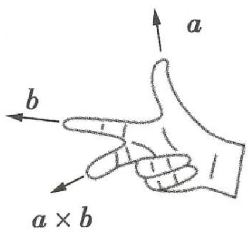

text_image

a
b
a × b

图1

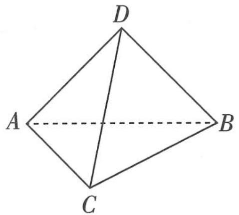

natural_image

Geometric diagram of a tetrahedron with vertices labeled A, B, C, D (no text or symbols beyond labels)

图2

A. $\overrightarrow{AB} \times \overrightarrow{AC} = \overrightarrow{AC} \times \overrightarrow{AB}$   
B. $4 \mid \overrightarrow{BC} \times \overrightarrow{AC}$ 与正四面体的表面积相等  
C. $(\overrightarrow{AC} \times \overrightarrow{AB}) \cdot \overrightarrow{AD} = 3\sqrt{2}$   
D. $|\overrightarrow{AC} \times \overrightarrow{AB}) \times \overrightarrow{AD}| = |\overrightarrow{AC} \times (\overrightarrow{AB} \times \overrightarrow{AD})|$

解析 对于 A, 易得 $\left|\overrightarrow{AB} \times \overrightarrow{AC}\right| = \left|\overrightarrow{AC} \times \overrightarrow{AB}\right|$ , 根据右手系的定义, 拇指指向 $\overrightarrow{AB}$ 的方向, 食指指向 $\overrightarrow{AC}$ 的方向, 则中指指向 $\overrightarrow{AB} \times \overrightarrow{AC}$ 的方向, 其垂直于平面 ABC, 方向向下, 同理得 $\overrightarrow{AC} \times \overrightarrow{AB}$ 垂直于平面 ABC, 方向向上, 所以 $\overrightarrow{AB} \times \overrightarrow{AC}$ 与 $\overrightarrow{AC} \times \overrightarrow{AB}$ 两向量大小相同, 方向相反, A 错误.

【易错】向量的内积(即数量积)是数值,而向量的外积是向量,注意二者的区别。因此,向量的外积相等,则要求大小和方向都相等

抓住课堂 临近高考,一些学生很容易出现上课不愿意听老师讲、喜欢自己复习的情况,其实这是不正确的.

关注微信公众号“初高教辅站”获取更多初高中教辅资料

# 016 试题调研 每月一辑试题新

对于 B, $4|\overrightarrow{BC} \times \overrightarrow{AC}| = 4|\overrightarrow{BC}| |\overrightarrow{AC}| \sin \frac{\pi}{3} = 4 \times 2 \times 2 \times \frac{\sqrt{3}}{2} = 8\sqrt{3}$ ，正四面体的表面积为 $4 \times \frac{1}{2} \times |\overrightarrow{BC}| \times |\overrightarrow{AC}| \times \sin \frac{\pi}{3} = 4\sqrt{3}$ ，B 错误.

对于 C, 设 $\overrightarrow{AC} \times \overrightarrow{AB} = \overrightarrow{AM}$ ，由 A 选项知 $\overrightarrow{AM}$ 垂直于平面 ABC，方向向上， $|\overrightarrow{AM}| = |\overrightarrow{AB}| |\overrightarrow{AC}| \sin \frac{\pi}{3} = 2\sqrt{3}$ ，所以 $(\overrightarrow{AC} \times \overrightarrow{AB}) \cdot \overrightarrow{AD} = \overrightarrow{AM} \cdot \overrightarrow{AD} = |\overrightarrow{AM}| |\overrightarrow{AD}| \cos \langle \overrightarrow{AM}, \overrightarrow{AD} \rangle = 4\sqrt{3} \cos \langle \overrightarrow{AM}, \overrightarrow{AD} \rangle$ .

【会转化】将 $\overrightarrow{AC}$ 与 $\overrightarrow{AB}$ 的外积视为一个新的向量，则问题简化为两个向量的数量积运算，进而求解

如图3, 过点 $A$ 作 $AE \perp BC$ 于点 $E$ , 过点 $D$ 作 $DF \perp AE$ 于点 $F$ , 则 $FD$ 是正四面体 $ABCD$ 的高, $\overrightarrow{AM}$ 与 $\overrightarrow{FD}$ 共线, $\langle \overrightarrow{AM}, \overrightarrow{AD} \rangle = \angle ADF$ .

由 $\frac{1}{3} \times FD \times \frac{1}{2} \times AB \times AC \times \sin \frac{\pi}{3} = \frac{\sqrt{2}}{12} \times 2^3$ ，得 $FD = \frac{2\sqrt{6}}{3}$ ，

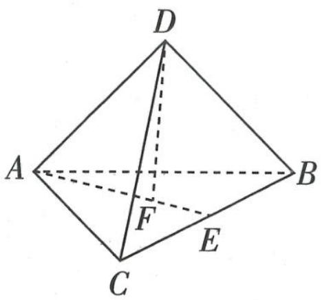

text_image

D
A
F
C
E
B

图3

【记结论】棱长为 a 的正四面体的高为 $\frac{\sqrt{6}}{3}a$ ，表面积为 $\sqrt{3}a^{2}$ ，体积为 $\frac{\sqrt{2}}{12}a^{3}$ ，牢记结论，做小题时可直接应用

所以 $\cos\langle\overrightarrow{AM},\overrightarrow{AD}\rangle=\frac{FD}{AD}=\frac{\sqrt{6}}{3}$ ，所以 $(\overrightarrow{AC}\times\overrightarrow{AB})\cdot\overrightarrow{AD}=4\sqrt{3}\times\frac{\sqrt{6}}{3}=4\sqrt{2}$ ，C 错误.

【链接高数】在高等数学中， $(\overrightarrow{AC} \times \overrightarrow{AB}) \cdot \overrightarrow{AD}$ 叫作向量 $\overrightarrow{AC}, \overrightarrow{AB}, \overrightarrow{AD}$ 的混合积，它的几何意义为： $(\overrightarrow{AC} \times \overrightarrow{AB}) \cdot \overrightarrow{AD}$ 的绝对值表示以向量 $\overrightarrow{AC}, \overrightarrow{AB}, \overrightarrow{AD}$ 为棱的平行六面体的体积。对于本题来说， $(\overrightarrow{AC} \times \overrightarrow{AB}) \cdot \overrightarrow{AD}$ 等于正四面体体积的 6 倍，易得正四面体的体积为 $\frac{2\sqrt{2}}{3}$ ，平行六面体的体积是对应正四面体体积的 6 倍，所以 $|(\overrightarrow{AC} \times \overrightarrow{AB}) \cdot \overrightarrow{AD}| = 6 \times \frac{2\sqrt{2}}{3} = 4\sqrt{2}$ ，C 错误

对于 D, $\left|\left(\overrightarrow{AC} \times \overrightarrow{AB}\right) \times \overrightarrow{AD}\right| = \left|\overrightarrow{AC} \times \overrightarrow{AB}\right| \left|\overrightarrow{AD}\right| \sin\left\langle\left(\overrightarrow{AC} \times \overrightarrow{AB}\right), \overrightarrow{AD}\right\rangle, \left|\overrightarrow{AC} \times\left(\overrightarrow{AB} \times \overrightarrow{AD}\right)\right| = \left|\overrightarrow{AC}\right| \left|\overrightarrow{AB} \times \overrightarrow{AD}\right| \sin\left\langle\overrightarrow{AC},\left(\overrightarrow{AB} \times \overrightarrow{AD}\right)\right\rangle,$

【读懂题意】根据向量外积的定义，分别写出等式两边式子的计算式，结合空间中的边角关系判断等式是否成立

易知 $|\overrightarrow{AC}\times\overrightarrow{AB}|=|\overrightarrow{AB}\times\overrightarrow{AD}|,|\overrightarrow{AD}|=|\overrightarrow{AC}|$ ,

$\sin \langle (\overrightarrow{AC} \times \overrightarrow{AB}), \overrightarrow{AD} \rangle = \sin \langle \overrightarrow{AC}, (\overrightarrow{AB} \times \overrightarrow{AD}) \rangle$ ，所以 $|\langle \overrightarrow{AC} \times \overrightarrow{AB} \rangle \times \overrightarrow{AD}| = |\overrightarrow{AC} \times (\overrightarrow{AB} \times \overrightarrow{AD})|$ ，D 正确。故选 D.

# 考前 40 天▶第 11 题 接轨高等数学问题

# 押题角度 利用高等数学处理数值估算

原创押题 （泰勒公式）泰勒公式是一个用函数在某点的信息描述其附近取值的公式, 得名于英国数学家泰勒. 根据泰勒公式, 有 $\sin x = x - \frac{x^3}{3!} + \frac{x^5}{5!} - \frac{x^7}{7!} + \cdots + (-1)^{n-1} \frac{x^{2n-1}}{(2n-1)!} + \cdots$ , 其中

# 押题有括

高考的一个功能是实现中学数学与高等数学的过渡与衔接，而接轨高等数学问题可以很好地体现这一功能，很有可能在今年高考中出现。

$x \in R, n \in N^{*}, n! = 1 \times 2 \times 3 \times \cdots \times n, 0! = 1.$ 现用上述式子求 $1 - \frac{4^{2}}{2!} + \frac{4^{4}}{4!} - \frac{4^{6}}{6!} + \cdots + (-1)^{n-1} \frac{4^{2n-2}}{(2n-2)!} + \cdots$ 的值，下列选项中与该值最接近的是（）

A. cos $49^{\circ}$

B. $\cos 41^{\circ}$

C. $-\sin 49^{\circ}$

D. $- \sin {41}^{ \circ  }$

解析 $\sin x = x - \frac{x^3}{3!} +\frac{x^5}{5!} -\frac{x^7}{7!} +\dots +( - 1)^{n - 1}\frac{x^{2n - 1}}{(2n - 1)!} +\dots ,$ 等式两边同时求导得 $\cos x =$

【会联想】观察需要估算的式子，从第二项起，分子依次为 $4^{2}, 4^{4}, 4^{6} \cdots$ 。由泰勒公式，得 $\sin 4 = 4 - \frac{4^{3}}{3!} + \frac{4^{5}}{5!} - \frac{4^{7}}{7!} + \cdots + (-1)^{n-1} \frac{4^{2n-1}}{(2n-1)!} + \cdots$ ，这和所估算的式子分子的次数相差 1，分母上数值也相差 1，解决这个矛盾就是问题的突破口，联想改变次数和分母大小的方式，我们就可以找到等式两边同时求导这把“钥匙”

$1 - \frac{x^{2}}{2!} + \frac{x^{4}}{4!} - \frac{x^{6}}{6!} + \cdots + (-1)^{n-1} \frac{x^{2n-2}}{(2n-2)!} + \cdots,$ 令 x = 4，得 $\cos 4 = 1 - \frac{4^{2}}{2!} + \frac{4^{4}}{4!} - \frac{4^{6}}{6!} + \cdots + (-1)^{n-1} \frac{4^{2n-2}}{(2n-2)!} + \cdots,$ 又 $\cos 4 = \cos (\frac{720^{\circ}}{\pi}) \approx \cos 229^{\circ} = -\cos 49^{\circ} = -\sin 41^{\circ},$ 故选 D.

【易错】由 $\pi = 180^{\circ}$ ，得 $1 = \frac{180^{\circ}}{\pi}$ ，将弧度制转化为角度制。此外，在使用诱导公式时尤其要注意正负号， $\cos(x + \pi) = -\cos x$ ， $\cos x = \sin\left(\frac{\pi}{2} - x\right)$

# 拓展提升

# 常见的泰勒多项式

1. $e^{x} \approx 1 + x + \frac{x^{2}}{2!} + \cdots + \frac{x^{n}}{n!}$ ; 2. $\sin x \approx x - \frac{x^{3}}{3!} + \frac{x^{5}}{5!} - \cdots + (-1)^{n-1} \frac{x^{2n-1}}{(2n-1)!}$ ;   
3. $\cos x \approx 1 - \frac{x^{2}}{2!} + \frac{x^{4}}{4!} - \cdots + (-1)^{n} \frac{x^{2n}}{(2n)!};$ 4. $\ln(1 + x) \approx x - \frac{x^{2}}{2} + \frac{x^{3}}{3} - \cdots + (-1)^{n-1} \frac{x^{n}}{n}.$

泰勒多项式常用于比较代数式的大小，常常是以估算或放缩的形式出现，举例如下.

① 要比较 $e^{0.2}-1$ 与 $\ln 1.2$ 的大小，则 $e^{0.2}-1\approx1+0.2+\frac{0.2^{2}}{2!}-1=0.22,\quad\ln 1.2=\ln(1+0.2)\approx0.2-\frac{0.2^{2}}{2}+\frac{0.2^{3}}{3}<0.2<0.22$ ，由此可得 $e^{0.2}-1>\ln 1.2$ .  
②当 x > 0 时， $e^{x} \approx 1 + x + \frac{x^{2}}{2!} + \cdots + \frac{x^{n}}{n!} > 1 + x$ ，由此可得 $e^{x} > 1 + x (x > 0)$ .

高效率的复习方法是紧紧抓住课堂,积极开动大脑,带着质疑听老师的讲解:老师推理严密吗?还有更简单的方法吗?老师是怎么想到的?只有经历了自己的深度思考,才能以不变应万变,出什么题都会做。
关注微信公众号“初高教辅站”获取更多初高中教辅资料

# 考前 39 天▶第 12 题 数学文化问题

# 押题角度1 与数学文化有关的数列问题

原创押题 1 （科赫曲线）有人曾提出一种说法,称雪花的周长超过地球的直径,其实这里的“雪花”指的是数学中的“科赫曲线”,科赫曲线是一种像雪花的几何曲线,所以又称为雪花曲线,它是由数学家科赫最早提出来的,是一种典型的分形曲线.科赫曲线的画法如图1,第1个正三角形的边长为1厘米,将每边三等分,以每边三等分后中间的一段为边,向外作一个凸出的正三角形,再去掉原边中间的一段,可以得到第2个图形,以此类推,得到第3个图形,第4个图形……随着变形,“雪花”具有越来越多的“细节”,周长也越来越大,一直操作下去,“雪花”的周长便会超过地球的直径.根据上述变化规则,如果第n个图形的周长大于等于地球的赤道周长,则n至少为(参考数据:地球的赤道周长近似为4万千米, $\lg 3 \approx 0.48$ , $\lg 5 \approx 0.70$ , $\lg 7 \approx 0.85$ )()

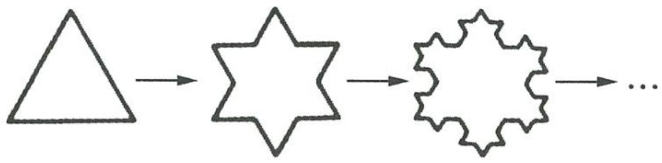

flowchart

图1

A. 43

B. 44

C. 76

D. 77

解析

地球的赤道周长约为 $4 \times 10^{9}$ 厘米, 设第 $n$ 个“雪花”的周长为 $a_{n}$ 厘米 ( $n \in \mathbb{N}^{*}$ ), 则

【易错】忽略单位，则会得到 $a_{n} \geqslant 4 \times 10^{4}$ 的错误结论，注意统一单位 $a_{n} \geqslant 4 \times 10^{9}$ .

由题意可得 $a_{1}=3,a_{2}=3\times\frac{4}{3},\cdots,a_{n}=3\times(\frac{4}{3})^{n-1}$ .

【找规律】观察题图，从第1个图形到第2个图形，每条边变为4条边，4条边的边长之和为原来的 $\frac{4}{3}$ ，所以 $a_{2}=a_{1}\times\frac{4}{3}$ ，同理，第2个图形到第3个图形也符合这个规律，即 $a_{3}=a_{2}\times\frac{4}{3}$ ，则 $a_{n}=\frac{4}{3}a_{n-1}(n\geqslant2)$

由 $3 \times \left(\frac{4}{3}\right)^{n-1} \geqslant 4 \times 10^9$ , 得 $\left(\frac{4}{3}\right)^{n-2} \geqslant 10^9$ , 则 $(2 \lg 2 - \lg 3)(n-2) \geqslant 9$ ,

【巧转化】对于复杂的指数不等式(方程)，左右两边同时取对数是绝佳策略，可以把指数“消除”，从而把原不等式(方程)变成一次不等式(方程)。参考数据给出了对数值，也提示我们要化指数为对数

又 $\lg 2 = \lg \frac{10}{5} = 1 - \lg 5$ ，所以 $(2 - 2\lg 5 - \lg 3)(n - 2) \geqslant 9$ ，解得 $n \geqslant 77$ ，故选 D.

【提示】参考数据中, 有的是干扰数据, 如 $\lg 7 \approx 0.85$ , 有的是间接数据, 如 $\lg 5 \approx 0.70$ , 根据需要将 $\lg 2$ 转化掉即可

# 押题角度2》与数学文化有关的向量问题

原创押题 2 (黄金分割比)把一条线段分为两部分,使较长部分与全长之比等于较短部分与较长部分之比,该比值是无理数 $\frac{\sqrt{5}-1}{2}$ ,由于按此比例设计的造型往往十分美丽,因此称为黄金分割比. 黄金分割在绘画、雕塑、音乐、建筑等领域都有广泛的应用. 在 $\triangle ABC$ 中,点 $D$ 在线段 $BC$ 上, $BD$ 与 $BC$ 的比值等于 $DC$ 与 $BD$ 的比值, $AB=2$ , $AC=3$ , $\angle BAC=60^{\circ}$ ,点 $E$ 为线段 $AB$ 的中点,点 $P$ 为线段 $AC$ 上的动点(包含端点),给出下列四个说法:

① $\overrightarrow{AD}=\frac{\sqrt{5}-1}{2}\overrightarrow{AB}+\frac{3-\sqrt{5}}{2}\overrightarrow{AC}$ ; ② $\overrightarrow{AD}=\frac{3-\sqrt{5}}{2}\overrightarrow{AB}+\frac{\sqrt{5}-1}{2}\overrightarrow{AC}$ ;

③ $\overrightarrow{CE}$ 在 $\overrightarrow{AC}$ 上的投影为 $-\frac{5}{2}$ ;④ $\overrightarrow{AP} \cdot \overrightarrow{BP}$ 的取值范围是 $[- \frac{1}{4},6]$ .

其中正确说法的序号为\_\_\_\_。

解析 由题意作出图形如图2,由黄金分割比的定义知 $\frac{BD}{BC}=\frac{\sqrt{5}-1}{2}$ ，则 $\overrightarrow{BD}=\frac{\sqrt{5}-1}{2}\overrightarrow{BC}$ ，所以 $\overrightarrow{AD}=\overrightarrow{AB}+\overrightarrow{BD}=\overrightarrow{AB}+\frac{\sqrt{5}-1}{2}\overrightarrow{BC}=\overrightarrow{AB}+\frac{\sqrt{5}-1}{2}\left(\overrightarrow{AC}-\overrightarrow{AB}\right)=\frac{3-\sqrt{5}}{2}\overrightarrow{AB}+\frac{\sqrt{5}-1}{2}\overrightarrow{AC}$ ，故①错误，②正确.

E 为 AB 的中点, 则在 $\triangle AEC$ 中, 由余弦定理可得 $CE^{2} = AC^{2} + AE^{2} - 2AC \times AE\cos 60^{\circ} = 7$ , $\cos \angle ACE = \frac{AC^{2} + CE^{2} - AE^{2}}{2 \times AC \times CE} = \frac{9 + 7 - 1}{2 \times 3 \times \sqrt{7}} = \frac{5\sqrt{7}}{14}$ , 故 $\cos \langle \overrightarrow{AC}, \overrightarrow{CE} \rangle = -\frac{5\sqrt{7}}{14}$ ,

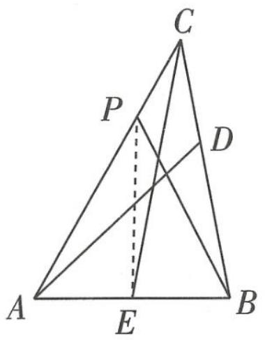

text_image

C
P
D
A
E
B

图2

【易错】向量 $\overrightarrow{AC}$ 与 $\overrightarrow{CE}$ 的夹角与 $\angle ACE$ 互补，因此 $\cos\langle\overrightarrow{AC},\overrightarrow{CE}\rangle$ 与 $\cos\angle ACE$ 互为相反数

所以 $\overrightarrow{CE}$ 在 $\overrightarrow{AC}$ 上的投影为 $|\overrightarrow{CE}|\cdot\cos\langle\overrightarrow{AC},\overrightarrow{CE}\rangle=-\frac{5}{2}$ ，故③正确.

连接 $PE, \overrightarrow{AP} \cdot \overrightarrow{BP} = \overrightarrow{PA} \cdot \overrightarrow{PB} = (\overrightarrow{PE} - \overrightarrow{AE}) \cdot (\overrightarrow{PE} + \overrightarrow{EB}) = |\overrightarrow{PE}|^2 - |\overrightarrow{AE}|^2 = |\overrightarrow{PE}|^2 - 1$ , 当 $PE \perp AC$ 时, $PE$ 取最小值, 当 $P$ 与 $C$ 重合时, $PE$ 取最大值, 即 $\frac{\sqrt{3}}{2} \leqslant |\overrightarrow{PE}| \leqslant \sqrt{7}$ , 所以 $-\frac{1}{4} \leqslant |\overrightarrow{PE}|^2 - 1 \leqslant 6$ , ④正确. 故填②③④.

比如睡前、洗漱、走路、等车、坐车、课间等,这些时间都是零碎的几分钟,我们可以拿来记几个英语单词、背几个数学公式……

考前

38

天

# 第 13 题 学科融合问题

# 押题角度 数学与美术融合

原创押题 (十字贯穿体)素描是写实绘画的重要基础,也是最需要理智来协助的艺术. 十字贯穿体是学习素描时常用的几何体实物模型,图1所示为一个十字贯穿体的素描作品. 十字贯穿体一般是由两个完全相同的正四棱柱“垂直贯穿”构成的多面体,其中一个四棱柱的每一条侧棱分别垂直于另一个四棱柱的每一条侧棱,一个四棱柱的两条相对侧棱和另一个四棱柱的两条相对侧棱各交于两点,另外两条相对侧棱与另一个四棱柱剩下的两条相对侧棱各交于一点(该点为所在棱的中点). 如图2,十字贯穿体由两个底面边长为2、高为6的正四棱柱构成,则下列说法不正确的是 ( )

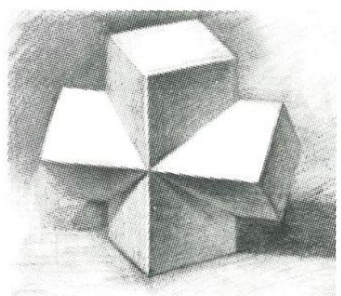

natural_image

Pencil sketch of three stacked cubes with triangular faces, no text or symbols present

图1

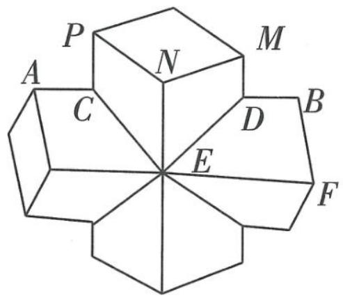

text_image

P
A
C
N
M
B
D
E
F

图2

# 题有据

数学与美术有千丝万缕的联系，比如“斜二测画法”“透视画法”“黄金分割比”等，高考中也时有呈现，如2019年全国I卷涉及的“断臂维纳斯”，2020年全国I卷计算胡夫金字塔相关比例等。

A. 一个正四棱柱的某个侧面与另一个正四棱柱的两个侧面的交线的夹角为钝角  
B. 该十字贯穿体的表面积是 $112 - 16 \sqrt{2}$   
C. 该十字贯穿体的体积是 $48 - \frac{16 \sqrt{2}}{3}$   
D. 一只蚂蚁从该十字贯穿体的顶点 $A$ 出发, 沿表面到达顶点 $B$ 的最短路线长为 $\frac{4}{3} + 4\sqrt{2}$

解析 对于 A, 一个正四棱柱的某个侧面与另一个正四棱柱的两个侧面的交线为 CE, DE, 则 $\angle CED$ 为所求夹角. 连接 PM, CD, 易知 $CD = PM = \sqrt{PN^{2} + MN^{2}} = 2\sqrt{2}$ , 所以 $BD = AC = \frac{1}{2}(AB - CD) = 3 - \sqrt{2}$ , BF = 2, EF = 3, $DE = \sqrt{\left[3 - (3 - \sqrt{2})\right]^{2} + 2^{2}} = \sqrt{6} = CE$ , 则 $\cos \angle CED = \frac{CE^{2} + DE^{2} - CD^{2}}{2CE \times DE} = \frac{1}{3}$ , 夹角为锐角, A 不正确.

【会判断】判断角为锐角还是钝角往往要通过计算余弦值,根据余弦值的正负判断,而计算余弦值则要借助三角形,在直角三角形中,运用 “邻比斜” 求解,在非直角三角形中,则要借助余弦定理求解

重视考试的实质 高考之前的所有测试,不是负担,而是为高考做准备的,目的在于发现问题、解决问题,为高考减少问题.

对于 B, 该“十字贯穿体”的表面由 4 个全等的正方形和 16 个全等的直角梯形组成, 4 个正方形

【易错】根据表面积的定义, 分别计算几何体各个面的面积, 相加即可, 注意面数不要数错的面积均为 4 , 梯形的面积均为 $S_{\text{梯形} B D E F} = \frac {B D + E F}{2} \times B F = \frac {3 - \sqrt {2} + 3}{2} \times 2 = 6 - \sqrt {2}$ , 则十字贯穿体的表面积 $S = 4 \times 4 + 1 6 \times (6 - \sqrt {2}) = 1 1 2 - 1 6 \sqrt {2}, B$ 正确.

对于 C, 十字贯穿体的体积为两个正四棱柱的体积相加, 再减去重合部分的体积.

【读懂题意】十字贯穿体由两个正四棱柱组合而成，且这两个正四棱柱有重合的部分，将两个正四棱柱的体积相加，减去重合部分体积，即可得十字贯穿体的体积

如图3,两个正四棱柱的重合部分为多面体 CDGEST,取 CS 的中点 I,连接 GI,
EI,则多面体 CDGEST 可以分成 8 个全等的三棱锥,体积均为 $V_{C-GEI} = \frac{1}{3} \times \frac{1}{2} \times 2 \times$

【会分割】几何体的体积不易直接求解时,常用“割补法”,观察几何体的结构,将其补形或分割,得到常见的柱体、锥体,进而求解

$2 \times \sqrt{2} = \frac{2\sqrt{2}}{3}$ ，所以该十字贯穿体的体积 $V = 2 \times 2 \times 6 \times 2 - 8V_{C-GEI} = 48 - \frac{16\sqrt{2}}{3}$ ，C 正确.

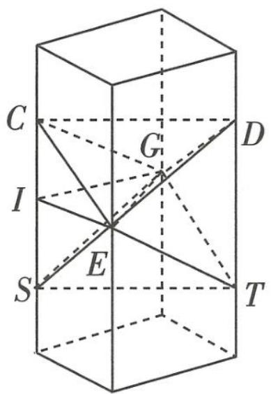

text_image

C
I
G
D
S
E
T

图3

对于 D, 若蚂蚁在移动过程中主要沿着棱移动, 因为 $BD + DE < BF + EF$ , 则最短的路线为 $A \rightarrow C \rightarrow P \rightarrow M \rightarrow D \rightarrow B$ 或 $A \rightarrow C \rightarrow E \rightarrow D \rightarrow B$ , 前者路线长为 $4 \times (3 - \sqrt{2}) + 2\sqrt{2} = 12 - 2\sqrt{2}$ , 后者路线长为 $2 \times (3 - \sqrt{2}) + 2\sqrt{6} = 6 + 2\sqrt{6} - 2\sqrt{2}$ , 故此时最短路线长为 $6 + 2\sqrt{6} - 2\sqrt{2}$ .

若蚂蚁主要沿十字贯穿体表面移动,将平面 MNED 沿着 ED 翻折,使其与梯形 BDEF 处于同一平面,如图 4 所示,连接 BE,

【厘清思路】立体图形表面的最短路径问题, 往往需要借助于展开图将其平面化, 再利用平面上 “两点之间线段最短” 等知识巧妙解决

$BE = \sqrt{2^{2} + 3^{2}} = \sqrt{13}$ ，设 $\angle DEF = \alpha, \angle BEF = \beta$ ，则 $\cos \alpha = \frac{3 - (3 - \sqrt{2})}{\sqrt{6}} = \frac{\sqrt{3}}{3}, \cos \beta = \frac{3\sqrt{13}}{13}$ 。易得 $\cos \angle FEN = \cos 2\alpha = 2\cos^{2}\alpha - 1 = -\frac{1}{3}, \sin 2\alpha = \frac{2\sqrt{2}}{3}, \cos \angle BEN = \cos (2\alpha - \beta) = \cos 2\alpha\cos \beta + \sin 2\alpha\sin \beta = (\frac{4\sqrt{2}}{3} - 1) \times \frac{\sqrt{13}}{13} > 0$ ，即 $\angle BEN$ 为锐角，过 B 作 $BH \perp NE$ 于 H，根据对称性得，最短路径长度为 $2BH. \sin \angle BEN = \sin (2\alpha - \beta) = \sin 2\alpha\cos \beta - \cos 2\alpha\sin \beta =$

$(2\sqrt{2} + \frac{2}{3}) \times \frac{\sqrt{13}}{13}$ , 所以 $BH = BE \sin \angle BEN = \frac{2}{3} + 2\sqrt{2}, 2BH = \frac{4}{3} + 4\sqrt{2} < 6 + 2\sqrt{6} - 2\sqrt{2}$ . 综上, D 正确. 故选 A.

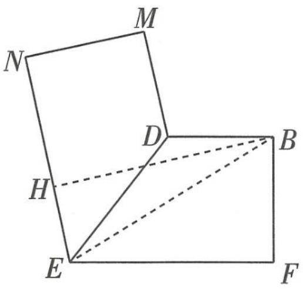

text_image

N
M
D
H
B
E
F

图4

阶段性测试可以帮助发现现阶段复习过程中存在的问题,及时找到自己的不足,这些问题可能是知识方面的、应试技巧方面的,也可能是应试心理方面的.

关注微信公众号“初高教辅站”获取更多初高中教辅资料

# 考前 37 天▶第 14 题 图表分析问题

# 押题角度》与图表分析有关的实际问题

原创押题 (血药浓度) 血药浓度是指药物吸收后在血浆内的总浓度, 当血药浓度介于最低有效浓度和最低中毒浓度之间时药物发挥作用. 某种药物服用 1 单位后, 体内血药浓度变化情况与相关阈值如图 1 所示 (服用药物时间对应 0 时), 则下列说法中不正确的是 ( )

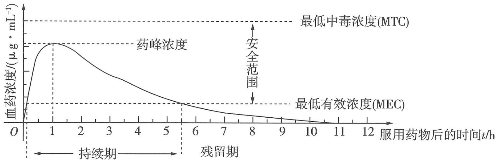

line

| 时间 (t/h) | 血药浓度 (μg·mL⁻¹) |
| ---------- | ------------------ |
| 0          | 0                  |
| 1          | 高峰值             |
| 2          | 高峰值             |
| 3          | 高峰值             |
| 4          | 高峰值             |
| 5          | 高峰值             |
| 6          | 高峰值             |
| 7          | 高峰值             |
| 8          | 最低有效浓度 (MEC) |
| 9          | 最低有效浓度 (MEC) |
| 10         | 最低有效浓度 (MEC) |
| 11         | 最低有效浓度 (MEC) |
| 12         | 最低有效浓度 (MEC) |

图1

【会读图】观察图象，重点关注两方面：①图上的文字说明，②图象的最高（低）点、变化趋势

A. 服药 1 单位后约 10 分钟到 5.5 小时之间药物发挥疗效  
B. 若每次服药 1 单位, 首次服药后, 2.5 小时之内不能再次服药  
C. 若每次服药 1 单位, 首次服药后, 3 小时之后可以再次服药  
D. 每间隔 5.5 小时服用该药物 1 单位, 可使药物持续发挥治疗作用

解析 对于 A,从图 1 的持续期可以得出,服用药物后 10 分钟到 5.5 小时之间,血药浓度介于最低有效浓度和最低中毒浓度之间,药物发挥作用,A 正确.

对于 B, 服药 1 单位后, 若 2.5 小时后再次服药, 则在首次服药 3.5 小时后, 即第 2 次服药 1 小时后, 体内血药浓度将会超过最低中毒浓度, 会引起中毒, 因此若每次服药 1 单位, 首次服药后, 2.5

【联系实际】理解“最低中毒浓度”这一概念，要结合实际。服用药物要限定剂量，超过这个量，药物便可能引起毒性反应，结合图表可知，“最低中毒浓度”便是这个“量”。 小时之内不能再次服药，B 正确。

对于 C, 服药 1 单位后, 若 3 小时后再次服药, 则在首次服药 4 小时后, 即第 2 次服药 1 小时后, 血药浓度将会超过最低中毒浓度, 引起中毒, C 错误.

对于 D, 第一次服药 10 分钟到 5.5 小时之内, 药物会持续发挥治疗作用, 第 1 次服药 5.5 小时后第 2 次服药, 由于第 2 次服药对应的血药浓度增长速度大于第 1 次服药对应的血药浓度降低速度, 从而体内的血药浓度会超过最低有效浓度, 同时观察两次累计的最大值, 不会超过最低中毒浓度, D 正确. 故选 C.

【联系实际】药物持续发挥治疗作用有两层含义：①血药浓度大于最低有效浓度，②血药浓度小于最低中毒浓度

# 考前 36 天▶第 15 题 源于教材的改编问题

# 押题角度 1 根据教材例、习题改编

原创押题 1 (改编自人教 A 版教材《必修 5》第 85 页例 3) 要将两种大小不同的钢板截成 $A, B, C$ 三种规格, 每张钢板可同时截得三种规格的小钢板的块数如下表所示:

# 题有据

高考数学 “源于教材、高于教材”，根据教材中的例、习题，阅读材料改编而成的问题每年必出，因此要引起重视。

<table><tr><td>钢板类型\规格类型</td><td>A规格</td><td>B规格</td><td>C规格</td></tr><tr><td>第一种钢板</td><td>2</td><td>1</td><td>1</td></tr><tr><td>第二种钢板</td><td>1</td><td>2</td><td>3</td></tr></table>

现需要 A, B, C 三种规格的成品分别 12, 7, 11 块, 则满足所需的最少使用钢板的张数为 \_\_\_\_.

解析 设需截第一种钢板 $x$ 张, 第二种钢板 $y$ 张, 共需截这两种钢板 $z$ 张, 则 $z = x + y$ , 依题

意可得不等式组 $\left\{\begin{aligned}&2x+y\geqslant12,\\&x+2y\geqslant7,\\&x+3y\geqslant11,\\&x\geqslant0,\\&y\geqslant0,\end{aligned}\right.$ 其表示的平面区域如图1所示

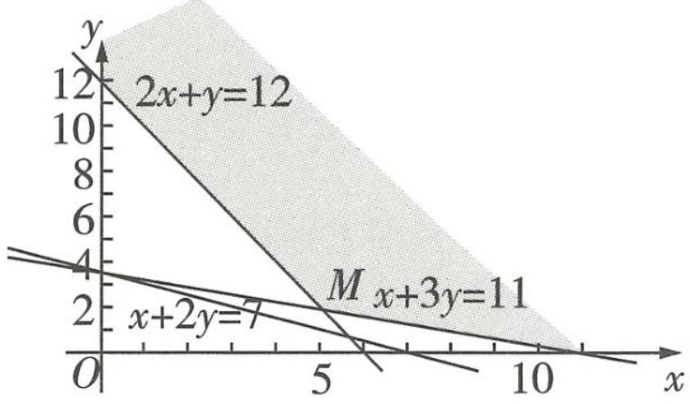

line

| x    | y (2x+y=12) | y (x+2y=7) |
| ---- | ----------- | ---------- |
| 0    | 12          | 4          |
| 5    | 6           | 2          |
| 10   | 2           | 0          |

图1

(阴影部分).

把 $z = x + y$ 变形为 $y = -x + z, y = -x + z$ 表示斜率为-1，

在 $y$ 轴上的截距为 $z$ 的一组平行直线, 由 $\left\{ \begin{array}{l} 2x + y = 12, \\ x + 3y = 11, \end{array} \right.$ 得 $\left\{ \begin{array}{l} x = 5, \\ y = 2, \end{array} \right.$ 点 $M(5,2)$ 的坐标均为整数, 所以当直线 $y = -x + z$ 经过点 $M$ 时, 截距 $z$ 最小, 为 7 , 故满足所需的最少使用钢板的张数为 7 .

# 押题角度2》根据教材中阅读材料改编

原创押题 2 (改编自人教 A 版教材《选修 2-2》第 20 页探究与发现)人们很早以前就开始探索高次方程的数值求解问题. 牛顿在《流数法》一书中, 给出了高次代数方程的一种数值解法——牛顿法. 这种求方程根的方法, 在科学界已被广泛采用. 例如求方程 $2x^{3} + 3x^{2} + x + 1 = 0$ 的近似解, 先用函数零点存在定理, 令 $f(x) = 2x^{3} + 3x^{2} + x +$

重视基础 在最后的复习阶段,不要做难题、习题,要回归基础,保证高考时在基础题上多拿分,争取拿满分.

关注微信公众号“初高教辅站”获取更多初高中教辅资料

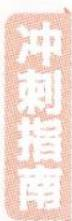

# 024 试题调研 每月一辑试题新

1, $f(-2) = -5 < 0$ , $f(-1) = 1 > 0$ , 得 $(-2, -1)$ 上存在零点, 取 $x_0 = -1$ , 牛顿用公式 $x_n = x_{n-1} - \frac{f(x_{n-1})}{f'(x_{n-1})}$ 反复迭代, 以 $x_n$ 作为 $f(x) = 0$ 的近似解, 迭代两次后计算得到的近似解为\_\_\_\_; 以 $(-2, -1)$ 为初始区间, 用二分法计算两次后, 以最后一个区间的中点值作为方程的近似解, 则近似解为\_\_\_\_.

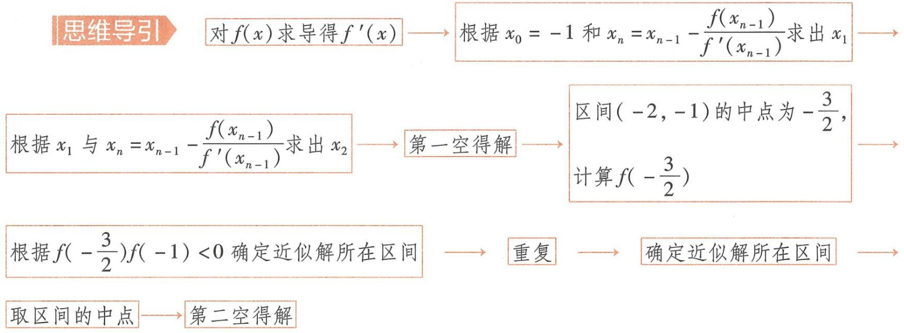

flowchart

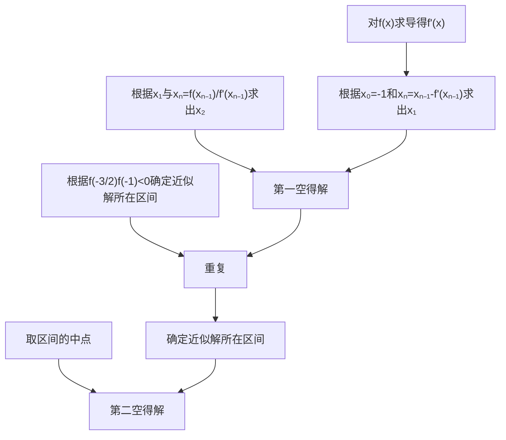

解析 已知 $f(x) = 2x^{3} + 3x^{2} + x + 1$ ，则 $f'(x) = 6x^{2} + 6x + 1$ .

迭代1次后, $x_{1}=-1-\frac{f(-1)}{f'(-1)}=-1-\frac{1}{1}=-2;$

迭代2次后, $x_{2}=-2-\frac{f(-2)}{f'(-2)}=-2-\frac{-5}{13}=-\frac{21}{13}.$

【理解本质】理解清楚 “迭代” 的含义,实际上是一个递推数列,反复代入给定的表达式,计算即可

用二分法计算第1次,区间 $(-2,-1)$ 的中点为 $-\frac{3}{2},f(-\frac{3}{2})=-\frac{1}{2}<0,f(-\frac{3}{2})f(-1)<0,$ 所以近似解在区间 $(- \frac{3}{2}, -1)$ 上；

用二分法计算第2次,区间 $(- \frac{3}{2}, -1)$ 的中点为 $-\frac{5}{4}, f(-\frac{5}{4})=\frac{17}{32}, f(-\frac{3}{2})f(-\frac{5}{4})<0$ ,所以近似解在区间 $(- \frac{3}{2}, -\frac{5}{4})$ 上,取其中点值 $-\frac{11}{8}$ ,所求近似解为 $-\frac{11}{8}$ .

【了解二分法】熟练掌握二分法求近似解的步骤：①用函数零点存在定理确定初始区间；②取区间中点，计算中点对应的函数值；③看中点对应的函数值与端点对应的函数值，利用“零点总在异号间”确定零点所在的新区间；④与题目要求的精确度比较，如果没有达到精确度，重复②③步骤，如果达到精确度，即可停止

# 考前 35 天▶第 16 题 逻辑推理问题

# 押题角度1 根据结果反向推导过程

原创押题 1 （已知比赛结果推导比赛过程,融合生活情境）某综艺活动中,甲、乙、丙、丁4个家庭各组成队伍进行比赛,任意两个家庭都要比赛一场,每场比赛的计分方法是:胜者得3分,负者得0分,平局两队各得1分.全部比赛结束后,四队的得分为:甲6分,乙5分,丙4分,丁1分.则下列说法正确的是 ( )

A. 所有比赛中,一共有 1 场比赛结果是平局  
B. 乙和丙的比赛结果是乙胜丙  
C. 丙和丁的比赛结果是平局  
D. 甲和丙的比赛结果是甲胜丙

# 解析

<table><tr><td>选项</td><td>分析过程</td><td>正误</td></tr><tr><td>A</td><td>先分析一共比赛的场次,因为任意两个家庭都要比赛一场,所以共比赛6场,如果没有平局的场次,则总得分为 $3 \times 6 = 18$ (分),现在总得分为 $1 + 4 + 5 + 6 = 16$ (分),少了2分,所以平局的比赛有2场.【换个思路】设所有比赛中平局有x场,非平局有y场,则 $x+y=6,3y+2x=16,x,y\in\mathbb{N}$ ,解得 $x=2,y=4$ ,所以平局的比赛有2场</td><td rowspan="2">×</td></tr><tr><td>B</td><td rowspan="2">甲: $6 = 3 + 3 + 0$ .乙: $5 = 3 + 1 + 1$ .丙: $4 = 3 + 1 + 0$ .丁: $1 = 1 + 0 + 0$ .【数值分析】每个家庭都要跟其余家庭分别比赛1场,一共3场,且每场得分只能是3,1,0,据此对最终得分进行适当拆分,从而确定每个家庭的胜、负、平情况因此甲2胜1负,乙1胜2平,丙1胜1平1负,丁1平2负.用箭头图表示,箭头指向谁谁胜,两边都有箭头表示平局.丙和丁均平了一场,乙平了两场,所以乙平丙,乙平丁,所以乙胜甲,所以甲胜丙,甲胜丁,所以丙胜丁,如图1所示.</td></tr><tr><td>C</td><td>×</td></tr><tr><td>D</td><td>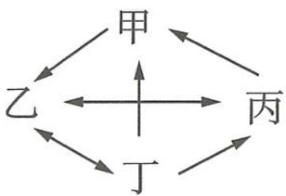图1据此判断BCD的正误.</td><td>√</td></tr></table>

帕普斯定理 直线 $l_{1}$ 上依次有点 $A, B, C$ , 直线 $l_{2}$ 上依次有点 $D, E, F$ , 设 $AE, BD$ 交于点 $P, AF, DC$ 交于点 $Q, BF, EC$ 交于点 $R$ , 则 $P, Q, R$ 三点共线.

关注微信公众号“初高教辅站”获取更多初高中教辅资料

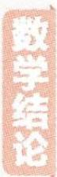

# 押题角度2 根据局部信息推理情况数

原创押题 2 (强调逻辑思维, 交汇生活情境, 考查分类讨论思想) 小李和小王玩一个猜数游戏, 规则如下: 已知六张纸牌上分别写有 $1 - \left(\frac{1}{2}\right)^n (n \in \mathbb{N}^*, 1 \leqslant n \leqslant 6)$ 六个数字, 现小李和小王两人分别从中各自随机抽取一张, 然后根据自己手中的数推测谁手上的数更大. 小李看了看自己手中的数, 想了想说: “我不知道谁手中的数更大.” 小王听了小李的判断后, 思索了一下说: “我知道谁手中的数更大了.” 假设小王和小李做出的推理都是正确的, 那么小李和小王拿到纸牌的情况共有\_\_\_\_种.

解析 六张纸牌上的数字分别为: $\frac{1}{2}, \frac{3}{4}, \frac{7}{8}, \frac{15}{16}, \frac{31}{32}, \frac{63}{64}$ .

因为小李不知道谁手中的数更大,因此小李拿的不是最大的 $\frac{63}{64}$ ,也不是最小的 $\frac{1}{2}$ ,

【扫清障碍】优先考虑极端情况

因此小李拿的纸牌有4种情况。

接下来讨论小王：

①当小王拿的纸牌上数字是 $\frac{1}{2}$ 时,则小王知道小李拿的一定比他大,此时有4种情况;  
②当小王拿的纸牌上数字是 $\frac{3}{4}$ 时,则小王知道小李拿的一定比他大,此时有3种情况;  
③当小王拿的纸牌上数字是 $\frac{31}{32}$ 时,则小王知道小李拿的一定比他小,此时有3种情况;

【易遗漏】小王拿的纸牌上数字是 $\frac{3}{4}$ 和 $\frac{31}{32}$ 的情况容易被忽视,要当心哦

④当小王拿的纸牌上数字是 $\frac{63}{64}$ 时,则小王知道小李拿的一定比他小,此时有4种情况;

(5)当小王拿的纸牌上数字是 $\frac{15}{16}$ 或 $\frac{7}{8}$ 时, 此时小王无法判断小李拿的与他拿的谁大谁小, 舍去. 所以满足题意的情况共有 $4 + 3 + 3 + 4 = 14$ (种).

【易错警示】若直接用分步乘法计数原理，考虑小主有4种取牌情况，所以共有 $4 \times 4 = 16$ （种）情况，这是错误的，因为小主要根据自己手里的牌知道谁手里的牌更大，所以有些牌不能取到。分类讨论是此类逻辑推理题的解题“王牌”，分别讨论每一种情况，最后把符合题意的情况进行汇总即可

# 押学科热点题

# 常考热点

# 考前 34 天▶第 17 题 集合的相关计算问题

# 押题角度 求 Venn 图中阴影部分表示的集合

原创押题 已知集合 $M = \{x \mid y = \lg (4 - x^2)\}$ , $N = \{x \mid \cos x \leqslant \frac{1}{2}\}$ , 则图 1 所示的 Venn 图中阴影部分表示的集合为 ( )

A. $\left[-\frac{\pi}{3}, \frac{\pi}{3}\right]$   
B. $(-2, -\frac{\pi}{3}] \cup [\frac{\pi}{3}, 2)$   
C. $\left(-\frac{\pi}{3},\frac{\pi}{3}\right)$   
D. $(-2, -\frac{\pi}{3}) \cup (\frac{\pi}{3}, 2)$

解析 由 $4 - x^{2} > 0$ 得 $-2 < x < 2$ , 所以 $M = (-2, 2)$ .

【厘清含义】集合 M 即函数 $y=\lg(4-x^{2})$ 的定义域由 $\cos x \leqslant \frac{1}{2}$ 得 $2k\pi + \frac{\pi}{3} \leqslant x \leqslant 2k\pi + \frac{5\pi}{3} (k \in \mathbb{Z})$ ,

【数形结合】确定角 $x$ 的终边所在的区域(如图2所示), 即得角 $x$ 的取值集合

所以 $N = \left[2k\pi +\frac{\pi}{3},2k\pi +\frac{5\pi}{3}\right](k\in \mathbf{Z})$ .则 $M\cap N = (-2, - \frac{\pi}{3} ]\cup [\frac{\pi}{3},2)$

【数形结合】也可以作出数轴，如图3所示，利用图形判断出Venn图中 $M\cap N$ 表示的集合

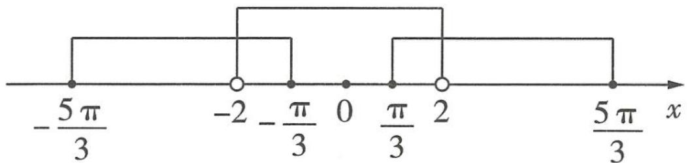

text_image

-5π/3
-2 -π/3 0 π/3 2 5π/3 x

图3

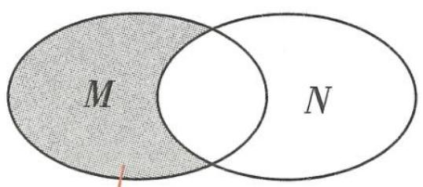

text_image

M
N

图1

Venn 图中阴影部分表示的集合即由属于集合 $M$ 但不属于集合 $N$ 的元素组成的集合, 即 $\{x \mid x \in M, x \notin N\}$ , 即 $\complement_M (M \cap N)$

# 押题有据

集合一般出现在高考试卷第1题或第2题的位置, 难度不大, 属于送分题. 题图中阴影部分的集合表示常涉及集合的交、并、补运算, 需要引起关注.

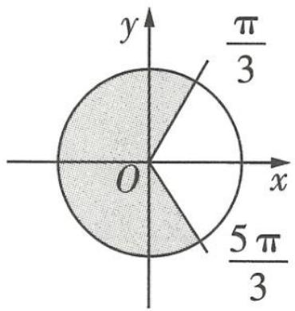

text_image

y
π/3
O
x
5π/3

图2

所以 Venn 图中阴影部分表示的集合为 $\complement_{M}(M\cap N)=(-\frac{\pi}{3},\frac{\pi}{3})$ . 故选 C.

【易错警示】注意区间端点的取舍，本题中由于 $\pm\frac{\pi}{3}\in N$ ，故 Venn 图中阴影部分表示的集合应是 $(- \frac{\pi}{3}, \frac{\pi}{3})$ ，而非 $[- \frac{\pi}{3}, \frac{\pi}{3}]$

阿基米德折弦定理 一个圆中一条由两长度不同的弦组成的折弦所对的两段弧的中点在较长弦上的射影,就是折弦的中点.

关注微信公众号“初高教辅站”获取更多初高中教辅资料

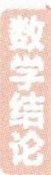

# 考前 33 天▶第 18 题 充分、必要条件的判断问题

# 押题角度》判断充分、必要条件

原创押题 (蕴含对同构思想的考查)在 $\triangle ABC$ 中,角 $A,B$ 的对边分别为 $a,b$ ,则“ $2a<b$ ”是“ $2A<B$ ”的()

A. 充分不必要条件  
B. 必要不充分条件  
C. 充分必要条件  
D. 既不充分也不必要条件

解析 先看充分性. 方法一 若 $2a < b$ , 则 $a < \frac{1}{2} b$ , 由正弦定理得 $\sin A < \frac{1}{2}\sin B$ .

令 $f(x)=\frac{1}{2}\sin x-\sin\frac{1}{2}x,x\in(0,\pi)$ ,

则 $f'(x)=\frac{1}{2}\cos x-\frac{1}{2}\cos\frac{1}{2}x=\frac{1}{2}(\cos x-\cos\frac{1}{2}x)<0$ ，所以函数 $f(x)$ 在 $(0,\pi)$ 上单调递减，于是 $f(x)<\frac{1}{2}\times\sin0-\sin\left(\frac{1}{2}\times0\right)=0$ ，即当 $x\in(0,\pi)$ 时， $\frac{1}{2}\sin x<\sin\frac{1}{2}x$

令 $x = B$ ，得 $\frac{1}{2}\sin B <   \sin \frac{1}{2} B,$ 所以 $\sin A <   \sin \frac{1}{2} B.$

易知 $A,\frac{B}{2}\in(0,\frac{\pi}{2})$ ，由于 $y=\sin x$ 在 $(0,\frac{\pi}{2})$ 上单调递增，则 $A<\frac{1}{2}B$ ，即2A<B。所以充分性成立。

【会判断】因为 $2a < b$ ，三角形中大边对大角，所以角 $A$ 一定不是最大的角，所以角 $A$ 一定是锐角，即 $A \in (0, \frac{\pi}{2})$ ；因为 $B \in (0, \pi)$ ，所以 $\frac{B}{2} \in (0, \frac{\pi}{2})$

方法二 令 $F(x) = \frac{\sin x}{x}, x \in (0, \pi)$ , 则 $F'(x) = \frac{x \cos x - \sin x}{x^2}$ .

【巧构函数】要证 $2A < B$ 即 $\frac{A}{B} < \frac{1}{2}$ , 由 $2a < b$ 知 $\frac{a}{b} < \frac{1}{2}$ , 因此若 $\frac{A}{B} < \frac{a}{b}$ , 则有 $\frac{A}{B} < \frac{1}{2}$ . 问题转化为判断 $\frac{A}{B} < \frac{a}{b}$ , 即 $\frac{a}{A} > \frac{b}{B}$ , 即 $\frac{\sin A}{A} > \frac{\sin B}{B}$ 是否成立, 于是构造函数 $F(x) = \frac{\sin x}{x}, x \in (0, \pi)$

令 $g(x)=x\cos x-\sin x,x\in(0,\pi)$ ，则 $g'(x)=-x\sin x<0$ ，则函数 $g(x)$ 在 $(0,\pi)$ 上单调递减，所以 $g(x)<0\times\cos0-\sin0=0$ ，即 $F'(x)<0$ ，所以函数 $F(x)$ 在 $(0,\pi)$ 上单调递减。

由 $a < 2a < b$ 知 $A < B$ , 所以 $F(A) > F(B)$ , 即 $\frac{\sin A}{A} > \frac{\sin B}{B}$ , 即 $\frac{a}{A} > \frac{b}{B}$ , 即 $\frac{A}{B} < \frac{a}{b} < \frac{1}{2}$ 成立, 即 $2A > B$ . 所以充分性成立.

再看必要性. 若 $2A < B$ , 取 $A = \frac{\pi}{6}, B = \frac{\pi}{2}$ , 此时 $b = 2a$ , 与 $2a < b$ 矛盾, 所以必要性不成立.

综上可知,“2a<b”是“2A<B”的充分不必要条件,故选A.

# 考前 32 天▶第 19 题 命题的真假判断问题

# 押题角度》由命题的真假性求参数的取值范围

原创押题 若命题“ $\exists x \in (1, +\infty)$ , 使得不等式 $e^{x} + a \ln x < x^{a} + x$ 成立”为假命题, 则正实数 $a$ 的取值范围是 ( )

不可忽略 $a$ 为正实数的条件, 审题要认真, 由此可直接排除 $A$ 选项

A. $(-\infty, e]$

B. $[e, +\infty)$

C. $(0,e]$

D. $\left[\frac{1}{\mathrm{e}}, +\infty\right)$

解析 命题“ $\exists x \in (1, +\infty)$ , 使得不等式 $e^{x} + a \ln x < x^{a} + x$ 成立”的否定为“ $\forall x \in (1, +\infty)$ , 不等式 $e^{x} + a \ln x \geqslant x^{a} + x$ 均成立”, 由题设知该命题为真命题.

【会判断】存在量词命题的否定是全称量词命题，且两者一真一假

不等式 $\mathrm{e}^x + a\ln x \geqslant x^a + x$ ，即 $\mathrm{e}^x - x \geqslant \mathrm{e}^{\ln x^a} - \ln x^a$ .

【解题秘籍】解决不等式恒成立问题的基本方法是参变分离法，但此处显然不适用，若移项构造函数，运算起来也颇为繁杂，根据不等式的结构特征，将其同构化是不二选择。同构是解决此类结构特征明显的不等式恒成立问题的有效途径

令 $f(x)=\mathrm{e}^{x}-x$ ，则 $f'(x)=\mathrm{e}^{x}-1$ ，

由 $f'(x)>0$ 得x>0,所以函数 $f(x)$ 在 $(0,+\infty)$ 上单调递增.

$e^{x}-x\geqslant e^{\ln x^{a}}-\ln x^{a}$ ，即 $f(x)\geqslant f(a\ln x),x\in(1,+\infty)$

由 a > 0, x > 1 知 $a \ln x > 0$ ,

【防错提醒】利用函数的单调性，由函数值大小得自变量大小时，务必使自变量在同一单调区间内

所以由函数 $f(x)$ 的单调性知 $x \geqslant a \ln x (x > 1)$ , 即 $a \leqslant \frac{x}{\ln x} (x > 1)$ 恒成立, 所以 $0 < a \leqslant \frac{x}{\ln x} (x > 1)$ .

令 $g(x) = \frac{x}{\ln x}, x \in (1, +\infty)$ , 则 $g'(x) = \frac{\ln x - 1}{(\ln x)^2}$ .

由 $g'(x) < 0$ 得 $1 < x < e$ , 由 $g'(x) > 0$ 得 $x > e$ , 所以函数 $g(x)$ 在 $(1, e)$ 上单调递减, 在 $(e, +\infty)$ 上单调递增, 所以函数 $g(x)$ 的最小值为 $g(e) = e$ .

【名师叨叨】像 $g(x)=\frac{x}{\ln x}$ , $p(x)=x\ln x$ , $q(x)=\frac{\ln x}{x}$ 这样常见的由 $x,\ln x$ 组合而成的函数，不妨记住其单调性，考试做小题时直接使用，可以省去求导计算的时间。 $p(x)$ 在 $(0,\frac{1}{e})$ 上单调递减，在 $(\frac{1}{e},+\infty)$ 上单调递增； $q(x)$ 在 $(0,e)$ 上单调递增，在 $(e,+\infty)$ 上单调递减

所以 $a \leqslant g(x)_{\min} = g(\mathrm{e}) = \mathrm{e}$ ,

所以 $0 < a \leqslant e$ , 故正实数 $a$ 的取值范围是 $(0, e]$ , 故选 C.

九点圆 在任意的三角形中,三边的中点、三条高的垂足、三条高的交点(垂心)与三角形顶点连线的中点,这九个点共圆,通常称这个圆为九点圆,也称欧拉圆、费尔巴哈圆.

关注微信公众号“初高教辅站”获取更多初高中教辅资料

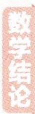

# 考前 31 天▶第 20 题 计数原理问题

# 押题角度 部分平均分组计数问题

原创押题 (蕴含分类讨论思想,以实际问题为情境,强调数学应用)把6名志愿者全部分配到A,B,C,D四个区域做志愿服务,若D区域恰好需要1名志愿者,A,B,C三个区域各至少需要1名志愿者,则不同的分配方法有 ( )

# 押题有据

对分类加法计数原理和分步乘法计数原理的考查是高考对计数原理的考查的一个方面，这类题往往以生活中的应用为情境，今年高考极有可能出现。

A. 150 种

B. 540 种

C. 900 种

D. 1 440 种

解析 先从6名志愿者中任选1名志愿者到D区域,有 $C_{6}^{1}=6$ (种)不同的方法,

【打开思路】根据特殊元素优先处理的原则，本题中只有 D 区域需要的志愿者人数确定，因此先考虑 D 区域的分配情况，再分类讨论剩下的 A, B, C 三个区域的分配情况

再将其余的5名志愿者分配到A,B,C三个区域,可分为两类.

第一类, $A,B,C$ 三个区域中有一个区域分1名志愿者,另外两个区域各分2名志愿者,有 $\frac{\mathrm{C}_5^1\mathrm{C}_4^2\mathrm{C}_2^2}{\mathrm{A}_2^2}\times \mathrm{A}_3^3 = 90$ （种）不同的方法.

【深入分析】对于无序平均分组问题, 务必要除以组数的阶乘。这里将 5 名志愿者分成三个组 (无序), 其中有两个组都是 2 名志愿者, 即部分平均分组, 因此要除以平均分组组数的阶乘, 再将所分的三个组分到三个区域, 即乘以 ${\mathrm{A}}_{3}^{3}$ 。此类问题也可分步处理, 即从 $A,B,C$ 三个区域中任选一个区域, 该区域分 1 名志愿者, 其余两个区域各分 2 名志愿者, 则有 ${\mathrm{C}}_{3}^{1}{\mathrm{C}}_{5}^{1}{\mathrm{C}}_{4}^{2}{\mathrm{C}}_{2}^{2} = {90}$ (种)不同的方法

第二类, $A,B,C$ 三个区域中有一个区域分3名志愿者, 另外两个区域各分1名志愿者, 有 $\mathrm{C}_{5}^{3}\mathrm{A}_{3}^{3}=60$ (种)不同的方法.

【另解】这里若以平均分组处理, 则为 $\frac{C_{5}^{3} C_{2}^{1} C_{1}^{1}}{A_{2}^{2}} \times A_{3}^{3} = 60$ (种) 不同的方法

根据分步乘法计数原理及分类加法计数原理得,不同的分配方法有 $6 \times (90 + 60) = 900$ (种),故选C.

【解后反思】对于无序平均分组的计数问题,务必要除以平均组数的阶乘,否则会导致重复计数.而对于有序分配的计数问题,则无须除以平均组数的阶乘,如将 5 名志愿者分到 $A$ 区域 1 名, $B,C$ 区域各 2 名,则有 ${\mathrm{C}}_{5}^{1}{\mathrm{C}}_{4}^{2}{\mathrm{C}}_{2}^{2} = {30}$ (种) 不同的方法

# 考前 30 天▶第 21 题 函数图象的识别问题

# 押题角度 1 已知函数解析式判断图象

原创押题 1 （指数函数与三角函数交汇, 融合奇偶性, 趣味性强）函数 $f(x) = \frac{1 - \pi^{x}}{1 + \pi^{x}} \sin x$ 的部分图象可能是 ( )

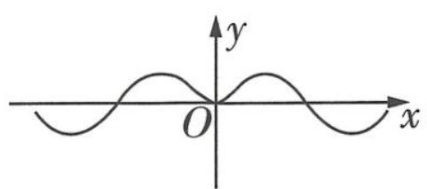

text_image

y
O
x

A

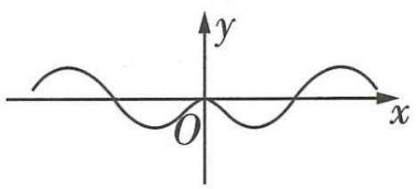

text_image

y
O
x

B

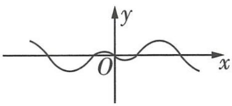

text_image

y
O
x

C

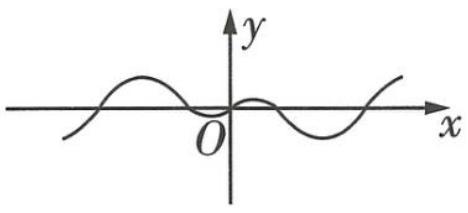

text_image

y
O
x

D

解析 令 $g(x) = \frac{1 - \pi^x}{1 + \pi^x}$ , 则 $g(-x) = \frac{1 - \pi^{-x}}{1 + \pi^{-x}} = \frac{\pi^x - 1}{\pi^x + 1} = -g(x)$ , 则函数 $g(x)$ 是奇函数.

【寻规律】一般地，函数 $f(x) = \frac{1}{1 + a^x} - \frac{1}{2} (a > 0, a \neq 1)$ 与 $f(x) = \frac{1}{1 - a^x} + \frac{1}{2} (a > 0, a \neq 1)$ 都是奇函数，在本题中， $g(x) = \frac{1 - \pi^x}{1 + \pi^x} = 2 \times (\frac{1}{1 + \pi^x} - \frac{1}{2})$

又函数 $y = \sin x$ 也是奇函数, 所以函数 $f(x)$ 为偶函数, 其图象关于 y 轴对称, 排除 CD.

【小妙招】“奇函数×奇函数=偶函数” “偶函数×偶函数=偶函数” “奇函数×偶函数=奇函数”

当 $x \to 0$ 且 x > 0 时， $\pi^{x} > 1$ ，即 $1 - \pi^{x} < 0$ ，则 $f(x) < 0$ ，排除 A，选 B.

【另解】任取 $x \in (0, \pi)$ ，都有 $f(x) < 0$ ，据此可排除 A

# 押题角度 2 已知函数大致图象匹配解析式

原创押题 2 （三角函数与幂函数组合而成的函数，有对称之美）如图 1 为函数 $f(x)$ 的大致图象，其解析式可能为（）

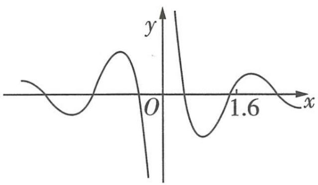

line

| x    | y     |
| ---- | ----- |
| 0.0  | 0.0   |
| 0.25 | 0.87  |
| 0.5  | -0.43 |
| 0.75 | 0.87  |
| 1.0  | 0.0   |
| 1.25 | -0.43 |
| 1.5  | 0.87  |
| 1.75 | 0.0   |
| 2.0  | -0.43 |

图1

A. $f(x) = \frac{x}{\cos\pi x}$

B. $f(x) = \frac{\sin\pi x}{x^2}$

C. $f(x) = \frac{\cos\pi x}{x}$

D. $f(x) = \frac{x^2}{\sin\pi x}$

解析 由题图知,在 x=0 附近的左右两侧,函数 $f(x)$ 的图象是不连续的,∴ $x \neq 0$ , 排除 A.

【会识图】有些同学下意识选择判断奇偶性，很遗憾地发现四个选项全是奇函数，这就束手无策了吗？观察图形，显然在 $x = 0$ 处没有定义，据此排除 $\mathbf{A}$

∵ $1.5\pi < 1.6\pi < 2\pi$ , ∴ $\sin 1.6\pi < 0$ , $\cos 1.6\pi > 0$ , 而由题图知 $f(1.6) > 0$ , 排除 BD, 选 C.

多面体欧拉定理 对于简单多面体,其各维对象数总满足一定的数学关系,在三维空间中多面体欧拉定理可表示为:顶点数-棱数+面数=2.

关注微信公众号“初高教辅站”获取更多初高中教辅资料

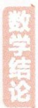

# 考前 29 天▶第 22 题 函数的极值与最值问题

# 押题角度》已知函数存在极值(最值)求参数的取值范围

原创押题 (三次函数的极值(最值)问题,配合图象分析,数形结合更直观)若函数 $f(x)=x^{3}-\frac{1}{2}(a+1)x^{2}+\frac{a}{3}x-1$ 在(-3,4)内存在最小值,则a的取值范围是()

# 题有据

函数的极值与最值是每年高考数学的必考内容，也是学生极易出错的一组概念，要充分掌握。

A. $(-\infty, -\frac{17}{3})$

B. $(-\infty, -\frac{17}{3}]$

C. $(- \frac{17}{3}, +\infty)$

D. $\left[-\frac{17}{3}, +\infty\right)$

解析 对 $f(x)$ 求导得 $f'(x)=3x^{2}-(a+1)x+\frac{a}{3}=3\left(x-\frac{1}{3}\right)\left(x-\frac{a}{3}\right)$ .

当 a=1 时, $f'(x)\geqslant0$ , 函数 $f(x)$ 在 $(-3,4)$ 上单调递增, 不存在最小值.

当 a > 1 时, 由 $f'(x) > 0$ 得 $x < \frac{1}{3}$ 或 $x > \frac{a}{3}$ , 由 $f'(x) < 0$ 得 $\frac{1}{3} < x < \frac{a}{3}$ , 则函数 $f(x)$ 在 $(-∞, \frac{1}{3})$ , $(\frac{a}{3}, +∞)$ 上单调递增, 在 $(\frac{1}{3}, \frac{a}{3})$ 上单调递减, 所以 $x = \frac{1}{3}$ 是函数 $f(x)$ 的极大值点, $x = \frac{a}{3}$ 是函数 $f(x)$ 的极小值点. 如图 1, 令 $f(x_0) = f(\frac{a}{3})(x_0 \neq \frac{a}{3})$ , 即 $x_0^3 - \frac{1}{2}(a + 1)x_0^2 + \frac{a}{3}x_0 - 1 = (\frac{a}{3})^3 - \frac{1}{2}(a + 1)(\frac{a}{3})^2 + \frac{a}{3} \times \frac{a}{3} - 1$ , 得 $x_0 = \frac{3 - a}{6}$ , 由条件得 $\frac{3 - a}{6} \leqslant -3 < \frac{a}{3} < 4$ , 此时 a 不存在.

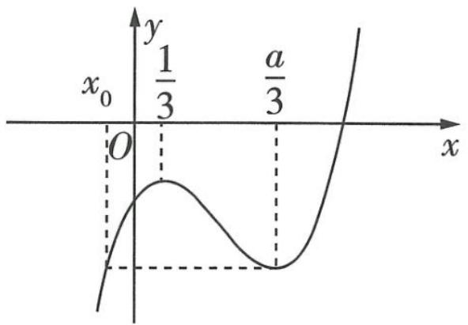

line

| x       | y       |
|---------|---------|
| 0       | 0       |
| a/3     | 1/3     |

图1

【难点分析】一旦 $x_0 > -3$ ，即便 $\frac{a}{3} \in (-3, 4)$ ，函数 $f(x)$ 在 $(-3, 4)$ 上也不存在最小值，因为此时 $f(-3)$ 是最小的，但 $x$ 取不到 -3，因此我们要对 $x_0$ 进行限制，这也是引入 $x_0$ 的原因

当 $a < 1$ 时, 函数 $f(x)$ 在 $(- \infty, \frac{a}{3})$ , $(\frac{1}{3}, + \infty)$ 上单调递增, 在 $(\frac{a}{3}, \frac{1}{3})$ 上单调递减, $x = \frac{a}{3}$ 是函数 $f(x)$ 的极大值点, $x = \frac{1}{3}$ 是函数 $f(x)$ 的极小值点. 如图2, 令 $f(x_0') = f(\frac{1}{3})(x_0' \neq \frac{1}{3})$ , 即 $x_0'^3 - \frac{1}{2}(a + 1)x_0'^2 + \frac{a}{3}x_0' - 1 = (\frac{1}{3})^3 - \frac{1}{2}(a + 1) \times (\frac{1}{3})^2 + \frac{a}{3} \times \frac{1}{3} - 1$ , 得 $x_0' = \frac{3a - 1}{6}$ , 由条件得 $\frac{3a - 1}{6} \leqslant -3 < \frac{1}{3} < 4$ , 解得 $a \leqslant -\frac{17}{3}$ , 即 $a \leqslant -\frac{17}{3}$ .

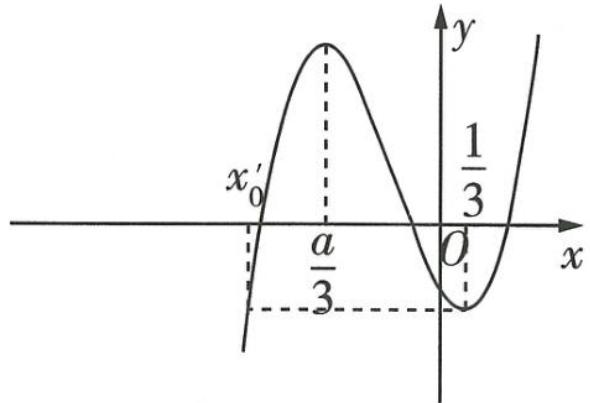

text_image

x'
0
a/3
O
1/3
y
x

图2

综上可知, $a$ 的取值范围是 $(-\infty, -\frac{17}{3}]$ , 故选 B.

【知识拓展】在本题中， $x_0$ （以及 $x_0'$ ）有更简单的解法吗？显然是有的，已知函数 $f(x) = ax^3 + bx^2 + cx + d (a \neq 0)$ ， $x_1, x_2$ 分别为函数 $f(x)$ 的极大值点与极小值点，若 $f(x_3) = f(x_1) (x_3 \neq x_1)$ ，则 $|x_1 - x_2| = 2|x_2 - x_3|$ ；若 $f(x_3) = f(x_2) (x_3 \neq x_2)$ ，则 $|x_2 - x_1| = 2|x_1 - x_3|$

欧拉线 三角形的外心、重心、九点圆圆心和垂心，依次位于同一直线上，这条直线就叫三角形的欧拉线。

# 考前 28 天▶第 23 题 三角函数的图象与性质问题

# 押题角度》三角函数图象变换与性质的综合应用

难度★★★★☆ 原创押题 （多方位分析三角函数的图象特征与性质变化,融合图象变换,综合性强）已知函数 $f(x)=\sin(\omega x+\frac{\pi}{3})(\omega\in\mathbb{N}^{*})$ 的图象在 $(0,\pi)$ 内恰有4条对称轴, 函数 $g(x)=\cos(2x+\varphi)(0<\varphi<\frac{\pi}{2})$ 在 $[0,\frac{\pi}{12}]$ 上的最小值为 $\frac{1}{2}$ , 则（）

A. $\omega = 2$

B. 函数 $g(x)$ 的单调递减区间为 $\left[k\pi + \frac{\pi}{6}, k\pi + \frac{2\pi}{3}\right] (k \in \mathbb{Z})$

C. 将函数 $f(x)$ 图象上各点的纵坐标保持不变, 横坐标变为原来的 2 倍, 再将所得图象向右平移 $\frac{\pi}{12}$ 个单位长度, 即得函数 $g(x)$ 的图象

D. 函数 $h(x) = f(x) - g(x)$ 与函数 $g(x)$ 的图象有相同的对称中心

解析 对于函数 $f(x)$ ，令 $\omega x + \frac{\pi}{3} = k\pi + \frac{\pi}{2}$ ，得 $x = \frac{k\pi + \frac{\pi}{6}}{\omega} (k \in \mathbb{Z})$ ，所以函数 $f(x)$ 图象的对称轴为直线 $x = \frac{k\pi + \frac{\pi}{6}}{\omega} (k \in \mathbb{Z})$ ，由此知函数 $f(x)$ 的图象在 $y$ 轴右侧的第4条对称轴为直线 $x = \frac{19\pi}{6\omega}$ ，第5条对称轴为直线 $x = \frac{25\pi}{6\omega}$ ，由题设得 $\frac{19\pi}{6\omega} < \pi \leqslant \frac{25\pi}{6\omega}$ ，解得 $\frac{19}{6} < \omega \leqslant \frac{25}{6}$ .

【另解】也可以直接利用整体思想，可得 $\frac{7\pi}{2}<\omega\pi+\frac{\pi}{3}\leqslant\frac{9\pi}{2}$ ，则 $\frac{19}{6}<\omega\leqslant\frac{25}{6}$

又 $\omega \in \mathbf{N}^*$ ，则 $\omega = 4$ ，即 $f(x) = \sin (4x + \frac{\pi}{3})$

对于函数 $g(x)$ ，由 $x \in [0, \frac{\pi}{12}]$ 知 $2x + \varphi \in [\varphi, \frac{\pi}{6} + \varphi]$ ，又 $0 < \varphi < \frac{\pi}{2}$ ，则 $\frac{\pi}{6} + \varphi \in (\frac{\pi}{6}, \frac{2\pi}{3})$ ，所以函数 $g(x)$ 在 $[0, \frac{\pi}{12}]$ 上单调递减。

【点透讲透】令 $t=2x+\varphi$ ，则 $t\in\left[\varphi,\frac{\pi}{6}+\varphi\right]$ ，区间长度为 $\frac{\pi}{6}$ ，又 $0<\varphi<\frac{\pi}{2}$ ，所以 $\left[\varphi,\frac{\pi}{6}+\varphi\right]\subseteq$ $[0,\pi]$ ，则函数 $y=\cos t$ 在 $t\in\left[\varphi,\frac{\pi}{6}+\varphi\right]$ 上单调递减，即函数 $g(x)$ 在 $[0,\frac{\pi}{12}]$ 上单调递减

又函数 $g(x)$ 在 $[0, \frac{\pi}{12}]$ 上的最小值为 $\frac{1}{2}$ , 所以 $\cos(2 \times \frac{\pi}{12} + \varphi) = \frac{1}{2}$ , 所以 $2 \times \frac{\pi}{12} + \varphi = \frac{\pi}{3}$ , 解得

向量等和线 已知平面内一组基底 $\overrightarrow{OA}$ 和 $\overrightarrow{OB}$ 及任一向量 $\overrightarrow{OP}$ ，则 $\overrightarrow{OP} = \lambda \overrightarrow{OA} + \mu \overrightarrow{OB}, \lambda + \mu = k (|k|$ 为点O到点P所在的与AB平行的直线的距离和点O到直线AB的距离的比值，当P在直线AB上时，k=1).

关注微信公众号“初高教辅站”获取更多初高中教辅资料

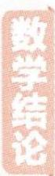

$\varphi=\frac{\pi}{6}$ ，所以 $g(x)=\cos(2x+\frac{\pi}{6})$ 。下面对各选项逐一分析。

<table><tr><td>选项</td><td>分析过程</td><td>正误</td></tr><tr><td>A</td><td> $f(x) = \sin(4x + \frac{\pi}{3})$ ,即  $\omega = 4$ .</td><td>×</td></tr><tr><td>B</td><td>令  $2k\pi \leqslant 2x + \frac{\pi}{6} \leqslant 2k\pi + \pi (k \in \mathbb{Z})$ ,得  $k\pi - \frac{\pi}{12} \leqslant x \leqslant k\pi + \frac{5\pi}{12} (k \in \mathbb{Z})$ ,则函数  $g(x)$  的单调递减区间为  $[k\pi - \frac{\pi}{12}, k\pi + \frac{5\pi}{12}] (k \in \mathbb{Z})$ .</td><td>×</td></tr><tr><td>C</td><td>将函数  $f(x)$  图象上各点的纵坐标保持不变,横坐标变为原来的 2 倍,即得函数  $y = \sin(2x + \frac{\pi}{3})$  的图象,再将函数  $y = \sin(2x + \frac{\pi}{3})$  的图象向右平移  $\frac{\pi}{12}$  个单位长度,即得函数  $y = \sin[2(x - \frac{\pi}{12}) + \frac{\pi}{3}] = \sin(2x + \frac{\pi}{6})$  的图象,而非函数  $g(x)$  的图象.</td><td>×</td></tr><tr><td>D</td><td>函数  $h(x) = f(x) - g(x) = \sin(4x + \frac{\pi}{3}) - \cos(2x + \frac{\pi}{6})$ ,设函数  $h(x)$  图象的对称中心为  $(a, b)$ ,则  $h(2a - x) + h(x) = 2b$  恒成立,即  $\sin[4(2a - x) + \frac{\pi}{3}] - \cos[2(2a - x) + \frac{\pi}{6}] + \sin(4x + \frac{\pi}{3}) - \cos(2x + \frac{\pi}{6}) = 2b$  恒成立,即  $\sin(4a + \frac{\pi}{3}) \cos(4x - 4a) - \cos(2a + \frac{\pi}{6}) \cos(2x - 2a) = b$  恒成立,【用公式】此处用到了三角恒等变换中的“和差化视公式”,即  $\sin \alpha + \sin \beta = 2\sin \frac{\alpha + \beta}{2} \cos \frac{\alpha - \beta}{2}$ , $\cos \alpha + \cos \beta = 2\cos \frac{\alpha + \beta}{2} \cos \frac{\alpha - \beta}{2}$ 所以  $a = \frac{(3k+1)\pi}{6} (k \in \mathbb{Z})$ , $b = 0$ ,【难点分析】等式恒成立,意味着 “ $\sin(4a + \frac{\pi}{3}) \cos(4x - 4a)$ ” “ $\cos(2a + \frac{\pi}{6}) \cdot \cos(2x - 2a)$ ” “ $b$ ” 都等于 0.由  $4a + \frac{\pi}{3} = k\pi$  得  $a = \frac{(3k-1)\pi}{12} (k \in \mathbb{Z})$ ,由  $2a + \frac{\pi}{6} = k\pi + \frac{\pi}{2}$  得  $a = \frac{(3k+1)\pi}{6} = \frac{[3(2k+1)-1]\pi}{12} (k \in \mathbb{Z})$ ,所以同时满足这两个条件的  $a = \frac{[3(2k+1)-1]\pi}{12} (k \in \mathbb{Z})$ ,即  $a = \frac{(3k+1)\pi}{6} (k \in \mathbb{Z})$ 即函数  $h(x)$  图象的对称中心为  $(\frac{3k+1)\pi}{6}, 0) (k \in \mathbb{Z})$ .由  $2x + \frac{\pi}{6} = k\pi + \frac{\pi}{2}$  得  $x = \frac{(3k+1)\pi}{6} (k \in \mathbb{Z})$ ,即函数  $g(x)$  图象的对称中心为  $(\frac{3k+1)\pi}{6}, 0) (k \in \mathbb{Z})$ ,所以函数  $h(x)$  与函数  $g(x)$  的图象有相同的对称中心.</td><td>√</td></tr></table>

# 考前 27 天▶第 24 题 基本不等式的应用问题

# 押题角度 利用基本不等式求最值

原创押题 (构造形式灵活,解题方法多样,益于思维的发散探究)若 x > 0, y > 0,
则 $\frac{7x+4y}{2x+5y}+\frac{3y}{x+y}$ 的最小值为()

A. 2

B. 3

C. 4

D. 5

解析 方法一 令 $2x + 5y = a, x + y = b$ ，则 $x = \frac{5b - a}{3}, y = \frac{a - 2b}{3}$ ，

【换元关键】通过对分母换元，将代数式转化为可使用基本不等式的结构

所以 $\frac{7x + 4y}{2x + 5y} +\frac{3y}{x + y} = \frac{7\times\frac{5b - a}{3} + 4\times\frac{a - 2b}{3}}{a} +\frac{3\times\frac{a - 2b}{3}}{b} = \frac{9b}{a} +\frac{a}{b} -3\geqslant 2\sqrt{\frac{9b}{a}\times\frac{a}{b}} -3 = 3,$

当且仅当 $\frac{9b}{a} = \frac{a}{b}$ , 即 $a = 3b$ , 即 $2x + 5y = 3(x + y)$ , 即 $x = 2y$ 时取等号,

所以 $\frac{7x+4y}{2x+5y}+\frac{3y}{x+y}$ 的最小值为3,故选B.

方法二 $\frac{7x+4y}{2x+5y}+\frac{3y}{x+y}=\left(\frac{7x+4y}{2x+5y}+1\right)+\left(\frac{3y}{x+y}+2\right)-3=\frac{9(x+y)}{2x+5y}+\frac{2x+5y}{x+y}-3\geqslant$ $2\sqrt{\frac{9(x+y)}{2x+5y}\times\frac{2x+5y}{x+y}}-3=3$ ，当且仅当 $\frac{9(x+y)}{2x+5y}=\frac{2x+5y}{x+y}$ ，即x=2y时取等号，

【易错提醒】利用基本不等式求最值时, 务必要注意取等号的条件是否成立, 否则不能取得最值。如已知 $x > 0, y > 0$ , 求 $\frac{x}{2x + 3y} + \frac{y}{x + y}$ 的最小值, 若利用基本不等式求解, 解题过程为: $\frac{x}{2x + 3y} + \frac{y}{x + y} = (\frac{x}{2x + 3y} + 1) + (\frac{y}{x + y} + 2) - 3 = \frac{3(x + y)}{2x + 3y} + \frac{2x + 3y}{x + y} - 3 \geqslant 2\sqrt{\frac{3(x + y)}{2x + 3y} \times \frac{2x + 3y}{x + y}} - 3 = 2\sqrt{3} - 3$ , 当且仅当 $\frac{3(x + y)}{2x + 3y} = \frac{2x + 3y}{x + y}$ , 即 $(2 - \sqrt{3})x + (3 - \sqrt{3})y = 0$ 时等号成立, 这不可能, 因此这个方法有问题。事实上, $\frac{2x + 3y}{x + y} = 2 + \frac{y}{x + y} \in (2, 3)$ , 令 $\frac{2x + 3y}{x + y} = t \in (2, 3)$ , 则问题相当于求 $y = \frac{3}{t} + t - 3$ 在 $(2, 3)$ 上的最小值, 而函数 $y = \frac{3}{t} + t - 3$ 在 $t \in (2, 3)$ 上单调递增, 因此 $\frac{x}{2x + 3y} + \frac{y}{x + y}$ 元最小值

所以 $\frac{7x+4y}{2x+5y}+\frac{3y}{x+y}$ 的最小值为3,故选B.

面积射影定理 平面图形射影面积等于被射影图形的面积乘以该图形所在平面与射影面所成锐二面角的余弦值.

关注微信公众号“初高教辅站”获取更多初高中教辅资料

# 考前 26 天▶第 25 题 比大小问题

# 押题角度1 指对混合数值比较大小

原创押题 1 （给出三个具体数值比较大小,既可以用常规法构造函数求解,又可以用结论法速解,十分巧妙）已知 $a = e^{\tan 0.2} - 1, b = \sqrt{1.4} - 1, c = 2\ln 1.1$ , 则（）

A. $a > b > c$   
B. $c > a > b$   
C. $a > c > b$   
D. $c > b > a$

解析 第一步, 比较 a 与 b.

# 题有据

比大小问题在近几年的高考和各地模考中，经常作为小题中的压轴题出现，思维量和运算量都偏大，今年高考再次出现的可能性很大。

令 $f(x)=\tan x-x,x\in(0,\frac{\pi}{2})$ ，则 $f'(x)=\frac{1}{\cos^{2}x}-1\geqslant0$ ，即函数 $f(x)$ 在 $(0,\frac{\pi}{2})$ 上单调递增，所以 $f(x) > \tan 0 - 0 = 0$ ，即当 $x \in (0, \frac{\pi}{2})$ 时， $\tan x > x$ ，又 $y = e^x$ 是增函数，所以 $a > e^{0.2} - 1$ .

【结论速解】当 $x \in (0, \frac{\pi}{2})$ 时， $\sin x < x < \tan x$ ；当 $x \in (-\frac{\pi}{2}, 0)$ 时， $\sin x > x > \tan x$

令 $g(x)=\mathrm{e}^{x}-\sqrt{1+2x}, x\in[0,0.2]$ ，则 $g'(x)=\mathrm{e}^{x}-\frac{1}{\sqrt{1+2x}}\geqslant0$ ，即函数 $g(x)$ 在 $[0,0.2]$ 上单

【会构造】由上述分析知 $a>e^{0.2}-1$ ，那么比较 a 与 b 的大小就是比较 $e^{0.2}$ 与 $\sqrt{1.4}$ 的大小，即比较 $e^{0.2}$ 与 $\sqrt{1+2\times0.2}$ 的大小，因此我们利用作差法，构造出了函数 $g(x)$

调递增,所以 $g(0.2) > g(0) = 0$ , 则 $e^{0.2} > \sqrt{1.4}$ , 即 $e^{0.2} - 1 > \sqrt{1.4} - 1$ , 所以 a > b.

【多解】得到 $a > \mathrm{e}^{0.2} - 1$ 后，由切线不等式“ $\mathrm{e}^x \geqslant x + 1$ ”可知 $a > \mathrm{e}^{0.2} - 1 > 0.2$ ，又 $(0.2 + 1)^2 = 1.2^2 = 1.44 > 1.4$ ，即 $0.2 > \sqrt{1.4} - 1$ ，所以 $a > b$

第二步, 比较 b 与 c.

令 $h(x)=2\ln(1+x)-(\sqrt{1+4x}-1)$ , $x\in[0,0.1]$ ，则 $h'(x)=\frac{2}{1+x}-\frac{2}{\sqrt{1+4x}}=$ $\frac{2(\sqrt{1+4x}-x-1)}{(1+x)\sqrt{1+4x}}\geqslant0$ ，即函数 $h(x)$ 在 [0,0.1] 上单调递增，所以 $h(0.1)>h(0)=0$ ，即 $2\ln1.1>$ 【释疑惑】若 $x\in[0,0.1]$ ，则 $\sqrt{1+4x}=\sqrt{1+2x+2x}\geqslant\sqrt{1+2x+x^{2}}=x+1$ $\sqrt{1.4}-1$ ，即 c>b.

【多解】还可以利用泰勒展开式比较大小。由于 $\ln(1+x)=x-\frac{x^{2}}{2}+\frac{x^{3}}{3}-\frac{x^{4}}{4}+\cdots,\quad|x|<1$ ，则当 x>0 时，有 $2\ln1.1=2\ln(1+0.1)>2\times(0.1-\frac{0.1^{2}}{2})=0.19$ ，又 $(0.19+1)^{2}=1.4161>1.4$ ，即 $0.19>\sqrt{1.4}-1$ ，所以 c>b

# 第三步, 比较 a 与 c.

令 $t(x) = \mathrm{e}^{2x} - 1 - 2\ln (1 + x), x \in [0,0.1]$ , 则 $t'(x) = 2\mathrm{e}^{2x} - \frac{2}{1 + x}$ , 显然 $t'(x)$ 在 $[0,0.1]$ 上单调递增, 且 $t'(0) = 0$ , 所以当 $x \in [0,0.1]$ 时, $t'(x) \geqslant 0$ , 即 $t(x)$ 在 $[0,0.1]$ 上单调递增, 所以 $t(0.1) > t(0) = 0$ , 即 $\mathrm{e}^{0.2} - 1 > 2\ln 1.1$ , 即 $a > c$ .

综上知,a>c>b,故选C.

# 押题角度2 利用同构法构造函数比大小

原创押题 2 (给出 m, n 满足的关系式, 需要先通过构造函数得出 m, n 的大小关系, 再根据基本初等函数的单调性排查选项, 贴合考情) 若 $4^{m} - 4^{n} < 5^{-m} - 5^{-n}$ , 则下列关系不正确的是 ()

A. $m <   n$

B. $n^{-3} > m^{-3}$

C. $\sqrt[3]{m} < \sqrt[3]{n}$

D. $3^{-n} < 3^{-m}$

解析 由 $4^{m} - 4^{n} < 5^{-m} - 5^{-n}$ 得 $4^{m} - 5^{-m} < 4^{n} - 5^{-n}$ , 令 $f(x) = 4^{x} - 5^{-x}$ , 则 $f(m) < f(n)$ .

因为函数 $y=4^{x}, y=-5^{-x}$ 在 R 上都是增函数, 所以 $f(x)$ 在 R 上是增函数, 所以 m<n, 故 A 正确. 当 m=1, n=2 时, $\frac{1}{8}=n^{-3}<m^{-3}=1$ , 故 B 错误. 因为函数 $y=x^{\frac{1}{3}}$ 在 R 上单调递增, 所以由 m<n

【多解】也可以构造函数 $g(x)=x^{-3}$ 判断, 但需要注意的是, 这个函数的图象不是连续的, 当 m<n<0 时, $0>g(m)>g(n)$ ; 当 m<0<n 时, $g(m)<0<g(n)$ ; 当 0<m<n 时, $0<g(n)<g(m)$

得 $\sqrt[3]{m} < \sqrt[3]{n}$ , 故 C 正确. 因为函数 $y = (\frac{1}{3})^x$ 在 R 上单调递减, 所以由 $m < n$ 得 $(\frac{1}{3})^n < (\frac{1}{3})^m$ , 即 $3^{-n} < 3^{-m}$ , 故 D 正确. 故选 B.

# 名师总结

比大小的常用方法有: (1) 中间值法, 如比较 $\log_ {5} 3$ 与 $\log_ {8} 5$ 的大小, 由 $5^{3} > 3^{4}$ 知, $\log_ {5} 3 < \frac {3}{4}$ , 而由 $8^{3} < 5^{4}$ 知, $\log_ {8} 5 > \frac {3}{4}$ , 所以 $\log_ {8} 5 > \log_ {5} 3$ ; (2) 作差法, 同样比较 $\log_ {5} 3$ 与 $\log_ {8} 5$ 的大小,

$$
\log_ {5} 3 - \log_ {8} 5 = \frac {\ln 3}{\ln 5} - \frac {\ln 5}{\ln 8} = \frac {\ln 3 \ln 8 - (\ln 5) ^ {2}}{\ln 5 \ln 8} <   \frac {(\frac {\ln 3 + \ln 8}{2}) ^ {2} - (\ln 5) ^ {2}}{\ln 5 \ln 8} = \frac {(\frac {\ln 2 4}{2}) ^ {2} - (\ln 5) ^ {2}}{\ln 5 \ln 8} <
$$

$\frac{(\frac{\ln 25}{2})^2 - (\ln 5)^2}{\ln 5 \ln 8} = 0$ ，所以 $\log_8 5 > \log_5 3$ ；（3）增倍法，仍是比较 $\log_5 3$ 与 $\log_8 5$ 的大小， $4 \log_5 3 = \log_5 81 < \log_5 125 = 3$ ， $4 \log_8 5 = \log_8 625 > \log_8 512 = 3$ ，则 $\log_8 5 > \log_5 3$ ；（4）不等式法，还是比较

$\log_53$ 与 $\log_85$ 的大小， $\log_53 = \frac{\ln 3}{\ln 5} < \frac{\ln 3 + \ln \frac{8}{5}}{\ln 5 + \ln \frac{8}{5}} = \frac{\ln \frac{24}{5}}{\ln 8} < \frac{\ln \frac{25}{5}}{\ln 8} = \frac{\ln 5}{\ln 8} = \log_85$ ；（5）同构法，如此

较 $\frac{2}{3}\ln\sqrt{3}$ 与 $\ln\sqrt{2}$ 的大小，即比较 $\frac{\ln3}{3}$ 与 $\frac{\ln2}{2}=\frac{2\ln2}{2\times2}=\frac{\ln4}{4}$ 的大小，构造函数 $f(x)=\frac{\ln x}{x},x>e$ ，利用函数的单调性即得结果；(6)构造函数法.

三正弦定理 设二面角 M-AB-N 为 $\alpha$ ，在平面 M 上有一条射线 AC，它和棱 AB 所成角为 $\beta$ ，和平面 N 所成的角为 $\gamma$ ，则 $\sin \gamma = \sin \alpha \sin \beta$ .

关注微信公众号“初高教辅站”获取更多初高中教辅资料

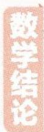

# 考前

# 25 天▶第 26 题 平面向量的基本定理与应用问题

# 押题角度> 平面向量的线性运算与代数式的最值/取值范围交汇

原创押题 (将平面向量的线性运算与利用二次函数求最值融合在一起,角度新颖)在平行四边形 ABCD 中, $\overrightarrow{BE}=\frac{1}{3}\overrightarrow{EA},\overrightarrow{CF}=\frac{1}{2}\overrightarrow{FB}$ ,点 M 在线段 BD 上(含端点),若 $\overrightarrow{CM}=\lambda\overrightarrow{CE}+\mu\overrightarrow{AF}(\lambda,\mu\in\mathbb{R})$ ,则 $\frac{9}{10}\lambda^{2}-4\mu^{2}$ 的最大值为()

A. $\frac{24}{25}$

B. $\frac{117}{125}$

C. $\frac{118}{125}$

D. $\frac{119}{125}$

解析 如图 1 所示, 连接 CA, 设 $\overrightarrow{DM} = t \overrightarrow{DB}, t \in [0, 1]$ ,

则 $\overrightarrow{CM} = \overrightarrow{CD} +\overrightarrow{DM} = \overrightarrow{CD} +t\overrightarrow{DB} = \overrightarrow{CD} +t(\overrightarrow{CB} -\overrightarrow{CD}) = (1 - t)\overrightarrow{CD} +t\overrightarrow{CB},$

由已知得 $\overrightarrow{CM}=\lambda\overrightarrow{CE}+\mu\overrightarrow{AF}=\lambda(\overrightarrow{CB}+\frac{1}{4}\overrightarrow{BA})+\mu(\overrightarrow{CF}-\overrightarrow{CA})=\lambda(\overrightarrow{CB}+\frac{1}{4}\overrightarrow{CD})+\mu\left[\frac{1}{3}\overrightarrow{CB}-(\overrightarrow{CB}+\right.$

【找“中介”】不直接利用已知的一组向量 $\overrightarrow{CE}$ ， $\overrightarrow{AF}$ 表示 $\overrightarrow{CM}$ ，而是选取另一组向量 $\overrightarrow{CD},\overrightarrow{CB}$ ，并从不同的“路径”表示 $\overrightarrow{CM}$ ，可以降低计算难度

$$
\overrightarrow {C D}) ] = \left(\frac {\lambda}{4} - \mu\right) \overrightarrow {C D} + \left(\lambda - \frac {2 \mu}{3}\right) \overrightarrow {C B},
$$

易知 $\left\{\begin{aligned}\frac{\lambda}{4}-\mu&=1-t,\\ \lambda-\frac{2\mu}{3}&=t,\end{aligned}\right.$ 消去 t 得 $\frac{5\lambda}{4}-\frac{5\mu}{3}=1$ , 即 $\lambda=\frac{4}{5}+\frac{4\mu}{3}$ , 所以

$$
\lambda - \frac {2 \mu}{3} = (\frac {4}{5} + \frac {4 \mu}{3}) - \frac {2 \mu}{3} = \frac {4}{5} + \frac {2 \mu}{3} = t,
$$

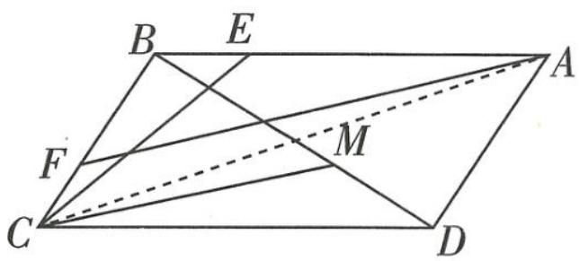

text_image

B E
F M
C D
A

图1

由 $t \in [0,1]$ 得 $\mu \in [-\frac{6}{5}, \frac{3}{10}]$ ,

【易错提醒】 $\lambda, \mu$ 受制于 $t$ ，因此需要由 $t \in [0,1]$ 确定 $\mu$ 的取值范围，这样才能保证后续求解最值不出错

所以 $\frac{9}{10}\lambda^2 - 4\mu^2 = \frac{9}{10} (\frac{4}{5} + \frac{4\mu}{3})^2 - 4\mu^2 = -\frac{12}{5} (\mu - \frac{2}{5})^2 + \frac{24}{25}$ .

【析细节】我们将待求代数式表示成关于 $\mu$ 的二次函数，该函数图象开口向下，对称轴为直线 $\mu = \frac{2}{5}$ ，因此该函数在 $\left[-\frac{6}{5}, \frac{3}{10}\right]$ 上单调递增

当 $\mu=\frac{3}{10}$ 时， $\frac{9}{10}\lambda^{2}-4\mu^{2}$ 取得最大值，为 $-\frac{12}{5}\times\left(\frac{3}{10}-\frac{2}{5}\right)^{2}+\frac{24}{25}=\frac{117}{125}$ ，故选 B.

【解后反思】构建目标函数求最值，务必关注变量的取值范围。本题中若由 $\mu \in R$ 或 $\mu \in [0, 1]$ ，都会得出其最大值为 $\frac{24}{25}$ 而错选 A

# 考前 24 天▶第 27 题 抽象函数的性质研究问题

# 押题角度 ➤ 抽象函数性质的综合分析应用

原创押题 (给出抽象函数满足的等式,看似困难,但在选项中却给出了可行方向,选项难度有差异,区分度高,与数列求和交汇)定义在(-1,1)上且不恒为0的函数 $f(x)$ 满足 $\forall a,b\in(-1,1)$ , $f(a)+f(b)=f(\frac{a+b}{1+ab})$ ,则下列说法错误的是()

A. 函数 $f(x)$ 的解析式可能是 $f(x) = \ln \frac{1 + x}{1 - x}$   
B. 若 $f\left( \frac{1}{3}\right)  = 2$ , 则 $f\left( \frac{7}{9}\right)  = 6$   
C. 若当 $x \in (-1, 0)$ 时, $f(x) > 0$ , 则函数 $f(x)$ 在 $(-1, 1)$ 上单调递减  
D. $f(\frac{1}{5}) + f(\frac{1}{11}) + f(\frac{1}{19}) + \cdots + f(\frac{1}{n^{2} + 3n + 1}) + f(\frac{1}{n + 2}) = f(\frac{1}{3}) (n \in \mathbb{N}^{*}, n \geqslant 2)$

解析

# 押题有据

抽象函数问题常涉及函数定义域、值域、单调性、周期性、图象的对称性等，综合性强，思维量大，在2022年新高考Ⅱ卷中作为单选压轴题出现，今年再次出现的概率很高。

<table><tr><td>选项</td><td>分析过程</td><td>正误</td></tr><tr><td>A</td><td>当 $f(x) = \ln \frac{1 + x}{1 - x}$ 时, $f(\frac{a + b}{1 + ab}) = \ln \frac{1 + \frac{a + b}{1 + ab}}{1 - \frac{a + b}{1 + ab}} = \ln \frac{1 + ab + a + b}{1 + ab - a - b} = \ln \frac{(1 + a)(1 + b)}{(1 - a)(1 - b)} = \ln \frac{1 + a}{1 - a} + \ln \frac{1 + b}{1 - b} = f(a) + f(b)$ ,满足条件.</td><td>√</td></tr><tr><td>B</td><td>令 $a = b = \frac{1}{3}$ 得 $f(\frac{1}{3}) + f(\frac{1}{3}) = f(\frac{\frac{1}{3} + \frac{1}{3}}{1 + \frac{1}{3} \times \frac{1}{3}}) = f(\frac{3}{5})$ ,则 $f(\frac{3}{5}) = 4$ ,【敲黑板】求抽象函数的函数值,通常利用赋值法,而恰当赋值是求值的关键令 $a = \frac{1}{3}$ , $b = \frac{3}{5}$ 得 $f(\frac{1}{3}) + f(\frac{3}{5}) = f(\frac{\frac{1}{3} + \frac{3}{5}}{1 + \frac{1}{3} \times \frac{3}{5}}) = f(\frac{7}{9})$ ,则 $f(\frac{7}{9}) = 6$ .</td><td>√</td></tr></table>

圆锥曲线(椭圆与双曲线)第三定义 平面内的动点与两定点 $A_{1}(-a,0), A_{2}(a,0)$ (或 $A_{1}(0,-a), A_{2}(0,a)$ ) 的连线所在直线的斜率乘积等于常数 $e^{2}-1$ 的点的轨迹叫椭圆或双曲线(除去左、右(上、下)顶点).

关注微信公众号“初高教辅站”获取更多初高中教辅资料

续表

<table><tr><td>选项</td><td>分析过程</td><td>正误</td></tr><tr><td>C</td><td>令 $a=b=0$ 得 $f(0)=0$ ,令 $a=x,b=-x$ 得 $f(x)+f(-x)=f(0)=0$ ,即 $f(-x)=-f(x)$ ,所以函数 $f(x)$ 为奇函数.【明方向】问题中既出现了“ $(-1,0)$ ”,又出现了“ $(-1,1)$ ”,显然与图象的对称性有关,这时我们应该联想到函数的奇偶性,故而证明函数 $f(x)$ 为奇函数,同时也能为后续判断单调性提供保障设 $x_1,x_2\in(-1,1)$ ,且 $x_1则\( f(x_1)-f(x_2)=f(x_1)+f(-x_2)=f(\frac{x_1-x_2}{1-x_1x_2})$ ,【关键转化】求单调性要作差,而已知条件是和的关系,如何“化减为加”呢?这就要靠奇函数的性质了,如此我们只需判断 $f(\frac{x_1-x_2}{1-x_1x_2})$ 的正负即可对于 $\frac{x_1-x_2}{1-x_1x_2}$ ,由 $-1知x_1-x_2<0,1-x_1x_2>0$ ,又 $(x_2-x_1)-(1-x_1x_2)=(x_2-1)(1+x_1)<0$ ,即 $0所以0\( -1<\frac{x_1-x_2}{1-x_1x_2}<0$ ,因为 $x\in(-1,0)$ 时, $f(x)>0$ ,所以 $f(\frac{x_1-x_2}{1-x_1x_2})>0$ ,即 $f(x_1)>f(x_2)$ ,所以函数 $f(x)$ 在 $(-1,1)$ 上单调递减.</td><td>√</td></tr><tr><td>D</td><td> $\frac{1}{n^2+3n+1}=\frac{1}{n^2+3n+2-1}=\frac{1}{(n+1)(n+2)-1}=\frac{(n+2)-(n+1)}{(n+1)(n+2)-1}=\frac{\frac{1}{n+1}-\frac{1}{n+2}}{1-\frac{1}{(n+1)(n+2)}}$ ,则 $f(\frac{1}{n^2+3n+1})=f(\frac{\frac{1}{n+1}-\frac{1}{n+2}}{1-\frac{1}{(n+1)(n+2)}}=f(\frac{1}{n+1})-f(\frac{1}{n+2})$ .【难点分析】由条件知 $\forall a,b\in(-1,1)$ , $f(\frac{a-b}{1-ab})=f(a)-f(b)$ ,于是考虑将 $\frac{1}{n^2+3n+1}$ 化为 $\frac{a-b}{1-ab}$ 的结构,即可将 $f(\frac{1}{n^2+3n+1})$ “裂”为两项之差,从而利用裂项相消法求和所以 $f(\frac{1}{5})+f(\frac{1}{11})+f(\frac{1}{19})+\cdots+f(\frac{1}{n^2+3n+1})=[f(\frac{1}{2})-f(\frac{1}{3})]+[f(\frac{1}{3})-f(\frac{1}{4})]+\cdots+[f(\frac{1}{n+1})-f(\frac{1}{n+2})]=f(\frac{1}{2})-f(\frac{1}{n+2})$ ,所以 $f(\frac{1}{5})+f(\frac{1}{11})+f(\frac{1}{19})+\cdots+f(\frac{1}{n^2+3n+1})+f(\frac{1}{n+2})=f(\frac{1}{2})$ .</td><td>×</td></tr></table>

# 考前 23 天▶第 28 题 数列的求和问题

# 押题角度 求数列的前 n 项和

难度★★★★☆ 原创押题 （新定义“[x]”, 由数列的“项和”递推式求通项公式, 再根据新定义求新数列的前 2023 项和, 巧妙融入数字 “2023”）已知数列 $\{a_{n}\}$ 的前 $n$ 项和为 $S_{n}, a_{1} = \frac{4}{3}, a_{n+1} - 3S_{n} = \frac{4}{3} (n \in \mathbf{N}^{*})$ , 设 $b_{n} = [a_{n}]$ ([x] 表示不超过 $x$ 的最大整数), 则数列 $\{b_{n}\}$ 的前 2023 项和 $T_{2023} =$

A. $\frac{4^{2024} - 2027}{9}$

B. $\frac{4^{2024} - 6073}{9}$

C. $\frac{4^{2023} - 2027}{9}$

D. $\frac{4^{2023} - 6073}{9}$

解析 $a_{n + 1} - 3S_n = \frac{4}{3}$ ，则 $a_{n} - 3S_{n - 1} = \frac{4}{3} (n\geqslant 2)$

两式相减得 $a_{n+1}=4a_{n}(n\geqslant2)$ .

【易遗漏】此时数列 $\{a_{n}\}$ 未必是等比数列，还需验证 $\frac{a_{2}}{a_{1}}$ 是否等于 4，这是易遗漏的地方

当 $n = 1$ 时， $a_{2} - 3S_{1} = \frac{4}{3}$ ，即 $a_{2} - 3a_{1} = \frac{4}{3}$ ，代入 $a_{1} = \frac{4}{3}$ ，可得 $a_{2} = \frac{16}{3}$ ，即 $a_{2} = 4a_{1}$ ，

所以 $a_{n+1}=4a_{n}(n\in\mathbf{N}^{*})$ ，数列 $\{a_{n}\}$ 是以 $\frac{4}{3}$ 为首项、4 为公比的等比数列，

所以 $a_{n} = \frac{4}{3}\times 4^{n - 1} = \frac{4^{n}}{3}$ 所以 $b_{n} = [a_{n}] = [\frac{4^{n}}{3}] = \frac{4^{n} - 1}{3},$

【释疑惑】利用二项展开式，可得 $4^{n}=(3+1)^{n}=C_{n}^{0}\times3^{n}+C_{n}^{1}\times3^{n-1}+\cdots+C_{n}^{n-1}\times3+1=3\times$ $(C_{n}^{0}\times3^{n-1}+C_{n}^{1}\times3^{n-2}+\cdots+C_{n}^{n-1})+1=3M+1$ ，其中 $M=C_{n}^{0}\times3^{n-1}+C_{n}^{1}\times3^{n-2}+\cdots+C_{n}^{n-1}\in\mathbb{N}^{*}$ ，则 $b_{n}=\left[\frac{4^{n}}{3}\right]=\left[\frac{3M+1}{3}\right]=M$ ，于是 $4^{n}=3M+1=3b_{n}+1$ ，即 $b_{n}=\frac{4^{n}-1}{3}$

所以 $T_{2023}=\frac{1}{3}\times\left[(4^{1}+4^{2}+4^{3}+\cdots+4^{2023})-2023\right]=\frac{1}{3}\times\left[\frac{4\times(1-4^{2023})}{1-4}-2023\right]=\frac{4^{2024}-6073}{9}.$

故选B.

【解后思索】若本题的条件改为 $a_1 = \frac{2}{3}$ , $a_{n+1} - S_n = \frac{2}{3} (n \in \mathbb{N}^*)$ , 那么我们可以得到 $a_n = \frac{2^n}{3}$ , 此时 $b_n = \left[\frac{2^n}{3}\right] = \begin{cases} \frac{2^n - 1}{3}, & n \text{为偶数,} \\ \frac{2^n - 2}{3}, & n \text{为奇数,} \end{cases}$ 再以 $n$ 的奇偶性分类讨论求和即可

# 考前

# 22

# 天▶第 29 题 几何体的表面积与体积计算问题

# 押题角度1 求组合体的表面积

原创押题 1 （文祥塔）文祥塔（图 1）位于浙江省温州市泰顺县，始建于明隆庆年间。已知该塔的塔身六面七层，且第七层塔身可近似视为一个高为 2.8 m、底面边长为 2 m 的正六棱柱，塔顶可近似视为一个高 1 m 的正六棱锥，第七层塔身和塔顶的示意图如图 2 所示，则该塔的第七层塔身及塔顶的表面积之和约为 ( )

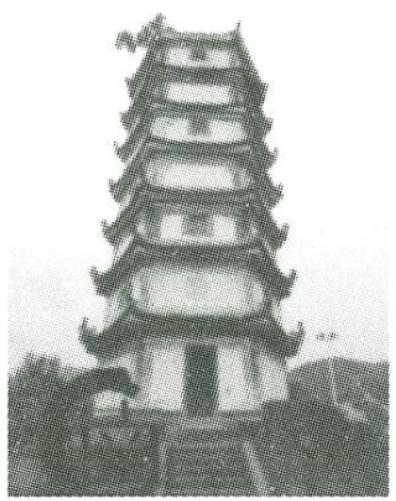

natural_image

Black-and-white photo of a multi-tiered traditional Chinese pagoda (no visible text or symbols)

图1

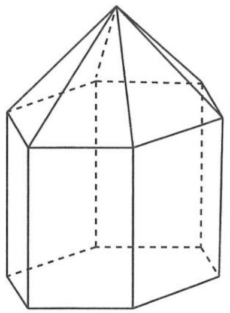

natural_image

Line drawing of a 3D geometric solid resembling a truncated pyramid or prism (no text or symbols)

图2

A. $45.6 \mathrm{~m}^{2}$

C. $(33.6 + 6\sqrt{5})$ $\mathrm{m}^2$

# 题有据

高考对立体几何的考查一般是“两小一大”，几何体体积和表面积的求解是小题的考查热点，2022年新高考Ⅰ卷、Ⅱ卷，今年2月的四省联考适应性测试中均有所呈现，预计今年高考再次出现的概率极高。

B. $(45.6 + 6\sqrt{3})$ $\mathrm{m}^2$

D. $(33.6 + 6\sqrt{5} + 6\sqrt{3})\mathrm{m}^2$

解析 记塔顶正六棱锥的底面正六边形的中心为 O. 因为正六边形的边长为 2, 所以点 O 到正六边形的边的距离为 $\sqrt{3}$ ,

又正六棱锥的高为1,故正六棱锥的侧面等腰三角形底边上的高为 $\sqrt{1^{2}+(\sqrt{3})^{2}}=2$ ,故该塔的第七层塔身及塔顶的表面积之和为 $(2.8\times2+\frac{1}{2}\times2\times2)\times6=45.6(\mathrm{~m}^{2})$ ,故选A.

【易错提醒】注意题目要求,所求表面积不包含正六棱柱的上、下底面

# 押题角度2 求切割体的体积

原创押题 2 （路障球改造）某市在休闲广场入口处曾安放一批路障球（如图3），为方便市民休息，计划将每个路障球改造成一个组合体，上方为一个球内接十面体，下方为半球（如图4），其中十面体有16条棱、8个顶点、10个面（2个正方形、8个三角形），它可以理解为将正四棱柱“切去完全相同的4个角”后得到的几何体（示意如图 5 中的几何体 ABCDHEFG). 经过测量, 这批路障球的半径为 R, 则改造一个路障球需要去掉的石料的体积为 \_\_\_\_.

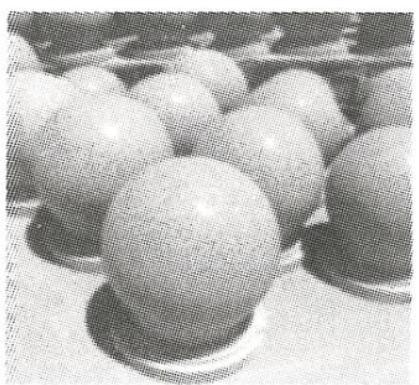

natural_image

Close-up of spherical objects on a surface, possibly balls or stones, with no visible text or symbols.

图 3

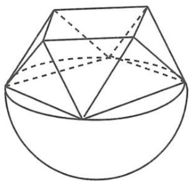

natural_image

Geometric diagram of a polyhedron with solid and dashed lines indicating visible and hidden edges (no text or labels)

图4

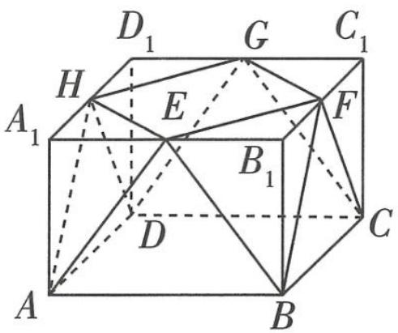

text_image

D₁ G C₁
H E F
A₁ B₁ C
D
A B

图 5

解析 由题意,组合体上方的十面体是一个正四棱柱切割而得到的几何体,设正四棱柱的底面边长为 a, 高为 h. 如图6,由题意,EFGH 为正方形,点 E, F, G, H 分别是所在棱的中点,路障球的球心为底面 ABCD 的中心 O.

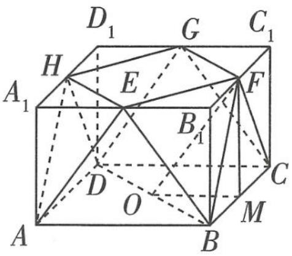

text_image

D₁
G
C₁
H
E
F
A₁
B₁
D
O
C
A
B
M

图6

【敲黑板】十面体的八个顶点都在半球的球面上，球心就是十面体底面的中心

连接 BD, 则 BD = 2R, 即 $\sqrt{2}a = 2R$ , 所以 $a = \sqrt{2}R$ . 取棱 BC 的中点 M, 连接 MF, OM, OF, 因为 M, F 分别为 $BC, B_{1}C_{1}$ 的中点, $BB_{1} \perp$ 平面 ABCD, 所以 $MF \perp$ 平面 ABCD, MF 为正四棱柱的高. 在 Rt△OFM 中, $OM = \frac{\sqrt{2}}{2}R$ , OF = R,

【厘清思路】时刻注意“内接”这一条件，由“内接”，我们得到了路障球的球心为十面体的下底面中心 O，则点 O 与十面体各顶点的连线长度均为半径 R，因此 OF = R

所以 $h = MF = \sqrt{OF^2 - OM^2} = \sqrt{R^2 - (\frac{\sqrt{2}}{2} R)^2} = \frac{\sqrt{2}}{2} R.$

所以正四棱柱的体积 $V_{1} = S_{\text{正方形}ABCD} \times h = (\sqrt{2} R)^{2} \times \frac{\sqrt{2}}{2} R = \sqrt{2} R^{3}$ .

易知正四棱柱的切去的完全相同的4个角是三棱锥,体积相等, $V_{B-B_{1}EF}=\frac{1}{3}S_{\triangle B_{1}EF}\times BB_{1}=\frac{1}{3}\times$ $\frac{1}{2}\times\frac{\sqrt{2}}{2}R\times\frac{\sqrt{2}}{2}R\times\frac{\sqrt{2}}{2}R=\frac{\sqrt{2}}{24}R^{3}$ ，所以十面体的体积 $V_{2}=V_{1}-4V_{B-B_{1}EF}=\sqrt{2}R^{3}-4\times\frac{\sqrt{2}}{24}R^{3}=\frac{5\sqrt{2}}{6}R^{3}$ . 易知

【难点突破】组合体的体积与表面积的求解, 多利用割补法将组合体分割或补全为规则几何体, 然后根据组合体的构成将所求问题转化为这些规则几何体的体积、表面积的和、差。本题中, 十面体的体积为正四棱柱与四个三棱锥的体积之差, 而改造需要去掉的石料体积为半球的体积与十面体的体积之差

# 044 试题调研 每月一辑试题新

半球的体积 $V_{3}=\frac{1}{2}\times\frac{4\pi}{3}R^{3}=\frac{2\pi}{3}R^{3}$ ，所以改造需要去掉的石料体积为 $V=V_{3}-V_{2}=\frac{2\pi}{3}R^{3}-\frac{5\sqrt{2}}{6}R^{3}=$ $\frac{4\pi-5\sqrt{2}}{6}R^{3}.$

拓展提升 若求该组合体的表面积呢？

解析 由题意可知,组合体的表面由如下几部分构成:十面体的上底面、8个侧面、半个球面、球的大圆除去十面体的下底面的剩余部分.

【定思路】将组合体的表面拆分,分别计算各部分的面积,最后相加即可

易知 $EF = \sqrt{2}EB_{1} = \sqrt{2} \times \frac{1}{2}AB = \sqrt{2} \times \frac{\sqrt{2}}{2}R = R$ ，所以十面体的上底面面积为 $S_{1} = R^{2}$ .

$\triangle EAB$ 的面积为 $\frac{1}{2} AB \times BB_1 = \frac{1}{2} \times \sqrt{2} R \times \frac{\sqrt{2}}{2} R = \frac{1}{2} R^2$ .

下面求 $\triangle EFB$ 的面积. 如图7, 取 $EF$ 的中点 $P$ , 连接 $BP, B_{1}P$ , 则 $BP$ 是 $\triangle EFB$ 的高.

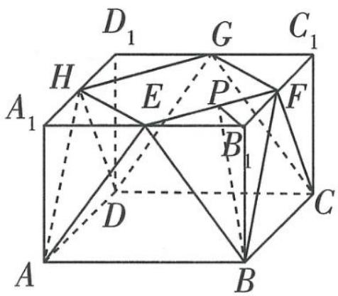

text_image

D₁ G C₁
H E P F
A₁ B₁ C
D
A B

图7

易得 $B_{1}P = \frac{1}{2} EF = \frac{R}{2}$ 则 $BP = \sqrt{BB_1^2 + B_1P^2} = \sqrt{\left(\frac{\sqrt{2}}{2} R\right)^2 + \left(\frac{R}{2}\right)^2} = \frac{\sqrt{3}}{2} R$ 故 $\triangle EFB$ 的面积为 $\frac{1}{2} EF\times BP = \frac{1}{2}\times R\times \frac{\sqrt{3}}{2} R = \frac{\sqrt{3}}{4} R^2.$

在十面体的8个侧面中,有4个侧面的面积等于 $\triangle EAB$ 的面积,另外4个侧面的面积等于 $\triangle EFB$ 的面积,所以8个侧面的面积和为 $S_{2}=4\times\frac{1}{2}R^{2}+4\times\frac{\sqrt{3}}{4}R^{2}=(2+\sqrt{3})R^{2}$ .

【易错】此处容易类比正棱柱的各个侧面面积相等,结合十面体的 8 个侧面都是等腰三角形,误以为 8 个侧面的面积相等。对于不熟悉、不常见的几何体,类比提出猜想后,一定要思考猜想是否正确

半个球面面积为 $S_{3} = \frac{1}{2}\times 4\pi R^{2} = 2\pi R^{2}$

球大圆的面积为 $\pi R^{2}$ , 十面体下底面的面积为 $(\sqrt{2} R)^{2} = 2R^{2}$ , 所以球的大圆除去十面体的下底面的剩余部分面积为 $S_{4} = \pi R^{2} - 2R^{2}$ .

所以该组合体的表面积 $S = S_{1} + S_{2} + S_{3} + S_{4} = (3\pi +\sqrt{3} +1)R^{2}$

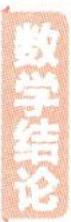

到角公式 直线 $l_{1}$ 和直线 $l_{2}$ 相交于一点, 把 $l_{1}$ 绕该点按逆时针旋转 $\theta$ , 此时 $l_{1}$ 与 $l_{2}$ 重合, $\theta$ 就叫作从 $l_{1}$ 到 $l_{2}$ 的角, 那么 $\tan \theta = (k_{2} - k_{1}) / (1 + k_{1}k_{2}), k_{1}, k_{2}$ 分别为直线 $l_{1}, l_{2}$ 的斜率. 该公式主要用于解决两直线对称问题.

关注微信公众号“初高教辅站”获取更多初高中教辅资料

# 考前 21 天▶ 第 30 题 空间角的求解问题

# 押题角度1 求二面角的余弦值

原创押题 1 如图 1, 四棱锥 $P - ABCD$ 中, $PA \perp$ 平面 $ABCD$ , 底面 $ABCD$ 为矩形, $E$ 在 $BC$ 上, $F$ 为 $DE$ 的中点, 三棱锥 $P - CDE$ 与四棱锥 $P - ABED$ 的体积之比为 $1:3, AB = 3, AD = 2\sqrt{3}$ .

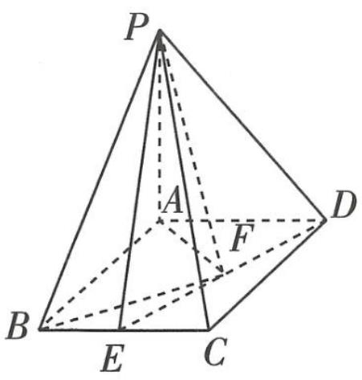

text_image

P
A
F
D
B
E
C

图1

(1) 求证: $DE \perp$ 平面 $PAF$ .

(2) 若 $PE$ 与平面 $ABCD$ 所成角为 $\frac{\pi}{6}$ , 求二面角 $A - PB - F$ 的余弦值.

解析 (1) 因为三棱锥 $P - CDE$ 与四棱锥 $P - ABED$ 的体积之比为 $1:3$ ,

所以 $S_{\triangle CED}:S_{四边形ABED}=1:3.$

【敲黑板】将两个锥体体积之比转化为底面积之比，进而利用平面几何的知识确定点 $E$ 的位置。这是解决立体几何问题最基本的平面化思想。

连接 $BD$ ，如图2，则 $S_{\triangle CED} = \frac{1}{4} S_{\text{矩形}ABCD} = \frac{1}{2} S_{\triangle BCD}$

所以 E 为 BC 的中点, 故 $BE = \frac{1}{2} AD = \sqrt{3}$ .

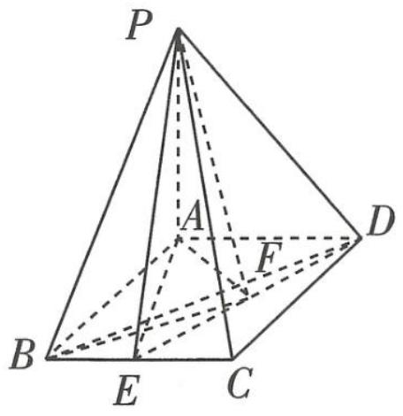

text_image

P
A
F
D
B
E
C

图2

连接 AE, 在 Rt $\triangle ABE$ 中, $AE = \sqrt{AB^{2} + BE^{2}} = \sqrt{3^{2} + (\sqrt{3})^{2}} = 2\sqrt{3}$ , 故 AE = AD,

又 $EF = FD$ ，故 $AF \perp DE$ .

因为 $PA \perp$ 平面 $ABCD, DE \subset$ 平面 $ABCD$ , 所以 $PA \perp DE$ ,

又 $PA \cap AF = A, PA, AF \subset$ 平面 PAF, 所以 DE ⊥ 平面 PAF.

【易遗漏】证明题中的条件一定要写全，不要遗漏，否则容易丢失步骤分

(2) 因为 $PA \perp$ 平面 $ABCD$ , 所以 $\angle PEA$ 为 $PE$ 与平面 $ABCD$ 所成角, 即 $\angle PEA = \frac{\pi}{6}$ , 所以 $PA = AE \tan \angle PEA = 2\sqrt{3} \times \frac{\sqrt{3}}{3} = 2$ .

方法一 (几何法)如图3,取AB的中点H,在 $\triangle PAB$ 内,过点H作 $HM\perp PB$ 于M,

【会找角】找二面角的平面角的关键是“寻垂直”，以此为出发点作辅助线，从而顺利找角连接 FH, FM.

因为 $PA \perp$ 平面 ABCD, 所以 $PA \perp AD$ ,

又四边形 ABCD 为矩形, 所以 $AD \perp AB$ , 而 $PA \cap AB = A$ , 所以 $AD \perp$ 平面 PAB. 在矩形

$$
\begin{array}{r l} & {\text {常用不等式} \quad (1 + x) ^ {n} \geqslant 1 + n x (n \in \mathbb {N} ^ {*}), \sin x <   x <   \tan x (0 <   x <   \frac {\pi}{2}), \mathrm{e} ^ {x} \geqslant x + 1,} \\ & {\frac {x}{1 + x} \leqslant \ln (1 + x) \leqslant x.} \\ & {\text {关注微信公众号“初高教辅站”获取更多初高中教辅资料}} \end{array}
$$

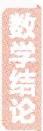

ABCD 内, $EF = FD$ , $BH = HA$ , 所以 $FH \parallel AD$ , 所以 $FH \perp$ 平面 $PAB$ .

因为 $PB \subset$ 平面 $PAB$ , 所以 $FH \perp PB$ , 又 $HM \perp PB, HM, FH \subset$ 平面 $MHF, HM \cap FH = H$ , 所以 $PB \perp$ 平面 $MHF$ , 因为 $FM \subset$ 平面 $MHF$ , 所以 $PB \perp FM$ , 所以 $\angle FMH$ 为二面角 $A - PB - F$ 的平面角.

在矩形 $ABCD$ 中， $FH = \frac{1}{2}(BE + AD) = \frac{1}{2} (\sqrt{3} + 2\sqrt{3}) = \frac{3\sqrt{3}}{2}$ ，在 $\triangle PAB$ 中， $\sin \angle PBA = \frac{PA}{PB} = \frac{2}{\sqrt{2^2 + 3^2}} = \frac{2}{\sqrt{13}}$ ，所以 $MH = BH\sin \angle PBA = \frac{3}{2} \times \frac{2}{\sqrt{13}} = \frac{3}{\sqrt{13}}$ 。

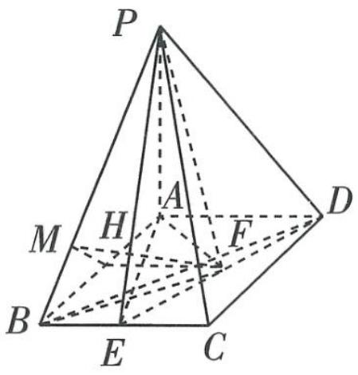

text_image

P
A
H
M
F
B
E
C
D

图3

在 Rt△MFH 中， $MF = \sqrt{MH^{2} + FH^{2}} = \sqrt{\left(\frac{3}{\sqrt{13}}\right)^{2} + \left(\frac{3\sqrt{3}}{2}\right)^{2}} = \frac{3\sqrt{43}}{2\sqrt{13}}$

所以 $\cos\angle FMH=\frac{MH}{MF}=\frac{2\sqrt{43}}{43}$ ，即二面角 A-PB-F 的余弦值为 $\frac{2\sqrt{43}}{43}$ .

方法二 （向量法）由题意知，AP, AB, AD 三线两两垂直。以 A 为坐标原点， $\overrightarrow{AB}, \overrightarrow{AD}, \overrightarrow{AP}$ 的方向分别为 x 轴，y 轴，z 轴的正方向建立如图 4 所示的空间直角坐标系，则 $A(0,0,0)$ ， $B(3,0,0)$ ， $D(0,2\sqrt{3},0)$ ， $P(0,0,2)$ ， $E(3,\sqrt{3},0)$ ， $F(\frac{3}{2},\frac{3\sqrt{3}}{2},0)$ ， $\overrightarrow{BP}=(-3,0,2)$ ， $\overrightarrow{PF}=(\frac{3}{2},\frac{3\sqrt{3}}{2},-2)$ 。

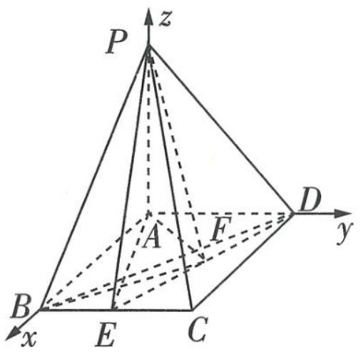

text_image

P
z
A
F
D
y
B
E
C
x

图 4

易知平面 $PAB$ 的一个法向量为 $\pmb {m} = (0,1,0)$ , 设平面 $PBF$ 的法向量为 $\pmb {n} = (x,y,z)$ ,

则 $\left\{ \begin{array}{l} n \cdot \overrightarrow{BP} = -3x + 2z = 0, \\ n \cdot \overrightarrow{PF} = \frac{3}{2} x + \frac{3\sqrt{3}}{2} y - 2z = 0, \end{array} \right.$ 即 $\left\{ \begin{array}{l} 3x = 2z, \\ 3x + 3\sqrt{3}y - 4z = 0, \end{array} \right.$ 令 $x = 2$ ，得 $z = 3, y = \frac{2}{\sqrt{3}}$ ，故 $n = (2, \frac{2}{\sqrt{3}}, 3)$ 为平面 $PBF$ 的一个法向量， $\cos \langle m, n \rangle = \frac{m \cdot n}{|m||n|} = \frac{2\sqrt{43}}{43}$ .

设所求二面角为 $\theta$ ，由题图可知 $\theta \in (0, \frac{\pi}{2})$ ，故 $\cos \theta = \cos \langle m, n \rangle = \frac{2\sqrt{43}}{43}$ .

【易忽略】利用法向量求二面角时, 法向量的夹角可能与所求二面角相等, 也可能互补, 要结合图形判断二面角为锐角还是钝角

所以二面角 A-PB-F 的余弦值为 $\frac{2\sqrt{43}}{43}$ .

# 押题角度2 已知二面角的余弦值求点面距

原创押题 2 某学校组织学生到工厂劳动实践,利用 3D 打印技术制作模型,如

图5,该模型为四棱锥. 在四棱锥 $P - ABCD$ 中, $PD \perp$ 平面 $ABCD$ , $E$ 为 $AD$ 的中点, 底面 $ABCD$ 是边长为 2 的正方形, 且二面角 $P - BE - C$ 的余弦值为 $\frac{\sqrt{6}}{6}$ .

text_image

P
C
D
E
A
B

图5

(1) 求 $PD$ 的长.  
(2) 求点 C 到平面 PEB 的距离.

解析 (1) 由题意知 $DP, DA, DC$ 三线两两垂直. 如图6所

示,以 $D$ 为坐标原点, ${DA},{DC},{DP}$ 分别为 $x$ 轴, $y$ 轴, $z$ 轴建立空间直角坐标系,则 $D\left( {0,\text{轴建立空间直角坐标系}}\right)$

【会建系】本题中 $DA, DC, DP$ 三线两两垂直，满足建立空间直角坐标系的天然条件，果断建系，求出相关点的坐标，利用向量的有关运算法则计算即可

$$
0, 0), B (2, 2, 0), E (1, 0, 0).
$$

设 $PD = a (a > 0)$ , 则 $P(0,0,a)$ , 所以 $\overrightarrow{PB} = (2,2,-a), \overrightarrow{PE} = (1,0,-a)$ .

易知平面 CBED 的一个法向量为 $\boldsymbol{n}_{1}=(0,0,1)$ .

设平面 PBE 的法向量为 $\boldsymbol{n}_{2}=(x,y,z)$ ，则 $\left\{\begin{aligned}\boldsymbol{n}_{2}\cdot\overrightarrow{PB}&=0,\\ \boldsymbol{n}_{2}\cdot\overrightarrow{PE}&=0,\end{aligned}\right.$ 即 $\left\{\begin{aligned}&2x+2y-az=0,\\ &x-az=0,\end{aligned}\right.$ 取 z=1，得 $x=a,y=-\frac{a}{2}$ ，即 $\boldsymbol{n}_{2}=(a,-\frac{a}{2},1)$ 为平面 PBE 的一个法向量.

text_image

z
P
C
y
D
A
E
B
x

图6

则 $|\cos \langle n_1, n_2 \rangle| = |\frac{1}{1 \times \sqrt{a^2 + (-\frac{a}{2})^2 + 1^2}}| = \frac{\sqrt{6}}{6}$ , 解得 $a = 2$ (负值舍去), 故 $PD$ 的长为 2.

(2)由(1)得, $n_{2}=(2,-1,1)$ , $\overrightarrow{CB}=(2,0,0)$ ,

则点 C 到平面 PEB 的距离为 $\frac{|\overrightarrow{CB} \cdot n_{2}|}{|n_{2}|} = \frac{4}{\sqrt{6}} = \frac{2\sqrt{6}}{3}$ .

【记公式】已知平面 $\alpha$ ，O 为平面上任意一点，平面 $\alpha$ 的法向量为 n，A 为平面外一点，则点 A 到平面 $\alpha$ 的距离为 $d=\frac{|\overrightarrow{OA}\cdot n|}{|n|}$ 。本题也可以利用等体积法求解，设点 C 到平面 PEB 的距离为 d，连接 CE，则 $V_{C-PEB}=\frac{1}{3}\times S_{\triangle PEB}\times d=V_{P-CEB}=\frac{1}{3}\times S_{\triangle CEB}\times PD=\frac{1}{3}\times\frac{1}{2}\times2\times2\times2=\frac{4}{3}$ ，易知 $PE=BE=\sqrt{5}, PB=2\sqrt{3}$ ，所以 $S_{\triangle PEB}=\frac{1}{2}\times\sqrt{5-3}\times2\sqrt{3}=\sqrt{6}$ ，所以 $d=\frac{4}{\sqrt{6}}=\frac{2\sqrt{6}}{3}$

最早的数学著作——《算数书》《算数书》是已知最早的中国数学著作,其内容丰富,李学勤先生称之为“中国数学史上的重大发现”.

# 考前 20 天▶第 31 题 与圆有关的位置关系问题

# 押题角度》与圆有关的位置关系问题

原创押题 1 (渗透数学文化,隐形圆——阿波罗尼斯圆)已知动点 P 到原点 O 与到点 A(2,0) 的距离之比为 2:1,动点 P 的轨迹记为 C,直线 l:3x - 4y - 3 = 0,则下列结论中错误的是 ()

隐形圆问题: 圆的信息在条件中没有直接给出, 而是隐藏在题目中, 要通过分析和转化, 发现圆(或圆的方程), 此处是阿波罗尼斯圆

A. $C$ 的方程为 $(x - \frac{8}{3})^2 + y^2 = \frac{16}{9}$

B. 动点 $P$ 到直线 $l$ 的距离的取值范围为 $\left[\frac{1}{3}, \frac{7}{3}\right]$

C. 直线 $l$ 被 $C$ 截得的弦长为 $\frac{2 \sqrt{7}}{3}$

D. C 上存在三个点到直线 l 的距离为 $\frac{1}{3}$

解析 设 $P(x,y)$ ，因为 $|PO|=2|PA|$ ，所以 $\sqrt{x^{2}+y^{2}}=2\sqrt{(x-2)^{2}+y^{2}}$ ，所以 C 的方程为 $(x-\frac{8}{3})^{2}+y^{2}=\frac{16}{9}$ ，故 A 正确。因为圆心 $C(\frac{8}{3},0)$ 到直线 l:3x-4y-3=0 的距离 $d=\frac{5}{5}=1<r=\frac{4}{3}$ ，

【拓展】(1) 若 A, B 是平面上两定点，当动点 P 满足 $\frac{|PA|}{|PB|}=\lambda(\lambda>0,$ 且 $\lambda\neq1)$ 时可确定隐形圆，该隐形圆即阿波罗尼斯圆；(2) 若动点 P 对两定点 A, B 的弦角为 $90^{\circ}$ （或 $k_{PA}\cdot k_{PB}=-1$ ），可确定隐形圆

其中 r 为圆 C 的半径，所以直线 l 与圆 C 相交，且直线 l 被 C 截得的弦长为 $2\sqrt{(\frac{4}{3})^{2}-1}=\frac{2\sqrt{7}}{3}$ ，故 C 正确。动点 P 到直线 l 的距离的取值范围为 $[0,\frac{7}{3}]$ ，故 B 错误，D 正确。故选 B。

原创押题 2 (有关圆的动点问题, 交汇平面向量, 体现开放探究) 如图 1, 已知圆 $O: x^{2} + y^{2} = 2$ , $M$ 是直线 $l: x - y + 4 = 0$ 上的动点, 过点 $M$ 作圆 $O$ 的两条切线, 切点分别为 $A, B$ , 则 $\overrightarrow{MA} \cdot \overrightarrow{MB}$ 的最小值为 \_\_\_\_.

解析 设 $\angle AMB = 2\theta$ ，则 $\overrightarrow{MA} \cdot \overrightarrow{MB} = |\overrightarrow{MA}| |\overrightarrow{MB}| \cos 2\theta = |\overrightarrow{MA}|^2 \cos 2\theta$ ，连接 $OM$ ，可知当 $OM \perp l$ 时， $|\overrightarrow{MA}|$ 最小且 $2\theta$ 最大， $\cos 2\theta$ 最小，这时 $\overrightarrow{MA} \cdot \overrightarrow{MB}$ 取最小值。设点 $O$ 到直线 $l$ 的距离为 $d$ ，则 $d = 2\sqrt{2}$ 。

因为圆 O 的半径为 $\sqrt{2}$ ，所以当 $OM \perp l$ 时， $\sin \theta = \frac{\sqrt{2}}{2\sqrt{2}} = \frac{1}{2}$ ，可得 $\cos 2\theta = \frac{1}{2}$ ， $|\overrightarrow{MA}|^{2} = d^{2} - (\sqrt{2})^{2} = 6$ ，
所以 $\overrightarrow{MA}\cdot\overrightarrow{MB}$ 的最小值为 $6\times\frac{1}{2}=3$ .

text_image

y
M
l
A
O
B
x

图 1

# 考前 19 天▶第 32 题 椭圆的几何性质问题

# 押题角度1 求直线的斜率

原创押题 1 (巧用点差法、二级结论求直线斜率,解法创新)已知椭圆 $C: \frac{x^{2}}{4}+\frac{y^{2}}{3}=1$ , 过点 $P(1,-1)$ 的直线 $l$ 与椭圆 $C$ 交于 $A,B$ 两点, 若点 $P$ 恰为弦 $AB$ 的中点, 则直线 $l$ 的斜率是 中点问题优先考虑点差法, 设而不求 ( )

A. $- \frac{4}{3}$

B. $- \frac{3}{4}$

C. $\frac{3}{4}$

D. $\frac{4}{3}$

解析 设 $A(x_{1},y_{1}),B(x_{2},y_{2})$ ，且 $x_{1} + x_{2} = 2,y_{1} + y_{2} = -2$ ，且 $\frac{x_1^2}{4} +\frac{y_1^2}{3} = 1,\frac{x_2^2}{4} +\frac{y_2^2}{3} = 1$ ，作差得 $\frac{x_1^2 - x_2^2}{4} = -\frac{y_1^2 - y_2^2}{3}$ 所以 $\frac{y_1 - y_2}{x_1 - x_2} = -\frac{3}{4}\times \frac{x_1 + x_2}{y_1 + y_2} = \frac{3}{4}$ 即直线 $l$ 的斜率是 $\frac{3}{4}$ 故选C.

【二级结论】中点弦问题：若焦点在 $x$ 轴上时，椭圆（双曲线）与直线 $l$ 交于 $A, B$ 两点， $M$ 为 $AB$ 的中点， $O$ 为坐标原点，且 $k_{AB}$ 与 $k_{OM}$ 均存在时，有 $k_{AB} \cdot k_{OM} = -\frac{b^2}{a^2}$ （椭圆）， $k_{AB} \cdot k_{OM} = \frac{b^2}{a^2}$ （双曲线），如本题，可直接得 $k_{AB} \cdot (-1) = -\frac{3}{4}$ ，则 $k_{AB} = \frac{3}{4}$

# 押题角度2 求离心率或离心率的取值范围

原创押题 2 (椭圆离心率交汇对勾函数的性质, 交汇创新) 设椭圆 $C: \frac{x^{2}}{a^{2}} + \frac{y^{2}}{b^{2}} = 1 (a > b > 0)$ 的右焦点为 $F$ , 椭圆 $C$ 上的两点 $A, B$ 关于原点对称, 且满足 $\overrightarrow{FA} \cdot \overrightarrow{FB} = 0$ , $|FB| \leqslant |FA| \leqslant 2 |FB|$ , 则椭圆 $C$ 的离心率的取值范围为 ( )

A. $(0, \frac{\sqrt{2}}{2}]$

B. $\left[\frac{\sqrt{2}}{2}, \frac{\sqrt{5}}{3}\right]$

C. $\left[\frac{2}{3}, \frac{\sqrt{2}}{2}\right]$

D. $\left[\frac{\sqrt{2}}{2}, 1\right)$

解析 如图1所示,设椭圆的左焦点为 $F'$ , 连接 $AF'$ , $BF'$ , 由椭圆的对称性可知, 四边形 $AFBF'$ 为平行四边形, 又 $\overrightarrow{FA} \cdot \overrightarrow{FB} = 0$ , 即 $FA \perp FB$ , 所以四边形 $AFBF'$ 为矩形, 所以 $|AB| = |FF'| = 2c$ , 设 $|AF'| = n$ , $|AF| = m$ , 在 Rt $\triangle ABF$ 中, $m + n = 2a$ , $m^2 + n^2 = 4c^2$ , 可得 $mn = 2b^2$ , 所以 $\frac{m}{n} + \frac{n}{m} = \frac{m^2 + n^2}{mn} = \frac{2c^2}{b^2}$ , 令 $\frac{m}{n} = t$ , 得 $t + \frac{1}{t} = \frac{2c^2}{b^2}$ .

text_image

y
A
F
x
O
F'
B

图 1

又 $|FB|\leqslant|FA|\leqslant2|FB|$ ，得 $\frac{m}{n}=t\in[1,2]$ ，所以 $t+\frac{1}{t}=\frac{2c^{2}}{b^{2}}\in[2,$ $\frac{5}{2}]$ , 所以 $\frac{c^2}{b^2} \in [1, \frac{5}{4}]$ , 所以 $\frac{b^2}{a^2} \in [\frac{4}{9}, \frac{1}{2}]$ , 所以 $\frac{c^2}{a^2} \in [\frac{1}{2}, \frac{5}{9}]$ , 所以 $\frac{c}{a} \in [\frac{\sqrt{2}}{2}, \frac{\sqrt{5}}{3}]$ , 即椭圆 $C$ 的离心率的取值范围为 $[\frac{\sqrt{2}}{2}, \frac{\sqrt{5}}{3}]$ , 故选 B.

最早的记数方法——结绳记事 结绳记事是远古时代人类记录事实、进行传播的一种手段。它发生在语言产生以后、文字出现之前的漫长年代里。

关注微信公众号“初高教辅站”获取更多初高中教辅资料

# 考前 18 天▶第 33 题 双曲线的几何性质问题

# 押题角度1 求离心率

原创押题 1 （利用双曲线的渐近线、对称性,三角形的中位线求离心率,贴合新高考的改革方向）已知双曲线 $E:\frac{x^{2}}{a^{2}}-\frac{y^{2}}{b^{2}}=1(a>0,b>0)$ 的左、右焦点分别为 $F_{1},F_{2},F_{1}$ 关于渐近线的对称点在双曲线 E 上,则双曲线 E 的离心率为 ( )

A. 2

B. $\frac{\sqrt{5}}{2}$

C. $\sqrt{5}$

D. $\sqrt{2}$

解析 如图1所示,由题知 $F_{1}$ 关于渐近线OM的对称点P在双曲线E上,其中M是 $PF_{1}$ 与OM的交点.

连接 OP, 则 $\left|OP\right| = \left|OF_{1}\right| = \left|OF_{2}\right|$ , 所以 $PF_{2} \perp PF_{1}, OM$ 是 $\triangle F_{1}F_{2}P$ 的中位线, 所以 $OM \parallel PF_{2}, OM \perp MF_{1}$ . 所以 $F_{1}(-c,0)$ 到渐近线 $bx + ay = 0$ 的距离 $d = \frac{|b \times (-c) + a \times 0|}{\sqrt{b^{2} + a^{2}}} = \frac{bc}{c} = b$ , 即 $\left|MF_{1}\right| = b$ , 在

【收获与辨析】双曲线渐近线常考性质：双曲线的焦点到两条渐近线的距离为常数 $b$ ，顶点到两条渐近线的距离为常数 $\frac{ab}{c}$ ，双曲线上
的任意点 $P$ 到双曲线 $C$ 的两条渐近线的距离的乘积是常数 $\frac{a^2b^2}{c^2}$

text_image

y
M
P
F₁ O F₂ x

图 1

Rt $\triangle F_{1}OM$ 中， $|OF_{1}| = c, |MF_{1}| = b$ ，所以 $|OM| = \sqrt{|OF_{1}|^{2} - |MF_{1}|^{2}} = \sqrt{c^{2} - b^{2}} = a$ ，所以 $|PF_{1}| - |PF_{2}| = 2|F_{1}M| - 2|MO| = 2b - 2a = 2a$ ，所以 $b = 2a$ ，则离心率 $e = \frac{c}{a} = \sqrt{1 + \frac{b^2}{a^2}} = \sqrt{5}$ . 故选 C.

# 押题角度2 双曲线中的动态问题

难度★★★★☆ 原创押题 2 （开放探究问题, 探究点的存在性、点的运动轨迹, 交汇平面向量, 综合性强）已知双曲线 $C: \frac{x^{2}}{4} - \frac{y^{2}}{5} = 1, F_{1}, F_{2}$ 分别为其左、右焦点, 设点 $P$ 是在双曲线上且在第一象限内的动点, 点 $I$ 为 $\triangle PF_{1}F_{2}$ 的内心, $A(0,4)$ , 则下列说法正确的是 ( )

A. 双曲线 C 的渐近线方程为 $\frac{x}{4} \pm \frac{y}{5} = 0$

B. 不存在点 $P$ , 使得 $|PA| + |PF_{1}|$ 取得最小值

C. 若 $\left|PF_{1}\right|=2\left|PF_{2}\right|,\overrightarrow{PI}=x\overrightarrow{PF_{1}}+y\overrightarrow{PF_{2}}$ ，则 $y-x=\frac{2}{9}$

D. 点 $I$ 的运动轨迹为双曲线的一部分

我国古代文献对此有所记载，《周易·系辞》云：“上古结绳而治。”《春秋左传集解》云：“古者无文字，其有约誓之事，事大大其绳，事小小其绳，结之多少，随扬众寡，各执以相考，亦足以相治也。”

解析 由题意,双曲线 $C:\frac{x^{2}}{4}-\frac{y^{2}}{5}=1$ , 可知其渐近线方程为 $\frac{x}{2}\pm\frac{y}{\sqrt{5}}=0$ , A 错误.

取与 $P$ 关于 $y$ 轴对称的点 $P'$ , 连接 $P'A, P'F_1$ , 则 $|PA| = |P'A|$ 且 $|PF_2| = |P'F_1|$ ,

而 $\left|PF_{1}\right|-\left|PF_{2}\right|=2a=4$

$$
\therefore | P A | + | P F _ {1} | = | P ^ {\prime} A | + | P ^ {\prime} F _ {1} | + | P F _ {1} | - | P ^ {\prime} F _ {1} | = | P ^ {\prime} A | + | P ^ {\prime} F _ {1} | + 4,
$$

故要使 $|PA|+|PF_{1}|$ 最小,只需 $A,P',F_{1}$ 三点共线即可,

【难点突破】求动点到两定点的距离和的最值, 本题选择应用双曲线的定义及对称性将动点转移到两定点之间的某条曲线上, 结合 “两点之间, 线段最短” 求最小值

易知 $(|PA|+|PF_{1}|)_{\min}=5+4=9$ ，故存在点P使得 $|PA|+|PF_{1}|$ 取得最小值，B错误.

由 $|PF_{1}|=2|PF_{2}|$ 且 $|PF_{1}|-|PF_{2}|=2a=4$ ，解得 $|PF_{1}|=8,|PF_{2}|=4,|F_{1}F_{2}|=2c=6$

$\therefore \cos \angle PF_{1}F_{2} = \frac{64 + 36 - 16}{2\times 8\times 6} = \frac{7}{8}$ 则 $\sin \angle PF_1F_2 = \sqrt{1 - (\frac{7}{8})^2} = \frac{\sqrt{15}}{8},$

$\therefore \tan \angle PF_{1}F_{2} = \frac{\sqrt{15}}{7}$ , 同理可得 $\tan \angle PF_{2}F_{1} = -\sqrt{15}$ ,

$\therefore PF_{1}:y = \frac{\sqrt{15}}{7} (x + 3),PF_{2}:y = \sqrt{15}(x - 3)$ ，联立方程得 $P(4,\sqrt{15})$

设 $\triangle PF_{1}F_{2}$ 的内切圆半径为 $r$ ，则 $S_{\triangle PF_1F_2} = \frac{1}{2} \times 8 \times 6 \times \frac{\sqrt{15}}{8} = \frac{1}{2} \times (8 + 4 + 6) \times r$ ，解得 $r = \frac{\sqrt{15}}{3}$ ，即 $I(2, \frac{\sqrt{15}}{3})$ ，

$$
\therefore \overrightarrow {P I} = (- 2, - \frac {2 \sqrt {1 5}}{3}), \overrightarrow {P F _ {1}} = (- 7, - \sqrt {1 5}), \overrightarrow {P F _ {2}} = (- 1, - \sqrt {1 5}),
$$

由 $\overrightarrow{PI} = x\overrightarrow{PF_1} +y\overrightarrow{PF_2}$ ，可得 $\left\{ \begin{array}{l} - 2 = -7x - y,\\ -\frac{2\sqrt{15}}{3} = -\sqrt{15} x - \sqrt{15} y, \end{array} \right.$ 解得 $\left\{ \begin{array}{ll}x = \frac{2}{9},\\ y = \frac{4}{9}, \end{array} \right.$ 故 $y - x = \frac{2}{9},C$ 正确.

如图2所示, 设 $|PF_{1}| = m$ , $|PF_{2}| = n$ , $\triangle PF_{1}F_{2}$ 的内切圆与 $PF_{1}, PF_{2}, F_{1}F_{2}$ 分别切于点 $S, K, T$ , 可得 $|PS| = |PK|, |F_{1}S| = |F_{1}T|, |F_{2}T| = |F_{2}K|$ , 由双曲线的定义可得 $m - n = 2a$ , 即 $|F_{1}S| - |F_{2}K| = |F_{1}T| - |F_{2}T| = 2a$ , 又 $|F_{1}T| + |F_{2}T| = 2c$ , 可得 $|F_{2}T| = c - a$ , 则 $T$ 的横坐标为 $a$ ,

text_image

y
A
P
S
K
F₁ O T F₂ x
\frac{x²}{4} - \frac{y²}{5} = 1

图2

又 $I$ 与 $T$ 的横坐标相同,即 $I$ 的横坐标为 $a = 2$ ,故 $I$ 在定直线 $x = 2$ 上运动,D 错误. 故选 C.

【拓展】设 ${A}_{1},{A}_{2}$ 分别为双曲线 $\frac{{x}^{2}}{{a}^{2}} - \frac{{y}^{2}}{{b}^{2}} = 1\left( {a > 0,b > 0}\right)$ 的左、右顶点, ${F}_{1}$ , ${F}_{2}$ 分别为左、右焦点,点 $P$ 是双曲线上的一个动点,则 ${\Delta PF}_{1}{F}_{2}$ 的内切圆 $I$ ,必与 ${A}_{1}{A}_{2}$ 所在的直线切于点 ${A}_{1}$ 或 ${A}_{2}$ ,即圆心 $I$ 在直线 $x = a$ 或直线 $x =  - a$ 上

考前

17

# 天▶第 34 题 抛物线的几何性质问题

# 押题角度 直线与抛物线的位置关系

原创押题 1 (应用转化思想, 交汇平面向量) 已知抛物线 $C: y^{2} = 2px (p > 0)$ 的焦点为 $F$ , 点 $M$ 在抛物线 $C$ 上, 射线 $FM$ 与 $y$ 轴交于点 $A(0,1)$ , 与抛物线 $C$ 的准线交于点 $N, \overrightarrow{MN} = \sqrt{5}\overrightarrow{FM}$ , 则 $p =$

A. $\frac{1}{2}$

B. 1

C. 2

D. 4

解析 过点 M 作 $MM'$ 垂直于抛物线的准线, 并交其于点 $M'$ , 抛物线的准线与 x 轴的交点记为点 B, 如图 1 所示.

由抛物线的定义知 $|MM'| = |FM|$ . 因为 $\frac{|MN|}{|FM|} = \sqrt{5}$ , 所以 $\frac{|MM'|}{|MN|} = \frac{\sqrt{5}}{5}$ ,

【会转化】根据抛物线的定义，把点 M 到焦点 F 的距离转化成点 M 到抛物线的准线的距离 $\vert MM'$ ，然后通过解三角形求参数值

即 $\cos \angle NMM' = \frac{|MM'|}{|MN|} = \frac{\sqrt{5}}{5}$ , 所以 $\cos \angle OFA = \cos \angle NMM' = \frac{\sqrt{5}}{5}$ ,

所以 $\cos \angle OFA = \frac{|OF|}{|AF|} = \frac{\frac{p}{2}}{\sqrt{\left(\frac{p}{2}\right)^2 + 1^2}} = \frac{\sqrt{5}}{5}$ , 解得 $p = 1$ , 故选 B.

text_image

y
N
A
M'
M
B O F x

图1

原创押题 2 (将抛物线与圆交汇, 探索直线与抛物线的交点个数, 利用二级结论求弦长, 综合性强) 已知抛物线 $C: y^{2} = 2px (p > 0)$ 的焦点 $F$ 到准线 $l$ 的距离为 2 , 则 ( )

A. 焦点 $F$ 的坐标为 $(-1,0)$   
B. 过点 $P(-1,0)$ 恰有 2 条直线与抛物线 $C$ 有且只有一个公共点  
C. 直线 $x + y - 1 = 0$ 与抛物线 $C$ 相交所得弦长为 4  
D. 抛物线 C 与圆 $x^{2} + y^{2} = 5$ 交于 M, N 两点, 则 $|MN| = 4$

解析

由题可知抛物线方程为 $y^{2} = 4x$ .

对于 A, 焦点 F 的坐标为 $(1,0)$ , 故 A 错误.

对于 B, 过点 $P(-1,0)$ 可以作抛物线的 2 条切线, 但还有直线 y=0 也与抛物线 C 有且只有一个公共点, 所以共 3 条直线与抛物线 C 有且只有一个公共点, 故 B 错误.

对于 C, 设直线 $x + y - 1 = 0$ 与抛物线 C 交于 A, B 两点, $A(x_{1}, y_{1}), B(x_{2}, y_{2})$ , 由 $\left\{\begin{aligned}x + y - 1 &= 0, \\ y^{2} &= 4x,\end{aligned}\right.$ 得$y^{2}+4y-4=0,\Delta>0,y_{1}+y_{2}=-4,y_{1}y_{2}=-4$ ，则 $|AB|=\sqrt{2}|y_{1}-y_{2}|=\sqrt{2}\times\sqrt{(y_{1}+y_{2})^{2}-4y_{1}y_{2}}=\sqrt{2}\times\sqrt{16+16}=8$ ，故C错误.

【秒解】应用抛物线焦点弦长公式 $|AB| = \frac{2p}{\sin^{2}\theta}$ ，秒得 $|AB| = 8$ ，其中 $\theta$ 是直线 $AB$ 的倾斜角

对于 D, $\left\{\begin{aligned}x^{2}+y^{2}=5,\\ y^{2}=4x,\end{aligned}\right.$ 得 $x^{2}+4x-5=0$ , 解得 $x=1(x=-5$ 舍去 $)$ , 则抛物线 C 与圆 $x^{2}+y^{2}=5$ 的交点为 $(1,\pm2)$ , 则有 $|MN|=4$ , 故 D 正确. 故选 D.

原创押题 3 (探索直线过定点问题、点的轨迹形状以及线段长度的最值等, 体现开放探究) 已知直线 $l$ 与抛物线 $y^{2} = 2px (p > 0)$ 交于 $A, B$ 两点 (异于坐标原点 $O$ ), 且 $OA \perp OB, OD \perp AB$ 交 $AB$ 于点 $D$ , 则 ( )

A. 直线 l 过定点 $(2p,0)$

B. 线段 $AB$ 长度的最大值为 $4p$

C. 点 $D$ 的轨迹是椭圆

D. 线段 OD 长度的最大值为 $\sqrt{3}p$

解析 对于 A, 设 $A(x_{1}, y_{1})$ , $B(x_{2}, y_{2})$ , $l: x = my + a$ ,

因为 $OA \perp OB$ ，所以 $\overrightarrow{OA} \cdot \overrightarrow{OB} = 0$ ，所以 $x_{1}x_{2} + y_{1}y_{2} = 0$

由 $\left\{\begin{aligned}y^{2}&=2px,\\ x&=my+a,\end{aligned}\right.$ 可得 $y^{2}-2pmy-2pa=0,\Delta>0$ ，所以 $y_{1}+y_{2}=2pm,y_{1}y_{2}=-2pa.$

因为 $y_{1}^{2}=2px_{1},y_{2}^{2}=2px_{2}$ ，所以 $y_{1}^{2}y_{2}^{2}=4p^{2}x_{1}x_{2},x_{1}x_{2}=\frac{y_{1}^{2}y_{2}^{2}}{4p^{2}}=a^{2}$

所以 $x_{1}x_{2} + y_{1}y_{2} = a^{2} - 2pa = 0$ ，得 a = 2p。

所以 $l: x = my + 2p$ ，所以直线 l 过 x 轴上的定点 $(2p, 0)$ ，故 A 选项正确。

【敲黑板】过抛物线 $y^{2}=2px(p>0)$ 上的一个定点 $M(x_{0},y_{0})$ 任意作两条互相垂直的弦 MP， $MQ(P,Q$ 在抛物线上），则直线 PQ 必过定点 $(x_{0}+2p,-y_{0})$ ，特别地，当 M 是原点时，直线 PQ 过定点 $(2p,0)$

对于 B, $\left|AB\right|=\sqrt{1+m^{2}}\left|y_{1}-y_{2}\right|=\sqrt{1+m^{2}}\sqrt{\left(y_{1}+y_{2}\right)^{2}-4y_{1}y_{2}}=$ $2p \times \sqrt{m^{4} + 5m^{2} + 4}$ ,

因为 $m^2 \in [0, +\infty)$ , 所以 $|AB| \geqslant 2p \times \sqrt{4} = 4p$ , 当 $m = 0$ 时取等号, B 选项错误.

对于 C, 如图 2, 设直线 l 与 x 轴的交点为 C, 因为 $OD \perp DC$ , OC 为定值 2p, 所以 D 在以 CO 为直径的圆上运动 (点 D 不与点 O 重合), C 选项错误.

【易错】不要缺少限制条件，去掉不符合条件的点

对于 D, 因为在 Rt△OCD 中, OD < OC, 且当 AB⊥OC 时, OD = OC, 所以 OD 的最大值为 2p, D 选项错误. 故选 A.

text_image

y
A
D
O
C
x
l
B

图2

祖冲之推算的圆周率值被命名为“祖冲之圆周率”，简称“祖率”。“祖率”对数学的研究有重大贡献，直到16世纪，阿拉伯数学家阿尔·卡西才打破了这一纪录。

关注微信公众号“初高教辅站”获取更多初高中教辅资料

# 考前 16 天▶第 35 题 正态分布问题

# 押题角度 利用正态分布研究实际问题

# 原创押题

(结合实际生活情境,利用正态分布研究零件尺寸的大小问题,体现应用性)工厂生产某零件,其尺寸 X(单位:cm)服从正态分布 $N(10,0.01k^{2})$ . 其中 k 由零件的材料决定,且 k > 0. 当零件尺寸大于 10.3 cm 或小于 9.7 cm 时认为该零件不合格,当零件尺寸大于 9.9 cm 且

# 题有据

以生活情境为载体，渗透数学应用思想的正态分布问题是高考的考查热点。在今年2月的四省联考适应性测试中亦有所呈现，要引起重视。

小于 $10.1 \mathrm{~cm}$ 时认为该零件为优质零件, 其余时候认为是普通零件. 已知当随机变量 $X \sim N(\mu, \sigma^2)$ 时, $P(X > \mu + \sigma) \approx 0.159$ , $P(X > \mu + 2\sigma) \approx 0.023$ , $P(X > \mu + 3\sigma) \approx 0.001$ , 则下列说法中不正确的是 ( )

A. k 越大,预计生产出的优质零件与不合格零件的概率之比越小  
B. k 越大,预计生产出普通零件的概率越大  
C. 若 $k = 1.5$ , 则生产 200 个零件约有 9 个零件不合格  
D. 若生产出优质零件、普通零件与不合格零件的盈利分别为 $3a, 2a, -5a$ , 则当 $k = 1$ 时, 每生产 1000 个零件预计盈利 2668a

【易错】当 $\mu$ 一定时，正态曲线的形状由 $\sigma$ 确定， $\sigma$ 越大，曲线越“矮胖”，表示总体的分布越分散； $\sigma$ 越小，曲线越“瘦高”，表示总体的分布越集中。由此预计零件尺寸的分布情况

# 解析

依题意得 $\mu = 10, \sigma^2 = 0.01k^2$ ，则 $\sigma = 0.1k, k > 0$ .

对于 A, k 越大, $\sigma$ 越大, 则零件尺寸的正态曲线越扁平, 所以预计生产出优质零件的概率越小, 不合格零件的概率越大, 则其比越小, 故 A 正确.

对于 B, 由选项 A 可知, 预计生产出普通零件的概率越小, 故 B 错误.

对于 C, 当 k=1.5 时, $\sigma=0.1k=0.15$ , 则 $P(X>10.3)=P(X>\mu+2\sigma)\approx0.023$ , 而 $P(X<9.7)=P(X<\mu-2\sigma)=P(X>\mu+2\sigma)\approx0.023$ , 所以预计生产出不合格零件的概率为 $P(X>10.3)+P(X<9.7)\approx0.046$ , 故生产 200 个零件约有不合格零件的个数为 $200\times0.046=9.2\approx9$ , 故 C 正确.

对于 D, 当 k=1 时, $\sigma=0.1k=0.1$ , 则 $P(X>10.3)=P(X>\mu+3\sigma)\approx0.001$ , $P(X<9.7)=P(X<\mu-3\sigma)=P(X>\mu+3\sigma)\approx0.001$ ,

$$
P (9. 9 <   X <   1 0. 1) = P (\mu - \sigma <   X <   \mu + \sigma) = 1 - 2 P (X > \mu + \sigma) \approx 0. 6 8 2,
$$

【难点分析】将待求问题向 $(\mu-\sigma,\mu+\sigma)$ ， $(\mu-2\sigma,\mu+2\sigma)$ ， $(\mu-3\sigma,\mu+3\sigma)$ 这三个区间进行转化，利用X在上述区间的概率、正态曲线的对称性和曲线与x轴之间的面积为1求出最后结果

所以预计生产出优质零件的概率为 0.682, 不合格零件的概率为 0.002, 普通零件的概率为 1 - 0.682 - 0.002 = 0.316, 故每生产 1000 个零件预计盈利 $1000 \times [0.682 \times 3a + 0.316 \times 2a + 0.002 \times (-5a)] = 2668a$ , 故 D 正确. 故选 B.

# 考前 15 天▶第 36 题 随机事件的概率求解问题

# 押题角度1 古典概型

原创押题 1 （数学文化, 河图）上古时代神话传说中, 伏羲通过黄河中浮出龙马身上的图案, 与自己的观察, 画出了“八卦”, 而龙马身上的图案就叫作“河图” (如图 1). 河图把一到十这十个数字分成五组, 其口诀为: 一六共宗, 为水居北; 二七同道, 为火居南; 三八为朋, 为木居东; 四九为友, 为金居西; 五十同途, 为土居中. 现从这十个数中随机抽取六个数, 则能成为三组的概率是 ( )

natural_image

Abstract geometric pattern composed of connected dots and lines, no text or symbols present

图1

A. $\frac{1}{5}$

B. $\frac{1}{10}$

C. $\frac{1}{21}$

D. $\frac{1}{252}$

解析 从一到十这十个数中随机抽取六个数,基本事件总数 $n = \mathrm{C}_{10}^{6}$ ,能成为三组的基本事件个数 $m = \mathrm{C}_{5}^{3} \mathrm{C}_{6}^{6}$ ,则能成为三组的概率 $P = \frac{m}{n} = \frac{\mathrm{C}_{5}^{3} \mathrm{C}_{6}^{6}}{\mathrm{C}_{10}^{6}} = \frac{1}{21}$ . 故选 C.

【用公式】本题利用古典概型的概率公式 $P(A)=\frac{\text{事件}A\text{中所含的基本事件数}}{\text{试验的基本事件总数}}$ ，结合排列组合，使问题迎刃而解。此题结合数学文化命制，是高考的命题热点

# 押题角度2 条件概率的应用

原创押题 2 某高中校团委组织“喜庆二十大、永远跟党走、奋进新征程”学生征文比赛, 经评审, 评出一、二、三等奖作品若干 (二等奖作品数是一等奖作品数的 2 倍), 其中高一年级作品分别占 $\frac{2}{5}, \frac{2}{5}, \frac{3}{5}$ . 现从获奖作品中任取一个, 记 “取出 $i$ 等奖作品”为事件 $A_{i} (i = 1, 2, 3)$ , “取出获奖作品来自高一年级”为事件 $B$ , 若 $P(A_{1} B) = \frac{1}{10}$ , 则下列说法错误的是 ( )

A. 一、二、三等奖的作品数之比为 $1: 2: 1$

B. $P(A_{3}B) = \frac{3}{20}$

C. $P(B) = \frac{9}{20}$

D. $P(B|\overline{A_1}) = \frac{8}{15}$

解析 依题意设一等奖 $x$ 个,二等奖 $2x$ 个,三等奖 $y$ 个,则高一年级获一、二、三等奖的作品数

【技巧点拨】光设变量，然后根据 $P(A_{1}B)=\frac{1}{10}$ 得出两变量间的关系，最后结合古典概型的概率计算公式及条件概率公式对选项一一判断即可

它最早出现在何时,已经不可查考了,但最迟是在春秋战国.根据史书的记载和考古材料的发现,古代的算筹实际上是一根根同样长短和粗细的小棍子,多用竹子制成,大约二百七十几枚为一束,放在布袋里可随身携带.

关注微信公众号“初高教辅站”获取更多初高中教辅资料

分别为 $\frac{2}{5}x,\frac{4}{5}x,\frac{3}{5}y$ ，非高一年级获一、二、三等奖的作品数分别为 $\frac{3}{5}x,\frac{6}{5}x,\frac{2}{5}y$ .

因为 $P(A_{1}B)=\frac{\frac{2}{5}x}{x+2x+y}=\frac{1}{10}$ ，所以 x=y，则一、二、三等奖的作品数之比为 x:2x:y=1:2:1，故 A 正确. $P(A_{3}B)=\frac{\frac{3}{5}y}{x+2x+y}=\frac{3}{20}$ ，故 B 正确. $P(B)=\frac{\frac{2}{5}x+\frac{4}{5}x+\frac{3}{5}y}{x+2x+y}=\frac{9}{20}$ ，故 C 正确. $P(\overline{A_{1}}B)=\frac{\frac{4}{5}x+\frac{3}{5}y}{x+2x+y}=\frac{7}{20}$ , $P(\overline{A_{1}})=\frac{2x+y}{x+2x+y}=\frac{3}{4}$ ，所以 $P(B|\overline{A_{1}})=\frac{P(\overline{A_{1}}B)}{P(\overline{A_{1}})}=\frac{\frac{7}{20}}{\frac{3}{4}}=\frac{7}{15}$ ，故 D 不正确. 故选 D.

# 押题角度3 概率与数列交汇

原创押题 3 （手机购物）随着科技的不断发展,人民消费水平的提升,手机购物逐渐成为消费的主流. 当我们打开购物平台时,会发现其首页上经常出现我们喜欢的商品,这是电商平台推送的结果. 假设电商平台第一次给某人推送某商品,此人购买此商品的概率为 $\frac{2}{11}$ ,从第二次推送起,若前一次不购买此商品,则此次购买的概率为 $\frac{1}{4}$ ;若前一次购买了此商品,则此次仍购买的概率为 $\frac{1}{3}$ . 记第 $n$ 次推送时不购买此商品的概率为 $P_{n}$ ,当 $n \geqslant 2$ 时, $P_{n} \leqslant M$ 恒成立,则 $M$ 的最小值为 ( )

A. $\frac{97}{132}$

B. $\frac{93}{132}$

C. $\frac{97}{120}$

D. $\frac{73}{120}$

解析 由题意知,第 n 次 $(n\geqslant2)$ 推送时不购买此商品的概率 $P_{n}=\frac{3}{4}P_{n-1}+\frac{2}{3}(1-P_{n-1})=$ $\frac{1}{12}P_{n-1}+\frac{2}{3},$

【点透】根据第 $n - 1$ 次推送时购买、没有购买两种情况，写出第 $n$ 次推送时没有购买的概率所以 $P_{n} - \frac{8}{11} = \frac{1}{12}(P_{n-1} - \frac{8}{11})$ ，由题意知 $P_{1} = \frac{9}{11}$ ，则 $P_{1} - \frac{8}{11} = \frac{1}{11}$

【会构造】求递推公式形如 $a_{n+1} = pa_n + q$ 的数列的通项公式时，往往利用待定系数法构造等比数列求解，即 $a_{n+1} + \lambda = p(a_n + \lambda)$ ( $\lambda = \frac{q}{p-1}, p \neq 0, p \neq 1, q \neq 0$ )

所以 $\{P_{n} - \frac{8}{11}\}$ 是首项为 $\frac{1}{11}$ 、公比为 $\frac{1}{12}$ 的等比数列，所以 $P_{n} - \frac{8}{11} = \frac{1}{11} \times \frac{1}{12^{n-1}}$ ，即 $P_{n} = \frac{8}{11} + \frac{1}{11} \times \frac{1}{12^{n-1}}$ .

显然数列 $\{P_{n}\}$ 递减, 所以当 $n \geqslant 2$ 时, $P_{n} \leqslant P_{2} = \frac{8}{11} + \frac{1}{11} \times \frac{1}{12} = \frac{97}{132}$ , 所以 $M$ 的最小值为 $\frac{97}{132}$ . 故选 A.

# 押疑难易错题

# 疑难压轴题

# 考前 14 天 ▶ 第 37 题 动态几何问题

# 押题角度1> 锥体中的动点问题

难度

原创押题 1

(创新题)

型,有关动点的开放探究题,涉及体积最值和长度定值、动点运动轨迹等)如图1所示,圆锥PO中,PO为高,AB为底面圆的直径,圆锥的轴截面是面积等于2的等腰直角三角形,C为母线PA的中点.点M为底面上的动点,且OM⊥AM,点O

# 题有据

动态问题是高考立体几何问题中最创新的题型，它渗透了动态的点、线、面等元素，试题灵活、新颖，强调对考生空间想象能力的考查，因此往往具有一定的难度，作为压轴题出现的概率也不小。

在直线 ${PM}$ 上的射影为 $H$ . 当点 $M$ 运动时,下列说法错误的是

( )

【会联想】O, A 是定点，M 是动点，再加上垂直关系 OM ⊥ AM，马上想到利用圆的性质，可得点 M 在以 OA 为直径的圆上

A. 三棱锥 $M - ABC$ 体积的最大值为 $\frac{\sqrt{2}}{6}$   
B. 直线 $CH$ 与直线 $PA$ 垂直不可能成立  
C. $H$ 点的轨迹长度为 $\pi$   
D. $AH + HO$ 的值小于 2

解析 设圆锥的底面半径为 R, 高为 h, 母线长为 l.

由已知,圆锥的轴截面为面积等于2的等腰直角三角形,则其面积 $S = \frac{1}{2} PA \cdot PB = \frac{1}{2} l^{2} = 2$ ,解得 $l = 2$ ,所以 $R = h = \frac{\sqrt{2}}{2} l = \sqrt{2}$ .

对于 A 项, 如图 2, 由 $OM \perp AM$ 可知, 点 M 在以 OA 为直径的圆上.

因为 $OA = R = \sqrt{2}$ ，所以点 M 到平面 PAB 距离的最大值为 $\frac{1}{2}OA = \frac{\sqrt{2}}{2}$ .

text_image

P
C
H O
A B
M

图1

text_image

P
C
H O
A M B

图2

【扫清障碍】要求三棱锥 M-ABC 体积的最大值，光研究三棱锥的特征，因为 A, B, C 是定点，所以底面 $\triangle ABC$ 的面积固定，问题可转化为求三棱锥的高的最大值，即点 M 到平面 PAB 距离的最大值，显然该值为以 OA 为直径的圆的半径

中国最早证明勾股定理的人——赵爽 赵爽,东汉末至三国时代的数学家与天文学家,他的主要贡献是约在公元222年深入研究了《周髀算经》,为该书写了序言,并作了详细注释.

关注微信公众号“初高教辅站”获取更多初高中教辅资料

易知 $S_{\triangle ABC} = \frac{1}{2} S_{\triangle PAB} = \frac{1}{2} \times 2 = 1$ ，故三棱锥 $M - ABC$ 体积的最大值为 $\frac{1}{3} \times 1 \times \frac{\sqrt{2}}{2} = \frac{\sqrt{2}}{6}$ ，故 A 项正确.

对于 B 项, 易知 $PO \perp$ 平面 $AMB$ , $AM \subset$ 平面 $AMB$ , 所以 $AM \perp PO$ , 又 $AM \perp OM$ , $OM \cap PO = O$ , $OM \subset$ 平面 $POM$ , $PO \subset$ 平面 $POM$ ,

所以 $AM \perp$ 平面 POM, 又 $OH \subset$ 平面 POM, 则 $AM \perp OH$ ,

又 $OH \perp PM, PM \cap AM = M, AM \subset$ 平面 $PAM, PM \subset$ 平面 $PAM$ , 则 $OH \perp$ 平面 $PAM$ , 又 $PA \subset$ 平面 $PAM$ , 则 $OH \perp PA$ ,

由 $\triangle PAB$ 是等腰直角三角形, 可得 $PO = OA$ , 即 $\triangle POA$ 为等腰三角形, 连接 $OC$ , 又 $C$ 为 $PA$ 的中点, 故 $PA \perp OC$ ,

又 $OH \cap OC = O, OH \subset$ 平面 $OHC, OC \subset$ 平面 $OHC$ , 则 $PA \perp$ 平面 $OHC$ , 所以 $PA \perp CH$ 恒成立, 故 B 项不正确.

对于 C 项,由 B 项可知 $PA \perp$ 平面 $OHC$ , 又 $OH \perp$ 平面 $PAM, HC \subset$ 平面 $PAM$ , 所以 $OH \perp HC$ , 过点 C 且与 PA 垂直的平面仅有一个, 则 H 点的轨迹为以 OC 为直径的圆 (除去 O, C 两点).

又 $OC = \frac{1}{2} PA = 1$ ，则 H 点形成的轨迹周长为 $\pi$ ，故 C 项正确。

对于 D 项, 设 $OH = x, x \in (0,1)$ , 由 B 项可知 $CH \perp PA, CH \perp OH$ , 则 $CH = \sqrt{1 - x^{2}}, AH = \sqrt{2 - x^{2}}$ .

所以 $AH + HO = x + \sqrt{2 - x^{2}} < \sqrt{2}\sqrt{x^{2} + 2 - x^{2}} = 2$ ，则 $AH + HO$ 的值小于 2，D 项正确。故选 B.

【找临界值】当 $x^{2} = 2 - x^{2}$ 时, 等号成立, 但实际情况下取不到

# 押题角度2 正方体中的动点问题

原创押题 2 (创新题型,正方体模型中的动点探究问题,交汇外接球,研究不同情况下的点的运动轨迹形状或长度)已知图3所示的正方体 $ABCD - A_{1}B_{1}C_{1}D_{1}$ 的外接球表面积为 $12 \pi$ ,点 $P$ 在正方体的对角面 $BDD_{1}B_{1}$ 内(包括边界),则下列说法不正确的是 ( )

A. 若 $B_{1}P \parallel$ 平面 $A_{1}C_{1}D$ , 则 $P$ 的轨迹长度为 $\sqrt{6}$

B. 若 $BP \perp$ 平面 $A_{1} C_{1} D$ , 则 $P$ 的轨迹长度为 $2 \sqrt{3}$

C. 若点 $P$ 到平面 $A_{1}B_{1}C_{1}D_{1}$ 的距离与到点 $B$ 的距离相等, 则 $P$ 的轨迹是椭圆的一段

D. $PA + PA_{1}$ 的最小值为 $2 \sqrt{3}$

text_image

D₁
C₁
A₁
B₁
D
P
C
A
B

图3

他详细解释了《周髀算经》中的勾股定理,将勾股定理表述为:“勾股各自乘,并之,为弦实.开方除之,即弦.”

解析 正方体 $ABCD-A_{1}B_{1}C_{1}D_{1}$ 的外接球表面积为 $12\pi$ ，故外接球半径 $R=\sqrt{3}$ ，所以正方体的棱长为 a=2。

【记结论】正方体外接球的半径为体对角线长的一半，棱长为 $a$ 的正方体的外接球的半径为 $\frac{\sqrt{3}}{2} a$ ，熟练掌握该结论，减少运算时间

对于 A 项, 若 $B_{1}P \parallel$ 平面 $A_{1}C_{1}D$ , 因为 $B_{1}P \subset$ 平面 $BDD_{1}B_{1}$ , 记 $A_{1}C_{1}$ 交 图4 $B_{1}D_{1}$ 于点 $O_{1}$ , 连接 $DO_{1}$ , 如图4所示, 则平面 $A_{1}C_{1}D \cap$ 平面 $BDD_{1}B_{1} = DO_{1}$ , 所以 $B_{1}P \parallel DO_{1}$ .

记线段 $BD$ 的中点为 $O$ , 连接 $B_{1} O$ .

【学有所思】在正方体 $ABCD-A_{1}B_{1}C_{1}D_{1}$ 中，平面 $A_{1}C_{1}D \parallel$ 平面 $ACB_{1}$ ，这是正方体中经常会用到的结论，若能记住该结论，再结合点 P 在正方体的时角面 $BDD_{1}B_{1}$ 内，就能迅速推知点 P 的轨迹为平面 $ACB_{1}$ 与平面 $BDD_{1}B_{1}$ 的交线，也就是线段 $B_{1}O$ （除去点 $B_{1}$ ）

显然在矩形 $BDD_{1}B_{1}$ 中， $B_{1}O \parallel DO_{1}$ ，则点 $P$ 的轨迹就是线段 $B_{1}O$ （除去点 $B_{1}$ ），其长度为 $\sqrt{BO^{2} + BB_{1}^{2}} = \sqrt{(\sqrt{2})^{2} + 2^{2}} = \sqrt{6}$ ，故选项 A 正确。

对于 B 项, 连接 $BD_{1}$ , 如图 5 所示.

显然在正方体中 $BD_{1} \perp$ 平面 $A_{1}C_{1}D$ , 而过一点有且只有一条直线和已知平面垂直, 所以若 $BP \perp$ 平面 $A_{1}C_{1}D$ , 则 $P$ 的轨迹就是线段 $BD_{1}$ (除去点 $B$ ), 其长度为 $BD_{1} = \sqrt{3}AB = 2\sqrt{3}$ . 故选项 B 正确.

对于 C 项, 过点 P 作 $B_{1}D_{1}$ 的垂线, 垂足为 H, 如图 6 所示.

由正方体的性质可得 $A_{1}C_{1} \perp$ 平面 $BDD_{1}B_{1}$ , 所以 $A_{1}C_{1} \perp PH$ .

因为 $PH \perp B_{1}D_{1}, A_{1}C_{1}, B_{1}D_{1} \subset$ 平面 $A_{1}B_{1}C_{1}D_{1}, A_{1}C_{1} \cap B_{1}D_{1} = O_{1}$ ，所以 $PH \perp$ 平面 $A_{1}B_{1}C_{1}D_{1}$ 。故点 P 到平面 $A_{1}B_{1}C_{1}D_{1}$ 的距离就是点 P 到直线 $B_{1}D_{1}$ 的距离。所以点 P 到直线 $B_{1}D_{1}$ 的距离与点 B 的距离相等，由抛物线的定义可知 P 的轨迹是以 B 为焦点，直线 $B_{1}D_{1}$ 为准线的抛物线的一段（在四边形 $BDD_{1}B_{1}$ 内，包含边界），故选项 C 不正确。

text_image

D₁
O₁
A₁
B₁
C₁
D
O
A
B
C

图4

text_image

D₁
A₁
B₁
C₁
D
A
B
C

图5

text_image

D₁
O₁
C₁
A₁
H
B₁
P
D
C
A
B

图6

【易错】不要忘记点 $P$ 的轨迹的限制条件

对于 D 项, 由正方体的性质可得 $A_{1}C_{1} \perp$ 平面 $BDD_{1}B_{1}$ , 连接 $PC_{1}, AC_{1}$ , 因为 $P \in$ 平面 $BDD_{1}B_{1}$ , 所以 $PA_{1} = PC_{1}$ , 所以 $PA + PA_{1} = PA + PC_{1} \geqslant AC_{1} = 2\sqrt{3}$ , 当且仅当 $A, P, C_{1}$ 三点共线时等号成立. 故选项 D 正确. 故选 C.

最早的印刷本数学书——《九章算术》 唐、宋两代，《九章算术》都由国家明令规定为教科书，这是世界上最早的印刷本数学书。《九章算术》的出现标志着中国古代数学体系的形成。

关注微信公众号“初高教辅站”获取更多初高中教辅资料

# 考前 13 天 ▶ 第 38 题 立体几何中的交线与截面问题

# 押题角度》立体几何中截面形状与面积、交线的长度探究问题

难度★★★★☆ 原创押题 （多角度全方位考查,综合性强,突出空间想象能力）如图1所示,已知四棱锥P-ABCD的底面为矩形,PC⊥平面ABCD,AB=BC=PC=2,O为AP的中点,则下列说法正确的是 ()

text_image

P
O
D
C
A
B

图1

①若平面 $PAB \cap$ 平面 $PCD = l$ ，则 $l \parallel AB$ ;

②过点 O 且与 PC 平行的平面截该四棱锥, 截面可能是五边形;

③平面 PBD 截该四棱锥外接球所得的截面面积为 $\frac{8\pi}{3}$ ;

④A 为球心, 表面积为 $\frac{64\pi}{3}$ 的球的表面与四棱锥表面的交线长度之和等于 $\frac{7\sqrt{3}\pi}{9}$ .

A. ①②

B. ①③

C. ②③

D. ①④

解析 对于①,因为四边形ABCD为矩形,所以AB//CD,

【扫清障碍】本选项中直线 $l$ 在图中不易看出, 但其 “身份” 是交线, 要证明 $A B$ 与交线平行, 同时 $A B$ 在形成交线的其中一个平面 (平面 $P A B$ ) 上, 联想线面平行的性质定理, 从线面平行入手证明线线平行

又 $AB \not\subset$ 平面 $PCD, CD \subset$ 平面 $PCD$ , 所以 $AB \parallel$ 平面 $PCD$ ,

而平面 $PAB \cap$ 平面 $PCD = l, AB \subset$ 平面 PAB，所以 $l \parallel AB$ ，故①正确.

对于②,如图2,连接AC,记 $AC\cap BD=E$ ,连接OE.

因为 AO = OP, AE = EC, 所以 $OE \parallel PC$ , 故过点 O 且与 PC 平行的平面必过直线 OE.

设过点 O 且与 PC 平行的平面与 BC 交于点 N, 假设点 N 与点 C 重合, 此时截面为 $\triangle PAC$ ; 当点 N 与点 B 重合时, 连接 OB, OD, 则截面为 $\triangle BOD$ .

【持逻辑】先讨论特殊情况, 也就是线段 $BC$ 的两个端点, 再看一般情况

当点 N 在线段 BC 上,且不为端点时,连接 EN,直线 EN 与线段 AD 交于点 M,过点 N 作 FN//PC 交 PB 于 F,连接 OM,OF,则截面为四边形 OMNF.

显然几何体 $P - ABCD$ 关于平面 PAC 对称,

text_image

Geometric diagram of a triangular pyramid with labeled vertices and internal points, used for spatial geometry problems.

图2

故当截面与线段 $AB$ 相交 (不含端点) 时, 得到的截面也是四边形.

【释疑惑】这里由对称性得截面与线段 $AB$ 相交(不含端点)的情况下截面的形状和截面与线段 $AD$ 相交(不含端点)的情况下截面的形状 “一一对应”, 研究方法和上述过程相同, 故不再赘述

综上,截面图形是三角形或四边形,不可能是五边形,故②错误.

对于③,由已知易得,四棱锥 $P - ABCD$ 的外接球球心就是 $AP$ 的中点 $O$ ,故四棱锥外接球半径 $R = \frac{1}{2} AP = \frac{1}{2} \times \sqrt{2^{2} + 2^{2} + 2^{2}} = \sqrt{3}$ .

【识别模型】本题中的四棱锥是一个典型的“墙角模型”，可以放置在长方体中，四棱锥的外接球球心就是长方体的体对角线的中点，外接球的半径是长方体的体对角线长的一半

由 O 是 AP 的中点得 $d_{O \rightarrow PBD} = \frac{1}{2} d_{A \rightarrow PBD} = \frac{1}{2} d_{C \rightarrow PBD}$ ，其中 $d_{O \rightarrow PBD}, d_{A \rightarrow PBD}, d_{C \rightarrow PBD}$ 分别表示点 O 到平面 PBD 的距离、点 A 到平面 PBD 的距离、点 C 到平面 PBD 的距离。

由 $V_{P-BCD}=V_{C-PBD}$ 得 $\frac{1}{3}\times\frac{1}{2}\times2\times2\times2=\frac{1}{3}\times\frac{\sqrt{3}}{4}\times(2\sqrt{2})^{2}\times d_{C\rightarrow PBD}$ ，得 $d_{C\rightarrow PBD}=\frac{2\sqrt{3}}{3}$

【通方法】灵活运用等体积法列方程，解出我们想要的距离

所以 $d_{O\to PBD} = \frac{1}{2} d_{C\to PBD} = \frac{\sqrt{3}}{3}$

所以平面 PBD 截该四棱锥外接球所得的截面圆半径 $r = \sqrt{R^{2} - d_{O \to PBD}^{2}} = \sqrt{(\sqrt{3})^{2} - (\frac{\sqrt{3}}{3})^{2}} = \frac{2\sqrt{6}}{3}$ ，故截面面积 $S = \pi r^{2} = \pi \times (\frac{2\sqrt{6}}{3})^{2} = \frac{8\pi}{3}$ ，故③正确.

对于④, 设 A 为球心, 表面积为 $\frac{64\pi}{3}$ 的球半径为 $R_{1}$ , 则 $4\pi R_{1}^{2} = \frac{64\pi}{3}$ , 解得 $R_{1} = \frac{4\sqrt{3}}{3}$ .

如图3,作出此球球面与四棱锥各面的交线,分别与棱 $BC,BP,AP,DP,$ $DC$ 交于点 $M_{1},M_{2},M_{3},M_{4},M_{5}$ ,连接 $AM_{1},AM_{2},AM_{4},AM_{5}$ .

【合作图】一般情况下，我们只需要以 A 为圆心， $\frac{4\sqrt{3}}{3}$ 为半径在四棱锥侧面 PAB、侧面 PAD、底面 ABCD 上画弧即可，然而在本题中，由于 AB = 2, AD = 2，长度均小于 $\frac{4\sqrt{3}}{3}$ ，所以除了在平面 PAB，平面 PAD，平面 ABCD 上有交线之外，平面 PBC 和平面 PDC 上也有交线，这两条不能遗漏

text_image

P
M₄ M₃
D M₅ M₂ C
A B M₁

图3

易知 $AB \perp$ 平面 $PBC$ , 所以 $AM_{1} = \sqrt{AB^{2} + BM_{1}^{2}}$ , 即 $\frac{4\sqrt{3}}{3} = \sqrt{2^{2} + BM_{1}^{2}}$ , 解得 $BM_{1} = \frac{2\sqrt{3}}{3}$ .

【析细节】这里不需要再根据 $AB \perp BC, AB \perp PC, BC \cap PC = C$ 来证明 $AB \perp$ 平面 $PBC$ 了，因为由上文知该四棱锥可以放到长方体中，显然 $AB$ 与平面 $PBC$ 是垂直的

最早的汉译数学名著——《几何原本》《几何原本》是古希腊数学家欧几里得创作的一部数学著作,成书于公元前300年左右,最早的中文译本《几何原本》出版于公元1607年,由利玛窦和徐光启翻译.

关注微信公众号“初高教辅站”获取更多初高中教辅资料

# 062 试题调研 每月一辑试题新

又 $\angle PBC = \frac{\pi}{4}$ , 所以球面与侧面 $PBC$ 的交线是以 $B$ 为圆心, $BM_{1} = \frac{2\sqrt{3}}{3}$ 为半径, $\frac{\pi}{4}$ 为圆心角的圆弧 $\widehat{M_1M_2}$ , 其长度为 $l_{1} = \frac{2\sqrt{3}}{3} \times \frac{\pi}{4} = \frac{\sqrt{3}\pi}{6}$ .

同理,球面与侧面 PCD 的交线 $\widehat{M_{4}M_{5}}$ 的长度 $l_{2}=\frac{\sqrt{3}\pi}{6}$ .

【简化运算】由对称关系我们可以知道 $\widehat{M_{1}M_{2}}=\widehat{M_{4}M_{5}}$ ， $\widehat{M_{2}M_{3}}=\widehat{M_{3}M_{4}}$ ，那么只需要计算三个弧长（还需要计算 $\widehat{M_{1}M_{5}}$ ）就可以得出结果

在底面正方形 $ABCD$ 中， $\tan \angle M_1 AB = \frac{BM_1}{AB} = \frac{\sqrt{3}}{3}$ ，故 $\angle M_1 AB = \frac{\pi}{6}$ ，同理， $\angle M_5 AD = \frac{\pi}{6}$ ，

所以 $\angle M_{1}AM_{5} = \frac{\pi}{2} -\frac{\pi}{6} -\frac{\pi}{6} = \frac{\pi}{6}$ 所以球面与底面正方形ABCD的交线 $\widehat{M_1M_5}$ 的长度 $l_{3} = \frac{4\sqrt{3}}{3}\times$ $\frac{\pi}{6} = \frac{2\sqrt{3}\pi}{9}.$

在侧面 $PAB$ 中， $\cos \angle PAB = \frac{AB}{PA} = \frac{2}{2\sqrt{3}} = \frac{\sqrt{3}}{3}, \sin \angle PAB = \frac{\sqrt{6}}{3}$ ，

$\cos \angle M_{2}AB = \frac{AB}{AM_{2}} = \frac{2}{\frac{4\sqrt{3}}{3}} = \frac{\sqrt{3}}{2}$ , 所以 $\angle M_{2}AB = \frac{\pi}{6}, \angle PAM_{2} = \angle PAB - \frac{\pi}{6}$ .

设 $\angle PAM_{2} = \theta$ ，则 $\cos \theta = \cos (\angle PAB - \frac{\pi}{6}) = \cos \angle PAB\cos \frac{\pi}{6} + \sin \angle PAB\sin \frac{\pi}{6} = \frac{\sqrt{3}}{3} \times \frac{\sqrt{3}}{2} + \frac{\sqrt{6}}{3} \times \frac{1}{2} = \frac{3 + \sqrt{6}}{6}$ ，所以球面与侧面 $PAB$ 的交线 $\widehat{M_2M_3}$ 的长度 $l_{4} = \frac{4\sqrt{3}}{3}\theta$ （其中 $\cos \theta = \frac{3 + \sqrt{6}}{6}, \theta \in (0, \frac{\pi}{2})$ ）.

【小技巧】不必强求找到 $\theta$ 的具体值，用 $\cos \theta$ 表示即可

同理, 可求得球面与侧面 PAD 的交线 $\widehat{M_{3}M_{4}}$ 的长度 $l_{5}=\frac{4\sqrt{3}}{3}\theta$ (其中 $\cos\theta=\frac{3+\sqrt{6}}{6},\theta\in(0,\frac{\pi}{2})$ ).

综上所述，A 为球心，表面积为 $\frac{64\pi}{3}$ 的球的表面与四棱锥表面的交线长度之和 $L = l_{1} + l_{2} + l_{3} + l_{4} + l_{5} = \frac{\sqrt{3}\pi}{6} + \frac{\sqrt{3}\pi}{6} + \frac{2\sqrt{3}\pi}{9} + \frac{4\sqrt{3}}{3}\theta + \frac{4\sqrt{3}}{3}\theta = \frac{5\sqrt{3}\pi}{9} + \frac{8\sqrt{3}}{3}\theta$ （其中 $\cos\theta = \frac{3 + \sqrt{6}}{6}, \theta \in (0, \frac{\pi}{2})$ ），故④不正确。故选 B.

# 考前 12 天 ▶ 第 39 题 立体几何中的翻折问题

# 押题角度1 探究翻折过程中点的运动轨迹

原创押题 1 (双空题)已知如图 1 所示的矩形 ABCD 中, $AB = 3$ , $AD = \sqrt{3}$ , 现将 $\triangle ACD$ 沿 $AC$ 向上翻折 (如图 2 所示), 在翻折过程中, 当点 $D$ 到点 $B$ 的距离在 $[\frac{\sqrt{21}}{2}, \frac{\sqrt{30}}{2}]$ 内变化时, 点 $D$ 的运动轨迹形状为 , 长度等于 .

text_image

D
C
A
B

图 1

text_image

D
C
A
B

图2

解析 如图3所示,在矩形ABCD中,过点D作DG⊥AC交AC于点F,交AB于点G,

text_image

D
C
F G
A B
E

图3

text_image

D
C
F
A
G
B
E

图 4

过点 $B$ 作 $BE \perp DF$ 交 $DG$ 的延长线于点 $E$ , 则在翻折过程中, 点 $D$ 的运动轨迹是以 $F$ 为圆心, $DF$ 为半径的一段圆弧.

【寻找变与不变】一般地,翻折前后位于折痕同侧的点、线、面之间的位置关系和数量关系不变,而位于折痕两侧的点、线、面之间的位置关系会发生变化。因此在点 $F$ 固定、线段 $DF$ 的长度固定的情况下,点 $D$ 的轨迹是一段圆弧,其圆心为点 $F$ ,半径为 $DF$

$\because AB = DC = 3, AD = \sqrt{3}, \therefore DF = \frac{AD \times DC}{AC} = \frac{3 \times \sqrt{3}}{2\sqrt{3}} = \frac{3}{2}$ , 易知 $\angle ACB = \frac{\pi}{3}, CF = \frac{3\sqrt{3}}{2}$ ,

$AF=\frac{\sqrt{3}}{2},FG=\frac{1}{2},AG=GE=1$ ，则 $EF=\frac{3}{2},BE=\sqrt{3}$ .

翻折后的图4中,易得 $\angle DFE$ 为二面角 $D-AC-B$ 的平面角.

连接 $DE, \because AC \perp DF, AC \perp EF, DF \cap EF = F, DF, EF \subset$ 平面 $DFE, \therefore AC \perp$ 平面 $DFE$ .

又 ${BE}\bot {EF},\therefore {BE}//{AC},{BE}\bot$ 平面 ${DFE}.\because {DE} \subset$ 平面 ${DFE},\therefore {BE}\bot {DE}$ .

【关键转化】将 $BD$ 长度的变化范围, 转化为 $DE$ 长度的变化范围, 这样我们就可以在 $\triangle DFE$ 中研究 $\angle DFE$ 的变化了, 从而得到点 $D$ 的运动轨迹圆弧所对应的圆心角

当 $BD = \frac{\sqrt{21}}{2}$ 时， $DE = \sqrt{BD^2 - BE^2} = \sqrt{\left(\frac{\sqrt{21}}{2}\right)^2 - (\sqrt{3})^2} = \frac{3}{2}, \therefore$ 此时 $DE = EF = DF,$

∴三角形 DEF 是等边三角形, $\angle DFE = \frac{\pi}{3}$ .

当 $BD = \frac{\sqrt{30}}{2}$ 时， $DE = \sqrt{BD^2 - BE^2} = \sqrt{\left(\frac{\sqrt{30}}{2}\right)^2 - (\sqrt{3})^2} = \frac{3\sqrt{2}}{2}$ ，

$\because EF = DF = \frac{3}{2}, \therefore EF^2 + DF^2 = DE^2, \therefore \angle DFE = \frac{\pi}{2}.$ 点 $D$ 的运动轨迹圆弧所对应的圆心角为 $\frac{\pi}{2} - \frac{\pi}{3} = \frac{\pi}{6}$ , 长度是 $\frac{\pi}{6} \times \frac{3}{2} = \frac{\pi}{4}$ .

# 押题角度2 翻折成锥体后探究空间线面位置关系与距离

原创押题 2 (证明思路灵活,设问贴合考情)如图5,在直角梯形ABCD中, $AD \parallel BC,AD \perp AB,AD = 2AB = 2BC,E$ 为AD的中点,现将△ABE沿BE折起,得到如图6所示的几何体,其中G是AC的中点.

text_image

A
E
D
B
C

图5

text_image

A
G
E
D
B
C

图6

(1) 证明: 平面 $BEG \perp$ 平面 $ACD$ .  
(2)若在翻折后的图形中 $AB = AC = \sqrt{2}$ , 求二面角 $B - AC - D$ 的正弦值.

解析 (1)如图7,连接 $CE$ , $\because AD \parallel BC, AD \perp AB, AD = 2AB = 2BC, E$ 为 $AD$ 中点, $\therefore AE \parallel BC$ 且 $AE = BC$ ,

$\therefore$ 四边形 ${ABCE}$ 为正方形,则 $\bigtriangleup {ABE}$ 和 $\bigtriangleup {BCE}$ 都是等腰直角三角形.

text_image

A
E
D
B
C

图7

text_image

A
G
E
D
F
B
C

图8

第一编绪论,主要论述萌芽时期的数学;第二编介绍数学各种发展概况;第三编论述中国古代数学发展;第四编选论高斯和小行星萨发斑、蜂房问题等七个数学史上著名的事件和论题.

方法一 如图8,取BE的中点F,连接FA,FC,

由 $CB = CE, AB = AE$ ，且 $F$ 是 $BE$ 的中点，得 $AF \perp BE, CF \perp BE$ ，

又 $AF \cap CF = F, AF, CF \subset$ 平面 $ACF, \therefore BE \perp$ 平面 $ACF$ .

连接 FG, ∵ FG ⊂ 平面 ACF, ∴ BE ⊥ FG, 又 BE ∥ CD, ∴ CD ⊥ FG.

易知 AF = CF，由 G 是 AC 的中点，可得 $FG \perp AC$ .

又 $AC \cap CD = C, AC, CD \subset$ 平面 $ACD, \therefore FG \perp$ 平面 $ACD$ .

又 $FG \subset$ 平面 $BEG, \therefore$ 平面 $BEG \perp$ 平面 $ACD$ .

方法二 如图9,取BE的中点F,AD的中点H,连接AF,FC,EH,GH,GF,

易知 AF = FC，又 G 为 AC 的中点，∴ $FG \perp AC$ .

由题知 $DE = BC, DE \parallel BC$ ,

∴ 四边形 BCDE 为平行四边形, ∴ BE∥CD, BE=CD.

∵ G, H 分别为 AC, AD 的中点, ∴ $GH \parallel CD$ , $GH = \frac{1}{2}CD$ ,

又 F 为 BE 的中点, ∴ $EF \parallel CD$ , $EF = \frac{1}{2}CD$ , ∴ $EF \parallel GH$ , EF = GH,

∴ 四边形 EFGH 为平行四边形, ∴ FG // EH.

$\because AE=DE,H$ 为 AD 的中点, $\therefore EH\perp AD,\therefore FG\perp AD.$

又 $AC \cap AD = A, AC, AD \subset$ 平面 $ACD, \therefore FG \perp$ 平面 $ACD$ .

又 $FG \subset$ 平面 $BEG$ , 所以平面 $BEG \perp$ 平面 $ACD$ .

(2)由(1)知在翻折前,四边形 ${ABCE}$ 为正方形, $\therefore {AF} \bot$ ${FE},{CF} \bot  {FE}$ .

在翻折后, $\because AF = FC = \frac{1}{2} BE = \frac{1}{2}\sqrt{AB^{2} + AE^{2}} = 1, AC = \sqrt{2},$ $\therefore AF^{2} + FC^{2} = AC^{2}, \therefore AF \perp FC.$

text_image

A
H
G
E
D
F
B
C

图9

【会建条】建立空间直角坐标系的前提是寻找“共点的”三条两两垂直的直线，且尽量使更多的点落在坐标轴上，这样可以减少运算量，缩短解题时间

以 F 为坐标原点, $\overrightarrow{FB}, \overrightarrow{FC}, \overrightarrow{FA}$ 的方向分别为 x 轴、y 轴、z 轴的正方向, 建立如图 10 所示的空间直角坐标系, 则 $B(1,0,0), A(0,0,1), C(0,1,0), F(0,0,0), G(0, \frac{1}{2}, \frac{1}{2})$ ,

$$
\therefore \overrightarrow {A B} = (1, 0, - 1), \overrightarrow {A C} = (0, 1, - 1), \overrightarrow {F G} = (0, \frac {1}{2}, \frac {1}{2}).
$$

设平面 ABC 的法向量为 $\boldsymbol{n}=(x,y,z)$ ,

外国语言文学 主要课程包括基础相应语、高级相应语、报刊选读、视听、口语、相应语写作、翻译理论与实践、语言理论、语言学概论等.

$\therefore \left\{ \begin{array}{l} \overrightarrow{AB} \cdot \boldsymbol{n} = x - z = 0, \\ \overrightarrow{AC} \cdot \boldsymbol{n} = y - z = 0, \end{array} \right.$ 令 $x = 1$ ，得 $y = z = 1, \therefore n = (1,$ 1,1)为平面ABC的一个法向量.

∵ $FG \perp$ 平面 ACD, ∴ 平面 ACD 的一个法向量为 $\overrightarrow{FG} = (0, \frac{1}{2}, \frac{1}{2})$ .

$$
\therefore | \cos \langle \overrightarrow {F G}, n \rangle | = \frac {| \overrightarrow {F G} \cdot n |}{| \overrightarrow {F G} | | n |} = \frac {1}{\frac {\sqrt {2}}{2} \times \sqrt {3}} = \frac {\sqrt {6}}{3}.
$$

text_image

z
A
G
E
D
B
F
C
y
x

图 10

设二面角 B-AC-D 为 $\theta$ ，则 $\left|\cos\theta\right|=\left|\cos\left\langle\overrightarrow{FG},n\right\rangle\right|=\frac{\sqrt{6}}{3}$

【易遗漏】注意二面角的平面角与两个半平面的法向量所成角的大小关系，不要漏掉绝对值符号

$\therefore \sin \theta = \sqrt{1 - \cos^2\theta} = \frac{\sqrt{3}}{3}$ , 故二面角 $B - AC - D$ 的正弦值为 $\frac{\sqrt{3}}{3}$ .

【细审题】一改往常,题目问的是二面角 $B - A C - D$ 的 “正弦值”,而不是余弦值,不要忘记用同角三角函数关系转化正、余弦

# 押题角度 3 翻折成柱体后探究体积

原创押题 3 (创新设问角度,融合证明几何体形状和空间中的对称关系,趣味性强)如图11,在矩形 $AB_{1}C_{1}D$ 中,B,C分别为 $AB_{1},C_{1}D$ 的中点,且AB=BC=1,现将矩形 $AB_{1}C_{1}D$ 沿BC翻折,得到如图12所示的多面体 $ABB_{1}C_{1}CD$ .

text_image

D
C
C₁
A
B
B₁

图 11

text_image

C₁
B₁
D
C
A
B

图 12

(1)当二面角 $A - B_{1}C_{1} - C$ 的大小为 $60^{\circ}$ 时,证明:多面体 $ABB_{1}C_{1}CD$ 为正三棱柱.

【会审题】正三棱柱的上、下底面是全等的正三角形，侧面是矩形，侧棱平行且相等，因此该题的证明有两个关键：①证明三棱柱的上、下底面是全等的正三角形；②证明侧棱平行且相等，且均与底面垂直

(2)设点 $A$ 关于平面 $C_{1}BD$ 的对称点为 $P$ , 当该多面体 $ABB_{1}C_{1}CD$ 的体积最大时,

开设本专业的双一流院校有北京大学、北京外国语大学、北京师范大学、复旦大学、南京大学、清华大学、浙江大学、上海外国语大学等.

求三棱锥 P-ABC 的体积.

解析 (1) $\because BC \perp AB, BC \perp BB_{1}, AB, BB_{1} \subset$ 平面 $ABB_{1}, AB \cap BB_{1} = B, \therefore BC \perp$ 平面 $ABB_{1}$ . 又 $BC \parallel B_{1}C_{1}, \therefore B_{1}C_{1} \perp$ 平面 $ABB_{1}$ ,

$\therefore AB_{1}\perp B_{1}C_{1}$ ，又 $BB_{1}\perp B_{1}C_{1}$ ，∴ $\angle AB_{1}B$ 为二面角 $A-B_{1}C_{1}-C$ 的平面角.

$\because$ 二面角 $A-B_{1}C_{1}-C$ 的大小为 $60^{\circ},\therefore\angle AB_{1}B=60^{\circ}.$

又 $AB = BB_{1}, \therefore \triangle ABB_{1}$ 为等边三角形. 同理 $\triangle DCC_{1}$ 为等边三角形, 故 $\triangle ABB_{1}$ , $\triangle DCC_{1}$ 为边长相等的正三角形.

∵ AB ∥ CD, ∴ AB ∥ 平面 $DCC_{1}$ , 同理 $BB_{1}$ ∥ 平面 $DCC_{1}$ .

又 $AB \cap BB_{1} = B, AB, BB_{1} \subset$ 平面 $ABB_{1}, \therefore$ 平面 $ABB_{1} //$ 平面 $DCC_{1}$ .

$\because B_{1}C_{1}\perp$ 平面 $ABB_{1},\therefore B_{1}C_{1}\perp$ 平面 $DCC_{1}.$

易知 $AD \parallel BC \parallel B_{1}C_{1}$ ，所以 AD, BC, $B_{1}C_{1}$ 均与平面 $ABB_{1}$ ，平面 $DCC_{1}$ 垂直.

$\therefore$ 多面体 ${ABB}_{1}{C}_{1}{CD}$ 为正三棱柱.

(2)设多面体 $ABB_{1}C_{1}CD$ 的体积为 $V_{1}$ ，∵ 多面体 $ABB_{1}C_{1}CD$ 为直三棱柱，

$$
\begin{array}{r l} & \therefore V _ {1} = S _ {\triangle A B B _ {1}} \times B C = \frac {1}{2} \times A B \times B B _ {1} \times \sin \angle A B B _ {1} \times B C = \frac {1}{2} \times 1 \times 1 \times \sin \angle A B B _ {1} \times \\ & 1 = \frac {1}{2} \sin \angle A B B _ {1}, \end{array}
$$

因此当 $\angle ABB_{1} = 90^{\circ}$ 时，多面体 $ABB_{1}C_{1}CD$ 的体积最大，为 $\frac{1}{2}$ .

设 $AP$ 与平面 $C_{1}BD$ 交于点 $M$ , 连接 $C_{1}M$ , 过点 $C$ 作 $CN \perp$ 平面 $C_{1}BD$ 交平面 $C_{1}BD$ 于点 $N$ , 连接 $AC$ 交 $BD$ 于点 $O$ , 如图 13 所示, 易知 $C_{1}, N, O, M$ 四点共线, $M$ 是 $AP$ 的中点, $AM = CN$ .

【作图点拨】点 A 关于平面 $C_{1}BD$ 的对称点 P 在多面体 $ABB_{1}C_{1}CD$ 外，因此作图时注意点 P 画在 “下方”；同时点 A 到平面 $C_{1}BD$ 的距离跟点 C 到平面 $C_{1}BD$ 的距离是相等的，这可以由等体积法证明

text_image

C₁
D
N
B₁
C
O
A
B
M
P

图13

$\therefore \triangle AOM \cong \triangle CON, \text{连接 } MB, MC, NA, NB, \therefore V_{P-ABC} = 2V_{M-ABC} = 2V_{N-ABC}.$

根据题意易知三棱锥 $C - BC_{1}D$ 为正三棱锥, $\therefore N$ 是 $\triangle BDC_{1}$ 的重心,

$\therefore ON = \frac{1}{3} OC_1$ ，连接 $AC_{1},\therefore V_{N - ABC} = \frac{1}{3} V_{C_1 - ABC} = \frac{1}{3}\times \frac{1}{3}\times \frac{1}{2}\times 1\times 1\times 1 = \frac{1}{18},\therefore V_{P - ABC} = \frac{1}{9}.$

法学 是以法律、法律现象以及其规律性为研究内容的科学,其核心就在对于秩序与公正的研究,是秩序与公正之学.

# 考前 11 天▶第 40 题 数列与不等式交汇问题

# 押题角度1 已知数列不等式成立求参数的最值或取值范围

原创押题 1 已知数列 $\{a_{n}\}$ 中, $a_{1} = 1$ , $a_{n} = \frac{a_{n-1} + a_{n+1}}{2} (n \geqslant 2)$ , 数列 $\{b_{n}\}$ 中, $\frac{b_{n}}{b_{n-1}} = 4 (n \geqslant 2)$ , 且 $8a_{2} = b_{2}, 4b_{1} = a_{3} + 13$ .

(1)求数列 $\{a_{n}\}$ ， $\{b_{n}\}$ 的通项公式；

(2) 数列 $\{\frac{b_1}{a_n a_{n+2}}\}$ 的前 $n$ 项和为 $S_n$ , 不等式 $(-1)^n \lambda < 3 + (-1)^{n+1} S_n$ 对任意正整数 $n$ 恒成立, 求实数 $\lambda$ 的取值范围.

解析 (1) 由 $a_{n} = \frac{a_{n - 1} + a_{n + 1}}{2} (n\geqslant 2)$ 可知， $a_{n} - a_{n - 1} = a_{n + 1} - a_{n}(n\geqslant 2)$ ，因为 $a_1 = 1$

故数列 $\{a_{n}\}$ 是首项为1的等差数列，设其公差为 $d$ ，则 $a_{n} = 1 + (n - 1)d.$

易知 $b_{n} \neq 0$ ，由 $\frac{b_n}{b_{n-1}} = 4 (n \geqslant 2)$ 可知，数列 $\{b_n\}$ 是公比为 4 的等比数列，设其首项为 $b_{1}$ ，则 $b_{n} = b_{1} \times 4^{n-1}$ .

由题意可得 $\left\{ \begin{array}{l}8(1 + d) = 4b_{1},\\ 4b_{1} - (1 + 2d) = 13, \end{array} \right.$ 即 $\left\{ \begin{array}{l}1 + d = \frac{b_1}{2},\\ 2b_1 - d = 7, \end{array} \right.$ 得 $\left\{ \begin{array}{l}d = 1,\\ b_1 = 4. \end{array} \right.$

所以 $a_{n}=n, b_{n}=4 \times 4^{n-1}=4^{n}$ .

(2)由(1)可得, $\frac{b_{1}}{a_{n}a_{n+2}}=\frac{4}{n(n+2)}=2\left(\frac{1}{n}-\frac{1}{n+2}\right)$ ,

【会裂项】分母是两个多项式相乘的形式，联想用裂项相消法求和

故 $S_{n} = 2 \times (1 - \frac{1}{3} + \frac{1}{2} - \frac{1}{4} + \frac{1}{3} - \frac{1}{5} + \cdots + \frac{1}{n - 1} - \frac{1}{n + 1} + \frac{1}{n} - \frac{1}{n + 2}) = 2 \times (1 + \frac{1}{2} - \frac{1}{n + 1} - \frac{1}{n + 2}) = 3 - 2(\frac{1}{n + 1} + \frac{1}{n + 2})$ ，易得 $\{S_{n}\}$ 为递增数列， $S_{1}$ 最小，为 $\frac{4}{3}$ .

当 $n$ 为偶数时, 若 $(-1)^{n}\lambda < 3 + (-1)^{n+1}S_{n}$ 恒成立, 即 $\lambda < 3 - S_{n}$ 恒成立,

【分类有据】不等式中含有符号因子 $(-1)^{n}$ ， $(-1)^{n+1}$ ，应考虑对n分奇数、偶数讨论

由 $S_{n} = 3 - 2\left(\frac{1}{n + 1} +\frac{1}{n + 2}\right)$ 易得 $S_{n} <   3$ ，即 $3 - S_{n} > 0$ ，则由 $\lambda <  3 - S_n$ 恒成立可得 $\lambda \leqslant 0.$

当 $n$ 为奇数时, 若 $(-1)^{n} \lambda < 3 + (-1)^{n+1} S_{n}$ 恒成立, 即 $-\lambda < 3 + S_{n}$ 恒成立,

由 $3 + S_{n}\geqslant 3 + S_{1} = 3 + \frac{4}{3} = \frac{13}{3}$ ，可得 $-\lambda < \frac{13}{3}$ 即 $\lambda > - \frac{13}{3}$

综上, 实数 $\lambda$ 的取值范围为 $(- \frac{13}{3}, 0]$ .

原创押题 2 已知等差数列 $\{a_{n}\}$ 中, $a_{1} + a_{2} + a_{3} = 9$ , $a_{4} + a_{5} + a_{6} = 27$ , 数列 $\{b_{n}\}$ 的前 $n$ 项和为 $S_{n}$ , 且 $b_{n+1} = S_{n} + 1$ , $b_{1} = 1$ .

(1)求数列 $\{a_{n}\}$ ， $\{b_{n}\}$ 的通项公式.

(2) $c_{n}=\left\{\begin{aligned}-a_{n},&n\text{为奇数,}\\b_{n},&n\text{为偶数,}\end{aligned}\right.$ $T_{n}$ 为 $\{c_{n}\}$ 的前 n 项和, 若 $T_{2n}+2n^{2}-n+10\geqslant\lambda b_{n}$ 恒成立, 求 $\lambda$ 的最大值.

解析 (1) 因为 $\{a_{n}\}$ 为等差数列, 所以 $a_{1} + a_{2} + a_{3} = 3a_{2} = 9$ , 得 $a_{2} = 3$ .

由 $a_4 + a_5 + a_6 = 3a_5 = 27$ ，得 $a_5 = 9.$ 所以数列 $\{a_n\}$ 的公差 $d = \frac{a_5 - a_2}{5 - 2} = 2$

所以 $a_{n} = a_{2} + (n - 2)d = 3 + (n - 2)\times 2 = 2n - 1.$

对于 $\{b_n\}, b_{n+1} = S_n + 1$ ①, 当 $n \geqslant 2$ 时, $b_n = S_{n-1} + 1$ ②,

① - ② 得 $b_{n+1} - b_n = S_n - S_{n-1} = b_n, n \geqslant 2$ , 即 $b_{n+1} = 2b_n (n \geqslant 2)$ ,

由题意可得 $b_{2} = S_{1} + 1 = b_{1} + 1 = 2$ ，所以 $b_{2} = 2b_{1}$ ，所以 $b_{n + 1} = 2b_{n}$ 对任意 $n\in \mathbf{N}^*$ 成立，

【易遗漏】注意验证 $b_{n+1}=2b_n$ 时 n=1 是否成立

所以 $\{b_{n}\}$ 是首项为1、公比为2的等比数列，所以 $b_{n} = 2^{n - 1}, n \in \mathbf{N}^{*}$ .

$$
\begin{array}{r l} & {(2) \text {由(1)得} T _ {2 n} = - (a _ {1} + a _ {3} + a _ {5} + \dots + a _ {2 n - 1}) + (b _ {2} + b _ {4} + b _ {6} + \dots + b _ {2 n}) = - (1 +} \\ & {5 + 9 + \dots + 4 n - 3) + (2 + 2 ^ {3} + 2 ^ {5} + \dots + 2 ^ {2 n - 1}) = - \frac {(1 + 4 n - 3) n}{2} + \frac {2 (1 - 4 ^ {n})}{1 - 4} = - 2 n ^ {2} +} \\ & {n + \frac {2 \times 4 ^ {n} - 2}{3}.} \end{array}
$$

$T_{2n} + 2n^2 - n + 10 \geqslant \lambda b_n$ 恒成立，等价于 $\frac{2 \times 4^n - 2}{3} + 10 \geqslant \lambda \times 2^{n-1}$ 恒成立，

化简得 $\frac{2\times 4^n + 28}{3\times 2^{n - 1}}\geqslant \lambda$ 恒成立，即 $(\frac{2\times 4^n + 28}{3\times 2^{n - 1}})_{\min}\geqslant \lambda .$

【辨析】注意不等式恒成立问题与能成立问题的区别, 若是能成立, 则 $\left(\frac{2 \times 4^{n} + 28}{3 \times 2^{n - 1}}\right)_{\max} \geqslant \lambda$

设数列 $\{d_n\}$ 的通项公式为 $d_{n} = \frac{2\times 4^{n} + 28}{3\times 2^{n - 1}} = \frac{4}{3} (2^{n} + \frac{14}{2^{n}})$ ，令 $d_{n + 1} - d_n = \frac{4}{3} (2^n -$

开设本专业的双一流院校有北京大学、吉林大学、中国人民大学、中国政法大学、武汉大学、中南财经政法大学等.

$\frac{14}{2^{n+1}})=\frac{4\times(2^{2n+1}-14)}{3\times2^{n+1}}>0,$ 得 $n\geqslant2,$ 所以 $d_{2}<d_{3}<d_{4}<\cdots,$ 又 $d_{1}=12,d_{2}=10,$ 所以 $d_{1}>d_{2},(d_{n})_{\min}=10,$ 所以 $\lambda\leqslant10,$ 所以 $\lambda$ 的最大值为10.

原创押题 3 已知数列 $\{a_{n}\}$ 是递增的等比数列, 公比为 $q (q \neq 0)$ , 前 $n$ 项和为 $S_{n}, a_{2}, a_{4}$ 的等差中项为 $10, a_{1}$ 与 $a_{5}$ 的等比中项是 8.

(1)求数列 $\{a_{n}\}$ 的通项公式;

(2) 若 $b_{n} = n \times a_{n}, T_{n}$ 是数列 $\{b_{n}\}$ 的前 $n$ 项和, 求使 $T_{n} - n \times 2^{n+1} > -100$ 成立的最大正整数 $n$ 的值.

解析 (1) 由题意得 $\left\{ \begin{array}{l} a_{2} + a_{4} = 20, \\ a_{1}a_{5} = 64, \end{array} \right.$ 即 $\left\{ \begin{array}{l} a_{2} + a_{4} = 20, \\ a_{2}a_{4} = 64, \end{array} \right.$ 得 $\left\{ \begin{array}{l} a_{2} = 4, \\ a_{4} = 16 \end{array} \right.$ 或 $\left\{ \begin{array}{l} a_{2} = 16, \\ a_{4} = 4, \end{array} \right.$

因为数列 $\{a_{n}\}$ 是递增的等比数列, 所以 $q > 0$ , $\left\{ \begin{array}{l} a_{2} = 4, \\ a_{4} = a_{2} q^{2} = 16, \end{array} \right.$ 得 $\left\{ \begin{array}{l} a_{2} = 4, \\ q = 2. \end{array} \right.$

所以 $a_{n} = a_{2}q^{n - 2} = 4\times 2^{n - 2} = 2^{n}$ ，即数列 $\{a_n\}$ 的通项公式为 $a_{n} = 2^{n}$

(2)由(1)得 $b_{n}=n\times a_{n}=n\times2^{n}$ ,

则 $T_{n}=1\times2^{1}+2\times2^{2}+3\times2^{3}+\cdots+n\times2^{n}$ ①,

即 $2T_{n}=$ $1\times2^{2}+2\times2^{3}+\cdots+(n-1)\times2^{n}+n\times2^{n+1}$ ②,

由①-②得 $-T_{n}=2^{1}+2^{2}+2^{3}+\cdots+2^{n}-n\times2^{n+1}=(1-n)2^{n+1}-2$ , 即 $T_{n}=(n-$

【易错提醒】①-②后所得结果是 $-T_{n}$ , 此处易直接当成 $T_{n}$ 进行运算

1) $2^{n + 1} + 2$ ，所以 $T_{n} - n\times 2^{n + 1} = 2 - 2^{n + 1}$

因为函数 $y=2-2^{x+1}$ 在 $(0,+\infty)$ 上单调递减，所以数列 $\{2-2^{n+1}\}$ 是递减数列.

又 $2 - 2^{5 + 1} = -62 > -100,2 - 2^{6 + 1} = -126 < -100,$

所以当 $n \leqslant 5$ 时, $T_{n} - n \times 2^{n + 1} > -100$ 成立,

故使 $T_{n} - n \times 2^{n + 1} > -100$ 成立的最大正整数 $n$ 的值为5.

# 押题角度2 已知数列不等式解的个数求参数的取值范围

原创押题 4 已知正项数列 $\{a_{n}\}$ 的前 $n$ 项和为 $S_{n}, 2\sqrt{S_{n}} = a_{n} + 1$ .

(1) 证明: $\{a_{n}\}$ 是等差数列.

(2)设数列 $\{\frac{S_n}{a_n a_{n+1}}\}$ 的前 $n$ 项和为 $T_n$ , 若满足不等式 $T_n < m$ 的正整数 $n$ 的个数为 3, 求 $m$ 的取值范围.

解析 (1) 由 $2\sqrt{S_n} = a_n + 1$ 可得 $4S_{n} = (a_{n} + 1)^{2}$ , 当 $n \geqslant 2$ 时, $4S_{n-1} = (a_{n-1} + 1)^{2}$ ,

两式相减得当 $n \geqslant 2$ 时, $4a_{n} = a_{n}^{2} - a_{n-1}^{2} + 2(a_{n} - a_{n-1}), \therefore a_{n}^{2} - a_{n-1}^{2} = 2(a_{n} + a_{n-1})$ , 即 $(a_{n} + a_{n-1})(a_{n} - a_{n-1}) = 2(a_{n} + a_{n-1})$ ,

易知 $a_{n}>0,\therefore a_{n}-a_{n-1}=2(n\geqslant2),\therefore\{a_{n}\}$ 是等差数列.

【读懂题意】充分挖掘题于信息， $\{a_{n}\}$ 为正项数列，所以 $a_{n} > 0$ ，据此将等式 $(a_{n} + a_{n-1})(a_{n} - a_{n-1}) = 2(a_{n} + a_{n-1}) (n \geqslant 2)$ 两边同时消去 $a_{n} + a_{n-1}$ 化简

(2) 由 $2\sqrt{S_1} = a_1 + 1$ ，得 $2\sqrt{a_1} = a_1 + 1, a_1 = 1$

结合(1)得 $a_{n} = 1 + (n - 1)\times 2 = 2n - 1,S_{n} = \frac{[1 + (2n - 1)]n}{2} = n^{2},$

$$
\begin{array}{r l} & {\therefore \frac {S _ {n}}{a _ {n} a _ {n + 1}} = \frac {n ^ {2}}{(2 n - 1) (2 n + 1)} = \frac {1}{4} \times (1 + \frac {1}{4 n ^ {2} - 1}) = \frac {1}{4} + \frac {1}{4} \times \frac {1}{(2 n + 1) (2 n - 1)} =} \\ & {\frac {1}{4} + \frac {1}{8} \times (\frac {1}{2 n - 1} - \frac {1}{2 n + 1}),} \end{array}
$$

$$
\begin{array}{l} \therefore T _ {n} = \left[ \frac {1}{4} + \frac {1}{8} \times \left(1 - \frac {1}{3}\right) \right] + \left[ \frac {1}{4} + \frac {1}{8} \times \left(\frac {1}{3} - \frac {1}{5}\right) \right] + \dots + \left[ \frac {1}{4} + \frac {1}{8} \times \left(\frac {1}{2 n - 1} - \frac {1}{3}\right) \right] \\ \left. \frac {1}{2 n + 1}\right) ] = \frac {1}{4} n + \frac {1}{8} \times \left(1 - \frac {1}{3} + \frac {1}{3} - \frac {1}{5} + \dots + \frac {1}{2 n - 1} - \frac {1}{2 n + 1}\right) = \frac {1}{4} n + \frac {1}{8} \times \left(1 - \frac {1}{2 n + 1}\right) = \\ \frac {1}{4} n - \frac {1}{8 (2 n + 1)} + \frac {1}{8}. \\ \end{array}
$$

易知函数 $y = \frac{1}{4} x, y = -\frac{1}{8(2x + 1)}$ 都在 $(0, +\infty)$ 上单调递增，所以随着 $n$ 增大， $T_{n} = \frac{1}{4} n - \frac{1}{8(2n + 1)} + \frac{1}{8}$ 的值越来越大，

$\because T_{3} = \frac{6}{7}, T_{4} = \frac{10}{9}, \therefore$ 要使不等式 $T_{n} < m$ 的正整数 $n$ 的个数为 $3, m$ 的取值范围为 $(\frac{6}{7}, \frac{10}{9}]$ .

【扫清障碍】 $\{T_{n}\}$ 是递增的, 要使满足不等式 $T_{n}<m$ 的正整数 $n$ 的个数为 3 , 则 $T_{3}<m$ 成立, $T_{4}<m$ 不成立, 初步确定 $m$ 在 $T_{3}, T_{4}$ 之间, 也就是 $\frac{6}{7}, \frac{10}{9}$ 之间。接下来考虑端点是否能取到, 可以用代入验证的方法, 若 $m=\frac{6}{7}$ , 则 $T_{3}<\frac{6}{7}$ 不成立, 所以 $m$ 不能取 $\frac{6}{7}$ ; 若 $m=\frac{10}{9}$ , 则 $T_{3}<\frac{10}{9}$ 成立, $T_{4}<\frac{10}{9}$ 不成立, 所以 $m$ 可以取 $\frac{10}{9}$

开设本专业的双一流院校有北京师范大学、东北师范大学、华东师范大学、厦门大学、华中师范大学、西南大学等.

# 考前 10 天 ▶ 第 41 题 与圆锥曲线有关的定值、定点问题

# 押题角度1 定值问题

原创押题 1 （与斜率相关的定值问题）椭圆 $C: \frac{x^{2}}{a^{2}} + \frac{y^{2}}{b^{2}} = 1 (a > b > 0)$ 的离心率为 $\frac{\sqrt{3}}{2}$ , 点 $M(2,1)$ 是椭圆 $C$ 上的点.

(1) 求椭圆 C 的方程.

(2) 过点 $P(t,0)$ (点 P 在椭圆内) 的直线 l 交椭圆 C 于不同的两点 A, B, 点 Q 在直线 $x = \frac{8}{t}$ 上, 求证: $k_{QA} + k_{QB} - 2k_{PQ} = 0$ .

思维导引 (1) 椭圆的离心率为 $\frac{\sqrt{3}}{2}$ → $a^2 = 4b^2$ → M(2,1) 在椭圆 C 上 → 椭圆的方程

(2) 直线的斜率为 0 → A, B 的坐标 → $k_{QA} + k_{QB} - 2k_{PQ} = 0$ → 直线的斜率不为 0 → 联立直线与椭圆的方程 → 结合根与系数的关系化简 $k_{QA} + k_{QB}$ → $k_{QA} + k_{QB} - 2k_{PQ} = 0$

解析 (1) 因为椭圆 $C: \frac{x^2}{a^2} + \frac{y^2}{b^2} = 1 (a > b > 0)$ 的离心率为 $\frac{\sqrt{3}}{2}$ ,

所以 $\frac{\sqrt{a^2 - b^2}}{a} = \frac{\sqrt{3}}{2}$ , 得 $a^2 = 4b^2$ .

因为椭圆过点 $M(2,1)$ ，所以 $\frac{2^{2}}{4b^{2}} + \frac{1^{2}}{b^{2}} = 1$ ，得 $b^{2} = 2$ ，则 $a^{2} = 8$ ，

所以椭圆 C 的方程为 $\frac{x^{2}}{8} + \frac{y^{2}}{2} = 1$ .

(2) 设 $A(x_{1}, y_{1}), B(x_{2}, y_{2}), Q(\frac{8}{t}, y_{0})$ .

当直线 l 的斜率为 0 时, 不妨取 $A(-2\sqrt{2},0)$ , $B(2\sqrt{2},0)$ ,

【敲黑板】此类定值的证明问题可先讨论特殊情况，光拿一些步骤分。分斜率为0与斜率不为0两种情况讨论时，一般设直线方程为 $x=my+n$ 的形式

则 $k_{QA} + k_{QB} - 2k_{PQ} = \frac{y_0}{\frac{8}{t} + 2\sqrt{2}} +\frac{y_0}{\frac{8}{t} - 2\sqrt{2}} -\frac{2y_0}{\frac{8}{t} - t} = y_0t(\frac{1}{8 + 2\sqrt{2}t} +\frac{1}{8 - 2\sqrt{2}t} -\frac{2}{8 - t^2}) = 0.$

当直线 l 的斜率不存在或斜率存在且不为 0 时, 设直线 l 的方程为 $x = my + t$ ,

由 $\left\{\begin{aligned}x&=my+t,\\ \frac{x^{2}}{8}&+\frac{y^{2}}{2}=1,\end{aligned}\right.$ 消去x得关于y的一元二次方程 $(m^{2}+4)y^{2}+2mty+t^{2}-8=0,$

$$
\Delta = 4 m ^ {2} t ^ {2} - 4 (m ^ {2} + 4) (t ^ {2} - 8) > 0, \text {得} 2 m ^ {2} - t ^ {2} + 8 > 0,
$$

【易遗漏】此处根的判别式的限制条件不要漏写

则 $y_{1} + y_{2} = \frac{-2mt}{m^{2} + 4}, y_{1}y_{2} = \frac{t^{2} - 8}{m^{2} + 4}$ , 所以 $x_{1} + x_{2} = \frac{8t}{m^{2} + 4}, x_{1}x_{2} = \frac{4t^{2} - 8m^{2}}{m^{2} + 4}$ .

$$
k _ {Q A} = \frac {y _ {1} - y _ {0}}{x _ {1} - \frac {8}{t}} = \frac {(y _ {1} - y _ {0}) t}{t x _ {1} - 8}, k _ {Q B} = \frac {y _ {2} - y _ {0}}{x _ {2} - \frac {8}{t}} = \frac {(y _ {2} - y _ {0}) t}{t x _ {2} - 8}, k _ {P Q} = \frac {- y _ {0}}{t - \frac {8}{t}} = \frac {- y _ {0} t}{t ^ {2} - 8},
$$

则 $k_{QA} + k_{QB} = \frac{(y_1 - y_0)t}{tx_1 - 8} +\frac{(y_2 - y_0)t}{tx_2 - 8}$

$$
= \frac {t \left[ \left(y _ {1} - y _ {0}\right) \left(t x _ {2} - 8\right) + \left(y _ {2} - y _ {0}\right) \left(t x _ {1} - 8\right) \right]}{\left(t x _ {1} - 8\right) \left(t x _ {2} - 8\right)}
$$

$$
= \frac {t \left[ t y _ {1} (m y _ {2} + t) + t y _ {2} (m y _ {1} + t) - t y _ {0} (x _ {1} + x _ {2}) - 8 (y _ {1} + y _ {2}) + 1 6 y _ {0} \right]}{t ^ {2} x _ {1} x _ {2} - 8 t (x _ {1} + x _ {2}) + 6 4}
$$

$$
= \frac {t \left[ 2 m t y _ {1} y _ {2} + (t ^ {2} - 8) (y _ {1} + y _ {2}) + 1 6 y _ {0} - t y _ {0} (x _ {1} + x _ {2}) \right]}{t ^ {2} x _ {1} x _ {2} - 8 t (x _ {1} + x _ {2}) + 6 4}
$$

$$
= \frac {t \left[ 2 m t \times \frac {t ^ {2} - 8}{m ^ {2} + 4} + (t ^ {2} - 8) \times \frac {- 2 m t}{m ^ {2} + 4} + 1 6 y _ {0} - t y _ {0} \times \frac {8 t}{m ^ {2} + 4} \right]}{t ^ {2} \times \frac {4 t ^ {2} - 8 m ^ {2}}{m ^ {2} + 4} - 8 t \times \frac {8 t}{m ^ {2} + 4} + 6 4}
$$

$$
= \frac {2 t y _ {0} (2 m ^ {2} + 8 - t ^ {2})}{t ^ {4} - 2 t ^ {2} m ^ {2} - 1 6 t ^ {2} + 1 6 m ^ {2} + 6 4}
$$

$$
= \frac {2 t y _ {0} (2 m ^ {2} + 8 - t ^ {2})}{(t ^ {2} - 8) ^ {2} - 2 m ^ {2} (t ^ {2} - 8)}
$$

$$
= \frac {2 t y _ {0} (2 m ^ {2} + 8 - t ^ {2})}{(t ^ {2} - 8) (t ^ {2} - 8 - 2 m ^ {2})}
$$

$$
= - \frac {2 t y _ {0}}{t ^ {2} - 8}
$$

$$
= 2 k _ {P Q}.
$$

综上所述, $k_{QA}+k_{QB}-2k_{PQ}=0.$

【拓展提升】此题是圆锥曲线中常见的定值问题，除此之外，还有如下几种：(1) 已知 M, N

开设本专业的双一流院校有北京大学、中国人民大学、中央财经大学、对外经济贸易大学、南开大学、辽宁大学、复旦大学、上海财经大学、西南财经大学等.

# 074 试题调研 | 每月一辑试题新

是椭圆 $\frac{x^{2}}{a^{2}}+\frac{y^{2}}{b^{2}}=1(a>b>0)$ 上关于原点对称的两动点，P 是椭圆上导于 M，N 的一点，若直线 PM，PN 的斜率均存在，则 $k_{PM}k_{PN}=-\frac{b^{2}}{a^{2}}$ ；(2) 已知 M，N 是双曲线 $\frac{x^{2}}{a^{2}}-\frac{y^{2}}{b^{2}}=1(a>0,b>0)$ 上关于原点对称的两动点，P 是双曲线上导于 M，N 的一点，若直线 PM，PN 的斜率均存在，则 $k_{PM}k_{PN}=\frac{b^{2}}{a^{2}}$ 。反之，设 M，N 是 x 轴上关于原点对称的两点，则满足 $k_{PM}k_{PN}$ 为定值 $-\frac{b^{2}}{a^{2}}$ 的动点 P 的轨迹是椭圆（除左、右顶点）；满足 $k_{PM}k_{PN}$ 为定值 $\frac{b^{2}}{a^{2}}$ 的动点 P 的轨迹是双曲线（除左、右顶点）

# 押题角度2> 定点问题

原创押题 2 (直线过定点问题)已知抛物线 $C: y^{2} = 8x$ 的焦点为 $F$ , 准线为 $l, M$ 是 $C$ 上的动点.

(1) 当 $\left|MF\right|=5$ 时, 求直线 MF 的方程.

(2) 过点 $M$ 作 $l$ 的垂线, 垂足为 $P, O$ 为坐标原点, 直线 $O P$ 与 $C$ 的另一个交点为 $N$ , 证明: 直线 $M N$ 经过定点.

解析 (1) 由抛物线方程知 $F(2,0)$ , 准线 $l: x = -2$ .

设 $M(x_0, y_0)$ , 则 $|MF| = x_0 + 2 = 5$ , 解得 $x_0 = 3$ ,

$\therefore y_{0}^{2}=8x_{0}=24$ , 解得 $y_{0}=\pm2\sqrt{6}$ , 则 $M(3,2\sqrt{6})$ 或 $M(3,-2\sqrt{6})$ ,

【易遗漏】两种情况缺一不可，解方程时注意不要漏解

$\therefore k_{MF} = 2\sqrt{6}$ 或 $-2\sqrt{6}, \therefore$ 直线 $MF$ 的方程为 $y = 2\sqrt{6}(x - 2)$ 或 $y = -2\sqrt{6}(x - 2)$ ,

(2) 方法一 $M(x_{0}, y_{0})$ , 则 $P(-2, y_{0})$ , 设 $N(x_{1}, y_{1})$ .

当直线 MN 的斜率不存在时, $N(x_{0}, -y_{0})$ ,

由题意知 $k_{OP}=k_{ON}$ ，即 $\frac{y_{0}}{-2}=\frac{-y_{0}}{x_{0}}$ ，可得 $x_{0}=2$ ，

【小技巧】根据 P, O, N 三点共线列等式求值

此时直线 MN 的方程为 x=2，直线 MN 过点 $(2,0)$ .

当直线 $MN$ 的斜率存在时, 可设其直线方程为 $y = kx + b$ , 易知 $k \neq 0$ .

由 $\left\{\begin{aligned}y&=kx+b,\\ y^{2}&=8x\end{aligned}\right.$ 得关于y的方程 $ky^{2}-8y+8b=0,\Delta=64-32kb>0$ ，所以 $y_{0}y_{1}=\frac{8b}{k}.$

由 $k_{OP} = k_{ON}$ 得 $\frac{y_{0}}{-2} = \frac{y_{1}}{x_{1}}$ ，即 $\frac{y_{0}}{-2} = \frac{y_{1}}{\frac{y_{1}^{2}}{8}}$ ，所以 $y_{0}y_{1} = -16$ ，所以 b = -2k，满足 $\Delta > 0$ ，

【指点迷津】对于直线过定点问题,一般是光设出直线方程,这一步需要注意讨论直线的斜

化学 理论教学的基本内容有原子结构、化学键、分子结构、晶体结构、分子间相互作用、化学热力学基本原理、化学动力学基本原理、分析质量保证与控制、样品采集与制备、电化学分析、核磁共振波谱等.

关注微信公众号“初高教辅站”获取更多初高中教辅资料率, 再根据题中的条件列等式, 探求直线方程中两个参变量的关系即可。也可以用同一变量表示出直线上两点的坐标, 然后结合这两点的坐标将直线方程表示成点斜式, 即可得到定点坐标, 具体求解过程可参见本题方法二

从而直线 $MN$ 的方程为 $y = kx - 2k = k(x - 2)$ , 此时直线 $MN$ 过定点 $(2,0)$ .

综上所述, 直线 MN 过定点 $(2,0)$ .

方法二 设 $M\left(\frac{y_{0}^{2}}{8},y_{0}\right)\left(y_{0}\neq0\right)$ ，则 $P(-2,y_{0})$ ，∴ 直线 OP: $y=-\frac{y_{0}}{2}x$ ，

由 $\left\{\begin{aligned}y&=-\frac{y_{0}}{2}x,\\ y^{2}&=8x\end{aligned}\right.$ 得关于x的方程 $\frac{y_{0}^{2}}{4}x^{2}=8x$ ，得x=0或 $x=\frac{32}{y_{0}^{2}},\therefore N(\frac{32}{y_{0}^{2}},-\frac{16}{y_{0}})$ .

当 $y_0 \neq \pm 4$ 时， $k_{MN} = \frac{-\frac{16}{y_0} - y_0}{\frac{32}{y_0^2} - \frac{y_0^2}{8}} = \frac{-\frac{16 + y_0^2}{y_0}}{\frac{256 - y_0^4}{8y_0^2}} = \frac{8y_0}{y_0^2 - 16}$ ，

∴ 直线 MN 的方程为 $y - y_{0} = \frac{8y_{0}}{y_{0}^{2} - 16}(x - \frac{y_{0}^{2}}{8})$ ，整理可得 $y = \frac{8y_{0}}{y_{0}^{2} - 16}(x - 2)$ ，

【技巧点拨】将直线方程整理为点斜式，即可得到直线所过的定点坐标∴ 直线 MN 恒过定点 $(2,0)$ .

当 $y_{0} = \pm 4$ 时, 直线 MN 的方程为 x = 2, 恒过定点 $(2, 0)$ .

综上所述,直线 ${MN}$ 经过定点(2,0).

【拓展延伸】如图1，若AB是过抛物线 $y^{2}=2px(p>0)$ 焦点F的弦，AD，BC是准线的垂线，垂足分别为D，C，则A，O，C三点共线，B，O，D三点共线，反之也成立。圆锥曲线中常见的定点模型有：(1)对于椭圆 $\frac{x^{2}}{a^{2}}+\frac{y^{2}}{b^{2}}=1(a>b>0)$ 上异于顶点的两动点M，N，若以MN为直径的圆过椭圆的右顶点 $A_{2}$ （即 $A_{2}M\perp A_{2}N$ ），则直线MN过定点 $\left(\frac{(a^{2}-b^{2})a}{a^{2}+b^{2}},0\right)$ ，若过左顶点 $A_{1}$ ，则直线MN过定点 $\left(-\frac{(a^{2}-b^{2})a}{a^{2}+b^{2}},0\right)$ ；(2)对于双曲线 $\frac{x^{2}}{a^{2}}-\frac{y^{2}}{b^{2}}=1(a>0,b>0)$ 上异于顶点的两动点M，N，若以MN为直径

的圆过双曲线的右顶点 $A_{2}$ (即 $A_{2} M \perp A_{2} N$ ), 则直线 $MN$ 过定点 $(\frac{(a^{2} + b^{2}) a}{a^{2} - b^{2}}, 0)$ , 若过左顶点 $A_{1}$ , 则直线 $MN$ 过定点 $(- \frac{(a^{2} + b^{2}) a}{a^{2} - b^{2}}, 0)$ . 圆锥曲线的定点模型还有很多, 有兴趣的同学可以去深入学习一下, 这些模型为解决圆锥曲线的综合问题打开了思路, 掌握这些模型大有益处

text_image

y
D
A
O
F
x
C
B

图1

开设本专业的双一流院校有北京大学、清华大学、南开大学、复旦大学、东北师范大学、上海交通大学、华东理工大学、南京大学、浙江大学、厦门大学等。

# 考前

# 9

# 第 42 题 与圆锥曲线有关的最值、范围问题

# 押题角度1 最值问题

原创押题 1 (轨迹方程,抛物线与圆交汇)已知 x 轴被动圆 C 截得的弦长为 6,动圆 C 过定点 A(0,3).

(1)求动圆圆心 C 的轨迹 E 的方程;

(2) 点 M 是曲线 E 上的动点, 其纵坐标大于 2 , 过点 M 作圆 $x^{2} + (y - 1)^{2} = 1$ 的两条切线分别与 x 轴交于点 P, Q, 求 $\triangle MPQ$ 面积最小时点 M 的纵坐标.

解析 (1) 设动圆的圆心 $C$ 的坐标为 $(x, y)$ , 半径为 $r$ ,

由动圆 C 过定点 $A(0,3)$ ，得 $r=\sqrt{x^{2}+(y-3)^{2}}$ ①，

由 x 轴被动圆 C 截得的弦长为 6, 得 $y^{2} + \left(\frac{6}{2}\right)^{2} = r^{2}$ ②,

联立①②, 消去 r 即可得 $y^{2} + 3^{2} = x^{2} + (y - 3)^{2}$ , 化简得 $x^{2} = 6y$ ,

故曲线 $E$ 的方程为 $x^{2} = 6y$ .

【拓展提升】关于求轨迹方程的思路有：①已知轨迹，建立合适的轨迹方程，用待定系数法求解；②未知轨迹，求哪点轨迹设哪点坐标为 $(x,y)$ ，根据题意建立关于x,y的等式即可，即直接法；③轨迹不好判断，等式关系不好找时，找要求的轨迹上的点与题中的定点或定直线之间的定量关系，找出轨迹特点，建立轨迹方程求解即可

(2) 由题设 $M(x_0, y_0)$ , 则 $y_0 > 2, x_0^2 > 12$ .

易知直线 $MP, MQ$ 的斜率均存在且不为 0，

【小提示】设直线方程前注意先讨论直线的斜率是否存在，能否取到0

设 $l_{MP}: y = k_1(x - x_0) + y_0$ ，令 $y = 0$ ，可得 $P(x_0 - \frac{y_0}{k_1}, 0)$ ，

设 $l_{MQ}: y = k_2(x - x_0) + y_0$ ，令 $y = 0$ ，可得 $Q(x_0 - \frac{y_0}{k_2}, 0)$ .

由于直线 MP 与圆 $x^{2}+(y-1)^{2}=1$ 相切, 所以 $\frac{|-1-k_{1}x_{0}+y_{0}|}{\sqrt{k_{1}^{2}+1}}=1$ ,

化简可得 $(x_0^2 - 1)k_1^2 + 2x_0(1 - y_0)k_1 + y_0^2 - 2y_0 = 0$

同理可得 $(x_0^2 - 1)k_2^2 + 2x_0(1 - y_0)k_2 + y_0^2 - 2y_0 = 0$

故 $k_{1}, k_{2}$ 是关于 $k$ 的方程 $(x_0^2 - 1)k^2 + 2x_0(1 - y_0)k + y_0^2 - 2y_0 = 0$ 的两个根, $\Delta > 0$ ,

【关键】此步至关重要, 若不能发现 $k_{1}, k_{2}$ 是方程的两个根, 则不能依据根与系数的关系化简运算, 进而求最值

计算机科学与技术 属于计算机类专业,是一个计算机系统与网络兼顾的计算机学科宽口径专业.

所以 $k_{1} + k_{2} = \frac{2x_{0}(y_{0} - 1)}{x_{0}^{2} - 1}, k_{1}k_{2} = \frac{y_{0}^{2} - 2y_{0}}{x_{0}^{2} - 1}$ .

故 $S_{\triangle MPQ} = \frac{1}{2}\times |x_P - x_Q|\times y_0 = \frac{y_0}{2}\times | - \frac{y_0}{k_1} +\frac{y_0}{k_2}| = \frac{y_0^2}{2}\times | \frac{k_1 - k_2}{k_1k_2}| = \frac{y_0^2}{2}\times$

$$
\sqrt {\frac {(k _ {1} + k _ {2}) ^ {2} - 4 k _ {1} k _ {2}}{k _ {1} ^ {2} k _ {2} ^ {2}}} = \frac {y _ {0} ^ {2}}{2} \times \sqrt {\frac {[ \frac {2 x _ {0} (y _ {0} - 1)}{x _ {0} ^ {2} - 1} ] ^ {2} - \frac {4 (y _ {0} ^ {2} - 2 y _ {0})}{x _ {0} ^ {2} - 1}}{(\frac {y _ {0} ^ {2} - 2 y _ {0}}{x _ {0} ^ {2} - 1}) ^ {2}}} = \frac {y _ {0} ^ {2}}{2} \times \sqrt {\frac {4 x _ {0} ^ {2} + 4 y _ {0} ^ {2} - 8 y _ {0}}{(y _ {0} ^ {2} - 2 y _ {0}) ^ {2}}} =
$$

$$
y _ {0} ^ {2} \times \sqrt {\frac {x _ {0} ^ {2} + y _ {0} ^ {2} - 2 y _ {0}}{\left(y _ {0} ^ {2} - 2 y _ {0}\right) ^ {2}}},
$$

因为 $x_0^2 = 6y_0$ ，所以 $S_{\triangle MPQ} = y_0^2\times \sqrt{\frac{y_0^2 + 4y_0}{(y_0^2 - 2y_0)^2}} = \sqrt{\frac{y_0^3(y_0 + 4)}{(y_0 - 2)^2}}.$

设 $f(x)=\frac{x^{4}+4x^{3}}{(x-2)^{2}},x>2$ ，则 $f'(x)=\frac{2x^{2}(x^{2}-2x-12)}{(x-2)^{3}}$

【会构造】结合待求式的结构形式，构造函数求解最值

所以当 $x \in (2, 1 + \sqrt{13})$ 时， $f'(x) < 0, f(x)$ 单调递减，当 $x \in (1 + \sqrt{13}, +\infty)$ 时， $f'(x) > 0, f(x)$ 单调递增，

所以当 $x=1+\sqrt{13}$ 时, $f(x)$ 取最小值.

所以当 $S_{\triangle MPQ}$ 最小时, 点 M 的纵坐标为 $1 + \sqrt{13}$ .

# 押题角度2 范围问题

原创押题 2 (椭圆与双曲线综合命题) 椭圆 $C_{1}: \frac{x^{2}}{a^{2}} + \frac{y^{2}}{b^{2}} = 1 (a > b > 0)$ 的左、右顶点与双曲线 $C_{2}: \frac{x^{2}}{4} - \frac{y^{2}}{4} = 1$ 的左、右顶点相同, 过椭圆 $C_{1}$ 上一点 $P(\sqrt{2}, \frac{\sqrt{2}}{2})$ 作两直线分别与椭圆 $C_{1}$ 交于点 $A, B$ , 直线 $AB$ 与 $y$ 轴负半轴交于点 $N, k_{PA} + k_{PB} = 0$ .

(1) 求直线 $AB$ 的斜率;  
(2) 直线 AB 与双曲线 $C_{2}$ 的左、右两支分别交于点 Q, R, 若 $|NQ| = \lambda |NR|$ , 求 $\lambda$ 的取值范围.

解析 (1) 由题意知椭圆 $C_{1}: \frac{x^{2}}{a^{2}} + \frac{y^{2}}{b^{2}} = 1 (a > b > 0)$ 中 $a = 2$ ,

由点 $P(\sqrt{2}, \frac{\sqrt{2}}{2})$ 在椭圆 $C_{1}$ 上, 得 $\frac{2}{4} + \frac{(\frac{\sqrt{2}}{2})^{2}}{b^{2}} = 1$ , 得 $b^{2} = 1$ ,

所以椭圆 $C_{1}$ 的方程为 $\frac{x^{2}}{4} + y^{2} = 1$ .

由 $k_{PA} + k_{PB} = 0$ 知直线 $PA, PB$ 的斜率存在，

设直线 $PA$ 的方程为 $y = k(x - \sqrt{2}) + \frac{\sqrt{2}}{2}$ , 易知 $k \neq 0$ ,

由 $\left\{\begin{aligned}y&=k(x-\sqrt{2})+\frac{\sqrt{2}}{2},\\ &\text{得关于}x\text{的方程}(1+4k^{2})x^{2}-4\sqrt{2}k(2k-1)x+8k^{2}-8k-2=0,\\ \frac{x^{2}}{4}+y^{2}=1,\end{aligned}\right.$

$\Delta_{1} > 0$ ，则 $x_{A} + x_{P} = \frac{4\sqrt{2}k(2k - 1)}{1 + 4k^{2}}$ ，又 $x_{P} = \sqrt{2}$ ，所以 $x_{A} = \frac{4\sqrt{2}k^{2} - 4\sqrt{2}k - \sqrt{2}}{1 + 4k^{2}}$ ，从而 $y_{A} =$ $\frac{-2\sqrt{2}k^{2} - 2\sqrt{2}k + \frac{\sqrt{2}}{2}}{1 + 4k^{2}}$ 即 $A(\frac{4\sqrt{2}k^2 - 4\sqrt{2}k - \sqrt{2}}{1 + 4k^2},\frac{-2\sqrt{2}k^2 - 2\sqrt{2}k + \frac{\sqrt{2}}{2}}{1 + 4k^2})$

由 $k_{PA} + k_{PB} = 0$ ，得 $k_{PB} = -k$

则同理可得 $B\left(\frac{4\sqrt{2}k^2 + 4\sqrt{2}k - \sqrt{2}}{1 + 4k^2}, \frac{-2\sqrt{2}k^2 + 2\sqrt{2}k + \frac{\sqrt{2}}{2}}{1 + 4k^2}\right)$ ，所以 $k_{AB} = \frac{1}{2}$ .

所以直线 $AB$ 的斜率为 $\frac{1}{2}$ .

【拓展结论】过椭圆 $\frac{x^{2}}{a^{2}}+\frac{y^{2}}{b^{2}}=1(a>b>0)$ 上任一点 $A(x_{0},y_{0})$ 任意作两条倾斜角互补的直线分别交椭圆于B，C两点，则 $k_{BC}=\frac{b^{2}x_{0}}{a^{2}y_{0}}$ （常数）。该结论可用点差法证明，如下：如图1，设过椭圆 $\frac{x^{2}}{a^{2}}+\frac{y^{2}}{b^{2}}=1(a>b>0)$ 上一点 $A(x_{0},y_{0})$ 的两直线分别与椭圆交于点 $B(x_{1},y_{1}),C(x_{2},y_{2})$ ，则 $\frac{x_{1}^{2}}{a^{2}}+\frac{y_{1}^{2}}{b^{2}}=\frac{x_{2}^{2}}{a^{2}}+$

$$
\frac {y _ {2} ^ {2}}{b ^ {2}} = \frac {x _ {0} ^ {2}}{a ^ {2}} + \frac {y _ {0} ^ {2}}{b ^ {2}} = 1, \left\{ \begin{array}{l l} k _ {A B} = \frac {y _ {1} - y _ {0}}{x _ {1} - x _ {0}} = - \frac {x _ {1} + x _ {0}}{y _ {1} + y _ {0}} \cdot \frac {b ^ {2}}{a ^ {2}}, \\ - k _ {A C} = - \frac {y _ {2} - y _ {0}}{x _ {2} - x _ {0}} = \frac {x _ {2} + x _ {0}}{y _ {2} + y _ {0}} \cdot \frac {b ^ {2}}{a ^ {2}}, \end{array} \right. \text {由} k _ {A B} + k _ {A C} = 0 \text {得} \frac {y _ {1} - y _ {0}}{x _ {1} - x _ {0}} = \frac {x _ {2} + x _ {0}}{y _ {2} + y _ {0}} \cdot \frac {b ^ {2}}{a ^ {2}}, \frac {y _ {2} - y _ {0}}{x _ {2} - x _ {0}} =
$$

text_image

y
A
O
x
B
C

图1

$\frac{x_{1}+x_{0}}{y_{1}+y_{0}}\cdot\frac{b^{2}}{a^{2}}$ ，即 $\left\{\begin{aligned}(y_{1}y_{2}-y_{0}y_{2}+y_{0}y_{1}-y_{0}^{2})a^{2}&=(x_{1}x_{2}-x_{2}x_{0}+x_{1}x_{0}-x_{0}^{2})b^{2}\\ (y_{1}y_{2}-y_{0}y_{1}+y_{0}y_{2}-y_{0}^{2})a^{2}&=(x_{1}x_{2}-x_{1}x_{0}+x_{2}x_{0}-x_{0}^{2})b^{2}\end{aligned}\right.$ ③，④，并化简得 $\frac{y_{1}-y_{2}}{x_{1}-x_{2}}=$ $\frac{b^{2}x_{0}}{a^{2}y_{0}}=k_{BC}(定值)$ 。本题也可用上述点差法求解，同学们不妨一试！

(2)由(1)可设直线AB的方程为 $y=\frac{1}{2}x+t$ ，由题意知t<0，

由 $\left\{\begin{aligned}y&=\frac{1}{2}x+t,\\ &\text{得关于}x\text{的方程}x^{2}+2tx+2t^{2}-2=0,\\ \frac{x^{2}}{4}+y^{2}&=1,\end{aligned}\right.$

$\Delta_{2}=4t^{2}-8(t^{2}-1)>0$ , 即 $-\sqrt{2}<t<0$ .

【小技巧】要求参数 $\lambda$ 的取值范围，可将所求参数 $\lambda$ 用所设的参数 t 来表示，那么就需要先求解参数 t 的取值范围，从而联想到根的判别式的限制条件

由 $\left\{\begin{aligned}y&=\frac{1}{2}x+t,\\ &\text{得关于}x\text{的方程}3x^{2}-4tx-4t^{2}-16=0,\Delta_{3}=16t^{2}+48(t^{2}+4)>0,\\ \frac{x^{2}}{4}-\frac{y^{2}}{4}=1,\end{aligned}\right.$

则 $x_{R} = \frac{2t + 4\sqrt{t^{2} + 3}}{3}, x_{Q} = \frac{2t - 4\sqrt{t^{2} + 3}}{3}$ .

由题意可知 $\lambda = \frac{|NQ|}{|NR|} = \frac{|x_{Q}|}{|x_{R}|}$ ，所以 $\lambda = \frac{4\sqrt{t^{2} + 3} - 2t}{4\sqrt{t^{2} + 3} + 2t} = \frac{2\sqrt{t^{2} + 3} - t}{2\sqrt{t^{2} + 3} + t} = 1 - \frac{2}{-2\sqrt{1 + \frac{3}{t^{2}}} + 1}$ ,

【点拨】根据待求式的形式，可利用简单函数的单调性，结合不等式的性质求范围

由 $0 < t^2 < 2$ ，得 $\frac{3}{t^2} >\frac{3}{2}$ 则 $-2\sqrt{1 + \frac{3}{t^2}} +1 <   - \sqrt{10} +1,$

即 $\frac{1}{1 - \sqrt{10}} < \frac{2}{-2\sqrt{1 + \frac{3}{t^2}} + 1} < 0$ ，所以 $1 < \lambda < \frac{10 + \sqrt{10}}{9}$ ，

所以 $\lambda$ 的取值范围为 $(1, \frac{10 + \sqrt{10}}{9})$ .

软件工程 该专业涉及程序设计语言、数据库、软件开发工具、系统平台、设计模式等方面,培养学生适应计算机应用学科的发展.

# 考前 8 天 ▶ 第 43 题 统计案例

# 押题角度1 独立性检验

原创押题 1 (《个人养老金实施办法》)2022年4月21日,国务院办公厅印发《关于推动个人养老金发展的意见》,明确参加人每年缴纳个人养老金的上限为12000元,10月26日,人力资源社会保障部、财政部、国家税务总局、银保监会、证监会联合发布《个人养老金实施办法》.某高校一社团就是否愿意缴纳个人养老金的情况随机采访了200位市民,并将结果进行了统计,得到如下 $2 \times 2$ 列联表.

<table><tr><td></td><td>愿意缴纳</td><td>不愿意缴纳</td><td>合计</td></tr><tr><td>男性</td><td>80</td><td>20</td><td>100</td></tr><tr><td>女性</td><td>60</td><td>40</td><td>100</td></tr><tr><td>合计</td><td>140</td><td>60</td><td>200</td></tr></table>

(1)根据上面的列联表,能否有 $99.5\%$ 的把握认为对缴纳个人养老金的态度与性别有关?

(2)为了进一步了解公民对缴纳个人养老金的意见和建议,从抽取的200位市民中对不愿意缴纳个人养老金的公民按照分层抽样的方法抽取6人,再从这6人中随机抽取3人进行电话回访,求3人中至少有1人为男性的概率.

附: $K^{2}=\frac{n(ad-bc)^{2}}{(a+b)(c+d)(a+c)(b+d)}$ ,其中 $n=a+b+c+d$ .

<table><tr><td> $P(K^{2} \geqslant k_{0})$ </td><td>0.10</td><td>0.05</td><td>0.025</td><td>0.010</td><td>0.005</td><td>0.001</td></tr><tr><td> $k_{0}$ </td><td>2.706</td><td>3.841</td><td>5.024</td><td>6.635</td><td>7.879</td><td>10.828</td></tr></table>

解析 (1) 零假设为 $H_{0}$ : 对缴纳个人养老金的态度与性别无关.

由列联表中的数据可得 $K^{2}=\frac{200\times(80\times40-20\times60)^{2}}{140\times60\times100\times100}=\frac{200}{21}\approx9.524>7.879.$

【会运算】对于此类式子，先约分再计算求解

所以有 $99.5 \%$ 的把握认为对缴纳个人养老金的态度与性别有关.

(2)设按分层抽样的方法,应从不愿意缴纳个人养老金的男性中抽取x人,从不愿意缴纳个人养老金的女性中抽取y人,由分层抽样的定义可知 $\frac{6}{60}=\frac{x}{20}=\frac{y}{40}$ ,得x=2,y=4.

则从这6人中抽取3人的所有基本情况共有 $C_{6}^{3}=20$ （种），

其中至少有1人为男性的情况有 $20-C_{4}^{3}=16$ （种）.

【小妙招】应用对立事件求概率，至少有1人为男性的对立事件是全部为女性

记事件 A 为“3 人中至少有 1 人为男性”，则 $P(A)=\frac{16}{20}=0.8$ ，

故所求概率为 0.8.

# 押题角度2》回归分析

原创押题 2 （科技创新）我国为全面建设社会主义现代化国家，制定了从 2021 年到 2025 年的“十四五”规划。某企业为响应国家号召，汇聚科研力量，加强科技创新，准备增加研发资金。该企业为了解研发资金的投资额 x（单位：百万元）对年收入的附加额 y（单位：百万元）的影响，对往年研发资金投资额 $x_{i}$ 和年收入的附加额 $y_{i}$ 进行研究，得到相关数据如下：

<table><tr><td>投资额xi</td><td>2</td><td>3</td><td>4</td><td>5</td><td>6</td><td>8</td><td>9</td><td>11</td></tr><tr><td>年收入的附加额yi</td><td>3.6</td><td>4.1</td><td>4.8</td><td>5.4</td><td>6.2</td><td>7.5</td><td>7.9</td><td>9.1</td></tr></table>

(1) 求年收入的附加额 $y$ 与投资额 $x$ 的线性回归方程;  
(2) 在 (1) 的条件下, 若投资额为 16 百万元, 估计年收入的附加额;  
(3)若年收入的附加额与投资额的比值大于1,则称对应的投资额为“优秀投资额”,现从上面8个投资额中任意取3个,用X表示这3个投资额中“优秀投资额”的个数,求X的分布列及数学期望.

附： $\sum_{i = 1}^{8}x_{i}y_{i} = 334.1,\sum_{i = 1}^{8}y_{i} = 48.6,\sum_{i = 1}^{8}x_{i}^{2} = 356.$

在线性回归方程 $\hat{y} = \hat{b} x + \hat{a}$ 中， $\hat{b} = \frac{\sum_{i=1}^{n}(x_i - \overline{x})(y_i - \overline{y})}{\sum_{i=1}^{n}(x_i - \overline{x})^2} = \frac{\sum_{i=1}^{n}x_iy_i - n\overline{x}\overline{y}}{\sum_{i=1}^{n}x_i^2 - n\overline{x}^2}, \hat{a} = \overline{y} - \hat{b}\overline{x}$ .

解析 (1) $\hat{y} = \hat{b} x + \hat{a}$ , 由 $\overline{x} = \frac{2 + 3 + 4 + 5 + 6 + 8 + 9 + 11}{8} = 6, \overline{y} = \frac{1}{8} \sum_{i=1}^{8} y_i = \frac{48.6}{8} =$ 6.075,

得 $\hat{b} = \frac{\sum_{i=1}^{8} x_i y_i - 8\overline{x}\overline{y}}{\sum_{i=1}^{8} x_i^2 - 8\overline{x}^2} = \frac{334.1 - 8 \times 6 \times 6.075}{356 - 8 \times 36} = 0.625,$

又 $\hat{a} = \overline{y} -\hat{b}\overline{x}$ ，所以 $\hat{a} = 6.075 - 0.625\times 6 = 2.325$

所以年收入的附加额 $y$ 与投资额 $x$ 的线性回归方程为 $\hat{y} = 0.625x + 2.325$ .

(2) 由(1)知 $\hat{y} = 0.625x + 2.325$ , 所以当 $x = 16$ 时, $\hat{y} = 12.325$ ,

所以当投资额为 16 百万元时,估计年收入的附加额为 12.325 百万元.

(3)8 个投资额中,“优秀投资额”的个数为 5,

故 $X$ 的所有可能取值为 0, 1, 2, 3,

$$
P (X = 0) = \frac {\mathrm{C} _ {3} ^ {3}}{\mathrm{C} _ {8} ^ {3}} = \frac {1}{5 6}, P (X = 1) = \frac {\mathrm{C} _ {3} ^ {2} \mathrm{C} _ {5} ^ {1}}{\mathrm{C} _ {8} ^ {3}} = \frac {1 5}{5 6},
$$

$$
P (X = 2) = \frac {\mathrm{C} _ {3} ^ {1} \mathrm{C} _ {5} ^ {2}}{\mathrm{C} _ {8} ^ {3}} = \frac {1 5}{2 8}, P (X = 3) = \frac {\mathrm{C} _ {5} ^ {3}}{\mathrm{C} _ {8} ^ {3}} = \frac {5}{2 8},
$$

则 $X$ 的分布列为

<table><tr><td>X</td><td>0</td><td>1</td><td>2</td><td>3</td></tr><tr><td>P</td><td> $\frac{1}{56}$ </td><td> $\frac{15}{56}$ </td><td> $\frac{15}{28}$ </td><td> $\frac{5}{28}$ </td></tr></table>

故 $E(X) = 1 \times \frac{15}{56} + 2 \times \frac{15}{28} + 3 \times \frac{5}{28} = \frac{15}{8}$ .

原创押题 3 (光刻机与光刻胶,决策问题)光刻机,又名掩模对准曝光机,是制造芯片的核心装备. 光刻胶是指通过紫外光、电子束、离子束、X射线等的照射或辐射,其溶解度发生变化的耐蚀剂刻薄膜材料,主要用于集成电路、平板显示器和半导体分离器件的制造等. 某风险投资公司准备投资光刻机项目或光刻胶项目,若投资光刻机项目,据预期,每年的收益率为 $30\%$ 的概率为 $p$ ,收益率为 $-10\%$ 的概率为 $1 - p$ ;若投资光刻胶项目,据预期,每年的收益率为 $30\%$ 的概率为 0.4 ,收益率为 $-20\%$ 的概率为 0.1 ,收益率为零的概率为 0.5 .

(1)已知投资以上两个项目,获利的期望是一样的,请你从风险角度考虑,为该公司选择一个较稳妥的投资项目.  
(2)若该风险投资公司准备对以上你认为较稳妥的项目进行投资,4年累计投资数据如下表:

<table><tr><td>年份x</td><td>2019</td><td>2020</td><td>2021</td><td>2022</td></tr><tr><td>年份代码μ</td><td>1</td><td>2</td><td>3</td><td>4</td></tr><tr><td>累计投资金额y/亿元</td><td>2</td><td>3</td><td>5</td><td>6</td></tr></table>

请根据上表提供的数据,用最小二乘法求出 y 关于 $\mu$ (年份代码,2019 年对应 1,2020 年对应 2, $\cdots$ ,依次类推) 的线性回归方程 $\hat{y} = \hat{b}\mu + \hat{a}$ ,并预测到哪一年,该公司的投

资收益能达到 1 亿元.

附:投资收益 = 累计投资金额 × 收益率的期望;

线性回归方程 $\hat{y} = \hat{b} x + \hat{a}$ 中， $\hat{b} = \frac{\sum_{i=1}^{n}(x_i - \overline{x})(y_i - \overline{y})}{\sum_{i=1}^{n}(x_i - \overline{x})^2} = \frac{\sum_{i=1}^{n}x_iy_i - n\overline{x}\overline{y}}{\sum_{i=1}^{n}x_i^2 - n\overline{x}^2}, \hat{a} = \overline{y} - \hat{b}\overline{x}$ .

解析 (1) 若投资光刻机项目, 设收益率为 $\alpha_{1}$ , 则 $\alpha_{1}$ 的分布列为

<table><tr><td> $\alpha_{1}$ </td><td>0.3</td><td>-0.1</td></tr><tr><td>P</td><td>p</td><td>1-p</td></tr></table>

所以 $E(\alpha_{1})=0.3\times p+(-0.1)\times(1-p)=0.4p-0.1.$

若投资光刻胶项目,设收益率为 $\alpha_{2}$ , 则 $\alpha_{2}$ 的分布列为

<table><tr><td> $\alpha_{2}$ </td><td>0.3</td><td>0</td><td>-0.2</td></tr><tr><td>P</td><td>0.4</td><td>0.5</td><td>0.1</td></tr></table>

所以 $E(\alpha_{2})=0.3\times0.4+0\times0.5+(-0.2)\times0.1=0.1.$

因为投资以上两个项目,获利的期望是一样的,所以 $0.4p - 0.1 = 0.1$ , 所以 $p = 0.5$ .

因为 $D(\alpha_{1})=(0.3-0.1)^{2}\times0.5+(-0.1-0.1)^{2}\times0.5=0.04$

$$
D \left(\alpha_ {2}\right) = (0. 3 - 0. 1) ^ {2} \times 0. 4 + (0 - 0. 1) ^ {2} \times 0. 5 + (- 0. 2 - 0. 1) ^ {2} \times 0. 1 = 0. 0 3,
$$

【点拨】对于决策问题，若题中没有明确给出决策的依据，一般通过比较期望、方差等来确定所以 $E(\alpha_{1}) = E(\alpha_{2}), D(\alpha_{1}) > D(\alpha_{2})$ ,

这说明投资光刻机项目和光刻胶项目获利的期望相等,但投资光刻胶项目更稳妥.综上所述,建议该公司投资光刻胶项目.

(2) 由题意得 $\overline{\mu} = \frac{1 + 2 + 3 + 4}{4} = 2.5, \overline{y} = \frac{2 + 3 + 5 + 6}{4} = 4$ ,

$$
\sum_ {i = 1} ^ {4} \mu_ {i} y _ {i} = 1 \times 2 + 2 \times 3 + 3 \times 5 + 4 \times 6 = 4 7, \sum_ {i = 1} ^ {4} \mu_ {i} ^ {2} = 1 ^ {2} + 2 ^ {2} + 3 ^ {2} + 4 ^ {2} = 3 0,
$$

则 $\hat{b} = \frac{\sum_{i=1}^{4}\mu_i y_i - 4\overline{\mu}\overline{y}}{\sum_{i=1}^{4}\mu_i^2 - 4\overline{\mu}^2} = \frac{47 - 4 \times 2.5 \times 4}{30 - 4 \times 2.5^2} = 1.4, \hat{a} = \overline{y} - \hat{b}\overline{\mu} = 4 - 1.4 \times 2.5 = 0.5,$

故所求线性回归方程为 $\hat{y}=1.4\mu+0.5$ .

设该公司的投资收益为 Y, 则 $Y=0.1 \times (1.4\mu + 0.5)$ , 令 $Y \geqslant 1$ , 得 $\mu \geqslant 7$ ,

$\mu=7$ 对应的年份为2025年,故预测在2025年该投资公司的投资收益能达到1亿元.

电气工程 是现代科技领域中的核心学科和关键学科,当今的电气工程涵盖了几乎所有与电子、光子有关的工程行为.

关注微信公众号“初高教辅站”获取更多初高中教辅资料

# 考前 7 天 ▶ 第 44 题 利用导数解决函数的零点问题

# 押题角度1 探究零点的个数

原创押题 1 已知函数 $f(x) = a \frac{x}{\mathrm{e}^x} + \sin x$ 的图象在点 $(0, f(0))$ 处的切线与 $y$ 轴垂直.

(1) 求实数 a 的值.  
(2) 讨论 $f(x)$ 在区间 $(-π, π)$ 上的零点个数.

解析 (1) $f(x) = a\frac{x}{\mathrm{e}^x} + \sin x$ ，则 $f'(x) = a \cdot \frac{1 - x}{\mathrm{e}^x} + \cos x$

由题意得,函数 $f(x)$ 的图象在点 $(0,f(0))$ 处的切线斜率为0,

【找关系】原函数图象在某点处切线的斜率即导函数在该点处的函数值，切线与 $y$ 轴垂直即导数值为 0

即 $f'(0)=a+1=0$ , 得 a=-1.

(2) 由(1)知 $f(x) = -\frac{x}{\mathrm{e}^x} + \sin x, f(0) = 0, f'(x) = \frac{x - 1}{\mathrm{e}^x} + \cos x$ , 则 $f''(x) = \frac{2 - x}{\mathrm{e}^x} - \sin x.$

【方法点拨】导函数的形式较为复杂, 无法直接判断正负, 因此对导函数再次求导, 研究二阶导数的单调性, 进而判断一阶导数的正负

当 $x \in (-\pi, 0)$ 时， $\frac{2 - x}{\mathrm{e}^x} > 0, \sin x < 0$ ，此时 $f''(x) > 0, f'(x)$ 单调递增，

$f'(x) < f'(0) = -1 + 1 = 0$ , 故函数 $f(x)$ 单调递减, $f(x) > f(0) = 0$ , 故函数 $f(x)$ 在 $(-π, 0)$ 上无零点.

当 $x \in (0, \pi)$ 时，将 $f(x)$ 变形得 $f(x) = -\frac{x}{\mathrm{e}^x} + \sin x = \frac{1}{\mathrm{e}^x} (\mathrm{e}^x \sin x - x)$ ，

设 $F(x) = \mathrm{e}^{x}\sin x - x$ ，则 $F'(x) = \mathrm{e}^{x}(\sin x + \cos x) - 1$ ，

设 $k(x) = \mathrm{e}^{x}(\sin x + \cos x) - 1$ ，则 $k^{\prime}(x) = 2\mathrm{e}^{x}\cos x,$

易知当 $x \in (0, \frac{\pi}{2})$ 时， $k'(x) > 0$ ，当 $x \in (\frac{\pi}{2}, \pi)$ 时， $k'(x) < 0$

故 $k(x)$ 在 $(0, \frac{\pi}{2})$ 上单调递增，在 $(\frac{\pi}{2}, \pi)$ 上单调递减，又 $k(0) = 0, k(\frac{\pi}{2}) = \mathrm{e}^{\frac{\pi}{2}} - 1 > 0, k(\pi) = -\mathrm{e}^{\pi} - 1 < 0,$

故存在 $x_0 \in (\frac{\pi}{2}, \pi)$ , 使 $k(x_0) = 0$ , 当 $x \in (0, x_0)$ 时, $k(x) > 0$ , $F(x)$ 单调递增; 当 $x \in$

$(x_0, \pi)$ 时, $k(x) < 0$ , $F(x)$ 单调递减, 又 $F(0) = 0$ , 故 $F(x_0) > 0$ , 又 $F(\pi) = -\pi < 0$ , 故函数 $f(x)$ 在 $(0, x_0)$ 上没有零点, 在 $(x_0, \pi)$ 上有 1 个零点.

综上所述, $f(x)$ 在区间 $(-π, π)$ 上的零点个数为2.

【易遗漏】分类讨论得, $f(x)$ 在 $(- \pi, 0)$ 上没有零点, 在 $(0, \pi)$ 上有 1 个零点, 此时要注意, $x = 0$ 也是 $f(x)$ 的零点, 不要遗漏

难度★★★★☆ 原创押题 2 已知函数 $f(x) = (x^{2} - 2ax)\ln x + ax (a > 0)$ .

(1) 求函数 $f(x)$ 的单调区间；  
(2) 若 $a > \frac{1}{e}$ ，讨论关于 x 的方程 $f(x) = ax - \frac{1}{2}x^{2}$ 的解的个数.

思维导引 (1) 求导并化简得 $f'(x) = (x - a)(2\ln x + 1)$ ，令 $f'(x) = 0$ ，得 $x = a$ 或 $x = \frac{1}{\sqrt{e}}$ ，根据 $a$ 和 $\frac{1}{\sqrt{e}}$ 的大小分类讨论即可得解。(2) 设 $g(x) = f(x) - (ax - \frac{1}{2}x^2)$ ，则原方程的解的个数即函数 $g(x)$ 的零点个数，求导并研究 $g(x)$ ，得 $g(x)$ 的极大值 $g(\frac{1}{e}) > 0$ ，极小值为 $g(a)$ . 先得出函数 $g(x)$ 在区间 $(0, \frac{1}{e})$ 上没有零点，然后研究函数 $g(x)$ 在区间 $(\frac{1}{e}, +\infty)$ 上的零点情况，观察函数 $g(x)$ 图象的走势，根据极小值 $g(a)$ 与 0 的大小分类讨论求解.

解析 (1) 函数 $f(x)$ 的定义域为 $(0, +\infty), f'(x) = (2x - 2a)\ln x + (x^2 - 2ax) \cdot \frac{1}{x} + a = 2(x - a)\ln x + x - a = (x - a)(2\ln x + 1)$ .

令 $f'(x)=0$ , 得 x=a 或 $x=\frac{1}{\sqrt{e}}$ .

若 $0 < a < \frac{1}{\sqrt{\mathrm{e}}}$ , 则当 $x \in (0, a)$ 时, $f'(x) > 0$ , 函数 $f(x)$ 单调递增; 当 $x \in (a, \frac{1}{\sqrt{\mathrm{e}}})$ 时, $f'(x) < 0$ , 函数 $f(x)$ 单调递减; 当 $x \in (\frac{1}{\sqrt{\mathrm{e}}}, +\infty)$ 时, $f'(x) > 0$ , 函数 $f(x)$ 单调递增.

若 $a = \frac{1}{\sqrt{\mathrm{e}}}$ , 则 $f'(x) \geqslant 0$ 恒成立, 函数 $f(x)$ 在 $(0, +\infty)$ 上单调递增.

若 $a > \frac{1}{\sqrt{\mathrm{e}}}$ , 则当 $x \in (0, \frac{1}{\sqrt{\mathrm{e}}})$ 时, $f'(x) > 0$ , 函数 $f(x)$ 单调递增; 当 $x \in (\frac{1}{\sqrt{\mathrm{e}}}, a)$ 时, $f'(x) < 0$ , 函数 $f(x)$ 单调递减; 当 $x \in (a, +\infty)$ 时, $f'(x) > 0$ , 函数 $f(x)$ 单调递增.

综上, 当 $0 < a < \frac{1}{\sqrt{\mathrm{e}}}$ 时, 函数 $f(x)$ 的单调递增区间为 $(0, a)$ 和 $\left(\frac{1}{\sqrt{\mathrm{e}}}, +\infty\right)$ , 单调递减区

【易错】当函数的单调递增(减)区间有多个时, 区间之间不可以用 “U” 连接, 只能用 “ , ”或“和”连接

开设本专业的双一流院校有清华大学、华北电力大学、河北工业大学、浙江大学、华中科技大学、湖南大学、重庆大学、西安交通大学等。

关注微信公众号“初高教辅站”获取更多初高中教辅资料间为 $(a, \frac{1}{\sqrt{\mathrm{e}}})$ ；当 $a = \frac{1}{\sqrt{\mathrm{e}}}$ 时，函数 $f(x)$ 的单调递增区间为 $(0, +\infty)$ ，无单调递减区间；当 $a > \frac{1}{\sqrt{\mathrm{e}}}$ 时，函数 $f(x)$ 的单调递增区间为 $(0, \frac{1}{\sqrt{\mathrm{e}}})$ 和 $(a, +\infty)$ ，单调递减区间为 $(\frac{1}{\sqrt{\mathrm{e}}}, a)$ .

(2) 记 $g(x) = f(x) - (ax - \frac{1}{2} x^2) = (x^2 - 2ax) \ln x + \frac{1}{2} x^2$ , 定义域为 $(0, +\infty)$ ,

则 $g'(x) = (2x - 2a) \ln x + (x - 2a) + x = 2(x - a) (\ln x + 1)$ ,

由 $g'(x)=0$ 得 $x_{1}=\frac{1}{e}, x_{2}=a.$

因为 $a > \frac{1}{\mathrm{e}}$ ，所以由 $g^{\prime}(x) < 0$ 可得 $\frac{1}{\mathrm{e}} < x < a$ ，由 $g^{\prime}(x) > 0$ 可得 $0 < x < \frac{1}{\mathrm{e}}$ 或 $x > a$

所以函数 $g(x)$ 的单调递增区间为 $(0, \frac{1}{e})$ , $(a, +\infty)$ ，单调递减区间为 $(\frac{1}{e}, a)$ ,

所以函数 $g(x)$ 的极大值为 $g\left(\frac{1}{e}\right)=\frac{4ae-1}{2e^{2}}>0$ ，极小值为 $g(a)=\frac{1}{2}a^{2}-a^{2}\ln a=a^{2}\left(\frac{1}{2}-\ln a\right)$ .

当 $0 < x < \frac{1}{\mathrm{e}}$ 时，将 $g(x)$ 变形得 $g(x) = x\ln x\left(x + \frac{x}{2\ln x} - 2a\right)$ ，

令 $p(x) = x + \frac{x}{2\ln x} - 2a, 0 < x < \frac{1}{e}$ , 则 $p'(x) = 1 + \frac{\ln x - 1}{2(\ln x)^2} = \frac{(2\ln x - 1)(\ln x + 1)}{2(\ln x)^2} > 0$ , 所以函数 $p(x)$ 在 $(0, \frac{1}{e})$ 上单调递增，

故当 $0 < x < \frac{1}{\mathrm{e}}$ 时, $p(x) < \frac{1}{\mathrm{e}} + \frac{\frac{1}{\mathrm{e}}}{2\ln \frac{1}{\mathrm{e}}} - 2a = \frac{1}{2\mathrm{e}} - 2a < 0$ , 此时 $g(x) = x \ln x (x + \frac{x}{2 \ln x} - 2a) > 0$ , 所以 $g(x)$ 在 $(0, \frac{1}{\mathrm{e}})$ 上不存在零点, 接下来分析 $g(x)$ 在 $(\frac{1}{\mathrm{e}}, +\infty)$ 上的零点个数.

①当 $g(a)=a^{2}\left(\frac{1}{2}-\ln a\right)>0$ , 即 $\frac{1}{e}<a<\sqrt{e}$ 时, 函数 $g(x)$ 无零点.  
②当 $g(a)=0$ ，即 $a=\sqrt{e}$ 时，函数 $g(x)$ 只有 1 个零点.

③当 $g(a) < 0$ ，即 $a > \sqrt{e}$ 时， $g(2a) = 2a^{2} > 0$ ，则 $g(x)$ 在区间 $(\frac{1}{e}, a)$ 与 $(a, +\infty)$ 上各有 1 个零点.

综上, 当 $\frac{1}{\mathrm{e}} < a < \sqrt{\mathrm{e}}$ 时, 原方程无解; 当 $a = \sqrt{\mathrm{e}}$ 时, 原方程有 1 个解; 当 $a > \sqrt{\mathrm{e}}$ 时, 原方程有 2 个解.

# 押题角度2 已知零点个数求参数的取值范围

原创押题 3 已知函数 $f(x) = \ln \left( e^{2x} + 1 \right) + kx$ 是偶函数.

(1) 求实数 $k$ 的值.

(2)当 $x \leqslant 0$ 时, 函数 $g(x) = f(x) - x - a$ 存在零点, 求实数 $a$ 的取值范围.

(3) 函数 $h(x) = \ln (m e^{x} + \frac{e^{-x}}{2} + 2 m) (m > 0$ 且 $m \neq 1$ ), 函数 $F(x) = f(x) - h(x)$ 有 2 个零点, 求实数 $m$ 的取值范围.

解析 (1) 因为函数 $f(x) = \ln (\mathrm{e}^{2x} + 1) + kx$ 是偶函数，

所以 $f(-x) = f(x)$ ，即 $\ln (\mathrm{e}^{-2x} + 1) - kx = \ln (\mathrm{e}^{2x} + 1) + kx$

所以 $\ln (\mathrm{e}^{-2x} + 1) - \ln (\mathrm{e}^{2x} + 1) = 2kx$ ，即 $\ln (\frac{\mathrm{e}^{-2x} + 1}{\mathrm{e}^{2x} + 1}) = \ln \frac{1}{\mathrm{e}^{2x}} = -2x = 2kx$

所以 2k = -2, 得 k = -1.

(2) 由 (1) 可知 $f(x) = \ln \left( {{\mathrm{e}}^{2x} + 1}\right)  - x$ ,则 $g(x) = f(x) - x - a = \ln \left( {{\mathrm{e}}^{2x} + 1}\right)  - {2x} - a$ , 当 $x \leq  0$ 时,函数 $g\left( x\right)  = f\left( x\right)  - x - a$ 存在零点,即关于 $x$ 的方程 $\ln \left( {{\mathrm{e}}^{2x} + 1}\right)  - {2x} - a = 0$ 在 $\left( {-\infty ,0}\right\rbrack$ 上有实数解,即关于 $x$ 的方程 $a = \ln \left( {{\mathrm{e}}^{2x} + 1}\right)  - {2x}$ 在 $\left( {-\infty ,0}\right\rbrack$ 上有实数解.

【选方法】合参数的函数问题，一般首选分离参数法解决，只有在较难分离时，才考虑其他方法

令 $k(x) = \ln (\mathrm{e}^{2x} + 1) - 2x = \ln (\mathrm{e}^{2x} + 1) - \ln \mathrm{e}^{2x} = \ln (1 + \frac{1}{\mathrm{e}^{2x}}), x \in (-\infty, 0]$ ,

因为 $x \in (-\infty, 0]$ , 则 $\mathrm{e}^{2x} \in (0, 1]$ , 所以 $\frac{1}{\mathrm{e}^{2x}} \in [1, +\infty)$ , 则 $1 + \frac{1}{\mathrm{e}^{2x}} \in [2, +\infty)$ ,

所以 $\ln \left(1 + \frac{1}{\mathrm{e}^{2x}}\right)\in [\ln 2, + \infty)$ ，即 $k(x)\in [\ln 2, + \infty)$ ，所以 $a\in [\ln 2, + \infty)$

故实数 a 的取值范围为 $\left[\ln 2, +\infty\right)$ .

主要课程包括病理解剖学、生理学、精神病学、医学影像学、手术学、临床药理学、生物化学与分子生物学、耳鼻喉科学、呼吸治疗学、超声诊断学等。

关注微信公众号“初高教辅站”获取更多初高中教辅资料

(3) 函数 $F(x) = f(x) - h(x)$ 有 2 个零点, 即关于 $x$ 的方程 $\ln (m e^x + \frac{e^{-x}}{2} + 2m) = \ln (e^{2x} + 1) - x$ 有 2 个不相等的实数根,

化简上述方程得 $\ln (m\mathrm{e}^x +\frac{\mathrm{e}^{-x}}{2} +2m) = \ln (\frac{\mathrm{e}^{2x} + 1}{\mathrm{e}^x})$ ，即 $m\mathrm{e}^x +\frac{\mathrm{e}^{-x}}{2} +2m = \mathrm{e}^x +\mathrm{e}^{-x},$

【敲黑板】化简含对数的方程，常常将所有项“放入真数内”，然后“消去”对数

所以 $(m - 1)\mathrm{e}^{x} - \frac{1}{2\mathrm{e}^{x}} +2m = 0$ ，所以 $(m - 1)\mathrm{e}^{2x} - \frac{1}{2} +2me^{x} = 0.$

令 $t = \mathrm{e}^{x}(t > 0)$ ，得关于 $t$ 的方程 $(m - 1)t^2 +2mt - \frac{1}{2} = 0$ （\*）.

记 $p(t) = (m - 1)t^2 + 2mt - \frac{1}{2} (t \in \mathbf{R})$ .

①当 m > 1 时, 函数 $p(t)$ 的图象开口向上, 图象恒过点 $(0, -\frac{1}{2})$ , 方程 (\*) 只有一个正实根, 不符合题意.

②当 0 < m < 1 时, 函数 $p(t)$ 的图象开口向下, 图象恒过点 $(0, -\frac{1}{2})$ , 因为 $-\frac{2m}{2(m-1)}>0$ , 要满足题意, 则方程 (\*) 应有两个正实根, 即 $\Delta=(2m)^{2}+2(m-1)>0$ , 解得 $m>\frac{1}{2}$ 或 m<-1, 又 0<m<1, 所以 $\frac{1}{2}<m<1$ .

综上, $m$ 的取值范围是 $(\frac{1}{2}, 1)$ .

# 方法总结

# 利用导数解决函数零点问题的方法

(1) 直接法: 先对函数求导, 结合导数研究函数, 求出函数的单调区间与极值, 根据函数的基本性质作出图象, 将问题转化为函数图象与 $x$ 轴的交点问题. 这是解决零点问题的最基本思路.  
(2)构造新函数法:求函数 $F(x)$ 的零点, 考虑将函数 $F(x)$ 变形成两个新函数的差, 即 $F(x)=f(x)-g(x)$ , 将原问题转化为函数 $f(x)$ 与 $g(x)$ 图象的交点问题.  
(3) 参变分离法: 求函数 $f(x)$ 的零点, 由 $f(x)=0$ 分离变量得出 $a=g(x)$ , 将原问题等价转化为直线 $y=a$ 与曲线 $y=g(x)$ 的交点问题.

# 考前 6 天▶第 45 题 利用导数解决函数的极值与最值问题

# 押题角度1 求函数的极值或最值

原创押题 1 (求函数的极值)已知函数 $f(x) = (x^{2} - ax + 1)e^{x}$ .

(1) 若 $a = 3$ , 求函数 $f(x)$ 在区间 $[-2, 2]$ 上的值域;

(2) 求函数 $f(x)$ 的极值.

# 押题有据

考查频率非常高，利用导数解决函数的极值与最值问题在高考中占分大，必须掌握.

解析 (1) 当 $a = 3$ 时, $f(x) = (x^2 - 3x + 1)e^x$ .

则 $f^{\prime}(x) = (x^{2} - x - 2)\mathrm{e}^{x} = (x + 1)(x - 2)\mathrm{e}^{x}$

当 $-2 \leqslant x < -1$ 时, $f'(x) > 0$ , 函数 $f(x)$ 单调递增; 当 $-1 < x < 2$ 时, $f'(x) < 0$ , 函数 $f(x)$ 单调递减.

而 $f(-2)=\frac{11}{e^{2}},f(-1)=\frac{5}{e},f(2)=-e^{2}$ ，显然 $f(2)<f(-2)$ ，故在区间 $[-2,2]$ 上， $f(x)_{\min}=f(2)=-e^{2},f(x)_{\max}=f(-1)=\frac{5}{e}.$

【方法归纳】利用导数求最值时, 要光求函数 $f\left( x\right)$ 在所要求的区间内所有使 ${f}^{\prime }\left( x\right)  = 0$ 成立的点, 再计算函数 $f\left( x\right)$ 在该区间内所有使 ${f}^{\prime }\left( x\right)  = 0$ 成立的点和区间端点处的函数值, 最后比较即得

故函数 $f(x)$ 在区间 $[-2,2]$ 上的值域为 $\left[-\mathrm{e}^{2},\frac{5}{\mathrm{e}}\right]$ .

(2) $f(x)=(x^{2}-ax+1)\mathrm{e}^{x},x\in\mathbf{R},$

则 $f'(x) = [x^2 + (2 - a)x + (1 - a)]\mathrm{e}^x = (x + 1 - a)(x + 1)\mathrm{e}^x$ .

①当 a = 0 时, $f'(x) = (x + 1)^{2} e^{x} \geqslant 0$ , 所以 $f(x)$ 在定义域上单调递增, 不存在极值.

【分类有据】分析导函数的结构特征, $\mathrm{e}^{x}$ 恒大于 0 , 因此 $f^{\prime}(x)$ 的正负由 $(x + 1 - a)(x + 1)$ 决定, 关于 $x$ 的方程 $(x + 1 - a)(x + 1) = 0$ 的两根为 $x_{1} = a - 1$ , $x_{2} = -1$ , 所以对 $a$ 进行分类讨论的依据就是 $a - 1$ 与 -1 的大小关系, 也就是 $a$ 与 0 的大小关系

②当 $a > 0$ 时, 令 $f'(x) = 0$ , 解得 $x = a - 1$ 或 $x = -1$ , 又 $a - 1 > -1$ , 所以当 $x > a - 1$ 或 $x < -1$ 时 $f'(x) > 0$ , 当 $-1 < x < a - 1$ 时 $f'(x) < 0$ ,

所以 $f(x)$ 在 $(-∞,-1)$ 上单调递增，在 $(-1,a-1)$ 上单调递减，在 $(a-1,+∞)$ 上单调递增，

小编说:未来四年你想去南方感受阳光、还是去北方欣赏白雪?你心仪的城市有什么知名大学?和小编一起来了解一下吧.

关注微信公众号“初高教辅站”获取更多初高中教辅资料

故 $f(x)$ 在x=-1处取得极大值, $f(x)_{\text{极大值}}=f(-1)=\frac{2+a}{e}$ ,

$f(x)$ 在 $x = a - 1$ 处取得极小值， $f(x)_{\text{极小值}} = f(a - 1) = (2 - a)e^{a - 1}$ .

③当 a < 0 时, 令 $f'(x) = 0$ , 解得 x = a - 1 或 x = -1, 又 a - 1 < -1,

所以当 $x < a - 1$ 或 $x > -1$ 时， $f'(x) > 0$ ，当 $a - 1 < x < -1$ 时， $f'(x) < 0$

所以 $f(x)$ 在 $(-∞, a-1)$ 上单调递增，在 $(a-1, -1)$ 上单调递减，在 $(-1, +∞)$ 上单调递增，

故 $f(x)$ 在 x=a-1 处取得极大值, $f(x)_{\text{极大值}}=f(a-1)=(2-a)\mathrm{e}^{a-1}$ ;

$f(x)$ 在 $x = -1$ 处取得极小值， $f(x)_{\text{极小值}} = f(-1) = \frac{2 + a}{e}$ .

综上, 当 a = 0 时, $f(x)$ 无极值; 当 a > 0 时, $f(x)_{\text{极大值}} = \frac{2 + a}{e}$ , $f(x)_{\text{极小值}} = (2 - a)e^{a-1}$ ; 当 a < 0 时, $f(x)_{\text{极大值}} = (2 - a)e^{a-1}$ , $f(x)_{\text{极小值}} = \frac{2 + a}{e}$ .

原创押题 2 (求函数的最值)已知 $f(x)=\mathrm{e}^{x}\sin x$ .

(1) 求函数 $f(x)$ 在 $[0, 2\pi]$ 内的极值点；  
(2) 求函数 $g(x) = f(x) - x$ 在 $[- \frac{\pi}{2}, \frac{\pi}{2}]$ 上的最值.

解析 (1) 由 $f(x) = \mathrm{e}^{x}\sin x$ 得 $f'(x) = \mathrm{e}^{x} (\sin x + \cos x) = \sqrt{2}\mathrm{e}^{x}\sin (x + \frac{\pi}{4})$ .

令 $f'(x)=0$ ，解得 $x+\frac{\pi}{4}=k\pi, k\in Z$ ，即 $x=k\pi-\frac{\pi}{4}, k\in Z$ 。

又 $x \in [0, 2\pi]$ , 所以 $x_{1} = \frac{3\pi}{4}, x_{2} = \frac{7\pi}{4}$ .

$f'(x)$ , $f(x)$ 随 x 变化而变化的情况如下表所示:

<table><tr><td>x</td><td>[0,3π/4)</td><td>3π/4</td><td>(3π/4,7π/4)</td><td>7π/4</td><td>(7π/4,2π]</td></tr><tr><td>f&#x27;(x)</td><td>+</td><td>0</td><td>-</td><td>0</td><td>+</td></tr><tr><td>f(x)</td><td>↑</td><td>极大值</td><td>↓</td><td>极小值</td><td>↑</td></tr></table>

所以函数 $f(x)$ 在 $[0,2\pi]$ 内的极大值点为 $\frac{3\pi}{4}$ ，极小值点为 $\frac{7\pi}{4}$ .

(2) 由题知 $g(x) = f(x) - x = \mathrm{e}^{x}\sin x - x$ .

$$
g ^ {\prime} (x) = \mathrm{e} ^ {x} (\sin x + \cos x) - 1,
$$

记 $h(x) = g'(x) = \mathrm{e}^x (\sin x + \cos x) - 1$

则 $h'(x) = \mathrm{e}^{x} (\sin x + \cos x + \cos x - \sin x) = 2 \mathrm{e}^{x} \cos x.$

因为 $x \in \left[-\frac{\pi}{2}, \frac{\pi}{2}\right]$ , 所以 $\cos x \geqslant 0$ , 又 $\mathrm{e}^x > 0$ ,

所以 $h'(x)=2\mathrm{e}^{x}\cos x\geqslant0$ , 所以函数 $h(x)$ 单调递增,

$$
h (0) = \mathrm{e} ^ {0} (\sin 0 + \cos 0) - 1 = 0,
$$

所以当 $x \in [-\frac{\pi}{2}, 0)$ 时, $h(x) < 0$ , 即 $g'(x) < 0$ , 函数 $g(x)$ 单调递减; 当 $x \in (0, \frac{\pi}{2}]$ 时, $h(x) > 0$ , 即 $g'(x) > 0$ , 函数 $g(x)$ 单调递增.

$$
g (0) = \mathrm{e} ^ {0} \sin 0 - 0 = 0,
$$

$$
g \left(\frac {\pi}{2}\right) = \mathrm{e} ^ {\frac {\pi}{2}} \sin \frac {\pi}{2} - \frac {\pi}{2} = \mathrm{e} ^ {\frac {\pi}{2}} - \frac {\pi}{2}, g \left(- \frac {\pi}{2}\right) = \mathrm{e} ^ {- \frac {\pi}{2}} \sin \left(- \frac {\pi}{2}\right) - \left(- \frac {\pi}{2}\right) = \frac {\pi}{2} - \mathrm{e} ^ {- \frac {\pi}{2}},
$$

显然 $e^{\frac{\pi}{2}} - \frac{\pi}{2} > \frac{\pi}{2} - e^{-\frac{\pi}{2}}$ ，所以函数 $g(x)$ 在 $\left[-\frac{\pi}{2}, \frac{\pi}{2}\right]$ 上的最小值为 $g(0) = 0$ ，最大值为 $g(\frac{\pi}{2}) = e^{\frac{\pi}{2}} - \frac{\pi}{2}$ .

原创押题 3 已知函数 $f(x) = \frac{ax + 1}{\mathrm{e}^x} (a \in \mathbb{R})$ .

(1) 求函数 $f(x)$ 的单调区间；  
(2) 若 $\forall x > 0, \frac{3 + 2\ln x}{e^x} \leqslant f(x) + 2x$ 恒成立, 求实数 $a$ 的取值范围.

由不等式恒成立求参数的取值范围，实质仍然是求函数的最值

解析 (1) 由题意得函数 $f(x)$ 的定义域为 $\mathbf{R}$ .

由 $f(x)=\frac{ax+1}{\mathrm{e}^{x}}$ 得 $f'(x)=\frac{-ax+(a-1)}{\mathrm{e}^{x}}$ .

当 a=0 时, $f'(x)=\frac{-1}{e^{x}}<0$ , 函数 $f(x)$ 在 R 上单调递减.

当 $a < 0$ 时, 由 $f'(x) > 0$ 得 $x > \frac{a - 1}{a} = 1 - \frac{1}{a}$ , 函数 $f(x)$ 在 $(1 - \frac{1}{a}, +\infty)$ 上单调递增;

由 $f'(x)<0$ 得 $x<\frac{a-1}{a}=1-\frac{1}{a}$ ，函数 $f(x)$ 在 $(-∞,1-\frac{1}{a})$ 上单调递减.

当 $a > 0$ 时, 由 $f'(x) > 0$ 得 $x < \frac{a - 1}{a} = 1 - \frac{1}{a}$ , 函数 $f(x)$ 在 $(- \infty, 1 - \frac{1}{a})$ 上单调递增;

由 $f'(x)<0$ 得 $x>\frac{a-1}{a}=1-\frac{1}{a}$ ，函数 $f(x)$ 在 $(1-\frac{1}{a},+\infty)$ 上单调递减.

综上, 当 a < 0 时, 函数 $f(x)$ 的单调递增区间为 $(1 - \frac{1}{a}, +\infty)$ , 单调递减区间为 $(-∞, 1 - \frac{1}{a})$ ; 当 a = 0 时, 函数 $f(x)$ 无单调递增区间, 在 R 上单调递减; 当 a > 0 时, 函数 $f(x)$ 的单调递增区间为 $(-∞, 1 - \frac{1}{a})$ , 单调递减区间为 $(1 - \frac{1}{a}, +∞)$ .

(2) 由题知 $\frac{3 + 2\ln x}{\mathrm{e}^x} \leqslant \frac{ax + 1}{\mathrm{e}^x} + 2x$ ，即 $\frac{2 - ax + 2\ln x}{\mathrm{e}^x} \leqslant 2x$ ，整理得 $ax \geqslant 2 + 2\ln x - 2xe^x$

由 $x > 0$ 得 $a \geqslant \frac{2 + 2\ln x - 2xe^x}{x} = \frac{2 + 2\ln x - 2e^{x + \ln x}}{x} = \frac{2[(x + \ln x) - e^{x + \ln x}] + 2 - 2x}{x}$ .

【易错提醒】分离参数时一般都涉及同除以一个代数式，一定要注意不等号是否要变号，这是很容易出错的地方

记 $g(x) = \mathrm{e}^{x} - x - 1$ ，则 $g^{\prime}(x) = \mathrm{e}^{x} - 1$

当 $x > 0$ 时， $g'(x) > 0$ ；当 $x < 0$ 时， $g'(x) < 0$ .

所以函数 $g(x)$ 在 $(0, +\infty)$ 上单调递增；在 $(-∞, 0)$ 上单调递减。

故 $g(x) \geqslant g(0) = \mathrm{e}^{0} - 0 - 1 = 0$ ，即 $\mathrm{e}^{x} - x - 1 \geqslant 0$ ，即 $\mathrm{e}^{x} \geqslant x + 1$ （当且仅当 $x = 0$ 时等号成立）。

令 $h(x) = x + \ln x$ ，显然该函数在 $(0, +\infty)$ 上单调递增，

又 $h\left(\frac{1}{\mathrm{e}}\right) = \frac{1}{\mathrm{e}} + \ln \frac{1}{\mathrm{e}} = \frac{1}{\mathrm{e}} - 1 < 0, h(1) = 1 + \ln 1 = 1 > 0,$

所以存在 $x_0 \in (\frac{1}{\mathrm{e}}, 1)$ , 使得 $h(x_0) = 0$ , 即 $x_0 + \ln x_0 = 0$ .

综上, $e^{x+\ln x}\geqslant x+\ln x+1$ ,当且仅当 $x+\ln x=0$ 时等号成立.

故 $(x + \ln x) - \mathrm{e}^{x + \ln x}\leqslant (x + \ln x) - (x + \ln x + 1) = -1,$

所以 $\frac{2[(x + \ln x) - e^{x + \ln x}] + 2 - 2x}{x} \leqslant \frac{2 \times (-1) + 2 - 2x}{x} = -2,$

故 $a \geqslant -2$ , 即实数 $a$ 的取值范围为 $[-2, +\infty)$ .

# 押题角度2 已知最值求参数的取值或范围

原创押题 4 已知函数 $f(x) = 2x^{3} - 3(a + 1)x^{2} + 6ax + 1$ ，其中 $a \in \mathbb{R}$ .

(1) 当 $a = 3$ 时, 求函数 $f(x)$ 在 $(0,3)$ 内的极值;

(2) 若函数 $f(x)$ 在 $[1, 2]$ 上的最小值为 5 , 求实数 $a$ 的取值范围.

解析 (1) 由题意得, 当 $a = 3$ 时, $f(x) = 2x^{3} - 12x^{2} + 18x + 1$ ,

则 $f'(x) = 6x^{2} - 24x + 18 = 6(x - 1)(x - 3)$ ,

令 $f'(x)=0$ ，得 $x_{1}=1,x_{2}=3,f'(x),f(x)$ 在 $(0,3)$ 内随x变化而变化的情况如下表所示：

<table><tr><td>x</td><td>(0,1)</td><td>1</td><td>(1,3)</td></tr><tr><td>f&#x27;(x)</td><td>+</td><td>0</td><td>-</td></tr><tr><td>f(x)</td><td>单调递增</td><td>极大值9</td><td>单调递减</td></tr></table>

故 $f(x)$ 在(0,3)内的极大值为9,无极小值.

【敲黑板】可导函数的变号零点才是函数的极值点, 可导函数的不变号零点不是函数的极值点, 因为函数在不变号零点两侧的单调性不发生变化. 求解函数极值点的基本步骤: ①求出函数 $f(x)$ 的定义域; ②求出 ${f}^{\prime }\left( x\right)$ ; ③求方程 ${f}^{\prime }\left( x\right)  = 0$ 的根; ④令 ${f}^{\prime }\left( x\right)  > 0$ ,求出 $f\left( x\right)$ 的单调递增区间,令 ${f}^{\prime }\left( x\right)  < 0$ ,求出 $f\left( x\right)$ 的单调递减区间；⑤结合单调区间,由“极值点附近的左右两侧 ${f}^{\prime }\left( x\right)$ 的符号相反”找出极值点,并求出相应的极大或极小值

(2) $f'(x)=6x^{2}-6(a+1)x+6a=6(x-1)(x-a)$ ,

①当 $a \leqslant 1$ 时, $\forall x \in [1,2], f'(x) \geqslant 0$ 且不恒为 0 , 所以函数 $f(x)$ 在区间 $[1,2]$ 上单调递增,

所以在 $[1,2]$ 上， $f(x)_{\min} = f(1) = 2 \times 1^3 - 3(a + 1) \times 1^2 + 6a \times 1 + 1 = 3a.$

由题意,令3a=5,解得 $a=\frac{5}{3}$ ,与 $a\leqslant1$ 矛盾.

【易错提示】求出 $a$ 的值之后, 不要直接盲目下结论, 而是需要检验是否符合前提条件, 这是最容易忽视的地方

②当 $a \geqslant 2$ 时, $\forall x \in [1, 2], f'(x) \leqslant 0$ 且不恒为 $0$ ,

所以函数 $f(x)$ 在区间[1,2]上单调递减，

所以在 $[1,2]$ 上， $f(x)_{\min} = f(2) = 2 \times 2^3 - 3(a + 1) \times 2^2 + 6a \times 2 + 1 = 5$ ，符合题意。

③当 1 < a < 2 时, 当 $x \in [1, a)$ 时, $f'(x) \leqslant 0$ ,

函数 $f(x)$ 在区间 $[1,a)$ 上单调递减；

当 $x \in (a,2]$ 时, $f'(x) > 0$ ,

函数 $f(x)$ 在区间 $(a,2]$ 上单调递增.

所以在 $[1,2]$ 上， $f(x)_{\min} = f(a) = 2a^3 - 3(a + 1)a^2 + 6a^2 + 1 = -a^3 + 3a^2 + 1.$

由题意, 令 $-a^{3} + 3a^{2} + 1 = 5$ , 即 $a^{3} - 3a^{2} + 4 = 0$ , 即 $a^{3} - 2a^{2} - (a^{2} - 4) = 0$ , 即 $(a - 2)^{2}(a + 1) = 0$ , 解得 a = -1 或 a = 2, 与 1 < a < 2 矛盾.

综上,实数a的取值范围为 $[2,+\infty)$ .

2021 年,上海市共有普通高等学校 64 所,包括复旦大学、同济大学、上海交通大学、华东师范大学、华东理工大学、上海外国语大学等“双一流”建设高校.

关注微信公众号“初高教辅站”获取更多初高中教辅资料

# 押疑难易错题

# 易错易失分题

# 考前 5 天 ▶ 第 46 题 作图不准致误

# 押题角度1 忽略函数图象的特殊点致误

原创押题 1 (重视基础,贴合高考难度)已知函数 $f(x)=\left\{\begin{aligned}&2^{-x}-1(x\leqslant0),\\&f(x-1)(x>0)\end{aligned}\right.$ 若关于x的方程 $f(x)=x+a$ 有两个不同实根,则a的取值范围是()

A. $(- \infty, 1)$

B. $(-∞,1]$

C. $(0,1)$

D. R

解析 当 $x \leqslant 0$ 时, $f(x) = 2^{-x} - 1$ ; 当 $0 < x \leqslant 1$ 时, $-1 < x - 1 \leqslant 0$ , $f(x) = f(x - 1) = 2^{-(x - 1)} - 1$ .

要使方程 $f(x)=x+a$ 有两个不同实根,则函数 $y=f(x)$ 的图象与直线 $y=x+a$ 有两个交点.

由题意知当 $x > 0$ 时, $f(x)$ 是周期函数, 作出函数 $y = f(x)$ 的图象和

【解题关键】一是函数 $f(x)$ 的图象，注意其在区间端点处函数值的取值情况，二是函数 $f(x)(x>0)$ 的周期，如果不能发现x>0时， $f(x)$ 是周期函数，则无法结合图象解决问题

直线 $y = x + a$ , 如图 1 所示, 结合图象可知, 要满足题意, 需使 $a < 1$ . 故选 A.

【警示】直线的斜率要画准确, 如果直线 $y = x + a$ 的斜率画小了,或没注意到 $y = f(x)$ 的图象在点 $(n,1)(n \in \mathbb{N})$ 处都是 “空心” 的, 本题极易选错

text_image

y=f(x)
O
1
2
3
x
y

图1

原创押题 2 函数 $y=\frac{1}{1-x}$ 的图象与函数 $y=2\sin\pi x(-2\leqslant x\leqslant4)$ 的图象所有交点的横坐标之和等于 \_\_\_\_.

解析 作出函数 $y = \frac{1}{1 - x}$ 与 $y = 2\sin \pi x (-2 \leqslant x \leqslant 4)$ 的图象, 如图 2.

由图可知,点(1,0)是曲线 $y=\frac{1}{1-x}$ 的对称中心,也是曲线 $y=2\sin\pi x(-2\leqslant x\leqslant4)$ 的对称中心,

当 $-2 \leqslant x \leqslant 4$ 时, 曲线 $y = \frac{1}{1 - x}$ 与曲线 $y = 2 \sin \pi x (-2 \leqslant x \leqslant 4)$ 在直线 x = 1 的左侧有 4 个交点, 则两曲线在直线 x = 1 右侧必亦有 4 个交点.

【易错提醒】注意函数图象对称性的应用。如果所作两个函数图象比较粗糙，极易遗漏两曲线

广州 广州市地处中国南部、珠江下游,是首批国家历史文化名城,广府文化的发祥地,拥有长隆旅游度假区、沙湾古镇、越秀公园、中山纪念堂、黄埔军校、南沙湿地公园、石室圣心大教堂等著名景点.

关注微信公众号“初高教辅站”获取更多初高中教辅资料在区间(1,2)上的交点，从而误得两曲线有4个交点。如果所作函数 $y=\frac{1}{1-x}$ 的图象不够准确，只注意到图象过点 $(\frac{3}{2},-2)$ ，忽略两曲线在区间 $(\frac{3}{2},2)$ 上有交点，则易误得两曲线有6个交点。

不妨把8个交点的横坐标由小到大依次设为 $x_{1}, x_{2}, x_{3}, x_{4}, x_{5}, x_{6}, x_{7}, x_{8}$ ,

则由对称性得 $x_{1} + x_{8} = x_{2} + x_{7} = x_{3} + x_{6} = x_{4} + x_{5} = 2$ ，即 8 个交点的横坐标之和为 8. 故填 8.

【解后反思】若不能意识到函数 $y = \frac{1}{1 - x}$ 和函数 $y = 2\sin \pi x$ $(-2 \leqslant x \leqslant 4)$ 的图象都关于点 $(1, 0)$ 中心对称，则无法求交点横坐标的和

line

| x    | y=2sin πx | y=(1/(1-x)) |
| ---- | --------- | ----------- |
| -2   | ~0.5      | ~0.5        |
| -1   | ~1.5      | ~0.7        |
| 0    | ~0.5      | ~0.8        |
| 1    | ~1.5      | ~0.9        |
| 2    | ~0.5      | ~0.6        |
| 3    | ~1.5      | ~0.7        |
| 4    | ~0.5      | ~0.8        |

图2

# 押题角度2 忽略参数对函数图象的影响致误

原创押题 3 已知过点(0, -1)且与曲线 $f(x) = -x^{3} + \frac{3a}{2}x^{2} - 6x (x > 0)$ 相切的直线有且仅有两条,则实数 $a$ 的取值范围是 ( )

A. $(2, +\infty)$

B. $(0, +\infty)$

C. $(- \infty, 2)$

D. $(- \infty, 0)$

解析 由曲线 $f(x) = -x^3 + \frac{3a}{2} x^2 - 6x (x > 0)$ ，可设切点坐标为 $(t, -t^3 + \frac{3a}{2} t^2 - 6t) (t > 0)$ ，易知切线的斜率存在，由 $f'(x) = -3x^2 + 3ax - 6$ ，可得切线的斜率 $k = -3t^2 + 3at - 6$ ，

从而切线方程为 $y = -t^{3} + \frac{3a}{2}t^{2} - 6t + (-3t^{2} + 3at - 6)(x - t)$ ,

又切线过点(0,-1)，所以 $-1=-t^{3}+\frac{3a}{2}t^{2}-6t+(-3t^{2}+3at-6)(0-t)$ ，整理得 $4t^{3}-3at^{2}+2=0$ ，

题中过点 $(0,-1)$ 且与曲线 $f(x)$ 相切的直线有且仅有两条等价于关于t的方程 $4t^{3}-3at^{2}+2=0$ 有两个不相同的正实数解.

【突破口】根据题意分析得出 $4t^{3} - 3at^{2} + 2 = 0$ 有两个解是破题的核心所在, 若不能准确地分析推出结果, 那问题就无法求解

令 $h(t)=4t^{3}-3at^{2}+2$ ，则函数 $h(t)$ 有两个不同的零点，令 $h'(t)=12t^{2}-6at=0$ ，可得 t=0 或 $t=\frac{a}{2}$ .

line

| t       | h(t)        |
| ------- | ----------- |
| 0       | Peak value  |
| 1       | Minimum     |
| 2       | Maximum     |

图3

又 $h(0)=2$ , 结合 $h(t)$ 的图象(如图3)特征可知, 要满足题意, 需使a>

【警示】如果没有抓住三次函数图象的走势与三次项系数的关系，作图象时就容易出错，导致结果出错

0 且 $h(\frac{a}{2}) = -\frac{1}{4}a^{3} + 2 < 0$ , 从而可得 a > 2.

所以实数 a 的取值范围是 $(2, +\infty)$ . 故选 A.

截至 2021 年,广州有 82 所高校,是中国高等教育最发达的城市之一,也是中国南方高校最密集的城市,华南地区的科教中心.中山大学、暨南大学、华南理工大学、华南师范大学等著名院校都位于此地.

关注微信公众号“初高教辅站”获取更多初高中教辅资料

# 考前 4 天 ▶ 第 47 题 混淆定义、公式、定理致误

# 押题角度1 混淆充分条件与必要条件

原创押题 1 (直线与圆的位置关系和充分、必要条件交汇) 直线 $x - y + m = 0$ 与圆 $x^{2} + y^{2} - 2x - 1 = 0$ 有两个不同交点的一个充分不必要条件是 ( )

A. $-3 < m < 1$

B. $-4 < m < 2$

C. $0 < m < 1$

D. $m < 1$

解析 直线 $x - y + m = 0$ 与圆 $x^{2} + y^{2} - 2x - 1 = 0$ 有两个不同交点的充要条件为 $\frac{|1 + m|}{\sqrt{2}} < \sqrt{2}$ ，即 -3 < m < 1。因为 $(0,1) \subsetneq (-3,1)$ ，所以 0 < m < 1 是直线与圆有两个不同交点的充分不必要条件。故选 C。

【注意】题中所求的是充分不必要条件，即所求为 $(-3,1)$ 的真子集，切勿错选A

# 押题角度2 混淆数列的增减性与函数的单调性

原创押题 2 (根据数列的增减性求参数的取值范围)已知数列 $\{a_{n}\}$ 满足 $a_{n}=n^{2}-\lambda n(n \in \mathbf{N}^{*})$ , 若 $\{a_{n}\}$ 是递增数列, 则 $\lambda$ 的取值范围是 \_\_\_\_.

解析 已知 $a_{n} = n^{2} - \lambda n (n \in \mathbb{N}^{*})$ ，若 $\{a_{n}\}$ 是递增数列，则当 $n \geqslant 2$ 时， $a_{n} = n^{2} - \lambda n > a_{n-1} = (n-1)^{2} - \lambda (n-1)$ ，得 $2n - 1 > \lambda$ ，所以 $\lambda < 3$ ，则 $\lambda$ 的取值范围为 $(- \infty, 3)$ .

【易错分析】根据增减性或单调性求参数的取值范围时，注意数列与函数的不同。本题若用函数的性质求解，过程如下：由 $\{a_{n}\}$ 是递增数列，结合二次函数的性质可知① $\frac{\lambda}{2} \leqslant 1$ 或② $\left\{\begin{aligned}\frac{\lambda}{2}&>1,\\ a_{2}&>a_{1},\end{aligned}\right.$ 从而可得 $\lambda < 3$ 。运用此法时，切勿忽略第②种情况

# 押题角度3 混淆二项展开式各项系数和与二项式系数和

原创押题 3 已知二项式 $(2x^{2}-\frac{3}{2x^{3}})^{n}$ 展开式的各项系数和为 $\frac{1}{128}$ ，则其展开式中 $x^{-1}$ 的系数为 \_\_\_\_.

解析 由题意,令 x=1 ,则 $\left(2-\frac{3}{2}\right)^{n}=\frac{1}{128}$ , 可得 n=7.

【易混辨析】题中所给 $\frac{1}{128}$ 是各项系数和，注意其与二项式系数和的区别。根据各项系数和求参数n通常利用赋值法，令x=1即可；而二项式系数和为 $2^{n}$

$(2x^{2} - \frac{3}{2x^{3}})^{7}$ 展开式的第 $k + 1$ 项为 $T_{k + 1} = \mathrm{C}_7^k (2x^2)^{7 - k}(-\frac{3}{2x^3})^k = (-3)^k\mathrm{C}_7^k 2^{7 - 2k}x^{14 - 5k}$ , 令 $14-$ $5k = -1$ , 可得 $k = 3$ , 则 $T_{4} = T_{3 + 1} = (-3)^{3} \cdot \mathrm{C}_{7}^{3} \cdot 2^{1} \cdot x^{-1} = -1890x^{-1}$ , 故所求系数为-1890.

# 考前 3 天 ▶ 第 48 题 分类讨论不全面致误

# 押题角度1 函数问题中的分类讨论

原创押题 1 (新定义“m型增函数”)设函数 $f(x)$ 的定义域为 $D$ , 如果存在正实数 $m$ , 使得对任意 $x \in D$ , 都有 $f(x+m)>f(x)$ , 则称 $f(x)$ 为 $D$ 上的“ $m$ 型增函数”. 已知函数 $f(x)$ 是定义在 $\mathbb{R}$ 上的奇函数, 且当 $x>0$ 时, $f(x)=|x-a|-a(a\in\mathbb{R})$ . 若 $f(x)$ 为 $\mathbb{R}$ 上的“20型增函数”, 则实数 $a$ 的取值范围是 \_\_\_\_.

解析 ∵ 函数 $f(x)$ 是定义在 R 上的奇函数, 且当 x > 0 时, $f(x) = |x - a| - a$ ,

$$
\therefore f (x) = \left\{ \begin{array}{l} | x - a | - a (x > 0), \\ 0 (x = 0), \\ - | x + a | + a (x <   0), \end{array} \right.
$$

【敲黑板】若对 $x$ 的分类标准不合适,就易出现逻辑混乱,下面再求解就难了

$\because f(x)$ 为R上的“20型增函数”， $\therefore f(x+20)>f(x)$ 在R上恒成立.

①当 $a \leq 0$ 时,由 $f(x)$ 的图象 (如图1) 向左平移20个单位长度得 $f(x+20)$ 的图象,显然 $f(x+20)$ 的图象在 $f(x)$ 图象的上方,满足 $f(x+20)>f(x)$ .

text_image

y
-2a
y=f(x)
O
2a
x

图1

text_image

-2a-20
y=f(x+20)
2a-20
-a
a
y=f(x)
-2a-aO
-a
2a
x
y

图2

②当 $a > 0$ 时, 由 $f(x)$ 的图象 (如图2) 向左平移 20 个单位长度得到 $f(x + 20)$ 的图象, 要保证 【会分类】函数解析式中含有绝对值, 注意对 $a$ 的值进行分类 $f(x + 20)$ 的图象在 $f(x)$ 图象的上方, 需满足 $2a - 20 < -2a$ , 可得 $0 < a < 5$ .

综上可知 a 的取值范围是 $(-∞,5)$ .

原创押题 2 (不等式恒成立问题)已知函数 $f(x)=\ln x+2x+\frac{1}{x}$ .

(1) 求 $f(x)$ 的极值.  
(2) 若 $g(x) = -xf(x) + 3x^{2}$ ，且 ab > 1，证明： $g(a) + g(b) > 0$ .

思维导引 (1) 求导 $\rightarrow$ 函数 $f(x)$ 的单调性 $\rightarrow$ $f(x)$ 的极值

(2) $g(x) = -x \ln x + x^2 - 1 \longrightarrow g'(x) = -\ln x + 2x - 1 \stackrel{\text{二次求导}}{\longrightarrow} g''(x) = \frac{2x - 1}{x} \longrightarrow$

截至 2021 年,深圳市有普通高等学校 14 所,主要包括深圳大学、香港中文大学(深圳)、中山大学深圳校区等.

关注微信公众号“初高教辅站”获取更多初高中教辅资料

$g'(x)$ 的单调性 $\longrightarrow$ $g(x)$ 的单调性 $\longrightarrow$ 设 a < b $\longrightarrow$ 当 $1 \leqslant a < b$ 时, 根据函数的单调性证得 $g(a) + g(b) > 0$

当 $0 < a \leqslant 1 < b$ 时, 将证明 $g(a) + g(b) > 0$ 转化为证明 $g(b) + g(\frac{1}{b}) > 0$ → 构造函数求解即可

解析 (1) 对 $f(x)$ 求导得 $f'(x) = \frac{(2x - 1)(x + 1)}{x^2} (x > 0)$ ,

令 $f'(x)>0$ ,得 $x>\frac{1}{2}$ ,令 $f'(x)<0$ ,得 $0<x<\frac{1}{2}$ .

即函数 $f(x)$ 在 $(0, \frac{1}{2})$ 上单调递减，在 $(\frac{1}{2}, +\infty)$ 上单调递增.

所以 $f(x)$ 的极小值为 $f(\frac{1}{2}) = 3 - \ln 2$ ，无极大值。

(2) $g(x) = -x \ln x + x^2 - 1$ , 则 $g'(x) = -\ln x + 2x - 1$ , $g''(x) = \frac{2x - 1}{x}$ .

令 $g''(x) > 0$ ，得 $x > \frac{1}{2}$ ，令 $g''(x) < 0$ ，得 $0 < x < \frac{1}{2}$

则函数 $g'(x)$ 在 $(0, \frac{1}{2})$ 上单调递减，在 $(\frac{1}{2}, +\infty)$ 上单调递增，

所以 $g'(x)_{\min}=g'(\frac{1}{2})=\ln2>0$ , 所以函数 $g(x)$ 在 $(0,+\infty)$ 上单调递增.

不妨设 a < b, 可分两种情况讨论, 即① $1 \leqslant a < b$ , ② $0 < a \leqslant 1 < b$ .

【分类讨论】这种分类方式是需要事先预计的。由时数性质知 $x > 0$ ，而条件是 $ab > 1$ ，则 $a, b$ 必为正数，可设 $a < b$ ，则分类只有①和②两种情况。若不能准确分类，问题解决起来就难了

①当 $1 \leqslant a < b$ 时, 因为函数 $g(x)$ 在 $(0, +\infty)$ 上单调递增, 所以 $g(b) > g(a) \geqslant g(1) = 0$ ,

所以 $g(a) + g(b) > 0.$

②当 $0 < a \leqslant 1 < b$ 时, 由 ab > 1 得, $a > \frac{1}{b}$ , 故 $g(a) > g(\frac{1}{b})$ ,

则 $g(a)+g(b)>g(\frac{1}{b})+g(b)=(-b+\frac{1}{b})(\ln b-b+\frac{1}{b})$ ，由 $0<a\leqslant1<b$ 知， $-b+\frac{1}{b}<0.$

【关键点】此种情况下，证明的关键是利用 $g(a) > g(\frac{1}{b})$ 将双变量问题转化为单变量问题，再构造函数，利用导数求解

设 $\varphi(x) = \ln x - x + \frac{1}{x} (x > 1)$ , 则 $\varphi'(x) = \frac{1}{x} - 1 - \frac{1}{x^2} = \frac{-(x^2 - x + 1)}{x^2}$ ,

易知 $x^{2}-x+1=\left(x-\frac{1}{2}\right)^{2}+\frac{3}{4}>0$ , 所以 $\varphi'(x)<0$

即函数 $\varphi(x)=\ln x-x+\frac{1}{x}$ 在 $(1,+\infty)$ 上单调递减，

所以 $\varphi(x) < \ln 1 - 1 + \frac{1}{1} = 0 (x > 1)$ , 故 $g\left(\frac{1}{b}\right) + g(b) = \left(-b + \frac{1}{b}\right) (\ln b - b + \frac{1}{b}) > 0$ , 所以 $g(a) + g(b) > 0$ .

综上, 当 ab > 1 时, $g(a) + g(b) > 0$ .

# 押题角度2 概率问题中的分类讨论

原创押题 3 (“挑战主持人”)某电视台“挑战主持人”节目的挑战者闯第一关需要回答三个问题,其中前两个问题回答正确各得10分,回答不正确得0分,第三个问题回答正确得20分,回答不正确得-10分.如果一位挑战者回答前两个问题正确的概率都是 $\frac{2}{3}$ ,回答第三个问题正确的概率为 $\frac{1}{2}$ ,且各题回答正确与否相互之间没有影响.若这位挑战者回答这三个问题的总分不低于10分就算闯关成功.

(1)求至少回答正确一个问题的概率.  
(2) 求这位挑战者回答这三个问题的总得分 $X$ 的分布列及这位挑战者闯关成功的概率.

解析 (1) 设至少回答正确一个问题为事件 $A$ , 则 $P(A) = 1 - \frac{1}{3} \times \frac{1}{3} \times \frac{1}{2} = \frac{17}{18}$ .

【小技巧】有时利用对立事件来解决问题，可以避免过多分类

(2)这位挑战者回答这三个问题的总得分 X 的所有可能取值为 -10, 0, 10, 20, 30, 40.

【易错】对随机变量的取值的分类, 是最易出错的点, 怎样才能做到不多不少, 一般可根据概率和为1进行检验

根据题意可得 $P(X = -10) = \frac{1}{3} \times \frac{1}{3} \times \frac{1}{2} = \frac{1}{18}, P(X = 0) = \frac{2}{3} \times \frac{1}{3} \times \frac{1}{2} \times 2 = \frac{2}{9}$ ,

$$
P (X = 1 0) = \frac {2}{3} \times \frac {2}{3} \times \frac {1}{2} = \frac {2}{9}, P (X = 2 0) = \frac {1}{3} \times \frac {1}{3} \times \frac {1}{2} = \frac {1}{1 8},
$$

$$
P (X = 3 0) = \frac {2}{3} \times \frac {1}{3} \times \frac {1}{2} \times 2 = \frac {2}{9}, P (X = 4 0) = \frac {2}{3} \times \frac {2}{3} \times \frac {1}{2} = \frac {2}{9}.
$$

随机变量 $X$ 的分布列是

<table><tr><td>X</td><td>-10</td><td>0</td><td>10</td><td>20</td><td>30</td><td>40</td></tr><tr><td>P</td><td> $\frac{1}{18}$ </td><td> $\frac{2}{9}$ </td><td> $\frac{2}{9}$ </td><td> $\frac{1}{18}$ </td><td> $\frac{2}{9}$ </td><td> $\frac{2}{9}$ </td></tr></table>

设这位挑战者闯关成功为事件 B, 则 $P(B)=\frac{2}{9}+\frac{1}{18}+\frac{2}{9}+\frac{2}{9}=\frac{13}{18}$ , 故闯关成功的概率为 $\frac{13}{18}$ .

成都拥有四川大学、电子科技大学、西南交通大学、西南财经大学、成都理工大学、西南石油大学等多所“双一流”建设高校。

# 考前

# 2 天

# 第 49 题 忽视限制因素致误

# 押题角度1 忽视数列中的限制条件致误

原创押题 1 已知等差数列 $\{a_{n}\}$ 的首项是 $\frac{1}{25}$ , 从第 10 项开始比 1 大, 则公差 $d$ 的取值范围是 \_\_\_\_.

解析 由题意知 $\left\{ \begin{array}{l} a_{10} > 1, \\ a_{9} \leqslant 1, \end{array} \right.$ 即 $\left\{ \begin{array}{l} \frac{1}{25} + 9d > 1, \\ \frac{1}{25} + 8d \leqslant 1, \end{array} \right.$ 解得 $\frac{8}{75} < d \leqslant \frac{3}{25}$ . 故填 $(\frac{8}{75}, \frac{3}{25}]$ .

【易错提醒】注意对题意的理解, “从第 10 项开始比 1 大”, 需要同时满足 $a_{10} > 1, a_{9} \leq 1$ 这两个限制条件, 此处易遗漏 $a_{9} \leq 1$ 这个条件, 从而得到错解 $d > \frac{8}{75}$

# 押题角度2 忽视轨迹方程中变量的取值范围致误

原创押题 2 直线 l 与椭圆 $\frac{x^{2}}{4} + y^{2} = 1$ 交于 A, B 两点, 已知直线 l 的斜率为 1, 则弦 AB 中点的轨迹方程是 \_\_\_\_.

解析 设 $A(x_{1},y_{1}), B(x_{2},y_{2})$ ，线段 $AB$ 的中点为 $M(x,y)$ ，连接 $OM(O$ 为坐标原点). 由题意知 $\frac{x_1^2}{4} + y_1^2 = 1 = \frac{x_2^2}{4} + y_2^2$ ，则 $\frac{y_1 - y_2}{x_1 - x_2} \cdot \frac{y_1 + y_2}{x_1 + x_2} = -\frac{1}{4} = k_{AB} \cdot k_{OM} = \frac{y}{x}$ ，所以点 $M$ 的轨迹方程为 $x + 4y = 0$ . 又点 $M$ 在椭圆内，所以 $\frac{x^2}{4} + (-\frac{x}{4})^2 < 1$ ，解得 $-\frac{4\sqrt{5}}{5} < x < \frac{4\sqrt{5}}{5}$ ，故所求的轨迹方程为 $x + 4y = 0$ ( $-\frac{4\sqrt{5}}{5} < x < \frac{4\sqrt{5}}{5}$ ).

【警示】切勿遗漏轨迹方程中变量的取值范围，同时要注意不要混淆轨迹和轨迹方程

# 押题角度3 忽视分段函数分界点的限制条件致误

原创押题 3 已知函数 $f(x) = \begin{cases} (3a - 1)x + 4a (x < 1), \\ \frac{a}{x} (x \geqslant 1), \end{cases}$ 满足对任意的实数 $x_{1}, x_{2}$ 且 $x_{1} \neq x_{2}$ ，都有 $[f(x_{1}) - f(x_{2})] (x_{1} - x_{2}) < 0$ ，则实数 $a$ 的取值范围为（）

A. $\left[\frac{1}{7}, 1\right)$

B. $[0, \frac{1}{3})$

C. $\left[\frac{1}{6},\frac{1}{3}\right)$

D. $\left[\frac{1}{6}, 1\right)$

解析 由题易知,对任意的实数 $x_{1}, x_{2}$ 且 $x_{1} \neq x_{2}$ , 都有 $\frac{f(x_{1}) - f(x_{2})}{x_{1} - x_{2}} < 0$ 成立, 则函数 $f(x)$

是减函数,从而可得 $\left\{\begin{aligned}3a-1&<0,\\ a&>0,\\ 3a-1+4a&\geqslant a,\end{aligned}\right.$ 解得 $a\in\left[\frac{1}{6},\frac{1}{3}\right)$ . 故选C.

【易忽视】分段函数在其定义域上单调递减，除了要保证函数在每个区间上都单调递减外，还需考虑分界点处的函数值，如本题需考虑在 $x = 1$ 处的函数值

# 押题角度 4 忽视基本不等式取等号的条件致误

原创押题 4 已知函数 $f(x) = ax^{2} + bx + c (b > a)$ ，对任意的 $x \in \mathbb{R}, f(x) \geqslant 0$ 恒成立，则 $\frac{a + b + c}{b - a}$ 的最小值为 （）

A. 3

B. 2

C. 1

D. 0

解析 因为对任意的 $x \in \mathbb{R}, f(x) \geqslant 0$ 恒成立, 则 $a > 0$ 且 $\Delta = b^{2} - 4ac \leqslant 0$ , 得到 $c \geqslant \frac{b^{2}}{4a}$ .

【易错】 $f(x)\geqslant0\Leftrightarrow a>0$ 且 $\Delta\leqslant0$

$\frac{a+b+c}{b-a}\geqslant\frac{a+b+\frac{b^{2}}{4a}}{b-a}=\frac{4a^{2}+4ab+b^{2}}{4a(b-a)}=\frac{\left[3a+(b-a)\right]^{2}}{4a(b-a)}\geqslant\frac{\left[2\sqrt{3a(b-a)}\right]^{2}}{4a(b-a)}=\frac{12a(b-a)}{4a(b-a)}=3$ ，当
且仅当 $3a = b - a, c = \frac{b^{2}}{4a}$ ，即 b = c = 4a 时取等号，此时 $\frac{a + b + c}{b - a}$ 取得最小值 3，故选 A.

【易忽视】运用基本不等式求最值时,注意验证等号成立的条件。此处求最值实际上运用了两次 “放缩”,第一个不等关系取等的条件也不能遗漏

# 押题角度 5 忽视三角形内角的范围致误

原创押题 5 已知锐角三角形 ABC 的内角 A, B, C 的对边分别为 a, b, c, 且 a = 2b sin A, 则 cos A + sin C 的取值范围是 ( )

A. $\left(\frac{\sqrt{3}}{2},\sqrt{3}\right)$

B. $\left(\frac{\sqrt{3}}{2},\frac{3}{2}\right)$

C. $\left(-\frac{\sqrt{3}}{2},\sqrt{3}\right)$

D. $(\frac{3}{2}, \sqrt{3})$

解析 $\because \frac{a}{\sin A} = \frac{b}{\sin B}, a = 2b\sin A, \therefore \sin A = 2\sin B\sin A, \because$ 三角形 $ABC$ 为锐角三角形， $\therefore A, B \in (0, \frac{\pi}{2})$ ，则 $\sin A \neq 0, \therefore \sin B = \frac{1}{2}, \therefore B = \frac{\pi}{6}, \therefore \left\{ \begin{array}{l} 0 < A < \frac{\pi}{2}, \\ 0 < C = \frac{5\pi}{6} - A < \frac{\pi}{2}, \end{array} \right.$ 得到 $\frac{\pi}{3} < A < \frac{\pi}{2}$ .

【易错提醒】若没有扣住锐角三角形各角的限制要求，那么就不能准确确定角A的范围

$$
\therefore \cos A + \sin C = \cos A + \sin \left(\frac {5 \pi}{6} - A\right) = \frac {3}{2} \cos A + \frac {\sqrt {3}}{2} \sin A = \sqrt {3} \sin \left(A + \frac {\pi}{3}\right), \therefore \frac {2 \pi}{3} <   A + \frac {\pi}{3} <   \frac {5 \pi}{6},
$$

$\therefore \frac{1}{2} < \sin (A + \frac{\pi}{3}) < \frac{\sqrt{3}}{2}, \therefore \frac{\sqrt{3}}{2} < \sqrt{3} \sin (A + \frac{\pi}{3}) < \frac{3}{2}, \therefore \cos A + \sin C$ 的取值范围是 $(\frac{\sqrt{3}}{2}, \frac{3}{2})$ ，故选 B.

西安市拥有西安交通大学、西北工业大学、西安电子科技大学、陕西师范大学等7所“双一流”建设高校.

关注微信公众号“初高教辅站”获取更多初高中教辅资料

# 考前 1 天 ▶ 第 50 题 步骤不规范导致失分

# 押题角度1 立体几何中证明问题的规范答题

原创押题 1 如图 1 所示, 在直三棱柱 $ABC - A_{1}B_{1}C_{1}$ 中, $E, F$ 分别是 $A_{1}B, A_{1}C$ 的中点, 点 $D$ 在 $B_{1}C_{1}$ 上, $A_{1}D \perp B_{1}C$ .

(1) 求证: $EF \parallel$ 平面 $ABC$ .  
(2)求证:平面 $A_{1}FD \perp$ 平面 $BB_{1}C_{1}C$ .

# 错解展示

text_image

A₁
D
C₁
B
E
F
C
A
B

图 1

(1) $\because E, F$ 分别是 $A_{1} B, A_{1} C$ 的中点, $\therefore E F \parallel B C, \therefore E F \parallel$ 平面 $A B C$ .  
(2) $\because BB_{1} \perp$ 平面 $A_{1}B_{1}C_{1}$ , $\therefore BB_{1} \perp A_{1}D$ , $\therefore A_{1}D \perp$ 平面 $BB_{1}C_{1}C$ , $\therefore$ 平面 $A_{1}FD \perp$ 平面 $BB_{1}C_{1}C$ .

【失分分析】本题主要考查考生对线面平行、面面垂直证明的理解。方法掌握不牢、逻辑思维混乱、书写没有条理性、格式不规范，都可能导致失分。如推导“EF//平面ABC”，没有说明 “BC⊂平面ABC, EF∉平面ABC”，是要扣步骤分的

解析 (1) $\because E, F$ 分别是 $A_{1} B, A_{1} C$ 的中点, $\therefore E F \parallel B C$ .

又 $BC \subset$ 平面 $ABC, EF \not\subset$ 平面 $ABC, \therefore EF \parallel$ 平面 $ABC$ .

(2) $\because BB_{1} \perp$ 平面 $A_{1}B_{1}C_{1}, A_{1}D \subset$ 平面 $A_{1}B_{1}C_{1}, \therefore BB_{1} \perp A_{1}D.$

又 $A_{1}D \perp B_{1}C, BB_{1} \cap B_{1}C = B_{1}, BB_{1}, B_{1}C \subset$ 平面 $BB_{1}C_{1}C, \therefore A_{1}D \perp$ 平面 $BB_{1}C_{1}C$ .

【敲黑板】线不在多，重在相交

$\because A_{1}D\subset$ 平面 $A_{1}FD,\therefore$ 平面 $A_{1}FD\perp$ 平面 $BB_{1}C_{1}C.$

# 押题角度2 三角函数问题的规范答题

原创押题 2 已知向量 $a = (\sin \theta, -2)$ 与 $b = (1, \cos \theta)$ 互相垂直, 其中 $\theta \in (0, \frac{\pi}{2})$ .

(1) 求 $\sin \theta$ 和 $\cos \theta$ 的值.  
(2) 若 $\sin (\theta - \varphi) = \frac{\sqrt{10}}{10}, \varphi \in (0, \frac{\pi}{2})$ ，求 $\cos \varphi$ 的值.

# 错解展示

(1) $a \cdot b = \sin \theta - 2 \cos \theta = 0, \sin \theta = 2 \cos \theta,$

将上式代入 $\sin^{2}\theta+\cos^{2}\theta=1$ ，得 $\left\{\begin{aligned}\sin\theta&=\frac{2\sqrt{5}}{5},\\ \cos\theta&=\frac{\sqrt{5}}{5}\end{aligned}\right.$ 或 $\left\{\begin{aligned}\sin\theta&=-\frac{2\sqrt{5}}{5},\\ \cos\theta&=-\frac{\sqrt{5}}{5},\end{aligned}\right.$

$\therefore \sin \theta = \frac{2\sqrt{5}}{5}, \cos \theta = \frac{\sqrt{5}}{5}$ 或 $\sin \theta = -\frac{2\sqrt{5}}{5}, \cos \theta = -\frac{\sqrt{5}}{5}$ .

(2) $\cos (\theta -\varphi) = \sqrt{1 - \sin^2(\theta - \varphi)} = \frac{3\sqrt{10}}{10},$

$$
\therefore \cos \varphi = \cos [ \theta - (\theta - \varphi) ] = \cos \theta \cos (\theta - \varphi) + \sin \theta \sin (\theta - \varphi) = \pm \frac {\sqrt {2}}{2}.
$$

【失分分析】①在推导 $a \cdot b = \sin \theta - 2\cos \theta = 0$ 时，漏写 $a \perp b$ 这个条件；②直接写出了 $\sin \theta = \frac{2\sqrt{5}}{5}$ ， $\cos \theta = \frac{\sqrt{5}}{5}$ 或 $\sin \theta = -\frac{2\sqrt{5}}{5}$ ， $\cos \theta = -\frac{\sqrt{5}}{5}$ ，没有考虑条件 $\theta \in (0, \frac{\pi}{2})$ ，产生了增解；③少了 $\theta - \varphi$ 的取值范围，直接由 $\sin (\theta - \varphi)$ 求 $\cos (\theta - \varphi)$

解析 (1) 由 $a \perp b$ 得 $a \cdot b = \sin \theta - 2\cos \theta = 0$ , 即 $\sin \theta = 2\cos \theta$ ,

将上式代入 $\sin^2\theta +\cos^2\theta = 1$ 得 $\left\{ \begin{array}{l}\sin \theta = \frac{2\sqrt{5}}{5},\\ \cos \theta = \frac{\sqrt{5}}{5} \end{array} \right.$ 或 $\left\{ \begin{array}{l}\sin \theta = -\frac{2\sqrt{5}}{5},\\ \cos \theta = -\frac{\sqrt{5}}{5}, \end{array} \right.$

$$
\because \theta \in (0, \frac {\pi}{2}), \therefore \sin \theta = \frac {2 \sqrt {5}}{5}, \cos \theta = \frac {\sqrt {5}}{5}.
$$

(2) $\because \theta \in (0, \frac{\pi}{2}), \varphi \in (0, \frac{\pi}{2}), \therefore \theta - \varphi \in (-\frac{\pi}{2}, \frac{\pi}{2})$

$$
\therefore \cos (\theta - \varphi) = \sqrt {1 - \sin^ {2} (\theta - \varphi)} = \frac {3 \sqrt {1 0}}{1 0},
$$

又 $\varphi = \theta - (\theta - \varphi)$ , $\therefore \cos \varphi = \cos [\theta - (\theta - \varphi)] = \cos \theta \cos (\theta - \varphi) + \sin \theta \sin (\theta - \varphi) = \frac{\sqrt{5}}{5} \times \frac{3\sqrt{10}}{10} + \frac{2\sqrt{5}}{5} \times \frac{\sqrt{10}}{10} = \frac{\sqrt{2}}{2}$ .

# 押题角度3 函数与导数综合问题的规范答题

原创押题 3 已知 a > 0, 函数 $f(x) = ae^{x-1} - \ln ax$ .

(1) 当 $a = \frac{1}{2 \mathrm{e}}$ 时, 讨论 $f(x)$ 的单调性;

著名的武汉大学、华中科技大学、中国地质大学(武汉)、武汉理工大学、华中师范大学、中南财经政法大学等院校均位于武汉.

(2)若曲线 $y = f(x)$ 与直线 $y = 1$ 有且只有一个交点,求 $a$ 的值.

解析 (1) 当 $a = \frac{1}{2\mathrm{e}}$ 时, $f(x) = \frac{\mathrm{e}^{x - 1}}{2\mathrm{e}} - \ln \frac{x}{2\mathrm{e}}$ 的定义域为 $(0, +\infty)$ ,

【易忽视】切勿忽视函数的定义域

则 $f^{\prime}(x) = \frac{\mathrm{e}^{x - 1}}{2\mathrm{e}} -\frac{1}{x} = \frac{\mathrm{e}^{x - 2}}{2} -\frac{1}{x} (x > 0).$

易知 $f'(x)$ 在 $(0, +\infty)$ 上单调递增，且 $f'(2) = 0$ ，

所以当 $x \in (0,2)$ 时, $f'(x) < 0$ , $f(x)$ 单调递减, 当 $x \in (2, +\infty)$ 时, $f'(x) > 0$ , $f(x)$ 单调递增.

综上, $f(x)$ 在(0,2)上单调递减,在 $(2,+\infty)$ 上单调递增.

【易失分】不要因忘记写总结性的语言而失分

(2) 由题知, $a > 0$ , $f(x)$ 的定义域为 $(0, +\infty)$ , $f'(x) = a e^{x - 1} - \frac{1}{x} = \frac{a x e^{x - 1} - 1}{x}$ .

令 $g(x)=ax\mathrm{e}^{x-1}-1(a>0,x>0)$ ，则 $g'(x)=ae^{x-1}+axe^{x-1}=a(1+x)\mathrm{e}^{x-1}>0$ ，
所以 $g(x)$ 在 $(0, +\infty)$ 上单调递增.

$g\left(\frac{1}{a}+1\right)=a\left(\frac{1}{a}+1\right)e^{\frac{1}{a}}-1=(1+a)e^{\frac{1}{a}}-1,e^{\frac{1}{a}}>1,1+a>1$ ，则 $g\left(\frac{1}{a}+1\right)>0.$

又 $a \cdot 0 \cdot \mathrm{e}^{0 - 1} - 1 = -1 < 0$ ，故存在唯一的 $x_0 \in (0, \frac{1}{a} + 1)$ ，使得 $g(x_0) = 0$ .

【小提示】函数零点的个数需结合函数零点存在定理与函数的单调性来确定

当 $x \in (0, x_0)$ 时， $g(x) < 0$ ，当 $x \in (x_0, +\infty)$ 时， $g(x) > 0$ .

因为 $x > 0$ , 所以当 $x \in (0, x_0)$ 时, $f'(x) < 0$ , $f(x)$ 单调递减, 当 $x \in (x_0, +\infty)$ 时, $f'(x) > 0$ , $f(x)$ 单调递增, 当 $x = x_0$ 时, $f(x)$ 取极小值, 也是 $f(x)$ 的最小值.

由 $g(x_{0})=0$ 得 $ax_{0}e^{x_{0}-1}-1=0$ , 即 $ae^{x_{0}-1}=\frac{1}{x_{0}}$ ①,

两边同时取自然对数,则 $\ln a + x_{0} - 1 = -\ln x_{0}$ ，则 $\ln ax_{0} = -x_{0} + 1$ ②，

由①②得 $f(x_{0}) = ae^{x_{0}-1} - \ln ax_{0} = \frac{1}{x_{0}} + x_{0} - 1 \geqslant 2\sqrt{\frac{1}{x_{0}} \cdot x_{0}} - 1 = 1$ ，当且仅当 $x_{0} = 1$ 时, 等号成立.

【易遗漏】使用基本不等式时切勿遗漏不等式取“=”的条件，本题若忽视，就无法准确确定 $a$ 的值

当 $x_0 = 1$ 时, 函数 $f(x)$ 取最小值 1 , 函数图象过点 $(1,1)$ , 曲线 $y = f(x)$ 与直线 $y = 1$ 有且只有一个交点, 满足题意,

则 $f(1)=1$ , 从而 $a-\ln a=1$ , 解得 a=1 .

所以曲线 $y=f(x)$ 与直线 y=1 有且只有一个交点时, a=1.

# 试题调研高端融媒产品

# 《解题秘籍18课》

# 考场没思路，也能多得分

# “一题一课一测评”智能学习

精讲秘籍·极速快解，多得分

1分钟秒解选择题，5分钟速破解答题，考场一招制胜

清北大课·易学秒懂，多得分

听学霸亲授秘籍课，像学霸一样思考，考场作答不卡壳。

AI智能测评·精准诊断，多得分

一题一码，多题推送，自动批改，智能诊断，学习成效看得见。

text_image

解题秘書18課
解题秘書18課
解题秘書18課
解题秘書18課

考前7天

开始都还来得及

text_image

天星教育 | 上课认真研
下课标天星
试题
调研
解题
秘籍
多得分
18课
数学
一题一课一测评
书·精编讲义·精选新篇
精选新篇·选修开篇小说·全选新篇
读·精编大课·启学新篇
选修开篇小说·精选新篇
AI智能测评·精选新篇
南京师范大学出版社

[Unreadable]

开箱清单

以数学为例

★手机仅为效果展示，非实物产品组成

  
解题解答18误讲义×1

  
高分秘籍成长手册×1

  
解题秘籍思维图谱×1

  
产品使用说明书×1

主书并义试真

秘籍课程解析

20C条

关键题型速解二级结论

60C

清北学霸解题秘籍大课

10C

一线名师解题实战微课

30G

A智能测评诊断题库

24小时

在线答疑
伴学小帮手

(非工作时间12小时内答案)

学科

数学/物理/化学/生物

定价

198元/科

想多得分，就用解题秋籍！

# 《试题调研》全程提分方略

<table><tr><td>系列</td><td colspan="2">主题</td><td>提分关键词</td><td>上市时间</td><td>定价</td></tr><tr><td>智能教辅</td><td colspan="2">解题秘籍18课(数学、物理、化学、生物)</td><td>考场没思路,也能多得分</td><td>2023.1</td><td>198元/册</td></tr><tr><td rowspan="14">MOOK系列</td><td colspan="2">调研1辑·函数与导数</td><td rowspan="4">2023高考方向 重点难点薄弱点 突破复习障碍</td><td>2022.6</td><td rowspan="14">18.9元/册</td></tr><tr><td colspan="2">调研2辑·三角函数&amp;平面向量&amp;数列&amp;不等式</td><td>2022.7</td></tr><tr><td colspan="2">调研3辑·立体几何&amp;推理与证明&amp;算法&amp;选考</td><td>2022.8</td></tr><tr><td colspan="2">调研4辑·解析几何&amp;概率与统计&amp;计数原理</td><td>2022.9</td></tr><tr><td colspan="2">调研5辑·模型解题法</td><td>试题归类 解题思路 方法与技巧</td><td>2022.11</td></tr><tr><td colspan="2">调研6辑·高频易错点快攻</td><td>易错易混点 设题陷阱 解题误区 快速攻克</td><td>2022.12</td></tr><tr><td colspan="2">调研7辑·高考热点大串讲</td><td>网络构建 前沿热点 创新热点</td><td>2023.1</td></tr><tr><td colspan="2">调研8辑·创新题分类解读</td><td>创新题型 创新情境 创新考法</td><td>2023.2</td></tr><tr><td colspan="2">调研9辑·考前50天50题</td><td>名校名师 原创押题 前瞻预测</td><td>2023.3</td></tr><tr><td colspan="2">调研10辑·考前抢分必备</td><td>必考点 易错点 命题热点 核心解法 考前密题</td><td>2023.4</td></tr><tr><td rowspan="2">作文素材</td><td>作文素材(上)·年度热点素材</td><td>鲜活素材 多维解读 速背速用</td><td>2022.11</td></tr><tr><td>作文素材(下)·考前热点素材</td><td>时新素材 最新时评 范文佳作 速背速用</td><td>2023.3</td></tr><tr><td rowspan="2">时政热点</td><td>时政热点(上)</td><td>2022年4-12月重大时事 剖析解读</td><td>2022.12</td></tr><tr><td>时政热点(下)</td><td>全年度重大时事热点 分析预测</td><td>2023.4</td></tr><tr><td rowspan="10">热点题型专练系列</td><td colspan="2">选择题(语文、物理、化学、生物、政治、历史、地理、文综、理综)</td><td rowspan="2">抓准热点 精选新题 多维巧解</td><td rowspan="10">2022.9</td><td rowspan="3">33.9-53.9元/册</td></tr><tr><td colspan="2">选择题&amp;填空题(数学)</td></tr><tr><td colspan="2">应用文&amp;读后续写&amp;概要写作(英语)</td><td>速背素材 巧学技法 精练写作</td></tr><tr><td colspan="2">古代诗文阅读(语文)</td><td>洞悉考向 攻克薄弱套路解题 反思积累</td><td rowspan="7">26.9-39.9元/册</td></tr><tr><td colspan="2">数学解答题</td><td>模型构建 模型应用分组强化 深度解析</td></tr><tr><td colspan="2">阅读&amp;语言运用(英语)</td><td>30分钟题型组合主题分类 巧思妙解 二次精读 综合提升</td></tr><tr><td colspan="2">物理计算题</td><td>模型解法 思维建模提分技法 规范答题</td></tr><tr><td colspan="2">实验题(物理、化学)</td><td>热点实验 创新装置高频考点 讲深讲透</td></tr><tr><td colspan="2">工艺流程题(化学)</td><td>深度剖析流程精准解读热点</td></tr><tr><td colspan="2">生物遗传题</td><td>套路审题 传授技法攻克疑难 专项提升</td></tr><tr><td>高考总复习系列</td><td colspan="2">高考题型全练</td><td>高考题型 分类练习通性通法</td><td>2022.6</td><td>62.9-79.9元/册</td></tr><tr><td rowspan="6">随身速记系列</td><td colspan="2">必背古诗文64篇</td><td rowspan="2">同步翻译 设题关键重难词解 课外拓展</td><td rowspan="6">2023.1</td><td rowspan="6">17.9元/册</td></tr><tr><td colspan="2">古诗文理解性默写72篇</td></tr><tr><td colspan="2">巧记英语3500词</td><td>巧记核心词 速记合成词快记主题词</td></tr><tr><td colspan="2">英语高分范文天天背</td><td>常考话题 素材语料亮点表达 写作套路</td></tr><tr><td colspan="2">历史大事年表</td><td>精选高考常考史实梳理历史发展脉络</td></tr><tr><td colspan="2">语文作文金句素材</td><td>高级标题 闪亮开头 深度结尾 点睛金句精彩分论点 高分论证句 提分名言与文采句</td></tr></table>

# 考前50天

# 专项突破快提分

text_image

2023高考 热点题型专练
创于 2003
试题调研
20 年纪念版
工艺流程题_专练
5 大 热点题型全面覆盖
80 高 名校新题一次练透
解大题，提难度，专练热点提分快
化学
CHISOR 新疆青少年出版社

热销中

# 专练热点，提分快

抓热点 专项突破稳拿分

练速度 小题速解快得分

提准度 大题巧解拿高分

text_image

QR code image containing encoded data, no visible human-readable text

电子书试读

本套图书具体出版书目详见“《试题调研》全程提分方略”（内文最后一页）

热销中

text_image

2023高考 MOOK系列
题目一课试卷
题目 2003
试题调研
20年级全书
高分作文素材（下）
考点前热点素材
高分作文素材（上）
精选年度 12 个热点主题
● 精选·热点素材
理论素材、时评素材、时新素材，好记忆好用
● 细赏·热点时评
评语言、秀亮点、理结构，原理要易学
● 聚焦·二十大 理素材、巧运用、滤纸发酵新风向
滤纸盒句、关键字、精神传承、代表风采、核心角度
鲜语素材，成就满分作文！
CHISQR 新编青少年出版社
2023高考 MOOK系列
题目一课试卷
题目 2003
试题调研
20年级全书
社志雄◎主编
高分作文素材（下）
精选 54 大考前热点提分素材
● 拾分必看：47题热点主题素材 7篇热点提分时评
60篇热点必背金句
● 自考重点：8大必知热点关键词 8相思纷发热点话题
2023年全球课题全面探讨 威励中国专家人物
航天科技发展 破解 ChatGPT 直读
语文
语文素材，成就满分作文！
CHISQR 新编青少年出版社

高分作文，赢在素材

√ 时新素材 √ 最新时评 √ 范文佳作
最后50天，每天背诵10分钟，作文速破50+

热销中

text_image

2022年专题
MOO
每月一届论文
2023年专题
MOOK系列
2023年专题
MOOK系列
时政热点（上）
试题调研
20世纪全编
时政热点（下）
时政热点（上）
2022年4月至12月国内外重大时事、党和政府重大方针政策
全方位解读
党的二十大 2022年G20峰会
四大经贸融合 全国统一大市场
全面依法治国 新时代大国外交
全过程人民民主新实践 美国中国崭新带
铸就社会主义文化新辉煌 航天科技创新更进一步
CHISOR 新趋势少年出版社
2023年全国两会 2023年中央一号文件
中国式现代化 第五届四期会
新型举国体制 杭州科技新成就
依法治国新道路 新时代大国外交
铸就社会主义文化新辉煌 推进健康中国建设
社志雄◎主编
2023年全国两会 2023年中央一号文件
中国式现代化 第五届四期会
新型举国体制 杭州科技新成就
依法治国新道路 新时代大国外交
铸就社会主义文化新辉煌 推进健康中国建设
政治
CHISOR 新趋势少年出版社

2023年4月上市

年度热点，一网打尽

√ 政治学科头部up主马宇轩（全网粉丝50w+）主编

√ B站配套精讲视频课程免费看

# 试题调研

# × 全考卷™ = 高考提分 好搭档

text_image

天星教育 | MOOK系列
2023视频
2023年1月
第5辑
试题调研
高考题型全练
2023 物理
试题调研
高考题型全练
2023 物理
试题调研
高考题型全练
2023 物理
试题调研
高考题型全练
2023 物理
试题调研
高考题型全练
2023 物理
试题调研
高考题型全练
2023 物理
试题调研
高考题型全练
2023 等考总结专题
2023 物理
试题调研
高考题型全练
2023 物理
试题调研
高考题型全练
2023 物理
试题调研
高考题型全练
2023 物理
试题调研
高考题型全练
2023 物理
试题调研
高考题型全练
2023 物理
试题调研
高考题时全练
2023 物理
试题调研
高考题时全练
2023 物理
试题调研
高考题时全练
2023 物理
试题调研
高考题时全练
2023 物理
试题调研
高考题时全练
2023 物理
试题调研
高考题时全练
2023 物理
试题调研
高中题型全练
2023 物理
试题调研
高考题时全练
2023 物理
试题调研
高考题时全练
2023 物理
试题调研
高考题时全练
2023 物理
试题调研
高考题时全练
2023 物理
试题调研
高考题时全练
2023 物理
试题调查问卷统计表
第5辑 英语

【8】大攻篇升级词母版化表述
【8】对话框素材为实战科编简
【9】23组模板素材搭建文章框架
【10】23个高级考向突破书面表达

高分作文，藏版素材

【11】高分作文，藏版素材

【12】高分作文，藏版素材

【13】高分作文，藏版素材

【14】高分作文，藏版素材

【15】高分作文，藏版素材

【16】高分作文，藏版素材

【17】高分作文，藏版素材

【18】高分作文，藏版素材

【19】高分作文，藏版素材

【20】高分作文，藏版素材

【21】高分作文，藏版素材

【22】高分作文，藏版素材

【23】高分作文，藏版素材

【24】高分作文，藏版素材

【25】高分作文，藏版素材

【26】高分作文，藏版素材

【27】高分作文，藏版素材

【28】高分作文，藏版素材

【29】高分作文，藏版素材

【30】高分作文，藏版素材

【31】高分作文，藏版素材

【32】高分作文，藏版素材

【33】高分作文，藏版素材

【34】高分作文，藏版素材

【35】高分作文，藏版素材

【36】高分作文，藏版素材

【37】高分作文，藏版素材

【38】高分作文，藏版素材

【39】高分作文，藏版素材

【40】高分作文，藏版素材

【41】高分作文，藏版素材

【42】高分作文，藏版素材

【43】高分作文，藏版素材

【44】高分作文，藏版素材

【45】高分作文，藏版素材

【46】高分作文，藏版素材

【47】高分作文，藏版素材

【48】高分作文，藏版素材

【49】高分作文，藏版素材

【50】高分作文，藏版素材

【51】高分作文，藏版素材

【52】高分作文，藏版素材

【53】高分作文，藏版素材

【54】高分作文，藏版素材

【55】高分作文，藏版素材

【56】高分作文，藏版素材

【57】高分作文，藏版素材

【58】高分作文，藏版素材

【59】高分作文，藏版素材

【60】高分作文，藏版素材

【61】高分作文，藏版素材

【62】高分作文，藏版素材

【63】高分作文，藏版素材

【64】高分作文，藏版素材

【65】高分作文，藏版素材

【66】高分作文，藏版素材

【67】高分作文，藏版素材

【68】高分作文，藏版素材

【69】高分作文，藏版素材

【70】高分作文，藏版素材

【71】高分作文，藏版素材

【72】高分作文，藏版素材

【73】高分作文，藏版素材

【74】高分作文，藏版素材

【75】高分作文，藏版素材

【76】高分作文，藏版素材

【77】高分作文，藏版素材

【78】高分作文，藏版素材

【79】高分作文，藏版素材

【80】高分作文，藏版材料整理与应用指南

试题新

解法新

观点新

形式新

# 每月都有

# 新试题

20年品牌积淀 相见恨晚的提分利器
知乎高中生推崇的好教辅

text_image

——能好选，才有好成绩——
金考卷™
特快专递
第1期
2022年新高考
高考试题汇编
练真卷，做新题
八次审核 原版星号 笑看高考风云
6D解析 深度解读 尽校高考先机
英语
全国视野练新题
考试经典简体 大类考生精选卷
数学
理科
天星教育
金考卷™
特快专递
第8期
2023高考 3—4月考场真卷
临考冲刺卷
2023新高考 2—3月考场真卷
考前精选卷
全国视野练新题
考试经典简体 大类考生精选卷
语文
大学·大学·美术学院

真题卷

模拟卷

# 每月都有

# 新试卷

23年品牌积淀 B站、知乎大神力荐与专家名师深度对话的好试卷

猜题卷 猜新考法、猜新情境、猜新题型，多维猜题，猜题卷更给力！

押题卷 逐题押、分层押、多角度押，网式押题，押题卷更给力！

natural_image

Cartoon star character wearing a yellow outfit with stars and a red eye, standing on an orange background (no text or symbols)

一书一卷，天生一对

做更新的题，提更高的分！

电子书免费试读

图书问题读者反馈

《试题调研》总能超出你的预期！

ISBN 978-7-5590-8407-1

text_image

9 787559 084071 >

定价：18.90元