# 教辅资料站

电子教辅 试卷练习
知识总结 备课资源


创于 2003

—— 扫码关注获取更多学习资料 ——

# 试题 调研

20年纪念版

杜志建◎主编

# 高频易错点快攻

快速攻克33个高频易错点


<details>
<summary>natural_image</summary>

Cartoon star character wearing a blue patterned outfit with yellow stars and red glasses, standing on a grid background (no text or symbols)
</details>

专攻易错点，填补知识漏洞  
√ 深剖易错题，纠正思维偏差  
√ 警示失分点，杜绝再次丢分

纠正错误比盲目刷题更重要!

试题调研

专注高考20年

# 第6辑

# 新高考数学

# 《解题秘籍18课》

# 考场没思路 也能多得分

“一题一课一测评”智能教辅

书·精编讲义·精选秘籍

极速快解，考场节省时间，也是多得分

课·秘籍大课▶易学秒懂

清北学霸讲秘籍，化难为易，让多得分变得容易

测·AI智能测评▶精准诊断

智能秘籍题库，多层测评，多得分超乎想象


<details>
<summary>text_image</summary>

天星教育 | 上课认真听
下课练天星
试题调研
解题
秘籍
18课
数学
杜杰建 主编
一题一课一测评 题题
书·精编讲义+简选记新
课程-精题大课+易学妙蛋
课·精题大课+易学妙蛋
测-AI简题测评+简选诊断
智能阅读+多维阅读+多维阅读+多维阅读+多维阅读+多维阅读+多维阅读+多维阅读+多维阅读+多维阅读+多维阅读+多维阅读+多维阅读+多维阅读+多维阅读+多维阅读+多维阅读+多维阅读+多维阅读+多维阅读+多维阅读+多维阅读+多维阅读+多维阅读+多维阅读+多维阅读+多理
78课
200元
300元
400元
500元
600元
700元
800元
900元
1000元
考前7天
开始都还来得及
赋能北京大学出版社
电话: 520-888-888
语文: 520-888-888
数学: 520-888-888
英语: 520-888-888
数学: 520-888-888
数学: 520-888-888
数学: 520-888-888
数学: 520-888-888
数学: 520-888-888
数学: 520-888-888
数学: 520-888 123.12.12.12.12.12.12.12.12.12.12.12.12.12.12.12.12.12.12.12.12.12.12.12.12.12.12.12.12.12.12.12.12.12.12.
400元
500元
600元
700元
800元
900元
1000元
900元
500元
600元
700元
800元
900元
1000元
900元
500元
600元
700元
800元
900元
1000元
900元
500元
600元
700元
800元
900 元
900 元
</details>

(封面以实际出版为准)


<details>
<summary>text_image</summary>

QR code image containing encoded data, no visible human-readable text
</details>

新书体验官活动即将开启，扫码入群抢先免费体验！

开箱清单

以数学为例

★手机仅为效果展示非实物产品组成


解题秘籍18课讲义×1 高分秘籍成长手册×1  
  
长手册×1

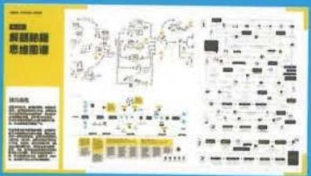

<details>
<summary>text_image</summary>

Scanned document page with Chinese text, diagrams, and table of contents, likely from a technical or educational material.
</details>

解题秘籍思维图谱 $\times 1$

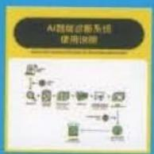  
AI智能测评说明书×1

上市时间

2023年1月

学科

数学/物理/化学/生物

定价

198元/科


150

关键题型速解二级结论


800分钟

清北学霸解题秘籍大课


10C余个

一线名师解题实战微课


50C道

AI智能测评诊断题库


24小时

在线答疑
伴学小帮手

(非工作时间12小时内答疑)

微信

教辅资料站

想多得分，就用解题秘籍！


<details>
<summary>text_image</summary>

創于2003
试题
调研
</details>

# 高频易错点快攻

快速攻克33个高频易错点

主 编：杜志建

本册编委：赵成海 代尔宁 王应祥 章礼抗

韦莉 邓成兵

第6辑

新高考数学

微信公众号

教辅资料站

# 图书在版编目(CIP)数据

试题调研. 第6辑 高频易错点快攻 新高考数学 / 杜志建主编. — 乌鲁木齐：新疆青少年出版社，2022.12

ISBN 978-7-5590-9094-2

I. ①试… II. ①杜… III. ①中学数学课 - 高中 - 升学参考资料 IV. ①G634

中国版本图书馆 CIP 数据核字(2022)第 223007 号

出版人:徐江

策划: 王启全

责任编辑:多艳萍

封面设计:天星美工室

# 试题调研·第6辑 高频易错点快攻 新高考 数学

# SHITI DIAOYAN · DI 6 JI GAOPIN YICUODIAN KUAIGONG XINGAOKAO SHUXUE

杜志建 主编

出版:新疆青少年出版社

社址:乌鲁木齐市北京北路29号 邮政编码:830012

电话:0991-6239223(编辑部) 0371-68698015(读者服务部)

官网:http://www.qingshao.net 天猫旗舰店:http://xjqss.tmall.com

发行:新疆青少年出版社

经销:各地新华书店 法律顾问:王冠华 18699089007

印刷:郑州市欣隆印刷有限公司

开 本:787mm×1092mm 1/16 版 次:2022年12月第1版

印 张:7
印 次:2022年12月第1次印刷

字 数:130 千字

书号:ISBN 978-7-5590-9094-2

定 价:18.90元

CHISO 青少社
SINCE 1956

版权所有，侵权必究。印装问题可随时同印厂退换。

# 声明

基于对知识和创作的尊重,本书向所选文章、图片的作者支付补贴。因条件所限未能及时联系的作者,我们在此深表歉意,当您看到本书时,请与我们联系,以便我们向您支付补贴和赠送样书。联系方式:0371-68698033。

# 纠正错误比盲目刷题更重要


# 瞄准易错补短板对症下药

# 图象题中5个高频易错点

易错点1 混淆基本初等函数图象的变换规则
易错点2 识别函数图象时不会用特值法实现速算秒解
易错点3 对三角函数图象变换法则掌握不牢
……

# 审题、答题中5个高频易错点

易错点1 不会提取新定义问题的关键信息

易错点2 求解比大小压轴题没有思路
……

# 核心主干知识4类高频易错点 相近名词类

易错点1 忽视对数的真数和底数所需满足的条件……

分类精选高频易错、易混点，查漏补缺

Z, 又 $\omega > 0$ , 所以 $\omega$ 的最小值为 6.

1 易错警示 1 有如下错误解法。因为直线 $x = \frac{\pi}{8}$ 是函数 $g(x)$ 因象的一条对称轴，只有 $g(0) = g(\frac{\pi}{4})$ 。因而 $\sqrt{2} \sin(-\frac{\pi}{4}) = \sqrt{2} \sin(\omega \cdot \frac{\pi}{4} - \frac{\pi}{4})$ ，所以 $\omega \cdot \frac{\pi}{4} = 2k\pi, k \in \mathbf{Z}$ ，当 $k = 1$ 时， $\omega$ 的最小值为 8，得用分位： $g(0) = g(\frac{\pi}{4})$ 不等价于函数 $g(x)$ 因象关于直线 $x = \frac{\pi}{9}$ 对称。所以，这里特值法要慎重应用，如果在一个周期内，其解法可行（参见易错求第 1）

# 逐层分析，找准错因（P013）


# 批注式超详解析剖析易错题 深入透彻

秒杀解 由图可知 $f(\frac{\pi}{2})=0$ . 计算可得 AB 选项对应的函数均有 $f(\frac{\pi}{2})\neq0$ , 排除 AB.

【易错警示】本题的常规解在判断AB选项时，从一般思路出发，通过奇偶性选择明显的特征入手，但没有用到图上给出的零点这样明显的信息。对比得来解条看，计算量大出许多。因而，忽略疑于的某些信息，导致不得不选择常规解这一怪远的思路。虽然能够求解，但是费时费为，是明显的解题“失误”。注意在解决类似的图案识别问题时，最重要的是充分，全面地提取题于中的有效信息，这对解题效率的提升作用巨大

计算可得 C 选项不满足该条件，D 选项满足该条件，故排除 C. 选 D.

解析 $f(x)=\cos\omega\pi x(\omega>0)$ 的图象向右平移 $\frac{1}{3\omega}$ 个单位长度后

得到函数 $g(x)=\cos\omega\pi(x-\frac{1}{3\omega})=\cos(\omega\pi x-\frac{\pi}{3})$ 的图象.

【易错分析】错写或 $g(x)=\cos(\omega\pi x-\frac{1}{3\omega})$ . 腊因：只注意到了平移变换中的“左边右坡”，而忽视了平移变换中平移量是指 x 本身们

变化量，突破：对于 $\omega x$ 的变化，应提取函数后变形为 $\omega (x + \varphi)$ ，体现向应或向右平移 $|\varphi |$ 个单位长度

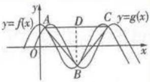  
图1

对点剖析，直击痛点（P011）
支招防错，授之以渔（P013）


# 举一反三练新题 杜绝再错

# 热点1 推进光伏发电，助力绿色发展

调研 1 （名师原创）能源结构转型是我国实现碳达峰与碳中和的关键，光伏发电则是推动能源结构转型的主要动力。目前，我国已将光伏产业列为国家战略性新兴产业之一，在产业政策引导和市场需求驱动的双重作用下，我国光伏产业实现了快速发展，已成为具备国际竞争优势的产业，在制造规模、技术水平和市场份

调研 2 （2023·湖北宜昌10月联考/密位制）密位制是度量角的一种方法，把一周角等分为6000份，每一份叫作1密位的角。在角的密位制中，单位可省去不写，采用四个数码表示角的大小，在百位数与十位数之间画一条短线，如7密位写成“0-07”，478密位写成“4-78”。若 $(\sin\alpha-\cos\alpha)^{2}=2\sin\alpha\cos\alpha$ ，则角 $\alpha$ 可取的值用密位制表示错误的是（）

A.12-50

B.2-50

# 传递新趋势，精练信息阅读题（P022）

# 聚焦最热点，专练学科特色题（P001）

微信公众号

教辅资料站

专攻最易错，速练名校好题（P023）

# 易错演练

1.(2023·北京一零一中学10月模拟)我们已经学过用角度制与弧度制度量角,最近有学者提出用“面度制”度量角.在半径不同的同心圆中,同样的圆心角所对扇形的面积与半径平方之比是常数,称这个常数为该角的面度数,这种用面度作为单位来度量角的方法,叫作面度制.抓住到度数的定义,求出扇形面积,刘用扇形的面积公式求出角,进而求出余弦值

在面度制下,角 $\theta$ 的面度数为 $\frac{\pi}{3}$ , 则角 $\theta$ 的余弦值为 ( )

A. $-\frac{\sqrt{3}}{2}$

B. $-\frac{1}{2}$

C. $\frac{1}{2}$

D. $\frac{\sqrt{3}}{2}$

# 特别关注·热点聚焦

# 关注社会热点，聚焦学科特色 001

热点 1 推进光伏发电，助力绿色发展 001

热点2 守护湿地之美，让人与自然和谐共生 001

热点 3 全民 “双十一”，促进经济循环畅通 003

热点 4 彩绘油纸伞，传承非遗梦 004

热点 5 聚焦 “智慧出行”，中国新能源车一骑绝尘 005

# 高频易错点快攻

# 图象题中 5 个高频易错点 007

易错点1 混淆基本初等函数图象的变换规则 007

易错点2 识别函数图象时不会用特值法实现速算秒解 010

易错点3 对三角函数图象变换法则掌握不牢 012

易错点4 由图象求三角函数解析式中 $\varphi$ 值时选点不当 016

易错点5 不会用频率分布直方图读样本数字特征 019

# 审题、答题中5个高频易错点 021

易错点1 不会提取新定义问题的关键信息 021

易错点 2 求解比大小压轴题没有思路 024

易错点 3 缺乏空间想象能力，不会用几何法求解立体几何问题 027

易错点4 不会计算条件概率 031

易错点 5 求解独立性检验问题时忽视零假设 033

# 核心主干知识 4 类高频易错点 037

微信公众号

教辅资源

# 近名词类

易错点1 忽视对数的真数和底数所需满足的条件 037

易错点2 混淆空间角与向量的夹角 039

易错点 3 混淆 “单调区间” 与 “在区间上单调” 043

易错点 4 对导数与函数的单调性的关系理解不清 046

易错点 5 混淆均匀分组与不均匀分组 047

易错点6 混淆项的系数与二项式系数 050

# 逻辑思维漏洞类

易错点1 颠倒充分条件与必要条件 053

易错点2 忽视函数的定义域 055

易错点 3 忽略实际问题中自变量的取值范围 059

易错点 4 对三角形的形状判断不准导致漏解或多解 062

易错点 5 忽视直线斜率的存在性 065

易错点6 求轨迹方程时未考虑隐含条件 069

# 公式化模型解题类

易错点 1 忽视基本不等式的应用条件 073

易错点 2 两次利用基本不等式时出错 075

易错点 3 对函数零点存在定理理解错误 077

易错点4 忽视三角函数的有界性 080

易错点 5 空间线面位置关系使用不当致误 085

# 策略应用类

易错点1 解含参不等式问题时分类讨论不当 090

易错点 2 换元后忽略新元的取值范围 092

微信公众号

教辅资料站

易错点 3 双变量问题转化不等价 093

易错点 4 用错位相减法求和时对项的位置处理不当 096

易错点 5 用裂项相消法求和时多项或漏项 098

# 目录 CONTENTS

易错点6 忽视等比数列中公比 $q$ 的取值范围 099

# 高频易错点速记

# 速记高考最易失分的 45 个高频考点 101

类型 1 符号类 101

类型 2 推理类 101

类型 3 图象类 102

类型 4 相近名词、公式类 103

类型 5 思维漏洞类 104


# 下辑精彩预告 2023年1月全新上市!

# 《试题调研》第7辑将推出

——高考热点大串讲

# 本辑亮点抢先看：

串讲前沿热点 聚焦最新社会热点，如卡塔尔世界杯、第五届进博会等；关注最热命题情境，如生产生活情境、科技创新情境等。晓热点、熟情境、练新题！

串讲创新命题热点 甄选最新名校好题，辅以批注式立体解析，精细讲解开放性举例问题、结构不良问题等创新题型；精准剖析新定义问题、数学思维跨学科应用问题等创新考法；精心提炼创新函数模型、创新数列模型等创新模型；精巧归纳著名猜想、高等数学等创新载体。你想得到的热点应有尽有，想不到的热点尽在眼前！

串讲核心主干命题热点 名师串讲三角形的“四心”问题、立体几何中的翻折问题、函数的零点问题等常考热点；比大小压轴问题、立体几何中的动态探究问题、函数的极值点偏移问题等疑难热点。超多秒杀解、优美解，让你备考时瞄准靶心，聚焦必考最热点！

串讲提分结论 精选最实用、高考最易提分的定理、结论，图表化呈现，速记速背，减负增效，完胜2023高考！

微信公众号
教辅资料站

# 特别关注·热点聚焦

# 关注社会热点,聚焦学科特色

# 热点1 推进光伏发电，助力绿色发展

调研 1 （名师原创）能源结构转型是我国实现碳达峰与碳中和的关键,光伏发电则是推动能源结构转型的主要动力. 目前,我国已将光伏产业列为国家战略性新兴产业之一,在产业政策引导和市场需求驱动的双重作用下,我国光伏产业实现了快速发展,已成为具备国际竞争优势的产业,在制造规模、技术水平和市场份额等方面均位居全球前列. 平准化度电成本(LCOE)也称度电成本,是一项用于分析各种发电技术成本的主要指标. 其中光伏发电系统与储能设备的等年值系数 $I_{\text{CRF}}$ 对计算度电成本具有重要影响. 等年值系数 $I_{\text{CRF}}$ 和设备寿命周期 $N$ (单位:年)具有如下函数关系: $I_{\text{CRF}} = \frac{0.05(1 + r)^N}{(1 + r)^N - 1}$ ,其中 $r$ 为折现率. 已知寿命周期为 10 年的设备的等年值系数约为 0.13,则对于寿命周期约为 20 年的光伏储能微电网系统,其等年值系数约为 ( )

对于信息阅读类问题，不必纠结陌生名词的含义，只要明白公式中字母的含义（r 为折现率， $I_{CRF}$ 为等年值系数，N 为设备寿命周期），再把已知信息翻译成数学关系（当 N=10 时， $I_{CRF}\approx0.13$ ），据此列式求出参数 r，即可进行求解

A. 0.03

B.0.05

C. 0.07

D. 0.08

解析 由已知可得 $\frac{0.05(1 + r)^{10}}{(1 + r)^{10} - 1}\approx 0.13$ ，得 $(1 + r)^{10}\approx \frac{13}{8}.$

【锦囊妙计】计算到这里时, 千万不要急着把 $r$ 的值一算到底——一是不好算, 二是算出来也没什么作用, 暂时光保留这个式子, 先进行后面的运算, 再决定如何转化

所以当 N=20 时,代入公式得 $I_{\mathrm{CRF}}=\frac{0.05(1+r)^{20}}{(1+r)^{20}-1}\approx\frac{\frac{1}{20}\times(\frac{13}{8})^{2}}{(\frac{13}{8})^{2}-1}=\frac{169}{2100}\approx0.08$ . 故选 D.

答案 D

微信公众号

教辅资源站2

# 守护湿地之美，让人与自然和谐共生

调研 2 (2023·北京海淀区11月期中改编)2022年11月4日,美丽家园行动

抽象代数 亦称近世代数,是研究各种抽象的公理化代数系统的数学学科,是现代计算机理论基础之一.

数学辞海

生态观鸟屋启动仪式在辽宁盘锦辽河口国家级自然保护区举办，名为“美丽家园——鹤乡”的生态观鸟屋正式落成。辽河口湿地是丹顶鹤与人和谐共生的美丽家园，盘锦素有“鹤乡”之称，现为研究丹顶鹤的生活习性，设立了两个相距12 km的观测站A和B，观测人员分别在A,B处观测。如图1，某一时刻，一只丹顶鹤出现在点C处，观测人员从两个观测站分别测得 $\angle BAC=30^{\circ},\angle ABC=$ $60^{\circ}$ , 经过一段时间后, 该丹顶鹤出现在点 $D$ 处, 观测人员从两个观测站分别测得 $\angle BAD = 75^{\circ}, \angle ABD = 45^{\circ}$ (注: 点 $A, B, C, D$ 在同一平面内).

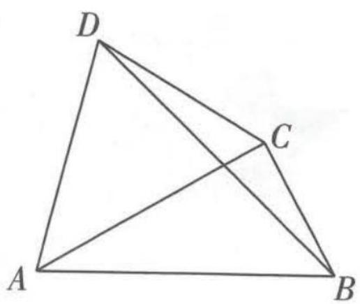

<details>
<summary>text_image</summary>

D
C
A
B
</details>

图1

(1) 求 $\triangle ABD$ 的面积;  
(2) 求点 C, D 之间的距离.

# 思维导引

(1)

$$
\begin{array}{r l} & \text {梳理已知条件,在} \triangle A B D \text {中,} \angle B A D = 7 5 ^ {\circ}, \angle A B D = \\ & 4 5 ^ {\circ}, A B = 1 2 \mathrm{km} \end{array}
$$

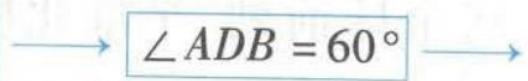

由正弦定理求 AD $S_{\triangle ABD} = \frac{1}{2} AB \cdot AD \cdot \sin \angle BAD$ $\triangle ABD$ 的面积

(2) 由已知数据判断 $\triangle ACB$ 为直角三角形

$$
A C = 6 \sqrt {3}, \angle C A D = 4 5 ^ {\circ}
$$

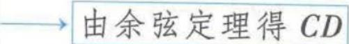

# 解析

(1) 在 $\triangle ABD$ 中， $\angle BAD = 75^{\circ}$ ， $\angle ABD = 45^{\circ}$ ，所以 $\angle ADB = 60^{\circ}$ .

由正弦定理 $\frac{AD}{\sin\angle ABD} = \frac{AB}{\sin\angle ADB}$ 得 $\frac{AD}{\sin 45^\circ} = \frac{AB}{\sin 60^\circ}$

所以 $AD = \frac{\sin 45^{\circ}}{\sin 60^{\circ}} \times AB = \frac{\frac{\sqrt{2}}{2}}{\frac{\sqrt{3}}{2}} \times 12 = 4\sqrt{6} \, (\text{km})$ , $\sin \angle BAD = \sin 75^{\circ} = \frac{\sqrt{6} + \sqrt{2}}{4}$ ,

【巧记数据】这里 $\sin 75^{\circ} = \sin (45^{\circ} + 30^{\circ}) = \frac{\sqrt{2}}{2} \times (\frac{\sqrt{3}}{2} + \frac{1}{2}) = \frac{\sqrt{6} + \sqrt{2}}{4}$ ，对一些常见特殊角度的正、余弦值，可以进行记忆，考试时往往能节省很多时间，类似的还有： $\sin 15^{\circ} = \frac{\sqrt{6} - \sqrt{2}}{4}$

微信公众号
教辅资料站

所以 $\triangle ABD$ 的面积为 $\frac{1}{2} AB \times AD \times \sin \angle BAD = \frac{1}{2} \times 12 \times 4\sqrt{6} \times \frac{\sqrt{6} + \sqrt{2}}{4} = 36 + 12\sqrt{3} (\mathrm{km}^2)$ .

(2) 由 $\angle BAD = 75^{\circ}$ , $\angle BAC = 30^{\circ}$ , $\angle ABC = 60^{\circ}$ , 得 $\angle CAD = 45^{\circ}$ , $\angle ACB = 90^{\circ}$ ,

所以 $AC = 12 \times \cos 30^{\circ} = 6\sqrt{3} \, (\text{km})$ .

数学辞海

拓扑学 是研究几何图形或空间在连续改变形状后还能保持不变的一些性质的学科. 它只考虑物体间的位置关系, 而不考虑它们的形状和大小. 在拓扑学里, 重要的拓扑性质包括连通性与紧致性.

关注微信公众号“初高教辅站”获取更多初高中教辅资料

在 $\triangle ACD$ 中，由余弦定理得 $CD^2 = AC^2 + AD^2 - 2AC \times AD \times \cos \angle CAD = 36 \times 3 + 16 \times$ $6 - 2 \times 6\sqrt{3} \times 4\sqrt{6} \times \frac{\sqrt{2}}{2} = 60$ ，所以 $CD = 2\sqrt{15}\mathrm{km}$ .

即点 C, D 之间的距离为 $2\sqrt{15}$ km.

# 热点3 全民“双十一”，促进经济循环畅通

调研 3 (2023·福建厦门外国语中学10月月考)双十一期间,某商户为揽客,拟定商品按y(单位:元/千克)销售,售价随时间x(x∈[0,1])变化的关系为y=f(x),且f(x)在[0,1]上是严格单调递减函数.

(1) 姚女士需要在 $x = 0$ 和 $x = 1$ 两个时刻分两批囤商品, 两次总共囤 5 千克. 得知了商家的销售方案后, 姚女士咨询了两位平台主播, 主播小佳表示应该每次买相同质量的商品, 主播小琦认为每次买相同总价的商品. 请问到底哪种方式更划算? 说明理由.

(2)商家决定按照 $f(x)=-\frac{1}{2}x+1$ 的售价来销售,而姚女士考虑在x时刻买200元的商品,在1-x时刻买300元的商品,请问她至多能买多少千克?(答案精确到1千克)

思维导引 (1) 根据题意分别列出两种方式所需要花费的钱数, 作差比较即可; (2) 由题意可得姚女士购买商品质量的函数, 变形化简后, 利用对勾函数的单调性求函数的最大值即可.

解析 (1) 设在 $x = 0$ 时价格为 $a$ 元/千克, 在 $x = 1$ 时价格为 $b$ 元/千克.

按照主播小佳的方式购买,需花费 $\frac{5}{2}a+\frac{5}{2}b=\frac{5(a+b)}{2}$ ;

按照主播小琦的方式购买,需花费 $2 \times \frac{5}{\frac{1}{a} + \frac{1}{b}} = \frac{5 \times 2ab}{a + b}$ .

【选方法】要比较的两个代数式中含有未知量 a, b，无法直接比较大小，可考虑作差法或作商法

因为 $\frac{a+b}{2}-\frac{2ab}{a+b}=\frac{(a+b)^{2}-4ab}{2(a+b)}=\frac{(a-b)^{2}}{2(a+b)}$ ，且a>b，

【抓题眼】根据题眼“售价随时间 $x(x \in [0,1])$ 变化的关系为 $y = f(x)$ ，且 $f(x)$ 在 $[0,1]$ 上是严格单调递减函数”，判断出 $a, b$ 的大小关系

所以 $\frac{a + b}{2} -\frac{2ab}{a + b} >0$ ，即 $\frac{a + b}{2} >\frac{2ab}{a + b}$ 所以 $\frac{5(a + b)}{2} >\frac{5\times 2ab}{a + b},$

即按照主播小琦的方式购买更省钱,即主播小琦的方式更划算.

(2)由题意可知,姚女士可买 $\frac{200}{f(x)}+\frac{300}{f(1-x)}=\left(\frac{400}{2-x}+\frac{600}{1+x}\right)$ (千克),

$$
\frac {4 0 0}{2 - x} + \frac {6 0 0}{1 + x} = 2 0 0 \cdot (\frac {2}{2 - x} + \frac {3}{1 + x}) = 2 0 0 \cdot \frac {8 - x}{- x ^ {2} + x + 2} = \frac {2 0 0}{(x - 8) + \frac {5 4}{x - 8} + 1 5}, \text {其中}
$$

$x - 8 \in [-8, -7]$ , 令 $x - 8 = t$ , 则 $t \in [-8, -7]$ .

令 $u = t + \frac{54}{t} + 15, t \in [-8, -7]$ ，易得该函数在 $[-8, -\sqrt{54}]$ 上单调递增，在 $[- \sqrt{54},$

【误区警示】注意，看到这种结构后有的同学会想当然地利用基本不等式求解，但简单分析一下就知道这种方法是不可行的，因为 $t \in [-8, -7]$ ，为负数，因此对 $t + \frac{54}{t}$ 使用基本不等式后得到的是最大值，而不是要求的最小值，因此要利用对勾函数的性质求解。做题时，如果某一步骤有多种方法可以选取，要在脑海中简单分析一下每种方法的结果，选取最优方法进行解题-7]上单调递减，

当 t = -8 时, $u = \frac{1}{4}$ , 当 t = -7 时, $u = \frac{2}{7}$ .

因为 $\frac{1}{4} < \frac{2}{7}$ , 所以 $u$ 的最小值在 $t = -8$ 时取到, 所以 $\frac{400}{2 - x} + \frac{600}{1 + x}$ 的最大值在 $x - 8 = -8$ , 即 $x = 0$ 时取到, 此时 $\frac{400}{2 - x} + \frac{600}{1 + x} = 800$ (千克).

故姚女士至多买800千克.

# 热点4 彩绘油纸伞，传承非遗梦

调研 4 (2023·河南洛平许济第一次质量检测改编)(多选)油纸伞是中国传统工艺品,至今已有1 000多年的历史.为丰富老年人业余文化生活,陶冶老人健康生活情操,某社区在文化礼堂开展了“彩绘油纸伞”活动.活动中,某油纸伞撑开后摆放在展览场地上,如图2所示.该伞的伞檐是一个半径为1的圆,圆心到伞柄底端的距离为 1, 阳光照射油纸伞, 在地面上形成了一个椭圆形的影子 (假设此时该市的光线与地面的夹角为 $60^{\circ}$ ), 若伞柄底端正好与该椭圆的左焦点重合, 则 ( )

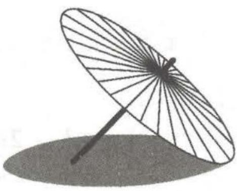

<details>
<summary>natural_image</summary>

Simple line drawing of a folding umbrella with a shadow (no text or symbols)
</details>

图2

A. 该椭圆的离心率为 $\frac{\sqrt{3} - 1}{2}$

B. 该椭圆的离心率为 $2 - \sqrt{3}$

C. 该椭圆的焦距为 $\frac{3\sqrt{2} - \sqrt{6}}{3}$

D. 该椭圆的焦距为 $2 \sqrt{3} - 1$

解析 根据题意作出如图3所示的示意图,A,B分别是椭圆的左、右顶点, $F_{1}$ 是椭圆的左焦点,BC是伞檐的直径,D为该圆的圆心, $DF_{1}$ 为伞柄,AC为光线.

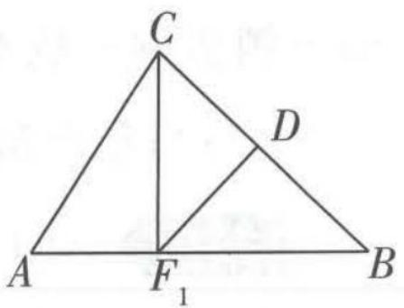

<details>
<summary>text_image</summary>

C
D
A
F₁
B
</details>

图3

【巧作图】根据题中信息构建平面图模型，将立体关系转化到平面中，有助于厘清关系

因为 $BD = DF_{1} = 1, DF_{1} \perp BC$ ，所以 $BF_{1} = \sqrt{2}$ .

设椭圆的长轴长为 2a，焦距为 2c，则 $a + c = BF_{1} = \sqrt{2}$ .

$$
\angle A = 6 0 ^ {\circ}, \angle B = 4 5 ^ {\circ}, B C = 2, A B = 2 a,
$$

【抓题眼】根据“此时该市的光线与地面的夹角为 $60^{\circ}$ ”及图中 $AB, AC$ 表示的意义得到 $\angle A$ 的度数

由正弦定理得 $\frac{2}{\sin 60^{\circ}} = \frac{2a}{\sin (60^{\circ} + 45^{\circ})}$ 解得 $a = \frac{3\sqrt{2} + \sqrt{6}}{6}$

【记数据】这里同样用到【调研2】中算过的数据， $\sin105^{\circ}=\sin75^{\circ}=\frac{\sqrt{6}+\sqrt{2}}{4}$

所以 $c=\sqrt{2}-a=\frac{3\sqrt{2}-\sqrt{6}}{6}$ ,

所以 $\frac{c}{a}=\frac{3\sqrt{2}-\sqrt{6}}{3\sqrt{2}+\sqrt{6}}=2-\sqrt{3},2c=\frac{3\sqrt{2}-\sqrt{6}}{3}.$ 故选BC.

答案 BC

# 热点5 聚焦“智慧出行”，中国新能源车一骑绝尘

调研 5 （名师原创）截至 2022 年 9 月,中国新能源乘用车销量占全球的 67%,中国是全球新能源汽车销量第一大国.某企业计划引进新能源汽车生产设备,通过市

同解变形 是解方程(组)所涉及的一个概念,用一个方程(组)的同解方程(组)代替这个方程(组),这种代换称为原方程(组)的同解变形.


关注微信公众号“初高教辅站”获取更多初高中教辅资料场分析,全年需投入固定成本3000万元,每生产x(单位:百辆)需另投入成本y(单位:万元),且 $y=\left\{\begin{aligned}&10x^{2}+200x,0<x<40,\\&601x+\frac{10\ 000}{x}-4\ 500,x\geqslant40.\end{aligned}\right.$ 由市场调研知,每辆车售价6万元,且全年内生产的车辆当年能全部销售完.

(1) 求出全年利润 S (单位: 万元) 关于年产量 x (单位: 百辆) 的函数关系式 (利润 = 销售额 - 成本).  
(2) 当年产量为多少辆时, 企业所获利润最大? 并求出最大利润.

解析 (1) 由题意得, 当 $0 < x < 40$ 时, $S(x) = 600x - (10x^2 + 200x) - 3000 =$

【分段讨论】题中所给的成本与产量的函数关系是分段函数关系，因此利润也要分段求解 $-10x^{2}+400x-3000$ ;

当 $x \geqslant 40$ 时, $S(x) = 600x - (601x + \frac{10000}{x} - 4500) - 3000 = 1500 - x - \frac{10000}{x}$ .

所以 $S(x)=\left\{\begin{aligned}-10x^{2}+400x-3000,0<x<40,\\1500-x-\frac{10000}{x},x\geqslant40.\end{aligned}\right.$

(2) 当 0 < x < 40 时, $S(x) = -10x^{2} + 400x - 3000$ , 易知当 x = 20 时, $S(x)$ 取得最大值, 且 $S(x)_{\max} = 1000$ .

当 $x \geqslant 40$ 时, $S(x) = 1500 - x - \frac{10000}{x} = 1500 - (x + \frac{10000}{x})$ .

【另一种思路】因为 $x > 0$ ，所以这里也可以利用基本不等式得 $x + \frac{10000}{x} \geqslant 2\sqrt{x \cdot \frac{10000}{x}} = 200$ ，当且仅当 $x = 100$ 时取等号，所以 $S(x)_{\max} = 1300$

对于对勾函数 $y = x + \frac{10000}{x} (x > 0)$ ，当 $x = 100$ 时， $y$ 取得最小值，且 $y_{\min} = 200$ ，

所以 $S(x) \leqslant 1500 - 200 = 1300$ ,

所以当 x=100 时, $S(x)$ 取得最大值, 且 $S(x)_{\max}=1300$ .

因为 1300 > 1000, 所以当 x = 100, 即年产量为 10000 辆时, 企业所获利润最大, 且最大利润为 1300 万元.

# 高频易错点快攻

# 图象题中 5 个高频易错点

# 特约名师

赵成海 正高级教师,河北省优秀教师,省级骨干教师.中国数学奥林匹克一级教练员,中国科学技术学会、中国数学会会员.在国家级及省级等各类专业报纸杂志上发表教育教学论文三百余篇.

# ! 易错点1 混淆基本初等函数图象的变换规则

调研 1 (2023·吉林大学附属中学一模)(多选)关于函数 $f(x)=|\ln|2-x||$ ,
下列描述正确的有
()

A. $f(x)$ 在区间 $(1,2)$ 上单调递增

B. $y = f(x)$ 的图象关于直线 x = 2 对称

C. 若 $x_{1} \neq x_{2}, f(x_{1}) = f(x_{2})$ ，则 $x_{1} + x_{2} = 4$

D. $f(x)$ 有且仅有两个零点

思维导引 思路一:(从图象入手)根据图象变换的规则由 $y=\ln x$ 的图象变换得到 $f(x)=\left|\ln|2-x|\right|$ 的图象,然后利用图象判断各选项正误.思路二:(从解析式入手)根据函数解析式,结合复合函数的单调性及函数图象对称的有关结论等判断各选项正误.

解析 方法一 作出函数 $y = \ln x$ 的图象, 将 $y = \ln x$ 的图象关于 $y$ 轴作对称, 并与原图象组合, 即可得到函数 $y = \ln |x|$ 的图象,

【易错】此处容易将由 $y = \ln x$ 的图象得 $y = \ln |x|$ 的图象，与由 $y = \ln x$ 的图象得 $y = |\ln x|$ 的图象弄混淆。一般情况下， $y = f(|x|)$ 的图象是将 $y = f(x)$ 在 $y$ 轴右侧的图象沿 $y$ 轴翻折到左侧，并与原 $y$ 轴右侧图象组合而成（注意：取消原 $y$ 轴左侧图象）；而 $y = |f(x)|$ 的图象是将 $y = f(x)$ 在 $x$ 轴下方图象沿 $x$ 轴翻折到 $x$ 轴上方与原 $x$ 轴上方图象组合而成（注意：取消原 $x$ 轴下方图象）

然后将 $y = \ln |x|$ 的图象向右平移 2 个单位长度, 得到函数 $y = \ln |2 - x|$ 的图象,

【易错】此处容易因为不理解“左加右减”的含义，没有认识到“左加右减”是对于 $x$ 来说的，误以为是向左平移 2 个单位长度。实际上 $y = \ln |2 - x| = \ln |x - 2|$ ，对于 $x$ 来说是减 2，所以将 $y = \ln |x|$ 的图象向右平移 2 个单位长度，才能得到 $y = \ln |2 - x|$ 的图象。

再把 $y = \ln |2 - x|$ 的图象在 x 轴下方的部分沿 x 轴翻折到 x 轴上方去, 即可得到 $f(x) = |\ln |2 - x||$ 的图象, 如图 1.

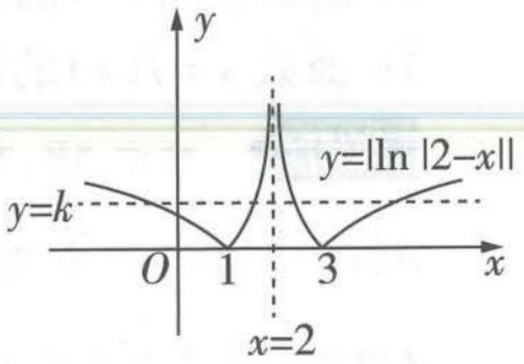

<details>
<summary>text_image</summary>

y
y=k
O 1 3 x
y=|ln |2-x||
x=2
</details>

图1

【另解】(先翻折再平移)将 $y = \ln |x|$ 的图象在 $x$ 轴下方的部分沿 $x$ 轴翻折到 $x$ 轴上方后得到 $y = |\ln |x||$ 的图象，然后将 $y = |\ln |x||$ 的图象向右平移 2 个单位长度，得到 $f(x) = |\ln |2 - x||$ 的图象

对数方程 是一种超越方程, 指含有关于未知数的对数式, 而不含其他超越式的方程, 即在对数符号后面含有未知数的方程, 叫作对数方程.

关注微信公众号“初高教辅站”获取更多初高中教辅资料


由图象知 $f(x)$ 在(1,2)上单调递增，A正确.函数图象关于直线 $x = 2$ 对称，B正确.设 $f(x_{1}) = f(x_{2}) = k$ ，则直线 $y = k$ 与函数 $f(x)$ 的图象可能相交于4个点，如果选择关于直线 $x = 2$ 对称的两个交点的横坐标作为 $x_{1},x_{2}$ ，则 $x_{1} + x_{2} = 4$ ，若选择不关于直线 $x = 2$ 对称的两个交点的横坐标作为 $x_{1}$ $x_{2}$ ，则 $x_{1} + x_{2}\neq 4,\mathrm{C}$ 错误.由图知 $f(x)$ 的图象与 $\pmb{x}$ 轴有且仅有两个交点，即函数 $f(x)$ 有且仅有两个零点，D正确.故选ABD.

方法二 对于 A, 在区间 $(1,2)$ 上, $2 - x \in (0,1)$ , 所以 $f(x) = |\ln |2 - x||$ 可以化简为 $f(x) = -\ln (2 - x)$ , 结合复合函数的单调性可知, 函数 $f(x)$ 在 $(1,2)$ 上单调递增, A 正确.

【知识拓展】对于函数 $y = f(x)$ 与 $y = g(x)$ 构成的复合函数 $y = f(g(x))$ ，其单调性满足规律“同增异减”，即两函数单调性相同，则 $y = f(g(x))$ 单调递增，若两函数单调性相异，则 $y = f(g(x))$ 单调递减

对于 B, $f(4-x)=|\ln|2-(4-x)||=|\ln|x-2||=|\ln|2-x||=f(x)$ ，所以 $y=f(x)$ 的图象

【易错】①函数 $y=f(x)$ 满足 $f(a+x)=f(b-x)$ ，则函数 $y=f(x)$ 的图象关于直线 $x=\frac{a+b}{2}$ 对称，注意不要与②函数 $y=f(a+x)$ 的图象与函数 $y=f(b-x)$ 的图象关于直线 $x=\frac{b-a}{2}$ 对称混淆.

②是两个函数的对称性问题，而①是一个函数自身的对称性，注意区分！关于直线x=2对称，B正确.

对于 C, $f(0) = \ln 2$ , $f(\frac{3}{2}) = |\ln |2 - \frac{3}{2}|| = \ln 2$ , 但 $0 + \frac{3}{2} \neq 4$ , C 错误.

对于 $\mathrm{D}, f(x) = |\ln |2 - x|| = 0$ ，则 $|2 - x| = 1$ ，即 $x = 1$ 或 $x = 3$ ， $\mathrm{D}$ 正确。故选ABD.

答案 ABD

调研 2 (2023·陕西渭南一模改编)(多选)已知函数 $y = f(x)$ 的图象关于点 $M(a, b)$ 中心对称的充要条件是函数 $y = f(x + a) - b$ 为奇函数,则下列结论正确的有()

A. 函数 $f(x)=x+\frac{3}{x-2}-1$ 图象的对称中心是 $(2,1)$

B. 函数 $f(x)=x+\frac{3}{x-2}-1$ 图象的对称中心是 $(2,-1)$

C. 函数 $y = f(x)$ 的图象关于直线 $x = a$ 对称的充要条件是 $y = f(x + a)$ 为偶函数

D. 函数 $y = f(x)$ 的图象关于直线 x = a 对称的充要条件是 $y = f(x - a)$ 为偶函数

解析 对于 AB, 有两种方法判断.

方法一 对于 A, 若 $f(x)=x+\frac{3}{x-2}-1$ 图象的对称中心是 $(2,1)$ ，那么由已知可得 a=2, b=1，

【提取信息】充分利用题干的已知条件，将题干中的 $(a,b)$ 与 $(2,1)$ 对应，然后进行检验

则 $y = f(x + a) - b = f(x + 2) - 1 = x + 2 + \frac{3}{x + 2 - 2} - 1 - 1 = x + \frac{3}{x}$ ，为奇函数，A 正确.

对于 B, 若 $f(x)=x+\frac{3}{x-2}-1$ 图象的对称中心是 $(2,-1)$ ，则 a=2, b=-1，所以 $y=f(x+a)$

$b=f(x+2)+1=x+2+\frac{3}{x+2-2}-1+1=x+2+\frac{3}{x}$ 应为奇函数,显然该函数不是奇函数,B错误.

【本质分析】事实上，若函数 $y=f(x+a)-b$ 为奇函数，则其图象的对称中心为 $(0,0)$ ，将函数图象向右平移 a 个单位长度，再向上平移 b 个单位长度，得到函数 $y=f(x)$ 的图象，其对称中心也应相应地移动，所以原点 $(0,0)$ 平移到点 $M(a,b)$ ，因而可得 $y=f(x)$ 的图象关于点 $M(a,b)$ 对称

方法二 函数 $y = x + \frac{3}{x}$ 是奇函数, 其图象的对称中心为 $(0, 0)$ , 将 $y = x + \frac{3}{x}$ 的图象向右平移 2 个单位长度, 再向上平移 1 个单位长度, 可得 $f(x) = x - 2 + \frac{3}{x - 2} + 1 = x + \frac{3}{x - 2} - 1$ 的图象, 所以 【易错】这里向上平移 1 个单位长度, 得到的不是 $y + 1 = x - 2 + \frac{3}{x - 2}$ 的图象, 而是 $y = x - 2 + \frac{3}{x - 2} + 1$ 的图象. 注意对于函数 $y = f(x)$ 图象的平移变换中, “左加右减” 针对的是 x, “上加下减” 针对的是 $f(x)$ , 而不是 y, 注意二者的区别!

$f(x)=x+\frac{3}{x-2}-1$ 图象的对称中心是 $(2,1)$ ，故 A 正确，B 错误.

对于 CD, 若函数 $y = f(x)$ 的图象关于直线 $x = a$ 对称, 将 $y = f(x)$ 的图象向左平移 $a$ 个单位长度, 可得 $y = f(x + a)$ 的图象, 所以 $y = f(x + a)$ 的图象关于直线 $x = 0$ 对称, 即关于 $y$ 轴对称, 所以 $y = f(x + a)$ 为偶函数, 反之, 若 $y = f(x + a)$ 为偶函数, 同样可以推出函数 $y = f(x)$ 的图象关于直线 $x = a$ 对称. 故 C 正确, D 错误. 故选 AC.

答案 AC


# 易错演练

1. (2023·南昌9月零模/高频考点, 抽象函数) 设函数 $f(x)$ 的定义域为 $\mathbf{R}$ , 且 $f(x + 2)$ 是奇函数, $f(x + 1)$ 是偶函数, 则一定有 ( )

A. $f(4) = 0$

B. $f(-1) = 0$

C. $f(3) = 0$

D. $f(5) = 0$

2. (2023·重庆南开中学10月诊断)(多选)已知函数 $f(x)=\left\{\begin{aligned}&|\log_{2}x-1|,0<x\leqslant4,\\ &3-\sqrt{x},x>4,\end{aligned}\right.$ 存在0<x $_{1}$ <x $_{2}$ <x $_{3}$ ,使得f(x $_{1}$ )=f(x $_{2}$ )=f(x $_{3}$ ),则x $_{1}$ x $_{2}$ x $_{3}$ 的取值可以为()

A. 10

B.20

C. 30

D. 40

3. (2023·东北育才中学一模)已知函数 $y = f(x + 1)$ 的图象关于直线 $x = -3$ 对称, 且 $\forall x \in \mathbb{R}$ , $f(x) + f(-x) = 2$ , 当 $x \in (0,2]$ 时, $f(x) = x + 2$ , 则 $f(2022) =$ \_\_\_\_.


# 参考答案与解析

1. A ∵ 将 $f(x+2)$ 的图象向右平移 2 个单位长度, 可得 $f(x)$ 的图象, 且 $f(x+2)$ 是奇函数, ∴ $f(x)$ 的图象关于点 $(2,0)$ 中心对称, $f(2)=0$ . ∵ 将 $f(x+1)$ 的图象向右平移 1 个单位长度, 可得 $f(x)$ 的图象, 且 $f(x+1)$ 是偶函数, ∴ $f(x)$ 的图象关于直线 x=1 对称, 由对称性可得, 点 $(2,0)$ 关于直线 x=1 对称的点为点 $(0,0)$ , 点 $(0,0)$ 关于点 $(2,0)$ 中心对称的点为点 $(4,0)$ , ∴ $f(4)=0$ . 故选 A.

三线八角 是几种常见的位置相关角, 指同一平面上的两条直线被第三条直线所截形成的八个角, 有同位角、内错角、外错角、同旁内角、同旁外角.

关注微信公众号“初高教辅站”获取更多初高中教辅资料

2. BC 根据题意作出函数 $y = f(x)$ 的图象, 如图 2.

【易错】对于 $y = |\log_2 x - 1|$ 的图象，光将函数 $y = \log_2 x$ 的图象向下平移 1 个单位长度，然后将 $x$ 轴下方图象沿 $x$ 轴翻折到上方，并与 $x$ 轴上方图象组合，可得 $y = |\log_2 x - 1|$ 的图象。对于 $y = 3 - \sqrt{x}$ 的图象，将 $y = \sqrt{x}$ 的图象光关于 $x$ 轴作对称，将对称后得到的图象再向上平移3个单位长度，即可得 $y=3-\sqrt{x}$ 的图象

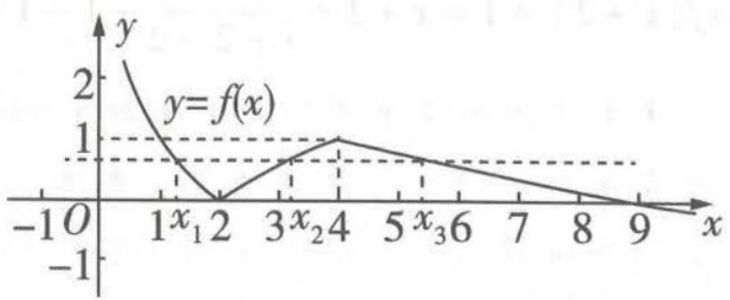

<details>
<summary>line</summary>

| x    | y = f(x) |
| ---- | -------- |
| 0    | 2        |
| 1x₁  | 0        |
| 2    | 0        |
| 3x₂  | 1        |
| 4    | 1        |
| 5x₃  | 0.5      |
| 6    | 0.25     |
| 7    | 0.1      |
| 8    | 0        |
| 9    | 0        |
</details>

图2

由图象可知 $1 < x_{1} < 2 < x_{2} < 4 < x_{3} < 9$ ，因为 $\left|\log_2x_1 - 1\right| = \left|\log_2x_2 - 1\right|$ ，所以 $1 - \log_2x_1 = \log_2x_2 - 1$ ，所以 $\log_2x_1 + \log_2x_2 = \log_2(x_1x_2) = 2$ ，即 $x_{1}x_{2} = 4$ ，所以 $x_{1}x_{2}x_{3} = 4x_{3}\in (16,36)$ . 故选BC.

3. -2 因为函数 $y = f(x + 1)$ 的图象关于直线 $x = -3$ 对称, 将函数 $y = f(x + 1)$ 的图象向右平移 1 个单位长度可得 $y = f(x)$ 的图象, 所以函数 $y = f(x)$ 的图象关于直线 $x = -2$ 对称, 即 $f(-x) = f(x - 4)$ , 又 $\forall x \in \mathbb{R}, f(x) + f(-x) = 2$ , 则 $f(x - 4) = -f(x) + 2$ , 进而有 $f(x - 8) = -f(x - 4) + 2 = -[-f(x) + 2] + 2 = f(x)$ , 所以函数 $y = f(x)$ 是周期函数, 周期为 8. 当 $x \in (0,2]$ 时, $f(x) = x + 2$ , 所以 $f(2022) = f(253 \times 8 - 2) = f(-2) = 2 - f(2) = 2 - 4 = -2$ .

# 易错点2 识别函数图象时不会用特值法实现速算秒解

调研 1 （2023·天津二十中9月诊断）已知函数 $f(x)$ 的部分图象如图1所示，则 $f(x)$ 的解析式可能为（）

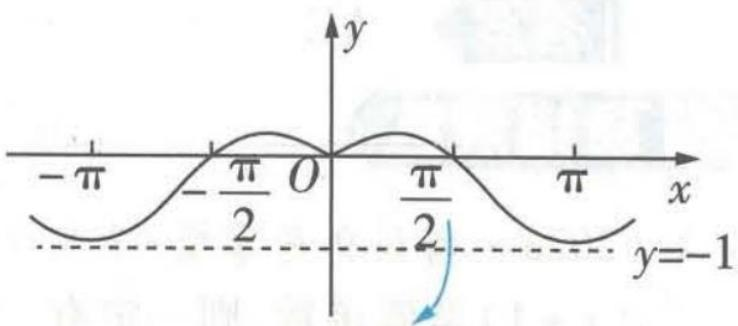

<details>
<summary>text_image</summary>

-π
-π/2 O
π/2
π
x
y=-1
</details>

坐标轴上的刻度以及相关直线也是已知条件，注意充分提取有效信息！

A. $f(x) = -\frac{3x\sin x}{1 + 2x^2}$

B. $f(x) = \frac{x^2\sin x}{1 + x^2}$

C. $f(x) = \frac{3x^2\cos x}{1 + 2x^2}$

D. $f(x) = \frac{x^2\cos x}{1 + x^2}$

图1

# 常规解

由图可知, $f(x)$ 的图象关于y轴对称,所以

$f(x)$ 为偶函数, 故先判断各选项中函数的奇偶性. 对于 $A, f(-x) = -\frac{3(-x)\sin(-x)}{1 + 2(-x)^2} = -\frac{3x\sin x}{1 + 2x^2} = f(x), f(x) = -\frac{3x\sin x}{1 + 2x^2}$ 为偶函数. 同理可得, B 选项对应的函数为奇函数, CD 选项对应的函数都为偶函数, 故排除 B 选项.

当 $x \to 0$ 且 x < 0 时, $f(x) > 0$ , 而对于 A 选项, 此时 $f(x) < 0$ , 故排除 A 选项.

【小技巧】做选择、填空题时可以应用极限思想快速判断，也可以用特值判断

由图可知 $-1 < f(\pi) < 0$ ，对于C选项， $f(\pi) = \frac{3\pi^2\cos\pi}{1 + 2\pi^2} = -\frac{3\pi^2}{1 + 2\pi^2} = -\frac{2\pi^2 + \pi^2}{2\pi^2 + 1} < -1$ ，对于D选项， $f(\pi) = -\frac{\pi^2}{1 + \pi^2} = -\frac{1 + \pi^2 - 1}{1 + \pi^2} = -1 + \frac{1}{1 + \pi^2} > -1$ ，故排除C.选D.

秒杀解 由图可知 $f(\frac{\pi}{2})=0$ 。计算可得AB选项对应的函数均有 $f(\frac{\pi}{2})\neq0$ ，排除AB。

【易错警示】本题的常规解在判断 AB 选项时，从一般思路出发，通过奇偶性这样明显的特征入手，但没有用到图上给出的零点这样明显的信息，对比秒杀解来看，计算量大出许多。因而，忽略题干的某些信息，导致不得不选择常规解这一绕远的思路，虽然能够求解，但是费时费力，是明显的解题“失误”。注意在解决类似的图象识别问题时，最重要的是充分、全面地提取题于中的有效信息，这对解题效率的提升作用巨大

由图可知 $f(\pi) > -1$ ，计算可得 C 选项不满足该条件，D 选项满足该条件，故排除 C. 选 D.

答案 D

调研 2 (2023·江西瑞金一中、遂川中学等校10月联考)函数 $f(x)=\frac{\sin x}{x^{2}-1}$ 的大致图象为

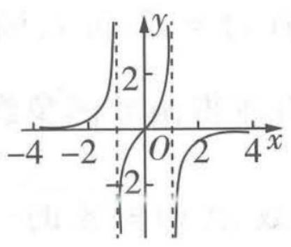

<details>
<summary>line</summary>

| x   | y   |
| --- | --- |
| -4  | 0   |
| -2  | 0   |
| 0   | 0   |
| 2   | 0   |
| 4   | 0   |
</details>

A

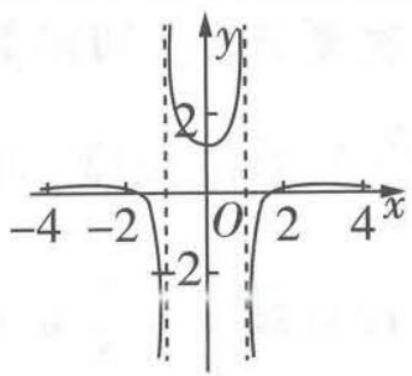

<details>
<summary>text_image</summary>

-4
-2
O
2
4
x
y
2
</details>

B

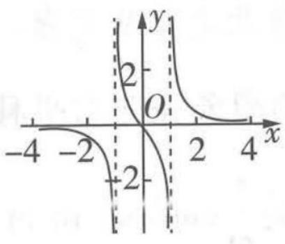

<details>
<summary>line</summary>

| x | y |
|---|---|
| -4 | -2 |
| -2 | -1 |
| 0 | 0 |
| 2 | 1 |
| 4 | 2 |
</details>

C

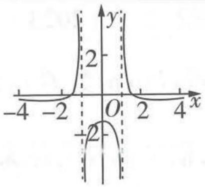

<details>
<summary>line</summary>

| x | y |
|---|---|
| -4 | 0 |
| -2 | 0 |
| 0 | 2 |
| 2 | 0 |
| 4 | 0 |
</details>

D

常规解 由 $f(-x) = \frac{\sin(-x)}{x^2 - 1} = -\frac{\sin x}{x^2 - 1} = -f(x)$ ，得函数 $f(x)$ 为奇函数，排除 BD，当 $x \in (0,1)$ 时， $f'(x) = \frac{\cos x(x^2 - 1) - 2x\sin x}{(x^2 - 1)^2} < 0$ ，所以 $f(x)$ 在 $(0,1)$ 上单调递减，故选 C.

秒杀解 由 $f(0)=0$ ，排除 BD，由 $f(2)=\frac{\sin 2}{3}>0$ ，排除 A，选 C.

【易错】代入特殊值排除选项之前，要观察各选项的差异，“哪里不同，就比哪里”。如本题，首先发现选项 AC 与 BD 在 x=0 处的取值不同，计算 $f(0)=0$ 排除 BD 后，观察发现 AC 选项各区间上的函数值符号正好相反，因此选取容易计算的值，计算对应的函数值即可

答案 C

调研 3 (2023·甘肃张掖一诊) 若函数 $f(x)$ 的图象如图 2 所示, 则 $f(x)$ 的解析式可能是 ( )

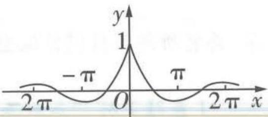  
图2

A. $f(x) = (|x| + 1)\sin x$

B. $f(x) = \frac{\sin x}{|x| + 1}$

C. $f(x) = (|x| + 1)\cos x$

D. $f(x) = \frac{\cos x}{|x| + 1}$

常规解 根据题图可知函数 $f(x)$ 为偶函数.

对于 A, $f(-x) = (|-x| + 1)\sin(-x) = -(|x| + 1)\sin x = -f(x)$ ，为奇函数，A 不满足题意.

对于 B, $f(-x)=\frac{\sin(-x)}{|-x|+1}=-\frac{\sin x}{|x|+1}=-f(x)$ ，为奇函数，B 不满足题意.

月牙定理 指以直角三角形两条直角边为直径向外作两个半圆,以斜边为直径向内作半圆,则三个半圆所围成的两个月牙型面积之和等于该直角三角形的面积.

关注微信公众号“初高教辅站”获取更多初高中教辅资料


# 012 试题调研 每月一辑试题新

根据题图可得 $f(\pi) > -1$ ，对于C选项， $f(\pi) = -(\pi + 1) < -1$ ，C不满足题意。

对于 D, $f(\pi) = \frac{-1}{\pi + 1} > -1$ , 满足题意. 选 D.

秒杀解 根据题图可得 $f(0)=1$ ，计算可得，AB不满足题意.

【易错】观察并找出题图中最易判断的点，例如本题，判断奇偶性计算复杂，如果一开始就选择计算点的坐标进行判断，要简单、快捷许多

根据题图可得 $f(\pi) > -1$ ，对于C选项， $f(\pi) = -(\pi + 1) < -1$ ，C不满足题意。对于D， $f(\pi) = \frac{-1}{\pi + 1} > -1$ ，满足题意。选D。

答案 D

# 易错点3 对三角函数图象变换法则掌握不牢

调研 1 (2023·豫北名校9月第一次测评)已知函数 $f(x)=\sqrt{2}\sin x$ , 函数 $g(x)$ 的图象可以由函数 $f(x)$ 的图象先向右平移 $\frac{\pi}{4}$ 个单位长度, 再将所得函数图象纵坐标保持不变, 横坐标变为原来的 $\frac{1}{\omega}(\omega>0)$ 得到, 若直线 $x=\frac{\pi}{8}$ 是函数 $g(x)$ 图象的一条对称轴, 则 $\omega$ 的最小值为 ( )

A.3

B.6

C. 9

D. 15

# 思维导引

思路一：

利用平移变换与伸缩变换得函数 $g(x)$ 的解析式

函数 $g(x)$ 图象的对称轴

利用对称性结论建立关系式

确定 $\omega$ 所有可能取值 → 求出最小值 → 得解

思路二：

利用平移变换与伸缩变换得函数 $g(x)$ 的解析式

函数图象对称轴与
函数极值点对应

利用极值点处导函数值等于0建立关系式

确定 $\omega$ 所有可能取值 → 求出最小值 → 得解

解析

方法一 函数 $f(x)$ 的图象先向右平移 $\frac{\pi}{4}$ 个单位长度,得到函数 $y=\sqrt{2}\sin\left(x-\frac{\pi}{4}\right)$ 的图

象,再将所得函数图象纵坐标保持不变,横坐标变为原来的 $\frac{1}{\omega}(\omega>0)$ 得到 $g(x)=\sqrt{2}\sin(\omega x-\frac{\pi}{4})$ 的图象.

【易错】对“左加右减”的含义理解有误，将右移写成 $x+\frac{\pi}{4}$ 而出错。对横坐标变为原来的 $\frac{1}{\omega}$ (ω>0)的应用有误，横坐标变为原来的 $\frac{1}{\omega}(\omega>0)$ ，相当于周期变为原来的 $\frac{1}{\omega}$ 倍，那么变换后的函数周期 $T=\frac{2\pi}{\omega}$ ，所以函数式中x的系数变为 $\omega$

因为直线 $x = \frac{\pi}{8}$ 是函数 $g(x)$ 图象的一条对称轴，所以 $\frac{\pi}{8}\omega -\frac{\pi}{4} = \frac{\pi}{2} +k\pi ,k\in \mathbf{Z},$ 则 $\omega = 6 + 8k,$

【小技巧】求正弦型函数图象的对称轴，令 $\omega x + \varphi = \frac{\pi}{2} + k\pi, k \in Z$ ，进而求解即可

$k \in Z$ , 又 $\omega > 0$ , 所以 $\omega$ 的最小值为 6. 故选 B.

方法二 由方法一得 $g(x) = \sqrt{2}\sin (\omega x - \frac{\pi}{4})$ ，因为直线 $x = \frac{\pi}{8}$ 是函数 $g(x)$ 图象的一条对称轴，因而 $g(x + \frac{\pi}{4}) = g(-x)$ ，那么 $\sqrt{2}\sin [\omega (x + \frac{\pi}{4}) - \frac{\pi}{4}] = \sqrt{2}\sin (-\omega x - \frac{\pi}{4})$ 对所有 $x \in \mathbb{R}$ 恒成立，即

【思路点拨】函数 $y = f(x)$ 满足 $f(a + x) = f(b - x)$ ，则函数 $y = f(x)$ 的图象关于直线 $x = \frac{a + b}{2}$ 对称，反之亦然

$\sin (\omega x + \frac{\pi}{4} +\omega \cdot \frac{\pi}{4} -\frac{\pi}{2}) = -\sin (\omega x + \frac{\pi}{4})$ ，因而， $\omega \cdot \frac{\pi}{4} -\frac{\pi}{2} = 2k\pi +\pi ,k\in \mathbf{Z}$ ，从而 $\omega = 8k + 6,k\in$ Z,又 $\omega >0$ ，所以 $\omega$ 的最小值为6.

【易错警示】有如下错误解法。因为直线 $x = \frac{\pi}{8}$ 是函数 $g(x)$ 图象的一条对称轴，必有 $g(0) = g(\frac{\pi}{4})$ ，因而 $\sqrt{2} \sin\left(-\frac{\pi}{4}\right) = \sqrt{2} \sin\left(\omega \cdot \frac{\pi}{4} - \frac{\pi}{4}\right)$ ，所以 $\omega \cdot \frac{\pi}{4} = 2k\pi, k \in \mathbf{Z}$ ，当 $k = 1$ 时， $\omega$ 的最小值为 8。错因分析： $g(0) = g(\frac{\pi}{4})$ 不等价于函数 $g(x)$ 图象关于直线 $x = \frac{\pi}{8}$ 对称。所以，这里特值法要慎重应用，如果在一个周期内，其解法可行（参见易错演练 1）

方法三 先得到 $g(x)=\sqrt{2}\sin(\omega x-\frac{\pi}{4})$ ，因为直线 $x=\frac{\pi}{8}$ 是函数 $g(x)$ 图象的一条对称轴，则 $x=\frac{\pi}{8}$ 是极值点，取 $x=\frac{\pi}{8}$ 是 $g'(x)=\sqrt{2}\omega\cos(\omega x-\frac{\pi}{4})=0$ 的解，从而 $\omega\cdot\frac{\pi}{8}-\frac{\pi}{4}=k\pi+\frac{\pi}{2}, k\in\mathbb{Z}$ ，从而 $\omega=8k+$

【点睛】由三角函数图象对称轴与函数极值点相对应，可以利用极值点处导函数值为0求解 $6,k\in\mathbb{Z}$ ，又 $\omega>0$ ，所以 $\omega$ 的最小值为6.

答案 B

调研 2 (2023·湖南长沙 10 月阶段练习)(多选)已知函数 $f(x) = \cos \omega \pi x$ ( $\omega > 0$ ), 将 $f(x)$ 的图象向右平移 $\frac{1}{3\omega}$ 个单位长度后得到函数 $g(x)$ 的图象, 点 $A, B, C$ 是 $f(x)$ 与 $g(x)$ 图象的连续的三个交点, 若 $\triangle ABC$ 是锐角三角形, 则 $\omega$ 的值可能为 ( )

A. $\frac{2}{3}$

B. $\frac{1}{4}$

C. $\frac{\sqrt{3}}{3}$

D. $\sqrt{3}$

解析 $f(x)=\cos\omega\pi x(\omega>0)$ 的图象向右平移 $\frac{1}{3\omega}$ 个单位长度后得到函数 $g(x)=\cos\omega\pi\left(x-\frac{1}{3\omega}\right)=\cos\left(\omega\pi x-\frac{\pi}{3}\right)$ 的图象.

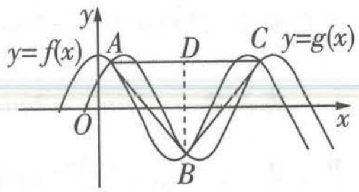

<details>
<summary>text_image</summary>

y
y=f(x)
A
D
C y=g(x)
O
B
x
</details>

图1

【易错分析】错写成 $g(x)=\cos(\omega\pi x-\frac{1}{3\omega})$ . 错因：只注意到了平移变换中的“左加右减”，而忽视了平移变换中平移量是指 x 本身的变化量. 突破: 对于 $\omega x$ 的变化, 应提取系数后变形为 $\omega(x+\varphi)$ , 体现向左或向右平移 $|\varphi|$ 个单位长度

如图1所示， $AC = T = \frac{2\pi}{\omega\pi} = \frac{2}{\omega}$ ，令 $\cos \omega \pi x = \cos (\omega \pi x - \frac{\pi}{3}) = \frac{1}{2}\cos \omega \pi x + \frac{\sqrt{3}}{2}\sin \omega \pi x$ ，得

$\cos \omega \pi x = \sqrt{3} \sin \omega \pi x$ ，则 $\cos \omega \pi x = \pm \frac{\sqrt{3}}{2}$ ，所以 $y_A = y_C = \frac{\sqrt{3}}{2}, y_B = -\frac{\sqrt{3}}{2}$ ，取 $AC$ 的中点 $D$ ，连接 $BD$ ，则

【另解】由 $\cos\omega\pi x=\cos(\omega\pi x-\frac{\pi}{3})$ 得 $\omega\pi x-\frac{\pi}{3}=2k\pi-\omega\pi x, k\in\mathbf{Z}$ ，所以 $2\omega\pi x=2k\pi+\frac{\pi}{3}, k\in$ Z，即 $\omega\pi x = k\pi + \frac{\pi}{6}, k \in Z$ ，则 $\cos\omega\pi x = \pm\frac{\sqrt{3}}{2}$

$BD = 2|y_{B}| = \sqrt{3}$ ，且 $\triangle ABC$ 是锐角三角形，所以 $\angle ABC < 90^{\circ}$ ，即 $\angle DBC < 45^{\circ}$ ， $\angle DCB > 45^{\circ}$ ，所以 $\tan \angle ACB = \frac{BD}{DC} = \frac{\sqrt{3}\omega}{1} > 1$ ，则 $\omega > \frac{\sqrt{3}}{3}$ ，故选AD.

答案 AD

调研 3 （2023·江西南昌二中等校10月联合测评）为了得到函数 $y=2\cos(2x-\frac{2\pi}{3})$ 的图象，只需将函数 $y=2\sin x$ （）

A. 图象上所有点的横坐标缩短到原来的 $\frac{1}{2}$ , 纵坐标不变, 再向右平移 $\frac{\pi}{12}$ 个单位长度  
B. 图象上所有点的横坐标伸长到原来的 2 倍, 纵坐标不变, 再向左平移 $\frac{\pi}{12}$ 个单位长度  
C. 图象向右平移 $\frac{\pi}{3}$ 个单位长度, 再将所有点的横坐标伸长到原来的 2 倍, 纵坐标不变  
D. 图象向左平移 $\frac{\pi}{6}$ 个单位长度, 再将所有点的横坐标缩短到原来的 $\frac{1}{2}$ , 纵坐标不变

解析 将函数 $y=2\sin x$ 转化为 $y=2\cos(x-\frac{\pi}{2})$ ，将 $y=2\cos(x-\frac{\pi}{2})$ 的图象上所有点的横坐标缩短到原来的 $\frac{1}{2}$ ，纵坐标不变，得到函数 $y=2\cos(2x-\frac{\pi}{2})$ 的图象，再将所得图象向右平移 $\frac{\pi}{12}$ 个

【易错分析】一是没注意变换前后两三角函数名称不一致，变换前一般光化成同名三角函数；二是没理解伸缩变换，将横坐标缩短到原来的 $\frac{1}{2}$ 理解成x除以2变成 $y=2\cos(\frac{x}{2}-\frac{\pi}{2})$ ，此处可以从周期的角度理解，横坐标缩短到原来的 $\frac{1}{2}$ ，则函数周期变为原来的一半，因而x的系数变为原来的2倍

单位长度,得到函数 $y=2\cos\left[2\left(x-\frac{\pi}{12}\right)-\frac{\pi}{2}\right]=2\cos\left(2x-\frac{2\pi}{3}\right)$ 的图象,故 A 正确,B 错误.

将函数 $y=2\sin x=2\cos(x-\frac{\pi}{2})$ 的图象上所有的点向右平移 $\frac{\pi}{6}$ 个单位长度得到函数 $y=2\cos(x-\frac{\pi}{6}-\frac{\pi}{2})=2\cos(x-\frac{2\pi}{3})$ 的图象，再将所得图象上所有点的横坐标缩短到原来的 $\frac{1}{2}$ ，得到函数 $y=2\cos(2x-\frac{2\pi}{3})$ 的图象，故 CD 错误。故选 A.

【特别提醒】注意 AB 选项是光伸缩后平移，而 CD 选项是光平移后伸缩，两种方法的平移量是有区别的

答案 A

# 易错快攻

图象的变换实质上是点的坐标的变换，横坐标的加、减变换对应图象的左、右平移，纵坐标的加、减变换对应图象的上、下平移，横坐标的伸长与缩短可以结合周期的变大与变小来判断，纵坐标的伸长与缩短可以结合函数最大值或最小值的变大与变小来判断。由函数 $y = \sin x$ 的图象得到函数 $y = A \sin (\omega x + \varphi) (A > 0, \omega > 0)$ 的图象，常见途径有两种，其流程如下：

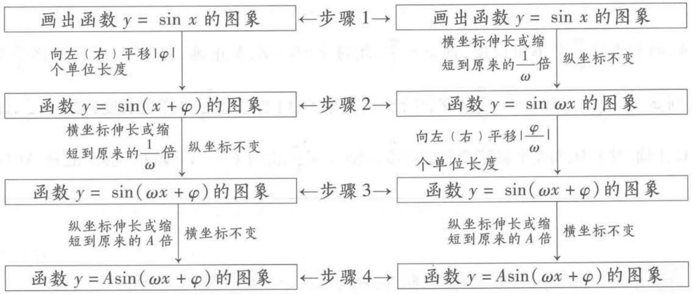

<details>
<summary>flowchart</summary>

```mermaid
graph TD
    A["画出函数 y = sin x 的图象"] -->|向左（右）平移 |φ| 个单位长度| B["函数 y = sin(x + φ) 的图象"]
    B -->|横坐标伸长或缩短到原来的1/ω倍| C["函数 y = sin(ωx + φ) 的图象"]
    B -->|纵坐标不变| D["函数 y = sin(ωx + φ) 的图象"]
    D -->|纵坐标伸长或缩短到原来的A倍| E["函数 y = A sin(ωx + φ) 的图象"]
    D -->|横坐标不变| F["函数 y = A sin(ωx + φ) 的图象"]
    A -->|步骤1| G["画出函数 y = sin x 的图象"]
    G -->|横坐标伸长或缩短到原来的1/ω倍| H["函数 y = sin(ωx + φ) 的图象"]
    G -->|纵坐标不变| I["函数 y = sin(ωx + φ) 的图象"]
    H --> J["函数 y = sin(ωx + φ) 的图象"]
    I --> K["函数 y = A sin(ωx + φ) 的图象"]
    J --> L["向左（右）平移 |φ| 个单位长度"]
    K --> M["向左（右）平移 |φ| ω"]
    L --> N["纵坐标伸长或缩短到原来的A倍"]
    M --> O["纵坐标伸长或缩短到原来的A倍"]
    N --> P["横坐标不变"]
    O --> Q["横坐标不变"]
```
</details>


# 易错演练

1. (2023·江西部分学校9月阶段练习)已知函数 $f(x)=a\sin x+\cos x$ 的图象关于直线 $x=\frac{\pi}{3}$ 对称,则 $f(\frac{\pi}{4})=$

A. $\sqrt{3}$

B. $\frac{\sqrt{6}+\sqrt{2}}{2}$

C. $-\sqrt{3}$

D. $\frac{\sqrt{2}-\sqrt{6}}{2}$

2. (2023·江苏如东中学等校10月联考)(多选)要得到函数 $f(x)=3\sin(2x-\frac{2\pi}{3})-1$ 的图象,需要把函数 $g(x)=3\sin 2x-1$ 的图象()

A. 向右平移 $\frac{\pi}{3}$ 个单位长度

B. 向左平移 $\frac{\pi}{3}$ 个单位长度

C. 向右平移 $\frac{4\pi}{3}$ 个单位长度

D. 向左平移 $\frac{2\pi}{3}$ 个单位长度


# 参考答案与解析

1. B 因为 $f(x)$ 的图象关于直线 $x = \frac{\pi}{3}$ 对称, 且函数的最小正周期为 $2\pi$ , 所以在一个周期内有 $f(0)=f(\frac{2\pi}{3})$ ，即 $1=\frac{\sqrt{3}}{2}a-\frac{1}{2}$ ，解得 $a=\sqrt{3}$ ，则 $f(\frac{\pi}{4})=\sqrt{3}\times\frac{\sqrt{2}}{2}+\frac{\sqrt{2}}{2}=\frac{\sqrt{6}+\sqrt{2}}{2}$ ，故选 B.

【换个思路】由 $f'(x)=a\cos x-\sin x=0$ 的一个解为 $x=\frac{\pi}{3}$ ，得 $\frac{1}{2}a-\frac{\sqrt{3}}{2}=0$ ，则 $a=\sqrt{3}$

尺规作图 是指用无刻度的直尺和圆规作图. 尺规作图起源于古希腊的数学课题. 只使用圆规和直尺, 并且只准许使用有限次, 来解决不同的平面几何作图题. 尺规作图使用的直尺和圆规带有想象性质, 跟现实中的并非完全相同.

关注微信公众号“初高教辅站”获取更多初高中教辅资料


2. ACD 设 $g(x)$ 的图象向右平移 $\varphi$ 个单位长度得到 $f(x)$ 的图象, 则有 $g(x - \varphi) = f(x)$ , 即 $3\sin (2x - 2\varphi) - 1 = 3\sin (2x - \frac{2\pi}{3}) - 1 \Rightarrow -2\varphi + 2k\pi = -\frac{2\pi}{3} (k \in \mathbf{Z})$ , 所以 $\varphi = k\pi + \frac{\pi}{3} (k \in \mathbf{Z})$ .

【陷阱】将平移对象弄反，要得到的是函数 $f(x) = 3\sin \left(2x - \frac{2\pi}{3}\right) - 1$ 的图象，作平移的是函数 $g(x) = 3\sin 2x - 1$ 的图象，同时注意，平移的量可以超过一个周期

对于 A, 向右平移 $\frac{\pi}{3}$ 个单位长度, 则 $\varphi = \frac{\pi}{3}$ , 此时 $k = 0 \in Z$ , A 正确; 对于 B, 向左平移 $\frac{\pi}{3}$ 个单位长度, 则 $\varphi = -\frac{\pi}{3}$ , 此时 $k = -\frac{2}{3} \notin Z$ , B 错误; 对于 C, 向右平移 $\frac{4\pi}{3}$ 个单位长度, 则 $\varphi = \frac{4\pi}{3}$ , 此时 $k = 1 \in Z$ , C 正确; 对于 D, 向左平移 $\frac{2\pi}{3}$ 个单位长度, 则 $\varphi = -\frac{2\pi}{3}$ , 此时 $k = -1 \in Z$ , D 正确. 故选 ACD.

【点拨】向左平移 $\frac{2\pi}{3}$ 个单位长度即向右平移 $-\frac{2\pi}{3}$ 个单位长度

# 易错点4 由图象求三角函数解析式中 $\varphi$ 值时选点不当

调研 1 （2023·陕西师范大学附属中学、渭北中学9月联考）函数 $f(x)=$

$A\sin(\omega x+\varphi)(A>0,\omega>0,|\varphi|<\pi)$ 的部分图象如图1所示,为了得到 $g(x)=A\sin\omega x$ 的图象,只需将函数 $y=f(x)$ 的图象 ( )

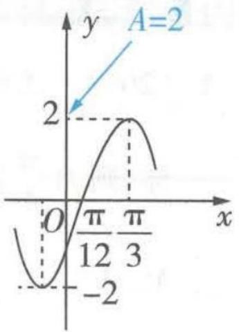

<details>
<summary>line</summary>

| x | y |
|---|---|
| 0 | -2 |
| π/12 | 0 |
| π/3 | 2 |
| >π/3 | 0 |
</details>

A. 向左平移 $\frac{\pi}{6}$ 个单位长度

B. 向左平移 $\frac{\pi}{12}$ 个单位长度

C. 向右平移 $\frac{\pi}{6}$ 个单位长度

D. 向右平移 $\frac{\pi}{12}$ 个单位长度

解析 根据图象可得 $A=2,\frac{T}{4}=\frac{\pi}{3}-\frac{\pi}{12}=\frac{\pi}{4}$ ，所以周期 $T=\pi$ ，因为 $T=\frac{2\pi}{\omega}$

图1

所以 $\omega = 2, f(x) = 2\sin (2x + \varphi), g(x) = 2\sin 2x.$ 将 $(\frac{\pi}{3}, 2)$ 代入 $f(x)$ 的解析式可得 $2 = 2\sin (\frac{2\pi}{3} + \varphi)$ ，则 $\frac{2\pi}{3} + \varphi = \frac{\pi}{2} + 2k\pi (k \in \mathbf{Z})$ ，则 $\varphi = -\frac{\pi}{6} + 2k\pi (k \in \mathbf{Z})$ ，因为 $|\varphi| < \pi$ ，所以 $\varphi = -\frac{\pi}{6}$ ，所以 $f(x) = 2\sin (2x - \frac{\pi}{6})$ ，

【易错辨析】此处易有如下错解. 将 $(\frac{\pi}{12},0)$ 代入 $f(x)$ 的解析式, 得 $2\sin(\frac{\pi}{6}+\varphi)=0$ , 因而 $\frac{\pi}{6}+\varphi=k\pi(k\in\mathbf{Z})$ , 由 $|\varphi|<\pi$ , 得 $\varphi=-\frac{\pi}{6}$ 或 $\varphi=\frac{5\pi}{6}$ . 事实上, 当 $\varphi=\frac{5\pi}{6}$ 时, $f(x)=2\sin(2x+\frac{5\pi}{6})$ , $f(\frac{\pi}{3})=2\sin(\frac{2\pi}{3}+\frac{5\pi}{6})=-2$ , 与已知图象矛盾, 此时其图象如图2中虚线曲线所示, 与已知不符. 所以, 代入点的坐标求 $\varphi$ 值时, 一般情况下, 不代入零点求解, 而是代入最值点或与y轴的交点, 若确需代入零点求解, 需注意该零点所在的单调区间, 以 $y=A\sin(\omega x+\varphi)(A>0,\omega>0)$ 为例, 若零点 $x=x_{0}$ 在单调递增区间内，则 $\omega x_{0} + \varphi = 2k\pi (k\in \mathbf{Z})$ ，若零点 $x = x_0$ 在单调递减区间内，则 $\omega x_0 + \varphi = (2k + 1)\pi (k\in \mathbf{Z})$

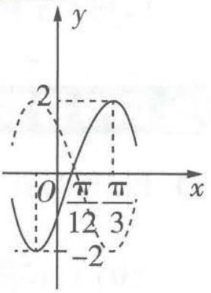

<details>
<summary>line</summary>

| x | y |
|---|---|
| 0 | -2 |
| π/12 | 0 |
| π/3 | 2 |
| 3 | 0 |
</details>

图2

即 $f(x)=2\sin2\left(x-\frac{\pi}{12}\right)$ ，所以将函数 $f(x)$ 的图象向左平移 $\frac{\pi}{12}$ 个单位长度即可得到 $g(x)$ 的图象。故选 B.

答案 B

调研 2 (2023·贵阳、遵义等地10月联考)将函数 $f(x)=\sin(2x-\varphi)(\varphi>0)$ 的图象向右平移 $\frac{\pi}{8}$ 个单位长度,得到函数 $g(x)$ 的图象.若 $g(x)$ 在 $[0,\frac{\varphi}{2}]$ 上单调递增,则 $\varphi$ 的最大值为()

A. $\frac{3\pi}{4}$

B. $\frac{\pi}{2}$

C. $\frac{\pi}{3}$

D. $\frac{\pi}{4}$

思维导引 利用图象平移变换确定 $g(x)$ 的解析式 $\rightarrow$ 函数 $g(x)$ 的单调递增区间 $\rightarrow$ 利用集合间的包含关系求出 $\varphi$ 的范围 $\rightarrow$ $\varphi$ 的最大值

解析 由题意得 $g(x) = f(x - \frac{\pi}{8}) = \sin (2x - \frac{\pi}{4} -\varphi).$

方法一 由 $-\frac{\pi}{2} + 2k\pi \leqslant 2x - \frac{\pi}{4} - \varphi \leqslant \frac{\pi}{2} + 2k\pi (k \in \mathbb{Z})$ ，得 $-\frac{\pi}{8} + \frac{\varphi}{2} + k\pi \leqslant x \leqslant \frac{3\pi}{8} + \frac{\varphi}{2} + k\pi$ ，取 $k = 0$ ，得函数 $g(x)$ 的一个单调递增区间为 $[- \frac{\pi}{8} + \frac{\varphi}{2}, \frac{3\pi}{8} + \frac{\varphi}{2}]$ ，则 $[0, \frac{\varphi}{2}] \subseteq [-\frac{\pi}{8} + \frac{\varphi}{2}, \frac{3\pi}{8} + \frac{\varphi}{2}]$ ，从而 $0 < \varphi \leqslant \frac{\pi}{4}$ ，则 $\varphi$ 的最大值为 $\frac{\pi}{4}$ . 故选 D.

【易错分析】将 $g(x)$ 在 $[0, \frac{\varphi}{2}]$ 上单调递增误认为是函数的单调递增区间为 $[0, \frac{\varphi}{2}]$ ，从而得到 $g(0)$ 最小， $g(\frac{\varphi}{2})$ 最大，进而得出 $\varphi$ 无解的错误答案。也可能代点致误，由题意得到 $g(\frac{\varphi}{2}) > g(0)$ ，则 $\sin(-\frac{\pi}{4}) > \sin(-\frac{\pi}{4} - \varphi)$ ，即 $\sin(\frac{\pi}{4} + \varphi) > \sin\frac{\pi}{4}$ ，展开得 $\sin\varphi + \cos\varphi > 1$ ，由该式无法求得最大值，错误原因是 $g(\frac{\varphi}{2}) > g(0)$ 不等价于 $g(x)$ 在 $[0, \frac{\varphi}{2}]$ 上单调递增

方法二 当 $x \in [0, \frac{\varphi}{2}]$ 时, $2x - \frac{\pi}{4} - \varphi \in [-\frac{\pi}{4} - \varphi, -\frac{\pi}{4}]$ , 因为 $g(x)$ 在 $[0, \frac{\varphi}{2}]$ 上单调递增, 所以 $-\frac{\pi}{2} \leqslant -\frac{\pi}{4} - \varphi < -\frac{\pi}{4}$ , 解得 $0 < \varphi \leqslant \frac{\pi}{4}$ , 所以 $\varphi$ 的最大值为 $\frac{\pi}{4}$ . 故选 D.

答案 D

# 易错演练

1. (2023·山东威海 10 月月考)(多选)函数 $y = A \sin (\omega x + \varphi) (A > 0, \omega > 0, 0 < \varphi < \pi)$ 在一个周期内的图象如图 3 所示, 则 ( )

A. 该函数的解析式为 $y = 2\sin \left( \frac{2}{3} x + \frac{\pi}{3} \right)$

拟柱体 所有顶点都在两个平行平面内的多面体叫作拟柱体. 它在这两个平面内的面叫作拟柱体的底面, 其余各面叫作拟柱体的侧面, 两底面之间的垂直距离叫作拟柱体的高.

关注微信公众号“初高教辅站”获取更多初高中教辅资料

B. 该函数图象的对称中心为 $(k\pi-\frac{\pi}{3},0)$ , $k \in Z$   
C. 该函数的单调递增区间是 $(3k\pi - \frac{5\pi}{4}, 3k\pi + \frac{\pi}{4}), k \in \mathbf{Z}$   
D. 把函数 $y = 2 \sin \left( x + \frac{\pi}{3} \right)$ 的图象上所有点的横坐标伸长为原来的 $\frac{3}{2}$ 倍, 纵坐标不变, 可得到该函数图象

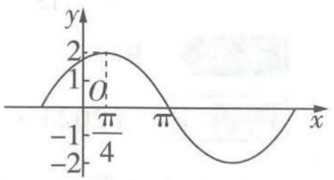  
图3

2. (2023·湖南株洲9月月考)(多选)已知函数 $f(x)=\sin(\omega x+\varphi)(\omega>0,0<\varphi<\frac{\pi}{2})$ ，若 $f(x_{1})=-f(x_{2})=1,|x_{1}-x_{2}|$ 的最小值为3，将函数 $f(x)$ 的图象向左平移1个单位长度得到 $g(x)$ 的图象，且 $g(x)$ 的图象关于y轴对称。令 $h(x)=f(x)+g(x)$ ，则下列结论正确的是()

A. $\omega = \frac{1}{3}, \varphi = \frac{\pi}{6}$

B. 函数 $h(x)$ 的图象的对称中心为 $(3k-1,0)$ , $k \in Z$

C. 函数 $h(x)$ 的最大值为 $\sqrt{3}$

D. 函数 $h(x)$ 在区间 $[-2,0]$ 上单调递增


# 参考答案与解析

1. ACD 由题图可知, $A = 2$ , 周期 $T = \frac{2\pi}{\omega} = 4(\pi - \frac{\pi}{4}) = 3\pi$ , 所以 $\omega = \frac{2}{3}$ , 则 $y = 2\sin\left(\frac{2}{3}x + \varphi\right)$ , 当 $x = \frac{\pi}{4}$ 时, $y = 2\sin\left(\frac{2}{3} \times \frac{\pi}{4} + \varphi\right) = 2$ , 即 $\sin\left(\frac{\pi}{6} + \varphi\right) = 1$ , 所以 $\frac{\pi}{6} + \varphi = \frac{\pi}{2} + 2k\pi, k \in \mathbf{Z}$ , 即 $\varphi =$ 【点睛】在确定 $\varphi$ 值时, 代入的点的坐标是最高点的坐标 $(\frac{\pi}{4}, 2)$ , 以免出现错误 $\frac{\pi}{3} + 2k\pi, k \in \mathbf{Z}$ , 又 $0 < \varphi < \pi$ , 故 $\varphi = \frac{\pi}{3}$ , 从而 $y = 2\sin\left(\frac{2}{3}x + \frac{\pi}{3}\right)$ , A 正确; 令 $\frac{2}{3}x + \frac{\pi}{3} = k\pi, k \in \mathbf{Z}$ , 得 $x = -\frac{\pi}{2} + \frac{3}{2}k\pi, k \in \mathbf{Z}$ , B 错误; 由 $-\frac{\pi}{2} + 2k\pi \leqslant \frac{2}{3}x + \frac{\pi}{3} \leqslant \frac{\pi}{2} + 2k\pi, k \in \mathbf{Z}$ , 得 $-\frac{5\pi}{4} + 3k\pi \leqslant x \leqslant \frac{\pi}{4} + 3k\pi, k \in \mathbf{Z}$ , 故 C 正确; 函数 $y = 2\sin\left(x + \frac{\pi}{3}\right)$ 图象上所有点的横坐标伸长为原来的 $\frac{3}{2}$ 倍, 纵坐标不变, 可得到 $y = 2\sin\left(\frac{2}{3}x + \frac{\pi}{3}\right)$ 的图象, D 正确. 故选 ACD.

2. BCD 由已知, 函数 $f(x)$ 满足 $f(x_{1}) = -f(x_{2}) = 1$ , 且 $|x_{1} - x_{2}|$ 的最小值为 3 , 所以函数 $f(x)$ 的最小正周期为 6 , 而 $T = 6 = \frac{2\pi}{|\omega|}$ , 因为 $\omega > 0$ , 所以 $\omega = \frac{\pi}{3}$ , 此时函数 $f(x) = \sin \left( \frac{\pi}{3} x + \varphi \right)$ , 将函 【扫清障碍】 $f(x_{1}) = -f(x_{2}) = 1$ 说明 $x_{1}, x_{2}$ 为函数最值点, $|x_{1} - x_{2}|$ 的最小值为 3 , 即函数相邻最值点差半个周期, 因而周期是 6

数 $f(x)$ 的图象向左平移1个单位长度得到 $g(x)$ 的图象,所以 $g(x)=\sin\left[\frac{\pi}{3}(x+1)+\varphi\right]=$ 【点睛】注意平移量指x的变化量

$\sin \left(\frac{\pi}{3} x + \frac{\pi}{3} + \varphi\right)$ , 因为 $g(x)$ 的图象关于 $y$ 轴对称, 所以 $\frac{\pi}{3} + \varphi = \frac{\pi}{2} + k\pi (k \in \mathbb{Z})$ , 又 $0 < \varphi < \frac{\pi}{2}$ ,

【换个思路】由 $g(x)$ 的图象关于 $y$ 轴对称得 $g(0) = \sin \left(\frac{\pi}{3} +\varphi\right) = \pm 1$ ，从而得 $\frac{\pi}{3} +\varphi = \frac{\pi}{2}+$ $k\pi (k\in \mathbf{Z})$ ，使用该法求解时需注意 $g(0) = \pm 1$ ，而非 $g(0) = 1$

所以 $\varphi = \frac{\pi}{6}$ , 所以选项 A 错误. $f(x) = \sin \left(\frac{\pi}{3} x + \frac{\pi}{6}\right), g(x) = \sin \left(\frac{\pi}{3} x + \frac{\pi}{3} + \frac{\pi}{6}\right) = \cos \frac{\pi}{3} x$ , 所以 $h(x) = f(x) + g(x) = \sin \left(\frac{\pi}{3} x + \frac{\pi}{6}\right) + \cos \frac{\pi}{3} x = \sqrt{3} \sin \left(\frac{\pi}{3} x + \frac{\pi}{3}\right)$ , 因为 $\sin \left(\frac{\pi}{3} x + \frac{\pi}{3}\right) \in [-1, 1]$ , 所以 $h(x) = \sqrt{3} \sin \left(\frac{\pi}{3} x + \frac{\pi}{3}\right) \in [-\sqrt{3}, \sqrt{3}]$ , 所以选项 C 正确. 令 $\frac{\pi}{3} x + \frac{\pi}{3} = k\pi (k \in \mathbf{Z})$ , 则 $x = 3k - 1 (k \in \mathbf{Z})$ , 所以函数 $h(x)$ 的图象的对称中心为 $(3k - 1, 0), k \in \mathbf{Z}$ , 选项 B 正确. 当 $x \in [-2, 0]$ 时, $\frac{\pi}{3} x + \frac{\pi}{3} \in [-\frac{\pi}{3}, \frac{\pi}{3}]$ , 此时函数 $h(x)$ 单调递增, 故选项 D 正确. 故选 BCD.

# ▲ 易错点 5 不会用频率分布直方图读样本数字特征

调研 （原创/“二十大”）为庆祝中国共产党第二十次全国代表大会的胜利召开，某校组织全体学生参加了主题为“喜庆‘二十大’、永远跟党走、奋进新征程”的知识竞赛。随机抽取了200名学生进行成绩统计，发现抽取的学生的成绩都在50分至100分之间，进行适当分组后（每组的取值区间均为左闭右开），画出频率分布直方图（如图1），下列说法正确的是 （）

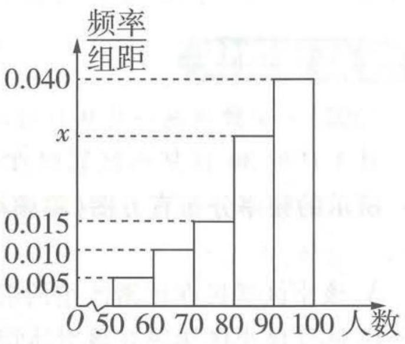

<details>
<summary>histogram</summary>

| 人数 | 频率/组距 |
| :--- | :--- |
| 50-60 | 0.006 |
| 60-70 | 0.010 |
| 70-80 | 0.015 |
| 80-90 | 0.030 |
| 90-100 | 0.040 |
</details>

图1

A. 在被抽取的学生中, 成绩在区间 [90, 100) 内的学生有 75 人

B. 直方图中 x 的值为 0.020

C. 估计全校学生成绩的中位数为 87

D. 估计全校学生成绩的样本数据的 $80\%$ 分位数为 90

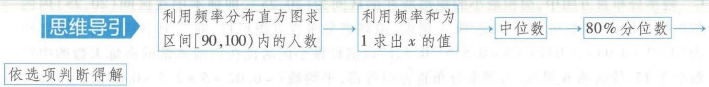

<details>
<summary>flowchart</summary>


</details>

解析 由题意,成绩在区间[90,100)内的学生人数为 $200 \times 0.040 \times 10 = 80$ (人),A错误;

【警示】在频率分布直方图中，注意每个小矩形的面积才是落在该区间的频率，频率×样本容量=频数

由 $(0.005+0.010+0.015+x+0.040)\times10=1$ ，得x=0.030，B错误；设中位数为a，则 $(0.005+$

$0.010 + 0.015) \times 10 + 0.030 \times (a - 80) = 0.5$ ，得 $a \approx 87$ ，C 正确；低于 90 分的频率为 $1 - 0.4 = 0.6$ ，

【易错】由 $(0.005 + 0.010 + 0.015) \times 10 < 0.5$ 和 $(0.005 + 0.010 + 0.015 + 0.030) \times 10 > 0.5$ 得出中位数所在区间，不要判断错误

设样本数据的 $80\%$ 分位数约为 $n$ ，则 $\frac{n - 90}{100 - 90} = \frac{0.2}{0.4}$ ，解得 $n = 95$ ，D 错误。

【易错】不理解百分位数的含义不会计算，不会判断百分位数所在区间。破题思路是通过从左往右（或从右往左）累计小矩形的面积和与百分位数对比来确定。求百分位数还有以下方法：①设80%分位数为m，低于90分的频率为1-0.4=0.6，因而80%分位数落在[90,100)之间，由 $(100-m)\times0.040=20\%$ ，或由 $0.6+(m-90)\times0.040=80\%$ ，解得m=95，即80%分位数为95。②低于90分的频率为1-0.4=0.6，因而80%分位数落在[90,100)之间，所以80%分位数为90+ $\frac{0.2}{0.4}\times10=95$

答案 C

# 易错快攻

给出频率分布直方图，那么①众数估计值为最高的小矩形底边中点的横坐标；②中位数估计值为平分频率分布直方图面积，且垂直于横轴的直线与横轴交点的横坐标；③平均数估计值为频率分布直方图中每个小矩形底边中点横坐标乘以相应小矩形面积之和.

# 易错演练

(2023·安徽芜湖一中9月阶段练习)某滑冰馆统计了2022年11月1日到30日某小区居民在该滑冰馆的锻炼天数,得到如图2所示的频率分布直方图(将频率视为概率),则下列说法正确的是()

A. 该小区居民在该滑冰馆的锻炼天数在区间(25,30]内的最少  
B. 估计该小区居民在该滑冰馆的锻炼天数的中位数为 16  
C. 估计该小区居民在该滑冰馆的锻炼天数的平均数大于 14  
D. 估计该小区居民在该滑冰馆的锻炼天数超过 15 天的概率为 0.456

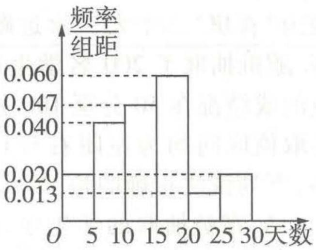

<details>
<summary>histogram</summary>

| 天数 | 频率/组距 |
| :--- | :--- |
| 0-5 | 0.020 |
| 5-10 | 0.040 |
| 10-15 | 0.047 |
| 15-20 | 0.060 |
| 20-25 | 0.013 |
| 25-30 | 0.020 |
</details>

图2

# 参考答案与解析

C 频率分布直方图中,面积最小的矩形所在的区间为(20,25],即样本中在区间(20,25]内的数据频率最小,频数也最小,故选项A错误.由频率分布直方图可得,前三个小矩形的面积之和为 $(0.02+0.04+0.047)\times5=0.535>0.5$ ,所以估计该小区居民在该滑冰馆的锻炼天数的中位数小于15,故选项B错误.由频率分布直方图可得,平均数 $\bar{x}=0.02\times5\times2.5+0.04\times5\times7.5+0.047\times5\times12.5+0.06\times5\times17.5+0.013\times5\times22.5+0.02\times5\times27.5=14.15>14$ ,故选项C正

【警示】注意对中位数、平均数的计算时的易错点

确. 由频率分布直方图可得, 该小区居民在该滑冰馆的锻炼天数超过 15 天的频率为 $(0.06 + 0.013 + 0.02) \times 5 = 0.465$ , 故锻炼天数超过 15 天的概率为 0.465, 故选项 D 错误. 故选 C.

# 审题、答题中 5 个高频易错点

# 特约名师

# 赵成海

正高级教师,河北省优秀教师,省级骨干教师.中国数学奥林匹克一级教练员,中国科学技术学会、中国数学会会员.在国家级及省级等各类专业报纸杂志上发表教育教学论文三百余篇.

# ! 易错点1 不会提取新定义问题的关键信息

调研 1 (2023·上海洋泾中学开学考试改编)(多选)已知[x)表示大于x的最小整数,如[3)=4,[-1.3)=-1.则下列说法中正确的有()

该新定义的形式与高斯函数相似，千万不要当成高斯函数解题哦！

A. 函数 $f(x) = [x) - x$ 的值域是 $(0,1]$   
B. 若 $\{a_{n}\}$ 是等差数列，则 $\{[a_{n})\}$ 也是等差数列  
C. 若 $\{a_{n}\}$ 是等比数列，则 $\{\left[a_{n}\right)\}$ 也是等比数列  
D. 若 $x \in (0, 2023)$ , 则方程 $[x) = (\frac{1}{\mathrm{e}})^{x - 1} + x$ 有 2022 个解

解析 当 $x \in Z$ 时， $[x) = x + 1, f(x) = [x) - x = x + 1 - x = 1;$

当 $x \notin \mathbf{Z}$ 时，令 $x = n + a, n \in \mathbf{Z}, a \in (0,1)$ ，则 $[x) = n + 1, f(x) = [x) - x = 1 - a \in (0,1)$ .

因此 $f(x)=[x)-x$ 的值域是 $(0,1]$ ，故 A 正确.

【易错】准确提取题目中的信息是关键, 此处若将已知条件理解成高斯函数, 会误将函数 $f(x) = [x) - x$ 的值域写成 $(-1,0]$ . 实际上, 人教 A 版教材必修第一册第 73 页的第 13 题是关于高斯函数的: 函数 $f(x) = [x]$ 的函数值表示不超过 $x$ 的最大整数, 例如, $[-3.5] = -4$ , $[2.1] = 2$ . 所以高斯函数的值域为整数集 Z, 要注意区分

0.9,1,1.1 是等差数列,但 $[0.9) = 1,[1) = 2,[1.1) = 2$ 不构成等差数列,故 B 错误.

0.5,1,2 是等比数列,但 $[0.5)=1,[1)=2,[2)=3$ 不构成等比数列,故 C 错误.

由前面分析可得当 $x \in \mathbf{Z}$ 时, $f(x) = 1$ ; 当 $x \notin \mathbf{Z}, x = n + a, n \in \mathbf{Z}, a \in (0,1)$ 时, $f(x) = 1 - a = 1 - (x - n) = n + 1 - x$ .

所以 $f(x+1)=f(x)$ ，即 $f(x)=[x)-x$ 是周期为 1 的函数，

【另解】当 $[x) = m$ 时， $[x + 1) = m + 1$ ，则 $f(x) = m - x$ ， $f(x + 1) = (m + 1) - (x + 1) = m - x = f(x)$ ，所以 $f(x) = [x) - x$ 是周期为1的函数

方程 $[x) = (\frac{1}{\mathrm{e}})^{x - 1} + x$ 可转化为 $[x) - x = (\frac{1}{\mathrm{e}})^{x - 1}$ , 由指数函数的性质可得函数 $y = (\frac{1}{\mathrm{e}})^{x - 1}$ 的图象过点(1,1), 且函数在 $(- \infty, + \infty)$ 上单调递减, 作出图象, 如图1所示.

【突破难点】将方程解的个数转化成两个函数图象的交点个数，然后利用数形结合求解

当 $x \in (0,1)$ 时， $n = 0, f(x) = 1 - x < 1, (\frac{1}{\mathrm{e}})^{x-1} > 1$ ，没有交点；

《九章算术》是《算经十书》中最重要的一部，成于公元一世纪左右。《九章算术》内容十分丰富，全书总结了战国、秦、汉时期的数学成就。

关注微信公众号“初高教辅站”获取更多初高中教辅资料

当 $x \in [1,2)$ 时， $n = 1, f(x) = 2 - x, 0 < (\frac{1}{\mathrm{e}})^{x - 1} < 1$ ，必有一个交点；

当 $x \in [2,3)$ 时， $n = 2, f(x) = 3 - x$ ，与 $y = \left(\frac{1}{\mathrm{e}}\right)^{x - 1}$ 必有一个交点；

......

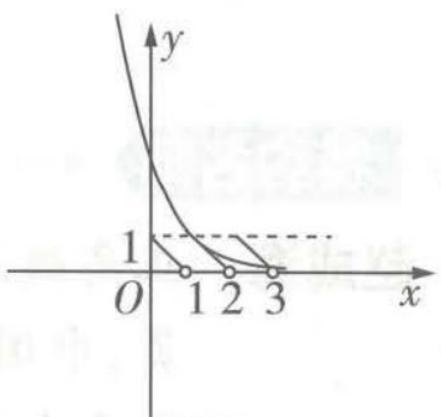

<details>
<summary>text_image</summary>

y
1
O 1 2 3 x
</details>

图1

以此类推,则 $f(x)$ 的图象在后面每个周期内都与 $y = \left(\frac{1}{\mathrm{e}}\right)^{x-1}$ 的图象有一
个交点,即若 $x \in (0, 2023)$ , 则方程 $[x) - x = \left(\frac{1}{\mathrm{e}}\right)^{x-1}$ 有 2022 个不同的解, D 正确. 故选 AD.

答案 AD

调研 2 （2023·湖北宜昌10月联考/密位制）密位制是度量角的一种方法，把一周角等分为6000份，每一份叫作1密位的角。在角的密位制中，单位可省去不写，采用四个数码表示角的大小，在百位数与十位数之间画一条短线，如7密位写成“0-07”，478密位写成“4-78”。若 $(\sin\alpha-\cos\alpha)^{2}=2\sin\alpha\cos\alpha$ ，则角 $\alpha$ 可取的值用密位制表示错误的是（）

A. 12 - 50

B.2-50

C. 13 - 50

D. 32 - 50

易错警示 本题的易错点有3处：(1)不理解把一周角等分为6000份，每一份叫作1密位的角，不会用密位作单位去度量角；(2)不会角的单位换算；(3)密位制的表示方法没读懂.

解析 因为 $(\sin \alpha - \cos \alpha)^2 = 2\sin \alpha \cos \alpha$ ，即 $\sin^2 \alpha - 2\sin \alpha \cos \alpha +$

$\cos^2\alpha = 2\sin \alpha \cos \alpha$ ，即 $4\sin \alpha \cos \alpha = 1$ ，所以 $\sin 2\alpha = \frac{1}{2}$ ，所以 $2\alpha = \frac{\pi}{6} +$

$2k\pi, k \in \mathbf{Z}$ 或 $2\alpha = \frac{5\pi}{6} + 2k\pi, k \in \mathbf{Z}$ , 解得 $\alpha = \frac{\pi}{12} + k\pi, k \in \mathbf{Z}$ 或 $\alpha = \frac{5\pi}{12} + k\pi, k \in \mathbf{Z}$ .

<table><tr><td>选项</td><td>分析过程</td><td>结论</td></tr><tr><td>A</td><td>密位制12-50对应的角的弧度为 $\frac{1\ 250}{6\ 000} \times 2\pi = \frac{5\pi}{12}$ 【另解】也可以类比弧度制的定义,得到关系1密位= $\frac{2\pi}{6\ 000} = \frac{\pi}{3\ 000}$ ,因而密位制12-50对应的弧度为 $1\ 250 \times \frac{\pi}{3\ 000} = \frac{5\pi}{12}$ </td><td>符合题意</td></tr><tr><td>B</td><td>密位制2-50对应的角的弧度为 $\frac{250}{6\ 000} \times 2\pi = \frac{\pi}{12}$ </td><td>符合题意</td></tr><tr><td>C</td><td>密位制13-50对应的角的弧度为 $\frac{1\ 350}{6\ 000} \times 2\pi = \frac{9\pi}{20}$ </td><td>不符合题意</td></tr><tr><td>D</td><td>密位制32-50对应的角的弧度为 $\frac{3\ 250}{6\ 000} \times 2\pi = \frac{13\pi}{12}$ </td><td>符合题意</td></tr></table>

答案 C


# 易错演练

1. (2023·北京一零一中学 10 月模拟) 我们已经学过用角度制与弧度制度量角, 最近有学者提出用“面度制”度量角. 在半径不同的同心圆中, 同样的圆心角所对扇形的面积与半径平方之比是常数, 称这个常数为该角的面度数, 这种用面度作为单位来度量角的方法, 叫作面度制. 抓住面度数的定义, 求出扇形面积, 利用扇形的面积公式求出角, 进而求出余弦值在面度制下, 角 $\theta$ 的面度数为 $\frac{\pi}{3}$ , 则角 $\theta$ 的余弦值为 ( )

A. $-\frac{\sqrt{3}}{2}$

B. $-\frac{1}{2}$

C. $\frac{1}{2}$

D. $\frac{\sqrt{3}}{2}$

2. (2023·浙江名校返校联考/零点相邻函数)(多选)对于函数 $f(x)$ 和 $g(x)$ ，设 $x_{1} \in \{x \mid f(x) = 0\}$ ， $x_{2} \in \{x \mid g(x) = 0\}$ ，若存在 $x_{1}, x_{2}$ ，使得 $|x_{1} - x_{2}| \leqslant 1$ ，则称 $f(x)$ 与 $g(x)$ 互为“零点相邻函数”。若函数 $f(x) = e^{x - 3} + x - 4$ 与 $g(x) = \ln x - mx$ 互为“零点相邻函数”，则实数 $m$ 的值可以是 ( )

A. $\frac{\ln5}{5}$

B. $\frac{\ln3}{3}$

C. $\frac{\ln2}{2}$

D. $\frac{1}{2}$

3. (2023 · 上海浦东区 10 月期中/数列的“好数”) 对于数列 $\{a_{n}\}$ , 定义 $A_{n} = \frac{a_{1} + 2a_{2} + \cdots + 2^{n-1}a_{n}}{n}$ 为数列 $\{a_{n}\}$ 的“好数”. 已知某数列 $\{a_{n}\}$ 的“好数”为 $A_{n} = 2^{n+1}$ , 记数列 $\{a_{n} - kn\}$ 的前 $n$ 项和为 $S_{n}$ , 若 $S_{n} \leqslant S_{6}$ 对任意的 $n \in \mathbb{N}^{*}$ 恒成立, 则 $k$ 的取值范围为 ( )
由 $A_{n} = \frac{a_{1} + 2a_{2} + \cdots + 2^{n-1}a_{n}}{n} = 2^{n+1}$ 可得 $a_{1} + 2a_{2} + \cdots + 2^{n-1}a_{n} = n \cdot 2^{n+1}$ , 当 $n \geqslant 2$ 时, 将 $n$ 换为 $n-1$ 代入上式, 两式相减可得 $a_{n} = 2(n+1)$ . 通过 $a_{n} - kn = (2-k)n+2$ , 说明数列 $\{a_{n}-kn\}$ 为等差数列, $S_{n} \leqslant S_{6}$ 对任意的 $n (n \in \mathbb{N}^{*})$ 恒成立可化为 $a_{6} - 6k \geqslant 0$ , $a_{7} - 7k \leqslant 0$ , 求解即可

A. $\left[\frac{1}{3},\frac{7}{3}\right]$

B. $\left[\frac{13}{6},\frac{9}{4}\right]$

C. $\left[\frac{2}{7},\frac{5}{3}\right]$

D. $\left[\frac{16}{7},\frac{7}{3}\right]$


# 参考答案与解析

1. B 由面度数的定义可知 $\frac{S}{r^2} - \frac{\pi}{3}$ , 即 $S = \frac{\pi}{3} r^2$ , 圆心角为 $\theta$ 的扇形面积为 $\frac{1}{2} \theta \cdot r^2$ , 从而 $\frac{1}{2} \theta \cdot r^2 = \frac{\pi}{3} r^2$ , 得 $\theta = \frac{2\pi}{3}, \cos \theta = \cos \frac{2\pi}{3} = -\frac{1}{2}$ . 故选 B.

【另解】半径为 r 的圆的面积为 $\pi r^{2}$ ，圆心角为 $2\pi$ ，则周角的面度数为 $\frac{\pi r^{2}}{r^{2}} = \pi$ ，所以换算关系为 1 面度等于 2 弧度，所以角 $\theta$ 的面度数为 $\frac{\pi}{3}$ ，则 $\theta = \frac{2\pi}{3}$

《孙子算经》是中国古代重要的数学著作,成书大约在四、五世纪.传本的《孙子算经》共三卷,卷上叙述算筹记数的纵横相间制度和筹算乘除法则,卷中举例说明筹算分数算法和筹算开平方法.

关注微信公众号“初高教辅站”获取更多初高中教辅资料

2. BC 由题意可得 $f(x_{1}) = \mathrm{e}^{x_{1} - 3} + x_{1} - 4 = 0, g(x_{2}) = \ln x_{2} - mx_{2} = 0$ ，易知 $x_{1} = 3$ ，则 $|3 - x_{2}| \leqslant 1$ ，

【难点突破】由于函数 $f(x) = \mathrm{e}^{x - 3} + x - 4$ 是单调函数，因而可以得到 $f(x)$ 只有唯一零点 $x_{1} = 3$ ，那么由新定义中 $|x_{1} - x_{2}| \leqslant 1$ 得 $2 \leqslant x_{2} \leqslant 4$ ，从而问题转化为函数 $g(x) = \ln x - mx$ 在[2,4]上存在零点，进而找到解题入手点

$2 \leqslant x_{2} \leqslant 4$ , 则 $m = \frac{\ln x_{2}}{x_{2}}$ 在 $2 \leqslant x_{2} \leqslant 4$ 时有解. 对关于 x 的函数 $m = \frac{\ln x}{x} (2 \leqslant x \leqslant 4)$ 求导得 $m' = \frac{1 - \ln x}{x^{2}}$ ,
令 $m' = 0$ ，解得 x = e，可得下表：

<table><tr><td>x</td><td>[2,e)</td><td>e</td><td>(e,4]</td></tr><tr><td>m&#x27;</td><td>+</td><td>0</td><td>-</td></tr><tr><td>m</td><td>单调递增</td><td>极大值</td><td>单调递减</td></tr></table>

则当 $x = \mathrm{e}$ 时， $m$ 取得最大值，为 $\frac{1}{\mathrm{e}}$ 。又当 $x_{2} = 2$ 时， $m = \frac{\ln 2}{2}$ ，当 $x_{2} = 4$ 时， $m = \frac{\ln 4}{4} = \frac{\ln 2}{2}$ ，则 $m$ 的取值范围为 $[\frac{\ln 2}{2}, \frac{1}{\mathrm{e}}]$ 。故选BC.

3. D 由题意得 $A_{n} = \frac{a_{1} + 2a_{2} + \cdots + 2^{n - 1}a_{n}}{n} = 2^{n + 1}$ , 则 $a_{1} + 2a_{2} + \cdots + 2^{n - 1}a_{n} = n \cdot 2^{n + 1}$ , 当 $n \geqslant 2$ 时, $a_{1} + 2a_{2} + \cdots + 2^{n - 2}a_{n - 1} = (n - 1) \cdot 2^{n}$ , 两式相减得 $2^{n - 1}a_{n} = n \cdot 2^{n + 1} - (n - 1) \cdot 2^{n} = (n + 1)2^{n}$ , 所以 $a_{n} = 2(n + 1), n \geqslant 2$ . 当 $n = 1$ 时, $a_{1} = 4$ 对上式也成立, 故 $a_{n} = 2(n + 1)$ . 则 $a_{n} - kn =$ 【易遗漏】前面分析的前提条件是 $n \geqslant 2$ , 因此此处不要遗漏对 $n = 1$ 的情况的检验 $(2 - k)n + 2$ , 则数列 $\{a_{n} - kn\}$ 为首项为 $4 - k$ , 公差为 $2 - k$ 的等差数列, 故若 $S_{n} \leqslant S_{6}$ 对任意的 $n (n \in \mathbf{N}^{*})$ 恒成立, 则数列 $\{a_{n} - kn\}$ 的前6项和最大, 那么首项 $a_{1} - k = 4 - k > 0$ , 公差 $2 - k < 0$ , 所以 $2 < k < 4$ , 同时第6项 $a_{6} - 6k \geqslant 0$ , 第7项 $a_{7} - 7k \leqslant 0$ , 即 $\left\{\begin{array}{l}6(2 - k) + 2 \geqslant 0, \\7(2 - k) + 2 \leqslant 0,\end{array}\right.$ 解得 $\frac{16}{7} \leqslant k \leqslant$ 【易错】此处容易忽视“若等差数列前 $n$ 项和有最大值, 则其首项为正, 公差为负”的条件, 即“首项 $a_{1} - k = 4 - k > 0$ , 公差 $2 - k < 0$ , 所以 $2 < k < 4$ ”这一条件, 虽然对本题而言, 缺少这一条件对最后结果没有影响, 但需要注意解题的严谨性, 也就是说, 如果这道题命制成大题, 缺少这一过程就会丢失步骤分 $\frac{7}{3}$ . 故选D.


# 易错点2 求解比大小压轴题没有思路

调研 1 (2023·江苏姜堰中学、如东中学 10 月联考) 已知 $a = 0.1 \mathrm{e}^{0.1}, b = 0.11$ , $c = \ln 1.1$ , 则 $a, b, c$ 的大小关系为 ( )

已知条件含有指数式、对数式和其他值，运用作差法、作商法等常规的比较方法难以求解，这也是此类比较大小压轴题的特点，解题策略的选择上往往有一定的难度

A. $a < b < c$

B. b > a > c

C. a > b > c

D. $a < c < b$

解析 由 $\mathrm{e}^x > x + 1 (x > 0)$ , 得 $\mathrm{e}^{0.1} > 0.1 + 1 = 1.1$ , 所以 $0.1 \mathrm{e}^{0.1} > 0.1 \times 1.1 = 0.11$ , 即 $a > b$ .

用同构思想比较 a, c 的大小, 如下.

由于 $x\mathrm{e}^{x} = \mathrm{e}^{x}\ln \mathrm{e}^{x}$ , 所以 $a = 0.1\mathrm{e}^{0.1} = \mathrm{e}^{0.1}\ln \mathrm{e}^{0.1}$ . 该形式与 $1.1\ln 1.1$ 有着相同的构造, 那么可以【拓展与思考】运用同构思想时, 变形是难点. 对于 $x$ 的常见变形有 $x = \mathrm{e}^{\ln x}$ 或 $x = \ln \mathrm{e}^{x}$ , 所以 $x\mathrm{e}^{x} = \mathrm{e}^{x}\ln \mathrm{e}^{x}$ (请自行思考变形过程). 还有一些常见的同构中的变形, 比如, $(9 - 3\ln 3)\mathrm{e}^{-3} = \frac{3(3 - \ln 3)}{\mathrm{e}^{3}} = \frac{\ln \mathrm{e}^{3} - \ln 3}{\frac{\mathrm{e}^{3}}{3}} = \frac{\ln \frac{\mathrm{e}^{3}}{3}}{\frac{\mathrm{e}^{3}}{3}}, \quad \mathrm{e}^{-1} = \frac{\ln \mathrm{e}}{\mathrm{e}}$ , 变形后即可联想到函数 $y = \frac{\ln x}{x}$ , 从而达到用同构思

想构造函数、进而利用函数的单调性比较大小的目的

设函数 $f(t) = t \ln t$ ，则 $f'(t) = \ln t + 1$ . 当 $t > 1$ 时， $f'(t) > 0$ ，因而 $f(t)$ 在 $(1, +\infty)$ 上单调递增，所以 $f(\mathrm{e}^{0.1}) > f(1.1)$ ，即 $\mathrm{e}^{0.1} \ln \mathrm{e}^{0.1} > 1.1 \ln 1.1 > \ln 1.1$ ，所以 $a > c$ .

由 $\ln(1+x)<x(x>0)$ ，得 $\ln(1+0.1)<0.1<0.11$ ，所以 c<b。

综上，选C.

【另解】本题也可以利用泰勒展开式求解： $e^{x}=1+x+\frac{x^{2}}{2!}+\cdots$ ，即 $xe^{x}=x+x^{2}+\frac{x^{3}}{2!}+\cdots$ ，所以 $a=0.1e^{0.1}=0.1+0.1^{2}+\frac{0.1^{3}}{2!}+\cdots=0.11+\frac{0.1^{3}}{2!}+\cdots>0.11=b,\ln(1+x)=x-\frac{x^{2}}{2}+\frac{x^{3}}{3}-\frac{x^{4}}{4}+\cdots,$ 所以 $c=\ln(1+0.1)=0.1-\frac{0.1^{2}}{2}+\frac{0.1^{3}}{3}-\frac{0.1^{4}}{4}+\cdots<0.1<0.11=b$ ，从而 a>b>c，选 C

秒杀解 有时将问题看得过于复杂反而没有足够的耐心与信心,事实上,通过以上分析,本题完全可以得到秒杀解法:直接利用结论 $e^{x} > x + 1 (x > 0)$ 和 $\ln(1 + x) < x (x > 0)$ , 则当 x > 0 时, $xe^{x} > x^{2} + x > x > \ln(1 + x)$ , 因而 $a = 0.1e^{0.1} > 0.1^{2} + 0.1 = b > 0.1 > \ln(1 + 0.1) = c$ , 故选 C.

答案 C

# 拓展拔高

# 常用的 5 个泰勒展开式

① $e^{x}=1+x+\frac{x^{2}}{2!}+\frac{x^{3}}{3!}+\cdots$ ; ② $\ln(1+x)=x-\frac{x^{2}}{2}+\frac{x^{3}}{3}-\frac{x^{4}}{4}+\cdots$ ;   
③ $\sin x = x - \frac{x^{3}}{3!} + \frac{x^{5}}{5!} - \frac{x^{7}}{7!} + \cdots;$ ④ $\cos x = 1 - \frac{x^{2}}{2!} + \frac{x^{4}}{4!} - \frac{x^{6}}{6!} + \cdots;$   
⑤ $\tan x = x + \frac{x^{3}}{3} + \frac{2x^{5}}{15} + \cdots.$

调研 2 (2023·四川成都七中开学考试) 设 a = 0.01, $b = \ln(1 + \sin 0.01)$ , c =

《五曹算经》是一部为地方官员撰写的应用数学书，该书分为“田曹”“兵曹”“集曹”“仓曹”“金曹”五卷。“五曹”是指五类官员。

关注微信公众号“初高教辅站”获取更多初高中教辅资料


1. $1\ln 1.01$ ，则 $a,b,c$ 的大小关系是 （

A. $a < b < c$

B. a < c < b

C. b < c < a

D. b < a < c

解析 方法一 由常见不等式 $\ln (1 + x) < x(x > 0)$ 与 $\sin x < x(0 < x < \frac{\pi}{2})$ ，可得 $b = \ln (1 + \sin 0.01) < \sin 0.01 < 0.01 = a.$

因为 $a=\ln e^{0.01}, c=1.1\ln 1.01=\ln(1.01)^{1.1}$ ，所以只要比较 $x=e^{0.01}$ 和 $z=(1.01)^{1.1}=(1+0.01)^{1.1}$ 的大小即可.

【难点突破】将 $a, c$ 变成同底对数的形式，转化为比较真数的大小。由于是不同底指数式形式，故需要作差后构造函数，再利用函数的单调性求解

令 $g(x) = (1 + x)^{1.1} - \mathrm{e}^x$ ，则 $g^{\prime}(x) = 1.1(1 + x)^{0.1} - \mathrm{e}^{x}, g^{\prime \prime}(x) = 0.11(1 + x)^{-0.9} - \mathrm{e}^{x}$ .

因为 $g''(x)$ 是 $(0, +\infty)$ 上的减函数，且 $g''(0) = 0.11 - 1 < 0$ ，所以当 x > 0 时， $g''(x) < 0$ ，所以 $g'(x)$ 是 $(0, +\infty)$ 上的减函数。

$g'(0)=1.1-1>0, g'(0.1)=1.1\times1.1^{0.1}-e^{0.1}=1.1^{1.1}-e^{0.1}$ ，下面比较 $1.1^{1.1}$ 与 $e^{0.1}$ 的大小，只要比较 $\ln 1.1^{1.1}=1.1\ln 1.1$ 与 $\ln e^{0.1}=0.1$ 的大小即可.

由 $\ln (1 + x) > \frac{x}{1 + x} (x > 0)$ , 得 $\ln (1 + 0.1) > \frac{0.1}{1 + 0.1}$ , 即 $1.1\ln 1.1 > 0.1, \ln 1.1^{1.1} > 0.1$ , 所以 $1.1^{1.1} > \mathrm{e}^{0.1}$ , 所以 $g'(0.1) = 1.1^{1.1} - \mathrm{e}^{0.1} > 0$ , 所以当 $x \in (0,0.1)$ 时, $g'(x) > 0$ , 所以 $g(x)$ 在 $(0,0.1)$ 上单调递增, 所以 $g(x) > g(0) = 0$ , 所以 $(1 + x)^{1.1} > \mathrm{e}^x$ , 所以 $(1 + 0.01)^{1.1} > \mathrm{e}^{0.01}$ , 所以 $z > x$ , 即 $c > a$ .

所以 c > a > b，故选 D.

方法二 由常见不等式 $\ln (1 + x) < x(x > 0)$ 与 $\sin x < x(0 < x < \frac{\pi}{2})$ ，可得 $b = \ln (1 + \sin 0.01) < \sin 0.01 < 0.01 = a.$

考虑到 $c = 1.1\ln 1.01 = (1 + 10a)\ln (1 + a)$ ，因而设 $f(x) = (1 + 10x)\ln (1 + x) - x,x\geqslant 0$ ，则 $f^{\prime}(x) = 10\ln (1 + x) + \frac{1 + 10x}{1 + x} -1 = 10\ln (1 + x) + \frac{9x}{1 + x}\geqslant 0,$

因而 $f(x)$ 在 $[0, +\infty)$ 上单调递增，那么 $f(0.01) > f(0) = 0$ ，即 $(1 + 10 \times 0.01) \ln (1 + 0.01) - 0.01 > 0$ ，所以 $c = 1.1 \ln 1.01 > 0.01 = a.$

所以 c > a > b，故选 D.

【方法对比】对于 a, c 的比较，方法二是直接建立 a, c 的关系，巧设函数比较。对比方法一，少走了很多弯路，因而恰当选择解题方法，可以事半功倍

答案 D

# 易错演练

(2023·江西名校联盟10月摸底测试)设 $a=\frac{\ln 2}{8}$ , $b=\frac{1}{e^{2}}$ , $c=\frac{\ln 6}{12}$ ,则()

A. a < c < b

B. a < b < c

C. b < a < c

D. c < a < b

# 参考答案与解析

B 设函数 $f(x) = \frac{\ln x}{x^2}$ ，则 $f'(x) = \frac{1 - 2\ln x}{x^3}$ ，令 $f'(x) = 0$ ，得 $x = \sqrt{\mathrm{e}}$ ，因而 $f(x)$ 在 $(0, \sqrt{\mathrm{e}})$ 上单调递增，在 $(\sqrt{\mathrm{e}}, +\infty)$ 上单调递减。 $a = \frac{\ln 2}{8} = f(4)$ ， $b = \frac{1}{\mathrm{e}^2} = f(\mathrm{e})$ ， $c = \frac{\ln 6}{12} = f(\sqrt{6})$ ，

【难点突破】前面讲过，同构的难点就在于变形，本题将三个数变形为 $a=\frac{\ln2}{8}=\frac{\ln4}{4^{2}}$ ，b= $\frac{\ln e}{e^{2}}$ ， $c=\frac{\ln\sqrt{6}}{(\sqrt{6})^{2}}$ ，具有相同结构的形式后再构造函数
而 $4 > e > \sqrt{6}$ ，所以 $f(4) < f(e) < f(\sqrt{6})$ ，即 a < b < c，选 B.

【另解】本题还可以设函数 $f(x) = \frac{\ln x}{2x}$ ，则 $f(x)$ 在 $(e, +\infty)$ 上单调递减，那么 $f(e^2) < f(6)$ ，而 $a = \frac{\ln 2}{8} < \frac{1}{8} < \frac{1}{e^2}$ ，从而 $a < b < c$ 。该解法只对 $b, c$ 实施同构，降低了同构的变形难度

# ▲ 易错点3》缺乏空间想象能力，不会用几何法求解立体几何问题

调研 1 （2023·江苏南通海安期初学业质量监测）如图 1, 在四棱锥 P-ABCD 中, $\triangle PAD$ 是边长为 2 的等边三角形, $AB \perp$ 平面 PAD, $AB \parallel CD$ , 且 AB > CD, BC = CP, O 为棱 PA 的中点.

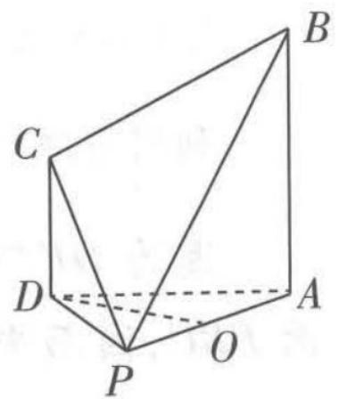

<details>
<summary>text_image</summary>

B
C
D
A
P
O
</details>

图1

(1) 求证: $OD \parallel$ 平面 PBC.  
(2) 若 $BC \perp PC$ ，求平面 PBC 与平面 PAD 所成锐二面角的余弦值.

# 思维导引

( 1 )

思路

考虑线面平行的判定定理

→

取 $PB$ 的中点,通过平行四边形的性质在平面 $PBC$ 内确定 $OD$ 的平行线 $\rightarrow$ 得解

思路二: 考虑面面平行的性质 → 取 AB 的中点, 连线, 证明面面平行 → 得解

(2) 对于无棱二面角,通过作图找到二面角的棱→确定二面角的平面角→解三角形→得解

解析 (1) 方法一 在四棱锥 $P - ABCD$ 中, 取 $PB$ 的中点 $E$ , 连接 $OE, CE$ , 如图 2.

因为 O 为棱 PA 的中点, 所以 $OE \parallel AB \parallel CD$ , $OE = \frac{1}{2} AB$ .

【易错】好多同学此时就以为四边形 CDOE 为平行四边形，事实上缺少条件 CD = OE，而该条件在已知中没有，需要再推证

因为 $AB \perp$ 平面 PAD, 所以 $CD \perp$ 平面 PAD, 而 PA, AD, $PD \subset$ 平面

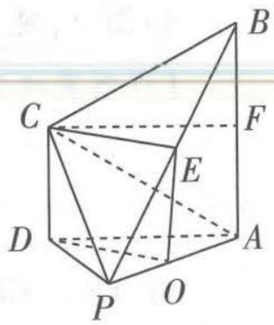

<details>
<summary>text_image</summary>

Geometric diagram of a triangular prism with labeled vertices and internal points, used for spatial geometry problems.
</details>

图2

《夏侯阳算经》北宋元丰九年所刻《夏侯阳算经》是唐中叶的一部算书. 引用当时流传的乘除捷法, 解答日常生活中的应用问题, 保存了很多数学史料.

关注微信公众号“初高教辅站”获取更多初高中教辅资料


PAD, 则 $AB \perp AD, AB \perp PA, CD \perp PD$ , 则有 $PC^{2} = CD^{2} + PD^{2}$ .

在直角梯形 $ABCD$ 中， $BC^2 = AD^2 + (AB - CD)^2$ ，又 $\triangle PAD$ 是边长为 2 的等边三角形，即 $PD = AD = 2$ ，又 $BC = CP$ ，因此 $(AB - CD)^2 = CD^2$ ，而 $AB > CD$ ，则 $CD = \frac{1}{2} AB = OE$ .

【扫清障碍】这里推证 $CD=\frac{1}{2}AB=OE$ 是难点，本题利用勾股定理，通过 BC=CP 进行转换得出。还可以连接 AC，如图 2，则由勾股定理得 $AC^{2}=CD^{2}+AD^{2}$ ， $PC^{2}=CD^{2}+PD^{2}$ ，PD=AD=2，可推出 AC=PC，因而 AC=BC，取 AB 的中点 F，连接 CF，则 $CF\parallel AD$ 且 CF=AD，故 $CD=AF=\frac{1}{2}AB$ ，则可推出 CD=OE

于是得四边形 CDOE 为平行四边形, 所以 $OD \parallel CE$ , 又 $CE \subset$ 平面 PBC, $OD \not\subset$ 平面 PBC, 所以 $OD \parallel$ 平面 PBC.

方法二 取 AB 的中点 F, 连接 OF, DF, 如图 3, 则 OF // PB.

【易错】由于 $CD \parallel AB$ ，易直接判断 $DF \parallel CB$ ，从而得出平面 $ODF \parallel$ 平面 $PBC$ ，这时依然缺少 $CD = \frac{1}{2} AB$ 这一条件，同方法一的分析，这是需要证明的，产生错误的原因在于空间想象力不够，使得推证过程中条件不足就下结论

利用方法一得到 $CD=\frac{1}{2}AB$ 后, 则四边形 CDFB 为平行四边形, $DF \parallel CB$ .

因为 $DF \cap OF = F, DF, OF \subset$ 平面 $ODF, BC \cap PB = B, BC, PB \subset$ 平面 $PBC$ , 因而平面 $ODF \parallel$ 平面 $PBC$ , 又 $OD \subset$ 平面 $ODF$ , 从而 $OD \parallel$ 平面 $PBC$ .

(2) 方法一 因为 $BC \perp PC, BC = CP$ ，则 $PB = \sqrt{2}PC$ .

由(1)知 $AB = 2CD, PA^{2} + AB^{2} = PB^{2} = 2PC^{2} = 2(CD^{2} + PD^{2})$ ，即 $4 + 4CD^{2} = 2(CD^{2} + 4)$ ，解得 $CD = \sqrt{2}$ ，则 $AB = 2\sqrt{2}, PB = 2\sqrt{3}$ .

【易错】此处通过 $BC \perp PC$ 及等边三角形 $PAD$ 的边长求出 $AB, CD, PB$ 的长度，易错在没有求解过程，而直接写出结果，在解答题中是会失分的

如图 4, 延长 BC, AD 交于点 Q, 连接 PQ,

【作图突破】本题中的二面角模型是无棱二面角，由于对几何知识不熟练，作不出两个半平面的交线，导致作不出平面角而无从下手，因此需要通过练习加强理解，扩充知识、巩固方法，以便作出二面角的平面角

由 $AB \parallel CD$ 且 $CD = \frac{1}{2} AB$ 得点 $D$ 是 $AQ$ 的中点，即 $PD = \frac{1}{2} AQ$ ，因此 $\angle APQ = 90^{\circ}$ ，即 $PA \perp PQ$ .

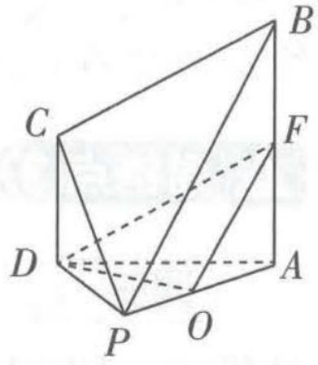

<details>
<summary>text_image</summary>

Geometric diagram of a polyhedron with labeled vertices A, B, C, D, O, and F, showing solid and dashed edges.
</details>

图3

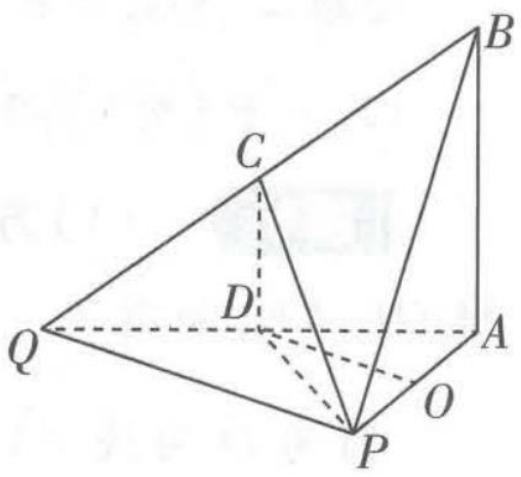

<details>
<summary>text_image</summary>

Geometric diagram of a tetrahedron with labeled vertices and internal points, used for spatial geometry problems.
</details>

图4

由 $AB \perp$ 平面 $PAD, PQ \subset$ 平面 $PAD$ , 得 $AB \perp PQ$ , 而 $AB \cap AP = A, AB, AP \subset$ 平面 $PAB$ , 则 $PQ \perp$ 平面 $PAB$ , 又 $PB \subset$ 平面 $PAB$ , 所以 $PB \perp PQ$ , 因此 $\angle APB$ 是二面角 $A - PQ - B$ 的平面角.

$\cos \angle APB = \frac{PA}{PB} = \frac{2}{2\sqrt{3}} = \frac{\sqrt{3}}{3}$ , 所以平面 $PBC$ 与平面 $PAD$ 所成锐二面角的余弦值是 $\frac{\sqrt{3}}{3}$ .

方法二 结合方法一得 $PC = \sqrt{6}$ ，所以 $S_{\triangle PBC} = \frac{1}{2} \times (\sqrt{6})^{2} = 3$ ，

而 $S_{\triangle PAD} = \frac{1}{2} \times 2^{2} \times \frac{\sqrt{3}}{2} = \sqrt{3}$ ，由于 $\triangle PAD$ 是 $\triangle PBC$ 在平面 PAD 上的射影，则平面 PBC 与平面 PAD 所成锐二面角的余弦值是 $\frac{S_{\triangle PAD}}{S_{\triangle PBC}} = \frac{\sqrt{3}}{3}$ .

【知识拓展】对于无接二面角余弦值的求解，常用面积射影法，此法是指：如图5， $PO \perp$ 平面 $\alpha$ 于O，则 $\triangle ABO$ 是 $\triangle PBA$ 在平面 $\alpha$ 上的射影，作 $OH \perp AB$ 于H，连接PH，可证 $PH \perp AB$ ，因而 $\angle PHO$ 为二面角P-AB-O的平面角， $\cos\angle PHO=\frac{OH}{PH}=\frac{\frac{1}{2}AB\cdot OH}{\frac{1}{2}AB\cdot PH}=\frac{S_{\triangle ABO}}{S_{\triangle ABP}}$

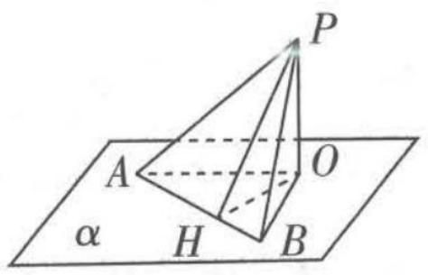

<details>
<summary>text_image</summary>

P
A
O
α
H
B
</details>

图5

调研 2 (2023·广州执信中学10月月考)如图6,在多面体ABCDEF中,四边形ABCD是正方形,ED⊥平面ABCD,平面FBC⊥平面ABCD,BF⊥CF,DE=AD=2.

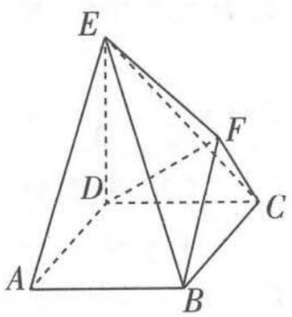

<details>
<summary>text_image</summary>

E
F
D
C
A
B
</details>

图6

(1) 求多面体 ABCDEF 体积的最大值.  
(2) 若 DF = EF, 求直线 DF 与平面 EBC 所成角.

解析 (1) 因为四边形 $ABCD$ 是正方形, $ED \perp$ 平面 $ABCD$ ,

所以 $V_{E - ABCD} = \frac{1}{3} DE\times S_{\text{正方形}ABCD} = \frac{1}{3}\times 2\times 2\times 2 = \frac{8}{3}.$

【思维瓶颈】由于四棱锥 E-ABCD 的体积为定值，因而只需求三棱锥 E-BCF 体积的最大值，若不善于转化，会使得求解时运算量增加

过点 F 作 $FH \perp BC$ 交 BC 于点 H, 如图 7 所示.

因为平面 $FBC \perp$ 平面ABCD, 平面 $FBC \cap$ 平面 $ABCD = BC$ , $FH \subset$ 平面FBC, 所以 $FH \perp$ 平面ABCD.

又 $ED \perp$ 平面 ABCD，所以 $ED \parallel FH, FH \perp DC.$

“百鸡问题”是《张丘建算经》中的一个著名问题,它给出了由含三个未知量的两个方程组成的不定方程组的解。“百鸡问题”是:“今有鸡翁一,值钱五;鸡母一,值钱三;鸡雏三,值钱一.凡百钱买鸡百只,问鸡翁母雏各几何.”

关注微信公众号“初高教辅站”获取更多初高中教辅资料


又 $ED \not\subset$ 平面 $FBC, FH \subset$ 平面 $FBC$ , 所以 $ED \parallel$ 平面 $FBC$ . 而 $DC \perp BC, FH \cap BC = C, FH, BC \subset$ 平面 $FBC$ , 所以 $DC \perp$ 平面 $FBC$ , 所以 $DC$ 为三棱锥 $E - BCF$ 底面 $BCF$ 上的高,

所以 $V_{E-BCF}=\frac{1}{3}DC \times S_{\triangle BCF}=\frac{1}{3}DC \times \frac{1}{2}BF \times CF=\frac{1}{3}BF \times CF.$

在 Rt△BCF 中， $BF^{2} + CF^{2} = BC^{2} = 4 \geqslant 2BF \times CF$ ，当且仅当 BF = CF = $\sqrt{2}$ 时取得等号，即 $V_{E-BCF} \leqslant \frac{2}{3}$ ，

所以 $V_{ABCDEF} = V_{E-ABCD} + V_{E-BCF} \leqslant \frac{10}{3}.$

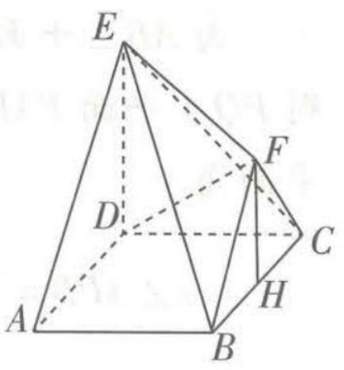

<details>
<summary>text_image</summary>

Geometric diagram of a triangular pyramid with labeled vertices and internal points, used in spatial geometry problems.
</details>

图7

【易错】本题的易错点是由于空间想象能力不够，看不出是动点 F 使得三棱锥 E-BCF 的体积发生变化

故多面体 ABCDEF 体积的最大值为 $\frac{10}{3}$ .

【另解】由已知得点 $F$ 是平面 $FBC$ 上以 $BC$ 为直径的半圆弧上的动点，由于 $S_{\triangle EBC} = \frac{1}{2} \cdot BC \cdot EC = 2\sqrt{2}$ 是定值，因而只需使点 $F$ 到平面 $EBC$ 的距离最大。易知二面角 $E - BC - F$ 是定值，设其为 $\theta, \theta$ 与二面角 $E - BC - D$ 的平面角互余，则 $\theta = \frac{\pi}{4}$ ， $\sin \theta = \frac{\sqrt{2}}{2}$ ，因而只需使 $FH$ 最大，当 $F$ 在以 $BC$ 为直径的半圆弧上的中点时， $FH$ 取得最大值， $FH$ 的最大值为 1，因而 $F$ 到平面 $EBC$ 的距离最大为 $\frac{\sqrt{2}}{2}$ ，则 $V_{F - EBC} \leqslant \frac{1}{3} \times 2\sqrt{2} \times \frac{\sqrt{2}}{2} = \frac{2}{3}$ ，所以 $V_{ABCDEF} = V_{E - ABCD} + V_{F - EBC} \leqslant \frac{10}{3}$

说明 本专题不再分析空间坐标系法，用空间坐标系法解题往往思路比较固定，难以锻炼空间想象能力，故留给读者自行尝试.

(2) 用几何法求解该题.

【易错与策略】用几何法求线面角，往往是从平面的斜线上（平面外）取一点作平面的垂线，连接垂足与斜足，得到线面角，然后再求值。难的地方（同时也是易错的地方）在于空间想象力不够，很难（或无法）作图，从而束手无策。事实上，我们可以通过求点面距 d 与斜线段长度 m，利用 $\sin \theta = \frac{d}{m}$ 求解（ $\theta$ 为线面角）。

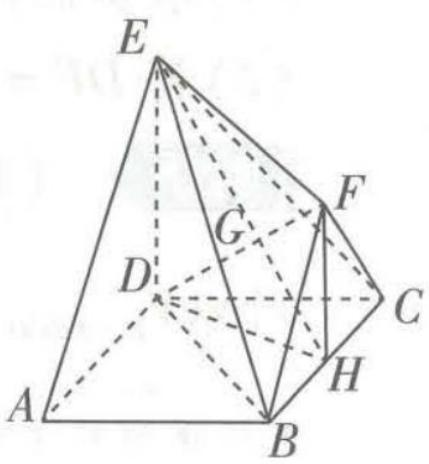

<details>
<summary>text_image</summary>

Geometric diagram of a triangular pyramid with labeled vertices and internal points, used in spatial geometry problems.
</details>

图8

如图8所示,连接DH,若DF=EF,则HF//ED且HF= $\frac{1}{2}$ ED,即图8
HF= $\frac{1}{2}$ BC=1,则在Rt△BFC中,H为BC的中点,连接EH交DF于G,即G为DF与平面BCE的交点.

【扫清障碍】找到 DF 与平面 BCE 的交点 G 与求 DG 是难点，通过已知光确定出 H（注意：此

时的 $H$ 点恰是第一问中体积最大时的点, 两问殊途同归)的位置, 再在直角梯形 EDHF 中求解

$DH = \sqrt{5}, DF = \sqrt{DH^2 + HF^2} = \sqrt{6}, DG = \frac{2}{3} DF = \frac{2\sqrt{6}}{3}$ , 设 $D$ 到平面 $EBC$ 距离为 $d$ , 直线 $DF$ 与平面 $EBC$ 所成角为 $\theta$ .

连接 $BD$ ，由 $V_{E - DBC} = V_{D - BEC}$ ，则 $\frac{1}{3}\cdot S_{\triangle BCD}\cdot DE = \frac{1}{3}\cdot S_{\triangle BCE}\cdot d,$ 解得 $d = \sqrt{2}$

则 $\sin \theta = \frac{d}{DG} = \frac{\sqrt{2}}{\frac{2\sqrt{6}}{3}} = \frac{\sqrt{3}}{2}, \theta = \frac{\pi}{3}.$

# 易错点4 不会计算条件概率

调研 (2023·广州花都区10月调研)已知甲箱产品中有5个正品和3个次品,乙箱产品中有4个正品和3个次品.

(1) 如果依次不放回地从乙箱中抽取 2 个产品, 求第二次取到次品的概率.

(2) 若从甲箱中任取 2 个产品放入乙箱中, 然后从乙箱中任取 1 个产品.

(i) 求从乙箱中取出的这个产品是正品的概率.

(ii)已知从乙箱中取出的这个产品是正品,求从甲箱中取出并放入乙箱的2个产品均是正品的概率.

解析 (1) 方法一 第二次取到次品分为两种情况:

一种情况是第一次取到正品,第二次取到次品,概率为 $\frac{4}{7}\times\frac{3}{6}=\frac{2}{7}$ ;

另一种情况是两次都取到次品,概率为 $\frac{3}{7}\times\frac{2}{6}=\frac{1}{7}$ .

因此所求事件概率为 $\frac{2}{7}+\frac{1}{7}=\frac{3}{7}$ .

【易错】此处易忽略不放回抽取时，第二次抽取的结果与第一次有关，错解成 $\frac{C_{4}^{1}C_{3}^{1}+C_{3}^{2}}{C_{7}^{2}}=\frac{5}{7}$ 此问还可以利用古典概型法求解： $\frac{4\times3+3\times2}{7\times6}=\frac{3}{7}$ 或 $\frac{C_{4}^{1}C_{3}^{1}+A_{3}^{2}}{A_{7}^{2}}=\frac{3}{7}$

方法二 (利用全概率公式计算)令事件 $A_{i} =$ “第 $i$ 次从乙箱中取到次品”, $i = 1,2$ .

则 $P(A_{1}) = \frac{3}{7}, P(A_{2} | A_{1}) = \frac{2}{6} = \frac{1}{3}, P(\overline{A_{1}}) = \frac{4}{7}, P(A_{2} | \overline{A_{1}}) = \frac{3}{6} = \frac{1}{2}$ ,

《海岛算经》共九问. 都是用表尺重复从不同位置测望, 取测量所得的差数进行计算, 从而求得山高或谷深, 这就是刘徽的重差理论. 《海岛算经》中, 从题目文字可知所有计算都是用筹算进行的.

关注微信公众号“初高教辅站”获取更多初高中教辅资料

因此 $P(A_{2}) = P(A_{2}A_{1} + A_{2}\overline{A_{1}}) = P(A_{1})P(A_{2}|A_{1}) + P(\overline{A_{1}})P(A_{2}|\overline{A_{1}}) = \frac{3}{7}\times \frac{1}{3} +$ $\frac{4}{7}\times \frac{1}{2} = \frac{3}{7},$

所以第二次取到次品的概率是 $\frac{3}{7}$ .

(2)(i) 方法一 （直接利用条件概率计算）分三种情况,从甲箱中取出的 2 个产品可以是 2 正品,1 正 1 次,2 次品. 这三种情况下的从乙箱取出的产品是正品的概率分别是 $\frac{C_5^2}{C_8^2} \times \frac{C_6^1}{C_9^1} = \frac{5}{21}, \frac{C_5^1 C_3^1}{C_8^2} \times \frac{C_5^1}{C_9^1} = \frac{25}{84}, \frac{C_3^2}{C_8^2} \times \frac{C_4^1}{C_9^1} = \frac{1}{21}$ .

从而所求事件概率为 $\frac{5}{21}+\frac{25}{84}+\frac{1}{21}=\frac{7}{12}.$

方法二 （从全概率公式角度理解计算）令事件 A = “从乙箱中取出 1 个正品”，事件 $B_{1}$ = “从甲箱中取出 2 个正品”，事件 $B_{2}$ = “从甲箱中取出 1 个正品、1 个次品”，事件 $B_{3}$ = “从甲箱中取出 2 个次品”，则 $B_{1}, B_{2}, B_{3}$ 互斥，且 $B_{1} \cup B_{2} \cup B_{3} = \Omega$ .

$$
\begin{array}{l} P (B _ {1}) = \frac {\mathrm{C} _ {5} ^ {2}}{\mathrm{C} _ {8} ^ {2}} = \frac {5}{1 4}, P (B _ {2}) = \frac {\mathrm{C} _ {5} ^ {1} \mathrm{C} _ {3} ^ {1}}{\mathrm{C} _ {8} ^ {2}} = \frac {1 5}{2 8}, P (B _ {3}) = \frac {\mathrm{C} _ {3} ^ {2}}{\mathrm{C} _ {8} ^ {2}} = \frac {3}{2 8}, P (A \mid B _ {1}) = \frac {6}{9} = \frac {2}{3}, \\ P (A \mid B _ {2}) = \frac {5}{9}, P (A \mid B _ {3}) = \frac {4}{9}, \end{array}
$$

则 $P(A) = P(B_{1})P(A|B_{1}) + P(B_{2})P(A|B_{2}) + P(B_{3})P(A|B_{3}) = \frac{5}{14}\times \frac{2}{3} +\frac{15}{28}\times$ $\frac{5}{9} +\frac{3}{28}\times \frac{4}{9} = \frac{7}{12},$

所以从乙箱中取出的这个产品是正品的概率是 $\frac{7}{12}$ .

(ii)依题意,从甲箱中取出并放入乙箱的2个产品均是正品的概率即在事件A发生的条件下事件 $B_{1}$ 发生的概率,则 $P(B_{1}|A)=\frac{P(B_{1}A)}{P(A)}=\frac{P(B_{1})P(A|B_{1})}{P(A)}=\frac{\frac{5}{14}\times\frac{2}{3}}{\frac{7}{12}}=\frac{20}{49}$ ,

【判断概型】题眼为：已知从乙箱中取出的这个产品是正品，求从甲箱中取出并放入乙箱的2个产品均是正品的概率。因而由条件概率计算公式得所求概率为 $\frac{P(B_{1}A)}{P(A)}$

所以所求概率是 $\frac{20}{49}$ .

# 易错演练

(2023·广东佛山禅城区10月调研)(多选)某中学社团招新活动开展得如火如荼,小王、小李、小张三位同学计划从篮球社、足球社、羽毛球社三个社团中各自任选一个,每人选择各社团的概率均为 $\frac{1}{3}$ ,且每人选择相互独立,则()

A. 三人选择社团一样的概率为 $\frac{1}{9}$   
B. 三人选择社团各不相同的概率为 $\frac{8}{9}$   
C. 至少有两人选择篮球社的概率为 $\frac{7}{27}$

D. 在至少有两人选择羽毛球社的前提下, 小王选择羽毛球社的概率为 $\frac{5}{7}$

# 参考答案与解析

ACD 对于 A, 三人选择社团一样的事件包含都选篮球社、都选足球社、都选羽毛球社, 且它们互斥, 所以二人选择社团一样的概率为 $3 \times \left(\frac{1}{3}\right)^{3} = \frac{1}{9}$ , A 正确.

对于 B, 三人选择社团各不相同的事件包含的情况是, 小王从 3 个社团中任选 1 个, 小李从余下两个中任选 1 个, 最后 1 个社团给小张, 共有 6 种不同的结果, 因此三人选择社团各不相同的概率为 $6 \times \left(\frac{1}{3}\right)^{3} = \frac{2}{9}$ , B 不正确.

对于 C, 至少有两人选择篮球社的事件是恰有 2 人选篮球社与 3 人都选篮球社的事件之和, 其概率为 $C_{3}^{2}C_{2}^{1} \times \left(\frac{1}{3}\right)^{3} + \left(\frac{1}{3}\right)^{3} = \frac{7}{27}$ , C 正确.

对于 D, 令至少有两人选择羽毛球社为事件 A, 由选项 C 知, $P(A) = \frac{7}{27}$ , 令小王选择羽毛球社为事件 B, 则事件 AB 是只有小王与另外 1 人选择羽毛球社和 3 人都选择羽毛球社的事件和, 其概率为 $P(AB) = C_{2}^{1}C_{2}^{1} \times \left(\frac{1}{3}\right)^{3} + \left(\frac{1}{3}\right)^{3} = \frac{5}{27}$ , 所以在至少有两人选择羽毛球社的前提下, 小王选择羽毛球社的概率为 $P(B|A) = \frac{P(AB)}{P(A)} = \frac{5}{7}$ , D 正确. 故选 ACD.

【判断概型】注意该选择支是条件概率，即在至少有两人选择羽毛球社的条件下，除小主选择羽毛球社外，另有1人或2人选择羽毛球社的概率

# 易错点5 求解独立性检验问题时忽视零假设

调研 (2023·湖南岳阳10月适应性联考)随着经济的飞速发展,全民健身赛事活动日益丰富,公共服务体系日趋完善.健身之于个人,是一种自然而然的习惯,之于国家与民族,则是全民健康的基础.某市一健身连锁机构对去年该健身连锁机构的会

全书一卷共二十题,第一题属于天文历法方面的计算问题,第二题至十四题是施工计算问题,第十五至二十题是勾股问题.这些问题反映了当时开凿运河、修筑长城和大规模城市建设等土木和水利工程施工计算的实际需要.

关注微信公众号“初高教辅站”获取更多初高中教辅资料员进行了统计,制作成如下两个统计图,其中图1为该健身连锁机构会员年龄分布图,图2为会员一个月内到健身房锻炼频数分布扇形图.


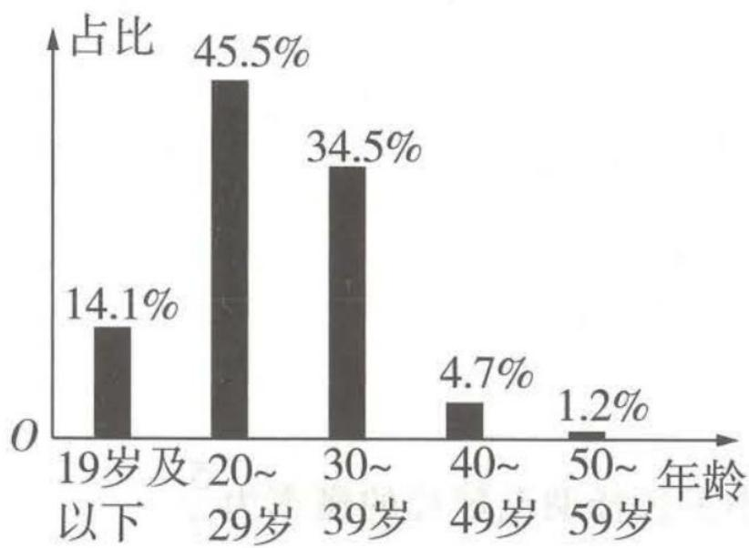

<details>
<summary>bar</summary>

| 年龄 | 占比 (%) |
| :--- | :--- |
| 19岁及以下 | 14.1 |
| 20~29岁 | 45.5 |
| 30~39岁 | 34.5 |
| 40~49岁 | 4.7 |
| 50~59岁 | 1.2 |
</details>

图1

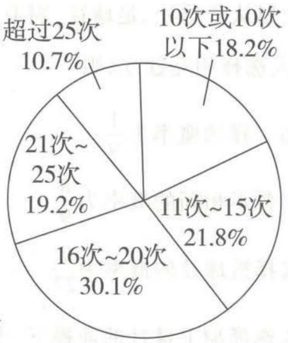

<details>
<summary>pie</summary>

| Category | Percentage (%) |
|---|---|
| 10次或10次以下 | 18.2 |
| 11次~15次 | 21.8 |
| 16次~20次 | 30.1 |
| 21次~25次 | 19.2 |
| 超过25次 | 10.7 |
</details>

图2

现将会员按年龄分为“年轻人”（20～39岁）和“非年轻人”（19岁及以下或40岁及以上）两类，将一个月内来健身房锻炼16次及以上的会员称为“健身达人”，15次及以下的会员称为“健身爱好者”，已知在健身达人中有 $\frac{5}{6}$ 是年轻人。

(1) 现从该健身连锁机构会员中随机抽取一个容量为 100 人的样本, 根据已知的数据, 补全下方 $2 \times 2$ 列联表, 并判断能否依据小概率值 $\alpha = 0.05$ 的 $\chi^2$ 独立性检验, 认为健身达人与年龄有关.

<table><tr><td>类别</td><td>年轻人</td><td>非年轻人</td><td>合计</td></tr><tr><td>健身达人</td><td></td><td></td><td></td></tr><tr><td>健身爱好者</td><td></td><td></td><td></td></tr><tr><td>合计</td><td></td><td></td><td>100</td></tr></table>

临界值表：

<table><tr><td> $\alpha$ </td><td>0.40</td><td>0.25</td><td>0.05</td><td>0.005</td></tr><tr><td> $x_{\alpha}$ </td><td>0.708</td><td>1.323</td><td>3.841</td><td>7.879</td></tr></table>

$\chi^2 = \frac{n(ad - bc)^2}{(a + b)(c + d)(a + c)(b + d)}$ ，其中 $n = a + b + c + d.$

(2) 将(1)中的频率作为概率,该健身连锁机构随机选取会员进行回访,共抽取3人.

(i) 若选到的 3 人中 2 人为年轻人, 1 人为非年轻人, 再从这 3 人中随机选取 1 人, 了解到该会员是健身达人, 求该人为非年轻人的概率;

(ii) 设 3 人中既是年轻人又是健身达人的人数为随机变量 X, 求 X 的分布列和期望.

# 解析 (1) 填写完整的列联表为:

【会运算】根据年轻人的划分标准结合题中图1可得，年轻人占比为80%，则年轻人人数为 $100 \times 80\% = 80$ ，所以非年轻人有20人。根据题中图2得健身达人占比为60%，所以其人数为 $100 \times 60\% = 60$ ，根据健身达人中年轻人占 $\frac{5}{6}$ ，得健身达人中年轻人人数为 $60 \times \frac{5}{6} = 50$ ，则非年轻人有10人，健身爱好者人数为100 - 60 = 40，再根据所有年轻人有80人，得健身爱好者中年轻人人数为80 - 50 = 30，根据非年轻人总共为20人，得健身爱好者中非年轻人人数为20 - 10 = 10

<table><tr><td>类别</td><td>年轻人</td><td>非年轻人</td><td>合计</td></tr><tr><td>健身达人</td><td>50</td><td>10</td><td>60</td></tr><tr><td>健身爱好者</td><td>30</td><td>10</td><td>40</td></tr><tr><td>合计</td><td>80</td><td>20</td><td>100</td></tr></table>

零假设 $H_{0}$ : 健身达人与年龄无关.

【易错】要在平时的练习中养成书写“零假设 $H_{0}$ ：分类变量 $X$ 和 $Y$ 相互独立”这一步骤，在正规考试中，若缺少该步骤，会失去步骤分

$$
\chi^ {2} = \frac {1 0 0 \times (5 0 \times 1 0 - 3 0 \times 1 0) ^ {2}}{8 0 \times 2 0 \times 6 0 \times 4 0} \approx 1. 0 4 2 <   3. 8 4 1,
$$

所以依据 $\alpha=0.05$ 的独立性检验,不能认为健身达人与年龄有关.

【知识回顾】基于小概率值 $\alpha$ 的检验规则是：当 $\chi^{2} \geqslant x_{\alpha}$ （其中 $x_{\alpha}$ 是使 $P(\chi^{2} \geqslant x_{\alpha}) = \alpha$ 的值，即 $\alpha$ 对应的临界值）时，我们就推断 $H_{0}$ 不成立，即认为分类变量 X 和 Y 不独立，也就是 X 和 Y 有关，该推断犯错的概率不超过 $\alpha$ ，也可以说成有 $1 - \alpha$ （往往改写成百分数）的把握认为 X 和 Y 是相关的；当 $\chi^{2} < x_{\alpha}$ 时，我们就推断 $H_{0}$ 成立，即认为分类变量 X 和 Y 独立，也可以说成没有 $1 - \alpha$ （往往改写成百分数）的把握认为 X 和 Y 是相关的

(2)(i)设事件 A 为“该人为年轻人”，事件 B 为“该人为健身达人”，故所求概率为

$$
P (\overline {{A}} \mid B) = \frac {P (B \mid \overline {{A}}) P (\overline {{A}})}{P (B \mid \overline {{A}}) P (\overline {{A}}) + P (B \mid A) P (A)} = \frac {\frac {1}{2} \times \frac {1}{3}}{\frac {1}{2} \times \frac {1}{3} + \frac {5}{8} \times \frac {2}{3}} = \frac {2}{7}.
$$

(ii)由(1)知,从会员中随机抽取1人,其既是年轻人又是健身达人的概率为 $\frac{1}{2}$ , $X=0,1,2,3,X\sim B(3,\frac{1}{2})$ ,

$$
\begin{array}{r l} & P (X = 0) = \mathrm{C} _ {3} ^ {0} \times (1 - \frac {1}{2}) ^ {3} = \frac {1}{8}, P (X = 1) = \mathrm{C} _ {3} ^ {1} \times \frac {1}{2} \times (1 - \frac {1}{2}) ^ {2} = \frac {3}{8}, P (X = 2) = \\ & \mathrm{C} _ {3} ^ {2} \times (\frac {1}{2}) ^ {2} \times (1 - \frac {1}{2}) ^ {1} = \frac {3}{8}, P (X = 3) = \mathrm{C} _ {3} ^ {3} \times (\frac {1}{2}) ^ {3} = \frac {1}{8}. \end{array}
$$

《五经算术》 北周甄鸾所著. 书中对《易经》《诗经》《尚书》《周礼》《仪礼》《礼记》《论语》《左传》等儒家经典及其古注中与数字有关的地方详加注释, 对研究经学的人或有一定的帮助, 但就数学的内容而论, 其价值有限.

关注微信公众号“初高教辅站”获取更多初高中教辅资料

故 $X$ 的分布列为

<table><tr><td>X</td><td>0</td><td>1</td><td>2</td><td>3</td></tr><tr><td>P</td><td> $\frac{1}{8}$ </td><td> $\frac{3}{8}$ </td><td> $\frac{3}{8}$ </td><td> $\frac{1}{8}$ </td></tr></table>

提醒 考试时，概率求解与对应的分布列表格中的数据全部写对才会得分哦！

$X$ 的数学期望为 $E(X) = 1 \times \frac{3}{8} + 2 \times \frac{3}{8} + 3 \times \frac{1}{8} = \frac{3}{2}$ .

【另解】也可以利用二项分布的期望公式直接求解： $E(X)=np=3\times\frac{1}{2}=\frac{3}{2}$ ，其中 $X\sim B(n,p)$


# 易错演练

(2023·浙南名校联盟10月第一次联考)在新高考改革中,某省新高考实行的是7选3的 $3+3$ 模式,即语、数、外三门为必考科目,然后从物理、化学、生物、政治、历史、地理、技术(含信息技术和通用技术)7门课中选考3门.某校高二学生选课情况如下表所示(单位:人).

<table><tr><td></td><td>选物理</td><td>不选物理</td><td>总计</td></tr><tr><td>男生</td><td>340</td><td>110</td><td>450</td></tr><tr><td>女生</td><td>140</td><td>210</td><td>350</td></tr><tr><td>总计</td><td>480</td><td>320</td><td>800</td></tr></table>

<table><tr><td></td><td>选生物</td><td>不选生物</td><td>总计</td></tr><tr><td>男生</td><td>150</td><td>300</td><td>450</td></tr><tr><td>女生</td><td>150</td><td>200</td><td>350</td></tr><tr><td>总计</td><td>300</td><td>500</td><td>800</td></tr></table>

试根据小概率值 $\alpha = 0.005$ 的独立性检验, 分析物理和生物选课与性别是否有关 ( )

附： $\chi^2 = \frac{n(ad - bc)^2}{(a + b)(c + d)(a + c)(b + d)}, n = a + b + c + d.$

<table><tr><td> $\alpha$ </td><td>0.15</td><td>0.10</td><td>0.05</td><td>0.025</td><td>0.01</td><td>0.005</td><td>0.001</td></tr><tr><td> $x_{\alpha}$ </td><td>2.072</td><td>2.706</td><td>3.841</td><td>5.024</td><td>6.635</td><td>7.879</td><td>10.828</td></tr></table>

A. 选物理与性别有关, 选生物与性别有关

B. 选物理与性别无关, 选生物与性别有关

C. 选物理与性别有关, 选生物与性别无关

D. 选物理与性别无关, 选生物与性别无关


# 参考答案与解析

C 零假设 $H_{0}$ : 是否选物理与性别无关. 根据已知得 n=800, a=340, b=110, c=140, d=210.

所以 $\chi^2 = \frac{800\times(340\times 210 - 110\times 140)^2}{(340 + 110)\times(140 + 210)\times(340 + 140)\times(110 + 210)}\approx 103.7$ ，结合临界值表数据得 $x_{0.005} = 7.879$ ，所以 $\chi^2 >x_{0.005}$ ，因此有充分证据推断选择物理学科与性别有关.

零假设 $H_0'$ : 是否选生物与性别无关. 根据已知得 $n = 800, a = 150, b = 300, c = 150, d = 200$ ,

所以 $\chi^2 = \frac{800\times(150\times 200 - 300\times 150)^2}{(150 + 150)\times(200 + 300)\times(300 + 150)\times(150 + 200)}\approx 7.619$ ，结合临界值表数据得 $x_{0.005} = 7.879$ ，所以 $\chi^2 < x_{0.005}$ ，因此没有充分证据推断选择生物学科与性别有关.故选C.

# 核心主干知识 4 类高频易错点

# 相近名词类

# 易错点1 忽视对数的真数和底数所需满足的条件

调研 1 （2023·东北师大附中 10 月诊断）若 a, b 均为实数，则“ $\ln a > \ln b$ ”是 “ $e^{a} > e^{b}$ ”的（）

A. 充分不必要条件

B. 必要不充分条件

C. 充要条件

D. 既不充分也不必要条件

思维导引 $e^{a} > e^{b} \Leftrightarrow a > b$ $\ln a > \ln b \Leftrightarrow a > b > 0$ 由 $a > b > 0$ 能推出 $a > b$ ，由 $a > b$ 不能推出 $a > b > 0$ 得解

解析 若 $\ln a > \ln b$ ，则由函数 $y = \ln x$ 在 $(0, +\infty)$ 上单调递增得 $a > b > 0$ .

【易错】本题容易由 $\ln a > \ln b$ 得 $a > b$ ，进而得出“ $\ln a > \ln b$ 是 $e^a > e^b$ 的充要条件”的错误结论。出现这种错误的原因是只关注 $a, b$ 之间的大小关系，而忽略了对数的真数要大于 0 这一隐含条件。注意：① 对数的真数是正数；② 对数的底数是正数且不为 1

若 $\mathrm{e}^a >\mathrm{e}^b$ ，则由函数 $y = \mathrm{e}^{x}$ 在 $\mathbf{R}$ 上单调递增得 $a > b$

易知“ $a > b > 0$ ”是“ $a > b$ ”的充分不必要条件，所以“ $\ln a > \ln b$ ”是“ $\mathrm{e}^a >\mathrm{e}^b$ ”的充分不必要条件.故选A.

答案 A

调研 2 (2023·湖南常德一模改编) 若函数 $f(x) = \begin{cases} 8 - 2^x (x \leqslant 2), \\ 3 + \log_a x (x > 2) \end{cases}$ 的值域是 [4, +∞), 则实数 $a$ 的取值范围是

注意挖掘隐含条件，a>0，且 $a\neq1!$

A. $(1, +\infty)$

B. $(2, +\infty)$

C. $(1,2]$

D. $\left(\sqrt[5]{2},2\right]$

解析 当 $x \leqslant 2$ 时, $0 < 2^{x} \leqslant 4, 4 \leqslant 8 - 2^{x} < 8$ , 所以 $f(x) \in [4, 8)$ .

【易错】注意区间端点值的取舍

当 x > 2 时, 分以下两种情况讨论.

若 $0 < a < 1$ ，则函数 $y = 3 + \log_a x$ 单调递减，所以 $3 + \log_a x \in (-\infty, 3 + \log_a 2)$ ，与 $f(x)$ 的值域是 $[4, +\infty)$ 矛盾.

若 $a > 1$ ，则函数 $y = 3 + \log_a x$ 单调递增，所以 $3 + \log_a x \in (3 + \log_a 2, +\infty)$ ，要使 $f(x)$ 的值域是

【易遗漏】对底数 $a$ 实施分类讨论

$[4, +\infty)$ , 则有 $4 \leqslant 3 + \log_a 2 < 8$ , 解得 $\sqrt[5]{2} < a \leqslant 2$ . 故选 D.

【陷阱】注意此处的结果“ $\sqrt[5]{2} < a \leqslant 2$ ”是在“ $a > 1$ ”的前提下得出的，将两个取值范围取交

《缀术》在唐代被收入《算经十书》，成为唐代国子监算学课本，当时学习《缀术》需要四年的时间，可见《缀术》的艰深。


关注微信公众号“初高教辅站”获取更多初高中教辅资料

集，才是最终结果

答案 D

调研 3 (2023·河北邢台一中等六校10月联考)已知函数 $f(x)=\log_{a}(ax^{2}-2x+5)(a>0$ ,且 $a\neq1)$ 在区间 $(\frac{1}{2},3)$ 上单调递增,则a的取值范围为()

A. $(0,\frac{1}{3}]\cup[2,+\infty)$

B. $\left[\frac{1}{3},1\right)\cup(1,2]$

C. $\left[\frac{1}{9},\frac{1}{3}\right]\cup\left[2,+\infty\right)$

D. $\left[\frac{1}{9},\frac{1}{3}\right]\cup(1,2]$

思维导引

由 $ax^2 - 2x + 5 > 0\left(\frac{1}{2} < x < 3\right)$ 得 $a$ 的取值范围

对底数 $a$ 分类讨论

$\left\{\begin{aligned}a>1,\\ 0<a<1\end{aligned}\right.$ 结合复合函数的单调性求解

解析 由题意知, 当 $\frac{1}{2}<x<3$ 时, $ax^{2}-2x+5>0$ , 即 $a>\frac{2x-5}{x^{2}}$ .

设 $g(x) = \frac{2x - 5}{x^2} (\frac{1}{2} < x < 3)$ ，则 $g'(x) = \frac{2x^2 - 2x(2x - 5)}{x^4} = \frac{-2x + 10}{x^3} > 0$ ，所以 $g(x)$ 单调递增.

又 $\frac{2\times3-5}{3^{2}}=\frac{1}{9}$ ，所以 $a\geqslant\frac{1}{9}$ .

【另解】也可以根据二次函数图象的对称轴与区间( $\frac{1}{2}$ ,3)的关系分类讨论求解，请同学们自行尝试，感受与本题实施参变分离解题的异同

设 $u(x)=ax^{2}-2x+5$ (a 为参数)，当 $\frac{1}{9}\leqslant a<1$ 时，函数 $m(u)=\log_{a}u$ (a 为参数) 单调递减，

由复合函数的单调性知函数 $u(x)=ax^{2}-2x+5$ (a 为参数) 在 $\left(\frac{1}{2},3\right)$ 上单调递减，

所以 $\frac{1}{a}\geqslant3$ ，所以 $\frac{1}{9}\leqslant a\leqslant\frac{1}{3}$ ；当a>1时，函数 $m(u)=\log_{a}u(a$ 为参数）单调递增，

由复合函数的单调性知函数 $u(x)=ax^{2}-2x+5$ (a 为参数) 在 $\left(\frac{1}{2},3\right)$ 上单调递增，

【扫清障碍】根据“同增异减”与已知的复合函数的单调性判断 $u(x)=ax^{2}-2x+5$ 的单调性所以 $\frac{1}{a}\leqslant\frac{1}{2}$ ，所以 $a\geqslant2$ 。

综上, a 的取值范围为 $\left[\frac{1}{9}, \frac{1}{3}\right] \cup [2, +\infty)$ . 故选 C.

答案 C


# 易错演练

1. (2023·北京十一学校 10 月阶段测试) 已知集合 $M = \{x \in \mathbf{Z} \mid \lg(x - 1) \leqslant 0\}$ , $N = \{x \in \mathbf{Z} \mid -2 < x < 4\}$ , 则 $M \cup N =$

A. $(0,2]$

B. $\{2\}$

C. $\{-1,0,1,2,3\}$

D. $(-2,4)$

2. (2023·西安中学11月诊断)对于实数 $a, b (a > 0$ , 且 $a \neq 1, b > 0$ , 且 $b \neq 1$ ), “ $a > b$ ”是“ $\log_a 2 < \log_b 2$ ”的

A. 充要条件

B. 充分不必要条件

C. 必要不充分条件

D. 既不充分也不必要条件

3. (2023·河南南阳一中一模) 函数 $f(x) = \log_a (x^3 - 2ax) (a > 0 \text{, 且 } a \neq 1)$ 在 $(4, +\infty)$ 上单调递增, 则 $a$ 的取值范围是

A. $1 < a \leqslant 4$

B. $1 < a \leqslant 8$

C. $1 < a \leq 12$

D. $1 < a \leq 24$


# 参考答案与解析

1. C 由 $\lg (x - 1) \leqslant 0$ 可得 $0 < x - 1 \leqslant 1$ , 解得 $1 < x \leqslant 2$ , 故 $M = \{2\}, N = \{x \in \mathbf{Z} \mid -2 < x < 4\} =$ 【易错】对数的真数一定要大于0, 注意不要遗漏

$\{-1,0,1,2,3\}$ ，所以 $M\cup N = \{-1,0,1,2,3\}$ .故选C.

2. D 对于不等式 $\log_{a}2<\log_{b}2$ ，当 a>1 时，可得 a>b>1；当 a<1 时，可得 0<b<a<1 或 a<1<b.

【易错】“底数不同，真数相同”的两个对数大小的比较要注意 “底数大于0的同时，再与1比较”，在对数的底数未知时，一定要分类讨论，此处也可以围绕b分b>1，b<1两种情况讨论，得到的结果相同

所以若 $\log_a 2 < \log_b 2$ ，则 $a > b > 1$ 或 $0 < b < a < 1$ 或 $a < 1 < b$ . 故由 $a > b$ 不能推出 $\log_a 2 < \log_b 2$ ，由 $\log_a 2 < \log_b 2$ 也不能推出 $a > b$ ，故“ $a > b$ ”是“ $\log_a 2 < \log_b 2$ ”的既不充分也不必要条件. 故选 D.

3. B 由题意知, 当 x > 4 时, $x^{3} - 2ax > 0$ , 即 $a < \frac{x^{2}}{2}$ , 所以 $a \leqslant 8$ .

设 $t(x)=x^{3}-2ax$ (x>4, a 为参数)，则 $t'(x)=3x^{2}-2a>3x^{2}-x^{2}>0$ ，所以函数 $t(x)=x^{3}-2ax$ (a 为参数) 在 $(4,+\infty)$ 上单调递增。又函数 $f(x)=\log_{a}(x^{3}-2ax)$ (a>0，且 $a\neq1$ ) 在 $(4,+\infty)$ 上单调递增，则函数 $u(t)=\log_{a}t$ (a 为参数) 单调递增，所以 a>1。所以 $1<a\leqslant8$ 。故选 B.

【扫清障碍】对内层函数求导，分析知其单调递增，则此时外层函数的单调性与复合函数的单调性一致


# 易错点 2 混淆空间角与向量的夹角

调研 1 （2023·湖北潜江园林高级中学10月诊断）（多选）如图1,在四棱锥 P-ABCD 中, $AD \parallel BC$ ,AD=4, $\angle ABC=90^{\circ}$ ,PA⊥平面ABCD,PA=AB=BC=2,则下列说法中正确的有()

A. $PB$ 与 $CD$ 的夹角是 $60^{\circ}$

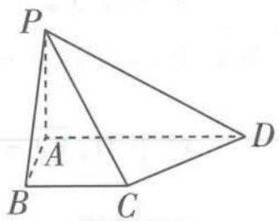

<details>
<summary>text_image</summary>

P
A
B
C
D
</details>

图1

数学是自然科学的基础,也是技术创新发展的基础.数学实力往往影响着国家实力,没有强大的数学基础,就没有良好的科技.科学家若不能以数学运算建构自己的学说,观点就会缺乏数理逻辑的支撑.

关注微信公众号“初高教辅站”获取更多初高中教辅资料


B. 平面 $PCD$ 与平面 $PAB$ 所成的二面角的余弦值是 $\frac{\sqrt{6}}{3}$   
C. PB 与平面 PCD 所成的角的正弦值是 $\frac{\sqrt{3}}{6}$   
D. 点 A 到平面 PCD 的距离为 $\frac{4\sqrt{2}}{3}$

解析 由已知得,AB,PA,AD两两垂直,以A为原点,分别以AB,AD,AP所在直线为x轴、y轴、z轴建立空间直角坐标系,如图2,则B(2,0,0),C(2,2,0),D(0,4,0),P(0,0,2).

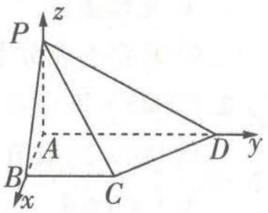

<details>
<summary>text_image</summary>

P
z
A
B
x
C
D
y
</details>

图2

对于 A, 易知 $PB = 2\sqrt{2}$ , $CD = 2\sqrt{2}$ , $\overrightarrow{PC} = (2, 2, -2)$ , $\overrightarrow{PB} = (2, 0, -2)$ , $\overrightarrow{CD}=(-2,2,0)$ ，则 $\overrightarrow{PB}\cdot\overrightarrow{CD}=-4,\cos\left\langle\overrightarrow{PB},\overrightarrow{CD}\right\rangle=\frac{\overrightarrow{PB}\cdot\overrightarrow{CD}}{\left|\overrightarrow{PB}\right|\left|\overrightarrow{CD}\right|}=\frac{-4}{2\sqrt{2}\times2\sqrt{2}}=$ $-\frac{1}{2}$ , 又 $0^{\circ} \leqslant \langle \overrightarrow{PB}, \overrightarrow{CD} \rangle \leqslant 180^{\circ}$ , 所以 $\langle \overrightarrow{PB}, \overrightarrow{CD} \rangle = 120^{\circ}$ , 所以 $PB$ 与 $CD$ 的夹角是 $60^{\circ}$ , 所以 $A$ 正确.

【易错1】此处易误认为向量夹角即线线角，得出 $PB$ 与 $CD$ 的夹角是 $120^{\circ}$ 的错误结论，注意线线角与向量夹角可能相等，也可能互补

对于 B, 设平面 PCD 的法向量是 $\boldsymbol{m} = (x, y, z)$ ，则 $\left\{\begin{aligned}\boldsymbol{m} \cdot \overrightarrow{PC} &= 2x + 2y - 2z = 0, \\ \boldsymbol{m} \cdot \overrightarrow{CD} &= -2x + 2y = 0,\end{aligned}\right.$ 取 x = 1，则 y = 1，z = 2，所以 $\boldsymbol{m} = (1, 1, 2)$ 是平面 PCD 的一个法向量，易知 $\boldsymbol{n} = (0, 1, 0)$ 是平面 PAB 的一个法向量， $\cos\langle\boldsymbol{m}, \boldsymbol{n}\rangle = \frac{\boldsymbol{m} \cdot \boldsymbol{n}}{|\boldsymbol{m}| |\boldsymbol{n}|} = \frac{1}{\sqrt{6} \times 1} = \frac{\sqrt{6}}{6}$ ，易知平面 PCD 与平面 PAB 所成的二面角是锐二面角，所以其余弦值是 $\frac{\sqrt{6}}{6}$ ，B 错误。

【易错2】二面角的余弦值与两个半平面的法向量的夹角的余弦值，二者的绝对值相等，求得法向量的夹角的余弦值后，要结合题意或图形判断二面角是锐角还是钝角，进而判断余弦值的正负

对于 C, $\cos\langle\overrightarrow{PB},m\rangle=\frac{\overrightarrow{PB}\cdot m}{|\overrightarrow{PB}||m|}=\frac{2-4}{2\sqrt{2}\times\sqrt{6}}=-\frac{\sqrt{3}}{6}$ ，所以 PB 与平面 PCD 所成的角的正弦值是 $\frac{\sqrt{3}}{6}$ ，C 正确.

【易错3】线面角的取值范围是 $[0^{\circ}, 90^{\circ}]$ ，其正弦值等于直线的方向向量与平面的法向量的夹角的余弦值的绝对值

对于 D, $\overrightarrow{AD} = (0, 4, 0)$ , $\left|\left|\overrightarrow{AD}\right| \cos\left\langle\overrightarrow{AD}, m\right\rangle\right| = \frac{\left|\overrightarrow{AD} \cdot m\right|}{\left|m\right|} = \frac{4}{\sqrt{6}} = \frac{2\sqrt{6}}{3}$ , D 错误. 故选 AC.

# 答案 AC

调研 2 (2023·福州格致中学10月阶段测试)如图3,在平行六面体 $ABCD - A_{1}B_{1}C_{1}D_{1}$ 中,底面ABCD是边长为2的正方形, $AA_{1} = 4$ , $\angle A_{1}AB = \angle A_{1}AD = 120^{\circ}$ .

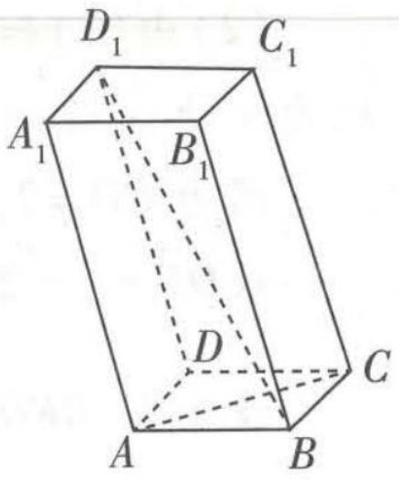

<details>
<summary>text_image</summary>

D₁
C₁
A₁
B₁
D
C
A
B
</details>

图3

(1) 求 $BD_{1}$ ;   
(2) 求直线 $BD_{1}$ 与 AC 所成角的余弦值.

解析 (1) $\overrightarrow{BD_1} = \overrightarrow{BB_1} +\overrightarrow{B_1A_1} +\overrightarrow{A_1D_1},$

$$
\overrightarrow {B D _ {1}} ^ {2} = \left(\overrightarrow {B B _ {1}} + \overrightarrow {B _ {1} A _ {1}} + \overrightarrow {A _ {1} D _ {1}}\right) ^ {2} = \overrightarrow {B B _ {1}} ^ {2} + \overrightarrow {B _ {1} A _ {1}} ^ {2} + \overrightarrow {A _ {1} D _ {1}} ^ {2} + 2 \overrightarrow {B B _ {1}} \cdot
$$

$$
\begin{array}{l} \overrightarrow {B _ {1} A _ {1}} + 2 \overrightarrow {B B _ {1}} \cdot \overrightarrow {A _ {1} D _ {1}} + 2 \overrightarrow {B _ {1} A _ {1}} \cdot \overrightarrow {A _ {1} D _ {1}} = 4 ^ {2} + 2 ^ {2} + 2 ^ {2} + 2 \times 4 \times 2 \cos 6 0 ^ {\circ} + 2 \times 4 \times 2 \cos 1 2 0 ^ {\circ} + \\ 2 \times 2 \times 2 \cos 9 0 ^ {\circ} = 2 4, \therefore B D _ {1} = 2 \sqrt {6}. \end{array}
$$

(2) $\because \overrightarrow{AC} = \overrightarrow{AB} +\overrightarrow{BC},\therefore \overrightarrow{AC}^{2} = (\overrightarrow{AB} +\overrightarrow{BC})^{2} = \overrightarrow{AB}^{2} + \overrightarrow{BC}^{2} + 2\overrightarrow{AB}\cdot \overrightarrow{BC} = 2^{2} + 2^{2} + 0 = 8,$

$$
\therefore | \overrightarrow {A C} | = 2 \sqrt {2},
$$

$$
\begin{array}{r l} & {\therefore \overrightarrow {A C} \cdot \overrightarrow {B D _ {1}} = (\overrightarrow {A B} + \overrightarrow {B C}) \cdot (\overrightarrow {B B _ {1}} + \overrightarrow {B _ {1} A _ {1}} + \overrightarrow {A _ {1} D _ {1}}) = \overrightarrow {A B} \cdot \overrightarrow {B B _ {1}} + \overrightarrow {A B} \cdot \overrightarrow {B _ {1} A _ {1}} + \overrightarrow {A B} \cdot} \\ & {\overrightarrow {A _ {1} D _ {1}} + \overrightarrow {B C} \cdot \overrightarrow {B B _ {1}} + \overrightarrow {B C} \cdot \overrightarrow {B _ {1} A _ {1}} + \overrightarrow {B C} \cdot \overrightarrow {A _ {1} D _ {1}} = 2 \times 4 \cos 1 2 0 ^ {\circ} + 2 \times 2 \cos 1 8 0 ^ {\circ} + 2 \times 2 \cos 9 0 ^ {\circ} +} \\ & {2 \times 4 \cos 1 2 0 ^ {\circ} + 2 \times 2 \cos 9 0 ^ {\circ} + 2 \times 2 \cos 0 ^ {\circ} = - 8,} \end{array}
$$

又 $|\overrightarrow{BD_1}| = 2\sqrt{6}, \therefore |\cos \langle \overrightarrow{AC}, \overrightarrow{BD_1}\rangle| = \frac{|\overrightarrow{AC} \cdot \overrightarrow{BD_1}|}{|\overrightarrow{AC}| \times |\overrightarrow{BD_1}|} = \frac{| -8|}{2\sqrt{2} \times 2\sqrt{6}} = \frac{\sqrt{3}}{3}$ ,

【扫清障碍】异面直线所成角的范围为 $(0,90^{\circ}]$ ，所以直接求两异面直线方向向量夹角余弦值的绝对值，结果即线线角的余弦值

所以直线 $BD_{1}$ 与 AC 所成角的余弦值为 $\frac{\sqrt{3}}{3}$ .

调研 3 （2023·首都师范大学附中10月阶段测试改编）如图4,已知正方形ABCD和矩形ACEF所在的平面垂直,CD=2,CE=1.

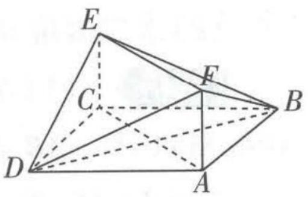

<details>
<summary>text_image</summary>

Geometric diagram of a tetrahedron with labeled vertices A, B, C, D, E, and F
</details>

图4

(1) 证明: $BD \perp$ 平面 ACEF.  
(2) 求直线 DE 与平面 BFD 所成角的正弦值.

解析 (1) 因为四边形 $ACEF$ 是矩形, 所以 $EC \perp AC$ .

因为平面 $ABCD \perp$ 平面 ACEF, 平面 $ABCD \cap$ 平面 ACEF = AC, $EC \subset$ 平面 ACEF,

所以 $EC \perp$ 平面 ABCD.

因为 $BD \subset$ 平面 ABCD, 所以 $EC \perp BD$ .

因为四边形 ABCD 是正方形, 所以 $BD \perp AC$ .

又 $EC \cap AC = C, EC, AC \subset$ 平面 ACEF, 所以 $BD \perp$ 平面 ACEF.

数学与应用数学 该专业学生主要学习数学和应用数学的基础理论、基本方法,受到数学模型、计算机和数学软件方面的基本训练,具有较好的科学素养,初步具备科学研究、教学、解决实际问题及开发软件等方面的基本能力.

关注微信公众号“初高教辅站”获取更多初高中教辅资料


(2)由(1)知,CD,CB,CE两两垂直,如图5,以C为原点,CD,CB,CE所在直线分别为x轴、y轴、z轴建立空间直角坐标系.

因为 $CD = 2, CE = 1$ ，所以 $D(2,0,0), E(0,0,1), F(2,2,1), B(0,2,0)$ .

故 $\overrightarrow{DE}=(-2,0,1)$ , $\overrightarrow{DF}=(0,2,1)$ , $\overrightarrow{DB}=(-2,2,0)$ .

设平面 BFD 的法向量为 $\boldsymbol{n}=(x,y,z)$ ，则 $\left\{\begin{aligned}\boldsymbol{n}\cdot\overrightarrow{DF}&=0,\\ \boldsymbol{n}\cdot\overrightarrow{DB}&=0,\end{aligned}\right.$ 即 $\left\{\begin{aligned}2y+z=0,\\ -2x+2y=0,\end{aligned}\right.$ 令 y=1，可得 z=-2,x=1，所以 $\boldsymbol{n}=(1,1,-2)$ 是平面 BFD 的一个法向量.

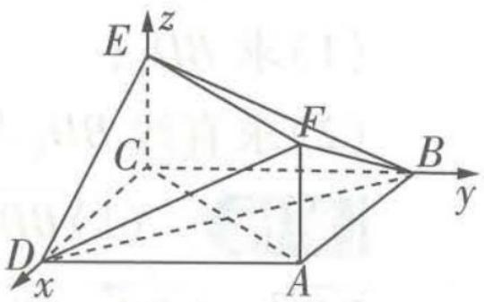

<details>
<summary>text_image</summary>

E
z
C
F
B
y
D
x
A
</details>

图5

所以 $\cos \langle n, \overrightarrow{DE} \rangle = \frac{n \cdot \overrightarrow{DE}}{|\boldsymbol{n}| |\overrightarrow{DE}|} = \frac{-4}{\sqrt{6} \times \sqrt{5}} = -\frac{2\sqrt{30}}{15}$ ,

故直线 DE 与平面 BFD 所成角的正弦值为 $\frac{2\sqrt{30}}{15}$ .

【易错警示】注意线面角的正弦值是非负数，平面的法向量与直线的方向向量的夹角的余弦值的绝对值即线面角的正弦值

调研 4 （2023·长郡中学、南阳一中等校11月联考）如图6，在三棱锥 P-ABC 中， $PA \perp$ 平面 ABC, $AB \perp AC$ , PA = 4, AB = AC = 3，点 D 在 PC 上，且 $\frac{CD}{DP} = \frac{9}{16}$ .

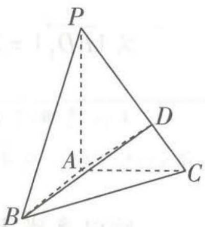

<details>
<summary>text_image</summary>

P
A
D
B
C
</details>

图6

(1) 求证: 平面 $ABD \perp$ 平面 PBC.

(2) 求二面角 D - BC - A 的正弦值.

解析 (1) 在三棱锥 $P - ABC$ 中, $PA \perp$ 平面 $ABC, AB, AC \subset$ 平面 $ABC$ , 所以 $PA \perp AB, PA \perp AC$ ,

又 $AB \perp AC$ ，则 AB, AC, AP 两两垂直.

以 A 为原点, AB, AC, AP 所在直线分别为 x 轴、y 轴、z 轴, 建立如图 7 所示的空间直角坐标系,则 $A(0,0,0)$ , $B(3,0,0)$ , $C(0,3,0)$ , $P(0,0,4)$ , 所以 $\overrightarrow{CP} = (0, -3, 4)$ . 因为 $\frac{CD}{DP} = \frac{9}{16}$ , 所以 $\overrightarrow{CD} = \frac{9}{25}\overrightarrow{CP} = (0, -\frac{27}{25}, \frac{36}{25})$ , 所以 $D(0, \frac{48}{25}, \frac{36}{25})$ .

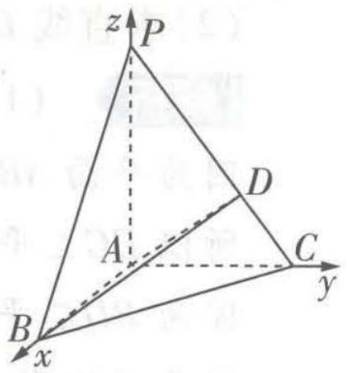

<details>
<summary>text_image</summary>

z
P
A
D
C
B
x
y
</details>

图7

因为 $\overrightarrow{AB} = (3,0,0),\overrightarrow{AD} = (0,\frac{48}{25},\frac{36}{25}),\overrightarrow{CP} = (0, - 3,4)$

所以 $\overrightarrow{AB} \cdot \overrightarrow{CP} = (3,0,0) \cdot (0, -3,4) = 0, \overrightarrow{AD} \cdot \overrightarrow{CP} = (0, \frac{48}{25}, \frac{36}{25}) \cdot (0, -3,4) = 0,$

所以 $\overrightarrow{AB} \perp \overrightarrow{CP}, \overrightarrow{AD} \perp \overrightarrow{CP}$ , 即 $AB \perp CP, AD \perp CP$ , 又 $AB \cap AD = A, AB, AD \subset$ 平面 $ABD$ , 所以 $CP \perp$ 平面 $ABD$ , 又 $CP \subset$ 平面 $PBC$ , 所以平面 $ABD \perp$ 平面 $PBC$ .

(2) 易知 $\overrightarrow{BC}=(-3,3,0)$ , $\overrightarrow{BP}=(-3,0,4)$ .

设平面 BCD 的法向量为 $\boldsymbol{n}=(x,y,z)$ ,

则 $\left\{ \begin{array}{l} n \cdot \overrightarrow{BC} = (x, y, z) \cdot (-3, 3, 0) = -3x + 3y = 0, \\ n \cdot \overrightarrow{BP} = (x, y, z) \cdot (-3, 0, 4) = -3x + 4z = 0, \end{array} \right.$ 令 $x = 4$ ，得 $y = 4, z = 3$ ，所以平面 BCD 的一个法向量为 $n = (4, 4, 3)$ .

易知平面 ABC 的一个法向量为 $\boldsymbol{m}=(0,0,1)$ ,

所以 $\cos\langle m,n\rangle=\frac{m\cdot n}{|m|\times|n|}=\frac{(0,0,1)\cdot(4,4,3)}{1\times\sqrt{4^{2}+4^{2}+3^{2}}}=\frac{3}{\sqrt{41}}.$

设二面角 $D - BC - A$ 为 $\theta$ ，则 $\sin \theta = \sqrt{1 - (\frac{3}{\sqrt{41}})^2} = \frac{4\sqrt{82}}{41}$

故二面角 D - BC - A 的正弦值为 $\frac{4\sqrt{82}}{41}$ .

【易错】此处易忽略题目要求，求出余弦值后直接作答。根据用向量法求二面角的原理，法向量夹角和二面角可能相等，也可能互补，因此，它们的正弦值相等，余弦值相等或互为相反数

# ! 易错点 3 混淆 “单调区间” 与 “在区间上单调”

调研 1 (2023·长春外国语学校 11 月期中) 若函数 $f(x) = -x^{2} + 3ax + a$ 在 [1,2] 上单调递减, 则 $a$ 的取值范围是 ( )

A. $\left[\frac{3}{4},+\infty\right)$

B. $(-∞, \frac{3}{2}]$

C. $\left[\frac{4}{3},+\infty\right)$

D. $(-∞, \frac{2}{3}]$

解析 由题意知,二次函数 $f(x)$ 的图象是开口向下的,对称轴为直线 $x=\frac{3a}{2}$ ,故函数 $f(x)$ 的单调递减区间为 $\left[\frac{3a}{2},+\infty\right)$ ,所以 $[1,2]\subseteq\left[\frac{3a}{2},+\infty\right)$ ,所以 $\frac{3a}{2}\leqslant1$ ,故a的取值范围是 $(-∞,\frac{2}{3}]$ .

【易混淆】函数 $f(x)$ 在 $x \in A$ 上单调递减， $f(x)$ 的单调递减区间为 $B$ ，则 $A$ 与 $B$ 的关系为 $A \subseteq B$ 。在函数的单调性容易判断时，可以先求出函数的单调区间，再根据二者的关系求解故选 D.

# 答案 D

数学与应用数学专业是其他相关专业的“母专业”。无论是进行科研数据分析、软件开发、三维动画制作，还是从事金融保险、国际经济与贸易、工商管理等工作，都离不开相关的数学专业知识，数学专业与其他相关专业的联系十分紧密。

关注微信公众号“初高教辅站”获取更多初高中教辅资料


调研 2 （2023·安徽合肥一中、屯溪一中等校10月联考）已知函数 $f(x)=4\cos x-\frac{1}{3}mx^{3}$ 在 $\left[\frac{3\pi}{4},2\pi\right]$ 上单调递增，则实数m的取值范围为（）

A. $(-∞,-\frac{16\sqrt{3}}{9π}]$

B. $(-∞,-\frac{16\sqrt{2}}{9π^{2}}]$

C. $(-\infty, -\frac{32\sqrt{3}}{9\pi}]$

D. $(-∞,-\frac{32\sqrt{2}}{9π^{2}}]$

# 思维导引

函数 $f(x)=4\cos x-\frac{1}{3}mx^{3}$ 在 $\left[\frac{3\pi}{4},2\pi\right]$ 上单调递增

$f'(x) \geqslant 0$ 在 $\left[\frac{3\pi}{4}, 2\pi\right]$ 上恒成立且不恒等于0

$m \leqslant -\frac{4\sin x}{x^{2}}$ 在 $x \in [\frac{3\pi}{4}, 2\pi]$ 时恒成立
且不恒取等号

利用导数求 $g(x) = -\frac{4\sin x}{x^2} (x \in [\frac{3\pi}{4}, 2\pi])$ 的最小值 $g(x)_{\min}$

$m \leqslant g(x)_{\min}$

解析 由题意得 $f'(x) \geqslant 0$ 在 $\left[\frac{3\pi}{4}, 2\pi\right]$ 上恒成立且不恒等于 $0, f'(x) = -4\sin x - mx^2$ ，则【易错】函数在某区间上单调递增，则其导函数的值在这个区间上大于等于零，此处易忽略等于0的情况。对于区间D上的可导函数 $f(x)$ ，若当 $x \in D$ 时，有 $f'(x) \geqslant 0 (\leqslant 0)$ 且不恒为0，则 $f(x)$ 在D上单调递增（减）；反之，若 $f(x)$ 在D上单调递增（减），则当 $x \in D$ 时，有 $f'(x) \geqslant 0 (\leqslant 0)$ 且不恒为0 $-4\sin x - mx^2 \geqslant 0$ 在 $x \in \left[\frac{3\pi}{4}, 2\pi\right]$ 时恒成立且不恒等于0，即 $-\frac{4\sin x}{x^2} \geqslant m$ 在 $x \in \left[\frac{3\pi}{4}, 2\pi\right]$ 时恒成立且不恒取等号。

令 $g(x) = -\frac{4\sin x}{x^2}, x \in [\frac{3\pi}{4}, 2\pi]$ ，可知当 $x \in [\frac{3\pi}{4}, \pi)$ 时， $g(x) < 0$ ，当 $x \in [\pi, 2\pi]$ 时， $g(x) \geqslant 0$ .

当 $x \in \left[\frac{3\pi}{4}, \pi\right)$ 时, $g'(x) = \frac{4}{x^3} (2\sin x - x\cos x) > 0$ , 所以函数 $g(x)$ 在 $\left[\frac{3\pi}{4}, \pi\right)$ 上单调递增, 所以 $g(x)_{\min} = g\left(\frac{3\pi}{4}\right) = -\frac{32\sqrt{2}}{9\pi^2}$ , 则 $m \leqslant -\frac{32\sqrt{2}}{9\pi^2}$ , 故实数 $m$ 的取值范围为 $(- \infty, -\frac{32\sqrt{2}}{9\pi^2}]$ . 故选 D.

答案 D

调研 3 (2023·湖南衡阳段考)若函数 $f(x)=\ln x+ax^{2}-2$ 在区间(1,2)内存在单调递增区间,则实数a的取值范围是\_\_\_\_.

# 思维导引

$f(x)$ 在区间 $(1,2)$ 内存在单调递增区间

$f'(x)>0$ 在 $(1,2)$ 内有解

构造函数 $g(x) = -\frac{1}{2x^{2}} (1 < x < 2)$ ，研究最值

$a$ 的取值范围

解析 $f'(x)=\frac{1}{x}+2ax$ ，因为 $f(x)$ 在区间 $(1,2)$ 内存在单调递增区间，所以 $f'(x)>0$ 在

(1,2) 内有解, 即存在 $x \in (1,2)$ , 使得 $a > -\frac{1}{2x^{2}}$ .

【易错】此处易错误认为 $f'(x) \geq 0$ 在(1,2)内恒成立，注意“单调区间”与“在区间上单调”的区别。以本题为例，函数 $f(x)$ 在区间(1,2)内存在单调递增区间，则只需 $f'(x) > 0$ 在(1,2)内有解。如果本题题于改为区间(1,2)是函数 $f(x)$ 的单调递增区间，则 $f'(x) \geq 0$ 在(1,2)内恒成立

设 $g(x) = -\frac{1}{2x^2}, x \in (1, 2)$ ，则问题可转化为存在 $x \in (1, 2)$ ，使得 $a > g(x)$ .

易知 $g(x)$ 在 $(1,2)$ 上单调递增，又 $x = 1$ 时， $-\frac{1}{2x^2} = -\frac{1}{2}, x = 2$ 时， $-\frac{1}{2x^2} = -\frac{1}{8}$ ，所以 $-\frac{1}{2} < g(x) < -\frac{1}{8}$ ，要使 $a > g(x)$ 在 $x \in (1,2)$ 时有解，只需 $a > -\frac{1}{2}$ ，所以 $a$ 的取值范围是 $(- \frac{1}{2}, +\infty)$ .

答案 $(-\frac{1}{2}, +\infty)$


# 易错演练

1. (2023·浙江金华一中月考)已知函数 $f(x) = x^{3} + ax^{2} + x + 1$ 存在单调递减区间,则实数 $a$ 的取值范围为

A. $(- \infty, -\sqrt{3}) \cup (\sqrt{3}, +\infty)$

B. $[- \sqrt{3}, \sqrt{3}]$

C. $(-\infty, -\sqrt{3}] \cup [\sqrt{3}, +\infty)$

D. $(- \sqrt{3}, \sqrt{3})$

2. (2023·江苏常熟中学10月段考)若函数 $f(x)=(x^{2}-ax+a)\mathrm{e}^{x}$ 在区间 $[-3,-1]$ 内单调递减,则实数a的取值范围是()

A. $\left[-1,+\infty\right)$

B. $[1, +\infty)$

C. $(-∞,-1]$

D. $(-∞,1]$

3. (2023·河南信阳一模)已知函数 $f(x) = 2\sqrt{3}\cos \left(x - \frac{\pi}{2}\right)\cos x - 2\sin^2 x$ , 若 $f(x)$ 在区间 $[m, \frac{\pi}{4}]$ 上单调递减, 则实数 $m$ 的取值范围是

A. $\left[\frac{\pi}{6},\frac{\pi}{4}\right]$

B. $\left[\frac{\pi}{3},\frac{\pi}{2}\right]$

C. $\left[\frac{\pi}{6},\frac{\pi}{4}\right)$

D. $\left[\frac{\pi}{6},\frac{\pi}{3}\right)$


# 参考答案与解析

1. A 由 $f(x) = x^3 + ax^2 + x + 1$ 得 $f'(x) = 3x^2 + 2ax + 1$ . ∵ 函数 $f(x)$ 存在单调递减区间, ∴ 存在 $x \in \mathbb{R}$ , 使得 $f'(x) < 0$ , ∴ 关于 $x$ 的方程 $3x^2 + 2ax + 1 = 0$ 满足 $\Delta = (2a)^2 - 4 \times 3 \times 1 > 0$ , ∴ $a^2 > 3$ , ∴ $a > \sqrt{3}$ 或 $a < -\sqrt{3}$ , ∴ $a$ 的取值范围为 $(-\infty, -\sqrt{3}) \cup (\sqrt{3}, +\infty)$ . 故选 A.

2. C 由 $f(x) = (x^2 - ax + a)e^x$ ，得 $f'(x) = (2x - a)e^x + (x^2 - ax + a)e^x = (x^2 - ax + 2x)e^x$ ， $\because$ 函数 $f(x) = (x^2 - ax + a)e^x$ 在区间 $[-3, -1]$ 内单调递减， $\therefore f'(x) = (x^2 - ax + 2x)e^x \leqslant 0$ 在 【易忽略】注意不要遗漏等号

$[-3, -1]$ 内恒成立，又 $\mathrm{e}^x > 0$ 恒成立，则原问题等价于 $x^{2} - ax + 2x \leqslant 0$ 在 $[-3, -1]$ 内恒成立，即 $a \leqslant x + 2$ 在 $[-3, -1]$ 内恒成立，易知函数 $y = x + 2$ 在 $[-3, -1]$ 内单调递增， $\therefore a \leqslant -3 + 2 = -1$ ，即实数 $a$ 的取值范围是 $(- \infty, -1]$ . 故选C.

信息与计算科学专业的知识体系包括通识类知识、学科基础知识、专业知识和实践性教学等.

3. C $f(x)=2\sqrt{3}\cos\left(x-\frac{\pi}{2}\right)\cos x-2\sin^{2}x=2\sqrt{3}\sin x\cos x-2\cdot\frac{1-\cos 2x}{2}=\sqrt{3}\sin 2x-1+\cos 2x=$ $2\left(\frac{\sqrt{3}}{2}\sin 2x+\frac{1}{2}\cos 2x\right)-1=2\sin\left(2x+\frac{\pi}{6}\right)-1.$ 由 $x\in[m,\frac{\pi}{4}]$ ，得 $2x+\frac{\pi}{6}\in[2m+\frac{\pi}{6},\frac{2\pi}{3}]$ ，由题意得， $\left[2m+\frac{\pi}{6},\frac{2\pi}{3}\right]\subseteq\left[\frac{\pi}{2},\frac{3\pi}{2}\right]$ ，

【易混淆】题干信息等价于函数 $y = 2\sin t - 1$ 在 $[2m + \frac{\pi}{6}, \frac{2\pi}{3}]$ 上单调递减，则 $[2m + \frac{\pi}{6}, \frac{2\pi}{3}]$ 是 $[\frac{\pi}{2}, \frac{3\pi}{2}]$ 的一个子区间，注意辨别区间的包含关系

则 $\frac{\pi}{2} \leqslant 2m + \frac{\pi}{6} < \frac{2\pi}{3}$ , 解得 $\frac{\pi}{6} \leqslant m < \frac{\pi}{4}$ . 故选 C.

# ▲ 易错点4 对导数与函数的单调性的关系理解不清

调研 1 (2023·柳州高级中学 10 月月考改编)已知函数 $f(x) = x \ln x - \frac{a}{2} x^2 - x$ 在定义域内为单调函数,则实数 $a$ 的取值范围是 \_\_\_\_.

# 思维导引

函数 $f(x)=x\ln x-\frac{a}{2}x^{2}-x$ 在定义域内为单调函数

$f'(x) = \ln x - ax \leqslant 0$ 或 $f'(x) = \ln x - ax \geqslant 0$ 在 $(0, +\infty)$ 上恒成立

建立关于 a 的不等式 $\rightarrow$ a 的取值范围

解析 易知 $f(x)=x\ln x-\frac{a}{2}x^{2}-x$ 的定义域是 $(0,+\infty)$ , $f'(x)=\ln x-ax$ . 若函数 $f(x)$ 在定义域上单调, 则 $f'(x)=\ln x-ax \leqslant 0$ 在 $(0,+\infty)$ 上恒成立, 或 $f'(x)=\ln x-ax \geqslant 0$ 在 $(0,+\infty)$ 上恒成立.

【易忽略】函数单调包括单调递增和单调递减两种情况，需要分类讨论，不要忽略其中某一种情况

①当 $f'(x) = \ln x - ax \leqslant 0$ 恒成立时，显然 $a > 0, f''(x) = \frac{1 - ax}{x}$ ，令 $f''(x) > 0$ ，解得 $0 < x < \frac{1}{a}$ ，令 $f''(x) < 0$ ，解得 $x > \frac{1}{a}$ ，所以 $f'(x)$ 在 $(0, \frac{1}{a})$ 上单调递增，在 $(\frac{1}{a}, +\infty)$ 上单调递减，故 $f'(x)_{\max} = f'(\frac{1}{a}) = \ln \frac{1}{a} - 1 \leqslant 0$ ，解得 $a \geqslant \frac{1}{e}$ .

②当 $f'(x)=\ln x-ax\geqslant0$ 恒成立时,即 $\ln x\geqslant ax$ 在 $(0,+\infty)$ 上恒成立,显然不可能,所以此时a无解.综上,a的取值范围是 $\left[\frac{1}{e},+\infty\right)$ .

答案 $\left[\frac{1}{e}, +\infty\right)$

调研 2 （原创）已知函数 $f(x)=\frac{ax+1}{x+2}$ 在 $(-2,+\infty)$ 上单调递减，则实数 a 的取值范围是 \_\_\_\_.

解析 由题意知 $f'(x) = \frac{2a - 1}{(x + 2)^2}$ ，由 $f(x)$ 在 $(-2, +\infty)$ 上单调递减，知 $f'(x) \leqslant 0$ 且不恒为0在 $(-2, +\infty)$ 上恒成立，即 $\frac{2a - 1}{(x + 2)^2} \leqslant 0$ 且不恒为0（ $a$ 为参数）在 $(-2, +\infty)$ 上恒成立，所以 $a \leqslant \frac{1}{2}$ . 当 $a = \frac{1}{2}$ 时， $f'(x)$ 恒为0， $f(x)$ 不是单调递减函数，不合题意. 故实数 $a$ 的取值范围为 $(- \infty, \frac{1}{2})$ .

【易错】导函数恒为0时，原函数既不单调递增，也不单调递减，注意排除这种特殊情况。求导判断单调性时，要分析会不会出现导函数恒等于0的特殊情况

答案 $(-\infty, \frac{1}{2})$

调研 3 (2023·陕西渭南 10 月阶段测试)已知函数 $f(x) = (1 - x)\ln x + ax$ 在 $(1, +\infty)$ 上不单调, 则 $a$ 的取值范围是 \_\_\_\_.

一般来说,不单调即函数在给定区间上既有单调递增区间,又有单调递减区间

解析 由题可知, $f'(x)=-\ln x+\frac{1-x}{x}+a=\frac{1}{x}-\ln x+a-1$ ,

令 $g(x) = \frac{1}{x} -\ln x + a - 1,x > 1$ ，则 $g^{\prime}(x) = -\frac{1}{x^{2}} -\frac{1}{x} = -\left(\frac{1}{x^{2}} +\frac{1}{x}\right)$ ，因为 $x > 1$ ，所以 $g^{\prime}(x) < 0$ ，则 $g(x)$ 在 $(1, + \infty)$ 上单调递减，所以 $g(x) <   1 - \ln 1 + a - 1 = a.$

若 $a \leqslant 0$ ，则 $g(x) < 0$ ，即 $f'(x) < 0$ ，函数 $f(x)$ 在 $(1, +\infty)$ 上单调递减，不满足题意。

【易错】无法根据函数不单调直接求解,找不到思路致错.对于无法直接求解的情况,学会利用分类讨论,把一个问题分成多个问题来分析研究,判断各情况是否满足题意,综合即可得解

若 $a > 0$ ，则 $g(1) = a > 0, g(\mathrm{e}^a) = \frac{1}{\mathrm{e}^a} - \ln \mathrm{e}^a + a - 1 = \frac{1}{\mathrm{e}^a} - 1$ ，因为 $a > 0, \mathrm{e}^a > 1$ ，所以 $g(\mathrm{e}^a) = \frac{1}{\mathrm{e}^a} - 1 < 0$ ，结合函数零点存在定理可知， $g(x)$ 在 $(1, \mathrm{e}^a)$ 上必定存在唯一的零点，记为 $x_0$ ，所以当 $x \in (1, x_0)$ 时， $g(x) > 0$ ，即 $f'(x) > 0$ ，当 $x \in (x_0, +\infty)$ 时， $g(x) < 0$ ，即 $f'(x) < 0$ ，所以 $f(x)$ 在 $(1, x_0)$ 上单调递增，在 $(x_0, +\infty)$ 上单调递减，满足题意。综上， $a \in (0, +\infty)$ 。

答案 $(0, +\infty)$

# 易错点5 混淆均匀分组与不均匀分组

调研 1 （2023·山东潍坊一中 10 月模拟）某市为了更好地保障社区居民的日常生活,选派 6 名志愿者到甲、乙、丙三个社区进行服务,每人只能去一个地方,每个社区至少派一人,则不同的选派方案共有 ( )

A. 540 种

B. 180 种

C.360种

D. 630 种

数理基础科学 数理基础科学主要研究数学与物理学的基本知识和理论,在实际中将数学与物理的知识相结合,共同解决实际问题.相较于数学与应用数学,添加了一些物理学的基本知识,且数学理论知识相对较少一些.

关注微信公众号“初高教辅站”获取更多初高中教辅资料解析 首先将6名志愿者分成3组,再分配到3个社区,可分为3种情况.


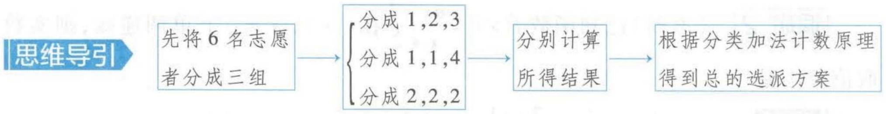

<details>
<summary>flowchart</summary>

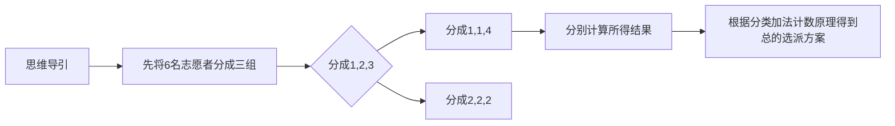
</details>

第一种:6名志愿者分成3组的人数分别为1,2,3,则共有 $C_{6}^{1}C_{5}^{2}C_{3}^{3}A_{3}^{3}=360$ （种）选派方案.

第二种:6 名志愿者分成 3 组的人数分别为 1,1,4,则共有 $\frac{C_{6}^{1}C_{5}^{1}C_{4}^{4}}{A_{2}^{2}}\times A_{3}^{3}=90$ (种) 选派方案.

【易错提醒】“局部均匀分组”要注意“局部消序”，即由于其中的两组人数相等，为均匀分组，所以要除以 $A_{2}^{2}$

第三类:6 名志愿者分成 3 组的人数均为 2, 则共有 $\frac{C_{6}^{2}C_{4}^{2}C_{2}^{2}}{A_{3}^{3}} \times A_{3}^{3} = 90$ (种) 选派方案.

【思路点拨】“均匀分组”的任务选派问题，要先进行“消序”再进行“选派”，当然也可以直接得出选派任务的结果，即 $C_{6}^{2}C_{4}^{2}C_{2}^{2}=90$

所以共有 $360 + 90 + 90 = 540$ (种) 选派方案, 故选 A.

答案 A

调研 2 （2023·陕西西北工业大学附属中学10月第一次适应性训练/国际服务项目）在北京2022年冬奥会和冬残奥会城市志愿者的招募项目中有一个“国际服务项目”，截至2022年1月25日还有8个名额空缺，需要分配给3个单位，则每个单位至少一个名额且各单位名额互不相同的方法种数是 （）

A. 14

B. 12

C. 10

D. 8


<details>
<summary>flowchart</summary>

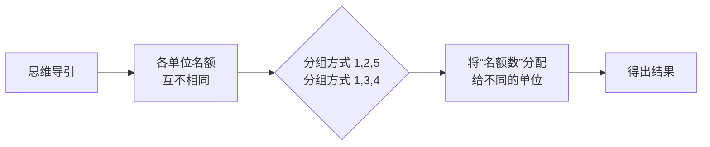
</details>

解析 各单位名额互不相同,则8个名额的分组方式有1,2,5与1,3,4两种,

对于其中任一种名额分组方式,将其分配给3个单位的方法有 $A_{3}^{3}$ 种,

所以每个单位至少一个名额且各单位名额互不相同的分配方法种数为 $2A_{3}^{3} = 12$ （种）.故选B.

【警示】8个名额无差别，故总的分组方式只有2种

答案 B

调研 3 （2023·重庆巴蜀中学9月适应性月考）今年8月，某市市民踊跃报名参加抗旱、救火、物资调配等救灾协调工作。现从8名志愿者中，选派5名参加工作，要求抗旱、救火、物资调配三项工作都有志愿者参加。不同的选法种数为（）

A.2 520

B. 4 200

C. 5 040

D. 8 400

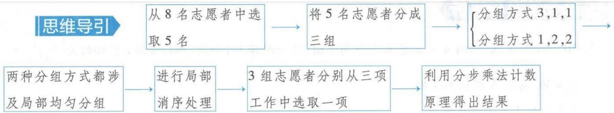

<details>
<summary>flowchart</summary>

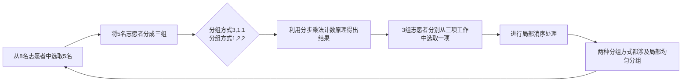
</details>

解析 先从8名志愿者中选出5名,再把5名志愿者分成3组,分组有两种情况,第一种,3组人数分别为3,1,1,则分组方法种数为 $\frac{C_{5}^{3}C_{2}^{1}C_{1}^{1}}{A_{2}^{2}}$ ,第二种,3组人数分别为1,2,2,则分组方法种数为 $\frac{C_{5}^{2}C_{3}^{2}C_{1}^{1}}{A_{2}^{2}}$ ,故总的不同分组方法种数是 $\frac{C_{5}^{3}C_{2}^{1}C_{1}^{1}}{A_{2}^{2}}+\frac{C_{5}^{2}C_{3}^{2}C_{1}^{1}}{A_{2}^{2}}$ ,最后3组志愿者分别从三项工作中选取一【易错分析】两种情况中均包含两组均匀分组,因此都需除以 $A_{2}^{2}$

项,有 $A_{3}^{3}$ 种不同的选法,故由分步乘法计数原理可得不同的选法种数为 $C_{8}^{5}\left(\frac{C_{5}^{2}C_{3}^{2}C_{1}^{1}}{A_{2}^{2}}+\frac{C_{5}^{3}C_{2}^{1}C_{1}^{1}}{A_{2}^{2}}\right)A_{3}^{3}=$ 8 400, 故选 D.

答案 D

# 拓展拔高

# 均匀分组与不均匀分组问题的解题策略

(1)先根据题目的选派方案对所提供的“选派元素”进行分组，做到不重、不漏；  
(2)根据分组情况, 分析是否涉及 “均匀分组” 或 “局部均匀分组” 的选派, 进行 “消序处理”, 即 “平均分成几组就除以 ‘几组的全排列数’ ”;  
(3) 最后对各组进行 “全排列” 分配或选派.

# 易错演练

1. (2023·重庆八中9月阶段检测)(多选)将甲、乙、丙、丁4名志愿者分别安排到A,B,C三个社区进行暑期社会实践活动,要求每个社区至少安排一名志愿者,则下列选项正确的是()

A. 共有 72 种安排方法  
B. 若甲、乙被安排在同一个社区, 则有 6 种安排方法  
C. 若 A 社区需要两名志愿者, 则有 24 种安排方法  
D. 若甲被安排在 A 社区, 则有 12 种安排方法

2. (2023·湖北孝感 10 月第一次联考)甲、乙、丙三名志愿者需要完成 A, B, C, D, E 五项不同的工作, 每项工作由一人完成, 每人至少完成一项, 且 E 工作只有乙能完成, 则不同的安排方式有\_\_\_\_种.

该专业毕业生的就业方向主要有:①IT类企业,数据分析、统计分析;②科研单位,数学、物理学术研究与开发.

关注微信公众号“初高教辅站”获取更多初高中教辅资料


# 参考答案与解析

1. BD 对于 A 选项, 将 4 名志愿者先分为 3 组, 再分配到 3 个社区, 所以安排方法种数为 $\frac{C_{4}^{2} C_{2}^{1} C_{1}^{1}}{A_{2}^{2}} \times A_{3}^{3} = 36$ , 所以 A 选项不正确.

【易忽视】不要漏除以 $A_{2}^{2}$

对于 B 选项, 甲、乙被安排在同一个社区, 先从 3 个社区中选 1 个安排甲与乙, 再把剩余 2 个社区进行全排列, 所以安排方法种数为 $C_{3}^{1}A_{2}^{2}=6$ , 所以 B 选项正确.

对于 C 选项, A 社区需要两名志愿者, 所以先从 4 名志愿者中选择 2 名安排到 A 社区, 再把剩余 2 名志愿者进行全排列, 所以安排方法种数为 $C_{4}^{2}A_{2}^{2}=12$ , C 选项不正确.

对于 D 选项,甲被安排在 A 社区,分为两种情况,第一种为 A 社区安排了 2 名志愿者,则从剩【扫清障碍】对甲安排在 A 社区进行分类讨论,讨论 A 社区是甲单独一人还是甲与另外一人余 3 名志愿者中再选择一个,分到 A 社区,然后把剩余 2 名志愿者进行全排列,安排方法共有 $C_{3}^{1}A_{2}^{2}$ 种;第二种是 A 社区只安排了甲志愿者,此时剩余 3 名志愿者分为 2 组,再分配到剩余的 2 个社区中,此时安排方法有 $C_{3}^{2}A_{2}^{2}$ 种.所以安排方法种数一共为 $C_{3}^{1}A_{2}^{2} + C_{3}^{2}A_{2}^{2} = 12$ ,D 选项正确.故【警示】这两组是不均匀分组,故不需除以任何数

选 BD.

2.50 由题意可分为两类：

【会分类】因为 E 工作只有乙能完成，所以分为两类，①乙只完成 E 工作，②乙不只完成 E 工作

①若乙只完成 E 工作，则甲、丙二人需完成 A, B, C, D 四项工作，则安排方式一共有 $\left(\mathrm{C}_{4}^{1}\mathrm{C}_{3}^{3}+\frac{\mathrm{C}_{4}^{2}\mathrm{C}_{2}^{2}}{\mathrm{A}_{2}^{2}}\right)\mathrm{A}_{2}^{2}=14$ （种）.

【点透】将4项工作分为两组，有两种情况，1,3与2,2，注意均匀分组时要除以组数的全排列数

(2) 若乙不只完成 E 工作, 即甲、乙、丙三人需完成 A, B, C, D 四项工作, 则安排方式一共有 $\frac{C_{4}^{2}C_{2}^{1}C_{1}^{1}}{A_{2}^{2}} \times A_{3}^{3} = 36$ (种).

综上,共有 $14 + 36 = 50$ (种) 安排方式,故填 50.


# 易错点6 混淆项的系数与二项式系数

调研 1 (2023·湖北荆州中学9月阶段练习)已知 $(mx+1)^{n}(n\in\mathbf{N}^{*},m\in\mathbf{R})$ 的展开式只有第5项的二项式系数最大,设 $(mx+1)^{n}=a_{0}+a_{1}x+a_{2}x^{2}+\cdots+a_{n}x^{n}$ ,若 $a_{1}=8$ ,则 $a_{2}+a_{3}+\cdots+a_{n}=$

A. 63

B. 64

C. 247

D. 255

# 思维导引

只有第5项的二项式系数最大

确定 $n$ 的值

$a_{1} = 8$


数据计算及应用 数据计算及应用专业是数学、统计学和信息科学多学科交叉融合的应用理科专业,主要培养能运用所学知识与技能解决数据分析、信息处理、科学与工程计算等领域实际问题的复合型应用理科专业人才.

关注微信公众号“初高教辅站”获取更多初高中教辅资料

确定 m 的值 → 利用赋值法确定 $a_{2} + a_{3} + \cdots + a_{n}$ 的值

解析 因为展开式只有第5项的二项式系数最大,所以展开式共9项,所以n=8,

【易混解析】注意二项式系数与项的系数的区别，二项式系数为 $C_{n}^{k}$ （ $k=0,1,2,\cdots,n$ ），根据组合数的性质即可求解相关问题，项的系数为展开式中对应项数字、参数相乘所得的数式。如在二项式 $(\lambda x + \mu y)^{n}(\lambda, \mu$ 为参数）的展开式中，通项为 $T_{r+1} = C_{n}^{r}(\lambda x)^{n-r}(\mu y)^{r}$ ，其中第 $r+1$ 项的二项式系数为 $C_{n}^{r}$ ，而系数为 $C_{n}^{r}\lambda^{n-r}\mu^{r}$

则 $a_1 = \mathrm{C}_8^1 \cdot m = 8$ ，所以 $m = 1$ ，则 $(x + 1)^8 = a_0 + a_1x + a_2x^2 + \dots + a_8x^8$

【警示】 $a_{1}$ 为 x 的系数

令 x=1 ，得 $a_{0}+a_{1}+a_{2}+a_{3}+\cdots+a_{8}=2^{8}=256$ ，令 x=0 ，得 $a_{0}=1$ ，所以 $a_{2}+a_{3}+\cdots+a_{n}=256-8-1=247$ 。故选 C.

答案 C

调研 2 (2023·云南师大附中9月适应性月考)在 $(2+x-x^{2})^{5}$ 的展开式中, $x^{4}$ 的系数为 ( )

A. -120

B. -40

C. -30

D. 200

思维导引

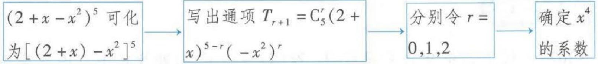

<details>
<summary>flowchart</summary>

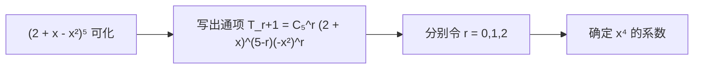
</details>

解析 依题意可得 $(2+x-x^{2})^{5}=[(2+x)-x^{2}]^{5}$ ,

【点拨】将“三项式”通过“并项”的方式，转化为“二项式”处理

其展开式的通项为 $T_{r+1} = C_{5}^{r}(2 + x)^{5-r}(-x^{2})^{r}, r = 0, 1, \cdots, 5.$

方法一 根据题意分类讨论，

当 r=0 时， $T_{1}=(2+x)^{5}$ ， $(2+x)^{5}$ 展开式的通项为 $T_{k+1}=C_{5}^{k}2^{5-k}x^{k}, k=0,1,\cdots,5$ ，令 k=4，此时 $x^{4}$ 的系数为 $2C_{5}^{4}=10$ 。

【警示】 $C_{5}^{4}$ 为二项式系数，所求为项的系数，不要漏乘2

当 r=1 时， $T_{2}=C_{5}^{1}(2+x)^{4}(-x^{2})=-5x^{2}(2+x)^{4}$ ， $(2+x)^{4}$ 展开式的通项为 $T_{k+1}=C_{4}^{k}2^{4-k}x^{k}$ ， $k=0,1,\cdots,4$ ，令 k=2，此时 $x^{4}$ 的系数为 $-5\times2^{2}\times C_{4}^{2}=-120$ 。

当 $r = 2$ 时， $T_{3} = \mathrm{C}_{5}^{2}(2 + x)^{3}(-x^{2})^{2} = 10x^{4}(2 + x)^{3}, (2 + x)^{3}$ 展开式的通项为 $T_{k+1} = \mathrm{C}_{3}^{k}2^{3-k}x^{k}$ ， $k = 0, 1, 2, 3$ ，令 $k = 0$ ，此时 $x^{4}$ 的系数为 $10 \times 2^{3} \times \mathrm{C}_{3}^{0} = 80$ .

当 r=3,4,5 时,不存在 $x^{4}$ 项.

综上所述, $x^{4}$ 的系数为10-120+80=-30.故选C.

【解后反思】有关三项或三项以上的展开式中的“系数”问题，往往根据式子的特点，可通过变形等价转化为“二项式”，再用解决二项式有关“系数”问题的方法进行求解。常用的转化的方法为并项、配方、因式分解等

方法二 二项式 $(2 + x)^{5 - r}$ 的通项为 $T_{k + 1} = \mathrm{C}_{5 - r}^{k}2^{5 - r - k}x^{k}$ ，令 $2r + k = 4$ ，得 $\left\{ \begin{array}{l}r = 0,\\ k = 4 \end{array} \right.$ 或 $\left\{ \begin{array}{l}r = 1,\\ k = 2 \end{array} \right.$ 或

该专业的学生掌握信息科学和统计学的基本理论、方法与技能，受到科学研究的初步训练，具备一定的数据建模、高性能计算、大数据处理以及程序设计能力。

关注微信公众号“初高教辅站”获取更多初高中教辅资料

# 052 试题调研 每月一辑试题新

$\left\{ \begin{array}{l} r = 2, \\ k = 0, \end{array} \right.$ 所以 $x^4$ 的系数为 $\mathrm{C}_5^0\mathrm{C}_5^4\times 2 + \mathrm{C}_5^1\mathrm{C}_4^2\times 2^2\times (-1) + \mathrm{C}_5^2\mathrm{C}_3^0\times 2^3 = -30.$ 故选C.

答案 C

调研 3 (2023·天津新华中学10月第一次统练)若 $(1-3x)^{n}$ 的展开式中各项系数的和等于64,则展开式中 $x^{2}$ 的系数是\_\_\_\_.

思维导引

展开式中各项系数的和 → 确定 n 的值 → 二项展开式的通项 → 确定 $x^{2}$ 的系数

解析

因为 $(1 - 3x)^n$ 的展开中各项系数的和等于64，所以令 $x = 1$ ，则 $(1 - 3)^n = 64$ ，解得

【易错】求二项展开式中各项系数的和利用的是“赋值法”，即令 $x = 1$ 即可求得，而二项式系数的和为 $2^{n}$

$n = 6$ ，则 $(1 - 3x)^{6}$ 的展开式的通项为 $T_{r + 1} = \mathrm{C}_6^r (-3)^r x^r$ ，令 $r = 2$ ，得 $x^{2}$ 的系数为 $\mathrm{C}_6^2 (-3)^2 = 135.$

【易遗漏】不要忘记乘 $(-3)^{2}$

答案 135


# 易错演练

1. (2023·银川二中9月阶段练习) 若 $(2x - \frac{1}{x})^n$ 的展开式中二项式系数之和为32, 则 $(x + 2y) \cdot (x - y)^n$ 的展开式中 $x^2 y^4$ 的系数为 \_\_\_\_.  
2. (2023·广东广雅中学10月月考) $(x^{2} - 2x + 1)^{3}$ 的展开式中, $x^{3}$ 的系数为 \_\_\_\_. (用数字作答)


# 参考答案与解析

1. -15 由 $(2x-\frac{1}{x})^{n}$ 的展开式中二项式系数之和为32得, $2^{n}=32$ ,故n=5,则 $(x-y)^{n}$ 展开式【易混淆】二项式系数之和为32,即 $2^{n}=32$ ,若给出的是项的系数之和,需利用赋值法求解,不要混淆

的通项为 $(-1)^{k}\mathrm{C}_{5}^{k}x^{5-k}y^{k}, k=0,1,\cdots,5$ ，故 $(x+2y)(x-y)^{n}$ 的展开式中 $x^{2}y^{4}$ 的项为 $(-1)^{k_{1}}\mathrm{C}_{5}^{k_{1}}x^{6-k_{1}}y^{k_{1}}+(-1)^{k_{2}}2\mathrm{C}_{5}^{k_{2}}x^{5-k_{2}}y^{k_{2}+1}$ ，其中 $k_{1}=4,k_{2}=3$ ，即 $(-1)^{4}\mathrm{C}_{5}^{4}x^{2}y^{4}+(-1)^{3}2\mathrm{C}_{5}^{3}x^{2}y^{4}=-15x^{2}y^{4}$ ，故填-15.

2. -20 因为 $(x^{2} - 2x + 1)^{3} = (x - 1)^{6}$ , 则其展开式的通项为 $T_{r+1} = (-1)^{r} C_{6}^{r} x^{6-r}$ , 令 $r = 3$ , 可得 【小技巧】利用配方法将“三项式”转化成“二项式”

含 $x^{3}$ 的项为 $T_{3 + 1} = (-1)^{3}\mathrm{C}_{6}^{3}x^{6 - 3} = -20x^{3}$ ，所以展开式中 $x^{3}$ 的系数为-20.


该专业的毕业生可选择进入数据处理与分析相关的企事业单位、科研机构或政府的数据管理部门等，从事技术研究与开发、管理与咨询等工作。也可选择继续攻读相关学科领域的硕士研究生。

关注微信公众号“初高教辅站”获取更多初高中教辅资料

# 逻辑思维漏洞类

# 特约名师

王应祥 山东省高级教师,淄博市优秀教师,在《山东教育》《中学生数理化》《求学》《高考金刊》等国家级及省级等各类专业报刊上发表教育教学论文200多篇.

# 易错点1 颠倒充分条件与必要条件

调研 1 (2023·江苏金陵中学 10 月学情调研)已知 $p: a \in \mathbb{R}$ 且 $-1 < a < 1$ ; $q$ :二次函数 $y = x^{2} + (a + 1)x + a - 2$ 的两个零点一个大于零,另一个小于零.则 $p$ 是 $q$ 的 ( )

A. 充分不必要条件

B. 必要不充分条件

C. 充要条件

D. 既不充分也不必要条件

思维导引 列出满足 q 的不等式组 → 确定 a 的取值范围 → 分清条件和结论 → 得解

解析 若关于 x 的一元二次方程 $x^{2}+(a+1)x+a-2=0$ 的一个根大于零, 另一个根小于零,

则 $\left\{\begin{aligned}(a+1)^{2}-4(a-2)>0,\\ a-2<0,\end{aligned}\right.$ 解得 a<2, 又 $\{a|-1<a<1\}\subsetneq\{a|a<2\}$ , 所以 p 是 q 的充分不必

要条件. 故选 A.

【易错分析】解答本题易出现的错误是颠倒了充分条件和必要条件，把充分条件当成必要条件。若将条件 $p$ 稍作改变，则会得到不同的结论。如若将“ $-1 < a < 1$ ”改为“ $a < 3$ ”，则 $p$ 是 $q$ 的必要不充分条件；若将“ $-1 < a < 1$ ”改为“ $a < 2$ ”，则 $p$ 是 $q$ 的充要条件；若将“ $-1 < a < 1$ ”改为“ $-1 < a < 3$ ”，则 $p$ 是 $q$ 的既不充分也不必要条件。请同学们自己也尝试改编一下吧！

答案 A

调研 2 (2023·安徽合肥八中9月阶段检测改编)已知 $p: |1 - 2x| \leqslant 5; q: x^{2} - 4x + 4 - 9m^{2} \leqslant 0 (m > 0)$ . 若 q 是 p 的充分不必要条件, 则实数 m 的取值范围是 \_\_\_\_.

思维导引
设 $A = \{x \mid -2 \leqslant x \leqslant 3\}$ , $B = \{x \mid 2 - 3m \leqslant x \leqslant 2 + 3m, m > 0\}$ $\rightarrow$ $B \not\subseteq A$

建立关于 m 的不等式组 → 解不等式组即可得解

解析 由题意可得 $q \Rightarrow p$ ，且 $p \nRightarrow q$ .

由 $|1 - 2x| \leqslant 5$ ，得 $-2 \leqslant x \leqslant 3$ ，由 $x^{2} - 4x + 4 - 9m^{2} \leqslant 0$ ，得 $[x - (2 + 3m)][x - (2 - 3m)] \leqslant 0$ ，即 $2 - 3m \leqslant x \leqslant 2 + 3m.$

设 $A = \{x\mid -2\leqslant x\leqslant 3\}$ ， $B = \{x\mid 2 - 3m\leqslant x\leqslant 2 + 3m,m > 0\}$ ，则 $B\subsetneqq A$

【记结论】注意集合间的关系，“小范围”是“大范围”的充分不必要条件

从而 $\left\{\begin{aligned}2-3m&\geqslant-2,\\ 2+3m&\leqslant3,\end{aligned}\right.$ 所以 $0<m\leqslant\frac{1}{3}$ ，经验证， $0<m\leqslant\frac{1}{3}$ 为所求实数m的取值范围.

【易错】本题在此处有两个易错点，一是在处理不等式 $2-3m\geq-2,2+3m\leq3$ 的时候容易出现端点值的验证错误，没有带等号，二是该不等式组中的两个等号不能同时取，所以在解完不等式组后，要验证所得结果。利用充分、必要条件求解参数的取值范围时，一定要注意端点值的取舍问题

答案 $(0, \frac{1}{3}]$


# 易错演练

1. (2023·山东师大附中 10 月月考) 设函数 $f(x) = a \cos x + b \sin x (a, b$ 为常数), 则“ $ab = 0$ ”是 “ $f(x)$ 为偶函数”的

A. 充分不必要条件

B. 必要不充分条件

C. 充要条件

D. 既不充分也不必要条件

2. (2023·济南历城二中10月月考)(多选)命题“ $\exists x \in [1, 2], x^{2} \leqslant a$ ”为真命题的一个充分不必要条件是

A. $a \geqslant 1$

B. $a \geqslant 4$

C. $a \geqslant -2$

D. a = 4

3. (2023·芜湖一中9月月考)已知集合 $A = \{x \mid 1 < 2^x < 8, x \in \mathbf{R}\}$ , $B = \{x \mid m + 1 < x < 3, x \in \mathbf{R}\}$ , 若 $x \in B$ 成立的一个充分不必要条件是 $x \in A$ , 则实数 $m$ 的取值范围是 \_\_\_\_.


# 参考答案与解析

1. B 当 $a = 0, b \neq 0$ 时, $f(x) = b \sin x$ , $f(x)$ 为奇函数, 即充分性不成立;

【会分析】ab=0 有三种情况：① $a=0,b\neq0$ ，② $a\neq0,b=0$ ，③a=0,b=0

当 $f(x)$ 为偶函数时， $f(-x) = f(x)$ 对任意的 $x \in \mathbb{R}$ 恒成立，

则 $f(-x) = a\cos (-x) + b\sin (-x) = a\cos x - b\sin x$ ，即 $a\cos x + b\sin x = a\cos x - b\sin x,$

得 $b\sin x=0$ 对任意的 $x\in R$ 恒成立, 从而 b=0, 即 ab=0, 所以必要性成立.

从而“ab=0”是“ $f(x)$ 为偶函数”的必要不充分条件,故选B.

【警示】要能根据定义分清充分条件与必要条件

2. BD 命题“ $\exists x \in [1, 2], x^{2} \leqslant a$ ”是真命题等价于 $a \geqslant 1$ ，

【扫清障碍】“ $\exists x \in M, a > f(x)$ (或 $a < f(x)$ )”为真命题，实质上就是不等式能成立，通常转化为求函数 $f(x)$ 的最小值（或最大值），即 $a > f(x)_{\min}$ (或 $a < f(x)_{\max}$ )

即命题“ $\exists x \in [1,2], x^2 \leqslant a$ ”为真命题所对应的 $a$ 的取值范围为 $[1, +\infty)$ ，显然 $[4, +\infty) \subsetneqq [1,$

【析实质】本题所找的充分不必要条件对应的集合应为集合 $[1, +\infty)$ 的真子集 $+\infty), \{4\} \subsetneq [1, +\infty)$ ，故选BD.

3. $(-∞,-1)$ $A=\{x\mid1<2^{x}<8\}=\{x\mid2^{0}<2^{x}<2^{3}\}=\{x\mid0<x<3\}$

【小技巧】转化为同底数幂形式，利用指数函数的单调性进行等价转化

若 $x \in B$ 成立的一个充分不必要条件是 $x \in A$ , 则集合 $A$ 是集合 $B$ 的真子集, 所以 $m + 1 < 0$ , 解

【易错提醒】注意集合间的关系，得出的是 $m + 1 < 0$ ，切忌写为 $m + 1 \leqslant 0$ 或 $m + 1 > 0$ 得 $m < -1$ ，所以实数 $m$ 的取值范围是 $(- \infty, -1)$ .

# 易错点2 忽视函数的定义域

调研 1 （2023·重庆 10 月阶段检测）已知 $f(\sqrt{x} + 1) = x + 2\sqrt{x}$ ，则 $f(x)$ 的解析式为（）

A. $f(x) = x^{2} - 1$

B. $f(x) = x^{2} - 1 (x > 1)$

C. $f(x) = x^{2} - 1 (x \geqslant 1)$

D. $f(x) = x^{2} - 1 (x \geqslant 0)$

思维导引 思路一: 利用配凑法将解析式变形 → 换元 → 得选项

思路二：令 $t=\sqrt{x}+1$ → 换元 → 代入求解 → 得选项

解析 方法一 (配凑法) $f(\sqrt{x} + 1) = x + 2\sqrt{x} = (\sqrt{x} + 1)^{2} - 1$ , 令 $t = \sqrt{x} + 1 (t \geqslant 1)$ ,

则 $f(t)=t^{2}-1(t\geqslant1)$ ，所以 $f(x)=x^{2}-1(x\geqslant1)$ ，故选 C.

【易忽视】要注意变量 $\sqrt{x} + 1$ 的取值范围，求出函数解析式后，函数的定义域也不能漏。特别要注意一些隐含的条件，如 $a^x > 0, \sqrt{x} \geqslant 0, |x| \geqslant 0, -1 \leqslant \sin x \leqslant 1, -1 \leqslant \cos x \leqslant 1$ 等

方法二 （换元法）令 $t = \sqrt{x} + 1 (t \geqslant 1)$ ，则 $\sqrt{x} = t - 1 (t \geqslant 1), f(t) = (t - 1)^2 + 2 (t - 1) (t \geqslant 1)$ ，

即 $f(t)=t^{2}-1(t\geqslant1)$ ，所以 $f(x)=x^{2}-1(x\geqslant1)$ ，故选 C.

【方法总结】已知函数 $f(g(x))$ 的解析式求 $f(x)$ 的解析式可用换元法（或“配凑法”），即令 $g(x)=t$ ，反解出x，然后代入 $f(g(x))$ 中求出 $f(t)$ ，从而求出 $f(x)$

答案 C

调研 2 (2023·陕西长安一中9月质检)函数 $f(x)=\ln(3x^{2}-6x-24)$ 的单调递增区间为

A. $(-1, +\infty)$

B. $(1, +\infty)$

C. $(2, +\infty)$

D. $(4,+\infty)$

思维导引 确定函数的定义域 → 复合函数单调性的判断规则 → 确定单调区间

解析 由题意得 $3x^{2} - 6x - 24 > 0$ ，即 $x^{2} - 2x - 8 > 0$ ，所以 $(x - 4)(x + 2) > 0$ ，得 $x > 4$ 或 $x < -2$ ，所以函数 $f(x)$ 的定义域为 $\{x \mid x > 4$ 或 $x < -2\}$ .

【小妙招】对数式中，真数大于零，由此可求得函数 $f(x)$ 的定义域

设 $u=3x^{2}-6x-24, x\in(-\infty,-2)\cup(4,+\infty)$ , $v=\ln u$ , 要求函数 $f(x)-\ln(3x^{2}-6x-24)$ 的单调递增区间, 即求函数 $u=3x^{2}-6x-24, x\in(-\infty,-2)\cup(4,+\infty)$ 的单调递增区间,

【技巧点拨】判断复合函数 $f(g(x))$ 的单调性的规则：同增异减

易知函数 $u=3x^{2}-6x-24, x\in(-\infty,-2)\cup(4,+\infty)$ 的单调递增区间为 $(4,+\infty)$ ，所以函数 $f(x)$ 的单调递增区间为 $(4,+\infty)$ 。故选 D.

【警示】函数的单调性是一个局部概念，单调区间是定义域的一个子区间，因此，在解答函数的单调性问题时必须首先考虑函数的定义域

答案 D

调研 3 (2023·福建漳州一中9月月考)对任意的实数 $x \in \mathbb{R}$ 都有 $f(\sin x) = -\cos 2x + \cos^2 x + 2\sin x - 3$ ，则 $f(x)$ 的值域为 \_\_\_\_.

思维导引 利用二倍角公式及同角三角函数的关系式化简函数解析式 → 换元 → 利用二次函数的性质求函数的值域

解析 易知 $f(\sin x) = 2\sin^2 x - 1 + 1 - \sin^2 x + 2\sin x - 3 = \sin^2 x + 2\sin x - 3,$

所以 $f(x)=x^{2}+2x-3(-1\leqslant x\leqslant1)$ ,

【易错提醒】换元时要注意变量 $\sin x$ 的取值范围

曲线 $y = x^{2} + 2x - 3$ 的对称轴为直线 x = -1，所以函数 $f(x)$ 在区间 $[-1, 1]$ 上单调递增，所以 $f(-1) \leqslant f(x) \leqslant f(1)$ ，即 $-4 \leqslant f(x) \leqslant 0$ ，所以 $f(x)$ 的值域为 $[-4, 0]$ .

答案 [ -4,0 ]

变式 求函数 $f(x) = \left(\frac{1}{4}\right)^x + \left(\frac{1}{2}\right)^x + 1$ 的值域.

解析 令 $t = \left(\frac{1}{2}\right)^x$ ，则 $t \in (0, +\infty)$ ，原函数可化为 $y = t^2 + t + 1 = \left(t + \frac{1}{2}\right)^2 + \frac{3}{4}, t \in (0, +\infty)$ ，

因为函数 $y=(t+\frac{1}{2})^{2}+\frac{3}{4}$ 是 $t\in(0,+\infty)$ 上的增函数，所以 $y>(0+\frac{1}{2})^{2}+\frac{3}{4}=1$ ，即原函数的值域是 $(1,+\infty)$ .

【易错分析】原函数自变量 x 的取值范围是 R，换元后 $t = \left(\frac{1}{2}\right)^x > 0$ ，而不是 $t \in R$ ，易出现的错解是把 t 的取值范围当成 R，将 t 的取值范围扩大了，从而得到函数的值域为 $\left[\frac{3}{4}, +\infty\right)$

调研 4 （2023·陕西咸阳 10 月月考）已知函数 $f(x)=2\ln x+\frac{1}{x}-x$ ，则不等式 $f(2x-1)<f(1-x)$ 的解集为（）

A. $(0,\frac{2}{3})$

B. $\left(\frac{2}{3},1\right)$

C. $\left(\frac{1}{2},1\right)$

D. $\left(\frac{1}{2},\frac{2}{3}\right)$

思维导引 求导 → 确定函数的单调性 → 列关于 x 的不等式组 → 求 x 的取值范围 → 得解

解析 由题意可知,函数 $f(x)=2\ln x+\frac{1}{x}-x$ 的定义域为 $(0,+\infty)$ .

【敲黑板】函数问题,不管是求函数的单调区间、确定函数的单调性,还是根据函数单调性求参数的取值范围、解不等式,或者其他与函数性质相关的问题,都应光求定义域,在定义域内求解

因为 $f'(x) = \frac{2}{x} -\frac{1}{x^2} -1 = -\left(\frac{1}{x} -1\right)^2\leqslant 0$ 恒成立，所以 $f(x)$ 在 $(0, + \infty)$ 上单调递减，

则由 $f(2x - 1) < f(1 - x)$ 可得 $\left\{ \begin{array}{l} 2x - 1 > 0, \\ 1 - x > 0, \\ 2x - 1 > 1 - x, \end{array} \right.$ 解得 $\frac{2}{3} < x < 1$

【易错】根据函数的单调性列关于 $x$ 的不等式组时，容易忽视定义域为 $(0, +\infty)$ 的要求，不等式组中需列出 $2x - 1 > 0, 1 - x > 0$

即原不等式的解集为 $\left(\frac{2}{3},1\right)$ . 故选 B.

【方法总结】利用函数奇偶性与单调性解不等式，一般有两类：（1）利用图象解不等式；（2）转化为简单不等式（组）求解。（2）的解题思路为：①利用已知条件，结合函数的奇偶性，把已知不等式转化为 $f(x_{1})<f(x_{2})$ 或 $f(x_{1})>f(x_{2})$ 的形式；②根据奇函数在对称区间上的单调性一致，偶函数在对称区间上的单调性相反，只需求出一半区间上的单调性，即可脱掉不等式中的“f”转化为简单不等式（组）求解

答案 B

调研 5 (2023·东北师大附中10月模拟)已知函数 $f(x)=\sqrt{x+1}\cdot\sqrt{x-1}$ ，下列说法正确的是()

A. 函数 $f(x)$ 为奇函数

B. 函数 $f(x)$ 为偶函数

C. 函数 $f(x)$ 既为奇函数又为偶函数

D. 函数 $f(x)$ 为非奇非偶函数

解析 由题意, 得 $\left\{\begin{aligned}x+1&\geqslant0,\\ x-1&\geqslant0,\end{aligned}\right.$ 解得 $x\geqslant1$ , 即 $f(x)$ 的定义域为 $[1,+\infty)$ ,

【易忽视】忽略函数的定义域的对称性，切记只有定义域关于原点对称，函数才可能具有奇偶性因为 $f(x)$ 的定义域不关于原点对称，所以 $f(x)$ 既不是奇函数也不是偶函数。

【拓展延伸】还有以下题型可巧妙利用函数的奇偶性快速解题，如：“已知 $f(x)=ax^{2}+bx+3a+b$ 是定义在 $[a-1,2a]$ 上的偶函数，则 $a+b=$ \_\_\_\_。”根据偶函数的定义域关于原点时称得到 $a-1+2a=0$ ，从而得 $a=\frac{1}{3}$ ，又 $f(x)=f(-x)$ ，所以 $ax^{2}+bx+3a+b=ax^{2}-bx+3a+b$ ，所以 b=0，则 $a+b=\frac{1}{3}$

答案 D

调研 6 (2023·山东东营10月月考)函数 $f(x)=\frac{\lg(1-x^{2})}{|x-2|-2}$ 的图象关于 ( )

A. 原点对称

B. $y$ 轴对称

C. $x$ 轴对称

D. 直线 $y = x$ 对称

思维导引
确定函数的定义域 → 化简函数解析式 → $f(-x) = -f(x)$ 确定函数的奇偶性 → 函数图象关于原点对称

解析 由 $\left\{\begin{aligned}1-x^{2}>0,\\ |x-2|\neq2\end{aligned}\right.$ 得函数 $f(x)$ 的定义域为 $(-1,0)\cup(0,1)$ ，关于原点对称.

【提醒】注意定义域优先意识则 $x - 2 < 0, \therefore |x - 2| - 2 = -x, \therefore f(x) = \frac{\lg(1 - x^2)}{-x}$ .

【会化简】利用函数的定义域化简函数解析式

又 $f(-x) = \frac{\lg(1 - x^2)}{x} = -\frac{\lg(1 - x^2)}{-x} = -f(x),\therefore$ 函数 $f(x)$ 为奇函数，则其函数图象关于原点对称.

答案 A


# 易错演练

1. (2023·山东济宁9月月考)已知 $f(1 + \sin x) = \cos^2 x$ ，则 $f(x)$ 的大致图象是 ( )

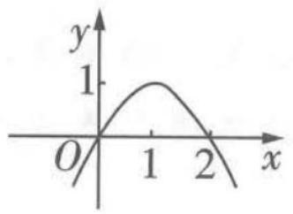  
A

  
B

  
C

  
D

2. (2023·合肥一中10月调研) 函数 $y = f(x) (x \in \mathbb{R})$ 的图象如图1所示, 则函数 $g(x) = f(-\ln x)$ 的单调递增区间是 ( )

A. $(0,\frac{1}{\sqrt{e}}]$

B. $\left[\frac{1}{\sqrt{e}},1\right]$

C. $\left[\sqrt{e},+\infty\right)$

D. $(0,\frac{1}{\sqrt{e}}]$ 和 $[1,+\infty)$


<details>
<summary>line</summary>

| x | y |
|---|---|
| 0 | 0 |
| 1/2 | 1/2 |
</details>

图1

3. (2023·江苏苏州六中9月月考) 函数 $y = -x + 2\sqrt{1 - x}$ 的值域是 \_\_\_\_.

4. (2023·河南平顶山一中9月月考)已知偶函数 $f(x)$ 在 $[0, +\infty)$ 上单调递减, $f(2) = 0$ . 若 $f(x - 1) > 0$ , 则 $x$ 的取值范围是 \_\_\_\_.

5. (2023·沈阳二中10月质检)已知 $f(x)=2+\log_{3}x,x\in[1,81]$ ，则 $y=[f(x)]^{2}+f(x^{2})$ 的最大值为 \_\_\_\_.


# 参考答案与解析

1. B 因为 $f(1 + \sin x) = \cos^{2}x = 1 - \sin^{2}x = -(1 + \sin x)^{2} + 2(1 + \sin x)$ ,

所以 $f(x)=-x^{2}+2x(x\in[0,2])$ ，结合图象可知B正确，故选B.

【警示】 $-1 \leqslant \sin x \leqslant 1$ ，换元后注意变量的范围

2. D 由函数 $y = f(x) (x \in \mathbb{R})$ 的图象可得 $f(x)$ 的单调递减区间是 $(- \infty, 0], [\frac{1}{2}, +\infty)$ ,

而函数 $u = -\ln x$ 在 $x \in (0, +\infty)$ 上单调递减，所以若函数 $g(x)$ 单调递增，则必有 $-\ln x \leqslant 0$ 或 $-\ln x \geqslant \frac{1}{2}$ ，即 $x \geqslant 1$ 或 $0 < x \leqslant \frac{1}{\sqrt{\mathrm{e}}}$ ，所以函数 $g(x) = f(-\ln x)$ 的单调递增区间是 $(0, \frac{1}{\sqrt{\mathrm{e}}}]$ 和 $[1, +\infty)$ .

【易错提醒】书写函数的单调区间时不要用“U”，要用“和”或“，”隔开

3. $[-1, +\infty)$ 设 $\sqrt{1 - x} = t$ ，则 $x = 1 - t^2, t \geqslant 0$ ，所以 $y = -x + 2\sqrt{1 - x} = t^2 - 1 + 2t = (t + 1)^2 - 2(t \geqslant 0)$ ，因为函数 $y = (t + 1)^2 - 2$ 在 $t \in [0, +\infty)$ 上单调递增，且当 $t = 0$ 时， $y = -1$ ，

所以函数 $y = -x + 2\sqrt{1 - x}$ 的值域为 $[-1, +\infty)$ .

4. (-1,3) 因为 $f(x)$ 是偶函数, $f(2)=0$ , 所以不等式 $f(x-1)>0\Leftrightarrow f(|x-1|)>f(2)$ ,

【破题妙招】不确定自变量是否在同一单调区间上，可利用函数的奇偶性把自变量转化到同一单调区间上，然后利用函数的单调性比较大小

又 $f(x)$ 在 $[0, +\infty)$ 上单调递减，所以 $|x - 1| < 2$ ，解得 $-1 < x < 3$ .

5.22 由 $f(x) = 2 + \log_3 x$ ，得 $y = [f(x)]^2 + f(x^2) = (2 + \log_3 x)^2 + 2 + \log_3 x^2 = (2 + \log_3 x)^2 + 2 + 2\log_3 x = (\log_3 x + 3)^2 - 3$ .

∵ 函数 $f(x)$ 的定义域为 [1,81]，

∴ 要使函数 $y = [f(x)]^{2} + f(x^{2})$ 有意义，则有 $\left\{\begin{aligned}1 &\leqslant x^{2} \leqslant 81,\\ 1 &\leqslant x \leqslant 81,\end{aligned}\right.$ $\therefore 1 \leqslant x \leqslant 9, \therefore 0 \leqslant \log_{3} x \leqslant 2,$

【易忽视】不要忽视 $x^{2}$ 的取值范围

∴ 当 $\log_{3}x = 2$ ，即 x = 9 时， $y_{\max} = 22$ 。∴ 函数 $y = [f(x)]^{2} + f(x^{2})$ 的最大值为 22。

# 易错点3 忽略实际问题中自变量的取值范围

调研 1 (2023·山东泰安一中9月月考/食品安全)食品安全问题越来越引起人们的重视,农药、化肥的滥用给人民群众的健康带来了一定的危害.为了给消费者带来放心的蔬菜,某地计划投入资金200万元,搭建甲、乙两个无公害蔬菜大棚,每个大棚至少要投入资金40万元,其中甲大棚种西红柿,乙大棚种黄瓜.根据以往的种菜经验,发现种西红柿的年收入P(单位:万元),种黄瓜的年收入Q(单位:万元)与各自的投入资金 $a_{1},a_{2}$ (单位:万元)满足 $P=80+4\sqrt{2a_{1}},Q=\frac{1}{4}a_{2}+120$ .设甲大棚的投入资金为x(单位:万元),两个大棚的总收入为 $f(x)$ (单位:万元),则 $f(x)$ 的最大值为()

A.282万元

B. 228 万元

C.283万元

D.229万元


<details>
<summary>flowchart</summary>


</details>

利用配方法求函数 $g(t)$ 的最值 → 确定函数 $f(x)$ 的最大值

解析 当甲大棚的投入资金为 $x$ （单位：万元）时，乙大棚的投入资金为 $200 - x$ （单位：万元），所以 $f(x) = 80 + 4\sqrt{2x} + \frac{1}{4}(200 - x) + 120 = -\frac{1}{4} x + 4\sqrt{2x} + 250,$

由 $\left\{\begin{aligned}x&\geqslant40,\\ 200-x&\geqslant40\end{aligned}\right.$ 可得 $40\leqslant x\leqslant160$ ,

【易忽视】没有注意“每个大棚至少要投入资金40万元”这个条件，从而不能合理求出自变量 $x$ 的取值范围

令 $t = \sqrt{x}$ ，则 $t\in [2\sqrt{10},4\sqrt{10} ],g(t) = -\frac{1}{4} t^2 +4\sqrt{2} t + 250 = -\frac{1}{4} (t - 8\sqrt{2})^2 +282,$

【小技巧】巧换元，利用二次函数求最值，注意换元后新变量的取值范围

因为 $8\sqrt{2} \in [2\sqrt{10}, 4\sqrt{10}]$ ，所以当 $t = 8\sqrt{2}$ ，即 $x = 128$ 时，总收入最大，为282万元。故选A.

【解后反思】解决实际问题一定要注意自变量的取值范围，例如：人数、零件个数等应为正整数，而时间、面积、体积等不能为负数

答案 A

调研 2 （2023·河北石家庄二中10月阶段练习）将一块 $2\ m \times 6\ m$ 的矩形钢板按如图1所示的方式划线,要求①至⑦全为矩形,沿线裁去阴影部分,把剩余部分焊接成一个以⑦为底,⑤⑥为盖的水箱,设水箱的高为 $x\ m$ ,容积为 $y\ m^{3}$ .

<table><tr><td colspan="2"></td><td>②</td><td colspan="2"></td></tr><tr><td>⑥</td><td>①</td><td>⑦</td><td>③</td><td>⑤</td></tr><tr><td colspan="2"></td><td>④</td><td colspan="2"></td></tr></table>

图1

(1) 写出 y 关于 x 的函数关系式；

(2) 当 x 取何值时, 水箱的容积最大?

解析 (1) 由水箱的高为 $x \mathrm{~m}$ , 得水箱底面一条边为 $(2 - 2x) \mathrm{~m}$ , 另一条边为 $\frac{6 - 2x}{2} = (3 - x) \mathrm{~m}$ .

【会分析】会结合题图，分析水箱的长、宽、高

则 $\left\{\begin{aligned}x&>0,\\ 2&-2x>0,\\ 3&-x>0,\end{aligned}\right.$ 解得0<x<1,

故水箱的容积 $y=(2-2x)(3-x)x=2x^{3}-8x^{2}+6x(0<x<1)$ .

【易忽视】写解析式时不要忽视函数的定义域

(2)由(1)得 $y' = 6x^2 - 16x + 6$ ，令 $y' = 0$ ，解得 $x = \frac{4 + \sqrt{7}}{3}$ （舍去）或 $x = \frac{4 - \sqrt{7}}{3}$ ，

【小妙招】利用导函数求函数的单调性，进而求函数的最值

所以 $y=2x^{3}-8x^{2}+6x(0<x<1)$ 在 $(0,\frac{4-\sqrt{7}}{3})$ 上单调递增，在 $(\frac{4-\sqrt{7}}{3},1)$ 上单调递减，所以当 $x=\frac{4-\sqrt{7}}{3}$ 时，水箱的容积最大.

# 拓展拔高

# 利用导数解决有关最值的实际问题的一般步骤

(1) 分析实际问题中各变量之间的关系，找出实际问题的数学模型，写出实际问题中变量之间的函数关系式 $y = f(x)$ ;  
(2) 求函数的导数 $f'(x)$ ，解方程 $f'(x)=0$ ;  
(3) 比较函数在区间端点和极值点处的函数值的大小, 最大 (小) 者为最大 (小) 值;  
(4) 把所得数学结论回归到实际问题中, 看是否符合实际情况并下结论.


# 易错演练

1. (2023·安徽合肥一中9月模拟)某汽车销售公司在A,B两地销售同一种品牌的汽车,在A地的销售利润(单位:万元) $y_{1}=4.1x-0.1x^{2}$ ,在B地的销售利润(单位:万元) $y_{2}=2x$ ,其中x为销售量(单位:辆),若该公司在两地共销售16辆该种品牌的汽车,则能获得的最大利润是()

A.10.5万元

B.11万元

C. 43 万元

D.43.025万元

2. (2023·济南一中10月调研)如图2,有甲、乙两个工厂,甲厂位于笔直河岸的岸边A处,乙厂与甲厂在河的同侧,位于离河岸40 km的B处,BD垂直于河岸,垂足为D且D与A相距50 km.两厂要在此岸边合建一个供水站C,从供水站到甲厂和乙厂铺设水管的费用分别为每千米3a元和每千米5a元.问:供水站C建在岸边何处才能使铺设水管的费用最省?


<details>
<summary>text_image</summary>

甲
A C D
B 乙
</details>

图2


# 参考答案与解析

1. C 设该公司在 A 地销售该品牌汽车 a 辆, 则在 B 地销售该品牌汽车 $(16 - a)$ 辆,

所以可得总利润 $y = 4.1a - 0.1a^2 + 2(16 - a) = -0.1a^2 + 2.1a + 32 = -0.1(a - 10.5)^2 + 0.1 \times 10.5^2 + 32$ ,

又 $a \in [0,16]$ , 且 $a \in \mathbb{N}$ ,

【易漏提醒】忽视 $a \in \mathbb{N}$ ，导致求解出错

所以当 a=10 或 11 时, 总利润最大, 且 $y_{max}=43$ 万元. 故选 C.

2. 作出如图3所示的示意图,根据题意可知当点C在线段AD的某一适当位置时,总运费最省,设此时点C距点Dx km,则BD=40,AC=50-x,∴ $BC=\sqrt{BD^{2}+CD^{2}}=\sqrt{40^{2}+x^{2}}$ ,

设铺设水管的总费用为 y 元, 则 $y = 3a(50 - x) + 5a \sqrt{x^{2} + 40^{2}} (0 < x < 50)$ , $\therefore y' = -3a + \frac{5ax}{\sqrt{x^{2} + 40^{2}}}$ ,


<details>
<summary>text_image</summary>

甲
A	C	D
x
B	乙
</details>

图3

【易错】求函数定义域时要考虑全面，注意 $50 - x > 0, x > 0$

令 $y' = -3a + \frac{5ax}{\sqrt{x^2 + 40^2}} = 0$ ，可得 $x = 30$ ，且 $x = 30$ 为极小值点，

则函数 $y=3a(50-x)+5a\sqrt{x^{2}+40^{2}}(0<x<50)$ 在 x=30 时取得最小值，此时 AC=50-x=20，故供水站 C 建在岸边 A, D 之间距甲厂 20 km 处，能使铺设水管的费用最省.

# 易错点4 对三角形的形状判断不准导致漏解或多解

调研 1 （2023·东北育才学校 10 月调研）在 $\triangle ABC$ 中，内角 A, B, C 所对的边分别为 a, b, c，若 $\frac{c\cos C}{b\cos B} = \frac{1 + \cos 2C}{1 + \cos 2B}$ ，则 $\triangle ABC$ 是（）

A. 等腰三角形或直角三角形

B. 直角三角形

C. 等腰直角三角形

D. 等腰三角形

思维导引 利用二倍角公式化简原式 → 分类讨论 cos C 的值 → 三角恒等变换 → 确定三角形形状

解析 $\cos2C=2\cos^{2}C-1,\cos2B=2\cos^{2}B-1$ , 由 $\frac{c\cos C}{b\cos B}=\frac{1+\cos2C}{1+\cos2B}$ 化简得 $\frac{c\cos C}{b\cos B}=\frac{\cos^{2}C}{\cos^{2}B}$

当 $\cos C = 0$ 时， $C = \frac{\pi}{2}$ ，此时 $\triangle ABC$ 为直角三角形.

【易遗漏】易漏掉 $\cos C = 0$ 的情况，漏解，进而错选 D. 注意等式两边同时消去某个因式时，要判断该因式是否为 0. 对于三角形的内角，其对应的正弦值和正切值都不可能为 0，但余弦值可能为 0，因此，在解三角形问题时，遇到“余弦”要多加注意

方法一 当 $\cos C \neq 0$ 时, $\frac{c}{b} = \frac{\cos C}{\cos B}$ , 则 $\frac{\sin C}{\sin B} = \frac{\cos C}{\cos B}$ , 化简得 $\sin C \cos B - \cos C \sin B = 0$ ,

即 $\sin (C - B) = 0$ ，又 $B\in (0,\pi),C\in (0,\pi)$ ，所以 $C = B$ ，此时 $\triangle ABC$ 为等腰三角形.

方法二 当 $\cos C \neq 0$ 时, $\frac{c}{b} = \frac{\cos C}{\cos B}$ , 即 $c \cdot \frac{a^2 + c^2 - b^2}{2ac} = b \cdot \frac{a^2 + b^2 - c^2}{2ab}$ , 则 $2c^2 = 2b^2, c = b$ , 此时 $\triangle ABC$ 为等腰三角形.

综上， $\triangle ABC$ 为等腰三角形或直角三角形. 故选 A.

【方法总结】判断三角形的形状有以下两种思路：(1)化边，通过因式分解，配方等得出边的相应关系，从而判断三角形的形状；(2)化角，通过三角恒等变换，得出内角的关系，从而判断三角形的形状，此时要注意应用三角形内角和为 $\pi$ 这个结论

答案 A

调研 2 （2023·福建莆田华侨中学10月月考）在△ABC中，内角A,B,C所对的边分别是a,b,c,a=4,b=4 $\sqrt{3}$ ,B=60°,则A= \_\_\_\_.

解三角形问题，不仅要注意正弦定理、余弦定理的应用，还要注意边长之间的关系！

思维导引 正弦定理 → 三角函数求角 → 确定边角关系 → 确定 A 的值

解析 由题意,根据正弦定理可得 $\frac{a}{\sin A}=\frac{b}{\sin B}$ ，则 $\sin A=\frac{a\sin B}{b}=\frac{4\sin60^{\circ}}{4\sqrt{3}}=\frac{1}{2}$ ,

又 $a < b$ ，则 $A < B$ ，即 $A \in (0^\circ, 60^\circ)$ ，所以 $A = 30^\circ$ .

【易错】忽略三角形大边对大角的性质，导致得出 $A = 30^{\circ}$ 或 $150^{\circ}$ 的错误结论。时刻关注三角形的内角大小，尤其是某个内角为钝角的情况，经常被忽略，解题时注意挖掘题目隐含条件，结合三角形的大边对大角、三角形内角和定理等快速判断。如本题，题干给出 a, b 的值，则根据 a < b 可知 A < B

答案 30°

# 易错快攻

在 $\triangle ABC$ 中，内角 $A, B, C$ 的对边分别为 $a, b, c$ ，已知 $a, b$ 和 $A$ ，那么解的情况如下：

(1) 若 $\sin B = \frac{b\sin A}{a} > 1$ ，则满足条件的三角形的个数为0，即无解；  
(2) 若 $\sin B = \frac{b\sin A}{a} = 1$ ，则满足条件的三角形的个数最多为 1；  
(3) 若 $\sin B = \frac{b\sin A}{a} < 1$ ，则满足条件的三角形的个数最多为 2.

根据以上结论先判断三角形解的个数，再结合“大边对大角”“三角形内角和等于 $180^{\circ}$ ”等排除不合理的解.

变式 若 $a = \sqrt{3}, b = 1, A = 120^{\circ}$ , 则此三角形解的情况为 ( )

A. 无解

B. 只有一解

C. 有两解

D. 解的个数不确定

解析 因为 $a = \sqrt{3}, b = 1, A = 120^{\circ}$ , 所以由正弦定理可得 $\sin B = \frac{b \sin A}{a} = \frac{1}{2}$ , 所以 $B = 30^{\circ}$ 或 $B = 150^{\circ}$ , 又 $a > b$ , 则 $A > B$ , 故 $B = 150^{\circ}$ 不成立, 舍去. 当 $B = 30^{\circ}$ 时, $C = 30^{\circ}$ , 满足题意. 综上, $B = 30^{\circ}$ ,

【扫清障碍】对于每一种解，都要进行验证。可以在草稿纸上按照边长、角度试着画一画三角形，判断是否合理

即三角形的解只有一个. 故选 B.

答案 B


# 易错演练

1. (2023·长沙一中 10 月月考) 在 $\triangle ABC$ 中, 内角 $A, B, C$ 所对的边分别为 $a, b, c$ , 且 $b^{2} + c^{2} - \sqrt{3}bc = a^{2}$ , $bc = \sqrt{3}a^{2}$ , 则 $C =$

A. $\frac{\pi}{6}$ 或 $\frac{2\pi}{3}$

B. $\frac{\pi}{3}$

C. $\frac{2\pi}{3}$

D. $\frac{\pi}{6}$

2. (2023·沈阳二中10月段考)在 $\triangle ABC$ 中,内角 $A,B,C$ 所对的边分别为 $a,b,c,A=\frac{\pi}{6}$ , $(1+\sqrt{3})c=2b$ ,则 $B=$ \_\_\_\_.

3. (2023·湖南岳阳一中10月调研)如图1, 在 $\triangle ABC$ 中, $AB = 9$ , $\cos B = \frac{2}{3}$ , 点 $D$ 在 $BC$ 上, $AD = 7$ , $\angle ADB$ 为锐角.


<details>
<summary>text_image</summary>

A
B D C
</details>

图1

(1) 求 BD.

(2) 若 $\angle BAD = \angle DAC$ , 求 $\sin C$ 及 $CD$ .

# 参考答案与解析

1. A $\because b^{2} + c^{2} - \sqrt{3}bc = a^{2}, \therefore$ 由余弦定理可得 $\cos A = \frac{b^{2} + c^{2} - a^{2}}{2bc} = \frac{\sqrt{3}bc}{2bc} = \frac{\sqrt{3}}{2}, \because 0 < A < \pi, \therefore A = \frac{\pi}{6}.$ $\because bc = \sqrt{3}a^{2}, \therefore \sin B\sin C = \sqrt{3}\sin^{2}A = \frac{\sqrt{3}}{4}, \therefore \sin\left(\frac{5\pi}{6} - C\right)\sin C = \frac{\sqrt{3}}{4},$ 即 $\frac{1}{2}\sin C\cos C + \frac{\sqrt{3}}{4}(1 - \cos 2C) = \frac{\sqrt{3}}{4},$ $\therefore \tan 2C = \sqrt{3},$ 又 $0 < C < \frac{5\pi}{6}, \therefore 2C = \frac{\pi}{3}$ 或 $\frac{4\pi}{3},$

【扫清障碍】利用三角恒等变换“弦化切”，进而求角

∴ $C = \frac{\pi}{6}$ 或 $\frac{2\pi}{3}$ ，故选 A.

【易错】由 $0 < C < \frac{5\pi}{6}$ 错误得出 $0 < 2C < \frac{5\pi}{6}$ ，进而舍去 $2C = \frac{4\pi}{3}$ 的情况，导致漏解

2. $\frac{7\pi}{12}$ 在 $\triangle ABC$ 中, 由余弦定理得 $a^2 = b^2 + c^2 - 2bc\cos A = b^2 + c^2 - \sqrt{3}bc$ , 又 $b = \frac{1 + \sqrt{3}}{2}c$ , 所以 $a = \frac{\sqrt{2}}{2}c$ , 由正弦定理得 $\frac{a}{\sin A} = \frac{c}{\sin C}$ , 所以 $\sin C = \frac{c}{a}\sin A = \sqrt{2} \cdot \sin \frac{\pi}{6} = \frac{\sqrt{2}}{2}$ . 因为 $c < b$ , 所以 $C$ 为锐角, $C = \frac{\pi}{4}$ , 所以 $B = \pi - \frac{\pi}{6} - \frac{\pi}{4} = \frac{7\pi}{12}$ .

【易错】此处由 $c < b$ ，可得 $C < B$ ，但此时 $C, B$ 的角度都未知，如何得出 $C$ 为锐角呢？分析如下：假设 $C$ 为直角或钝角，那么 $B$ 为钝角，这与“三角形的三个内角中至少有两个锐角”矛盾，所以假设不成立，故 $C$ 为锐角

3. (1) 在 $\triangle ABD$ 中, 由余弦定理得 $AB^{2} + BD^{2} - 2AB \cdot BD \cdot \cos B = AD^{2}$ , 整理得 $BD^{2} - 12BD + 32 = 0$ , 所以 $BD = 8$ 或 $BD = 4$ .

当 $BD = 4$ 时， $\cos \angle ADB = \frac{16 + 49 - 81}{2 \times 4 \times 7} = -\frac{2}{7}$ ，则 $\angle ADB > \frac{\pi}{2}$ ，不符合题意，舍去。

【易错】忽视对 $BD$ 值的检验，导致增解

当 $BD = 8$ 时， $\cos \angle ADB = \frac{64 + 49 - 81}{2 \times 8 \times 7} = \frac{2}{7}$ ，则 $\angle ADB < \frac{\pi}{2}$ ，符合题意。所以 $BD = 8$ 。

(2) 在 $\triangle ABD$ 中, $\cos \angle BAD = \frac{AB^2 + AD^2 - BD^2}{2AB \times AD} = \frac{9^2 + 7^2 - 8^2}{2 \times 9 \times 7} = \frac{11}{21}$ ,

所以 $\sin \angle BAD = \frac{8\sqrt{5}}{21}$ , 又 $\sin \angle ADB = \frac{3\sqrt{5}}{7}$ , 所以 $\sin C = \sin (\angle ADB - \angle CAD) = \sin (\angle ADB -$

$$
\angle B A D) = \sin \angle A D B \cos \angle B A D - \cos \angle A D B \sin \angle B A D = \frac {3 \sqrt {5}}{7} \times \frac {1 1}{2 1} - \frac {2}{7} \times \frac {8 \sqrt {5}}{2 1} = \frac {1 7 \sqrt {5}}{1 4 7}.
$$

在 $\triangle ACD$ 中，由正弦定理得 $\frac{CD}{\sin\angle CAD} = \frac{AD}{\sin C}$ 所以 $CD = \frac{AD}{\sin C} \times \sin \angle CAD = \frac{7}{\frac{17\sqrt{5}}{147}} \times \frac{8\sqrt{5}}{21} = \frac{392}{17}$ .

# ! 易错点 5》 忽视直线斜率的存在性

调研 1 （2023·天津外国语大学附属外国语学校11月月考）设圆 $x^{2}+y^{2}-2x-2y-2=0$ 的圆心为C，直线l过(0,3)且与圆C交于A,B两点，若 $|AB|=2\sqrt{3}$ ，则直线l的方程为（）

A. $3x + 4y - 12 = 0$ 或 $4x - 3y + 9 = 0$

B. $3x + 4y - 12 = 0$ 或 $x = 0$

C. $4x - 3y + 9 = 0$ 或 x = 0

D. $3x - 4y + 12 = 0$ 或 $4x + 3y + 9 = 0$

思维导引

直线 $l$ 斜率不存在

联立直线与圆的方程

A,B 坐标

确定方程并验证

直线 $l$ 的斜率存在

设 $l$ 的斜截式方程

圆心到直线 $l$ 的距离 $d$

利用 $d^{2} + \left(\frac{|AB|}{2}\right)^{2} = r^{2}$ 列方程

确定方程

解析 当直线 l 的斜率不存在时, 其方程为 x=0, 则由 $\left\{\begin{aligned}x&=0,\\ x^{2}&+y^{2}-2x-2y-2=0,\end{aligned}\right.$ 得 $\left\{\begin{aligned}x&=0,\\ y&=1-\sqrt{3}\end{aligned}\right.$

【易遗漏】为了便于理解和计算，直线方程一般设为点斜式或斜截式，此时需要讨论斜率是否存在

或 $\left\{\begin{aligned}x&=0,\\ y&=1+\sqrt{3},\end{aligned}\right.$ $\therefore|AB|=2\sqrt{3}$ ，符合题意.

当直线 l 的斜率存在时, 设直线 l 的方程为 $y = kx + 3$ , ∵ 圆 $x^{2} + y^{2} - 2x - 2y - 2 = 0$ 即 $(x - 1)^{2} + (y - 1)^{2} = 4$ , ∴ 圆心为 $C(1, 1)$ , 圆的半径 r = 2, 易知圆心 $C(1, 1)$ 到直线 $y = kx + 3$ 的距离 d = $\frac{|k - 1 + 3|}{\sqrt{k^{2} + 1}} = \frac{|k + 2|}{\sqrt{k^{2} + 1}}$ , $d^{2} + (\frac{|AB|}{2})^{2} = r^{2}$ , ∴ $\frac{(k + 2)^{2}}{k^{2} + 1} + 3 = 4$ , 解得 $k = -\frac{3}{4}$ , ∴ 直线 l 的方程为 $y = -\frac{3}{4}x + 3$ , 即 $3x + 4y - 12 = 0$ . 综上, 直线 l 的方程为 $3x + 4y - 12 = 0$ 或 x = 0. 故选 B.

答案 B

# 易错快攻

在求直线方程时，应先选择适当的直线方程的形式，并注意各种形式的适用条件。用斜截式及点斜式时，直线的斜率必须存在，而两点式不能表示与坐标轴垂直的直线，截距式不能表示与坐标轴垂直或经过原点的直线。

调研 2 (2023·西安中学10月月考/定点问题)已知双曲线 $C: \frac{x^2}{a^2} - \frac{y^2}{b^2} = 1 (a > 0, b > 0), F_1, F_2$ 分别为双曲线的左、右焦点，焦距为4，点 $P$ 在 $C$ 上，且满足 $|PF_1| - |PF_2|| = 2$ .

(1) 求 C 的方程.

(2) 过点 $F_{2}$ 作直线 l 交双曲线于 A, B 两点, x 轴上是否存在定点 $Q(m,0)$ , 使其恒在以 AB 为直径的圆上? 若存在, 请求出 m 的值; 若不存在, 请说明理由.

# 思维导引

(1) 由双曲线的定义求 a → 由焦距求 c → 双曲线的方程


<details>
<summary>flowchart</summary>


</details>

解析 (1) 由 $||PF_{1}| - |PF_{2}|| = 2a = 2$ 得 $a = 1$ .

设双曲线的半焦距为 c，由双曲线的焦距为 4，得 c = 2，

$\therefore b^{2} = c^{2} - a^{2} = 3, \therefore$ 双曲线 $C$ 的方程为 $x^{2} - \frac{y^{2}}{3} = 1$ .

(2) 方法一 当直线 l 的斜率存在时, 设 $l: y = k(x - 2)$ , $A(x_{1}, y_{1})$ , $B(x_{2}, y_{2})$ ,

由 $\left\{\begin{aligned}y&=k(x-2),\\ 3x^{2}-y^{2}&=3,\end{aligned}\right.$ 消去y得关于x的方程 $(3-k^{2})x^{2}+4k^{2}x-4k^{2}-3=0$ ，则 $3-k^{2}\neq0,\Delta=36k^{2}+36>0,$

$$
\begin{array}{l} \therefore x _ {1} + x _ {2} = \frac {- 4 k ^ {2}}{3 - k ^ {2}}, x _ {1} x _ {2} = \frac {- 4 k ^ {2} - 3}{3 - k ^ {2}}, \therefore \overrightarrow {Q A} \cdot \overrightarrow {Q B} = (x _ {1} - m, y _ {1}) \cdot (x _ {2} - m, y _ {2}) = (x _ {1} - \\ m) (x _ {2} - m) + y _ {1} y _ {2} = x _ {1} x _ {2} - m (x _ {1} + x _ {2}) + m ^ {2} + k ^ {2} [ x _ {1} x _ {2} - 2 (x _ {1} + x _ {2}) + 4 ] = (k ^ {2} + 1) x _ {1} x _ {2} - \\ (m + 2 k ^ {2}) (x _ {1} + x _ {2}) + m ^ {2} + 4 k ^ {2} = (k ^ {2} + 1) \frac {- 4 k ^ {2} - 3}{3 - k ^ {2}} - (m + 2 k ^ {2}) \frac {- 4 k ^ {2}}{3 - k ^ {2}} + m ^ {2} + 4 k ^ {2} = \\ \frac {(4 m + 5 - m ^ {2}) k ^ {2} + 3 m ^ {2} - 3}{3 - k ^ {2}} = \frac {(m + 1) [ (5 - m) k ^ {2} + 3 m - 3 ]}{3 - k ^ {2}}. \\ \end{array}
$$

若 $m + 1 = 0$ ，则 $\overrightarrow{QA} \cdot \overrightarrow{QB} = 0$ 恒成立，此时 $m = -1, \therefore$ 存在点 $Q(-1,0)$ ，使 $\overrightarrow{QA} \cdot \overrightarrow{QB} = 0$ ，即点 $Q$ 恒在以 $AB$ 为直径的圆上.

当直线 l 的斜率不存在时, l: x = 2,

【易错】设直线方程为点斜式时，忽视斜率不存在的情况

此时不妨设 $A(2,3), B(2,-3)$ , 若 $Q(-1,0)$ , 则 $\overrightarrow{QA} \cdot \overrightarrow{QB} = 0$ , 此时 $m = -1$ , 点 $Q$ 在以 $AB$ 为直径的圆上.

综上, 存在 m = -1, 使得 $\overrightarrow{QA} \cdot \overrightarrow{QB} = 0$ , 即以 AB 为直径的圆恒过 x 轴上的定点 Q (-1, 0).

【易忽略】需要分类讨论的探究性题目要注意总结，在总结时，如果各类情况得到的解不同或某种情况无解，则总结得出的结论为不存在满足题意的定点；只有每一类情况都能求出相同的定点，才能在总结时得出存在满足题意的定点的结论

方法二 当直线 l 的斜率为 0 时, l: y = 0,

不妨设 $A(-1,0), B(1,0)$ ，由 $Q(m,0)$ 得 $\overrightarrow{QA} \cdot \overrightarrow{QB} = m^2 - 1$ ，令 $m^2 - 1 = 0$ ，可得 $m = \pm 1$ .

当直线 l 的斜率不为 0 时，设 $l: x = ty + 2, A(x_{1}, y_{1}), B(x_{2}, y_{2})$ ,

由 $\left\{\begin{aligned}x&=ty+2,\\ 3x^{2}-y^{2}&=3,\end{aligned}\right.$ 消去x得关于y的方程 $(3t^{2}-1)y^{2}+12ty+9=0$ ，则 $3t^{2}-1\neq0,\Delta=$

$$
3 6 t ^ {2} + 3 6 > 0, \therefore y _ {1} + y _ {2} = \frac {- 1 2 t}{3 t ^ {2} - 1}, y _ {1} y _ {2} = \frac {9}{3 t ^ {2} - 1},
$$

$$
\therefore \overrightarrow {Q A} \cdot \overrightarrow {Q B} = (x _ {1} - m, y _ {1}) \cdot (x _ {2} - m, y _ {2}) = (x _ {1} - m) (x _ {2} - m) + y _ {1} y _ {2} = (t y _ {1} + 2 - m) (t y _ {2} +
$$

$$
2 - m) + y _ {1} y _ {2} = (t ^ {2} + 1) y _ {1} y _ {2} + (2 - m) t \left(y _ {1} + y _ {2}\right) + (2 - m) ^ {2} = (t ^ {2} + 1) \frac {9}{3 t ^ {2} - 1} + (2 -
$$

$$
m) t \frac {- 1 2 t}{3 t ^ {2} - 1} + (2 - m) ^ {2} = \frac {(3 m ^ {2} - 3) t ^ {2} - (m ^ {2} - 4 m - 5)}{3 t ^ {2} - 1} = \frac {(m + 1) [ (3 m - 3) t ^ {2} - (m - 5) ]}{3 t ^ {2} - 1}.
$$

若 $m + 1 = 0$ ，则 $\overrightarrow{QA} \cdot \overrightarrow{QB} = 0$ 恒成立，此时 $m = -1, \therefore$ 存在点 $Q(-1,0)$ ，使 $\overrightarrow{QA} \cdot \overrightarrow{QB} = 0$ ，此时点 $Q$ 恒在以 $AB$ 为直径的圆上.

综上所述,存在 m = -1, 使得 $\overrightarrow{QA} \cdot \overrightarrow{QB} = 0$ , 即以 AB 为直径的圆恒过 x 轴上的定点 Q(-1,0).

# 易错演练

1. (2023·南京师大附中9月模拟)过点 $P(2,4)$ 作圆 $(x - 1)^{2} + (y - 1)^{2} = 1$ 的切线, 则切线方程为 ( )

A. $3x + 4y - 4 = 0$

B. $4x - 3y + 4 = 0$

C. $x = 2$ 或 $4x - 3y + 4 = 0$

D. $y = 4$ 或 $3x + 4y - 4 = 0$

2. (2023·湖北天门中学10月质检)已知一直线经过点(1,2),且点(2,3)和(0,-5)到该直线的距离相等,则此直线的方程为\_\_\_\_.

3. (2023·济南一中10月诊断)设椭圆 $C: \frac{x^2}{2} + y^2 = 1$ 的右焦点为 $F$ , 过 $F$ 的直线 $l$ 与 $C$ 交于 $A, B$ 两点, 点 $M$ 的坐标为 $(2,0)$ .

(1) 当 l 与 x 轴垂直时, 求直线 AM 的方程.  
(2) 设 O 为坐标原点, 证明: $\angle OMA = \angle OMB$ .


# 参考答案与解析

1. C 由题意知圆 $(x-1)^{2}+(y-1)^{2}=1$ 的圆心为(1,1)，半径为1，点P在圆外。当点P所在直线的斜率不存在时，直线方程为x=2，圆心到直线x=2的距离等于半径，符合题意；当过点P的切线的斜率存在时，设切线方程为 $y-4=k(x-2)$ ，即 $kx-y-2k+4=0$ ，则 $\frac{|k-1-2k+4|}{\sqrt{k^{2}+1}}=1$ ，解得 $k=\frac{4}{3}$ ，所以该切线方程为 $4x-3y+4=0$ 。故所求切线方程为x=2或 $4x-3y+4=0$ ，故选C。

【解后反思】本题求解易忽略斜率不存在的特殊情况，要形成“肌肉记忆”，提到直线便要联想其与坐标轴垂直的特殊情况。另外，对于本题，由 $P$ 在圆外，根据常识可以得出所求切线方程有两个，如果只求解出一个，那么一定是哪里出现了差错，从这个角度也能避免因忽略特殊情况而漏解

2. $4x - y - 2 = 0$ 或 $x = 1$ 方法一 假设所求直线的斜率存在, 则可设其方程为 $y - 2 = k(x - 1)$ , 即 $kx - y - k + 2 = 0$ . 由题意得, $\frac{|2k - 3 - k + 2|}{\sqrt{1 + k^2}} = \frac{|0 + 5 - k + 2|}{\sqrt{1 + k^2}}$ , 即 $|k - 1| = |k - 7|$ , 解得 $k = 4$ , 则直线方程为 $4x - y - 2 = 0$ . 当所求直线的斜率不存在时, 其方程为 $x = 1$ , 符合题意. 综上, 所

【易错】忽略过点(1,2)且与x轴垂直的特殊情况

求直线的方程为 4x - y - 2 = 0 或 x = 1.

方法二 过(2,3)和(0,-5)两点的直线的斜率为 $\frac{3-(-5)}{2}=4$ ，由题意可知所求直线可能与过(2,3)和(0,-5)两点的直线平行，也可能为过点(2,3)和(0,-5)中点(1,-1)的直线，则直线方程为 $y-2=4(x-1)$ 或x=1。故所求直线方程为 $4x-y-2=0$ 或x=1。

3.(1)由已知得 $F(1,0)$ , l 的方程为 x=1.

则点 A 的坐标为 $(1, \frac{\sqrt{2}}{2})$ 或 $(1, -\frac{\sqrt{2}}{2})$ ，所以直线 AM 的方程为 $y = -\frac{\sqrt{2}}{2}x + \sqrt{2}$ 或 $y = \frac{\sqrt{2}}{2}x - \sqrt{2}$ .

(2) 当 l 与 x 轴重合时, $\angle OMA = \angle OMB = 0^{\circ}$ .

当 l 与 x 轴垂直时, OM 为线段 AB 的垂直平分线, 所以 $\angle OMA = \angle OMB$ .

【易失分】忽略对特殊情况的讨论，丢失对应的步骤分

当 $l$ 与 $x$ 轴既不重合也不垂直时，设 $l$ 的方程为 $y = k(x - 1)(k \neq 0), A(x_1, y_1), B(x_2, y_2)$ ，

则直线 $MA, MB$ 的斜率之和为 $k_{MA} + k_{MB} = \frac{y_1}{x_1 - 2} + \frac{y_2}{x_2 - 2}$ .

【扫清障碍】把证明图形中“角相等”转化为证明相关直线的斜率之和为零，从这个角度出发，利用代数计算证明结论

由 $y_{1} = kx_{1} - k,y_{2} = kx_{2} - k$ 得 $k_{MA} + k_{MB} = \frac{2kx_1x_2 - 3k(x_1 + x_2) + 4k}{(x_1 - 2)(x_2 - 2)}.$

由 $\left\{\begin{aligned}y&=k(x-1),\\ \frac{x^{2}}{2}&+y^{2}=1,\end{aligned}\right.$ 消去 y 得关于 x 的一元二次方程 $(2k^{2}+1)x^{2}-4k^{2}x+2k^{2}-2=0,\Delta>0,$

所以 $x_{1} + x_{2} = \frac{4k^{2}}{2k^{2} + 1}, x_{1}x_{2} = \frac{2k^{2} - 2}{2k^{2} + 1}$ .

则 $2kx_{1}x_{2} - 3k(x_{1} + x_{2}) + 4k = \frac{4k^{3} - 4k - 12k^{3} + 8k^{3} + 4k}{2k^{2} + 1} = 0,$

从而 $k_{MA} + k_{MB} = 0$ ，故直线 MA, MB 的倾斜角互补，所以 $\angle OMA = \angle OMB$ .

综上， $\angle OMA = \angle OMB.$

# 易错点6 求轨迹方程时未考虑隐含条件

调研 1 （2023·武汉一中、武汉外国语学校等校9月联考）已知 $F_{1}, F_{2}$ 分别为椭圆 $C: \frac{x^{2}}{4} + \frac{y^{2}}{3} = 1$ 的左、右焦点，点P为椭圆C上的动点，则 $\triangle PF_{1}F_{2}$ 的重心G的轨迹方程为（）

A. $\frac{x^{2}}{36}+\frac{y^{2}}{27}=1(y\neq0)$

B. $\frac{4x^{2}}{9}+y^{2}=1(y\neq0)$

C. $\frac{9x^{2}}{4}+3y^{2}=1(y\neq0)$

D. $x^{2} + \frac{4y^{2}}{3} = 1 (y \neq 0)$

# 思维导引

设 $P(x_{0},y_{0})$ , $G(x,y)$

求 $P, G$ 坐标间的关系

将 $x_0 = 3x, y_0 = 3y$ 代入 $\frac{x_0^2}{4} + \frac{y_0^2}{3} = 1$

确定 $G$ 的轨迹方程

解析 依题意知 $F_{1}(-1,0), F_{2}(1,0)$ , 设 $P(x_{0}, y_{0})(y_{0} \neq 0), G(x, y)$ , 则由三角形重心的坐标公式可得 $\left\{ \begin{array}{l} x = \frac{x_{0} - 1 + 1}{3}, \\ y = \frac{y_{0} + 0 + 0}{3}, \end{array} \right.$ 即 $\left\{ \begin{array}{l} x_{0} = 3x, \\ y_{0} = 3y, \end{array} \right.$ 将其代入 $\frac{x_{0}^{2}}{4} + \frac{y_{0}^{2}}{3} = 1$ , 得重心 $G$ 的轨迹方程为 $\frac{9x^{2}}{4} + 3y^{2} = 1 (y \neq 0)$ .

【抓细节】易忽视 $y \neq 0$ 这一条件，注意 $P, F_1, F_2$ 为三角形的三个顶点，那么 $y_0 \neq 0$ ，又 $y_0 = 3y$ ，所以 $y \neq 0$ ，要结合实际意义判断变量的取值范围

答案 C


# 方法总结

用“相关点法”求轨迹方程的基本步骤  


<details>
<summary>flowchart</summary>


</details>

调研 2 (2023·江西临川一中10月阶段测试)已知双曲线 $\frac{x^{2}}{4}-\frac{y^{2}}{3}=1$ 的左、右顶点分别为A,B, $M(x_{1},y_{1})$ 和 $N(x_{1},-y_{1})$ 是双曲线上两个不同的动点.

(1) 求直线 AM 与 BN 交点的轨迹 C 的方程.

(2) 已知点 $F(1,0)$ , 过点 $A$ 且斜率为 $k (k > 0)$ 的直线交曲线 $C$ 于另一点 $P$ , 直线 $l: x = 2$ , 延长 $AP$ 交直线 $l$ 于点 $Q$ , 线段 $BQ$ 的中点为 $E$ , 求证: 点 $B$ 关于直线 $EF$ 的对称点在直线 $PF$ 上.

解析 (1) 设直线 $AM$ 与 $BN$ 的交点为 $G(x_{G}, y_{G})$ ,

∵ A, B 分别是双曲线 $\frac{x^{2}}{4}-\frac{y^{2}}{3}=1$ 的左、右顶点，∴ A(-2,0), B(2,0),

∴ 直线 AM 的方程为 $y=\frac{y_{1}}{x_{1}+2}(x+2)$ ，直线 BN 的方程为 $y=\frac{-y_{1}}{x_{1}-2}(x-2)$ ，

则 $y_{G}^{2} = \frac{-y_{1}^{2}}{x_{1}^{2} - 4}(x_{G}^{2} - 4)$ .

又点 $M(x_{1},y_{1})$ 在双曲线 $\frac{x_1^2}{4} -\frac{y_1^2}{3} = 1$ 上， $\therefore \frac{x_1^2}{4} -\frac{y_1^2}{3} = 1(x_1\neq \pm 2)$ ，即 $\frac{-y_1^2}{x_1^2 - 4} = -\frac{3}{4}$ ∴ $y_{G}^{2} = -\frac{3}{4} (x_{G}^{2} - 4)$ ，化简得 $4y_{G}^{2} + 3x_{G}^{2} = 12$

即 $\frac{x_{G}^{2}}{4}+\frac{y_{G}^{2}}{3}=1.$

又当 $y_{G}=0$ 时, 不合题意, 故 $y_{G}\neq0$ .

∴ 直线 AM 与 BN 的交点的轨迹 C 的方程是 $\frac{x^{2}}{4} + \frac{y^{2}}{3} = 1 (y \neq 0)$ .

【易错】此类问题在解题过程中，常因忽视对特殊点的验证而造成解题失误，注意挖掘隐含条件，直线 $AM$ 与 $BN$ 交于点 $G$ ，那么点 $A, M$ 不重合，点 $B, N$ 不重合，所以点 $M, N$ 不可能在 $x$ 轴上，因此点 $G$ 不可能在 $x$ 轴上

(2)根据题意作出示意图如图1所示,

由题意知直线 AP 的方程为 $y = k(x + 2)$ ，将 x = 2 代入上式得 $y = 4k, \therefore Q(2, 4k)$ .

∵ E 为线段 BQ 的中点, ∴ $E(2,2k)$ ,

∵ 点 F 的坐标为 $(1,0)$ ，∴ 直线 EF 的斜率 $k_{EF}=2k$ .

由 $\left\{\begin{aligned}y&=k(x+2),\\ \frac{x^{2}}{4}&+\frac{y^{2}}{3}=1\end{aligned}\right.$ 消去 y 得关于 x 的一元二次方程 (3 + $4k^{2}$ ) $x^{2}+16k^{2}x+16k^{2}-12=0,\Delta>0,$


<details>
<summary>text_image</summary>

y
P
Q
E
A
O
F
B x
</details>

图1

∴ 由根与系数的关系得 $-2x_{P}=\frac{16k^{2}-12}{3+4k^{2}}$ , $\therefore x_{P}=\frac{6-8k^{2}}{3+4k^{2}}$ , $\therefore P\left(\frac{6-8k^{2}}{3+4k^{2}},\frac{12k}{3+4k^{2}}\right)$ ,

∴ 直线 PF 的斜率 $k_{PF}=\frac{\frac{12k}{3+4k^{2}}}{\frac{6-8k^{2}}{3+4k^{2}}-1}=\frac{4k}{1-4k^{2}}=\frac{2\times2k}{1-(2k)^{2}}$

直线 EF 的斜率为 2k，设 $\angle EFB = \theta$ ，则 $\tan \theta = 2k$ ，又 $\tan \angle PFB = \frac{2 \times 2k}{1 - (2k)^2} = \frac{2\tan \theta}{1 - \tan^2 \theta} = \tan 2\theta, \therefore \angle PFB = 2 \angle EFB$ ，所以点 B 关于直线 EF 的对称点在直线 PF 上，得证.

【技巧】点 B 关于直线 EF 的对称点在直线 PF 上可转化为 EF 平分 $\angle PFB$ ，进而证明 $\angle PFB = 2\angle EFB$

# 易错演练

1. (2023·山东泰安一中 10 月月考)与圆 $x^{2} + y^{2} - 4y = 0$ 外切, 又与 $x$ 轴相切的圆的圆心的轨迹方程是 ( )

A. $y^{2}=8x$

B. $y^{2}=8x(x>0)$ 和 y=0

C. $x^{2}=8y(y>0)$

D. $x^{2}=8y(y>0)$ 和 $x=0(y<0)$

2. (2023·石家庄二中10月质检)已知点 $P$ 是一个动点, 直线 $PA$ 与直线 $y = x$ 垂直, 垂足为点 $A$ , 且点 $A$ 位于第一象限, 直线 $PB$ 与直线 $y = -x$ 垂直, 垂足为点 $B$ , 且点 $B$ 位于第四象限, 四边形 $OAPB(O$ 为坐标原点)的面积为 2 , 动点 $P$ 的轨迹为 $\Omega$ .

(1) 求 $\Omega$ 的方程.

(2) 设 T 为直线 x=1 上一点, 过 T 的直线 l 与 $\Omega$ 交于 C, D 两点, 试问是否存在点 T, 使得 $\overrightarrow{TC} \cdot \overrightarrow{TD} = \overrightarrow{OT^{2}}$ ? 若存在, 求 T 的坐标; 若不存在, 请说明理由.

# 参考答案与解析

1. D 由 $x^{2} + y^{2} - 4y = 0$ ，得 $x^{2} + (y - 2)^{2} = 4$ ，设所求圆的圆心坐标为 $(x, y)$ ，则圆的半径为 $|y|$ ，由题意得 $\sqrt{x^2 + (y - 2)^2} = |y| + 2$ ，化简得 $x^{2} = 4y + 4|y|$ ，

所以所求圆的圆心的轨迹方程为 $x^{2}=8y(y>0)$ 和 $x=0(y<0)$ .

【易错】忽视 $x = 0(y < 0)$ ，导致求解不完整

故选D.

【另解】当 $y > 0$ 时, 动圆圆心与点 $(0,2)$ 间的距离等于圆心到直线 $y = -2$ 的距离, 结合圆锥曲线的定义可得, 动圆圆心在以 $(0,2)$ 为焦点, 直线 $y = -2$ 为准线的抛物线上, 所以当 $y > 0$ 时, $x^{2} = 8y$

2. (1) 由已知可设 $A(m, m) (m > 0), B(n, -n) (n > 0)$ ,

易知四边形 OAPB 为矩形且面积为 2，所以 $\left|OA\right|\cdot\left|OB\right|=\sqrt{2}m\cdot\sqrt{2}n=2mn=2$ ，所以 mn=1。
由题意可得直线 PA 的方程为 $x + y - 2m = 0$ ，直线 PB 的方程为 x - y - 2n = 0。

由 $\left\{\begin{aligned}x+y-2m=0,\\ x-y-2n=0,\end{aligned}\right.$ 得 $\left\{\begin{aligned}x=m+n,\\ y=m-n,\end{aligned}\right.$

设 $P(x_{P},y_{P})$ ，则 $P(m + n,m - n)$ ，所以 $x_{P}^{2} - y_{P}^{2} = (m + n)^{2} - (m - n)^{2} = 4mn = 4$ ，所以点 $P$ 在双曲线 $x^{2} - y^{2} = 4$ 上.

又 $m+n\geqslant2\sqrt{mn}=2$ ，所以 $\Omega$ 的方程为 $x^{2}-y^{2}=4(x\geqslant2)$ .

【易遗漏】容易忽视隐含条件 $m + n \geqslant 2\sqrt{mn} = 2$ 。由“点 $A$ 位于第一象限”“点 $B$ 位于第四象限”可得 $x_{P} > 0$ ，结合基本不等式可进一步缩小范围，得 $x_{P} \geqslant 2$ 。另外，把双曲线的方程化为标准形式 $\frac{x^{2}}{4} - \frac{y^{2}}{4} = 1$ ，再结合 $x_{P} > 0$ ，也能得出 $x \geqslant 2$ ，即点 $P$ 在双曲线 $x^{2} - y^{2} = 4$ 的右支上

(2) 设 $T(1, t), C(x_1, y_1), D(x_2, y_2)$ , 易知直线 $CD$ 的斜率存在, 故可设直线 $CD$ 的方程为 $y - t = k(x - 1)$ , 即 $y = kx + t - k$ , 由 $\left\{ \begin{array}{l} y = kx + t - k, \\ x^2 - y^2 = 4, \end{array} \right.$ 得关于 $x$ 的方程 $(k^2 - 1)x^2 + 2k(t - k)x + (t - k)^2 + 4 = 0, k^2 - 1 \neq 0, \Delta = 4k^2(t - k)^2 - 4(k^2 - 1)[(t - k)^2 + 4] > 0$ ,

所以 $x_{1} + x_{2} = \frac{2k^{2} - 2kt}{k^{2} - 1} >0,x_{1}x_{2} = \frac{(t - k)^{2} + 4}{k^{2} - 1} >0,$

所以 $\overrightarrow{TC} \cdot \overrightarrow{TD} = |\overrightarrow{TC}| \cdot |\overrightarrow{TD}| = (1 + k^2) \cdot |x_1 - 1| \cdot |x_2 - 1| = (1 + k^2) \cdot |x_1 x_2 - (x_1 + x_2) + 1| = \frac{(t^2 + 3)(1 + k^2)}{k^2 - 1}$ .

假设存在点 $T$ 满足 $\overrightarrow{TC} \cdot \overrightarrow{TD} = \overrightarrow{OT^2}$ , 则 $\frac{(t^2 + 3)(1 + k^2)}{k^2 - 1} = t^2 + 1$ , 整理得 $t^2 + k^2 + 2 = 0$ , 但 $t^2 + k^2 + 2 > 0$ , 所以假设不成立. 故不存在满足题意的点 $T$ .

# 公式化模型解题类

# 特约名师

章礼抗 安徽省正高级教师,高中数学特级教师.参编教辅用书多部,在各级各类数学杂志上发表论文约100篇,在各类报纸上发表论文近3000篇.

# 易错点1 忽视基本不等式的应用条件

调研 1 (2023·河北邯郸 10 月月考) 函数 $f(x)=\frac{x^{2}-4x+5}{x-2}(x\geqslant\frac{5}{2})$ 有（）

A. 最大值 $\frac{5}{2}$

B. 最小值 $\frac{5}{2}$

C. 最大值 2

D. 最小值 2

思维导引

思路一：

利用配方法将解析式中的分子也凑出 $x - 2$ 的形式

x - 2 > 0

利用基本不等式求最值

思路二：利用换元法，令 $\iota = x - 2$ 将 $\frac{x^{2} - 4x + 5}{x - 2}$ 转化为关于 i 的式子 利用基本不等式求最值

解析

方法一

$\because x \geqslant \frac{5}{2}, \therefore x - 2 > 0$

$\frac{x^{2}-4x+5}{x-2}=\frac{(x-2)^{2}+1}{x-2}=($

$+\frac{1}{x-2}\geqslant2,$

【警示】使用基本不等式 $a + b \geqslant 2\sqrt{ab}$ 时一定要注意条件 $a > 0, b > 0$ ，当且仅当 $a = b$ 时取“=”当且仅当 $x - 2 = \frac{1}{x - 2}$ ，即 $x = 3$ 时等号成立。故选 D.

方法二 令 $x - 2 = t$ ，则 $x = t + 2, \because x \geqslant \frac{5}{2}, \therefore t \geqslant \frac{1}{2}$ .

【易忽视】注意使用基本不等式的前提条件

得 $y = \frac{(t + 2)^2 - 4(t + 2) + 5}{t}$ ，则 $y = \frac{t^2 + 1}{t} = t + \frac{1}{t} \geqslant 2\sqrt{t \cdot \frac{1}{t}} = 2$ ，当且仅当 $t = \frac{1}{t}$ ，即 $t = 1$ 时等号成立，此时 $x = 3$ . 故选 D.

答案 D

调研 2 (2023·广州执信中学9月阶段练习)(多选)已知双曲线 $\frac{x^{2}}{a^{2}}-\frac{y^{2}}{b^{2}}=1(a>$

$0, b > 0$ ) 的一条渐近线的方程为 $x - 2y = 0$ , 双曲线的左焦点在直线 $x + y + \sqrt{5} = 0$ 上, $A$ , $B$ 分别是双曲线的左、右顶点, 点 $P$ 为双曲线右支上位于第一象限的动点, $PA, PB$ 的斜率分别为 $k_{1}, k_{2}$ , 则 $k_{1} + k_{2}$ 的值可能为 ( )

A. $\frac{3}{4}$

B. 1

C. $\frac{4}{3}$

D.2

思维导引

根据题意求出双曲线的方程

$A(-2,0),B(2,0)$

设 $P(m,n)$

将 P 点坐标代入双曲线方程 $\frac{n^{2}}{m^{2}-4}=\frac{1}{4}$ $k_{1}k_{2}=\frac{1}{4}$ 利用基本不等式得 $k_{1}+k_{2}>1$ 判断各选项的正误

解析 由双曲线 $\frac{x^2}{a^2} -\frac{y^2}{b^2} = 1(a > 0,b > 0)$ 的一条渐近线的方程为 $x - 2y = 0$ ，可得 $a = 2b$ .由双曲线的左焦点在直线 $x + y + \sqrt{5} = 0$ 上，可得 $c = \sqrt{5}$ ，所以 $a^2 +b^2 = 5.$ 所以 $a = 2,b = 1$ ，双曲线的方程为 $\frac{x^2}{4} -y^2 = 1.$

由题意可得 $A(-2,0), B(2,0)$ ，设 $P(m,n)$ ，则 $\frac{m^2}{4} - n^2 = 1$ ，整理得 $\frac{n^2}{m^2 - 4} = \frac{1}{4}$ ，所以 $k_1 k_2 = \frac{n}{m + 2} \cdot \frac{n}{m - 2} = \frac{n^2}{m^2 - 4} = \frac{1}{4}, k_1 > 0, k_2 > 0,$

【突破口】求出 $k_{1}k_{2} = \frac{n}{m + 2}\cdot \frac{n}{m - 2} = \frac{n^{2}}{m^{2} - 4} = \frac{1}{4}, k_{1} > 0,k_{2} > 0$ ，为下一步利用基本不等式求和的最小值打基础，注意必须明确 $k_{1},k_{2}$ 均为正数

则 $k_{1} + k_{2}\geqslant 2\sqrt{k_{1}k_{2}} = 1$ ，由 $A,B$ 分别为左、右顶点，可得 $k_{1} <   k_{2}$ ，则 $k_{1} + k_{2} > 1$

【警示】利用基本不等式，务必验证等号成立的条件，本题等号取不到，切勿因漏检验而做错

答案 CD

# 易错演练

(2023·重庆9月阶段检测)已知某圆锥的内切球(球与圆锥侧面、底面均相切)的体积为 $\frac{32\pi}{3}$ ，则该圆锥的表面积的最小值为()

A. $32 \pi$

B. $28\pi$

C. $24\pi$

D. $20\pi$

# 参考答案与解析

A 设圆锥的内切球半径为 r，则 $\frac{4}{3}\pi r^{3} = \frac{32\pi}{3}$ ，解得 r = 2.

根据题意作出如图1所示的示意图,圆锥的顶点为A,底面圆周上一点为B,底面圆心为C,内切球球心为D,内切球切母线AB于E,圆锥底面圆的半径R=BC>2.连接BD,设 $\angle BDC=\theta$ ,则 $\tan\theta=\frac{R}{2}$ ,又 $\angle ADE=\pi-2\theta$ ,
故 $AB = BE + AE = R + 2\tan(\pi - 2\theta) = R - 2\tan 2\theta, \tan 2\theta = \frac{2\tan\theta}{1 - \tan^{2}\theta} = \frac{R}{1 - \frac{R^{2}}{4}} = \frac{4R}{4 - R^{2}}$ , 故 $AB = R - \frac{8R}{4 - R^{2}} = \frac{R(R^{2} + 4)}{R^{2} - 4}$ ,


<details>
<summary>text_image</summary>

A
E
D
B
C
</details>

图1

故该圆锥的表面积为 $S=\frac{\pi R^{2}(R^{2}+4)}{R^{2}-4}+\pi R^{2}=\frac{2\pi R^{4}}{R^{2}-4}$ . 令 $t=R^{2}-4$ , 则 t>0, 则 $S=\frac{2\pi(t+4)^{2}}{t}=$ $2\pi(t+\frac{16}{t}+8)\geqslant2\pi(2\sqrt{t\times\frac{16}{t}}+8)=32\pi$ , 当且仅当 $t=\frac{16}{t}$ , 即 t=4 时取等号, 此时 $R=2\sqrt{2}$ . 故选 A.

【小技巧】遇到分式优先考虑将其变形为能用基本不等式求最值的形式，注意验证等号成立的条件

# 易错点2 两次利用基本不等式时出错

调研 1 (2023·湖北荆州 10 月月考) 若直线 $mx - ny - 2 = 0 (m > 0, n > 0)$ 被圆 $C: x^{2} + y^{2} - 4x + 8y + 11 = 0$ 所截得的弦长为 6 , 则 $\frac{2}{m} + \frac{1}{n}$ 的最小值为 \_\_\_\_.

思维导引 写出圆 C 的标准方程 → 圆 C 的半径为 3 → 直线 mx - ny - 2 = 0 过圆 C 的圆心
m + 2n = 1 → 利用基本不等式求最值

解析 方法一 由题意知, 圆 C 的标准方程是 $(x-2)^{2}+(y+4)^{2}=9$ , 则圆 C 的圆心为 C(2,-4), 半径 r=3, 所以直线 mx-ny-2=0 被圆 C 所截得的弦为圆的直径, 故直线过圆心, 所以 $2m+4n-2=0$ , 即 $m+2n=1$ , 所以 $\frac{2}{m}+\frac{1}{n}=(m+2n)\left(\frac{2}{m}+\frac{1}{n}\right)=4+\frac{m}{n}+\frac{4n}{m}\geqslant4+2\sqrt{\frac{m}{n}\times\frac{4n}{m}}=8$ ,

【易错点拨】本题易错的地方有两点：①不会进行“1”的代换；②忽视使用基本不等式的条件，即一正二定三相等。若本题求的是 $\frac{1}{m} + \frac{1}{n}$ 的最小值，则可能出现这样的错解：由 $1 = m + 2n \geqslant 2\sqrt{2mn}$ 得 $mn \leqslant \frac{1}{8}$ （取等号的条件是 $m = 2n$ ），则 $\frac{1}{m} + \frac{1}{n} \geqslant 2\sqrt{\frac{1}{mn}} \geqslant 2\sqrt{8} = 4\sqrt{2}$ （取等号的条件是 $m = n$ ），从而得到错误答案 $4\sqrt{2}$ 。这是由于上述解题过程中两次使用了基本不等式，但两次取等号的条件不一样，所以得到的结果一定是错误的，实际上 $\frac{1}{m} + \frac{1}{n}$ 的最小值为 $3 + 2\sqrt{2}$ 。同学们不妨自己试着求一下，想一想若是求解 $\frac{2}{m} + \frac{1}{n}$ 的最小值时，也运用两次基本不等式求解会不会出现和上述一样的错解呢？

当且仅当 $\frac{m}{n} = \frac{4n}{m}$ 即 $m = \frac{1}{2}, n = \frac{1}{4}$ 时等号成立. 故填8.

【易遗漏】不要忽略取“=”的条件

方法二 由方法一知 $m + 2n = 1$ ，则 $m = 1 - 2n$ ，从而有 $1 - 2n > 0$ ，即 $n < \frac{1}{2}$ ，所以 $\frac{1}{2} - n > 0$

【易错】该步骤是为后面使用基本不等式做准备的，极易被忽略

所以 $\frac{2}{m} +\frac{1}{n} = \frac{2}{1 - 2n} +\frac{1}{n} = \frac{1}{\frac{1}{2} - n} +\frac{1}{n} = 2\left[(\frac{1}{2} -n) + n\right](\frac{1}{\frac{1}{2} - n} +\frac{1}{n}) = 2(1 + \frac{\frac{1}{2} - n}{n} +\frac{n}{\frac{1}{2} - n} +$

$$
1) \geqslant 2 (1 + 2 \sqrt {\frac {\frac {1}{2} - n}{n} \cdot \frac {n}{\frac {1}{2} - n} + 1}) = 8,
$$

【换个思路】除了使用基本不等式外，也可构造函数，利用函数的单调性求最值

当且仅当 $\frac{\frac{1}{2} - n}{n} = \frac{n}{\frac{1}{2} - n}$ , 即 $n = \frac{1}{4}, m = \frac{1}{2}$ 时等号成立, 故填8.

答案 8

调研 2 (2023·雅礼中学10月阶段检测)(多选)下列说法中正确的是()

A. 设 $x > 0, y > 0$ ，若 $\frac{1}{y} - \frac{1}{x} = 1$ ，则 $x - y < 1$

B. 若 $x \mid x \mid > y \mid y \mid$ ，则 $x^3 > y^3$

C. 若正数 $x, y$ 满足 $\frac{1}{x} + \frac{1}{y} \leqslant 2\sqrt{3}$ , 且 $(x - y)^2 = 9(xy)^3$ , 则 $xy = \frac{2}{3}$

D. 若 x > y > 0，则 $x + \frac{4}{x + y} + \frac{1}{x - y} \geqslant 3\sqrt{2}$

思维导引

举反例即可判断 A 的正误

分情况讨论 x, y 的取值, 即可判断 B 的正误

将所给不等式与等式均化简变形为含 $x^{2} + y^{2}$ 的式子

根据不等式求 $xy$ 的值，即可判断C的正误 $\rightarrow$ 将 $x$ 写成 $\frac{x + y}{2} +\frac{x - y}{2}$ 的形式 $\rightarrow$ 两次利用基本不等式求范围，即可判断D的正误

解析

由题意知,对于选项 A, 当 $x=4, y=\frac{4}{5}$ 时, 满足 $\frac{1}{y}-\frac{1}{x}=1$ , 但是 x-y>1, 所以选项A 错误.

对于选项 B, 当 $x > 0, y > 0$ 时, $x \mid x \mid >y \mid y$ 可化为 $x^{2} > y^{2}$ , 即 $x > y$ , 所以 $x^{3} > y^{3}$ 成立; 当 $x > 0, y <$ 【分类讨论】对于含绝对值的不等式, 一般根据绝对值内的数据大于零、小于零、等于零分类讨论 0 时, 不等式 $x \mid x \mid >y \mid y$ 成立, $x^{3} > y^{3}$ 也成立; 当 $x < 0, y > 0$ 时, 不等式 $x \mid x \mid >y \mid y$ 不成立, 舍去; 当 $x < 0, y < 0$ 时, 不等式 $x \mid x \mid >y \mid y$ 可化为 $-x^{2} > -y^{2}$ , 即 $x^{2} < y^{2}$ , 即 $x > y$ , 所以 $x^{3} > y^{3}$ 成立; 当 $x = 0$ 时, 要想 $x \mid x \mid >y \mid y$ 成立, 需使 $y < 0$ , 此时 $x^{3} > y^{3}$ 成立; 当 $y = 0$ 时, 要想 $x \mid x \mid >y \mid y$ 成立, 需使 $x > 0$ ,

【易遗漏】等于零的情况不要漏

此时 $x^{3}>y^{3}$ 成立. 综上, 若 $x|x|>y|y|$ , 则 $x^{3}>y^{3}$ 成立, 所以选项 B 正确.

对于选项 C, 因为 $\frac{1}{x} + \frac{1}{y} \leqslant 2\sqrt{3}$ ，所以 $x + y \leqslant 2\sqrt{3}xy$ ，所以 $(x + y)^{2} \leqslant 12x^{2}y^{2}$ ，所以 $x^{2} + y^{2} \leqslant 12x^{2}y^{2} - 2xy$ 。因为 $(x - y)^{2} = 9(xy)^{3}$ ，所以 $x^{2} + y^{2} - 2xy = 9x^{3}y^{3}$ ，所以 $x^{2} + y^{2} = 9x^{3}y^{3} + 2xy \leqslant 12x^{2}y^{2} - 2xy$ ，即 $9x^{2}y^{2} - 12xy + 4 \leqslant 0$ ，即 $(3xy - 2)^{2} \leqslant 0$ ，则 $xy = \frac{2}{3}$ ，故选项 C 正确。

对于选项 D, $x + \frac{4}{x + y} + \frac{1}{x - y} = \frac{x + y}{2} + \frac{x - y}{2} + \frac{4}{x + y} + \frac{1}{x - y}, \frac{x + y}{2} + \frac{4}{x + y} \geqslant 2\sqrt{\frac{x + y}{2} \cdot \frac{4}{x + y}} = 2\sqrt{2}$ ,

【小妙招】将原式变形为能使用基本不等式求解的形式，注意 $x$ 的变形，常见的有 $x = \frac{x + y}{2} + \frac{x - y}{2}, x = (x + y) - y, x = y - (y - x)$ 等

当且仅当 $\frac{x + y}{2} = \frac{4}{x + y}$ , 即 $x + y = 2\sqrt{2}$ 时取等号, $\frac{x - y}{2} + \frac{1}{x - y} \geqslant 2\sqrt{\frac{x - y}{2} \cdot \frac{1}{x - y}} = \sqrt{2}$ , 当且仅当 $\frac{x - y}{2} = \frac{1}{x - y}$ , 即 $x - y = \sqrt{2}$ 时取等号, 所以 $\frac{x + y}{2} + \frac{x - y}{2} + \frac{4}{x + y} + \frac{1}{x - y} \geqslant 3\sqrt{2}$ , 当且仅当 $\left\{ \begin{array}{l} x + y = 2\sqrt{2}, \\ x - y = \sqrt{2}, \end{array} \right.$ 即 $\left\{ \begin{array}{l} x = \frac{3\sqrt{2}}{2}, \\ y = \frac{\sqrt{2}}{2} \end{array} \right.$ 时

【易错提醒】此处两次使用基本不等式，要保持取等号的条件的一致性，只有两个等号能同时成立，才能使用该法求证

取等号, 故 $x + \frac{4}{x + y} + \frac{1}{x - y} \geqslant 3\sqrt{2}$ , 选项 D 正确. 故选 BCD.

答案 BCD

调研 3 （原创）已知 a > b > 0，那么 $a^{2} + \frac{1}{b(a - b)}$ 的最小值为 \_\_\_\_.

解析 由题意知 a > b > 0，则 a - b > 0，

所以 $a^2 + \frac{1}{b(a - b)} \geqslant a^2 + \frac{1}{\left(\frac{b + a - b}{2}\right)^2} = a^2 + \frac{4}{a^2} \geqslant 2\sqrt{a^2 \cdot \frac{4}{a^2}} = 4$ ，当且仅当 $b = a - b$ 且 $a^2 = \frac{4}{a^2}$ ，即 $a = \sqrt{2}, b = \frac{\sqrt{2}}{2}$ 时取等号，所以 $a^2 + \frac{1}{b(a - b)}$ 的最小值为 4.

【易错分析】解题过程中两次使用基本不等式进行放缩，第一次使用基本不等式取“=”的条件是 b = a - b，第二次使用基本不等式取“=”的条件是 $a^{2} = \frac{4}{a^{2}}$ ，只有当两个等号同时成立，才能取最小值

答案 4

# 易错点3 对函数零点存在定理理解错误

调研 1 （2023·河北保定 10 月阶段练习）已知 x > 0，函数 $f(x) = 2^{x} + x - 5$ ， $g(x)=x^{2}+x-4,h(x)=\log_{2}x+x-3$ 的零点分别为 a,b,c，则（）

A. a < b < c

B. $a < c < b$

C. b < a < c

D. $b < c < a$

解析 易知 $f(x) = 2^{x} + x - 5$ 单调递增，且 $f(1.6) = 2^{1.6} - 3.4 = \sqrt[5]{(2^{1.6})^5} -\sqrt[5]{3.4^5} = \sqrt[5]{256} -$ $\sqrt[5]{454.35424} < 0,f(2) = 4 + 2 - 5 > 0,$

由函数零点存在定理可知 $f(x)$ 有唯一零点 $a$ ，且 $1.6 < a < 2$ .

【理解定理】函数零点存在定理的使用需要满足函数图象在给定区间上是连续不断的曲线，这应该是解题时最先进行判断的，本题三个函数均满足该条件，从而可根据函数在区间端点处函数值的正负判断是否存在零点，再结合函数的单调性，即可确定函数在区间上的零点个数

易知 $g(x)=x^{2}+x-4$ 在 $(0,+\infty)$ 上单调递增，且 $g(1)=1+1-4<0, g(1.6)=1.6^{2}-2.4=2.56-$ 【合理取值】本题是比大小问题，故在取值时要综合考虑三个函数的情况，一般优先选取 x=1, x=2 等整数值

2.4>0,由函数零点存在定理可知 $g(x)$ 有唯一零点 b,且 1<b<1.6.

易知 $h(x) = \log_2x + x - 3$ 在 $(0, +\infty)$ 上单调递增，且 $h(2) = 1 + 2 - 3 = 0$

由函数零点存在定理可知 $h(x)$ 有唯一零点 c=2 。所以 b<a<c 。故选 C .

答案 C

调研 2 (2023·江西宜春 10 月月考) 设函数 $f(x) = \frac{\mathrm{e}^x}{x + 1} - \frac{1}{2}\ln (x + 1) - 1$ 的零点为 $x_1, g(x) = 2xe^x - \lambda x - 1$ 的零点为 $x_2$ (其中 $x_1 > 0, x_2 > 0$ ).

(1) 若 $0 < x_{2} < 1$ ，求实数 $\lambda$ 的取值范围.  
(2) 当 $\lambda = 1$ 时, 求证: $\ln \frac{x_2}{x_1} < x_2 - x_1$ .

参考数据: $\ln 2\approx0.693,e\approx2.718.$

思维导引

(1)

$$
0 <   x _ {2} <   1
$$

$$
\begin{array}{l} {\lambda = \frac {2 x \mathrm{e} ^ {x} - 1}{x} = 2 \mathrm{e} ^ {x} - \frac {1}{x}} \\ {\text {   在   } x \in (0, 1) \text {   上有解   }} \end{array}
$$

求出函数 $y=2e^{x}-\frac{1}{x}$ 的
值域,即可得解

(2)

$$
\begin{array}{l} {\text {由(1)得0<  }} \\ {x _ {2} <   1} \end{array}
$$

利用导数研究函数 $f(x)$ 的单调性

$$
\begin{array}{l} {\text {利用函数零点存在定理得到函数} f (x) \text {在} (x _ {2},} \\ {+ \infty) \text {上存在唯一零点} x _ {1}, \text {且} 0 <   x _ {2} <   x _ {1} <   1} \end{array}
$$

构造函数 $\varphi(x)=x-\ln x(0<x<1)$

利用函数 $\varphi(x)$ 的单调性即可证明不等式

解析 (1) 由题意知 $g(x) = 2x\mathrm{e}^{x} - \lambda x - 1 = 0$ 在 $(0,1)$ 上有解，

即 $\lambda = \frac{2x\mathrm{e}^x - 1}{x} = 2\mathrm{e}^x -\frac{1}{x}$ 在 $x\in (0,1)$ 上有解.

【分离参数】将参数表示为关于 $x$ 的函数，通过求函数的值域来求解参数的取值范围

因为 $y = 2\mathrm{e}^x - \frac{1}{x}$ 在(0,1)上单调递增，且当 $x \to 0$ 时， $y \to -\infty$ ，当 $x \to 1$ 时， $y \to 2\mathrm{e} - 1$ ，

所以 $\lambda < 2e-1$ ，即实数 $\lambda$ 的取值范围是 $(-∞, 2e-1)$ .

(2) 当 $\lambda = 1 < 2e - 1$ 时，由(1)知 $0 < x_{2} < 1$ .

$f(x)=\frac{\mathrm{e}^{x}}{x+1}-\frac{1}{2}\ln(x+1)-1$ 的零点为 $x_{1}$ ,

$$
f ^ {\prime} (x) = \frac {x \mathrm{e} ^ {x}}{(x + 1) ^ {2}} - \frac {1}{2 (x + 1)} = \frac {1}{2 (x + 1) ^ {2}} (2 x \mathrm{e} ^ {x} - x - 1) = \frac {g (x)}{2 (x + 1) ^ {2}}, \text {其中} 2 (x + 1) ^ {2} > 0,
$$

【会观察】仔细观察 $f'(x)$ 的结构，将其与 $g(x)$ 联系起来

易知 $g'(x) = 2(x + 1)\mathrm{e}^x - 1$ ，则 $g'(x)$ 的导数 $g''(x) = 2(x + 2)\mathrm{e}^x, g''(x) > 0$ 在 $(0, +\infty)$ 上恒成立，

所以 $g'(x)$ 在 $(0, +\infty)$ 上单调递增，所以在 $x \in (0, +\infty)$ 时， $g'(x) > 2e^{0} - 1 = 1 > 0$ ，所以 $g(x)$ 在 $(0, +\infty)$ 上单调递增，

又 $g(x_{2}) = 0$ ，且 $0 < x_{2} < 1$ ，所以当 $x \in (0, x_{2})$ 时， $g(x) < 0$ ，则 $f'(x) < 0$ ，函数 $f(x)$ 在 $(0, x_{2})$ 上单调递减，当 $x \in (x_{2}, +\infty)$ 时， $g(x) > 0$ ，则 $f'(x) > 0$ ，函数 $f(x)$ 在 $(x_{2}, +\infty)$ 上单调递增，

又 $f(0)=0$ ，所以 $f(x)$ 在 $(0,x_{2})$ 上无零点.

由 $\ln 2\approx 0.693,\mathrm{e}\approx 2.718$ ，可得 $f(1) = \frac{\mathrm{e} - \ln 2 - 2}{2} >0,f(x_2) <   f(0) = 0,$

所以 $f(x)$ 在 $(x_{2}, + \infty)$ 上存在唯一零点 $x_{1}$ , 且 $0 < x_{2} < x_{1} < 1$ .

【会用定理】已知函数的单调性，结合函数零点存在定理即可判断函数的零点个数，可在草稿纸上作出草图，观察图象更为直观

构造函数 $\varphi(x)=x-\ln x(0<x<1)$ ，因为 $\varphi'(x)=1-\frac{1}{x}<0$ ，

【会构造】将不等式 $\ln \frac{x_2}{x_1} < x_2 - x_1$ 中的同一变量整理到不等式的同一边，则所证不等式可变形为 $x_2 - \ln x_2 > x_1 - \ln x_1$ ，进而可构造函数

所以 $\varphi(x)$ 在 $(0,1)$ 上单调递减，所以 $\varphi(x_{2}) > \varphi(x_{1})$ ,

即 $x_{2} - \ln x_{2} > x_{1} - \ln x_{1}$ ，整理得 $\ln \frac{x_2}{x_1} < x_2 - x_1.$

# 易错演练

(2023·四川广安9月阶段练习)关于函数 $f(x)=x+\frac{2}{1+e^{x}}$ ，有下列4个结论：

①函数 $f(x)$ 的图象关于点 $(0,1)$ 中心对称；②函数 $f(x)$ 无零点；③曲线 $y=f(x)$ 的切线斜率的取值范围为 $\left(\frac{1}{2},1\right]$ ；④曲线 $y=f(x)$ 的切线都不过点 $(0,0)$ .

其中错误结论为 （填序号）.


# 参考答案与解析

②③ 由题意得 $f(x) + f(-x) = x + \frac{2}{1 + \mathrm{e}^x} - x + \frac{2}{1 + \mathrm{e}^{-x}} = \frac{2}{1 + \mathrm{e}^x} + \frac{2\mathrm{e}^x}{1 + \mathrm{e}^x} = 2$ ，故①正确；

由 $f(0) = 1 > 0, f(-2) = -2 + \frac{2}{1 + \mathrm{e}^{-2}} < -2 + 2 = 0$ （或 $f(-2) = -2 + \frac{2}{1 + \mathrm{e}^{-2}} = \frac{-2}{1 + \mathrm{e}^2} < 0$ ）知函数 $f(x)$ 在 $(-2,0)$ 内有零点，故②错误；

【易失误】由于只是判断函数是否存在零点，不需要判断函数零点的个数，所以在解题时只需确认函数 $f(x)$ 的图象是连续不断的，且存在两个函数值异号即可，无须判断函数的单调性，切勿迷失在单调性的判断中

由 $f'(x)=1-\frac{2\mathrm{e}^{x}}{(1+\mathrm{e}^{x})^{2}}=1-\frac{2}{\mathrm{e}^{x}+\mathrm{e}^{-x}+2}$ ，且 $e^{x}+e^{-x}\geqslant2$ （当且仅当x=0时取等号）知， $f'(x)$ 的

【小技巧】观察式子的结构形式，巧用基本不等式求范围

值域为 $\left[\frac{1}{2},1\right)$ ，故③错误；

【会转化】将切线斜率的取值范围转化为导函数的值域

若曲线 $y = f(x)$ 存在过点 $(0,0)$ 的切线，易知 $(0,0)$ 不是切点，设切点为 $(m,f(m))$ ，则由导数的几何意义与斜率公式得 $1 - \frac{2\mathrm{e}^m}{(1 + \mathrm{e}^m)^2} = \frac{m + \frac{2}{1 + \mathrm{e}^m}}{m}$ 化简得 $(m + 1)\mathrm{e}^{m} + 1 = 0.$ 令 $g(x) = (x + 1)\mathrm{e}^x +1$ 则 $g'(x)=(x+2)e^{x}$ ，当 x<-2 时， $g'(x)<0$ ，当 x>-2 时， $g'(x)>0$ ，故 $g(x)_{\min}=g(-2)=1-e^{-2}>0$ ，所以函数 $g(x)$ 无零点，因此方程 $(m+1)e^{m}+1=0$ 无实数解，假设不成立，故④正确.综上,错误结论为②③.


# 易错点4 忽视三角函数的有界性

调研 1 (2023·湖北仙桃中学等校10月联考)(多选)在锐角 $\triangle ABC$ 中,角A,
B,C所对的边分别为a,b,c,且 $c-b=2b\cos A$ ,则下列结论正确的有()

A. $A = 2B$

B. $B \in \left( \frac{\pi}{6}, \frac{\pi}{4} \right)$

C. $\frac{a}{b}$ 的取值范围为( $\sqrt{2}$ ,2)

D. $2\sin A + \frac{1}{\tan B} - \frac{1}{\tan A}$ 的取值范围为 $\left(\frac{5\sqrt{3}}{3}, 3\right)$

思维导引

利用正弦定理将 $c - b = 2b\cos A$ 转化为 $\sin (A - B) = \sin B$

判断A的正误

由条件“锐角”知 $\frac{\pi}{6}<B<\frac{\pi}{4}$ → 判断B的正误 → 根据二倍角公式可得 $\frac{a}{b}=2\cos B$ →
判断C的正误 → 由三角函数的有界性构造函数 → 判断D的正误

解析 由题意得在锐角 $\triangle ABC$ 中, $c - b = 2b\cos A$ , $\therefore$ 由正弦定理可得 $\sin C - \sin B = 2\sin B\cos A$ , 又 $\sin C = \sin (A + B) = \sin A\cos B + \cos A\sin B$ , 故 $\sin A\cos B + \cos A\sin B - \sin B = 2\sin B\cos A$ , 即 $\sin A\cos B - \sin B\cos A = \sin B, \therefore \sin (A - B) = \sin B$ .

【易错提醒】化简不到此处有两方面原因：一是不会灵活使用正弦定理，将边化为角；二是忽略了三角形内角和定理

$\because A, B, C$ 为锐角， $\therefore A - B \in \left(-\frac{\pi}{2}, \frac{\pi}{2}\right), \therefore A - B = B$ ，即 $A = 2B$ ，故 $A$ 正确；

在锐角 $\triangle ABC$ 中， $0 < A = 2B < \frac{\pi}{2}, 0 < \pi - 3B < \frac{\pi}{2}, \therefore \frac{\pi}{6} < B < \frac{\pi}{4}$ ，故B正确；

【易错】对 B 范围的界定不全面，这是极易出错的地方

$\frac{a}{b}=\frac{\sin A}{\sin B}=\frac{2\sin B\cos B}{\sin B}=2\cos B\in(\sqrt{2},\sqrt{3})$ ，故C错误；

$$
2 \sin A + \frac {1}{\tan B} - \frac {1}{\tan A} = 2 \sin A + \frac {\sin (A - B)}{\sin B \sin A} = \frac {\sin (2 B - B)}{\sin B \sin A} + 2 \sin A = \frac {1}{\sin A} + 2 \sin A,
$$

【会转化】将待求式转化为只含变量 A 的关系式，为构造函数打基础

又 $\frac{\pi}{3} < A = 2B < \frac{\pi}{2}, \therefore \frac{\sqrt{3}}{2} < \sin A < 1,$

【警示】准确求出 $\sin A$ 的取值范围是解题的关键, 注意三角函数的有界性的灵活运用

令 $t = \sin A$ ，则 $\frac{\sqrt{3}}{2} < t < 1$ ，令 $f(t) = \frac{1}{t} + 2t\left(\frac{\sqrt{3}}{2} < t < 1\right)$ ，则 $f(t) = \frac{1}{t} + 2t$ 在 $\frac{\sqrt{3}}{2} < t < 1$ 时单调递增，所以 $\frac{1}{\frac{\sqrt{3}}{2}} + 2 \times \frac{\sqrt{3}}{2} = \frac{5\sqrt{3}}{3} < f(t) < \frac{1}{1} + 2 \times 1 = 3$

故 $2\sin A + \frac{1}{\tan B} -\frac{1}{\tan A} = \frac{1}{\sin A} +2\sin A\in (\frac{5\sqrt{3}}{3},3)$ ，故D正确.

# 答案 ABD

调研 2 (2023·广东华南师大附中10月月考)若 $a, b \in (0, +\infty), a + \ln a = e^b + \sin b$ ，则 （）

A. $\ln(a-b)<0$

B. $\ln(b-a)>0$

C. $a < e^{b}$

D. $b < \ln a$

思维导引
构造函数 $f(x)=x-\sin x, x>0$ $a+\ln a=e^{b}+\sin b<e^{b}+b=e^{b}+\ln e^{b}$ 构造函数 $g(x)=x+\ln x$

$a < e^{b}$ ，即 $\ln a < b$ ，即可判断 CD 的正误 → 利用放缩法进一步判断 AB 的正误

解析 设 $f(x) = x - \sin x, x > 0$ ，则 $f'(x) = 1 - \cos x \geqslant 0$ （不恒为零），故 $f(x)$ 在 $(0, +\infty)$ 上单调递增，故 $f(x) > 0 - \sin 0 = 0$ ，所以 $x > \sin x (x > 0)$ ，故 $b > \sin b$ 恒成立，所以 $a + \ln a < e^b + b = e^b + \ln e^b$ ，易知函数 $g(x) = x + \ln x$ 在 $(0, +\infty)$ 上单调递增，故 $a < e^b$ ，即 $\ln a < b$ ，所以 C 成立，D 错误。

取 $a = \mathrm{e}$ ，考虑 $1 + \mathrm{e} = \mathrm{e}^{b} + \sin b$ 的解，若 $b\geqslant \mathrm{e} + 1$ ，则 $\mathrm{e}^b\geqslant \mathrm{e}^{\mathrm{e} + 1} > 5 > \mathrm{e} + 2\geqslant 1 + \mathrm{e} - \sin b,$

即 $\mathrm{e}^b +\sin b > 1 + \mathrm{e}$ ，矛盾，故 $b <   \mathrm{e} + 1$ ，即 $b - a <   1$ ，此时 $\ln (b - a) <   0$ ，故B错误

取 $b = 1$ ，考虑 $a + \ln a = e + \sin 1$ ，若 $a\leqslant 2$ ，则 $a + \ln a\leqslant 2 + \ln 2 <   3 <   e + \frac{1}{2} <  e + \sin 1$ ，矛盾，故 $a > 2$

【突破口】利用特殊数值和三角函数的有界性合理放缩，这是判断AB选项的关键点，也是难点即 $a - b > 1$ ，此时 $\ln (a - b) > 0$ ，故A错误.

答案 C

调研 3 (2023·河南洛阳9月阶段练习)已知函数 $f(x)=\mathrm{e}^{x}+\sin x$ （其中 $e=$ 2.718 28…为自然对数的底数）.

(1) 求证: 当 $x \in [-1, +\infty)$ 时, $f(x) > -\frac{1}{2}$ .  
(2) 若不等式 $f(x) \geqslant ax + 1$ 对任意 $x \in \mathbb{R}$ 恒成立, 求实数 $a$ 的取值范围.

思维导引

(1) 求导

当 $x \in [-1,0]$ 时， $f'(x) > 0$

当 $x \in (0, +\infty)$ 时, 利用三角函数的有界性得 $f'(x) > 0$

$f(x)$ 单调递增 $\rightarrow$ $f(x) > \frac{1}{e} - \frac{\sqrt{3}}{2}$ $\rightarrow$ $\frac{\sqrt{3} - 1}{2} < \frac{1}{e}$ $\rightarrow$ $f(x) > -\frac{1}{2}$

(2) 构造函数 → 验证得 $a \leqslant 0$ 时不符合题意 → 求导 → 根据 $g'(0)$ 与 0 的大小关系分类讨论 → $\{a \mid a = 2\}$

解析 (1) $f'(x)=\mathrm{e}^{x}+\cos x$ , 当 $x\in[-1,0]$ 时, $\mathrm{e}^{x}>0$ , $\cos x\geqslant0$ , $\therefore f'(x)>0$ ,
当 $x \in (0, +\infty)$ 时， $e^{x} > 1, \cos x \geqslant -1, \therefore f'(x) > 0,$

【合理放缩】借助指数函数的单调性和三角函数的有界性，适当放缩

故当 $x \in [-1, +\infty)$ 时， $f'(x) > 0, f(x)$ 单调递增.

$f(x)\geqslant f(-1) = \frac{1}{\mathrm{e}} -\sin 1 > \frac{1}{\mathrm{e}} -\frac{\sqrt{3}}{2},$ 而 $\frac{\sqrt{3} - 1}{2} = \frac{1}{\sqrt{3} + 1} < \frac{1}{2.73} < \frac{1}{\mathrm{e}},$ 故 $f(x) > -\frac{1}{2}$

(2) 令 $g(x) = f(x) - ax - 1 = \mathrm{e}^x + \sin x - ax - 1$ ，则 $g(x) \geqslant 0$ 对任意 $x \in \mathbb{R}$ 恒成立。若 $a \leqslant 0$ ，则 $g(-\pi) = \frac{1}{\mathrm{e}^{\pi}} + a\pi - 1 < 0$ ，不符合题意，故只需考虑 $a > 0$ 的情况。

当 $a > 0$ 时， $g(0) = 0, g'(x) = \mathrm{e}^x + \cos x - a, g'(0) = 2 - a.$

①若 a > 2，则 $g'(0) < 0$ . $g''(x) = e^{x} - \sin x$ ，显然当 $x \geqslant 0$ 时， $g''(x) \geqslant 1 - \sin x \geqslant 0$ （两）

【提醒】注意“ $\sin x \leqslant 1$ ”的应用

个等号不同时成立), $\therefore g'(x)$ 在 $[0, +\infty)$ 上单调递增. $g'(\ln (a + 1)) = 1 + \cos [\ln (a + 1)] \geqslant 0$ ,

故 $\exists x_0\in (0,\ln (a + 1)]$ ，使得 $g^{\prime}(x_0) = 0$ ，则 $g(x)$ 在 $(0,x_0)$ 上单调递减，

$\therefore g(x_{0})<g(0)=0,$ 不符合题意,舍去.

②若 0 < a < 2，则 $g'(0) > 0$ ，当 $-\pi < x < 0$ 时， $e^{x} > 0$ ， $\sin x < 0$ ，故 $g''(x) > 0$ ， $g'(x)$ 单调递增，

又 $g'(-\pi)=\mathrm{e}^{-\pi}-1-a<0$ , 故 $\exists x_{1}\in(-\pi,0)$ , 使得 $g'(x_{1})=0$ , $g(x)$ 在 $(x_{1},0)$ 上单调递增，∴ $g(x_{1})<g(0)=0$ ，不符合题意，舍去.

③若 a=2，则 $g'(0)=0$ ，

当 $x < 0$ 时， $g'(x) = \mathrm{e}^x + \cos x - 2 < 1 + \cos x - 2 \leqslant 0$ ，当 $x \geqslant 0$ 时，由①知 $g'(x)$ 在[0，

【敲黑板】遇到含三角函数式的式子求范围，分必联想三角函数的有界性

$+\infty)$ 上单调递增,故 $g'(x)\geqslant g'(0)=0$ ,

故 $g(x)$ 在 $(- \infty, 0)$ 上单调递减，在 $[0, +\infty)$ 上单调递增， $\therefore g(x) \geqslant g(0) = 0$ 恒成立.

综上所述,实数 a 的取值范围是 $\{a \mid a = 2\}$ .


# 易错演练

1. (2023·安徽六安一中 10 月阶段检测)(多选)已知函数 $f(x)$ 的局部图象如图 1 所示,下列解析式与图象符合的可能是()


<details>
<summary>line</summary>

| x   | y   |
| --- | --- |
| -1  | 1   |
| 0   | 0   |
| 1   | 1   |
</details>

图1

A. $f(x) = \frac{4}{5}x^{2}$

B. $f(x) = x^{4}$

C. $f(x) = x\sin x$

D. $f(x) = \frac{x}{x^2 + 1}$

2. (2023·湖南长沙10月检测) 矩形 ABCD 中, $AB = \sqrt{3}$ , BC = 1, 现将

△ACD 沿对角线 AC 向上翻折, 得到四面体 DABC, 则该四面体外接球的体积为 \_\_\_\_; 设二面角 D - AC - B 的平面角为 $\theta$ , 当 $\theta$ 在 $\left[\frac{\pi}{3}, \frac{\pi}{2}\right]$ 内变化时, $|BD|$ 的范围为 \_\_\_\_.

3. (2023·四川绵阳南山中学9月月考)已知 $a, b, c$ 分别为锐角 $\triangle ABC$ 三个内角 $A, B, C$ 的对边，记 $\triangle ABC$ 的面积为 $S$ , 若 $S = \frac{\sqrt{3}}{4} (b^2 + c^2 - a^2)$ .

(1) 求 A.

(2) 若 a = 3，求 $\triangle ABC$ 周长的取值范围.


# 参考答案与解析

1. AC 对于 A, $f(-x) = \frac{4}{5}(-x)^2 = \frac{4}{5}x^2 = f(x)$ , $f(x)$ 为偶函数, 图象为开口向上的抛物线, $f(1)=\frac{4}{5}<1$ , 与题干图象相符; 对于 B, $f(x)=x^{4}$ 为偶函数, 但 $f(1)=1$ , 与题干图象不相符;
对于 C, $f(-x)=(-x)\sin(-x)=x\sin x=f(x)$ , 所以 $f(x)$ 为偶函数, $f'(x)=\sin x+x\cos x$ , 当 $0<x<\frac{\pi}{2}$ 时, $f'(x)>0$ , $f(x)$ 单调递增, 且 $f(1)=\sin1<1$ , 记 $g(x)=\sin x+x\cos x$ , $g'(x)=2\cos x-x\sin x$ , 记 $h(x)=2\cos x-x\sin x$ , $h'(x)=-3\sin x-x\cos x$ 在 $(0,1)$ 上小于 0, 所以
【注意】在 $(0,1)$ 上 $\sin x > 0$ , $x\cos x > 0$ $g'(x)$ 在 $(0,1)$ 上单调递减, 而 $g'(1)=2\cos1-\sin1>0$ , 所以 $g'(x)>0$ 在 $(0,1)$ 上恒成立, 所
【点拨】 $\tan1<\tan\frac{\pi}{3}=\sqrt{3}<2$ , 从而得到 $g'(1)>0$

以 $f(x)$ 在 $(0,1)$ 上为下凸函数，与题干图象相符，故C正确；对于 $\mathrm{D}, f(-x) = \frac{-x}{(-x)^2 + 1} = -f(x), f(x)$ 为奇函数，与题干图象不相符.

2. $\frac{4}{3}\pi$ $[\frac{\sqrt{7}}{2}, \frac{\sqrt{10}}{2}]$ 在矩形 $ABCD$ 中, 连接 $BD$ 交 $AC$ 于点 $O$ , 则 $AC = BD = \sqrt{AB^2 + BC^2} = \sqrt{(\sqrt{3})^2 + 1^2} = 2$ , $\therefore OA = OB = OC = OD = \frac{1}{2} AC = 1$ ,

可知点 O 是四面体 DABC 外接球的球心, 则外接球的半径 r = 1, 所以该四面体外接球的体积 $V = \frac{4}{3} \pi r^{3} = \frac{4}{3} \pi$ .

如图2,在四面体DABC中,作 $BE\perp AC$ 交AC于点E, $DF\perp AC$ 交AC于点F,再作 $EG\perp AC$ 交CD于点G,则 $EG\parallel DF$ ,所以二面角D-AC-B的平面角为 $\angle BEG$ ,则 $\angle BEG=\theta$ . 在矩形ABCD中, $\because AB=\sqrt{3}$ ,BC=1,


<details>
<summary>text_image</summary>

Geometric diagram of a tetrahedron with labeled vertices and internal points, used for spatial geometry problems.
</details>

图2

$OC = OB = 1, \therefore \triangle BOC$ 是等边三角形. $\therefore BE = DF = BC \cdot \cos 30^{\circ} = \frac{\sqrt{3}}{2}, EF = AC - 2CE = AC - 2BC \cdot \sin 30^{\circ} = 1$ . 由 $BE \perp EF, DF \perp EF$ , 则 $\overrightarrow{BE} \cdot \overrightarrow{EF} = 0, \overrightarrow{DF} \cdot \overrightarrow{EF} = 0$ ,

而 $|\overrightarrow{BD}| = |\overrightarrow{BE} + \overrightarrow{EF} + \overrightarrow{FD}| = \sqrt{|\overrightarrow{BE}|^2 + |\overrightarrow{EF}|^2 + |\overrightarrow{FD}|^2 + 2\overrightarrow{BE}\cdot\overrightarrow{EF} + 2\overrightarrow{EF}\cdot\overrightarrow{FD} + 2\overrightarrow{BE}\cdot\overrightarrow{FD}} =$

【小技巧】求空间线段的长度,可运用空间向量的线性运算及数量积求解

$$
\sqrt {| \overrightarrow {B E} | ^ {2} + | \overrightarrow {E F} | ^ {2} + | \overrightarrow {F D} | ^ {2} + 2 \overrightarrow {B E} \cdot \overrightarrow {F D}} = \sqrt {\left(\frac {\sqrt {3}}{2}\right) ^ {2} + 1 ^ {2} + \left(\frac {\sqrt {3}}{2}\right) ^ {2} - 2 \overrightarrow {E B} \cdot \overrightarrow {F D}} =
$$

$$
\sqrt {\frac {3}{4} + 1 + \frac {3}{4} - 2 | \overrightarrow {E B} | \times | \overrightarrow {F D} | \times \cos \theta} = \sqrt {\frac {5}{2} - 2 \times \frac {\sqrt {3}}{2} \times \frac {\sqrt {3}}{2} \cos \theta} = \sqrt {\frac {5}{2} - \frac {3}{2} \cos \theta},
$$

即 $|BD| = \sqrt{\frac{5}{2} - \frac{3}{2}\cos\theta}$ , 所以当 $\theta$ 在 $[\frac{\pi}{3}, \frac{\pi}{2}]$ 内变化时, $0 \leqslant \cos\theta \leqslant \frac{1}{2}$ , 则 $\frac{\sqrt{7}}{2} \leqslant |BD| \leqslant \frac{\sqrt{10}}{2}$ , 【. 易错】此处忽视 $\theta$ 在 $[\frac{\pi}{3}, \frac{\pi}{2}]$ 内变化, 误得 $\cos\theta \in [-1, 1]$ , 此外, 还要注意 $\cos\theta$ 在该区间上单调递减
即 $|BD|$ 的范围为 $[\frac{\sqrt{7}}{2}, \frac{\sqrt{10}}{2}]$ .

3. (1) 由题意得 $S = \frac{1}{2} bc\sin A = \frac{\sqrt{3}}{4} (b^2 + c^2 - a^2) = \frac{\sqrt{3}}{2} bc\cos A$ ，化简得 $\tan A = \sqrt{3}$ ，

又 $0 < A < \frac{\pi}{2}$ ，所以 $A = \frac{\pi}{3}$ .

(2)由正弦定理及(1)得 $\frac{a}{\sin A}=\frac{b}{\sin B}=\frac{c}{\sin C}=2\sqrt{3}$ ,

从而 $b = 2\sqrt{3}\sin B, c = 2\sqrt{3}\sin (\pi - A - B) = 3\cos B + \sqrt{3}\sin B.$

故 $a + b + c = 3 + 3\cos B + 3\sqrt{3}\sin B = 3 + 6\sin (B + \frac{\pi}{6})$

在锐角 $\triangle ABC$ 中， $0 < B < \frac{\pi}{2}, 0 < C = \frac{2\pi}{3} - B < \frac{\pi}{2}$ ，

故 $\frac{\pi}{6} < B < \frac{\pi}{2}$ , 所以 $3 + 3\sqrt{3} < 3 + 6\sin (B + \frac{\pi}{6}) \leqslant 9$ ,

【易错】B的范围不要求错

故 $\triangle ABC$ 周长的取值范围为 $(3+3\sqrt{3},9]$ .

# 易错点5 空间线面位置关系使用不当致误

调研 1 (2023·湖北沙市中学9月月考)(多选)已知 $\alpha,\beta$ 是两个不同的平面, m,n 是两条不同的直线,则下述正确的是 ()

A. 若 $m \subset \alpha, n \subset \alpha, m \parallel \beta, n \parallel \beta$ , 则 $\alpha \parallel \beta$

B. 若 $m \parallel \alpha, n \perp \alpha$ , 则 $m \perp n$

C. 若 $m \subset \alpha, n \not\subset \alpha, m, n$ 是异面直线，则 $n$ 与 $\alpha$ 相交

D. 若 $m \perp \alpha, \alpha \parallel \beta$ , 则 $m \perp \beta$

解析 对于 A 选项, 当 $m \subset \alpha, n \subset \alpha, m \parallel \beta, n \parallel \beta, m$ 与 n 相交时, $\alpha \parallel \beta$ , 故 A 错误;

【易错提醒】面面平行的判定定理中要求“若 m 与 n 相交”，不要忽视此条件

对于 B 选项,由线面垂直与线面平行性质知若 $m \parallel \alpha, n \perp \alpha$ , 则 $m \perp n$ , 故 B 正确;

涉及指、对数型函数的单调性有关问题,要根据指、对数的性质进行分类讨论,且不要忽略对数式中真数的限制条件.

关注微信公众号“初高教辅站”获取更多初高中教辅资料

对于 C 选项, 若 $m \subset \alpha, n \not\subset \alpha, m, n$ 是异面直线, 则 n 与 $\alpha$ 相交或 $n \parallel \alpha$ , 故 C 错误;

【易遗漏】不要漏掉 $n / / \alpha$ 的情况

对于 D 选项, 根据线面垂直的性质知若 $m \perp \alpha, \alpha \parallel \beta$ , 则 $m \perp \beta$ , 故 D 正确.

答案 BD

调研 2 （2023·湖南邵阳10月阶段检测）如图1,在四棱锥P-ABCD中,底面ABCD为梯形, $AB=2AD=2DC$ , $AB\parallel DC$ , $AB\perp AD$ ,平面PCB⊥平面ABCD.


<details>
<summary>text_image</summary>

P
B
A
C
D
</details>

图1

(1) 证明: $PB \perp AC$ .   
(2) 若 $\triangle PCB$ 为正三角形, 求二面角 B - PA - C 的正弦值.

思维导引

(1)

设 $AB = 2AD = 2DC = 2$

$AC = BC = \sqrt{2}$

AC⊥BC $\xrightarrow{平面PCB\perp 平面ABCD}$ AC⊥平面PCB $\longrightarrow$ AC⊥PB

(2) 思路一:

建立空间直角坐标系

求出平面 $ABP$ 与平面 $ACP$ 的法向量

→

两个法向量夹角的余弦值 $\rightarrow$ 二面角 B - PA - C 的正弦值

思路二：

CM⊥PA, MN⊥PA

∠CMN为二面角B- PA-C的平面角

在 $\triangle ABP$ 中, 利用余弦定理求 $\cos \angle BAP$

在直角三角形 AMN
中求 MN, AN

在 $\triangle ACN$ 中,利用余弦定理求CN

在 $\triangle MNC$ 中，求 $\cos \angle CMN$

二面角 $B - PA - C$ 的正弦值

解析

(1) 由题意, 设 AB = 2AD = 2DC = 2,

因为 $AB \parallel DC, AB \perp AD$ ，所以 $AC = BC = \sqrt{2}$ .

又 AB = 2，所以 $AC^{2} + BC^{2} = AB^{2}$ ，所以 $AC \perp BC$ 。

又平面 $PCB \cap$ 平面 ABCD = CB，且平面 $PCB \perp$ 平面 ABCD，AC ⊂ 平面 ABCD，

【易错提醒】由面面垂直向线面垂直转化一定要寻找两垂直平面的交线，切勿忘记

所以 $AC \perp$ 平面 PCB, 又 $PB \subset$ 平面 PCB, 所以 $AC \perp PB$ .

(2) 方法一 （向量法）如图 2, 取 BC 的中点 O, 以 O 为坐标原点, 以过点 O 且与 AB 平行的直线为 x 轴, 过点 O 且与 AD 平行的直线为 y 轴, 直线 OP 为 z 轴, 建立空间直角坐标系 O - xyz.

【易失分】题目中没有明确给出从同一顶点出发的三条两两垂直的直线，因此在建立坐标系时要说明清楚坐标原点与坐标轴，切勿因此失分


<details>
<summary>text_image</summary>

z
P
y
B
O
A
x
C
D
</details>

图2

在使用换元法解题时,首先要对“新元”的性质、取值范围进行研究,注意换元前后的等价性.

由(1)可知 $BC=\sqrt{2}$ ，又 $\triangle PCB$ 为正三角形，得 $PO=\frac{\sqrt{6}}{2}$ ，

则 $A\left(\frac{3}{2}, \frac{1}{2}, 0\right), B\left(-\frac{1}{2}, \frac{1}{2}, 0\right), C\left(\frac{1}{2}, -\frac{1}{2}, 0\right), P\left(0, 0, \frac{\sqrt{6}}{2}\right)$ ,

所以 $\overrightarrow{AB} = (-2,0,0),\overrightarrow{AP} = (-\frac{3}{2}, - \frac{1}{2},\frac{\sqrt{6}}{2}),\overrightarrow{AC} = (-1, - 1,0)$

设 $\boldsymbol{n}=(x_{1},y_{1},z_{1})$ 为平面 ABP 的法向量，则有 $\left\{\begin{aligned}\boldsymbol{n}\cdot\overrightarrow{AB}&=0,\\ \boldsymbol{n}\cdot\overrightarrow{AP}&=0,\end{aligned}\right.$

即 $\left\{ \begin{array}{l} -2x_{1} = 0,\\ -\frac{3}{2} x_{1} - \frac{1}{2} y_{1} + \frac{\sqrt{6}}{2} z_{1} = 0, \end{array} \right.$ 可取 $n = (0,\sqrt{6},1)$

设 $\boldsymbol{m}=(x_{2},y_{2},z_{2})$ 为平面 ACP 的法向量, 同理可取 $\boldsymbol{m}=(1,-1,\frac{\sqrt{6}}{3})$ ,

所以 $\cos \langle n, m \rangle = \frac{n \cdot m}{|n||m|} = \frac{-\sqrt{6} + \frac{\sqrt{6}}{3}}{\sqrt{7} \times \sqrt{\frac{8}{3}}} = -\frac{\sqrt{7}}{7}$ .

设二面角 B - PA - C 的平面角为 $\alpha$ ,

则 $\sin \alpha = \sqrt{1 - (\cos\langle n, m\rangle)^2} = \sqrt{1 - (-\frac{\sqrt{7}}{7})^2} = \frac{\sqrt{42}}{7}$ ,

【易错】注意所求为二面角的正弦值，切勿惯性思维，求成了余弦值

故二面角 B - PA - C 的正弦值为 $\frac{\sqrt{42}}{7}$ .

方法二 （几何法）由（1）知 $AC = BC = \sqrt{2}$ ， $\triangle PCB$ 为正三角形，所以 $PC = BC = PB = \sqrt{2}$ ，所以 PC = AC。

如图3,取 $PA$ 的中点 $M$ , 连接 $CM$ , 则 $CM \perp PA$ . 在平面 $PAB$ 中作 $MN \perp PA$ , 交 $AB$ 于 $N$ , 连接 $CN$ , 则 $\angle CMN$ 为二面角 $B - PA - C$ 的平面角.


<details>
<summary>text_image</summary>

P
M
B
N
A
C
D
</details>

图3

【突破口】寻找二面角的平面角是解题的关键，也是难点。一般是过二

面角棱上一点向两个平面内分别引棱的垂线，这需要考生深度剖析所给几何体的结构特征，准确找出两条垂线的位置，方法比较灵活，对考生的综合应用能力要求较高

已知数列 $\{a_{n}\}$ 的前 $n$ 项和 $S_{n}$ , 求数列 $\{a_{n}\}$ 的通项公式, 不要忽略 $n = 1$ 时, $a_{1} = S_{1}$ 的情况.

关注微信公众号“初高教辅站”获取更多初高中教辅资料


因为 $AC \perp$ 平面 PCB, $PC \subset$ 平面 PCB, 所以 $AC \perp PC$ ,

【易忽视】不要忽视解答题两问之间的内在联系，灵活运用第(1)问的结论

所以 $PA = \sqrt{PC^{2} + AC^{2}} = 2, CM = AM = 1.$

在 $\triangle ABP$ 中， $PB = \sqrt{2}, AB = PA = 2$

所以 $\cos\angle BAP=\frac{PA^{2}+AB^{2}-PB^{2}}{2PA\cdot AB}=\frac{4+4-2}{8}=\frac{3}{4}$ ,

所以 $\sin\angle BAP=\frac{\sqrt{7}}{4},\tan\angle BAP=\frac{\sqrt{7}}{3}.$

$$
M N = A M \cdot \tan \angle B A P = \frac {\sqrt {7}}{3}, A N = \frac {A M}{\cos \angle B A P} = \frac {4}{3}.
$$

在 $\triangle ACN$ 中， $\angle CAN = 45^{\circ}$ ，

所以 $CN = \sqrt{AC^2 + AN^2 - 2AC \cdot AN \cdot \cos\angle CAN} = \frac{\sqrt{10}}{3}$ .

【小提示】在三角形中求解角与边时，多用正、余弦定理

在 $\triangle MNC$ 中， $\cos \angle CMN = \frac{MN^2 + CM^2 - CN^2}{2MN \times CM} = \frac{\left(\frac{\sqrt{7}}{3}\right)^2 + 1^2 - \left(\frac{\sqrt{10}}{3}\right)^2}{2 \times \frac{\sqrt{7}}{3} \times 1} = \frac{\sqrt{7}}{7}$ ，

所以 $\sin \angle CMN = \sqrt{1 - (\frac{\sqrt{7}}{7})^2} = \frac{\sqrt{42}}{7}$

即二面角 B - PA - C 的正弦值为 $\frac{\sqrt{42}}{7}$ .


# 易错演练

(2023·重庆合川区9月阶段练习)(多选)已知点P为正方体 $ABCD-A_{1}B_{1}C_{1}D_{1}$ 内或表面上一点, $AP\perp BD$ ,则()

A. 若 $DP \parallel$ 平面 $AB_{1}C$ , 则点 $P$ 位于正方体的表面  
B. 若点 P 位于正方体的表面, 则三棱锥 C-APD 的体积不变  
C. 存在点 P, 使得 $BP \perp$ 平面 $B_{1}CD_{1}$   
D. $\overrightarrow{AP}$ 与 $\overrightarrow{CD}$ 的夹角 $\theta \in [\frac{\pi}{2}, \frac{3\pi}{4}]$

# 参考答案与解析

AD 连接 $A_{1}C_{1}$ , 在正方体 $ABCD - A_{1}B_{1}C_{1}D_{1}$ 中, $AC \perp BD$ , $AA_{1} \perp$ 平面 $ABCD$ , $BD \subset$ 平面 $ABCD$ , 所以 $AA_{1} \perp BD$ , 又 $AC \cap AA_{1} = A$ , $AC$ , $AA_{1} \subset$ 平面 $ACC_{1}A_{1}$ , 所以 $BD \perp$ 平面 $ACC_{1}A_{1}$ , 又 $AP \perp BD$ , 所以点 $P$ 在矩形 $ACC_{1}A_{1}$ 内 (包括边界).

【思路点拨】由 $AP \perp BD$ 寻找与 $BD$ 垂直的平面，进而可得动点 $P$ 所在平面

连接 $DA_{1}, C_{1}D$ ，则 $DA_{1} \parallel CB_{1}, DA_{1} \not\subset$ 平面 $AB_{1}C, CB_{1} \subset$ 平面 $AB_{1}C$ ，所以 $DA_{1} \parallel$ 平面 $AB_{1}C$ ，同理可得 $A_{1}C_{1} \parallel$ 平面 $AB_{1}C, A_{1}C_{1} \cap A_{1}D = A_{1}, A_{1}C_{1}, A_{1}D \subset$ 平面 $A_{1}C_{1}D$ ，所以平面 $A_{1}C_{1}D \parallel$ 平面 $AB_{1}C$ ，因【易忽视】利用面面平行的判定定理时，相交的条件必不可少

为 $DP \parallel$ 平面 $AB_{1}C, D \in$ 平面 $A_{1}C_{1}D$ , 所以 $DP \subset$ 平面 $A_{1}C_{1}D$ , 又平面 $A_{1}C_{1}D \cap$ 平面 $ACC_{1}A_{1} = C_{1}A_{1}$ , 所以 $P \in C_{1}A_{1}, P$ 位于正方体的表面, 故 A 正确.

设 $P$ 到平面 $ADC$ 的距离为 $h$ , 则 $V_{C-APD} = V_{P-ACD} = \frac{1}{3} S_{\triangle ADC} \cdot h$ , 显然 $P \in C_1 A_1$ 和 $P \in AA_1$ (不包括 $A$ , 【会转化】这是典型的“等底等高体不变问题”, 若不能将所求三棱锥体积有效转化, B 的判断就容易出错

$A_{1}$ 点)时 h 不一样, 则三棱锥 C-APD 的体积不一样, 故 B 错误.

以 D 为坐标原点, DA, DC, $DD_{1}$ 分别为 x 轴, y 轴, z 轴, 建立如图 4 所示的空间直角坐标系, 连接 $AC_{1}$ , 令正方体的棱长为 1, 则 A(1,0,0), C(0,1,0), $D_{1}(0,0,1)$ , $B_{1}(1,1,1)$ , $C_{1}(0,1,1)$ , 所以 $\overrightarrow{AC_{1}} = (-1,1,1)$ , $\overrightarrow{CD_{1}} = (0, -1,1)$ , $\overrightarrow{CB_{1}} = (1,0,1)$ , 所以 $\overrightarrow{AC_{1}} \cdot \overrightarrow{CD_{1}} = 0$ , $\overrightarrow{AC_{1}} \cdot \overrightarrow{CB_{1}} = 0$ , 即 $\overrightarrow{AC_{1}} \perp \overrightarrow{CD_{1}}$ , $\overrightarrow{AC_{1}} \perp \overrightarrow{CB_{1}}$ , 又 $CD_{1} \cap CB_{1} = C$ , $CD_{1}, CB_{1} \subset$ 平面 $B_{1}CD_{1}$ , 所以 $AC_{1} \perp$ 平面 $B_{1}CD_{1}$ , 若 $BP \perp$ 平面 $B_{1}CD_{1}$ , 则 $BP \parallel AC_{1}$ , 显然在矩形 $ACC_{1}A_{1}$ (包括边界) 上不存在点 P, 使得 $BP \parallel AC_{1}$ , 故 C 错误

设 $P(x,y,z)$ , 则 $\overrightarrow{AP} = (x - 1, y, z), \overrightarrow{DB} = (1, 1, 0)$ , 所以 $\overrightarrow{AP} \cdot \overrightarrow{DB} = x - 1 + y = 0$ , 即 $y = 1 - x$ . 又 $\overrightarrow{CD} = (0, -1, 0)$ , 所以 $\overrightarrow{AP} \cdot \overrightarrow{CD} = -y, |\overrightarrow{CD}| = 1, \overrightarrow{AP} = \sqrt{(x - 1)^2 + y^2 + z^2}$ . $\overrightarrow{AP}$ 与 $\overrightarrow{CD}$ 的夹角为 $\theta$ , 则 $\cos \theta = \frac{-y}{\sqrt{(x - 1)^2 + y^2 + z^2}} = \frac{-y}{\sqrt{y^2 + y^2 + z^2}}$ , 当 $y = 0$ 时 $\cos \theta = 0, \theta = \frac{\pi}{2}$ , 当 $y \neq 0$ 时, $\cos \theta = \frac{-1}{\sqrt{2 + (\frac{z}{y})^2}}$ ,

因为 $2 + \left(\frac{z}{y}\right)^2 \geqslant 2$ ，所以 $\sqrt{2 + \left(\frac{z}{y}\right)^2} \geqslant \sqrt{2}$ ，所以 $0 < \frac{1}{\sqrt{2 + \left(\frac{z}{y}\right)^2}} \leqslant \frac{\sqrt{2}}{2}$ ，所以 $-\frac{\sqrt{2}}{2} \leqslant \cos \theta < 0$ ，因为 $\theta \in [0, \pi]$ ，所以 $\theta \in (\frac{\pi}{2}, \frac{3\pi}{4}]$ ，综上可得 $\theta \in [\frac{\pi}{2}, \frac{3\pi}{4}]$ ，故 D 正确。

【方法总结】一般在长方体或正方体中，处理点、线、面的位置关系时，可考虑借助空间直角坐标系解题，这样能将复杂的关系转化为直接运算，很好地降低出错率


<details>
<summary>text_image</summary>

z
D₁
C₁
A₁
B₁
y
D
C
x
A
B
</details>

图4

在使用裂项相消法求数列的前 n 项和时, 找准裂项后抵消的项之间的规律, 不要多项或少项.

关注微信公众号“初高教辅站”获取更多初高中教辅资料

# 策略应用类

# 特约名师

韦莉 高级教师,江苏省“333人才工程”培养对象,宿迁市“双千工程”培养对象,中学数学学科带头人,在《数学通报》《数学通讯》《数学教学研究》《数学周报》等期刊报纸发表文章近百篇,主编教辅资料几十本.

# 易错点1 解含参不等式问题时分类讨论不当

调研 (2023·安徽宿州11月阶段考试)已知函数 $f(x)=2\ln x+(a+3)x,a\in\mathbf{R}$

(1) 讨论函数 $f(x)$ 的单调性；  
(2) 若关于 $x$ 的不等式 $f(x) \geqslant 3x$ 在 $(0, +\infty)$ 上有解，求 $a$ 的取值范围.

解析 (1) 由题意得, $f(x)$ 的定义域为 $(0, +\infty)$ , $f'(x) = \frac{2}{x} + a + 3 = \frac{(a+3)x+2}{x}$ .

当 $a+3 \geqslant 0$ ，即 $a \geqslant -3$ 时， $f'(x) > 0$ 恒成立，故函数 $f(x)$ 在 $(0, +\infty)$ 上单调递增；

当 $a + 3 < 0$ ，即 $a < -3$ 时，令 $f'(x) = 0$ ，得 $x = -\frac{2}{a + 3}$

【防错妙招】导函数解析式中的分母恒大于0，因此导数值的正负由其分子决定，分子的形式为关于x的一次函数或常函数，故可根据一次函数的性质对a分类，求解时注意导函数的定义域为 $(0,+\infty)$ 则当 $x \in (0, -\frac{2}{a+3})$ 时， $f'(x) > 0$ ，当 $x \in (-\frac{2}{a+3}, +\infty)$ 时， $f'(x) < 0$ ，

此时，函数 $f(x)$ 在 $(0, -\frac{2}{a + 3})$ 上单调递增，在 $(- \frac{2}{a + 3}, +\infty)$ 上单调递减.

综上所述，当 $a \geqslant -3$ 时， $f(x)$ 在 $(0, +\infty)$ 上单调递增；当 $a < -3$ 时， $f(x)$ 在 $(0, -\frac{2}{a + 3})$

【防失分】解答题不要忘了总结，切勿因此失分

上单调递增，在 $(- \frac{2}{a + 3}, +\infty)$ 上单调递减.

(2) 若关于 $x$ 的不等式 $f(x) \geqslant 3x$ 在 $(0, +\infty)$ 上有解, 则关于 $x$ 的不等式 $a \geqslant -\frac{2\ln x}{x}$ 在 $(0, +\infty)$ 上有解,

【小妙招】本题函数结构形式简单，故优先考虑用分离参数法求参数的取值范围

所以 $a \geqslant \left(-\frac{2\ln x}{x}\right)_{\min}$ .

【易错提醒】 $a \geqslant g(x)$ 有解 $\Leftrightarrow a \geqslant g(x)_{\min}, a \geqslant g(x)$ 恒成立 $\Leftrightarrow a \geqslant g(x)_{\max}$ ，这个关系不要搞错了。记 $g(x) = -\frac{2\ln x}{x}$ ，则 $g'(x) = \frac{2(\ln x - 1)}{x^2}$ ，故当 $x \in (0, e)$ 时， $g'(x) < 0$ ，当 $x \in (e, +\infty)$ 时， $g'(x) > 0$ ，故函数 $g(x)$ 在 $(0, e)$ 上单调递减，在 $(e, +\infty)$ 上单调递增，所以 $g(x)_{\min} = g(e) = -\frac{2}{e}$ ，故实数 $a$ 的取值范围为 $[-\frac{2}{e}, +\infty)$ .


# 易错演练

(2023·江苏南京一中9月月考/双空题)若不等式 $\frac{2x-1}{x+2}\leqslant1$ 的解集为A,则集合A为\_\_\_\_;若关于x的不等式 $ax^{2}+(a-1)x-1\leqslant0$ 的解集为B,且 $A\cap B=B$ ,则a的取值范围为\_\_\_\_.


# 参考答案与解析

$(-2,3]$ $\left[\frac{1}{3},+\infty\right)$ 对于第一空，因为 $\frac{2x-1}{x+2}\leqslant1$ ，所以 $\frac{2x-1}{x+2}-1\leqslant0$ ，即 $\frac{x-3}{x+2}\leqslant0$

【易错提醒】解分式不等式 $\frac{f(x)}{g(x)}\leqslant a$ 时，不能直接变形成 $f(x)\leqslant ag(x)$ （或 $f(x)\geqslant ag(x)$ ）求解，要注意分母 $g(x)$ 的正负且 $g(x)\neq0$

所以 $\left\{\begin{aligned}(x-3)(x+2)\leqslant0,\\ x+2\neq0,\end{aligned}\right.$ 解得 $-2<x\leqslant3$ , 即 $A=(-2,3]$ .

对于第二空, 因为 $A \cap B = B$ , 所以 $B \subseteq A$ .

①当a=0时, $B=[-1,+∞)$ ，不符合题意，故舍去.

【敲黑板】当高次不等式中最高次的系数含字母时，首先要对该系数是否为0进行讨论
②当 a > 0 时, 不等式可化为 $(x + 1)(x - \frac{1}{a}) \leqslant 0$ , 解得 $-1 \leqslant x \leqslant \frac{1}{a}$ , 所以 $B = [-1, \frac{1}{a}]$ ,
由 $B \subseteq A$ ，得 $\frac{1}{a} \leqslant 3$ ，解得 $a \geqslant \frac{1}{3}$ .

③当 a<0 时, 不等式可化为 $(x+1)(x-\frac{1}{a})\geqslant0$ , 若 a=-1, 则 $B=(-\infty,+\infty)$ , 不符合题意; 若 a<-1, 则 $B=(-\infty,-1]\cup[\frac{1}{a},+\infty)$ , 不符合题意; 若 -1<a<0, 则 $B=(-\infty,\frac{1}{a}]\cup[-1,$

【易忽视】在求解时，容易只对 $a$ 分 $a = 0, a > 0$ 和 $a < 0$ 三种情形进行讨论，忽视要对 $a < 0$ 的情况进一步细分致错。正确的方法是，由 $(x + 1)(x - \frac{1}{a}) = 0$ 得到 $x = -1$ 或 $x = \frac{1}{a}$ ，通过讨论 $-1$ 与 $\frac{1}{a}$ 的大小关系确定 $a$ 的分类标准

$+\infty$ ), 不符合题意. 综上所述, a 的取值范围为 $\left[\frac{1}{3}, +\infty\right)$ .

倾斜角和斜率分别从不同的角度反映了直线的倾斜程度. 任意一条直线都有倾斜角, 但不一定有斜率. 当直线与 $x$ 轴平行或重合时, 倾斜角为 $0^{\circ}$ . 当直线的倾斜角为 $90^{\circ}$ 时, 斜率不存在.

关注微信公众号“初高教辅站”获取更多初高中教辅资料

# 易错点2 换元后忽略新元的取值范围

调研 1 （2023·江西景德镇一中 11 月模拟）对任意实数 x，都有 $a \sin x + \cos 2x \leqslant 4$ 恒成立，则 a 的取值范围为 \_\_\_\_.


<details>
<summary>flowchart</summary>


</details>

解析 由 $a\sin x + \cos 2x \leqslant 4$ 得, $a\sin x + 1 - 2\sin^2 x \leqslant 4$ ,

令 $\sin x = t$ ，则 $t\in [-1,1]$ ，则原式可变形为 $f(t) = -2t^{2} + at - 3\leqslant 0,t\in [-1,1]$

【易错提醒】换元时一定要写出新元的取值范围，避免后面求范围时出错

令 $f(t)=0$ ，得关于t的一元二次方程 $-2t^{2}+at-3=0$ .

当 $\Delta = a^{2} - 24 \leqslant 0$ ，即 $-2\sqrt{6} \leqslant a \leqslant 2\sqrt{6}$ 时，符合题意.

当 $\Delta = a^2 - 24 > 0$ ，即 $a < -2\sqrt{6}$ 或 $a > 2\sqrt{6}$ 时，若 $a < -2\sqrt{6}$ ，则 $f(t)$ 在 $[-1, 1]$ 上单调递减，所以

【分类讨论】根据二次方程的根的判别式的情况进行分类，由于 $t \in [-1, 1]$ ，所以当 $\Delta > 0$ 时还需再分两种情况，切勿漏解。本题也可用分离参数法求解，但在分离时需注意根据 $t$ 的取值范围分类讨论，要分 $-1 \leqslant t < 0, t = 0, 0 < t \leqslant 1$ 三种情况

若要使 $f(t) \leqslant 0$ 恒成立，则 $f(t)_{\max} = f(-1) \leqslant 0$ ，即 $-5 - a \leqslant 0$ ，解得 $a \geqslant -5$ ，此时 $-5 \leqslant a < -2\sqrt{6}$ ；若 $a > 2\sqrt{6}$ ，则 $f(t)$ 在 $[-1, 1]$ 上单调递增，则 $f(t) \leqslant 0$ ，有 $f(t)_{\max} = f(1) \leqslant 0$ ，即 $-5 + a \leqslant 0$ ，解得 $a \leqslant 5$ ，此时 $2\sqrt{6} < a \leqslant 5$ .

综上所述，a 的取值范围为 $[-5,5]$ .

答案 [ -5,5 ]

调研 2 （2023·上海曹杨二中11月阶段检测改编）（多选）已知函数 $f(x)=|x|-1$ ，关于x的方程 $[f(x)]^{2}-|f(x)|+k=0$ ，则下列四个命题中是真命题的有（）

A. 存在实数 k，使得方程恰有 2 个不同的实根  
B. 存在实数 k, 使得方程恰有 3 个不同的实根  
C. 存在实数 k，使得方程恰有 5 个不同的实根  
D. 存在实数 k，使得方程恰有 8 个不同的实根


<details>
<summary>flowchart</summary>


</details>

解析 设 $t = |x| - 1$ ，则 $t \geqslant -1$ ，当 t = -1 时，x = 0，当 t > -1 时，关于 x 的方程 $t = |x| - 1$ 有两解.

【警示】设新元，一定要注意新元的取值范围，否则所得结果可能会出现增解

所以 $[f(x)]^2 - |f(x)| + k = 0$ 等价于 $t^2 - |t| + k = 0, t \geqslant -1$ , 即 $k = -t^2 + |t| = -(|t| - \frac{1}{2})^2 +$

$\frac{1}{4}, t \geqslant -1$ . 画出 $t = |x| - 1$ 以及 $k = -\left(|t| - \frac{1}{2}\right)^2 + \frac{1}{4} (t \geqslant -1)$ 的图象, 如图 1 所示.

【合作图】作出 $t$ 关于 $x$ , $k$ 关于 $t\left( {t \geq   - 1}\right)$ 的函数图象,结合函数图象分类讨论方程的根更直观.


<details>
<summary>text_image</summary>

t
-1 O 1 x
-1
k
1/4
-1 -1/2 O 1/2 1 t
</details>

图1

由图象可知, 当 k<0 时, t>1, 关于 t 的方程 $k=-\left(|t|-\frac{1}{2}\right)^{2}+\frac{1}{4}$ 只有一个解, 关于 x 的方程 t=|x|-1 有两个不同的解, 则此时关于 x 的方程 $\left[f(x)\right]^{2}-|f(x)|+k=0$ 恰有 2 个不同的实根.

当 $k = 0$ 时, $t = 1$ 或 $t = 0$ 或 $t = -1$ . 当 $t = 1$ 时, 关于 $x$ 的方程 $t = |x| - 1$ 有2个不同的解; 当 $t = 0$ 时, $x = \pm 1$ , 关于 $x$ 的方程 $t = |x| - 1$ 也有2个不同的解; 当 $t = -1$ 时, $x = 0$ , 关于 $x$ 的方程 $t = |x| - 1$ 只有1个解. 所以此时关于 $x$ 的方程 $[f(x)]^2 - |f(x)| + k = 0$ 共有5个不同的实根.

当 $0 < k < \frac{1}{4}$ 时，关于 $t$ 的方程 $k = -\left(|t| - \frac{1}{2}\right)^2 + \frac{1}{4}$ 有4个不同的解，此时关于 $x$ 的方程 $[f(x)]^2 - |f(x)| + k = 0$ 有8个不同的实根.

当 $k = \frac{1}{4}$ 时， $t = -\frac{1}{2}$ 或 $t = \frac{1}{2}$ ，当 $t = -\frac{1}{2}$ 时，关于 $x$ 的方程 $t = |x| - 1$ 有2个不同的解，当 $t = \frac{1}{2}$ 时，关于 $x$ 的方程 $t = |x| - 1$ 也有2个不同的解，则此时关于 $x$ 的方程 $[f(x)]^2 - |f(x)| + k = 0$ 有4个不同的实根.

综上所述,正确的是 ACD.

答案 ACD

# 易错点3 双变量问题转化不等价

调研 1 (2023·江西赣州9月阶段练习)若对任意的 $x_{1}, x_{2} (0 < x_{1} < x_{2} \leqslant a)$ , 都有 $x_{2} \ln x_{1} - x_{1} \ln x_{2} < x_{1} - x_{2}$ 成立, 则 $a$ 的最大值为 ( )

A. $\frac{1}{2}$

B. 1

C. e

D. $2 \mathrm{e}$

思维导引 将原不等式变形为 $\frac{1+\ln x_{1}}{x_{1}}<\frac{1+\ln x_{2}}{x_{2}}$ 构造函数 $f(x)=\frac{1+\ln x}{x}$ $f(x)$ 的单调性 $\rightarrow$ a 的最大值

解析 将原不等式两边同时除以 $x_{1}x_{2}$ , 变形可得 $\frac{1 + \ln x_{1}}{x_{1}} < \frac{1 + \ln x_{2}}{x_{2}}$ , 令 $f(x) = \frac{1 + \ln x}{x}$ , 则 $f'(x) = \frac{-\ln x}{x^{2}}$ . 当 $x \in (0,1)$ 时, $f'(x) > 0$ , 则 $f(x)$ 单调递增; 当 $x \in (1,+\infty)$ 时, $f'(x) < 0$ , 则 $f(x)$ 单调递

减. 由于对任意的 $x_{1}, x_{2} (0 < x_{1} < x_{2} \leqslant a)$ 都有 $f(x_{1}) < f(x_{2})$ ，所以函数 $f(x)$ 在 $(0, a]$ 上单调递增，所以 $a \leqslant 1$

【防错妙招】对含双变量的不等式，可以考虑对式子进行变形，将相同变量置于不等式同一边，使不等号两边具有相同的结构。本题的参数 $a$ 是区间的端点，不好使用分离参数法求解，可构造函数，将问题转化为求函数单调区间的端点问题

所以 $a$ 的最大值为1.

答案 B

调研 2 （2023 · 银川一中 11 月检测）已知函数 $f(x) = e^{x} - mx, g(x) = e^{x}(-\sin x + \cos x + a)$ .

(1) 若函数 $f(x)$ 在 x=0 处取得极值, 求 m;  
(2) 在(1)的条件下, $\exists x_{1}, x_{2} \in [0, \frac{\pi}{2}]$ , 使得不等式 $g(x_{1}) \geqslant f(x_{2})$ 成立, 求 $a$ 的取值范围.

解析 (1) 由 $f(x) = \mathrm{e}^{x} - mx$ ，得 $f'(x) = \mathrm{e}^{x} - m$ ，

因为 $f(x)$ 在 x=0 处取得极值, 所以 $f'(0)=0$ , 即 $e^{0}-m=0$ , 可得 m=1.

【易失分】做到此处还没有结束，根据函数极值点处的导数值为0求出参数后，切勿忘记将参数代回验证

当 m=1 时， $f'(x)=\mathrm{e}^{x}-1$ ，令 $f'(x)<0$ ，得 x<0，令 $f'(x)>0$ ，得 x>0，

所以 $f(x)$ 的单调递减区间为 $(-∞,0)$ ，单调递增区间为 $(0,+∞)$ ，

故 $f(x)$ 在 x=0 处取得极小值, 符合题意. 所以 m=1.

(2) 由(1)知, $f(x)_{\min}=f(0)=1$ ,

$\exists x_{1},x_{2}\in\left[0,\frac{\pi}{2}\right]$ ，使得不等式 $g(x_{1})\geqslant f(x_{2})$ 成立，

【易错提醒】 $\exists x_{1}, x_{2}$ ，使得 $g(x_{1}) \geqslant f(x_{2})$ ，不等式左右两边对应的是不同的变量，切不可直接构造函数 $h(x) = g(x) - f(x)$ 求解，要转化成 $g(x)_{\max} \geqslant f(x)_{\min}$ 求解

等价于不等式 $\mathrm{e}^x (-\sin x + \cos x + a)\geqslant 1$ 在 $x\in [0,\frac{\pi}{2} ]$ 时有解，

即不等式 $a \geqslant \sin x - \cos x + \mathrm{e}^{-x}$ 在 $x \in [0, \frac{\pi}{2}]$ 时有解.

设 $F(x) = \sin x - \cos x + \mathrm{e}^{-x}, x \in [0, \frac{\pi}{2}]$ ，则 $F'(x) = \sin x + \cos x - \mathrm{e}^{-x}$ ，

当 $x \in [0, \frac{\pi}{2}]$ 时， $\sin x + \cos x \in [1, \sqrt{2}]$ ，而 $\mathrm{e}^{-x} \leqslant 1$ ，所以 $F'(x) \geqslant 0$ 恒成立，

【小技巧】利用三角函数的值域判断导函数值的正负

即 $F(x)$ 在 $[0, \frac{\pi}{2}]$ 上单调递增，则 $F(x)_{\min} = F(0) = 0$

所以 $a \geqslant 0$ ，故 a 的取值范围是 $[0, +\infty)$ .

互斥事件是指事件 A 与事件 B 在一次试验中不会同时发生, 对立事件是指事件 A 与事件 B 在一次试验中有且只有一个发生. 对立事件一定是互斥事件, 但互斥事件不一定是对立事件.

关注微信公众号“初高教辅站”获取更多初高中教辅资料

调研 3 (2023·成都树德中学10月月考)已知函数 $f(x)=xe^{x}-ax+1,x\in(-1,+\infty),a>0,g(x)=bx-\frac{\ln x}{x}$ .

(1) 当 b=1 时, $f(x)$ 和 $g(x)$ 有相同的最小值, 求 a 的值.  
(2) 若 $g(x)$ 有两个零点 $x_{1}, x_{2} (x_{1} \neq x_{2})$ ，求证： $x_{1}x_{2} > e$ .

解析 (1) 因为 $b = 1$ , 所以 $g(x) = x - \frac{\ln x}{x}$ , 所以 $g'(x) = \frac{x^2 + \ln x - 1}{x^2}$ .

令 $h(x) = x^{2} + \ln x - 1$ ，易知 $h(x)$ 在 $(0, +\infty)$ 上单调递增，且 $h(1) = 0$

所以当 $x \in (0,1)$ 时， $h(x) < 0, g'(x) < 0$ ，当 $x \in (1, +\infty)$ 时， $h(x) > 0, g'(x) > 0$ ，所以 $g(x)$ 在 $(0,1)$ 上单调递减，在 $(1, +\infty)$ 上单调递增，所以 $g(x)_{\min} = g(1) = 1$ 。由 $f(x) = x e^x - ax + 1$ ，得 $f'(x) = (x + 1)e^x - a$ 。

令 $m(x) = (x + 1)\mathrm{e}^x -a,x\in (-1, + \infty)$ ，则 $m^{\prime}(x) = (x + 2)\mathrm{e}^{x} > 0$ 在 $x\in (-1,$ 【小妙招】当导函数的零点难以直接求解时, 需要构造函数再次求导, 通过分析导函数的单调性, 结合函数零点存在定理求导函数的零点

$+\infty$ ）时恒成立，所以 $f'(x)$ 在 $(-1,+\infty)$ 上单调递增.

又当 $x \to -1$ 且 $x > -1$ 时, $f'(x) \to -a$ , 所以 $f'(x) < 0$ , $f'(a) = (a + 1)e^a - a > (a + 1)e^0 - a = 1 > 0$ ,

所以存在唯一的 $x_0 \in (-1, a)$ ，使得 $f'(x_0) = 0$ ，即 $(x_0 + 1)e^{x_0} - a = 0$ ，故 $a = (x_0 + 1)e^{x_0}$ ，

【小技巧】当 $f'(x)=0$ 是超越方程时，方程的根存在但无法求出，可以虚设零点 $x_{0}$ ，则 $f'(x_{0})=0$ ，利用 $f'(x_{0})=0$ 将参数进行转化

所以 $f(x)$ 在 $(-1, x_0)$ 上单调递减，在 $(x_0, +\infty)$ 上单调递增，

所以 $f(x)_{\min}=f(x_{0})=x_{0}e^{x_{0}}-ax_{0}+1=-x_{0}^{2}e^{x_{0}}+1=1$ , 所以 $x_{0}=0$ , 故 a=1 .

(2)由题意知 $g(x)$ 有两个零点 $x_{1}, x_{2}$ ，所以 $\left\{\begin{aligned}&bx_{1}=\frac{\ln x_{1}}{x_{1}},\\&bx_{2}=\frac{\ln x_{2}}{x_{2}},\end{aligned}\right.$ 即 $\left\{\begin{aligned}&2bx_{1}^{2}=\ln x_{1}^{2},\\&2bx_{2}^{2}=\ln x_{2}^{2},\end{aligned}\right.$

则原问题可等价转化为关于 t 的方程 $2bt = \ln t$ 有两个根 $t_{1}, t_{2}$ ，其中 $t_{1} = x_{1}^{2}, t_{2} = x_{2}^{2}$ ，证明 $t_{1}t_{2} > e^{2}$ .

【易错】将函数的零点问题等价转化为方程的根的问题求解，在转化过程中一定要注意相关量的取值范围，确保转化的等价性

不妨令 $t_1 > t_2 > 0$ ，由 $\left\{ \begin{array}{l}2bt_{1} = \ln t_{1},\\ 2bt_{2} = \ln t_{2} \end{array} \right.$ 可得 $2b = \frac{\ln t_1 - \ln t_2}{t_1 - t_2}.$

解含有分数的不等式,处理分母的时候要注意分母不为零的限制条件,且分母为负时,两边同乘以分母不等号要变号.

要证 $t_1 t_2 > \mathrm{e}^2$ ，只需要证明 $\ln t_1 + \ln t_2 > 2$

即只需证明 $\ln t_1 + \ln t_2 = 2b(t_1 + t_2) = (t_1 + t_2)\frac{\ln t_1 - \ln t_2}{t_1 - t_2} > 2$

【巧代换】结合所证不等式与已知方程的结构形式，代换参数，将所证不等式转化为能通过换元构造函数的形式

即证明 $\ln t_1 - \ln t_2 > \frac{2(t_1 - t_2)}{t_1 + t_2}$ , 即 $\ln \frac{t_1}{t_2} > \frac{2(\frac{t_1}{t_2} - 1)}{\frac{t_1}{t_2} + 1}$ .

令 $m = \frac{t_1}{t_2}$ , 则 $m > 1$ , 则只需证明 $\ln m > \frac{2(m - 1)}{m + 1} (m > 1)$ .

【防错妙招】本处转化方法称为“齐次换元”，若能将要证明的不等式或目标代数式通过变形转换成关于 $\frac{x_{1}}{x_{2}}$ （或 $x_{1}-x_{2}$ 等）的整体结构，通过将 $\frac{x_{1}}{x_{2}}$ （或 $x_{1}-x_{2}$ 等）换元或t，把问题转化成单变量问题来处理。一般地，当要证明的不等式不太容易直接变形成关于 $\frac{x_{1}}{x_{2}}$ 的整体结构时，可以考虑使用比值代换，也就是先令 $t=\frac{x_{1}}{x_{2}}$ ，运用已知条件将 $x_{1}$ 和 $x_{2}$ 用t表示，代回要证明的不等式中，达到齐次换元的效果，换元时要注意新元的取值范围

令 $s(m) = \ln m - \frac{2(m - 1)}{m + 1} (m > 1)$ ，则 $s'(m) = \frac{(m - 1)^2}{m(m + 1)^2}, s'(m) > 0$ 在 $(1, +\infty)$ 上恒成立，所以 $s(m)$ 在 $(1, +\infty)$ 上单调递增，所以 $s(m) > \ln 1 - \frac{2 \times (1 - 1)}{1 + 1} = 0 (m > 1)$ .

综上所述,原不等式成立.

# ! 易错点 4 用错位相减法求和时对项的位置处理不当

调研 (2023·江苏泰州中学9月调研)已知等差数列 $\{a_{n}\}$ 的前 $n$ 项和为 $S_{n}$ , $a_{1} = 2, S_{4} = 26$ . 正项等比数列 $\{b_{n}\}$ 中, $b_{1} = 2, b_{2} + b_{3} = 12$ .

(1) 求 $\{a_{n}\}$ 与 $\{b_{n}\}$ 的通项公式；  
(2) 求数列 $\{a_{n}b_{n}\}$ 的前 n 项和 $T_{n}$ .

解析 (1) 设等差数列 $\{a_{n}\}$ 的公差为 $d$ , 由已知得 $4 \times 2 + \frac{4 \times 3}{2} d = 26$ , 解得 $d = 3$ , 所以 $a_{n} = a_{1} + (n - 1)d = 2 + 3(n - 1) = 3n - 1$ , 即 $\{a_{n}\}$ 的通项公式为 $a_{n} = 3n - 1$ .

设正项等比数列 $\{b_{n}\}$ 的公比为 $q(q > 0)$ ，

【易错提醒】注意正项等比数列的公比要大于0

因为 $b_{1}=2, b_{2}+b_{3}=12$ ，所以 $2(q+q^{2})=12$ ，所以 $q^{2}+q-6=0$ ，

解得 q=2 或 q=-3（负值舍去），所以 $b_{n}=2^{n}$ .

(2) 由(1)知 $a_{n}b_{n} = (3n - 1)2^{n}$ ,

所以 $T_{n}=2\times2^{1}+5\times2^{2}+8\times2^{3}+\cdots+(3n-4)2^{n-1}+(3n-1)2^{n}$

所以 $2T_{n}=2\times2^{2}+5\times2^{3}+8\times2^{4}+\cdots+(3n-4)2^{n}+(3n-1)2^{n+1}$

【易错分析】本题用错位相减法求 $\{a_{n}b_{n}\}$ 的前n项和时，易出现以下三个错误：一是出现某些项的遗漏；二是相减后中间等比数列项数的计算错误；三是两式相减后，等比数列前面的系数化简出错。在利用错位相减法求解数列的前n项和时，应注意两边乘以公比后，对应项的幂指数要相同

两式相减得， $-T_{n}=2\times2^{1}+3\times2^{2}+3\times2^{3}+3\times2^{4}+\cdots+3\times2^{n}-(3n-1)2^{n+1}=$ $2 \times 2^{1} + \frac{3 \times 2^{2} \times (1 - 2^{n-1})}{1 - 2} - (3n - 1)2^{n+1} = -8 + (4 - 3n)2^{n+1},$

所以 $T_{n}=(3n-4)2^{n+1}+8.$


# 易错演练

(2023·江苏沭阳9月阶段练习)已知数列 $\{a_{n}\}$ 的首项为4,且满足 $2(n+1)a_{n}-na_{n+1}=0$ ,则下列结论中正确的是\_\_\_\_.(填序号)

① $\left\{\frac{a_{n}}{n}\right\}$ 为等差数列；② $\left\{a_{n}\right\}$ 为递增数列；  
③ $\{a_{n}\}$ 的前 n 项和 $S_{n}=(n-1)2^{n+1}+4$ ; ④ $\left\{\frac{a_{n}}{2^{n+1}}\right\}$ 的前 n 项和 $T_{n}=\frac{n^{2}+n}{2}$ .


# 参考答案与解析

②④ 由 $2(n + 1)a_{n} - na_{n + 1} = 0$ ，两边同时除以 $n(n + 1)$ ，可得 $\frac{2a_n}{n} -\frac{a_{n + 1}}{n + 1} = 0$ ，即 $\frac{a_{n + 1}}{n + 1} = 2\times \frac{a_n}{n}$ 又

【构造技巧】观察已知的递推关系式，需要转化为 n 项与 $n+1$ 项之间的关系，故考虑两边同时除以 $n(n+1)$

$a_{1}=4$ , 故 $\frac{a_{1}}{1}=4$ , 所以 $\left\{\frac{a_{n}}{n}\right\}$ 是首项为 4、公比为 2 的等比数列, 故①错误; $\frac{a_{n}}{n}=4\times2^{n-1}=2^{n+1}$ , 可得 $a_{n}=n\cdot2^{n+1}$ , 所以 $\{a_{n}\}$ 为递增数列, 故②正确; 根据数列 $\{a_{n}\}$ 通项公式的结构形式, 可利用错位相减法求 $\{a_{n}\}$ 的前 n 项和, $S_{n}=1\times2^{2}+2\times2^{3}+3\times2^{4}+\cdots+(n-1)\times2^{n}+n\times2^{n+1}, 2S_{n}=1\times2^{3}+2\times2^{4}+3\times2^{5}+\cdots+(n-1)\times2^{n+1}+n\times2^{n+2}$ , 两式相减得 $-S_{n}=1\times2^{2}+2^{3}+2^{4}+\cdots+2^{n+1}-n\times$

在锐角三角形中,一定要注意每一个角的值都在 $(0,\frac{\pi}{2})$ 内,且任意两角之和都大于 $\frac{\pi}{2}$ ,由余弦定理可得 $a^{2}+b^{2}>c^{2},b^{2}+c^{2}>a^{2},a^{2}+c^{2}>b^{2}$ .

关注微信公众号“初高教辅站”获取更多初高中教辅资料

$2^{n+2}=\frac{4\times(1-2^{n})}{1-2}-n\times2^{n+2}=(1-n)\times2^{n+2}-4$ ,所以 $S_{n}=(n-1)2^{n+2}+4$ ,故③错误;由 $a_{n}=n\cdot2^{n+1}$

【易错提醒】不要忘记第一项，注意最后一项的符号为负

可得 $\frac{a_n}{2^{n + 1}} = n$ ，所以 $\{\frac{a_n}{2^{n + 1}}\}$ 的前 $n$ 项和 $T_{n} = \frac{(1 + n)n}{2} = \frac{n^{2} + n}{2}$ 故④正确.

# ! 易错点 5 用裂项相消法求和时多项或漏项

调研 (2023·江苏苏州八校9月联考)已知数列 $\{a_{n}\}$ 的前 $n$ 项和为 $S_{n}$ , 平面向量 $\pmb{p} = (2, S_{n}), \pmb{q} = (1, a_{n} - 1)$ , 且 $\pmb{p}$ 和 $\pmb{q}$ 共线.

(1) 求数列 $\{a_{n}\}$ 的通项公式.  
(2) 设 $b_n = \frac{a_n}{(a_n + 1)(a_{n+1} + 1)}$ ，且数列 $\{b_n\}$ 的前 $n$ 项和为 $T_n$ ，求证： $T_n < \frac{1}{3}$ .

解析 (1) $\because p$ 和 $q$ 共线, $\therefore S_{n} = 2a_{n} - 2$ .

【用结论】两个平面向量 $\boldsymbol{a}=(x_{1},y_{1})$ ， $\boldsymbol{b}=(x_{2},y_{2})$ 共线的充要条件是 $x_{1}y_{2}-x_{2}y_{1}=0$

当 n=1 时， $a_{1}=S_{1}=2a_{1}-2$ ，得 $a_{1}=2$ ，

当 $n \geqslant 2$ 时， $a_{n} = S_{n} - S_{n-1} = 2a_{n} - 2a_{n-1}$ ，即 $a_{n} = 2a_{n-1} (n \geqslant 2)$ ，

∴ 数列 $\{a_{n}\}$ 是首项为 2, 公比为 2 的等比数列, $\therefore a_{n}=2^{n}$ .

(2) 由 (1) 知 $b_n = \frac{a_n}{(a_n + 1)(a_{n+1} + 1)} = \frac{2^n}{(2^n + 1)(2^{n+1} + 1)} = \frac{1}{2^n + 1} - \frac{1}{2^{n+1} + 1}$ ,

$$
\therefore T _ {n} = b _ {1} + b _ {2} + \dots + b _ {n} = \frac {1}{2 ^ {1} + 1} - \frac {1}{2 ^ {2} + 1} + \frac {1}{2 ^ {2} + 1} - \frac {1}{2 ^ {3} + 1} + \dots + \frac {1}{2 ^ {n} + 1} - \frac {1}{2 ^ {n + 1} + 1} =
$$

$$
\frac {1}{2 ^ {1} + 1} - \frac {1}{2 ^ {n + 1} + 1} = \frac {1}{3} - \frac {1}{2 ^ {n + 1} + 1},
$$

【防错妙招】利用裂项相消法求和时，容易因裂项时不会配凑系数，没把握好项与项相消的规律而出错。解题时要把握好两个关键点：如何裂项，如何相消。求解时可以多写几项，观察相消的规律，根据相消的规律确定最后剩下的项数

$$
\therefore T _ {n} <   \frac {1}{3}.
$$

# 易错演练

(2023·广州11月阶段练习)已知数列 $\{a_{n}\}$ 满足 $a_{1}=2,a_{2}=8,a_{n+2}=4a_{n+1}-3a_{n}$

(1) 求数列 $\{a_{n}\}$ 的通项公式；  
(2) 若 $b_{n} = \frac{(-1)^{n} \cdot (2n^{2} + 6n + 5)}{[\log_{3}(1 + a_{n+1})]^{2} \cdot [\log_{3}(1 + a_{n+2})]^{2}}$ , 求数列 $\{b_{n}\}$ 的前 $n$ 项和 $T_{n}$ .


# 参考答案与解析

(1) $\because a_{n+2} = 4a_{n+1} - 3a_n$ 可变形为 $a_{n+2} - a_{n+1} = 3(a_{n+1} - a_n), a_2 - a_1 = 6,$

∴ 数列 $\{a_{n+1}-a_{n}\}$ 是等比数列, 且首项为 6, 公比为 3.

$\therefore a_{n + 1} - a_n = 6\times 3^{n - 1} = 2\times 3^n$ ，即 $a_{n + 1} - 3^{n + 1} = a_n - 3^n,a_1 - 3 = -1,$

$$
\therefore a _ {n} - 3 ^ {n} = - 1, \therefore a _ {n} = 3 ^ {n} - 1.
$$

(2) 由 (1) 得 $b_n = \frac{(-1)^n \cdot (2n^2 + 6n + 5)}{[\log_3(1 + a_{n+1})]^2 \cdot [\log_3(1 + a_{n+2})]^2} = \frac{(-1)^n (2n^2 + 6n + 5)}{(n + 1)^2 (n + 2)^2} = (-1)^n \cdot$

$$
\left[ \frac {1}{(n + 1) ^ {2}} + \frac {1}{(n + 2) ^ {2}} \right],
$$

【警示】式子中含有 $(-1)^{n}$ ，注意分奇偶项讨论

∴ 当 $n = 2k (k \in \mathbb{N}^{*})$ 时，数列 $\{b_{n}\}$ 的前 n 项和 $T_{n} = -\left(\frac{1}{2^{2}} + \frac{1}{3^{2}}\right) + \left(\frac{1}{3^{2}} + \frac{1}{4^{2}}\right) - \left(\frac{1}{4^{2}} + \frac{1}{5^{2}}\right) + \cdots -$

$$
\left[ \frac {1}{n ^ {2}} + \frac {1}{(n + 1) ^ {2}} \right] + \left[ \frac {1}{(n + 1) ^ {2}} + \frac {1}{(n + 2) ^ {2}} \right] = - \frac {1}{4} + \frac {1}{(n + 2) ^ {2}}.
$$

【易错提醒】用裂项相消法求和，注意项数的保留，一般来说是“前后对称”的

当 $n = 2k - 1 (k \in \mathbf{N}^*)$ 时，数列 $\{b_n\}$ 的前 $n$ 项和 $T_n = -\left(\frac{1}{2^2} + \frac{1}{3^2}\right) + \left(\frac{1}{3^2} + \frac{1}{4^2}\right) - \left(\frac{1}{4^2} + \frac{1}{5^2}\right) + \cdots +$

$$
\left[ \frac {1}{n ^ {2}} + \frac {1}{(n + 1) ^ {2}} \right] - \left[ \frac {1}{(n + 1) ^ {2}} + \frac {1}{(n + 2) ^ {2}} \right] = - \frac {1}{4} - \frac {1}{(n + 2) ^ {2}}.
$$

综上, 当 n 为偶数时, $T_{n} = -\frac{1}{4} + \frac{1}{(n+2)^{2}}$ , 当 n 为奇数时, $T_{n} = -\frac{1}{4} - \frac{1}{(n+2)^{2}}$ .


# 易错点6 忽视等比数列中公比 $q$ 的取值范围

调研 1 （2023·河南洛阳 11 月阶段练习）各项均为正数的等比数列 $\{a_{n}\}$ 的前 n 项积为 $T_{n}$ ，若 $a_{1}>1$ ，公比 $q\neq1$ ，则下列命题错误的是（）

A. 若 $T_{6} = T_{10}$ , 则必有 $T_{16} = 1$   
B. 若 $T_{6} = T_{10}$ , 则必有 $T_{8}$ 是数列 $\{T_{n}\}$ 的最大项  
C. 若 $T_{7} > T_{8}$ ，则必有 $T_{6} > T_{7}$   
D. 若 $T_{7} > T_{8}$ ，则必有 $T_{8} > T_{9}$

解析 对于 A, 若 $T_{6}=T_{10}$ ，则 $a_{7}a_{8}a_{9}a_{10}=1$ ，即有 $a_{7}a_{10}=a_{8}a_{9}=1$ ，根据等比数列的性质，则

【易混淆】在等比数列 $\{a_{n}\}$ 中，若 $k + m = p + q$ ，则 $a_{k}a_{m} = a_{p}a_{q}$ ；在等差数列 $\{a_{n}\}$ 中，若 $k+$ $m = p + q$ ，则 $a_{k} + a_{m} = a_{p} + a_{q}$ .注意等比中项与等差中项不要混淆

$a_{6}a_{11}=a_{5}a_{12}=a_{4}a_{13}=a_{3}a_{14}=a_{2}a_{15}=a_{1}a_{16}=1$ ，即 $T_{16}=1$ ，A正确.

对于 B, 若 0 < q < 1 , 则等比数列 $\{a_{n}\}$ 递减, 因为 $a_{8}a_{9} = 1$ , 所以 $a_{8} > 1, a_{9} < 1$ , 则 $T_{8}$ 是数列 $\{T_{n}\}$ 的最大项; 若 q > 1 , 则等比数列 $\{a_{n}\}$ 递增, 因为 $a_{8}a_{9} = 1$ , 所以 $a_{8} < 1, a_{9} > 1$ , 不符合题意, 舍去. B 正确.

【防错妙招】等比数列中的公比 $q$ 的取值影响数列的增减性，数列 $\{a_{n}\}$ 的各项均为正数，说明 $q > 0$ ，已知 $q \neq 1$ ，故此处分 $0 < q < 1, q > 1$ 两种情况讨论

对于 C, 若 $T_{7} > T_{8}$ ，则 $\frac{T_{8}}{T_{7}} = a_{8} < 1$ ，而 $a_{1} > 1$ ，此时数列 $\{a_{n}\}$ 递减，若 $a_{7} > 1$ ，则 $\frac{T_{7}}{T_{6}} > 1$ ，此时 $T_{7} > T_{6}$ ；
若 $a_{7}<1$ ，则 $\frac{T_{7}}{T_{6}}<1$ ，此时 $T_{7}<T_{6}$ 。故 C 错误。

对于 $\mathrm{D},\frac{T_8}{T_7} = a_8 < 1$ ，而 $a_1 > 1$ ，所以数列 $\{a_n\}$ 递减，所以 $a_9 < 1$ ，所以 $\frac{T_9}{T_8} < 1$ ，即 $T_{8} > T_{9}$ ，D正确.

答案 C

调研 2 (2023·江苏沭阳9月月考)数列 $\{a_{n}\}$ 是以a为首项、q为公比的等比数列,数列 $\{b_{n}\}$ 满足 $b_{n}=1+a_{1}+a_{2}+\cdots+a_{n}(n=1,2,\cdots)$ ,数列 $\{c_{n}\}$ 满足 $c_{n}=3+b_{1}+b_{2}+\cdots+b_{n}(n=1,2,\cdots)$ ,若 $\{c_{n}\}$ 为等比数列,则 $a+q=$ \_\_\_\_.

解析 当 q=1 时, $b_{n}=1+a_{1}+a_{2}+\cdots+a_{n}=1+na$ ,

$$
c _ {n} = 3 + b _ {1} + b _ {2} + \dots + b _ {n} = 3 + (1 + a) + (1 + 2 a) + \dots + (1 + n a) = 3 + n + \frac {n (1 + n) a}{2},
$$

则 $c_{1} = 4 + a, c_{2} = 5 + 3a, c_{3} = 6 + 6a$

因为 $\{c_n\}$ 为等比数列，所以 $c_{1}c_{3} = c_{2}^{2}$ ，即 $(4 + a)(6 + 6a) = (5 + 3a)^{2}$ ，

即 $3a^{2} = -1$ ，此时无解.

【易错提醒】本题求解时容易漏掉 q=1 的情况，因为等比数列的前 n 项和公式 $S_{n}=\frac{a_{1}(1-q^{n})}{1-q}$ 是在公比 $q\neq1$ 的情形下得出的，所以需对 q=1 的情况单独分析

当 $q \neq 1$ 时， $b_{n} = 1 + a_{1} + a_{2} + \cdots + a_{n} = 1 + \frac{a}{1 - q} - \frac{aq^{n}}{1 - q}$ ,

$$
c _ {n} = 3 + b _ {1} + b _ {2} + \dots + b _ {n} = 3 + (1 + \frac {a}{1 - q}) n - \frac {a q}{(1 - q) ^ {2}} + \frac {a q}{(1 - q) ^ {2}} \cdot q ^ {n},
$$

因为 $\{c_n\}$ 为等比数列，所以 $1 + \frac{a}{1 - q} = 0,3 - \frac{aq}{(1 - q)^2} = 0,$

解得 $q = \frac{3}{2}, a = \frac{1}{2}$ , 所以 $a + q = 2$ .

答案 2

# 高频易错点速记

# 速记高考最易失分的 45 个高频考点

# 类型1▶符号类

<table><tr><td>1</td><td>0</td><td>是一个实数</td><td rowspan="3"> $0 \notin \emptyset$ ,而 $\emptyset \subseteq \{0\}$ </td></tr><tr><td>2</td><td> $\emptyset$ </td><td>是一个集合,它含有0个元素</td></tr><tr><td>3</td><td> $\{0\}$ </td><td>是只有一个元素0的集合</td></tr><tr><td>4</td><td>0</td><td colspan="2">表示模为0的向量,方向是任意的,与任一向量共线</td></tr><tr><td>5</td><td> $\in$ </td><td colspan="2">表示元素与集合间的关系,如 $a \in$ 集合 $\{a,b,c\}$ ,特别地,在立体几何中表示点与直线或平面间的关系,如点 $A \in$ 直线 $l$ ,点 $A \in$ 平面 $\alpha$ </td></tr><tr><td>6</td><td> $\subseteq$ </td><td colspan="2">表示集合与集合间的关系,如集合 $\{a,b\} \subseteq$ 集合 $\{a,b,c\}$ </td></tr><tr><td>7</td><td> $\subset$ </td><td colspan="2">在立体几何中,表示直线与平面间的关系,如直线 $l \subset$ 平面 $\alpha$ </td></tr><tr><td>8</td><td> $\forall$ </td><td colspan="2">表示全称量词,“所有的”“任意一个”</td></tr><tr><td>9</td><td> $\exists$ </td><td colspan="2">表示存在量词,“存在一个”“至少有一个”</td></tr><tr><td>10</td><td> $A \cup B$ 或 $A + B$ </td><td colspan="2">概率角度:事件A与事件B的并(和)事件集合角度:集合A与集合B的并集</td></tr><tr><td>11</td><td> $A \cap B$ 或 $AB$ </td><td colspan="2">概率角度:事件A与事件B的交(积)事件集合角度:集合A与集合B的交集</td></tr><tr><td>12</td><td> $A \cap B = \emptyset$ </td><td colspan="2">概率角度:事件A与事件B互斥集合角度:集合A与集合B的交集为空集</td></tr><tr><td>13</td><td> $A \cap B = \emptyset$ 且 $A \cup B = \Omega$ </td><td colspan="2">概率角度:事件A与事件B对立集合角度:集合A与集合B互为补集</td></tr></table>

# 类型2▶推理类

<table><tr><td>14</td><td>若  $A \cap B = A$ ,则  $A \subseteq B$ (利用该结论时不要忘记  $A = \varnothing$  的特例)</td><td>反之成立</td></tr><tr><td>15</td><td>若  $A \cup B = B$ ,则  $A \subseteq B$ (利用该结论时不要忘记  $A = \varnothing$  的特例)</td><td>反之成立</td></tr><tr><td rowspan="2">16</td><td>对于在 $[a,b]$ 上的连续函数 $f(x)$ ,若 $f(a)f(b) < 0$ ,则 $f(x)$ 在 $[a,b]$ 上有零点</td><td>反之不一定成立</td></tr><tr><td colspan="2">原因:如  $f(x) = x^{2}$  在 $[0,1]$ 上有零点,但  $f(0)f(1) = 0$ </td></tr></table>

解含有参数的不等式要注意判断是否需要对参数进行分类讨论,分类要满足互斥、无漏、最简.

<table><tr><td rowspan="2">17</td><td>若a=0,则a·b=0</td><td>反之不一定成立</td></tr><tr><td colspan="2">原因:当a≠0且a⊥b时,也有a·b=0</td></tr><tr><td rowspan="2">18</td><td>若向量a与向量b的夹角为锐角,则a·b&gt;0</td><td>反之不一定成立</td></tr><tr><td colspan="2">原因:当向量a与向量b同向共线时,也有a·b&gt;0</td></tr><tr><td rowspan="2">19</td><td>若向量a与向量b的夹角为钝角,则a·b&lt;0</td><td>反之不一定成立</td></tr><tr><td colspan="2">原因:当向量a与向量b反向共线时,也有a·b&lt;0</td></tr><tr><td rowspan="2">20</td><td>a,b,c为非零向量,当a=b时,有a·c=b·c</td><td>反之不一定成立</td></tr><tr><td colspan="2">原因:a·c=|a|·|c|·cos(a,c),b·c=|b|·|c|·cos(b,c),只有cos(a,c)=cos(b,c)≠0时,才能由a·c=b·c推出a=b</td></tr><tr><td rowspan="2">21</td><td>若事件A与事件B是对立事件,则其概率满足P(A)+P(B)=1</td><td>反之不一定成立</td></tr><tr><td colspan="2">原因:若事件A与事件B是对立事件,则A∪B为必然事件,A∩B为不可能事件,再由概率的加法公式得P(A)+P(B)=1,反之不一定成立.如记事件A为掷一枚硬币正面朝上,则P(A)=0.5,记事件B为扔一次骰子点数为偶数,则P(B)=0.5,P(A)+P(B)=1,但事件A与事件B不是对立事件</td></tr><tr><td rowspan="2">22</td><td>若A是不可能事件,则P(A)=0</td><td>反之不一定成立</td></tr><tr><td colspan="2">原因:如果构成某一随机事件的区域是一个单点,由于单点的长度、面积和体积都是0,则它出现的概率为0,但它不是不可能事件</td></tr><tr><td rowspan="2">23</td><td>若A是必然事件,则P(A)=1</td><td>反之不一定成立</td></tr><tr><td colspan="2">原因:如果构成某一随机事件的区域是从全部区域中扣除一个单点,则它出现的概率是1,但它不是必然事件,因此由P(A)=1不能推出A是必然事件</td></tr><tr><td rowspan="2">24</td><td>对于等差数列{an},若m+n=p+q,则am+an=ap+aq</td><td>反之不一定成立</td></tr><tr><td colspan="2">原因:如等差数列1,1,1,1,1,…,a2+a4=a5+a6,但显然2+4≠5+6</td></tr><tr><td rowspan="2">25</td><td>对于等比数列{an},若m+n=p+q,则aman=apq</td><td>反之不一定成立</td></tr><tr><td colspan="2">原因:如等比数列1,1,1,1,1,…,a1a2=a3a4,但显然1+2≠3+4</td></tr></table>


# 型 3 ▶ 图象类

<table><tr><td rowspan="2">26</td><td rowspan="2">函数图象</td><td>若函数f(x)满足f(x+a)=f(x-a),则函数的周期T=2a,若函数f(x)满足f(x+a)=f(a-x),则函数的图象关于直线x=a对称,若函数f(x)满足f(x+a)=-f(a-x),则函数的图象关于点(a,0)对称.注意三者的区别,可简记为“和定对称,差定周期”</td></tr><tr><td>函数f(x)的图象向左平移a(a&gt;0)个单位长度→函数f(x+a)的图象,函数f(ωx)的图象向左平移a(a&gt;0)个单位长度→函数f(ω(x+a))的图象</td></tr><tr><td rowspan="5">27</td><td rowspan="5">频率分布直方图</td><td>纵轴表示的是“频率/组距”,不是“频率”</td></tr><tr><td>各组频率的和等于1,即所有矩形面积的和等于1</td></tr><tr><td>中位数左边和右边的直方图的面积相等,均为0.5</td></tr><tr><td>平均数的估计值:频率分布直方图中每个小矩形的面积乘以小矩形底边中点的横坐标之和</td></tr><tr><td>从频率分布直方图中可以清楚地看出数据分布的总体态势,但是从直方图本身得不出原始的数据</td></tr><tr><td rowspan="2">28</td><td rowspan="2">二面角</td><td>设二面角α-l-β的平面角为θ,n1,n2分别为平面α,β的法向量,n1,n2的夹角为γ,则有θ+γ=π(图1)或θ=γ(图2),其中cos γ=n1·n2/n1|n2|</td></tr><tr><td>  同进同出互补,一进一出相等) 图1 图2</td></tr><tr><td rowspan="5">29</td><td rowspan="5">角的范围</td><td>两条异面直线所成角的范围:(0,π/2]</td></tr><tr><td>直线与平面所成角的范围:[0,π/2]</td></tr><tr><td>二面角的平面角的取值范围:[0,π]</td></tr><tr><td>直线倾斜角的取值范围:[0,π)</td></tr><tr><td>两向量夹角的取值范围:[0,π]</td></tr></table>


# 型 4 ▶ 相近名词、公式类

<table><tr><td>30</td><td>函数的极值点与导函数的零点</td><td>函数在极值点处的导数值为0,但不能认为导函数的零点就是函数的极值点,而要判断函数在该点两侧的单调性是否发生变化,即导函数的零点是否是一个变号零点,如果不是变号零点,那么就不是极值点</td></tr><tr><td>31</td><td>(a+b)^n 与 (b+a)^n 的展开式</td><td>虽然二者本质相同,但具体到它们展开式的某一项时是不相同的,所以公式中a与b的位置不能颠倒</td></tr><tr><td>32</td><td>截距和距离</td><td>截距可为一切实数,距离是一个非负数.如:直线与x轴、y轴分别交于点(a,0),(0,b),其中a叫直线在x轴上的截距,b叫直线在y轴上的截距</td></tr></table>

利用线面垂直的判定定理证明时,注意直线要与平面内的两条相交直线都垂直,“相交”这一条件不可缺少.

关注微信公众号“初高教辅站”获取更多初高中教辅资料

<table><tr><td>33</td><td>同向向量与平行向量</td><td>两非零向量同向是两非零向量平行的充分不必要条件,两非零向量平行,则两非零向量可能同向,也可能反向.如(1,2)//(-2,-4),但方向相反</td></tr><tr><td>34</td><td> $x_1y_2 - x_2y_1 = 0$ 与 $x_1x_2 + y_1y_2 = 0$ </td><td>前者是两非零向量  $a = (x_1,y_1), b = (x_2,y_2)$  共线的充要条件,后者是它们垂直的充要条件</td></tr><tr><td>35</td><td>“项的系数”与“二项式系数”</td><td>对于 $(a+b)^n$  的二项展开式,项的系数与 a,b 有关,可正可负,二项式系数只与 n 和第几项有关,恒为正</td></tr><tr><td>36</td><td>轨迹与轨迹方程</td><td>二者既有区别又有联系,轨迹是图象,求“轨迹”时,一般要先求出“轨迹方程”,然后说明轨迹形状</td></tr><tr><td>37</td><td>概率的加法公式</td><td>使用概率的加法公式  $P(A \cup B) = P(A) + P(B)$  前,一定要验证该公式的使用条件,即事件 A 与事件 B 互斥</td></tr></table>

# 类型 5 ▶ 思维漏洞类

<table><tr><td>38</td><td>求函数 $y = \sin(\omega x + \varphi)$ 的单调递增区间时,一定要注意当 $\omega >0$ 时,才能利用整体代换法,令 $-\frac{\pi}{2} + 2k\pi \leqslant \omega x + \varphi \leqslant \frac{\pi}{2} + 2k\pi, k \in \mathbb{Z}$ 求解,若 $\omega < 0$ ,则应先利用三角恒等变换将 $x$ 所乘的系数变为正数之后,再利用整体代换法求解</td></tr><tr><td>39</td><td>1求解数列前 $n$ 项和的最值,无论是利用 $S_n$ ,还是利用 $a_n$ 来求,都要注意 $n$ 的取值限制,在利用不等式(组)求解时,不能漏掉不等式(组)中的等号,避免造成无解或漏解的失误.2已知数列的前 $n$ 项和求 $a_n$ ,易忽视 $n=1$ 的情形,直接用 $S_n - S_{n-1}$ 表示,作答时,应验证 $a_1$ 是否满足 $a_n = S_n - S_{n-1}$ ,如满足,则 $a_n = S_n - S_{n-1}$ ,否则, $a_n = \begin{cases} a_1, & n=1, \\ S_n - S_{n-1}, & n \geqslant 2 \end{cases}$ </td></tr><tr><td>40</td><td>运用等比数列的前 $n$ 项和公式时,一定要分 $q=1$ 和 $q \neq 1$ 两种情况进行讨论</td></tr><tr><td>41</td><td>利用错位相减法求和时,要注意寻找规律,不要漏掉第一项和最后一项</td></tr><tr><td>42</td><td>通项中含有 $(-1)^n$ 的数列求和时,要把结果写成 $n$ 为奇数和 $n$ 为偶数两种情况的分段形式</td></tr><tr><td>43</td><td>不能将平面几何中的结论随意推广到空间几何中,如“过直线外一点只能作一条直线与已知直线垂直”“垂直于同一条直线的两条直线平行”等性质在空间中不成立</td></tr><tr><td>44</td><td>不清楚空间线面平行与垂直关系中的判定定理和性质定理,忽视判定定理和性质定理的条件,导致判断出错,如:由 $\alpha \perp \beta, \alpha \cap \beta = l, m \perp l$ ,易误得出 $m \perp \beta$ 的结论,就是因为忽视面面垂直的性质定理中 $m \subset \alpha$ 的限制条件</td></tr><tr><td>45</td><td>讨论两条直线的位置关系时,易忽视斜率为0或斜率不存在时的情况导致漏解,如两条直线垂直时,一条直线的斜率不存在,另一条直线的斜率为0</td></tr></table>

# 专练热点，提分快

2023版《试题调研·热点题型专练》


<details>
<summary>text_image</summary>

2023试题
试题调研
2023年生卷
试题
2023年生卷
试题
2023年生卷
试题
2023年生卷
试题
2023年生卷
试题
2023年生卷
试题
2023年生卷
试题
2023年生卷
试题
2023年生卷
试题
2023年生卷
试题
2023年生卷
题文&读后写&概要写作
32名写素材全篇篇
10名名校新题一次练道
新人选、提名人、中性热点专题版
英语
CNSQY 新国青少年出版社
火热销售中
数学解答题
20热点题型全面覆盖
11名校新题一次练道
新人选、提名人、中性热点专题版
数学
CNSQY 新国青少年出版社
工艺流程题
E热点题型全面覆盖
80名校新题一次练道
新人选、提名人、中性热点专题版
化学
CNSQY 新国青少年出版社
电子
</details>


<details>
<summary>text_image</summary>

QR code image containing encoded data, no visible human-readable text
</details>

电子书试读

本套图书具体出版书目详见“《试题调研》全程提分方略”（内文最后一页）

抓热点

专项突破稳拿分

练速度

小题速解快得分

提准度

大题巧解拿高分

# 试题调研 × 全考卷™ = 高考提分好搭档


<details>
<summary>text_image</summary>

试题
调研
2023
书面表达高分技法
第5辑
英语
试题调研 高考题型全练
2023物理
试题
调研
高题型全练
探究一个题型、统一题型、一开D语
物理
2023
天星教育
2023
高专精读
试题
调研
高题型全练
探究一个题型、统一题型、一开D语
物理
2023
天星教育
2023
高专精读
试题
调研
高题型全练
探究一个题型、统一题型、一开D语
物理
2023
天星教育
2023
高专精读
试题
调研
高题型全统
探究一个题型、统一题型、一开D语
物理
2023
天星教育
2023
高专精读
试题
调研
高题型全统
探究一个题型、统一题型、一开D语
物理
2023
天星教育
2023
高专精读
试题
调研
高题型全统
探究一个题型、统一题型,一开D语
物理
2023
天星教育
2023
高专精读
试题
调研
高题型全统
探究一个题型,一开D语,一开D语的物理
物理
2023
天星教育
2023
高专精读
试题
调研
高题型全统
探究一个题型,一开D语,一开D语的化学
</details>

试题新 解法新

√ 观点新 √ 形式新

每月都有新试题

20年品牌积淀 相见恨晚的提分利器
知乎高中生推崇的好教辅


<details>
<summary>text_image</summary>

——新高考·才有好成绩——
天星教育 | 12000
杜志雄·主编
金考卷™
特快专递
第1期
2022年新高考
高考试题汇编
练真卷，做新题
八次审核 原春至瑞 实看西考风云
AD解析 深皮解读 思将高考关注
英语
全国视野练新题
考点训练成果，本文有新题选题
语文
中国科学院数学系
2023高考 11—12月考场真卷
大市联考卷
全国视野练新题
考点训练成果，本文有新题选题
语文
中国科学院数学系
2023高考 11—12月考场真卷
大市联考卷
全国视野练新题
考点训练成果，本文有新题选题
语文
中国科学院数学系
2023高考 11—12月考场真卷
大市联考卷
全国视野练新题
分类实践能力：本文有新题选题
数学
大学、本科、数学系
2023高考 11—12月考场真卷
一模精选卷
</details>

真题卷 模拟卷

每月都有新试卷

23年品牌积淀 B站、知乎大神力荐与专家名师深度对话的好试卷


<details>
<summary>natural_image</summary>

Cartoon star character wearing a polka-dot outfit with red eyes and a badge number 100 (no text or symbols on the character itself)
</details>

一书一卷，天生一对

做更新的题，提更高的分！

电子书免费试读


图书问题读者反馈


《试题调研》总能超出你的预期！


<details>
<summary>text_image</summary>

ISBN 978-7-5590-9094-2
9 787559 090942 >
</details>

定价：18.90元