创于 2003

微信公众号
教辅资料站
小考教辅站
初高教辅站

# 试题 调研

20年纪念版

教辅资料站

电子教辅 试卷练习

知识总结 备课资源

扫码关注获取更多学习资料

杜志建◎主编

# 创新题分类解读

考 前 必 做 38 类 高 考 创 新 题

natural_image

Cartoon star character wearing a blue patterned outfit with red eyes and black pants, holding a small object (no text or symbols)

√ 聚焦前沿创新命题，传递新趋势   
√ 聚焦创新命题情境，紧跟新变化  
√ 聚焦创新命题形式，拓展新视野  
√ 聚焦创新命题角度，紧扣新方向

练100遍老题，不如做1次创新题！

试题调研

专注高考20年

# 第8辑

# 新高考数学

微信公众号教辅资料站小考教辅站初高教辅站

# 试题调研高端融媒产品

# 《解题秘籍18课

# 考场没思路，也能多得分

考前7天

开始都还来得及

text_image

天星教育 | 上课认真听
下课练天星
试题
调研
解题
秘籍
多得分
能多
多得分
18课
数学
杜志雄 主编
一题一课一测评 智能
教场
书·精编讲义·精选秘籍
优选读稿、老师读书时间、我是多部分
课·轮籍大课·易学秘怪
造然学英语词汇、动词分析、以多得分整理故事
测·AI智能测评·精准诊断
智能阅读视频、手画阅读、多因分别于培养
南京师范大学出版社

热销中

“一题一课一测评”智能学习

精讲秘籍·极速快解，多得分

1分钟秒解选择题，5分钟速破解答题，考场一招制胜。

清北大课·易学秒懂，多得分

听学霸亲授秘籍课，像学霸一样思考，考场作答不卡壳。

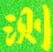

AI智能测评·精准诊断，多得分

一题一码，多题推送，自动批改，智能诊断，学习成效看得见。

开箱清单

以数学为例

★手机仅为效果展示，非实物产品组成

  
解题秘籍18课讲义×1

  
高分秘籍成长手册 $\times 1$

  
解题秘籍思维图谱 $\times 1$

  
产品使用说明书×1

  
主书讲义试读
秘籍课程试听

  
200   
关键题型速解二级结论

  
600分钟  
清北学霸解题秘籍大课

  
100余个

一线名师解题实战微课  
  
300   
AI智能测评诊断题库

  
24小时  
在线答疑
伴学小帮手  
(非工作时间12小时内答疑)

学科 数学/物理/化学/生物

定价 198元/科

微信公众号

教辅资料站

小考教辅站

初高教辅站

想多得分，就用解题秘籍！

※ 全科秘籍详情见内文倒数第二页

text_image

創于2003
试题
调研

# 创新题分类解读

考 前 必 做 38 类 高 考 创 新 题

主 编 杜志建

特约名师

赵成海

正高级教师，河北省优秀教师，省级骨干教师。中国数学奥林匹克一级教练员，中国科学技术学会、中国数学会会员。

章礼抗

安徽省正高级教师，高中数学特级教师。参编教辅用书多部，在各级各类数学杂志上发表论文100多篇，在各类报纸上发表论文近3000篇。

第8辑

新高考数学

本册编委

微信公众号

教辅资料站

小考教辅站

初高教辅站

赵成海 章礼抗 邵明志 王应祥

杨飞 邓成兵

# 图书在版编目(CIP)数据

试题调研. 第8辑 考前50天50题 新高考数学/杜志建主编. -- 乌鲁木齐：新疆青少年出版社，2022.3(2023.2重印)

ISBN 978-7-5590-8347-0

I. ①试… II. ①杜… III. ①中学数学课 - 高中 - 升学参考资料 IV. ①G634

中国版本图书馆 CIP 数据核字(2022)第 028057 号

出版人:徐江

策划:王启全

责任编辑:多艳萍

封面设计:天星美工室

试题调研·第8辑 新高考数学

SHITI DIAOYAN · DI 8 JI XINGAOKAO SHUXUE

杜志建 主编

出版:新疆青少年出版社

社 址:乌鲁木齐市北京北路29号 邮政编码:830012

电话:0991-6239223(编辑部) 0371-68698015(读者服务部)

官网:http://www.qingshao.net 天猫旗舰店:http://xjqss.tmall.com

发行:新疆青少年出版社

经销:各地新华书店 法律顾问:王冠华 18699089007

印刷:郑州市欣隆印刷有限公司

开 本:787mm×1092mm 1/16 版 次:2022年3月第1版

印 张:7
印 次:2023年2月第2次印刷

字 数:130 千字

书号:ISBN 978-7-5590-8347-0

定 价:18.90元

CHISO 青少社
SINCE 1956

版权所有，侵权必究。印装问题可随时同印厂退换。

# 声明

基于对知识和创作的尊重,本书向所选文章、图片的作者支付补贴。因条件所限未能及时联系的作者,我们在此深表歉意,当您看到本书时,请与我们联系,以便我们向您支付补贴和赠送样书。联系方式:0371-68698033。

# 练100遍老题，不如做1次创新题

# 1 聚焦前沿创新命题，传递新趋势

# 热点 1 开放性举例问题

调研 1 (2023·山东潍坊1月期末/解题喷雾式法，电声理，轻运算)

同时满足下列3个性质的函数的解析式： $f(x) =$

① $f(x)$ 是奇函数；② $f(x)$ 在 $(2,+\infty)$ 上单调递增；③ $f(x)$ 有且仅有3个零点.

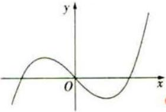

# 热点 2 结构不良问题

调研 4 （2023·湖北荆州1月联考/以立体几何为载体设置结构不良问题，命题形式新颖）在“① $AD = DD_{1} = 2A_{1}D_{1} = 2$ ; ② $AD = 2A_{1}D_{1}$ ，直线 $DB_{1}$ 与平面ABCD所成角为 $\frac{\pi}{4}$ ”这两个条件中任选一个，补充在下列问题中，并给予解答.

结构不良，开放性强（P003）

举例问题，新意十足（P001）

调研 1 （2023·安徽六安第二中学第四次月考）2022年卡塔尔世界杯是第22届国际足联世界杯，比赛于2022年11月20日至12月18日在卡塔尔境内8座球场举

行. 已知某足球的表面上有四个点 A, B, C, P 满足 PA = BC = 5, PB = AC = AB = $2\sqrt{5}$ ，则该足球的表面积为

A. $12\pi$

B. $8\pi$

C. $24\pi$

D. $28\pi$

关注体育赛事，五育并举（P011）

研究直播用户规模，贴近生活（P016）

# 聚焦创新命题情境，紧跟新变化

调研 2 （2023·广东广州铁一、广附、广外三校1月联考/在线直播）数据显示，中国在线直播用户规模及在线直播购物规模近几年都保持高速增长态势。下表为某机构统计的2017—2021年中国在线直播用户规模（单位：亿人），其中2017—2021年对应的代码依次为1—5。

<table><tr><td>年份代码x</td><td>1</td><td>2</td><td>3</td><td>4</td><td>5</td></tr><tr><td>用户规模y</td><td>3.98</td><td>4.56</td><td>5.04</td><td>5.87</td><td>6.35</td></tr></table>

参考数据： $\bar{y}=5.16,\bar{v}\approx1.68,\sum_{i=1}^{3}v_{i}y_{i}\approx45.10$ ，其中 $v_{i}=\sqrt{x_{i}}$

# 聚焦创新命题形式，拓展新视野

# 题型 1 定义新概念、新运算

调研 1 （2023·郑州 2 月一模）欧拉函数 $\varphi(n)(n \in \mathbf{N}^{*})$ 的函数值等于所有不超过正整数 n，且与 n 互素（也称互质）的正整数的个数，例如 $\varphi(1)=1, \varphi(4)=2, \varphi(9)=6.$ 则

A. 数列 $\varphi(n)$ 单调

B. $\varphi(5) < \varphi(6)$

C. 数列 $\left|\varphi(2^{n})\right|$ 是等比数列

D. $\varphi(6) = \varphi(2) + \varphi(3)$

调研 4 (2023·河北唐山一中12月模拟/融合化学中的

分子结构)多面体欧拉定理是指对于简单多面体,其各维对象数总满足一定的数量关系,在三维空间中,多面体欧拉定理可表示为: $V(\text{顶点数})+F(\text{表面数})-E(\text{棱数})=2$ . 在数学上,富勒烯的结构可看作是以五边形和六边形面组成的凸多面体,例如富勒烯 $C_{60}$ (结构图如图2)是单纯用碳原子组成的稳定分子,具有60个顶点

  
图2

跨学科融合，凸显应用（P050）

研究新定义，拓展思维（P029）

# 角度 3 抽象函数的图象推断问题

调研 1 (2023·安徽六安1月期末)已知函数 $y=f(x)$ 的

图象的一部分如图1所示,则该函数的解析式可能是()

$$
f (x) = x ^ {2} \cdot \sin x
$$

$$
f (x) = x ^ {2} \cdot \cos x
$$

微信公众号 $f(x)=\cos x\cdot\ln(\sqrt{x^{2}+1}-x)$ 教辅资料站
小考教辅站
初高教辅站

巧设新角度，专练高频题（P068）

# 4 聚焦创新命题角度，紧扣新方向

又 $f(0)=0,f(1)=e-a-1$ ，所以当 $e-a-1\leqslant0$ ，即 $e-1\leqslant a<e$ 时，函数 $f(x)$ 在区间 $(0,1)$ 上不存在零点；当 $e-a-1>0$ ，即 $1<a<e-1$ 时，函数 $f(x)$ 在区间 $(0,1)$ 上存在零点.

【1】式法1. 该函数的单调性与 $f(0)=0$ 。结合函数零点存在定性，开口函数 $f(x)\in(0,1)$ 是是否存在零点与 $f(1)$ 的取值有关。依据 $f(1)=0$ 的关系作正原则（如图3所示），零点存在情况“在图4”，又是 $(0,1)$ 点作区间， $f(x)$ 在x=0和x=1处取得零点，又若不在零点之间 $(0,1)$ 上取得零点。

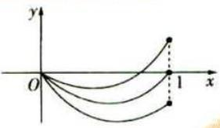

数形结合，讲解更活泼（P087）

# 目录 CONTENTS

# 聚焦前沿创新命题

热点1 开放性举例问题 001

热点 2 结构不良问题 003

热点 3 社会热点应用创新问题 008

# 聚焦创新命题情境

情境 1 关注体育赛事 011

情境 2 建设航天强国 014

情境 3 促进经济发展 015

情境4 推进教育改革 017

情境 5 关注生产生活 020

情境 6 强调立德树人 022

情境7 发现数学之美 023

情境 8 弘扬传统文化 025

情境 9 经典数学问题 028

# 聚焦创新命题形式

微信公众号教辅资料站小考教辅站初高教辅站

题型 1 定义新概念、新运算 029

题型2 接轨高等数学 033

题型3 创新函数模型 037

题型4 多选题 041

题型5 双空题 045

题型 6 跨学科融合应用 047

题型 7 知识交汇创新命题 053

题型8 关注教材中的例、习题 058

题型 9 挖掘教材中的阅读材料 061

# 聚焦创新命题角度

角度 1 充要条件与其他模块知识的创新交汇问题 065

角度 2 抽象函数的性质问题 066

角度 3 抽象函数的图象推断问题 068

角度 4 台体的体积与表面积的计算问题 069

角度 5 球与几何体的切、接问题 070

角度 6 图表类创新统计问题 073

角度 7 三角函数图象特征的研究问题 075

角度 8 以正方体为载体的动态探究问题 078

角度 9 测绘类解三角形问题 079

角度10 平面向量与其他模块知识交汇问题 081

角度 11 画展开图解决路径问题 083

角度 12 数形结合思想在零点问题中的应用 084

角度 13 分类讨论思想在函数问题中的应用 086

角度 14 立体几何中的存在性探索问题 088

角度 15 解析几何中的存在性探索问题 091

# 目录 CONTENTS

角度 16 概率与其他模块知识交汇问题 096

角度17 概率解答题中的选方案问题 101

# 下辑精彩预告 2023年3月全新上市!

# 《试题调研》第9辑将推出

——考前 50 天 50 题

《试题调研》临考预测，名师原创押题，本辑亮点抢先看：

押前沿创新题 开放性举例问题、模型应用问题、结构不良问题、社会热点创新题，紧跟教育部最新高考难度调整，创设复杂情境，让你提前进入状态！

押时事热点题 强国必先强农、建设航天强国、“中国飞人”开门红……锁定最新社会热点，传递一手信息！

押学科热点题 新定义创新问题、接轨高等数学问题、数学文化问题……高品质原创，批注式“保姆”讲解，抓热点就是抓分数！

押疑难易错题 立体几何动态探究问题、交线与截面问题等疑难问题；因作图不准致误、因分类讨论不全面致误等易错问题。精准攻克重难点，定点清除易错点！

注意⚠ 高考考的全是新试题！

natural_image

Abstract geometric shape composed of red and yellow triangular facets (no text or symbols)

# 聚焦前沿创新命题

# 热点 1 开放性举例问题

调研 1 (2023·山东潍坊 1 月期末/解题途径灵活,重思维、轻运算)写出一个同时满足下列 3 个性质的函数的解析式: $f(x)=$ \_\_\_\_.

① $f(x)$ 是奇函数；② $f(x)$ 在 $(2, +\infty)$ 上单调递增；③ $f(x)$ 有且仅有3个零点.

开放性举例问题不同于一般填空题，因其答案可以有很多个，解题时要巧用特殊思想、数形结合等方法，根据①中奇函数这一性质判断函数图象关于原点对称，为简化思考量，不妨假设函数的定义域为R，则 $f(0)=0$ ，即得到一个零点，结合③知函数还有2个互为相反数的零点，再结合条件②，便不难想象出 $f(x)$ 的大致图象（如图1）

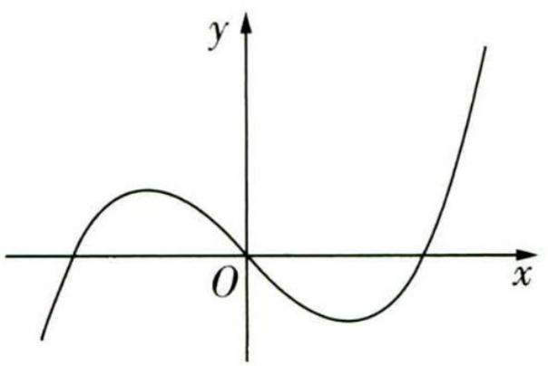

text_image

y
O
x

图1

解析 $f(x)$ 是奇函数, 不妨假设 $f(x)$ 的定义域为 $\mathbf{R}$ , 则 $f(0) = 0$ , 且函数 $f(x)$ 的图象关于原点对称.

因为函数 $f(x)$ 有且仅有3个零点,所以除x=0外,还有2个互为相反数的零点.

由题意知函数 $f(x)$ 在 $(2, +\infty)$ 上单调递增, 结合图象的对称性知 $f(x)$ 在 $(-\infty, -2)$ 上单调递增,

所以 $f(x)$ 在 $\mathbf{R}$ 上的图象呈“↗↘”的趋势,不妨令函数零点为 $x =  - 1,x = 0,x = 1$ ,即可得到一个

【巧取特值】要保证函数 $f(x)$ 在 $(2, +\infty)$ 上单调递增，若函数 $f(x)$ 有极小值点，则其极小值点属于区间 $(0,2]$ ，据此预估函数零点的取值情况，优先考虑整数

满足题意的函数解析式 $f(x) = x(x + 1)(x - 1)$ ，检验知满足题意。故答案可以是 $x(x + 1)(x - 1)$ （答案不唯一）。

秒杀解 考虑最简单的情形—— $f(x)$ 的图象是折线,根据题中条件先画出草图,分段写出解析式,再整合起来将 $f(x)$ 的解析式写为分段形式,即可得解.

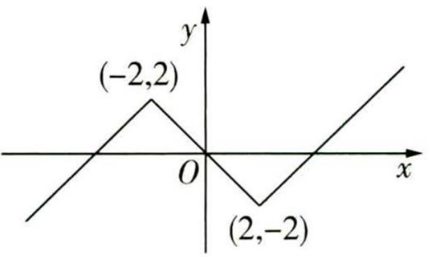

line

| Point | x | y |
|---|---|---|
| (-2, 2) | -2 | 2 |
| (2, -2) | 2 | -2 |

图 2

作出 $f(x)$ 的大致图象,如图2,检验知该图象符合题意,则函数

微信公众号
教辅资料解析式可以为 $f(x)=\left\{\begin{aligned}&x+4,x\leqslant-2,\\&-x,-2<x\leqslant2,\\&x-4,x>2.\end{aligned}\right.$

答案 $x(x + 1)(x - 1)$ （答案不唯一）

《普通高等学校本科专业目录》是在教育部颁布的《普通高等学校本科专业目录(2020年版)》基础上,增补近年来批准增设的目录外新专业而形成的.截至2022年2月,我国普通教育本科专业共设置12个学科门类(不含军事学).

# 名师叮咛

考场上时间有限，加上多数考生会紧张慌乱，这就导致很多考生出现“考试时间不够用、题目做不完”的问题，因此在复习备考中要特别注意训练解题速度，尤其是选填题，要用尽可能短的时间做完，给后面的解答题留足时间，这就需要同学们灵活选择解题途径，“速战速决”.

调研 2 (2023·山东济南 1 月期末/巧妙交汇函数的性质和直线与圆的位置关系, 角度新颖) 已知函数 $f(x) = \mathrm{e}^{x} - \mathrm{e}^{2 - x}$ , 所有满足 $f(a) + f(b) = 0$ 的点 $(a, b)$ 中, 有且只有一个点在圆 $C$ 上, 则圆 $C$ 的标准方程可以是\_\_\_\_. (写出一个满足条件的圆 $C$ 的标准方程即可)

实质是由所有满足条件的点 $(a,b)$ 组成的图象与圆C相切，且切点只有一个，解题的目标即转化为研究点 $(a,b)$ 的坐标特征

解析 由 $f(x)=\mathrm{e}^{x}-\mathrm{e}^{2-x}$ 得 $f'(x)=\mathrm{e}^{x}+\mathrm{e}^{2-x}$ ，因为 $f'(x)>0$ ，所以 $f(x)$ 在定义域R上单调递增.

又 $f(2-x)=\mathrm{e}^{2-x}-\mathrm{e}^{x}=-f(x)$ ，所以 $f(a)=-f(2-a)$ .

【会观察】观察 $f(x)$ 解析式的结构，指数x与2-x隐含了对称性的信息，因此大胆猜想函数 $f(x)$ 的图象具有对称性，代值计算证明自己的猜想无误，解题思路即可顺畅无阻

又 $f(a) + f(b) = 0$ ，所以 $f(2 - a) = f(b)$ ，所以 $b = 2 - a$ ，即 $a + b - 2 = 0$

因为所有满足 $f(a)+f(b)=0$ 的点 $(a,b)$ 中,有且只有一个点在圆C上,

所以直线 $x + y - 2 = 0$ 与圆 C 相切, 假设圆心为 $C(0,0)$ , 则圆 C 的半径 $r = d = \frac{|-2|}{\sqrt{1+1}} = \sqrt{2}$ (d 为点 C 到直线 $x + y - 2 = 0$ 的距离), 所以圆 C 的标准方程可以是 $x^{2} + y^{2} = 2$ .

【小题速解】本题具有一定开放性,圆的半径受条件限制只能与圆心到定直线 $x + y - 2 = 0$ 的距离相等,圆心的位置不确定,因此考虑最容易计算的情形——圆心在原点处,即可得到结果, 这样能提升解题速度

答案 $x^{2}+y^{2}=2$ (答案不唯一)

调研 3 (2023·河南信阳高级中学1月一模/解题切口多样,直接影响破题速度,区分度高)写出同时满足下列条件①②的直线 $l$ 的方程: \_\_\_\_. (写出一个满足条件的答案即可)

微信公众号教辅资料站小考教辅站初高教辅站

①在 $y$ 轴上的截距为2；②与双曲线 $\frac{x^{2}}{4}-\frac{y^{2}}{3}=1$ 只有一个交点.

站 该条件是突破口,根据截距可设出直线的斜截式方程,直线的斜率未知,可根据直线与已知双曲线只有一个交点(联立直线与双曲线的方程,消去一元后所得方程有一根或两个相等的实数根)求出斜率

大学专业

12个学科门类包括人文和社会科学8个(哲学、经济学、法学、教育学、文学、历史学、管理学、艺术学),自然科学4个(理学、工学、农学、医学).

解析 因为直线 l 在 y 轴上的截距为 2, 所以设直线 l 的方程为 $y = kx + 2$ ,

与双曲线方程 $3x^{2}-4y^{2}=12$ 联立并消去y得关于x的方程 $(3-4k^{2})x^{2}-16kx-28=0$ .

【易错陷阱】k 的值未知，则该方程二次项系数待定，可能为 0，需要分类讨论，切勿将其直接当成一元二次方程

当 $3 - 4k^{2} = 0$ 时， $k = \pm \frac{\sqrt{3}}{2}$ ，满足题意，此时直线 $l$ 的方程为 $y = \frac{\sqrt{3}}{2} x + 2$ 或 $y = -\frac{\sqrt{3}}{2} x + 2$ .

当 $3 - 4k^{2} \neq 0$ 时, 一元二次方程 $(3 - 4k^{2})x^{2} - 16kx - 28 = 0$ 的根的判别式 $\Delta = (-16k)^{2} - 4 \times (3 - 4k^{2}) \times (-28)$ , 要满足题意, 需令 $\Delta = 0$ , 解得 $k = \pm \frac{\sqrt{7}}{2}$ , 此时直线 $l$ 的方程为 $y = \frac{\sqrt{7}}{2} x + 2$ 或 $y = -\frac{\sqrt{7}}{2} x + 2$ .

故直线 l 的方程为 $y=\frac{\sqrt{3}}{2}x+2$ 或 $y=-\frac{\sqrt{3}}{2}x+2$ 或 $y=\frac{\sqrt{7}}{2}x+2$ 或 $y=-\frac{\sqrt{7}}{2}x+2$ . (只写出其中之一即可)

秒杀解 如图3,作出双曲线及其一条渐近线 $y = \frac{\sqrt{3}}{2}x$ (图中虚
【会思考】看到直线与双曲线的交点问题，即联想双曲线的渐近线，
用渐近线作桥梁，平移或旋转，问题即可迎刃而解
线直线),将渐近线向上平移2个单位长度,所得直线(图中实线直线)
刚好满足条件①②,则答案可为 $y = \frac{\sqrt{3}}{2}x + 2$ .

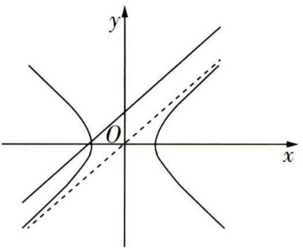

text_image

y
O
x

图3

答案 $y = \frac{\sqrt{3}}{2} x + 2$ 或 $y = -\frac{\sqrt{3}}{2} x + 2$ 或 $y = \frac{\sqrt{7}}{2} x + 2$ 或 $y = -\frac{\sqrt{7}}{2} x + 2$ （任选其一填写即可）

# 热点 2 结构不良问题

调研 4 (2023·湖北荆州 1 月联考/以立体几何为载体设置结构不良问题, 命题形式新颖) 在“① $AD = DD_{1} = 2A_{1}D_{1} = 2$ ; ② $AD = 2A_{1}D_{1}$ , 直线 $DB_{1}$ 与平面 $ABCD$ 所成角为 $\frac{\pi}{4}$ ”这两个条件中任选一个,补充在下列问题中,并给予解答.

如图4所示,四棱台 $ABCD - A_{1}B_{1}C_{1}D_{1}$ 的上、下底面均为正方形,且 $DD_{1} \perp$ 底面ABCD.

(1) 证明: $AC \perp BD_{1}$ .   
(2) 若 , 求二面角 $A - BB_{1} - C$ 的正弦值.

注:如果选择两个条件分别解答,按第一个解答计分.

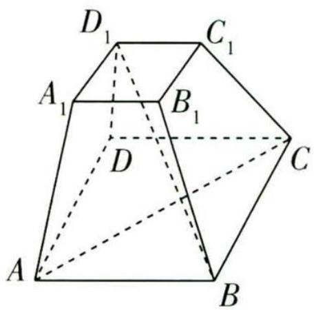

text_image

D₁
C₁
A₁
B₁
D
C
A
B

图4

哲学 哲学以各门具体科学为基础,以整个世界的普遍规律为研究对象,又对具体学科进行理论指导.该专业旨在为各类社会工作机构等培养具有较高哲学素养、教学水平和研究能力的专门人才.

思维导引 (1)从证明对象入手分析:

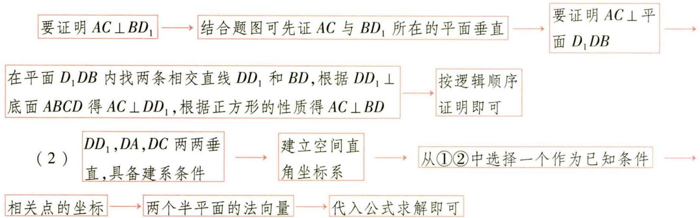

flowchart

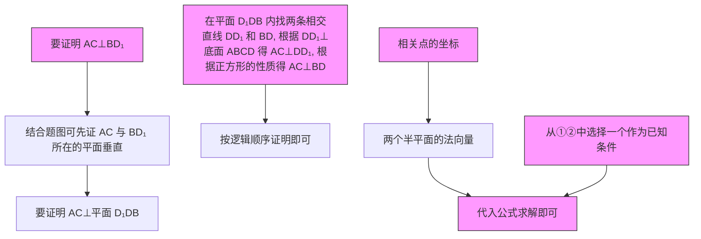
```mermaid
graph TD
    A["要证明 AC⊥BD₁"] --> B["结合题图可先证 AC 与 BD₁ 所在的平面垂直"]
    B --> C["要证明 AC⊥平面 D₁DB"]
    D["在平面 D₁DB 内找两条相交直线 DD₁ 和 BD, 根据 DD₁⊥底面 ABCD 得 AC⊥DD₁, 根据正方形的性质得 AC⊥BD"] --> E["按逻辑顺序证明即可"]
    F["相关点的坐标"] --> G["两个半平面的法向量"]
    G --> H["代入公式求解即可"]
    I["从①②中选择一个作为已知条件"] --> H
    style A fill:#f9f,stroke:#333
    style D fill:#f9f,stroke:#333
    style F fill:#f9f,stroke:#333
    style I fill:#f9f,stroke:#333
    style H fill:#f9f,stroke:#333
```

解析 (1) $\because DD_{1} \perp$ 平面 $ABCD, AC \subset$ 平面 $ABCD, \therefore AC \perp DD_{1}$ .

连接 BD, ∵ 四边形 ABCD 为正方形, ∴ AC ⊥ BD.

则 $\left\{ \begin{array}{l}AC\perp BD,\\ AC\perp DD_{1},\\ DD_{1}\cap BD = D,\\ DD_{1},BD\subset \text{平面} D_{1}DB, \end{array} \right.$ 则 $AC\perp$ 平面 $D_{1}DB$ ，又 $BD_{1}\subset$ 平面 $D_{1}DB$ ，故 $AC\perp BD_{1}$

【防错妙招】利用相关判定、性质定理证明空间中线、面位置关系时,可以像这样把证明所需的条件用花括号整理在一起,有助于条件不重、不漏

(2)由题意知 $DD_{1}, DA, DC$ 两两垂直, 故以 $D$ 为坐标原点, $\overrightarrow{DA}, \overrightarrow{DC}, \overrightarrow{DD_{1}}$ 的方向分别为 $x$ 轴, $y$ 轴, $z$ 轴的正方向, 建立如图5所示的空间直角坐标系.

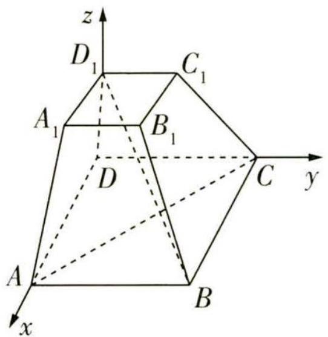

text_image

z
D₁
C₁
A₁
B₁
D
C
y
A
B
x

图 5

若选①,解题过程如下.

$$
\begin{array}{l} A (2, 0, 0), B (2, 2, 0), C (0, 2, 0), B _ {1} (1, 1, 2), \\ \therefore \overrightarrow {B _ {1} B} = (1, 1, - 2), \overrightarrow {B C} = (- 2, 0, 0), \overrightarrow {B A} = (0, - 2, 0). \\ \end{array}
$$

设平面 $AA_{1}B_{1}B$ 与平面 $BB_{1}C_{1}C$ 的法向量分别为 $\boldsymbol{n}_{1}=(x_{1},y_{1},z_{1}),\boldsymbol{n}_{2}=(x_{2},y_{2},z_{2})$ .

$\left\{ \begin{array}{l} \boldsymbol{n}_{1} \cdot \overrightarrow{B_{1}B} = x_{1} + y_{1} - 2z_{1} = 0, \\ \boldsymbol{n}_{1} \cdot \overrightarrow{BA} = -2y_{1} = 0, \end{array} \right.$ 令 $z_{1} = 1$ ，则 $\boldsymbol{n}_{1} = (2,0,1)$ 为平面 $AA_{1}B_{1}B$ 的一个法向量.

$\left\{ \begin{array}{l} \boldsymbol{n}_{2} \cdot \overrightarrow{B_{1}B} = x_{2} + y_{2} - 2z_{2} = 0, \\ \boldsymbol{n}_{2} \cdot \overrightarrow{BC} = -2x_{2} = 0, \end{array} \right.$ 令 $z_{2} = 1$ ，则 $\boldsymbol{n}_{2} = (0,2,1)$ 为平面 $BB_{1}C_{1}C$ 的一个法向量.

设二面角 $A - BB_{1} - C$ 的大小为 $\theta$ ，则 $|\cos \theta | = \frac{|\pmb{n}_1\cdot\pmb{n}_2|}{|\pmb{n}_1||\pmb{n}_2|} = \frac{1}{\sqrt{5}\times\sqrt{5}} = \frac{1}{5},$

【易遗漏】不确定二面角 $A - BB_{1} - C$ 的大小，所以余弦值的正负未知，不要遗漏绝对值$\therefore \sin \theta = \sqrt{1 - \cos^2\theta} = \frac{2\sqrt{6}}{5}$ , 即二面角 $A - BB_{1} - C$ 的正弦值为 $\frac{2\sqrt{6}}{5}$ .

若选②,解题过程如下.

设 $AD = 2b, A_{1}D_{1} = b, DD_{1} = a$ ，则 $\overrightarrow{DB_{1}} = (b, b, a)$ ，易知底面 ABCD 的一个法向量为 $\boldsymbol{m} = (0, 0, 1)$ ，

由题意得 $|\cos \langle \overrightarrow{DB_1},\pmb {m}\rangle | = \frac{a}{\sqrt{2b^2 + a^2}} = \sin \frac{\pi}{4} = \frac{\sqrt{2}}{2},\therefore a^2 = 2b^2$ ，设 $b = 1$ ，则 $a = \sqrt{2}$

故 $AD = 2, A_{1}D_{1} = 1, DD_{1} = \sqrt{2}, \therefore A(2,0,0), B(2,2,0), C(0,2,0), B_{1}(1,1,\sqrt{2})$ , $\therefore \overrightarrow{AB} = (0,2,0), \overrightarrow{BB_{1}} = (-1, -1, \sqrt{2}), \overrightarrow{CB} = (2,0,0)$ ,

设平面 $ABB_{1}A_{1}$ 和平面 $BB_{1}C_{1}C$ 的法向量分别为 $s=(x_{1},y_{1},z_{1})$ , $t=(x_{2},y_{2},z_{2})$ .

$\left\{ \begin{array}{l} s \cdot \overrightarrow{AB} = 2y_1 = 0, \\ s \cdot \overrightarrow{BB_1} = -x_1 - y_1 + \sqrt{2}z_1 = 0, \end{array} \right.$ 令 $x_1 = \sqrt{2}$ , 则 $s = (\sqrt{2}, 0, 1)$ 为平面 $ABB_1A_1$ 的一个法向量.

$\left\{ \begin{array}{l} t \cdot \overrightarrow{CB} = 2x_{2} = 0, \\ t \cdot \overrightarrow{BB_{1}} = -x_{2} - y_{2} + \sqrt{2}z_{2} = 0, \end{array} \right.$ 令 $z_{2} = 1$ ，则 $t = (0, \sqrt{2}, 1)$ 为平面 $BB_{1}C_{1}C$ 的一个法向量.

设二面角 $A - BB_{1} - C$ 的大小为 $\theta$ ，则 $|\cos \theta | = \frac{|\pmb{s}\cdot\pmb{t}|}{|\pmb{s}||\pmb{t}|} = \frac{1}{\sqrt{3}\times\sqrt{3}} = \frac{1}{3},$

$\therefore \sin \theta = \sqrt{1 - \cos^2\theta} = \sqrt{1 - \frac{1}{9}} = \frac{2\sqrt{2}}{3}$ , 即二面角 $A - BB_{1} - C$ 的正弦值为 $\frac{2\sqrt{2}}{3}$ .

调研 5 (2023·四川内江1月一模/交汇平面向量与三角函数,命题角度新颖)已知向量 $\boldsymbol{m} = (\sqrt{3} \sin \frac{x}{2}, 1)$ , $\boldsymbol{n} = (\cos \frac{x}{2}, \sin^{2} \frac{x}{2})$ , 设函数 $f(x) = \boldsymbol{m} \cdot \boldsymbol{n}$ .

(1) 若 $f(x)=0$ , 求 $\sin(2x+\frac{\pi}{6})$ 的值.

(2) 设 $\triangle ABC$ 的内角 $A, B, C$ 所对的边分别为 $a, b, c$ , 且 \_\_\_\_, 求 $f(B)$ 的取值范围.

从下面两个条件中任选一个,补充在上面的横线上并作答.

① $\frac{\sqrt{3}c}{a\cos B}+\tan A+\tan B=0$ ; ② $(2c+b)\cos A+a\cos B=0$ .

注:若选择多个条件分别解答,按第一个解答计分.

经济学 经济学专业培养比较熟练掌握现代经济分析方法,能在综合经济管理部门、政策研究部门、金融机构和企业从事经济分析、预测、规划和经济管理工作的人才.

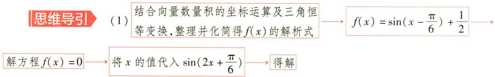

text_image

思维导引 (1) 结合向量数量积的坐标运算及三角恒等变换,整理并化简得f(x)的解析式 → f(x) = sin(x - π/6) + 1/2 →
解方程f(x) = 0 → 将x的值代入sin(2x+π/6) → 得解

(2) 结合正弦定理、三角恒等变换及三角形内角的取值范围得 A 的值 $\rightarrow$ B 的取值范围 $\rightarrow$ f(B) 的取值范围

解析 (1) 因为 $m = (\sqrt{3} \sin \frac{x}{2}, 1), n = (\cos \frac{x}{2}, \sin^2 \frac{x}{2})$

所以 $f(x)=\boldsymbol{m}\cdot\boldsymbol{n}=\sqrt{3}\sin\frac{x}{2}\cos\frac{x}{2}+\sin^{2}\frac{x}{2}=\frac{\sqrt{3}}{2}\sin x+\frac{1-\cos x}{2}=\sin\left(x-\frac{\pi}{6}\right)+\frac{1}{2}.$

令 $f(x)=0$ ，即 $\sin\left(x-\frac{\pi}{6}\right)+\frac{1}{2}=0,\sin\left(x-\frac{\pi}{6}\right)=-\frac{1}{2}$

所以 $x - \frac{\pi}{6} = 2k\pi - \frac{\pi}{6}$ 或 $x - \frac{\pi}{6} = 2k\pi + \frac{7\pi}{6}, k \in Z,$

所以 $x = 2k\pi$ 或 $x = 2k\pi + \frac{4\pi}{3}, k \in \mathbf{Z}$ .

当 $x = 2k\pi, k \in \mathbf{Z}$ 时， $\sin \left(2x + \frac{\pi}{6}\right) = \sin \left(4k\pi + \frac{\pi}{6}\right) = \frac{1}{2}$ ;

当 $x = 2k\pi + \frac{4\pi}{3}, k \in \mathbf{Z}$ 时, $\sin (2x + \frac{\pi}{6}) = \sin (4k\pi + \frac{8\pi}{3} + \frac{\pi}{6}) = \sin \frac{5\pi}{6} = \frac{1}{2}$ .

综上, $\sin(2x+\frac{\pi}{6})=\frac{1}{2}.$

(2) 若选①, 解题过程如下.

由 $\frac{\sqrt{3}c}{a\cos B} + \tan A + \tan B = 0$ 及正弦定理可得 $\frac{\sqrt{3}\sin C}{\sin A\cos B} + \frac{\sin A}{\cos A} + \frac{\sin B}{\cos B} = 0$ ，即 $\frac{\sqrt{3}\sin C}{\sin A\cos B} + \frac{\sin A\cos B + \sin B\cos A}{\cos A\cos B} = 0$ ，即 $\frac{\sqrt{3}\sin C}{\sin A\cos B} + \frac{\sin(A + B)}{\cos A\cos B} = \frac{\sqrt{3}\sin C}{\sin A\cos B} + \frac{\sin C}{\cos A\cos B} = 0.$

因为 $\sin C\neq0$ ，所以 $\sqrt{3}\cos A+\sin A=0$ ，解得 $\tan A=-\sqrt{3}$ .

【易遗漏】等式两边同时除以一个代数式，要先强调该代数式不能为0

由 $0 < A < \pi$ ，得 $A = \frac{2\pi}{3}$ 所以 $0 < B < \frac{\pi}{3}$ 所以 $-\frac{\pi}{6} < B - \frac{\pi}{6} < \frac{\pi}{6}$ 得 $0 < \sin (B - \frac{\pi}{6}) + \frac{1}{2} < 1$ 即 $f(B)$ 的取值范围是(0,1).

若选②,解题过程如下.

由 $(2c + b)\cos A + a\cos B = 0$ 及正弦定理可得 $2\sin C\cos A + \sin B\cos A + \sin A\cos B = 0$ 即 $2\sin C\cos A + \sin (A + B) = 2\sin C\cos A + \sin C = 0.$

由于 $\sin C \neq 0$ ，所以 $\cos A = -\frac{1}{2}$ ，由 $0 < A < \pi$ ，得 $A = \frac{2\pi}{3}$ ，所以 $0 < B < \frac{\pi}{3}$ ，

所以 $-\frac{\pi}{6}<B-\frac{\pi}{6}<\frac{\pi}{6}$ ，得 $0<\sin\left(B-\frac{\pi}{6}\right)+\frac{1}{2}<1$ ，即 $f(B)$ 的取值范围是 $(0,1)$ .

调研 6 (2023·安徽师范大学附属中学1月期末/融合实际应用与结构不良问题,角度新颖且应用性强)如图6所示,一个仓库由上部屋顶和下部主体两部分组成,上部屋顶可视作四棱锥 $P - ABCD$ , 四边形 $ABCD$ 是正方形, 点 $O$ 为正方形 $ABCD$ 的中心, $PO \perp$ 平面 $ABCD$ ; 下部主体可视作长方体 $ABCD - A_{1}B_{1}C_{1}D_{1}$ . 已知上部屋顶造价与屋顶面积成正比, 比例系数为 $k (k > 0)$ , 下部主体造价与主体高度成正比, 比例系数为 $4k$ . 现欲建造一个上、下总高度为 12, $AB = 6$ 的仓库.

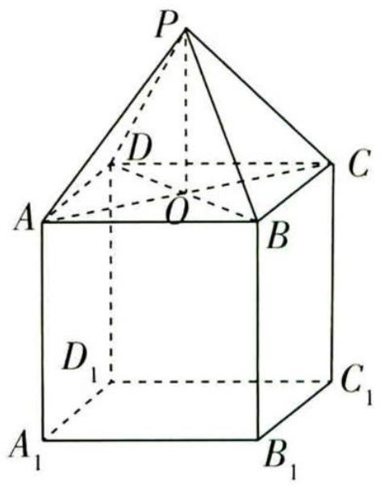

text_image

P
D
A
O
B
C
D₁
A₁
B₁
C₁

图6

(1)①若上部屋顶的高 PO = x, 请将总造价表示为关于 x 的函数;  
②若上部屋顶侧面与底面所成锐二面角为 $\theta$ ，请将总造价表示为关于 $\theta$ 的函数.  
(2)选择(1)中的一个方案,求出总造价的最小值.

解析 (1)①由题意可知 $AC = \sqrt{6^2 + 6^2} = 6\sqrt{2}, OC = 3\sqrt{2}$ , 则 $PB = PC = \sqrt{x^2 + 18}$ .

所以 $S_{\triangle PBC}=\frac{1}{2}\times6\times\sqrt{x^{2}+18-9}=3\sqrt{x^{2}+9}$ ,

【抓题眼】根据信息“已知上部屋顶造价与屋顶面积成正比，比例系数为 $k(k>0)$ ，下部主体造价与主体高度成正比，比例系数为 $4k$ ”知，求总造价的关键是求出上部屋顶的面积和下部主体的高度

故上部屋顶造价为 $k \times 4 \times 3 \sqrt{x^{2} + 9} = 12k \sqrt{x^{2} + 9}$ .

由题意知 $AA_{1}=12-x$ ，所以下部主体造价为 $4k(12-x)$ .

故总造价 $y=12k\sqrt{x^{2}+9}+4k(12-x)$ , $x\in(0,12)$ .

【易错】注意实际问题中自变量的取值范围不要遗漏

②如图7,设BC的中点为E,连接PE,OE,则OE=3.

由于 $PO \perp$ 平面 ABCD, 则 $PO \perp OE$ .

在 Rt△POE 中, 由二面角的定义可知 ∠PEO = θ,

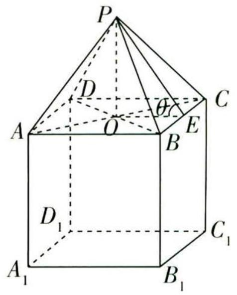

text_image

P
D
θ
A
O
B
C
E
D₁
C₁
A₁
B₁

图 7

法学 该类专业旨在培养了解法学的基本理论和基本知识、受到法学思维和法律实务的基本训练、具有运用法学理论和方法分析问题和运用法律管理事务与解决问题的基本能力的人才.

则 $PO = 3 \tan \theta, PE = \frac{3}{\cos \theta}$ ，上部屋顶面积 $S = 4S_{\triangle PBC} = \frac{36}{\cos \theta}$ ，下部主体高度 $h = 12 - 3 \tan \theta$ ，
所以总造价 $y = S \cdot k + h \cdot 4k = 12k \cdot \frac{3 - \sin \theta}{\cos \theta} + 48k, \theta \in (0, \frac{\pi}{2})$ .

(2) 若选择①, 解题过程如下.

总造价 $y=4k(3\sqrt{x^{2}+9}+12-x)$ , $x\in(0,12)$ ,

令 $g(x)=3\sqrt{x^{2}+9}+12-x,x\in(0,12)$ ，则 $g'(x)=\frac{3x}{\sqrt{x^{2}+9}}-1=\frac{3-\sqrt{1+\frac{9}{x^{2}}}}{\sqrt{1+\frac{9}{x^{2}}}}$ .

当 $\frac{3\sqrt{2}}{4}<x<12$ 时, $g'(x)>0$ ;当 $0<x<\frac{3\sqrt{2}}{4}$ 时, $g'(x)<0$ .

所以函数 $g(x)$ 在 $(0, \frac{3\sqrt{2}}{4})$ 上单调递减，在 $(\frac{3\sqrt{2}}{4}, 12)$ 上单调递增.

故总造价的最小值为 $4k \cdot g\left(\frac{3\sqrt{2}}{4}\right) = (24\sqrt{2} + 48)k.$

若选择②,解题过程如下.

设 $f(\theta)=\frac{3-\sin\theta}{\cos\theta}(0<\theta<\frac{\pi}{2})$ ，则 $f'(\theta)=\frac{3\sin\theta-1}{\cos^{2}\theta}$ .

令 $f'(\theta)=0$ ，得 $\sin\theta=\frac{1}{3}$ ，令 $0<x_{0}<\frac{\pi}{2}$ ， $\sin x_{0}=\frac{1}{3}$ ，则 $\cos x_{0}=\frac{2\sqrt{2}}{3}$ ，

所以当 $0 < \theta < x_{0}$ 时， $f'(\theta) < 0, f(\theta)$ 在 $(0, x_{0})$ 上单调递减；当 $x_{0} < \theta < \frac{\pi}{2}$ 时， $f'(\theta) > 0$ ， $f(\theta)$ 在 $(x_{0}, \frac{\pi}{2})$ 上单调递增.

所以当 $\theta = x_0$ 时, $f(\theta)$ 取得最小值, 此时总造价取最小值, 为 $12k \cdot \frac{3 - \sin x_0}{\cos x_0} + 48k = (24\sqrt{2} + 48)k$ .

# 热点 3 社会热点应用创新问题

调研 7 (名师原创/科幻巨著《三体》)中国作家刘慈欣凭借科幻小说《三体》获第73届雨果奖最佳长篇小说奖,这是亚洲人首次获得雨果奖,也是中国科幻走出国门、走向世界的重要一步.随着《三体》动画和《三体》电视剧分别于2022年12月和2023年1月上线,《三体》再一次引起观众的广泛关注和讨论.小说中三体文明使用强互作用力材料制成的宇宙探测器,因为其外形与水滴相似,所以被称为“水滴”.小王是《三体》的忠实读者,他利用几何作图软件画出了他心目中的“水滴”:如图8,由线段AB,AC和优弧BC围成,AB,AC与优弧BC所在的圆分别切于点B,C,B,C所在的直线与水平方向垂直.已知“水滴”的水平宽度与竖直高度之比为7:4,则 $\cos\angle BAC=$

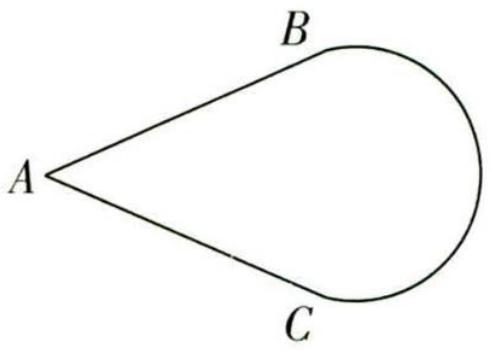

text_image

A
B
C

图8

( )

A. $\frac{17}{25}$

B. $\frac{4 \sqrt{3}}{7}$

C. $\frac{4}{5}$

D. $\frac{\sqrt{5}}{7}$

解析 设优弧 BC 的圆心为 O, 半径为 R, 连接 OA, OB, OC, 如图 9 所示.

易知“水滴”的水平宽度为 $OA + R$ ，竖直高度为 2R，则由题意知 $\frac{OA + R}{2R} = \frac{7}{4}$ ，得 $OA = \frac{5}{2}R$ .

【抓题眼】根据关键信息“‘水滴’的水平宽度与竖直高度之比为7:4”，列出水平宽度与竖直高度满足的关系式

因为 AB 与优弧 BC 所在的圆相切于点 B, 所以 OB ⊥ AB,

所以在 Rt△ABO 中， $\sin\angle BAO=\frac{OB}{OA}=\frac{R}{\frac{5}{2}R}=\frac{2}{5}$

由对称性可知， $\angle BAO = \angle CAO$ ，则 $\angle BAC = 2\angle BAO$

所以 $\cos\angle BAC=1-2\sin^{2}\angle BAO=1-2\times\left(\frac{2}{5}\right)^{2}=\frac{17}{25}$ . 故选 A.

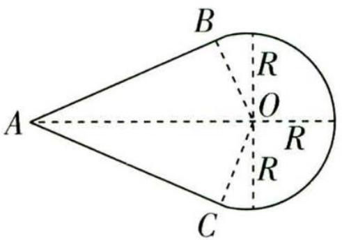

text_image

A
B
R
O
R
C

图9

答案 A

调研 8 (2023·郑州 2 月一模)如图 10 所示,河南博物院主展馆的主体建筑以元代登封古观星台为原型,经艺术夸张演绎成“戴冠的金字塔”造型,冠部为“方斗”形,上扬下覆,取上承“甘露”、下纳“地气”之意.冠部以及冠部下方均可视为正四棱台.已知一个“方斗”的上底面与下底面的面积之比为 1:4,高为 2,体积为 $\frac{56}{3}$ ,则该“方斗”的侧面积为

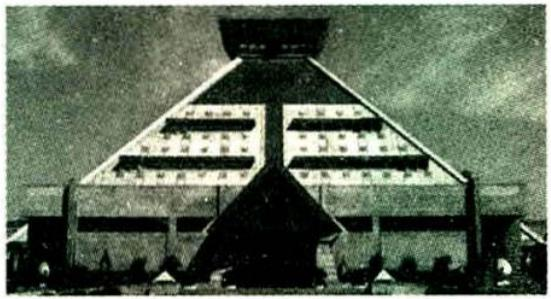

natural_image

Exterior view of a modern building with triangular roof structure and large windows (no visible text or symbols)

图 10

A. 24

B. 12

C. $24\sqrt{5}$

D. ${12}\sqrt{5}$

解析 由“方斗”的上底面与下底面的面积之比为 $1:4$ , 可设上底面与下底面的面积分别为 $x, 4x, x > 0$ .

则“方斗”的体积 $V=\frac{1}{3}\times2\times(x+4x+\sqrt{x\cdot4x})=\frac{56}{3}$ ，解得 x=4，

所以上底面与下底面的面积分别为 4,16, 所以上底面与下底面的边长分别为 2,4.

教育学 教育学专业旨在培养具有较高的教育理论素养、较强的教学能力及一定的教育管理和教育科研能力的人才.

作出“方斗”过上、下底面中点及上底面一条边的中点的截面 ABCD 的示意图, 如图 11 所示, 过点 D 作 $DE \perp BC$ 于点 E.

【数形结合】“方斗”的侧面由4个全等梯形组成,求面积的关键在于求高,在直角三角形中借助勾股定理即可求出侧面梯形的高

在 Rt△DEC 中, $EC=\frac{4-2}{2}=1$ ,DE=2,所以 $DC=\sqrt{1^{2}+2^{2}}=\sqrt{5}$ .

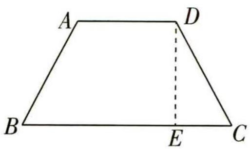

text_image

A
D
B
E
C

图 11

所以侧面梯形的面积为 $(2+4)\times\sqrt{5}\times\frac{1}{2}=3\sqrt{5}$ ，所以该“方斗”的侧面积为 $12\sqrt{5}$ ，故选D.

# 答案 D

调研 9 (名师原创/热门电影《流浪地球2》)2023年春节期间,《流浪地球2》这部依托工业化摄制流程完成拍摄的电影,展现出了中国电影日益精进的工业实力.电影《流浪地球》系列作为近些年来中国科幻现象级大片,受到广泛关注.如果说《流浪地球》标志着中国重工业科幻的起跳点,那么《流浪地球2》则代表了目前中国重工业电影奇观制作水平.某网络调查机构调查了大量观众的评分,得到如下统计表.

<table><tr><td>评分</td><td>1</td><td>2</td><td>3</td><td>4</td><td>5</td><td>6</td><td>7</td><td>8</td><td>9</td><td>10</td></tr><tr><td>频率</td><td>0.03</td><td>0.03</td><td>0.02</td><td>0.03</td><td>0.04</td><td>0.05</td><td>0.08</td><td>0.15</td><td>0.21</td><td>0.36</td></tr></table>

(1) 求观众评分的平均数.  
(2) 视频率为概率, 若在评分大于等于 8 分的观众中随机抽取 1 人, 他的评分恰好是 10 分的概率是多少?  
(3) 视频率为概率, 在评分大于等于 8 分的观众中随机抽取 4 人, 用 $\xi$ 表示评分为 10 分的人数, 求 $\xi$ 的分布列及数学期望.

解析 (1) 设观众评分的平均数为 $\overline{x}$ , 则 $\overline{x} = 1 \times 0.03 + 2 \times 0.03 + 3 \times 0.02 + 4 \times 0.03 + 5 \times 0.04 + 6 \times 0.05 + 7 \times 0.08 + 8 \times 0.15 + 9 \times 0.21 + 10 \times 0.36 = 8.02$ .

(2) 设 $A$ 表示事件“1 位观众评分大于等于 8 分”, $B$ 表示事件“1 位观众评分是 10 分”,

则 $P(B|A) = \frac{P(AB)}{P(A)} = \frac{0.36}{0.15 + 0.21 + 0.36} = \frac{1}{2}.$

(3) 由题意知 $\xi \sim B(4, \frac{1}{2}), P(\xi = k) = C_4^k (1 - \frac{1}{2})^{4 - k} (\frac{1}{2})^k = C_4^k (\frac{1}{2})^4 (k = 0, 1, 2, 3, 4)$ .

则 $\xi$ 的分布列为

<table><tr><td>ξ</td><td>0</td><td>1</td><td>2</td><td>3</td><td>4</td></tr><tr><td>P</td><td> $\frac{1}{16}$ </td><td> $\frac{1}{4}$ </td><td> $\frac{3}{8}$ </td><td> $\frac{1}{4}$ </td><td> $\frac{1}{16}$ </td></tr></table>

所以 $E(\xi)=0\times\frac{1}{16}+1\times\frac{1}{4}+2\times\frac{3}{8}+3\times\frac{1}{4}+4\times\frac{1}{16}=2.$

【另解】也可以直接利用二项分布的期望求解公式得 $E(\xi)=4\times\frac{1}{2}=2$

# 聚焦创新命题情境

# 情境 1 关注体育赛事

调研 1 (2023·安徽六安第二中学第四次月考)2022年卡塔尔世界杯是第22届国际足联世界杯,比赛于2022年11月20日至12月18日在卡塔尔境内8座球场举行.已知某足球的表面上有四个点A,B,C,P满足PA=BC=5,PB=AC= $\sqrt{11}$ ,PC=AB= $2\sqrt{5}$ ,则该足球的表面积为()

A. ${12\pi }$

B. $8\pi$

C. ${24\pi }$

D. ${28\pi }$

解析 $PA = BC, PB = AC, PC = AB$ , 则 $A, B, C, P$ 四点两两连线构成对棱相等的四面体, 将该四面体补形成长方体, 四面体各棱可看作长方体各面的对角线, 如图 1 所示, 则该足球的表面积即四面体 【读懂题意】题于可以简化为已知对棱相等的四面体, 求该四面体的外接球表面积, 但该四面体的外接球半径不易直接求解, 联想补形法,将四面体补形为长方体, 外接球半径就易于求解了. 题设中给出的三个长度, 实际为该长方体的三条面对角线长

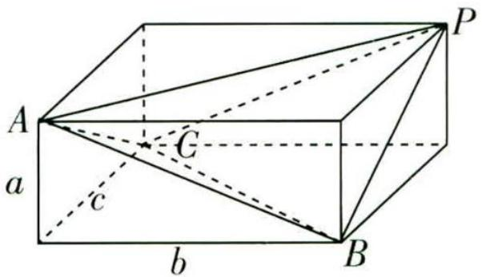

text_image

A
a
c
b
G
P
B

图1

ABCP 外接球的表面积, 即长方体外接球的表面积.

设长方体中过同一顶点的三条棱棱长分别为 a, b, c，则 $a^{2} + b^{2} = AB^{2} = 20$ , $a^{2} + c^{2} = AC^{2} = 11$ , $b^{2} + c^{2} = BC^{2} = 25$ .

设长方体的外接球半径为 R，则 $(2R)^{2}=a^{2}+b^{2}+c^{2}=\frac{20+11+25}{2}=28$ ，得 $R^{2}=7$ ，

所以长方体外接球的表面积为 $S = 4\pi R^{2} = 28\pi$ ，即该足球的表面积为 $28\pi$ 。故选 D.

答案 D

调研 2 (2023·福建师范大学附属中学第二次月考)某地高校篮球联赛分为常规赛和季后赛两个阶段进行. 常规赛共两个阶段,采用双循环赛制,分主场比赛和客场比赛,积分排名前8的球队进入季后赛. 季后赛的总决赛采用五局三胜制. 下表是A队在常规赛60场比赛中的比赛结果记录表.

比赛的两支队伍中先获胜3场的球队夺得冠军，比赛结束

<table><tr><td>阶段</td><td>比赛场数</td><td>主场场数</td><td>获胜场数</td><td>主场获胜场数</td></tr><tr><td>第一阶段</td><td>30</td><td>15</td><td>20</td><td>10</td></tr><tr><td>第二阶段</td><td>30</td><td>15</td><td>25</td><td>15</td></tr></table>

(1) 根据表中信息, 依据 $\alpha = 0.100$ 的独立性检验, 能否认为 $A$ 队在常规赛比赛中

文学 文学专业旨在培养具有良好的语言、文学知识的应用能力,具有审美鉴赏和文字表达能力,具有一定的文献研究能力的人才及具有国际视野的翻译人才.

主客场与胜负之间有关联？

(2)已知 A 队与 B 队在季后赛的总决赛中相遇,假设每场比赛结果相互独立,A 队除第五场比赛获胜的概率为 $\frac{1}{2}$ 外,其他场次比赛获胜的概率均等于 A 队常规赛 60 场比赛获胜的频率.记 X 为 A 队在总决赛中获胜的场数,求 X 的分布列.

附: $\chi^{2}=\frac{n(ad-bc)^{2}}{(a+b)(c+d)(a+c)(b+d)}$ ,其中 $n=a+b+c+d$ .

<table><tr><td> $\alpha$ </td><td>0.150</td><td>0.100</td><td>0.050</td><td>0.025</td><td>0.010</td><td>0.005</td><td>0.001</td></tr><tr><td> $x_{\alpha}$ </td><td>2.072</td><td>2.706</td><td>3.841</td><td>5.024</td><td>6.635</td><td>7.879</td><td>10.828</td></tr></table>

解析 (1) 根据题意可得列联表如下.

<table><tr><td></td><td>客场</td><td>主场</td><td>合计</td></tr><tr><td>胜场</td><td>20</td><td>25</td><td>45</td></tr><tr><td>负场</td><td>10</td><td>5</td><td>15</td></tr><tr><td>合计</td><td>30</td><td>30</td><td>60</td></tr></table>

【整理信息】A 队常规赛比赛 60 场，其中主场 30 场，则客场有 30 场；总胜场 45 场，主场胜 25 场，则主场负 5 场，客场胜 20 场，负 10 场。梳理题干文字、图表中的信息，整理到列联表中

零假设为 $H_{0}: A$ 队在常规赛比赛中主客场与胜负之间没有关联.

$$
\chi^ {2} = \frac {6 0 \times (2 0 \times 5 - 2 5 \times 1 0) ^ {2}}{3 0 \times 3 0 \times 4 5 \times 1 5} \approx 2. 2 2 2 <   x _ {0. 1 0 0} = 2. 7 0 6,
$$

所以依据 $\alpha = 0.100$ 的独立性检验, 不能认为 $A$ 队在常规赛比赛中主客场与胜负之间有关联.

(2)由题意得 $A$ 队除第五场外, 其他场次获胜的概率均为 $\frac{45}{60} = \frac{3}{4}$ .

易知 $X$ 的所有可能取值为 $0, 1, 2, 3$ ,

【明确含义】X=0 对应共进行 3 场比赛，A 队全输；X=1 对应共进行 4 场比赛，第四场 A 队输，且前三场中 A 队输了任意两场；X=2 对应共进行 5 场比赛，第五场 A 队输，且前四场中 A 队输了任意两场；X=3 的情况则对应 A 队取得冠军的情况，要分共进行 3 场比赛、共进行 4 场比赛和共进行 5 场比赛三类情况分别计算对应概率，再相加得结果

则 $P(X = 0) = (1 - \frac{3}{4})^3 = \frac{1}{64}, P(X = 1) = C_3^1 \times \frac{3}{4} \times (1 - \frac{3}{4})^3 = \frac{9}{256}$ ,

$$
P (X = 2) = \mathrm{C} _ {4} ^ {2} \times (\frac {3}{4}) ^ {2} \times (1 - \frac {3}{4}) ^ {2} \times \frac {1}{2} = \frac {2 7}{2 5 6},
$$

$$
P (X = 3) = \left(\frac {3}{4}\right) ^ {3} + C _ {3} ^ {1} \times \left(1 - \frac {3}{4}\right) \times \left(\frac {3}{4}\right) ^ {3} + C _ {4} ^ {2} \times \left(1 - \frac {3}{4}\right) ^ {2} \times \left(\frac {3}{4}\right) ^ {2} \times \frac {1}{2} = \frac {2 7}{3 2},
$$

所以 X 的分布列如下.

<table><tr><td>X</td><td>0</td><td>1</td><td>2</td><td>3</td></tr><tr><td>P</td><td> $\frac{1}{64}$ </td><td> $\frac{9}{256}$ </td><td> $\frac{27}{256}$ </td><td> $\frac{27}{32}$ </td></tr></table>

【会检验】根据随机变量的所有可能取值对应概率的和为1，将计算结果相加检验是否出错

调研 3 (2023·湖南师大附中第四次月考改编)2022—2023赛季中国女排超级联赛于2023年1月8日在江西上饶落幕,天津渤海银行女排成功卫冕,夺得了队史上的第十五个国内联赛冠军.为学习女排精神,提高学生体育锻炼的积极性,某中学需要了解性别是否对学生体育锻炼的经常性有影响,为此随机抽查了男、女生各100名,得到如下数据:

<table><tr><td rowspan="2">性别</td><td colspan="2">锻炼</td></tr><tr><td>不经常</td><td>经常</td></tr><tr><td>女</td><td>40</td><td>60</td></tr><tr><td>男</td><td>20</td><td>80</td></tr></table>

(1)依据 $\alpha = 0.010$ 的独立性检验,能否认为学生是否经常锻炼与性别有关?

(2)从这 200 人中随机选择 1 人,已知选到的学生经常参加体育锻炼,求选到的学生是男生的概率.

(3)为了提高学生体育锻炼的积极性,学校开展了“学习女排精神,塑造健康体魄”的主题活动,在该活动的某次排球训练课上,甲、乙、丙三人相互配合训练传球,第1次由甲将球传出,假设每次传球时,传球者都等可能地将球传给另外两个人中的任何一人,求第n次传球后球在甲手中的概率.

<table><tr><td> $\alpha$ </td><td>0.010</td><td>0.005</td><td>0.001</td></tr><tr><td> $x_{\alpha}$ </td><td>6.635</td><td>7.879</td><td>10.828</td></tr></table>

附： $\chi^2 = \frac{n(ad - bc)^2}{(a + b)(c + d)(a + c)(b + d)}$ ，其中 $n = a + b + c + d.$

思维导引 (1)做出零假设,计算 $\chi^2$ ,与临界值比较得到结论;(2)利用条件概率的计算公式求解即可;(3)设第 $n$ 次传球后球在甲手中的概率为 $p_n, n=1,2,3,\cdots$ ,由题意分析得到 $p_{n+1} = -\frac{1}{2} p_n + \frac{1}{2}$ ,利用待定系数法得到数列 $\{p_n - \frac{1}{3}\}$ 是以 $-\frac{1}{3}$ 为首项、 $-\frac{1}{2}$ 为公比的等比数列,求出该数列的通项公式,进而求解.

解析 (1) 零假设为 $H_{0}$ : 学生是否经常锻炼与性别无关.

历史学 主要培养具有一定的马克思主义基本理论素养和系统的专业基本知识,有进一步培养潜能的史学专门人才,以及能在国家机关、文教事业、新闻出版、文博档案及各类企事业单位从事实际工作的专门人才.

$$
\chi^ {2} = \frac {2 0 0 \times (4 0 \times 8 0 - 6 0 \times 2 0) ^ {2}}{1 0 0 \times 1 0 0 \times 6 0 \times 1 4 0} \approx 9. 5 2 4 > 6. 6 3 5,
$$

故依据 $\alpha=0.010$ 的独立性检验, 可以认为学生是否经常锻炼与性别有关.

(2)设从这200人中随机选择1人,记“选到的学生经常锻炼”为事件A,“选到的学生为男生”为事件B,则 $n(AB)=80$ , $n(A)=140$ ,

则所求概率为 $P(B|A)=\frac{P(AB)}{P(A)}=\frac{n(AB)}{n(A)}=\frac{80}{140}=\frac{4}{7}$ .

(3) 设第 n 次传球后球在甲手中的概率为 $p_{n}, n = 1, 2, 3, \cdots$ ,

则 $p_1 = 0, p_{n+1} = \frac{1}{2}(1 - p_n) = -\frac{1}{2} p_n + \frac{1}{2}$ .

【指点迷津】第 $(n+1)$ 次传球传给甲，则第n次传球必须传给甲之外的人，概率是 $1-p_{n}$ ，无论该人是谁，第 $(n+1)$ 次传球给甲的概率都是 $\frac{1}{2}$ ，因此 $p_{n+1}=\frac{1}{2}(1-p_{n})$

设 $p_{n+1}+\lambda=-\frac{1}{2}(p_{n}+\lambda)$ ，则 $p_{n+1}=-\frac{1}{2}p_{n}-\frac{3}{2}\lambda$ ，所以 $-\frac{3}{2}\lambda=\frac{1}{2},\lambda=-\frac{1}{3}$

【厘清思路】解决递推公式形如 ${a}_{n + 1} = p{a}_{n} + q$ 的数列相关问题的常用手段是利用待定系数法构造等比数列

所以 $p_{n + 1} - \frac{1}{3} = -\frac{1}{2} (p_n - \frac{1}{3})$ ，其中 $p_1 - \frac{1}{3} = -\frac{1}{3}\neq 0$

故数列 $\{p_n - \frac{1}{3}\}$ 是以 $-\frac{1}{3}$ 为首项、 $-\frac{1}{2}$ 为公比的等比数列，所以 $p_n - \frac{1}{3} = -\frac{1}{3} \times (-\frac{1}{2})^{n-1}$ ，

故 $p_n = \frac{1}{3} - \frac{1}{3} \times (-\frac{1}{2})^{n-1} = \frac{1}{3} [1 - (-\frac{1}{2})^{n-1}]$ , 即第 $n$ 次传球后球在甲手中的概率为 $\frac{1}{3} [1 - (-\frac{1}{2})^{n-1}]$ .

# 情境 2 建设航天强国

调研 (2023·云南师大附中1月诊断)中国空间站主要由天和核心舱、问天实验舱和梦天实验舱等构成. 2022年10月31日15时37分,我国将梦天实验舱成功送上太空,完成了中国空间站最后一个关键部分的发射,梦天实验舱和天和核心舱按照计划成功对接,中国空间站三舱“T”字的基本构型完成. 假设要安排甲、乙等5名航天员进舱开展实验,其中天和核心舱安排2人,问天实验舱安排2人,梦天实验舱安排1人. 若甲、乙2人不能在一个舱内做实验,则不同的安排方案共有 ( )

A. 9 种

B. 24 种

C. 26 种

D. 30 种

思维导引 思路一:考虑限制条件,根据甲、乙2人中是否有人到梦天实验舱分类讨论计算即可.思路二:先不考虑限制条件,求出所有的安排方案,再考虑限制条件,剔除不符合条件的安排方案即可.

解析 方法一 若安排甲、乙中的1人到梦天实验舱,则有 $C_{2}^{1}C_{4}^{2}C_{2}^{2}=12$ (种)安排方案.

【解题有据】从甲、乙2人中选1人到梦天实验舱 $\left(\mathrm{C}_{2}^{1}\right)$ ，则剩下的4人没有限制条件了，平均分为2组分别安排到天和核心舱、问天实验舱 $\left(\mathrm{C}_{4}^{2}\mathrm{C}_{2}^{2}\right)$ 即可

若甲、乙均不在梦天实验舱,则有 $A_{2}^{2}A_{3}^{3}=12$ (种)安排方案.

【解题有据】此条件下，光将甲、乙2人一个安排到天和核心舱，另一个安排到问天实验舱 $\left(A_{2}^{2}\right)$ ，然后将剩余3人分别安排到3个不同的舱室 $\left(A_{3}^{3}\right)$ 即可

所以甲、乙2人不在同一个舱内做实验的安排方案有 $12 + 12 = 24$ (种). 故选 B.

方法二 依题意,先安排1人到梦天实验舱,则有 $C_{5}^{1}=5$ (种)安排方案,然后从剩下的4人中挑选2人,安排到天和核心舱,再安排剩余2人到问天实验舱,有 $C_{4}^{2}C_{2}^{2}=6$ (种)安排方案,

所以不考虑“甲、乙2人不能在一个舱内做实验”这一条件,5名航天员的安排方案共有 $5 \times 6 =$

【正难则反】从正向考虑较为复杂, 因此从反面下手, 先忽略甲、乙需满足的条件, 计算出所有方案, 再剔除不符合条件的方案, 即可得解 30(种), 其中甲、乙 2 人在同一个舱内做实验的安排方案有 $C_{2}^{1} C_{3}^{2} C_{1}^{1} = 6$ (种),

所以甲、乙2人不在同一个舱内做实验的安排方案有30-6=24(种).故选B.

答案 B

# 情境 3 促进经济发展

调研 1 (2023·四川资阳二诊/采购经理指数)采购经理指数(PMI),是通过对企业采购经理的调查结果统计汇总、编制而成的月度综合性指数,它涵盖了企业采购、生产、流通等各个环节,是国际上通用的监测宏观经济走势的先行指数之一,具有较强的预测、预警作用. PMI 指标体系包括制造业和非制造业领域,制造业 PMI 高于 50%(50% 即临界点)时,反映制造业较上月扩张;低于 50% 时,则反映制造业较上月收缩. 图 1 为我国 2021 年 1 月—2022 年 6 月制造业采购经理指数(PMI)统计图.

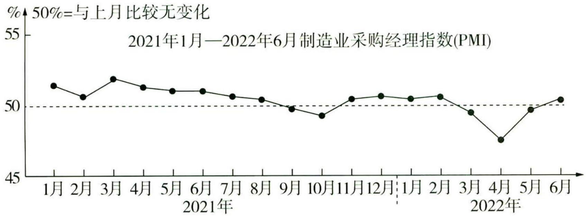

line

| 月份       | PMI (%) |
| ---------- | ------- |
| 1月        | 51.5    |
| 2月        | 50.5    |
| 3月        | 52.0    |
| 4月        | 51.2    |
| 5月        | 51.0    |
| 6月        | 51.0    |
| 7月        | 50.8    |
| 8月        | 50.5    |
| 9月        | 49.8    |
| 10月       | 49.2    |
| 11月       | 50.5    |
| 12月       | 50.8    |
| 1月        | 50.5    |
| 2月        | 50.8    |
| 3月        | 49.5    |
| 4月        | 47.5    |
| 5月        | 49.8    |
| 6月        | 50.5    |

图1

理学 研究物质世界基本规律的科学,其研究内容广泛,专业学科大类主要有数学类、物理学类、化学类、天文学类、地质学类、生物科学类、统计学类等.

根据统计图分析,下列结论最恰当的一项为 ( )

A. 2021 年第二、三季度各月的制造业在逐月收缩  
B. 2021 年第四季度各月制造业在逐月扩张  
C. 2022 年 1 月至 4 月制造业逐月收缩  
D. 2022 年 6 月 PMI 重回临界点以上, 制造业恢复性扩张

解析 对于 A 选项,由统计图可以得到,只有 2021 年 9 月份的制造业 PMI 低于 50%,故 A

【易错警示】若不认真阅读题干, 忽略文字叙述, 那么 A 选项容易被认为是正确的, 同时会影响后面选项的判断. 由图容易看出 2021 年第二、三季度各月制造业 PMI 是在逐月下降, 但选项说的是制造业在逐月收缩, 题于中已明确, PMI 高于 $50 \%$ 都是在扩张, 很显然 9 月份之前的 PMI 都高于 $50 \%$ , 制造业是在扩张, 故 A 错误

错误；

对于 B 选项,由统计图可以得到,2021 年 10 月份的制造业 PMI 低于 50%,故 B 错误;

对于 C 选项,由统计图可以得到,2022 年 1、2 月份的制造业 PMI 高于 50%,故 C 错误;

对于 D 选项,由统计图可以得到,从 2022 年 4 月份开始,制造业 PMI 呈现上升趋势,且在 2022 年 6 月 PMI 超过 50%,故 D 正确.故选 D.

答案 D

调研 2 (2023·广东广州铁一、广附、广外三校1月联考/在线直播)数据显示,中国在线直播用户规模及在线直播购物规模近几年都保持高速增长态势. 下表为某机构统计的 2017—2021 年中国在线直播用户规模(单位:亿人), 其中 2017—2021 年对应的代码依次为 1—5.

<table><tr><td>年份代码x</td><td>1</td><td>2</td><td>3</td><td>4</td><td>5</td></tr><tr><td>用户规模y</td><td>3.98</td><td>4.56</td><td>5.04</td><td>5.87</td><td>6.35</td></tr></table>

参考数据: $\bar{y}=5.16,\bar{v}\approx1.68,\sum_{i=1}^{5}v_{i}y_{i}\approx45.10$ ,其中 $v_{i}=\sqrt{x_{i}}$ .

参考公式:对于一组数据 $(v_{1},y_{1}),(v_{2},y_{2}),\cdots,(v_{n},y_{n})$ ，其回归直线 $\hat{y}=\hat{b}v+\hat{a}$ 的斜率和截距的最小二乘估计公式分别为 $\hat{b}=\frac{\sum\limits_{i=1}^{n}v_{i}y_{i}-n\bar{v}\bar{y}}{\sum\limits_{i=1}^{n}v_{i}^{2}-n\bar{v}^{2}}$ , $\hat{a}=\bar{y}-\hat{b}\bar{v}$ .

(1)由上表数据可知,可用函数模型 $\hat{y} = \hat{b}\sqrt{x} + \hat{a}$ 拟合 y 与 x 的关系,请建立 y 关于 x 的回归方程 ( $\hat{a}, \hat{b}$ 的值精确到 0.01);  
(2)已知中国在线直播购物用户选择在品牌官方直播间购物的概率为 $p (0 < p < 1)$ , 现从中国在线直播购物用户中随机抽取 4 人, 记这 4 人中选择在品牌官方直播间购确定概率模型: 由于样本取自中国在线直播购物用户, 基数太大, 可以认为每个个体被取到的概率相等, 属于二项分布

物的人数为 X, 若 $P(X=3)=P(X=4)$ , 求 X 的分布列与期望.

解析 (1) $v = \sqrt{x}$ ，则 $\hat{y} = \hat{b}v + \hat{a}$ ，因为 $\bar{y} = 5.16, \bar{v} \approx 1.68, \sum_{i=1}^{5} v_i^2 = \sum_{i=1}^{5} x_i = 15, \sum_{i=1}^{5} v_i y_i \approx 45.10$ ，

【会转化】非线性回归模型一般通过换元转化为线性回归模型求解,这里是 $v = \sqrt{x}$ ,有时是取对数、取倒数等

所以 $\hat{b} = \frac{\sum_{i=1}^{5} v_i y_i - 5\overline{v}\overline{y}}{\sum_{i=1}^{5} v_i^2 - 5\overline{v}^2} = \frac{45.10 - 5 \times 1.68 \times 5.16}{15 - 5 \times 1.68^2} = \frac{1.756}{0.888} \approx 1.98.$

$$
\hat {a} = \overline {{y}} - \hat {b} \overline {{v}} = 5. 1 6 - \frac {1 . 7 5 6}{0 . 8 8 8} \times 1. 6 8 \approx 1. 8 4.
$$

即 y 关于 x 的回归方程为 $\hat{y}=1.98\sqrt{x}+1.84$ .

(2) 由题意知 $X \sim B(4, p)$ , $P(X = 3) = \mathrm{C}_4^3 p^3 (1 - p) = 4p^3 (1 - p)$ , $P(X = 4) = \mathrm{C}_4^4 p^4 = p^4$ , 由 $4p^3 (1 - p) = p^4$ 得 $p = \frac{4}{5}$ .

X 的所有可能取值为 0,1,2,3,4,

$$
P (X = 0) = \mathrm{C} _ {4} ^ {0} \times \left(1 - \frac {4}{5}\right) ^ {4} = \frac {1}{6 2 5}, P (X = 1) = \mathrm{C} _ {4} ^ {1} \times \frac {4}{5} \times \left(1 - \frac {4}{5}\right) ^ {3} = \frac {1 6}{6 2 5}, P (X = 2) =
$$

$$
\begin{array}{l} \mathrm{C} _ {4} ^ {2} \times (\frac {4}{5}) ^ {2} \times (1 - \frac {4}{5}) ^ {2} = \frac {9 6}{6 2 5}, P (X = 3) = \mathrm{C} _ {4} ^ {3} \times (\frac {4}{5}) ^ {3} \times (1 - \frac {4}{5}) = \frac {2 5 6}{6 2 5}, P (X = 4) = \mathrm{C} _ {4} ^ {4} \times \\ (\frac {4}{5}) ^ {4} = \frac {2 5 6}{6 2 5}. \end{array}
$$

所以 $X$ 的分布列为

<table><tr><td>X</td><td>0</td><td>1</td><td>2</td><td>3</td><td>4</td></tr><tr><td>P</td><td> $\frac{1}{625}$ </td><td> $\frac{16}{625}$ </td><td> $\frac{96}{625}$ </td><td> $\frac{256}{625}$ </td><td> $\frac{256}{625}$ </td></tr></table>

易知 X 服从二项分布, 故 $E(X)=4 \times \frac{4}{5} = \frac{16}{5}$ .

【敲黑板】若随机变量服从某特殊分布，必须加以说明，否则求期望只能用期望的原始定义

# 情境 4 推进教育改革

调研 1 (2023·四川达州第一次诊断/新高考改革)某省从2022年秋季入学的高一年级学生开始实行高考综合改革,高考采用“3+1+2”模式,其中“1”为首选科目,即物理与历史二选一.某校为了解学生的首选学科,对部分高一学生进行了抽样调查,制作出图1,图2两个等高条形图,根据条形图信息,下列结论正确的是 ( )

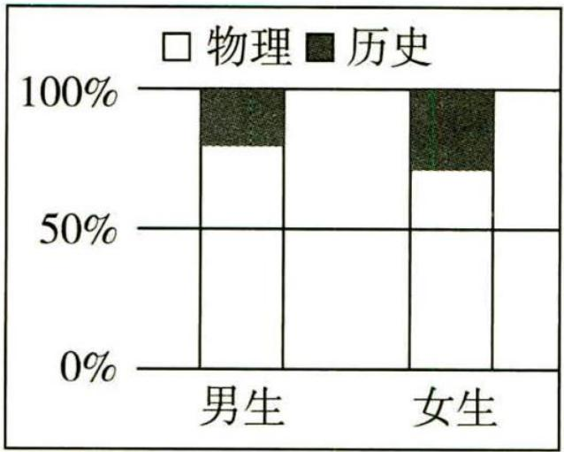

bar_stacked

| 性别 | 物理 (%) | 历史 (%) |
| :--- | :--- | :--- |
| 男生 | 80 | 25 |
| 女生 | 70 | 30 |

图 1

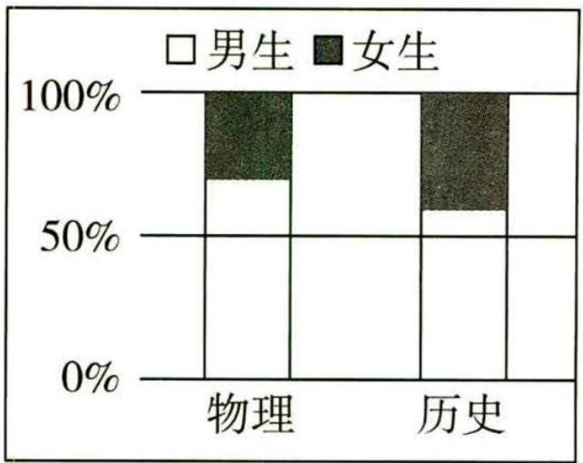

bar_stacked

| 类别 | 男生 (%) | 女生 (%) |
| :--- | :--- | :--- |
| 物理 | 70 | 35 |
| 历史 | 58 | 42 |

图 2

A. 样本中选择物理学科的男生人数少于选择历史学科的女生人数  
B. 样本中女生选择历史学科的人数多于男生选择历史学科的人数  
C. 样本中选择物理学科的人数多于选择历史学科的人数  
D. 样本中男生人数少于女生人数

解析 根据等高条形图图1 可知样本中选择物理学科的人数多于选择历史学科的人数, 故 C 正确; 根据等高条形图图2 可知样本中男生人数多于女生人数, 故 D 错误; 由图1可知, 样本中选择【小妙招】做单项选择题, 此时能判断选项 C 是正确的, 排除法可得选 C

物理学科的人数多于选择历史学科的人数,由图2可知,选择物理学科的男生比例高于女生,选择历史学科的女生比例低于男生,所以样本中选择物理学科的男生人数多于选择历史学科的女生人数,故A错误;由图2可知,样本中女生选择历史学科的人数少于男生选择历史学科的人数,故B错误.故选C.

答案 C

调研 2 (名师原创)在普通高中新课程改革中,某地实施“3+1+2”选科方案,该方案中的“2”指的是从政治、地理、化学、生物4门学科中任选2门,假设每门学科被选中的可能性相等,那么政治和地理至少有一门被选中的概率是 ( )

A. $\frac{1}{6}$

B. $\frac{1}{2}$

C. $\frac{2}{3}$

D. $\frac{5}{6}$

解析 方法一 从政治、地理、化学、生物4门学科中任选2门共有6种情况,分别为:政治+地理、政治+化学、政治+生物、地理+化学、地理+生物、化学+生物.其中政治和地理至少有一门被选中的情况包含5种,分别为:政治+地理、政治+化学、政治+生物、地理+化学、地理+生物.

【会思考】由于学科较少,政治和地理至少有一门被选中可以用列举法求解,也可以利用排除法求解,4门学科中任选2门,然后去掉政治和地理都没被选中的情况

故政治和地理至少有一门被选中的概率为 $P=\frac{5}{6}$ . 故选 D.

方法二 (排除法)4门学科任选2门共 $C_{4}^{2}=6$ (种)情况,其中政治和地理都没被选中的情况有1种,故政治和地理至少有一门被选中的概率为 $P=\frac{6-1}{6}=\frac{5}{6}$ ,故选D.

答案 D

医学 专业学科大类主要有基础医学类、临床医学类、中医学类、药学类、医学技术类等.

调研 3 (2023·江苏扬州阶段考试/自主招生和强基计划) 自主招生和强基计划是高校选拔录取工作改革的重要环节. 自主招生是学生通过高校组织的笔试和面试之后, 可以享受相应的高考降分政策. 2020 年 1 月, 教育部决定 2020 年起不再组织开展高校自主招生工作, 而是在部分“一流大学”建设高校开展基础学科招生改革试点 (也称强基计划). 下表是某高校 2018 年至 2022 年通过自主招生或强基计划在部分专业的招生人数:

<table><tr><td>年份</td><td>数学</td><td>物理</td><td>化学</td><td>总计</td></tr><tr><td>2018</td><td>4</td><td>7</td><td>6</td><td>17</td></tr><tr><td>2019</td><td>5</td><td>8</td><td>5</td><td>18</td></tr><tr><td>2020</td><td>6</td><td>9</td><td>5</td><td>20</td></tr><tr><td>2021</td><td>8</td><td>7</td><td>6</td><td>21</td></tr><tr><td>2022</td><td>9</td><td>8</td><td>6</td><td>23</td></tr></table>

请根据表格回答下列问题:

(1) 统计表明招生总人数和年份间有较强的线性关系. 记 $x$ 为当年年份与 2017 的差, $y$ 为当年数学、物理和化学的招生总人数, 试用最小二乘法建立 $y$ 关于 $x$ 的线性回归方程, 并以此预测 2023 年数学、物理和化学的招生总人数 (结果四舍五入保留整数).

(2)在强基计划实施的首年,为了保证招生录取结果的公平公正,该校招生办对2020年强基计划录取结果进行抽检.此次抽检从这20名学生中随机选取3名学生进行评审,记选取到数学专业的学生人数为X,求随机变量X的数学期望 $E(X)$ .

(3) 经统计该校学生的本科学习年限占比如下: 四年毕业的占 76%, 五年毕业的占 16%, 六年毕业的占 8%. 现从 2018 到 2022 年间通过上述方式被该校录取的学生中随机抽取 1 名, 若该生是数学专业的学生, 求该生恰好在 2025 年毕业的概率.

附:对于线性回归方程 $\hat{y} = \hat{b}x + \hat{a}, \hat{b} = \frac{\sum_{i=1}^{n}(x_i - \bar{x})(y_i - \bar{y})}{\sum_{i=1}^{n}(x_i - \bar{x})^2}, \hat{a} = \bar{y} - \hat{b}\bar{x}.$

解析 (1) 由题意, $x$ 的取值集合为 $\{1,2,3,4,5\}$ , $y$ 的取值集合为 $\{17,18,20,21,23\}$ , 设 $\hat{y} = \hat{b} x + \hat{a}$ ,

则 $\overline{x} = \frac{1 + 2 + 3 + 4 + 5}{5} = 3, \overline{y} = \frac{17 + 18 + 20 + 21 + 23}{5} = 19.8,$

$$
\hat {b} = \frac {\sum_ {i = 1} ^ {5} \left(x _ {i} - \bar {x}\right) \left(y _ {i} - \bar {y}\right)}{\sum_ {i = 1} ^ {5} \left(x _ {i} - \bar {x}\right) ^ {2}} = 1. 5, \hat {a} = \bar {y} - \hat {b} \bar {x} = 1 5. 3,
$$

因此所求回归方程为 $\hat{y}=1.5x+15.3$ .

当 x=6 时, 可得 $\hat{y}=24.3$ , 因此预测 2023 年数学、物理和化学的招生总人数为 24.

(2)由已知, $X$ 的所有可能取值为 $0, 1, 2, 3$ , 结合表中数据可得,

$$
P (X = 0) = \frac {\mathrm{C} _ {1 4} ^ {3}}{\mathrm{C} _ {2 0} ^ {3}}, P (X = 1) = \frac {\mathrm{C} _ {1 4} ^ {2} \times \mathrm{C} _ {6} ^ {1}}{\mathrm{C} _ {2 0} ^ {3}}, P (X = 2) = \frac {\mathrm{C} _ {1 4} ^ {1} \times \mathrm{C} _ {6} ^ {2}}{\mathrm{C} _ {2 0} ^ {3}}, P (X = 3) = \frac {\mathrm{C} _ {6} ^ {3}}{\mathrm{C} _ {2 0} ^ {3}},
$$

故 $E(X)=1\times\frac{C_{14}^{2}\times C_{6}^{1}}{C_{20}^{3}}+2\times\frac{C_{14}^{1}\times C_{6}^{2}}{C_{20}^{3}}+3\times\frac{C_{6}^{3}}{C_{20}^{3}}=\frac{9}{10}.$

【用公式】若能看出 $X$ 服从超几何分布, 其期望可由公式 $E(X) = n \cdot \frac{M}{N}$ 快速算出, 这里 $N$ 表示 20 名学生, $M$ 表示 20 名学生中数学专业的学生数, $n$ 表示抽取的学生数, 所以 $E(X) = 3 \times \frac{6}{20} = \frac{9}{10}$

(3) 若该生在 2025 年毕业, 则入学年份可能为 2021 年, 2020 年, 2019 年,

由条件概率公式可知,该生是数学专业的学生的条件下,在第 k 年入学的概率为 $P(\text{第 }k \text{ 年入学}|\text{数学专业})=\frac{P(\text{第 }k \text{ 年入学},\text{数学专业})}{P(\text{数学专业})}=\frac{n(\text{第 }k \text{ 年入学},\text{数学专业})}{n(\text{数学专业})}$ ,

故 $P(2021 \text{ 年入学} | \text{数学专业}) = \frac{8}{32}, P(2020 \text{ 年入学} | \text{数学专业}) = \frac{6}{32}$ ,

$P(2019 \text{ 年入学} | \text{数学专业}) = \frac{5}{32},$

则 $P(2025 \text{ 年毕业} | \text{数学专业}) = \frac{8}{32} \times \frac{76}{100} + \frac{6}{32} \times \frac{16}{100} + \frac{5}{32} \times \frac{8}{100} = \frac{93}{400}.$

# 情境 5 关注生产生活

调研 1 (2023·陕西汉中一检) 图 1 上半部分为一个油桃园, 每年油桃成熟时, 园主都要雇佣人工采摘, 然后沿两条路径将采摘好的油桃迅速地运送到水果集散地 C 处销售. 路径 1: 先将油桃集中到 A 处, 再沿公路 AC 运送. 路径 2: 先将油桃集中到 B 处, 再沿公路 BC 运送. 已知 AC = 3 km, BC = 4 km. 为了减少运送时间, 园主在油桃园中画了一条分界线, 使得位于分界线一侧的采摘工

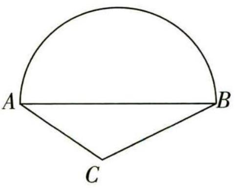

text_image

A
B
C

图1

按路径1运送路程较近,另一侧的采摘工按路径2运送路程较近,若这条分界线是曲线

E 的一部分,则曲线 E 为

( )

A. 圆

B. 椭圆

C. 双曲线

D. 抛物线

解析 由题意可知,对分界线上任意一点 P, 满足 $PA + AC = PB + BC$ , 即由 P 点到 C 点的两条路径一样长, 则 PA - PB = BC - AC = 1, 即点 P 的轨迹为双曲线的右支, 当在双曲线右支的左侧时, 按路径 1 运送, 当在双曲线右支的右侧时, 按路径 2 运送, 结合题意分界线为双曲线右支与油桃园的交集部分, 曲线 E 应为双曲线, 故选 C.

【会思考】问题中蕴含的是不等关系，可以从其临界情况即两条路径相等入手，找到分界线满足的曲线要求，对照答案即可得解

答案 C

调研 2 (2023 · 浙江杭州师大附中期末) 如图 2, 矩形 ABCD 是某生态农庄的一块植物栽培基地的平面图, 现欲修一条笔直的小路 MN (宽度不计) 经过该矩形区域, 其中 M, N 都在矩形 ABCD 的边界上. 已知 AB = 8, AD = 6 (单位: 百米), 小路 MN 将矩形 ABCD 分成面积为 $S_{1}, S_{2}$ (单位: 平方百米) 的两部分, 其中 $S_{1} \leqslant S_{2}$ , 且点 A 在面积为 $S_{1}$ 的区域内, 记小路 MN 的长为 $l$ 百米.

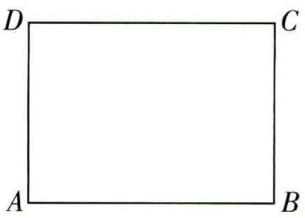

natural_image

Simple geometric diagram of a rectangle labeled with vertices A, B, C, D (no additional text or symbols)

图2

(1) 若 l=4，求 $S_{1}$ 的最大值；  
(2) 若 $S_{2}=2S_{1}$ ，求 l 的取值范围.

解析 (1) 小路 $MN$ 有如下(图3, 图4, 图5)三种情况,

【会思考】M, N 的具体位置不重要. 重要的是小路 MN 的位置. 可以依据 M, N 是在相邻边上还是相对边上进行分类, 分为三类, 由 l 的长度判断小路 MN 的位置

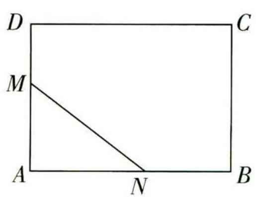

text_image

D
M
A
N
B
C

图3

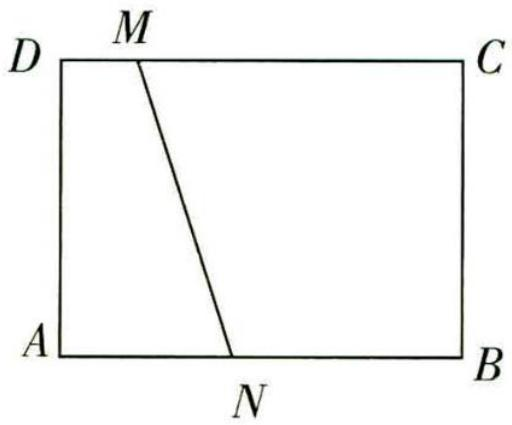

text_image

D M C
A N B

图 4

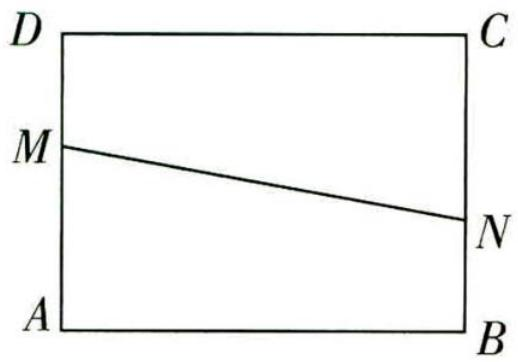

text_image

D
M
A
B
C
N

图 5

易知图 4, 图 5 中不满足 l=4.

如图 3, $AM^{2}+AN^{2}=16\geqslant2AM\cdot AN$ ,故 $AM\cdot AN\leqslant8$ ,

当且仅当 $AM = AN = 2\sqrt{2}$ 时等号成立, 故 $S_{1} = \frac{1}{2}AM \cdot AN \leqslant 4$ , 即 l = 4 时, $S_{1}$ 的最大值为 4.

(2) 因为 $S_{2}=2S_{1}, S_{1}+S_{2}=48$ ，所以 $S_{1}=16$ .

如图 3, $\frac{1}{2}AM\cdot AN=16$ ,则 $AM\cdot AN=32$ ,

【会分析】根据分类情况，可由面积关系确定小路的位置及长度

艺术学 专业学科大类主要有音乐与舞蹈学类、戏剧与影视学类、美术学类、设计学类等.

$$
l ^ {2} = A M ^ {2} + A N ^ {2} = A N ^ {2} + \frac {3 2 ^ {2}}{A N ^ {2}}, A N \in [ \frac {1 6}{3}, 8 ],
$$

【指点迷津】由于 $AM \cdot AN = 32$ ，而 $AM$ 的最大值为 6，因此 $AN$ 的最小值为 $\frac{32}{6} = \frac{16}{3}$ ，当 $N$ 与 $B$ 点重合时， $AN$ 取最大值，为 8

易知当 AN=8 时, l 取最大值, $l=4\sqrt{5}$ , 当 $AN=4\sqrt{2}$ 时, l 取最小值, l=8, 故 $l\in[8,4\sqrt{5}]$ ;

如图 4, $S_{1}=\frac{1}{2}\times6\times(DM+AN)=16$ ,故 $DM+AN=\frac{16}{3}$ ,

$l^{2}=6^{2}+(AN-DM)^{2}=36+(2AN-\frac{16}{3})^{2},AN\in[0,\frac{16}{3}]$ ，当 $AN=\frac{8}{3}$ 时，l取最小值，
l=6, 当 AN=0 或 $\frac{16}{3}$ 时，l 取最大值， $l=\frac{2\sqrt{145}}{3}$ ，故 $l\in[6,\frac{2\sqrt{145}}{3}]$ ;

如图 5, $S_{1}=\frac{1}{2}\times8\times(AM+BN)=16$ ,故 $AM+BN=4$ ,

$l^{2}=8^{2}+(AM-BM)^{2}=64+(2AM-4)^{2},AM\in[0,4]$ ，当AM=2时，l取最小值，l=8，当AM=0或4时，l取最大值， $l=4\sqrt{5}$ ，故 $l\in[8,4\sqrt{5}]$ .

综上所述, $l\in[6,4\sqrt{5}]$ .

# 情境 6 强调立德树人

调研 (2023·重庆八中12月月考)将甲、乙、丙、丁4名志愿者随机派往①,②,③三个社区进行公益活动,每个社区至少派1名志愿者,每名志愿者只去1个社区. $A$ 表示事件“志愿者甲派往①社区”, $B$ 表示事件“志愿者乙派往①社区”, $C$ 表示事件“志愿者乙派往②社区”,则

A. 事件 $A$ 与 $B$ 相互独立

B. 事件 $A$ 与 $C$ 为互斥事件

C. $P(C|A) = \frac{5}{12}$

D. $P(B|A)=\frac{1}{9}$

解析 每个社区至少派1名志愿者,则共有 $\frac{C_{4}^{2}C_{2}^{1}C_{1}^{1}}{A_{2}^{2}}A_{3}^{3}=36$ (种)方法.

【多角度思考】由于每个社区都要有志愿者，因此分配志愿者只能是按照1,1,2的方式分配，可以采用部分平均分组公式求解，或者分步求解，先让两名志愿者在一起，有 $C_{4}^{2}=6$ （神）方法，然后与剩下两名全排列，共有 $C_{4}^{2}\cdot A_{3}^{3}=36$ （神）方法

对于事件 A, 志愿者甲派往①社区, 则若①社区分 2 人, 有 $A_{3}^{3}=6$ (种) 方法; 若①社区分 1 人, 则有 $C_{3}^{2}C_{1}^{1}A_{2}^{2}=6$ (种) 方法. 共有 $6+6=12$ (种) 方法, 所以 $P(A)=\frac{12}{36}=\frac{1}{3}$ . 同理, $P(B)=\frac{12}{36}=\frac{1}{3}$ .

若甲与乙同时派往①社区,即①社区分2人,有 ${\mathrm{A}}_{2}^{2}$ 种方法,所以 $P\left( {AB}\right)  = \frac{2}{36} = \frac{1}{18},P\left( {AB}\right)  \neq$

$P(A)P(B)=\frac{1}{9}$ ，所以 A 错误。由互斥事件的概念易知 B 错误。

【警示】A,B两事件是否相互独立只能利用等式 $P(AB)=P(A)P(B)$ 是否成立进行判断，而不是靠感觉

对于事件 C, 志愿者乙派往②社区, 则若②社区分 2 人, 有 $A_{3}^{3}=6$ (种) 方法; 若②社区分 1 人, 则有 $C_{3}^{2}C_{1}^{1}A_{2}^{2}=6$ (种) 方法. 共有 $6+6=12$ (种) 方法, 所以 $P(C)=\frac{12}{36}=\frac{1}{3}$ . 若事件 A, C 同时发生, 则有 $1+C_{2}^{1}C_{2}^{1}=5$ (种) 方法, 所以 $P(AC)=\frac{5}{36}, P(C|A)=\frac{P(AC)}{P(A)}=\frac{\frac{5}{36}}{\frac{1}{3}}=\frac{5}{12}, C$ 正确.

$P(B|A)=\frac{P(AB)}{P(A)}=\frac{\frac{1}{18}}{\frac{1}{3}}=\frac{1}{6}\neq\frac{1}{9},D$ 错误. 故选 C.

答案 C

# 情境 7 发现数学之美

调研 1 (2023·江苏镇江期末联考/雪花曲线)北京 2022 年冬奥会开幕式上,由 96 片“小雪花”组成的“大雪花”惊艳了全世界. 数学中也有一朵美丽的雪花——“科赫雪花”. 它可以这样画: 如图 1 ,任意画一个正三角形 $P_{1}$ ,并把每一边三等分; 取三等分后的一边中间的一段, 以此为边向外作正三角形, 并把这中间的一段擦掉, 形成雪花曲线 $P_{2}$ ; 重复上述两步, 画出更小的三角形, 形成雪花曲线 $P_{3}, P_{4}, \cdots, P_{n}, \cdots$ .

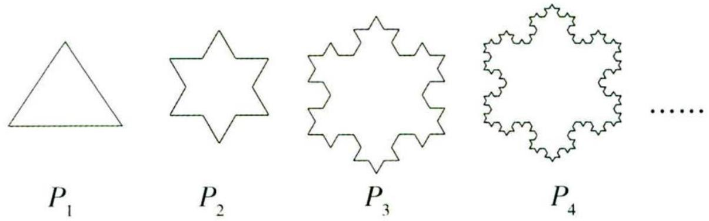

text_image

P₁
P₂
P₃
P₄ ......

图1

设雪花曲线 $P_{n}$ 的边长为 $a_{n}$ , 边数为 $b_{n}$ , 周长为 $l_{n}$ , 面积为 $S_{n}$ , 若 $a_{1}=3$ , 则下列说法正确的是 ( )

解题关键是找到四个数列 $\{a_{n}\},\{b_{n}\},\{l_{n}\},\{S_{n}\}$ 各自的递推关系或彼此之间的关系，这需要从“拜赫雪花”的形成规则入手

A. $a_{5} = \frac{1}{27}, l_{5} = \frac{243}{8}$

B. $S_{1} <   S_{3} <   \frac{8}{5} S_{1}$

C. $\{a_{n}\}, \{b_{n}\}, \{l_{n}\}, \{S_{n}\}$ 均是等比数列

D. $S_{n} = S_{n - 1} + \frac{3\sqrt{3}}{4}\cdot (\frac{4}{9})^{n - 1}$

与技术、控制科学与工程、计算机科学与技术、环境科学与工程、软件工程、基础医学、临床医学、口腔医学、公共卫生与预防医学、药学、护理学、艺术学理论、现代语言学、语言学、机械及航空航天和制造工程、商业与管理、社会政策与管理。

解析 据题意知 $a_{n} = a_{1} \cdot \left(\frac{1}{3}\right)^{n - 1} = \left(\frac{1}{3}\right)^{n - 2}, b_{n} = b_{1} \cdot 4^{n - 1} = 3 \cdot 4^{n - 1}, l_{n} = a_{n}b_{n} = 9 \cdot$ $(\frac{4}{3})^{n - 1}, \therefore a_{5} = \frac{1}{27}, l_{5} = \frac{256}{9}, A$ 错误.

$S_{1} = \frac{1}{2}\times a_{1}^{2}\times \sin 60^{\circ} = \frac{9\sqrt{3}}{4}$ ，当 $n\geqslant 2$ 时， $S_{n} - S_{n - 1} = b_{n - 1}\cdot (\frac{\sqrt{3}}{4} a_{n}^{2}) = 3\cdot 4^{n - 2}\cdot \frac{\sqrt{3}}{4}\cdot (\frac{1}{9})^{n - 2} =$ $\frac{3\sqrt{3}}{4}\cdot (\frac{4}{9})^{n - 2},\mathrm{D}$ 错误.

当  \( n \geqslant 2 \)  时,  \( S\_{n} = S\_{1} + (S\_{2} - S\_{1}) + (S\_{3} - S\_{2}) + \cdots + (S\_{n} - S\_{n-1}) = \frac{9\sqrt{3}}{4} + \frac{3\sqrt{3}}{4} \cdot \left[1 + \frac{4}{9} + (\frac{4}{9})^{2} + \cdots + (\frac{4}{9})^{n-2}\right] = \frac{18\sqrt{3}}{5} - \frac{27\sqrt{3}}{20} \cdot (\frac{4}{9})^{n-1}, S\_{1} = \frac{9\sqrt{3}}{4} = \frac{18\sqrt{3}}{5} - \frac{27\sqrt{3}}{20} \times (\frac{4}{9})^{1-1} \text { 也满足上式，则 } S\_{n} = \frac{18\sqrt{3}}{5} - \frac{27\sqrt{3}}{20} \cdot (\frac{4}{9})^{n-1} \text { ，所以 } \{S\_{n}\} \text { 不是等比数列，C 错误. }

$S_{3}=\frac{10\sqrt{3}}{3},\frac{8}{5}S_{1}=\frac{18\sqrt{3}}{5}$ ，则 $S_{1}<S_{3}<\frac{8}{5}S_{1}$ ，B正确.故选B.

【另解】因为 $S_{1}=\frac{1}{2}\times a_{1}^{2}\times\sin60^{\circ}=\frac{9\sqrt{3}}{4},b_{1}=3,a_{2}=1,b_{2}=12,a_{3}=\frac{1}{3}$ ，所以 $S_{2}=S_{1}+b_{1}\cdot\frac{\sqrt{3}}{4}a_{2}^{2}=3\sqrt{3},S_{3}=S_{2}+b_{2}\cdot\frac{\sqrt{3}}{4}a_{3}^{2}=3\sqrt{3}+\frac{\sqrt{3}}{3}=\frac{10\sqrt{3}}{3},\frac{8}{5}S_{1}=\frac{18\sqrt{3}}{5}$ ，则 $S_{1}<S_{3}<\frac{8}{5}S_{1}$ ，所以 B 正确

答案 B

调研 2 (2023·河北衡水中学四调/黄金分割)关于黄金分割的起源,大多数人认为来自毕达哥拉斯学派.所谓黄金分割,指的是把长为 L 的线段分为两部分,使较长部分与整体的比值等于较短部分与较长部分的比值,此比值为 $\frac{\sqrt{5}-1}{2}\approx0.618$ . 如图 2,在矩形 ABCD 中,AC,BD 相交于点 O,BF⊥AC 于 F,DH⊥AC 于 H,AE⊥BD 于 E,CG⊥BD 于 G, $\overrightarrow{BE}=\frac{\sqrt{5}-1}{2}\overrightarrow{BO}$ ,则 $\overrightarrow{BF}=$

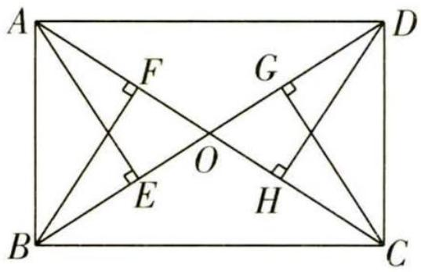

text_image

A
F
G
O
E
H
B
C
D

图2

A. $\frac{3 - \sqrt{5}}{2}\overrightarrow{BA} +\frac{5 + \sqrt{5}}{10}\overrightarrow{BG}$

B. $\frac{3 - \sqrt{5}}{2}\overrightarrow{BA} +\frac{5 - \sqrt{5}}{10}\overrightarrow{BG}$

C. $\frac{\sqrt{5} - 1}{2}\overrightarrow{BA} +\frac{5 - \sqrt{5}}{10}\overrightarrow{BG}$

D. $\frac{3 - \sqrt{5}}{2}\overrightarrow{BA} +\frac{\sqrt{5}}{5}\overrightarrow{BG}$

解析 在矩形 ABCD 中, 由已知条件得 O 是线段 EG 的中点, $\left|\overrightarrow{AO}\right| = \left|\overrightarrow{BO}\right|$ , $\left|\overrightarrow{AF}\right| = \left|\overrightarrow{BE}\right|$ ,
因为 $\overrightarrow{BE}=\frac{\sqrt{5}-1}{2}\overrightarrow{BO}$ ，所以 $\overrightarrow{EO}=\frac{\sqrt{5}-1}{2}\overrightarrow{BE}=(\frac{\sqrt{5}-1}{2})^{2}\overrightarrow{BO}=\frac{3-\sqrt{5}}{2}\overrightarrow{BO}$

于是得 $\overrightarrow{BG} = \overrightarrow{BO} +\overrightarrow{OG} = \overrightarrow{BO} +\overrightarrow{EO} = \frac{5 - \sqrt{5}}{2}\overrightarrow{BO}$ 即 $\overrightarrow{BO} = \frac{5 + \sqrt{5}}{10}\overrightarrow{BG}.$

$$
\overrightarrow {A F} = \frac {\sqrt {5} - 1}{2} \overrightarrow {A O}, \text {而} \overrightarrow {A O} = \overrightarrow {B O} - \overrightarrow {B A}, \text {所以} \overrightarrow {A F} = \frac {\sqrt {5} - 1}{2} (\frac {5 + \sqrt {5}}{1 0} \overrightarrow {B G} - \overrightarrow {B A}) = \frac {\sqrt {5}}{5} \overrightarrow {B G} - \frac {\sqrt {5} - 1}{2} \overrightarrow {B A},
$$

从而有 $\overrightarrow{BF} = \overrightarrow{BA} +\overrightarrow{AF} = \overrightarrow{BA} +\frac{\sqrt{5}}{5}\overrightarrow{BG} -\frac{\sqrt{5} - 1}{2}\overrightarrow{BA} = \frac{3 - \sqrt{5}}{2}\overrightarrow{BA} +\frac{\sqrt{5}}{5}\overrightarrow{BG},$ 故选D.

答案 D

调研 3 (2023·河北张家口期末/抛物线拱形拉索大桥)逢山开路,遇水架桥.依靠不断增强的综合国力和自主创新能力,我国桥梁设计建设水平不断提升,为经济社会发展发挥了重要作用.如图3是一座抛物线拱形拉索大桥,该桥抛物线拱形部分的桥面跨度为64米,拱形最高点与水平桥面间的距离为32米.

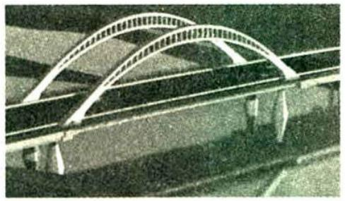

natural_image

Exterior view of a modern arched bridge spanning over water, with no visible text or symbols.

图3

(1)求该桥抛物线拱形部分对应抛物线的焦准距(焦点到准线的距离).

(2)已知直线 m 是抛物线的对称轴, Q 为直线 m 与水面的交点, P 为抛物线上一点, O, F 分别为抛物线的顶点和焦点. 若 $PF \perp m, PO \perp PQ$ , 求桥面与水面间的距离.

解析 (1)如图4,以拱顶为原点、抛物线的对称轴为 $y$ 轴建立平面直角坐标系,设抛物线的方程为 $x^{2} = -2py (p > 0)$ ,

【会建系】以该桥抛物线拱形部分对应抛物线的顶点为原点建系

由题意可知抛物线过点(32, -32)，代入得 $32^{2} = -2p \times (-32)$ ，解得p=16，故焦准距为16米.

(2) 由(1)可得抛物线的方程为 $x^{2} = -32y$ ，则其焦点为 $F(0, -8)$ ，顶点 $O(0, 0)$ . $\because PF \perp m, \therefore$ 设 $P(n, -8), Q(0, t)$ ， $\therefore -\frac{n^{2}}{32} = -8, \therefore n^{2} = 256.$

$\because \overrightarrow{OP} = (n, -8), \overrightarrow{QP} = (n, -8 - t)$ , 且 $PO \perp PQ, \therefore n^2 + (-8)(-8 - t) = 0$ , 解得 $t = -40$ .

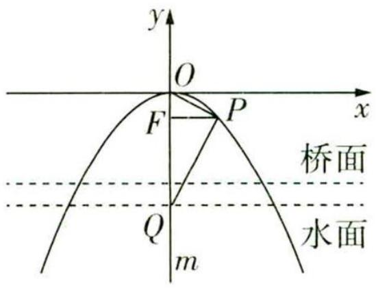

text_image

y
O
F
P
x
桥面
Q
m
水面

图 4

故桥面与水面间的距离为 $|-40-(-32)|=8$ （米）.

# 情境 8 弘扬传统文化

调研 1 (2023·重庆十八中两江实验中学第一次全真模拟/曲池)中国古代数学的瑰宝《九章第术》中记载了一种称为“曲池”的几何体,该几何体为上、下底面均为扇环形的柱体(扇环是指圆环被扇形截得的部分). 现有一个如图 1 所示的曲池,其高为 3 , $A{A}_{1} \bot$ 底面,底面扇环所对的圆心角为 $\frac{\pi }{2},\widehat{AD}$ 长度为 $\widehat{BC}$ 长度的 3 倍,

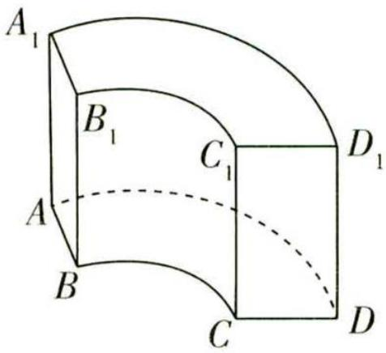

text_image

A₁
B₁
C₁
D₁
A
B
C
D

图1

清华大学 法学、政治学、马克思主义理论、数学、物理学、化学、生物学、力学、机械工程、仪器科学与技术、材料科学与工程、动力工程及工程热物理、电气工程、信息与通信工程、控制科学与工程、计算机科学与技术、建筑学、土木工程、水利工程、化学工程与(转下)

且 $AB = CD = 2$ ，则该曲池的体积为 （）

A. $\frac{9\pi}{2}$

B. $5\pi$

C. $\frac{11\pi}{2}$

D. $6 \pi$

解析 设 $\widehat{AD}$ 对应的扇形半径为 R, $\widehat{BC}$ 对应的扇形半径为 r, 根据弧长公式可知 $l_{\widehat{AD}} = \alpha R$ , $l_{\widehat{BC}} = \alpha r, \alpha = \frac{\pi}{2}$ .

因为 $\widehat{AD}$ 长度为 $\widehat{BC}$ 长度的3倍,所以R=3r.

因为 AB = CD = R - r = 2，所以 $\left\{\begin{aligned}R &= 3, \\ r &= 1,\end{aligned}\right.$ 所以曲池的体积为 $V = \frac{1}{4} (\pi R^{2} h - \pi r^{2} h) = 6\pi.$ 故选 D.

答案 D

调研 2 (2023·四川成都石室中学一诊/阳马)中国古代数学名著《九章算术》中,将底面为矩形,且有一条侧棱垂直于底面的四棱锥称为“阳马”. 现有一个阳马,其底面是边长为 3 的正方形,垂直于底面的侧棱长为 4 ,则该阳马的内切球表面积为 ,内切球的球心和外接球的球心之间的距离为 .

解析 如图2,四边形ABCD为正方形,PD垂直于平面ABCD.由题意得PD=4,AB=3,易知PD⊥AB,AD⊥AB,PD∩AD=D,PD,AD⊂平面ADP,所以AB⊥平面ADP,所以AB⊥AP,△ABP为直角三角形,同理得△PBC为直角三角形,易知AP=PC=5,所以四棱锥P-ABCD的表面积 $S=3\times3+\frac{1}{2}\times3\times4\times2+\frac{1}{2}\times3\times5\times2=36$ ,体积 $V=\frac{1}{3}\times3^{2}\times4=12$ .设内切球半径为r,则 $\frac{1}{3}Sr=V$ ,得 $r=\frac{3V}{S}=1$ ,内切球表面积为 $4\pi r^{2}=4\pi$ .

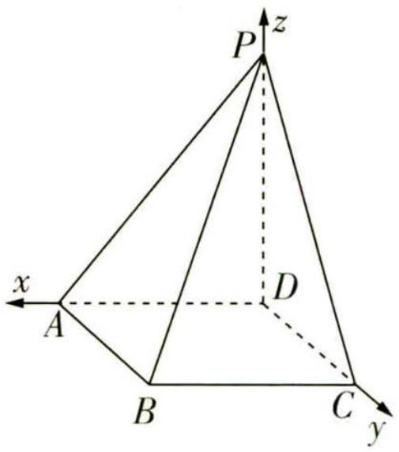

text_image

P
z
x
A
D
B
C
y

图 2

以 ${DA},{DC},{DP}$ 所在直线分别为 $x$ 轴, $y$ 轴, $z$ 轴建立如图 2 所示的空间直角坐标系. 因为内切球半径 $r = 1$ ,所以内切球球心 ${O}_{1}\left( {1,1,1}\right)$ .

【小提示】内切球球心到阳马各面距离相等，利用求出的半径易得其坐标

易知该四棱锥可以补全为长、宽、高分别为3,3,4的长方体,其外接球球心为 $O_{2}(\frac{3}{2},\frac{3}{2},2)$ .

【指点迷津】实际上,将阳马补成长方体后,其外接球球心即长方体体时角线的中点,易知 ${PB}$ 为一条体对角线,因此其中点为外接球球心

故内切球球心 $O_{1}$ 和外切球球心 $O_{2}$ 之间的距离为 $O_{1}O_{2} = \sqrt{(1 - \frac{3}{2})^{2} \times 2 + (1 - 2)^{2}} = \frac{\sqrt{6}}{2}$ .

答案 4π $\frac{\sqrt{6}}{2}$

技术、核科学与技术、环境科学与工程、生物医学工程、城乡规划学、风景园林学、软件工程、管理科学与工程、工商管理、公共管理、设计学、会计与金融、经济学和计量经济学、统计学与运筹学、现代语言学.

关注微信公众号“初高教辅站”获取更多初高中教辅资料

调研 3 (2023·天津耀华中学 12 月月考/二十四节气)“二十四节气”已经被列入联合国教科文组织人类非物质文化遗产代表作名录. 已知冬至、小寒、大寒、立春、雨水、惊蛰、春分、清明、谷雨、立夏、小满、芒种这十二个节气的日影长依次成等差数列. 若冬至的日影长为 15.5 尺, 芒种的日影长为 4.5 尺, 则雨水、惊蛰、春分、清明的日影长的和是\_\_\_\_尺.

解析 设从冬至之日起, 冬至、小寒、大寒、立春、雨水、惊蛰、春分、清明、谷雨、立夏、小满、芒种这十二个节气的日影长 (单位: 尺) 成等差数列 $\{a_{n}\}$ , 公差为 $d$ , 则 $a_{1} = 15.5, a_{12} = 4.5$ .

【信息提取】根据实际问题建立数学模型，把十二节气的日影长分别对应成等差数列的前12项，进行求解

所以 $15.5 + 11d = 4.5$ ，则 $d = -1$ ，所以雨水、惊蛰、春分、清明的日影长的和为 $a_5 + a_6 + a_7 + a_8 = 11.5 + 10.5 + 9.5 + 8.5 = 40.$

答案 40

调研 4 (2023·江苏徐州期末/祖暅原理)早在南北朝时期,祖冲之和他的儿子祖暅在研究几何体的体积时,得到了祖暅原理:幂势既同,则积不容异.这就是说,夹在两个平行平面之间的两个几何体,被平行于这两个平面的任意平面所截,如果截得的两个截面的面积总相等,那么这两个几何体的体积相等.将双曲线 $C_1$ : $x^2 - \frac{y^2}{3} = 1$ ,直线 $y = 0$ 与直线 $y = \sqrt{3}$ 所围成的平面图形(含边界)绕

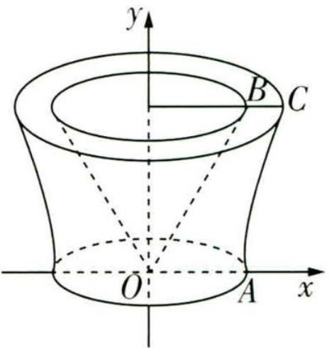

text_image

y
B C
O A x

图3

$y$ 轴旋转一周得到如图 3 所示的几何体 $\Gamma$ , 其中线段 $OA$ 为双曲线 $C_{1}$ 的实半轴, 点 $B$ 和点 $C$ 为直线 $y = \sqrt{3}$ 分别与双曲线一条渐近线及右支的交点, 则线段 $BC$ 绕 $y$ 轴旋转一周所得的图形的面积是 \_\_\_\_, 几何体 $\Gamma$ 的体积为 \_\_\_\_.

解析 由 $x^{2} - \frac{y^{2}}{3} = 1$ 得 $a = 1, b = \sqrt{3}$ , 则渐近线方程为 $y = \pm \sqrt{3} x$ ,

由 $\left\{\begin{aligned}y&=\sqrt{3}x,\\ y&=\sqrt{3},\end{aligned}\right.$ 得 $\left\{\begin{aligned}x&=1,\\ y&=\sqrt{3},\end{aligned}\right.$ 则 $B(1,\sqrt{3})$ . 由 $\left\{\begin{aligned}x^{2}-\frac{y^{2}}{3}&=1,\\ y&=\sqrt{3},\end{aligned}\right.$ 得 $\left\{\begin{aligned}x&=\pm\sqrt{2},\\ y&=\sqrt{3},\end{aligned}\right.$ 则 $C(\sqrt{2},\sqrt{3})$ .

所以线段 $BC$ 绕 $y$ 轴旋转一周所得的图形的面积为 $S_{1} = (\sqrt{2})^{2}\pi - 1^{2} \times \pi = \pi$ .

根据祖暅原理可得:几何体 $\Gamma$ 的体积为 $V=\sqrt{3}S_{1}+V_{圆锥}=\pi\times\sqrt{3}+\frac{1}{3}\pi\times1^{2}\times\sqrt{3}=\frac{4\sqrt{3}}{3}\pi.$

【扫清障碍】设直线 $y=y_{0}(0\leqslant y_{0}\leqslant\sqrt{3})$ 与渐近线和双曲线分别交于 $B'(x_{1},y_{1}), C'(x_{2},y_{2})$ ，可

北京航空航天大学 力学、仪器科学与技术、材料科学与工程、控制科学与工程、计算机科学与技术、交通运输工程、航空宇航科学与技术、软件工程.

求得 $x_{1}=\frac{y_{0}}{\sqrt{3}}, x_{2}^{2}=1+\frac{y_{0}^{2}}{3}$ ，因此线段 $B^{\prime}C^{\prime}$ 绕 y 轴旋转一周形成的图形的面积恒为 $\pi(x_{2}^{2}-x_{1}^{2})=\pi$ ，结合祖暅原理，进一步可得几何体 $\Gamma$ 的体积

答案 $\pi \frac{4\sqrt{3}}{3}\pi$

# 情境 9 经典数学问题

调研 1 (2023·河南郑州一中 1 月模拟) 我国古代有这样一个数学问题: 今有男子善走, 日增等里, 首日行走一百里, 九日共行一千二百六十里, 问日增几何? 其大意是: 现有一个善于步行的人, 第一天行走了一百里, 以后每天比前一天多走 $d$ 里, 九天他一共行走了一千二百六十里, 求 $d$ 的值. 关于该问题, 下列结论错误的是 ( )

A. $d = {15}$

B. 此人第三天行走了一百二十里

C. 此人前七天一共行走了九百一十里

D. 此人前八天一共行走了一千零八十里

解析 设此人第 $n (n \in \mathbf{N}^{*})$ 天走 $a_{n}$ 里, 则数列 $\{a_{n}\}$ 是公差为 $d$ 的等差数列, 记数列 $\{a_{n}\}$ 的 【指点迷津】读懂题意, 提取有效信息, 构造等差数列模型进行求解

前 n 项和为 $S_{n}$ ，由题意可得 $\left\{\begin{aligned}a_{1}&=100,\\ S_{9}&=9a_{1}+36d=1260,\end{aligned}\right.$ 解得 d=10，A 错.

$a_{3}=a_{1}+2d=120$ , B 对.

$S_{7}=7a_{1}+\frac{6\times7}{2}d=910$ , C 对.

$S_{8}=8a_{1}+\frac{7\times8}{2}d=1\ 080,D$ 对. 故选 A.

答案 A

调研 2 (2023·浙江温州中学期末联考)我国古代数学著作《田亩比类乘除捷法》中有这样一个问题:给银八百六十四两,只云所得银之两数比总分人数,其银多十二两.问总是几人,每人各得几两.其大概意思是:一共有八百六十四两银子,只知道每人分到的银子数目比总人数多十二,则一共有\_\_\_\_人,每人分得\_\_\_\_两银子.

解析 设一共有 x 人, 则每人分得 $\frac{864}{x}$ 两银子, 因为每人分到的银子数目比总人数多十二, 所以 $\frac{864}{x} - x = 12$ , 即 $x^{2} + 12x - 864 = 0$ , 解得 x = 24 或 x = -36 (舍去), 所以一共有 24 人, 每人分得 $\frac{864}{24} = 36$ (两) 银子.

答案 24 36

中国农业大学 生物学、农业工程、食品科学与工程、作物学、农业资源与环境、植物保护、畜牧学、兽医学、草学.

natural_image

Abstract geometric pattern with red and beige triangular shapes (no text or symbols)

# 聚焦创新命题形式

# 题型 1 定义新概念、新运算

调研 1 (2023·郑州 2 月一模) 欧拉函数 $\varphi(n)(n \in \mathbf{N}^{*})$ 的函数值等于所有不超过正整数 $n$ , 且与 $n$ 互素 (也称互质) 的正整数的个数, 例如 $\varphi(1)=1, \varphi(4)=2, \varphi(9)=6$ . 则

A. 数列 $\{\varphi(n)\}$ 单调

B. $\varphi(5) < \varphi(6)$

C. 数列 $\{\varphi (2^n)\}$ 是等比数列

D. $\varphi(6) = \varphi(2) + \varphi(3)$

解析 由题意知, $\varphi(1)=1,\varphi(2)=1$ ,所以A错误.

由题意知, $\varphi(5)=4,\varphi(6)=2$ ,所以B错误.

由题意,易知 $2^{n}$ 与比它小的正奇数都互质,所以不超过 $2^{n}$ 且与 $2^{n}$ 互素的正整数有 $2^{n-1}$ 个,所以

【发现规律】不超过 $2^{1}$ 且与 $2^{1}$ 互素的正整数为 1；不超过 $2^{2}$ 且与 $2^{2}$ 互素的正整数为 1, 3；不超过 $2^{3}$ 且与 $2^{3}$ 互素的正整数为 1, 3, 5, 7…… $\varphi(2^{n}) = 2^{n-1}$ , 数列 $\{\varphi(2^{n})\}$ 是等比数列, C 正确.

由题意知, $\varphi(6)=2,\varphi(2)=1,\varphi(3)=2$ ,所以D错误.故选C.

秒杀解 由题意知, $\varphi(1)=1,\varphi(2)=1,\varphi(3)=2,\varphi(4)=2,\varphi(5)=4,\varphi(6)=2$ ,所以 ABD 错误,根据排除法知选 C.

答案 C

调研 2 (2023 · 浙江杭州 1 月期末/平面斜坐标系 $xOy$ ) 定义平面斜坐标系 $xOy$ , 记 $\angle xOy = \theta (\theta \neq 90^{\circ}), e_{1}, e_{2}$ 分别为 $x$ 轴、 $y$ 轴正方向上的单位向量, 若平面上任意一点 $M$ 的坐标满足 $\overrightarrow{OM} = x e_{1} + y e_{2}$ , 则记向量 $\overrightarrow{OM}$ 的坐标为 $(x, y)$ . 给出下列四个命题, 其中正确的是 ( )

A. 若 $\overrightarrow{OP} = (x_1, y_1), \overrightarrow{OQ} = (x_2, y_2)$ , 则 $\overrightarrow{OP} \cdot \overrightarrow{OQ} = x_1x_2 + y_1y_2$

B. 若 $\theta = 60^{\circ}$ , 则以 $O$ 为圆心、1 为半径的圆的斜坐标方程为 $x^{2} + y^{2} + xy - 1 = 0$

C. 若 $P(x_{1},y_{1}),Q(x_{2},y_{2})$ ，则 $\vert PQ\vert = \sqrt{(x_2 - x_1)^2 + (y_2 - y_1)^2}$

D. 若 $\theta = 45^{\circ}$ , 记斜坐标系下直线 $l$ 的方程为 $x - y + 1 = 0$ , 则在斜坐标系下原点 $O$ 到直线 $l$ 的距离为 $\frac{2\sqrt{5}}{5}$

人教 A 版教材必修第二册第 37 页习题 6.3 的 T15 对应的就是 $\theta = 60^{\circ}$ 的斜坐标系情形，其中提到“根据平面向量基本定理判断，本题中对向量坐标的规定是否合理”，便是在引导我们探索斜坐标系的特征。由于斜坐标系中对于任意向量 $\overrightarrow{OP}$ ，都存在唯一一对实数 $x, y$ ，使得 $\overrightarrow{OP} = x e_1 + y e_2$ ，因此此种对向量坐标的规定是完全合理的。

北京师范大学 哲学、教育学、心理学、中国语言文学、外国语言文学、中国史、数学、地理学、系统科学、生态学、环境科学与工程、戏剧与影视学.

解析 对于 A, 若 $\overrightarrow{OP} = (x_{1}, y_{1})$ , $\overrightarrow{OQ} = (x_{2}, y_{2})$ ,

则 $\overrightarrow{OP} \cdot \overrightarrow{OQ} = (x_{1}e_{1} + y_{1}e_{2}) \cdot (x_{2}e_{1} + y_{2}e_{2}) = x_{1}x_{2} + y_{1}y_{2} + (x_{1}y_{2} + x_{2}y_{1})e_{1} \cdot e_{2}$ ,

因为 $e_{1}\cdot e_{2}\neq0$ ，所以 $\overrightarrow{OP}\cdot\overrightarrow{OQ}\neq x_{1}x_{2}+y_{1}y_{2}$ ，A错误.

【读懂新概念】平面斜坐标系的本质是坐标轴正方向上的单位向量 $e_{1}$ ， $e_{2}$ 不垂直，因而 $e_{1}$ $e_{2} \neq 0$

对于 B, 设以 O 为圆心、1 为半径的圆上任意一点为 $P(x, y)$ ，因为 $|OP| = 1$ ，所以 $(x e_{1} + y e_{2})^{2} = 1$ ，即 $x^{2} + y^{2} + 2xy e_{1} \cdot e_{2} - 1 = 0$ ，因为 $\theta = 60^{\circ}$ ，所以 $e_{1} \cdot e_{2} = \frac{1}{2}$ ，所以圆的斜坐标方程为 $x^{2} + y^{2} + xy - 1 = 0$ ，B 正确。

对于 C, $\overrightarrow{OP} = (x_{1}, y_{1})$ , $\overrightarrow{OQ} = (x_{2}, y_{2})$ , 则 $\overrightarrow{OQ} - \overrightarrow{OP} = (x_{2} - x_{1}, y_{2} - y_{1})$ , 即 $\overrightarrow{PQ} = (x_{2} - x_{1}, y_{2} - y_{1})$ , $\overrightarrow{PQ}=(x_{2}-x_{1})\boldsymbol{e}_{1}+(y_{2}-y_{1})\boldsymbol{e}_{2}$

所以 $|PQ|=\sqrt{(x_{2}-x_{1})^{2}+(y_{2}-y_{1})^{2}+2(x_{2}-x_{1})(y_{2}-y_{1})\cos\theta}$ ，C错误.

对于 D, 由于 $\theta = 45^{\circ}$ , 斜坐标系下直线 l 的方程为 $x - y + 1 = 0$ , 如图 1 所示, 在 l 上取 $C(0,1)$ , $D(-1,0)$ 两点, $\overrightarrow{CD} = -e_{1} - e_{2}$ , 过原点 O 作 l 的垂线, 垂足为 H, 设 $H(x_{0}, x_{0} + 1)$ , 则 $\overrightarrow{OH} = x_{0} e_{1} + (x_{0} + 1) e_{2}$ .

因为 $\overrightarrow{OH} \cdot \overrightarrow{CD} = 0$ ，所以 $[x_0 e_1 + (x_0 + 1)e_2] \cdot (-e_1 - e_2) = 0$

【难点突破】由于是斜坐标系，因而向量的数量识 $\overrightarrow{OH} \cdot \overrightarrow{CD}$ 的运算，不能按平面直角坐标系中的坐标系运算规则求解，而是需要将向量表示成“ $\overrightarrow{OP} = x e_{1} + y e_{2}$ ”的形式，再进行运算

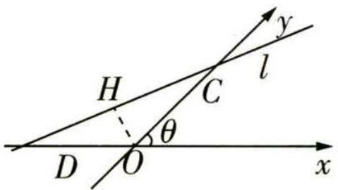

text_image

H
C
l
θ
D O x

图1

即 $x_0 + (x_0 + 1) + (2x_0 + 1)e_1 \cdot e_2 = 0$ ，其中 $e_1 \cdot e_2 = \cos 45^\circ = \frac{\sqrt{2}}{2}$ ，所以

$x_0 = -\frac{1}{2}$ , 所以 $\overrightarrow{OH} = -\frac{1}{2} e_1 + \frac{1}{2} e_2, |\overrightarrow{OH}| = \sqrt{\frac{1}{4} + \frac{1}{4} - \frac{1}{2} e_1 \cdot e_2} = \frac{\sqrt{2 - \sqrt{2}}}{2}, \frac{\sqrt{2 - \sqrt{2}}}{2} \neq \frac{2\sqrt{5}}{5}$ , D 错误.

综上,选 B.

答案 B

调研 3 (2023 · 北京市八一学校 12 月模拟/定义新运算) 定义 $a \otimes b = \left\{ \begin{array}{l} a, a \leqslant b, \\ b, a > b. \end{array} \right.$ 如: $1 \otimes 2 = 1$ . 则函数 $f(x) = \sin x \otimes \cos x$ 的值域为 ( )

A. $[-1, -\frac{\sqrt{2}}{2}]$

B. $\left[-\frac{\sqrt{2}}{2},\frac{\sqrt{2}}{2}\right]$

C. $\left[-\frac{\sqrt{2}}{2},1\right]$

D. $[-1, \frac{\sqrt{2}}{2}]$

解析 根据题设中的新定义, 得 $f(x)=\left\{\begin{aligned}\sin x,\sin x&\leqslant\cos x,\\ \cos x,\sin x&>\cos x.\end{aligned}\right.$

【转化新运算】新运算 $a \otimes b$ 实际上就是取 $a, b$ 中较小的那个，理解了新定义，函数 $f(x)$ 的表达式便可以转化成分段的形式

由 $\sin x \leqslant \cos x$ 可得 $\sin x - \cos x \leqslant 0$ , 所以 $\sqrt{2} \sin (x - \frac{\pi}{4}) \leqslant 0$ , 所以 $2k\pi - \pi \leqslant x - \frac{\pi}{4} \leqslant 2k\pi, k \in \mathbf{Z}$ ,

即 $2k\pi - \frac{3\pi}{4} \leqslant x \leqslant 2k\pi + \frac{\pi}{4}, k \in \mathbf{Z}$ .

同理, 由 $\sin x > \cos x$ 可得 $\sin x - \cos x > 0$ , 所以 $\sqrt{2} \sin \left( x - \frac{\pi}{4} \right) > 0$ , 所以 $2k\pi < x - \frac{\pi}{4} < 2k\pi + \pi$ , $k \in \mathbf{Z}$ , 即 $2k\pi + \frac{\pi}{4} < x < 2k\pi + \frac{5\pi}{4}, k \in \mathbf{Z}$ .

所以 $f(x) = \left\{ \begin{array}{l} \sin x, 2k\pi - \frac{3\pi}{4} \leqslant x \leqslant 2k\pi + \frac{\pi}{4}, k \in \mathbf{Z}, \\ \cos x, 2k\pi + \frac{\pi}{4} < x < 2k\pi + \frac{5\pi}{4}, k \in \mathbf{Z}. \end{array} \right.$

当 $2k\pi - \frac{3\pi}{4} \leqslant x \leqslant 2k\pi + \frac{\pi}{4}, k \in \mathbf{Z}$ 时, $f(x + 2\pi) = \sin (x + 2\pi) = \sin x = f(x)$ ,

当 $2k\pi + \frac{\pi}{4} < x < 2k\pi + \frac{5\pi}{4}, k \in \mathbf{Z}$ 时, $f(x + 2\pi) = \cos (x + 2\pi) = \cos x = f(x)$ ,

所以函数 $f(x)$ 是周期为 $2\pi$ 的周期函数,作出函数 $f(x)$ 在一个周期 $2\pi$ 内的图象(即图2中的实线部分),观察图象,可知函数 $f(x)$ 的值域为 $[-1,\frac{\sqrt{2}}{2}]$ ,故选D.

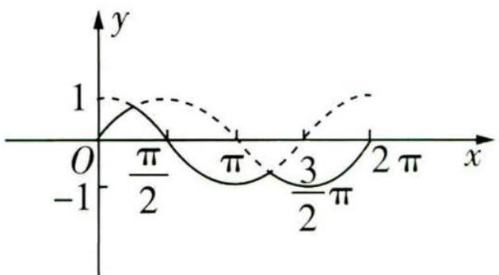

line

| x       | y     |
| ------- | ----- |
| 0       | 1     |
| π/2     | 0     |
| π       | -1    |
| 3π/2    | -1    |
| 2π      | 1     |

图2

【点睛】数形结合，观察图象得函数值域，函数的最小值很好理解，是-1，其最大值对应的自变量满足 $\sin x=\cos x$ ，显然最大值是 $\sin\frac{\pi}{4}=\cos\frac{\pi}{4}=\frac{\sqrt{2}}{2}$

答案 D

调研 4 (2023·广东省部分学校12月大联考/新定义“黄金椭圆”,开放性填空题)我们通常称离心率为 $\frac{\sqrt{5}-1}{2}$ 的椭圆为“黄金椭圆”.请写出一个焦点在x轴上,对称中心为坐标原点的“黄金椭圆”C的标准方程: \_\_\_\_.

解析 由题可设 $C: \frac{x^2}{a^2} + \frac{y^2}{b^2} = 1 (a > b > 0)$ , 令 $a = 2$ , 由题可知离心率 $e = \frac{c}{a} = \frac{\sqrt{5} - 1}{2}$ ,

【关键】既然是“写出一个”，那么不妨直接令 $a = 2$ ，求出 $b, c$ 的值，即可写出椭圆的标准方程，这就是开放性填空题的快速解题技巧

所以 $c = \sqrt{5} - 1, b^2 = a^2 - c^2 = 4 - (\sqrt{5} - 1)^2 = 2\sqrt{5} - 2,$

所以“黄金椭圆”C的标准方程可以为 $\frac{x^{2}}{4}+\frac{y^{2}}{2\sqrt{5}-2}=1.$

【趣味数学】对于椭圆 $\frac{x^{2}}{a^{2}}+\frac{y^{2}}{b^{2}}=1(a>b>0)$ ，设其半焦距为c，若 $b^{2}=ac$ ，则该椭圆为“黄金椭圆”，其离心率 $e=\frac{\sqrt{5}-1}{2}$ 。类比椭圆，对于双曲线 $\frac{x^{2}}{a^{2}}-\frac{y^{2}}{b^{2}}=1(a>0,b>0)$ ，设其半焦距为c，若

天津大学 化学、材料科学与工程、动力工程及工程热物理、化学工程与技术、管理科学与工程.

$b^{2}=ac$ ，则该双曲线为“黄金双曲线”，其离心率 $e=\frac{\sqrt{5}+1}{2}$

答案 $\frac{x^2}{4} +\frac{y^2}{2\sqrt{5} - 2} = 1$ （答案不唯一）

调研 5 (2023·山东潍坊期末测评/新定义 n 阶和数列)对于任意一个有穷数列,在其每相邻的两项间都插入这两项的和,将得到的新数列称为一阶和数列,如果在一阶和数列的基础上再在其每相邻的两项间都插入这两项的和,则可得到二阶和数列,以此类推,可以得到 n 阶和数列,如数列“2,4”的一阶和数列是“2,6,4”.设数列“2,4”的 n 阶和数列各项和为 $S_{n}$ .

(1)试求数列“2,4”的二阶和数列各项和 $S_{2}$ 与三阶和数列各项和 $S_{3}$ , 并猜想 $\{S_{n}\}$ 的通项公式 (无须证明).

(2) 设 $b_{n}=\frac{(S_{n}-3)(2n+1)}{\log_{3}(S_{n}-3)\cdot\log_{3}(S_{n+1}-3)}$ , $\{b_{n}\}$ 的前 m 项和为 $T_{m}$ , 若 $T_{m}>\frac{2025}{2}$ , 求 m 的最小值.

解析 (1) 数列“2,4”的一阶和数列为“2,6,4”，对应 $S_{1}=12$ ；

【点选关键】需要理解定义，是在每两相邻项间都插入这两项的和，构造新数列，注意按照顺序书写

数列“2,4”的二阶和数列为“2,8,6,10,4”，对应 $S_{2}=30$ ;

数列“2,4”的三阶和数列为“2,10,8,14,6,16,10,14,4”，对应 $S_{3}=84$ .

故猜想 $S_{n+1}=3S_{n}-6.$

【会证明】题目中要求不必证明，但为了研究探讨，我们也给出证明过程。下面证明 $S_{n+1}=3S_{n}-6$ 成立：设 $S_{n}=2+a_{1}+a_{2}+\cdots+a_{m-1}+a_{m}+4$ ，则 $S_{n+1}=2+(2+a_{1})+a_{1}+(a_{1}+a_{2})+\cdots+a_{m-1}+(a_{m-1}+a_{m})+a_{m}+(a_{m}+4)+4=3S_{n}-2-4=3S_{n}-6$ ，所以 $S_{n+1}=3S_{n}-6$ 成立

则有 $S_{n + 1} - 3 = 3(S_n - 3)$

【方法归纳】已知 $a_{1}=a$ (定值)， $a_{n+1}=ca_{n}+d(c\neq0,c\neq1,ac\neq a-d)$ ，一般情况下，往往借助待定系数法求数列通项公式。将已知化为 $a_{n+1}+\lambda=c(a_{n}+\lambda)$ 的形式，那么 $a_{n+1}=ca_{n}+(c-1)\lambda$ ，则 $(c-1)\lambda=d,\lambda=\frac{d}{c-1}$ ，那么 $a_{n+1}+\frac{d}{c-1}=c(a_{n}+\frac{d}{c-1})$ ，则数列 $\left\{a_{n}+\frac{d}{c-1}\right\}$ 是首项为 $a+\frac{d}{c-1}$ ，公比为 c 的等比数列，进而根据公式法求出通项公式

所以数列 $\{S_{n} - 3\}$ 是首项为 $S_{1} - 3 = 9$ ，公比为3的等比数列，

所以 $S_{n}-3=9\cdot3^{n-1}$ ，即 $S_{n}=3^{n+1}+3$ .

(2) 由于 $S_{n} = 3^{n + 1} + 3$ ，所以 $b_{n} = \frac{(S_{n} - 3)(2n + 1)}{\log_{3}(S_{n} - 3) \cdot \log_{3}(S_{n + 1} - 3)} = \frac{3^{n + 1}(2n + 1)}{(n + 1)(n + 2)} =$

$$
\frac {3 ^ {n + 2}}{n + 2} - \frac {3 ^ {n + 1}}{n + 1},
$$

则 $T_{m}=b_{1}+b_{2}+\cdots+b_{m}=\frac{3^{3}}{3}-\frac{3^{2}}{2}+\frac{3^{4}}{4}-\frac{3^{3}}{3}+\cdots+\frac{3^{m+2}}{m+2}-\frac{3^{m+1}}{m+1}=\frac{3^{m+2}}{m+2}-\frac{9}{2}>\frac{2025}{2}.$

所以 $3^{m} > (m + 2) \times 113$ ，当 $m = 6$ 时， $3^{6} = 729, (6 + 2) \times 113 = 904, 729 > 904$ 不成立，

当 m=7 时， $3^{7}=2\ 187,(7+2)\times113=1\ 017,2\ 187>1\ 017.$

所以 m 的最小值为 7.

# 题型 2 接轨高等数学

调研 1 (2023 · 湖北百校期末联考/泰勒展开式的应用) 设 $a = \frac{5}{4} \ln \frac{5}{4}$ , b = $\frac{1}{5} e^{\frac{1}{5}}$ , $c = \frac{1}{4}$ , 则 a, b, c 的大小顺序为 \_\_\_\_.

解析 由 $e^{x}\leqslant\frac{1}{1-x}(x<1)$ ，可得 $b=\frac{1}{5}e^{\frac{1}{5}}<\frac{1}{5}\times\frac{1}{1-\frac{1}{5}}=\frac{1}{4}=c.$

【泰勒展开式的应用1】由泰勒展开式 $e^{x}=1+\frac{x}{1!}+\frac{x^{2}}{2!}+\frac{x^{3}}{3!}+\cdots$ 可得 $e^{-x}=1-\frac{x}{1!}+\frac{x^{2}}{2!}-\frac{x^{3}}{3!}+\cdots$ ，
即 $e^{-x}\geqslant1-x$ ，当 x<1 时，便有 $e^{x}\leqslant\frac{1}{1-x}$

由 $\ln(x+1)\geqslant x-\frac{x^{2}}{2}(x>-1)$ ，可得 $a=\frac{5}{4}\ln\frac{5}{4}>\frac{5}{4}\times\left(\frac{1}{4}-\frac{1}{2}\times\frac{1}{4^{2}}\right)=\frac{1}{4}\times\frac{35}{32}>\frac{1}{4}=c.$

【泰勒展开式的应用2】由泰勒展开式 $\ln(x+1)=x-\frac{1}{2}x^{2}+\frac{1}{3}x^{3}-\cdots$ 可得 $\ln(x+1)\geqslant x-\frac{x^{2}}{2}$ 从而 a > c > b.

答案 a > c > b

调研 2 （名师原创/洛必达法则的应用, 双空题）当 $x \in (0, \frac{\pi}{2})$ 时, 不等式 $ax \geqslant \sin x \geqslant bx$ 恒成立, 则实数 a 的取值范围为 \_\_\_\_ , 实数 b 的取值范围为 \_\_\_\_.

解析 当 $x \in (0, \frac{\pi}{2})$ 时，由 $ax \geqslant \sin x$ 恒成立分离参数，可得 $a \geqslant \frac{\sin x}{x}$ 恒成立.

设 $f(x)=\frac{\sin x}{x},x\in(0,\frac{\pi}{2})$ ，则 $f'(x)=\frac{x\cos x-\sin x}{x^{2}}=\frac{(x-\tan x)\cos x}{x^{2}}<0,$

因而 $f(x)$ 在 $(0, \frac{\pi}{2})$ 上单调递减，而 $\lim_{x \to 0^{+}} \frac{\sin x}{x} = \lim_{x \to 0^{+}} \frac{\cos x}{1} = 1$ ，从而 $a \geqslant 1$ .

【妙应用】这里由于 $\frac{\sin 0}{0}$ 没意义，因而考虑运用洛必达法则，求 $x \rightarrow 0^{+}$ 时 $f(x)$ 的极限，从而得到实数a的取值范围

哈尔滨工业大学 力学、机械工程、材料科学与工程、控制科学与工程、计算机科学与技术、土木工程、航空宇航科学与技术、环境科学与工程.

故实数 a 的取值范围为 $[1, +\infty)$ .

同样地, 当 $x \in (0, \frac{\pi}{2})$ 时, 由 $\sin x \geqslant bx$ 分离参数, 可得 $b \leqslant \frac{\sin x}{x}$ 恒成立, 而 $f(x) > \frac{\sin \frac{\pi}{2}}{\frac{\pi}{2}} = \frac{2}{\pi}$ , 从而 $b \leqslant \frac{2}{\pi}$ .

故实数 b 的取值范围为 $(-∞, \frac{2}{π}]$ .

答案 [1, +∞) (-∞, 2/π]

调研 3 (2023·湖南雅礼中学1月月考)已知函数 $f(x)=2\sin x-ax,a\in\mathbf{R}$ .

(1) 当 $a = 1$ 时, 求 $g(x) = f(x) - \ln (x + 1)$ 在区间 $[0, \frac{\pi}{6}]$ 上的最小值.  
(2) 证明: $\sin \frac{1}{2} + \sin \frac{1}{3} + \sin \frac{1}{4} + \cdots + \sin \frac{1}{n} > \ln \frac{n+1}{2} (n > 1, n \in \mathbf{N}^*)$ .

解析 (1) 当 $a = 1$ 时, $g(x) = 2 \sin x - x - \ln (x + 1)$ , 则 $g'(x) = 2 \cos x - 1 - \frac{1}{x + 1}$ ,

令 $u(x) = 2\cos x - 1 - \frac{1}{x + 1} (0\leqslant x\leqslant \frac{\pi}{6})$ ，则 $u^{\prime}(x) = -2\sin x + \frac{1}{(x + 1)^{2}}.$

【多次求导】对于解析式含三角式的或较复杂的函数，研究其单调性时，如果一次求导无法完成，往往需要二次求导、甚至多次求导

令 $v(x) = -2\sin x + \frac{1}{(x + 1)^2} (0\leqslant x\leqslant \frac{\pi}{6})$ ，则 $v^{\prime}(x) = -2\cos x - \frac{2}{(x + 1)^3} < 0,$

所以 $v(x)$ 在区间 $\left[0, \frac{\pi}{6}\right]$ 上单调递减，即 $u'(x)$ 在区间 $\left[0, \frac{\pi}{6}\right]$ 上单调递减.

$u'(0)=1,u'(\frac{\pi}{6})=-1+\frac{1}{(\frac{\pi}{6}+1)^{2}}<0$ ,故存在唯一的 $x_{0}\in(0,\frac{\pi}{6})$ ,使得 $u'(x_{0})=0$ ,

【两个条件】一是由函数零点存在定理得到零点存在,二是由单调递减得到零点唯一,二者缺一不可

所以 $u(x)$ 在区间 $[0, x_{0})$ 上单调递增，在区间 $(x_{0}, \frac{\pi}{6}]$ 上单调递减.

$g'(0)=0, g'(\frac{\pi}{6})=\sqrt{3}-1-\frac{1}{\frac{\pi}{6}+1}>0$ , 所以在区间 $[0,\frac{\pi}{6}]$ 上, $g'(x)\geqslant0, g(x)$ 单调

复旦大学 哲学、应用经济学、政治学、马克思主义理论、中国语言文学、外国语言文学、中国史、数学、物理学、化学、生物学、生态学、材料科学与工程、环境科学与工程、基础医学、临床医学、公共卫生与预防医学、中西医结合、药学、集成电路科学与工程。

递增，

故 $g(x)$ 在区间 $[0, \frac{\pi}{6}]$ 上的最小值为 $g(0) = 0$ .

(2) 由(1)可知 $g(x) = 2\sin x - x - \ln (x + 1) \geqslant g(0) = 0$ 在区间 $[0, \frac{1}{2}]$ 上恒成立，所以 $2\sin x - x \geqslant \ln (x + 1)$ 在区间 $[0, \frac{1}{2}]$ 上恒成立.

【联系(1)(2)问】(1)是为了(2)设置的解题台阶,这是解题的突破口

令 $h(x)=x-\ln(x+1)(0\leqslant x\leqslant\frac{1}{2})$ ，则 $h(0)=0$ ，且 $h'(x)=1-\frac{1}{x+1}=\frac{x}{x+1}>0$ ，

所以 $h(x)$ 在区间 $[0, \frac{1}{2}]$ 上单调递增, 所以当 $0 \leqslant x \leqslant \frac{1}{2}$ 时, $h(x) \geqslant 0$ ,

即当 $0 \leqslant x \leqslant \frac{1}{2}$ 时, $x - \ln(x + 1) \geqslant 0$ , $x \geqslant \ln(x + 1)$ , 所以 $2\sin x \geqslant x + \ln(x + 1) \geqslant 2\ln(x + 1)$ 在区间 $[0, \frac{1}{2}]$ 上恒成立, 即 $\sin x \geqslant \ln(x + 1)$ 在区间 $[0, \frac{1}{2}]$ 上恒成立, 当且仅当 x = 0 时取等号.

【核心点】以上这段求解的目的在于根据 $2\sin x - x \geqslant \ln(x + 1)$ 在区间 $[0, \frac{1}{2}]$ 上恒成立得出不等式 $\sin x \geqslant \ln(x + 1)$ 在区间 $[0, \frac{1}{2}]$ 上恒成立，前述过程是运用常规方法，借助导数知识求解，但如果考虑高等数学知识，利用泰勒展开式更为简便。根据泰勒展开式 $\ln(x + 1) = x - \frac{1}{2}x^{2} + \frac{1}{3}x^{3} - \cdots \leqslant x$ ， $x \in [0, \frac{1}{2}]$ ，那么在区间 $[0, \frac{1}{2}]$ 上，便有 $2\sin x \geqslant \ln(x + 1) + x \geqslant 2\ln(x + 1)$ ，即 $\sin x \geqslant \ln(x + 1)$ 在区间 $[0, \frac{1}{2}]$ 上恒成立，当且仅当 $x = 0$ 时取等号

所以 $\sin\frac{1}{2}+\sin\frac{1}{3}+\sin\frac{1}{4}+\cdots+\sin\frac{1}{n}>\ln\frac{3}{2}+\ln\frac{4}{3}+\cdots+\ln\frac{n+1}{n}=\ln(\frac{3}{2}\times\frac{4}{3}\times\cdots\times\frac{n+1}{n})=\ln\frac{n+1}{2}.$

# 反思提升

利用泰勒展开式可以从不同的方向设问，设置不同的题目，举例如下。

①若 $x \geqslant 0$ ，求证： $e^{x} \geqslant 1 + x + \frac{x^{2}}{2}$ .（利用 $e^{x} = 1 + \frac{x}{1!} + \frac{x^{2}}{2!} + \frac{x^{3}}{3!} + \cdots$ 求解）  
②若 $x \geqslant 0$ ，求证： $\ln(x + 1) \geqslant x - \frac{x^{2}}{2}$ .（利用 $\ln(x + 1) = x - \frac{1}{2}x^{2} + \frac{1}{3}x^{3} - \cdots$ 求解）  
③若 $x \in (0,1)$ ，求证： $\sin x > x - \frac{x^{3}}{6}$ .（利用 $\sin x = x - \frac{x^{3}}{3!} + \frac{x^{5}}{5!} - \frac{x^{7}}{7!} + \cdots$ 求解）

同济大学 生物学、建筑学、土木工程、测绘科学与技术、环境科学与工程、城乡规划学、风景园林学、设计学.

调研 4 (2023·辽宁大连1月期末)已知函数 $f(x)=\frac{1}{2}(\ln x)^{2}+\ln x+kx-k$ , $g(x)=\frac{1}{2}\mathrm{e}^{2x}-\frac{1}{\mathrm{e}}x-f(x)$ .

(1) 若 $k \leqslant -1$ ，求证：函数 $f(x)$ 只有一个零点.  
(2) $\forall x_{1} \neq x_{2}, \frac{g(x_{1}) - g(x_{2})}{x_{1} - x_{2}} > 2$ 恒成立, 求 $k$ 的取值范围.

解析 (1) 由 $f(x) = \frac{1}{2} (\ln x)^2 + \ln x + kx - k$ 得 $f'(x) = \frac{\ln x}{x} + \frac{1}{x} + k$ .

记 $h(x) = \frac{\ln x}{x} +\frac{1}{x} +k$ ，则 $h^{\prime}(x) = \frac{-\ln x}{x^{2}}$ ，当 $0 <   x <   1$ 时， $h^\prime (x) > 0,h(x)$ 单调递增，当 $x > 1$ 时， $h^\prime (x) <   0,h(x)$ 单调递减，故 $h(x)\leqslant h(1) = 1 + k.$

当 $k \leqslant -1$ 时, $k + 1 \leqslant 0$ , 所以 $h(x) \leqslant 0$ , 因此 $f'(x) \leqslant 0$ , 所以 $f(x)$ 在定义域 $(0, +\infty)$ 上单调递减, 而 $f(1) = 0$ , 因此函数 $f(x)$ 只有一个零点.

(2) 方法一 不妨设 $x_{1} < x_{2}$ ，则由 $\frac{g(x_{1}) - g(x_{2})}{x_{1} - x_{2}} > 2$ 得 $g(x_{1}) - g(x_{2}) < 2(x_{1} - x_{2})$ ，可得 $g(x_{1}) - 2x_{1} < g(x_{2}) - 2x_{2}$ ，故函数 $F(x) = g(x) - 2x$ 在其定义域内单调递增，故 $F'(x) \geqslant 0$ ，即 $F'(x) = g'(x) - 2 = e^{2x} - \frac{1}{e} - f'(x) - 2 = e^{2x} - \frac{1}{e} - \frac{\ln x}{x} - \frac{1}{x} - k - 2 \geqslant 0$ ，所以 $e^{2x} - \frac{1}{e} - \frac{\ln x}{x} - \frac{1}{x} - 2 \geqslant k$ .

【明思路】此时我们已经成功分离参数 k，那么接下来只需要求 $e^{2x}-\frac{1}{e}-\frac{\ln x}{x}-\frac{1}{x}-2$ 的最小值即可

记 $p(x) = \mathrm{e}^{2x} - \frac{1}{\mathrm{e}} -\frac{\ln x}{x} -\frac{1}{x} -2$ ，则 $p^{\prime}(x) = 2\mathrm{e}^{2x} + \frac{\ln x}{x^{2}} = \frac{2x^{2}\mathrm{e}^{2x} + \ln x}{x^{2}}.$

记 $q(x) = 2x^{2}\mathrm{e}^{2x} + \ln x$ ，则 $q^{\prime}(x) = 4x(x + 1)\mathrm{e}^{2x} + \frac{1}{x} >0,$

所以 $q(x)$ 在 $(0, +\infty)$ 上单调递增， $q(1) = 2e^{2} > 0, q(\frac{1}{e}) = 2e^{\frac{2}{e}-2} - 1 < 2e^{-1} - 1 < 0$ ，所以存在唯一的 $x_{0} \in (\frac{1}{e}, 1)$ ，使得 $q(x_{0}) = 0$ ，

【点选关键】 $x_{0}$ 有什么用？根据上面分析可知，在 $(0,x_{0})$ 上 $p'(x)<0$ ，在 $(x_{0},+\infty)$ 上 $p'(x)>0$ ，因此 $p(x)_{\min}=p(x_{0})$ ， $p(x_{0})$ 就是 $e^{2x}-\frac{1}{e}-\frac{\ln x}{x}-\frac{1}{x}-2$ 的最小值

即 $2x_0^2\mathrm{e}^{2x_0} + \ln x_0 = 0$ ，所以 $2x_0\mathrm{e}^{2x_0} = -\frac{1}{x_0}\ln x_0 = \frac{1}{x_0}\ln \frac{1}{x_0}.$

由于 $x_0 \in (\frac{1}{\mathrm{e}}, 1)$ , 所以 $\ln \frac{1}{x_0} \in (0, 1)$ .

令 $t(x) = x\mathrm{e}^{x}$ , 易知 $t(x)$ 在 $(0, +\infty)$ 上单调递增, 所以由 $2x_{0}\mathrm{e}^{2x_{0}} = \frac{1}{x_{0}}\ln \frac{1}{x_{0}}$ , 即 $t(2x_{0}) = t(\ln \frac{1}{x_{0}})$ , 可得 $2x_{0} = \ln \frac{1}{x_{0}}$ , 即 $\mathrm{e}^{2x_0} = \frac{1}{x_0}$ ,

所以 $p(x)_{\min}=p(x_{0})=e^{2x_{0}}-\frac{1}{e}-\frac{\ln x_{0}}{x_{0}}-\frac{1}{x_{0}}-2=\frac{1-(1-2x_{0})}{x_{0}}-2-\frac{1}{e}=-\frac{1}{e}$

故 $k \leqslant -\frac{1}{\mathrm{e}}$ ，即 $k$ 的取值范围为 $(- \infty, -\frac{1}{\mathrm{e}}]$ .

方法二 $g(x) = \frac{1}{2}\mathrm{e}^{2x} - \frac{1}{\mathrm{e}} x - \frac{1}{2} (\ln x)^2 -\ln x - kx + k,$

由拉格朗日中值定理知,存在 x > 0,使得 $g'(x) = \frac{g(x_1) - g(x_2)}{x_1 - x_2} (x_1 \neq x_2)$ ,

由于 $x_{1} \neq x_{2}$ , 所以 $g^{\prime}(x) = \mathrm{e}^{2x} - \frac{1}{\mathrm{e}} - \frac{1}{x} \ln x - \frac{1}{x} - k \geqslant 2$ 恒成立,

【难点突破】利用拉格朗日中值定理,将双变量不等式问题转化为单变量不等式问题,再通过求导的方法求解

即 $k \leqslant \mathrm{e}^{2x} - \frac{1}{\mathrm{e}} - \frac{1}{x}\ln x - \frac{1}{x} - 2$ ，以下同方法一.

# 题型 3 创新函数模型

调研 1 (2023·四川绵阳南山中学一诊/对数函数模型)某检测分析是用荧光定量 PCR 法,通过化学物质的荧光信号,对在 PCR 扩增进程中指数级增加的靶标 DNA 实时监测,在 PCR 扩增时期,荧光信号强度达到阈值时,DNA 的数量 X 与扩增次数 n 满足 $\lg X = n \lg (1 + p) + \lg X_{0}$ ,其中 $X_{0}$ 为 DNA 的初始数量,p 为扩增效率.已知某被测

【特色分析】实际问题中的对数函数模型

标本 DNA 扩增 12 次后, 数量变为原来的 1 000 倍, 则扩增效率 p 约为 (参考数据: $10^{0.25} \approx 1.778, 10^{-0.25} \approx 0.562$ ) ()

A. $22.2\%$

B. $43.8\%$

C. $56.2\%$

D. $77.8\%$

解析 由题意知, $\lg 1000X_{0}=12\lg(1+p)+\lg X_{0}$ ，即 $\lg 10^{3}+\lg X_{0}=12\lg(1+p)+\lg X_{0}$ ,

【用公式】 $\log_{a}(MN)=\log_{a}M+\log_{a}N(a>0,$ 且 $a\neq1,M,N>0)$

即 $3 + \lg X_0 = 12\lg (1 + p) + \lg X_0$ ，所以 $1 + p = 10^{0.25} \approx 1.778$ ，解得 $p \approx 0.778 = 77.8\%$ 。故选 D.

答案 D

南京大学 哲学、理论经济学、中国语言文学、外国语言文学、物理学、化学、天文学、大气科学、地质学、生物学、材料科学与工程、计算机科学与技术、化学工程与技术、矿业工程、环境科学与工程、图书情报与档案管理.

调研 2 (2023·成都石室中学一诊/指数函数模型)某化工企业为了响应并落实国家污水减排政策,加装了污水过滤排放设备,在过滤过程中,污染物含量 M(单位: mg/L)与时间 t(单位:h)之间的关系为 $M = M_{0} e^{-kt}$ (其中 $M_{0}$ 为初始污染物含量,且 $M_{0}$ ,

【特色分析】实际问题中的指数函数模型

k 是正常数). 已知经过1 h, 设备可以过滤掉 20% 的污染物, 则过滤 60% 的污染物需要的时间最接近(参考数据: lg 2≈0.301) ()

A. $3 \mathrm{~h}$

B. $4 \mathrm{~h}$

C. $5 \mathrm{~h}$

D. $6 \mathrm{~h}$

解析 由题意可知 $(1 - 20\%)$ $M_0 = M_0\mathrm{e}^{-k}$ , 所以 $\mathrm{e}^{-k} = 0.8$ .

令 $(1 - 60\%)M_{0} = M_{0}\mathrm{e}^{-kt}$ ，则 $0.4 = \mathrm{e}^{-kt} = (\mathrm{e}^{-k})^{t} = (0.8)^{t}$

所以 $t=\log_{0.8}0.4=\frac{\lg 0.4}{\lg 0.8}=\frac{\lg \frac{2}{5}}{\lg \frac{4}{5}}=\frac{\lg 2-\lg 5}{2\lg 2-\lg 5}=\frac{\lg 2-(1-\lg 2)}{2\lg 2-(1-\lg 2)}=\frac{2\lg 2-1}{3\lg 2-1}\approx\frac{2\times0.301-1}{3\times0.301-1}=$

$\frac{-0.398}{-0.097} \approx 4.103$ ，比较接近4.故选B.

【会运算】利用指对互换求解 $t$ ，化简时注意对数换底公式的应用

答案 B

调研 3 (2023·北京西城区1月期末/分式函数模型)人口问题是关系民族发展的大事.历史上在研究受资源约束的人口增长问题中,有学者提出了“Logistic 模型”: $f(t)=\frac{Kx_{0}}{x_{0}-(x_{0}-K)e^{-\frac{r_{0}}{K}t}}(t \geqslant 0)$ ,其中 $K,r_{0},x_{0}$ 均为正常数,且 $K>x_{0}$ .该模型描述了

【特色分析】实际问题中与指数函数相关的分式函数模型

人口 $f(t)$ 随时间 $t$ 的变化规律. 给出下列三个结论:

① $f(0)=Kx_{0}$ ;   
② $f(t)$ 在 $[0, +\infty)$ 上单调递增；  
③ $\forall t \in \lceil 0, +\infty \rceil, f(t) < K.$

其中所有正确结论的序号是\_\_\_\_。

解析 对于①, 当 t=0 时, $f(0)=\frac{Kx_{0}}{x_{0}-(x_{0}-K)e^{0}}=\frac{Kx_{0}}{x_{0}-(x_{0}-K)}=\frac{Kx_{0}}{K}=x_{0}$ , 所以 $f(0)=x_{0}$ ,
①不正确.

对于②, $f'(t) = -\frac{Kx_0}{[x_0 - (x_0 - K)e^{-\frac{r_0}{K}t}]^2} \cdot \frac{r_0}{K}(x_0 - K)e^{-\frac{r_0}{K}t} = -\frac{x_0 \cdot r_0}{[x_0 - (x_0 - K)e^{-\frac{r_0}{K}t}]^2}(x_0 - K)e^{-\frac{r_0}{K}t},$

【会求导】运用复合函数的求导法则，即“外导”乘以“内导”求解

东南大学 机械工程、材料科学与工程、电子科学与技术、信息与通信工程、控制科学与工程、计算机科学与技术、建筑学、土木工程、交通运输工程、生物医学工程、风景园林学、艺术学理论.

因为 $K, r_{0}, x_{0}$ 均为正常数，且 $K > x_{0}$ ，所以 $f'(t) > 0$ ，所以 $f(t)$ 在 $[0, +\infty)$ 上单调递增，②正确.

对于③， $\forall t \in [0, +\infty)$ ， $f(t) < K$ ，即 $\frac{Kx_0}{x_0 - (x_0 - K)e^{-\frac{r_0}{K}t}} < K$ ，即 $\frac{x_0}{x_0 - (x_0 - K)e^{-\frac{r_0}{K}t}} < 1$ ，

即 $x_{0}<x_{0}-(x_{0}-K)e^{-\frac{r_{0}}{K}t}$ ，即 $(x_{0}-K)e^{-\frac{r_{0}}{K}t}<0$ ，而 $e^{-\frac{r_{0}}{K}t}>0$ 恒成立，且 $K>x_{0}$ ，所以 $(x_{0}-K)e^{-\frac{r_{0}}{K}t}<0$ 恒成立。

答案 ②③

调研 4 (2023·北京第十二中学12月模拟/函数模型的选择)长江流域水库群的修建和联合调度极大降低了洪涝灾害风险,发挥了重要的防洪减灾作用.每年洪水来临之际,为保证防洪需要,降低防洪风险,水利部门需要在原有蓄水量的基础上联合调度,统一蓄水,用蓄满指数(蓄满指数= $\frac{水库实际蓄水量}{水库总蓄水量}$ ×100)来衡量每座水库的水位情况.假设某次联合调度要求如下:(i)调度后每座水库的蓄满指数属于区间[0,100];(ii)调度后每座水库的蓄满指数都不能降低;(iii)调度前后,各水库之间的蓄满指数排名不变.

记 $x (0 \leqslant x \leqslant 100)$ 为调度前某水库的蓄满指数, $y$ 为调度后该水库的蓄满指数, 给出下面四个 $y$ 关于 $x$ 的函数解析式: ① $y = -\frac{1}{20} x^{2} + 6 x$ , ② $y = 10 \sqrt{x}$ , ③ $y = 10^{\frac{x}{50}}$ , ④ $y = 100 \sin \frac{\pi}{200} x$ .

【特色分析】题目提供4个函数模型，通过条件，逐一对照分析求解

则满足此次联合调度要求的函数解析式的个数为 （）

A. 1

B. 2

C. 3

D. 4

解析 对于①, $y = -\frac{1}{20}x^2 + 6x = -\frac{1}{20}(x^2 - 120x) = -\frac{1}{20}(x - 60)^2 + 180$ , 该函数在 $x = 60$ 时函数值为 180, 超过了要求的范围, 不符合题意.

【技法点拨】否定一个模型，通过确定某函数值超过要求的范围，不符合条件(i)即可。而确定一个模型，需要有对三个条件是否都满足的判断过程。本题的难点是对于④中三角函数模型的判断

对于②, $y=10\sqrt{x}$ 为增函数,当 $x\in[0,100]$ 时, $y\in[0,100]$ ,且 $\sqrt{x}\leqslant10$ ,故 $x\leqslant10\sqrt{x}$ ,符合题意.

对于③, $y=10^{\frac{x}{50}}$ ,当x=50时, $10^{\frac{x}{50}}=10<50$ ,不符合题意.

对于④, $y = 100 \sin \frac{\pi}{200} x$ 在 $[0, 100]$ 上单调递增, 当 $x \in [0, 100]$ 时, $\frac{\pi}{200} x \in [0, \frac{\pi}{2}]$ , 故 $y =$ 【小提示】符合(iii)蓄满指数排名不变

$100\sin\frac{\pi}{200}x\in[0,100]$ ，设 $g(x)=100\sin\frac{\pi}{200}x-x,x\in[0,100]$ ，则 $g'(x)=\frac{\pi}{2}\cdot\cos\frac{\pi}{200}x-1$ ，易知【小提示】符合(i)，不超过要求的范围

$g^{\prime}(x) = \frac{\pi}{2} \cdot \cos \frac{\pi}{200} x - 1$ 在 $[0, 100]$ 上单调递减，且 $g^{\prime}(0) = \frac{\pi}{2} - 1 > 0, g^{\prime}(100) = \frac{\pi}{2} \cos \frac{\pi}{2} - 1 =$

浙江大学 化学、生物学、生态学、机械工程、光学工程、材料科学与工程、动力工程及工程热物理、电气工程、控制科学与工程、计算机科学与技术、土木工程、农业工程、环境科学与工程、软件工程、园艺学、植物保护、基础医学、临床医学、药学、管理科学与工程、农林经济管理.

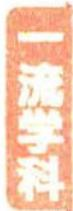

-1 < 0, 所以存在 $x_0 \in [0, 100]$ , 使得 $g'(x_0) = 0$ . 当 $x \in [0, x_0]$ 时, $g'(x) \geqslant 0$ ; 当 $x \in [x_0, 100]$ 时, $g'(x) \leqslant 0$ . 故 $g(x)$ 在 $[0, x_0]$ 上单调递增, 在 $[x_0, 100]$ 上单调递减. 又 $g(0) = 0$ , $g(100) = 0$ , 故在 $[0, 100]$ 上 $g(x) \geqslant 0$ , 即在 $[0, 100]$ 上 $100 \sin \frac{\pi}{200} x \geqslant x$ , 故④符合题意. 所以②④符合题意, 从而选 B.

【小提示】符合(ii)，蓄满指数不降低

答案 B

调研 5 (2023·河北石家庄一中1月阶段检测/分段函数模型)2022年10月16日,习近平总书记在中国共产党第二十次全国代表大会的报告中,提出了“把我国建设成为世界科技强国”的发展目标.国内某企业为响应这一号召,计划在2023年引进新技术,生产新手机,通过市场分析,生产此款手机全年需投入固定成本250万元,每生产x千部手机,需另投入成本R(x)万元,且R(x)= $\left\{\begin{array}{l}10x^{2}+100x,0<x<40,\\701x+\frac{10\ 000}{x}-9\ 450,x\geqslant40,\end{array}\right.$ 已知

【特色分析】实际问题中的分段函数模型

每部手机的售价为 0.7 万元, 假设全年内生产的手机当年能全部销售完.

(1)试写出2023年利润 $L$ (万元)关于年产量 $x$ (千部)的函数解析式.  
(2) 当 2023 年产量为多少千部时,企业所获利润最大?并求出最大利润.

解析 (1) 根据题意可得当 $0 < x < 40$ 时, $L(x) = 1000x \times 0.7 - 250 - (10x^{2} +$

【敲黑板】对于分段函数问题,要注意分类讨论

$$
1 0 0 x) = - 1 0 x ^ {2} + 6 0 0 x - 2 5 0.
$$

当 $x \geqslant 40$ 时, $L(x) = 1000x \times 0.7 - 250 - (701x + \frac{10000}{x} - 9450) = -x - \frac{10000}{x} + 9200$ .

故 $L(x) = \left\{ \begin{array}{l} -10x^{2} + 600x - 250,0 <   x <   40,\\ -x - \frac{10000}{x} +9200,x\geqslant 40. \end{array} \right.$

(2) 由(1)可知, 当 $0 < x < 40$ 时, $L(x) = -10x^{2} + 600x - 250 = -10(x - 30)^{2} + 8750$ ,

此时 $L(x)_{\max}=L(30)=8750.$

当 $x \geqslant 40$ 时, $L(x) = -x - \frac{10000}{x} + 9200 \leqslant -2\sqrt{x \cdot \frac{10000}{x}} + 9200 = 9000$ ,

当且仅当 $x=\frac{10\ 000}{x}$ ，即 x=100 时， $L(x)$ 取最大值， $L(x)_{\max}=9\ 000$ .

【点睛】分段函数求最值,一般先求出每一段的最值,然后比较大小,得到最终结果

因为 $9000 > 8750$ , 所以当 2023 年产量为 100 千部时, 企业所获利润最大, 最大利润是 9000 万元.

【易错提醒】注意单位，产量的单位是千部，利润的单位是万元

# 题型 4 多选题

调研 1 (2023·安徽芜湖一中、蚌埠二中等校 12 月联考改编/芝诺悖论)古希腊哲学家芝诺提出了如下悖论:一个人以恒定的速度径直从 A 点走向 B 点,要先走完总路程的二分之一,再走完剩下路程的二分之一,如此下去,会产生无限个“剩下的路程”,因此他有无限个“剩下路程的二分之一”要走,这个人永远走不到终点.由于古代人们对无限认识的局限性,故芝诺得到了错误的结论.设 AB = S ,这个人走的第 n 段距离为 $a_{n}$ ,这个人走的前 n 段距离总和为 $S_{n}$ ,则下列结论正确的有 ( )

A. $\forall n\in \mathbf{N}^{*}$ ，都有 $a_{n + 1} = \frac{3(S - S_n)}{2}$

B. $\forall n\in \mathbf{N}^*$ ，都有 $a_{n + 1} = \frac{a_n}{2}$

C. $\forall n\in \mathbf{N}^{*}$ ，都有 $\frac{S_n}{S} = 1 - (\frac{1}{2})^n$

D. $\exists n\in \mathbf{N}^*$ ，使得 $\frac{S_n}{S} = 1$

解析 由已知得, $a_{1}=\frac{S}{2}$ ，且不难得到， $\forall n\in N^{*},a_{n+1}=\frac{S-S_{n}}{2}$ ，所以A错误.

【关键点】通过已知，得到 $S_{n}$ 与 $a_{n+1}$ 的关系是关键，也可以利用排除法，如当n=2时，显然有 $a_{2}=\frac{S-S_{1}}{2}$ ，所以A错误

走 $n$ 段距离后, 由 $a_{n+1} = \frac{S - S_n}{2}$ 得 $a_n = \frac{S - S_{n-1}}{2} (n \geqslant 2)$ , 两式相减化简得 $a_{n+1} = \frac{a_n}{2} (n \geqslant 2)$ , 当 $n = 1$ 时, $a_1 = \frac{S}{2}, a_2 = \frac{S}{2} \times \frac{1}{2} = \frac{a_1}{2}$ 符合上式, 所以 B 正确.

【易错提醒】切勿遗漏对 n=1 的情况的检验

由 $a_{n + 1} = \frac{a_n}{2}$ 可知 $\{a_n\}$ 是首项为 $\frac{S}{2}$ , 公比为 $\frac{1}{2}$ 的等比数列, 则 $S_{n} = \frac{S}{2} \cdot \frac{1 - (\frac{1}{2})^{n}}{1 - \frac{1}{2}} = S[1 - (\frac{1}{2})^{n}] < S$ , 所以 C 正确, D 错误. 故选 BC.

答案 BC

调研 2 (2023·湖南五市十校第二次大联考)如图1,正方体 $ABCD - A_{1}B_{1}C_{1}D_{1}$ 的棱长为 $1, P$ 为线段 $A_{1}D$ 上的一个动点,下列结论中正确的是 ( )

A. ${BP}\bot {BC}$   
B. $BP \parallel$ 平面 $CB_{1}D_{1}$

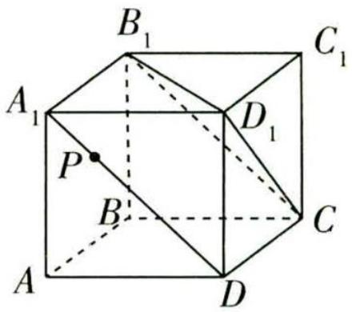

text_image

B₁
A₁
P
B
D₁
C₁
C
A
D

图 1

武汉大学 理论经济学、法学、马克思主义理论、化学、地球物理学、生物学、土木工程、水利工程、测绘科学与技术、口腔医学、图书情报与档案管理.

C. P 到 A 和到 $B_{1}$ 的距离之和的最小值为 $\sqrt{2 + \sqrt{2}}$   
D. $PB$ 与 $CD$ 所成角的正切值的最小值为 $\frac{\sqrt{2}}{2}$

解析 对于 A, 在正方体 $ABCD - A_{1}B_{1}C_{1}D_{1}$ 中, $BC \perp$ 平面 $ABB_{1}A_{1}$ , 因此只有 P 位于 $A_{1}$ 处时, $BP \perp BC$ , 所以 A 错误.

【另解】逆向思考, 如果 ${BP}\bot {BC}$ ,那么易得 ${BC}\bot$ 平面 ${ABP}$ ,而 ${AP} \subset$ 平面 ${ABP}$ ,所以 ${BC}\bot$ ${AP}$ ,又 ${AD}//{BC}$ ,则 ${AD}\bot {AP}$ ,只有 $P$ 与 ${A}_{1}$ 重合时才成立,因而 $A$ 错误

对于 B, 连接 $A_{1}B, BD$ , 因为 $BP \subset$ 平面 $A_{1}BD$ , 平面 $A_{1}BD \parallel$ 平面 $CB_{1}D_{1}$ , 所以 $BP \parallel$ 平面 $CB_{1}D_{1}$ , 所以 B 正确.

对于 C, 将平面 $AA_{1}D$ 沿直线 $A_{1}D$ 翻折到与平面 $A_{1}B_{1}CD$ 共面的位置, 则当 A, P, $B_{1}$ 三点共线时

【方法点拨】展开成平面图形, 将空间距离转化为平面距离求解

所求距离最小, 连接 $AB_{1}$ , 则最小值为 $AB_{1}$ , 此时在 $\triangle AA_{1}B_{1}$ 中, 知 $\angle AA_{1}B_{1}=135^{\circ}$ , 由余弦定理得 $AB_{1}=\sqrt{2+\sqrt{2}}$ , 所以 C 正确.

对于 D, 易知 ${PB}$ 与 ${CD}$ 所成角即 ${PB}$ 与 ${AB}$ 所成角,易知 ${PA} \bot  {AB}$ ,所以在 $\mathrm{{Rt}}\bigtriangleup  {PAB}$ 中有 $\tan \angle {PBA} = \frac{PA}{AB} = {PA}$ ,易知 ${PA}$ 的最小值为 $\frac{\sqrt{2}}{2}$ ,所以 ${PB}$ 与 ${CD}$ 所成角的正切值的最小值为 $\frac{\sqrt{2}}{2},\mathrm{D}$ 正确.

【换个思路】以 A 为原点，AD, AB, $AA_{1}$ 所在直线分别为 x 轴，y 轴，z 轴，建立如图2所示的空间直角坐标系，则 $A(0,0,0)$ ， $B(0,1,0)$ ， $C(1,1,0)$ ， $D(1,0,0)$ ， $B_{1}(0,1,1)$ ，设 $P(x,0,1-x)$ ， $0 \leqslant x \leqslant 1$ 。对于 C，PA + $PB_{1} = \sqrt{x^{2} + (1 - x)^{2}} + \sqrt{x^{2} + 1 + (-x)^{2}} = \sqrt{2} \left[ \sqrt{(x - \frac{1}{2})^{2} + (0 - \frac{1}{2})^{2}} + \right.$

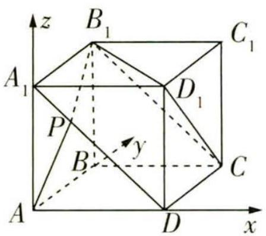

text_image

z
B₁
C₁
A₁
D₁
P
y
B
C
A
D
x

图 2

$\sqrt{(x-0)^{2}+(0+\frac{1}{\sqrt{2}})^{2}}$ ，从而转化为求平面直角坐标系内动点 $M(x,0)(0\leqslant$ $x \leqslant 1$ 到定点 $E\left(\frac{1}{2}, \frac{1}{2}\right)$ , $F\left(0, -\frac{1}{\sqrt{2}}\right)$ 距离之和的最小值，最小值为 $EF = \sqrt{\frac{1}{4} + \left(\frac{1}{2} + \frac{1}{\sqrt{2}}\right)^2} = \sqrt{1 + \frac{1}{\sqrt{2}}}$ ，即 $PA + PB_1$ 的最小值为 $\sqrt{2} \times \sqrt{1 + \frac{1}{\sqrt{2}}} = \sqrt{2 + \sqrt{2}}$ ，C 正确。对于 D， $\overrightarrow{BP} = (x, -1, 1 - x)$ ， $\overrightarrow{DC} = (0, 1, 0)$ ， $|\cos\langle\overrightarrow{BP}, \overrightarrow{DC}\rangle| = \frac{|\overrightarrow{BP} \cdot \overrightarrow{DC}|}{|\overrightarrow{BP}| \cdot |\overrightarrow{DC}|} = \frac{1}{\sqrt{x^2 + 1 + (1 - x)^2}} = \frac{1}{\sqrt{2x^2 - 2x + 2}}$ ，易知当 $x = \frac{1}{2}$ 时上式取最大值 $\frac{\sqrt{6}}{3}$ ，此时 PB 与 CD 所成角最小，因而所求最小正切值为 $\frac{\sqrt{2}}{2}$ ，D 正确

答案 BCD

调研 3 (2023·杭州学军中学1月期末)如图3,过双曲线 $C: x^{2} - \frac{y^{2}}{b^{2}} = 1 (b > 0)$

右支上一点 $P$ (点 $P$ 在第一象限) 作双曲线的切线 $l$ , 分别交两渐近线于 $A, B$ 两点, 交 $x$ 轴于点 $D, F_{1}, F_{2}$ 分别为双曲线的左、右焦点, $O$ 为坐标原点, 则下列结论正确的是 ( )

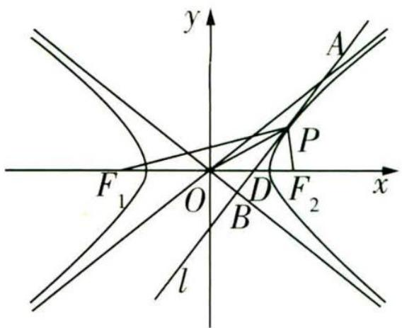

text_image

y
A
P
F₁ O D F₂ x
B
l

图3

A. $|AB|_{\min}=2\sqrt{b^{2}+1}$   
B. $S_{\triangle OAP} = S_{\triangle OBP}$   
C. $S_{\triangle AOB} = b$

D. 若存在点 $P$ , 使 $\cos \angle F_{1}PF_{2} = \frac{1}{4}$ , 且 $\overrightarrow{F_{1}D} = 2\overrightarrow{DF_{2}}$ , 则双曲

线 $C$ 的离心率 $e = 2$

解析 对于 $y = \sqrt{b^{2}x^{2} - b^{2}}$ ，有 $y' = \frac{b^{2}x}{\sqrt{b^{2}x^{2} - b^{2}}}$ ，则曲线 $y = \sqrt{b^{2}x^{2} - b^{2}}$ 在点 $P(x_{0}, y_{0})$ 处的切线斜率 $k = \frac{b^{2}x_{0}}{\sqrt{b^{2}x_{0}^{2} - b^{2}}} = \frac{b^{2}x_{0}}{y_{0}}$ ，所以曲线 $y = \sqrt{b^{2}x^{2} - b^{2}}$ 在点 $P(x_{0}, y_{0})$ 处的切线方程为 $y - y_{0} = \frac{b^{2}x_{0}}{y_{0}} (x - x_{0})$ ，结合 $x_{0}^{2} - \frac{y_{0}^{2}}{b^{2}} = 1$ ，化简可得切线方程为 $x_{0}x - \frac{y_{0}y}{b^{2}} = 1$ 。

【走捷径】上述求解过程是求双曲线上任意一点处的切线的方法。实际上，也可以直接利用二级结论“双曲线 $\frac{x^{2}}{a^{2}}-\frac{y^{2}}{b^{2}}=1(a>0,b>0)$ 上点 $P(x_{0},y_{0})$ 处的切线方程为 $\frac{x_{0}x}{a^{2}}-\frac{y_{0}y}{b^{2}}=1$ ”，实现秒杀

由双曲线的对称性不妨设 $A(x_{1},y_{1})$ 是切线 l 与渐近线在第一象限的交点, $B(x_{2},y_{2})$ 是切线 l 与渐近线在第四象限的交点. 由题意知, 双曲线的渐近线方程是 $y=\pm bx$ , 由 $\left\{\begin{aligned}x_{0}x-\frac{y_{0}y}{b^{2}}&=1,\\ y&=bx,\end{aligned}\right.$ 得 $A(\frac{b}{bx_{0}-y_{0}},\frac{b^{2}}{bx_{0}-y_{0}})$ , 由 $\left\{\begin{aligned}x_{0}x-\frac{y_{0}y}{b^{2}}&=1,\\ y&=-bx,\end{aligned}\right.$ 得 $B(\frac{b}{bx_{0}+y_{0}},\frac{-b^{2}}{bx_{0}+y_{0}})$ .

则 $|AB| = \sqrt{\left(\frac{b}{bx_0 - y_0} - \frac{b}{bx_0 + y_0}\right)^2 + \left(\frac{b^2}{bx_0 - y_0} + \frac{b^2}{bx_0 + y_0}\right)^2} = 2\sqrt{(b^2 + 1)x_0^2 - 1}$ ，又 $x_0 \geqslant 1$ ，所以 $|AB| \geqslant 2\sqrt{(b^2 + 1) - 1} = 2b$ ，即 $|AB|_{\min} = 2b$ ，A 错误.

由 $\frac{\frac{b}{bx_{0}-y_{0}}+\frac{b}{bx_{0}+y_{0}}}{2}=x_{0},\frac{\frac{b^{2}}{bx_{0}-y_{0}}+\frac{-b^{2}}{bx_{0}+y_{0}}}{2}=y_{0}$ ，可知 $P(x_{0},y_{0})$ 是线段AB的中点，所以 $S_{\triangle OAP}=S_{\triangle OBP}$ ，B正确.

【另解】双曲线渐近线方程为 $b^{2}x^{2}-y^{2}=0$ ，与 $x_{0}x-\frac{y_{0}y}{b^{2}}=1$ 联立，结合 $x_{0}^{2}-\frac{y_{0}^{2}}{b^{2}}=1$ 化简得 $x^{2}-2x_{0}x+1=0$ ，设 $A(x_{1},y_{1})$ ， $B(x_{2},y_{2})$ ，则 $x_{1}+x_{2}=2x_{0},x_{1}x_{2}=1$ ， $|AB|=\sqrt{1+(\frac{x_{0}b^{2}}{y_{0}})^{2}}|x_{1}-x_{2}|=$

中山大学 哲学、数学、化学、生物学、生态学、材料科学与工程、电子科学与技术、基础医学、临床医学、药学、工商管理.

$2\sqrt{(b^{2}+1)x_{0}^{2}-1}$ ，所以 $|AB|\geqslant2\sqrt{(b^{2}+1)-1}=2b$ ，即 $|AB|_{\min}=2b$ 。由 $x_{1}+x_{2}=2x_{0}$ ，得P为线段AB的中点，因而 $S_{\triangle OAP}=S_{\triangle OBP}$ ，所以A错误，B正确

易知点 D 的坐标为 $\left(\frac{1}{x_{0}},0\right)$ ,

【点透讲透】直线 $AB$ 的方程为 $x_0 x - \frac{y_0 y}{b^2} = 1$ ，将 $y = 0$ 代入即可求出点 $D$ 的横坐标

则 $S_{\triangle AOB} = S_{\triangle ADO} + S_{\triangle BDO} = \frac{1}{2}\times |OD|\times |y_1 - y_2| = \frac{1}{2}\times \frac{1}{x_0}\times (\frac{b^2}{bx_0 - y_0} +\frac{b^2}{bx_0 + y_0}) = b,\mathrm{C}$ 正确.

设 $F_{1}(-c,0), F_{2}(c,0)$ , 所以 $\overrightarrow{F_{1}D} = (\frac{1}{x_{0}} + c, 0), \overrightarrow{DF_{2}} = (c - \frac{1}{x_{0}}, 0)$ . 因为 $\overrightarrow{F_{1}D} = 2\overrightarrow{DF_{2}}$ , 所以 $\frac{1}{x_{0}} + c = 2(c - \frac{1}{x_{0}})$ , 得 $c = \frac{3}{x_{0}}$ , 即 $x_{0} = \frac{3}{c}$ , 代入 $x_{0}^{2} - \frac{y_{0}^{2}}{b^{2}} = 1$ 得 $y_{0}^{2} = \frac{9b^{2}}{c^{2}} - b^{2}$ , 所以 $|PF_{1}|^{2} = (\frac{3}{c} + c)^{2} + \frac{9b^{2}}{c^{2}} -$

【会转化】利用向量的坐标运算，用 c 替换 $x_{0}$ 实现消参

$$
b ^ {2} = \frac {9}{c ^ {2}} + c ^ {2} + 6 + \frac {9 b ^ {2}}{c ^ {2}} - b ^ {2} = \frac {9}{c ^ {2}} + c ^ {2} + 6 + \frac {9 (c ^ {2} - 1)}{c ^ {2}} - (c ^ {2} - 1) = 1 6, | P F _ {2} | ^ {2} = (\frac {3}{c} - c) ^ {2} + \frac {9 b ^ {2}}{c ^ {2}} - b ^ {2} = \frac {9}{c ^ {2}} + c ^ {2} -
$$

$6+\frac{9b^{2}}{c^{2}}-b^{2}=\frac{9}{c^{2}}+c^{2}-6+\frac{9(c^{2}-1)}{c^{2}}-(c^{2}-1)=4$ , 所以 $\cos\angle F_{1}PF_{2}=\frac{|PF_{1}|^{2}+|PF_{2}|^{2}-|F_{1}F_{2}|^{2}}{2\times|PF_{1}|\times|PF_{2}|}=$ $\frac{16+4-4c^{2}}{2\times4\times2}=\frac{5-c^{2}}{4}=\frac{1}{4}$ ，所以 $c^{2}=4,c=2$ ，所以离心率 $e=\frac{c}{1}=2,D$ 正确.

答案 BCD

调研 4 (2023·江苏苏州1月模拟)已知函数 $f(x)=\mathrm{e}^{x}-x,g(x)=x-\ln x$ ，则下列说法正确的是 ( )

A. $g(\mathrm{e}^{x})$ 在 $(0, +\infty)$ 上单调递增  
B. $\forall x > 1$ , 不等式 $f(ax) \geqslant f(\ln x^2)$ 恒成立, 则正实数 $a$ 的最小值为 $\frac{2}{e}$   
C. 若 $f(x) = t$ 有两个零点 $x_{1}, x_{2}$ ，则 $x_{1} + x_{2} > 0$   
D. 若 $f(x_{1}) = g(x_{2}) = t(t > 2)$ ，且 $x_{2} > x_{1} > 0$ ，则 $\frac{\ln t}{x_2 - x_1}$ 的最大值为 $\frac{1}{\mathrm{e}}$

解析 对于 A, 当 x > 0 时, $e^{x} > 1$ , 令 $m = e^{x}$ , 则 m > 1. 对于函数 $G(m) = m - \ln m, m > 1$ ,

∵ $G'(m) = 1 - \frac{1}{m} = \frac{m - 1}{m}$ , ∴ $G'(m) > 0$ 恒成立, ∴ $G(m)$ 在 $(1, +\infty)$ 上单调递增. ∵ 函数 $y = e^{x}$ 在 $(0, +\infty)$ 上单调递增, ∴ $g(e^{x})$ 在 $(0, +\infty)$ 上单调递增, A 正确.

【点拨】复合函数的单调性：同增异减

对于 B, 当 $x > 1$ 时, $\ln x^2 > \ln 1 = 0$ , $\because a$ 为正实数, $\therefore ax > a > 0$ , $\because f'(x) = e^x - 1$ , $\therefore$ 当 $x > 0$ 时, $f'(x) > 0$ 恒成立, $\therefore f(x)$ 在 $(0, +\infty)$ 上单调递增, 则由 $f(ax) \geqslant f(\ln x^2)$ 得 $ax \geqslant \ln x^2$ , 即 $a \geqslant \frac{2\ln x}{x}$ 恒

【点睛】对于恒成立问题，常用分离参数法求解

西安交通大学 力学、机械工程、材料科学与工程、动力工程及工程热物理、电气工程、控制科学与工程、管理科学与工程、工商管理.

成立. 令 $h(x) = \frac{2\ln x}{x} (x > 1)$ , 则 $h'(x) = \frac{2(1 - \ln x)}{x^2}$ , $\therefore$ 当 $x \in (1, e)$ 时, $h'(x) > 0$ , 当 $x \in (e, +\infty)$ 时, $h'(x) < 0$ , $\therefore h(x)$ 在 $(1, e)$ 上单调递增, 在 $(e, +\infty)$ 上单调递减, $\therefore h(x)_{\max} = h(e) = \frac{2}{e}$ , $\therefore a \geqslant \frac{2}{e}$ , 则正实数 $a$ 的最小值为 $\frac{2}{e}$ , B 正确.

【另解】设 $\varphi(x)=ax-2\ln x,\quad a>0$ ，则 $\varphi'(x)=a-\frac{2}{x}$ ，令 $\varphi'(x)=0$ ，则 $x=\frac{2}{a}$ ，当 $0<x<\frac{2}{a}$ 时， $\varphi'(x)<0,\varphi(x)$ 单调递减，当 $x>\frac{2}{a}$ 时， $\varphi'(x)>0,\varphi(x)$ 单调递增，因而 $\varphi(x)$ 的最小值为 $\varphi(\frac{2}{a})=2-2\ln\frac{2}{a}\geqslant0,\frac{2}{a}\leqslant\mathrm{e}$ ，即 $a\geqslant\frac{2}{e}$ ，所以正整数 a 的最小值为 $\frac{2}{e}$

对于 C, $\because f'(x) = e^{x} - 1$ , $\therefore$ 当 $x < 0$ 时, $f'(x) < 0$ , 当 $x > 0$ 时, $f'(x) > 0$ , $\therefore f(x)$ 在 $(- \infty, 0)$ 上单调递减, 在 $(0, +\infty)$ 上单调递增, $\therefore f(x)_{\min} = f(0) = 1$ , 则 $t > 1$ . 不妨设 $x_{1} < x_{2}$ , 则必有 $x_{1} < 0 < x_{2}$ , 若 $x_{1} + x_{2} > 0$ , 则 $x_{2} > -x_{1} > 0$ , 等价于 $f(x_{2}) > f(-x_{1})$ , 又 $f(x_{2}) = f(x_{1})$ , 则等价于 $f(x_{1}) > f(-x_{1})$ . 令 $F(x) = f(x) - f(-x)(x < 0)$ , 则 $F'(x) = e^{x} + e^{-x} - 2$ , $\because x < 0$ , $\therefore 0 < e^{x} < 1$ , $e^{-x} > 1$ , $\therefore e^{x} + e^{-x} >$ 【点选】最简单的极值点偏移问题, 通过构造函数证明

$2\sqrt{e^{x}\cdot e^{-x}}=2$ , 即 $F'(x)>0$ , $\therefore F(x)$ 在 $(-∞,0)$ 上单调递增, $\therefore F(x)<e^{0}-0-e^{0}+0=0$ , 即 $f(x)<f(-x)$ , $\therefore f(x_{1})<f(-x_{1})$ , 可知 $x_{1}+x_{2}>0$ 不成立, C 错误.

对于 D, 由 $f(x_1) = g(x_2) = t (t > 2), x_2 > x_1 > 0$ 得 $e^{x_1} - x_1 = x_2 - \ln x_2 = e^{\ln x_2} - \ln x_2 = t (t > 2)$ , 即 $f(x_1) = f(\ln x_2) = t (t > 2)$ , 由 C 的分析知 $f(x)$ 在 $(-\infty, 0)$ 上单调递减, 在 $(0, +\infty)$ 上单调递增, $f(1) = e - 1 < 2, \therefore x_1 > 1$ , 则 $x_2 > x_1 > 1, \therefore \ln x_2 > 0, \therefore x_1 = \ln x_2$ , 即 $e^{x_1} = x_2, \therefore \frac{\ln t}{x_2 - x_1} = \frac{\ln t}{e^{x_1} - x_1} = \frac{\ln t}{f(x_1)} = \frac{\ln t}{t}$ . 令 $p(t) = \frac{\ln t}{t} (t > 2)$ , 则 $p'(t) = \frac{1 - \ln t}{t^2}, \therefore$ 当 $t \in (2, e)$ 时, $p'(t) > 0$ , 当 $t \in (e, +\infty)$ 时, $p'(t) < 0, \therefore p(t)$ 在 $(2, e)$ 上单调递增, 在 $(e, +\infty)$ 上单调递减, $\therefore p(t)_{\max} = p(e) = \frac{1}{e}$ , 即 $\frac{\ln t}{x_2 - x_1}$ 的最大值为 $\frac{1}{e}$ , D 正确. 故选 ABD.

【解后反思】本题C选项考查了导数中的极值点偏移问题，处理极值点偏移中的类似于 $x_{1}+x_{2}>a$ ， $f(x_{1})=f(x_{2})$ 的问题的基本步骤如下：①求导，确定 $f(x)$ 的单调性，得到 $x_{1},x_{2}$ 的取值范围；②构造函数 $F(x)=f(x)-f(a-x)$ ，求导后一般可得 $F(x)$ 恒正或恒负；③得到 $f(x_{1})$ 与 $f(a-x_{1})$ 的大小关系后，将 $f(x_{1})$ 换为 $f(x_{2})$ ；④根据 $x_{2}$ 与 $a-x_{1}$ 的范围，结合 $f(x)$ 的单调性，可以得到 $x_{2}$ 与 $a-x_{1}$ 的大小关系，进而得出结论

# 答案 ABD

# 题型 5 双空题

调研 1 (2023 · 天津市第九中学期末/递进型) 如图 1, 在 $\triangle ABC$ 中, $AB = 3$ ,

国防科技大学 信息与通信工程、计算机科学与技术、航空宇航科学与技术、软件工程、管理科学与工程.

$AC = 2, \angle BAC = 60^{\circ}, D, E$ 分别是边 $AB, AC$ 上的点, $AE = 1$ , 且 $\overrightarrow{AD} \cdot \overrightarrow{AE} = \frac{1}{2}$ , 则 $|\overrightarrow{AD}| =$ \_\_\_\_; 若 $P$ 是线段 $DE$ 的中点, 且 $\overrightarrow{PA} = x \overrightarrow{PB} + y \overrightarrow{PC}$ , 则 $x + y =$ \_\_\_\_.

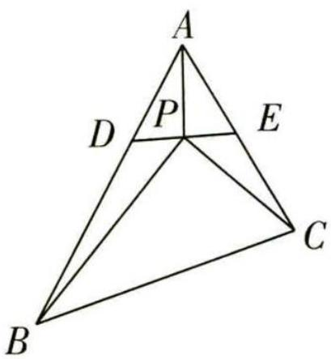

text_image

A
D P E
B C

图1

思维导引
由向量的数量
积可得 $|\overrightarrow{AD}|$ 平面向量的线性运算 $\overrightarrow{PA} = -\frac{2}{7}\overrightarrow{PB} - \frac{3}{7}\overrightarrow{PC}$ 平面向量基本定理
x, y 的值

解析 因为 $AE = 1, \angle BAC = 60^{\circ}$ , 所以 $\overrightarrow{AD} \cdot \overrightarrow{AE} = |\overrightarrow{AD}| \times |\overrightarrow{AE}| \times \cos 60^{\circ} = \frac{1}{2} |\overrightarrow{AD}| = \frac{1}{2}$ ,所以 $\left|\overrightarrow{AD}\right|=1$ 。因为 P 是线段 DE 的中点，所以 $\overrightarrow{AP}=\frac{1}{2}(\overrightarrow{AD}+\overrightarrow{AE})$

【会思考】这里得到 $|\overrightarrow{AD}|=1$ ，从而确定 $\triangle ADE$ 为正三角形，为下面的运算做铺垫

所以 $\overrightarrow{PA} = -\frac{1}{2} (\overrightarrow{AD} +\overrightarrow{AE}) = -\frac{1}{2} (\frac{1}{3}\overrightarrow{AB} +\frac{1}{2}\overrightarrow{AC}) = -\frac{1}{6}\overrightarrow{AB} -\frac{1}{4}\overrightarrow{AC}.$

又 $\overrightarrow{AB} = \overrightarrow{PB} -\overrightarrow{PA},\overrightarrow{AC} = \overrightarrow{PC} -\overrightarrow{PA}$ ，所以 $\overrightarrow{PA} = -\frac{1}{6} (\overrightarrow{PB} -\overrightarrow{PA}) - \frac{1}{4} (\overrightarrow{PC} -\overrightarrow{PA})$

化简可得 $\overrightarrow{PA}=-\frac{2}{7}\overrightarrow{PB}-\frac{3}{7}\overrightarrow{PC}$ . 又 $\overrightarrow{PA}=x\overrightarrow{PB}+y\overrightarrow{PC}$ , 所以 $x=-\frac{2}{7}, y=-\frac{3}{7}$ , 所以 $x+y=-\frac{5}{7}$ .

答案 1 $-\frac{5}{7}$

调研 2 (2023·北京市八一学校12月月考/平行型,动态几何)如图2,在棱长为2的正方体 $ABCD-A_{1}B_{1}C_{1}D_{1}$ 中, $M,N$ 分别是线段 $AA_{1},A_{1}D_{1}$ 的中点, $E$ 是线段 $CC_{1}$ 上的动点,过 $M,N,E$ 的平面 $\alpha$ 截正方体 $ABCD-A_{1}B_{1}C_{1}D_{1}$ 所得的截面面积记为 $S$ . 当 $E$ 为线段 $CC_{1}$ 的中点时, $S=$ \_\_\_\_ ;当 $E$ 在线段 $CC_{1}$ (包括端点)上运动时, $S$ 的取值范围是\_\_\_\_.

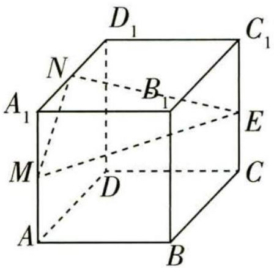

text_image

D₁
C₁
N
B₁
A₁
E
M
D
C
A
B

图2

解析 第一空:根据面面平行的性质定理得截面 $\alpha$ 与平面 $BCC_{1}B_{1}$ 的交线与 MN 平行,因为 E 为线段 $CC_{1}$ 的中点,所以取 BC 的中点 F,连接 EF,则交线为 EF,延长 MN,与 $DD_{1}$ 的延长线交于点 $O_{1}$ ,因为 $\triangle O_{1}D_{1}N \cong \triangle MA_{1}N$ ,所以 $O_{1}D_{1} = A_{1}M = 1$ ,连接 $O_{1}E$ 与 $D_{1}C_{1}$ 交于点 $O_{2}$ ,连接 $NO_{2}$ ,如图3. 又 $\triangle O_{1}D_{1}O_{2} \cong \triangle EC_{1}O_{2}, O_{1}D_{1} = EC_{1} = 1$ ,所以 $O_{2}$ 是 $D_{1}C_{1}$ 的中点,再根据面面平行的性质定理得截面 $\alpha$ 与平面 ABCD 的交线与 $NO_{2}$ 平行,所以取 AB 的中点 $O_{3}$ ,连接 $MO_{3}, O_{3}F$ ,即截面 $\alpha$ 为六边形 $MNO_{2}EFO_{3}$ ,因为六边形 $MNO_{2}EFO_{3}$ 为正六边形且边长为 $\sqrt{2}$ ,所以其面积 $S = 6 \times \frac{\sqrt{3}}{4} \times (\sqrt{2})^{2} = 3\sqrt{3}$ .

【找关键点】确定该平面截正方体所得截面的形状是解题关键

我们常常以为,有关数学的描述、证明都是复杂且高深的,事实上,数学中不乏奇妙的构想、巧妙简洁的证明,我们一起来看看吧!

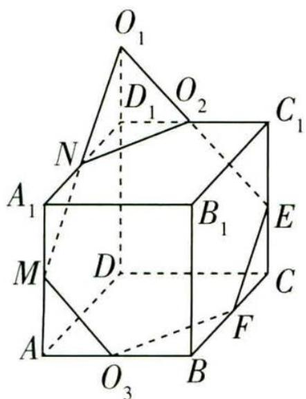

text_image

O₁
D₁ O₂
C₁
N
A₁ B₁ E
M D C
A F
O₃ B

图 3

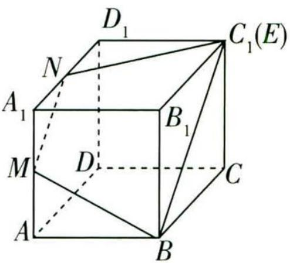

text_image

D₁
C₁(E)
N
A₁
B₁
M
D
C
A
B

图 4

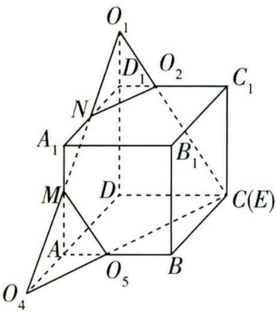

text_image

O₁
D₁ O₂ C₁
N
A₁ B₁
M D C(E)
A O₅ B
O₄

图5

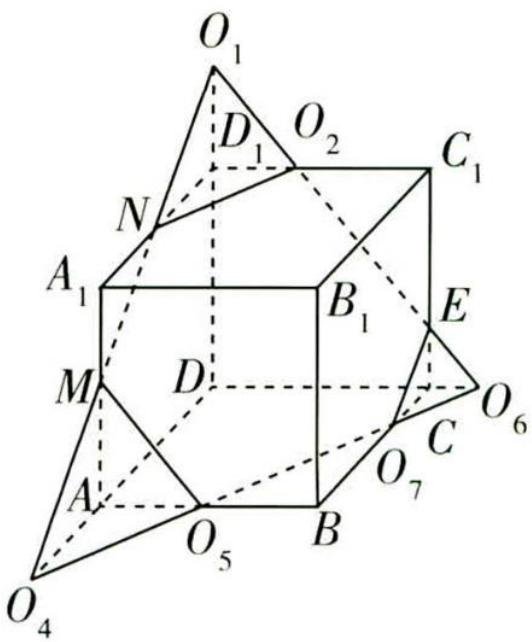

text_image

O₁
D₁ O₂ C₁
N
A₁ B₁ E
M D O₆
A O₇
O₅ B O₄

图6

第二空:①如图4,当点E与 $C_{1}$ 重合时,根据面面平行的性质定理得截面与平面 $BCC_{1}B_{1}$ 的交线

【会分析】首先考虑E与C， $C_{1}$ 重合时的两种特殊情况，同时利用平方法比较这两种情况下面积的大小

与 $MN$ 平行, 连接 $C_{1}B$ , 则交线为 $C_{1}B$ , 连接 $MB$ , 即截面为等腰梯形 $MNC_{1}B$ , 等腰梯形 $MNC_{1}B$ 的面积为 $\frac{1}{2} \times (\sqrt{2} + 2\sqrt{2}) \times \frac{3\sqrt{2}}{2} = \frac{9}{2}$ .

②如图5,当点E与C重合时,延长MN,与 $DD_{1}$ 的延长线交于点 $O_{1}$ ,连接 $O_{1}C$ ,并与 $D_{1}C_{1}$ 交于点 $O_{2}$ ,延长NM,与DA的延长线交于点 $O_{4}$ ,连接 $O_{4}C$ ,并与AB交于点 $O_{5}$ ,连接 $NO_{2}$ , $MO_{5}$ ,则五边形 $MNO_{2}CO_{5}$ 为截面,五边形 $MNO_{2}CO_{5}$ 的面积等于 $\triangle O_{1}CO_{4}$ 的面积减去2个 $\triangle O_{1}O_{2}N$ 的面积,并且 $\triangle O_{1}O_{2}N\sim\triangle O_{1}CO_{4}$ ,其相似比为1:3,面积为 $\frac{3\sqrt{17}}{2}-2\times\frac{1}{9}\times\frac{3\sqrt{17}}{2}=\frac{7\sqrt{17}}{6}>\frac{9}{2}$ .

③如图6,当点 $E$ 在线段 $CC_{1}$ (不包括端点)上时,延长 $MN$ ,与 $DD_{1}$ 的延长线交于点 $O_{1}$ ,连接 $O_{1}E$ 并延长交 $D_{1}C_{1}$ 于点 $O_{2}$ ,与 $DC$ 的延长线交于点 $O_{6}$ ,延长 $NM$ ,交 $DA$ 的延长线于点 $O_{4}$ ,连接 $O_{4}O_{6}$ ,分别与 $AB,BC$ 交于点 $O_{5},O_{7}$ ,连接 $NO_{2},MO_{5},EO_{7}$ ,则六边形 $MNO_{2}EO_{7}O_{5}$ 为截面.易知当点 $E$ 为 $CC_{1}$ 的中点时截面面积最大,当点 $E$ 与 $C_{1}$ 重合时截面面积最小,故 $S$ 的取值范围为 $[\frac{9}{2},3\sqrt{3}]$ .

答案 $3\sqrt{3}$ $\left[\frac{9}{2},3\sqrt{3}\right]$

# 题型 6 跨学科融合应用

调研 1 （2023·福建龙泉中学期末/融合天文学知识“调日法”）我国南北朝数学家何承天发明的“调日法”是程序化寻求分数来表示数值的算法, 其理论依据是: 设实数 $x$ 的不足近似值和过剩近似值分别为 $\frac{b}{a}$ 和 $\frac{d}{c}$ ( $\frac{b}{a} < x < \frac{d}{c}, a, b, c, d \in \mathbf{N}^*$ ), 则 $\frac{b + d}{a + c}$ 是 $x$ 的更为精确的不足近似值或过剩近似值. 我们知道 $\sqrt{5} = 2.236067\cdots$ , 令 $\frac{11}{5} < \sqrt{5} < \frac{12}{5}$ , 则第一次用“调日法”后得到 $\frac{23}{10}$ 是 $\sqrt{5}$ 的更为精确的过剩近似值, 即 $\frac{11}{5} < \sqrt{5} < \frac{23}{10}$ , 若每次

没有最大的质数 欧几里得对于这一说法进行了证明. 他运用了反证法, 假设存在最大的质数, 记这个质数为 $p$ , 设 $q = 2 \times 3 \times 5 \times 7 \times \cdots \times p$ , 即 $q$ 为从 2 至 $p$ 的所有质数的乘积, 那么 $q + 1$ 为质数, 并且大于质数 $p$ , 因此, 假设不成立.

都取最简分数,则从 $\frac{11}{5} < \sqrt{5} < \frac{12}{5}$ 开始,用“调日法”得到 $\sqrt{5}$ 的近似分数与实际值误差小于0.01的次数最少为 ( )

A. 五

B. 四

C. 三

D. 二

解析 第一次用“调日法”后得到 $\frac{11}{5}<\sqrt{5}<\frac{23}{10}=2.3$ ，不合题意；第二次用“调日法”后得到 $\frac{11}{5}<\sqrt{5}<\frac{34}{15}\approx2.27$ ，不合题意；第三次用“调日法”后得到 $\frac{11}{5}<\sqrt{5}<\frac{45}{20}=2.25$ ，不合题意；第四次用“调日法”后得到 $\frac{11}{5}<\sqrt{5}<\frac{56}{25}=2.24$ ，符合题意，即从 $\frac{11}{5}<\sqrt{5}<\frac{12}{5}$ 开始，用“调日法”得到 $\sqrt{5}$ 的近似分数与实际值误差小于0.01的次数最少为四。故选B。

【点睛】类似“二分法”，根据定义逐次计算，直到满足近似分数与实际值误差小于0.01即可

答案 B

调研 2 (2023·河北衡水期末联考/融合生物)生物学家采集了一些动物体重和脉搏率对应的数据,并经过研究得到体重和脉搏率的对数型关系式: $\ln f = \ln k - \frac{\ln W}{3}$ ,其中f是脉搏率(心跳次数/min),体重为 $W(g)$ ,k为正的常数.则体重为300 g的豚鼠和体重为8100 g的小狗的脉搏率的比值为()

A. $\frac{3}{2}$

B. $\frac{4}{3}$

C. 3

D. 27

解析 $\because \ln f = \ln k - \frac{\ln W}{3}$ ，其中 f 是脉搏率（心跳次数/min），体重为 $W(\mathrm{g})$ ，k 为正的常数，

∴ 当 W = 300 g 时， $\ln f_{1} = \frac{3\ln k - \ln 300}{3}$ ，即 $\ln f_{1}^{3} = \ln k^{3} - \ln 300$ ，则 $f_{1}^{3} = \frac{k^{3}}{300}$ ，

当 $W = 8100\mathrm{g}$ 时， $\ln f_2 = \frac{3\ln k - \ln 8100}{3}$ 即 $\ln f_2^3 = \ln k^3 -\ln 8100$ ，则 $f_{2}^{3} = \frac{k^{3}}{8100}$

$\therefore \left(\frac{f_1}{f_2}\right)^3 = \frac{\frac{k^3}{300}}{\frac{k^3}{8100}} = 27$ ，即 $\frac{f_1}{f_2} = 3$ ，∴体重为 $300\mathrm{g}$ 的豚鼠和体重为 $8100\mathrm{g}$ 的小狗的脉搏率的比值为3，故选C.

答案 C

调研 3 (2023·东北育才学校一模/融合物理)(多选)牛顿曾提出了物体在常温环境下温度变化的冷却模型:若物体初始温度是 $\theta_{0}$ (单位:℃),环境温度是 $\theta_{1}$ (单位: $℃$ ),其中 $\theta_{0}>\theta_{1}$ ,则经过t分钟后物体的温度 $\theta$ 将满足 $\theta=f(t)=\theta_{1}+(\theta_{0}-\theta_{1})\cdot e^{-kt}(k\in\mathbf{R}\text{且}k>0)$ .现有一杯80℃的热红茶置于20℃的房间里,根据这一模型研究红茶冷却情况,下列结论正确的是(参考数值: $\ln 2\approx0.7$ )()

A. 若 $f(3)=50^{\circ}\mathrm{C}$ ，则 $f(6)=35^{\circ}\mathrm{C}$

B. 若 $k=\frac{1}{10}$ ，则红茶下降到 $50^{\circ}C$ 所需时间大约为 7 分钟

C. 若 $f'(3) = -5$ ，则其实际意义是在第 3 分钟左右，红茶温度大约以每分钟 $5^{\circ}C$ 的速率下降

D. 红茶温度从 $80^{\circ} \mathrm{C}$ 下降到 $60^{\circ} \mathrm{C}$ 所需的时间比从 $60^{\circ} \mathrm{C}$ 下降到 $40^{\circ} \mathrm{C}$ 所需的时间多

解析

由题知 $\theta=f(t)=20+60e^{-kt}$ .

对于 A, 若 $f(3) = 50^{\circ}\mathrm{C}$ ，即 $50 = 20 + 60e^{-3k}$ ，所以 $e^{-3k} = \frac{1}{2}$ ，则 $f(6) = 20 + 60e^{-6k} = 20 + 60(e^{-3k})^{2} = 20 + 60 \times \left(\frac{1}{2}\right)^{2} = 35^{\circ}\mathrm{C}$ ，A 正确.

【点睛】注意，这里不用求出k，而是运用整体思想求解

对于 B, 若 $k = \frac{1}{10}$ , 则令 $20 + 60e^{-\frac{1}{10}t} = 50$ , 可得 $e^{-\frac{1}{10}t} = \frac{1}{2}$ , 等式两边同时取对数得 $-\frac{1}{10}t = \ln \frac{1}{2} = -\ln 2$ , 所以 $t = 10 \ln 2 \approx 7$ , 所以红茶下降到 $50^{\circ}C$ 所需时间大约为 7 分钟, B 正确.

对于 C, ${f}^{\prime }\left( 3\right)$ 表示 $t = 3$ 处的函数值的变化情况,则 ${f}^{\prime }\left( 3\right)  =  - 5$ 的实际意义是在第 3 分钟左右,红茶温度大约以每分钟 ${5}^{ \circ  }\mathrm{C}$ 的速率下降,故 $\mathrm{C}$ 正确.

【难点突破】需要理解 $f'(x_0) = \lim_{x \to x_0} \frac{f(x) - f(x_0)}{x - x_0} = \lim_{\Delta x \to 0} \frac{f(x_0 + \Delta x) - f(x_0)}{\Delta x}$ 的含义是函数 $f(x)$ 在 $x = x_0$ 处的导数，即 $x = x_0$ 处的瞬时变化率

对于 D, 方法一 设红茶温度从 $80^{\circ}$ C 下降到 $60^{\circ}$ C 所需的时间为 $t_{1}$ ，则 $20 + 60e^{-kt_{1}} = 60 \Rightarrow e^{-kt_{1}} = \frac{2}{3} \Rightarrow t_{1} = -\frac{1}{k} \ln \frac{2}{3}$ 。设红茶温度从 $80^{\circ}$ C 下降到 $40^{\circ}$ C 所需的时间为 $t_{2}$ ，则 $20 + 60e^{-kt_{2}} = 40 \Rightarrow e^{-kt_{2}} = \frac{1}{3} \Rightarrow t_{2} = -\frac{1}{k} \ln \frac{1}{3}$ ，则红茶温度从 $60^{\circ}$ C 下降到 $40^{\circ}$ C 所需的时间为 $(t_{2} - t_{1})$ 。因为 k > 0，所以 $(t_{2} - t_{1}) - t_{1} = t_{2} - 2t_{1} = -\frac{1}{k} (\ln \frac{1}{3} - 2 \ln \frac{2}{3}) =$

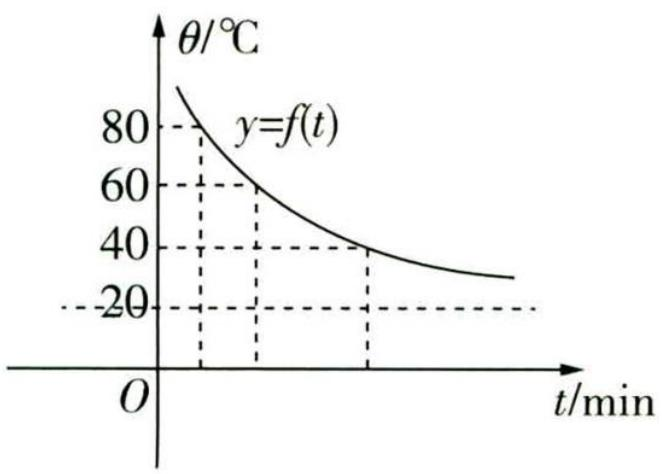

line

| t/min | θ/°C |
|-------|------|
| 0     | 80   |
| >0    | 40   |
| >10   | 20   |

图 1

$-\frac{1}{k}\ln\frac{3}{4}>0$ , 故 $t_{2}-t_{1}>t_{1}$ , 可得红茶温度从 $80^{\circ}C$ 下降到 $60^{\circ}C$ 所需的时间 $t_{1}$ 比从 $60^{\circ}C$ 下降到 $40^{\circ}C$ 所需的时间 $(t_{2}-t_{1})$ 少, 故 D 错误.

【点透讲透】虽然温度差相同，但时间差不同，体现变化率的差异，在函数图象上是增减快慢的趋势差异，也可以通过导函数 $f'(t)$ 的单调性确定

方法二 设 $h(t)=f'(t)=-60ke^{-kt}$ ，那么 $h'(t)=60k^{2}e^{-kt}>0$ ，因而 $f'(t)$ 单调递增，又 $f'(t)<0$ ，

实数是数不尽的 数学家康托尔通过一种类似“列举”的方法巧妙地证明了这一观点,在这个过程中,没有用到任何深奥的数学概念,甚至没有用到四则运算.

则 $f(t)$ 图象下凹,如图1,则红茶温度从80℃下降到60℃所需的时间比从60℃下降到40℃所需的时间少.

答案 ABC

调研 4 (2023·河北唐山一中 12 月模拟/融合化学中的分子结构) 多面体欧拉定理是指对于简单多面体, 其各维对象数总满足一定的数量关系, 在三维空间中, 多面体欧拉定理可表示为: $V(\text {顶点数}) + F(\text {表面数}) - E(\text {棱数}) = 2$ . 在数学上, 富勒烯的结构可看作是以五边形和六边形面组成的凸多面体, 例如富勒烯 $\mathrm{C}_{60}$ (结构图如图 2) 是单纯用碳原子组成的稳定分子, 具有 60 个顶点和 32 个面, 其中 12 个面为五边形, 20 个面为六边形. 除 $\mathrm{C}_{60}$ 外, 具

chemical

Molecular structure of a fullerene cage compound, likely a fullerene or similar fullerene material

图2

有封闭笼状结构的富勒烯还可能有 $C_{28}, C_{32}, C_{50}, C_{70}, C_{84}, C_{240}, C_{540}$ 等，则 $C_{84}$ 结构含有六边形的个数为（）

A. 12

B. 24

C. 30

D. 32

解析 设 $C_{84}$ 结构中形状为五边形和六边形的面分别有 x 个和 y 个, V = 84, $F = x + y$ , E = $3 \times 84 \div 2 = 126$ . 由多面体欧拉定理 $V + F - E = 2$ , 得 $F = x + y = 44$ ①,

又由多边形的边数可表示 $C_{84}$ 的棱数, 得 $(5x + 6y) \div 2 = 126$ , 即 $5x + 6y = 252$ ②.

由①②得 $\left\{\begin{aligned}x=12,\\ y=32.\end{aligned}\right.$ 故选D.

答案 D

调研 5 (2023·安徽蚌埠一检/融合地理中的圭表)圭表是我国古代科学家发明的度量日影长度的一种天文仪器,它包括一根直立的标杆(称为“表”)和一把呈正南北方向水平固定摆放的与标杆垂直的长尺(称为“圭”).当正午阳光照射在表上时,影子会落在圭上,圭上影子长度最长的那

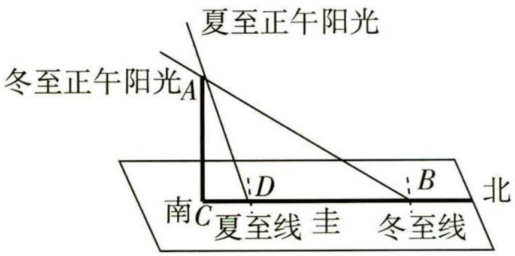

text_image

夏至正午阳光
冬至正午阳光A
南C
D
B
北
夏至线 圭
冬至线

图3

一天定为冬至,影子长度最短的那一天定为夏至. 如图 3 是根据某市(北纬 $32.92^{\circ}$ ) 的地理位置设计的圭表的示意图,已知该市冬至正午太阳高度角(即 $\angle ABC$ ) 约为 $33.65^{\circ}$ , 夏至正午太阳高度角(即 $\angle ADC$ ) 约为 $80.51^{\circ}$ . 圭上冬至线和夏至线之间的距离(即 BD 的长)为 7 米,则表高(即 AC 的长)约为(已知 $\tan 33.65^{\circ} \approx \frac{2}{3}, \tan 80.51^{\circ} \approx \frac{29}{5}$ ) ()

A. 4.36 米

B. 4.83 米

C. 5.27 米

D. 5.41 米

解析 由题图可知 $\tan 33.65^{\circ} \approx \frac{AC}{BC} \approx \frac{2}{3}, \tan 80.51^{\circ} \approx \frac{AC}{CD} \approx \frac{29}{5}$ , 所以 $BC \approx \frac{3}{2} AC, CD \approx$

数学巧思

康托尔的原始证明表明区间[0,1]中的点数不是可数无穷大. 假设区间[0,1]中的数是可数的, 把这些数依次写出来, 列成表格, 通过构造, 总能找到属于区间[0,1]、但不在表格中的实数, 进而说明了假设不成立.

$\frac{5}{29} AC$ ，所以 $BD \approx (\frac{3}{2} - \frac{5}{29})AC = \frac{77}{58} AC = 7$ ，解得 $AC = \frac{58}{11} \approx 5.27$ （米），故选C.

答案 C

调研 6 (2023·东北师范大学附属中学第三次摸底/融合音乐)(多选)十二平均律是我国明代律学家朱载堉发现的. 明万历十二年(公元1584年),他写成《律学新说》,提出了十二平均律的理论. 十二平均律可以用数学语言表述为:在1和2之间从小到大插入11个数,使包含1和2的这13个数依次构成递增的等比数列. 记插入的11个数之和为M,则依此规则,下列结论正确的有 ( )

A. $M > 11$

B. 该等比数列的公比为 $\sqrt[13]{2}$

C. 插入的第 9 个数是插入的第 5 个数的 $\sqrt[3]{2}$ 倍

D. $M = \frac{\sqrt[12]{2} - 2}{1 - \sqrt[12]{2}}$

解析 由题意知,该组数构成等比数列,记为数列 $\{a_{n}\}$ ,公比记为 $q(q>1)$ ,则 $a_{1}=1,a_{13}=2$ ,所以 $\frac{a_{13}}{a_{1}}=q^{12}=2$ ,解得 $q=\sqrt[12]{2}$ ,故B错误.

$M = a_{2} + a_{3} + \cdots + a_{12} = \frac{\sqrt[12]{2} \times [1 - (\sqrt[12]{2})^{11}]}{1 - \sqrt[12]{2}} = \frac{\sqrt[12]{2} - 2}{1 - \sqrt[12]{2}}$ , 故 D 正确.

【多解】记数列 $\{a_{n}\}$ 的前n项和为 $S_{n}$ ，则 $M=S_{13}-3=\frac{1-\left(\sqrt[12]{2}\right)^{13}}{1-\sqrt[12]{2}}-3=\frac{1-2\sqrt[12]{2}-3+3\sqrt[12]{2}}{1-\sqrt[12]{2}}=\frac{\sqrt[12]{2}-2}{1-\sqrt[12]{2}}$

因为 $a_{n} = (\sqrt[12]{2})^{n - 1}$ ，所以插入的第9个数是 $a_{10} = (\sqrt[12]{2})^9$ ，插入的第5个数为 $a_6 = (\sqrt[12]{2})^5$ ，则 $\frac{a_{10}}{a_6} =$ $(\sqrt[12]{2})^4 = (2^{\frac{1}{12}})^4 = 2^{\frac{1}{3}} = \sqrt[3]{2}$ ，故C正确.

对于 A, 要证 M > 11, 即证 $\frac{\sqrt[12]{2} - 2}{1 - \sqrt[12]{2}} > 11$ , 即证 $12\sqrt[12]{2} < 13$ , 即证 $\sqrt[12]{2} < \frac{13}{12}$ , 即证 $2 < (\frac{13}{12})^{12}$ , 此式显然成立, 故 A 正确.

【难点突破】可通过近似运算比较2与 $\left(\frac{13}{12}\right)^{12}$ 的大小关系，也可以利用伯努利不等式 $(1+x)^{n}>1+nx$ ，其中0<x<1, $n\geq2$ 且 $n\in N^{*}$ ，从而 $\left(\frac{13}{12}\right)^{12}=\left(1+\frac{1}{12}\right)^{12}>1+12\times\frac{1}{12}=2$ ，故A正确

故选 ACD.

答案 ACD

调研 7 (2023·陕西商洛 12 月联考/融合美术,体现数学之美)窗花是贴在窗纸或窗户玻璃上的剪纸,它是中国古老的传统民间艺术之一.小明设计了一种由外围四个大小相等的半圆和中间正方形所构成的剪纸窗花(如图 4).已知正方形 ABCD 的边长为2,中心为O,四个半圆的圆心分别为正方形ABCD各边的中点(如图5),若P是 $\widehat{BC}$ 的中点,则 $(\overrightarrow{PA}+\overrightarrow{PB})\cdot\overrightarrow{PO}=$ \_\_\_\_.

text_image

如意
王

图4

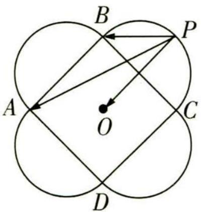

text_image

A
B
P
O
C
D

图5

解析 方法一 如图6, 设 $BC$ 的中点为 $E$ , 显然 $PO$ 过 $E$ 点. 连接 $PC$ , 易知 $\angle BPC = 90^{\circ}$ , $\angle BPE = 45^{\circ}$ , 则 $EP = EB = EC = 1$ , $PB = \sqrt{2}$ , $PO = PE + OE = 2$ , 所以 $\overrightarrow{PB} \cdot \overrightarrow{PO} = |\overrightarrow{PB}| \times |\overrightarrow{PO}| \times \cos \angle BPE = \sqrt{2} \times 2 \times \frac{\sqrt{2}}{2} = 2$ .

如图6,延长PO交AD于F,易知F是AD的中点,且 $PF\perp AD$ ,则 $PF=PE+EF=3,AF=1$ ,在Rt△AFP中, $AP=\sqrt{AF^{2}+PF^{2}}=\sqrt{10},\cos\angle APF=\frac{PF}{PA}=\frac{3}{\sqrt{10}}=\frac{3\sqrt{10}}{10}.$ 所以 $\overrightarrow{PO}\cdot\overrightarrow{PA}=|\overrightarrow{PO}||\overrightarrow{PA}|\times$ $\cos\angle APF=2\times\sqrt{10}\times\frac{3\sqrt{10}}{10}=6$ ,所以 $(\overrightarrow{PA}+\overrightarrow{PB})\cdot\overrightarrow{PO}=\overrightarrow{PA}\cdot\overrightarrow{PO}+\overrightarrow{PB}\cdot\overrightarrow{PO}=8.$

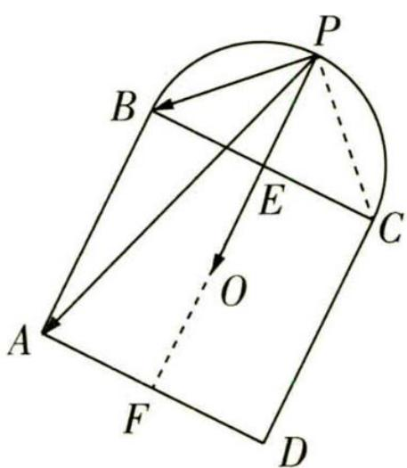

text_image

P
B
E
C
O
A
F
D

图6

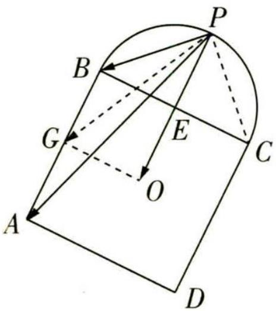

text_image

Geometric diagram with labeled points and lines, likely from a math problem or proof

图7

方法二 如图7, 设 BC 的中点为 E, 显然 PO 过 E 点.

连接 $PC$ , 易知 $\angle BPC = 90^{\circ}$ , $\angle BPE = 45^{\circ}$ , $PE = 1$ . 设 $AB$ 的中点为 $G$ , 连接 $PG, OG$ , 显然 $OG \perp PO, OG = 1$ , $PO = PE + OE = 2$ . 在 Rt $\triangle GOP$ 中, $PG = \sqrt{OP^{2} + OG^{2}} = \sqrt{5}$ , $\cos \angle GPO = \frac{OP}{PG} = \frac{2}{\sqrt{5}} = \frac{2\sqrt{5}}{5}$ .

又 G 为 AB 的中点, 则 $\overrightarrow{PA} + \overrightarrow{PB} = 2\overrightarrow{PG}$ .

所以 $(\overrightarrow{PA} + \overrightarrow{PB}) \cdot \overrightarrow{PO} = 2\overrightarrow{PG} \cdot \overrightarrow{PO} = 2|\overrightarrow{PG}| |\overrightarrow{PO}| \cos \angle GPO = 2 \times \sqrt{5} \times 2 \times \frac{2\sqrt{5}}{5} = 8.$

# 答案 8

希尔伯特旅馆 数学家希尔伯特根据旅客入住旅馆这一贴近生活的例子,引出了数学上神奇诡异的“可列无穷大”的概念.

# 题型 7 知识交汇创新命题

调研 1 (2023 · 上海虹口区一模/三角函数与数列交汇) 已知函数 $f(x) = \sin \frac{\pi x}{3}$ , 数列 $\{a_{n}\}$ 满足 $a_{1} = 1$ , 且 $a_{n+1} = (1 + \frac{1}{n})a_{n} + \frac{1}{n} (n$ 为正整数), 则 $f(a_{2022}) =$

A. -1

B. 1

C. $-\frac{\sqrt{3}}{2}$

D. $\frac{\sqrt{3}}{2}$

思维导引 将 $a_{n+1} = (1 + \frac{1}{n})a_n + \frac{1}{n}$ 进行整理, 可以求出 $\{a_n\}$ 的通项公式, 再将4043代入 $f(x) = \sin \frac{\pi x}{3}$ 可得答案.

解析 由 $a_{n + 1} = (1 + \frac{1}{n})a_n + \frac{1}{n}$ ，得 $\frac{a_{n + 1}}{n + 1} = \frac{a_n}{n} +\frac{1}{n(n + 1)}$

【点递讲透】变形,转化成可以裂项的形式,体现裂项求和的特点.

$\therefore \frac{a_{n + 1}}{n + 1} = \frac{a_n}{n} +\frac{1}{n} -\frac{1}{n + 1},\therefore \frac{a_{n + 1}}{n + 1} +\frac{1}{n + 1} = \frac{a_n}{n} +\frac{1}{n} = \dots = \frac{a_1}{1} +\frac{1}{1} = 2,\therefore a_{n + 1} = 2(n + 1) - 1,$ 即 $a_{n} = 2n - 1$

$\therefore a_{2022} = 4043, \therefore f(a_{2022}) = \sin \frac{4043\pi}{3} = -\frac{\sqrt{3}}{2}$ . 故选 C.

【用公式】三角函数诱导公式及特殊角三角函数值的应用

答案 C

调研 2 (2023·湖南长沙一中、雅礼中学12月联考/数列、三角函数与导数多知识点交汇)已知数列 $\{a_{n}\}$ 满足: $\forall n \in \mathbf{N}^{*}, a_{n} \in (0, \frac{\pi}{2})$ , 且 $a_{1} = \frac{\pi}{4}, f(a_{n+1}) = \sqrt{f'(a_{n})}$ , 其中 $f(x) = \tan x$ . 若 $b_{n} = \frac{(-1)^{n}}{\tan a_{n+1} - \tan a_{n}}$ , 数列 $\{b_{n}\}$ 的前 $n$ 项和为 $T_{n}$ , 则使得 $T_{2m} = 10$ 成立的 $m =$

A. 60

B. 61

C. 120

D. 121

解析 因为 $f(x)=\tan x=\frac{\sin x}{\cos x}$ ，所以 $f'(x)=\frac{\cos^{2}x+\sin^{2}x}{\cos^{2}x}=1+\tan^{2}x.$

因为 $f(a_{n+1})=\sqrt{f'(a_n)}$ ，所以 $\tan a_{n+1}=\sqrt{1+\tan^2 a_n}$ ，即 $\tan^2 a_{n+1}-\tan^2 a_n=1$ ，

又 $\tan^2 a_1 = 1$ ，所以 $\{\tan^2 a_n\}$ 是以 1 为首项，1 为公差的等差数列，所以 $\tan^2 a_n = n$ ，则 $\tan a_n = \sqrt{n}$ .

【易错】此处注意 $\tan a_{n}=\sqrt{n}$ ， $\tan a_{n}$ 是非负的值，故要舍去负值

所以 $b_{n} = \frac{(-1)^{n}}{\tan a_{n + 1} - \tan a_{n}} = \frac{(-1)^{n}}{\sqrt{n + 1} - \sqrt{n}} = (-1)^{n}(\sqrt{n + 1} +\sqrt{n})$

希尔伯特描述了这样一种情形,假设有一家旅馆,内设无限个房间,并且所有的房间都已经客满,但希尔伯特提出,如果此时有1位新客,2位新客,甚至无穷位新客,都能够安排空房间让他们入住,并且提出了解决方案.

则 $T_{2m}=b_{1}+b_{2}+b_{3}+\cdots+b_{2m}=-(\sqrt{2}+1)+(\sqrt{3}+\sqrt{2})-(\sqrt{4}+\sqrt{3})+\cdots+(\sqrt{2m+1}+\sqrt{2m})=\sqrt{2m+1}-1=10$ ,所以 m=60.

答案 A

调研 3 (2023·江苏苏州一中1月模拟/动态几何与平面向量、圆交汇)(多选)在正方体 $ABCD - A_{1}B_{1}C_{1}D_{1}$ 中, AB = 1 , 点 P 满足 $\overrightarrow{CP} = \lambda \overrightarrow{CD} + \mu \overrightarrow{CC_{1}}$ , 其中 $\lambda \in [0, 1]$ , $\mu \in [0, 1]$ , 则下列结论正确的是 ()

A. 当 $B_{1}P \parallel$ 平面 $A_{1}BD$ 时, $B_{1}P$ 不可能垂直于 $CD_{1}$   
B. 若 $B_{1} P$ 与平面 $C C_{1} D_{1} D$ 所成角为 $\frac {\pi}{4}$ , 则点 $P$ 的轨迹长度为 $\frac {\pi}{2}$   
C. 当 $\lambda = 1$ 时, 正方体经过点 $A_{1}, P, C$ 的截面的面积的取值范围为 $[\frac{\sqrt{6}}{4}, \sqrt{2}]$   
D. 当 $\lambda = \mu$ 时， $|\overrightarrow{DP}| + |\overrightarrow{A_{1}P}|$ 的最小值为 $\sqrt{2 + \sqrt{2}}$

解析 对于 A, 建立如图 1 所示的空间直角坐标系 A - xyz, 则  \( B(1,0,0) \) ,  \( D(0,1,0) \) ,  \( C(1,

【会建系】容易建空间直角坐标系的几何体往往可以通过建系快速解决长度、角度等问题
1,0), $A_{1}(0,0,1)$ , $B_{1}(1,0,1)$ , $C_{1}(1,1,1)$ ，所以 $\overrightarrow{BA_{1}}=(-1,0,1)$ , $\overrightarrow{BD}=(-1,1,0)$ , $\overrightarrow{B_{1}C}=(0,1,-1)$ , $\overrightarrow{CD}=(-1,0,0)$ , $\overrightarrow{CC_{1}}=(0,0,1)$ ，则 $\overrightarrow{B_{1}P}=\overrightarrow{B_{1}C}+\overrightarrow{CP}=\overrightarrow{B_{1}C}+\lambda\overrightarrow{CD}+\mu\overrightarrow{CC_{1}}=(-\lambda,1,\mu-1)$ ，设平面 $A_{1}BD$ 的法向量为 $\boldsymbol{n}=(x,y,z)$ ，所以 $\left\{\begin{aligned}\overrightarrow{BA_{1}}\cdot\boldsymbol{n}&=-x+z=0,\\\overrightarrow{BD}\cdot\boldsymbol{n}&=-x+y=0,\end{aligned}\right.$ 令 x=1，则 y=z=1，即平面 $A_{1}BD$ 的一个法向量为 $\boldsymbol{n}=(1,1,1)$ ，若 $B_{1}P\parallel$ 平面 $A_{1}BD$ ，则 $\boldsymbol{n}\cdot\overrightarrow{B_{1}P}=0$ ，即 $\lambda=\mu.\overrightarrow{CD_{1}}=(-1,0,1)$ ，若 $B_{1}P\perp CD_{1}$ ，则 $\overrightarrow{B_{1}P}\cdot\overrightarrow{CD_{1}}=\lambda+\mu-1=0$ 。结合 $\lambda=\mu$ 得 $\lambda=\mu=\frac{1}{2}$ ，即 P 为 $CD_{1}$ 中点时，有 $B_{1}P\parallel$ 平面 $A_{1}BD$ ，且 $B_{1}P\perp CD_{1}$ ，A 错误。

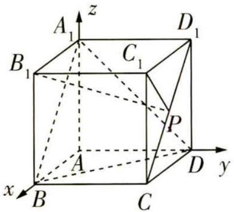

text_image

A₁
z
D₁
B₁
C₁
P
A
D
y
x
B
C

图1

对于B, 因为 ${B}_{1}{C}_{1} \perp$ 平面 $C{C}_{1}{D}_{1}D$ ,如图1,连接 ${C}_{1}P$ ,则 $\angle {B}_{1}P{C}_{1}$ 即 ${B}_{1}P$ 与平面 $C{C}_{1}{D}_{1}D$ 所成角. 若 ${B}_{1}P$ 与平面 $C{C}_{1}{D}_{1}D$ 所成角为 $\frac{\pi }{4}$ ,则 $\tan \angle {B}_{1}P{C}_{1} = \frac{{B}_{1}{C}_{1}}{{C}_{1}P} = 1$ ,所以 ${C}_{1}P = {B}_{1}{C}_{1} = 1$ ,即点 $P$ 的轨迹是以 ${C}_{1}$ 为圆心,1为半径的 $\frac{1}{4}$ 圆弧,于是点 $P$ 的轨迹长度为 $\frac{\pi }{2}$ , B 正确.

【会思考】利用圆的定义可得所求轨迹为圆弧

对于 C, 因为 $\lambda = 1$ , 所以点 P 一定在 $D_{1}D$ 上, 连接 $A_{1}C, A_{1}P, CP$ , 易知当 $\mu = 0$ 或 1 时, $\triangle PA_{1}C$ 的面积取最大值, 此时截面面积为 $2S_{\triangle A_{1}CD} = \sqrt{2}$ ; 当 $\mu = \frac{1}{2}$ 时, $\triangle PA_{1}C$ 的面积取最小值 $\frac{\sqrt{6}}{4}$ , 此时截面面【会思考】截面面积问题, 可结合正方体的对称性, 转化为三角形的面积和问题, 再根据点 P 与点 D 或 $D_{1}$ 重合时, 点 P 到 $A_{1}C$ 的距离最大, 得出截面面积的最大值

积为 $2 \times \frac{\sqrt{6}}{4} = \frac{\sqrt{6}}{2}$ . 故 C 错误.

这明显是有悖直觉的,希尔伯特借助这一例子,向人们传递“无穷”这一概念的深奥.希尔伯特旅馆同康托尔对角线一样,一直是数学界讨论的热点,它们都涉及“无穷”这一饱受争议的概念.

对于 D, 如图 2, 连接 $A_{1} B, D_{1} C$ , 若 $\lambda = \mu$ , 则点 $P$ 位于线段 $D_{1} C$ 上. 如图 3, 将平面 $CDD_{1}$ 与平面 $A_{1} BCD_{1}$ 沿 $CD_{1}$ 展开到同一平面内, 连接 $A_{1} D$ , 则 $A_{1} D$ 即 $|\overrightarrow{DP}| + |\overrightarrow{A_{1} P}|$ 的最小值, 利用余弦定理可知 $A_{1} D^{2} = A_{1} D_{1}^{2} + DD_{1}^{2} - 2 A_{1} D_{1} \cdot$ 【指点迷津】求不在同一平面内的两条线段和问题, 往往通过展开到同一平面内进行讨论、判断 $DD_{1} \cos \frac{3 \pi}{4} = 2 + \sqrt{2}$ , 所以 $A_{1} D = \sqrt{2 + \sqrt{2}}$ , D 正确. 故选 BD.

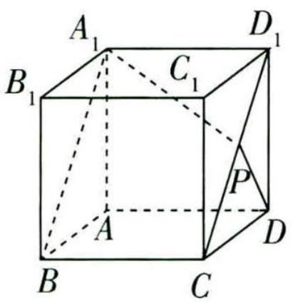

text_image

A₁
B₁
C₁
D₁
P
A
B
C
D

图2

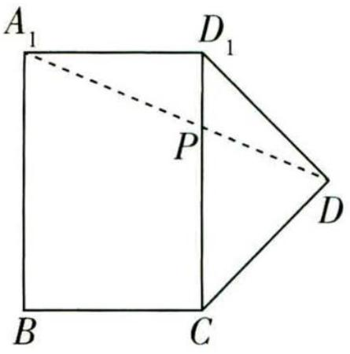

text_image

A₁
D₁
P
B
C
D

图 3

# 答案 BD

调研 4 (2023·西安一中 12 月调研/立体几何与圆锥曲线的离心率交汇) 如图 4, 圆柱 $OO_1$ 的轴截面 $ABB_1A_1$ 是正方形, $D, E$ 分别是 $AA_1$ 和 $BB_1$ 的中点, $C$ 是弧 $AB$ 的中点, 则经过 $C, D, E$ 的平面与圆柱 $OO_1$ 侧面相交所得到的曲线的离心率是 \_\_\_\_.

解析 设轴截面 $ABB_{1}A_{1}$ 的边长为 2, $C_{1}$ 是弧 $B_{1}A_{1}$ 的中点, 且与 C 关于圆柱的中心对称, 连接 $CC_{1}$ , 由题意可知, 所得曲线为椭圆, 椭圆的短轴长为

【指点迷津】根据圆柱和截面特征可判断截面与圆柱 $OO_{1}$ 侧面相交得到

“截口曲线”为椭圆

2, 长轴长 $C_{1}C=2\sqrt{2}$ ,

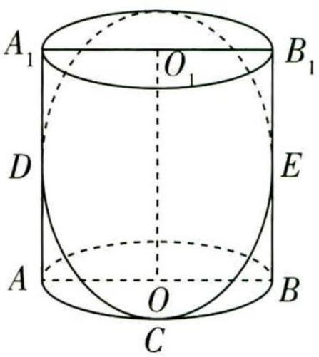

text_image

A₁
O₁
B₁
D
E
A
O
B
C

图 4

所以长半轴长 $a=\sqrt{2}$ ，短半轴长 b=1，故半焦距 $c=\sqrt{a^{2}-b^{2}}=1$ ，所以椭圆的离心率 $e=\frac{c}{a}=\frac{\sqrt{2}}{2}$ .

# 答案 $\frac{\sqrt{2}}{2}$

调研 5 (2023·福建厦门外国语学校期末/圆锥曲线与解三角形、导数或不等式交汇)如图5,在平面直角坐标系 $xOy$ 中,已知点 $F(1,0)$ , 直线 $l: x = -1$ , $P$ 为平面上的动点, 过点 $P$ 作直线 $l$ 的垂线, 垂足为点 $Q$ , 分别以 $PQ$ , $PF$ 为直径作圆 $C_1$ 和圆 $C_2$ , 圆 $C_1$ 和圆 $C_2$ 交于 $P$ , $R$ 两点, 且 $\angle PQR = \angle PFR$ .

(1) 求动点 P 的轨迹 E 的方程;  
(2) 若直线 $l_{1}: x = my + a$ 交轨迹 $E$ 于 $A, B$ 两点, 直线 $l_{2}: x = 1$ 与轨迹 $E$ 交于 $M, D$ 两点, 其中点 $M$ 在第一象限, 点 $A, B$ 在直线

$l_{2}$ 两侧, 直线 $l_{1}$ 与 $l_{2}$ 交于点 N 且 $|MA| \cdot |BN| = |AN| \cdot |MB|$ , 求 $\triangle MAB$ 面积的最大值.

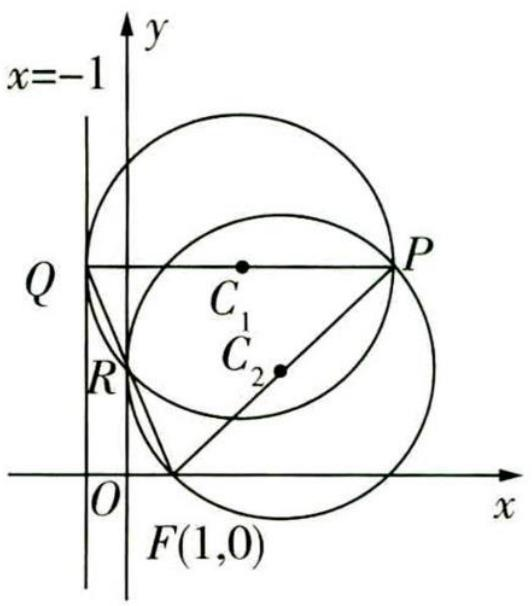

text_image

x=-1
y
Q
P
C₁
C₂
R
O
F(1,0)
x

图5

五次方程的根式解 代数学在发展过程中,曾经是以方程为中心课题的数学学科,代数方程的求解问题是代数的基本问题,特别是用根式求解方程.

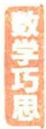

解析 (1) 设点 $P(x, y)$ , 因为 $\angle PQR = \angle PFR$ , 连接 $QF$ , 则点 $R$ 在 $FQ$ 上, 在 $\triangle PQF$ 中, $|PQ| = |PF|$ ,

所以 $|x+1|=\sqrt{(x-1)^{2}+y^{2}}$ ，即 $y^{2}=4x$ ，

所以轨迹 E 的方程为 $y^{2}=4x$ .

(2) 直线 $x = 1$ 与曲线 $E$ 在第一象限内交于点 $M(1,2)$ ,

因为 $\left|MA\right|\cdot\left|BN\right|=\left|AN\right|\cdot\left|MB\right|$

所以 $\frac{|MA|}{|AN|} = \frac{|MB|}{|BN|}$ , 由正弦定理得 $\frac{\sin\angle ANM}{\sin\angle AMN} = \frac{\sin\angle BNM}{\sin\angle BMN}$ , 而 $\angle ANM + \angle BNM = 180^{\circ}$ , 即 $\sin\angle ANM = \sin\angle BNM$ , 所以 $\sin\angle AMN = \sin\angle BMN$ , 所以 $\angle AMN = \angle BMN$ .

设 $A(x_{1},y_{1}),B(x_{2},y_{2})$ ，则 $k_{AM} + k_{BM} = \frac{y_1 - 2}{x_1 - 1} +\frac{y_2 - 2}{x_2 - 1} = \frac{y_1 - 2}{\frac{y_1^2}{4} - 1} +\frac{y_2 - 2}{\frac{y_2^2}{4} - 1} = \frac{4}{y_1 + 2} +$ $\frac{4}{y_2 + 2} = 0$ ，可得 $y_{1} + y_{2} = -4$ ，所以 $k_{AB} = \frac{y_2 - y_1}{x_2 - x_1} = \frac{y_2 - y_1}{\frac{y_2^2}{4} - \frac{y_1^2}{4}} = \frac{4}{y_1 + y_2} = -1,$

所以直线 $l_{1}$ 的方程为 $x=-y+a$ ，由 $\left\{\begin{array}{l} y^{2}=4x, \\ x=-y+a, \end{array}\right.$ 得关于y的方程 $y^{2}+4y-4a=0, \Delta=16(a+1)>0, a>-1$ 。又点M在直线 $l_{1}$ 的上方，所以 $2>-1+a$ ，所以-1<a<3。

【易错】“直曲”联立,得一元二次方程,注意根据判别式求参数的取值范围

由根与系数的关系得 $y_{1} + y_{2} = -4, y_{1}y_{2} = -4a$ ,

所以 $|AB| = \sqrt{2}|y_1 - y_2| = \sqrt{2}\sqrt{(y_1 + y_2)^2 - 4y_1y_2} = 4\sqrt{2}\sqrt{a + 1}$ ,

又点 $M$ 到直线 $l_{1}$ 的距离 $d = \frac{|3 - a|}{\sqrt{2}}$

所以 $S_{\triangle ABM} = \frac{1}{2}|AB|d = \frac{1}{2}\times 4\sqrt{2}\sqrt{a + 1}\times \frac{|3 - a|}{\sqrt{2}} = 2\sqrt{(a + 1)(a - 3)^2}.$

方法一 令 $f(a) = (a + 1)(a - 3)^{2}$ , -1 < a < 3, 则 $f'(a) = (3a - 1)(a - 3)$ ,

当 $-1 < a < \frac{1}{3}$ 时， $f'(a) > 0, f(a)$ 单调递增，

当 $\frac{1}{3} < a < 3$ 时， $f'(a) < 0, f(a)$ 单调递减，所以 $f(a)_{\max} = f\left(\frac{1}{3}\right) = \frac{256}{27}$ ，

所以当 $a=\frac{1}{3}$ 时， $\triangle MAB$ 面积最大，最大值为 $2\sqrt{\frac{256}{27}}=\frac{32\sqrt{3}}{9}$ .

【会分析】利用导数求函数单调性，从而确定最值

方法二 $S_{\triangle ABM}=2\sqrt{(a+1)(a-3)^{2}}\leqslant2\sqrt{\frac{1}{2}\left(\frac{2a+2+3-a+3-a}{3}\right)^{3}}=\frac{32\sqrt{3}}{9}$ ，当且仅当 $2a+2=3-a$ ，即 $a=\frac{1}{3}$ 时，等号成立，即 $\triangle MAB$ 面积的最大值为 $\frac{32\sqrt{3}}{9}$ .

【指点迷津】应用三元均值不等式之前,往往需要调整系数,以达到 “和为定值” 的目的,同时注意等号成立的条件

调研 6 (2023·湖湘五市十校12月联考/数列与二项式定理、不等式交汇)已知数列 $\{a_{n}\}$ 中, $a_{n}$ 是二项式 $(\sqrt{2}x^{2}-\sqrt{\frac{1}{2}x})^{2n}$ 的展开式的各项系数和. 数列 $\{b_{n}\}$ 的首项 $b_{1}=1$ , 前n项和为 $S_{n}(S_{n}\neq0)$ , 且当 $n\geqslant2$ 时, 有 $2S_{n}^{2}=2b_{n}S_{n}-b_{n}$ .

(1) 求 $a_{n}$ 和 $S_{n}$ ;

(2) 设数列 $\left\{\frac{(-1)^{n}a_{n}}{S_{n}}\right\}$ 的前 n 项和为 $T_{n}$ ，若 $\lambda(T_{2n}+\frac{1}{9})\leqslant\frac{1}{9}$ 对任意的正整数 n 恒成立，求实数 $\lambda$ 的取值范围.

解析 (1) 令 $x = 1$ 得 $a_{n} = \left(\frac{1}{2}\right)^{n}$ .

由 $2S_{n}^{2} = 2b_{n}S_{n} - b_{n}(n\geqslant 2)$ ，得 $2S_{n}^{2} = 2(S_{n} - S_{n - 1})S_{n} - (S_{n} - S_{n - 1})(n\geqslant 2)$

【易忽略】注意此处要标注 $n \geqslant 2$ ，当 $n = 1$ 时 $S_{n-1}$ 是没意义的

化简得 $2S_{n}S_{n - 1} = S_{n - 1} - S_{n}$ ，又 $S_{n}\neq 0$ ，两边同除以 $S_{n}S_{n - 1}$ ，可得 $\frac{1}{S_n} -\frac{1}{S_{n - 1}} = 2$

∴ $\left\{\frac{1}{S_{n}}\right\}$ 为公差是 2 的等差数列, $S_{1}=b_{1}=1$ ,

$$
\therefore \frac {1}{S _ {n}} = \frac {1}{S _ {1}} + (n - 1) \cdot 2 = 2 n - 1, \therefore S _ {n} = \frac {1}{2 n - 1}.
$$

(2) 由(1)可知 $\frac{(-1)^n a_n}{S_n} = (2n - 1) \cdot (-\frac{1}{2})^n,$

【扫清障碍】等差数列与等比数列对应项乘积构成的数列求和，往往利用错位相减法

$$
\therefore T _ {n} = 1 \cdot (- \frac {1}{2}) + 3 \cdot (- \frac {1}{2}) ^ {2} + 5 \cdot (- \frac {1}{2}) ^ {3} + \dots + (2 n - 1) (- \frac {1}{2}) ^ {n} \quad ①,
$$

$$
\therefore - \frac {1}{2} T _ {n} = 1 \cdot \left(- \frac {1}{2}\right) ^ {2} + 3 \cdot \left(- \frac {1}{2}\right) ^ {3} + \dots + (2 n - 3) \left(- \frac {1}{2}\right) ^ {n} + (2 n - 1) \left(- \frac {1}{2}\right) ^ {n + 1} \quad ②,
$$

①-②得 $\frac{3}{2} T_n = -\frac{1}{2} + 2 \cdot (-\frac{1}{2})^2 + 2 \cdot (-\frac{1}{2})^3 + \cdots + 2 \cdot (-\frac{1}{2})^n - (2n -$

19 世纪,法国数学家伽罗瓦提出,方程实际上是一个其对称性可用群的性质描述的系统,进而巧妙地把方程的根式解问题转化为群论问题来解决,最终伽罗瓦以群论为工具,为方程的根式解问题提供了全面而透彻的解答.

$$
\begin{array}{l} 1) \left(- \frac {1}{2}\right) ^ {n + 1} = - \frac {1}{2} + 2 \cdot \frac {\frac {1}{4} \left[ 1 - \left(- \frac {1}{2}\right) ^ {n - 1} \right]}{1 + \frac {1}{2}} - (2 n - 1) \left(- \frac {1}{2}\right) ^ {n + 1} = - \frac {1}{2} + \frac {1}{3} [ 1 - \\ \left. \left(- \frac {1}{2}\right) ^ {n - 1} \right] - (2 n - 1) \left(- \frac {1}{2}\right) ^ {n + 1}, \\ \end{array}
$$

$$
\therefore T _ {n} = - \frac {1}{3} + \frac {2}{9} - \frac {2}{9} (- \frac {1}{2}) ^ {n - 1} - \frac {2}{3} (2 n - 1) (- \frac {1}{2}) ^ {n + 1} = - \frac {1}{9} + (- \frac {1}{2}) ^ {n} \cdot \frac {6 n + 1}{9}.
$$

$\because \lambda(T_{2n}+\frac{1}{9})\leqslant\frac{1}{9}$ 对任意的正整数n恒成立,即 $\lambda\cdot\frac{12n+1}{9}\left(-\frac{1}{2}\right)^{2n}\leqslant\frac{1}{9}$ 对任意的正整数n恒成立,

$\therefore \lambda \leqslant \frac{4^n}{12n + 1}$ 对任意的正整数 $n$ 恒成立.

【会转化】有关数列的恒成立问题，可通过分离参数，转化为求数列最值或函数最值问题求解

方法一 令 $A_{n} = \frac{4^{n}}{12n + 1}$ , 由 $A_{n + 1} - A_{n} = \frac{4^{n + 1}}{12(n + 1) + 1} - \frac{4^{n}}{12n + 1} = \frac{4^{n}(36n - 9)}{(12n + 13)(12n + 1)} >0,$

得 $\{A_{n}\}$ 为递增数列，所以 $\lambda \leqslant A_1 = \frac{4}{13}$ ，即 $\lambda \leqslant \frac{4}{13}$ .

方法二 设函数 $f(x) = \frac{4^x}{12x + 1}$ ,

则 $f'(x) = \frac{4^x(12x + 1)\ln 4 - 12 \times 4^x}{(12x + 1)^2} = \frac{4^x(12\ln 4 \cdot x + \ln 4 - 12)}{(12x + 1)^2}$ . 令 $f'(x) = 0$ , 得 $x = \frac{12 - \ln 4}{12\ln 4} < 1$ ,

因而 $x \geqslant 1$ 时, $f(x)$ 单调递增, 又 $f(1) = \frac{4}{13}$ , 从而 $\lambda \leqslant \frac{4}{13}$ .

# 题型 8 关注教材中的例、习题

调研 1 (2023·四川南江中学期末)已知 $f(x)=2^{x+1}$ ， $g(x)=2^{(x+1)^{2}}$ ， $\forall x\in R$ ，用 $M(x)$ 表示 $f(x)$ ， $g(x)$ 中的较大者，记为： $M(x)=\max\{f(x),g(x)\}$ 。当 $x\in R$ 时，函数 $M(x)$ 的最小值为()

链接教材：本题源于人教 A 版《必修第一册》P68 例 6.

A. 0

B. 1

C. 2

D. 4

解析 已知函数 $y = 2^x$ 在 $\mathbf{R}$ 上单调递增, 若 $x + 1 \geqslant (x + 1)^2$ , 则 $-1 \leqslant x \leqslant 0$ ; 若 $x + 1 < (x + 1)^2$ , 则 $x > 0$ 或 $x < -1$ .

故当 $-1 \leqslant x \leqslant 0$ 时， $2^{x+1} \geqslant 2^{(x+1)^{2}}$ ，即 $f(x) \geqslant g(x)$ ；当 x > 0 或 x < -1 时， $2^{x+1} < 2^{(x+1)^{2}}$ ，即 $f(x) < g(x)$ 。综上， $M(x) = \begin{cases} 2^{(x+1)^{2}}, & x < -1, \\ 2^{x+1}, & -1 \leqslant x \leqslant 0, \\ 2^{(x+1)^{2}}, & x > 0. \end{cases}$

【厘清思路】根据题中给出的函数 $M(x)$ 的含义, 求出 $M(x)$ 的解析式, 写成分段函数的形式, 即可化为一般的最值问题求解

当 $x < -1$ 时, 易知函数 $y = 2^{u}$ ( $u$ 为自变量) 在 $\mathbf{R}$ 上单调递增, 函数 $u = (x + 1)^{2}$ 在 $(- \infty, -1)$ 上单调递减, $\therefore M(x) = 2^{(x + 1)^{2}}$ 在 $(- \infty, -1)$ 上单调递减, 又 $2^{(-1 + 1)^{2}} = 1$ , 故此时 $M(x) > 1$ .

【会判断】求函数的最值离不开单调性，判断单调性一般要选择求导法，但对于形式比较简单的函数，可以直观判断，此处把函数 $M(x)=2^{(x+1)^{2}}$ 看作复合函数，根据复合函数的单调性判断法则“同增异减”进行判断

当 $-1 \leqslant x \leqslant 0$ 时, 函数 $y = 2^{u}$ ( $u$ 为自变量) 在 $\mathbf{R}$ 上单调递增, 函数 $u = x + 1$ 在 $[-1, 0]$ 上单调递增, $\therefore M(x) = 2^{x + 1}$ 在 $[-1, 0]$ 上单调递增, 故此时 $M(x) \geqslant M(-1) = 2^{-1 + 1} = 1$ .

当 $x > 0$ 时, 函数 $y = 2^{u}$ ( $u$ 为自变量) 在 $\mathbf{R}$ 上单调递增, 函数 $u = (x + 1)^{2}$ 在 $(0, +\infty)$ 上单调递增, $\therefore M(x) = 2^{(x + 1)^{2}}$ 在 $(0, +\infty)$ 上单调递增, 又 $2^{(0 + 1)^{2}} = 2$ , 故此时 $M(x) > 2$ .

综上, $M(x)$ 的最小值为 $M(-1)=1$ . 故选 B.

# 答案 B

调研 2 (2023·青岛二中1月期末)(多选)古希腊著名数学家阿波罗尼斯发现:平面内到两定点A,B的距离之比为定值 $\lambda(\lambda\neq1)$ 的点的轨迹是圆,此圆被称为“阿波罗尼斯圆”. 在平面直角坐标系xOy中,A(-2,0),B(4,0),点P满足 $\frac{|PA|}{|PB|}=\frac{1}{2}$ . 设点P的轨迹为C,则下列结论正确的是

链接教材：本题源于人教 A 版《选择性必修第一册》P97 例 6.

A. 轨迹 C 的方程为 $(x + 4)^{2} + y^{2} = 9$   
B. 在 $x$ 轴上存在异于 $A, B$ 的两点 $D, E$ , 使得 $\frac{|PD|}{|PE|} = \frac{1}{2}$   
C. 当 A, B, P 三点不共线时, 射线 PO 是 $\angle APB$ 的平分线  
D. 在 C 上存在点 M, 使得 $\left|MO\right|=2\left|MA\right|$

# 解析

<table><tr><td>选项</td><td>分析</td><td>正误</td></tr><tr><td>A</td><td>设 $P(x,y)$ ,则 $\frac{\sqrt{(x+2)^2+y^2}}{\sqrt{(x-4)^2+y^2}}=\frac{1}{2}$ ,化简得 $(x+4)^2+y^2=16$ .</td><td>×</td></tr><tr><td>B</td><td>假设存在满足条件的点D,E,使得 $\frac{|PD|}{|PE|}=\frac{1}{2}$ ,设D(m,0),E(n,0),则 $\sqrt{(x-n)^2+y^2}=2\sqrt{(x-m)^2+y^2}$ ,化简得 $3x^2+3y^2-(8m-2n)x+4m^2-n^2=0$ ,又 $x^2+y^2+8x=0$ ,所以 $3x^2+3y^2-(8m-2n)x+4m^2-n^2=[-24-(8m-2n)]x+4m^2-n^2=0$ ,所以8m-2n=-24, $4m^2-n^2=0$ ,得m=-6,n=-12或m=-2,n=4(舍【难点分析】形如 $ax+b$ (x为变量,a,b为参数)的多项式,要使其恒等于0,则a,b分别等于0去),故存在满足条件的点D,E,使得 $\frac{|PD|}{|PE|}=\frac{1}{2}$ .</td><td>√</td></tr><tr><td>C</td><td>当A,B,P三点不共线时, $\frac{|OA|}{|OB|}=\frac{1}{2}=\frac{|PA|}{|PB|}$ ,所以 $S_{\triangle AOP}=\frac{1}{2}S_{\triangle BOP}$ ,即 $\frac{1}{2}|PA|\times|OP|\sin\angle APO=\frac{1}{2}\times\frac{1}{2}|PB|\times|OP|\sin\angle BPO$ ,所以 $\sin\angle APO=\angle BPO$ ,可得射线PO是∠APB的平分线.</td><td>√</td></tr><tr><td>D</td><td>假设在C上存在点M,使得 $|MO|=2|MA|$ ,设M(s,t),则有 $\sqrt{s^2+t^2}=2\sqrt{(s+2)^2+t^2}$ ,化简得 $s^2+t^2+\frac{16}{3}s+\frac{16}{3}=0$ ,与 $s^2+t^2+8s=0$ 联立,无解,故不存在满足题意的点M.【另解】计算得点M既在圆 $x^2+y^2+\frac{16}{3}x+\frac{16}{3}=0$ 上,又在圆 $(x+4)^2+y^2=16$ 上,易知上述两圆没有交点,所以不存在满足题意的点M</td><td>×</td></tr></table>

# 答案 BC

调研 3 (2023·山东临沂一中1月期末)如图1所示的形状出现在南宋数学家杨辉所著的《详解九章算法·商功》中,后人称为“三角垛”. “三角垛”的最上层有1个球,第二层有3个球,第三层有6个球……设第n层有 $a_{n}$ 个球,从上往下n层球的总数为 $S_{n}$ ,则()

A. $S_{4} = 19$   
B. $a_{n + 1} - a_n = n$   
C. $a_{2023} = 1012 \times 2023$   
D. $\frac{1}{a_{1}}+\frac{1}{a_{2}}+\frac{1}{a_{3}}+\cdots+\frac{1}{a_{2023}}=\frac{2022}{2023}$

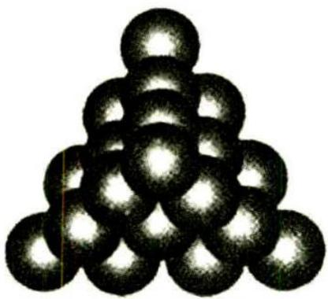

natural_image

Abstract geometric pattern of black spheres arranged in a triangular formation (no text or symbols)

图 1

链接教材：本题源于人教 A 版《选择性必修第二册》习题 4.2P26 第 12 题.

注重基础 二轮复习,仍然要回归基本知识,对一轮复习过的内容进行自查,基本概念、公式等要牢牢掌握.

思维导引 列举数列各项的值并观察,总结可得 $a_{n} - a_{n-1} = n$ , 由递推公式即可判断 B; 计算前 4 项的和即可判断 A; 利用累加法可得通项公式,由通项公式即可判断 C; 利用裂项相消法即可判断 D.

解析 易知从上往下,各层球数为 1,3,6,10,15,21……所以 $S_{4}=1+3+6+10=20$ , A 错误.

从上往下,第二层比第一层多2个球,第三层比第二层多3个球,第四层比第三层多4个球,第五层比第四层多5个球,…,第n层比第n-1层多n个球,所以 $a_{n}=a_{n-1}+n(n\geqslant2,n\in\mathbf{N}^{*})$ ,所以 $a_{n+1}-a_{n}=n+1$ ,B错误.

由 $a_{1}=1, a_{2}-a_{1}=2, a_{3}-a_{2}=3, \cdots, a_{n}-a_{n-1}=n$ ，利用累加法可得 $a_{n}=1+2+3+\cdots+n=\frac{n(n+1)}{2}$ ，由 $a_{n}=\frac{n(n+1)}{2}$ ，可得 $a_{2023}=\frac{2023\times2024}{2}=1012\times2023$ ，C 正确.

【另解】各层球数为 1, 3, 6, 10, 15, 21……结合杨辉三角，容易得到： $a_{1}=C_{2}^{2}$ ， $a_{2}=C_{3}^{2}$ ， $a_{3}=C_{4}^{2}$ ， $a_{4}=C_{5}^{2}$ ，…， $a_{n}=C_{n+1}^{2}=\frac{n(n+1)}{2}$

因为 $\frac{1}{a_{n}}=\frac{2}{n(n+1)}=2\times\left(\frac{1}{n}-\frac{1}{n+1}\right)$ ，所以 $\frac{1}{a_{1}}+\frac{1}{a_{2}}+\cdots+\frac{1}{a_{2023}}=2\times\left(1-\frac{1}{2}\right)+2\times\left(\frac{1}{2}-\frac{1}{3}\right)+\cdots+$ $2 \times \left( \frac{1}{2023} - \frac{1}{2024} \right) = 2 \times \left( 1 - \frac{1}{2024} \right) = \frac{2023}{1012}$ , D 错误.

答案 C

# 题型 9 挖掘教材中的阅读材料

调研 1 (2023·西安市铁一中 1 月期末改编)(多选)

斐波那契数列又称黄金分割数列,因数学家列昂纳多·斐波那契以兔子繁殖为例子而引入,故又称为“兔子数列”.斐波那契数列用递推的方式可表示如下:用 $a_{n}$ 表示斐波那契数列的第 $n$ 项,则数列 $\{a_{n}\}$ 满足 $a_{1} = a_{2} = 1$ , $a_{n+2} = a_{n+1} + a_{n}$ . 对于斐链接教材：本题源于人教 A 版《选择性必修第二册》 P10 阅读与思考.

波那契数列 $\{a_{n}\}$ ，记 $\sum_{i=1}^{n}a_{i}=a_{1}+a_{2}+\cdots+a_{n}$ ，则下列结论正确的是（）

A. $a_{6} = 8$

B. $3a_{n} = a_{n - 2} + a_{n + 2}(n\geqslant 3)$

C. $\sum_{i=1}^{2023} a_i = a_{2025}$

D. $\sum_{i=1}^{2023} a_i^2 = a_{2023} a_{2024}$

但也要注意,复习要有所侧重,对于基本概念、基本公式,掌握了就快速进行下一项,把时间省下,去突击重点、难点.

# 解析

<table><tr><td>选项</td><td>分析</td><td>正误</td></tr><tr><td>A</td><td> $a_{3}=a_{1}+a_{2}=2,a_{4}=a_{2}+a_{3}=3,a_{5}=a_{3}+a_{4}=5,a_{6}=a_{4}+a_{5}=8.$ 【求解策略】求数列中某项的值,一般要根据通项公式求解,但本题求解的是第6项,且斐波那契数列的通项公式难以求解,因此利用递推式,直接求出数列的第6项即可</td><td>√</td></tr><tr><td>B</td><td>当 $n\geqslant2$ 时, $a_{n+2}=a_{n+1}+a_{n}=a_{n}+a_{n-1}+a_{n}=2a_{n}+a_{n-1}$ ,即 $a_{n+2}=2a_{n}+a_{n-1}$  1,当 $n\geqslant3$ 时, $a_{n}=a_{n-1}+a_{n-2}$ ,可得 $a_{n-2}=a_{n}-a_{n-1}$  2,1+2得 $a_{n+2}+a_{n-2}=3a_{n}(n\geqslant3)$ .【易错警示】注意1+2得出的式子在 $n\geqslant3$ 时才有意义,解决数列问题时,出现第 $n-1$ 项、第 $n-2$ 项,都要写出对应的前提条件,形成“肌肉记忆”</td><td>√</td></tr><tr><td>C</td><td>对任意的 $n\in\mathbb{N}^{*},a_{n+2}=a_{n+1}+a_{n}$ ,则 $a_{n}=a_{n+2}-a_{n+1}$ ,【会类比】联系裂项相消法求和,裂项相消法是将数列的每一项变形为几个多项式(一般是两个)的差,进而求数列的前 $n$ 项和,而此处把数列的每一项变形为后两项的差,进而求出某一项的表达式所以 $\sum\limits_{i=1}^{2023}a_{i}=(a_{3}-a_{2})+(a_{4}-a_{3})+\cdots+(a_{2025}-a_{2024})=a_{2025}-a_{2}$ ,故 $\sum\limits_{i=1}^{2023}a_{i}\neq a_{2025}.$ </td><td>×</td></tr><tr><td>D</td><td>由 $a_{n+1}=a_{n+2}-a_{n}$ 得 $a_{n+1}^{2}=a_{n+1}(a_{n+2}-a_{n})=-a_{n}a_{n+1}+a_{n+1}a_{n+2}$ ,所以 $\sum\limits_{i=1}^{2023}a_{i}^{2}=a_{1}^{2}+(-a_{1}a_{2}+a_{2}a_{3})+(-a_{2}a_{3}+a_{3}a_{4})+\cdots+(-a_{2022}a_{2023}+a_{2023}\cdot a_{2024})=a_{1}^{2}-a_{1}a_{2}+a_{2023}a_{2024}=1-1+a_{2023}a_{2024}=a_{2023}a_{2024}$ ,即 $\sum\limits_{i=1}^{2023}a_{i}^{2}=a_{2023}a_{2024}.$ </td><td>√</td></tr></table>

# 答案 ABD

调研 2 (2023·江苏常州高级中学1月期末/双空题)“隙积术”是由北宋数学家沈括在《梦溪笔谈》中创立、南宋数学家杨辉及元代数学家朱世杰丰富和发展的一类数列求和的方法. 隙积术研究的对象有三角垛、方垛、刍甍垛、刍童垛等. 某仓库中部分货物堆放成如

图1所示的形式:自上而下,第一层1件,以后每一层比上一层多1件,最后一层是n件.已知第一层货物的价格为1万元/件,从第二层起,每一层货物的价格是上一层价格的 $\frac{7}{8}$ ,第n层货物的总价为\_\_\_\_万元.若这堆货物总价是(64-112× $(\frac{7}{8})^{n}$ )万元,则n= \_\_\_\_.

natural_image

Stack of cylindrical objects with rounded ends, no text or symbols present

图1

链接教材：本题源于人教 A 版《选择性必修第二册》P42 阅读与思考.

遇到薄弱的地方,不要着急,还是要花时间去训练、记忆,不要盲目攀高,要根据自己的实际情况调整计划,欲速则不达.

解析 设第 n 层货物的总价为 $a_{n}$ 万元 $(n=1,2,3,\cdots)$ ，则 $a_{n}=n\left(\frac{7}{8}\right)^{n-1}$ ，即第 n 层货物的总价为 $n\left(\frac{7}{8}\right)^{n-1}$ 万元.

设数列 $\{a_{n}\}$ 的前 n 项和为 $S_{n}$ ，则这堆货物的总价为 $S_{n}$ 万元，易得 $S_{n}=1\times\left(\frac{7}{8}\right)^{0}+2\times\left(\frac{7}{8}\right)^{1}+3\times\left(\frac{7}{8}\right)^{2}+\cdots+n\times\left(\frac{7}{8}\right)^{n-1}$ ①，

则 $\frac{7}{8}S_{n}=1\times\left(\frac{7}{8}\right)^{1}+2\times\left(\frac{7}{8}\right)^{2}+3\times\left(\frac{7}{8}\right)^{3}+\cdots+n\times\left(\frac{7}{8}\right)^{n}$ ②,

① - ②得 $\frac{1}{8} S_n = 1 + (\frac{7}{8})^1 + (\frac{7}{8})^2 + (\frac{7}{8})^3 + \cdots + (\frac{7}{8})^{n-1} - n \cdot (\frac{7}{8})^n = \frac{1 - (\frac{7}{8})^n}{1 - \frac{7}{8}} - n \cdot (\frac{7}{8})^n =$

【扫清障碍】应用错位相减法时,注意“对应相减”,相减时看清各项的指数,注意最后一项的符号

$$
8 - (8 + n) \cdot (\frac {7}{8}) ^ {n},
$$

所以 $S_{n}=64-8(8+n)\cdot\left(\frac{7}{8}\right)^{n}$ .

若货物的总价是 $64 - 112 \times \left(\frac{7}{8}\right)^n$ 万元, 则 $8(8 + n) = 112$ , 解得 $n = 6$ .

答案 $n(\frac{7}{8})^{n-1}$ 6

调研 3 (2023·河北邢台一中期末)阅读下面的两个材料,并解答问题.

材料一:我国南宋的数学家秦九韶在《数书九章》中提出了“三斜求积”, 大概意思是: 若把三角形的三条边分别称为小斜、中斜和大斜, 记小斜为 $a$ , 中斜为 $b$ , 大斜为 $c$ , 则三角形的面积为 $S = \sqrt{\frac{1}{4} [a^2 c^2 - (\frac{c^2 + a^2 - b^2}{2})^2]}$ . 这个公式被称为秦九韶公式.

材料二:古希腊数学家海伦在其所著的《测地术》中给出了用三角形的三条边长表示三角形的面积的公式,即已知三角形的三条边分别为 a, b, c, 则它的面积为 $S = \sqrt{p(p - a)(p - b)(p - c)}$ , 其中 $p = \frac{1}{2}(a + b + c)$ , 这个公式被称为海伦公式.

链接教材：本题源于人教 A 版《必修第二册》P55 阅读与思考.

(1)已知 $\triangle ABC$ 的三条边分别为 $a=7,b=8,c=9$ ,求三角形的面积 $S$ .

(2)已知 $\triangle ABC$ 的三条边分别为 $a=\sqrt{5},b=\sqrt{6},c=\sqrt{7}$ ,求三角形的面积 $S$ .

综合训练 对基础知识查漏补缺后,有选择地刷题,着重研究涉及多模块知识点的综合题.

(3)请从秦九韶公式和海伦公式中任选一个进行证明.

解析 (1) 由题意得 $\frac{1}{2} (a + b + c) = \frac{1}{2} \times (7 + 8 + 9) = 12$ ,

由海伦公式得 $S = \sqrt{12 \times (12 - 7) \times (12 - 8) \times (12 - 9)} = \sqrt{12 \times 5 \times 4 \times 3} = 12\sqrt{5}$ .

(2)由题意得 $a^{2}=5,b^{2}=6,c^{2}=7$ ,

由秦九韶公式得 $S = \sqrt{\frac{1}{4} \times [5 \times 7 - (\frac{7 + 5 - 6}{2})^{2}]} = \sqrt{\frac{1}{4} \times (35 - 9)} = \frac{\sqrt{26}}{2}.$

【解法对比】海伦公式适合各边长都为整数、易于加减运算的情形，而遇到如本题第(2)问的情况，各边长为无理数，加减运算复杂，此时如果选择海伦公式，运算难度可想而知。秦九韶公式看起来复杂，但对于第(2)问的情况，运算难度要小很多。由此我们可以领会出题人的用意：灵活运用公式非常重要。数学中，各个知识模块的公式都是多样的，死盯着一个公式去用，往往就会变成“盲目刷题”，在日常练习时，多尝试用不同的公式去解决问题，对比不同公式解题的效率，对提升解题速度很有帮助

(3) 证明秦九韶公式如下.

在 $\triangle ABC$ 中,设 $AB=c,AC=b,BC=a$ ,如图2,过点A作 $AD\perp BC$ 于点D,设 $AD=h,BD=x,CD=y$ ,

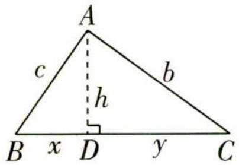

text_image

A
c
b
h
B x D y C

图2

由 $\left\{\begin{aligned}x+y&=a,\\h^{2}&=c^{2}-x^{2},\\h^{2}&=b^{2}-y^{2},\end{aligned}\right.$ 得 $x=\frac{a^{2}+c^{2}-b^{2}}{2a},y=\frac{a^{2}+b^{2}-c^{2}}{2a},h=\frac{\sqrt{4a^{2}c^{2}-(a^{2}+c^{2}-b^{2})^{2}}}{2a},$

$\therefore S_{\triangle ABC} = \frac{1}{2} ah = \frac{1}{2} a \cdot \frac{\sqrt{4a^2c^2 - (a^2 + c^2 - b^2)^2}}{2a} = \sqrt{\frac{1}{4}[a^2c^2 - (\frac{c^2 + a^2 - b^2}{2})^2]}$ , 得证证明海伦公式如下.

在 $\triangle ABC$ 中，设 $AB = c, AC = b, BC = a, p = \frac{1}{2} (a + b + c)$ ，

则 $p - a = \frac{1}{2} (b + c - a), p - b = \frac{1}{2} (a + c - b), p - c = \frac{1}{2} (a + b - c)$

$$
\therefore p (p - a) = \frac {1}{4} (b + c + a) (b + c - a) = \frac {1}{4} (b ^ {2} + c ^ {2} + 2 b c - a ^ {2}),
$$

由余弦定理得 $b^{2} + c^{2} - a^{2} = 2bc\cos A, \therefore p(p - a) = \frac{bc}{2} (\cos A + 1)$ ，

$$
\begin{array}{r l} & {(p - b) (p - c) = \frac {1}{4} [ a + (c - b) ] [ a - (c - b) ] = \frac {1}{4} (a ^ {2} - c ^ {2} - b ^ {2} + 2 b c) =} \\ & {\frac {1}{4} (- 2 b c \cos A + 2 b c) = \frac {b c}{2} (1 - \cos A).} \end{array}
$$

$\therefore \sqrt{p(p - a)(p - b)(p - c)} = \frac{bc}{2}\sqrt{1 - \cos^2 A} = \frac{1}{2} bc\sin A = S_{\triangle ABC}$ , 得证.

# 聚焦创新命题角度

# 角度 1 充要条件与其他模块知识的创新交汇问题

调研 1 (2023·北京西城区期末/交汇平面向量)已知 a 为单位向量,则“ $|a + b| - |b| = 1$ ”是“存在 $\lambda > 0$ ,使得 $b = \lambda a$ ”的()

A. 充分不必要条件

B. 必要不充分条件

C. 充要条件

D. 既不充分也不必要条件

解析 若 $b=0$ ，则 $\left|a+b\right|-\left|b\right|=\left|a\right|=1$ ，但此时不存在 $\lambda>0$ ，使得 $b=\lambda a$ ，故前者无法推

【小提示】注意零向量这一特殊向量

出后者. 若存在 $\lambda > 0$ , 使得 $b = \lambda a$ , 则 $a, b$ 共线且同向, 此时 $|a + b| - |b| = |a| + |b| - |b| = |a| = 1$ , 故后者可以推出前者. 故“ $|a + b| - |b| = 1$ ”是“存在 $\lambda > 0$ , 使得 $b = \lambda a$ ”的必要不充分条件, 故选 B.

答案 B

调研 2 (2023·四川成都一诊/交汇解析几何)在平面直角坐标系 xOy 中, O 为坐标原点, $M(x_{0}, y_{0})$ 为任一动点. p: 直线 MO 与直线 x = -1 相交于点 $N(-1, -\frac{4}{y_{0}})$ ; q: 动点 $M(x_{0}, y_{0})$ 在抛物线 $y^{2} = 4x$ 上. 则 p 是 q 的 ( )

A. 充分不必要条件

B. 必要不充分条件

C. 充要条件

D. 既不充分也不必要条件

解析 p: 直线 MO 与直线 x = -1 相交于点 $N(-1, -\frac{4}{y_{0}})$ ，则 $k_{OM} = k_{ON}$ ，即 $\frac{y_{0}}{x_{0}} = \frac{4}{y_{0}}$ ，整理得 $y_{0}^{2} = 4x_{0} (y_{0} \neq 0)$ 。q: 动点 $M(x_{0}, y_{0})$ 在抛物线 $y^{2} = 4x$ 上，则 $y_{0}^{2} = 4x_{0}$ 。综上，p 是 q 的充分不必要条件。

【易错提醒】注意分母不能为0，所以 $y_{0}\neq0$ ，因此在求轨迹方程时，应该注明 $y_{0}\neq0$ ，即轨迹不包括点(0,0)

答案 A

调研 3 (2023·四川乐山 1 月调研/交汇数列)已知等比数列 $\{a_{n}\}$ 的公比为q, 前n项和为 $S_{n}$ ，则“q>0”是“ $S_{n}+S_{n+2}>2S_{n+1}$ ”的()

A. 充分不必要条件

B. 必要不充分条件

C. 充要条件

D. 既不充分也不必要条件

解析 若 $q > 0$ ，则 $S_{n} + S_{n + 2} - 2S_{n + 1} = (S_{n + 2} - S_{n + 1}) - (S_{n + 1} - S_n) = a_{n + 2} - a_{n + 1} = a_{n + 1}$

高中的数学知识具有一定的范围,许多题目是相似的,考查了相同的知识点和方法,不要做简单、无聊的重复,这样不仅浪费时间,还没有效果.

$(q-1)$ , 该式不一定大于0, 即充分性不成立; 若 $S_{n} + S_{n+2} > 2S_{n+1}$ 成立, 则 $S_{n+2} - S_{n+1} > S_{n+1} - S_{n}$ , 即 【详解】依题意不妨设 $q = 1$ , 则有 $S_{n} + S_{n+2} = na_{1} + (n+2)a_{1} = 2(n+1)a_{1} = 2S_{n+1}$ , 则充分性不成立

$a_{n+2} > a_{n+1}$ , 所以数列 $\{a_n\}$ 为递增数列, 若 $a_1 < 0$ , 则 $0 < q < 1$ , 若 $a_1 > 0$ , 则 $q > 1$ , 所以 $q > 0$ 成立, 即必

【分类讨论】因为在等比数列中首项不能为0，因此要分 $a_{1}<0$ ， $a_{1}>0$ 两种情况讨论要性成立。所以“q>0”是“ $S_{n}+S_{n+2}>2S_{n+1}$ ”的必要不充分条件。故选B。

答案 B

调研 4 (2023·江苏无锡1月期末/交汇函数)给出下列四个命题,其中正确的命题为 ( )

A. $a > b$ 是 $3^{a} > 3^{b}$ 的充分不必要条件  
B. $\alpha > \beta$ 是 $\cos \alpha < \cos \beta$ 的必要不充分条件  
C. $a = 0$ 是函数 $f(x) = x^{3} + ax^{2}(x \in \mathbf{R})$ 为奇函数的充要条件  
D. $f(2) < f(3)$ 是函数 $f(x)$ 在 $[0, +\infty)$ 上单调递增的既不充分也不必要条件

解析

对于 A 选项, 设函数 $\varphi(x)=3^{x}$ , 则 $\varphi(a)=3^{a}, \varphi(b)=3^{b}$ . 因为 $\varphi(x)=3^{x}$ 在 R 上单

【小妙招】构造函数，结合函数的单调性进行判断

调递增,所以当 a > b 时, $\varphi(a) > \varphi(b)$ ,即 $3^{a} > 3^{b}$ ,充分性成立;若 $3^{a} > 3^{b}$ ,即 $\varphi(a) > \varphi(b)$ ,则 a > b,必要性成立.所以 a > b 是 $3^{a} > 3^{b}$ 的充要条件,所以 A 选项不正确.

对于 B 选项, 取 $\alpha = -\frac{\pi}{3}, \beta = \frac{\pi}{6}$ , 满足 $\cos \alpha < \cos \beta$ , 但是不满足 $\alpha > \beta$ , 则 $\alpha > \beta$ 不是 $\cos \alpha < \cos \beta$

【小技巧】通过举特例判断必要性不成立

的必要条件,所以 B 选项不正确.

对于 C 选项, 当 $a=0$ 时, $f(x)=x^{3}$ , 且 $f(-x)=(-x)^{3}=-x^{3}=-f(x)$ , 所以 $f(x)$ 是定义在 $\mathbf{R}$ 上的奇函数, 充分性成立; 若 $f(x)=x^{3}+ax^{2}(x\in\mathbf{R})$ 为奇函数, 则 $f(-x)=-x^{3}+ax^{2}=-f(x)=-x^{3}-ax^{2}$ , 从而 $a=0$ , 必要性成立. 故 $a=0$ 是函数 $f(x)=x^{3}+ax^{2}(x\in\mathbf{R})$ 为奇函数的充要条件, 所以 C 选项正确.

对于 D 选项, 若函数 $f(x)$ 在 $[0, +\infty)$ 上单调递增, 则 $f(2) < f(3)$ , 故必要性成立, 所以 D 选项不正确.

答案 C

# 角度 2 抽象函数的性质问题

调研 1 (2023·江苏苏北四市 1 月调研)(多选)设函数 $f(x)$ 的定义域为 R, $f(2x+1)$ 为奇函数, $f(x+2)$ 为偶函数,当 $x\in[0,1]$ 时, $f(x)=a^{x}+b$ ,若 $f(0)+f(3)=-1$ ,则()

A. $b = -2$

B. $f(2023) = -1$

C. $f(x)$ 为偶函数

D. $f(x)$ 的图象关于点 $(\frac{1}{2}, 0)$ 对称

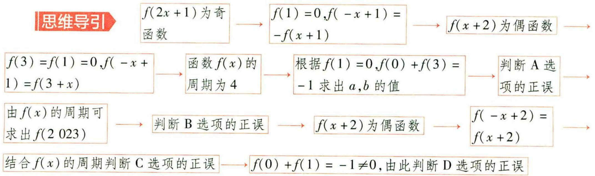

flowchart

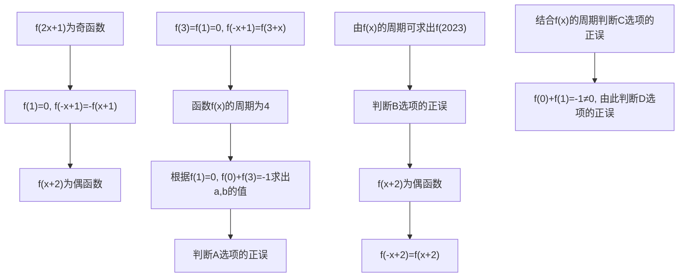
```mermaid
graph TD
    A["f(2x+1)为奇函数"] --> B["f(1)=0, f(-x+1)=-f(x+1)"]
    B --> C["f(x+2)为偶函数"]
    D["f(3)=f(1)=0, f(-x+1)=f(3+x)"] --> E["函数f(x)的周期为4"]
    E --> F["根据f(1)=0, f(0)+f(3)=-1求出a,b的值"]
    F --> G["判断A选项的正误"]
    H["由f(x)的周期可求出f(2023)"] --> I["判断B选项的正误"]
    I --> J["f(x+2)为偶函数"]
    J --> K["f(-x+2)=f(x+2)"]
    L["结合f(x)的周期判断C选项的正误"] --> M["f(0)+f(1)=-1≠0, 由此判断D选项的正误"]
```

解析 ∵ $f(2x+1)$ 为奇函数, ∴ $f(-2x+1) = -f(2x+1)$ , 令 x = 0, 则 $f(1) = 0$ ; 用 x 替换

【小提示】根据奇函数定义进行整理变形

2x, 则 $f(-x+1) = -f(x+1)$ ①. ∵ $f(x+2)$ 为偶函数, ∴ $f(-x+2) = f(x+2)$ , 令 x = 1, 则 $f(3) =$ 【小提示】根据偶函数定义进行整理变形 $f(1) = 0$ . 用 $x+1$ 替换 x, 则 $f(-x+1) = f(3+x)$ ②. 由①②知, $f(x+3) = -f(x+1)$ . 用 x-1 替换 x, 则 $f(x+2) = -f(x)$ , ∴ $f(x+4) = -f(x+2) = f(x)$ , 则 $f(x)$ 的周期为 4.

【用结论】由 $f(-x+1)=-f(x+1)$ ，得函数 $f(x)$ 的图象关于点 $(1,0)$ 对称；由函数 $f(x+2)$ 为偶函数，得函数 $f(x)$ 的图象关于直线x=2对称。一般地，若函数 $f(x)$ 图象满足“双重对称性”，则函数 $f(x)$ 为周期函数，且其图象相邻的两条对称轴之间的距离为半个周期，相邻的两个对称中心之间的距离也是半个周期，相邻的一条对称轴和一个对称中心之间的距离为四分之一个周期

由 $\left\{\begin{aligned}f(1)&=a+b=0,\\ f(0)+f(3)&=1+b=-1,\end{aligned}\right.$ 解得 $\left\{\begin{aligned}a&=2,\\ b&=-2,\end{aligned}\right.$ 所以A选项正确. $f(2023)=f(505\times4+3)=f(3)=0$ ，所以B选项错误.由 $f(-x+2)=f(x+2)$ ，得 $f(-x)=f(x+4)=f(x)$ ，得 $f(x)$ 为偶函数，所以C选项正确. $x\in[0,1]$ 时, $f(x)=2^{x}-2,f(0)+f(1)=-1\neq0,\therefore f(x)$ 的图象不关于点 $(\frac{1}{2},0)$ 对称，所以D选项错误.

# 答案 AC

调研 2 (2023·江苏南通 1 月统考)(多选)设定义在 $\mathbf{R}$ 上的函数 $f(x)$ 与 $g(x)$ 的导数分别为 $f'(x)$ 与 $g'(x)$ , 已知 $f(x) = g(3 - x) - 1$ , $f'(x + 1) = g'(x)$ , 且 $f'(x)$ 的图象关于直线 $x = 1$ 对称, 则下列结论一定成立的是 ( )

A. $f(x)+f(2-x)=0$

B. $f'(2)=0$

C. $g(1 - x) = g(1 + x)$

D. $g^{\prime}(x) + g^{\prime}(2 - x) = 0$

解析 因为 $f(x) = g(3 - x) - 1$ ，所以 $f'(x) = -g'(3 - x)$ ，所以 $f'(x + 1) = -g'(2 - x) = g'(x)$ ，所以 $g'(2 - x) + g'(x) = 0$ ，所以 D 选项正确.

令 $x = 1$ ，则 $g^{\prime}(2 - 1) + g^{\prime}(1) = 2g^{\prime}(1) = 0$ ，所以 $g^{\prime}(1) = 0$ ，由 $f^{\prime}(x + 1) = -g^{\prime}(2 - x) = g^{\prime}(x)$ 得 $f^{\prime}(1 + 1) = -g^{\prime}(2 - 1) = g^{\prime}(1) = 0$ ，所以B选项正确.

因为 $g'(2-x)+g'(x)=0$ ，所以 $g'(1-x)=-g'(1+x)$ ，所以函数 $g'(x)$ 的图象关于点 $(1,0)$

研究参考答案 多拿自己的答案和参考答案比较,尤其是对于解答题,如果自己做的答案和参考答案相去甚远,一定要搞清楚自己错在哪里.

对称,则函数 ${g}^{\prime }\left( {x + 1}\right)$ 的图象关于点(0,0)对称,即 ${g}^{\prime }\left( {x + 1}\right)$ 为奇函数,所以函数 $g\left( {x + 1}\right)  + C\left( C\right.$ 为

【敲黑板】函数 $f(x)$ 的定义域为 $D, \forall x \in D, (1)$ 存在常数 $a, b$ 使得 $f(x) + f(2a - x) = 2b$ 或 $f(a + x) + f(a - x) = 2b$ ，则函数 $f(x)$ 的图象关于点 $(a, b)$ 对称；(2) 存在常数 $a$ 使得 $f(x) = f(2a - x)$ 或 $f(a + x) = f(a - x)$ ，则函数 $f(x)$ 的图象关于直线 $x = a$ 对称

常数)为偶函数,图象关于直线 x=0 对称,所以函数 $g(x)+C$ 的图象关于直线 x=1 对称,所以

【记结论】 $h'(x)$ 为 $h(x)$ 的导函数，若 $h(x)$ 为偶函数，则 $h'(x)$ 为奇函数，若 $h(x)$ 为奇函数，则 $h'(x)$ 为偶函数；若 $h'(x)$ 为奇函数，则 $h(x)$ 为偶函数，若 $h'(x)$ 为偶函数， $h(x)$ 不一定为奇函数 $g(1-x)+C=g(1+x)+C$ ，即 $g(1-x)=g(1+x)$ ，所以 C 选项正确。

设函数 $f(x)=\cos\frac{\pi}{2}x+1$ ，则 $f'(x)=-\frac{\pi}{2}\sin\frac{\pi}{2}x,f'(x)$ 的图象关于直线x=1对称，且 $f'(2)=0$ ，符合题意，此时 $f(x)+f(2-x)=\cos\frac{\pi}{2}x+1+\cos\left[\frac{\pi}{2}(2-x)\right]+1=2$ ，所以A选项不正确.

答案 BCD

# 角度 3 抽象函数的图象推断问题

调研 1 (2023·安徽六安 1 月期末)已知函数 $y = f(x)$ 的图象的一部分如图 1 所示,则该函数的解析式可能是 ( )

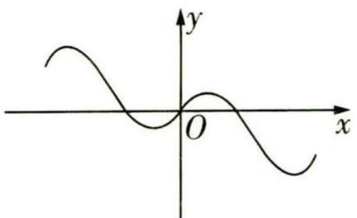

text_image

y
O
x

图1

A. $f(x) = x^{2} \cdot \sin x$   
B. $f(x) = x^{2} \cdot \cos x$   
C. $f(x) = \cos x \cdot \ln(\sqrt{x^{2} + 1} - x)$   
D. $f(x) = \cos x \cdot \ln(\sqrt{x^{2} + 1} + x)$

解析 由题图可知, $f(x)$ 图象关于原点对称,则 $f(x)$ 为奇函数.

【小提示】从函数的单调性、周期性、图象的对称性等出发寻找突破口

对于 A, $x^{2}\sin x = -(-x)^{2}\sin(-x)$ , $f(x) = x^{2} \cdot \sin x$ 为奇函数. 令 $x^{2} \cdot \sin x = 0$ , 可得 $x = k\pi (k \in \mathbb{Z})$ , 则 $f(x) = x^{2} \cdot \sin x$ 的图象与 x 轴任意相邻两交点间的距离相等, 与图象不符, 排除 A 选项.

对于 B, $\because (-x)^{2} \cdot \cos(-x) = x^{2} \cos x, \therefore f(x) = x^{2} \cdot \cos x$ 为偶函数, 排除 B 选项.

对于 C, 当 $x \in (0,1)$ 时, $\ln (\sqrt{x^2 + 1} - x) = \ln \frac{1}{\sqrt{x^2 + 1} + x} < \ln 1 = 0$ , $\cos x > 0$ , $\therefore \cos x \cdot \ln (\sqrt{x^2 + 1} - x) < 0$ , 即当 $x \in (0,1)$ 时, $f(x) = \cos x \cdot \ln (\sqrt{x^2 + 1} - x)$ 的函数值为负数, 与图象不符, 排除 C 选项. 选 D.

【规律总结】常见函数 $f(x) = \ln (\sqrt{x^2 + 1} - x)$ ， $f(x) = \ln (\sqrt{x^2 + 1} + x)$ 均为奇函数

答案 D

调研 2 (2023·东北师大附中1月期末)(多选)已知函数 $y=f(x)$ 是R上的奇函数,对于任意 $x\in\mathbb{R}$ ,都有 $f(x+4)=f(x)+f(2)$ 成立,且 $f(x)$ 在[0,2)上单调递增,给

即使在做对的情况下,也要仔细看一看参考答案,按照答案的思路去做一遍题,看和自己的思路是否有差异,是否有更简便的步骤.

出下列结论,其中正确的是

( )

A. $f(2) = 0$   
B. 点(4,0)是函数 $y = f(x)$ 的图象的一个对称中心  
C. 函数 $y = f(x)$ 在 $(-6, -2)$ 上不具有单调性  
D. 函数 $y=f(x)$ 在 $[-6,6]$ 上有 3 个零点

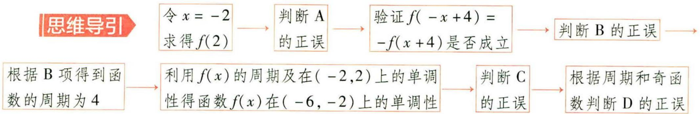

flowchart

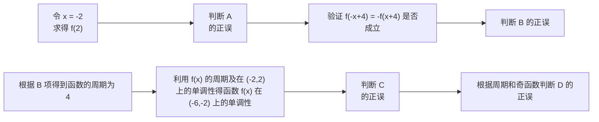
```mermaid
graph LR
    A["令 x = -2\n求得 f(2)"] --> B["判断 A\n的正误"]
    B --> C["验证 f(-x+4) = -f(x+4) 是否成立"]
    C --> D["判断 B 的正误"]
    E["根据 B 项得到函数的周期为 4"] --> F["利用 f(x) 的周期及在 (-2,2) 上的单调性得函数 f(x) 在 (-6,-2) 上的单调性"]
    F --> G["判断 C\n的正误"]
    G --> H["根据周期和奇函数判断 D 的正误"]
```

解析 将 $x = -2$ 代入 $f(x + 4) = f(x) + f(2)$ , 得 $f(2) = f(-2) + f(2)$ , 所以 $f(-2) = 0$ , 又函数 $y = f(x)$ 是 $\mathbf{R}$ 上的奇函数, 所以 $f(-2) = -f(2) = 0$ , 故 $f(2) = 0$ , 所以 A 正确. 因为 $f(x + 4) = f(x)$ ①, 所以 $-f(x + 4) = -f(x)$ ②, 令 ① 式中的 $x$ 为 $-x$ 得 $f(-x + 4) = f(-x)$ , 又函数 $y = f(x)$ 是 $\mathbf{R}$ 上的奇函数, 所以 $f(-x) = -f(x)$ , 故 $f(-x + 4) = -f(x)$ ③, 由 ② ③ 可得 $f(-x + 4) = -f(x + 4)$ , 故 B 正确. 因为 $f(x + 4) = f(x)$ , 所以函数 $f(x)$ 是以 4 为周期的周期函数, 则

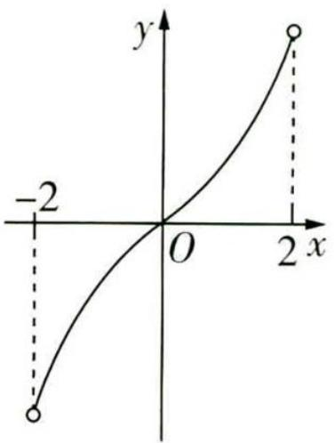

text_image

-2
O
2 x
y

图2

【用结论】若 $f(a+x)=2b-f(a-x)$ ，则函数 $f(x)$ 图象关于点 $(a,b)$ 对称

函数 $y=f(x)$ 在 $(-6,-2)$ 上的单调性与在 $(-2,2)$ 上的单调性相同，画出 $f(x)$ 在$(-2,2)$ 上的大致图象,如图2,则函数 $y=f(x)$ 在 $(-6,-2)$ 上单调递增,所以C不正确.由上述分析【数形结合】作出函数的图象,结合图象解题更直观

可知 $f(0)=f(-4)=f(4)=0,f(2)=f(6)=f(-2)=f(-6)=0$ ，所以函数 $y=f(x)$ 在 $[-6,6]$ 上有7个零点，D不正确。故选AB。

答案 AB

# 角度 4 台体的体积与表面积的计算问题

调研 (2023·安徽马鞍山1月一模)(多选)已知圆台的轴截面如图1所示,其上、下底面半径分别为 $r_{\text{上}}=1,r_{\text{下}}=2$ ,母线AB长为2,点E为AB的中点,则()

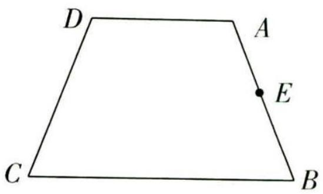

text_image

D
A
E
C
B

图1

A. 圆台的体积为 $\frac{7\sqrt{3}}{3}\pi$   
B. 圆台的侧面积为 $12 \pi$   
C. 圆台母线 $AB$ 与底面所成角为 $60^{\circ}$   
D. 在圆台的侧面上,从点 C 到点 E 的最短路径长为 4

解析 对于 A 选项, 圆台的高为 $\sqrt{AB^2 - (r_{\text{下}} - r_{\text{上}})^2} = \sqrt{3}$ , 则圆台的体积 $V = \frac{1}{3}\pi \times (1^2 + 1 \times 2 + 2^2) \times \sqrt{3} = \frac{7\sqrt{3}\pi}{3}$ , 所以 A 选项正确.

对于 B 选项,由题意,易知该圆台的侧面展开图为半圆环,其面积 $S = \frac{1}{2} \times \pi \times 4^{2} - \frac{1}{2} \times \pi \times 2^{2} = 6\pi$ ,所以 B 选项错误.

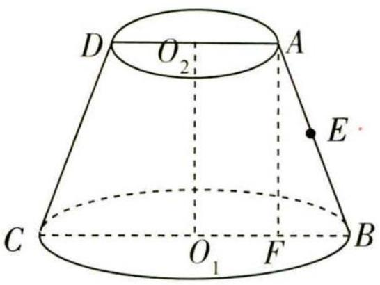

text_image

D
O₂
A
E
C
O₁
F
B

图2

【技巧点拨】圆台的侧面积可以通过圆台所对应的“大圆锥”的侧面积与“小圆锥”的侧面积作差得到,也可直接用圆台的侧面积公式 $S =$ ${\pi l}\left( {R + r}\right)$ 得出,其中 $R,r$ 分别是上、下底面半径, $l$ 是圆台的母线长

对于 C 选项, 如图 2, 作出圆台 $O_{1} O_{2}$ , 过 $A$ 作 $A F \parallel O_{1} O_{2}$ 交下底面于 图 2 $F$ , 则 $\angle A B F$ 即母线 $A B$ 与底面所成角, 在等腰梯形 $A B C D$ 中, $A B = 2$ , $B F = 2 - 1 = 1$ , 所以 $\cos \angle A B F = \frac {B F}{A B} = \frac {1}{2}$ , 所以 $\angle A B F = 60^{\circ}$ ,

【小妙招】将母线与底面所成角放在轴截面中,即可通过解三角形求解所以 $\mathrm{C}$ 选项正确.

对于D选项,作出圆台的侧面展开图,如图3所示,连接 $AA'$ ,交CD的延长线于点O,
【指点迷津】多面体或旋转体表面上路径的最值问题，往往通过侧面展开图解决，
即将立体几何问题转化为平面几何问题

连接 CE, 则在圆台的侧面上, 从 C 到 E 的最短路径为 CE, 由题意得 OB = OC = 4, AB = 2, 由 E 为 AB 中点, 得 OE = 3, 所以 $CE = \sqrt{CO^{2} + OE^{2}} = \sqrt{4^{2} + 3^{2}} = 5$ , 所以 D 选项错误. 故选 AC.

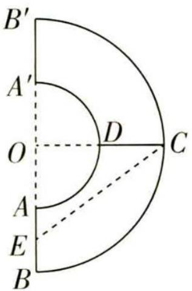

text_image

B'
A'
O
D
C
A
E
B

图3

答案 AC

# 角度 5 球与几何体的切、接问题

调研 1 (2023·天津滨海新区 1 月测试/交汇化学) 六氟化硫, 化学式为 $SF_{6}$ , 在常温常压下是一种无色、无味、无毒、不燃的稳定气体, 有良好的绝缘性, 在电器工业方面具有广泛用途. 六氟化硫分子结构为正八面体结构 (正八面体是每个面都是正三角形的八面体), 如图 1 所示. 若此正八面体的棱长为 2, 它的内切球的表面积为 $S_{1}$ , 外接球的表面积为 $S_{2}$ , 则 $\frac{S_{2}}{S_{1}}$ 的值为 ( )

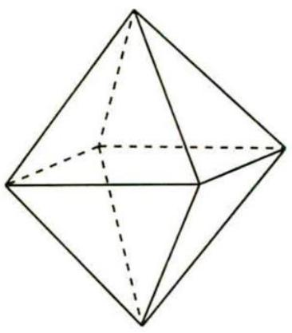

natural_image

Geometric diagram of a polyhedron with solid and dashed lines indicating visible and hidden edges (no text or labels)

图1

A. 3

B. 2

C. $\frac{1}{3}$

D. $\frac{1}{2}$

解析 如图2,作出正八面体 $FABCDE$ ,连接 $AC$ 和 $BD$ ,交于点 $O$ ,连接 $EO$ . 因为 $EA=EC,ED=EB$ ,所以 $EO \perp AC,EO \perp BD$ ,又 $AC$ 和 $BD$ 为平面 $ABCD$ 内两条相交直线,所以 $EO \perp$ 平面 $ABCD$ ,所以 $O$ 为正八面体的中心,亦即正八面体内切球与外接球的球心.

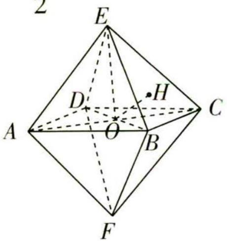

text_image

2
E
D
H
A
O
B
C
F

图 2

【敲黑板】根据正八面体的几何特征，先确定好球心位置

设正八面体的外接球的半径为 R，内切球的半径为 r，因为正八面体的棱长为 2 , 所以 $EB = EC = BC = 2, OB = OC = \sqrt{2}, EO = \sqrt{EB^{2} - OB^{2}} = \sqrt{2}$ , 则 $R = \sqrt{2}, S_{\triangle EBC} = \sqrt{3}, S_{\triangle OBC} =$ 1. 设内切球与平面 $EBC$ 切于点 $H$ , 连接 $OH$ , 则 $OH \perp$ 平面 $EBC, OH$ 即正八面体内切球的半径. 因为 $V_{E-OBC} = V_{O-EBC}$ , 即 $\frac{1}{3} \times S_{\triangle OBC} \times EO = \frac{1}{3} \times S_{\triangle EBC} \times OH$ , 所以 $OH = \frac{\sqrt{6}}{3}$ , 即 $r = \frac{\sqrt{6}}{3}$ , 所以 $\frac{S_2}{S_1} = \frac{4\pi R^2}{4\pi r^2} =$

【关键提醒】根据等体积转化,可求得“点到面的距离”,进而求得内切球的半径 $\frac{\left( {\sqrt{2}}\right) {2}}{\left( \frac{\sqrt{6}}{3}\right) {2}} = 3$ . 故选A.

【解后反思】在解决多面体的内切球问题时, 光要确定球心的位置, 几何体的内切球的特征是球心到多面体各个面的距离相等且都为球的半径. 确定多面体内切球半径的两种基本途径： ① “直接法”, 即根据内切球半径满足的条件, 将其放在三角形中, 通过已知条件列方程, 结合解三角形知识可以求得; ② “等体识法”, 当多面体各个面均为三角形时, 多面体可以拆成以多面体各面为底面, 球心为顶点的三棱锥, 这些 “小三棱锥” 体积和即多面体体积, 而每一个 “小三棱锥” 的高 (以多面体某个表面为底面) 均为多面体内切球的半径

# 答案 A

调研 2 (2023·衡水二中1月一模)某正六棱锥外接球的表面积为 $16 \pi$ , 且外接球的球心在正六棱锥内部或底面上, 底面正六边形边长 $l \in [ \sqrt{3}, 2 ]$ , 则该正六棱锥体积的取值范围是

A. $[4\sqrt{3}, \frac{9\sqrt{3}}{2}]$

B. $[4\sqrt{3}, \frac{128\sqrt{3}}{27}]$

C. $\left[\frac{9\sqrt{3}}{2}, \frac{128\sqrt{3}}{27}\right]$

D. $\left[\frac{64\sqrt{3}}{27}, 4\sqrt{3}\right]$

解析 如图3所示,设该正六棱锥 P-ABCDEF 的高 $PO_{1}=h$ ,侧棱长为 a, 外接球的半径为 r. 因为正六棱锥外接球的表面积为 $16\pi$ , 所以有 $16\pi = 4\pi r^{2}$ , 解得 r = 2. 因为外接球的球心在正六棱锥内部或底面上, 所以 $h \geqslant 2$ .

记正六棱锥外接球球心为 O，则 O 在 $PO_{1}$ 上。连接 OB, $O_{1}B$ ，设 $\angle OPB = \theta$ ，由题意知 $O_{1}B = l$ ，在 $\triangle OPB$ 中，由余弦定理可知 $\cos \theta = \frac{4 + a^{2} - 4}{2 \cdot 2a} = \frac{a}{4}$ ，在 Rt $\triangle PO_{1}B$ 中， $\cos \theta = \frac{h}{a}$ ，所以有 $\frac{h}{a} = \frac{a}{4}$ ，即 $a^{2} = 4h$ ，由勾股定理可知 $h^{2} + l^{2} =$

【难点突破】在 $\triangle POB$ 和 $\triangle PO_{1}B$ 中，通过“公共角 $\theta$ ”建立侧棱长和底面边长的关系

$a^2$ ，所以 $h^2 + l^2 = 4h$ ，即 $l^2 = 4h - h^2$ . 因为 $l \in [\sqrt{3}, 2]$ ，所以 $l^2 \in [3, 4]$ ，因此有 $3 \leqslant 4h - h^2 \leqslant 4$ ，解得 $1 \leqslant h \leqslant 3$ ，又 $h \geqslant 2$ ，所以 $2 \leqslant h \leqslant 3$

该正六棱锥的体积 $V=\frac{1}{3}\times6\times\frac{1}{2}\times l\times l\times\frac{\sqrt{3}}{2}\times h=\frac{\sqrt{3}}{2}(4h-h^{2})h=\frac{\sqrt{3}}{2}(4h^{2}-h^{3})$ .

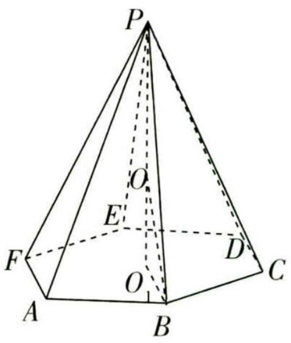

text_image

P
O
E
F
D
C
A
B
O

图3

【扫消障碍】将正六棱锥的体积表示成关于 $h$ 的函数, 进而借助导数进行求解

记 $V(h) = \frac{\sqrt{3}}{2} (4h^2 - h^3), 2 \leqslant h \leqslant 3$ ，则 $V'(h) = \frac{\sqrt{3}}{2} (8h - 3h^2) = -\frac{3\sqrt{3}}{2} h(h - \frac{8}{3})$ ，当 $2 \leqslant h < \frac{8}{3}$ 时，

总结复盘 刷题之后,花几分钟回顾一下,从题目中跳出来,从思想方法的层面去审题,关注题目考查的知识点、方法.

$V'(h)>0,V(h)$ 单调递增,当 $\frac{8}{3}<h\leqslant3$ 时, $V'(h)<0,V(h)$ 单调递减,所以 $V(h)_{\max}=V(\frac{8}{3})=\frac{128\sqrt{3}}{27}$ . 因为 $V(2)=4\sqrt{3},V(3)=\frac{9\sqrt{3}}{2},V(2)<V(3)$ ,所以 $V(h)_{\min}=4\sqrt{3}$ ,因此该正六棱锥的体积的取值范围是 $\left[4\sqrt{3},\frac{128\sqrt{3}}{27}\right]$ ,故选B.

答案 B

调研 3 (2023·安徽芜湖一中等校12月联考)(多选)已知正四棱台上、下底面的面积分别为2和8,高为h,则下列结论正确的有()

A. 正四棱台外接球的表面积的最小值为 $16 \pi$   
B. 当 $h \in (0, \sqrt{3})$ 时, 正四棱台外接球球心在正四棱台外部  
C. 正四棱台外接球的半径随 $h$ 的增大而增大  
D. 当 h=2 时, 正四棱台存在内切球

思维导引 根据题干得到正四棱台的上、下底面外接圆的半径 由于正四棱台的高不确定,因此根据球心与正四棱台下底面的位置关系做出合理判断

分别按照 A, B, C, D 四个选项的内容, 研究正四棱台的外接球和内切球

解析 设正四棱台上、下底面的外接圆的半径分别为 $r_1, r_2$ ，外接球的半径为 $R$ ，球心为 $O$ 。因为正四棱台的上、下底面面积分别为 2 和 8，所以上、下底面正方形的边长分别为 $\sqrt{2}, 2\sqrt{2}$ ，所以 $r_1 = 1, r_2 = 2$ 。设球心 $O$ 到上底面的距离为 $d$ ，则 $R^2 = r_1^2 + d^2 = r_2^2 + |h - d|^2$ ，即 $r_1^2 + d^2 = r_2^2 + |h - d|^2$ ，

【扫清障碍】建立正四棱台的高与球心到上底面距离的关系

所以 ${1}^{2} + {d}^{2} = {2}^{2} + \left| {h - d}\right| ^{2}$ ,所以 $d = \frac{{h}^{2} + 3}{2h} = \frac{1}{2}\left( {h + \frac{3}{h}}\right)  \geq  \sqrt{3}$ (当且仅当 $h = \sqrt{3}$ 时取等号),当 $d = \sqrt{3}$ 时,外接球半径最小,此时 ${R}^{2} = 1 + 3 = 4$ ,所以外接球的表面积的最小值为 ${16\pi }$ ,所以 $\mathrm{A}$ 选项正确.

【敲黑板】根据基本不等式确定 $d$ 的最小值,进而得外接球半径的最小值,注意等号的成立条件

易知当 h=1 和 h=3 时, $R=\sqrt{5}$ , 所以 C 选项不正确.

当 $h \in (0, \sqrt{3})$ 时, $d - h = \frac{h^{2} + 3}{2h} - h = \frac{3 - h^{2}}{2h} > 0$ , 所以外接球球心在正四棱台外部, 所以 B 选项正确.

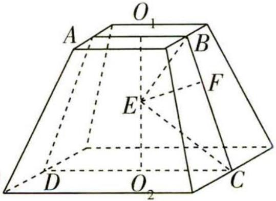

text_image

O₁
A
B
F
E
D
O₂
C

正四棱台内切球存在时,内切球大圆是图4中梯形ABCD的内切圆,

【会转化】将正四棱台的内切球问题转化为其“中截面等腰梯形”的内切圆问题

圆心 E 是上、下底面中心 $O_{1}, O_{2}$ 连线的中点，过点 E 作 $EF \perp BC$ 交 BC 于图4

F, 设梯形 ABCD 的内切圆的半径为 r, 则 $r = \frac{h}{2} = EF$ . 连接 EB, EC, 由 Rt△EO₁B≌Rt△EFB 可知, $\angle O_{1}EB = \angle FEB, BF = BO_{1} = \frac{\sqrt{2}}{2}$ , 同理 $\angle O_{2}EC = \angle FEC, CF = CO_{2} = \sqrt{2}$ , 故可知 $\angle BEC = \frac{\pi}{2}$ , 在 Rt△BEC

要养成这样的习惯:归纳各模块题目的考法、摸清出题的规律,把学到的知识转化为解决问题的方法.

中, $EF^{2}=BF\cdot CF=1$ ,所以r=1,h=2,所以D选项正确.故选ABD.

【二级结论】此处用到了射影定理：在直角三角形中，斜边上的高是两条直角边在斜边上射影的比例中项；每一条直角边又是这条直角边在斜边上的射影和斜边的比例中项

答案 ABD

# 角度 6 图表类创新统计问题

调研 1 (2023·北京市海淀实验中学期末/由统计图直接判断样本的数字特征)某公司为了解用户对其产品的满意度,从甲、乙两地区分别随机调查了100个用户,根据用户对产品的满意度评分,得到甲地区和乙地区用户满意度评分的频率分布直方图,分别如图1,图2所示.

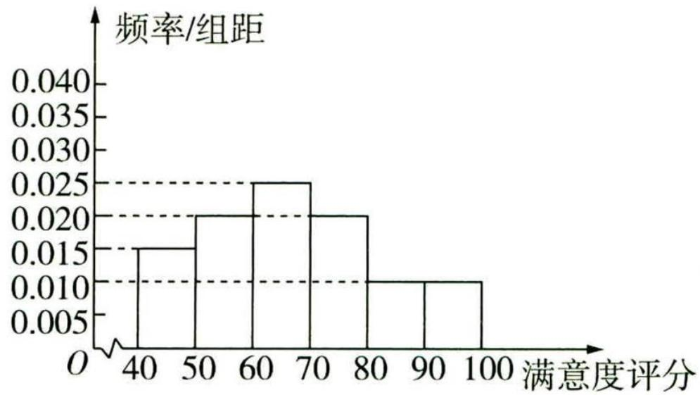

histogram

| 满意度评分 | 频率/组距 |
| ---------- | --------- |
| 40-50      | 0.015     |
| 50-60      | 0.020     |
| 60-70      | 0.025     |
| 70-80      | 0.020     |
| 80-90      | 0.010     |
| 90-100     | 0.010     |

图1

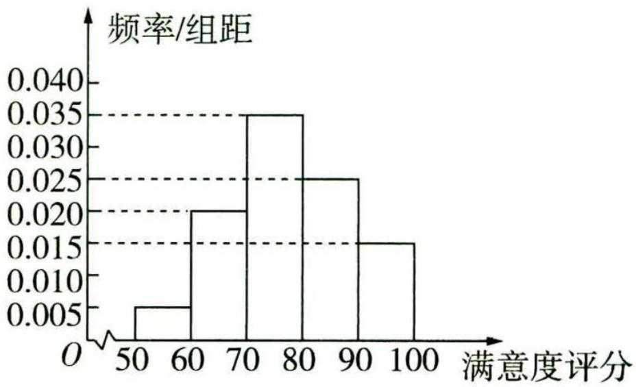

histogram

| 满意度评分 | 频率/组距 |
| :--- | :--- |
| 50-60 | 0.005 |
| 60-70 | 0.020 |
| 70-80 | 0.035 |
| 80-90 | 0.025 |
| 90-100 | 0.015 |

图 2

若甲地区和乙地区用户满意度评分的中位数分别为 $m_{1}, m_{2}$ ，方差分别为 $s_{1}^{2}, s_{2}^{2}$ ，则（）

A. $m_{1} > m_{2}, s_{1}^{2} > s_{2}^{2}$

B. $m_{1} > m_{2}, s_{1}^{2} < s_{2}^{2}$

C. $m_{1} < m_{2}, s_{1}^{2} < s_{2}^{2}$

D. $m_{1} < m_{2}, s_{1}^{2} > s_{2}^{2}$

解析 甲地区用户满意度评分在区间[40,60)内的频率为 $(0.015 + 0.020) \times 10 = 0.35$ , 在区间[60,70)内的频率为 $0.025 \times 10 = 0.25$ ,

∴ 甲地区用户满意度评分的中位数 $m_{1}=60+\frac{0.5-0.35}{0.25}\times10=66$ .

乙地区用户满意度评分在区间[50,70)内的频率为 $(0.005 + 0.020) \times 10 = 0.25$ , 在区间[70,80)内的频率为 $0.035 \times 10 = 0.35$ ,

∴ 乙地区用户满意度评分的中位数 $m_{2}=70+\frac{0.5-0.25}{0.35}\times10\approx77.1.\therefore m_{1}<m_{2}.$

【关键点醒】频率分布直方图中,中位数左边和右边的直方图的面积相等

由频率分布直方图可以看出,乙地区用户满意度评分数据的集中程度比甲地区的高, $\therefore {s}_{1}^{2} > {s}_{2}^{2}$ .

【联系图表】方差刻画样本数据的“集中”与“波动”的程度，方差的值越大，样本数据越分散，波动性越大；反之，样本数据越集中，越稳定，因此频率分布直方图中数据的集中程度可以反映方差的大小

故选D.

答案 D

同时,像数列、解三角形这样的题目,解题的步骤一般比较固定,从整体上去看解题的思路、流程,花时间总结归纳解题的步骤,每一步该做什么,要做到心中有数.

调研 2 (2023·广东高考测评研究院1月调研/教育强国)(多选)近年来国家教育系统全面加快推进教育现代化,建设教育强国,各级各类教育事业发展取得了新进展.根据国家统计局发布的《中华人民共和国2021年国民经济和社会发展统计公报》中的数据,作出如图3所示的柱状图,则下列叙述正确的是()

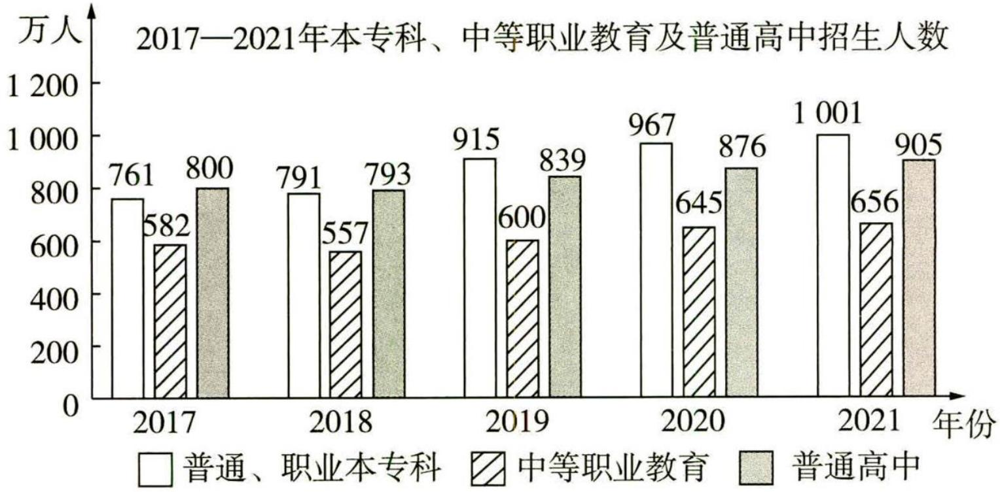

bar

2017—2021年本专科、中等职业教育及普通高中招生人数
| 年份 | 普通、职业本专科 (万人) | 中等职业教育 (万人) | 普通高中 (万人) |
|---|---|---|---|
| 2017 | 761 | 582 | 800 |
| 2018 | 791 | 557 | 793 |
| 2019 | 915 | 600 | 839 |
| 2020 | 967 | 645 | 876 |
| 2021 | 1001 | 656 | 905 |

图3

A. 2017—2021 年, 普通、职业本专科招生人数逐年增加

B. 普通、职业本专科在 2017—2018 年招生人数增长最多

C. 2017—2021 年, 普通高中招生人数在普通、职业本专科, 中等职业教育及普通高中招生总人数中的占比逐年下降

D. 2017—2021 年, 中等职业教育平均招生人数大约为 608 万

解析 由柱状图可知,2017—2021年普通、职业本专科招生人数依次为761万、791万、915万、967万、1001万,人数逐年增加,所以A选项正确.

2018—2021 年普通、职业本专科招生人数每年比上年增长的人数分别为 30 万、124 万、52 万、34 万,即 2018—2019 年增长人数最多,所以 B 选项不正确.

【扫清障碍】根据所提供的图表，计算出每两年之间的普通、职业本专科招生增长人数，时比分析

2017—2021年普通高中招生人数在普通、职业本专科,中等职业教育及普通高中招生总人数中的占比分别为 $\frac{800}{761 + 582 + 800} \approx 0.373, \frac{793}{791 + 557 + 793} \approx 0.370, \frac{839}{915 + 600 + 839} \approx 0.356, \frac{876}{967 + 645 + 876} \approx 0.352, \frac{905}{1001 + 656 + 905} \approx 0.353$ ,所以C选项不正确.

【跳出思维定式】是否需要把四个选项都看一遍呢？在本题中，判断出来 BC 选项不正确之后，根据多选题正确答案至少有两个，直接选 AD 即可

2017—2021年,中等职业教育平均招生人数为 $\frac{582+557+600+645+656}{5}=608$ (万),所以D选项正确.

答案 AD

久而久之,对于简单题和中档题,在看完题干之后,做题的思路、步骤便浮现在脑海之中,这时候,解题便没什么障碍了.

调研 3 (2023·湖南株洲 12 月联考/关注气温变化)(多选)2022 年夏天,我国部分地区迎来罕见的高温干旱天气,其特点是持续时间长、范围广、强度大、干旱少雨、极端性强. 中央气象局国家气象中心发布的统计数据显示,本次高温热浪的综合强度,已达 1961 年有完整气象观测记录以来最强. 某地气象部门统计当地进入 8 月份以来连续 10 天(8 月 1 日至 8 月 10 日)中每天的最高温和最低温,得到如图 4 所示的折线图. 根据该图判断,下列关于这 10 天气温的说法中正确的有 ( )

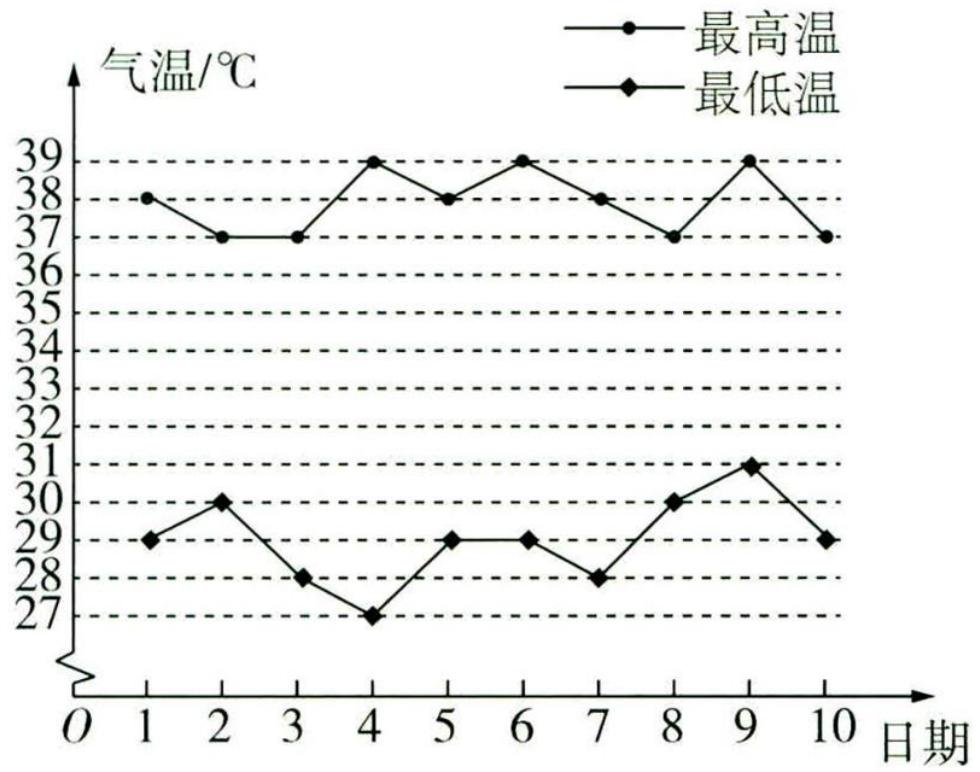

line

| 日期 | 最高温 (°C) | 最低温 (°C) |
| ---- | ----------- | ----------- |
| 1    | 38          | 29          |
| 2    | 37          | 30          |
| 3    | 37          | 28          |
| 4    | 39          | 27          |
| 5    | 38          | 29          |
| 6    | 39          | 29          |
| 7    | 38          | 28          |
| 8    | 37          | 30          |
| 9    | 39          | 31          |
| 10   | 37          | 29          |

图4

A. 最高温的众数为 $37^{\circ}$ C

B. 最高温的平均值为 $37.9^{\circ} \mathrm{C}$

C. 10 天中第 9 天的温差最小

D. 最高温的方差大于最低温的方差

解析 对于 A, 最高温 $37^{\circ}$ C 出现 4 次, 出现的次数最多, 所以最高温的众数为 $37^{\circ}$ C, 所以 A 正确.

对于 B, 最高温的平均值为 $\frac{1}{10} \times (38 + 37 + 37 + 39 + 38 + 39 + 38 + 37 + 39 + 37) = 37.9 \, (\text{℃})$ , 所以 B 正确.

对于 C, 10 天中, 第 9 天的温差为 $8^{\circ} \mathrm{C}$ , 而第 2 天和第 8 天的温差为 $7^{\circ} \mathrm{C}$ , 所以 C 不正确.

【扫清障碍】“温差”指的是当天最高温与最低温的差

对于 D, 最高温的波动比最低温小, 所以最高温的方差小于最低温的方差, 所以 D 不正确.

【抓住核心】牢记数据波动性越小,样本数据的方差就越小,这个规律不仅适用于频率分布直方图,对折线图也同样适用

答案 AB

# 角度 7 三角函数图象特征的研究问题

调研 1 (2023·河北衡水二中 1 月一模) 已知 $f(x) = 2\tan (\omega x + \varphi)(\omega > 0, |\varphi| < \frac{\pi}{2})$ , $f(0) = \frac{2\sqrt{3}}{3}$ , 最小正周期 $T \in (\frac{\pi}{4}, \frac{3\pi}{4})$ , $f(x)$ 图象的一个对称中心为点 $(\frac{\pi}{6},$

应试有技巧 认真对待平时练习,每一次练习都尽量当作考试对待,严格限制答题时间.把握解题的节奏,逐渐养成良好的审题、解题习惯.

0), 则 $f(\frac{\pi}{3})$ 的值为

( )

A. $-\sqrt{3}$

B. $\sqrt{3}$

C. $\frac{2\sqrt{3}}{3}$

D. $-\frac{2\sqrt{3}}{3}$

解析 由 $f(0) = \frac{2\sqrt{3}}{3}$ ，可得 $2\tan \varphi = \frac{2\sqrt{3}}{3}, \tan \varphi = \frac{\sqrt{3}}{3}$ ，又 $|\varphi| < \frac{\pi}{2}$ ，所以 $\varphi = \frac{\pi}{6}$ .

因为 $f(x)$ 图象的一个对称中心为点 $\left(\frac{\pi}{6},0\right)$ ，故 $\frac{\pi}{6}\omega + \frac{\pi}{6} = \frac{k\pi}{2}, k \in \mathbf{Z}$ ，得 $\omega = 3k - 1, k \in \mathbf{Z}$ .

【易错】根据正切函数图象的对称中心的有关结论，写出参数 $\omega$ 满足的关系式，注意不要想当然地认为 $\frac{\pi}{6}\omega + \frac{\pi}{6} = k\pi, k \in Z$ ，而是 $\frac{\pi}{6}\omega + \frac{\pi}{6} = \frac{k\pi}{2}, k \in Z$

因为 $T \in \left( \frac{\pi}{4}, \frac{3\pi}{4} \right)$ ，所以 $\frac{\pi}{4} < \frac{\pi}{\omega} < \frac{3}{4}\pi$ ，解得 $\frac{4}{3} < \omega < 4$ ，所以 $\omega = 2$ 。

故 $f(x)$ 的解析式为 $f(x)=2\tan(2x+\frac{\pi}{6})$ ，所以 $f(\frac{\pi}{3})=2\tan(2\times\frac{\pi}{3}+\frac{\pi}{6})=-\frac{2\sqrt{3}}{3}$ ，故选D.

答案 D

调研 2 (2023·广东华附、省实、广雅、深中四校1月联考)(多选)已知函数 $f(x)=\sqrt{3}\sin\omega x+\cos\omega x(0<\omega<3)$ 满足 $f(x+\frac{\pi}{2})=-f(x)$ ，其图象向右平移 $s(s\in\mathbf{N}^{*})$ 个单位长度后可以得到函数 $g(x)$ 的图象，且 $g(x)$ 在 $\left[-\frac{\pi}{6},\frac{\pi}{6}\right]$ 上单调递减，则下列说法正确的是()

A. $\omega = 1$

B. 函数 $f(x)$ 的图象关于点 $\left(\frac{5\pi}{12},0\right)$ 对称

C. $s$ 可以等于5

D. $s$ 的最小值为 2

解析 对于 A, 因为 $f(x + \frac{\pi}{2}) = -f(x)$ ，所以 $f(x + \pi) = -f(x + \frac{\pi}{2}) = f(x)$ ，所以 $\pi$ 是 $f(x)$

【速记结论】若 $f(x+T)=-f(x)(T\neq0)$ ，则 2T 为函数 $f(x)$ 的一个周期

的一个周期. 又 $f(x) = \sqrt{3} \sin \omega x + \cos \omega x = 2 \sin \left( \omega x + \frac{\pi}{6} \right)$ , 所以 $\frac{2\pi}{|\omega|}$ 是 $f(x)$ 的最小正周期, 故 $k \times \frac{2\pi}{|\omega|} = \pi (k \in \mathbf{Z})$ , 则 $|\omega| = 2k (k \in \mathbf{Z})$ . 又 $0 < \omega < 3$ , 故 $\omega = 2$ , 所以 A 不正确.

对于 B, 由 A 得 $f(x) = 2\sin \left(2x + \frac{\pi}{6}\right)$ , 所以 $f\left(\frac{5\pi}{12}\right) = 2\sin \left(\frac{5\pi}{6} + \frac{\pi}{6}\right) = 2\sin \pi = 0$ , 故点 $\left(\frac{5\pi}{12}, 0\right)$ 是 $f(x)$ 图象的一个对称中心, 所以 B 正确.

对于 C, $f(x)$ 的图象向右平移 $s(s \in \mathbb{N}^{*})$ 个单位长度后得到函数 $g(x) = 2\sin\left[2(x - s) + \frac{\pi}{6}\right]$ 的图

象,则 $g(x)=2\sin(2x+\frac{\pi}{6}-2s)$ .

因为 $g(x)$ 在 $\left[-\frac{\pi}{6},\frac{\pi}{6}\right]$ 上单调递减，所以 $\left\{\begin{aligned}&2\times\left(-\frac{\pi}{6}\right)+\frac{\pi}{6}-2s\geqslant2k\pi+\frac{\pi}{2},\\ &2\times\frac{\pi}{6}+\frac{\pi}{6}-2s\leqslant2k\pi+\frac{3\pi}{2},\end{aligned}\right.$ $k\in Z,$

【敲黑板】函数 $g(x)$ 在区间 $\left[-\frac{\pi}{6},\frac{\pi}{6}\right]$ 上单调递减，则必有 $\left[-\frac{\pi}{6},\frac{\pi}{6}\right]\subseteq\left[2k\pi+\frac{\pi}{2},2k\pi+\frac{3\pi}{2}\right](k\in\mathbb{Z})$

解得 $-k\pi - \frac{\pi}{2} \leqslant s \leqslant -k\pi - \frac{\pi}{3} (k \in \mathbf{Z})$ .

当 $k = -2$ 时， $\frac{3\pi}{2} \leqslant s \leqslant \frac{5\pi}{3}$ ，因为 $s \in \mathbf{N}^*$ ，所以 $s = 5$ ，所以 C 正确。

对于 D, 因为 $s \in N^{*}$ , 所以 $-k\pi - \frac{\pi}{3} > 0$ , 则 $k < -\frac{1}{3}$ , 又 $k \in Z$ , 故 $k \leqslant -1$ ,

当 k = -1 时， $\frac{\pi}{2} \leqslant s \leqslant \frac{2\pi}{3}$ ，可知 $s_{\min} = 2$ ，所以 D 正确。

【释疑惑】为什么这里取 $k = -1$ 呢？我们知道， $s$ 的范围是 $-k\pi - \frac{\pi}{2} \leqslant s \leqslant -k\pi - \frac{\pi}{3} (k \in \mathbf{Z})$ ，那么 $k$ 越小， $s$ 就越大，因此 $s$ 的最小值只能在 $k$ 取 -1 时对应的区间内

答案 BCD

调研 3 (2023·宁夏银川一中12月联考)已知函数 $f(x)=\cos(\omega x-\frac{\pi}{3})-\frac{1}{2}$ (ω>0), 将 $f(x)$ 的图象上所有点的横坐标缩短为原来的 $\frac{1}{2}$ ，纵坐标不变，得到函数 $g(x)$ 的图象。已知 $g(x)$ 在 $[0,\pi]$ 上恰有 5 个零点，则 $\omega$ 的取值范围是 \_\_\_\_.

解析 由题可知, $g(x)=\cos(2\omega x-\frac{\pi}{3})-\frac{1}{2}$ . 令 $t=2\omega x-\frac{\pi}{3}$ , 若 $g(x)$ 在 $[0,\pi]$ 上恰有 5 个零点, 则关于 t 的方程 $\cos t=\frac{1}{2}$ 在 $[- \frac{\pi}{3},2\pi\omega - \frac{\pi}{3}]$ 上恰有 5 个不相等的实根,

由 $y = \cos t$ 的性质可得 $\frac{11\pi}{3} \leqslant 2\pi \omega - \frac{\pi}{3} < \frac{13\pi}{3}$ , 解得 $2 \leqslant \omega < \frac{7}{3}$ .

【易错提醒】注意端点的取舍问题， $\cos\frac{11\pi}{3}=\frac{1}{2},t=\frac{11\pi}{3}$ 是方程 $\cos t=\frac{1}{2}$ 在对应区间上的第5个根； $\cos\frac{13\pi}{3}=\frac{1}{2},t=\frac{13\pi}{3}$ 是方程 $\cos t=\frac{1}{2}$ 在对应区间上的第6个根，因此 $\frac{11\pi}{3}$ 必须取， $\frac{13\pi}{3}$ 不能取

答案 $\left[2,\frac{7}{3}\right)$

调整心态 越临近高考,压力越大,我们可能越“坐不住”,这时,保持良好的备考状态更加重要.

# 角度 8 以正方体为载体的动态探究问题

调研 (2023·广东深圳南山区期末)(多选)如图1,正方体 $ABCD - A_{1}B_{1}C_{1}D_{1}$ 的棱长为2,若点M在线段 $BC_{1}$ 上运动,则下列结论正确的为 ( )

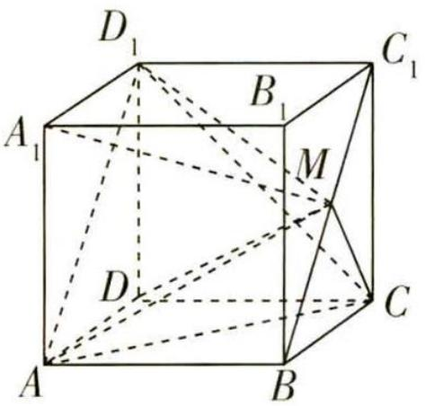

text_image

D₁
A₁
B₁
C₁
M
D
A
B
C

图1

A. 直线 $A_{1} M$ 可能与平面 $A C D_{1}$ 相交  
B. 三棱锥 A - MCD 与三棱锥 $D_{1}$ - MCD 的体积之和为定值  
C. 当 $CM \perp MD_{1}$ 时, $CM$ 与平面 $ACD_{1}$ 所成角最大  
D. $\triangle AMC$ 的周长的最小值为 $2 \sqrt{2 + \sqrt{2}} + 2 \sqrt{2}$

解析 对于 A, 如图 2, 连接 $A_{1}B, A_{1}C_{1}$ .

易知 $A_{1}C_{1} \parallel AC, A_{1}C_{1} \not\subset$ 平面 $ACD_{1}, AC \subset$ 平面 $ACD_{1}$ , 所以 $A_{1}C_{1} \parallel$ 平面 $ACD_{1}$ , 同理 $BC_{1} \parallel$ 平面 $ACD_{1}$ .

又 $A_{1}C_{1}\subset$ 平面 $A_{1}BC_{1},BC_{1}\subset$ 平面 $A_{1}BC_{1}$ ，且 $A_{1}C_{1}\cap BC_{1} = C_{1}$

所以平面 $A_{1}BC_{1} \parallel$ 平面 $ACD_{1}$ .

【结论速解】在正方体 $ABCD - A_{1}B_{1}C_{1}D_{1}$ 中，平面 $A_{1}BC_{1} \parallel$ 平面 $ACD_{1}$ ，且 $B_{1}D \perp$ 平面 $A_{1}BC_{1}$ ， $B_{1}D \perp$ 平面 $ACD_{1}$

因为 $A_{1}M \subset$ 平面 $A_{1}BC_{1}$ ，所以 $A_{1}M \parallel$ 平面 $ACD_{1}$ ，故 A 不正确.

对于 B, 如图 3, 过点 M 作 $ME \perp BC$ 于点 E, $MF \perp CC_{1}$ 于点 F, 根据面面垂直的性质定理可知, $ME \perp$ 平面 ACD, $MF \perp$ 平面 $DCD_{1}$ , $ME + MF = BE + EC = BC = 2$ ,

$$
V _ {A - M C D} + V _ {D _ {1} - M C D} = V _ {M - A C D} + V _ {M - D C D _ {1}} = \frac {1}{3} \times S _ {\triangle A C D} \times M E + \frac {1}{3} \times S _ {\triangle D _ {1} C D} \times
$$

$MF = \frac{1}{3} \times S_{\triangle ACD} \times (ME + MF) = \frac{1}{3} \times \frac{1}{2} \times 2 \times 2 \times 2 = \frac{4}{3}$ , 是定值, 故 B 正确.

对于 C, 如图 4, 因为 $D_{1}C_{1} \perp$ 平面 $BCC_{1}, MC \subset$ 平面 $BCC_{1}$ , 所以 $D_{1}C_{1} \perp MC$ , 又 $MD_{1} \perp MC, D_{1}C_{1} \cap D_{1}M = D_{1}, D_{1}C_{1} \subset$ 平面 $D_{1}C_{1}M, D_{1}M \subset$ 平面 $D_{1}C_{1}M$ , 所以 $MC \perp$ 平面 $D_{1}C_{1}M$ .

又 $M{C}_{1} \subset$ 平面 ${D}_{1}{C}_{1}M$ ,所以 ${CM} \bot  M{C}_{1}$ ,即 ${CM} \bot  B{C}_{1}$ ,点 $M$ 是线段 $B{C}_{1}$ 的中点.

【妙转化】将已知条件 $CM \perp MD_{1}$ 转化为点 M 是线段 $BC_{1}$ 的中点，问题变成了“当点 M 是线段 $BC_{1}$ 的中点时，CM 与平面 $ACD_{1}$ 所成角是否最大？”，那么接下来我们只要表示出 CM 与平面 $ACD_{1}$ 所成角，再进行分析即可

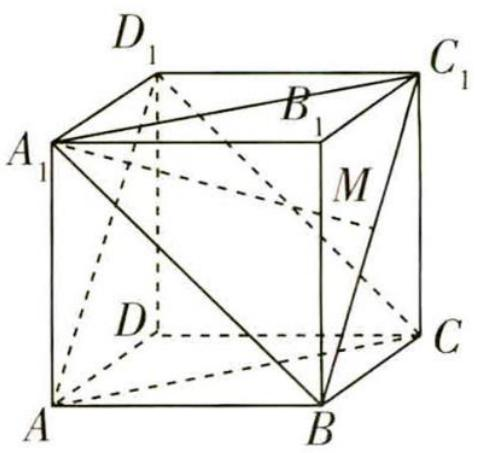

text_image

D₁
A₁
B₁
C₁
M
D
A
B
C

图 2

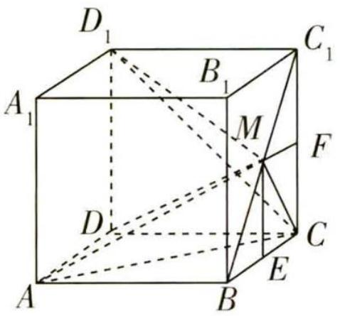

text_image

D₁
A₁
B₁
C₁
M
F
D
C
E
A
B

图 3

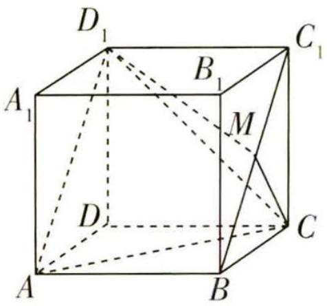

text_image

D₁
A₁
B₁
C₁
M
D
C
A
B

图 4

设 CM 与平面 $ACD_{1}$ 所成角为 $\theta, \theta \in (0, \frac{\pi}{2})$ ，记点 M 到平面 $ACD_{1}$ 的距离为 h，则 $\sin \theta = \frac{h}{MC}$ .

【小提示】通过研究 $\sin\theta$ 的最值，得出 $\theta$ 的最大值

因为 $BC_{1} \parallel AD_{1}$ ，且 $BC_{1} \not\subset$ 平面 $ACD_{1}, AD_{1} \subset$ 平面 $ACD_{1}$ ，所以 $BC_{1} \parallel$ 平面 $ACD_{1}$ ，即 $BC_{1}$ 上任何一个点到平面 $ACD_{1}$ 的距离相等, 故 h 为定值, 所以当 MC 取最小值时 $\sin \theta$ 最大, $\theta$ 最大.

易知点 M 是线段 $BC_{1}$ 的中点时, 线段 MC 最短, 故 C 正确.

对于 D, $\triangle AMC$ 的周长为 $AM + MC + AC$ , 其中 AC 为定值 $2\sqrt{2}$ , 则当 $AM + MC$ 最小时, $\triangle AMC$ 的周长最小, 如图 5, 将平面 $BCC_{1}$ 沿 $BC_{1}$ 旋转, 使之与平面 $ABC_{1}D_{1}$ 在同一平面, 易知当点 A, M, C 三点共线时, $AM + MC$ 最小.

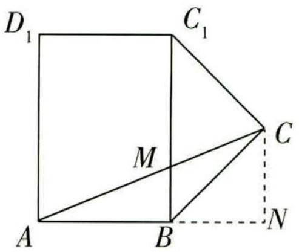

text_image

D₁
C₁
M
A
B
C
N

图5

【扫清障碍】通过展开立体图形，将空间中线段和的最值问题转化为平面内线段和的最值问题，结合“两点之间线段最短”解决，降低思维难度

过点 C 作 $CN \perp AB$ 交 AB 的延长线于 N，则 $CN = BN = \frac{1}{2}C_{1}B = \sqrt{2}$ ， $AN = AB + BN = 2 + \sqrt{2}$ ，所以 $AC = \sqrt{CN^{2} + AN^{2}} = 2\sqrt{2 + \sqrt{2}}.$

所以 $\triangle AMC$ 的周长的最小值为 $2\sqrt{2 + \sqrt{2}} + 2\sqrt{2}$ , 故 D 正确.

答案 BCD

# 角度 9 测绘类解三角形问题

调研 1 (2023·重庆巴蜀中学1月考试/创新设问)(多选)重庆的解放碑是重庆的地标性建筑,吸引了众多游客打卡拍照.某中学数学兴趣小组对解放碑的高度进行测量,并绘制出测量方案示意图,如图1所示,A为解放碑的顶端,B为基座(B在A的正下方),在步行街(与B在同一水平面内)上选取C,D两点,测得CD的长为100 m.小组成员利用测角仪已测得 $\angle ACB=\frac{\pi}{6}$ ,则根据下列各组中的测量数据,能计算出解放碑高度AB的是

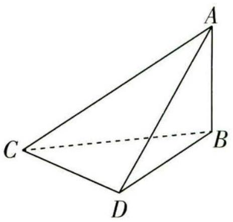

natural_image

Geometric diagram of a tetrahedron with vertices labeled A, B, C, D (no text or symbols beyond labels)

图 1

A. $\angle BCD, \angle BDC$

B. $\angle ACD, \angle ADC$

C. $\angle BCD, \angle ACD$

D. $\angle BCD, \angle ADC$

解析 对于 A, 根据 CD, $\angle BCD$ , $\angle BDC$ , 可解三角形求得 CB, 从而在 Rt△ABC 中求得 AB, 【提示】△BCD 中已知两角一边

所以 A 符合题意.

对于 B, 根据 CD, $\angle ACD$ , $\angle ADC$ , 可解三角形求得 AC, 从而在 Rt△ABC 中求得 AB, 所以 B 符合

【提示】△ACD 中已知两角一边

题意.

对于 C, 根据 CD, $\angle ACB$ , $\angle BCD$ , $\angle ACD$ 四个条件, 无法通过解三角形求得 AB, 所以 C 不符合题意.

对于 D, 第一步, $\angle ACB$ 已知, 在 Rt△ABC 中, 用 AB 表示出 BC, AC; 第二步, 在 △BCD 中, 根据余

悲观的人,先被自己打败,然后才被生活打败;乐观的人,先战胜自己,然后才战胜生活.

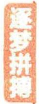

弦定理用 $AB$ 表示出 $BD$ , 在 $\triangle ACD$ 中, 根据正弦定理用 $AB$ 表示出 $AD$ ; 第三步, 在 Rt $\triangle ABD$ 中, 利用勾股定理列方程, 即可求得 $AB$ . 所以 D 符合题意.

答案 ABD

调研 2 (2023·皖豫名校联盟 12 月联考)如图 2,一艘巡逻船由南向北行驶,在 A 处测得某山的底部 C 在北偏东 $15^{\circ}$ 方向上,匀速向北航行 20 分钟到达 B 处,此时测得该山的底部 C 在北偏东 $60^{\circ}$ 方向上,测得山顶 P(P 在 C 的正上方)的仰角为 $60^{\circ}$ ,已知山的高度为 $2\sqrt{3}$ km. 则巡逻船的航行速度为 \_\_\_\_ km/h.

解析 由题意知, 在 $\triangle BCP$ 中, $PC = 2\sqrt{3} \mathrm{~km}$ , $\angle PBC = 60^{\circ}$ , 故 $\tan \angle PBC = \frac{PC}{BC}$ , 得 $BC = 2 \mathrm{~km}$ .

在 $\triangle ABC$ 中， $\angle BCA = 60^{\circ} - 15^{\circ} = 45^{\circ}$ ，则 $\frac{BC}{\sin \angle BAC} = \frac{AB}{\sin \angle BCA}$ ，即 $\frac{2}{\sin 15^{\circ}} = \frac{AB}{\sin 45^{\circ}}$

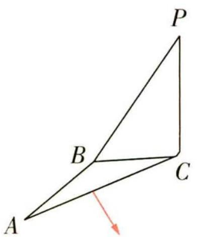

text_image

P
B
C
A

注意：船是“由南向北行驶”的，那么其实正北方向是 $\overrightarrow{AB}$ 的方向，这是本题的创新之处。

图 2

而 $\sin 15^{\circ} = \sin (45^{\circ} - 30^{\circ}) = \frac{\sqrt{6} - \sqrt{2}}{4}$ , 所以 $AB = \sqrt{2} \times \frac{4}{\sqrt{6} - \sqrt{2}} = 2(\sqrt{3} + 1) (\mathrm{km})$ .

所以巡逻船的航行速度为 $2(\sqrt{3} + 1) \div \frac{1}{3} = 6(\sqrt{3} + 1) \, (\text{km/h})$ .

答案 $6(\sqrt{3}+1)$

调研 3 (2023·陕西延安 12 月联考) 图 3 是某旅游景区部分游览路线简化图, 游客到达该旅游景区内的 A 处后, 有两种路径到 B 处: 一种是从 A 处沿直线步行到 B 处; 另一种是先从 A 处坐小车沿直线到达 C 处, 再从 C 处沿直线步行到 B 处. 现有甲、乙两名游客到达 A处后,甲匀速步行前往 B 处,速度为 50 米/分,甲出发 2 分钟后,乙从 A 处坐小车前往 C 处,再从 C 处步行到 B 处. 已知小车的速度为 200 米/分,A,C 之间的距离为 2000 米,B,C 之间的距离为 3000 米,AB > BC, $\sin B = \frac{\sqrt{3}}{3}$ . 当乙在小车上时,甲、乙之间的直线距离最短为 ( )

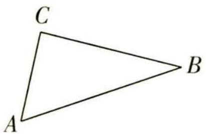

text_image

C
A
B

图3

A. $\frac{300\sqrt{39}}{13}$ 米

B. $\frac{200\sqrt{39}}{13}$ 米

C. $\frac{300\sqrt{13}}{13}$ 米

D. $\frac{200\sqrt{13}}{13}$ 米

解析 由正弦定理可知 $\frac{AC}{\sin B} = \frac{BC}{\sin A}$ , 所以 $\sin A = \frac{BC \times \sin B}{AC} = \frac{3000 \times \frac{\sqrt{3}}{3}}{2000} = \frac{\sqrt{3}}{2}$ ,

又 AB > BC, 所以 $\cos A = \frac{1}{2}$ .

易知甲从 A 处步行到 B 处所用时间大于 60 分钟, 乙在小车上的总时间为 $\frac{2000}{200}=10$ (分), 设乙出发 $t(0<t\leqslant10)$ 分钟后, 甲、乙之间的直线距离为 d 米, 则 $d^{2}=(200t)^{2}+(100+50t)^{2}-2\times200t\times(100+50t)\times\frac{1}{2}=32500t^{2}-10000t+10000(0<t\leqslant10)$ ,

【易错提醒】乙出发1分钟后，甲走过的路程并不是50t米，注意关键字眼“甲出发2分钟后”，所以甲走过的路程是 $(100+50t)$ 米

当 $t=\frac{2}{13}$ 时, $d^{2}$ 取得最小值,为 $\frac{120\ 000}{13}$ ,所以 $d_{\min}=\sqrt{\frac{120\ 000}{13}}=\frac{200\ \sqrt{39}}{13}$ ,

【易遗漏】注意最小值取得的条件是否成立，即要验证t是否在区间(0,10]内

因此甲、乙之间的直线距离最短为 $\frac{200\sqrt{39}}{13}$ 米.

答案 B

# 角度 10 平面向量与其他模块知识交汇问题

调研 1 (2023·河北石家庄一中等校 12 月联考/平面向量与数列交汇)已知点列 $\{P_{n}\}$ 中的所有点都在 $\triangle ABC$ 内部, $\triangle ABP_{n}$ 的面积与 $\triangle ACP_{n}$ 的面积比值为 $\frac{1}{3}$ . 在数列 $\{a_{n}\}$ 中, $a_{1} = 1$ , 若 $\forall n \in \mathbf{N}^{*}$ 且 $n \geqslant 2$ , $\overrightarrow{AP_{n}} = 3a_{n} \overrightarrow{AB} + (4a_{n-1} + 3)\overrightarrow{AC}$ 恒成立, 那么 $a_{4} =$

A. 15

B. 31

C. 63

D. 127

解析 如图1,延长 $AP_{n}$ 交BC于D,则 $\frac{S_{\triangle ABP_{n}}}{S_{\triangle ABD}}=\frac{S_{\triangle ACP_{n}}}{S_{\triangle ACD}}=\frac{AP_{n}}{AD}.$

又 $\triangle ABP_{n}$ 的面积与 $\triangle ACP_{n}$ 的面积比值为 $\frac{1}{3}, \therefore \frac{S_{\triangle ABD}}{S_{\triangle ACD}}=\frac{1}{3}, \therefore \frac{BD}{CD}=\frac{1}{3}$ , $\therefore$ 点 $D$ 是边 $BC$ 上最靠近点 $B$ 的四等分点.

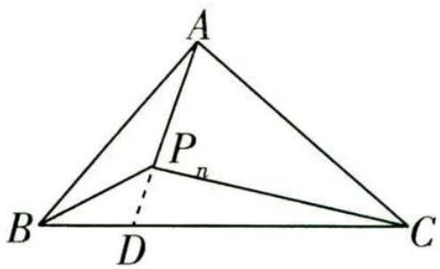

text_image

A
Pₙ
B
D
C

图 1

【扫清障碍】确定点 D 的位置，借助 $\overrightarrow{AP_{n}}$ 与 $\overrightarrow{AD}$ 共线，用同一组基向量 $\overrightarrow{AB}, \overrightarrow{AC}$ 将二者表示出来，利用对应系数成比例即可确定关于 $a_{n}$ 的递推式

$$
\overrightarrow {A D} = \overrightarrow {A B} + \overrightarrow {B D} = \overrightarrow {A B} + \frac {1}{4} \overrightarrow {B C} = \overrightarrow {A B} + \frac {1}{4} (\overrightarrow {A C} - \overrightarrow {A B}) = \frac {3}{4} \overrightarrow {A B} + \frac {1}{4} \overrightarrow {A C},
$$

又 $\overrightarrow{AP_{n}}=3a_{n}\overrightarrow{AB}+(4a_{n-1}+3)\overrightarrow{AC},\overrightarrow{AD}//\overrightarrow{AP_{n}}$

$\therefore \frac{3a_{n}}{\frac{3}{4}} = \frac{4a_{n - 1} + 3}{\frac{1}{4}}$ 所以 $a_{n} = 4a_{n - 1} + 3(n\geqslant 2)$

由 $a_{1}=1$ ，依次计算得到 $a_{2}=7, a_{3}=31, a_{4}=4\times31+3=127$ 。故选 D.

答案 D

调研 2 (2023·河南南阳 1 月期末/平面向量与费马点交汇)十七世纪法国数学家费马提出过一个著名的几何问题:“已知一个三角形,求作一点,使其与这个三角形的三个顶点的距离之和最小.”这个问题的答案是:当三角形的三个内角均小于 $120^{\circ}$ 时,所求点为三角形的正等角中心,即该点与三角形的三个顶点的连线两两夹角为 $120^{\circ}$ ;当三角形有一内角大于或等于 $120^{\circ}$ 时,所求点为三角形最大内角的顶点.此问题中所求的点被称为费马点.已知 $a, b, c$ 分别是 $\triangle ABC$ 三个内角 $A, B, C$ 的对边,且 $b^{2} - (a - c)^{2} = 6$ , $\frac{\cos \angle BAC}{2\cos \angle ABC} = \sin (\angle BCA - 30^{\circ})$ ,若点 $P$ 为 $\triangle ABC$ 的费马点,则 $\overrightarrow{PA} \cdot \overrightarrow{PB} + \overrightarrow{PB} \cdot \overrightarrow{PC} + \overrightarrow{PA} \cdot \overrightarrow{PC} =$

A. -6

B. -4

C. -3

D. -2

解析 $\because \frac{\cos \angle BAC}{2\cos \angle ABC} = \sin(\angle BCA - 30^{\circ}), \therefore \cos \angle BAC = 2\sin(\angle BCA - 30^{\circ})\cos \angle ABC,$

$\therefore \cos \angle BAC = 2(\frac{\sqrt{3}}{2}\sin \angle BCA - \frac{1}{2}\cos \angle BCA) \cos \angle ABC, \text{即} \cos \angle BAC = \sqrt{3}\sin \angle BCA \cos \angle ABC - \cos \angle BCA \cos \angle ABC.$

又 $\angle BAC + \angle ABC + \angle BCA = 180^{\circ}, \therefore \cos \angle BAC = -\cos (\angle ABC + \angle BCA) = -\cos \angle ABC\cos \angle BCA + \sin \angle ABC\sin \angle BCA,$

$\therefore -\cos \angle ABC\cos \angle BCA + \sin \angle ABC\sin \angle BCA = \sqrt{3}\sin \angle BCA\cos \angle ABC - \cos \angle BCA\cos \angle ABC,$ 即 $\sin \angle ABC\sin \angle BCA = \sqrt{3}\sin \angle BCA\cos \angle ABC.$

又 $\sin \angle BCA \neq 0, \therefore \tan \angle ABC = \frac{\sin \angle ABC}{\cos \angle ABC} = \sqrt{3}$ , 又 $\angle ABC \in (0^{\circ}, 180^{\circ}), \therefore \angle ABC = 60^{\circ}$ .

由余弦定理知, $\cos\angle ABC=\frac{a^{2}+c^{2}-b^{2}}{2ac}=\frac{1}{2}$ ，又 $b^{2}=(a-c)^{2}+6$ ，得ac=6.

易知 $\triangle ABC$ 的三个内角均小于 $120^{\circ}$ ，则点P一定在三角形的内部，

【扫清障碍】 $\angle ABC=60^{\circ}$ ，那么 $\angle BAC+\angle BCA=120^{\circ}$ ，所以 $\angle BAC,\angle BCA$ 均小于 $120^{\circ}$ ，即 $\triangle ABC$ 三个内角均小于 $120^{\circ}$

$\therefore S_{\triangle ABC} = \frac{1}{2} PA \times PB \sin 120^{\circ} + \frac{1}{2} PB \times PC \sin 120^{\circ} + \frac{1}{2} PA \times PC \sin 120^{\circ} = \frac{1}{2} ac \sin \angle ABC = \frac{1}{2} \times 6 \times \sin 60^{\circ} = \frac{3\sqrt{3}}{2},$

∴ $PA \times PB + PB \times PC + PA \times PC = 6$ ，两边同时乘 $\cos 120^{\circ}$ ，可得 $PA \times PB \cos 120^{\circ} + PB \times PC \cos 120^{\circ} +$ 【关键转化】以 $\overrightarrow{PA} \cdot \overrightarrow{PB}$ 为例， $\overrightarrow{PA} \cdot \overrightarrow{PB} = |\overrightarrow{PA}| |\overrightarrow{PB}| \cos \langle \overrightarrow{PA}, \overrightarrow{PB} \rangle$ ，因此只需找到 $\cos \langle \overrightarrow{PA}, \overrightarrow{PB} \rangle$ 即可，而新概念“费马点”还没有用到，再次阅读，发现关键句“当三角形的三个内角均小于 $120^{\circ}$ 时，所求点为三角形的正等角中心，即该点与三角形的三个顶点的连线两两夹角为 $120^{\circ}$ ”，那么 $\cos \langle \overrightarrow{PA}, \overrightarrow{PB} \rangle = 120^{\circ}$ ，问题解决了 $PA \times PC \cos 120^{\circ} = 6 \times \cos 120^{\circ}$ ,

即 $\overrightarrow{PA}\cdot\overrightarrow{PB}+\overrightarrow{PB}\cdot\overrightarrow{PC}+\overrightarrow{PA}\cdot\overrightarrow{PC}=6\times\cos120^{\circ}=-3$ ，故选C.

答案 C

# 角度 11 画展开图解决路径问题

调研 1 (2023·浙江绍兴 1 月期末)如图 1, 在棱长均为 2 的正四面体 ABCD 中, M 为 AC 的中点, E 为 AB 的中点, P 是 DM 上的动点, Q 是平面 ECD 上的动点, 则 AP + PQ 的最小值是 \_\_\_\_.

解析 如图2,作 $MG \perp CE$ 于点G,连接DG,易知平面 $CDE \perp$ 平面ABC,平面 $CDE \cap$ 平面ABC=CE,则 $MG \perp$ 平面CDE,

故 $DG$ 为 $DM$ 在平面 $CDE$ 上的射影.

将 $\triangle ADM$ 沿 $DM$ 翻折至与 $\triangle DMG$ 共面,记翻折后的点 $A$ (即 $A'$ )到 $DG$ 【点拨】通过翻折平面将空间中的距离转化为平面上的距离
的距离为 $h_A$ ,则 $h_A$ 为 $\triangle A'DG$ 的边 $DG$ 上的高,且 $AP+PQ=A'P+PQ \geq h_A$ .

因为 $MG = \frac{1}{2}AE = \frac{1}{2}$ , $DM = \sqrt{DC^{2} - (\frac{AC}{2})^{2}} = \sqrt{3}$ ，则 $\sin \angle MDG = \frac{MG}{DM} = \frac{\sqrt{3}}{6}$ ，故 $\cos \angle MDG = \frac{\sqrt{33}}{6}$ . 又 $\angle ADM = \angle A'DM = \frac{\pi}{6}$ ，所以 $\sin \angle A'DG = \sin (\angle MDG + \frac{\pi}{6}) = \frac{\sqrt{33}}{6} \times \frac{1}{2} + \frac{\sqrt{3}}{6} \times \frac{\sqrt{3}}{2} = \frac{3 + \sqrt{33}}{12}$ ，所以 $AP + PQ$ 的最小值

【小提示】遇到三角形中与角有关的问题时,要注意三角恒等变换的灵活运用

$$
h _ {A} = A ^ {\prime} D \sin \angle A ^ {\prime} D G = 2 \times \frac {3 + \sqrt {3 3}}{1 2} = \frac {\sqrt {3 3} + 3}{6}.
$$

答案 $\frac{\sqrt{33}+3}{6}$

调研 2 (2023·上海进才中学1月期末改编)如图3,在底面半径为1,高为 $\sqrt{3}$ 的圆锥中,O是底面圆心,P为圆锥顶点,A,B是底面圆周上的两点, $\angle AOB=\frac{2\pi}{3}$ ,C为母线PB的中点.

(1) 求在该圆锥的侧面上, 从 A 到 C 的最短路径的长.  
(2) 求 AC 与 PO 所成角的余弦值.

解析 (1) 因为圆锥的底面半径为 $r = 1$ , 高为 $\sqrt{3}$ , 则母线长 $l = PB = \sqrt{3 + 1} = 2$ .

在底面圆 O 中, $\widehat{AB} = \angle AOB \cdot r = \frac{2\pi}{3}.$

图 4 为圆锥的侧面展开示意图, 连接 AC, 则线段 AC 的长为最短路径.

【难点突破】求旋转体表面上两点间最短距离的关键是化曲为直，一般需要展开表面，利用平面上两点之间线段最短求解

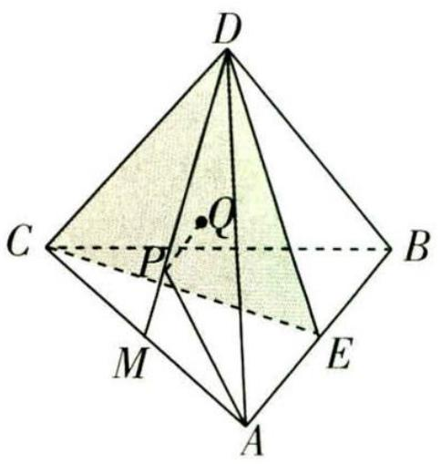

text_image

Geometric diagram of a tetrahedron with labeled vertices and internal points, including shaded triangular regions.

图1

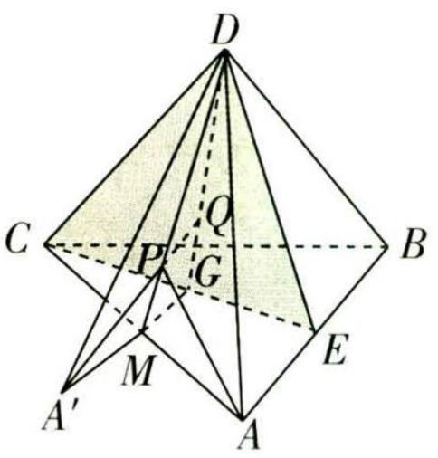

text_image

Geometric diagram of a pyramid with labeled vertices and internal points, including shaded triangular regions.

图 2

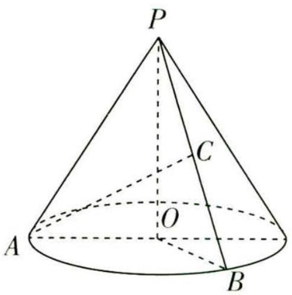

text_image

P
C
O
A
B

图3

梦想,是坚信自己的信念,完成理想的欲望和永不放弃的坚持,是每个拥有它的人最伟大的财富.

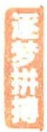

设圆心角 $\angle APB$ 为 $\alpha$ , 则 $\widehat{AB} = \alpha \cdot l = \frac{2\pi}{3}$ , 解得 $\alpha = \frac{\pi}{3}$ ,

【会区分】展开图中，一定要区分哪些长度或角在变化，哪些量不变

在 $\triangle APC$ 中, ${PC} = \frac{1}{2}{PB} = 1,{PA} = 2,{\alpha } = \frac{\pi }{3}$ ,则由余弦定理可得 ${AC} =$ $\sqrt{A{P}^{2} + P{C}^{2} - 2 \times  {AP} \times  {PC} \times  \cos \alpha } = \sqrt{3}$ ,即在该圆锥的侧面上,从 $A$ 到 $C$ 的最短【另解】连接 ${AB}$ ,由 ${PA} = {PB} = 2,\angle {APB} = \frac{\pi }{3}$ ,知 $\bigtriangleup  {PAB}$ 为等边三角形,又 $C$ 为 ${PB}$ 的中点,则 ${AC} = {AP} \times  \sin \frac{\pi }{3} = \sqrt{3}$

路径长为 $\sqrt{3}$ .

(2) 如图 5, 在 OB 上取中点 D, 连接 CD, AD, 因为 CD 是 $\triangle POB$ 的中位线, 所以 $CD \parallel OP$ , $CD = \frac{1}{2}PO = \frac{\sqrt{3}}{2}$ , 故 AC 与 PO 所成角为 AC 与 CD 所成的锐角, 即 $\angle ACD$ .

【方法点拨】利用几何法求异面直线所成的角通常是通过平移直线, 将所求空间角转化为平面角, 注意线线角不能为钝角

因为 $CD \perp$ 底面圆 O, 所以 $CD \perp AD$ .

在 $\triangle AOD$ 中, $AO = 1$ , $OD = \frac{1}{2}$ , $\angle AOD = \frac{2\pi}{3}$ , 由余弦定理可得

【会分析】已知两边及夹角，求第三边，用余弦定理

$$
A D = \sqrt {A O ^ {2} + O D ^ {2} - 2 \times A O \times O D \times \cos \angle A O D} = \sqrt {1 + \frac {1}{4} - 2 \times 1 \times \frac {1}{2} \times (- \frac {1}{2})} = \frac {\sqrt {7}}{2},
$$

又 $CD^2 + AD^2 = AC^2$ ，所以 $AC = \frac{\sqrt{10}}{2}$ ，故 $\cos \angle ACD = \frac{CD}{AC} = \frac{\frac{\sqrt{3}}{2}}{\frac{\sqrt{10}}{2}} = \frac{\sqrt{30}}{10}$ .

所以 AC 与 PO 所成角的余弦值为 $\frac{\sqrt{30}}{10}$ .

# 角度 12 数形结合思想在零点问题中的应用

调研 1 (2023·河北唐山一中 12 月适应性月考) 设函数 $f(x)$ 是定义在 $\mathbf{R}$ 上的偶函数, 且 $f(x+2)=f(2-x)$ , 当 $x\in[-2,0]$ 时, $f(x)=(\frac{\sqrt{2}}{2})^{x}-1$ , 则在区间 $(0,2022)$ 内关于 $x$ 的方程 $f(x)-\log_{2022}(x+2)=0$ 解的个数为 ( )

A. 1 009

B. 1 010

C. 1 011

D. 1 012

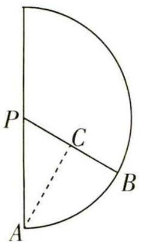

text_image

P
C
B
A

图 4

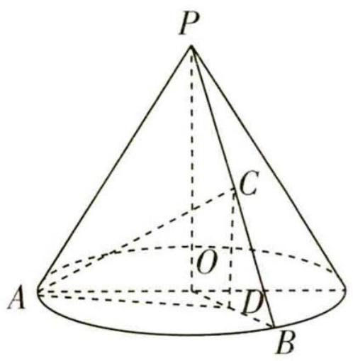

text_image

P
C
O
A
D
B

图 5

解析 当 $x \in [-2, 0]$ 时, $f(x) = (\frac{\sqrt{2}}{2})^x - 1$ , 则 $f(-2) = (\frac{\sqrt{2}}{2})^{-2} - 1 = 1$ , $f(0) = (\frac{\sqrt{2}}{2})^0 - 1 = 0$ .

已知函数 $f(x)$ 是定义在 $\mathbf{R}$ 上的偶函数, 又 $f(x+2)=f(2-x)$ , 则 $f((x+2)+2)=f(2-(x+2))=f(-x)=f(x)$ , 即 $f(x)=f(x+4)$ , 可知函数 $f(x)$ 的周期为 4 , 值域为 $[0,1]$ , 求在区间 (0, [易错点拨]) 若 $f(x+2)=f(2-x)$ , 则函数 $f(x)$ 的图象关于直线 $x=2$ 对称; 若 $f(x+2)=f(x-2)$ , 则函数 $f(x)$ 的周期 $T=4$ ; 若 $f(x+2)=-f(2-x)$ , 则函数 $f(x)$ 的图象关于点 (2,0) 对称 2022) 内关于 $x$ 的方程 $f(x)-\log_{2022}(x+2)=0$ 解的个数, 即求 $f(x)$ 的图象与函数 $y=\log_{2022}(x+2)$ 的图象在区间 (0,2022) 内的交点个数.

【扫清障碍】对解析式变形,进而构造两个函数,在同一平面直角坐标系中画出函数的图象,利用数形结合的方法求解

令 $g(x)=\log_{2022}(x+2)$ ，有 $g(-1)=\log_{2022}(-1+2)=0$ ， $g(2020)=\log_{2022}(2020+2)=1$ ，由以上分析，画出函数 $f(x)$ 和 $g(x)$ 在区间 $(-2,+\infty)$ 上的大致图象，如图1所示。可得 $f(x)$ 与 $g(x)$ 的图象在区间 $(0,2)$ 上有一个交点，在区间 $(2,4)$ 上有一个交点……以此类推，可得函数 $f(x)$ 与函数 $g(x)$ 的图象在区间 $(0,2020]$ 上有 $\frac{2020}{2}=1010$ （个）交点，而在区间 $(2020,$

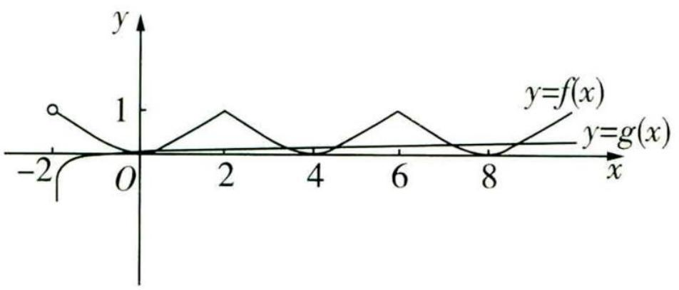

line

| x   | y=f(x) | y=g(x) |
| --- | ------ | ------ |
| -2  | 1      | 0      |
| 0   | 0      | 0      |
| 2   | 1      | 0      |
| 4   | 0      | 0      |
| 6   | 1      | 0      |
| 8   | 0      | 0      |
| 10  | 1      | 0      |

图1

2022)内, $g(x)>1$ , $g(x)$ 与 $f(x)$ 的图象无交点,所以在区间(0,2022)内关于x的方程 $f(x)-\log_{2022}(x+2)=0$ 解的个数为1010,故选B.

答案 B

调研 2 (2023 · 河南信阳高级中学 1 月月考) 已知函数 $f(x) = \left\{ \begin{array}{l} \left| {\log }_{2}x - 1\right| ,0 < x \leq 4, \\ 3 - \sqrt{x},x > 4, \end{array}\right.$ 设 $a,b,c$ 是三个不相等的实数,且满足 $f\left( a\right)  = f\left( b\right)  = f\left( c\right)$ ,则 ${abc}$ 的取值范围为\_\_\_\_.

解析 由题意作出 $f(x)$ 的图象,如图2所示.

当 x > 4 时，由 $f(x) = 3 - \sqrt{x} = 0$ 得 $\sqrt{x} = 3, x = 9$ .

若 $a, b, c$ 互不相等, 不妨设 $a < b < c$ , 因为 $f(a) = f(b) = f(c)$ , 所以由图象可知 $0 < a < 2 < b < 4, 4 < c < 9$ .

由 $f(a)=f(b)$ ，可得 $\left|\log_{2}a-1\right|=\left|\log_{2}b-1\right|$ ，即 $1-\log_{2}a=\log_{2}b-1$ ，即 $\log_{2}a+\log_{2}b=2$ ，即 $\log_{2}(ab)=2$ ，则ab=4，所以

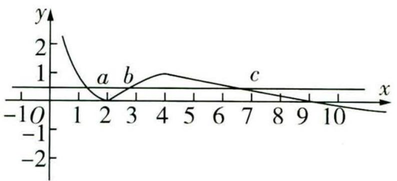

line

| x  | y    |
|----|------|
| 0  | 2.5  |
| 2  | 0.0  |
| 3  | 0.5  |
| 4  | 1.0  |
| 7  | 0.5  |
| 10 | -0.5 |

图 2

【扫清障碍】由 $\log_{2}a<1,\log_{2}b>1$ 得 $\log_{2}a-1<0,\log_{2}b-1>0$ ，根据式子正负符号去绝对值abc=4c.

因为 $4 < c < 9$ , 所以 $16 < 4c < 36$ , 即 $16 < abc < 36$ , 所以 $abc$ 的取值范围是 (16,36).

【解后反思】根据数形结合处理函数零点问题常见的命题角度有：(1)确定方程根的个数，(2)求参数的取值范围，(3)求不等式的解集，(4)研究函数的性质

答案 (16,36)

# 角度 13 分类讨论思想在函数问题中的应用

调研 1 (2023·福建漳州 12 月联考)已知函数 $f(x)=\left\{\begin{aligned}\log_{2}x,x>0,\\ x^{2}+4x+1,x\leqslant0,\end{aligned}\right.$ 若实数 a 满足 $f(f(a))=1$ ，则实数 a 的所有取值的和为

A. 1

B. $\frac{17}{16} -\sqrt{5}$

C. $-\frac{15}{16}-\sqrt{5}$

D. -2

# 解析 第一步 通过观察分析,决定如何对自变量进行分类.

令 $\log_2a = 0$ ，得 $a = 1$ ，令 $a^2 +4a + 1 = 0$ ，得 $a = -2 - \sqrt{3}$ 或 $a = -2 + \sqrt{3}$

# 第二步 通过运算、变形,利用常见基本初等函数,将问题转化为几段加以求解.

若 $a > 1$ ，则 $f(a) = \log_2 a > 0$ ，所以 $f(f(a)) = \log_2 (\log_2 a) = 1$ ，所以 $a = 4$

若 $0 < a \leqslant 1$ ，则 $f(a) = \log_2 a < 0$ ，所以 $f(f(a)) = (\log_2 a)^2 + 4\log_2 a + 1 = 1$ ，所以 $\log_2 a = 0$ 或 $\log_2 a = -4$ ，即 $a = 1$ 或 $a = \frac{1}{16}$ ;

若 $-2 + \sqrt{3} < a \leqslant 0$ ，则 $f(a) = a^2 + 4a + 1 > 0$ ，所以 $f(f(a)) = \log_2(a^2 + 4a + 1) = 1$ ，此时 $a$ 无解；

若 $-2 - \sqrt{3} \leqslant a \leqslant -2 + \sqrt{3}$ , 则 $f(a) = a^2 + 4a + 1 \leqslant 0$ , 所以 $f(f(a)) = (a^2 + 4a + 1)^2 + 4(a^2 + 4a + 1) + 1 = 1$ , 所以 $a = -2 + \sqrt{3}$ 或 $a = -2 - \sqrt{3}$ ;

若 $a < -2 - \sqrt{3}$ , 则 $f(a) = a^2 + 4a + 1 > 0$ , 所以 $f(f(a)) = \log_2(a^2 + 4a + 1) = 1$ , 所以 $a = -2 - \sqrt{5}$ .

# 第三步 得出结论.

综上, 实数 a 的所有可能取值为 $4, -2 - \sqrt{5}, 1, -2 - \sqrt{3}, -2 + \sqrt{3}, \frac{1}{16}$ , 其和为 $-\frac{15}{16} - \sqrt{5}$ , 故选 C.

# 答案 C

调研 2 (2023·河南六市12月联考)(多选)高斯是德国的天才数学家,享有“数学王子”的美誉,以“高斯”命名的概念、定理、公式很多,如高斯函数 $y = [x]$ : 设 $x \in \mathbb{R}$ , 不超过 $x$ 的最大整数称为 $x$ 的整数部分,记作 $[x]$ . 如 $[2022] = 2022$ , $[1.7] = 1$ , $[-1.5] = -2$ , 记函数 $f(x) = x - [x]$ , 则下列说法中正确的是 ( )

A. $f(-2.9)=0.9$   
B. $f(x)$ 的值域为 $[0,1)$   
C. $f(x)$ 在 $[0,5]$ 上有5个零点  
D. $\forall a \in \mathbf{R}$ , 关于 $x$ 的方程 $f(x) + x = a$ 有两个实根

# 解析 $f(-2.9) = -2.9 - [-2.9] = -2.9 -$

$(-3)=0.1$ , 所以选项 A 错误.

当 $-1 \leqslant x < 0$ 时， $[x] = -1, f(x) = x - [x] = x + 1;$ 当 $0 \leqslant x < 1$ 时， $[x] = 0, f(x) = x - [x] = x;$

当 $1 \leqslant x < 2$ 时， $[x] = 1, f(x) = x - [x] = x - 1 \cdots$ 以此类推, 可得 $f(x)=x-[x]$ 的图象, 如图 1 所示.

【易错提醒】作分段函数的图象时,要特别注意分段点处点的虚实,保证不重不漏

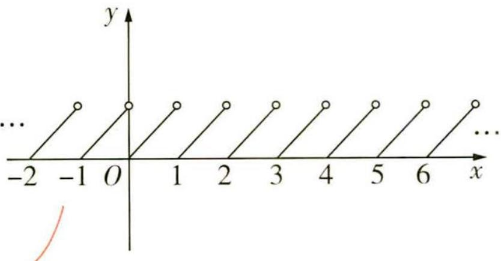

text_image

y
...
-2 -1 O 1 2 3 4 5 6 x
...

图1

由图可知, $f(x)$ 的值域为 $[0,1)$ , $f(x)$ 在 $[0,5]$ 上有6个零点,选项B正确,选项C错误.

作出 $y=f(x)$ 与 y=a-x 的图象, 如图 2 所示, $\forall a \in R$ , 函数 $y=f(x)$ 与 y=a-x 的图象均有两个交点, 即方程 $f(x)+x=a$ 有两个实根, 选项 D 正确. 故选 BD.

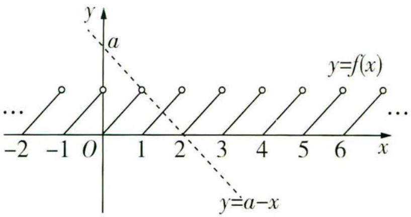

text_image

y
a
y=f(x)
...
-2 -1 O 1 2 3 4 5 6 x
y=a-x

图2

答案 BD

调研 3 (2023·河北衡水中学12月联考)

已知函数 $f(x) = \mathrm{e}^{x} - ax - 1$ ，其中 $\mathbf{e}$ 为自然对数的底数.

(1) 求 $f(x)$ 的单调区间；

(2) 若函数 $f(x)$ 在区间 $(0,1)$ 上存在零点, 求实数 a 的取值范围.

解析 (1) 由 $f(x) = \mathrm{e}^{x} - ax - 1$ 得 $f'(x) = \mathrm{e}^{x} - a$ .

当 $a \leqslant 0$ 时, $f'(x) > 0$ 恒成立, 所以 $f(x)$ 的单调递增区间为 $(- \infty, + \infty)$ , 无单调递减区间.

当 a > 0 时, 令 $f'(x) < 0$ , 得 $x < \ln a$ ; 令 $f'(x) > 0$ , 得 $x > \ln a$ .

所以 $f(x)$ 的单调递减区间为 $(-∞, \ln a)$ ，单调递增区间为 $(\ln a, +∞)$ .

综上, 当 $a \leqslant 0$ 时, 函数 $f(x)$ 的单调递增区间为 $(- \infty, + \infty)$ , 无单调递减区间; 当 $a > 0$ 时, 函数 $f(x)$ 的单调递减区间为 $(- \infty, \ln a)$ , 单调递增区间为 $(\ln a, + \infty)$ .

【审清题】看清楚题目问的是什么,求单调区间,将分类讨论的结果整理好,按照单调区间的描述方式进行综述;若问的是单调性,则要更改描述方式

(2) 由(1)知 $f'(x) = \mathrm{e}^{x} - a$ .

当 $a \leqslant 1$ 时, 函数 $f(x)$ 在区间 $(0,1)$ 上单调递增且 $f(0) = 0$ , 所以函数 $f(x)$ 在区间 $(0,1)$ 上不存在零点.

当 $a \geqslant e$ 时, 函数 $f(x)$ 在区间 $(0,1)$ 上单调递减且 $f(0) = 0$ , 所以函数 $f(x)$ 在区间 $(0,1)$ 上不存在零点.

当 $1 < a < \mathrm{e}$ 时，函数 $f(x)$ 在区间 $(0, \ln a)$ 上单调递减，在 $(\ln a, 1)$ 上单调递增，

又 $f(0)=0,f(1)=\mathrm{e}-a-1$ ,所以当 $\mathrm{e}-a-1\leqslant0$ ,即 $\mathrm{e}-1\leqslant a<\mathrm{e}$ 时,函数 $f(x)$ 在区间(0,1)上不存在零点;当 $\mathrm{e}-a-1>0$ ,即 $1<a<\mathrm{e}-1$ 时,函数 $f(x)$ 在区间(0,1)上存在零点.

【必杀技】根据函数的单调性与 $f(0)=0$ ，结合函数零点存在定理，可知函数 $f(x)$ 在 $(0,1)$ 上是否存在零点与 $f(1)$ 的取值有关，根据 $f(1)$ 与0的关系作出单图（如图3所示），零点存在情况“尽在图上”。注意 $(0,1)$ 为开区间， $f(x)$ 在x=0和x=1处取得零点，不能算为在要求区间 $(0,1)$ 上取得零点。

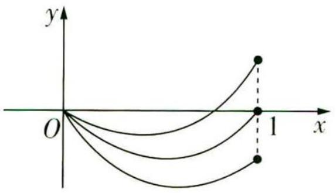

text_image

y
O
x
1

图 3

综上,实数 a 的取值范围为 $(1, e-1)$ .

【解后反思】求解根据函数的零点求参数范围问题,主要利用导数确定函数的单调区间和极值点,根据函数零点的个数寻找函数在给定区间上的极值、区间端点处的函数值与 0 的关系,从而求得参数的取值范围

# 角度 14 立体几何中的存在性探索问题

调研 1 (2023·江苏南通 1 月联考) 如图 1, 在四棱锥 $P - ABCD$ 中, 底面 $ABCD$ 为矩形, $PA \perp$ 平面 $ABCD$ , $AB = PA = 1$ , $AD = \sqrt{3}$ , $F$ 是 $PB$ 中点, $E$ 为 $BC$ 上一点.

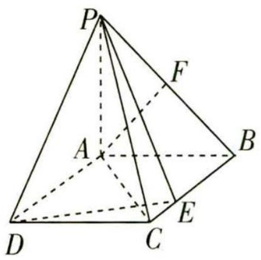

text_image

P
F
A
B
D
C
E

图1

(1) 求证: $AF \perp$ 平面 PBC.

(2) 求 BE 长为多少时, 平面 CPE 与平面 PED 的夹角为 $45^{\circ}$ .

解析 (1) 方法一 因为 $PA \perp$ 平面 $ABCD, AD \subset$ 平面 $ABCD$ , 所以 $PA \perp AD$ ,

又底面 ABCD 为矩形, 所以 $AB \perp BC, AD \parallel BC$ , 所以 $PA \perp BC$ ,

又 $PA \cap AB = A, PA, PB \subset$ 平面 PAB, 故 $BC \perp$ 平面 PAB,

因为 $AF \subset$ 平面 PAB, 所以 $BC \perp AF$ .

因为 AB = PA = 1，且 F 是 PB 中点，所以 $AF \perp PB$ .

又 $PB \cap BC = B, PB, BC \subset$ 平面 $PBC$ , 可得 $AF \perp$ 平面 $PBC$ .

方法二 因为 $PA \perp$ 平面 $ABCD, AB \subset$ 平面 $ABCD, AD \subset$ 平面 $ABCD$ ,

所以 $PA \perp AB, PA \perp AD,$ 又 $AB \perp AD,$ 故 AP, AD, AB 两两垂直，

以 $A$ 为坐标原点, $AD, AB, AP$ 所在直线分别为 $x$ 轴, $y$ 轴, $z$ 轴建立空间直角坐标系, 如图2,

【会建系】建立空间直角坐标系时要尽可能地利用条件中的垂直关系, 建立空间图形与空间向量之间的关系

则 $A(0,0,0), F(0, \frac{1}{2}, \frac{1}{2}), P(0,0,1), B(0,1,0), C(\sqrt{3}, 1, 0), D(\sqrt{3}, 0, 0)$ ,

$$
\overrightarrow {A F} = (0, \frac {1}{2}, \frac {1}{2}), \overrightarrow {B C} = (\sqrt {3}, 0, 0), \overrightarrow {P B} = (0, 1, - 1).
$$

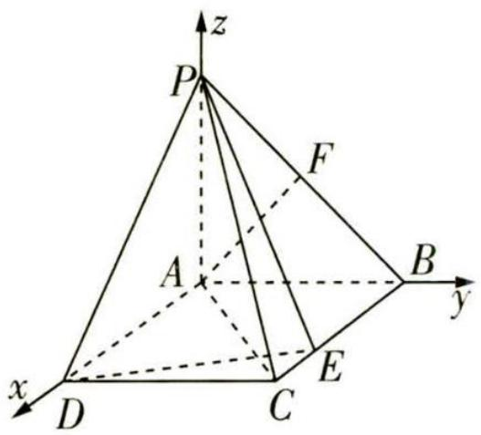

text_image

z
P
F
A
B
y
x
D
C
E

图 2

设平面 PBC 的法向量为 $\boldsymbol{n} = (x, y, z)$ ，则 $\overrightarrow{PB}\cdot n=y-z=0,$ 则 x=0 且 y=z, 令 y=1, 则 z=1, 所以平面 $\overrightarrow{BC}\cdot n=\sqrt{3}x=0,$ PBC 的一个法向量为 $\boldsymbol{n}=(0,1,1)$ ,

因为 $\overrightarrow{AF}=\frac{1}{2}\boldsymbol{n}$ ，所以 $AF\perp$ 平面PBC.

(2)由(1)知平面 CPE 的一个法向量为 $\boldsymbol{n}=(0,1,1)$ .

设 $E(a,1,0)(0\leqslant a < \sqrt{3})$ ，则 $\overrightarrow{DE} = (a - \sqrt{3},1,0),\overrightarrow{PD} = (\sqrt{3},0, - 1)$

设平面 PED 的法向量为 $\boldsymbol{m}=(x_{1},y_{1},z_{1})$ ，则 $\left\{\begin{aligned}\overrightarrow{PD}\cdot\boldsymbol{m}&=\sqrt{3}x_{1}-z_{1}=0,\\ \overrightarrow{DE}\cdot\boldsymbol{m}&=(a-\sqrt{3})x_{1}+y_{1}=0,\end{aligned}\right.$

令 $x_{1}=1$ , 得 $y_{1}=\sqrt{3}-a, z_{1}=\sqrt{3}$ , 得平面 PED 的一个法向量为 $\boldsymbol{m}=(1,\sqrt{3}-a,\sqrt{3})$

所以 $\cos 45^{\circ} = \frac{|\pmb{m}\cdot\pmb{n}|}{|\pmb{m}||\pmb{n}|} = \frac{|\sqrt{3} - a + \sqrt{3}|}{\sqrt{1 + 1}\times\sqrt{1 + (\sqrt{3} - a)^2 + 3}},$

【扫清障碍】分别求出二面角的两个半平面所在平面的法向量，然后通过两个平面的法向量的夹角的余弦值列方程求解

所以 $\frac{\sqrt{2}}{2}=\frac{|2\sqrt{3}-a|}{\sqrt{2}\times\sqrt{4+(\sqrt{3}-a)^{2}}}$ ，解得 $a=\frac{5\sqrt{3}}{6}$ ，即BE长为 $\frac{5\sqrt{3}}{6}$ 时，平面CPE与平面PED的夹角为 $45^{\circ}$ .

调研 2 (2023·成都七中1月模拟/探索点的位置)如图3,在直三棱柱 $ABC-A_{1}B_{1}C_{1}$ 中, $BA\perp BC$ .

(1) 若 $BA = BB_{1}$ ，求证： $AB_{1} \perp$ 平面 $A_{1}BC$ .

(2) 若 $BA = BC = BB_{1} = 2, M$ 是棱 $BC$ 上的一动点. 试确定点 $M$ 的位置, 使点 $M$ 到平面 $A_{1}B_{1}C$ 的距离等于 $\frac{\sqrt{2}}{2}$ .

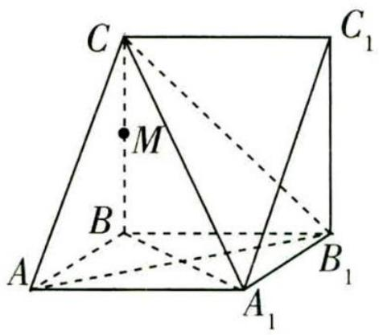

text_image

C
M
B
A
A₁
B₁
C₁

图3

解析 (1) 在直三棱柱 $ABC - A_{1}B_{1}C_{1}$ 中, $BB_{1} \perp$ 平面 $ABC$ , 所以 $BB_{1} \perp BC, BB_{1} \perp BA$ ,

因为 $BA \perp BC, BA \cap BB_{1} = B$ ，所以 $BC \perp$ 平面 $BAA_{1}B_{1}$ ，所以 $BC \perp AB_{1}$ ，

因为 $BB_{1} \perp BA, BA = BB_{1}$ ，所以四边形 $BAA_{1}B_{1}$ 为正方形，所以 $AB_{1} \perp A_{1}B$ ，

因为 $A_{1}B\cap BC=B,A_{1}B,BC\subset$ 平面 $A_{1}BC$ ，所以 $AB_{1}\perp$ 平面 $A_{1}BC$ .

【答题规范】利用线面垂直的判定定理时，注意条件要写全

(2)由(1)知,直线 $BA, BB_{1}, BC$ 两两垂直,

以 B 为原点, 直线 BA, $BB_{1}$ , BC 分别为 x 轴, y 轴, z 轴建立空间直角坐标系, 如图 4.

【扫清障碍】在直三棱柱 $ABC-A_{1}B_{1}C_{1}$ 中，本题已知 $BA \perp BC$ ，故三条棱 $BA, BB_{1}, BC$ 两两垂直且交于一点 B，可考虑以点 B 为原点，三条棱所在的直线为坐标轴建立空间直角坐标系

因为 $BA = BC = BB_{1} = 2$ ，则 $B(0,0,0),A_{1}(2,2,0),B_{1}(0,2,$ $0),C(0,0,2)$

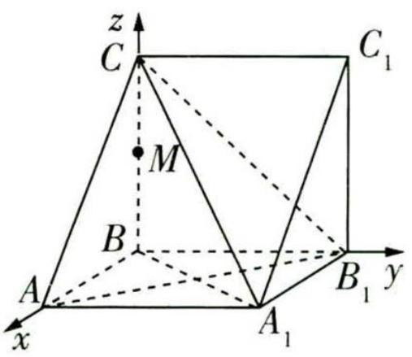

text_image

z
C
M
B
A
x
A₁
B₁
y
C₁

图 4

设 $M(0,0,t)(0 \leqslant t \leqslant 2)$ , 则 $\overrightarrow{MC} = (0,0,2 - t), \overrightarrow{A_1B_1} = (-2,0,0), \overrightarrow{B_1C} = (0, -2,2)$ ,

设平面 $A_{1}B_{1}C$ 的法向量为 $\boldsymbol{n}=(x,y,z)$ ，则 $\left\{\begin{aligned}\boldsymbol{n}\cdot\overrightarrow{A_{1}B_{1}}&=-2x=0,\\ \boldsymbol{n}\cdot\overrightarrow{B_{1}C}&=-2y+2z=0,\end{aligned}\right.$ 则 $\left\{\begin{aligned}x=0,\\ y=z,\end{aligned}\right.$ 取 y=1，则 z=1，所以平面 $A_{1}B_{1}C$ 的一个法向量为 $\boldsymbol{n}=(0,1,1)$ ，

所以点 M 到平面 $A_{1}B_{1}C$ 的距离 $d=\frac{|\overrightarrow{MC}\cdot\boldsymbol{n}|}{|\boldsymbol{n}|}=\frac{|2-t|}{\sqrt{0+1+1}}=\frac{|2-t|}{\sqrt{2}}$ ,

又已知点 M 到平面 $A_{1}B_{1}C$ 的距离等于 $\frac{\sqrt{2}}{2}$ ，所以 $\frac{|2-t|}{\sqrt{2}} = \frac{\sqrt{2}}{2}$ ，解得 t = 1, t = 3（舍），

所以当点 M 为棱 BC 的中点时, 点 M 到平面 $A_{1}B_{1}C$ 的距离等于 $\frac{\sqrt{2}}{2}$ .

# 方法点津

# 用向量法求点面距的 4 个要点

(1) 建系：建立恰当的空间直角坐标系.  
(2) 求点坐标: 写出 (求出) 相关点的坐标.  
(3) 求向量: 求出相关向量的坐标表示 (如图5, 求点 $P$ 到平面 $\alpha$ 的距离, 需要求出 $\overrightarrow{AP}$ 并根据平面 $\alpha$ 内两不共线向量求出平面 $\alpha$ 的法向量 $\pmb{n}$ ).  
(4) 求距离: $d = \frac{|\overrightarrow{AP} \cdot n|}{|n|}$ .

调研 3 (2023·重庆涪陵高级中学12月模拟)如图6,在三棱锥A-BCD中, $\triangle ABC$ 是等边三角形,点A在平面BCD上的射影是线段BC的中点E,AB=AD=AC,点F是DC的中点.

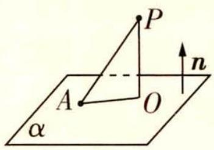

text_image

P
A
O
n
α

图5

(1) 证明: 平面 $ACD \perp$ 平面 AEF.  
(2) 若 $\sqrt{3}BC = 2BD$ ，点 G 是线段 BD 上的动点，问：点 G 运动到何处时，平面 AEG 与平面 ACD 所成的锐二面角最小.

解析 (1)∵点A在平面BCD上的射影是点E,

$\therefore AE \perp$ 平面 $BCD, \because CD \subset$ 平面 $BCD, \therefore AE \perp CD.$

∵ AD = AC，点 F 是 DC 的中点，∴ $AF \perp CD$ .

∵ $AF \cap AE = A, AE, AF \subset$ 平面 AEF, ∴ $CD \perp$ 平面 AEF.

$\because {CD} \subset$ 平面 ${ACD},\therefore$ 平面 ${ACD} \bot$ 平面 ${AEF}$ .

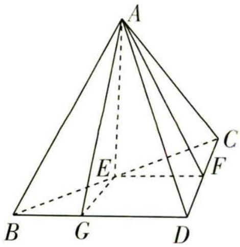

text_image

A
E
C
F
B
G
D

图6

【小技巧】证明面面垂直最有效的方法：如果一个平面经过另一个平面的一条垂线，则这两个平面互相垂直

(2) 连接 $ED$ , 如图 7, $\because AB = AD = AC$ , 点 $A$ 在平面 $BCD$ 上的射影是点 $E$ , $\therefore \triangle AEB \cong \triangle AED \cong \triangle AEC$ ,

$\therefore EB=ED=EC,\therefore B,C,D$ 在以 E 为圆心的圆上, $\therefore\angle BDC=90^{\circ}$

$$
\because \sqrt {3} B C = 2 B D, \therefore \angle B C D = 6 0 ^ {\circ}.
$$

在平面 BCD 中, 过 E 作 $EH \perp BD$ , 垂足为 H, 则 $EH \parallel CD$ , 易知 $EF \parallel BD$ , $\therefore EF \perp EH$ , EF, EH, EA 两两垂直,

以 E 为坐标原点, EH 为 x 轴, EF 为 y 轴, EA 为 z 轴, 建立空间直角坐标系,

设 BC=4，则 $E(0,0,0)$ , $A(0,0,2\sqrt{3})$ , $C(-1,\sqrt{3},0)$ , $D(1,\sqrt{3},0)$ ,

设 $G(1,y,0)(-\sqrt{3} \leqslant y \leqslant \sqrt{3})$ ，则 $\overrightarrow{EA} = (0,0,2\sqrt{3}), \overrightarrow{AD} = (1,\sqrt{3}, -2\sqrt{3}), \overrightarrow{CD} = (2,0,0), \overrightarrow{EG} = (1,y,0)$ ，

设平面 AEG 的法向量为 $\boldsymbol{n}_{1}=(x_{1},y_{1},z_{1})$ ,

则 $\left\{ \begin{array}{l} \boldsymbol{n}_{1} \cdot \overrightarrow{EA} = 2\sqrt{3} z_{1} = 0, \\ \boldsymbol{n}_{1} \cdot \overrightarrow{EG} = x_{1} + yy_{1} = 0, \end{array} \right.$ 令 $x_{1} = y$ ，可得平面 $AEG$ 的一个法向量为 $\boldsymbol{n}_{1} = (y, -1, 0)$ ，

设平面 ACD 的法向量为 $\boldsymbol{n}_{2}=(x_{2},y_{2},z_{2})$ ，则 $\left\{\begin{aligned}\boldsymbol{n}_{2}\cdot\overrightarrow{CD}&=2x_{2}=0,\\ \boldsymbol{n}_{2}\cdot\overrightarrow{AD}&=x_{2}+\sqrt{3}y_{2}-2\sqrt{3}z_{2}=0,\end{aligned}\right.$ 令 $y_{2}=$ 2, 可得平面 ACD 的一个法向量为 $\boldsymbol{n}_{2}=(0,2,1)$ .

设平面 AEG 与平面 ACD 所成锐二面角为 $\theta$ ，则 $\cos\theta = |\cos\langle\boldsymbol{n}_{1}, \boldsymbol{n}_{2}\rangle| = \frac{2}{\sqrt{y^{2} + 1} \cdot \sqrt{5}}$ ,

∴ 当 y=0 时, $\cos\theta$ 最大, 此时锐二面角 $\theta$ 最小,

故当 $G$ 为 $BD$ 中点时, 平面 $AEG$ 与平面 $ACD$ 所成锐二面角最小.

【指点迷津】解题时,把要成立的结论当作条件,据此列出合参的代数式,把“在何处”问题转化为“函数的最值问题”,使问题的解决更简单、有效,应善于运用这一方法解题

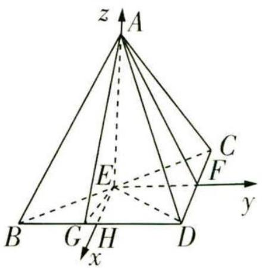

text_image

z
A
E
C
F
y
B
G
H
D
x

图7

# 角度 15 解析几何中的存在性探索问题

调研 1 (2023·山东师大附中 1 月适应性考试探索定点存在性问题)已知点 $A(x_{0}, - 2)$ 在抛物线 $C: y^{2} = 2px (p > 0)$ 上, 且 $A$ 到 $C$ 的焦点 $F$ 的距离与到 $x$ 轴的距离之差为 $\frac{1}{2}$ .

(1) 求 C 的方程.

(2) 当 $p < 2$ 时, $M, N$ 是 $C$ 上不同于点 $A$ 的两个动点, 且直线 $A M, A N$ 的斜率之积为 $-2, A D \perp M N, D$ 为垂足. 证明: 存在定点 $E$ , 使得 $|D E|$ 为定值.

解析 (1) 抛物线 $C: y^{2} = 2px (p > 0)$ 的焦点为 $F(\frac{p}{2}, 0)$ , 准线为直线 $x = -\frac{p}{2}$ ,

又点 $A(x_0, -2)$ 在抛物线 $C:y^{2} = 2px(p > 0)$ 上，即 $(-2)^{2} = 2px_{0}$

所以 $x_{0}=\frac{2}{p}$ ，即 $A(\frac{2}{p},-2)$ ，依题意可得 $\frac{2}{p}+\frac{p}{2}-2=\frac{1}{2}$ ，解得 p=1 或 p=4，

【易错提醒】注意方程有两解，对应抛物线方程有2个

∴ C 的方程为 $y^{2}=2x$ 或 $y^{2}=8x$ .

(2) $\because p<2,\therefore y^{2}=2x,A(2,-2).$

设 $MN: x = my + n, M(x_1, y_1), N(x_2, y_2)$ , 由 $\left\{ \begin{array}{l} y^2 = 2x, \\ x = my + n, \end{array} \right.$ 消去 $x$ 并整理得关于 $y$ 的一元二次方程 $y^2 - 2my - 2n = 0, \Delta = 4m^2 + 8n > 0$ (1),

【书写规范】直线与抛物线有两个交点，应满足 $\Delta>0$ ，解题书写要规范

且 $y_{1} + y_{2} = 2m, y_{1}y_{2} = -2n, \because k_{AM} \cdot k_{AN} = \frac{y_{1} + 2}{x_{1} - 2} \cdot \frac{y_{2} + 2}{x_{2} - 2} = \frac{y_{1} + 2}{\frac{y_{1}^{2}}{2} - 2} \cdot \frac{y_{2} + 2}{\frac{y_{2}^{2}}{2} - 2} = \frac{2}{y_{1} - 2}$ . $\frac{2}{y_2 - 2} = -2,$

$\therefore (y_{1}-2)(y_{2}-2)=-2$ ，即 $y_{1}y_{2}-2(y_{1}+y_{2})+6=0$ ，即 $n+2m=3$ ，代入①中验证成立，

将 $n = 3 - 2m$ 代入 $x = my + n$ 得 $x - 3 = m(y - 2)$ ，令 $\left\{ \begin{array}{l} x - 3 = 0, \\ y - 2 = 0, \end{array} \right.$ 解得 $\left\{ \begin{array}{l} x = 3, \\ y = 2, \end{array} \right.$

∴ 直线 MN 恒过定点 $Q(3,2)$ .

连接 $AQ,\because AD\perp MN,\therefore$ 点D在以AQ为直径的圆上,

因为 AQ 的中点为 $\left(\frac{5}{2},0\right)$ , $|AQ|=\sqrt{(2-3)^{2}+(-2-2)^{2}}=\sqrt{17}$ ,

所以以 AQ 为直径的圆的方程为 $\left(x-\frac{5}{2}\right)^{2}+y^{2}=\frac{17}{4}$ ，所以存在定点 $E(\frac{5}{2},0)$ 使得 $|DE|=\frac{\sqrt{17}}{2}$ .

【指点迷津】“肯定顺推法”解决探索性问题,即先假设结论成立,用待定系数法列出相应参数的方程,若相应方程有解,则探索的元素(如考点)存在(或命题成立),否则不存在(或不成立)

调研 2 (2023·江苏南京外国语学校12月模拟/探索满足某种条件的常数的存在性)如图1,椭圆 $C: \frac{x^{2}}{a^{2}} + \frac{y^{2}}{b^{2}} = 1 (a > b > 0)$ 经过点 $P(1, \frac{3}{2})$ , 离心率 $e = \frac{1}{2}$ , 直线 $l$ 的方程为 $x = 4$ .

(1) 求椭圆 C 的方程.  
(2)AB 是经过右焦点 F 的任一弦(不经过点 P), 设直线 AB 与直线 l 相交于点 M, 记 PA, PB, PM 的斜率分别为 $k_{1}, k_{2}, k_{3}$ . 问: 是否存在常数 $\lambda$ , 使得 $k_{1} + k_{2} = \lambda k_{3}$ ? 若存在,

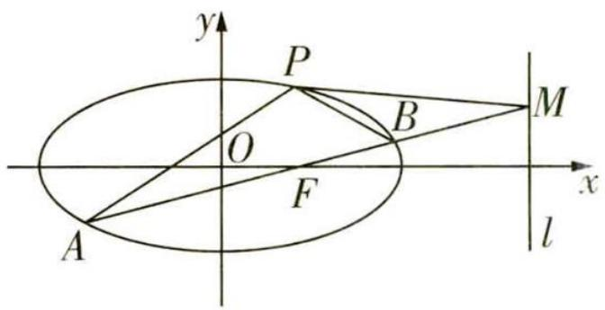

text_image

y
P
O
B
M
x
F
A
l

图1

求 $\lambda$ 的值; 若不存在, 说明理由.

解析 (1) 由椭圆 $C: \frac{x^2}{a^2} + \frac{y^2}{b^2} = 1 (a > b > 0)$ 经过点 $P(1, \frac{3}{2})$ , 可得 $\frac{1}{a^2} + \frac{9}{4b^2} = 1 (a > b > 0)$ . ①,

由离心率 $e=\frac{1}{2}$ 得 $\frac{c}{a}=\frac{1}{2}$ ，即 a=2c，则 $3a^{2}=4b^{2}$ ②，

【小妙招】在椭圆中巧用 $\left(\frac{b}{a}\right)^{2}+\left(\frac{c}{a}\right)^{2}=1$ 关系解题

将②代入①中解得 c=1, a=2, $b=\sqrt{3}$ ,

故椭圆 C 的方程为 $\frac{x^{2}}{4} + \frac{y^{2}}{3} = 1$ .

【小技巧】确定椭圆标准方程有两个关键点：（1）“定位”是指确定椭圆长轴、短轴的位置，在中心为原点的前提下，确定焦点位于哪条坐标轴上，从而判断方程的形式。（2）“定量”是指确定 $a^{2}$ ， $b^{2}$ 的具体数值，常根据条件列方程求解

(2)由题意可设 AB 的斜率为 k，则直线 AB 的方程为 $y = k(x - 1)$ ③，

代入椭圆方程 $\frac{x^2}{4} +\frac{y^2}{3} = 1$ 并整理得到关于 $x$ 的一元二次方程 $(4k^{2} + 3)x^{2} - 8k^{2}x+$ $4k^{2} - 12 = 0,\Delta >0.$

设 $A(x_{1},y_{1}),B(x_{2},y_{2})$ ，则 $x_{1} + x_{2} = \frac{8k^{2}}{4k^{2} + 3},x_{1}x_{2} = \frac{4k^{2} - 12}{4k^{2} + 3}$ ④，

在方程③中,令x=4得,M的坐标为 $(4,3k)$ ,

从而 $k_{1} = \frac{y_{1} - \frac{3}{2}}{x_{1} - 1}, k_{2} = \frac{y_{2} - \frac{3}{2}}{x_{2} - 1}, k_{3} = \frac{3k - \frac{3}{2}}{4 - 1} = k - \frac{1}{2},$

又 A, F, B 三点共线，则 $k = k_{AF} = k_{BF}$ ，即 $\frac{y_{1}}{x_{1} - 1} = \frac{y_{2}}{x_{2} - 1} = k$ ，

【规律共享】用斜率公式解决三点共线问题

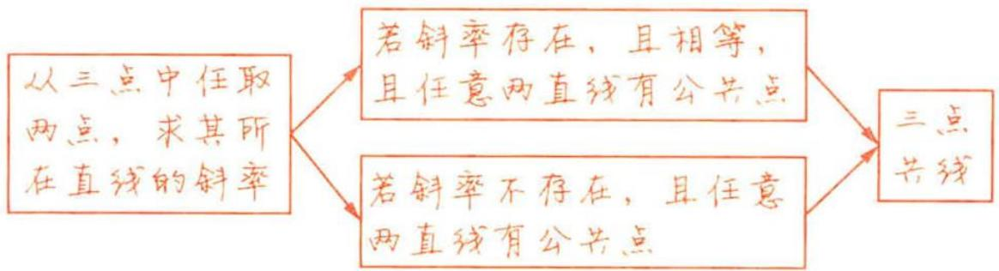

flowchart

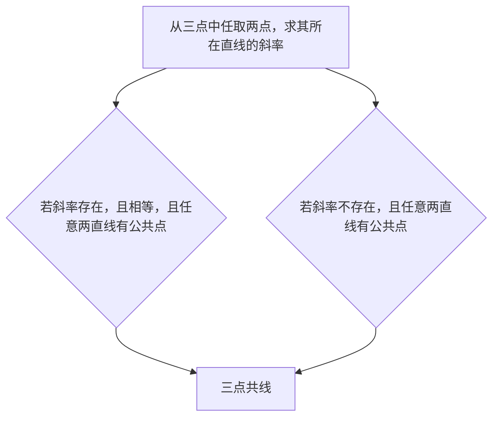
```mermaid
graph TD
    A["从三点中任取两点，求其所在直线的斜率"] --> B{若斜率存在，且相等，且任意两直线有公共点}
    A --> C{若斜率不存在，且任意两直线有公共点}
    B --> D["三点共线"]
    C --> D
```

所以 $k_{1} + k_{2} = \frac{y_{1} - \frac{3}{2}}{x_{1} - 1} + \frac{y_{2} - \frac{3}{2}}{x_{2} - 1} = \frac{y_{1}}{x_{1} - 1} + \frac{y_{2}}{x_{2} - 1} - \frac{3}{2} \left( \frac{1}{x_{1} - 1} + \frac{1}{x_{2} - 1} \right) = 2k - \frac{3}{2} \times \frac{x_{1} + x_{2} - 2}{x_{1}x_{2} - (x_{1} + x_{2}) + 1}$ ⑤,

把④代入⑤得 $k_{1} + k_{2} = 2k - \frac{3}{2}\times \frac{\frac{8k^{2}}{4k^{2} + 3} - 2}{\frac{4k^{2} - 12}{4k^{2} + 3} - \frac{8k^{2}}{4k^{2} + 3} + 1} = 2k - 1$

又 $k_{3}=k-\frac{1}{2}$ ，所以 $k_{1}+k_{2}=2k_{3}$ 。故存在常数 $\lambda=2$ 满足题意。

【指点迷津】求解字母参数值的存在性问题时, 通常的方法是先假设满足条件的参数值存在, 然后利用这些条件并结合题目中其他已知条件进行推理与计算, 若不出现矛盾, 并且得到了相应的参数值, 就说明满足条件的参数值存在; 若在推理与计算中出现了矛盾, 则说明满足条件的参数值不存在, 同时推理与计算的过程就是说明理由的过程

调研 3 (2023·江苏扬州中学12月适应性考试探索定圆的存在性)已知圆 $C_{1}:(x+2)^{2}+y^{2}=9$ , 圆 $C_{2}:(x-2)^{2}+y^{2}=1$ , 动圆P与圆 $C_{1}$ , 圆 $C_{2}$ 都外切. 圆心P的轨迹为曲线C.

(1) 求 C 的方程.

(2)已知 $A, B$ 是 $C$ 上不同的两点, $AB$ 中点的横坐标为 2 ,且 $AB$ 的中垂线为直线 $l$ , 是否存在半径为 1 的定圆 $E$ , 使得 $l$ 被圆 $E$ 截得的弦长为定值, 若存在, 求出圆 $E$ 的方程; 若不存在, 请说明理由.

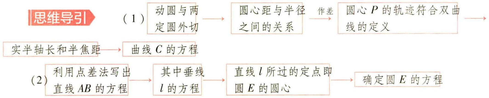

flowchart

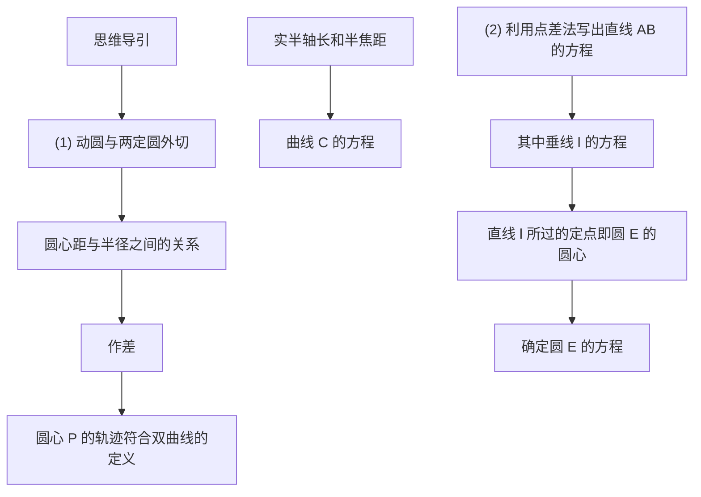
```mermaid
graph TD
    A["思维导引"] --> B["(1) 动圆与两定圆外切"]
    B --> C["圆心距与半径之间的关系"]
    C --> D["作差"]
    D --> E["圆心 P 的轨迹符合双曲线的定义"]
    F["实半轴长和半焦距"] --> G["曲线 C 的方程"]
    H["(2) 利用点差法写出直线 AB 的方程"] --> I["其中垂线 l 的方程"]
    I --> J["直线 l 所过的定点即圆 E 的圆心"]
    J --> K["确定圆 E 的方程"]
```

解析 (1) 圆 $C_{1}$ 的圆心为 $C_{1}(-2,0)$ , 半径 $r_{1}=3$ ,

圆 $C_{2}$ 的圆心为 $C_{2}(2,0)$ ，半径 $r_{2}=1$ ，

设动圆 P 的半径为 $R(R>0)$ ，因为动圆 P 与圆 $C_{1}$ ，圆 $C_{2}$ 都外切，

连接 $PC_{1}, PC_{2}$ , 所以 $|PC_{1}| = R + r_{1} = R + 3$ , $|PC_{2}| = R + r_{2} = R + 1$ , 所以 $|PC_{1}| - |PC_{2}| = 2 < 4 = |C_{1}C_{2}|$ ,

所以点P在以 $C_{1},C_{2}$ 为焦点,以2为实轴长的双曲线的右支上,

【会思考】寻找几何关系，结合双曲线的定义，得出对应的方程

设双曲线的方程为 $\frac{x^{2}}{a^{2}}-\frac{y^{2}}{b^{2}}=1(a>0,b>0)$ , $c=\sqrt{a^{2}+b^{2}}$ ,

因为 2a=2,2c=4, 所以 a=1, c=2, $b=\sqrt{c^{2}-a^{2}}=\sqrt{3}$ ,

又圆 $C_1$ 与圆 $C_2$ 外切于点 $(1,0)$ , 故 $P$ 不能为 $(1,0)$ ,

所以C的方程为 $x^{2}-\frac{y^{2}}{3}=1(x>1)$ .

【提醒】求轨迹方程，要考虑限制条件，注意取值范围的限制

(2) 设 $A(x_{1}, y_{1}), B(x_{2}, y_{2}), AB$ 的中点为 $M(x_{0}, y_{0})$ ,

因为 A, B 是 C 上不同的两点, AB 中点的横坐标为 2.

所以 $\left\{\begin{aligned}x_{1}^{2}-\frac{y_{1}^{2}}{3}&=1,①\\ x_{2}^{2}-\frac{y_{2}^{2}}{3}&=1,②\\ x_{0}=\frac{x_{1}+x_{2}}{2}&=2,③\end{aligned}\right.$ 由①-②得 $(x_{1}+x_{2})(x_{1}-x_{2})-\frac{(y_{1}+y_{2})(y_{1}-y_{2})}{3}=0,$ $y_{0}=\frac{y_{1}+y_{2}}{2},④$

【小技巧】点差法：利用交点在曲线上，将交点坐标分别代入圆锥曲线方程，然后作差，构造出中点坐标和斜率的关系，此时坐标值设而不求

当 $k_{AB}$ 存在时， $k_{AB} = \frac{y_1 - y_2}{x_1 - x_2} = \frac{3(x_1 + x_2)}{y_1 + y_2} = \frac{3 \times 4}{2y_0} = \frac{6}{y_0}$ ，

因为 AB 的中垂线为直线 l，所以直线 l 的方程为 $y - y_{0} = -\frac{y_{0}}{6}(x - 2)$ ，即 $l: y = -\frac{y_{0}}{6}(x - 8)$ ，所以直线 l 过定点 $T(8,0)$ .

当 $k_{AB}$ 不存在时, A, B 关于 x 轴对称, AB 的中垂线 l 为 x 轴, 此时直线 l 也过点 $T(8,0)$ ,
【易错】不要忽略直线斜率不存在的情况，注意检验此时是否满足过定点

所以存在定圆 $E:(x-8)^{2}+y^{2}=1$ ，使得 l 被圆 E 截得的弦长为定值 2.

调研 4 (2023·湖北省十一校12月第一次联考/判断四点共圆)已知点M(4, 4)在抛物线 $\Gamma: x^{2} = 2py$ 上, 过动点P作抛物线的两条切线, 切点分别为A,B, 且直线PA与直线PB的斜率之积为-2.

(1) 证明: 直线 AB 过定点.

(2) 过 A, B 分别作抛物线准线的垂线, 垂足分别为 C, D, 问: 是否存在一点 P 使得 A, C, P, D 四点共圆? 若存在, 求所有满足条件的 P 点; 若不存在, 请说明理由.

解析 (1) 方法一 将(4,4)代入抛物线方程 $x^{2} = 2py$ 中得到 $p = 2$ , 所以抛物线方程为 $x^{2} = 4y$ , 求导可得 $y' = \frac{x}{2}$ , 设抛物线的一条切线的切点坐标为 $(x_{0}, y_{0})$ , 则切线斜率为 $\frac{x_{0}}{2}$ , 所以切线方程为 $y - y_{0} = \frac{x_{0}}{2}(x - x_{0})$ , 即 $x_{0}x = 2(y + y_{0})$ .

设 $A(x_{1},y_{1}),B(x_{2},y_{2})$ ，直线 $AB$ 的方程为 $y = kx + b$ ，由题意得 $k_{PA}\cdot k_{PB} = \frac{x_1}{2}\cdot \frac{x_2}{2} = -2$ ，所以 $x_{1}x_{2} = -8$ ，由 $\left\{ \begin{array}{l}x^2 = 4y,\\ y = kx + b, \end{array} \right.$ 得关于 $x$ 的一元二次方程 $x^{2} - 4kx - 4b = 0,\Delta =$

【会分析】设出直线 $AB$ 的方程, 与抛物线方程联立, 根据根与系数的关系求得结果

$16k^{2} + 16b > 0$ ，所以 $x_{1}x_{2} = -4b = -8$ 得 $b = 2$

所以直线 AB 的方程为 $y = kx + 2$ ，直线 AB 过定点 $(0, 2)$ .

方法二 将(4,4)代入抛物线方程 $x^{2}=2py$ 中得到 p=2，所以抛物线方程为 $x^{2}=4y$ .

设 $P(x_{0},y_{0})$ , $A(x_{1},y_{1})$ , $B(x_{2},y_{2})$ ，过 P 的直线方程为 $y-y_{0}=K(x-x_{0})$ ，由 $\left\{\begin{aligned}x^{2}&=4y,\\ y-y_{0}&=K(x-x_{0})\end{aligned}\right.$ 得关于 x 的一元二次方程 $x^{2}-4Kx-4(y_{0}-Kx_{0})=0$ ，由 $\Delta=16K^{2}+16(y_{0}-Kx_{0})=0$ ，得关于 K 的一元二次方程 $K^{2}-x_{0}K+y_{0}=0$ , $\Delta_{1}=x_{0}^{2}-4y_{0}>0$ ，设 PA 的斜率为 $k_{1}$ , PB 的斜率为 $k_{2}$ ,

则 $k_{1}k_{2} = y_{0} = -2$ ，易知切点横坐标为 $x = 2K$ ，所以 $x_{1}x_{2} = 4k_{1}k_{2} = -8.$

设直线 AB 的方程为 $y = kx + b$ ，由 $\left\{\begin{aligned} x^{2} &= 4y, \\ y &= kx + b, \end{aligned}\right.$ 得关于 x 的一元二次方程 $x^{2} - 4kx - 4b = 0, \Delta_{2} = 16k^{2} + 16b > 0$ ，所以 $x_{1}x_{2} = -4b = -8$ ，得 b = 2，

所以直线 ${AB}$ 的方程为 $y = {kx} + 2$ ,直线 ${AB}$ 过定点(0,2).

【指点迷津】判断直线或曲线过定点，首先求出直线系或曲线系方程，比如直线 $y = k(x - x_{0}) + y_{0}$ 过定点 $(x_{0}, y_{0})$

(2) 由 $\left\{\begin{aligned} x^{2}=4y, \\ y=kx+2, \end{aligned}\right.$ 得关于 x 的一元二次方程 $x^{2}-4kx-8=0$ ①，可知 $x_{1}+x_{2}=4k$ ， $x_{1}x_{2}=-8$ ，设 $C(x_{1},-1), D(x_{2},-1)$ ，由方法一知，直线 PA 的方程为 $x_{1}x=2(y_{1}+y)$ ，
直线 PB 的方程为 $x_{2}x=2(y_{2}+y)$ ，

由 $\left\{\begin{aligned}x_{1}x&=2(y_{1}+y),\\ x_{2}x&=2(y_{2}+y),\end{aligned}\right.$ 得 $\left\{\begin{aligned}x&=2k,\\ y&=-2,\end{aligned}\right.$ 所以 $P(2k,-2)$ ，所以P在直线y=-2上运动.

假设存在 P 点使得 A, C, P, D 四点共圆, 连接 PD, 则 $\angle ACD = \angle APD = 90^{\circ}$ , 所以 $k_{PA} \cdot k_{PD} = -1$ , 因为 $k_{PA} = \frac{x_{1}}{2}$ , $k_{PD} = \frac{1}{x_{2} - 2k}$ 可得 $\frac{x_{1}}{2(x_{2} - 2k)} = -1$ , 得 $x_{1} = 4k$ , $x_{2} = 0$ , 与 $x_{1}x_{2} = -8$ 矛盾, 不合题意, 所以不存在 P 点使得 A, C, P, D 四点共圆.

# 角度 16 概率与其他模块知识交汇问题

调研 1 (2023·湖南长沙雅礼中学 1 月调研概率与数列相交汇)为了备战 2023 年 9 月 23 日至 10 月 8 日在杭州举行的亚运会,跳水运动员甲参加国家队训练测试,已知该运动员连续跳水 m 次,每次测试都是独立的.假设运动员甲每次选择难度系数较小的动作 A 与难度系数较大的动作 B 的概率均为 $\frac{1}{2}$ .每次跳水测试时,若选择动作 A,取得成功的概率为 $\frac{2}{3}$ ,取得成功记 1 分,否则记 0 分.若选择动作 B,取得成功的概率为 $\frac{1}{3}$ ，取得成功记2分，否则记0分。总得分记为X。

(1) 若 m=2，求总得分 X 的分布列与数学期望（若结果不为整数，用分数表示）.

(2)若测试达到 n 分则中止,记运动员在每一次跳水均取得成功且累计得分为 n 分的概率为 $G(n)$ , 如 $G(1)=\frac{1}{3}$ .

①求 $G(2)$

②是否存在 $\lambda \in R$ ，使得 $\{G(n) - \lambda G(n-1)\}$ 为等比数列，其中 $n \in N^{*}, n \geqslant 2$ ？若存在，求出 $\lambda$ ；若不存在，请说明理由。

解析 (1) 对于每一次跳水测试而言, 获得 0 分的概率为 $\frac{1}{2} \times \frac{1}{3} + \frac{1}{2} \times \frac{2}{3} = \frac{1}{2}$ ,

【理顺思路】每一次跳水测试是相互独立的,多次跳水测试的结果之间也是相互独立的. 先求出每一次跳水测试得分的概率,再求连续跳水两次总得分的概率

获得1分的概率为 $\frac{1}{2}\times\frac{2}{3}=\frac{1}{3}$ ，获得2分的概率为 $\frac{1}{2}\times\frac{1}{3}=\frac{1}{6}$ .

连续跳水两次,总得分X的所有可能取值为0,1,2,3,4,

$$
P (X = 4) = \frac {1}{6} \times \frac {1}{6} = \frac {1}{3 6},
$$

$$
P (X = 3) = \frac {1}{3} \times \frac {1}{6} \times 2 = \frac {1}{9}, P (X = 2) = \frac {1}{2} \times \frac {1}{6} \times 2 + \frac {1}{3} \times \frac {1}{3} = \frac {5}{1 8},
$$

【易遗漏】总得分为2的情况包括三种：0分，2分；2分，0分；1分，1分.第三种情况不安遗漏

$$
P (X = 1) = \frac {1}{3} \times \frac {1}{2} \times 2 = \frac {1}{3}, P (X = 0) = \frac {1}{2} \times \frac {1}{2} = \frac {1}{4}.
$$

所以总得分 $X$ 的分布列为

<table><tr><td>X</td><td>0</td><td>1</td><td>2</td><td>3</td><td>4</td></tr><tr><td>P</td><td> $\frac{1}{4}$ </td><td> $\frac{1}{3}$ </td><td> $\frac{5}{18}$ </td><td> $\frac{1}{9}$ </td><td> $\frac{1}{36}$ </td></tr></table>

【会检验】利用“概率和为1”进行验算，养成随手验证的好习惯

$$
E (X) = 0 \times \frac {1}{4} + 1 \times \frac {1}{3} + 2 \times \frac {5}{1 8} + 3 \times \frac {1}{9} + 4 \times \frac {1}{3 6} = \frac {4}{3}.
$$

(2)① $G(2)=\frac{1}{2}\times\frac{2}{3}\times\frac{1}{2}\times\frac{2}{3}+\frac{1}{2}\times\frac{1}{3}=\frac{5}{18}.$

【拆情况】累计得分为2，且每一次跳水均成功，包括两种情况：第一次选择动作A跳水成功且第二次也选择动作A跳水成功，以及第一次选择动作B跳水成功，注意每选一次跳水动作，都要

乘以 $\frac{1}{2}$

②根据题意有, $G(n)=\frac{1}{6}G(n-2)+\frac{1}{3}G(n-1)$ ，其中 $n\geqslant3,n\in N^{*}$

【难点突破】累计得分为 $n$ 分包括两种情况: 累计得分为 $(n - 2)$ 分时, 下一跳选择动作 $B$ 且成功; 累计得分为 $(n - 1)$ 分时, 下一跳选择动作 $A$ 且成功

则 $G(n) - \lambda G(n - 1) = \frac{1}{6} G(n - 2) + \frac{1}{3} G(n - 1) - \lambda G(n - 1) = \frac{1}{6} G(n - 2) + (\frac{1}{3} -$ $\lambda)G(n - 1)$ ，设 $G(n) - \lambda G(n - 1) = (\frac{1}{3} -\lambda)[G(n - 1) - \lambda G(n - 2)]$

比较系数得 $-\left(\frac{1}{3} - \lambda\right)\lambda = \frac{1}{6}$ , 解得 $\lambda = \frac{1 \pm \sqrt{7}}{6}$ , 则 $G(2) - \lambda G(1) \neq 0$ ,

【点透细节】这个式子是通过比较 $G(n - 2)$ 的系数得来的。如果说这个式子中的 $\lambda$ 有满足题意的实数解，那么就说明 $\{G(n) - \lambda G(n - 1)\}$ 是等比数列

所以 $\{G(n) - \lambda G(n - 1)\}$ 是公比为 $\frac{1}{3} -\lambda$ 的等比数列，其中 $n\in \mathbf{N}^*$ ， $n\geqslant 2$ $\lambda = \frac{1\pm\sqrt{7}}{6}.$

调研 2 (2023·成都七中模拟/概率与函数相交汇)某病毒在进入人体后有潜伏期,患者在潜伏期内无任何症状,但已具传染性.假设一位病毒携带者在潜伏期内每天有 n 位密接者,每位密接者被感染的概率为 $p(0 \leqslant p \leqslant 1)$ .

(1) 若 $n = 3, p = \frac{1}{3}$ , 求一天内被一位病毒携带者直接感染人数 $X$ 的分布列和期望.  
(2)某定点医院为筛查某些人员是否感染此病毒,需要检测血液样本是否为阳性,有以下两种检验方式:

①逐份检验,即 k 份血液样本需要检验 k 次.  
②混合检验,即将 $k$ 份 $(k \in \mathbf{N}^{*}$ 且 $k \geqslant 2)$ 血液样本分别取样混合在一起检验,若检验结果为阴性,则这 $k$ 份血液样本全为阴性,因而这 $k$ 份血液样本只要检验一次就够了;如果检验结果为阳性,为了明确这 $k$ 份血液样本究竟哪份为阳性,就要对 $k$ 份血液样本再逐份检验,此时这 $k$ 份血液样本的检验次数为 $k + 1$ .

假设样本的检验结果相互独立,且每份样本检验结果是阳性的概率为 $p = 1 - \frac{1}{\sqrt[3]{e}}$ , 为使混合检验需要的检验总次数 $\zeta$ 的期望值比逐份检验需要的检验总次数 $\eta$ 的期望值更少,求 k 的取值范围.

参考数据: $\ln 2 \approx 0.6931, \ln 3 \approx 1.0986, \ln 4 \approx 1.3863, \ln 5 \approx 1.6094, \ln 6 \approx 1.7918.$

解析 (1) 若 $n = 3, p = \frac{1}{3}$ , 依题意可知 $X$ 服从二项分布, 即 $X \sim B(3, \frac{1}{3})$ ,

【数学语言】本题的情境相当于进行3次独立重复试验(有3位密接者), 每次试验成功(密接者被感染)的概率均为 $\frac{1}{3}$ ,求分布列与期望

从而 $P(X=i)=\mathrm{C}_{3}^{i}\left(\frac{1}{3}\right)^{i}\left(\frac{2}{3}\right)^{3-i}, i=0,1,2,3.$

$X$ 的分布列为

<table><tr><td>X</td><td>0</td><td>1</td><td>2</td><td>3</td></tr><tr><td>P</td><td>8/27</td><td>4/9</td><td>2/9</td><td>1/27</td></tr></table>

方法一 $E(X)=0\times\frac{8}{27}+1\times\frac{4}{9}+2\times\frac{2}{9}+3\times\frac{1}{27}=1.$

方法二 $\because X \sim B(3, \frac{1}{3}), \therefore E(X) = 3 \times \frac{1}{3} = 1.$

【作比较】方法二是利用二项分布的期望公式直接进行计算，但对于本题，方法一和方法二的计算难度差别不大，都很简单

(2)由题意知 $\zeta$ 的所有可能取值为 $1, k + 1$ ,

$$
P (\zeta = 1) = (1 - p) ^ {k}, P (\zeta = k + 1) = 1 - (1 - p) ^ {k},
$$

$$
\therefore E (\zeta) = (1 - p) ^ {k} + (k + 1) [ 1 - (1 - p) ^ {k} ] = k + 1 - k (1 - p) ^ {k}.
$$

易知 $E(\eta) = k$ ，依题意需 $E(\zeta) < E(\eta)$ ，即 $k + 1 - k(1 - p)^{k} < k, \therefore \frac{1}{k} < (1 - p)^{k}$ .

$$
\because p = 1 - \frac {1}{\sqrt [ 3 ]{\mathrm{e}}}, \therefore \frac {1}{k} <   \left(\frac {1}{\sqrt [ 3 ]{\mathrm{e}}}\right) ^ {k}, \therefore \ln k > \frac {1}{3} k.
$$

设 $f(x)=\ln x-\frac{1}{3}x$ ，则 $f'(x)=\frac{1}{x}-\frac{1}{3}=\frac{3-x}{3x}$ ，所以当0<x<3时， $f'(x)>0,f(x)$

【会变通】已知 $\ln k > \frac{1}{3}k$ ，求 k 的取值范围，不妨借助函数工具解决。格外注意的是， $k \in N^{*}$ 且 $k \geqslant 2$

在(0,3)上单调递增,当x>3时, $f'(x)<0$ , $f(x)$ 在 $(3,+\infty)$ 上单调递减.

$$
f (1) = - \frac {1}{3} <   0, f (2) = \ln 2 - \frac {2}{3} > 0, f (3) = \ln 3 - 1 > 0, f (4) = \ln 4 - \frac {4}{3} \approx 1. 3 8 6 3 -
$$

$$
1. 3 3 3 3 = 0. 0 5 3 0 > 0, f (5) = \ln 5 - \frac {5}{3} \approx 1. 6 0 9 4 - 1. 6 6 6 7 = - 0. 0 5 7 3 <   0.
$$

故 $k$ 的取值范围为 $\{k \mid 2 \leqslant k \leqslant 4, k \in \mathbf{N}^{*}\}$ .

调研 3 (2023·山东临沂12月模拟)某市旅游局为推进该地旅游业发展,准备在本市的景区推出旅游一卡通(年卡).为了更科学地制订一卡通的有关条例,该市旅游局随机调查了2021年到本市景区旅游的1000个游客的年旅游消费支出(单位:百元),并制成如图1所示的频率分布直方图.

(1) 估计到该市景区旅游的游客的平均年旅游消费支出.   
(2)该旅游景区游客的年旅游消费支出的中位数为11.8.现依次抽取 $n$ 个游客,假设每个游客的年旅游消费支出相互独立,记事件 $A$ 为“连续3人的年旅游消费支出超出11.8”.若 $P_{n}$ 表示 $\overline{A}$ 的概率, $P_{n} = aP_{n - 1} + \frac{1}{4} P_{n - 2} + bP_{n - 3}(n\geqslant 3,a,b$ 为常数),且 $P_0 = P_1 = P_2 = 1$

(i) 求 $P_{3}, P_{4}$ 及 $a, b$ ;

(ii) 判断并证明数列 $\{P_{n}\}$ 从第三项起的单调性, 试用概率统计知识解释其实际意义.

解析 (1) 估计到该市景区旅游的游客的平均年旅游消费支出 $\bar{x} = (4 \times 0.0125 + 8 \times 0.05 + 12 \times 0.1375 + 16 \times 0.0375 + 20 \times 0.0125) \times 4 = 11.8$ (百元) = 1180(元), 即到该市景区旅游的游客的平均年旅游消费支出为 1180 元.

(2) (i) $P_{3} = 1 - \frac{1}{8} = \frac{7}{8}, P_{4} = 1 - \frac{1}{8} - \frac{1}{16} = \frac{13}{16}$ ,

【正难则反】“该旅游景区游客的年旅游消费支出的中位数为11.8”，也就是说，任意抽取一个游客，该游客的年旅游消费支出超出11.8的概率都是 $\frac{1}{2}$ ，因此 $P_{4}$ 表示依次抽取4个游客，不连续3人年旅游消费支出超出11.8的概率，也就是1减去连续3人年旅游消费支出超出11.8的概率。而连续3人年旅游消费支出超出11.8的情况包括前三人超出，第四人随意和第一人不超出，其余三人超出两种情况，即 $P_{4}=1-\frac{1}{8}-\frac{1}{16}$

所以 $\left\{ \begin{array}{l} P_{3} = aP_{2} + \frac{1}{4} P_{1} + bP_{0}, \\ P_{4} = aP_{3} + \frac{1}{4} P_{2} + bP_{1}, \end{array} \right.$ 即 $\left\{ \begin{array}{l} \frac{7}{8} = a + \frac{1}{4} + b, \\ \frac{13}{16} = \frac{7}{8}a + \frac{1}{4} + b, \end{array} \right.$ 解得 $\left\{ \begin{array}{l} a = \frac{1}{2}, \\ b = \frac{1}{8}. \end{array} \right.$

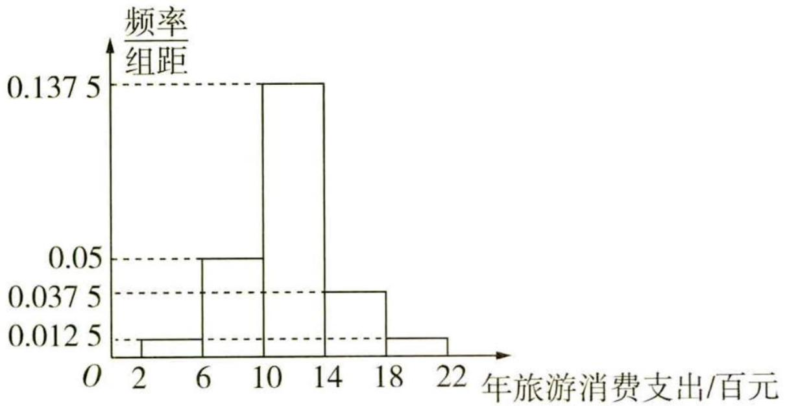

histogram

| 年旅游消费支出/百元 | 频率/组距 |
| ------------------ | --------- |
| 2                  | 0.0125    |
| 6                  | 0.05      |
| 10                 | 0.1375    |
| 14                 | 0.0375    |
| 18                 | 0.0125    |
| 22                 | 0.0125    |

图1

【善用方程工具】巧用方程的思想求 $a, b$ ，可以避开从实际意义考虑的复杂思维量，节约做题时间

(ii) 数列 $\{P_{n}\}$ 从第三项起单调递减, 证明如下:

【敲黑板】判断数列的单调性常用作差法，根据 $a_{n+1}-a_{n}$ 的符号判断数列 $\{a_{n}\}$ 是递增数列、递减数列还是常数列

$$
\begin{array}{r l} & {P _ {n} = \frac {1}{2} P _ {n - 1} + \frac {1}{4} P _ {n - 2} + \frac {1}{8} P _ {n - 3} (n \geqslant 3) \text {, 则} P _ {n + 1} - P _ {n} = (\frac {1}{2} P _ {n} + \frac {1}{4} P _ {n - 1} + \frac {1}{8} P _ {n - 2}) -} \\ & {(\frac {1}{2} P _ {n - 1} + \frac {1}{4} P _ {n - 2} + \frac {1}{8} P _ {n - 3}) = \frac {1}{2} P _ {n} - \frac {1}{4} P _ {n - 1} - \frac {1}{8} P _ {n - 2} - \frac {1}{8} P _ {n - 3} = \frac {1}{2} (\frac {1}{2} P _ {n - 1} + \frac {1}{4} P _ {n - 2} +} \\ & {\frac {1}{8} P _ {n - 3}) - \frac {1}{4} P _ {n - 1} - \frac {1}{8} P _ {n - 2} - \frac {1}{8} P _ {n - 3} = - \frac {1}{1 6} P _ {n - 3} (n \geqslant 3) ,} \end{array}
$$

又 $P_{n} > 0$ ，所以 $-\frac{1}{16} P_{n - 3} < 0$ ，即从第三项起数列 $\{P_n\}$ 递减.

实际意义为,随着抽取人数 n 的增加,事件 A 发生的可能性会越来越小,即最终会出现连续 3 人的年旅游消费支出超出 11.8 这一事件.

# 角度 17 概率解答题中的选方案问题

调研 1 (2023·安徽淮南 12 月适应性月考答题方案决策) 北京 2022 年冬奥会大大激发了人们对冰雪运动的热情, 某冰雪运动品商店对消费达一定金额的顾客开展了“冬奥”知识有奖竞答活动, 试题由选择题和填空题两种题型构成, 共需要回答三个问题, 对于每一个问题, 答错得 0 分, 答对填空题得 30 分, 答对选择题得 20 分. 现设置了两种答题方案供选择.

方案一: 只回答填空题.

方案二:第一题是填空题,后续选题按如下规则.若某题回答正确,则该题的下一题是填空题,若回答错误,则下一题是选择题.

某顾客获得了答题资格,已知其答对填空题的概率均为 $\frac{1}{2}$ ,答对选择题的概率均为 $p(1>p>0)$ ,且能否正确回答问题与回答次序无关.

(1) 若该顾客采用方案一答题, 求其得分不低于 60 分的概率.  
(2)以得分的数学期望为判断依据,该顾客选择何种方案更加有利?说明理由.

解析 (1)采用方案一答题,得分不低于60分的情况为至少答对两道填空题.

可分答对两题和答对三题两种情况考虑,概率 $P = C_{3}^{2}\left(\frac{1}{2}\right)^{2}\left(\frac{1}{2}\right)^{1} + C_{3}^{3}\left(\frac{1}{2}\right)^{3}\left(\frac{1}{2}\right)^{0} =$

【另解】也可以从反面考虑，用1减去答对0题和答对一题的概率，所求概率 $P = 1 - \mathrm{C}_3^0 (\frac{1}{2})^0 (\frac{1}{2})^3 -\mathrm{C}_3^1 (\frac{1}{2})^1 (\frac{1}{2})^2 = 1 - \frac{1}{8} -\frac{3}{8} = \frac{1}{2}$

$$
\frac {3}{8} + \frac {1}{8} = \frac {1}{2}.
$$

(2) 若采用方案一, 设其答对题数为 $\xi$ , 得分为 X,

则 $X = 30\xi, \xi \sim B(3, \frac{1}{2})$ ，所以 $E(X) = 30E(\xi) = 30 \times 3 \times \frac{1}{2} = 45$ .

【关键记忆】牢记期望与方差的性质： $E(aX+b)=aE(X)+b$ ， $D(aX+b)=a^{2}D(X)$

若采用方案二,设其得分为 Y,则 Y 的所有可能取值为 0,20,30,50,60,90,

【梳理思维链条】方案二的情况可以用树状图的形式写出来,如图 1 所示,那么每个分数对应的情况就一目了然了

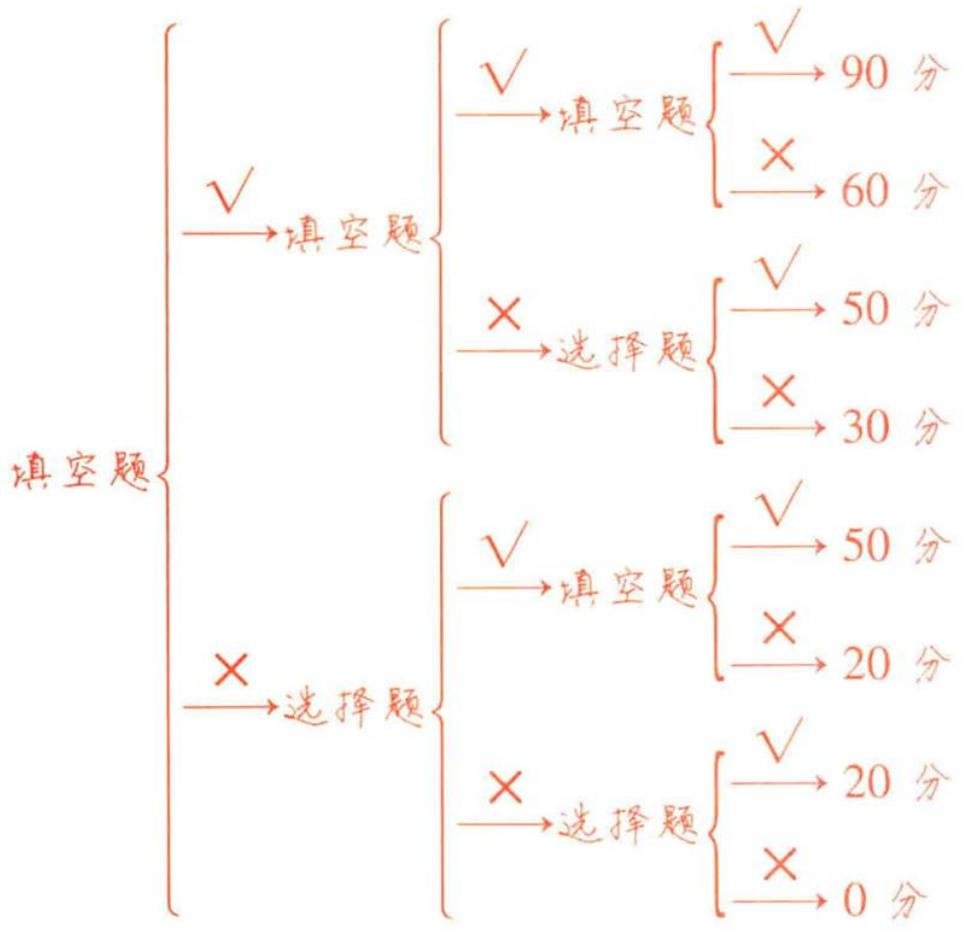

flowchart

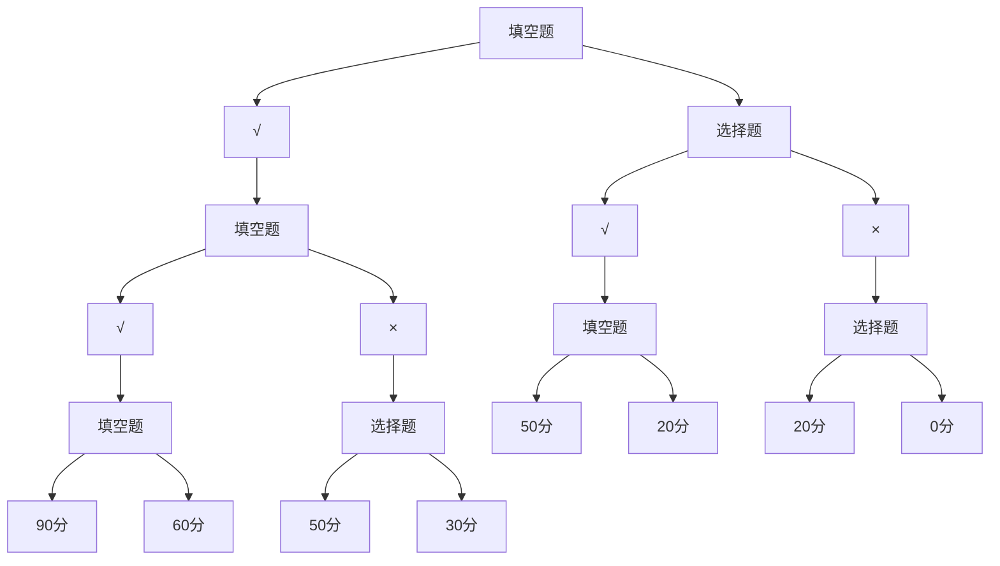
```mermaid
graph TD
    A["填空题"] --> B["√"]
    A --> C["选择题"]
    B --> D["填空题"]
    D --> E["√"]
    D --> F["×"]
    E --> G["填空题"]
    F --> H["选择题"]
    G --> I["90分"]
    G --> J["60分"]
    H --> K["50分"]
    H --> L["30分"]
    C --> M["√"]
    C --> N["×"]
    M --> O["填空题"]
    N --> P["选择题"]
    O --> Q["50分"]
    O --> R["20分"]
    P --> S["20分"]
    P --> T["0分"]
```

图 1

则 $P(Y = 0) = \frac{1}{2} (1 - p)^2, P(Y = 20) = \frac{1}{2} \times p \times \frac{1}{2} + \frac{1}{2} \times (1 - p) \times p = \frac{3p - 2p^2}{4}$ ,

$$
P (Y = 3 0) = \frac {1}{2} \times \frac {1}{2} (1 - p) = \frac {1 - p}{4}, P (Y = 5 0) = \frac {p}{2},
$$

$$
P (Y = 6 0) = (\frac {1}{2}) ^ {3} = \frac {1}{8}, P (Y = 9 0) = (\frac {1}{2}) ^ {3} = \frac {1}{8}.
$$

$$
\begin{array}{l} E (Y) = 0 \times \frac {(1 - p) ^ {2}}{2} + 2 0 \times \frac {3 p - 2 p ^ {2}}{4} + 3 0 \times \frac {1 - p}{4} + 5 0 \times \frac {p}{2} + 6 0 \times \frac {1}{8} + 9 0 \times \frac {1}{8} = \\ - 1 0 p ^ {2} + \frac {6 5}{2} p + \frac {1 0 5}{4}. \\ \end{array}
$$

则 $E(X)-E(Y)=10p^{2}-\frac{65}{2}p+\frac{75}{4}.$

【会决策】 $E(X)-E(Y)$ 是一个含p的二次多项式，那么通过比较 $E(X)$ ， $E(Y)$ 的大小，可以得出不同的p的取值范围，从而分情况进行决策

若 $E(X) - E(Y) > 0$ ，即 $E(X) > E(Y)$ ，则 $8p^{2} - 26p + 15 > 0$ ，得 $0 < p < \frac{3}{4}$

若 $E(X) - E(Y) = 0$ ，即 $E(X) = E(Y)$ ，得 $p = \frac{3}{4}$

若 $E(X) - E(Y) < 0$ ，即 $E(X) < E(Y)$ ，得 $\frac{3}{4} < p < 1$ .

综上所述, 当 $0 < p < \frac{3}{4}$ 时, 选择方案一更有利; 当 $p = \frac{3}{4}$ 时, 选择方案一、方案二均可; 当 $\frac{3}{4} < p < 1$ 时, 选择方案二更有利.

调研 2 (2023·湖北荆州中学1月模考投资项目决策)某公司计划在2023年年初将1000万元用于投资,现有两个项目供选择.

项目一:新能源汽车. 据市场调研,投资到该项目上,到年底可能获利 30%,也可能亏损 15%,且这两种情况发生的概率分别为 $\frac{7}{9}$ 和 $\frac{2}{9}$ .

项目二:通信设备. 据市场调研,投资到该项目上,到年底可能获利 50%,也可能亏损 30%,也可能不赔不赚,且这三种情况发生的概率分别为 $\frac{3}{5}, \frac{1}{3}, \frac{1}{15}$ .

(1)针对以上两个投资项目,请你为投资公司选择一个合理的项目,并说明理由.

(2) 若市场预期不变, 该投资公司按照你选择的项目长期投资 (每一年的利润和本金继续用作投资), 大约在哪一年年底总资产 (利润 + 本金) 可以翻一番? (参考数据: $\lg 2 \approx 0.3010$ , $\lg 3 \approx 0.4771$ )

解析 (1) 若投资项目一, 设获利为 $\xi_{1}$ 万元 (负值表示亏损), 则 $\xi_{1}$ 的分布列为

<table><tr><td> $\xi_1$ </td><td>300</td><td>-150</td></tr><tr><td>P</td><td> $\frac{7}{9}$ </td><td> $\frac{2}{9}$ </td></tr></table>

$$
E (\xi_ {1}) = 3 0 0 \times \frac {7}{9} + (- 1 5 0) \times \frac {2}{9} = 2 0 0.
$$

若投资项目二,设获利为 $\xi_{2}$ 万元(负值表示亏损,0 表示不赔不赚),则 $\xi_{2}$ 的分布列为

<table><tr><td> $\xi_2$ </td><td>500</td><td>0</td><td>-300</td></tr><tr><td>P</td><td> $\frac{3}{5}$ </td><td> $\frac{1}{15}$ </td><td> $\frac{1}{3}$ </td></tr></table>

$$
E (\xi_ {2}) = 5 0 0 \times \frac {3}{5} + 0 \times \frac {1}{1 5} + (- 3 0 0) \times \frac {1}{3} = 2 0 0.
$$

$\therefore E(\xi_{1})=E(\xi_{2})$ ，即投资项目一和项目二获利的期望相同.

$$
D (\xi_ {1}) = (3 0 0 - 2 0 0) ^ {2} \times \frac {7}{9} + (- 1 5 0 - 2 0 0) ^ {2} \times \frac {2}{9} = 3 5 0 0 0,
$$

$$
D \left(\xi_ {2}\right) = (5 0 0 - 2 0 0) ^ {2} \times \frac {3}{5} + (0 - 2 0 0) ^ {2} \times \frac {1}{1 5} + (- 3 0 0 - 2 0 0) ^ {2} \times \frac {1}{3} = 1 4 0 0 0 0,
$$

$\therefore D(\xi_{1})<D(\xi_{2})$ ，即项目一的方差较小，投资项目一更稳定。

综上,建议该投资公司选择项目一进行投资.

【敲黑板】对于决策性问题, 如果题于明确指出决策依据, 就严格按照决策依据做决策; 如果题于没有明确指出决策依据, 一般先比较期望, 若期望相同, 再比较方差, 进而做决策

(2) 假设 $n(n \in \mathbf{N}^{*})$ 年后总资产可以翻一番, 依题意得 $1000 \times (1 + \frac{200}{1000})^{n} = 2000$ ,

【析题意】“翻番”“翻一番”指变为原来的2倍, “翻两番”指变为原来的四倍, 注意理解题意

即 $1.2^{n} = 2$ ，两边同时取对数，得 $n\times \lg 1.2 = \lg 2,n = \frac{\lg 2}{2\lg 2 + \lg 3 - 1}\approx$ $\frac{0.3010}{2\times 0.3010 + 0.4771 - 1}\approx 3.8053,$

∴ 该投资公司大约在 2026 年年底总资产可以翻一番.

# 有奖征文

想让你的名字出现在《试题调研》上吗？

想让你的作品在学弟学妹之间传阅吗？

# 高分作文有奖征集活动开始啦!

征稿要求如果你来自市级前五的学校，并且在本市高三模考或联考中写出高分作文（55分及以上），就快快将佳作投递给我们吧！

发送地址及格式将 试卷首页 作文题目页和作文答题-拍照发送至 stdyywz@126.com，所拍照片需有分值且字体清晰可见。

活动时间即日起至2023年4月30日。

活动奖励凡投稿且符合条件者，可自选《试题调研》Mook1本或最新版《随身速记》1本，即投即送。

来信注意事项邮件请注明姓名+学校+邮寄地址+联系方式+自选图书名（注明书名、辑次、科目等）。

# 《解题秘籍18课》

# 4大学科72个考场最强得分秘籍

数学学科解题秘籍

<table><tr><td>1</td><td>高能口诀公式,巧缩计算路径秒解选填题</td><td>10</td><td>建模思维妙解空间几何问题</td></tr><tr><td>2</td><td>常识推断,秒解数学文化问题</td><td>11</td><td>平移大法速解函数图象问题</td></tr><tr><td>3</td><td>万能估算,极速搞定指对数混合比大小</td><td>12</td><td>选项对比,无须计算秒寻正确项</td></tr><tr><td>4</td><td>投机取“巧”,特例验证法速解含参问题</td><td>13</td><td>万能模板法速解立体几何空间角问题</td></tr><tr><td>5</td><td>另辟“殊”径法妙析抽象函数性质</td><td>14</td><td>0基础数学解答题上分秘诀</td></tr><tr><td>6</td><td>万能体积公式,摆平一切拟柱体体积计算</td><td>15</td><td>信息整理术妙解新颖背景情境题</td></tr><tr><td>7</td><td>切线逼近法快解函数范围推导问题</td><td>16</td><td>逻辑分析法速排多选题错误项</td></tr><tr><td>8</td><td>图中含解,图形观察法妙解代数运算问题</td><td>17</td><td>“析一寻一验”,三步法秒解开放性填空题</td></tr><tr><td>9</td><td>极限思想破译函数图象&amp;最值、范围问题</td><td>18</td><td>四大模型巧选条件快解结构不良问题</td></tr></table>

物理学科解题秘籍

<table><tr><td>1</td><td>量纲分析法,秒杀物理量表达式</td><td>10</td><td>等效法妙解“场”和电路的问题</td></tr><tr><td>2</td><td>妙用尺规,秒定答案</td><td>11</td><td>巧用“两幅图”破解等量点电荷问题</td></tr><tr><td>3</td><td>逻辑推演法秒解关联矛盾项</td><td>12</td><td>“两个技巧”巧解电场、电磁感应中的图像问题</td></tr><tr><td>4</td><td>巧选特值,快速排除错误项</td><td>13</td><td>“两大观点”速解力学综合计算题</td></tr><tr><td>5</td><td>极限法巧解物理动态和临界问题</td><td>14</td><td>平均值法巧解“变量”问题</td></tr><tr><td>6</td><td>逆向思维法巧解变速运动问题</td><td>15</td><td>“一个方程”破解理想气体问题</td></tr><tr><td>7</td><td>矢量图解法妙解动态平衡问题</td><td>16</td><td>终极放大招,计算题稳拿3~5分</td></tr><tr><td>8</td><td>巧用二级结论法秒杀物理选择题</td><td>17</td><td>“降维法”巧解三维空间情境问题</td></tr><tr><td>9</td><td>图像法巧解运动学、动力学问题</td><td>18</td><td>“异中求同”破解创新实验题</td></tr></table>

化学学科解题秘籍

<table><tr><td>1</td><td>0思路快解化学与STSE、传统文化题</td><td>10</td><td>直击矛盾点光速解复杂信息题</td></tr><tr><td>2</td><td>一套口诀秒破阿伏加德罗常数陷阱</td><td>11</td><td>“反套路”快速定位探究性表格实验题问题选项</td></tr><tr><td>3</td><td>分步筛除法速判离子方程式正误</td><td>12</td><td>抓特点套模型,速析反应速率与平衡图表题</td></tr><tr><td>4</td><td>抓特点速析3类反应历程图</td><td>13</td><td>唯一物质定系数,5s算出反应热</td></tr><tr><td>5</td><td>不饱和度比较法速判分子式正误等</td><td>14</td><td>关系式法速解定量实验计算</td></tr><tr><td>6</td><td>逻辑选择法秒解电化学试题</td><td>15</td><td>原子守恒法速算化学平衡题</td></tr><tr><td>7</td><td>共价键数目法速推元素种类</td><td>16</td><td>背会万能模板——文字描述题一分不丢</td></tr><tr><td>8</td><td>三大守恒速判微粒浓度关系</td><td>17</td><td>五维分析法速解创新图像题</td></tr><tr><td>9</td><td>转化法速解电解质溶液图像题</td><td>18</td><td>思维模型法破解创新探究实验题</td></tr></table>

生物学科解题秘籍

<table><tr><td>1</td><td>借助绝对表述,秒杀生物选择题</td><td>10</td><td>巧建模型,速解生物选择题</td></tr><tr><td>2</td><td>巧用常识判断,秒解送分题</td><td>11</td><td>“三看法”秒解物质运输题</td></tr><tr><td>3</td><td>正反交叉排除,速解组合型选择题</td><td>12</td><td>“两维度”搞定细胞分裂图示题</td></tr><tr><td>4</td><td>巧用关键结论,反套路秒杀陷阱题</td><td>13</td><td>逆推法快解遗传分析题</td></tr><tr><td>5</td><td>依文构图,玩转材料信息题</td><td>14</td><td>“追本溯源法”搞定原因依据类设问</td></tr><tr><td>6</td><td>“三步法”妙解曲线图示题</td><td>15</td><td>“拆分法”妙解自由组合问题</td></tr><tr><td>7</td><td>“比较法”快解表格分析题</td><td>16</td><td>“配子法”速解遗传计算题</td></tr><tr><td>8</td><td>识别特殊词,速判实验错误项</td><td>17</td><td>“四步法”拆解代谢调节实验方案题</td></tr><tr><td>9</td><td>妙用“口诀”,秒杀生物选择题</td><td>18</td><td>设计模板破解遗传变异实验方案题</td></tr></table>

# 《试题调研》全程提分方略

<table><tr><td>系列</td><td>主题</td><td>提分关键词</td><td>上市时间</td><td>定价</td></tr><tr><td>智能教辅</td><td>解题秘籍18课(数学、物理、化学、生物)</td><td>考场没思路,也能多得分</td><td>2023.1</td><td>198元/册</td></tr><tr><td rowspan="14">MOOK系列</td><td>调研1辑·预备知识&amp;函数与导数</td><td rowspan="4">2023高考方向 重点 难点薄弱点 突破复习障碍</td><td>2022.6</td><td rowspan="14">18.9元/册</td></tr><tr><td>调研2辑·三角函数&amp;平面向量&amp;数列</td><td>2022.7</td></tr><tr><td>调研3辑·立体几何&amp;解析几何</td><td>2022.8</td></tr><tr><td>调研4辑·计数原理&amp;概率&amp;统计</td><td>2022.9</td></tr><tr><td>调研5辑·模型解题法</td><td>试题归类 解题思路 方法与技巧</td><td>2022.11</td></tr><tr><td>调研6辑·高频易错点快攻</td><td>易错易混点 设题陷阱 解题误区 快速攻克</td><td>2022.12</td></tr><tr><td>调研7辑·高考热点大串讲</td><td>网络构建 前沿热点 创新热点</td><td>2023.1</td></tr><tr><td>调研8辑·创新题分类解读</td><td>创新题型 创新情境 创新考法</td><td>2023.2</td></tr><tr><td>调研9辑·考前50天50题</td><td>名校名师 原创押题 前瞻预测</td><td>2023.3</td></tr><tr><td>调研10辑·考前抢分必备</td><td>必考点 易错点 命题热点 核心解法 考前密题</td><td>2023.4</td></tr><tr><td>作文素材(上)·年度热点素材</td><td>鲜活素材 多维解读 速背速用</td><td>2022.11</td></tr><tr><td>作文素材(下)·考前热点素材</td><td>时新素材 最新时评 范文佳作 速背速用</td><td>2023.3</td></tr><tr><td>时政时政热点(上)</td><td>2022年4—12月重大时事 剖析解读</td><td>2022.12</td></tr><tr><td>时政热点时政热点(下)</td><td>全年度重大时事热点 分析预测</td><td>2023.4</td></tr><tr><td rowspan="10">热点题型专练系列</td><td>选择题(语文、物理、化学、生物、政治、历史、地理、文综、理综)</td><td rowspan="2">抓准热点 精选新题 多维巧解</td><td rowspan="10">2022.9</td><td rowspan="3">33.9—53.9元/册</td></tr><tr><td>选择题&amp;填空题(数学)</td></tr><tr><td>应用文&amp;读后续写&amp;概要写作(英语)</td><td>速背素材 巧学技法 精练写作</td></tr><tr><td>古代诗文阅读(语文)</td><td>洞悉考向 攻克薄弱套路解题 反思积累</td><td rowspan="7">26.9—39.9元/册</td></tr><tr><td>数学解答题</td><td>模型构建 模型应用分组强化 深度解析</td></tr><tr><td>阅读&amp;语言运用(英语)</td><td>30分钟题型组合主题分类 巧思妙解 二次精读 综合提升</td></tr><tr><td>物理计算题</td><td>模型解法 思维建模提分技法 规范答题</td></tr><tr><td>实验题(物理、化学)</td><td>热点实验 创新装置高频考点 讲深讲透</td></tr><tr><td>工艺流程题(化学)</td><td>深度剖析流程精准解读热点</td></tr><tr><td>生物遗传题</td><td>套路审题 传授技法攻克疑难 专项提升</td></tr><tr><td>高考总复习系列</td><td>高考题型全练</td><td>高考题型 分类练习通性通法</td><td>2022.6</td><td>62.9—79.9元/册</td></tr><tr><td rowspan="6">随身速记系列</td><td>必背古诗文64篇</td><td rowspan="2">同步翻译 设题关键重难词解 课外拓展</td><td rowspan="6">2023.1</td><td rowspan="6">17.9元/册</td></tr><tr><td>古诗文理解性默写72篇</td></tr><tr><td>巧记英语3500词</td><td>巧记核心词 速记合成词快记主题词</td></tr><tr><td>英语高分范文天天背</td><td>常考话题 素材语料亮点表达 写作套路</td></tr><tr><td>历史大事年表</td><td>精选高考常考史实梳理历史发展脉络</td></tr><tr><td>语文作文金句素材</td><td>高级标题 闪亮开头 深度结尾 点睛金句精彩分论点 高分论证句 提分名言与文采句</td></tr></table>

# 熟练热点 提升快 二轮备考

2023版《试题调研·热点题型专练》

text_image

2023高考 热点题型专题
创于 2003
试题
调研
20 年报卷
应用文&读后续写&概要写
32类 写作素材全覆盖
106语 名校新题一次练透
英
解大题、提难度、专练热点提分快!
CHISOT 新任青少年出版社

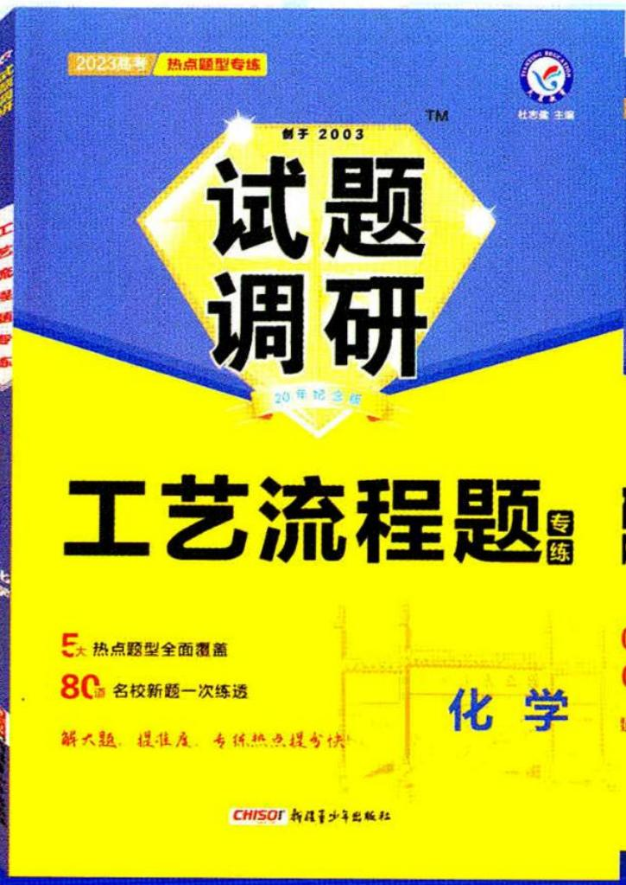

text_image

2023高考 热点题型专练
TM
杜志豪 主编
制于 2003
试题
调研
20 年记主练
工艺流程题_专练
5 大 热点题型全面覆盖
80 酒 名校新题一次练透
解大题、提高度、专练热点提分快
化学
CHISOT 新段青少年出版社

text_image

热点题型专练
TM
杜志勇 主编
创刊 2003
试题
调研
20 年记总览
语文选择题
专练
热点话题全面覆盖
名校新题一次练透
读 保速度 专练热点提考快
语文
CHISOR 新国青少年出版社

火热销售中

text_image

QR code image containing encoded data, no visible human-readable text

电子书试读

抓热点 专项突破稳拿分

练速度 小题速解快得分

提准度 大题巧解拿高分

本套图书具体出版书目详见“《试题调研》全程提分方略”（内文最后一页）

# 试题调研

# × 金考卷™ = 高考提分好搭档

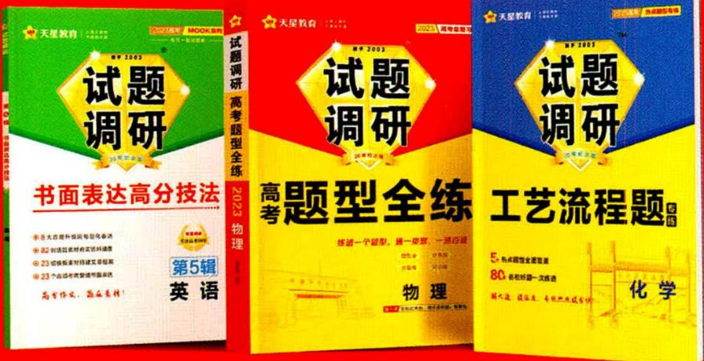

text_image

天星教育
2003年
MOOK出版
第 2003
试题
调研
高考题型全练
2023 物理
书
面
表达
高分技法
第5辑
英
语
试题调研 高考题型全练
2023 物理
第 2003
试题
调研
高考题型全练
2023 物理
第9 2003
试题
调研
高
艺
流程题
专题
物理
E 热点题型全课教程
80 姓名解析器一次练习
新大进 深生生 专精类考试卷1件
化 学

试题新

解法新

观点新

形式新

每月都有

试题

20年品牌积淀 相见恨晚的提分利器
知乎高中生推崇的好教辅

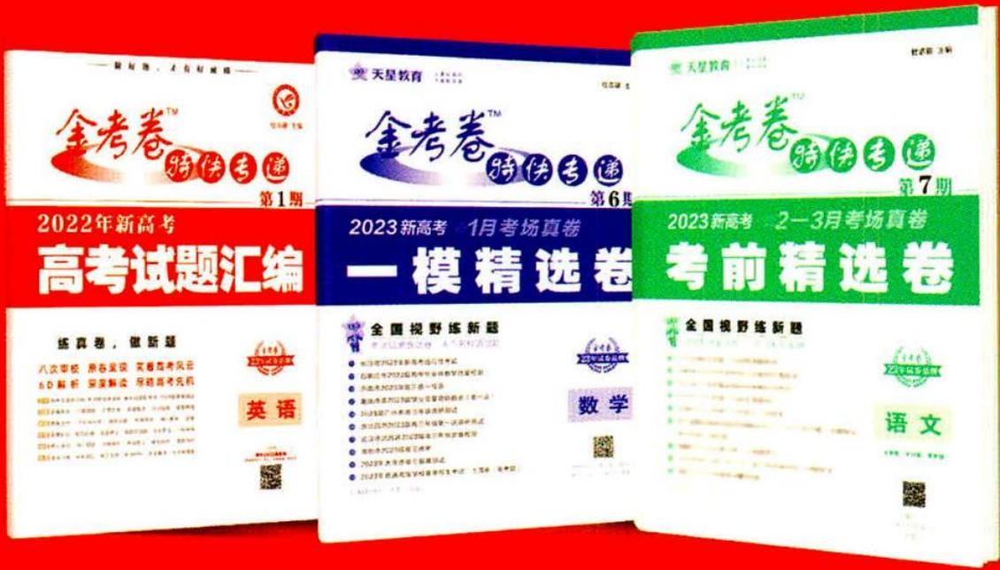

text_image

金考卷™
特快专递
第1期
2022年新高考
高考试题汇编
练真卷，做新题
八次审核 原态实现 文档高考风云
bD解析 安度解读 尿路高考先机
英语
全国视野练新题
· 2023新高考 1月考场真卷
· 自动式2023高考考生进行考试
· 自动式2023高考考生进行考试
· 自动式2023高考考生进行考试
· 自动式2023高考考生进行考试
· 自动式2023高考考生进行考试
· 自动式2023高考考生进行考试
· 自动式2023高考考生进行考试
· 自动式2023高考考生进行考试
· 自动式2024高考考生进行考试
· 自动式2024高考考生进行考试
· 自动式2024高考考生进行考试
· 自动式2024高考考生进行考试
· 自动式2024高考考生进行考试
· 自动式2024高考考生进行考试
· 自动式2024高考考生进行考试
· 自动式2024高考考生进行考试
· 自动性2024高考考生进行考试
· 自动性2024高考考生进行考试
· 自动性2024高考考生进行考试
· 自动性2024高考考生进行考试
· 自动性2024高考考生进行考试
· 自动性2024高考考生进行考试
· 自动性2024高考考生进行考试
· 自动性2024高考考生进行考试

真题卷

模拟卷

每月都有

新试卷

23年品牌积淀 B站、知乎大神力荐与专家名师深度对话的好试卷

猜题卷 猜新考法、猜新情境、猜新题型，多维猜题，猜题卷更给力！

押题卷 逐题押、分层押、多角度押，网式押题，押题卷更给力！

natural_image

Cartoon star character wearing a yellow outfit with black shoes and a red eye-like design (no text or symbols)

一书一卷，天生一对

做更新的题，提更高的分！

电子书免费试读

图书问题读者反馈

《试题调研》总能超出你的预期！

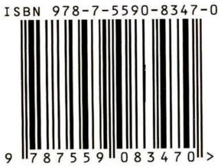

text_image

ISBN 978-7-5590-8347-0
9 787559 083470 >

定价：18.90元