扫码关注获取更多学习资料

# 试题 调研

20年纪念版

# 高题型全练

高分进阶题型

攻坚克难 又快又准

试题难度：★★★ — ★★★★★

数学

本册不单独销售

# 攻坚克难 又快又准成就高分

基础夯实能够确保你不落于人后，但想冲刺名校，就必须拿下思维含量大、情境陌生新颖、创新性强的题。本册从综合性、应用性、创新性3个方面精选试题，帮你提升思维，突破瓶颈，实现高分进阶。

# 1 综合突破练

试题思维含量大，考查学生综合运用知识和能力的水平，培养融会贯通的能力。

# 知识综合

1.[2022重庆南开中学检测，★★★]下图为考

古学家在甘肃、陕西等地发掘的大量“铅饼”之

一，其正面刻有象征皇权威严的蟠螭

有希腊文字母和汉代是希腊化的中亚、西亚汉代

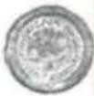

A.与罗马帝国有了官

# 模块综合

8.[2022 沈阳模拟, ★★★★, 14 分]阅读材料, 完成下列要求。

自中央全面深化改革委员会第十四次会议审议通过《国企改革三年行动方案（2020—2022年）》后，国企正在通过一系列举措激发活力，而混合所有制改革是激发国企活力的重要途径。

材料一 商务部印发的《“十四五”利用外资发展规划》提出，对外商投资企业在参与国有企业混合所有制改革等方面给予支持。鼓

# 学科综合

3.[原创,★★★]在地图中,通常采用等高线来

十三地势的高低,如图所示.在物理学中,通常

势线来表示电势的高低,若水平面上的

势线图,所标数字为电势,单位为 V. 元

2. 则 ( )

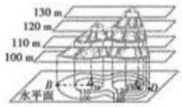

# 国家发展成就

11.[2022北京房山区一横，★★★]乡村振兴，

既要塑形、也要铸魂，文化在乡村振兴中大有

可为，如：一些地方通过建立村

理村史村志等，塑造

号和精神地标；一些地

的团结友爱、扶危济困

德教化、凝聚人心的功

和发挥新乡贤(注:心

贤达，一般包括乡籍的

文化名人)的作用,强

# 社会热点话题

10. [★★★★, 15 分] 阅读图文材料, 完成下列要求。

在碳中和背景下，相对低碳排放、低耗能天然气成为全球主要经济体能源转型的首选。欧洲是全球较大的天然气消费市场，德国、瑞典等国在去核政策下持续关闭核电站。2020年欧洲遭遇罕见的寒冬，2021年夏季又出现高温、干旱等极端天气。2021年下半年，全球经济复苏，国际市场上各种发电燃料价格上涨，欧洲面临严重的“气荒”和“电荒”，以

# 学科发展前沿

3.[2022广东六校三联，★★★]2021年10月16

日，神舟十三号载人飞船在酒泉卫星发射中心

二号F遥十三运载火箭送入太空，并和站组合体成功对接，这是中国建设航的里程碑。以下说法错误的是（）二号F遥十三运载火箭使用“偏二甲肼氧化二氮”作推进剂，四氧化二氮起氧作用

舱表面的“烧蚀层”可以保护返回舱不温而烧毁，因为这种材料硬度大

# 2 热点应用练

试题情境真实、关注热点，提升学生学以致用、应对陌生问题情境的能力。

# 3 创新预测练

试题呈现方式和设问方式新颖，帮助学生突破思维定式，培养创新思维能力。

# 情境创新

6.[2022 黑龙江大庆一中阶段练习|特殊电场形

式，★★★]一避雷针某时刻离带正电云层很

近，其周围电场的等差等势面分布情况如图所

示,在同一竖直平面内有A、B、C三点,其

B 两点关于避雷针对称，
能面，则下列说法正确的
A. A、B 两点的电场强度
相同

B. 正电荷在 C 点的电势能大于在 A 点的

# 角度创新

5.[巧妙构造函数比较大小,2022河南省顶级名

按联考.★★★★]已知定义在R上的函数 $f(x)$ ，其导函数为 $f'(x)$ ，当x>0时， $f'(x)-$

$\frac{f(x)}{x} > 0$ ，若 $a = 2f(1), b = f(2), c = 4f(\frac{1}{2})$ ，则

a,b,c 的大小关系是 ( )

A. c < b < a

B. c < a < b

C. b < a < c

D. a < b < c

# 设问创新

5.[2022福州联考,设问创新/提出解决问题的

思路.★★★★]淀粉是食物的重要成分,也是

种重要的工业原料，其水解产物广泛用于糖

业。目前，工厂化水解淀粉

行，因此开发具有自主产权

酶并实现大规模生产，对我

的发展具有重要意义。为

的高效表达和分泌,我国科

构建工程菌开展研究。回

# 专题一 函数与导数

题型1 与函数有关的新定义问题 …… 001

题型 2 函数性质的综合应用 …… 002

题型 3 二次函数的零点分布类型及解题方法…… 003

题型 4 利用函数性质比较数与式的大小 …… 004

题型 5 指数函数与对数函数的综合问题 …… 004

题型 6 求函数零点(方程根)的和或取值范围
005

题型7 复合函数的零点问题 005

题型 8 用构造法求解 $f(x)$ 与 $f'(x)$ 共存的不等式
问题 …… 006

题型 9 同构法在处理指对混合问题中的应用
008

题型 10 利用导数求解极值和最值问题 …… 008

题型 11 单变量不等式的证明 …… 009

题型 12 双变量不等式的证明 010

题型 13 导数中不等式的恒成立问题 …… 011

题型 14 导数中不等式的存在性问题 …… 012

题型 15 导数中双变量“存在性或任意性”问题
012

题型 16 讨论函数的零点(方程根)的个数 …… 013

题型 17 已知函数零点个数求参数的取值范围
014

题型 18 隐零点问题 015

题型 19 极值点偏移问题 016

# 专题二 三角函数、解三角形、平面向量

题型 20 三角恒等变换 017

题型 21 三角函数的图象与性质的综合应用 … 018

题型 22 三角恒等变换与三角函数综合 …… 019

题型 23 正、余弦定理的综合应用 …… 020

题型 24 平面图形中的计算问题 …… 021

题型 25 解三角形中的最值(取值范围)问题 … 022

题型 26 平面向量中的最值(取值范围)问题 … 023

题型 27 向量极化恒等式的应用 …… 024

题型 28 平面向量与三角函数的综合 …… 024

# 专题三 数列

题型 29 已知递推关系求数列的通项公式 …… 026

题型 30 数列求和 026

题型 31 数列中含有 $(-1)^{n}a_{n}$ 类型问题的求解
027

题型 32 数列中含绝对值的求和问题 …… 028

题型 33 数列与函数的综合 …… 029

题型 34 数列与不等式的综合 …… 030

# 专题四 立体几何

题型 35 求空间几何体的表面积(侧面积) …… 031

题型 36 求空间几何体的体积 …… 031

题型 37 求空间几何体体积的最值 …… 032

题型 38 球的切、接问题 …… 033题型 39 立体几何中的截面、交线问题 …… 034

题型 40 立体几何中的动态问题 …… 035

题型 41 利用空间向量求空间角 …… 036

题型 42 立体几何中的翻折问题 …… 038

题型 43 立体几何中的探索性问题 …… 039

# 专题五 平面解析几何

题型 44 直线与圆的位置关系的应用 …… 041

题型 45 “阿波罗尼斯圆”的应用 …… 041

题型 46 “蒙日圆”的应用 042

题型 47 求圆锥曲线的离心率或其范围 …… 043

题型 48 圆锥曲线中的弦长问题 043

题型 49 圆锥曲线中的弦中点问题 045

题型 50 “阿基米德三角形”的应用 …… 046

题型 51 求轨迹方程 047

题型 52 圆锥曲线中的最值问题 048

题型 53 圆锥曲线中的取值范围问题 …… 049

题型 54 圆锥曲线中的“非对称”根与系数关系的应用 …… 050

题型 55 圆锥曲线中的定点问题 051

题型 56 圆锥曲线中的定值问题 052

题型 57 圆锥曲线中的点在定线上的问题 …… 054

题型 58 圆锥曲线中的探索性问题 055

题型 59 圆锥曲线中的证明问题 …… 056

题型 60 圆锥曲线与圆、平面向量、数列等知识的
综合问题 …… 057

# 专题六 概率与统计

题型 61 情境载体下的数据与图表信息分析 … 059

题型 62 概率与统计的综合应用问题 …… 060

题型 63 概率统计与函数的综合问题 …… 062

题型 64 概率统计与数列的综合问题 …… 064

# 专题七 创新情境载体下的数学建模应用

题型 65 函数模型及其应用 065

题型 66 利用导数解决生活中的最优化问题 … 066

题型 67 三角函数模型的应用 067

题型 68 解三角形的建模应用 068

题型 69 数列的建模应用 069

题型 70 立体几何的建模应用 070

题型 71 解析几何的建模应用 …… 071

题型 72 回归分析模型的构建及应用 …… 073

# 专题八 新题型专练

题型 73 多选题 075

题型 74 数学文化题 076

题型 75 信息阅读题 077

题型 76 新定义题 079

题型 77 开放题 080

题型 78 结构不良题 081

题型 79 方案设计和决策问题 082

题型 80 数学探索问题 085

附录：答案全解全析(奥德克·册.P127—P200)

# 专题一 函数与导数

# 题型1 与函数有关的新定义问题

▶ 答案：127 页

# 题型攻略

1. 与函数有关的新定义问题的一般形式:由命题者先给出一个新的概念、新的运算法则,或者给出一个抽象函数的性质等,然后按照这种“新定义”去解决相关的问题.  
2. 解题关键: 紧扣新定义的函数的含义, 学会语言的翻译、新旧知识的转化, 便可使问题顺利获解.

# 综合 突破练

1. [多选, ★★★★] 我们定义这样一种运算 “⊗”: ①对任意的 $a \in \mathbf{R}, a \otimes 0 = 0 \otimes a = a$ ; ②对任意的 $a, b \in \mathbf{R}, (a \otimes b) \otimes c = c \otimes (ab) + (a \otimes c) + (b \otimes c)$ . 若 $f(x) = e^{x - 1} \otimes e^{1 - x}$ , 则以下结论正确的是 ( )

A. $f(x)$ 的图象关于直线 x=1 对称  
B. $f(x)$ 在 $\mathbf{R}$ 上单调递减  
C. $f(x)$ 的最小值为 3  
D. $f(2^{\frac{2}{3}}) > f(2^{\frac{3}{2}}) > f(\log_3\frac{1}{9})$

2.[2022 湖北省七市(州)联考,★★★★]若函数 $f(x)$ 的定义域为R,对任意的 $x_{1},x_{2}$ ,当 $x_{1}-x_{2}\in D$ 时,都有 $f(x_{1})-f(x_{2})\in D$ ,则称函数 $f(x)$ 是关于D关联的.已知函数 $f(x)$ 是关于{4}关联的,且当 $x\in[-4,0)$ 时, $f(x)=x^{2}+6x$ .则:①当 $x\in[0,4)$ 时,函数 $f(x)$ 的值域为\_\_\_\_;②不等式 $0<f(x)<3$ 的解集为\_\_\_\_.

3. [2017 山东, ★★★★] 若函数 $e^{x}f(x)$ (e = 2.71828…是自然对数的底数) 在 $f(x)$ 的定义域上单调递增, 则称函数 $f(x)$ 具有 M 性质. 下列函数中所有具有 M 性质的函数的序号为 \_\_\_\_.

① $f(x)=2^{-x}$ ② $f(x)=3^{-x}$ ③ $f(x)=x^{3}$   
④ $f(x)=x^{2}+2$

# 创新 预测练

4.[实为考查函数零点,多选,2022沈阳市重点高中期中,★★★]在数学中,布劳威尔不动点定理是拓扑学(一个数学分支)里一个非常重要的定理,简单来讲就是对于满足一定条件的图象连续不断的函数 $f(x)$ ,如果存在一个点 $x_{0}$ ,使得 $f(x_{0})=x_{0}$ ,那么我们称该函数为“不动点函数”.下列为“不动点函数”的是()

A. $f(x)=x+1$   
B. $f(x) = \frac{1}{x} - x, x > 0$   
C. $f(x) = x^{2} - x + 3$   
D. $f(x) = \log_{\frac{1}{2}}x$

5.[实为考查二次函数的图象与性质,2022 哈尔滨九中期末,★★★★]定义:如果函数 $f(x)$ 在 $[a,b]$ 上存在 $x_{1},x_{2}(a<x_{1}<x_{2}<b)$ 满足 $f'(x_{1})=f'(x_{2})=\frac{f(b)-f(a)}{b-a}$ ,则称函数 $f(x)$ 是 $[a,b]$ 上的“中值函数”.已知函数 $f(x)=\frac{1}{3}x^{3}-\frac{1}{2}x^{2}+m$ 是 $[0,m]$ 上的“中值函数”,则实数m的取值范围是\_\_\_\_.

# 热点 应用练

6.[2022 山东师大附中期中,★★★]高斯是德国著名的数学家,近代数学奠基者之一,享有“数学王子”的称号,用其名字命名的“高斯函数”为:设 $x\in R$ ,用[x]表示不超过x的最大整数,则y=[x]称为高斯函数.例如:[-2.1]=-3,[3.1]=3.已知函数 $f(x)=\frac{2^{x}+3}{1+2^{x+1}}$ ,则函

数 $y = [f(x)]$ 的值域为 （）

A. $\left(\frac{1}{2},3\right)$

B. $(0,2]$

C. $\{0,1,2\}$

D. $\{0,1,2,3\}$

# 题型 2 函数性质的综合应用

▶ 答案：127 页

# 题型攻略

1. 对于函数单调性与奇偶性的综合问题, 常利用奇、偶函数的图象的对称性, 以及奇、偶函数在关于原点对称的区间上的单调性求解.  
2. 函数周期性与奇偶性的综合问题多是求值问题, 常利用奇偶性及周期性进行变换, 将所求函数值的自变量转换到已知函数解析式的函数的定义域内求解.  
3. 函数的奇偶性、周期性及单调性是函数的三大性质, 在高考中常常将它们综合在一起命题, 在解题时, 往往需要先借助函数的奇偶性和周期性来确定另一区间上的单调性, 即实现区间的转换, 再利用单调性解决相关问题.

# 综合 突破练

1.[2022天津市南开中学二模,★★★]已知定义在R上的函数 $f(x)$ 满足 $f(x+6)=f(x)$ , $y=f(x+3)$ 为偶函数,若 $f(x)$ 在(0,3)上单调递减,则下列结论正确的是()

A. $f(\frac{19}{2}) < f(\mathrm{e}^{\frac{1}{2}}) < f(\ln 2)$   
B. $f(\mathrm{e}^{\frac{1}{2}}) < f(\ln 2) < f(\frac{19}{2})$   
C. $f(\ln 2) < f(\frac{19}{2}) < f(e^{\frac{1}{2}})$   
D. $f(\ln 2) < f(e^{\frac{1}{2}}) < f(\frac{19}{2})$

2.[多选,2022新高考卷Ⅰ,★★★★]已知函数 $f(x)$ 及其导函数 $f'(x)$ 的定义域均为R,记 $g(x)=f'(x)$ .若 $f(\frac{3}{2}-2x),g(2+x)$ 均为偶函数,则()

A. $f(0)=0$

B. $g(-\frac{1}{2})=0$

C. $f(-1)=f(4)$

D. $g(-1) = g(2)$

3.[多选,2022福州市质检,★★★★]设函数 $f(x)$ 的定义域为R, $f(x-1)$ 为奇函数, $f(x+1)$ 为偶函数,当 $x\in(-1,1]$ 时, $f(x)=-x^{2}+1$ ,则下列结论正确的是()

A. $f(\frac{7}{2}) = -\frac{3}{4}$   
B. $f(x + 7)$ 为奇函数  
C. $f(x)$ 在 $(6,8)$ 上单调递减  
D. 方程 $f(x) + \lg x = 0$ 仅有 6 个实数解

# 创新 预测练

4.[单调函数判断的等价性,2022齐齐哈尔市模拟,★★★]已知定义域为R的函数 $f(x)$ 的图象是一条连续不断的曲线,且函数 $f(x-2)$ 的图象关于点(2,0)对称.若 $\forall x_{1},x_{2}\in[0,+\infty)$ ,总有 $(x_{2}-x_{1})\left[x_{1}f(x_{1})-x_{2}f(x_{2})\right]<0$ ,则满足 $(2m-5)f(2m-5)\leqslant(m+3)f(m+3)$ 的实数m的取值范围为()

A. $(-∞,8]$

B. $\left[\frac{2}{3},+\infty\right)$

C. $(-∞, \frac{2}{3}] ∪ [8, +∞)$

D. $\left[\frac{2}{3},8\right]$

5. [开放性探究题,2022 武汉市调研,★★★]某学生在研究函数 $f(x) = x^{3} - x$ 时,发现该函数的两条性质:①是奇函数;②单调性是先增后减再增.该学生继续深入研究后发现将该函数乘以一个函数 $g(x)$ 后得到一个新函数 $h(x) = g(x)f(x)$ ,此时 $h(x)$ 除具备上述两条性质之外,还具备另一条性质:③ $h'(0) = 0$ .写出一个符合条件的函数解析式 $g(x) =$ \_\_\_\_.

# 题型 3 二次函数的零点分布类型及解题方法

▶ 答案：128 页

# 题型攻略

# 二次函数零点问题的解题步骤

1. 合理转化: 函数的零点、方程的根、函数图象交点问题相互合理转化.  
2. 画出草图:作出适合条件的函数图象.  
3. 数形结合: 借助图象从判别式、根与系数的关系、图象的对称轴、端点的函数值等方面列出方程(组)或不等式(组).  
4. 确定结果: 反思回顾, 查看易错点, 得出正确结果.

# 综合 突破练

1.[2022 北京市海淀区中关村中学月考, ★★ ★]m 为何值时, $f(x)=x^{2}+2mx+3m+4$ 满足下列条件:

(1)有且仅有一个零点；  
(2)有两个零点且均比-1大.

2.[2022 北京市人大附中统练, ★★★]已知二次函数 $f(x)=x^{2}-2ax+2$ .

(1) 函数在区间 $[0,4]$ 内至少有一个零点, 求实数 a 的取值范围;  
(2) 函数在区间 $[0,4]$ 内至多有一个零点, 求实数 a 的取值范围.

3. [2022 烟台市期末, ★★★★] 已知函数 $f(x) = kx^{2} - (2k + 1)x - 3$ 的两个零点为 $x_{1}, x_{2}$ .

(1) 若 $-1 < x_{1} < 1 < x_{2} < 3$ ，求实数 k 的取值范围；  
(2) 若 $x_{1}<1<x_{2}$ ，求实数 k 的取值范围.

# 创新 预测练

4.[多维创新,2022 浙江宁波模拟练习,★★★ ★]已知函数 $f(x)=2(m+1)x^{2}+4mx+2m-1$ .

(1) 当 m 取何值时, 函数的图象与 x 轴有两个交点;  
(2) 若函数至少有一个零点在原点的右侧, 求 m 的取值范围.

# 题型 4 利用函数性质比较数与式的大小

# 题型攻略

# 利用函数性质比较数与式大小的策略

1. 利用指数、对数函数的图象与性质比较数(式)的大小.  
2. 涉及三元变量的比较大小问题: 若题设涉及三个指数式连等或三个对数式连等, 则可利用特例法求解, 也可在设元变形的基础上, 通过作差、作商或运用函数的性质求解.

# 综合 突破练

1.[2022南阳市模拟,★★★]若m,n,p∈(0,1),且 $\log_{3}m=\log_{5}n=\lg p$ ,则()

A. $m^{\frac{1}{3}} < n^{\frac{1}{5}} < p^{\frac{1}{10}}$

B. $n^{\frac{1}{5}} < m^{\frac{1}{3}} < p^{\frac{1}{10}}$

C. $p^{\frac{1}{10}} < m^{\frac{1}{3}} < n^{\frac{1}{5}}$

D. $m^{\frac{1}{3}} < p^{\frac{1}{10}} < n^{\frac{1}{5}}$

2. [2022 湖北恩施模拟, ★★★] 设 $2^{a} = \frac{1}{3}, 40^{b} =$ 3, 则 ( )

A. $4ab < 2(a + b) < 3ab$   
B. $4ab > 2(a + b) > 3ab$   
C. $6ab > 2(a + b) > 5ab$   
D. $6ab < 2(a + b) < 5ab$

3.[2017全国卷Ⅰ,★★★]设x,y,z为正数,且 $2^{x}=3^{y}=5^{z}$ ,则()

A. 2x < 3y < 5z

B. 5z < 2x < 3y

C. 3y < 5z < 2x

D. 3y < 2x < 5z

# 创新 预测练

4.[构造函数,2022太原市模拟,★★★★]已知 $a=2\ln3^{\pi},b=3\ln2^{\pi},c=2\ln\pi^{3}$ ,则下列结论正确的是()

A. $b < c < a$

B. $c < b < a$

C. b < a < c

D. a < b < c

5.[式子同构化,多选,2022石家庄市一检,★★★★]已知a,b分别是方程 $2^{x}+x=0,3^{x}+x=0$ 的两个实数根,则下列选项正确的是()

A. -1 < b < a < 0

B. -1 < a < b < 0

C. $b \cdot 3^{a} < a \cdot 3^{b}$

D. $a \cdot 2^{b} < b \cdot 2^{a}$

# 题型5 指数函数与对数函数的综合问题

▶ 答案：129 页

# 题型攻略

# 解决指数函数与对数函数综合问题的技巧

1. 解决指数函数与对数函数的综合问题时,一般运用指数、对数函数的图象与性质等知识,并结合研究函数性质的思想方法来分析解决问题.  
2. 解决与指数型函数、对数型函数有关的问题时,要注意数形结合思想的应用.  
3. 在给定条件下求字母的取值范围是常见题型,要重视不等式的知识及函数单调性在这类问题中的应用.

# 综合 突破练

1.[2022 西安市质检, ★★★]若实数 x,y,z 满足 $\log_{2}x=\log_{3}y=4^{z}$ , 则 ( )

A. x < y < z

B. y < z < x

C. z < x < y

D. y < x < z

2.[2022吉林市模考,★★★]已知偶函数 $f(x)$ 满足 $f(x)=f(2-x)$ ，当 $x\in(0,1)$ 时， $f(x)=3^{x}+1$ ，则 $f(\log_{\frac{1}{3}}84)$ 的值为()

A. $\frac{55}{27}$

B. $\frac{28}{27}$

C. $\frac{55}{28}$

D. $\frac{27}{28}$

3. [2022 娄底市模拟, ★★★★] 已知函数

$f(x) = \begin{cases} 2 + \log_{\frac{1}{2}}x, & \frac{1}{8} \leqslant x < 1, \\ 2^x, & 1 \leqslant x \leqslant 2, \end{cases}$ 若 $f(a) = f(b)$ ( $a < b$ ), 则 $ab$ 的最小值为 ( )

A. $\frac{\sqrt{2}}{2}$

B. $\frac{1}{2}$

C. $\frac{\sqrt{2}}{4}$

D. $\frac{\sqrt{5}}{3}$

# 创新 预测练

4.[角度创新,★★★★]已知定义在 $\mathbf{R}$ 上的偶函数 $f(x),\forall x_1,x_2\in (-\infty ,0]$ ，且 $x_{1}\neq x_{2}$ ，都有 $[f(x_1) - f(x_2)] (x_1 - x_2) < 0$ ，若 $a = f(\log_3\frac{1}{2}),b = f(\ln \sqrt{2}),c = f(-2^{0.3})$ ，则 $a,b,c$ 之间的大小关系是 （）

A. b < a < c

B. a < b < c

C. c < b < a

D. b < c < a

# 题型 6 求函数零点（方程根）的和或取值范围

▶ 答案：130 页

# 题型攻略

求解函数零点(方程根)的和或取值范围的问题,一般都与函数图象的对称性有关,往往需要画出图象得到交点情况,进而求解相关问题.

# 综合 突破练

1.[2022 黑龙江哈尔滨模拟, ★★★] 函数 $f(x)=\frac{1}{|x-1|}+2\cos[(x+2021)\pi]$ 在区间
[-3,5]上所有零点的和等于()

A. 2

B. 4

C. 6

D. 8

2.[2022 山西太原二模, ★★★]已知定义在 R 上的奇函数 $f(x)$ 满足当 $x \geqslant 0$ 时, $f(x) = \begin{cases} \log_{\frac{1}{2}}(x + 1), & x \in [0,1), \\ 1 - |x - 3|, & x \in [1, +\infty), \end{cases}$ 则关于 x 的函数 $F(x) = f(x) - a (0 < a < 1)$ 的所有零点之和为 ( )

A. $2^{a} - 1$

B. $2^{-a}-1$

C. $1 - 2^{-a}$

D. $1 - 2^{a}$

3.[多选,2022 山东潍坊质检,★★★★]已知函数 $f(x)=\left\{\begin{aligned}\left|\log_{2}(x+a)\right|,&0<x\leqslant2,\\f(x-2),&2<x\leqslant4\end{aligned}\right.$ 的图象过点(1,0)，若函数 $g(x)=m-f(x)$ 的从小到大的四个不同的零点依次为 $x_{1},x_{2},x_{3},x_{4}$ ，则下列

结论正确的是 （）

A. $x_{1}x_{2} = 1$

B. $x_{4} - x_{2} = 2$

C. $2 <   x_{4} - x_{1} <   \frac{7}{2}$

D. $6 < x_{3} + x_{4} < \frac{13}{2}$

4. [2022 江苏南京模拟, ★★★★] 已知函数 $f(x)=\left\{\begin{aligned}&|\ln x|,&x>0,\\&-x^{2}+1,&x\leqslant0,\end{aligned}\right.$ 若方程 $f(x)=a$ 有三个
不同的实数根 $x_{1}, x_{2}, x_{3}$ ，且 $x_{1}<x_{2}<x_{3}$ ，则 $ax_{1}x_{2}x_{3}$ 的取值范围是 \_\_\_\_.

# 创新 预测练

5.[条件创新,2022兰州市诊断,★★★★]已知奇函数 $f(x)$ ，当 $x\geqslant0$ 时， $f(x)=\frac{x}{e^{x}}$ ，则函数 $f(x-1)$ 的图象与函数 $y=2\sin\pi x(-4\leqslant x\leqslant6)$ 的图象所有交点的横坐标之和等于()

A. 0

B. 9

C. 11

D. 17

# 题型7 复合函数的零点问题

▶ 答案：131 页

# 题型攻略

破解判断复合函数的零点个数问题的关键:一是注意观察函数的图象特征;二是将外层函数的定义域和内层函数的值域准确对接.

# 综合 突破练

1. [2022 延边州一横, ★★★ 已知函数 $f(x) = \begin{cases} |x^2 + 2x|, x \leqslant 0, \\ \ln x, x > 0, \end{cases}$ 则函数 $g(x) = 2f(f(x) - 1) - 1$ 的零点个数为 ( )

A. 7

B. 8

C. 10

D. 11

2. [2022 偶加币整数，★★★ 已知函数 $f(x) = \left\{ \begin{array}{l} e^x, x < 0, \\ 6x^3 - 9x^2 + 1, x \geqslant 0, \end{array} \right.$ 则 $g(x) = 2[f(x)]^2 - 3f(x) - 2$ 的零点个数为 ( )

A.2

B. 3

C. 4

D. 5

3. [多选,2022 南州市局量推测. ★★★★ 函数 $y = f(x)$ 和 $y = g(x)$ 在 $[-2, 2]$ 上的图象分别如图1和图2所示.

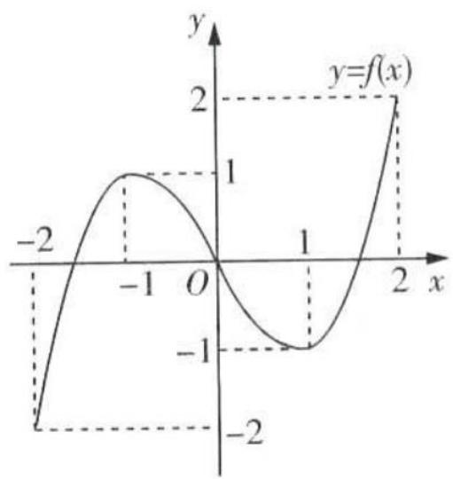

line

| x    | y     |
| ---- | ----- |
| -2   | -2    |
| -1   | 1     |
| 0    | 0     |
| 1    | -1    |
| 2    | 2     |

图1

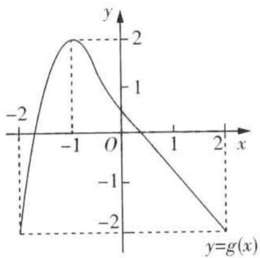

line

| x    | y     |
| ---- | ----- |
| -1   | 2     |
| 0    | 0     |
| 2    | -2    |

图2

则下列结论正确的是 （）

A. 方程 $f(g(x))=0$ 有且仅有 6 个根

B. 方程 $g(f(x)) = 0$ 有且仅有3个根  
C. 方程 $f(f(x)) = 0$ 有且仅有5个根  
D. 方程 $g(g(x)) = 0$ 有且仅有4个根

4. 2022 南充市建应性测试，★★★]已知函数 $f(x)=\left\{\begin{aligned}x^{2}-1,x&\geqslant0,\\ -2x,x&<0,\end{aligned}\right.$ 则关于 x 的方程 $f(f(x))+k=0$ ，给出下列结论：

①存在实数 k，使得方程恰有 1 个实根；
②存在实数 k，使得方程恰有 2 个不相等的实根；
③存在实数 k，使得方程恰有 3 个不相等的实根；
④存在实数 k，使得方程恰有 4 个不相等的实根.

其中正确结论的序号为 \_\_\_\_.

# 预测练

5. 解题创新.2022 长春二十中质检, ★★★]已知函数 $f(x)=\left\{\begin{aligned}-x^{2}+6x-7(x\geqslant3),\\|\log_{2}(x+1)|(-1<x<3)\end{aligned}\right.$ 若关于 x 的方程 $[f(x)]^{2}+mf(x)+m+2=0$ 有 6 个不同的实数根, 则 m 的取值范围为 ( )

A. $(-\infty, 2 - 2\sqrt{3})$

B. $(-2,2-2\sqrt{3})$

C. $(-2,+\infty)$

D. $\left[-2,2-2\sqrt{3}\right)$

# 题型 8 用构造法求解 $f(x)$ 与 $f'(x)$ 共存的不等式问题

答案：132页

# 题型攻略

类型 1 只含 $f'(x)$ 型

1. 对于不等式 $f'(x) \pm g'(x) > 0$ （或 < 0），构造函数 $F(x) = f(x) \pm g(x)$ .  
2. 对于不等式 $f'(x) > k$ （或 $< k$ ）（ $k \neq 0$ ），构造函数 $F(x) = f(x) - kx$ 或 $F(x) = f(x) - kx + b$ .

类型 2 $f(x) \pm f'(x)$ 型

1. 若已知 $f'(x) + f(x)$ 的符号，则构造函数 $g(x) = \mathrm{e}^{x} f(x)$ ；一般地，若已知 $f'(x) + n f(x)$ 的符号，则构造函数 $g(x) = \mathrm{e}^{nx} \cdot f(x)$ .  
2. 若已知 $f'(x) - f(x)$ 的符号，则构造函数 $g(x) = \frac{f(x)}{\mathrm{e}^x}$ ; 一般地，若已知 $f'(x) - nf(x)$ 的符号，则构造函数 $g(x) = \frac{f(x)}{\mathrm{e}^{nx}}$ .

类型3 $xf^{\prime}(x)\pm f(x)$ 型

1. 若已知 $xf'(x) + f(x)$ 的符号，则构造函数 $g(x) = xf(x)$ ；一般地，若已知 $xf'(x) + nf(x)$ 的符号，则构造函数 $g(x) = x^{n}f(x)$ .  
2. 若已知 $xf'(x) - f(x)$ 的符号，则构造函数 $g(x) = \frac{f(x)}{x}$ ; 一般地，若已知 $xf'(x) - nf(x)$ 的符号，则构造函数 $g(x) = \frac{f(x)}{x^n}$ .

类型4 $f^{\prime}(x)g(x)\pm f(x)g^{\prime}(x)$ 型

1. 对于不等式 $f'(x)g(x)+f(x)g'(x)>0$ （或<0），构造函数 $F(x)=f(x)g(x)$ .  
2. 对于不等式 $f'(x)g(x)-f(x)g'(x)>0$ (或 <0)，构造函数 $F(x)=\frac{f(x)}{g(x)}(g(x)\neq0)$ .

# 综合 突破练

1. [2022 湖南湘潭一模, ★★★] 已知定义域为 R 的函数 $f(x)$ 的导函数为 $f'(x)$ , 且 $f'(x) > f(x)$ , 若实数 a > 0, 则下列不等式恒成立的是 ( )

A. $af(\ln a) \geqslant e^{a-1}f(a-1)$   
B. $af(\ln a) \leqslant e^{a-1}f(a-1)$   
C. $\mathrm{e}^{a-1}f(\ln a) \geqslant af(a-1)$   
D. $e^{a-1}f(\ln a) \leqslant af(a-1)$

2.[2015全国卷Ⅱ,★★★]设函数 $f'(x)$ 是奇函数 $f(x)(x\in\mathbb{R})$ 的导函数, $f(-1)=0$ ,当x>0时, $xf'(x)-f(x)<0$ ,则使得 $f(x)>0$ 成立的x的取值范围是()

A. $(-∞,-1)∪(0,1)$   
B. $(-1,0)\cup(1,+\infty)$   
C. $(-∞,-1)∪(-1,0)$   
D. $(0,1)\cup(1,+\infty)$

3.[2022佛山市质检,★★★★]设函数 $f(x)$ 的导函数是 $f'(x)$ ，且 $f(x)f'(x)>x$ 恒成立，则()

A. $f(1)<f(-1)$

B. $f(1)>f(-1)$

C. $|f(1)| < |f(-1)|$

D. $|f(1)| > |f(-1)|$

4. [2022 福建省莆田第二中学模拟, ★★★★] 已知定义在 $\mathbf{R}$ 上的函数 $f(x)$ 满足 $2f(x) + f'(x) > 0$ , 且有 $f(\frac{1}{2}) = \frac{1}{\mathrm{e}}$ , 则 $f(x) > \frac{1}{\mathrm{e}^{2x}}$ 的解

集为 （）

A. $(0,\frac{1}{2})$

B. $\left(\frac{1}{2},+\infty\right)$

C. $(0,2)$

D. $(0,+\infty)$

# 创新 预测练

5.[巧妙构造函数比较大小,2022河南省顶级名校联考,★★★★]已知定义在R上的函数 $f(x)$ ,其导函数为 $f'(x)$ ,当x>0时, $f'(x)-\frac{f(x)}{x}>0$ ,若 $a=2f(1)$ , $b=f(2)$ , $c=4f(\frac{1}{2})$ ,则a,b,c的大小关系是()

A. $c < b < a$

B. $c < a < b$

C. b < a < c

D. a < b < c

6. [导数与三角函数综合,2022江西模拟,★★★]已知奇函数 $f(x)$ 的定义域为 $(- \frac{\pi}{2}, 0) \cup (0, \frac{\pi}{2})$ , 其导函数是 $f'(x)$ . 当 $x \in (0, \frac{\pi}{2})$ 时, $f'(x) \sin x - f(x) \cos x < 0$ , 则关于 $x$ 的不等式 $f(x) < 2f(\frac{\pi}{6}) \sin x$ 的解集为 ( )

A. $\left(-\frac{\pi}{2},-\frac{\pi}{6}\right)\cup\left(0,\frac{\pi}{6}\right)$

B. $\left(-\frac{\pi}{2},\frac{\pi}{6}\right)\cup\left(\frac{\pi}{6},\frac{\pi}{2}\right)$

C. $(- \frac{\pi}{6}, 0) \cup (0, \frac{\pi}{6})$

D. $(- \frac{\pi}{6}, 0) \cup (\frac{\pi}{6}, \frac{\pi}{2})$

# 题型 9 同构法在处理指对混合问题中的应用

# 题型攻略

对原不等式(等式)同解变形,如移项、通分、取对数,把式子转化为左右两边是相同结构的式子的形式,根据“相同结构”构造辅助函数求解.

# 综合 突破练

1.[2022 安徽名校联考, ★★★]已知 a > 1, b > 1, 且 $\frac{e^{a}}{a} = \frac{e^{b+1} + 1}{b + 1}$ , 则下列结论一定正确的是 ()

A. $\ln (a + b) > 2$

B. $\ln (a - b) > 0$

C. $2^{a + 1} < 2^{b}$

D. $2^{a} + 2^{b} <   2^{3}$

2.[2022 洛阳市统考, ★★★★]已知函数 $f(x)=x^{a}-a\ln x(a>0)$ , $g(x)=\mathrm{e}^{x}-x$ , 若 $x\in(1,\mathrm{e}^{2})$ 时, $f(x)\leqslant g(x)$ 恒成立, 则实数 a 的最大值是 ( )

A.1

B. e

C. $\frac{e^{2}}{2}$

D. $e^{2}$

# 创新 预测练

3.[转化为同型结构求解问题,2022郑州二测,★★★★]已知函数 $f(x)=\ln(x+1)-x+1$ .

(1) 求函数 $f(x)$ 的单调区间；

(2) 设函数 $g(x) = ae^{x} - x + \ln a$ ，若函数 $F(x) = f(x) - g(x)$ 有两个零点，求实数 a 的取值范围.

# 题型 10 利用导数求解极值和最值问题

▶ 答案：133 页

# 题型攻略

一般通过讨论函数的单调性和极值点处导数为 0 求解问题.

# 综合 突破练

1.[2022 昆明市摸底, ★★★★]若函数 $f(x)=x^{2}-4x+a\ln x$ 有两个极值点, 设这两个极值点为 $x_{1}, x_{2}$ , 且 $x_{1}<x_{2}$ , 则 ( )

A. $x_{1}\in (1,2)$

B. $x_{1} + x_{2} < 2$

C. $f(x_{1}) < -3$

D. $f(x_{1}) > -3$

2.[2022南昌市一模，★★★★]已知函数 $f(x)=x^{3}+ax^{2}+bx+c(a,b,c\in\mathbb{R})$ ，若不等式 $f(x)>0$ 的解集为 $\{x|x>m,且x\neq n\}$ ，且n=m=1，则函数 $f(x)$ 的极大值为()

A. $\frac{1}{4}$

B. $\frac{4}{27}$

C. 0

D. $\frac{4}{9}$

3.[2022全国卷乙,★★★★]已知 $x=x_{1}$ 和x=

$x_{2}$ 分别是函数 $f(x)=2a^{x}-\mathrm{e}x^{2}(a>0$ 且 $a\neq1)$ 的极小值点和极大值点. 若 $x_{1}<x_{2}$ ，则 a 的取值范围是 \_\_\_\_.

4.[2022 新高考卷 I, ★★★★★]已知函数 $f(x)=\mathrm{e}^{x}-ax$ 和 $g(x)=ax-\ln x$ 有相同的最小值.

(1) 求 $a$ ;

(2) 证明: 存在直线 y = b, 其与两条曲线 $y = f(x)$ 和 $y = g(x)$ 共有三个不同的交点, 并且从左到右的三个交点的横坐标成等差数列.

5. [2022 洛阳市统考, ★★★★★] 已知函数

$$
f (x) = \frac {x}{\mathrm{e} ^ {x}} + a (\ln x - x) (a \in \mathbf {R}).
$$

(1) 当 a=1 时, 求曲线 $y=f(x)$ 在点 $(1,f(1))$ 处的切线方程;

(2) 讨论函数 $f(x)$ 的极值点的个数.

# 创新 预测练

6.[数学探索,2022贵阳市五校联考,★★★★

★]已知函数 $f(x)=\frac{1}{2}ax^{2}-x\ln x+b(a,b\in \mathbf{R}),g(x)=f'(x)$ .

(1) 若函数 $y = g(x)$ 在 $x = \frac{1}{2}$ 处有极值, 求 a 的值及极值, 并说明该极值是极大值还是极小值.

(2) 若 $x \in (0, e]$ (e≈2.718)，判断是否存在实数 a，使函数 $g(x)$ 的最小值为 2。若存在，求出 a 的值；若不存在，请说明理由。

# 题型11 单变量不等式的证明

▶ 答案：135 页

# 题型攻略

1. 直接证明: 利用函数的单调性和最值直接证明.  
2. 作差构造: 证明不等式 $f(x) > g(x)$ 转化为证明 $f(x) - g(x) > 0$ , 进而构造辅助函数 $h(x) = f(x) - g(x)$ , 通过研究函数 $h(x)$ 的单调性, 证明 $h(x)_{\min} > 0$ .  
3. 适当放缩构造: 一是根据已知条件适当放缩, 二是利用常见的放缩结论, 如 $\ln x \leqslant x - 1$ , $e^x \geqslant x + 1$ , $\ln x < x < e^x (x > 0)$ 放缩, 然后构造辅助函数求解.  
4. 构造双函数: 将待证不等式进行变形, 构造两个函数, 转化为两个函数的最值问题 (或找到可以传递的中间量 a), 即将不等式转化为 $f(x) \geqslant g(x)$ 的形式, 证明 $f(x)_{\min} \geqslant g(x)_{\max}$ (或 $f(x) \geqslant a \geqslant g(x)$ ) 即可.

# 综合 突破练

1. [2021 全国卷乙, ★★★★] 设函数 $f(x) = \ln(a - x)$ ，已知 x = 0 是函数 $y = xf(x)$ 的极值点.

(1) 求 $a$ ;   
(2) 设函数 $g(x)=\frac{x+f(x)}{xf(x)}$ ，证明： $g(x)<1$ .

2.[2022广西适应性测试节选,★★★★]已知函数 $f(x)=\ln x-ax+\frac{a}{x}(a>0)$ .当 $a=\frac{1}{2}$ 时,判断 $f(x)$ 的单调性,并证明: $(1+\frac{1}{2^{2}})\times(1+\frac{1}{3^{2}})\times(1+\frac{1}{4^{2}})\times\cdots\times(1+\frac{1}{n^{2}})<\mathrm{e}^{\frac{3}{4}}(n\in\mathbb{N}^{*},n\geqslant2)$ .

3. [2020 全国卷 II, ★★★★★] 已知函数 $f(x)=\sin^{2}x\sin2x.$

(1) 讨论 $f(x)$ 在区间 $(0, \pi)$ 上的单调性.

(2) 证明: $|f(x)| \leqslant \frac{3\sqrt{3}}{8}$ .

(3) 设 $n \in N^{*}$ ，证明： $\sin^{2}x\sin^{2}2x\sin^{2}4x \cdot \cdots \cdot \sin^{2}2^{n}x \leqslant \frac{3^{n}}{4^{n}}.$

# 创新 预测练

4.[一题多解,2022郑州市一模,★★★★★]设函数 $f(x)=\ln(a-x)-x+e$ .

(1) 求函数 $f(x)$ 的单调区间；

(2) 当 $a = \mathrm{e}$ 时, 证明: $f(\mathrm{e} - x) < \mathrm{e}^{x} + \frac{x}{2\mathrm{e}}$ .

# 题型12 双变量不等式的证明

▶ 答案：136 页

# 题型攻略

由已知条件入手,寻找“双变量”满足的关系式,或构造新变量,把含“双变量”的不等式转化为含“单变量”的不等式,此时要注意“单变量”的取值范围.

# 综合 突破练

1.[2018全国卷I，★★★★★]已知函数 $f(x)=\frac{1}{x}-x+a\ln x.$

(1) 讨论 $f(x)$ 的单调性；

(2) 若 $f(x)$ 存在两个极值点 $x_{1}, x_{2}$ ，证明：

$$
\frac {f \left(x _ {1}\right) - f \left(x _ {2}\right)}{x _ {1} - x _ {2}} <   a - 2.
$$

(2) 若 b = -2，且 $f(x)$ 有两个极值点 $x_{1}, x_{2}$ ，证明： $f(x_{1}) + f(x_{2}) > -3$ .

# 创新 预测练

3.[解题创新,2022湖南名校联考,★★★★★]已知函数 $f(x)=x\ln x-ax^{2},a\in\mathbf{R}$ .

(1) 若 $f(x)$ 存在单调递增区间, 求 a 的取值范围;

(2) 若 $x_{1}, x_{2}$ 为 $f(x)$ 的两个不同的极值点, 证明: $3\ln x_{1} + \ln x_{2} > -1$ .

2.[2022长春市第二次质量监测,★★★★★]已知 $f(x)=\frac{1}{2}x^{2}+bx+2a\ln x.$

(1) 当 a > 0, b = -a - 2 时, 讨论函数 $f(x)$ 的单调性;

# 题型 13 导数中不等式的恒成立问题

▶ 答案：137 页

# 题型攻略

1. $f(x) > a$ 恒成立 $\Leftrightarrow f(x)_{\min} > a; f(x) < a$ 恒成立 $\Leftrightarrow f(x)_{\max} < a.$   
2. $f(x) > g(x)$ 恒成立 $\Leftrightarrow [f(x) - g(x)]_{\min} > 0; f(x) < g(x)$ 恒成立 $\Leftrightarrow [f(x) - g(x)]_{\max} < 0.$

# 综合 突破练

1. [2022 佛山市诊断, ★★★★] 已知函数 $f(x) = x \mathrm{e}^{x} - \ln x, g(x) = ax + 1 (x > 0)$ , 若函数 $f(x)$ 的图象不在 $g(x)$ 图象的下方, 则 $a$ 的最大值为 \_\_\_\_.  
2. [2022 成都市一诊, ★★★★] 已知函数 $f(x)=\sin x-2ax,a\in\mathbb{R}.$

(1) 当 $a \geqslant \frac{1}{2}$ 时, 求函数 $f(x)$ 在区间 $[0, \pi]$ 上的最值;  
(2) 若关于 $x$ 的不等式 $f(x) \leqslant \cos x - 1$ 在区间 $(\frac{\pi}{2}, \pi)$ 上恒成立, 求 $a$ 的取值范围.

3. [2022 甘肃省一诊, ★★★★★] 已知函数

$$
\begin{array}{l} f (x) = x + \frac {2 a}{x} - (a - 2) \ln x (a \in \mathbf {R}), g (x) = \\ (b - 1) x - \frac {2}{x} - x \mathrm{e} ^ {x}. \\ \end{array}
$$

(1) 判断函数 $f(x)$ 的单调性；  
(2) 当 $a = 1$ 时, 关于 $x$ 的不等式 $f(x) + g(x) \leqslant -1$ 恒成立, 求实数 $b$ 的取值范围.

# 创新 预测练

4.[条件创新,2022合肥市一检,★★★★★]已知函数 $f(x)=x-a\ln x(a\in\mathbb{R})$ 的导函数为 $f'(x)$ .

(1) 若 a = -1，求曲线 $y = f(x)$ 在点 $(1, f(1))$ 处的切线方程；  
(2) 若不等式 $af'(x) + xf(x) \leqslant x^{2}$ 恒成立, 求实数 a 的取值范围.

# 题型 14 导数中不等式的存在性问题

# 题型攻略

1. $f(x) > a$ 有解 $\Leftrightarrow f(x)_{\max} > a; f(x) < a$ 有解 $\Leftrightarrow f(x)_{\min} < a$ .  
2. $f(x) > g(x)$ 有解 $\Leftrightarrow [f(x) - g(x)]_{\max} > 0; f(x) < g(x)$ 有解 $\Leftrightarrow [f(x) - g(x)]_{\min} < 0.$

# 综合 突破练

1. [2022 绵阳市二诊, ★★★★] 已知函数 $f(x) = \ln x - a(x^{2} - x)$ ，若不等式 $f(x) > 0$ 有且仅有 2 个整数解，则实数 a 的取值范围是 ( )

A. $\left[\frac{\ln2}{6},\frac{\ln3}{6}\right)$

B. $\left(\frac{\ln2}{6},\frac{\ln3}{6}\right]$

C. $(-∞, \frac{ln2}{6}]$

D. $\left(\frac{\ln2}{3},\frac{\ln3}{3}\right)$

2. [2022 石家庄市一检, ★★★★] 若 $\exists x \in [0, 2]$ , 使不等式 $(e-1) \ln a \geqslant ae^{1-x} + e(x-1)-x$ 成立, 其中 $e$ 为自然对数的底数, 则实数 $a$ 的取值范围是 \_\_\_\_.

# 创新 预测练

3.[解题创新,2022昆明市摸底诊断,★★★★★]设函数 $f(x)=x^{2}-ax\ln x,a\in\mathbf{R}$ .

(1) 若 a=1，求曲线 $y=f(x)$ 在点 $(1,f(1))$ 处的切线方程；  
(2) 若存在 $x_{0} \in [1, e]$ ，使得 $f(x_{0}) < -\mathrm{e}(a + \mathrm{e})$ 成立，求 a 的取值范围.

# 题型 15 导数中双变量 “存在性或任意性” 问题

▶ 答案：138 页

# 题型攻略

1. $\forall x_{1}\in M,\forall x_{2}\in N,f(x_{1}) > g(x_{2})\Leftrightarrow f(x_{1})_{\min} > g(x_{2})_{\max}.$   
2. $\exists x_{1}\in M,\exists x_{2}\in N,f(x_{1}) > g(x_{2})\Leftrightarrow f(x_{1})_{\max} > g(x_{2})_{\min}.$   
3. $\forall x_{1}\in M,\exists x_{2}\in N,f(x_{1}) > g(x_{2})\Leftrightarrow f(x_{1})_{\min} > g(x_{2})_{\min}.$   
4. $\exists x_{1}\in M,\forall x_{2}\in N,f(x_{1}) > g(x_{2})\Leftrightarrow f(x_{1})_{\max} > g(x_{2})_{\max}.$   
5. $\forall x_{1}\in M,\exists x_{2}\in N,f(x_{1}) = g(x_{2})\Leftrightarrow f(x_{1})$ 的值域为 $g(x_{2})$ 值域的子集  
6. $\exists x_{1}\in M,\exists x_{2}\in N,f(x_{1}) = g(x_{2})\Leftrightarrow f(x_{1})$ 的值域与 $g(x_{2})$ 的值域的交集不为空集

# 综合 突破练

1. [2022 太原市模拟, ★★★★] 已知函数 $f(x) = \ln x - x$ , $g(x) = e^{x} - x$ , 若存在实数 $m, n$ , 使得 $f(m) - g(n) \geqslant -2$ 成立, 则实数 $m - n =$ \_\_\_\_.

2.[2022长春市第二次质量监测，★★★★★]已知函数 $f(x)=a\ln x-x(a\in\mathbf{R})$ .

(1) 求函数 $f(x)$ 的单调区间；

(2) 当 a > 0 时, 设 $g(x) = x - \ln x - 1$ , 若对于任意的 $x_{1}, x_{2} \in (0, +\infty)$ , 均有 $f(x_{1}) < g(x_{2})$ , 求 a 的取值范围.

# 创新 预测练

3.[数学探索,★★★★★]已知函数 $f(x)=ax-e^{x}+2$ ,其中 $a\neq0$ .

(1) 讨论 $f(x)$ 的单调性.  
(2) 是否存在 $a \in \mathbb{R}$ , 对任意的 $x_{1} \in [0,1]$ , 总存在 $x_{2} \in [0,1]$ , 使得 $f(x_{1}) + f(x_{2}) = 4$ 成立?

若存在,求出实数 a 的值;若不存在,请说明理由.

# 题型 16 讨论函数的零点（方程根）的个数

▶ 答案：139 页

# 题型攻略

1. 通过导数研究函数的单调性、极值、最值，结合零点存在定理求解.  
2. 化原函数为两个函数, 通过判断两个函数图象的交点个数求解.

# 综合 突破练

1. [2019 全国卷 I, ★★★★★] 已知函数 $f(x) = \sin x - \ln(1 + x)$ , $f'(x)$ 为 $f(x)$ 的导数，证明：

(1) $f'(x)$ 在区间 $(-1, \frac{\pi}{2})$ 上存在唯一极大值点；  
(2) $f(x)$ 有且仅有2个零点.

2.[2022甘肃九校联考,★★★★★]已知函数 $f(x)=x-a\mathrm{e}^{x},a\in\mathbf{R}.$

(1) 当 $a = \frac{1}{e}$ 时, 证明: $f(x) + \ln x - x + 1 \leqslant 0$ 在 $(0, +\infty)$ 上恒成立;  
(2) 讨论函数 $f(x)$ 的零点个数.

# 创新 预测练

3.[条件创新,2022湖北省七市(州)联考,★★

$\star \star \star ]$ 已知函数 $f(x) = \ln x + \frac{2}{x} - 2, g(x) = x\ln x - ax^2 - x + 1.$

(1) 证明: 函数 $f(x)$ 在 $(1, +\infty)$ 内有且仅有一个零点.  
(2) 假设存在常数 $\lambda > 1$ ，且满足 $f(\lambda) = 0$ ，试讨论函数 $g(x)$ 的零点个数.

# 题型 17 已知函数零点个数求参数的取值范围

▶ 答案：140 页

# 题型攻略

1. 数形结合法: 先根据函数的性质画出图象, 再根据函数零点个数的要求数形结合求解.  
2. 分离参数法: 由 $f(x)=0$ 分离出参数 a, 得 $a=\varphi(x)$ , 利用导数求函数 $y=\varphi(x)$ 的单调性、极值和最值, 根据直线 y=a 与 $y=\varphi(x)$ 的图象的交点个数得参数的取值范围.  
3. 分类讨论法: 先确定参数分类的标准, 在每个小范围内研究零点的个数是否符合题意, 将满足题意的参数的各小范围并在一起, 即为所求参数范围.

说明:对于函数图象交点个数问题,可以构造函数,转化为函数零点个数问题求解.

# 综合 突破练

1.[2022郑州市一模,★★★★]已知a>0,函数 $f(x)=2\ln(ax)-x$ ,若函数 $F(x)=f[f(x)]-x$ 恰有两个零点,则实数a的取值范围是()

A. $\left(\frac{1}{\mathrm{e}},+\infty\right)$

B. $\left[\frac{1}{e},+\infty\right)$

C. $(e, +\infty)$

D. $\left[e,+\infty\right)$

2.[2020全国卷Ⅰ,★★★★]已知函数 $f(x)=\mathrm{e}^{x}-a(x+2)$ .

(1) 当 a=1 时, 讨论 $f(x)$ 的单调性;

(2) 若 $f(x)$ 有两个零点, 求 a 的取值范围.

3.[2022全国卷乙，★★★★★]已知函数 $f(x)=\ln(1+x)+axe^{-x}$ .

(1) 当 a=1 时, 求曲线 $y=f(x)$ 在点 $(0,f(0))$ 处的切线方程;  
(2) 若 $f(x)$ 在区间 $(-1,0)$ , $(0,+\infty)$ 各恰有一个零点, 求 a 的取值范围.

# 创新 预测练

4.[导数与充分必要条件综合,2022云南省统考,★★★★★]已知函数 $f(x)=(2a+1)x^{2}-2x^{2}\ln x-4$ ,e是自然对数的底数, $\forall x>0,e^{x}>x+1$ .

(1) 求 $f(x)$ 的单调区间.  
(2) 记 $p: f(x)$ 有两个零点; $q: a > \ln 2$ . 求证: $p$ 是 $q$ 的充要条件.  
要求:先证充分性,再证必要性.

# 题型18 隐零点问题

▶ 答案：141 页

# 题型攻略

# 求解隐零点问题的解题策略

1. 利用零点存在定理判定 $f'(x)$ 的零点存在情况并确定零点的范围.  
2. 以零点为分界点, 得出 $f'(x)$ 的正负, 从而判断函数 $f(x)$ 的单调性, 进而得到 $f(x)$ 的极值表达式.  
3. 通过对零点方程适当变形, 整体代入极值表达式进行化简证明, 有时候零点范围还可以适当缩小.

# 综合 突破练

1. [2019 全国卷Ⅱ, ★★★★] 已知函数 $f(x) = (x - 1)\ln x - x - 1$ . 证明:

(1) $f(x)$ 存在唯一的极值点；  
(2) $f(x)=0$ 有且仅有两个实根,且两个实根互为倒数.

2.[2019全国卷Ⅰ，★★★★★]已知函数 $f(x)=2\sin x-x\cos x-x,f'(x)$ 为 $f(x)$ 的导数.

(1) 证明: $f'(x)$ 在区间 $(0, \pi)$ 内存在唯一零点.  
(2) 若 $x \in [0, \pi]$ 时, $f(x) \geqslant ax$ , 求 $a$ 的取值范围.

3.[2022豫北名校联考,★★★★★]已知函数 $f(x)=a(1-x)\mathrm{e}^{x}$ ，其中 $a\in R$ 且 $a\neq0$ .

(1) 讨论 $f(x)$ 的单调性；  
(2) 若 $a = 1, F(x) = x^2 - \frac{1}{3} x^3 + f(x), x_0$ 是 $F(x)$ 的极大值点，求证： $F(x_0) \in (\frac{2}{3}, 2)$ .

# 创新 预测练

4.[解题创新,2022西安五校联考,★★★★]已知函数 $f(x)=x(\ln x-a)$ .

(1) 求函数 $f(x)$ 的极值；  
(2) 当 a = -1 时, 记函数 $h(x) = \frac{f(x)}{x - 1}$ 在 $(1, +\infty)$ 上的最小值为 $h(x)_{\min}$ , 求证: $h(x)_{\min} \in (3, 4)$ .

# 题型 19 极值点偏移问题

# 题型攻略

# 求解极值点偏移问题的步骤

1. 求导, 获得 $f(x)$ 的单调性, 极值情况, 作出 $f(x)$ 的图象, 由 $f(x_{1}) = f(x_{2})$ 得 $x_{1}, x_{2}$ 的取值范围 (数形结合).  
2. 构造辅助函数, 对结论 $x_{1} + x_{2} > (<)2x_{0}$ , 构造函数 $F(x) = f(x) - f(2x_{0} - x)$ 或 $F(x) = f(x_{0} + x) - f(x_{0} - x)$ , 求导, 讨论 $F(x)$ 单调性, 进而得不等式.  
3. 代入 $x_{1}$ (或 $x_{2}$ ), 利用 $f(x_{1}) = f(x_{2})$ 及 $f(x)$ 的单调性证明最终结论.

注意:极值点偏移问题的结论不一定总是 $x_{1}+x_{2}>(<)2x_{0}$ ，也可能是 $x_{1}x_{2}>(<)x_{0}^{2}$

# 综合 突破练

1. [2022 全国卷甲, ★★★★★] 已知函数 $f(x)=\frac{e^{x}}{x}-\ln x+x-a.$

(1) 若 $f(x) \geqslant 0$ ，求 a 的取值范围；  
(2) 证明: 若 $f(x)$ 有两个零点 $x_{1}, x_{2}$ ，则 $x_{1}x_{2} < 1$ .

2.[2016全国卷I，★★★★★]已知函数 $f(x)=(x-2)\mathrm{e}^{x}+a(x-1)^{2}$ 有两个零点.

(1) 求 a 的取值范围；  
(2) 设 $x_{1}, x_{2}$ 是 $f(x)$ 的两个零点, 证明: $x_{1} + x_{2} < 2$ .

3.[2021 新高考卷 I, ★★★★★]已知函数 $f(x)=x(1-\ln x)$ .

(1) 讨论 $f(x)$ 的单调性；  
(2) 设 a, b 为两个不相等的正数, 且 $b \ln a - a \ln b = a - b$ , 证明: $2 < \frac{1}{a} + \frac{1}{b} < e$ .

# 创新 预测练

4.[条件创新,2022泉州市质量检测,★★★★★]已知函数 $f(x)=\frac{\ln x+1}{ax}$ .

(1) 讨论 $f(x)$ 的单调性；  
(2) 若 $(\mathrm{e}x_{1})^{x_{2}} = (\mathrm{e}x_{2})^{x_{1}}$ (e 是自然对数的底数)，且 $x_{1} > 0, x_{2} > 0, x_{1} \neq x_{2}$ ，证明： $x_{1}^{2} + x_{2}^{2} > 2$ .

# 专题二

# 三角函数、解三角形、平面向量

# 题型20 三角恒等变换

答案：144页

# 题型攻略

1. 角的变换: 明确各个角之间的关系(包括非特殊角与特殊角、已知角与未知角), 熟悉角的拆分与组合的技巧, 半角与倍角的相互转化.  
2. 名的变换: 明确各个三角函数名称之间的关系, 常常用到同角三角函数的基本关系、诱导公式进行“切化弦”或“弦化切”.

# 综合 突破练

1.「2022 广东六校慎考，★★★★」已知角 $\alpha$ 为第一象限角， $\sin \alpha = \frac{\sqrt{2}}{3}$ ，角 $\beta$ 的终边与角 $\alpha$ 的终边关于 x 轴对称，则 $\cos(\beta - 2\alpha) = (\quad)$

A. $\frac{\sqrt{7}}{3}$

B. $-\frac{\sqrt{7}}{3}$

C. $\frac{\sqrt{7}}{27}$

D. $\frac{5}{9}$

2. [2022烟台市诊断、★★★] 若 $\sin \alpha = \cos (\alpha + \frac{\pi}{6})$ ，则 $\tan 2\alpha$ 的值为 \_\_\_\_.  
3.[2022湖北省七市(州)联考.★★★]若 $\sin \left(\frac{\pi}{4} -\theta\right) = \frac{1}{3}$ ，则 $\frac{\cos 2\theta}{\sin\theta + \cos\theta} =$

# 创新 预测练

4. [条件创新, ★★★] 已知平面直角坐标系中, 点 $A(1,3), B(a,b)$ , 其中点 $B$ 在第一象限. 若 $\angle AOB = \alpha$ , 且 $\cos 2\alpha = \sqrt{2} \sin \left( \alpha - \frac{\pi}{4} \right)$ , 则 $\frac{b}{a}$ 的值为 ( )

A. 2

B. 1

C. $\frac{1}{2}$

D. $\frac{1}{3}$

5.[开放性试题,2022福州市质检,★★★]写出一个使等式 $\frac{\sin\alpha}{\sin(\alpha+\frac{\pi}{6})}+\frac{\cos\alpha}{\cos(\alpha+\frac{\pi}{6})}=2$ 成立的 $\alpha$ 的值\_\_\_\_.

# 热点 应用练

6. [2022 重庆质检, ★★★] 过洋牵星术是中国古代航海所用的天文观察导航技术, 是指用牵星板测量所在地的星辰高度, 然后计算出该处的地理纬度, 以此测定船只的具体航向. 牵星板由 12 块正方形木板组成, 木板的边长从小到大成等差数列, 最小的一块边长约为 2 厘米 (称一指), 最大的一块边长约为 24 厘米 (称十二指). 观测时, 将木板立起, 一手拿着木板, 手臂伸直, 眼睛到木板的距离大约为 72 厘米, 使牵星板与海平面垂直, 让板的下边缘与海平面重合, 依高低不同替换、调整木板, 当看被测星辰的视线恰好经过木板上边缘时所用的是几指板, 观测的星辰距海平面的高度的指数就是几指, 再推算出船在海中的地理纬度. 如图所示, 若在一次观测中, 所用的牵星板为六指板, 则 $\cos 2\alpha =$ ()

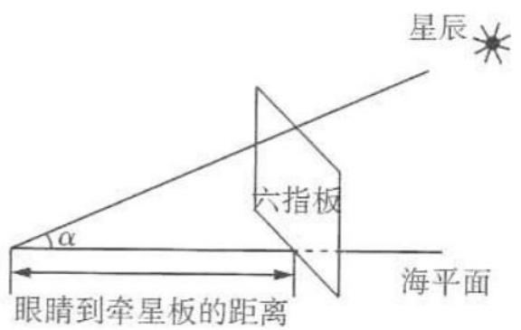

text_image

星辰
六指板
α
眼睛到牵星板的距离
海平面

A. $\frac{35}{37}$

B. $\frac{12}{37}$

C. $\frac{1}{6}$

D. $\frac{12}{35}$

# 题型 21 三角函数的图象与性质的综合应用

# 题型攻略

破解有关三角函数图象与性质的综合应用问题的关键:一是转化思想的应用,如将函数转化为“一角一函数”的形式;二是见数思形,熟悉正、余弦及正切函数的图象,并能适时应用;三是整体思想的应用,会用整体换元的思想研究函数的性质.

# 综合 突破练

1.[多选,2022 新高考卷Ⅱ, ★★★]已知函数 $f(x)=\sin(2x+\varphi)(0<\varphi<\pi)$ 的图象关于点 $\left(\frac{2\pi}{3},0\right)$ 中心对称,则 ()

A. $f(x)$ 在区间 $(0, \frac{5\pi}{12})$ 单调递减  
B. $f(x)$ 在区间 $(- \frac{\pi}{12}, \frac{11\pi}{12})$ 有两个极值点  
C. 直线 $x=\frac{7\pi}{6}$ 是曲线 $y=f(x)$ 的对称轴  
D. 直线 $y=\frac{\sqrt{3}}{2}-x$ 是曲线 $y=f(x)$ 的切线

2.[多选,2022广东湛江模考,★★★★]已知点 $\left(\frac{\pi}{6},0\right)$ 是函数 $f(x)=\sin(\omega x+\varphi)(\omega>0,\mid\varphi\mid<\pi)$ 的图象的一个对称中心,且 $f(x)$ 的图象关于直线 $x=\frac{\pi}{3}$ 对称, $f(x)$ 在 $[0,\frac{\pi}{3}]$ 上单调递减,则()

A. 函数 $f(x)$ 的最小正周期为 $\frac{2\pi}{3}$   
B. 函数 $f(x)$ 为奇函数  
C. 若 $f(x)=\frac{1}{3}(x\in[0,2\pi])$ 的根为 $x_{i}(i=1,2,\cdots,n)$ ，则 $\sum_{i=1}^{n}x_{i}=6\pi$   
D. 若 $f(2x) > f(x)$ 在 $(a, b)$ 上恒成立，则 b - a 的最大值为 $\frac{2\pi}{9}$

3. [2022 河南名校联考, ★★★] 已知函数 $f(x)=\sqrt{3}\sin(2x+\varphi)-\cos(2x+\varphi)(0<\varphi<\pi)$ .

(1) 若 $\varphi = \frac{\pi}{3}$ ，在给定的平面直角坐标系（如图所示）中画出函数 $f(x)$ 在区间 $[0, \pi]$ 上的图象；
(2) 若 $f(x)$ 为偶函数，求 $\varphi$ 的值；
(3) 在(2)的前提下，将函数 $f(x)$ 的图象向右平移 $\frac{\pi}{6}$ 个单位长度后，再将得到的图象上各点的横坐标变为原来的4倍，纵坐标不变，得到函数 $g(x)$ 的图象，求函数 $g(x)$ 在 $[0, \pi]$ 上的单调递减区间.

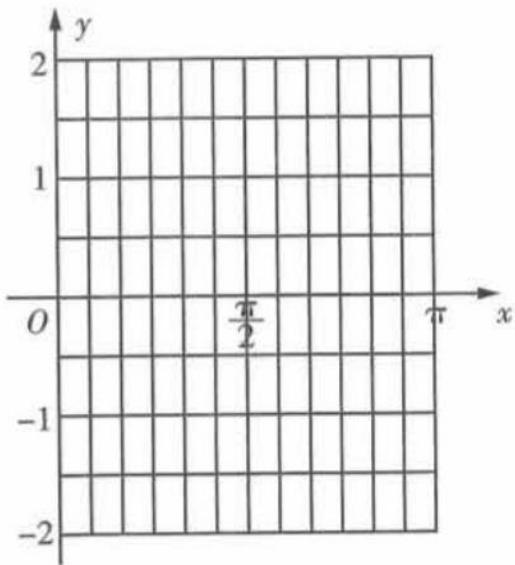

text_image

y
2
1
O
π/2
π
x
-1
-2

# 创新 预测练

4.[条件创新,多选,★★★]已知 $f(x)$ , $g(x)$ 分别是定义在R上的奇函数与偶函数,若 $f(x)=g(x)+\cos(x+\frac{\pi}{3})$ ,则()

A. 当 $x=\frac{\pi}{2}$ 时, $f(x)$ 取得最大值  
B. 函数 $g(x)$ 的图象关于直线 $x = \pi$ 对称  
C. $f(x)$ 在 $(0, \frac{\pi}{2})$ 上单调递减

D. 要得到函数 $f(x)$ 的图象, 只需将 $g(x)$ 的图象向右平移 $\frac{\pi}{2}$ 个单位长度

5.[与圆综合,多选,2022江苏八校联考,★★★]函数 $f(x)=A\sin(\omega x+\varphi)(A>0,\omega>0,0<\varphi<\pi)$ 的部分图象如图中实线所示,图中圆C与 $f(x)$ 的图象交于M,N两点,且M在y轴上,则下列说法中正确的是()

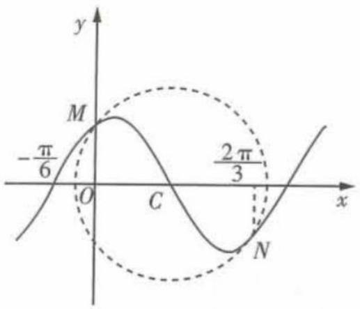

text_image

y
M
-π/6
O
C
2π/3
x
N

A. 函数 $f(x)$ 在 $\left(-\frac{7\pi}{12}, -\frac{\pi}{3}\right)$ 上单调递减  
B. 函数 $f(x)$ 的最小正周期是 $\pi$   
C. 函数 $f(x)$ 的图象向左平移 $\frac{\pi}{12}$ 个单位长度
后, 图象关于直线 $x = \frac{\pi}{2}$ 对称  
D. 若圆 C 的半径为 $\frac{5\pi}{12}$ ，则函数 $f(x)$ 的解析式
为 $f(x)=\frac{\sqrt{3}\pi}{6}\sin(2x+\frac{\pi}{3})$

# 题型 22 三角恒等变换与三角函数综合

▶ 答案：146 页

# 题型攻略

解决此类问题时,要注意利用三角恒等变换的思想方法,对函数解析式化简,化简到“一角一函数”的形式,再利用三角函数的图象与性质的有关知识求解.

# 综合 突破练

1.[2022 辽宁大连模拟, ★★★]已知 $f(x)=2\sqrt{3}\sin x\cos x-2\cos\left(x-\frac{\pi}{4}\right)\cos\left(x+\frac{\pi}{4}\right)$ .

(1) 求 $f(x)$ 的最小正周期和单调递增区间；  
(2) 当 $x \in [0, \pi]$ 时, 若 $f(x) \in (-1, 1]$ , 求 x 的取值范围.

2.[2022北京市朝阳区模拟,★★★]已知函数 $f(x)=\cos^{2}(2\omega x+\frac{\pi}{3})+\frac{\sqrt{3}}{2}\cos(4\omega x+\frac{\pi}{6})(\omega>$

0) 的最小正周期为 $\pi$ .

(1) 求 $\omega$ 的值.  
(2) 现对函数 $f(x)$ 的图象进行变换, 请你从以下甲、乙两种变换中选择其中的一种, 求出变

换后所得图象对应的函数 $g(x)$ 的解析式, 并求函数 $g(x)$ 的单调递增区间.

甲:先将 $f(x)$ 的图象向右平移 $\frac{\pi}{4}$ 个单位长度,再将所得图象上所有点的横坐标缩小为原来的 $\frac{1}{2}$ (纵坐标不变).

乙:先将 $f(x)$ 的图象上所有点的横坐标缩小为原来的 $\frac{1}{2}$ (纵坐标不变),再将所得图象向左平移 $\frac{3\pi}{8}$ 个单位长度.

注:如果选择多个条件分别解答,按第一个解答计分.

3. [2022 江西六校联考, ★★★★] 已知函数 $f(x) = m \sin 2x + n \cos 2x$ , 且 $y = f(x)$ 的图象过点 $(\frac{\pi}{12}, \sqrt{3})$ 和点 $(\frac{2\pi}{3}, -2)$ .

(1) 求 $m, n$ 的值;  
(2) 将 $y = f(x)$ 的图象向左平移 $\varphi (0 < \varphi < \pi)$ 个单位长度后得到函数 $y = g(x)$ 的图象, 若 $y = g(x)$ 图象上各最高点到点 $(0, 3)$ 的距离的最小值为 1, 求 $y = g(x)$ 的单调递增区间.

# 创新 预测练

4.[角度创新,2022 湖北武汉调研,★★★]函数 $f(x)=4\cos^{2}\frac{x}{2}\cos\left(\frac{\pi}{2}-x\right)-2\sin x-|\ln(x+1)|$ 的零点个数为 \_\_\_\_.

# 题型 23 正、余弦定理的综合应用

▶ 答案：146 页

# 题型攻略

1. 正、余弦定理的本质是任意三角形的边与角满足的方程, 它们能实现两类边角关系的转化:

(1) 角的正弦齐次方程与边的齐次方程可互相转化；  
(2) 角的余弦可转化为边的二次齐次分式.

2. 对于正、余弦定理与三角恒等变换的综合问题,大多是基于三角形内角和定理展开的,一般有两种类型:

(1) 利用相应半角的互余关系、角的互补关系研究三角恒等变换, 进而达到减元的目的;  
(2) 利用正、余弦定理求得相应的角或者寻找相应的边角关系, 进而运用三角恒等变换转化为只含一个角的三角函数问题.

# 综合 突破练

1. [2022 长春市一测, ★★★] 在 $\triangle ABC$ 中, 角 A, B, C 的对边分别为 a, b, c, 且满足 $a + \frac{1}{2}b = c \cdot \cos B$ .

(1) 求角 C;  
(2) 若 a=2, b=3, 求 $\triangle ABC$ 外接圆的半径.

2.[2022 辽宁省重点高中联考,★★★]在

① $\cos C=\frac{\sqrt{21}}{7}$ ，② $a\sin C=c\cos(\angle BAC-\frac{\pi}{6})$

这两个条件中任选一个,补充在下面问题中的横线处,并完成解答.

问题: $\triangle ABC$ 的内角 A, B, C 的对边分别为 a,
b,c,B= $\frac{\pi}{3}$ ,D 是边 BC 上一点,BD=5,AD=7,
且\_\_\_\_,试判断 CD 和 BD 的大小关系.

注:如果选择多个条件分别解答,按第一个解答计分.

# 创新 预测练

3.[与向量综合,2022 安徽省摸底,★★★]在 $\triangle ABC$ 中,角 $A,B,C$ 所对的边分别为 $a,b,c,$

$c\sin(B+\frac{\pi}{3})=\frac{\sqrt{3}}{2}a,\overrightarrow{CA}\cdot\overrightarrow{CB}=20,c=7$ ，则
△ABC 的内切圆的半径 r 为 （）

A. $\sqrt{2}$

B. 1

C. 2

D. $\sqrt{3}$

# 题型 24 平面图形中的计算问题

▶ 答案：147 页

# 题型攻略

正、余弦定理本身是研究平面图形的计算问题的工具,因此求解平面图形中的计算问题的关键是寻找相应的三角形,并在三角形中运用正、余弦定理,特别是涉及公共边时,要利用公共边来进行过渡,即利用公共边创造的互补或互余关系列式,其本质是构建关于角的关系的方程.

# 综合 突破练

1.[2021新高考卷Ⅰ,★★★]记△ABC的内角A,B,C的对边分别为a,b,c.已知 $b^{2}=ac$ ,点D在边AC上, $BD\sin\angle ABC=a\sin C$ .

(1) 证明: BD = b;   
(2) 若 AD = 2DC, 求 $\cos \angle ABC$ .

2. [2022 烟台市诊断, ★★★] 如图, 四边形 ABCD 中, $AB^{2} + BC^{2} + AB \cdot BC = AC^{2}$ .

(1) 若 AB = 3BC = 3，求 $\triangle ABC$ 的面积；  
(2) 若 $CD = \sqrt{3} BC, \angle CAD = 30^{\circ}, \angle BCD = 120^{\circ}$ ，求 $\angle ACB$ 的值.

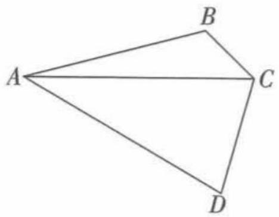

natural_image

Geometric diagram of a quadrilateral with vertices labeled A, B, C, D (no text or symbols beyond labels)

3. [2022 济南市十一校联考, ★★★] 如图, 在 $\triangle ABC$ 中, $D$ 为边 $AC$ 上一点, 且 $AC = 4AD$ , $\angle ABD = \angle ACB$ , $\angle CBD = \frac{\pi}{2}$ .

(1) 求证: $\tan\angle ACB=\frac{1}{2}$ ;   
(2) 若 $\triangle ABC$ 的面积为 15, 求 AB 的长.

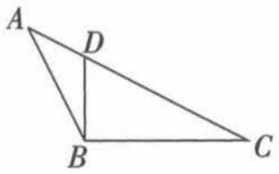

text_image

A
D
B
C

# 创新 预测练

4.[条件创新,2022陕西渭南检测,★★★]如图,在正方形ABCD中,E,F分别是BD,AB上的点,且满足AF=2FB=4, $\angle AFE=60^{\circ}$ .

(1) 求 BE 的长;  
(2) 求 $\triangle CEF$ 的面积.

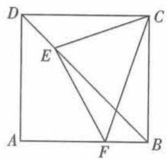

text_image

Geometric diagram of a square with labeled points A, B, C, D, E, F and internal lines forming triangles and diagonals.

# 题型 25 解三角形中的最值（取值范围）问题

# 题型攻略

涉及求最值或取值范围问题,一定要搞清已知变量的取值范围,可利用已知条件进行转化求解,解决此类问题一般是构建函数(注意定义域)或者借助基本不等式求解.

# 综合 突破练

1. [2022 全国卷甲, ★★★] 已知 $\triangle ABC$ 中, 点 $D$ 在边 $BC$ 上, $\angle ADB = 120^{\circ}, AD = 2, CD = 2BD$ . 当 $\frac{AC}{AB}$ 取得最小值时, $BD = \_$ .

2.[2022 新高考卷 I, ★★★]记△ABC 的内角 A, B, C 的对边分别为 a, b, c, 已知 $\frac{\cos A}{1 + \sin A} = \frac{\sin 2B}{1 + \cos 2B}$ .

(1) 若 $C=\frac{2\pi}{3}$ ，求 B;  
(2) 求 $\frac{a^{2}+b^{2}}{c^{2}}$ 的最小值.

3. [2022 石家庄市一检, ★★★] 在 $\triangle ABC$ 中, 角 A, B, C 的对边分别为 a, b, c, 已知 $\sqrt{3}a\cos C - a\sin C = \sqrt{3}b$ .

(1) 求角 A 的大小;  
(2) 若 a = 2, 求 BC 边上的中线 AD 长度的最小值.

4. [2019 全国卷Ⅲ, ★★★] △ABC 的内角 A, B, C 的对边分别为 a, b, c, 已知 $a \sin \frac{A + C}{2} = b \sin A$ .

(1) 求 B;   
(2) 若 $\triangle ABC$ 为锐角三角形, 且 c = 1, 求 $\triangle ABC$ 面积的取值范围.

# 创新 预测练

5.[与不等式综合,2022辽宁省重点高中一模,★★★]已知△ABC中,a,b,c是内角A,B,C所对的边, $a\sin\frac{A+C}{2}=b\sin A$ ,且a=1.

(1) 求角 B;  
(2) 若 AC = BC，在 $\triangle ABC$ 的边 AB, AC 上分别取 D, E 两点，将 $\triangle ADE$ 沿线段 DE 折叠，使得顶点 A 正好落在边 BC 上（设为点 P），求此情况下 AD 的最小值.

6.[与三角恒等变换综合,2022铜仁市模拟,★★★]如图所示,在平面四边形ABCD(A,C在线段BD异侧)中, $\angle BAD=\frac{\pi}{6}$ , $\angle BCD=\frac{\pi}{2}$ , $AB=2\sqrt{3}$ ,AD=4.

(1) 求 BD 的长.
(2) 请从下面的三个问题中
任选一个作答：

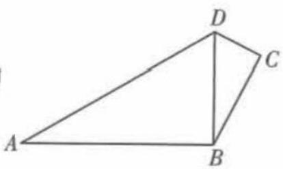

text_image

A
B
C
D

①求四边形 ABCD 的面积的取值范围；

②求四边形 ABCD 的周长的取值范围；

③求四边形 ABCD 的对角线 AC 的长的取值范围.

注:如果选择多个条件分别解答,按第一个解答计分.

# 题型 26 平面向量中的最值（取值范围）问题

▶ 答案：150 页

# 题型攻略

1. 平面向量中有关最值(取值范围)问题的两种求解思路

(1)“形化”,即利用平面向量的几何意义先将问题转化为平面几何中的最值或取值范围问题,然后根据平面图形的特征直接进行判断;
(2)“数化”,即利用平面向量的坐标运算,先把问题转化为代数中的函数最值、不等式的解集、方程有解等问题,然后利用函数、不等式、方程的有关知识来解决.

2. 求向量模的最值(取值范围)的方法

(1)代数法,先把所求的模表示成某个变量的函数,再用求最值的方法求解;
(2)几何法(数形结合法),弄清所求的模表示的几何意义,结合动点表示的图形求解;
(3)利用绝对值三角不等式 $||a|-|b||\leqslant|a\pm b|\leqslant|a|+|b|$ 求模的最值(取值范围).

# 综合 突破练

1.[2022福州市质检,★★★]已知平面向量a,b,c均为单位向量,且 $|a-b|=1$ ,则 $(a-b)\cdot(b-c)$ 的最大值为()

A. $\frac{1}{4}$

B. $\frac{1}{2}$

C. 1

D. $\frac{3}{2}$

2. [2017 全国卷Ⅲ, ★★★] 在矩形 ABCD 中, AB = 1, AD = 2, 动点 P 在以点 C 为圆心且与 BD 相切的圆上. 若 $\overrightarrow{AP} = \lambda \overrightarrow{AB} + \mu \overrightarrow{AD}$ , 则 $\lambda + \mu$ 的最大值为 ( )

A. 3

B. $2\sqrt{2}$

C. $\sqrt{5}$

D. 2

3. [2022 江苏省泰州中学校质检, ★★★] 已知 $\triangle ABC$ 中, $AB = 4$ , $AC = 4\sqrt{3}$ , $BC = 8$ , 动点 $P$ 自点 $C$ 出发沿线段 $CB$ 运动, 到达点 $B$ 时停止,

动点 Q 自点 B 出发沿线段 BC 运动, 到达点 C 时停止, 且动点 Q 的速度是动点 P 的 2 倍. 若二者同时出发, 且一个点停止运动时, 另一个点也停止运动, 则该过程中 $\overrightarrow{AP} \cdot \overrightarrow{AQ}$ 的最大值是 ( )

A. $\frac{7}{2}$

B. 4

C. $\frac{49}{2}$

D. 23

# 创新 预测练

4.[与解三角形综合,2022开封市诊断,★★★]在△ABC中,M是边BC的中点,N是线段BM的中点.若 $\angle BAC=\frac{\pi}{6}$ ,△ABC的面积为 $\sqrt{3}$ ,则 $\overrightarrow{AM}\cdot\overrightarrow{AN}$ 取最小值时,BC=()

A.2

B. 4

C. $8\sqrt{3} - 12$

D. $\frac{16\sqrt{3}}{3}-4$

5. [与圆、函数综合,2022佛山市两校联考, ★★ ★]过点 P(-1,1)作圆 C: $(x-t)^{2}+(y-t+2)^{2}=1(t\in\mathbb{R})$ 的切线, 切点分别为 A, B, 则

$\overrightarrow{PA} \cdot \overrightarrow{PB}$ 的最小值为（）

A. $\frac{10}{3}$

B. $\frac{40}{3}$

C. $\frac{21}{4}$

D. $2\sqrt{2}-3$

# 题型 27 向量极化恒等式的应用

▶ 答案：150 页

# 题型攻略

等式 $a \cdot b = \frac{1}{4} [(a + b)^2 - (a - b)^2]$ 的几何意义为向量 $a, b$ 的数量积等于以这组向量所对应的线段为邻边的平行四边形的“和对角线”与“差对角线”的平方差的 $\frac{1}{4}$ , 上式被称为“极化恒等式”. 在 $\square ABCD$ 中, $O$ 为 $AC, BD$ 的交点, 则有 $\overrightarrow{AB} \cdot \overrightarrow{AD} = \frac{1}{4} (4|\overrightarrow{AO}|^2 - 4|\overrightarrow{OB}|^2) = |\overrightarrow{AO}|^2 - |\overrightarrow{OB}|^2$ .

# 综合 突破练

1. [2017 全国卷 II, ★★★] 已知 $\triangle ABC$ 是边长为 2 的等边三角形, P 为平面 ABC 内一点, 则 $\overrightarrow{PA} \cdot (\overrightarrow{PB} + \overrightarrow{PC})$ 的最小值是 ( )

A. -2

B. $-\frac{3}{2}$

C. $-\frac{4}{3}$

D. -1

2. [2020 天津, ★

★★]如图,在四边形ABCD中, $\angle B=60^{\circ}$ ,

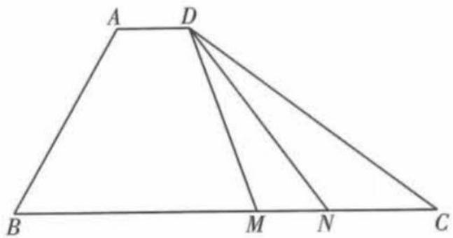

text_image

A D
B M N C

$AB = 3, BC = 6$ ，且 $\overrightarrow{AD} = \lambda \overrightarrow{BC}, \overrightarrow{AD} \cdot \overrightarrow{AB} = -\frac{3}{2}$ ，则实数 $\lambda$ 的值为 \_\_\_\_，若 $M, N$ 是线段 $BC$

上的动点,且 $|\overrightarrow{MN}|=1$ ,则 $\overrightarrow{DM}\cdot\overrightarrow{DN}$ 的最小值为\_\_\_\_.

3. [2021 天津, ★★★★] 在边长为 1 的等边三角形 $ABC$ 中, $D$ 为线段 $BC$ 上的动点, $DE \perp AB$ 且交 $AB$ 于点 $E$ , $DF \parallel AB$ 且交 $AC$ 于点 $F$ , 则 $|2\overrightarrow{BE} + \overrightarrow{DF}|$ 的值为 \_\_\_\_; $(\overrightarrow{DE} + \overrightarrow{DF}) \cdot \overrightarrow{DA}$ 的最小值为 \_\_\_\_.

# 创新 预测练

4. [与圆综合,2022 成都市二诊, ★★★★] 已知圆 O 的半径为 2, A, B 是圆上两点, 且 $\angle AOB = 60^{\circ}$ , CD 是圆 O 的一条直径, 若动点 P 满足 $\overrightarrow{OP} = \lambda \overrightarrow{OA} + \mu \overrightarrow{OB} (\lambda, \mu \in \mathbb{R})$ , 且 $\lambda - \mu = 1$ . 则 $\overrightarrow{PC} \cdot \overrightarrow{PD}$ 的最小值为 \_\_\_\_.

# 题型28 平面向量与三角函数的综合

▶ 答案：151 页

# 题型攻略

# 平面向量与三角函数的综合问题的解题思路

1. 若题中给出的向量的坐标中含有三角函数的形式,则运用向量共线或垂直或等式成立等得到三角函数的关系式,然后求解.  
2. 若给出用三角函数表示的向量坐标,要求的是向量的模,则解题思路是通过向量的运算,利用三角函数在定义域内的有界性等解决问题.

# 综合 突破练

1.[多选,2021新高考卷Ⅰ,★★★]已知O为坐标原点,点 $P_{1}(\cos\alpha,\sin\alpha)$ , $P_{2}(\cos\beta,$

$-\sin\beta),P_{3}(\cos(\alpha+\beta),\sin(\alpha+\beta)),A(1,0)$ ，则()

A. $|\overrightarrow{OP_1}| = |\overrightarrow{OP_2}|$

B. $|\overrightarrow{AP_1}| = |\overrightarrow{AP_2}|$   
C. $\overrightarrow{OA} \cdot \overrightarrow{OP_3} = \overrightarrow{OP_1} \cdot \overrightarrow{OP_2}$   
D. $\overrightarrow{OA} \cdot \overrightarrow{OP_1} = \overrightarrow{OP_2} \cdot \overrightarrow{OP_3}$

2.[2017 江苏, ★★★]已知向量 $\boldsymbol{a} = (\cos x, \sin x)$ , $\boldsymbol{b} = (3, -\sqrt{3})$ , $x \in [0, \pi]$ .

(1) 若 $a \parallel b$ , 求 $x$ 的值;  
(2) 记 $f(x)=\boldsymbol{a}\cdot\boldsymbol{b}$ ，求 $f(x)$ 的最大值和最小值以及对应的 x 的值.

3.[2022 山东日照期中, ★★★]已知 A, B, C 为 $\triangle ABC$ 的三个内角, 向量 $m = (2 - 2\sin A, \sin A + \cos A)$ 与 $n = (\sin A - \cos A, 1 + \sin A)$ 共线, 且 $\overrightarrow{AB} \cdot \overrightarrow{AC} > 0$ .

(1) 求角 A 的大小;  
(2) 求函数 $y = 2 \sin^{2} \frac{B}{2} + \cos \frac{C - B}{2}$ 的值域.

# 创新 预测练

4.[与函数综合,2022益阳市质检,★★★]在平面直角坐标系中,O为坐标原点,A,B,C三点满足 $\overrightarrow{OC}=\frac{1}{3}\overrightarrow{OA}+\frac{2}{3}\overrightarrow{OB}.$

(1) 求证: A, B, C 三点共线, 并求 $\frac{|\overrightarrow{BC}|}{|\overrightarrow{BA}|}$ 的值;
(2) 已知 $A(1, \sin x)$ , $B(1 + \sin x, \sin x)$ , $x \in (0, \pi)$ , 且函数 $f(x) = \overrightarrow{OA} \cdot \overrightarrow{OC} + (2m - \frac{2}{3}) |\overrightarrow{AB}|$ 的最小值为 $\frac{1}{2}$ , 求实数 m 的值.

5.[角度创新,★★★★]在平面向量中有以下定理:已知非零向量 $a=(x_{1},y_{1}),b=(x_{2},y_{2})$ ,若 $a\perp b$ ,则 $x_{1}x_{2}+y_{1}y_{2}=0$ .

(1) 拓展到空间, 类比上述定理, 已知非零向量 $\boldsymbol{a} = (x_{1}, y_{1}, z_{1})$ , $\boldsymbol{b} = (x_{2}, y_{2}, z_{2})$ , 若 $a \perp b$ , 则 \_\_\_\_. (请在横线上填上你认为正确的结论)  
(2) 若非零向量 $\boldsymbol{a} = (\cos \alpha, k \cos \beta, (2 - k) \cos \gamma)$ , $b=(\sin\alpha,k\sin\beta,(2-k)\sin\gamma),c=(1,1,1),a\perp c$ 且 $b\perp c$ ，利用(1)的结论求当 k 为何值时， $\cos(\beta-\gamma)$ 分别取到最大值、最小值.

# 专题三 数列

# 题型 29 已知递推关系求数列的通项公式

▶ 答案：152 页

# 题型攻略

由递推关系求通项的关键:①构造新数列,而新数列往往为等差数列、等比数列;②先将原递推关系转化为可以利用叠加、叠乘等方法求出通项公式的递推关系,再求通项.

# 综合 突破练

1.[2022郑州第二次质量预测，★★★]已知数列 $\{a_{n}\}$ 满足 $a_2 = 2, a_{2n} = a_{2n - 1} + 2^n (n\in \mathbf{N}^*)$ ， $a_{2n + 1} = a_{2n} + (-1)^n (n\in \mathbf{N}^*)$ ，则数列 $\{a_n\}$ 的第2022项为 （）

A. $2^{1012} - 2$

B. $2^{1012}-3$

C. $2^{1011} - 2$

D. $2^{1011} - 1$

2.[2022高三名校联考,★★★]已知数列 $\{a_{n}\}$ 的首项 $a_{1} = -\frac{1}{9}$ ，其前 n 项和为 $S_{n}$ ，且满足 $n(n+1)(a_{n+1}-a_{n})+11a_{n}a_{n+1}=0$ ，则当 $S_{n}$ 取

得最小值时, $n=$ \_\_\_\_.

3. [2022 沈阳模拟, ★★★★] 在数列 $\{a_{n}\}$ 中, 已知 $a_{1}=2, a_{n}a_{n-1}=2a_{n-1}-1 (n\geqslant2)$ . 记数列 $\{a_{n}\}$ 的前 n 项之积为 $T_{n}$ , 若 $T_{n}=2023$ , 则 n 的值为 \_\_\_\_.

# 创新 预测练

4. [解题创新, ★★★★] 已知数列 $\{a_{n}\}$ 满足 $a_{1}=3$ , $a_{n+1}=\frac{7a_{n}-2}{a_{n}+4}$ , 则该数列的通项公式为 \_\_\_\_.

# 题型 30 数列求和

▶ 答案：152 页

# 题型攻略

1. 利用裂项相消法求和时,既要注意检验裂项前后是否等价,又要注意求和时正负项相消后消去了哪些项,保留了哪些项.  
2. 数列求和时要根据通项的形式, 找到对应的求和方法.

# 综合 突破练

1. [2022 太原市统考, ★★★] 已知数列 $\{a_{n}\}$ 中, $a_{1}=2,na_{n+1}-n(n+1)=2(n+1)(a_{n}-n)(n\in\mathbf{N}^{*})$ .

(1) 证明: 数列 $\left\{\frac{a_{n}}{n}-1\right\}$ 为等比数列, 并求 $\left\{a_{n}\right\}$ 的通项公式;  
(2) 求数列 $\{a_{n}\}$ 的前 n 项和 $S_{n}$ .

2.[2022 河北联考, ★★★]已知数列 $\{a_{n}\}$ 的前 n 项和为 $S_{n}, a_{1}=1, a_{n+1}=2a_{n}+1$ .

(1) 证明: 数列 $\{a_{n}+1\}$ 为等比数列;  
(2) 求数列 $\left\{\frac{2^{n+1}-1}{S_{n}S_{n+1}}\right\}$ 的前 n 项和 $T_{n}$ .

3.[2022沈阳市第一次质量监测，★★★★]等差数列 $\{a_{n}\}$ 和等比数列 $\{b_{n}\}$ 满足 $a_1 = b_1 = 1$ ， $a_2 + a_4 = 14, b_2b_4 = a_6$ ，且 $b_{n} > 0$ .

(1) 求数列 $\{b_{n}\}$ 的通项公式.  
(2) 已知: ① $b_{n}<1\ 000$ ; ② $\exists m\in N^{*},a_{m}=b_{n}$ . 设 S 为数列 $\{b_{n}\}$ 中同时满足条件①和②的所有项的和, 求 S 的值.

# 创新 预测练

4.[数列与圆综合,2022 潍坊高中测评,★★★★]如图,在边长为 a 的等边三角形 ABC 中,圆 $D_{1}$ 与 $\triangle ABC$ 相切,圆 $D_{2}$ 与圆 $D_{1}$

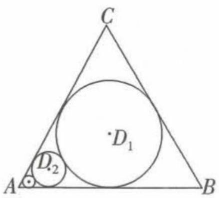

text_image

C
D₁
A
B
D₂

相切且与AB,AC相切,……,圆 $D_{n+1}$ 与圆 $D_{n}$ 相切且与AB,AC相切,依次得到圆 $D_{1},D_{2},\cdots,D_{n},\cdots$ 设圆 $D_{1},D_{2},\cdots,D_{n}$ 的面积之和为 $X_{n}(n\in\mathbf{N}^{*})$ ,则 $X_{n}=$

A. $\frac{1}{12}\pi a^{2}\left(\frac{1}{9}\right)^{n-1}$   
B. $\frac{3}{32}\pi a^{2}\left[1-\left(\frac{1}{9}\right)^{n}\right]$   
C. $\frac{1}{8}\pi a^{2}\left[1-\left(\frac{1}{3}\right)^{n}\right]$   
D. $\frac{1}{12}\pi a^{2}\left[\left(\frac{1}{9}\right)^{n-1}-\left(\frac{1}{3}\right)^{n-1}+1\right]$

# 热点 应用练

5. [2022 江西五校联考, ★★★★] 某项测试有 10 道必答题, 甲和乙参加该测试, 分别用数列 $\{a_{n}\}$ 和 $\{b_{n}\}$ 记录他们的成绩. 若第 $k$ 题甲答对, 则 $a_{k} = k$ , 若第 $k$ 题甲答错, 则 $a_{k} = -k$ ; 若第 $k$ 题乙答对, 则 $b_{k} = 2^{k-1}$ , 若第 $k$ 题乙答错, 则 $b_{k} = -2^{k-1}$ . 已知 $b_{1} + b_{2} + \cdots + b_{10} = 767$ , $a_{1}b_{1} + a_{2}b_{2} + \cdots + a_{10}b_{10} = 9217$ , 则 $a_{1} + a_{2} + \cdots + a_{10} =$ \_\_\_\_.

# 题型 31 数列中含有 $(-1)^{n}a_{n}$ 类型问题的求解

▶ 答案：153 页

# 题型攻略

当数列通项中出现 $(-1)^{n}$ 时,一般对n分n=2k,n=2k-1, $k\in N^{*}$ 讨论求解.

# 综合 突破练

1. [2020 全国卷 I, ★★★★] 数列 $\{a_{n}\}$ 满足 $a_{n+2} + (-1)^{n} a_{n} = 3 n - 1$ , 前 16 项和为 540, 则 $a_{1} =$ \_\_\_\_.

2.[2016 天津, ★★★]已知 $\{a_{n}\}$ 是等比数列, 前 n 项和为 $S_{n}(n \in \mathbb{N}^{*})$ , 且 $\frac{1}{a_{1}} - \frac{1}{a_{2}} = \frac{2}{a_{3}}, S_{6} = 63$ .
(1) 求 $\{a_{n}\}$ 的通项公式;

(2) 若对任意的 $n \in \mathbf{N}^*$ , $b_n$ 是 $\log_2 a_n$ 和 $\log_2 a_{n+1}$ 的等差中项, 求数列 $\{(-1)^n b_n^2\}$ 的前 $2n$ 项和.

3. [2022 济南市学情检测, ★★★] 已知数列 $\{a_{n}\}$ 满足 $a_{n+2} + (-1)^{n}a_{n} = 3, a_{1} = 1, a_{2} = 2.$

(1) 记 $b_{n}=a_{2n-1}$ ，求数列 $\{b_{n}\}$ 的通项公式；  
(2) 记数列 $\{a_{n}\}$ 的前 n 项和为 $S_{n}$ ，求 $S_{30}$ .

# 创新 预测练

4.[角度创新,★★★]已知 $S_{n}$ 为数列 $\{a_{n}\}$ 的前n项和.若 $a_{n+1}+(-1)^{n+1}a_{n}=2n+1$ ,则 $S_{40}=$ \_\_\_\_;若 $a_{n+1}+(-1)^{n}a_{n}=2n+1$ ,则 $S_{40}=$ \_\_\_\_.

# 题型32 数列中含绝对值的求和问题

▶ 答案：154 页

# 题型攻略

一般地, 数列 $\{|a_{n}|\}$ 与数列 $\{a_{n}\}$ 是两个不相同的数列, 只有数列 $\{a_{n}\}$ 中的每一项都是非负数时, 它们表示的才是同一数列. 因此, 求数列 $\{|a_{n}|\}$ 的前 n 项和时, 应先弄清 n 取什么值时 $a_{n}>0$ 或 $a_{n}<0$ , 去掉绝对值符号后再求和.

# 综合 突破练

1. [★★★] 在公差为 $d$ 的等差数列 $\{a_{n}\}$ 中, 已知 $a_{1} = 10$ , 且 $a_{1}, 2a_{2} + 2, 5a_{3}$ 成等比数列.

(1) 求 $d, a_{n}$ ;   
(2) 若 d<0，求 $\left|a_{1}\right|+\left|a_{2}\right|+\left|a_{3}\right|+\cdots+\left|a_{n}\right|$ .

2. [★★★★] 设等比数列 $\{a_{n}\}$ 的前 n 项和为 $S_{n}, a_{1} = 1, S_{3} = 13$ .

(1) 求通项 $a_{n}$ ;   
(2) 若 $\{a_{n}\}$ 是递增数列, 求数列 $\{|a_{n}-n-2|\}$ 的前 n 项和.

# 创新 预测练

3. [解题创新, ★★★★] 已知等比数列 $\{a_{n}\}$ 的前 $n$ 项和为 $S_{n}, S_{6} = -7S_{3}$ , 且 $a_{2}, 1, a_{3}$ 成等差数列.

(1) 求数列 $\{a_{n}\}$ 的通项公式；  
(2) 设 $b_{n} = |a_{n} - 1|$ ，求数列 $\{b_{n}\}$ 的前 $2n$ 项和 $T_{2n}$ .

# 题型33 数列与函数的综合

▶ 答案：154 页

# 题型攻略

# 数列与函数的综合问题的解题策略

1. 已知函数条件, 解决数列问题, 一般利用函数的性质、图象等进行研究.  
2. 已知数列条件, 解决函数问题, 一般要利用数列的有关公式对式子化简变形.  
注意:数列是自变量为正整数的特殊函数,要灵活运用函数的思想方法求解.

# 综合 突破练

1. [2022 合肥市一检, ★★★] 若数列 $\{a_{n}\}$ 的前 n 项积 $b_{n}=1-\frac{2}{7}n$ , 则 $a_{n}$ 的最大值与最小值之和为 ( )

A. $-\frac{1}{3}$

B. $\frac{5}{7}$

C.2

D. $\frac{7}{3}$

2.[2022 湖北荆州模拟, ★★★★★] 函数 $f(x)$ 的定义域为 R, 满足 $f(x+1)=2f(x)$ , 且当 $x\in[0,1)$ 时, $f(x)=\sin\pi x$ . 当 $x\in[0,+\infty)$ 时, 将函数 $f(x)$ 的极大值点从小到大依次记为 $a_{1}, a_{2}, a_{3}, \cdots, a_{n}, \cdots$ , 并记相应的极大值为 $b_{1}, b_{2}, b_{3}, \cdots, b_{n}, \cdots$ , 则数列 $\{a_{n}+b_{n}\}$ 的前 9 项和为 \_\_\_\_.

3. [★★★★★] 设曲线 $y = x^{n+1} (n \in \mathbb{N}^{*})$ 在点 (1,1) 处的切线与 x 轴交点的横坐标为 $x_{n}$ .

(1) 令 $a_{n} = \lg x_{n}$ , 求数列 $\{a_{n}\}$ 的前 $n$ 项和 $S_{n}$ .  
(2) 令 $b_n = (n + 3)x_{n+2}, n \in \mathbf{N}^*$ . 证明: $b_{n+1} \cdot \ln b_n > b_n \cdot \ln b_{n+1}$ .

# 创新 预测练

4. [高斯函数, 2022 福州市质检, ★★★] 函数 $y = [x]$ 称为高斯函数, $[x]$ 表示不超过 $x$ 的最大整数, 如 $[0.9] = 0$ , $[\lg 99] = 1$ . 已知数列 $\{a_{n}\}$ 满足 $a_{3} = 3$ , 且 $a_{n} = n(a_{n+1} - a_{n})$ , 若 $b_{n} = [\lg a_{n}]$ , 则数列 $\{b_{n}\}$ 的前 2022 项和为 \_\_\_\_.

# 题型 34 数列与不等式的综合

# 题型攻略

# 数列与不等式的综合问题的解题策略

1. 判断数列问题中的一些不等关系,可以利用数列的单调性或者是借助数列对应的函数的单调性求解.  
2. 对于与数列有关的不等式的证明问题,要灵活选择不等式的证明方法,如比较法、综合法、分析法、放缩法等,有时需构造函数,利用函数的单调性、最值来证明.

# 综合 突破练

1.[2022 大连模拟, ★★★]已知各项均为正数的数列 $\{a_{n}\}$ ，其前 n 项和为 $S_{n}$ ，数列 $\{b_{n}\}$ 为等差数列，满足 $b_{2}=12, b_{5}=30$ 。再从下列①②两个条件中选择一个作为已知，求解问题。

① $a_{n}^{2}+a_{n}=2S_{n};$   
② $a_{1}=9$ ，当 $n\geqslant2$ 时， $a_{2}=2,a_{n+1}=a_{n}+2.$

(1) 求数列 $\{a_{n}\}$ 的通项公式和它的前 n 项和 $S_{n}$ ;

(2) 若对任意 $n \in N^{*}$ ，不等式 $kS_{n} \geqslant b_{n}$ 恒成立，求 k 的取值范围.

2.[2022福州市质检, ★★★★]已知数列 $\{a_{n}\}$ 的前 n 项和为 $S_{n}, a_{1}=1, a_{2}=2$ , 且 $S_{n+2}=S_{n+1}+4a_{n}$ .

(1) 求 $a_{n}$ ;   
(2) 求证: $\frac{1}{a_{1}+1}+\frac{1}{a_{2}+1}+\cdots+\frac{1}{a_{n}+1}<2.$

# 创新 预测练

3.[与逻辑用语综合,2022 辽宁省重点高中一模,★★★]已知数列 $\left\{\frac{1}{(2n-1)(2n+3)}\right\}$ 的前n项和为 $T_{n}$ ，则使“ $\forall n\in N^{*}$ ，不等式 $6T_{n}<a^{2}-a$ 恒成立”为真命题的一个充分不必要条件是()

A. $a \leqslant -2$ 或 $a \geqslant 0$

B. $a \leqslant 0$ 或 $a \geqslant 1$

C. a > 0

D. $a \leqslant -2$

# 立体几何

# 题型 35 求空间几何体的表面积（侧面积）

答案：155页

# 题型攻略

1. 多面体的表面积是各个面的面积之和.  
2. 求解旋转体的表面积问题应注意其侧面展开图的应用.

# 综合

# 突破练

1. [2022 延阳市统考, ★★★] 如图, AB, CD 分别是圆柱上、下底面圆的直径, 且 $AB \perp CD$ . $O_{1}$ , $O_{2}$ 分别为上、下底面圆的圆心, 若圆柱的轴截面为正方形, 且三棱

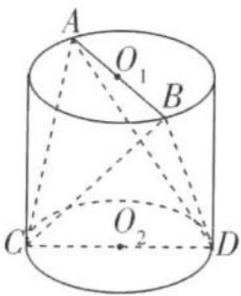

text_image

A
O₁
B
C
O₂
D

锥A-BCD的体积为 $4\sqrt{3}$ ，则该圆柱的侧面积为()

A. $9 \pi$

B. $10\pi$

C. $12\pi$

D. $14\pi$

2. [2020 全国卷 1, ★★★★] 已知 A, B, C 为球 O 的球面上的三个点, $\odot O_{1}$ 为 $\triangle ABC$ 的外接圆. 若 $\odot O_{1}$ 的面积为 $4\pi, AB = BC = AC = OO_{1}$ , 则球 O 的表面积为 ( )

A. $64\pi$

B. $48\pi$

C. $36\pi$

D. $32\pi$

# 创新

# 预测练

3. [条件创新,2022 四川凉山州一诊,★★★]已知半球内有一个内接正方体,正方体的一个面

在半球的底面圆内,若正方体的棱长为2,则半球的表面积为()

A. $10\pi$

B. $12\pi$

C. $15\pi$

D. $18\pi$

# 热点

# 应用练

4. [2021 新高考卷 II、★★★] 北斗三号全球卫星导航系统是我国航天事业的重要成果。在卫星导航系统中,地球静止同步轨道卫星的轨道位于地球赤道所在平面,轨道高度为 36 000 km(轨道高度是指卫星到地球表面的最短距离),把地球看成一个球心为 O,半径 r 为 6 400 km 的球,其上点 A 的纬度是指 OA 与赤道所在平面所成角的度数,地球表面能直接观测到的一颗地球静止同步轨道卫星的点的纬度的最大值记为 α,该卫星信号覆盖的地球表面面积 S = 2πr²(1 - cos α)(单位:km²),则 S 占地球表面积的百分比约为 ( )

A. $26\%$

B. 34%

C. 42%

D. 50%

# 题型 36 求空间几何体的体积

答案：156页

# 题型攻略

若所给的几何体的体积可直接利用公式求出,则直接利用相应体积公式求解;若所给几何体的体积不能直接利用公式求出,则常用等体积法、分割法、补形法等方法进行求解.

# 综合

# 突破练

1. [2021 北京, ★★★] 对 24 小时内降落在平地上的积水厚度(mm)进行如下定义:

<table><tr><td>积水厚度/mm</td><td>0~10</td><td>10~25</td><td>25~50</td><td>50~100</td></tr><tr><td>等级</td><td>小雨</td><td>中雨</td><td>大雨</td><td>暴雨</td></tr></table>

小明用一个圆锥形容器接了24小时的雨水，则这一天的雨水属于哪个等级 （）

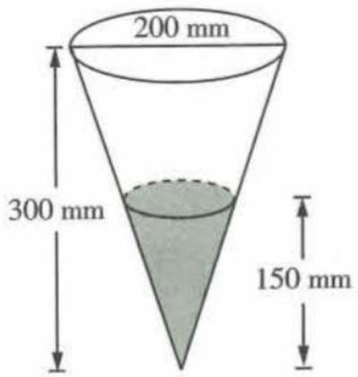

text_image

200 mm
300 mm
150 mm

A. 小雨

B. 中雨

C. 大雨

D. 暴雨

2. [2021 全国卷甲, ★★★★] 已知 A, B, C 是半径为 1 的球 O 的球面上的三个点, 且 $AC \perp BC$ , AC = BC = 1, 则三棱锥 O - ABC 的体积为 ( )

A. $\frac{\sqrt{2}}{12}$

B. $\frac{\sqrt{3}}{12}$

C. $\frac{\sqrt{2}}{4}$

D. $\frac{\sqrt{3}}{4}$

3. [多选,2022 新高考卷Ⅱ, ★★ ★]如图,四边形 ABCD 为正方形,ED⊥平面 ABCD,FB∥ED, AB=ED=2FB. 记三棱锥 E-ACD,F-ABC,F-ACE 的体积分别为 $V_{1}, V_{2}, V_{3}$ ,则

A. $V_{3} = 2V_{2}$

B. $V_{3} = V_{1}$

C. $V_{3}=V_{1}+V_{2}$

D. $2V_{3}=3V_{1}$

# 创新 预测练

4.[解题创新,2022济南市十一校联考,★★★

★]如图所示,已知五面体 ABCDEF 中, $AB \parallel CD \parallel EF$ ,AB = 4,CD = 8,EF = 3,CD 与 EF 的距离为 8, 点 A 到平面 CDEF 的距离为 6, 则该五面体的体积为 ( )

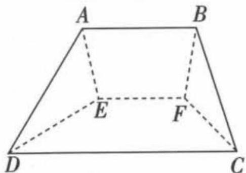

text_image

A
B
E
F
D
C

A. 108

B. 112

C. 120

D. 132

# 热点 应用练

5.[2022 陕西渭南模拟,★★★]六氟化硫,化学

式为 $SF_{6}$ ，在常压下是一种无色、无臭、无毒、不燃的稳定气体，有良好的绝缘性，在电器工业

方面具有广泛用途. 六氟化硫分子结构为正八面体结构(正八面体是每个面都是正三角形的八面体), 如图所示, 硫原子位

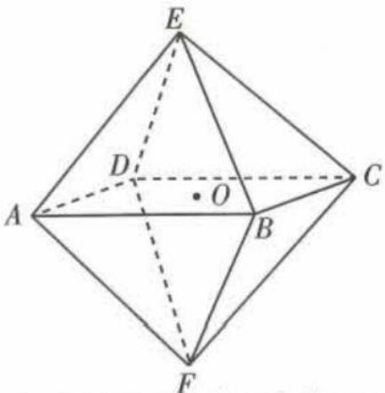

text_image

E
D
O
A
B
C
F

于正八面体的中心点 O,6 个氟原子分别位于正八面体的 6 个顶点 A,B,C,D,E,F 处. 若相邻两个氟原子间的距离为 2a, 则六氟化硫分子中 6 个氟原子构成的正八面体的体积是(不计氟原子的大小) ()

A. $\frac{4\sqrt{2}}{3}a^{3}$

B. $\frac{8\sqrt{2}}{3}a^{3}$

C. $4\sqrt{2} a^{3}$

D. $8\sqrt{2}a^{3}$

6. [2022 潍坊市模拟, ★★★★]“迪拜世博会”于 2021 年 10 月 1 日至 2022 年 3 月 31 日在迪拜举行, 中国馆建筑名为“华夏之光”, 外观取型中国传统灯笼, 寓意希望和光明, 如图 1. 它的形状可视为内外两个同轴圆柱, 某爱好者制作了一个中国馆的实心模型, 如图 2, 已知模型内层底面直径为 $12 \mathrm{~cm}$ , 外层底面直径为 $16 \mathrm{~cm}$ , 且内外层圆柱的底面圆周都在一个直径为 $20 \mathrm{~cm}$ 的球面上, 则此模型的体积为 ( )

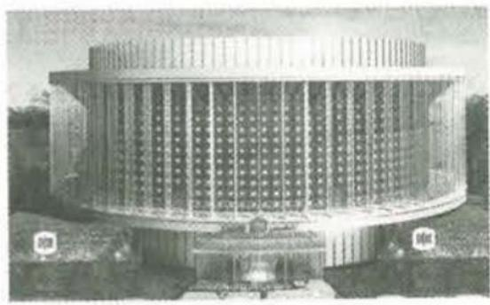

natural_image

Exterior view of a modern circular building with symmetrical facade and glass facade (no visible text or signage)

图1

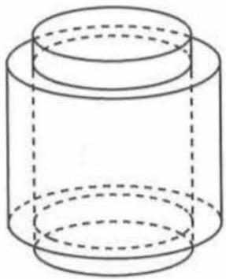

natural_image

Simple line drawing of a cylindrical container with dashed internal lines indicating hidden edges (no text or symbols)

图2

A. $304\pi \, cm^{3}$

B. $840\pi \mathrm{cm}^{3}$

C. $912\pi \mathrm{cm}^3$

D. $984\pi \, cm^{3}$

# 题型 37 求空间几何体体积的最值

▶ 答案：156 页

# 题型攻略

# 求解有关体积最值问题的方法

1. 几何法: 根据几何体的结构特征, 先确定体积表达式中的常量与变量, 然后利用几何知识判断变量什么情况下取得最值, 从而确定体积的最值.

2. 代数法: 先设变量, 求出几何体的体积表达式, 然后转化为函数最值问题或利用基本不等式求解即可.

# 综合 突破练

1. [2022 江西模拟, ★★★]

如图是一个底面半径和高都是1的圆锥形容器,匀速

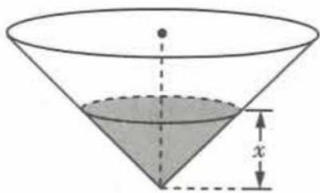

text_image

Geometric diagram of a cone with labeled height 'x' and base circle, showing solid and dashed lines for depth measurement.

给容器注水,则容器中水的体积 V 是水面高度 x 的函数,记为 $V=f(x)$ , 若正数 a, b 满足 $a + b = 1$ , 则 $f(a) + f(b)$ 的最小值为 ( )

A. $\frac{\pi}{12}$

B. $\frac{\pi}{6}$

C. $\frac{\pi}{4}$

D. $\frac{\pi}{3}$

2.[2022全国卷乙,★★★]已知球O的半径为1,四棱锥的顶点为O,底面的四个顶点均在球O的球面上,则当该四棱锥的体积最大时,其高为()

A. $\frac{1}{3}$

B. $\frac{1}{2}$

C. $\frac{\sqrt{3}}{3}$

D. $\frac{\sqrt{2}}{2}$

3. [2018 全国卷Ⅲ, ★★★★] 设 A, B, C, D 是同一个半径为 4 的球的球面上四点, △ABC 为等边三角形且其面积为 $9\sqrt{3}$ , 则三棱锥 D - ABC 体积的最大值为 ( )

A. $12 \sqrt{3}$

B. $18\sqrt{3}$

C. $24 \sqrt{3}$

D. $54\sqrt{3}$

# 创新 预测练

4. [情境创新,2022 开封市二模, ★★★★] 如图, 将一块直径为 $2 \sqrt{3}$ 的半球形石材切割成一

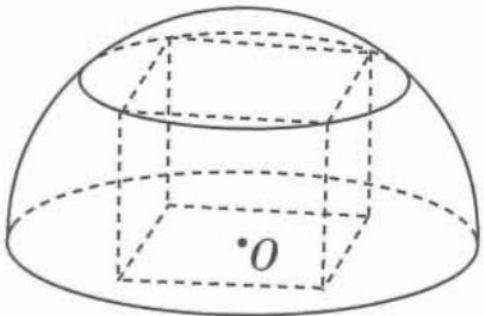

natural_image

Geometric diagram of a hemisphere with dashed lines indicating hidden edges and a labeled point '0' (no text or symbols beyond basic geometry)

个正四棱柱,则正四棱柱的体积取最大值时,
切割掉的废弃石材的体积为 ( )

A. $2 \sqrt{3} \pi - 4$

B. $4\sqrt{3}\pi-4$

C. $2\sqrt{3}\pi - \frac{16\sqrt{3}}{9}$

D. $4\sqrt{3}\pi - \frac{16\sqrt{3}}{9}$

# 热点 应用练

5.[2022 陕西百校联考, ★★★★]欲将一底面半径为 $\sqrt{3}$ ,体积为 $3\pi$ 的圆锥体模型打磨成一个圆柱体和一个球体相切的模具,如图所示,则打磨成的圆柱体和球体的体积之和的最大值为\_\_\_\_.

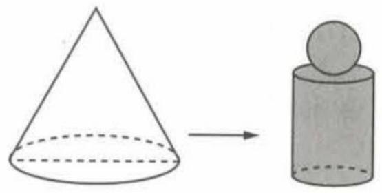

natural_image

Simple geometric diagram showing a cone and a cylinder with an arrow indicating transformation (no text or symbols)

# 题型38 球的切、接问题

▶ 答案：157 页

# 题型攻略

解与球有关的切、接问题的通法是作截面,将空间几何问题转化为平面几何问题求解,其解题的思维流程如下:

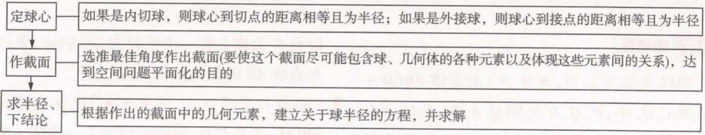

flowchart

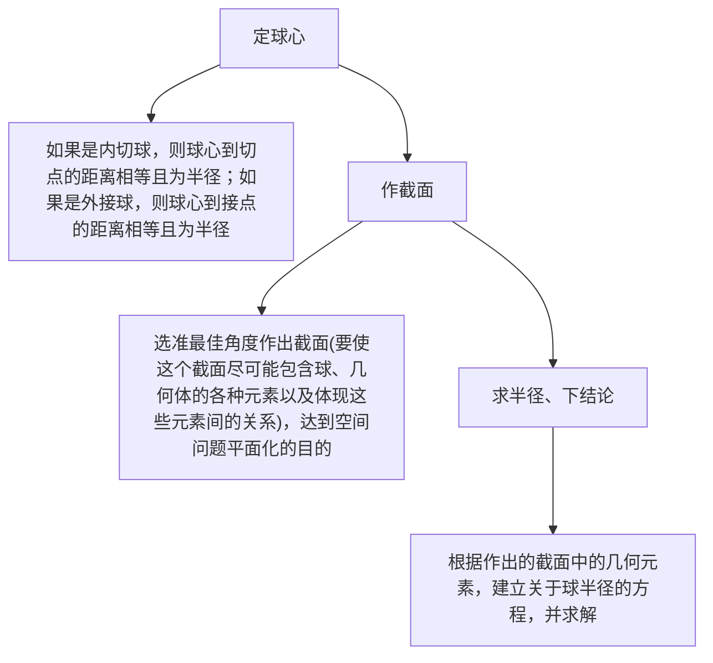

# 综合 突破练

1. [2021 天津, ★★★] 两个圆锥的底面是一个球的同一截面, 顶点均在球面上, 若球的体积为 $\frac{32\pi}{3}$ , 两个圆锥的高之比为 $1:3$ , 则这两个圆

锥的体积之和为 （）

A. $3 \pi$

B. $4 \pi$

C. $9\pi$

D. $12 \pi$

2. [2022 新高考卷 I, ★★★] 已知正四棱锥的侧棱长为 $l$ , 其各顶点都在同一球面上. 若该球的体积为 $36\pi$ ，且 $3 \leqslant l \leqslant 3\sqrt{3}$ ，则该正四棱锥体积的取值范围是（）

A. $[18, \frac{81}{4}]$

B. $\left[\frac{27}{4},\frac{81}{4}\right]$

C. $\left[\frac{27}{4},\frac{64}{3}\right]$

D. $[18,27]$

3. [2019 全国卷 I, ★★★★★] 已知三棱锥 P-ABC 的四个顶点在球 O 的球面上, PA = PB = PC, $\triangle ABC$ 是边长为 2 的正三角形, E, F 分别是 PA, AB 的中点, $\angle CEF = 90^{\circ}$ , 则球 O 的体积为 ( )

A. $8\sqrt{6}\pi$

B. $4\sqrt{6}\pi$

C. $2\sqrt{6}\pi$

D. $\sqrt{6}\pi$

4. [2022 河南省豫北重点高中质检, ★★★★] 如图, 在正四棱台 ABCD - $A_{1}B_{1}C_{1}D_{1}$ 中, $AB = 2A_{1}B_{1}$ , 且存在一个半径为 r 的

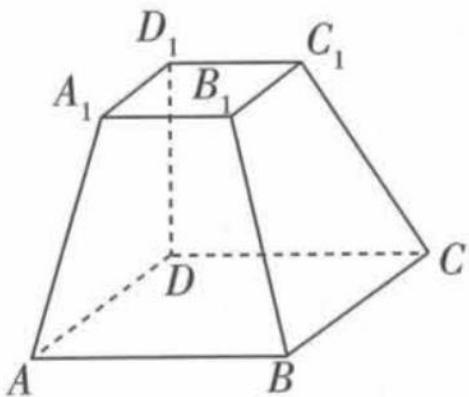

text_image

D₁
C₁
A₁ B₁
D
C
A B

球,与该正四棱台的各个面均相切.设该正四棱台的外接球半径为R,则 $\frac{R}{r}=$ \_\_\_\_.

# 创新 预测练

5.[解题创新,2022安徽名校联考,★★★★]在三棱锥P-ABC中, $\angle APB=\angle BPC=\angle CPA=\frac{\pi}{3}$ , $\triangle PAB$ , $\triangle PAC$ , $\triangle PBC$ 的面积分别记为 $S_{1}$ , $S_{2}$ , $S_{3}$ ,且 $3S_{1}=2S_{2}=2S_{3}=3\sqrt{3}$ ,则此三棱锥的内切球的半径为()

A. $\frac{2\sqrt{6}-\sqrt{3}}{3}$

B. $\frac{2\sqrt{6}-\sqrt{3}}{7}$

C. $\frac{2\sqrt{2}+1}{3}$

D. $\frac{2\sqrt{2}+1}{6}$

6. [条件创新,2022 郑州市一模,★★★★]已知一圆柱的轴截面为正方形,母线长为 $\sqrt{6}$ ,在该圆柱内放置一个棱长为a的正四面体,并且正四面体在该圆柱内可以任意转动,则a的最大值为\_\_\_\_.

# 热点 应用练

7. [2022 四川模拟, ★★★★] 现为某球状巧克力设计圆锥体样式的包装盒, 要求包装盒与巧克力球相切, 若该巧克力球的半径为 3 , 则其包装盒的体积的最小值为 \_\_\_\_.

# 题型 39 立体几何中的截面、交线问题

▶ 答案：158 页

# 题型攻略

1. 立体几何中有关截面问题的常见考法: (1) 截面形状的判断; (2) 求截面面积或周长; (3) 求截面面积最值.  
2. 作截面的三种常用思路: (1) 直接作出; (2) 作平行线; (3) 延长交线得交点.  
3. 找两个平面交线的突破口是找到这两个平面的两个公共点.

# 综合 突破练

1. [2022 贵阳市监测, ★★★] 正方体 ABCD - $A_{1}B_{1}C_{1}D_{1}$ 中, P, Q, R 分别是 $A_{1}D_{1}, C_{1}D_{1}, AA_{1}$ 的中点. 那么过 P, Q, R 三点的正方体的截面图形是 ( )

A. 三角形

B. 四边形

C. 五边形

D. 六边形

2. [2022 安徽名校联考, ★★★★] 已知正四面体 ABCD 的棱长为 4, 点 E 是棱 BD 的中点, 若

以点 C 为球心作一个半径为 $2\sqrt{3}$ 的球, 则该球与直线 AE 的相交弦的长为 \_\_\_\_.

3. [2020 新高考卷 I, ★★★★] 已知直四棱柱 $ABCD - A_{1}B_{1}C_{1}D_{1}$ 的棱长均为 2, $\angle BAD = 60^{\circ}$ . 以 $D_{1}$ 为球心, $\sqrt{5}$ 为半径的球面与侧面 $BCC_{1}B_{1}$ 的交线长为 \_\_\_\_.

# 创新 预测练

4. [角度创新,2022 成都市一诊, ★★★★] 如图,已知三棱锥 A-BCD 的截面 MNPQ 平行于

对棱 AC, BD, 且 $\frac{AC}{BD} = m, \frac{AM}{MB} = n$ , 其中 $m, n \in (0, +\infty)$ . 有下列命题:

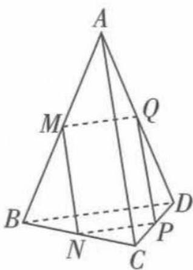

text_image

A
M
Q
B
N
C
P
D

①对于任意的 m, n, 都有截面 MNPQ 是平行四边形；

②当 $AC \perp BD$ 时, 对任意的 m, 都存在 n, 使得

截面 MNPQ 是正方形；

③当 m=1 时, 截面 MNPQ 的周长与 n 无关;
④当 $AC \perp BD$ , 且 AC = BD = 2 时, 截面 MNPQ 的面积的最大值为 1.

其中假命题的个数为 （）

A.0

B.1

C.2

D. 3

# 题型40 立体几何中的动态问题

▶ 答案：159 页

# 题型攻略

立体几何中的动态问题主要包括空间动点轨迹的判断、求轨迹的长度、动角的范围以及动态问题中的面积、体积的求值. 解题时一般先判断动点运动的轨迹形态, 再计算轨迹长度、求解动角的取值范围及面积和体积的值.

# 综合 突破练

1. [2022 北京, ★★★] 已知正三棱锥 P-ABC 的六条棱长均为 6, S 是 $\triangle ABC$ 及其内部的点构成的集合. 设集合 $T = \{Q \in S \mid PQ \leqslant 5\}$ , 则 T 表示的区域的面积为 ( )

A. $\frac{3\pi}{4}$

B. $\pi$

C. $2\pi$

D. $3\pi$

2. [★★★] 如图, 在正方体 $ABCD - A_{1}B_{1}C_{1}D_{1}$ 中, E 是棱 AB 的中点, F 是侧面 $AA_{1}D_{1}D$ 内一动点, 且 $EF \parallel$ 平面 $BB_{1}D_{1}D$ , 又侧面 $ABB_{1}A_{1}$ 内有一动点 P 到

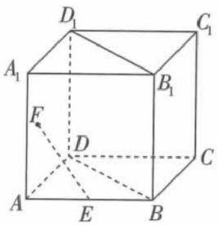

text_image

D₁
C₁
A₁
B₁
F
D
C
A
E
B

直线 $A_{1}B_{1}$ 与直线 BC 的距离相等, 则动点 F, P 的轨迹分别为 ( )

A. 线段, 圆的一部分  
B. 线段, 抛物线的一部分  
C. 椭圆的一部分, 抛物线的一部分  
D. 圆的一部分, 抛物线的一部分

3.[2022重庆市调研，★★

★★]如图,在棱长为2的正方体 ABCD - $A_{1}B_{1}C_{1}D_{1}$ 中,点 M 在线段 $BC_{1}$ (不包含端点) 上运动,则下列结论正确的

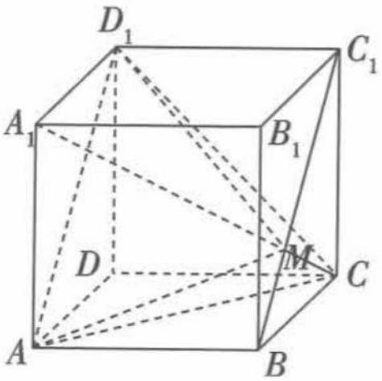

text_image

D₁
A₁
B₁
C₁
D
M
C
A
B

是\_\_\_\_.(填序号)

①正方体 $ABCD - A_{1}B_{1}C_{1}D_{1}$ 的外接球表面积为 $48\pi$ ;  
②异面直线 $A_{1}M$ 与 $AD_{1}$ 所成角的取值范围是 $\left(\frac{\pi}{3},\frac{\pi}{2}\right]$ ;  
③直线 $A_{1}M \parallel$ 平面 $ACD_{1}$ ;  
④三棱锥 $D_{1}-AMC$ 的体积随着点 M 的运动而变化.

# 创新 预测练

4.[角度创新,多选,2022济南市学情检测,★★★

★★]如图,在棱长为1的正方体ABCD-A₁B₁C₁D₁中,P为侧面BCC₁B₁(不含边界)内的动点,Q为线段A₁C上的动点,若直线A₁P与A₁B₁的夹角为45°,则下列说法正确的是()

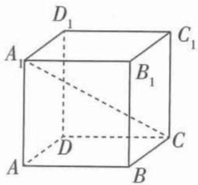

text_image

D₁
A₁
B₁
C₁
D
C
A
B

A. 线段 $A_{1}P$ 的长度为 $\sqrt{2}$   
B. $\frac{\sqrt{3}}{3}A_{1}Q+PQ$ 的最小值为1  
C. 对任意点 P, 总存在点 Q, 使得 $D_{1}Q \perp CP$   
D. 存在点 P, 使得直线 $A_{1}P$ 与平面 $ADD_{1}A_{1}$ 所

成的角为 $60^{\circ}$

5. [解题创新, ★★★] 在三棱锥 $P - ABC$ 中, $PA \perp AB$ , $PA = 4$ , $AB = 3$ , 二面角 $P - AB - C$ 的大小为

$30^{\circ}$ ,在侧面 $\triangle PAB$ 内(含边界)有一个动点 $M$ ,满足 $M$ 到 $PA$ 的距离与 $M$ 到平面 $ABC$ 的距离相等,则点 $M$ 的轨迹的长度为 \_\_\_\_.

# 题型 41 利用空间向量求空间角

▶ 答案：160 页

# 题型攻略

1. 利用向量法求空间角问题的步骤: 建立适当的空间直角坐标系, 通过计算两个向量 (直线方向向量与直线方向向量、直线方向向量与平面法向量、平面法向量与平面法向量) 夹角的余弦值, 即可得出结果.  
2. 空间直角坐标系的建系策略: ①有三条两两垂直的直线(即“墙角”模型)时可直接建系; ②没有明显的“墙角”时需通过已知条件或作辅助线找“墙角”或构造“墙角”; ③实在没有“墙角”时可借助图形中的直角建系,另一条坐标轴“悬空”.

# 综合 突破练

1. [多选,2022 广州市一测, ★★★★★] 在长方体 $ABCD - A_{1}B_{1}C_{1}D_{1}$ 中, $AB = 2$ , $AA_{1} = 3$ , $AD = 4$ , 则下列命题为真命题的是 ( )

A. 若直线 $AC_{1}$ 与直线 CD 所成的角为 $\varphi$ ，则 $\tan\varphi=\frac{5}{2}$   
B. 若经过点 A 的直线 l 与长方体所有棱所成的角都相等, 且 l 与平面 $BCC_{1}B_{1}$ 交于点 M, 则 $AM = \sqrt{29}$   
C. 若经过点 A 的直线 m 与长方体所有面所成的角都为 $\theta$ ，则 $\sin\theta=\frac{\sqrt{3}}{3}$   
D. 若经过点 A 的平面 $\beta$ 与长方体所有面的夹角都为 $\mu$ ，则 $\sin \mu = \frac{\sqrt{6}}{3}$

2. [2022 洛阳市统考, ★★★★] 已知 A, B 两点都在以 PC 为直径的球 O 的表面上, $AB \perp BC$ , AB = BC = 4, 若球 O 的体积为 $36\pi$ , 则异面直线 PB 与 AC 所成角的余弦值为 \_\_\_\_.

3. [2022 新高考卷 II, ★★★★] 如图, PO 是三棱锥 P-ABC 的高, PA = PB, AB ⊥ AC, E 为 PB 的中点.

(1) 证明: OE // 平面 PAC;

(2) 若 $\angle ABO = \angle CBO = 30^{\circ}, PO = 3, PA = 5$ ，求二面角 C - AE - B 的正弦值.

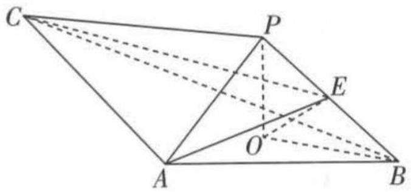

text_image

Geometric diagram of a triangular pyramid with labeled vertices and internal points, used in spatial geometry problems.

# 创新 预测练

4. [角度创新, 2022 长沙市适应性考试, ★★★★] 如图, 三棱柱 $ABC - A_{1}B_{1}C_{1}$ 中, 侧面 $BCC_{1}B_{1}$ 为矩形, 若平面 $BCC_{1}B_{1} \perp$ 平面 $ABB_{1}A_{1}$ , 平面 $BCC_{1}B_{1} \perp$ 平面 $ABC_{1}$ .

(1) 求证: $AB \perp BB_{1}$ .
(2) 记平面 $ABC_{1}$ 与平面 $A_{1}B_{1}C_{1}$ 的夹角为 $\alpha$ ，直线 $AC_{1}$ 与平面 $BCC_{1}B_{1}$ 所成的角为 $\beta$ ，异面直线

$AC_{1}$ 与 BC 所成的角为 $\varphi$ ，当 $\alpha, \beta$ 满足: $\cos \alpha \cdot \cos \beta = m (0 < m < 1, m \text{ 为常数})$ 时，求 $\sin \varphi$ 的值.

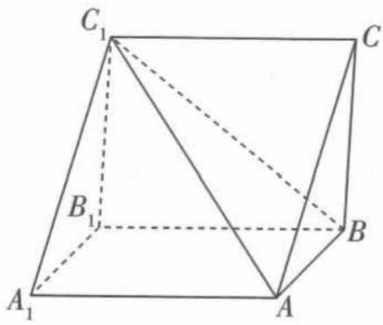

text_image

C₁
B₁
A₁
A
B
C
B

5.[设问创新,2022贵阳市监测,★★★★★]如图,在四棱锥P-ABCD中,底面ABCD是矩形,PA⊥底面ABCD,AF⊥PB,F为垂足.

(1) 当点 E 在线段 BC 上移动时, 判断 $\triangle AEF$ 是否为直角三角形, 并说明理由;

(2) 若 PA = AB = 2, $EF \parallel PC$ , 且 PB 与平面 PAE 所成的角为 $30^{\circ}$ , 求二面角 C - PE - D 的大小.

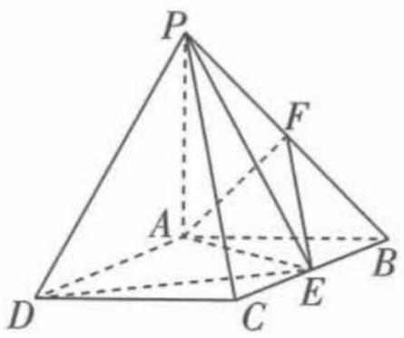

text_image

Geometric diagram of a pyramid with labeled vertices and internal points, used in spatial geometry problems.

# 热点 应用练

6. [情境创新, ★★★★] 中国是风筝的故乡, 南方称“鹞”, 北方称“鸢”, 如图, 某种风筝的骨架模型是四棱锥 P-ABCD, 其中 $AC \perp BD$ 于 O, OA = OB = OD = 4, OC = 8, PO ⊥ 平面 ABCD.

(1) 求证: $PD \perp AC$ .
(2)试验表明, 当 $PO = \frac{1}{2}OA$ 时, 风筝表现最好, 求此时直线 PD 与平面 PBC 所成角的正弦值.

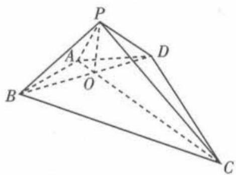

text_image

P
A
O
B
D
C

7.[数学探索,★★★★]将长(AB)、宽(BC)、高( $AA_{1}$ )分别为4,3,1的长方体点心盒用彩绳做一个捆扎,有如下两种方案:

方案一,如图1传统的十字捆扎;

方案二,如图2折线法捆扎,其中 $A_{1}E=FB=$ $BG=HC_{1}=C_{1}I=JD=DK=LA_{1}=1.$

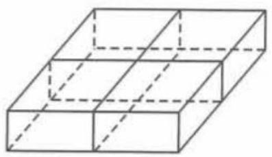

natural_image

Isometric line drawing of a 3D rectangular prism with dashed internal lines (no text or symbols)

图1

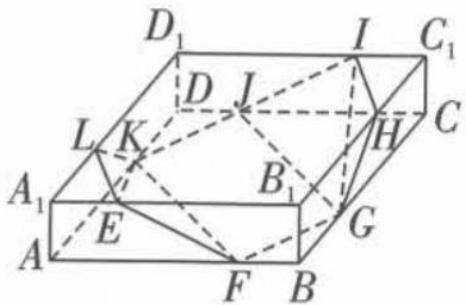

text_image

D₁
I
C₁
D
J
L
K
H
A₁
E
B₁
G
A
F
B

图 2

(1)哪种方案更省彩绳？说明理由.
(2)求平面 EFK 与平面 GIJ 所成的二面角的余弦值.

# 题型 42 立体几何中的翻折问题

# 题型攻略

# 翻折问题的解题策略

1.(1)画好两个图——折叠前的平面图和折叠后的立体图；

(2)分析好两个关系——折叠前后哪些位置关系和数量关系发生了变化,哪些没有发生变化.一般地,位于“折痕”同侧的点、线、面之间的位置和数量关系不变,而位于“折痕”两侧的点、线、面之间的位置关系会发生变化.

2.(1)与折痕垂直的线段,翻折前后垂直关系不改变(常用于翻折后构成二面角的平面角);

(2)与折痕平行的线段,翻折前后平行关系不改变.

# 综合 突破练

1. [多选,2022 江苏扬州中学模拟, ★★★★] 如图 1, 在菱形 ABCD 中, AB = 2, $\angle DAB = 60^{\circ}$ , E 是 AB 的中点, 将 $\triangle ADE$ 沿直线 DE 翻折至 $\triangle A_{1}DE$ 的位置, 得到如图 2 所示的四棱锥 $A_{1} - BCDE$ . 若 F 是 $A_{1}C$ 的中点, 则在翻折过程中, 下列说法错误的是 ( )

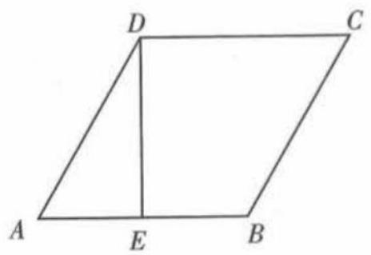

text_image

D
C
A
E
B

图1

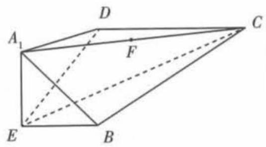

text_image

A₁
D
F
C
E
B

图2

A. 异面直线 $A_{1}E$ 与 DC 所成的角不断变大

B. 二面角 $A_{1}-DC-E$ 的平面角恒为 $45^{\circ}$

C. 点 F 到平面 $A_{1}EB$ 的距离恒为 $\frac{\sqrt{3}}{2}$

D. 当点 $A_{1}$ 在平面 EBCD 内的射影为点 E 时，
直线 $A_{1}C$ 与平面 EBCD 所成的角最大

2.[2017全国卷Ⅰ，★★★★]如

图,圆形纸片的圆心为 O, 半径为 5 cm, 该纸片上的等边三角形 ABC 的中心为 O. D, E, F 为圆 O 上的点, $\triangle DBC, \triangle ECA, \triangle FAB$ 分

别是以 BC, CA, AB 为底边的等腰三角形. 沿虚线剪开后, 分别以 BC, CA, AB 为折痕折起 $\triangle DBC, \triangle ECA, \triangle FAB$ , 使得 D, E, F 重合, 得到三棱锥. 当 $\triangle ABC$ 的边长变化时, 所得三棱

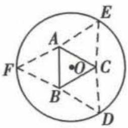

锥体积(单位: $cm^{3}$ )的最大值为\_\_\_\_.

3.[2019全国卷Ⅲ,★★★★★]图1是由矩形ADEB,Rt△ABC和菱形BFGC组成的一个平面图形,其中AB=1,BE=BF=2,∠FBC=60°.将其沿AB,BC折起使得BE与BF重合,连接DG,如图2.

(1) 证明: 图 2 中的 A, C, G, D 四点共面, 且平面 $ABC \perp$ 平面 BCGE.

(2) 求图 2 中的二面角 B - CG - A 的大小.

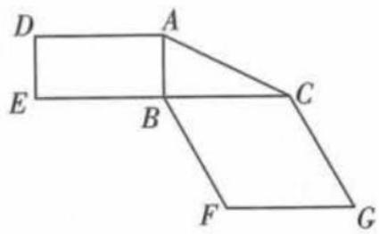

text_image

Geometric diagram with labeled points A, B, C, D, E, F, G forming connected polygons

图1

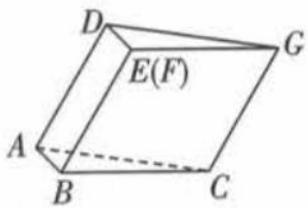  
图2

# 创新 预测练

4. [设问创新,2022 成都市一诊,★★★★] 如图 1, 在直角三角形 $ABC$ 中, 已知 $AB \perp BC$ , $BC = 4$ , $AB = 8$ , $D$ , $E$ 分别是 $AB$ , $AC$ 的中点. 将 $\triangle ADE$ 沿 $DE$ 折起, 使点 $A$ 到达点 $A'$ 的位置, 且 $A'D \perp BD$ , 连接 $A'B$ , $A'C$ , 得到如图 2 所示的四棱锥 $A' - DBCE$ , $M$ 为线段 $A'D$ 上一点.

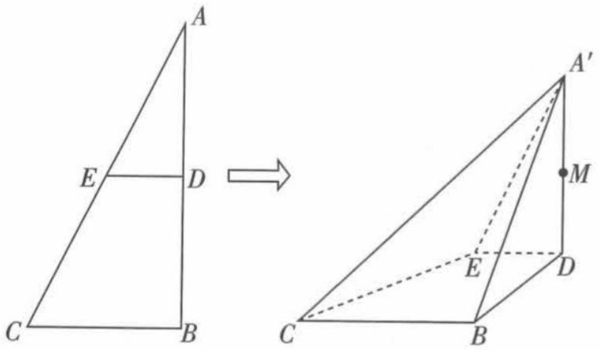

text_image

A
E D
C B
A'
M
E
D
C B

图1

(1) 证明: 平面 $A^{\prime}DB \perp$ 平面 DBCE;  
(2) 过 B, C, M 三点的平面与线段 $A'E$ 相交于

点 N, 从下列三个条件中选择一个作为已知条件, 求三棱锥 $A' - BCN$ 的体积.

①BM = BE; ②直线 EM 与 BC 所成角的大小为 $45^{\circ}$ ; ③三棱锥 M - BDE 的体积是三棱锥 E - A'BC 体积的 $\frac{1}{4}$ .

注:如果选择多个条件分别解答,按第一个解答计分.

# 题型 43 立体几何中的探索性问题

▶ 答案：164 页

# 题型攻略

# 求解立体几何中探索性问题的技巧

1. 涉及线段上点的位置的探索性问题,所求点多为中点或三等分点中某一个,也可以根据相似知识找点的位置,求解时注意三点共线条件的应用.  
2. 借助空间直角坐标系, 把几何对象上动点的坐标用参数表示出来, 根据题设得到相应的方程或方程组. 若方程或方程组有满足题设要求的解, 则通过参数的值反过来确定几何对象的位置; 若方程或方程组没有满足题设要求的解, 则表示满足题设要求的几何对象不存在.

# 综合 突破练

1. [2022 云南模拟, ★★★

★] 如图, 在四棱锥 P - ABCD 中, 四边形 ABCD 为直角梯形, $AB \parallel CD$ , $AB \perp BC$ , AB = BC = 2CD = 4,

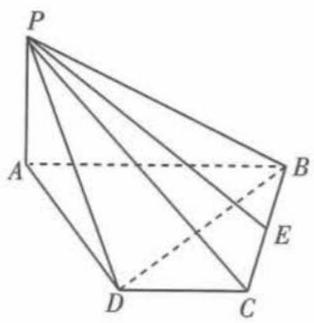

text_image

P
A
B
E
D
C

$PA = 2, PB = 2\sqrt{5}, E$ 为 BC 的中点，且 $PE \perp BD$ .

(1) 证明: $PA \perp$ 平面 $ABCD$ .  
(2) 线段 $PB$ 上是否存在一点 $M$ , 使得三棱锥 $A - DEM$ 的体积为 $\frac{4}{3}$ ? 若存在, 试确定点 $M$ 的

位置;若不存在,请说明理由.

2. [2019 北京, ★★★★★] 如图, 在四棱锥 $P - ABCD$ 中, $PA \perp$ 平面 $ABCD$ , $AD \perp CD$ , $AD \parallel BC$ , $PA = AD = CD = 2$ , $BC = 3$ . $E$ 为 $PD$ 的中点, 点 $F$ 在 $PC$ 上, 且 $\frac{PF}{PC} = \frac{1}{3}$ .

(1) 求证: $CD \perp$ 平面 PAD.  
(2) 求二面角 F-AE-P 的余弦值.  
(3) 设点 G 在 PB 上, 且 $\frac{PG}{PB} = \frac{2}{3}$ . 判断直线 AG 是否在平面 AEF 内, 说明理由.

3.[2022广西名校联考,★★★★★]如图,在直三棱柱 $ABC-A_{1}B_{1}C_{1}$ 中, $AB=BC=AA_{1}=1$ , $AC=\sqrt{3}$ ,点D,E分别为AC和 $B_{1}C_{1}$ 的中点.

(1)棱 $AA_{1}$ 上是否存在点 P 使得平面 $PBD \perp$ 平面 ABE? 若存在, 写出 PA 的长并证明你的结论; 若不存在, 请说明理由.  
(2) 求二面角 A - BE - D 的余弦值.

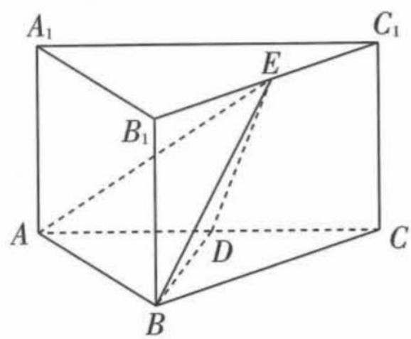

text_image

A₁
B₁
E
C₁
A
D
B
C

# 创新 预测练

4. [与三角函数综合, 多选, 2022 南京金陵中学模拟, ★★★★] 已知正方体 $ABCD - A'B'C'D'$ 的棱长为 2, Q 为棱 $AA'$ 的中点, 点 M, N 分别为棱 $C'D', CD$ 上的动点 (包括端点), 记直线 QM, QN 与平面 $ABB'A'$ 所成角分别为 $\alpha, \beta$ , 且 $\tan^{2}\alpha + \tan^{2}\beta = 4$ , 则下列说法正确的是 ( )

A. 存在点 M, N 使得 $MN \parallel AA'$   
B. $\overrightarrow{DM} \cdot \overrightarrow{DN}$ 不是定值  
C. 存在点 M, N 使得 $MN = \frac{5}{2}$   
D. 存在点 M, N 使得 $MN \perp CQ$

5. [巧设参数,2022高三名校联考,★★★★★] 如图,O是圆锥底面圆的圆心,圆锥的轴截面PAB为直角三角形,C是底面圆周上异于A,B的任一点,D是线段AC的中点, $AC=2\sqrt{3}$ ,BC=2.

(1) 证明: 平面 POD ⊥ 平面 PAC.  
(2) 在母线 PA 上是否存在一点 E, 使二面角 P - OD - E 的余弦值为 $\frac{2\sqrt{7}}{7}$ ? 若存在, 请说明点 E 的位置; 若不存在, 请说明理由.

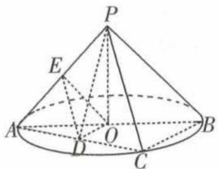

text_image

Geometric diagram of a cone with labeled points and internal lines, likely for a math problem or proof.

# 题型 44 直线与圆的位置关系的应用

▶ 答案：165 页

# 题型攻略

1. 已知直线与圆的位置关系求参数时,要建立位置关系与交点个数的等价关系.  
2.“直线与圆的关系”→“圆心到直线的距离与半径的关系”，通过转化得出待求量的最值或范围.

# 综合 突破练

1. [2022 烟台市诊断, ★★★] 过直线 x - y - m = 0 上一点 P 作圆 $M: (x - 2)^{2} + (y - 3)^{2} = 1$ 的两条切线, 切点分别为 A, B, 若使得四边形 PAMB 的面积为 $\sqrt{7}$ 的点 P 有两个, 则实数 m 的取值范围为 ( )

A. -5 < m < 3

B. -3 < m < 5

C. m < -5 或 m > 3

D. m < -3 或 m > 5

2. [2020 全国卷 I, ★★★★] 已知 $\odot M: x^{2} + y^{2} - 2x - 2y - 2 = 0$ , 直线 $l: 2x + y + 2 = 0$ , P 为 l 上的动点. 过点 P 作 $\odot M$ 的切线 PA, PB, 切点为 A, B, 当 $|PM| \cdot |AB|$ 最小时, 直线 AB 的方程为 ( )

A. 2x - y - 1 = 0

B. $2x + y - 1 = 0$

C. $2x - y + 1 = 0$

D. $2x + y + 1 = 0$

3.[2021全国卷甲,★★★★★]抛物线C的顶点为坐标原点O,焦点在x轴上,直线l:x=1交C于P,Q两点,且OP⊥OQ.已知点M(2,0),且⊙M与l相切.

(1) 求 $C, \odot M$ 的方程;

(2) 设 $A_{1}, A_{2}, A_{3}$ 是 C 上的三个点, 直线 $A_{1}A_{2}$ , $A_{1}A_{3}$ 均与 $\odot M$ 相切. 判断直线 $A_{2}A_{3}$ 与 $\odot M$ 的位置关系, 并说明理由.

# 创新 预测练

4.[角度创新,多选,2022武汉市调研,★★★]在平面直角坐标系中,已知圆 $K:(x-k)^{2}+(y-k)^{2}=\frac{k^{2}}{2}$ ,其中 $k\neq0$ ,则()

A. 圆 K 过定点  
B. 圆 K 的圆心在定直线上  
C. 圆 K 与定直线相切  
D. 圆 K 与定圆相切

5.[与向量综合,★★★]已知不垂直于x轴的直线l过定点(2,0),在直线l上存在一点M,且OM交圆 $C:x^{2}+y^{2}-2y=0$ 于另一点N,且 $\overrightarrow{OM}=2\overrightarrow{NM}$ ,其中O为坐标原点,则直线l的斜率的最大值是\_\_\_\_.

# 题型 45 “阿波罗尼斯圆”的应用

▶ 答案：166 页

# 题型攻略

满足 $\frac{|PA|}{|PB|}=k(k>0,k\neq1)(A,B$ 为平面上相异两点)的动点P的轨迹是一个圆,这个圆称为阿波罗尼斯圆.若题目中的条件可转化为“ $\frac{|PA|}{|PB|}=k$ ”的形式,则可借助阿波罗尼斯圆解题.

# 综合 突破练

1. [多选,2022福州市质检,★★★★ 已知A(-3,0),B(3,0),动点C满足|CA|=2|CB|,记C的轨迹为Γ.过A的直线与Γ交于P,Q两点,直线BP与Γ的另一个交点为M,则()

A. Q, M 关于 x 轴对称  
B. $\triangle PAB$ 的面积的最大值为 $6\sqrt{3}$   
C. 当 $\angle PMQ = 45^{\circ}$ 时， $|PQ| = 4\sqrt{2}$   
D. 直线 AC 的斜率的取值范围为 $\left[-\sqrt{3}, \sqrt{3}\right]$

2. ★★★ 若 AB = 2, AC = $\sqrt{2}$ BC, 则 $S_{\triangle ABC}$ 的最大值为 \_\_\_\_.

# 预测练

3. 在棱长为6的正方体 $ABCD - A_{1}B_{1}C_{1}D_{1}$ 中， $M$ 是 $BC$ 的中点，点 $P$ 是正方形 $DCC_{1}D_{1}$ 内（包括边界）的动点，且满足 $\angle APD = \angle MPC$ ，则三棱锥 $P - BCD$ 的体积最大值为 （）

A. 36

B. 24

C. $18\sqrt{3}$

D. $12\sqrt{3}$

# 题型 46 “蒙日圆”的应用

答案：167页

# 题型攻略

蒙日圆定理:如图,椭圆的两条切线互相垂直,则两条切线的交点位于以椭圆的中心为圆心的圆上,称该圆为蒙日圆,该圆的半径等于椭圆长半轴长与短半轴长平方和的算术平方根.即若椭圆 $C:\frac{x^{2}}{a^{2}}+\frac{y^{2}}{b^{2}}=1(a>b>0)$ ,则其对应的蒙日圆的方程为 $x^{2}+y^{2}=a^{2}+b^{2}$ .

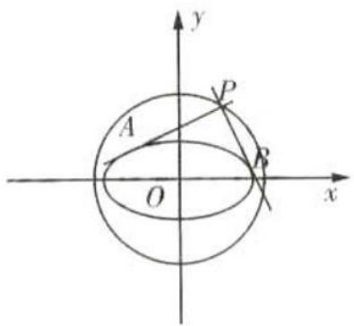

text_image

y
P
A
O
x
B

# 突破练

1. | 2022 高建七喜模化，★★★ 画法几何的创始人——法国数学家加斯帕尔·蒙日发现:椭圆的两条切线互相垂直,则两条切线的交点位于以椭圆的中心为圆心的圆上,称该圆为蒙日圆. 已知椭圆 $C: \frac{x^2}{a^2} + \frac{y^2}{b^2} = 1 (a > b > 0)$ 的蒙日圆方程为 $x^2 + y^2 = a^2 + b^2$ , 椭圆 $C$ 的离心率为 $\frac{\sqrt{2}}{2}, M$ 为蒙日圆上一个动点, 过点 $M$ 作椭圆 $C$ 的两条切线, 与蒙日圆分别交于 $P, Q$ 两点, 则 $\triangle MPQ$ 面积的最大值为 ( )

A. $3b^{2}$

B. $2b^{2}$

C. $\frac{4\sqrt{3}}{3}b^{2}$

D. $6b^{2}$

2. [2022 郑州市一模, ★★★] 在圆 $(x-3)^{2}+(y-4)^{2}=r^{2}(r>0)$ 上总存在点 P, 使得过点 P 能作椭圆 $\frac{x^{2}}{3}+y^{2}=1$ 的两条相互垂直的切线, 则 r 的取值范围是 ( )

A. $(3,7)$

B. $[3,7]$

C. $(1,9)$

D. $[1,9]$

# 预测练

3. 画法几何的创始人——法国数学家加斯帕尔·蒙日发现:椭圆的两条切线互相垂直,则两切线的交点位于一个与椭圆同中心的圆上,称此圆为该椭圆的蒙日圆.已知椭圆 $C: \frac{x^2}{a^2} + \frac{y^2}{b^2} = 1 (a > b > 0)$ 的离心率为 $\frac{\sqrt{2}}{2}, F_1, F_2$ 分别为椭圆的左、右焦点,点 $A$ 在椭圆上,直线 $l: bx + ay - a^2 - b^2 = 0$ ,则 ( )

A. 椭圆 C 的蒙日圆的方程为 $x^{2} + y^{2} = 2a^{2}$

B. 直线 $l$ 与椭圆 $C$ 的蒙日圆相切

C. 记点 A 到直线 l 的距高为 d，则 $d - |AF_{2}|$ 的最小值为 $\frac{(4\sqrt{3} - 6\sqrt{2})b}{3}$

D. 若矩形 MNGH 的四条边均与 C 相切, 则矩形 MNGH 的面积的最大值为 $8b^{2}$

# 题型 47 求圆锥曲线的离心率或其范围

▶ 答案：167 页

# 题型攻略

1. 求离心率的方法: 求椭圆和双曲线离心率的关键是求参数 a, b, c 的等量关系(只需找出其中两个参数的关系即可). 在寻找等量关系时, 通常有以下三个方向: ①找出题目给出的等量关系; ②通过几何关系(如垂直或夹角的关系等)得出等量关系; ③挖掘出题目中隐含的等量关系.  
2. 求离心率的取值范围的方法: 求离心率取值范围的关键是找到关于 a, b, c 的不等关系, 进而求出离心率的取值范围, 在寻找不等关系时, 通常有以下三个方向: ①题目中某点的横坐标(纵坐标)是否有范围要求; ②若题目中有一个核心变量, 则可以考虑将离心率表示为这个变量的函数, 从而求该函数的值域即可; ③通过一些不等关系得到关于 a, b, c 的不等式.

# 综合 突破练

1. [2022 合肥市一检, ★★★] 椭圆 $E: \frac{x^{2}}{a^{2}} + \frac{y^{2}}{b^{2}} = 1$ $(a > b > 0)$ 的左、右焦点分别为 $F_{1}, F_{2}$ , 点 $P$ 在椭圆 $E$ 上, $\triangle PF_{1}F_{2}$ 的重心为 $G$ . 若 $\triangle PF_{1}F_{2}$ 的内切圆 $H$ 的直径等于 $\frac{1}{2} |F_{1}F_{2}|$ , 且 $GH \parallel F_{1}F_{2}$ , 则椭圆 $E$ 的离心率为 ( )

A. $\frac{\sqrt{6}}{3}$

B. $\frac{2}{3}$

C. $\frac{\sqrt{2}}{2}$

D. $\frac{1}{2}$

2. [2019 全国卷Ⅱ, ★★★] 设 F 为双曲线 $C: \frac{x^{2}}{a^{2}} - \frac{y^{2}}{b^{2}} = 1 (a > 0, b > 0)$ 的右焦点, O 为坐标原点, 以 OF 为直径的圆与圆 $x^{2} + y^{2} = a^{2}$ 交于 P, Q 两点. 若 $|PQ| = |OF|$ , 则 C 的离心率为 ( )

A. $\sqrt{2}$

B. $\sqrt{3}$

C.2

D. $\sqrt{5}$

3. [2019 全国卷I, ★★★★]已知双曲线 $C: \frac{x^{2}}{a^{2}} - \frac{y^{2}}{b^{2}} = 1 (a > 0, b > 0)$ 的左、右焦点分别为 $F_{1}, F_{2}$ ,

过 $F_{1}$ 的直线与 C 的两条渐近线分别交于 A, B 两点. 若 $\overrightarrow{F_{1}A} = \overrightarrow{AB}, \overrightarrow{F_{1}B} \cdot \overrightarrow{F_{2}B} = 0$ , 则 C 的离心率为 \_\_\_\_.

# 创新 预测练

4.[与立体几何综合,2022济南市学情检测, ★★★★]已知双曲线 $C:\frac{x^{2}}{a^{2}}-\frac{y^{2}}{b^{2}}=1(a>0,b>0)$ 的左、右焦点分别是 $F_{1},F_{2}$ ，过点 $F_{1}$ 的直线与 C 交于 A,B 两点，且 $AB\perp F_{1}F_{2}$ ，现将平面 $AF_{1}F_{2}$ 沿 $F_{1}F_{2}$ 所在直线折起，点 A 到达点 P 处，使平面 $PF_{1}F_{2}\perp$ 平面 $BF_{1}F_{2}$ ，若 $\cos\angle PF_{2}B=\frac{5}{9}$ ，则双曲线 C 的离心率为 ( )

A. $\sqrt{2}$

B. $\sqrt{3}$

C.2

D. $\sqrt{5}$

5.[解题创新,2022重庆巴蜀中学开学考试, ★★★★]已知双曲线 $C:\frac{x^{2}}{a^{2}}-\frac{y^{2}}{b^{2}}=1(a>0,b>0)$ , 直线 $y=\frac{\sqrt{3}}{3}(x+c)$ 与双曲线 C 的两条渐近线分别交于 A, B, 若 $\triangle AOB$ 是锐角三角形, O 为坐标原点, 则双曲线 C 的离心率 e 的取值范围是 \_\_\_\_.

# 题型 48 圆锥曲线中的弦长问题

▶ 答案：168 页

# 题型攻略

在利用弦长公式时,需要分清楚是消去 x 还是消去 y 得到的二次方程,注意两种情况下对应的弦长公式的区别.

# 综合 突破练

1.[2022高三名校联考,★★★★]已知点F为抛物线 $C:y^{2}=4x$ 的焦点,过点F作两条互相垂直的直线 $l_{1},l_{2}$ ,直线 $l_{1}$ 与C交于A,B两点,直线 $l_{2}$ 与C交于D,E两点,则 $|AB|+9|DE|$ 的最小值为()

A. 32

B. 48

C. 64

D. 72

2.[2021新高考卷Ⅰ, ★★★★★]在平面直角坐标系 $xOy$ 中, 已知点 $F_{1}(-\sqrt{17},0)$ , $F_{2}(\sqrt{17},0)$ , 点 $M$ 满足 $|MF_{1}| - |MF_{2}| = 2$ . 记 $M$ 的轨迹为 $C$ .

(1) 求 C 的方程；
(2) 设点 T 在直线 $x = \frac{1}{2}$ 上, 过 T 的两条直线分别交 C 于 A, B 两点和 P, Q 两点, 且 $|TA| \cdot |TB| = |TP| \cdot |TQ|$ , 求直线 AB 的斜率与直线 PQ 的斜率之和.

3.[2022 成都市一诊, ★★★★★]已知抛物线 $C:y^{2}=2px(p>0,p\neq4)$ ，过点A(2,0)且斜率为k的直线与抛物线C相交于P,Q两点.

(1) 设点 B 在 x 轴上, 分别记直线 PB, QB 的斜率为 $k_{1}, k_{2}$ , 若 $k_{1} + k_{2} = 0$ , 求点 B 的坐标;
(2) 过抛物线 C 的焦点 F 作直线 PQ 的平行线与抛物线 C 相交于 M, N 两点, 求 $\frac{|MN|}{|AP| \cdot |AQ|}$ 的值.

# 创新 预测练

4.[与不等式综合,2022成都七中模拟,★★★

$$
\begin{array}{r l} & \text {   如图,已知椭圆   } \\ & \frac {x ^ {2}}{a ^ {2}} + \frac {y ^ {2}}{b ^ {2}} = 1 (a > b > 0) \end{array}
$$

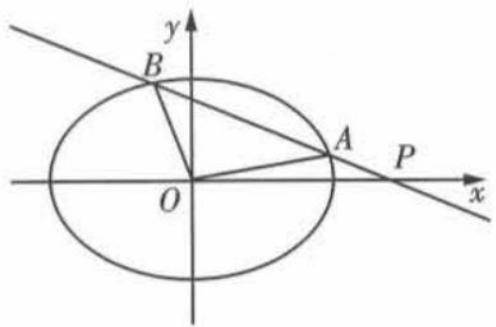

text_image

y
B
A
P
O
x

的长轴长为 $2\sqrt{2}$ ，短轴长为 2.

(1) 求椭圆的标准方程.   
(2) 过点 $P(2,0)$ 且斜率不为零的直线 l 与椭圆相交于 A, B 两点.  
①若 $k=\frac{1}{2}$ ，求弦长 $\left|AB\right|$ ;  
②记 O 为坐标原点, 求 $\triangle AOB$ 面积的最大值.

# 题型 49 圆锥曲线中的弦中点问题

# 题型攻略

圆锥曲线中涉及弦的中点和直线的斜率问题时,可以利用点差法求解. 步骤如下:①设出弦的两个端点的坐标;②将弦的两个端点的坐标分别代入曲线方程;③作差变形并利用直线的斜率公式和中点坐标公式求解. 若圆锥曲线(焦点在 x 轴上的椭圆、双曲线及开口向右的抛物线)上有 $A(x_{1},y_{1})$ , $B(x_{2},y_{2})$ 两点, AB 中点为 $M(x_{M},y_{M})$ , 且 AB 斜率为 $k_{AB}$ , ①若为椭圆, 则有 $\frac{y_{M}}{x_{M}} \cdot k_{AB} = -\frac{b^{2}}{a^{2}}$ ; ②若为双曲线, 则有 $\frac{y_{M}}{x_{M}} \cdot k_{AB} = \frac{b^{2}}{a^{2}}$ ; ③若为抛物线, 则有 $y_{M} \cdot k_{AB} = p$ .

# 综合 突破练

1. [2022 石家庄市一检, ★★★★] 已知双曲线 $C: \frac{x^{2}}{a^{2}} - \frac{y^{2}}{b^{2}} = 1 (a > 0, b > 0)$ ，过原点 O 的直线交 C 于 A, B 两点（点 B 在右支上），双曲线右支上一点 P（异于点 B）满足 $\overrightarrow{BA} \cdot \overrightarrow{BP} = 0$ ，直线 PA 交 x 轴于点 D。若 $\angle ADO = \angle AOD$ ，则双曲线 C 的离心率为 （）

A. $\sqrt{2}$

B.2

C. $\sqrt{3}$

D. 3

2. [2022 成都市一诊, ★★★] 已知斜率为 $-\frac{1}{3}$ 且不经过坐标原点 O 的直线与椭圆 $\frac{x^{2}}{9} + \frac{y^{2}}{7} = 1$ 相交于 A, B 两点, M 为线段 AB 的中点, 则直线 OM 的斜率为 \_\_\_\_.

3. [2022 绵阳市二诊, ★★★] 已知 A, B 为抛物线 $C: x^{2} = 4y$ 上的两点, $M(-1, 2)$ , 若 $\overrightarrow{AM} = \overrightarrow{MB}$ , 则直线 AB 的方程为 \_\_\_\_.

# 创新 预测练

4. [与不等式综合,2022 广东七校第二次联考, ★★★]已知 A, B, P 为双曲线 $x^{2}-\frac{y^{2}}{4}=1$ 上不同的三点,且满足 $\overrightarrow{PA}+\overrightarrow{PB}=2\overrightarrow{PO}$ (O 为坐标原点), 直线 PA, PB 的斜率记为 m, n, 则 $m^{2}+\frac{n^{2}}{9}$ 的最小值为 \_\_\_\_.

5.[与圆综合,2022郑州市一模,★★★★★]在平面直角坐标系中,O为坐标原点,抛物线C: $x^{2}=2py(p>0)$ 上不同两点M,N满足 $|OM|=$

$$
\mid O N \mid = \mid M N \mid = 4 \sqrt {3}.
$$

(1) 求抛物线 C 的标准方程.
(2) 若直线 l 与抛物线 C 相切于点 P, l 与椭圆 $D: \frac{y^{2}}{4} + \frac{x^{2}}{2} = 1$ 相交于 A, B 两点，l 与直线 y = -2 交于点 Q，以 PQ 为直径的圆与直线 y = -2 交于 Q, Z 两点. 求证：直线 OZ 经过线段 AB 的中点.

# 题型 50 “阿基米德三角形”的应用

# 题型攻略

# 阿基米德三角形的几何性质

圆锥曲线的弦与过弦的端点的两条切线所围成的三角形叫作阿基米德三角形.

过抛物线 $x^{2} = 2py(p > 0)$ 上 $A, B$ 两点作抛物线的切线，两切线相交于点 $P(x_{0}, y_{0})$ ，则 $\triangle PAB$ 为抛物线中的阿基米德三角形。若 $AB$ 恰好过抛物线的焦点 $F$ （如图），则 $\triangle PAB$ 有以下基本性质：

(1) 点 P 必在抛物线的准线上.  
(2) $\triangle PAB$ 为直角三角形,且 $\angle APB$ 为直角.  
(3) $PF \perp AB.$   
(4) 点 P 的坐标为 $\left(\frac{x_{A} + x_{B}}{2}, -\frac{p}{2}\right)$ .  
(5) $\triangle PAB$ 面积的最小值为 $p^{2}$ .

另外,对于任意圆锥曲线(椭圆、双曲线、抛物线)中的阿基米德三角形均有以下特性:过某一焦点 F 作弦与曲线交于 A, B 两点,分别过 A, B 两点作圆锥曲线的切线,两切线相交于点 P,那么点 P 必在该焦点所对应的准线上.

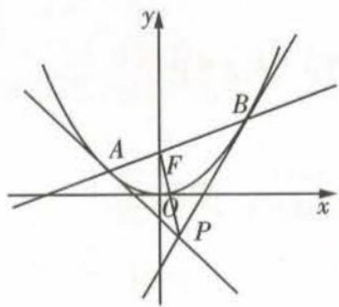

text_image

y
A
F
O
P
x
B

# 综合 突破练

1. [多选, ★★★★] 抛物线的弦与过弦的端点的两条切线所围成的三角形常被称为阿基米德三角形, 阿基米德三角形有一些有趣的性质, 如: 若抛物线的弦过焦点, 则过弦的端点的两条切线的交点在其准线上. 设抛物线 $y^{2} = 2px (p > 0)$ , 弦 $AB$ 过焦点 $F$ , △ABQ 为其阿基米德三角形, 则下列结论一定成立的是()

A. 存在点 Q, 使得 $\overrightarrow{QA} \cdot \overrightarrow{QB} > 0$   
B. $\overrightarrow{AQ} \cdot \overrightarrow{AB} = |\overrightarrow{AF}| \cdot |\overrightarrow{AB}|$   
C. 对于任意的点 Q, 必有向量 $\overrightarrow{QA} + \overrightarrow{QB}$ 与向量
a = (-1,0) 共线  
D. $\triangle ABQ$ 面积的最小值为 $p^{2}$

2.[2019全国卷Ⅲ,★★★★]已知曲线C:y= $\frac{x^{2}}{2}$ ,D为直线y=- $\frac{1}{2}$ 上的动点,过D作C的两条切线,切点分别为A,B.

(1) 证明: 直线 AB 过定点.  
(2) 若以 $E(0, \frac{5}{2})$ 为圆心的圆与直线 AB 相切, 且切点为线段 AB 的中点, 求四边形 ADBE 的面积.

3.[2021全国卷乙,★★★★★]已知抛物线C: $x^{2}=2py(p>0)$ 的焦点为F,且F与圆 $M:x^{2}+(y+4)^{2}=1$ 上点的距离的最小值为4.

(1) 求 p;   
(2) 若点 P 在 M 上, PA, PB 是 C 的两条切线, A, B 是切点, 求 $\triangle PAB$ 面积的最大值.

# 创新 预测练

4. [与解三角形综合, ★★★★] 过抛物线 C: $x^{2}=4y$ 焦点 F 的直线 l 交 C 于 P, Q 两点, O 为坐标原点, 则 ( )

A. 存在直线 l, 使得 $OP \perp OQ$   
B. 若 $\overrightarrow{FP} = 2\overrightarrow{QF}$ , 则直线 $l$ 的斜率为 $\frac{\sqrt{2}}{4}$

C. 过 P 作 C 的准线的垂线, 垂足为 M, 若 $\left|PF\right|=3$ , 则 $\cos\angle FPM=\frac{1}{2}$   
D. 过 P, Q 两点分别作抛物线 C 的切线, 则两
切线交点的纵坐标为定值

# 题型51 求轨迹方程

▶ 答案：171 页

# 题型攻略

轨迹问题的求解方法

<table><tr><td>几何法</td><td colspan="2">若动点的轨迹满足圆锥曲线的定义,则可直接根据定义来求圆锥曲线方程.</td></tr><tr><td rowspan="3">代数法</td><td>直译法</td><td>将动点满足的几何关系“翻译”成动点坐标的关系式,就是求动点的轨迹方程的直译法.</td></tr><tr><td>相关点法</td><td>如果动点满足的限制条件不容易直接列出等式,但是动点随着另一相关点的运动而运动,这时可用动点坐标表示相关点的坐标,根据相关点所满足的方程求得动点的轨迹方程.</td></tr><tr><td>参数法</td><td>如果动点本身所满足的条件中含有一个参数,或在运动过程中受到某个变量的制约,那么以此变量为参数,建立轨迹的参数方程,再设法消去参数,即可得到轨迹的方程.</td></tr></table>

注意:(1)利用定义求轨迹方程时,要看所求轨迹是不是完整的曲线,如果不是完整的曲线,则应对其中的变量x或y进行限制;(2)求点的轨迹与求轨迹方程时要求不同,求轨迹时,应说明轨迹的形状、位置、大小等.

# 综合 突破练

1. [2022 石家庄模考改编, ★★★] 已知点 A(-3,0), 点 B(3,0), 直线 AP 与 BP 相交于点 P, 且它们的斜率之积为非零常数 m, 那么下列说法中正确的是 ( )

A. 当 m < -1 时, 点 P 的轨迹加上 A, B 两点所形成的曲线是焦点在 x 轴上的椭圆  
B. 当 m = -1 时, 点 P 的轨迹加上 A, B 两点所形成的曲线是圆心在原点的圆  
C. 当 -1 < m < 0 时, 点 P 的轨迹加上 A, B 两点所形成的曲线是焦点在 y 轴上的椭圆  
D. 当 m > 0 时, 点 P 的轨迹加上 A, B 两点所形成的曲线是焦点在 y 轴上的双曲线

2. [2022 开封市一模, ★★★★★] 设不同的两点 A, B 在椭圆 $C: x^{2} + 2y^{2} = 3$ 上运动, 以线段 AB 为直径的圆过坐标原点 O, 过 O 作 $OM \perp$

AB, M 为垂足.

(1) 求点 M 的轨迹方程；  
(2) 若 $\overrightarrow{AM} = \lambda \overrightarrow{MB}$ ，求实数 $\lambda$ 的取值范围.

# 创新 预测练

3.[条件创新,多选,2022辽宁省重点高中一模,

$\star \star \star \star$ ]在一张纸上有一圆 $C: (x + 2)^{2} + y^{2} = r^{2} (r > 0)$ 与点 $M(m,0) (m \neq -2)$ , 折叠纸片, 使圆 $C$ 上某一点 $M'$ 恰好与点 $M$ 重合, 这样的每次折法都会留下一条直线折痕 $PQ$ , 设折痕 $PQ$ 与直线 $M'C$ 的交点为 $T$ , 则下列说法正确的是 （）

A. 当 -2 - r < m < -2 + r 时, 点 T 的轨迹是椭圆  
B. 当 $m=2,1 \leqslant r \leqslant 2$ 时，点 T 的轨迹的离心率的取值范围为 [2,4]  
C. 当 r=1, m=2 时, 点 T 的轨迹方程为 $x^{2}-\frac{y^{2}}{3}=1$   
D. 当 $r = 2\sqrt{2}$ , m = 2 时, 在点 T 的轨迹上任取一点 S, 过 S 作直线 y = x 的垂线, 垂足为 N, 则 $\triangle SON(O$ 为坐标原点) 的面积为定值

4.[解题创新,2022云南省统考,★★★★★]在平面直角坐标系 $xOy$ 中,已知 $F_{1}(-6,0)$ , $F_{2}(6,0),F(2,0)$ . 动点 $C$ 与 $F_{1},F_{2}$ 的距离的和等于 18 ,动点 $D$ 满足 $\overrightarrow{DC} +\overrightarrow{DF_1} +\overrightarrow{DF_2} = 0.$ 动点 $D$ 的轨迹与 $x$ 轴交于 $A,B$ 两点,点 $A$ 的横坐

标小于点 B 的横坐标, M 是动点 D 的轨迹上异于 A, B 的动点, 直线 AM 与直线 x = 3 交于 E 点, 设直线 AM 的斜率为 k, BE 的中点为 T, 点 M 关于直线 FT 的对称点为 P.

(1) 求动点 D 的轨迹方程.  
(2) 是否存在 k, 使 P 的纵坐标为 0? 若存在, 求出使 P 的纵坐标为 0 的所有 k 的值; 若不存在, 请说明理由.

# 题型52 圆锥曲线中的最值问题

▶ 答案：172 页

# 题型攻略

圆锥曲线中最值问题的求解方法

<table><tr><td>几何法</td><td>若题目给出的条件和结论明显能体现几何特征和意义,则考虑利用圆锥曲线的定义、几何性质将最值转化,利用平面几何中的定理、性质,结合图形的直观性求最值问题.</td></tr><tr><td>代数法</td><td>若题目给出的条件和结论的几何特征不明显,则从代数的角度考虑,通过建立函数、不等式模型,利用配方法、基本不等式法、换元法、函数的单调性等求最值.要特别注意自变量的取值范围.</td></tr></table>

# 综合 突破练

1. [2022 全国卷甲, ★★★★★] 设抛物线 C: $y^{2}=2px(p>0)$ 的焦点为 F, 点 $D(p,0)$ , 过 F 的直线交 C 于 M, N 两点. 当直线 MD 垂直于 x 轴时, $|MF|=3$ .

(1) 求 C 的方程;  
(2) 设直线 MD, ND 与 C 的另一个交点分别为 A, B, 记直线 MN, AB 的倾斜角分别为 $\alpha, \beta$ . 当 $\alpha - \beta$ 取得最大值时, 求直线 AB 的方程.

2.[2019全国卷Ⅱ,★★★★★]已知点A(-2,0),B(2,0),动点M(x,y)满足直线AM与BM的斜率之积为 $-\frac{1}{2}$ .记M的轨迹为曲线C.

(1) 求 C 的方程, 并说明 C 是什么曲线.  
(2) 过坐标原点的直线交 C 于 P, Q 两点, 点 P 在第一象限, $PE \perp x$ 轴, 垂足为 E, 连接 QE 并延长交 C 于点 G.

(i) 证明: $\triangle PQG$ 是直角三角形.

(ii) 求 $\triangle PQG$ 面积的最大值.

# 创新 预测练

3. [与导数综合,2022济南市十一校联考,★★★★★]在平面直角坐标系 $xOy$ 中,动点 $P$ 到点 $F(1,0)$ 的距离比到 $y$ 轴的距离大 1.

(1) 求点 P 的轨迹方程；  
(2) 已知点 Q 在直线 x = -1 上, 点 P 在第一象限, 满足 $FP \perp FQ$ , 记直线 OP, OQ, PQ 的斜率分别为 $k_{1}, k_{2}, k_{3}$ , 求 $k_{1}k_{2}k_{3}$ 的最小值.

# 题型 53 圆锥曲线中的取值范围问题

▶ 答案：173 页

# 题型攻略

# 求解圆锥曲线中的取值范围问题的常用方法

1. 利用圆锥曲线的几何性质或判别式构造不等关系,从而确定参数的取值范围.  
2. 利用已知的或隐含的不等关系建立不等式, 从而求出参数的取值范围.  
3. 将待求量表示为关于其他变量的函数, 利用导数或基本不等式求值域, 从而确定参数的取值范围.

# 综合 突破练

1.[2022郑州市一模,★★★★★]已知椭圆C: $\frac{x^2}{a^2} +\frac{y^2}{b^2} = 1(a > b > 0)$ 的左焦点为 $F_{1}$ ,离心率为 $\frac{1}{2}$ ,过 $F_{1}$ 的直线与椭圆交于 $M,N$ 两点,当 $MN\perp x$ 轴时, $|MN| = 3$ .

(1) 求椭圆 C 的方程;  
(2) 设经过点 $H(0, -1)$ 的直线 l 与椭圆 C 相交于 P, Q 两点, 点 P 关于 y 轴的对称点为 F, 直线 FQ 与 y 轴交于点 G, 求 $\triangle PQG$ 面积的取值范围.

2.[2021北京,★★★★★]已知椭圆 $E:\frac{x^{2}}{a^{2}}+\frac{y^{2}}{b^{2}}=1(a>b>0)$ 过点 $A(0,-2)$ ，其四个顶点的连线围成的四边形面积为 $4\sqrt{5}$ .

(1) 求椭圆 E 的标准方程;  
(2) 过点 $P(0, -3)$ 的直线 l 的斜率为 k，交椭圆 E 于不同的两点 B, C，直线 AB, AC 分别交直线 y = -3 于点 M, N，若 $|PM| + |PN| \leqslant 15$ ，求 k 的取值范围.

# 创新 预测练

3. [与数列综合,2022甘肃九校联考,★★★★] 已知中心在坐标原点 O, 焦点在 x 轴上, 离心率为 $\frac{\sqrt{3}}{2}$ 的椭圆 C 过点 ( $\sqrt{3}, \frac{1}{2}$ ).

(1) 求 C 的标准方程.  
(2) 是否存在不过原点 O 的直线 $l: y = kx + m$ 与 C 交于 P, Q 两点, 使得直线 OP, PQ, OQ 的斜率成等比数列? 若存在, 求 k 的值及 m 的取值范

围;若不存在,请说明理由.

# 题型 54 圆锥曲线中的 “非对称” 根与系数关系的应用

▶ 答案：174 页

# 题型攻略

1. 利用根与系数的关系解题时,一般是将已知条件转化为“ $m(x_{1}+x_{2})+nx_{1}x_{2}+p=0$ ”的形式,但是并不是所有的题都可以走这个套路,如有的题目将已知条件转化为方程后,会出现“ $x_{1}=\lambda x_{2}$ ”“ $mx_{1}+nx_{2}+p=0$ ”“ $mx_{1}+nx_{2}+px_{1}x_{2}+q=0$ ”或“ $\frac{r_{1}x_{1}x_{2}+m_{1}x_{1}+n_{1}x_{2}+p_{1}}{r_{2}x_{1}x_{2}+m_{2}x_{1}+n_{2}x_{2}+p_{2}}$ ”等形式,以上情况是无法直接利用根与系数的关系的,这类题一般称为非对称根与系数的关系问题.  
2. 对于“非对称”根与系数的关系问题常用的解题策略如下: (1) 和积转换——找出根与系数关系中的两根之和与两根之积, 然后进行转换; (2) 配凑半代换——对能代换的部分进行根与系数关系的代换, 剩余的部分进行配凑; (3) 先猜后证——如求有关定值问题时, 先寻找一个特殊情况得到定值, 再证明其余情况也为该定值.

# 综合 突破练

1. [2020 北京, ★★★★★] 已知椭圆 $C: \frac{x^{2}}{a^{2}} + \frac{y^{2}}{b^{2}} =$ 1 过点 A(-2, -1)，且 a = 2b.

(1) 求椭圆 C 的方程;  
(2) 过点 $B(-4,0)$ 的直线 l 交椭圆 C 于点 M, N, 直线 MA, NA 分别交直线 x = -4 于点 P, Q, 求 $\frac{|PB|}{|BQ|}$ 的值.

2.[2020全国卷Ⅰ,★★★★★]已知A,B分别为椭圆 $E:\frac{x^{2}}{a^{2}}+y^{2}=1(a>1)$ 的左、右顶点,G为E的上顶点, $\overrightarrow{AG}\cdot\overrightarrow{GB}=8.P$ 为直线x=6上的动点,PA与E的另一交点为C,PB与E的另一交点为D.

(1) 求 E 的方程;  
(2) 证明: 直线 CD 过定点.

# 创新 预测练

3.[设问创新,2022福州市质检,★★★★]平面直角坐标系 $xOy$ 中,双曲线 $C:\frac{x^2}{3} -\frac{y^2}{6} = 1$ 的右焦点为 $F,T$ 为直线 $l:x = 1$ 上一点,过 $F$ 作 $TF$ 的垂线分别交 $C$ 的左、右支于 $P,Q$ 两点,交 $l$ 于点 $A$ .

(1) 证明: 直线 OT 平分线段 PQ;  
(2) 若 $\left|PA\right|=3\left|QF\right|$ ，求 $\left|TF\right|^{2}$ 的值.

# 题型55 圆锥曲线中的定点问题

▶ 答案：175 页

# 题型攻略

# 求解有关定点问题的常用方法

1. 由特殊到一般法: 利用由特殊到一般法求解定点问题时, 常根据动点或动直线的特殊情况探索出定点, 再证明该定点与变量无关.  
2. 参数法: 引进动点的坐标或动直线中的参数表示变化量, 即确定题目中的核心变量 (此处设为 k) —— 利用条件找到 k 与待求定点的曲线 $F(x,y)=0$ 之间的关系——研究变化量与参数何时没有关系, 找到定点.

# 综合 突破练

1.[2022全国卷乙,★★★★★]已知椭圆E的中心为坐标原点,对称轴为x轴、y轴,且过A(0,-2),B(3/2,-1)两点.

(1) 求 E 的方程;  
(2) 设过点 $P(1, -2)$ 的直线交 $E$ 于 $M, N$ 两点, 过 $M$ 且平行于 $x$ 轴的直线与线段 $AB$ 交于点 $T$ , 点 $H$ 满足 $\overrightarrow{MT} = \overrightarrow{TH}$ . 证明: 直线 $HN$ 过定点.

2.[2022 南通市一调, ★★★★★]已知双曲线 C: $\frac{x^{2}}{a^{2}}-\frac{y^{2}}{b^{2}}=1(a>0,b>0)$ ，四点 $M_{1}(4,\frac{\sqrt{2}}{3})$ , $M_{2}(3,\sqrt{2}),M_{3}(-2,-\frac{\sqrt{3}}{3}),M_{4}(2,\frac{\sqrt{3}}{3})$ 中恰有三点在双曲线 C 上.

(1) 求双曲线 C 的方程；  
(2) 过点 $(3,0)$ 的直线 l 交双曲线 C 于 P, Q 两点, 过点 P 作直线 x = 1 的垂线, 垂足为 A, 证明: 直线 AQ 过定点.

3. [2022 天津模拟, ★★★★★] 设椭圆 $\frac{x^{2}}{a^{2}} + \frac{y^{2}}{b^{2}} = 1 (a > b > 0)$ 的左、右焦点分别为 $F_{1}, F_{2}, M$ 为椭圆上一动点, 已知椭圆的短轴长为 $2\sqrt{3}$ , $\triangle F_{1}MF_{2}$ 面积的最大值为 $\sqrt{3}$ .

(1) 求椭圆方程;

(2)设椭圆的左顶点为 $A_{1}$ , 过 $F_{2}$ 的直线 $l$ 与椭圆交于 $A, B$ 两点, 连接 $A_{1}A, A_{1}B$ 并延长, 分别交直线 $x = 4$ 于 $P, Q$ 两点, 则以 $PQ$ 为直径的圆是否恒过定点? 若是, 请求出定点坐标, 若不是, 请说明理由.

# 创新 预测练

4. [设问创新,2022 湖北联考, ★★★★★] 过原点 O 的直线与抛物线 $C: y^{2} = 2px (p > 0)$ 交于点 A, 线段 OA 的中点为 M, $P(3p, 0)$ , 且 $PM \perp OA$ . 在下面给出的三个条件中任选一个填在横线处, 并解答问题.

① $|OA|=4\sqrt{6}$ ，② $|PM|=2\sqrt{3}$ ，③ $\triangle POM$ 的面积为 $6\sqrt{2}$ .

(1) \_\_\_\_, 求 C 的方程.

(2) 在(1)的条件下, 过 y 轴上的动点 B 作 C 的切线, 切点为 Q (不与原点 O 重合), 过点 B 作直线 l 与 OQ 垂直, 求证: 直线 l 过定点.

注:如果选择多个条件分别解答,按第一个解答计分.

# 题型 56 圆锥曲线中的定值问题

▶ 答案：177 页

# 题型攻略

# 求解定值问题的常用方法

# 1. 直接消参法

①确定一个(或两个)变量为核心变量,其余量均利用条件用核心变量进行表示;②将所求表达式用核心变量进行表示(有的甚至就是核心变量),然后进行化简,看能否得到一个常数.

# 2. 从特殊到一般法

常用技巧:①在运算过程中,尽量减少所求表达式中变量的个数,以便于向定值靠拢;②巧妙利用变量间的关系,例如点的坐标符合曲线方程等,尽量做到整体代入,简化运算.

# 综合 突破练

1. [2018 北京, ★★★★] 已知抛物线 $C: y^{2} = 2px$ 经过点 $P(1,2)$ . 过点 $Q(0,1)$ 的直线 $l$ 与抛物线 $C$ 有两个不同的交点 $A, B$ , 且直线 $PA$ 交 $y$ 轴于 $M$ , 直线 $PB$ 交 $y$ 轴于 $N$ .

(1) 求直线 l 的斜率的取值范围.  
(2) 设 O 为原点, $\overrightarrow{QM} = \lambda \overrightarrow{QO}, \overrightarrow{QN} = \mu \overrightarrow{QO}$ , 求证: $\frac{1}{\lambda} + \frac{1}{\mu}$ 为定值.

2. [2022 福建模拟, ★★★★] 已知双曲线 $C: \frac{x^2}{a^2} - \frac{y^2}{b^2} = 1 (a > 0, b > 0)$ 的虚轴长为 4, 直线 $2x - y = 0$ 为双曲线 $C$ 的一条渐近线.

(1) 求双曲线 C 的标准方程.  
(2) 记双曲线 C 的左、右顶点分别为 A, B, 过点 $T(2,0)$ 的直线 l 与双曲线交于 M, N 两点, 直线 MA 交 y 轴于点 P, 直线 NB 交 y 轴于点 Q, 记 $\triangle PAT$ 面积为 $S_{1}, \triangle QBT$ 面积为 $S_{2}$ , 求证: $\frac{S_{1}}{S_{2}}$ 为定值.

3. [2020 新高考卷 1, ★★★★★] 已知椭圆 C: $\frac{x^{2}}{a^{2}} + \frac{y^{2}}{b^{2}} = 1 (a > b > 0)$ 的离心率为 $\frac{\sqrt{2}}{2}$ ，且过点 A(2, 1).

(1) 求 C 的方程;  
(2) 点 M, N 在 C 上, 且 $AM \perp AN, AD \perp MN, D$ 为垂足. 证明: 存在定点 Q, 使得 $|DQ|$ 为定值.

# 创新 预测练

4. 设问创新,2022绵阳市二阶,★★★★★已

知椭圆 $E: \frac{x^{2}}{a^{2}} + \frac{y^{2}}{b^{2}} = 1 (a > b > 0)$ 的右焦点为 F，点 A, B 分别为右顶点和上顶点，点 O 为坐标原点， $\frac{1}{|OF|} + \frac{1}{|OA|} = \frac{e}{|FA|}$ ， $\triangle OAB$ 的面积为 $\sqrt{2}$ ，其中 e 为 E 的离心率.

(1) 求椭圆 E 的方程.  
(2) 过点 O 异于坐标轴的直线与 E 交于 M, N 两点, 射线 AM, AN 分别与圆 $C: x^{2} + y^{2} = 4$ 交于 P, Q 两点, 记直线 MN 和直线 PQ 的斜率分别为 $k_{1}, k_{2}$ , 问 $\frac{k_{1}}{k_{2}}$ 是否为定值? 若是, 求出该定值; 若不是, 请说明理由.

# 题型 57 圆锥曲线中的点在定线上的问题

# 题型攻略

定线问题是指因图形的变化或点的移动而产生的动点在定线上的问题. 这类问题的本质是求点的轨迹方程,一般先求出点的坐标,看横、纵坐标是否为定值,或者找出横、纵坐标的关系.

# 综合 突破练

1.[2022 辽宁省重点高中一模, ★★★★★]已知椭圆 $C:\frac{x^{2}}{4}+\frac{y^{2}}{3}=1$ 的左、右顶点分别为 A, B, 右焦点为 F, 折线 $|x-1|=my(m\neq0)$ 与 C 交于 M, N 两点.

(1) 当 m=2 时, 求 $\left|MF\right| + \left|NF\right|$ 的值;  
(2) 直线 AM 与 BN 交于点 P, 证明: 点 P 在定直线上.

2. [2022 南充市一诊, ★★★★★] 已知椭圆 C: $\frac{x^{2}}{a^{2}} + \frac{y^{2}}{b^{2}} = 1 (a > b > 0)$ 的离心率为 $\frac{\sqrt{3}}{2}$ , 如图, 椭圆 C 的下顶点和上顶点分别为 $B_{1}, B_{2}$ , 且 $|B_{1}B_{2}| = 2$ , 过点 $P(0,2)$ 且斜率为 k 的直线 l 与椭圆 C 交于 M, N 两点.

(1) 求椭圆 C 的标准方程;  
(2) 当 k=1 时, 求 $\triangle OMN$ 的面积;

(3) 求证: 直线 $B_{1}M$ 与直线 $B_{2}N$ 的交点 T 恒在一条定直线上.

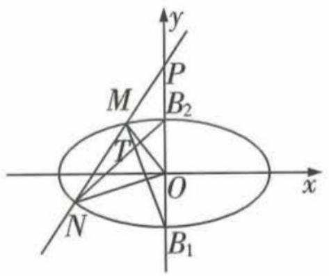

text_image

y
P
M
B₂
T
O
x
N
B₁

# 创新 预测练

3.[解题创新,2022海口市名校联考,★★★★]
已知椭圆 $C:\frac{x^{2}}{a^{2}}+\frac{y^{2}}{b^{2}}=1(a>b>0)$ 的右焦点为 $F(1,0)$ ，且过点 A(-2,0).

(1) 求 C 的方程;  
(2) 点 P, Q 分别在 C 和直线 x = 4 上, $OQ \parallel AP$ (O 为坐标原点), M 为 AP 的中点, 求证: 直线 OM 与直线 QF 的交点在某定曲线上.

# 题型58 圆锥曲线中的探索性问题

# 题型攻略

# 有关探索性问题的求解方法

1. 存在性问题通常采用“肯定顺推法”，将不确定的问题明朗化。其步骤为：①假设满足条件的元素（点、直线、曲线或参数）存在，用待定系数法设出；②列出关于待定系数的方程（组）；③若方程（组）有实数解，则元素（点、直线、曲线或参数）存在，否则，元素（点、直线、曲线或参数）不存在。  
2. 反证法也是求解存在性问题的常用方法.

# 综合 突破练

1. [2022 太原市统考, ★★★★] 已知椭圆 $C: \frac{x^2}{a^2} + \frac{y^2}{b^2} = 1 (a > b > 0)$ 的左、右焦点分别为 $F_1, F_2$ , 点 $P(2, \sqrt{2})$ 在椭圆 $C$ 上, 且满足 $\overrightarrow{PF_1} \cdot \overrightarrow{PF_2} = \overrightarrow{PF_2^2}$ .

(1) 求椭圆 C 的方程.  
(2) 设 O 为坐标原点, 过点 $F_{2}$ 且斜率不为零的直线 l 交椭圆 C 于不同的两点 A, B, 则在 x 轴上是否存在定点 M, 使得 MO 平分 $\angle AMB$ ? 若存在, 求出点 M 的坐标; 若不存在, 请说明理由.

2.[2022重庆市模拟,★★★★★]已知点A(-2,0),B(2,0),动点P满足直线AP的斜率与直线BP的斜率的乘积为 $e^{2}-1$ .当 $e=\frac{\sqrt{3}}{2}$ 时,点P的轨迹为 $C_{1}$ ;当 $e=\frac{\sqrt{5}}{2}$ 时,点P的轨迹为 $C_{2}$ .

(1) 求 $C_{1}, C_{2}$ 的方程.  
(2) 是否存在过 $C_{1}$ 右焦点的直线 l, 满足直线 l 与 $C_{1}$ 交于 C, D 两点, 直线 l 与 $C_{2}$ 交于 M, N 两点, 且 $|MN| = \sqrt{3} |CD|$ ? 若存在, 求所有满足条件的直线 l 的斜率之积; 若不存在, 请说明理由.

3. [2022 高三名校联考, ★★★★★] 已知抛物线 $C: y^{2} = 2px (p > 0)$ 的焦点为 $F$ , 过点 $F$ 的直线 $l$ 交抛物线 $C$ 于 $A, B$ 两点, 当 $l \perp x$ 轴时, $|AB| = 2$ .

(1) 求抛物线 C 的方程及焦点 F 的坐标.

(2) 若直线 l 交 y 轴于点 D, 过点 D 且垂直于 y 轴的直线交抛物线 C 于点 P, 直线 PF 交抛物线 C 于另一点 Q.

(i) 是否存在定点 M, 使得四边形 AQBM 为平行四边形? 若存在, 求出定点 M 的坐标; 若不存在, 请说明理由.

(ii) 求证: $\triangle QAF$ 与 $\triangle QBF$ 的面积之积为定值.

# 创新 预测练

4.[构造函数,利用导数求最值,2022 潍坊市模拟,★★★★★]已知椭圆 $C:\frac{x^{2}}{a^{2}}+\frac{y^{2}}{b^{2}}=1(a>b>0)$ 的左、右焦点分别为 $F_{1},F_{2}$ ,椭圆 C 上任意一点 P 到焦点距离的最大值是最小值的 3 倍,且通径长为 3.

(1) 求椭圆 C 的标准方程.

(2) 过 $F_{2}$ 的直线 l 与椭圆 C 相交于不同的两点 A, B，则 $\triangle ABF_{1}$ 的内切圆面积是否存在最大值？若存在，则求出最大值；若不存在，请说明理由.

# 题型59 圆锥曲线中的证明问题

▶ 答案：181 页

# 题型攻略

# 有关证明问题的解题策略

1. 圆锥曲线中的证明问题,主要有两类:一是证明点、直线、曲线等几何元素中的位置关系,如某点在某直线上、某直线经过某个点、某两条直线平行或垂直等;二是证明直线与圆锥曲线中的一些数量关系(相等或不等).  
2. 解决证明问题时,主要根据直线、圆锥曲线的性质、直线与圆锥曲线的位置关系等,通过相关的性质应用、代数式的恒等变形以及必要的数值计算等进行证明.

# 综合 突破练

1. [2018 全国卷 I, ★★★★] 设椭圆 $C: \frac{x^{2}}{2} + y^{2} = 1$ 的右焦点为 $F$ , 过 $F$ 的直线 $l$ 与 $C$ 交于 $A, B$ 两点, 点 $M$ 的坐标为 (2,0).

(1) 当 l 与 x 轴垂直时, 求直线 AM 的方程;  
(2) 设 O 为坐标原点, 证明: $\angle OMA = \angle OMB$ .

2. [2022 广西适应性测试, ★★★★★] 已知椭圆 $C: \frac{x^{2}}{4} + \frac{y^{2}}{3} = 1$ 的右焦点为 $F$ , 过点 $F$ 且不垂直于 $x$ 轴的直线交 $C$ 于 $A, B$ 两点, 分别过 $A, B$ 作平行于 $x$ 轴的两条直线 $l_{1}, l_{2}$ , 设 $l_{1}, l_{2}$ 分别与直线 $x = 4$ 交于点 $M, N$ , 点 $R$ 是 $MN$ 的中点.

(1) 求证: $AR \parallel FN$ ;   
(2) 若 AR 与 x 轴交于点 D (异于点 R), 求 $\frac{S_{\triangle ADM}}{S_{\triangle FDN}}$ 的取值范围.

3.[2021新高考卷Ⅱ,★★★★★]已知椭圆C: $\frac{x^2}{a^2} +\frac{y^2}{b^2} = 1(a > b > 0)$ 的右焦点为 $F(\sqrt{2},0)$ ,且离心率为 $\frac{\sqrt{6}}{3}$ .

(1) 求 C 的方程;

(2) 设 M, N 是 C 上的两点, 直线 MN 与曲线 $x^{2} + y^{2} = b^{2} (x > 0)$ 相切. 证明: M, N, F 三点共线的充要条件是 $|MN| = \sqrt{3}$ .

# 创新 预测练

4.[椭圆与双曲线综合,2022武汉市武昌区质检,★★★★]已知椭圆 $E:\frac{x^{2}}{a^{2}}+\frac{y^{2}}{b^{2}}=1(a>b>$

0) 的离心率为 $\frac{1}{2}$ ，短轴长为 $2\sqrt{3}$ .

(1) 求椭圆 E 的标准方程;  
(2) 若点 A, B 是双曲线 $\frac{x^{2}}{a^{2}} - \frac{y^{2}}{b^{2}} = 1$ 的实轴的两个顶点，点 P 是双曲线上异于 A, B 的任意一点，直线 PA 交 E 于 M，直线 PB 交 E 于 N，证明：直线 MN 的倾斜角为定值.

# 题型 60 圆锥曲线与圆、平面向量、数列等知识的综合问题

▶ 答案：182 页

# 题型攻略

解决圆锥曲线与圆、平面向量、数列等知识的综合问题的关键在于利用圆、平面向量、数列等知识,将条件等价转化为相关数量之间的关系,然后结合圆锥曲线的有关知识进行求解.

# 综合 突破练

1. [2022 洛阳市统考, ★★★★] 已知抛物线 C: $x^{2}=4y$ , 过点 $P(0,2)$ 的直线与 x 轴交于点 M, 与 C 交于 A, B 两点, O 为坐标原点, 直线 BO 与直线 $y=-m(m>0)$ 交于点 N.

(1) 若直线 AN 平行于 y 轴, 求 m;  
(2) 设 $\overrightarrow{MA} = \lambda \overrightarrow{AP}, \overrightarrow{MB} = \mu \overrightarrow{BP}$ ，求 $\lambda + \mu$ .

2.[2018全国卷Ⅲ, ★★★★]已知斜率为k的直线l与椭圆 $C:\frac{x^{2}}{4}+\frac{y^{2}}{3}=1$ 交于A,B两点,线段AB的中点为 $M(1,m)(m>0)$ .

(1) 证明: $k < -\frac{1}{2}$ .

(2) 设 F 为 C 的右焦点, P 为 C 上一点, 且 $\overrightarrow{FP} + \overrightarrow{FA} + \overrightarrow{FB} = 0$ . 证明: $|\overrightarrow{FA}|, |\overrightarrow{FP}|, |\overrightarrow{FB}|$ 成等差数列, 并求该数列的公差.

3.[2022 新高考卷Ⅰ, ★★★★★]已知点 A(2, 1) 在双曲线 $C:\frac{x^{2}}{a^{2}}-\frac{y^{2}}{a^{2}-1}=1(a>1)$ 上, 直线 l 交 C 于 P, Q 两点, 直线 AP, AQ 的斜率之和为 0.

(1) 求 l 的斜率;

(2) 若 $\tan\angle PAQ=2\sqrt{2}$ ，求 $\triangle PAQ$ 的面积.

4.[2022武汉市调研,★★★★★]椭圆 $E:\frac{x^{2}}{a^{2}}+\frac{y^{2}}{b^{2}}=1(a>b>0)$ 的离心率为 $\frac{1}{2}$ ，右顶点为A，设点O为坐标原点，点B为椭圆E上异于左、右顶点的动点，△OAB面积的最大值为 $\sqrt{3}$ .

(1) 求椭圆 E 的标准方程;

(2) 设直线 l: x = t 交 x 轴于点 P, 其中 t > a, 直线 PB 交椭圆 E 于另一点 C, 直线 BA 和 CA 分别交直线 l 于点 M 和 N, 若 O, A, M, N 四点共圆, 求 t 的值.

# 创新 预测练

5.[设问创新,2022合肥市一检,★★★★]在平面直角坐标系 $xOy$ 中, $M(x_0,y_0)$ 是抛物线 $E$ : $y^2 = 2px (p > 0)$ 上一点. 若点 $M$ 到点 $(\frac{p}{2},0)$ 的距离、点 $M$ 到 $y$ 轴的距离的等差中项是 $x_0 + \frac{5}{4}$ .

(1) 求抛物线 E 的方程.

(2) 过点 $A(t,0)(t < 0)$ 作直线 $l$ , 交以线段 $AO$ 为直径的圆于点 $A,B$ , 交抛物线 $E$ 于点 $C,D$ (点 $B,C$ 在线段 $AD$ 上). 问是否存在 $t$ , 使点 $B,C$ 恰为线段 $AD$ 的两个三等分点. 若存在, 求出 $t$ 的值及直线 $l$ 的斜率; 若不存在, 请说明理由.

# 专题六

# 概率与统计

# 题型 61 情境载体下的数据与图表信息分析

▶ 答案：184 页

# 题型攻略

对于图表的信息分析,要会基于图表恰当地整理数据,不同的图表聚焦的数据功能不一样,读图表时要善于结合图表的特征从图表中获取相关信息,并得出相关结论.

# 综合 突破练

1. [多选,2022 江西省上饶市联考,★★★]新高考方案规定,普通高中学业水平考试分为合格性考试(合格考)和选择性考试(选择考),其中“选择考”成绩将计入高考总成绩,首选科目成绩直接以原始成绩呈现,再选科目成绩以等级赋分转换后的等级成绩出现,即将学生考试时的原始卷面分数由高到低进行排序,评定为A,B,C,D,E五个等级,再转换为分数计入高考总成绩.某试点高中2020年参加“选择考”总人数是2018年参加“选择考”总人数的2倍,为了更好地分析该校学生“选择考”的情况,统计了该校2018年和2020年“选择考”成绩等级结果,得到如图1、图2所示的统计图.

2018年该校学业水平选择性考试数据统计  
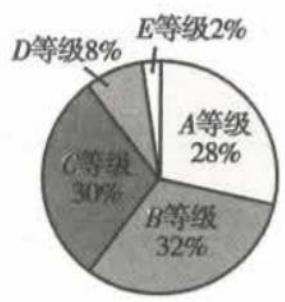  
图1

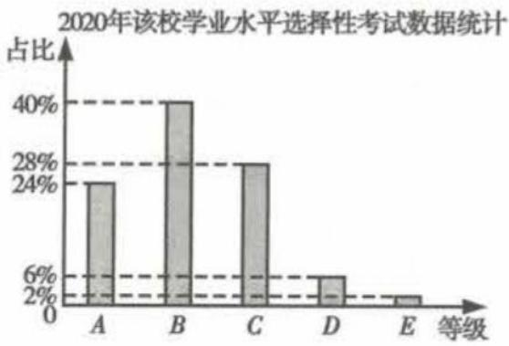

bar

2020年该校学业水平选择性考试数据统计
| 等级 | 占比 (%) |
| :--- | :--- |
| A | 24 |
| B | 40 |
| C | 28 |
| D | 6 |
| E | 2 |

图2

将该校 2020 年“选择考”情况与 2018 年比较，
下列说法正确的是（）

A. 获得 A 等级的人数增加了  
B. 获得 B 等级的人数增加了 1.5 倍  
C. 获得 $D$ 等级的人数减少了一半  
D. 获得 E 等级的人数相同

2. [★★★] 2021 年 11 月 10 日, 第四届中国国际进口博览会在上海闭幕. 自 2018 年起, 我国

已在上海成功举办了四届中国国际进口博览会(简称进博会),部分数据如下表:

<table><tr><td>届别</td><td>一</td><td>二</td><td>三</td><td>四</td></tr><tr><td>年份</td><td>2018</td><td>2019</td><td>2020</td><td>2021</td></tr><tr><td>参展企业数/家</td><td>3 600</td><td>3 800</td><td>3 600</td><td>2 900</td></tr><tr><td>每届意向成交金额/亿美元</td><td>578.3</td><td>711.3</td><td>726.2</td><td>707.2</td></tr></table>

对于已举办的四届进博会,下列说法正确的是()

A. 参展企业数的中位数为 3600  
B. 与上一届相比, 每届意向成交金额增长率最高的是第三届  
C. 第三届起, 尽管参展企业数与上一届相比逐年减少, 但每届参展企业的意向成交金额的平均值逐年增加  
D. 每届意向成交金额的极差为 147.9

# 创新 预测练

3.[条形图与折线图综合,2022广西玉林、贵港一模,★★★]我国在2020年开展了第七次全国人口普查,并于2021年5月11日公布了人口普查结果.自新中国成立以来,我国共进行了七次全国人口普查,下图为我国历次全国人口普查人口性别构成及总人口性别比(以女性为100,男性对女性的比例)统计图,则下列说法错误的是()

bar_line

| 年份 | 女 (万人) | 男 (万人) | 性别比 |
| :--- | :--- | :--- | :--- |
| 1953年 | 30000 | 30000 | 107.56 |
| 1964年 | 30000 | 30000 | 105.46 |
| 1982年 | 48000 | 52000 | 106.30 |
| 1990年 | 55000 | 59000 | 106.60 |
| 2000年 | 62000 | 66000 | 106.74 |
| 2010年 | 66000 | 69000 | 105.20 |
| 2020年 | 70000 | 73000 | 105.07 |

A. 近三次全国人口普查总人口性别比呈递减趋势  
B. 我国历次全国人口普查总人口数呈逐次递增  
C. 第五次全国人口普查时,我国总人口数不足12亿  
D. 第七次人口普查时,我国总人口性别比最低

# 题型 62 概率与统计的综合应用问题

▶ 答案：184 页

# 题型攻略

概率与统计的综合应用问题作为考查考生应用意识的重要载体,已成为近几年高考的一大亮点.此类问题的主要依托点是统计图表,正确认识和使用这些图表是解决此类问题的关键.在弄清统计图表的含义的基础上要掌握好样本特征数、各类概率及随机变量的分布列、均值与方差的求解方法.

# 综合 突破练

1. [2022 新高考卷 II, ★★★] 在某地区进行流行病学调查, 随机调查了 100 位某种疾病患者的年龄, 得到如下的样本数据的频率分布直方图:

histogram

| 年龄/岁 | 频率/组距 |
| :--- | :--- |
| 0-10 | 0.001 |
| 10-20 | 0.002 |
| 20-30 | 0.012 |
| 30-40 | 0.017 |
| 40-50 | 0.023 |
| 50-60 | 0.020 |
| 60-70 | 0.017 |
| 70-80 | 0.006 |
| 80-90 | 0.002 |

(1) 估计该地区这种疾病患者的平均年龄(同一组中的数据用该组区间的中点值为代表);

(2)估计该地区一位这种疾病患者的年龄位于区间[20,70)的概率；

(3)已知该地区这种疾病的患病率为 $0.1\%$ , 该地区年龄位于区间[40,50)的人口占该地区总人口的 $16\%$ . 从该地区中任选一人, 若此人的年龄位于区间[40,50), 求此人患这种疾病的概率(以样本数据中患者的年龄位于各区间的频率作为患者的年龄位于该区间的概率, 精

确到 0.0001).

2. [2022 新高考卷 I, ★★★]一医疗团队为研究某地的一种地方性疾病与当地居民的卫生习惯(卫生习惯分为良好和不够良好两类)的关系,在已患该疾病的病例中随机调查了 100 例(称为病例组),同时在未患该疾病的人群中随机调查了 100 人(称为对照组),得到如下数据:

<table><tr><td></td><td>不够良好</td><td>良好</td></tr><tr><td>病例组</td><td>40</td><td>60</td></tr><tr><td>对照组</td><td>10</td><td>90</td></tr></table>

(1)能否有 99% 的把握认为患该疾病群体与未患该疾病群体的卫生习惯有差异?

(2)从该地的人群中任选一人,A 表示事件“选到的人卫生习惯不够良好”,B 表示事件“选到的人患有该疾病”, $\frac{P(B|A)}{P(\overline{B}|A)}$ 与 $\frac{P(B|\overline{A})}{P(\overline{B}|\overline{A})}$ 的比值是卫生习惯不够良好对患该疾病风险程度的一项度量指标,记该指标为 R.

(i) 证明: $R = \frac{P(A \mid B)}{P(\overline{A} \mid B)} \cdot \frac{P(\overline{A} \mid \overline{B})}{P(A \mid \overline{B})}$ ;

(ii) 利用该调查数据, 给出 $P(A \mid B)$ , $P(A \mid \overline{B})$ 的估计值, 并利用 (i) 的结果给出 R 的估计值.

附： $K^2 = \frac{n(ad - bc)^2}{(a + b)(c + d)(a + c)(b + d)}$

<table><tr><td> $P(K^{2} \geqslant k)$ </td><td>0.050</td><td>0.010</td><td>0.001</td></tr><tr><td>k</td><td>3.841</td><td>6.635</td><td>10.828</td></tr></table>

3. [2022 沈阳市重点高中联考, ★★★] 北京冬季奥运会将于 2022 年 2 月 4 日至 2022 年 2 月 20 日在中华人民共和国北京市和河北省张家口市联合举行. 这是中国历史上第一次举办冬季奥运会, 北京、张家口同为主办城市. 北京冬奥组委对报名参加北京冬奥会志愿者的人员开展冬奥会志愿者培训活动, 并在培训结束后进行一次考核. 为了解本次培训活动的效果, 从中随机抽取 80 名志愿者的考核成绩, 根据这 80 名志愿者的考核成绩得到的统计图表如下所示.

女志愿者考核成绩频率分布表

<table><tr><td>考核成绩</td><td>频数</td><td>频率</td></tr><tr><td>[75,80)</td><td>2</td><td>0.050</td></tr><tr><td>[80,85)</td><td>13</td><td>0.325</td></tr><tr><td>[85,90)</td><td>18</td><td>m</td></tr><tr><td>[90,95)</td><td>a</td><td>0.100</td></tr><tr><td>[95,100]</td><td>b</td><td>0.075</td></tr></table>

男志愿者考核成绩频率分布直方图

histogram

| 考核成绩/分 | 频率/组距 |
| ----------- | --------- |
| 70-75       | 0.010     |
| 75-80       | 0.025     |
| 80-85       | 0.060     |
| 85-90       | 0.080     |
| 90-95       | 0.015     |
| 95-100      | 0.010     |

若参加这次考核的志愿者考核成绩在[90,100]内,则考核等级为优秀.

(1) 分别求出 m, a, b 的值, 以及这次培训考核等级为优秀的男志愿者人数;  
(2) 若从样本中考核等级为优秀的志愿者中随机抽取 3 人进行学习心得分享, 记抽到男志愿者的人数为 X, 求 X 的分布列及数学期望.

# 创新 预测练

4. [设问创新,2022 贵阳市监测,★★★★]为了选拔培养有志于服务国家重大战略需求且综合素质优秀或基础学科拔尖的学生,教育部开展了招生改革工作——强基计划.现某机构对某高中学校学生对强基计划课程学习的情况进行调查,在参加数学和物理强基计划课程学习的学生中,随机抽取11名学生某次考试的数学和物理成绩(单位:分),统计如下表:

<table><tr><td>数学成绩x</td><td>46</td><td>65</td><td>79</td><td>89</td><td>99</td><td>109</td><td>116</td><td>120</td><td>123</td><td>134</td><td>140</td></tr><tr><td>物理成绩y</td><td>50</td><td>54</td><td>60</td><td>63</td><td>66</td><td>68</td><td>70</td><td>0</td><td>73</td><td>76</td><td>80</td></tr></table>

(1)由表中数据可知,有一位学生因物理缺考(零分卷)导致数据出现异常,剔除该组异常数据后发现,学生的物理成绩 y 与数学成绩 x 之间具有线性相关关系,请根据剩余的 10 组数据建立 y 关于 x 的回归直线方程,并计算缺考学生如果参加物理考试可能取得的成绩.

(2)在这次物理强基计划课程的考试中,剔除缺考学生的物理成绩后,剩余这10名学生中男女生人数之比为3:2.若采用分层抽样的方法从男生和女生中共抽取5人,再从这5人中抽取3人参加学校组织的关于强基计划的访谈调查,求抽取的学生中恰好有一名女生的概率.

参考公式:对于一组数据 $(x_{1},y_{1}),(x_{2},y_{2}),\cdots,(x_{n},y_{n})$ ，其回归直线 $\hat{y}=\hat{b}x+\hat{a}$ 的斜率和截距的最小二乘估计分别为 $\hat{b}=\frac{\sum\limits_{i=1}^{n}(x_{i}-\bar{x})(y_{i}-\bar{y})}{\sum\limits_{i=1}^{n}(x_{i}-\bar{x})^{2}}=$

$$
\frac {\sum_ {i = 1} ^ {n} x _ {i} y _ {i} - n \bar {x} \bar {y}}{\sum_ {i = 1} ^ {n} x _ {i} ^ {2} - n \bar {x} ^ {2}}, \hat {a} = \bar {y} - \hat {b} \bar {x}.
$$

参考数据(剔除零分前):

<table><tr><td> $\mathop{\sum }\limits_{{i = 1}}^{{11}}{x}_{i}$ </td><td> $\mathop{\sum }\limits_{{i = 1}}^{{11}}{y}_{i}$ </td><td> $\mathop{\sum }\limits_{{i = 1}}^{{11}}{x}_{i}{y}_{i}$ </td><td> $\mathop{\sum }\limits_{{i = 1}}^{{11}}{x}_{i}^{2}$ </td><td> $\frac{2\;586}{8\;326}$ </td></tr><tr><td>1 120</td><td>660</td><td>68 586</td><td>122 726</td><td>0.31</td></tr></table>

上表中的 $x_{i}$ 表示样本中第 i 名学生的数学成绩, $y_{i}$ 表示样本中第 i 名学生的物理成绩.

# 热点 应用练

5. [2022 郑州一模, ★★★] 为深入贯彻党的十九大和十九届五中全会精神, 中共中央办公厅、国务院办公厅印发《关于进一步减轻义务教育阶段学生作业负担和校外培训负担的意见》. 郑州市某中学数学建模小组随机抽查了该市 2 000 名初二学生“双减”政策前后每天的运动时间(单位: 分), 得到如下频数分布表.

“双减”政策后运动时间频数分布表

<table><tr><td>时间/分</td><td>[20,30]</td><td>(30,40]</td><td>(40,50]</td><td>(50,60]</td><td>(60,70]</td><td>(70,80]</td><td>(80,90]</td></tr><tr><td>人数</td><td>10</td><td>60</td><td>210</td><td>520</td><td>730</td><td>345</td><td>125</td></tr></table>

“双减”政策前运动时间频数分布表

<table><tr><td>时间/分</td><td>[20,30]</td><td>(30,40]</td><td>(40,50]</td><td>(50,60]</td><td>(60,70]</td><td>(70,80]</td><td>(80,90]</td></tr><tr><td>人数</td><td>40</td><td>245</td><td>560</td><td>610</td><td>403</td><td>130</td><td>12</td></tr></table>

(1)用一个数字特征描述“双减”政策给学生的运动时间带来的变化(同一组中的数据用该组区间的中点值代表).

(2)为给参加运动的学生提供方便,学校在球场边安装直饮水设备,该设备需同时装配两个一级滤芯才能正常工作,且两个滤芯互不影响.一级滤芯有两个品牌A,B:A品牌售价500元/个,使用寿命为7个月或8个月(概率均为0.5);B品牌售价200元/个,使用寿命为3个月或4个月(概率均为0.5).现有两种购置方案:方案甲,购置2个品牌A;方案乙,购置1个品牌A和2个品牌B,品牌A和品牌B混合装配.试从性价比(设备正常运行时间的期望与购置一级滤芯的成本之比)的角度考虑,选择哪一种方案更实惠.

# 题型63 概率统计与函数的综合问题

▶ 答案：186 页

# 题型攻略

解决此类问题的关键:一般是先利用概率与统计的相关知识构造函数,然后根据题干条件求出函数解析式,进而利用概率或函数知识求解相关问题.

# 综合 突破练

1. [2021 新高考卷Ⅱ, ★★★]一种微生物群体可以经过自身繁殖不断生存下来, 设一个这种

微生物为第0代,经过一次繁殖后为第1代,再经过一次繁殖后为第2代……该微生物每代繁殖的个数是相互独立的且有相同的分布列,设 X 表示 1 个微生物个体繁殖下一代的个数, $P(X=i)=p_{i}(i=0,1,2,3)$ .

(1) 已知 $p_{0}=0.4, p_{1}=0.3, p_{2}=0.2, p_{3}=0.1$ ,
求 $E(X)$ ;

(2) 设 p 表示该种微生物经过多代繁殖后临近灭绝的概率, p 是关于 x 的方程 $p_{0} + p_{1}x + p_{2}x^{2} + p_{3}x^{3} = x$ 的一个最小正实根, 求证: 当 $E(X) \leqslant 1$ 时, p = 1, 当 $E(X) > 1$ 时, p < 1;

(3) 根据你的理解说明 (2) 问结论的实际含义.

2.[2018全国卷Ⅰ,★★★]某工厂的某种产品成箱包装,每箱200件,每一箱产品在交付用户之前要对产品做检验,如检验出不合格品,则更换为合格品.检验时,先从这箱产品中任取20件做检验,再根据检验结果决定是否对余下的所有产品做检验.设每件产品为不合格品的概率都为 $p(0<p<1)$ ,且各件产品是否为不合格品相互独立.

(1) 记 20 件产品中恰有 2 件不合格品的概率为 $f(p)$ ，求 $f(p)$ 的最大值点 $p_{0}$ .

(2) 现对一箱产品检验了 20 件, 结果恰有 2 件不合格品, 以 (1) 中确定的 $p_{0}$ 作为 $p$ 的值. 已知每件产品的检验费用为 2 元, 若有不合格品进入用户手中, 则工厂要对每件不合格品支付 25 元的赔偿费用.

(i)若不对该箱余下的产品做检验,这一箱产品的检验费用与赔偿费用的和记为 X,求 $E(X)$ ;

(ii)以检验费用与赔偿费用和的期望值为决

策依据,是否该对这箱余下的所有产品做检验?

# 创新 预测练

3.[角度创新,2022开封市二模,★★★]某小区物业每天从供应商购进定量小包装果蔬,供本小区居民扫码自行购买,每份成本15元,售价20元.如果当天下午6点之前没有售完,物业将剩下的小包装果蔬打五折于当天处理完毕.物业对20天本小区这种小包装果蔬下午6点之前的日需求量(单位:份)进行统计,得到如下条形图:

histogram

| 需求量/份 | 天数 |
| :--- | :--- |
| 17 | 1 |
| 18 | 1 |
| 19 | 2 |
| 20 | 4 |
| 21 | 5 |
| 22 | 4 |
| 23 | 2 |
| 24 | 1 |

(1) 假设物业某天购进 20 份小包装果蔬, 当天下午 6 点之前的需求量为 n (单位: 份, $n \in N$ ).

(i) 求日利润 y (单位: 元) 关于 n 的函数解析式;

(ii) 以 20 天记录的各需求量的频率作为各需求量发生的概率, 求日利润不少于 100 元的概率.

(2)依据统计学知识,请设计一个方案,帮助物业决策每天购进小包装果蔬的份数.只需说明原因,不需计算.

# 题型64 概率统计与数列的综合问题

▶ 答案：186 页

# 题型攻略

解决此类问题要能综合运用概率与统计及数列的相关知识,在求出概率或概率的表达式后,要能熟练运用等比(差)数列的概念、性质,以及数列求和的方法(累加法、裂项相消法、错位相减法等)等求解相关问题.

# 综合 突破练

1. [2019 全国卷 I, ★★★★] 为治疗某种疾病，研制了甲、乙两种新药，希望知道哪种新药更有效，为此进行动物试验。试验方案如下：每一轮选取两只白鼠对药效进行对比试验。对于两只白鼠，随机选一只施以甲药，另一只施以乙药。一轮的治疗结果得出后，再安排下一轮试验。当其中一种药治愈的白鼠比另一种药治愈的白鼠多4只时，就停止试验，并认为治愈只数多的药更有效。为了方便描述问题，约定：对于每轮试验，若施以甲药的白鼠治愈且施以乙药的白鼠未治愈则甲药得1分，乙药得-1分；若施以乙药的白鼠治愈且施以甲药的白鼠未治愈则乙药得1分，甲药得-1分；若都治愈或都未治愈则两种药均得0分。甲、乙两种药的治愈率分别记为α和β，一轮试验中甲药的得分记为X。

(1) 求 X 的分布列.
(2) 若甲药、乙药在试验开始时都赋予4分, $p_{i}$ ( $i=0,1,\cdots,8$ ) 表示“甲药的累计得分为 i 时, 最终认为甲药比乙药更有效”的概率, 则 $p_{0}=0, p_{8}=1, p_{i}=ap_{i-1}+bp_{i}+cp_{i+1}$ ( $i=1,2,\cdots,7$ ), 其中 $a=P(X=-1), b=P(X=0), c=P(X=1)$ . 假设 $\alpha=0.5, \beta=0.8$ .

(i) 证明: $\{p_{i+1} - p_i\} (i = 0, 1, 2, \cdots, 7)$ 为等比数列.
(ii) 求 $p_4$ ，并根据 $p_4$ 的值解释这种试验方案的合理性.

# 创新 预测练

2.[角度创新,2022 辽宁大连期末,★★★]某商场拟在年末进行促销活动,为吸引消费者,特别推出“玩游戏,送礼券”的活动,游戏规则如下:每轮游戏都抛掷一枚质地均匀的骰子(形状为正方体,六个面的点数分别为1,2,3,4,5,6),若向上点数不超过2点,获得1分,否则获得2分,当获得19分或20分时,游戏结束.进行若干轮游戏,若最终得分为19分,则可得到200元礼券,若最终得分为20分,则可得到纪念品一份,最多进行19轮游戏.若游戏过程中累计得分为i分的概率为 $p_i$ (初始得分为0分, $p_0=1$ ).

(1) 证明数列 $\left\{p_{i}-p_{i-1}\right\}(i=1,2,3,\cdots,19)$ 是等比数列；
(2) 求活动参与者得到纪念品的概率.

# 创新情境载体下的数学建模应用

# 题型 65 函数模型及其应用

答案：187页

题型攻略

建立函数模型解应用问题的步骤  

flowchart

# 综合 突破练

1. | 2020 全国卷Ⅲ、★★★ Logistic 模型是常用数学模型之一, 可应用于流行病学领域. 有学者根据公布数据建立了某地区新冠肺炎累计确诊病例数 $I(t)$ (t 的单位: 天) 的 Logistic 模型: $I(t) = \frac{K}{1 + \mathrm{e}^{-0.23(t - 53)}}$ , 其中 $K$ 为最大确诊病例数. 当 $I(t^{*}) = 0.95K$ 时, 标志着已初步遏制疫情, 则 $t^{*}$ 约为 $(\ln 19 \approx 3)$ ( )

A. 60

B. 63

C. 66

D. 69

2. [2022 十一] 酒驾是严重危害交通安全的违法行为. 为了保障交通安全, 根据国家有关规定: 机动车驾驶员血液中酒精含量大于等于 $20 \mathrm{mg} / 100 \mathrm{~mL}$ , 小于 $80 \mathrm{mg} / 100 \mathrm{~mL}$ 即为酒后驾车, $80 \mathrm{mg} / 100 \mathrm{~mL}$ 及以上认定为醉酒驾车. 假设某人喝了一定量的酒后, 其血液中的酒精含量上升到了 $1 \mathrm{mg} / \mathrm{mL}$ . 如果在停止喝酒以后, 他血液中酒精含量会以每小时 $10 \%$ 的速度减少, 他至少经过 $t$ 小时才能驾驶机动车, 则整数 $t$ 的值为 ( $\lg 2 \approx 0.301$ , $\lg 3 \approx 0.477$ ) ( )

A. 14

B. 15

C. 16

D. 17

3. [2022 上海市工业区一房, ★★★★ 某公司经过测算, 计划投资 A, B 两个项目. 若投入 A 项目资金 x (单位: 万元), 则该项目一年创造的利润 (单位: 万元) 为 $\frac{x}{2}$ ; 若投入 B 项目资金

x(单位:万元),则该项目一年创造的利润(单位:万元)为 $f(x)=\left\{\begin{aligned}&\frac{10x}{30-x},0\leqslant x\leqslant20,\\ &20,x>20.\end{aligned}\right.$

(1) 当投入 A, B 两个项目的资金相同且 B 项目比 A 项目一年创造的利润高时, 求投入 A 项目的资金 x (单位: 万元) 的取值范围.

(2)若该公司共有资金30万,全部用于投资A,B两个项目,则该公司一年分别投入A,B两个项目多少万元时,创造的总利润最大?

# 创新 预测练

4. [同度创新、★★★] 自工业革命以来,由于人类活动排放了大量的二氧化碳等温室气体,大气中温室气体的浓度急剧升高,温室效应日益增强.研究表明,使全球气候逐年变暖的一个重要因素是人类在能源利用与森林砍伐中使大气中 $CO_{2}$ 浓度增加.据测,某地区 2010 年、2011 年、2012 年大气中的 $CO_{2}$ 浓度分别比 2009 年增加了 1 个可比单位、3 个可比单位、6个可比单位. 现用函数模拟该地每年 $\mathrm{CO}_{2}$ 浓度增加的可比单位数 $y$ 与年份增加数 $x$ (以2009年的浓度为基准, 规定2010年对应的 $x$ 为1,以此类推) 的关系, 有两个选择: ① $y = px^{2} + qx + r$ (其中 $p, q, r$ 为常数), ② $y = a \cdot b^{x} + c$ (其中 $a, b, c$ 为常数, $b > 0$ 且 $b \neq 1$ ). 若已知2014年该地大气中的 $\mathrm{CO}_{2}$ 浓度比2009年增加了16个可比单位, 则选择以上两个函数中的\_\_\_\_作为模拟函数较好(求出参数, 在横线上填写完整的解析式).

# 热点 应用练

5. [★★★]某污水处理厂为使污水经处理后达到排放标准,需要加入某种药剂,加入该药剂后,药剂的质量浓度 C(单位: $mg/m^{3}$ )随时间 t (单位:h)的变化关系可以近似地用函数 $C(t)=\frac{100(t+1)}{t^{2}+4t+19}$ 刻画,由此可以判断,经过\_\_\_\_h 后,被处理的污水中该药剂的质量浓度达到最大,最大值是\_\_\_\_ $mg/m^{3}$ .

# 题型 66 利用导数解决生活中的最优化问题

▶ 答案：187 页

# 题型攻略

# 利用导数解决生活中的最优化问题的一般步骤

flowchart

注意: 在利用导数解决实际问题时, 若在定义域内只有一个极值, 则这个值即为最值.

# 综合 突破练

1. [2020 江苏, ★★★★]某地准备在山谷中建一座桥梁, 桥址位置的竖直截面图如图所示: 谷底 O 在水平线 MN 上, 桥 AB 与 MN 平行, $OO'$ 为铅垂线 ( $O'$ 在 AB 上). 经测量, 左侧曲线 AO 上任一点 D 到 MN 的距离 $h_{1}$ (米) 与 D 到 $OO'$ 的距离 a (米) 之间满足关系式 $h_{1} = \frac{1}{40}a^{2}$ ; 右侧曲线 BO 上任一点 F 到 MN 的距离 $h_{2}$ (米) 与 F 到 $OO'$ 的距离 b (米) 之间满足关系式 $h_{2} = -\frac{1}{800}b^{3} + 6b$ . 已知点 B 到 $OO'$ 的距离为 40 米.

(1) 求桥 $AB$ 的长度;  
(2)计划在谷底两侧建造平行于 $OO'$ 的桥墩

$CD$ 和 $EF$ , 且 $CE$ 为 80 米, 其中 $C, E$ 在 $AB$ 上 (不包括端点). 桥墩 $EF$ 每米造价 $k$ (万元), 桥墩 $CD$ 每米造价 $\frac{3}{2} k$ (万元) ( $k > 0$ ), 问 $O'E$ 为多少米时, 桥墩 $CD$ 与 $EF$ 的总造价最低?

text_image

A C O' E B
b
F
D a
h₁
h₂
M D₁ O F₁ N

# 创新 预测练

2.[与解三角形综合,2022安徽六安一中模拟,

★★★★]中国的西气东输工程把西部地区的资源优势变为经济优势,实现了天然气需求与供给的东西部衔接,工程建设

text_image

E
27 m
O
θ
F
8 m

也加快了西部及沿线地区的经济发展. 输气管

道工程建设中,某段管道铺设要经过一处峡谷,峡谷内恰好有一处直角拐角,从宽为27 m的峡谷拐入宽为8 m的峡谷,如图所示,输气管必须经过点O,输气管与峡谷悬崖壁的交点为E,F,点E,O,F在同一水平面内,设EF与较宽侧峡谷悬崖壁所成的角为θ,则EF的长为\_\_\_\_m(用θ表示).要使输气管顺利连接悬崖壁两侧,其长度不能低于\_\_\_\_m.

# 题型67 三角函数模型的应用

▶ 答案：188 页

# 题型攻略

构建三角函数模型求解实际问题时,一般需要根据实际问题得到解析式,求得的解析式一般为 $f(x)=A\sin(\omega x+\varphi)+b$ 的形式,然后利用三角函数的有关性质和题中条件进行求解.

# 综合 突破练

1. [2014 湖北, ★★★]某实验室一天的温度(单位: ℃)随时间 t (单位: h) 的变化近似满足函数关系: $f(t) = 10 - \sqrt{3} \cos \frac{\pi}{12} t - \sin \frac{\pi}{12} t, t \in [0, 24)$ .

(1) 求实验室这一天的最大温差；  
(2)若要求实验室温度不高于11℃,则在哪段时间实验室需要降温?

# 创新 预测练

2. [情境创新,2022贵阳市模拟,★★★★]水车(如图1),又称孔明车,是我国最古老的农业灌溉工具,有1700余年历史.如图2是一个水车的示意图,它的直径为3m,其中心(即圆心)O距水面0.75m.如果水车每4min逆时针转3圈,在水车轮边缘上取一点P,我们知道在水车匀速转动时,P点距水面的高度h(单位:m)是一个变量,它是时间t(单位:s)的函数.为了方便,不妨从P点位于水车与水面交点Q时开始计时(t=0),则我们可以建立函数关系式 $h(t)=A\sin(\omega t+\varphi)+k$ (其中A>0, $\omega>0$ , $|\varphi|<\frac{\pi}{2}$ )来反映h随t变化的规律.下面关于函数 $h(t)$ 的描述,正确的是()

  
图1

text_image

P
O
Q

图2

A. 最小正周期为 $80 \pi$   
B. 一个单调递减区间为[30,70]  
C. $y = |h(t)|$ 的最小正周期为 40  
D. 图象的一条对称轴方程为 $t = -\frac{40}{3}$

# 题型 68 解三角形的建模应用

# 题型攻略

有关解三角形的实际应用问题,常与三角恒等变换、三角函数的性质综合考查,基本思路是根据已知条件,构造三角模型,利用正弦定理、余弦定理解决问题.

# 综合 突破练

1.[多选,★★★★]某校数学课外实践小组欲对一座高塔进行测量,制订如下方案:如图,在A

text_image

C
β
α
D
B
A

点测得观测塔顶 C 的仰角为 $\alpha$ ，再从 A 沿直线向塔底中心 D 行走 s 米到达 B 点，在 B 点测得观测塔顶 C 的仰角为 $\beta$ ，根据以上测量数据，得到该塔的高 CD 为 h 米，则下列结论正确的是（）

A. $h = \frac{\sin \alpha \sin \beta}{\sin (\beta - \alpha)} s$   
B. $h = \frac{\tan \alpha \tan \beta}{\tan \beta - \tan \alpha} s$   
C. $AD = \left(1 + \frac{\tan \beta}{\tan \beta - \tan \alpha}\right)s$   
D. $AD = \left(1 + \frac{\tan \alpha}{\tan \beta - \tan \alpha}\right)s$

2.[女足,★★★]落后、扳平、绝杀! 2022年2月6日,中国女足用一场史诗般的大逆转,时隔16年后再次问鼎亚洲之巅,这一刻,没有一个人不热泪盈眶.坚韧不拔的铿锵玫瑰,永不言败的女足精神,把困境写成诗篇,让汗水涌动激情,在绝望中升腾起希望.在中国足球历史上,这注定是浓墨重彩的一笔.某社区球迷们举行了一次机器人足球比赛,甲队1号机器

人从点 A 出发做匀速直线运动, 到达点 B 后, 乙队 2 号机器人开始带球从点 D

出发并以1号机器人速度的2倍向点A做匀速直线运动,如图所示,已知点C在线段AD上, $AB=4\sqrt{2}$ dm,AD=17dm, $\angle BAC=45^{\circ}$ ,若

忽略机器人原地旋转所需的时间,则 1 号机器人最快可在距点 A \_\_\_\_ dm 的点 C 处恰好截住足球.

3. [★★★★] 2022 年 2 月, 河南省共有 226 家 3A 级及以上景区参加“豫见春天·惠游老家”活动, 对游客实行首道门票免费. 某景区旁的

农户经营农家乐, 将自己的一块三角形地块划分为两个区域, 如图中的 $\triangle ABD$

和 $\triangle ADC$ 所示. 在 $\triangle ABC$ 中, $\angle BAC, B, C$ 的对边分别为 $a, b, c$ , 已知 $a=3, c=\sqrt{2}, B=45^{\circ}$ .

(1) 求 $\sin C$ 的值;  
(2) 若 $\cos\angle ADC = -\frac{4}{5}$ ，求 $\tan\angle DAC$ 的值.

# 创新 预测练

4. [与物理综合,2022 成都七中一模,★★★]星等是衡量天体光度的量,按照不同的分类方式有目视星等与绝对星等,它们之间可用公式 $M = m + 5 - 5 \lg \frac{d}{3.26}$ 转换,其中 M 为绝对星等, m 为目视星等,d 为距离(单位:光年).现在地球某处测得牛郎星目视星等为0.77,绝对星等为2.19,织女星目视星等为0.03,绝对星等为0.5,且牛郎星和织女星分别与地球连线形成的夹角大约为 $34^{\circ}$ ,则牛郎星与织女星之间的距离约为(参考数据: $10^{0.906} \approx 8.054, 10^{0.716} \approx 5.200, \cos 34^{\circ} \approx 0.8$ )

A. 26 光年

B. 16 光年

C. 12 光年

D.5 光年

# 热点 应用练

5. [2022 四川雅安质监，★★★]我国无人机技术处于世界领先水平，并广泛应用于抢险救灾、视频拍摄、环境监测等. 如图, 有一个从水

flowchart

平地面上 A 处竖直上升的无人机 P, 某一刻其对与 A 在同一水平地面上的 B, C 两受灾点的视角为 $\angle BPC$ , 且 $\tan \angle BPC = \frac{1}{3}$ . 已知 B, C, D 共线, 且 $\angle ADB = 90^{\circ}$ , BC = CD = DA = 1 km, 则此刻无人机 P 到受灾点 D 的距离 PD 为 ( )

A. $\sqrt{2}$ km

B.2 km

C. $\sqrt{3}$ km

D. $4 \mathrm{~km}$

# 题型 69 数列的建模应用

▶ 答案：189 页

# 题型攻略

通过建模解决数列应用问题的关键

<table><tr><td>读懂题意</td><td>会“脱去”题目中的背景,提取关键信息.</td></tr><tr><td>构造模型</td><td>由题意构建等差数列、等比数列或递推关系式的模型.</td></tr><tr><td>“解模”</td><td>把问题转化为与数列有关的问题,如求指定项、公差(或公比)、项数、通项公式或前n项和等.</td></tr></table>

# 综合 突破练

1. [2022 合肥市模拟, ★★★] 某市抗洪指挥部接到最新雨情预报, 未来 24 h 城区拦洪坝外洪水将超过警戒水位, 因此需要紧急抽调工程机械加高加固拦洪坝. 经测算, 加高加固拦洪坝工程需要调用 20 辆某型号翻斗车, 平均每辆翻斗车需要工作 24 h. 而抗洪指挥部目前只有一辆翻斗车可立即投入施工, 其余翻斗车需要从其他施工现场抽调. 若抽调的翻斗车每隔 20 min 才有一辆到达施工现场投入工作, 要在 24 h 内完成拦洪坝加高加固工程, 指挥部至少还需要抽调这种型号翻斗车 ( )

A.25辆

B.24辆

C.23辆

D.22 辆

2. [2022 上海崇明区一模, ★★★★] 2021 年 6 月, 国务院办公厅发布《关于加快发展保障性租赁住房的意见》后, 国内多个城市陆续发布了保障性租赁住房相关政策或征求意见稿. 为了响应国家号召, 某地区计划 2021 年新建住房 40 万平方米, 其中有 25 万平方米是保障性租赁住房. 预计在今后的若干年内, 该市每年新建住房面积均比上一年增长 8%, 另外, 每年新建住房中, 保障性租赁住房的面积均比上一年增加 5 万平方米.

(1) 到哪一年底, 该市历年所建保障性租赁住房的累计面积 (以 2021 年为累计的第一年) 将首次不少于 475 万平方米?

(2) 到哪一年底, 当年新建的保障性租赁住房的面积占该年新建住房面积的比例首次大于 85%?

$$
(1. 0 8 ^ {4} \approx 1. 3 6, 1. 0 8 ^ {5} \approx 1. 4 7, 1. 0 8 ^ {6} \approx 1. 5 9)
$$

# 创新 预测练

3. [与解三角形综合,2022广东茂名一模,★★★★]如图所示的阴影部分是一个美丽的螺旋线型的图案,它的画法是这样的:正三角

text_image

C
F
I
A D G B
H E

形 ABC 的边长为 4, 分别取正三角形 ABC 各边的四等分点 D, E, F, 作第 2 个正三角形 DEF, 再分别取正三角形 DEF 各边的四等分点 G, H, I, 作第 3 个正三角形 GHI……以此类推, 一直继续下去, 就可以得到阴影部分的图案. 设三角形 ADF 的面积为 $S_{1}$ , 后续各阴影部分三角形面积依次为 $S_{2}$ , $S_{3}, \cdots, S_{n}$ , 则 $S_{1} =$ \_\_\_\_ , 数列 $\{S_{n}\}$ 的前 n 项和 $T_{n} =$ \_\_\_\_ .

# 题型 70 立体几何的建模应用

▶ 答案：190 页

# 题型攻略

# 建立立体几何模型的基本步骤

1.“脱去”题目中的背景,提取与立体几何有关的信息.  
2. 将有关信息用立体几何的符号及语言表示出来,作出简图,建立模型.  
3. 利用立体几何的相关性质及定理等求解模型.  
4. 检验得出的结果是否满足背景,并转化为实际问题的解.

# 综合 突破练

1.[2022 广州奥林匹克中学模拟,★★★]黄河是我们的母亲河,由于黄河部分河段为地上悬河,所

text_image

堤坝斜面
A
C
地面
B
D
l

以需要时常加固防洪堤坝,以防止黄河水泛滥.如图,加固堤坝时,需要测量堤坝上的点A到地面上点B的距离.测量人员现测得以下数据:地面与堤坝斜面所成二面角的大小为 $120^{\circ}$ ,点A到地面与堤坝斜面交线l的距离为AC=5m,点B到地面与堤坝斜面交线l的距离为BD=3m,CD=24m,则线段AB的长度为()

A. $25 \sqrt{3} \mathrm{~m}$ B. $30 \sqrt{3} \mathrm{~m}$ C. $25 \mathrm{~m}$ D. $30 \mathrm{~m}$

2.[2022 湖北模拟, ★★★★] 足球起源于中国古代的一种球类游戏“蹴鞠”. 如图1, 三十二面体足球的面由边长相等的12块正五边形和20块正六边形拼接而成, 形成一个近似的球体. 现用边长为4.5 cm的上述正五边形和正六边形所围成的三十二面体的外接球作为足球, 其大圆(过球心的平面与球面的交线) 圆周展开图可近似看成由4个正六边形与4个正五边形及2条正六边形的边所构成的图形的对称轴上的线段 $AA'$ , 如图2, 则该足球的体积约为(参考数据: $\tan 72^\circ \approx 3.1, \sqrt{3} \approx 1.7, \pi \approx 3, 22.5^2 = 506.25, 22.5^3 = 11390.625$ ) ( )

图1  

chemical

Chemical structure diagram showing a linear chain of fused cyclohexane rings with labeled positions A and A'

图2

A. $5695.31 \mathrm{~cm}^{3}$

B. 2 847.66 cm $^{3}$

C. 1 518.75 cm $^{3}$

D. 1488.85 cm $^{3}$

3. [2022 浙江宁波模拟, ★★★★] 庚殿顶(如图1)是中国古代建筑的一种屋顶样式, 而且等级是最高的, 如故宫的英华殿. 它屋面有四面坡, 前后坡屋面全等且相交成一条正脊, 两侧屋面全等且与前后屋面相交成四条垂脊. 由于屋顶有四面斜坡, 也称“四阿顶”. 图2是庑殿顶的几何模型示意图, 底面ABCD是矩形, 若四个侧面与底面所成的角均相等, 已知BC=2, EF=1, 则AB= \_\_\_\_.

text_image

正脊
垂脊

图1

text_image

F
E
D
C
A
B

图2

4. [2022 长郡中学、南阳一中联考, ★★★★] 某学校的学生参加劳动实践, 一部分学

natural_image

Close-up of a conical, textured object resembling a salt or mineral (no text or symbols visible)

生学习编“灯罩斗笠”（如图），这是一种用竹篾等材料制作的无底圆锥形的斗笠，另一部分

学生学习制作泥塑几何体. 现有一个棱长为 6 的正方体形状泥块, 其各面的中心分别为点 $E, F, G, H, M, N$ , 欲将该正方体形状泥块削成正八面体形状泥块 GEMHFN, 若用正视图为正三角形的一个“灯罩斗笠”罩住该正八面体形状泥块, 使得正八面体形状泥块可以在“灯罩斗笠”中任意转动且不会露出, 则该“灯罩斗笠”的表面积的最小值为 \_\_\_\_.

# 创新 预测练

5.[与化学综合,多选,2022 河北普通高中教学质量监测,★★★★★]甲烷是最简单的有机物,甲烷分子由一个碳原子和四个氢原子构

成,呈正四面体结构,如图是甲烷分子结构的球棍模型,表示碳原子的黑球球心位于正四面体的中心,表示氢原子的白球

chemical

Simple molecular structure diagram with one central atom bonded to four surrounding atoms

球心分别为正四面体的四个顶点. 若模型中白球半径为 1, 任意两个白球球心距为 $6\sqrt{2}$ , 则下列说法正确的是 ( )

A. 模型中黑球球心与白球球心的距离是 $3 \sqrt{3}$

B. 如图摆放的模型的高度为 $2 + 4\sqrt{3}$

C. 不考虑碳原子实际大小比例, 模型中黑球半径最大是 $3\sqrt{3}-2$

D. 给模型做一个正四面体形状的包装盒, 包装
盒棱长最小为 $2\sqrt{6} + 6\sqrt{2}$

# 题型 71 解析几何的建模应用

▶ 答案：190 页

# 题型攻略

# 建立解析几何模型的基本步骤

1. “脱去”背景,提取与解析几何相关的信息.

2. 将相关信息用数学语言及数学符号表示出来, 利用圆锥曲线的定义、性质、图象等, 建立解析几何模型.

3. 结合圆锥曲线的性质及各个参数之间的关系等, 求解模型, 得出各个参数的值(范围).

4. 代入原情境, 检验参数取值并精确范围.

# 综合 突破练

1. [2022 重庆巴蜀中学校检, ★★★] 赵州桥, 是一座位于河北省石家庄市赵县城南洨河之上的石拱桥, 因赵县古称赵州而得名. 赵州桥始建于隋代, 是世界上现存年代久远、跨度最大、保存最完整的单孔坦弧敞肩石拱桥. 小明家附近的一座桥是仿赵州桥建造的一座圆拱桥, 已知在某个时间段这座桥的水面跨度是 20 米, 拱顶离水面 4 米, 则当水面上涨 2 米后, 桥在水面的跨度为 ( )

A. 10 米

B. $10 \sqrt{2}$ 米

C. $6\sqrt{6}$ 米

D. $6 \sqrt{5}$ 米

2. [2022 山西模拟, ★★★★] 根据规划, 国家体育场(鸟巢)是 2022 年第 13 届冬季残疾人奥林匹克运动会比赛场馆之一. 国家体育场的钢结构鸟瞰图如图 1 所示, 内、外两圈钢骨架的俯视图可视作离心率相同的椭圆, 若由外层椭圆长轴一端点 A 和短轴一端点 B 分别向内层椭圆引切线 AC, BD(如图 2), 且两切线斜率之积等于 $-\frac{9}{16}$ , 则椭圆的离心率为 ( )

  
图1

text_image

y
B
D
A
O
x
C

图2

A. $\frac{3}{4}$

B. $\frac{\sqrt{7}}{4}$

C. $\frac{9}{16}$

D. $\frac{\sqrt{3}}{2}$

3. [2022 黄冈中学、黄石二中、襄阳五中等八校大联考, ★★★★★] 折纸(如图 1) 是一种把纸张折成各种不同形状的艺术活动, 在我国源远流长. 某些折纸活动蕴含丰富的数学内容,例如:用圆形纸片,按如下步骤折纸,可折出一个椭圆.

  
图1

text_image

G
P
E
F

图2

text_image

E
F

图3

步骤1:如图2,设圆心是F,在圆内不是圆心处取一点,标记为E.

步骤2: 把纸片折叠, 使圆周正好通过点 E, 此时圆周上与点 E 重合的点标记为点 G.

步骤3: 把纸片展开, 于是就留下一条折痕, 此时 GF 与折痕交于点 P.

步骤4:不断重复步骤2和3,能得到越来越多的折痕和越来越多的交点P,所有交点P组成的图形便是一个椭圆,如图3.

已知圆形纸片的半径为4, 定点E到圆心F的距离为2, O为EF的中点, 按上述步骤折纸, 所有交点P组成的椭圆记为C. 以EF所在的直线为x轴, 以O为原点建立平面直角坐标系.

(1) 求椭圆 C 的标准方程.

(2) 设直线 l 与椭圆 C 交于 A, B 两点, 且 $OA \perp OB$ , 试问点 O 到直线 l 的距离是否为定值, 如果是定值, 求该定值; 如果不是定值, 说明理由.

# 创新 预测练

4. [与物理综合,2022 重庆八中模拟, ★★★]
1970 年 4 月 24 日, 我国发射了自己的第一

text_image

远地点
S
S
近地点
地球

颗人造地球卫星“东方红一号”，从此我国开启了人造卫星的新篇章。人造地球卫星绕地球运行时遵循开普勒行星运动定律：卫星在以地球为一个焦点的椭圆轨道上绕地球运行时，卫星的向径（卫星与地球的连线）在相同的时间内扫过的面积 S 相等（如图所示），设椭圆轨道的长轴长、短轴长、焦距分别为 2a, 2b, 2c，下列结论正确的是 （）

A. 卫星向径的最大值为 $2a$   
B. 卫星向径的最小值为 $2b$   
C. 卫星绕行一周时在第二象限内运动的时间
大于在第一象限内运动的时间  
D. 卫星向径的最小值与最大值的比值越小, 椭圆轨道越接近圆

# 热点 应用练

5. [2022 云南师范大学附属中学模拟, ★★★] 为响应国家号召, 大力发展农业产业, 某农户在自家开

text_image

M
N
住宿区
果园种植区
C
鱼塘
A
B

起了生态农家乐,如图所示.该农家乐共设置三个功能区, $\triangle ABC$ 区域为小型鱼塘,供休闲垂钓,矩形BCMN区域为果园种植区,以CM为直径的半圆形区域为住宿区.现农户欲对果园进行施肥,运来一批肥料放置于点A处,要把这批肥料沿鱼塘边沿的道路AB,AC送到果园种植区.若AB=CB=2km,AC=1km,该农户在矩形BCMN中画定了一条界线,使位于界线一侧的点沿道路AB运送肥料较近,另一侧的点沿道路AC运送肥料较近,且所走路程是一样的,设这条界线是曲线E的一部分,则曲线E为()

A. 圆

B. 椭圆

C. 抛物线

D. 双曲线

# 题型 72 回归分析模型的构建及应用

答案：191页

# 题型攻略

# 建立回归模型的基本步骤

1. 确定研究对象, 明确哪个变量是解释变量, 哪个变量是预报变量.  
2. 建立预测模型,根据解释变量与预报变量的统计数据,观察它们之间的关系(或作出散点图),由经验确定回归模型的类型,然后建立回归模型.  
3. 求出回归方程, 利用最小二乘法估计求出回归方程中的参数, 得经验回归方程.  
4. 回归结果分析, 利用残差、相关指数等判断拟合程度, 确定回归方程, 进行预测分析.

# 综合 突破练

1. [2022济南市十一校联考. ★★★] 第24届冬奥会于2022年2月4日在北京市和张家口市联合举行,此项赛事大大激发了国人对冰雪运动的热情. 某滑雪场在冬奥会期间开业,下表统计了该滑雪场开业第x天的滑雪人数y(单位:百人)的数据.

<table><tr><td>天数代码x</td><td>1</td><td>2</td><td>3</td><td>4</td><td>5</td><td>6</td><td>7</td></tr><tr><td>滑雪人数y/百人</td><td>11</td><td>13</td><td>16</td><td>15</td><td>20</td><td>21</td><td>23</td></tr></table>

(1) 根据第 1 至 7 天的数据分析, 可用线性回归模型拟合 y 与 x 的关系, 请用相关系数加以说明 (保留两位有效数字).  
(2) 经过测算, 若一天中滑雪人数超过 3000 人时, 当天滑雪场可实现盈利. 请建立 y 关于 x

的回归方程,并预测该滑雪场开业的第几天开始盈利.

参考数据: $\sum_{i=1}^{7}x_{i}y_{i}=532,\sqrt{\sum_{i=1}^{7}(x_{i}-\bar{x})^{2}\sum_{i=1}^{7}(y_{i}-\bar{y})^{2}}\approx$ 57.5.

参考公式:①对于一组数据 $(u_{1},v_{1}),(u_{2},v_{2}),\cdots,(u_{n},v_{n})$ ，其相关系数

$$
r = \frac {\sum_ {i = 1} ^ {n} \left(u _ {i} - \overline {{u}}\right) \left(v _ {i} - \overline {{v}}\right)}{\sqrt {\sum_ {i = 1} ^ {n} \left(u _ {i} - \overline {{u}}\right) ^ {2} \sum_ {i = 1} ^ {n} \left(v _ {i} - \overline {{v}}\right) ^ {2}}};
$$

②对于一组数据 $(u_{1},v_{1}),(u_{2},v_{2}),\cdots,(u_{n},v_{n})$ ，其回归直线 $\hat{v}=\hat{a}+\hat{b}u$ 的斜率和截距的最小二乘估计分别为 $\hat{b}=\frac{\sum\limits_{i=1}^{n}(u_{i}-\bar{u})(v_{i}-\bar{v})}{\sum\limits_{i=1}^{n}(u_{i}-\bar{u})^{2}}$ , $\hat{a}=$ $\bar{v}-\hat{b}\bar{u}.$

2. [2022 广州市一测, ★★★] 人们用大数据来描述和定义信息时代产生的海量数据, 并利用这些数据处理事务和做出决策. 某公司通过大数据收集到该公司销售的某电子产品 1 月至 5 月的销售量如下表.

<table><tr><td>月份x</td><td>1</td><td>2</td><td>3</td><td>4</td><td>5</td></tr><tr><td>销售量y/万件</td><td>4.9</td><td>5.8</td><td>6.8</td><td>8.3</td><td>10.2</td></tr></table>

该公司为了预测未来几个月的销售量,建立了y关于x的回归模型: $\hat{y}=\hat{u}x^{2}+\hat{v}$ .

(1) 根据所给数据与回归模型, 求 y 关于 x 的回归方程( $\hat{u}$ 的值精确到 0.1);

(2)已知该公司的月利润 z(单位:万元)与 x, y 的关系为 $z = 24\sqrt{x} - \frac{5y + 2}{\sqrt{x}}$ ，根据(1)的结果，该公司哪一个月的月利润预报值最大？

参考公式:对于一组数据 $(x_{1},y_{1}),(x_{2},y_{2}),\cdots,$

$(x_{n},y_{n})$ , 其回归直线 $\hat{y}=\hat{b}x+\hat{a}$ 的斜率和截距的最小二乘估计公式分别为 $\hat{b}=\frac{\sum_{i=1}^{n}(x_{i}-\bar{x})(y_{i}-\bar{y})}{\sum_{i=1}^{n}(x_{i}-\bar{x})^{2}}$ , $\hat{a}=\bar{y}-\hat{b}\bar{x}$ .

# 创新 预测练

3. [设问创新,2022 福州市质检,★★★]为了让人民享受到更优质的教育服务,我国逐年加大对教育的投入.为了预测2022年全国普通本科招生数,建立了招生数y(单位:万人)与时间变量t的三个回归模型.其中根据2001年至2019年的数据(时间变量t的值依次取1,2,3,…,19)建立模型①: $\hat{y}=166.9e^{0.058t}$ (相关指数 $R_{1}^{2}\approx0.88$ )和模型②: $\hat{y}=152.4+16.3t$ (相关系数 $r_{1}\approx0.97$ ,相关指数 $R_{2}^{2}\approx0.94$ ).根据2014年至2019年的数据(时间变量t的值依次取1,2,3,…,6)建立模型③: $\hat{y}=372.8+9.8t$ (相关系数 $r_{2}\approx0.99$ ,相关指数 $R_{3}^{2}\approx0.98$ ).

(1) 可以根据模型①得到 2022 年全国普通本科招生数的预测值为 597.88 万人, 请你分别利用模型②③, 求 2022 年全国普通本科招生数的预测值.

(2)你认为用哪个模型得到的预测值更可靠?说明理由(写出一个即可).

# 题型73 多选题

▶ 答案：192 页

# 题型攻略

# 解决多选题的常用方法

1. 选项分析法:通过分析多选题中的选项之间的关系,从而确定正确的选项. 分析选项时,注意以下几个方面:
(1) 注意内容相互对立的选项; (2) 注意互近选项或类似选项; (3) 注意有承接关系或递进关系的选项.  
2. 宁缺毋滥法: 做多选题时, 一般先选出有把握的选项, 在有足够把握确定还有其他正确选项时才继续选择, 否则不选, 要坚持宁缺毋滥.

# 综合 突破练

1. [2022 湖南株洲一检, ★★★]某工厂有甲、乙两条生产线生产同一型号的机械零件, 产品的尺寸分别记为 X, Y, 已知 X, Y 均服从正态分布, $X \sim N(\mu_{1}, \sigma_{1}^{2})$ , $Y \sim N(\mu_{2}, \sigma_{2}^{2})$ , 其正态分布密度曲线如图所示, 则下列结论中错误的是()

text_image

x的正态分布密度曲线
y的正态分布密度曲线

A. 甲生产线产品的稳定性高于乙生产线产品的稳定性  
B. 甲生产线产品的稳定性低于乙生产线产品的稳定性  
C. 甲生产线的产品尺寸平均值大于乙生产线的产品尺寸平均值  
D. 甲生产线的产品尺寸平均值小于乙生产线的产品尺寸平均值

2.[2022重庆市调研,★★

★] 将函数 $f(x)$ 的图象向左平移 $\frac{\pi}{6}$ 个单位长度，

再将所得函数图象上所有点的横坐标缩短到原来的 $\frac{1}{2}$ , 得到函数 $g(x) = A \sin (\omega x + \varphi)(A >$

line

| x         | y          |
| --------- | ---------- |
| 0         | π/3        |
| ∞         | -√2        |
| 7π/12     | π/3        |

$0, \omega > 0, |\varphi| < \frac{\pi}{2}$ 的图象, 如图所示为 $g(x)$ 的部分图象, 则关于函数 $f(x)$ 的说法, 正确的是 ( )

A. 最小正周期为 $\pi$   
B. 图象关于点 $(\frac{\pi}{3}, 0)$ 对称  
C. 图象关于直线 $x = -\frac{2 \pi}{3}$ 对称  
D. 在区间 $[0, \frac{\pi}{2}]$ 上的值域为 $[\frac{\sqrt{2}}{2}, \sqrt{2}]$

3.[2022 江苏盐城、南京一模，★

★★★]如图，在四棱锥 $P - ABCD$ 中，已知 $PA \perp$ 底面ABCD，底面ABCD为等腰梯形，

text_image

P
A
D
B
E
C

$AD \parallel BC, AB = AD = CD = 1, BC = PA = 2$ , 记四棱锥 P-ABCD 的外接球为球 O, 平面 PAD 与平面 PBC 的交线为 l, BC 的中点为 E, 则 （）

A. $l \parallel BC$   
B. ${AB} \bot  {PC}$   
C. 平面 $PDE \perp$ 平面 $PAD$   
D. l 被球 O 截得的弦长为 1

4. [2022 新高考卷 I, ★★★★] 已知 O 为坐标原点, 点 A(1,1) 在抛物线 C: $x^{2} = 2py (p > 0)$ 上, 过点 B(0, -1) 的直线交 C 于 P, Q 两点, 则 ( )

A. C 的准线为 y = -1  
B. 直线 $AB$ 与 $C$ 相切  
C. $|OP| \cdot |OQ| > |OA|^2$   
D. $|BP|\cdot|BQ|>|BA|^{2}$

5. [2022 华南师范大学附属中学一测, ★★★★] 已知函数 $f(x) = \ln x - ax$ , 若函数 $f(x)$ 有两个零点 $x_{1}, x_{2}$ , 则下列说法正确的是 ( )

A. $x_{1}\ln x_{2}=x_{2}\ln x_{1}$

B. $x_{1} + x_{2} < e^{2}$

C. $x_{1}x_{2} > e^{2}$

D. $\frac{1}{\ln x_{1}}+\frac{1}{\ln x_{2}}>2$

# 创新 预测练

6.[情境创新,2022济南市十一校联考,★★★★]

如图所示,这是小朋友们喜欢玩的彩虹塔叠叠乐玩具. 某数学兴趣小组利用该玩具制定如下玩

natural_image

Illustration of a striped conical object on a wooden base with three vertical rods (no text or symbols)

法:在2号杆中自下而上串有由大到小的 $n(n\in\mathbf{N}^{*})$ 个彩虹圈,将2号杆中的彩虹圈全部移动到1号杆中,3号杆可以作为过渡使用;每次只能移动一个彩虹圈,且无论在哪个杆中,小的彩虹圈必须放置在大的上方;将一个彩虹圈从一个杆移动到另一个杆中记为移动1次,记 $a_{n}$ 为2号杆中n个彩虹圈全部移动到1号杆所需要的最少移动次数,设 $b_{n}=a_{n+1}-n$ .下面结论正确的是()

A. $a_{3}=7$   
B. $a_{n + 1} = 2a_{n} + 1$   
C. $b_{n} = 2^{n} + n - 1$   
D. $\sum_{i=1}^{n} \frac{b_i + i}{b_i b_{i+1}} = \frac{1}{2} - \frac{1}{2^{n+2} - n - 2}$

# 题型74 数学文化题

▶ 答案：193 页

# 题型攻略

高考数学对数学文化的考查主要体现在以下方面：

(1)从中国古代数学名著进行数学文化的渗透,如《九章算术》,《算法统宗》等;  
(2)从数学家或数学故事进行数学文化的渗透,如斐波那契、杨辉三角等;  
(3)从数学名题进行数学文化的渗透,如阿波罗尼斯圆、勾股定理、阿基米德三角形等.

# 综合 突破练

1. [2022 全国卷甲, ★★★] 沈括的《梦溪笔谈》是中国古代科技史上的杰作, 其中收录了计算圆弧长度的“会圆术”. 如图,

text_image

D
A	C	B
O

$\widehat{AB}$ 是以 $O$ 为圆心, $OA$ 为半径的圆弧, $C$ 是 $AB$ 的中点, $D$ 在 $\widehat{AB}$ 上, $CD \perp AB$ . “会圆术”给出 $\widehat{AB}$ 的弧长的近似值 $s$ 的计算公式: $s = AB + \frac{CD^2}{OA}$ . 当 $OA = 2, \angle AOB = 60^\circ$ 时, $s =$ ( )

A. $\frac{11-3\sqrt{3}}{2}$

B. $\frac{11-4\sqrt{3}}{2}$

C. $\frac{9-3\sqrt{3}}{2}$

D. $\frac{9-4\sqrt{3}}{2}$

2.[2022安徽淮北第一中学模拟,★★★]费马是法国律师和业余数学家,被誉为“业余数学家之王”,对数学做出了重大贡献.他在1636年发现了:若p是质数,且整数a不是p的倍数,那么a的p-1次方除以p的余数恒为1.后来人们称之为费马小定理.根据此定理,若在数集{2,3,4}中任取两个数,其中一个作为p,另一个作为a,则所取两个数符合费马小定理的概率为()

A. $\frac{1}{3}$

B. $\frac{2}{3}$

C. $\frac{1}{2}$

D. $\frac{5}{6}$

3. [2019 全国卷Ⅱ, ★★★★] 中国有悠久的金石文化, 印信是金石文化的代表之一. 印信的形状多为长方体、正方体或圆柱体, 但南北朝时期的官员独孤信的印信形状是“半正多面体”(图1). 半正多面体是由两种或两种以上的正多边形围成的多面体. 半正多面体体现了数学的对称美. 图2 是一个棱数为48 的半正多面体, 它的所有顶点都在同一个正方体的表面上, 且此正方体的棱长为1. 则该半正多面体共有\_\_\_\_个面, 其棱长为\_\_\_\_.

text_image

督車
計大同
全

图1

natural_image

Geometric polyhedron diagram with solid and dashed lines indicating visible and hidden edges (no text or labels)

图 2

# 创新 预测练

4. [情境创新,2022 重庆主城区一诊,★★★★] 如图,圭表是中国古代通过测量表彰长度来确定节令

text_image

夏至
冬至
表
南
表影
圭
北

的仪器,也是指导古代劳动人民农事活动的重要依据,它由“圭”和“表”两个部件组成,圭是正南正北方向水平放置于地面上的测定表彰长度的刻板,表是与地面垂直的杆,正午时太阳照在表上,通过测量此时表在圭上的影长度来确定节令.已知冬至和夏至正午时,太阳光线与圭所在平面所成角分别为 $\alpha,\beta$ ,测得表彰长度之差为 l,那么表高为 ( )

A. $\frac{l\tan\alpha\tan\beta}{\tan\alpha - \tan\beta}$

B. $\frac{l(\tan\beta-\tan\alpha)}{\tan\beta\tan\alpha}$

C. $\frac{l\tan\beta\tan\alpha}{\tan\beta-\tan\alpha}$

D. $\frac{l(\tan\alpha-\tan\beta)}{\tan\alpha\tan\beta}$

# 热点 应用练

5. [★★★★] 1202 年, 意大利数学家斐波那契出版了他的《算盘全书》, 在书中他向欧洲人介绍了东方数学. 书中有这样一个数列 $\{a_{n}\}: 1, 1, 2, 3, 5, 8, 13, 21, 34, \cdots$ , 被称为斐波那契数列. 该数列是以兔子繁殖为例子引入的, 故又被称为“兔子数列”. 在数学上, 斐波那契数列 $\{a_{n}\}$ 可表述为 $a_{1} = a_{2} = 1, a_{n} = a_{n-1} + a_{n-2} (n \geqslant 3, n \in \mathbf{N}^{*})$ . 设该数列的前 $n$ 项和为 $S_{n}$ , 则下列说法正确的个数是 ( )

①若 $a_{2024}=t$ ，则 $S_{2022}=t-1$ ；  
② $a_{1}+a_{3}+a_{5}+\cdots+a_{2n-1}+\cdots+a_{2023}=a_{2024};$   
③ $3a_{n}=a_{n-2}+a_{n+2}(n\geqslant3)$ ;   
④ $a_{1}a_{2}+a_{2}a_{3}+\cdots+a_{n}a_{n+1}=a_{n+1}^{2}.$

A.1

B.2

C. 3

D. 4

6.[2022 山东潍坊一模, ★★★★] 据《九章算术》记载, 底面为直角三角形的直三棱柱被称为堑堵, 斜截堑堵, 得到一个阳马(底面是长方

形,且有一条侧棱与底面垂直的四棱锥)和一个鳖臑(四个面均为直角三角形的四面体).在如图所示的堑堵 $ABC-A_{1}B_{1}C_{1}$ 中, $BB_{1}=$

text_image

C₁
C
B₁
A₁
A
B

$BC=2\sqrt{3},AB=2,\angle ABC=90^{\circ}$ ，且有鳖臑 $C_{1}-ABB_{1}$ 和鳖臑 $C_{1}-ABC$ ，现将鳖臑 $C_{1}-ABC$ 沿直线 $BC_{1}$ 翻折，使点C与点 $B_{1}$ 重合，则鳖臑 $C_{1}-ABC$ 经翻折后，与鳖臑 $C_{1}-ABB_{1}$ 拼接成的几何体的外接球的表面积是\_\_\_\_。

# 题型 75 信息阅读题

▶ 答案：194 页

# 题型攻略

信息阅读题的解题技巧:在平时做题时,要仔细梳理问题的脉络结构,培养良好的思维习惯,要有意识地锻炼数学阅读能力,加强数学语言的理解和应用,并学会从复杂的背景中准确提取出有用的信息.

# 综合 突破练

1. [2022 安徽皖南八校联考, ★★★] 1471 年, 德国数学家米勒向诺德尔教授提出一个问题: 在地球表面的什么部位, 一根垂直的悬杆呈现最长 (即视角最大, 视角是指由物体两端引出的两条光线在眼球内交叉而成的角)? 这个问题被称为米勒问题, 诺德尔教授给出解答, 以悬杆的延长线和水平地面的交点为圆心, 悬杆两端点到地面的距离的积的算术平方根为半径在地面上作圆, 则圆上的点对悬杆视角最大. 米勒问题在实际生活中应用十分广泛. 某人观察一座山顶上的铁塔, 塔高 $90 \mathrm{~m}$ , 山高 $160 \mathrm{~m}$ , 此人站在对塔“最大视角” (忽略人身高) 的水平地面位置观察此塔, 则此时“最大视角”的正弦值为 ( )

A. $\frac{1}{2}$

B. $\frac{9}{41}$

C. $\frac{16}{25}$

D. $\frac{9}{16}$

2. [2022 雅礼中学一模改编, ★★★] 盲盒, 是指消费者不能提前得知具体产品款式的玩具盒子, 具有随机属性. 心理学研究表明, 不确定的刺激会加强重复决策, 因此一时间盲盒成了让人上瘾的存在, 购买盲盒也成为了当下年轻人的潮流文化之一. 已知某款手办的盲盒外包装上标注抽中隐藏款的概率为 $\frac{1}{6}$ , 出厂时每箱装有 6 个盲盒. 小明买了一箱该款盲盒, 他抽中 $k (0 \leqslant k \leqslant 6, k \in \mathbb{N})$ 个隐藏款的概率最大, 则 $k$ 的值为 ( )

A. 0

B. 1

C.2

D. 3

3. [多选,2022 山东枣庄三中模拟,★★★]颗粒物过滤效率 $\eta$ 是衡量口罩防护效果的一个重要指标, 计算公式为 $\eta = \frac{C_{out} - C_{in}}{C_{out}} \times 100\%$ , 其中 $C_{out}$ 表示环境大气中含有的颗粒物质量浓度 (单位: $mg/m^{3}$ ), $C_{in}$ 表示经口罩过滤后, 气体中含有的颗粒物质量浓度 (单位: $mg/m^{3}$ ). 某研究小组在相同的条件下, 对两种不同类型口罩的颗粒物过滤效率分别进行了 4 次测试, 测试

结果如图所示. 图中点 $A_{ij}$ 的横坐标表示第 $i$ 种口罩第 $j$ 次测试时 $C_{\mathrm{out}}$ 的值, 纵坐标表示第 $i$ 种口罩第 $j$ 次测试时 $C_{\mathrm{in}}$ 的值 $(i = 1,2,j = 1,2,3,4)$ .

scatter

| Point | C_in (mg/m³) | C_out (mg/m³) |
|---|---|---|
| A₁₁ | 0.1 | 0.0 |
| A₂₁ | 0.2 | 0.0 |
| A₁₂ | 0.3 | 0.0 |
| A₂₂ | 0.4 | 0.0 |
| A₁₃ | 0.5 | 0.0 |
| A₂₃ | 0.6 | 0.0 |
| A₁₄ | 0.7 | 0.0 |
| A₂₄ | 0.8 | 0.0 |

该研究小组得到以下结论,其中正确的有
()

A. 在第 2 种口罩的 4 次测试中, 第 3 次测试时的颗粒物过滤效率最高  
B. 在第 1 种口罩的 4 次测试中, 第 4 次测试时的颗粒物过滤效率最高  
C. 在每次测试中, 第 1 种口罩的颗粒物过滤效率都比第 2 种口罩的颗粒物过滤效率高  
D. 在第 3 次和第 4 次测试中第 1 种口罩的颗粒物过滤效率都比第 2 种口罩的颗粒物过滤效率低

4.[2022 上海建平中学模拟, ★★★★]对某新款汽车进行测试,驾驶员在一次加满油后的连续行驶过程中从汽车仪表盘得到如下信息:

<table><tr><td>时刻</td><td>油耗/(升/百千米)</td><td>可继续行驶的路程/千米</td></tr><tr><td>10:00</td><td>10</td><td>400</td></tr><tr><td>11:00</td><td>9.8</td><td>300</td></tr></table>

注:油耗= $\frac{加满油后已用油量}{加满油后已行驶的路程}$ ，可继续行驶的路程= $\frac{汽车剩余油量}{当前油耗}$ ，平均油耗= $\frac{一段时间内的用油量}{这段时间内的行驶路程}$ .

从上述信息可推断在 10:00 \~ 11:00 这 1 小时内 \_\_\_\_ (填上所有正确判断的序号).

①行驶的路程为100千米；  
②行驶的路程超过100千米；  
③平均油耗超过9.8升/百千米；  
④平均油耗低于9.8升/百千米；  
⑤平均车速超过100千米/时；  
⑥平均车速低于100千米/时.

# 创新 预测练

5. [情境创新,2022 广雅中学模拟,★★★★] 密位制是度量角与弧的常用制度之一,周角的 $\frac{1}{6000}$ 称为 1 密位. 在密位制中,采用四个数字来记角的密位数,且在百位数字与十位数字之间加一条短线,单位名称“密位”可以省去,如

15 密位记为“00 - 15”. 1 个平角 = 30 - 00, 1 个周角 = 60 - 00. 已知函数 $f(x) = x + 2\cos x, x \in [0, \frac{\pi}{2}]$ , 则函数 $f(x)$ 的最小值用密位制表示为 ( )

A. ${15} - {00}$

B. 30 - 00

C. 05 - 00

D. ${10} - {00}$

# 题型76 新定义题

▶ 答案：194 页

# 题型攻略

新定义问题其实就是理解新信息、解决新问题,是数学应用的一种延伸,新定义问题大致可以分为两种:一种是定义没有学习过的内容(概念、运算、法则、性质等);另一种是定义新的形式,本质还是原来学习过的内容.解第一种新定义问题重在“按部就班”,直接利用新定义计算即可;解第二种新定义问题重在转化与化归.

# 综合 突破练

1.[2022 上海宝山区一模, ★★★]设 $m, n \in R$ ,
定义运算“△”和“▽”如下： $m \triangle n = \left\{\begin{aligned}m,m&\leqslant n,\\ n,m>n,\end{aligned}\right.$ $m\nabla n=\left\{\begin{aligned}n,m&\leqslant n,\\ m,m&>n.\end{aligned}\right.$ 若正数 m,n,p,q 满足 $mn\geqslant4,p+q\leqslant4$ ，则 （）

A. $m \triangle n \geqslant 2, p \triangle q \leqslant 2$

B. $m \nabla n \geqslant 2, p \nabla q \geqslant 2$

C. $m \triangle n \geqslant 2, p \nabla q \geqslant 2$

D. $m \nabla n \geqslant 2, p \triangle q \leqslant 2$

2. [2022 河南大联考, ★★★] 我们把形如 $F_{n}=2^{2^{n}}+1(n=0,1,2,\cdots)$ 的数叫作“费马数”， $a_{n}=\log_{2}(F_{n}-1), n=1,2,3,\cdots,S_{n}$ 表示数列 $\{a_{n}\}$ 的前 n 项和，则使不等式 $\frac{2^{2}}{S_{1}S_{2}}+\frac{2^{3}}{S_{2}S_{3}}+\cdots+\frac{2^{n+1}}{S_{n}S_{n+1}}<\frac{63}{127}$ 成立的最大正整数 n 的值是 ( )

A. 5

B. 6

C. 7

D. 8

3.[2022 山东临沂教学质量检测, ★★★]设函数 $f(x)$ 在区间 D 上的导函数为 $f'(x)$ , $f'(x)$ 在区间 D 上的导函数为 $g(x)$ . 若在区间 D 上 $g(x)<0$ 恒成立, 则称函数 $f(x)$ 在区间 D 上为“凸函数”. 若实数 m 是常数, $f(x)=\frac{x^{4}}{12}-$

$\frac{mx^{3}}{6}-3x^{2}$ ，对满足 $|m|\leqslant1$ 的任何一个实数m，
函数 $f(x)$ 在区间 $(a,b)$ 上都为“凸函数”，则
b-a的最大值为（）

A. 4

B. 3

C. 2

D. 1

4. [2022 南师附中、淮阴中学、天一中学、海门中学四校联考, ★★★] 对于数列 $\{a_{n}\}$ , 使数列 $\{a_{n}\}$ 的前 k 项和为正整数的 k 的值叫作“幸福数”. 已知 $a_{n} = \log_{4} \frac{n + 1}{n}$ , 则数列 $\{a_{n}\}$ 在区间 [1, 2021] 内的所有 “幸福数” 的个数为 \_\_\_\_.

# 创新 预测练

5. [解题创新, 多选, 2022 江苏天一中学检测, ★★★★] 已知集合 $M = \{(x, y) | y = f(x)\}$ , 若 $\forall (x_{1}, y_{1}) \in M$ , $\exists (x_{2}, y_{2}) \in M$ , 使得 $x_{1} x_{2} + y_{1} y_{2} = 0$ 成立, 则称集合 $M$ 是“互垂点集”. 给出下列四个集合:

$$
M _ {1} = \{(x, y) | y = x ^ {2} + 1 \},
$$

$$
M _ {2} = \{(x, y) \mid y = \sqrt {x + 1} \},
$$

$$
M _ {3} = \left\{\left(x, y\right) \mid y = \mathrm{e} ^ {x} \right\},
$$

$$
M _ {4} = \{(x, y) | y = \sin x + 1 \}.
$$

其中是“互垂点集”的集合为 （）

A. $M_{1}$

B. $M_{2}$

C. $M_{3}$

D. $M_{4}$

# 题型 77 开放题

# 题型攻略

开放性试题是一类具有开放性和发散性的问题,此类问题一般条件或结论不完备,解题方向不明,自由度大,需要考生自己去探索,结合已知条件进行分析、比较和概括.开放性试题是近几年高考新出现的题型,常考类型有以下两类:①条件开放,就是已知结论,从结论出发逆向探求条件,此时条件不唯一;②结论开放,就是已知条件,从条件探求结论,此时结论不唯一.

# 综合 突破练

1. [2022 全国卷甲, ★★★★] 记双曲线 $C: \frac{x^{2}}{a^{2}} - \frac{y^{2}}{b^{2}} = 1 (a > 0, b > 0)$ 的离心率为 e，写出满足条件“直线 y = 2x 与 C 无公共点”的 e 的一个值 \_\_\_\_.

2. [2022 惠州市一调, ★★★] 某市场去年各月份的收入(单位: 万元)、支出(单位: 万元)的统计数据如图所示, 已知利润 P = 收入 - 支出, 请根据此统计图写出一个关于利润 P 的正确的统计结论: \_\_\_\_.

line

| 月份 | 金额/万元 |
| ---- | --------- |
| 1    | 50        |
| 2    | 80        |
| 3    | 60        |
| 4    | 50        |
| 5    | 30        |
| 6    | 40        |
| 7    | 40        |
| 8    | 50        |
| 9    | 60        |
| 10   | 50        |
| 11   | 70        |
| 12   | 50        |

注：收入—— 支出……

3. [2022 河南许昌一模, ★★★] 请写出一个同时满足以下三个条件的函数 $f(x)$ :

① $f(x)$ 是偶函数；  
② $f(x)$ 在 $(0,+\infty)$ 上单调递减；  
③ $f(x)$ 的值域是 $(1,+\infty)$ .  
则 $f(x)=$ \_\_\_\_.

4. [★★★] 如图所示, 在四棱锥 P-ABCD 中, $PA \perp$ 底面 ABCD, 且底面各边都相等, M 是 PC 上的一个动

text_image

Geometric diagram of a pyramid with labeled vertices and internal points, including dashed lines indicating hidden edges.

点,当点 M 满足\_\_\_\_时,平面 $MBD \perp$ 平面 PCD.(填写一个你认为是正确的条件即可)

5. [2022 八省八校第一次联考, ★★★★] 在平面直角坐标系中, 若正方形的四条边所在的直线分别经过点 A(1,0), B(2,0), C(4,0), D(8,0), 则这个正方形的面积可能为 \_\_\_\_. (填写一个你认为正确的结果即可)

6.[2022 河北石家庄一检, ★★★]已知等比数列 $\{a_{n}\}$ 的前n项和为 $S_{n}, a_{2}=\frac{1}{2}, a_{5}=\frac{1}{16}$ .

(1) 求 $S_{n}$ ;   
(2) 若数列 $\{b_{n}\}$ 的前 n 项和为 $T_{n}, b_{n} > a_{n}$ ，且 $T_{n} < 4$ ，试写出满足上述条件的数列 $\{b_{n}\}$ 的一个通项公式，并说明理由.

# 创新 预测练

7. [椭圆与三角函数综合, ★★★★] 已知椭圆 C 的中心为坐标原点, 焦点在 y 轴上, $F_{1}, F_{2}$ 为 C 的两个焦点, C 的长轴长为 12, 且 C 上存在关于原点对称的两点 P, Q, 满足 $PF_{2} \perp QF_{2}$ , 若 $\angle PQF_{2} \in [\frac{\pi}{12}, \frac{\pi}{4}]$ , 则写出满足条件的 C 的一个标准方程 \_\_\_\_.

# 题型78 结构不良题

# 题型攻略

处理结构不良问题常用的解题策略:(1)先“定”后“动”,当“定”的条件不止一个时,应先利用相关数学知识对“定”的条件进行分析推断,等价转化为最简结果,再观察分析“动”的条件,结合题干的要求选出最优条件(使解法简单且能发挥自己的优势)进行解答;(2)先“动”后“定”,先从“动”的条件入手,当“动”的条件中,无论选哪个难度都相近时,应根据自己的知识结构,选择自己熟悉和擅长的条件,然后结合“定”的条件进行解题;(3)逻辑推理,在解决某些结构不良试题时需要利用逻辑推理的方法对“定”与“动”的条件进行综合分析推断,从而高效解决问题.

# 综合 突破练

1.[2022北京八一学校一模,★★★★]已知等腰三角形ABC中,AB=AC,D为线段BC上的一点, $\angle DAC=90^{\circ}$ ,设 $\angle BDA=\beta,\angle C=\alpha.$

(1) 证明: $\cos \beta + \sin \alpha = 0.$   
(2) 从“① $\cos \angle BAC = -\frac{1}{3}$ ，② CD = 3BD，  
③AB=6”这三个条件中选出两个作为补充条件,使得三角形ABC唯一确定,并求出△ABD的面积以及BD.

注:若选择多个条件分别解答,则按第一个解答计分.

2.[2022 北京, ★★★★]如图, 在三棱柱 ABC - $A_{1}B_{1}C_{1}$ 中, 侧面 $BCC_{1}B_{1}$ 为正方形, 平面 $BCC_{1}B_{1} \perp$ 平面 $ABB_{1}A_{1}, AB = BC = 2, M, N$ 分别为 $A_{1}B_{1}, AC$ 的中点.

(Ⅰ) 求证: $MN \parallel$ 平面 $BCC_{1}B_{1}$ ;
(Ⅱ) 再从条件①、条件②这两个条件中选择一个作为已知,求直线 AB 与平面 BMN 所成角的正弦值.

text_image

B₁ M A₁
C₁ B A
C N

条件①: $AB \perp MN$ ;

条件②:BM = MN.

注:如果选择条件①和条件②分别解答,按第一个解答计分.

3. [2022 新高考卷 II, ★★★★★] 已知双曲线 $C: \frac{x^{2}}{a^{2}} - \frac{y^{2}}{b^{2}} = 1 (a > 0, b > 0)$ 的右焦点为 $F(2, 0)$ , 渐近线方程为 $y = \pm \sqrt{3} x$ .

(1) 求 C 的方程;
(2) 过 F 的直线与 C 的两条渐近线分别交于 A, B 两点, 点 $P(x_{1}, y_{1})$ , $Q(x_{2}, y_{2})$ 在 C 上, 且 $x_{1} > x_{2} > 0$ , $y_{1} > 0$ . 过 P 且斜率为 $-\sqrt{3}$ 的直线与过 Q 且斜率为 $\sqrt{3}$ 的直线交于点 M. 从下面①②③中选取两个作为条件, 证明另外一个成立.

①M 在 AB 上; ② $PQ \parallel AB$ ; ③ $|MA| = |MB|$ .

注:若选择不同的组合分别解答,则按第一个解答计分.

# 创新 预测练

4. [设问创新, ★★★★] 已知 $\{a_{n}\}$ 为等差数列, $a_{1}, a_{2}, a_{3}$ 分别是下表第一、二、三行中的某一个数, 且 $a_{1}, a_{2}, a_{3}$ 中的任何两个数都不在同一列.

<table><tr><td></td><td>第一列</td><td>第二列</td><td>第三列</td></tr><tr><td>第一行</td><td></td><td></td><td></td></tr><tr><td>第二行</td><td>4</td><td>6</td><td>9</td></tr><tr><td>第三行</td><td>12</td><td>8</td><td>7</td></tr></table>

请从① $a_{1}=2$ , ② $a_{1}=1$ , ③ $a_{1}=3$ 这三个条件中选一个填入上表, 使数列 $\{a_{n}\}$ 存在, 并解答下列两个问题.

(1) 求数列 $\{a_{n}\}$ 的通项公式；
(2) 设数列 $\{b_{n}\}$ 满足 $b_{n}=(-1)^{n+1}a_{n}^{2}$ ，求数列 $\{b_{n}\}$ 的前 n 项和 $T_{n}$ .

# 题型 79 方案设计和决策问题

▶ 答案：198 页

# 题型攻略

1. 选择函数模型的解题策略

根据已知函数的特征(如指数函数“爆炸性增长”等)对所给函数模型进行排除选择,常利用待定系数法求解析式,进而解决相关问题.

2. 概率统计中的解题策略

(1)会“评价”

一般指在数据分析的基础上能够基于数字特征给出相应的统计意义上的评价结论.

(2)会“决策”

在基于数字特征给出有意义评价的基础上,分析利弊、观察风险,进而作出切实可行的合理决策、方案或建议.

# 综合 突破练

1. [★★★] 第 24 届冬季奥林匹克运动会, 即 2022 年北京冬季奥运会, 于 2022 年 2 月 20 日

闭幕. 奥运会激发了大家对冰雪运动的热情,与冰雪运动有关的商品销量持续增长. 对某店铺某款冰雪运动装备过去一个月(以 30 天计)

的销售情况进行调查发现:该款冰雪运动装备的销售价格 $P(x)$ (单位:元/套)与时间 x (x 表示被调查的一个月的第几天, $x \in N^{*}$ , $1 \leqslant x \leqslant 30$ ) 的函数关系近似满足 $P(x) = 2\ 000 + \frac{k}{\sqrt{x+1}} (k \in \mathbb{R}, k > 0)$ . 该款冰雪运动装备的日销售量 $Q(x)$ (单位:套)与时间 x 的部分数据如下表所示:

<table><tr><td>x</td><td>3</td><td>8</td><td>15</td><td>24</td></tr><tr><td>Q(x)/套</td><td>12</td><td>13</td><td>14</td><td>15</td></tr></table>

已知第24天该商品的日销售收入为32 400元.

(1) 求 k 的值.

(2)给出以下三种函数模型:① $Q(x)=m^{x}+2n$ (m,n为常数,m>1),② $Q(x)=p(x-16)^{2}+q$ (p,q为常数),③ $Q(x)=a\sqrt{x+1}+b(a,b$ 为常数).请依据上表中的数据,从三种函数模型中选出你认为最合适的一种,来描述该商品的日销售量 $Q(x)$ 与时间x的关系(需说明理由),并根据所选模型预估该商品的日销售收入 $f(x)$ (单位:元, $1\leqslant x\leqslant30,x\in N^{*}$ )在哪一天达到最低.

2. [2022 重庆育才中学一诊, ★★★] 某校从高三年级中选拔一个班级代表学校参加“学习强国知识大赛”, 经过层层选拔, 甲、乙两个班级进入最后决赛, 规定回答 1 道相关问题, 根据回答问题的结果选择由哪个班级代表学校参加大赛. 每个班级 4 名选手, 现从每个班级的 4 名选手中各随机抽取 2 人回答这个问题. 已知甲班的 4 人中有 3 人可以正确回答这个问题, 而乙班的 4 人能正确回答这个问题的概率均为 $\frac{3}{4}$ , 甲、乙两个班级每个人对问题的回答都是相互独立、互不影响的.

(1) 求甲、乙两个班级一共抽取的 4 人都能正确回答问题的概率.

(2)设甲、乙两个班级被抽取的选手中能正确回答问题的人数分别为 X, Y, 求随机变量 X, Y 的期望 $E(X)$ , $E(Y)$ 和方差 $D(X)$ , $D(Y)$ , 并由此分析由哪个班级代表学校参加大赛更好.

3. [2022 北京房山区一模, ★★★] 单板滑雪 U 型场地技巧是冬奥会比赛中的一个项目, 进入决赛阶段的 12 名运动员按照预赛成绩由低到高的出场顺序轮流进行三次滑行, 裁判员根据运动员的腾空高度、完成的动作难度和效果进行评分, 最终取单次最高分作为比赛成绩. 现有运动员甲、乙二人在某赛季单板滑雪 U 型场地技巧比赛中的成绩 (单位: 分), 如下表:

<table><tr><td rowspan="2">分站</td><td colspan="3">运动员甲的三次滑行成绩</td><td colspan="3">运动员乙的三次滑行成绩</td></tr><tr><td>第1次</td><td>第2次</td><td>第3次</td><td>第1次</td><td>第2次</td><td>第3次</td></tr><tr><td>第1站</td><td>80.20</td><td>86.20</td><td>84.03</td><td>80.11</td><td>88.40</td><td>0</td></tr><tr><td>第2站</td><td>92.80</td><td>82.13</td><td>86.31</td><td>79.32</td><td>81.22</td><td>88.60</td></tr><tr><td>第3站</td><td>79.10</td><td>0</td><td>87.50</td><td>89.10</td><td>75.36</td><td>87.10</td></tr><tr><td>第4站</td><td>84.02</td><td>89.50</td><td>86.71</td><td>75.13</td><td>88.20</td><td>81.01</td></tr><tr><td>第5站</td><td>80.02</td><td>79.36</td><td>86.00</td><td>85.40</td><td>87.04</td><td>87.70</td></tr></table>

假设甲、乙二人每次比赛成绩相互独立.

(1)从上表5站中随机选取1站,求在该站甲的成绩高于乙的成绩的概率.

(2)从上表5站中任意选取2站,用X表示这2站中甲的成绩高于乙的成绩的站数,求X的分布列和数学期望.

(3)假如从甲、乙二人中推荐一人参加2022年北京冬奥会单板滑雪U型场地技巧比赛,根据以上数据信息,你推荐谁参加?说明理由.

# 创新 预测练

4. [概率与数列综合,2022福州市质检, ★★★★

★]某超市开展购物抽奖送积分活动,每位顾客可以参加 $n(n \in \mathbf{N}^{*}, \text{且 } n \geqslant 2)$ 次抽奖,每次中奖的概率为 $\frac{1}{3}$ ,不中奖的概率为 $\frac{2}{3}$ ,且各次抽奖相互独立.规定第1次抽奖时,若中奖则得10分,否则得5分.第2次抽奖,从以下两个方案中任选一个:

方案①,若中奖则得30分,否则得0分;

方案②,若中奖则获得上一次抽奖得分的两倍,否则得5分.

第 3 次开始执行第 2 次抽奖所选方案, 直到抽奖结束.

(1) 如果 n=2，以抽奖的累计积分的期望值为决策依据，顾客甲应该选择哪一个方案？并说明理由.

(2) 记顾客甲第 i 次抽奖获得的积分为 $X_{i} (i = 1, 2, \cdots, n)$ ，并且选择方案②。请直接写出 $E(X_{i+1})$ 与 $E(X_{i})$ 的递推关系式，并求 $E(X_{8})$ 的值。（精确到 0.1）

参考数据: $\left(\frac{2}{3}\right)^{7}\approx0.059.$

# 题型80 数学探索问题

# 题型攻略

探索性问题的常考类型及解题策略如下：

<table><tr><td>类型</td><td>解题策略</td></tr><tr><td>条件探索性问题</td><td>一般先假设结论成立,然后把该结论作为一个已知条件,再结合题目中的其他已知条件逆推(即从后往前推),一步一步推出所要求的条件.此时要注意推理的可逆性,不要默认为所有的条件都是充要条件.</td></tr><tr><td>结论探索性问题</td><td>先探索结论而后去论证结论,在探索过程中可先从特殊情形入手,通过观察、分析、归纳、判断来作猜测,得出结论,再就一般情形去论证结论.</td></tr><tr><td>存在探索性问题</td><td>假定题中的数学对象存在(或结论成立)或暂且认可其中的一部分结论,然后在这个前提下进行逻辑推理,若由此导出矛盾,则否定假设;否则,给出肯定结论.</td></tr></table>

# 综合 突破练

1. [2022 辽宁名校一联, ★★★] 在 $\triangle ABC$ 中, 内角 A, B, C 的对边分别为 a, b, c, 且 $b(2 - \cos A) = \sqrt{3} a \sin B$ .

(1) 若 $a:b:c=1:2:2$ , 则此时 $\triangle ABC$ 是否存在? 若存在, 求 $\triangle ABC$ 的面积; 若不存在, 请说明理由.  
(2) 若 $\triangle ABC$ 的外接圆半径为 4, 且 $b - c = \frac{a}{2}$ ,
求 $\triangle ABC$ 的面积.

text_image

D
C
A E B

图1

text_image

A₁
D
C
E
B

图2

(1) 求证: $A_{1}E \perp$ 平面 BCDE.  
(2) 判断在线段 $A_{1}D$ 上是否存在一点 F，使 $EF \parallel$ 平面 $A_{1}BC$ ，若存在，请说明其位置，并加以证明；若不存在，说明理由。  
(3) 判断在线段 EB 上是否存在一点 P, 使平面 $A_{1}DP$ 和平面 $A_{1}BC$ 所成的二面角是直二面角, 若存在, 求出 $\frac{EP}{PB}$ 的值; 若不存在, 说明理由.

2. [★★★★] 如图 1, 在菱形 $ABCD$ 中, $AB = 4$ , $\angle BAD = 60^{\circ}$ , $DE \perp AB$ 于点 $E$ , 将 $\triangle ADE$ 沿 $DE$ 折起到 $\triangle A_{1}DE$ 的位置, 使 $A_{1}D \perp DC$ , 如图 2.

3. [2022 四川乐山一调, ★★★★] 如图, 从椭圆 $\Gamma: \frac{x^{2}}{a^{2}} + \frac{y^{2}}{b^{2}} = 1 (a > b > 0)$ 上一点 $P$ 向 $x$ 轴作垂线, 垂足恰为左焦点 $F_{1}$ . 点 $A$ 是 $\Gamma$ 与 $x$ 轴正半轴的交点, 点 $B$ 是 $\Gamma$ 与 $y$ 轴正半轴的交点, 且 $k_{OP} = \sqrt{3} k_{AB}, |F_{1}A| = 3$ .

text_image

y
P
B
F₁ O F₂ A x

(1) 求 $\Gamma$ 的方程.
(2) 直线 l 交 $\Gamma$ 于 M, Q 两点, 判断是否存在 l, 使点 $F_{2}(F_{2}$ 为右焦点) 恰为 $\triangle MQB$ 的重心? 若存在, 求出 l 的方程; 若不存在, 请说明理由.

4. [2022 天津南开区模拟, ★★★★★] 已知函数 $f(x) = 2\ln x - ax, a \in \mathbb{R}$ .

(1) 当 a=3 时, 求函数 $f(x)$ 的单调区间.  
(2) 若关于 x 的不等式 $f(x) \leqslant ax^{2} + (a - 2)x - 2$ 恒成立, 求整数 a 的最小值.  
(3)是否存在一条直线与函数 $y=f(x)+\frac{1}{2}x^{2}$

的图象相切于两个不同的点？判断并说明理由.

# 创新 预测练

5.[角度创新,2022中学生标准学术能力诊断测试,★★★★★]有同学在研究指数函数 $y=2^{x}$ 和幂函数 $y=x^{2}$ 的图象时,发现它们在第一象限有两个交点,分别是点(2,4)和点(4,16).通过进一步研究,该同学提出了如下两个猜想:

(1) 函数 $y = e^{x}$ 与函数 $y = x^{e}$ 的图象在第一象限有且只有一个公共点；  
(2) 设 a > 1, b > 1，且 $a \neq b$ ，若 $a^{b} = b^{a}$ ，则 $ab > e^{2}$ .

其中 e 为自然对数的底数,请你证明或反驳该同学的猜想.

# 行动起来，惊艳所有人

text_image

超越
看到那些坚持努力的人

text_image

满分
自己也要练起来

text_image

自住
运动不一定会瘦

text_image

言
思维更敏捷，
眼界更开阔，
变得更自信！
但做题一定会有回报

text_image

中学
既然同年同月同日上高中

text_image

大学
约定
必须同年同月同日上大学

# 挑战高分，超越自我

百尺竿头，更进一步

精益求精，臻于至善

只有不断突破自己，挑战高分

才能引爆无限潜能

才能立于顶峰，实现梦想

text_image

ISBN 978-7-5724-2142-6
9 787572 421426 >

定价：79.90元  
(共3册，本册不单独销售)