# 创于2003

# 试题调研

# 每月一手考情

# 讲透关键题型

月刊教辅

高考题型全练

热点题型专练

高考必备题型1000例

随身速记

2023.6-2024.4按月上市

6月上市

8月上市

9月上市

1月上市

# · 高考题型全练 ·

# 基础过关题型

第1册

共3册

开局起步

稳扎稳打

试题难度：

★ — ★ ★ ★

# 本书结构及功能介绍


<details>
<summary>natural_image</summary>

Illustration of a person holding a megaphone and a book, no text or symbols present
</details>

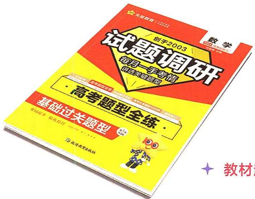

<details>
<summary>text_image</summary>

试题调研
每月一季专题
高考题型全练
基础过关题型
教材
</details>

# 分册1 基础过关题型

——适合一轮复习打基础

是基础知识的高频命题方向，每个题型下从4个方面精选试题，练透题型，夯实基础。

# 教材起点练

通过教材习题变式、教材材料或图形命题等，深挖教材，重温和巩固教材知识。

高考方向练 立足全国视野，精选高考题，感受高考经典的命题角度，知道高考怎么考。  
模拟实战练 精选各地最新模拟题，感知教考新信息，见识更多的命题角度，考试不再慌。  
易错警示练 搜集经典错题进行针对性训练，补齐知识和思维短板，考试多拿分。

# 分册2 高分进阶题型

——适合二轮复习提能力

是高考新趋势、高考命题热点，关注知识模块综合、创新思维，实现能力进阶。

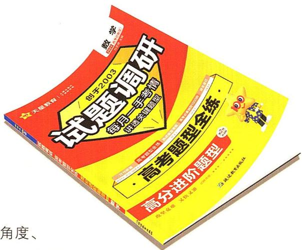

<details>
<summary>text_image</summary>

试题调好
始于2003
每月一节考情
高考题型全练
高分进阶题型
角度、
</details>

新高考创新题型 关注高考新变化，精选新考法、新角度、新形式、新情境试题，突破常规，激活思维。  
新高考热点题型 基于学科本质、核心素养等，圈定高考命题热点，突破重难，稳拿高分。

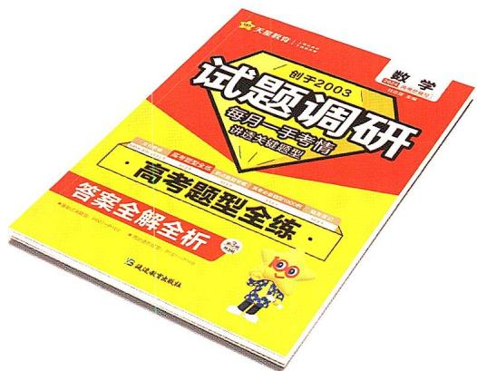

<details>
<summary>text_image</summary>

数学
别于2003
试题调研
每月一手学题
讲高全解题型
· 高考题型全练 ·
答案全解全析
· 选题题型全选书
· 选题题型全选书
· 选题题型全选书
· 选题题型全选书
· 选题题型全选书
</details>

# 分册3 答案全解全析

——好解析就是好老师

超详解析 一看就懂  
思路清晰 培养思维   
规范答题 避免失分  
形式多样 更易理解

# 创于2003

# 试题调研

# 每月一手考情

# 讲透关键题型

月刊教辅

高考题型全练

热点题型专练

高考必备题型1000例

随身速记

2023.6-2024.4按月上市

6月上市

8月上市

9月上市

1月上市

# · 高考题型全练

主 编：杜志建

本册编审：李昭平 倪翠 郭凯强 李晶晶

# 分册 1 基础过关题型 (194 个)

# 第一章 集合、常用逻辑用语与不等式

# 第一节 集合

题型1 元素与集合 001

题型 2 集合的基本关系 …… 002

题型 3 集合的交、并、补运算…… 002

题型 4 集合中的求参问题…… 003

题型 5 有交叉的计数问题…… 004

题型6 集合的新定义问题……005

# 第二节 常用逻辑用语

题型 7 充分条件与必要条件的判断…… 006

题型 8 充分条件与必要条件的应用…… 007

题型 9 全称量词与存在量词…… 008

题型 10 由命题真假求参数的值(或范围) …… 009

# 第三节 不等式

题型 11 比较两个数(式)的大小 …… 010

题型 12 不等式性质的应用 …… 010

题型 13 利用基本不等式求最值 …… 011

题型 14 基本不等式的综合应用 …… 012

题型 15 一元二次不等式的解法 …… 013

题型 16 一元二次不等式的恒成立问题 …… 014

题型 17 生产、生活实践情境下的不等式应用……015

# 高考新趋势

新角度 [P003,2023 全国卷乙·2] 集合的基本运算, 设问创新

[P003,2023 新高考卷Ⅱ·2]集合的基本关系

# 第二章 函数与基本初等函数Ⅰ

# 第一节 函数及其表示

题型 18 求函数的定义域 …… 016

题型 19 求函数的解析式 …… 017

题型 20 已知分段函数求值(或求参) …… 018

题型 21 已知分段函数解不等式 …… 019

# 第二节 函数的基本性质

题型 22 确定函数的单调性(单调区间) …… 019

题型 23 函数单调性的应用 …… 020

题型 24 求函数的最值(值域) …… 021

题型 25 判断函数的奇偶性 …… 022

题型 26 函数奇偶性的应用 …… 023

题型 27 函数周期性及函数图象对称性的应用 … 024

题型 28 函数性质的综合应用 …… 025

# 第三节 二次函数与幂函数

题型 29 幂函数的图象与性质的应用 …… 026

题型 30 二次函数的图象和性质的应用 …… 027

# 第四节 指数与指数函数

题型 31 指数幂的运算 …… 028

题型 32 指数函数的图象和性质的应用 …… 029

# 第五节 对数与对数函数

题型33 对数式的运算 030

题型 34 对数函数的图象及应用 …… 031

题型35 对数函数的性质及应用 032

题型 36 解对数(指数)方程或不等式问题 …… 033

题型 37 比较大小 …… 034

# 第六节 函数的图象

题型 38 函数图象的识别 …… 035

题型39 函数图象的应用 036

# 第七节 函数与方程

题型 40 判断函数的零点所在区间 …… 037

题型 41 判断函数的零点个数 …… 038

题型 42 函数零点的应用 …… 039

# 第八节 函数模型及其应用

题型 43 解决图表型函数的实际应用问题 …… 040

题型 44 已知函数模型求解实际问题 …… 041

题型 45 构造函数模型求解实际问题 …… 042

# 高考新趋势

新角度 [P021,2023 新高考卷 I · 4] 指数型复合函数的单调性

[P038,2023全国卷甲·10]以三角函数的平移变换为情境考查交点个数问题

# 第三章 一元函数的导数及其应用

# 第一节 导数的概念及运算

题型 46 导数的运算 …… 044

题型 47 求切线方程 …… 045

题型 48 根据导数的几何意义求参数(或切点) …… 046

题型 49 曲线的公切线问题 …… 047

# 第二节 导数在研究函数中的应用

题型 50 讨论函数的单调性或求单调区间 …… 048

题型 51 已知函数的单调性求参数 …… 049

题型 52 利用函数单调性求解比较大小或解不等式
问题 …… 050

题型 53 求极值 …… 051

题型 54 已知函数极值情况求参数 …… 052

题型 55 求函数的最值 …… 053

题型 56 已知函数最值情况求参数 …… 054

# 第四章 三角函数

# 第一节 三角函数的基本概念、同角三角函数的基本关系与诱导公式

题型 57 判断三角函数值的符号 …… 055

题型 58 扇形弧长公式与面积公式 …… 056

题型59 三角函数定义的应用 057

题型 60 同角三角函数基本关系的应用 …… 058

题型61 诱导公式 059

题型 62 同角三角函数基本关系与诱导公式的综合应用 …… 060

# 第二节 三角恒等变换

题型 63 两角和与差的正弦、余弦、正切公式的应用 …… 061

题型 64 二倍角和半角公式的应用 …… 062

题型 65 辅助角公式的应用 …… 063

题型 66 给角求值 064

题型 67 给值求值 065

题型 68 给值求角 066

# 第三节 三角函数的图象与性质

题型 69 求三角函数的最值(值域) …… 067

题型 70 三角函数的单调性 …… 068

题型 71 三角函数的周期性 …… 069

题型 72 三角函数的奇偶性和图象的对称性 …… 070

题型 73 三角函数性质的综合应用 …… 071

题型 74 三角函数的图象变换 …… 072

题型 75 三角函数的图象识别 …… 073

题型 76 三角函数的图象与性质的综合应用 …… 074

题型 77 三角函数性质与三角恒等变换的综合 … 076

题型 78 三角函数模型的应用 …… 077

# 第五章 数列

# 第一节 数列的概念与简单表示

题型 79 利用 $a_{n}$ 与 $S_{n}$ 的关系求数列的通项公式
079

# 目录

题型 80 利用累加法(累乘法)求数列的通项公式
080

题型81 数列的性质及其应用 081

# 第二节 等差数列及其前 $n$ 项和

题型82 等差数列的基本运算 082

题型 83 等差数列的判定与证明 …… 083

题型 84 等差数列的性质及应用 …… 084

题型85 等差数列的最值问题 085

# 第三节 等比数列及其前 $n$ 项和

题型 86 等比数列的基本运算 …… 087

题型 87 等比数列的判定与证明 …… 088

题型 88 等比数列的性质的应用 …… 090

题型 89 等差、等比数列的综合 …… 091

# 第四节 数列求和

题型 90 用裂项相消法求和 …… 092

题型 91 用错位相减法求和 …… 094

题型 92 分组求和与并项求和 …… 095

题型 93 用倒序相加法求和 …… 097

# 第六章 平面向量

# 第一节 平面向量的概念及线性运算、平面向量基本定理及坐标表示

题型 94 平面向量的有关概念 …… 098

题型 95 平面向量的线性运算及其几何意义的应用
099

题型 96 共线向量定理的应用 …… 100

题型 97 平面向量基本定理的应用 …… 101

题型 98 平面向量的坐标运算 …… 102

# 第二节 平面向量的数量积及应用

题型 99 求平面向量的数量积 …… 103

题型 100 平面向量的投影向量问题…… 104

题型 101 平面向量的模长问题…… 105

题型 102 平面向量的夹角问题…… 106

题型 103 平面向量的平行、垂直问题 …… 107

题型 104 平面向量的应用 …… 107

# 第三节 正、余弦定理及解三角形

题型 105 利用正弦定理解三角形…… 109

题型 106 利用余弦定理解三角形…… 110

题型 107 正、余弦定理的综合应用 …… 111

题型 108 判断三角形的形状 …… 112

题型 109 三角形的面积问题…… 113

题型 110 三角形的周长问题…… 115

题型 111 解三角形的实际应用 …… 116

# 第七章 复数

题型 112 求复数的实部、虚部 …… 118

题型 113 求共轭复数…… 118

题型 114 求复数的模…… 119

题型 115 复数中的含参问题…… 119

题型 116 复数的四则运算…… 120

题型 117 复数的几何意义 …… 121

# 第八章 立体几何

# 第一节 空间几何体的结构特征、表面积和体积

题型 118 对空间几何体结构的理解 …… 122

题型 119 立体几何中的“展开”问题 …… 123

题型 120 求几何体的表面积(侧面积) …… 124

题型 121 求空间几何体的体积…… 125

题型 122 外接球问题 …… 127

题型 123 内切球问题 …… 128

# 第二节 空间点、直线、平面之间的位置关系

题型 124 平面的基本性质及应用 …… 129

题型 125 判断空间两直线的位置关系 …… 130

# 第三节 直线、平面的平行

题型 126 线面平行的判定与性质 …… 131

题型 127 面面平行的判定与性质 …… 132

题型 128 平行关系的综合问题 …… 134

# 第四节 直线、平面的垂直

题型 129 求异面直线所成的角 …… 135

题型 130 线面垂直的判定与性质 …… 136

题型 131 面面垂直的判定与性质 …… 138

题型 132 垂直关系的综合问题 …… 139

# 第五节 空间向量的应用

题型 133 证明平行与垂直问题 …… 140

题型 134 求线面角 …… 142

题型 135 求二面角 …… 143

题型 136 求空间距离 …… 145

# 高考新趋势

新角度 [P122,2023 全国卷甲·15] 正方体和球的结构特征,设问创新
[P142,2023全国卷乙·9]空间角,条件创新

# 第九章 直线和圆的方程

# 第一节 直线方程与两直线的位置关系

题型 137 直线的倾斜角与斜率…… 147

题型 138 求直线的方程 …… 148

题型 139 两直线的位置关系的判断及应用…… 149

题型 140 直线的交点与距离问题 …… 150

题型 141 对称问题 …… 151

# 第二节 圆的方程及直线、圆的位置关系

题型 142 求圆的方程…… 152

题型 143 与圆有关的最值问题…… 152

题型 144 直线与圆的位置关系的判断及应用…… 153

题型 145 直线与圆相切的切线问题 …… 154

题型 146 直线与圆相交的弦长问题 …… 156

题型 147 圆与圆的位置关系的判断及应用 …… 156

# 高考新趋势

新角度 [P154,2023 新高考卷Ⅱ·15] 直线与圆的位置关系的应用,开放题

新动向 [P155,2023 新高考卷 I · 6] 直线与圆相切和三角函数综合

# 第十章 圆锥曲线与方程

# 第一节 椭圆

题型 148 椭圆定义的应用 …… 158

题型 149 求椭圆的标准方程 …… 159

题型 150 求椭圆的离心率或其范围 …… 160

题型 151 椭圆的几何性质及其应用 …… 161

题型 152 直线与椭圆的位置关系 …… 162

# 第二节 双曲线

题型 153 双曲线定义的应用 …… 164

题型 154 求双曲线的标准方程 …… 165

题型 155 求双曲线的渐近线方程…… 166

题型 156 求双曲线的离心率或其范围…… 167

题型 157 双曲线的几何性质及其应用 …… 168

题型 158 直线与双曲线的位置关系 …… 169

# 第三节 抛物线

题型 159 抛物线定义的应用 …… 171

题型 160 抛物线的标准方程及其应用 …… 172

题型 161 抛物线的几何性质及其应用 …… 173

题型 162 抛物线的焦点弦问题 …… 174

题型 163 直线与抛物线的位置关系 …… 175

题型 164 平面解析几何内综合 …… 176

# 目录

# 高考新趋势

新动向 [P167,2023 新高考卷 I · 16] 双曲线与平面向量综合

新角度 [P174,2023 新高考卷Ⅱ·10] 抛物线的焦点弦问题

# 第十一章 计数原理

# 第一节 两个计数原理、排列与组合

题型 165 分类加法计数原理与分步乘法计数原理的应用 …… 177

题型 166 排列问题 …… 178

题型 167 组合问题 …… 179

题型 168 分组分配问题…… 180

题型 169 排列与组合的综合应用 …… 181

# 第二节 二项式定理

题型 170 求形如 $(a+b)^{n}(n\in\mathbf{N}^{*})$ 的展开式中的
特定项或特定项的系数…… 182

题型 171 求形如 $(a+b)^{m}(c+d)^{n}(m,n\in\mathbf{N}^{*})$ 的
展开式中的特定项或特定项的系数…… 182

题型 172 求形如 $(a+b+c)^{n}(n\in\mathbf{N}^{*})$ 的展开式中的特定项或特定项的系数…… 183

题型 173 二项展开式的系数和问题 …… 184

题型 174 与二项展开式中的系数有关的最值问题
…… 185

# 第十二章 概率

# 第一节 随机事件的概率

题型 175 随机事件的频率与概率…… 186

题型 176 概率的基本性质的应用 …… 188

题型 177 求古典概型的概率…… 189

# 第二节 事件的相互独立性、条件概率与全概率公式

题型 178 相互独立事件的判断及其概率的计算…… 190

题型 179 条件概率的计算 …… 192

题型 180 全概率的计算 …… 193

# 第三节 离散型随机变量及其分布列、数字特征

题型 181 求离散型随机变量的分布列、均值与方差
…… 195

题型 182 利用均值与方差进行决策…… 196

# 第四节 二项分布、超几何分布与正态分布

题型 183 二项分布 …… 198

题型 184 超几何分布 …… 200

题型 185 正态分布 …… 201

# 高考新趋势

新情境 [P191,2023 新高考卷Ⅱ·12] 信号传输

新角度 [P193,2023 天津·13] 全概率的应用

# 第十三章 统计、成对数据的统计分析

# 第一节 随机抽样与用样本估计总体

题型 186 随机抽样 …… 203

题型 187 频率分布直方图 …… 204

题型 188 统计图表…… 206

题型 189 百分位数的计算 …… 207

题型 190 样本的数字特征 …… 208

题型 191 总体数字特征的估计…… 210

# 第二节 成对数据的统计分析

题型 192 相关关系的判断…… 212

题型 193 一元线性回归模型及其应用 …… 213

题型 194 独立性检验…… 215

# 高考新趋势

新角度 [P209,2023 新高考卷 I·9] 样本的数字特征

新情境 [P209,2023 全国卷乙·17] 比较两种工艺对橡胶产品伸缩率的处理效应

[P212,2023 天津·7] 判断花瓣长度和花萼长度的相关性

答案全解全析(分册3,P001—P108)


# 分册 2 高分进阶题型(81个)

# 第一部分 新高考创新题型

题型1 多选题 001

题型 2 信息阅读题…… 003

题型 3 开放题…… 004

题型 4 新定义题…… 005

题型 5 数学文化题…… 006

题型 6 结构不良题…… 008

题型 7 数学应用题…… 010

题型 8 数学探索题…… 012

题型 9 方案设计和决策题 …… 014

题型 10 学科内综合题 …… 016

题型 11 学科间综合题 …… 018

# 高考新趋势

新情境 [P001,2023 新高考 I · 10] 噪声污染

新动向 [P016,2023 全国卷乙·10] 集合、数列、三角函数的综合

# 第二部分 新高考热点题型

# 专题一 函数与导数

题型 12 与函数有关的新定义问题 …… 019

题型 13 抽象函数的性质及应用 …… 020

题型 14 函数性质的综合应用 …… 021

题型 15 与函数零点(方程根)的和(或积)有关的问题 …… 022

题型 16 复合函数的零点问题 …… 023

题型 17 用构造法求解比较大小问题 …… 024

题型 18 用构造法求解 $f(x)$ 与 $f'(x)$ 共存的不等式
问题 …… 025

题型 19 同构法在处理指对混合问题中的应用 … 026

题型 20 利用导数求解极值和最值问题 …… 027

题型 21 重要不等式及其应用 …… 029

题型 22 单变量不等式的证明 …… 030

题型 23 双变量不等式的证明 …… 032

题型 24 导数中不等式的恒成立问题 …… 033

题型 25 导数中不等式的存在性问题 …… 034

题型 26 导数中双变量“存在性或任意性”问题 …… 035

题型 27 讨论函数的零点(方程根)的个数 …… 036

题型 28 已知函数零点个数求参数的取值范围 … 037

题型 29 隐零点问题 038

题型 30 极值点偏移问题 …… 040

题型 31 导数与其他知识的综合问题 …… 041

# 高考新趋势

新动向 [P034,2023 全国卷乙·21] 导数与函数图象的对称性综合

# 专题二 三角函数、解三角形、平面向量

题型 32 三角恒等变换 …… 043

题型 33 三角函数中有关 $\omega$ 问题的求解 …… 044

题型 34 三角函数的图象与性质的综合应用 …… 045

题型 35 解三角形中的最值(范围)问题 …… 046

题型 36 多三角形问题 …… 048

题型 37 三角形中的“三线”问题 …… 049

题型 38 平面向量中的最值(范围)问题 …… 051

题型 39 坐标法在求解向量问题中的应用 …… 052

题型 40 向量极化恒等式的应用 …… 053

题型 41 等和线定理的应用 …… 054

# 目录

题型42 奔驰定理的应用 054

题型 43 与三角形“四心”有关的问题 …… 056

题型 44 平面向量与其他知识的综合 …… 057

# 专题三 数列

题型 45 构造法求数列的通项公式 …… 059

题型 46 数列中含绝对值的求和问题 …… 060

题型 47 数列中的奇、偶项问题…… 061

题型 48 数列中的最值、范围问题…… 062

题型 49 类杨辉三角数列问题 …… 064

题型 50 情境载体下的数列应用 …… 064

题型51 数列的创新型问题 066

题型 52 数列与其他知识的综合 …… 068

# 专题四 立体几何

题型 53 求空间几何体的表面积(侧面积) …… 070

题型 54 求空间几何体的体积 …… 071

题型 55 球的切、接问题 …… 073

题型 56 求空间角 …… 074

题型 57 立体几何中的最值问题 …… 076

题型 58 立体几何中的截面、交线问题…… 077

题型 59 立体几何中的动态问题 …… 078

题型 60 立体几何中的翻折问题 …… 079

题型 61 立体几何中的探索性问题 …… 081

# 高考新趋势

新角度 [P73,2023 新高考卷 I·12] 正方体的结构特征

# 专题五 平面解析几何

题型 62 直线与圆的位置关系的应用 …… 083

题型 63 “阿波罗尼斯圆”的应用 …… 083

题型 64 “蒙日圆”的应用 …… 084

题型 65 求圆锥曲线的离心率或其范围 …… 086

题型66 求轨迹方程 087

题型 67 “阿基米德三角形”的应用 …… 088

题型 68 圆锥曲线中的弦长问题 …… 090

题型 69 圆锥曲线中的弦中点问题 …… 091

题型70 圆锥曲线中的最值问题 092

题型 71 圆锥曲线中的取值范围问题 …… 093

题型 72 圆锥曲线中的“非对称”根与系数关系的应用 …… 094

题型 73 圆锥曲线中的定点问题 …… 095

题型74 圆锥曲线中的定值问题 097

题型 75 圆锥曲线中的定线问题 …… 099

题型 76 圆锥曲线中的探索性问题 …… 100

题型 77 圆锥曲线中的证明问题 …… 102

题型 78 圆锥曲线与其他知识的综合问题 …… 104

# 高考新趋势

新角度 [P99,2023 新高考卷Ⅱ·21] 证明点在定直线上

新动向 [P105,2023 新高考卷 I · 22] 圆锥曲线与导数综合

# 专题六 概率与统计

题型 79 概率与统计的综合 …… 106

题型80 概率统计与函数的综合 …… 109

题型81 概率统计与数列的综合 …… 111

# 高考新趋势

新动向 [P108,2023 全国卷甲·19] 随机变量的分布列、期望与成对数据的统计分析综合

[P109,2023 新高考卷Ⅱ·19]统计与函数综合

[P111,2023 新高考卷 I · 21] 概率与数列综合

答案全解全析(分册3,P109—P192)

# 第一章 集合、常用逻辑用语与不等式

# 第一节 集合

# 题型 1 元素与集合

▶ 答案: 001 页

# 题型攻略

# 求解与集合中元素有关问题的关键点

1. 利用集合元素的限制条件求参数的值或确定集合中元素的个数时,要注意检验集合中的元素是否满足元素的互异性.

2. 研究集合问题时, 先要明确构成集合的元素是什么, 即弄清该集合是数集、点集, 还是其他集合; 再看集合的构成元素满足的限制条件是什么, 从而准确把握集合的含义.

3. 常见集合的意义

<table><tr><td>集合</td><td>{x|f(x)=0}</td><td>{x|f(x)&gt;0}</td><td>{x|y=f(x)}</td><td>{y|y=f(x)}</td><td>{(x,y)|y=f(x)}</td></tr><tr><td>代表元素</td><td>方程f(x)=0的根.</td><td>不等式f(x)&gt;0的解.</td><td>函数y=f(x)的自变量的取值.</td><td>函数y=f(x)的函数值.</td><td>函数y=f(x)图象上的点.</td></tr></table>

# 教材 起点练

1. [多选, 人 A 必一 $^{[注]}$ P5 练习 T2 改编, ★] 下列关系中, 正确的是 ( )

A. $-2 \notin \{0,1\}$   
B. $(2,4)\in\{x|y=x^{2}\}$   
C. $\pi \in \mathbf{R}$   
D. $0 \in \emptyset$

2. [多选, 人 A 必一 P9 T4 改编, ★] 下列结论中, 正确的有 ( )

A. $\{x \mid x + y = 1\} = \{y \mid x + y = 1\}$   
B. $\{(x,y)\mid x+y=2\}=\{x\mid x+y=2\}$   
C. $\{x \mid x > 2\} = \{y \mid y > 2\}$   
D. $\{1,2\} = \{2,1\}$

# 高考 方向练

3. [2022 全国卷乙, ★] 设全集 $U = \{1, 2, 3, 4, 5\}$ , 集合 $M$ 满足 $\complement_U M = \{1, 3\}$ , 则 ( )

A. $2 \in M$

B. $3 \in M$

C. $4 \notin M$

D. $5 \notin M$

4. [2020 全国卷Ⅲ, ★] 已知集合 $A = \{(x, y) | x, y \in \mathbb{N}^{*}, y \geqslant x\}$ , $B = \{(x, y) | x + y = 8\}$ , 则 $A \cap B$ 中元素的个数为 ( )

A. 2

B. 3

C. 4

D. 6

# 模拟 实战练

5. [2023 石家庄市二检, ★] 设全集 $U = \{2, 4, 6, 8\}$ , 若集合 $M$ 满足 $\complement_U M = \{2, 8\}$ , 则 ( )

A. $4 \subseteq  M$

B. $6 \subseteq  M$

C. $4 \in M$

D. $6 \notin M$

6.[多选,2023江苏省镇江中学模拟,★]已知集合 $A=\{y\mid y=x^{2}+2\}$ ，集合 $B=\{(x,y)\mid y=x^{2}+2\}$ ，下列关系正确的是()

A. $(1,3)\in B$

B. $(0,0) \notin B$

C. $0 \in A$

D. $A = B$

# 易错 警示练

7.[忽略集合中元素的互异性致误,★]已知集合 $A=\{0,m,m^{2}-5m+6\}$ ，且 $2\in A$ ，则实数m的值为\_\_\_\_.

【注】均指新教材.

# 题型 2 集合的基本关系

# 题型攻略

1. 判断集合间的包含关系的方法: (1) 列举法; (2) 结构法; (3) 数形结合法(借助数轴, Venn 图等).  
2. 含有 $n$ 个元素的集合的子集个数是 $2^{n}$ , 非空子集的个数是 $2^{n} - 1$ , 真子集的个数是 $2^{n} - 1$ , 非空真子集的个数是 $2^{n} - 2$ .

# 教材 起点练

1. [人 A 必一 P8 T2 改编, ★] 给出下列说法:

① $\{a\}\in\{a,b,c\}$ ; ② $\{x|x$ 是四边形 $\}\subsetneqq\{x|x$ 是正方形 $\}$ ; ③ $\emptyset\subseteq\{0\}$ ; ④ $\{0,1,2\}=\{1,2,0\}$ ; ⑤ $\emptyset=\{x\in R|x^{2}+1=0\}$ .

其中正确的个数为 （）

A. 2

B. 3

C. 4

D. 5

# 高考 方向练

2. [2021 全国卷乙, ★★] 已知集合 $S = \{s \mid s = 2n + 1, n \in \mathbf{Z}\}$ , $T = \{t \mid t = 4n + 1, n \in \mathbf{Z}\}$ , 则 $S \cap T =$ ( )

A. $\varnothing$

B. $S$

C. $T$

D. Z

# 模拟 实战练

3.[2023四川省名校第三次联考,★]已知集合 $A=\{x\mid y=\lg x\},B=\{y\mid y=x^{2}\}$ ，则()

A. $A \cup  B = \mathbf{R}$

B. $\complement_{\mathbf{R}}A\subseteq B$

C. $A \cap  B = B$

D. $A \subseteq  B$

4. [2023 河南省名校摸底考试, ★] 已知集合 $A = \{1, 2, 3, 5, 10\}$ , $B = \{x \mid x$ 为质数 $\}$ , 则 $A \cap B$ 的非空子集个数为 ( )

A. 4

B. 7

C. 8

D. 16

5.[2023辽宁省实验中学期中改编,★]满足条件 $\{1,2\}\subseteq A\not\subseteq\{1,2,3,4,5\}$ 的集合A的个数是()

A. 5

B. 6

C. 7

D. 8

# 易错 警示练

6. [易忽视空集情况致误, ★★] 已知集合 $A = \{x \mid -2 \leqslant x \leqslant 5\}$ , $B = \{x \mid m + 1 \leqslant x \leqslant 2m - 1\}$ , 若 $B \subseteq A$ , 则实数 $m$ 的取值范围为 \_\_\_\_.

# 题型 3 集合的交、并、补运算

▶ 答案: 001 页

# 题型攻略

# 求解集合的基本运算问题的步骤

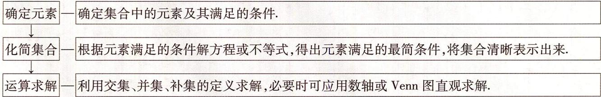

<details>
<summary>flowchart</summary>

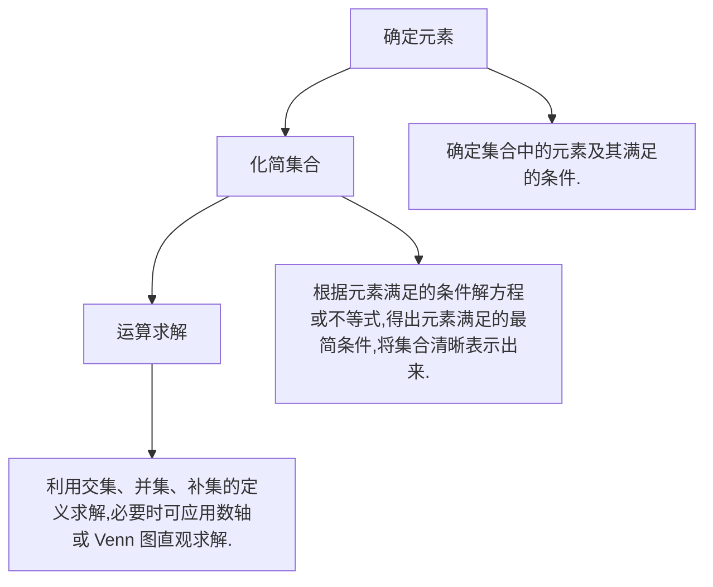
</details>

# 教材 起点练

1. [人 A 必一 P13 T3 改编, ★] 如图, I 是全集, A, B, C 是 I 的三个子集, 则图中阴影部分表示 ( )

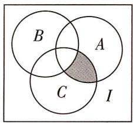

<details>
<summary>text_image</summary>

B
A
C
I
</details>

A. $A \cap  B \cap  C$

B. $A \cap C \cap (\complement_{I} B)$

C. $A \cap B \cap (\complement_I C)$

D. $B \cap C \cap (\complement_{I} A)$

# 高考 方向练

2. [2023 新高考卷 I, ★] 已知集合 $M = \{-2, -1, 0, 1, 2\}$ , $N = \{x \mid x^{2} - x - 6 \geqslant 0\}$ , 则 $M \cap N =$ ( )

A. $\{-2, -1, 0, 1\}$   
B. $\{ 0,1,2\}$   
C. $\{-2\}$   
D. $\{2\}$

3. [2023 全国卷乙, ★] 设集合 U = R, 集合 $M = \{x \mid x < 1\}$ , $N = \{x \mid -1 < x < 2\}$ , 则 $\{x \mid x \geqslant 2\} = (\quad)$

A. $\complement_{U}(M\cup N)$

B. $N \cup \complement_{U} M$

C. $\complement_{U}(M\cap N)$

D. $M \cup \complement_{U} N$

4. [2023 全国卷甲, ★★] 设全集 U = Z, 集合 $M=\{x\mid x=3k+1,k\in Z\},N=\{x\mid x=3k+2,k\in Z\}$ ，则 $\complement_{U}(M\cup N)=$ （）

A. $\{x \mid x = 3k, k \in \mathbf{Z}\}$

B. $\{x\mid x = 3k - 1,k\in \mathbf{Z}\}$

C. $\{x \mid x = 3k - 2, k \in \mathbf{Z}\}$

D. $\varnothing$

# 模拟 实战练

5. [2023 武汉市调研, ★] 已知集合 $A = \{x \mid x^2 - x - 6 < 0\}$ , $B = \{x \mid 2x + 3 > 0\}$ , 则 $A \cap B =$ ( )

A. $(-2, -\frac{3}{2})$

B. $(\frac{3}{2}, 3)$

C. $(- \frac{3}{2}, 3)$

D. $(- \frac{3}{2}, 2)$

6.[2023湖北省十一校联考,★]集合 $P=\{x\in$ $\mathbf{R}\mid y=\ln(3-x)\}$ , $Q=\{y\in\mathbf{R}\mid y=2^{x},x\in P\}$ ，则 $P\cap Q=$ ( )

A. $(-\infty, 3)$

B. $(0,3)$

C. (1,3)

D. $(- \infty, 8)$

7.[多选,2023安徽省淮南一中、淮南二中联考, ★★]若集合A,B,U满足 $A\cap(\complement_{U}B)=\varnothing$ ,则下列选项中一定成立的是()

A. $A \cap  B = A$

B. $A \cup  B = U$

C. $A \cup (\complement_U B) = U$

D. $B \cup (\complement_U A) = U$

# 易错 警示练

8. [不理解集合中元素的含义致误, ★★] 设集合

$$
M = \{x \mid x = \frac {n}{2} + \frac {1}{4}, n \in \mathbf {Z} \}, N = \{x \mid x = \frac {n}{4}, n \in
$$

$$
\mathbf {Z} \}, \text {则} \mathbb {C} _ {N} M = \tag {（}
$$

A. $\varnothing$

B. $\{x \mid x = \frac{n}{2}, n \in \mathbf{Z}\}$

C. $\{x \mid x = \frac{3n}{4}, n \in \mathbf{Z}\}$

D. $\{x\mid x = 2n,n\in \mathbf{Z}\}$

# 题型 4 集合中的求参问题

▶ 答案：001 页

# 题型攻略

1. 根据两集合间的关系求参数, 常根据集合间的关系转化为方程(组)或不等式(组)求解, 求解时注意集合中元素的互异性和端点值能否取到.

2. 在涉及集合之间的关系时, 若未指明集合非空, 则要考虑空集的可能性, 如已知集合 $A$ 、非空集合 $B$ 满足 $A \subseteq B$ 或 $A \subsetneq B$ , 则有 $A = \emptyset$ 和 $A \neq \emptyset$ 两种可能.

1. 根据两集合间的关系求参数, 常根据集合间的关系转化为方程(组)或不等式(组)求解, 求解时注意集合中元素的互异性和端点值能否取到.
2. 在涉及集合之间的关系时, 若未指明集合非空, 则要考虑空集的可能性, 如已知集合 A、非空集合 B 满足 $A \subseteq B$ 或 $A \subsetneq B$ , 则有 $A = \varnothing$ 和 $A \neq \varnothing$ 两种可能.

# 教材 起点练

1. [人 A 必一 P9 T5(2) 改编, ★] 已知集合 $A = \{x \mid 2x - 1 > 5\}$ , $B = \{x \mid (x - a)(x - a + 1) \geqslant 0\}$ , 若 $A \cup B = \mathbf{R}$ , 则 $a$ 的取值范围是 ( )

A. $[4, +\infty)$

B. $[3, +\infty)$

C. $(-\infty, 4]$

D. $(-∞,3]$

# 高考 方向练

2.[2023新高考卷Ⅱ,★]设集合 $A=\{0,-a\}$ , $B=\{1,a-2,2a-2\}$ ，若 $A\subseteq B$ ，则 $a=(\quad)$

A. 2

B. 1

C. $\frac{2}{3}$

D. - 1

3. [2020 全国卷 I, ★] 设集合 $A = \{x \mid x^2 - 4 \leqslant 0\}$ , $B = \{x \mid 2x + a \leqslant 0\}$ , 且 $A \cap B = \{x \mid -2 \leqslant x \leqslant 1\}$ , 则 $a =$ ( )

A. -4

B. -2

C. 2

D. 4

# 模拟 实战练

4. [2023 汕头市模拟, ★★] 已知集合 $A = \{x \in \mathbf{Z} | x^2 - 4x - 5 < 0\}$ , $B = \{x | 4^x > 2^m\}$ , 若 $A \cap B$ 中有三个元素,则实数 m 的取值范围是 ( )

A. $[3,6)$

B. $[1,2)$

C. $[2,4)$

D. $(2,4]$

5. [2023 江西省联考, ★★] 已知集合 $A = \{(x, y) | (x - 1)^2 + y^2 = 1\}$ , $B = \{(x, y) | kx - y - 2 < 0\}$ . 若 $A \cap B = A$ , 则 $k$ 的取值范围是 ( )

A. $(-\infty, \frac{3}{4})$

B. $\left(\frac{3}{4},3\right)$

C. $\left(\frac{3}{4},+\infty\right)$

D. $(-\infty, \frac{3}{4}]$

6.[2023 南京市、盐城市一模,★★]已知集合 $A=\{x\mid\frac{x-1}{x-a}<0\}$ ，若 $A\cap N^{*}=\varnothing$ ，则实数a的取值范围是()

A. $\{1\}$

B. $(-\infty, 1)$

C. $[1,2]$

D. $(-∞,2]$

7.[多选,2023广东肇庆模拟,★★]已知集合 $A=\{x\in\mathbb{R}\mid x^{2}-3x-18<0\}$ , $B=\{x\in\mathbb{R}\mid x^{2}+ax+a^{2}-27<0\}$ ，则下列命题中正确的是()

A. 若 $A = B$ , 则 $a = -3$

B. 若 $A \subseteq B$ ，则 a = -3

C. 若 $B = \emptyset$ , 则 $a \leqslant -6$ 或 $a \geqslant 6$

D. 若 $B \subsetneq A$ , 则 $-6 < a \leqslant -3$ 或 $a \geqslant 6$

# 易错 警示练

8. [易忽略集合中元素的互异性, ★★]已知集合 $A = \{2a, a^2, 3\}$ , 集合 $B = \{1, a + 2, \frac{2}{a}\}$ , 且 $A \cap B = A \cup B$ , 则实数 $a =$ \_\_\_\_.

# 题型 5 有交叉的计数问题

▶ 答案: 001 页

# 题型攻略

关于集合中的计数问题,常借助 Venn 图或用公式 $\mathrm{card}(A \cup B) = \mathrm{card}(A) + \mathrm{card}(B) - \mathrm{card}(A \cap B)$ , $\mathrm{card}(A \cup B \cup C) = \mathrm{card}(A) + \mathrm{card}(B) + \mathrm{card}(C) - \mathrm{card}(A \cap B) - \mathrm{card}(A \cap C) - \mathrm{card}(B \cap C) + \mathrm{card}(A \cap B \cap C) (\mathrm{card}(A))$ 表示有限集合 A 中元素的个数)求解.

# 教材 起点练

1.[多选,人 A 必一 P35 T11 改编,★]某校举办运动会,高一的两个班共有 120 名同学,已知参加跑步、拔河、篮球比赛的人数分别为 58,38,52,同时参加跑步和拔河比赛的人数为 18,同时参加拔河和篮球比赛的人数为 16,同时参加跑步、拔河、篮球三项比赛的人数为 12,三项比赛都不参加的人数为 20,则()

A. 同时参加跑步和篮球比赛的人数为 24

B. 只参加跑步比赛的人数为 26

C. 只参加拔河比赛的人数为 16

D. 只参加篮球比赛的人数为 22

# 高考 方向练

2. [2020 新高考卷 I, ★]某中学的学生积极参加体育锻炼, 其中有 96% 的学生喜欢足球或游泳, 60% 的学生喜欢足球, 82% 的学生喜欢游

泳,则该中学既喜欢足球又喜欢游泳的学生数占该校学生总数的比例是 ( )

A. $62\%$

B. $56\%$

C. $46\%$

D. $42\%$

3. [全国卷Ⅲ,★]《西游记》《三国演义》《水浒传》和《红楼梦》是中国古典文学瑰宝,并称为中国古典小说四大名著.某中学为了解本校学生阅读四大名著的情况,随机调查了100位学生,其中阅读过《西游记》或《红楼梦》的学生共有90位,阅读过《红楼梦》的学生共有80位,阅读过《西游记》且阅读过《红楼梦》的学生共有60位,则该校阅读过《西游记》的学生人数与该校学生总数比值的估计值为()

A. 0.5

B. 0.6

C. 0.7

D. 0.8

# 模拟 实战练

4. [★]某班有 46 名学生,有围棋爱好者 22 人,足球爱好者 27 人,同时爱好这两项的最多人数为 $x$ ,最少人数为 $y$ ,则 $x - y = \_$ .

# 易错 警示练

5.[无法正确绘制 Venn 图致错,★]向 50 名学生调查对 A,B 两种观点的态度,结果如下:

赞成观点 A 的学生人数是全体人数的 $\frac{3}{5}$ ，其余的不赞成；赞成观点 B 的学生人数比赞成观点 A 的多 3 人，其余的不赞成；另外，对观点 A, B 都不赞成的学生比对观点 A, B 都赞成的学生的 $\frac{1}{3}$ 多 1 人，则对观点 A, B 都赞成的学生有 \_\_\_\_ 人.

# 题型 6 集合的新定义问题

▶ 答案: 002 页

# 题型攻略

通过分析,明确要解决的问题,借助有关新定义并运用所学的集合有关知识解题.

# 教材 起点练

1. [人 A 必一 P13 T3 改编, ★★] 如图所示的 Venn 图中, A, B 是非空集合, 定义集合 $A \otimes B$ 为阴影部分表示的集合. 若 $A = \{x \mid x = 2n + 1, n \in N, n \leqslant 4\}$ , $B = \{2, 3, 4, 5, 6, 7\}$ , 则 $A \otimes B =$ ( )

A. $\{2,4,6,1\}$

B. $\{2,4,6,9\}$

C. $\{2,3,4,5,6,7\}$

D. $\{1,2,4,6,9\}$

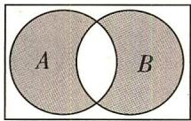

# 高考 方向练

2. [2020 浙江, ★★★] 设集合 $S, T, S \subseteq \mathbb{N}^{*}, T \subseteq \mathbb{N}^{*}, S, T$ 中至少有 2 个元素, 且 $S, T$ 满足:

①对于任意的 $x, y \in S$ , 若 $x \neq y$ , 则 $xy \in T$ ;  
②对于任意的 $x, y \in T$ ，若 x < y，则 $\frac{y}{x} \in S$ .

下列命题正确的是 （）

A. 若 S 有 4 个元素, 则 $S \cup T$ 有 7 个元素  
B. 若 S 有 4 个元素, 则 $S \cup T$ 有 6 个元素  
C. 若 S 有 3 个元素, 则 $S \cup T$ 有 5 个元素  
D. 若 S 有 3 个元素, 则 $S \cup T$ 有 4 个元素

# 模拟 实战练

3.[2023 重庆模拟,★★]含有有限个元素的数集,定义“交替和”如下:把集合中的数按从小到大的顺序排列,然后从最大的数开始交

替地减加各数. 例如 $\{4,6,9\}$ 的交替和是 $9 - 6 + 4 = 7$ ; 而 $\{5\}$ 的交替和是 5 , 则集合 $M = \{1,2,3,4,5,6\}$ 的所有非空子集的交替和的总和为 （）

A. 32

B. 64

C. 80

D. 192

4.[2023高三名校模拟,★★]对于非空集合 $A=\{a_{1},a_{2},a_{3},\cdots,a_{n}\}(a_{i}\geqslant0,i=1,2,3,\cdots,n)$ ，其所有元素的几何平均数记为 $E(A)$ ，即 $E(A)=\sqrt[n]{a_{1}\cdot a_{2}\cdot a_{3}\cdot\cdots\cdot a_{n}}$ 。若非空数集B满足下列两个条件：① $B\not\subseteq A$ ；② $E(B)=E(A)$ ，则称B为A的一个“保均值真子集”，则集合 $A=\{1,2,4,8,16\}$ 的“保均值真子集”的个数为（）

A. 2

B. 4

C. 6

D. 8

5.[多选,2023山东省淄博一中月考,★★]在整数集Z中,被5除所得余数为k的所有整数组成一个“类”,记为[k],即[k]={5n+k|n∈Z}(k=0,1,2,3,4),给出如下四个结论,正确结论为()

A. $2023 \in [3]$   
B. $-2 \in [2]$   
C. $\mathbf{Z} = [0]\cup [1]\cup [2]\cup [3]\cup [4]$   
D. 整数 a, b 属于同一“类”的充要条件是“a - b ∈ [0]”

6. [多选,2023 湖北模拟,★★★]若一个集合中含有 n 个元素, 则称该集合为“n 元集合”. 已知集合 $A = \{x \in Z \mid -x^{2} + 8x - 7 \geqslant a^{x}\} (a > 1)$ 为“5 元集合”, 则 a 的取值可以为 ( )

A. $\sqrt{5}$

B. $\sqrt[7]{5}$

C. $\sqrt[6]{5}$

D. 1.5

# 易错 警示练

7. [无法理解题意致错, 多选, ★★] 所谓戴德金分割, 是指将有理数集 $\mathbf{Q}$ 划分为两个非空的子集 $M$ 与 $N$ , 且满足 $M \cup N = \mathbf{Q}, M \cap N = \varnothing, M$ 中

的每一个元素都小于 N 中的每一个元素, 则称 $(M, N)$ 为戴德金分割. 试判断下列选项中, 可能成立的是 ()

A. $M = \{x\mid x <   0\} ,N = \{x\mid x > 0\}$ 是一个戴德金分割  
B. M 没有最大元素, N 有一个最小元素  
C. M 有一个最大元素, N 有一个最小元素  
D. M 没有最大元素, N 也没有最小元素

# 第二节 常用逻辑用语

# 题型 7 充分条件与必要条件的判断

▶ 答案：002 页

# 题型攻略

# 充分条件与必要条件的判断方法

1. 定义法. 根据“若 $p$ , 则 $q$ ”及“若 $q$ , 则 $p$ ”的真假进行判断, 适用于定义、定理等判断性问题.   
2. 集合法. 根据 $p, q$ 对应的集合之间的包含关系进行判断: 设 $A = \{x \mid p(x)\}, B = \{x \mid q(x)\}$ , (1) 若 $p$ 是 $q$ 的充分条件, 则 $A \subseteq B$ ; (2) 若 $p$ 是 $q$ 的充分不必要条件, 则 $A \subsetneq B$ ; (3) 若 $p$ 是 $q$ 的必要不充分条件, 则 $A \supsetneq B$ ; (4) 若 $p$ 是 $q$ 的充要条件, 则 $A = B$ .  
3. 等价转化法. 适用于“不易直接正面判断”的情况, 可将原命题等价转化为一个易于判断真假的命题.

# 教材 起点练

1. [人 A 必一 P22 例 4 改编, ★★] 已知 $a, b \in \mathbb{R}$ , 直线 $l: y = ax + b$ , 圆 $C: x^2 + y^2 = 4$ . $p: l$ 与圆 $C$ 相交; $q: 2a > \sqrt{b^2 - 4}$ . 则 $p$ 是 $q$ 的 ( )

A. 充分不必要条件  
B. 必要不充分条件  
C. 充要条件  
D. 既不充分也不必要条件

# 高考 方向练

2.[2021 浙江,★]已知非零向量 $a, b, c$ , 则“ $a \cdot c = b \cdot c$ ”是“ $a = b$ ”的 ( )

A. 充分不必要条件

B. 必要不充分条件

C. 充分必要条件

D. 既不充分也不必要条件

3. [2023 全国卷甲, ★★] 设甲: $\sin^{2}\alpha + \sin^{2}\beta = 1$ ,
乙: $\sin \alpha + \cos \beta = 0$ , 则 ( )

A. 甲是乙的充分条件但不是必要条件  
B. 甲是乙的必要条件但不是充分条件  
C. 甲是乙的充要条件

D. 甲既不是乙的充分条件也不是乙的必要条件

# 模拟 实战练

4. [2023 杭州市质检, ★] 在数列 $\{a_{n}\}$ 中, “数列 $\{a_{n}\}$ 是等比数列” 是“ $a_{2}^{2}=a_{1}a_{3}$ ” 的 ( )

A. 充分不必要条件

B. 必要不充分条件

C. 充要条件

D. 既不充分也不必要条件

5. [2023 云南师大附中模拟, ★★] 唐代著名诗人杜牧在《赤壁》一诗中写有“东风不与周郎便,铜雀春深锁二乔”, 即杜牧认为, 如果没有东风, 那么东吴的二乔将会被曹操关进铜雀台, 即赤壁之战东吴将输给曹操. 那么在杜牧认为, “东风”是 “赤壁之战东吴打败曹操”的 ( )

A. 充要条件

B. 充分不必要条件

C. 必要不充分条件

D. 既不充分也不必要条件

6. [2023 合肥市质检, ★★] 已知 $p: x + y > 0$ , $q: \ln (\sqrt{x^2 + 1} + x) - \ln (\sqrt{y^2 + 1} - y) > 0$ , 则 $p$ 是q 的 （）

A. 充分不必要条件  
B. 必要不充分条件  
C. 充要条件  
D. 既不充分也不必要条件

# 易错 警示练

7. [不会转换边角关系致误, 多选, ★★] 在 $\triangle ABC$ 中, 下列条件是 A > B 的充要条件的是 ( )

A. $\sin A > \sin B$

B. $\cos A < \cos B$

C. $\cos 2A < \cos 2B$

D. $\sin 2A > \sin 2B$

# 题型 8 充分条件与必要条件的应用

▶ 答案: 002 页

# 题型攻略

已知充分、必要条件求参数取值范围的策略

<table><tr><td>巧用转化求参数</td><td>把充分、必要条件转化为集合的包含、相等关系,然后根据集合之间的关系列出有关参数的不等式(组)求解,注意条件的等价变形.</td></tr><tr><td>端点值慎取舍</td><td>在求参数范围时,要注意区间端点值的检验,从而确定取舍.</td></tr></table>

# 教材 起点练

1. [人 A 必一 P23 T2(2) 改编, ★★]“不等式 $ax^{2} + ax - 1 < 0$ 恒成立”的一个必要不充分条件是 ( )

A. $-4 < a < 0$   
B. $-4 < a \leq 0$   
C. $a \leqslant 0$   
D. $-4 \leqslant a < 0$

# 高考 方向练

2. [上海, ★★] 已知 a, b, c 为实常数, 数列 $\{x_{n}\}$ 的通项 $x_{n}=an^{2}+bn+c, n\in N^{*}$ , 则“存在 $k\in N^{*}$ , 使得 $x_{100+k}, x_{200+k}, x_{300+k}$ 成等差数列”的一个必要条件是 ( )

A. $a \geqslant 0$   
B. $b \leq 0$   
C. $c = 0$   
D. $a - 2b + c = 0$

# 模拟 实战练

3. [2023 安徽省舒城中学模拟, ★] 若“0 < x < 3”是“ $x > \log_{2}a$ ”的充分不必要条件, 则实数 a 的取值范围是 ( )

A. (1,8)   
B. $(0,1)$   
C. $(0,1]$   
D. $(0, +\infty)$

4.[多选,2023四川省凉山州模拟,★]若关于x的方程 $x^{2}+(m-1)x+1=0$ 至多有一个实数根,则它成立的必要条件可以是()

A. $-1 < m < 3$   
B. $-2 < m < 4$   
C. $m <   4$   
D. $-1 \leqslant m < 2$

5.[多选,2023重庆七中阶段训练改编,★]已知p:x>1或x<-2,q:x<a,若q是p的充分不必要条件,则a的取值可以是()

A. -3   
B. -5   
C. 2   
D. 1

6.[多选,2023重庆市质检(一)改编,★★]使“函数 $f(x)=\sqrt{7+2ax-x^{2}}$ 在区间 $[-1,1]$ 上单调递减”成立的一个必要不充分条件是()

A. $a \leqslant -1$   
B. $0 < a \leq  3$   
C. -3 < a < -1   
D. $-3 \leqslant a < 0$

7.[2023四川省南山中学模拟,★★]已知命题p:实数x满足 $x^{2}-3mx+2m^{2}<0$ ,命题q:实数x满足 $(x+2)^{2}<1$ . 若 m<0, 且 p 是 $\neg q$ 的充分不必要条件, 则 m 的取值范围是 \_\_\_\_.

8. [2023 山东省潍坊市二模, ★★] 若“ $x = \alpha$ ”是 “ $\sin x + \cos x > 1$ ”的一个充分条件, 则 $\alpha$ 的一个可能值是 \_\_\_\_.

# 易错 警示练

9. [不会因式分解导致无法简化运算致误, ★★ ★] 函数 $f(x) = x^{3} - ax + a - 1$ 有两个不同的零点的一个充分不必要条件是 ( )

A. $a = 3$

B. $a = 2$

C. $a = 1$

D. $a = 0$

# 题型 9 全称量词与存在量词

▶ 答案：003 页

# 题型攻略

1. 全称量词与存在量词

<table><tr><td>量词名称</td><td>常见量词</td><td>表示符号</td></tr><tr><td>全称量词</td><td>所有、一切、任意一个、每一个等</td><td>∀</td></tr><tr><td>存在量词</td><td>存在一个、至少有一个、有一个、某些等</td><td>∃</td></tr></table>

2. 全称量词命题与存在量词命题的否定

(1)改写量词:确定命题所含量词的类型,若命题中无量词,则要结合命题的含义加上量词,再对量词进行改写.  
(2)否定结论:对原命题的结论进行否定.

3. 全称量词命题与存在量词命题的真假判断

判定全称量词命题是真命题,需证明所有对象使命题成立;判定存在量词命题是真命题,只要找到一个对象使命题成立即可.当一个命题的真假不易判定时,可以先判断其否定的真假.

# 教材 起点练

1. [人 A 必一 P32 T6 改编, ★]“若 x > 1 , 则 $2x + 1 > 5$ ”的否定为 \_\_\_\_.

# 高考 方向练

2.[全国卷Ⅰ,★]设命题p: ∃n∈N, $n^{2}>2^{n}$ ,则 $\neg p$ 为
()

A. $\forall n\in \mathbf{N},n^{2} > 2^{n}$

B. $\exists n\in \mathbf{N},n^{2}\leqslant 2^{n}$

C. $\forall n\in \mathbb{N},n^{2}\leqslant 2^{n}$

D. $\exists n\in \mathbf{N},n^2 = 2^n$

# 模拟 实战练

3. [2023 辽宁省名校联考, ★] 已知命题 $p: \forall x < -1, 2^{x} - x - 1 < 0$ , 则 $\neg p$ 为 ( )

A. $\exists x\geqslant -1,2^{x} - x - 1\geqslant 0$

B. $\exists x < -1, 2^{x} - x - 1 \geqslant 0$

C. $\forall x < -1, 2^{x} - x - 1 \geqslant 0$

D. $\forall x\geqslant -1,2^{x} - x - 1\geqslant 0$

4. [2023 湖北省模拟, ★] 下列命题为真命题的是 ( )

A. $\forall x\in \mathbf{R},x^{2} - |x| + 1\leqslant 0$

B. $\forall x\in \mathbf{R}, - 1\leqslant \frac{1}{\cos x}\leqslant 1$

C. $\exists x\in \mathbf{R},(\ln x)^2\leqslant 0$

D. $\exists x \in \mathbf{R}, \sin x = 3$

5. [2023 河南洛阳一高模拟, ★] 设命题 $p: \exists n \in \mathbb{N}, \sqrt{n} > 3$ , 则 $\neg p$ 为 ( )

A. $\forall n\in \mathbf{N},\sqrt{n}\leqslant 3$

B. $\exists n \notin \mathbf{N}, \sqrt{n} > 3$

C. $\forall n\in \mathbf{N},\sqrt{n} >3$

D. $\exists n\in \mathbf{N},\sqrt{n}\leqslant 3$

6. [2023 江苏省镇江市四校第二次联考, ★★] 下列全称量词命题中真命题的个数为 ( )

①对于任意实数 x，都有 $x + 2 > x$ ;  
②对任意的实数 a, b, 若都有 $\left|a\right| > \left|b\right|$ , 则 $a^{2} > b^{2}$ 成立;  
③二次函数 $y = x^{2} - ax - 1$ 的图象与 x 轴恒有交点；  
④ $\forall x \in R, y \in R,$ 都有 $x^{2} + |y| > 0.$

A. 1

B. 2

C. 3

D. 4

7.[多选,2023河北省保定市模拟改编,★★]已知命题 p: $\exists x \in (0,10)$ , $x + \lg x = 10$ ; 命题 $q: \forall x \in (-\infty, \log_{2}26)$ , $2^{x} < 26$ . 则下列结论正确的是 ()

A. $p$ 是假命题

B. $p$ 的否定为 $\forall x \in (0,10), x + \lg x \neq 10$

C. $q$ 是真命题

D. $q$ 的否定为 $\exists x\in [\log_226, + \infty),2^x\geqslant 26$

# 易错 警示练

8. [忽视变量的隐藏范围致错, ★★] $\forall x \in R$ , $\ln x > 0$ 的否定为 \_\_\_\_.

# 题型 10 由命题真假求参数的值（或范围）

▶ 答案: 003 页

# 题型攻略

1. 由命题真假求参数的范围,一般先利用等价转化思想将条件合理转化,得到关于参数的方程或不等式(组),再通过解方程或不等式(组)求解.  
2. 全称(存在)量词命题的含参问题常转化为恒成立或存在性问题求解.

# 教材 起点练

1. [人 B 必一 P28 T4 改编, ★] 若命题“ $\exists x \in [-1,3], x^{2} - 2x - a \leqslant 0$ ”为真命题, 则实数 a 可取的最小整数值是 ( )

A. -1

B. 0

C. 1

D. 3

# 高考 方向练

2. [山东, ★★] 若“ $\forall x \in [0, \frac{\pi}{4}], \tan x \leqslant m$ ”是真命题, 则实数 $m$ 的最小值为 \_\_\_\_.

# 模拟 实战练

3. [2023 湖南省长郡中学模拟, ★★] 命题 p: $\exists x \in R, ax^{2} + 2ax - 4 \geqslant 0$ 为假命题, 则 a 的取值范围是 ( )

A. $-4 < a \leq 0$   
B. $-4 \leqslant a < 0$   
C. $-3 < a \leq 0$   
D. $-4 \leqslant a \leqslant 0$

4. [2023 江苏省宿迁市模拟, ★★★] 定义域为 R 的函数 $f(x)$ 满足 $f(-x) = f(x)$ , $[f(x)]^{4} - (4 + x^{2})[f(x)]^{2} + 4x^{2} = 0$ 对任意的实数 x 都成立, 且 $f(x)$ 的值域为 [0, 2]. 设函数 $g(x) =$

$\left\{ \begin{array}{l} 2x - m - 2, x \leqslant 2, \\ -m + 2, x > 2, \end{array} \right.$ 若对任意的 $x_{1} \in (-4, -1)$ , 都存在 $x_{2} > -1$ , 使 $g(x_{2}) = f(x_{1})$ 成立, 则实数 $m$ 的取值范围为 ( )

A. $[-5,0]$

B. $[-2,0]$

C. $(-1,0)$

D. $(0,1]$

5. [2023 重庆市模拟, ★★] 命题 $p$ : 任意 $x \in \mathbb{R}, x^2 - 2mx - 3m > 0$ 成立; 命题 $q$ : 存在 $x \in \mathbb{R}, x^2 + 4mx + 1 < 0$ 成立. 若命题 $p$ 和 $q$ 有且只有一个为真命题, 则 $m$ 的取值范围是 \_\_\_\_.

# 易错 警示练

6.[不会变换主元致错,★★]若命题“ $\exists a \in [-1,3], ax^{2} - (2a - 1)x + 3 - a < 0$ ”为假命题,则实数 $x$ 的取值范围为()

A. $[-1, 4]$   
B. $[0, \frac{5}{3}]$   
C. $[-1,0] \cup [\frac{5}{3},4]$   
D. $[-1,0) \cup (\frac{5}{3}, 4]$

# 第三节 不等式

# 题型 11 比较两个数（式）的大小

▶ 答案: 003 页

# 题型攻略

两个代数式比较大小的常用方法:作差法;作商法;构造函数法(利用函数的单调性比较大小).

# 教材 起点练

1. [人 A 必一 P43 T7 改编, ★] 已知 a > b > 0, c < d < 0, e < 0, 设 $X = \frac{e}{(a - c)^2}$ , $Y = \frac{e}{(b - d)^2}$ , 则 X \_\_\_\_ Y (填“>”“<”或“=”).

# 高考 方向练

2. [2022 全国卷甲, ★★] 已知 $a = \frac{31}{32}$ , $b = \cos \frac{1}{4}$ , $c=4\sin\frac{1}{4}$ ，则（）

A. $c > b > a$

B. $b > a > c$

C. $a > b > c$

D. $a > c > b$

3.[浙江,★★]有三个房间需要粉刷,粉刷方案要求:每个房间只用一种颜色,且三个房间颜色各不相同.已知三个房间的粉刷面积(单位: $m^{2}$ )分别为x,y,z,且x<y<z,三种颜色涂料的粉刷费用(单位:元/ $m^{2}$ )分别为a,b,c,且a<b<c.在不同的方案中,最低的总费用(单位:元)是()

A. $ax + by + cz$

B. $az + by + cx$

C. $ay + bz + cx$

D. $ay + bx + cz$

# 模拟 实战练

4.[2023河南省信阳市模拟,★]若正实数a,b,c满足 $c<c^{b}<c^{a}<1$ ,则()

A. $a^a < a^b < b^a$

B. $a^a < b^a < a^b$

C. $a^b < a^a < b^a$

D. $a^b < b^a < a^a$

5. [2023 福建省宁德市模拟, ★★★] 已知 $0 < \alpha < \beta < \frac{\pi}{2}$ , $a = \sin^{3}\alpha - \sin^{3}\beta$ , $b = 3 (\ln \sin \alpha - \ln \sin \beta)$ , $c = 3 (\sin \alpha - \sin \beta)$ , 则 ( )

A. $b < c < a$

B. $c < b < a$

C. $c < a < b$

D. $a < b < c$

6.[多选,2023 江苏省南京市调研,★★]已知 $a > b > 0$ ,则()

A. $\frac{1}{b} > \frac{1}{a}$

B. $a - \frac{1}{b} > b - \frac{1}{a}$

C. $a^3 - b^3 > 2(a^2 b - ab^2)$

D. $\sqrt{a + 1} -\sqrt{b + 1} >\sqrt{a} -\sqrt{b}$

# 易错 警示练

7.[不会利用作差法比较大小致误,★★★]已知函数 $f(x)=\frac{1-x}{x}+\ln x+\frac{1}{2}$ ，则 $f(x)$ 在 $\left[\frac{1}{2},2\right]$ 上的最小值为\_\_\_\_，最大值为\_\_\_\_。

# 题型 12 不等式性质的应用

▶ 答案: 004 页

# 题型攻略

1. 不等式的性质: 对称性: $a > b \Leftrightarrow b < a$ . 传递性: $a > b, b > c \Rightarrow a > c$ . 可加性: $a > b \Leftrightarrow a + c > b + c$ . 同向可加性: a > b, $c > d \Rightarrow a + c > b + d$ . 可乘性: a > b, $c > 0 \Rightarrow ac > bc$ ; a > b, $c < 0 \Rightarrow ac < bc$ . 同向同正可乘性: a > b > 0, $c > d > 0 \Rightarrow ac > bd$ . 可乘方性: $a > b > 0 \Rightarrow a^{n} > b^{n} (n \in \mathbb{N}, n \geqslant 2)$ .

2. 常用结论: (1) $a > b > 0 \Rightarrow \sqrt{a} > \sqrt{b}$ ; (2) $a > b, ab > 0 \Rightarrow \frac{1}{a} < \frac{1}{b}$ ; (3) 若 $a > b > 0, m > 0$ , 则 $\frac{b}{a} < \frac{b + m}{a + m}$ .

# 教材 起点练

1.[人A必一P43T8改编,★]已知 $a,b,c\in \mathbf{R}$ 则下列说法正确的是 （）

A. 若 $a > b$ , 则 $a^2 > b^2$   
B. 若 a > b，则 $\frac{1}{a} < \frac{1}{b}$   
C. 若 $a > b > c > 0$ ，则 $\frac{a}{b} < \frac{a + c}{b + c}$   
D. 若 $a > b > c > 0$ ，则 $\frac{b}{a - b} > \frac{c}{a - c}$

2. [人 A 必一 P43 T5 改编, ★] 已知 2 < a < 3,
-2 < b < -1, 则 2a - b 的范围是 \_\_\_\_.

# 高考 方向练

3.[2022 上海,★]已知实数 a, b, c, d 满足: a > b > c > d, 则下列选项中正确的是 ( )

A. $a + d > b + c$

B. $a + c > b + d$

C. ${ad} > {bc}$

D. ${ac} > {bd}$

# 模拟 实战练

4.[多选,2023湖南省邵阳二中模拟,★]如果a,b,c满足c<b<a,且ac<0,那么下列结论一定正确的是()

A. ${ab} > {ac}$

B. $c{b}^{2} < a{b}^{2}$

C. $c(b - a) > 0$

D. $ac(a - c) < 0$

5.[多选,2023 河北省衡水市模拟,★★]已知 $\frac{c^{5}}{b}<\frac{c^{5}}{a}<0$ ,则下列不等式一定成立的有（）

A. $\frac{b}{a} > 1$

B. $\frac{a - b}{c} < 0$

C. $\frac{a}{b} < \frac{a + c^2}{b + c^2}$

D. bc < ba

# 易错 警示练

6.[易忽略不等式的倒数性质致误,★★]已知 $(x-1)^{2}>4$ ,则 $\frac{2x+1}{x}$ 的取值范围是\_\_\_\_.

# 题型 13 利用基本不等式求最值

▶ 答案: 004 页

# 题型攻略

1. 已知 $x > 0, y > 0$ . (1) 若 $x + y = s$ (和为定值), 则当 $x = y$ 时, 积 $xy$ 取得最大值 $\frac{s^2}{4}$ (简记: 和定积最大); (2) 若 $xy = p$ (积为定值), 则当 $x = y$ 时, 和 $x + y$ 取得最小值 $2\sqrt{p}$ (简记: 积定和最小).

注意 ①以上结论应用的前提是“一正”“二定”“三相等”;②连续使用基本不等式时,要注意检验等号能否同时成立.

2. 利用基本不等式求最值的方常用方法: 拼凑法, 常值代换法, 消元法.

# 教材 起点练

1.[多选,人A必一P45例2改编,★★]若正实数a,b满足 $a+b=1$ ,则下列说法正确的是()

A. $ab$ 有最大值 $\frac{1}{4}$   
B. $\sqrt{a} + \sqrt{b}$ 有最大值 $\sqrt{2}$   
C. $\frac{1}{a} + \frac{1}{b}$ 有最小值 2   
D. $a^2 + b^2$ 有最小值 $\frac{1}{2}$

2. [人 A 必一 P48 习题 2.2 T1 改编, ★] 已知 x >

2, 则 $\frac{4}{x-2} + x$ 的最小值是 \_\_\_\_.

# 高考 方向练

3. [2021 天津, ★★] 若 a > 0, b > 0, 则 $\frac{1}{a} + \frac{a}{b^{2}} + b$ 的最小值为 \_\_\_\_.  
4.[2020天津,★★]已知a>0,b>0,且ab=1,
则 $\frac{1}{2a}+\frac{1}{2b}+\frac{8}{a+b}$ 的最小值为\_\_\_\_.  
5. [2020 江苏, ★★] 已知 $5x^{2}y^{2} + y^{4} = 1 (x, y \in \mathbb{R})$ , 则 $x^{2} + y^{2}$ 的最小值是 \_\_\_\_.

# 模拟 实战练

6.[2023江西省南昌一中模拟,★★]已知正数a,b满足8a+4b=ab,则8a+b的最小值为()

A. 54

B. 56

C. 72

D. 81

7.[2023 湖南省长沙市雅礼中学月考,★★]若 $e^{x}-e^{y}=e,x,y\in R$ ，则 2x-y 的最小值为 \_\_\_\_.

8.[2023 湖北省襄阳五中测试,★★]若正实数 $a, b$ 满足 $2a + b = 1$ , 则 $\frac{a}{2 - 2a} + \frac{b}{2 - b}$ 的最小值是 \_\_\_\_.

# 易错 警示练

9. [忽略“一正”前提致误, ★] 当 x < 0 时, 2 - x - $\frac{4}{x}$ 的最小值为 \_\_\_\_.

# 题型 14 基本不等式的综合应用

▶ 答案: 005 页

# 题型攻略

# 常用重要不等式

(1) $a^{2}+b^{2}\geqslant2ab(a,b\in\mathbb{R},$ 当且仅当a=b时取等号). (2) $\frac{b}{a}+\frac{a}{b}\geqslant2(a,b$ 同号, 当且仅当a=b时取等号).
(3) $ab \leqslant \left(\frac{a+b}{2}\right)^{2}(a,b \in\mathbb{R},$ 当且仅当a=b时取等号). (4) $\frac{2ab}{a+b} \leqslant \sqrt{ab} \leqslant \frac{a+b}{2} \leqslant \sqrt{\frac{a^{2}+b^{2}}{2}} (a>0,b>0,$ 当且仅当a=b时取等号). (5) $(a+b)(c+d)\geqslant\left(\sqrt{ac}+\sqrt{bd}\right)^{2}(a>0,b>0,c>0,d>0,$ 当且仅当ad=bc时取等号).

# 教材 起点练

1.[多选,人A必一P39探究改编,★★]下列说法正确的是()

A. 若 $ab > 0$ ，则 $a + b \geqslant 2\sqrt{ab}$

B. 若 $a > b > 0$ ，则 $a^3 - b^3 > a^2b - ab^2$

C. 若 $a > b > 0$ ，则 $a + b < \sqrt{2(a^2 + b^2)}$

D. 若 $ab < 0$ , 则 $\frac{b}{a} + \frac{a}{b} > 2$

# 高考 方向练

2. [2021 浙江, ★★★] 已知 $\alpha, \beta, \gamma$ 是互不相同的锐角, 则在 $\sin \alpha \cos \beta$ , $\sin \beta \cos \gamma$ , $\sin \gamma \cos \alpha$ 三个值中, 大于 $\frac{1}{2}$ 的个数的最大值是 ( )

A. 0

B. 1

C. 2

D. 3

3.[多选,2022新高考卷Ⅱ,★★]若x,y满足 $x^{2}+y^{2}-xy=1$ ,则()

A. $x + y \leqslant 1$

B. $x + y \geqslant -2$

C. $x^{2} + y^{2}\leqslant 2$

D. $x^{2} + y^{2}\geqslant 1$

# 模拟 实战练

4. [2023 四川省乐山市模拟, ★★] 已知函数

$f(x) = \frac{1}{6} x^3 -\frac{1}{2} ax^2 -bx(a > 0,b > 0)$ 的一个极值点为1，则 $ab$ 的最大值为 （）

A. 1

B. $\frac{1}{2}$

C. $\frac{1}{4}$

D. $\frac{1}{16}$

5.[2023河南省郑州市回民高级中学段考, ★★]已知x>0,y>0,若 $x+y=2$ ,则 $\frac{1}{2x+1}+\frac{2}{y}$ 的最小值是()

A. 9

B. $\frac{9}{5}$

C. $\frac{7}{5}$

D. $\frac{7}{3}$

6.[2023天津市五校期中联考,★★★]已知函数 $f(x)=2^{x}-2^{-x}+x^{3}+3x$ ,若正数a,b满足 $f(2a-1)+f(b-1)=0$ ,则 $2a+b=$ \_\_\_\_, $\frac{2a^{2}}{a+1}+\frac{b^{2}+1}{b}$ 的最小值为\_\_\_\_.

# 易错 警示练

7. [忽略取等条件致误, 多选, ★★] 已知 a > 0,
b > 0, 且满足 $a \geqslant \frac{4}{a} + \frac{1}{b}, b \geqslant \frac{5}{b} + \frac{1}{a}$ , 则 $a^{2} + b^{2}$ 的取值可以为 ( )

A. 10

B. 11

C. 12

D. 20

# 题型 15 一元二次不等式的解法

▶ 答案：005 页

# 题型攻略

二次函数与一元二次方程、不等式的解的对应关系

<table><tr><td> $\Delta = b^{2} - 4ac$ </td><td> $\Delta >0$ </td><td> $\Delta = 0$ </td><td> $\Delta < 0$ </td></tr><tr><td> $y=ax^{2}+bx+c(a>0)$ 的图象</td><td>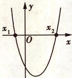</td><td>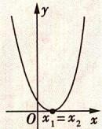</td><td>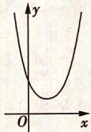</td></tr><tr><td> $ax^{2}+bx+c=0(a>0)$ 的根</td><td>有两个相异的实数根 $x_{1},x_{2}(x_{1}有两个相等的实数根x_{1}=x_{2}=\frac{b}{2a}没有实数根</td><td>有两个相等的实数根\( x_{1}=x_{2}=\frac{b}{2a}$ </td><td>没有实数根</td></tr><tr><td> $ax^{2}+bx+c>0(a>0)$ 的解集</td><td> $\{x|x< x_{1}或x>x_{2}\}$ </td><td> $\{x|x\neq-\frac{b}{2a}\}$ </td><td>R</td></tr><tr><td> $ax^{2}+bx+c<0(a>0)$ 的解集</td><td> $\{x|x_{1}<x< x_{2}\}$ </td><td>∅</td><td>∅</td></tr></table>

对于 a<0 的情况同理可得出相应的结论.

注意 (1) 当二次项系数含参时, 需要对参数分类讨论; (2) 对于含参的二次不等式, 需要注意对应的一元二次方程两根的大小关系.

# 教材 起点练

1. [人 A 必一 P55 习题 2.3 T3 改编, ★] 设集合 $A=\{x\mid x^{2}-5x+6>0\}$ , $B=\{x\mid x-1<0\}$ , 则 $A \cap B =$ ( )

A. $(-\infty, 1)$

B. $(-2,1)$

C. $(-3, -1)$

D. $(3, +\infty)$

2.[人A必一P52例1改编,★]已知不等式 $ax^{2}-bx-1\geqslant0$ 的解集是 $\left[-\frac{1}{2},-\frac{1}{3}\right]$ ，则不等式 $x^{2}-bx-a<0$ 的解集为\_\_\_\_.

# 高考 方向练

3. [天津, ★] 设 $x \in R$ , 使不等式 $3x^{2} + x - 2 < 0$ 成立的 x 的取值范围为 \_\_\_\_.

# 模拟 实战练

4.[2023黑龙江省哈尔滨市第九中学模拟,★]已知集合 $A=\{x\mid|x-3|<2\}$ , $B=\{x\mid\frac{2x-1}{x-2}\leqslant1\}$ ，则 $A\cup B=$ ( )

A. (1,2]

B. $(1,2)$

C. $[-1,5]$

D. $[-1,5)$

5.[2023 江苏省海门中学检测改编,★★]对于

实数 x, 规定 $[x]$ 表示不大于 x 的最大整数, 例如 $[-1.2] = -2, [1.5] = 1$ , 那么不等式 $4[x]^{2} - 16[x] + 7 < 0$ 成立的充分不必要条件是 ( )

A. $\frac{1}{2} < x < \frac{7}{2}$

B. $1 \leq x \leq 3$

C. $1 \leq x < 4$

D. $1 \leq x \leq 4$

6.[2023 山西大学附属中学阶段测试,★★]不等式 $9^{x}-4\times3^{x+1}+27\leqslant0$ 的解集为\_\_\_\_.

7.[2023 江苏省常州一中阶段质量调研,★★]已知 $a\in Z$ ,关于x的一元二次不等式 $x^{2}-6x+2a\leqslant0$ 的解集中有且仅有3个整数,则a的取值集合是\_\_\_\_.

# 易错 警示练

8.[无法灵活运用“三个二次”之间的关系致错, 多选, ★★]已知关于 x 的不等式 $a(x + 1)(x - 3) + 1 > 0 (a \neq 0)$ 的解集是 $(x_{1}, x_{2}) (x_{1} < x_{2})$ , 则下列结论正确的是 ()

A. $x_{1} + x_{2} = 2$

B. $x_{1} x_{2}< - 3$

C. $-1 < x_{1} < x_{2} < 3$

D. $x_{2} - x_{1} > 4$

# 题型 16 一元二次不等式的恒成立问题

▶ 答案: 006 页

# 题型攻略

一元二次不等式恒成立问题的求解策略

<table><tr><td>类型</td><td>策略</td></tr><tr><td> $ax^{2} + bx + c > 0 (a \neq 0)$ 在R上恒成立</td><td> $a > 0$ ,且 $\Delta < 0$ </td></tr><tr><td> $ax^{2} + bx + c < 0 (a \neq 0)$ 在R上恒成立</td><td> $a < 0$ ,且 $\Delta < 0$ </td></tr><tr><td> $ax^{2} + bx + c > 0 (a \neq 0)$ 或 $ax^{2} + bx + c < 0 (a \neq 0)$ 在区间上恒成立</td><td>可以设 $f(x) = ax^{2} + bx + c$ ,利用二次函数的图象的特征建立不等式(组)求解,也可以分离参数,转化为求一个函数的最值问题.</td></tr></table>

注意 若参数范围已知,求二次不等式的恒成立问题,也可采用“主参换位法”,即把主元与参数变换位置,构造以参数为变量的函数,根据原参数的取值范围列式求解.一般地,条件给出谁的范围,就看成是有关谁的函数,再利用函数单调性求解.

# 教材 起点练

1. [人 A 必一 P58 T6 改编, ★★] (1) 不等式 $(a+1)x^{2}-(a+1)x-1<0$ 对一切实数 x 恒成立, 则 a 的取值范围是 ( )

A. (1,5)

B. $(-5,-1)$

C. $(-5,-1]$

D. $(-3,-1]$

(2)若对任意的 $a \in [-1, 1]$ , 不等式 $x^{2} + (a - 4)x + 4 - 2a > 0$ 恒成立, 则 $x$ 的取值范围为 ( )

A. $(-∞,2)∪(3,+∞)$

B. $(-∞,1)∪(2,+∞)$

C. $(- \infty, 1) \cup (3, +\infty)$

D. $(1,3)$

# 高考 方向练

2. [天津, ★★★] 已知 $a \in \mathbb{R}$ , 函数 $f(x) = \left\{ \begin{array}{l} x^{2} + 2x + a - 2, \\ -x^{2} + 2x - 2a, \\ x > 0. \end{array} \right.$ 若对任意 $x \in [-3, +\infty)$ , $f(x) \leqslant |x|$ 恒成立, 则 $a$ 的取值范围是 \_\_\_\_.

# 模拟 实战练

3. [2023 四川省成都市新都区检测, ★]不等式 $x^{2} - x + m > 0$ 在 $\mathbf{R}$ 上恒成立的充要条件是 ( )

A. $m > \frac{1}{4}$

B. $0 < m < 1$

C. $m > 0$

D. $m > 1$

4. [2023 广东省佛山市九江中学第一次检测, ★★] 已知函数 $f(x) = x^{2} + bx + c$ , 不等式 $f(x) < 0$ 的解集是 (2,3), 若对于任意 $x \in [-3,3]$ , 不等式 $f(x) - t^{2} + t \leqslant 0$ 恒成立, 则 $t$ 的取值范围为 \_\_\_\_.

5. [2023 江苏省启东中学检测改编, ★★★] 对于问题: 当 x > 0 时, 均有 $[(a - 1)x - 1](x^{2} - ax - 1) \geqslant 0$ , 求实数 a 的所有可能值. 几位同学提供了自己的想法.

甲: 解含参不等式, 其解集包含正实数集;

乙:研究函数 $y=\left[(a-1)x-1\right]\left(x^{2}-ax-1\right)$ ;

丙: 分别研究两个函数 $y_{1} = (a - 1)x - 1$ 与 $y_{2}=x^{2}-ax-1;$

丁:尝试能否利用分离参数法研究最值问题.
你可以选择其中某位同学的想法,也可以用自己的想法,得出的正确答案为\_\_\_\_.

# 易错 警示练

6.[换元时无法得出新元的范围致错,★★]已知对一切 $x\in[2,3],y\in[3,6]$ ，不等式 $mx^{2}-xy+y^{2}\geqslant0$ 恒成立，则实数m的取值范围是()

A. $m \leq  6$

B. $-6 \leqslant m \leqslant 0$

C. $m \geqslant 0$

D. $0 \leqslant m \leqslant 6$

# 题型 17 生产、生活实践情境下的不等式应用

▶ 答案: 006 页

# 题型攻略

# 利用不等关系解决实际问题的基本步骤

(1)理解题意,设出变量,建立相应的函数关系式,把实际问题转化为函数的最值问题;(2)在定义域内,利用不等式的性质求出函数的最值;(3)还原为实际问题,写出答案.

# 教材 起点练

1.[人A必一P58 T10改编,★★]甲、乙两人同时两次购买同一件商品,甲每次购买的数量一定,乙每次购买所花的总钱数一定,若这件商品两次的价格分别为m元和n元 $(m\neq n)$ .

①甲两次购买该件商品的平均价格为\_\_\_\_，乙两次购买该件商品的平均价格为\_\_\_\_。

②甲、乙两人中，\_\_\_\_的购物方式更划算（填“甲”“乙”）.

2. [人 A 必一 P55 T6 改编, ★★] 如图, 据气象部门预报, 在距离某码头南偏东 $45^{\circ}$ 方向 600 km 处的热带风暴中心正以 20 km/h 的

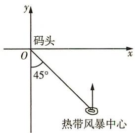

<details>
<summary>text_image</summary>

y
码头
O
x
45°
热带风暴中心
</details>

速度向正北方向移动,距风暴中心450 km以内的地区都将受到影响.据以上预报估计,从现在起大约\_\_\_\_h后,该码头将受到热带风暴的影响,影响时间为\_\_\_\_h.( $\sqrt{2}\approx1.41$ ,结果精确到0.1 h)

# 高考 方向练

3. [北京, ★★] 李明自主创业, 在网上经营一家水果店, 销售的水果中有草莓、京白梨、西瓜、桃, 价格依次为 60 元/盒、65 元/盒、80 元/盒、90 元/盒. 为增加销量, 李明对这四种水果进行促销: 一次购买水果的总价达到 120 元, 顾客就少付 x 元. 每笔订单顾客网上支付成功后, 李明会得到支付款的 80%.

①当 x = 10 时,顾客一次购买草莓和西瓜各 1 盒,需要支付 \_\_\_\_ 元;

②在促销活动中,为保证李明每笔订单得到的金额均不低于促销前总价的七折,则x的最大值为\_\_\_\_.

4. [江苏, ★★] 某公司一年购买某种货物 600 吨, 每次购买 x 吨, 运费为 6 万元/次, 一年的总存储费用为 4x 万元. 要使一年的总运费与总存储费用之和最小, 则 x 的值是 \_\_\_\_.

# 模拟 实战练

5.[多选,2023江苏省盐城市模拟,★★]某企业决定对某产品分两次提价,现有三种提价方案:①第一次提价p%,第二次提价q%;②第一次提价 $\frac{p+q}{2}\%$ ,第二次提价 $\frac{p+q}{2}\%$ ;③第一次提价 $\sqrt{pq}\%$ ,第二次提价 $\sqrt{pq}\%$ .其中p>q>0,比较上述三种方案,下列说法中正确的有()

A. 方案①提价比方案②多  
B. 方案②提价比方案③多  
C. 方案②提价比方案①多  
D. 方案①提价比方案③多

# 易错 警示练

6.[无法理解题意致错,多选,★★]小王从甲地到乙地往返的速度分别为a和 $b(a<b)$ ，其全程的平均速度为v，则下列选项中正确的是()

A. $a <   v <   \sqrt{ab}$

B. $v = \sqrt{ab}$

C. $\sqrt{ab} < v < \frac{a + b}{2}$

D. $v = \frac{2ab}{a + b}$

# 第二章

# 函数与基本初等函数Ⅰ

# 第一节 函数及其表示

# 题型 18 求函数的定义域

▶ 答案: 007 页

# 题型攻略

1. 求具体函数的定义域的策略

根据函数解析式,构造使解析式有意义的不等式(组),求解不等式(组)即可.

2. 求抽象函数的定义域的策略

(1) 若已知函数 $f(x)$ 的定义域为 $[a, b]$ , 则复合函数 $f(g(x))$ 的定义域由不等式 $a \leqslant g(x) \leqslant b$ 求出;

(2) 若已知函数 $f(g(x))$ 的定义域为 $[a, b]$ , 则 $f(x)$ 的定义域为 $g(x)$ 在 $[a, b]$ 上的值域.

# 教材 起点练

1. [人 A 必一 P67 T1 改编, ★] 下列函数的定义域不是 R 的是 ( )

A. $y = x + 1$

B. $y = {x}^{2}$

C. $y = \frac{1}{x}$

D. $y = {2x}$

# 高考 方向练

2. [2022 北京, ★] 函数 $f(x) = \frac{1}{x} + \sqrt{1 - x}$ 的定义域是 \_\_\_\_.

3. [江苏, ★] 函数 $y = \sqrt{7 + 6x - x^{2}}$ 的定义域是 \_\_\_\_.

# 模拟 实战练

4.[2023 黑龙江省齐齐哈尔市恒昌中学模拟, ★]函数 $f(x)=\frac{2^{x}}{\sqrt{1-x}}+\sqrt{-\log_{3}(1-2x)}$ 的定义域是 ( )

A. $[0, \frac{1}{2})$

B. $(-\infty, \frac{1}{2})$

C. $(-∞, \frac{1}{2}]$

D. $(-\infty, 1)$

5. [2023 河南洛阳一高模拟, ★★] 若函数 $f(x)$ 的定义域为 [0,16], 则函数 $g(x)=\frac{f(x^{2})}{\sqrt{x-1}}$ 的定义域为 ( )

A. $[1,4]$

B. $(1,4]$

C. $[1, 14]$

D. (1,14]

6. [★★] 若函数 $f(x^{2}+1)$ 的定义域为 $[-1,1]$ ，则 $f(\lg x)$ 的定义域为 ( )

A. $[-1, 1]$

B. $[1,2]$

C. $[10, 100]$

D. $[0, \lg 2]$

7.[2023 河北模拟, ★★]若函数 $f(1-2x)$ 的定义域为 $[-1,2]$ ，则函数 $f(x)$ 的定义域为 \_\_\_\_.

# 易错 警示练

8.[对抽象函数的定义域理解不清致误,★★]若函数 $f(2^{x})$ 的定义域为 $[-1,1]$ ，则函数 $h(x)=f(x)+f(x-1)$ 的定义域为\_\_\_\_.

# 题型 19 求函数的解析式

▶ 答案: 007 页

# 题型攻略

<table><tr><td>方法</td><td>适用条件</td><td>解法指导</td><td>注意事项</td></tr><tr><td>待定系数法</td><td>已知函数类型</td><td>首先设出解析式,然后根据已知条件求参数</td><td>无</td></tr><tr><td>换元法</td><td>已知复合函数 $f[g(x)]$ 的解析式</td><td>令 $t=g(x)$ ,用 $t$ 表示出 $x$ ,再代入复合函数的解析式即可求得 $f(x)$ </td><td>注意确定新元的取值范围</td></tr><tr><td>配凑法</td><td>已知复合函数 $f[g(x)]=F(x)$ </td><td>将函数 $F(x)$ 改写为关于 $g(x)$ 的表达式,然后将 $g(x)$ 换为 $x$ ,即可求得 $f(x)$ </td><td>注意确定 $g(x)$ 的取值范围</td></tr><tr><td>构造方程组法</td><td>已知关于 $f(x),f(\frac{1}{x})$ (或 $f(-x)$ )的相加(或相减)的等式</td><td>变换变量,构造一个新的等式,与已知等式构成一个方程组,消元可求得 $f(x)$ </td><td> $f(x)$ 的定义域是 $\frac{1}{x}$ (或 $-x$ )中 $x$ 的取值范围与使 $f(x)$ 的解析式有意义的自变量 $x$ 的取值范围的交集</td></tr></table>

注意 求函数解析式时,若定义域不是 R,一定要注明函数定义域.

# 教材 起点练

1. [人 A 必一 P73 T6 改编, ★] 已知 $f(x) = 2x^{2} + bx + c (b, c \text{ 为实数})$ ，且 $f(1) = 1, f(3) = 1$ ，则 $f(x)$ 的解析式为 \_\_\_\_.

2. [人 A 必一 P73 T4 改编, ★★] 已知一次函数 $f(x)$ 满足 $f(f(x)) = 4x + 6$ , 则 $f(x)$ 的解析式为 \_\_\_\_, $f(-2) =$ \_\_\_\_.

# 高考 方向练

3. [全国卷Ⅱ, ★] 已知函数 $f(x) = ax^{3} - 2x$ 的图象过点 $(-1, 4)$ ，则 a = \_\_\_\_.

# 模拟 实战练

4.[2023 河南濮阳模拟, ★★]已知定义域为 R 的函数 $f(x)$ 满足 $f(x+1)=3f(x)$ ，且当 $x\in(0,1]$ 时， $f(x)=4x(x-1)$ ，则当 $x\in(-2,0]$ 时， $f(x)$ 的最小值为（）

A. $-\frac{1}{81}$

B. $-\frac{1}{27}$

C. $-\frac{1}{9}$

D. $-\frac{1}{3}$

5.[2023 山东青岛模拟改编,★★](1)已知 $f(x)$ 是一次函数,且 $3f(x+1)-2f(x-1)=2x+17$ ,则 $f(x)$ 的解析式为\_\_\_\_.

(2) 定义在 $(-1,1)$ 上的函数 $f(x)$ 满足 $2f(x)-f(-x)=\lg(x+1)$ ，则 $f(x)$ 的解析式为 \_\_\_\_.

6. [2023 河南焦作模拟, ★★] 写出一个同时具有下列性质①②③的函数 $f(x) =$ \_\_\_\_.
①定义域为 R; ②值域为 $(-\infty, 1)$ ; ③对任意 $x_{1}$ ， $x_{2} \in (0, +\infty)$ 且 $x_{1} \neq x_{2}$ ，均有 $\frac{f(x_{1}) - f(x_{2})}{x_{1} - x_{2}} > 0$ .

# 易错 警示练

7.[换元后忽略新元的取值范围致误,2023重庆模拟,★★]已知 $f(\sqrt{x}+1)=x+2\sqrt{x}$ ，则 $f(x)$ 的解析式为()

A. $f(x)=x^{2}-1$

B. $f(x)=x^{2}-1(x>1)$

C. $f(x) = x^{2} - 1 (x \geqslant 1)$

D. $f(x) = x^{2} - 1 (x \geqslant 0)$

# 题型 20 已知分段函数求值（或求参）

▶ 答案: 007 页

# 题型攻略

1. 解已知分段函数求值问题的步骤: (1) 确定要求值的自变量属于哪一个区间; (2) 代入相应的函数解析式求值, 当出现 $f(f(a))$ 求值形式时, 应由内到外逐层求值.

2. 求解分段函数的含参问题时, 若自变量值确定, 则代入解析式, 列方程求解; 若自变量值不确定, 则要根据分段函数的各段定义域分类讨论求解.

# 教材 起点练

1. [人 A 必一 P101 T7 改编, ★] 若 $f(x) = \left\{\begin{aligned} x^{2}(x \geqslant 0), \\ -x (x < 0), \end{aligned}\right.$ 则 $f(f(-2)) =$ ()

A. 2

B. 3

C. 4

D. 5

2. [人 A 必一 P96 T3 改编, ★] 已知函数 $f(x) = \left\{\begin{aligned}&1+\frac{1}{x}, x>1,\\&x^{2}+1,-1 \leqslant x \leqslant 1,\\&2x+3, x<-1.\end{aligned}\right.$ 若 $f(a)=\frac{3}{2}$ ，则 a= \_\_\_\_.

# 高考 方向练

3. [山东, ★★] 设 $f(x) = \begin{cases} \sqrt{x}, & 0 < x < 1, \\ 2(x - 1), & x \geqslant 1. \end{cases}$ 若 $f(a)=f(a+1)$ ，则 $f(\frac{1}{a})=$ （）

A. 2

B. 4

C. 6

D. 8

4. [2021 浙江, ★] 已知 $a \in R$ ，函数 $f(x) = \left\{\begin{aligned} x^{2} - 4, & x > 2, \\ |x - 3| + a, & x \leqslant 2. \end{aligned}\right.$ 若 $f(f(\sqrt{6})) = 3$ ，则
a = \_\_\_\_.

# 模拟 实战练

5. [★] 已知函数 $f(x) = \begin{cases} \log_2(2 - x), & x < 1, \\ \mathrm{e}^x, & x \geqslant 1, \end{cases}$ 则 $f(-2) + f(\ln 4) =$ （）

A. 2

B. 4

C. 6

D. 8

6.[2023 江苏南京模拟, ★★]设函数 $f(x)=$ $\left\{\begin{aligned}x-3,x&\geqslant10,\\ f[f(x+4)],&x<10,\end{aligned}\right.$ 则 $f(8)=$ ( )

A. 10

B. 9

C. 7

D. 6

7.[2023 福建漳州联考,★★]已知函数 $f(x)=\left\{\begin{aligned}\log_{2}x,x>0,\\ x^{2}+4x+1,x\leqslant0,\end{aligned}\right.$ 若实数a满足 $f(f(a))=1$ ,则实数a的所有取值的和为()

A. 1

B. $\frac{17}{16} -\sqrt{5}$

C. $-\frac{15}{16} - \sqrt{5}$

D. -2

8.[2023陕西西北工业大学附属中学第二次适应性考试,★★]设 $f(x)=\left\{\begin{aligned}\sqrt{x},&0<x<1,\\\sqrt{\mathrm{e}}\cdot\ln x,x\geqslant1,\end{aligned}\right.$ 若 $f(a)=f(\mathrm{e}^{a})$ ，则 $f(\frac{1}{a})=$ \_\_\_\_.

# 易错 警示练

9.[对分段函数理解不清致误,★★]德国著名数学家狄利克雷在数学领域成就显著,是解析数论的创始人之一. 函数 $f(x)=\left\{\begin{aligned}&1,x\text{为有理数},\\ &0,x\text{为无理数}\end{aligned}\right.$ 被称为狄利克雷函数,则关于函数 $f(x)$ ,下列说法正确的是()

A. $f(x)$ 的定义域为 $\{0,1\}$

B. $f(x)$ 的值域为 $[0,1]$

C. $\exists x\in \mathbf{R},f[f(x)] = 0$

D. 对于任意一个非零有理数 $T, f(x + T) = f(x)$ 对任意 $x \in \mathbf{R}$ 恒成立

# 题型21 已知分段函数解不等式

▶ 答案: 008 页

# 题型攻略

1. 解此类题可根据分段函数的不同段分类讨论, 最后取各段结果的并集即可.  
2. 若函数的图象易画, 也可以画出函数图象, 结合图象求解.

注意 自变量的取值属于哪一段,就用哪一段的解析式来解决问题,即“分段归类”.解得值(范围)后一定要检验其是否符合相应段的自变量的取值范围.

# 教材 起点练

1. [人 A 必一 P101 T7 改编, ★] 函数 $f(x) = \left\{\begin{aligned} x, &x \leqslant -2, \\ x + 1, &-2 < x < 4, \\ 3x, &x \geqslant 4, \end{aligned}\right.$ 若 $f(a) < -3$ ，则 a 的取值范围是 \_\_\_\_.

# 高考 方向练

2. [全国卷I, ★★]设函数 $f(x) = \begin{cases} 2^{-x}, & x \leqslant 0, \\ 1, & x > 0, \end{cases}$ 则满足 $f(x+1) < f(2x)$ 的 $x$ 的取值范围是 ( )

A. $(-\infty, -1]$

B. $(0, +\infty)$

C. $(-1,0)$

D. $(-∞,0)$

3. [2022 浙江, ★★] 已知函数 $f(x) = \left\{ \begin{array}{l} -x^{2} + 2, x \leqslant 1, \\ x + \frac{1}{x} - 1, x > 1, \end{array} \right.$ 则 $f(f(\frac{1}{2})) =$ \_\_\_\_；若当 $x \in [a, b]$ 时， $1 \leqslant f(x) \leqslant 3$ ，则 $b - a$ 的最大值是\_\_\_\_。

4. [全国卷Ⅲ, ★★] 设函数 $f(x)=\left\{\begin{aligned} x+1, &x \leqslant 0, \\ 2^{x}, &x > 0, \end{aligned}\right.$ 则满

足 $f(x)+f\left(x-\frac{1}{2}\right)>1$ 的x的取值范围是\_\_\_\_.

# 模拟 实战练

5.[2023 山东济南模拟, ★★]已知函数 $f(x)=\left\{\begin{aligned}-x^{2}+2mx-m^{2},&x\leqslant m,\\x-m,x>m,\end{aligned}\right.$ 若 $f(a^{2}-4)>f(3a)$ ,
则实数 a 的取值范围是 ( )

A. $(-1,4)$   
B. $(- \infty, -1) \cup (4, +\infty)$   
C. $(-4,1)$   
D. $(- \infty, -4) \cup (1, +\infty)$

6.[2023江苏南通模拟,★★]已知函数 $f(x)=\max\{1-x,2^{x}\}$ ，其中 $\max\{a,b\}$ 表示a,b中的较大者.则不等式 $f(x)>4$ 的解集为\_\_\_\_.

7. [2023 陕西省二检, ★★] 已知函数 $f(x) = \left\{ \begin{array}{l} 2e^{x-1}, x < 1, \\ x^3 + x, x \geqslant 1, \end{array} \right.$ 则 $f(f(x)) < 2$ 的解集为 \_\_\_\_.

# 第二节 函数的基本性质

# 题型 22 确定函数的单调性（单调区间）

▶ 答案: 008 页

# 题型攻略

# 确定函数的单调性(单调区间)的方法

(1) 定义法: 一般步骤为设元→作差→变形→判断符号→得出结论, 常用于判断抽象函数单调性.  
(2) 图象法: 若 $f(x)$ 是以图象的形式给出的, 或者 $f(x)$ 的图象易作出, 则可由图象的上升或下降确定单调性.  
(3) 导数法: 先求导数, 再利用导数值的正负确定函数的单调区间.  
(4)性质法:①对于由基本初等函数的和、差构成的函数,根据各基本初等函数的增减性及“增+增=增,增-减=增,减+减=减,减-增=减”进行判断;②对于复合函数,根据“同增异减”的规则进行判断.

# 教材 起点练

1.[人A必一P86T2改编,★]函数 $y=|x|-1$ 的单调递减区间为()

A. $(0, +\infty)$

B. $(-\infty, 0)$

C. $(-∞,-1)$

D. $(-1, +\infty)$

# 高考 方向练

2.[2021全国卷甲,★]下列函数中是增函数的为()

A. $f(x) = -x$

B. $f(x) = \left(\frac{2}{3}\right)^x$

C. $f(x)=x^{2}$

D. $f(x) = \sqrt[3]{x}$

3. [全国卷Ⅱ, ★] 函数 $f(x) = \ln(x^{2} - 2x - 8)$ 的单调递增区间是 ( )

A. $(-\infty, -2)$

B. $(-∞,1)$

C. $(1, +\infty)$

D. $(4, +\infty)$

4. [全国卷 I, ★★] 已知函数 $f(x) = \ln x + \ln (2 - x)$ , 则 ( )

A. $f(x)$ 在 $(0,2)$ 单调递增

B. $f(x)$ 在 $(0,2)$ 单调递减

C. $y = f(x)$ 的图象关于直线 $x = 1$ 对称

D. $y = f(x)$ 的图象关于点(1,0)对称

# 模拟 实战练

5. [★] 下列函数中是减函数且值域为 $\mathbf{R}$ 的是 ( )

A. $f(x) = \frac{1}{x}$

B. $f(x) = x - \frac{1}{x}$

C. $f(x) = \ln |x|$

D. $f(x) = -x^{3}$

6. [2023 合肥一中调研, ★★] 函数 $y = f(x) (x \in \mathbf{R})$

的图象如图所示,则函数 $g(x)=f(-\ln x)$ 的单调递增区间是

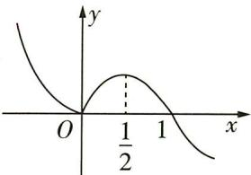

<details>
<summary>line</summary>

| x | y |
|---|---|
| 0 | 0 |
| 1/2 | Peak value of y = 1/2 |
| 1 | Peak value of y = 1/2 |
</details>

A. $(0, \frac{1}{\sqrt{\mathrm{e}}}]$

B. $\left[\frac{1}{\sqrt{\mathrm{e}}}, 1\right]$

C. $\left[\sqrt{\mathrm{e}}, +\infty\right)$

D. $(0,\frac{1}{\sqrt{e}}]$ 和 $[1,+\infty)$

# 题型23 函数单调性的应用

▶ 答案: 009 页

# 题型攻略

函数单调性的应用类型及解题策略

<table><tr><td>求参数</td><td>根据函数的单调性构建含参数的方程(组)或不等式(组)进行求解,或先得到图象的升降情况,再结合图象求解.注意 若分段函数是单调函数,则不仅要各段上函数单调性一致,还要在整个定义域内单调,即要注意衔接点处的函数值大小.</td></tr><tr><td>比较大小</td><td>比较函数值的大小时,应先将自变量的值转化到同一个单调区间内,再利用函数的单调性求解.</td></tr><tr><td>解不等式</td><td>(1)将不等式转化为 $f(x_1) > f(x_2)$ 的形式,(2)根据函数 $f(x)$ 的单调性“脱去”函数符号“ $f$ ”化为形如“ $x_1 > x_2$ ”或“ $x_1 < x_2$ ”的不等式求解,注意必须在同一单调区间内进行.若不等式一边没有“ $f$ ”,而是常数,则应将常数转化为函数值.</td></tr></table>

# 教材 起点练

1. [人 A 必一 P100 T4 改编, ★] 若 $f(x) = -x^{2} + 2ax$ 与 $g(x) = \frac{a}{x}$ 在区间 [1, 2] 上都单调递减, 则 a 的取值范围是 ( )

A. $(-1,0) \cup (0,1)$

B. $(-1,0) \cap (0,1)$

C. $(0,1)$

D. $(0,1]$

2. [人 A 必一 P87 T12 改编, ★] 已知偶函数 $f(x)$ 在区间 $[-3, -1]$ 上单调递减, 则 $f(-3), f(1)$ , $f(2)$ 的大小关系为 \_\_\_\_. (用“<”号连接)

# 高考 方向练

3. [2023 新高考卷 I, ★★] 设函数 $f(x) = 2^{x(x-a)}$ 在区间 $(0,1)$ 单调递减，则 a 的取值范围是 ()

A. $(-∞,-2]$

B. $[-2,0)$

C. $(0,2]$

D. $[2, +\infty)$

4. [2020 新高考卷 II, ★★] 已知函数 $f(x) = \lg(x^{2} - 4x - 5)$ 在 $(a, +\infty)$ 上单调递增，则 a 的取值范围是 ( )

A. $(-∞,-1]$

B. $(-∞,2]$

C. $[2, +\infty)$

D. $[5, +\infty)$

5. [2020 新高考卷 I, ★★] 若定义在 R 的奇函数 $f(x)$ 在 $(-∞, 0)$ 单调递减，且 $f(2) = 0$ ，则满足 $xf(x - 1) \geqslant 0$ 的 x 的取值范围是（）

A. $[-1, 1] \cup [3, +\infty)$

B. $[-3, -1] \cup [0, 1]$

C. $[-1,0] \cup [1, +\infty)$

D. $[-1,0] \cup [1,3]$

# 模拟 实战练

6.[2023 江苏省响水中学检测,★★]已知函数 $f(x)=\left\{\begin{aligned}|x-a+3|, &x\geqslant1,\\ \log_{a}x, &0<x<1\end{aligned}\right.$ 在其定义域上单调递增,则实数 a 的取值范围为 ( )

A. $(0,1)$

B. $(3,6)$

C. (1,4]

D. $(1,2]$

7.[2023 山东师大附中、长沙一中等校联考, ★★]设函数 $f(x)=(\frac{3}{2})^{|x|}+x^{2}$ ，若 $a=f(\ln 3)$ ， $b=f(-\log_{5}2)$ ， $c=f(\frac{1}{\sqrt{e}})$ （e为自然对数的底数），则()

A. $a > b > c$

B. $c > b > a$

C. $c > a > b$

D. $a > c > b$

8.[2023 江苏南京模拟, ★★★]已知 $f(x)=\left\{\begin{aligned}&\mathrm{e}^{x-4},x\leqslant4,\\&(x-16)^{2}-143,x>4,\end{aligned}\right.$ 则当 $x\geqslant0$ 时, $f(2^{x})$ 与 $f(x^{2})$ 的大小关系是()

A. $f(2^{x}) \leqslant f(x^{2})$

B. $f(2^{x}) \geqslant f(x^{2})$

C. $f(2^{x})=f(x^{2})$

D. 不确定

# 易错 警示练

9.[不会转化出错,2023山东模拟,★★]不等式 $x^{6}-(2x+3)>(2x+3)^{3}-x^{2}$ 的解集是()

A. $(-∞,-1)∪(3,+∞)$

B. $(-1,3)$

C. $(-3,1)$

D. $(- \infty, -3) \cup (1, +\infty)$

# 题型 24 求函数的最值（值域）

▶ 答案：009 页

# 题型攻略

# 求函数值域(最值)的方法

1. 单调性法: 先确定函数的单调性, 再由单调性求出值域(最值), 对于较复杂的函数, 则常先借助导数判断其单调性, 再求解.  
2. 图象法: 先作出函数的图象, 再通过观察其最高点、最低点求出值域(最值).  
3. 基本不等式法: 先对解析式变形, 使之具备 “一正二定三相等” 的条件后用基本不等式求值域 (最值).  
4. 换元法: 对比较复杂的函数可先通过换元转化为熟悉的函数, 再用相应的方法求值域(最值).  
5. 配方法: 它是求“二次函数型函数”值域的基本方法, 形如 $F(x) = a[f(x)]^{2} + bf(x) + c (a \neq 0)$ 的函数的值域问题, 均可使用配方法, 求解时要注意 $f(x)$ 的取值范围.  
6. 分离常数法: 形如 $y = \frac{cx + d}{ax + b} (a \neq 0)$ 的函数, 经常使用“分离常数法”求值域(最值).

注意 求分段函数的最值时,应先求出每一段上的最值,再选取其中最大的作为分段函数的最大值,最小的作为分段函数的最小值.

# 教材 起点练

1. [人 A 必一 P81 T3 改编, ★★] 若函数 $f(x) = \frac{2x + m}{x + 1}$ 在区间 $[0, 1]$ 上的最大值为 $\frac{5}{2}$ ，则实数 m = ()

A. 3

B. $\frac{5}{2}$

C. 2

D. $\frac{5}{2}$ 或3

2. [人 A 必一 P72 T3 改编, ★] (1) $y = \frac{2x + 1}{x - 3}$ 的值域为 \_\_\_\_; (2) $y = 2x - \sqrt{x - 1}$ 的值域为 \_\_\_\_.

# 高考 方向练

3. [2022 北京, ★★★] 设函数 $f(x) = \left\{ \begin{array}{l} -ax + 1, x < a, \\ (x - 2)^{2}, x \geqslant a. \end{array} \right.$ 若 $f(x)$ 存在最小值, 则 $a$ 的一个取值为 \_\_\_\_; $a$ 的最大值为 \_\_\_\_.

# 模拟 实战练

4. [2023 四川名校第三次联考, ★★] 已知函数 $f(x)$ 的定义域为 R, $y = f(x) + e^{x}$ 是偶函数, $y = f(x) - 3e^{x}$ 是奇函数, 则 $f(x)$ 的最小值为 ( )

A. e

B. $2\sqrt{2}$

C. $2\sqrt{3}$

D. $2 \mathrm{e}$

5. [2023 江西景德镇一中模拟, ★★] 对任意实数 $x$ , 都有 $a \sin x + \cos 2x \leqslant 4$ 恒成立, 则 $a$ 的取值范围为 \_\_\_\_.

6. [2023 沈阳二中质检, ★★★] 已知 $f(x) = 2 + \log_{3}x, x \in [1, 81]$ ，则 $y = [f(x)]^{2} + f(x^{2})$ 的最大值为 \_\_\_\_.

7.[2023 河北唐山联考, ★★★]若函数 $f(x)$ 与 $g(x)$ 对于任意 $x_{1}, x_{2} \in [c, d]$ , 都有 $f(x_{1}) \cdot g(x_{2}) \geqslant k$ , 则称函数 $f(x)$ 与 $g(x)$ 是区间 $[c, d]$ 上的“ $k$ 阶友好函数”. 已知函数 $f(x) = 2022^{x-1}$ 与 $g(x) = x^{2} - (a + 1)x + 2 - a$ 是区间 $[1, 2]$ 上的“3 阶友好函数”, 则实数 $a$ 的取值范围是 \_\_\_\_.

# 易错 警示练

8.[不理解分段函数的值域出错,2023湖南常德一模改编,★★]若函数 $f(x)=\left\{\begin{aligned}&8-2^{x}(x\leqslant2),\\ &3+\log_{a}x(x>2)\end{aligned}\right.$ 的值域是 $[4,+\infty)$ ，则实数a的取值范围是()

A. $(1, +\infty)$

B. $(2, +\infty)$

C. $(1,2]$

D. $\left(\sqrt[5]{2},2\right]$

# 题型 25 判断函数的奇偶性

▶ 答案: 009 页

# 题型攻略

# 判断函数的奇偶性的方法

(1) 定义法. 先判断定义域是否关于原点对称, 再判断 $f(x)$ 与 $f(-x)$ 的关系, 进而得出结论.  
(2) 图象法. 若 $f(x)$ 的图象关于原点对称, 则 $f(x)$ 为奇函数; 若 $f(x)$ 的图象关于 $y$ 轴对称, 则 $f(x)$ 为偶函数.  
(3) 性质法. 在公共定义域内有奇函数 $\pm$ 奇函数 $=$ 奇函数, 偶函数 $\pm$ 偶函数 $=$ 偶函数, 奇函数 $\times$ 奇函数 $=$ 偶函数, 偶函数 $\times$ 偶函数 $=$ 偶函数, 奇函数 $\times$ 偶函数 $=$ 奇函数.

注意 (1) 函数定义域关于原点对称是函数具有奇偶性的前提条件; (2) 对于分段函数奇偶性的判断, 要分段判断 $f(-x) = f(x)$ 或 $f(-x) = -f(x)$ 是否成立, 只有当各段都满足相同关系时, 才能判断该分段函数的奇偶性.

# 教材 起点练

1. [人 A 必一 P84 例 6 改编, ★] 下列函数既是奇函数又是增函数的是 ( )

A. $y = \sin x$

B. $y = 2^{x}$

C. $y = \log_2 x$

D. $y = x^{3}$

# 高考 方向练

2. [2021 全国卷乙, ★] 设函数 $f(x) = \frac{1 - x}{1 + x}$ ，则下列函数中为奇函数的是（）

A. $f(x-1)-1$

B. $f(x-1)+1$

C. $f(x + 1) - 1$

D. $f(x+1)+1$

3.[全国卷Ⅰ,★]设函数 $f(x)$ , $g(x)$ 的定义域都为R,且 $f(x)$ 是奇函数, $g(x)$ 是偶函数,则下列结论中正确的是()

A. $f(x)g(x)$ 是偶函数  
B. $f(x) \mid g(x)$ 是奇函数  
C. $|f(x)|g(x)$ 是奇函数  
D. $|f(x)g(x)|$ 是奇函数

# 模拟 实战练

4.[2023东北师大附中模拟,★]已知函数 $f(x)=\sqrt{x+1}\cdot\sqrt{x-1}$ ，下列说法正确的是()

A. 函数 $f(x)$ 为奇函数

B. 函数 $f(x)$ 为偶函数  
C. 函数 $f(x)$ 既为奇函数又为偶函数  
D. 函数 $f(x)$ 为非奇非偶函数

5. [2023 山东东营模拟, ★★] 函数 $f(x) = \frac{\lg(1 - x^{2})}{|x - 2| - 2}$ 的图象关于 ( )

A. 原点对称

B. $y$ 轴对称

C. $x$ 轴对称

D. 直线 $y = x$ 对称

6.[2023 郑州市模拟,★★]若函数 $f(x)$ 满足 $f(2-x)+f(x)=-2$ ,则下列函数为奇函数的是()

A. $f(x-1)-1$

B. $f(x-1)+1$

C. $f(x+1)-1$

D. $f(x + 1) + 1$

# 题型 26 函数奇偶性的应用

▶ 答案: 010 页

# 题型攻略

函数奇偶性的应用类型及解题策略

<table><tr><td>求解析式</td><td>先将待求区间上的自变量转化到已知区间上,再利用奇偶性求出 $f(x)$ 的解析式,或充分利用奇偶性构造关于 $f(x)$ 的方程(组),从而得到 $f(x)$ 的解析式.</td></tr><tr><td>求函数值</td><td>利用函数的奇偶性将待求函数值对应的自变量转化到已知解析式的区间上,进而求解.</td></tr><tr><td>求参数值</td><td>利用待定系数法求解,根据 $f(x)\pm f(-x)=0$ 得到关于待求参数的恒等式,由系数的对等性得参数满足的方程(组),进而得出参数的值.对于在x=0处有定义的奇函数 $f(x)$ ,可考虑列等式 $f(0)=0$ 求解.</td></tr><tr><td>画函数图象和判断单调性</td><td>利用奇偶性可画出另一对称区间上的图象及判断另一区间上的单调性.</td></tr></table>

# 教材 起点练

1. [人 A 必一 P86 T11 改编, ★] 已知函数 $f(x)$ 是定义在 R 上的偶函数, 当 $x \geqslant 0$ 时, $f(x) = 2x(x + 4)$ , 则函数 $f(x)$ 在 R 上的表达式为 \_\_\_\_.

2. [人 A 必一 P85 练习 T1 改编, ★] 定义在 R 上的奇函数 $f(x)$ 在 $[0, +\infty)$ 上的图象如图所示, 则不等式 $xf(x) > 0$ 的解集为 \_\_\_\_.

# 高考 方向练

3.[全国卷Ⅱ,★]设 $f(x)$ 为奇函数,且当 $x\geqslant0$ 时, $f(x)=\mathrm{e}^{x}-1$ ,则当x<0时, $f(x)=(\quad)$

A. $\mathrm{e}^{-x} - 1$

B. $\mathrm{e}^{-x} + 1$

C. $-\mathrm{e}^{-x} - 1$

D. $-\mathrm{e}^{-x} + 1$

4.[2023 新高考卷Ⅱ, ★★]若 $f(x)=(x+a)\ln\frac{2x-1}{2x+1}$ 为偶函数, 则 a= ()

A. -1

B. 0

C. $\frac{1}{2}$

D. 1

5. [2023 全国卷乙, ★★] 已知 $f(x)=\frac{x\mathrm{e}^{x}}{\mathrm{e}^{ax}-1}$ 是偶

函数,则 a = ()

A. -2

B. - 1

C. 1

D. 2

6. [2022 全国卷乙, ★★★] 若 $f(x) = \ln |a + \frac{1}{1 - x}| + b$ 是奇函数,则 a = \_\_\_\_, b = \_\_\_\_.

# 模拟 实战练

7. [2023 山西大同调研, ★★] 函数 $f(x) = \frac{6}{\mathrm{e}^{x} + 1} + \frac{mx}{|x| + 1}$ 在 $[-2, 2]$ 上的最大值为 M, 最小值为 N, 则 $M + N =$ ( )

A. 3

B. 4

C. 6

D. 与 $m$ 的值有关

8.[2023昆明市“三诊一模”, ★★★]已知函数 $f(x), g(x)$ 的定义域均为R, $f(x)$ 为偶函数且 $f(x)+f(x+2)=3, g(x)+g(10-x)=2$ ,则 $\sum_{i=1}^{9}\left[f(i)+g(i)\right]=$ ( )

A. 21

B. 22

C. $\frac{45}{2}$

D. $\frac{47}{2}$

9. [2023 甘肃张掖一诊, ★★★] 已知函数 $f(x) =$

$\frac{1}{x^2 + 1} + \log_{\frac{1}{2}}(|x| + 1)$ , 则不等式 $f(m - 2) < -\frac{1}{2}$ 的解集为 ( )

A. $(1,3)$

B. $(-∞,1)∪(3,+∞)$

C. $(0,4)$

D. $(- \infty, 0) \cup (4, +\infty)$

10. [2023 高三名校联考(一), ★★★] 已知 $f(x) = \log_{a} (\sqrt{9x^{2} + 1} - ax) (a > 0 \text{ 且 } a \neq 1)$ 是奇函数, 若 $f(ax^{2} + bx) + f(ax + a) < 0$ 恒成立, 则实数 b 的取值范围是 ( )

A. $(-3,3)$

B. $(-9,3)$

C. $(-3,9)$

D. $(-9,9)$

# 易错 警示练

11.[易直接由 $f(0)=0$ 求解出错,★★]若函数 $f(x)=\frac{k-2^{x}}{1+k\cdot2^{x}}$ 在定义域上为奇函数,则实数k= \_\_\_\_.

# 题型27 函数周期性及函数图象对称性的应用

▶ 答案: 010 页

# 题型攻略

1. 函数周期性的常用结论

(1) 若 $f(x + a) = -f(x)$ ，则函数 $f(x)$ 的周期为 2a；  
(2) 若 $f(x + a) = \pm \frac{1}{f(x)}$ ，则函数 $f(x)$ 的周期为 $2a$ ;  
(3) 若 $f(x + a) = f(x + b)$ ，则函数 $f(x)$ 的周期为 $|a - b|$ ;  
(4) 若函数 $f(x)$ 的周期为 $T$ , 则函数 $f(ax + b) (a \neq 0)$ 的周期为 $\frac{T}{|a|}$ .

2. 函数图象的对称性的常用结论

(1) $f(a+x)=f(b-x)\Leftrightarrow$ 函数 $f(x)$ 的图象关于直线 $x=\frac{a+b}{2}$ 对称；  
(2) $f(x+a)+f(b-x)=c\Leftrightarrow$ 函数 $y=f(x)$ 的图象关于点 $\left(\frac{a+b}{2},\frac{c}{2}\right)$ 中心对称.

3. 函数 $f(x)$ 图象的双对称性与函数 $f(x)$ 的周期的关系

(1) 若函数 $f(x)$ 的图象关于直线 x = a 与直线 x = b 对称，则函数 $f(x)$ 的周期为 $2|b - a|$ ;  
(2) 若函数 $f(x)$ 的图象既关于点 $(a,0)$ 对称，又关于点 $(b,0)$ 对称，则函数 $f(x)$ 的周期为 $2|b-a|$ ;  
(3) 若函数 $f(x)$ 的图象既关于直线 $x = a$ 对称, 又关于点 $(b,0)$ 对称, 则函数 $f(x)$ 的周期为 $4|b - a|$ .

# 教材 起点练

1.[人A必一P85 T3改编,★★]已知定义在R上的函数 $f(x)$ ，对任意的 $x\in R$ ，都有 $f(x)=-f(4-x)$ ，且 $f(x)=f(2-x)$ ，则下列说法正确的是()

A. $f(x)$ 是以 2 为周期的偶函数  
B. $f(x)$ 是以2为周期的奇函数  
C. $f(x)$ 是以4为周期的偶函数  
D. $f(x)$ 是以 4 为周期的奇函数

# 高考 方向练

2.[2021全国卷甲,★★]设 $f(x)$ 是定义域为R的奇函数,且 $f(1+x)=f(-x)$ .若 $f(-\frac{1}{3})=\frac{1}{3}$ ,则 $f(\frac{5}{3})=$

A. $-\frac{5}{3}$

B. $- \frac{1}{3}$

C. $\frac{1}{3}$

D. $\frac{5}{3}$

3. [2022 新高考卷 II, ★★★★] 已知函数 $f(x)$ 的定义域为 $\mathbf{R}$ , 且 $f(x + y) + f(x - y) = f(x)f(y)$ , $f(1) = 1$ , 则 $\sum_{k=1}^{22} f(k) =$ ()

A. -3

B. -2

C. 0

D. 1

# 模拟 实战练

4. [★★] 已知函数 $f(x)$ 的定义域为 R. 当 $x < 0$ 时, $f(x) = x^3 - 1$ ; 当 $-1 \leqslant x \leqslant 1$ 时, $f(-x) = -f(x)$ ; 当 $x > \frac{1}{2}$ 时, $f(x + \frac{1}{2}) = f(x - \frac{1}{2})$ . 则

$f(8) =$ （

A. -2

B. - 1

C. 0

D. 2

5.[2023 浙江名校联考,★★]已知函数 $f(x)$ 的定义域为R,且 $f(x+1)+f(x-1)=2,f(x+2)$ 为偶函数,若 $f(0)=0,\sum_{k=1}^{n}f(k)=111$ ,则n的值为()

A. 107

B. 108

C. 109

D. 110

6.[2023东北师大附中模拟,★★]已知函数 $y=f(x)-1$ 是奇函数,若曲线 $y=1+\frac{1}{x}$ 与曲线 $y=f(x)$ 共有6个交点,分别为 $(x_{1},y_{1})$ , $(x_{2},y_{2})$ , $\cdots$ , $(x_{6},y_{6})$ ,则 $\sum_{i=1}^{6}(x_{i}+y_{i})=\underline{\hspace{2cm}}$ .

7.[2023东北育才中学一模,★★]已知函数 $y=f(x+1)$ 的图象关于直线x=-3对称,且 $\forall x\in\mathbf{R},f(x)+f(-x)=2$ ,当 $x\in(0,2]$ 时, $f(x)=x+2$ ,则 $f(2022)=$ \_\_\_\_.

# 易错 警示练

8.[对周期性和图象的对称性理解不清致误,多选,2023重庆大联考,★★]已知函数 $f(x)$ 满足:对任意 $x\in R$ ,都有 $f(-x)=-f(x)$ , $f(2-x)=f(x)$ ,且 $f(1)=1$ ,则()

A. $f(x)$ 的图象关于直线 $x = 1$ 对称 B. $f(x)$ 的图象关于点 $(-2,0)$ 对称

C. $f(6) = 0$ D. $f(5) = -1$

# 题型28 函数性质的综合应用

▶ 答案: 011 页

# 题型攻略

1. 解函数性质的综合问题,一般需要先借助函数的奇偶性、周期性或函数图象的对称性实现区间的转换,再通过赋值或利用单调性解决相关问题. 解决抽象函数的相关性质时,可借助草图或特殊函数辅助解题.

2. 函数的奇偶性和函数图象的对称性的关系

(1) 若 $f(ax + b)$ 是奇函数, 则函数 $f(x)$ 的图象关于点 $(b, 0)$ 对称;  
(2) 若 $f(ax + b)$ 是偶函数, 则函数 $f(x)$ 的图象关于直线 x = b 对称;  
(3) 若函数 $f(x)$ 是奇函数, 则函数 $f(ax + b) (a \neq 0)$ 的图象关于点 $(- \frac{b}{a}, 0)$ 对称;  
(4) 若函数 $f(x)$ 是偶函数, 则函数 $f(ax + b) (a \neq 0)$ 的图象关于直线 $x = -\frac{b}{a}$ 对称.

# 高考 方向练

1. [2022 全国卷乙, ★★★] 已知函数 $f(x)$ , $g(x)$ 的定义域均为 R, 且 $f(x) + g(2 - x) = 5$ , $g(x) - f(x - 4) = 7$ . 若 $y = g(x)$ 的图象关于直线 x = 2 对称, $g(2) = 4$ , 则 $\sum_{k=1}^{22} f(k) =$ ( )

A. -21

B. -22

C. -23

D. -24

2.[2021全国卷甲,★★★]设函数 $f(x)$ 的定义域为R, $f(x+1)$ 为奇函数, $f(x+2)$ 为偶函数,当 $x\in[1,2]$ 时, $f(x)=ax^{2}+b$ .若 $f(0)+f(3)=6$ ,则 $f(\frac{9}{2})=$ ( )

A. $- \frac{9}{4}$

B. $-\frac{3}{2}$

C. $\frac{7}{4}$

D. $\frac{5}{2}$

3. [2021 新高考卷 II, ★★★] 设函数 $f(x)$ 的定义域为 R，且 $f(x+2)$ 为偶函数， $f(2x+1)$ 为奇函数，则 ()

A. $f(-\frac{1}{2}) = 0$

B. $f(-1)=0$

C. $f(2)=0$

D. $f(4) = 0$

# 模拟 实战练

4. [2023 福建福清联考, ★★]已知 $f(x)$ 是定义

在 $\mathbf{R}$ 上的函数, 且满足 $f(3x - 2)$ 为偶函数, $f(2x - 1)$ 为奇函数, 则下列说法错误的是 ( )

A. 函数 $f(x)$ 的图象关于直线 $x = 1$ 对称  
B. 函数 $f(x)$ 的图象关于点(-1,0)中心对称  
C. 函数 $f(x)$ 的周期为4

D. $f(2023) = 0$

5. [2023 福州市质检, ★★★] 已知函数 $f(x)$ , $g(x)$ 的定义域均为 $\mathbf{R}, f(x+1)$ 是奇函数, 且 $f(1-x)+g(x)=2, f(x)+g(x-3)=2$ , 则 ( )

A. $f(x)$ 为奇函数

B. $g(x)$ 为奇函数

C. $\sum_{k=1}^{20} f(k) = 40$

D. $\sum_{k=1}^{20} g(k) = 40$

6. [多选,2023四省联考,★★]已知 $f(x)$ 是定义在R上的偶函数, $g(x)$ 是定义在R上的奇函数,且 $f(x),g(x)$ 在 $(-∞,0]$ 上单调递减,则()

A. $f(f(1))<f(f(2))$

B. $f(g(1)) < f(g(2))$

C. $g(f(1)) < g(f(2))$

D. $g(g(1)) < g(g(2))$

# 第三节 二次函数与幂函数

# 题型29 幂函数的图象与性质的应用

▶ 答案: 011 页

# 题型攻略

1. 解幂函数的图象识别问题的关键: 把握幂函数的性质, 尤其是单调性、奇偶性、图象经过的定点等.

2. 比较幂值大小的方法: (1) 同底不同指的幂值大小比较, 一般利用指数函数的单调性进行; (2) 同指不同底的幂值大小比较, 一般利用幂函数的单调性进行; (3) 既不同底又不同指的幂值大小比较, 一般先找到一个中间值, 然后通过比较幂值与中间值的大小进行.

# 教材 起点练

1. [苏教必一 P134 习题 6.1 T4 改编, ★★]幂函数 $y = x^{a}, y = x^{b}, y = x^{c}, y = x^{d}$ 在第一象限的图象如图所示, 则 $a, b, c, d$ 的大小关系是 ( )

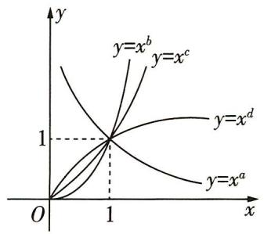

<details>
<summary>text_image</summary>

y
y=x^b
y=x^c
y=x^d
y=x^a
O
1
x
</details>

A. $a > b > c > d$

B. $d > b > c > a$

C. $d > c > b > a$

D. $b > c > d > a$

2. [人 A 必一 P91 练习 T3 改编, 多选, ★★] 已知幂函数 $f(x) = x^{\alpha}$ 的图象经过点 (16,4), 则下列说法正确的有 ( )

A. $f(x)$ 是偶函数

B. $f(x)$ 是增函数

C. 当 x > 1 时, $f(x) > 1$

D. 当 $0 < x_{1} < x_{2}$ 时, $\frac{f(x_1) + f(x_2)}{2} < f\left(\frac{x_1 + x_2}{2}\right)$

# 高考 方向练

3. [2020 全国卷Ⅱ, ★★] 设函数 $f(x) = x^{3} - \frac{1}{x^{3}}$ ,
则 $f(x)$ （）

A. 是奇函数, 且在 $(0, +\infty)$ 上单调递增

B. 是奇函数, 且在 $(0, +\infty)$ 上单调递减

C. 是偶函数, 且在 $(0, +\infty)$ 上单调递增

D. 是偶函数, 且在 $(0, +\infty)$ 上单调递减

4. [全国卷Ⅲ, ★★] 已知 $a = 2^{\frac{4}{3}}$ , $b = 4^{\frac{2}{5}}$ , $c = 25^{\frac{1}{3}}$ ,
则 （）

A. $b < a < c$

B. $a < b < c$

C. $b < c < a$

D. $c < a < b$

5. [2020 江苏, ★] 已知 $y = f(x)$ 是奇函数, 当 $x \geqslant 0$ 时, $f(x) = x^{\frac{2}{3}}$ , 则 $f(-8)$ 的值是 \_\_\_\_.

# 模拟 实战练

6. [2023 辽宁鞍山质监(一), ★★]“幂函数 $f(x) =$

$(m^{2}+m-1)x^{m}$ 在 $(0,+\infty)$ 上单调递增”是“函数 $g(x)=2^{x}-m^{2}\cdot2^{-x}$ 为奇函数”的（）

A. 充分不必要条件

B. 必要不充分条件

C. 充分必要条件

D. 既不充分也不必要条件

7.[多选, ★★]已知函数 $f(x)=(m^{2}-m-1)x^{m^{2}+m-3}$ 是幂函数,对任意 $x_{1},x_{2}\in(0,+\infty)$ ,且 $x_{1}\neq x_{2}$ ,满足 $\frac{f(x_{1})-f(x_{2})}{x_{1}-x_{2}}>0$ .若a, $b\in\mathbb{R}$ ,且 $f(a)+f(b)$ 的值为负数,则下列结论可能成立的是()

A. $a + b > 0, ab < 0$

B. $a + b <   0,ab > 0$

C. $a + b <   0,ab <   0$

D. $a + b > 0, ab > 0$

8.[开放题,★]幂函数 $f(x)$ 满足 $\forall x\geqslant0,f(x)=f(-x)<f(x+1)$ ，则此函数可以是 $f(x)=$ \_\_\_\_。（写出一个满足条件的答案即可）

# 易错 警示练

9.[对幂函数的性质把握不准致误,★★]已知幂函数 $f(x)=x^{p^{2}-2p-3}(p\in\mathbf{N}^{*})$ 的图象关于y轴对称,且 $f(x)$ 在 $(0,+\infty)$ 上单调递减,实数a满足 $(a^{2}-1)^{\frac{p}{3}}<(3a+3)^{\frac{p}{3}}$ ,则a的取值范围是\_\_\_\_.

# 题型 30 二次函数的图象和性质的应用

▶ 答案: 012 页

# 题型攻略

1. 分析二次函数图象的要点: (1) 看二次项系数的符号, 它决定二次函数图象的开口方向; (2) 看对称轴和顶点, 它们决定二次函数图象的具体位置; (3) 看函数图象上的一些特殊点, 如函数图象与 $x$ 轴的交点、与 $y$ 轴的交点, 函数图象的最高点或最低点等.

2. 二次函数在限定区间上的最值问题主要有三种类型: (1) 轴定区间定; (2) 轴动区间定; (3) 轴定区间动. 不论哪种类型, 解题的关键都是讨论对称轴与区间的关系.

3. 解二次函数的零点分布问题,一般借助图象从判别式、对称轴、端点的函数值等方面列方程(组)或不等式(组)求解.

# 教材 起点练

1. [人 A 必一 P86 T7 改编, ★★] 已知函数

$f(x)=3x^{2}-12x+5$ , 当自变量 x 在下列范围内取值时, 求函数的最大值和最小值:

(1) R; (2) [0,3]; (3) [-1,1].

# 高考 方向练

2. [浙江, ★★] 若函数 $f(x) = x^{2} + ax + b$ 在区间 $[0,1]$ 上的最大值是 M，最小值是 m，则 M - m ()

A. 与 a 有关, 且与 b 有关  
B. 与 $a$ 有关, 但与 $b$ 无关  
C. 与 a 无关, 且与 b 无关  
D. 与 $a$ 无关, 但与 $b$ 有关

3. [湖北, ★★★] a 为实数, 函数 $f(x) = |x^{2} - ax|$ 在区间 $[0,1]$ 上的最大值记为 $g(a)$ . 当 a = \_\_\_\_ 时, $g(a)$ 的值最小.

# 模拟 实战练

4.[2023云南省第二次统考,★★]设 $x_{1},x_{2}$ 是关于x的方程 $x^{2}+(a-1)x+a+2=0$ 的两个根.若 $-1<x_{1}<1,1<x_{2}<2$ ,则实数a的取值范围是()

A. $(- \frac{4}{3}, -1)$

B. $\left(-\frac{3}{4},\frac{1}{2}\right)$

C. $(-2,1)$

D. $(-2,-1)$

5. [★★]如图, 抛物线 $y = ax^{2} + bx + c (a \neq 0)$ 与 x 轴交于点 A(-1,0), 顶点坐标为 (1, n), 与 y 轴的交点在点 (0,2)

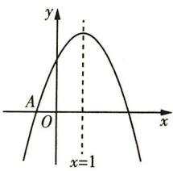

<details>
<summary>text_image</summary>

y
A
O
x
x=1
</details>

与点(0,3)之间(包含端点),则下列结论正确的是
()

A. 当 $x > 3$ 时, $y < 0$   
B. ${4a} + {2b} + c = 0$   
C. $-1 < a < -\frac{2}{3}$   
D. ${3a} + b > 0$

6. [★]已知函数 $f(x) = x^{2} + mx - 1$ ，若对于任意 $x \in [m, m + 1]$ ，都有 $f(x) < 0$ 成立，则实数 $m$ 的取值范围是 \_\_\_\_.  
7. [★★]已知函数 $f(x) = -x^{2} + 2x + 1, x \in (-2, 3)$ , 则函数 $f(|x|)$ 的单调递增区间是 \_\_\_\_.  
8. [轴定区间动, ★★★] 已知函数 $f(x) = x^{2} - 2x + 2, x \in [t, t + 1], t \in \mathbf{R}$ 的最小值为 $g(t)$ , 则 $g(t) =$ \_\_\_\_.

# 易错 警示练

9.[忽略新元的取值范围出错,★★★]已知函数 $f(x)=4^{x}+\frac{k}{4^{x}}(k\in\mathbb{R})$ 为定义在 R 上的偶函数,
当 $x\in[0,+\infty)$ 时,函数 $g(x)=f(x)-a(2^{x}-\frac{1}{2^{x}})(a\in\mathbb{R})$ 的最小值为1,则a= \_\_\_\_.

# 第四节 指数与指数函数

# 题型31 指数幂的运算

▶ 答案: 013 页

题型攻略

<table><tr><td> $(\sqrt[n]{a})^n$ 与 $\sqrt[n]{a^n}$ 的运算性质</td><td> $(\sqrt[n]{a})^n = a; \sqrt[n]{a^n} = \begin{cases} a, & n \text{为奇数,}\\ |a|, & n \text{为偶数.} \end{cases}$ </td></tr><tr><td>分数指数幂与根式的互化</td><td> $a^{\frac{m}{n}} = \sqrt[n]{a^m} (a > 0, m, n \in \mathbb{N}^*, n > 1);$  $a^{-\frac{m}{n}} = \frac{1}{a^{\frac{m}{n}}} = \frac{1}{\sqrt[n]{a^m}} (a > 0, m, n \in \mathbb{N}^*, n > 1).$ </td></tr><tr><td>实数指数幂的运算性质</td><td> $a^r \cdot a^s = a^{r+s} (a > 0, r, s \in \mathbb{R}), (a^r)^s = a^{rs} (a > 0, r, s \in \mathbb{R}), (ab)^r = a^rb^r (a > 0, b > 0, r \in \mathbb{R}).$ </td></tr></table>

# 教材 起点练

1. (1) [人 A 必一 P109 T4 改编, ★] $\frac{\sqrt{a^3b^2\sqrt[3]{ab^2}}}{(a^{\frac{1}{4}}b^{\frac{1}{2}})^4a^{-\frac{1}{3}}b^{\frac{1}{3}}} = \_\_\_\_(a > 0, b > 0)$ ;

(2)[人A必一P110T8改编，★★]若 $x^{\frac{1}{2}}+x^{-\frac{1}{2}}=3$ ，则 $\frac{x^{\frac{3}{2}}+x^{-\frac{3}{2}}-3}{x^{2}+x^{-2}-2}=$ \_\_\_\_.

# 高考 方向练

2.[2022 北京,★]已知函数 $f(x)=\frac{1}{1+2^{x}}$ ，则对任意实数 x，有（）

A. $f(-x)+f(x)=0$

B. $f(-x) - f(x) = 0$

C. $f(-x) + f(x) = 1$

D. $f(-x)-f(x)=\frac{1}{3}$

3. [2020 全国卷 I, ★] 设 $a \log_{3} 4 = 2$ ，则 $4^{-a} =$ ()

A. $\frac{1}{16}$

B. $\frac{1}{9}$

C. $\frac{1}{8}$

D. $\frac{1}{6}$

# 模拟 实战练

4. [2023 山东泰安模拟, ★★] 某食品保鲜时间 y (单位: 时) 与储藏温度 x (单位: ℃) 满足函数关系 $y = e^{kx + b}$ (e = 2.718 … 为自然对数的底数, k, b 为常数). 若该食品在 0 ℃ 的保鲜时间是 192 小时, 在 22 ℃ 的保鲜时间是 48 小时, 则该食品在 33 ℃ 的保鲜时间是 ( )

A. 16 小时

B. 20 小时

C. 24 小时

D. 28 小时

5. [多选, ★★] 已知 $10^{a} = 2, 10^{2b} = 5$ , 则下列结论正确的是 ( )

A. $a + 2b = 1$

B. $ab < \frac{1}{8}$

C. $10^{a + b} > 4$

D. $a > b$

6.[2023 黑龙江模拟,★]计算: $(2\frac{2}{5})^{0}+2^{-2}\times(2\frac{1}{4})^{-\frac{1}{2}}-0.01^{0.5}=$ \_\_\_\_.

# 题型 32 指数函数的图象和性质的应用

▶ 答案: 013 页

# 题型攻略

1. 对于与指数型函数的图象有关的问题,一般从最基本的指数函数的图象入手,通过平移、伸缩、对称变换等得到所求的函数图象,进而可利用数形结合思想解题.  
2. 形如 $y = a^{f(x)}$ 的函数的单调性的判断: 若 a > 1, 则函数 $f(x)$ 的单调增 (减) 区间即函数 $y = a^{f(x)}$ 的单调增 (减) 区间; 若 0 < a < 1, 则函数 $f(x)$ 的单调增 (减) 区间即函数 $y = a^{f(x)}$ 的单调减 (增) 区间.  
3. 求解指数型函数中的参数取值范围的基本思路: 一般利用指数函数的单调性或最值进行转化求解.  
4. 判断指数型函数的奇偶性,一般利用奇偶性的定义及指数的运算性质.

注意 当底数 a 与 1 的大小关系不确定时应分类讨论.

# 教材 起点练

1. [人 A 必一 P159 T1(2) 改编, ★] 已知 $y_{1} = \left(\frac{1}{4}\right)^{x}, y_{2} = 4^{x}, y_{3} = 10^{-x}, y_{4} = 10^{x}$ ，则在同一平面直角坐标系内，它们的图象为（）

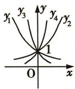  
A

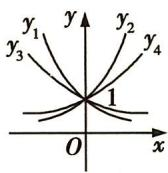  
B

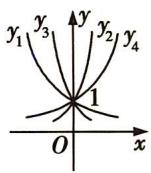  
C

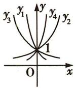  
D

2.[多选,★★]已知函数 $y=(\frac{1}{2})^{x^{2}+4x+3}$ ，则下列说法正确的是()

A. 定义域为 $\mathbf{R}$   
B. 值域为 $(0,2]$   
C. 在 $[-2, +\infty)$ 上单调递增  
D. 在 $[-2, +\infty)$ 上单调递减

# 高考 方向练

3. [2023 全国卷甲, ★★] 已知函数 $f(x) = \mathrm{e}^{-(x-1)^{2}}$ .

记 $a = f(\frac{\sqrt{2}}{2}), b = f(\frac{\sqrt{3}}{2}), c = f(\frac{\sqrt{6}}{2})$ ，则 （）

A. $b > c > a$

B. $b > a > c$

C. $c > b > a$

D. $c > a > b$

4. [2020 全国卷Ⅱ, ★★] 若 $2^{x} - 2^{y} < 3^{-x} - 3^{-y}$ ，则 ( )

A. $\ln (y - x + 1) > 0$

B. $\ln (y - x + 1) < 0$

C. $\ln |x - y| > 0$

D. $\ln |x - y| < 0$

5.[北京,★★]已知函数 $f(x)=3^{x}-(\frac{1}{3})^{x}$ ，则 $f(x)$ ( )

A. 是奇函数, 且在 $\mathbf{R}$ 上是增函数  
B. 是偶函数, 且在 $\mathbf{R}$ 上是增函数  
C. 是奇函数,且在 $\mathbf{R}$ 上是减函数  
D. 是偶函数, 且在 $\mathbf{R}$ 上是减函数

# 模拟 实战练

6.[2023江西六校联考,★★]若存在 $x\in(0,+\infty)$ ，使不等式 $ax+3a-1<e^{-x}$ 成立，则实数a的取值范围为()

A. $\{a \mid a < \frac{1}{3}\}$

B. $\{a\mid0<a<\frac{2}{3}\}$

C. $\{a \mid a < \frac{2}{3}\}$

D. $\{a \mid a < \frac{2}{\mathrm{e} + 1}\}$

7. [2023 安徽模拟, ★★] 已知函数 $f(x) = |3^x - 1|$ , $a < b < c$ , 且 $f(a) > f(b) > f(c)$ , 则下列结论中一定成立的是 ( )

A. $a <   0,b <   0,c <   0$   
B. $a <   0,b\geqslant 0,c > 0$   
C. $3^{-a} < 3^{c}$   
D. ${3}^{a} + {3}^{c} < 2$

8.[多选,2023湖南益阳一中检测改编,★★]已知函数 $f(x)=\frac{2^{x}-1}{2^{x}+1}$ ，则下列说法正确的是()

A. $f(x)$ 为奇函数  
B. $f(x)$ 为减函数  
C. $f(x)$ 有且只有一个零点  
D. $f(x)$ 的值域为 $[-1,1]$

9. [★★] 若函数 $f(x) = \left(\frac{1}{3}\right)^{-x^{2} + 4ax}$ 在区间 (1,2)
上单调递增,则 a 的取值范围为 \_\_\_\_.

# 易错 警示练

10. [忽略对底数的讨论致误, ★★] 已知函数 $f(x) = a^{x} (a > 0 \text{ 且 } a \neq 1)$ 在区间 $[1,2]$ 上的最大值是最小值的 2 倍, 则实数 $a$ 的值为 \_\_\_\_.

# 第五节 对数与对数函数

# 题型 33 对数式的运算

▶ 答案: 013 页

# 题型攻略

对数的性质、运算法则及换底公式

<table><tr><td>性质</td><td> $\log_a 1 = 0, \log_a a = 1, a^{\log_a N} = N (N > 0), \log_a a^x = x$ ,其中  $a > 0$ ,且  $a \neq 1$ .</td></tr><tr><td>运算法则</td><td>如果  $a > 0$ ,且  $a \neq 1, M > 0, N > 0$ ,那么:(1)  $\log_a (M \cdot N) = \log_a M + \log_a N$ ;(2)  $\log_a \frac{M}{N} = \log_a M - \log_a N$ ;(3)  $\log_a M^n = n \log_a M (n \in \mathbb{R})$ .</td></tr><tr><td>换底公式</td><td> $\log_a b = \frac{\log_c b}{\log_c a} (a > 0$ ,且  $a \neq 1; c > 0$ ,且  $c \neq 1; b > 0$ ).推论:(1)  $\log_a b \cdot \log_b a = 1$ ,即  $\log_a b = \frac{1}{\log_b a}$ ;(2)  $\log_{a^m} b^n = \frac{n}{m} \log_a b$ ;(3)  $\log_a b \cdot \log_b c \cdot \log_c d = \log_a d$ .</td></tr></table>

# 教材 起点练

1. [人 A 必一 P126 练习 T 3(1) 改编, ★] 化简: $(\log_{6}2)^{2} + \log_{6}2 \times \log_{6}3 + 2\log_{6}3 - 6^{\log_{6}2} =$ ()

A. $-\log_62$

B. $-\log_63$

C. $\log_{6}3$

D. - 1

2.[人A必一P126例5改编,★]当强度为x的声音对应的等级为 $f(x)$ 分贝时,有 $f(x)=10\lg\frac{x}{A_{0}}$ (其中 $A_{0}$ 为常数),装修电钻的声音约为100分贝,普通室内谈话的声音约为50分贝.则装修电钻的声音强度与普通室内谈话的声音强度的比值为()

A. $\frac{5}{3}$

B. $\frac{35}{3}$

C. ${10}^{5}$

D. $\mathrm{e}^{5}$

# 高考 方向练

3. [2022 天津, ★] 化简 $(2 \log_{4} 3 + \log_{8} 3) (\log_{3} 2 + \log_{9} 2)$ 的值为 ( )

A. 1

B. 2

C. 4

D. 6

4. [2022 浙江, ★★] 已知 $2^{a} = 5$ , $\log_{8}3 = b$ , 则 $4^{a-3b} =$ ( )

A. 25

B. 5

C. $\frac{25}{9}$

D. $\frac{5}{3}$

5.[全国卷Ⅰ,★]已知函数 $f(x)=\log_{2}(x^{2}+a)$ .
若 $f(3)=1$ ,则a=\_\_\_\_.

# 模拟 实战练

6.[多选,2023重庆二调,★★]若a,b,c都是正数,且 $2^{a}=3^{b}=6^{c}$ ,则()

A. $\frac{1}{a} + \frac{1}{b} = \frac{2}{c}$

B. $\frac{1}{a} + \frac{1}{b} = \frac{1}{c}$

C. $a + b > 4c$

D. ${ab} > 4{c}^{2}$

7.[2023天津汇文中学模拟,★]计算: $\left(\frac{8}{27}\right)^{-\frac{2}{3}}+10^{\lg3}+\log_{\frac{1}{9}}\sqrt{3}-\log_{5}4\cdot\log_{2}5=$ \_\_\_\_.

# 易错 警示练

8.[不会指对转化出错,★★]已知实数x,y满足 $x>0,y>0,x\neq1,y\neq1,x^{y}=y^{x},\log_{y}x+\frac{x}{y}=4,$ 则 $x + y =$ （）

A. 2

B. 4

C. 6

D. 8

# 题型 34 对数函数的图象及应用

▶ 答案: 014 页

# 题型攻略

1. 对有关对数函数的作图问题,一般从基本初等函数的图象入手,通过平移、伸缩、对称变换得到所要求的函数图象. 特别地,当底数与 1 的大小关系不确定时应注意分类讨论.  
2. 对有关对数函数图象的识别问题,主要通过确定图象是“上升”还是“下降”、图象位置、图象所过的定点、图象与坐标轴的交点、函数值域等求解.

# 教材 起点练

1.[人A必一P140T4改编，★★]在同一直角坐标系中，分别作出函数 $y=\log_{a}x,y=\log_{b}x$ ， $y=\log_{c}x,y=\log_{d}x$ 的图

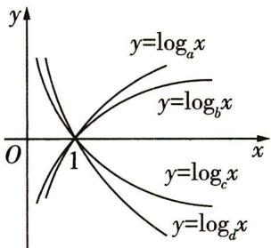

<details>
<summary>text_image</summary>

y
y=logₐx
y=logₑx
O
1
x
y=logₐx
y=log₄x
</details>

象如图所示,则 a,b,c,d,1 的大小关系为
()

A. $b > a > 1 > c > d$

B. $a > b > 1 > c > d$

C. b > a > 1 > d > c

D. $a > b > 1 > d > c$

# 高考 方向练

2.[浙江,★]在同一直角坐标系中,函数 $y=\frac{1}{a^{x}}$ , $y=\log_{a}(x+\frac{1}{2})(a>0,\text{且}a\neq1)$ 的图象可能是()

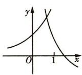  
A

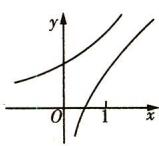  
B

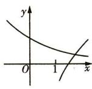  
C

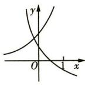  
D

3. [全国卷Ⅲ, ★] 下列函数中, 其图象与函数 $y =$ $\ln x$ 的图象关于直线 $x = 1$ 对称的是 （）

A. $y = \ln (1 - x)$

B. $y = \ln(2 - x)$

C. $y = \ln (1 + x)$

D. $y = \ln (2 + x)$

# 模拟 实战练

4. [★★] 已知函数 $f(x) = x + \frac{1}{x - 2}, x \in (2,8)$ ，当 $x = m$ 时， $f(x)$ 有最小值 $n$ . 则在平面直角坐标系中，函数 $g(x) = \log_{\frac{1}{m}} |x + n|$ 的图象是（）

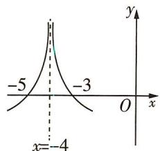

<details>
<summary>line</summary>

| x | y |
|---|---|
| -5 | -3 |
| -4 | -4 |
</details>

A

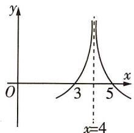

<details>
<summary>line</summary>

| x | y |
|---|---|
| 3 | 0 |
| 4 | Peak (x=4) |
| 5 | 0 |
</details>

B

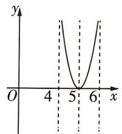

<details>
<summary>line</summary>

| x | y |
|---|---|
| 4 | -2 |
| 5 | 0 |
| 6 | 1 |
</details>

C

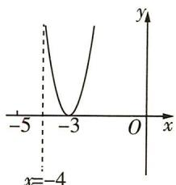

<details>
<summary>line</summary>

| x | y |
|---|---|
| -5 | 0 |
| -3 | 0 |
| 0 | 0 |
| 3 | 0 |
| 5 | 0 |
| 7 | 0 |
| 9 | 0 |
| 11 | 0 |
| 13 | 0 |
| 15 | 0 |
| 17 | 0 |
| 19 | 0 |
| 21 | 0 |
| 23 | 0 |
| 25 | 0 |
| 27 | 0 |
| 29 | 0 |
| 31 | 0 |
| 33 | 0 |
| 35 | 0 |
| 37 | 0 |
| 39 | 0 |
| 41 | 0 |
| 43 | 0 |
| 45 | 0 |
| 47 | 0 |
| 49 | 0 |
| 51 | 0 |
| 53 | 0 |
| 55 | 0 |
| 57 | 0 |
| 59 | 0 |
| 61 | 0 |
| 63 | 0 |
| 65 | 0 |
| 67 | 0 |
| 69 | 0 |
| 71 | 0 |
| 73 | 0 |
| 75 | 0 |
| 77 | 0 |
| 79 | 0 |
| 81 | 0 |
| 83 | 0 |
| 85 | 0 |
| 87 | 0 |
| 89 | 0 |
| 91 | 0 |
| 93 | 0 |
| 95 | 0 |
| 97 | 0 |
| 99 | 0 |
| -4 | -4 |
</details>

D

5.[2023 四川成都树德中学阶段性测试, ★★
★]设方程 $2^{x} + x + 2 = 0$ 和方程 $\log_{2}x + x + 2 = 0$ 的根分别为 p 和 q, 设函数 $f(x) = (x + p)(x + q)$ , 则 ( )

A. $f(2)=f(0)<f(3)$   
B. $f(0) < f(2) < f(3)$   
C. $f(3) < f(2) = f(0)$   
D. $f(0) < f(3) < f(2)$

# 题型 35 对数函数的性质及应用

▶ 答案: 014 页

# 题型攻略

1. 对数型复合函数的单调性问题的求解策略: (1) 函数 $y = \log_{a} f(x)$ 的单调性与函数 $u = f(x) (f(x) > 0)$ 的单调性在 a > 1 时相同, 在 0 < a < 1 时相反; (2) 研究 $y = f(\log_{a} x)$ 型的复合函数的单调性, 一般用换元法, 即令 $t = \log_{a} x$ , 则只需研究 $t = \log_{a} x$ 及 $y = f(t)$ 的单调性即可.

注意 研究对数型复合函数的单调性,一定要坚持“定义域优先”原则,否则所得范围易出错.

2. 求对数型复合函数的值域(最值),关键是根据单调性求解,若需换元,需考虑新元的取值范围.

# 教材 起点练

1. [人 A 必一 P130 知识改编, ★★] 若函数 $f(x) = \log_{a}(x + 1) (a > 0$ , 且 $a \neq 1$ 的定义域和值域都是 $[0, 1]$ , 则 a 等于 ( )

A. $\frac{1}{2}$

B. $\sqrt{2}$

C. $\frac{\sqrt{2}}{2}$

D. 2

# 高考 方向练

2. [2021 新高考卷 II, ★★] 若 $a = \log_{5}2, b = \log_{8}3, c = \frac{1}{2}$ ，则 ( )

A. $c < b < a$

B. $b < a < c$

C. $a < c < b$

D. $a < b < c$

3. [2020 全国卷Ⅱ, ★★★] 设函数 $f(x) = \ln |2x + 1| - \ln |2x - 1|$ , 则 $f(x)$ ()

A. 是偶函数, 且在 $(\frac{1}{2}, +\infty)$ 单调递增

B. 是奇函数, 且在 $(- \frac{1}{2}, \frac{1}{2})$ 单调递减

C. 是偶函数, 且在 $(- \infty, -\frac{1}{2})$ 单调递增

D. 是奇函数, 且在 $(- \infty, -\frac{1}{2})$ 单调递减

# 模拟 实战练

4. [2023 安徽十校联考, ★★] 已知函数 $f(x) = \log_{a}(x^{2} - ax + a)$ ，若存在 $x_{0} \in R$ ，使得 $f(x) \geqslant f(x_{0})$ 恒成立，则实数 a 的取值范围是（）

A. (1,4)

B. $(0,1)\cup(1,4)$

C. $(0,1)$

D. $[4, +\infty)$

5. [2023 乌鲁木齐质监(一), ★★]已知函数 $f(x)=\ln \frac{2-x}{3+x}, a=\log_{2}3, b=\log_{3}4, c=\log_{5}8$ , 则 ( )

A. $f(a)<f(c)<f(b)$

B. $f(a) < f(b) < f(c)$

C. $f(c) < f(a) < f(b)$

D. $f(c) < f(b) < f(a)$

6. [多选, ★★★] 已知函数 $f(x) = \ln x^{2} - 2 \ln (x^{2} + 1)$ , 则下列说法正确的是 ( )

A. 函数 $f(x)$ 为偶函数  
B. 函数 $f(x)$ 的值域为 $(-∞, -1]$   
C. 当 $x > 0$ 时, 函数 $f(x)$ 的图象关于直线 $x = 1$ 对称  
D. 函数 $f(x)$ 的增区间为 $(-∞, -1)$ , $(0, 1)$

# 易错 警示练

7.[对复合函数单调性理解不清致误,2023 河北邢台一中等六校联考,★★★]已知函数 $f(x)=$

$\log_a(ax^2 - 2x + 5) (a > 0, \text{且 } a \neq 1)$ 在区间 $(\frac{1}{2}, 3)$ 上单调递增，则 $a$ 的取值范围为 （）

A. $(0, \frac{1}{3}] \cup [2, +\infty)$   
B. $\left[\frac{1}{3}, 1\right) \cup (1, 2]$   
C. $\left[\frac{1}{9},\frac{1}{3}\right]\cup [2, + \infty)$   
D. $\left[\frac{1}{9},\frac{1}{3}\right]\cup (1,2]$

# 题型 36 解对数（指数）方程或不等式问题

▶ 答案: 015 页

# 题型攻略

1. 解指数方程或不等式问题的思路

(1) $a^{f(x)} = a^{g(x)} \Leftrightarrow f(x) = g(x).$   
(2)① $a^{f(x)}>a^{g(x)}\Leftrightarrow\left\{\begin{aligned}a&>1,\\ f(x)&>g(x)\end{aligned}\right.$ 或 $\left\{\begin{aligned}0<a<1,\\ f(x)&<g(x).\end{aligned}\right.$

②形如 $a^{x} > b$ 的不等式,一般先将 b 转化为以 a 为底数的指数幂的形式,再借助函数 $y = a^{x}$ 的单调性求解.

2. 解对数方程或不等式问题的思路

(1) $\log_a f(x) = \log_a g(x) \Leftrightarrow f(x) = g(x)$ , 且 $f(x) > 0, g(x) > 0$ .   
(2)解简单对数不等式,先统一底数,化为形如 $\log_{a}f(x)>\log_{a}g(x)$ 的不等式,再借助 $y=\log_{a}x$ 的单调性求解,当  
a>1 时, $\log_{a}f(x)>\log_{a}g(x)\Leftrightarrow\left\{\begin{aligned}f(x)>0,\\ g(x)>0,\\ f(x)>g(x),\end{aligned}\right.$ 当0<a<1 时, $\log_{a}f(x)>\log_{a}g(x)\Leftrightarrow\left\{\begin{aligned}f(x)>0,\\ g(x)>0,\\ f(x)<g(x).\end{aligned}\right.$

# 教材 起点练

1. [人 A 必一 P127 T4 改编, ★] (1) 方程 $\log_{5}(2x + 1) = \log_{5}(x^{2} - 2)$ 的解为 \_\_\_\_.

(2) 方程 $81 \times 3^{2x} = \left(\frac{1}{9}\right)^{x+2}$ 的解为 \_\_\_\_.

# 高考 方向练

2. [2020 全国卷 I, ★★] 若 $2^{a} + \log_{2}a = 4^{b} + 2\log_{4}b$ ，则 ( )

A. $a > 2b$

B. $a <   2b$

C. $a > b^{2}$

D. $a < {b}^{2}$

3. [上海, ★] 方程 $\log_{2}(9^{x-1}-5)=\log_{2}(3^{x-1}-2)+2$ 的解为 \_\_\_\_.

# 模拟 实战练

4. [2023 杭州市质检, ★★] 已知 a > 1, b > 1, 且 $\log_{2}\sqrt{a} = \log_{b}4$ , 则 ab 的最小值为 ( )

A. 4

B. 8

C. 16

D. 32

5.[2023 河南部分学校联考,★★]设 $a=\log_{2}3$ , $b=\log_{4}x,c=\log_{8}65$ , 若a,b,c中b既不是最小的也不是最大的,则x的取值范围是()

A. $(9,65^{\frac{2}{3}})$

B. $(3,65^{\frac{1}{3}})$

C. $[9,65^{\frac{2}{3}}]$

D. $[3,65^{\frac{1}{3}}]$

6.[2023 山东模拟,★★]已知函数 $f(x)$ 是定义在R上的偶函数,当 $x\leqslant0$ 时, $f(x)$ 单调递减,则不等式 $f(\log_{\frac{1}{3}}(2x-5))>f(\log_{3}8)$ 的解集为()

A. $\left\{x\mid\frac{5}{2}<x<\frac{41}{16}\right\}$   
B. $\{x \mid x > \frac{13}{2}\}$   
C. $\left\{x\mid\frac{5}{2}<x<\frac{41}{16}\text{或}x>\frac{13}{2}\right\}$   
D. $\{x \mid x < \frac{5}{2} \text{或} \frac{41}{16} < x < \frac{13}{2}\}$

7. [2023 杭州市联考, ★★★]已知实数 $x, y$ 满

足: $x+2^{x}=2,2y+\log_{2}y=1$ ,则 $x+2y$ 的值是
()

A. 1

B. 2

C. $\frac{3}{2}$

D. $\sqrt{3}$

# 易错 警示练

8. [易考虑不全出错, ★★★] 已知函数 $f(x) = |\log_{5}x|$ , 若 $f(x) < f(2 - x)$ , 则 $x$ 的取值范围是 \_\_\_\_.

# 题型 37 比较大小

▶ 答案: 015 页

# 题型攻略

# 解比较大小问题的关键步骤

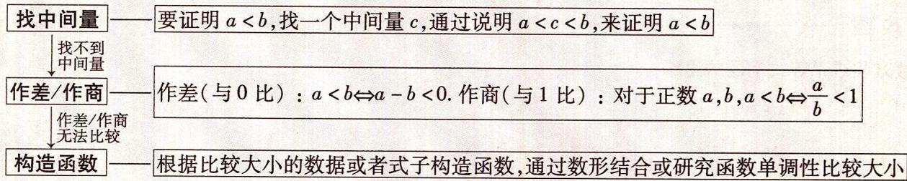

<details>
<summary>flowchart</summary>

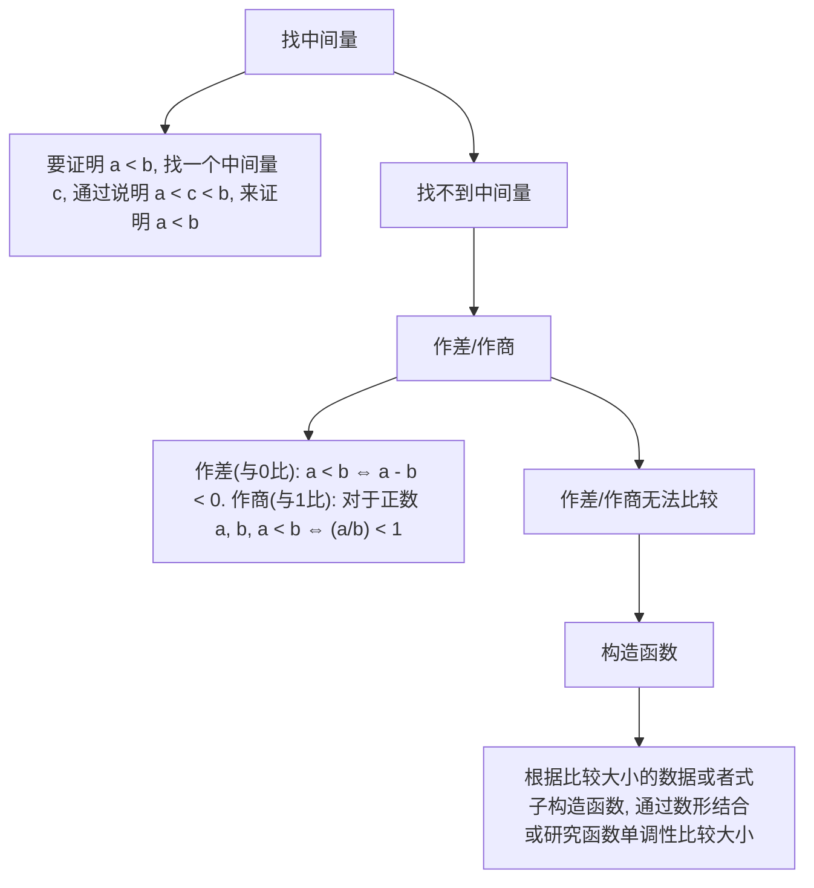
</details>

# 教材 起点练

1. [人 A 必一 P141 T13 改编, ★] 已知 $a = \ln 4$ , $b=\log_{3}e,c=\log_{3}4$ , 则 ( )

A. $b < c < a$

B. $b < a < c$

C. $a < b < c$

D. $a < c < b$

# 高考 方向练

2. [2023 天津, ★] 若 $a = 1.01^{0.5}$ , $b = 1.01^{0.6}$ , c = 0.6 $^{0.5}$ , 则 a, b, c 的大小关系为 ( )

A. $c > a > b$

B. $c > b > a$

C. $a > b > c$

D. $b > a > c$

3. [2022 全国卷甲, ★★]已知 $9^{m} = 10$ , $a = 10^{m} - 11$ , $b = 8^{m} - 9$ , 则 ( )

A. $a > 0 > b$

B. $a > b > 0$

C. $b > a > 0$

D. $b > 0 > a$

4. [2020 全国卷Ⅲ, ★★★] 已知 $5^{5} < 8^{4}$ , $13^{4} < 8^{5}$ . 设 $a = \log_{5} 3$ , $b = \log_{8} 5$ , $c = \log_{13} 8$ , 则 ( )

A. $a < b < c$

B. $b < a < c$

C. $b < c < a$

D. $c < a < b$

# 模拟 实战练

5. [2023 南京六校调研, ★] 若 $a = 0.4^{0.5}$ , b = $0.5^{0.4}$ , $c = \log_{32}4$ , 则 a, b, c 的大小关系是 ( )

A. $a < b < c$

B. $b < c < a$

C. $c < b < a$

D. $c < a < b$

6. [★★]已知 $a = 2 \log_{5} 4, b = \frac{1}{2} \log_{3} 7, c = 2^{\log_{4} 5}$ ，则 a, b, c 的大小关系是 （）

A. $b < c < a$

B. $b < a < c$

C. $c < a < b$

D. $a < b < c$

7.[2023 南京市、盐城市二模, ★★]设 $a, b \in R$ , $4^{b}=6^{a}-2^{a},5^{a}=6^{b}-2^{b}$ ，则()

A. $1 < a < b$

B. $0 < b < a$

C. $b <   0 <   a$

D. $b < a < 1$

8.[多选,2023 黑龙江西北八校联考,★★]已知实数 $x, y, z$ 满足 $z \cdot \ln x = z \cdot e^{y} = 1$ , 则下列关

系式可能成立的是

( )

A. $x > y > z$

B. $x > z > y$

C. $z > x > y$

D. $z > y > x$

9.[多选,★★]设 $3^{x}=4^{y}=5^{z}>1$ ,则()

A. $x <   y <   z$

B. ${3x} < {4y} < {5z}$

C. $\frac{1}{x} + \frac{1}{z} < \frac{2}{y}$

D. ${xz} > {y}^{2}$

# 第六节 函数的图象

# 题型 38 函数图象的识别

▶ 答案: 016 页

# 题型攻略

# 函数图象的识别方法

(1) 排除法: 根据函数的奇偶性、单调性、函数图象与两坐标轴的交点位置、函数值的符号、极限思想等排除干扰项, 从而得出正确结果.  
(2) 图象变换法: 有关函数 $y = f(x)$ 与函数 $y = af(bx + c) + h$ 的图象问题, 可通过图象的平移变换 (左加右减, 上加下减)、对称变换、伸缩变换求解.

# 教材 起点练

1. [人 A 必一 P140 T6 改编, ★]某工厂近 6 年来生产某种产品的情况: 前 3 年年产量的增长速度越来越快, 后 3 年年产量保持不变. 则可以描述该厂近 6 年这种产品的总产量 c 随时间 t 变化的图象是 ( )

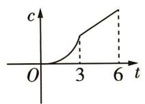  
A

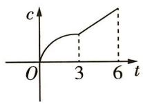  
B

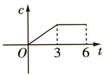  
C

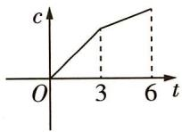  
D

# 高考 方向练

2. [2023 天津, ★★] 函数 $f(x)$ 的图象如图所示, 则 $f(x)$ 的解析式可能为 ( )

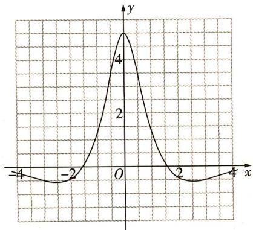

<details>
<summary>line</summary>

| x | y |
|---|---|
| -4 | -2 |
| -2 | 0 |
| 0 | 4 |
| 2 | 0 |
| 4 | -2 |
</details>

A. $f(x) = \frac{5(\mathrm{e}^x - \mathrm{e}^{-x})}{x^2 + 2}$

B. $f(x)=\frac{5\sin x}{x^{2}+1}$

C. $f(x) = \frac{5(\mathrm{e}^x + \mathrm{e}^{-x})}{x^2 + 2}$

D. $f(x) = \frac{5\cos x}{x^2 + 1}$

3. [2022 全国卷甲, ★★] 函数 $y = (3^{x} - 3^{-x}) \cos x$ 在区间 $\left[-\frac{\pi}{2},\frac{\pi}{2}\right]$ 的图象大致为（）

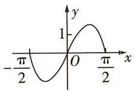  
A

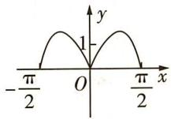  
B

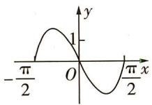  
C

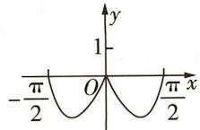  
D

4. [2021 浙江, ★★] 已知函数 $f(x) = x^{2} + \frac{1}{4}$ , $g(x) = \sin x$ , 则图象如图的函数可能是 ( )

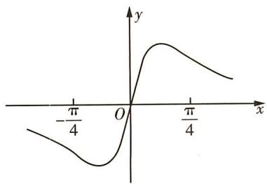

<details>
<summary>line</summary>

| x | y |
|---|---|
| -π/4 | -π/4 |
| 0 | 0 |
| π/4 | π/4 |
</details>

A. $y = f(x) + g(x) - \frac{1}{4}$   
B. $y = f(x) - g(x) - \frac{1}{4}$   
C. $y = f(x)g(x)$   
D. $y = \frac{g(x)}{f(x)}$

# 模拟 实战练

5. [2023 重庆调研, ★] 已知函数 $f(x)$ 的图象如图 1 所示, 则图 2 所表示的函数是 ( )

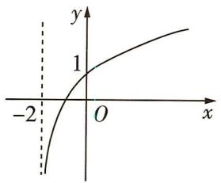

<details>
<summary>text_image</summary>

-2
1
O
x
y
</details>

图1

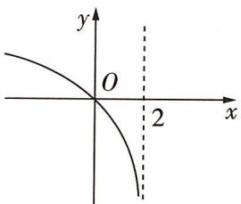

<details>
<summary>text_image</summary>

y
O
2
x
</details>

图2

A. $1 - f(x)$

B. $- f\left( {2 - x}\right)$

C. $f(-x) - 1$

D. $1 - f(-x)$

6.[2023广州调研,★★]函数 $f(x)=\frac{\sin x}{e^{|x|}}$ 在 $[-π,π]$ 上的大致图象为()

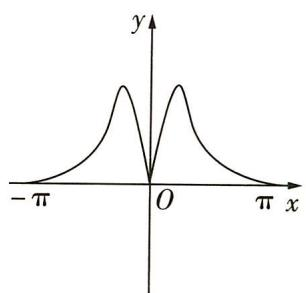

<details>
<summary>text_image</summary>

- π
O
π x
y
</details>

A

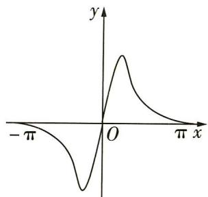

<details>
<summary>text_image</summary>

-π
O
π x
y
</details>

B

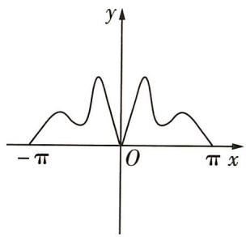

<details>
<summary>text_image</summary>

- π
O
π x
y
</details>

C

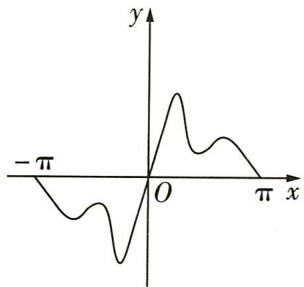

<details>
<summary>text_image</summary>

- π
O
π
x
y
</details>

D

# 易错 警示练

7. [不会分类讨论致误,2023 四川名校第三次联考,★★★]函数 $y = (kx^{2} + 1)e^{x}$ 的图象可能是\_\_\_\_。(填所有符合题意的编号)

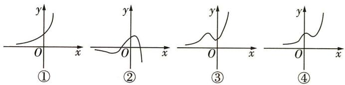

<details>
<summary>text_image</summary>

y
O
x
①
y
O
x
②
y
O
x
③
y
O
x
④
</details>

# 题型 39 函数图象的应用

▶ 答案: 016 页

# 题型攻略

函数图象的应用,实质是数形结合思想的应用:

(1)研究函数的性质可借助函数图象的对称性、走向趋势、最高点、最低点等进行分析；  
(2)不等式问题可转化为图象的上下位置关系问题;  
(3)研究函数零点或方程根的问题可转化为函数图象的交点问题.

# 教材 起点练

1. [人 B 必一 P105 知识改编, ★] 向高为 H 的水瓶中注水, 注满为止, 如果注水量 V 与水深 h 的函数关系的图象如图所示, 那么水瓶的形状是 ( )

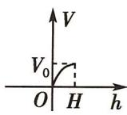

  
A

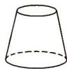  
B

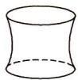  
C

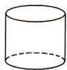  
D

# 高考 方向练

2. [2020 北京, ★★] 已知函数 $f(x) = 2^x - x - 1$ ,

则不等式 $f(x)>0$ 的解集是（）

A. $(-1,1)$

B. $(- \infty, -1) \cup (1, +\infty)$

C. $(0,1)$

D. $(- \infty, 0) \cup (1, +\infty)$

# 模拟 实战练

3. [2023 甘肃张掖诊断, ★★] 已知函数 $f(x)$ 满足当 $x \leqslant 0$ 时, $2f(x - 2) = f(x)$ , 且当 $x \in (-2, 0]$ 时, $f(x) = |x + 1| - 1$ ; 当 $x > 0$ 时, $f(x) = \log_a x (a > 0$ 且 $a \neq 1)$ . 若函数 $f(x)$ 的图象上关于原点对称的点恰好有 3 对, 则 $a$ 的取值范围是 ( )

A. $(625, +\infty)$

B. $(4,64)$

C. (9,625)

D. (9,64)

4.[2023 福建泉州质监(一),★★]已知定义在R上的奇函数 $f(x)$ 满足 $f(x+2)=-f(x)$ ，当 $1\leqslant x<2$ 时， $f(x)=x-2$ 。若 $y=\frac{1}{6}x-\frac{1}{3}$ 与 $f(x)$ 的图象交于点 $(x_{1},y_{1}),(x_{2},y_{2}),\cdots,(x_{n},y_{n})$ $(n\in\mathbf{N}^{*})$ ，则 $\sum_{i=1}^{n}(x_{i}+y_{i})=$

A. 6

B. 8

C. 10

D. 14

# 易错 警示练

5.[不会利用函数图象解题致错,★★]将函数 $y=\sqrt{13-x^{2}}-2(x\in[-3,3])$ 的图象绕点(-3,0)逆时针旋转 $\alpha(0\leqslant\alpha\leqslant\theta)$ ,得到曲线C,对于每一个旋转角 $\alpha$ ,曲线C都是一个函数的图象,则 $\theta$ 最大时的正切值为()

A. $\frac{3}{2}$

B. $\frac{2}{3}$

C. 1

D. $\sqrt{3}$

# 第七节 函数与方程

# 题型 40 判断函数的零点所在区间

▶ 答案: 017 页

# 题型攻略

函数零点所在区间的判断方法及适用情形

<table><tr><td>方法</td><td>含义</td><td>适用情形</td></tr><tr><td>定理法</td><td>利用函数的零点存在定理进行判断.</td><td>能够容易判断区间端点值所对应函数值的正负.</td></tr><tr><td>图象法</td><td>画出函数图象,通过观察图象与x轴在给定区间上是否有交点来判断.</td><td>容易画出函数的图象.</td></tr><tr><td>解方程法</td><td>可先解对应方程,然后看所求的根是否落在给定区间上.</td><td>当对应方程f(x)=0易解时.</td></tr></table>

# 教材 起点练

1. [人 A 必一 P143 例 1 改编, ★] 函数 $f(x) = \log_{3} x + x - 2$ 的零点所在的区间为 ( )

A. $(0,1)$

B. $(1,2)$

C. (2,3)

D. $(3,4)$

# 高考 方向练

2.[北京,★]已知函数 $f(x)=\frac{6}{x}-\log_{2}x$ .在下列区间中,包含 $f(x)$ 零点的区间是()

A. $(0,1)$

B. $(1,2)$

C. $(2,4)$

D. $(4, +\infty)$

3.[重庆,★★]若 a<b<c,则函数 $f(x)=(x-a)(x-b)+(x-b)(x-c)+(x-c)(x-a)$ 的两个零点分别位于区间()

A. $(a, b)$ 和 $(b, c)$ 内

B. $(-\infty, a)$ 和 $(a, b)$ 内

C. $(b,c)$ 和 $(c,+\infty)$ 内

D. $(-∞,a)$ 和 $(c,+∞)$ 内

# 模拟 实战练

4. [2023 河南南阳一中段考, ★] 已知函数 $f(x) = 81 \ln x - \left(\frac{1}{3}\right)^{x-3} - 80$ 的零点位于区间 $(k, k + 1)$ 内, 则整数 k = ()

A. 1

B. 2

C. 3

D. 4

5.[多选,2023安徽马鞍山统考,★★]已知函数 $f(x)=(x^{2}+x)\mathrm{e}^{x}+\ln x$ 的零点为 $x_{0}$ ，下列判断正确的是()

A. $x_0 < \frac{1}{2}$

B. $x_{0} > \frac{1}{\mathrm{e}}$

C. $e^{x_{0}} + \ln x_{0} < 0$

D. $x_{0} + \ln x_{0} < 0$

# 题型41 判断函数的零点个数

▶ 答案: 017 页

# 题型攻略

# 判定函数零点个数的方法

1. 直接法: 令 $f(x) = 0$ , 如果能求出解, 那么有几个不同的解就有几个零点.  
2. 图象法: 画出函数 $f(x)$ 的图象, 函数 $f(x)$ 的图象与 $x$ 轴交点的个数就是函数 $f(x)$ 的零点个数; 将函数 $f(x)$ 拆成两个函数 $h(x)$ 和 $g(x)$ 的差的形式, 根据 $f(x) = 0 \Leftrightarrow h(x) = g(x)$ , 则函数 $f(x)$ 的零点个数就是函数 $y = h(x)$ 和 $y = g(x)$ 的图象的交点个数.

# 教材 起点练

1. [人 A 必一 P160 T4 改编, ★] 函数 $f(x) = \left\{\begin{aligned} x^{2} + x - 2, & x \leqslant 0, \\ -1 + \ln x, & x > 0 \end{aligned}\right.$ 的零点个数为 ( )

A. 3

B. 2

C. 7

D. 0

# 高考 方向练

2. [2023 全国卷甲, ★★] 函数 $y = f(x)$ 的图象由函数 $y = \cos\left(2x + \frac{\pi}{6}\right)$ 的图象向左平移 $\frac{\pi}{6}$ 个单位长度得到, 则 $y = f(x)$ 的图象与直线 $y = \frac{1}{2}x - \frac{1}{2}$ 的交点个数为 ( )

A. 1

B. 2

C. 3

D. 4

3. [天津, ★★★] 已知函数 $f(x) = \left\{ \begin{array}{l} 2 - |x|, x \leqslant 2, \\ (x - 2)^2, x > 2, \end{array} \right.$ 函数 $g(x) = 3 - f(2 - x)$ , 则函数 $y = f(x) - g(x)$ 的零点个数为 ( )

A. 2

B. 3

C. 4

D. 5

4. [2021 北京, ★★] 已知 $f(x) = |\lg x| - kx - 2$ ,
给出下列四个结论：

①若 k=0，则 $f(x)$ 有两个零点；  
② $\exists k<0$ , 使得 $f(x)$ 有一个零点;  
③ $\exists k<0$ , 使得 $f(x)$ 有三个零点;   
④ $\exists k > 0$ , 使得 $f(x)$ 有三个零点.

以上正确结论的序号是\_\_\_\_。

# 模拟 实战练

5. [2023 河北唐山一中模拟, ★★★] 设函数 $f(x)$ 是定义在 $\mathbf{R}$ 上的偶函数, 且 $f(x + 2) = f(2 - x)$ , 当 $x \in [-2, 0]$ 时, $f(x) = (\frac{\sqrt{2}}{2})^x - 1$ , 则在区间 $(0, 2022)$ 内关于 $x$ 的方程 $f(x) - \log_{2022}(x + 2) = 0$ 解的个数为 ( )

A. 1 009

B. 1 010

C. 1 011

D. 1 012

6.[2023重庆质检(一),★★★]定义在R上的函数 $f(x)$ 满足 $f(x)=2f(|x|)+x^{2}-x$ ,则函数 $g(x)=xf^{2}(x)-\frac{1}{x}$ 的零点个数为()

A. 3

B. 4

C. 5

D. 6

7.[2023甘肃二诊,★★★]已知函数 $y=f(x)$ 满足:当 $-2\leqslant x\leqslant2$ 时, $f(x)=-\frac{1}{4}x^{2}+1$ 且 $f(x)=f(x+4)$ 对任意 $x\in R$ 都成立,则方程 $16f(x)=4|x|+1$ 的实根个数是\_\_\_\_.

# 易错 警示练

8.[易忽略指数函数图象的变化趋势致误,★★]
函数 $f(x)=2^{x}-x^{2}$ 的零点个数为()

A. 1

B. 2

C. 3

D. 4

# 题型42 函数零点的应用

▶ 答案: 018 页

# 题型攻略

已知函数零点情况求参数取值范围的方法

<table><tr><td>直接法</td><td>先根据题设条件构建关于参数的不等式(组),再通过解不等式(组)确定参数的取值范围.</td></tr><tr><td>分离参数法</td><td>将参数分离,转化成求函数值域问题.</td></tr><tr><td>数形结合法</td><td>先对解析式变形,在同一平面直角坐标系中画出函数的图象,然后数形结合求解.</td></tr></table>

# 教材 起点练

1. [人 A 必一 P160 T4 改编, ★★] 已知函数 $f(x) = \log_{a} x - x + 2 (a > 0$ , 且 $a \neq 1$ ) 有且仅有两个零点, 则 a 的取值范围为 ( )

A. $0 < a < 1$

B. $a > 1$

C. $1 < a < 2$

D. a > 2

# 高考 方向练

2. [2023 全国卷乙, ★★] 函数 $f(x) = x^{3} + ax + 2$ 存在 3 个零点, 则 a 的取值范围是 ( )

A. $(-\infty, -2)$

B. $(-∞,-3)$

C. $(-4,-1)$

D. $(-3,0)$

3. [全国卷 I, ★★] 已知函数 $f(x) = \left\{\begin{aligned} & e^{x}, x \leqslant 0, \\ & \ln x, x > 0, \end{aligned}\right.$ $g(x) = f(x) + x + a.$ 若 $g(x)$ 存在 2 个零点，则 a 的取值范围是 ( )

A. $[-1,0)$

B. $[0, +\infty)$

C. $[-1, +\infty)$

D. $[1, +\infty)$

4. [2023 天津, ★★★] 若函数 $f(x) = ax^{2} - 2x - |x^{2} - ax + 1|$ 有且仅有两个零点, 则 a 的取值范围为 \_\_\_\_.

# 模拟 实战练

5.[2023南京六校调研,★★★]定义在R上的偶函数 $f(x)$ 满足对任意的 $x\in R$ ，都有 $f(1+x)=f(3-x)$ ，当 $x\in[0,2]$ 时， $f(x)=\sqrt{4-x^{2}}$ ，若函数 $y=f(x)-kx$ 在 $x\in(0,+\infty)$ 上恰有3个零点，则实数k的取值范围为()

A. $(\frac{\sqrt{15}}{15}, \frac{\sqrt{3}}{3})$

B. $(\frac{\sqrt{14}}{14}, \frac{\sqrt{3}}{3})$

C. $(\frac{\sqrt{35}}{35}, \frac{\sqrt{15}}{15})$

D. $\left[\frac{\sqrt{35}}{35},\frac{\sqrt{14}}{14}\right)$

6.[2023 乌鲁木齐质监(一),★★]已知函数 $f(x)=\mathrm{e}^{x}+\mathrm{e}^{2-x}+a\sin(\frac{\pi}{3}x+\frac{\pi}{6})$ 有且只有一个零点,则实数a的值为\_\_\_\_.

7.[2023 贵阳市五校联考, ★★★]已知函数 $f(x)=\left\{\begin{aligned}&|\log_{2}(x-1)|,1<x\leqslant3,\\&\frac{1}{2}x^{2}-\frac{9}{2}x+10,x>3,\end{aligned}\right.$ 若方程 $f(x)=$ m有四个不同的实根 $x_{1},x_{2},x_{3},x_{4}$ ，且满足 $x_{1}<$ $x_{2}<x_{3}<x_{4}$ ，则 $\frac{(x_{3}-1)(x_{4}-1)}{(x_{1}-1)(x_{2}-1)}$ 的取值范围是 \_\_\_\_.

# 易错 警示练

8.[不会正确作出函数图象致误,2023贵阳市统考,★★★]已知函数 $f(x)=ax^{2}-e^{x}$ 有三个零点,则实数a的取值范围为()

A. $(0,\frac{e^{2}}{4}]$

B. $\left[\frac{e^{2}}{4},e^{2}\right]$

C. $(\frac{\mathrm{e}^2}{4},\mathrm{e}^2)$

D. $\left(\frac{e^{2}}{4},+\infty\right)$

# 第八节 函数模型及其应用

# 题型43 解决图表型函数的实际应用问题

▶ 答案: 019 页

# 题型攻略

解决图表型函数的实际应用问题的策略:(1)明确横轴、纵轴的意义,分析在题中的具体含义;(2)由图象判定函数模型;(3)抓住特殊点的实际意义,特殊点一般包括最高点(最大值点)、最低点(最小值点)及折线的拐角点等;(4)通过方程、不等式、函数等数学模型化实际问题为数学问题,根据实际问题中两变量的变化快慢等特点,结合图象的变化趋势进行求解.

# 教材 起点练

1. [多选, 人 A 必一 P140 T6 改编, ★★]某医药研究机构研发了一种新药, 据监测, 如果患者每次按规定的剂量注射该药物, 注射后每毫升血液中的含药量 y (单位: 微克) 随时间 t (单位: 时) 变化的图象近似符合如图所示的曲线. 据进一步测定, 当每毫升血液中含药量不少于 0.125 微克时, 治疗该病有效, 则下列说法正确的是 ( )


<details>
<summary>line</summary>

| t/时 | y/微克 |
| ---- | ------ |
| 0    | 0      |
| 1    | 4      |
| >1   | Decreasing to -1 |
</details>

A. $a = 3$   
B. 按规定注射一次该药物,治疗该病的有效时长为 6 小时  
C. 注射该药物 $\frac{1}{8}$ 小时后每毫升血液中的含药量为 0.5 微克  
D. 按规定注射一次该药物, 治疗该病的有效时长为 $\frac{191}{32}$ 小时

# 高考 方向练

2. [2022 北京, ★★]在北京冬奥会上, 国家速滑馆“冰丝带”使用高效环保的二氧化碳跨临界

直冷制冰技术,为实现绿色冬奥作出了贡献.如图描述了一定条件下二氧化碳所处的状态与 T 和 lg P 的关系,其中 T 表示温度,单位是 K;P 表示压强,单位是 bar . 下列结论中正确的是 ( )


<details>
<summary>line</summary>

| T    | lg P (固态) | lg P (液态) | lg P (气态) |
|------|-------------|-------------|-------------|
| 200  | 0           | 0           | 0           |
| 250  | 3           | 1           | 1           |
| 300  | 4           | 2           | 2           |
| 350  | 4           | 2           | 2           |
| 400  | 4           | 2           | 2           |
</details>

A. 当 $T = 220, P = 1026$ 时, 二氧化碳处于液态  
B. 当 $T = 270, P = 128$ 时, 二氧化碳处于气态  
C. 当 T=300, P=9 987 时, 二氧化碳处于超临界状态  
D. 当 T = 360, P = 729 时, 二氧化碳处于超临界状态

3. [2020 北京, ★★★]为满足人民对美好生活的向往,环保部门要求相关企业加强污水治理,排放未达标的企业要限期整改.设企业的污水排放量 W 与时间 t 的关系为 $W = f(t)$ ,用 $-\frac{f(b) - f(a)}{b - a}$ 的大小评价在 $[a, b]$ 这段时间内企业污水治理能力的强弱.已知整改期内,甲、乙两企业的污水排放量与时间的关系如图所示.


<details>
<summary>line</summary>

| t    | 甲企业 | 乙企业 | 甲企业 |
| ---- | ------ | ------ | ------ |
| t₁   | W      | W      | W      |
| t₂   | W      | W      | W      |
| t₃   | W      | W      | W      |
</details>

给出下列四个结论：

①在 $\left[t_{1},t_{2}\right]$ 这段时间内,甲企业的污水治理能力比乙企业强;  
②在 $t_2$ 时刻, 甲企业的污水治理能力比乙企业强;  
③在 $t_{3}$ 时刻, 甲、乙两企业的污水排放都已达标;  
④甲企业在 $\left[0,t_{1}\right]$ ， $\left[t_{1},t_{2}\right]$ ， $\left[t_{2},t_{3}\right]$ 这三段时间中，在 $\left[0,t_{1}\right]$ 的污水治理能力最强.

其中所有正确结论的序号是\_\_\_\_。

# 模拟 实战练

4. [2023 北京十三中月考，

★★]加工爆米花时,爆开且不糊的粒数占加工总粒数的百分比称为“可食用率”. 在特定条件下,可食用率p与加工时间t(单位:min)满足


<details>
<summary>line</summary>

| t | P |
|---|---|
| 3 | 0.7 |
| 4 | 0.5 |
| 5 | 0.5 |
</details>

函数关系 $p = at^{2} + bt + c(a, b, c$ 是常数), 如图记录了三次实验的数据. 根据上述函数模型和实验数据, 可以得到最佳加工时间为 ( )

A. 3.50 min

B. $3.75 \mathrm{~min}$

C. $4.00 \mathrm{~min}$

D. 4.25 min

5.[2023 福建莆田高三质量检测,★★]经多次实验得到某种型号的汽车每小时耗油量Q(单位:L)与速度v(单位:km/h)(40≤v≤120)的数据如下表.

<table><tr><td>v</td><td>40</td><td>60</td><td>90</td><td>100</td><td>120</td></tr><tr><td>Q</td><td>5.2</td><td>6</td><td>8.325</td><td>10</td><td>15.6</td></tr></table>

为描述 Q 与 v 的关系, 现有以下三种模型供选择: $Q(v) = 0.04v + 3.6$ , $Q(v) = 0.5^{v} + a$ , $Q(v) = 0.000025v^{3} - 0.004v^{2} + 0.25v$ . 选出最符合实际的函数模型, 解决下列问题: 某高速公路共有三个车道, 分别是外侧车道、中间车道、内侧车道, 车速范围分别是 [60, 90), [90, 110), [110, 120] (单位: km/h). 为使百公里耗油量 W (单位: L) 最小, 该型号汽车行驶的车道与速度为 ( )

A. 在外侧车道以 80 km/h 行驶  
B. 在中间车道以 90 km/h 行驶  
C. 在中间车道以 95 km/h 行驶  
D. 在内侧车道以 $115 \mathrm{~km} / \mathrm{h}$ 行驶

# 题型 44 已知函数模型求解实际问题

▶ 答案: 019 页

# 题型攻略

利用已给函数模型解决实际问题的关键点:(1)认清所给函数模型,弄清哪些量为待定系数,并根据已知利用待定系数法确定模型中的待定系数;(2)利用函数模型,借助函数的性质求解实际问题,并进行检验.

# 教材 起点练

1. [人 A 必一 P156 T14 改编, ★] 某污水处理厂为使污水经处理后达到排放标准, 需要加入某种药剂, 加入该药剂后, 药剂的质量浓度 C (单位: mg/m³) 随时间 t (单位: h) 的变化关系可以近似地用函数 $C(t) = \frac{100(t + 1)}{t^{2} + 4t + 19}$ 刻画, 由此可以判断, 经过 \_\_\_\_ h 后, 被处理的污水中该药剂的质量浓度达到最大, 最大值是 \_\_\_\_ mg/m³.

# 高考 方向练

2.[2021全国卷甲,★★]青少年视力是社会普遍关注的问题,视力情况可借助视力表测量.通常用五分记录法和小数记录法记录视力数据,五分记录法的数据L和小数记录法的数据V满足 $L=5+\lg V$ .已知某同学视力的五分记录法的数据为4.9,则其视力的小数记录法的数据约为( $\sqrt[10]{10}\approx1.259$ )()

A. 1.5

B. 1.2

C. 0.8

D. 0.6

3. [2020 新高考卷 I, ★★] 基本再生数 $R_{0}$ 与世代间隔 T 是新冠肺炎的流行病学基本参数。基本再生数指一个感染者传染的平均人数，世代间隔指相邻两代间传染所需的平均时间。在新冠肺炎疫情初始阶段，可以用指数模型： $I(t) = e^{rt}$ 描述累计感染病例数 $I(t)$ 随时间 t（单位：天）的变化规律，指数增长率 r 与 $R_{0}, T$ 近似满足 $R_{0} = 1 + rT$ 。有学者基于已有数据估计出 $R_{0} = 3.28, T = 6$ 。据此，在新冠肺炎疫情初始阶段，累计感染病例数增加 1 倍需要的时间约为 $(\ln 2 \approx 0.69)$

A. 1.2 天

B. 1.8 天

C.2.5 天

D. 3.5 天

# 模拟 实战练

4. [2023 安徽安庆联考, ★★] 海洋渔业发展迅猛, 我国自主研发的大型海洋养殖船纷纷下海. 网箱养殖需要人工创造适合鱼类生长的环境, 研究人员发现在一段时间内, 某网箱内氧的含量 $H$ (单位: $\mathrm{mg/L}$ ) 与时间 $t$ (单位: $\mathrm{h}$ ) 之间的关系为 $H = H_{0} \mathrm{e}^{-mt}$ ( $H_{0}$ 为网箱内氧的初始含量且 $H_{0} > 0$ , $m$ 为参数), 且经过 $20 \mathrm{~h}$ 后, 网箱

内氧的含量减少 $\frac{61}{125}H_{0}$ . 若当网箱内氧的含量低于初始含量的 $\frac{2}{5}$ 时需要人工增氧, 则该网箱最长大约经过多长时间后需要人工增氧(参考数据: $\lg 2\approx0.3$ ) ()

A. ${39}\mathrm{\;h}$

B. $33 \mathrm{~h}$

C. $31 \mathrm{~h}$

D. ${27}\mathrm{\;h}$

5.[2023 江苏镇江高三模拟改编,★★] 2022 年 12 月 4 日 20 时 09 分,神舟十四号载人飞船返回舱在东风着陆场成功着陆. 已知火箭的最大速度 v(单位:km/s)与燃料质量 M(单位:kg)、火箭(除燃料外)质量 m(单位:kg)的函数关系为 $v=2\ln\left(1+\frac{M}{m}\right)$ . 已知某火箭的火箭(除燃料外)质量为 3000 kg,最大速度为 9 km/s,若保持火箭(除燃料外)质量不变,为使最大速度达到 10 km/s,则需要再加注的燃料质量约为(参考数据: $\ln90\approx4.5,e^{5}\approx148$ )()

A. $267000 \mathrm{~kg}$

B. $174000 \mathrm{~kg}$

C. $147000 \mathrm{~kg}$

D. 441 000 kg

# 题型45 构造函数模型求解实际问题

▶ 答案: 019 页

# 题型攻略

# 构建函数模型解决实际问题的解题步骤

(1)审题,引进数学符号,建立数学模型,了解变量的含义,若模型中含有待定系数,则需要进一步用待定系数法或其他方法确定;  
(2)求解数学模型,利用数学知识,如函数的单调性、最值等,对函数模型进行解答;  
(3)转译成实际问题的解.

# 教材 起点练

1. [人 B 必二 P43 例 2 改编, ★]《中华人民共和国国家标准污水综合排放标准(GB 8978—1996)》中一级标准规定的氨氮含量允许排放的最高浓度为 $15 \mathrm{mg} / \mathrm{L}$ . 某企业生产废水中的氨氮含量为 $450 \mathrm{mg} / \mathrm{L}$ , 现通过循环过滤设备对

生产废水中的氨氮进行过滤,每循环一次可使氨氮含量减少 $\frac{1}{3}$ ,要使废水中的氨氮含量达到国家排放标准,至少要进行循环的次数为(参考数据: $\lg 2\approx0.301\ 0,\lg 3\approx0.477\ 1$ )( )

A. 3

B. 4

C. 8

D. 9

# 高考 方向练

2.[四川,★★]某公司为激励创新,计划逐年加大研发资金投入.若该公司2015年全年投入研发资金130万元,在此基础上,每年投入的研发资金比上一年增长12%,则该公司全年投入的研发资金开始超过200万元的年份是(参考数据:lg 1.12≈0.05,lg 1.3≈0.11,lg 2≈0.30)()

A. 2018 年

B. 2019 年

C. 2020 年

D. 2021 年

3. [陕西, ★★] 在如图所示的锐角三角形空地中, 欲建一个面积最大的内接矩形花园 (阴影部分), 则其边长 $x$ 为 \_\_\_\_ m.


<details>
<summary>text_image</summary>

40 m
x
40 m
</details>

# 模拟 实战练

4.[2023北京第十二中学模拟,★★★]长江流域水库群的修建和联合调度极大降低了洪涝灾害风险,发挥了重要的防洪减灾作用.每年洪水来临之际,为保证防洪需要,降低防洪风险,水利部门需要在原有蓄水量的基础上联合调度,统一蓄水,用蓄满指数(蓄满指数= $\frac{水库实际蓄水量}{水库总蓄水量}\times100$ )来衡量每座水库的水位情况.假设某次联合调度要求如下:(i)调度后每座水库的蓄满指数属于区间[0,100];(ii)调度后每座水库的蓄满指数都不能降低;(iii)调度前后,各水库之间的蓄满指数排名不变.

记 $x(0 \leqslant x \leqslant 100)$ 为调度前某水库的蓄满指数, $y$ 为调度后该水库的蓄满指数, 给出下面四个 $y$ 关于 $x$ 的函数解析式: ① $y = -\frac{1}{20} x^2 + 6x$ , ② $y = 10\sqrt{x}$ , ③ $y = 10^{\frac{x}{50}}$ , ④ $y = 100\sin \frac{\pi}{200} x$ .

则满足此次联合调度要求的函数解析式的个数为 （）

A. 1

B. 2

C. 3

D. 4

5.[2023 安徽芜湖第一中学模拟,★★]每年三月中旬至四月上旬是最佳的赏花时期,某公园的赏花园区投资了30万元种植鲜花供市民游赏,这些鲜花的花期为30天.园区从3月1号至30号开放,每天的旅游人数 $f(x)$ (单位:千人)与第x天的关系近似地满足 $f(x)=8+\frac{8}{x}$ ,游客人均消费 $g(x)$ (单位:元)与第x天的关系近似地满足 $g(x)=143-|x-22|$ , $1\leqslant x\leqslant30$ 且 $x\in N^{*}$ .

(1)求该园区第 x 天的旅游收入 $p(x)$ (单位: 千元) 的函数解析式;

(2) 记(1)中 $p(x)$ 的最小值为 m, 若最终总利润为 0.3m 千元, 问该园区能否收回投资成本?

# 第三章

# 一元函数的导数及其应用

# 第一节 导数的概念及运算

# 题型46 导数的运算

▶ 答案: 020 页

# 题型攻略

1. 导数的四则运算法则

若 $f'(x)$ , $g'(x)$ 存在, 则 (1) $[f(x) \pm g(x)]' = f'(x) \pm g'(x)$ ; (2) $[f(x) \cdot g(x)]' = f'(x)g(x) + f(x)g'(x)$ ;

(3) $\left[\frac{f(x)}{g(x)}\right]' = \frac{f'(x)g(x) - f(x)g'(x)}{\left[g(x)\right]^2} (g(x) \neq 0).$

2. 简单复合函数的导数

复合函数 $y=f(g(x))$ 的导数和函数 $y=f(u)$ , $u=g(x)$ 的导数间的关系为 $y'_{x}=y'_{u}\cdot u'_{x}$ ，即 y 对 x 的导数等于 y 对 u 的导数与 u 对 x 的导数的乘积.

3. $f^{\prime}(x_0)$ 的意义与计算

$f'(x_0)$ 表示 $f(x)$ 的导函数 $f'(x)$ 在 $x = x_0$ 处的函数值，即 $f'(x_0) = f'(x) \mid_{x = x_0}$ . 可见，应先求出 $f(x)$ 的导函数 $f'(x)$ ，再将 $x = x_0$ 代入求 $f'(x_0)$ 的值.

# 教材 起点练

1. [人 A 选必二 P70 习题 5.1 T2 改编, ★]随着科学技术的发展, 放射性同位素技术已经广泛应用于医学、航天等众多领域, 并取得了显著的经济效益. 假设在放射性同位素钍 234 的衰变过程中, 其含量 N (单位: 贝克) 与时间 t (单位: 天) 满足函数关系 $N(t) = N_{0}2^{-\frac{t}{24}}$ , 其中 $N_{0}$ 为 t = 0 时钍 234 的含量. 已知 t = 24 时, 钍 234 含量的瞬时变化率为 $-8\ln 2$ , 则 $N(96) =$

A. 12

B. ${12}\ln 2$

C. 24

D. ${24}\ln 2$

2. [人 A 选必二 P81 T8 改编, ★★] 设 $f(x) = \frac{\sin x}{e^x}$ , 则关于 $x$ 的不等式 $f'(x) \leqslant 0$ 的解集为 \_\_\_\_.

# 高考 方向练

3. [2020 全国卷Ⅲ, ★★] 设函数 $f(x) = \frac{\mathrm{e}^{x}}{x + a}$ , 若 $f'(1) = \frac{\mathrm{e}}{4}$ , 则 $a =$ \_\_\_\_.

4. [天津, ★★]已知函数 $f(x) = \mathrm{e}^{x}\ln x, f'(x)$ 为 $f(x)$ 的导函数, 则 $f'(1)$ 的值为 \_\_\_\_.

# 模拟 实战练

5.[2023 四川成都摸底,★]记函数 $f(x)$ 的导函数是 $f'(x)$ .若 $f(x)=f'(1)x^{2}-\frac{1}{x}$ ，则 $f'(-1)$ 的值为\_\_\_\_.

6.[2023河南省重点中学阶段测试,★★]衡量曲线弯曲程度的重要指标是曲率,曲线的曲率定义如下:若 $f'(x)$ 是 $f(x)$ 的导函数, $f''(x)$ 是 $f'(x)$ 的导函数,则曲线 $y=f(x)$ 在点 $(x,f(x))$ 处的曲率 $K=\frac{|f''(x)|}{\{1+[f'(x)]^{2}\}^{\frac{3}{2}}}$ .已知 $f(x)=\ln x-\cos(x-1)$ ,则曲线 $y=f(x)$ 在点 $(1,f(1))$ 处的曲率为\_\_\_\_.

# 易错 警示练

7. [易混淆参数与变量致误, ★]已知函数 $f(x) = \sin \alpha \cos x$ , 且 $f'(\frac{\pi}{2}) = 1$ , 则 $f'(\frac{\pi}{3}) =$ \_\_\_\_.

# 题型47 求切线方程

# 题型攻略

# 求切线方程的方法与注意点

1. 曲线 $y = f(x)$ 上以 $(x_0, f(x_0))$ 为切点的切线方程

$f'(x_{0})$ 的几何意义是曲线 $y=f(x)$ 在点 $(x_{0},f(x_{0}))$ 处的切线斜率，切线方程可以表示为 $y-f(x_{0})=f'(x_{0})(x-x_{0})$ ，其条件是 $(x_{0},f(x_{0}))$ 是曲线上的点（切点）.

2. “过一点的切线”与“以一点为切点的切线”有区别

“过一点的切线”中的“点”可以在曲线上,也可以不在曲线上,切线可能不止一条.但“以一点为切点的切线”中的“点”必在曲线上,切线只有一条,前者包含后者.

3. 求“过一点的切线”的通法

求过已知点 $(x_{1},y_{1})$ 的切线,先设切点是 $(x_{0},y_{0})$ ,再联立得 $\left\{\begin{aligned}y_{0}&=f(x_{0}),\\ y_{1}&-f(x_{0})=f'(x_{0})(x_{1}-x_{0}),\end{aligned}\right.$ 确定 $x_{0},y_{0}$ ,最后代入 $y-y_{0}=f'(x_{0})(x-x_{0})$ 中,即可得到所求的切线方程.

# 教材 起点练

1. [人 A 选必二 P70 T7 改编, ★] 设 P 为曲线 C: $y = x^{2} + 2x + 3$ 上的点, 且曲线 C 在点 P 处的切线的倾斜角的取值范围是 $[0, \frac{\pi}{4}]$ , 则点 P 的横坐标的取值范围是 ( )

A. $[-1, -\frac{1}{2}]$

B. $[-1,0]$

C. $[0,1]$

D. $\left[\frac{1}{2}, 1\right]$

2. [人 A 选必二 P81 T5 改编, ★] 曲线 $y = f(x) = \mathrm{e}^{x}\cos x$ 在 $x = 0$ 处的切线方程为 \_\_\_\_.

# 高考 方向练

3.[2023全国卷甲,★★]曲线 $y=\frac{e^{x}}{x+1}$ 在点(1, $\frac{e}{2}$ )处的切线方程为()

A. $y = \frac{\mathrm{e}}{4} x$

B. $y = \frac{e}{2}x$

C. $y = \frac{e}{4}x + \frac{e}{4}$

D. $y = \frac{e}{2}x + \frac{3e}{4}$

4. [2022 新高考卷Ⅱ, ★★] 曲线 $y = \ln |x|$ 过坐标原点的两条切线的方程为 \_\_\_\_，\_\_\_\_。

# 模拟 实战练

5. [2023 湖南省六校联考, ★★] 牛顿迭代法亦

称切线法,它是求函数零点近似解的另一种方法.若定义 $x_{k}(k\in \mathbf{N})$ 是函数零点近似解的初始值,在点 $P_{k}(x_{k},f(x_{k}))$ 处的切线方程为 $y = f'(x_k)(x - x_k) + f(x_k)$ ,切线与 $x$ 轴交点的横坐标为 $x_{k + 1}$ ,即函数零点近似解的下一个初始值,以此类推,满足精度的初始值即函数零点近似解.设函数 $f(x) = x^{2} - 5$ ,满足 $x_0 = 1$ .应用上述方法,则 $x_{3} =$ ( )

A. 3

B. $\frac{7}{3}$

C. $\frac{47}{21}$

D. $\frac{17}{7}$

6.[多选,2023广东广州阶段测试,★★]已知函数 $f(x)=x^{3}-3x^{2}+4$ ,则()

A. $f(x)$ 的极小值为2

B. $f(x)$ 有两个零点

C. 点(1,2)是曲线 $y = f(x)$ 的对称中心

D. 直线 $y = -3x + 5$ 是曲线 $y = f(x)$ 的切线

7.[2023 安徽省名校联考,★★]过坐标原点且与曲线 $y=\frac{\ln x}{x}$ 相切的直线斜率为\_\_\_\_.

# 易错 警示练

8.[混淆切点已知与切点未知致误,★]已知曲线 $y=x^{3}-4x^{2}+5x-4$ ,过点 $A(2,-2)$ 作曲线的切线l,则l的方程为\_\_\_\_.

# 题型 48 根据导数的几何意义求参数（或切点）

▶ 答案: 021 页

# 题型攻略

# 求参数(或切点)的基本方法

设以曲线 $y=f(x)$ 上 $(x_{0},f(x_{0}))$ 为切点的切线方程是 $y=kx+b$ ，则 $\left\{\begin{aligned}f'(x_{0})&=k,\\ f(x_{0})&=kx_{0}+b,\end{aligned}\right.$ 即利用切点既在曲线上，也在切线上，且在切点处的导数等于切线的斜率列方程（组）求解.

# 教材 起点练

1. [人 A 选必二 P82 T11 改编, ★] 若曲线 $f(x) = \frac{1}{2} x^{2} - ax + \ln x$ 存在垂直于 $y$ 轴的切线, 则实数 $a$ 的取值范围是 \_\_\_\_.

# 高考 方向练

2. [2022 新高考卷 I, ★★] 若曲线 $y = (x + a)e^{x}$ 有两条过坐标原点的切线，则 a 的取值范围是 \_\_\_\_.

3. [2021 新高考卷 II, ★★★] 已知函数 $f(x) = |e^{x} - 1|, x_{1} < 0, x_{2} > 0$ , 函数 $f(x)$ 的图象在点 $A(x_{1}, f(x_{1}))$ 和点 $B(x_{2}, f(x_{2}))$ 处的两条切线互相垂直, 且分别交 $y$ 轴于 $M, N$ 两点, 则 $\frac{|AM|}{|BN|}$ 的取值范围是 \_\_\_\_.

# 模拟 实战练

4. [2023 宁夏银川模拟, ★★] 若直线 $y = k_{1}(x + 1) - 1$ 与曲线 $y = e^{x}$ 相切, 直线 $y = k_{2}(x + 1) - 1$ 与曲线 $y = \ln x$ 相切, 则 $k_{1} k_{2}$ 的值为 \_\_\_\_.

5. [2023 江西省五校联考, ★★] 已知函数 $f(x) = x^{3} - ax^{2}$ 同时满足下列两个条件: ① 在 $[1, +\infty)$ 上单调递增; ② 曲线 $y = f(x)$ 在 $(1, +\infty)$ 上存在斜率为 1 的切线. 则实数 $a$ 可以为 \_\_\_\_. (写出符合要求的一个值即可)

6. [2023 浙江杭州联考, ★★] 已知 $f(x) = x^{3} - x$ , 过点 $(1, t)$ 可作曲线 $y = f(x)$ 的三条切线, 则 t 的取值范围是 \_\_\_\_.

7.[2023 北京市东城区模拟,★★★]已知函数

$$
f (x) = a x ^ {2} - x \ln x.
$$

(1) 当 $a = 0$ 时, 求 $f(x)$ 的单调递增区间; (2) 设直线 $l$ 为曲线 $y = f(x)$ 的切线, 当 $a \geqslant \frac{e}{2}$ 时, 记直线 $l$ 的斜率的最小值为 $g(a)$ , 求 $g(a)$ 的最小值; (3) 当 $a > 0$ 时, 设 $M = \{y \mid y = f'(x), x \in (\frac{1}{2a}, \frac{3}{4a})\}$ , $N = \{y \mid y = f'(x), x \in (\frac{1}{4a}, \frac{1}{2a})\}$ , 求证: $M \subsetneq N$ .

# 易错 警示练

8.[易忽视切点同时在曲线上、切线上或计算致错, ★★]已知函数 $f(x)=a\ln x+bx^{2}e^{1-x},a,b\in\mathbb{R}$ . 若曲线 $y=f(x)$ 在点(2, $f(2)$ )处的切线方程是 $y=x+\ln 2$ ,则 $a=$ \_\_\_\_, $b=$ \_\_\_\_.

# 题型 49 曲线的公切线问题

▶ 答案: 022 页

# 题型攻略

# 1. 公切线的定义

同时和曲线 $y=f(x)$ , $y=g(x)$ 相切的直线称为两曲线的公切线.

# 2. 求公切线的两种常用方法

(1)求出两曲线各自的切线方程,利用两曲线的切线方程重合列方程组求解.一般地,如果直线 l 切曲线 $y = f(x)$ 和 $y = g(x)$ 分别于点 $P(x_{1}, y_{1}), Q(x_{2}, y_{2})$ , 则 l 有两种表示方法: $y - f(x_{1}) = f'(x_{1})(x - x_{1})$ 和 $y - g(x_{2}) = g'(x_{2})(x - x_{2})$ , 即它们表示同一条直线, 我们常常以此构建方程组 $\left\{\begin{aligned}f'(x_{1}) &= g'(x_{2}), \\ f(x_{1}) &= -x_{1}f'(x_{1}) = g(x_{2}) - x_{2}g'(x_{2})\end{aligned}\right.$ 来解决问题.

(2)设出各曲线的切点坐标,利用两曲线在各切点处的导数值相同且等于两切点连线的斜率列方程组求解.

# 教材 起点练

1. [人 A 选必二 P104 T13 改编, ★★] 若函数 $f(x)=3x+\frac{1}{x}-3(x>0)$ 的图象与函数 $g(x)=txe^{x}$ 的图象有公切线 l, 且直线 l 与直线 $y=-\frac{1}{2}x+2$ 互相垂直, 则实数 t= ()

A. $\frac{1}{\mathrm{e}}$

B. $\mathrm{e}^{2}$

C. $\frac{1}{\mathrm{e}}$ 或 $2\sqrt{\mathrm{e}}$

D. $\frac{1}{\mathrm{e}}$ 或 $4\sqrt{\mathrm{e}}$

# 高考 方向练

2. [2022 全国卷甲, ★★★] 已知函数 $f(x) = x^{3} - x$ , $g(x) = x^{2} + a$ , 曲线 $y = f(x)$ 在点 $(x_{1}, f(x_{1}))$ 处的切线也是曲线 $y = g(x)$ 的切线.

(1) 若 $x_{1} = -1$ , 求 $a$ ;

(2) 求 a 的取值范围.

# 模拟 实战练

3. [2023 江苏南京模拟, ★★] 已知直线 l 与曲线 $y = e^{x}$ 相切, 切点为 $M(x_{1}, y_{1})$ , 直线 l 与曲线 $y = (x + 3)^{2}$ 也相切, 切点为 $N(x_{2}, y_{2})$ , 则 $x_{2} - 2x_{1}$ 的值为 ()

A. -2

B. -1

C. 0

D. 1

4. [2023 河北保定部分学校联考, ★★] 若直线 $y = 4x + m$ 是曲线 $y = x^{3} - nx + 13$ 与曲线 $y = x^{2} + 2\ln x$ 的公切线, 则 n - m = ()

A. 11

B. 12

C. -8

D. -7

# 易错 警示练

5. [不会解方程致错, ★★]与曲线 $y = e^{x}$ 和曲线 $y = -\frac{x^{2}}{4}$ 都相切的直线 l 的方程为 \_\_\_\_.

# 第二节 导数在研究函数中的应用

# 题型50 讨论函数的单调性或求单调区间

▶ 答案: 022 页

# 题型攻略

1. 求具体函数的单调性的步骤: (1) 确定函数 $f(x)$ 的定义域; (2) 求导数 $f'(x)$ ; (3) 由 $f'(x) > 0$ (或 < 0) 解出相应的 x 的取值范围, 对应的区间为 $f(x)$ 的单调递增 (减) 区间.

2. 对于含参数的函数的单调性问题,一般需对参数进行分类讨论:(1) 讨论 $f'(x)=0$ 是否有根;(2) 讨论 $f'(x)=0$ 的根是否在定义域内;(3) 讨论根的大小关系.

# 教材 起点练

1. [人 A 选必二 P87 T3 改编, ★] 设函数 $f(x)$ 在定义域内可导, $f(x)$ 的图象如图所示, 则其导函数 $f'(x)$ 的图象可能是 ( )


  
A

  
B

  
C

  
D

2. [人 A 选必二 P97 习题 5.3 T2 改编, ★★] 已知函数 $f(x) = \begin{cases} (x - 2)e^{x}, & x \geqslant 0, \\ -x - 2, & x < 0, \end{cases}$ 则 $f(x)$ 的单调递减区间为 \_\_\_\_.

# 高考 方向练

3. [2021 全国卷甲, ★★★] 已知 a > 0 且 $a \neq 1$ ,
函数 $f(x)=\frac{x^{a}}{a^{x}}(x>0)$ .

(1) 当 a=2 时, 求 $f(x)$ 的单调区间;
(2) 若曲线 $y = f(x)$ 与直线 y = 1 有且仅有两个交点, 求 a 的取值范围.

4. [2020 全国卷 II, ★★★] 已知函数 $f(x) = 2\ln x + 1$ .

(1) 若 $f(x) \leqslant 2x + c$ ，求 c 的取值范围；
(2) 设 a > 0，讨论函数 $g(x) = \frac{f(x) - f(a)}{x - a}$ 的单调性.

# 模拟 实战练

5. [2023 北京东城区二模, ★★] 已知奇函数 $f(x)$ 的定义域为 $\mathbf{R}$ , 且 $\frac{f'(x)}{x^2 - 1} > 0$ , 则 $f(x)$ 的单调递减区间为 \_\_\_\_; 满足以上条件的一个函数是 \_\_\_\_.

# 易错 警示练

6. [易忽略函数定义域致误, ★★] 函数 $f(x)=\frac{\mathrm{e}^{x}}{x}$ 的增区间为\_\_\_\_，减区间为\_\_\_\_。

# 题型51 已知函数的单调性求参数

# 题型攻略

<table><tr><td>常见类型</td><td>解题技巧</td></tr><tr><td>已知可导函数f(x)在区间D上单调递增(或递减).</td><td>转化为 $f'(x) \geqslant 0$ (或 $f'(x) \leqslant 0$ )对 $x \in D$ 恒成立问题.注意 不是 $f'(x) >0$ (或 $f'(x) < 0$ )恒成立,“=”不能少,必要时还需对“=”进行检验.</td></tr><tr><td>已知可导函数f(x)在某一区间上存在单调区间.</td><td>转化为 $f'(x) >0$ (或 $f'(x) < 0$ )在该区间上存在解集,这样就把函数的单调性问题转化成不等式有解问题.</td></tr><tr><td>已知f(x)在区间I上的单调性,区间I中含有参数.</td><td>先求出f(x)的单调区间,令I是其单调区间的子集,从而可求出参数的取值范围.</td></tr><tr><td>已知f(x)在区间D上不单调.</td><td>转化为 $f'(x) = 0$ 在区间D上有解.也可先求出f(x)在区间D上单调时参数的取值范围,然后运用补集思想得解.</td></tr></table>

# 教材 起点练

1.[人A选必二P89 T2改编,★★]已知函数 $g(x)=\frac{1}{3}x^{3}-\frac{a}{2}x^{2}+2x+5.$

(1) 若函数 $g(x)$ 在 $(-2, -1)$ 上单调递减，则 a 的取值范围为 \_\_\_\_；

(2) 若函数 $g(x)$ 在 $(-2, -1)$ 上存在单调递减区间，则 a 的取值范围为 \_\_\_\_；

(3)若函数 $g(x)$ 在 $(-2, -1)$ 上不单调, 则 a 的取值范围为 \_\_\_\_.

# 高考 方向练

2.[2023 新高考卷Ⅱ, ★★]已知函数 $f(x)=ae^{x}-\ln x$ 在区间(1,2)单调递增, 则 a 的最小值为 ( )

A. $\mathrm{e}^{2}$

B. e

C. $\mathrm{e}^{-1}$

D. ${\mathrm{e}}^{-2}$

3. [2023 全国卷乙, ★★★] 设 $a \in (0,1)$ , 若函数 $f(x) = a^{x} + (1 + a)^{x}$ 在 $(0, +\infty)$ 上单调递增, 则 $a$ 的取值范围是 \_\_\_\_.

# 模拟 实战练

4.[2023 陕西部分学校联考,★★]若函数 $f(x)=ax^{3}-3x^{2}+x+1$ 恰有三个单调区间,则实数a的取值范围为()

A. $[3, +\infty)$

B. $(-∞,3)$

C. $(- \infty, 0) \cup (0, 3)$

D. $(-∞,0)$

5.[多选,2023 浙江嘉兴测试,★★]已知函数 $f(x)=x^{3}+ax^{2}+bx+c$ 在 R 上单调递增, $f'(x)$ 为其导函数,则下列结论正确的是()

A. $f'(1) \geqslant 0$

B. $f(1) \geqslant 0$

C. $a^2 - 3b \leqslant 0$

D. $a^2 - 3b \geqslant 0$

# 易错 警示练

6.[对参数讨论不全致误,★★]设 $a,b\in\mathbb{R}$ ,函数 $f(x)=ax-\frac{b}{x}+\ln x$ ,且 $f(1)=0$ .若函数 $f(x)$ 在定义域上是单调函数,则a的取值范围是\_\_\_\_.

# 题型 52 利用函数单调性求解比较大小或解不等式问题

▶ 答案: 024 页

# 题型攻略

技巧:利用题目条件,构造辅助函数,借助导数研究构造的函数的单调性,再由单调性比较大小或解不等式.

# 教材 起点练

1.[人A选必二P86例1(2)改编,★★]已知函数 $f(x)=x-\sin x$ ,若 $\alpha\in(1,\frac{\pi}{2})$ ,则下列式子正确的是()

A. $\sqrt{f(\alpha)} < f(\alpha) < f(\sqrt{\alpha})$   
B. $f(\sqrt{\alpha}) < \sqrt{f(\alpha)} < f(\alpha)$   
C. $\sqrt{f(\alpha)} < f(\sqrt{\alpha}) < f(\alpha)$   
D. $f(\sqrt{\alpha}) < f(\alpha) < \sqrt{f(\alpha)}$

# 高考 方向练

2. [2022 全国卷甲, ★★] 已知 $a = \frac{31}{32}$ , $b = \cos \frac{1}{4}$ , $c=4\sin\frac{1}{4}$ ，则（）

A. $c > b > a$   
B. $b > a > c$   
C. $a > b > c$   
D. $a > c > b$

3. [2022 新高考卷 I, ★★★] 设 $a = 0.1 e^{0.1}$ , b = $\frac{1}{9}$ , $c = -\ln 0.9$ , 则 ( )

A. $a < b < c$   
B. $c < b < a$   
C. $c < a < b$   
D. $a < c < b$

# 模拟 实战练

4. [2023 高三名校联考, ★★] 已知函数 $f(x)$ 的定义域为 $\mathbf{R}, f\left(\frac{1}{2}\right) = -\frac{1}{2}$ , 对任意的 $x \in \mathbf{R}$ , 满

足 $f'(x) > 4x$ . 当 $\alpha \in [0, 2\pi]$ 时, 不等式 $f(\sin\alpha)+\cos2\alpha>0$ 的解集为（）

A. $(\frac{7\pi}{6}, \frac{11\pi}{6})$

B. $(\frac{4\pi}{3}, \frac{5\pi}{3})$

C. $(\frac{\pi}{3}, \frac{2\pi}{3})$

D. $(\frac{\pi}{6}, \frac{5\pi}{6})$

5. [2023 四省联考, ★★] 设函数 $f(x)$ , $g(x)$ 在 R 上的导函数存在, 且 $f'(x) < g'(x)$ , 则当 $x \in (a, b)$ 时 ()

A. $f(x) <   g(x)$   
B. $f(x) > g(x)$   
C. $f(x) + g(a) < g(x) + f(a)$   
D. $f(x) + g(b) < g(x) + f(b)$

6. [2023 河南省重点中学阶段测试, ★★] 设 $a = \frac{4 - \ln 4}{\mathrm{e}^{2}}, b = \frac{\ln 2}{2}, c = \frac{1}{\mathrm{e}}$ , 则 ( )

A. $a < c < b$   
B. $a < b < c$   
C. $b < a < c$   
D. $b < c < a$

# 易错 警示练

7.[忽略常数函数导数恒为零致误,★★]对于R上可导的任意函数 $f(x)$ ,若满足 $(x-1)f'(x)\geqslant0$ ,则必有()

A. $f(0)+f(2)<2f(1)$   
B. $f(0)+f(2)\leqslant2f(1)$   
C. $f(0) + f(2) \geqslant 2f(1)$   
D. $f(0) + f(2) > 2f(1)$

# 题型 53 求极值

▶ 答案: 024 页

# 题型攻略

# 求可导函数 $f(x)$ 的极值的步骤

1. 确定函数的定义域, 求导数 $f'(x)$ .  
2. 求方程 $f'(x)=0$ 的根.  
3. 检验 $f'(x)$ 在方程 $f'(x)=0$ 的根 $x_{0}$ (可能不止一个)的左、右两侧的开区间内的符号,根据符号判断极值情况.  
4. 得出结论.

# 教材 起点练

1.[人A选必二P95例7(1)改编,★★]已知函数 $f(x)=\frac{x^{2}+x+1}{e^{x}}$ ，则 $f(x)$ 的极小值为\_\_\_\_.

# 高考 方向练

2. [全国卷Ⅱ, ★★★] 若 x = -2 是函数 $f(x) = (x^{2} + ax - 1)e^{x - 1}$ 的极值点, 则 $f(x)$ 的极小值为 ( )

A. -1

B. $- 2{\mathrm{e}}^{-3}$

C. $5 \mathrm{e}^{-3}$

D. 1

3. [2021 天津, ★★★] 已知 a > 0, 函数 $f(x) = ax - xe^{x}$ .

(1) 求曲线 $y = f(x)$ 在点 $(0, f(0))$ 处的切线方程；  
(2) 证明 $f(x)$ 存在唯一的极值点;  
(3) 若存在 $a$ , 使得 $f(x) \leqslant a + b$ 对任意 $x \in \mathbb{R}$ 成立, 求实数 $b$ 的取值范围.

# 模拟 实战练

4.[多选,★★★]已知曲线 $f(x)=a(x+1)\mathrm{e}^{x}$ 在点 $(-1,f(-1))$ 处的切线方程为 $y=\frac{1}{\mathrm{e}}x+b$ ,则下列说法正确的是()

A. $a = 1, b = \frac{1}{\mathrm{e}}$   
B. $f(x)$ 的极大值为 $\frac{1}{e^{2}}$   
C. $f(x)$ 的极小值为 $-\frac{1}{e^{2}}$   
D. $f(x)$ 不存在极值

5. [2023 宁夏银川高中质量检测, ★★★]已知函数 $f(x) = \frac{1}{2}ax^2 + \ln x - (a + 1)x (a \in \mathbb{R})$ .

(1) 当 a = -4 时, 求 $f(x)$ 的单调区间与极值;
(2) 当 $a \geqslant 1$ 时, 证明: $f(x)$ 只有一个零点.

# 易错 警示练

6. [易忽视对参数的讨论致误, ★★] 函数 $f(x) = a \mathrm{e}^{-x} + x + 1$ 的极小值为 \_\_\_\_.

# 题型54 已知函数极值情况求参数

# 题型攻略

1. 已知函数极值点或极值求参数的两个要领：

<table><tr><td>列式</td><td>根据极值以及极值点处导数为0列方程(组),利用待定系数法求解.</td></tr><tr><td>验证</td><td>因为 $f'(x_0)=0$ 不是 $x_0$ 为极值点的充要条件,所以利用待定系数法求解后必须验证根的合理性.</td></tr></table>

2. 若函数 $y = f(x)$ 在区间 $(a, b)$ 上存在极值点，则 $y = f(x)$ 在 $(a, b)$ 上不是单调函数，即函数 $y = f'(x)$ 在区间 $(a, b)$ 内存在变号零点.

# 教材 起点练

1.[人B选必三P95练习BT3改编,★★]已知函数 $f(x)=\frac{1}{3}x^{3}+\frac{1}{2}x^{2}-cx-d$ 有极值,则c的取值范围为()

A. $(-\infty, -\frac{1}{4})$

B. $(-\infty, -\frac{1}{4}]$

C. $\left[-\frac{1}{4}, +\infty\right)$

D. $(- \frac{1}{4}, +\infty)$

# 高考 方向练

2.[2021全国卷乙,★★]设 $a \neq 0$ , 若 $x = a$ 为函数 $f(x) = a(x - a)^{2}(x - b)$ 的极大值点, 则 ( )

A. $a < b$

B. $a > b$

C. ${ab} < {a}^{2}$

D. ${ab} > {a}^{2}$

3. [多选, 2023 新高考卷 II, ★★★] 若函数 $f(x) = a \ln x + \frac{b}{x} + \frac{c}{x^2} (a \neq 0)$ 既有极大值也有极小值, 则 ( )

A. ${bc} > 0$

B. ${ab} > 0$

C. ${b}^{2} + {8ac} > 0$

D. ${ac} < 0$

4. [2021 全国卷乙, ★★★] 设函数 $f(x) = \ln (a - x)$ , 已知 $x = 0$ 是函数 $y = xf(x)$ 的极值点.

(1) 求 $a$ ;

(2) 设函数 $g(x) = \frac{x + f(x)}{xf(x)}$ ，证明： $g(x) < 1$ .

# 模拟 实战练

5. [2023 江苏南京六校联考, ★] 若函数 $f(x) = x + (x^{2} - ax) \ln x$ 的极值点是 1, 则 $f'(2) =$ ()

A. $4 \ln 2 + 1$

B. $2 \ln 2 + 1$ C. $2 \ln 2$

D. 1

6.[2023 湖北武汉调研,★★]已知函数 $f(x)=\mathrm{e}^{x}-\mathrm{e}^{1-x}-ax$ 有两个极值点 $x_{1}$ 和 $x_{2}$ ，若 $f(x_{1})+f(x_{2})=-4$ ，则实数a的值为\_\_\_\_.

7. [2023 北京海淀区模拟, ★★] 已知函数 $f(x) = \left\{ \begin{array}{l} -x^{2} + ax + 1, x \leqslant 1, \\ ax, x > 1. \end{array} \right.$

①当 a=1 时, $f(x)$ 的极值点个数为 \_\_\_\_；
②若 $f(x)$ 恰有2个极值点，则a的取值范围是\_\_\_\_.

# 易错 警示练

8. [易忽视对导函数零点左右附近导函数符号的检验致错, ★★] 已知函数 $f(x) = x^{3} + ax^{2} + bx + a^{2}$ 在 $x = 1$ 处有极值 10 , 则 $a = \_\_\_\_,$ $b = \_\_\_\_.$

# 题型55 求函数的最值

▶ 答案: 026 页

# 题型攻略

# 求函数 $f(x)$ 最值的方法与注意点

1. 求函数 $f(x)$ 在闭区间 $[a, b]$ 上的最值

(1) 若函数 $f(x)$ 在区间 $[a, b]$ 上单调递增（递减），则 $f(a)$ 为最小（大）值， $f(b)$ 为最大（小）值.  
(2) 若函数 $f(x)$ 在区间 $(a, b)$ 内有极值，则要先求出函数在 $(a, b)$ 内的极值，再与 $f(a), f(b)$ 比较，最大的就是 $[a, b]$ 上的最大值，最小的就是 $[a, b]$ 上的最小值.  
(3)对于含有参数的函数 $f(x)$ ，往往还涉及导函数 $f'(x)$ 的零点 $x_{0}$ 和区间 $[a,b]$ 位置关系的讨论.

2. 求函数 $f(x)$ 在开区间 $(a, b)$ 或无穷区间上的最值

一般要利用导数研究函数 $f(x)$ 在开区间 $(a,b)$ 上或无穷区间上的单调性、极值、零点以及大致图象,借助图象处理问题,尤其需要注意在x趋近区间端点或无穷大时的图象走势.

特别地,若函数 $f(x)$ 在区间 $(a,b)$ 内有唯一一个极值点,这个极值点就是最值点,这个极值就是函数 $f(x)$ 在区间 $(a,b)$ 内的最值.此时函数 $f(x)$ 往往称为单峰函数.单峰函数在导数的实际应用中经常出现.

# 教材 起点练

1. [人 A 选必二 P104 T18 改编, ★★] 已知函数 $f(x) = \mathrm{e}^{x} - \ln (x + m)$ 在 $x = 0$ 处的切线与 $y$ 轴垂直, 则 $f(x)$ 的最小值为 \_\_\_\_.

# 高考 方向练

2. [2022 全国卷乙, ★★] 函数 $f(x) = \cos x + (x + 1)\sin x + 1$ 在区间 $[0, 2\pi]$ 的最小值、最大值分别为 ( )

$$
\begin{array}{l} \mathrm{A.} - \frac {\pi}{2}, \frac {\pi}{2} \\ \mathrm{C.} - \frac {\pi}{2}, \frac {\pi}{2} + 2 \\ \end{array}
$$

$$
\mathrm{B.} - \frac {3 \pi}{2}, \frac {\pi}{2}
$$

$$
\mathrm{D.} - \frac {3 \pi}{2}, \frac {\pi}{2} + 2
$$

3. [2021 新高考卷 I, ★★★] 函数 $f(x) = |2x - 1| - 2\ln x$ 的最小值为 \_\_\_\_.

4.[2021 北京, ★★★]已知函数 $f(x)=\frac{3-2x}{x^{2}+a}$ .

(1) 若 a=0，求曲线 $y=f(x)$ 在点 $(1,f(1))$ 处的切线方程；

(2) 若函数 $f(x)$ 在 x = -1 处取得极值, 求 $f(x)$ 的单调区间, 以及最大值和最小值.

# 模拟 实战练

5. [2023 乌鲁木齐模拟, ★★] 已知直线 $x = a (a \neq 1)$ 分别与函数 $f(x) = \frac{1}{1 - x}$ 和 $g(x) = 2 \ln x$ 交于 $A, B$ 两点, 则 $|AB|$ 的最小值为 ( )

$$
\mathrm{A.} 2 + 2 \ln 2
$$

$$
\mathrm{B.2}
$$

$$
\mathrm{C.} 2 \ln 2
$$

$$
\mathrm{D.} 1 + 2 \ln 2
$$

6.[2023湖北省三校联考,★★★]已知函数 $f(x)=xe^{x}-\ln x-x-2,g(x)=\frac{e^{x-2}}{x}+\ln x-x$ 的最小值分别为a,b,则()

$$
\mathrm{A.} a = b
$$

$$
\mathrm{B.} a <   b
$$

$$
\mathrm{C.} a > b
$$

$$
\mathrm{D.} a, b \text {的大小关系不确定}
$$

# 易错 警示练

7. [未理解题意致错, ★★] 若函数 $f(x) = x \ln(-x) + (a - 1)x (a \in \mathbb{R})$ 在区间 $[-e^{2}, -e^{-1}]$ 上的最大值为 $g(a)$ ，则 $g(a)$ 在 $[-\ln 2, \ln 2]$ 上的最大值为 \_\_\_\_.

# 题型56 已知函数最值情况求参数

▶ 答案: 027 页

# 题型攻略

根据已知函数的单调性和极值情况,求出函数的最值,结合最值满足的条件求解参数.求解过程中,一般需对参数分类讨论.

# 教材 起点练

1. [人 A 选必二 P98 T6(4) 改编, ★★] 已知函数 $f(x) = -\frac{1}{3} x^3 + x$ 在 $(a, 10 - a^2)$ 上有最大值, 则实数 $a$ 的取值范围是 \_\_\_\_.

# 高考 方向练

2. [2022 全国卷甲, ★★] 当 x=1 时, 函数 $f(x)=a\ln x+\frac{b}{x}$ 取得最大值 -2, 则 $f'(2)=$ ()

A. -1

B. $-\frac{1}{2}$

C. $\frac{1}{2}$

D. 1

3. [全国卷Ⅲ, ★★★] 已知函数 $f(x) = 2x^{3} - ax^{2} + b$ .

(1) 讨论 $f(x)$ 的单调性；
(2) 是否存在 a, b，使得 $f(x)$ 在区间 $[0,1]$ 上的最小值为 -1 且最大值为 1？若存在，求出 a, b 的所有值；若不存在，说明理由。

# 模拟 实战练

4. [2023 安徽名校联考, ★★] 已知函数 $f(x) = m \mathrm{e}^{x} - x - n - 1 (m, n \in \mathbb{R})$ , 若 $f(x) \geqslant -1$ 对任意的 $x \in \mathbb{R}$ 恒成立, 则 $mn$ 的最大值是 ( )

A. $\mathrm{e}^{-2}$

B. $- {\mathrm{e}}^{-2}$

C. $\mathrm{e}^{-1}$

D. $- {\mathrm{e}}^{-1}$

5. [2023 浙江金华一中检测, ★★★] 设函数 $f(x)=x^{2}+ax-\ln x,a\in\mathbb{R}.$

(1) 当 a=1 时, 求 $f(x)$ 的单调区间;
(2) 令 $g(x)=f(x)-x^{2}$ ，是否存在实数 a，当 $x \in (0, e]$ 时，函数 $g(x)$ 的最小值是 3，若存在，求出 a 的值；若不存在，说明理由.

# 易错 警示练

6.[易忽视求最值时需要与区间端点的函数值比较致错,★★]已知函数 $g(x)=\ln x-\frac{1}{8}x^{2}+b$ 在区间[1,3]上的最小值为1,则b= \_\_\_\_.

# 第四章 三角函数

# 第一节 三角函数的基本概念、同角三角函数的基本关系与诱导公式

# 题型57 判断三角函数值的符号

▶ 答案: 028 页

# 题型攻略

1. 已知角 $\alpha$ 的终边所在的象限判断角 $\alpha$ 的三角函数值的符号问题: 利用口诀“一全正、二正弦、三正切、四余弦”来解决.  
2. 已知角 $\alpha$ 的终边上的点的坐标判断角 $\alpha$ 的三角函数值的符号问题: 利用三角函数的定义来解决.

# 教材 起点练

1. [人 A 必一 P182 T2 改编, ★] 若 $\theta$ 为第二象限角, 则下列结论一定成立的是 ( )

A. $\sin \frac{\theta}{2} > 0$

B. $\cos \frac{\theta}{2} > 0$

C. $\tan \frac{\theta}{2} > 0$

D. $\sin \frac{\theta}{2} \cos \frac{\theta}{2} < 0$

2. [人 A 必一 P182 T4 改编, ★★] 下列命题成立的是 ( )

A. 若 $\theta$ 是第二象限角, 则 $\cos \theta \cdot \tan \theta < 0$   
B. 若 $\theta$ 是第三象限角, 则 $\cos \theta \cdot \tan \theta > 0$   
C. 若 $\theta$ 是第四象限角, 则 $\sin \theta \cdot \tan \theta < 0$   
D. 若 $\theta$ 是第三象限角, 则 $\sin \theta \cdot \cos \theta > 0$

# 高考 方向练

3. [2020 全国卷 II, ★] 若 $\alpha$ 为第四象限角, 则 ( )

A. $\cos 2\alpha > 0$

B. $\cos {2\alpha } < 0$

C. $\sin 2\alpha > 0$

D. $\sin 2\alpha < 0$

4. [全国卷 I, ★★] 若 $\tan \alpha > 0$ , 则 ( )

A. $\sin \alpha > 0$

B. $\cos \alpha > 0$

C. $\sin 2\alpha > 0$

D. $\cos 2\alpha > 0$

# 模拟 实战练

5.[2023 山东济宁模拟,★★]已知角 $\alpha$ 的终边上一点的坐标为 $(a,2)$ ，其中 a 是非零实数，则下列三角函数值恒为正的是()

A. $\cos \alpha \tan \alpha$

B. sin αcos α

C. $\sin \alpha \tan \alpha$

D. $\tan \alpha$

6. [多选,2023 潍坊期末,★★]若 $\alpha = 3$ rad, 则下列说法正确的是 ()

A. $\sin \alpha < \cos \alpha$

B. $\cos \alpha < 0$

C. $\tan \alpha < - 1$

D. $\alpha$ 是第二象限角

7.[多选,2023福建省莆田市模拟,★★]在平面直角坐标系xOy中,角α以Ox为始边,终边经过点P(1,m)(m<0),则下列各式的值一定为负的是()

A. $\sin \alpha + \cos \alpha$

B. $\sin \alpha - \cos \alpha$

C. $\sin \alpha \cos \alpha$

D. $\frac{\sin \alpha}{\tan \alpha}$

8.[多选,2023宁夏模拟,★★]下列各三角函数值符号为负的有()

A. $\sin 10^{\circ}$

B. $\cos (-220^{\circ})$

C. sin (-10)

D. $\cos \pi$

# 易错 警示练

9.[易忽略 $\frac{\theta}{2}$ 的取值范围而出错,★★]已知 $\cos(\theta+\frac{\pi}{2})<0,\cos(\theta-\pi)>0$ ,下列不等式中必成立的是()

A. $\tan \frac{\theta}{2} > \frac{1}{\tan \frac{\theta}{2}}$

B. $\sin \frac{\theta}{2} >\cos \frac{\theta}{2}$

C. $\tan \frac{\theta}{2} < \frac{1}{\tan \frac{\theta}{2}}$

D. $\sin \frac{\theta}{2} < \cos \frac{\theta}{2}$

# 题型 58 扇形弧长公式与面积公式

# 题型攻略

弧长公式: $l = |\alpha|r$ ; 扇形面积公式: $S = \frac{1}{2}l \cdot r = \frac{1}{2}|\alpha| \cdot r^2$ . ( $\alpha, r$ 分别是扇形的圆心角和半径)

# 教材 起点练

1. [人 A 必一 P176 T12 改编, ★] 一钟表的秒针长 $12 \mathrm{~cm}$ , 经过 $25 \mathrm{~s}$ , 秒针的端点所走的路线长为 ( )

A. $10 \mathrm{~cm}$

B. ${14}\mathrm{\;{cm}}$

C. ${10\pi }\mathrm{{cm}}$

D. ${14\pi }\mathrm{{cm}}$

2.[人 A 必一 P175 T6 改编,★]一个扇形的半径为3,圆心角为α,且周长为8,则α=()

A. $\frac{8}{3}$

B. $\frac{2}{3}$

C. $\frac{3}{8}$

D. $\frac{3}{2}$

# 高考 方向练

3. [2020 新高考卷 I, ★]

★★]某中学开展劳动实习,学生加工制作零件,零件的截面如图所

示. O 为圆孔及轮廓圆弧 AB 所在圆的圆心, A 是圆弧 AB 与直线 AG 的切点, B 是圆弧 AB 与直线 BC 的切点, 四边形 DEFG 为矩形, BC ⊥ DG, 垂足为 C, $\tan \angle ODC = \frac{3}{5}$ , $BH \parallel DG$ , EF = 12 cm, DE = 2 cm, A 到直线 DE 和 EF 的距离均为 7 cm, 圆孔半径为 1 cm, 则图中阴影部分的面积为 \_\_\_\_ cm².


<details>
<summary>text_image</summary>

Geometric diagram with labeled points and shaded region, likely from a math problem or proof
</details>

# 模拟 实战练

4. [2023 辽宁省沈阳市模拟, ★★] 已知扇形的周长为 100 , 则该扇形的面积 $S$ 的最大值为 ( )

A. 100

B. 625

C. 1 250

D. 2500

5.[2023 天津南开中学统练,★★]如图1是杭州第19届亚运会会徽,名为“潮涌”,钱塘江和钱江潮头是会徽的形象核心,绿水青山展示了浙江杭州山水城市的自然特征,江潮奔涌表达了浙江儿女勇立潮头的精神气质,整个会徽形象象征着新时代中国特色社会主义

大潮的涌动和发展. 如图 2 是会徽的几何图形, 设弧 AD 的长度是 $l_{1}$ , 弧 BC 的长度是 $l_{2}$ , 几何图形 ABCD 面积为 $S_{1}$ , 扇形 BOC 面积为 $S_{2}$ , 若 $\frac{l_{1}}{l_{2}} = 2$ , 则 $\frac{S_{1}}{S_{2}} =$ ( )


<details>
<summary>text_image</summary>

19th Asian Games
Hangzhou 2022
</details>

图1

  
图2

A. 3

B. 4

C. 1

D. 2

6. [多选,2023 吉林模拟,★★]

★]如图， $A, B$ 是在单位圆上运动的两个质点. 初始时刻，质点 $A$ 在 $(1,0)$ 处，质点 $B$ 在


<details>
<summary>text_image</summary>

y
B
π/6
O
A
x
</details>

第一象限,且 $\angle AOB=\frac{\pi}{6}$ .质点A以 $\frac{\pi}{6}$ rad/s的角速度按顺时针方向运动,质点B同时以 $\frac{\pi}{12}$ rad/s的角速度按逆时针方向运动,则()

A. 经过 $1 \mathrm{~s}$ 后, 扇形 $AOB$ 的面积为 $\frac{5 \pi}{12}$

B. 经过 2 s 后, 劣弧 $\widehat{AB}$ 的长为 $\frac{2\pi}{3}$

C. 经过 $6 \, s$ 后, 质点 B 的坐标为 $\left(-\frac{\sqrt{3}}{2}, \frac{1}{2}\right)$

D. 经过 $\frac{22}{3} \mathrm{~s}$ 后, 质点 $A, B$ 在单位圆上第一次相遇

# 易错 警示练

7. [易忽略角的单位转换而出错, ★] 单位圆中, 200°的圆心角所对的弧长为 \_\_\_\_, 由该弧及半径围成的扇形的面积为 \_\_\_\_.

# 题型59 三角函数定义的应用

▶ 答案: 028 页

# 题型攻略

三角函数定义应用的常见题型及解题方法

<table><tr><td>题型</td><td>解题方法</td></tr><tr><td>已知角α的终边上的一点P的坐标,求角α的三角函数值.</td><td>先求出点P到原点的距离r,再利用三角函数的定义求解.</td></tr><tr><td>已知角α的一个三角函数值和终边上一点P的坐标(含参数),求与角α有关的三角函数值.</td><td>先求出点P到原点的距离r(带参数),根据已知三角函数值及三角函数的定义建立方程,求出未知数(注意参数的正负问题),从而求解问题.</td></tr><tr><td>已知角α的终边所在的直线方程(y=kx,k≠0),求角α的三角函数值.</td><td>先设出终边上一点P(a,ka),a≠0,求出点P到原点的距离,再利用三角函数的定义求解.注意 由于终边所在的象限不确定,因此取点时应分a&gt;0和a&lt;0两种情况讨论.</td></tr></table>

# 教材 起点练

1. [多选, 人 A 必一 P180 T3 改编, ★★] 已知点 $P(m, -2m) (m \neq 0)$ 是角 $\alpha$ 终边上一点, 则 ( )

A. $\tan \alpha = -2$

B. $\cos \alpha = \frac{\sqrt{5}}{5}$

C. $\sin \alpha \cos \alpha < 0$

D. $\sin \alpha \cos \alpha > 0$

2.[多选,人A必一P179例2改编,★★]已知角θ的终边经过点 $(-2,-\sqrt{3})$ ，且θ与α的终边关于x轴对称，则()

A. $\sin \theta = -\frac{\sqrt{21}}{7}$

B. $\alpha$ 为钝角

C. $\cos \alpha = -\frac{2\sqrt{7}}{7}$

D. 点 $(\tan \theta, \tan \alpha)$ 在第四象限

# 高考 方向练

3. [北京, ★★] 在平面直角坐

标系中， $\widehat{AB},\widehat{CD},\widehat{EF},\widehat{GH}$ 是圆 $x^{2}+y^{2}=1$ 上的四段弧（如图），点P在其中一段上，角

α 以 Ox 为始边, OP 为终边. 若 $\tan \alpha < \cos \alpha < \sin \alpha$ , 则 P 所在的圆弧是 ( )


<details>
<summary>text_image</summary>

y
E D C
F B
G O A x
H
</details>

A. $\overset{⏜}{AB}$

B. $\widehat{CD}$

C. $\widehat{EF}$

D. $\widehat{GH}$

# 模拟 实战练

4.[2023 南京市江宁区模拟,★]在平面直角坐标系中,角 $\alpha$ 的顶点与坐标原点重合,始边与 x 轴的非负半轴重合,终边过点(x,4)且 $\tan(-\pi+\alpha)=-2$ ,则 $\cos\alpha=$ ()

A. $-\frac{2\sqrt{5}}{5}$

B. $-\frac{\sqrt{5}}{5}$

C. $\frac{\sqrt{5}}{5}$

D. $\frac{2 \sqrt{5}}{5}$

5. [2023 贵阳市统考, ★★] 在平面直角坐标系 $xOy$ 中, 角 $\alpha, \beta$ 均以 $O$ 为顶点, $Ox$ 轴为始边, $\alpha$ 的终边与单位圆 $O$ 相交于第四象限的点 $P$ , 且点 $P$ 的横坐标为 $\frac{4}{5}$ ; $\beta$ 的终边是将角 $\alpha$ 的终边绕点 $O$ 逆时针旋转 $\frac{\pi}{4}$ 所得, 则 $\tan \beta$ 的值为 \_\_\_\_.

# 易错 警示练

6.[忽略对角终边所在象限的讨论致误,★★★]
已知角 $\alpha - \frac{\pi}{12}$ 的终边在直线 $y = \sqrt{3}x$ 上, 则 $\cos(\alpha+\frac{\pi}{12})=$ ( )

A. 0

B. $\frac{\sqrt{6} - \sqrt{2}}{4}$

C. 1

D.0 或 $\frac{\sqrt{6}-\sqrt{2}}{4}$

# 题型 60 同角三角函数基本关系的应用

▶ 答案: 029 页

# 题型攻略

# 同角三角函数基本关系的应用技巧

(1) 正弦、余弦互化: 利用 $\sin^{2}\alpha + \cos^{2}\alpha = 1$ 可以实现角 $\alpha$ 的正弦、余弦互化.

注意 要求平方根时,需根据角所在的象限判断符号,当角所在的象限不确定时,要进行分类讨论.

(2) 弦切互化: 利用公式 $\tan \alpha = \frac{\sin \alpha}{\cos \alpha}$ 实现角 $\alpha$ 的弦切互化, 如 $\frac{a \sin \alpha + b \cos \alpha}{c \sin \alpha + d \cos \alpha}, a \sin^2 \alpha + b \sin \alpha \cos \alpha + c \cos^2 \alpha$ (分母构造 $\sin^2 \alpha + \cos^2 \alpha$ ) 等齐次式类型可化为关于 $\tan \alpha$ 的式子.  
(3)和(差)积转换:利用 $(\sin\alpha\pm\cos\alpha)^{2}=1\pm2\sin\alpha\cos\alpha$ 进行变形、转化,可以解决 $\sin\alpha+\cos\alpha,\sin\alpha\cos\alpha,\sin\alpha-\cos\alpha$ 知一求二的问题,注意方程思想的应用.  
(4) 巧用“1”的变形: $1 = \sin^{2}\alpha + \cos^{2}\alpha = \cos^{2}\alpha (\tan^{2}\alpha + 1) = \sin^{2}\alpha (1 + \frac{1}{\tan^{2}\alpha}) = \tan \frac{\pi}{4}$ .

# 教材 起点练

1. [人 A 必一 P183 例 6 改编, ★] 若 $\sin \alpha = -\frac{5}{13}$ , 则 $\tan \alpha =$ \_\_\_\_.

2.[人A必一P186 T15改编,★★]已知 $\tan \alpha = 2$ ，则

(1) $\frac{2\sin\alpha - 3\cos\alpha}{4\sin\alpha - 9\cos\alpha} =$ \_\_\_\_；  
(2) $\frac{2\sin^{2}\alpha-3\cos^{2}\alpha}{4\sin^{2}\alpha-9\cos^{2}\alpha}=$ \_\_\_\_;   
(3) $4\sin^{2}\alpha-3\sin\alpha\cos\alpha-5\cos^{2}\alpha=$ \_\_\_\_.

# 高考 方向练

3.[2021新高考卷I，★★]若 $\tan \theta = -2$ ，则 $\frac{\sin\theta(1 + \sin 2\theta)}{\sin\theta + \cos\theta} =$ （

A. $-\frac{6}{5}$

B. $-\frac{2}{5}$

C. $\frac{2}{5}$

D. $\frac{6}{5}$

4. [2020 全国卷 I, ★★] 已知 $\alpha \in (0, \pi)$ , 且 $3 \cos 2 \alpha - 8 \cos \alpha = 5$ , 则 $\sin \alpha =$ ()

A. $\frac{\sqrt{5}}{3}$

B. $\frac{2}{3}$

C. $\frac{1}{3}$

D. $\frac{\sqrt{5}}{9}$

5. [2023 全国卷乙, ★★] 若 $\theta \in (0, \frac{\pi}{2})$ , $\tan \theta = \frac{1}{2}$ , 则 $\sin \theta - \cos \theta =$ \_\_\_\_.

6. [全国卷Ⅱ, ★★] 已知 $\sin \alpha + \cos \beta = 1$ , $\cos \alpha + \sin \beta = 0$ , 则 $\sin (\alpha + \beta) =$ \_\_\_\_.

# 模拟 实战练

7. [2023 山东省模拟, ★★] 若 $\tan \theta = 2$ , 则 $1 + \sin \theta \cos \theta =$ ( )

A. $\frac{7}{3}$

B. $\frac{7}{5}$

C. $\frac{5}{4}$

D. $\frac{5}{3}$

8. [2023 广州市一测, ★★] 已知 $\theta$ 为第一象限角, $\sin \theta - \cos \theta = \frac{\sqrt{3}}{3}$ , 则 $\tan 2\theta =$ ()

A. $\frac{2\sqrt{2}}{3}$

B. $\frac{2\sqrt{5}}{5}$

C. $-\frac{2\sqrt{2}}{3}$

D. $-\frac{2\sqrt{5}}{5}$

# 易错 警示练

9.[忽略三角函数值的符号而致误,★]已知 $\sin\theta+\cos\theta=-\frac{1}{5},\theta\in(0,\pi)$ ，则 $\sin\theta-\cos\theta=$ （）

A. $\frac{1}{5}$

B. $- \frac{1}{5}$

C. $\frac{7}{5}$

D. $-\frac{7}{5}$

# 题型61 诱导公式

▶ 答案: 030 页

# 题型攻略

# 诱导公式的应用技巧

1. 思路: (1) 化负角为正角, 化大角为小角, 直到化到锐角;

(2) 统一角, 统一名, 尽可能地同角名少.

2. 熟记常见的互余和互补的角

(1) 常见的互余的角: $\frac{\pi}{3} - \alpha$ 与 $\frac{\pi}{6} + \alpha, \frac{\pi}{3} + \alpha$ 与 $\frac{\pi}{6} - \alpha, \frac{\pi}{4} + \alpha$ 与 $\frac{\pi}{4} - \alpha$ 等.

(2) 常见的互补的角: $\frac{\pi}{3} + \theta$ 与 $\frac{2\pi}{3} - \theta, \frac{\pi}{4} + \theta$ 与 $\frac{3\pi}{4} - \theta$ 等.

# 教材 起点练

1. [人 A 必一 P195 T5 改编, ★] 若 $\sin\left(\frac{5\pi}{2}+\alpha\right)=\frac{1}{5}$ ，则 $\cos(\pi+\alpha)=$ ( )

A. $-\frac{2}{5}$

B. $- \frac{1}{5}$

C. $\frac{1}{5}$

D. $\frac{2}{5}$

2. [人 A 必一 P194 习题 5.3 T3 改编, ★★] 求值: $\sin (-1200^{\circ}) \cos 1290^{\circ} + \cos (-1020^{\circ}) \cdot \sin (-1050^{\circ}) + \tan 945^{\circ} =$ \_\_\_\_.

# 高考 方向练

3. [全国卷Ⅲ, ★★] 函数 $f(x) = \frac{1}{5} \sin\left(x + \frac{\pi}{3}\right) + \cos\left(x - \frac{\pi}{6}\right)$ 的最大值为 ( )

A. $\frac{6}{5}$

B. 1

C. $\frac{3}{5}$

D. $\frac{1}{5}$

4. [2020 北京, ★★★] 已知 $\alpha, \beta \in \mathbf{R}$ , 则“存在 $k \in \mathbf{Z}$ 使得 $\alpha = k\pi + (-1)^k\beta$ ”是“ $\sin \alpha = \sin \beta$ ”的 ( )

A. 充分而不必要条件

B. 必要而不充分条件

C. 充分必要条件

D. 既不充分也不必要条件

5. [2022 浙江, ★★] 若 $3\sin \alpha - \sin \beta = \sqrt{10}$ , $\alpha + \beta = \frac{\pi}{2}$ , 则 $\sin \alpha =$ \_\_\_\_ , $\cos 2\beta =$ \_\_\_\_.

# 模拟 实战练

6.[2023杭州模拟,★★]若 $\sin (\frac{\pi}{6} -\alpha) = \frac{4}{5}$ , 则 $\cos (\frac{2\pi}{3} +2\alpha)$ 等于 ( )

A. $\frac{9}{25}$

B. $- \frac{9}{25}$

C. $\frac{7}{25}$

D. $-\frac{7}{25}$

7.[2023山东省济宁市模拟,★]已知 $\cos\left(\frac{\pi}{6}-\theta\right)=\frac{1}{3}$ ，则 $\cos\left(\frac{5\pi}{6}+\theta\right)+2\sin\left(\frac{5\pi}{3}-\theta\right)$ 的值为 \_\_\_\_.

8. [★★] 已知 $\sin \alpha$ 是方程 $5x^{2} - 7x - 6 = 0$ 的根, 且 $\alpha$ 是第三象限角, 则 $\frac{\sin (-\alpha - \frac{3\pi}{2}) \cos (\frac{3\pi}{2} - \alpha)}{\cos (\frac{\pi}{2} - \alpha) \sin (\frac{\pi}{2} + \alpha)} \cdot \tan^{2} (\pi - \alpha)$ 的值为 \_\_\_\_.

# 易错 警示练

9. [不会正确运用诱导公式出错, ★]若已知 $\sin(\pi - \alpha) = -2\sin(\frac{\pi}{2} + \alpha)$ ，则 $\sin \alpha \cos \alpha$ 等于（）

A. $\frac{2}{5}$

B. $-\frac{2}{5}$

C. $\frac{2}{5}$ 或 $-\frac{2}{5}$

D. $- \frac{1}{5}$

# 题型 62 同角三角函数基本关系与诱导公式的综合应用

▶ 答案: 030 页

# 题型攻略

# 利用同角三角函数基本关系与诱导公式解题的基本思路

1. 分析结构特点,寻求条件与所求间的关系,尤其是有关角之间的关系;  
2. 选择恰当的公式, 利用公式灵活变形;  
3. 化简求值.

注意 (1) 角的取值范围会影响三角函数值的符号, 开方时要先判断三角函数值的符号. (2) 化简过程是恒等变换的过程.

# 教材 起点练

1. [人 A 必一 P193 例 5 改编, ★★] 已知 $\cos (75^{\circ} + \alpha) = \frac{1}{3}$ , 且 $\alpha$ 为第三象限角, 则 $\sin (\alpha - 105^{\circ}) =$ \_\_\_\_.

# 高考 方向练

2. [全国卷 I, ★★] 已知 $\theta$ 是第四象限角, 且 $\sin(\theta + \frac{\pi}{4}) = \frac{3}{5}$ , 则 $\tan(\theta - \frac{\pi}{4}) =$ \_\_\_\_.

# 模拟 实战练

3.[2023 福建福州一中段考,★★]已知 $\alpha$ 是第四象限角,且 $3\sin^{2}\alpha = 8\cos \alpha$ ,则 $\cos(\alpha + \frac{2021\pi}{2}) =$ ()

A. $-\frac{2\sqrt{2}}{3}$

B. $-\frac{1}{3}$

C. $\frac{2 \sqrt{2}}{3}$

D. $\frac{1}{3}$

4. [2023 安徽部分学校联考, ★★] 若 $\tan \alpha = 3$ , 则 $\sin(2\alpha-3\pi)=$ ()

A. $-\frac{3}{5}$

B. $\frac{3}{5}$

C. $\frac{4}{5}$

D. $-\frac{4}{5}$

5. [2023 陕西模拟, ★★]已知 $0 < \alpha < \frac{\pi}{2}, \cos (\alpha +$

$\frac{\pi}{3}) = -\frac{2}{3}$ , 则 $\tan \left(\frac{2\pi}{3} - \alpha\right) =$ ( )

A. $\frac{\sqrt{5}}{2}$

B. $-\frac{\sqrt{5}}{2}$

C. $\frac{\sqrt{5}}{3}$

D. $-\frac{\sqrt{5}}{3}$

6. [2023 广东惠州一模, ★★] 若 $\tan \alpha = \frac{\cos \alpha}{3 - \sin \alpha}$ ，则 $\sin\left(2\alpha + \frac{\pi}{2}\right) =$ ( )

A. $\frac{2}{3}$

B. $\frac{1}{3}$

C. $\frac{8}{9}$

D. $\frac{7}{9}$

7. [2023 四川省资阳市模拟, ★★] 在 $\triangle ABC$ 中, $\sqrt{3}\sin\left(\frac{\pi}{2}-A\right)=3\sin\left(\pi-A\right),\cos A=-\sqrt{3}\cos\left(\pi-B\right)$ ，则 $\triangle ABC$ 为 \_\_\_\_ 三角形.

8. [2023 武汉市调研, ★★] 若锐角 $\alpha$ 满足 $\sin\left(\frac{\pi}{4}-\alpha\right)=\frac{1}{3}$ ，则 $\cos2\alpha=$ \_\_\_\_.

# 易错 警示练

9.[易忽略三角函数值的有界性致误,★★]已知 $\sin^{2}\alpha=\cos\alpha-1$ ,则 $\sin(\alpha+\frac{3\pi}{2})=$ ()

A. 1

B. - 1

C. 2

D. $-\frac{1}{2}$

# 第二节 三角恒等变换

# 题型 63 两角和与差的正弦、余弦、正切公式的应用

▶ 答案: 031 页

# 题型攻略

# 两角和与差的正弦、余弦、正切公式

$$
\begin{array}{l} \mathrm{S} _ {(\alpha \pm \beta)}: \sin (\alpha \pm \beta) = \sin \alpha \cos \beta \pm \cos \alpha \sin \beta . \mathrm{C} _ {(\alpha \pm \beta)}: \cos (\alpha \pm \beta) = \cos \alpha \cos \beta \mp \sin \alpha \sin \beta . \mathrm{T} _ {(\alpha \pm \beta)}: \tan (\alpha \pm \beta) = \\ \frac {\tan \alpha \pm \tan \beta}{1 \mp \tan \alpha \tan \beta} (\alpha , \beta , \alpha \pm \beta \neq \frac {\pi}{2} + k \pi , k \in \mathbf {Z}). \\ \end{array}
$$

说明 记住公式的结构特征和符号变化规律,如两角差的余弦公式可简记为“同名相乘,符号反”.

# 教材 起点练

1. [多选, 人 A 必一 P220 T3 改编, ★★] 下列计算正确的是 ( )

A. $\frac{1}{2}\sin 15^{\circ} - \frac{\sqrt{3}}{2}\cos 15^{\circ} = -\frac{\sqrt{2}}{2}$   
B. $\sin 20^{\circ}\cos 10^{\circ} - \cos 160^{\circ}\sin 10^{\circ} = \frac{1}{2}$   
C. $\sin \frac{\pi}{12} -\sqrt{3}\cos \frac{\pi}{12} = -\frac{\sqrt{2}}{2}$   
D. $\sin 105^{\circ} = \frac{\sqrt{6} + \sqrt{2}}{4}$

2. [人 B 必三 P99 T4 改编, ★★] 已知 $\tan (\alpha + \frac{\pi}{3}) = 2\sqrt{3}$ , 则 $\tan (\alpha + \frac{\pi}{6})$ 的值为 \_\_\_\_.

# 高考 方向练

3. [2023 新高考卷 I, ★★] 已知 $\sin (\alpha - \beta) = \frac{1}{3}, \cos \alpha \sin \beta = \frac{1}{6}$ , 则 $\cos (2\alpha + 2\beta) =$ ()

A. $\frac{7}{9}$

B. $\frac{1}{9}$

C. $-\frac{1}{9}$

D. $- \frac{7}{9}$

4. [2022 新高考卷 II, ★★] 若 $\sin(\alpha + \beta) + \cos(\alpha + \beta) = 2\sqrt{2}\cos(\alpha + \frac{\pi}{4})\sin\beta$ ，则 ( )

A. $\tan (\alpha -\beta) = 1$

B. $\tan (\alpha +\beta) = 1$

C. $\tan (\alpha -\beta) = -1$

D. $\tan (\alpha +\beta) = -1$

# 模拟 实战练

5. [2023 江西南昌摸底, ★★] 北京 2022 年冬残

奥会闭幕式上,中国式浪漫再现,天干地支时辰钟表盘出现,由定音鼓构成的“表盘”形象上,60名残健共融表演者用行为模拟“指针”每圈60个时间刻度的行进轨迹.若以示意图中12点与圆心的连线为始边,某时刻指向第1,21,41名残健共融表演者的“指针”为终边的角分别记为 $\alpha,\beta,\gamma$ ,则 $\cos\alpha+\cos\beta+\cos\gamma$ 的值为()


<details>
<summary>natural_image</summary>

Illustration of a celestial body with a central column and surrounding stars, no text or symbols present.
</details>

现场图


<details>
<summary>text_image</summary>

1
12
21
41
</details>

示意图

A.-1

B. 0

C. 1

D. $\cos \alpha$

6.[2023 黑龙江省哈尔滨市第三中学段考, ★ ★ ★] 已知 $2\cos(\alpha-\beta)+\cos(\alpha+\beta)=\frac{\sin\alpha}{\sin\beta}$ ，其中 $\alpha,\beta$ 均为锐角，则 $\tan(\alpha-\beta)$ 的最大值为 ( )

A. $\frac{1}{3}$

B. $\frac{\sqrt{2}}{3}$

C. $\frac{\sqrt{3}}{3}$

D. $\frac{2 \sqrt{3}}{3}$

# 易错 警示练

7.[不会配角致误,★★]已知 $\alpha$ 为锐角,且 $\cos(\alpha+\frac{\pi}{6})=\frac{3}{5}$ ，则 $\sin\alpha=$ （）

A. $\frac{4\sqrt{3} + 3}{10}$

B. $\frac{4\sqrt{3} - 3}{10}$

C. $\frac{3\sqrt{3} + 4}{10}$

D. $\frac{3\sqrt{3}-4}{10}$

# 题型 64 二倍角和半角公式的应用

▶ 答案: 031 页

# 题型攻略

# 1. 二倍角和半角公式

<table><tr><td>二倍角和半角的正弦公式</td><td>sin 2α=2sin αcos α,sin  $\frac{\alpha}{2} = \pm \sqrt{\frac{1 - \cos \alpha}{2}}$ </td></tr><tr><td>二倍角和半角的余弦公式</td><td>cos 2α=cos2α-sin2α=2cos2α-1=1-2sin2α,cos  $\frac{\alpha}{2} = \pm \sqrt{\frac{1 + \cos \alpha}{2}}$ </td></tr><tr><td>二倍角和半角的正切公式</td><td>tan 2α=2tan α/1-tan2α(α≠± $\frac{\pi}{4}$ +kπ,且α≠ $\frac{\pi}{2}$ +kπ,k∈Z),tan  $\frac{\alpha}{2}$ =± $\sqrt{\frac{1 - \cos \alpha}{1 + \cos \alpha}}$ (α≠π+2kπ,k∈Z)</td></tr></table>

# 2. 公式的常用变形

$$
\begin{array}{l} 1 \pm \sin 2 \alpha = (\sin \alpha \pm \cos \alpha) ^ {2}, \sin^ {2} \alpha = \frac {1 - \cos 2 \alpha}{2}, \cos^ {2} \alpha = \frac {1 + \cos 2 \alpha}{2}, \sin 2 \alpha = \frac {2 \tan \alpha}{1 + \tan^ {2} \alpha}, \cos 2 \alpha = \frac {1 - \tan^ {2} \alpha}{1 + \tan^ {2} \alpha}, \tan \frac {\alpha}{2} = \\ \frac {\sin \alpha}{1 + \cos \alpha} = \frac {1 - \cos \alpha}{\sin \alpha}. \end{array}
$$

# 教材 起点练

1. [人 A 必修一 P226 T2 改编, ★★] 已知 $\theta$ 为第二象限角, $25 \sin^{2} \theta + \sin \theta - 24 = 0$ , 则 $\sin \frac{\theta}{2}$ 的值为 ( )

A. $\frac{3}{5}$

B. $\pm \frac{3}{5}$

C. $\frac{4}{5}$

D. $\pm \frac{4}{5}$

2. [人 A 必一 P229 T7 改编, ★★] 若 $\cos 2\alpha = 2\sin(\frac{\pi}{4} + \alpha)$ ，则 $\sin 2\alpha$ 的值为 ( )

A. -1

B. 0

C. 1

D. -1 或 0

# 高考 方向练

3. [2021 全国卷乙, ★] $\cos^{2}\frac{\pi}{12}-\cos^{2}\frac{5\pi}{12}=$ ( )

A. $\frac{1}{2}$

B. $\frac{\sqrt{3}}{3}$

C. $\frac{\sqrt{2}}{2}$

D. $\frac{\sqrt{3}}{2}$

4. [2023 新高考卷 II, ★★] 已知 $\alpha$ 为锐角, $\cos\alpha=\frac{1+\sqrt{5}}{4}$ , 则 $\sin\frac{\alpha}{2}=$ ()

A. $\frac{3 - \sqrt{5}}{8}$

B. $\frac{-1 + \sqrt{5}}{8}$

C. $\frac{3 - \sqrt{5}}{4}$

D. $\frac{-1 + \sqrt{5}}{4}$

5. [2021 全国卷甲, ★★★] 若 $\alpha \in (0, \frac{\pi}{2})$ ,

$\tan 2\alpha = \frac{\cos \alpha}{2 - \sin \alpha}$ , 则 $\tan \alpha =$ ( )

A. $\frac{\sqrt{15}}{15}$

B. $\frac{\sqrt{5}}{5}$

C. $\frac{\sqrt{5}}{3}$

D. $\frac{\sqrt{15}}{3}$

# 模拟 实战练

6. [★★]已知 $\sin 2\alpha = \frac{2}{3}$ , 则 $\cos^2 (\alpha + \frac{\pi}{4}) =$ ( )

A. $\frac{1}{6}$

B. $\frac{1}{3}$

C. $\frac{1}{2}$

D. $\frac{2}{3}$

7.[2023河南省安阳部分重点高中模拟，★★★]若 $\cos \frac{\alpha}{2} = \frac{1}{2}\sin \frac{\alpha}{2}$ ，则 $\frac{1 + \sin\alpha + \cos\alpha}{1 - \sqrt{2}\cos(\alpha + \frac{\pi}{4})} =$ （

A. 1

B. $\frac{1}{2}$

C. $\frac{\sqrt{2}}{2}$

D. $2\sqrt{2}$

# 易错 警示练

8.[去根号时易忽略角的范围,★★]化简:

$\sqrt{2 - \sqrt{2 - \sqrt{2 + \sqrt{2 + 2\cos\alpha}}}}$ （ $3\pi <   \alpha <$ $4\pi)$ = \_\_\_\_.

# 题型 65 辅助角公式的应用

▶ 答案: 032 页

# 题型攻略

通过应用公式 $a \sin \alpha + b \cos \alpha = \sqrt{a^2 + b^2} \cdot \sin (\alpha + \varphi)$ （其中 $\sin \varphi = \frac{b}{\sqrt{a^2 + b^2}}$ , $\cos \varphi = \frac{a}{\sqrt{a^2 + b^2}}$ , $\tan \varphi = \frac{b}{a}$ ）将 $a \sin \alpha + b \cos \alpha (a, b$ 都不为零）变形为 $\sqrt{a^2 + b^2} \cdot \sin (\alpha + \varphi)$ . 上述公式也称为辅助角公式.

说明 $a \sin \alpha + b \cos \alpha$ 也可化为 $\sqrt{a^2 + b^2} \cdot \cos (\alpha - \varphi)$ , 其中 $\sin \varphi = \frac{a}{\sqrt{a^2 + b^2}}, \cos \varphi = \frac{b}{\sqrt{a^2 + b^2}}, \tan \varphi = \frac{a}{b}$ .

# 教材 起点练

1.[人 A 必一 P220 T4 改编, ★★]化简下列各式:

(1) $\sin x - \sqrt{3} \cos x$ ;   
(2) $\frac{\sqrt{2}}{4}\sin \left(\frac{\pi}{4} - x\right) + \frac{\sqrt{6}}{4}\cos \left(\frac{\pi}{4} - x\right)$ .

$\sqrt{3} \cos x$ 的一个零点为 $\frac{\pi}{3}$ , 则 $A =$ \_\_\_\_; $f(\frac{\pi}{12}) =$ \_\_\_\_.

4. [全国卷Ⅱ, ★] 函数 $f(x) = 2 \cos x + \sin x$ 的最大值为 \_\_\_\_.

# 模拟 实战练

5. [★★] 已知函数 $f(x)=\sqrt{3}\sin x-\cos x, x \in \mathbb{R}$ ,
若 $f(x)\geqslant1$ ，则x的取值范围为（）

A. $\{x\mid k\pi +\frac{\pi}{3}\leqslant x\leqslant k\pi +\pi ,k\in \mathbf{Z}\}$   
B. $\{x\mid 2k\pi +\frac{\pi}{3}\leqslant x\leqslant 2k\pi +\pi ,k\in \mathbf{Z}\}$   
C. $\{x \mid k\pi + \frac{\pi}{6} \leqslant x \leqslant k\pi + \frac{5\pi}{6}, k \in \mathbf{Z}\}$   
D. $\{x\mid 2k\pi +\frac{\pi}{6}\leqslant x\leqslant 2k\pi +\frac{5\pi}{6},k\in \mathbf{Z}\}$

6. [2023 河南联考, ★★] 函数 $f(x) = \sin(x + \frac{\pi}{5}) + \sqrt{3} \cos\left(x + \frac{8\pi}{15}\right)$ 的最大值为 ( )

A. 1

B. $\sqrt{3}$

C. $\sqrt{5}$

D. $\sqrt{7}$

7. [2023 乌鲁木齐质监(一), ★★★] 已知 $\sqrt{3} \sin \alpha + \cos \alpha = \frac{\sqrt{2}}{3}$ , 则 $\cos \left(\frac{2 \pi}{3} - 2 \alpha\right) = (\quad)$

A. $- \frac{17}{18}$

B. $-\frac{8}{9}$

C. $\frac{8}{9}$

D. $\frac{17}{18}$

8. [2023 潍坊市高三统考, ★★] 已知函数 $f(x) = 3\sin x + 4\cos x$ , 且 $f(x) \leqslant f(\theta)$ 对任意 $x \in R$ 恒成立, 若角 $\theta$ 的终边经过点 $P(4, m)$ , 则 m = \_\_\_\_.

# 高考 方向练

2. [2020 全国卷Ⅲ, ★] 已知 $\sin \theta + \sin \left( \theta + \frac{\pi}{3} \right) =$ 1, 则 $\sin\left(\theta+\frac{\pi}{6}\right)=$ ( )

A. $\frac{1}{2}$

B. $\frac{\sqrt{3}}{3}$

C. $\frac{2}{3}$

D. $\frac{\sqrt{2}}{2}$

3. [2022 北京, ★] 若函数 $f(x) = A \sin x -$

# 题型66 给角求值

▶ 答案: 032 页

# 题型攻略

# 给角求值问题的解题策略

一般题中给出的角都是非特殊角,求解时要观察所给角与特殊角的关系及三角函数名称,然后进行角的变换和式子结构的变换,通过公式的正用、逆用及变形应用化简求值. 变换思路:(1)化为特殊角的三角函数值;(2)化为正、负相消的项,消去求值;(3)化为分子分母可以约分的形式求值.

注意 注意特殊角的应用,当式子中出现 $\frac{1}{2},1,\frac{\sqrt{3}}{2},\sqrt{3}$ 等数时,要考虑引入特殊角,通过“值变角”构造适合公式的形式.

# 教材 起点练

1.[多选,人 A 必一 P223 T5 改编,★★]下列计算正确的是()

A. $\sin 72^{\circ}\sin 78^{\circ} - \cos 72^{\circ}\sin 12^{\circ} = \frac{\sqrt{3}}{2}$   
B. $\frac{\tan 22.5^{\circ}}{1 - \tan^{2} 22.5^{\circ}} = 1$   
C. $\cos^4\frac{\pi}{8} -\sin^4\frac{\pi}{8} = \frac{\sqrt{2}}{2}$   
D. $\cos^2 75^\circ +\cos^2 15^\circ +\cos 15^\circ \sin 15^\circ = \frac{5}{4}$

# 高考 方向练

2. [全国卷 I, ★]sin $20^{\circ}\cos 10^{\circ}-\cos 160^{\circ}\sin 10^{\circ}=$ ()

A. $-\frac{\sqrt{3}}{2}$

B. $\frac{\sqrt{3}}{2}$

C. $- \frac{1}{2}$

D. $\frac{1}{2}$

3. [重庆, ★★] $\frac{\sin 47^{\circ} - \sin 17^{\circ} \cos 30^{\circ}}{\cos 17^{\circ}} =$ \_\_\_\_.

# 模拟 实战练

4.[2023 湖南模拟,★★]数学家华罗庚倡导的“0.618 优选法”在各领域都应用广泛,0.618就是黄金分割比 $m=\frac{\sqrt{5}-1}{2}$ 的近似值,黄金分割比还可以表示成 $2\sin18^{\circ}$ ,则 $\frac{m\sqrt{4-m^{2}}}{2\cos^{2}27^{\circ}-1}=$

A. 4

B. $\sqrt{5} + 1$

C. 2

D. $\sqrt{5} - 1$

5. [★★] 若 $\frac{\cos 10^{\circ}}{\sin 10^{\circ}} - \lambda \cos 10^{\circ} = \sqrt{3}$ ，则 $\lambda$ 的值为（）

A. 1

B. 4

C. -1

D. 2

6. [★★★] 设 $a = \frac{\sqrt{2}}{2} (\sin 20^{\circ} + \cos 20^{\circ}), b = 2\cos^{2}10^{\circ} - 1, c = \cos^{2}25^{\circ} - \sin^{2}25^{\circ}$ , 则 ( )

A. $c < a < b$

B. $b < c < a$

C. $a < b < c$

D. $b < a < c$

7.[2023安徽皖南八校联考,★★★]若角 $\alpha$ 的终边经过点 $P(\sin 830^{\circ},\cos 430^{\circ})$ ，且 $\tan \alpha +$ $\tan 2\alpha +m\tan \alpha \cdot \tan 2\alpha = \sqrt{3}$ ，则实数 $m$ 的值为（）

A. $- \sqrt{3}$

B. $- \frac{\sqrt{3}}{3}$

C. $\frac{\sqrt{3}}{3}$

D. $\sqrt{3}$

8.[多选,2023 江苏如皋调研(一),★★★]已知 $\sin10^{\circ}=a$ , 则 $\frac{3}{\sin^{2}40^{\circ}}-\frac{1}{\cos^{2}40^{\circ}}$ 的值用含 a 的式子可以表示为 ()

A. $\frac{8a + 4}{1 - a^2}$

B. $\frac{4a + 2}{1 - a^2}$

C. ${16a}$

D. ${32a}$

# 题型 67 给值求值

▶ 答案: 033 页

# 题型攻略

# 给值求值问题的解题策略

1. 思路: 把待求三角函数值的角用含已知角的式子表示出来或将已知条件与所求式子之间建立联系转化求解. 求解时要注意, 角的范围不确定时应分类讨论.  
2. 常见的配角技巧: $2 \alpha = (\alpha + \beta) + (\alpha - \beta); \alpha = (\alpha + \beta) - \beta = (\alpha - \beta) + \beta; \alpha - \beta = (\alpha - \gamma) + (\gamma - \beta); 15^{\circ} = 45^{\circ} - 30^{\circ}; \frac{\pi}{4} + \alpha = \frac{\pi}{2} - (\frac{\pi}{4} - \alpha)$ 等.

# 教材 起点练

1. [人 A 必一 P229 T4 改编, ★★★] 已知在 $\triangle ABC$ 中, $\sin A = \frac{3}{5}$ , $\cos B = \frac{5}{13}$ , 则 $\cos C = \_$ .  
2. [人 A 必一 P229 T2 改编, ★★★] 已知 $\frac{\pi}{2} < \beta < \alpha < \frac{3\pi}{4}$ , $\cos(\alpha - \beta) = \frac{12}{13}$ , $\sin(\alpha + \beta) = -\frac{3}{5}$ , 则 $\sin 2\alpha =$ \_\_\_\_.

# 高考 方向练

3.[浙江,★★★]若 $0<\alpha<\frac{\pi}{2},-\frac{\pi}{2}<\beta<0,\cos(\frac{\pi}{4}+\alpha)=\frac{1}{3},\cos(\frac{\pi}{4}-\frac{\beta}{2})=\frac{\sqrt{3}}{3}$ ，则 $\cos(\alpha+\frac{\beta}{2})=$

A. $\frac{\sqrt{3}}{3}$

B. $- \frac{\sqrt{3}}{3}$

C. $\frac{5 \sqrt{3}}{9}$

D. $- \frac{\sqrt{6}}{9}$

4. [江苏, ★★★] 已知 $\frac{\tan \alpha}{\tan(\alpha + \frac{\pi}{4})} = -\frac{2}{3}$ ，则 $\sin(2\alpha + \frac{\pi}{4})$ 的值是 \_\_\_\_.

5.[江苏,★★★]已知 $\alpha,\beta$ 为锐角, $\tan\alpha=\frac{4}{3}$ , $\cos(\alpha+\beta)=-\frac{\sqrt{5}}{5}.$

(1) 求 $\cos 2\alpha$ 的值;  
(2) 求 $\tan (\alpha - \beta)$ 的值.

# 模拟 实战练

6.[2023 武汉市武昌区质检,★]已知 $\tan\alpha=\frac{1}{2}$ ,
则 $\frac{\cos\alpha}{\cos(\alpha+\frac{\pi}{4})}=$ ( )

A. $- 2\sqrt{2}$

B. $- \sqrt{2}$

C. $\sqrt{2}$

D. $2\sqrt{2}$

7.[2023济南市学情检测,★★★]已知 $\sin(\alpha + \frac{\pi}{6}) = \frac{1}{3} + \cos\alpha$ , 则 $\sin(2\alpha + \frac{\pi}{6}) =$ ()

A. $-\frac{7}{9}$

B. $\frac{7}{9}$

C. $-\frac{4\sqrt{2}}{9}$

D. $\frac{4 \sqrt{2}}{9}$

8.[2023广西桂林部分学校联考,★★★]已知 $\alpha,\beta$ 为锐角, $\tan\left(\alpha+\frac{\pi}{6}\right)=\frac{1}{3},\tan\left(\frac{\pi}{12}-\beta\right)=$ $\frac{1}{2}$ , 则 $\tan(\alpha+2\beta)=$ ( )

A. $-\frac{9}{13}$

B. $\frac{13}{9}$

C. $- \frac{13}{9}$

D. $\frac{9}{13}$

# 易错 警示练

9.[忽略角的范围致误,2023大连市双基测试, $\star\star$ ]若 $\alpha\in(\frac{\pi}{4},\frac{\pi}{2})$ ,且 $\cos^{2}\alpha+\cos(\frac{\pi}{2}+2\alpha)=-\frac{1}{2}$ ,则 $\tan\alpha=$

A. $\sqrt{3}$

B. 2

C. 3

D. $2\sqrt{3}$

# 题型 68 给值求角

▶ 答案: 034 页

# 题型攻略

# 给值求角问题的解题策略

1. 思路: 通过求角的某个三角函数值求角(注意角的范围). 选函数时可按照下列原则:(1)已知正切函数值, 选正切函数;(2)已知正、余弦函数值, 选正弦或余弦函数, 若角的范围是 $(0, \frac{\pi}{2})$ , 选正、余弦函数皆可; 若角的范围是 $(0, \pi)$ , 选余弦函数较好; 若角的范围为 $(- \frac{\pi}{2}, \frac{\pi}{2})$ , 选正弦函数较好.

注意 所选函数尽量在确定的角的范围内单调,即一个函数值只对应一个角,避免多解.

2. 缩小角的范围的方法: (1) 灵活运用条件中角的取值范围, 运用不等式性质求解; (2) 根据三角函数值的符号缩小角的范围.

# 教材 起点练

1. [人 A 必一 P228 习题 5.5 T1 改编, ★★] 已知 $\sin\alpha=\frac{\sqrt{5}}{5},\sin\beta=\frac{\sqrt{10}}{10}$ ，且 $\alpha$ 和 $\beta$ 均为钝角，则 $\alpha+\beta$ 的值为 ( )

A. $\frac{3 \pi}{2}$

B. $\frac{5\pi}{4}$

C. $\frac{5\pi}{4}$ 或 $\frac{7\pi}{4}$

D. $\frac{7 \pi}{4}$

2. [人 A 必一 P229 T2 改编, ★★] 已知 $\pi < \alpha < \alpha + \beta < 2\pi$ , 且满足 $\cos \alpha = -\frac{12}{13}, \cos (\alpha + \beta) = \frac{17\sqrt{2}}{26}$ , 则 $\beta =$ \_\_\_\_.

# 高考 方向练

3. [全国卷 I, ★★] 设 $\alpha \in (0, \frac{\pi}{2})$ , $\beta \in (0, \frac{\pi}{2})$ ,
且 $\tan \alpha = \frac{1 + \sin \beta}{\cos \beta}$ ，则（）

A. $3 \alpha - \beta = \frac{\pi}{2}$

B. $3 \alpha + \beta = \frac{\pi}{2}$

C. $2 \alpha - \beta = \frac{\pi}{2}$

D. $2 \alpha + \beta = \frac{\pi}{2}$

# 模拟 实战练

4. [2023 广州市调研, ★★★] 若 $\alpha, \beta \in (\frac{\pi}{2}, \pi)$ , 且 $(1 - \cos 2\alpha)(1 + \sin \beta) = \sin 2\alpha \cos \beta$ , 则下列结论正确的是 ( )

A. $2 \alpha + \beta = \frac{5 \pi}{2}$

B. $2 \alpha - \beta = \frac{3 \pi}{4}$

C. $\alpha + \beta = \frac{7\pi}{4}$

D. $\alpha -\beta = \frac{\pi}{2}$

5. [2023 重庆市质检(二), ★★★] 若角 $\alpha \in (0, \frac{\pi}{4}), \beta \in (0, \pi)$ , 且 $\frac{6\sin \alpha \cos \alpha}{(1 + \sin \alpha)(1 + \cos \alpha)} \in \mathbf{N}$ , $\sin (\alpha + \beta) = \frac{\sqrt{2}}{10}$ , 则 $\beta =$ ( )

A. $\frac{\pi}{6}$

B. $\frac{\pi}{4}$

C. $\frac{2\pi}{3}$

D. $\frac{3 \pi}{4}$

6. [2023 黑龙江省模拟, ★★★] 已知向量 $n = (2, \sin \alpha), m = (\cos \alpha, -1)$ , 其中 $\alpha \in (0, \frac{\pi}{2})$ , 且 $n \perp m$ .

(1) 求 $\sin 2\alpha$ 和 $\cos 2\alpha$ 的值；

(2) 若 $\sin (\alpha - \beta) = \frac{\sqrt{10}}{10}$ , 且 $\beta \in (0, \frac{\pi}{2})$ , 求角 $\beta$ .

# 易错 警示练

7.[忽略角的范围致误,2023石家庄市模拟,★

$\star \star ]$ 已知 $\alpha \in (0, \frac{\pi}{2}), \tan \frac{\pi}{12} = \frac{\sin \alpha - \sin \frac{\pi}{12}}{\cos \alpha + \cos \frac{\pi}{12}},$

则 $\alpha =$ \_\_\_\_ .

# 第三节 三角函数的图象与性质

# 题型 69 求三角函数的最值（值域）

▶ 答案: 034 页

# 题型攻略

# 求三角函数的最值(值域)问题的策略

1. 可以转化为“一角一函数”型或“二次函数”型函数的最值或值域问题.  
2. 对于较复杂的三角函数, 求最值时可以考虑导数法或数形结合法.

说明 求三角函数的最值时,代数中求最值的方法均适用,如配方法(注意三角函数的取值范围)、换元法(注意新元的范围)、判别式法(注意有时仅有 $\Delta\geq0$ 是不行的)、基本不等式法(注意取等号的条件)、导数法等.

# 教材 起点练

1.[人A必一P213习题5.4T4改编,★]求函数 $y=2\sin(2x+\frac{\pi}{3}),x\in[-\frac{\pi}{6},\frac{\pi}{2}]$ 取得最大值和最小值时x的值,并求出最大值和最小值.

# 高考 方向练

2. [全国卷 I, ★★] 函数 $f(x) = \sin\left(2x + \frac{3\pi}{2}\right) - 3\cos x$ 的最小值为 \_\_\_\_.  
3. [全国卷Ⅰ, ★★★] 已知函数 $f(x) = 2 \sin x + \sin 2x$ ，则 $f(x)$ 的最小值是 \_\_\_\_.  
4. [2021 浙江, ★★★] 设函数 $f(x) = \sin x + \cos x (x \in \mathbb{R})$ .

(1) 求函数 $y = \left[f\left(x + \frac{\pi}{2}\right)\right]^2$ 的最小正周期；  
(2) 求函数 $y = f(x)f\left(x - \frac{\pi}{4}\right)$ 在 $[0, \frac{\pi}{2}]$ 上的最大值.

# 模拟 实战练

5. [2023 四川省模拟, ★★★] 已知函数 $f(x) = \cos^{2}x + \sin x - \frac{1}{4}$ 的定义域为 $[0, m]$ , 值域为 $[\frac{3}{4}, 1]$ , 则实数 $m$ 的最大值为 ( )

A. $\pi$

B. $\frac{7\pi}{6}$

C. $\frac{4 \pi}{3}$

D. $\frac{3 \pi}{2}$

6. [2023 福建模拟, ★★] 对任意的实数 $x \in \mathbb{R}$ 都有 $f(\sin x) = -\cos 2x + \cos^{2}x + 2\sin x - 3$ , 则 $f(x)$ 的值域为 \_\_\_\_.  
7.[2023北京市海淀区模拟,★★★]已知函数 $f(x)=\sin^{2}x+\sqrt{3}\sin x\cos x.$

(1) 求 $f(x)$ 的最小正周期；  
(2) 若 $f(x)$ 在区间 $\left[-\frac{\pi}{3}, m\right]$ 上的最大值为 $\frac{3}{2}$ ，求实数 m 的最小值.

# 易错 警示练

8.[忽视函数的定义域致误,★]函数 $y=\frac{\sin x}{\tan x}$ 的值域是\_\_\_\_.

# 题型 70 三角函数的单调性

# 题型攻略

三角函数单调性问题的常见类型及求解策略

<table><tr><td>常见类型</td><td>求解策略</td></tr><tr><td>已知三角函数解析式求单调区间</td><td>(1)将函数化简为“一角一函数”的形式,如 $y = A \sin(\omega x + \varphi) + b (A > 0, \omega > 0)$ ;(2)利用整体思想,视“ $\omega x + \varphi$ ”为一个整体,根据 $y = \sin x$ 的单调区间列不等式求解。对于 $y = A \cos(\omega x + \varphi), y = A \tan(\omega x + \varphi)$ ,可以利用类似方法求解。注意 求函数 $y = A \sin(\omega x + \varphi) + b$ 的单调区间时要先看 $A$ 和 $\omega$ 的符号,尽量化成 $\omega > 0$ 的形式,避免出现增减区间的混淆。</td></tr><tr><td>已知三角函数的单调性求参数</td><td>(1)求出原函数的相应单调区间,由已知区间是求出的单调区间的子集,列不等式(组)求解。(2)由所给区间求出“ $\omega x + \varphi$ ”的范围,由该范围是某相应正、余弦函数的某个单调区间的子集,列不等式(组)求解。</td></tr></table>

# 教材 起点练

1. [人 A 必一 P207 例 5 改编, ★] 函数 $y = 2 \sin(x - \frac{\pi}{3}) (x \in [-\pi, 0])$ 的单调递增区间是（）

A. $[- \pi, -\frac{5 \pi}{6}]$

B. $\left[-\frac{5\pi}{6}, -\frac{\pi}{6}\right]$

C. $[- \frac{\pi}{3}, 0]$

D. $[- \frac{\pi}{6}, 0]$

# 高考 方向练

2. [2021 新高考卷 I, ★] 下列区间中, 函数 $f(x) = 7 \sin \left( x - \frac{\pi}{6} \right)$ 单调递增的区间是 ( )

A. $(0, \frac{\pi}{2})$

B. $\left(\frac{\pi}{2},\pi\right)$

C. $(\pi, \frac{3\pi}{2})$

D. $(\frac{3\pi}{2}, 2\pi)$

3. [全国卷Ⅱ, ★★] 下列函数中, 以 $\frac{\pi}{2}$ 为周期且在区间 $(\frac{\pi}{4}, \frac{\pi}{2})$ 单调递增的是 ( )

A. $f(x) = |\cos 2x|$

B. $f(x) = |\sin 2x|$

C. $f(x) = \cos |x|$

D. $f(x) = \sin |x|$

4. [全国卷Ⅱ, ★★★] 若 $f(x) = \cos x - \sin x$ 在 $[-a, a]$ 上单调递减, 则 a 的最大值是 ( )

A. $\frac{\pi}{4}$

B. $\frac{\pi}{2}$

C. $\frac{3\pi}{4}$

D. $\pi$

# 模拟 实战练

5.[2023 河南信阳一模, ★★★]已知函数 $f(x)=2\sqrt{3}\cos\left(x-\frac{\pi}{2}\right)\cos x-2\sin^{2}x$ , 若 $f(x)$ 在区间 $\left[m,\frac{\pi}{4}\right]$ 上单调递减, 则实数 m 的取值范围是 ( )

A. $\left[\frac{\pi}{6},\frac{\pi}{4}\right]$

B. $\left[\frac{\pi}{3},\frac{\pi}{2}\right]$

C. $\left[\frac{\pi}{6},\frac{\pi}{4}\right)$

D. $\left[\frac{\pi}{6},\frac{\pi}{3}\right)$

6. [★★★]已知函数 $f(x) = -2\tan(2x + \varphi)(0 < \varphi < \frac{\pi}{2})$ ，其函数图象的一个对称中心是点 $(\frac{\pi}{12}, 0)$ ，则该函数的一个单调递减区间是（）

A. $(- \frac{5 \pi}{6}, \frac{\pi}{6})$

B. $(- \frac{\pi}{6}, \frac{\pi}{3})$

C. $\left(-\frac{\pi}{3},\frac{\pi}{6}\right)$

D. $(- \frac{5\pi}{12}, \frac{\pi}{12})$

# 易错 警示练

7. [忽视 x 的系数是负数致误, ★★] 函数 y = $\tan(-3x + \frac{\pi}{4})$ 的单调递减区间为 \_\_\_\_.

# 题型71 三角函数的周期性

▶ 答案: 035 页

# 题型攻略

# 1. 求三角函数周期的基本方法

(1) 定义法: 对定义域内的每一个 x 值, 看是否存在非零常数 T 使 $f(x + T) = f(x)$ 成立, 若成立, 则函数是周期函数, 且 T 是它的一个周期.  
(2) 公式法: 函数 $y = A \sin(\omega x + \varphi)$ (或 $y = A \cos(\omega x + \varphi)$ ) 的最小正周期 $T = \frac{2\pi}{|\omega|}$ ，函数 $y = A \tan(\omega x + \varphi)$ 的最小正周期 $T = \frac{\pi}{|\omega|}$ .  
(3)图象法:求含有绝对值符号的三角函数的周期时可画出函数的图象,通过观察图象得出周期.

# 2. 有关周期的 2 个结论

(1) 函数 $y = |A \sin(\omega x + \varphi)|$ , $y = |A \cos(\omega x + \varphi)|$ , $y = |A \tan(\omega x + \varphi)|$ 的周期 T 均为 $\frac{\pi}{|\omega|}$ .  
(2) 函数 $y = |A \sin(\omega x + \varphi) + b| (b \neq 0)$ , $y = |A \cos(\omega x + \varphi) + b| (b \neq 0)$ 的周期 T 均为 $\frac{2\pi}{|\omega|}$ .

# 教材 起点练

1. [人 A 必一 P213 T8 改编, ★] 函数 $f(x) = \tan(-4x + \frac{\pi}{6})$ 的最小正周期为 ( )

A. $\frac{\pi}{4}$

B. $\frac{\pi}{2}$

C. $\pi$

D. $2 \pi$

# 高考 方向练

2.[全国卷Ⅲ,★★]函数 $f(x)=\frac{\tan x}{1+\tan^{2}x}$ 的最小正周期为()

A. $\frac{\pi}{4}$

B. $\frac{\pi}{2}$

C. $\pi$

D. $2\pi$

3. [2020 全国卷 I, ★★

★]设函数 $f(x)=$ $\cos(\omega x+\frac{\pi}{6})$ 在 $[-π,$


<details>
<summary>text_image</summary>

-π
-4π/9 O
y
x
</details>

$\pi ]$ 的图象大致如图,则 $f(x)$ 的最小正周期为 （）

A. $\frac{10\pi}{9}$

B. $\frac{7\pi}{6}$

C. $\frac{4\pi}{3}$

D. $\frac{3 \pi}{2}$

# 模拟 实战练

4. [2023 北京市模拟, ★★] 函数 $f(x)=2\cos^{2}\omega x-\sin^{2}\omega x+2(\omega>0)$ 的最小正周期为 $\pi$ , 则 $\omega=$ ()

A. $\frac{3}{2}$

B. 2

C. 1

D. $\frac{1}{2}$

5. [多选,2023 福建省福州市联考,★★]如图所示,一个质点在半径为 2 的圆 O 上以点 P 为起始点,沿逆时针


<details>
<summary>text_image</summary>

y
-2 O -π/4 2 x
-2 P
</details>

方向运动,每3 s转一圈.则该质点到x轴的距离关于时间t的函数记为 $f(t)$ .下列说法正确的是()

A. $f(t) = 12\sin \left(\frac{2\pi}{3} t - \frac{\pi}{4}\right)$

B. $f(t)=2\sin\left(\frac{2\pi}{3}t-\frac{\pi}{4}\right)$

C. $f(t)$ 的最小正周期为 $\frac{3}{2}$

D. $f(t)$ 的最小正周期为 3

# 易错 警示练

6. [忽视绝对值符号而致误, ★★] 在函数① $y = \cos |2x|$ , ② $y = |\cos x|$ , ③ $y = \cos (2x + \frac{\pi}{6})$ , ④ $y = \tan (2x - \frac{\pi}{4})$ 中, 最小正周期为 $\pi$ 的所有函数为 ( )

A. ①②③

B.①③④

C. ②④

D. ①③

# 题型 72 三角函数的奇偶性和图象的对称性

▶ 答案: 036 页

# 题型攻略

# 1. 三角函数具有奇偶性的充要条件

(1)已知函数 $y = A \sin (\omega x + \varphi)(x \in \mathbf{R})$ ，若为奇函数，则 $\varphi = k\pi (k \in \mathbf{Z})$ ；若为偶函数，则 $\varphi = k\pi + \frac{\pi}{2} (k \in \mathbf{Z})$ .  
(2)已知函数 $y = A\cos (\omega x + \varphi)(x \in \mathbf{R})$ ，若为奇函数，则 $\varphi = k\pi + \frac{\pi}{2} (k \in \mathbf{Z})$ ；若为偶函数，则 $\varphi = k\pi (k \in \mathbf{Z})$ .

注意 三角函数中奇函数一般可化为 $y = A\sin \omega x$ 或 $y = A\tan \omega x$ 的形式, 而偶函数一般可化为 $y = A\cos \omega x + b$ 的形式.

# 2. 三角函数图象的对称轴和对称中心的求解策略

(1) $y=\sin x$ 的对称中心是 $(k\pi,0)(k\in\mathbf{Z})$ , $y=A\sin(\omega x+\varphi)(\omega\neq0)$ 的对称中心由方程 $\omega x+\varphi=k\pi$ 解出.  
(2) $y = \sin x$ 的对称轴是 $x = k\pi + \frac{\pi}{2} (k \in \mathbf{Z})$ , $y = A\sin (\omega x + \varphi) (\omega \neq 0)$ 的对称轴由 $\omega x + \varphi = k\pi + \frac{\pi}{2}$ 解出.  
(3) $y=\tan x$ 的对称中心为 $\left(\frac{k\pi}{2},0\right)(k\in\mathbf{Z})$ ，无对称轴.

对于 $y = A \cos(\omega x + \varphi)$ , $y = A \tan(\omega x + \varphi)$ , 可以利用类似方法求解.

# 教材 起点练

1. [人 A 必一 P214 T19 改编, ★] 函数 $f(x) = \sin(x - \frac{\pi}{4})$ 的图象的一条对称轴方程是（）

A. $x = \frac{\pi}{4}$

B. $x = \frac{\pi}{2}$

C. $x = -\frac{\pi}{4}$

D. $x = -\frac{\pi}{2}$

# 高考 方向练

2. [2023 天津, ★★] 已知函数 $f(x)$ 图象的一条对称轴为直线 x = 2, $f(x)$ 的一个周期为 4, 则 $f(x)$ 的解析式可能为 ( )

A. $f(x) = \sin \left(\frac{\pi}{2} x\right)$

B. $f(x) = \cos \left(\frac{\pi}{2} x\right)$

C. $f(x) = \sin \left(\frac{\pi}{4} x\right)$

D. $f(x) = \cos \left(\frac{\pi}{4} x\right)$

3. [2022 全国卷甲, ★★] 将函数 $f(x) = \sin(\omega x + \frac{\pi}{3})(\omega > 0)$ 的图象向左平移 $\frac{\pi}{2}$ 个单位长度后得到曲线 C, 若 C 关于 y 轴对称, 则 $\omega$ 的最小值是 ( )

A. $\frac{1}{6}$

B. $\frac{1}{4}$

C. $\frac{1}{3}$

D. $\frac{1}{2}$

# 模拟 实战练

4. [2023 辽宁模拟, ★★★] 已知函数 $f(x) = \sin (\omega x + \varphi)(\omega > 0, 0 < \varphi < \pi)$ 的最小正周期

为 $\frac{2}{3}\pi$ ,其图象的一个对称中心的坐标为( $\frac{\pi}{4}$ ,0),则曲线 $g(x)=\tan(\omega x+\varphi)$ 的对称中心的坐标为()

A. $\left(\frac{k\pi}{3}-\frac{\pi}{12},0\right)k\in\mathbf{Z}$

B. $(\frac{k\pi}{6} -\frac{\pi}{12},0)k\in \mathbf{Z}$

C. $(\frac{k\pi}{3} +\frac{\pi}{12},0)k\in \mathbf{Z}$

D. $\left(\frac{k\pi}{6}+\frac{\pi}{12},0\right)k\in\mathbf{Z}$

5. [多选,2023 江苏省常州市模拟, ★★] 设函数 $f(x) = 2\sqrt{3} \sin x \cos x - 2 \cos^{2} x$ , 若函数 $y = f(x + \varphi)$ 为偶函数, 则 $\varphi$ 的值可以是 ( )

A. $\frac{\pi}{6}$

B. $\frac{\pi}{3}$

C. $\frac{5\pi}{6}$

D. $\frac{11\pi}{6}$

6. [多选, ★★]已知奇函数 $f(x)=2\cos(\omega x+\varphi)$ $(\omega>0,0<\varphi\leqslant\pi)$ 满足 $f(\frac{\pi}{4}+x)=f(\frac{\pi}{4}-x)$ ，
则 $\omega$ 的取值可能是 ( )

A. 4

B. 6

C. 8

D. 10

# 易错 警示练

7.[认为对称中心都是函数与x轴的交点致误，★]函数 $y=\tan(x+\frac{\pi}{4})$ 的图象的对称中心是\_\_\_\_.

# 题型 73 三角函数性质的综合应用

▶ 答案: 036 页

# 题型攻略

三角函数的性质(对称性、周期性、奇偶性、单调性)之间有着密切的联系,它们经常交织在一起综合应用.其中,对称性处于一个比较核心的位置,在利用三角函数的性质解题时,要善于利用数形结合.

# 教材 起点练

1. [多选,人 B 必三 P59 练习 B T5 改编, ★★★]
已知函数 $f(x) = \tan\left(2x - \frac{\pi}{4}\right)$ ，下列结论正确的是 ()

A. 函数 $f(x)$ 的最小正周期为 $\frac{\pi}{2}$   
B. 函数 $f(x)$ 的定义域为 $\{x \mid x \neq \frac{k\pi}{2} + \frac{\pi}{8}, k \in \mathbf{Z}\}$   
C. 函数 $f(x)$ 图象的对称中心为 $\left(\frac{k\pi}{4}+\frac{\pi}{8},0\right)$ , $k \in Z$   
D. 函数 $f(x)$ 的单调递增区间为 $\left(\frac{k\pi}{2}-\frac{\pi}{8},\frac{k\pi}{2}+\frac{3\pi}{8}\right), k \in Z$

# 高考 方向练

2. [2022 新高考卷 I, ★★] 记函数 $f(x) = \sin(\omega x + \frac{\pi}{4}) + b(\omega > 0)$ 的最小正周期为 T. 若 $\frac{2\pi}{3} < T < \pi$ , 且 $y = f(x)$ 的图象关于点 $(\frac{3\pi}{2}, 2)$ 中心对称, 则 $f(\frac{\pi}{2}) =$ ( )

A. 1

B. $\frac{3}{2}$

C. $\frac{5}{2}$

D. 3

3. [2021 北京, ★★] 已知函数 $f(x) = \cos x - \cos 2x$ , 则该函数 ()

A. 是奇函数, 最大值为 2  
B. 是偶函数, 最大值为 2  
C. 是奇函数, 最大值为 $\frac{9}{8}$   
D. 是偶函数, 最大值为 $\frac{9}{8}$

# 模拟 实战练

4.[2023兰州市高三诊断,★★★]下面关于函数 $f(x)=\sqrt{\frac{1-\cos x}{1+\cos x}}$ 的叙述中,不正确的是()

A. $f(x)$ 的最小正周期为 $2 \pi$   
B. $f(x)$ 图象的对称中心为点 $(k\pi,0)$ , $k \in Z$   
C. $f(x)$ 的单调递增区间为 $(2k\pi, 2k\pi + \pi)$ , $k \in Z$   
D. $f(x)$ 图象的对称轴为直线 $x = k\pi, k \in Z$

5.[多选,2023 河北名校联考,★★★]已知函数 $f(x)=2\sin(\omega x+\frac{\pi}{4})+b(\omega>0)$ 的最小正周期
T 满足 $\frac{\pi}{2}<T<\frac{3\pi}{2}$ ，且 $P(-\frac{\pi}{8},1)$ 是 $f(x)$ 图象的一个对称中心，则（）

A. $\omega = 2$

B. $f(x)$ 的值域是 $[-2, 2]$

C. 直线 $x = \frac{\pi}{8}$ 是 $f(x)$ 图象的一条对称轴

D. $f(x + \frac{\pi}{4})$ 是偶函数

# 易错 警示练

6.[易忽略 $\varphi$ 的范围而致误,多选,2023宁波市一模,★★]若函数 $f(x) = \sin (2x + \varphi)(0 < \varphi < \pi)$ 的图象关于直线 $x = \frac{\pi}{6}$ 对称,则（）

A. $f(0) = \frac{1}{2}$

B. $f(x)$ 的图象关于点 $(\frac{5\pi}{12}, 0)$ 中心对称

C. $f(x)$ 在区间 $(0, \frac{\pi}{3})$ 上单调递增

D. $f(x)$ 在区间 $(0, \pi)$ 上有 2 个极值点

# 题型74 三角函数的图象变换

▶ 答案: 037 页

# 题型攻略

# 解决三角函数的图象变换问题的基本方法

# 1. 直接法

直接根据平移规律判断.

# 2. 方程思想法

把变换前后的两个函数变为同名函数, 且 $x$ 的系数变为一致, 通过列方程求解, 如 $y = \sin 2x$ 变为 $y = \sin (2x + \frac{\pi}{3})$ , 可设其图象向左(右)平移 $|\varphi|$ 个单位长度, $|\varphi| \in (0, \frac{\pi}{2})$ , 则 $2(x + \varphi) = 2x + \frac{\pi}{3} \Rightarrow \varphi = \frac{\pi}{6}$ , 即 $f(x)$ 的图象向左平移 $\frac{\pi}{6}$ 个单位长度. 若 $\varphi < 0$ , 则 $f(x)$ 的图象向右平移 $|\varphi|$ 个单位长度.

# 3. 数形结合法

一般可选定平移前后的两个函数 $f(x), g(x)$ 的图象与 $x$ 轴的交点（如图象上升时与 $x$ 轴的交点），设为 $(x_{1},0)$ ， $(x_{2},0)(f(x_{1})=0, g(x_{2})=0)$ ，则由 $x_{2}-x_{1}$ 的值可判断出左右平移的情况，由 $g(x)_{\max}-f(x)_{\max}$ 的值可判断出上下平移的情况.

由三角函数最小正周期的变化可判断出伸缩变换的情况.

注意 解题时,要先弄清哪一个是原始函数(图象),哪一个是最终函数(图象).

# 教材 起点练

1. [人 A 必一 P240 T3 改编, ★★] 要得到函数 $y = \sin(2x + \frac{\pi}{3})$ 的图象, 只需将函数 $y = \sin x$ 的图象上所有点 ( )

A. 先向左平移 $\frac{\pi}{3}$ 个单位长度, 再横坐标伸长到原来的 2 倍, 纵坐标保持不变

B. 先向左平移 $\frac{\pi}{6}$ 个单位长度, 再横坐标缩短到原来的 $\frac{1}{2}$ , 纵坐标保持不变

C. 先横坐标伸长到原来的 2 倍, 纵坐标保持不变, 再向左平移 $\frac{\pi}{3}$ 个单位长度

D. 先横坐标缩短到原来的 $\frac{1}{2}$ , 纵坐标保持不变, 再向左平移 $\frac{\pi}{6}$ 个单位长度

# 高考 方向练

2. [2021 全国卷乙, ★★] 把函数 $y = f(x)$ 图象上所有点的横坐标缩短到原来的 $\frac{1}{2}$ 倍, 纵坐

标不变,再把所得曲线向右平移 $\frac{\pi}{3}$ 个单位长度,得到函数 $y=\sin\left(x-\frac{\pi}{4}\right)$ 的图象,则 $f(x)=$ ( )

A. $\sin \left(\frac{x}{2} -\frac{7\pi}{12}\right)$

B. $\sin \left(\frac{x}{2} + \frac{\pi}{12}\right)$

C. $\sin (2x - \frac{7\pi}{12})$

D. $\sin (2x + \frac{\pi}{12})$

3. [天津, ★★] 已知函数 $f(x) = A \sin (\omega x + \varphi)$ (A > 0, $\omega > 0$ , $|\varphi| < \pi$ ) 是奇函数, 将 $y = f(x)$ 的图象上所有点的横坐标伸长到原来的 2 倍 (纵坐标不变), 所得图象对应的函数为 $g(x)$ . 若 $g(x)$ 的最小正周期为 $2\pi$ , 且 $g(\frac{\pi}{4}) = \sqrt{2}$ , 则 $f(\frac{3\pi}{8}) =$ ( )

A. -2

B. $- \sqrt{2}$

C. $\sqrt{2}$

D. 2

# 模拟 实战练

4. [2023 合肥市质检, ★★] 将函数 $y = \sin(2x + \varphi)(|\varphi| < \frac{\pi}{2})$ 图象上各点的横坐标缩短到原来的 $\frac{1}{2}$ , 再向左平移 $\frac{\pi}{6}$ 个单位长度得到曲线 $C$ . 若曲线 $C$ 关于 $y$ 轴对称, 则 $\varphi$ 的值为 ( )

A. $-\frac{\pi}{3}$

B. $- \frac{\pi}{6}$

C. $- \frac{\pi }{12}$

D. $\frac{\pi}{3}$

5. [2023 郑州二模, ★★★] 将函数 $y = \sin(2x + \frac{\pi}{3})$ 图象上的点 $A(m, n)$ 向右平移 $\frac{1}{4}$ 个周期 (最小正周期) 得到点 $A'$ , 若 $A'$ 位于函数 $y = \cos 2x$ 的图象上, 则 m 的值可以是 ( )

A. $\frac{\pi}{12}$

B. $\frac{\pi}{6}$

C. $\frac{\pi}{3}$

D. $\frac{5 \pi}{12}$

6. [多选,2023 湖南长沙模拟, ★★★] 已知函数 $f(x) = \cos \omega \pi x (\omega > 0)$ , 将 $f(x)$ 的图象向右平移 $\frac{1}{3 \omega}$ 个单位长度后得到函数 $g(x)$ 的图象, 点 $A, B, C$ 是 $f(x)$ 与 $g(x)$ 图象的连续的三个交点, 若 $\triangle ABC$ 是锐角三角形, 则 $\omega$ 的值可能为 ( )

A. $\frac{2}{3}$

B. $\frac{1}{4}$

C. $\frac{\sqrt{3}}{3}$

D. $\sqrt{3}$

# 易错 警示练

7. [对三角函数图象变换法则掌握不牢固致误, 2023 江西南昌联考, ★★]为了得到函数 $y = 2\cos \left( {2x - \frac{2\pi }{3}}\right)$ 的图象,只需将函数 $y = 2\sin x$ (   )

A. 图象上所有点的横坐标缩短到原来的 $\frac{1}{2}$ , 纵坐标不变, 再向右平移 $\frac{\pi}{12}$ 个单位长度  
B. 图象上所有点的横坐标伸长到原来的 2 倍, 纵坐标不变, 再向左平移 $\frac{\pi}{12}$ 个单位长度  
C. 图象向右平移 $\frac{\pi}{3}$ 个单位长度, 再将所有点的横坐标伸长到原来的 2 倍, 纵坐标不变  
D. 图象向左平移 $\frac{\pi}{6}$ 个单位长度, 再将所有点的横坐标缩短到原来的 $\frac{1}{2}$ , 纵坐标不变

# 题型75 三角函数的图象识别

▶ 答案: 038 页

# 题型攻略

确定 $y = A\sin (\omega x + \varphi) + b$ 的解析式的步骤与方法

(1) 求 A, b. 确定函数的最大值 M 和最小值 m，则 $A = \frac{M - m}{2}$ , $b = \frac{M + m}{2}$ .  
(2) 求 $\omega$ . 图象相邻的最高点与最低点的横坐标之差的绝对值为 $\frac{T}{2}$ (T 为函数的最小正周期); 图象相邻的两个最高点 (或最低点) 的横坐标之差的绝对值为 T. 再根据 $T = \left| \frac{2 \pi}{\omega} \right|$ 确定 $\omega$ .  
(3) 求 $\varphi$ , 常用方法如下: ①代入法: 把图象上的一个已知点代入 (此时 $A, \omega, b$ 已知) 或代入图象与 $x$ 轴的交点求解 (此时要注意交点在递增区间上还是在递减区间上). ②特殊点法: 确定 $\varphi$ 值时, 往往以寻找“最值点”为突破口. 具体如下: “最大值点”, 即图象的“峰点”; “最小值点”; 即图象的“谷点”. ③平移法: 先确定 $y = A \sin \omega x$ 的图象, 再平移得到 $y = A \sin (\omega x + \varphi)$ 的图象.

# 教材 起点练

1. [人 A 必一 P241 T4 改编, ★★] 已知函数 $f(x)=A\sin(\omega x+\varphi)$


<details>
<summary>line</summary>

| x | y |
|---|---|
| -2 | -2√3 |
| 0 | -2√3 |
| 6 | 2√3 |
| >6 | <2√3 |
</details>

$(A > 0, \omega > 0, |\varphi| < \pi)$ 的部分图象如图所示，则 $f(x)$ 的解析式为 （）

A. $f(x) = 2\sqrt{3}\sin \left(\frac{\pi}{8} x + \frac{\pi}{4}\right)$   
B. $f(x) = 2\sqrt{3}\sin \left(\frac{\pi}{8} x + \frac{3\pi}{4}\right)$   
C. $f(x) = 2\sqrt{3}\sin \left(\frac{\pi}{8} x - \frac{\pi}{4}\right)$   
D. $f(x) = 2\sqrt{3}\sin \left(\frac{\pi}{8} x - \frac{3\pi}{4}\right)$

# 高考 方向练

2. [多选,2020 新高考卷 I, ★★★] 如图是函数 $y = \sin(\omega x + \varphi)$ 的部分图象, 则 $\sin(\omega x + \varphi) =$ ()

A. $\sin (x + \frac{\pi}{3})$

B. $\sin (\frac{\pi}{3} - 2x)$

C. $\cos (2x + \frac{\pi}{6})$

D. $\cos \left(\frac{5\pi}{6} - 2x\right)$


<details>
<summary>line</summary>

| x | y |
|---|---|
| 0 | -1 |
| π/6 | -1 |
| 2π/3 | -1 |
</details>

第2题图


<details>
<summary>text_image</summary>

y
1/2
A B
O
2π/3 x
</details>

第3题图

3. [2023 新高考卷 II, ★★★] 已知函数 $f(x) = \sin (\omega x + \varphi)$ , 如图, $A, B$ 是直线 $y = \frac{1}{2}$ 与曲线 $y = f(x)$ 的两个交点, 若 $|AB| = \frac{\pi}{6}$ , 则 $f(\pi) =$ \_\_\_\_.

4. [2021 全国卷甲, ★★★]


<details>
<summary>line</summary>

| x | y |
|---|---|
| 0 | 0 |
| π/3 | 2 |
| 13π/12 | 2 |
</details>

已知函数 $f(x) = 2\cos (\omega x + \varphi)$ 的部分图象如

图所示, 则满足条件 $(f(x) - f(-\frac{7\pi}{4}))$ $(f(x)-f(\frac{4\pi}{3}))>0$ 的最小正整数 x 为 \_\_\_\_.

# 模拟 实战练

5. [2023 武汉市调研, ★]

★★]已知函数 $f(x)=A\sin(\omega x+\varphi)$ 的部分图象如图所示,其中

$$
A > 0, \omega > 0, - \frac {\pi}{2} <
$$


<details>
<summary>text_image</summary>

y
O x₁ x₂ x
</details>

$\varphi < 0$ . 在已知 $\frac{x_2}{x_1}$ 的条件下, 下列选项中可以确定其值的量为 ( )

A. $\omega$

B. $\varphi$

C. $\frac{\varphi}{\omega}$

D. $A \sin \varphi$

# 易错 警示练

6. [求 $\varphi$ 值时选点不当致误, 2023]

陕西师范大学附属中学、渭北中学联考，★★★]函数 $f(x)=A\sin(\omega x+\varphi)$ （ $A>0,\omega>0,|\varphi|<\pi$ ）的部分图象如图所示，


<details>
<summary>line</summary>

| x | y |
|---|---|
| 0 | -2 |
| π/12 | 2 |
| π/3 | 2 |
</details>

为了得到 $g(x)=A\sin\omega x$ 的图象,只需将函数 $y=f(x)$ 的图象()

A. 向左平移 $\frac{\pi}{6}$ 个单位长度

B. 向左平移 $\frac{\pi}{12}$ 个单位长度

C. 向右平移 $\frac{\pi}{6}$ 个单位长度

D. 向右平移 $\frac{\pi}{12}$ 个单位长度

# 题型 76 三角函数的图象与性质的综合应用

▶ 答案: 038 页

# 题型攻略

# 三角函数的图象与性质的综合应用问题的解题技巧

1. 熟练掌握函数 $y = \sin x$ 和 $y = \cos x$ 的图象, 利用基本函数法得到相应的函数性质, 然后利用性质解题.  
2. 直接作出函数图象, 利用图象形象直观地分析并解决问题.

# 教材 起点练

1. [人 A 必一 P167 章节导语改编, ★★★] 当受到日月引力影响时, 海水会产生一个周期性的运动和变化. 某地气象部门发现海水涨落高度

$(y/m)$ 与时间 $(x/h)$ 满足 $y = A\cos(\omega x + \varphi) + k$ $(A > 0, \omega > 0, |\varphi| < \frac{\pi}{2})$ ，且某一时间段海水高度变化如图所示，则（）

A. 函数 $y = f(x)$ 的最小正周期为 ${12\pi }$


<details>
<summary>line</summary>

| x | y |
|---|---|
| 0 | 8 |
| 6 | 2 |
</details>

B. 当 $x = 18$ 时, $y = f(x)$ 取最大值

C. 函数 $y = f(x)$ 在 [6,12] 单调递减，在 [12,18] 单调递增

D. 函数 $y = f(x)$ 的图象关于(3,5)对称

# 高考 方向练

2. [2023 全国卷乙, ★★] 已知函数 $f(x) = \sin(\omega x + \varphi)$ 在区间 $\left(\frac{\pi}{6}, \frac{2\pi}{3}\right)$ 单调递增, 直线 $x = \frac{\pi}{6}$ 和 $x = \frac{2\pi}{3}$ 为函数 $y = f(x)$ 的图象的两条相邻对称轴, 则 $f(-\frac{5\pi}{12}) =$ ( )

A. $- \frac{\sqrt{3}}{2}$

B. $- \frac{1}{2}$

C. $\frac{1}{2}$

D. $\frac{\sqrt{3}}{2}$

3. [2022 天津, ★★★] 已知 $f(x) = \frac{1}{2} \sin 2x$ , 关于该函数有下面四个说法:

① $f(x)$ 的最小正周期为 $2\pi$ ;

② $f(x)$ 在 $\left[-\frac{\pi}{4},\frac{\pi}{4}\right]$ 上单调递增；

③当 $x \in \left[-\frac{\pi}{6}, \frac{\pi}{3}\right]$ 时, $f(x)$ 的取值范围为 $\left[-\frac{\sqrt{3}}{4},\frac{\sqrt{3}}{4}\right]$ ;

④ $f(x)$ 的图象可由 $g(x)=\frac{1}{2}\sin(2x+\frac{\pi}{4})$ 的图象向左平移 $\frac{\pi}{8}$ 个单位长度得到.

以上四个说法中,正确的个数为 ( )

A. 1

B. 2

C. 3

D. 4

# 模拟 实战练

4. [2023 广东六校联考，

$$
\begin{array}{r l} & \text {   已知函数   } \\ & f (x) = A \sin (\omega x + \varphi) \end{array}
$$

$$
(A > 0, \omega > 0, | \varphi | <
$$

$\frac{\pi}{2}$ )的部分图象如图所示,则下列说法正确的


<details>
<summary>line</summary>

| x | y |
|---|---|
| 0 | 2 |
| π/6 | 2 |
| 5π/12 | 2 |
</details>

是 （）

A. 直线 $x = \pi$ 是 $f(x)$ 图象的一条对称轴

B. $f(x)$ 图象的对称中心为 $\left(-\frac{\pi}{12}+k\pi,0\right), k \in Z$

C. $f(x)$ 在区间 $\left[-\frac{\pi}{3}, \frac{\pi}{6}\right]$ 上单调递增

D. 将 $f(x)$ 的图象向左平移 $\frac{\pi}{12}$ 个单位长度后，可得到一个奇函数的图象

5.[多选,2023大连市双基测试,★★★]将函数 $f(x)=\cos(2x-\pi)$ 图象上所有的点向左平移 $\frac{\pi}{6}$ 个单位长度,得到函数 $g(x)$ 的图象,则()

A. $g(x)$ 的最小正周期为 $\pi$

B. $g(x)$ 图象的一个对称中心为 $\left(\frac{7\pi}{12},0\right)$

C. $g(x)$ 的单调递减区间为 $\left[\frac{\pi}{3} + k\pi, \frac{5\pi}{6} + k\pi\right]$ $(k \in \mathbf{Z})$

D. $g(x)$ 的图象与函数 $y = -\sin\left(2x - \frac{\pi}{6}\right)$ 的图象重合

# 易错 警示练

6.[忽略 $|x_{1}-x_{2}|$ 的最小值的实际意义出错,多选,2023湖南株洲模拟,★★★]已知函数 $f(x)=\sin(\omega x+\varphi)(\omega>0,0<\varphi<\frac{\pi}{2})$ ,若 $f(x_{1})=-f(x_{2})=1,|x_{1}-x_{2}|$ 的最小值为3,将函数 $f(x)$ 的图象向左平移1个单位长度得到 $g(x)$ 的图象,且 $g(x)$ 的图象关于y轴对称.令 $h(x)=f(x)+g(x)$ ,则下列结论正确的是()

A. $\omega = \frac{1}{3},\varphi = \frac{\pi}{6}$

B. 函数 $h(x)$ 的图象的对称中心为 $(3k-1,0)$ , $k \in Z$

C. 函数 $h(x)$ 的最大值为 $\sqrt{3}$

D. 函数 $h(x)$ 在区间 $[-2,0]$ 上单调递增

# 题型77 三角函数性质与三角恒等变换的综合

▶ 答案: 039 页

# 题型攻略

# 三角函数性质与三角恒等变换的综合问题的解题思路

(1) 将所给函数表达式利用三角恒等变换的思想方法化为 $f(x) = A \sin (\omega x + \varphi) + B$ 或 $f(x) = A \cos (\omega x + \varphi) + B$ “一角一函数”的形式.  
(2) 把 $\omega x + \varphi$ 看成一个整体.  
(3)借助正弦函数 $y = \sin x$ 或余弦函数 $y = \cos x$ 的图象与性质（如定义域、值域、最值、周期性、对称性、单调性等）解决相关问题.

# 教材 起点练

1. [人 A 必一 P255 T20 改编, ★★★] 函数 $f(x) = 5\sqrt{3} \cos^{2} x + \sqrt{3} \sin^{2} x - 4 \sin x \cos x \left( \frac{\pi}{4} \leqslant x \leqslant \frac{7\pi}{24} \right)$ 的最小值为 \_\_\_\_.

# 高考 方向练

2. [2022 北京, ★★] 已知函数 $f(x) = \cos^2 x - \sin^2 x$ , 则 ( )

A. $f(x)$ 在 $(-\frac{\pi}{2}, -\frac{\pi}{6})$ 上单调递减

B. $f(x)$ 在 $(-\frac{\pi}{4},\frac{\pi}{12})$ 上单调递增

C. $f(x)$ 在 $(0, \frac{\pi}{3})$ 上单调递减

D. $f(x)$ 在 $\left(\frac{\pi}{4},\frac{7\pi}{12}\right)$ 上单调递增

# 模拟 实战练

3. [多选,2023 重庆市调研质量抽测(一), ★★ ★]已知 $f(x)=2\cos(2\omega x+\varphi)$ (其中 $\omega>0$ , $-\frac{\pi}{2}<\varphi<0$ )的部分图象如图所示,则下列说法正确的是()

A. $\omega = 4$

B. $\varphi = -\frac{\pi}{6}$

C. 函数 $f(x)$ 在区间 $(\frac{\pi}{12}, \frac{\pi}{4})$ 上单调递减


<details>
<summary>line</summary>

| x | y |
|---|---|
| -π/12 | 0 |
| 0 | π/6 |
| π/6 | 0 |
</details>

D. 若 $f(\frac{1}{2}\alpha - \frac{\pi}{12}) = \frac{1}{3}$ ，且 $\alpha \in (\frac{\pi}{4}, \frac{\pi}{2})$ ，则 $\sin \alpha - \cos \alpha = \frac{\sqrt{30}}{6}$

4. [2023 人大附中模拟, ★★★] 已知函数 $f(x) = a \sin \omega x \cdot \cos \omega x (a > 0, \omega > 0)$ . 从下列四个条件中选择两个作为已知, 使函数 $f(x)$ 存在且唯一确定.

(1) 求 $f(x)$ 的解析式;

(2) 设 $g(x)=f(x)-2\cos^{2}\omega x+1$ ，求函数 $g(x)$ 在 $(0,\pi)$ 上的单调递增区间.

① $f(\frac{\pi}{4})=1$ ，② $f(x)$ 为偶函数，③ $f(x)$ 的最大值为1，④ $f(x)$ 图象的相邻两条对称轴之间的距离为 $\frac{\pi}{2}$ .

5.[2023湖北省部分重点中学联考,★★★]已知函数 $f(x)=4\sin^{2}\left(\frac{\pi}{4}+\frac{x}{2}\right)\sin x+(\cos x+\sin x)(\cos x-\sin x)-1$ .

(1) 求 $f(x)$ 的解析式及其图象的对称中心；  
(2) 若函数 $g(x) = \frac{1}{2} [f(2x) + af(x) - af(\frac{\pi}{2} - x) - a] - 1$ 在区间 $[- \frac{\pi}{4}, \frac{\pi}{2}]$ 上的最大值为 2，求实数 $a$ 的值.

# 易错 警示练

6.[记错二倍角公式致误,★★]将函数 $f(x)=\sin(2x-\frac{\pi}{6})+\cos^{2}x-\sin^{2}x$ 的图象向右平移 $\varphi(0<\varphi<\frac{\pi}{2})$ 个单位长度后得到函数 $g(x)$ 的图象.若 $x=\frac{\pi}{3}$ 是函数 $g(x)$ 的一个极值点,则 $\varphi$ 的值为()

A. $\frac{\pi}{6}$

B. $\frac{\pi}{4}$

C. $\frac{\pi}{3}$

D. $\frac{5\pi}{12}$

# 题型78 三角函数模型的应用

▶ 答案: 040 页

# 题型攻略

# 三角函数模型的实际应用问题的类型及解题关键

(1)已知函数解析式(模型),利用三角函数的有关性质解决问题,其关键是准确理解自变量的意义及函数的对应关系.  
(2)函数解析式未知时,需先把实际问题转化成数学问题,建立三角函数模型,再利用三角函数的有关知识解决问题,其关键是利用三角函数解析式中的相关参数表示实际问题中的有关量,如周期、振幅、初相等,然后建立模型.

# 教材 起点练

1.[人A必一P231问题改编,★★★]水车(如图1),又称孔明车,是我国最古老的农业灌溉工具,有1700余年历史.如图2是一个水车的示意图,它的直径为3m,其中心(即圆心)O距水面0.75m.如果水车每4min逆时针转3圈,在水车轮边缘上取一点P,我们知道在水车匀速转动时,P点距水面的高度h(单位:m)是一个变量,它是时间t(单位:s)的函数.为了方便,不妨从P点位

于水车与水面交点 Q 时开始计时 (t=0)，则我们可以利用函数关系式 $h(t)=A\sin(\omega t+\varphi)+k$ （其中 A>0, $\omega>0$ , $|\varphi|<\frac{\pi}{2}$ ）来反映 h 随 t 变化而变化的规律。下面关于函数 $h(t)$ 的描述，正确的是（）

  
图1


<details>
<summary>text_image</summary>

P
O
Q
</details>

图2

A. 最小正周期为 $80 \pi$

B. 一个单调递减区间为 $[30,70]$

C. $y = |h(t)|$ 的最小正周期为 40

D. 图象的一条对称轴方程为 $t = -\frac{40}{3}$

# 高考 方向练

2.[湖北, ★★★]某实验室一天的温度(单位:℃)随时间 t(单位:h)的变化近似满足函数关系: $f(t)=10-\sqrt{3}\cos\frac{\pi}{12}t-\sin\frac{\pi}{12}t$ , $t\in[0,24)$ .

(1)求实验室这一天的最大温差;

(2)若要求实验室温度不高于 $11^{\circ} \mathrm{C}$ , 则在哪段时间实验室需要降温?

# 模拟 实战练

3. [2023 江西赣州五校期中联考, ★★★] 在西双版纳热带植物园中有一种原产于美洲热带雨林的时钟花, 其花开花谢非常有规律. 研究表明, 时钟花开花规律与温度密切相关, 时钟花开花所需要的温度约为 $20^{\circ} \mathrm{C}$ , 但当气温上升到 $31^{\circ} \mathrm{C}$ 时, 时钟花基本都会凋谢. 已知某景区有时钟花观花区, 且观花区每天 6 时 $\sim 14$ 时的气温 $T$ (单位: ${}^\circ \mathrm{C}$ ) 与时间 $t$ (单位: 时, 6 时对应 $t = 6$ ) 近似满足函数关系式 $T = 25 + 10 \sin \left( \frac{\pi}{8} t + \frac{3 \pi}{4} \right)$ , 则每天在 6 时 $\sim 14$ 时期间, 观花的最佳时段约为 (参考数据: $\sin \frac{\pi}{5} \approx 0.6$ . 假设在花期内, 时钟花每天开闭一次) ( )

A. 6.7 时 \~11.6 时

B. 6.7 时 \~12.2 时

C. 8.7 时 \~11.6 时

D. 8.7 时 \~12.2 时

# 易错 警示练

4. [忽略旋转的初始位置与最高位置而致误, ★]

★★]如图,某摩天轮最高点距离地面的高度为120 m,转盘直径为110 m,开启后按逆时针方向匀速旋转,旋转一周需要30 min.游客在座舱转到距离地面最近的位置进舱,开始转动t min后距离地面的高度为H m,则在转动一周的过程中,高度H关于时间t的函数解析式是()


<details>
<summary>natural_image</summary>

Black-and-white photo of a large Ferris wheel with a distinctive triangular structure and city skyline in the background (no visible text or symbols)
</details>

A. $H = 55\cos \left(\frac{\pi}{15} t - \frac{\pi}{2}\right) + 65(0 \leqslant t \leqslant 30)$

B. $H = 55\sin \left(\frac{\pi}{15} t - \frac{\pi}{2}\right) + 65(0 \leqslant t \leqslant 30)$

C. $H = -55\cos \left(\frac{\pi}{10} t + \frac{\pi}{2}\right) + 65(0 \leqslant t \leqslant 30)$

D. $H = -55\sin \left(\frac{\pi}{10} t + \frac{\pi}{2}\right) + 65(0 \leqslant t \leqslant 30)$

# 第五章 数列

# 第一节 数列的概念与简单表示

题型79 利用 $a_{n}$ 与 $S_{n}$ 的关系求数列的通项公式

▶ 答案: 041 页

# 题型攻略

1. 已知 $S_{n}$ 求 $a_{n}$ 的一般步骤

(1) 先利用 $a_{1} = S_{1}$ 求出 $a_{1}$ ; (2) 用 $n - 1$ 替换 $S_{n}$ 中的 $n$ 得到一个新的关系, 利用 $a_{n} = S_{n} - S_{n - 1} (n \geqslant 2)$ 便可求出当 $n \geqslant 2$ 时 $a_{n}$ 的表达式; (3) 检验 $a_{1}$ 是否满足 $n \geqslant 2$ 时 $a_{n}$ 的表达式; (4) 写出结论.

2. 由 $f(S_{n}, a_{n}) = 0$ 求 $a_{n}$ 的解题思路

如果已知 $f(S_{n},a_{n})=0$ ，那么我们可以利用 $a_{n}=S_{n}-S_{n-1}(n\geqslant2)$ 将 $f(S_{n},a_{n})=0$ 向两个方向转化：一是消去 $a_{n}$ ，转化为只含 $S_{n},S_{n-1}$ 的式子，求出 $S_{n}$ 后，再利用 $a_{n}$ 与 $S_{n}$ 的关系求通项 $a_{n}$ ；二是利用公式 $S_{n}-S_{n-1}=a_{n}(n\geqslant2)$ 消去 $S_{n}$ ，转化为只含 $a_{n},a_{n-1}$ 的式子，再求解.

# 教材 起点练

1. [人 A 选必二 P40 练习 T3 改编, ★★] 已知 $S_{n}$ 为数列 $\{a_{n}\}$ 的前 $n$ 项和, $a_{1} = 1$ , $a_{n+1} + 2S_{n} = 2n + 1$ , 则 $S_{2023} =$ ()

A. 2021

B. 2 022

C. 2 023

D. 2 024

2. [人 A 选必二 P24 练习 T2 改编, ★] 已知数列 $\{a_{n}\}$ 的前 $n$ 项和为 $S_{n} = n^{2} + \frac{1}{2} n + 5$ , 则数列 $\{a_{n}\}$ 的通项公式为 \_\_\_\_.

# 高考 方向练

3.[全国卷Ⅰ,★]记 $S_{n}$ 为数列 $\{a_{n}\}$ 的前n项和.
若 $S_{n}=2a_{n}+1$ ，则 $S_{6}=$ \_\_\_\_.

4.[全国卷Ⅱ,★★]设 $S_{n}$ 是数列 $\{a_{n}\}$ 的前n项和,且 $a_{1}=-1,a_{n+1}=S_{n}S_{n+1}$ ,则 $S_{n}=$ \_\_\_\_.

# 模拟 实战练

5. [★★] 已知数列 $\{a_{n}\}$ 的前 n 项和为 $S_{n}$ ，若 $S_{n}=na_{n}$ ，且 $S_{2}+S_{4}+S_{6}+\cdots+S_{60}=1860$ ，则 $a_{1}=$ \_\_\_\_.

6. [2023 长沙重点中学模拟, ★★★] 已知数列

$\{a_{n}\}$ 的前 n 项和为 $S_{n}$ ，且 $a_{2}=20, S_{n}=4n^{2}+kn.$

(1)求数列 $\{a_{n}\}$ 的通项公式；  
(2) 若数列 $\{b_{n}\}$ 满足 $b_{1}=3, b_{n}-b_{n-1}=a_{n-1}$ $(n\geqslant2)$ ，求数列 $\{b_{n}\}$ 的通项公式.

# 易错 警示练

7. [易忽略检验首项而致误, ★★] 已知数列 $\{a_{n}\}$ 满足 $1 + a_{1} + 2a_{2} + 3a_{3} + \cdots + na_{n} = (n - 1) \cdot 2^{n+1} + 2 (n \in \mathbb{N}^{*})$ ，则数列 $\{a_{n}\}$ 的通项公式为 \_\_\_\_.

# 题型 80 利用累加法（累乘法）求数列的通项公式

▶ 答案: 041 页

# 题型攻略

<table><tr><td>累加法</td><td>已知 $a_1$ 且 $a_n - a_{n-1} = f(n) (n \geqslant 2, n \in \mathbb{N}^*)$ ,则 $a_n = (a_n - a_{n-1}) + (a_{n-1} - a_{n-2}) + \cdots + (a_2 - a_1) + a_1$ .</td></tr><tr><td>累乘法</td><td>已知 $a_1$ 且 $\frac{a_n}{a_{n-1}} = f(n) (n \geqslant 2, n \in \mathbb{N}^*)$ ,则 $a_n = \frac{a_n}{a_{n-1}} \times \frac{a_{n-1}}{a_{n-2}} \times \cdots \times \frac{a_2}{a_1} \times a_1$ .</td></tr></table>

# 教材 起点练

1.[人A选必二P8练习T2改编,★★]已知数列 $\{a_{n}\}$ 满足 $a_1 = 3, a_{n+1} = a_n + \frac{1}{n} - \frac{1}{n+1}$ , 则 $a_{n} =$ （）

A. $4 + \frac{1}{n}$

B. $4 - \frac{1}{n}$

C. $2 + \frac{1}{n}$

D. $2 - \frac{1}{n}$

# 高考 方向练

2.[江西, ★★]在数列 $\{a_{n}\}$ 中, $a_{1}=2$ , $a_{n+1}=$ $a_{n}+\ln(1+\frac{1}{n})$ ，则 $a_{n}=$ （）

A. $2 + \ln n$

B. $2 + (n - 1)\ln n$

C. $2 + n \ln n$

D. $1 + n + \ln n$

3. [2020 浙江, ★★★] 已知数列 $\{a_{n}\}$ , $\{b_{n}\}$ , $\left\{c_{n}\right\}$ 满足 $a_{1}=b_{1}=c_{1}=1,c_{n}=a_{n+1}-a_{n},c_{n+1}=\frac{b_{n}}{b_{n+2}}c_{n},n\in N^{*}.$

(1) 若 $\{b_{n}\}$ 为等比数列, 公比 q > 0, 且 $b_{1} + b_{2} = 6b_{3}$ , 求 q 的值及数列 $\{a_{n}\}$ 的通项公式;

(2) 若 $\{b_{n}\}$ 为等差数列, 公差 d > 0, 证明: $c_{1} + c_{2} + c_{3} + \cdots + c_{n} < 1 + \frac{1}{d}, n \in N^{*}$ .

# 模拟 实战练

4. [2023 武汉市调研, ★★★] 南宋数学家杨辉为我国古代数学研究做出了杰出贡献, 他的著名研究成果“杨辉三角”记录于其重要著作《详解九章算法》, 该著作中的“垛积术”问题介绍了高阶等差数列. 以高阶等差数列中的二阶等差数列为例, 其特点是从数列中的第二项开始, 每一项与前一项的差构成等差数列. 若某个二阶等差数列的前 4 项为 2, 3, 6, 11, 则该数列的第 15 项为 ( )

A. 196

B. 197

C. 198

D. 199

5. [2023 哈师大附中模拟, ★★] 数列 $\{a_{n}\}$ 满足 $a_{1}=1,\frac{a_{n}}{a_{n-1}}=\frac{2n+1}{2n-1}(n\in\mathbb{N}^{*},n\geqslant2)$ ，则 $a_{n}=$ \_\_\_\_.

6.[2023江苏省如皋中学模拟,★★★]已知数列 $\{a_{n}\}$ , $a_{1}=1$ , 且 $a_{n}\cdot a_{n+1}=\frac{n}{n+2}$ , 则 $a_{1}\cdot a_{2}\cdot a_{3}\cdot\cdots\cdot a_{2n-2}\cdot a_{2n-1}\cdot a_{2n}=$ \_\_\_\_, $a_{n}=$ \_\_\_\_.

# 易错 警示练

7. [累乘时易忽略项数而致误,2023 武汉模拟改编, ★★] 记数列 $\{a_{n}\}$ 的前 n 项和为 $S_{n}$ , 对任意 $n \in N^{*}$ , 有 $2S_{n} = na_{n}$ , 且 $a_{2} = 3$ . 则数列 $\{a_{n}\}$ 的通项公式为 \_\_\_\_.

# 题型 81 数列的性质及其应用

▶ 答案: 042 页

# 题型攻略

1. 通过观察、列举等方法找出数列的周期.

2. 解决数列单调性问题的 3 种常用方法

<table><tr><td>作差比较法</td><td> $a_{n+1}-a_n>0\Leftrightarrow$ 数列 $\{a_n\}$ 是递增数列; $a_{n+1}-a_n<0\Leftrightarrow$ 数列 $\{a_n\}$ 是递减数列; $a_{n+1}-a_n=0\Leftrightarrow$ 数列 $\{a_n\}$ 是常数列.</td></tr><tr><td>作商比较法</td><td>当 $a_n$ 符号确定时,利用 $\frac{a_{n+1}}{a_n}$ 与1的大小关系确定 $\{a_n\}$ 的单调性.</td></tr><tr><td>数形结合法</td><td>利用数列对应的函数的图象直观判断.注意“函数”的自变量为正整数.</td></tr></table>

3. 求数列中的最大(小)项的方法

(1) 利用 $\left\{\begin{aligned}a_{n}&\geqslant a_{n+1},\\ a_{n}&\geqslant a_{n-1}\end{aligned}\right.$ 求数列中的最大项 $a_{n}$ ; 利用 $\left\{\begin{aligned}a_{n}&\leqslant a_{n+1},\\ a_{n}&\leqslant a_{n-1}\end{aligned}\right.$ 求数列中的最小项 $a_{n}$ .

(2)结合数列单调性判断数列的最大(小)项.

# 教材 起点练

1.[人A选必二P8习题4.1T2(4)改编,★★]在数列 $\{a_{n}\}$ 中, $a_{1}=-\frac{1}{4}$ , $a_{n}=1-\frac{1}{a_{n-1}}(n\geqslant2,n\in\mathbf{N}^{*})$ ,则 $a_{2022}$ 的值为\_\_\_\_.

2. [人 A 选必二 P9 T7 改编, ★★] 设数列 $\{a_{n}\}$ 的通项公式为 $a_{n}=n^{2}+kn$ , 若数列 $\{a_{n}\}$ 是递增数列, 则实数 k 的取值范围为 \_\_\_\_.

# 高考 方向练

3. [2022 上海春季, ★★] 已知等比数列 $\{a_{n}\}$ 的前 n 项和为 $S_{n}$ ，前 n 项积为 $T_{n}$ ，则下列选项中正确的是 ()

A. 若 $S_{2022} > S_{2021}$ , 则 $\{a_n\}$ 为递增数列  
B. 若 $T_{2022} > T_{2021}$ , 则 $\{a_n\}$ 为递增数列  
C. 若 $\{S_{n}\}$ 为递增数列, 则 $a_{2022} \geqslant a_{2021}$   
D. 若 $\{T_{n}\}$ 为递增数列, 则 $a_{2022} \geqslant a_{2021}$

4. [2021 北京, ★★] 数列 $\{a_{n}\}$ 是递增的整数数列, 且 $a_{1} \geqslant 3, a_{1} + a_{2} + a_{3} + \cdots + a_{n} = 100$ , 则 n 的最大值为 ( )

A. 9

B. 10

C. 11

D. 12

# 模拟 实战练

5. [★★] 若数列 $\{a_{n}\}$ 的前 $n$ 项积 $b_{n} = 1 - \frac{2}{7} n$ , 则

$a_{n}$ 的最大值与最小值之和为 （）

A. $-\frac{1}{3}$

B. $\frac{5}{7}$

C. 2

D. $\frac{7}{3}$

6.[多选,2023合肥市质检,★★★]已知数列 $\{a_{n}\}$ 满足 $a_{n}=4^{n}+\lambda(-2)^{n+1}$ .若对任意 $n\in N^{*}$ ，都有 $a_{n+1}>a_{n}$ 成立，则整数 $\lambda$ 的值可能是()

A. -2

B. - 1

C. 0

D. 1

7.[2023 湖北部分学校联考,★★]记数列 $\{a_{n}\}$ 的前n项和为 $S_{n}$ ，若 $a_{n}=\frac{2n}{3n-49}$ ，则当 $S_{n}$ 取得最小值时，n= \_\_\_\_.

8. [2023 云南三校联考, ★★] 记数列 $\{(2n - 1) \cdot \sin \frac{n \pi}{4}\}$ 的前 $n$ 项和为 $S_{n}$ , 则 $S_{23} =$ \_\_\_\_.

9.[2023 安徽模拟, ★★]已知数列 $\{a_{n}\}$ 的通项公式为 $a_{n}=\frac{n^{3}}{3^{n}}$ ，当 $a_{n}$ 最大时，n= \_\_\_\_.

# 第二节 等差数列及其前 $n$ 项和

# 题型 82 等差数列的基本运算

▶ 答案: 042 页

# 题型攻略

1. 等差数列的通项公式: $a_{n} = a_{1} + (n - 1)d$ , 可变形为 $a_{n} = a_{m} + (n - m)d$ ( $m < n$ 且 $m, n \in \mathbf{N}^{*}$ ).

2. 等差数列的前 n 项和公式: $S_{n}=\frac{n(a_{1}+a_{n})}{2}=na_{1}+\frac{n(n-1)}{2}d.$

3. 等差数列基本运算中常用的数学思想

<table><tr><td>方程思想</td><td>等差数列的通项公式及前n项和公式涉及 $a_1$ , $a_n$ ,d,n, $S_n$ 五个量,知其中三个就能求另外两个.通常建立方程(组)求解.</td></tr><tr><td>整体思想</td><td>当所给条件只有一个时,可将已知和所求都用 $a_1$ 和d表示,寻求两者之间的联系,整体代换求解.</td></tr></table>

4. 等差数列基本运算中常用的技巧

(1) $a_{1}$ 和 d 是等差数列的两个基本量,用它们表示已知量和未知量是常用技巧.

(2) 减少运算量的设元技巧: 若三个数成等差数列, 可将三个数设为 $a - d, a, a + d$ ; 若四个数成等差数列, 可将四个数设为 $a - 3d, a - d, a + d, a + 3d$ .

# 教材 起点练

1.[人A选必二P15T4改编，★]等差数列 $\{a_{n}\}$ 中， $a_1 + a_2 + a_3 = 9,a_4 + a_5 = 16$ ，则 $a_6 =$ （

A. 9

B. 10

C. 11

D. 12

2.[人A选必二P21例6(3)改编,★★]已知 $S_{n}$ 是等差数列 $\{a_{n}\}$ 的前n项和, $a_{6}=S_{6}=6,a_{m}+S_{m}=64$ ,则m=()

A. 10

B. 7

C. 12

D. 8

3. [人 A 选必二 P18 T3 改编, ★★] 已知 $\{a_{n}\}$ 为等差数列, 且 $a_{20} = 30, a_{30} = 20$ , 则 $a_{50} =$ \_\_\_\_.

# 高考 方向练

4.[全国卷I，★★]记 $S_{n}$ 为等差数列 $\{a_{n}\}$ 的前 $n$ 项和.已知 $S_{4} = 0,a_{5} = 5$ ，则 （）

A. $a_{n} = 2n - 5$

B. $a_{n} = 3n - 10$

C. $S_{n} = 2n^{2} - 8n$

D. $S_{n} = \frac{1}{2} n^{2} - 2n$

5. [2022 全国卷乙, ★] 记 $S_{n}$ 为等差数列 $\{a_{n}\}$ 的前 $n$ 项和. 若 $2S_{3}=3S_{2}+6$ , 则公差 $d=$ \_\_\_\_.

# 模拟 实战练

6.[2023重庆市调研质量抽测(一),★★]2022年10月16日上午10时,中国共产党第二十次全国代表大会在北京人民大会堂开幕.某单

位组织全体党员在报告厅集体收看党的二十大开幕式,认真聆听习近平总书记向大会所作的报告.已知该报告厅共有15排座位,共有390个座位,并且从第2排起,每排比前一排多2个座位,则最后一排的座位数为()

A. 12

B. 26

C. 40

D. 50

7.[多选,★★★]已知等差数列 $\{a_{n}\}$ 的前n项和为 $S_{n}$ ，且 $a_{1}+a_{2}+a_{3}=21,S_{5}=25$ ，则下列说法正确的是()

A. $a_{n} = 2n + 3$

B. $S_{n} = -n^{2} + 10n$

C. $S_{n}$ 的最大值为 $S_{5}$

D. $\{\frac{1}{a_n a_{n+1}}\}$ 的前 10 项和为 $-\frac{10}{99}$

8.[2023贵阳市统考,★★]已知数列 $\{a_{n}\}$ 满足 $a_{n+1}=\frac{a_{n}}{2a_{n}+1},\quad n\in N^{*}$ ，若 $a_{5}=\frac{1}{11}$ ，则 $a_{1}=$ \_\_\_\_.

# 易错 警示练

9.[忽略题中的限制条件致误,★★]已知等差数列 $\{a_{n}\}$ 的首项是 $\frac{1}{25}$ ，从第10项开始比1大，则公差d的取值范围是\_\_\_\_.

# 题型83 等差数列的判定与证明

▶ 答案: 043 页

# 题型攻略

等差数列的判定与证明的方法

<table><tr><td>定义法</td><td> $a_{n}-a_{n-1}(n\geqslant2,n\in\mathbf{N}^{*})$ 为同一常数 $\Leftrightarrow\{a_{n}\}$ 是等差数列</td></tr><tr><td>等差中项法</td><td> $2a_{n-1}=a_{n}+a_{n-2}(n\geqslant3,n\in\mathbf{N}^{*})$ 成立 $\Leftrightarrow\{a_{n}\}$ 是等差数列</td></tr><tr><td>通项公式法</td><td> $a_{n}=pn+q(p,q$ 为常数)对任意的正整数 $n$ 都成立 $\Leftrightarrow\{a_{n}\}$ 是等差数列</td></tr><tr><td>前 $n$ 项和公式法</td><td> $S_{n}=An^{2}+Bn(A,B$ 为常数)对任意的正整数 $n$ 都成立 $\Leftrightarrow\{a_{n}\}$ 是等差数列</td></tr></table>

说明 证明一个数列不是等差数列,只需找出 $a_{n}, a_{n+1}, a_{n+2}$ ,使得这三项不满足 $2a_{n+1} = a_{n} + a_{n+2}$ 即可.

# 教材 起点练

1. [多选, 人 A 选必二 P55 T8(1) 改编, ★★] 若 $a, b, c (a, b, c$ 均不为 0) 是等差数列, 则下列说法正确的是 ( )

A. $a^2, b^2, c^2$ 一定成等差数列  
B. $2^{a}, 2^{b}, 2^{c}$ 可能成等差数列  
C. $ka + 2, kb + 2, kc + 2$ 一定成等差数列  
D. $\frac{1}{a}, \frac{1}{b}, \frac{1}{c}$ 可能成等差数列

# 高考 方向练

2.[2021全国卷乙,★★★]记 $S_{n}$ 为数列 $\{a_{n}\}$ 的前n项和, $b_{n}$ 为数列 $\{S_{n}\}$ 的前n项积,已知 $\frac{2}{S_{n}}+\frac{1}{b_{n}}=2.$

(1) 证明: 数列 $\{b_{n}\}$ 是等差数列.  
(2) 求 $\{a_{n}\}$ 的通项公式.

3. [2021 全国卷甲, ★★★] 已知数列 $\{a_{n}\}$ 的各项均为正数, 记 $S_{n}$ 为 $\{a_{n}\}$ 的前 n 项和, 从下面①②③中选取两个作为条件, 证明另外一个成立.

①数列 $\{a_{n}\}$ 是等差数列；②数列 $\{\sqrt{S_{n}}\}$ 是等差数列；③ $a_{2}=3a_{1}$ .

# 模拟 实战练

4. [★★] 若数列 $\{a_{n}\}$ 的前 n 项和为 $S_{n}=3n^{2}+2n+a$ ，则“a=0”是“数列 $\{a_{n}\}$ 为等差数列”的（）

A. 充分不必要条件  
B. 必要不充分条件  
C. 充要条件  
D. 既不充分也不必要条件

5.[多选,2023 南京市六校联考,★★]已知数列 $\{a_{n}\}$ 为等差数列, $S_{n}$ 表示其前 n 项和,则下列数列一定为等差数列的是()

A. $\{a_{n} + n\}$

B. $\{a_n^2\}$

C. $\{\frac{S_n}{n}\}$

D. $\{S_{4n}\}$

6.[2023广州市一测,★★★]已知数列 $\{a_{n}\}$ 的前n项和为 $S_{n}$ ，且 $S_{n}+2^{n}=2a_{n}+1$ .

(1) 求 $a_{1}$ , 并证明数列 $\{\frac{a_{n}}{2^{n}}\}$ 是等差数列;

(2) 若 $2a_{k}^{2} < S_{2k}$ , 求正整数 $k$ 的所有取值.

# 题型 84 等差数列的性质及应用

▶ 答案: 043 页

# 题型攻略

1. 数列 $\{a_{n}\}, \{b_{n}\}$ 为等差数列, $S_{n}, T_{n}$ 分别为其前 $n$ 项和, 则

(1) 若 $k + l = m + n (k, l, m, n \in \mathbf{N}^*)$ ，则 $a_k + a_l = a_m + a_n$ ，特别地，若 $k + l = 2m$ ，则 $a_k + a_l = 2a_m$ ；  
(2) $\{a_{n}\}$ 与 $\{b_{n}\}$ 的公共项从小到大排成的新数列也是等差数列, 首项是第一个相同的公共项, 公差是 $\{a_{n}\}$ 与 $\{b_{n}\}$ 的公差的最小公倍数;  
(3) $\{pa_{n} \pm qb_{n}\} (p, q$ 为常数)也是等差数列；  
(4) $a_{k},a_{k+m},a_{k+2m},\cdots(k,m\in\mathbf{N}^{*})$ 组成公差为 md 的等差数列,即下标成等差数列,则相应的项也成等差数列;  
(5) $S_{m}, S_{2m} - S_{m}, S_{3m} - S_{2m}$ 是等差数列；  
(6) $\left\{\frac{S_{n}}{n}\right\}$ 也是等差数列,其首项等于 $a_{1}$ ,公差是 $\left\{a_{n}\right\}$ 的公差的 $\frac{1}{2}$ ;  
(7) $\frac{S_{2n-1}}{T_{2n-1}}=\frac{a_{n}}{b_{n}}.$

2. 关于等差数列奇数项和与偶数项和的性质

(1) 若项数为 $2n$ ，则 $S_{\text{偶}} - S_{\text{奇}} = nd, \frac{S_{\text{奇}}}{S_{\text{偶}}} = \frac{a_n}{a_{n+1}}, S_{2n} = \frac{1}{2}(a_1 + a_{2n}) \cdot 2n = n(a_n + a_{n+1})$ ；  
(2) 若项数为 $2n - 1$ , 则 $S_{偶} = (n - 1)a_{n}, S_{奇} = na_{n}, S_{奇} - S_{偶} = a_{n}, \frac{S_{奇}}{S_{偶}} = \frac{n}{n - 1}, S_{2n - 1} = S_{奇} + S_{偶} = (2n - 1)a_{n}$ .

# 教材 起点练

1.[人B选必三P27练习AT2改编,★★]设等差数列 $\{a_{n}\}$ 的前 $n$ 项和为 $S_{n}$ , 若 $a_{5} + a_{6} = a_{2} + 4$ , 则 $S_{17} =$ ()

A. 4

B. 17

C. 68

D. 136

2. [人 A 选必二 P23 T3 改编, ★★] 已知等差数列 $\{a_n\}$ 的前 n 项和为 $S_n$ , 且 $\frac{S_4}{S_8} = \frac{1}{3}$ , 则 $\frac{S_8}{S_{16}} = (\quad)$

A. $\frac{1}{8}$

B. $\frac{1}{9}$

C. $\frac{1}{3}$

D. $\frac{3}{10}$

3. [人 A 选必二 P23 T5 改编, ★★] 已知等差数列 $\{a_{n}\}$ 的项数为奇数, 其中所有奇数项和为 290, 所有偶数项和为 261, 则该数列的项数为 \_\_\_\_.

# 高考 方向练

4. [2021 北京, ★★] 已知 $\{a_{n}\}$ 和 $\{b_{n}\}$ 是两个等

差数列,且 $\frac{a_{k}}{b_{k}}(1\leqslant k\leqslant5)$ 是常值,若 $a_{1}=288$ , $a_{5}=96,b_{1}=192$ ,则 $b_{3}$ 的值为()

A. 64

B. 100

C. 128

D. 132

5. [2020 全国卷 II, ★★] 北京天坛的圜丘坛为古代祭天的场所, 分上、中、下三层. 上层中心有一块圆形石板 (称为天心石), 环绕天心石砌 9 块扇面形石板构成第一环, 向


<details>
<summary>natural_image</summary>

Two-panel black-and-white photo showing a circular architectural structure above and a field with trees in the foreground (no visible text or symbols)
</details>

外每环依次增加9块. 下一层的第一环比上一层的最后一环多9块, 向外每环依次也增加9块. 已知每层环数相同, 且下层比中层多729块, 则三层共有扇面形石板(不含天心石) ( )

A. 3 699 块

B. 3 474 块

C. 3 402 块

D. 3 339 块

6. [2020 新高考卷 I, ★★] 将数列 $\{2n-1\}$ 与 $\{3n-2\}$ 的公共项从小到大排列得到数列 $\{a_{n}\}$ ，则 $\{a_{n}\}$ 的前 n 项和为 \_\_\_\_.

# 模拟 实战练

7. [2023 昆明市“三诊一模”, ★★] 已知 $\{a_{n}\}$ 和 $\{b_{n}\}$ 均为等差数列, $a_{1}=1, b_{1}=2, a_{10}+b_{10}=39$ , 则数列 $\{a_{n}+b_{n}\}$ 的前 50 项和为 ( )

A. 5 000

B. 5 050

C. 5 100

D. 5 150

8.[2023河南省新乡市一模,★★]设等差数列 $\{a_{n}\},\{b_{n}\}$ 的前n项和分别为 $S_{n},T_{n}$ ，若 $\frac{S_{n}}{T_{n}}=\frac{3n+5}{4n-2}$ ，则 $\frac{a_{8}}{b_{8}}=$ （）

A. $\frac{25}{28}$

B. $\frac{35}{39}$

C. $\frac{55}{58}$

D. $\frac{25}{29}$

9. [2023 河南省适应性测试, ★★] 设数列 $\{a_{n}\}$ 为正项等差数列, 且其前 n 项和为 $S_{n}$ , 若 $S_{2023}=2023$ , 则下列判断错误的是 ( )

A. $a_{1012} = 1$

B. $a_{1013} \geqslant 1$

C. $S_{2022} > 2022$

D. $S_{2024} \geqslant 2024$

10. [2023 湖南岳阳模拟, ★★] 已知等差数列 $\{a_{n}\}$ 的前 n 项和为 $S_{n}$ ，若 $a_{1} = -2022$ ，且 $\frac{S_{2023}}{2023} - \frac{S_{2022}}{2022} = 1$ ，则 $S_{2023} =$ （）

A. 0

B. 1

C. 2 022

D. 2 023

# 题型 85 等差数列的最值问题

▶ 答案: 044 页

# 题型攻略

# 求等差数列前 $n$ 项和 $S_{n}$ 的最值的方法

<table><tr><td>通项法</td><td>(1)若 $a_1 >0,d < 0$ ,则 $S_n$ 必有最大值, $n$ 可用不等式组 $\begin{cases} a_n \geqslant 0, \\ a_{n+1} \leqslant 0 \end{cases}$ 来确定(当 $a_{n+1} = 0$ 时, $S_{n+1}$ 也为最大值);(2)若 $a_1 < 0,d >0$ ,则 $S_n$ 必有最小值, $n$ 可用不等式组 $\begin{cases} a_n \leqslant 0, \\ a_{n+1} \geqslant 0 \end{cases}$ 来确定(当 $a_{n+1} = 0$ 时, $S_{n+1}$ 也为最小值).</td></tr><tr><td>二次函数法</td><td>由于 $S_n = \frac{d}{2}n^2 + (a_1 - \frac{d}{2})n$ ,故可用二次函数求最值的方法来求前 $n$ 项和的最值,这里应由 $n \in \mathbb{N}^*$ 及二次函数图象的对称性来确定 $n$ 的值.</td></tr></table>

# 教材 起点练

1.[人A选必二P23例9改编,★★]设 $\{a_{n}\}$ 是等差数列,记其前n项和为 $S_{n},a_{1}=-10$ ,

且 $a_{2}+10,a_{3}+8,a_{4}+6$ 成等比数列.则 $\{a_{n}\}$ 的通项公式为\_\_\_\_; $S_{n}$ 的最小值为\_\_\_\_.

# 高考 方向练

2. [2022 全国卷甲, ★★] 记 $S_{n}$ 为数列 $\{a_{n}\}$ 的前 $n$ 项和. 已知 $\frac{2S_{n}}{n} + n = 2a_{n} + 1$ .

(1) 证明: $\{a_{n}\}$ 是等差数列;   
(2) 若 $a_{4}, a_{7}, a_{9}$ 成等比数列, 求 $S_{n}$ 的最小值.

3. [2021 新高考卷 II, ★★] 记 $S_{n}$ 是公差不为 0 的等差数列 $\{a_{n}\}$ 的前 $n$ 项和, 若 $a_{3} = S_{5}$ , $a_{2} a_{4} = S_{4}$ .

(1)求数列 $\{a_{n}\}$ 的通项公式;  
(2) 求使 $S_{n} > a_{n}$ 成立的 n 的最小值.

# 模拟 实战练

4. [★★]在等差数列 $\{a_{n}\}$ 中, 若 $\frac{a_{10}}{a_{9}} < -1$ , 且它的前 $n$ 项和 $S_{n}$ 有最大值, 则使 $S_{n} > 0$ 成立的正整数 $n$ 的最大值是 ( )

A. 15

B. 16

C. 17

D. 14

5. [2023 温州市第一次适应性考试, ★★★] 已知数列 $\{a_{n}\}$ 是等差数列, $a_{1}=1$ , 且 $a_{1}, a_{2}, a_{5}-1$ 成等比数列. 给定 $k \in N^{*}$ , 记集合 $\{n \mid k \leqslant a_{n} \leqslant 2^{k}, n \in N^{*}\}$ 的元素个数为 $b_{k}$ .

(1) 求 $b_{1}, b_{2}$ 的值;  
(2) 求满足 $b_{1} + b_{2} + \cdots + b_{n} > 2022$ 的最小自然数 n 的值.

# 易错 警示练

6.[对 $S_{n}$ 的最小值理解不清致误,2023四川省南充市模拟,★★]设等差数列 $\{a_{n}\}$ 的前n项和为 $S_{n}$ ,若 $a_{1}<0,S_{9}=S_{16}$ ,则()

A. d < 0   
B. $S_{n}$ 的最小值为 $S_{25}$   
C. $a_{13} = 0$   
D. 满足 $S_{n} > 0$ 的最小自然数 $n$ 的值为 25

# 第三节 等比数列及其前 $n$ 项和

# 题型86 等比数列的基本运算

▶ 答案: 044 页

# 题型攻略

1. 等比数列 $\{a_{n}\}$ 的通项公式: $a_{n}=a_{1}\cdot q^{n-1}$ ，其中 $a_{1}$ 是首项，q 是公比。通项公式的变形: $a_{n}=a_{m}\cdot q^{n-m}$

2. 等比数列 $\{a_{n}\}$ 的前 n 项和公式: $S_{n}=\left\{\begin{aligned}&na_{1},q=1,\\&\frac{a_{1}(1-q^{n})}{1-q}=\frac{a_{1}-a_{n}q}{1-q},q\neq1.\end{aligned}\right.$

3. 等比数列基本运算中常用的数学思想

<table><tr><td>方程思想</td><td>等比数列中有五个量 $a_1$ , $n$ , $q$ , $a_n$ , $S_n$ ,一般可以“知三求二”,通过列方程(组)求解.</td></tr><tr><td>分类讨论思想</td><td>等比数列的前 $n$ 项和公式涉及对公比 $q$ 的分类讨论(分 $q=1$ 和 $q\neq1$ 两种情况讨论).</td></tr></table>

4. 等比数列基本运算中常用的技巧

(1)(对称设元)一般地,若连续奇数个项成等比数列,则可设该数列为 $\cdots,\frac{x}{q},x,xq,\cdots$ ;若连续偶数个符号相同的项成等比数列,则可设该数列为 $\cdots,\frac{x}{q^{3}},\frac{x}{q},xq,xq^{3},\cdots$ .这样既可减少未知量的个数,也使得解方程较为方便.

(2)求解等比数列基本量时注意运用整体思想、设而不求等,同时还要注意合理运用 $q=\frac{a_{2}}{a_{1}}=\frac{a_{3}}{a_{2}}=\cdots=\frac{a_{n}}{a_{n-1}}=\frac{a_{2}+a_{3}+\cdots+a_{n}}{a_{1}+a_{2}+\cdots+a_{n-1}}$ .

(3) 注意立方差公式的应用: $a^3 - b^3 = (a - b)(a^2 + ab + b^2)$ .

# 教材 起点练

1. [人 A 选必二 P41 T5 改编, ★★] 等比数列 $\{a_{n}\}$ 的前 $n$ 项和为 $S_{n}$ , 已知 $S_{1}, 2S_{2}, 3S_{3}$ 成等差数列, 则 $\{a_{n}\}$ 的公比为 ( )

A. $\frac{1}{2}$

B. $\frac{1}{4}$

C. 3

D. $\frac{1}{3}$

2.[人A选必二P37 T3改编,★★]记 $S_{n}$ 为等比数列 $\{a_{n}\}$ 的前n项和.若 $a_{1}=\frac{1}{3},a_{4}^{2}=a_{6}$ ，则 $S_{5}=$ \_\_\_\_.

# 高考 方向练

3. [2023 全国卷甲, ★★] 设等比数列 $\{a_{n}\}$ 的各

项均为正数,前 n 项和为 $S_{n}$ , 若 $a_{1}=1, S_{5}=5S_{3}-4$ , 则 $S_{4}=$ ( )

A. $\frac{15}{8}$

B. $\frac{65}{8}$

C. 15

D. 40

4. [2022 全国卷乙, ★★] 已知等比数列 $\{a_{n}\}$ 的前 3 项和为 168, $a_{2}-a_{5}=42$ , 则 $a_{6}=$ ( )

A. 14

B. 12

C. 6

D. 3

5. [2023 全国卷乙, ★★] 已知 $\{a_{n}\}$ 为等比数列, $a_{2}a_{4}a_{5}=a_{3}a_{6},a_{9}a_{10}=-8$ , 则 $a_{7}=$ \_\_\_\_.

6.[2020全国卷Ⅲ,★★]设等比数列 $\{a_{n}\}$ 满足 $a_{1}+a_{2}=4,a_{3}-a_{1}=8.$

(1) 求 $\{a_{n}\}$ 的通项公式;

(2) 记 $S_{n}$ 为数列 $\{\log_3 a_n\}$ 的前 $n$ 项和. 若 $S_{m} + S_{m+1} = S_{m+3}$ , 求 $m$ .

(2) 当 $n \in N^{*}$ 时, $a_{n}b_{1} + a_{n-1}b_{2} + \cdots + a_{1}b_{n} = 4^{n} - 1$ , 求数列 $\{b_{n}\}$ 的通项公式.

# 模拟 实战练

7.[2023 贵阳市统考,★★]已知正项等比数列 $\{a_{n}\}$ 的前 n 项和为 $S_{n}$ ，且 $a_{4}$ 是 $2a_{2}$ 与 $3a_{3}$ 的等差中项，若 $a_{2}=2$ ，则下列结论正确的是（）

A. $S_{n} = 2a_{n} - 1$

B. $S_{n} = 2a_{n} + 1$

C. $a_{n} = 2S_{n - 1} - 1$

D. $a_{n} = 2S_{n - 1} + 1$

8.[2023苏北四市第一次调研,★★★]已知等比数列 $\{a_{n}\}$ 的前 $n$ 项和为 $S_{n}, S_{3} = 14$ , $S_{6} = 126$ .

(1)求数列 $\{a_{n}\}$ 的通项公式;

# 易错 警示练

9.[易忽视对公比q的讨论而致误,★★]设等比数列 $\{a_{n}\}$ 的前n项和为 $S_{n}$ ,若 $a_{1}=2,S_{3}=6$ ,则 $S_{4}=$ \_\_\_\_.

# 题型87 等比数列的判定与证明

▶ 答案: 045 页

# 题型攻略

等比数列的判定与证明常用的方法

<table><tr><td>定义法</td><td>若 $\frac{a_n}{a_{n-1}}=q(q$ 为非零常数且 $n\geqslant2$ ,则 $\{a_n\}$ 是等比数列.</td></tr><tr><td>等比中项法</td><td>若数列 $\{a_n\}$ 中, $a_n\neq0$ 且 $a_{n+1}^2=a_n\cdot a_{n+2}$ ,则 $\{a_n\}$ 是等比数列.</td></tr><tr><td>通项公式法</td><td>若数列 $\{a_n\}$ 的通项公式可写成 $a_n=c\cdot q^{n-1}(c,q$ 均为非零常数),则 $\{a_n\}$ 是等比数列.</td></tr><tr><td>前 $n$ 项和公式法</td><td>若数列 $\{a_n\}$ 的前 $n$ 项和 $S_n=k\cdot q^n-k(k,q$ 为非零常数,且 $q\neq1$ ),则 $\{a_n\}$ 是等比数列.</td></tr></table>

注意 (1) 由 $a_{n+1} = qa_n, q \neq 0$ , 并不能判断 $\{a_n\}$ 为等比数列, 还要验证 $a_1 \neq 0$ ; (2) 证明一个数列 $\{a_n\}$ 不是等比数列, 只需要说明存在一个正整数 $m$ , 使得 $a_{m+1}^2 \neq a_m \cdot a_{m+2}$ 即可.

# 教材 起点练

1.[人B选必三P40例3改编,★★]设数列 $\{a_{n}\}$ 的前 $n$ 项和为 $S_{n}, a_{1} = 1$ ,且数列 $\{S_{n}\}$ 是以2为公比的等比数列.求数列 $\{a_{n}\}$ 的通项公式,并判断数列 $\{a_{n}\}$ 是不是等比数列,请说明理由.

# 高考 方向练

2. [全国卷 I, ★★] 已知数列 $\{a_{n}\}$ 满足 $a_{1}=1$ , $na_{n+1}=2(n+1)a_{n}$ . 设 $b_{n}=\frac{a_{n}}{n}$ .

(1) 求 $b_{1}, b_{2}, b_{3}$ ;

(2) 判断数列 $\{b_{n}\}$ 是否为等比数列, 并说明理由;

(3) 求 $\{a_{n}\}$ 的通项公式.

# 模拟 实战练

3. [多选,2023 辽宁模拟,★★] 已知数列 $\{a_{n}\}$ 的前 $n$ 项和为 $S_{n}$ , 则下列说法正确的是 ( )

A. 若 $S_{n} = (n + 1)^{2}$ , 则 $\{a_{n}\}$ 是等差数列

B. 若 $S_{n} = 2^{n + 1} - 2$ ，则 $\{a_{n}\}$ 是等比数列

C. 若 $\{a_{n}\}$ 是等差数列, 则 $S_{2n-1} = (2n - 1)a_{n}$

D. 若 $\{a_{n}\}$ 是等比数列, 则 $S_{n}, S_{2n} - S_{n}, S_{3n} - S_{2n}$ 成等比数列

4. [2023 江苏沭阳模拟, ★★★] 数列 $\{a_{n}\}$ 是以 a 为首项、q 为公比的等比数列, 数列 $\{b_{n}\}$ 满足 $b_{n}=1+a_{1}+a_{2}+\cdots+a_{n}(n=1,2,\cdots)$ , 数列 $\{c_{n}\}$ 满足 $c_{n}=3+b_{1}+b_{2}+\cdots+b_{n}(n=1,2,\cdots)$ , 若 $\{c_{n}\}$ 为等比数列, 则 $a+q=$ \_\_\_\_.

5. [2023 乌鲁木齐质监(二), ★★★] 若数列 $\{a_{n}\}$ 的前 $n$ 项和 $S_{n}$ 满足 $S_{n} = 2a_{n} + n$ .

(1) 证明: 数列 $\{a_{n}-1\}$ 是等比数列.

(2) 设 $b_{n} = \log_{2}(1 - a_{n+1})$ ，记数列 $\left\{\frac{1}{b_{n}^{2}}\right\}$ 的前 n
项和为 $T_{n}$ ，证明： $T_{n}<1$ .

# 题型 88 等比数列的性质的应用

▶ 答案: 045 页

# 题型攻略

# 1. 等比数列项的性质

设数列 $\{a_{n}\}$ 是等比数列.

(1) 若 $m + n = p + q = 2k$ ，则 $a_{m}a_{n} = a_{p}a_{q} = a_{k}^{2}$ ，其中 m, n, p, q, $k \in N^{*}$ .  
(2)相隔等距离的项组成的数列仍是等比数列,即 $a_{k},a_{k+m},a_{k+2m},\cdots$ 仍是等比数列,公比为 $q^{m}(k,m\in\mathbf{N}^{*})$ .  
(3) 若数列 $\{a_{n}\},\{b_{n}\}$ 是两个项数相同的等比数列，则数列 $\{\lambda a_{n}\},\{a_{n}^{2}\},\{\frac{1}{a_{n}}\},\{a_{n}\cdot b_{n}\}$ 和 $\{\frac{a_{n}}{b_{n}}\}$ ( $\lambda\neq0,n\in N^{*}$ ) 也是等比数列.

# 2. 等比数列的前 $n$ 项和的性质

设 $S_{n}$ 是等比数列 $\{a_{n}\}$ 的前 $n$ 项和.

(1) $S_{m + n} = S_n + q^n S_m = S_m + q^m S_n.$

(2) 当 $q \neq -1$ (或 q = -1 且 k 为奇数) 时, $S_{k}, S_{2k} - S_{k}, S_{3k} - S_{2k}, \cdots$ 是等比数列.

注意 当 q = -1 且 k 为偶数时, $S_{k}, S_{2k} - S_{k}, S_{3k} - S_{2k}, \cdots$ 不是等比数列.

# 教材 起点练

1.[人B选必三P59 T11改编,★]已知两个等比数列 $\{a_{n}\},\{b_{n}\}$ 的前n项积分别为 $A_{n},B_{n}$ ，若 $\frac{a_{3}}{b_{3}}=3$ ，则 $\frac{A_{5}}{B_{5}}=$ ( )

A. 3

B. 27

C. 81

D. 243

# 高考 方向练

2.[2023 新高考卷Ⅱ, ★★]记 $S_{n}$ 为等比数列 $\{a_{n}\}$ 的前 n 项和, 若 $S_{4} = -5, S_{6} = 21S_{2}$ , 则 $S_{8} =$ ( )

A. 120

B. 85

C. -85

D. - 120

# 模拟 实战练

3. [2023 江苏盐城模拟, ★★] 已知数列 $\{a_{n}\}$ 是公比 $q \neq \pm 1$ 的等比数列, 若数列 $\{a_{n}\}$ , $\{(-1)^{n}a_{n}\}, \{a_{n}^{2}\}$ 的前 2023 项的和分别为 m, 8 - m, 20, 则实数 m 的值 ( )

A. 只有 1 个

B. 有 2 个

C. 无法确定

D. 不存在

4. [2023 石家庄市一检, ★★] 已知数列 $\{a_{n}\}$ 为各项均为正数的等比数列, $a_{1}=4$ , $S_{3}=84$ , 则 $\log_{2}(a_{1} \cdot a_{2} \cdot a_{3} \cdot \cdots \cdot a_{8})$ 的值为 ( )

A. 70

B. 72

C. 74

D. 76

5.[2023西安模拟,★★]已知数列 $\{a_{n}\}$ 是等比数列,若数列 $\{\frac{1}{a_{n}}\}$ 的前4项和为 $\frac{5}{3}$ ,且 $\frac{1}{a_{1}}+\frac{1}{a_{3}}=-\frac{5}{3}$ ,则 $a_{1}=$ \_\_\_\_.

# 易错 警示练

6.[忽视公比q的取值范围致误,2023河南洛阳模拟,★★★]各项均为正数的等比数列 $\{a_{n}\}$ 的前n项积为 $T_{n}$ ,若 $a_{1}>1$ ,公比 $q\neq1$ ,则下列说法错误的是()

A. 若 $T_{6} = T_{10}$ , 则必有 $T_{16} = 1$   
B. 若 $T_{6} = T_{10}$ , 则必有 $T_{8}$ 是数列 $\{T_{n}\}$ 的最大项  
C. 若 $T_{7} > T_{8}$ , 则必有 $T_{6} > T_{7}$   
D. 若 $T_{7} > T_{8}$ , 则必有 $T_{8} > T_{9}$

# 题型 89 等差、等比数列的综合

▶ 答案: 046 页

# 题型攻略

<table><tr><td>解决等差数列与等比数列综合问题的两个处理思路</td><td>(1)利用基本量,将多元问题转化为一元或两元问题,通过建立方程或方程组来解决;(2)巧用性质、整体考虑、减少运算量.</td></tr><tr><td>等差数列与等比数列相互转化问题</td><td>(1)若数列 $\{a_n\}$ 为等差数列,公差为d,则数列 $\{m^{a_n}\}$ (m&gt;0,m≠1)为等比数列,其公比为 $m^d$ ;(2)若正项数列 $\{a_n\}$ 为等比数列,公比为q,则数列 $\{\log_m a_n\}$ (m&gt;0,m≠1)为等差数列,其公差为 $\log_m q$ .</td></tr></table>

# 教材 起点练

1.[人B选必三P59 B组T10改编,★★★]已知等差数列 $\{a_{n}\}$ 的首项 $a_{1}=1$ ,且 $2a_{4}=a_{3}+9$ ,正项等比数列 $\{b_{n}\}$ 的首项 $b_{1}=\frac{1}{2}$ ,且 $32b_{4}^{2}=b_{3}$ ,若数列 $\{a_{n}\}$ 的前n项和为 $S_{n}$ ,则数列 $\{b_{n}S_{n}\}$ 的最大项为()

A. $\frac{8}{9}$

B. 1

C. $\frac{9}{8}$

D. 2

2. [人 A 选必二 P30 例 3 改编, ★★]有四个数, 前三个数成等比数列, 后三个数成等差数列, 第一个数与第四个数的和为 21 , 中间两个数的和为 18 , 则这四个数分别为 \_\_\_\_.

# 高考 方向练

3. [全国卷Ⅱ, ★★] 已知数列 $\{a_{n}\}$ 和 $\{b_{n}\}$ 满足 $a_{1}=1,b_{1}=0,4a_{n+1}=3a_{n}-b_{n}+4,4b_{n+1}=3b_{n}-a_{n}-4.$

(1) 证明: $\{a_{n} + b_{n}\}$ 是等比数列, $\{a_{n} - b_{n}\}$ 是等差数列;  
(2) 求 $\{a_{n}\}$ 和 $\{b_{n}\}$ 的通项公式.

4. [2022 新高考卷 II, ★★★] 已知 $\{a_{n}\}$ 是等差数列, $\{b_{n}\}$ 是公比为 2 的等比数列, 且 $a_{2}-b_{2}=a_{3}-b_{3}=b_{4}-a_{4}$ .

(1) 证明: $a_{1} = b_{1}$ ;   
(2) 求集合 $\left\{k \mid b_{k} = a_{m} + a_{1}, 1 \leqslant m \leqslant 500\right\}$ 中元素的个数.

# 模拟 实战练

5. [2023 武汉市调研, ★★★] 记数列 $\{a_{n}\}$ 的前 n 项和为 $S_{n}$ , 对任意正整数 n, 有 $2S_{n}=na_{n}$ , 且 $a_{2}=3$ .

(1)求数列 $\{a_{n}\}$ 的通项公式;  
(2) 对所有正整数 $m$ , 若 $a_{k} < 2^{m} < a_{k+1}$ , 则在 $a_{k}$ 和 $a_{k+1}$ 两项之间插入 $2^{m}$ , 由此得到一个新数列 $\{b_{n}\}$ , 求 $\{b_{n}\}$ 的前 40 项和.

6.[2023北京海淀区模拟,★★★]已知等差数列 $\{a_{n}\}$ 的前n项和为 $S_{n}(n=1,2,\cdots)$ ，且 $a_{2}=3,S_{5}=25$ .

(1) 求 $\{a_{n}\}$ 的通项公式.  
(2)等比数列 $\{b_{n}\}$ 的首项为1, 公比为 $q$ , 在下列三个条件中选择一个, 使得 $\{b_{n}\}$ 的每一项都是 $\{a_{n}\}$ 中的项. 若 $b_{k} = a_{m} (k, m \in \mathbf{N}^{*})$ , 求 $m$ (用含 $k$ 的式子表示).

$$
① q = - 1, ② q = 2, ③ q = 3.
$$

注:如果选择的条件不符合要求,第(2)问得0分.

# 第四节 数列求和

# 题型 90 用裂项相消法求和

▶ 答案: 046 页

# 题型攻略

常见数列的裂项方法

<table><tr><td>数列(n为正整数)</td><td>裂项方法</td></tr><tr><td> $\left\{ \frac{1}{n(n+k)} \right\} (k\text{为非零常数})$ </td><td> $\frac{1}{n(n+k)} = \frac{1}{k} \left( \frac{1}{n} - \frac{1}{n+k} \right)$ </td></tr><tr><td> $\left\{ \frac{1}{4n^2-1} \right\}$ </td><td> $\frac{1}{4n^2-1} = \frac{1}{2} \left( \frac{1}{2n-1} - \frac{1}{2n+1} \right)$ </td></tr><tr><td> $\left\{ \frac{1}{\sqrt{n} + \sqrt{n+k}} \right\}$ </td><td> $\frac{1}{\sqrt{n} + \sqrt{n+k}} = \frac{1}{k} (\sqrt{n+k} - \sqrt{n})$ </td></tr><tr><td> $\left\{ \frac{2^n}{(2^n-1)(2^{n+1}-1)} \right\}$ </td><td> $\frac{2^n}{(2^n-1)(2^{n+1}-1)} = \frac{1}{2^n-1} - \frac{1}{2^{n+1}-1}$ </td></tr></table>

# 教材 起点练

1. [人 A 选必二 P51 习题 4.4 T4 改编, ★★] 已知数列 $\{a_{n}\}$ 的前 $n$ 项和为 $S_{n}, a_{5} = 5, a_{n+1} - a_{n} = 2, n \in \mathbf{N}^{*}$ .

(1)求数列 $\{a_{n}\}$ 的通项公式；  
(2) 设数列 $\{b_{n}\}$ 满足 $b_{n}=\frac{1}{a_{n}a_{n+1}}$ ，求数列 $\{b_{n}\}$ 的前 n 项和 $T_{n}$ .

# 高考 方向练

2.[2022 新高考卷 I, ★★★]记 $S_{n}$ 为数列 $\{a_{n}\}$ 的前 n 项和, 已知 $a_{1}=1, \left\{\frac{S_{n}}{a_{n}}\right\}$ 是公差为 $\frac{1}{3}$ 的等差数列.

(1) 求 $\{a_{n}\}$ 的通项公式；  
(2) 证明: $\frac{1}{a_1} + \frac{1}{a_2} + \cdots + \frac{1}{a_n} < 2$ .

# 模拟 实战练

3.[2023长春市质监(一),★★★]已知数列 $\{a_{n}\}$ 满足: $a_{1}=2,na_{n+1}+(n+1)=(n+2)a_{n}+(n+1)^{3}$ .

(1) 证明: 数列 $\left\{\frac{a_{n}}{n(n+1)}\right\}$ 是等差数列;  
(2) 设 $b_n = \frac{n(n + 2)}{2^{n + 1}a_n}$ ，求数列 $\{b_n\}$ 的前 $n$ 项和 $S_n$ .

# 易错 警示练

4. [不会裂项出错,2023苏州八校联考,★★★] 已知数列 $\{a_{n}\}$ 的前n项和为 $S_{n}$ ,平面向量 $p=(2,S_{n}),q=(1,a_{n}-1)$ ,且p和q共线.

(1)求数列 $\{a_{n}\}$ 的通项公式.  
(2) 设 $b_n = \frac{a_n}{(a_n + 1)(a_{n+1} + 1)}$ ，且数列 $\{b_n\}$ 的前 $n$ 项和为 $T_n$ ，求证： $T_n < \frac{1}{3}$ .

# 题型 91 用错位相减法求和

▶ 答案: 047 页

# 题型攻略

# 用错位相减法求和的思路

(1) 适用的数列类型: $\{a_{n}b_{n}\}$ , 其中数列 $\{a_{n}\}$ 是公差为 $d$ 的等差数列, $\{b_{n}\}$ 是公比为 $q (q \neq 1)$ 的等比数列.  
(2)求解思路：

$$
S _ {n} = a _ {1} b _ {1} + a _ {2} b _ {2} + \dots + a _ {n} b _ {n} \quad ①,
$$

$$
q S _ {n} = a _ {1} b _ {2} + a _ {2} b _ {3} + \dots + a _ {n - 1} b _ {n} + a _ {n} b _ {n + 1} \quad ②,
$$

①-②得 $(1-q)S_{n}=a_{1}b_{1}+d(b_{2}+b_{3}+\cdots+b_{n})-a_{n}b_{n+1}$ ，进而可利用公式法求和.

注意 (1) 在书写 $qS_{n}$ 时注意“错位对齐”，以方便后续运算.

(2)两式相减时注意最后一项的符号.  
(3) 注意相减后的和式结构的中间为 $(n-1)$ 项的和.

# 教材 起点练

1.[人A选必二P56 T11(2)改编,★★]已知数列 $\{a_{n}\}$ 的通项公式为 $a_{n}=(2n-1)\cdot2^{n-1}$ ，则数列 $\{a_{n}\}$ 的前n项和 $S_{n}=$ \_\_\_\_.

# 高考 实战练

2. [2023 全国卷甲, ★★★] 记 $S_{n}$ 为数列 $\{a_{n}\}$ 的前 $n$ 项和, 已知 $a_{2} = 1, 2S_{n} = na_{n}$ .

(1) 求 $\{a_{n}\}$ 的通项公式;  
(2)求数列 $\{\frac{a_{n + 1}}{2^n}\}$ 的前 $n$ 项和 $T_{n}$

3.[2021全国卷乙,★★★]设 $\{a_{n}\}$ 是首项为1的等比数列,数列 $\{b_{n}\}$ 满足 $b_{n}=\frac{na_{n}}{3}$ .已知 $a_{1}$ , $3a_{2},9a_{3}$ 成等差数列.

(1) 求 $\{a_{n}\}$ 和 $\{b_{n}\}$ 的通项公式；  
(2) 记 $S_{n}$ 和 $T_{n}$ 分别为 $\{a_{n}\}$ 和 $\{b_{n}\}$ 的前 $n$ 项和. 证明: $T_{n} < \frac{S_{n}}{2}$ .

# 模拟 实战练

4. [2023 河北名校联考, ★★★] 已知等比数列 $\{a_{n}\}$ 的前 n 项和为 $S_{n}$ ，且 $a_{n+1}=3S_{n}+1$ ，数列 $\{b_{n}\}$ 满足 $b_{1}=6,(n+3)b_{n}=(n+1)b_{n+1}$ ，其中 $n\in N^{*}$ .

(1)求数列 $\{a_{n}\}$ 和 $\{b_{n}\}$ 的通项公式；  
(2) 若 $c_{n} = \frac{a_{n}b_{n}}{n + 2}$ , 求数列 $\{c_{n}\}$ 的前 $n$ 项和 $T_{n}$ .

5. [2023 西安模拟, ★★★] 已知数列 $\{a_{n}\}$ 的首项 $a_{1}=4,\{a_{n+1}-2a_{n}\}$ 是以 4 为首项, 2 为公比的等比数列.

(1) 证明: 数列 $\left\{\frac{a_{n}}{2^{n}}\right\}$ 是等差数列, 并求数列 $\left\{a_{n}\right\}$ 的通项公式.  
(2) 在 ① $b_{n}=a_{n+1}-a_{n}$ ，② $b_{n}=\log_{2}\frac{a_{2n-1}}{2n}$ ③ $b_{n}=\frac{4^{n}}{a_{n}a_{n+1}}$ 这三个条件中任选一个补充在下

面横线上,并加以解答.

已知数列 $\{b_{n}\}$ 满足\_\_\_\_，求数列 $\{b_{n}\}$ 的前 $n$ 项和 $T_{n}$ .

# 易错 警示练

6.[错位相减时处理不当致误,多选,2023江苏沭阳模拟,★★]已知数列 $\{a_{n}\}$ 的首项为4,且满足 $2(n+1)a_{n}-na_{n+1}=0$ ,则下列说法中正确的是()

A. $\{\frac{a_n}{n}\}$ 为等差数列   
B. $\{a_{n}\}$ 为递增数列  
C. $\{a_{n}\}$ 的前 $n$ 项和 $S_{n} = (n - 1)2^{n + 1} + 4$   
D. $\{\frac{a_n}{2^{n + 1}}\}$ 的前 $n$ 项和 $T_{n} = \frac{n^{2} + n}{2}$

# 题型 92 分组求和与并项求和

▶ 答案: 048 页

# 题型攻略

用分组转化法求和与并项求和的解题策略

<table><tr><td></td><td>解题思路</td><td>适用类型</td></tr><tr><td>分组求和</td><td>从通项入手,将数列转化为若干个可求和的新数列,从而求得原数列的前n项和.如 $a_n = b_n + c_n + \cdots + h_n$ ,则 $\sum_{k=1}^{n} a_k = \sum_{k=1}^{n} b_k + \sum_{k=1}^{n} c_k + \cdots + \sum_{k=1}^{n} h_k$ .</td><td>(1) $a_n = b_n \pm c_n$ ,其中 $\{b_n\}, \{c_n\}$ 为可求和的数列.(2) $a_n = \begin{cases} b_n, & n \text{为奇数,} \\ c_n, & n \text{为偶数,} \end{cases} \text{其中}\{b_n\}, \{c_n\} \text{为可求和的数列.}$ </td></tr><tr><td>并项求和</td><td>把数列的一些项合并,组成我们熟悉的等差(等比)数列求和.</td><td>(1)数列的通项公式中含有绝对值符号;(2)数列的通项公式中含有符号因子“ $(-1)^n$ ;(3)数列 $\{a_n\}$ 是周期数列.</td></tr></table>

# 教材 起点练

1.[人A选必二P41 T7改编,★★]已知数列 $\{a_{n}\}$ 满足 $a_{1}=1,a_{n+1}=2a_{n}+1(n\in\mathbf{N}^{*})$ .则数列 $\{a_{n}+n+1\}$ 的前n项和 $S_{n}=$ \_\_\_\_.

# 高考 实战练

2.[2021新高考卷Ⅰ,★★★]已知数列 $\{a_{n}\}$ 满足 $a_{1}=1,a_{n+1}=\begin{cases}a_{n}+1,n\text{为奇数},\\a_{n}+2,n\text{为偶数}.\end{cases}$

(1) 记 $b_{n}=a_{2n}$ ，写出 $b_{1}, b_{2}$ ，并求数列 $\{b_{n}\}$ 的通项公式；  
(2) 求 $\{a_{n}\}$ 的前 20 项和.

# 模拟 实战练

3. [★★] 公差为 2 的等差数列 $\{a_{n}\}$ 中, $a_{1}, a_{2}, a_{4}$ 成等比数列.

(1) 求 $\{a_{n}\}$ 的通项公式；  
(2) 若数列 $\{b_{n}\}$ 满足 $b_{n}=\left\{\begin{aligned}a_{n},&n\leqslant10,\\ b_{n-5},&n>10,\end{aligned}\right.$ 求 $\{b_{n}\}$ 的前 20 项和.

4.[2023 潍坊市高三统考, ★★★]已知正项数列 $\{a_{n}\}$ 满足 $a_{1}=1, a_{n+1}(a_{n}+2)=2a_{n}^{2}+5a_{n}+2(n\in\mathbf{N}^{*})$ .

(1) 证明: 数列 $\{a_{n} + 1\}$ 是等比数列, 并求数列 $\{a_{n}\}$ 的通项公式;  
(2) 设 $b_{n}=(-1)^{n}\log_{4}(a_{n}+1)$ ，数列 $\{b_{n}\}$ 的前 n 项和为 $T_{n}$ ，求 $T_{n}$ .

5. [2023 杭州市质检, ★★★] 设公差不为 0 的等差数列 $\{a_{n}\}$ 的前 $n$ 项和为 $S_{n}, S_{5} = 20$ , $a_{3}^{2} = a_{2}a_{5}$ .

(1)求数列 $\{a_{n}\}$ 的通项公式;  
(2) 若数列 $\{b_{n}\}$ 满足 $b_{1}=1, b_{n}+b_{n+1}=(\sqrt{2})^{a_{n}}$ ,
求数列 $\{b_{2n}\}$ 的前n项和.

# 易错 警示练

6. [易忽略 $n \in \mathbf{N}^{*}$ 而致误, 2023 石家庄市一检, ★★★]已知等差数列 $\{a_{n}\}$ 的前 $n$ 项和为 $S_{n}$ ( $n \in \mathbf{N}^{*}$ ), 满足 $3a_{2} + 2a_{3} = S_{5} + 6$ .

(1) 若数列 $\{S_{n}\}$ 为单调递减数列, 求 $a_{1}$ 的取值范围;  
(2) 若 $a_1 = 1$ , 在数列 $\{a_n\}$ 的第 $n$ 项与第 $n + 1$ 项之间插入首项为 1, 公比为 2 的等比数列的前 $n$ 项, 形成新数列 $\{b_n\}$ , 记数列 $\{b_n\}$ 的前 $n$ 项和为 $T_n$ , 求 $T_{95}$ .

# 题型 93 用倒序相加法求和

▶ 答案: 048 页

# 题型攻略

# 用倒序相加法求和的解题策略

已知数列的特征是“与首末两端等距离的两项之和等于同一常数”，可用倒序相加法求和。解题时先把数列的前 n 项和表示出来，再把数列求和的式子倒过来写，然后将两个式子相加，即可求出该数列的前 n 项和的 2 倍，最后求出该数列的前 n 项和。

# 教材 起点练

1. [人 A 选必二 P18 知识改编, ★★] 函数 $f(x)=\ln x$ , 其中 $f(x)+f(y)=2$ , 记 $S_{n}=\ln x^{n}+\ln(x^{n-1}y)+\cdots+\ln(xy^{n-1})+\ln y^{n}(n\in\mathbf{N}^{*})$ , 则 $\sum_{i=1}^{2022}\frac{1}{S_{i}}=$ ( )

A. $\frac{2022}{2023}$

B. $\frac{2023}{2022}$

C. $\frac{2023}{4044}$

D. $\frac{4044}{2023}$

# 模拟 实战练

2. [★★]德国数学家高斯是近代数学奠基者之一,有“数学王子”之称,他幼年时就表现出超人的数学天赋,相传少年时的高斯在进行 $1 + 2 + 3 + \cdots + 100$ 的求和运算时,就运用了倒序相加法的原理,该原理是指所给数据前后对应项的和呈现一定的规律,因此,可以将对应项

相加,进而得出结果.已知某数列的通项 $a_{n}=\frac{2n-100}{2n-101}$ ，则 $a_{1}+a_{2}+\cdots+a_{100}=$ （）

A. 98

B. 99

C. 100

D. 101

3.[2023高三名校联考,★★]已知函数 $f(x+\frac{1}{2})$ 为奇函数,且 $g(x)=f(x)+1$ ,设 $a_{n}=g(\frac{n}{2023}),n\in\mathbf{N}^{*}$ ,则数列 $\{a_{n}\}$ 的前2022项和为()

A. 2023

B. 2 022

C. 2021

D. 2 020

4. [★★] 已知函数 $f(x) = x + \sin \pi x - 3$ ，则 $f(\frac{1}{2024}) + f(\frac{2}{2024}) + f(\frac{3}{2024}) + \cdots + f(\frac{4046}{2024}) + f(\frac{4047}{2024}) =$ \_\_\_\_.

# 第一节 平面向量的概念及线性运算、平面向量基本定理及坐标表示

# 题型 94 平面向量的有关概念

▶ 答案: 049 页

# 题型攻略

1. 注意 0 与 0 的区别: 0 是一个向量, 它的方向具有任意性, 0 是一个实数, 且 $|0| = 0$ .  
2. 两个向量不能比较大小, 只能判断它们是否相等, 但它们的模可以比较大小.  
3. 共线向量不一定是相等向量,而相等向量一定是共线向量.   
4. 平行向量也叫做共线向量, 平行直线不包括重合的情况, 而平行向量是可以重合的.

# 教材 起点练

1. [人 B 必二 P140 T3、P141 T5 改编, ★★] 下列命题正确的是 ( )

A. 若 $a \parallel b, b \parallel c$ , 则 $a \parallel c$   
B. 向量 $\overrightarrow{AB}$ 与向量 $\overrightarrow{BA}$ 的长度相等  
C. 若两个单位向量平行, 则这两个单位向量相等  
D. 若 $|a|=7,|b|=3$ , 则 a>b

2. [人 A 必二 P5 T1 改编, ★★] 在如图所示的坐标纸上(每个小方格的边长为 1)画出下列向量:

(1) $\overrightarrow{OA}$ ,使 $|\overrightarrow{OA}|=4\sqrt{2}$ ,点A在点O北偏东 $45^{\circ}$ 方向上;  
(2) $\overrightarrow{AB}$ ,使 $|\overrightarrow{AB}|=4$ ,点B在点A正东方向上;  
(3) $\overrightarrow{BC}$ ,使 $|\overrightarrow{BC}|=6$ ,点C在点B北偏东 $30^{\circ}$ 方向上.


<details>
<summary>text_image</summary>

北
O 东
</details>

# 模拟 实战练

3. [★★] 下列说法正确的是 ( )

A. 若两个向量相等, 则它们的起点相同, 终点相同  
B. 若 A, B, C, D 是不共线的四点, 且 $\overrightarrow{AB} = \overrightarrow{DC}$ ,
则四边形 ABCD 为平行四边形  
C. 向量 $a = b$ 的充要条件是 $|a| = |b|$ 且 $a \parallel b$   
D. 已知 $\lambda, \mu$ 为实数, 若 $\lambda a = \mu b$ , 则 $a$ 与 $b$ 共线

4. [★★] 如图, 等腰梯形 $ABCD$

中,对角线 AC 与 BD 相交于点 P, 点 E, F 分别在两腰 AD,BC 上, EF 过点 P, 且 $EF \parallel AB$ , 则下列等式成立的是 ( )

A. $\overrightarrow{AD} = \overrightarrow{BC}$

B. $\overrightarrow{AC} = \overrightarrow{BD}$

C. $\overrightarrow{PE} = \overrightarrow{PF}$

D. $\overrightarrow{EP} = \overrightarrow{PF}$

5. [★★]已知向量 $a = (2, -1)$ , 则与 $a$ 方向相同的单位向量的坐标为 \_\_\_\_.

# 易错 警示练

6.[忽视向量具有方向性致误,多选,★]下列说法正确的是()

A. 若 $a = b, b = c$ ，则 $a = c$   
B. 单位向量都相等  
C. 零向量的方向是任意的  
D. 任一向量都与它自身是平行向量


# 题型 95 平面向量的线性运算及其几何意义的应用

▶ 答案: 049 页

# 题型攻略

<table><tr><td></td><td colspan="2">加法</td><td>减法</td><td>数乘</td></tr><tr><td>法则(或几何意义)</td><td>三角形法则</td><td>平行四边形法则</td><td>三角形法则</td><td> $|\lambda a| = |\lambda ||a|$ .当 $\lambda >0$ 时, $\lambda a$ 的方向与 $a$ 的方向相同;当 $\lambda < 0$ 时, $\lambda a$ 的方向与 $a$ 的方向相反;当 $\lambda =0$ 时, $\lambda a =0$ .</td></tr></table>

向量运算满足的运算律 (1) $a + b = b + a$ . (2) $(a + b) + c = a + (b + c)$ . (3) $\lambda (\mu a) = (\lambda \mu)a$ . (4) $(\lambda + \mu)a = \lambda a + \mu a$ . (5) $\lambda (a + b) = \lambda a + \lambda b$ , 其中 $\lambda, \mu$ 为实数.

# 教材 起点练

1. [多选, 人 A 必二 P12 例 4 改编, ★★] 在梯形 ABCD 中, $AB \parallel CD$ , AB = 2CD, AC 与 BD 相交于点 O, 则下列结论正确的是 ( )

A. $\overrightarrow{AC} -\overrightarrow{AD} = \frac{1}{2}\overrightarrow{AB}$   
B. $|\overrightarrow{OA} + 2\overrightarrow{OC}| = 0$   
C. $\overrightarrow{OA} = \frac{2}{3}\overrightarrow{CD} + \frac{1}{3}\overrightarrow{CB}$   
D. $\overrightarrow{AB} +\overrightarrow{BC} +\overrightarrow{CD} +\overrightarrow{DA} = 0$

# 高考 方向练

2. [2020 新高考卷 II, ★] 若 D 为 $\triangle ABC$ 的边 AB 的中点, 则 $\overrightarrow{CB} =$ ()

A. $2 \overrightarrow{CD} - \overrightarrow{CA}$

B. $2 \overrightarrow{CA} - \overrightarrow{CD}$

C. $2 \overrightarrow{CD} + \overrightarrow{CA}$

D. $2 \overrightarrow{CA} + \overrightarrow{CD}$

3. [2022 新高考卷 I, ★★] 在 $\triangle ABC$ 中, 点 D 在边 AB 上, BD = 2DA. 记 $\overrightarrow{CA} = m, \overrightarrow{CD} = n$ , 则 $\overrightarrow{CB} =$ ()

A. ${3m} - {2n}$

B. $- {2m} + {3n}$

C. $3 m + 2 n$

D. ${2m} + {3n}$

4. [2020 全国卷 I, ★★] 设 a, b 为单位向量, 且 $\left|a + b\right| = 1$ , 则 $\left|a - b\right| =$ \_\_\_\_.

# 模拟 实战练

5. [★★] 在 $\triangle ABC$ 中, 点 $D$ 在线段 $BC$ 上, 且 $\overrightarrow{BD} = 2\overrightarrow{DC}$ , 点 $O$ 在线段 $CD$ 上 (与点 $C, D$ 不重

合). 若 $\overrightarrow{AO}=x\overrightarrow{AB}+(1-x)\overrightarrow{AC}$ ，则 x 的取值范围是（）

A. $(0,1)$

B. $\left(\frac{2}{3},1\right)$

C. $(0, \frac{1}{3})$

D. $\left(\frac{1}{3},\frac{2}{3}\right)$

6. [2023 武汉市调研, ★★] 在正六边形 ABCDEF 中, 用 $\overrightarrow{AC}$ 和 $\overrightarrow{AE}$ 表示 $\overrightarrow{CD}$ , 则 $\overrightarrow{CD} =$ ( )

A. $-\frac{2}{3}\overrightarrow{AC} + \frac{1}{3}\overrightarrow{AE}$   
B. $-\frac{1}{3}\overrightarrow{AC} + \frac{2}{3}\overrightarrow{AE}$   
C. $-\frac{2}{3}\overrightarrow{AC} + \frac{2}{3}\overrightarrow{AE}$   
D. $-\frac{1}{3}\overrightarrow{AC} + \frac{1}{3}\overrightarrow{AE}$

7. [2023 四川省西昌市模拟, ★★] 在平行四边形 ABCD 中, E 是 AB 的中点, F 是线段 DE 上的点, 且 $\overrightarrow{FC} = \frac{7}{8}\overrightarrow{AB} + \frac{1}{4}\overrightarrow{AD}$ , 则 ( )

A. $\overrightarrow{FD} = 2\overrightarrow{EF}$

B. $\overrightarrow{EF} = 2\overrightarrow{FD}$

C. $\overrightarrow{FD} = 3\overrightarrow{EF}$

D. $\overrightarrow{EF} = 3\overrightarrow{FD}$

8. [多选, ★★] 已知 $P$ 是 $\triangle ABC$ 所在平面内一点, 且满足 $|\overrightarrow{PB} - \overrightarrow{PC}| - |\overrightarrow{PB} + \overrightarrow{PC} - 2\overrightarrow{PA}| = 0$ , 则 $\triangle ABC$ 不可能是 ( )

A. 钝角三角形

B. 直角三角形

C. 等腰三角形

D. 等边三角形

# 题型96 共线向量定理的应用

▶ 答案: 050 页

# 题型攻略

# 利用共线向量定理解题的策略

(1)当两向量共线且有公共点时,才能得出三点共线,即A,B,C三点共线 $\Leftrightarrow\overrightarrow{AB},\overrightarrow{AC}$ 共线.   
(2) 若 a 与 b 不共线且 $\lambda a = \mu b$ ，则 $\lambda = \mu = 0$ .  
(3) $\overrightarrow{OA} = \lambda \overrightarrow{OB} + \mu \overrightarrow{OC} (\lambda, \mu$ 为实数), 若 $A, B, C$ 三点共线, 则 $\lambda + \mu = 1$ .  
(4) 利用 $a \parallel b \Leftrightarrow a = \lambda b (b \neq 0)$ 求解.

注意 $\overrightarrow{OA} = \lambda \overrightarrow{OB} +\mu \overrightarrow{OC}$ 中的三个向量的起点相同时，才有 $A,B,C$ 三点共线 $\Leftrightarrow \lambda +\mu = 1.$

# 教材 起点练

1.[人A必二P15例7改编,★★]已知 $e_{1},e_{2}$ 是平面内两个不共线的向量, $\overrightarrow{OA}=3e_{1}+2e_{2}$ , $\overrightarrow{OB}=4e_{1}+ke_{2},\overrightarrow{OC}=5e_{1}-4e_{2}$ ,若A,B,C三点共线,则实数k的值为()

A. -1

B. 0

C. 1

D. 2

2. [多选, 人 A 必二 P16 例 8 改编, ★★] 已知向量 a, b 是两个不共线的向量, 且向量 ma - 3b 与 $a + (2 - m)b$ 共线, 则实数 m 的取值可以为 ( )

A. - 1

B. $\sqrt{3}$

C. 4

D. 3

# 高考 方向练

3. [全国卷Ⅱ, ★]设向量 a, b 不平行, 向量 $\lambda a + b$ 与 $a + 2b$ 平行, 则实数 $\lambda =$ \_\_\_\_.

4. [2020 江苏, ★★
★] 如图, 在 $\triangle ABC$ 中, AB = 4, AC = 3,


<details>
<summary>text_image</summary>

Geometric diagram with labeled points A, B, C, D, P and intersecting lines forming triangles
</details>

$\angle BAC = 90^{\circ}$ , 点 $D$ 在边 $BC$ 上, 延长 $AD$ 到 $P$ , 使得 $AP = 9$ , 若 $\overrightarrow{PA} = m \overrightarrow{PB} + (\frac{3}{2} - m) \overrightarrow{PC}$ ( $m$ 为常数), 则 $CD$ 的长度是 \_\_\_\_.

# 模拟 实战练

5. [2023 河南省重点中学测试, ★★★] 已知 D, E 分别是 $\triangle ABC$ 的边 AB, AC 上的点, 且满足 $\overrightarrow{AD} = \frac{1}{3}\overrightarrow{AB}, \overrightarrow{AE} = \frac{2}{3}\overrightarrow{AC}$ . F 为直线 DE 与直线 BC 的交点. 若 $\overrightarrow{AF} = \lambda \overrightarrow{AB} + \mu \overrightarrow{AC} (\lambda, \mu$ 为实数), 则

$\mu - \lambda$ 的值为 （）

A. 1

B. $-\frac{5}{3}$

C. $\frac{5}{3}$

D. $\frac{1}{2}$

6.[多选,2023辽宁省部分学校联考,★★★]如图所示,点A,B,C是圆O上的三点,线段OC与线段AB相交于圆内一点P,若 $\overrightarrow{AP}=\lambda\overrightarrow{AB},\overrightarrow{OC}=\mu\overrightarrow{OA}+3\mu\overrightarrow{OB}$ ,则


<details>
<summary>text_image</summary>

A
O
P
C
B
</details>

A. 当 P 为线段 OC 的中点时, $\mu = \frac{1}{2}$   
B. 当 $P$ 为线段 $OC$ 的中点时, $\mu = \frac{1}{3}$   
C. 无论 $\mu$ 取何值, 恒有 $\lambda = \frac{3}{4}$   
D. 存在 $\mu \in \mathbf{R}, \lambda = \frac{1}{2}$

7. [2023 天津模拟, ★★★]

如图, 点 G 为 $\triangle ABC$ 的重心, 过点 G 的直线分别交直线 AB, AC 于 D, E 两点,$\overrightarrow{AB} = 3m\overrightarrow{AD}(m > 0),\overrightarrow{AC} = 3n\overrightarrow{AE}(n > 0)$ ，则 $m + n = \_$


<details>
<summary>text_image</summary>

A
D
G
E
B
C
</details>

# 易错 警示练

8.[三点共线的充要条件不清致误,★★]已知O为△ABC内一点,且 $\overrightarrow{AO}=\frac{1}{2}(\overrightarrow{OB}+\overrightarrow{OC}),\overrightarrow{AD}=t\overrightarrow{AC}$ ,若B,O,D三点共线,则t=()

A. $\frac{1}{4}$

B. $\frac{1}{3}$

C. $\frac{1}{2}$

D. $\frac{2}{3}$

# 题型 97 平面向量基本定理的应用

▶ 答案: 050 页

# 题型攻略

# 用平面向量基本定理解决问题的一般思路

1. 先选择一组基底,并运用该基底将相关向量表示出来,再通过向量的运算来解决.  
2. 在基底未给出的情况下,合理地选取基底会给解题带来方便. 另外,要熟练运用平面几何的一些性质定理.

注意 1. 同一个向量在不同基底下的分解是不同的,但在同一基底下的分解是唯一的.2. 应用平面向量基本定理表示向量的实质是利用平行四边形法则或三角形法则进行向量的加、减或数乘运算.

# 教材 起点练

1. [人 B 必二 P162 T3 改编, ★★] 设 $\{e_{1}, e_{2}\}$ 为平面内的一个基底, 则下面四组向量中不能作为基底的是 ( )

A. $e_{1}+e_{2}$ 和 $e_{1}-e_{2}$

B. $4e_{1}+2e_{2}$ 和 $2e_{2}-4e_{1}$

C. $2e_{1} + e_{2}$ 和 $e_1 + \frac{1}{2} e_2$

D. $e_{1}-2e_{2}$ 和 $4e_{2}+2e_{1}$

# 高考 方向练

2. [全国卷 I, ★★★] 在 $\triangle ABC$ 中, AD 为 BC 边上的中线, E 为 AD 的中点, 则 $\overrightarrow{EB} =$ ()

A. $\frac{3}{4}\overrightarrow{AB} -\frac{1}{4}\overrightarrow{AC}$

B. $\frac{1}{4}\overrightarrow{AB} -\frac{3}{4}\overrightarrow{AC}$

C. $\frac{3}{4}\overrightarrow{AB} +\frac{1}{4}\overrightarrow{AC}$

D. $\frac{1}{4}\overrightarrow{AB} +\frac{3}{4}\overrightarrow{AC}$

3. [北京, ★★] 在 $\triangle ABC$ 中, 点 $M, N$ 满足 $\overrightarrow{AM} = 2\overrightarrow{MC}, \overrightarrow{BN} = \overrightarrow{NC}$ . 若 $\overrightarrow{MN} = x\overrightarrow{AB} + y\overrightarrow{AC}$ , 则 $x =$ \_\_\_\_ ; $y =$ \_\_\_\_.

# 模拟 实战练

4. [★★] 如图, 在直角梯形

ABCD 中, $\overrightarrow{DC} = \frac{1}{4} \overrightarrow{AB}, \overrightarrow{BE} =$

2 $\overrightarrow{EC}$ ，且 $\overrightarrow{AE} = r \overrightarrow{AB} + s \overrightarrow{AD}$ ，则

$$
2 r + 3 s =
$$


<details>
<summary>text_image</summary>

Geometric diagram of quadrilateral ABCD with diagonal AC and extended line AB to point E on side DC
</details>

( )

A. 1

B. 2

C. 3

D. 4

5.[2023河北省石家庄市质检,★★]已知△ABC中,点M是BC的中点,点N为AB上一点,AM与CN交于点D,且 $\overrightarrow{AD}=\frac{4}{5}\overrightarrow{AM},\overrightarrow{AN}=\lambda\overrightarrow{AB}$ ,则 $\lambda=$ ( )

A. $\frac{2}{3}$

B. $\frac{3}{4}$

C. $\frac{4}{5}$

D. $\frac{5}{6}$

6.[2023广东省模拟,★★]已知△OAB中, $\overrightarrow{OC}=\overrightarrow{CA},\overrightarrow{OD}=2\overrightarrow{DB},AD$ 与BC相交于点M, $\overrightarrow{OM}=x\overrightarrow{OA}+y\overrightarrow{OB}$ ,则有序数对 $(x,y)=$ ( )

A. $(\frac{1}{2}, \frac{1}{3})$

B. $(\frac{1}{3}, \frac{1}{2})$

C. $\left(\frac{1}{2},\frac{1}{4}\right)$

D. $\left(\frac{1}{4},\frac{1}{2}\right)$

7.[多选,★★]已知等边△ABC内接于⊙O,D为线段OA的中点,E为BC的中点,则 $\overrightarrow{BD}=$ ()

A. $\frac{2}{3}\overrightarrow{BA} +\frac{1}{6}\overrightarrow{BC}$

B. $\frac{4}{3}\overrightarrow{BA} -\frac{1}{6}\overrightarrow{BC}$

C. $\overrightarrow{BA} +\frac{1}{3}\overrightarrow{AE}$

D. $\frac{2}{3}\overrightarrow{BA} +\frac{1}{3}\overrightarrow{AE}$

8. [2023 天津市第九中学期末, ★★★] 如图, 在 $\triangle ABC$ 中, AB = 3, AC = 2, $\angle BAC = 60^{\circ}$ , D, E 分别是边 AB, AC 上的点, AE = 1, 且 $\overrightarrow{AD} \cdot \overrightarrow{AE} = \frac{1}{2}$ , 则 $|\overrightarrow{AD}| =$ \_\_\_\_; 若 P


<details>
<summary>text_image</summary>

A
D P E
B C
</details>

是线段 DE 的中点, 且 $\overrightarrow{PA} = x \overrightarrow{PB} + y \overrightarrow{PC}$ , 则 $x + y =$ \_\_\_\_.

# 易错 警示练

9. [不会选基底出错,2023 山东省滨州市二模, ★★]在△ABC中,点G为△ABC的重心,点M为AC上一点,且满足 $\overrightarrow{MC}=3\overrightarrow{AM}$ ,则()

A. $\overrightarrow{GM} = \frac{1}{3}\overrightarrow{AB} +\frac{1}{12}\overrightarrow{AC}$

B. $\overrightarrow{GM} = -\frac{1}{3}\overrightarrow{AB} -\frac{1}{12}\overrightarrow{AC}$

C. $\overrightarrow{GM} = -\frac{1}{3}\overrightarrow{AB} +\frac{7}{12}\overrightarrow{AC}$

D. $\overrightarrow{GM} = \frac{1}{3}\overrightarrow{AB} -\frac{7}{12}\overrightarrow{AC}$

# 题型 98 平面向量的坐标运算

# 题型攻略

# 利用平面向量的坐标运算解有关问题的思路

1. 利用向量加、减、数乘运算的法则进行求解, 若已知有向线段两端点的坐标, 则应先求向量的坐标.  
2. 利用相等向量的坐标相同以及共线向量的坐标进行表示, 然后列方程(组)进行求解.

# 教材 起点练

1. [人 A 必二 P33 T5 改编, ★] 已知 M(-2,7), N(10,-2), 点 P 是线段 MN 上的点, 且 $\overrightarrow{PN} = -2\overrightarrow{PM}$ , 则点 P 的坐标为 ( )

A. (2,4)

B. $(-14,16)$

C. (6,1)

D. $(2,-11)$

2.[人A必二P30例5改编,★]已知平行四边形ABCD的三个顶点的坐标分别为A(-2,1),B(1,3),C(3,2),则顶点D的坐标为()

A. $(-2,3)$

B. $(1,1)$

C. $(0, -1)$

D. $(0,0)$

# 高考 方向练

3. [全国卷 I, ★] 已知点 A(0,1), B(3,2), 向量 $\overrightarrow{AC} = (-4, -3)$ , 则向量 $\overrightarrow{BC} =$ ()

A. $(-7,-4)$

B. $(7,4)$

C. $(-1,4)$

D. $(1,4)$

# 模拟 实战练

4. [2023 乌鲁木齐市质监(一), ★]已知向量 $a = (2,3)$ , $b = (-1,2)$ , 若 $ma + nb$ 与 a - 2b 共线, 则 $\frac{m}{n} =$ ()

A. $-\frac{1}{2}$

B. $\frac{1}{2}$

C. -2

D. 2

5. [2023 贵州省联考, ★★] 已知 $P_{1}(3,2)$ , $P_{2}(9,11)$ , 点 $P(5,y)$ 分 $\overrightarrow{P_{1}P_{2}}$ 所成的比为 $\lambda$ , 则 y 与 $\lambda$ 的值分别为 ( )

A. $y = 8, \lambda = 2$

B. $y = \frac{13}{2}, \lambda = \frac{1}{2}$

C. $y = \frac{15}{4}, \lambda = \frac{1}{2}$

D. $y = 5, \lambda = \frac{1}{2}$

6.[2023 湖南省湘潭市模拟, ★★]已知向量 $a, b, c$ 在正方形网格中的位置如图所示, 以 $a, b$ 为基底, 则


A. $c = -2a + 3b$

B. $c = -3a + 2b$

C. $c = 3a - 2b$

D. c = 2a - 3b

7.[2023福建省宁德市模拟,★★]在平面直角坐标系xOy中,点P为圆 $O:x^{2}+y^{2}=1$ 上的任一点,点 $A(2,0)$ , $B(-1,1)$ ,若 $\overrightarrow{OP}=\lambda\overrightarrow{OA}+\mu\overrightarrow{OB}$ ,则 $2\lambda+\mu$ 的最大值为()

A. $\sqrt{3}$

B. 2

C. $\sqrt{5}$

D. $\sqrt{6}$

8. [多选, ★★] 已知向量 $e_{1}=(-1,2)$ , $e_{2}=(2,1)$ , 若向量 $a=\lambda_{1}e_{1}+\lambda_{2}e_{2}$ , 则使 $\lambda_{1}\lambda_{2}<0$ 成立的 a 可能是 ( )

A. $(1,0)$

B. $(0,1)$

C. $(-1,0)$

D. $(0,-1)$

9. [2023 大连市双基测试, ★] 设向量 $\boldsymbol{a} = (m, 2)$ , $\boldsymbol{b} = (2, 1)$ , 且 $|a + b|^{2} = |a|^{2} + |b|^{2}$ , 则 m = \_\_\_\_.

# 易错 警示练

10. [弄错平行四边形中向量的方向致误, ★★] 已知平面上三个点的坐标分别为 A(-2,1), B(-1,3), C(3,4), 使得 A, B, C, D 四点构成平行四边形, 则点 D 的坐标为 \_\_\_\_.

# 第二节 平面向量的数量积及应用

# 题型 99 求平面向量的数量积

▶ 答案: 051 页

# 题型攻略

1. 求非零向量 a, b 的数量积的三种方法：

<table><tr><td>方法</td><td>适用范围</td></tr><tr><td>定义法</td><td>已知或可求两个向量的模和夹角.</td></tr><tr><td>基底法</td><td>直接利用定义法求数量积不可行时,可选取一组合适的基底(基底中的向量要已知模或夹角),利用平面向量基本定理将待求数量积的两个向量分别表示出来,进而根据数量积的运算律和定义求解.</td></tr><tr><td>坐标法</td><td>1已知或可求两个向量的坐标;2已知条件中有(或隐含)正交基底,优先考虑建立平面直角坐标系,使用坐标法求数量积.</td></tr></table>

2. 已知向量的数量积求参数的值: 根据向量数量积的求解方法将向量数量积转化为关于参数的方程, 解方程即可.  
3. 见到向量的模时,通常利用 $|\boldsymbol{a}|^{2} = \boldsymbol{a}^{2} = \boldsymbol{a} \cdot \boldsymbol{a}$ 转化为数量积.

# 教材 起点练

1. [人 A 必二 P36 练习 T2 改编, ★] 已知 $a = (1, -1)$ , $b = (-1, 2)$ , 则 $(2a + b) \cdot a = (\quad)$

A. -1

B. 0

C. 1

D. 2

2. [人 A 必二 P21 例 12 改编, ★] 已知 $|a| = 2$ , $|b| = 3$ , $a$ 与 $b$ 的夹角为 $120^{\circ}$ , 则 $a \cdot b =$ \_\_\_\_; $(2a - b) \cdot (a + 3b) =$ \_\_\_\_.

# 高考 方向练

3. [2023 全国卷乙, ★★] 正方形 ABCD 的边长是 2, E 是 AB 的中点, 则 $\overrightarrow{EC} \cdot \overrightarrow{ED} =$ ( )

A. $\sqrt{5}$

B. 3

C. $2\sqrt{5}$

D. 5

4. [2022 全国卷乙, ★★] 已知向量 a, b 满足 $|a| = 1$ , $|b| = \sqrt{3}$ , $|a - 2b| = 3$ , 则 $a \cdot b =$ ()

A. -2

B. - 1

C. 1

D. 2

5.[2022全国卷甲,★★]设向量a,b的夹角的余弦值为 $\frac{1}{3}$ ，且 $|a|=1,|b|=3$ ，则 $(2a+b)\cdot b=$ \_\_\_\_.

6. [2021 新高考卷 II, ★★] 已知向量 $a + b + c =$

$$
\begin{array}{l} \mathbf {0}, | \boldsymbol {a} | = 1, | \boldsymbol {b} | = | \boldsymbol {c} | = 2, \boldsymbol {a} \cdot \boldsymbol {b} + \boldsymbol {b} \cdot \boldsymbol {c} + \boldsymbol {c} \cdot \boldsymbol {a} = \\ \underline {{\quad}}. \end{array}
$$

# 模拟 实战练

7.[2023长沙市适应性考试,★★]在平行六面体 $ABCD - A_{1}B_{1}C_{1}D_{1}$ 中,已知 $AB = 4,AD = 3$ , $AA_{1} = 5,\angle BAD = 90^{\circ},\angle BAA_{1} = \angle DAA_{1} = 60^{\circ}$ , 则 $\overrightarrow{AC} \cdot \overrightarrow{BD}_{1}$ 的值为 ( )

A. 10.5

B. 12.5

C. 22.5

D. 42.5

8.[2023山东省潍坊市高三统考,★★]如图所示,A,B,C,D是正弦函数 $y=\sin x$ 图象上四个点,且在A,C两点函数值最大,在B,D两点函数值最小,则 $(\overrightarrow{OA}+\overrightarrow{OB})\cdot(\overrightarrow{OC}+\overrightarrow{OD})=$ \_\_\_\_.


<details>
<summary>text_image</summary>

y
2
A
C
O
π
2π 3π
x
B
D
-2
</details>

9. [2023 江西省南昌市一模, ★★] 已知向量 $a = (m, -2), b = (1, 1)$ , 若 $|a - b| = |a + b|$ , 则 $m =$ \_\_\_\_.

# 题型 100 平面向量的投影向量问题

▶ 答案: 052 页

# 题型攻略

1. 求向量 $a$ 在向量 $b$ 方向上的投影向量的模的方法

(1)根据定义求解,即向量a在向量b方向上的投影向量的模为 $|a|\cos\langle a,b\rangle$ .(2)利用数量积求解,即向量a在向量b方向上的投影向量的模为 $\frac{a\cdot b}{|b|}$ .

2. 求向量 $a$ 在向量 $b$ 方向上的投影向量的方法

(1)根据定义求解,即向量a在向量b方向上的投影向量为 $|a|\cos\langle a,b\rangle\frac{b}{|b|}$ .(2)利用数量积求解,即向量a在向量b方向上的投影向量为 $\left(\frac{a\cdot b}{|b|}\right)\frac{b}{|b|}$ .

# 教材 起点练

1. [人 A 必二 P20 T3 改编, ★] 若向量 a, b 满足 $\left|a\right|=2, (a+2b) \cdot a=6$ , 则 b 在 a 方向上的投影向量的模为 ()

A. 1

B. $\frac{1}{2}$

C. $\frac{3}{2}$

D. 3

2. [人 B 必三 P79 T4 改编, ★] 已知 $|a| = 2$ , 向量 b 在向量 a 上的投影向量为 -2a, 则 $a \cdot b =$ ()

A. 4

B. 8

C. -8

D. -4

# 高考 方向练

3. [2020 新高考卷 I, ★★] 已知 P 是边长为 2 的正六边形 ABCDEF 内的一点, 则 $\overrightarrow{AP} \cdot \overrightarrow{AB}$ 的取值范围是 ( )

A. $(-2,6)$

B. $(-6,2)$

C. $(-2,4)$

D. $(-4,6)$

# 模拟 实战练

4. [2023 福州市质检, ★★] 已知 $|b| = 2|a|$ , 若 a 与 b 的夹角为 $120^{\circ}$ , 则 2a - b 在 b 上的投影向量为 ( )

A. -3b

B. $-\frac{3}{2}b$

C. $-\frac{1}{2} b$

D. ${3b}$

5.[2023河北省石家庄市质检(二),★★]已知非零向量a,b满足 $|a+b|=|a-b|$ ,则向量a-b在向量b上的投影向量为()

A. -a

B. -b

C. $a$

D. $b$

6.[2023 山西省模拟,★★]△ABC外接圆的半径等于1,其圆心O满足 $\overrightarrow{AO}=\frac{1}{2}(\overrightarrow{AB}+\overrightarrow{AC})$ , $\left|\overrightarrow{AO}\right|=\left|\overrightarrow{AC}\right|$ ,则 $\overrightarrow{BA}$ 在 $\overrightarrow{BC}$ 方向上的投影向量的模等于()

A. $\frac{1}{2}$

B. $\frac{\sqrt{3}}{2}$

C. $\frac{3}{2}$

D. 3

7. [2023 北京海淀区模拟, ★★] 已知点 O 为 $\triangle ABC$ 的外接圆圆心, 且 $\overrightarrow{AO} \cdot \overrightarrow{AB} = 2\overrightarrow{AO} \cdot \overrightarrow{AC}$ , 则 $\frac{|\overrightarrow{AB}|}{|\overrightarrow{AC}|}$ 的值为 ( )

A. $\frac{1}{2}$

B. $\frac{\sqrt{2}}{2}$

C. $\sqrt{2}$

D. 2

8. [★★★] 如图是由六个边长为 1 的正六边形组成的蜂巢图形, 定点 $A, B$ 是该图形的两个顶点, 动点 $P$ 在这些正六边形的边上运动, 则 $\overrightarrow{AP} \cdot \overrightarrow{AB}$ 的最大值为 \_\_\_\_.


<details>
<summary>text_image</summary>

P
A
B
</details>

# 易错 警示练

9.[投影向量的概念理解不清致误,2023杭州市联考,★★]已知 $a=(2,4)$ , $b=(1,1)$ ,则a在b上的投影向量为()

A. $3\sqrt{2}$

B. $(3,3)$

C. $\frac{3\sqrt{2}}{2}$

D. $(\frac{3}{2}, \frac{3}{2})$

# 题型101 平面向量的模长问题

▶ 答案: 052 页

# 题型攻略

# 求平面向量模的两种方法

<table><tr><td>公式法</td><td>利用如下公式转化求解:1 $a^2=a\cdot a=|a|^2$ 或 $|a|=\sqrt{a\cdot a}$ ;2 $|a\pm b|=\sqrt{(a\pm b)^2}=\sqrt{a^2\pm 2a\cdot b+b^2}$ ;3若 $a=(x,y)$ ,则 $|a|=\sqrt{x^2+y^2}$ .</td></tr><tr><td>几何法</td><td>利用向量的几何意义,即利用向量加、减法的平行四边形法则或三角形法则作出向量,再利用余弦定理等方法求解.</td></tr></table>

注意 在求解与向量的模有关的问题时, 注意对结论 $(a \pm b)^{2} = |a|^{2} + |b|^{2} \pm 2a \cdot b, (a + b + c)^{2} = |a|^{2} + |b|^{2} + |c|^{2} + 2(a \cdot b + b \cdot c + a \cdot c)$ 的灵活运用.

# 教材 起点练

1.[人A必二P23 T11改编，★]设向量a,b满足 $|a|=1,|b|=2,|a-b|=2$ ，则 $|a+b|=$ ()

A. 1

B. 2

C. $\sqrt{5}$

D. $\sqrt{6}$

# 高考 方向练

2. [2022 全国卷乙, ★] 已知向量 $a = (2, 1)$ , $b = (-2, 4)$ , 则 $|a - b| =$ ()

A. 2

B. 3

C. 4

D. 5

3. [全国卷 I, ★] 设向量 $\boldsymbol{a} = (m, 1)$ , $\boldsymbol{b} = (1, 2)$ , 且 $|a + b|^{2} = |a|^{2} + |b|^{2}$ , 则 m = \_\_\_\_.

4. [2023 新高考卷 II, ★★] 已知向量 $a, b$ 满足 $|a - b| = \sqrt{3}$ , $|a + b| = |2a - b|$ , 则 $|b| =$ \_\_\_\_.

# 模拟 实战练

5. [2023 长春市质监(一), ★★] 已知向量 a 与 b 的夹角为 $60^{\circ}$ , $|a| = 2$ , $|b| = 1$ , 则 $|a - 2b| =$ ()

A. 1

B. $\sqrt{3}$

C. 2

D. $2\sqrt{3}$

6.[2023苏北四市统考,★★]若平面向量a,b,c两两的夹角相等,且 $|a|=|b|=1,|c|=4$ ,则 $|a+b+c|=$ ()

A. 3

B. $\sqrt{3}$ 或 $\sqrt{6}$

C. 3 或 6

D. $\sqrt{3}$ 或 6

7.[2023 南京市模拟,★★]已知 $|\overrightarrow{AB}|=3,|\overrightarrow{BC}|=$ 2, $|\overrightarrow{AB}-3\overrightarrow{BC}|=6$ ,则 $|\overrightarrow{AB}+\overrightarrow{CB}|=$ ( )

A. 4

B. $\sqrt{10}$

C. 10

D. 16

8. [★★★] 已知 $\triangle ABC$ 中, $AB = 1$ , $AC = 3$ , $\cos A = \frac{1}{4}$ , 点 $E$ 在直线 $BC$ 上, 且满足 $\overrightarrow{BE} = 2\overrightarrow{AB} + \lambda \overrightarrow{AC} (\lambda \in \mathbb{R})$ , 则 $|\overrightarrow{AE}| =$ ( )

A. $\sqrt{34}$

B. $3\sqrt{6}$

C. 3

D. 6

9. [2023 甘肃省一诊, ★★] 已知向量 $a = \left(\frac{1}{3} m, 2\right), b = (2, 3m)$ , 若 $a$ 与 $b$ 共线且方向相反, 则 $|2a + b| =$ \_\_\_\_.

# 题型 102 平面向量的夹角问题

▶ 答案: 053 页

# 题型攻略

求平面向量夹角问题的3种方法

<table><tr><td>定义法</td><td>当向量a,b是非坐标形式时,利用cosθ=a·b/|a||b|求夹角θ.</td></tr><tr><td>坐标法</td><td>若已知向量a=(x1,y1)与b=(x2,y2),则cos(a,b)= $\frac{x_1x_2+y_1y_2}{\sqrt{x_1^2+y_1^2}\cdot\sqrt{x_2^2+y_2^2}}$ ,⟨a,b⟩∈[0,π].</td></tr><tr><td>解三角形法</td><td>可以把所求两向量的夹角放到三角形中进行求解.</td></tr></table>

注意 $\triangle ABC$ 中内角范围为 $(0, \pi)$ , 向量夹角范围为 $[0, \pi]$ , 故 $\overrightarrow{AB} \cdot \overrightarrow{AC} > 0$ 是角 $A$ 为锐角的必要不充分条件.

# 教材 起点练

1.[人A必二P36练习T3改编,★★]已知平面向量 $a=(1+x,x-3)$ , $b=(1-x,2)$ , $a\cdot b=-4$ ,则 $a+2b$ 与b的夹角为()

A. $\frac{\pi}{3}$

B. $\frac{\pi}{4}$

C. $\frac{2\pi}{3}$

D. $\frac{3 \pi}{4}$

# 高考 方向练

2.[2023全国卷甲,★★]已知向量a,b,c满足 $|a|=|b|=1,|c|=\sqrt{2}$ ，且 $a+b+c=0$ ，则 $\cos\left\langle a-c,b-c\right\rangle=$ ( )

A. $-\frac{4}{5}$

B. $-\frac{2}{5}$

C. $\frac{2}{5}$

D. $\frac{4}{5}$

3. [2022 新高考卷 II, ★★] 已知向量 $a = (3, 4), b = (1, 0), c = a + t b$ , 若 $\langle a, c \rangle = \langle b, c \rangle$ , 则 $t =$ ( )

A. -6

B. -5

C. 5

D. 6

4. [2022 天津, ★★★] 在 $\triangle ABC$ 中, $\overrightarrow{CA} = a$ , $\overrightarrow{CB} = b$ , $\overrightarrow{AC} = 2\overrightarrow{DC}$ , $\overrightarrow{CB} = 2\overrightarrow{BE}$ , 用 $a, b$ 表示向量 $\overrightarrow{DE}$ , 则 $\overrightarrow{DE} =$ \_\_\_\_; 若 $\overrightarrow{AB} \perp \overrightarrow{DE}$ , 则 $\angle ACB$ 的最大值为 \_\_\_\_.

# 模拟 实战练

5.[2023四省联考,★★]平面向量a与b相互垂直,已知 $a=(6,-8)$ , $|b|=5$ ,且b与向量(1,0)的夹角是钝角,则b=()

A. $(-3,-4)$

B. $(4,3)$

C. $(-4,3)$

D. $(-4,-3)$

6. [2023 银川市质检, ★★] 在 $\triangle ABC$ 中, $\angle C = 90^{\circ}$ , AC = 2BC, D 是 AC 边的中点, 点 E 满足 $\overrightarrow{BE} = \frac{1}{3}\overrightarrow{BA}$ , 则 $\overrightarrow{CE}$ 与 $\overrightarrow{BD}$ 的夹角为 ( )

A. ${60}^{ \circ  }$

B. ${75}^{ \circ  }$

C. ${90}^{ \circ  }$

D. ${120}^{ \circ  }$

7.[2023河北省石家庄市一检,★★★]设向量 $a, b$ 满足 $|a| = 2, |b| = 1$ , 若 $\exists t \in \mathbb{R}, |a + tb| < |a + b|$ , 则向量 $a$ 与 $b$ 的夹角不等于 ( )

A. ${30}^{ \circ  }$

B. ${60}^{ \circ  }$

C. ${120}^{ \circ  }$

D. ${150}^{ \circ  }$

8.[2023四川省名校联考,★★]已知向量a,b满足 $|a|=1$ , $|b|=\sqrt{3}$ ,a,b的夹角为 $150^{\circ}$ ,则 $2a+b$ 与a的夹角为\_\_\_\_.

# 易错 警示练

9.[易忽略两向量共线的情况而致误,★★]已知向量 $a=(3,4)$ ，向量 $b=(2,\lambda)$ ，若a与b的夹角为锐角，则 $\lambda$ 的范围是\_\_\_\_.

10. [忽略两向量夹角的取值范围致误, ★★] 若 a, b 是两个非零向量, 且 $\left|a\right| = \left|b\right| = \lambda \left|a + b\right|, \lambda \in \left[\frac{\sqrt{2}}{2}, 1\right]$ , 则 a 与 $a + b$ 的夹角的取值范围是 \_\_\_\_.

# 题型 103 平面向量的平行、垂直问题

▶ 答案: 054 页

# 题型攻略

1. 利用坐标运算证明两个向量垂直: 若 $\boldsymbol{a} = (x_{1}, y_{1})$ , $\boldsymbol{b} = (x_{2}, y_{2})$ ，则 $a \cdot b = 0 \Leftrightarrow x_{1}x_{2} + y_{1}y_{2} = 0 \Leftrightarrow a \perp b$ .  
2. 平面向量共线的坐标表示: 设 $\boldsymbol{a} = (x_{1}, y_{1})$ , $\boldsymbol{b} = (x_{2}, y_{2})$ , $b \neq 0$ , 则 $a // b \Leftrightarrow x_{1}y_{2} - x_{2}y_{1} = 0$ .  
3. 已知两个向量的平行、垂直关系, 求解相关参数的值: 根据两个向量平行、垂直的充要条件, 列出相应的关系式, 进而求解参数.

# 教材 起点练

1. [人 A 必二 P60 T8 改编, ★] 已知向量 $a = (1, 3)$ , $b = (3, 4)$ , 若 $(a - \lambda b) \perp b$ , 则 $\lambda =$ \_\_\_\_.

# 高考 方向练

2. [2023 新高考卷 I, ★] 已知向量 $a = (1, 1)$ , $b = (1, -1)$ . 若 $(a + \lambda b) \perp (a + \mu b)$ , 则 ( )

A. $\lambda + \mu = 1$

B. $\lambda + \mu = -1$

C. $\lambda \mu = 1$

D. $\lambda \mu = - 1$

3. [2020 全国卷 II, ★★] 已知单位向量 a, b 的夹角为 $60^{\circ}$ ，则在下列向量中，与向量 b 垂直的是（）

A. $a + 2b$

B. $2a + b$

C. $a - {2b}$

D. ${2a} - b$

4. [2021 全国卷乙, ★] 已知向量 $a = (2, 5), b = (\lambda, 4)$ , 若 $a // b$ , 则 $\lambda =$ \_\_\_\_.

# 模拟 实战练

5.[多选,2023广东省东莞市模拟,★★★]设a与b是两个不共线向量,关于向量 $a+\lambda b$ , $(\lambda-1)a+2\lambda b,-(b-2a)$ ,则下列结论中正确的是()

A. 当 $\lambda > 1$ 时, 向量 $a + \lambda b, (\lambda - 1)a + 2\lambda b$ 不可能共线

B. 当 $\lambda > -3$ 时, 向量 $a + \lambda b, -(b - 2a)$ 可能出现共线情况

C. 若 $a \cdot b = 0$ ，且 a, b 为单位向量，则当 $\lambda > -3$ 时，向量 $(\lambda - 1)a + 2\lambda b, -(b - 2a)$ 可能出现垂直情况

D. 当 $\lambda = 2$ 时, 向量 $a - \lambda b$ 与 $-2(2b - a)$ 平行

6.[2023 长沙市适应性考试,★]已知向量 $a = (1,2), b = (2, -2), c = (1, \lambda)$ , 若 $c \perp (a + 2b)$ , 则 $\lambda =$ \_\_\_\_.

7.[2023 北京交大附中期中,★]已知向量d=(1,-1),写出一个与向量d垂直的非零向量的坐标:\_\_\_\_.

8. [2023 沈阳市质监(一), ★★] 已知向量 $a = (\cos \alpha, -2)$ , $b = (\sin \alpha, 1)$ , 且 $a \parallel b$ , 则 $\tan \left(\frac{\pi}{4} - \alpha\right)$ 等于 \_\_\_\_.

# 易错 警示练

9.[混淆两向量平行与垂直的坐标关系而致误,多选,★★]已知向量 $a=(2,1)$ , $b=(1,-1)$ , $c=(m-2,-n)$ ,其中m,n均为正数,且 $(a-b)//c$ ,则下列说法正确的是()

A. $a$ 与 $\pmb{b}$ 的夹角为钝角

B. 向量 a 在 b 方向上的投影向量为 $\left(\frac{1}{2}, -\frac{1}{2}\right)$

C. ${2m} + n = 4$

D. ${mn}$ 的最大值为 2

# 题型 104 平面向量的应用

▶ 答案: 054 页

# 题型攻略

1. 在平面几何中的应用: 证明平行(共线)、垂直, 求夹角, 求线段的长等.  
2. 在物理中的应用: 力学问题, 速度、位移问题, 功、动量问题.

# 教材 起点练

1. [人 A 必二 P39 T2 改编, ★★] 在等腰三角形 ABC 中, BD 和 CE 是两腰上的中线, 且 BD ⊥ CE, 则顶角 A 的余弦值为 \_\_\_\_.

2. [人 A 必二 P41 T1 改编, ★★]
如图, 已知力 F 与水平方向的夹角为 $30^{\circ}$ (斜向上), 大小为 50 N. 一个质量为 8 kg 的木块受力 F 的作用在动摩擦因数 $\mu = 0.02$ 的水平平面上运动了 20 m, 则力 F 和摩擦力 f 所做的功分别为 \_\_\_\_, \_\_\_\_. ( $g = 10 \, m/s^{2}$ )

# 高考 方向练

3. [2021 上海, ★★★] 在 $\triangle ABC$ 中, D 为 BC 的中点, E 为 AD 的中点, 有以下结论: ① 存在满足条件的 $\triangle ABC$ , 使得 $\overrightarrow{AB} \cdot \overrightarrow{CE} = 0$ ; ② 存在满足条件的 $\triangle ABC$ , 使得 $\overrightarrow{CE} \parallel (\overrightarrow{CB} + \overrightarrow{CA})$ . 下列说法正确的是 ()

A. ①成立，②成立  
B. ①成立, ②不成立  
C. ①不成立，②成立  
D. ①不成立, ②不成立

4. [广东, ★★] 如图, 在矩形


<details>
<summary>text_image</summary>

Geometric diagram of rectangle ABCD with internal points E and connecting lines forming triangles
</details>

ABCD 中, $AB=\sqrt{3}$ ,BC=3,

$BE \perp AC,$ 垂足为 $E,$ 则

$$
E D = \underline {{\quad}}.
$$

# 模拟 实战练

5. [★★] 体育锻炼是青少年生活学习中非常重要的组成部分. 某学生做引体向上运动, 处于如图所示的平衡状态, 若两只胳膊的夹角为 $60^{\circ}$ , 每只胳膊的拉力大


<details>
<summary>natural_image</summary>

Illustration of a person performing a pull-up exercise on a bar (no text or symbols)
</details>

小均为 360 N, 则该学生的体重 m (单位: kg)
约为(参考数据:重力加速度大小 $g\approx10\ m/s^{2}$ , $\sqrt{3}\approx1.732$ )

A. 64

B. 62

C. 76

D. 60

6. [★★★]一条东西方向的河流两岸平行, 河宽 $250 \sqrt{3} \mathrm{~m}$ , 河水的速度为正东 $3 \mathrm{~km} / \mathrm{h}$ . 一艘小货船准备从河流南岸码头 $P$ 处出发, 航行到河流对岸对应点 $Q(PQ$ 与河流的方向垂直) 的正西方向并且与 $Q$ 相距 $250 \mathrm{~m}$ 的码头 $M$ 处卸货, 若水流的速度与小货船航行的速度的合速度的大小为 $5 \mathrm{~km} / \mathrm{h}$ , 则当小货船的航程最短时, 小货船航行速度的大小为 ( )

A. $3 \sqrt{3} \mathrm{~km} / \mathrm{h}$

B. $6 \mathrm{~km} / \mathrm{h}$

C. $7 \mathrm{~km} / \mathrm{h}$

D. $3 \sqrt{6} \mathrm{~km} / \mathrm{h}$

7. [2023 河南省洛阳市部分学校联考, ★★★] 骑行是一种能有效改善心肺功能的


耐力性有氧运动,深受大众喜爱.如图是某一自行车的平面结构示意图,已知图中的圆A(前轮),圆D(后轮)的半径均为 $\sqrt{3}$ ,△ABE,△BEC,△ECD均是边长为4的等边三角形.设点P为后轮上一点,则在骑行该自行车的过程中, $\overrightarrow{AC}\cdot\overrightarrow{CP}$ 取得最大值时,点P到地面的距离为()

A. $\frac{\sqrt{3}}{2}$

B. $\frac{3 \sqrt{3}}{2}$

C. $\frac{3}{2} + \sqrt{3}$

D. $\frac{\sqrt{6}}{2} + \sqrt{3}$

8. [2023 甘肃省兰州市高三诊断, ★★★] 在梯形 $ABCD$ 中, $AB \parallel CD$ , $\overrightarrow{AD} \cdot \overrightarrow{AB} = 0$ , $|\overrightarrow{AD}| = |\overrightarrow{CD}| = \frac{1}{2} |\overrightarrow{AB}| = 1$ , 则 $\overrightarrow{BC} \cdot \overrightarrow{CD} =$ \_\_\_\_.

9. [★★]某高一学生将某物体用两根绳子悬挂起来, 如图, 两根绳子与铅垂线的夹角分别为 $30^{\circ}$ 和 $45^{\circ}$ , 则两根绳子分别提供的拉力 $\mathbf{F}_{1}, \mathbf{F}_{2}$ 的大小的比值为 \_\_\_\_.


<details>
<summary>text_image</summary>

F₂ 30°
45°
F₁
</details>

# 第三节 正、余弦定理及解三角形

# 题型 105 利用正弦定理解三角形

▶ 答案: 055 页

# 题型攻略

在 $\triangle ABC$ 中, 设角 $A, B, C$ 所对的边分别是 $a, b, c, R$ 为 $\triangle ABC$ 的外接圆半径.

<table><tr><td>正弦定理</td><td>常见变形</td><td>适用题型</td></tr><tr><td> $\frac{a}{\sin A} = \frac{b}{\sin B} = \frac{c}{\sin C} = 2R.$ </td><td>1. 边化角: $a = 2R\sin A,b = 2R\sin B,c = 2R\sin C.$ 3. 角化边: $\sin A = \frac{a}{2R},\sin B = \frac{b}{2R},\sin C = \frac{c}{2R}.$ 3. 求比值: $a:b:c = \sin A: \sin B: \sin C.$ 4.  $a\sin B = b\sin A,b\sin C = c\sin B,asin C = c\sin A.$ </td><td>1. 已知两角一边求边角.2. 已知两边及一对应角求边角(注意:大边对大角).</td></tr></table>

# 教材 起点练

1. [人 A 必二 P47 例 7 改编, ★★] △ABC 的内角 A, B, C 的对边分别为 a, b, c. 已知 $A = 30^{\circ}$ , $B = 75^{\circ}$ , $c = \sqrt{3} + 1$ , 则 $a + b =$ \_\_\_\_.

2. [人 A 必二 P54 T17 改编, ★★] 已知 $\triangle ABC$ 的内角 A, B, C 所对的边分别为 a, b, c, 它的外接圆半径为 $\frac{2\sqrt{3}}{3}$ , 且 $c\sin A = 4\sin B - \sqrt{3}a\cos C$ , 则角 A = \_\_\_\_.

# 高考 方向练

3. [2023 全国卷乙, ★] 在 $\triangle ABC$ 中, 内角 A, B, C 的对边分别是 a, b, c, 若 $a \cos B - b \cos A = c$ , 且 $C = \frac{\pi}{5}$ , 则 B = ()

A. $\frac{\pi}{10}$

B. $\frac{\pi}{5}$

C. $\frac{3 \pi}{10}$

D. $\frac{2 \pi}{5}$

4. [2023 新高考卷 I, ★★] 已知在 $\triangle ABC$ 中, $A + B = 3C$ , $2\sin (A - C) = \sin B$ .

(1) 求 $\sin A$ ;

(2) 设 AB = 5，求 AB 边上的高.

# 模拟 实战练

5.[2023郑州市一测,★★]记△ABC的内角A,
B,C的对边分别为a,b,c,已知角C= $\frac{\pi}{4}$ , $b\sin(\frac{\pi}{4}+A)-a\sin(\frac{\pi}{4}+B)=c$ ,则角B=()

A. $\frac{\pi}{8}$

B. $\frac{\pi}{6}$

C. $\frac{5 \pi}{8}$

D. $\frac{\pi}{3}$

6. [多选, ★★] 在 $\triangle ABC$ 中, 角 $A, B, C$ 所对的边分别是 $a, b, c$ , 下列说法正确的有 ( )

A. $a:b:c = \sin A:\sin B:\sin C$

B. 若 $\sin 2A = \sin 2B$ ，则 $a = b$

C. 若 $\sin A > \sin B$ , 则 $A > B$

D. $\frac{a}{\sin A} = \frac{b + c}{\sin B + \sin C}$

# 易错 警示练

7.[忽略三角形大边对大角的性质致误,2023福建省莆田市模拟,★★]在 $\triangle ABC$ 中,内角 $A$ ,

B, C 所对的边分别是 a, b, c, $a = 4$ , $b = 4\sqrt{3}$ , $B=60^{\circ}$ ，则 A= \_\_\_\_.

# 题型 106 利用余弦定理解三角形

▶ 答案: 056 页

# 题型攻略

在 $\triangle ABC$ 中,设角A,B,C所对的边分别是a,b,c.

<table><tr><td>余弦定理</td><td>常见变形</td><td>适用题型</td></tr><tr><td> $a^{2} = b^{2} + c^{2} - 2bc\cos A; b^{2} = a^{2} + c^{2} - 2ac\cos B;c^{2} = a^{2} + b^{2} - 2ab\cos C.$ </td><td>求角或角化边: $\cos A = \frac{b^{2} + c^{2} - a^{2}}{2bc}, \cos B = \frac{a^{2} + c^{2} - b^{2}}{2ac}, \cos C = \frac{a^{2} + b^{2} - c^{2}}{2ab}.$ </td><td>1.已知三边求角.2.已知两边及夹角求边.</td></tr></table>

# 教材 起点练

1. [人 A 必一 P229 T14 改编, ★★] 在 $\triangle ABC$ 中, $A=\frac{\pi}{4}$ ,AB 边上的高为 $\frac{1}{4}AB$ ,则 $\cos C=(\quad)$

A. $\frac{\sqrt{5}}{5}$

B. $- \frac{\sqrt{5}}{5}$

C. $\frac{2 \sqrt{5}}{5}$

D. $-\frac{2\sqrt{5}}{5}$

2. [人 A 必二 P44 例 6 改编, ★★] 在 $\triangle ABC$ 中, $a = 1, b = 2, \cos C = \frac{1}{4}$ , 则 $c =$ \_\_\_\_; $\sin A =$ \_\_\_\_.

# 高考 方向练

3. [2021 全国卷甲, ★] 在 $\triangle ABC$ 中, 已知 B = $120^{\circ}, AC = \sqrt{19}, AB = 2$ , 则 BC = ()

A. 1

B. $\sqrt{2}$

C. $\sqrt{5}$

D. 3

# 模拟 实战练

4.[2023 安徽省模拟,★★]在△ABC中,角A,
B,C的对边分别为a,b,c,若(a+c)(a-c)=b(b+c),则角A=()

A. ${90}^{ \circ  }$

B. ${60}^{ \circ  }$

C. ${120}^{ \circ  }$

D. ${150}^{ \circ  }$

5. [★★] 在 $\triangle ABC$ 中, 角 $A, B, C$ 的对边分别为 $a, b, c$ , 若 $(a^2 + b^2 - c^2) \tan C = ab$ , 则角 $C$ 的值为 ( )

A. $\frac{\pi}{6}$ 或 $\frac{5\pi}{6}$

B. $\frac{\pi}{3}$ 或 $\frac{2\pi}{3}$

C. $\frac{\pi}{6}$

D. $\frac{2 \pi}{3}$

6. [★★] 在 $\triangle ABC$ 中, $D$ 为边 $BC$ 的中点, $AB = 2$ , $AC = 4$ , $AD = \sqrt{7}$ , 则 $\angle BAC$ 为 ( )

A. ${30}^{ \circ  }$

B. ${60}^{ \circ  }$

C. ${120}^{ \circ  }$

D. ${150}^{ \circ  }$

# 易错 警示练

7.[忽略角的范围而致误,2023长沙市模拟, ★★★]在△ABC中,内角A,B,C所对的边分别为a,b,c,且 $b^{2}+c^{2}-\sqrt{3}bc=a^{2},bc=\sqrt{3}a^{2}$ ,则角C=()

A. $\frac{\pi}{6}$ 或 $\frac{2\pi}{3}$

B. $\frac{\pi}{3}$

C. $\frac{2\pi}{3}$

D. $\frac{\pi}{6}$

# 题型 107 正、余弦定理的综合应用

▶ 答案: 056 页

# 题型攻略

# 正、余弦定理的综合应用问题的解题思路

在 $\triangle ABC$ 的已知条件中, 若角多, 则考虑正弦定理, 若边多, 则考虑余弦定理, 即:

(1)已知两角和任一边(ASA,AAS),求其他两边和一角(唯一解),考虑正弦定理.   
(2)已知三边(SSS),求三个角(唯一解),用余弦定理.   
(3)已知两边和夹角(SAS),求第三边和其他两角(唯一解),用余弦定理.  
(4)已知两边和其中一边的对角(SSA),求第三边和其他两角(解的个数不确定),考虑余弦定理.

注意 (1)在实际解题中,往往需要根据设问选择先用正弦定理还是余弦定理.(2)因为解三角形是求三角形内角与边,所以在利用正、余弦定理解三角形遇到半角或倍角时,通常需要利用三角恒等变换化为一倍角.

# 教材 起点练

1.[人B必四P20T5改编,★★]在△ABC中,内角A,B,C对应的边分别为a,b,c, $\sin B=2\sin C,\sin A=\sin 2B,c=1$ ,则a=()

A. $\frac{\sqrt{2}}{2}$

B. $\frac{\sqrt{6}}{2}$

C. $\sqrt{2}$

D. $\sqrt{6}$

# 高考 方向练

2.[2023 新高考卷Ⅱ, ★★★]记△ABC 的内角 A, B, C 的对边分别为 a, b, c, 已知△ABC 面积为 $\sqrt{3}$ , D 为 BC 的中点, 且 AD = 1.

(1) 若 $\angle ADC = \frac{\pi}{3}$ , 求 $\tan B$ ;   
(2) 若 $b^{2} + c^{2} = 8$ , 求 $b, c$ .

3. [2020 新高考卷 I, ★★★] 在① $ac = \sqrt{3}$ , ② $c\sin A = 3$ , ③ $c = \sqrt{3}b$ 这三个条件中任选一个, 补充在下面问题中, 若问题中的三角形存在, 求 $c$ 的值; 若问题中的三角形不存在, 说明理由.

问题:是否存在 $\triangle ABC$ ,它的内角A,B,C的对边分别为a,b,c,且 $\sin A=\sqrt{3}\sin B,C=\frac{\pi}{6}$ ,
\_\_\_\_?

# 模拟 实战练

4. [多选,2023 福建省厦门市两校联考,★★★] 黑板上有一道解三角形的习题,求解过程是正确的,但一位同学不小心把其中一部分擦去了,现在只能看到:在 $\triangle ABC$ 中,内角 $A,B,C$ 的对边分别为 $a,b,c$ ,已知 $a=2\cdots\cdots$ 解得 $B=60^{\circ}$ .根据以上信息,你认为下面哪个选项可以作为这个习题的其余已知条件? ( )

A. $b = 2\sqrt{3}, C = 90^{\circ}$

B. $A = 30^{\circ}, c = 4$

C. $b = 2\sqrt{3}, A = 30^{\circ}$

D. $b = 2\sqrt{3}, c = 4$

5. [2023 甘肃省兰州市高三诊断, ★★★]用长度为1,4,8,9的4根细木棒围成一个三角形(允许连接, 不允许折断), 则其中某个三角形外接圆的直径可以是\_\_\_\_。(写出一个答案即可)

6. [2023 武汉市调研, ★★★] 在 $\triangle ABC$ 中, $AB = 2$ , $D$ 为 $AB$ 的中点, $CD = \sqrt{2}$ .

(1) 若 $BC = \sqrt{2}$ , 求 $AC$ 的长;  
(2) 若 $\angle BAC = 2\angle BCD$ , 求 $AC$ 的长.

# 易错 警示练

7.[忽视对所求边长的值的检验导致增解,2023]

湖南省岳阳市调研，★★

★]如图,在 $\triangle ABC$ 中,

$AB = 9, \cos B = \frac{2}{3}$ , 点 $D$


<details>
<summary>text_image</summary>

A
B
D
C
</details>

在 BC 上, AD = 7, $\angle ADB$ 为锐角.

(1) 求 $BD$ ;   
(2) 若 $\angle BAD = \angle DAC$ , 求 $\sin C$ 及 $CD$ .

# 题型 108 判断三角形的形状

▶ 答案: 057 页

# 题型攻略

# 判断三角形形状的方法

(1) 角化边: 通过正、余弦定理将角化边, 利用因式分解、配方等得出边之间的关系进行判断. 判断技巧:

<table><tr><td> $a^{2}+b^{2}<c^{2}$ </td><td> $\cos C<0$ </td><td>C为钝角</td><td>三角形为钝角三角形</td></tr><tr><td> $a^{2}+b^{2}=c^{2}$ </td><td> $\cos C=0$ </td><td>C为直角</td><td>三角形为直角三角形</td></tr><tr><td> $a^{2}+b^{2}>c^{2}$ </td><td> $\cos C>0$ </td><td>C为锐角</td><td>无法判断(只有C为最大角时才可得出三角形为锐角三角形)</td></tr></table>

(2) 边化角: 通过正、余弦定理将边化角, 通过三角恒等变换公式、三角形的内角和定理得出角之间的关系.

注意 (1)不能随意约掉公因式,要移项、提取公因式,否则会有遗漏一种形状的可能.(2)注意挖掘隐含条件,在变形过程中注意角的范围对三角函数值的影响.

# 教材 起点练

1.[多选,苏教必二 P104 T2 改编,★★★]在 $\triangle ABC$ 中,内角 $A,B,C$ 对应的边分别为 $a,b,c$ ,下列说法正确的有 ( )

A. 若 $A = 30^{\circ}, b = 4, a = 5$ , 则 $\triangle ABC$ 有两解

B. 若 $0 < \tan A \cdot \tan B < 1$ , 则 $\triangle ABC$ 一定是钝角三角形

C. 若 $\cos (A - B)\cos (B - C)\cos (C - A) = 1$ ，则 $\triangle ABC$ 一定是等边三角形

D. 若 $a - b = c\cos B - c\cos A$ ，则 $\triangle ABC$ 是等腰三角形或直角三角形

# 高考 方向练

2.[2021新高考卷Ⅱ,★★★]在△ABC中,内角A,B,C所对的边分别为a,b,c,b=a+1,c=

$$
a + 2.
$$

(1) 若 $2\sin C = 3\sin A$ ，求 $\triangle ABC$ 的面积；

(2)是否存在正整数 a, 使得 $\triangle ABC$ 为钝角三角形? 若存在, 求 a; 若不存在, 说明理由.

3. [2020 全国卷 II, ★★★] △ABC 的内角 A, B,
C 的对边分别为 a, b, c, 已知 $\cos^{2}\left(\frac{\pi}{2}+A\right)+\cos A=\frac{5}{4}.$

(1) 求 $A$ ;

(2) 若 $b - c = \frac{\sqrt{3}}{3}a$ ，证明：△ABC 是直角三角形.

# 模拟 实战练

4. [2023 云南师大附中模拟, ★★★] 在 $\triangle ABC$ 中, 内角 $A, B, C$ 成等差数列, 内角 $A, B, C$ 所对的边分别为 $a, b, c$ .

(1) 若 $A - C = \frac{\pi}{2}$ ，求 a : c 的值.  
(2) 若 $\frac{a}{b} = \frac{a + b}{a + b + c}$ ，判断 $\triangle ABC$ 的形状.

# 易错 警示练

5. [对三角形的形状判断不准导致漏解或多解, 2023 东北育才学校调研, ★★★] 在 $\triangle ABC$ 中, 内角 $A, B, C$ 所对的边分别为 $a, b, c$ , 若 $\frac{c \cos C}{b \cos B} = \frac{1 + \cos 2C}{1 + \cos 2B}$ , 则 $\triangle ABC$ 是 ( )

A. 等腰三角形或直角三角形  
B. 直角三角形  
C. 等腰直角三角形  
D. 等腰三角形

# 题型 109 三角形的面积问题

▶ 答案: 058 页

# 题型攻略

与面积有关问题的常见类型和解题技巧

<table><tr><td>常见类型</td><td>解题技巧</td></tr><tr><td>求面积</td><td>解三角形求出有关量,利用面积公式求面积,常用的三角形的面积计算公式:(1) $S_{\triangle ABC}=\frac{1}{2}a\cdot h_a=\frac{1}{2}b\cdot h_b=\frac{1}{2}c\cdot h_c(h_a,h_b,h_c$ 分别为边a,b,c上的高).(2) $S_{\triangle ABC}=\frac{1}{2}absin C=\frac{1}{2}bcsin A=\frac{1}{2}acsin B$ ,一般是已知哪个角就使用哪一个公式; $S_{\triangle ABC}=\sqrt{p(p-a)(p-b)(p-c)}$ ,其a,b,c为 $\triangle ABC$ 的三边, $p=\frac{1}{2}(a+b+c)$ .</td></tr><tr><td>已知面积求其他量</td><td>应用面积公式及正、余弦定理综合求解.</td></tr></table>

# 教材 起点练

1. [人 A 必二 P54 T20 改编, ★] 已知三角形的三边长分别为 a = 5, b = 7, c = 8, 则该三角形的面积 S 为 ( )

A. ${15}\sqrt{3}$

B. ${10}\sqrt{3}$

C. $5\sqrt{3}$

D. 10

2.[人A必二P54T22改编,★★★]在△ABC中,内角A,B,C所对的边分别为a,b,c.已知 $b+c=2a\cos B$ .

(1) 证明: $A = 2 B$ .   
(2) 若 $\triangle ABC$ 的面积 $S = \frac{a^{2}}{4}$ ，求角 A 的大小.

# 高考 方向练

3. [2021 全国卷乙, ★★] 记△ABC 的内角 A, B, C 的对边分别为 a, b, c, 面积为 $\sqrt{3}$ , $B = 60^{\circ}$ , $a^{2} + c^{2} = 3ac$ , 则 b = \_\_\_\_.  
4. [2022 新高考卷Ⅱ, ★★★] 记△ABC 的内角 A, B, C 的对边分别为 a, b, c, 分别以 a, b, c 为边长的三个正三角形的面积依次为 $S_{1}, S_{2}, S_{3}$ .

已知 $S_{1} - S_{2} + S_{3} = \frac{\sqrt{3}}{2}$ , $\sin B = \frac{1}{3}$ .

(1) 求 $\triangle ABC$ 的面积;  
(2) 若 $\sin A\sin C = \frac{\sqrt{2}}{3}$ , 求 $b$ .

# 模拟 实战练

5. [2023 广州市一测, ★★★] 记 $\triangle ABC$ 的内角 $A, B, C$ 的对边分别为 $a, b, c$ . 已知 $a \cos^{2} \frac{C}{2} + c \cos^{2} \frac{A}{2} = \frac{3}{2} b$ .

(1) 证明: $\sin A + \sin C = 2 \sin B$ .   
(2) 若 $b=2, \overrightarrow{AB} \cdot \overrightarrow{AC}=3$ , 求 $\triangle ABC$ 的面积.

# 易错 警示练

6.[忽略三角形不存在的情况致误,2023杭州市模拟,★★★]在 $\triangle ABC$ 中,内角A,B,C的对边分别为a,b,c,且 $b=a(\sin C+\cos C)$ .

(1) 求 A;   
(2) 在① $a = 2$ , ② $B = \frac{\pi}{3}$ , ③ $c = \sqrt{2} b$ 这三个条件中, 选出其中的两个条件, 使得 $\triangle ABC$ 唯一确定, 并解答. 若 \_\_\_\_, \_\_\_\_, 求 $\triangle ABC$ 的面积.

# 题型 110 三角形的周长问题

# 题型攻略

# 与周长有关问题的常见类型和解题技巧

1. 求三角形的周长: 综合利用正、余弦定理的相关知识求出三角形三边的长或者与三边有关的关系式, 解题时注意整体思想的运用.  
2. 已知三角形周长求其他量: 一般会借助三边长的和构造关系式, 与已知条件结合求得其他量.

# 教材 起点练

1. [人 A 必二 P54 T22 改编, ★★] 在 $\triangle ABC$ 中, 内角 A, B, C 对应的边分别为 a, b, c, 且 c - 2b sin C = 0, $B \in (0, \frac{\pi}{2})$ , $b = 1$ , $a = \sqrt{3}$ , 则 $\triangle ABC$ 的周长为 \_\_\_\_.

# 高考 方向练

2. [2022 全国卷乙, ★★★] 记 $\triangle ABC$ 的内角 $A$ , $B, C$ 的对边分别为 $a, b, c$ , 已知 $\sin C \sin (A - B) = \sin B \sin (C - A)$ .

(1) 证明: $2a^{2} = b^{2} + c^{2}$ .   
(2) 若 $a = 5, \cos A = \frac{25}{31}$ , 求 $\triangle ABC$ 的周长.

3. [2021 北京, ★★★] 已知在 $\triangle ABC$ 中, c = 2bcos B, $C = \frac{2\pi}{3}$ .

(1) 求 B 的大小;  
(2) 在三个条件中选择一个作为已知, 使 $\triangle ABC$ 存在且唯一确定, 并求 $BC$ 边上的中线的长度.

① $c = \sqrt{2} b.$ ② 周长为 $4 + 2\sqrt{3}.$ ③ 面积 $S_{\triangle ABC}=\frac{3\sqrt{3}}{4}.$

# 模拟 实战练

4. [2023 杭州市质检, ★★★] 在 $\triangle ABC$ 中, 内角 A, B, C 的对边分别为 a, b, c, $\cos B + \sin \frac{A + C}{2} = 0$ .

(1) 求角 B 的大小;  
(2) 若 $a: c = 3: 5$ , 且 $AC$ 边上的高为 $\frac{15\sqrt{3}}{14}$ , 求 $\triangle ABC$ 的周长.

5. [2023 云南省昆明市“三诊一模”, ★★★] “不以规矩,不能成方圆”, 出自《孟子·离娄章句上》。“规”指圆规, “矩”指由相互垂直的长短两条直尺构成的角尺, 是用来测量、画圆和方形图案的工具. 有一块圆形木板, 以“矩”量之, 较长边为 $10 \mathrm{~cm}$ , 较短边为 $5 \mathrm{~cm}$ , 如图所示. 将这块圆形木板截出一块三角形木块, 三角形顶点 $A, B, C$ 都在圆周上, 角 $A, B, C$ 的对边分别为 $a, b, c$ , 满足 $c = 4 \sqrt{5} \mathrm{~cm}$ .

(1) 求 $\sin C;$ (2) 若 $\triangle ABC$ 的面积为 $8 \, cm^{2}$ ，且 a > c，求 $\triangle ABC$ 的周长.


<details>
<summary>text_image</summary>

10 m
2 m
3 m
4 m
5 m
6 m
7 m
8 m
9 m
10 m
</details>

# 题型 111 解三角形的实际应用

▶ 答案：059 页

# 题型攻略

解三角形实际应用问题的常见类型及解题策略

<table><tr><td>常见类型</td><td>解题策略</td></tr><tr><td>求解与测量距离、高度有关的问题</td><td>画出示意图,先确定所求量所在的三角形,若其他量已知,则直接利用正、余弦定理求解;若有未知量,则把未知量放在另一确定三角形中求解,有时需设出未知量,从几个三角形中列出方程(组),解方程(组)得出所要求的量.</td></tr><tr><td>求解角度问题</td><td>根据实际问题画出图形,并在图形中标出有关的角和距离,利用正、余弦定理进行求解,最后将解得的结果转化为实际问题的解.</td></tr></table>

注意 方向角是相对于某点而言的,因此在确定方向时,必须先弄清是哪一个点的方向角.另外也要注意方位角、俯角和仰角的含义.

# 教材 起点练

1.[多选,人A必二P51 T1改编,★★★]一艘轮船航行到A处时看灯塔B在A的北偏东75°方向,距离为 $12\sqrt{6}$ 海里,灯塔C在A的北偏西30°方向,距离为 $12\sqrt{3}$ 海里,该轮船由A沿正北方向继续航行到D处时再看灯塔B在其南偏东60°方向,则下列结论正确的有()

A. ${AD} = {24}$ 海里  
B. $CD = 12$ 海里  
C. $\angle CDA = 60^{\circ}$ 或 $\angle CDA = 120^{\circ}$   
D. $\angle CDA = 60^{\circ}$

# 高考 方向练

2.[2021 全国卷甲, ★★★]2020 年 12 月 8 日,中国和尼泊尔联合公布珠穆朗玛峰最新高程

为8 848.86（单位：m），三角高程测量法是珠峰高程测量方法之一。如图是三角高程测量法的一个示意图，现有 A，B,C三点,且A,B,C在同一水平面上的投影 $A^{\prime},B^{\prime},C^{\prime}$ 满足 $\angle A^{\prime}C^{\prime}B^{\prime}=45^{\circ},\angle A^{\prime}B^{\prime}C^{\prime}=60^{\circ}$ .由点C测得点B的仰角为 $15^{\circ},BB^{\prime}$ 与 $CC^{\prime}$ 的差为100;由B点测得A点的仰角为 $45^{\circ}$ ,则A,C两点到水平面 $A^{\prime}B^{\prime}C^{\prime}$ 的高度差 $AA^{\prime}-CC^{\prime}$ 约为 $(\sqrt{3}\approx1.732)$


<details>
<summary>text_image</summary>

Geometric diagram of a triangular pyramid with labeled vertices and internal points
</details>

A. 346

B. 373

C. 446

D. 473

3.[全国卷Ⅰ,★★]如图,为测量山高MN,选择A和另一座山的山顶C为测量观测点,从点A测得点M的仰角 $\angle MAN = 60^{\circ}$ , 点 $C$ 的仰角 $\angle CAB = 45^{\circ}$ 以及 $\angle MAC = 75^{\circ}$ ; 从点 $C$ 测得 $\angle MCA = 60^{\circ}$ , 已知山高 $BC = 100 \mathrm{~m}$ , 则山高 $MN =$ \_\_\_\_ m.


<details>
<summary>text_image</summary>

M
C
N
A
B
</details>

# 模拟 实战练

4. [2023 安徽省蚌埠市一检, ★★]

圭表是我国古代


<details>
<summary>text_image</summary>

夏至正午阳光
冬至正午阳光A
表
南C 夏至线 圭 冬至线
D B 北
</details>

科学家发明的度量日影长度的一种天文仪器,它包括一根直立的标杆(称为“表”)和一把呈正南北方向水平固定摆放的与标杆垂直的长尺(称为“圭”).当正午阳光照射在表上时,影子会落在圭上,圭上影子长度最长的那一天定为冬至,影子长度最短的那一天定为夏至.如图是根据某市(北纬32.92°)的地理位置设计的圭表的示意图,已知该市冬至正午太阳高度角(即∠ABC)约为33.65°,夏至正午太阳高度角(即∠ADC)约为80.51°.圭上冬至线和夏至线之间的距离(即BD的长)为7米,则表高(即AC的长)约为(已知tan 33.65°≈ $\frac{2}{3}$ ,tan 80.51°≈6)()

A. 4.36 米

B. 4.83 米

C. 5.25 米

D. 5.41 米

5.[2023 江苏省镇江市期中, ★★★]云台阁,位于镇江西津渡景区,建筑形式具有


<details>
<summary>text_image</summary>

C
30°
60°
15°
D M B
A
</details>

宋、元古建特征. 如图, 小明同学为测量某楼阁 $CD$ 的高度, 在该楼阁的正东方向找到一座楼房 $AB$ , 高为 $12 \mathrm{~m}$ , 在地面上的点 $M(B, M, D$ 三点共线)处测得楼顶 $A$ , 楼阁顶部 $C$ 的仰角分别为 $15^{\circ}$ 和 $60^{\circ}$ , 在楼顶 $A$ 处测得楼阁顶部 $C$ 的仰角为 $30^{\circ}$ , 则该楼阁的高度约为 (参考数据: $\sqrt{3} \approx 1.732$ . 结果精确到 $1 \mathrm{~m}$ ) ()

A. $42 \mathrm{~m}$

B. $45 \mathrm{~m}$

C. $51 \mathrm{~m}$

D. $57 \mathrm{~m}$

6.[2023 华中师大一附中期中,★★★]随着越来越多的家庭选择自驾到公园游玩,公园停车位严重不足.如图所示,公园里有一块扇形


<details>
<summary>text_image</summary>

A
N
C
M
P
O
Q
B
</details>

空地 AOB, 其半径为 20 m, $\angle AOB = \frac{\pi}{2}$ , C 为弧 AB 的中点, 要在其内接矩形 MNPQ (点 M, Q 分别在半径 OA, OB 上, 点 N, P 在弧 AB 上, 且 MN // OC) 上修建停车场, 则停车场面积 (单位: $m^{2}$ ) 的最大值为 ( )

A. ${50\pi }$

B. ${25\pi }$

C. $400(\sqrt{2} - 1)$

D. ${400}\sqrt{2}$

7. [多选,2023 重庆巴蜀模拟,★★★★]重庆的解放碑是重庆的地标性建筑,吸引了众多游客打卡拍照.某中学数学兴趣小组


<details>
<summary>natural_image</summary>

Geometric diagram of a tetrahedron with vertices labeled A, B, C, D (no text or symbols present)
</details>

对解放碑的高度进行了测量,并绘制出测量方案示意图,如图所示,点A为解放碑的顶端,点B为基座(点B在点A的正下方),在步行街(与B在同一水平面内)上选取C,D两点,测得CD的长为100m.小组成员利用测角仪已测得 $\angle ACB=\frac{\pi}{6}$ ,则根据下列各组中的测量数据,能计算出解放碑高度AB的是()

A. $\angle BCD, \angle BDC$

B. $\angle {ACD},\angle {ADC}$

C. $\angle {BCD},\angle {ACD}$

D. $\angle {BCD},\angle {ADC}$

8. [★★★] 如图, 曲柄连杆机构中, 曲柄 $CB$ 绕 $C$ 点旋转时, 通过连杆 $AB$ 的传递, 使活塞做直线往复运动. 当曲柄在 $CB_{0}$ 位置时, 曲柄和连杆成一条直线, 连杆的端点 $A$ 在 $A_{0}$ 处. 设连杆 $AB$ 长 $200 \mathrm{~mm}$ , 曲柄 $CB$ 长 $70 \mathrm{~mm}$ , 则曲柄自 $CB_{0}$ 按顺时针方向旋转 $53.2^{\circ}$ 时, 活塞移动的距离 (即连杆的端点 $A$ 移动的距离 $A_{0} A$ ) 约为 \_\_\_\_ mm. (结果保留整数, 取 $\sin 53.2^{\circ} = \frac{4}{5}$ )


<details>
<summary>text_image</summary>

A₀
A
B₀
B
C
</details>

# 第七章 复数

# 题型 112 求复数的实部、虚部

▶ 答案: 060 页

# 题型攻略

1. 将复数化为 $z = a + \mathrm{bi}(a, b \in \mathbb{R})$ 的形式, 根据 $a$ 为实部, $b$ 为虚部求解.  
2. $a + bi$ 为实数 $\Leftrightarrow b = 0; a + bi$ 为虚数 $\Leftrightarrow b \neq 0; a + bi$ 为纯虚数 $\Leftrightarrow a = 0$ 且 $b \neq 0 (a, b \in \mathbb{R})$ .

# 教材 起点练

1. [人 A 必二 P70 T1 改编, ★] 已知复数 $z = -\frac{1}{5} + \frac{2}{5}i$ (i 为虚数单位), 则 z 的虚部为 ( )

A. $-\frac{1}{5}$

B. $\frac{2}{5}\mathrm{i}$

C. $\frac{2}{5}$

D. $\frac{1}{5}$

# 高考 方向练

2. [2020 全国卷Ⅲ, ★] 复数 $\frac{1}{1-3i}$ 的虚部是（）

A. $- \frac{3}{10}$

B. $- \frac{1}{10}$

C. $\frac{1}{10}$

D. $\frac{3}{10}$

3. [2020 浙江, ★]已知 $a \in \mathbb{R}$ , 若 $a - 1 + (a - 2)\mathrm{i}$ (i为虚数单位)是实数, 则 $a =$ ()

A. 1

B. - 1

C. 2

D. -2

4. [2020 江苏, ★]已知 i 是虚数单位, 则复数 z = (1 + i)(2 - i) 的实部是 \_\_\_\_.

# 模拟 实战练

5.[2023 武汉市调研,★]若虚数 z 使得 $z^{2} + z$ 是实数,则 z 满足()

A. 实部是 $-\frac{1}{2}$

B. 实部是 $\frac{1}{2}$

C. 虚部是 $- \frac{1}{2}$

D. 虚部是 $\frac{1}{2}$

6. [2023 开封市一模, ★★] 若 $\frac{3+4i}{z}$ 是纯虚数, 则复数 z 可以是 ( )

A. $-3 + 4 \mathrm{i}$

B. $3 - 4 \mathrm{i}$

C. $4 + 3 \mathrm{i}$

D. $4 - 3\mathrm{i}$

# 易错 警示练

7.[易忽略复数的虚部不含i出错,★]设z是纯虚数,若 $\frac{3+z}{1+i}$ 是实数,则z的虚部为()

A. -3

B. - 1

C. $3 \mathrm{i}$

D. 3

# 题型 113 求共轭复数

▶ 答案: 060 页

# 题型攻略

1. 将复数化为 $z = a + b\mathrm{i} (a, b \in \mathbb{R})$ 的形式，则 $z = a + b\mathrm{i}$ 的共轭复数为 $\overline{z} = a - b\mathrm{i}$ .  
2. $\overline{z_1 \pm z_2} = \overline{z_1} \pm \overline{z_2}; \overline{z_1 \cdot z_2} = \overline{z_1} \cdot \overline{z_2}; (\frac{z_1}{z_2}) = \frac{\overline{z_1}}{\overline{z_2}} (z_2 \neq 0)$ .

# 教材 起点练

1. [人 A 必二 P94 T1(2) 改编, ★] 已知复数 z = 2i, 则 z 的共轭复数 $\bar{z}$ 等于 ( )

A. 0

B. $2\mathrm{i}$

C. -2i

D. -4

# 高考 方向练

2. [2023 全国卷乙, ★] 设 $z = \frac{2 + i}{1 + i^{2} + i^{5}}$ ，则 $\overline{z} = (\quad)$

A. $1 - 2 \mathrm{i}$

B. $1 + 2\mathrm{i}$

C. $2 - \mathrm{i}$

D. $2 + \mathrm{i}$

3. [2022 新高考卷 I, ★] 若 i(1 - z) = 1 , 则 z + $\bar{z} =$ ( )

A. -2

B. - 1

C. 1

D. 2

# 模拟 实战练

4.[2023杭州市联考,★]已知复数 $z=-\frac{1}{2}+\frac{\sqrt{3}}{2}\mathrm{i}$ ，则 $\frac{1}{z}+\bar{z}=$ ( )

A. -1

B. 0

C. $- \sqrt{3}\mathrm{i}$

D. $- 1 - \sqrt{3}\mathrm{i}$

5. [2023 河南模拟, ★★] 在复平面内, 复数 $2 \mathrm{i}, 4$

对应的点分别为 A, B. 若 C 为线段 AB 上的点, 且 $\overrightarrow{AC} = \overrightarrow{CB}$ , 则点 C 对应复数的共轭复数是（）

A. $1 + 2\mathrm{i}$

B. $2 + \mathrm{i}$

C. $2 - \mathrm{i}$

D. $1 - {2}\mathrm{i}$

# 易错 警示练

6.[易对共轭复数概念理解不清致误,2023承德模拟,★]已知复数 $z=\frac{1+i}{3-i}$ ，则 $\bar{z}=$ （）

A. $\frac{1}{5} + \frac{1}{5}\mathrm{i}$

B. $\frac{1}{5} + \frac{2}{5}\mathrm{i}$

C. $\frac{1}{5} - \frac{1}{5}\mathrm{i}$

D. $\frac{1}{5} - \frac{2}{5}\mathrm{i}$

# 题型 114 求复数的模

▶ 答案: 061 页

# 题型攻略

1. 将复数化为 $z = a + b\mathrm{i}(a, b \in \mathbf{R})$ 的形式，则复数 $z$ 的模 $|z| = |a + b\mathrm{i}| = \sqrt{a^2 + b^2}$ .  
2. $|\bar{z}| = |z|, |z^2| = |\bar{z}|^2 = z \cdot \bar{z}, |z_1 \cdot z_2| = |z_1| \cdot |z_2|, |\frac{z_1}{z_2}| = \frac{|z_1|}{|z_2|}$ .

# 教材 起点练

1. [人 A 必二 P71 例 2 改编, ★] 已知复数 z = 8 + 6i, 则 $\left|\bar{z}\right| =$ ( )

A. 4

B. 6

C. 8

D. 10

# 高考 方向练

2. [2022 全国卷甲, ★] 若 $z = 1 + i$ , 则 $\left| iz + 3\bar{z} \right| =$ ()

A. $4\sqrt{5}$

B. $4\sqrt{2}$

C. $2\sqrt{5}$

D. $2\sqrt{2}$

3. [2020 全国卷Ⅱ, ★★] 设复数 $z_{1}, z_{2}$ 满足 $|z_{1}| = |z_{2}| = 2, z_{1} + z_{2} = \sqrt{3} + \mathrm{i}$ , 则 $|z_{1} - z_{2}| =$ \_\_\_\_.

# 模拟 实战练

4. [2023 高三名校联考(一), ★] 已知复数 $z = \left(\mathrm{i} - \frac{1}{\mathrm{i}}\right)^{3}$ , 则 $|z + 8| =$ ( )

A. 8

B. 10

C. $8\sqrt{2}$

D. ${10}\sqrt{2}$

5. [2023 包头市二模, ★] 若 z = -i, 则 $\left|z^{2}-2z+1\right|=$ ()

A. $2\sqrt{2}$

B. 2

C. $\sqrt{2}$

D. 3

6. [2023 福建适应性测试, ★] 已知 z 是方程 $x^{2} - 2x + 2 = 0$ 的一个根, 则 $\left|z\right| =$ ( )

A. 1

B. $\sqrt{2}$

C. $\sqrt{3}$

D. 2

7. [2023 郑州市名校调研, ★] 若 $z_{1}=1+i, z_{2}=\bar{z}_{1}(2+i), \bar{z}_{1}$ 是 $z_{1}$ 的共轭复数, 则 $|z_{2}|=$ ()

A. $\sqrt{2}$

B. 2

C. $\sqrt{10}$

D. 10

8. [2023 南京市六校联考, ★] 复数 $z = \frac{1 + i}{1 + 2i}$ (i 为虚数单位), 则 $|z| =$ ()

A. $\frac{\sqrt{2}}{5}$

B. $\frac{\sqrt{2}}{3}$

C. $\frac{\sqrt{10}}{3}$

D. $\frac{\sqrt{10}}{5}$

# 题型115 复数中的含参问题

▶ 答案: 061 页

# 题型攻略

# 复数中的含参问题的解题步骤

(1)先将复数化为 $z = a + b\mathrm{i}(a,b\in \mathbf{R})$ 的形式；  
(2)根据复数相等或复数的有关概念列出参数满足的方程(组)或不等式(组);   
(3)解方程(组)或不等式(组)即可.

# 教材 起点练

1.[人A必二P73习题7.1T2改编,★]若复数 $z=\frac{m^{2}+m-6}{m}+(m^{2}-2m)$ i为纯虚数,则实数m的值为()

A. 2

B. -3

C. 2 或 -3

D. 1 或 -3

# 高考 方向练

2.[2023全国卷甲,★]设 $a\in\mathbf{R},(a+\mathrm{i})(1-\mathrm{ai})=2$ ,则a=()

A. -2

B. -1

C. 1

D. 2

3. [2022 全国卷乙, ★★] 已知 $z = 1 - 2 \mathrm{i}$ , 且 $z + a \bar{z} + b = 0$ , 其中 $a, b$ 为实数, 则 ( )

A. $a = 1, b = -2$

B. a = -1, b = 2

C. $a = 1, b = 2$

D. $a = -1, b = -2$

# 模拟 实战练

4. [2023 苏北四市第一次调研, ★] 已知 $i^{5} = a + bi (a, b \in \mathbb{R})$ ，则 $a + b$ 的值为 ( )

A. -1

B. 0

C. 1

D. 2

5. [2023 西安市五校联考, ★] 若复数 $\frac{a+2i}{i}(a\in$

R)在复平面内对应的点位于第四象限,则实数a的取值范围为()

A. $(0, +\infty)$

B. $(-∞,0)$

C. $(2, +\infty)$

D. $(-\infty, 2)$

6.[2023河南省适应性测试,★★]已知m,n为实数,1-i(i为虚数单位)是关于x的方程 $x^{2}-mx+n=0$ 的一个根,则 $m+n=$ （）

A. 0

B. 1

C. 2

D. 4

7.[2023江西四校第一次联考,★★]若复数z= $\frac{5a-i}{-1+i}+ai(a\in\mathbb{R})$ 的实部与虚部异号,则a的取值范围是()

A. $(- \frac{1}{5}, \frac{1}{3})$

B. $(-\infty, -\frac{1}{5}) \cup (\frac{1}{3}, +\infty)$

C. $\left(-\frac{1}{3},\frac{1}{5}\right)$

D. $(-\infty, -\frac{1}{3}) \cup (\frac{1}{5}, +\infty)$

# 题型 116 复数的四则运算

▶ 答案: 061 页

# 题型攻略

1. 设 $z_{1} = a + b\mathrm{i}, z_{2} = c + d\mathrm{i}(a, b, c, d \in \mathbf{R})$ ，则：(1) $z_{1} + z_{2} = (a + c) + (b + d)\mathrm{i}$ ; (2) $z_{1} - z_{2} = (a - c) + (b - d)\mathrm{i}$ ;

(3) $z_{1}\cdot z_{2}=(ac-bd)+(ad+bc)i;(4)\frac{z_{1}}{z_{2}}=\frac{ac+bd}{c^{2}+d^{2}}+\frac{bc-ad}{c^{2}+d^{2}}i(c+di\neq0).$

2. $\mathrm{i}^{4n} = 1, \mathrm{i}^{4n + 1} = \mathrm{i}, \mathrm{i}^{4n + 2} = -1, \mathrm{i}^{4n + 3} = -\mathrm{i}, \mathrm{i}^{4n} + \mathrm{i}^{4n + 1} + \mathrm{i}^{4n + 2} + \mathrm{i}^{4n + 3} = 0 (n \in \mathbf{N})$ .

# 教材 起点练

1. [人 A 必二 P95 T8 改编, ★] $i + i^{2} + i^{3} + \cdots + i^{2022} =$ ( )

A. 2 022

B. $1 - \mathrm{i}$

C. $-1 + \mathrm{i}$

D. 0

# 高考 方向练

2.[2023 新高考卷 I, ★]已知 $z=\frac{1-i}{2+2i}$ ，则 z- $\bar{z}=$ ( )

A. -i

B. i

C. 0

D. 1

3. [2022 新高考卷Ⅱ, ★] (2 + 2i) (1 - 2i) = ()

A. $-2 + 4 \mathrm{i}$

B. $- 2 - 4\mathrm{i}$

C. $6 + 2 \mathrm{i}$

D. $6 - 2 \mathrm{i}$

4. [2021 全国卷甲, ★] 已知 $(1 - \mathrm{i})^{2}z = 3 + 2\mathrm{i}$ ，则 z = ()

A. $-1 - \frac{3}{2}\mathrm{i}$

B. $-1 + \frac{3}{2}\mathrm{i}$

C. $-\frac{3}{2} + i$

D. $-\frac{3}{2} - \mathrm{i}$

5. [2022 全国卷甲, ★] 若 $z = -1 + \sqrt{3}$ i, 则 $\frac{z}{z\bar{z}-1}=$ ( )

A. $-1 + \sqrt{3} \mathrm{i}$

B. $- 1 - \sqrt{3}\mathrm{i}$

C. $-\frac{1}{3} + \frac{\sqrt{3}}{3}\mathrm{i}$

D. $-\frac{1}{3} - \frac{\sqrt{3}}{3}\mathrm{i}$

6. [2023 天津, ★] 已知 i 是虚数单位, 化简 $\frac{5 + 14i}{2 + 3i}$ 的结果为 \_\_\_\_.

# 模拟 实战练

7.[2023重庆二调,★]已知复数z满足 $z+3=$ $4\bar{z}+5i,i$ 是虚数单位,则 $z^{2}=$ ( )

A. -2i

B. $2\mathrm{i}$

C. $1 + \mathrm{i}$

D. $1 - \mathrm{i}$

8.[2023甘肃省一诊,★]复数 $z_{1},z_{2}$ 在复平面内对应的点关于虚轴对称,若 $z_{1}=1-2i,i$ 为虚数单位,则 $z_{1}z_{2}=$ ( )

A. 5

B. -5

C. $- 5\mathrm{i}$

D. $1 + {2i}$

9. [★★] 若 $f(\alpha) = \cos \alpha + i \cdot \sin \alpha$ (i 为虚数单位), 则 $[f(\alpha)]^{2} =$ ()

A. $f(\alpha)$

B. $f\left( {2\alpha }\right)$

C. $2f(\alpha)$

D. $f(\alpha^{2})$

# 易错 警示练

10. [不会转化运算出错,2023 西安联考, ★★] 已知复数数列 $\{a_{n}\}$ 满足 $a_{1}=2i, a_{n+1}=i a_{n}+i+1, n\in N^{*}$ , i 为虚数单位, 则 $a_{10}=$ ( )

A. $2\mathrm{i}$

B. $- 1 + \mathrm{i}$

C. $1 + \mathrm{i}$

D. $- 2\mathrm{i}$

# 题型117 复数的几何意义

▶ 答案: 061 页

# 题型攻略

# 解与复数几何意义相关问题的一般步骤

(1)通过复数四则运算,将复数化为 $a + bi$ 的形式;  
(2)根据复数 $z$ 、复平面上的点 $Z$ 及向量 $\overrightarrow{OZ}$ 之间的一一对应关系进行求解，即利用 $z = a + bi (a, b \in \mathbb{R}) \Leftrightarrow Z(a, b) \Leftrightarrow \overrightarrow{OZ} = (a, b)$ 求解.

# 教材 起点练

1. [人 A 必二 P72 例 3 改编, ★★] 复数 $z = a + b$ i $(a, b \in \mathbf{R})$ 在复平面内对应的点为 $Z(a, b)$ , 若 $|z| \leqslant 1$ , 则满足条件的点 $Z$ 的集合是 ( )

A. 直线

B. 线段

C. 圆

D. 单位圆及其内部

# 高考 方向练

2. [2023 新高考卷 II, ★] 在复平面内, (1 + 3i) (3 - i) 对应的点位于 ( )

A. 第一象限

B. 第二象限

C. 第三象限

D. 第四象限

3.[全国卷Ⅰ,★★]设复数z满足 $|z-i|=1$ ,z在复平面内对应的点为 $(x,y)$ ,则()

A. $(x + 1)^2 + y^2 = 1$

B. $(x - 1)^2 + y^2 = 1$

C. $x^{2} + (y - 1)^{2} = 1$

D. $x^{2} + (y + 1)^{2} = 1$

# 模拟 实战练

4. [2023 昆明市“三诊一模”, ★] 欧拉公式 $e^{i\theta} = \cos \theta + i \sin \theta$ 将复指数函数与三角函数联系起来, 在复变函数论里占有非常重要的地位, 根据欧拉公式, 复数 $e^{3i}$ 在复平面内对应的点所在

的象限为 （）

A. 第一象限

B. 第二象限

C. 第三象限

D. 第四象限

5.[2023 湖北十一校联考,★★]复数z满足|z-5|=|z-1|=|z+i|,则|z|=()

A. $\sqrt{10}$

B. $\sqrt{13}$

C. $3\sqrt{2}$

D. 5

6.[多选,2023 南京市、盐城市二模,★★★]已知 z 为复数,设 $z,\bar{z},iz$ 在复平面上对应的点分别为 A,B,C,O 为坐标原点,则()

A. $|\overrightarrow{OA}| = |\overrightarrow{OB}|$

B. $\overrightarrow{OA} \perp \overrightarrow{OC}$

C. $|\overrightarrow{AC}| = |\overrightarrow{BC}|$

D. $\overrightarrow{OB}//\overrightarrow{AC}$

# 易错 警示练

7.[对复数的几何意义理解不清致误,2023广东一模,★★]已知复数z满足 $|z-1|=|z+i|$ (i为虚数单位),在复平面内,记 $z_{0}=2+i$ 对应的点为点 $Z_{0}$ ,z对应的点为点Z,则点 $Z_{0}$ 与点Z之间距离的最小值为()

A. $\frac{\sqrt{2}}{2}$

B. $\sqrt{2}$

C. $\frac{3\sqrt{2}}{2}$

D. $2\sqrt{2}$

# 第一节 空间几何体的结构特征、表面积和体积

# 题型 118 对空间几何体结构的理解

▶ 答案: 062 页

# 题型攻略

1. 解有关空间几何体结构的题目时,要从定义出发,严格按照空间几何体的结构特征进行推理与判断,得出正确结果.  
2. 判断旋转体形状的关键是看平面图形绕哪条直线旋转, 同一个平面图形绕不同的旋转轴旋转所形成的旋转体可能不同.

# 教材 起点练

1. [人 A 必二 P106 T8 改编, ★] 如图, 长方体 ABCD - A'B'C'D' 被截去一部分, 其中 $EH \parallel A'D' \parallel FG$ , 则剩下的几何体是


<details>
<summary>text_image</summary>

D'
H
C'
A'
E
B'
G
D
F
C
A
B
</details>

A.棱台

B. 四棱柱

C. 五棱柱

D. 六棱柱

2. [人 A 必二 P106 T6 改编, ★★] 给出下列命题, 其中正确的命题是 ( )

①有两个面互相平行,其余各面都是平行四边形的几何体一定是棱柱;②三棱锥的四个面最多有三个直角三角形;③在四棱柱中,若两个过相对棱的截面都垂直于底面,则该四棱柱为直四棱柱;④以直角三角形的一边所在直线为轴旋转一周所得的旋转体是圆锥.

A.①②③④

B. ③④

C. ③

D. ①②

# 高考 方向练

3. [2020 全国卷Ⅱ, ★★]埃及胡夫金字塔是古代世界建筑奇迹之一, 它的形状可视为


一个正四棱锥. 以该四棱锥的高为边长的正方形面积等于该四棱锥一个侧面三角形的面积, 则其侧面三角形底边上的高与底面正方形的

边长的比值为 （）

A. $\frac{\sqrt{5} - 1}{4}$

B. $\frac{\sqrt{5} - 1}{2}$

C. $\frac{\sqrt{5} + 1}{4}$

D. $\frac{\sqrt{5} + 1}{2}$

4. [2023 全国卷甲, ★★★] 在正方体 $ABCD-A_{1}B_{1}C_{1}D_{1}$ 中, $E, F$ 分别为 $AB, C_{1}D_{1}$ 的中点. 以 $EF$ 为直径的球的球面与该正方体的棱共有 \_\_\_\_ 个公共点.

# 模拟 实战练

5. [2023 安徽省合肥市模拟, ★★] 扇面是中国书画作品的一种重


<details>
<summary>text_image</summary>

清風
萬新十
萬新十
萬新十
萬新十
</details>

要表现形式.一幅扇面书法作品如图所示,经测量,上、下两条弧分别是半径为27和12的两个同心圆上的弧,侧边两条线段的延长线交于同心圆的圆心且圆心角为 $\frac{2\pi}{3}$ .若某几何体的侧面展开图恰好与图中扇面形状、大小一致,则该几何体的高为()

A. 15

B. $\sqrt{223}$

C. ${10}\sqrt{2}$

D. 12

6. [2023 上海市模拟, ★★] 用


<details>
<summary>natural_image</summary>

Two cone shapes drawn on a plane, one solid and one dashed, with no text or symbols present.
</details>

一个半径为 $10 \, cm$ 的半圆纸片卷成一个最大的无底圆锥, 放在水平桌面上, 被一阵风吹倒, 如图所示, 则被吹倒后该无底圆锥的最高点到桌面的距离为 \_\_\_\_.

# 题型 119 立体几何中的“展开”问题

▶ 答案: 062 页

# 题型攻略

1. 解决展开问题的关键是明确需要展开立体图形中的哪几个面(有时需要分类讨论), 以及利用哪些平面几何定理来解决对应的立体图形问题. 注意立体图形展开前后线段与角度哪些会改变, 哪些不会变.  
2. 求解空间几何体表面上两点间的最短距离问题或两条(多条)线段长度和的最小值问题常归结为求平面两点间的最短距离问题,解决此类题的方法就是先把多面体侧面展开成平面图形,再用平面几何的知识去求解.

# 教材 起点练

1.[苏教必二 P195 习题 3.3 T11 改编, ★★]在正三棱柱 $ABC - A_{1}B_{1}C_{1}$ 中, $AB = AA_{1} = 2$ , $F$ 是线段 $A_{1}B_{1}$ 上的动点, 则 $AF + FC_{1}$ 的最小值为 \_\_\_\_.

# 高考 方向练

2. [2022 全国卷甲, ★★★] 甲、乙两个圆锥的母线长相等, 侧面展开图的圆心角之和为 $2 \pi$ , 侧面积分别为 $S_{\text {甲}}$ 和 $S_{\text {乙}}$ , 体积分别为 $V_{\text {甲}}$ 和 $V_{\text {乙}}$ . 若 $\frac{S_{\text {甲}}}{S_{\text {乙}}} = 2$ , 则 $\frac{V_{\text {甲}}}{V_{\text {乙}}} =$ ( )

A. $\sqrt{5}$

B. $2\sqrt{2}$

C. $\sqrt{10}$

D. $\frac{5\sqrt{10}}{4}$

# 模拟 实战练

3. [★★] 长方体 $ABCD - A_{1}B_{1}C_{1}D_{1}$ 中, $AB = 1$ , $AD = AA_{1} = 2$ , $E$ 为棱 $AA_{1}$ 上的动点, 平面 $BED_{1}$ 交棱 $CC_{1}$ 于点 $F$ , 则四边形 $BED_{1}F$ 的周长的最小值为 ( )

A. $4\sqrt{3}$

B. $2\sqrt{13}$

C. $2(\sqrt{2} + \sqrt{5})$

D. $2 + 4 \sqrt{2}$

4. [★★]已知圆台上底面半径为 $\frac{1}{3}$ ，下底面半径为 $\frac{2}{3}$ ，母线长为2，AB为圆台母线，一只蚂蚁从点A出发绕圆台侧面爬行一圈到点B，则蚂蚁经过的最短路径的长度为\_\_\_\_。

5.[2023 广东省佛山市第二次调研,★★]如图,有一个圆锥形粮堆,其轴截面是边长为8 m


的等边三角形 ABC, 粮堆母线 AC 的中点 P 处有一只老鼠正在偷吃粮食, 此时小猫正在 B 处, 它要沿圆锥侧面到达 P 处捕捉老鼠, 则小猫所经过的最短路程是 \_\_\_\_ m.

6. [2023 浙江省绍兴市模拟, ★★★] 如图, 在棱长均为 2 的正四面体 ABCD 中, M 为 AC 的中点, E 为 AB 的中点, P 是 DM 上的


<details>
<summary>text_image</summary>

Geometric diagram of a tetrahedron with labeled vertices and internal points, including shaded triangular regions.
</details>

动点, Q 是平面 ECD 上的动点, 则 $AP + PQ$ 的最小值是 \_\_\_\_.

7.[2023上海市进才中学期末改编,★★★]如图,在底面半径为1,高为 $\sqrt{3}$ 的圆锥中,O是底面圆心,P为圆锥顶点,A,B是底面


<details>
<summary>text_image</summary>

P
C
O
A
B
</details>

圆周上的两点, $\angle AOB = \frac{2\pi}{3}, C$ 为母线 $PB$ 的中点.

(1) 求在该圆锥的侧面上, 从 A 到 C 的最短路径的长;  
(2) 求 AC 与 PO 所成角的余弦值.

# 题型 120 求几何体的表面积（侧面积）

▶ 答案: 063 页

# 题型攻略

1. 圆柱、圆锥、圆台的侧面展开图及侧面积公式

<table><tr><td>几何体</td><td>圆柱</td><td>圆锥</td><td>圆台</td></tr><tr><td>侧面展开图</td><td></td><td></td><td></td></tr><tr><td>侧面积公式</td><td> $S_{\text{圆柱侧}} = 2\pi rl$ </td><td> $S_{\text{圆锥侧}} = \pi rl$ </td><td> $S_{\text{圆台侧}} = \pi (r + r')l$ </td></tr></table>

说明 圆柱、圆锥、圆台的侧面积公式间的关系为 $S_{圆柱侧}=2\pi rl\xleftarrow{r'=r}S_{圆台侧}=\pi(r+r')l\xrightarrow{r'=0}S_{圆锥侧}=\pi rl.$

2. 空间几何体的表面积

<table><tr><td>几何体</td><td>柱体(棱柱和圆柱)</td><td>锥体(棱锥和圆锥)</td><td>台体(棱台和圆台)</td><td>球</td></tr><tr><td>表面积</td><td> $S_{\text{表面积}} = S_{\text{侧}} + 2S_{\text{底}}$ </td><td> $S_{\text{表面积}} = S_{\text{侧}} + S_{\text{底}}$ </td><td> $S_{\text{表面积}} = S_{\text{侧}} + S_{\text{上}} + S_{\text{下}}$ </td><td> $S = 4\pi R^{2}$ </td></tr></table>

3. 求不规则几何体的表面积时,通常将所给几何体分割或补形成柱体、锥体、台体,先求出这些柱体、锥体、台体的表面积,再通过求和或作差,求出所给几何体的表面积.求解时,注意对重合部分的处理.

# 教材 起点练

1. [人 A 必二 P116 T1 改编, ★★] 已知正四棱台的上底面边长为 2, 下底面边长为 4, 高为 3, 则其表面积为 ( )

A. 36

B. $12 \sqrt{10} + 20$

C. $12 \sqrt{13} + 20$

D. 48

2. [人 A 必二 P120 T4 改编,

★★]如图,在边长为8的正三角形ABC中,E,F分别是AB,AC的中点, $AD\perp BC,EH\perp BC,FG\perp$

BC,垂足分别为 D,H,G,若将 $\triangle ABC$ 绕 AD 所在直线旋转 $180^{\circ}$ ,则阴影部分形成的几何体的表面积为 \_\_\_\_.


<details>
<summary>text_image</summary>

A
E
F
B H D G C
</details>

# 高考 方向练

3. [2020 全国卷 I, ★★★] 已知 A, B, C 为球 O 的球面上的三个点, $\odot O_{1}$ 为 $\triangle ABC$ 的外接圆. 若 $\odot O_{1}$ 的面积为 $4\pi, AB = BC = AC = OO_{1}$ , 则

球 $O$ 的表面积为 （）

A. ${64\pi }$

B. ${48\pi }$

C. ${36\pi }$

D. ${32\pi }$

4. [2021 全国卷甲, ★★] 已知一个圆锥的底面半径为 6, 其体积为 $30 \pi$ , 则该圆锥的侧面积为 \_\_\_\_.

# 模拟 实战练

5. [2023 武汉市调研, ★★]
某车间需要对一个圆柱形工件进行加工, 该工件底


面圆半径为15 cm, 高为 10 cm, 加工方法为在底面圆中心处打一个半径为 r cm 且和原工件有相同轴的圆柱形通孔, 如图所示. 若要求工件加工后的表面积最大, 则 r 的值应设计为 ( )

A. $\sqrt{10}$

B. $\sqrt{15}$

C. 4

D. 5

6.[2023 广州市调研,★★]灯笼起源于中国的西汉时期,两千多年来,每年的农历正月十五元宵节前后,人们便会挂起象征美好团圆意义的红灯笼,营造一种喜庆的氛围.如图

1, 某球形灯笼的轮廓由三部分组成, 上下两部分是两个相同的圆柱的侧面, 中间是球面除去上下两个相同球冠剩下的部分. 如图2, 球冠是球面被平面截得的一部分, 垂直于截面的直径被截得的部分叫做球冠的高, 若球冠所在球面的半径为 $R$ , 球冠的高为 $h$ , 则球冠的面积 $S = 2\pi Rh$ . 如图1, 已知该灯笼的高为 $58 \mathrm{~cm}$ , 圆柱的高为 $5 \mathrm{~cm}$ , 圆柱的底面圆直径为 $14 \mathrm{~cm}$ , 则围成该灯笼中间球面

部分所需布料的面积为 （）


A. ${1940\pi }{\mathrm{{cm}}}^{2}$

B. $2350 \pi \mathrm{~cm}^{2}$

C. $2400 \pi \mathrm{cm}^{2}$

D. $2540 \pi \mathrm{cm}^{2}$

# 题型 121 求空间几何体的体积

▶ 答案: 063 页

# 题型攻略

1. 常见空间几何体的体积公式

<table><tr><td>几何体</td><td>柱体(棱柱和圆柱)</td><td>锥体(棱锥和圆锥)</td><td>台体(棱台和圆台)</td><td>球</td></tr><tr><td>体积</td><td> $V = S_{\text{底}} h$ </td><td> $V = \frac{1}{3}S_{\text{底}} h$ </td><td> $V = \frac{1}{3}(S_{\text{上}} + S_{\text{下}} + \sqrt{S_{\text{上}} S_{\text{下}}}) h$ </td><td> $V = \frac{4}{3}\pi R^{3}$ </td></tr></table>

2. 求空间几何体体积的常用方法

<table><tr><td>直接法</td><td>对于规则的几何体,利用相关公式直接计算.</td></tr><tr><td>割补法</td><td>对于不规则的几何体,把不规则的几何体分割成规则的几何体,然后进行体积计算;或者把不规则的几何体补成规则的几何体,不熟悉的几何体补成熟悉的几何体,便于计算.</td></tr><tr><td>等体积法</td><td>通过转换底面和高来求几何体的体积,即通过将原来不容易求面积的底面转换为容易求面积的底面,或将原来不容易看出的高转换为容易看出并容易求解的高进行求解.常用于求三棱锥的体积.</td></tr></table>

# 教材 起点练

1. [人 A 必二 P120 T8 改编, ★]一个直角三角形的两条直角边长分别为 1 和 2, 将该三角形分别绕这两个直角边所在直线旋转一周得到的两个圆锥的体积的比值为 ( )

A. 1

B. 2

C. 4

D. 8

2. [人 A 必二 P120 T7 改编, ★★] 如图, 六角螺帽毛坯是由一个正六棱柱挖去一个圆柱所构


成的. 已知螺帽的底面正六边形的边长为 2 cm, 高为 2 cm, 内孔半径为 0.5 cm, 则此六角螺帽毛坯的体积是 \_\_\_\_ cm $^{3}$ .

3. [人 A 必二 P120 T3 改编, ★]

★]如图,一个三棱柱容器中盛有水,若底面ABC水平放置时,水面高为3,那么当侧面 $AA_{1}B_{1}B$ 水平放置时,水面恰好经过AC,BC, $A_{1}C_{1}$ , $B_{1}C_{1}$ 的中点,则棱 $AA_{1}=$ \_\_\_\_.


<details>
<summary>text_image</summary>

B₁
A₁
C₁
B
A
C
</details>

# 高考 方向练

4. [2023 全国卷乙, ★★] 已知圆锥 $PO$ 的底面半径为 $\sqrt{3}$ , $O$ 为底面圆心, $PA$ , $PB$ 为圆锥的母线, $\angle AOB = \frac{2\pi}{3}$ , 若 $\triangle PAB$ 的面积等于 $\frac{9\sqrt{3}}{4}$ , 则该圆锥的体积为 ( )

A. $\pi$

B. $\sqrt{6} \pi$

C. $3 \pi$

D. $3 \sqrt{6} \pi$

5. [2022 天津, ★★★] 如图, “十字歇山” 是由两个直三棱柱重叠后的景象, 重叠后的底面为正方形, 直三棱柱的底面形状是顶角为 $120^{\circ}$ 、腰为 3 的等腰三角形, 则该几何体的体积为

( )


<details>
<summary>text_image</summary>

十字歇山顶
两条正脊
组成十字
</details>

  
十字歇山顶

A. 23

B. 24

C. 26

D. 27

6.[2023 新高考卷Ⅱ,★★]底面边长为4的正四棱锥被平行于其底面的平面所截,截去一个底面边长为2,高为3的正四棱锥,所得棱台的体积为\_\_\_\_.

7.[2020 新高考卷Ⅱ, ★★]棱长为 2 的正方体 $ABCD - A_{1}B_{1}C_{1}D_{1}$ 中, $M, N$ 分别为棱 $BB_{1}$ , $AB$ 的中点, 则三棱锥 $A_{1} - D_{1}MN$ 的体积为 \_\_\_\_.

# 模拟 实战练

8. [2023 武汉市武昌区质检, ★★] 红薯于 1593 年被商人陈振龙引入中国, 也叫甘薯、番薯等. 红薯耐旱、适应性强、产量较大, 曾数次于大饥荒年间成为不少人的“救命粮食”, 现因其生食多汁、熟食如蜜, 成为人们喜爱的美食甜点. 小泽和弟弟在网红一条街买了一块香气扑鼻的

烤红薯, 准备分着吃, 如图, 该红薯可近似看作三部分: 左边部分是半径为 R 的半球; 中间部分是底面半径为 R、高为 3R 的圆柱; 右边部分是底面半径为 R、高为 R 的圆锥. 若小泽准备从中间部分的甲、乙、丙、丁四个位置选择一处将红薯掰成两块, 且使得两块的体积最接近, 则小泽应选择的位置是 ( )


<details>
<summary>text_image</summary>

R
R
R
R
R
甲 乙 丙 丁
</details>

A. 甲

B. 乙

C. 丙

D. 丁

9.[2023广东省汕头市联考,★★★]中国古代数学的瑰宝《九章算术》中记载了一种称为“曲池”的几何体,该几何体为上、下底面均为扇环形的柱体(扇环是指圆环被扇形截得的部分).现有一个如图所示的曲池,其高为3, $AA_{1} \perp$ 底面,底面扇环所对的圆心角为 $\frac{\pi}{2}$ ,弧 $AD$ 长度为弧 $BC$ 长度的3倍,且 $CD=2$ ,则该曲池的体积为()


<details>
<summary>text_image</summary>

A₁
B₁
C₁
D₁
A
B
C
D
</details>

A. $\frac{9\pi}{2}$

B. $5 \pi$

C. $\frac{11\pi}{2}$

D. $6 \pi$

10. [★★★] 如图, 在直角梯形 $ABCD$ 中, $AD = AB = 4$ , $BC = 2$ , 沿中位线 $EF$ 折起, 使得 $\angle AEB$ 为直角, 连接 $AB, CD$ , 则所得的几何体的体积为 \_\_\_\_.


<details>
<summary>text_image</summary>

D
F
C
A
E
B
→
D
F
C
A
E
B
</details>

# 题型 122 外接球问题

# 题型攻略

# 破解几何体的外接球问题的关键

(1)定球心,柱体及台体的外接球球心一般在上、下底面多边形外接圆的圆心连线所在直线上,锥体的外接球球心往往是通过先找出锥体某个面的外心,再过此外心作该面的垂线来确定;  
(2)求球半径,通常是在过球心的某个平面中,找出球的半径R,底(侧)面外接圆的半径r及球心到底(侧)面的距离,利用勾股定理,求出球的半径;  
(3)用公式,即利用球的表面积或体积公式求解.根据几何体的特征,有时也可通过补形将锥体的外接球转化为柱体的外接球来求解.

说明 (1) 球(半径为 $R$ ) 外接于正方体(棱长为 $a$ ), 此时 $2R = \sqrt{3} a$ ; (2) 长、宽、高分别为 $a, b, c$ 的长方体的体对角线长等于其外接球的直径 $2R$ , 即 $\sqrt{a^2 + b^2 + c^2} = 2R$ .

# 教材 起点练

1. [人 A 必二 P119 例 4 改编, ★★] 已知圆柱的高为 8 , 体积为 ${72\pi }$ , 则该圆柱的内切球和外接球体积之比为 \_\_\_\_.

2. [人 A 必二 P116 T3 改编, ★★] 自 2015 年以来, 贵阳市着力建设“千园之城”, 构建贴近生活、服务群众的生态公园体系, 着力将“城市中的公园”升级为“公园中的城市”. 如图为贵阳市某公园供游人休息的石凳, 它可以看作是一个正方体截去八个一样的四面体得到的, 如果被截正方体的棱长为 $20 \sqrt{2} \mathrm{~cm}$ , 则石凳所对应几何体的外接球的表面积为 \_\_\_\_ $\mathrm{cm}^{2}$ .


<details>
<summary>text_image</summary>

爽爽
贵阳
</details>


<details>
<summary>natural_image</summary>

Geometric polyhedron diagram with solid and dashed lines indicating visible and hidden edges (no text or labels)
</details>

# 高考 方向练

3. [2020 天津, ★] 若棱长为 $2 \sqrt{3}$ 的正方体的顶点都在同一球面上, 则该球的表面积为 ( )

A. ${12\pi }$

B. ${24\pi }$

C. ${36\pi }$

D. ${144\pi }$

4. [2022 新高考卷 II, ★★] 已知正三棱台的高为 1, 上、下底面边长分别为 $3 \sqrt{3}$ 和 $4 \sqrt{3}$ , 其顶

点都在同一球面上,则该球的表面积为( )

A. ${100\pi }$

B. ${128\pi }$

C. ${144\pi }$

D. ${192\pi }$

# 模拟 实战练

5.[2023 浙江省模拟,★★]已知高为4的圆锥的外接球的体积为 $36\pi$ ,则圆锥的体积为()

A. $\frac{32\pi}{3}$

B. $\frac{16\sqrt{2}\pi}{3}$

C. $\frac{16\pi}{3}$

D. ${32\pi }$

6.[2023湖北省武汉市青山区检测,★★]如图,在三棱锥P-ABC中, $PA=BC=\sqrt{3}$ ,PB=AC=2,PC=AB= $\sqrt{5}$ ,则三棱锥P-ABC外接球的体积为()


A. $\sqrt{2}\pi$

B. $\sqrt{3} \pi$

C. $\sqrt{6}\pi$

D. $6 \pi$

7.[2023山西省晋中市模拟,★★★]在三棱锥P-ABC中,AB=AC=BC=2,PA=PB=2,PC= $\sqrt{3}$ ,则三棱锥P-ABC的外接球的半径为\_\_\_\_.

# 题型 123 内切球问题

# 题型攻略

求解常见几何体的内切球半径的方法

<table><tr><td>几何体</td><td>求半径R的方法</td></tr><tr><td>正方体(棱长为a)</td><td> $R = \frac{a}{2}$ </td></tr><tr><td>三棱锥</td><td>1.过球心和侧棱作球的竖直截面图,如图,利用相似三角形对应边成比例,即 $\begin{cases} \frac{OM}{PO} = \frac{O_1D}{PD}, &  \\ R = OM = OO_1; \end{cases}$ 2.等体积法:将三棱锥分割为以内切球球心为顶点,三棱锥的各侧面为底的棱锥,利用三棱锥体积等于分割后各棱锥的体积之和,求内切球的半径.</td></tr><tr><td>三棱柱(D,E,F均为相应棱的中点)</td><td>过球心作球的水平截面图,如图,利用等面积法,即 $S_{\triangle DEF} = \frac{1}{2}(DE + EF + DF)R$ ,求半径R.</td></tr></table>

# 教材 起点练

1. [人 A 必二 P119 练习 T3 改编, ★] 将一个棱长为 $a \mathrm{~cm}$ 的正方体铁块磨制成一个球体零件, 若这个球体零件最大体积为 $36 \pi \mathrm{~cm}^{3}$ , 则 $a =$ \_\_\_\_.

# 高考 方向练

2. [2020 全国卷 III, ★★★] 已知圆锥的底面半径为 1, 母线长为 3, 则该圆锥内半径最大的球的体积为 \_\_\_\_.

# 模拟 实战练

3. [2023 辽宁省模拟, ★★]“圆柱容球”是指圆柱形容器里放了一个球, 且球与圆柱的侧面及上、下底面均相切, 则该圆柱的体积与球的体积之比为 ( )

A. 2

B. $\frac{3}{2}$

C. $\sqrt{3}$

D. $\frac{\pi}{3}$

4. [2023 高三名校联考(一), ★★] 在四面体

ABCD 中, $BA, BC, BD$ 两两垂直, $BA = 1, BC = BD = 2$ , 则四面体 ABCD 内切球的半径为 ( )

A. $\frac{4 - \sqrt{6}}{10}$

B. $\frac{5 - \sqrt{6}}{10}$

C. $\frac{4 - \sqrt{6}}{5}$

D. $\frac{5 - \sqrt{6}}{5}$

5.[2023河南省新乡市模拟,★★]已知正三棱锥的高是1,底面边长是 $2\sqrt{3}$ ,则该正三棱锥的内切球半径是()

A. $\sqrt{2} + 1$

B. $\sqrt{3} - 1$

C. $\sqrt{3} + 1$

D. $\sqrt{2} - 1$

6. [★★★] 如图, 三棱锥 $V - ABC$ 中, $VA \perp$ 底面 $ABC$ , $\angle BAC = 90^{\circ}, AB = AC = AV = 2$ , 则该三棱锥的内切球和外接球的半径之比为 ( )


<details>
<summary>text_image</summary>

V
A
B
C
</details>

A. $(2 - \sqrt{3}): 1$

B. $(2\sqrt{3} - 3): 1$

C. $\left( {\sqrt{3} - 1}\right)  : 3$

D. $(\sqrt{3} - 1): 2$

教练

合内切球与三棱柱之间的关系而致误,多选,2023 河北省沧州市模拟,★★★]下列关于三棱柱 $ABC-A_{1}B_{1}C_{1}$ 的命题,正确的是()

A. 任意直三棱柱 $ABC - A_{1}B_{1}C_{1}$ 均有外接球  
B. 任意直三棱柱 $ABC - A_{1}B_{1}C_{1}$ 均有内切球

C. 若正三棱柱 $ABC - A_{1}B_{1}C_{1}$ 有一个半径为 1 的内切球, 则该三棱柱的体积为 $6\sqrt{3}$   
D. 若直三棱柱 $ABC - A_{1}B_{1}C_{1}$ 的外接球球心在一个侧面上, 则该三棱柱的底面是直角三角形

# 第二节 空间点、直线、平面之间的位置关系

# 题型 124 平面的基本性质及应用

▶ 答案：065 页

# 题型攻略

1. 证明点共线问题的常用方法

<table><tr><td>基本事实法</td><td>先找出两个平面,然后证明这些点都是这两个平面的公共点,再根据“如果两个不重合的平面有一个公共点,那么它们有且只有一条过该点的公共直线”来证明这些点都在交线上.</td></tr><tr><td>纳入直线法</td><td>选择其中两点确定一条直线,然后证明其余点也在该直线上.</td></tr></table>

2. 证明线共点问题的常用方法

先证两条直线交于一点,再证明其他直线经过该点.

3. 证明点、直线共面问题的常用方法

<table><tr><td>纳入平面法</td><td>先确定一个平面,再证明有关点、线在此平面内.</td></tr><tr><td>辅助平面法</td><td>先证明有关的点、线确定平面α,再证明其余元素确定平面β,最后证明平面α,β重合.</td></tr></table>

4. 有关直线与平面的位置关系的问题,我们可以借助熟悉的几何体(如正方体、长方体)模型来解决;判断两个平面的位置关系的主要依据是两个平面有无公共点.

# 教材 起点练

1.[人 A 必二 P128 T2 改编,★★]下列说法错误的是()

A. 一条直线和一个点确定一个平面  
B. 若平面 $\alpha$ 与平面 $\beta$ 相交, 则平面 $\alpha$ 与平面 $\beta$ 有无数个公共点  
C. 若三条直线 $a, b, c$ 两两平行且分别交直线 $l$ 于 $A, B, C$ 三点, 则这四条直线共面  
D. 不共面的四点中, 其中任意三点不共线

2. [多选, 人 A 必二 P132 T3 改编, ★★] 下列关于点、线、面的位置关系的命题中不正确的是 ( )

A. 若两个平面有三个公共点, 则它们一定重合

B. 空间中, 相交于同一点的三条直线在同一平面内  
C. 两条直线 a, b 分别和异面直线 c, d 都相交，则直线 a, b 是异面直线  
D. 正方体 $ABCD - A_{1}B_{1}C_{1}D_{1}$ 中, 点 $O$ 是 $B_{1}D_{1}$ 的中点, 直线 $A_{1}C$ 交平面 $AB_{1}D_{1}$ 于点 $M$ , 则 $A, M, O$ 三点共线, 且 $A, M, O, C$ 四点共面

# 高考 方向练

3. [2020 全国卷Ⅱ改编, ★★] 设有下列三个命题:

$p_{1}$ :两两相交且不过同一点的三条直线必在同一平面内.

$p_{2}$ : 过空间中任意三点有且仅有一个平面.

$p_{3}$ : 若空间两条直线不相交, 则这两条直线平行. 则上述命题中的真命题是 \_\_\_\_.

# 模拟 实战练

4. [多选,2023 广东省广州市模拟,★★]已知直线 l 与平面 $\alpha$ 相交于点 P, 则下列结论正确的是 ()

A. $\alpha$ 内不存在直线与 $l$ 平行  
B. $\alpha$ 内有无数条直线与 $l$ 垂直  
C. $\alpha$ 内所有直线与 $l$ 是异面直线  
D. 至少存在一个过 $l$ 且与 $\alpha$ 垂直的平面

5. [★★★] 如图, 已知正方体 $ABCD - A_{1}B_{1}C_{1}D_{1}$ 中, E, F 分别是棱 $CC_{1}, AA_{1}$ 的中点.

(1)画出平面 $BED_{1}F$ 与平面 ABCD 的交线,并说明理由;  
(2) 设 H 为直线 $B_{1}D$ 与平面 $BED_{1}F$ 的交点, 求

证: $B, H, D_{1}$ 三点共线.


<details>
<summary>text_image</summary>

Geometric diagram of a cube with labeled vertices and internal diagonals, used for spatial geometry problems.
</details>

# 易错 警示练

6.[忽视直线在平面内致误,★]已知直线a,b和平面α,若 $a//b$ ,且直线b在平面α内,则直线a与平面α的位置关系是\_\_\_\_.

# 题型125 判断空间两直线的位置关系

▶ 答案: 066 页

# 题型攻略


<details>
<summary>flowchart</summary>


</details>

# 教材 起点练

1. [多选, 人 A 必二 P131 T4 改编, ★★] 已知 a, b 是两条不重合直线, $\alpha, \beta$ 是两个不重合平面, 则下列说法正确的是 ( )

A. 若 $\alpha // \beta, a \subset \alpha, b \subset \beta$ , 则 $a$ 与 $b$ 是异面直线  
B. 若 $a \parallel b, b \subset \alpha$ , 则直线 $a$ 平行于平面 $\alpha$ 内的无数条直线  
C. 若 $\alpha \parallel \beta, a \subset \alpha$ , 则 $a \parallel \beta$   
D. 若 $\alpha \cap \beta = b, a \subset \alpha$ , 则 $a$ 与 $\beta$ 一定相交

2. [多选, 人 A 必二 P132 T9 改编, ★★] 如图是正方体的平面展开图, 在这个正方体中, 下列结论正确的是 ( )


<details>
<summary>text_image</summary>

N
D C M
E A B
F
</details>

A. ${BM}//{ED}$   
B. ${CN} \bot  {AF}$   
C. 直线 $CN, BM$ 所成的角为 $60^{\circ}$   
D. 直线 $AF, BM, CN, DE$ 中任意两条都是异面直线

# 高考 方向练

3. [2023 上海春季, ★★]

如图,在正方体 ABCD - $A_{1}B_{1}C_{1}D_{1}$ 中,P 是 $A_{1}C_{1}$ 上的动点,则下列直线中,始终与直线 BP 异面的是()


<details>
<summary>text_image</summary>

D₁
P
A₁
B₁
C₁
D
C
A
B
</details>

A. $D D_{1}$

B. ${AC}$

C. $AD_{1}$

D. ${B}_{1}C$

4. [全国卷Ⅲ, ★★★] 如图, 点 N 为正方形 ABCD 的中心, $\triangle ECD$ 为正三角形, 平面 $ECD \perp$ 平面 ABCD, M 是线段 ED 的中点, 则 ( )


<details>
<summary>text_image</summary>

Geometric diagram of a pyramid with labeled vertices and internal points, used in spatial geometry problems.
</details>

A. $BM = EN$ ，且直线 $BM, EN$ 是相交直线B. $BM \neq EN$ ，且直线 $BM, EN$ 是相交直线C. $BM = EN$ ，且直线 $BM, EN$ 是异面直线D. $BM \neq EN$ ，且直线 $BM, EN$ 是异面直线

# 模拟 实战练

5. [2023 高三名校联考(一), ★★] 设 $\alpha$ 是空间中的一个平面, l, m, n 是三条不同的直线, 则下列说法正确的是 ( )

A. 若 $m \subset \alpha, n \subset \alpha, l \perp m, l \perp n$ ，则 $l \perp \alpha$ B. 若 $l \parallel m, m \parallel n, l \perp \alpha$ ，则 $n \perp \alpha$ C. 若 $l \parallel m, m \perp \alpha, n \perp \alpha$ ，则 $l \perp n$ D. 若 $m \subset \alpha, n \perp \alpha, l \perp n$ ，则 $l \parallel m$

6. [2023 佛山市模拟, ★★] 上海海关大楼的顶部为逐级收拢的四面钟楼, 如图, 四个大钟分布在正四棱柱的四个侧


<details>
<summary>natural_image</summary>

Exterior view of a historic clock tower with a circular dial and window, set against a cityscape background (no visible text or symbols)
</details>

面,则每天0点至12点(包含0点,不含12点)
相邻两钟面上的时针相互垂直的次数为
()

A. 0

B. 12

C. 4

D. 2

# 易错 警示练

7.[对两直线的位置关系把握不准致误,★★]分别和两条异面直线相交的两条不同直线的位置关系是()

A. 相交

B. 异面

C. 异面或相交

D. 平行

# 第三节 直线、平面的平行

# 题型 126 线面平行的判定与性质

▶ 答案：066 页

# 题型攻略

# 证明直线与平面平行的常用方法

(1)利用线面平行的判定定理. 证明直线与平面平行的关键是设法在平面内找到一条与已知直线平行的直线, 若不存在, 则需作出直线. 解题的思路是利用几何体的特征, 合理利用中位线定理、线面平行的性质, 或者构造平行四边形、寻找比例式证明两直线平行.  
(2)利用面面平行的性质: $\alpha\parallel\beta,a\subset\alpha\Rightarrow a\parallel\beta.$

注意 使用定理时,一定要说明“平面外一条直线与此平面内的一条直线平行”,若不注明,则证明过程不完整.

# 教材 起点练

1. [人 A 必二 P139 T2 改编, ★] 在正方体 $ABCD - A_{1}B_{1}C_{1}D_{1}$ 中, E 为 $DD_{1}$ 的中点, 则下

列直线中与平面 $ACE$ 平行的是 （）

A. $B A_{1}$

B. $BD_{1}$

C. $B C_{1}$

D. $B{B}_{1}$

2. [多选, 人 A 必二 P143 T1(1) 改编, ★] 若直线a 平行于平面 $\alpha$ , 则 ( )

A. 平面 $\alpha$ 内有且只有一条直线与 $a$ 平行  
B. 平面 $\alpha$ 内有无数条直线与 $a$ 平行  
C. 平面 $\alpha$ 内存在无数条与 $a$ 不平行的直线  
D. 平面 $\alpha$ 内任意一条直线都与 $a$ 平行

# 高考 方向练

3. [2021 天津节选, ★★] 如图, 在正方体 $ABCD-A_{1}B_{1}C_{1}D_{1}$ 中, $E$ 为棱 $BC$ 的中点, $F$ 为棱 $CD$ 的中点. 求证: $D_{1}F \parallel$ 平面 $A_{1}EC_{1}$ .


<details>
<summary>text_image</summary>

A₁
B₁
C₁
D₁
A
B
E
C
F
D
</details>

4. [北京节选, ★★] 如图, 在正方形 AMDE 中, B, C 分别为 AM, MD 的中点. 在五棱锥 P - ABCDE 中, F 为棱 PE 的中点, 平面 ABF 与棱 PD 交于点 G. 求证: $AB \parallel FG$ .


<details>
<summary>text_image</summary>

Geometric diagram of a pyramid with labeled vertices and internal points, used in spatial geometry problems.
</details>

# 模拟 实战练

5. [2023 江西省南昌市摸底测试, ★★] 如图, 已知正方体 $ABCD - A_{1}B_{1}C_{1}D_{1}$ 的棱 AB, AD, $D_{1}C_{1}$ , $C_{1}B_{1}$ 的中点分别为 E, F, G, H, 则下列直线中, 与两平面 $ACD_{1}$ , BL 一条直线是


<details>
<summary>text_image</summary>

D₁
G
A₁
B₁
H
C₁
F
D
A
E
B
C
</details>

A. ${EH}$

B. ${HG}$

C. ${EG}$

D. ${FH}$

6.[2023陕西省模拟,★★★]如图,在四棱锥P-ABCD中,底面ABCD是菱形,侧面PCD是等边三角形且与底面ABCD垂直,PD=4,E,F分别为AB,PC上的点,且 $PF=\frac{1}{3}PC$ ,AE= $\frac{1}{3}AB$ .

(1) 证明: $EF \parallel$ 平面 PAD;  
(2) 若 $\angle BAD = 60^{\circ}$ , 求三棱锥 $B - EFC$ 的体积.


<details>
<summary>text_image</summary>

Geometric diagram of a pyramid with labeled vertices and internal points, showing solid and dashed edges for 3D perspective.
</details>

# 题型 127 面面平行的判定与性质

▶ 答案: 067 页

# 题型攻略

# 证明面面平行的常用方法

(1) 利用面面平行的判定定理.  
(2) 利用垂直于同一条直线的两个平面平行 $(l \perp \alpha, l \perp \beta \Rightarrow \alpha // \beta)$ .  
(3)利用平面平行的传递性 $(\alpha // \beta, \beta // \gamma \Rightarrow \alpha // \gamma)$ .

# 教材 起点练

1. [人 B 必四 P108 T2 改编, ★★] 如图, 已知 $P$ 为 $\triangle ABC$ 所在平面外一点, 平面 $\alpha \parallel$ 平面 $ABC$ , 且 $\alpha$ 分别交线段 $PA$ ,


<details>
<summary>text_image</summary>

P
A'
C'
α
B'
A
B
C
</details>

$PB,PC$ 于点 $A^{\prime},B^{\prime},C^{\prime}$ ，若 $PA^{\prime}:AA^{\prime} = 2:3$ ，则 $S_{\triangle A'B'C'}\colon S_{\triangle ABC} =$ （

A. $2 : 3$

B. $2 : 5$

C. $4 : 9$

D. $4 : {25}$

# 高考 方向练

2. [全国卷Ⅱ, ★★] 设 $\alpha, \beta$ 为两个平面, 则 $\alpha \parallel \beta$ 的充要条件是 ( )

A. $\alpha$ 内有无数条直线与 $\beta$ 平行  
B. $\alpha$ 内有两条相交直线与 $\beta$ 平行  
C. $\alpha,\beta$ 平行于同一条直线  
D. $\alpha,\beta$ 垂直于同一平面

3. [安徽节选, ★★] 如图, 四棱柱 $ABCD - A_{1}B_{1}C_{1}D_{1}$ 中, 四边形ABCD为梯形, $AD \parallel BC$ , 且 $AD = 2BC$ . 过 $A_{1}, C, D$ 三点的平面记为 $\alpha, BB_{1}$ 与 $\alpha$ 的交点为 $Q$ . 证明: $Q$ 为 $BB_{1}$ 的中点.


<details>
<summary>text_image</summary>

A₁
B₁
C₁
Q
α
A
B
C
D
D₁
B₁
</details>

# 模拟 实战练

4. [多选,2023 贵州省六盘水第二中学段考,★★]如图,在三棱柱 $ABC-A_{1}B_{1}C_{1}$ 中,已知点 G,H 分别在 $A_{1}B_{1},A_{1}C_{1}$ 上,且 GH 经过 $\triangle A_{1}B_{1}C_{1}$ 的重心,点


<details>
<summary>text_image</summary>

A₁
H
C₁
G
B₁
A
E
F
B
C
</details>

E,F分别是AB,AC的中点,且平面 $A_{1}EF\parallel$ 平面BCHG,则下列结论正确的是()

A. $EF \parallel GH$   
B. $GH \parallel$ 平面 $A_{1}EF$   
C. $\frac{GH}{EF} = \frac{4}{3}$   
D. 平面 $A_{1}EF \parallel$ 平面 $BCC_{1}B_{1}$

5. [2023 高三名校联考, ★★★] 如图, 四棱锥 $P - ABCD$ 的底面为菱形, $\angle ABC = \frac{\pi}{3}, AB = AP = 2, PA \perp$ 底面 $ABCD, E$ 是线段 $PB$ 的中点, $G, H$ 分别是线段 $PC$ 上靠近 $P, C$ 的三等分点.

(1) 求证: 平面 AEG // 平面 BDH;  
(2) 求点 $A$ 到平面 $BDH$ 的距离.


<details>
<summary>text_image</summary>

Geometric diagram of a pyramid with labeled vertices and internal points, used for spatial geometry problems.
</details>

# 易错 警示练

6.[对面面平行的性质定理理解不深致误,★★]如图是长方体被一平面所截得的几何体,截面为四边形 EFGH,则四边形 EFGH 的形状是


<details>
<summary>text_image</summary>

Geometric diagram of a cube with labeled vertices and internal points, used for spatial geometry problems.
</details>

# 题型 128 平行关系的综合问题

▶ 答案：067 页

# 题型攻略

平行关系的相互转化  


<details>
<summary>flowchart</summary>


</details>

# 教材 起点练

1.[人A必二P143练习T3改编,★★]如图,在正方体ABCD- $A_{1}B_{1}C_{1}D_{1}$ 中,S是 $B_{1}D_{1}$ 的中点,E,F,G分别是BC,DC,SC的中点.

(1) 求证: 直线 $EG \parallel$ 平面 $BDD_{1}B_{1}$ ;

(2) 求证: 平面 $EFG \parallel$ 平面 $BDD_{1}B_{1}$ ;

(3) 若正方体 $ABCD - A_{1}B_{1}C_{1}D_{1}$ 的棱长为 1, 过 A, E, $C_{1}$ 三点作正方体的截面, 画出截面与正方体的交线, 并求出截面的面积.


<details>
<summary>text_image</summary>

D₁
S
A₁
B₁
C₁
G
D
F
C
E
A
B
</details>

# 高考 方向练

2. [安徽节选, ★★] 如图所示, 在多面体 $A_{1}B_{1}D_{1}DCBA$ 中, 四边形 $AA_{1}B_{1}B$ , $ADD_{1}A_{1}$ , $ABCD$ 均为正方形, $E$ 为 $B_{1}D_{1}$ 的中点, 过点 $A_{1}$ , $D, E$ 的平面交 $CD_{1}$ 于点 $F$ . 证明: $EF \parallel B_{1}C$ .


<details>
<summary>text_image</summary>

A₁
B₁
E
D₁
F
A
B
C
D
</details>

3. [山东节选, ★★] 在如图所示的圆台中, AC 是下底面圆 O 的直径, EF 是上底面圆 $O'$ 的直径, FB 是圆台的一条母线. 已知 G, H 分别为 EC, FB 的中点, 求证: GH // 平面 ABC.


<details>
<summary>text_image</summary>

E
Q'
F
G
H
O
C
A
B
</details>

# 模拟 实战练

4.[2023北京市海淀区模拟,★★★]如图,在直四棱柱 $ABCD - A_{1}B_{1}C_{1}D_{1}$ 中,底面四边形ABCD是边长为 $\sqrt{5}$ 的菱形, $AA_{1} = AC = 4$ , $E$ 为 $AB$ 的中点, $F$ 为 $CC_{1}$ 的中点.

(1) 证明: $EF \parallel$ 平面 $ACD_{1}$ ;

(2) 若点 P 为线段 EF 上的动点, 求点 P 到平面 $ACD_{1}$ 的距离.


<details>
<summary>text_image</summary>

D₁
C₁
A₁
B₁
F
D
C
A
E
B
</details>

# 第四节 直线、平面的垂直

# 题型 129 求异面直线所成的角

▶ 答案：068 页

# 题型攻略

求异面直线所成的角主要有两种方法

<table><tr><td>几何法</td><td>平移异面直线至相交→构造三角形→求三边长(或证垂直、等边、等腰)→通过余弦定理或者正弦定理解决问题.说明 平移的方法一般有以下三种:1利用题图中已有的平行线平移;2利用特殊点(线段的端点或中点)作平行线平移;3补形平移.</td></tr><tr><td>向量法</td><td>建系→写出相关点的坐标(尤其要注意中点坐标公式)→写出相关向量的坐标→利用向量夹角公式 $\cos \theta = \frac{a \cdot b}{|a| \cdot |b|} = \frac{x_1 x_2 + y_1 y_2}{\sqrt{x_1^2 + y_1^2} \cdot \sqrt{x_2^2 + y_2^2}}$ 求解(1注意异面直线所成角的范围为 $(0, \frac{\pi}{2}]$ ;2本式中θ为向量 $a = (x_1, y_1)$ 与向量 $b = (x_2, y_2)$ 的夹角).</td></tr></table>

# 教材 起点练

1. [人 B 必四 P71 练习 BT1 改编, ★★] 如图, 正四棱柱 $ABCD - A_{1}B_{1}C_{1}D_{1}$ 的侧面展开图是边长为 4 的正方形, 则


<details>
<summary>text_image</summary>

A₁ B₁ C₁ D₁ E₁(A₁)
M
L
K
A B C D E(A)
</details>

在正四棱柱 $ABCD - A_{1}B_{1}C_{1}D_{1}$ 中，异面直线 $AK$ 和LM所成的角的大小为 （）

A. ${30}^{ \circ  }$

B. ${45}^{ \circ  }$

C. ${60}^{ \circ  }$

D. ${90}^{ \circ  }$

2.[人 A 必二 P148 T2 改编, ★★]在长方体 $ABCD-A_{1}B_{1}C_{1}D_{1}$ 中, AB=3, AD=4, $AA_{1}=4$ , 过点 $D_{1}$ 作直线 l, 与直线 $A_{1}B, AC$ 所成的角均为 $60^{\circ}$ , 则这样的直线 l 有 ( )

A. 2 条

B. 3 条

C. 4 条

D. 无数条

# 高考 方向练

3. [2021 全国卷乙, ★★] 在正方体 ABCD - $A_{1}B_{1}C_{1}D_{1}$ 中, P 为 $B_{1}D_{1}$ 的中点, 则直线 PB 与 $AD_{1}$ 所成的角为 ( )

A. $\frac{\pi}{2}$

B. $\frac{\pi}{3}$

C. $\frac{\pi}{4}$

D. $\frac{\pi}{6}$

4.[多选,2022新高考卷Ⅰ,★★★]已知正方体 $ABCD-A_{1}B_{1}C_{1}D_{1}$ ,则()

A. 直线 $BC_{1}$ 与 $DA_{1}$ 所成的角为 $90^{\circ}$   
B. 直线 $BC_{1}$ 与 $CA_{1}$ 所成的角为 $90^{\circ}$   
C. 直线 $BC_{1}$ 与平面 $BB_{1}D_{1}D$ 所成的角为 $45^{\circ}$   
D. 直线 $BC_{1}$ 与平面 $ABCD$ 所成的角为 $45^{\circ}$

# 模拟 实战练

5. [2023 河南省重点中学测试, ★★] 正四棱锥 S-ABCD 的所有棱长都相等, E 为 SC 的中点, 则 BE 与 SA 所成角的余弦值为 ( )

A. $\frac{1}{3}$

B. $\frac{1}{2}$

C. $\frac{\sqrt{3}}{3}$

D. $\frac{\sqrt{3}}{2}$

6. [2023 甘肃省兰州市高三诊断, ★★] 如图, 圆锥的轴截面

SAB 是边长为 a 的正三角形, 点 C, D 是弧 AB 的两个三等分点, 则 SC 与 BD 所成角


<details>
<summary>text_image</summary>

S
A
C
D
B
</details>

# 易错 警示练

7. [忽略异面直线所成角的范围致误, ★★] 在长方体 $ABCD - A_{1}B_{1}C_{1}D_{1}$ 中, AB = 3, BC = 1, $AA_{1} = 2$ , 则异面直线 $BD_{1}$ 和 $B_{1}C$ 所成角的余弦值为 \_\_\_\_.

# 题型130 线面垂直的判定与性质

▶ 答案：069 页

# 题型攻略

1. 证明线面垂直的常用方法

(1) 利用线面垂直的判定定理 $(a \perp b, a \perp c, b \cap c = M, b \subset \alpha, c \subset \alpha \Rightarrow a \perp \alpha)$ ; (2) 利用面面垂直的性质定理 $(\alpha \perp \beta, \alpha \cap \beta = l, a \perp l, a \subset \beta \Rightarrow a \perp \alpha)$ ; (3) $a \perp \alpha, \alpha // \beta \Rightarrow a \perp \beta$ ; (4) $a // b, a \perp \alpha \Rightarrow b \perp \alpha$ .

2. 证明线线垂直的常用方法

(1) 利用线面垂直的性质证明线线垂直；(2) 计算两条直线的夹角的大小为 $90^{\circ}$ 或运用勾股定理的逆定理判断垂直；(3) 平面几何中常见的垂直，如直径所对的圆周角为直角，菱形对角线相互垂直等.

3. 证明线面垂直的关键是证明线线垂直, 而证明线线垂直则需借助线面垂直的性质.

# 教材 起点练

1.[多选,人A必二P165 T21改编,★★]如图,在三棱锥P-ABC中,PA⊥平面ABC,AB⊥BC,PA=AB,D为PB的中点,则下列结论正确的是


<details>
<summary>natural_image</summary>

Geometric diagram of a tetrahedron with labeled vertices P, A, B, C, D (no text or symbols present)
</details>

A. $BC \perp$ 平面 $PAB$

B. ${AD} \bot  {PC}$

C. ${AD} \perp$ 平面 ${PBC}$

D. $PB \perp$ 平面 $ADC$

2.[人A必二P163T4改编,★★★]如图,在直三棱柱 $ABC-A_{1}B_{1}C_{1}$ 中, $BC=CC_{1}=2,D,E$ 分别为 $BC,CC_{1}$ 的中点, $A_{1}C\perp BE,\angle ABC=60^{\circ}$ .

(1) 证明: $AD \perp$ 平面 $BCC_{1}B_{1}$ ;

(2)求三棱锥 $B_{1} - AEB$ 的体积.


<details>
<summary>text_image</summary>

Geometric diagram of a cube with labeled vertices and internal diagonals, used for spatial geometry problems.
</details>

# 高考 方向练

3. [2020 全国卷 I 节选, ★★] 如图, D 为圆锥的顶点, O 是圆锥底面的圆心, AE 为底面直径, AE = AD. △ABC 是底面的内接正三角形, P 为 DO 上一点, $PO = \frac{\sqrt{6}}{6}DO$ . 证明: $PA \perp$ 平面 PBC.


<details>
<summary>text_image</summary>

D
P
C
O
A
B
E
</details>

4. [全国卷Ⅱ, ★★★] 如图, 长方体 ABCD - $A_{1}B_{1}C_{1}D_{1}$ 的底面 ABCD 是正方形, 点 E 在棱 $AA_{1}$ 上, $BE \perp EC_{1}$ .

(1) 证明: $BE \perp$ 平面 $EB_{1}C_{1}$ .

(2) 若 $AE = A_{1}E, AB = 3$ ，求四棱锥 $E - BB_{1}C_{1}C$ 的体积.


<details>
<summary>text_image</summary>

D₁
A₁
C₁
B₁
E
C
D
A
B
</details>

6. [2023 河南省适应性测试, ★★★] 如图, $ABCD - A_{1}B_{1}C_{1}D_{1}$ 是棱长为 2 的正方体, $E$ 是 $B_{1}D_{1}$ 的中点.

(1) 证明: $CE \perp BD$ ;

(2) 求三棱锥 $A - B_{1} CE$ 的体积.


<details>
<summary>text_image</summary>

Geometric diagram of a cube with labeled vertices and internal points, used for spatial geometry problems.
</details>

# 易错 警示练

7. [忽视线面垂直的判定定理的使用条件致误,2023 山东省模拟,★★]如图,在正方体 $ABCD - A_{1}B_{1}C_{1}D_{1}$ 中,P为线段 $A_{1}B$ 上的动点(不含端点),则下列结论不正确的是


<details>
<summary>text_image</summary>

D₁
A₁
B₁
C₁
P
D
A
B
C
</details>

( )

A. 平面 $CBP \perp$ 平面 $BB_{1}P$

B. $AP \perp$ 平面 $CPD_{1}$

C. ${AP}\bot {BC}$

D. $AP \parallel$ 平面 $DD_{1}C_{1}C$

8.[忽视线面垂直的条件致误,★]“直线a与平面α内的无数条直线都垂直”是“直线a与平面α垂直”的\_\_\_\_条件.

# 模拟 实战练

5. [★★] 设 m, n 是两条不同的直线, $\alpha, \beta$ 是两个不同的平面, 则下列说法正确的是 ( )

A. 若 $m \perp \alpha, n \perp \alpha$ , 则 $m \parallel n$

B. 若 $m \perp n, n \parallel \alpha$ , 则 $m \parallel \alpha$

C. 若 $m \perp \beta, \beta \perp \alpha$ , 则 $m \perp \alpha$

D. 若 $m \parallel n, m \parallel \beta$ , 则 $n \parallel \beta$

# 题型 131 面面垂直的判定与性质

▶ 答案：069 页

# 题型攻略

# 证明面面垂直的方法

(1) 利用面面垂直的定义, 即判定两平面所成的二面角为直二面角, 将证明面面垂直的问题转化为证明二面角的平面角为直角的问题.  
(2)利用面面垂直的判定定理 $(a\subset \alpha ,a\bot \beta \Rightarrow \alpha \bot \beta)$

# 教材 起点练

1. [多选, 人 A 必二 P165 T21 改编, ★★] 如图, 四棱锥 $P - ABCD$ 中, $PA \perp$ 底面 $ABCD$ , 底面 $ABCD$ 为正方形, 则下列结论正确的是 ( )

A. $AD \parallel$ 平面 $PBC$   
B. 平面 $PAC \perp$ 平面 $PBD$   
C. 平面 $PAB \perp$ 平面 $PAC$   
D. 平面 $PAD \perp$ 平面 $PDC$

2. [人 A 必二 P161 例 10 改编, ★★] 在三棱锥 $P - ABC$ 中, $PA \perp$ 平面 $ABC$ , 平面 $PAB \perp$ 平面 $PBC$ . 求证: $BC \perp AB$ .


<details>
<summary>text_image</summary>

P
A
B
C
D
</details>

# 高考 方向练

3. [2022 全国卷乙, ★★] 在正方体 $ABCD - A_{1}B_{1}C_{1}D_{1}$ 中, $E, F$ 分别为 $AB, BC$ 的中点, 则 ( )

A. 平面 $B_{1}EF \perp$ 平面 $BDD_{1}$   
B. 平面 $B_{1} E F \perp$ 平面 $A_{1} B D$   
C. 平面 $B_{1}EF \parallel$ 平面 $A_{1}AC$   
D. 平面 $B_{1}EF \parallel$ 平面 $A_{1}C_{1}D$

4. [2021 新高考卷Ⅱ节选, ★★] 如图, 在四棱锥 Q-ABCD 中, 底面 ABCD 是正方形, AD=2,

$QD = QA = \sqrt{5}, QC = 3.$ 证明: 平面 $QAD \perp$ 平面 ABCD.


<details>
<summary>text_image</summary>

Q
A
B
C
D
</details>

# 模拟 实战练

5. [2023 乌鲁木齐市质检(一), ★★]已知直线 $a, b$ 与平面 $\alpha, \beta, \gamma$ , 能使 $\alpha \perp \beta$ 成立的充分条件是 ( )

A. $a \parallel \alpha, b \parallel \beta, a \perp b$

B. $\alpha \perp \gamma, \beta \perp \gamma$

C. $a \parallel \alpha, a \perp \beta$

D. $\alpha \cap \beta = a, a \perp b, b \subset \beta$

6. [2023 成都市二诊, ★★★] 如图, 三棱柱 ABC - A₁B₁C₁ 中, △A₁B₁C₁ 与 △AB₁C₁ 均是边长为 2 的正三角形, 且 AA₁ = √6.

(1) 证明: 平面 $AB_{1}C_{1} \perp$ 平面 $A_{1}B_{1}C_{1}$ ;  
(2)求四棱锥 $A - BB_{1}C_{1}C$ 的体积.


<details>
<summary>text_image</summary>

A
C
A₁
B₁
C₁
B
</details>

# 题型 132 垂直关系的综合问题

▶ 答案: 070 页

# 题型攻略

# 垂直关系的相互转化


<details>
<summary>flowchart</summary>


</details>

# 教材 起点练

1. [人 A 必二 P163 T9、T10 改编, ★★] 在空间中, $\alpha, \beta$ 是两个不同的平面, m, n 是两条不同的直线, 下列说法错误的是 ( )

A. 若 $m \perp \alpha, m \parallel n, n \subset \beta$ , 则 $\alpha \perp \beta$   
B. 若 $\alpha // \beta, m \perp \alpha, n \perp \beta$ , 则 $m // n$   
C. 若 $\alpha // \beta, m \subset \alpha, n \subset \beta$ , 则 $m // n$   
D. 若 $\alpha \perp \beta, m \subset \alpha, \alpha \cap \beta = n, m \perp n$ , 则 $m \perp \beta$

# 高考 方向练

2. [2022 全国卷甲, ★★★] 小明同学参加综合实践活动, 设计了一个封闭的包装盒. 包装盒如图所示: 底面 ABCD 是边长为 8 (单位: cm) 的正方形, $\triangle EAB$ , $\triangle FBC$ , $\triangle GCD$ , $\triangle HDA$ 均为正三角形, 且它们所在的平面都与平面 ABCD 垂直.

(1) 证明: $EF \parallel$ 平面 $ABCD$ ;  
(2) 求该包装盒的容积 (不计包装盒材料的  
厚度).


<details>
<summary>text_image</summary>

Geometric diagram of a polyhedron with labeled vertices and internal points, used for spatial geometry problems.
</details>

3.[2021全国卷甲,★★★]如图,已知直三棱柱 $ABC-A_{1}B_{1}C_{1}$ 中,侧面 $AA_{1}B_{1}B$ 为正方形,AB=BC=2,E,F分别为AC和 $CC_{1}$ 的中点, $BF\perp A_{1}B_{1}$ .

(1) 求三棱锥 $F - EBC$ 的体积;  
(2)已知 D 为棱 $A_{1}B_{1}$ 上的点,证明: $BF \perp DE$ .


<details>
<summary>text_image</summary>

A₁
C₁
D
B₁
F
A
E
C
B
</details>

4. [北京, ★★★] 如图, 在四棱锥 $P - ABCD$ 中, 底面 $ABCD$ 为矩形, 平面 $PAD \perp$ 平面 $ABCD$ , $PA \perp PD$ , $PA = PD$ , $E$ , $F$ 分别为 $AD$ , $PB$ 的中点.

(1) 求证: $PE \perp BC$ ;

(2) 求证: 平面 $PAB \perp$ 平面 PCD;

(3) 求证: $EF \parallel$ 平面 PCD.


<details>
<summary>text_image</summary>

P
F
E
A
B
D
C
</details>

# 模拟 实战练

5. [2023 湖南省长沙市适应性考试, ★★★] 如图, 在以 A, B, C, D, E, F 为顶点的六面体中 (其中 $F \in$ 平面 EDC), 四边形 ABCD 是正方形, $ED \perp$ 平面 ABCD, BF = FE, 且平面 $FEB \perp$ 平面 EDB.

(1) 设 M 为棱 EB 的中点, 证明: A, C, F, M 四点共面;

(2) 若 $ED = 2AB = 2$ , 求平面 $FEB$ 与平面 $EAB$ 的夹角的余弦值.


<details>
<summary>text_image</summary>

Geometric diagram of a triangular pyramid with labeled vertices and internal points
</details>

# 第五节 空间向量的应用

# 题型133 证明平行与垂直问题

▶ 答案: 071 页

# 题型攻略

1. 利用空间向量证明平行问题的方法

<table><tr><td>线线平行</td><td>证明两条直线的方向向量共线.</td></tr><tr><td>线面平行</td><td>(1)证明该直线的方向向量与平面的某一法向量垂直;(2)证明该直线的方向向量与平面内某直线的方向向量平行;(3)证明该直线的方向向量可以用平面内的两个不共线的向量线性表示.</td></tr><tr><td>面面平行</td><td>(1)证明两个平面的法向量平行;(2)转化为线线平行、线面平行问题.</td></tr></table>

2. 利用空间向量证明垂直问题的方法

<table><tr><td>线线垂直</td><td>证明两直线的方向向量垂直,即证它们的数量积为零.</td></tr><tr><td>线面垂直</td><td>(1)证明直线的方向向量与平面的法向量共线;(2)证明直线的方向向量与平面内的两条相交直线的方向向量都垂直.</td></tr><tr><td>面面垂直</td><td>(1)其中一个平面与另一个平面的法向量平行;(2)两个平面的法向量垂直.</td></tr></table>

# 教材 起点练

1. [人 A 选必一 P33 T1 改编, ★] 已知 $u = (3, a + b, a - b) (a, b \in \mathbb{R})$ 是直线 $l$ 的方向向量, $n = (1, 2, 3)$ 是平面 $\alpha$ 的法向量. 若 $l \parallel \alpha$ , 则 $a$ 与 $b$ 的关系式为 \_\_\_\_; 若 $l \perp \alpha$ , 则 $a + b =$ \_\_\_\_.

# 高考 方向练

2.[2021 浙江,★★]如图,已知正方体 ABCD-A₁B₁C₁D₁,M,N 分别是 A₁D,D₁B 的中点,则()


<details>
<summary>text_image</summary>

D₁
A₁
B₁
C₁
M
N
D
A
B
C
</details>

A. 直线 $A_{1}D$ 与直线 $D_{1}B$ 垂直, 直线 MN // 平面 ABCD  
B. 直线 $A_{1}D$ 与直线 $D_{1}B$ 平行, 直线 $MN \perp$ 平面 $BDD_{1}B_{1}$   
C. 直线 $A_{1}D$ 与直线 $D_{1}B$ 相交, 直线 $MN \parallel$ 平面 $ABCD$   
D. 直线 $A_{1}D$ 与直线 $D_{1}B$ 异面, 直线 $MN \perp$ 平面 $BDD_{1}B_{1}$

3. [多选,2021 全国卷Ⅱ, ★★★] 如图,下列各正方体中,O 为下底面的中心,M,N 为顶点,P 为所在棱的中点,则满足 $MN \perp OP$ 的是 ( )


<details>
<summary>text_image</summary>

M
N
P
O
A
</details>


<details>
<summary>text_image</summary>

M
P
O
N
B
</details>


<details>
<summary>text_image</summary>

M
P
O
N
C
</details>


<details>
<summary>text_image</summary>

P
M
N
O
D
</details>

# 模拟 实战练

4.[多选,2023重庆市联考,★★★]在直四棱柱 $ABCD-A_{1}B_{1}C_{1}D_{1}$ 中,底面ABCD为矩形, $AA_{1}=AD=2AB=2$ ,且P为 $CC_{1}$ 的中点,Q为 $AA_{1}$ 上一动点(包括端点),则()

A. $PQ \in [\sqrt{5}, \sqrt{6}]$   
B. 三棱锥 $B - QPB_{1}$ 的体积为 $\frac{2}{3}$   
C. 存在点 Q 使得 $BD_{1}$ 与平面 $QPB_{1}$ 垂直  
D. 存在点 $Q$ 使得 $AC_{1}$ 与平面 $QPB_{1}$ 垂直

5. [2023 江苏省模拟, ★★] 如图, 已知 $PA \perp$ 平面 $ABCD$ , 四边形 $ABCD$ 为矩形, $PA = AD, M, N$ 分别为 $AB, PC$ 的中点. 求证:

(1) $MN \parallel$ 平面 PAD;  
(2) 平面 $PMC \perp$ 平面 $PDC$ .


<details>
<summary>text_image</summary>

P
A
N
D
B
M
C
</details>

# 题型 134 求线面角

# 题型攻略

# 求直线与平面所成角的方法

<table><tr><td>几何法</td><td>利用直线与平面所成角的定义求解,具体步骤如下:(1)寻找过斜线上一点与平面垂直的直线;(2)连接垂足和斜足得到斜线在平面上的射影,斜线与其射影所成的锐角即为所求的角;(3)通过解该角所在的三角形求解.注意 直线与平面平行或垂直的特殊情况.</td></tr><tr><td>向量法</td><td> $\sin \theta = |\cos \langle \overrightarrow{AB}, n \rangle| = \frac{|\overrightarrow{AB} \cdot n|}{|\overrightarrow{AB}| |n|}$ (其中  $n$  为平面  $\alpha$  的法向量, $\theta$  为直线  $AB$  与平面  $\alpha$  所成的角).注意 角  $\theta$  的范围为  $[0, \frac{\pi}{2}]$ .</td></tr></table>

# 教材 起点练

1. [人 A 必二 P171 T14 改编, ★★] 如图, 在四棱锥 $P - ABCD$ 中, 底面 $ABCD$ 为平行四边形, $AC$ 与 $BD$ 交于点 $O, PO \perp$ 平面 $ABCD, AD = \sqrt{3}$ , $DB = 2, PO = 1, CP$ 与平面 $ABCD$ 所成角的正切值为 $\frac{1}{2}$ .

(1) 证明: $AD \perp$ 平面 PBD;
(2) 若 S 是棱 PA 上靠近点 P 的三等分点, 求直线 BS 与平面 BCP 所成角的正弦值.


<details>
<summary>text_image</summary>

Geometric diagram of a pyramid with labeled vertices and internal points, used in spatial geometry problems.
</details>

# 高考 方向练

2. [2023 全国卷乙, ★★] 已知 $\triangle ABC$ 为等腰直角三角形, AB 为斜边, $\triangle ABD$ 为等边三角形, 若二面角 C - AB - D 为 $150^{\circ}$ , 则直线 CD 与平面 ABC 所成角的正切值为 ( )

A. $\frac{1}{5}$

B. $\frac{\sqrt{2}}{5}$

C. $\frac{\sqrt{3}}{5}$

D. $\frac{2}{5}$

3. [2022 全国卷甲, ★★] 在长方体 ABCD - $A_{1}B_{1}C_{1}D_{1}$ 中, 已知 $B_{1}D$ 与平面 ABCD 和平面 $AA_{1}B_{1}B$ 所成的角均为 $30^{\circ}$ , 则 ( )

A. ${AB} = {2AD}$

B. $AB$ 与平面 $AB_{1}C_{1}D$ 所成的角为 $30^{\circ}$

C. $AC = CB_{1}$

D. $B_{1} D$ 与平面 $B B_{1} C_{1} C$ 所成的角为 $45^{\circ}$

4. [2023 全国卷甲, ★★★] 如图, 在三棱柱 $ABC - A_{1}B_{1}C_{1}$ 中, $A_{1}C \perp$ 平面 $ABC$ , $\angle ACB = 90^{\circ}$ , $AA_{1} = 2$ , $A_{1}$ 到平面 $BCC_{1}B_{1}$ 的距离为 1.

(1) 证明: $A_{1} C = A C$ ;

(2)已知 $AA_{1}$ 与 $BB_{1}$ 的距离为 2, 求 $AB_{1}$ 与平

面 $BCC_{1}B_{1}$ 所成角的正弦值.


<details>
<summary>text_image</summary>

C₁
A₁
B₁
C
A
B
</details>


<details>
<summary>text_image</summary>

Geometric diagram of a rectangular prism with labeled vertices and internal points, including dashed lines indicating hidden edges.
</details>

# 模拟 实战练

5. [2023 乌鲁木齐市质监(二), ★★★] 如图, 在三棱柱 $ABC - A_{1}B_{1}C_{1}$ 中, $AA_{1} \perp$ 平面 $A_{1}B_{1}C_{1}$ , $AB = AC$ , $F$ 是 $B_{1}C_{1}$ 的中点, 点 $E$ 在棱 $CC_{1}$ 上.

(1) 证明: $A_{1} F \perp B_{1} E$ ;

(2) 若 $\angle BAC = 120^{\circ}, AA_{1} = 2AB$ ，直线 $A_{1}F$ 与平面 $AB_{1}E$ 所成的角为 $60^{\circ}$ ，求 $CE:EC_{1}$ .

# 易错 警示练

6. [混淆空间角与向量的夹角而致误, 多选, 2023]

湖北省模拟, ★★★] 如图,
在四棱锥 P-ABCD 中, AD //

$BC, AD = 4, \angle ABC = 90^{\circ},$

$PA \perp$ 平面 ABCD, $PA = AB =$

$BC = 2$ ，则下列说法中正确的有 （）


<details>
<summary>text_image</summary>

P
A
B
C
D
</details>

A. $PB$ 与 $CD$ 的夹角是 $60^{\circ}$

B. 平面 $PCD$ 与平面 $PAB$ 所成的二面角的余弦值是 $\frac{\sqrt{6}}{3}$

C. $PB$ 与平面 $PCD$ 所成的角的正弦值是 $\frac{\sqrt{3}}{6}$

D. 点 A 到平面 PCD 的距离为 $\frac{4\sqrt{2}}{3}$

# 题型 135 求二面角

▶ 答案: 073 页

# 题型攻略

# 求二面角的大小常用方法

(1) 向量法: 如图①, AB, CD 是二面角 $\alpha - l - \beta$ 的两个面内与棱 l 垂直的直线, 则二面角的大小 $\theta = \langle \overrightarrow{AB}, \overrightarrow{CD} \rangle$ .  
(2) 法向量法: 如图②③, $n_{1}, n_{2}$ 分别是二面角 $\alpha - l - \beta$ 的两个半平面 $\alpha, \beta$ 的法向量, 则二面角的大小 $\theta$ 满足 $|\cos \theta| =$

$\left|\cos\langle n_{1},n_{2}\rangle\right|$ ，二面角的平面角大小是向量 $n_{1}$ 与 $n_{2}$ 的夹角（或其补角）。结合立体图形中二面角的实际情况，判断二面角的平面角是钝角还是锐角。

注意 二面角的取值范围是 $[0, \pi]$ .

(3) 几何法: 根据二面角的平面角的定义确定平面角, 结合该角所在的三角形求其值.

  
图①

  
图②

  
图③

# 教材 起点练

1. [人 A 选必一 P28 例 1]

改编，★★]如图，在斜

四棱柱 $ABCD-$


<details>
<summary>text_image</summary>

D₁
A₁ B₁ C₁
D
A M B C
</details>

$A_{1}B_{1}C_{1}D_{1}$ 中, 四边形 ABCD 为矩形, AB = 2CC $_{1}$ =4, BC =3, 平面 ABCD ⊥ 平面 CC $_{1}$ D $_{1}$ D, M 是 AB 的中点. 若 $\angle A_{1}AB = 60^{\circ}$ , 则二面角 A $_{1}$ -MC-B 的余弦值为 \_\_\_\_.

# 高考 方向练

2. [2023 全国卷乙, ★★★] 如图, 三棱锥 $P - ABC$ 中, $AB \perp BC$ , $AB = 2$ , $BC = 2\sqrt{2}$ , $PB = PC = \sqrt{6}$ , $BP$ , $AP$ , $BC$ 的中点分别为 $D$ , $E$ , $O$ , $AD = \sqrt{5}DO$ , 点 $F$ 在 $AC$ 上, $BF \perp AO$ .

(1) 证明: $EF \parallel$ 平面 $ADO$ ;  
(2) 证明: 平面 ADO ⊥ 平面 BEF;  
(3) 求二面角 $D - AO - C$ 的正弦值.


<details>
<summary>text_image</summary>

Geometric diagram of a pyramid with labeled vertices and internal points, used in spatial geometry problems.
</details>

3. [2021 北京, ★★★] 如图, 已知正方体 ABCD - $A_{1}B_{1}C_{1}D_{1}$ , 点 E 为 $A_{1}D_{1}$ 的中点, 直线 $B_{1}C_{1}$ 交平面 CDE 于点 F.

(1) 求证: 点 F 为 $B_{1}C_{1}$ 的中点;  
(2) 若点 $M$ 为棱 $A_{1}B_{1}$ 上一点, 且二面角 $M - CF - E$ 的余弦值为 $\frac{\sqrt{5}}{3}$ , 求 $\frac{A_{1}M}{A_{1}B_{1}}$ .


<details>
<summary>text_image</summary>

Geometric diagram of a cube with labeled vertices and internal points, used for spatial geometry problems.
</details>

# 模拟 实战练

4. [2023 四省联考, ★★★] 如图, 四边形 ABCD 是圆柱底面的内接四边形, AC 是圆柱的底面直径, PC 是圆柱的母线, E 是 AC 与 BD 的交点, $AB = AD, \angle BAD = 60^{\circ}$ .

(1)记圆柱的体积为 $V_{1}$ ，四棱锥 P-ABCD 的体积为 $V_{2}$ ，求 $\frac{V_{1}}{V_{2}}$ ;  
(2) 设点 $F$ 在线段 $AP$ 上, $PA = 4PF$ , $PC = 4CE$ , 求二面角 $F - CD - P$ 的余弦值.


<details>
<summary>text_image</summary>

Geometric diagram of a cylinder with labeled points and dashed lines indicating spatial relationships
</details>

5. [2023 大连市双基测试, ★★★] 如图, 多面体 ABCDEF, 正方形 ABCD 的边长为 4, AF ⊥ 平面 ABCD, AF = 2, AF // DE, DE < AF.

(1) 求证: $CE \parallel$ 平面 ABF;  
(2) 若二面角 $B - CF - E$ 的大小为 $\alpha$ , 且 $|\cos \alpha| = \frac{3\sqrt{10}}{10}$ , 求 $DE$ 的长.


<details>
<summary>text_image</summary>

Geometric diagram of a polyhedron with labeled vertices A, B, C, D, E, F and dashed internal lines indicating hidden edges.
</details>

# 易错 警示练

6.[易忽略二面角的取值范围致误,★★]已知ABCD为矩形, $PA\perp$ 平面ABCD,设PA=AB=a,AD=2a,则二面角B-PC-D的余弦值为\_\_\_\_.

# 题型 136 求空间距离

▶ 答案: 074 页

题型攻略

<table><tr><td>点到直线的距离</td><td>向量法求点到直线距离的步骤1. 根据图形求出直线的单位方向向量  $\mathbf{v}$ .2. 在直线上任取一点  $M$ (可选择特殊便于计算的点). 计算点  $M$  与直线外的点  $N$  的方向向量 $\overrightarrow{MN}$ .3. 垂线段长度  $d = \sqrt{\overrightarrow{MN^{2}} - (\overrightarrow{MN} \cdot \mathbf{v})^{2}}$ .</td></tr><tr><td>点到面的距离</td><td>求点到平面的距离的常用方法1. 直接法:过点  $P$  作平面  $\alpha$  的垂线,垂足为  $Q$ ,把  $PQ$  放在某个三角形中,解三角形求出  $PQ$  的长度就是点  $P$  到平面  $\alpha$  的距离.2. 转化法:若点  $P$  所在的直线  $l$  平行于平面  $\alpha$ ,则转化为直线  $l$  上某一个点到平面  $\alpha$  的距离来求.3. 等体积法.4. 向量法:设平面  $\alpha$  的一个法向量为  $n$ , $A$  是  $\alpha$  内任意一点,则点  $P$  到平面  $\alpha$  的距离为  $d = \frac{|\overrightarrow{PA} \cdot \mathbf{n}|}{|\mathbf{n}|}$ .</td></tr><tr><td>线到面的距离</td><td>求线面距离可以转化为求直线上任意一点到平面的距离,利用求点到平面的距离的方法求解即可.</td></tr><tr><td>两平行平面的距离</td><td>将两个平行平面间的距离转化为点到平面的距离,利用求点到平面的距离的方法求解即可.</td></tr></table>

# 教材 起点练

1. [人 A 选必一 P35 T2 改编, ★★] 如图, 正四棱柱 $ABCD - A_{1}B_{1}C_{1}D_{1}$ 的底面边长为 $1, \angle B_{1}AB = \frac{\pi}{3}, E$ 是 $D_{1}D$


<details>
<summary>text_image</summary>

A₁
B₁
C₁
D₁
E
A
B
C
D
</details>

的中点,则 $A_{1}C_{1}$ 到平面 EAC 的距离为 ( )

A. $\sqrt{5}$

B. $2\sqrt{5}$

C. $\frac{2\sqrt{30}}{5}$

D. $\frac{\sqrt{30}}{5}$

2. [多选, 人 A 选必一 P35 T2 改编, ★★★] 如图, 在直三棱柱 $ABC - A_{1}B_{1}C_{1}$ 中, $AA_{1} = AB = BC = 3$ , $AC = 2$ , $D$ 是 $AC$ 的中点, 则下列结论正确的是


<details>
<summary>text_image</summary>

A₁
C₁
B₁
A
D
C
B
</details>

( )

A. $B_{1}C \parallel$ 平面 $A_{1}BD$   
B. 平面 $A_{1}BD \perp$ 平面 $AA_{1}C_{1}C$   
C. 直线 $B_{1} C$ 到平面 $A_{1} B D$ 的距离是 $\frac{\sqrt{10}}{10}$   
D. 点 $A_{1}$ 到直线 $BC$ 的距离是 $\frac{\sqrt{113}}{3}$

# 高考 方向练

3. [全国卷 I, ★★] 已知 $\angle ACB = 90^{\circ}$ , P 为平面 ABC 外一点, PC = 2, 点 P 到 $\angle ACB$ 两边 AC, BC 的距离均为 $\sqrt{3}$ , 那么点 P 到平面 ABC 的距离为 \_\_\_\_.  
4. [2023 天津, ★★★] 如图, 在三棱台 $ABC - A_{1}B_{1}C_{1}$ 中, 已知 $A_{1}A \perp$ 平面 $ABC$ , $AB \perp AC$ , $AB = AC = AA_{1} = 2$ , $A_{1}C_{1} = 1$ , $N$ 为线段 $AB$ 的中点, $M$ 为线段 $BC$ 的中点.

(1) 求证: $A_{1}N \parallel$ 平面 $C_{1}MA$ ;  
(2)求平面 $C_{1}MA$ 与平面 $ACC_{1}A_{1}$ 所成角的余弦值；  
(3)求点 C 到平面 $C_{1}MA$ 的距离.


<details>
<summary>text_image</summary>

A₁
B₁
C₁
N
A
M
B
C
</details>

5. [2022 新高考卷 I, ★★★] 如图, 直三棱柱 $ABC - A_{1}B_{1}C_{1}$ 的体积为 4, $\triangle A_{1}BC$ 的面积为 $2\sqrt{2}$ .

(1) 求点 A 到平面 $A_{1}BC$ 的距离；
(2) 设 D 为 $A_{1}C$ 的中点, $AA_{1}=AB$ , 平面 $A_{1}BC \perp$ 平面 $ABB_{1}A_{1}$ , 求二面角 A-BD-C 的正弦值.


<details>
<summary>text_image</summary>

A₁
B₁
D
C₁
A
B
C
</details>

# 模拟 实战练

6.[2023 山东省潍坊市高三统考,★★]已知正三棱锥 P-ABC 的侧棱长为 $\sqrt{3}$ ，点 E, F 分别在线段 PC, BC 上（不包括端点），且 $EF \parallel PB$ ， $\angle AEF = 90^{\circ}$ ，若点 M 为三棱锥 P-ABC 的外接球的球面上任意一点，则点 M 到平面 ABC 距离的最大值为（）

A. $\frac{4}{3}$

B. $\frac{5\sqrt{2}}{4}$

C. 2

D. $\frac{3}{2}$

7.[2023 山东省济南市模拟,★★★]如图,四棱锥 P-ABCD 中, $\triangle ABD$ 是等边三角形,PA=PB=PD,BC=CD.

(1) 证明: $BD \perp PC$ ;   
(2) 若 $BD = 2\sqrt{3}$ , $CD = AP = \sqrt{7}$ , 求点 A 到平面 PCD 的距离.


<details>
<summary>text_image</summary>

P
A
D
B
C
</details>

# 第一节 直线方程与两直线的位置关系

# 题型 137 直线的倾斜角与斜率

▶ 答案: 075 页

# 题型攻略

1. 求倾斜角的取值范围的关键: 先求出斜率 $k = \tan \alpha$ 的取值范围, 再利用正切函数的单调性求解.
注意 倾斜角的取值范围是 $[0,\pi)$ ，若直线的斜率不存在，则直线的倾斜角为 $\frac{\pi}{2}$ ，直线垂直于x轴.

2. 求直线斜率的方法

<table><tr><td>定义法</td><td>倾斜角为α(α≠90°)的直线的斜率k=tanα.</td></tr><tr><td>公式法</td><td>过两点P1(x1,y1),P2(x2,y2)(x1≠x2)的直线的斜率公式为k=y2-y1/x2-x1.</td></tr><tr><td>导数法</td><td>曲线y=f(x)在点P(x0,f(x0))处的切线的斜率k=f&#x27;(x0).</td></tr></table>

# 教材 起点练

1. [北师选必一 P6 例 3 改编, ★★] 设 P 为曲线 $C: y = x^{2} + 2x + 3$ 上的点, 且曲线 C 在点 P 处的切线倾斜角的取值范围为 $\left[0, \frac{\pi}{4}\right]$ , 则点 P 的横坐标的取值范围为 ( )

A. $[-1, -\frac{1}{2}]$

B. $[-1,0]$

C. $[0,1]$

D. $\left[\frac{1}{2}, 1\right]$

2. [人 A 选必一 P58 习题 2.1T8 改编, ★★] 已知直线 l 过点 $P(1,0)$ ，且与以 $A(2,1)$ ， $B(0,\sqrt{3})$ 为端点的线段有公共点，则直线 l 倾斜角的取值范围为 \_\_\_\_，其斜率的取值范围为 \_\_\_\_.

# 高考 方向练

3. [2022 新高考卷 II, ★★] 图 1 是中国古代建筑中的举架结构, $AA', BB', CC', DD'$ 是桁, 相邻桁的水平距离称为步, 垂直距离称为举. 图 2 是某古代建筑屋顶截面的示意图, 其中 $DD_{1}$ ,

$CC_{1}, BB_{1}, AA_{1}$ 是举, $OD_{1}, DC_{1}, CB_{1}, BA_{1}$ 是相等的步,相邻桁的举步之比分别为 $\frac{DD_{1}}{OD_{1}} = 0.5$ , $\frac{CC_{1}}{DC_{1}} = k_{1}, \frac{BB_{1}}{CB_{1}} = k_{2}, \frac{AA_{1}}{BA_{1}} = k_{3}$ . 已知 $k_{1}, k_{2}, k_{3}$ 成公差为 0.1 的等差数列,且直线 OA 的斜率为 0.725,则 $k_{3} =$ ( )


<details>
<summary>text_image</summary>

Historical diagram of a roof structure with labeled components A, B, C, D and structural elements
</details>


<details>
<summary>text_image</summary>

y
A
B
C
D
C₁
B₁
A₁
O
D₁
x
</details>

图1

A. 0.75

B. 0.8

C. 0.85

图 2

# 模拟 实战练

4. [2023 山西模拟, ★★] 将一矩形纸片 OABC 放在平面直角坐标系中, $O(0,0)$ , $A(2,0)$ , $C(0,1)$ , 将矩形折叠, 使点 O 落在线段 BC 上, 设折痕所在直线的斜率为 k, 则 k 的取值范围是 ( )

A. $[0,1]$ B. $[0,2]$ C. $[-1,0)$ D. $[-2,0]$

5. [2023 广东一模, ★★] 在平面直角坐标系中, 等边三角形 $ABC$ 的边 $AB$ 所在直线的斜率为 $2 \sqrt{3}$ , 则边 $AC$ 所在直线的斜率的一个可能值为 \_\_\_\_.

# 易错 警示练

6. [易忽略斜率不存在的情况, ★★] 过点 A(2,

1), $B(m,3)$ 的直线的倾斜角 $\alpha$ 的范围是 $\left(\frac{\pi}{4}, \frac{3\pi}{4}\right)$ ，则实数 m 的取值范围是（）

A. $\{m\mid 0 <   m\leqslant 2\}$

B. $\{m \mid 0 < m < 4\}$

C. $\{m \mid 2 \leqslant m < 4\}$

D. $\{m \mid 0 < m < 2 \text{ 或 } 2 < m < 4\}$

# 题型 138 求直线的方程

▶ 答案：076 页

# 题型攻略

1. 求解直线方程的方法

<table><tr><td>直接法</td><td>根据已知条件,选择适当的直线方程形式,直接写出直线方程.</td></tr><tr><td>待定系数法</td><td>(1)设所求直线方程的某种形式;(2)由条件建立所求参数的方程(组);(3)解这个方程(组)求出参数;(4)把参数的值代入所设直线方程.</td></tr></table>

2. 直线过定点问题

<table><tr><td>特殊值法</td><td>给直线方程中的参数取两个特殊值,可得关于x,y的二元一次方程组,从中解出的x,y的值即得直线所过得定点的坐标.</td></tr><tr><td>点斜式法</td><td>将含参直线方程转化为点斜式方程 $y - y_0 = k(x - x_0)$ ,则该直线恒过定点 $(x_0, y_0)$ .</td></tr><tr><td>分离参数法</td><td>将含参直线方程整理为过两直线交点的直线系方程,即 $A_1x + B_1y + C_1 + \lambda(A_2x + B_2y + C_2) = 0$ ,则该方程表示的直线必过直线 $A_1x + B_1y + C_1 = 0$ 和直线 $A_2x + B_2y + C_2 = 0$ 的交点.</td></tr></table>

# 教材 起点练

1. [人 B 选必一 P90 练习 B T5 改编, ★] 过点 A(1,4) 的直线的方向向量为 $m = (1,2)$ ，则该直线方程为（）

A. $2x - y + 2 = 0$

B. $2x + y - 6 = 0$

C. $x - 2y + 7 = 0$

D. $x + 2y - 10 = 0$

2. [人 A 选必一 P67 T4 改编, ★★] 在 $\triangle ABC$ 中, 已知点 $A(5, -2), B(7, 3)$ , 且 $AC$ 边的中点 $M$ 在 $y$ 轴上, $BC$ 边的中点 $N$ 在 $x$ 轴上, 则直线 $MN$ 的方程为 ( )

A. 5x - 2y - 5 = 0

B. $2x - 5y - 5 = 0$

C. $5x - 2y + 5 = 0$

D. $2x - 5y + 5 = 0$

# 高考 方向练

3. [2020 全国卷Ⅲ, ★★] 若直线 l 与曲线 $y = \sqrt{x}$

和圆 $x^{2}+y^{2}=\frac{1}{5}$ 都相切,则l的方程为()

A. $y = 2x + 1$

B. $y = {2x} + \frac{1}{2}$

C. $y = \frac{1}{2}x + 1$

D. $y = \frac{1}{2} x + \frac{1}{2}$

# 模拟 实战练

4.[2023 河北沧州部分学校联考,★★]已知直线 l 与直线 $l_{1}:3x-4y+7=0$ , $l_{2}:12x-5y+6=0$ 的夹角相等,且直线 l 过点 $(-1,3)$ , 则直线 l 的方程为()

A. $9x + 7y - 12 = 0$

B. $9x - 7y + 30 = 0$

C. $9x + 7y - 12 = 0$ 或 $7x - 9y + 34 = 0$

D. $9x - 7y + 30 = 0$ 或 $7x + 9y - 20 = 0$

5. [★★]有一根蜡烛点燃 $6 \mathrm{~min}$ 后, 蜡烛长为

17.4 cm; 点燃21 min后, 蜡烛长为8.4 cm. 已知蜡烛长度 $l(\text{cm})$ 与燃烧时间 $t(\text{min})$ 之间的关系可以用直线方程表示, 则这根蜡烛从点燃到燃尽共耗时 ( )

A. $25 \mathrm{~min}$

B. $35 \mathrm{~min}$

C. $40 \mathrm{~min}$

D. $45 \mathrm{~min}$

6.[多选,2023 南京市、盐城市一模,★★★]已知直线 l 的方程为 $(a^{2}-1)x-2ay+2a^{2}+2=0,a\in\mathbb{R},O$ 为坐标原点,则下列说法正确的是()

A. 若 $|OP| \leqslant 2$ , 则点 P 一定不在直线 l 上  
B. 若点 $P$ 在直线 $l$ 上, 则 $|OP| \geqslant 2$   
C. 直线 $l$ 上存在定点 $P$   
D. 存在无数个点 $P$ 不在直线 $l$ 上

# 易错 警示练

7. [易忽略直线过原点的情况, ★] 已知点 A(3, 4), 则经过点 A 且在两坐标轴上截距相等的直线方程为 \_\_\_\_.

# 题型 139 两直线的位置关系的判断及应用

▶ 答案: 076 页

# 题型攻略

两条直线的位置关系

<table><tr><td></td><td>斜截式</td><td>一般式</td></tr><tr><td>方程</td><td> $y = k_1x + b_1, y = k_2x + b_2$ </td><td> $A_1x + B_1y + C_1 = 0 (A_1^2 + B_1^2 \neq 0), A_2x + B_2y + C_2 = 0 (A_2^2 + B_2^2 \neq 0)$ </td></tr><tr><td>垂直</td><td> $k_1k_2 = -1$ </td><td> $A_1A_2 + B_1B_2 = 0$ </td></tr><tr><td>平行</td><td> $k_1 = k_2 \text{且} b_1 \neq b_2$ </td><td> $\begin{cases} A_1B_2 - A_2B_1 = 0, \\ B_1C_2 - B_2C_1 \neq 0 \end{cases} \text{或} \begin{cases} A_1B_2 - A_2B_1 = 0, \\ A_1C_2 - A_2C_1 \neq 0 \end{cases}$ </td></tr><tr><td>重合</td><td> $k_1 = k_2 \text{且} b_1 = b_2$ </td><td> $A_1B_2 - A_2B_1 = B_1C_2 - B_2C_1 = A_1C_2 - A_2C_1 = 0$ </td></tr></table>

说明 1. 与直线 $Ax + By + C_1 = 0$ 垂直的直线方程可设为 $Bx - Ay + C_2 = 0$ ，过点 $P(x_0, y_0)$ 与直线 $Ax + By + C_1 = 0$ 垂直的直线方程可设为 $B(x - x_0) - A(y - y_0) = 0$ .

2. 与直线 $Ax + By + C_1 = 0$ 平行的直线方程可设为 $Ax + By + C_2 = 0 (C_1 \neq C_2)$ , 过点 $P(x_0, y_0)$ 且与直线 $Ax + By + C_1 = 0$ 平行的直线方程可设为 $A(x - x_0) + B(y - y_0) = 0$ .

# 教材 起点练

1. [人 A 选必一 P79 T9 改编, ★★] 已知直线 $l_{1}: 3x - y - 1 = 0, l_{2}: x + 2y - 5 = 0, l_{3}: x - ay - 3 = 0$ 不能围成三角形, 则实数 $a$ 的取值不可能为 ( )

A. 1

B. $\frac{1}{3}$

C. -2

D. - 1

2.[人A选必一P67 T8(1)改编,★]已知直线l的方程为 $3x+4y-12=0$ ,则过点(-1,3),且与l平行的直线 $l_{1}$ 的方程为\_\_\_\_.

# 高考 方向练

3. [福建, ★]已知直线 l 过圆 $x^{2} + (y - 3)^{2} = 4$ 的圆心, 且与直线 $x + y + 1 = 0$ 垂直, 则直线 l 的方程为 ( )

A. $x + y - 2 = 0$

B. $x - y + 2 = 0$

C. $x + y - 3 = 0$

D. $x - y + 3 = 0$

4.[2022 上海,★]若关于 x,y 的二元一次方程组 $\left\{\begin{aligned}x+my=2,\\ mx+16y=8\end{aligned}\right.$ 有无穷多解,则实数 m 的值为 \_\_\_\_.

# 模拟 实战练

5. [2023 柳州市模拟, ★★] 直线 $l_{1}: ax + (a + 1)y - 1 = 0, l_{2}: (a + 1)x - 2y + 3 = 0$ , 则“ $a = 2$ ”是“ $l_{1} \perp l_{2}$ ”的 ( )

A. 充分不必要条件

B. 必要不充分条件

C. 充要条件

D. 既不充分也不必要条件

6. [2023 重庆市名校联考, ★★] 已知曲线 $y = f(x) = \sin x + x$ 在点 $(\frac{\pi}{2}, f(\frac{\pi}{2}))$ 处的切线与直线 $l: ax + by - 1 = 0$ 平行, 则 $\frac{b}{a}$ 的值为 \_\_\_\_.

# 易错 警示练

7.[易忽略直线重合的情况,2023四川凉山二模,★★]已知直线 $l_{1}:mx-y+1=0$ ,直线 $l_{2}$ : $4x-my+2=0$ ,若 $l_{1}//l_{2}$ ,则m= \_\_\_\_.

# 题型 140 直线的交点与距离问题

▶ 答案: 077 页

# 题型攻略

1. 求两直线的交点坐标的思路: 通过联立直线方程求解即可.

2. 距离公式

<table><tr><td>距离类型</td><td>公式</td></tr><tr><td>点 $P_1(x_1,y_1),P_2(x_2,y_2)$ 之间的距离</td><td> $|P_1P_2| = \sqrt{(x_1 - x_2)^2 + (y_1 - y_2)^2}$ </td></tr><tr><td>点 $P_0(x_0,y_0)$ 到直线 $l:Ax+By+C=0(A^2+B^2\neq 0)$ 的距离</td><td> $d = \frac{|Ax_0 + By_0 + C|}{\sqrt{A^2 + B^2}}$ </td></tr><tr><td>两条平行直线 $Ax+By+C_1=0$ 与 $Ax+By+C_2=0(A^2+B^2\neq 0)$ 间的距离</td><td> $d = \frac{|C_1 - C_2|}{\sqrt{A^2 + B^2}}$ </td></tr></table>

注意 (1) 利用点到直线的距离公式时, 需先将直线方程化为一般式; (2) 利用两条平行直线间的距离公式时, 需先将两条平行直线的方程化为一般式, 且 $x, y$ 的系数分别对应相等.

# 教材 起点练

1. [人 A 选必一 P79 T11 改编, ★] 已知点 A(2, 1), B(3, 4), C(-2, -1), 则 $\triangle ABC$ 的面积为 \_\_\_\_.

2. [人 A 选必一 P79 练习 T2 改编, ★] 已知两条平行直线 $l_{1}: (3 + 2\lambda)x - (4 + \lambda)y + (-2 + 2\lambda) = 0 (\lambda \in \mathbb{R}), l_{2}: y = x + 1$ , 则 $l_{1}$ 与 $l_{2}$ 间的距离为 \_\_\_\_.

# 高考 方向练

3. [2020 全国卷Ⅱ, ★★] 若过点(2,1)的圆与两坐标轴都相切, 则圆心到直线 $2x - y - 3 = 0$ 的距离为 ( )

A. $\frac{\sqrt{5}}{5}$

B. $\frac{2\sqrt{5}}{5}$

C. $\frac{3\sqrt{5}}{5}$

D. $\frac{4\sqrt{5}}{5}$

4. [2020 全国卷Ⅲ, ★★] 点(0, -1)到直线y = k(x+1)距离的最大值为 ( )

A. 1

B. $\sqrt{2}$

C. $\sqrt{3}$

D. 2

# 模拟 实战练

5. [2023 长春模拟, ★★] 已知直线 $l_{1}: x - my +$

1 = 0 过定点 A, 直线 $l_{2}: mx + y - m + 3 = 0$ 过定点 B, $l_{1}$ 与 $l_{2}$ 相交于点 P, 则 $|PA|^{2} + |PB|^{2} =$ ()

A. 10

B. 13

C. 16

D. 20

6. [★★] 在平面直角坐标系中, 某菱形的一组对边所在的直线方程分别为 $x + 2y + 1 = 0$ 和 $x + 2y + 3 = 0$ , 另一组对边所在的直线方程分别为 $3x - 4y + c_{1} = 0$ 和 $3x - 4y + c_{2} = 0$ , 则 $|c_{1} - c_{2}| =$ ( )

A. $2\sqrt{3}$

B. $2\sqrt{5}$

C. 2

D. 4

7. [2023 北京海淀区模拟, ★★] 已知直线 $l_{1}: y = x + 1$ 与 $l_{2}: y = 2x$ 的交点在圆 $C: (x - a)^{2} + (y - b)^{2} = 5$ 上, 且 $l_{2}$ 经过圆心 $C$ , 则圆心 $C$ 到 $l_{1}$ 的距离为 \_\_\_\_.

# 易错 警示练

8.[易忽视平行线间系数的对应关系,★★]直线 $2x+2y+1=0$ 与 $x+y+2=0$ 之间的距离是\_\_\_\_.

# 题型 141 对称问题

▶ 答案: 077 页

# 题型攻略

1. 直线中的对称问题

<table><tr><td>点关于点对称</td><td>若点 $M(x_1,y_1)$ 关于点 $P(a,b)$ 的对称点为 $N(x,y)$ ,则由中点坐标公式可得 $\begin{cases} x=2a-x_1, \\ y=2b-y_1. \end{cases}$ </td></tr><tr><td>直线关于点对称</td><td>(1)在已知直线上取两点,根据点关于点对称的方法分别求出这两点关于已知点的对称点,再由两对称点确定对称直线;(2)在已知直线上取一点,先求出该点的对称点,再利用对称直线与原直线平行确定对称直线.</td></tr><tr><td>点关于直线对称</td><td>若两点 $P_1(x_1,y_1),P_2(x_2,y_2)$ 关于直线 $l:Ax+By+C=0$ 对称,则由线段 $P_1P_2$ 的中点在直线 $l$ 上,以及直线 $P_1P_2\perp l$ 列方程组 $\begin{cases} A\cdot\frac{x_1+x_2}{2}+B\cdot\frac{y_1+y_2}{2}+C=0, \\ \frac{y_2-y_1}{x_2-x_1}\cdot(-\frac{A}{B})=-1 \end{cases}$ 求解.</td></tr><tr><td>直线关于直线对称</td><td>转化为点关于直线的对称问题进行求解.</td></tr></table>

2. 求解折线段距离和(差)的最值问题的思路: 把折线段通过对称转化为直线段进行求解.

# 教材 起点练

1. [人 A 选必一 P68 T13 改编, ★]一条光线从点 $P(-2,1)$ 射出, 与直线 $l: x - y + 1 = 0$ 交于点 $Q(1,2)$ , 经直线 $l$ 反射, 则反射光线所在直线的斜率是 ( )

A. 1

B. $\sqrt{3}$

C. 2

D. 3

2. [苏教选必一 P39 习题 1.5T18(1) 改编, ★]与直线 $3x - 4y + 5 = 0$ 关于坐标原点对称的直线的方程为 ( )

A. $4x + 3y - 5 = 0$

B. $3x + 4y + 5 = 0$

C. $4x - 3y + 5 = 0$

D. ${3x} - {4y} - 5 = 0$

3. [人 A 选必一 P103 T12 改编, ★★] 已知直线 $l: x - y - 1 = 0$ .

(1)若直线 l 上一点 P 到 A(4,1) 与 B(0,4) 的距离之差最大,则点 P 的坐标为 \_\_\_\_.

(2)若直线 l 上一点 Q 到 A(4,1) 与 C(3,0) 的距离之和最小,则点 Q 的坐标为 \_\_\_\_.

# 模拟 实战练

4. [2023 福州市质检, ★★] 已知 $\odot O_{1}$ : (x -

$2)^{2}+(y-3)^{2}=4,\odot O_{1}$ 关于直线 $ax+2y+1=0$ 对称的圆记为 $\odot O_{2}$ ，点E,F分别为 $\odot O_{1}$ ， $\odot O_{2}$ 上的动点，EF长度的最小值为4，则a=()

A. $-\frac{3}{2}$ 或 $\frac{5}{6}$

B. $-\frac{5}{6}$ 或 $\frac{3}{2}$

C. $-\frac{3}{2}$ 或 $-\frac{5}{6}$

D. $\frac{5}{6}$ 或 $\frac{3}{2}$

5.[多选,2023江西抚州南城二中模拟,★★]一束光线沿着直线 $y=-3x+3a^{2}-4a-2$ 射到直线 $x+y=0$ 上,经反射后沿着直线 $y=-\frac{1}{3}x-\frac{2}{3}$ 射出,则实数a可以为()

A. 2

B. -2

C. $\frac{2}{3}$

D. $- \frac{2}{3}$

6.[2023 上海宝山模拟, ★★]已知在△ABC中, B(1,4), C(6,3), ∠BAC的平分线所在直线的方程为 $x - y + 1 = 0$ , 则A点的坐标为 \_\_\_\_.

# 第二节 圆的方程及直线、圆的位置关系

# 题型 142 求圆的方程

▶ 答案：078 页

# 题型攻略

求圆的方程的方法

<table><tr><td>直接法</td><td>根据圆的几何性质,直接求出圆心坐标和半径,进而写出圆的方程.</td></tr><tr><td>待定系数法</td><td>1若已知条件与圆心(a,b)和半径r有关,则设圆的标准方程(x-a)2+(y-b)2=r2,依据已知条件列出关于a,b,r的方程组,进而求出a,b,r的值;2若已知条件没有明确给出圆心或半径,则选择圆的一般方程x2+y2+Dx+Ey+F=0,依据已知条件列出关于D,E,F的方程组,进而求出D,E,F的值.</td></tr></table>

# 教材 起点练

1. [人 A 选必一 P87 例 5 改编, ★★] 已知在 Rt△ABC 中, A(-1,0), B(3,0), 则直角顶点 C 的轨迹方程为 \_\_\_\_.

# 高考 方向练

2. [2022 北京, ★] 若直线 $2x + y - 1 = 0$ 是圆 $(x - a)^{2} + y^{2} = 1$ 的一条对称轴, 则 $a = (\quad)$

A. $\frac{1}{2}$

B. $-\frac{1}{2}$

C. 1

D. - 1

3. [2022 全国卷甲, ★★] 设点 M 在直线 $2x + y - 1 = 0$ 上, 点 $(3,0)$ 和 $(0,1)$ 均在 $\odot M$ 上, 则 $\odot M$ 的方程为 \_\_\_\_.

4. [2022 全国卷乙, ★★] 过四点 (0,0), (4,0), (-1,1), (4,2) 中的三点的一个圆的方程为 \_\_\_\_.

# 模拟 实战练

5. [2023 南京市六校联考, ★★] 写出一个半径为 3 且与 y 轴和圆 $(x-4)^{2} + y^{2} = 4$ 都相切的圆的标准方程: \_\_\_\_.

6. [2023 郑州市一测, ★★] 经过点 $P(1,1)$ 以及圆 $x^{2} + y^{2} - 4 = 0$ 与圆 $x^{2} + y^{2} - 4x + 4y - 12 = 0$ 交点的圆的方程为 \_\_\_\_.

7. [2023 济南市统考, ★★★] 已知函数 $f(x) = \mathrm{e}^{x} - \mathrm{e}^{2 - x}$ , 所有满足 $f(a) + f(b) = 0$ 的点 $(a, b)$ 中, 有且只有一个在圆 $C$ 上, 则圆 $C$ 的标准方程可以是 \_\_\_\_. (写出一个满足条件的圆的标准方程即可)

# 易错 警示练

8.[表示圆的条件不清致误,★★]已知m为实数,方程 $(m+2)x^{2}+m^{2}y^{2}+8x+4y+5m=0$ 表示圆,则实数m的值为\_\_\_\_.

# 题型 143 与圆有关的最值问题

▶ 答案: 078 页

# 题型攻略

1. 利用圆的几何性质求最值

(1) 圆上的点到定点(定直线)距离的最大值与最小值可转化为圆心到定点(定直线)距离与半径的和与差;

(2) 过圆内一点的最长弦是该圆的直径, 最短弦是以该点为中点的弦;

(3) 过两定点的所有圆中, 面积最小的圆是以这两个定点为直径端点的圆;

(4) 记圆 C 的半径为 r，圆心 C 到直线 l 的距离为 d，若直线 l 与圆 C 相离，过直线 l 上一点作圆 C 的切线，则切线长的最小值为 $\sqrt{d^{2}-r^{2}}$ .

2. 建立函数关系求最值

根据已知条件列出相关的函数关系式,再根据式子特征选用基本不等式或函数单调性等方法求最值.

3. 利用对称性求最值.

# 教材 起点练

1. [人 A 选必一 P103 T12 改编, ★★] 已知圆 $C_{1}: x^{2} + (y - 2)^{2} = 1$ , 圆 $C_{2}: (x - 4)^{2} + (y - 4)^{2} = 9, M, N$ 分别是圆 $C_{1}, C_{2}$ 上的动点, $P$ 为直线 $x + y + 2 = 0$ 上的动点, 则 $|PM| + |PN|$ 的最小值为 \_\_\_\_.

# 高考 方向练

2. [2023 全国卷乙, ★★] 已知实数 $x, y$ 满足 $x^{2} + y^{2} - 4x - 2y - 4 = 0$ , 则 $x - y$ 的最大值是 ( )

A. $1 + \frac{3\sqrt{2}}{2}$ B.4

C. $1 + 3\sqrt{2}$ D.72

3. [2020 北京, ★★] 已知半径为 1 的圆经过点 (3,4), 则其圆心到原点的距离的最小值为 ( )

A. 4

B. 5

C. 6

D. 7

4. [多选,2021 新高考卷 I, ★★★] 已知点 P 在圆 $(x-5)^{2}+(y-5)^{2}=16$ 上, 点 A(4,0), B(0,2), 则 ( )

A. 点 $P$ 到直线 $AB$ 的距离小于 10

B. 点 $P$ 到直线 $AB$ 的距离大于 2

C. 当 $\angle PBA$ 最小时, $|PB| = 3\sqrt{2}$

D. 当 $\angle PBA$ 最大时, $|PB| = 3\sqrt{2}$

# 模拟 实战练

5. [2023 贵阳市统考, ★★] 若 M 为圆 $C: x^{2} + y^{2} - 6x - 4y - 7 = 0$ 上的动点, 当 M 到直线 $l: (m + 2)x + (2m + 1)y + m - 1 = 0 (m \in \mathbb{R})$ 的距离取得最大值时, 直线 l 的斜率为 ( )

A. $\frac{3}{2}$

B. $-\frac{2}{3}$

C. $\frac{2}{3}$

D. $-\frac{3}{2}$

6. [2023 绵阳市二诊, ★★★] 已知 $\odot C: (x - 1)^{2} + (y - 1)^{2} = 3$ , 点 $A$ 为直线 $l: y = -1$ 上的动点, 过点 $A$ 作直线与 $\odot C$ 相切于点 $P$ , 若 $Q(-2,0)$ , 则 $|AP| + |AQ|$ 的最小值为 ( )

A. $\sqrt{3} + 1$

B. $2\sqrt{3}$

C. $\sqrt{13}$

D. 4

7.[2023四省联考,★★]若P,Q分别是抛物线 $x^{2}=y$ 与圆 $(x-3)^{2}+y^{2}=1$ 上的点,则 $|PQ|$ 的最小值为\_\_\_\_.

# 易错 警示练

8.[2023 浙江金华模拟,★★]若直线 $x + ky - 2 - 3k = 0$ 与圆 $x^{2} + y^{2} = r^{2} (r > 0)$ 相切,则 r 的最大值为()

A. 3

B. $\sqrt{10}$

C. $2\sqrt{3}$

D. $\sqrt{13}$

# 题型 144 直线与圆的位置关系的判断及应用

▶ 答案: 079 页

# 题型攻略

1. 判断直线与圆的位置关系的方法

<table><tr><td>几何法</td><td>由圆心到直线的距离d与半径r的大小关系来判断.</td></tr><tr><td>代数法</td><td>联立直线与圆的方程,消元后得到关于x(或y)的一元二次方程,利用Δ判断.</td></tr><tr><td>点与圆的位置关系法</td><td>若直线过定点且该定点在圆内,则可判断直线与圆相交.</td></tr></table>

2. 判断圆上到定直线的距离为定值的点的个数问题的关键: 比较定值、圆心到直线的距离、半径的大小.

# 教材 起点练

1.[多选,人A选必一P89习题2.4T8改编,★]长度为4的线段AB的两个端点A,B分别在x轴,y轴上滑动,线段AB中点的运动轨迹为曲线C,则下列说法正确的是()

A. 点(1,1)在曲线 C 内  
B. 直线 $\frac{x}{4} + \frac{y}{3} = 1$ 与曲线 $C$ 没有公共点  
C. 曲线 C 上任一点关于原点的对称点仍在曲线 C 上  
D. 曲线 $C$ 上有且仅有两个点到直线 $x + y + \sqrt{2} = 0$ 的距离为1

# 高考 方向练

2.[多选,2021新高考卷Ⅱ,★★]已知直线l: $ax + by - r^{2} = 0 (r > 0)$ 与圆 $C: x^{2} + y^{2} = r^{2}$ ,点 $A(a,b)$ ,则下列说法正确的是()

A. 若点 A 在圆 C 上, 则直线 l 与圆 C 相切  
B. 若点 A 在圆 C 内, 则直线 l 与圆 C 相离  
C. 若点 A 在圆 C 外, 则直线 l 与圆 C 相离  
D. 若点 A 在直线 l 上, 则直线 l 与圆 C 相切

3. [2023 新高考卷Ⅱ, ★★] 已知直线 $x - my + 1 = 0$ 与 $\odot C: (x - 1)^{2} + y^{2} = 4$ 交于 $A, B$ 两点, 写出满足“ $\triangle ABC$ 面积为 $\frac{8}{5}$ ”的 $m$ 的一个值 \_\_\_\_.

4. [2022 新高考卷 II, ★★] 设点 A(-2,3), B(0,a), 若直线 AB 关于直线 y=a 对称的直

线与圆 $(x+3)^{2}+(y+2)^{2}=1$ 有公共点,则a的取值范围是\_\_\_\_.

# 模拟 实战练

5. [2023 武汉市调研, ★★] 若两条直线 $l_{1}: y = 3x + m, l_{2}: y = 3x + n$ 与圆 $x^{2} + y^{2} + 3x + y + k = 0$ 的四个交点能构成矩形, 则 $m + n =$ \_\_\_\_.

6. [2023 合肥市质检, ★★★★] 已知曲线 $C: x^{2} + y^{2} = 2$ , 对曲线 $C$ 上的任意点 $P(x, y)$ 作压缩变换 $\left\{ \begin{array}{l} x' = x, \\ y' = \frac{y}{\sqrt{2}}, \end{array} \right.$ 得到点 $P'(x', y')$ .

(1) 求点 $P'(x', y')$ 所在的曲线 E 的方程;  
(2) 设过点 $F(-1,0)$ 的直线 $l$ 交曲线 $E$ 于 $A$ , $B$ 两点, 试判断以 $AB$ 为直径的圆与直线 $x = -2$ 的位置关系, 并写出分析过程.

# 易错 警示练

7.[不会转化出错,2023重庆市调研质量抽测(一),★★]已知圆 $C:x^{2}+y^{2}=16$ 上恰有3个点到直线 $l:y=\sqrt{3}x+b(b>0)$ 的距离等于2,则b的值为\_\_\_\_.

# 题型 145 直线与圆相切的切线问题

▶ 答案: 080 页

# 题型攻略

1. 求圆的切线方程的方法

<table><tr><td>几何法</td><td>(1)过圆上一点P,有且仅有一条直线l与圆O相切,利用PO⊥l得出切线方程.(2)过圆外一点(x0,y0),当斜率k存在时,设切线方程为y-y0=k(x-x0),利用圆心到直线的距离等于半径列方程,求出k,从而得出切线方程.当斜率不存在时要进行验证.</td></tr><tr><td>代数法</td><td>当斜率存在时,设切线方程为y-y0=k(x-x0),与圆的方程组成方程组,消元后得到一个一元二次方程,令判别式Δ=0,进而求出k,即得切线方程.当斜率不存在时要进行验证.</td></tr></table>

2. 过圆外一点 $M$ 作圆的切线, 求切线长的思路: 先求 $M$ 与圆心之间的距离 $d$ , 再由勾股定理求得切线长为 $\sqrt{d^2 - r^2}$ (其中 $r$ 为圆的半径).

3. 与圆的切线有关的结论

(1) 过圆 $(x - a)^2 + (y - b)^2 = r^2 (r > 0)$ 上一点 $P(x_0, y_0)$ 的切线方程为 $(x_0 - a)(x - a) + (y_0 - b)(y - b) = r^2$ ;  
(2) 过圆 $C: (x - a)^{2} + (y - b)^{2} = r^{2} (r > 0)$ 外一点 $P(x_{0}, y_{0})$ 作圆 $C$ 的两条切线, 切点分别为 $A, B$ , 则切点弦 $AB$ 所在直线的方程为 $(x_{0} - a)(x - a) + (y_{0} - b)(y - b) = r^{2}$ ;  
(3)若圆的方程为 $(x - a)^2 + (y - b)^2 = r^2 (r > 0)$ , 则过圆外一点 $P(x_0, y_0)$ 的切线长 $d = \sqrt{(x_0 - a)^2 + (y_0 - b)^2 - r^2}$ .

# 教材 起点练

1. [人 A 选必一 P92 例 2 改编, ★] 由直线 x - y + 4 = 0 上一点向圆 $(x - 1)^{2} + (y - 1)^{2} = 1$ 引切线, 则切线长的最小值为 ( )

A. $\sqrt{7}$

B. 3

C. $2\sqrt{2}$

D. $2\sqrt{2} - 1$

2.[苏教选必一P67问题与探究改编,★★]过点 $P(1,-2)$ 作圆 $C:(x-1)^{2}+y^{2}=1$ 的两条切线,切点分别为A,B,则AB所在直线的方程为()

A. $y = -\frac{\sqrt{3}}{4}$

B. $y = -\frac{1}{2}$

C. $y = -\frac{\sqrt{3}}{2}$

D. $y = -\frac{1}{4}$

# 高考 方向练

3.[2023 新高考卷 I, ★★]过点(0, -2)与圆 $x^{2} + y^{2} - 4x - 1 = 0$ 相切的两条直线的夹角为 $\alpha$ , 则 $\sin \alpha =$ ( )

A. 1

B. $\frac{\sqrt{15}}{4}$

C. $\frac{\sqrt{10}}{4}$

D. $\frac{\sqrt{6}}{4}$

4. [2020 全国卷 I, ★★★] 已知 $\odot M: x^{2} + y^{2} - 2x - 2y - 2 = 0$ ，直线 $l: 2x + y + 2 = 0$ ，P 为 l 上的动点。过点 P 作 $\odot M$ 的切线 PA, PB，切点为 A, B，当 $|PM| \cdot |AB|$ 最小时，直线 AB 的方程为 ( )

A. $2x - y - 1 = 0$

B. $2x + y - 1 = 0$

C. $2x - y + 1 = 0$

D. $2x + y + 1 = 0$

5. [2021 天津, ★] 若斜率为 $\sqrt{3}$ 的直线与 y 轴交于点 A, 与圆 $x^{2} + (y - 1)^{2} = 1$ 相切于点 B, 则 $|AB| =$ \_\_\_\_.

# 模拟 实战练

6.[2023河南省适应性测试,★★]过圆 $x^{2}+y^{2}=4$ 上的一点作圆 $x^{2}+y^{2}=1$ 的两条切线,则连接两切点的线段长为()

A. 2

B. 1

C. $\frac{\sqrt{3}}{2}$

D. $\sqrt{3}$

7.[2023南昌市一模,★★]已知一簇圆 $C_{n}:(x-a_{n})^{2}+(y-2a_{n})^{2}=a_{n}^{2}(a_{n}\neq0)$ ，直线 $l:y=kx+b$ 是它们的一条公切线，则 $k+b=$ （）

A. $\frac{3}{4}$

B. 1

C. $\frac{5}{4}$

D. 2

8. [2023 成都市二诊, ★★] 若直线 $l_{1}: x + my - 2 = 0$ 与 $l_{2}: mx - y + 2 = 0 (m \in \mathbb{R})$ 相交于点 P，过点 P 作圆 $C: (x + 2)^{2} + (y + 2)^{2} = 1$ 的切线，切点为 M，则 $|PM|$ 的最大值为 \_\_\_\_.

# 易错 警示练

9.[易忽视斜率不存在的情况,★★]过点P(3,2)作圆 $C:x^{2}+y^{2}=9$ 的切线,则切线方程为\_\_\_\_.

# 题型 146 直线与圆相交的弦长问题

# 题型攻略

求圆的弦长问题的方法

<table><tr><td>几何法</td><td>若直线l与圆C交于A,B两点,则|AB|=2√r2-d2,其中r为圆的半径,d为圆心到直线的距离.</td></tr><tr><td>代数法</td><td>若斜率为k的直线与圆相交于A(xA,yA),B(xB,yB)两点,则|AB|=√1+k2·|xA-xB|=√1+k2|yA-yB|(其中k≠0).特别地,当k=0时,|AB|=|xA-xB|;当斜率不存在时,|AB|=|yA-yB|.</td></tr></table>

# 教材 起点练

1.[人A选必一P98习题2.5T3改编,★★]若直线 $3x+4y-8=0$ 被圆 $C:(x-a)^{2}+y^{2}=4$ 截得的弦AB的长为 $2\sqrt{3}$ ，则a= \_\_\_\_.

# 高考 方向练

2.[2021 北京, ★★]已知圆 $C: x^{2} + y^{2} = 4$ , 直线 $l: y = kx + m$ , 当 k 的值发生变化时, 直线 l 被圆 C 所截得的弦长的最小值为 2, 则 m 的值为 ( )

A. $\pm 2$

B. $\pm \sqrt{2}$

C. $\pm \sqrt{3}$

D. ±3

# 模拟 实战练

3. [2023 江西南昌摸底, ★★] 若直线 $x = 2\sqrt{2}y - 3\sqrt{2}$ 与圆 $x^{2} + y^{2} = 4$ 相交于 A, B 两点, O 为坐标原点, 则 $\overrightarrow{OA} \cdot \overrightarrow{AB} =$ ()

A. $2\sqrt{2}$

B. 4

C. $- 2\sqrt{2}$

D. -4

4. [多选,2023 重庆名校联考, ★★★] 过点 $P(-1, 0)$ 的直线 $l$ 与圆 $C: x^{2} + y^{2} - 4y - 12 = 0$ 交于

A, B 两点, 线段 MN 是圆 C 的一条动弦, 且 $\left|MN\right|=2\sqrt{7}$ , 则 ( )

A. $|AB|$ 的最小值为 $2 \sqrt{11}$

B. $\triangle ABC$ 面积的最大值为 $\sqrt{55}$

C. $\triangle ABC$ 面积的最大值为 8

D. $|\overrightarrow{PM} +\overrightarrow{PN} |$ 的最小值为 $6 - 2\sqrt{5}$

5. [2023高三名校联考(一), ★★]若直线 kx - y + 1 - 2k = 0 与圆 $x^{2} + y^{2} = 9$ 分别交于 M, N 两点, 则弦 MN 长度的最小值为 \_\_\_\_.

# 易错 警示练

6.[易忽略斜率不存在的情况,★★]设圆 $x^{2}+y^{2}-2x-2y-2=0$ 的圆心为C,直线l过(0,3)且与圆C交于A,B两点,若 $|AB|=2\sqrt{3}$ ,则直线l的方程为()

A. $3x + 4y - 12 = 0$ 或 $4x - 3y + 9 = 0$

B. $3x + 4y - 12 = 0$ 或 $x = 0$

C. $4x - 3y + 9 = 0$ 或 $x = 0$

D. $3x - 4y + 12 = 0$ 或 $4x + 3y + 9 = 0$

# 题型147 圆与圆的位置关系的判断及应用

▶ 答案: 081 页

# 题型攻略

1. 圆与圆的位置关系

<table><tr><td>位置关系</td><td>外离</td><td>内含</td><td>相交</td><td>内切</td><td>外切</td></tr><tr><td>圆心距与半径的关系</td><td> $d >r_1 + r_2$ </td><td> $d < |r_1 - r_2|$ </td><td> $|r_1 - r_2| < d < r_1 + r_2$ </td><td> $d = |r_1 - r_2|$ </td><td> $d = r_1 + r_2$ </td></tr><tr><td>图示</td><td></td><td></td><td></td><td></td><td></td></tr><tr><td>公切线条数</td><td>4</td><td>0</td><td>2</td><td>1</td><td>3</td></tr></table>

# 2. 两圆相交的公共弦问题

(1) 求公共弦所在直线的方程. 设圆 $C_{1}: x^{2} + y^{2} + D_{1}x + E_{1}y + F_{1} = 0$ ，圆 $C_{2}: x^{2} + y^{2} + D_{2}x + E_{2}y + F_{2} = 0$ ，若两圆相交，则两圆的公共弦所在直线的方程为 $(D_{1} - D_{2})x + (E_{1} - E_{2})y + F_{1} - F_{2} = 0$ .

(2)求公共弦长. ①几何法:利用两圆方程求出公共弦所在直线方程,再利用直线与圆相交的弦长方法求解.
②代数法:联立两圆方程,求出两个交点的坐标,利用两点间的距离公式求解.

# 3. 两圆的公切线问题

本质为直线与圆的相切问题,利用两圆圆心到公切线的距离分别等于两圆的半径列方程组,求解公切线方程.

# 教材 起点练

1.[人B选必一P120练习BT1改编,★]已知圆 $O_{1}$ 的方程为 $x^{2}+y^{2}=1$ ,圆 $O_{2}$ 的方程为 $(x+a)^{2}+y^{2}=4$ ,若这两个圆有且只有一个公共点,那么a的所有取值构成的集合是()

A. $\{1, -1, 3, -3\}$

B. $\{5,-5,3,-3\}$

C. $\{1, - 1\}$

D. $\{3, - 3\}$

2.[人B选必一P120探索与研究改编,★]圆 $x^{2}-4x+y^{2}=0$ 与圆 $x^{2}+y^{2}+4x+3=0$ 的公切线共有()

A. 1 条

B. 2 条

C. 3 条

D. 4 条

# 高考 方向练

3. [山东, ★★] 已知圆 $M: x^{2} + y^{2} - 2ay = 0 (a > 0)$ 截直线 $x + y = 0$ 所得线段的长度是 $2\sqrt{2}$ ，则圆 M 与圆 $N: (x - 1)^{2} + (y - 1)^{2} = 1$ 的位置关系是 ()

A. 内切

B. 相交

C. 外切

D. 相离

4. [2022 新高考卷 I, ★★] 写出与圆 $x^{2} + y^{2} = 1$ 和 $(x - 3)^{2} + (y - 4)^{2} = 16$ 都相切的一条直线的方程 \_\_\_\_.

# 模拟 实战练

5.[2023 湖南省六校联考,★★]在平面直角坐标系 $xOy$ 中,圆 $C$ 的方程为 $x^{2}+y^{2}-8x+15=0$ ,若直线 $y=kx-2$ 上至少存在一点,使得以该点为圆心,1为半径的圆与圆 $C$ 有公共点,则 $k$ 的最大值是()

A. 0

B. $\frac{4}{3}$

C. $\frac{3}{4}$

D. 7

6.[2023 江西省五校联考,★★]已知圆 $Q:(x - 2)^{2} + (y - 2)^{2} = 2, O$ 为坐标原点,以 $OQ$ 为直径作圆 $Q'$ ,交圆 $Q$ 于 $A, B$ 两点,则 $\triangle OAB$ 的面积为

A. $\frac{3\sqrt{3}}{2}$

B. $\frac{3\sqrt{3}}{4}$

C. 3

D. $\frac{3}{2}$

7. [多选, ★★] 若圆 $C_{1}: x^{2} + y^{2} = 1$ 与圆 $C_{2}: (x - a)^{2} + (y - b)^{2} = 1$ 的公共弦 AB 的长为 1, 则下列结论正确的有 ()

A. $a^2 + b^2 = 1$

B. 直线 $AB$ 的方程为 $2ax + 2by - 3 = 0$

C. 线段 $AB$ 的中点的轨迹方程为 $x^{2} + y^{2} = \frac{3}{4}$

D. 圆 $C_{1}$ 和圆 $C_{2}$ 公共部分的面积为 $\frac{2\pi}{3}-\frac{\sqrt{3}}{2}$

8. [2023 合肥市质检, ★★★] 已知 AB 为圆 C: $(x - 2)^{2} + (y - m)^{2} = 3$ 的一条弦, M 为线段 AB 的中点. 若 $|CM|^{2} + |OM|^{2} = 3$ (O 为坐标原点), 则实数 m 的取值范围是 \_\_\_\_.

# 易错 警示练

9.[易考虑不全,★★]圆 $x^{2}+(y-2)^{2}=4$ 与圆 $x^{2}+2mx+y^{2}+m^{2}-1=0$ 至少有三条公切线,则m的取值范围是()

A. $(-∞,-\sqrt{5}]$

B. $\left[\sqrt{5},+\infty\right)$

C. $[- \sqrt{5}, \sqrt{5}]$

D. $(-\infty, -\sqrt{5}] \cup [\sqrt{5}, +\infty)$

# 第十章 圆锥曲线与方程

# 第一节 椭圆

# 题型 148 椭圆定义的应用

答案: 082 页

# 题型攻略

1. 椭圆定义的应用类型和解题策略

<table><tr><td>判断轨迹</td><td>根据椭圆的定义确认平面内与两定点有关的轨迹是不是椭圆.</td></tr><tr><td>求焦点三角形</td><td>椭圆上一点P与椭圆的两焦点组成的三角形称为“焦点三角形”,利用定义可求其周长;利用定义和余弦定理可求 $|PF_1| \cdot |PF_2|$ ,通过整体代入可求其面积等.</td></tr><tr><td>求最值</td><td>1抓住 $|PF_1|$ 与 $|PF_2|$ 之和为定值,可利用基本不等式求 $|PF_1| \cdot |PF_2|$ 的最值;2利用定义 $|PF_1| + |PF_2| = 2a$ 转化或变形,借助三角形性质求最值.</td></tr></table>

2. 焦点三角形的有关结论

如图所示,设 $\angle F_{1}PF_{2}=\theta.$

(1) 当 P 为短轴端点时, $\theta$ 最大. (2) 焦点三角形的周长为 $2(a+c)$ . (3) $S_{\triangle PF_{1}F_{2}} = \frac{1}{2} |PF_{1}| \cdot |PF_{2}| \cdot \sin \theta = b^{2} \cdot \frac{\sin \theta}{1 + \cos \theta} = b^{2} \tan \frac{\theta}{2} = c |y_{0}|$ , 当 $|y_{0}| = b$ , 即 P 为短轴端点时, $S_{\triangle PF_{1}F_{2}}$ 取最大值, 最大值为 bc.


<details>
<summary>text_image</summary>

P
θ
F₁ O F₂
x
y
</details>

# 教材 起点练

1.[人A选必一P109练习T3改编,★★]若F为椭圆 $C:\frac{x^{2}}{25}+\frac{y^{2}}{16}=1$ 的右焦点,A,B为C上两动点,则△ABF周长的最大值为()

A. 4

B. 8

C. 10

D. 20

# 高考 方向练

2.[2021 新高考卷 I, ★★]已知 $F_{1}, F_{2}$ 是椭圆 $C: \frac{x^{2}}{9} + \frac{y^{2}}{4} = 1$ 的两个焦点，点 M 在 C 上，则 $\left|MF_{1}\right| \cdot \left|MF_{2}\right|$ 的最大值为 ( )

A. 13

B. 12

C. 9

D. 6

3. [2023 全国卷甲, ★★★] 设 O 为坐标原点, $F_{1}, F_{2}$ 为椭圆 $C: \frac{x^{2}}{9} + \frac{y^{2}}{6} = 1$ 的两个焦点, 点 P

在 $C$ 上， $\cos \angle F_{1}PF_{2} = \frac{3}{5}$ ，则 $|OP| =$ （

A. $\frac{13}{5}$

B. $\frac{\sqrt{30}}{2}$

C. $\frac{14}{5}$

D. $\frac{\sqrt{35}}{2}$

4. [2021 全国卷甲, ★★★] 已知 $F_{1}, F_{2}$ 为椭圆 $C: \frac{x^{2}}{16} + \frac{y^{2}}{4} = 1$ 的两个焦点, $P, Q$ 为 $C$ 上关于坐标原点对称的两点, 且 $|PQ| = |F_{1}F_{2}|$ , 则四边形 $PF_{1}QF_{2}$ 的面积为 \_\_\_\_.

# 模拟 实战练

5. [2022 云南师大附中模拟, ★★★] 已知椭圆 $\frac{x^{2}}{4} + \frac{y^{2}}{3} = 1, F$ 是椭圆的左焦点, $P$ 是椭圆上一点, 若点 $A$ 的坐标为 $(1,1)$ , 则 $|PA| + |PF|$ 的最小值为 ( )

A. 3

B. $\sqrt{10}$

C. $\sqrt{5} + \frac{1}{2}$

D. $\sqrt{5} + 1$

6.[2023 长春市模拟,★★]已知 $F_{1}, F_{2}$ 为椭圆 $\frac{x^{2}}{4} + y^{2} = 1$ 的左、右焦点,点 P 是椭圆上第一象限内的点,且 $PF_{1} \perp PF_{2}$ ,则 $\left|PF_{2}\right| =$ \_\_\_\_.

# 易错 警示练

7. [忽略定义中的限制条件致误, ★★] 已知 $F_{1}(-4,0)$ , $F_{2}(4,0)$ , 则下列说法正确的是()

A. 平面内到 $F_{1}, F_{2}$ 两点的距离之和等于 8 的

点的轨迹是椭圆

B. 平面内到 $F_{1}, F_{2}$ 两点的距离之和等于 6 的点的轨迹是椭圆

C. 平面内到点 $F_{1}, F_{2}$ 的距离之和等于点 $M(5,3)$ 到点 $F_{1}, F_{2}$ 的距离之和的点的轨迹是椭圆

D. 平面内到点 $F_{1}, F_{2}$ 的距离相等的点的轨迹是椭圆

# 题型 149 求椭圆的标准方程

▶ 答案: 082 页

# 题型攻略

求椭圆的标准方程的方法

<table><tr><td>定义法</td><td>根据椭圆的定义确定  $a^{2},b^{2}$  的值,结合焦点位置写出椭圆的方程.</td></tr><tr><td>待定系数法</td><td>设出椭圆的标准方程,结合已知条件求出  $a,b$  的值;若焦点位置不明确,则需要分焦点位置在  $x$  轴上和  $y$  轴上两种情况讨论,也可设椭圆方程为  $mx^{2}+ny^{2}=1(m>0,n>0,m\neq n)$ ,不必讨论焦点位置,用待定系数法求出  $m,n$  的值即可.</td></tr></table>

# 教材 起点练

1. [人 A 选必一 P115 T4(1) 改编, ★★] 若椭圆经过 $(1, \frac{\sqrt{3}}{2})$ 和 $(\sqrt{2}, \frac{\sqrt{2}}{2})$ 两点, 则椭圆的标准方程为 \_\_\_\_.

# 高考 方向练

2. [2022 全国卷甲, ★★] 已知椭圆 $C: \frac{x^{2}}{a^{2}} + \frac{y^{2}}{b^{2}} = 1$ $(a > b > 0)$ 的离心率为 $\frac{1}{3}, A_{1}, A_{2}$ 分别为 $C$ 的左、右顶点, $B$ 为 $C$ 的上顶点. 若 $\overrightarrow{BA_{1}} \cdot \overrightarrow{BA_{2}} = -1$ , 则 $C$ 的方程为 ( )

A. $\frac{x^2}{18} +\frac{y^2}{16} = 1$

B. $\frac{x^2}{9} + \frac{y^2}{8} = 1$

C. $\frac{x^2}{3} +\frac{y^2}{2} = 1$

D. $\frac{x^2}{2} + y^2 = 1$

3.[全国卷Ⅰ,★★★]已知椭圆C的焦点为 $F_{1}(-1,0)$ , $F_{2}(1,0)$ ，过 $F_{2}$ 的直线与C交于A,B两点.若 $|AF_{2}|=2|F_{2}B|$ , $|AB|=|BF_{1}|$ ，则C的方程为()

A. $\frac{x^2}{2} + y^2 = 1$

B. $\frac{x^2}{3} +\frac{y^2}{2} = 1$

C. $\frac{x^{2}}{4}+\frac{y^{2}}{3}=1$

D. $\frac{x^{2}}{5}+\frac{y^{2}}{4}=1$

# 模拟 实战练

4. [2023 银川市质检, ★★] 已知 A 是椭圆 C: $\frac{x^{2}}{a^{2}} + \frac{y^{2}}{b^{2}} = 1 (a > b > 0)$ 的右顶点, 焦距为 4, 直线 $y = kx (k \neq 0)$ 与 C 相交于 P, Q 两点, 若直线 AP 与直线 AQ 的斜率之积为 $-\frac{1}{2}$ , 则椭圆 C 的方程为 ( )

A. $\frac{x^2}{6} +\frac{y^2}{2} = 1$

B. $\frac{x^{2}}{8} +\frac{y^{2}}{4} = 1$

C. $\frac{x^{2}}{9} +\frac{y^{2}}{5} = 1$

D. $\frac{x^2}{32} +\frac{y^2}{16} = 1$

5.[多选,2023武汉市调研,★★]若椭圆 $\frac{x^{2}}{m^{2}+2}+\frac{y^{2}}{m^{2}}=1(m>0)$ 的某两个顶点间的距离为4,则m的可能取值有()

A. $\sqrt{5}$

B. $\sqrt{7}$

C. $\sqrt{2}$

D. 2

6. [2023 广东省部分学校大联考, ★★] 我们通常称离心率为 $\frac{\sqrt{5} - 1}{2}$ 的椭圆为“黄金椭圆”. 请写出一个焦点在 $x$ 轴上, 对称中心为坐标原点的

“黄金椭圆”C的标准方程：\_\_\_\_。

# 易错 警示练

7.[易忽略隐含条件,★★]已知△ABC中,A为动点,B(-2,0),C(2,0)且满足sin C+sin B=2sin A,则点A的轨迹方程为\_\_\_\_.

# 题型 150 求椭圆的离心率或其范围

答案: 083 页

# 题型攻略

# 求椭圆离心率或其取值范围的方法

(1)由条件求出 a, c 或找出 a, b, c 之间任意两个的关系, 利用 $e = \frac{c}{a} = \sqrt{\frac{a^{2} - b^{2}}{a^{2}}} = \sqrt{1 - (\frac{b}{a})^{2}}$ 求解;  
(2)先根据条件得到关于 a, c 的齐次等式(不等式), 然后将该齐次等式(不等式)两边同时除以 a 或 $a^{2}$ , 转化为关于 e 或 $e^{2}$ 的方程(不等式), 再解方程(不等式)即可得 e (e 的取值范围);  
(3)根据几何图形的临界情况建立不等关系求解.

注意 椭圆的离心率 $e \in (0,1)$ .

# 教材 起点练

1.[人A选必一P145T8改编,★★]已知椭圆 $\frac{x^{2}}{a^{2}}+\frac{y^{2}}{b^{2}}=1(a>b>0)$ 的左、右焦点分别为 $F_{1}$ , $F_{2}$ ,左顶点为A,上顶点为B,点P为椭圆上一点,且 $PF_{2}\perp F_{1}F_{2}$ ,若 $AB//PF_{1}$ ,则椭圆的离心率为()

A. $\frac{\sqrt{5}}{5}$

B. $\frac{1}{2}$

C. $\frac{\sqrt{3}}{3}$

D. $\frac{\sqrt{2}}{2}$

# 高考 方向练

2.[2023新高考卷I，★★]设椭圆 $C_1: \frac{x^2}{a^2} + y^2 = 1 (a > 1), C_2: \frac{x^2}{4} + y^2 = 1$ 的离心率分别为 $e_1, e_2$ ，若 $e_2 = \sqrt{3} e_1$ ，则 $a =$ （

A. $\frac{2 \sqrt{3}}{3}$

B. $\sqrt{2}$

C. $\sqrt{3}$

D. $\sqrt{6}$

3. [2022 全国卷甲, ★★] 椭圆 $C: \frac{x^{2}}{a^{2}} + \frac{y^{2}}{b^{2}} = 1 (a > b > 0)$ 的左顶点为 A, 点 P, Q 均在 C 上, 且关于 y 轴对称. 若直线 AP, AQ 的斜率之积为 $\frac{1}{4}$ , 则 C 的离心率为 ( )

A. $\frac{\sqrt{3}}{2}$

B. $\frac{\sqrt{2}}{2}$

C. $\frac{1}{2}$

D. $\frac{1}{3}$

4. [2021 全国卷乙, ★★★] 设 B 是椭圆 $C: \frac{x^{2}}{a^{2}} + \frac{y^{2}}{b^{2}} = 1 (a > b > 0)$ 的上顶点, 若 C 上的任意一点 P 都满足 $|PB| \leqslant 2b$ , 则 C 的离心率的取值范围是 ( )

A. $\left[\frac{\sqrt{2}}{2}, 1\right)$

B. $\left[\frac{1}{2}, 1\right)$

C. $(0, \frac{\sqrt{2}}{2}]$

D. $(0, \frac{1}{2}]$

# 模拟 实战练

5. [2023 四省联考, ★★] 已知点 A, B, C 为椭圆 D 的三个顶点, 若 $\triangle ABC$ 是正三角形, 则 D 的离心率是 ( )

A. $\frac{1}{2}$

B. $\frac{2}{3}$

C. $\frac{\sqrt{6}}{3}$

D. $\frac{\sqrt{3}}{2}$

6. [多选,2023 武汉市调研, ★★★] 椭圆 $\frac{x^{2}}{a^{2}} + \frac{y^{2}}{b^{2}} = 1$ (a > b > 0) 的一个焦点和一个顶点在圆 $x^{2} + y^{2} - 5x - 4y + 4 = 0$ 上, 则该椭圆的离心率的可能取值有 ()

A. $\frac{1}{2}$

B. $\frac{1}{4}$

C. $\frac{2\sqrt{5}}{5}$

D. $\frac{\sqrt{5}}{5}$

7. [2023 石家庄市二检, ★★★] 已知椭圆 $C: \frac{x^2}{a^2} + \frac{y^2}{b^2} = 1 (a > b > 0)$ 的左、右焦点分别为 $F_1, F_2$ , 过 $F_1$ 的直线与 C 交于 P, Q 两点, 若 $PF_{1} \perp PF_{2}$ , 且 $\frac{|PF_{2}|}{|PQ|} = \frac{5}{12}$ , 则椭圆 C 的离心率为 \_\_\_\_.

# 易错 警示练

8.[易忽视焦点位置,★★]若椭圆 $\frac{x^{2}}{a^{2}}+y^{2}=1(a>$

0)的离心率为 $\frac{\sqrt{2}}{2}$ , 则 $a$ 的值为 ( )

A. $\sqrt{2}$

B. $\frac{1}{2}$

C. $\sqrt{2}$ 或 $\frac{\sqrt{2}}{2}$

D. $\sqrt{2}$ 或 $\frac{1}{2}$

# 题型 151 椭圆的几何性质及其应用

▶ 答案：084 页

# 题型攻略

# 椭圆几何性质的应用技巧

(1)结合图形进行分析,厘清顶点、焦点、长轴、短轴等基本量之间的内在联系.
(2)椭圆相关量的取值范围或最值问题常常涉及一些不等式,例如,P(x,y)为椭圆 $\frac{x^{2}}{a^{2}}+\frac{y^{2}}{b^{2}}=1(a>b>0)$ 上一点,F为椭圆焦点,则 $-a\leqslant x\leqslant a,-b\leqslant y\leqslant b,0<e<1,a-c\leqslant|PF|\leqslant a+c$ 等,在求解时,要注意应用这些不等式建立不等关系,或根据几何图形的临界情况建立不等关系.

# 教材 起点练

1. [人 B 选必一 P178 T15 改编, ★★] 如图, 椭圆 E: $\frac{x^{2}}{5} + \frac{y^{2}}{4} = 1$ 的左、右焦点分别为 $F_{1}, F_{2}$ , 过点 $F_{1}, F_{2}$ 分别作弦 $AB, CD$ . 若 $AB \parallel CD$ , 则 $|AF_1| + |CF_2|$ 的取值范围为 ( )


<details>
<summary>text_image</summary>

y
A
C
F₁ O
F₂
x
B
D
</details>

A. $[2\sqrt{5}, \frac{16\sqrt{5}}{5}]$

B. $[2\sqrt{5}, \frac{16\sqrt{5}}{5})$

C. $\left[\frac{8\sqrt{5}}{5}, 2\sqrt{5}\right)$

D. $\left[\frac{8\sqrt{5}}{5}, 2\sqrt{5}\right]$

# 高考 方向练

2. [2021 全国卷乙, ★★] 设 B 是椭圆 $C: \frac{x^{2}}{5} + y^{2} = 1$ 的上顶点, 点 P 在 C 上, 则 $|PB|$ 的最大值为 ( )

A. $\frac{5}{2}$

B. $\sqrt{6}$

C. $\sqrt{5}$

D. 2

3.[全国卷Ⅰ,★★]设A,B是椭圆 $C:\frac{x^{2}}{3}+\frac{y^{2}}{m}=1$ 长轴的两个端点.若C上存在点M满足 $\angle AMB=120^{\circ}$ ,则m的取值范围是()

A. $(0,1] \cup [9, +\infty)$ B. $(0, \sqrt{3}] \cup [9, +\infty)$

C. $(0,1] \cup [4, +\infty)$ D. $(0, \sqrt{3}] \cup [4, +\infty)$

# 模拟 实战练

4.[2023开封市模拟,★★]已知(2,1)是椭圆 $C:\frac{x^{2}}{a^{2}}+\frac{y^{2}}{b^{2}}=1(a>b>0)$ 上一点,则连接椭圆C的四个顶点构成的四边形的面积()

A. 有最小值 4

B.有最小值8

C. 有最大值 8

D. 有最大值 16

5. [★★★] 直线 $y = kx (k \in \mathbb{R})$ 与椭圆 $\frac{x^{2}}{6} + \frac{y^{2}}{2} = 1$ 相交于 A, B 两点, 若将 x 轴下方半平面沿着 x 轴翻折, 使之与 x 轴上方半平面所成的角为直角, 则 $|AB|$ 的取值范围是 ( )

A. $\left[\sqrt{2},\sqrt{6}\right)$

B. $[2, 2\sqrt{6}]$

C. $(2,2\sqrt{6}]$

D. $(2,6]$

6. [多选, ★★] 如图所示,
一个底面半径为 $\sqrt{2}$ 的圆柱被与其底面成45°角的平面所截, 截面是一个椭圆, 则 ( )


<details>
<summary>natural_image</summary>

Pure geometric diagram showing a cylinder intersecting a plane, with no text or symbols present.
</details>

A. 椭圆的长轴长为 4

B. 椭圆的离心率为 $\frac{\sqrt{2}}{4}$

C. 椭圆的方程可以为 $\frac{x^2}{4} + \frac{y^2}{2} = 1$

D. 椭圆上的点到焦点的距离的最小值为 $2 - \sqrt{2}$

# 易错 警示练

7.[忽略焦点位置导致漏解,2023安徽蚌埠三

模, ★★]若椭圆 $C: \frac{x^{2}}{m} + \frac{y^{2}}{2} = 1$ 的离心率为 $\frac{\sqrt{6}}{3}$ ,
则椭圆 C 的长轴长为 ( )

A. 6

B. $\frac{2\sqrt{6}}{3}$ 或 $2\sqrt{6}$

C. $2\sqrt{6}$

D. $2\sqrt{2}$ 或 $2\sqrt{6}$

# 题型152 直线与椭圆的位置关系

▶ 答案：084 页

# 题型攻略

1. 直线与椭圆的位置关系判断

(1) 判断直线与椭圆的位置关系,一般转化为研究直线方程与椭圆方程组成的方程组的解的个数.

(2)对于过定点的直线,也可以通过定点在椭圆内部或椭圆上判定直线和椭圆有交点.

2. 求直线被椭圆截得的弦长的方法

(1) 当弦的两端点坐标易求时, 可直接利用两点间的距离公式求解.

(2)结合根与系数的关系,设直线与椭圆的交点为 $A(x_{1},y_{1}),B(x_{2},y_{2})$ ，则 $|AB|=\sqrt{1+k^{2}}\cdot|x_{1}-x_{2}|$ 或 $|AB|=\sqrt{1+\frac{1}{k^{2}}}|y_{1}-y_{2}|(k\neq0)(k$ 为直线斜率).

注意 不要忽略判别式大于零.

(3) 若直线 $AB(A(x_{1},y_{1}),B(x_{2},y_{2}))$ 经过椭圆的左焦点，则弦长 $|AB|=2a+e(x_{1}+x_{2})$ ；若直线 AB 经过椭圆的右焦点，则弦长 $|AB|=2a-e(x_{1}+x_{2})$ .

3. 直线与椭圆综合应用题的解题策略

(1) 常用“设而不求”的方法, 即联立直线和椭圆的方程, 消去 $y$ (或 $x$ ) 得一元二次方程, 然后借助根与系数的关系, 并结合题设条件, 建立有关参变量的等量关系求解;

(2) 涉及直线方程的设法时,务必考虑全面,不要忽略直线斜率为 0 或不存在等特殊情形.

# 教材 起点练

1. [人 A 选必一 P114 例 7 改编, ★] 已知直线 l: y = x + m 与椭圆 C: $\frac{x^{2}}{5} + \frac{y^{2}}{4} = 1$ 有公共点, 则 m 的取值范围是 ( )

A. $[-2, 2]$

B. $[-3, 3]$

C. $(-\infty, -2] \cup [2, +\infty)$

D. $(-\infty, -3] \cup [3, +\infty)$

2.[多选,苏教选必一P116复习题T15改编,★
★]已知椭圆 $\frac{x^{2}}{4}+y^{2}=1$ ,斜率为k且不经过原

点 O 的直线 l 与椭圆相交于 A, B 两点, M 为线段 AB 的中点, 则下列结论正确的是 ( )

A. 直线 $AB$ 与 $OM$ 垂直

B. 若点 M 的坐标为 $(1, -1)$ ，则直线 l 的方程为 x - 4y - 5 = 0

C. 若直线 l 的方程为 $y = x + 1$ ，则点 M 的坐标为 $(3, \frac{3}{4})$

D. 若直线 l 过椭圆焦点, 则 $1 < |AB| < 4$

# 高考 方向练

3.[2023 新高考卷Ⅱ, ★★]已知椭圆 $C:\frac{x^{2}}{3}+$ $y^{2}=1$ 的左、右焦点分别为 $F_{1}, F_{2}$ ，直线 $y = x + m$ 与 C 交于 A, B 两点，若 $\triangle F_{1}AB$ 面积是 $\triangle F_{2}AB$ 面积的 2 倍，则 m = （）

A. $\frac{2}{3}$

B. $\frac{\sqrt{2}}{3}$

C. $-\frac{\sqrt{2}}{3}$

D. $- \frac{2}{3}$

4. [2022 新高考卷 I, ★★★] 已知椭圆 $C: \frac{x^{2}}{a^{2}} + \frac{y^{2}}{b^{2}} = 1 (a > b > 0)$ , $C$ 的上顶点为 $A$ , 两个焦点为 $F_{1}, F_{2}$ , 离心率为 $\frac{1}{2}$ . 过 $F_{1}$ 且垂直于 $AF_{2}$ 的直线与 $C$ 交于 $D, E$ 两点, $|DE| = 6$ , 则 $\triangle ADE$ 的周长是 \_\_\_\_.

5.[2023 天津, ★★★]已知椭圆 $\frac{x^{2}}{a^{2}}+\frac{y^{2}}{b^{2}}=1(a>b>0)$ 的左、右顶点分别为 $A_{1},A_{2}$ ，右焦点为F， $|A_{1}F|=3,|A_{2}F|=1.$

(1)求椭圆的方程和离心率e;

(2)已知点 P 是椭圆上一动点(不与端点重合), 直线 $A_{2}P$ 交 y 轴于点 Q, 若三角形 $A_{1}PQ$ 的面积是三角形 $A_{2}FP$ 的面积的二倍, 求直线 $A_{2}P$ 的方程.

# 模拟 实战练

6. [★★] 已知椭圆 $C: \frac{x^2}{2} + y^2 = 1$ , 直线 $l: y = x + 3$ , 则椭圆 $C$ 上的点到直线 $l$ 距离的最大值为 ( )

A. $\frac{3\sqrt{2} - \sqrt{6}}{2}$

B. $\frac{2\sqrt{2}+\sqrt{6}}{2}$

C. $\frac{3\sqrt{2} + \sqrt{6}}{2}$

D. $\sqrt{2}$

7.[2023 石家庄市一检, ★★★]已知 $F_{1}, F_{2}$ 分别是椭圆 $C: \frac{x^{2}}{a^{2}} + \frac{y^{2}}{b^{2}} = 1 (a > b > 0)$ 的左、右焦点, $B$ 是 $C$ 的上顶点, 过 $F_{1}$ 的直线交 $C$ 于 $P, Q$ 两点, $O$ 为坐标原点, $\triangle OBF_{1}$ 与 $\triangle PQF_{2}$ 的周长的比值为 $\frac{\sqrt{2} + 1}{4}$ , 则椭圆 $C$ 的离心率为\_\_\_\_; 如果 $|BF_{1}| = \sqrt{2}$ , 且 $BF_{1} \perp PQ$ , 则 $\triangle PQF_{2}$ 的面积为\_\_\_\_.

8.[2023北京市东城区综合考试,★★★]已知椭圆 $E:\frac{x^{2}}{a^{2}}+\frac{y^{2}}{b^{2}}=1(a>b>0)$ 的一个顶点为 $A(0,1)$ ，离心率 $e=\frac{\sqrt{6}}{3}$ .

(1) 求椭圆 E 的方程;

(2) 过点 $P(-\sqrt{3},1)$ 作斜率为 k 的直线与椭圆 E 交于不同的两点 B, C, 直线 AB, AC 分别与 x 轴交于点 M, N, 设椭圆的左顶点为 D, 求 $\frac{|MD|}{|MN|}$ 的值.

# 第二节 双曲线

# 题型 153 双曲线定义的应用

▶ 答案: 086 页

# 题型攻略

# 双曲线定义的应用类型及解题策略

(1)求动点的轨迹方程,要分清是差的绝对值为常数,还是差为常数,即是双曲线还是双曲线的一支.
(2)双曲线中线段之和的最值问题,可转化为三角形的边长问题,根据三角形的两边之和大于第三边,两边之差小于第三边来处理,但需注意双曲线定义的应用.  
(3)焦点三角形问题,通常将双曲线的定义与正弦定理、余弦定理结合进行求解.如图,设点P为双曲线右支上一点, $\angle F_{1}PF_{2}=\theta$ ,圆 $O_{1}$ 为 $\triangle PF_{1}F_{2}$ 的内切圆,切点分别为A,B,C,r为内切圆半径.

① $S_{\triangle PF_{1}F_{2}}=\frac{1}{2}|PF_{1}|\cdot|PF|_{2}\cdot\sin\theta=\frac{1}{2}(|PF_{1}|+|PF_{2}|+|F_{1}F_{2}|)\cdot r=\frac{b^{2}}{\tan\frac{\theta}{2}}.$   
② $\left|PF_{1}\right|-\left|PF_{2}\right|=\left|CF_{1}\right|-\left|BF_{2}\right|=\left|AF_{1}\right|-\left|AF_{2}\right|=2a.$   
③圆 $O_{1}$ 与实轴切点为双曲线顶点,且 P 位于双曲线哪一支,切点就为哪一支的顶点,即 $x_{A}=a$ .


<details>
<summary>text_image</summary>

y
P
C
r
O
B
F₁ O A F₂ x
</details>

# 教材 起点练

1. [人 A 选必一 P145 T2(2) 改编, ★★] 半径不等的两定圆 $O_{1}, O_{2}$ 无公共点 ( $O_{1}, O_{2}$ 是两个不同的点), 动圆 $O$ 与圆 $O_{1}, O_{2}$ 都内切, 则圆心 $O$ 的轨迹是 ( )

A. 双曲线的一支  
B. 椭圆或圆   
C. 双曲线的一支或椭圆或圆  
D. 双曲线的一支或椭圆

2. [人 A 选必一 P121 T4 改编, ★] 设双曲线 $\frac{x^{2}}{9}-\frac{y^{2}}{b^{2}}=1(b>0)$ 的焦点为 $F_{1}, F_{2}, P$ 为双曲线上的一点, 若 $\left|PF_{1}\right|=5$ , 则 $\left|PF_{2}\right|=$ \_\_\_\_.

# 高考 方向练

3. [2020 浙江, ★★] 已知点 $O(0,0), A(-2,0)$ , $B(2,0)$ . 设点 $P$ 满足 $|PA| - |PB| = 2$ , 且 $P$ 为函数 $y = 3\sqrt{4 - x^2}$ 图象上的点, 则 $|OP| =$ ( )

A. $\frac{\sqrt{22}}{2}$

B. $\frac{4\sqrt{10}}{5}$

C. $\sqrt{7}$

D. $\sqrt{10}$

4. [2020 全国卷Ⅲ, ★★] 设双曲线 $C: \frac{x^{2}}{a^{2}} - \frac{y^{2}}{b^{2}} = 1$ $(a>0,b>0)$ 的左、右焦点分别为 $F_{1}, F_{2}$ ，离心率为 $\sqrt{5}$ . P 是 C 上一点，且 $F_{1}P \perp F_{2}P$ . 若 $\triangle PF_{1}F_{2}$ 的面积为 4，则 a = ()

A. 1

B. 2

C. 4

D. 8

# 模拟 实战练

5.[2023高三名校联考,★★]双曲线 $C:\frac{x^{2}}{a^{2}}-y^{2}=1(a>0)$ 的左、右焦点分别为 $F_{1},F_{2},A$ 为C左支上一动点，直线 $AF_{2}$ 与C的右支交于点B，且 $|AB|=3a,\triangle ABF_{1}$ 与 $\triangle BF_{1}F_{2}$ 的周长相等，则 $|F_{1}F_{2}|=$

A. $\frac{2\sqrt{3}}{3}$

B. $\frac{4\sqrt{3}}{3}$

C. $\frac{2}{3}$

D. $\frac{4}{3}$

6.[2023杭州市质检,★★]费马原理是几何光学中的一条重要原理,在数学中可以推导出圆锥曲线的一些光学性质.例如,点P为双曲线 $(F_{1},F_{2}$ 为焦点)上一点,点P处的切线平分

$\angle F_{1}PF_{2}$ . 已知双曲线 $C:\frac{x^{2}}{4}-\frac{y^{2}}{2}=1$ , O 为坐标原点, l 是点 $P(3,\frac{\sqrt{10}}{2})$ 处的切线, 过左焦点 $F_{1}$ 作 l 的垂线, 垂足为 M, 则 $|OM|=$ \_\_\_\_.

# 易错 警示练

7.[忽略双曲线定义中的限制条件致误,★★★]

已知两点 $M(-5,0)$ , $N(5,0)$ ，若直线上存在点 P，使得 $|PM| - |PN| = 6$ ，则称该直线为“B 型直线”。下列方程对应的直线中为“B 型直线”的是（）

$$
① y = x + 1; ② y = 2; ③ y = - \frac {4}{3} x - 1; ④ y = 2 x.
$$

A. ①②

B. ①③

C. ③④

D. ②④

# 题型 154 求双曲线的标准方程

▶ 答案: 086 页

# 题型攻略

1. 求双曲线的方程的方法

<table><tr><td>定义法</td><td>由双曲线的定义确定2a,2b或2c,从而求出 $a^2$ , $b^2$ 的值,进而得出双曲线方程.</td></tr><tr><td>待定系数法</td><td>(1)先确定焦点是在x轴上,还是在y轴上,设出标准方程,再由题中条件确定 $a^2$ , $b^2$ 的值,即“先定型,再定量”;(2)若焦点位置不确定,可以设双曲线的方程为 $mx^2 + ny^2 = 1 (mn < 0)$ 求解.</td></tr></table>

2. 巧设双曲线方程

(1) 双曲线过已知两点可设为 $mx^{2}-ny^{2}=1(mn>0)$ ;

(2)等轴双曲线可设为 $x^{2}-y^{2}=\lambda(\lambda\neq0)$ ;

(3)与双曲线 $\frac{x^{2}}{a^{2}}-\frac{y^{2}}{b^{2}}=1(a>0,b>0)$ 共渐近线的双曲线方程可设为 $\frac{x^{2}}{a^{2}}-\frac{y^{2}}{b^{2}}=\lambda(a>0,b>0,\lambda\neq0)$ ;

(4)与双曲线 $\frac{x^{2}}{a^{2}}-\frac{y^{2}}{b^{2}}=1(a>0,b>0)$ 共焦点的双曲线方程可设为 $\frac{x^{2}}{a^{2}-\lambda}-\frac{y^{2}}{b^{2}+\lambda}=1(-b^{2}<\lambda<a^{2},\text{且}\lambda\neq0)$ ;

(5)与椭圆 $\frac{x^2}{a^2} +\frac{y^2}{b^2} = 1(a > b > 0)$ 共焦点的双曲线方程可设为 $\frac{x^2}{a^2 - \lambda} +\frac{y^2}{b^2 - \lambda} = 1(b^2 <   \lambda <  a^2).$

# 教材 起点练

1. [人 A 选必一 P127 习题 3.2 T2(2) 改编, ★★]
若双曲线过点 $P_{1}(-2, \frac{3\sqrt{5}}{2})$ 和 $P_{2}(\frac{4\sqrt{7}}{3}, 4)$ ，则双曲线的标准方程为 \_\_\_\_.

2.[人A选必一P127T8改编,★★]与双曲线 $\frac{x^{2}}{16}-\frac{y^{2}}{4}=1$ 有相同的焦点,且经过点 $P(3\sqrt{2},2)$ 的双曲线的标准方程为\_\_\_\_.

# 高考 方向练

3.[2021 北京,★]双曲线 $\frac{x^{2}}{a^{2}}-\frac{y^{2}}{b^{2}}=1(a>0,b>$

0) 过点 $(\sqrt{2}, \sqrt{3})$ ，离心率为 2，则双曲线的标准方程为 （）

A. $\frac{x^2}{3} - y^2 = 1$

B. $x^{2} - \frac{y^{2}}{3} = 1$

C. $\frac{x^2}{2} -\frac{y^2}{3} = 1$

D. $\frac{x^{2}}{3} -\frac{y^{2}}{2} = 1$

4. [2023 天津, ★★] 双曲线 $\frac{x^{2}}{a^{2}} - \frac{y^{2}}{b^{2}} = 1 (a > 0, b > 0)$ 的左、右焦点分别为 $F_{1}, F_{2}$ . 过 $F_{2}$ 作其中一条渐近线的垂线, 垂足为 P. 已知 $\left|PF_{2}\right| = 2$ , 直线 $PF_{1}$ 的斜率为 $\frac{\sqrt{2}}{4}$ , 则双曲线的方程为 ( )

A. $\frac{x^{2}}{8} - \frac{y^{2}}{4} = 1$

B. $\frac{x^2}{4} -\frac{y^2}{8} = 1$

C. $\frac{x^2}{4} -\frac{y^2}{2} = 1$

D. $\frac{x^2}{2} -\frac{y^2}{4} = 1$

# 模拟 实战练

5. [2023 乌鲁木齐二检, ★★]从某个角度观察篮球(如图1), 可以得到一个对称的平面图形, 如图2所示, 篮球的外轮形状为圆 O, 将篮球表面的黏合线看成坐标轴和双曲线的一部分, 若坐标轴和双曲线与圆 O 的交点将圆 O 的周长八等分, AB = BC = CD = 2, 视 AD 所在直线为 x 轴, 则双曲线的方程为 ( )


<details>
<summary>natural_image</summary>

Illustration of a basketball with visible seams and shading (no text or symbols)
</details>

图1

A. $x^{2} - \frac{7y^{2}}{9} = 1$


<details>
<summary>text_image</summary>

A
B
O
C
D
</details>

图 2

B. $2x^{2} - y^{2} = 1$

C. $x^{2} - \frac{9y^{2}}{7} = 1$

D. $x^{2} - \frac{3y^{2}}{4} = 1$

6.[2023北京市东城区综合测试,★★]已知双曲线 $\frac{x^{2}}{a^{2}}-\frac{y^{2}}{b^{2}}=1(a>0,b>0)$ 的一个焦点为 $(\sqrt{5},0)$ ，且与直线 $y=\pm2x$ 没有公共点，则双曲线的方程可以为\_\_\_\_.

7. [★★]已知中心在原点的双曲线 E 的离心率为 2, 右顶点为 A, 过 E 的左焦点 F 作 x 轴的垂线 l, 且 l 与 E 交于 M, N 两点, 若 $\triangle AMN$ 的面积为 9, 则 E 的标准方程为 \_\_\_\_.

# 易错 警示练

8. [易忽略隐含条件致误,2023 广东模拟, ★★] 动圆 P 过定点 $M(0,2)$ ，且与圆 $N: x^{2} + (y + 2)^{2} = 4$ 内切，则动圆圆心 P 的轨迹方程是（）

A. $y^{2} - \frac{x^{2}}{3} = 1(y <   0)$

B. $y^{2}-\frac{x^{2}}{3}=1$

C. $\frac{y^2}{3} - x^2 = 1 (y < 0)$

D. $x^{2} + \frac{y^{2}}{3} = 1$

# 题型 155 求双曲线的渐近线方程

▶ 答案: 087 页

# 题型攻略

# 双曲线的渐近线方程的求法

求双曲线 $\frac{x^2}{a^2} -\frac{y^2}{b^2} = 1(a > 0,b > 0)$ 的渐近线方程的方法是令 $\frac{x^2}{a^2} -\frac{y^2}{b^2} = 0$ ，即得两渐近线方程为 $\frac{x}{a}\pm \frac{y}{b} = 0$ ，也就是 $y = \pm \frac{b}{a} x.$

说明 两条渐近线的倾斜角互补,斜率互为相反数,且两条渐近线关于x轴,y轴对称.

# 教材 起点练

1.[多选,人A选必一P124例3改编,★★]已知双曲线 $C:\frac{x^{2}}{a^{2}}-\frac{y^{2}}{b^{2}}=1(a>0,b>0)$ 的右焦点为F,一条渐近线过点 $(2\sqrt{3},\sqrt{6})$ ,则下列结论正确的是()

A. 双曲线 C 的离心率为 $\sqrt{3}$

B. 双曲线 $C$ 与双曲线 $\frac{y^2}{2} - \frac{x^2}{4} = 1$ 有相同的渐

# 近线

C. 若 $F$ 到双曲线 $C$ 的渐近线的距离为 2 , 则双曲线 $C$ 的方程为 $\frac{x^2}{8} - \frac{y^2}{4} = 1$

D. 若直线 $l: x = \frac{a^{2}}{c}$ (c 为双曲线 C 的半焦距) 与渐近线围成的三角形的面积为 $4\sqrt{2}$ ，则双曲线 C 的焦距为 $6\sqrt{2}$

# 高考 方向练

2.[2022全国卷甲,★]若双曲线 $y^{2}-\frac{x^{2}}{m^{2}}=1$ (m>0)的渐近线与圆 $x^{2}+y^{2}-4y+3=0$ 相切,则m= \_\_\_\_.

3. [2022 北京, ★] 已知双曲线 $y^{2} + \frac{x^{2}}{m} = 1$ 的渐近线方程为 $y = \pm \frac{\sqrt{3}}{3}x$ ，则 m = \_\_\_\_.

4. [2021 新高考卷 II, ★] 已知双曲线 $C: \frac{x^{2}}{a^{2}} - \frac{y^{2}}{b^{2}} = 1 (a > 0, b > 0)$ 的离心率 e = 2，则双曲线 C 的渐近线方程为 \_\_\_\_.

# 模拟 实战练

5. [2023 绵阳二诊, ★★] 设双曲线 $C: \frac{x^{2}}{a^{2}} - \frac{y^{2}}{b^{2}} = 1$ (a > 0, b > 0) 的右焦点为 F, A, B 两点在双曲线 C 上且关于原点对称, 若 $|AB| = 2|OF|$ (O 为坐标原点), $|BF| = 3|AF|$ , 则该双曲线的渐近线方程为 ( )

A. $\sqrt{6} x \pm 2y = 0$

B. $2x \pm \sqrt{6} y = 0$

C. $2x \pm 3y = 0$

D. $3x \pm 2y = 0$

6.[2023甘肃二诊,★★]若圆 $O:x^{2}+y^{2}=4$ 过双曲线 $\frac{x^{2}}{a^{2}}-\frac{y^{2}}{b^{2}}=1(a>0,b>0)$ 的实轴顶点,且圆O与直线 $l:y=x+b$ 相切,则该双曲线的渐近线方程为\_\_\_\_.

# 题型 156 求双曲线的离心率或其范围

▶ 答案: 087 页

# 题型攻略

# 求双曲线的离心率的方法

(1) 直接求出 a, c 或找出 a, b, c 之间任意两个的关系, 利用 $e = \frac{c}{a} = \sqrt{1 + \left(\frac{b}{a}\right)^2}$ 求解;  
(2)根据条件得到关于a,c的齐次等式(不等式),再转化求解,思路同椭圆离心率的求解.

# 教材 起点练

1. [人 A 选必一 P128 T12 改编, ★★] 已知双曲线 $C: \frac{x^2}{1 + m} - \frac{y^2}{3 - m} = 1$ 的离心率大于 $\sqrt{2}$ , 则实数 $m$ 的取值范围是 ( )

A. $(-1,1)$

B. $(-1,3)$

C. $(-\infty, 1)$

D. $(0,1)$

# 高考 方向练

2. [2021 全国卷甲, ★★] 已知 $F_{1}, F_{2}$ 是双曲线 $C$ 的两个焦点, $P$ 为 $C$ 上一点, 且 $\angle F_{1}PF_{2}=60^{\circ}$ , $|PF_{1}|=3|PF_{2}|$ , 则 $C$ 的离心率为 ( )

A. $\frac{\sqrt{7}}{2}$

B. $\frac{\sqrt{13}}{2}$

C. $\sqrt{7}$

D. $\sqrt{13}$

3. [2023 新高考卷 I, ★★★] 已知双曲线 C: $\frac{x^{2}}{a^{2}} - \frac{y^{2}}{b^{2}} = 1 (a > 0, b > 0)$ 的左、右焦点分别为

$F_{1}, F_{2}$ . 点 A 在 C 上, 点 B 在 y 轴上, $\overrightarrow{F_{1}A} \perp \overrightarrow{F_{1}B}$ , $\overrightarrow{F_{2}A} = -\frac{2}{3}\overrightarrow{F_{2}B}$ , 则 C 的离心率为 \_\_\_\_.

# 模拟 实战练

4.[2023河南省重点中学测试,★★★]已知双曲线 $\frac{x^{2}}{a^{2}}-\frac{y^{2}}{b^{2}}=1(a>0,b>0)$ 与函数 $y=\sqrt{x}(x\geqslant0)$ 的图象交于点P,若函数 $y=\sqrt{x}$ 的图象在点P处的切线过双曲线的左焦点 $F(-4,0)$ ,则双曲线的离心率是()

A. $\frac{\sqrt{17} + 1}{4}$

B. $\frac{\sqrt{17} + 2}{4}$

C. $\frac{\sqrt{17} + 3}{4}$

D. $\frac{\sqrt{17} + 4}{4}$

5. [2023 河北名校联考, ★★★] 如图 1 是一个 “双曲狭缝” 模型, 直杆旋转时形成双曲面, 双曲面的边缘为双曲线. 已知某模型(如图2)左、右两侧的两段曲线 AB 与 CD 中间最窄处间的距离为 10 cm, 点 A 与点 C, 点 B 与点 D 均关于该双曲线的对称中心对称, 且 AB = 30 cm, AD = 20 cm, 则该双曲线的离心率是 \_\_\_\_.


<details>
<summary>natural_image</summary>

Close-up of a mechanical device with curved and linear components mounted on a stand (no visible text or symbols)
</details>

图1


<details>
<summary>text_image</summary>

D
A
C
B
</details>

图2

6.[2023 湖北省重点中学联考, ★★★]若双曲线 $\frac{x^{2}}{a^{2}} - \frac{y^{2}}{b^{2}} = 1 (a > 0, b > 0)$ 的右支上存在两点 $A, B$ , 使 $\triangle ABM$ 为正三角形(其中 $M$ 为双曲线的右顶点), 则离心率 $e$ 的取值范围为 \_\_\_\_.

7. [2023 潍坊市高三统考, ★★★] 设双曲线 $C$ :

$\frac{x^{2}}{a^{2}}-\frac{y^{2}}{b^{2}}=1(a>b>0)$ 的右顶点为 A，过点 A 且斜率为 2 的直线与双曲线 C 的两条渐近线分别交于点 P, Q. 若线段 PQ 的中点为 M, $|AM|=\frac{\sqrt{5}}{5}a$ , 则双曲线 C 的离心率 e= \_\_\_\_.

# 易错 警示练

8.[不会转化出错,★★★]已知双曲线 $C:\frac{x^{2}}{a^{2}}-\frac{y^{2}}{b^{2}}=1(a>0,b>0)$ ，若双曲线不存在以点(2a,a)为中点的弦，则双曲线离心率 e 的取值范围是()

A. $(1, \frac{2\sqrt{3}}{3}]$

B. $\left[\frac{\sqrt{5}}{2}, \frac{2\sqrt{3}}{3}\right]$

C. $\left[\frac{2\sqrt{3}}{3}, +\infty\right)$

D. $\left[\frac{\sqrt{5}}{2}, +\infty\right)$

# 题型 157 双曲线的几何性质及其应用

▶ 答案: 088 页

# 题型攻略

# 双曲线几何性质的应用技巧

(1)求解与双曲线的几何性质有关的问题时,要结合图形进行分析,厘清顶点、焦点、实轴、虚轴等基本量之间的内在联系.   
(2) 双曲线相关量的取值范围或最值问题常常涉及一些不等式. 例如, 焦半径 $|PF| \in [c - a, +\infty)$ 或 $|PF| \in [a + c, +\infty), e > 1$ 等, 在求双曲线相关量的取值范围或最值时, 要注意应用这些不等式建立不等关系, 或根据几何图形的临界情况建立不等关系.

# 教材 起点练

1.[多选,人A选必一P127习题3.2T3改编,★]已知双曲线的方程为 $\frac{y^{2}}{64}-\frac{x^{2}}{16}=1$ ,则()

A. 渐近线方程为 $y =  \pm  \frac{1}{2}x$   
B. 焦距为 $8 \sqrt{5}$   
C. 离心率为 $\frac{\sqrt{5}}{2}$   
D. 焦点到渐近线的距离为 8

# 高考 方向练

2. [2020 全国卷 II, ★★] 设 O 为坐标原点, 直线 x = a 与双曲线 $C: \frac{x^{2}}{a^{2}} - \frac{y^{2}}{b^{2}} = 1 (a > 0, b > 0)$ 的两条渐近线分别交于 D, E 两点. 若 $\triangle ODE$ 的面积为 8, 则 C 的焦距的最小值为 ( )

A. 4

B. 8

C. 16

D. 32

3. [2021 全国卷乙, ★] 已知双曲线 $C: \frac{x^{2}}{m} - y^{2} = 1 (m > 0)$ 的一条渐近线为 $\sqrt{3} x + my = 0$ , 则 $C$ 的焦距为 \_\_\_\_.

# 模拟 实战练

4.[多选,2023广东六校联考(一),★★★]已知双曲线 $C:\frac{x^{2}}{a^{2}}-\frac{y^{2}}{b^{2}}=1(a>0,b>0)$ 的左、右顶点分别为 $A_{1},A_{2}$ ，点P,Q是双曲线C上关于原点对称的两点(异于顶点)，直线 $PA_{1},PA_{2},QA_{1}$ 的斜率分别为 $k_{PA_{1}},k_{PA_{2}},k_{QA_{1}}$ ，若 $k_{PA_{1}}\cdot k_{PA_{2}}=\frac{3}{4}$ ，则下列说法正确的是()

A. 双曲线 $C$ 的渐近线方程为 $y = \pm \frac{3}{4} x$   
B. 双曲线 C 的离心率为 $\frac{\sqrt{7}}{2}$   
C. $k_{PA_1} \cdot k_{QA_1}$ 为定值  
D. $\tan \angle A_{1} PA_{2}$ 的取值范围为 $(0, +\infty)$

5. [2023 开封市一模, ★★★] 如图所示的塔筒

为 3D 打印的双曲线型塔筒,该塔筒是由离心

率为 $\sqrt{5}$ 的双曲线的一部分围绕其旋转轴逐层旋转打印得到的,已知该塔筒(数据均以外壁即塔筒外侧表面计算)


<details>
<summary>natural_image</summary>

3D illustration of a conical cooling tower on a textured base (no text or symbols)
</details>

的上底直径为6 cm, 下底直径为9 cm, 高为9 cm, 则喉部(最细处)的直径为\_\_\_\_cm.

# 易错 警示练

6. [忽略双曲线中的隐含条件致

误,★★]如图,设双曲线C:

$x^{2}-\frac{y^{2}}{24}=1$ 的左焦点和右焦点
分别是 $F_{1}, F_{2}$ ，点 A 是 C 右支


<details>
<summary>text_image</summary>

y
A
F₁ O F₂ x
</details>

上的一点,则 $\left|AF_{1}\right|+\frac{4}{\left|AF_{2}\right|}$ 的最小值为（）

A. 5

B. 6

C. 7

D. 8

# 题型 158 直线与双曲线的位置关系

▶ 答案: 088 页

# 题型攻略

1. 直线与双曲线的交点位置的判断方法

直线 $y = kx + b$ 与双曲线 $\frac{x^{2}}{a^{2}} - \frac{y^{2}}{b^{2}} = 1 (a > 0, b > 0)$ 相交于两点，如需判断交在同一支上，还是交在两支上，可从如下两个角度进行判断.

(1) 利用根与系数的关系限定根的符号.

若直线与双曲线的右支交于两个不同点,则应满足条件 $\left\{\begin{aligned}\Delta&>0,\\ x_{1}+x_{2}&>0,\\ x_{1}x_{2}&>0.\end{aligned}\right.$ ,若直线与双曲线的左支交于两个不同点,

则应满足条件 $\left\{\begin{aligned}\Delta&>0,\\ x_{1}+x_{2}&<0,\\ x_{1}x_{2}&>0.\end{aligned}\right.$ ，若直线与双曲线的左、右两支各有一个交点，则应满足条件 $\left\{\begin{aligned}\Delta&>0,\\ x_{1}x_{2}&<0.\end{aligned}\right.$

(2) 数形结合, 考虑直线与渐近线的斜率的大小关系.

若 $|k|>\frac{b}{a}$ ，则交在同一支上；若 $|k|<\frac{b}{a}$ ，则交在两支上.

2. 求直线被双曲线截得的弦长的方法: 思路同椭圆的弦长求解方法.

# 高考 方向练

1. [2022 全国卷甲, ★★] 记双曲线 $C: \frac{x^{2}}{a^{2}} - \frac{y^{2}}{b^{2}} = 1$ $(a > 0, b > 0)$ 的离心率为 $e$ , 写出满足条件“直线

$y=2x$ 与 C 无公共点”的 e 的一个值 \_\_\_\_.

2.[2021新高考卷Ⅰ,★★★]在平面直角坐标系xOy中,已知点 $F_{1}(-\sqrt{17},0)$ , $F_{2}(\sqrt{17},0)$ ,点M满足 $|MF_{1}|-|MF_{2}|=2$ .记M的轨迹为C.

(1) 求 C 的方程；
(2) 设点 T 在直线 $x = \frac{1}{2}$ 上, 过 T 的两条直线分别交 C 于 A, B 两点和 P, Q 两点, 且 $|TA| \cdot |TB| = |TP| \cdot |TQ|$ , 求直线 AB 的斜率与直线 PQ 的斜率之和.

# 模拟 实战练

3. [2023 长沙模拟, ★★] 若双曲线 $\frac{x^{2}}{a^{2}} - \frac{y^{2}}{b^{2}} = 1$ (a>0,b>0)与直线 $y=\sqrt{3}x$ 有交点，则其离心率的取值范围是()

A. $(2, +\infty)$

B. $(1,2]$

C. (1,2)

D. $[2, +\infty)$

4.[多选,2023昆明市“三诊一模”,★★★]已知双曲线 $E:\frac{x^{2}}{a^{2}}-\frac{y^{2}}{b^{2}}=1(a>0,b>0)$ 的左、右焦点分别为 $F_{1},F_{2}$ ，过原点O的直线l与双曲线交于A,B两点，若四边形 $AF_{1}BF_{2}$ 为矩形且 $|AF_{1}|=2|AF_{2}|$ ，则下列正确的是()

A. $\left| {AB}\right|  = 2\sqrt{5}a$

B. E 的渐近线方程为 $y = \pm \sqrt{2} x$

C. 矩形 $AF_{1}BF_{2}$ 的面积为 $4a^{2}$

D. l 的斜率为 $\pm\frac{4}{3}$

5.[2023东北三省四市联考节选,★★★]已知双曲线C上的所有点构成的集合 $P=\{(x,y)\mid ax^{2}-by^{2}=1(a>0,b>0)\}$ ，而集合 $Q=\{(x,y)\mid0<ax^{2}-by^{2}<1(a>0,b>0)\}$ ，坐标平面

内任意点 $N(x_0, y_0)$ , 直线 $l: ax_0x - by_0y = 1$ 称为点 $N$ 关于双曲线 $C$ 的“相关直线”.

(1) 若 $N \in P$ ，判断直线 l 与双曲线 C 的位置关系，并说明理由.
(2) 若直线 l 与双曲线 C 的一支有 2 个交点，求证: $N \in Q$ .

6.[2023重庆市名校联考,★★★]已知双曲线 $C:\frac{x^{2}}{a^{2}}-\frac{y^{2}}{b^{2}}=1(a>0,b>0)$ 与双曲线 $x^{2}-y^{2}=1$ 有相同的渐近线,A,F分别为双曲线C的左顶点和右焦点,过F且垂直于x轴的直线与双曲线交于第一象限的点B, $\triangle ABF$ 的面积为 $2(\sqrt{2}+1)$ .

(1) 求双曲线 C 的方程；
(2) 若直线 y = kx - 1 与双曲线的左、右两支分别交于 M, N 两点，与双曲线的两条渐近线分别交于 P, Q 两点， $|MN| = \lambda |PQ|$ ，求实数 $\lambda$ 的取值范围.

# 易错 警示练

7.[易考虑不全出错,★★]已知直线l过双曲线 $C:\frac{x^{2}}{16}-\frac{y^{2}}{9}=1$ 的左焦点,且与C交于A,B两点,当 $|AB|=8$ 时,这样的直线l有()

A. 1 条

B.2 条

C. 3 条

D. 4 条

# 第三节 抛物线

# 题型 159 抛物线定义的应用

▶ 答案: 089 页

# 题型攻略

# 利用抛物线的定义可解决的常见问题

(1)轨迹问题:利用抛物线的定义可以确定与定点、定直线距离有关的动点轨迹是不是抛物线.  
(2) 距离问题: 涉及抛物线上的点到焦点的距离和到准线的距离问题时, 在解题过程中注意两者之间的相互转化.  
(3)最值问题:通过距离转化,利用“两点之间线段最短”和“直线外一点到该直线上所有点的连线中,垂线段最短”求解.

# 教材 起点练

1. [人 B 选必一 P167 习题 2-7B T2 改编, ★] 已知 F 是抛物线 $y^{2}=x$ 的焦点, A, B 是该抛物线上的两点. 若线段 AB 的中点到 y 轴的距离为 $\frac{5}{4}$ , 则 $|AF|+|BF|=$ ( )

A. 2

B. $\frac{5}{2}$

C. 3

D. 4

2. [人 A 选必一 P138 练习 T5 改编, ★★] 已知动圆 P 恒过定点 $\left(\frac{1}{4},0\right)$ ，且与直线 $x=-\frac{1}{4}$ 相切，则动圆 P 的圆心轨迹 M 的方程为 \_\_\_\_.

# 高考 方向练

3. [2020 全国卷 I, ★] 已知 A 为抛物线 $C: y^{2} = 2px (p > 0)$ 上一点，点 A 到 C 的焦点的距离为 12，到 y 轴的距离为 9，则 p = ()

A. 2

B. 3

C. 6

D. 9

4. [2022 全国卷乙, ★★] 设 F 为抛物线 $C: y^{2} = 4x$ 的焦点, 点 A 在 C 上, 点 $B(3,0)$ , 若 $|AF| = |BF|$ , 则 $|AB| =$ ( )

A. 2

B. $2\sqrt{2}$

C. 3

D. $3\sqrt{2}$

# 模拟 实战练

5. [2023 武汉市调研, ★★] 设抛物线 $y^{2} = 6x$ 的焦点为 F, 准线为 l, P 是抛物线上位于第一象限内的一点, 过 P 作 l 的垂线, 垂足为 Q, 若直

线 $QF$ 的倾斜角为 $120^{\circ}$ , 则 $|PF| =$ （ ）

A. 3

B. 6

C. 9

D. 12

6.[2023 安徽省名校联考,★★]已知 O 为坐标原点,F 为抛物线 $C: y^{2} = 8x$ 的焦点,M 为 C 上一点,若 $|MF| = 8$ , 则 $\triangle MOF$ 的面积为()

A. $4\sqrt{3}$

B. $3\sqrt{2}$

C. 8

D. $3\sqrt{3}$

7.[2023重庆名校联考,★★]已知点M,N是抛物线 $y=4x^{2}$ 上不同的两点,F为抛物线的焦点,且满足 $\angle MFN=\frac{2\pi}{3}$ ,弦MN的中点P到直线 $l:y=-\frac{1}{16}$ 的距离记为d,若 $|MN|^{2}=\lambda d^{2}$ ,则 $\lambda$ 的最小值为()

A. 3

B. $1 + \sqrt{2}$

C. 2

D. $\sqrt{2}$

8. [多选,2023 惠州市二调, ★★★] 设抛物线 C: $y^{2}=8x$ 的焦点为 F, 准线为 l, 点 M 为 C 上一动点, $E(3,1)$ 为定点, 则下列结论正确的是 ( )

A. 准线 $l$ 的方程是 $x =  - 2$

B. $|ME| - |MF|$ 的最大值为 2

C. $|ME| + |MF|$ 的最小值为 7

D. 以线段 $MF$ 为直径的圆与 $y$ 轴相切

# 易错 警示练

9. [易考虑不全致误, ★★] 在直角坐标系 $xOy$ 中, 动点 $M$ 到定点 $F(1,0)$ 的距离比到 $y$ 轴的距离大 1 , 则动点 $M$ 的轨迹方程为 \_\_\_\_.

# 题型 160 抛物线的标准方程及其应用

▶ 答案: 090 页

# 题型攻略

1. 求抛物线标准方程的常用方法是待定系数法. 解题关键是判断焦点位置、开口方向, 在方程类型已经确定的前提下, 由于标准方程只有一个参数 $p$ , 只需一个条件就可以确定抛物线的标准方程. 当焦点位置不确定时, 应分类讨论.  
2. 根据抛物线方程可以确定抛物线的开口方向、焦点位置, 从而进一步确定抛物线的焦点坐标、准线方程.
注意 根据抛物线方程求准线方程和焦点坐标时, 应先把抛物线的方程化为标准形式.

# 教材 起点练

1. [人 A 选必一 P132 例 2 改编, ★★] 某学习小组研究一种卫星接收天线(如图 1 所示)时, 发现其曲面与轴截面的交线为抛物线, 在轴截面内的卫星波束呈近似平行状态射入形状为抛物线的接收天线, 经反射聚焦到焦点处(如图 2 所示). 已知接收天线的口径(直径)为 $5.2 \mathrm{~m}$ , 深度为 $1 \mathrm{~m}$ , 则该抛物线的标准方程为 \_\_\_\_.


<details>
<summary>natural_image</summary>

Exterior view of a large satellite dish antenna (no visible text or symbols)
</details>

图1


<details>
<summary>natural_image</summary>

Pure optical ray diagram showing light paths through a curved mirror (no text or symbols)
</details>

图2

# 高考 方向练

2.[2021新高考卷Ⅱ,★★]若抛物线 $y^{2}=2px$ (p>0)的焦点到直线 $y=x+1$ 的距离为 $\sqrt{2}$ ，则
p = ()

A. 1

B. 2

C. $2\sqrt{2}$

D. 4

3. [2023 全国卷乙, ★] 已知点 $A(1, \sqrt{5})$ 在抛物线 $C: y^{2} = 2px$ 上, 则 $A$ 到 $C$ 的准线的距离为 \_\_\_\_.

4. [2021 新高考卷I, ★★]已知 O 为坐标原点, 抛

物线 $C: y^{2} = 2px (p > 0)$ 的焦点为 F, P 为 C 上一点, PF 与 x 轴垂直, Q 为 x 轴上一点, 且 $PQ \perp OP$ . 若 $|FQ| = 6$ , 则 C 的准线方程为 \_\_\_\_.

# 模拟 实战练

5. [2023 南昌市一模, ★★]
“米”是象形字. 数学探究课上, 某同学用抛物线 $C_{1}: y^{2} = -2px (p > 0)$ 和 $C_{2}: y^{2} = 2px (p > 0)$ 构造了一个类似“米”


<details>
<summary>text_image</summary>

y
P
Q
F₁ O F₂ x
x
</details>

字形的图案,如图所示,若抛物线 $C_{1}, C_{2}$ 的焦点分别为 $F_{1}, F_{2}$ , 点 P 在抛物线 $C_{1}$ 上, 过点 P 作 x 轴的平行线交抛物线 $C_{2}$ 于点 Q, 若 $|PF_{1}| = 2|PQ| = 4$ , 则 p = ()

A. 2

B. 3

C. 4

D. 6

6. [★★] 如图, 过抛物线 $y^{2} = 2px (p > 0)$ 的焦点 F 的直线依次交抛物线及准线于点 A, B, C, 若 $|BC| = 2|BF|$ , 且 $|AF| = 3$ , 则抛物线的方程为 \_\_\_\_.


<details>
<summary>text_image</summary>

y
A
F
O
B
x
C
</details>

# 易错 警示练

7.[易忽略焦点的位置致误,★★]若抛物线的对称轴为坐标轴,焦点在直线x-2y-4=0上,则此抛物线的标准方程为\_\_\_\_.

# 题型 161 抛物线的几何性质及其应用

答案: 090 页

# 题型攻略

应用抛物线的几何性质解题时,常结合图形思考,通过图形可以直观地看出抛物线的顶点、对称轴、开口方向等几何特征,体现了数形结合思想解题的直观性.

# 教材 起点练

1.[人A选必一P139习题3.3T8改编,★★]某河上有一座抛物线形拱桥,当水面距拱顶5m时,水面宽8m,一艘船宽4m,高2m,载货后这艘船露在水面上的部分的高为 $\frac{3}{4}$ m,则水面上涨到与拱顶相距\_\_\_\_m时,这艘船开始不能通行.

# 高考 方向练

2. [多选,2022 新高考卷 II, ★★★] 已知 O 为坐标原点, 过抛物线 $C: y^{2} = 2px (p > 0)$ 焦点 F 的直线与 C 交于 A, B 两点, 其中 A 在第一象限, 点 $M(p, 0)$ . 若 $|AF| = |AM|$ , 则 ( )

A. 直线 $AB$ 的斜率为 $2 \sqrt{6}$   
B. $|OB| = |OF|$   
C. $\left| {AB}\right|  > 4\left| {OF}\right|$   
D. $\angle OAM + \angle OBM < 180^{\circ}$

3. [2021 全国卷乙, ★★★] 已知抛物线 $C: y^{2} = 2px (p > 0)$ 的焦点 $F$ 到准线的距离为 2.

(1) 求 C 的方程;  
(2)已知 O 为坐标原点, 点 P 在 C 上, 点 Q 满足 $\overrightarrow{PQ}=9\overrightarrow{QF}$ , 求直线 OQ 斜率的最大值.

# 模拟 实战练

4. [★★]已知等边三角形的一个顶点为抛物线 $C: y^{2} = 4x$ 的焦点 $F$ , 其余两个顶点都在抛物线 $C$ 上, 则该等边三角形的边长为 ( )

A. $4 + 2\sqrt{3}$

B. $8 + 4\sqrt{3}$

C. $4 \pm 2 \sqrt{3}$

D. $8 \pm 4 \sqrt{3}$

5. [2023 昆明市“三诊一模”, ★★★] 已知抛物线 $C: y^{2} = 4x$ 的焦点为 $F$ , 经过抛物线上一点 $P$ , 作斜率为 $\frac{3}{4}$ 的直线交 $C$ 的准线于点 $Q, R$ 为准线上异于 $Q$ 的一点, 当 $\angle PQR = \angle PQF$ 时, $|PF| = \_$ .

6. [2023 长沙市适应性考试, ★★★] 已知 O 为坐标原点, F 为抛物线 $y^{2} = 2px (p > 0)$ 的焦点, 过点 F 作倾斜角为 $60^{\circ}$ 的直线与抛物线交于 A, B 两点 (其中点 A 在第一象限). 若直线 AO 与抛物线的准线 l 交于点 D, 设 $\triangle AOF, \triangle ADB$ 的面积分别为 $S_{1}, S_{2}$ , 则 $\frac{S_{1}}{S_{2}} =$ \_\_\_\_.

# 易错 警示练

7.[忽略抛物线标准方程的特征致误,2023陕西渭南二模,★★]将抛物线 $y^{2}=mx$ 绕其顶点顺时针旋转 $90^{\circ}$ 之后,正好与抛物线 $y=2x^{2}$ 重合,则m=()

A. $-\frac{1}{2}$

B. $\frac{1}{2}$

C. -2

D. 2

# 题型 162 抛物线的焦点弦问题

▶ 答案: 091 页

# 题型攻略

# 抛物线焦点弦的几个常用结论

设 $AB$ 是一条过抛物线 $y^{2} = 2px(p > 0)$ 焦点 $F$ 的弦， $AB$ 所在直线的倾斜角为 $\alpha$ ，若 $A(x_{1}, y_{1}), B(x_{2}, y_{2})$ ，则

(1) $x_{1}x_{2}=\frac{p^{2}}{4},y_{1}y_{2}=-p^{2}.$   
(2) $|AF| = \frac{p}{1 - \cos\alpha}, |BF| = \frac{p}{1 + \cos\alpha}, \frac{1}{|FA|} + \frac{1}{|FB|} = \frac{2}{p}.$   
(3) 弦长 $\left|AB\right|=x_{1}+x_{2}+p=\frac{2p}{\sin^{2}\alpha}, S_{\triangle AOB}=\frac{p^{2}}{2\sin\alpha}=\frac{1}{2}\left|OF\right|\cdot\left|y_{1}-y_{2}\right|$ .  
(4)通径是过焦点且垂直于对称轴的弦,弦长等于2p,通径是焦点弦中的最短弦.

# 教材 起点练

1. [人 A 选必一 P139 T13 改编, ★] 抛物线有一条性质: 从抛物线焦点发出的光线, 经过抛物线上的一点反射后, 反射光线平行于抛物线的对称轴. 已知抛物线 $C: y^{2} = 4x$ , 在抛物线内, 平行于 $x$ 轴的光线射向 $C$ , 交 $C$ 于点 $P$ , 经 $P$ 反射后与 $C$ 交于点 $Q$ , 则 $|PQ|$ 的最小值为 ( )

A. 1

B. 2

C. 4

D. 8

2. [人 B 选必一 P179 复习题 B 组 T22 改编, ★★] 设 F 为抛物线 $C: y^{2} = 3x$ 的焦点, 过 F 且倾斜角为 $30^{\circ}$ 的直线交 C 于 A, B 两点, O 为坐标原点, 则 $\triangle OAB$ 的面积为 ( )

A. $\frac{3 \sqrt{3}}{4}$

B. $\frac{9\sqrt{3}}{8}$

C. $\frac{63}{32}$

D. $\frac{9}{4}$

# 高考 方向练

3. [全国卷 I, ★★]已知 F 为抛物线 $C: y^{2} = 4x$ 的焦点, 过 F 作两条互相垂直的直线 $l_{1}, l_{2}$ , 直线 $l_{1}$ 与 C 交于 A, B 两点, 直线 $l_{2}$ 与 C 交于 D, E 两点, 则 $|AB| + |DE|$ 的最小值为 ( )

A. 16

B. 14

C. 12

D. 10

4.[多选,2023新高考卷Ⅱ,★★]设O为坐标原点,直线 $y=-\sqrt{3}(x-1)$ 过抛物线 $C:y^{2}=2px(p>0)$ 的焦点,且与C交于M,N两点,l为C的准线,则()

A. $p = 2$   
B. $|MN| = \frac{8}{3}$   
C. 以 $MN$ 为直径的圆与 $l$ 相切  
D. $\triangle OMN$ 为等腰三角形

# 模拟 实战练

5. [2023 广西南宁适应性测试, ★★] 已知直线 l: $y = k(x - \frac{p}{2})$ 与抛物线 $C: y^{2} = 2px (p > 0)$ 相交于 A, B 两点 (其中 A 位于第一象限), 点 F 是抛物线 C 的焦点, 若 $|BF| = 3|FA|$ , 则 k = ()

A. $- \sqrt{3}$

B. $-\frac{\sqrt{3}}{3}$

C. -1

D. $-\frac{1}{3}$

6.[多选,2023重庆市调研质量抽测(一),★★★]设O为坐标原点,F为抛物线 $C:x^{2}=2py$ (p>0)的焦点,过焦点F且倾斜角为 $\theta$ 的直线l与抛物线C交于M,N两点(点M在第二象限),当 $\theta=30^{\circ}$ 时, $|MF|=2$ ,则下列说法正确的是()

A. $p = 3$   
B. $\triangle MON$ 的面积的最小值为 $\frac{9}{2}$   
C. 存在直线 $l$ , 使得 $\angle OMF + \angle ONF > 90^{\circ}$   
D. 分别过点 M, N 且与抛物线相切的两条直线互相垂直

# 题型 163 直线与抛物线的位置关系

▶ 答案: 092 页

# 题型攻略

# 解决直线与抛物线位置关系的常用技巧

1. 直线与抛物线的位置关系问题的求解方法可类比直线与椭圆、双曲线的位置关系的求解方法,一般用到根与系数的关系.  
2. 涉及抛物线的弦长问题, 若直线过抛物线的焦点 (设焦点在 $x$ 轴的正半轴上), 可直接利用公式 $|AB| = x_1 + x_2 + p$ 求解; 若不过焦点, 则一般用弦长公式求解.  
3. 设抛物线 $x^{2} = 2py (p > 0)$ 的弦为 $AB$ , 弦 $AB$ 的中点为 $M(x_{0}, y_{0})$ , 则 $k_{AB} = \frac{x_{0}}{p}$ .

# 教材 起点练

1. [多选,人 A 选必一 P136 练习 T3 改编,★★]已知直线 $l: x = ty + 2$ 与抛物线 $C: y^{2} = 8x$ 交于 $A, B$ 两点,若线段 $AB$ 的中点是 $M(m,2)$ ,则 ( )

A. $t = \frac{1}{2}$   
B. $m = 3$   
C. $\left| {AB}\right|  = 8$   
D. 点 $(-2,2)$ 在以AB为直径的圆内

# 高考 方向练

2.[多选,2022新高考卷Ⅰ,★★★]已知O为坐标原点,点A(1,1)在抛物线C: $x^{2}=2py(p>0)$ 上,过点B(0,-1)的直线交C于P,Q两点,则()

A. $C$ 的准线为 $y = -1$   
B. 直线 $AB$ 与 $C$ 相切  
C. $|OP| \cdot |OQ| > |OA|^2$   
D. $|BP|\cdot |BQ| > |BA|^2$

3. [2023 天津, ★★] 过原点 O 的一条直线与圆 $C: (x + 2)^{2} + y^{2} = 3$ 相切, 交曲线 $y^{2} = 2px (p > 0)$ 于点 P, 若 $|OP| = 8$ , 则 p 的值为 \_\_\_\_.

# 模拟 实战练

4. [2023 陕西省百校联考, ★★★] 已知抛物线 $C: y^{2} = 2px (p > 0)$ 的焦点为 $F(1,0)$ , 准线与 $x$ 轴交于点 $A$ , 点 $M$ 在第一象限且在抛物线 $C$ 上, 则当 $\frac{|AM|}{|FM|}$ 取最大值时, 直线 $AM$ 的方程为 ( )

A. $y = {2x} + 1$

B. $y = {2x} - 1$

C. $y = x + 1$

D. $y = x - 1$

5. [多选,2023 广东一模, ★★★] 已知抛物线 E: $y^{2}=8x$ 的焦点为 F, 点 F 与点 C 关于原点对称, 过点 C 的直线 l 与抛物线 E 交于 A, B 两点 (点 A 和点 C 在点 B 的两侧), 则下列命题正确的是 ( )

A. 若 $BF$ 为 $\triangle ACF$ 的中线, 则 $|AF| = 2|BF|$   
B. 若 $BF$ 为 $\angle AFC$ 的平分线, 则 $|AF| = 6$   
C. 存在直线 $l$ , 使得 $|AC| = \sqrt{2} |AF|$   
D. 对于任意直线 l, 都有 $\left|AF\right| + \left|BF\right| > 2\left|CF\right|$

6. [2023 武汉市武昌区质检, ★★★] 已知点 $A(a, -1)$ 是抛物线 $C: y^{2} = 2px (p > 0)$ 上一点, 斜率为 2 的动直线 $l$ 交 $C$ 于 $M, N$ (异于点 $A$ ) 两点, 直线 $AM, AN$ 的倾斜角互补.

(1) 求抛物线 C 的方程;  
(2) 若 $\left|MN\right|=\sqrt{5}$ ，求 $\sin\angle MAN.$

# 题型 164 平面解析几何内综合

▶ 答案：093 页

# 题型攻略

解决平面解析几何综合题的关键是理解和掌握圆、椭圆、双曲线、抛物线的定义、方程和性质,并能灵活应用.

# 高考 方向练

1. [2023 全国卷甲, ★★] 已知双曲线 $C: \frac{x^2}{a^2} - \frac{y^2}{b^2} = 1 (a > 0, b > 0)$ 的离心率为 $\sqrt{5}, C$ 的一条渐近线与圆 $(x - 2)^2 + (y - 3)^2 = 1$ 交于 $A, B$ 两点, 则 $|AB| =$ （）

A. $\frac{\sqrt{5}}{5}$

B. $\frac{2\sqrt{5}}{5}$

C. $\frac{3\sqrt{5}}{5}$

D. $\frac{4\sqrt{5}}{5}$

2.[多选,2020新高考卷Ⅰ,★★]已知曲线C: $mx^{2}+ny^{2}=1$ . ()

A. 若 $m > n > 0$ ，则 $C$ 是椭圆，其焦点在 $y$ 轴上  
B. 若 m = n > 0，则 C 是圆，其半径为 $\sqrt{n}$   
C. 若 mn < 0，则 C 是双曲线，其渐近线方程为

$$
y = \pm \sqrt {- \frac {m}{n}} x
$$

D. 若 $m = 0, n > 0$ , 则 $C$ 是两条直线

3. [2020 全国卷 II, ★★★] 已知椭圆 $C_{1}: \frac{x^{2}}{a^{2}} + \frac{y^{2}}{b^{2}} = 1 (a > b > 0)$ 的右焦点 $F$ 与抛物线 $C_{2}$ 的焦点重合, $C_{1}$ 的中心与 $C_{2}$ 的顶点重合. 过 $F$ 且与 $x$ 轴垂直的直线交 $C_{1}$ 于 $A, B$ 两点, 交 $C_{2}$ 于 $C, D$ 两点, 且 $|CD| = \frac{4}{3} |AB|$ .

(1) 求 $C_{1}$ 的离心率.  
(2) 设 M 是 $C_{1}$ 与 $C_{2}$ 的公共点. 若 $|MF| = 5$ , 求 $C_{1}$ 与 $C_{2}$ 的标准方程.

# 模拟 实战练

4. [2023 洛平许济质检(一), ★★] 过抛物线 C: $y^{2}=4x$ 的焦点 F 且倾斜角为 $\frac{\pi}{4}$ 的直线 l 与抛物线 C 交于 A, B 两点, 则以 AB 为直径的圆的方程是 ( )

A. $(x-6)^{2}+(y-5)^{2}=16$   
B. $(x - 6)^2 +(y - 5)^2 = 64$   
C. $(x-3)^{2}+(y-2)^{2}=16$   
D. $(x - 3)^2 +(y - 2)^2 = 64$

5. [2023 安徽模拟, ★★★] 具有公共焦点 $F_{1}, F_{2}$ 的椭圆和双曲线的离心率分别为 $e_{1}, e_{2}, P$ 为两曲线的一个公共点, 且满足 $\overrightarrow{PF_{1}} \cdot \overrightarrow{PF_{2}} = 0$ , 则 $\frac{e_{1}^{2} + e_{2}^{2}}{(e_{1}e_{2})^{2}}$ 的值为 ( )

A. $\frac{1}{2}$

B. 1

C. 2

D. 不确定

6.[多选,2023石家庄二检,★★★]已知抛物线 $C:y^{2}=4x$ 的焦点为F,过点 $M(0,m)(m\neq0)$ 分别向抛物线C与圆 $F:(x-1)^{2}+y^{2}=1$ 作切线,切点分别为P,Q(P,Q不同于坐标原点O),则下列判断正确的是()

A. $MP \parallel OQ$

B. ${MP} \bot  {MF}$

C. $P, Q, F$ 三点共线

D. $|MF| = |OQ|$

# 第十一章 计数原理

# 第一节 两个计数原理、排列与组合

# 题型165 分类加法计数原理与分步乘法计数原理的应用

▶ 答案: 094 页

# 题型攻略

# 利用两个计数原理解决应用问题的一般思路

(1)弄清完成一件事是做什么.   
(2)确定是分类、分步还是先分类后分步或先分步后分类.综合问题一般是先分类再分步.   
(3)弄清分步、分类的标准是什么. 分类的各类方法之间是互斥的、并列的、独立的, 要做到“不重不漏”; 分步的各步之间是相互依存的, 缺一不可, 要做到“步骤完整”.  
(4) 利用两个计数原理求解.

# 教材 起点练

1. [人 A 选必三 P11 练习 T3 改编, ★] 已知某公园有 4 个门, 从一个门进, 另一个门出, 则不同的进出公园的方式的种数为 ( )

A. 16

B. 8

C. 12

D. 7

2. [人 A 选必三 P6 T3 改编, ★] 书架的第 1 层放有 4 本不同的计算机书, 第 2 层放有 3 本不同的文艺书, 第 3 层放有 2 本不同的体育书. 从书架中任取 1 本书, 则不同的取法种数为 \_\_\_\_.

# 高考 方向练

3. [2023 全国卷乙, ★★] 甲、乙两位同学从 6 种课外读物中各自选读 2 种, 则这两人选读的课外读物中恰有 1 种相同的选法共有 ( )

A. 30 种

B. 60 种

C. 120 种

D. 240 种

# 模拟 实战练

4. [2023 四川名校第三次联考, ★★] 中国共产党第二十次全国代表大会报告中指出: 加快实施一批具有战略性全局性前瞻性的国家重大科技项目. 为此, 某省将从 5 个 A 类科技项目、6 个 B 类科技项目、4 个 C 类科技项目中选 4

个项目重点发展,其中这3类项目都要有,且A类项目中有1个项目已经被选定.则满足条件的不同选法共有()

A. 96 种

B. 144 种

C. 192 种

D. 206 种

5. [2023 哈尔滨六中检测, ★★] 学习涂色能锻炼手眼协调能力,更能提高审美能力. 现有四种不同的颜色: 湖蓝色、米白色、橄榄绿、薄荷绿,欲给图中的小房子中的四个区域涂色,要求相邻区域不涂同一颜色,且橄榄绿与薄荷绿也不涂在相邻的区域内,则共有 \_\_\_\_ 种不同的涂色方法.


<details>
<summary>text_image</summary>

①
②
③
④.
</details>

# 易错 警示练

6.[不会分类讨论致误,★★★]小李和小王玩一个猜数游戏,规则如下:已知六张纸牌上分别写有 $1-\left(\frac{1}{2}\right)^{n}(n\in\mathbf{N}^{*},1\leqslant n\leqslant6)$ 六个数,现小李和小王两人分别从中各自随机抽取一张,然后根据自己手中纸牌上的数推测谁手中纸牌上的数更大.小李看了看自己手中纸牌上的数,想了想说:“我不知道谁手中纸牌上的数更

大。”小王听了小李的判断后,思索了一下说:“我知道谁手中纸牌上的数更大了。”假设小王和小李做出的推理都是正确的,那么小李和小王拿到纸牌的情况共有\_\_\_\_种.

# 题型 166 排列问题

▶ 答案: 095 页

# 题型攻略

1. 排列数公式: $A_{n}^{m}=n(n-1)(n-2)\cdots(n-m+1)=\frac{n!}{(n-m)!}(n,m\in\mathbb{N}^{*},$ 且 $m\leqslant n)$ . 另外, 我们规定 $0!=1$ .  
2. 求解排列问题的常用方法

<table><tr><td>直接法</td><td>把符合条件的排列数直接列式计算.</td></tr><tr><td>优先法</td><td>优先安排特殊元素或特殊位置.</td></tr><tr><td>捆绑法</td><td>相邻问题捆绑处理,即可以把相邻元素看作一个整体与其他元素进行排列,同时注意捆绑元素的内部排列.</td></tr><tr><td>插空法</td><td>不相邻问题插空处理,即先考虑不受限制的元素的排列,再将不相邻的元素插在前面元素的排列空位中.</td></tr><tr><td>间接法</td><td>对于分类过多的问题,一般利用正难则反,等价转化的方法.</td></tr><tr><td>定序法</td><td>对于定序问题,可先不考虑顺序限制,排列后,再除以已定序元素的全排列.</td></tr></table>

# 教材 起点练

1. [人 A 选必三 P28 T19 改编, ★★] 某班举行了 “弘扬中华文化” 演讲比赛, 有 6 人参加, 并决出第 1 名到第 6 名的名次 (没有并列名次). 甲、乙两名参赛者去询问成绩, 回答者对甲说: “很遗憾, 你和乙都没有得到冠军.” 对乙说: “你当然不会是最差的.” 从回答分析, 6 人的名次排列情况可能有 ( )

A. 216 种

B. 240 种

C. 288 种

D. 384 种

# 高考 方向练

2. [2022 新高考卷Ⅱ, ★★]甲、乙、丙、丁、戊5名同学站成一排参加文艺汇演, 若甲不站在两端, 丙和丁相邻, 则不同的排列方式共有 ( )

A. 12 种

B. 24 种

C. 36 种

D. 48 种

3. [四川, ★★] 用数字 1,2,3,4,5 组成没有重复数字的五位数, 其中奇数的个数为 ( )

A. 24

B. 48

C. 60

D. 72

# 模拟 实战练

4. [2023 云南省第二次统考, ★★] 垃圾分类的

目的是提高垃圾的资源价值和经济价值,减少垃圾处理量和处理设备的使用,降低处理成本,减少土地资源的消耗,具有社会、经济和生态等多方面的效益.为配合垃圾分类在学校的全面展开,某学校举办了一次垃圾分类知识比赛活动.高一、高二、高三年级分别有2名、3名、3名同学获一等奖.若将上述获一等奖的8名同学排成一排合影,要求同年级同学排在一起,则不同的排法共有()

A. 432 种

B. 420 种

C. 176 种

D. 72 种

5. [2023 重庆实验中学模拟, ★★] 某学校组织 $6 \times 100$ 接力跑比赛, 某班级决定派出 $A, B, C$ , $D, E, F$ 6位同学参加比赛. 在安排这6人的比赛顺序时要保证 $A$ 在 $B$ 之前, $D$ 和 $F$ 的顺序不能相邻, 则符合要求的安排共有 ( )

A. 240 种

B. 180 种

C. 120 种

D. 150 种

6. [★★] 计算: $\frac{A_{9}^{5} + A_{9}^{4}}{A_{10}^{6} - A_{10}^{5}} =$ \_\_\_\_.

# 易错 警示练

7.[易重复计数致误,★★★]某年元宵节灯展后,如图所示悬挂着的六盏不同的花灯需要取下,每次取一盏,甲比乙先取下,丙比丁先取下,戊比己先取下,则共有\_\_\_\_种不同的

取法.(用数字作答)


<details>
<summary>text_image</summary>

乙
丁
己
甲
丙
戊
</details>

# 题型 167 组合问题

▶ 答案: 095 页

# 题型攻略

1. 组合数公式: $C_{n}^{m}=\frac{A_{n}^{m}}{A_{m}^{m}}=\frac{n(n-1)(n-2)\cdots(n-m+1)}{m!}=\frac{n!}{m!(n-m)!}$ ，其中 $n, m \in N^{*}$ ，并且 $m \leqslant n$ 。另外，我们规定 $C_{n}^{0}=1$ 。  
2. 组合数性质: (1) $C_{n}^{m} = C_{n}^{n-m}$ ; (2) $C_{n+1}^{m} = C_{n}^{m} + C_{n}^{m-1}$ .   
3. 组合问题的解题策略

(1)“含”与“不含”的问题:“含”,则先将这些元素取出,再由剩下的元素补足;“不含”,则先将这些元素剔除,再从剩下的元素中选取.

(2)“至少”与“最多”的问题:求解这类题的关键是理解“至少”与“最多”这两个词的含义,常用直接法(一般会需要分类讨论)或间接法(正难则反)求解.

# 教材 起点练

1. [人 A 选必三 P27 T12(1) 改编, ★] 用数字 2, 3 组成四位数, 且数字 2, 3 至少都出现一次, 这样的四位数共有 \_\_\_\_ 个. (用数字作答)

# 高考 方向练

2.[2020 新高考卷 I, ★★]6 名同学到甲、乙、丙三个场馆做志愿者, 每名同学只去 1 个场馆, 甲场馆安排 1 名, 乙场馆安排 2 名, 丙场馆安排 3 名, 则不同的安排方法共有 ( )

A. 120 种

B. 90 种

C. 60 种

D. 30 种

3. [2023 新高考卷 I, ★★] 某学校开设了 4 门体育类选修课和 4 门艺术类选修课, 学生需从这 8 门课中选修 2 门或 3 门课, 并且每类选修课至少选修 1 门, 则不同的选课方案共有 \_\_\_\_ 种 (用数字作答).

4. [2021 上海, ★★]某人某天运动的总时长需要大于等于60分钟, 现有如下表所示的五项运动可以选择, 则共有\_\_\_\_种运动组合方式.

<table><tr><td>A运动</td><td>B运动</td><td>C运动</td><td>D运动</td><td>E运动</td></tr><tr><td>7点~8点</td><td>8点~9点</td><td>9点~10点</td><td>10点~11点</td><td>11点~12点</td></tr><tr><td>30分钟</td><td>20分钟</td><td>40分钟</td><td>30分钟</td><td>30分钟</td></tr></table>

# 模拟 实战练

5. [2023 广州市一测, ★★]“回文”是一种修辞手法, 如“我为人人, 人人为我”等. 数学上具有这样特征的一类数称为“回文数”, “回文数”是指从左到右与从右到左读都一样的正整数, 如121,241142 等. 在所有五位正整数中, 有且仅有两位上的数字是奇数的“回文数”共有 ( )

A. 100 个

B. 125 个

C. 225 个

D. 250 个

6. [2023 云南师大附中诊断, ★★] 中国空间站主要由天和核心舱、问天实验舱和梦天实验舱等构成. 2022 年 10 月 31 日 15 时 37 分, 我国将梦天实验舱成功送上太空, 完成了中国空间站最后一个关键部分的发射, 梦天实验舱和天和核心舱按照计划成功对接, 中国空间站三舱 “T” 字的基本构型完成. 假设要安排甲、乙等 5名航天员进舱开展实验,其中天和核心舱安排2人,问天实验舱安排2人,梦天实验舱安排1人.若甲、乙2人不能在一个舱内做实验,则不同的安排方案共有()

A. 9 种

B. 24 种

C. 26 种

D. 30 种

7. [★★] (1) 若 $C_{n+1}^{3} = C_{n}^{3} + C_{n}^{4}$ ，则 n = \_\_\_\_.

(2) 计算: $C_{4}^{3} + C_{5}^{3} + C_{6}^{3} + \cdots + C_{10}^{3} =$ \_\_\_\_.

# 题型168 分组分配问题

▶ 答案：095 页

# 题型攻略

分组、分配问题的求解策略

<table><tr><td>完全均匀分组</td><td>解题时要注意分组后一定要除以组数的阶乘数,避免重复计数.</td></tr><tr><td>部分均匀分组</td><td>解题时要注意分组后一定要除以均匀分组数的阶乘数.</td></tr><tr><td>不等分组</td><td>先分组,后排列即可.</td></tr><tr><td>相同元素分配问题</td><td>常用“隔板法”求解.</td></tr><tr><td>不同元素分配问题</td><td>常用分步乘法计数原理,先分组,后分配.</td></tr><tr><td>有限制条件的分配问题</td><td>常用分类讨论法求解.</td></tr></table>

注意 解题时一定要注意是否存在均分现象.

# 教材 起点练

1.[人 A 选必三 P22 思考 2 改编,★★]按下列要求分配 6 本不同的书.

(1) 分成三份, 1 份 1 本, 1 份 2 本, 1 份 3 本,有\_\_\_\_种不同的分配方式;

(2)甲、乙、丙三人中,一人得1本,一人得2本,一人得3本,有\_\_\_\_种不同的分配方式;

(3) 平均分成三份, 每份 2 本, 有 \_\_\_\_ 种不同的分配方式;

(4) 分成三份, 1 份 4 本, 另外两份每份 1 本, 有 \_\_\_\_ 种不同的分配方式.

# 高考 方向练

2. [2020 全国卷Ⅱ, ★★]4 名同学到 3 个小区参加垃圾分类宣传活动, 每名同学只去 1 个小区, 每个小区至少安排 1 名同学, 则不同的安排方法共有 \_\_\_\_ 种.

# 模拟 实战练

3. [2023 南京市、盐城市一模, ★] 把 5 个相同的小球分给 3 个小朋友, 使每个小朋友都能分到

小球的分法有 （）

A. 4 种

B. 6 种

C. 21 种

D. 35 种

4. [2023 重庆二调, ★★]《数术记遗》是东汉时期徐岳编撰的一部数学专著,该书记述了我国古代14种算法,分别是:积算(即筹算)、太乙算、两仪算、三才算、五行算、八卦算、九宫算、运筹算、了知算、成数算、把头算、龟算、珠算和计数.某学习小组有甲、乙、丙、丁4人,该小组要收集九宫算、运筹算、了知算、成数算、把头算、珠算6种算法的相关资料,要求每种算法只能一人收集,每人至少收集其中一种,则不同的分配方案种数为 ( )

A. 1 560

B. 2 160

C. 2 640

D. 4 140

# 易错 警示练

5.[混淆均匀分组与不均匀分组,★★]把6名志愿者全部分配到A,B,C,D四个区域做志愿服务,若D区域恰好需要1名志愿者,A,B,C三个区域各至少需要1名志愿者,则不同的分配方法有()

A. 150 种

B. 540 种

C. 900 种

D. 1 440 种

# 题型 169 排列与组合的综合应用

# 题型攻略

1. 解排列与组合的综合问题的策略: 先选后排, 即先把符合题意的元素都选出来, 再对元素或位置进行排列, 注意对两个计数原理的应用.

2. 解排列与组合的综合问题时要注意：

(1)要准确区分排列与组合(无序的问题是组合问题,有序的问题是排列问题);

(2)对于有多个限制条件的复杂问题,应先认真分析每个限制条件,然后考虑是分类还是分步,也可采用间接处理.

# 教材 起点练

1. [人 A 选必三 P26 T9 改编, ★★]某校毕业典礼上安排 6 个节目, 考虑整体效果, 对节目演出顺序有如下要求: 节目甲必须排在前三位, 且节目丙、丁必须排在一起. 则该校毕业典礼上的节目演出顺序的编排方案共有 ( )

A. 120 种

B. 156 种

C. 188 种

D. 240 种

# 高考 方向练

2.[2023 全国卷甲,★★]现有5名志愿者报名参加公益活动,在某一星期的星期六、星期日两天,每天从这5人中安排2人参加公益活动,则恰有1人在这两天都参加的不同安排方式共有()

A. 120 种

B. 60 种

C. 30 种

D. 20 种

3.[2021全国卷乙,★★]将5名北京冬奥会志愿者分配到花样滑冰、短道速滑、冰球和冰壶4个项目进行培训,每名志愿者只分配到1个项目,每个项目至少分配1名志愿者,则不同的分配方案共有()

A. 60 种

B. 120 种

C. 240 种

D. 480 种

# 模拟 实战练

4. [2023 沈阳市质监(一), ★★]甲、乙、丙、丁、戊、己6人站成一排拍合照, 要求甲必须站在中间两个位置之一, 且乙、丙2人相邻, 则不同的排队方法共有 ( )

A. 24 种

B. 48 种

C. 72 种

D. 96 种

5.[2023 福建适应性测试,★★]中国救援力量在国际自然灾害中为拯救生命做出了重要贡献,很好地展示了国家形象,增进了国际友谊,多次为祖国赢得了荣誉.现有5支救援队前往A,B,C 3个受灾点执行救援任务,若每支救援队只能去其中的一个受灾点,且每个受灾点至少安排一支救援队,其中甲救援队只能去B,C两个受灾点中的一个,则不同的安排方法种数是()

A. 72

B. 84

C. 88

D. 100

6.[2023重庆市名校联考,★★]某校从8名教师中选派4名教师去4个偏远地区支教,每地1人,其中甲和乙不能同去,甲与丙同去或者同不去,则不同的选派方案的种数是\_\_\_\_.(用数字作答)

# 易错 警示练

7.[易审题不清致误,多选,2023重庆八中模拟,★★]将甲、乙、丙、丁4名志愿者分别安排到A,B,C三个社区进行暑期社会实践活动,要求每个社区至少安排一名志愿者,则下列选项正确的是()

A. 共有 72 种安排方法

B. 若甲、乙被安排在同一个社区, 则有 6 种安排方法

C. 若 A 社区需要两名志愿者, 则有 24 种安排方法

D. 若甲被安排在 A 社区, 则有 12 种安排方法

# 第二节 二项式定理

# 题型 170 求形如 $(a + b)^{n}$ ( $n \in \mathbb{N}^{*}$ ) 的展开式中的特定项或特定项的系数

▶ 答案：096 页

# 题型攻略

1. 二项式定理: 对于任意正整数 n, 都有 $(a + b)^{n} = \mathrm{C}_{n}^{0} a^{n} + \mathrm{C}_{n}^{1} a^{n-1} b^{1} + \cdots + \mathrm{C}_{n}^{k} a^{n-k} b^{k} + \cdots + \mathrm{C}_{n}^{n} b^{n}$ , 其中二项式的通项公式为 $T_{k+1} = \mathrm{C}_{n}^{k} a^{n-k} b^{k}$ , 二项式系数为 $\mathrm{C}_{n}^{k} (k = 0, 1, 2, \cdots, n)$ .  
2. 求形如 $(a + b)^n (n \in \mathbb{N}^*)$ 的展开式中的特定项的思路: 先写出通项 $T_{k+1} = C_n^k a^{n-k}b^k$ (含 $k$ ), 再令字母的指数符合题目要求 (如求常数项, 令指数为 0; 求有理项, 令指数为整数等), 求出 $k$ 值, 代回通项即可.  
3. 求形如 $(a + b)^n (n \in \mathbb{N}^*)$ 的特定项的系数的思路: 求出 $k$ 值后, 只需取通项的系数部分即可. 注意区分二项式系数和项的系数, 以及系数符号.

# 教材 起点练

1. [人 A 选必三 P35 T8 改编, ★★] 已知 $(1 - 2x)^{n}$ 的展开式中第 3 项与第 9 项的二项式系数相等, 则展开式中 x 项的系数为 \_\_\_\_.

# 高考 方向练

2. [2020 北京, ★] 在 $(\sqrt{x}-2)^{5}$ 的展开式中, $x^{2}$ 的系数为 ( )

A. -5

B. 5

C. -10

D. 10

3. [2023 天津, ★] 在 $(2x^{3}-\frac{1}{x})^{6}$ 的展开式中, $x^{2}$ 的系数是 \_\_\_\_.  
4. [2022 天津, ★] $\left(\sqrt{x} + \frac{3}{x^{2}}\right)^{5}$ 的展开式中常数项为 \_\_\_\_.

# 模拟 实战练

5. [2023 南京市中华中学检测, ★★] 若 $(2 - x)^{6} =$

$a_0 + a_1(1 + x) + a_2(1 + x)^2 + \dots + a_6(1 + x)^6$ ，则 $a_4 =$ （ ）

A. 270

B. 135

C. -135

D. -270

6.[与复数综合,★★]已知n是偶数, $n\in N,a,b$ 分别表示 $(x+i)^{2n+1}$ 的展开式中系数大于0与系数小于0的项的个数,那么()

A. $a = b$

B. $a = b + 1$

C. $a = b - 1$

D. $a = b + 2$

7. $[\star \star ](1 + x)^{2} + (1 + x)^{3} + \dots + (1 + x)^{9}$ 的展开式中 $x^{2}$ 的系数是 （）

A. 60

B. 80

C. 84

D. 120

8.[2023 武汉市武昌区质检, ★★]已知(1 + $\sqrt{x}$ ) $^{n}$ 的展开式中第9项、第10项、第11项的二项式系数成等差数列, 则正整数 $n =$ \_\_\_\_.

题型 171 求形如 $(a+b)^{m}(c+d)^{n}(m,n\in\mathbb{N}^{*})$ 的展开式中的特定项或特定项的系数

▶ 答案：097 页

# 题型攻略

求形如 $(a + b)^m (c + d)^n (m, n \in \mathbb{N}^*)$ 的展开式中与特定项相关的量


<details>
<summary>flowchart</summary>


</details>

# 教材 起点练

1. [人 A 选必三 P34 习题 6.3 T2 改编, ★★] $(x^{2} + 2)(x - \frac{1}{x})^{6}$ 的展开式中的常数项是 \_\_\_\_.

# 高考 方向练

2. [2020 全国卷 I, ★★] $(x + \frac{y^{2}}{x})(x + y)^{5}$ 的展开式中 $x^{3}y^{3}$ 的系数为 ( )

A. 5

B. 10

C. 15

D. 20

3. [2022 新高考卷 I, ★★] $(1 - \frac{y}{x})(x + y)^{8}$ 的展开式中 $x^{2}y^{6}$ 的系数为 \_\_\_\_. (用数字作答)

4. [2022 浙江, ★★] 已知多项式 $(x + 2)(x - 1)^{4} = a_{0} + a_{1}x + a_{2}x^{2} + a_{3}x^{3} + a_{4}x^{4} + a_{5}x^{5}$ ，则 $a_{2}=$ \_\_\_\_, $a_{1}+a_{2}+a_{3}+a_{4}+a_{5}=$ \_\_\_\_.

# 模拟 实战练

5. [2023 江苏常州高级中学模拟, ★★] $(x^{2}-x+1)(x-1)^{5}$ 的展开式中 $x^{4}$ 的系数为 ( )

A. -25

B. 25

C. -5

D. 5

6.[2023杭州市质检,★★]已知 $(x^{2}+1)(2x-1)^{7}=a_{0}+a_{1}(x-1)+a_{2}(x-1)^{2}+\cdots+a_{9}(x-1)^{9}(x\in\mathbb{R})$ ，则 $a_{1}=$ （）

A. -30

B. 30

C. -40

D. 40

7. [2023 湖北省三校联考, ★★] 已知 $(1 - ax)(1 + x)^{6}$ 的展开式中 $x^{3}$ 的系数为 -10, 则实数 a 的值为 \_\_\_\_.

8. [2023 嘉兴市测试, ★★] $(x + y)(x - y)^{6}$ 的展开式中 $x^{3}y^{4}$ 的系数是 \_\_\_\_. (用数字作答)

# 题型 172 求形如 $(a + b + c)^{n}$ ( $n \in N^{*}$ ) 的展开式中的特定项或特定项的系数

▶ 答案: 097 页

# 题型攻略

求形如 $(a + b + c)^n (n\in \mathbf{N}^*)$ 的展开式中与特定项相关的量的方法

<table><tr><td>因式分解法</td><td>通过分解因式将三项式变成两个二项式的积的形式,然后用二项式定理分别展开.</td></tr><tr><td>利用组合知识</td><td>把三项式 $(a+b+c)^n$ ( $n \in \mathbb{N}^*$ )看成 $n$ 个 $a+b+c$ 的积,然后利用组合知识分析项的构成求解.</td></tr><tr><td>逐层展开法</td><td>将三项式分成两组,用二项式定理展开,再把其中含二项式的项展开,从而解决问题.</td></tr></table>

# 教材 起点练

1. [人 A 选必三 P38 T5(5) 改编, ★★] (1 + 2x - 3x $^{2}$ ) $^{5}$ 的展开式中 x $^{5}$ 的系数为 \_\_\_\_.

# 高考 方向练

2. [全国卷 I, ★★] $(x^{2} + x + y)^{5}$ 的展开式中， $x^{5}y^{2}$ 的系数为 ( )

A. 10

B. 20

C. 30

D. 60

# 模拟 实战练

3. [2023 云南师大附中适应性模拟, ★★] 在

$(2+x-x^{2})^{5}$ 的展开式中, $x^{4}$ 的系数为（）

A. - 120

B. -40

C. -30

D. 200

4. [2023 湖南长沙第一中学段考, ★★] (x - 2y + z) $^{8}$ 的展开式中 $x^{3}y^{3}z^{2}$ 的系数是\_\_\_\_(用数字作答).

5. [★★] 若 $(2x + 3y)^{n}$ 的展开式中仅第 5 项的二项式系数最大, 则 $(x^{2} + \frac{1}{x^{2}} - 2)^{n-4}$ 的展开式中 $x^{2}$ 的系数为 \_\_\_\_.

# 题型 173 二项展开式的系数和问题

# 题型攻略

1. 二项式 $(1+x)^{n}(n\in\mathbf{N}^{*})$ 的展开式的各二项式系数的和为 $2^{n}$ ，即 $C_{n}^{0}+C_{n}^{1}+C_{n}^{2}+\cdots+C_{n}^{n}=2^{n}$ ，偶次项的二项式系数和等于奇次项的二项式系数和，即 $C_{n}^{0}+C_{n}^{2}+C_{n}^{4}+\cdots=C_{n}^{1}+C_{n}^{3}+C_{n}^{5}+\cdots=2^{n-1}$ .  
2. 对形如 $(ax + b)^n, (ax^2 + bx + c)^m (a, b, c \in \mathbf{R}, n, m \in \mathbf{N}^*)$ 的式子求其展开式中的各项系数之和, 常用赋值法, 只需令 $x = 1$ 即可; 对形如 $(ax + by)^n (a, b \in \mathbf{R}, n \in \mathbf{N}^*)$ 的式子求其展开式中的各项系数之和, 只需令 $x = y = 1$ 即可.  
3. 若 $f(x)=(x+a)^{n}=a_{0}+a_{1}x+a_{2}x^{2}+\cdots+a_{n}x^{n}(n\in\mathbb{N}^{*})$ ，则 $f(x)$ 展开式中各项系数之和为 $f(1)$ ，偶次项系数之和为 $a_{0}+a_{2}+a_{4}+\cdots=\frac{f(1)+f(-1)}{2}$ ，奇次项系数之和为 $a_{1}+a_{3}+a_{5}+\cdots=\frac{f(1)-f(-1)}{2}$ .

# 教材 起点练

1. [人 A 选必三 P38 T3(5) 改编, ★] $(x - 3y)^{5}$ 的展开式中所有的项的系数之和为 （）

A. -32

B. - 16

C. 10

D. 64

2.[多选,人B选必二P35习题3-3CT2改编, ★★]已知 $(1-2x)^{2023}=a_{0}+a_{1}x+a_{2}x^{2}+\cdots+a_{2023}x^{2023}$ ,则下列结论正确的是()

A. 展开式中所有项的二项式系数的和为 $2^{2023}$   
B. 展开式中所有奇次项的系数的和为 $\frac{3^{2023} + 1}{2}$   
C. 展开式中所有偶次项的系数的和为 $\frac{3^{2023} - 1}{2}$   
D. $\frac{a_{1}}{2}+\frac{a_{2}}{2^{2}}+\frac{a_{3}}{2^{3}}+\cdots+\frac{a_{2023}}{2^{2023}}=-1$

# 高考 方向练

3.[2022北京，★★]若 $(2x - 1)^{4} = a_{4}x^{4} + a_{3}x^{3}+$ $a_2x^2 +a_1x + a_0$ ，则 $a_0 + a_2 + a_4 =$ （

A. 40

B. 41

C. -40

D. -41

4. [2021 浙江, ★★] 已知多项式 $(x-1)^{3}+(x+1)^{4}=x^{4}+a_{1}x^{3}+a_{2}x^{2}+a_{3}x+a_{4}$ ，则 $a_{1}=$ \_\_\_\_，

$$
a _ {2} + a _ {3} + a _ {4} = \underline {{{\quad}}}.
$$

# 模拟 实战练

5. [2023 大连市双基测试, ★★] 若二项式 $(ax + \frac{1}{x^2})^6 (a > 0)$ 的展开式中所有项的系数和为 64, 则展开式中的常数项为 ( )

A. 10

B. 15

C. 25

D. 30

6. [2023 湖北省重点中学联考, ★★] 已知 $(2 - x)^{n}$ 的展开式中所有偶次项的二项式系数和为 32, 则展开式中不含 $x^{3}$ 的各项系数之和为 \_\_\_\_.

7. [★★★] 已知 $x(x-2)^{8}=a_{0}+a_{1}(x-1)+a_{2}(x-1)^{2}+\cdots+a_{9}(x-1)^{9}$ ，则 $a_{1}+a_{2}+\cdots+a_{9}=$ \_\_\_\_， $a_{2}=$ \_\_\_\_.

# 易错 警示练

8.[易混淆项的系数与二项式系数,★★]已知 $(2x-1)^{n}=a_{0}+a_{1}x+a_{2}x^{2}+\cdots+a_{n}x^{n}(n\in\mathbf{N}^{*})$ ,设 $(2x-1)^{n}$ 的展开式中所有项的二项式系数和为 $S_{n},T_{n}=a_{1}+a_{2}+\cdots+a_{n}(n\in\mathbf{N}^{*})$ ,则 $S_{4}=$ \_\_\_\_, $T_{4}=$ \_\_\_\_.

# 题型174 与二项展开式中的系数有关的最值问题

▶ 答案: 097 页

# 题型攻略

求解与系数有关的最值问题的方法

<table><tr><td rowspan="2">二项式系数最大问题</td><td>n是偶数</td><td>展开式的中间一项的二项式系数 $C_{n}^{\frac{n}{2}}$ 最大.</td></tr><tr><td>n是奇数</td><td>展开式的中间两项的二项式系数 $C_{n}^{\frac{n-1}{2}},C_{n}^{\frac{n+1}{2}}$ 最大.</td></tr><tr><td rowspan="2">展开式中项的系数最大(小)问题</td><td>各项系数符号相同</td><td>求系数的最大(小)值只需比较两组相邻两项系数的大小,根据通项正确地列出不等式组 $\begin{cases} T_{r+1} \text{的系数}\geqslant T_r\text{的系数},\\ T_{r+1} \text{的系数}\geqslant T_{r+2}\text{的系数}\end{cases}$ (或 $\begin{cases} T_{r+1} \text{的系数}\leqslant T_r\text{的系数},\\ T_{r+1} \text{的系数}\leqslant T_{r+2}\text{的系数}\end{cases}$ )即可.</td></tr><tr><td>各项系数正负相间</td><td>求系数的最大值应在系数都为正的各项系数间构造不等式组;求系数的最小值应在系数都为负的各项系数间构造不等式组.</td></tr></table>

注意 系数最大(小)的项不一定是二项式系数最大(小)的项,只有当项的系数与二项式系数相等时,二者才一致.

# 教材 起点练

1. [人 A 选必三 P38 T1(7) 改编, ★] 在 $(x - y)^{10}$ 的展开式中, 系数最小的项是 ( )

A. 第4项

B. 第5项

C. 第6项

D. 第7项

2. [人 B 选必二 P35 习题 3-3A T3 改编, ★★] 已知 $(1+2x)^{6}$ 的展开式中二项式系数的最大值为 a, 系数的最大值为 b, 则 b-12a= \_\_\_\_.

# 高考 方向练

3.[全国卷Ⅰ,★★]设m为正整数, $(x+y)^{2m}$ 展开式的二项式系数的最大值为a, $(x+y)^{2m+1}$ 展开式的二项式系数的最大值为b,若13a=7b,则m=()

A. 5

B. 6

C. 7

D. 8

4. [2021 上海, ★★] 已知 $(1 + x)^{n}$ 的展开式中, 唯有 $x^{3}$ 的系数最大, 则 $(1 + x)^{n}$ 的系数和为 \_\_\_\_.

# 模拟 实战练

5. [★★] 若二项式 $(\frac{1}{2} - x)^n$ 的展开式中所有项的系数和为 $\frac{1}{64}$ , 则展开式中二项式系数最大的项为 ( )

A. $-\frac{5}{2} x^{3}$

B. $\frac{15}{4} x^{4}$

C. $- {20}{x}^{3}$

D. ${15}{x}^{4}$

6.[多选,★★]已知二项式 $(x-\frac{2}{\sqrt{x}})^{8}$ ，则下列结论正确的是()

A. 第 5 项的二项式系数最大

B. 所有项的系数之和为 1

C. 有且仅有第6项的系数的绝对值最大

D. 展开式中共有 4 项有理项

7. [★★]已知 $\left(\sqrt{x}+\frac{1}{2\sqrt[4]{x}}\right)^{n}$ 的展开式中,前三项的系数成等差数列,则展开式中系数最大的项是\_\_\_\_.

# 第一节 随机事件的概率

# 题型 175 随机事件的频率与概率

▶ 答案: 098 页

# 题型攻略

1. 频率是随机的,而概率是一个确定的值,通常用概率来反映随机事件发生的可能性的大小,有时也用频率来作为随机事件概率的估计值.  
2. 利用概率的统计定义求事件的概率, 即通过大量的重复试验, 事件发生的频率会逐步趋近于某一个常数, 这个常数就是概率.

# 教材 起点练

1. [人 A 必二 P237 例 8 改编, ★★] 如图所示, 有两个可以自由转动的均匀转盘 $A, B$ , 转盘 $A$ 被平均分成 3 份, 分别标上 1, 2, 3 三个数字; 转盘 $B$ 被平均分成 4 份, 分别标上 3, 4, 5, 6 四个数字. 有人为甲、乙设计了一个游戏规则: 自由转动转盘 $A$ 与 $B$ , 转盘停止后, 指针各指向一个数字, 将指针所指的两个数字相加, 如果和为 6, 那么甲获胜, 否则乙获胜. 你认为这样的游戏规则公平吗? 如果公平, 请说明理由; 如果不公平, 怎样修改规则才能使游戏公平?


<details>
<summary>text_image</summary>

1
2
3
A
3
4
5
6
B
</details>

# 高考 方向练

2. [2020 全国卷 I, ★★] 某厂接受了一项加工业务, 加工出来的产品 (单位: 件) 按标准分为 A, B, C, D 四个等级. 加工业务约定: 对于 A 级品、B 级品、C 级品, 厂家每件分别收取加工费 90 元, 50 元, 20 元; 对于 D 级品, 厂家每件要赔偿原料损失费 50 元. 该厂有甲、乙两个分厂可承接加工业务. 甲分厂加工成本费为 25 元/件, 乙分厂加工成本费为 20 元/件. 厂家为决定由哪个分厂承接加工业务, 在两个分厂各试加工了 100 件这种产品, 并统计了这些产品的等级, 整理如下:

甲分厂产品等级的频数分布表

<table><tr><td>等级</td><td>A</td><td>B</td><td>C</td><td>D</td></tr><tr><td>频数</td><td>40</td><td>20</td><td>20</td><td>20</td></tr></table>

乙分厂产品等级的频数分布表

<table><tr><td>等级</td><td>A</td><td>B</td><td>C</td><td>D</td></tr><tr><td>频数</td><td>28</td><td>17</td><td>34</td><td>21</td></tr></table>

(1) 分别估计甲、乙两分厂加工出来的一件产品为 A 级品的概率;

(2)分别求甲、乙两分厂加工出来的100件产品的平均利润,以平均利润为依据,厂家应选哪个分厂承接加工业务?

# 模拟 实战练

3. [2023 嘉兴市测试, ★★]树人中学进行篮球定点投篮测试, 规则为: 每人投篮 3 次, 先在 A 处投一次三分球, 投进得 3 分, 未投进得 0 分, 然后在 B 处投 2 次两分球, 每投进一次得 2 分, 未投进得 0 分, 测试者累计得分高于 3 分即通过测试. 甲同学为了通过测试, 进行了五轮投篮训练, 每轮在 A 处和 B 处各投 10 次, 该同学各轮投篮训练中三分球和两分球的投进次数如下图表:


<details>
<summary>bar</summary>

三分球命中个数
| 轮次 | 分三球命中个数 |
|---|---|
| 第一轮 | 4 |
| 第二轮 | 2 |
| 第三轮 | 2 |
| 第四轮 | 4 |
| 第五轮 | 3 |
</details>


<details>
<summary>line</summary>

两分球命中个数
| 轮次 | 两个球命中个数 |
| :--- | :--- |
| 第一轮 | 5 |
| 第二轮 | 6 |
| 第三轮 | 8 |
| 第四轮 | 4 |
| 第五轮 | 7 |
</details>

若以五轮投篮训练命中频率的平均值作为其测试时每次投篮命中的概率,则该同学通过测试的概率是\_\_\_\_.

4. [2023 福建适应性测试, ★★] 对一批产品的长度(单位:mm)进行抽样检测, 检测结果的频率分布直方图如图所示, 根据标准, 产品长度在区间 [20, 25) 上的为一等品, 在区间 [15, 20) 和区间 [25, 30) 上的为二等品, 在区间 [10, 15) 和 [30, 35] 上的为三等品.


<details>
<summary>histogram</summary>

| 长度 (mm) | 频率/组距 |
| :--- | :--- |
| 10-15 | 0.02 |
| 15-20 | 0.04 |
| 20-25 | 0.06 |
| 25-30 | 0.05 |
| 30-35 | 0.03 |
</details>

(1)用频率估计概率,现从该批产品中随机抽取1件,求其为二等品的概率;

(2)已知检测结果为一等品的有6件,现随机从三等品中有放回地连续取两次,每次取1件,求取出的2件产品中恰有1件产品的长度在区间[30,35]上的概率.

# 易错 警示练

5. [对频率和概率理解不清致误, ★] 在一次抛硬币的试验中, 某同学用一枚质地均匀的硬币做了 100 次试验, 发现正面朝上出现了 40 次, 那么出现正面朝上的频率和概率分别为 ( )

A. 0.4, 0.4

B. $0.5, 0.5$

C. 0.4, 0.5

D. 0.5, 0.4

# 题型 176 概率的基本性质的应用

# 题型攻略

<table><tr><td rowspan="6">概率的基本性质</td><td>性质1</td><td>对任意的事件A,都有P(A)≥0.</td></tr><tr><td>性质2</td><td>必然事件的概率为1,不可能事件的概率为0,即P(Ω)=1,P(∅)=0.</td></tr><tr><td>性质3</td><td>如果事件A与事件B互斥,那么P(A∪B)=P(A)+P(B).推广:若事件A1,A2,...,An两两互斥,则P(A1∪A2∪...∪An)=P(A1)+P(A2)+...+P(An).</td></tr><tr><td>性质4</td><td>如果事件A与事件B互为对立事件,那么P(B)=1-P(A),P(A)=1-P(B).</td></tr><tr><td>性质5</td><td>如果A⊆B,那么P(A)≤P(B).由该性质可得,对于任意事件A,因为∅⊆A⊆Ω,所以0≤P(A)≤1.</td></tr><tr><td>性质6</td><td>设A,B是一个随机试验中的两个事件,则有P(A∪B)=P(A)+P(B)-P(A∩B).</td></tr></table>

# 教材 起点练

1.[苏教必二P275习题15.3(1)T9改编,★★]若随机事件A,B互斥,A,B发生的概率均不等于0,且 $P(A)=2-a,P(B)=4a-5$ ,则实数a的取值范围是()

A. $(\frac{5}{4}, 2)$

B. $(\frac{5}{4}, \frac{3}{2})$

C. $\left(\frac{5}{4},\frac{4}{3}\right]$

D. $\left[\frac{5}{4}, \frac{3}{2}\right]$

2. [人 A 必二 P247 T13 改编, ★★] 某战士射击一次, 击中环数大于 7 的概率是 0.6, 击中环数是 6 或 7 或 8 的概率相等, 且和为 0.3, 则该战士射击一次击中环数大于 5 的概率为 \_\_\_\_.

# 高考 方向练

3. [全国卷Ⅲ, ★★]若某群体中的成员只用现金支付的概率为 0.45, 既用现金支付也用非现金支付的概率为 0.15, 则不用现金支付的概率为 ( )

A. 0.3

B. 0.4

C. 0.6

D. 0.7

4. [2020 全国卷 I, ★★★] 甲、乙、丙三位同学进行羽毛球比赛, 约定赛制如下:

累计负两场者被淘汰;比赛前抽签决定首先比赛的两人,另一人轮空;每场比赛的胜者与轮空者进行下一场比赛,负者下一场轮空,直至

有一人被淘汰;当一人被淘汰后,剩余的两人继续比赛,直至其中一人被淘汰,另一人最终获胜,比赛结束.

经抽签,甲、乙首先比赛,丙轮空.设每场比赛双方获胜的概率都为 $\frac{1}{2}$ .

(1) 求甲连胜四场的概率;   
(2)求需要进行第五场比赛的概率;  
(3) 求丙最终获胜的概率.

# 模拟 实战练

5. [2023 南京市六校联考, ★★] 现有 7 个大小相同、质地均匀的小球, 球上标有数字 1, 2, 2, 3, 4, 5, 6. 从这 7 个小球中随机取出 3 个, 则取出的小球上数字的最小值为 2 的概率为 ( )

A. $\frac{2}{7}$

B. $\frac{2}{5}$

C. $\frac{16}{35}$

D. $\frac{4}{7}$

6. [2023 江西四校联考, ★★] 下列结论正确的是 ( )

A. 若 A, B, C 是一组两两相互独立的事件, 则 $P(ABC)=P(A)P(B)P(C)$   
B. 若事件 A, B 满足 $P(A) + P(B) = 1$ ，则 A, B 是对立事件  
C. 若 A, B 是互斥事件, 则 $P(\overline{A} \cup \overline{B}) = 1$   
D. “A, B 是互斥事件”是“A, B 是对立事件”的充分不必要条件

# 题型 177 求古典概型的概率

▶ 答案: 099 页

# 题型攻略

1. 样本点个数的确定方法: 列举法、排列组合法、列表法、画树状图法.  
2. 求古典概型概率的步骤

第一步,求出样本空间包含的样本点个数 n.

第二步,求出事件 A 包含的样本点个数 m.

第三步,代入公式 $P(A)=\frac{m}{n}$ 求解.

# 教材 起点练

1. [多选, 人 A 必二 P237 例 7 改编, ★★] 某次数学考试对多项选择题的要求是: “在每小题给出的 A, B, C, D 四个选项中, 有多项符合题目要求. 全部选对的得 5 分, 部分选对的得 2 分, 有选错的得 0 分.” 已知某选择题的正确答案是 CD, 且甲、乙、丙、丁四位同学都不会做, 下列表述正确的是 ( )

A. 甲同学仅随机选一个选项,能得2分的概率是 $\frac{1}{2}$   
B. 乙同学仅随机选两个选项,能得5分的概率是 $\frac{1}{6}$   
C. 丙同学随机选择选项,能得分的概率是 $\frac{1}{5}$   
D. 丁同学随机至少选择两个选项,能得分的概率是 $\frac{1}{10}$

# 高考 方向练

2. [2023 全国卷乙, ★★]某学校举办作文比赛,共6个主题,每位参赛同学从中随机抽取一个主题准备作文,则甲、乙两位参赛同学抽到不同主题的概率为 ( )

A. $\frac{5}{6}$

B. $\frac{2}{3}$

C. $\frac{1}{2}$

D. $\frac{1}{3}$

3. [2022 新高考卷 I, ★★]从 2 至 8 的 7 个整数中随机取 2 个不同的数, 则这 2 个数互质的概率为 ( )

A. $\frac{1}{6}$

B. $\frac{1}{3}$

C. $\frac{1}{2}$

D. $\frac{2}{3}$

4. [2021 全国卷甲, ★★] 将 3 个 1 和 2 个 0 随机排成一行, 则 2 个 0 不相邻的概率为 ( )

A. 0.3

B. 0.5

C. 0.6

D. 0.8

# 模拟 实战练

5. [2023 洛平许济质检(一), ★★] 哥德巴赫猜想是数论里的一个未解之谜, 即“任意一个大于 2 的偶数, 都可以表示为两个质数之和”, 如 $8 = 3 + 5$ , 我国数学家陈景润在哥德巴赫猜想的研究中取得了世界领先的成果. 在 2, 3, 5, 7, 11 这 5 个质数中, 任取 2 个质数, 其和是合数的概率为 ( )

A. $\frac{2}{5}$

B. $\frac{3}{10}$

C. $\frac{3}{5}$

D. $\frac{7}{10}$

6. [2023 湖北省三校联考, ★★] 十一国庆节放

假五天,甲、乙两名同学计划去敬老院做志愿者,若甲同学在五天中随机选一天,乙同学在前三天中随机选一天,且两名同学的选择互不影响,则他们在同一天去的概率为 ( )

A. $\frac{1}{6}$

B. $\frac{1}{5}$

C. $\frac{1}{2}$

D. $\frac{2}{3}$

7.[2023济南3月模拟,★★]从正六边形的6个顶点中任取3个构成三角形,则所得三角形是直角三角形的概率为()

A. $\frac{3}{10}$

B. $\frac{1}{2}$

C. $\frac{3}{5}$

D. $\frac{9}{10}$

# 第二节 事件的相互独立性、条件概率与全概率公式

# 题型178 相互独立事件的判断及其概率的计算

▶ 答案: 099 页

# 题型攻略

1. 判断两个事件是否相互独立的方法

(1) 直接法: 直接判断一个事件发生与否是否影响另一事件发生的概率.  
(2) 定义法: 判断 $P(AB) = P(A)P(B)$ 是否成立.  
(3)转化法:由事件A与事件B相互独立知,A与 $\overline{B},\overline{A}$ 与 $B,\overline{A}$ 与 $\overline{B}$ 也相互独立.

2. 求相互独立事件同时发生的概率的思路: 分析题中涉及的事件, 分别求其概率, 然后代入公式计算.

3. 与相互独立事件 $A, B$ 有关的概率的计算公式如下表:

<table><tr><td>情形</td><td>概率计算公式</td></tr><tr><td>A,B同时发生</td><td>P(AB)=P(A)P(B)</td></tr><tr><td>A,B同时不发生</td><td>P( $\overline{A}$  $\overline{B}$ )=P( $\overline{A}$ )P( $\overline{B}$ )=[1-P(A)]·[1-P(B)]</td></tr><tr><td>A,B至少有一个不发生</td><td>P=1-P(AB)=1-P(A)P(B)</td></tr><tr><td>A,B至少有一个发生</td><td>P=1-P( $\overline{A}$  $\overline{B}$ )=1-P( $\overline{A}$ )P( $\overline{B}$ )</td></tr><tr><td>A,B恰有一个发生</td><td>P=P( $\overline{A}$  $\overline{B}$ + $\overline{A}$  $\overline{B}$ )=P(A)P( $\overline{B}$ )+P( $\overline{A}$ )P(B)</td></tr></table>

# 教材 起点练

1.[多选,人A必二P253习题10.2 T2改编,★
★]已知事件A,B,且 $P(A)=0.4,P(B)=0.3$ ,则()

A. 如果 $B \subseteq A$ , 那么 $P(A \cup B) = 0.4, P(AB) = 0.3$   
B. 如果 A 与 B 互斥, 那么 $P(A \cup B) = 0.7, P(AB) = 0$

C. 如果 A 与 B 相互独立, 那么 $P(A \cup B) = 0.7$ , $P(AB) = 0.12$   
D. 如果 A 与 B 相互独立, 那么 $P(\overline{A}\overline{B}) = 0.42$ , $P(\overline{A}B)=0.18$

# 高考 方向练

2. [2022 全国卷乙, ★★] 某棋手与甲、乙、丙三位棋手各比赛一盘, 各盘比赛结果相互独立.

已知该棋手与甲、乙、丙比赛获胜的概率分别为 $p_1, p_2, p_3$ ，且 $p_3 > p_2 > p_1 > 0$ . 记该棋手连胜两盘的概率为 $p$ ，则 （）

A. $p$ 与该棋手和甲、乙、丙的比赛次序无关  
B. 该棋手在第二盘与甲比赛, $p$ 最大  
C. 该棋手在第二盘与乙比赛, p 最大  
D. 该棋手在第二盘与丙比赛, p 最大

3. [2021 新高考卷 I, ★★]有 6 个相同的球, 分别标有数字 1,2,3,4,5,6, 从中有放回地随机取两次, 每次取 1 个球. 甲表示事件“第一次取出的球的数字是 1”, 乙表示事件“第二次取出的球的数字是 2”, 丙表示事件“两次取出的球的数字之和是 8”, 丁表示事件“两次取出的球的数字之和是 7”, 则 ( )

A. 甲与丙相互独立

B. 甲与丁相互独立

C. 乙与丙相互独立

D. 丙与丁相互独立

4. [多选,2023 新高考卷 II, ★★★] 在信道内传输 0,1 信号,信号的传输相互独立. 发送 0 时,收到 1 的概率为 $\alpha (0 < \alpha < 1)$ , 收到 0 的概率为 $1 - \alpha$ ; 发送 1 时, 收到 0 的概率为 $\beta (0 < \beta < 1)$ , 收到 1 的概率为 $1 - \beta$ . 考虑两种传输方案: 单次传输和三次传输. 单次传输是指每个信号只发送 1 次; 三次传输是指每个信号重复发送 3 次. 收到的信号需要译码, 译码规则如下: 单次传输时, 收到的信号即为译码; 三次传输时, 收到的信号中出现次数多的即为译码(例如, 若依次收到 1,0,1, 则译码为 1). ()

A. 采用单次传输方案, 若依次发送 1,0,1, 则依次收到 1,0,1 的概率为 $(1 - \alpha)(1 - \beta)^{2}$   
B. 采用三次传输方案, 若发送 1 , 则依次收到 1 , 0 , 1 的概率为 $\beta (1 - \beta)^{2}$   
C. 采用三次传输方案, 若发送 1, 则译码为 1 的概率为 $\beta (1 - \beta)^{2} + (1 - \beta)^{3}$   
D. 当 $0 < \alpha < 0.5$ 时, 若发送 0 , 则采用三次传输方案译码为 0 的概率大于采用单次传输方案译码为 0 的概率

# 模拟 实战练

5.[多选,2023 石家庄市二检,★★]先后两次掷

一枚质地均匀的骰子,事件 A = “两次掷出的点数之和是6”,事件 B = “第一次掷出的点数是奇数”,事件 C = “两次掷出的点数相同”,则()

A. $A$ 与 $B$ 互斥

B. $B$ 与 $C$ 相互独立

C. $P(A) = \frac{1}{6}$

D. $P(AC) = \frac{1}{36}$

6. [2023 重庆南开中学质量检测, ★★★]某单位规定每位员工每年至少参加两项专业技能测试, 测试通过可获得相应学分. 员工年度获得的总学分不低于 10 分, 则员工该年度考核为合格. 该单位员工甲今年可参加的专业技能测试有 A, B, C, D 四项, 已知这四项专业技能测试的学分及员工甲通过各项专业技能测试的概率如表所示, 且员工甲是否通过各项专业技能测试相互独立.

<table><tr><td>测试项目</td><td>A</td><td>B</td><td>C</td><td>D</td></tr><tr><td>学分</td><td>5分</td><td>6分</td><td>4分</td><td>8分</td></tr><tr><td>通过概率</td><td>4/5</td><td>3/4</td><td>5/6</td><td>1/2</td></tr></table>

(1)若员工甲参加A,B,C三项测试,求他本年度考核合格的概率;  
(2) 员工甲欲从 A, B, C, D 四项测试中选择三项参加, 若要使他本年度考核合格的概率不低于 $\frac{3}{4}$ , 应如何选择? 请求出所有满足条件的方案.

# 题型 179 条件概率的计算

# 题型攻略

1. 求条件概率的方法

<table><tr><td>定义法</td><td>利用定义计算,先分别计算概率P(AB)和P(A),然后代入公式P(B|A)= $\frac{P(AB)}{P(A)}$ (P(A)&gt;0)计算.</td></tr><tr><td>样本点法</td><td>借助古典概型的概率计算公式,先求事件A包含的样本点数n(A),再求事件AB包含的样本点数n(AB),得P(B|A)= $\frac{n(AB)}{n(A)}$ .</td></tr><tr><td>缩样法</td><td>去掉第一次抽到的情况,只研究剩下的情况,用古典概型求解.</td></tr></table>

2. 条件概率的性质

(1) $P(B|A)\in[0,1],P(\Omega|A)=1;$   
(2) 如果 B 和 C 是两个互斥事件, 则 $P(B \cup C \mid A) = P(B \mid A) + P(C \mid A)$ ;  
(3) 设 $\overline{B}$ 和 B 互为对立事件, 则 $P(\overline{B}|A)=1-P(B|A)$ .

# 教材 起点练

1. [人 A 选必三 P48 T2 改编, ★★]设10件产品中有4件不合格,从中任意选取2件,则在所选取的产品中发现有一件是不合格品时,另一件也是不合格品的概率是\_\_\_\_。

# 高考 方向练

2. [2023 全国卷甲, ★★] 某地的中学生中有 60% 的同学爱好滑冰, 50% 的同学爱好滑雪, 70% 的同学爱好滑冰或爱好滑雪. 在该地的中学生中随机调查一位同学, 若该同学爱好滑雪, 则该同学也爱好滑冰的概率为 ( )

A. 0.8

B. 0.6

C. 0.5

D. 0.4

3. [2022 新高考卷 I, ★★★★]一医疗团队为研究某地的一种地方性疾病与当地居民的卫生习惯(卫生习惯分为良好和不够良好两类)的关系,在已患该疾病的病例中随机调查了 100 例(称为病例组),同时在未患该疾病的人群中随机调查了 100 人(称为对照组),得到如下数据:

<table><tr><td></td><td>不够良好</td><td>良好</td></tr><tr><td>病例组</td><td>40</td><td>60</td></tr><tr><td>对照组</td><td>10</td><td>90</td></tr></table>

(1)能否有 $99 \%$ 的把握认为患该疾病群体与

未患该疾病群体的卫生习惯有差异？

(2)从该地的人群中任选一人,A 表示事件“选到的人卫生习惯不够良好”,B 表示事件“选到的人患有该疾病”, $\frac{P(B|A)}{P(\overline{B}|A)}$ 与 $\frac{P(B|\overline{A})}{P(\overline{B}|\overline{A})}$ 的比值是卫生习惯不够良好对患该疾病风险程度的一项度量指标,记该指标为R.

(i) 证明: $R = \frac{P(A|B)}{P(\overline{A}|B)} \cdot \frac{P(\overline{A}|\overline{B})}{P(A|\overline{B})}$ .   
(ii) 利用该调查数据, 给出 $P(A \mid B)$ , $P(A \mid \overline{B})$ 的估计值, 并利用 (i) 的结果给出 R 的估计值.

附： $K^2 = \frac{n(ad - bc)^2}{(a + b)(c + d)(a + c)(b + d)}$

<table><tr><td> $P\left( {{K}^{2} \geqslant k}\right)$ </td><td>0.050</td><td>0.010</td><td>0.001</td></tr><tr><td>k</td><td>3.841</td><td>6.635</td><td>10.828</td></tr></table>

# 模拟 实战练

4.[2023武汉市武昌区质检,★★]已知随机事件A,B,C满足0<P(A)<1,0<P(B)<1,0<P(C)<1,则下列说法错误的是()

A. 不可能事件∅与事件 A 互斥  
B. 必然事件 $\Omega$ 与事件 $A$ 相互独立  
C. $P(A|C) = P(AB|C) + P(A\overline{B}|C)$   
D. 若 $P(A|B) = P(\overline{A}|B)$ , 则 $P(A) = P(\overline{A}) = \frac{1}{2}$

5. [2023 安徽省名校联考, ★★] 一个盒子中有 4 个白球, m 个红球, 从中不放回地每次任取 1 个, 连取两次, 已知第二次取到红球的条件下, 第一次也取到红球的概率为 $\frac{5}{9}$ , 则 $m =$ \_\_\_\_.

6. [2023 石家庄市质检, ★★] 北京 2022 年冬奥会设有冬季两项、雪车、冰壶、雪橇、滑冰、滑雪、冰球 7 个大项, 已知有甲、乙、丙三名志愿者, 设 A 表示的事件为“甲不是雪车项目的志愿者, 乙不是雪橇项目的志愿者”, B 表示的事

件为“甲、乙、丙分别是三个不同项目的志愿者”，则 $P(A|B)=$ \_\_\_\_.

# 易错 警示练

7.[不会计算条件概率出错,★★★]某高中校团委组织“喜庆党的二十大、永远跟党走、奋进新征程”学生征文比赛,经评审,评出一、二、三等奖作品若干(二等奖作品数是一等奖作品数的2倍),其中高一年级作品分别占 $\frac{2}{5}, \frac{2}{5}, \frac{3}{5}$ .现从获奖作品中任取一个,记“取出i等奖作品”为事件 $A_{i}(i=1,2,3)$ ,“取出获奖作品来自高一年级”为事件B,若 $P(A_{1}B)=\frac{1}{10}$ ,则下列说法错误的是()

A. 一、二、三等奖的作品数之比为 $1: 2: 1$   
B. $P(A_{3}B) = \frac{3}{20}$   
C. $P(B) = \frac{9}{20}$   
D. $P(B|\overline{A_1}) = \frac{8}{15}$

# 题型 180 全概率的计算

▶ 答案: 101 页

# 题型攻略

1.(1)全概率公式:一般地,设 $A_{1},A_{2},\cdots,A_{n}$ 是一组两两互斥的事件, $A_{1}\cup A_{2}\cup\cdots\cup A_{n}=\Omega$ ,且 $P(A_{i})>0,i=1,$ 2, $\cdots,n$ ,则对任意的事件 $B\subseteq\Omega$ ,有 $P(B)=\sum_{i=1}^{n}P(A_{i})P(B|A_{i})$ ,我们称此公式为全概率公式.

(2)适用范围:所研究的事件试验前提或前一步骤试验有多种可能,在这多种可能中均有所研究的事件发生,这时要求所研究事件的概率就可用全概率公式,即运用了“化整为零”的思想处理问题.

2. 贝叶斯公式: 设 $A_{1}, A_{2}, \cdots, A_{n}$ 是一组两两互斥的事件, $A_{1} \cup A_{2} \cup \cdots \cup A_{n} = \Omega$ , 且 $P(A_{i}) > 0, i = 1, 2, \cdots, n$ , 则对任意的事件 $B \subseteq \Omega, P(B) > 0$ , 有 $P(A_{i} | B) = \frac{P(A_{i}) P(B | A_{i})}{P(B)} = \frac{P(A_{i}) P(B | A_{i})}{\sum_{k=1}^{n} P(A_{k}) P(B | A_{k})}, i = 1, 2, \cdots, n.$

# 教材 起点练

1.[人A选必三P50例5改编,★★]某人从甲地到乙地,乘火车、轮船、飞机的概率分别为0.2,0.4,0.4,乘火车迟到的概率为0.4,乘轮船迟到的概率为0.3,乘飞机迟到的概率为0.5,则这个人迟到的概率是\_\_\_\_;如果这个人

迟到了,他乘船迟到的概率是\_\_\_\_.

# 高考 方向练

2. [2023 天津, ★★] 甲、乙、丙三个盒子中装有一定数量的黑球和白球, 其总数之比为 $5:4:6$ . 这三个盒子中黑球占总数的比例分别为 $40\%$ , $25\%$ , $50\%$ . 现从三个盒子中各取一个球, 取到的三个球都是黑球的概率为\_\_\_\_；将三个盒子中的球混合后任取一个球，是白球的概率为\_\_\_\_。

# 模拟 实战练

3. [2023 泉州市质监(一), ★★] 目前, 国际上常用身体质量指数 BMI = $\frac{\text{体重}}{\text{身高}^2}$ (体重单位: kg; 身高单位: m) 来衡量人体胖瘦程度以及是否健康. 某公司对员工的 BMI 值进行调查, 结果显示, 男员工中, 肥胖者的占比为 $\frac{3}{100}$ ; 女员工中, 肥胖者的占比为 $\frac{2}{100}$ . 已知公司男、女员工的人数比为 2:1, 若从该公司中任选一名肥胖的员工, 则该员工为男性的概率为 ( )

A. $\frac{3}{100}$

B. $\frac{9}{200}$

C. $\frac{3}{5}$

D. $\frac{3}{4}$

4.[多选,2023 广东六校联考,★★]某高校有甲、乙两家餐厅,王同学每天都选择两家餐厅中的一家就餐,第一天去甲、乙两家餐厅就餐的概率分别为0.4和0.6.如果他第一天去甲餐厅,那么第二天去甲餐厅的概率为0.6;如果第一天去乙餐厅,那么第二天去甲餐厅的概率为0.5.则王同学()

A. 第二天去甲餐厅的概率为 0.54  
B.第二天去乙餐厅的概率为0.44   
C. 第二天去了甲餐厅, 则第一天去乙餐厅的概率为 $\frac{5}{9}$   
D. 第二天去了乙餐厅, 则第一天去甲餐厅的概率为 $\frac{4}{9}$

5. [2023 石家庄市二检, ★★★] 为丰富学生的课外活动, 某学校羽毛球社团举办羽毛球团体赛, 赛制采取 5 局 3 胜制, 每局都是单打模式, 每队有 5 名队员, 比赛中每名队员至多上场一次且上场顺序是随机的, 每局比赛结果互不影响, 经过小组赛后, 最终甲乙两队进入最后的决赛, 根据前期比赛的数据统计, 甲队明星队

员 M 对乙队的每名队员的胜率均为 $\frac{3}{4}$ ，甲队其余 4 名队员对乙队每名队员的胜率均为 $\frac{1}{2}$ .
(注:比赛结果没有平局)

(1) 求甲队明星队员 M 在前 4 局比赛中不出场的前提下, 甲乙两队比赛 4 局, 甲队获得最终胜利的概率;  
(2)求甲乙两队比赛3局,甲队获得最终胜利的概率;   
(3)若已知甲乙两队比赛3局,甲队获得最终胜利,求甲队明星队员M上场的概率.

# 易错 警示练

6.[不会用全概率公式出错,2023福州八中检测,★★]设验血诊查某种疾病的误诊率为5%,即若用A表示验血为阳性,B表示受验者患病,则 $P(\overline{A}|B)=P(A|\overline{B})=0.05$ .若已知受检人群中有0.5%的人患此病,即 $P(B)=0.005$ ,则一个验血为阳性的人确患此病的概率为\_\_\_\_.

# 第三节 离散型随机变量及其分布列、数字特征

# 题型 181 求离散型随机变量的分布列、均值与方差

▶ 答案：101 页

# 题型攻略

1. 求离散型随机变量 X 的分布列的步骤: (1) 写出 X 的所有可能取值; (2) 求 X 取各个值的概率; (3) 写出分布列.

2. 离散型随机变量的均值与方差的定义和性质

<table><tr><td></td><td>定义</td><td>性质</td></tr><tr><td>均值(数学期望)</td><td>记 $E(X) = x_1p_1 + x_2p_2 + \cdots + x_np_n = \sum_{i=1}^{n}xipi_i$ ,则称 $E(X)$ 为随机变量 $X$ 的均值或数学期望</td><td> $E(aX+b) = aE(X) + b (a,b \text{为常数})$ ;如果 $X_1, X_2$ 相互独立,则 $E(X_1 \cdot X_2) = E(X_1) \cdot E(X_2)$ </td></tr><tr><td>方差</td><td>记 $D(X) = \sum_{i=1}^{n}(x_i - E(X))^2p_i$ ,则称 $D(X)$ 为随机变量 $X$ 的方差,并称 $\sqrt{D(X)}$ 为随机变量 $X$ 的标准差,记为 $\sigma(X)$ </td><td> $D(aX+b) = a^2D(X) (a,b \text{为常数}); D(X) = E(X^2) - (E(X))^2$ </td></tr></table>

3. 求离散型随机变量的均值与方差的思路: 先求出离散型随机变量 X 的分布列, 再利用均值与方差的定义求 $E(X), D(X)$ .

# 教材 起点练

1.[多选,苏教选必二P106练习T2改编,★★]
设随机变量 $\xi$ 的分布列为 $P(\xi=\frac{k}{5})=ak(k=1,2,3,4,5)$ ，则()

A. $a = \frac{1}{15}$   
B. $P(\frac{1}{2} < \xi < \frac{4}{5}) = \frac{1}{5}$   
C. $P(\frac{1}{10} < \xi < \frac{1}{2}) = \frac{2}{15}$   
D. $P(\xi = 1) = \frac{3}{10}$

2.[多选,人B选必二P88例3改编,★★]若随机变量X服从两点分布,其中 $P(X=0)=\frac{1}{3}$ ,则下列结论正确的是()

A. $P(X = 1) = E(X)$

B. $E(3X + 2) = 4$

C. $D(3X + 2) = 4$

D. $D(X) = \frac{4}{9}$

# 高考 方向练

3. [2020 全国卷Ⅲ, ★★] 在一组样本数据中, 1, 2, 3, 4 出现的频率分别为 $p_{1}, p_{2}, p_{3}, p_{4}$ , 且 $\sum_{i=1}^{4} p_{i} = 1$ , 则下面四种情形中, 对应样本的标准差最大的一组是 ( )

A. $p_1 = p_4 = 0.1, p_2 = p_3 = 0.4$   
B. $p_1 = p_4 = 0.4, p_2 = p_3 = 0.1$   
C. $p_1 = p_4 = 0.2, p_2 = p_3 = 0.3$   
D. $p_1 = p_4 = 0.3, p_2 = p_3 = 0.2$

4. [浙江, ★★] 设 0 < a < 1. 随机变量 X 的分布列是

<table><tr><td>X</td><td>0</td><td>a</td><td>1</td></tr><tr><td>P</td><td> $\frac{1}{3}$ </td><td> $\frac{1}{3}$ </td><td> $\frac{1}{3}$ </td></tr></table>

则当 $a$ 在 $(0,1)$ 内增大时， （）

A. $D(X)$ 增大  
B. $D(X)$ 减小   
C. $D(X)$ 先增大后减小  
D. $D(X)$ 先减小后增大

5. [2022 全国卷甲, ★★★] 甲、乙两个学校进行体育比赛, 比赛共设三个项目, 每个项目胜方得 10 分, 负方得 0 分, 没有平局. 三个项目比赛结束后, 总得分高的学校获得冠军. 已知甲学校在三个项目中获胜的概率分别为 0.5, 0.4, 0.8, 各项目的比赛结果相互独立.

(1)求甲学校获得冠军的概率;  
(2)用 X 表示乙学校的总得分,求 X 的分布列与期望.

小球的概率为 $\frac{1}{4}$ ，所抽到的小球中，每个红球记2分，每个白球记-1分，用X表示抽到的小球分数之和，求X的分布列及数学期望.

7. [2023 南昌市一模, ★★★] 某班准备购买班服, 确定从 A, B 两种款式中选出一种统一购买. 现在全班 50 位同学赞成购买 A, B 款式的人数分别为 20, 30, 为了尽量统一意见, 准备在全班进行 3 轮宣传, 每轮宣传从全班同学中随机选出一位, 介绍他赞成所选款式的理由. 假设每轮宣传后, 赞成该同学所选款式的不会改变意见, 不赞成该同学所选款式的同学会有 5 位改变意见, 改成赞成该同学所选款式.

(1) 计算第 2 轮宣传选到的同学赞成 A 款式的概率.  
(2)设经过3轮宣传后赞成A款式的人数为X,求随机变量X的数学期望.

# 模拟 实战练

6.[2023 潍坊市高三统考,★★★]一个不透明箱子中有除颜色外其他都相同的四个小球,其中两个红球两个白球的概率为 $\frac{2}{3}$ ,三个红球一个白球的概率为 $\frac{1}{3}$ .

(1)从箱子中随机抽取一个小球,求抽到红球的概率;  
(2) 现从箱子中随机一次性抽取两个或三个小球, 已知抽到两个小球的概率为 $\frac{3}{4}$ , 抽到三个

# 题型 182 利用均值与方差进行决策

▶ 答案：102 页

# 题型攻略

随机变量的均值反映了随机变量取值的平均水平,而方差反映了随机变量取值的稳定与波动、集中与离散的程度.在利用均值和方差的意义去分析、解决实际问题时,一般先比较均值,若均值相同,再用方差来决定.需要注意的是,实际应用中是方差大了好还是方差小了好,要看这组数据反映的实际问题.

# 教材 起点练

1. [人 A 选必三 P69 例 6 改编, ★★] 某人欲投资 10 万元, 有两种方案可供选择, 设 X 表示方案一所得收益 (单位: 万元), Y 表示方案二所得收益 (单位: 万元), 其分布列分别为

<table><tr><td>X</td><td>-2</td><td>8</td></tr><tr><td>P</td><td>0.7</td><td>0.3</td></tr></table>

<table><tr><td>Y</td><td>-3</td><td>12</td></tr><tr><td>P</td><td>0.7</td><td>0.3</td></tr></table>

假定同期银行利率为 $1.75\%$ ，该人征求你的意见，你通过分析会得到怎样的结论呢？

# 高考 方向练

2. [2021 新高考卷 I, ★★★] 某学校组织“一带一路”知识竞赛, 有 A, B 两类问题. 每位参加比赛的同学先在两类问题中选择一类并从中随机抽取一个问题回答, 若回答错误则该同学比赛结束; 若回答正确则从另一类问题中再随机抽取一个问题回答, 无论回答正确与否, 该同学比赛结束. A 类问题中的每个问题回答正确得 20 分, 否则得 0 分; B 类问题中的每个问题回答正确得 80 分, 否则得 0 分.

已知小明能正确回答 A 类问题的概率为 0.8, 能正确回答 B 类问题的概率为 0.6, 且能正确回答问题的概率与回答次序无关.

(1) 若小明先回答 A 类问题, 记 X 为小明的累计得分, 求 X 的分布列;

(2)为使累计得分的期望最大,小明应选择先回答哪类问题?并说明理由.

# 模拟 实战练

3. [2023 南宁市第一次适应性测试, ★★★] 在某次现场招聘会上, 某公司计划从甲和乙两位应聘人员中录用一位, 规定从 6 个问题中随机抽取 3 个问题作答. 假设甲能答对的问题有 4 个, 乙每个问题能答对的概率为 $\frac{2}{3}$ .

(1)求甲在第一个问题答错的情况下,第二个和第三个问题均答对的概率;

(2)请从期望和方差的角度分析,甲、乙谁被录用的可能性更大.

4. [2023 广东一模, ★★★] 某商场为了回馈广大顾客, 设计了一个抽奖活动, 在抽奖箱中放 10 个大小相同的小球, 其中 5 个为红色, 5 个为白色. 抽奖方式为: 每名顾客进行两次抽奖, 每次抽奖从抽奖箱中一次性摸出两个小球. 如果每次抽奖摸出的两个小球颜色相同为中奖, 两个小球颜色不同为不中奖.

(1) 若规定第一次抽奖后将球放回抽奖箱, 再进行第二次抽奖, 求中奖次数 X 的分布列和数学期望.

(2)若规定第一次抽奖后不将球放回抽奖箱,直接进行第二次抽奖,求中奖次数 Y 的分布列和数学期望.

(3)如果你是商场老板,如何在上述两问的两种抽奖方式中进行选择?请写出你的选择及简要理由.

# 第四节 二项分布、超几何分布与正态分布

# 题型 183 二项分布

▶ 答案：103 页

# 题型攻略

1.(1)二项分布:一般地,在n重伯努利试验中,设每次试验中事件A发生的概率为 $p(0<p<1)$ ,用X表示事件A发生的次数,则X的分布列为 $P(X=k)=\mathrm{C}_{n}^{k}p^{k}(1-p)^{n-k}(k=0,1,2,\cdots,n)$ ,此时称随机变量X服从二项分布,记作 $X\sim B(n,p)$ .

(2) 判断某随机变量是否服从二项分布的关键点: ① 在每一次试验中, 事件发生的概率相同; ② 各次试验中的事件是相互独立的; ③ 在每一次试验中, 试验的结果只有两个, 即发生与不发生.

2. (1) 若 $X \sim B(n, p)$ , 则 $E(X) = np, D(X) = np(1 - p)$ .

(2)有些随机变量虽不服从二项分布,但与之具有线性关系的另一随机变量服从二项分布,这时,可以应用均值与方差的性质求解,即利用 $E(aX+b)=aE(X)+b,D(aX+b)=a^{2}D(X)$ 求解.

# 教材 起点练

1. [多选,苏教选必二 P133 复习题 T14 改编, ★★]若袋子中有 2 个白球,3 个黑球(球除了颜色不同,没有其他任何区别),现从袋子中有放回地随机取球 4 次,每次取一个球,取到白球记 1 分,取到黑球记 0 分,记 4 次取球的总分数为 X,则 ( )

A. $X \sim B(4, \frac{3}{5})$

B. $P(X=3)=\frac{96}{625}$

C. $E(X) = \frac{8}{5}$

D. $D(X) = \frac{24}{25}$

# 高考 方向练

2. [2021 天津, ★★] 甲、乙两人在每次猜谜活动中各猜一个谜语, 若一方猜对且另一方猜错, 则猜对的一方获胜, 否则本次平局. 已知每次活动中, 甲、乙猜对的概率分别为 $\frac{5}{6}$ 和 $\frac{3}{5}$ , 且每次活动中甲、乙猜对与否互不影响, 各次活动也互不影响, 则一次活动中, 甲获胜的概率为\_\_\_\_; 3 次活动中, 甲至少获胜 2 次的概率为\_\_\_\_.

3. [天津, ★★]设甲、乙两位同学上学期间, 每天 7:30 之前到校的概率均为 $\frac{2}{3}$ , 假定甲、乙两位同学到校情况互不影响, 且任一同学每天到校情况相互独立.

(1)用 X 表示甲同学上学期间的三天中 7:30 之前到校的天数,求随机变量 X 的分布列和数学期望;

(2)设 M 为事件“上学期间的三天中,甲同学在 7:30 之前到校的天数比乙同学在 7:30 之前到校的天数恰好多 2”,求事件 M 发生的概率.

# 模拟 实战练

4. [2023 银川市质检, ★★] 泊松分布是一种描述随机现象的概率分布, 在经济生活、事故预测、生物学、物理学等领域有广泛的应用, 泊松分布的概率分布列为 $P(X=k)=\frac{\lambda^{k}}{k!}\mathrm{e}^{-\lambda}(k=0,1,2,\cdots)$ , 其中 $\mathbf{e}$ 为自然对数的底数, $\lambda$ 是泊松分布的均值. 当二项分布的 $n$ 很大而 $p$ 很小时, 二项分布近似于泊松分布, 其中 $\lambda=np$ . 一般地, 当 $n\geqslant20,p\leqslant0.05$ 时, 泊松分布可作为二项分布的近似, 若随机变量 $X\sim B(1000,0.001)$ , 则 $P(X\geqslant2)$ 的近似值为 ( )

A. $1 - \frac{1}{\mathrm{e}}$

B. $1 - \frac{2}{\mathrm{e}}$

C. $1 - \frac{\mathrm{e}}{4}$

D. $1 - \frac{1}{\mathrm{e}^2}$

5. [★★★] 若 $X \sim B(20, \frac{1}{3})$ ，则 $P(X = k) (0 \leqslant k \leqslant 20, k \in \mathbb{N})$ 取得最大值时，k = \_\_\_\_.

6. [★★★]为了解观众对2023年央视春晚小品节目《坑》的评价,某机构随机抽取10位观众对其打分(满分10分),得到如下表格:

<table><tr><td>观众序号</td><td>1</td><td>2</td><td>3</td><td>4</td><td>5</td><td>6</td><td>7</td><td>8</td><td>9</td><td>10</td></tr><tr><td>评分</td><td>7.8</td><td>8.9</td><td>8.6</td><td>7.4</td><td>8.5</td><td>8.5</td><td>9.5</td><td>9.9</td><td>8.3</td><td>9.1</td></tr></table>

(1) 求这组数据的第 75 百分位数；

(2) 将频率视为概率, 现从观众中随机抽取 3 人对节目《坑》进行评价, 记抽取的 3 人中评分超过 9.0 的人数为 X, 求 X 的分布列、数学期望与方差.

7. [2023 郑州市一测, ★★★]世界杯足球赛淘汰赛阶段的比赛规则为:90 分钟内(含补时阶段)进球多的球队取胜,如果参赛双方在 90 分钟内(含补时阶段)无法决出胜负(踢成平局),将进行 30 分钟的加时赛,若加时赛阶段两队仍未分出胜负,则进入“点球大战”. 点球大战的规则如下:①两队各派 5 名队员,双方轮流踢点球,累计进球个数多者胜;②如果在踢满 5 球前,一队进球数已多于另一队踢 5 球可能踢进的球数,则该队胜出,譬如,第 4 轮结束时,双方进球数比为 2:0 ,则不需踢第 5 轮了;③若前 5 轮点球大战中双方进球数持平,则采用“突然死亡法”决出胜负,即从第 6 轮起,双方每轮各派 1 人踢点球,若均进球或均

不进球,则继续下一轮,直到出现一方进球另一方不进球的情况,进球方胜.

现有甲乙两队在淘汰赛中相遇,双方势均力敌,120分钟(含加时赛)仍未分出胜负,须采用“点球大战”决定胜负.设甲队每名球员踢进的概率均为 $\frac{1}{2}$ ,乙队每名球员踢进的概率均为 $\frac{2}{3}$ .每轮点球结果互不影响.

(1)设甲队踢了5球,X为踢进点球的个数,求X的分布列与期望;

(2)若每轮点球都由甲队先踢,求在第四轮点球结束时,乙队进了4个球并刚好胜出的概率.

# 题型 184 超几何分布

# 题型攻略

<table><tr><td rowspan="3">超几何分布</td><td>定义</td><td>一般地,假设一批产品共有N件,其中有M件次品.从N件产品中随机抽取n件(不放回),用X表示抽取的n件产品中的次品数,则X的分布列为 $P(X=k)=\frac{C_{M}^{k}C_{N-M}^{n-k}}{C_{N}^{n}},k=m,m+1,m+2,\cdots,r$ ,其中 $n,N,M\in\mathbf{N}^{*},M\leqslant N,n\leqslant N,m=\max\{0,n-N+M\},r=\min\{n,M\}$ ,此时称随机变量X服从超几何分布.</td></tr><tr><td>特点</td><td>(1)超几何分布是不放回抽样问题;(2)考查对象分两类;(3)已知各类对象的个数;(4)随机变量为抽到的某类个体的个数.</td></tr><tr><td>均值</td><td> $E(X)=\frac{nM}{N}.$ </td></tr></table>

# 教材 起点练

1. [人 A 选必三 P78 例 5 改编, ★★] 生产方提供一批产品 50 箱, 其中有 2 箱不合格产品. 采购方接收该批产品的准则是: 从该批产品中任取 5 箱产品进行检测, 若至多有 1 箱不合格产品, 便接收该批产品. 则该批产品被接收的概率是 \_\_\_\_.

# 高考 方向练

2. [2022 浙江, ★★] 现有 7 张卡片, 分别写上数字 1, 2, 2, 3, 4, 5, 6. 从这 7 张卡片中随机抽取 3 张, 记所抽取卡片上数字的最小值为 $\xi$ , 则 $P(\xi=2)=$ \_\_\_\_, $E(\xi)=$ \_\_\_\_.

3. [天津, ★★★] 已知某单位甲、乙、丙三个部门的员工人数分别为 24, 16, 16. 现采用分层抽样的方法从中抽取 7 人, 进行睡眠时间的调查.

(1)应从甲、乙、丙三个部门的员工中分别抽取多少人?

(2)若抽出的7人中有4人睡眠不足,3人睡眠充足,现从这7人中随机抽取3人做进一步的身体检查.

(i)用 X 表示抽取的 3 人中睡眠不足的员工人数,求随机变量 X 的分布列与数学期望;

(ii)设 A 为事件“抽取的 3 人中,既有睡眠充

足的员工,也有睡眠不足的员工”,求事件 A 发生的概率.

# 模拟 实战练

4. [2023 温州市第一次适应性考试, ★★] 一个袋子中装有大小相同的 5 个小球, 其中有 3 个白球, 2 个红球, 小明从中无放回地摸出 3 个小球, 摸到一个白球记 1 分, 摸到一个红球记 2 分, 则小明总得分 $\xi$ 的数学期望等于 ( )

A. 3.8 分

B. 4 分

C. 4.2 分

D. 4. 4 分

5. [2023 北京市朝阳区质检, ★★★] 某数学教师组织学生进行线上答题交流活动, 规定从 8 道备选题中随机抽取题目作答, 假设在 8 道备选题中, 学生甲答对每道题的概率都是 $\frac{2}{3}$ , 且每道题答对与否互不影响, 学生乙、丙都只能

答对其中的6道题.

(1) 若甲、乙两人分别从 8 道备选题中随机抽取 1 道作答, 求至少有 1 人能答对的概率;  
(2) 若学生丙从 8 道备选题中随机抽取 2 道作答, 以 X 表示其中丙能答对的题数, 求 X 的分布列及数学期望.

6. [2023 四省联考, ★★★] 一个池塘里的鱼的数目记为 $N$ , 从池塘里捞出 200 尾鱼, 并给鱼做上标识, 然后把鱼放回池塘里, 过一小段时间后再从池塘里捞出 500 尾鱼, $X$ 表示捞出的 500 尾鱼中有标识的鱼的数目.

(1) 若 $N = 5000$ , 求 $X$ 的数学期望;  
(2) 已知捞出的 500 尾鱼中 15 尾有标识, 试给出 N 的估计值 (以使得 $P(X=15)$ 最大的 N 的值作为 N 的估计值).

# 题型 185 正态分布

答案: 104 页

# 题型攻略

1. 正态曲线的特点

(1) 曲线位于 $x$ 轴上方, 与 $x$ 轴不相交; (2) 曲线是单峰的, 关于直线 $x = \mu$ 对称; (3) 曲线在 $x = \mu$ 处达到峰值 (最大值) $\frac{1}{\sigma \sqrt{2\pi}}$ ; (4) 当 $x < \mu$ 时, 曲线上升, 当 $x > \mu$ 时, 曲线下降, 并且当 $|x|$ 无限增大时, 曲线无限接近 $x$ 轴;  
(5)曲线与 $x$ 轴之间的面积为1；(6)当 $\mu$ 一定时，曲线的形状由 $\sigma$ 确定， $\sigma$ 越小，曲线越“高瘦”，表示总体的分布越集中， $\sigma$ 越大，曲线越“矮胖”，表示总体的分布越分散；(7)当 $\sigma$ 一定时，曲线的位置由 $\mu$ 确定，曲线随着 $\mu$ 的变化沿 $x$ 轴平移.

2. 对于正态分布 $N(\mu, \sigma^{2})$ ，由直线 $x = \mu$ 是正态曲线的对称轴知：

(1) $P(X \geqslant \mu) = P(X < \mu) = 0.5$ ; (2) $P(X < \mu - a) = P(X > \mu + a)$ ;   
(3) $P(X < x_0) = 1 - P(X \geqslant x_0)$ ; (4) $P(a < X < b) = P(X < b) - P(X \leqslant a)$ .

特别地, 当 $\mu=0$ 时, 有 $P(X<-x_{0})=1-P(X\leqslant x_{0})$ .

说明 $P(\mu - \sigma \leqslant X \leqslant \mu + \sigma) \approx 0.6827, P(\mu - 2\sigma \leqslant X \leqslant \mu + 2\sigma) \approx 0.9545, P(\mu - 3\sigma \leqslant X \leqslant \mu + 3\sigma) \approx 0.9973.$

# 教材 起点练

1.[人A选必三P87习题7.5T3改编,★★]某工厂制造的某种机器零件的尺寸X(单位:mm)近似服从正态分布N(100,0.01),现从中随机抽取10000个零件,尺寸在[99.8,99.9]内的个数约为()

A. 2 718

B. 1 359

C. 430

D. 215

# 高考 方向练

2.[2021 新高考卷Ⅱ, ★★]某物理量的测量结果服从正态分布 $N(10, \sigma^{2})$ ，则下列结论中不正确的是()

A. $\sigma$ 越小, 该物理量一次测量结果落在 (9.9, 10.1) 内的概率越大

B. 该物理量一次测量结果大于 $10$ 的概率为 0.5  
C. 该物理量一次测量结果小于 9.99 的概率与大于 10.01 的概率相等  
D. 该物理量一次测量结果落在(9.9,10.2)内的概率与落在(10,10.3)内的概率相等

3. [2022 新高考卷 II, ★★] 已知随机变量 X 服从正态分布 $N(2, \sigma^{2})$ ，且 $P(2 < X \leqslant 2.5) = 0.36$ ，则 $P(X > 2.5) =$ \_\_\_\_.

# 模拟 实战练

4. [2023 四省联考, ★★] 某工厂生产的产品的质量指标服从正态分布 $N(100, \sigma^2)$ . 质量指标介于 99 至 101 之间的产品为良品, 为使这种产品的良品率达到 $95.45\%$ , 则需调整生产工艺, 使得 $\sigma$ 至多为 \_\_\_\_. (若 $X \sim N(\mu, \sigma^2)$ , 则 $P(|X - \mu| < 2\sigma) \approx 0.9545$ )

5. [2023 广州市阶段测试, ★★]某品牌手机的电池使用寿命 X(单位:年)服从正态分布, 且使用寿命不少于 1 年的概率为 0.9 , 使用寿命不少于 9 年的概率为 0.1 , 则该品牌手机的电池使用寿命不少于 5 年且不多于 9 年的概率为 \_\_\_\_.

6. [2023 重庆二模, ★★★] 近期, 某网络平台开展了一项有奖闯关活动, 并根据难度对每一关进行赋分, 闯关活动共五关, 规定: 上一关不通过则不能进入下一关, 本关第一次未通过有再挑战一次的机会, 两次均未通过, 则闯关失败, 且每次闯关相互独立. 已知甲、乙、丙三人都参加了该项活动.

(1)若甲第一关、第二关通过的概率分别为 $\frac{3}{4}$ , $\frac{2}{3}$ , 求甲可以进入第三关的概率.

(2)已知该闯关活动累计得分服从正态分布,且满分为450分,现要根据得分给2 500名参加者中得分前400名发放奖励.

①假设该闯关活动平均分数为 171 分,351 分以上共有 57 人,已知甲的得分为 270 分,问甲

能否获得奖励. 并说明理由.

②丙得知他的分数为 430 分,而乙告诉丙:“这次闯关活动平均分数为 201 分,351 分以上共有 57 人”,请结合统计学知识帮助丙辨别乙所说信息的真伪.

附:若随机变量 $X \sim N(\mu, \sigma^{2})$ ，则 $P(\mu - \sigma \leqslant X \leqslant \mu + \sigma) \approx 0.6827, P(\mu - 2\sigma \leqslant X \leqslant \mu + 2\sigma) \approx 0.9545, P(\mu - 3\sigma \leqslant X \leqslant \mu + 3\sigma) \approx 0.9973.$

# 易错 警示练

7.[多选,不理解正态曲线的特点出错,★★★]工厂生产某零件,其尺寸X(单位:cm)服从正态分布N(10,0.01k²),其中k由零件的材料决定,且k>0.当零件尺寸大于10.3cm或小于9.7cm时认为该零件不合格,当零件尺寸不小于9.9cm且不大于10.1cm时认为该零件为优质零件,其余时候认为是普通零件.已知当随机变量X\~N(μ,σ²)时,P(X>μ+σ)≈0.159,P(X>μ+2σ)≈0.023,P(X>μ+3σ)≈0.001,则下列说法中正确的有()

A. k 越大,预计生产出的优质零件与不合格零件的概率之比越小  
B. $k$ 越大, 预计生产出普通零件的概率越大  
C. 若 $k = 1.5$ , 则生产 200 个零件约有 9 个零件不合格  
D. 若生产出优质零件、普通零件与不合格零件的盈利分别为 3a, 2a, -5a, 则当 k = 1 时, 每生产 1000 个零件预计盈利 2668a

# 第一节 随机抽样与用样本估计总体

# 题型 186 随机抽样

▶ 答案：105 页

# 题型攻略

1. 简单随机抽样

(1) 特点: ①被抽取的样本总体的个数有限; ②是逐个抽取; ③是等可能抽取.   
(2) 常用方法: 抽签法(适用于总体中个体数较少的情况), 随机数法(适用于个体数较多的情况).

2. 分层随机抽样

(1) 求某层样本数、样本容量、总体容量的思路: 根据抽样比构造方程求解, 抽样比 = $\frac{样本容量}{总体容量}$ =
各层样本容量
各层个体总量

(2) 分层随机抽样的样本的平均数和方差:

若第1层和第2层包含的个体数分别为 $M$ 和 $N$ , 抽取的样本量分别为 $m$ 和 $n$ , 第1层和第2层的样本平均数分别为 $\overline{x}, \overline{y}$ , 方差分别 $s_x^2, s_y^2$ , 样本平均数为 $\overline{w}$ , 方差为 $s^2$ , 则 $\overline{w} = \frac{M}{M + N} \overline{x} + \frac{N}{M + N} \overline{y} = \frac{m}{m + n} \overline{x} + \frac{n}{m + n} \overline{y}, s^2 = \frac{m}{m + n} [s_x^2 + (\overline{x} - \overline{w})^2] + \frac{n}{m + n} [s_y^2 + (\overline{y} - \overline{w})^2]$ .

# 教材 起点练

1. [多选,人 B 必二 P63 练习 BT2 改编,★]某公司生产三种型号的轿车,产量分别为 1500 辆, 6000 辆和 2000 辆.为检验该公司这三种型号轿车的质量,公司质检部要抽取 57 辆进行检验,则下列说法正确的是()

A. 应采用分层随机抽样的方法抽取  
B. 应采用抽签法抽取   
C. 三种型号的轿车依次应抽取9辆,36辆,12辆  
D. 这三种型号的轿车,每一辆被抽到的可能性相等

# 高考 方向练

2. [2023 新高考卷 II, ★]某学校为了解学生参加体育运动的情况,用比例分配的分层随机抽样方法作抽样调查,拟从初中部和高中部两层

共抽取60名学生,已知该校初中部和高中部分别有400名和200名学生,则不同的抽样结果共有()

A. $C_{400}^{45} \cdot C_{200}^{15}$ 种

B. $C_{400}^{20} \cdot C_{200}^{40}$ 种

C. $C_{400}^{30} \cdot C_{200}^{30}$ 种

D. $C_{400}^{40}\cdot C_{200}^{20}$ 种

# 模拟 实战练

3. [2023 高三名校联考(二), ★]嫦娥五号的成功发射,实现了中国航天史上的五个“首次”,某中学为此举行了“讲好航天故事”演讲比赛.若将报名的 30 位同学分别编号为 01,02,…,30,利用下面的随机数表来决定他们的出场顺序,选取方法是从随机数表第 1 行的第 4 列和第 5 列数字开始由左到右依次选取两个数字,重复的跳过,则选出来的第 7 个个体的编号为 ( )

45 67 32 12 12 31 02 01 04 52 15 20 01 12 51 29  
32 04 92 34 49 35 82 00 36 23 48 69 69 38 74 81

A. 20

B. 12

C. 25

D. 23

4. [2023 广州市调研, ★★] 为调查某地区中学生每天睡眠时间, 采用样本量比例分配的分层随机抽样, 现抽取初中生 800 人, 其每天睡眠时间均值为 9 小时, 方差为 1 , 抽取高中生 1 200 人, 其每天睡眠时间均值为 8 小时, 方差为 0.5 , 则估计该地区中学生每天睡眠时间的方差为 ( )

A. 0.96

B. 0.94

C. 0.79

D. 0.75

5. [2023 甘肃二诊, ★★]为庆祝中国共产党第二十次代表大会胜利闭幕, 某高中学校在学生中开展了“学精神, 悟思想, 谈收获”的党的二十大精神宣讲主题活动. 为了解该校学生参加主题学习活动的具体情况, 校团委利用分层随机抽样的方法从三个年级中抽取了260人进行问卷调查, 其中高一、高二年级各抽取了85人.

已知该校高三年级共有 720 名学生,则该校共有学生\_\_\_\_人.

# 易错 警示练

6. [忽视抽样的等可能性出错,2023 四川内江六中摸底,★★]某高中为了解本校学生考入大学一年后的学习情况,对本校上一年考入大学的学生

进行了调查,根据学生所属的专业类型,制成如图所示的饼图.现从这些学生中抽出100人进行进一步调查,已知张三为理学专业,李四为工学专业,则下列说法不正确的是


<details>
<summary>pie</summary>

| Category | Percentage (%) |
|---|---|
| 医学 | 15 |
| 农学 | 15 |
| 工学 | 20 |
| 理学 | 30 |
| 其他 | 20 |
</details>

A. 若按专业类型进行分层抽样, 则张三被抽到的可能性比李四大  
B. 若按专业类型进行分层抽样, 则理学专业和工学专业应分别抽取 30 人和 20 人  
C. 采用分层抽样比简单随机抽样更合理  
D. 该问题中的样本容量为 $100 \mathrm{~mm}$

# 题型 187 频率分布直方图

▶ 答案：105 页

# 题型攻略

1. 频率分布直方图中相邻两横坐标的差为组距, 纵轴表示频率组距, 频率为组距 × 频率组距, 即小长方形的面积.  
2. 频率分布直方图中各小长方形的面积之和为 1.  
3. 频率分布直方图中每组样本的频数为频率 × 总数.  
4. 频率分布直方图中的数字特征

(1) 众数: 最高长方形底边中点对应的横坐标.  
(2) 中位数: 平分频率分布直方图面积且垂直于横轴的直线与横轴交点的横坐标.  
(3) 平均数: 每个小长方形的面积与对应小长方形底边中点的横坐标的乘积之和.

# 教材 起点练

1. [人 A 必二 P198 T1 改编, ★★] 某小学随机抽取 100 名学生, 将他们的身高 (单位: 厘米) 数据绘制成频率分布直方图 (如图所示), 由图中数据可知 $a =$ \_\_\_\_. 若要从身高在 $[120, 130)$ , $[130, 140)$ , $[140, 150]$ 三组内的学生中, 用分层随机抽样的方法选取 18 人参

加一项活动,则从身高在[140,150]内的学生中选取的人数应为\_\_\_\_.


<details>
<summary>histogram</summary>

| 身高 / 厘米 | 频率组距 |
| :--- | :--- |
| 100-110 | 0.005 |
| 110-120 | 0.035 |
| 120-130 | 0.034 |
| 130-140 | 0.020 |
| 140-150 | 0.010 |
</details>

# 高考 方向练

2. [2021 全国卷甲, ★★]为了解某地农村经济情况,对该地农户家庭年收入进行抽样调查,将农户家庭年收入的调查数据整理得到如图所示的频率分布直方图.


<details>
<summary>histogram</summary>

| 收入/万元 | 频率/组距 |
|---|---|
| 2.5 | 0.02 |
| 3.5 | 0.04 |
| 4.5 | 0.10 |
| 5.5 | 0.14 |
| 6.5 | 0.20 |
| 7.5 | 0.20 |
| 8.5 | 0.10 |
| 9.5 | 0.10 |
| 10.5 | 0.04 |
| 11.5 | 0.02 |
| 12.5 | 0.02 |
| 13.5 | 0.02 |
| 14.5 | 0.02 |
</details>

根据此频率分布直方图,下面结论中不正确的是
()

A. 该地农户家庭年收入低于 4.5 万元的农户比率估计为 6%  
B. 该地农户家庭年收入不低于 10.5 万元的农户比率估计为 10%  
C. 估计该地农户家庭年收入的平均值不超过6.5万元  
D. 估计该地有一半以上的农户, 其家庭年收入介于 4.5 万元至 8.5 万元之间

# 模拟 实战练

3. [2023 柳州市三模, ★★] 中国实施制造强国战略以来, 中国制造 (Made in China) 逐渐成为世界上认知度最高的标签之一, 企业也越来越重视产品质量的全程控制. 某企业从生产的一批产品中抽取 40 件作为样本, 检测其质量指标值, 质量指标值的范围为 [50, 100], 经过数据处理后得到频率分布直方图如图.


<details>
<summary>histogram</summary>

| 质量指标值 | 频率/组距 |
| :--- | :--- |
| 50-60 | 0.016 |
| 60-70 | 0.025 |
| 70-80 | 0.030 |
| 80-90 | 0.020 |
| 90-100 | 0.010 |
</details>

(1) 求频率分布直方图中质量指标值的平均数和中位数(结果精确到0.1);

(2)为了进一步检验产品质量,在样本中从质

量指标值在[50,60)和[90,100]的两组中抽取2件产品,记至少有一件取自[50,60)为事件A,求事件A的概率.

# 易错 警示练

4. [不会识别频率分布直方图出错,★★]为庆祝中国共产党第二十次全国代表大会的胜利召开,某校组织全体学生参加了主题为“喜庆‘二十大’、永远跟党走、奋进新征程”的知识竞赛,随机抽取了200名学生进行成绩统计,发现抽取的学生的成绩都在50分至100分之间,进行适当分组后(每组的取值区间均为左闭右开),画出频率分布直方图(如图),下列说法正确的是()


<details>
<summary>histogram</summary>

| 人数 | 频率/组距 |
| :--- | :--- |
| 50-60 | 0.005 |
| 60-70 | 0.010 |
| 70-80 | 0.015 |
| 80-90 | 0.030 |
| 90-100 | 0.040 |
</details>

A. 在被抽取的学生中, 成绩在区间 [90, 100) 内的学生有 75 人

B. 直方图中 $x$ 的值为 0.020

C. 估计全校学生成绩的中位数为 85

D. 估计全校学生成绩在95分及以上的人数占 $20 \%$

# 题型 188 统计图表

# 题型攻略

求解统计图表分析题的思路:带着题中的问题读图,摘取与试题有关的重要信息,注意看清条件和类别.

说明 条形图主要用于直观描述不同类别或分组数据的频数和频率;扇形图主要用于直观描述各类数据占总数的比例;折线图主要用于描述数据随时间的变化趋势.

# 教材 起点练

1. [人 A 必二 P200 知识改编, ★] 已知某地区中小学生人数和近视情况分别如图 1, 图 2 所示. 为了解该地区中小学生近视形成的原因, 用分层随机抽样的方法抽取 $2 \%$ 的学生进行调查, 则样本量和抽取的高中生近视人数分别为 ( )


<details>
<summary>pie</summary>

| 类别 | 数量 (名) |
|---|---|
| 小学生 | 3500 |
| 高中生 | 2000 |
| 初中生 | 4500 |
</details>

图1

A. 100,10

C. ${100},{20}$


<details>
<summary>bar</summary>

| 学段 | 近视率 (%) |
|---|---|
| 小学 | 10 |
| 初中 | 30 |
| 高中 | 50 |
</details>

图2

B. $200, 10$

D. 200,20

# 高考 方向练

2.[全国卷Ⅰ,★]某地区经过一年的新农村建设,农村的经济收入增加了一倍,实现翻番.为更好地了解该地区农村的经济收入变化情况,统计了该地区新农村建设前后农村的经济收入构成比例,得到如图所示的饼图:


<details>
<summary>pie</summary>

建设前经济收入构成比例
| 收入类别 | 占比 (%) |
|---|---|
| 种植收入 | 60 |
| 养殖收入 | 30 |
| 第三产业收入 | 4 |
| 其他收入 | 6 |
</details>


<details>
<summary>pie</summary>

建设后经济收入构成比例
| 收入类型 | 占比 (%) |
|---|---|
| 种植收入 | 37 |
| 养殖收入 | 30 |
| 第三产业收入 | 28 |
| 其他收入 | 5 |
</details>

则下面结论中不正确的是 （）

A. 新农村建设后,种植收入减少  
B. 新农村建设后,其他收入增加了一倍以上  
C. 新农村建设后, 养殖收入增加了一倍  
D. 新农村建设后,养殖收入与第三产业收入的总和超过了经济收入的一半

3. [多选,2020 新高考卷Ⅱ,★★]我国新冠肺炎

疫情进入常态化,各地有序推进复工复产,下面是某地连续11天复工复产指数折线图(如图).下列说法正确的是()


<details>
<summary>line</summary>

| 日期 | 复产   | 复工   |
| ---- | ------ | ------ |
| 1    | 80.5%  | 79.5%  |
| 2    | 81.0%  | 77.5%  |
| 3    | 81.5%  | 80.0%  |
| 4    | 82.0%  | 81.0%  |
| 5    | 82.5%  | 81.5%  |
| 6    | 83.0%  | 82.0%  |
| 7    | 83.5%  | 82.5%  |
| 8    | 83.0%  | 81.5%  |
| 9    | 81.5%  | 83.0%  |
| 10   | 82.5%  | 84.0%  |
| 11   | 84.0%  | 84.5%  |
</details>

A. 这 11 天复工指数和复产指数均逐日增加  
B. 这 11 天期间, 复产指数增量大于复工指数的增量  
C. 第3天至第11天复工复产指数均超过 $80 \%$   
D. 第 9 天至第 11 天复产指数增量大于复工指数的增量

# 模拟 实战练

4. [多选,2023 南京市、盐城市二模,★★]新能源汽车包括纯电动汽车、增程式电动汽车、混合动力汽车、燃料电池电动汽车、氢发动机汽车等. 我国的新能源汽车发展开始于 21 世纪初, 近年来发展迅速, 连续 8 年产销量位居世界第一. 下面两图分别是 2017 年至 2022 年我国新能源汽车年产量和占比 (占我国汽车年总产量的比例) 情况, 则 ( )


<details>
<summary>bar</summary>

2017～2022年我国新能源汽车年产量（单位：万辆）
| 年份 | 新能源汽车产量 (万辆) |
| :--- | :--- |
| 2017年 | 79.4 |
| 2018年 | 127 |
| 2019年 | 124.2 |
| 2020年 | 136.6 |
| 2021年 | 354.5 |
| 2022年 | 705.8 |
</details>

图1


<details>
<summary>line</summary>

2017～2022年我国新能源汽车占比 (单位：%)
| 年份 | 新能源汽车占比 (%) |
| :--- | :--- |
| 2017年 | 2.8 |
| 2018年 | 4.5 |
| 2019年 | 4.8 |
| 2020年 | 5.3 |
| 2021年 | 12.2 |
| 2022年 | 25.6 |
</details>

图 2

A. 2017 \~ 2022 年我国新能源汽车年产量逐年增加

B. 2017 \~ 2022 年我国新能源汽车年产量的极差为 626.4 万辆

C. 2022 年我国汽车年总产量超过 2700 万辆

D. 2019 年我国汽车年总产量低于 2018 年我国汽车年总产量

5. [多选,2023 武汉市调研,★★]在一次某市视力达标测试后,该市甲、乙两所学校统计了各自学校理科生和文科生视力达标率,结果如下表:

<table><tr><td></td><td>甲校理科生</td><td>甲校文科生</td><td>乙校理科生</td><td>乙校文科生</td></tr><tr><td>达标率</td><td>60%</td><td>70%</td><td>65%</td><td>75%</td></tr></table>

定义视力总达标率(%)为理科生与文科生视力达标人数之和与学生总人数的比,则下列说法中正确的有()

A. 乙校理科生视力达标率和文科生视力达标

率都分别高于甲校

B. 两校文科生视力达标率都分别高于其理科生视力达标率

C. 若甲校理科生和文科生视力达标人数相同, 则甲校视力总达标率约为 $65 \%$

D. 甲校的视力总达标率可能高于乙校的视力总达标率

# 易错 警示练

6. [不会识图出错,2023 四川绵阳盐亭中学模拟,★★] 下图是甲、乙两人高考前 10 次数学模拟成绩的折线图,则下列说法错误的是 ( )


<details>
<summary>line</summary>

| 次数 | 甲乙 分数 | 乙 分数 |
| ---- | -------- | ------ |
| 1    | 130      | 118    |
| 2    | 120      | 110    |
| 3    | 140      | 132    |
| 4    | 130      | 124    |
| 5    | 120      | 145    |
| 6    | 140      | 128    |
| 7    | 130      | 134    |
| 8    | 128      | 138    |
| 9    | 134      | 126    |
| 10   | 145      | 140    |
</details>

A. 甲的数学成绩最后 3 次逐渐升高

B. 甲的数学成绩在 130 分及以上的次数多于乙的数学成绩在 130 分及以上的次数

C. 甲有 5 次考试成绩比乙高

D. 甲数学成绩的极差小于乙数学成绩的极差

# 题型 189 百分位数的计算

▶ 答案：106 页

# 题型攻略

1. 计算一组 $n$ 个数据的第 $p$ 百分位数的步骤


<details>
<summary>flowchart</summary>

```mermaid
graph TD
    A["第一步"] --> B["按从小到大的顺序排列原始数据"]
    A --> C["第二步"]
    C --> D["计算i=n×p%"]
    C --> E["第三步"]
    E --> F{若i不是整数，而大于i的比邻整数为j，则第p百分位数为第j项数据}
    E --> G{若i是整数，则第p百分位数为第i项与第(i+1)项数据的平均数}
```
</details>

2. 求解频率分布直方图中第 $p$ 百分位数的步骤

(1) 确定第 p 百分位数所在的区间 $[a, b)$ ;  
(2) 确定小于 $a$ 和小于 $b$ 的数据所占的百分比分别为 $f_{a}\%$ , $f_{b}\%$ , 则第 $p$ 百分位数为 $a + \frac{p\% - f_{a}\%}{f_{b}\% - f_{a}\%} \times (b - a)$ .

说明 (1)第0百分位数为数据组中的最小数,第100百分位数为数据组中的最大数;(2)一组数据的百分位数既可能是这组数据中的数,也可能不是这组数据中的数;(3)一组数据的某些百分位数可能是同一个数.

# 教材 起点练

1. [人 A 必二 P203 例 2 改编, ★] 下表为 12 名毕业生的起始月薪(单位: 元):

<table><tr><td>毕业生</td><td>起始月薪</td><td>毕业生</td><td>起始月薪</td></tr><tr><td>1</td><td>2 850</td><td>7</td><td>2 890</td></tr><tr><td>2</td><td>2 950</td><td>8</td><td>3 130</td></tr><tr><td>3</td><td>3 050</td><td>9</td><td>2 940</td></tr><tr><td>4</td><td>2 880</td><td>10</td><td>3 325</td></tr><tr><td>5</td><td>2 755</td><td>11</td><td>2 920</td></tr><tr><td>6</td><td>2 710</td><td>12</td><td>2 880</td></tr></table>

则这 12 个数据的第 90 百分位数是 \_\_\_\_.

# 模拟 实战练

2. [2023 重庆二调，

★]如图是根据某班学生在一次体能素质测试中的成绩画出的频率分布直方图，


<details>
<summary>histogram</summary>

| 成绩/分 | 频率/组距 |
| :--- | :--- |
| 50-60 | 0.016 |
| 60-70 | 0.030 |
| 70-80 | 0.040 |
| 80-90 | 0.010 |
| 90-100 | 0.004 |
</details>

则由直方图得到的 $80 \%$ 分位数为 （）

A. 75

B. 77.5

C. 78

D. 78.5

3. [2023 重庆名校联考, ★★]从 2,3,4,5,6,7,8,9 中随机取两个数, 这两个数一个比 $m$ 大, 一个比 $m$ 小的概率为 $\frac{5}{14}$ , 已知 $m$ 为上述数据

中的第 $x$ 百分位数, 则 $x$ 的取值可能为 ( )

A. 50

B. 60

C. 70

D. 80

4. [2023 湖南省六校联考, ★] 数据: 1, 2, 2, 3, 4, 5, 6, 6, 7, 8, 其中位数为 m, 第 60 百分位数为 a, 则 $m + a =$ \_\_\_\_.

5. [2023 河北名校联考, ★★]9 月 19 日, 航天科技集团五院发布消息称, 近日在法国巴黎召开的第 73 届国际宇航大会上, 我国首次火星探测天问一号任务团队获得国际宇航联合会 2022 年度世界航天奖. 为科普航天知识, 某校组织学生参与航天知识竞答活动, 某班 8 位同学成绩如下: 7, 6, 8, 9, 8, 7, 10, m. 若去掉 m, 该组数据的第 25 百分位数保持不变, 则整数 $m (1 \leqslant m \leqslant 10)$ 的值可以是 \_\_\_\_. (写出一个满足条件的 m 的值即可)

# 易错 警示练

6.[对百分位数理解不清致误,★]为了弘扬体育精神,学校组织秋季运动会,在一项比赛中,学生甲进行了8组投篮,得分分别为10,8,a,8,7,9,6,8,如果学生甲的平均得分为8分,那么这组数据的第75百分位数为()

A. 8

B.9

C. 8.5

D. 9.5

# 题型 190 样本的数字特征

▶ 答案：106 页

# 题型攻略

1. 样本的数字特征 

<table><tr><td>平均数</td><td> $\overline{x}=\frac{1}{n}(x_{1}+x_{2}+\cdots+x_{n})$ .</td><td>平均数与每一个数据都有关系,受个别极端数据的影响较大.</td></tr><tr><td>中位数</td><td>将一组数据按从小到大的顺序排列后,处在最中间的一个数据(当数据个数是奇数时)或最中间两个数据的平均数(当数据的个数是偶数时).</td><td>当一组数据中的个别数据变动较大时,可用中位数描述数据的集中趋势.</td></tr><tr><td>众数</td><td>一组数据中,出现次数最多的数.</td><td>当一组数据中有不少数据多次重复出现时,众数更能反映数据的集中趋势.</td></tr><tr><td>方差</td><td>方差  $s^{2}=\frac{1}{n}\left[(x_{1}-\overline{x})^{2}+(x_{2}-\overline{x})^{2}+\cdots+(x_{n}-\overline{x})^{2}\right]$ ;标准差  $s=\sqrt{\frac{1}{n}\left[(x_{1}-\overline{x})^{2}+(x_{2}-\overline{x})^{2}+\cdots+(x_{n}-\overline{x})^{2}\right]}$ .</td><td>标准差越大,数据的离散程度越大,越不稳定,标准差越小,数据的离散程度越小,越稳定.</td></tr><tr><td>极差</td><td>一组数据的最大值与最小值的差.</td><td>极差只考虑了两个极端值,因此很多时候,极差作为数据离散程度的统计量,可靠性较差.</td></tr></table>

# 2. 平均数和方差的性质

若数据 $x_{1}, x_{2}, \cdots, x_{n}$ 的平均数为 $\bar{x}$ ，方差为 $s^{2}$ ，则 $ax_{1}, ax_{2}, \cdots, ax_{n}$ 的平均数为 $a \bar{x}$ ，方差为 $a^{2}s^{2}, ax_{1} + b, ax_{2} + b, \cdots, ax_{n} + b$ 的平均数为 $a \bar{x} + b$ ，方差为 $a^{2}s^{2}$ .

# 教材 起点练

1.[人 A 必二 P206 例 5 改编,★]16 位参加百米半决赛同学的成绩各不相同,按成绩取前 8 位进入决赛.如果小刘知道了自己的成绩后,要判断能否进入决赛,那么其他 15 位同学成绩的下列数据中,能使他得出结论的是（）

A. 平均数

B. 众数

C. 中位数

D. 方差

# 高考 方向练

2.[多选,2021新高考卷Ⅱ,★]下列统计量中可用于度量样本 $x_{1},x_{2},\cdots,x_{n}$ 离散程度的有()

A. $x_{1}, x_{2}, \cdots, x_{n}$ 的标准差  
B. $x_{1}, x_{2}, \cdots, x_{n}$ 的中位数  
C. $x_{1}, x_{2}, \cdots, x_{n}$ 的极差  
D. $x_{1}, x_{2}, \cdots, x_{n}$ 的平均数

3.[多选,2023新高考卷Ⅰ,★★]有一组样本数据 $x_{1},x_{2},\cdots,x_{6}$ ，其中 $x_{1}$ 是最小值， $x_{6}$ 是最大值，则()

A. $x_{2}, x_{3}, x_{4}, x_{5}$ 的平均数等于 $x_{1}, x_{2}, \cdots, x_{6}$ 的平均数  
B. $x_{2}, x_{3}, x_{4}, x_{5}$ 的中位数等于 $x_{1}, x_{2}, \cdots, x_{6}$ 的中位数  
C. $x_{2}, x_{3}, x_{4}, x_{5}$ 的标准差不小于 $x_{1}, x_{2}, \cdots, x_{6}$ 的标准差  
D. $x_{2}, x_{3}, x_{4}, x_{5}$ 的极差不大于 $x_{1}, x_{2}, \cdots, x_{6}$ 的极差

4. [2023 全国卷乙, ★★★]某厂为比较甲、乙两种工艺对橡胶产品伸缩率的处理效应, 进行 10 次配对试验, 每次配对试验选用材质相同的两个橡胶产品, 随机地选其中一个用甲工艺处理, 另一个用乙工艺处理, 测量处理后的橡胶产品的伸缩率, 甲、乙两种工艺处理后的橡胶产品的伸缩率分别记为 $x_{i}, y_{i} (i = 1, 2, \cdots, 10)$ ,

试验结果如下:

<table><tr><td>试验序号i</td><td>1</td><td>2</td><td>3</td><td>4</td><td>5</td><td>6</td><td>7</td><td>8</td><td>9</td><td>10</td></tr><tr><td>伸缩率xi</td><td>545</td><td>533</td><td>551</td><td>522</td><td>575</td><td>544</td><td>541</td><td>568</td><td>596</td><td>548</td></tr><tr><td>伸缩率yi</td><td>536</td><td>527</td><td>543</td><td>530</td><td>560</td><td>533</td><td>522</td><td>550</td><td>576</td><td>536</td></tr></table>

记 $z_{i}=x_{i}-y_{i}(i=1,2,\cdots,10)$ , $z_{1},z_{2},\cdots,z_{10}$ 的样本平均数为 $\bar{z}$ ，样本方差为 $s^{2}$ .

(1) 求 $\bar{z}, s^{2}$ .   
(2) 判断甲工艺处理后的橡胶产品的伸缩率较乙工艺处理后的橡胶产品的伸缩率是否有显著提高 (如果 $\bar{z} \geqslant 2\sqrt{\frac{s^{2}}{10}}$ ，则认为甲工艺处理后的橡胶产品的伸缩率较乙工艺处理后的橡胶产品的伸缩率有显著提高，否则不认为有显著提高).

# 模拟 实战练

5.[2023 潍坊市高三统考,★★]若一组样本数据 $x_{1},x_{2},\cdots,x_{n}$ 的平均数为10,另一组样本数据 $2x_{1}+4,2x_{2}+4,\cdots,2x_{n}+4$ 的方差为8,则两组样本数据合并为一组样本数据后的平均数和方差分别为()

A. 17,54

B. $17,48$

C. $15,54$

D. $15,48$

6.[多选,2023济南市统考,★★]有一组样本数据 $x_{1},x_{2},\cdots,x_{n}$ ，其样本平均数为 $\overline{x}$ .现加入一个新数据 $x_{n+1}$ ，且 $x_{n+1}<\overline{x}$ ，组成新的样本数据 $x_{1},x_{2},\cdots,x_{n},x_{n+1}$ ，与原样本数据相比，新的样本数据可能()

A. 平均数不变

B. 众数不变

C. 极差变小

D. 第 20 百分位数变大

# 题型 191 总体数字特征的估计

▶ 答案：107 页

# 题型攻略

1. 众数、中位数、平均数从不同角度刻画了一组数据的集中趋势；方差、标准差、极差刻画了数据的离散程度或波动程度。在实际问题中，仅靠平均数不能完全反映问题，还要研究其偏离平均数的程度（即方差或标准差）。方差（或标准差）大说明数据分散，方差（或标准差）小说明数据集中稳定。  
2. 用样本估计总体就是利用样本的数字特征来描述总体的数字特征.   
3. 运用数字特征进行评价时,应从平均数、众数、中位数、方差、极差等多个角度对这组数据进行分析,全面考虑各数字特征的优缺点. 从不同层面或两两综合进行评价,才能得到较为可靠的估计.

# 教材 起点练

1. [人 B 必二 P80 情境与问题改编, ★] 共同富裕是消除两极分化和贫穷基础上的普遍富裕. 下列关于个人收入的统计量中, 最能体现共同富裕要求的是 ( )

A. 平均数小、方差大

B. 平均数小、方差小

C. 平均数大、方差大

D. 平均数大、方差小

# 高考 方向练

2. [2022 全国卷甲, ★★] 某社区通过公益讲座以普及社区居民的垃圾分类知识. 为了解讲座效果, 随机抽取 10 位社区居民, 让他们在讲座前和讲座后各回答一份垃圾分类知识问卷, 这 10 位社区居民在讲座前和讲座后问卷答题的正确率如图, 则 ( )


<details>
<summary>scatter</summary>

| 居民编号 | 正确率 |
| -------- | ------ |
| 1        | 65%    |
| 2        | 60%    |
| 3        | 70%    |
| 4        | 65%    |
| 5        | 75%    |
| 6        | 85%    |
| 7        | 90%    |
| 8        | 95%    |
| 9        | 100%   |
| 10       | 100%   |
</details>

A. 讲座前问卷答题的正确率的中位数小于 $70\%$   
B. 讲座后问卷答题的正确率的平均数大于 $85 \%$   
C. 讲座前问卷答题的正确率的标准差小于讲座后正确率的标准差  
D. 讲座后问卷答题的正确率的极差大于讲座前正确率的极差

3. [全国卷Ⅱ,★]我国高铁发展迅速,技术先进.经统计,在经停某站的高铁列车中,有10个车次的正点率为0.97,有20个车次的正点率为0.98,有10个车次的正点率为0.99,则经停该站高铁列车所有车次的平均正点率的估计值为\_\_\_\_.

4. [全国卷Ⅱ, ★★]某行业主管部门为了解本行业中小企业的生产情况, 随机调查了 100 个企业, 得到这些企业第一季度相对于前一年第一季度产值增长率 $y$ 的频数分布表.

<table><tr><td>y的分组</td><td>[-0.20,0)</td><td>[0,0.20)</td><td>[0.20,0.40)</td><td>[0.40,0.60)</td><td>[0.60,0.80)</td></tr><tr><td>企业数</td><td>2</td><td>24</td><td>53</td><td>14</td><td>7</td></tr></table>

(1) 分别估计这类企业中产值增长率不低于 $40\%$ 的企业比例、产值负增长的企业比例；  
(2)求这类企业产值增长率的平均数与标准差的估计值(同一组中的数据用该组区间的中点值为代表).(精确到0.01)

附： $\sqrt{74} \approx 8.602$ .

# 模拟 实战练

5. [2023 河北名校联考, ★★★]为了庆祝党的二十大胜利召开, 培养担当民族复兴的时代新人, 某市在全市高中三个年级开展了一次主题为“不负时代, 不负韶华, 做好社会主义接班人”的演讲比赛. 共 1 500 名学生参与比赛, 现从各年级参赛学生中随机抽取 200 名学生, 并按成绩 (单位: 分) 分成五组: [50, 60), [60, 70), [70, 80), [80, 90), [90, 100], 得到如下频率分布直方图, 且第五组中高三年级的学生占 $\frac{3}{7}$ .


<details>
<summary>histogram</summary>

| 成绩/分 | 频率/组距 |
| :--- | :--- |
| 50-60 | 0.011 |
| 60-70 | 0.020 |
| 70-80 | 0.034 |
| 80-90 | 0.028 |
| 90-100 | 0.007 |
</details>

(1) 求抽取的 200 名学生的平均成绩 $\bar{x}$ (同一组数据用该组区间的中点值为代表);  
(2)若在第五组中,按照各年级人数比例采用分层随机抽样的方法抽取7人,再从中选取2人组成宣讲组,在校内进行义务宣讲,求这2人都是高三年级学生的概率;  
(3) 若比赛成绩 $x > \bar{x} + s$ (s 为样本数据的标准差), 则认为成绩优秀, 试估计参赛的 1500 名学生中成绩优秀的人数.

参考公式: $s=\sqrt{\sum_{i=1}^{n}\left(x_{i}-\bar{x}\right)^{2}f_{i}}(f_{i}$ 是第i组的频率). 参考数据: $\sqrt{30}\approx5.5$ .

6. [2023 福州市质检, ★★★] 脂肪含量(单位:%)指的是脂肪重量占人体总重量的比例. 某运动生理学家在对某项健身活动参与人群的脂肪含量调查中,采用样本量比例分配的分层随机抽样,如果不知道样本数据,只知道抽取了男性120位,其平均数和方差分别为14和6,抽取了女性90位,其平均数和方差分别为21和17.

(1)试由这些数据计算出总样本的平均数与方差,并对该项健身活动的全体参与者的脂肪含量的平均数与方差作出估计.(结果保留整数)  
(2) 假设全体参与者的脂肪含量为随机变量 X, 且 $X \sim N(17, \sigma^{2})$ , 其中 $\sigma^{2}$ 近似为 (1) 中计算的总样本方差. 现从全体参与者中随机抽取 3 位, 求 3 位参与者的脂肪含量均小于 12.2% 的概率.

附:若随机变量 X 服从正态分布 $N(\mu,\sigma^{2})$ ，则 $P(\mu-\sigma\leqslant X\leqslant\mu+\sigma)\approx0.6827, P(\mu-2\sigma\leqslant X\leqslant\mu+2\sigma)\approx0.9545, \sqrt{22}\approx4.7, \sqrt{23}\approx4.8,$ 0.158 $65^{3}\approx0.004$ .

# 第二节 成对数据的统计分析

# 题型 192 相关关系的判断

答案: 107 页

# 题型攻略

判断两个变量相关性的方法

<table><tr><td>画散点图法</td><td>若点的分布从左下角到右上角,则两个变量正相关;若点的分布从左上角到右下角,则两个变量负相关.</td></tr><tr><td>相关系数法</td><td>相关系数r&gt;0时,正相关;相关系数r&lt;0时,负相关.</td></tr><tr><td>利用线性回归方程</td><td>线性回归方程中: $\hat{b}>0$ 时,正相关; $\hat{b}<0$ 时,负相关.</td></tr></table>

# 教材 起点练

1. [人 A 选必三 P101 例 1 改编, ★]某种机械设备随着使用年限的增加, 它的使用功能逐渐减退, 使用价值逐年减少, 通常把它的使用价值逐年减少的“量”换算成费用, 称为失效费. 该种机械设备的使用年限 x (单位: 年) 与失效费 y (单位: 万元) 的统计数据如表所示.

<table><tr><td>使用年限x/年</td><td>2</td><td>4</td><td>5</td><td>6</td><td>8</td></tr><tr><td>失效费y/万元</td><td>3</td><td>4</td><td>5</td><td>6</td><td>7</td></tr></table>

根据上表数据,计算 y 与 x 的相关系数 r,并说明 y 与 x 的线性相关程度的强弱.（已知若 $0.75 \leqslant |r| \leqslant 1$ , 则认为 y 与 x 线性相关程度较强; 若 $0.3 \leqslant |r| < 0.75$ , 则认为 y 与 x 线性相关程度一般; 若 $|r| < 0.3$ , 则认为 y 与 x 线性相关程度较弱）

附： $r = \frac{\sum_{i = 1}^{n}(x_i - \overline{x})(y_i - \overline{y})}{\sqrt{\sum_{i = 1}^{n}(x_i - \overline{x})^2}\sqrt{\sum_{i = 1}^{n}(y_i - \overline{y})^2}},\sqrt{2}\approx 1.41.$

# 高考 方向练

2.[2023 天津,★★]调查某种群花萼长度和花瓣长度,所得数据如图所示.其中相关系数 r=

0.824 5,下列说法正确的是 ( )


<details>
<summary>natural_image</summary>

Close-up of a black, textured object resembling a stylized animal or organic form, possibly a plant or abstract structure (no visible text or symbols)
</details>


<details>
<summary>scatter</summary>

| 花萼长度 | 花瓣长度 |
| -------- | -------- |
| (various) | (various) |
</details>

A. 花瓣长度和花萼长度没有相关性

B. 花瓣长度和花萼长度呈负相关

C. 花瓣长度和花萼长度呈正相关

D. 若从样本中抽取一部分, 则这部分的相关系数一定是 0.8245

# 模拟 实战练

3. [★★] 根据最小二乘法, 由一组样本点 $(x_{i}, y_{i})$ (其中 $i = 1,2,\dots ,300$ ) 求得的经验回归方程是 $\hat{y} = \hat{b} x + \hat{a}$ , 则下列说法正确的是 ( )

A. 至少有一个样本点落在经验回归直线 $\hat{y} = \hat{b} x + \hat{a}$ 上

B. 若所有样本点都在经验回归直线 $\hat{y} = \hat{b}x + \hat{a}$ 上, 则变量间的相关系数为 1

C. 对所有的解释变量 $x_{i} (i = 1, 2, \cdots, 300)$ , $\hat{b}x_{i}+\hat{a}$ 的值一定与 $y_{i}$ 有误差

D. 若经验回归直线 $\hat{y} = \hat{b}x + \hat{a}$ 的斜率 $\hat{b} > 0$ ，则变量 x 与 y 正相关

# 题型 193 一元线性回归模型及其应用

▶ 答案：108 页

# 题型攻略

1. 经验回归方程 $\hat{y} = \hat{b} x + \hat{a}$ 的求解及应用

<table><tr><td>求经验回归方程</td><td>用最小二乘公式的 $\hat{b} = \frac{\sum\limits_{i=1}^{n}(x_i - \bar{x})(y_i - \bar{y})}{\sum\limits_{i=1}^{n}(x_i - \bar{x})^2} = \frac{\sum\limits_{i=1}^{n}x_i y_i - n\bar{x} \cdot \bar{y}}{\sum\limits_{i=1}^{n}x_i^2 - n\bar{x}^2}, \hat{a} = \bar{y} - \hat{b}\bar{x}$ 求解.说明 经验回归直线过样本点的中心( $\bar{x}, \bar{y}$ ).</td></tr><tr><td>利用经验回归方程进行预测</td><td>直接将已知数值代入经验回归方程求得特定要求下的预测值.</td></tr><tr><td>判断线性回归方程的拟合效果</td><td>利用残差图或决定系数 $R^2$ 判断.残差=观测值-预测值; $R^2 = 1 - \frac{\sum\limits_{i=1}^{n}(y_i - \hat{y}_i)^2}{\sum\limits_{i=1}^{n}(y_i - \bar{y})^2}$ .其中 $\sum\limits_{i=1}^{n}(y_i - \hat{y}_i)^2$ 是残差平方和, $R^2$ 越大(接近1),表示残差平方和越小,即模型的拟合效果越好; $R^2$ 越小,表示残差平方和越大,即模型的拟合效果越差.</td></tr></table>

2. 非线性经验回归方程问题的求解思路是换元, 即通过恰当变换, 将非线性经验回归方程问题转化为线性经验回归方程问题求解. $y = ax^b$ 型, 先对等式两边取对数, 得 $\ln y = \ln a + b\ln x$ , 再令 $u = \ln y, v = \ln x$ , 则 $u = \ln a + bv$ ; $y = c + d\sqrt{x}$ 型, 令 $t = \sqrt{x}$ , 则 $y = c + dt$ .

# 教材 起点练

1.[人A选必三P116知识改编,★★]已知变量y关于变量x的经验回归方程为 $\hat{y}=b\ln x+0.24$ ,其一组数据如表所示,若 $x=e^{10}$ ,则y的值大约为()

<table><tr><td>x</td><td>e</td><td> $e^3$ </td><td> $e^4$ </td><td> $e^6$ </td><td> $e^7$ </td></tr><tr><td>y</td><td>1</td><td>2</td><td>3</td><td>4</td><td>5</td></tr></table>

A. 4.94

B. 5.74

C. 6.81

D. 8.04

# 高考 方向练

2. [2020 全国卷 I, ★] 某校一个课外学习小组为研究某作物种子的发芽率 y 和温度 x (单位: ℃) 的关系, 在 20 个不同的温度条件下进行种子发芽实验, 由实验数据 $(x_{i}, y_{i})$ (i = 1, 2, …, 20) 得到下面的散点图:


<details>
<summary>scatter</summary>

| 温度/℃ | 发芽率 |
| ------- | ------ |
| 10      | 40%    |
| 12      | 50%    |
| 14      | 60%    |
| 16      | 70%    |
| 18      | 75%    |
| 20      | 80%    |
| 22      | 80%    |
| 24      | 80%    |
| 26      | 80%    |
| 28      | 80%    |
| 30      | 80%    |
| 32      | 80%    |
| 34      | 80%    |
| 36      | 85%    |
</details>

由此散点图,在 $10^{\circ}$ C 至 $40^{\circ}$ C 之间,下面四个回归方程类型中最适宜作为发芽率 y 和温度 x

的回归方程类型的是 （）

A. $y = a + bx$

B. $y = a + b{x}^{2}$

C. $y = a + b\mathrm{e}^{x}$

D. $y = a + b\ln x$

3. [全国卷Ⅱ, ★★★] 下图是某地区2000年至2016年环境基础设施投资额 $y$ (单位:亿元)的折线图.


<details>
<summary>line</summary>

| 年份 | 投资额 |
|---|---|
| 2000 | 11 |
| 2001 | 19 |
| 2002 | 25 |
| 2003 | 35 |
| 2004 | 37 |
| 2005 | 42 |
| 2006 | 42 |
| 2007 | 47 |
| 2008 | 53 |
| 2009 | 56 |
| 2010 | 122 |
| 2011 | 129 |
| 2012 | 148 |
| 2013 | 171 |
| 2014 | 184 |
| 2015 | 209 |
| 2016 | 220 |

注：根据2000年至2016年的数据（时间变量t的值依次为1,2,…,17）建立模型①：ŷ=-30.4+13.5t；根据2010年至2016年的数据（时间变量t的值依次为1,2,…,7）建立模型②：ŷ=99+17.5t。
</details>

(1) 分别利用这两个模型, 求该地区 2018 年的环境基础设施投资额的预测值;

# 214 试题调研·高考题型全练·数学·基础过关题型

(2)你认为用哪个模型得到的预测值更可靠?并说明理由.

# 模拟 实战练

4. [多选,2023 长沙市适应性考试,★★★]自然环境中,大气压强受到各种因素的影响,如温度、湿度、风速和海拔等方面的改变,都将导致大气压强发生相应的变化,其中以海拔的影响最为显著. 下图是根据一组观测数据得到的海拔6 km\~15 km的大气压强散点图,根据一元线性回归模型得到经验回归方程为 $\hat{y}_{1} = -4.0x + 68.5$ , 决定系数为 $R_{1}^{2} = 0.99$ ; 根据非线性回归模型得到非线性经验回归方程为 $\hat{y}_{2} = 132.9e^{-0.163x}$ , 决定系数为 $R_{2}^{2} = 0.99$ , 则下列说法正确的是 ()


<details>
<summary>line</summary>

| 海拔/km | 大气压强/kPa |
| ------- | ------------ |
| 6       | 46.5         |
| 7       | 41.1         |
| 8       | 36.1         |
| 9       | 32.2         |
| 10      | 27.2         |
| 11      | 22.6         |
| 12      | 19.3         |
| 13      | 16.4         |
| 14      | 13.8         |
| 15      | 10.2         |
</details>

A. 由散点图可知, 大气压强与海拔负相关  
B. 由方程 $\hat{y}_{1} = -4.0x + 68.5$ 可知, 海拔每升高 $1 \mathrm{~km}$ , 大气压强必定降低 $4.0 \mathrm{kPa}$   
C. 由方程 $\hat{y}_1 = -4.0x + 68.5$ 可知, 样本点 (11,22.6) 的残差为 -1.9  
D. 对比两个回归模型, 结合实际情况, 方程 $\hat{y}_{2}=132.9e^{-0.163x}$ 的预报效果更好

5. [2023 昆明市“三诊一模”, ★★★] 某新能源汽车公司从 2018 年到 2022 年汽车年销售量 y (单位: 万辆) 的散点图如下:


<details>
<summary>scatter</summary>

| 年份 | y |
|---|---|
| 2018 | 10 |
| 2019 | 18 |
| 2020 | 26 |
| 2021 | 43 |
| 2022 | 73 |
</details>

记年份代码为 $x(x = 1,2,3,4,5)$

(1)根据散点图判断,模型① $y=a+bx$ 与模型② $y=c+dx^{2}$ ,哪一个更适宜作为年销售量y关于年份代码x的经验回归方程?(给出判断即可,不必说明理由)  
(2)根据(1)的判断结果,建立y关于x的经验回归方程.  
(3) 预测 2023 年该公司新能源汽车销售量.
参考数据：

<table><tr><td> $\overline{y}$ </td><td> $\sum_{i=1}^{5} x_i^2$ </td><td> $\sum_{i=1}^{5} x_i^4$ </td><td> $\sum_{i=1}^{5} x_i y_i$ </td><td> $\sum_{i=1}^{5} x_i^2 y_i$ </td></tr><tr><td>34</td><td>55</td><td>979</td><td>657</td><td>2805</td></tr></table>

参考公式:经验回归直线 $\hat{y} = \hat{a} + \hat{b}x$ 的斜率和截距的最小二乘估计公式分别为 $\hat{b} = \frac{\sum_{i=1}^{n}(x_i - \bar{x})(y_i - \bar{y})}{\sum_{i=1}^{n}(x_i - \bar{x})^2} = \frac{\sum_{i=1}^{n} x_i y_i - n\bar{x} \cdot \bar{y}}{\sum_{i=1}^{n} x_i^2 - n\bar{x}^2}, \hat{a} = \bar{y} - \hat{b}\bar{x}.$

# 题型 194 独立性检验

# 题型攻略

1. 独立性检验的一般步骤

(1) 提出零假设 $H_{0}: X$ 与 Y 相互独立.  
(2)根据样本数据制成 $2 \times 2$ 列联表.  
(3)根据公式 $\chi^2 = \frac{n(ad - bc)^2}{(a + b)(c + d)(a + c)(b + d)}$ 计算.  
(4) 比较 $\chi^{2}$ 与临界值的大小关系, 作统计推断.

2. 基于小概率值 $\alpha$ 的检验规则是:

当 $\chi^{2}\geqslant x_{\alpha}$ 时,我们就推断 $H_{0}$ 不成立,即认为 X 和 Y 不独立,该推断犯错误的概率不超过 $\alpha$ ;

当 $\chi^{2}<x_{\alpha}$ 时, 我们没有充分证据推断 $H_{0}$ 不成立, 可以认为 X 和 Y 独立.

# 教材 起点练

1. [人 A 选必三 P133 例 4 改编, ★★] 某研究机构随机抽取了新近上映的某部影片的 200 名观众, 对他们是否喜欢这部影片进行了调查, 得到如下数据(单位: 人):

<table><tr><td></td><td>男性</td><td>女性</td><td>合计</td></tr><tr><td>喜欢</td><td>15</td><td>30</td><td>45</td></tr><tr><td>不喜欢</td><td>85</td><td>70</td><td>155</td></tr><tr><td>合计</td><td>100</td><td>100</td><td>200</td></tr></table>

根据小概率值 $\alpha=0.05$ 的独立性检验, 分析观众喜欢该影片与观众的性别是否有关.

附： $\chi^2 = \frac{n(ad - bc)^2}{(a + b)(c + d)(a + c)(b + d)}$ ，其中

$$
n = a + b + c + d.
$$

<table><tr><td> $\alpha$ </td><td>0.15</td><td>0.10</td><td>0.05</td><td>0.010</td><td>0.001</td></tr><tr><td> $x_{\alpha}$ </td><td>2.072</td><td>2.706</td><td>3.841</td><td>6.635</td><td>10.828</td></tr></table>

# 高考 方向练

2. [2022 全国卷甲, ★★★] 甲、乙两城之间的长途客车均由 A 和 B 两家公司运营。为了解这两家公司长途客车的运行情况，随机调查了甲、乙两城之间的 500 个班次，得到下面列联表：

<table><tr><td></td><td>准点班次数</td><td>未准点班次数</td></tr><tr><td>A</td><td>240</td><td>20</td></tr><tr><td>B</td><td>210</td><td>30</td></tr></table>

(1)根据上表,分别估计这两家公司甲、乙两城之间的长途客车准点的概率;  
(2)能否有 $90 \%$ 的把握认为甲、乙两城之间的长途客车是否准点与客车所属公司有关？

附： $K^2 = \frac{n(ad - bc)^2}{(a + b)(c + d)(a + c)(b + d)}$

<table><tr><td> $P\left( {{K}^{2} \geqslant k}\right)$ </td><td>0.100</td><td>0.050</td><td>0.010</td></tr><tr><td>k</td><td>2.706</td><td>3.841</td><td>6.635</td></tr></table>

# 模拟 实战练

3. [2023 济南市统考, ★★★]某芯片制造企业使用新技术对某款芯片进行生产. 生产该款芯片有三道工序, 这三道工序互不影响. 已知批次甲的三道工序次品率分别为 $\frac{1}{50}, \frac{1}{49}, \frac{1}{48}$ .

(1) 求批次甲芯片的次品率.

(2)该企业改进生产工艺后,生产了批次乙的芯片.某手机厂商获得批次甲与批次乙的芯片,并在某款手机上使用.现对使用这款手机的100名用户回访,对开机速度进行调查.据统计,使用安装批次甲芯片手机的用户有40名,其中对开机速度满意的有30名;使用安装批次乙芯片手机的用户有60名,其中对开机速度满意的有55名.试整理出下面的 $2\times2$ 列联表(单位:名),并依据小概率值 $\alpha=0.05$ 的独立性检验,分析芯片批次是否与用户对开机速度满意有关.

<table><tr><td colspan="2">是否满意</td><td rowspan="2">合计</td></tr><tr><td>满意</td><td>不满意</td></tr><tr><td>甲</td><td></td><td></td></tr><tr><td>乙</td><td></td><td></td></tr><tr><td>合计</td><td></td><td></td></tr></table>

附： $\chi^{2}=\frac{n(ad-bc)^{2}}{(a+b)(c+d)(a+c)(b+d)},n=a+$ $b + c + d.$

<table><tr><td> $\alpha$ </td><td>0.05</td><td>0.01</td><td>0.005</td><td>0.001</td></tr><tr><td> $x_{\alpha}$ </td><td>3.841</td><td>6.635</td><td>7.879</td><td>10.828</td></tr></table>

4. [★★★]某种疾病可分为 $A, B$ 两种类型. 为了解该疾病的类型与患者性别是否相关, 在某地区随机抽取了若干名该疾病的患者进行调查, 发现女性患者总人数是男性患者总人数的2倍, 男性患 $A$ 型疾病的人数占男性患者总人

数的 $\frac{5}{6}$ ，女性患A型疾病的人数占女性患者总人数的 $\frac{1}{3}$ .

若本次调查得出“依据小概率值 $\alpha = 0.005$ 的 $\chi^{2}$ 独立性检验,认为所患疾病类型与性别有关”的结论,求被调查的男性患者至少有多少人.

附： $\chi^2 = \frac{n(ad - bc)^2}{(a + b)(c + d)(a + c)(b + d)}, n = a + b + c + d.$

<table><tr><td> $\alpha$ </td><td>0.05</td><td>0.01</td><td>0.005</td><td>0.001</td></tr><tr><td> $x_{\alpha}$ </td><td>3.841</td><td>6.635</td><td>7.879</td><td>10.828</td></tr></table>

# 易错 警示练

5.[对独立性检验理解不准致误,2023柳州市三模,★★★]某高中调查学生对2022年冬奥会的关注是否与性别有关,随机抽样调查150人,进行独立性检验,经计算得 $\chi^{2}=\frac{n(ad-bc)^{2}}{(a+b)(c+d)(a+c)(b+d)}\approx5.879$ ,临界值表如下:

<table><tr><td> $\alpha$ </td><td>0.15</td><td>0.10</td><td>0.05</td><td>0.025</td><td>0.010</td></tr><tr><td> $x_{\alpha}$ </td><td>2.072</td><td>2.706</td><td>3.841</td><td>5.024</td><td>6.635</td></tr></table>

则下列说法正确的是 （）

A. 有 97.5% 的把握认为“学生对 2022 年冬奥会的关注与性别无关”

B. 有 99% 的把握认为“学生对 2022 年冬奥会的关注与性别有关”

C. 在犯错误的概率不超过 2.5% 的前提下可认为“学生对 2022 年冬奥会的关注与性别有关”

D. 在犯错误的概率不超过 2.5% 的前提下可认为“学生对 2022 年冬奥会的关注与性别无关”

# 读编互动 共铸匠心书

《试题调研·高考题型全练》是天星教育“试题调研”品牌下的一套高考总复习练习类图书。为进一步提升内容质量，更好地帮助全国万千学子提升成绩，特邀您对本书进行“啄虫挑错”，共铸高品质图书。

如果您对书中题型的分类有更好的建议，对题型的建议选择、解析等需要吐槽，或是发现图书有误或有使用不便之处，都可以反馈给我们，期待您的宝贵意见。

# 参与方式

发现图书错误或对图书再版修订有好的建议,

# 奖励方式

奖励方式错误经过核实或建议被采纳的，给予积分奖励。

# 活动说明

1. 同一个错误或同类建议，以解决问题。  
2.本活动只针对2024版《试题考试》第二季度教育官网注册用户可见。  
3.问题回复及奖励情况仪天星教育各网络课程  
4. 活动截止日期为2024年5月31日。

本活动解释权归《试题调研》编辑部所有


<details>
<summary>natural_image</summary>

Cartoon star character wearing a blue patterned outfit with yellow eyes and a red '100' badge (no text or symbols on the character itself)
</details>

扫码反馈   


<details>
<summary>natural_image</summary>

Yellow star-shaped mascot wearing a purple and yellow outfit with a '100' badge, standing on a green chalkboard (no text or symbols on the character itself)
</details>

# 为什么好题在天星？


25年

积累好题数据库


10000+

一线名师编委


1=100

分层设问,懂一题会百题


6审6校

品控远超国标

# 每月掌握一手考情 每月稳步提升成绩

1-4辑

高考超重点①②③④

5辑

模型解题法

6辑

高频易错点快攻

7辑

高考热点大串讲

8辑

情境题解读与预测

9辑

考前50天50题

10辑

考前抢分必备

  
2023.6—2023.9

  
2023.11

  
2023.12

  
2024.1

  
2024.2

  
2024.3

  
2024.4


全年按月更新

掌握一手考情

月刊教辅开创品牌，21年超千万师生信赖！

全国高考名师情报网络，确保一手考向，一手素材，一手试题！


严选关键题型

只讲提分干货

针对关键题型，层层严选一手优质题例！

批注式讲透每一题的解题思路，满满的都是提分干货！


<details>
<summary>text_image</summary>

ISBN 978-7-5724-2142-6
9 787572 421426 >
</details>

定价：79.90元

（共3册，本册不单独销售）