# 创于2003

# 试题调研

# 每月一手考情

# 讲透关键题型

第1辑

第2辑

第3辑

第4辑

第5辑

第6辑

第7辑

第8辑

第9辑

第10辑

2023年6月上市

7月上市

8月上市

9月上市

11月上市

12月上市

2024年1月上市

2月上市

3月上市

4月上市

# · 考前抢分必备 ·

抢时间看，抢时间背，多抢一分超万人

☑ 考前速记105条抢分结论，稳拿分

☑ 考前速纠2.3个知识误区，避失分

☑ 考前速通12个解题大招，抓大分

☑ 考前速览6大创新题型，冲高分

名师视频

知名专家领衔主讲，专注考场秒破技法的应用，秒解速破

数学、物理、化学40+节名师视频课全学科免费观看


<details>
<summary>text_image</summary>

天星教育 | 上课认真听
下课练天星
主编 杜志建
第10辑·数学
4月 月刊教辅 2024高考
创于2003\
试题调研
每月一手考情
讲透关键题型
</details>

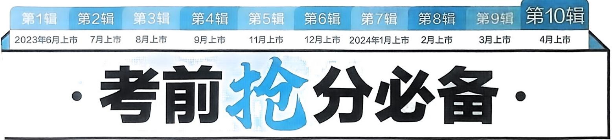

<details>
<summary>text_image</summary>

第1辑 第2辑 第3辑 第4辑 第5辑 第6辑 第7辑 第8辑 第9辑 第10辑
2023年6月上市 7月上市 8月上市 9月上市 11月上市 12月上市 2024年1月上市 2月上市 3月上市 4月上市
· 考前抢分必备 ·
</details>

# 约名师 张健

北京市特级教师，人民教育出版社高中数学A版教材培训专家，首师大硕士生教学实践指导老师。

在《数学通报》等刊物上发表论文120多篇，主持并完成省市、区级课题五项，主编、参编高中教辅20多本。

册编委

张健

滕文秀

孙士放

赵成海

党宇飞

王勇

王博渊

杨建松 杨飞

汤小梅

陈玉兰

杜晓霞

王常青

陈靖逸

# 攻略1 考前必背 超级结论·稳拿分

1 考前必背的42个教材必考结论 001  
2 考前必背的32个二级结论 022  
3 考前必记的 15 个抢分技法 029  
4 考前必记的 4 个万能模型 036  
5 考前必知的12个函数图象结论 039

# 攻略2 考前必纠知识误区·避失分

1 考前必辨的 12 组相近易混概念 041  
2 考前必纠的7个易忽视细节 043   
3 考前必纠的4个思维误区 045

# 攻略3 考前必会解题大招·抓大分

考前必会的8个选填题快解大招 046

大招1 赋值法秒杀抽象函数求值 046

大招2 巧取特殊值，速排选择题错误项 049

大招3 二级结论法秒杀焦点三角形问题 052

大招4 构造法另辟蹊径，速解不等式或最值问题 055

大招5 泰勒公式法速解比大小问题 058

大招6 投影法速解向量的数量积问题 060

大招7 数形结合法扫除代数运算障碍 062

大招8 “析、寻、验”三步法快解开放性填空题 064

考前必会的4个解答题速破大招 066

大招1 创新数列交汇问题的速破策略 066

大招2 空间几何体中空间角的速破策略 069

大招3 函数不等式问题的速破策略 071

大招4 圆锥曲线创新问题的速破策略 074

# 攻略4 考前必破创新题型·冲高分

考前必破的3类新定义题 076

题型1 知识迁移新定义题 076

题型2 学科融合新定义题 078

题型3 高等数学新定义题 080

考前必破的3个创新考法 083

考法1 浸润数学文化，考查素养 083

考法2 注重知识交汇，提升能力 085

考法3 适当开放探究，强调灵活 088

# 攻略5 考前必做仿真原创定心卷·拉开分

“8+3+3+5”模式标准卷 091

# 考前必背的 42个教材必考结论

抢分点1 与集合有关的5条必考结论

<table><tr><td>1</td><td>元素与子集的个数</td><td>若集合A有n(n∈N*)个元素,则A有2^n个子集,有(2^n-1)个真子集,有(2^n-2)个非空真子集.</td></tr><tr><td>2</td><td>摩根定律</td><td>C_U(A∪B)=(C_U A)∩(C_U B),C_U(A∩B)=(C_U A)∪(C_U B).</td></tr><tr><td>3</td><td>集合间的基本关系</td><td>A⊆B(A是B的子集) {A=B(A和B相等)⇔A⊆B且A⊇B,A∉B(A是B的真子集)⇔A⊆B且A≠B.</td></tr><tr><td>4</td><td>容斥原理</td><td>一般地,对任意两个有限集合A,B,有card(A∪B)=card(A)+card(B)-card(A∩B)(card(A)表示有限集合A中元素的个数),如图1.拓展:类比两个集合,可以得到三个集合的类似公式.card(A∪B∪C)=card(A)+card(B)+card(C)-card(A∩B)-card(B∩C)-card(A∩C)+card(A∩B∩C),如图2.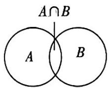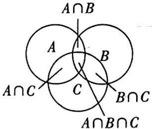图1 图2</td></tr><tr><td>5</td><td>易混的集合与其代表的意义</td><td>集合{x|f(x)&gt;0}表示不等式f(x)&gt;0的解集,集合{y|y=f(x)}表示函数y=f(x)的值域.</td></tr></table>

# 抢分点 2 充分、必要条件的 6 种类型与对应集合的关系

设 $p$ 包含的对象组成集合 $A, q$ 包含的对象组成集合 $B$ .

<table><tr><td>p是q的充分不必要条件</td><td>p⇒q且q⇒p</td><td>A∉B</td></tr><tr><td>p是q的必要不充分条件</td><td>p⇒q且q⇒p</td><td>B∉A</td></tr><tr><td>p是q的充要条件</td><td>p⇔q</td><td>A=B</td></tr><tr><td>p是q的既不充分也不必要条件</td><td>p⇒q且q⇒p</td><td>A,B互不包含</td></tr><tr><td>p是q的充分条件</td><td>p⇒q</td><td>A⊆B</td></tr><tr><td>p是q的必要条件</td><td>q⇒p</td><td>B⊆A</td></tr></table>

意符号
区别

# 抢分点3 全称量词命题与存在量词命题的否定

全称量词命题的否定是存在量词命题,存在量词命题的否定是全称量词命题,它们之间的关系如下表所示:

<table><tr><td>命题</td><td>命题的否定</td></tr><tr><td>∀x∈M,p(x)</td><td>∃x∈M,¬p(x)</td></tr><tr><td>∃x∈M,p(x)</td><td>∀x∈M,¬p(x)</td></tr></table>

全称量词命题经常省略量词,因此,在写这类命题的否定时,应先确定其中的全称量词,再改写量词和否定结论.

# 抢分点4 基本不等式

# 1. 基本不等式

如果 $a > 0, b > 0$ ，那么 $\sqrt{ab} \leqslant \frac{a + b}{2}$ ，当且仅当 $a = b$ 时等号成立.

基本不等式表明:两个正数的算术平均数不小于它们的几何平均数.

实际上,对于任意一组正实数,其算术平均数不小于它们的几何平均数.

# 2. 基本不等式的 4 种形式

<table><tr><td>1</td><td>根式形式</td><td>a+b≥2√ab(a&gt;0,b&gt;0),当且仅当a=b时,等号成立.【临考谨记】利用基本不等式求最值,一定要注意“一正、二定、三相等”缺一不可</td></tr><tr><td>2</td><td>整式形式</td><td>ab≤(a+b/2)2(a,b∈R),a2+b2≥2ab(a,b∈R),(a+b)2≥4ab(a,b∈R),(a+b)/22(a,b∈R),以上不等式当且仅当a=b时,等号成立.</td></tr><tr><td>3</td><td>分式形式</td><td>b/a+a/b≥2(ab&gt;0),当且仅当a=b时,等号成立.</td></tr><tr><td>4</td><td>倒数形式</td><td>a+1/a≥2(a&gt;0),当且仅当a=1时,等号成立;a+1/a≤-2(a&lt;0),当且仅当a=-1时,等号成立.</td></tr></table>

# 3. 最值定理

已知 $x, y$ 都是正数, 如果 $xy$ 等于定值 $P$ , 那么当 $x = y$ 时, $x + y$ 取最小值 $2\sqrt{P}$ ; 如果 $x + y$ 等于定值 $S$ , 那么当 $x = y$ 时, $xy$ 取最大值 $\frac{1}{4} S^2$ . 可简记为: 积定和最小, 和定积最大.

# 冲分有道

小编说:临近考试,相信同学们对知识掌握已经够了“火候”,但是我们还需要注意考前这一段时间复习、答题的习惯,保证考试当天能够完全进入状态,火力全开,百分百投入.

# 抢分点5 不等式的7个基本性质

<table><tr><td>性质1</td><td>如果a&gt;b,那么b</td></tr><tr><td>性质2</td><td>如果a&gt;b,b&gt;c,那么a&gt;c.即a&gt;b,b&gt;c⇒a&gt;c.</td></tr><tr><td>性质3</td><td>如果a&gt;b,那么a+c&gt;b+c.</td></tr><tr><td>性质4</td><td>如果a&gt;b,c&gt;0,那么ac&gt;bc;如果a&gt;b,c&lt;0,那么ac</td></tr><tr><td>性质5</td><td>如果a&gt;b,c&gt;d,那么a+c&gt;b+d.</td></tr><tr><td>性质6</td><td>如果a&gt;b&gt;0,c&gt;d&gt;0,那么ac&gt;bd.</td></tr><tr><td>性质7</td><td>如果a&gt;b&gt;0,那么an&gt;bn(n∈N,n≥2).</td></tr></table>

# 抢分点6 三个“二次”间的关系

<table><tr><td>设关于x的方程ax2+bx+c=0(a&gt;0)的根的判别式Δ=b2-4ac</td><td>Δ&gt;0</td><td>Δ=0</td><td>Δ&lt;0</td></tr><tr><td>二次函数y=ax2+bx+c(a&gt;0)的图象</td><td>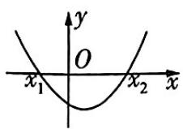</td><td>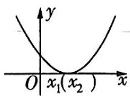</td><td>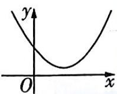</td></tr><tr><td>一元二次方程ax2+bx+c=0(a&gt;0)的根</td><td>有两个不相等的实数根x1,x2(x1有两个相等的实数根x1=x2=-b/2a没有实数根</td><td>有两个相等的实数根x1=x2=-b/2a</td><td>没有实数根</td></tr><tr><td>ax2+bx+c&gt;0(a&gt;0)的解集</td><td>{x|xx2}</td><td>{x|x≠-b/2a}</td><td>R</td></tr><tr><td>ax2+bx+c&lt;0(a&gt;0)的解集</td><td>{x|x1∅∅</td><td>∅</td><td>∅</td></tr></table>

# 抢分点7 有关函数单调性的5条常用结论

<table><tr><td>1</td><td>加常数变换</td><td>函数f(x)与函数f(x)+c(c为常数)具有相同的单调性.</td></tr><tr><td>2</td><td>乘系数变换</td><td>当k&gt;0(k&lt;0)时,函数f(x)与函数kf(x)单调性相同(相反).</td></tr><tr><td>3</td><td>取倒数变换</td><td>若f(x)恒为正值或恒为负值,则f(x)与1/f(x)具有相反的单调性.</td></tr><tr><td>4</td><td>相加、减变换</td><td>在公共定义域内,“增+增=增”,“减+减=减”,“增-减=增”,“减-增=减”.</td></tr><tr><td>5</td><td>复合函数</td><td>“同增异减”,对于复合函数y=f(g(x)),令u=g(x),若g(x)在[a,b]上,f(u)在[g(a),g(b)]上单调且单调性一致(单调性相反),则y=f(g(x))单调递增(单调递减).</td></tr></table>

冲分有道

# 抢分点8 有关函数奇偶性的4条常用结论

<table><tr><td>1</td><td>y=f(x)(x∈A)为奇函数⇔定义域A关于原点对称且f(x)=-f(-x);y=f(x)(x∈A)为偶函数⇔定义域A关于原点对称且f(x)=f(-x).</td></tr><tr><td>2</td><td>如果奇(偶)函数f(x)在区间[a,b](0≤a&lt; b)上具有单调性,那么f(x)在[-b,-a]上具【提示】[a,b],[-b,-a]为合于f(x)的定义域有相同(反)的单调性.</td></tr><tr><td>3</td><td>定义在R上的函数f(x)总可以表示为一个奇函数g(x)与一个偶函数h(x)之和,其中g(x)=f(x)-f(-x)/2,h(x)=f(x)+f(-x)/2.</td></tr><tr><td>4</td><td>f&#x27;(x)&gt;0(&lt;0)是可导函数f(x)在区间(a,b)内单调递增(减)的充分不必要条件.f&#x27;(x)≥0(≤0)是可导函数f(x)在区间(a,b)内单调递增(减)的必要不充分条件.【临考谨记】由可导函数f(x)在区间(a,b)内单调递增(减)可得f&#x27;(x)≥0(≤0)在该区间内恒成立.这里的“=”不能少,必要时还需对“=”成立的情况进行检验若f&#x27;(x)在区间(a,b)的任意子区间内都不恒等于零,则f&#x27;(x)≥0(≤0)是可导函数f(x)在区间(a,b)内单调递增(减)的充要条件.</td></tr></table>

# 抢分点9 有关函数周期性的8条常用结论

<table><tr><td>1</td><td>设函数f(x)的最小正周期为T(T&gt;0),则除±nT(n=1,2,···)以外,函数f(x)无其他周期.</td></tr><tr><td>2</td><td>设周期函数f(x)的最小正周期为T(T&gt;0),则f(λx)(λ≠0)的最小正周期为T/|λ|.</td></tr><tr><td>3</td><td>若u=g(x)是周期函数,f(u)是任意函数,则f(g(x))也是周期函数.</td></tr><tr><td>4</td><td>若f(x+a)=f(x+b),则f(x)的周期T=b-a,其中a≠0,b≠0,a≠b.</td></tr><tr><td>5</td><td>若f(x+a)=-f(x),则f(x)的周期T=2a,其中a≠0.</td></tr><tr><td>6</td><td>若f(x+a)=±c/f(x)(c为常数),则f(x)的周期T=2a,其中a≠0,c≠0.</td></tr><tr><td>7</td><td>若f(x+a)=1-f(x)/1+f(x),则f(x)的周期T=2a,其中a≠0;若f(x+a)=1+f(x)/1-f(x),则f(x)的周期T=4a,其中a≠0.</td></tr><tr><td>8</td><td>函数f(x)满足f(a+x)=±f(a-x),f(b+x)=±f(b-x)(a≠b),若两式同号,则f(x)是以2|b-a|为周期的周期函数;若两式不同号,则f(x)是以4|b-a|为周期的周期函数.</td></tr></table>

# 冲分有道

# 抢分点10 有关函数图象的7个结论

<table><tr><td>1</td><td>函数  $y=f(x)$  的图象与其反函数  $y=f^{-1}(x)$  的图象关于直线  $y=x$  对称.</td></tr><tr><td>2</td><td>函数  $y=f(x)$  的图象与函数  $y=f(-x)$  的图象关于  $y$  轴对称,函数  $y=f(x)$  的图象与函数  $y=-f(x)$  的图象关于  $x$  轴对称.</td></tr><tr><td>3</td><td>函数  $y=f(x)$  的图象与函数  $y=-f(-x)$  的图象关于原点对称,函数  $y=f(x)$  的图象与函数  $y=-f^{-1}(-x)$  的图象关于直线  $y=-x$  对称.</td></tr><tr><td>4</td><td>函数  $y=f(x)$  的图象关于直线  $x=a$  对称 $\Leftrightarrow f(a-x)=f(a+x)\Leftrightarrow f(2a-x)=f(x)$ .</td></tr><tr><td>5</td><td>函数  $y=f(x)$  的图象关于点  $(a,0)$  对称 $\Leftrightarrow f(a-x)=-f(a+x)\Leftrightarrow f(2a-x)=-f(x)$ .</td></tr><tr><td>6</td><td>函数  $y=f(x)$  的图象关于直线  $x=\frac{a+b}{2}$  对称 $\Leftrightarrow f(a+mx)=f(b-mx)(m\neq0)\Leftrightarrow f(a+b-mx)=f(mx)(m\neq0)$ .</td></tr><tr><td>7</td><td>函数  $y=f(mx-a)(m\neq0)$  的图象与函数  $y=f(b-mx)$  的图象关于直线  $x=\frac{a+b}{2m}$  对称.</td></tr></table>

# 抢分点11 5组基本初等函数的导数公式

<table><tr><td>1</td><td> $c' = 0$ (c为常数).</td></tr><tr><td>2</td><td> $(x^n)' = nx^{n-1} (n \in \mathbf{Q}^*)$ ,高频使用: $(\frac{1}{x})' = (x^{-1})' = -\frac{1}{x^2}.$ </td></tr><tr><td>3</td><td> $(\sin x)' = \cos x, (\cos x)' = -\sin x.$ </td></tr><tr><td>4</td><td> $(\log_a x)' = \frac{1}{x \ln a} (x > 0, a > 0 \text{且 } a \neq 1), (\ln x)' = \frac{1}{x} (x > 0).$ </td></tr><tr><td>5</td><td> $(a^x)' = a^x \ln a (a > 0 \text{且 } a \neq 1), (e^x)' = e^x.$ </td></tr></table>

# 抢分点12 4个导数的运算法则

<table><tr><td>1</td><td>作和、差后求导</td><td>[f(x)±g(x)]&#x27; =f&#x27;(x) ±g&#x27;(x).推广: [f1(x) ±f2(x) ±··· ±fn(x)]&#x27; =f&#x27;1(x) ±f&#x27;2(x) ±··· ±fn&#x27;(x).</td></tr><tr><td>2</td><td>作积后求导</td><td>[f(x)g(x)]&#x27; =f&#x27;(x)g(x) + f(x)g&#x27;(x).特别地, [cf(x)]&#x27; =cf&#x27;(x), c为常数.</td></tr><tr><td>3</td><td>作商后求导</td><td>[ f(x)/g(x)]&#x27; = f&#x27;(x)g(x) - f(x)g&#x27;(x) / [g(x)]2 (g(x)≠0).特别地, [ 1/g(x)]&#x27; = -g&#x27;(x) / [g(x)]2 (g(x)≠0).</td></tr></table>

# 冲分有道

回归课本 每年高考的题目虽然都不一样,但是万变不离其宗,考查的知识点不会脱离课本. 只有透彻理解课本例题、习题涵盖的知识和解题方法,才能以不变应万变.

续表

<table><tr><td>4</td><td>复合函数的求导法则</td><td>复合函数y=f(g(x))的导数为yx′=[f(g(x))]′=f&#x27;(u)g&#x27;(x),其中u=g(x).【同增异减】进行换元的函数u=g(x)是内函数,y=f(u)是外函数,若内、外函数单调性相同,则原函数为增函数;若相反,则原函数为减函数</td></tr></table>

# 抢分点13 同角三角函数的基本关系式

<table><tr><td>1</td><td>商的关系</td><td> $\frac{\sin \alpha}{\cos \alpha} = \tan \alpha, \frac{\cos \alpha}{\sin \alpha} = \cot \alpha, \tan \alpha = \frac{1}{\cot \alpha}.$ </td></tr><tr><td>2</td><td>平方关系</td><td> $\sin^{2}\alpha + \cos^{2}\alpha = 1.$ </td></tr><tr><td>3</td><td>常见变形</td><td> $\sin^{2}\alpha = 1 - \cos^{2}\alpha, \cos^{2}\alpha = 1 - \sin^{2}\alpha, \sin \alpha = \pm \sqrt{1 - \cos^{2}\alpha}, \cos \alpha = \pm \sqrt{1 - \sin^{2}\alpha}, \sin \alpha = \cos \alpha \tan \alpha, \cos \alpha = \frac{\sin \alpha}{\tan \alpha}, \sin^{2}\alpha = \frac{\sin^{2}\alpha}{\sin^{2}\alpha + \cos^{2}\alpha} = \frac{\tan^{2}\alpha}{\tan^{2}\alpha + 1}, 1 + \tan^{2}\alpha = \frac{1}{\cos^{2}\alpha}.$ 【说明】以上所有关系式中,只要是同一个角,关系就成立,不拘泥于角的形式,如 $\sin^{2}(\alpha + \frac{\pi}{3}) + \cos^{2}(\alpha + \frac{\pi}{3}) = 1, \tan 3\alpha = \frac{\sin 3\alpha}{\cos 3\alpha}$ 等都成立,但 $\sin^{2}(\alpha + \frac{\pi}{3}) + \cos^{2}(\alpha + \frac{\pi}{6}) = 1$ 就不一定成立</td></tr></table>

# 抢分点14 三角函数的诱导公式

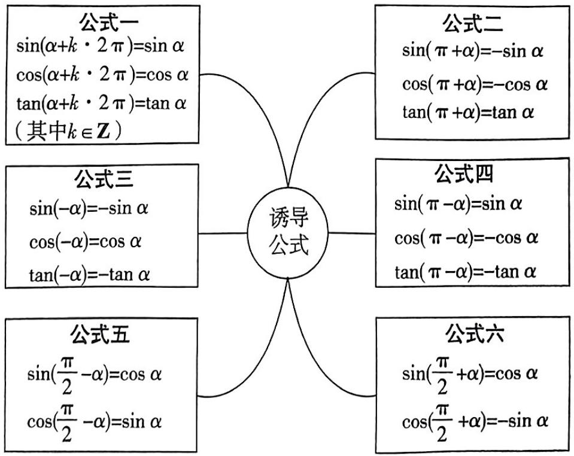

<details>
<summary>flowchart</summary>

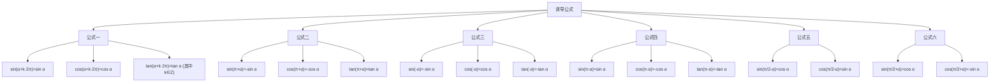
</details>

记忆口诀:奇变偶不变,符号看象限.

【口诀解读】公式中除 $\alpha$ 以外的角是 $\frac{\pi}{2}$ 的奇数倍则变, 是 $\frac{\pi}{2}$ 的偶数倍则不变, 变是指函数名称的变化。号右边的符号是把 $\alpha$ 看成锐角时等号左边的函数值的符号

# 冲分有道

抓住课堂 临近高考,一些学生很容易出现上课不愿意听老师讲、喜欢自己复习的情况,其实这是不正确的.

# 抢分点15 三角函数中常用的5组公式

<table><tr><td>1</td><td>二倍角公式</td><td> $\sin 2\alpha = 2\sin \alpha \cos \alpha,$ 【诀窍】若记不住二倍角公式,可根据两角和的正弦、余弦、正切公式,从α=β的特殊情况进行推导 $\cos 2\alpha = \cos^{2}\alpha - \sin^{2}\alpha = 2\cos^{2}\alpha - 1 = 1 - 2\sin^{2}\alpha,$  $\tan 2\alpha = \frac{2\tan \alpha}{1 - \tan^{2}\alpha}.$ 由二倍角公式可以得到: $1 + \sin 2\alpha = (\sin \alpha + \cos \alpha)^{2}$ , $1 - \sin 2\alpha = (\sin \alpha - \cos \alpha)^{2}.$ </td></tr><tr><td>2</td><td>半角公式</td><td> $\sin \frac{\alpha}{2} = \pm \sqrt{\frac{1 - \cos \alpha}{2}}, \cos \frac{\alpha}{2} = \pm \sqrt{\frac{1 + \cos \alpha}{2}},$ 【提醒】若已知角α的范围,可先求出 $\frac{\alpha}{2}$ 的范围,然后根据 $\frac{\alpha}{2}$ 的范围来确定三角函数值的符号;若没有给出决定三角函数值的符号的条件,则需保留正、负两个符号 $\tan \frac{\alpha}{2} = \pm \sqrt{\frac{1 - \cos \alpha}{1 + \cos \alpha}} = \frac{\sin \alpha}{1 + \cos \alpha} = \frac{1 - \cos \alpha}{\sin \alpha}.$ </td></tr><tr><td>3</td><td>三倍角公式</td><td> $\sin 3\theta = 3\sin \theta - 4\sin^{3}\theta, \cos 3\theta = 4\cos^{3}\theta - 3\cos \theta, \tan 3\theta = \frac{3\tan \theta - \tan^{3}\theta}{1 - 3\tan^{2}\theta}.$ </td></tr><tr><td>4</td><td>万能公式</td><td> $\sin \theta = \frac{2\tan \frac{\theta}{2}}{1 + \tan^{2} \frac{\theta}{2}}, \cos \theta = \frac{1 - \tan^{2} \frac{\theta}{2}}{1 + \tan^{2} \frac{\theta}{2}}, \tan \theta = \frac{2\tan \frac{\theta}{2}}{1 - \tan^{2} \frac{\theta}{2}}$ ,其中 $\theta \neq 2k\pi + \pi$ ,且 $\theta \neq \frac{\pi}{2} + k\pi, k \in \mathbb{Z}.$ </td></tr><tr><td>5</td><td>辅助角公式</td><td> $y = a\sin x + b\cos x = \sqrt{a^{2} + b^{2}} (\sin x\cos \varphi + \cos x\sin \varphi) = \sqrt{a^{2} + b^{2}}\sin(x + \varphi)$ ,其中角φ的终边所在象限由a,b的符号确定,角φ的值由 $\tan \varphi = \frac{b}{a} (a \neq 0)$ 确定.常见的辅助角公式: $\sin x \pm \cos x = \sqrt{2}\sin(x \pm \frac{\pi}{4})$ , $\cos x \pm \sin x = \sqrt{2}\cos(x \mp \frac{\pi}{4})$ , $\sin x \pm \sqrt{3}\cos x = 2\sin(x \pm \frac{\pi}{3})$ , $\cos x \pm \sqrt{3}\sin x = 2\cos(x \mp \frac{\pi}{3})$ , $\sqrt{3}\sin x \pm \cos x = 2\sin(x \pm \frac{\pi}{6})$ , $\sqrt{3}\cos x \pm \sin x = 2\cos(x \mp \frac{\pi}{6}).$ </td></tr></table>

# 冲分有道

认真听讲 临考前,更要认真听老师讲课,在这个阶段,老师的授课会更有目的性和策略性,既有可能在引导你联系不同的知识点,也有可能在反复强调易混、易错的知识点.

# 抢分点16 正弦、余弦、正切函数的图象与性质

<table><tr><td>函数</td><td>y=sin x</td><td>y=cos x</td><td>y=tan x</td></tr><tr><td>奇偶性</td><td>奇函数</td><td>偶函数</td><td>奇函数</td></tr><tr><td rowspan="2">图象</td><td rowspan="2">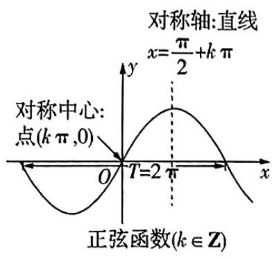</td><td>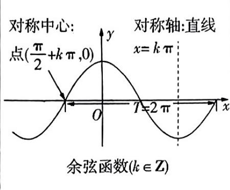</td><td>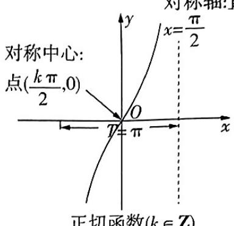直线</td></tr><tr><td></td><td>正方形x(x,y)</td></tr></table>

# 抢分点 17 三角函数的图象变换

由函数 $y = \sin x$ 的图象变换得到 $y = A\sin (\omega x + \varphi)(A > 0, \omega > 0)$ 的图象的两种方法如下.

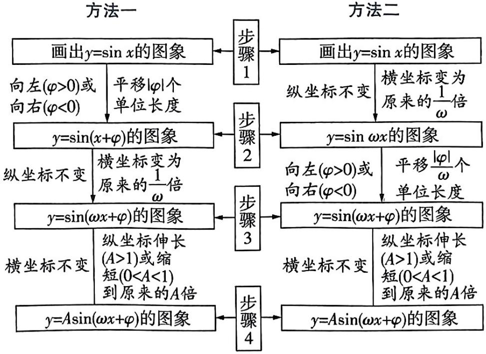

<details>
<summary>flowchart</summary>

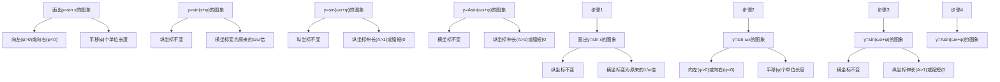
</details>

<table><tr><td>A叫作振幅</td></tr><tr><td>T=2π/ω叫作函数的最 小正周期</td></tr><tr><td>f=1/T叫作频率</td></tr><tr><td>ωx+φ叫作相位</td></tr><tr><td>φ叫作初相</td></tr></table>

# 冲分有道

限时训练 可以找一组题,限时完成,也可以找一道大题,限时完成.这样主要是创设一种考试情境,锻炼自己在时间紧张状态下的思维能力.

# 抢分点18 正、余弦定理及其变形

在 $\triangle ABC$ 中，角 $A, B, C$ 所对的边分别是 $a, b, c, R$ 为 $\triangle ABC$ 的外接圆半径.

<table><tr><td>定理</td><td>正弦定理(已知两角一边或两边及其中一边的对角)</td><td rowspan="3">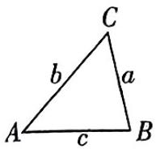</td><td>余弦定理(已知三边或两边及其夹角)</td></tr><tr><td>内容</td><td> $\frac{a}{\sin A}=\frac{b}{\sin B}=\frac{c}{\sin C}=2R.$ 变式: $\frac{\sin A}{a}=\frac{\sin B}{b}=\frac{\sin C}{c}$ .</td><td> $a^2=b^2+c^2-2bccos A,b^2=a^2+c^2-2accos B,c^2=a^2+b^2-2abcos C.$ </td></tr><tr><td>常见变形</td><td>(1)边化角: $a=2Rsin A,b=2Rsin B,c=2Rsin C$ .(2)角化边: $\sin A=\frac{a}{2R},\sin B=\frac{b}{2R},\sin C=\frac{c}{2R}$ .(3)求比值: $a:b:c=\sin A:\sin B:\sin C$ .</td><td>求角或角化边: $\cos A=\frac{b^2+c^2-a^2}{2bc},\cos B=\frac{a^2+c^2-b^2}{2ac},\cos C=\frac{a^2+b^2-c^2}{2ab}$ .</td></tr><tr><td>定理整合</td><td colspan="3">正、余弦定理整合:在△ABC中, $\sin^2A=\sin^2B+\sin^2C-2sin Bsin Ccos A$ .此公式主要用于求值.如: $\sin^221^\circ+\sin^239^\circ+\sin 21^\circ\sin 39^\circ=\sin^221^\circ+\sin^239^\circ-2sin 21^\circ\sin 39^\circ\cos 120^\circ=\sin^2120^\circ=\frac{3}{4}$ .</td></tr><tr><td colspan="4">解三角形的常用方法:边化角、角化边,两角化一角、一角化两角等.</td></tr></table>

# 抢分点19 平面向量数量积的有关结论

已知非零向量 $\boldsymbol{a}=(x_{1},y_{1}),\boldsymbol{b}=(x_{2},y_{2}),\theta$ 为向量 a,b 的夹角.

<table><tr><td>名称</td><td>几何表示</td><td>坐标表示</td></tr><tr><td>模</td><td>|a|=√a·a</td><td>|a|=√x12+y12</td></tr><tr><td>数量积</td><td>a·b=|a||b|cos θ</td><td>a·b=x1x2+y1y2</td></tr><tr><td>夹角的余弦值</td><td>cos θ=a·b/|a||b|</td><td>cos θ=x1x2+y1y2/√x12+y12·√x2+y22</td></tr><tr><td>a⊥b的充要条件</td><td>a·b=0</td><td>x1x2+y1y2=0</td></tr><tr><td>|a·b|与|a||b|的关系</td><td>|a·b|≤|a||b|(当且仅当a与b共线时等号成立)</td><td>|x1x2+y1y2|≤√x12+y12·√x2+y22(当且仅当x1y2=x2y1时等号成立)</td></tr></table>

冲分有道

学会总结 应当把每一次练习当成巩固知识、训练技能、提高能力的一次好机会. 学会总结,重视总结,寻找规律.

# 抢分点20 三角形“四心”的向量表示

已知 H, G, O, I 是 $\triangle ABC$ 所在平面上的任意点, a, b, c 分别为三个内角 A, B, C 所对的边.

<table><tr><td>1</td><td>H为垂心⇔HA·HB=HB·HC=HC·HA.</td></tr><tr><td>2</td><td>G为重心⇔GA+GB+GC=0.</td></tr><tr><td>3</td><td>O为外心⇔(OA+OB)·AB=(OB+OC)·BC=(OC+OA)·CA=0.</td></tr><tr><td>4</td><td>I为内心⇔a IA+b IB+c IC=0.</td></tr></table>

# 抢分点 21 求三角形面积的 4 个公式

已知 $\triangle ABC$ 的三个内角 $A, B, C$ 所对的边分别为 $a, b, c, \triangle ABC$ 的面积记为 $S_{\triangle ABC}$ .

<table><tr><td>1</td><td> $S_{\triangle ABC} = \frac{1}{2}ah_a = \frac{1}{2}bh_b = \frac{1}{2}ch_c, h_a, h_b, h_c$ 分别表示a,b,c边上的高.</td></tr><tr><td>2</td><td> $S_{\triangle ABC} = \frac{1}{2}absin C = \frac{1}{2}bcsin A = \frac{1}{2}acsin B = \frac{abc}{4R} = \frac{(a+b+c)r}{2}, R, r$ 分别是△ABC外接圆、内切圆的半径.</td></tr><tr><td>3</td><td>海伦公式: $S_{\triangle ABC} = \sqrt{p(p-a)(p-b)(p-c)}$ ,其中 $p = \frac{a+b+c}{2}$ .</td></tr><tr><td>4</td><td> $S_{\triangle ABC} = \frac{1}{2} | \overrightarrow{AB} | | \overrightarrow{AC} | \sin A = \frac{1}{2} \sqrt{(|\overrightarrow{AB}| |\overrightarrow{AC}|)^2 (1 - \cos^2 A)} = \frac{1}{2}\sqrt{(|\overrightarrow{AB}| |\overrightarrow{AC}|)^2 - (\overrightarrow{AB} \cdot \overrightarrow{AC})^2} = \frac{1}{2}\sqrt{(x_1^2 + y_1^2)(x_2^2 + y_2^2) - (x_1 x_2 + y_1 y_2)^2} = \frac{1}{2}\sqrt{(x_1 y_2 - x_2 y_1)^2} = \frac{1}{2}|x_1 y_2 - x_2 y_1|,其中\( \overrightarrow{AB} = (x_1, y_1), \overrightarrow{AC} = (x_2, y_2)$ .</td></tr></table>

# 抢分点22 复数的三角表示

<table><tr><td>1</td><td>复数的三角表示式</td><td>一般地,任何一个复数z=a+bi都可以表示成r(cosθ+isinθ)的形式,其中,r是复数z的模;θ是以x轴的非负半轴为始边,向量OZ(OZ=(a,b))所在射线(射线OZ)为终边的角,叫作复数z的辐角.r(cosθ+isinθ)叫作复数z【敲黑板】在0≤θ&lt;2π范围内的辐角θ的值为辐角的主值,通常记作argz,即0≤argz&lt;2π,如arg1=0,arg(-i)=3π的三角表示式,简称三角形式.</td></tr></table>

# 冲分有道

续表

<table><tr><td>2</td><td>复数乘、除运算的三角表示</td><td>设z1=r1(cos θ1+isin θ1),z2=r2(cos θ2+isin θ2),则r1(cos θ1+isin θ1)·r2(cos θ2+isin θ2)=r1r2[cos(θ1+θ2)+isin(θ1+θ2)].【换个说法】两个复数相乘,积的模等于各复数模的积,积的辐角等于各复数辐角的和若z2≠0,则有r1(cos θ1+isin θ1)/r2(cos θ2+isin θ2)=r1/r2[cos(θ1-θ2)+isin(θ1-θ2)].【换个说法】两个复数相除,商的模等于被除数的模除以除数的模所得的商,商的辐角等于被除数的辐角减去除数的辐角所得的差</td></tr></table>

# 抢分点23 3个常见数列的通项公式与前 $n$ 项和公式

<table><tr><td>1</td><td>等差数列{an}</td><td>通项公式: an=a1+(n-1)d=dn+a1-d(n∈N*).前n项和公式:Sn=n(a1+an)/2=na1+n(n-1)/2d=d/2n2+(a1-1/2d)n.【拓展】Sn/n=a1+(n-1)·d/2,所以|Sn/n|是公差为d/2的等差数列</td></tr><tr><td>2</td><td>等比数列{an}</td><td>通项公式: an=a1qn-1=a1/qqn(n∈N*,q≠0).前n项和公式: Sn=a1(1-qn)/1-q/1-q/1-q, q≠1,na1,q=1.</td></tr><tr><td>3</td><td>等比差数列</td><td>通项公式形如 an=(an+b)qn(a,q为非零实数,b为常数,q≠1)的数列为等比差数列.与等比差数列有关的问题,往往是给出通项公式,求前n项和,破解的方法一般是错位相减法.</td></tr></table>

# 抢分点24 等差数列及其前 $n$ 项和的8条性质

已知等差数列 $\{a_{n}\}$ 的公差为 $d$ ，前 $n$ 项和为 $S_{n}$

<table><tr><td>1</td><td>若a,A,b成等差数列,则A叫作a,b的等差中项,A=a+b/2.</td></tr><tr><td>2</td><td>若m+n=p+q(m,n,p,q∈N*),则am+an=ap+aq.</td></tr></table>

# 冲分有道

做易错题 考前这一段时间,对于易错题,更是需要花大量精力去复习,不但要对错题进行反思总结,还要回归课本,找出相应的知识点,进一步巩固.

续表

<table><tr><td>3</td><td>若m,p,n成等差数列,则am,ap,an也成等差数列,即若m+n=2p,则am+an=2ap.</td></tr><tr><td>4</td><td>ak,ak+m,ak+2m,···(k,m∈N*)是公差为md的等差数列.</td></tr><tr><td>5</td><td>数列Sm,S2m-Sm,S3m-S2m,··也是等差数列(公差为m2d,m∈N*).</td></tr><tr><td>6</td><td>S2n-1=(2n-1)an.</td></tr><tr><td>7</td><td>若项数n为偶数,则S偶-S奇=nd/2;若项数n为奇数,则S奇-S偶=a(n+1/2).</td></tr><tr><td>8</td><td>项数有限的等差数列{an}的前m项与后m项的和等于m(a1+an)(m∈N*).</td></tr></table>

# 抢分点25 等比数列及其前 $n$ 项和的7条性质

已知等比数列 $\{a_{n}\}$ 的公比为 $q(q\neq 0)$ ，前 $n$ 项和为 $S_{n}$

<table><tr><td>1</td><td>若a,G,b成等比数列,则G叫作a,b的等比中项,G2=ab.</td></tr><tr><td>2</td><td>若m+n=p+q(m,n,p,q∈N*),则aman=apq.</td></tr><tr><td>3</td><td>若m,p,n成等差数列,则am,ap,an成等比数列,即若m+n=2p,则aman=ap2.</td></tr><tr><td>4</td><td>ak,ak+m,ak+2m,···(k,m∈N*)是公比为qm的等比数列.</td></tr><tr><td>5</td><td>当q≠-1,或q=-1且m(m∈N*)为奇数时,数列Sm,S2m-Sm,S3m-S2m,···是公比为qm的等比数列.</td></tr><tr><td>6</td><td>若Tn为等比数列{an}的前n项积,则Tm,T2m/Tm,T3m/T2m,···是公比为(qm)m的等比数列.</td></tr><tr><td>7</td><td>当项数为2n时,S偶/S奇=q;当项数为2n+1时,S奇-a1/S偶=q.</td></tr></table>

抢分点 26 6 组常见柱、锥、台体的表面积与体积公式

<table><tr><td></td><td>面积公式</td><td>体积公式</td><td>字母含义</td></tr><tr><td>圆柱</td><td> $S_{\text{底}} = \pi r^{2}, S_{\text{侧}} = 2\pi rh, S_{\text{表}} = 2\pi r (r + h)$ </td><td> $V = S_{\text{底}} \times \text{高} = \pi r^{2} h$ </td><td>r是底面半径,h是高</td></tr><tr><td>直棱柱</td><td> $S_{\text{侧}} = ch, S_{\text{表}} = S_{\text{侧}} + 2S_{\text{底}}$ </td><td> $V = S_{\text{底}} \times \text{高} = S_{\text{底}} h$ </td><td>c是底面周长,h是侧棱长</td></tr></table>

# 冲分有道

续表

<table><tr><td></td><td>面积公式</td><td>体积公式</td><td>字母含义</td></tr><tr><td>圆锥</td><td> $S_{\text{底}} = \pi r^2, S_{\text{侧}} = \pi rl, S_{\text{表}} = \pi r(r+l)$ </td><td> $V = \frac{1}{3}S_{\text{底}} \times \text{高} = \frac{1}{3}\pi r^2h$ </td><td>r是底面半径,l是母线长,h是高</td></tr><tr><td>正棱锥</td><td> $S_{\text{侧}} = \frac{1}{2}ch', S_{\text{表}} = S_{\text{侧}} + S_{\text{底}}$ </td><td> $V = \frac{1}{3}S_{\text{底}} \times \text{高} = \frac{1}{3}S_{\text{底}}h$ </td><td>c是底面周长,h&#x27;是斜高,即侧面等腰三角形底边上的高,h是高</td></tr><tr><td>圆台</td><td> $S_{\text{上底}} = \pi r'^2, S_{\text{下底}} = \pi r^2, S_{\text{侧}} = \pi l(r'+r), S_{\text{表}} = \pi (r'^2 + r^2 + r'l + rl)$ </td><td> $V = \frac{1}{3}h (S_{\text{上底}} + S_{\text{下底}} + \sqrt{S_{\text{上底}}S_{\text{下底}}}) = \frac{1}{3}\pi h (r^2 + r'^2 + rr')$ </td><td>r&#x27;,r分别是上、下底面半径,l是母线长,h是高</td></tr><tr><td>正棱台</td><td> $S_{\text{侧}} = \frac{1}{2}(c + c')h', S_{\text{表}} = S_{\text{侧}} + S_{\text{上底}} + S_{\text{下底}}$ </td><td> $V = \frac{1}{3}h (S_{\text{上底}} + S_{\text{下底}} + \sqrt{S_{\text{上底}}S_{\text{下底}}})$ </td><td>c&#x27;,c分别是上、下底面周长,h&#x27;是斜高,即侧面等腰梯形的高,h是高</td></tr></table>

【巧妙记忆】柱体、锥体、台体的体积公式之间的关系如下：

$$
V _ {\mathrm{粒体}} = S _ {\mathrm{底}} h \xleftarrow {S _ {\mathrm{上底}} = S _ {\mathrm{下底}}} V _ {\mathrm{台体}} = \frac {1}{3} h (S _ {\mathrm{上底}} + S _ {\mathrm{下底}} + \sqrt {S _ {\mathrm{上底}} S _ {\mathrm{下底}}}) \xrightarrow {S _ {\mathrm{上底}} = 0} V _ {\mathrm{锥体}} = \frac {1}{3} S _ {\mathrm{底}} h
$$

# 抢分点27 空间向量的坐标运算

设 $\boldsymbol{a}=(a_{1},a_{2},a_{3}),\boldsymbol{b}=(b_{1},b_{2},b_{3})$ .

<table><tr><td>1</td><td> $a + b = (a_1 + b_1, a_2 + b_2, a_3 + b_3), a - b = (a_1 - b_1, a_2 - b_2, a_3 - b_3),$  $a \cdot b = a_1 b_1 + a_2 b_2 + a_3 b_3.$ </td></tr><tr><td>2</td><td> $\lambda a = (\lambda a_1, \lambda a_2, \lambda a_3) (\lambda \in \mathbb{R}).$ </td></tr><tr><td>3</td><td> $a // b \Leftrightarrow a_1 = \lambda b_1, a_2 = \lambda b_2, a_3 = \lambda b_3 (b \neq 0, \lambda \in \mathbb{R}), a \perp b \Leftrightarrow a_1 b_1 + a_2 b_2 + a_3 b_3 = 0.$ </td></tr><tr><td>4</td><td> $|a| = \sqrt{a \cdot a} = \sqrt{a_1^2 + a_2^2 + a_3^2}.$ </td></tr><tr><td>5</td><td>点  $A(x_1, y_1, z_1), B(x_2, y_2, z_2)$  间的距离  $d = |\overrightarrow{AB}| = \sqrt{(x_2 - x_1)^2 + (y_2 - y_1)^2 + (z_2 - z_1)^2}.$ </td></tr><tr><td>6</td><td>夹角公式:  $\cos\langle a, b \rangle = \frac{a_1 b_1 + a_2 b_2 + a_3 b_3}{\sqrt{a_1^2 + a_2^2 + a_3^2} \cdot \sqrt{b_1^2 + b_2^2 + b_3^2}} (a \neq 0, b \neq 0).$ </td></tr></table>

# 抢分点28 利用空间向量求角和距离

<table><tr><td>1</td><td>异面直线a,b所成的角θ</td><td>cos θ=|cos(a,b)|= |a·b|/|a|·|b|,其中0°&lt;θ≤90°,a,b分别表示异面直线a,b的方向向量.</td></tr><tr><td>2</td><td>直线AB与平面α所成的角θ</td><td>sin θ=|cos(→AB,m)|= |AB·m|/|AB|·|m|,其中0°≤θ≤90°,m是平面α的法向量.</td></tr><tr><td>3</td><td>二面角α-l-β的平面角θ</td><td>|cos θ|=|cos(m,n)|= |m·n|/|m|·|n|,其中0°≤θ≤180°,m,n分别是平面α,β的【谨记】处理实际问题时,要根据具体图形确定二面角的平面角的大小:当θ为钝角时,cos θ=-|cos(m,n)|;当θ为锐角时,cos θ=|cos(m,n)|法向量.</td></tr><tr><td>4</td><td>点B到平面α的距离d</td><td>d=|AB·n|/|n|,其中n为平面α的法向量,A∈α,AB是平面α的一条斜线.</td></tr></table>

# 抢分点29 椭圆的标准方程及其几何性质

<table><tr><td colspan="2">标准方程</td><td>x2/a2+y2/b2=1(a&gt;b&gt;0)</td><td>y2/a2+x2/b2=1(a&gt;b&gt;0)</td></tr><tr><td colspan="2">图形</td><td>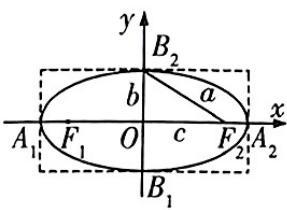</td><td>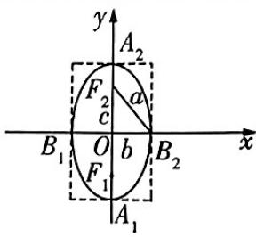</td></tr><tr><td rowspan="8">几何性质</td><td>范围</td><td>-a≤x≤a,-b≤y≤b</td><td>-b≤x≤b,-a≤y≤a</td></tr><tr><td>对称性</td><td colspan="2">对称轴:x轴,y轴.对称中心:原点</td></tr><tr><td>焦点</td><td>F1(-c,0),F2(c,0)</td><td>F1(0,-c),F2(0,c)</td></tr><tr><td>顶点</td><td>A1(-a,0),A2(a,0);B1(0,-b),B2(0,b)</td><td>A1(0,-a),A2(0,a);B1(-b,0),B2(b,0)</td></tr><tr><td>轴</td><td colspan="2">线段 A1A2,B1B2分别是椭圆的长轴和短轴,长轴长为2a,短轴长为2b</td></tr><tr><td>焦距</td><td colspan="2">|F1F2|=2c</td></tr><tr><td>离心率</td><td colspan="2">e=c/a,e∈(0,1)</td></tr><tr><td>a,b,c的关系</td><td colspan="2">c2=a2-b2</td></tr></table>

# 冲分有道


# 活学巧记

(1)焦点在 $x$ 轴上 $\Leftrightarrow$ 标准方程中 $x^{2}$ 项的分母较大, 焦点在 $y$ 轴上 $\Leftrightarrow$ 标准方程中 $y^{2}$ 项的分母较大, 因此由椭圆的标准方程判断焦点位置时, 要根据标准方程中分母的大小来判断, 简记为 “焦点位置看大小, 焦点随着大的跑”.  
(2)椭圆的离心率反映了焦点远离中心的程度, $e$ 的大小决定了椭圆的形状, 反映了椭圆的圆扁程度, $e$ 越大椭圆越扁, $e$ 越小椭圆越圆.

# 抢分点30 双曲线的标准方程及其几何性质

<table><tr><td colspan="2">标准方程</td><td>x2a2-y2b2=1(a&gt;0,b&gt;0)</td><td>y2a2-x2b2=1(a&gt;0,b&gt;0)</td></tr><tr><td colspan="2">图形</td><td>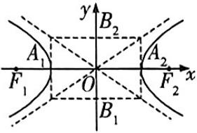</td><td>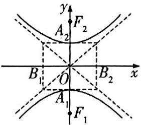</td></tr><tr><td rowspan="9">几何性质</td><td>范围</td><td>|x|≥a,y∈R</td><td>|y|≥a,x∈R</td></tr><tr><td>对称性</td><td colspan="2">对称轴:x轴,y轴.对称中心:原点</td></tr><tr><td>焦点</td><td>F1(-c,0),F2(c,0)</td><td>F1(0,-c),F2(0,c)</td></tr><tr><td>顶点</td><td>A1(-a,0),A2(a,0)</td><td>A1(0,-a),A2(0,a)</td></tr><tr><td>轴</td><td colspan="2">线段 A1A2,B1B2分别是双曲线的实轴和虚轴,实轴长为2a,虚轴长为2b</td></tr><tr><td>焦距</td><td colspan="2">|F1F2|=2c</td></tr><tr><td>离心率</td><td colspan="2">e=c/a,e∈(1,+∞)</td></tr><tr><td>渐近线</td><td>直线 y=±bx</td><td>直线 y=±a/bx</td></tr><tr><td>a,b,c的关系</td><td colspan="2">a2=c2-b2</td></tr></table>

# 冲分有道

寻找不足 阶段性测试可以帮助发现现阶段复习过程中存在的问题,及时找到自己的不足,这些问题可能是知识方面的、应试技巧方面的,也可能是应试心理方面的.

# 抢分点31 抛物线的标准方程及其几何性质

<table><tr><td colspan="2">标准方程</td><td>y2=2px(p&gt;0)</td><td>y2=-2px(p&gt;0)</td><td>x2=2py(p&gt;0)</td><td>x2=-2py(p&gt;0)</td></tr><tr><td colspan="2">图形</td><td>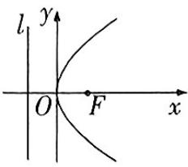</td><td>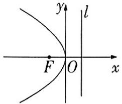</td><td>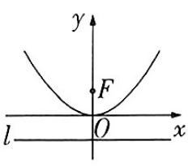</td><td>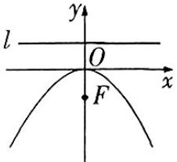</td></tr><tr><td rowspan="6">几何性质</td><td>对称轴</td><td colspan="2">x轴</td><td colspan="2">y轴</td></tr><tr><td>顶点</td><td colspan="4">O(0,0)</td></tr><tr><td>焦点</td><td>F(p/2,0)</td><td>F(-p/2,0)</td><td>F(0,p/2)</td><td>F(0,-p/2)</td></tr><tr><td>准线方程</td><td>x=-p/2</td><td>x=p/2</td><td>y=-p/2</td><td>y=p/2</td></tr><tr><td>范围</td><td>x≥0,y∈R</td><td>x≤0,y∈R</td><td>y≥0,x∈R</td><td>y≤0,x∈R</td></tr><tr><td>离心率</td><td colspan="4">e=1</td></tr><tr><td colspan="2">p的几何意义</td><td colspan="4">p的几何意义是抛物线焦点到准线的距离,对于方程y2=2px(p&gt;0),当x的值确定时,p值越大,|y|也越大,则抛物线的开口也越大,如图所示. 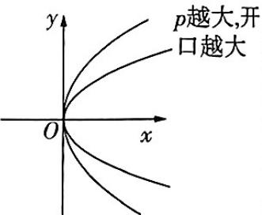</td></tr></table>

# 抢分点 32 直线与圆锥曲线相交的 4 个弦长公式

直线 $l$ 与圆锥曲线 $F(x, y) = 0$ 相交于 $A, B$ 两点（不重合），当直线 $l$ 的斜率存在且不为 0 时，弦长 $|AB|$ 的公式如下：

<table><tr><td>1</td><td>点的坐标的形式</td><td>|AB|=√(x1-x2)2+(y1-y2)2</td><td rowspan="4">弦端点A(x1,y1),B(x2,y2),l:y=kx+m,由{y=kx+m,F(x,y)=0消去y得到ax2+bx+c=0(a,b,c为参数),Δ&gt;0,α为直线AB的倾斜角.</td></tr><tr><td>2</td><td>含斜率和横坐标的形式</td><td>|AB|=√(1+k2)(x1-x2)2</td></tr><tr><td>3</td><td>含横坐标和倾斜角的形式</td><td>|AB|=|x1-x2|√1+tan2α</td></tr><tr><td>4</td><td>含纵坐标和倾斜角的形式</td><td>|AB|=|y1-y2|√1+tan2α</td></tr></table>

# 抢分点33 排列数与组合数的公式及性质

<table><tr><td>公式</td><td>(1)An=nm-1(n-2)···(n-m+1)=n/(n-m)! (n,m∈N*,m≤n). An=n!,规定0!=1.(2)Cm=Am/Am=nm-1(n-1)(n-2)···(n-m+1)/m! = n/m!(n,m∈N*,m≤n).特别地,C0n=1.</td></tr><tr><td>性质</td><td>(1)1An=nAm-1,n;2An=mAm-1+m-1+(2)1Cm=Cn-m,2Cm+n+Cm-1.</td></tr></table>

# 抢分点34 二项式定理

<table><tr><td>二项式定理</td><td> $(a+b)^{n}=C_{n}^{0}a^{n}+C_{n}^{1}a^{n-1}b+\cdots+C_{n}^{k}a^{n-k}b^{k}+\cdots+C_{n}^{n}b^{n}(n\in\mathbf{N}^{*},k\in\mathbf{N} \text{且} k\leqslant n).$ </td></tr><tr><td>二项展开式的通项</td><td> $T_{k+1}=C_{n}^{k}a^{n-k}b^{k}$ ,它表示展开式的第  $k+1$  项, $k=0,1,\cdots,n.$ </td></tr><tr><td>二项式系数</td><td>二项展开式中各项的二项式系数分别为  $C_{n}^{0},C_{n}^{1},C_{n}^{2},\cdots,C_{n}^{n}.$ </td></tr><tr><td>有关概念</td><td>牢记“常数项”“有理项”“系数最大的项”等概念.</td></tr></table>

# 抢分点 35 二项式系数的 3 个性质

<table><tr><td>对称性</td><td>当0≤k≤n(n∈N*,k∈N)时,Cn^k与C_n^{n-k}的关系是:C_n^k=C_n^{n-k}.</td></tr><tr><td>增减性与最大值</td><td>二项式系数先增后减,中间项的二项式系数最大.当n为偶数时,第n/2+1项的二项式系数最大,最大值为C_n^n;当n为奇数时,第n+1/2项和第n+3/2项的二项式系数最大,最大值为C_n^{n-1/2}(或C_n^{n+1/2}).</td></tr><tr><td>各二项式系数的和</td><td>各二项式系数的和:C_n^0+C_n^1+C_n^2+···+C_n^n=2^n.奇数项的二项式系数的和=偶数项的二项式系数的和=2^n-1,即C_n^0+C_n^2+···=C_n^1+C_n^3+···=2^n-1.</td></tr></table>

# 冲分有道

相信自己,挖掘潜能 不管你现在情况怎样,你都要相信自己还有巨大的潜能.你能坚持到最后,你就能笑到最后,而坚持到最后,就要求你必须具有坚定的意志.

# 抢分点 36 概率的 5 个基本性质

<table><tr><td>1</td><td>任何事件A的概率都在0与1之间,即0≤P(A)≤1.</td></tr><tr><td>2</td><td>若A⊆B,则P(A)≤P(B).</td></tr><tr><td>3</td><td>必然事件的概率为1,不可能事件的概率为0.</td></tr><tr><td>4</td><td>如果事件A与事件B互斥,则P(A∪B)=P(A)+P(B).【提醒】没有这个条件时,公式不成立</td></tr><tr><td>5</td><td>若事件A与事件B互为对立事件,则P(A)+P(B)=1.</td></tr></table>

# 抢分点 37 正态分布

<table><tr><td>1</td><td>正态曲线的特点(σ&gt;0)</td><td>1曲线位于x轴上方,与x轴不相交.2曲线是单峰的,它关于直线x=μ对称,曲线在x=μ处达到峰值 1/σ√2π.3曲线与x轴之间的区域面积总为1.4当σ一定时,曲线的位置由μ确定,曲线随着μ的变化而沿x轴平移.5当μ一定时,曲线的形状由σ确定,σ越小,曲线越“瘦高”,表示总体的分布越集中;σ越大,曲线越“矮胖”,表示总体的分布越分散.</td></tr><tr><td>2</td><td>3个常用的数据</td><td>1P(μ-σ≤X≤μ+σ)≈0.6827,2P(μ-2σ≤X≤μ+2σ)≈0.9545,3P(μ-3σ≤X≤μ+3σ)≈0.9973.</td></tr></table>

# 抢分点38 二项分布与超几何分布

<table><tr><td></td><td>二项分布</td><td>超几何分布</td></tr><tr><td>定义</td><td>一般地,在n重伯努利试验中,设每次试验中事件A发生的概率为p(0 &lt; p &lt; 1),用X表示事件A发生的次数,则X的分布列为P(X=k)=Cknp(k-1-p)n-k,k=0,1,2,...,n.如果随机变量X的分布列具有上述形式,则称随机变量X服从二项分布,记作X~B(n,p).</td><td>一般地,假设一批产品共有N件,其中有M件次品.从N件产品中随机抽取n件(不放回),用X表示抽取的n件产品中的次品数,则X的分布列为P(X=k)=CkMCn-k/Cn-k,m=m+1,...,r.其中n,N,M∈N*,M≤N,n≤N,m=max{0,n-N+M},r=min{n,M}.如果随机变量X的分布列具有上述形式,则称随机变量X服从超几何分布.</td></tr></table>

# 冲分有道

续表

<table><tr><td></td><td>二项分布</td><td>超几何分布</td></tr><tr><td>期望</td><td> $E(X) = np.$ </td><td> $E(X) = np$ ,其中  $p = \frac{M}{N}$ ,表示 N 件产品的次品率.</td></tr><tr><td>方差</td><td> $D(X) = np(1 - p).$ </td><td>不作要求.</td></tr></table>

# 抢分点 39

# 离散型随机变量的分布列、期望与方差的性质

<table><tr><td>1</td><td>分布列的性质</td><td>1pi≥0,i=1,2,···,n. 2∑i=1np_i=p_1+p_2+···+p_i+···+p_n=1. 3P(xi≤X≤x_j)=p_i+【用性质】可用来检查所列出的分布列是否才误,还可用来求分布列中的某些参数pi+1+···+pj (i</td></tr><tr><td>2</td><td>期望的性质</td><td>1E(k)=k(k为常数). 2E(aX+b)=aE(X)+b(a,b为常数). 3E(X1+X2)=E(X1)+E(X2). 4若随机变量 X1,X2对应的事件相互独立,则E(X1X2)=E(X1)E(X2).</td></tr><tr><td>3</td><td>方差的性质</td><td>1D(k)=0(k为常数). 2D(aX+b)=a2D(X)(a,b为常数). 3D(X)=E(X2)-[E(X)]2. 4若随机变量 X1,X2,···,Xn对应的事件两两独立,且都存在方差,则 D(X1+X2+···+Xn)=D(X1)+D(X2)+···+D(Xn).</td></tr></table>

# 抢分点 40

# 用样本的数字特征估计总体的数字特征

<table><tr><td></td><td>给出一组数据x1,x2,x3,···,xn</td><td>给出频率分布直方图</td></tr><tr><td>众数</td><td>在一组数据中,出现次数最多的数据叫作这组数据的众数.</td><td>最高矩形所在区间的中点的横坐标即众数.</td></tr></table>

冲分有道

续表

<table><tr><td></td><td>给出一组数据  $x_1, x_2, x_3, \cdots, x_n$ </td><td>给出频率分布直方图</td></tr><tr><td>中位数</td><td>将一组数据按从大到小或从小到大的顺序排列,把处在最中间的一个数据(或最中间两个数据的平均数)叫作这组数据的中位数.</td><td>中位数左边和右边的直方图的面积相等.</td></tr><tr><td>平均数</td><td> $\overline{x} = \frac{1}{n}(x_1 + x_2 + \cdots + x_n) = \frac{1}{n}\sum_{i=1}^{n}x_i$ .其中  $x_i$  是第  $i$  个样本数据, $n$  是样本容量.</td><td>等于图中每个小矩形的面积与小矩形底边中点的横坐标的乘积之和.</td></tr><tr><td>方差</td><td> $s^2 = \frac{1}{n}[(x_1 - \overline{x})^2 + (x_2 - \overline{x})^2 + \cdots + (x_n - \overline{x})^2] = \frac{1}{n}\sum_{i=1}^{n}(x_i - \overline{x})^2$ .</td><td>记频率分布直方图中有  $m$  个区间分组,各区间中点的横坐标分别为  $y_1, y_2, \cdots, y_m$ ,各区间对应的频率分别为  $p_1, p_2, \cdots, p_m, \overline{y}$  为样本数据的平均数,则  $s^2 = \sum_{i=1}^{m}(y_i - \overline{y})^2p_i$ .</td></tr><tr><td>标准差</td><td> $s = \sqrt{\frac{1}{n}[(x_1 - \overline{x})^2 + (x_2 - \overline{x})^2 + \cdots + (x_n - \overline{x})^2]} = \sqrt{\frac{1}{n}\sum_{i=1}^{n}(x_i - \overline{x})^2}$ .</td><td> $s = \sqrt{\sum_{i=1}^{m}(y_i - \overline{y})^2p_i}$ .</td></tr></table>

# 抢分点41 独立性检验

假设有两个分类变量 $X$ 和 $Y$ , 它们的可能情况分别为 $\{x_1, x_2\}$ 和 $\{y_1, y_2\}$ , 其列联表 (称为 $2 \times 2$ 列联表) 为 (其中 $a, b, c, d$ 表示对应事件发生的频数)

<table><tr><td>变量X\变量Y</td><td>y1</td><td>y2</td><td>总计</td></tr><tr><td>x1</td><td>a</td><td>b</td><td>a+b</td></tr><tr><td>x2</td><td>c</td><td>d</td><td>c+d</td></tr><tr><td>总计</td><td>a+c</td><td>b+d</td><td>a+b+c+d</td></tr></table>

# 冲分有道

利用上表计算出随机变量 $\chi^2 = \frac{n(ad - bc)^2}{(a + b)(c + d)(a + c)(b + d)}$ ，其中 $n = a + b + c + d$ 为样本容量.

对于小概率值 $\alpha$ , 可以根据下述临界值表找到相应的正实数 $x_{\alpha}$ , 当 $\chi^2 \geqslant x_{\alpha}$ 时, 我们就推断 $H_0$ 不成立, 即认为 $X$ 和 $Y$ 不独立, 该推断犯错误的概率不超过 $\alpha$ ; 当 $\chi^2 < x_{\alpha}$ 时, 我们没有充分证据推断 $H_0$ 不成立, 可以认为 $X$ 和 $Y$ 独立.

<table><tr><td> $\alpha$ </td><td>0.1</td><td>0.05</td><td>0.01</td><td>0.005</td><td>0.001</td></tr><tr><td> $x_{\alpha}$ </td><td>2.706</td><td>3.841</td><td>6.635</td><td>7.879</td><td>10.828</td></tr></table>

# 抢分点42 条件概率与全概率公式

1. 条件概率 $P(B|A) = \frac{P(AB)}{P(A)}$ 的性质

① $0 \leqslant P(B \mid A) \leqslant 1.$

②若 B 和 C 是两个互斥事件，则 $P(B \cup C | A) = P(B | A) + P(C | A)$ .

③若事件 A, B 相互独立, 则 $P(B \mid A) = P(B)$ .

2. 全概率公式

一般地,如果样本空间为 $\Omega, A, B$ 为 $\Omega$ 中的两个事件,则 BA 与 $B\overline{A}$ 是互斥的,且 $B = B \cap (A \cup \overline{A}) = BA \cup B\overline{A}$ ,如图所示,从而 $P(B) = P(BA + B\overline{A}) = P(BA) + P(B\overline{A})$ . 更进一步,当 $P(A) > 0$ 且 $P(\overline{A}) > 0$ 时,因为由乘法公式有 $P(BA)=P(A)P(B|A)$ , $P(B\overline{A})=P(\overline{A})P(B|\overline{A})$ ，所以 $P(B)=P(A)P(B|A)+P(\overline{A})P(B|\overline{A})$ 。推广可得，设 $A_{1}, A_{2}, \cdots, A_{n}$ 是一组两两互斥的事件， $A_{1} \cup A_{2} \cup \cdots \cup A_{n} = \Omega$ ，且 $P(A_{i}) > 0, i = 1, 2, \cdots, n$ ，则对任意的事件 $B \subseteq \Omega$ ，有 $P(B) = \sum_{i=1}^{n} P(A_{i}) P(B|A_{i})$ ，这称为全概率公式。

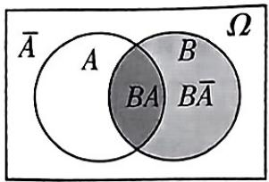

<details>
<summary>text_image</summary>

A
B
BA
BA̅
Ω
</details>

3. 贝叶斯公式

设 $A_{1}, A_{2}, \cdots, A_{n}$ 是一组两两互斥的事件， $A_{1} \cup A_{2} \cup \cdots \cup A_{n} = \Omega$ ，且 $P(A_{i}) > 0, i = 1, 2, \cdots, n$ ，则对任意的事件 $B \subseteq \Omega, P(B) > 0, P(A_{i} | B) = \frac{P(A_{i})P(B|A_{i})}{P(B)} = \frac{P(A_{i})P(B|A_{i})}{\sum_{k=1}^{n} P(A_{k})P(B|A_{k})}, i = 1, 2 \cdots, n$ ，这称为贝叶斯公式.

养精蓄锐

小编说:临近考试,我们的身体健康、精神健康很重要,这个阶段要有意识地做学习之外的事情,才能保持良好的精神面貌去考试,我们该如何做呢?

# 考前必背的 32个二级结论

代数运算6大二级结论

<table><tr><td>1</td><td>三角恒等式</td><td>tan A+tan B+tan C=tan Atan Btan C,其中A,B,C满足A+B+C=nπ(n∈N*且A,B,C≠π/2).</td></tr><tr><td>2</td><td>积化和差</td><td>sin αcos β=1/2[sin(α+β)+sin(α-β)],cos αsin β=1/2[sin(α+β)-sin(α-β)],cos αcos β=1/2[cos(α+β)+cos(α-β)],sin αsin β=-1/2[cos(α+β)-cos(α-β)].</td></tr><tr><td>3</td><td>和差化积</td><td>sin α+sin β=2sin α+β/2cos α-β/2,sin α-sin β=2cos α+β/2sin α-β/cos α+cos β=2cos α+β/2cos α-β/2,cos α-cos β=-2sin α+β/2sin α-β/2.</td></tr><tr><td>4</td><td>错位相减法速算公式</td><td>设{an}为等差数列,{bn}为等比数列,{cn}的前n项和为Sn,当cn=anbn时,可将{cn}的通项公式整理为cn=(an+b)qn-1(q≠0,q≠1)的形式,则Sn=(An+B)qn-B,其中A=a/q-1,B=b-A/q-1.</td></tr><tr><td>5</td><td>数列放缩不等式</td><td>n∈N*,则有以下结论.1/n(n+1)&lt;1/n2&lt;1/n2-1=1/(n+1)(n-1)&lt;1/n(n-1),n&gt;1,2/√n+√n+1=2(√n+1-√n)&lt;1/√n&lt;2/√n+√n-1=2(√n-√n-1),1/√n=2/√n+√n&lt;2/√n-1/2+√n+1/2=√2(√2n+1-√2n-1),1+1/2!+1/3!+···+1/n!≤1+1/2+1/22+···+1/2^n.</td></tr><tr><td>6</td><td>绝对值三角不等式</td><td>a,b,c均为实数,则|a|-|b|≤|a±b|≤|a|+|b|,|a-b|≤|a-c|+|c-b|,|a+b+c|≤|a|+|b|+|c|.</td></tr></table>

# / 平面几何 6 大二级结论

<table><tr><td>7</td><td>奔驰定理及其推论</td><td>奔驰定理:如图所示,已知P是三角形ABC内任意一点,则S△PBCPA+ S△PCA PB+S△PABPC=0. 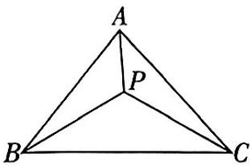推论:已知P是三角形ABC内任意一点,且xPA+yPB+zPC=0,则S△PBC:S△PCA:S△PAB=x:y:z.</td></tr><tr><td>8</td><td>平面向量中的极化恒等式</td><td>a·b=1/4[(a+b)2-(a-b)2]或4a·b=(a+b)2-(a-b)2.几何意义:向量的数量积可以表示为以向量a,b为邻边的平行四边形的两条对角线的长的平方差的1/4.</td></tr><tr><td>9</td><td>对角线向量定理</td><td>如图所示,在四边形ABCD中,AC·BD=(AD2+BC2)-(AB2+CD2)/2. 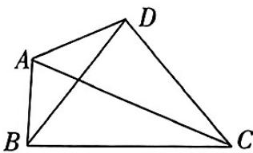推论1:当AC⊥BD时,有AD2+BC2=AB2+CD2.推论2:cos(AC,BD)= (AD2+BC2)-(AB2+CD2)/2|AC||BD|.</td></tr><tr><td>10</td><td>平面向量的三点共线定理</td><td>已知平面内一组基底OA,OB及任意向量OP,若OP=λ1OA+λ2OB,则A,B,P三点共线的充要条件是λ1+λ2=1.</td></tr><tr><td>11</td><td>等和线定理</td><td>如图,以AB,AC为基底向量,过BC外一点F作BC的平行线l,对l上任意一点E,有AE=xAB+yAC,且x+y=AE/AD(常数),其中D是AE和BC的交点. 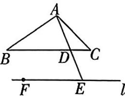</td></tr><tr><td>12</td><td>三角形内角平分线定理</td><td>如图,若AD是△ABC中∠BAC的平分线,AD交BC于D,则AB/BD=AC/CD=AI/ID,其中I是△ABC的内心. 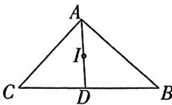</td></tr></table>

# 养精蓄锐

饮食合理 合理搭配膳食,营养均衡,多补充一些富含优质蛋白的食品,如鸡蛋、瘦肉、牛奶和豆制品等,多吃蔬菜和水果,增强体力和记忆力,以保持良好的竞技状态.

# / 空间几何 9 大二级结论 /

<table><tr><td>13</td><td>面积射影定理</td><td>如图,△ABC在平面α内的射影为△ABO(C在α外),分别记△ABC的面积和△ABO的面积为S和S',记△ABC所在平面和平面和平面α所成锐二面角的平面角为θ,则cos θ=S':S. 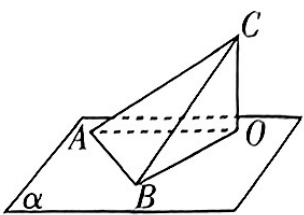</td></tr><tr><td>14</td><td>三余弦定理和三正弦定理</td><td>如左图,直线AO是平面α的斜线,AQ是AO在平面α内的射影,直线AP在平面α内(不与AQ重合),设∠OAP=θ,∠OAQ=θ1,∠QAP=θ2,则cos θ=cos θ1·cos θ2. 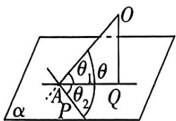 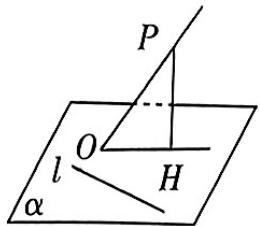 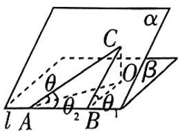推论:如中图,PO是平面α的一条斜线,PH⊥α,垂足为H,l为平面α内任意一条直线(与PO的射影OH不重合也不平行),设PO与直线l所成角为θ,PO与平面α所成角为θ1,OH与直线l所成角为θ2,则cos θ=cos θ1·cos θ2.拓展:类似地,还有三正弦定理 如右图,设二面角α-l-β为θ1,A,B在l上,在平面α内有一条射线AC,AC和l所成角为θ2,AC和平面β所成的角为θ,则sin θ=sin θ1·sin θ2.</td></tr><tr><td>15</td><td>两点间的球面距离</td><td>如图,球面上两点的球面距离是指经过这两点的大圆(即过球心的平面截球面所得的圆)在这两点间的劣弧的长度,记其为l,则l=Rθ(R为球的半径,θ为劣弧所对圆心角的弧度数). 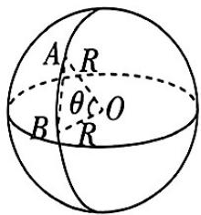</td></tr><tr><td>16</td><td>正方体的内切球</td><td>位置关系:正方体的六个面都与同一个球相切,正方体的中心与球心重合,如图.数量关系:设正方体的棱长为a,内切球的半径为r,这时有2r=a. 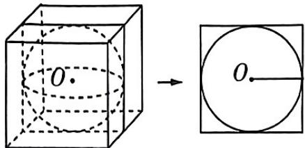</td></tr><tr><td>17</td><td>正方体的棱切球</td><td>位置关系:正方体的十二条棱都与球面相切,正方体的中心与球心重合,如图.数量关系:设正方体的棱长为a,棱切球的半径为r,这时有2r=√2a.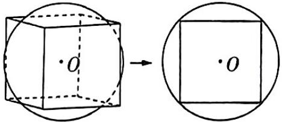</td></tr><tr><td>18</td><td>正方体的外接球</td><td>位置关系:正方体的八个顶点都在同一个球面上,正方体的中心与球心重合,如图.数量关系:设正方体的棱长为a,外接球的半径为r,这时有2r=√3a.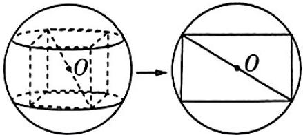</td></tr><tr><td>19</td><td>长方体的外接球</td><td>位置关系:长方体的八个顶点都在同一个球面上,长方体的中心与球心重合,如图.数量关系:外接球的半径为长方体的体对角线长的一半.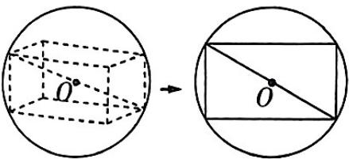</td></tr><tr><td>20</td><td>正四面体的内切球</td><td>位置关系:正四面体的四个面都与同一个球相切,如图.数量关系:设正四面体的棱长为a,高为h,内切球的半径为 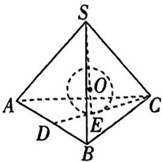r,这时有4r=h=√6/3a.</td></tr><tr><td>21</td><td>正四面体的外接球</td><td>位置关系:正四面体的四个顶点都在一个球面上,如图.数量关系:设正四面体的棱长为a,外接球的半径为r,这时有 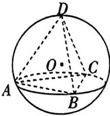r=√6/4a.</td></tr></table>

# / 解析几何 11 大二级结论

<table><tr><td>22</td><td>曲线系方程</td><td>过定点(x0,y0)的直线系方程:λ1(y-y0)+λ2(x-x0)=0(λ1,λ2是参数).共焦点的圆锥曲线系方程:x2/c2+λ/y2/λ=1(c为焦半径,λ为参数).当λ&gt;0时,表示共焦点的椭圆;当-c2&lt;λ&lt;0时,表示共焦点的双曲线;当λ&lt;-c2时,轨迹不存在.共交点的曲线系方程:若曲线C1:f1(x,y)=0与曲线C2:f2(x,y)=0有公共点Pi(i=1,2,··),则λ1f1(x,y)+λ2f2(x,y)=0(λ1,λ2是参数)表示过点Pi的曲线.</td></tr><tr><td>23</td><td>圆锥曲线的焦点三角形</td><td>椭圆的焦点三角形:如图1,以椭圆x2/a2+y2/b2=1(a&gt;b&gt;0)上一点P(x0,y0)(y0≠0)和焦点F1(-c,0),F2(c,0)为顶点的 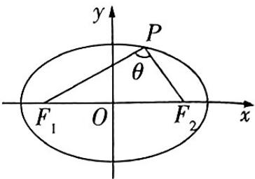ΔPF1F2(焦点三角形)中,若∠F1PF2=θ,则(1)|PF1|+|PF2|=2a;(2)4c2=|PF1|2+|PF2|2-2|PF1|·|PF2|·cosθ;(3)S△PF1F2=1/2|PF1|·|PF2|·sin θ=b2tan θ/2.双曲线的焦点三角形:如图2,若点P是双曲线C:x2/a2-y2/b2=1(a&gt;0,b&gt;0)上不同于顶点的任意一点,F1,F2为双曲线C的两焦点,则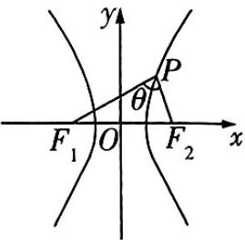ΔPF1F2叫作双曲线的焦点三角形.记∠F1PF2=θ,则S△PF1F2=b2/tan θ/2.抛物线的焦点三角形:如图3,过抛物线y2=2px(p&gt;0)的焦点F(p/2,0)的直线l:y=kx-kp/2(其中k为直线l的斜率)交抛物线于A,B两点,那么焦点三角 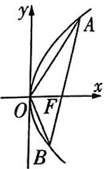形OAB的面积可以表示为S△OAB=p2/2√1+k2(若抛物线方程为x2=2py(p&gt;0),直线l:y=kx+p/2,则S△OAB=p2/2√1+k2).图3</td></tr></table>

# 养精蓄锐

调整睡眠 临近考试,就不能总是挑灯夜战了.按时休息,保证充足的睡眠时间,这样学习起来精神十足,事半功倍.

续表

<table><tr><td>24</td><td>椭圆、双曲线第三定义的应用</td><td>椭圆的第三定义的应用:若M,N是椭圆C:x2/a2+y2/b2=1(a&gt;b&gt;0)上关于原点对称的两个点,点P是椭圆上异于M,N的一点,当直线PM,PN的斜率都存在(分别记为kPM,kPN)时,kPM·kPN=e2-1=-b2/a2,e为椭圆C的离心率.双曲线的第三定义的应用:若M,N是双曲线C:x2/a2-y2/b2=1(a&gt;0,b&gt;0)上关于原点对称的两个点,点P是双曲线上异于M,N的一点,当直线PM,PN的斜率都存在(分别记为kPM,kPN)时,kPM·kPN=e2-1=b2/a2,e为双曲线C的离心率.</td></tr><tr><td>25</td><td>双曲线的渐近线</td><td>(1)若渐近线的方程为y=±bx(a&gt;0,b&gt;0),即x/a±y/b=0,则双曲线的方程可设为(x2/a2-y2/b2)=λ(λ∈R,且λ≠0).(2)焦点到渐近线的距离总是b.(3)双曲线x2/a2-y2/b2=1(a&gt;0,b&gt;0)的渐近线y=±bx的斜率k=±b/a与离心率e的关系为e=√(1+(b/a)2)=√(1+k2).</td></tr><tr><td>26</td><td>抛物线的焦点弦</td><td>设AB是过抛物线y2=2px(p&gt;0)的焦点F的弦,若A(x1,y1)(y1&gt;0),B(x2,y2),α为直线AB的倾斜角,则有以下结论.1焦半径|AF|=x1+p/2=p/1-cosα,|BF|=x2+p/2=p/1+cosα,1|AF|+1|BF|=2/p.2弦长|AB|=x1+x2+p=2p/sin2α.3S△OAB=p2/2sinα(O为抛物线的顶点).4以弦AB为直径的圆与准线相切.5过点A,B分别向抛物线的准线引垂线,设垂足分别为A1,B1,则∠A1FB1=90°.</td></tr><tr><td>27</td><td>抛物线的阿基米德三角形</td><td>抛物线的弦与抛物线交于A,B两点,分别过A,B两点作抛物线的切线l1,l2,l1和l2相交于点P,那么△PAB称作抛物线的阿基米德三角形.特别地,当AB过焦点F时,△PAB满足以下特性:1P点必在抛物线的准线上;2△PAB为直角三角形,且∠P为直角;3PF⊥AB.</td></tr><tr><td>28</td><td>相交弦所在直线斜率与弦中点的关系</td><td>(1)已知直线 y=kx+m(k≠0)与椭圆 x2/a2+y2/b2=1(a&gt;b&gt;0)相交于A,B两点,若A(x1,y1),B(x2,y2),弦AB的中点为M(x0,y0),则直线AB的斜率 k=y2-y1/x2-x1=-b2/a2·x0/y0.(2)已知直线 y=kx+m(k≠0)与双曲线 x2/a2-y2/b2=1(a&gt;0,b&gt;0)相交于A,B两点,若A(x1,y1),B(x2,y2),弦AB的中点为M(x0,y0),则直线AB的斜率 k=y2-y1/x2-x1=b2/a2·x0/y0.(3)已知直线 y=kx+m(k≠0)与抛物线 y2=2px(p&gt;0)相交于A,B两点,若A(x1,y1),B(x2,y2),弦AB的中点为M(x0,y0),则直线AB的斜率 k=y2-y1/x2-x1=p/y0.</td></tr><tr><td>29</td><td>直线与椭圆相切的有关结论</td><td>1椭圆 x2/a2+y2/b2=1(a&gt;b&gt;0)上任意一点P(x0,y0)处的切线方程是x0x/a2+y0y/b2=1,2过椭圆 x2/a2+y2/b2=1(a&gt;b&gt;0)外一点P(x0,y0)引两条切线,切点弦方程是x0x/a2+y0y/b2=1,3椭圆 x2/a2+y2/b2=1(a&gt;b&gt;0)与直线Ax+By+C=0 相切的条件是A2a2+B2b2=C2.</td></tr><tr><td>30</td><td>直线与双曲线相切的有关结论</td><td>1双曲线 x2/a2-y2/b2=1(a&gt;0,b&gt;0)上任意一点P(x0,y0)处的切线方程是x0x/a2-y0y/b2=1,2过双曲线 x2/a2-y2/b2=1(a&gt;0,b&gt;0)外一点P(x0,y0)引两条切线,切点弦方程是x0x/a2-y0y/b2=1,3双曲线 x2/a2-y2/b2=1(a&gt;0,b&gt;0)与直线Ax+By+C=0 相切的条件是A2a2-B2b2=C2.</td></tr><tr><td>31</td><td>直线与抛物线相切的有关结论</td><td>1抛物线 y2=2px(p&gt;0)上任意一点P(x0,y0)处的切线方程是y0y=p(x+x0),2过抛物线 y2=2px(p&gt;0)外一点P(x0,y0)引两条切线,切点弦方程是y0y=p(x+x0),3抛物线 y2=2px(p&gt;0)与直线Ax+By+C=0 相切的条件是pB2=2AC.</td></tr><tr><td>32</td><td>圆的切点弦所在直线的方程</td><td>点P(x0,y0)在圆(x-a)2+(y-b)2=r2外,过点P作圆的两条切线,切点分别为A,B,则切点弦AB所在直线的方程为(x0-a)(x-a)+(y0-b)(y-b)=r2.</td></tr></table>

# 养精蓄锐

调整学习时间 在考前几个月,一定要保证高考对应的时间段,精力是最充沛的.平时注意高效利用这一时间段,这样,到了考场上能保持最佳的答题状态,保障平稳发挥,甚至能超常发挥.

# 考前必记的 15个抢分技法

抢分技法1 函数图象的变换方法

<table><tr><td rowspan="2">平移变换</td><td>y=f(x)的图象左、右平移a(a&gt;0)个单位长度左加右减y=f(x)±a的图象</td><td>y=f(x)的图象上、下平移b(b&gt;0)个单位长度上加下减y=f(x)±b的图象</td></tr><tr><td colspan="2">注意:y=f(ωx)的图象左、右平移a(a&gt;0)个单位长度左加右减y=f(ω(x±a))的图象,y=f(ωx)的图象左、右平移a/ω(a&gt;0,ω&gt;0)个单位长度左加右减y=f(ωx±a)的图象</td></tr><tr><td>伸缩变换</td><td>y=f(x)的图象伸缩变换沿横轴伸缩到原来的ω(ω&gt;0)倍y=f(x/ω)的图象</td><td>y=f(x)的图象伸缩变换沿纵轴伸缩到原来的A(A≠0)倍y=Af(x)的图象</td></tr><tr><td>翻折变换</td><td>y=f(x)的图象翻折变换下往上翻y=|f(x)|的图象</td><td>y=f(x)的图象翻折变换作右翻左y=f(|x|)的图象</td></tr><tr><td rowspan="4">对称变换</td><td>y=f(x)与y=f(-x)的图象关于直线x=0(即y轴)对称</td><td>y=f(x)与y=f(2a-x)的图象关于直线x=a对称</td></tr><tr><td>y=f(x)与y=-f(x)的图象关于直线y=0(即x轴)对称</td><td>y=f(a+x)与y=f(b-x)的图象关于直线x=b-a/2对称</td></tr><tr><td>y=f(x)与y=-f(-x)的图象关于原点对称</td><td rowspan="2">y=f(x)与y=2b-f(2a-x)的图象关于点(a,b)对称</td></tr><tr><td>y=ax与y=logax(a&gt;0且a≠1)的图象关于直线y=x对称</td></tr></table>

抢分技法 2 导数问题的 3 大放缩技巧

<table><tr><td>1</td><td>指数型放缩</td><td> $e^{x} \geqslant x + 1$ (当且仅当x=0时取等号), $e^{x-1} \geqslant x$ (当且仅当x=1时取等号), $e^{x} \leqslant \frac{1}{1-x}(x < 1)$ (当且仅当x=0时取等号).</td></tr><tr><td>2</td><td>对数型放缩</td><td> $\ln(x+1) \leqslant x(x > -1)$ (当且仅当x=0时取等号), $1-\frac{1}{x} \leqslant \ln x \leqslant x-1$ (x&gt;0)(当且仅当x=1时取等号).</td></tr><tr><td>3</td><td>三角型放缩</td><td> $\sin x \leqslant x \leqslant \tan x (0 \leqslant x < \frac{\pi}{2})$ (当且仅当x=0时取等号), $\sin x \geqslant x \geqslant \tan x (-\frac{\pi}{2} < x \leqslant 0)$ (当且仅当x=0时取等号).</td></tr></table>

# 抢分技法 3 值域、最值的 6 种常见求法

<table><tr><td>1</td><td>换元法</td><td>换元的方法:代数换元法,三角换元法,常规换元法,倒数换元法.1y=ax+b+k√cx+d,令t=√cx+d,则y=f(t)(该函数有时可直接判定单调性);2y=a^{f(x)},令u=f(x),则y=a^u;3y=loga f(x),令u=f(x),则y=logau;4y=f(a^x),令t=a^x,则y=f(t);5y=f(logax),令t=logax,则y=f(t);6令ax+a-x=t,则a2x+a-2x=t2-2(t≥2);7令sin x+cos x=t,则sin xcos x=t2/2;8令√1-x+√1+x=t,则√1-x2=t2-2/2或t=√((√1-x+√1+x)2)=√2+2√(1-x2);9y=ax+b+k√c2-x2,令x=csinα,α∈[-π/2,π/2](或令x=ccosα,α∈[0,π]);10x∈R时,令x=tan a,a∈(-π/2,π/2);11y=mx+n(ax+b)2,令t=1/ax+b(倒数换元法);12y=√mx+nax+b,令t=1/√mx+n(倒数换元法).</td></tr><tr><td>2</td><td>单调性法</td><td>若函数为单调函数,可根据函数的单调性求值域或最值(优先考虑).</td></tr><tr><td>3</td><td>基本(均值)不等式法</td><td>利用a+b/2≥√ab或a+b+c/3≥3/√abc(一正、二定、三相等)等公式来求值域或最值,对于y=x+k/x(k&gt;0)的形式,一定要看等号能否成立,否则用数形结合法(对勾函数)、单调性法求解.</td></tr><tr><td>4</td><td>有界性法</td><td>解析式含x2,|x|,√x,x(x∈(m,n)),ax,sinx,cos x的函数,若可用y表示它们,则常利用有界性来求值域.</td></tr><tr><td>5</td><td>判别式法</td><td>对于y=a1x2+b1x+c1/(a12+a22≠0),先化成(a2y-a1)x2+(b2y-b1)x+(c2y-c1)=0,再运用判别式求值域,但要注意先讨论二次项系数为0的情况.</td></tr><tr><td>6</td><td>导数法</td><td>通过求导研究函数的单调性,确定极值与端点值,从而得出值域或最值(万能方法).</td></tr></table>

# 养精蓄锐

# 抢分技法 4 函数零点个数的 3 种确定方法

<table><tr><td>1</td><td>直接求零点</td><td>令 $f(x) = 0$ ,如果能求出解,则有几个解就有几个零点.</td></tr><tr><td>2</td><td>利用函数零点存在定理</td><td>根据函数零点存在定理(如下图),再结合函数图象与性质(如单调性、奇偶【敲黑板】利用函数零点存在定理只能判断出零点存在,不能确定零点的个数,还要结合其他因素才能确定个数性等)才能确定函数有几个零点.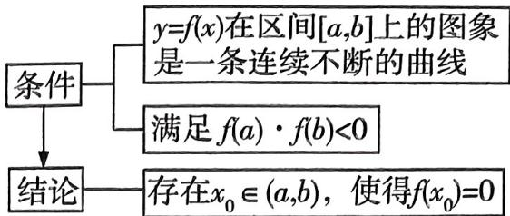</td></tr><tr><td>3</td><td>利用图象交点的个数</td><td>对于 $y=f(x)-g(x)$ 型函数,可先画出两个函数 $y=f(x)$ 和 $y=g(x)$ 的图象,看其交点的个数,有几个交点,原函数就有几个零点.</td></tr></table>

# 抢分技法 5 双零点问题的破解通法

双零点问题,一般以不等式的证明的“面貌”出现,掌握下列思路和方法,双零点问题就不再是一个让人望而生畏的问题.设 $x_{1},x_{2}$ 是解析式含一个(或两个)参数的函数 $f(x)$ 的两个零点(或是含参函数 $f(x)$ 的两个极值点(即 $f'(x)$ 的两个零点),或是直线y=m与函数 $y=f(x)$ 的图象的两个交点的横坐标(即 $y=f(x)-m$ 的两个零点)).

<table><tr><td>通法一 首先令  $x_1 < x_2$ ,再令  $\frac{x_2}{x_1} = t$ (或  $x_2 - x_1 = t$ ),则  $x_2 = tx_1$ (或  $x_2 = t + x_1$ ),再利用  $x_1, x_2$  满足的相应的方程(如  $f(x_1) = 0$ , $f(x_2) = 0$ ,或根与系数的关系),通过对式子进行加、减、乘、除或取对数等运算得到新方程,或用t表示出  $x_1, x_2$ ,然后对目标不等式进行等价变形,消去参数,把研究对象直接用t表示出来,问题就容易解决了;若不能消去参数,则可能需要结合两个零点的范围分步完成.</td></tr><tr><td>通法二  $x_1, x_2$  很多时候是分布在直线x=a的两侧,证明与 $x_1, x_2, a$ 有关的不等式(如: $x_1 + x_2 \geqslant 2a$ ),通常可以考虑设 $x_1 < a, x_2 > a$ ,则 $x_2 > a \Leftrightarrow 2a - x_2 < a$ ,这样 $x_1, 2a - x_2$ 在直线x=a的同一侧(这一侧的单调性要确定),然后利用 $f(x_1) = 0$ , $f(x_2) = 0$ 及函数 $f(x)$ 的单调性对目标不等式进行等价变形,消去参数、减少变量,使研究对象只含 $x_1$ 或 $x_2$ ,问题就容易解决了.</td></tr><tr><td>通法三 如图,设 $x_1, x_2$ 是直线y=m与函数y=f(x)的图象相交时的两个交点的横坐标,证明 $|x_2 - x_1| < a$ 之类的不等式,先确定 $x_1, x_2$ 的初始取值范围(p,q),再求出y=f(x)的图象在该区间两个端点x=p,x=q处的切线方程y=h(x),y=g(x),并证明f(x)与g(x),h(x)的大小关系之后,通过令h(x)=m,g(x)=m,求得 $x_3, x_4$ ,数形结合可知 $x_1, x_2$ 与 $x_3, x_4$ 的大小关系,则证明 $|x_2 - x_1| < a$ 就不难完成了.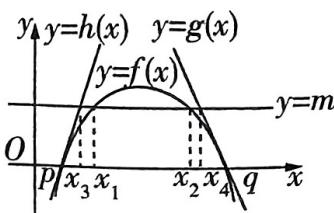</td></tr></table>

# 养精蓄锐

摆脱情绪低潮 遇到情绪低落或者有困难的时候,不要默默承受,一定要有意识地摆脱这种状态,向自己求助、向他人求助.

抢分技法6 由部分图象确定函数解析式 $(y = A \sin (\omega x + \varphi) + b)$ 的破解策略

<table><tr><td>第一步</td><td>定A,b</td><td>结合三角函数的图象确定函数的最大值M和最小值m(M&gt;m),则|A|=M-m/2,b=M+m/2.</td></tr><tr><td>第二步</td><td>定ω</td><td>图象相邻的最高点与最低点的横坐标之差的绝对值为T/2(T为函数的最小正周期);图象相邻的两个最高点(或最低点)的横坐标之差的绝对值为T.再根据T=|2π/ω|确定ω.</td></tr><tr><td rowspan="2">第三步</td><td rowspan="2">定φ</td><td>1代入法:把图象上的一个已知点的坐标代入解析式(此时A,ω,b已知)或代入图象与直线y=b的交点求解(此时要注意交点是在上升段还是在下降段).</td></tr><tr><td>2五点法:确定φ值时,往往以寻找“五点法”中的一个点为突破口.</td></tr></table>

抢分技法 7 求数列的通项公式的 8 种常用方法

<table><tr><td>1</td><td>公式法</td><td>1等差数列的通项公式;2等比数列的通项公式.</td></tr><tr><td>2</td><td>作差法</td><td>已知 Sn(Sn为数列{an}的前n项和),求an:an={S1(n=1),Sn-Sn-1(n≥2).</td></tr><tr><td>3</td><td>作商法</td><td>已知 a1·a2····an=f(n),an≠0,求an:an={f(1)(n=1),f(n)/f(n-1)(n≥2).</td></tr><tr><td>4</td><td>累加法</td><td>已知 an+1-an=f(n),求an:an=(an-an-1)+(an-1-an-2)+··+(an-a1)+a1=f(n-1)+f(n-2)+··+f(1)+a1(n≥2).</td></tr><tr><td>5</td><td>累乘法</td><td>已知an+1/an=f(n),求an:an=an/an-1·an-1/an-2···an/an·an=f(n-1)·f(n-2)···f(1)·an(n≥2).</td></tr><tr><td>6</td><td>构造等比数列法</td><td>若已知数列{an}中,an+1=pa+n+q(p≠0,p≠1,q≠0),an≠q/1-p,设存在非零常数λ,使得an+1+λ=p(an+λ),其中λ=q/p-1,则数列{an+q/p-1}就是以a1+q/p-1为首项,p为公比的等比数列,先求出数列{an+q/p-1}的通项公式,再求出数列{an}的通项公式即可.</td></tr></table>

# 养精蓄锐

续表

<table><tr><td>7</td><td>倒数法</td><td>若 an=ma_{n-1}/k(a_{n-1}+b)(m≠kb,mkb≠0,n≥2),对 an=ma_{n-1}/k(a_{n-1}+b)取倒数,得到 1/a_n=k/m·(1+b/a_{n-1}),即1/a_n=kb/m·1/a_{n-1}+k/m,令 b_n=1/a_n,则{b_n}的递推公式可 归纳为 bn+1=pb_n+q(p≠0,p≠1,q≠0)型.</td></tr><tr><td>8</td><td>猜归法</td><td>先由前n项猜出一般项,再进行严格的证明.</td></tr></table>

# 抢分技法 8 数列求和的 6 种常用方法

<table><tr><td>1</td><td>公式法</td><td>等差数列的求和公式为 Sn=n(a1+an)/2=na1+ (n-1)/2d.等比数列的求和公式为 Sn=na1(q=1),a1(1-q^n)/1-q=a1-qnq/1-q(q≠1).常用的公式有:1+2+3+···+n=1/2n(n+1),n∈N*;1^2+2^2+3^2+···+n^2=1/6n(n+1)(2n+1),n∈N*;1+3+5+···+(2n-1)=n^2,n∈N*.</td></tr><tr><td>2</td><td>分组求和法</td><td>当无法直接运用公式法求和时,常将“和式”中的“同类项”先合并在一起,再运用公式法求和.</td></tr><tr><td>3</td><td>并项求和法</td><td>若数列中相邻两项或几项的和是同一个常数(周期数列)或数列是“(-1)&quot;型&quot;摆动数列等,可先将有规律的项放在一起,再求和.</td></tr><tr><td>4</td><td>倒序相加法</td><td>在数列求和中,若“和式”中分别到首、尾距离相等的两项的和有共性,则常考虑选用倒序相加法进行求和.</td></tr><tr><td>5</td><td>错位相减法</td><td>如果一个数列是由一个等差数列与一个等比数列对应项的乘积构成的,那么常选用错位相减法进行求解.</td></tr><tr><td>6</td><td>裂项相消法</td><td>如果数列的通项可分裂成“两项差”的形式,且相邻项分裂后相关联,那么常选用裂项相消法求和.</td></tr></table>

# 抢分技法 9 破解等差数列前 n 项和的最值问题的方法

<table><tr><td>1</td><td>二次函数法</td><td>利用等差数列前n项和的函数表达式Sn=an2+bn(a,b都为常数),通过配方或借助图象,用求二次函数最值的方法求解.</td></tr></table>

养精蓄锐

续表

<table><tr><td>2</td><td>通项公式法</td><td>1当a1&gt;0,d&lt;0时,满足{am≥0, am+1≤0的项数m使得Sn取得最大值Sm;2当a1&lt;0,d&gt;0时,满足{am≤0, am+1≥0的项数m使得Sn取得最小值Sm.</td></tr></table>

# 抢分技法10 常见的裂项方法

<table><tr><td>数列(n为正整数)</td><td>裂项方法</td></tr><tr><td>{1/n(n+k)}(k为非零常数)</td><td>1/n(n+k)=1/k(1/n-1/n+k)</td></tr><tr><td>{1/4n2-1}</td><td>1/4n2-1=1/2(1/2n-1-1/2n+1)</td></tr><tr><td>{1/√n+√n+1}</td><td>1/√n+√n+1=√n+1-√n</td></tr><tr><td>{2n/(2n-1)(2n+1-1)}</td><td>2n/(2n-1)(2n+1-1)=1/2n-1-1/2n+1-1</td></tr><tr><td>{loga(1+1/n)}(a&gt;0且a≠1)</td><td>loga(1+1/n)=loga(n+1)-logan</td></tr></table>

# 抢分技法 11 直线与平面所成角的求法

求直线与平面所成角 $\theta(0 \leqslant \theta \leqslant \frac{\pi}{2})$ 可以采用几何法, 也可以采用向量法.

①几何法:如图1,利用直线与平面所成角的定义,在直线l上找一点 $A(A \notin \alpha)$ 向平面 $\alpha$ 作垂线,垂足为B,得到直线l在平面 $\alpha$ 内的射影 $l'$ ,从而在直角三角形AOB(O为直线l与平面 $\alpha$ 的交点)内求解角 $\theta$ .  
②向量法:记直线 l 的方向向量为 v, 平面 $\alpha$ 的法向量为 n, $\omega$ 为 v 与 n 的夹角, 则有 $\omega = \frac{\pi}{2} - \theta$ (图 2) 或 $\omega = \frac{\pi}{2} + \theta$ (图 3).

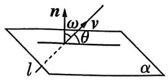

<details>
<summary>text_image</summary>

n
ω
v
θ
l
α
</details>

图2

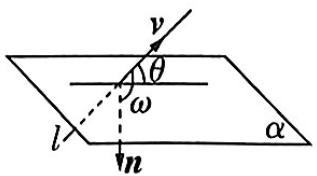

<details>
<summary>text_image</summary>

v
θ
ω
l
n
α
</details>

图3

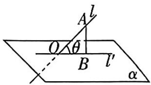

<details>
<summary>text_image</summary>

A
l
O
θ
B
l'
α
</details>

图1

从而 $\sin \theta = |\cos \omega| = |\cos \langle \pmb {v},\pmb{n}\rangle | = \frac{|\pmb{v}\cdot\pmb{n}|}{|\pmb{v}|\cdot|\pmb{n}|}.$

特别地, $\omega=0$ 时, $\theta=\frac{\pi}{2},l\perp\alpha;\omega=\frac{\pi}{2}$ 时, $\theta=0,l\subset\alpha$ 或 $l//\alpha.$

# 养精蓄锐

# 抢分技法 12 利用空间向量法求二面角

设二面角 $\alpha - l - \beta$ 的平面角为 $\theta (0 \leqslant \theta \leqslant \pi)$ , 设 $n_1, n_2$ 分别为平面 $\alpha, \beta$ 的法向量, 向量 $n_1, n_2$ 的夹角为 $\omega$ , 则有 $\theta + \omega = \pi$ (图1) 或 $\theta = \omega$ (图2), 则 $|\cos \theta| = \frac{|n_1 \cdot n_2|}{|n_1| \cdot |n_2|}$ .

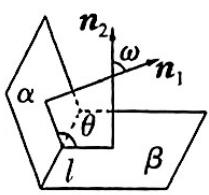  
图1

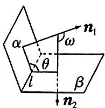

<details>
<summary>text_image</summary>

α
θ
l
β
n₁
ω
n₂
</details>

图2

# 抢分技法13 空间距离的求解

<table><tr><td>点线距</td><td>已知直线l的方向向量为a,则点M到直线l的距离d=|MN|sin(MN,a)(其中N为直线l上的任意一点).</td></tr><tr><td>线线距</td><td>两平行线间的距离可转化为点线距离求解;两异面直线间的距离可转化为点面距离求解,或者直接求公垂线段的长度.</td></tr><tr><td>点面距</td><td>求点M到平面α的距离:1用点到平面距离的定义,直接求由点M向平面α所引垂线段MH的长度,即|MH|;2已知MN为平面α的一条斜线段(N在平面α内),n为平面α的法向量,则点M到平面α的距离d=||MN|·cos(MN,n)=|MN·n|/|n|.</td></tr></table>

# 抢分技法 14 求解排列组合问题的常用方法

<table><tr><td>优先法</td><td>优先安排特殊元素或特殊位置.</td></tr><tr><td>捆绑法</td><td>相邻问题捆绑处理,即把相邻元素看作一个整体,与其他元素进行排列,同时需要注意捆绑元素的内部排列.</td></tr><tr><td>插空法</td><td>不相邻问题插空处理,即先考虑不受限制的元素的排列,再将不相邻的元素插在前面元素的空位中.</td></tr></table>

# 抢分技法 15 分组问题的求解方法

<table><tr><td>1</td><td>完全均分</td><td>将n个不同元素平均分成m组(n能被m整除),则不同的分法共有CmnmCmnm-2m···CmAmm种.</td></tr><tr><td>2</td><td>部分均分</td><td>通过具体例子说明:将6本不同的书分成3组,1组4本,另外2组每组各1本,找到元素均分的组数是2,则不同的分法共有C46C12C1/A2种.</td></tr><tr><td>3</td><td>不等分组</td><td>将n个不同元素分成m组,各组元素个数分别为a1,a2,···,am,其中a1,a2,···,am各不相同且均为正整数,a1+a2+···+am=n,则不同的分法共有Cna1Cna2cn-a1Cna3n-a1-a2···Cam种.</td></tr></table>

养精蓄锐

# 考前必记的 4个万能模型

# 模型1 常见抽象函数的性质与对应的特殊函数模型

<table><tr><td>抽象函数的性质</td><td>特殊函数模型</td></tr><tr><td>①f(x+y)=f(x)+f(y), ②f(x-y)=f(x)-f(y)</td><td>正比例函数f(x)=kx(k≠0)</td></tr><tr><td>①f(x)f(y)=f(x+y)(x,y∈R), ② f(x)/f(y)=f(x-y)(x,y∈R,f(y)≠0)</td><td>指数函数f(x)=ax(a&gt;0,a≠1)</td></tr><tr><td>①f(xy)=f(x)+f(y)(x&gt;0,y&gt;0), ②f(x/y)=f(x)-f(y)(x&gt;0,y&gt;0)</td><td>对数函数f(x)=logax(a&gt;0,a≠1)</td></tr><tr><td>①f(xy)=f(x)f(y), ②f(x/y)=f(x)/f(y)(y≠0,f(y)≠0)</td><td>幂函数f(x)=xn</td></tr><tr><td>f(x+y)=f(x)g(y)+g(x)f(y)</td><td>三角函数f(x)=sin x,g(x)=cos x</td></tr><tr><td>f(x+y)=f(x)+f(y)/1-f(x)f(y)</td><td>正切函数f(x)=tan x</td></tr></table>

# 模型2 5类由含导数不等式构造原函数的模型

<table><tr><td>1</td><td>原函数是函数的和差组合</td><td>1对于f&#x27;(x)&gt;g&#x27;(x)&lt;g&#x27;(x),构造函数h(x)=f(x)-g(x).特别地,若f&#x27;(x)&gt;a(&lt;a)(a≠0),则可以构造函数h(x)=f(x)-ax.2对于f&#x27;(x)+g&#x27;(x)&gt;0(&lt;0),构造函数h(x)=f(x)+g(x).</td></tr><tr><td>2</td><td>原函数是函数的乘除组合</td><td>1对于f&#x27;(x)g(x)+f(x)g&#x27;(x)&gt;0(&lt;0),构造函数h(x)=f(x)g(x).2对于f&#x27;(x)g(x)-f(x)g&#x27;(x)&gt;0(&lt;0),构造函数h(x)= $\frac{f(x)}{g(x)}$ .特别地,对于xf&#x27;(x)+f(x)&gt;0(&lt;0),构造函数h(x)=xf(x);对于xf&#x27;(x)-f(x)&gt;0(&lt;0),构造函数h(x)= $\frac{f(x)}{x}$ .</td></tr><tr><td>3</td><td>原函数是含ex的乘除组合</td><td>1对于f&#x27;(x)+f(x)&gt;0(&lt;0),构造函数h(x)=e^xf(x).2对于f&#x27;(x)-f(x)&gt;0(&lt;0),构造函数h(x)= $\frac{f(x)}{e^x}$ .</td></tr></table>

# 养精蓄锐

续表

<table><tr><td>4</td><td>原函数是含sinx(cos x)的乘除组合</td><td>1对于f(x)+f&#x27;(x)tan x&gt;0(&lt;0),构造函数h(x)=f(x)sin x.2对于f(x)-f&#x27;(x)tan x&gt;0(&lt;0),构造函数h(x)=f(x)/sin x.3对于f&#x27;(x)-f(x)tan x&gt;0(&lt;0),构造函数h(x)=f(x)cos x.4对于f&#x27;(x)+f(x)tan x&gt;0(&lt;0),构造函数h(x)=f(x)/cos x.</td></tr><tr><td>5</td><td>原函数是关于lnx的复合函数</td><td>对于f&#x27;(x)/f(x)&gt;0(&lt;0),分类讨论如下:1若f(x)&gt;0,构造函数h(x)=ln f(x);2若f(x)&lt;0,构造函数h(x)=ln[-f(x)].</td></tr></table>

# 模型 3 “恒成立问题”与“有解问题”的转化模型

<table><tr><td rowspan="2">1</td><td rowspan="2">恒成立问题的转化</td><td>1f(x)&gt;0 恒成立 ⇔ f(x)min&gt;0; f(x)&lt;0 恒成立 ⇔ f(x)max&lt;0.2f(x)&gt;a 恒成立 ⇔ f(x)min&gt;a; f(x)&lt;a 恒成立 ⇔ f(x)max</td></tr><tr><td>3f(x)&gt;g(x)恒成立 ⇔ [f(x)-g(x)]min&gt;0; f(x)&lt;g(x)恒成立 ⇔ [f(x)-g(x)]max&lt;0.4∀x1∈M, ∀x2∈N, f(x1)&gt;g(x2)(M,N分别为函数f(x), g(x)的定义域) ⇔ f(x1)min&gt;g(x2)max.5∀x1∈M, ∃x2∈N, f(x1)&gt;g(x2)(M,N分别为函数f(x), g(x)的定义域),可转化为f(x1)min&gt;g(x2)min.</td></tr><tr><td rowspan="2">2</td><td rowspan="2">有解问题的转化</td><td>1f(x)&gt;0 有解 ⇔ f(x)max&gt;0; f(x)&lt;0 有解 ⇔ f(x)min&lt;0.2f(x)&gt;a 有解 ⇔ f(x)max&gt;a; f(x)&lt;a 有解 ⇔ f(x)min</td></tr><tr><td>3f(x)&gt;g(x)有解 ⇔ [f(x)-g(x)]max&gt;0; f(x)&lt;g(x)有解 ⇔ [f(x)-g(x)]min&lt;0.4∃x1∈M, ∃x2∈N, f(x1)&gt;g(x2)(M,N分别为函数f(x), g(x)的定义域) ⇔ f(x1)max&gt;g(x2)min.5f(x)=g(x)有解或f(x)-g(x)=0有解 ⇔ f(x)和g(x)的图象有交点.</td></tr></table>

模型 4 证明空间中 6 种线面位置关系的转化模型

<table><tr><td rowspan="5">1</td><td rowspan="5">证明线线平行</td><td>转化为判定共面的两直线无交点.</td></tr><tr><td>转化为两直线同时平行于第三条直线.</td></tr><tr><td>转化为线面平行→一条直线与一个平面平行,如果过该直线的平面与此平面相交,那么该直线与交线平行.</td></tr><tr><td>转化为线面垂直→垂直于同一个平面的两条直线平行.</td></tr><tr><td>转化为面面平行→两个平面平行,如果另一个平面与这两个平面相交,那么两条交线平行.</td></tr><tr><td rowspan="3">2</td><td rowspan="3">证明线面平行</td><td>转化为判定直线与平面无公共点.</td></tr><tr><td>转化为线线平行→如果平面外一条直线与此平面内的一条直线平行,那么该直线与此平面平行.</td></tr><tr><td>转化为面面平行→如果两个平面平行,那么一个平面内的直线必平行于另一个平面.</td></tr><tr><td rowspan="3">3</td><td rowspan="3">证明面面平行</td><td>转化为判定两平面无公共点.</td></tr><tr><td>转化为线面平行→如果一个平面内的两条相交直线与另一个平面平行,那么这两个平面平行.</td></tr><tr><td>转化为线面垂直→垂直于同一条直线的两个平面平行.</td></tr><tr><td rowspan="3">4</td><td rowspan="3">证明线线垂直</td><td>转化为相交垂直,利用勾股定理的逆定理或等腰三角形“三线合一”等.</td></tr><tr><td>转化为线面垂直→如果一条直线与一个平面垂直,那么这条直线与这个平面内任意一条直线都垂直.</td></tr><tr><td>转化为平面内的一条直线与另一条直线在这个平面的射影垂直.</td></tr><tr><td rowspan="4">5</td><td rowspan="4">证明线面垂直</td><td>转化为线线垂直→如果一条直线与一个平面内的两条相交直线垂直,那么该直线与此平面垂直.</td></tr><tr><td>转化为直线与平面的一条垂线平行→直线a//直线b,直线a⊥平面α,则b⊥α.</td></tr><tr><td>转化为直线与平面平行的平面垂直→平面α//平面β,直线a⊥平面α,则a⊥β.</td></tr><tr><td>转化为面面垂直→两个平面垂直,如果一个平面内有一直线垂直于这两个平面的交线,那么这条直线与另一个平面垂直.</td></tr><tr><td rowspan="2">6</td><td rowspan="2">证明面面垂直</td><td>转化为判断二面角是直二面角.</td></tr><tr><td>转化为线面垂直→如果一个平面过另一个平面的垂线,那么这两个平面垂直.</td></tr></table>

# 考场贴士

小编说:伴随着激动的心情,最终的考验即将到来,为了确保考试顺利进行,我们需要做好准备,预防各种突发情况.

# 考前必知的 12个函数图象结论

图象1 $\ln x, \mathrm{e}^{x}$ 与 $x$ 的组合函数的常用性质结论

<table><tr><td>1</td><td>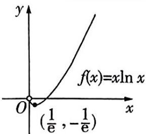</td><td>函数 $f(x) = x \ln x (x > 0)$ 在 $(0, \frac{1}{e})$ 上单调递减,在 $(\frac{1}{e}, +\infty)$ 上单调递增,在 $x = \frac{1}{e}$ 处取得最(极)小值- $\frac{1}{e}$ ,无最(极)大值.</td></tr><tr><td>2</td><td></td><td>函数 $f(x) = \frac{\ln x}{x} (x > 0)$ 在 $(0,e)$ 上单调递增,在 $(e, +\infty)$ 上单调递减,在 $x = e$ 处取得最(极)大值 $\frac{1}{e}$ ,无最(极)小值.</td></tr><tr><td>3</td><td></td><td>函数 $f(x) = \frac{x}{\ln x} (x > 0, x \neq 1)$ 在 $(0,1)$ , $(1,e)$ 上单调递减,在 $(e, +\infty)$ 上单调递增,在 $x = e$ 处取得极小值 $e$ ,无极大值.</td></tr><tr><td>4</td><td></td><td>函数 $f(x) = x e^{x}$ 在 $(-\infty, -1)$ 上单调递减,在 $(-1, +\infty)$ 上单调递增,在 $x = -1$ 处取得最(极)小值- $\frac{1}{e}$ ,无最(极)大值.</td></tr><tr><td>5</td><td></td><td>函数 $f(x) = \frac{e^{x}}{x} (x \neq 0)$ 在 $(-\infty, 0)$ , $(0,1)$ 上单调递减,在 $(1, +\infty)$ 上单调递增,在 $x = 1$ 处取得极小值 $e$ ,无极大值.</td></tr><tr><td>6</td><td></td><td>函数 $f(x) = \frac{x}{e^{x}}$ 在 $(-\infty, 1)$ 上单调递增,在 $(1, +\infty)$ 上单调递减,在 $x = 1$ 处取得最(极)大值 $\frac{1}{e}$ ,无最(极)小值.</td></tr></table>

# 考场贴士

路上堵车怎么办？如果路遇堵车，可以出示准考证向警察求助；如果是乘坐公共交通工具遇到堵车，可以中途下车，改坐出租车或者向警察求助。尽量多规划几条备选路线，避开单行道、狭窄路，提前出发。

# 图象2 切线不等式

<table><tr><td>7</td><td></td><td> $x - 1 \geqslant \ln x (x > 0)$ ,当  $x = 1$  时等号成立.</td></tr><tr><td>8</td><td></td><td> $e^x \geqslant x + 1$ ,当  $x = 0$  时等号成立.</td></tr><tr><td>9</td><td></td><td> $\frac{x-1}{2} \geqslant \frac{\ln x}{x+1} (x > 0)$ ,即  $2\ln x \leqslant x^2 - 1 (x > 0)$ ,当  $x = 1$  时等号成立.</td></tr><tr><td>10</td><td></td><td> $x \geqslant \ln (x + 1) \geqslant \frac{x}{x+1} (x > -1)$ ,当  $x = 0$  时等号成立.</td></tr><tr><td>11</td><td></td><td> $\ln x > \frac{2(x-1)}{x+1} (x > 1)$ . $\frac{2(x-1)}{x+1} \geqslant \ln x (0 < x \leqslant 1)$ ,当  $x = 1$  时等号成立.</td></tr><tr><td>12</td><td></td><td> $\tan x \geqslant x \geqslant \sin x, x \in [0, \frac{\pi}{2})$ ,当  $x = 0$  时等号成立.</td></tr></table>

# 考场贴士

考前必辨的 12组相近易混概念

<table><tr><td>1</td><td>∅, {0}和{∅}的区别</td><td>∅是集合,不含有任何元素; {0}是集合,含有一个元素0; {∅}是集合,含有一个元素∅.注意:∅ ∈ {∅} 和∅⊆{∅}都正确,区别在于,前者表示元素与集合的属于关系,后者表示集合间的包含关系.</td></tr><tr><td>2</td><td>∈,⊆和⊂的区别</td><td>1 ∈表示元素与集合间的关系,如a ∈ {a,b,c},特别地,在立体几何中表示点与直线或点与平面间的关系,如点A ∈ 直线l,点A ∈ 平面α.2⊆表示集合间的包含关系,C仅在立体几何中使用,表示直线与平面间的关系,如直线l⊂平面α.</td></tr><tr><td>3</td><td>函数的单调性、函数的单调区间与函数在区间上单调的区别</td><td>1函数的单调性是对定义域内的某个区间而言的,函数在某个区间上是单调函数,但在整个定义域上不一定是单调函数.如:如图所示,函数y=1/x在(-∞,0)和(0,+∞)上都是减函数,但在整个定义域上不是减函数.2“函数的单调递增(减)区间是M”与“函数在区间N上单调递增(减)”是两个不同的概念,显然N⊆M.如函数y=1/x(x&gt;0)的单调递减区间是(0,+∞),但可以说其在(0,+∞)的任意子区间上都单调递减. </td></tr><tr><td>4</td><td>“过某点的切线”与“在某点处的切线”的区别</td><td>1求过点P的切线时,点P不一定在曲线上,应注意检验,若点P在曲线上,应分P是切点和不是切点两种情况讨论.2求在点P处的切线时,点P一定在曲线上,且P是切点.如:曲线y=-x3+3x过点P(2,-2)的切线共有2条,方程分别为y=-2和9x+y-16=0,容易忘记讨论P不是切点的情况而漏掉切线y=-2.</td></tr><tr><td>5</td><td>函数的极值与最值的区别</td><td>极值反映了函数在某一点附近的值的大小情况,刻画的是函数的局部性质;而最值则反映了某区间上函数值中最小或最大的数.图中的d,f,h对应的函数值都是极大值,c,e,g对应的函数值都是极小值,最大(小)值则是极大(小)值与函数的区间端点值中最大(小)的一个.注意:极值不能在区间的端点处取得,即若求如图所示的函数f(x)在区间[f,h]上的极值情况,此时函数f(x)只有极小值f(g),无极大值,因为f,h为区间端点,此处不能取极值. </td></tr><tr><td>6</td><td>向量共线与直线共线的区别</td><td>向量共线是指向量所在直线平行或重合,向量共线时,夹角为0°或180°.而直线共线是指两条直线重合.注意不要把向量AB与向量CD共线当作A,B,C,D四点共线.</td></tr><tr><td>7</td><td>向量共线与垂直的坐标表示的区别</td><td>向量a,b共线的充要条件有2种形式:若 a=(x1,y1), b=(x2,y2),则 a//b⇔x1y2=x2y1.若 a=(x1,y1), b=(x2,y2),且 x2y2≠0,则 a//b⇔x1/x2=y1/y2.向量a=(x1,y1), b=(x2,y2)垂直的充要条件是x1x2+y1y2=0.注意:可以利用x1/x2=y1/y2来判断a//b,但反过来不一定成立,因为x2,y2有可能等于0.</td></tr><tr><td>8</td><td>轨迹与轨迹方程的区别</td><td>平面轨迹是个图形,比如直线、圆、椭圆等,而轨迹方程是这个图形对应的方程.一般先利用直接法或代入法求出轨迹方程,再说明轨迹,有时也可根据曲线的定义直接得出轨迹.</td></tr><tr><td>9</td><td>易混夹角取值范围</td><td>线线角、线面角、平面与平面的夹角的取值范围是[0°,90°],向量夹角的取值范围是[0°,180°],二面角的取值范围是[0°,180°].</td></tr><tr><td>10</td><td>二项式系数与项的系数的区别</td><td>对于二项式(a+b)n,其二项式系数只与n有关,为C'(r=0,1,2,...n),恒为正,二项式系数之和为2^n;项的系数与a,b有关,可正可负,一般用赋值法求展开式中的项的系数和或部分系数和,常赋值为0,±1.</td></tr><tr><td>11</td><td>条件概率P(B|A)与积事件的概率P(AB)的辨析</td><td>1P(B|A)表示在已知事件A发生的条件下,事件B发生的概率,P(B|A)=P(AB)/P(A).2P(AB)表示事件A与事件B同时发生的概率,P(AB)=P(B|A)·P(A)或P(AB)=P(A|B)·P(B).区分条件概率与积事件概率的关键是寻找并理解题中的关键字词,如:问题1 不透明的袋中有6个黄球、4个白球,这10个球除颜色外全部相同,现不放回抽取2次,每次取一球,求第二次才取到黄球的概率.该题中的关键字是“才”,也就是“第一次取到白球,第二次取到黄球”,应该使用积事件的概率公式求解.据此,设“第二次才取到黄球”为事件C,“第一次取到白球”为事件A,“第二次取到黄球”为事件B,则P(C)=P(AB),而不是P(C)=P(B|A).问题2 不透明的袋中有6个黄球、4个白球,这10个球除颜色外全部相同,现不放回抽取2次,每次取一球,当取出的两球其中之一是黄球时,求另一个也是黄球的概率.该题中的关键词是“当......时”,也就是“在已知某事件发生的条件下,求另一事件发生的概率”,应该使用条件概率公式求解.据此,设“取出的两球其中之一是黄球”为事件D,“另一个也是黄球”为事件E,“当取出的两球其中之一是黄球时,另一个也是黄球”为事件F,则P(F)=P(E|D)=P(ED)/P(D).</td></tr><tr><td>12</td><td>二项分布与超几何分布的区别</td><td>超几何分布需要知道总体的容量,二项分布不需要知道总体容量,但需要知道“成功概率”.超几何分布中的概率计算实质是古典概型问题;二项分布中的概率计算实质是相互独立事件的概率问题.</td></tr></table>

# 考场贴士

如果是考试当天忘带了,此时千万不要回去拿,打电话让家长送过来,因为迟到15分钟,就不能参加考试.

# 考前必纠的 7个易忽视细节

<table><tr><td>1</td><td>定义域优先意识</td><td>求解函数相关的问题时,常常需要先判断函数的定义域,切入点一般有:分式的分母不为0、根号内的式子大于等于0、对数的真数大于0、对数的底数大于0且不等于1等.在判断函数的奇偶性时,还要注意先判断函数的定义域是否关于原点对称.</td></tr><tr><td>2</td><td>极值与导数的关系</td><td>导数值为0的点不一定是函数取极值的点.如函数 $y=x^{3}$ ,导函数 $y'=3x^{2}$ ,虽然在x=0处有 $y'=0$ ,但函数 $y=x^{3}$ 在R上是单调递增的,所以x=0不是函数的极值点.可导函数在一点的导数值为0是该函数在这点取极值的必要条件,而非充分条件.</td></tr><tr><td>3</td><td>使用基本不等式的前提考虑不全</td><td>问题:已知函数 $f(x)=\frac{x^{2}-2x+a}{x},x\in(0,2]$ ,其中常数a&gt;0,则函数 $f(x)$ 的最小值是多少?错解: $f(x)=\frac{x^{2}-2x+a}{x}=x+\frac{a}{x}-2\geqslant2\sqrt{a}-2$ ,当且仅当 $x=\sqrt{a}$ 时等号成立,所以 $f(x)$ 的最小值为 $2\sqrt{a}-2$ .产生错误的原因:虽然考虑了取等的条件,但没有考虑等号是否能取到,正确的解法如下. $f(x)=\frac{x^{2}-2x+a}{x}=x+\frac{a}{x}-2$ ,当 $0<\sqrt{a}\leqslant2$ ,即 $0<a\leqslant4$ 时, $x+\frac{a}{x}-2\geqslant2\sqrt{a}-2$ ,等号可以成立,所以 $f(x)$ 的最小值为 $2\sqrt{a}-2$ ;当 $\sqrt{a}>2$ ,即a&gt;4时,函数 $f(x)=x+\frac{a}{x}-2$ 在 $x\in(0,2]$ 上单调递减,所以 $f(x)$ 的最小值为 $f(2)=\frac{a}{2}$ .综上所述,当 $0$ </td></tr><tr><td>4</td><td>数列问题中2种容易忽略n的取值的情况</td><td>1求解数列\( \{a_{n}\}的前n项和 $S_{n}$ 的最值,无论是利用 $S_{n}$ ,还是利用 $a_{n}$ 来求,都要注意n的取值限制,因为数列中可能出现值为零的项,所以在利用不等式(组)求解时,不能漏掉不等式(组)中的等号,避免造成无解或漏解的情况.2已知数列 $\{a_{n}\}$ 的前n项和 $S_{n}$ 求 $a_{n}$ ,易忽视n=1的情形,直接用 $S_{n}-S_{n-1}$ 表示 $a_{n}$ .作答时,应验证 $a_{1}$ 是否满足 $a_{n}=S_{n}-S_{n-1}(n\geqslant2)$ ,若满足,则数列通项公式可合并;否则,要用分段形式表示: $a_{n}=\begin{cases}a_{1},&n=1,\\S_{n}-S_{n-1},&n\geqslant2.\end{cases}$ </td></tr><tr><td>5</td><td>数列问题中2种容易忽略分类讨论的情况</td><td>1对通项公式中含有(-1)n的一类数列,在求数列的前n项和Sn时,要注意分n是奇数和n是偶数两种情况进行讨论.2在用等比数列的前n项和公式时,一定要分公比q=1和q≠1两种情况进行讨论.如:数列{an}满足an+1+(-1)nan=2n-1,则求数列{an}的前60项和时,先讨论n是奇数的情况,有an+2+an=2;再讨论n是偶数的情况,有an+2+an=4n.所以S60=(a1+a3)+(a5+a7)+···+(a57+a59)+(a2+a4)+(a6+a8)+···+(a58+a60)=2+2+···+2+4×(2+6+···+58)=15×2+4×60×15/2=1 830.</td></tr><tr><td>6</td><td>用错位相减法求和时项数处理不当</td><td>错位相减法的适用环境是:数列由一个等差数列和一个等比数列的对应项相乘组成,求其前n项和Sn.基本方法是在和式两端同时乘等比数列的公比,得到另外一个和式,将两个和式错位相减,得到的式子一般可分为三个部分:原来数列的第一项、一个等比数列的前(n-1)项的和、原来数列的第n项乘公比后在作差时出现的式子.在用错位相减法求数列的前n项和Sn时,一定要注意处理好这三个部分,否则容易出错.</td></tr><tr><td>7</td><td>直线方程中的3个易忽视细节</td><td>1在使用直线方程时,要注意方程表示直线的局限性,例如用斜截式方程y=kx+b时,斜率k必须存在.2讨论两条直线的位置关系时,易忽视斜率不存在时的情况导致漏解,如两条直线垂直时,若一条直线的斜率不存在,则另一条直线的斜率为0.3求解两平行直线A1x+B1y+C1=0(A1,B1不同时为0)与A2x+B2y+C2=0(A2,B2不同时为0)之间的距离时,只有当A1=A2,B1=B2时才能代入公式d=|C1-C2|/√A2+B2(A=A1=A2,B=B1=B2)计算.</td></tr></table>

# 考场贴士

# 考前必纠的4个思维误区

<table><tr><td>1</td><td>两次使用基本不等式出错</td><td>问题:若x&gt;0,y&gt;0,且x+2y=3,则 1/x+1/y的最小值为_.错解:因为3=x+2y≥2√x·2y,所以xy≤9/8,所以1/x+1/y≥2√1/xy≥4√2/3,所以1/x+1/y的最小值为4√2/3.产生错误的原因:解题过程中两次使用基本不等式,第一次(x+2y≥2√x·2y)等号成立的条件是x=2y,第二次(1/x+1/y≥2√1/xy)等号成立的条件是 1/x=1/y,即x=y,两次等号成立的条件不一致,因此最后求得的最值取不到.事实上,本题可以使用“1”的代换求解,如下: 1/x+1/y=x+2y/3(1/x+1/y)=1/3(1+2y/x+x/y+2)≥1/3(3+2√2yx/xy)=1+2√2/3,当且仅当2y/x=x/时等号成立.</td></tr><tr><td>2</td><td>进行向量的数量积运算时的3个误区</td><td>1由a=0可得a·b=0,但由a·b=0不能得到a=0或b=0,原因是a⊥b时,也有a·b=0.2向量的数量积运算不适合结合律,即(a·b)·c=a·(b·c)不一定成立,这是因为(a·b)·c表示一个与c共线的向量,a·(b·c)表示一个与a共线的向量,a与c不一定共线,因此(a·b)·c与a·(b·c)不一定相等.3a·b&gt;0是a,b的夹角为锐角的必要不充分条件,因为由a·b&gt;0还可以得出a,b的夹角为0°;a·b&lt;0是a,b的夹角为钝角的必要不充分条件,因为由a·b&lt;0还可以得出a,b的夹角为180°.</td></tr><tr><td>3</td><td>与异面直线有关的3个误区</td><td>1不能把异面直线简单地理解为分别在不同平面内的两条直线.如:在如图所示的长方体中,AB,CD分别是上、下两个底面的对角线,AB//CD,AB,CD不是异面直线.2两条异面直线的夹角的取值范围是(0°,90°],注意该区间左开右闭,避免遗漏区间端点处对应的特殊情况.3异面直线不具有传递性,即若直线a与直线b异面,直线Eb与直线c异面,则a与c不一定是异面直线.如:在如图所示的长方体中,AB,CE是异面直线,AB,ED是异面直线,但CE,ED不是异面直线. </td></tr><tr><td>4</td><td>与等比数列有关的2个误区</td><td>1由于等比数列的每一项都可以作为分母,故每一项均不为0,因此q不能为0,但q可为正数,也可为负数.2运用等比数列的前n项和公式时,注意分q=1与q≠1两种情况,不可直接套用公式 Sn=a1(1-q^n)/1-q.</td></tr></table>

# 考场贴士

如果考试已经开始,考生已经接触试卷,可以允许考完这一科,然后试卷转入原考场整理装袋,相关情况会记入《考场违规及特殊情况记录》.

# 考前必会的 8个选填题快解大招


# 招1 赋值法秒杀抽象函数求值

# 抢分大招

求解以抽象函数为载体、求特定函数值的问题，优先考虑用赋值法，缩短解题思维路径，具体操作如下：


<details>
<summary>flowchart</summary>


</details>

调研 1 (试题调研原创)(多选)函数 $f(x)$ 的定义域为 $\mathbf{R}, f(\frac{1}{2}) \neq 0$ , 若 $f(x + y) + f(x)f(y) = 4xy$ , 则下列选项正确的有 ( )

A. $f(-\frac{1}{2}) = 0$

B. $f(\frac{1}{2}) = -2$

C. 函数 $f(x + \frac{1}{2})$ 是增函数

D. 函数 $f(x - \frac{1}{2})$ 是奇函数

  
赋值法秒杀

# 大招解题

抽象函数试题


<details>
<summary>flowchart</summary>

```mermaid
graph TD
    A["令 x = 1/2, y = 0"] --> B["f(1/2) + f(1/2) × f(0) = f(1/2) × [1 + f(0)"] = 0]
    B --> C["f(1/2) ≠ 0"]
    C --> D["f(0) = -1"]
    E["令 x = 1/2, y = -1/2"] --> F["f(0) + f(1/2) × f(-1/2) = -1"]
    F --> G["f(1/2) ≠ 0"]
    G --> H["f(-1/2) = 0"]
    I["A 对"] --> D
```
</details>

【考前提醒】求解以抽象函数为载体求某个特殊函数值的问题，优先考虑赋值法，通常原 $0, \pm 1, \pm \frac{1}{2}$ 等，也可根据题目信息寻找某个特殊值

# 考场贴士

令 $y = -\frac{1}{2}$ → $f(x - \frac{1}{2}) = -2x$ → $f(x) = -2x - 1$ →符合题意

【另解】由A项解析知 $f(x)$ 的图象过点 $(0, -1)$ 、点 $(- \frac{1}{2}, 0)$ ，令 $f(x) = kx + b$ ，则 $\left\{ \begin{array}{l} b = -1, \\ -\frac{1}{2}k + b = 0, \end{array} \right.$ 得 $\left\{ \begin{array}{l} b = -1, \\ k = -2, \end{array} \right.$ 所以 $f(x) = -2x - 1$

$f(x) = -2x - 1$ $f(\frac{1}{2}) = -2 \longrightarrow B \text{ 对}$ $f(x + \frac{1}{2}) = -2x - 2 \longrightarrow f(x + \frac{1}{2}) \text{ 是减函数} \longrightarrow C \text{ 错}$ $f(-x - \frac{1}{2}) = 2x = -f(x - \frac{1}{2}) \xrightarrow[f(-\frac{1}{2})=0]{\text{ 定义域为 } R} f(x - \frac{1}{2}) \text{ 是奇函数} \longrightarrow D \text{ 对}$

故选 ABD.

调研 2 (2024 福建厦门 2 月质量检测) 函数 $f(x)$ 的定义域为 $\mathbf{R},\forall x,y\in \mathbf{R},f(x + 1)\cdot f(y + 1) = f(x + y) - f(x - y)$ ，若 $f(0)\neq 0$ ，则 $f(2024) =$ （）

A. -2

B. -4

C. 2

D. 4

大招解题 方法一 令 $x = y = 0$ ，则 $[f(1)]^2 = f(0) - f(0) = 0$ ，所以 $f(1) = 0$ .

令 $x = 0, y = x$ ，则 $f(1)f(x + 1) = f(0 + x) - f(0 - x) = 0$ ，所以 $f(x) = f(-x)$ .

令 $y = -x$ ，则 $f(x + 1)f(1 - x) = f(0) - f(2x)$

令 $y = x$ ，则 $f(x + 1)f(x + 1) = f(2x) - f(0)$

所以 $f(x + 1)f(1 - x) = -f(x + 1)f(x + 1)$

若 $f(x+1)=0$ 恒成立，则与题设条件 $f(0)\neq0$ 矛盾，

所以 $f(x+1)$ 不恒为0，所以 $f(1-x)=-f(x+1)$ ，所以 $f(x)=-f(2-x)$ .

又 $f(x) = f(-x)$ ，所以 $f(-x) = -f(2 - x)$ ，

所以 $f(x) = -f(2 + x) = -[-f(4 + x)] = f(x + 4)$ ，所以4为 $f(x)$ 的一个周期，所以 $f(2024) = f(0)$ .

令 $x = y = 1$ ，得 $f(2)f(2) = f(2) - f(0)$

又 $f(2) = -f(0)$ , 所以 $f(0)f(0) = -2f(0)$ , 结合 $f(0) \neq 0$ 得 $f(0) = -2$ , 所以 $f(2024) = -2$ , 故选 A.

方法二 因为 $\cos (x + y) - \cos (x - y) = -2\sin x\sin y,$

所以 $-2\cos (x + \frac{\pi}{2})\cos (y + \frac{\pi}{2}) = \cos (x + y) - \cos (x - y)$

所以 $-2\cos (x + \frac{\pi}{2})[-2\cos (y + \frac{\pi}{2})] = -2\cos (x + y) - [-2\cos (x - y)].$

由此联想构造函数, 令 $f(x) = -2 \cos \frac{\pi x}{2}$ , 检验得 $\forall x, y \in \mathbb{R}, f(x + 1)f(y + 1) = f(x + y) - f(x, y)$ , 且 $f(0) \neq 0$ , 符合题意,

所以 $f(2024) = -2\cos 1012\pi = -2$ ，故选A.

调研 3 (2024 河北保定三中 2 月检测) 函数 $f(x)$ 满足 $\forall x, y \in \mathbf{Z}, f(x + y) = f(x) + f(y) + 2xy + 1$ ，且 $f(-2) = 1$ ，则 $f(2n) (n \in \mathbf{N}^*) =$ （）

A. $4n + 6$

B. $8n - 1$

C. $4n^{2} + 2n - 1$

D. $8n^{2} + 2n - 5$

大招解题 令 $x = y = 0$ ，则 $f(0) = f(0) + f(0) + 1$ ，所以 $f(0) = -1$ .

令 $x = y = -1$ ，则 $f(-2) = f(-1) + f(-1) + 2 + 1 = 2f(-1) + 3 = 1$ ，所以 $f(-1) = -1.$

令 $x = 1, y = -1$ ，则 $f(0) = f(1) + f(-1) - 2 + 1 = f(1) - 2 = -1$ ，所以 $f(1) = 1$ .

令 $x = n, y = 1, n \in \mathbb{N}^{\bullet}$ , 则 $f(n + 1) = f(n) + f(1) + 2n + 1 = f(n) + 2n + 2$ ,

所以 $f(n+1)-f(n)=2n+2.$

【破障碍】类比由数列的递推公式求通项公式的方法，求 $f(n)(n\in\mathbf{N}^{*})$ 的解析式

当 $n \geqslant 2$ 时, $f(n) - f(n - 1) = 2n$ ,

则 $f(n)=f(n)-f(n-1)+f(n-1)-f(n-2)+\cdots+f(2)-f(1)+f(1)=2n+(2n-2)+\cdots+4+1=\frac{(2n+4)(n-1)}{2}+1=n^{2}+n-1.$

当 $n = 1$ 时，上式也成立，所以 $f(n) = n^2 + n - 1 (n \in \mathbb{N}^*)$

所以 $f(2n) = 4n^{2} + 2n - 1 (n \in \mathbb{N}^{\bullet})$ . 故选 C.

# 秒解

令 $x = y = 0$ ，则 $f(0) = f(0) + f(0) + 1$ ，所以 $f(0) = -1$

令 $x = y = -1$ ，则 $f(-2) = f(-1) + f(-1) + 2 + 1 = 2f(-1) + 3 = 1$ ，所以 $f(-1) = -1.$

令 $x = 1, y = -1$ ，则 $f(0) = f(1) + f(-1) - 2 + 1 = f(1) - 2 = -1$ ，所以 $f(1) = 1$ .

令 $x = y = 1$ ，则 $f(2) = f(1) + f(1) + 2 + 1 = 5$ ，排除AB.

令 $x = y = 2$ ，则 $f(4) = f(2) + f(2) + 8 + 1 = 19$ ，排除D.选C.

调研 4 (试题调研原创)(多选)函数 $f(x)$ 的定义域为 $\mathbb{R},\forall x,y\in\mathbb{R},2f(xy+1)=f(x)\cdot f(y)-f(y)-2x+6$ ，且 $f(0)=1$ ，则下列选项正确的是 ( )

# 考场贴士

A. $f(-1) = 2$

B. $f(1) = 3$

C. $f(x)$ 是增函数

D. $f(x)$ 是偶函数

大招解题 令 $x = y = 0$ ，则 $2f(1) = [f(0)]^2 - f(0) + 6 = 6$ ，则 $f(1) = 3, B$ 正确.

令 $y = 1$ ，则 $2f(x + 1) = 3f(x) - 3 - 2x + 6 = 3f(x) - 2x + 3$ ①.

令 $x = 1$ ，则 $2f(y + 1) = 3f(y) - f(y) - 2 + 6 = 2f(y) + 4,$

所以 $f(x + 1) = f(x) + 2$ ②.

联立①②可得 $f(x)=2x+1$ ，则 $f(-1)=-2+1=-1$ ，A错误.

函数 $f(x) = 2x + 1$ 为增函数，且为非奇非偶函数，所以C正确，D错误.故选BC.

【秒杀攻略】得出 $f(1)=3$ 后，令x=1,y=-1，则 $2f(-1+1)=f(1)f(-1)-f(-1)-2+6$ ，则 $f(-1)=-1\neq f(1)$ ，所以AD错误，由于是多选题，正确选项至少有两个，所以正确答案是BC


# 招2 巧取特殊值,速排选择题错误项

# 抢分大招

特值法就是用符合条件的特例, 如特殊自变量、特殊函数值、特殊函数、特殊点、特殊图形、特殊数列等来检验各选项, 从而直接得到正确选项或排除干扰项的方法. 其基本步骤为:


<details>
<summary>flowchart</summary>


</details>

调研 1 (试题调研原创) 函数 $f(x) = \mathrm{e}^{x} - 2ax - \mathrm{e} + b \geqslant 0$ 对任意 $x \in \mathbb{R}$ 成立, 则 $\frac{b}{a}$ 的最小值为 ( )


巧取特殊值,速排选择题错误项

A.4

B. 3

C. $\frac{5}{2}$

D. 2

# 考场贴士

提早15分钟进入考场,看一看教室四周,熟悉一下陌生的环境.坐在座位上,尽快进入考试状态.进入考场后,可以在座位上把手臂和腿向下垂,放松肌肉,缓解紧张情绪.

大招解题 $f^{\prime}(x) = \mathrm{e}^{x} - 2a$ ，依题意得 $a\neq 0$

当 $a < 0$ 时，恒有 $f'(x) > 0$ ，函数 $f(x)$ 单调递增，

当 $x < 0$ 时, $f(x) < -2ax - e + b + 1$ , 而函数 $y = -2ax - e + b + 1 (a, b$ 为参数, $x \in (-\infty, 0)$ ) 单调递增, 值域为 $(- \infty, -e + b + 1)$ , 因此存在 $x_0 \in \mathbb{R}$ , 当 $x < x_0$ 时, $f(x) < 0$ , 不符合题意.

所以 a > 0.

令 $\mathrm{e}^x - 2a = 0$ ，得 $x = \ln 2a$ ，计算并列表如下.

<table><tr><td>x</td><td>(-∞,ln2a)</td><td>ln2a</td><td>(ln2a,+∞)</td></tr><tr><td>f&#x27;(x)</td><td>-</td><td>0</td><td>+</td></tr><tr><td>f(x)</td><td>↘</td><td>取最小值</td><td>↗</td></tr></table>

所以 $f(x)_{\min} = f(\ln 2a) = 2a - 2a\ln 2a - e + b$ ，所以 $2a - 2a\ln 2a - e + b \geqslant 0.$

又 $a \neq 0$ ，则上式可变形为 $\frac{b}{a} \geqslant 2\ln 2a + \frac{e}{a} - 2$ .

【破障碍】求 $\frac{b}{a}$ 的最小值，即求曲线 $C_{1}: y=\frac{b}{a}$ (b为参数,a>0)在曲线 $C_{2}: y=2\ln2a+\frac{e}{a}-2$ 上方时 $\frac{b}{a}$ 的最小值。对于确定的b，画出草图，数形结合可知在曲线 $C_{1}, C_{2}$ 的交点处 $\frac{b}{a}$ 取最小值，如果可以使 $C_{1}, C_{2}$ 交于 $C_{2}$ 的最低点，此时 $\frac{b}{a}$ 的值是最小的，所以 $\frac{b}{a}$ 的最小值即 $2\ln2a+\frac{e}{a}-2$ 的最小值。

令 $g(a) = 2\ln 2a + \frac{e}{a} - 2, a > 0$ ，则 $g'(a) = \frac{2}{a} - \frac{e}{a^2} = \frac{2a - e}{a^2}$ ，计算并列表如下.

<table><tr><td>a</td><td>(0,e/2)</td><td>e/2</td><td>(e/2,+∞)</td></tr><tr><td>g&#x27;(a)</td><td>-</td><td>0</td><td>+</td></tr><tr><td>g(a)</td><td>↘</td><td>取最小值</td><td>↗</td></tr></table>

所以 $g(a)_{\min} = g(\frac{e}{2}) = 2$ ，所以 $\frac{b}{a}$ 的最小值为2.故选D.

# 秒解

令 $x = 0$ ，则 $f(0)\geqslant 0$ ，得 $b\geqslant \mathrm{e} - 1 > 0$ ，结合4个选项可得 $a > 0$

令 $x = 1$ ，则 $f(1)\geqslant 0$ ，即 $f(1) = \mathrm{e} - 2a - \mathrm{e} + b = -2a + b\geqslant 0$ ，得 $\frac{b}{a}\geqslant 2$

故 ABC 不符合题意,选 D.

# 考场贴士

调研 2: (2024 郑州外国语学校 2 月适应性测试) 已知函数 $f(x)=\frac{\cos x}{x}, A, B$ 是锐角 $\triangle ABC$ 的两个内角, 则下列结论一定正确的是 ( )

A. $f(\sin A) > f(\sin B)$

B. $f(\cos A) > f(\cos B)$

C. $f(\sin A) > f(\cos B)$

D. $f(\cos A) > f(\sin B)$

大招解题 由 $f(x) = \frac{\cos x}{x}$ 得 $f'(x) = \frac{-x\sin x - \cos x}{x^2}$ , 当 $x \in (0, \frac{\pi}{2})$ 时, $\sin x > 0, \cos x > 0$ , 所以 $\frac{-x\sin x - \cos x}{x^2} < 0$ , 即 $f'(x) < 0$ , 所以 $f(x)$ 在 $(0, \frac{\pi}{2})$ 上单调递减.

因为 A, B 是锐角 $\triangle ABC$ 的两个内角, 所以 $A + B > \frac{\pi}{2}, 0 < A < \frac{\pi}{2}, 0 < B < \frac{\pi}{2}$ , 则 $\frac{\pi}{2} > A > \frac{\pi}{2} - B > 0$ .

【会读题】充分利用题干信息，根据锐角三角形这一条件缩小变量的取值范围

因为 $y = \cos x$ 在 $(0, \frac{\pi}{2})$ 上单调递减，

所以 $0 < \cos A < \cos \left(\frac{\pi}{2} - B\right) = \sin B < 1 < \frac{\pi}{2}$ , 故 $f(\cos A) > f(\sin B)$ , 故 D 正确.

同理可得 $f(\cos B) > f(\sin A), C$ 错误.

而 $A, B$ 的大小不确定，故 $\sin A$ 与 $\sin B, \cos A$ 与 $\cos B$ 的大小关系均不确定，

所以 $f(\sin A)$ 与 $f(\sin B), f(\cos A)$ 与 $f(\cos B)$ 的大小关系也均不确定，AB不能判断. 故选D.

# 秒解

$f'(x)=\frac{-x\sin x-\cos x}{x^{2}}$ ，当 $x\in(0,\frac{\pi}{2})$ 时， $\sin x>0,\cos x>0$ ，所以 $\frac{-x\sin x-\cos x}{x^{2}}<0$ ，即 $f'(x)<0$ , 所以 $f(x)$ 在 $(0, \frac{\pi}{2})$ 上单调递减.

令 $A = \frac{\pi}{3}, B = \frac{\pi}{3}$ , 则 AB 错误. 对于 CD 选项, $f(\frac{\sqrt{3}}{2}) < f(\frac{1}{2})$ , 所以 C 错误, D 正确. 选 D.

调研 3: (试题调研原创)(多选)若 $z_{1}, z_{2}$ 为复数, 则下列选项一定正确的是 ( )

A. $|\overline{z_1} +\overline{z_2}| = |\overline{z_1}| + |\overline{z_2} |$

B. $\overline{z_1 + z_2} = \overline{z_1} +\overline{z_2}$

C. $z_{1}^{n} = |z_{1}|^{n}(n\in \mathbf{N}^{*})$

D. $z_{1} \cdot \overline{z_{1}} = |z_{1}| \cdot |\overline{z_{1}}|$

大招解题 对于 A 选项, 取 $z_{1}=1-i, z_{2}=1+i$ , 则 $\left|\overline{z_{1}}\right|+\left|\overline{z_{2}}\right|=2\sqrt{2}, \left|\overline{z_{1}}+\overline{z_{2}}\right|=2$ , 故 $\left|\overline{z_{1}}+\overline{z_{2}}\right|\neq\left|\overline{z_{1}}\right|+\left|\overline{z_{2}}\right|$ , A 错误.

考场贴士

对于B选项，设 $z_{1} = a + bi, z_{2} = c + di(a, b, c, d \in \mathbb{R})$ ，则 $z_{1} + z_{2} = (a + c) + (b + d)\mathrm{i}, \overline{z_{1} + z_{2}} = (a + c) - (b + d)\mathrm{i}, \overline{z_{1}} = a - bi, \overline{z_{2}} = c - di$ ，则 $\overline{z_{1}} + \overline{z_{2}} = (a + c) - (b + d)\mathrm{i}$ ，所以 $\overline{z_{1} + z_{2}} = \overline{z_{1}} + \overline{z_{2}}$ ，故B正确.

对于 C 选项, 不妨取 $z_{1} = 1 + \mathrm{i}, n = 2$ , 则 $z_{1}^{2} = (1 + \mathrm{i})^{2} = 2\mathrm{i}, |z_{1}| = \sqrt{2}, |z_{1}|^{2} = 2$ , 所以 $z_{1}^{2} \neq |z_{1}|^{2}$ , 故 $z_{1}^{n} = |z_{1}|^{n} (n \in \mathbf{N}^{*})$ 不恒成立, C 错误.

对于D选项，设 $z_{1} = a + b\mathrm{i}(a,b\in \mathbf{R})$ ，则 $\overline{z_1} = a - b\mathrm{i}$ ，所以 $|z_1| = |\overline{z_1}| = \sqrt{a^2 + b^2}$

所以 $z_{1} \cdot \overline{z_{1}} = (a + bi)(a - bi) = a^{2} + b^{2} = |z_{1}| \cdot |\overline{z_{1}}|$ , D 正确. 故选 BD.

# 秒解

令 $z_{1} = \mathrm{i}, z_{2} = -\mathrm{i}$ ，则 $|\overline{z_1} + \overline{z_2}| = 0, |\overline{z_1}| + |\overline{z_2}| = 2, |\overline{z_1} + \overline{z_2}| \neq |\overline{z_1}| + |\overline{z_2}|$ ，A 错误.

【抢分大拓】取值要简单，便于计算，快速判断

对于 C, 取 $n=1, z_{1}=i$ , 则 $z_{1} \neq |z_{1}| = 1$ , 所以 C 错误. 故选 BD.

【秒杀大拓】多选题至少有两个选项正确,故选 BD


# 招3 二级结论法秒杀焦点三角形问题

# 抢分大招

我们在解题过程中积累了许多的二级结论，由于选择题、填空题的阅卷评分标准是只看答案是否正确，不管过程是否详细，所以在解答选择题、填空题的过程中应用这些二级结论，可以缩短解题路径，大大节省我们的解题时间，事半而功倍。解决此类问题的关键点如下：


<details>
<summary>flowchart</summary>


</details>

调研 1: (2024 辽宁省名校联盟 2 月联考)(多选)已知抛物线 $C: y^{2} = 6x$ 的焦点为 $F, 0$ 为坐标原点, 倾斜角为 $\theta$ 的直线 $l$ 过点 $F$ 且与 $C$ 交于 $M, N$ 两点, 若 $\triangle OMN$ 的面积为 $3\sqrt{3}$ , 则 ( )

A. $\sin \theta = \frac{\sqrt{3}}{2}$

B. $|MN| = 24$

C. 以 $MF$ 为直径的圆与 $y$ 轴仅有1个交点

D. $\frac{|MF|}{|NF|} = \frac{\sqrt{3}}{3}$ 或 $\frac{|MF|}{|NF|} = \sqrt{3}$


二级结论法秒杀焦点三角形选择题

# 考场贴士

# 大招解题

<table><tr><td>选项</td><td>分析过程</td><td>正误</td></tr><tr><td>A</td><td>依题意得 $F\left(\frac{3}{2},0\right)$ ,易知直线 $l$ 的斜率不为0,设直线 $l: x = my + \frac{3}{2}$ ,由 $\begin{cases}x=my+\frac{3}{2},\\y^{2}=6x,\end{cases}$ 消去 $x$ 整理得关于 $y$ 的方程 $y^2-6my-9=0, \Delta=36(m^2+1)>0.$ 设 $M(x_1,y_1),N(x_2,y_2)$ ,则 $y_1+y_2=6m,y_2y_2=-9$ ,故 $S_{\triangle OMN}=\frac{1}{2}\times|y_1-y_2|\times\frac{3}{2}=$ 【二级结论】过抛物线 $y^2=2px(p>0)$ 的焦点的直线 $l$ 与抛物线交于 $M(x_1,y_1)$ , $N(x_2,y_2)(y_1>y_2)$ 两点,则 $x_1x_2=\frac{p^2}{4},y_1y_2=-p^2$  $\frac{3}{4}\times6\sqrt{m^2+1}=3\sqrt{3}$ ,得 $3m^2=1$ ,所以 $m^2=\frac{\cos^2\theta}{\sin^2\theta}=\frac{1}{3}$ ,又 $\sin^2\theta+\cos^2\theta=1$ ,所以 $\sin^2\theta=\frac{3}{4}$ ,则 $\sin\theta=\frac{\sqrt{3}}{2}$ </td><td>√</td></tr><tr><td>B</td><td> $|MN|=\sqrt{1+m^2}\cdot|y_1-y_2|=\frac{4}{3}\times6=8$ </td><td>×</td></tr><tr><td>C</td><td> $|MF|=x_1+\frac{3}{2}$ ,因为线段 $MF$ 的中点到 $y$ 轴的距离为 $\frac{x_1+\frac{3}{2}}{2}$ ,所以以 $MF$ 为直径的圆与 $y$ 轴相切</td><td>√</td></tr><tr><td>D</td><td> $\frac{|MF|}{|NF|}=\frac{|y_1|}{|y_2|}$ ,若 $m=\frac{\sqrt{3}}{3}$ ,则 $y^2-2\sqrt{3}y-9=0$ ,解得 $y=-\sqrt{3}$ 或 $y=3\sqrt{3}$ .若 $m=-\frac{\sqrt{3}}{3}$ ,则 $y^2+2\sqrt{3}y-9=0$ ,解得 $y=-3\sqrt{3}$ 或 $y=\sqrt{3}$ .故 $\frac{|MF|}{|NF|}=\frac{1}{3}$ 或 $\frac{|MF|}{|NF|}=3$ </td><td>×</td></tr></table>

故选 AC.

# 秒解

<table><tr><td>选项</td><td>分析过程</td><td>正误</td></tr><tr><td>A</td><td>由题意知,抛物线C中,p=3,则 $S_{\triangle OMN}=\frac{p^{2}}{2\sin\theta}=\frac{9}{2\sin\theta}=3\sqrt{3}$ ,解得 $\sin\theta=\frac{\sqrt{3}}{2}$ 【二级结论】过抛物线 $y^{2}=2px(p>0)$ 的焦点 $F(\frac{p}{2},0)$ 的直线 $l:y=kx-\frac{kp}{2}$ (其中k为直线l的斜率)交抛物线于M,N两点,倾斜角为θ,则焦点三角形OMN的面积为 $S_{\triangle OMN}=\frac{p^{2}}{2\sin\theta}=\frac{p^{2}}{2}\sqrt{1+\frac{1}{k^{2}}}$ (若抛物线方程为 $x^{2}=2py(p>0)$ ,直线l: $y=kx+\frac{p}{2}$ ,则 $S_{\triangle OMN}=\frac{p^{2}}{2|\cos\theta|}=\frac{p^{2}}{2}\sqrt{1+k^{2}}$ )</td><td>√</td></tr></table>

# 考场贴士

无意弄脏或损坏试卷、答题卡怎么办？按照高考规定，弄脏试卷、答题卡会被认为有故意做标记的嫌疑，如果是无意弄脏了，应该立即向监考老师报告。

续表

<table><tr><td>选项</td><td>分析过程</td><td>正误</td></tr><tr><td>B</td><td>焦点弦长 $|MN| = \frac{2p}{\sin^{2}\theta} = \frac{2 \times 3}{(\frac{\sqrt{3}}{2})^{2}} = 8$ 【二级结论】倾斜角为α的直线l过抛物线焦点,交抛物线于 $M(x_{1},y_{1}),N(x_{2},y_{2})$ 两点,则抛物线的焦点弦长 $|MN| = x_{1} + x_{2} + p = \frac{2p}{\sin^{2}\alpha}$ ,且 $\frac{1}{|MF|} + \frac{1}{|NF|} = \frac{2}{p}$ </td><td>×</td></tr><tr><td>C</td><td> $\sin \theta = \frac{\sqrt{3}}{2}$ ,当 $\cos \theta = \frac{1}{2}$ ,点M在第一象限时, $|MF| = \frac{p}{1 - \cos \theta} = \frac{3}{1 - \frac{1}{2}} = 6$ ,【二级结论】倾斜角为α的直线l交抛物线 $y^{2} = 2px (p > 0)$ 于 $M(x_{1},y_{1}),N(x_{2},y_{2})$ 两点,其中点M在第一象限,则抛物线的焦半径 $|MF| = x_{1} + \frac{p}{2} = \frac{p}{1 - \cos \alpha}$ , $|NF| = x_{2} + \frac{p}{2} = \frac{p}{1 + \cos \alpha}$ 以MF为直径的圆的半径为3,而圆心到y轴的距离为 $\frac{(6 - \frac{3}{2}) + \frac{3}{2}}{2} = 3$ ,故以MF为直径的圆与y轴相切,其他情况亦如此</td><td>√</td></tr><tr><td>D</td><td>设点M在第一象限,则当 $\cos \theta = \frac{1}{2}$ 时, $|MF| = 6$ , $|NF| = \frac{p}{1 + \cos \theta} = \frac{3}{1 + \frac{1}{2}} = 2$ ,此时 $\frac{|MF|}{|NF|} = 3$ ;当 $\cos \theta = -\frac{1}{2}$ 时, $|MF| = \frac{p}{1 - \cos \theta} = \frac{3}{1 + \frac{1}{2}} = 2$ , $|NF| = \frac{p}{1 + \cos \theta} = \frac{3}{1 - \frac{1}{2}} = 6$ ,此时 $\frac{|MF|}{|NF|} = \frac{1}{3}$ </td><td>×</td></tr></table>

故选AC.

调研 2 (试题调研原创)已知点 $P$ 是椭圆 $C: \frac{x^2}{25} + \frac{y^2}{16} = 1$ 上一点, $F_1, F_2$ 是其左、右焦点, 且 $\angle F_1PF_2 = 60^\circ$ , 则 $\triangle F_1PF_2$ 的面积为 \_\_\_\_.

大招解题 由题意知, 椭圆 C 中 a=5, b=4, 则 $c^{2}=a^{2}-b^{2}=9$ .

由椭圆定义知， $\left|PF_{1}\right|+\left|PF_{2}\right|=2a=10,$

在 $\triangle F_{1}PF_{2}$ 中，由余弦定理得 $|F_{1}F_{2}|^{2} = |PF_{1}|^{2} + |PF_{2}|^{2} - 2|PF_{1}|\cdot |PF_{2}|\cos \angle F_{1}PF_{2},$

则 $4c^{2} = (|PF_{1}| + |PF_{2}|)^{2} - 3|PF_{1}|\cdot |PF_{2}| = 100 - 3|PF_{1}|\cdot |PF_{2}| = 36$ ，得 $|PF_1|\cdot |PF_2| =$

# 考场贴士

$\frac{64}{3}$ , 故 $S_{\triangle F_1PF_2} = \frac{1}{2} |PF_1| \times |PF_2| \sin \angle F_1PF_2 = \frac{1}{2} \times \frac{64}{3} \times \frac{\sqrt{3}}{2} = \frac{16\sqrt{3}}{3}$ .

# 秒解

$$
S _ {\triangle F _ {1} P F _ {2}} = b ^ {2} \cdot \tan \frac {\theta}{2} = 1 6 \tan 3 0 ^ {\circ} = \frac {1 6 \sqrt {3}}{3}.
$$

【二级结论】P 为椭圆（双曲线）上异于长轴端点的一点， $F_{1}, F_{2}$ 为两焦点， $\angle F_{1}PF_{2} = \theta$ ，则椭圆中焦点三角形 $F_{1}PF_{2}$ 的面积为 $S_{\triangle PF_{1}F_{2}} = b^{2} \cdot \tan \frac{\theta}{2}$ ，双曲线中焦点三角形 $F_{1}PF_{2}$ 的面积为 $S_{\triangle PF_{1}F_{2}} = \frac{b^{2}}{\tan \frac{\theta}{2}}$


# 招4 构造法另辟蹊径，速解不等式或最值问题

# 抢分大招

8类常考的构造函数的模型

<table><tr><td>代数式</td><td>构造函数</td></tr><tr><td> $xf'(x) + f(x)$ </td><td> $g(x) = xf(x)$ </td></tr><tr><td> $xf'(x) - f(x)$ </td><td> $g(x) = \frac{f(x)}{x}$ </td></tr><tr><td> $xf'(x) + nf(x)$ </td><td> $g(x) = x^{n}f(x)$ </td></tr><tr><td> $xf'(x) - nf(x)$ </td><td> $g(x) = \frac{f(x)}{x^{n}}$ </td></tr></table>

5 类常见的同构变形

<table><tr><td>同构变形</td><td>构造函数(母函数)</td></tr><tr><td> $axe^{ax} \geqslant x\ln x \Rightarrow axe^{ax} \geqslant \ln x \cdot e^{\ln x}$ </td><td> $f(x) = xe^{x}$ </td></tr><tr><td> $x^{2}\ln x = a\ln a - a\ln x (a > 0) \Rightarrow x^{2}\ln x = a\ln \frac{a}{x} \Rightarrow x\ln x = \frac{a}{x}\ln \frac{a}{x}$ </td><td> $f(x) = x\ln x$ </td></tr><tr><td> $\frac{e^{x}}{a} + 1 > \ln(ax - a)(a > 0) \Rightarrow \frac{e^{x}}{a} + 1 > \ln a + \ln(x - 1) \Rightarrow \frac{e^{x}}{a} - \ln a + x > \ln(x - 1) + x - 1 \Rightarrow \frac{e^{x}}{a} + \ln \frac{e^{x}}{a} > \ln(x - 1) + (x - 1)$ </td><td> $f(x) = x + \ln x$ </td></tr><tr><td> $x + \frac{1}{e^{x}} \geqslant x^{\alpha} - \ln x^{\alpha}(x > 0) \Rightarrow \frac{1}{e^{x}} - \ln \frac{1}{e^{x}} \geqslant x^{\alpha} - \ln x^{\alpha}(x > 0)$ </td><td> $f(x) = x - \ln x$ </td></tr><tr><td> $x^{\alpha+1}e^{x} \geqslant -\alpha\ln x \Rightarrow xe^{x} \geqslant \frac{-\alpha\ln x}{x^{\alpha}} \Rightarrow xe^{x} \geqslant -\alpha\ln x \cdot e^{-\alpha\ln x}$ </td><td> $f(x) = xe^{x}$ </td></tr></table>

# 考场贴士

答卷时间不够了怎么办？如果还剩十分钟，可以考虑做大题的第一小问，把能拿的分拿到。如果只剩三五分钟，不妨放弃大题，回过头来把没有把握的小题检查一下。

调研 1: (试题调研原创)已知定义在 $\mathbf{R}$ 上的函数 $f(x)$ 满足 $(x_{1} - x_{2})[f(x_{1}) - f(x_{2})] < 0$ , 且 $f(x) + f(-x) = 0$ . 若 $f(1) = -3$ , 则满足 $|f(x - 2)| \leqslant 3$ 的 $x$ 的取值范围是 ( )

A. $[1,3]$

B. $[-2, 1]$

C. $[0,4]$

D. $[-1,2]$

大招解题 因为定义在 $\mathbf{R}$ 上的函数 $f(x)$ 满足 $(x_{1} - x_{2})[f(x_{1}) - f(x_{2})] < 0$

所以 $f(x)$ 在 $\mathbf{R}$ 上单调递减.

因为 $f(x) + f(-x) = 0$ ，所以 $f(-x) = -f(x)$ ， $f(x)$ 为奇函数，所以 $f(-1) = -f(1) = 3$ .

由 $|f(x-2)|\leqslant3$ ，得 $-3\leqslant f(x-2)\leqslant3$ ，所以 $f(1)\leqslant f(x-2)\leqslant f(-1)$ .

所以 $-1 \leqslant x - 2 \leqslant 1$ ，解得 $1 \leqslant x \leqslant 3$ ，故选A.

# 秒解

由于函数 $f(x)$ 是奇函数且在 $\mathbf{R}$ 上单调递减， $f(1) = -3$ ，可设 $f(x) = -3x$

【技巧点拨】当抽象函数的奇偶性、单调性等性质易知时，可以优先考虑构造满足题设条件的具体函数求解

则 $|f(x - 2)| \leqslant 3$ 即 $|-3(x - 2)| \leqslant 3$ ，即 $-1 \leqslant x - 2 \leqslant 1$ ，得 $1 \leqslant x \leqslant 3$ . 故选 A.

调研 2 (2024 陕西西安 2 月模考) 已知函数 $y = f(x + 1)$ 是偶函数, 且在区间 $(- \infty, -1]$ 上单调递增, 则不等式 $f(-2^x) > f(-8)$ 的解集为 \_\_\_\_.

大招解题 函数 $y = f(x + 1)$ 是偶函数,且在区间 $(- \infty, -1]$ 上单调递增,而函数 $f(x)$ 的图象可由函数 $f(x + 1)$ 的图象向右平移 1 个单位长度得到,

故函数 $f(x)$ 的图象关于直线x=1对称，且 $f(x)$ 在区间 $(-∞,0]$ 上单调递增.

由 $f(-2^{x}) > f(-8)$ , 且 $-2^{x} \in (-\infty, 0), -8 \in (-\infty, 0]$ , 得 $-2^{x} > -8$ , 即 $2^{x} < 8$ , 解得 $x < 3$ .

故不等式 $f(-2^{x})>f(-8)$ 的解集为 $(-∞,3)$ .

# 秒解

函数 $y = f(x + 1)$ 是偶函数，且在区间 $(- \infty, -1]$ 上单调递增，可设函数 $y = f(x) = -|x - 1|$ ，

由不等式 $f(-2^{x}) > f(-8)$ ，得 $-| - 2^{x} - 1| > -| - 8 - 1|$ ，即 $|2^{x} + 1| < 9$ ，解得 $x < 3$ .

故不等式 $f(-2^{x}) > f(-8)$ 的解集为 $(-∞,3)$ .

调研 3 (2024 江西新余 2 月质检) 已知正实数 $x, y$ 满足方程 $\mathrm{e}^{2x - 1} + 2x = \mathrm{e}^{3 - y} + 4 - y$ , 则 $\frac{1}{x} + \frac{1}{y}$ 的最小值为 \_\_\_\_.

大招解题 令 $f(x) = \mathrm{e}^{x} + x$ ，易知函数 $f(x)$ 在 $\mathbf{R}$ 上单调递增，

【技巧点拨】观察题中的等式，发现等式两边的结构相似，故构造函数 $f(x)=\mathrm{e}^{x}+x$ ，通过判断其单调性，得到等量关系，再利用基本不等式求最值

由 $\mathrm{e}^{2x - 1} + 2x = \mathrm{e}^{3 - y} + 4 - y$ 得， $\mathrm{e}^{2x - 1} + 2x - 1 = \mathrm{e}^{3 - y} + 3 - y,$ 即 $f(2x - 1) = f(3 - y)$

所以 $2x - 1 = 3 - y$ ，即 $2x + y = 4$ ，且 $x > 0, y > 0$

# 考场贴士

所以 $\frac{1}{x} + \frac{1}{y} = \frac{1}{4}\left(\frac{1}{x} + \frac{1}{y}\right)(2x + y) = \frac{1}{4}\left(\frac{2x}{y} + \frac{y}{x} + 3\right) \geqslant \frac{1}{4}\left(2\sqrt{\frac{2x}{y} \cdot \frac{y}{x}} + 3\right) = \frac{3 + 2\sqrt{2}}{4}$ , 当且仅当 $\frac{2x}{y} = \frac{y}{x}$ , 即 $x = 4 - 2\sqrt{2}, y = 4\sqrt{2} - 4$ 时等号成立,

故 $\frac{1}{x}+\frac{1}{y}$ 的最小值为 $\frac{3+2\sqrt{2}}{4}$ .

调研 4: (试题调研原创) 若关于 $x$ 的不等式 $\mathrm{e}^{x} + x + \ln \frac{1}{x} \geqslant mx + \ln m$ 恒成立, 则实数 $m$ 的最大值为 \_\_\_\_.

大招解题 由 $e^x + x + \ln \frac{1}{x} \geqslant mx + \ln m$ , 得 $e^x + x \geqslant mx + \ln mx$ , 得 $e^x + \ln e^x \geqslant mx + \ln mx$ .

【关键提醒】观察题中的不等式右边的结构, 将不等式左边的 $x$ 变形, 从而构造函数令 $f(x) = x + \ln x$ , 因为 $f'(x) = 1 + \frac{1}{x} > 0$ , 所以函数 $f(x)$ 在 $(0, +\infty)$ 上单调递增,

则不等式转化为 $f(\mathrm{e}^x)\geqslant f(mx)$ ，所以 $\mathrm{e}^x\geqslant mx$ ，即 $\frac{\mathrm{e}^x}{x}\geqslant m$ 在 $(0, + \infty)$ 上恒成立.

令 $g(x) = \frac{\mathrm{e}^x}{x} (x > 0)$ ，则 $g'(x) = \frac{\mathrm{e}^x(x - 1)}{x^2}$ ，

  
构造法另辟蹊径，

当 $0 < x < 1$ 时, $g'(x) < 0$ , $g(x)$ 单调递减, 当 $x > 1$ 时, $g'(x) > 0$ , $g(x)$ 单调速解不等式问题递增,

所以当 $x = 1$ 时， $g(x)$ 有最小值，即 $g(x)_{\min} = g(1) = \mathrm{e}$ ，则 $m$ 的最大值为 $\mathbf{e}$ .

调研 5 (2024 东北师大附中 2 月模考) 已知 $a = \sin \frac{1}{3}, b = \frac{1}{3} \cos \frac{1}{3}, c = \ln \frac{3}{2}$ , 则 ( )

A. $c < a < b$

B. $c < b < a$

C. $b < c < a$

D. $b < a < c$

思路导引 用作差法构造函数,利用导数研究函数的单调性,从而比较大小,注意两个常用不等式:(1) $x>\sin x,x\in(0,\frac{\pi}{2})$ ;(2) $\sin x>x\cos x,x\in(0,\frac{\pi}{2})$ .

大招解题 设 $f(x) = \sin x - x\cos x, x \in (0, \frac{\pi}{2})$ ，则 $f'(x) = x\sin x$ ，

当 $x \in (0, \frac{\pi}{2})$ 时， $f'(x) > 0$ ，所以 $f(x)$ 在 $(0, \frac{\pi}{2})$ 上单调递增，

所以 $f(x) > \sin 0 - 0 \times \cos 0 = 0$ ，则 $f\left(\frac{1}{3}\right) = \sin \frac{1}{3} - \frac{1}{3} \cos \frac{1}{3} > 0$ ，即 $\sin \frac{1}{3} > \frac{1}{3} \cos \frac{1}{3}$ ，即 $a > b$ .

设 $g(x) = \ln x + \frac{1}{x}, x > 0$ ，则 $g'(x) = \frac{x - 1}{x^2}$ ，

当 $x \in (0,1)$ 时， $g'(x) < 0, g(x)$ 单调递减，当 $x \in (1, +\infty)$ 时， $g'(x) > 0, g(x)$ 单调递增，

所以 $g\left(\frac{3}{2}\right) = \ln \frac{3}{2} +\frac{2}{3} >g(1) = 1$ ，则 $\ln \frac{3}{2} >\frac{1}{3}.$

设 $h(x) = x - \sin x, x \in (0, \frac{\pi}{2})$ ，则 $h'(x) = 1 - \cos x > 0$

所以 $h(x)$ 在 $(0, \frac{\pi}{2})$ 上单调递增，故 $h\left(\frac{1}{3}\right) = \frac{1}{3} - \sin \frac{1}{3} > 0 - \sin 0 = 0$

即 $\frac{1}{3} >\sin \frac{1}{3}$ ，则 $\ln \frac{3}{2} >\sin \frac{1}{3}$ 所以 $c > a$

所以 $c > a > b$ . 故选 D.


# 招5 泰勒公式法速解比大小问题

# 抢分大招

高考题目中常常利用泰勒公式解决指数函数 $y = \mathrm{e}^{x}$ ，对数型函数 $y = \ln (1 + x)$ ，三角函数 $y = \sin x, y = \cos x, y = \tan x$ 等与一元高次函数之间的放缩、近似计算、比较大小等问题。解决此类问题的关键点如下：


<details>
<summary>flowchart</summary>


</details>

调研 1: (试题调研原创)已知 $a = \frac{17}{18}, b = \cos \frac{1}{3}, c = 3 \sin \frac{1}{3}$ , 则 ( )

A. $a < b < c$

B. $b < c < a$

C. $b < a < c$

D. $c < a < b$

大招解题 方法一: 泰勒公式法 由泰勒公式得, $\cos x = 1 - \frac{x^2}{2!} + \cdots + (-1)^k \frac{x^{2k}}{(2k)!} + \cdots, x \in (-\infty, +\infty)$ ,

令 $x = \frac{1}{3}$ , 得到 $b = \cos \frac{1}{3} \approx 1 - \frac{1}{2} \times (\frac{1}{3})^2 + \frac{1}{4!} \times (\frac{1}{3})^4 \approx 0.9450$ ,

【敲黑板】利用泰勒公式计算时，一般根据题目需要，取前两项或前三项，最多取前四项又 $\sin x = x - \frac{x^{3}}{3!} + \cdots + (-1)^{k-1} \frac{x^{2k-1}}{(2k-1)!} + \cdots, x \in (-\infty, +\infty)$ ,

令 $x = \frac{1}{3}$ , 进而得到 $c = 3\sin \frac{1}{3} = \frac{\sin \frac{1}{3}}{\frac{1}{3}} \approx 1 - \frac{1}{3!} \times \left(\frac{1}{3}\right)^2 + \frac{1}{5!} \times \left(\frac{1}{3}\right)^4 \approx 0.9816, a = \frac{17}{18} \approx 0.9444$ , 所以 $a < b < c$ , 故选 A.

方法二:构造函数法 因为当 $0 < x < \frac{\pi}{2}$ 时, $\tan x > x$ , 所以 $\frac{c}{b} = \frac{3\sin \frac{1}{3}}{\cos \frac{1}{3}} = 3\tan \frac{1}{3} > 1$ , 所以 b < c.

令 $f(x) = \cos x + \frac{1}{2} x^2 (x > 0)$ ，则 $f'(x) = x - \sin x > 0, f(x)$ 在 $(0, +\infty)$ 上单调递增，

# 考场贴士

故 $f\left(\frac{1}{3}\right) > \cos 0 + \frac{1}{2} \times 0^2 = 1$ ，即 $\cos \frac{1}{3} + \frac{1}{2} \times \left(\frac{1}{3}\right)^2 > 1$ ，所以 $\cos \frac{1}{3} > \frac{17}{18}$ ，从而有 $b > a$ .

综上， $a < b < c.$ 故选A.

调研 2 (试题调研原创)(多选)设 $a=e^{0.02}-1,b=\ln1.02,c=\frac{1}{51},d=\sqrt{1.02}-1$ ，则下列结论正确的是

A. $b < a$

B. $b < c$

C. $d <   b$

D. $d < c$

【名师有话说】通过观察式导特点，可以发现 $a$ 为函数 $y = e^{-x} - 1$ 在 $x = 0.02$ 处的函数值， $b = \ln 1.02 = \ln (1 + 0.02)$ ，即 $b$ 为函数 $y = \ln (1 + x)$ 在 $x = 0.02$ 处的函数值， $d = \sqrt{1.02} - 1 = \sqrt{1 + 0.02} - 1$ ，即 $d$ 为函数 $y = \sqrt{1 + x} - 1$ 在 $x = 0.02$ 处的函数值

大招解题方法一:利用泰勒公式 由 $e^{x} \approx 1 + x + \frac{x^{2}}{2} + \frac{x^{3}}{6}$ ，令 x = 0.02，得 $a = e^{0.02} - 1 \approx 1 + 0.02 + \frac{0.02^{2}}{2} + \frac{0.02^{3}}{6} - 1 \approx 0.0202$ .

由 $\ln (x + 1)\approx x - \frac{1}{2} x^2 +\frac{1}{3} x^3$ ，令 $x = 0.02$ ，得 $b = \ln 1.02 = \ln (1 + 0.02)\approx$ $0.02 - \frac{1}{2}\times 0.02^{2} + \frac{1}{3}\times 0.02^{3}\approx 0.0198,$

$$
c = \frac {1}{5 1} \approx 0. 0 1 9 6, d = \sqrt {1 . 0 2} - 1 = \sqrt {1 + 0 . 0 2} - 1,
$$

  
泰勒公式法  
速解比大小问题

设 $f(x)=\sqrt{1+x}-1$ ，则 $f'(x)=\frac{1}{2}(1+x)^{-\frac{1}{2}}$ ， $f''(x)=-\frac{1}{4}(1+x)^{-\frac{3}{2}}$ ， $f^{(3)}(x)=\frac{3}{8}(1+x)^{-\frac{5}{2}}$

因为 $f(0) = 0, f'(0) = \frac{1}{2}, f''(0) = -\frac{1}{4}, f^{(3)}(0) = \frac{3}{8}$ , 所以 $f(x) = f(0) + f'(0)x + \frac{f''(0)}{2}x^2 + \frac{f^{(3)}(0)}{6}x^3 + \cdots \approx f(0) + f'(0)x + \frac{f''(0)}{2}x^2 + \frac{f^{(3)}(0)}{6}x^3 = \frac{1}{2}x - \frac{1}{8}x^2 + \frac{1}{16}x^3$ ,

【泰勒公式】此处用到了 $f(x)$ 在 $x_0$ 处的 $n$ 阶泰勒公式 $f(x) = f(x_0) + f'(x_0)(x - x_0) + \frac{f''(x_0)}{2!}(x - x_0)^2 + \cdots + \frac{f^{(n)}(x_0)}{n!}(x - x_0)^n + \cdots$ .

令 $x = 0.02$ ，得 $d = f(0.02)\approx \frac{1}{2}\times 0.02 - \frac{1}{8}\times 0.02^2 +\frac{1}{16}\times 0.02^3 = 0.0100,$

【指点迷津】泰勒公式展开的阶数越高，计算的精度越高，但计算复杂度也随之升高，我们可以通过选择恰当的展开阶数，来达到我们需要的计算精度

所以 $d < c < b < a$ . 故选ACD.

方法二:利用函数单调性 $a=e^{0.02}-1, b=\ln1.02=\ln(1+0.02), c=\frac{1}{51}=\frac{1}{50+1}, d=\sqrt{1.02}-1=\sqrt{1+0.02}-1.$

考场贴士

<table><tr><td>选项</td><td>分析过程</td><td>正误</td></tr><tr><td>A</td><td>设 $f(x) = e^x - \ln(x+1) - 1, x \in (0, +\infty)$ ,则 $f'(x) = e^x - \frac{1}{x+1}$ ,令 $g(x) = f'(x) = e^x - \frac{1}{x+1}$ ,则 $g'(x) = e^x + \frac{1}{(x+1)^2} >0$ 恒成立,所以 $f'(x)$ 在 $(0, +\infty)$ 上单调递增,则 $f'(x) >e^0 - \frac{1}{0+1} = 0$ 恒成立,所以 $f(x)$ 在 $x \in (0, +\infty)$ 上单调递增,则 $f(0.02) = e^{0.02} - \ln 1.02 - 1 >e^0 - \ln(0+1) - 1 = 0$ ,即 $\ln 1.02 < e^{0.02} - 1$ ,所以 $b < a$ </td><td>√</td></tr><tr><td>B</td><td>设 $h(x) = x \ln x - x, x \in (1, +\infty)$ ,则 $h'(x) = \ln x >0$ ,故 $h(x)$ 在 $(1, +\infty)$ 上单【巧构造】 $b = \ln 1.02$ , $c = \frac{1}{51} = \frac{1}{50+1} = \frac{2}{102}$ ,发现均与1.02有关,由此构造函数调递增,则 $h(1.02) = 1.02 \ln 1.02 - 1.02 >1 \times \ln 1 - 1 = -1$ ,整理得 $\ln 1.02 >\frac{2}{102} = \frac{1}{51}$ ,所以 $b >c$ </td><td>×</td></tr><tr><td>D</td><td>设 $m(x) = (2x+1)^2 - (1+x)^3, x \in (0,1)$ ,则 $m'(x) = 4(2x+1) - 3(1+x)^2 = -3x^2 + 2x + 1 = -(3x+1)(x-1)$ ,当 $x \in (0,1)$ 时, $m'(x) = -(3x+1)(x-1) >0$ ,所以 $m(x)$ 在 $(0,1)$ 上单调递增,所以有 $m(0.02) = (1+0.04)^2 - (1+0.02)^3 >0$ ,即 $(\frac{1+0.04}{1+0.02})^2 >1+0.02$ ,所以 $\frac{1}{51} >\sqrt{1.02} - 1$ ,则 $d < c$ </td><td>√</td></tr><tr><td>C</td><td>由前面分析可知 $d < c, c < b$ ,所以 $d < b$ </td><td>√</td></tr></table>

故选 ACD.


# 招6 投影法速解向量的数量积问题

# 抢分大招

向量的数量积公式为 $a \cdot b = |a||b|\cos \theta$ ，若将公式中的 $|b|\cos \theta$ 看作一个整体，则向量的数量积可表示为 $a \cdot b = |a| \times$ 向量 $b$ 在向量 $a$ 上的投影向量的模（或模的相反数），如图1所示。这种方法就是投影法，利用投影法可以快速求解高考中一些数量积问题；尤其是两个向量中一个向量固定不变时，可以使用该法。运用该法解题的思路模型为：


<details>
<summary>text_image</summary>

b
θ
a
</details>

图1

识别题型 → 向量的数量积问题

选择方法 → 投影法(有一个固定向量,用投影法;夹角不易求,用投影法)

计算→谁不动，往谁身上投；或者选择投影向量的模好计算的向量进行求解

# 考场贴士

拿到试卷,大脑一片空白怎么办? 可以通过心理暗示来缓解紧张情绪,告诉自己“我是最棒的”,也可以先做简单题.

调研 1: (2024 陕西渭南 2 月模考) 已知圆 O 的方程为 $x^{2} + y^{2} = 9$ ，直线 l 过点 $P(1,2)$ 且与圆 O 交于 M, N 两点，当弦长 MN 最短时， $\overrightarrow{OM} \cdot \overrightarrow{MN} =$

A. -4

B.-8

C. 4

D. 8

大招解题 连接 $OP$ , 则当 $MN$ 最短时, 直线 $l \perp OP$ , 此时 $P$ 为 $MN$ 的中点, 如图2所示.

【扫清障碍】直线 $l$ 过圆 $O$ 内定点 $P$ ，当直线 $l$ 过圆心 $O$ 时， $MN$ 最长，当直线 $l \perp OP$ 时， $MN$ 最短

因为 $|OP| = \sqrt{1^2 + 2^2} = \sqrt{5}$ ，所以 $|MN| = 2 \times \sqrt{3^2 - (\sqrt{5})^2} = 4$ ，

$\overrightarrow{OM} \cdot \overrightarrow{MN} = -\overrightarrow{MO} \cdot \overrightarrow{MN}, \overrightarrow{MO}$ 在 $\overrightarrow{MN}$ 上的投影向量为 $\overrightarrow{MP}$ ,

所以 $\overrightarrow{OM} \cdot \overrightarrow{MN} = -\overrightarrow{MO} \cdot \overrightarrow{MN} = -\overrightarrow{MP} \cdot \overrightarrow{MN} = -|\overrightarrow{MP}| \cdot |\overrightarrow{MN}| = -8.$ 故选B.

调研 2 (试题调研原创)如图3所示,在边长为3的等边三角形ABC中, $\overrightarrow{AD}=\frac{2}{3}\overrightarrow{AC}$ ,且点P在以AD的中点O为圆心,OA为半径的半圆上,则 $\overrightarrow{BP}\cdot\overrightarrow{BC}$ 的最大值为\_\_\_\_.

大招解题 如图4, 过 $P$ 向 $BC$ 作垂线, 垂足为 $E$ , 则 $\overrightarrow{BP}$ 在 $\overrightarrow{BC}$ 上的投影向量是 $\overrightarrow{BE}$ ,

【考前警示】 $\overrightarrow{BP}$ 在 $\overrightarrow{BC}$ 上的投影向量 $\overrightarrow{BE}$ 可能与 $\overrightarrow{BC}$ 同向，也可能与 $\overrightarrow{BC}$ 反向，在本题中 $\overrightarrow{BP}$ 与 $\overrightarrow{BC}$ 的夹角为锐角，所以是同向的

所以 $\overrightarrow{BP} \cdot \overrightarrow{BC} = \overrightarrow{BE} \cdot \overrightarrow{BC} = |\overrightarrow{BE}| |\overrightarrow{BC}|$ .

由等边三角形 $ABC$ 边长为 $3, \overrightarrow{AD} = \frac{2}{3}\overrightarrow{AC}$ , 得 $|AD| = 2$ , 即半圆 $O$ 的直径为 $2$ ,

过点 $C$ 作直线 $BC$ 的垂线 $l$ , 则圆心 $O$ 到直线 $l$ 的距离为 1, 所以直线 $l$ 与圆 $O$ 相切,


<details>
<summary>text_image</summary>

y
M
P
N
O
x
</details>

图2


<details>
<summary>text_image</summary>

A
O
P
D
B
C
</details>

图3


<details>
<summary>text_image</summary>

A
P
l
O
P₁
D
B
E
C
</details>

图4

记切点为 $P_{1}$ , 当点 $P$ 在半圆上运动到与 $P_{1}$ 重合时, $\overrightarrow{BP} \cdot \overrightarrow{BC}$ 取最大值, 最大值为 $|\overrightarrow{BC}|^{2} = 9$ .

【会思考】最值一般在图形的边界或顶点处取到，我们可以往这方面考虑

调研 3 (2024 河北张家口 2 月统考) 在 $\triangle ABC$ 中, 若 $|\overrightarrow{OA}| = |\overrightarrow{OB}| = |\overrightarrow{OC}|$ $= |\overrightarrow{OP}|$ , $|\overrightarrow{AB}| = |\overrightarrow{AC}| = 2$ , $\angle BAC = 120^\circ$ , 则 $\overrightarrow{AP} \cdot \overrightarrow{AB}$ 的取值范围为 \_\_\_\_.

  
投影法速解向量的数量积问题

大招解题 因为 $|\overrightarrow{OA}| = |\overrightarrow{OB}| = |\overrightarrow{OC}| = |\overrightarrow{OP}|$ ，所以 O 为△ABC 的外心，且 P

【易混淆】三角形的外心到三角形三个顶点的距离相等，是三角形三边垂直平分线的交点，注意与三角形内心区分

# 考场贴士

为 $\triangle ABC$ 外接圆上一动点，

又 $|\overrightarrow{AB}| = |\overrightarrow{AC}| = 2, \angle BAC = 120^\circ$ ，所以 $\triangle ABC$ 外接圆的半径 $r = \frac{BC}{\sin 120^\circ} \times \frac{1}{2} = 2.$

如图5,作 $PD \perp AB$ ,垂足为 $D$ ,则 $\overrightarrow{AP}$ 在 $\overrightarrow{AB}$ 方向上的投影向量是 $\overrightarrow{AD}$ ,

【考前警示】当点 $P$ 在圆 $O$ 上运动时，作 $PD \perp AB$ ，垂足 $D$ 可能不在线段 $AB$ 上，而是在直线 $AB$ 上

所以 $\overrightarrow{AP} \cdot \overrightarrow{AB} = |\overrightarrow{AP}| \cdot |\overrightarrow{AB}| \cos \angle PAD$

所以当 $PD$ 与圆相切时, $\overrightarrow{AP} \cdot \overrightarrow{AB}$ 取最值, 即 $P$ 在 $P_{1}$ (直线 $CO$ 与圆的另一个交点) 处取最大值, 为 6 , 在 $P_{2}$ (与 $C$ 重合) 处取最小值, 为 -2 . 所以 $\overrightarrow{AP} \cdot \overrightarrow{AB}$ 的取值范围为 $[-2,6]$ .


<details>
<summary>text_image</summary>

P
P₁
O
D
B
C(P₂)
A
</details>

图5

# 大招7 数形结合法扫除代数运算障碍

# 抢分大招

数形结合法，就是根据数与形之间的对应关系，通过数与形的相互转化来解决数学问题的方法，在高考中多用来解决函数问题。数形结合法的应用包括以下两个方面：

<table><tr><td>以形助数</td><td>以数助形</td></tr><tr><td>借助形的直观性来阐明数之间的联系.常用的有:借助函数图象解决代数问题,借助圆解决最值问题等</td><td>借助于数的精确性来阐明形的某些属性.常用的有:借助运算确定动点的运动轨迹,借助运算确定是否相交、是否过定点等</td></tr></table>

由“形”到“数”，往往比较直观明显，而由“数”到“形”却需要转化的意识，因此数形结合法的使用往往偏重于由“数”到“形”的转化.

调研 1 (2024 山东省实验中学 2 月联考) 已知向量 $a, b, c$ 满足 $|a| = |b| = |a - b| = 2$ , $|2a - c| = \sqrt{3}$ , 则 $|c - b|$ 的最大值为 ( )

A. $\sqrt{3}$

B. $2 \sqrt{3}$

C. $3\sqrt{3}$

D. $4\sqrt{3}$

大招解题 因为 $|\mathbf{a}| = |\mathbf{b}| = |\mathbf{a} - \mathbf{b}| = 2$ ，所以可以构造如图1所示的【破障碍】利用向量减法的几何意义，易得以 $|\mathbf{a}|, |\mathbf{b}|, |\mathbf{a} - \mathbf{b}|$ 为三边的三角形为正三角形正 $\triangle OAB$ ，其中 $\overrightarrow{OA} = a$ . $\overrightarrow{OB} = b$ .

令 $\overrightarrow{OC} = c$ ，延长 $OA$ 到 $D$ ，使得 $\overrightarrow{OD} = 2a$ ，以 $D$ 为圆心， $\sqrt{3}$ 为半径作圆，因为 $|2a - c| = \sqrt{3}$ ，所以 $\overrightarrow{OC}$ 的终点 $C$ 在这个圆上。


<details>
<summary>text_image</summary>

Geometric diagram showing two circles with labeled points O, A, B, C, D and connecting line segments forming triangles and chords.
</details>

图1

# 考场贴士

第一门考砸了,怎么调整状态? 高考的考试科目排列是有规律的,如果第一个碰到的是你的弱项,可以告诉自己“我最弱的科目已经考完了,可以放心了.”

$c - b = \overrightarrow{OC} -\overrightarrow{OB} = \overrightarrow{BC}$ ，由图形可知， $\vert \overrightarrow{BC}\vert \leqslant |\overrightarrow{BD}| + |\overrightarrow{DC} |,$

【举一反三】同样的道理，我们还能得到 $|\overrightarrow{BC}| \geqslant |BD| - |DC|$

而 $|BD| = \sqrt{|AD|^2 + |AB|^2 - 2|AB||AD|\cos 120^\circ} = 2\sqrt{3}, |CD| = \sqrt{3}$ , 所以 $|c - b| \leqslant 3\sqrt{3}$ , 当且仅当 $B, C, D$ 三点共线且点 $D$ 位于 $B, C$ 之间时取得最大值. 故选 C.

调研 2 (2024 湖南长沙一中 3 月自主检测) 已知函数 $f(x) = \sin 2\pi x + \frac{1}{x - 2}$ ，则直线 $y = x - 2$ 与函数 $y = f(x)$ 的图象的所有交点的横坐标之和为 ( )

A.0

B.8

C. 12

D. 16

大招解题 由 $f(x) = x - 2$ 可得 $\sin 2\pi x = x - 2 - \frac{1}{x - 2}$ ,

【数形结合】我们令 $f(x) = x - 2$ ，变形得 $\sin 2\pi x = x - 2 - \frac{1}{x - 2}$ ，这个方程的所有根的和就是题干所求。根据方程与函数的关系，再令 $g(x) = \sin 2\pi x$ ， $h(x) = x - 2 - \frac{1}{x - 2}$ ，那么这两个函数图象所有交点的横坐标之和就是题干所求。巧妙的是，函数 $g(x)$ ， $h(x)$ 的图象都关于点(2,0)对称，数形结合便能直接得出结果

令 $g(x) = \sin 2\pi x$ ，其定义域为 $\mathbf{R}$ ，最小正周期为 $T = \frac{2\pi}{2\pi} = 1$

$$
g (4 - x) = \sin [ 2 \pi (4 - x) ] = \sin (8 \pi - 2 \pi x) = - \sin 2 \pi x = - g (x),
$$

所以函数 $g(x)$ 的图象关于点 $(2,0)$ 对称.

令 $h(x) = x - 2 - \frac{1}{x - 2}$ , 其定义域为 $\{x \mid x \neq 2\}$ ,

对任意的 $x \in \{x \mid x \neq 2\}$ , $h(4 - x) = (4 - x) - 2 - \frac{1}{(4 - x) - 2} = 2 - x - \frac{1}{2 - x} = -h(x)$ ,

所以函数 $h(x)$ 的图象也关于点 $(2,0)$ 对称.

因为函数 $y = x - 2, y = -\frac{1}{x - 2}$ 在 $(2, +\infty)$ 上均单调递增，

则函数 $h(x)$ 在 $(2, +\infty)$ 上也单调递增.

在同一平面直角坐标系中作出函数 $g(x), h(x)$ 的图象, 如图2所示. 由图可知, 函数 $g(x), f(x)$ 的图象共有六个交点, 且这六个点可分为三对, 每对都关于点 $(2,0)$ 对称, 因此直线 $y = x - 2$ 与函数 $y = f(x)$ 的图象的所有交点的横坐标之和为 $4 \times 3 = 12$ . 故选C.


<details>
<summary>text_image</summary>

y
O
1
2
3
4
y=h(x)
y=g(x)
</details>

图2

调研 3 (2024 福建厦门 2 月统考) 抛物线有一个重要的性质: 从焦点出发的光线, 经过抛物线上的一点反射后, 反射光线与抛物线的对称轴平行或重合, 此时反射面为抛物线在该点处的切线. 过抛物线 $C: x^{2} = 8y$ 上的一点 $P$ (异于原点 $O$ ) 作 $C$ 的切线 $l$ , 过 $O$ 作 $l$ 的平行线交 $PF(F$

  
数形结合法扫除代数运算障碍

为 $C$ 的焦点)于点 $Q$ , 则 $|OQ|$ 的取值范围为

( )

A. $[0,4]$

B. $(0,4)$

C. $[0,8]$

D. $(0,8)$

大招解题 方法一 如图3,由抛物线的光学性质可知,对于入射光线FP,其反射光线 $m \parallel y$ 轴,所以 $\angle 1 = \angle 2$ ( $\angle 1, \angle 2$ 分别为直线FP,m与切线l的夹角).


<details>
<summary>text_image</summary>

y
2
F
Q
1
P
O
l
m
x
</details>

图3

因为 $OQ \parallel l$ ，所以 $\angle FQO = \angle 1$ 。因为 $m \parallel y$ 轴， $OQ \parallel l$ ，所以 $\angle FOQ = \angle 2$ ，所以 $\angle FQO = \angle FOQ$ ，即 $|FQ| = |FO| = 2$ ，所以点 Q 的轨迹是以 F 为圆心，2 为半径的圆的一部分。

【数形结合】利用抛物线的光学性质，配合角的转化，得出点 $Q$ 的运动轨迹，将 $|OQ|$ 的取值范围转化到圆中求解

由图可知 $|OQ| \in (0,4)$ ，故选B.

【易错提醒】 $O, F, Q$ 三点不共线，故区间端点取不到

方法二 设 $P(x_0, \frac{x_0^2}{8}), x_0 \neq 0$ ，则抛物线在点 $P$ 处的切线的斜率 $k_l = k_{OQ} = \frac{x_0}{4}$ ，所以 $l_{OQ}: y = \frac{x_0}{4}x$ ， $l_{FP}: y = \frac{x_0^2 - 16}{8x_0}x + 2$ ，联立可得 $Q\left(\frac{16x_0}{x_0^2 + 16}, \frac{4x_0^2}{x_0^2 + 16}\right)$ ，所以 $|OQ|^2 = \frac{16x_0^2(16 + x_0^2)}{(x_0^2 + 16)^2} = \frac{16x_0^2}{x_0^2 + 16} = \frac{16}{1 + \frac{16}{x_0^2}} \in (0, 16)$ ，所以 $|OQ| \in (0, 4)$ .


# 招8 “析、寻、验”三步法快解开放性填空题

# 抢分大招

开放性填空题，就是指题目的条件或结论中有一个或多个不确定的问题，这类题目的答案不唯一，在解答时要看清楚是要求写出所有的答案还是只要求写出一个答案。解决此类问题的关键点如下：


<details>
<summary>flowchart</summary>


</details>

# 高考之后

小编说:对于绝大多数学生而言,高考后的这个暑假会成为整个学生时代甚至是整个人生中的最长暑假.那么,这么大把的好时光,如何利用才不算虚度呢?

调研 1: (2024 山东潍坊 3 月素养测试) 直线 $l$ 与圆 $G: (x - 4)^{2} + (y + 1)^{2} = 4$ 和椭圆 $E$ : $\frac{x^{2}}{4} + y^{2} = 1$ 同时相切, 请写出一条符合条件的 $l$ 的方程: \_\_\_\_.

大招解题 Step 1 “析”——分析题干.

我们在演草纸上画出圆 G 和椭圆 E 的图象, 如图 1 所示.

Step 2 “寻”——寻特殊解.

由图1可直观得到，直线 $x = 2$ 和 $y = 1$ 均与圆 $G:(x - 4)^{2} + (y +$ 1) $^{2}$ =4 和椭圆 $E:\frac{x^{2}}{4}+y^{2}=1$ 同时相切,不需要验证,所以直线 l 的方程可以为 x=2 或 y=1(只填写一个即可).


<details>
<summary>text_image</summary>

y
1
A(4,1)
O
G
4
x
</details>

图1

【另解】除了上述两条公切线，还有没有其他的公切线呢？我们利用待定系数法设出公切线方程，根据圆心(4, -1)到其的距离为2、其与椭圆方程联立后得到的一元二次方程判别式为0列方程组，解出参数即可得到其他的公切线

调研 2: (2024 湖南岳阳平江中学 2 月模拟) 已知函数 $f(x) = -x^{3} + ax^{2}$ , 写出一个同时满足下列两个条件的 $f(x)$ : \_\_\_\_.

①在 $[1,+\infty)$ 上单调递减；②曲线 $y=f(x)(x\geqslant1)$ 存在斜率为-1的切线.

大招解题 Step 1 “析”——分析题干.

函数 $f(x) = -x^{3} + ax^{2}$ 在 $[1, +\infty)$ 上单调递减 $\rightarrow f'(x) \leqslant 0$ 在 $[1, +\infty)$ 上恒成立；曲线 $y = f(x) (x \geqslant 1)$ 存在斜率为 -1 的切线 $\rightarrow$ 存在 $x (x \geqslant 1)$ 使得 $f'(x) = -1$ .

Step 2 “寻”——寻特殊解.

直接研究 $f'(1) = -1$ 的特殊情况.

令 $f'(1) = -1$ ，得 $-3 + 2a = -1$ ，此时 $a = 1$ .

Step 3 “验”——代入验证.

当 $a = 1$ 时， $f(x) = -x^3 + x^2$ ，满足条件①.

故可填 $f(x) = -x^{3} + x^{2}$

  
“析、寻、验”三步法快解开放性填空题

【另解】由题可知 $f'(x) = -3x^2 + 2ax \leqslant 0$ 对 $x \in [1, +\infty)$ 恒成立，即 $a \leqslant \left( \frac{3}{2}x \right)_{\min}(x \geqslant 1)$ ，即 $a \leqslant \frac{3}{2}$ . 又 $f'(x) = -3x^2 + 2ax = -1$ 在 $[1, +\infty)$ 上才解，即 $a = \frac{3x}{2} - \frac{1}{2x}$ 在 $[1, +\infty)$ 上才解，由函数的单调性可得 $\frac{3x}{2} - \frac{1}{2x} \geqslant 1 (x \geqslant 1)$ ，所以 $1 \leqslant a \leqslant \frac{3}{2}$ ，据此填写合适的解析式即可

高考之后

# 考前必会的4个解答题速破大招


# 招1 创新数列交汇问题的速破策略

# 抢分大招

数列的创新命题往往与函数、导数、不等式等知识模块交汇，转化已知条件，抓住问题的本质，利用数列、函数与导数等相关知识求解此类问题是关键，有如下3个速破大招.


<details>
<summary>flowchart</summary>


</details>

调研 1 新定义 “ $H(t)$ 数列”，数列与不等式相交汇（2024 江苏南京师大附中、金陵中学等校 2 月摸底联考）在数列 $\{a_{n}\}$ 中，若存在常数 t，使得 $a_{n+1}=a_{1}a_{2}a_{3}\cdots\cdots a_{n}+t$ $(n\in\mathbf{N}^{*})$ 恒成立，则称 $\{a_{n}\}$ 为 “ $H(t)$ 数列”.

(1) 若 $c_{n} = 1 + \frac{1}{n}$ , 试判断数列 $\{c_{n}\}$ 是否为“ $H(t)$ 数列”, 并说明理由.  
(2) 若 $\{a_{n}\}$ 为“ $H(t)$ 数列”，且 $a_{1} = 2$ ，数列 $\{b_{n}\}$ 为等比数列，且 $\sum_{i=1}^{n} a_{i}^{2} = a_{n+1} + \log_{2} b_{n} - t$ ，求 $\{b_{n}\}$ 的通项公式.  
(3) 若正项数列 $\{a_{n}\}$ 为“ $H(t)$ 数列”，且 $a_{1} > 1, t > 0$ ，证明： $\ln a_{n} < a_{n} - 1$ .

大招解题(1)数列 $\{c_{n}\}$ 不是“H(t)数列”，理由如下：

$$
c _ {n} = 1 + \frac {1}{n} = \frac {n + 1}{n} (n \in \mathbb {N} ^ {*})  , \text {则} c _ {n + 1} = \frac {n + 2}{n + 1} (n \in \mathbb {N} ^ {*}).
$$

因为 $c_{1}c_{2}c_{3}\cdot \dots \cdot c_{n} = \frac{2}{1}\cdot \frac{3}{2}\cdot \frac{4}{3}\cdot \dots \cdot \frac{n + 1}{n} = n + 1(n\in \mathbb{N}^{*})$

所以 $c_{n+1}-c_{1}c_{2}c_{3}\cdot\cdots\cdot c_{n}=\frac{n+2}{n+1}-(n+1)=\frac{1}{n+1}-n(n\in\mathbf{N}^{*})$ .

【提取信息】注意新定义的应用，即判断 $c_{n + 1} - c_1c_2c_3\cdot \dots \cdot c_n$ 是否为常数

因为 $\frac{1}{n+1}-n$ 不是常数,所以数列 $\left\{c_{n}\right\}$ 不是“ $H(t)$ 数列”.

【扫清障碍】 $\frac{1}{n + 1} - n$ 是个变量，随着 $n$ 的取值变化而变化

# 高考之后

放平心态 如果考试成绩超过预期,在欣喜的同时应该去积极做好报考志愿的准备.如果成绩不是很理想,不要气馁,冷静下来分析形势,做好下一步,是可以弥补遗憾的.

(2) 因为数列 $\{a_{n}\}$ 为“ $H(t)$ 数列”， $\sum_{i=1}^{n} a_{i}^{2} = a_{n+1} + \log_{2} b_{n} - t (n \in \mathbf{N}^{*})$ ，

【破瓶颈】由于 $\{a_{n}\}$ 为 “ $H(t)$ 数列”，所以 $a_{n+1}-t=a_{1}a_{2}a_{3}\cdots\cdots a_{n}(n\in\mathbb{N}^{\circ})$ ，代入上式，观察式子的特征，只需利用作差法，即可得 $a_{n+1}$ 与 $b_{n}$ 的关系式

所以 $\sum_{i=1}^{n} a_i^2 = a_1 a_2 a_3 \cdot \cdots \cdot a_n + \log_2 b_n (n \in \mathbf{N}^*)$ ①,

所以 $\sum_{i=1}^{n+1} a_i^2 = a_1 a_2 a_3 \cdot \cdots \cdot a_n a_{n+1} + \log_2 b_{n+1} (n \in \mathbf{N}^*)$ ②,

由②-①得, $a_{n+1}^{2}=(a_{n+1}-1)a_{1}a_{2}a_{3}\cdots\cdot a_{n}+\log_{2}\frac{b_{n+1}}{b_{n}}(n\in\mathbf{N}^{\bullet})$ ,

所以 $a_{n + 1}^2 = (a_{n + 1} - 1)(a_{n + 1} - t) + \log_2\frac{b_{n + 1}}{b_n} (n\in \mathbf{N}^*)$

设 $\{b_n\}$ 的公比为 $q(q \neq 0)$ ，所以 $a_{n+1}^2 = (a_{n+1} - 1)(a_{n+1} - t) + \log_2 q(n \in \mathbf{N}^*)$

即 $(t + 1)a_{n + 1} - (t + \log_2q) = 0$ 对 $\forall n\in \mathbf{N}^*$ 成立，则 $\left\{ \begin{array}{ll}t + 1 = 0,\\ t + \log_2q = 0, \end{array} \right.$ 得 $\left\{ \begin{array}{ll}t = -1,\\ q = 2. \end{array} \right.$

又 $a_1 = 2, a_1^2 = a_1 + \log_2 b_1$ ，则 $b_1 = 4$ ，所以 $b_n = 4 \times 2^{n-1} = 2^{n+1}$ .

(3) 设函数 $f(x) = \ln x - x + 1 (x > 1)$ ，则 $f'(x) = \frac{1}{x} - 1 = \frac{1 - x}{x}$ ，

【指点迷津】观察待证的不等式 $\ln a_{n} < a_{n} - 1$ 的特征，转化为证明不等式 $\ln x < x - 1 (x > 1)$ ，故需构造函数 $f(x) = \ln x - x + 1$ ，利用导数法证明

当 $x \in (1, +\infty)$ 时， $f'(x) < 0$ ，则 $f(x)$ 在 $(1, +\infty)$ 上单调递减，且 $f(x) < \ln 1 - 1 + 1 = 0$

因为数列 $\{a_{n}\}$ 为“ $H(t)$ 数列”，所以 $a_{n+1}-a_{1}a_{2}a_{3}\cdots\cdot a_{n}=t(n\in\mathbf{N}^{*})$

因为 $a_1 > 1, t > 0$ ，所以 $a_2 = a_1 + t > a_1 > 1, a_3 = a_1 \cdot a_2 + t > a_1 \cdot a_2 > 1,$

以此类推, 可得 $\forall n \in N^{*}, a_{n} > 1$ ,

所以 $f(a_{n}) < 0$ ，即 $\ln a_{n} - a_{n} + 1 < 0$ ，所以 $\ln a_{n} < a_{n} - 1$ 得证

调研 2 新定义 “牛顿数列”，数列与导数相交汇（试题调研原创）物理学家牛顿用“作切线”的方法求函数零点时，给出了“牛顿数列”。若函数 $f(x)$ 的导函数为 $f'(x)$ ，且满足 $f(x_n) = (x_n - x_{n+1})f'(x_n)$ ，则称数列 $\{x_n\}$ 为“牛顿数列”。函数 $f(x) = x^4 (x \geqslant 0)$ 的图象在点 $(x_1, f(x_1))(x_1=1)$ 处的切线与 $x$ 轴的交点为 $(x_2,0)$ ，用 $x_2$ 代替 $x_1$ 重复上述过程得到 $x_3$ ，一直下去，得到数列 $\{x_n\}$ 。

(1) 求 $\{x_{n}\}$ 的通项公式；

(2) 若数列 $\{n \cdot x_{n}\}$ 的前 $n$ 项和为 $S_{n}$ , 且 $\exists n \in \mathbb{N}^{*}$ , 使得 $S_{n} \leqslant 16 - \lambda \left(\frac{5}{6}\right)^{n}$ 成立, 求整数 $\lambda$ 的最大值. (参考数据: $0.9^{4} = 0.6561, 0.9^{5} \approx 0.5905, 0.9^{6} \approx 0.5314, 0.9^{7} \approx 0.4783$ )

大招解题(1)因为 $f'(x)=4x^{3}(x\geqslant0)$ ，所以 $f(x)$ 的图象在点 $(x_{n},f(x_{n}))$ 处的切线方程为 $y-f(x_{n})=4x_{n}^{3}(x-x_{n})$ .

令 $y = 0$ ，得 $x_{n + 1} = \frac{3}{4} x_n$ ，因为 $x_{1} = 1$ ，所以 $\{x_{n}\}$ 是首项为1，公比为 $\frac{3}{4}$ 的等比数列，故 $x_{n} = (\frac{3}{4})^{n - 1}$

(2) 方法一: 错位相减法 令 $b_{n} = n \cdot x_{n} = n \cdot \left(\frac{3}{4}\right)^{n - 1}$ ,

【抢分妙拓】一般地, 如果数列 $\{a_{n}\}$ 是等差数列, $\{c_{n}\}$ 是等比数列, 求数列 $\{a_{n} c_{n}\}$ 的前 $n$ 项和时, 可采用错位相减法

则 $S_{n}=1\cdot\left(\frac{3}{4}\right)^{0}+2\cdot\left(\frac{3}{4}\right)^{1}+3\cdot\left(\frac{3}{4}\right)^{2}+\cdots+n\cdot\left(\frac{3}{4}\right)^{n-1},\frac{3}{4}S_{n}=1\cdot\left(\frac{3}{4}\right)^{1}+2\cdot\left(\frac{3}{4}\right)^{2}+$ $3 \cdot \left( \frac{3}{4} \right)^{3} + \cdots + n \cdot \left( \frac{3}{4} \right)^{n}$ ,

两式相减得 $\frac{1}{4} S_n = 1 + \left(\frac{3}{4}\right)^1 +\left(\frac{3}{4}\right)^2 +\dots +\left(\frac{3}{4}\right)^{n - 1} - n\cdot \left(\frac{3}{4}\right)^n$

【考前警示】此步相减需注意两个问题：一是注意退后一个位置相减，二是末项的系数前的符号因子不要出错

化简得 $S_{n} = 16 - (16 + 4n)\left(\frac{3}{4}\right)^{n}$ , 故 $16 - (16 + 4n)\left(\frac{3}{4}\right)^{n} \leqslant 16 - \lambda \left(\frac{5}{6}\right)^{n}$ , 化简得 $\lambda \leqslant (16 + 4n)\left(\frac{9}{10}\right)^{n}$ . 令 $d_{n} = (16 + 4n)\left(\frac{9}{10}\right)^{n}$ , 则 $d_{n+1} - d_{n} = \left(\frac{-2n + 10}{5}\right)\left(\frac{9}{10}\right)^{n}$ ,

【巧转化】题眼“ $\exists n \in \mathbb{N}^*$ ，使得 $S_n \leqslant 16 - \lambda \left(\frac{5}{6}\right)^n$ 成立”，等价于 $\lambda \leqslant (d_n)_{\max}$

当 $n \leqslant 5$ 时， $d_{n+1} - d_n \geqslant 0$ ，即 $d_6 = d_5 > d_4 > d_3 > d_2 > d_1$ ;

当 $n \geqslant 6$ 时, $d_{n+1} - d_n < 0$ , 即 $d_6 > d_7 > d_8 > \cdots$ ,

所以 $(d_{n})_{\max} = d_{5} = d_{6} = 36\cdot (\frac{9}{10})^{5}\approx 21.26$ ，从而 $\lambda$ 的最大值为21.

方法二: 裂项相消法 由 $b_{n} = n \cdot x_{n} = \frac{4}{3} n \cdot \left(\frac{3}{4}\right)^{n}$ , 设 $c_{n} = (kn + m)\left(\frac{3}{4}\right)^{n}$ 且 $b_{n} = c_{n+1} - c_{n}$ ,

【枪分妙拓】此处数列通项公式为“等差×等比”的形式，除了用错位相减法求和，还可以把数列分裂为新数列相邻两项的差的形式，方便求和

则 $\frac{4}{3} n\left(\frac{3}{4}\right)^n = \left(-\frac{kn}{4} +\frac{3k - m}{4}\right)\left(\frac{3}{4}\right)^n$

【指点迷津】比较等号左右两边的系数关系，即可得关于 $k$ ， $m$ 的方程组

故 $\left\{\begin{aligned}-\frac{k}{4}&=\frac{4}{3},\\ \frac{3k-m}{4}&=0,\end{aligned}\right.$ 得 $\left\{\begin{aligned}k&=-\frac{16}{3},\\ m&=-16,\end{aligned}\right.$ 即 $c_{n}=(-\frac{16}{3}n-16)(\frac{3}{4})^{n},c_{1}&=-16.$

所以 $S_{n}=b_{1}+b_{2}+\cdots+b_{n}=\left[\left(c_{2}-c_{1}\right)+\left(c_{3}-c_{2}\right)+\cdots+\left(c_{n+1}-c_{n}\right)\right]=c_{n+1}-c_{1}=16-(16+4n)\left(\frac{3}{4}\right)^{n}$ . 下同方法一的解法.


# 招2 空间几何体中空间角的速破策略

# 抢分大招

立体几何中空间角(线线角、线面角、面面角)的求解是每年高考的必考内容, 解决此类问题的策略主要有 2 个:


<details>
<summary>flowchart</summary>


</details>

调研 1 (2024 辽宁省名校联盟 3 月联考) 如图 1, 在平行六面体 $ABCD - A_{1}B_{1}C_{1}D_{1}$ 中, $E$ 在线段 $A_{1}D_{1}$ 上, 且 $\angle EDA = \angle EAD, F, G$ 分别为线段 $BC, AD$ 的中点, 且底面 $ABCD$ 为正方形.

(1) 求证: 平面 $BCC_{1}B_{1} \perp$ 平面 EGF.  
(2) 若 $EF$ 与底面 $ABCD$ 不垂直, 直线 $ED$ 与平面 $EBC$ 所成角为 $45^{\circ}$ , 且 $EB = AB = 2$ , 求点 $A$ 到平面 $A_{1}B_{1}C_{1}D_{1}$ 的距离.

大招解题 (1) 因为 $\angle EDA = \angle EAD, G$ 为 $AD$ 的中点,

所以 $EA = ED, EG \perp AD$ ，即 $EG \perp BC$ .

因为四边形 ABCD 是正方形, 所以 $BC \perp AB$ ,

因为 $F, G$ 分别是 $BC, AD$ 的中点，所以 $GF \parallel AB$ ，所以 $BC \perp GF$ .

又 $EG \cap GF = G, EG, GF \subset$ 平面 $EGF$ , 所以 $BC \perp$ 平面 $EGF$ .

又 $BC \subset$ 平面 $BCC_{1}B_{1}$ , 所以平面 $BCC_{1}B_{1} \perp$ 平面 $EGF$ .

(2) 以 F 为坐标原点, 过 F 且与平面 ABCD 垂直的直线为 z 轴, 以 $\overrightarrow{FC}$ , $\overrightarrow{GF}$ 的方向分别为 x 轴, y 轴的正方向, 建立如图 2 所示的空间直角坐标系,

【妙建系】对于侧面与底面不垂直或侧面上的棱不与底面垂直的几何体，根据题意，巧妙找坐标原点，一般以底面某条边的中点或三、四等分点等为坐标原点建系

则 $D(1, -2,0), C(1,0,0), B(-1,0,0)$ ，设 $E(0,a,h) (a \neq 0, h > 0)$ ，

则 $\overrightarrow{ED} = (1, -2 - a, -h), \overrightarrow{EB} = (-1, -a, -h), \overrightarrow{CB} = (-2, 0, 0)$


<details>
<summary>text_image</summary>

Geometric diagram of a cube with labeled vertices and internal points, used for spatial geometry problems.
</details>

图1

  
向量法速破不规则几何体中的空间角问题


<details>
<summary>text_image</summary>

A₁
z
B₁
E
D₁
C₁
A
G
F
B
y
D
C
x
</details>

图2

# 高考之后

人们常说,读万卷书,行万里路.在旅行过程中遇见的各种人和故事,看过的各处景点,都能让你看到更全面的世界,增长见识.

设平面 EBC 的法向量为 $\boldsymbol{n}=(x,y,z)$ ，则 $\left\{\begin{aligned}\boldsymbol{n}\cdot\overrightarrow{EB}&=-x-ay-hz=0,\\ \boldsymbol{n}\cdot\overrightarrow{CB}&=-2x=0,\end{aligned}\right.$

取 $y = -h$ ，则平面EBC的一个法向量为 $\pmb {n} = (0, - h,a)$ ，又 $EB = 2$ ，所以 $a^2 +h^2 = 3$ ①，

设直线 $ED$ 与平面 $EBC$ 所成角为 $\theta$ , 则 $\sin \theta = \frac{|\overrightarrow{ED} \cdot \boldsymbol{n}|}{|\overrightarrow{ED}| \times |\boldsymbol{n}|} = \frac{|2h|}{\sqrt{h^2 + (2 + a)^2 + 1} \times \sqrt{a^2 + h^2}} = \frac{\sqrt{2}}{2}$ ②,联立①②, 得 $a = -\frac{3}{2}$ 或 $a = 0$ (舍), $h = \frac{\sqrt{3}}{2}$ .

所以点 E 到平面 ABCD 的距离为 $\frac{\sqrt{3}}{2}$ ，则点 A 到平面 $A_{1}B_{1}C_{1}D_{1}$ 的距离为 $\frac{\sqrt{3}}{2}$ .

调研 2 新图形·不规则五面体（试题调研原创）如图3，在五面体 ABCDFE 中，△ADF 是正三角形，四边形 ABEF、四边形 ABCD 分别为梯形、菱形，∠BAD = ∠DAF, EF // 平面 ABCD, BC = EM = EB = 2EF = 2，且 $2 \overrightarrow{EM} = \overrightarrow{EB} + \overrightarrow{EC}$ .


<details>
<summary>text_image</summary>

Geometric diagram of a polyhedron with labeled vertices A, B, C, D, E, F and dashed/solid edges indicating hidden edges.
</details>

图3

(1) 判断 EM 与平面 BDF 的位置关系, 并说明理由;  
(2) 求平面 BDF 与平面 BEC 夹角的余弦值.

大招解题(1)EM//平面BDF.理由如下：

连接 $AC$ 交 $BD$ 于点 $O$ , 连接 $OM, OF$ , 如图4所示,

由于 $EF \parallel$ 平面 $ABCD, EF \subset$ 平面 $ABEF$ , 平面 $ABEF \cap$ 平面 $ABCD = AB$ , 故 $EF \parallel AB$ ,

【考前警示】由线面平行推得线线平行，注意两面的交线的说明，否则，会因跳步而失分因为 $2\overrightarrow{EM} = \overrightarrow{EB} +\overrightarrow{EC}$ ，所以点 $M$ 为 $BC$ 的中点.

又 O 为 AC 的中点, 故 $OM \parallel AB \parallel EF$ ,

又 $OM = \frac{1}{2} AB = EF$ ，所以四边形OMEF为平行四边形，则 $EM / / OF$

而 $EM \not\subset$ 平面 $BDF, OF \subset$ 平面 $BDF$ , 故 $EM \parallel$ 平面 $BDF$ .

(2) 由(1)知 $OF = EM = 2$ , 取 $AD$ 的中点 $N$ , 连接 $FN, ON, BN$ ,

由题意知 $\triangle ADF$ 是边长为 2 的正三角形, 则 $AD \perp FN$ , 在 $\triangle ONF$ 中, $FN = \sqrt{3}$ , $ON = 1$ , $OF = 2$ , 则 $FN^2 + ON^2 = OF^2$ , 故 $ON \perp FN$ ,

因为 $AD \cap ON = N, AD, ON \subset$ 平面 ABCD，所以 $FN \perp$ 平面 ABCD，

又 $BN \subset$ 平面ABCD，故 $FN \perp BN,$

$\angle BAD = \angle DAF = \frac{\pi}{3}$ , 则 $\triangle ABD$ 为正三角形, 故 $BN \perp AD$ ,

故 $FN, AN, BN$ 三线两两垂直.

以 N 为坐标原点, 分别以 NA, NB, NF 所在直线为 x 轴, y 轴, z 轴建立空间直角坐标系,


<details>
<summary>text_image</summary>

F
z
E
N
D
O
A
x
B
y
C
M
</details>

图4

【几何法】取 $AB$ 的中点 $P$ , 连接 $OP$ , $DP$ , $FP$ , 易证得平面 $FOP \parallel$ 平面 $EBC$ , $FP = EB = 2$ , 则 $FP = FO = FD = 2$ , 易知 $DO = PO = 1$ , 则 $\triangle FDO \cong \triangle FPO$ , 在 $\triangle FDO$ 中作 $DQ \perp FO$ 于点

# 高考之后

考驾照 考驾照至少需要一到两个月的时间,并且需要持续学习和认真练习.利用这个长假的时间拿到驾照,是个非常不错的选择.

Q、连接 PQ，则 $PQ \perp FO$ ，且 $DQ = PQ = \frac{\sqrt{15}}{4}$ ， $\angle PQD$ 或其补角的余弦值即所求。在 $\triangle DQP$ 中， $DP = \sqrt{3}$ ，则由余弦定理可得 $\cos \angle PQD = -\frac{3}{5}$ ，又由图可知，平面与平面的夹角为锐角，故所求余弦值为 $\frac{3}{5}$

则 $A(1,0,0), B(0,\sqrt{3},0), C(-2,\sqrt{3},0), E(-\frac{1}{2}, \frac{\sqrt{3}}{2}, \sqrt{3}), F(0,0,\sqrt{3}), D(-1,0,0)$

则 $\overrightarrow{CB} = (2,0,0),\overrightarrow{CE} = (\frac{3}{2}, - \frac{\sqrt{3}}{2},\sqrt{3}),\overrightarrow{AB} = (-1,\sqrt{3},0),\overrightarrow{BD} = (-1, - \sqrt{3},0),\overrightarrow{DF} = (1,0,\sqrt{3})$

设平面 BEC 的法向量为 $\boldsymbol{m} = (x, y, z)$ ，则 $\left\{\begin{aligned}\boldsymbol{m} & \cdot \overrightarrow{CB} = 0, \\ \boldsymbol{m} & \cdot \overrightarrow{CE} = 0,\end{aligned}\right.$ 则 $\left\{\begin{aligned}2x &= 0, \\ \frac{3}{2}x - \frac{\sqrt{3}}{2}y + \sqrt{3}z &= 0,\end{aligned}\right.$

取 z=1，则平面 BEC 的一个法向量为 $m=(0,2,1)$ .

设平面 $BDF$ 的法向量为 $\pmb {n} = (a,b,c)$ ，则 $\left\{ \begin{array}{l}\pmb {n}\cdot \overrightarrow{BD} = 0,\\ \pmb {n}\cdot \overrightarrow{DF} = 0, \end{array} \right.$ 即 $\left\{ \begin{array}{l} - a - \sqrt{3} b = 0,\\ a + \sqrt{3} c = 0, \end{array} \right.$

取 $a = \sqrt{3}$ , 则平面 $BDF$ 的一个法向量为 $\pmb{n} = (\sqrt{3}, -1, -1)$ .

故 $\cos \langle m, n \rangle = \frac{m \cdot n}{|m| \times |n|} = \frac{-2 - 1}{\sqrt{5} \times \sqrt{5}} = -\frac{3}{5}$ , 故平面 $BDF$ 与平面 $BEC$ 夹角的余弦值为 $\frac{3}{5}$ .

【考前警示】注意不要混淆平面与平面夹角、二面角：前者的取值范围为 $[0, \frac{\pi}{2}]$ ，后者的取值范围是 $[0, \pi)$ ，对于二面角需要结合图形的特征，确定求出的两法向量的夹角是所求二面角还是二面角的补角


# 招3 函数不等式问题的速破策略

# 抢分大招

函数不等式问题是高考中的考查热点，通过构造法结合导数求解此类问题是关键，具体如下.

直接构造函数法 → 如需证明不等式 $f(x) > g(x)$ ，转化为证明 $f(x) - g(x) > 0$ ，进而构造函数 $h(x) = f(x) - g(x)$

适当放缩构造法 一是根据已知条件适当放缩，二是利用常用不等式进行放缩. 常用不等式有 $\mathrm{e}^x\geqslant x + 1,\mathrm{e}^x\leqslant \frac{1}{1 - x} (x <   1),1 - \frac{1}{x}\leqslant \ln x\leqslant x - 1$ 等

变形构造法 → 可以通过比值、差值、对称等构造函数证明，还可以对待证不等式巧妙变形，根据相似结构构造函数，进而利用函数单调性证明

# 高考之后

强身健体 体育锻炼是增强体质的积极、有效的手段之一,同时又能缓解压力,改善心理状态,恢复体力和精力.

调研 (2024 福建福州 2 月质检) 已知函数 $f(x) = x \ln x - x^2 - 1$ .

(1) 讨论 $f(x)$ 的单调性.  
(2) 证明: $f(x) < \mathrm{e}^{-x} + \frac{1}{x^2} - \frac{2}{x} - 1.$

(3) 若 $p > 0, q > 0$ 且 $pq > 1$ , 证明: $f(p) + f(q) < -4$ .

大招解题(1) $f(x)$ 的定义域为 $(0,+\infty)$ , $f'(x)=\ln x-2x+1$ ,

记 $t(x) = f'(x)$ ，则 $t'(x) = \frac{1}{x} - 2 = \frac{1 - 2x}{x}$ .

  
四法速破函数不等式问题

【指点迷津】当一阶导数的正负无法判断时，选择对函数 $f(x)$ 求二阶导

当 $x \in (0, \frac{1}{2})$ 时， $t'(x) > 0, t(x)$ 单调递增，当 $x \in (\frac{1}{2}, +\infty)$ 时， $t'(x) < 0, t(x)$ 单调递减，

所以 $t(x)_{\max} = t\left(\frac{1}{2}\right) = -\ln 2 < 0$ ，即 $f^{\prime}(x) < 0$

所以 $f(x)$ 在 $(0, +\infty)$ 上单调递减.

【满分宝典】注意题目问的是“讨论 $f(x)$ 的单调性”，下结论是函数在哪个区间单调性怎么样。若题目为“求 $f(x)$ 的单调区间”，下结论是函数的单调递增（减）区间是什么。注意两种问题下结论的不同

(2) 方法一: 放缩法 先证 $f(x) \leqslant -x - 1$ .

【释疑难】欲证原不等式成立，利用放缩法，先证 $f(x) \leqslant -x - 1$ ，再证 $e^{-x} + \frac{1}{x^2} - \frac{2}{x} - 1 > -x - 1 (x > 0)$

记 $g(x) = f(x) + x + 1 = x\ln x - x^2 +x = x(\ln x - x + 1)$

再令 $m(x)=\ln x-x+1$ ，则 $m'(x)=\frac{1}{x}-1$ ，

【小技巧】为了证明 $g(x) \leqslant 0$ ，不需要直接求 $g'(x)$ ，注意到 $x > 0$ ，故构造函数 $m(x) = \ln x - x + 1$ ，求 $m'(x)$ 可简化求解过程

当 $x \in (0,1)$ 时， $m'(x) > 0, m(x)$ 单调递增，当 $x \in (1, +\infty)$ 时， $m'(x) < 0, m(x)$ 单调递减，

所以 $m(x)_{\max} = m(1) = 0$ ，所以 $m(x)\leqslant 0.$

又 $x > 0$ ，所以 $g(x)\leqslant 0$ ，故 $f(x)\leqslant -x - 1.$

再证 $\mathrm{e}^{-x} + \frac{1}{x^2} -\frac{2}{x} -1 > - x - 1(x > 0)$ ，即证 $\mathrm{e}^{-x} + \frac{1}{x^2} -\frac{2}{x} +x > 0(x > 0).$

记 $h(x) = \mathrm{e}^{-x} + \frac{1}{x^2} -\frac{2}{x} +x(x > 0)$ ，则 $h(x) = \mathrm{e}^{-x} + x - 1 + (\frac{1}{x} -1)^2\geqslant \mathrm{e}^{-x} + x - 1,$

【点技巧】利用配方法进行放缩，可简化证明过程

记 $p(x) = \mathrm{e}^{-x} + x - 1(x > 0)$ ，则 $p'(x) = 1 - \mathrm{e}^{-x} > 0$ ，所以 $p(x)$ 在 $(0, +\infty)$ 上单调递增，

所以 $p(x) > \mathrm{e}^{-0} + 0 - 1 = 0$ ，所以 $h(x) > 0$ ，即 $\mathrm{e}^{-x} + \frac{1}{x^2} - \frac{2}{x} - 1 > -x - 1 (x > 0)$ .

综上, $f(x)<\mathrm{e}^{-x}+\frac{1}{x^{2}}-\frac{2}{x}-1.$

# 高考之后

方法二: 二级结论法 令 $h(x) = \mathrm{e}^{x} - x - 1$ , 则 $h'(x) = \mathrm{e}^{x} - 1$ ,

【必记结论】以下两个不等式的结论必记: $e^{x} \geqslant x + 1, \ln x \leqslant x - 1$ . 使用时注意它们等号成立的条件不同, 前者是 $x = 0$ , 后者是 $x = 1$ . 在证明含有指数式、对数式的不等式时经常会用到, 需注意通过构造函数, 先证后用

当 $x > 0$ 时, $h'(x) > 0$ , $h(x)$ 单调递增, 当 $x < 0$ 时, $h'(x) < 0$ , $h(x)$ 单调递减, 所以 $h(x) \geqslant h(0) = 0$ , 所以 $\mathrm{e}^x \geqslant x + 1$ . 所以当 $x > 0$ 时, $\mathrm{e}^{-x} > -x + 1$ .

令 $\varphi(x) = \ln x - x + 1$ ，则 $\varphi'(x) = \frac{1}{x} - 1$

当 $x \in (0,1)$ 时， $\varphi'(x) > 0, \varphi(x)$ 单调递增，当 $x \in (1, +\infty)$ 时， $\varphi'(x) < 0, \varphi(x)$ 单调递减，

所以 $\varphi(x)_{\max} = \varphi(1) = 0$ ，即 $\varphi(x) \leqslant 0$ ，即 $\ln x \leqslant x - 1$ 成立.

由以上两个结论, 可得 $f(x)=x\ln x-x^{2}-1 \leqslant x(x-1)-x^{2}-1=-x-1$ ,

$$
\mathrm{e} ^ {- x} + \frac {1}{x ^ {2}} - \frac {2}{x} - 1 > - x + 1 + \frac {1}{x ^ {2}} - \frac {2}{x} - 1 = \frac {1}{x ^ {2}} - \frac {2}{x} - x,
$$

则只需证明 $\frac{1}{x^2} -\frac{2}{x} -x\geqslant -x - 1$ 即可证明 $f(x) <   \mathrm{e}^{-x} + \frac{1}{x^2} -\frac{2}{x} -1$ ，即需证明 $\frac{1}{x^2} -\frac{2}{x} +1\geqslant 0,$

而 $(\frac{1}{x} - 1)^2 \geqslant 0$ 显然成立, 所以 $f(x) < \mathrm{e}^{-x} + \frac{1}{x^2} - \frac{2}{x} - 1$ .

(3) 方法一: 对称构造法 由(2)知函数 $y = \ln x - x + 1$ 的最大值为 0.

由于 $p > 0, q > 0$ 且 $pq > 1$ , 则 $p, q$ 之中至少有一个大于 1,

【突破瓶颈】“p, q 之中至少有一个大于 1”易误以为 “p, q 之中至少有一个不小于 1”，这种逻辑推断需放慢速度，多读几遍，细细品味，才能得出正确的推断

不妨设 $p > 1$ ，则 $q > \frac{1}{p} >0$ ，由(1)可知 $f(x)$ 在 $(0, + \infty)$ 上单调递减，所以 $f(q) <   f(\frac{1}{p})$

所以 $f(p) + f(q) <   f(p) + f(\frac{1}{p})$

$$
f (p) + f \left(\frac {1}{p}\right) = p \ln p - p ^ {2} - 1 + \frac {1}{p} \ln \frac {1}{p} - \left(\frac {1}{p}\right) ^ {2} - 1 = \left(p - \frac {1}{p}\right) \ln p - \left(p - \frac {1}{p}\right) ^ {2} - 4 = \left(p - \frac {1}{p}\right) \cdot
$$

$$
(\ln p - p + \frac {1}{p}) - 4.
$$

记 $s(p) = \ln p - p + \frac{1}{p} (p > 1)$ ，则 $s(p) = \ln p - p + 1 + \frac{1}{p} - 1 < \frac{1}{p} - 1 < 0$

因为 $p > 1$ ，所以 $p > \frac{1}{p}$ 即 $p - \frac{1}{p} >0$ ，所以 $f(p) + f(\frac{1}{p}) < -4,$

所以 $f(p) + f(q) < -4$ ，问题得证.

方法二: 基本不等式法 由(2)知 $f(x) \leqslant -x - 1$ ,

所以 $f(p) \leqslant -p - 1, f(q) \leqslant -q - 1,$

因为 $p > 0, q > 0$ 且 $pq > 1$ , 所以 $f(p) + f(q) < -p - q - 2$ ,

又 $p+q\geqslant2\sqrt{pq}>2\times1=2$ ，所以-p-q<-2，则 $f(p)+f(q)<-2-2=-4$ ，问题得证.

【指点迷津】注意到题眼“ $pq > 1$ ”，故只需利用基本不等式，即可秒证第(3)问


# 招4 圆锥曲线创新问题的速破策略

# 抢分大招

圆锥曲线涵盖面广、知识结构丰富、创新点足，是高考的高频考点。在解决圆锥曲线创新问题时，有以下5个速破策略。


<details>
<summary>flowchart</summary>


</details>

调研 (2024 江苏盐城五校 3 月联考) 已知点 $M(x_0, y_0)$ 为双曲线 $\Gamma: \frac{x^2}{2} - y^2 = 1$ 上的动点.

(1) 判断直线 $\frac{x_0x}{2} - y_0y = 1$ 与 $\Gamma$ 的公共点个数, 并说明理由.  
(2)(i)如果把(1)的结论推广到一般双曲线,你能得到什么相应的结论?请写出你的结论,并给出证明.  
(ii) 将双曲线 $C: \frac{x^2}{a^2} - \frac{y^2}{b^2} = 1 (a > 0, b > 0)$ 的两条渐近线称为“退化的双曲线”，其方程为 $\frac{x^2}{a^2} - \frac{y^2}{b^2} = 0$ ，请利用该方程证明如下结论：若点 $T(m, n)$ 为 $C$ 上一点，直线 $l: \frac{mx}{a^2} - \frac{ny}{b^2} = 1$ 与 $C$ 的两条渐近线分别交于 $P, Q$ 两点，则 $T$ 为线段 $PQ$ 的中点。

大招解题(1)由点 $M(x_0, y_0)$ 在双曲线 $\frac{x^2}{2} - y^2 = 1$ 上，得 $\frac{x_0^2}{2} - y_0^2 = 1$ ，即 $y_0^2 = \frac{x_0^2}{2} - 1$ .

由 $\left\{ \begin{array}{l} \frac{x^2}{2} - y^2 = 1, \\ \frac{x_0x}{2} - y_0y = 1, \end{array} \right.$ 消去 $y$ 得关于 $x$ 的方程 $(\frac{y_0^2}{2} - \frac{x_0^2}{4})x^2 + x_0x - (1 + y_0^2) = 0$ ，即 $x^2 - 2x_0x + x_0^2 = 0$

【敲黑板】题眼“判断直线 $\frac{x_{0}x}{2}-y_{0}y=1$ 与 $\Gamma$ 的公共点个数”，可转化为判断关于x的方程

# 高考之后

适当运动,静动结合 在身体的承受限度内适量运动,并且有意识地管理饮食、调整饮食,才可以更好地进行有效锻炼.

的解的个数，故利用根的判别式或直接解方程 $(x - x_0)^2 = 0$ ，解得 $x = x_0$ 即可得结论

显然 $\Delta_1 = 4x_0^2 - 4x_0^2 = 0$ ，所以直线 $\frac{x_0x}{2} - y_0y = 1$ 与 $\Gamma$ 有且只有 1 个公共点.

(2)(i)结论为:双曲线 $\frac{x^{2}}{a^{2}}-\frac{y^{2}}{b^{2}}=1(a>0,b>0)$ 在 $(x_{0},y_{0})$ 处的切线方程为 $\frac{x_{0}x}{a^{2}}-\frac{y_{0}y}{b^{2}}=1.$

【考前必会】圆 $x^{2}+y^{2}=r^{2}(r>0)$ 在点 $(x_{0},y_{0})$ 处的切线方程为 $x_{0}x+y_{0}y=r^{2}$ ，椭圆 $\frac{x^{2}}{a^{2}}+\frac{y^{2}}{b^{2}}=1(a>b>0)$ 在点 $(x_{0},y_{0})$ 处的切线方程为 $\frac{x_{0}x}{a^{2}}+\frac{y_{0}y}{b^{2}}=1$ ，双曲线 $\frac{x^{2}}{a^{2}}-\frac{y^{2}}{b^{2}}=1(a>0,b>0)$ 在点 $(x_{0},y_{0})$ 处的切线方程为 $\frac{x_{0}x}{a^{2}}-\frac{y_{0}y}{b^{2}}=1$ ，抛物线 $x^{2}=2py(p>0)$ 在点 $(x_{0},y_{0})$ 处的切线方程为 $x_{0}x=p(y_{0}+p(y_{0}+p(y_{0}+p(y_{0}+p(y_{0}+p(y_{0}+p(y_{0}+p(y_{0}+p(y_{0}+p(y_{0}+p(y_{0}+p(y_{0}+p(y_{0}+p(y_{0}+p(y_{0}+p(y_{0}+p(y_{0}+p(y_{0}-x)})) ) ) ) ) )$ ，抛物线 $y^{2}=2px(p>0)$ 在点 $(x_{0},y_{0})$ 处的切线方程为 $y_{0}y=p(x_{0}+x)$ 。注意：在解答题答题过程中时，以上结论需先证后用

证明如下：由题意知 $\frac{x_0^2}{a^2} -\frac{y_0^2}{b^2} = 1$ ，即 $b^{2}x_{0}^{2} - a^{2}y_{0}^{2} = a^{2}b^{2}$

由 $\left\{ \begin{array}{l} \frac{x_0x}{a^2} - \frac{y_0y}{b^2} = 1, \\ \frac{x^2}{a^2} - \frac{y^2}{b^2} = 1, \end{array} \right.$ 消去 $y$ 得关于 $x$ 的方程 $\frac{b^2}{a^2} x^2 - \frac{2b^2}{a^2} x_0x + b^2 + y_0^2 = 0,$

于是 $\Delta_2 = \frac{4b^4x_0^2}{a^4} -\frac{4b^2}{a^2} (b^2 +y_0^2) = \frac{4b^2(b^2x_0^2 - a^2y_0^2 - a^2b^2)}{a^4} = 0,$

因此直线 $\frac{x_0x}{a^2} -\frac{y_0y}{b^2} = 1$ 与双曲线 $\frac{x^2}{a^2} -\frac{y^2}{b^2} = 1(a > 0,b > 0)$ 相切于点 $(x_0,y_0)$

所以双曲线 $\frac{x^2}{a^2} -\frac{y^2}{b^2} = 1(a > 0,b > 0)$ 在点 $(x_0,y_0)$ 处的切线方程为 $\frac{x_0x}{a^2} -\frac{y_0y}{b^2} = 1.$

(ii) 当 $n = 0$ 时, 直线 $l$ 的斜率不存在, 由图象对称性知, 点 $T$ 为线段 $PQ$ 的中点.

【分类讨论】分两类 “ $n=0,n\neq0$ ” 进行讨论，不要遗漏对特殊情况的解释当 $n\neq0$ 时，设 $P(x_{1},y_{1}), Q(x_{2},y_{2})$ ，线段 PQ 的中点为 $N(t,s)$ ，

由 $\left\{ \begin{array}{l} \frac{x^2}{a^2} - \frac{y^2}{b^2} = 0, \\ \frac{mx}{a^2} - \frac{ny}{b^2} = 1, \end{array} \right.$ 消去 $y$ 得关于 $x$ 的方程 $(\frac{n^2}{b^2} - \frac{m^2}{a^2})x^2 + 2mx - a^2 = 0, \Delta_3 > 0,$

由 $\frac{m^2}{a^2} -\frac{n^2}{b^2} = 1$ ，得 $x^{2} - 2mx + a^{2} = 0$ ，则 $t = \frac{x_1 + x_2}{2} = m,$

又 $\frac{mt}{a^2} -\frac{ns}{b^2} = 1$ ，则 $s = \frac{b^2}{n}\left(\frac{m^2}{a^2} -1\right) = n,$ 即点 $T$ 与点 $N$ 重合，所以点 $T$ 为线段 $PQ$ 的中点

# 考前必破的 3类新定义题

【押题依据】新定义题在近几年全国卷中出现的频率并不高，但在地方卷，尤其是北京卷、上海卷中几乎每年都会出现，如：2023 北京卷第 21 题，给出新定义 “ $r_k = \max \{i \mid B_i \leqslant A_k, i \in \{0, 1, 2, \cdots, m\}\}$ ”；2023 上海卷第 16 题，给出新定义“自相关曲线”；2022 北京卷第 21 题，给出新定义“ $m$ - 连续可表数列”；2022 上海春季卷第 21 题，给出新定义“ $\varphi$ 变换与 $\omega$ 变换”；2021 上海卷第 21 题，给出新定义“ $f(x)$ 是 $S$ 关联的”。这些地方卷中的创新题型往往对全国卷的命制有导向和引领的作用，因此应加以关注。根据新定义的内容，可将此类题分为三类：知识迁移新定义题（新定义只是“包装”，问题本质依然是学过的知识）、学科融合新定义题（以其他学科中的名词、知识为依据给出新定义）、高等数学新定义题（以高等数学中的概念、定理等为依据给出新定义）。


# 型1 知识迁移新定义题

原创预测 1 新定义·曼哈顿距离、欧几里得距离“曼哈顿距离”是由十九世纪的赫尔曼·闵可夫斯基所创的词汇,是一种使用在几何度量空间的几何学用语,即对于一个具有正南正北、正东正西方向规则布局的城镇街道,从一点到达另一点的距离是在南北方向上旅行的距离加上在东西方向上旅行的距离。“欧几里得距离(简称欧氏距离)”是指平面上两点的直线距离,如图1,a所表示的就是曼哈顿距离,b所表示的就是欧氏距离.在平面直角坐标系中, $A(x_{1},y_{1}),B(x_{2},y_{2})$ 两点间的曼哈顿距离 $D(A,B)=|x_{1}-x_{2}|+|y_{1}-y_{2}|$ ,而两点间的欧氏距离 $d(A,B)=\sqrt{(x_{1}-x_{2})^{2}+(y_{1}-y_{2})^{2}}$ ,设点 $O(0,0)$ ,在平面内满足 $d(M,O)\leqslant1$ 的点组成的图形面积记为 $S_{1},D(M,O)\leqslant1$ 的点组成的图形面积记为 $S_{2}$ ,则 $|S_{1}-S_{2}|=$


<details>
<summary>text_image</summary>

b
a
</details>

图1

A. 0

B. $\pi - 2$

C. $\pi - 1$

D. $4 - \pi$

解析 设 $M(x, y)$ , 则由 $d(M, O) = \sqrt{x^2 + y^2} \leqslant 1$ , 可得 $x^2 + y^2 \leqslant 1$ ,

故满足 $d(M, O) \leqslant 1$ 的点组成的图形是圆心为原点、半径为1的圆及其内部，则 $S_{1} = \pi \times 1^{2} = \pi$ .

$D(M,O) = |x| + |y|\leqslant 1$ ，对于方程 $|x| + |y| = 1$ ，当 $x\geqslant 0,y\geqslant 0$ 时， $x+$

【指点迷津】本题的关键就是套用题干中曼哈顿距离和欧氏距离的公式，曼哈顿距离实质上是两点间的水平距离与竖直距离的和，欧氏距离就是平时所学的两点间距离

$y = 1$ ；当 $x \leqslant 0, y \geqslant 0$ 时， $-x + y = 1$ ，即 $x - y = -1$ ；当 $x \leqslant 0, y \leqslant 0$ 时， $-x - y = 1$ ，即 $x + y = -1$ ；当 $x \geqslant 0, y \leqslant 0$ 时， $x - y = 1$ 。


<details>
<summary>text_image</summary>

, 
-1 O 1 x
-1
</details>

图2

故方程 $|x| + |y| = 1$ 表示的图形如图2所示,是边长为 $\sqrt{2}$ 的正方形,故 $S_{2} = (\sqrt{2})^{2} = 2$ .

所以 $|S_{1}-S_{2}|=\pi-2$ . 故选 B.

原创预测 2 新定义·n 维向量 “太极生两仪,两仪生四象,四象生八卦” 充分体现了中国古典哲学与现代数学的关系,从一个点,到数轴中的两个半轴(正半轴和负半轴),进而到平面直角坐标系中的四个象限和空间直角坐标系中的八个卦限,是由简单到繁复的变化过程.现将平面向量的运算推广到 $n(n \geqslant 3, n \in \mathbf{N}^{*})$ 维向量,用有序数组 $(x_{1}, x_{2}, \cdots, x_{n})$ 表示 $n (n \geqslant 3, n \in \mathbf{N}^{*})$ 维向量,已知 $n$ 维向量 $a = (-1, 1, 1, \cdots, 1), b = (1, 1, 1, \cdots, 1)$ ,则下列说法正确的是()

A. $|\pmb {a} + \pmb{b}| = n - 1$

B. $a \cdot b = n - 1$

C. $\cos \langle \pmb {a},\pmb {b}\rangle = \frac{n - 2}{n}$

D. 存在 $\lambda \in \mathbf{R}$ , 使得 $b = \lambda a$

解析 类比平面向量的坐标运算, $a+b=(0,2,2,\cdots,2)$ ,所以 $|a+b|=\sqrt{0^{2}+(n-1)\cdot2^{2}}=2\sqrt{n-1}$ ,A错误; $a\cdot b=1\times(-1)+1\times1\times(n-1)=n-2$ ,B错误; $|a|=|b|=\sqrt{n}$ , $\cos\langle a,b\rangle=\frac{a\cdot b}{|a||b|}=\frac{n-2}{n}$ ,C正确;假设存在 $\lambda\in R$ ,使得 $b=\lambda a$ ,则有 $1=-\lambda$ 且 $1=\lambda$ ,无解,D错误.故选C.

原创预测 3 新定义·规则 $f$ (多选) 定义数列 $C_{1}:0,1,0,1,0$ , 现在对该数列进行一种变换, 规则为 $f$ : 每个 0 都变为 “1,0,1”, 每个 1 都变为 “0,1,0”, 得到一个新数列 $C_{2}$ , 以此类推, 记为 $C_{k+1} = f(C_k), k = 1,2,3,\cdots$ . 记 $C_{n}$ 的所有项的和为 $S_{n}$ , 则以下判断正确的是 ( )

A. $C_{n}$ 的项数为 $5 \cdot 3^{n - 1}$

B. $S_{3} = 22$

C. $C_{4}$ 中1的个数为68

D. $S_{n} = \frac{5\cdot 3^{n - 1} - 1}{2}$

解析 设数列 $C_n$ 的项数为 $a_n$ , 则 $a_1 = 5$ , 根据规则 $f$ , 每个 0 都变为 “ $1,0,1$ ”, 每个 1 都变为 “ $0,1,0$ ”, 所以 $a_{n+1} = 3a_n (n \in \mathbb{N}^*)$ , 由此可知数列 $\{a_n\}$ 为首项 $a_1 = 5$ , 公比 $q = 3$ 的等比数列, 所以 【关键提醒】数列中的每一项变换后都变成了三项, 因此后一个数列的项数是前一个数列的 3 倍

# 高考之后

$C_{n}$ 的项数为 $a_{n}=5\cdot3^{n-1}$ ，故 A 正确.

根据变换规则, 若数列的各项中, 1 与 0 的个数相同, 则与之相邻的下一个数列中 1 与 0 的个数也相同; 若 1 比 0 多 $n$ 个, 则与之相邻的下一个数列中 1 比 0 的个数少 $n$ 个; 若 1 比 0 少 $n$ 个, 则与之相邻的下一个数列中 1 比 0 的个数多 $n$ 个. 因为 $C_1$ 有 5 项, 其中 2 个 1,3 个 0,1 比 0 少 1 个, 所以 $C_2$ 的 15 项中, 1 比 0 多 1 个. 以此类推, 对于数列 $C_n$ , 若 $n$ 为奇数, 则数列各项中 1 比 0 少 1 个, 若 $n$ 为偶数, 则数列各项中 1 比 0 多 1 个. $C_3$ 共有 45 项, 其中 $n = 3$ 为奇数, 所以数列 $C_3$ 中有 $\frac{45 - 1}{2} = 22$ (个)1, 有 $45 - 22 = 23$ (个)0, 所以 $S_3 = 22$ , 故 B 正确.

$C_4$ 的项数为 $5 \times 3^3 = 135, n$ 为偶数，所以数列 $C_4$ 中有 $\frac{135 + 1}{2} = 68$ （个）1，故 C 正确.

\(S\_{n}\) 的值与 \(n\) 的奇偶有关， \(S\_{n} = \left\{ \begin{array}{ll}\frac{5\cdot 3^{n - 1} - 1}{2} (n\) 为奇数），\\ \frac{5\cdot 3^{n - 1} + 1}{2} (n\) 为偶数）， \end{array} \right.\) 所以D错误.故选ABC.

# 题型2 学科融合新定义题

原创预测 1 新角度·与物理融合（多选）在声学中，音量常用声压级来衡量，声压级被定义为 $L_{p} = 20\lg \frac{p}{p_{0}}$ ，其中 $L_{p}$ 是声压级（单位为dB）， $p_{0}$ 是基准声压，为 $2\times 10^{-5}\mathrm{Pa}$ ， $p$ 是实际声压。人耳能听到的最小声压级称为听觉下限阈值，也叫听觉阈限。经过研究表明，人耳对于不同频率的声音有不同的听觉下限阈值，图1所示为某人的听觉阈限曲线


<details>
<summary>line</summary>

| 频率/Hz | 听觉下限阈值/dB |
| ------- | -------------- |
| 10      | 70             |
| 100     | 40             |
| 1000    | 0              |
| 10000   | 20             |
</details>

图1

图,其中 240 Hz 对应的听觉下限阈值为 20 dB,1 000 Hz 对应的听觉下限阈值为 0 dB,则下列结论正确的是 ( )

A. 声压级同为 $20 \mathrm{~dB}$ 的声音, $1000 \sim 10000 \mathrm{~Hz}$ 的高频比 $30 \sim 100 \mathrm{~Hz}$ 的低频更容易被听到  
B. 听觉下限阈值随声音频率的增大而减小   
C. 240 Hz 对应的听觉下限阈值的实际声压为 0.002 Pa  
D. 240 Hz 对应的听觉下限阈值的实际声压为 1 000 Hz 的听觉下限阈值实际声压的 10 倍

# 高考之后

# 解析

<table><tr><td>选项</td><td>分析过程</td><td>正误</td></tr><tr><td>A</td><td>30~100 Hz的低频对应的听觉下限阈值高于20 dB, 1 000~10 000 Hz的高频对应的听觉下限阈值低于20 dB, 所以对比可知高频更容易被听到</td><td>√</td></tr><tr><td>B</td><td>从图象上看, 听觉下限阈值随着频率的增大有减小也有增大</td><td>×</td></tr><tr><td>C</td><td>240 Hz对应的听觉下限阈值为20 dB, 令 $L_p = 20 \lg \frac{p}{p_0} = 20$ , 得 $p = 10p_0 = 0.0002 \text{ Pa}$ </td><td>×</td></tr><tr><td>D</td><td>1 000 Hz对应的听觉下限阈值为0 dB, 令 $L_p = 20 \lg \frac{p}{p_0} = 0$ , 则 $p = p_0$ , 所以240 Hz对应的听觉下限阈值的实际声压为1 000 Hz对应的听觉下限阈值实际声压的10倍</td><td>√</td></tr></table>

故选 AD.

原创预测 2 新角度·与信息论融合 在信息论中,熵是接收的每条消息中包含的信息的平均量,又被称为信息熵、信源熵、平均自信息量.在1948年,克劳德·艾尔伍德·香农将热力学的熵引入到信息论中,并给出了计算信息熵的数学表达式.设随机变量ξ的所有取值为1,2,…,n,P(ξ=i)=P\_i>0(i=1,2,…,n),定义ξ的信息熵H(ξ)=-∑\_{i=1}^{n}P\_i log\_2P\_i(∑\_{i=1}^{n}P\_i=1,i=1,2,…,n).

(1) 若 n=2，试探索 $\xi$ 的信息熵关于 $P_{1}$ 的解析式，并求其最大值；  
(2) 若 $P_{1}=P_{2}=\frac{1}{2^{n-1}}, P_{k}=2P_{k-1}(k=3,4,\cdots,n)$ ，求此时的信息熵 $H(\xi)$ 关于 n 的解析式.

思路导引 (1) 由题意可知 $n = 2$ 时, $P_{1} + P_{2} = 1$ 且 $H(\xi) = -P_{1} \log_{2} P_{1} - P_{2} \log_{2} P_{2}$ , 可得 $\xi$ 的信息熵关于 $P_{1}$ 的解析式, 构造函数, 求导得到函数单调性, 进而求出最大值; (2) 由 $P_{k} = 2P_{k-1}$ 可知数列 $\{P_{k}\}$ 从第二项起, 是首项为 $\frac{1}{2^{n-1}}$ , 公比为 2 的等比数列, 进而可求出 $P_{k}(k = 2,3,\cdots,n)$ 的表达式, 再由 $H(\xi) = -\sum_{i=1}^{n} P_{i} \log_{2} P_{i}$ 可得 $H(\xi)$ 的解析式.

解析 (1) 当 $n = 2$ 时, $P_{1} \in (0,1)$ , $H(\xi) = -P_{1} \log_{2} P_{1} - (1 - P_{1}) \log_{2}(1 - P_{1})$ .

令 $f(t) = -t\log_{2}t - (1 - t)\log_{2}(1 - t), t \in (0,1)$ ，则 $f'(t) = -\log_{2}t + \log_{2}(1 - t) = \log_{2}\left(\frac{1}{t} - 1\right)$ ，

所以函数 $f(t)$ 在 $(0, \frac{1}{2})$ 上单调递增，在 $(\frac{1}{2}, 1)$ 上单调递减.

# 高考之后

例如摄影、音乐、运动、美术等,兴趣爱好不仅能够充实人的精神世界,有些时候,它还可能发展成为一个人的事业.

所以当 $P_{1} = \frac{1}{2}$ 时， $H(\xi)$ 取得最大值，为 $H(\xi)_{\max} = 1$

(2) 因为 $P_{1}=P_{2}=\frac{1}{2^{n-1}}, P_{k}=2P_{k-1}(k=3,4,\cdots,n)$ ，所以 $P_{k}=P_{2}\cdot2^{k-2}=\frac{2^{k-2}}{2^{n-1}}=\frac{1}{2^{n-k+1}}(k=2,3,\cdots,n)$ ，故 $P_{k}\log_{2}P_{k}=\frac{1}{2^{n-k+1}}\log_{2}\frac{1}{2^{n-k+1}}=-\frac{n-k+1}{2^{n-k+1}}(k\geqslant2)$ ，

而 $P_{1}\log_{2}P_{1} = \frac{1}{2^{n - 1}}\log_{2}\frac{1}{2^{n - 1}} = -\frac{n - 1}{2^{n - 1}},$

【易遗漏】 $k = 1$ 时的情况不能代入前面求出的表达式中，需要单独计算

于是 $H(\xi) = \frac{n - 1}{2^{n - 1}} -\sum_{k = 2}^{n}P_{k}\log_{2}P_{k} = \frac{n - 1}{2^{n - 1}} +\frac{n - 1}{2^{n - 1}} +\frac{n - 2}{2^{n - 2}} +\dots +\frac{2}{2^{2}} +\frac{1}{2},$

整理得 $H(\xi)=\frac{n-1}{2^{n-1}}-\frac{n}{2^{n}}+\frac{n}{2^{n}}+\frac{n-1}{2^{n-1}}+\frac{n-2}{2^{n-2}}+\cdots+\frac{2}{2^{2}}+\frac{1}{2}.$

令 $S_{n} = \frac{1}{2} +\frac{2}{2^{2}} +\frac{3}{2^{3}} +\dots +\frac{n - 1}{2^{n - 1}} +\frac{n}{2^{n}}$ ，则 $\frac{1}{2} S_n = \frac{1}{2^2} +\frac{2}{2^3} +\frac{3}{2^4} +\dots +\frac{n - 1}{2^n} +\frac{n}{2^{n + 1}},$

两式相减得 $\frac{1}{2} S_n = \frac{1}{2} +\frac{1}{2^2} +\frac{1}{2^3} +\dots +\frac{1}{2^n} -\frac{n}{2^{n + 1}} = 1 - \frac{n + 2}{2^{n + 1}}$ ，因此 $S_{n} = 2 - \frac{n + 2}{2^{n}}$

所以 $H(\xi) = \frac{n - 1}{2^{n - 1}} -\frac{n}{2^n} +S_n = \frac{n - 1}{2^{n - 1}} -\frac{n}{2^n} +2 - \frac{n + 2}{2^n} = 2 - \frac{1}{2^{n - 2}}.$

# 题型3 高等数学新定义题

原创预测 1 新定义·角谷猜想（多选）“角谷猜想”是“四大数论世界难题”之一, 至今无人给出严谨证明。“角谷运算”指的是任取一个自然数, 如果它是偶数, 我们就把它除以 2 , 如果它是奇数, 我们就把它乘 3 再加上 1 . 在这样一个变换下, 我们得到了一个新的自然数. 如果反复进行这个变换, 我们就会得到一串自然数, 角谷猜想就是: 反复进行角谷运算后, 最后会进入 $4 \rightarrow 2 \rightarrow 1$ 的循环. 我们记一个正整数 $n (n \neq 1)$ 经过 $J(n)$ 次角谷运算后首次得到 1 (若 $n$ 经过有限次角谷运算均无法得到 1 , 则记 $J(n) = +\infty$ ), 以下说法正确的是 ( )

A. $J(n)$ 可看作一个定义域和值域均为 $\mathbf{N}^*$ 的函数  
B. $J(n)$ 在其定义域上不单调, 有最小值  
C. 对任意正整数 $n(n \neq 1)$ , 都有 $J(n)J(2) = J(2n) - 1$   
D. $J(2^{n}) = n$ 是真命题， $J(2^{n} - 1) \leqslant J(2^{n} + 1)$ 是假命题

# 解析

<table><tr><td>选项</td><td>分析过程</td><td>正误</td></tr><tr><td>A</td><td>依题意, $J(n)$ 的定义域是大于1的正整数集</td><td>×</td></tr><tr><td>B</td><td>由 $J(4)=2,J(5)=5,J(8)=3$ ,得 $J(n)$ 在其定义域上不单调,而 $J(2)=1,J(n)\in$ 【关键提醒】不需要复杂的证明,列举其中几项可以发现 $J(n)$ 在定义域上不单调 $N^{*}$ ,则 $J(n)$ 有最小值1</td><td>√</td></tr><tr><td>C</td><td>对任意正整数 $n(n\neq1)$ , $J(2n)=J(n)+1$ ,而 $J(2)=1$ ,因此 $J(n)J(2)=J(n)=J(2n)-1$ </td><td>√</td></tr><tr><td>D</td><td>对任意正整数 $n,2^{n}$ 不停地除以2,最后可以得到1,相除的次数为n,因此 $J(2^{n})=n$ ,由 $J(2^{2}-1)=J(3)=7,J(2^{2}+1)=J(5)=5$ ,知 $J(2^{n}-1)\leqslant J(2^{n}+1)$ 是假命题</td><td>√</td></tr></table>

故选BCD.

原创预测 2 新定义·欧拉函数（多选）欧拉函数 $\varphi(n)(n \in \mathbf{N}^{*})$ 是数论中的一个重要概念， $\varphi(n)$ 的函数值等于所有不超过正整数 $n$ ，且与 $n$ 互质的正整数的个数 ( $\varphi(1)=1$ )，例如 $\varphi(8)=4(1,3,5,7$ 均与 8 互质)，则 （）

A. $\varphi(4) \cdot \varphi(6) = \varphi(10)$

B. 数列 $\{\varphi(2n)\}$ 递增

C. $\varphi(100) = 40$

D. 数列 $\{\frac{\varphi(2^n)}{\varphi(3^n)}\}$ 的前 $n$ 项和小于 $\frac{3}{2}$

# 解析

<table><tr><td>选项</td><td>分析过程</td><td>正误</td></tr><tr><td>A</td><td>不超过4的正整数中,1,3与4互质→φ(4)=2→不超过6的正整数中,1,5与6互质→φ(6)=2→不超过10的正整数中,1,3,7,9与10互质→φ(10)=4→φ(4)·φ(6)=φ(10)</td><td>√</td></tr><tr><td>B</td><td>由A知,φ(4)=φ(6)=2→数列{φ(2n)}不是递增数列</td><td>×</td></tr><tr><td>C</td><td>100=22×52→从1到100这100个整数中,能被2整除的有50个,能被5整除的有20个,能同时被2和5整除的有10个→从1到100这100个整数中,不能被2或5整除,即与100互质的数的个数为100-50-20+10=40→φ(100)=40</td><td>√</td></tr></table>

# 高考之后

兼职 年满十六周岁的同学可以选择做兼职,既可以为未来的生活建立一些经济基础,还可以锻炼自己.

续表

<table><tr><td>选项</td><td>分析过程</td><td>正误</td></tr><tr><td>D</td><td>由C选项分析可知,与 $2^n$ 互质的数,就是从1到 $2^n$ 这 $2^n$ 个整数中去掉所有的2的倍数.其中2的倍数有 $2^{n-1}$ 个→ $\varphi(2^n)=2^n-2^{n-1}=2^{n-1}$ →同理可得 $\varphi(3^n)=3^n-3^{n-1}=2\times3^{n-1}\xrightarrow{\varphi(2^n)}\frac{1}{2}\times(\frac{2}{3})^{n-1}$ →数列 $\left\{\frac{\varphi(2^n)}{\varphi(3^n)}\right\}$ 为首项为 $\frac{1}{2}$ ,公比为 $\frac{2}{3}$ 的等比数列→前n项和 $S_n=\frac{1}{2}\times\frac{1-(\frac{2}{3})^n}{1-\frac{2}{3}}=\frac{3}{2}-(\frac{2}{3})^{n-1}<\frac{3}{2}$ </td><td>√</td></tr></table>

故选 ACD.

原创预测 3 新定义·二维离散型随机变量 若 $\xi, \eta$ 是样本空间 $\Omega$ 上的两个离散型随机变量, 则称 $(\xi, \eta)$ 是 $\Omega$ 上的二维离散型随机变量. 设 $(\xi, \eta)$ 的所有可能取值为 $(a_i, b_j), i, j = 1, 2, \cdots, s$ , 记 $p_{ij}$ 表示 $(a_i, b_j)$ 在 $\Omega$ 中出现的概率, $p_{ij} = P(\xi = a_i, \eta = b_j) = P[(\xi = a_i) \cap (\eta = b_j)]$ .


快攻概率的

新定义问题

(1) 将三个相同的小球等可能地放入编号为 1,2,3 的三个盒子中, 记 1 号盒子中的小球个数为 $\xi, 2$ 号盒子中的小球个数为 $\eta$ , 则 $(\xi, \eta)$ 是一个二维离散型随机变量.

①写出该二维离散型随机变量 $(\xi,\eta)$ 的所有可能取值；

②若 $(m,n)$ 是①中的值,求 $P(\xi=m,\eta=n)$ (结果用m,n表示).

(2) $P(\xi = a_{i})$ 称为二维离散型随机变量 $(\xi, \eta)$ 关于 $\xi$ 的边缘分布律或边际分布律，求证： $P(\xi = a_{i}) = \sum_{j=1}^{s} p_{ij}$ .

解析(1)①该二维离散型随机变量 $(\xi, \eta)$ 的所有可能取值为: $(0, 0), (0, 1), (0, 2), (0, 3), (1, 0), (1, 1), (1, 2), (2, 0), (2, 1), (3, 0)$ .

②依题意, $0\leqslant m+n\leqslant3$ , $P(\xi=m,\eta=n)=P(\xi=m|\eta=n)\cdot P(\eta=n)$ .

当 $n = 3$ 时， $m = 0, P(\xi = m, \eta = n) = C_3^3\left(\frac{1}{3}\right)^3 = \frac{1}{27}$ .

当 $n < 3$ 时， $P(\eta = n) = \mathrm{C}_3^n\left(\frac{1}{3}\right)^n\left(\frac{2}{3}\right)^{3-n}$ ，则 $P(\xi = m \mid \eta = n) = \mathrm{C}_{3-n}^m\left(\frac{1}{2}\right)^m\left(\frac{1}{2}\right)^{3-n-m} = \mathrm{C}_{3-n}^m\left(\frac{1}{2}\right)^{3-n}$ ，

所以 $P(\xi = m, \eta = n) = C_{3 - n}^{m}\left(\frac{1}{2}\right)^{3 - n} \cdot C_{3}^{n}\left(\frac{1}{3}\right)^{n}\left(\frac{2}{3}\right)^{3 - n} = \frac{1}{27} C_{3}^{n}C_{3 - n}^{m} = \frac{2}{9 \cdot m! n!(3 - m - n)!}. n = 3$ 也满足上式. 综上, $P(\xi = m, \eta = n) = \frac{2}{9 \cdot m! n!(3 - m - n)!}.$

(2) 由定义及全概率公式知, $P(\xi = a_i) = P\{(\xi = a_i) \cap [(\eta = b_1) \cup (\eta = b_2) \cup \cdots \cup (\eta = b_s)]\} = P[(\xi = a_i) \cap (\eta = b_1)] + P[(\xi = a_i) \cap (\eta = b_2)] + \cdots + P[(\xi = a_i) \cap (\eta = b_s)] = \sum_{j=1}^{s} P[(\xi = a_i) \cap (\eta = b_j)] = \sum_{j=1}^{s} P(\xi = a_i, \eta = b_j) = \sum_{j=1}^{s} p_{ij}$ .

# 高考之后

做好准备 通过互联网和未来的老师、同学取得联系，在交朋友的同时，也能获得未来要用到的信息，了解开学报到的程序，提前做好物质准备和心理准备。

# 考前必破的3个创新考法

【押题依据】2024年3月，教育部印发《关于做好2024年普通高校招生工作的通知》，对2024年普通高校招生工作作出部署。《通知》重点强调了五方面工作要求，其中在“稳步推进高校考试招生改革”中，强调“深化考试内容改革”，注重考查学生的必备知识、关键能力和学科素养，引导培养探索性、创新性思维品质，优化试卷结构和试题形式，增强试题的应用性、探究性、开放性。这提出了高考命题要求和方向，释放出了最新信号，在最后备考关键时期，应适当关注数学文化题、知识交汇题、开放探究题等创新考法题，提升解题能力。


# 法1 浸润数学文化，考查素养

原创预测 1 新情境·祖暅原理《九章算术》中记载了我国古代数学家祖暅在计算球的体积时使用的一个原理:幂势既同,则积不容异”,即祖暅原理,用现代语言可以描述为:夹在两个平行平面之间的两个几何体,被平行于这两个平面的任意平面所截,如果截得的两个截面的面积总相等,那么这两个几何体的体积相等.双曲线 $C: \frac{x^2}{a^2} - \frac{y^2}{b^2} = 1$ $(a > 0, b > 0)$ 的右焦点到其渐近线的距离为 $d$ ，双曲线 $C$ 的两条渐近线与直线 $y = 1, y = -1$ 以及双曲线 $C$ 的右支围成的图形（如图1中阴影部分所示）绕 $y$ 轴旋转一周所得几何体的体积为 $\sqrt{2} dc\pi$ （其中 $c^2 = a^2 + b^2$ ），则该双曲线的离心率为 （）


<details>
<summary>text_image</summary>

y
y=1
O
x
y=-1
</details>

图1

A. $\sqrt{2}$

B. $\frac{\sqrt{2}}{2}$

C. $\sqrt{3}$

D. $\frac{\sqrt{3}}{3}$

解析 右焦点 $(c,0)$ 到渐近线 $y = \frac{b}{a} x$ 的距离 $d = \frac{\frac{bc}{a}}{\sqrt{1 + \left(\frac{b}{a}\right)^2}} = b.$

【记结论】双曲线焦点到其渐近线的距离为其虚半轴长, 利用此结论可快速得解用垂直于 $y$ 轴的平面截该旋转体, 可得截面为一个圆环或圆.

令 $y = m(-1 \leqslant m \leqslant 1)$ ，由 $\left\{ \begin{array}{l} y = m, \\ y = \frac{b}{a} x \end{array} \right.$ 得 $x = \frac{am}{b}$ ；由 $\left\{ \begin{array}{l} y = m, \\ b^2 x^2 - a^2 y^2 = a^2 b^2 \end{array} \right.$ 得 $x = \pm \frac{a\sqrt{m^2 + b^2}}{b}$ .

所以截面面积为 $\pi \left[\left(\frac{a\sqrt{m^2 + b^2}}{b}\right)^2 -\frac{a^2m^2}{b^2}\right] = \pi a^2$

【破障碍】截面的面积恒定,所以旋转体的体积等于底面积为 $\pi {a}^{2}$ 、高为 2 的柱体的体积

行万里路

由图形的对称性和祖暅原理可得所得几何体的体积为 $2\pi a^{2} = \sqrt{2} dc\pi = \sqrt{2}\pi bc$ ，即有 $2a^{4} = b^{2}c^{2}$ ，即有 $2a^{4} = c^{2}(c^{2} - a^{2})$ ，即 $(2a^{2} - c^{2})(c^{2} + a^{2}) = 0$ ，故 $c^{2} = 2a^{2}$ ，所以离心率 $e = \frac{c}{a} = \sqrt{2}$ . 故选 A.

原创预测 2 新情境·Dandelin 双球（多选）图 2 所示的是数学家 Dandelin 用来证明一个平面截圆锥侧面得到的截口曲线是椭圆的模型（称为“Dandelin 双球”）。在圆锥内放两个大小不同的小球，使它们分别与圆锥的侧面、底面及截面相切，截面分别与球 $O_{1}$ ，球 $O_{2}$ 切于点 $E$ ， $F$ ，则 $E, F$ 是截口椭圆 $\Gamma$ 的焦点。设图中球 $O_{1}$ ，球 $O_{2}$ 的半径分别为 4 和 1，球心距 $|O_{1}O_{2}| = \sqrt{34}$ ，则 （）

A. 椭圆 $\Gamma$ 的中心不在直线 $O_{1}O_{2}$ 上  
B. $|EF|=4$   
C. 直线 $O_{1} O_{2}$ 与椭圆 $\Gamma$ 所在平面所成角的正弦值为 $\frac{5\sqrt{34}}{34}$   
D. 椭圆 $\Gamma$ 的离心率为 $\frac{3}{5}$

解析 依题意,作出圆锥的轴截面及球 $O_{1}$ , 球 $O_{2}$ 的截面大圆, 如图3, 连接 $O_{1}E, O_{2}F, O_{1}A, O_{2}B$ , 点 $A, B$ 分别为圆 $O_{1}$ , 圆 $O_{2}$ 与圆锥轴截面等腰三角形一腰相切的切点, 线段 $MN$ 是椭圆的长轴.

易知椭圆 $\Gamma$ 的中心即线段 MN 的中点, 不在直线 $O_{1}O_{2}$ 上, 故 A 正确.

椭圆长轴长 $2a = |MN| = |MF| + |FN| = |MF| + |ME| = |MB| + |MA| = |AB|$ ，过 $O_{2}$ 作 $O_{2}D \perp O_{1}A$ 于 $D$ ，显然四边形 $ABO_{2}D$ 为矩形，又【破障碍】E, F 为椭圆的焦点，M, N 为椭圆的长轴顶点，因此 $\left|EM\right| = \left|FN\right|$ ，由圆的切线长定理可知 $\left|ME\right| = \left|MA\right|$ , $\left|MF\right| = \left|MB\right|$


<details>
<summary>text_image</summary>

O₂
E
F
O₁
</details>

图2


<details>
<summary>text_image</summary>

B
O
N
C
M
A
E
D
F
O₁
</details>

图3

$|O_{2}B|=1,|O_{1}A|=4,|O_{1}O_{2}|=\sqrt{34}$ ，则 $2a=|AB|=|O_{2}D|=\sqrt{|O_{1}O_{2}|^{2}-|O_{1}D|^{2}}=$ $\sqrt{(\sqrt{34})^{2}-3^{2}}=5$ ，过 $O_{2}$ 作 $O_{2}C\perp O_{1}E$ 交 $O_{1}E$ 的延长线于C，显然四边形 $CEFO_{2}$ 为矩形，椭圆焦距 $2c=|EF|=|O_{2}C|=\sqrt{|O_{1}O_{2}|^{2}-|O_{1}C|^{2}}=\sqrt{(\sqrt{34})^{2}-5^{2}}=3$ ，故B错误.

【找思路】构建直角三角形，利用勾股定理求长度

直线 $O_{1}O_{2}$ 与椭圆 $\Gamma$ 所在平面所成角的正弦值为 $\sin \angle CO_{2}O_{1} = \frac{|O_{1}C|}{|O_{1}O_{2}|} = \frac{5}{\sqrt{34}} = \frac{5\sqrt{34}}{34}$ , 故 C 正确.

椭圆的离心率 $e = \frac{2c}{2a} = \frac{3}{5}$ 故D正确.故选ACD.

# 行万里路

北京 北京是一座有着三千多年历史的古都,有世界上最大的皇宫紫禁城、祭天神庙天坛、皇家园林颐和园和圆明园,还有八达岭长城、慕田峪长城等名胜古迹.


# 法 2 注重知识交汇,提升能力

原创预测 1 新考法·导数与数列交汇（多选）英国著名物理学家牛顿用“作切线”的方法求函数零点。已知二次函数 $f(x)$ 有两个不相等的实根 $b, c$ ，其中 $c > b$ 。在函数 $f(x)$ 图象上横坐标为 $x_1$ 的点处作曲线 $y = f(x)$ 的切线，切线与 $x$ 轴交点的横坐标为 $x_2$ ；用 $x_2$ 代替 $x_1$ ，重复以上的过程得到 $x_3$ ；一直下去，得到数列 $\{x_n\}$ 。记 $a_n = \ln \frac{x_n - b}{x_n - c}$ ，且 $a_1 = 1, x_n > c$ ，下列说法正确的是（）

A. $x_{1} = \frac{\mathrm{ec} - b}{\mathrm{e} - 1}$

B. 数列 $\{a_{n}\}$ 是递减数列

C. $a_{6} = \frac{1}{32}$

D. 数列 $\{a_{n} + \frac{1}{a_{n}}\}$ 的前 $n$ 项和 $S_{n} = 2^{n} - 2^{1 - n} + 1$

# 解析

<table><tr><td>选项</td><td>分析过程</td><td>正误</td></tr><tr><td>A</td><td>由 $a_1 = \ln \frac{x_1 - b}{x_1 - c} = 1$ 得 $\frac{x_1 - b}{x_1 - c} = e, \therefore x_1 = \frac{ec - b}{e - 1}$ </td><td>√</td></tr><tr><td>B</td><td rowspan="2">由二次函数 $f(x)$ 有两个不等实根 $b, c$ ,不妨设 $f(x) = a(x - b)(x - c) (a \neq 0)$ ,则 $f'(x) = a(2x - b - c), f'(x_n) = a(2x_n - b - c), \therefore$ 在横坐标为 $x_n$ 的点处的切线方程为 $y - f(x_n) = a(2x_n - b - c)(x - x_n)$ ,【破题关键】求“在某点处的切线方程”,则该点即切点,据此写出切线方程令 $y = 0$ ,得 $x_{n+1} = \frac{a \cdot x_n(2x_n - b - c) - f(x_n)}{a(2x_n - b - c)} = \frac{ax_n^2 - abc}{a(2x_n - b - c)} = \frac{x_n^2 - bc}{2x_n - b - c}$ , $\because \frac{x_{n+1} - b}{x_{n+1} - c} = \frac{x_n^2 - bc - b(2x_n - b - c)}{x_n^2 - bc - c(2x_n - b - c)} = \frac{x_n^2 - 2bx_n + b^2}{x_n^2 - 2cx_n + c^2} = \frac{(x_n - b)^2}{(x_n - c)^2}, \therefore \ln \frac{x_{n+1} - b}{x_{n+1} - c} = 2\ln \frac{x_n - b}{x_n - c}$ ,即 $a_{n+1} = 2a_n$ .∴ $\{a_n\}$ 为首项为1、公比为2的等比数列, $\therefore a_n = 2^{n-1}$ , $\therefore \{a_n\}$ 为递增数列, $a_6 = 32$ </td><td>×</td></tr><tr><td>C</td><td>×</td></tr><tr><td>D</td><td>由 $a_n + \frac{1}{a_n} = 2^{n-1} + (\frac{1}{2})^{n-1}$ ,得 $S_n = \frac{1 - 2^n}{1 - 2} + \frac{1 - \frac{1}{2^n}}{1 - \frac{1}{2}} = 2^n - 1 + 2 - \frac{2}{2^n} = 2^n + 1 - 2^{1-n}$ </td><td>√</td></tr></table>

故选AD.

# 行万里路

北京也是“博物馆之都”, 注册博物馆多达 151 座. 中国国家博物馆为世界最大博物馆, 故宫博物院是世界五大博物馆之一.

原创预测 2 新考法·解三角形与导数交汇（多选）在 $\triangle ABC$ 中, 若 $A = nB (n \in \mathbf{N}^{\bullet})$ , 则下列说法正确的是

A. 对任意的 $n \geqslant 2$ , 都有 $\sin A < n \sin B$

B. 对任意的 $n \geqslant 2$ ，都有 $\tan A < n \tan B$

C. 存在 $n \in \mathbb{N}^*$ , 使 $\sin A > n\sin B$ 成立

D. 存在 $n \in \mathbf{N}^*$ , 使 $\tan A > n \tan B$ 成立

解析 取 $B = \frac{\pi}{12}$ , 则当 $n = 3$ 时, $A = \frac{\pi}{4}, \tan A = 1, \tan B = \tan \left(\frac{\pi}{3} - \frac{\pi}{4}\right) = \frac{\sqrt{3} - 1}{1 + \sqrt{3}} = 2 - \sqrt{3}, 3 \tan B = 3(2 - \sqrt{3})$ , 则 $\tan A > 3 \tan B, B$ 不正确, D 正确.

显然 $\left\{ \begin{array}{l}0 < A < \pi ,\\ 0 < B < \pi ,\text{即}\left\{ \begin{array}{ll}0 < nB < \pi ,\\ 0 < B < \pi ,\\ 0 < C < \pi , \end{array} \right.\end{array} \right.$ 则 $0 < B < \frac{\pi}{n + 1},$

【抢分大括】涉及不同变量的数式大小比较，细心挖掘变量的内在联系，缩小变量取值范围，化多变量为单变量，构造函数，分析并运用函数的单调性求解

令 $f(x) = \sin nx - n\sin x, 0 < x < \frac{\pi}{n + 1}, n \geqslant 2, n \in \mathbb{N}^*$ ，则 $f'(x) = n\cos nx - n\cos x = n(\cos nx - \cos x) < 0$ ，

因此函数 $f(x)$ 在 $(0, \frac{\pi}{n + 1})$ 上单调递减，则 $f(x) < \sin 0 - n\sin 0 = 0$ ，所以当 $n \geqslant 2$ 时， $\sin nB < n\sin B$ ，即 $\sin A < n\sin B, A$ 正确，C 不正确。故选 AD.

原创预测 3 新图形·椭圆柱，立体几何与解析几何交汇

(多选)把底面为椭圆且母线与底面都垂直的柱体称为“椭圆柱”. 如图 1, 椭圆柱 $OO'$ 中，下底面椭圆长轴 $AB = 4$ ，短轴 $CD = 2\sqrt{3}, F_1, F_2$ 为下底面椭圆的两焦点, $F_{2}^{\prime}$ 为上底面椭圆的与 $F_{2}$ 对应的焦点, $AA^{\prime}=4,P$ 为线段 $BB^{\prime}$ 上的动点，E 为线段 $A^{\prime}B^{\prime}$ 上的动点 ( $A^{\prime}B^{\prime}$ 为上底面椭圆长轴)，MN 为下底面椭圆的过点 $F_{2}$ 的一条动弦(异于 AB), 则下列选项正确的是

A. 当 $F_{1}F_{2}^{\prime} / /$ 平面PMN时， $P$ 为 $BB^{\prime}$ 的中点

B. 三棱锥 $F_{2}^{\prime} - F_{2}CD$ 外接球的表面积为 $8\pi$

C. 若点 $Q$ 是下底面椭圆上的动点, $Q'$ 是点 $Q$ 在上底面的射影, 且 $Q'F_1$ ,

$Q^{\prime}F_{2}$ 与下底面所成的角分别为 $\alpha, \beta$ ，则 $\tan (\alpha + \beta)$ 的最大值为 $-\frac{16}{13}$

D. 三棱锥 $E - PMN$ 体积的最大值为 8

  
妙解创新立体几何与解析几何交汇问题


<details>
<summary>text_image</summary>

A'
O'
F'₂E
B'
C
P
O
M
A
F₁
F₂
D
N
B
</details>

图1

# 行万里路

作为中国首都,北京有着丰富的高校资源.北京大学、清华大学、中国人民大学、北京航空航天大学、中国农业大学、北京外国语大学、中央财经大学等都位于北京.

解析 由题设知 $OF_{1} = OF_{2} = O^{\prime}F_{2}^{\prime} = 1$ ，所以 $F_{2}, F_{2}^{\prime}$ 分别是 $OB, O^{\prime}B^{\prime}$ 的中点.

在矩形 $ABB^{\prime}A^{\prime}$ 中，连接 $OB^{\prime}$ ，如图2，因为 $B^{\prime}F_{2}^{\prime} \parallel OF_{1}, B^{\prime}F_{2}^{\prime} = OF_{1} = 1$ 所以四边形 $F_{1}OB^{\prime}F_{2}^{\prime}$ 为平行四边形，所以 $OB^{\prime} \parallel F_{1}F_{2}^{\prime}$ ，

连接 $PF_{2}$ , 当 $F_{1}F_{2}^{\prime} //$ 平面 $PMN$ 时, $F_{1}F_{2}^{\prime} \subset$ 平面 $ABB^{\prime}A^{\prime}$ ; 平面 $ABB^{\prime}A^{\prime} \cap$ 平面 $PMN = PF_{2}$ , 则 $F_{1}F_{2}^{\prime} //PF_{2}$ , 所以 $OB^{\prime} //PF_{2}$ , 在 $\triangle OBB^{\prime}$ 中, $F_{2}$ 是 $OB$ 中点, 则 $P$ 为 $BB^{\prime}$ 的中点, A 正确.

易知 $OF_{2} \perp CD, CD = 2\sqrt{3}, OF_{2} = 1$ ，则在 $\triangle F_{2}CD$ 中， $CF_{2} = DF_{2} = 2, \angle CF_{2}D = 120^{\circ}, \triangle F_{2}CD$ 外接圆半径为 $r = \frac{1}{2} \times \frac{CD}{\sin \angle CF_{2}D} = 2$ ，

【考前提醒】正弦定理常常用来求角、边长，还可以用来求外接圆半径，记忆、应用时不要遗漏任何一种情况

$F_{2}F_{2}^{\prime} // AA^{\prime}$ ，则 $F_{2}F_{2}^{\prime} \perp$ 平面 $F_{2}CD$ ，则三棱锥 $F_{2}^{\prime}-F_{2}CD$ 外接球的半径为 $R=\sqrt{2^{2}+2^{2}}=2\sqrt{2}$ ，所以外接球的表面积为 $4\pi R^{2}=32\pi$ ，B 错误。

连接 $QF_{1}, QF_{2}$ (图略), 令 $QF_{1} = m, QF_{2} = n$ , 则 $m + n = 4$ , 易知 $QQ' = 4$ , 则 $\tan \alpha = \frac{4}{m}, \tan \beta = \frac{4}{n}, \tan (\alpha + \beta) = \frac{4(m + n)}{mn - 16} = \frac{16}{mn - 16} = \frac{16}{-(m - 2)^{2} - 12}$ , 由椭圆性质知 $1 \leqslant m \leqslant 3$ , 则当 $m = 1$ 或 $m = 3$ 时, $\tan (\alpha + \beta)$ 取最大值, 为 $-\frac{16}{13}, C$ 正确.

连接 $PF_{2}, EF_{2}$ , 如图3, 则由 $V_{E-PMN} = V_{M-PEF_{2}} + V_{N-PEF_{2}}$ , 可得要使三棱锥 $E-PMN$ 体积最大, 只需 $\triangle PEF_{2}$ 的面积和点 $M, N$ 到平面 $PEF_{2}$ 距离之和都最大.

令 $EB' = a, PB = b$ ，则 $a, b \in [0,4], PB' = 4 - b, S_{\triangle PEF_2} = S_{\text{梯形}BF_2EB'} - S_{\triangle PBF_2} - S_{\triangle PEB'} = \frac{1}{2} \times 4 \times (1 + a) - \frac{1}{2} \times 1 \times b - \frac{1}{2} \times a \times (4 - b) = 2 + \frac{b(a - 1)}{2}$ ，当 $a = b = 4$ 时， $S_{\triangle PEF_2}$ 有最大值8.

在下底面内以 O 为原点, AB, CD 所在直线分别为 y 轴, x 轴建立如图 3 所示的平面直角坐标系,


<details>
<summary>text_image</summary>

A'
O'
F₂
B'
P
O
M
A
F₁
F₂
N
B
</details>

图2


<details>
<summary>text_image</summary>

A'
O'
E
B'
C
P
O
M
A
F₁
F₂
N
y
x
D
</details>

图3

【抢分大拓】建立平面直角坐标系，几何问题代数化求解

# 行万里路

南京 江苏省省会,南京是国家重要的科教中心,是全国重要的科研教育基地和综合交通枢纽. 南京自古以来就是一座崇文重教的城市,有“天下文枢”“东南第一学”之称.

则下底面椭圆方程为 $\frac{\gamma^2}{4} +\frac{x^2}{3} = 1$ ，设直线 $MN$ 的方程为 $y = tx + 1$ ，由 $\left\{ \begin{array}{l}y = tx + 1,\\ \frac{\gamma^2}{4} +\frac{x^2}{3} = 1, \end{array} \right.$ 得关于 $x$ 的方程 $(3t^{2} + 4)x^{2} + 6tx - 9 = 0,\Delta = 144(t^{2} + 1) > 0,$

则 $x_{M} + x_{N} = -\frac{6t}{3t^{2} + 4}, x_{M}x_{N} = -\frac{9}{3t^{2} + 4}, |x_{M} - x_{N}| = \sqrt{(x_{M} + x_{N})^{2} - 4x_{M}x_{N}} = \frac{12\sqrt{t^{2} + 1}}{3t^{2} + 4}$

令 $l = \sqrt{t^2 + 1}$ , 则 $l \geqslant 1$ , $|x_M - x_N| = \frac{12l}{3l^2 + 1} = \frac{12}{3l + \frac{1}{l}}$ , 结合对勾函数的性质可知函数 $y = 3l + \frac{1}{l}$ 在 $l \in [1, +\infty)$ 上单调递增, 所以 $|x_M - x_N|_{\max} = \frac{12}{4} = 3$ .

综上,三棱锥 E-PMN 体积的最大值为 $\frac{1}{3} \times 8 \times 3 = 8$ , D 正确. 故选 ACD.


# 法 3 适当开放探究,强调灵活

原创预测 1 新情境·勾股定理的证明 我国后汉时期的数学家赵爽利用弦图证明了勾股定理,这种利用面积出入相补原理证明勾股定理的方法巧妙又简便.对于勾股定理的证明,我国历史上有多位数学家创造了不同的证法,如魏晋时期的刘徽、清代的梅文鼎和华蘅芳等.图1为利用面积出入相补原理证明勾股定理的一种图形,由一个直角三角形与三个正方形组合而成, $|CB|=1,|CA|=2,\angle ACB=90^{\circ}$ .以点C为原点, $\overrightarrow{CB},\overrightarrow{CA}$ 的方向分别为x轴,y轴正方向建立平面直角坐标系,以AB的中点D为圆心作圆D,使得图中三个正方形的所有顶点恰有2个顶点在圆D外部,则圆D的一个标准方程为\_\_\_\_.(写出一个即可)


<details>
<summary>text_image</summary>

Geometric diagram showing two overlapping squares with labeled vertices A, B, C, D and dashed lines indicating hidden edges.
</details>

图1

解析 结合题意作图,如图2,则 $B(1,0)$ , $A(0,2)$ , $M(-2,2)$ , $N(-2,0)$ , $Q(0,-1)$ , $P(1,-1)$ , 所以 $D(\frac{1}{2},1)$ , $|AB|=\sqrt{5}$ , 连接
DC, DE, DF, DM, DN, DQ, DP, 所以 $|AD| = |DB| = |DC| = \frac{\sqrt{5}}{2}$ ,

$$
\mid D E \mid = \mid D F \mid = \sqrt {\mid A D \mid^ {2} + \mid A E \mid^ {2}} = \frac {5}{2}, \mid D M \mid = \mid D N \mid =
$$


<details>
<summary>text_image</summary>

y
E
M
A
D
F
N
C
B
x
Q
P
</details>

图2

# 行万里路

$$
\sqrt {\left(\frac {1}{2} + 2\right) ^ {2} + (1 - 0) ^ {2}} = \frac {\sqrt {2 9}}{2}, | D Q | = | D P | = \sqrt {\left(1 - \frac {1}{2}\right) ^ {2} + (1 + 1) ^ {2}} = \frac {\sqrt {1 7}}{2},
$$

【破障碍】把点与圆的位置关系转化为圆心 $D$ 与点的距离和半径的大小比较，从而求得答案

点 D 到三个正方形顶点的距离分别为 $\frac{\sqrt{5}}{2}$ , $\frac{\sqrt{5}}{2}$ , $\frac{\sqrt{5}}{2}$ , $\frac{\sqrt{17}}{2}$ , $\frac{\sqrt{17}}{2}$ , $\frac{5}{2}$ , $\frac{5}{2}$ , $\frac{\sqrt{29}}{2}$ , $\frac{\sqrt{29}}{2}$ , 所以满足题意的圆 D 的方程为 $(x - \frac{1}{2})^2 + (y - 1)^2 = r^2 (\frac{5}{2} \leqslant r < \frac{\sqrt{29}}{2})$ . 故可填 $(x - \frac{1}{2})^2 + (y - 1)^2 = \frac{25}{4}$ (答案不唯一).

原创预测 2 新定义·[x] 记不超过 x 的最大整数为 [x]. 若函数 $f(x)=|2x-|2x+t|$ 既有最大值又有最小值, 则实数 t 的值可以是 \_\_\_\_. (写出一个即可)

解析 取 $2x + t = m + n, m \in \mathbf{Z}, n \in [0,1)$ , 则 $f(x) = |2x - [2x + t]| = |(m + n - t) - m| = |n-$ 【理解定义】根据 $[x]$ 的定义, 将未知数拆分为整数与小数, 从而化简函数解析式, 简化问题 $t$ , 所以题意等价于函数 $g(n) = |n - t|$ 在区间 $[0,1)$ 上既有最大值又有最小值.

当 $t \leqslant 0$ 时, $g(n) = n - t$ 在 $[0,1)$ 上单调递增, 只有最小值 $g(0)$ , 无最大值; 当 $0 < t < \frac{1}{2}$ 时, $g(n)$ 在 $(0,t)$ 上单调递减, 在 $(t,1)$ 上单调递增, 此时 $g(0) < 1 - t$ , 有最小值 $g(t)$ , 无最大值; 当 $\frac{1}{2} \leqslant t < 1$ 时, $g(n)$ 在 $(0,t)$ 上单调递减, 在 $(t,1)$ 上单调递增, 此时 $g(0) \geqslant 1 - t$ , 最大值为 $g(0)$ , 最小值为 $g(t)$ ; 当 $t \geqslant 1$ 时, $g(n) = t - n$ 在 $[0,1)$ 上单调递减, 有最大值 $g(0)$ , 无最小值.

综上, t 的取值范围是 $\left[\frac{1}{2}, 1\right)$ ，故可填 $\frac{1}{2}$ （答案不唯一）.

原创预测 3 新定义·黎曼函数 黎曼函数是一个特殊的函数,是德国著名数学家波恩哈德·黎曼发现并提出的,在数学中有广泛的应用. 黎曼函数可以表示为 $R(x) = \left\{ \begin{array}{l} \frac{1}{q}, x = \frac{p}{q} (p, q \in \mathbf{N}^{*}, \frac{p}{q} \text{为既约真分数}), \\ 0, x = 0 \text{或} 1 \text{或} (0,1) \text{内的无理数}. \end{array} \right.$

(1) 用描述法写出方程 $R(x) = x (x \neq 0)$ 的解集.

(2) 解不等式 $R(x) > \frac{1}{5} x + \frac{1}{5}$ .

(3) 探究是否存在非零实数 $k, b$ , 使得 $y = R(kx + b)$ 为偶函数? 若存在, 求 $k, b$ 应满足的条件; 若不存在, 请说明理由.

解析 (1)依题意, $x \neq 0$ , 当 $x = 1$ 或 $x$ 为 $(0,1)$ 内的无理数时, $R(x) = 0$ , 则方程 $R(x) = x$ 无解; 当 $x = \frac{p}{q} (p, q \in \mathbb{N}^*, \frac{p}{q}$ 为既约真分数)时, $R(x) = \frac{1}{q}$ , 则由 $R(x) = x$ , 得 $x = \frac{1}{q}, q$ 为大于 1 的正【破障碍】结合象曼函数的定义, 分类讨论解方程整数.

综上,方程 $R(x)=x(x\neq0)$ 的解集为 $\{x|x=\frac{1}{q},q$ 为大于 1 的正整数.

(2) 当 $x = 0$ 或 $x = 1$ 或 $x$ 为 $(0,1)$ 内的无理数时, $R(x) = 0$ , 而 $\frac{1}{5} x + \frac{1}{5} > 0$ , 此时 $R(x) < \frac{1}{5} x + \frac{1}{5}$ , 不符合题意.

当 $x = \frac{p}{q} (p, q \in \mathbb{N}^*, \frac{p}{q}$ 为既约真分数）时， $R(x) = \frac{1}{q}$ ，则由 $R(x) > \frac{1}{5} x + \frac{1}{5}$ ，得 $\frac{1}{q} > \frac{1}{5} \cdot \frac{p}{q} + \frac{1}{5}$ ，得 $p + q < 5$ ，又 $x = \frac{p}{q} (p, q \in \mathbb{N}^*, \frac{p}{q}$ 为既约真分数），所以 $x = \frac{1}{2}$ 或 $x = \frac{1}{3}$ .

综上,不等式 $R(x) > \frac{1}{5}x + \frac{1}{5}$ 的解集为 $\left\{\frac{1}{2}, \frac{1}{3}\right\}$ .

(3) 存在非零实数 $k = 1, b = \frac{1}{2}$ , 使得 $y = R(kx + b)$ 为偶函数, 证明如下.

对于函数 $y = R(x)$ ，当 $x = 0$ 或 $x = 1$ 时，有 $R(0) = R(1) = 0$ ，满足 $R(x) = R(1 - x)$ ，当 $x$ 为 (0,1) 内的无理数时， $1 - x$ 也为 (0,1) 内的无理数，所以 $R(x) = R(1 - x) = 0$ ，满足 $R(x) = R(1 - x)$ ；当 $x = \frac{p}{q} (p, q \in \mathbb{N}^*, \frac{p}{q}$ 为既约真分数）时， $1 - x = 1 - \frac{p}{q} = \frac{q - p}{q}$ 为既约真分数，所以 $R(x) = R(1 - x) = \frac{1}{q}$ ，满足 $R(x) = R(1 - x)$ .

综上,对任意 $x \in [0,1]$ , 都有 $R(x) = R(1 - x)$ ,

所以 $y=R(x)$ 的图象关于直线 $x=\frac{1}{2}$ 对称, 即 $R(x+\frac{1}{2})=R(\frac{1}{2}-x)$ , 则函数 $y=R(x+\frac{1}{2})$ 为【破障碍】根据黎曼函数的定义, 分类讨论可证得 $R(x)=R(1-x)$ , 则 $y=R(x)$ 的图象关于直线 $x=\frac{1}{2}$ 对称, 从而 $y=R(x+\frac{1}{2})$ 为偶函数

偶函数.

所以存在非零实数 $k = 1, b = \frac{1}{2}$ , 使得 $y = R(kx + b)$ 为偶函数.

# “8+3+3+5”模式标准卷

联合命题人:赵成海 张健 党宇飞

# 一、选择题:本题共8小题,每小题5分,共40分.在每小题给出的四个选项中,只有一项是符合题目要求的.

1. 已知样本数据 10, 11, 9, 13, 10, 9, 12, 则这组样本数据的上四分位数为 ( )

A.9

B. 10

C. 11

D. 12

2. 已知集合 $A = \{x \mid x^2 - ax = 0\}$ , $B = \{2a, 0, 1\}$ , 若 $A \subseteq B$ , 则 $a$ 的值可以为 ( )

A. 1

B.0

C.0或1

D.1或2

3. 已知数列 $\{a_{n}\}$ 与 $\{b_{n}\}$ 是公差相同的两个等差数列，且 $a_{2} + b_{4} = 2, a_{3} + 2b_{3} = 4$ ，则 $a_{3} =$ （）

A.-2

B.0

C. 2

D. 不确定

4. 直三棱柱 $ABC - A_{1}B_{1}C_{1}$ 中, 底面 $\triangle ABC$ 是以 A 为直角的腰长为 2 的等腰直角三角形, 侧棱长为 2, D 为 $B_{1}B$ 上的点, 若直线 $A_{1}C$ 与直线 $DC_{1}$ 所成角的余弦值为 $\frac{\sqrt{2}}{6}$ , 则 BD 长为 ( )

A. 1

B. $\frac{1}{2}$

C. $\frac{\sqrt{2}}{2}$

D. $\frac{3}{2}$

5.[指、对、三角混合比大小]已知 $a = \log_{0.3}0.6, b = 0.5^{0.6}, c = 2\cos^2 22.5^\circ - 1$ , 那么 $a, b, c$ 的大小关系为 ( )

A. $b < c < a$

B. $a < b < c$

C. $a < c < b$

D. $b < a < c$

6. 已知抛物线 $C: x^{2} = 4y$ , 过点 $P(m, -1)$ 作抛物线的两条切线, 两个切点分别为 $A, B$ , 若 $|AB| = 8$ , 则 $m$ 的值为 ( )

A. 2 或 -1

B.1或-2

C.2或-2

D. 1 或 -1

7. 已知 O 为平面直角坐标系的原点, 向量 $\overrightarrow{OA} = (1, 3)$ , $\overrightarrow{AB} = (-2, -1)$ , $\overrightarrow{AP} = (1, -2)$ , 设 M 是直线 OP 上的动点, 当 $\overrightarrow{MA} \cdot \overrightarrow{MB}$ 取得最小值时, $\overrightarrow{OM} =$ ()

A. $(1, \frac{1}{2})$

B. $(-1, -\frac{1}{2})$

C. $(2,1)$

D. $(-2,-1)$

8 [圆锥曲线交汇不等式]已知椭圆 $C_{1}:\frac{x^{2}}{m^{2}} +\frac{\gamma^{2}}{n^{2}} = 1(m > n > 0)$ 与双曲线 $C_2:\frac{x^2}{a^2} -\frac{\gamma^2}{b^2} = 1(a > 0,b>$ 0)有共同的焦点 $F_{1},F_{2}$ ，点 $\pmb{P}$ 为两曲线的一个公共点，且 $\angle F_{1}PF_{2} = 60^{\circ}$ ，椭圆的离心率为 $e_1$ ，双曲线的离心率为 $e_2$ ，那么 $e_1^2 +e_2^2$ 最小为 （）

A. $\frac{2 + \sqrt{3}}{4}$

B. $\frac{2+\sqrt{3}}{2}$

C. $\frac{3 + 2\sqrt{2}}{4}$

D. $\frac{3 + 2\sqrt{2}}{2}$

行万里路

# 二、多项选择题:本题共3小题,每小题6分,共18分.在每小题给出的选项中,有多项符合题目要求.全部选对的得6分,部分选对的得部分分,有选错的得0分.

9. 复数 $\frac{2\mathrm{i}}{z - 1}$ 的共轭复数为 $1 - \mathrm{i}$ , 则关于复数 $z$ , 下列结论正确的有 ( )

A. $z \cdot \bar{z} = \sqrt{5}$

B. $z + \bar{z} = 4$

C. $|z| = \sqrt{5}$

D. 复数 $z$ 在复平面内对应的点为 $(2,1)$

10. 已知函数 $f(x) = -\sqrt{3} \sin \omega x + \cos \omega x + b (\omega > 0)$ 的部分图象如图1所示, 则下列说法正确的是 ( )

A. $\omega = 2, b = 1$

B. $f(x)$ 在区间 $[\frac{2\pi}{3}, \frac{5\pi}{6}]$ 上单调递增

C. 函数 $f(x)$ 的图象关于点 $(- \frac{5\pi}{12}, 0)$ 中心对称

D. 函数 $f(x)$ 的图象可由 $y = 2\cos \omega x + b$ 的图象向左平移 $\frac{\pi}{6}$ 个单位长度得到


<details>
<summary>line</summary>

| x | y |
|---|---|
| -5π/12 | 0 |
| 0 | 3 |
| π/3 | 0 |
| -1 | 0 |
</details>

图1

11. [抽象函数的性质研究]已知定义域为 $\mathbf{R}$ 的函数 $f(x)$ 满足 $f(m + n) = f(m) + f(n) + mn(m + n), f(1) = \frac{1}{3}, f'(x)$ 为函数 $f(x)$ 的导函数, 则下列结论正确的为 ( )

A. $f(x)$ 为奇函数

B. $f(3)=9$

C. $f'(1)=3$

D. $\forall x, y \in (0, +\infty)(x \neq y), f'( \frac{x + y}{2}) > \frac{f'(x) + f'(y)}{2}$

# 三、填空题:本题共3小题,每小题5分,共15分.

12. 已知二项式 $(x-2y)^{n}$ 展开式中第三项的二项式系数为6,那么n=\_\_\_\_;展开式的第二项的系数为\_\_\_\_.(第一空2分,第二空3分)  
13. 已知半径为 $R$ 的球, 在球内有一内接圆台, 圆台的一个底面为球的大圆, 则该圆台侧面积的最大值与球的表面积的比值为 \_\_\_\_.  
14. [新定义·用“夹逼法”估算 $\sqrt{n}$ ]用“夹逼法”可以估算 $\sqrt{n}$ , 比如可以用如下操作估算 $\sqrt{5}$ : 由于 $4 < 5 < 9$ , 所以 $2 < \sqrt{5} < 3$ , 即 $\sqrt{5}$ 在 2 和 3 之间; 进一步, 由于 $2.2^{2} = 4.84 < 5$ , 且 $2.3^{2} = 5.29 > 5$ , 所以 $\sqrt{5}$ 在 2.2 和 2.3 之间; 如法炮制, 可以估算 $\sqrt{5}$ 在 2.23 和 2.24 之间……如此下去, 可以估算 $\sqrt{5}$ 不同精确度下的近似值, 同时也可以确定与 $\sqrt{5}$ 最接近的整数值. 如果用 $a_{n}$ 表示最接近 $\sqrt{n}$ 的正整数, 则 $\frac{1}{a_{1}} + \frac{1}{a_{2}} + \frac{1}{a_{3}} + \cdots + \frac{1}{a_{2024}} =$ \_\_\_\_.

# 行万里路

# 四、解答题:本题共5小题,共77分. 解答应写出文字说明、证明过程或演算步骤.

15. [结构不良题] (13 分) 已知 $\triangle ABC$ 中, 内角 $A, B, C$ 的对边分别为 $a, b, c$ , 且 $\sqrt{3} a \cos C - \sqrt{3} b \cos^{2} A = \sqrt{3} a \sin A \sin B - c \sin A$ .

(1) 求角 A;  
(2) 若 $a = \sqrt{7}$ , 角 $A$ 的平分线交边 $BC$ 于 $T$ , 在下列三个条件中选择一个作为已知, 求 $AT$ .

① $\overrightarrow{AC}\cdot\overrightarrow{BA}=-3$ ;②点A在以B,C为焦点的椭圆 $\frac{4x^{2}}{25}+\frac{2y^{2}}{9}=1$ 上;③ $\triangle ABC$ 的面积为 $\frac{3\sqrt{3}}{2}$ .
注:如果选择多个条件分别解答,按第一个解答计分.

16. (15 分) 已知函数 $f(x) = \frac{\mathrm{e}^x}{ax + b}$ 的图象在点 $(0, f(0))$ 处的切线方程为 $2x + y + 1 = 0$ .

(1) 求 $a, b$ 的值;  
(2) 若 $f(x) = \frac{m}{2x - 1}$ 有两个不同的实数根, 求实数 $m$ 的取值范围.

7. (15 分) 如图 2, 斜三棱柱底面 $\triangle ABC$ 是直角三角形, $\angle BAC = 90^{\circ}$ , $AB = AC = 2$ , $\angle A_{1}AB = \angle A_{1}AC = 60^{\circ}$ , 点 $O$ 是 $BC$ 的中点.

(1) 证明: 平面 $BCC_{1}B_{1} \perp$ 平面 $A_{1}AO$ .  
(2) 若 $A_{1}$ 在底面 $ABC$ 上的射影恰好是点 $O, D$ 是棱 $BB_{1}$ 的中点, 求平面 $AC_{1}D$ 与平面 $ABC$ 所成角的余弦值.


<details>
<summary>text_image</summary>

Geometric diagram of a polyhedron with labeled vertices and internal points, used for spatial geometry problems.
</details>

图2

# 行万里路

西安 古称长安、镐京，地处中国西北地区、关中平原中部，北濒渭河，南依秦岭，自古有着“八水绕长安”之美誉。

18. [概率与数列交汇] (17 分) 甲、乙两名小朋友, 每人手中各有 3 张龙年纪念卡片, 其中甲手中的 3 张卡片为 1 张金色和 2 张银色, 乙手中的 3 张卡片都是金色的, 现在两人各从自己的卡片中随机取 1 张, 去与对方交换, 重复 $n$ 次这样的操作, 记甲手中银色纪念卡片 $x_{n}$ 张, 恰有 2 张银色纪念卡片的概率为 $p_{n}$ , 恰有 1 张银色纪念卡片的概率为 $q_{n}$ .

(1) 求 $p_2, q_2$ 的值.  
(2)问操作几次甲手中银色纪念卡片就可能首次出现0张,求首次出现这种情况的概率p.  
(3) 记 $a_{n} = 2p_{n} + q_{n}$ .

(i) 证明数列 $\{a_{n} - 1\}$ 为等比数列, 并求出 $\{a_{n}\}$ 的通项公式.

(ii) 求 $x_{n}$ 的分布列及数学期望. (用 $n$ 表示)

# 行万里路

19. [新定义 $\cdot d(M, N)$ 与 $H(M, N)]$ (17 分) 在平面直角坐标系 $xOy$ 中, 已知椭圆 $\Gamma: \frac{x^2}{a^2} + \frac{y^2}{b^2} = 1$ ( $a > b > 0$ ) 的离心率为 $\frac{\sqrt{6}}{3}$ , 直线 $l$ 与 $\Gamma$ 相切, 与圆 $O: x^2 + y^2 = 3a^2$ 相交于 $A, B$ 两点. 当 $l$ 垂直于 $x$ 轴时, $|AB| = 2\sqrt{6}$ .

(1) 求 $\Gamma$ 的方程.  
(2)对于给定的点集 $M, N$ , 若 $M$ 中的每个点在 $N$ 中都存在距离最小的点, 且所有最小距离的最大值存在, 则记此最大值为 $d(M, N)$ .  
(i) 若 $M, N$ 分别为线段 $AB$ 与圆 $O$ 上的点的集合, $P$ 为圆 $O$ 上一点, 当 $\triangle PAB$ 的面积最大时, 求 $d(M, N)$ .  
(ii) 若 $d(M, N), d(N, M)$ 均存在, 记两者中的较大者为 $H(M, N)$ . 已知 $H(X, Y), H(Y, Z)$ , $H(X, Z)$ 均存在, 证明: $H(X, Z) + H(Y, Z) \geqslant H(X, Y)$ .

# 参考答案与解析

1. D 将样本数据按从小到大的顺序排列为: 9, 9, 10, 10, 11, 12, 13. 上四分位数即 $75 \%$ 分位数, $7 \times 75 \% = 5.25$ , 所以该组数据的上四分位数为从小到大排列的第6个数, 即12, 故选D.

【图重点】第75百分位数称为第三四分位数或上四分位数，注意和第25百分位数区分，不要记混。对于第 $p$ 百分位数，先按从小到大的顺序排列原始数据，计算 $i = n \times p\%$ （ $n$ 为数据个数），若 $i$ 不是整数，而大于 $i$ 的比邻整数为 $j$ ，第 $p$ 百分位数为第 $j$ 项数据；若 $i$ 是整数，则第 $p$ 百分位数为第 $i$ 项与第 $i + 1$ 项数据的平均数

2. A 对于集合 $B$ , 由元素的互异性知 $a \neq 0$ 且 $a \neq \frac{1}{2}$ , 则 $A = \{0, a\}$ . 由 $A \subseteq B$ 得 $\{0, a\} \subseteq \{2a, 0, 1\}$ . 若 $a = 1$ , 则 $B = \{2, 0, 1\}$ , 满足 $A \subseteq B$ ; 若 $a = 2a$ , 则 $a = 0$ , 矛盾, 舍去. 故选 A.

3. B 方法一: 基本量法 设两个等差数列的公差为 $d$ , 由 $a_{2} + b_{4} = 2$ 得 $a_{1} + d + b_{1} + 3d = 2$ ①, 由 $a_{3} + 2b_{3} = 4$ 得 $a_{1} + 2d + 2b_{1} + 4d = 4$ ②, ②-①得 $b_{1} + 2d = 2$ , 即 $b_{3} = 2$ , 从而 $a_{3} = 0$ , 故选 B. 方法二: 整体思想法 设两个等差数列的公差为 $d$ , 则 $a_{3} - d + b_{3} + d = 2$ , 即 $a_{3} + b_{3} = 2$ , 代入 $a_{3} + 2b_{3} = 4$ , 得 $b_{3} = 2$ , 所以 $a_{3} = 0$ , 故选 B.

4. A 以 $A$ 为原点, $AB, AC, AA_{1}$ 所在直线分别为 $x$ 轴、 $y$ 轴、 $z$ 轴, 建立如图3所示的空间直角坐标系, 则 $A_{1}(0,0,2), C_{1}(0,2,2), C(0,2,0)$ .

设 $D(2,0,t), 0 \leqslant t \leqslant 2$ ，则 $\overrightarrow{A_1C} = (0,2, -2), \overrightarrow{DC_1} = (-2,2,2 - t)$ ，

所以 $|\cos \langle \overrightarrow{A_1C},\overrightarrow{DC_1}\rangle | = \frac{|\overrightarrow{A_1C}\cdot\overrightarrow{DC_1}|}{|\overrightarrow{A_1C}|\cdot|\overrightarrow{DC_1}|} = \frac{|2t|}{2\sqrt{2}\cdot\sqrt{4 + 4 + (2 - t)^2}} = \frac{\sqrt{2}}{6}$ 得 $t = 1$ ，故选A.


<details>
<summary>text_image</summary>

A₁
B₁
C₁
D
A
B
C
y
x
z
</details>

图3

5. B


<details>
<summary>flowchart</summary>

```mermaid
graph TD
    A["0.6² > 0.3"] --> B["log₀.₃ 0.6² < log₀.₃ 0.3 = 1"]
    B --> C["a = log₀.₃ 0.6 < (1/2)"]
    D["1 > 0.6 > 0.5"] --> E["0.5¹ < 0.5⁰·⁶ < 0.5⁰·⁵"]
    E --> F["(1/2) < b < (√2)/2"]
    G["c = 2cos² 22.5° - 1 = cos 45° = (√2)/2"] --> H["a < b < c"]
    H --> I["选B"]
    style G fill:#f9f,stroke:#333
    note right of G 图重点：不同底，不
不同指、对数形式
```
</details>

图重点: 不同底, 不同幂或不同指、对数形式比较大小, 往往利用中间量法.

6. C 设 $A(x_{1}, y_{1}), B(x_{2}, y_{2})$ ，则抛物线在 $A$ 点处的切线方程为 $x_{1}x = 2(y + y_{1})$ 。因为切线过点 $P(m, -1)$ ，所以 $mx_{1} = 2(y_{1} - 1)$ ，同理得， $mx_{2} = 2(y_{2} - 1)$ ，所以直线 $AB$ 的方程为 $mx = 2(y - 1)$ ，与 $x^{2} = 4y$ 联立并消去 $x$ 得 $y^{2} - (m^{2} + 2)y + 1 = 0, \Delta = (m^{2} + 2)^{2} - 4 = m^{2}(m^{2} + 4) > 0$ ，所以 $y_{1} + y_{2} = m^{2} + 2, y_{1}y_{2} = 1$ ，从而 $|AB| = \sqrt{1 + (\frac{2}{m})^{2}} \cdot |y_{1} - y_{2}| = \sqrt{\frac{m^{2} + 4}{m^{2}}} \cdot \sqrt{m^{2}(m^{2} + 4)} = m^{2} +$

# 行万里路

杭州人文古迹众多,西湖及其周边有大量的自然及人文景观遗迹.杭州著名的旅游胜地有雷峰塔、岳庙、三潭印月、苏堤、六和塔、灵隐寺等.

4=8, 解得 $m=\pm2$ , 故选 C.

【速解】①过抛物线外一点 $P(x_0, y_0)$ 作抛物线 $x^2 = 2py (p > 0)$ 的切线，则切点弦所在直线方程为 $x_0x = p(y_0 + y)$ ；②过抛物线 $x^2 = 2py (p > 0)$ 焦点的弦长为 $y_1 + y_2 + p$ 。利用以上两个结论本题可以实现秒杀，切点弦所在直线方程为 $mx = 2(y - 1)$ ，结合抛物线焦点坐标为 $(0, 1)$ ，可得 $|AB| = y_1 + y_2 + 2 = m^2 + 4 = 8$ ，解得 $m = \pm 2$

7. A $\overrightarrow{OP} = \overrightarrow{OA} + \overrightarrow{AP} = (2,1)$ , M 是直线 OP 上的动点，则可设 $\overrightarrow{OM} = \lambda \overrightarrow{OP} = (2\lambda, \lambda)$ ，则 $\overrightarrow{MA} = \overrightarrow{OA} - \overrightarrow{OM} = (1 - 2\lambda, 3 - \lambda)$ , $\overrightarrow{MB} = \overrightarrow{MA} + \overrightarrow{AB} = (-1 - 2\lambda, 2 - \lambda)$ , $\overrightarrow{MA} \cdot \overrightarrow{MB} = 5\lambda^2 - 5\lambda + 5 = 5(\lambda - \frac{1}{2})^2 + \frac{15}{4}$ ，所以当 $\lambda = \frac{1}{2}$ 时， $\overrightarrow{MA} \cdot \overrightarrow{MB}$ 取最小值，此时 $\overrightarrow{OM} = (1, \frac{1}{2})$ ，故选 A.

8. B 设两曲线的半焦距为 $c$ ，由余弦定理得 $|F_1F_2|^2 = |PF_1|^2 + |PF_2|^2 - 2|PF_1| \cdot |PF_2| \cos 60^\circ$ . 在椭圆中， $|F_1F_2|^2 = (|PF_1| + |PF_2|)^2 - 2|PF_1| \cdot |PF_2|(1 + \cos 60^\circ)$ ，得 $|PF_1| \cdot |PF_2| = \frac{2n^2}{1 + \cos 60^\circ} = \frac{4}{3} n^2$ . 在双曲线中， $|F_1F_2|^2 = (|PF_1| - |PF_2|)^2 + 2|PF_1| \cdot |PF_2|(1 - \cos 60^\circ)$ ，得 $|PF_1| \cdot |PF_2| = \frac{2b^2}{1 - \cos 60^\circ} = 4b^2$ .

【秒杀结论】在椭圆 $\frac{x^{2}}{m^{2}}+\frac{y^{2}}{n^{2}}=1(m>n>0)$ 与双曲线 $\frac{x^{2}}{a^{2}}-\frac{y^{2}}{b^{2}}=1(a>0,b>0)$ 中，有如下结论：椭圆中有 $|PF_{1}|\cdot|PF_{2}|=\frac{2n^{2}}{1+\cos\theta}$ ，双曲线中有 $|PF_{1}|\cdot|PF_{2}|=\frac{2b^{2}}{1-\cos\theta}$ ， $\theta$ 为两焦半径的夹角。在求解选择题或填空题时可以直接应用这些秒杀结论，灵活运算，本题的前述解法即推证过程

从而 $\frac{4n^2}{3} = 4b^2$ ，得 $n^2 = 3b^2$ ，则 $m^2 = n^2 + c^2 = 3b^2 + c^2, a^2 = c^2 - b^2$ ，即 $m^2 + 3a^2 = 4c^2, \frac{m^2}{c^2} + \frac{3a^2}{c^2} = 4$ 即 $\frac{1}{e_1^2} + \frac{3}{e_2^2} = 4.$ 所以 $e_1^2 + e_2^2 = \frac{1}{4}(e_1^2 + e_2^2)(\frac{1}{e_1^2} + \frac{3}{e_2^2}) = \frac{1}{4}(4 + \frac{e_2^2}{e_1^2} + \frac{3e_1^2}{e_2^2}) \geqslant \frac{1}{4} \times (4 + 2\sqrt{3}) = \frac{2 + \sqrt{3}}{2}$ 当且仅当 $e_2^2 = \sqrt{3} e_1^2$ 时等号成立，故选B.

# 秒解

不妨设点 $P$ 在第一象限, $F_{1}, F_{2}$ 分别为左、右焦点, 则利用椭圆和双曲线的定义得 $\left\{ \begin{array}{l} |PF_{1}| + |PF_{2}| = 2m, \\ |PF_{1}| - |PF_{2}| = 2a, \end{array} \right.$ 则 $|PF_{1}| = m + a, |PF_{2}| = m - a$ , 所以 $|PF_{1}| \cdot |PF_{2}| = m^{2} - a^{2}$ , 由余弦定理得 $|F_{1}F_{2}|^{2} = |PF_{1}|^{2} + |PF_{2}|^{2} - 2|PF_{1}| \cdot |PF_{2}| \cos 60^{\circ}$ , 即 $4c^{2} = m^{2} + 3a^{2}$ , 因而 $4 = \left(\frac{m}{c}\right)^{2} + 3\left(\frac{a}{c}\right)^{2}$ , 即 $\frac{1}{e_1^2} + \frac{3}{e_2^2} = 4$ .

行万里路

哈尔滨 别称冰城,地处中国东北地区、东北亚中心地带,是中国东北地区北部政治、经济、文化中心,被誉为欧亚大陆桥的明珠.

由权方和不等式得 $4 = \frac{1}{e_1^2} +\frac{3}{e_2^2}\geqslant \frac{(1 + \sqrt{3})^2}{e_1^2 + e_2^2}$ ，当且仅当 $e_2^2 = \sqrt{3} e_1^2$ 时取等号，从而有 $e_1^2 +e_2^2\geqslant$ 【拓展知识】 $a,b,x,y\in (0, + \infty)$ ，则 $\frac{(a + b)^2}{x + y}\leqslant \frac{a^2}{x} +\frac{b^2}{y}$ （当且仅当 $\frac{a}{x} = \frac{b}{y}$ 时取等号）

$$
\frac {(1 + \sqrt {3}) ^ {2}}{4} = \frac {2 + \sqrt {3}}{2}.
$$

9. BCD

<table><tr><td>选项</td><td>分析过程</td><td>正误</td></tr><tr><td>A</td><td> $\frac{2\mathrm{i}}{z-1}$ 的共轭复数为 $1-\mathrm{i}\rightarrow\frac{2\mathrm{i}}{z-1}=1+\mathrm{i}\rightarrow z-1=\frac{2\mathrm{i}}{1+\mathrm{i}}=\frac{2\mathrm{i}(1-\mathrm{i})}{1-\mathrm{i}^{2}}=1+\mathrm{i}\rightarrow z=2+\mathrm{i}\rightarrow z\cdot\bar{z}=(2+\mathrm{i})(2-\mathrm{i})=4-\mathrm{i}^{2}=5$ </td><td>×</td></tr><tr><td>B</td><td> $z+\bar{z}=2+\mathrm{i}+2-\mathrm{i}=4$ </td><td>√</td></tr><tr><td>C</td><td> $|z|=|2+\mathrm{i}|=\sqrt{2^{2}+1^{2}}=\sqrt{5}$ </td><td>√</td></tr><tr><td>D</td><td>复数z在复平面内对应的点为(2,1)</td><td>√</td></tr></table>

10. ABD $f(x) = -\sqrt{3} \sin \omega x + \cos \omega x + b = 2 \cos \left( \omega x + \frac{\pi}{3} \right) + b$ .

<table><tr><td>选项</td><td>分析过程</td><td>正误</td></tr><tr><td>A</td><td>由题图可知 $f(x)_{\max } = 3 \rightarrow 2 + b = 3 \rightarrow b = 1, \frac{3}{4} \times \frac{2\pi}{\omega} = \frac{\pi}{3} + \frac{5\pi}{12} = \frac{3\pi}{4} \rightarrow \omega = 2$ </td><td>√</td></tr><tr><td>B</td><td> $f(x) = 2\cos(2x + \frac{\pi}{3}) + 1 \rightarrow \text{当} x \in [\frac{2\pi}{3}, \frac{5\pi}{6}] \text{时}, 2x + \frac{\pi}{3} \in [\frac{5\pi}{3}, 2\pi] \rightarrow y = \cos x \text{在} [\pi, 2\pi] \text{上单调递增} \rightarrow f(x) \text{在} [\frac{2\pi}{3}, \frac{5\pi}{6}] \text{上单调递增}$ </td><td>√</td></tr><tr><td>C</td><td>由题图易知函数 $f(x)$ 的图象关于点 $(-\frac{5\pi}{12}, 1)$ 中心对称</td><td>×</td></tr><tr><td>D</td><td> $\omega = 2, b = 1 \rightarrow \text{将} y = 2\cos 2x + 1$ 的图象向左平移 $\frac{\pi}{6}$ 个单位长度 $\rightarrow f(x) = 2\cos(2x + \frac{\pi}{3}) + 1$ 的图象</td><td>√</td></tr></table>

11. AB

<table><tr><td>选项</td><td>分析过程</td><td>正误</td></tr><tr><td>A</td><td>取  $m=0 \rightarrow f(n)=f(0)+f(n)+0 \rightarrow f(0)=0$ ,取  $m=x,n=-x \rightarrow f(0)=f(x)+f(-x)-x^{2}(x-x) \rightarrow f(-x)=-f(x) \rightarrow f(x)$ 为奇函数</td><td>√</td></tr><tr><td>B</td><td>取 $m=n=1\rightarrow f(2)=2f(1)+2=\frac{8}{3}$ ,取 $m=2,n=1\rightarrow f(3)=f(2)+f(1)+6=9$ </td><td>√</td></tr><tr><td>C</td><td>取 $m=n=x\rightarrow f(2x)=2f(x)+2x^{3}$ ,设 $f(x)=ax^{3}+bx^{2}+cx+d\rightarrow f(2x)=8ax^{3}+4bx^{2}+2cx+d\rightarrow 2f(x)+2x^{3}=(2a+【特取法】这里选取特殊函数,利用待定系数法求解\( 2)x^{3}+2bx^{2}+2cx+2d\rightarrow 2a+2=8a,4b=2b,2c=2c,2d=d\rightarrow a=\frac{1}{3},b=d=0\rightarrow$ 结合 $f(1)=\frac{1}{3}$ 得 $c=0\rightarrow f(x)=\frac{1}{3}x^{3}$ 满足题意 $\rightarrow f'(x)=x^{2}\rightarrow f'(1)=1$ </td><td>×</td></tr><tr><td>D</td><td>由C知可取 $f(x)=\frac{1}{3}x^{3}\rightarrow f'\left(\frac{x+y}{2}\right)=\left(\frac{x+y}{2}\right)^{2}\rightarrow\frac{f'(x)+f'(y)}{2}=\frac{x^{2}+y^{2}}{2}\rightarrow\frac{f'(x)+f'(y)}{2}-f'\left(\frac{x+y}{2}\right)=\frac{x^{2}+y^{2}}{2}-\left(\frac{x+y}{2}\right)^{2}=\frac{2x^{2}+2y^{2}-x^{2}-2xy-y^{2}}{4}=\frac{(x-y)^{2}}{4}>0\rightarrow\frac{f'(x)+f'(y)}{2}>f'\left(\frac{x+y}{2}\right)$ 【秒杀解】1利用柯西不等式: $\frac{f'(x)+f'(y)}{2}=\frac{x^{2}+y^{2}}{2}=\left(\frac{x^{2}}{2^{2}}+\frac{y^{2}}{2^{2}}\right)(1^{2}+1^{2})\geqslant\left(\frac{x+y}{2}\right)^{2}=f'\left(\frac{x+y}{2}\right),x\neq y$ ,所以等号不成立,所以 $\frac{f'(x)+f'(y)}{2}>f'(\frac{x+y}{2})$ ;2利用琴生不等式:在 $(0,+\infty)$ 上函数 $f'(x)$ 的图象下凹,所以 $f'(\frac{x+y}{2})<\frac{f'(x)+f'(y)}{2}(x\neq y)$ </td><td>×</td></tr></table>

12.4 -8 第一空 二项式 $(x-2y)^{n}$ 展开式的通项为 $T_{r+1}=C_{n}^{r}\times x^{n-r}\times(-2y)^{r}$ ，则展开式中第三项的二项式系数为 $C_{n}^{2}=6$ ，解得n=4。

【规避易错1】注意区别展开式中某项的二项式系数与项的系数，这是出错率很高的易错点第二空 展开式的第二项的系数为 $C_{n}^{1} \times 1^{n-1} \times (-2) = C_{4}^{1} \times (-2) = -8$ .

【规避易错2】注意展开式通项公式中等号左边的下标是 $r+1$ ，代入数值运算时不要代错

13. $\frac{2\sqrt{3}}{9}$ 设圆台的上底面半径为 $r$ , 高为 $h$ , 母线长为 $l$ , 作出如图4所示的示意图, 则 $h^{2} = R^{2} - r^{2}$ .

$$
l ^ {2} = h ^ {2} + (R - r) ^ {2} = R ^ {2} - r ^ {2} + (R - r) ^ {2} = 2 R (R - r),
$$

$$
S _ {\text {圆台侧}} = \pi (R + r) l = \pi (R + r) \sqrt {2 R (R - r)} = \pi \sqrt {2 R (R ^ {3} + R ^ {2} r - R r ^ {2} - r ^ {3})}.
$$

行万里路

设 $f(r)=R^{3}+R^{2}r-Rr^{2}-r^{3}$ ，其中0<r<R，则 $f'(r)=R^{2}-2Rr-3r^{2}=(R-3r)(R+r)$ ，

令 $f'(r)=0$ ，则 $r=\frac{R}{3},r=-R$ （舍去），所以当 $r\in(0,\frac{R}{3})$ 时， $f'(r)>0$ ， $f(r)$ 单调递增, 当 $r \in (\frac{R}{3}, R)$ 时, $f'(r) < 0$ , $f(r)$ 单调递减. 所以 $f(r)$ 的最大值为 $f(\frac{R}{3})=\frac{32}{27}R^{3}$ ，所以 $S_{圆台侧}$ 的最大值为 $\frac{8\sqrt{3}}{9}\pi R^{2}$ ，又 $S_{球}=4\pi R^{2}$ ，则该圆台侧面积的最大值与球的表面积的比值为 $\frac{\frac{8\sqrt{3}}{9}\pi R^{2}}{4\pi R^{2}}=\frac{2\sqrt{3}}{9}$ .


<details>
<summary>text_image</summary>

O₁
r
h
R
l
O
R̅
</details>

图4

【另解】 $S_{圆台侧}=\pi(R+r)l=\pi(R+r)\sqrt{2R(R-r)}=\pi\sqrt{2R}\cdot\sqrt{(R+r)^{2}(R-r)}$ $(R+r)^{2}(R-r)=\frac{1}{2}(R+r)(R+r)(2R-2r)\leqslant\frac{1}{2}\times\left(\frac{R+r+R+r+2R-2r}{3}\right)^{3}=\frac{32R^{3}}{27}$ ，当且仅当 $R+r=2(R-r)$ ，即 $r=\frac{R}{3}$ 时取等号，所以 $S_{圆台侧}$ 的最大值为 $\frac{8\sqrt{3}}{9}\pi R^{2}$ ，与球的表面积的比值为 $\frac{\frac{8\sqrt{3}}{9}\pi R^{2}}{4\pi R^{2}}=\frac{2\sqrt{3}}{9}$

14. $\frac{4004}{45}$ 若 n=1,2, 则 $1 \leqslant a_{n} < 1.5^{2} = 2.25$ , 所以 $a_{1} = a_{2} = 1$ . 若 n=3,4,5,6, 则 $1.5^{2} = 2.25 < a_{n} < 2.5^{2} = 6.25$ , 所以 $a_{3} = a_{4} = a_{5} = a_{6} = 2$ . 通过探究可以发现规律: 数列 $\{a_{n}\}$ 从第 1 项起, 依次有 2 个 1,4 个 2,6 个 3, $\cdots$ , 按此分组后, 每组的倒数和均为 $2.2 + 4 + \cdots + 2n = n(n + 1) \leqslant 2024$ , 由于 $44 \times 45 = 1980 < 2024 < 2070 = 45 \times 46$ , 所以前 2024 项可以分出 44 组 (共 1980 项), 还剩余 44 项, 所以 $\frac{1}{a_{1}} + \frac{1}{a_{2}} + \frac{1}{a_{3}} + \cdots + \frac{1}{a_{2024}} = 44 \times 2 + 44 \times \frac{1}{45} = \frac{4004}{45}$ .

15. (1) 由正弦定理可得 $\sqrt{3} \sin A \cos C - \sqrt{3} \sin B \cos^2 A = \sqrt{3} \sin^2 A \sin B - \sin C \sin A$ ,

则 $\sqrt{3}\sin A\cos C+\sin C\sin A=\sqrt{3}\sin B.$ (2分)

在 $\triangle ABC$ 中, $A+B+C=\pi$ ,

则 $\sin B = \sin (A + C)$ .
(3 分)

所以 $\sqrt{3}\sin A\cos C + \sin C\sin A = \sqrt{3}\sin A\cos C + \sqrt{3}\cos A\sin C,$

即 $\sin C\sin A=\sqrt{3}\cos A\sin C.$ (4 分)

又 $\sin C \neq 0$ ，所以 $\tan A = \sqrt{3}$ .

# 评分标准

$\rightarrow$ 只要体现正弦定理的应用即可得1分, 正确得到“ $\sqrt{3}\sin A \cos C + \sin C \cos A = \sqrt{3} \sin B$ ”再得1分.

因为 $0 < A < \pi$ ，所以 $A = \frac{\pi}{3}$

(6分)

→ 没有说明“ $\sin C \neq 0$ ”少得1分.

(2) 若选择①, 解答过程如下.

由 $\overrightarrow{BA} \cdot \overrightarrow{AC} = -3$ 得 $bc \cdot \cos (\pi - \angle BAC) = -3$ , 即 $bc \cdot (-\frac{1}{2}) = -3$ , 所以 $bc = 6$ . (8分)

由余弦定理得 $a^2 = b^2 + c^2 - 2bc\cos \angle BAC = (b + c)^2 - 3bc$ ，即 $7 = (b + c)^2 - 18$ ，所以 $b + c = 5$ 。（10分）

从而 $\frac{1}{2} bc\sin \frac{\pi}{3} = \frac{1}{2} b\cdot AT\sin \frac{\pi}{6} +\frac{1}{2} c\cdot AT\sin \frac{\pi}{6},$ (12分）

即 $\frac{1}{2} \times 6 \times \frac{\sqrt{3}}{2} = \frac{1}{2} \times 5 \times \frac{1}{2} AT$ , 所以 $AT = \frac{6\sqrt{3}}{5}$ . (13 分)

若选择②,解答过程如下.

椭圆的长轴长为 $2 \times \frac{5}{2} = 5$ ，则结合椭圆定义得在 $\triangle ABC$ 中有 $b + c = 5$ ， (8分)

由余弦定理得 $a^2 = b^2 + c^2 - 2bc\cos \angle BAC = (b + c)^2 - 3bc$ ，即 $7 = 25 - 3bc$ ，所以 $bc = 6$ 。（10分）

【边做边想】注意与选择①的运算过程对比，两者恰好“互逆”

从而 $\frac{1}{2} bc\sin \frac{\pi}{3} = \frac{1}{2} b\cdot AT\sin \frac{\pi}{6} +\frac{1}{2} c\cdot AT\sin \frac{\pi}{6},$ (12分）

即 $\frac{1}{2} \times 6 \times \frac{\sqrt{3}}{2} = \frac{1}{2} \times 5 \times \frac{1}{2} AT$ , 所以 $AT = \frac{6\sqrt{3}}{5}$ . (13 分)

若选择③,解答过程如下.

由三角形面积公式得 $\frac{1}{2} bc\sin \frac{\pi}{3} = \frac{3\sqrt{3}}{2}$ , 所以 $bc = 6$ . (8分)

以下同选择①的过程. (13 分)

16. (1) 因为点 $(0, f(0))$ 在直线 $2x + y + 1 = 0$ 上, 所以 $f(0) = -1$ .

【抓题眼】根据题眼“图象在点……”知曲线过该点，注意与“图象过点……”的区别

又 $f(0) = \frac{1}{b}$ , 所以 $b = -1$ . (2分)

$$
f ^ {\prime} (x) = \frac {\mathrm{e} ^ {x} (a x - 1) - \mathrm{e} ^ {x} \cdot a}{(a x - 1) ^ {2}} = \frac {\mathrm{e} ^ {x} (a x - 1 - a)}{(a x - 1) ^ {2}},
$$

→ 正确写出余弦定理的公式即可得 1 分.

→ 正确算出椭圆的长轴长即可得 1 分.

→ 正确写出余弦定理的公式即可得 1 分.

小提示:一般来说步骤的多少与分值有关哦!
分值越高的题步骤越多.

“ $f(0) = -1$ ”与“ $f(0) = \frac{1}{b}$ ”写对各得1分.

$\Rightarrow$ 求导时完全正确才得1分.

$f^{\prime}(0) = -1 - a = -2$ ，所以 $a = 1$ （4分）

综上 $a = 1, b = -1$ . (5分)

(2) 方法一 由 (1) 得 $f(x) = \frac{\mathrm{e}^x}{x - 1}$ , 易知 $m \neq 0$ , 所以 $f(x) = \frac{m}{2x - 1}$ 有两个不同的实数根可转化为关于 $x$ 的方程 $\frac{\mathrm{e}^x(2x - 1)}{x - 1} = m (x \neq 1, x \neq \frac{1}{2})$ 有两个不同的实数根. (6 分)

设 $g(x) = \frac{\mathrm{e}^x(2x - 1)}{x - 1}, x \in (-\infty, \frac{1}{2}) \cup (\frac{1}{2}, 1) \cup (1, +\infty)$ ,

(8分)

由 $g'(x)=\frac{\mathrm{e}^{x}(2x+1)(x-1)-\mathrm{e}^{x}(2x-1)}{(x-1)^{2}}=\frac{\mathrm{e}^{x}(2x^{2}-3x)}{(x-1)^{2}}=0$ , 得
x=0 或 $x=\frac{3}{2}$ . (9 分)

所以当 $x$ 变化时， $g'(x), g(x)$ 的变化情况为

<table><tr><td>x</td><td>(-∞,0)</td><td>0</td><td>(0,1/2)</td><td>(1/2,1)</td><td>(1,3/2)</td><td>3/2</td><td>(3/2,+∞)</td></tr><tr><td>g&#x27;(x)</td><td>+</td><td>0</td><td>-</td><td>-</td><td>-</td><td>0</td><td>+</td></tr><tr><td>g(x)</td><td>↗</td><td>极大值</td><td>↘</td><td>↘</td><td>↘</td><td>极小值</td><td>↗</td></tr></table>

> 函数设对、定义域写错或漏写的只得1分.

(11 分)

所以 $g(x)$ 的极大值为 $g(0)=1$ ，极小值为 $g(\frac{3}{2})=4\mathrm{e}^{\frac{3}{2}}$ ，(12 分)
当 x<0 时, $g(x)>0$ , 当 $x \to -\infty$ 时, $g(x) \to 0$ ,

【链接教材】对极限思想的应用，可参考人教A版《选择性必修第二册》第95页例7的解题过程

当 $x \to 1$ 且 $x < 1$ 时, $g(x) \to -\infty$ ,

$\frac{\mathrm{e}^{\frac{1}{2}}(2\times\frac{1}{2}-1)}{\frac{1}{2}-1}=0,$ 当 $x\to1$ 且 x>1 时，

$$
g (x) \rightarrow + \infty ,
$$

当 $x \to +\infty$ 时, $g(x) \to +\infty$ . (13分)

根据以上信息画出 $g(x)$ 的大致图象, 如图 5 所示.


<details>
<summary>line</summary>

| x    | y          |
| ---- | ---------- |
| 0    | 0          |
| 1/2  | 1          |
| 3/2  | 0          |
</details>

图5

(14 分)

$\Rightarrow$ 此处也可以不用表格表示, 只要说清楚函数 $g(x)$ 的单调性即可得分.

$g(x)$ 的变化趋势分析对得1分,图象画准确得1分.

# 行万里路

所以实数 $m$ 的取值范围为 $(0,1) \cup (4\mathrm{e}^{\frac{3}{2}}, +\infty)$ . (15分)

方法二 $f(x) = \frac{m}{2x - 1}$ 的根的问题可转化为关于 $x$ 的方程 $(2x - 1)\mathrm{e}^x = m(x - 1)$ 的根的问题，即函数 $y = (2x - 1)\mathrm{e}^x$ 的图象与函数 $y = m(x - 1)$ 的图象的交点问题. (6分)

设 $g(x) = (2x - 1)\mathrm{e}^x, x \in (-\infty, \frac{1}{2}) \cup (\frac{1}{2}, 1) \cup (1, +\infty)$ ，(8分)

则由 $g^{\prime}(x) = (2x + 1)\mathrm{e}^{x} = 0$ 得 $x = -\frac{1}{2}$ .

那么当 $x$ 变化时， $g'(x), g(x)$ 的变化情况为

<table><tr><td>x</td><td> $(-\infty,-\frac{1}{2})$ </td><td> $-\frac{1}{2}$ </td><td> $(-\frac{1}{2},\frac{1}{2})$ </td><td> $(\frac{1}{2},1)$ </td><td> $(1,+\infty)$ </td></tr><tr><td>g&#x27;(x)</td><td>-</td><td>0</td><td>+</td><td>+</td><td>+</td></tr><tr><td>g(x)</td><td>↓</td><td>极小值</td><td>↑</td><td>↑</td><td>↑</td></tr></table>

$g(x)$ 的极小值为 $g(-\frac{1}{2}) = -2e^{-\frac{1}{2}}$

当 $x \to -\infty$ 时, $g(x) \to 0$ 且 $g(x) < 0$ , (11分)

从而函数 $g(x)$ 的大致图象如图6所示. (12分)

下面求函数 $y = g(x)$ 的图象过点(1,0)的切线，设切点为 $P(x_0, y_0)$ ，

则切线斜率为 $g^{\prime}(x_0) = (2x_0 + 1)\mathrm{e}^{x_0}$

(12 分)

切线方程为 $y - (2x_0 - 1)\mathrm{e}^{x_0} = (2x_0 + 1)\mathrm{e}^{x_0}(x - x_0)$

因为切线过点(1,0)，所以 $-(2x_0 - 1)\mathrm{e}^{x_0} = (2x_0 + 1)\mathrm{e}^{x_0}(1 - x_0)$ 解得 $x_0 = 0$ 或 $x_0 = \frac{3}{2}$ 即两切线的斜率分别为1和 $4\mathrm{e}^{\frac{3}{2}}$ ，(14分)数形结合知，当 $(2x - 1)\mathrm{e}^x = m(x - 1)$ 有两个实数根时，实数 $m$ 的取值范围为 $(0,1)\cup (4\mathrm{e}^{\frac{3}{2}}, + \infty)$ （15分）

17.(1)因为 AB = AC, 所以 $BC \perp AO.$ (1 分)

连接 $A_{1}C, A_{1}B$ ，如图7，在 $\triangle A_{1}AC$ 与 $\triangle A_{1}AB$ 中，因为 $AB = AC$ ， $\angle A_{1}AB = \angle A_{1}AC, A_{1}A = A_{1}A$ ，所以 $\triangle A_{1}AC \cong \triangle A_{1}AB$ ，则 $A_{1}C =$

→ 把问题的转化表达清楚即可得 1 分.

(10分)

(11 分)

(12 分)


<details>
<summary>text_image</summary>

y
e
O
y=g(x)
1
x
</details>

图6

→此处也可以不用表格表示, 只要说清楚函数 $g(x)$ 的单调性即可得分.

$\rightarrow g(x)$ 的变化趋势分析对得1分,图象画准确得1分.

$\Rightarrow$ 求对一个切线的斜率得1分.

$\rightarrow m$ 的取值范围表达不严谨,或者区间的开闭写错的不得分.

# 行万里路

成都 成都地处中国西南地区、四川盆地西部、成都平原腹地，河网纵横、物产丰富，自古有“天府之国”的美誉。

$A_{1}B.$

(3 分)

证明三角形全等得1

因为点 O 是 BC 的中点, 所以 $BC \perp A_{1}O$ ,

(4 分)

分,得出“ $A_{1}C=A_{1}B$ ”得1

又 $AO \cap A_{1}O = O, AO, A_{1}O \subset$ 平面 $A_{1}AO$ ,

分.

所以 $BC \perp$ 平面 $A_{1}AO$ .

(5 分)

证明线面垂直时,所有

又 $BC \subset$ 平面 $BCC_{1}B_{1}$ , 所以平面 $BCC_{1}B_{1} \perp$ 平面 $A_{1}AO$ .

(6分)

判定条件写全才得分.

(2) 因为 $A_{1}$ 在底面 $ABC$ 上的射影恰好是点 $O$ , 所以 $A_{1}O \perp$ 平面 $ABC$ .

因为 $AO \subset$ 平面 ABC, 所以 $A_{1}O \perp AO$ .

以 O 为坐标原点, OA, OB, $OA_{1}$ 所在直线分别为 x 轴, y 轴, z 轴建

立如图 7 所示的空间直角坐标系.

(7 分)

→ 建系前需先证明垂直关

由已知得， $\angle BAC = 90^{\circ}$ ，可得 $\angle OAB = 45^{\circ}$ ，在平面 $ABC$ 上过点 $O$ 作 $OE \perp AB$ 于 $E$ ，连接 $A_{1}E$ ，

易知 $A_{1}O \perp AB, A_{1}O \cap OE = O, A_{1}O, OE \subset$ 平面 $A_{1}EO$ ,


<details>
<summary>text_image</summary>

A
z
C₁
A₁
B₁
x
C
O
D
A
E
B
y
</details>

图7

系,否则不得分.

所以 $AB \perp$ 平面 $A_{1}EO$ .

(8 分)

→ 证明线面垂直的条件写不全则不得分.

则 $\cos \angle A_{1}AE = \frac{AE}{AA_{1}} = \frac{AE}{AO}\cdot \frac{AO}{AA_{1}} = \cos \angle OAB\cdot \cos \angle A_{1}AO,$

即 $\cos60^{\circ}=\cos45^{\circ}\cdot\cos\angle A_{1}AO$ ，所以 $\cos\angle A_{1}AO=\frac{\sqrt{2}}{2},A_{1}O=AO=\sqrt{2}.$ (10 分)

(10 分)

$\rightarrow$ 得到“ $\cos \angle A_{1}AO = \frac{\sqrt{2}}{2}$ ”

则 $A(\sqrt{2},0,0),A_{1}(0,0,\sqrt{2}),B(0,\sqrt{2},0),C(0,-\sqrt{2},0)$

得1分,得到“A $_{1}$ O = AO = $\sqrt{2}$ ”得1分.

所以 $\overrightarrow{AC_1} = \overrightarrow{AA_1} +\overrightarrow{AC} = (-\sqrt{2},0,\sqrt{2}) + (-\sqrt{2}, - \sqrt{2},0) =$ $(-2\sqrt{2}, - \sqrt{2},\sqrt{2})$

$$
\overrightarrow {A D} = \overrightarrow {A B} + \frac {1}{2} \overrightarrow {B B _ {1}} = \overrightarrow {A B} + \frac {1}{2} \overrightarrow {A A _ {1}} = (- \sqrt {2}, \sqrt {2}, 0) + \frac {1}{2} (- \sqrt {2}, 0, \sqrt {2}) =
$$

$(- \frac{3\sqrt{2}}{2}, \sqrt{2}, \frac{\sqrt{2}}{2}).$ (12 分)

设平面 $AC_{1}D$ 的法向量为 $\boldsymbol{m}=(x,y,z)$ ，则 $\left\{\begin{aligned}\boldsymbol{m}\cdot\overrightarrow{AC_{1}}&=0,\\ \boldsymbol{m}\cdot\overrightarrow{AD}&=0,\end{aligned}\right.$

即 $\left\{\begin{aligned}-2\sqrt{2}x-\sqrt{2}y+\sqrt{2}z=0,\\-\frac{3\sqrt{2}}{2}x+\sqrt{2}y+\frac{\sqrt{2}}{2}z=0,\end{aligned}\right.$ 令x=3，则y=1,z=7，

# 行万里路

所以 $\boldsymbol{m}=(3,1,7)$ 为平面 $AC_{1}D$ 的一个法向量. (13 分)

易知平面 $ABC$ 的一个法向量为 $\pmb {n} = (0,0,1)$ ，（14分）设两平面所成角为 $\theta$

则 $\cos \theta = |\cos \langle m, n\rangle| = \frac{|m \cdot n|}{|m||n|} = \frac{7}{\sqrt{59}} = \frac{7\sqrt{59}}{59}$ . (15分)

18. (1) $p_{1}=\frac{1}{3}\times\frac{3}{3}=\frac{1}{3},q_{1}=\frac{2}{3}\times\frac{3}{3}=\frac{2}{3}.$

$$
p _ {2} = p _ {1} \times \frac {1}{3} \times \frac {3}{3} + q _ {1} \times \frac {2}{3} \times \frac {1}{3} = \frac {1}{3} \times \frac {1}{3} + \frac {2}{3} \times \frac {2}{9} = \frac {7}{2 7},
$$

$$
q _ {2} = p _ {1} \times \frac {2}{3} \times \frac {3}{3} + q _ {1} \times (\frac {1}{3} \times \frac {1}{3} + \frac {2}{3} \times \frac {2}{3}) = \frac {1}{3} \times \frac {2}{3} + \frac {2}{3} \times \frac {5}{9} =
$$

$\frac{16}{27}$ (3分)

(2) 结合(1)的计算得 $p_1 + q_1 = 1$ ，即交换一次不会出现 $x_1 = 0$ 的情况， (4分)

而 $p_2 + q_2 = \frac{23}{27}$ 则 $p = 1 - p_2 - q_2 = \frac{4}{27}$

【另解】也可以利用 $p = p_{1} \times 0 + q_{1} \times \frac{1}{3} \times \frac{2}{3} = \frac{2}{3} \times \frac{1}{3} \times \frac{2}{3} = \frac{4}{27}$ 计算

即经过2次交换,就可以出现 $x_{2}=0$ 的情况,首次出现这种情况的概率 $p=\frac{4}{27}$ . (6分)

(3) $p_{n+1}=p_{n}\times\frac{1}{3}\times\frac{3}{3}+q_{n}\times\frac{2}{3}\times\frac{1}{3}=\frac{1}{3}p_{n}+\frac{2}{9}q_{n}.$ (7分)

$$
q _ {n + 1} = p _ {n} \times \frac {2}{3} \times \frac {3}{3} + q _ {n} \times (\frac {1}{3} \times \frac {1}{3} + \frac {2}{3} \times \frac {2}{3}) + (1 - p _ {n} - q _ {n}) \times \frac {3}{3} \times
$$

$\frac{2}{3} = -\frac{1}{9} q_n + \frac{2}{3}$ . (8分)

(i) $a_1 = 2p_1 + q_1 = \frac{4}{3}, a_{n+1} = 2p_{n+1} + q_{n+1} = \frac{2}{3} p_n + \frac{1}{3} q_n + \frac{2}{3} = \frac{1}{3} a_n + \frac{2}{3},$

所以 $a_{n + 1} - 1 = \frac{1}{3} (a_n - 1), a_1 - 1 = \frac{1}{3}$ （10分）

所以数列 $\{a_{n} - 1\}$ 是首项为 $\frac{1}{3}$ 、公比为 $\frac{1}{3}$ 的等比数列，（12分）

$\Rightarrow$ 平面 $ABC$ 的法向量不唯一,写对均得分.

$\Rightarrow p_{1}$ 和 $q_{1}$ 都写对才得分.

$\rightarrow p_{2}$ 和 $q_{2}$ 求对各得 1 分.

$\Rightarrow$ 正确得到递推公式得1分,求出 $a_1 - 1 = \frac{1}{3}$ 得1分.

所以 $a_{n} - 1 = \frac{1}{3^{n}}, a_{n} = \frac{1}{3^{n}} + 1.$ (13分)

(ii)由已知及(1)(2)，得 $x_{n}$ 的所有可能取值为0,1,2.（14分）其分布列为

<table><tr><td> $x_n$ </td><td>0</td><td>1</td><td>2</td></tr><tr><td>P</td><td> $1 - p_n - q_n$ </td><td> $q_n$ </td><td> $p_n$ </td></tr></table>

(16分)

从而 $E(x_{n}) = 2p_{n} + q_{n} = \frac{1}{3^{n}} +1.$ (17分)

19.(1)当l垂直于x轴时, $|AB|=2\sqrt{6}$ ,

而直线 $l: x = \pm a$ 与 $\Gamma$ 相切，则 $2\sqrt{3a^2 - a^2} = 2\sqrt{6}$ ，解得 $a = \sqrt{3}$ . (2分)

又椭圆 $\Gamma$ 的离心率为 $\frac{\sqrt{6}}{3}$ , 则椭圆 $\Gamma$ 的半焦距 $c = \sqrt{2}, b = \sqrt{a^2 - c^2} = 1$ ,

(4分) $\rightarrow c$ 和 $b$ 求对各得1分.

所以 $\Gamma$ 的方程为 $\frac{x^{2}}{3} + y^{2} = 1.$ (5 分)

(2)(i)当 $l$ 的斜率存在时，设 $l$ 的方程为： $y = kx + m.$ (6分)

由 $\left\{\begin{aligned}y&=kx+m,\\ x^{2}&+3y^{2}=3\end{aligned}\right.$ 消去 y 得关于 x 的方程 $(3k^{2}+1)x^{2}+6kmx+3m^{2}-3=0.$ (7 分)

由直线 l 与椭圆 $\Gamma$ 相切得 $\Delta=(6km)^{2}-4(3k^{2}+1)(3m^{2}-3)=0$ ，整理得 $m^{2}=3k^{2}+1$ ，

所以圆心 $O$ 到直线 $l$ 的距离 $d = \frac{|m|}{\sqrt{k^2 + 1}} = \sqrt{\frac{3k^2 + 1}{k^2 + 1}} = \sqrt{3 - \frac{2}{k^2 + 1}} \in [1, \sqrt{3})$ ，(9分)

则 $S_{\triangle PAB} \leqslant \frac{1}{2}(d + 3) \cdot |AB| = \frac{1}{2}(d + 3) \cdot 2\sqrt{9 - d^2} = \sqrt{(3 - d)(d + 3)^3}$ . (10分)

设 $f(d)=(3-d)(d+3)^{3},1\leqslant d<\sqrt{3}$ ，得 $f'(d)=2(d+3)^{2}(3-2d)$ ，
当 $1 \leqslant d < \frac{3}{2}$ 时， $f'(d) > 0$ ，函数 $f(d)$ 单调递增，

$\Rightarrow$ 设的方程前漏写斜率存在不得分.

$\rightarrow m$ 和 k 的关系写对得 1 分, 距离 d 的取值范围写对得 1 分.

# 行万里路

武汉有“九省通衢”之称,是中国内陆最大的水陆空交通枢纽和长江中游航运中心,其高铁网辐射大半个中国.

当 $\frac{3}{2}<d<\sqrt{3}$ 时, $f'(d)<0$ ,函数 $f(d)$ 单调递减.

因此当 $d = \frac{3}{2}$ 时， $f(d)$ 取得最大值，所以 $(S_{\triangle PAB})_{\max} = \frac{27\sqrt{3}}{4}$ .

(11 分)

当 $l$ 的斜率不存在时，由(1)知 $S_{\triangle PAB} \leqslant \frac{1}{2} \times (\sqrt{3} + 3) \times 2\sqrt{6} = 3\sqrt{2} + 3\sqrt{6}$ ，

由 $\left(\frac{9\sqrt{3}}{4}\right)^2 - (\sqrt{2} + \sqrt{6})^2 = \frac{115}{16} - 4\sqrt{3} > 7 - 4\sqrt{3} > 0$

得 $\frac{27\sqrt{3}}{4}>3\sqrt{2}+3\sqrt{6}$ ，则 $d=\frac{3}{2}$ . (12分)

对于线段 $AB$ 上的任意点 $\pmb{E}$ , 连接 $OE$ 并延长与圆 $O$ 交于点 $F$ , 如图8所示, 则 $F$ 是圆上与 $E$ 最近的点.

当 E 为线段 AB 的中点时, OE 最小, 为 $\frac{3}{2}$ , 此时 EF 取得最大值 $\frac{3}{2}$ , 所以 $d(M, N) = \frac{3}{2}$ . (13 分)


<details>
<summary>text_image</summary>

y
A
F
E
O
B x
Γ
P
</details>

图8

(ii) $H(X,Y),H(Y,Z),H(X,Z)$ 均存在，

设点 $X_{1}, X_{2} \in X$ ，点 $Y_{1}, Y_{2} \in Y$ ，点 $Z_{1}, Z_{2} \in Z$ ，且 $H(X, Z) = |X_{1}Z_{1}|$ ， $H(Y, Z) = |Y_{1}Z_{2}|, H(X, Y) = |X_{2}Y_{2}|$ ，

令点 $X_{2}$ 到集合 $Z$ 的最近点为 $Z_{3}$ , 点 $Z_{3}$ 到集合 $Y$ 的最近点为 $Y_{3}$ . 不妨设 $|X_{1}Z_{1}|$ 是集合 $X$ 中所有点到集合 $Z$ 最近点距离的最大值, 所以 $|X_{1}Z_{1}| \geqslant |X_{2}Z_{3}|$ ,

不妨设 $|Y_{1}Z_{2}|$ 是集合Y中所有点到集合Z最近点距离的最大值，则 $|Y_{1}Z_{2}|\geqslant|Y_{3}Z_{3}|$ ，

因此 $H(X,Z) + H(Y,Z) = |X_1Z_1| + |Y_1Z_2|\geqslant |X_2Z_3| + |Y_3Z_3|$ ，(15分）

而在坐标平面中， $|X_2Z_3| + |Y_3Z_3|\geqslant |X_2Y_3|$ ， (16分)

不妨设点 $Y_{2}$ 是集合 $Y$ 中到点 $X_{2}$ 的最近点，则 $\vert X_2Y_3\vert \geqslant \vert X_2Y_2\vert$ 所以 $H(X,Z) + H(Y,Z)\geqslant H(X,Y)$ ，问题得证. (17分)

$\Rightarrow$ 利用函数的单调性得最值, 求导、单调性、最值都写对才得分.

$\Rightarrow$ 得到“ $|X_{1}Z_{1}| \geqslant |X_{2}Z_{3}|$ ”得1分，得到“ $|Y_{1}Z_{2}| \geqslant |Y_{3}Z_{3}|$ ”得1分.