# 创于2003

# 试题调伍 微信公众号 教辅资料站 小考教辅站

# 每月一手考情

# 讲透关键题型

微信公众号教辅资料站小考教辅站初高教辅站

教辅资料站

电子教辅 试卷练习

知识总结 备课资源


—— 扫码关注获取更多学习资料 ——

第1辑

第2辑

第3辑

第4辑

第5辑

第6辑

第7辑

第8辑

第9辑

第10辑

2023年6月上市

7月上市

8月上市

9月上市

11月上市

12月上市

2024年1月上市

2月上市

3月上市

4月上市

# 高考超重点3 数列&立体几何

# 3大高考新情境 13个必考超重点 24个高妙解法

聚焦一手考情

·分析情境融入型问题的设题角度  
·揭秘新定义数列问题的解题秘籍   
·解读创新立几情境题的核心模型

小考教辅站

初高教辅站

核心主干抓重点

- 从4个角度研究数列中的不等关系  
·从3个方面破解立几探索性问题  
·探究立几中4大动态问题

高效破题有方法

- 求数列通项的7大技法  
·5招必破数列求和问题  
·用空间向量速求角与距离


<details>
<summary>natural_image</summary>

Yellow star-shaped mascot with a red '100' badge, wearing a patterned outfit (no text or symbols on the character itself)
</details>

# 新书推荐 2024版《试题调研·热点题型专练》

# 高考信息员

# 专练系列（共6册）


<details>
<summary>text_image</summary>

天星教育
杜志建 主编
创于2003
试题调研
每月一手考情
讲透关键题型
高考情境题专练
专题选记
热点题型专练
高考情境题专练
专题选记
高考情境题专练
专题选记
练习情境、练鲜度、专练热点提分快
21.创新情境全面重
• 7个生活实践情境
• 9个开放探索情境
• 5个特色点睛情境
80.创新好题一次练透
• 40增强市场考验
• 25通名校联考题
• 15通试题调研原创题
18.万能解题模板速题必破
• 一步秒选关键信息
• 正反超向获取解答思路
• JIS6作文速读解题模板
</details>

9月初创新上市


<details>
<summary>text_image</summary>

QR code image with red border, no readable text or symbols beyond the matrix pattern
</details>

电子书试读

无情境，不命题，高考必考情境题

练情境，练鲜度，专练热点提分快

# 高考选择题、非选择题

# 专练系列（全19册）


<details>
<summary>text_image</summary>

试题调
每月一手考情
讲透关键题型
创于2003
试题调研
每月一手考情
讲透关键题型
理综选
政治选择
语文选择题
练小题、练速度、专练热点提分快
22人/分钟
142人/分钟
55人/分钟
创新思维导图
新大题、准准度、专练热点提分快
56人/分钟
化学
2024高考
创于2003
试题调
每月一手考情
讲透关键题型
物理
2024高考
数学
2024高考
创于2003
试题调
每月一手考情
讲透关键题型
物理
2024高考
实验题
焕新上市热销中
</details>

微信公众号

教辅资料站

小考教辅站

初高教辅站

抓热点 专项突破稳拿分

练速度 小题速解快得分

提准度 大题巧解拿高分

》本套图书具体出版书目详见“2024《试题调研》全程提分方略”（内文最后一页）


<details>
<summary>text_image</summary>

创于2003
试题调研
每月一手考情
讲透关键题型
</details>

第1辑

第2辑

第3辑

第4辑

第5辑

第6辑

第7辑

第8辑

第9辑

第10辑

2023年6月上市

7月上市

8月上市

9月上市

11月上市

12月上市

2024年1月上市

2月上市

3月上市

4月上市

# 高考超重点3

# 数列&立体几何

特约名师

赵成海

正高级教师，河北省优秀教师，省级骨干教师。中国数学奥林匹克一级教练员，中国数学会会员，在国家级及省级等各类专业报刊上发表教育教学论文近二百篇。

谭倩

重庆市字水中学数学教师，优秀教师，曾获“江北区讲题比赛一等奖”“重庆市数学教学论文一等奖”等。

微信公众号

教辅资料站

小考教辅站
初高教辅站

赵成海 王应祥 王博渊 汤小梅 谭倩 汤婷

# 图书在版编目(CIP)数据

试题调研. 第3辑 高考超重点 3 新高考 数学 / 杜志建主编. -- 乌鲁木齐：新疆青少年出版社，2022.8(2023.8 重印)

ISBN 978-7-5590-8843-7

I. ①试… II. ①杜… III. ①中学数学课 - 高中 - 升学参考资料 IV. ①G634

中国版本图书馆 CIP 数据核字(2022)第 135960 号

出版人:徐江

策划: 王启全

责任编辑:多艳萍

# 试题调研·第3辑 高考超重点3 新高考 数学

# SHITI DIAOYAN · DI 3 JI GAOKAO CHAOZHONGDIAN 3 XINGAOKAO SHUXUE

杜志建 主编

出版:新疆青少年出版社有限公司

社址:乌鲁木齐市北京北路29号 邮政编码:830012

电话:0991-6239223(编辑部) 0371-68698015(读者服务部)

官网:http://www.qingshao.net 天猫旗舰店:http://xjqss.tmall.com

发行:新疆青少年出版社有限公司

经销:各地新华书店 法律顾问:王冠华 18699089007

印刷:河南龙华印务有限公司

开 本:787mm×1092mm 1/16 版 次:2022年8月第1版

印 张:7 印 次:2023年8月第2次印刷

字 数:130 千字

书号:ISBN 978-7-5590-8843-7

定 价:18.90元

CHISO 青少社
SINCE 1958

版权所有，侵权必究。印装问题可随时同印厂退换。

# 声明

基于对知识和创作的尊重,本书向所选文章、图片的作者支付补贴。因条件所限未能及时联系的作者,我们在此深表歉意,当您看到本书时,请与我们联系,以便我们向您支付补贴和赠送样书。联系方式:0371-68698015。

# 每月一手考情 解透关键题型

# ① 聚焦一手考情 权威解读2023高考创新视角

调研 1 (2023 湖北部分名校 5 月联考改编) 某区域中的物种 $P$ 拥有两个亚种(分别记为 $A$ 种和 $B$ 种). 为了调查该区域中这两个亚种的数目, 某生物研究小组

计划在该区域中捕捉100个物种P样本,统计其中A种的数目后,将捕放回,作为一次试验结果.重复进行这个试验共20次,记第i次试验中随机变量 $X_{i}(i=1,2,\cdots,20)$ .设该区域中A种的数目为C,B种的数目试验均相互独立.

(1) 求 $X_{1}$ 的分布列.

(2) 记随机变量 $\overline{X} = \frac{1}{20} \sum_{i=1}^{20} X_{i}$ ，已知 $E(X_{i} + X_{j}) = E(X_{i}) + E(X_{j})$ ,

设置科学研究情境（P001）

# 设题角度2 设置课程学习情境

调研 2 (2023 沈阳二中第五次模拟改编) 如图 1, 小明同学先把一把直尺固定在画板上面, 把一块三角板的一条直角边紧靠在直尺边沿, 再取一根细绳, 它的长度与另一直角边相等, 让细绳的一端固定在三角板的顶点 $A$ 处, 另一端固定在画板上点 $F$ 处, 用铅笔尖扣紧绳子 (使两段细绳绷直), 靠住三角板, 然后将三角板沿着直尺上下滑动. 这时笔尖在平面上画出了圆锥曲线 $C$ 的一部分图象. 如图 2, 设直尺边沿

# 设题角度3 创设现实生活情境

调研 3:（杭州2022年第19届亚运会，概率与数列交汇|2023浙江杭州6月统考）杭州2022年第19届亚运会将于2023年9月23日拉开帷幕，为了更好地迎接亚运会，杭州市政府大举加强了城市交通基础设施的建设。目前，一张以“四纵五横”为骨架、通达“东西南北中”十城区的快速路网已顺利完工，准备接待世界各地的来宾。现杭州公共出行的主流方式为地铁、公交、出租车、共享单车这四种，基本可以覆盖大众的出行需求。

垂直于 a 的直线为 x 轴, 设直线 a 与 x 轴交于点 B, 以线段 BF 平面直角坐标系, 已知细绳长度为 3, 经测量, 当笔尖运动到点, $\angle AFP = 90^{\circ}$ .

设置课程学习情境（P002）

创设现实生活情境（P004）

# ② 核心主干抓重点 集中突破超重点、扫除疑难点

调研 2 (新定义,离散曲率12023安徽滁州定远育才学校5月考前冲刺1多选)阅读下面的数学材料:

设 P 为多面体 M 的一个顶点, 定义多面体 M 在点 P 处的离散曲率为 $1 - \frac{1}{2\pi} (\angle Q_{1}PQ_{2} + \angle Q_{2}PQ_{3} + \cdots + \angle Q_{k-1}PQ_{k} + \angle Q_{k}PQ_{1})$ , 其中 $Q_{i} (i = 1, 2$ 为多面体 M 的所有与点 P 相邻的顶点, 且平面 $Q_{1}PQ_{2}$ , 平面 $Q_{2}PQ_{4}, \cdots$ , 和平面 $Q_{k}PQ_{1}$ 为多面体 M 的所有以 P 为公共点的面.

解答下列问题：

已知在直四棱柱 $ABCD-A_{1}B_{1}C_{1}D_{1}$ 中，底面 ABCD 为菱形， $AA_{1}=AI$ 正确的是

精讲压轴热点（P025）

聚焦新定义创新问题（P014）

超重点6 从4个角度研究数列中的不等关系


# 角度1 数列中的不等式证明

调研 1 (2023 新课标Ⅱ卷) 已知 $\{a_{n}\}$ 为等差数列, $b_{n}=\left\{\begin{aligned}a_{n}-6,n & \text{为奇数,}\\ 2a_{n},& n\text{为偶数.}\end{aligned}\right.$ 记

$S_{n}, T_{n}$ 分别为数列 $\{a_{n}\}, |b_{n}|$ 的前 $n$ 项和， $S_{4} = 32, T_{3} = 16$ .

(1) 求 $\left|a_{n}\right|$ 的通项公式.

(2) 证明: 当 n > 5 时, $T_{n} > S_{n}$ .

# ③ 高效破题有方法 传授高妙解法，解透关键题型

解析 对于 A, 当直四棱柱 $ABCD-A_{1}B_{1}C_{1}D_{1}$ 的底面为正方形时, 其在各顶点处的离散曲率都相等, 当直四棱柱 $ABCD-A_{1}B_{1}C_{1}D_{1}$ 的底面不为正方形时, 其在同一底面且相邻的两个顶点处的离散曲率不相等, 故 A 错误.

【明关键】求解本题的关键是充分理解出几何图形的定义，适用于中的信息复杂难懂。因此要结合具体的图形理解，如图3、作出直线方程 $ABCD-1BCD$ ，则对于顶点1处的距离由平面，首先要找到四棱柱网

微信公众号教辅资料站小考教辅站初高教辅站

向抛合顶点，即点B、D、A，则表面积为 $1-\frac{1}{2\pi}=BAD-$

$A_{1}AB$ 因为几何体 ABCD - A₁B₁C₂D₁ 是直线柱，所以

多法并举传授高妙解法，助你深入理解（P029）

批注式解析层层剖析，让你思路畅通（P014）

(2) 方法一: 错位相减法 由 $4b_{n} + (n - 5)a_{n} = 0$ , 得 $b_{n} = -\frac{n - 5}{4}a_{n} = (n - 5)(\frac{4}{5})^{n}$ .

所以 $T_{n} = -4 \times \frac{4}{5} - 3 \times \left(\frac{4}{5}\right)^{2} - 2 \times \left(\frac{4}{5}\right)^{3} + \cdots + (n - 5) \times \left(\frac{4}{5}\right)^{n}$ ,

$\frac{4}{5} T_{n} = -4 \times \left(\frac{4}{5}\right)^{2} - 3 \times \left(\frac{4}{5}\right)^{3} - 2 \times \left(\frac{4}{5}\right)^{4} + \cdots + (n - 6) \times \left(\frac{4}{5}\right)^{n} + (n - 5) \times \left(\frac{4}{5}\right)^{n}$

方法二：裂项求和法 $b_{n}=(n-5)\times\left(\frac{4}{5}\right)^{n}=4(n-1)\times\left(\frac{4}{5}\right)^{n-1}-4n\times\left(\frac{4}{5}\right)^{n}$

所以 $T_{5} = 0 - 4 \times (\frac{4}{5})^{1} + 4 \times (\frac{4}{5})^{1} - 4 \times 2 \times (\frac{4}{5})^{2} + 4 \times 2 \times (\frac{4}{5})^{2} - 4 \times 3 \times ($

$4(n-1)\times\left(\frac{4}{5}\right)^{n-1}-4n\times\left(\frac{4}{5}\right)^{n}=-4n\times\left(\frac{4}{5}\right)^{n}.$

后同方法一.


# 亮点速览

# 目录

# 掌握高妙技法

数学备考的核心关键之一
就是学会灵活选用方法，
要对基础知识、基本方法
做到深入理解和融会贯通

- 常用放缩不等式/P028   
· 用错位相减法求和/P029   
· 裂项求和法/P030   
· 用函数思想判断数列增减性/P032   
· 用直接法和法向量法求
二面角/P059

# 弘扬数学文化

以数学文化为背景的新颖题型在近几年高考中多有出现,这类试题将数学知识、方法和文化融为一体,有效考查学生的综合能力

·《详解九章算法》/P006   
· 万能求积公式/P015  
· 三角垛/P081

微信公众·高斯算法/P089

教辅资料站

小考教辅站可氏圆/P101

初高教辅站

# CONTENTS

# 每月一手考情

情境融入型创新问题的 3 类设题角度分析 001

设题角度 1 设置科学研究情境 001

设题角度 2 设置课程学习情境 002

设题角度 3 创设现实生活情境 004

# 突破 13 大必考超重点

# 创新考法抢先知

超重点 1 创新定义：遇到你不认识的数列怎么办 006

超重点2 创新角度：数列的前 $n$ 项积问题的解题密码 008

超重点 3 创新模型：数列应用题中的 3 个关键模型 010

超重点4 创新情境：会做“立几”情境题，建模解模是关键 013

# 核心主干抓重点

超重点5 用构造法求数列通项公式的4类情形 017

情形 1 递推公式形如 $a_{n+1}=qa_{n}+p(p\neq0,q\neq0,q\neq1)$ 017

情形2 递推公式形如 $a_{n + 1} = qa_n + f(n)(q\neq 0)$ 019

情形3 递推公式形如 $a_{n + 1} = pa_n / (ra_n + s)(p > 0,$ $r\neq 0,s\neq 0,a_n\neq 0)$ 020

情形4 递推公式形如 $a_{n + 2} = pa_{n + 1} + qa_n(p\neq 0,q\neq 0)$ 022

超重点6 从4个角度研究数列中的不等关系 压轴热点 025

角度 1 数列中的不等式证明 025

角度 2 由不等式恒（能）成立探究参数的取值范围 028

角度 3 数列中的最值问题 030

角度 4 数列中与不等式有关的新定义问题 031

超重点7 四大外接球模型与应用 035

模型 1 长（正）方体的外接球模型 035

模型 2 柱体的外接球模型 037

模型 3 锥体的外接球模型 038

模型 4 台体的外接球模型 040

超重点8 探索空间线、面位置关系的7大判定思路 046

模块 1 探索空间线、面平行关系的 4 大判定思路 046

模块 2 探索空间线、面垂直关系的 3 大判定思路 049

超重点9 空间向量的巧妙应用：求角与求距离 054

巧妙应用 1 利用空间向量求线线角 054

巧妙应用 2 利用空间向量求线面角 055

巧妙应用 3 利用空间向量求二面角 059

巧妙应用 4 利用空间向量求距离 062

超重点 10 3 个角度破解立体几何存在探索性问题 067

角度 1 破解动点是否存在问题 067

角度 2 破解参数的值是否存在问题 068

角度 3 破解某些数量关系（角度、长度、面积等）是否
存在问题 069

# 高效破题有方法

超重点 11 求数列通项的 7 大核心技法 074

核心技法 1 由 $S_{n}$ 求通项 074

核心技法 2 用累加法求通项 076

核心技法 3 用累乘法求通项 077

核心技法 4 用待定系数法求通项 078

核心技法 5 用倒数构造法求通项 079

核心技法 6 用对数构造法求通项 079

核心技法 7 借助相邻项的“组合”构造成的特殊数列求通项 080


# 亮点速览

# 研析创新题型

注重数学创新意识的考查是高考命题的指导思想之一,而创新型问题则是体现这一思想的良好载体

- 设置物种研究科学情境/P001  
- 概率与数列创新交汇/P004   
- 引出创新定义“速增数列”/P007  
- 建构创新模型/P010  
- 以特殊几何图形为载体/P061

# 攻克易错疑难

高考真题中的题目难度是有层次区分的,备考中应适当关注疑难易错问题,打开思路,提升对方法的灵活掌控能力

- 数列中的不等式证明/P025  
- 立体几何中的动点轨迹问题/P094  
· 动态问题中的最值研究/P095  
· 圆台的内切球/P101


# 超重点 12 5 招破解数列求和问题 085

招法 1 错位相减法 085

招法 2 裂项相消法 087

招法 3 倒序相加法 089

招法 4 并项求和法 090

招法 5 分组求和法 091

# 超重点 13 探究立体几何中的 4 大动态问题 压轴热点 094

角度 1 动态问题中的有关动点轨迹问题的探究 094

角度 2 动态问题中有关距离、体积、角等最值的探究 095

角度 3 动态问题中有关定值问题的探究 097

角度 4 多个不同角度的综合考查 099

# 下辑精彩预告 2023年9月全新上市

# 《试题调研》第4辑将推出

——高考超重点4·解析几何&概率与统计

# 聚焦一手考情

揭秘概率与统计命题的3大创新考法：呼应社会热点，突出情境化；设置探索设问，凸显开放性；创新交汇视角，强调综合性。跟着天星老师的步伐研究创新题，了解最新考情！

# 核心主干抓重点

深入研究解析几何 & 概率与统计模块的核心主干知识, 如巧用圆锥曲线的定义与性质快速求值、焦点三角形的性质与应用、弦长问题、定点定值问题、两个计数原理的应用等, 聚焦最核心的知识, 助你有效抓重点, 实现精准备考!

# 高效破题有方法

精选求圆锥曲线中面积问题的 5 大核心技法、计数原理问题中高频使用的 6 大必会技法……刷百题不如会一法，找对方法，事半功倍！

# 每月一手考情

# 情境融入型创新问题的 3 类设题角度分析

南海中学高级教师 周鸿高

# 考情解读

情境融入是指在题设中命制一些不直接作用于问题的材料,常见的有设置科学研究情境、设置课程学习情境、创设现实生活情境等,这些材料起着检测考生阅读理解能力的作用,同时在解题过程中发挥辅助作用,体现应用性的考查要求,是“反死记硬背”的一种有效手段.考生备考时,要知悉数学概念原理的产生过程,加强课外阅读,做生活中的有心人,学以致用;考生考试时,对阅读量大的试题首先不要有恐惧心理,静下心来读题审题,画出关键信息,其次是要排除干扰,与学过的概念原理联系起来,正确理解题意,快速转化为数学问题,最后按数学思维方式解答问题即可.

# 设题角度1 设置科学研究情境


调研 1 (2023 湖北部分名校 5 月联考改编) 某区域中的物种 $P$ 拥有两个亚种(分别记为 $A$ 种和 $B$ 种). 为了调查该区域中这两个亚种的数目, 某生物研究小组计划在该区域中捕捉 100 个物种 $P$ 样本, 统计其中 $A$ 种的数目后, 将捕获的生物全部放回, 作为一次试验结果. 重复进行这个试验共 20 次, 记第 $i$ 次试验中 $A$ 种的数目为随机变量 $X_{i} (i = 1,2,\cdots,20)$ . 设该区域中 $A$ 种的数目为 $C, B$ 种的数目为 $D$ , 每一次试验均相互独立.

(1) 求 $X_{1}$ 的分布列.
(2) 记随机变量 $\overline{X} = \frac{1}{20} \sum_{i=1}^{20} X_{i}$ ，已知 $E(X_{i} + X_{j}) = E(X_{i}) + E(X_{j}), D(X_{i} + X_{j}) = D(X_{i}) + D(X_{j})$ .

微信公众号教辅资料站小考教辅站初高教辅站

(i) 证明: $E(\overline{X}) = E(X_1), D(\overline{X}) = \frac{1}{20} D(X_1)$ .

(ii)该小组完成所有试验后,得到 $X_{i}$ 的实际取值分别为 $x_{i}(i=1,2,\cdots,20)$ . 数据 $x_{i}(i=1,2,\cdots,20)$ 的平均值 $\bar{x}=40$ , 方差 $s^{2}=1.176$ . 用 $\bar{x}$ 和 $s^{2}$ 分别代替 $E(\bar{X})$ 和

$D(X)$ ，给出 C, D 的估计值（四舍五入取整数）.

参考公式: 若 $\xi \sim B(n, p)$ ，则 $E(\xi) = np, D(\xi) \neq np(1 - p)$ ;

若 $\eta \sim H(n, M, N)$ , 则 $E(\eta) = n \cdot \frac{M}{N}, D(\eta) = n \cdot \frac{M}{N} (1 - \frac{M}{N}) \cdot \frac{N - n}{N - 1}$ .

解析 (1)依题意, $X_{i}(i=1,2,\cdots,20)$ 均服从完全相同的超几何分布,

故 $X_{1}$ 的分布列为 $P(X_{1} = k) = \frac{C_{C}^{k}C_{D}^{100 - k}}{C_{C + D}^{100}} (k\in \mathbf{N},\max \{0,100 - D\} \leqslant k\leqslant \min \{100,C\})$

【敲黑板】分布列本质是一种函数，常用表格形式呈现，在数据比较大时，也可以用概率通项的表达式呈现，注意写明随机变量的取值范围

(2)(i)由题意可知 $E(\overline{X}) = E\left(\frac{1}{20}\sum_{i=1}^{20} X_{i}\right) = \frac{1}{20}E\left(\sum_{i=1}^{20} X_{i}\right) = \frac{1}{20}\left[E(X_{1}) + E(X_{2}) + \cdots + E(X_{20})\right] = \frac{1}{20} \times 20E(X_{1}) = E(X_{1})$ ;

$$
\begin{array}{r l} & D (\overline {{X}}) = D \left(\frac {1}{2 0} \sum_ {i = 1} ^ {2 0} X _ {i}\right) = \frac {1}{2 0 ^ {2}} \sum_ {i = 1} ^ {2 0} D (X _ {i}) = \frac {1}{2 0 ^ {2}} \left[ D (X _ {1}) + D (X _ {2}) + \dots + D (X _ {2 0}) \right] = \frac {1}{2 0 ^ {2}} \times 2 0 D (X _ {1}) = \\ & \frac {1}{2 0} D (X _ {1}). \end{array}
$$

故 $E(\overline{X})=E(X_{1}),D(\overline{X})=\frac{1}{20}D(X_{1}).$

【会思考】题干介绍了期望与方差的两个性质，为证明提供必要的支持，以及附在题后的参考公式，这都是一种情境融入

(ii) 由(i) 可知 $E(\overline{X}) = E(X_1)$ , 将 $n = 100, M = C, N = C + D$ 代入公式, 得 $E(\overline{X}) = \frac{100C}{C + D}$ .

$D(X_{1})=100\cdot\frac{C}{C+D}\cdot\frac{D}{C+D}\cdot\frac{C+D-100}{C+D-1}$ ，所以 $D(\overline{X})=\frac{5CD(C+D-100)}{(C+D)^{2}(C+D-1)}$ .

【注意点】应充分理解题设, 才能选择正确的公式. 同时, 要正确理解公式中各字母的含义, 才能正确应用公式, 这考查了考生的即时理解能力

依题意,有 $\left\{\begin{aligned}\frac{100C}{C+D}&=40,\\ \frac{5CD(C+D-100)}{(C+D)^{2}(C+D-1)}&=1.176,\end{aligned}\right.$ 解得 $\left\{\begin{aligned}C&=1980.4,\\ D&=2970.6.\end{aligned}\right.$

所以可以估计 C = 1980, D = 2971.

微信公众号教辅资料站小考教辅站初高教辅站

# 设题角度 2 设置课程学习情境


调研 2 (2023 沈阳二中第五次模拟改编) 如图 1, 小明同学先把一把直尺固定在画板上面, 把一块三角板的一条直角边紧靠在直尺边沿, 再取一根细绳, 它的长

# 奇妙数字

度与另一直角边相等,让细绳的一端固定在三角板的顶点 $A$ 处,另一端固定在画板上点 $F$ 处,用铅笔尖扣紧绳子(使两段细绳绷直),靠住三角板,然后将三角板沿着直尺上下滑动,这时笔尖在平面上画出了圆锥曲线 $C$ 的一部分图象.如图2,设直尺边沿所在直线为 $a$ ,以过 $F$ 垂直于 $a$ 的直线为 $x$ 轴,设直线 $a$ 与 $x$ 轴交于点 $B$ ,以线段 $BF$ 的中垂线为 $y$ 轴,建立平面直角坐标系,已知细绳长度为3,经测量,当笔尖运动到点 $P$ 处时,有 $\angle FAP = 30^{\circ}, \angle AFP = 90^{\circ}$ .

(1) 求曲线 C 的方程.

(2)如图3,斜率为k的直线过点D(0,-3),且与曲线C交于不同的两点M,N,已知k的取值范围为(0,2), $\overrightarrow{DM}=\lambda\overrightarrow{DN}$ ,求 $\lambda$ 的取值范围.

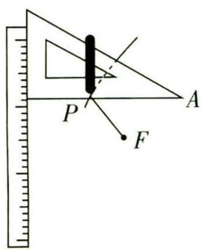

<details>
<summary>text_image</summary>

P
F
A
</details>

图1

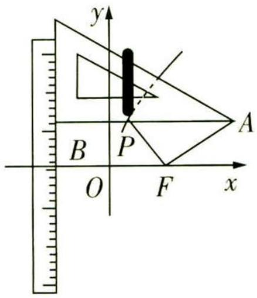

<details>
<summary>text_image</summary>

y
A
B
P
O
F
x
</details>

微信公众号

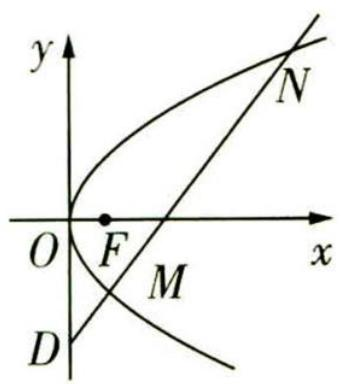

<details>
<summary>text_image</summary>

y
N
O F x
M
D
</details>

图 3

解析 (1)依题意,笔尖到点F的距离与它到直线a的距离相等,

【敲黑板】本题以情境介绍曲线的生成过程, 解题时, 要正确理解题意, 得到生成的曲线就是抛物线的一部分. 由题设的建系方式可知, 抛物线开口向右, 那么就可用待定系数法求解方程因此笔尖留下的轨迹为以 $F$ 为焦点, $a$ 为准线的抛物线的一部分.

设抛物线方程为 $y^{2}=2px(p>0)$ ，则 $F(\frac{p}{2},0)$ ，

由 $\angle FAP = 30^{\circ}$ ， $\angle AFP = 90^{\circ}$ ， $|PF| + |PA| = 3$ ，得 $|PA| = 2|PF|, |PF| = 1$

由 $\angle FPA = 60^{\circ}$ ，得点 $P$ 的横坐标为 $\frac{p}{2} -\frac{1}{2}$

而抛物线的准线方程为 $x = -\frac{p}{2}$ ，则 $\frac{p}{2} - \frac{1}{2} + \frac{p}{2} = 1$ ，解得 $p = \frac{3}{2}$ ，

所以曲线 C 的方程为 $y^{2}=3x$ .

(2) 设 $M(x_{1}, y_{1})$ , $N(x_{2}, y_{2})$ ，直线 MN 的方程为 y = kx - 3，

由 $\left\{\begin{aligned}y&=kx-3,\\ y^{2}&=3x\end{aligned}\right.$ 消去y并整理得关于x的方程 $k^{2}x^{2}-(6k+3)x+9=0,$

因为 $k \in (0,2)$ , 所以 $\Delta = (6k + 3)^2 - 36k^2 = 36k + 9 > 0$ , $x_1 + x_2 = \frac{6k + 3}{k^2}$ , $x_1x_2 = \frac{9}{k^2}$ .

【技巧点拨】解析几何综合题的一般解题路径：设点设线，联立“线锥”方程，消元得根与系数的关系。这也反映了解析几何的本质：用代数方法(方程)研究几何(曲线)性质

由 $\overrightarrow{DM} = \lambda \overrightarrow{DN}$ ，得 $x_{1} = \lambda x_{2}$ ，即 $\lambda = \frac{x_1}{x_2}$

于是 $\lambda +\frac{1}{\lambda} = \frac{x_1}{x_2} +\frac{x_2}{x_1} = \frac{(x_1 + x_2)^2}{x_1x_2} -2 = \frac{\left(\frac{6k + 3}{k^2}\right)^2}{\frac{9}{k^2}} -2 = \frac{1}{k^2} +\frac{4}{k} +2.$

令 $t = \frac{1}{k}$ ，则 $t\in (\frac{1}{2}, + \infty),\frac{1}{k^2} +\frac{4}{k} +2 = t^2 +4t + 2 = (t + 2)^2 -2\in (\frac{17}{4}, + \infty)$

因此 $\lambda + \frac{1}{\lambda} > \frac{17}{4}$ , 又 $\lambda > 0$ , 即 $\lambda^2 - \frac{17}{4}\lambda + 1 > 0$ , 解得 $0 < \lambda < \frac{1}{4}$ 或 $\lambda > 4$ ,

所以 $\lambda\in(0,\frac{1}{4})\cup(4,+\infty)$ .

# 设题角度 3 创设现实生活情境


调研 3 (杭州2022年第19届亚运会,概率与数列交汇|2023浙江杭州6月统考)杭州2022年第19届亚运会将于2023年9月23日拉开帷幕,为了更好地迎接亚运会,杭州市政府大举加强了城市交通基础设施的建设.目前,一张以“四纵五横”为骨架、通达“东西南北中”十城区的快速路网已顺利完工,准备接待世界各地的来宾.现杭州公共出行的主流方式为地铁、公交、出租车、共享单车这四种,基本可以覆盖大众的出行需求.

(1)一个兴趣小组发现,来自不同的城市的游客选择出行的习惯会有很大差异,为了验证这一猜想,该小组进行了研究.请完成 $2 \times 2$ 列联表(单位:人),并根据小概率值 $\alpha = 0.010$ 的独立性检验,分析城市规模是否与出行方式偏好地铁有关.(精确到0.001)

<table><tr><td>出行方式</td><td>国际大都市</td><td>中小型城市</td><td>合计</td></tr><tr><td>偏好地铁</td><td></td><td>20</td><td>100</td></tr><tr><td>偏好其他</td><td>60</td><td></td><td></td></tr><tr><td>合计</td><td></td><td>60</td><td></td></tr></table>

(2) 国际友人大卫来杭游玩, 每日的行程分成 $M(M \in \mathbf{N}^{*})$ 段, 为了更好地体验文化, 相邻两段的出行方式不能相同, 且选择地铁、公交、出租车、共享单车的概率是相等的. 已知他每日从酒店出行的方式一定是从地铁开始, 记第 $n$ 段行程大卫坐地铁的概率为 $p_{n}$ , 易知 $p_{1} = 1, p_{2} = 0$ .

# 奇妙数字

(i)试证明 $\{p_n - \frac{1}{4}\}$ 为等比数列；  
(ii) 设第 n 段行程大卫选择共享单车的概率为 $q_{n}$ ，比较 $p_{5}$ 与 $q_{5}$ 的大小.

附: $\chi^{2}=\frac{n(ad-bc)^{2}}{(a+b)(c+d)(a+c)(b+d)},n=a+b+c+d.$

<table><tr><td>α</td><td>0.050</td><td>0.010</td><td>0.001</td></tr><tr><td> $x_{\alpha}$ </td><td>3.841</td><td>6.635</td><td>10.828</td></tr></table>

解析 (1) $2 \times 2$ 列联表如下:

<table><tr><td>出行方式</td><td>国际大都市</td><td>中小型城市</td><td>合计</td></tr><tr><td>偏好地铁</td><td>80</td><td>20</td><td>100</td></tr><tr><td>偏好其他</td><td>60</td><td>40</td><td>100</td></tr><tr><td>合计</td><td>140</td><td>60</td><td>200</td></tr></table>

零假设为 $H_{0}$ : 城市规模与出行方式偏好地铁无关.

【规范答题】你是否发现考试成绩出来后有的同学得了149分、与满分失之交臂？原因一定是某道解答题答案正确但解题过程不完整，丢失了1分的步骤分。因此，为了避免遗憾发生，平时在做解答题时一定要注意规范解答，如本题的零假设万万不可丢掉，同时，当你在考试中毫无思路的时候，写下这些关键步骤，也能适当拿到一些步骤分

$$
\chi^ {2} = \frac {2 0 0 \times (8 0 \times 4 0 - 2 0 \times 6 0) ^ {2}}{1 0 0 \times 1 0 0 \times 1 4 0 \times 6 0} \approx 9. 5 2 4 > 6. 6 3 5,
$$

根据小概率值 $\alpha=0.010$ 的独立性检验, 我们推断 $H_{0}$ 不成立,

即认为城市规模与出行方式偏好地铁有关,此推断犯错误的概率不大于0.010.

(2)(i) 第 n 段行程大卫坐地铁的概率为 $p_{n}$ ,

则当 $n \geqslant 2$ 时, 第 n - 1 段行程大卫坐地铁的概率为 $p_{n-1}$ , 不坐地铁的概率为 $1 - p_{n-1}$ ,

则 $p_n = p_{n-1} \cdot 0 + (1 - p_{n-1}) \cdot \frac{1}{3} = -\frac{1}{3} p_{n-1} + \frac{1}{3}$ ,

【抓题眼】根据关键信息“为了更好地体验文化，相邻两段的出行方式不能相同，且选择地铁、公交、出租车、共享单车的概率是相等的”列出 $p_n$ 的表达式

从而 $p_n - \frac{1}{4} = -\frac{1}{3} (p_{n-1} - \frac{1}{4}) (n \geqslant 2)$ ,

又 $p_1 - \frac{1}{4} = \frac{3}{4}$ , 所以 $\{p_n - \frac{1}{4}\}$ 是首项为 $\frac{3}{4}$ , 公比为 $-\frac{1}{3}$ 的等比数列.

(ii) 由(i) 可知 $p_n = \frac{3}{4} \left( -\frac{1}{3} \right)^{n-1} + \frac{1}{4}$ ,

则 $p_5 = \frac{3}{4} \times (-\frac{1}{3})^4 + \frac{1}{4} > \frac{1}{4}$ , 又 $q_5 = \frac{1}{3}(1 - p_5) < \frac{1}{4}$ , 故 $p_5 > q_5$ .

# 突破13大必考超重点

# 创新考法抢先知

# 超重点 1 创新定义:遇到你不认识的数列怎么办

调研 1 (2023 湖南名校联盟 7 月联考) 南宋数学家杨辉在《详解九章算法》中提出了高阶等差数列的问题, 即一个数列 $\{a_{n}\}$ 本身不是等差数列, 但从数列 $\{a_{n}\}$ 中的第二项开始, 每一项与前一项的差构成等差数列 $\{b_{n}\}$ (称数列 $\{a_{n}\}$ 为一阶等差数列), 或者 $\{b_{n}\}$ 仍旧不是等差数列, 但从数列 $\{b_{n}\}$ 中的第二项开始, 每一项与前一项的差构成等差数列 $\{c_{n}\}$ (称数列 $\{a_{n}\}$ 为二阶等差数列) ……以此类推, 得到高阶等差数列. 类比高阶等差数列的定义, 我们亦可定义高阶等比数列, 设数列 $\{a_{n}\}: 1, 1, 3, 27, 729, \cdots$ 是一阶等比数列, 则 $\sum_{n=1}^{10} \log_{3} a_{n}$ 的值为 (参考公式: $1^{2} + 2^{2} + \cdots + n^{2} = \frac{n}{6}(n + 1)(2n + 1)$ )

A. 60

B. 120

C. 240

D. 480

# 天星老师教审题


一阶等差数列 $\{a_{n}\}$ , 本身不是等差数列, 但从数列 $\{a_{n}\}$ 中的第二项开始, 每一项与前一项的差构成等差数列. 据此可知, 一阶等比数列 $\{a_{n}\}$ , 本身不是等比数列, 但从数列 $\{a_{n}\}$ 中的第二项开始, 每一项与前一项的比构成等比数列, 由此可设 $b_{n} = \frac{a_{n+1}}{a_{n}}, \{b_{n}\}$ 为等比数列, 其中 $b_{1} = 1, b_{2} = 3$ , 从而可求出 $b_{n} = 3^{n-1}$ , 利用累乘法可求出 $a_{n}$ , 从而可求出 $\log_3 a_n$ , 然后利用分组求和法可求得结果.

解析 由题意知, 数列 $\{a_{n}\}$ 为一阶等比数列.

设 $b_{n}=\frac{a_{n+1}}{a_{n}}$ ，则 $\{b_{n}\}$ 为等比数列，其中 $b_{1}=1,b_{2}=3$ ，公比为 $q=\frac{b_{2}}{b_{1}}=3$ ，所以 $b_{n}=3^{n-1}$ .

【抓题眼】新定义数列问题的解题关键就在于对新定义的理解和转化, 考试中, 任何陌生的、没有学习过的问题, 都可以通过翻译和转化, 变成熟悉的、学习过的内容, 本题中的数列

# 奇妙数字

虽然是没有见过的一阶等比数列，但通过转化，就得到了一个常规的等比数列，因此，准确理解新定义的内涵，是解决此类问题的核心秘诀

故 $a_{n} = b_{n - 1}b_{n - 2}\dots b_{1}\cdot a_{1} = 3^{1 + 2 + 3 + \dots +(n - 2)} = 3^{\frac{(n - 1)(n - 2)}{2}},n\geqslant 2,a_{1} = 1$ ，也适合上式，

所以 $\log_3a_n = \log_33^{\frac{(n - 1)(n - 2)}{2}} = \frac{(n - 1)(n - 2)}{2} = \frac{1}{2} (n^2 -3n + 2).$

所以 $\sum_{n=1}^{10}\log_{3}a_{n}=\log_{3}a_{1}+\log_{3}a_{2}+\log_{3}a_{3}+\cdots+\log_{3}a_{10}=\frac{1}{2}\times\left[(1^{2}+2^{2}+\cdots+10^{2})-3\times(1+2+\cdots+10)+2\times10\right]=\frac{1}{2}\times\left[(\frac{1}{6}\times10\times11\times21)-3\times\frac{(1+10)\times10}{2}+2\times10\right]=120.$ 故选 B.

调研 2 (2023 广东佛山石门高级中学 7 月保温测试) 如果数列 $\{a_{n}\}$ 对任意的 $n \in \mathbf{N}^{*}$ , 有 $a_{n+2} - a_{n+1} > a_{n+1} - a_{n} > 0$ , 则称 $\{a_{n}\}$ 为“速增数列”.

(1)请写出一个速增数列 $\{a_{n}\}$ 的通项公式,并证明你写出的数列符合要求;

(2) 若数列 $\{a_{n}\}$ 为“速增数列”，且任意项 $a_{n} \in Z, a_{1} = 1, a_{2} = 3, a_{k} = 2023$ ，求正整数 k 的最大值.

# 天星老师引思路


根据 $a_{n+2} - a_{n+1} > a_{n+1} - a_n > 0$ ，可知数列是递增的，且“增幅”越来越大，联想指数函数的特征，第(1)问只需要写出一个，不妨取 $a_n = 2^n$ ，验证 $a_{n+2} - a_{n+1} > a_{n+1} - a_n > 0$ 对任意的 $n \in \mathbf{N}^*$ 恒成立即可。对于第(2)问，显然 $k > 2, a_k = 2023 = (a_k - a_{k-1}) + (a_{k-1} - a_{k-2}) + \cdots + (a_3 - a_2) + (a_2 - a_1) + a_1$ ，根据“速增数列”的定义可得 $a_{k}-a_{k-1}>a_{k-1}-a_{k-2}>\cdots>a_{3}-a_{2}>a_{2}-a_{1}=2$ ，从而 $(a_{k}-a_{k-1})+(a_{k-1}-a_{k-2})+\cdots+(a_{3}-a_{2})+(a_{2}-a_{1})+a_{1}\geqslant k+k-1+\cdots+3+2+1$ ，据此求解.

解析 (1) 取 $a_{n} = 2^{n}$ , 则 $a_{n+2} - a_{n+1} = 2^{n+2} - 2^{n+1} = 2^{n+1}, a_{n+1} - a_{n} = 2^{n+1} - 2^{n} = 2^{n}$ .

因为 $2^{n + 1} > 2^n$ ，所以 $a_{n + 2} - a_{n + 1} > a_{n + 1} - a_n > 0,$

所以数列 $\{2^{n}\}$ 是“速增数列”(此问答案不唯一,符合条件即可).

(2) 显然 $k > 2, a_{k} = 2023 = (a_{k} - a_{k-1}) + (a_{k-1} - a_{k-2}) + \cdots + (a_{3} - a_{2}) + (a_{2} - a_{1}) + a_{1}$ .

因为数列 $\{a_{n}\}$ 为“速增数列”，所以 $a_{k}-a_{k-1}>a_{k-1}-a_{k-2}>\cdots>a_{3}-a_{2}>a_{2}-a_{1}=2$ ，又 $a_{n}\in Z$ ，

所以 $(a_{k}-a_{k-1})+(a_{k-1}-a_{k-2})+\cdots+(a_{3}-a_{2})+(a_{2}-a_{1})+a_{1}\geqslant k+k-1+\cdots+3+2+1$

【扫清障碍】因为 $a_{2}-a_{1}=2$ ，所以 $a_{3}-a_{2}>2$ ，又 $a_{n}\in Z$ ，所以 $a_{3}-a_{2}\geqslant3$ ，以此类推， $a_{k}-a_{k-1}\geqslant k$ ，所以 $(a_{k}-a_{k-1})+(a_{k-1}-a_{k-2})+\cdots+(a_{2}-a_{1})+a_{1}\geqslant k+k-1+\cdots+2+1$

即 $2023 \geqslant \frac{k(k+1)}{2}, k \in N^{*}$ . 当 k = 63 时, $\frac{k(k+1)}{2} = 2016 < 2023$ ; 当 k = 64 时, $\frac{k(k+1)}{2} = 2080 > 2023$ . 故正整数 k 的最大值为 63.

# 奇妙数字

佩尔数列 佩尔数列为0,1,2,5,12,29,70,169,408,985,2378,5741……从第三个数开始，以后每一个数都是前面的数的两倍加上再前面的数.

关注微信公众号“初高教辅站”获取更多初高中教辅资料

# 超重点2 创新角度:数列的前 $n$ 项积问题的解题密码

调研 1 (2023 广东江门 7 月期末) 设 $T_{n}$ 为数列 $\{a_{n}\}$ 的前 $n$ 项积, 若 $a_{n} + 2a_{n+1} = 0, n \in \mathbf{N}^{*}$ 且 $a_{2} - a_{3} = 192$ , 则当 $T_{n}$ 取得最小值时, $n =$ ( )

A. 8

B. 9

C. 10

D. 11

解析 由题意知 $a_{n} \neq 0$ ，因为 $a_{n} + 2a_{n+1} = 0, n \in \mathbf{N}^{*}$ ，所以 $\frac{a_{n+1}}{a_n} = -\frac{1}{2}$ ，

所以 $\{a_{n}\}$ 是公比为 $-\frac{1}{2}$ 的等比数列.

由 $a_2 - a_3 = 192$ 得 $-\frac{1}{2} a_1 - (-\frac{1}{2})^2 a_1 = 192$ ，解得 $a_1 = -256$ ，所以 $a_n = -256 \times (-\frac{1}{2})^{n-1}$ .

所以 $T_{n}=a_{1}\cdot a_{2}\cdot a_{3}\cdot\cdots\cdot a_{n}=a_{1}\cdot a_{1}\left(-\frac{1}{2}\right)\cdot a_{1}\left(-\frac{1}{2}\right)^{2}\cdot\cdots\cdot a_{1}\left(-\frac{1}{2}\right)^{n-1}=$ $a_{1}^{n}\left(-\frac{1}{2}\right)^{1+2+3+\cdots+(n-1)}=(-256)^{n}\left(-\frac{1}{2}\right)^{\frac{n(n-1)}{2}}=(-1)^{\frac{n^{2}+n}{2}}\left(\frac{1}{2}\right)^{\frac{n^{2}-17n}{2}}$

要使 $T_{n}$ 取得最小值，则 $\frac{n^2 + n}{2}$ 为奇数，且 $\frac{n^2 - 17n}{2}$ 取得最小值，

结合二次函数的知识及 $n \in \mathbf{N}^*$ 知当 $n = 9$ 时, 满足 $\frac{n^2 + n}{2}$ 为奇数, 且 $\frac{n^2 - 17n}{2}$ 取得最小值,

所以当 $T_{n}$ 取得最小值时, n=9, 故选 B.

调研 2 (2023 北京师范大学第二附属中学 5 月期中/多选) 若一个数列的第 $m$ 项等于这个数列的前 $m$ 项的乘积, 则称这个数列为 “ $m$ 积特征列”, 若各项均为正数的等比数列 $\{a_{n}\}$ 为 “6 积特征列”, 且 $a_{1} > 1$ , 则当 $\{a_{n}\}$ 的前 $n$ 项之积最大时, $n$ 的值为 ( )

A. 5

B. 4

C. 3

D. 2

# 天星老师教审题


根据“m 积特征列”的定义知, 等比数列 $\{a_{n}\}$ 的第 6 项等于其前 6 项的乘积, 即 $a_{6}=a_{1}a_{2}a_{3}a_{4}a_{5}a_{6}$ , 则 $a_{1}a_{2}a_{3}a_{4}a_{5}=1$ , 所以 $a_{1}^{5}q^{10}=1$ , 所以 $a_{1}q^{2}=1$ , 求出前 n 项之积的表达式, 进而求最大值即可.

解析 由 $\{a_{n}\}$ 是等比数列, 得 $a_{n} = a_{1}q^{n - 1}$ , 其中 $q$ 为数列 $\{a_{n}\}$ 的公比.

因为数列 $\{a_{n}\}$ 是“6积特征列”，所以 $a_6 = a_1a_2a_3a_4a_5a_6$ ，所以 $a_1^5 q^{10} = 1$ ，所以 $a_1q^2 = 1$ ，所以 $a_1 = q^{-2}$ 因为数列 $\{a_{n}\}$ 各项均为正数， $a_1 > 1$ ，所以 $0 < q < 1$

设数列 $\{a_{n}\}$ 的前 n 项之积为 $P_{n}$ ，则有 $P_{n}=a_{1}a_{2}\cdots a_{n}=a_{1}^{n}q^{1+2+3+\cdots+(n-1)}=q^{\frac{n2-5n}{2}}$ .

# 奇妙数字

佩尔数列出现在2的算术平方根的近似值以及三角平方数的定义中,也出现在一些组合数学的问题中.

关注微信公众号“初高教辅站”获取更多初高中教辅资料因为 0 < q < 1，所以当 $\frac{n^{2} - 5n}{2}$ 最小时， $P_{n}$ 最大.

结合二次函数的图象及 $n \in N^{*}$ 知当 n = 2 或 n = 3 时， $\frac{n^{2} - 5n}{2}$ 最小， $P_{n}$ 最大。故选 CD.

【易错】有关数列项数的问题，一定要注意取值为整数，当最值对应的 $n$ 的值为非整数时，一般考虑与该数相邻的整数进行判断

调研 3 (2023 浙江名校 5 月联考) 已知数列 $\{b_{n}\}$ 和正项等比数列 $\{a_{n}\}$ , 满足 $\log_2 a_n$ 是 $b_{1}$ 和 $b_{n}$ 的等差中项.

(1) 证明: $\{b_{n}\}$ 是等差数列.

(2) 若数列 $\{a_{n}\}$ 的前 n 项积 $T_{n}$ 满足 $T_{n} = (\sqrt{2})^{n^{2} + n}$ ，记 $c_{n} = \begin{cases} a_{n}, & n \text{ 为奇数,} \\ b_{n}, & n \text{ 为偶数,} \end{cases}$ 求数列 $\{c_{n}\}$ 的前 20 项和.


# 天星老师点思路

对于第(1)问,要证明 $\{b_{n}\}$ 是等差数列,可从等差数列的定义出发,证明 $b_{n}-b_{n-1}$ 是常数即可.对于第(2)问,先根据数列 $\{a_{n}\}$ 的前n项积 $T_{n}=(\sqrt{2})^{n^{2}+n}$ 求出 $\{a_{n}\}$ 的通项公式,结合(1)求出数列 $\{b_{n}\}$ 的通项公式,即可得数列 $\{c_{n}\}$ 的通项公式,表示出 $\{c_{n}\}$ 的前20项和,即可得出答案.

解析 (1) $\{a_{n}\}$ 是正项等比数列, 设其公比为 $q$ , 则 $q > 0$ .

由 $b_{1} + b_{n} = 2\log_{2}a_{n}$ ，可得当 $n\geqslant 2$ 时， $b_{1} + b_{n - 1} = 2\log_{2}a_{n - 1}$

【抓题眼】根据条件 “ $\log_{2}a_{n}$ 是 $b_{1}$ 和 $b_{n}$ 的等差中项” 及等差中项的定义列出关系式，进一步迭代得到 $b_{n}-b_{n-1}$

两式相减得, $b_{n}-b_{n-1}=2\log_{2}\frac{a_{n}}{a_{n-1}}=2\log_{2}q,n\geqslant2$ ,故数列 $\{b_{n}\}$ 是等差数列.

(2) 由 $T_{n} = (\sqrt{2})^{n^{2} + n}$ 知，当 $n \geqslant 2$ 时， $a_{n} = \frac{T_{n}}{T_{n - 1}} = 2^{n}$ ，又 $a_{1} = T_{1} = 2$ ，所以 $a_{n} = 2^{n}$ .

由(1)设 $\{b_{n}\}$ 的公差为d,则 $d=2\log_{2}\frac{a_{n}}{a_{n-1}}=2$ ,

由 $b_{1} + b_{n} = 2\log_{2}a_{n} = 2n$ ，得 $b_{1} = 1,b_{n} = 2n - 1$

所以 $c_{1} + c_{2} + \cdots + c_{20} = (c_{1} + c_{3} + \cdots + c_{19}) + (c_{2} + c_{4} + \cdots + c_{20}) = (a_{1} + a_{3} + \cdots + a_{19}) + (b_{2} + b_{4} + \cdots + b_{20}) = (2 + 2^{3} + \cdots + 2^{19}) + (3 + 7 + \cdots + 39) = \frac{628 + 2^{21}}{3}.$

故数列 $\{c_{n}\}$ 的前20项和为 $\frac{628+2^{21}}{3}$ .

# 奇妙数字

# 超重点 3 创新模型: 数列应用题中的 3 个关键模型

调研 1 (产量模型|2023 江西清江中学6月期末)药物浪费问题引发了广泛的社会关注,过期药品处置不当,将会给环境造成危害.现某药厂打算投入一条新的药品生产线,已知该生产线连续生产n年的累计年产量(单位:万件)为 $T(n)=\frac{1}{4}n(n+1)(n+3)$ ,如果年产量超过60万件,可能出现产量过剩,产生药物浪费.从避免药物浪费和环境保护的角度出发,这条生产线的最大生产期限应拟定为()

A. 7 年

B. 8 年

C. 9 年

D. 10 年

# 天星老师抓题眼


产生药物浪费的标准是年产量超过60万件,而给出的关系式 $T(n)=\frac{1}{4}n(n+1)(n+3)$ 是连续生产n年的累计年产量,因此根据 $T(n)-T(n-1)$ 求出第n年的年产量是关键,再利用第n年的年产量与60万件的关系构造不等式求解即可.

解析 设第 n 年年产量为 $a_{n}$ ，则第一年年产量为 $a_{1}=T_{1}=2$ ，以后各年年产量为 $a_{n}=T(n)-T(n-1)=\frac{1}{4}n(3n+5)(n\geqslant2,n\in\mathbf{N}^{*})$ ，

【易错提醒】 $a_{n}$ 的表达式中出现 n-1，考虑实际意义，需要对 n 的范围进行限制，再对没有取到的 n 进行检验

$a_{1}=2$ 也符合上式,所以 $a_{n}=\frac{1}{4}n(3n+5)(n\in\mathbf{N}^{*})$ .

令 $\frac{1}{4}n(3n+5)\leqslant60$ ,得 $3n^{2}+5n-240\leqslant0$ .

设 $f(x)=3x^{2}+5x-240$ ，其图象的对称轴为直线 $x=-\frac{5}{6}$ ，则当x>0时， $f(x)$ 单调递增.

又 $f(8)=3\times8^{2}+5\times8-240=-8<0,f(9)=3\times9^{2}+5\times9-240=48>0,$

所以 $3n^{2} + 5n - 240 \leqslant 0$ 的最大正整数解为 8, 则这条生产线的最大生产期限应拟定为 8 年. 故选 B.

调研 2 (人口变化模型|2023 河北秦皇岛7月期末|多选)在预测人口变化趋势上有直接推算法、灰色预测模型、队列要素法等多种方法,其中直接推算法使用的

# 奇妙数字

公式是 $P_{n} = P_{0}(1 + k)^{n}(P_{0} > 0, k > -1, n \in \mathbf{N}^{*})$ , $P_{n}$ 为预测期人口数, $P_{0}$ 为初期人口数, $k$ 为预测期内人口增长率, $n$ 为预测期间隔年数. 则下列说法正确的有 ( )

A. 若在某一时期内 -1 < k < 0, 则这期间人口数呈下降趋势  
B. 若在某一时期内 k > 0，则这期间人口数呈上升趋势  
C. 若在某一时期内 0 < k < 1, 则这期间人口数摆动变化  
D. 若在某一时期内 k=0，则这期间人口数不变

# 解析

<table><tr><td>选项</td><td>分析过程</td><td>正误</td></tr><tr><td>A</td><td>由 $P_{n}=P_{0}(1+k)^{n}(k>-1)$ 得当 $-1因为\(P_{0}>0$ ,所以对任意的 $n\in\mathbf{N}^{*},P_{n}>0$ ,所以 $\frac{P_{n+1}}{P_{n}}=\frac{P_{0}(1+k)^{n+1}}{P_{0}(1+k)^{n}}=1+k<1$ ,则 $P_{n+1}所以这期【选方法】应用作商法,将\(\frac{P_{n+1}}{P_{n}}$ 与1比较大小,比1小则人口数呈下降趋势,比1大则呈上升趋势间人口数呈下降趋势</td><td>√</td></tr><tr><td>B</td><td>当 $k>0$ 时, $1+k>1$ ,因为 $P_{0}>0$ ,所以对任意的 $n\in\mathbf{N}^{*},P_{n}>0$ ,所以 $\frac{P_{n+1}}{P_{n}}=\frac{P_{0}(1+k)^{n+1}}{P_{0}(1+k)^{n}}=1+k>1$ ,则 $P_{n+1}>P_{n}$ ,所以这期间人口数呈上升趋势</td><td>√</td></tr><tr><td>C</td><td>由B选项可知,在某一时期内 $0则这期间人口数呈上升趋势</td><td>×</td></tr><tr><td>D</td><td>当\(k=0$ 时, $P_{n}=P_{0}$ ,故在某一时期内 $k=0$ ,则这期间人口数不变</td><td>√</td></tr></table>

调研 3 (收入模型 | 2023 上海华东师范大学第二附属中学期末改编) 某工厂在 2023 年上半年施行“减员增效”措施, 对部分人员实行分流, 规定分流人员第一年可以到原单位领取工资的 $100\%$ , 从第二年起, 以后每年只能在原单位按上一年工资的 $\frac{2}{3}$ 领取工资. 该厂根据分流人员的技术特长, 计划创办新的经济实体, 该经济实体预计第一年属投资阶段, 第二年每人可在工资的基础上额外获得 $b$ 元收入, 从第三年

# 奇妙数字

起每人每年的额外收入可在上一年的基础上增加 50%. 假设某人分流前工资收入为每年 a 元, 分流后进入新经济实体, 第 n 年的年收入为 $a_{n}$ 元.

(1) 求 $\{a_{n}\}$ 的通项公式.

(2) 当 $b = \frac{8a}{27}$ 时, 这个人哪一年的年收入最少? 最少为多少元?

(3) 当 $b \geqslant \frac{3a}{8}$ 时, 是否能保证这个人分流一年后的年收入永远超过分流前的年收入?

解析 (1) 由题意得, 当 n=1 时, $a_{1}=a$ ,

当 $n \geqslant 2$ 时, $a_{n} = \left(\frac{2}{3}\right)^{n - 1} a + \left(\frac{3}{2}\right)^{n - 2} b.$

【找关键】根据关键信息“该经济实体第一年属投资阶段，第二年每人可在工资的基础上额外获得 $b$ 元收入，从第三年起每人每年的额外收入可在上一年的基础上增加 $50\%$ ”知 $\{a_{n}\}$ 的通项公式为分段的

所以 $a_{n} = \left\{ \begin{array}{l}a,n = 1,\\ (\frac{2}{3})^{n - 1}a + (\frac{3}{2})^{n - 2}b,n\geqslant 2. \end{array} \right.$

(2) $b=\frac{8a}{27}$ ，当 $n\geqslant2$ 时， $a_{n}=(\frac{2}{3})^{n-1}a+\frac{8a}{27}(\frac{3}{2})^{n-2}\geqslant2\sqrt{(\frac{2}{3})^{n-1}a\times\frac{8a}{27}(\frac{3}{2})^{n-2}}=\frac{8a}{9}$

当且仅当 $(\frac{2}{3})^{n - 1}a = \frac{8a}{27} (\frac{3}{2})^{n - 2}$ 时，上式的等号成立，即 $(\frac{2}{3})^{2n - 3} = (\frac{2}{3})^3$ ，解得 $n = 3$ ，此时 $a_{n} = a_{3} = \frac{8a}{9}.$

又 $a_{1}=a>\frac{8a}{9}$ ，所以这个人分流后第三年的年收入最少，最少为 $\frac{8a}{9}$ 元.

(3) 当 $n \geqslant 2$ 时，

$$
a _ {n} = \left(\frac {2}{3}\right) ^ {n - 1} a + \left(\frac {3}{2}\right) ^ {n - 2} b \geqslant \left(\frac {2}{3}\right) ^ {n - 1} a + \frac {3 a}{8} \left(\frac {3}{2}\right) ^ {n - 2} \geqslant 2 \sqrt {\left(\frac {2}{3}\right) ^ {n - 1} a \times \frac {3 a}{8} \left(\frac {3}{2}\right) ^ {n - 2}} = a,
$$

当且仅当 $b=\frac{3a}{8}$ 且 $n=\log_{\frac{2}{3}}\frac{1}{3}$ 时，上式等号成立，

【警示】上述不等关系中，两个等号同时成立才能取到最值

又 $n \geqslant 2$ 且 $n \in \mathbf{N}^*$ , 因此等号不能取到, 所以当 $n \geqslant 2$ 时, $a_n > a$ .

故当 $b \geqslant \frac{3a}{8}$ 时, 能保证这个人分流一年后的年收入永远超过分流前的年收入.

# 超重点 4 创新情境:会做“立几”情境题,建模解模是关键

调研 1 (2023 广东惠州 7 月第一次调研 | 多选) 已知棱长为 1 的正方体 $ABCD-$ $A_{1}B_{1}C_{1}D_{1}$ , 以正方体中心 $O$ 为球心的球与正方体的各条棱都相切, 点 $P$ 为球面上的动点, 则下列说法正确的是 ( )

A. 球 O 的半径 $R = \frac{1}{2}$   
B. 球 O 在正方体外部的体积大于 $\frac{\sqrt{2}}{3}\pi - 1$   
C. 若点 P 在球 O 在正方体外部(含正方体表面)上运动, 则 $\overrightarrow{PA} \cdot \overrightarrow{PB} \in [-\frac{1}{4}, \frac{3}{4}]$   
D. 若点 P 在球 O 在正方体外部(含正方体表面)上运动, 则 $\overrightarrow{PA} \cdot \overrightarrow{PB} \in [-\frac{1}{4}, \frac{7}{4}]$

# 天星老师教建模


对于稍复杂情境下的立体几何问题,根据题意建立模型——根据已知信息准确画出图形,是解决问题的关键,比如此题的 A 选项,球 O 与正方体的各条棱都相切,作出图形后不难发现,半径等于正方体的面对角线的一半.

解析 对于 A, 如图 1 所示, 正方体的棱切球 O 的半径等于面对角线的一半, 即半径 $R = \frac{\sqrt{2}}{2}$ , 故 A 错误.

对于 B, 设球 O、正方体的体积分别为 $V_{1}, V_{2}$ ，则球 O 在正方体外部的体积 $V > V_{1} - V_{2} = \frac{4}{3}\pi \cdot \left(\frac{\sqrt{2}}{2}\right)^{3} - 1 = \frac{\sqrt{2}}{3}\pi - 1$ ，故 B 正确.

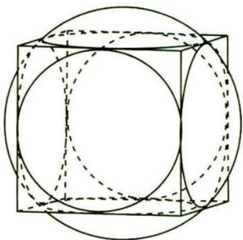

<details>
<summary>natural_image</summary>

Geometric diagram of a cube inscribed in a sphere, showing solid and dashed lines representing different planes (no text or symbols)
</details>

图1

【会分析】球 O 在正方体外部的体积为球 O 的体积减球 O 在正方体内部的体积，根据图 1 可知球 O 在正方体内部的体积显然小于正方体的体积，因此 V > $V_{1} - V_{2}$

对于 CD, 如图 2, 取 AB 的中点 E, 可知 E 在球面上, 可得 $\overrightarrow{EB} = -\overrightarrow{EA} = -\frac{1}{2}\overrightarrow{BA}$ , 所以 $\overrightarrow{PA} \cdot \overrightarrow{PB} = (\overrightarrow{PE} + \overrightarrow{EA}) \cdot (\overrightarrow{PE} + \overrightarrow{EB}) = \overrightarrow{PE}^{2} - \overrightarrow{EA}^{2} = |\overrightarrow{PE}|^{2} - \frac{1}{4}$ ,

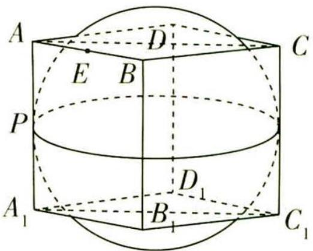

<details>
<summary>text_image</summary>

A
E B
D
C
P
D₁
A₁
B₁
C₁
</details>

图2

# 奇妙数字

因为点 P 在球 O 在正方体的外部(含正方体表面)上运动,所以 $0 \leqslant |\overrightarrow{PE}| \leqslant \sqrt{2}$ ,

【找最值】当 P 与 E 重合时， $|\overrightarrow{PE}|$ 最小，为 0；当 PE 为球 O 的直径时， $|\overrightarrow{PE}|$ 最大，为 $\sqrt{2}$ 所以 $\overrightarrow{PA} \cdot \overrightarrow{PB} \in [-\frac{1}{4}, \frac{7}{4}]$ ，故 C 错误，D 正确。故选 BD。

调研 2 (新定义,离散曲率 | 2023 安徽滁州定远育才学校 5 月考前冲刺 | 多选)阅读下面的数学材料:

设 P 为多面体 M 的一个顶点, 定义多面体 M 在点 P 处的离散曲率为 1 - $\frac{1}{2\pi}(\angle Q_{1}PQ_{2} + \angle Q_{2}PQ_{3} + \cdots + \angle Q_{k-1}PQ_{k} + \angle Q_{k}PQ_{1})$ , 其中 $Q_{i}(i=1,2,\cdots,k,k \geqslant 3)$ 为多面体 M 的所有与点 P 相邻的顶点, 且平面 $Q_{1}PQ_{2}$ , 平面 $Q_{2}PQ_{3}, \cdots$ , 平面 $Q_{k-1}PQ_{k}$ 和平面 $Q_{k}PQ_{1}$ 为多面体 M 的所有以 P 为公共点的面.

解答下列问题:

已知在直四棱柱 $ABCD - A_{1}B_{1}C_{1}D_{1}$ 中, 底面 ABCD 为菱形, $AA_{1} = AB$ , 则下列说法正确的是 ()

A. 直四棱柱 $ABCD - A_{1}B_{1}C_{1}D_{1}$ 在其各顶点处的离散曲率都相等

B. 若 AC = BD，则直四棱柱 $ABCD - A_{1}B_{1}C_{1}D_{1}$ 在顶点 A 处的离散曲率为 $\frac{1}{4}$

C. 若四面体 $A_{1}ABD$ 在点 $A_{1}$ 处的离散曲率为 $\frac{7}{12}$ , 则 $AC_{1} \perp$ 平面 $A_{1}BD$

D. 若直四棱柱 $ABCD - A_{1}B_{1}C_{1}D_{1}$ 在顶点 A 处的离散曲率为 $\frac{1}{3}$ ，则 $BC_{1}$ 与平面 $ACC_{1}$ 的夹角为 $\frac{\pi}{4}$

解析 对于 A, 当直四棱柱 $ABCD-A_{1}B_{1}C_{1}D_{1}$ 的底面为正方形时, 其在各顶点处的离散曲率都相等, 当直四棱柱 $ABCD-A_{1}B_{1}C_{1}D_{1}$ 的底面不为正方形时, 其在同一底面且相邻的两个顶点处

的离散曲率不相等,故 A 错误.

【明关键】求解本题的关键是充分理解离散曲率的定义, 题干中的信息复杂难懂, 因此要结合具体的图形理解, 如图3, 作出直四棱柱 $ABCD - A_{1}B_{1}C_{1}D_{1}$ , 则对于顶点 $A$ 处的离散曲率, 首先要找到四棱柱所有与点 $A$ 相邻的顶点, 即点 $B, D, A_{1}$ , 则离散曲率为 $1 - \frac{1}{2\pi} (\angle BAD + \angle DAA_{1} + \angle A_{1}AB)$ . 因为几何体 $ABCD - A_{1}B_{1}C_{1}D_{1}$ 是直棱柱, 所以

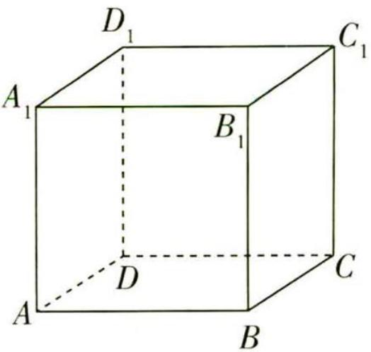

<details>
<summary>text_image</summary>

D₁
A₁
B₁
C₁
D
C
A
B
</details>

图3

# 奇妙数字

错排数 错排数的典型问题为“装错信封问题”:一个人准备了 n 封不同的信及相应的 n 个不同的信封,他把这 n 封信都装错了信封,问这样的装法有多少种.
关注微信公众号“初高教辅站”获取更多初高中教辅资料

$\angle BAA_{1}, \angle DAA_{1}, \angle ADD_{1}$ ……均为直角，所以要判断四棱柱在其各顶点处的离散曲率是否相等，关键在于底面的四个角。知道了新定义的含义，结合几何体的结构特征逐项判断即可

对于 B, 若 AC = BD, 则菱形 ABCD 为正方形,

因为 $AA_{1} \perp$ 平面 ABCD, AB, AD ⊂ 平面 ABCD, 所以 $AA_{1} \perp AB, AA_{1} \perp AD$ ,

所以直四棱柱 $ABCD - A_{1}B_{1}C_{1}D_{1}$ 在顶点 A 处的离散曲率为 $1 - \frac{1}{2\pi}\left(\frac{\pi}{2} + \frac{\pi}{2} + \frac{\pi}{2}\right) = \frac{1}{4}$ ，故 B 正确.

对于 C, 如图 4, 在四面体 $A_{1}ABD$ 中, $AA_{1} \perp AB$ , $AA_{1} \perp AD$ , $AA_{1} = AB = AD$ , 所以 $\angle AA_{1}B = \angle AA_{1}D = \frac{\pi}{4}$ ,

所以四面体 $A_{1}ABD$ 在点 $A_{1}$ 处的离散曲率为 $1 - \frac{1}{2\pi} (\frac{\pi}{4} +\frac{\pi}{4} +$ $\angle BA_{1}D) = \frac{7}{12}$ ，解得 $\angle BA_1D = \frac{\pi}{3}$

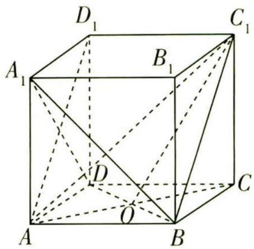

<details>
<summary>text_image</summary>

D₁
C₁
A₁
B₁
D
O
A
B
C
</details>

图 4

易知 $A_{1}B = A_{1}D = \sqrt{2} AB$ ，所以 $BD = \sqrt{2} AB$ ，所以 $AB\bot AD$

所以直四棱柱 $ABCD-A_{1}B_{1}C_{1}D_{1}$ 为正方体.

因为 $C_{1}D_{1} \perp$ 平面 $ADD_{1}A_{1}, A_{1}D \subset$ 平面 $ADD_{1}A_{1}$ ，所以 $C_{1}D_{1} \perp A_{1}D$ ，

连接 $AD_{1}$ , 易知 $AD_{1} \perp A_{1}D$ , 又 $AD_{1} \cap C_{1}D_{1} = D_{1}, AD_{1}, C_{1}D_{1} \subset$ 平面 $AC_{1}D_{1}$ , 所以 $A_{1}D \perp$ 平面 $AC_{1}D_{1}$ .

又 $AC_{1} \subset$ 平面 $AC_{1}D_{1}$ , 所以 $AC_{1} \perp A_{1}D$ , 同理得 $BD \perp AC_{1}$ ,

又 $A_{1}D \cap BD = D, A_{1}D, BD \subset$ 平面 $A_{1}BD$ , 所以 $AC_{1} \perp$ 平面 $A_{1}BD$ , 故 C 正确.

对于 D, 如图 4, 直四棱柱 $ABCD - A_{1}B_{1}C_{1}D_{1}$ 在顶点 A 处的离散曲率为 $1 - \frac{1}{2\pi} \left( \frac{\pi}{2} + \frac{\pi}{2} + \angle DAB \right) = \frac{1}{3}$ ,

则 $\angle DAB = \frac{\pi}{3}$ ，即 $\triangle DAB$ 是等边三角形.

设 $AC \cap BD = O$ ，连接 $C_{1}O$ ，由 $BO \perp$ 平面 $ACC_{1}$ 知 $\angle BC_{1}O$ 为 $BC_{1}$ 与平面 $ACC_{1}$ 所成的角，

$\sin\angle BC_{1}O=\frac{\frac{1}{2}AB}{\sqrt{2}AB}=\frac{\sqrt{2}}{4}$ ，故D错误.故选BC.

调研 3 (2023 重庆市主城区七校 7 月期末)18 世纪英国数学家辛普森运用定积分,推导出了柱体、锥体、球体、台体等几何体的统一体积公式 $V = \frac{1}{6} h (L + 4M + N)$ (其中 $h, L, M, N$ 分别为几何体的高、上底面面积、中截面面积、下底面面积),我们也称这个公式为“万能求积公式”.例如,已知球的半径为 $R$ ,可得该球的体积为 $V =$

奇妙数字

$\frac{1}{6}\times2R(0+4\times\pi R^{2}+0)=\frac{4}{3}\pi R^{3}$ ;已知正四棱锥的底面边长为a,高为h,可得该正四棱锥的体积为 $V=\frac{1}{6}\times h[0+4\times(\frac{a}{2})^{2}+a^{2}]=\frac{1}{3}a^{2}h.$ 类似地,运用该公式求解下面的问题:

已知球 O 的表面积为 $36 \pi cm^{2}$ ，若用距离球心 O 都为 1 cm 的两个平行平面去截球 O，则夹在这两个平行平面之间的几何体 $\Omega$ （如图 5）的体积为 \_\_\_\_ cm $^{3}$ .

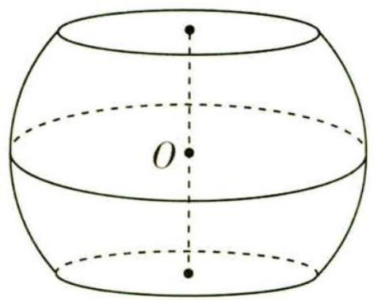

<details>
<summary>text_image</summary>

O
</details>

图5

# 天星老师教审题


根据“万能求积公式”可知,要求出几何体 $\Omega$ 的体积,需要知道两个平行平面之间的距离,上、下截面小圆的面积,球 $O$ 的轴截面面积.根据球心、上截面小圆的圆心、上截面小圆的圆周上一点构造直角三角形模型,直角三角形的三边即两个平行平面之间的距离的一半、上(下)截面小圆的半径、球 $O$ 的半径,由勾股定理求出截面小圆的半径,再根据“万能求积公式”求解即可.

解析 如图6所示,设球 O 的半径为 R,上、下截面小圆的圆心分别为 E,F,在上截面小圆的圆周上任取一点 A,连接 OA.

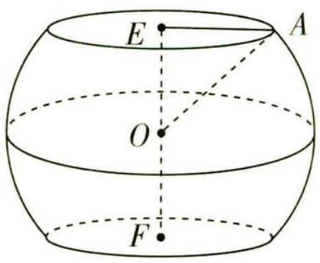

<details>
<summary>text_image</summary>

E
A
O
F
</details>

图6

因为球 O 的表面积为 $4\pi R^{2}=36\pi$ ，解得 R=3，所以 OA=R=3 cm.

又 OE = 1 cm 且 $OE \perp EA$ ,

所以截面小圆半径 $r = EA = \sqrt{OA^{2} - OE^{2}} = \sqrt{9 - 1} = 2\sqrt{2} \, (\text{cm})$ .

根据“万能求积公式”可得,所求几何体 $\Omega$ 的体积为 $V=\frac{1}{6}\times2\times(8\pi+4\times9\pi+8\pi)=\frac{52}{3}\pi(\mathrm{~cm}^{3})$ .

# 奇妙数字

# 核心主干抓重点

# 超重点 5 用构造法求数列通项公式的 4 类情形

# 情形 1 递推公式形如 $a_{n+1}=qa_{n}+p(p\neq0,q\neq0,q\neq1)$


调研 1 (2023 上海财经大学附属中学 5 月模拟) 若数列 $\{a_{n}\}$ 满足 $a_{1} = 2, a_{n+1} = 3a_{n} + 2 (n \geqslant 1, n \in \mathbf{N})$ , 则数列 $\{a_{n}\}$ 的前 $n$ 项和 $S_{n} =$ \_\_\_\_.

# 天星老师讲妙招


看到 $a_{n + 1} = 3a_n + 2(n\geqslant 1,n\in \mathbf{N})$ ，想到形如 $a_{n + 1} = qa_n + p(p\neq 0,q\neq 0,q\neq 1)$ 类型的递推公式，利用待定系数法构造数列，即 $a_{n + 1} + M = q(a_n + M)$ ，其中 $M = \frac{p}{q - 1}$

解析 由 $a_{n+1} = 3a_n + 2$ 得 $a_{n+1} + 1 = 3(a_n + 1)$ ,

【扫清障碍】对 “2” 进行分配, 使等式左右两边保持形式上的一致, 构造出新的等比数列 $\left| {{a}_{n} + 1}\right|$

所以数列 $\{a_{n} + 1\}$ 是以3为公比的等比数列，其中首项 $a_1 + 1 = 3$

所以 $a_{n} + 1 = 3 \times 3^{n - 1} = 3^{n}$ , 所以 $a_{n} = 3^{n} - 1$ ,

所以 $S_{n}=a_{1}+a_{2}+a_{3}+\cdots+a_{n}=(3^{1}+3^{2}+\cdots+3^{n})-n=\frac{3\times(1-3^{n})}{1-3}-n=\frac{3^{n+1}-3-2n}{2}.$

【点技巧】数列通项为等差和等比数列通项之和(差)的形式，求和时可使用分组求和的方法

调研 2 (数列与概率交汇 | 2023 辽宁沈阳二中 5 月三模 | 多选) 已知数列 $\{a_{n}\}$ 的前 $n$ 项和为 $S_{n}$ , 且 $a_{i} = 1$ 或 $a_{i} = 2$ 的概率均为 $\frac{1}{2} (i = 1, 2, 3, \cdots)$ . 设 $S_{n}$ 能被 3 整除的概率为 $P_{n}$ , 则 ( )

A. $P_{2} = 1$

B. $P_{3} = \frac{1}{4}$

C. $P_{11} = \frac{341}{1024}$

D. 当 $n \geqslant 25$ 时, $P_{n} < \frac{1}{3}$

# 奇妙数字

冰雹数列 一个正整数 $N$ , 如果是奇数, 那么下一项为 $3N + 1$ , 如果是偶数, 那么下一项为 $N / 2$ , 以这种变换规则构成的数列, 最终会进入 4, 2, 1 的循环.

关注微信公众号“初高教辅站”获取更多初高中教辅资料


# 天星老师破瓶颈

本题乍一看是概率问题,实质是数列的应用问题,我们该怎么破瓶颈呢?首先分析 $S_{n}$ 被3除的余数,以余数为标准分类讨论,可得 $S_{n+1}$ 被3除的余数的不同情况,找到 $P_{n+1}$ 与 $P_{n}$ 的等量关系,利用待定系数法构造新的等比数列表示 $P_{n}$ ,逐一判断各选项的正误.

解析 由题意可知, $a_{1}=1$ 或 $a_{1}=2$ ,则 $S_{1}=1$ 或 $S_{1}=2$ ,即 $S_{1}\neq3$ ,故 $P_{1}=0$ .

因为 $S_{n}\in \mathbf{N}^{*}$ ，则 $S_{n}$ 被3除的余数为0,1,2，

若 $S_{n}$ 被 3 除的余数为 0，即 $S_{n}$ 被 3 整除，由 $a_{n+1}=1$ 或 $a_{n+1}=2$ ，可得 $S_{n+1}$ 不能被 3 整除；

若 $S_{n}$ 被 3 除的余数为 1，则取 $a_{n+1}=2$ ，可得 $S_{n+1}$ 被 3 整除；

若 $S_{n}$ 被3除的余数为2，则取 $a_{n + 1} = 1$ ，可得 $S_{n + 1}$ 被3整除.

【指点迷津】分类讨论 $S_{n}$ 被 3 除的余数的不同情况, 分析 $a_{n+1}$ 取何值时 $S_{n+1}$ 才能被 3 .整除, 从而找到 $P_{n+1}$ 与 $P_{n}$ 的等量关系

综上所述, $P_{n+1}=\frac{1}{2}(1-P_{n})$ ,

【扫清障碍】如果配凑困难，可以转化为 $P_{n + 1} = -\frac{1}{2} P_n + \frac{1}{2}$ ，通过待定系数法，令 $P_{n + 1} + \lambda = q(P_n + \lambda)$ ，求 $\lambda$ ，构造新的等比数列求解

可得 $P_{n + 1} - \frac{1}{3} = -\frac{1}{2} (P_n - \frac{1}{3})$ ，且 $P_{1} - \frac{1}{3} = -\frac{1}{3}\neq 0$

故数列 $\{P_{n} - \frac{1}{3}\}$ 是以 $-\frac{1}{3}$ 为首项， $-\frac{1}{2}$ 为公比的等比数列，

则 $P_{n} - \frac{1}{3} = (-\frac{1}{3})\times (-\frac{1}{2})^{n - 1}$ ，故 $P_{n} = \frac{1}{3} -\frac{1}{3}\times (-\frac{1}{2})^{n - 1}.$

可得 $P_{2} = \frac{1}{3} -\frac{1}{3}\times (-\frac{1}{2}) = \frac{1}{2}\neq 1,P_{3} = \frac{1}{3} -\frac{1}{3}\times (-\frac{1}{2})^{2} = \frac{1}{4},P_{11} = \frac{1}{3} -\frac{1}{3}\times (-\frac{1}{2})^{10} =$ $\frac{341}{1024}$ ，故A错误，B,C正确.

当 n 为偶数时, 则 n-1 为奇数, 可得 $\left(-\frac{1}{2}\right)^{n-1}<0$ ,

故 $P_{n} = \frac{1}{3} -\frac{1}{3}\times (-\frac{1}{2})^{n - 1} > \frac{1}{3};$

当 n>1 且 n 为奇数时, 则 n-1 为偶数, 可得 $\left(-\frac{1}{2}\right)^{n-1}>0$ ,

【会思考】由于数列 $\{P_{n}\}$ 通项中含有 $(- \frac{1}{2})^{n-1}$ ，故 n 需要分奇、偶数来讨论

# 奇妙数字

故 $P_{n} = \frac{1}{3} -\frac{1}{3}\times (-\frac{1}{2})^{n - 1} <   \frac{1}{3}.$

可得当 $n \geqslant 25$ 时, $P_{n} < \frac{1}{3}$ 但不恒成立, 故 D 错误. 故选 BC.

# 情形2 递推公式形如 $a_{n + 1} = qa_n + f(n)(q\neq 0)$


调研 3 (2023 山东泰安肥城 5 月适应性训练) 数列 $\{a_{n}\}$ 的前 $n$ 项和为 $S_{n}$ , 满足 $S_{n+1} - 2S_{n} = 1 - n$ , 且 $S_{1} = 3$ , 则数列 $\{a_{n}\}$ 的通项公式是 \_\_\_\_.

# 天星老师讲妙招


看到 $S_{n+1} - 2S_n = 1 - n$ ，想到形如 $a_{n+1} = qa_n + f(n) (q \neq 0)$ 类型的递推公式，可以使用待定系数法，令 $S_{n+1} + \lambda(n+1) + \mu = 2(S_n + \lambda n + \mu)$ ，解得 $\lambda = -1, \mu = 0$ 。对于形如 $a_{n+1} = qa_n + pb^n (p \neq 0, q \neq 0, q \neq b)$ 的递推公式，先用待定系数法构造 $a_{n+1} + \lambda b^{n+1} = q(a_n + \lambda b^n)$ ，再根据对应项系数相等求出 $\lambda = \frac{p}{q - b}$ 即可。

解析 $\because S_{n + 1} - 2S_n = 1 - n,\therefore S_{n + 1} - (n + 1) = 2(S_n - n)$ ，且 $S_{1} - 1 = 2\neq 0$

$\therefore \frac{S_{n + 1} - (n + 1)}{S_n - n} = 2, \therefore \{S_n - n\}$ 是以2为首项，2为公比的等比数列.

$$
\therefore S _ {n} - n = 2 \cdot 2 ^ {n - 1} = 2 ^ {n}, S _ {n} = n + 2 ^ {n}.
$$

∴ 当 $n \geqslant 2$ 时， $a_{n} = S_{n} - S_{n-1} = n + 2^{n} - (n - 1 + 2^{n-1}) = 2^{n-1} + 1$ ，

【易错提醒】由于后续式子中出现了 $S_{n-1}$ , 故必须强调 $n \geqslant 2$ , 并要验证 $n = 1$ 时是否满足, 此题不满足, 故最后用分段的形式写出数列的通项公式

又 $a_1 = 3$ 不满足上式，所以 $a_{n} = \left\{ \begin{array}{l}3,n = 1,\\ 2^{n - 1} + 1,n\geqslant 2. \end{array} \right.$

调研 4 (数列与抽象函数交汇|2023 山东省部分学校 5 月第三次联考)已知函数 $f(x)$ 的定义域为 $\mathbf{R}$ , $f(0)=1$ , 且 $\forall x \in \mathbf{R}$ , 都有 $f(x+1)=2f(x)-x$ , 设 $b_{n}=\frac{1}{f(n)f(n+1)}(n \in \mathbf{N}^{*})$ , 则数列 $\{b_{n}\}$ 的前 2023 项和 $S_{2023}=$ \_\_\_\_.

# 天星老师传技巧


虽然题干中的 $f(x+1)=2f(x)-x$ 中, 函数的定义域为 R, 但后续主要考虑的是 $f(n)(n\in\mathbf{N}^{*})$ , 为了表示更方便, 可以令 $a_{n}=f(n)(n\in\mathbf{N}^{*})$ , 利用构造法求数列的通项公式.

# 奇妙数字

思维导引 令 $a_{n} = f(n)$ $\xrightarrow{\text{构造法}}$ $\{a_{n}\}$ 的通项公式 $\longrightarrow$ 将 $f(n)$ 代入 $b_{n}$ 的式子 $\longrightarrow$ 对 $b_{n}$ 裂项 $\xrightarrow{\text{裂项相消法}} S_{2023}$

解析 设 $a_{n}=f(n)(n\in\mathbf{N}^{*})$ ，则 $a_{1}=f(1)=2f(0)=2, a_{n+1}=2a_{n}-n$ ，即 $a_{n+1}-(n+2)=2[a_{n}-(n+1)]$ ，

【扫清障碍】令 $a_{n + 1} + \lambda (n + 1) + \mu = 2(a_n + \lambda n + \mu)$ ，求得 $\lambda = \mu = -1$

又 $a_1 = 2$ ，即 $a_1 - (1 + 1) = 0$ ，于是 $a_{n + 1} - (n + 2) = 2[a_n - (n + 1)] = 0$ ，则 $a_{n} = n + 1$ ，即 $f(n) = n + 1$

【指点迷津】数列的后一项与前一项有倍数关系，且首项为0，等价于此数列为每项都是0的常数列

从而 $b_{n} = \frac{1}{(n + 1)(n + 2)} = \frac{1}{n + 1} -\frac{1}{n + 2},$

所以 $S_{2023}=\frac{1}{2}-\frac{1}{3}+\frac{1}{3}-\frac{1}{4}+\cdots+\frac{1}{2024}-\frac{1}{2025}=\frac{2023}{4050}.$

情形 3 递推公式形如 $a_{n+1}=pa_{n}/(ra_{n}+s)(p>0,r\neq0,s\neq0,a_{n}\neq0)$


调研 5 (2023 江苏镇江中学 5 月考前模拟 | 多选) 已知数列 $\{a_{n}\}$ 满足 $a_{1} = 1$ , $a_{n+1} = \frac{a_{n}}{2 + 3a_{n}}$ , 则下列结论正确的有 ( )

A. $\{\frac{1}{a_n} + 3\}$ 为等比数列

B. $\{a_{n}\}$ 的通项公式为 $a_{n} = \frac{1}{2^{n + 1} - 3}$

C. $\{a_{n}\}$ 为递增数列

D. $\{\frac{1}{a_n}\}$ 的前 $n$ 项和 $T_{n} = 2^{n + 2} - 3n - 4$

# 天星老师讲妙招


数列 $\{a_{n}\}$ 的递推公式形如 $a_{n+1} = \frac{pa_{n}}{ra_{n} + s} (p > 0, r \neq 0, s \neq 0, a_{n} \neq 0)$ , 我们先在等式两边同时取倒数, 变形为 $\frac{1}{a_{n+1}} = \frac{ra_{n} + s}{pa_{n}} = \frac{s}{p} \cdot \frac{1}{a_{n}} + \frac{r}{p}$ , 利用待定系数法构造新的等比数列求解. 若 $s = p \neq 0$ , 则 $\{\frac{1}{a_{n}}\}$ 是以 $\frac{1}{a_{1}}$ 为首项, $\frac{r}{p}$ 为公差的等差数列, 即 $\frac{1}{a_{n}} = \frac{1}{a_{1}} + (n - 1)\frac{r}{p}$ .

解析 因为 $a_{1}=1, a_{n+1}=\frac{a_{n}}{2+3a_{n}}$ ，所以 $\frac{1}{a_{n+1}}=\frac{2+3a_{n}}{a_{n}}=\frac{2}{a_{n}}+3$ ，所以 $\frac{1}{a_{n+1}}+3=2\left(\frac{1}{a_{n}}+3\right)$ .

【敲黑板】当分母出现加减运算时,我们很难进行化简,所以往往取倒数寻找突破点又 $\frac{1}{a_1} + 3 = 4$ ，所以数列 $\left\{\frac{1}{a_n} + 3\right\}$ 是以 4 为首项、2 为公比的等比数列，

所以 $\frac{1}{a_n} + 3 = 4 \times 2^{n-1} = 2^{n+1}$ , 即 $a_n = \frac{1}{2^{n+1} - 3}$ , 故 A, B 正确.

因为 $a_{n + 1} - a_n = \frac{1}{2^{n + 2} - 3} -\frac{1}{2^{n + 1} - 3} = \frac{(2^{n + 1} - 3) - (2^{n + 2} - 3)}{(2^{n + 2} - 3)(2^{n + 1} - 3)} = \frac{-2^{n + 1}}{(2^{n + 2} - 3)(2^{n + 1} - 3)},$

【指点迷津】判断数列的增减性，往往可以通过判断 $a_{n+1}-a_n$ 的正负，或比较 $\frac{a_{n+1}}{a_n}$ 与1的大小，除此之外，还可以借助函数的单调性来判断

$n \geqslant 1$ ，所以 $2^{n + 2} - 3 > 0, 2^{n + 1} - 3 > 0, -2^{n + 1} < 0,$

所以 $a_{n+1}-a_{n}<0$ ，所以 $\{a_{n}\}$ 为递减数列，故 C 错误.

【多维思考】因为 $a_{n} = \frac{1}{2^{n + 1} - 3}$ , 对应函数 $f(x) = \frac{1}{2^{x + 1} - 3}$ , 很容易就可以判断出函数 $f(x)$ 在 $(- \infty, \log_2 \frac{3}{2}), (\log_2 \frac{3}{2}, + \infty)$ 上是减函数, 故 $a_{n} = \frac{1}{2^{n + 1} - 3}$ 在 $[1, + \infty)$ 上为递减数列

易知 $\frac{1}{a_{n}}=2^{n+1}-3$ ，则 $T_{n}=(2^{2}+2^{3}+2^{4}+\cdots+2^{n+1})-3n=\frac{4(1-2^{n})}{1-2}-3n=2^{n+2}-3n-4$ ，故D正确.故选ABD.

调研 6 (2023 江苏南通如皋 5 月三模) 已知数列 $\{a_{n}\}$ 中, $a_{1} = \frac{1}{3}, a_{n+1} = \frac{a_{n}}{2 - a_{n}}$ .

(1) 求数列 $\{a_{n}\}$ 的通项公式.  
(2) 求证: 数列 $\{a_{n}\}$ 的前 n 项和 $S_{n}<1$ .

解析 (1) 因为 $a_{1} = \frac{1}{3}, a_{n + 1} = \frac{a_{n}}{2 - a_{n}}$ , 故 $a_{n} \neq 0$ ,

所以 $\frac{1}{a_{n + 1}} = \frac{2}{a_n} -1$ ，整理得 $\frac{1}{a_{n + 1}} -1 = 2\left(\frac{1}{a_n} -1\right).$

【破题有拓】等式两边同时取倒数，变形为 $a_{n+1} = qa_n + p (p \neq 0, q \neq 0, q \neq 1)$ 的形式后，配凑或者使用待定系数法构造新数列

又 $a_1 = \frac{1}{3}, \frac{1}{a_1} - 1 = 2 \neq 0, \frac{1}{a_n} - 1 \neq 0$ ，所以 $\frac{\frac{1}{a_{n+1}} - 1}{\frac{1}{a_n} - 1} = 2$ 为定值，

故数列 $\{\frac{1}{a_n} - 1\}$ 是首项为2、公比为2的等比数列，所以 $\frac{1}{a_n} - 1 = 2^n$ ，即 $a_n = \frac{1}{2^n + 1}$

奇妙数字

(2) 因为 $a_{n} = \frac{1}{2^{n} + 1} < \frac{1}{2^{n}}$ ,

【指点迷津】数列 $\{a_{n}\}$ 不易直接求和，需放缩后再求和

所以 $S_{n}<\frac{1}{2^{1}}+\frac{1}{2^{2}}+\frac{1}{2^{3}}+\cdots+\frac{1}{2^{n}}=\frac{\frac{1}{2}\left[1-\left(\frac{1}{2}\right)^{n}\right]}{1-\frac{1}{2}}=1-\left(\frac{1}{2}\right)^{n}<1.$

# 情形 4 递推公式形如 $a_{n+2}=pa_{n+1}+qa_{n}(p\neq0,q\neq0)$


调研 7 (2023 江苏省七市 5 月三模) 已知数列 $a_{n}$ 满足 $a_{1} = 1, a_{2} = 5, a_{n+2} = 5a_{n+1} - 6a_{n}$ .

(1) 证明: $\{a_{n+1} - 2a_n\}$ 是等比数列.   
(2) 证明: 存在两个等比数列 $\{b_{n}\}, \{c_{n}\}$ , 使得 $a_{n} = b_{n} + c_{n}$ 成立.

# 天星老师明思路


抓题眼“ $a_{n+2} = 5a_{n+1} - 6a_n$ ”，为了证明 $\{a_{n+1} - 2a_n\}$ 是等比数列，先配凑得到 $a_{n+2} - 2a_{n+1} = 3(a_{n+1} - 2a_n)$ ，再结合首项不为0证明 $\{a_{n+1} - 2a_n\}$ 是等比数列；在第(1)问背景下得到 $a_{n+1} - 2a_n = 3^n$ ，换一种配凑形式得到 $a_{n+2} - 3a_{n+1} = 2(a_{n+1} - 3a_n = 2^n)$ ，两者联立求得 $a_n = 3^n - 2^n$ ，最后证明结论。

解析 方法一 (1) $\because a_{n + 2} = 5a_{n + 1} - 6a_n, \therefore a_{n + 2} - 2a_{n + 1} = 5a_{n + 1} - 6a_n - 2a_{n + 1}$ ,

$$
\therefore a _ {n + 2} - 2 a _ {n + 1} = 3 a _ {n + 1} - 6 a _ {n} = 3 \left(a _ {n + 1} - 2 a _ {n}\right),
$$

【抓题眼】在等式两边同时减 $2a_{n+1}$ 的原因是要证 $\{a_{n+1} - 2a_n\}$ 是等比数列

显然 $a_{n + 1} - 2a_n = 0$ 与 $a_1 = 1, a_2 = 5$ 矛盾， $\therefore a_{n + 1} - 2a_n \neq 0, \therefore \frac{a_{n + 2} - 2a_{n + 1}}{a_{n + 1} - 2a_n} = 3,$

∴ 数列 $\left\{a_{n+1}-2a_{n}\right\}$ 是首项为 $a_{2}-2a_{1}=5-2=3$ ，公比为 3 的等比数列.

(2) $\because a_{n+2}=5a_{n+1}-6a_{n},\therefore a_{n+2}-3a_{n+1}=5a_{n+1}-6a_{n}-3a_{n+1},$

【传技巧】通过配凑，还可以构造另一个等比数列，从而求得 $\{a_{n}\}$ 的通项公式

$$
\therefore a _ {n + 2} - 3 a _ {n + 1} = 2 a _ {n + 1} - 6 a _ {n} = 2 \left(a _ {n + 1} - 3 a _ {n}\right).
$$

显然 $a_{n + 1} - 3a_n = 0$ 与 $a_1 = 1, a_2 = 5$ 矛盾， $\therefore a_{n + 1} - 3a_n \neq 0, \therefore \frac{a_{n + 2} - 3a_{n + 1}}{a_{n + 1} - 3a_n} = 2,$

∴ 数列 $\left\{a_{n+1}-3a_{n}\right\}$ 是首项为 $a_{2}-3a_{1}=5-3=2$ ，公比为 2 的等比数列，

$$
\therefore a _ {n + 1} - 3 a _ {n} = 2 ^ {n} \quad ①,
$$

# 奇妙数字

由第(1)问得 $a_{n+1}-2a_{n}=3^{n}$ ②,由②-①得, $a_{n}=3^{n}-2^{n}$ .

∴ 存在通项为 $b_{n}=3^{n}, c_{n}=-2^{n}$ 的两个等比数列, 使得 $a_{n}=b_{n}+c_{n}$ 成立.

方法二 (1) 令 $a_{n+2} + \lambda a_{n+1} = \mu(a_{n+1} + \lambda a_n)$ ,

【破题有拓】针对满足形如 $a_{n+2} = pa_{n+1} + qa_n (p \neq 0, q \neq 0)$ 类型的递推公式，可以通过待定系数法，令 $a_{n+2} + \lambda a_{n+1} = \mu (a_{n+1} + \lambda a_n)$ ，构造出新的等比数列

由 $a_{n + 2} = 5a_{n + 1} - 6a_n$ 得 $\left\{ \begin{array}{l}\mu -\lambda = 5,\\ \mu \lambda = -6, \end{array} \right.$ 解得 $\left\{ \begin{array}{ll}\mu = 3,\\ \lambda = -2 \end{array} \right.$ 或 $\left\{ \begin{array}{ll}\mu = 2,\\ \lambda = -3. \end{array} \right.$

$\therefore a_{n + 2} - 2a_{n + 1} = 3(a_{n + 1} - 2a_n)$ 或 $a_{n + 2} - 3a_{n + 1} = 2(a_{n + 1} - 3a_n)$ .

$$
\because a _ {1} = 1, a _ {2} = 5, \therefore a _ {2} - 2 a _ {1} = 3 \neq 0,
$$

∴ 数列 $\left\{a_{n+1}-2a_{n}\right\}$ 是首项为 3, 公比为 3 的等比数列.

(2) 由(1)知 $a_{n+1} - 2a_n = 3^n$ ①,

由 $a_{n + 2} - 3a_{n + 1} = 2(a_{n + 1} - 3a_n)$ 可得 $a_{n + 1} - 3a_n = 2^n$ ②，

由①-②得, $a_{n}=3^{n}-2^{n}$ ,

∴ 存在通项为 $b_{n}=3^{n}, c_{n}=-2^{n}$ 的两个等比数列, 使得 $a_{n}=b_{n}+c_{n}$ 成立.

# 新题演练

1. (2023 云南玉溪一中 7 月模拟 | 多选) 已知数列 $\{a_{n}\}$ 满足 $a_{1} = 1, a_{n+1} = \frac{a_{n}}{1 + 3a_{n}}$ ( $n \in \mathbf{N}^{*}$ ), 则

A. $\{\frac{1}{a_n}\}$ 为等比数列

B. $\{a_{n}\}$ 的通项公式为 $a_{n} = \frac{1}{3n - 2}$

C. $\{a_{n}\}$ 为递减数列

D. $\left\{\frac{1}{a_{n}}\right\}$ 的前 n 项和 $T_{n}=\frac{3n^{2}-n}{2}$

# 天星老师传技巧


见到 $a_{n + 1} = \frac{a_n}{1 + 3a_n}$ ，符合情形3的模型，等式两边取倒数，可得 $\frac{1}{a_{n + 1}} = \frac{1 + 3a_n}{a_n} =$ $\frac{1}{a_n} +3$ ，构造新的等差数列 $\{\frac{1}{a_n}\}$

2. (名师原创) 设数列 $\{a_{n}\}$ 的前 $n$ 项和为 $S_{n}$ , 满足 $2S_{n} = a_{n+1} - 2^{n+1} + 1 (n \in \mathbf{N}^{*})$ , 且 $a_{1}, a_{2} + 5, a_{3}$ 成等差数列.

(1) 求 $a_{1}$ 的值;  
(2)求数列 $\{a_{n}\}$ 的通项公式.

# 奇妙数字

斐波那契数列 数学家斐波那契以兔子繁殖为例子而引入数列 1,1,2,3,5,8,13,21,34……这个数列从第 3 项开始,每一项都等于前两项之和.

关注微信公众号“初高教辅站”获取更多初高中教辅资料

# 天星老师破障碍


已知 $S_{n}$ 与 $a_{n + 1}$ 的关系式 $2S_{n} = a_{n + 1} - 2^{n + 1} + 1(n\in \mathbf{N}^{*})$ ，要求 $\{a_{n}\}$ 的通项公式，看似无法下手，我们不妨用 $a_{n} = S_{n} - S_{n - 1}(n\geqslant 2)$ ，转化为递推式 $a_{n + 1} = 3a_{n}+$ $2^{n}$ ，然后利用情形2的模型构造新的等比数列进行求解.

# 参考答案与解析

1. BCD 因为 $\frac{1}{a_{n+1}} = \frac{1 + 3a_{n}}{a_{n}} = \frac{1}{a_{n}} + 3$ ，所以 $\left\{\frac{1}{a_{n}}\right\}$ 是以 1 为首项，3 为公差的等差数列，故选项 A 【敲黑板】见到 $a_{n+1} = \frac{a_{n}}{1 + 3a_{n}}$ ，符合情形 3 的模型，注意构造新的等差数列，不是等比数列错误；

因为 $\frac{1}{a_{n}}=1+3(n-1)=3n-2$ ，所以 $a_{n}=\frac{1}{3n-2}$ ，故选项B正确；

根据函数 $y = 3x - 2$ 在 $[1, +\infty)$ 上单调递增，且 $3x - 2 > 0$

则函数 $y=\frac{1}{3x-2}$ 在 $[1,+\infty)$ 上单调递减，

因为 $a_{n} = \frac{1}{3n - 2}, n \in \mathbf{N}^{*}$ , 所以数列 $\{a_{n}\}$ 为递减数列, 故选项 C 正确;

$\left\{\frac{1}{a_{n}}\right\}$ 的前 n 项和 $T_{n}=\frac{n(3n-1)}{2}=\frac{3n^{2}-n}{2}$ ，故选项 D 正确。故选 BCD.

2. (1) $2S_{n}=a_{n+1}-2^{n+1}+1$ ,

令 n=2 得 $2S_{2}=a_{3}-2^{3}+1$ ，即 $2a_{1}+2a_{2}=a_{3}-7$ ①.

因为 $a_{1}, a_{2} + 5, a_{3}$ 成等差数列，所以 $2(a_{2} + 5) = a_{1} + a_{3}$ ，即 $a_{3} = 2(a_{2} + 5) - a_{1}$ ②，

将②代入①可得 $2a_{1} + 2a_{2} = 2(a_{2} + 5) - a_{1} - 7$ ，解得 $a_{1} = 1$ ，

故 $a_{1}$ 的值为1.

(2) 因为 $2S_{n} = a_{n + 1} - 2^{n + 1} + 1$ ，当 $n \geqslant 2$ 时， $2S_{n - 1} = a_{n} - 2^{n} + 1$

两式作差可得 $a_{n+1}=3a_{n}+2^{n}$ ，所以 $a_{n+1}+2^{n+1}=3(a_{n}+2^{n})$ ， $n\geqslant2$ ，

【扫清障碍】原式难以配凑时，不妨先将原等式变形为 $\frac{a_{n+1}}{2^{n+1}}=\frac{3}{2}\cdot\frac{a_{n}}{2^{n}}+\frac{1}{2}$ ，再令 $\frac{a_{n+1}}{2^{n+1}}+\lambda=$ $\frac{3}{2}\left(\frac{a_{n}}{2^{n}}+\lambda\right)$ ，求得 $\lambda=1$ ，构造出新的等比数列再继续求解

易知 $a_2 = 5$ ，所以 $a_{n} + 2^{n} = (a_{2} + 2^{2})\times 3^{n - 2} = (5 + 4)\times 3^{n - 2} = 3^{n}$

即 $a_{n} = 3^{n} - 2^{n}, n \geqslant 2$ ，将 $n = 1$ 代入 $a_{n} = 3^{n} - 2^{n}$ 得 $a_{1} = 3^{1} - 2^{1} = 1$ ，符合题意.

故数列 $\{a_{n}\}$ 的通项公式为 $a_{n}=3^{n}-2^{n}$ .

# 奇妙数字

# 超重点6 从4个角度研究数列中的不等关系 压轴热点

# 角度1 数列中的不等式证明


调研 1 (2023 新课标 II 卷) 已知 $\{a_{n}\}$ 为等差数列, $b_{n} = \left\{ \begin{array}{l} a_{n} - 6, n \text{ 为奇数,} \\ 2a_{n}, n \text{ 为偶数.} \end{array} \right.$ 记 $S_{n}, T_{n}$ 分别为数列 $\{a_{n}\}, \{b_{n}\}$ 的前 $n$ 项和, $S_{4} = 32, T_{3} = 16$ .

(1) 求 $\{a_{n}\}$ 的通项公式.  
(2) 证明: 当 n > 5 时, $T_{n} > S_{n}$ .

# 天星老师引思路


要求数列 $\{a_{n}\}$ 的通项公式, 需要求出首项与公差, 结合等差数列的通项公式与前 $n$ 项和公式求解. 由于数列 $\{b_{n}\}$ 是“分段数列”, 通项分 $n$ 为偶数与 $n$ 为奇数给出, 因此在求 $T_{n}$ 时, 也需分 $n$ 为偶数与 $n$ 为奇数. 解题关键是求出 $T_{n}$ 的表达式,难点是需要分类讨论,并采用分组求和法,然后与 $S_{n}$ 作差证明第(2)问.

解析 (1) 第一步: 求出 $\{b_{n}\}$ 的前 3 项.

设等差数列 $\{a_{n}\}$ 的公差为 $d$ ，由 $b_{n} = \left\{ \begin{array}{ll}a_{n} - 6,n = 2k - 1,\\ 2a_{n},n = 2k, \end{array} \right.$ $k\in \mathbf{N}^{*}$

得 $b_{1}=a_{1}-6,b_{2}=2a_{2}=2a_{1}+2d,b_{3}=a_{3}-6=a_{1}+2d-6.$

【小提示】由于数列 $|b_{n}|$ 的通项是分段的，因此求项时要“对号入座”

第二步:结合已知条件建立方程组,求出 $a_{1}$ 和公差 d.

于是 $\left\{ \begin{array}{l} S_{4} = 4a_{1} + 6d = 32, \\ T_{3} = 4a_{1} + 4d - 12 = 16, \end{array} \right.$ 解得 $\left\{ \begin{array}{l} a_{1} = 5, \\ d = 2. \end{array} \right.$

第三步: 求 $\{a_{n}\}$ 的通项公式.

$a_{n} = a_{1} + (n - 1)d = 2n + 3$ ，所以数列 $\{a_{n}\}$ 的通项公式是 $a_{n} = 2n + 3$

(2) 方法一 第一步: 结合(1), 利用等差数列的求和公式求 $S_{n}$ .

由(1)知, $S_{n}=\frac{n(5+2n+3)}{2}=n^{2}+4n,b_{n}=\left\{\begin{aligned}&2n-3,n=2k-1,\\ &4n+6,n=2k,\end{aligned}\right.$ $k\in N^{*}$ .

【指点迷津】注意数列 $|b_{n}|$ 是“分段数列”，奇数项、偶数项分别成等差数列，所以要分类讨论

# 奇妙数字

自幂数 如果在一个固定的进制中,一个 $n$ 位自然数等于自身各个数位上数字的 $n$ 次幂之和,则称此数为 $n$ 位自幂数.例如在十进制中,三位数153满足 $1^{3}+5^{3}+3^{3}=153$ ,所以153是一个三位自幂数.关注微信公众号“初高教辅站”获取更多初高中教辅资料

第二步:证明 n 为偶数时,所证不等式成立.

当 n 为偶数时， $T_{n}=(b_{1}+b_{3}+\cdots+b_{n-1})+(b_{2}+b_{4}+\cdots+b_{n})=\frac{-1+2(n-1)-3}{2}\cdot\frac{n}{2}+\frac{14+4n+6}{2}\cdot\frac{n}{2}=\frac{3}{2}n^{2}+\frac{7}{2}n,$

【会分组】将奇数项组成一组，偶数项组成一组，分组求和

当 $n > 5$ 时， $T_{n} - S_{n} = \frac{3}{2} n^{2} + \frac{7}{2} n - (n^{2} + 4n) = \frac{1}{2} n(n - 1) > 0$ ，因此 $T_{n} > S_{n}$ .

第三步:证明 n 为奇数时,所证不等式成立.

当 n 为奇数时, 若 $n \geqslant 3$ , 则 $T_{n} = (b_{1} + b_{3} + \cdots + b_{n}) + (b_{2} + b_{4} + \cdots + b_{n-1}) = \frac{-1 + 2n - 3}{2} \cdot \frac{n+1}{2} + \frac{14 + 4(n-1) + 6}{2} \cdot \frac{n-1}{2} = \frac{3}{2}n^{2} + \frac{5}{2}n - 5$ ,

显然 $T_{1} = b_{1} = -1$ 满足上式，因此当 $n$ 为奇数时， $T_{n} = \frac{3}{2} n^{2} + \frac{5}{2} n - 5$

当 $n > 5$ 时， $T_{n} - S_{n} = \frac{3}{2} n^{2} + \frac{5}{2} n - 5 - (n^{2} + 4n) = \frac{1}{2}(n + 2)(n - 5) > 0$ ，因此 $T_{n} > S_{n}$ .

第四步: 下结论.

综上所述, 当 n > 5 时, $T_{n} > S_{n}$ .

方法二 由(1)知, $S_{n}=\frac{n(5+2n+3)}{2}=n^{2}+4n,b_{n}=\left\{\begin{aligned}&2n-3,n=2k-1,\\ &4n+6,n=2k,\end{aligned}\right.$ $k\in N^{*}$

当 $n$ 为偶数时， $b_{n-1} + b_n = 2(n-1) - 3 + 4n + 6 = 6n + 1, T_n = \frac{13 + (6n+1)}{2} \cdot \frac{n}{2} = \frac{3}{2} n^2 + \frac{7}{2} n,$ 【敲黑板】按相邻项分组，当 $n$ 为偶数时分成 $\frac{n}{2}$ 组

当 n > 5 时， $T_{n} - S_{n} = \frac{3}{2} n^{2} + \frac{7}{2} n - (n^{2} + 4n) = \frac{1}{2} n(n - 1) > 0$ ，因此 $T_{n} > S_{n}$ .

当 $n$ 为奇数时， $T_{n} = T_{n + 1} - b_{n + 1} = \frac{3}{2}(n + 1)^{2} + \frac{7}{2}(n + 1) - [4(n + 1) + 6] = \frac{3}{2} n^{2} + \frac{5}{2} n - 5,$

【多维思考】注意这里的技巧是，当 $n$ 为奇数时 $n + 1$ 为偶数，因而借助偶数项和的结论求解。也可以这样求解：当 $n$ 为奇数时， $T_{n} = T_{n - 1} + b_{n} = \frac{3}{2}(n - 1)^{2} + \frac{7}{2}(n - 1) + 2n - 3 = \frac{3}{2} n^{2} + \frac{5}{2} n - 5$

当 $n > 5$ 时， $T_{n} - S_{n} = \frac{3}{2} n^{2} + \frac{5}{2} n - 5 - (n^{2} + 4n) = \frac{1}{2}(n + 2)(n - 5) > 0$ ，因此 $T_{n} > S_{n}$ .

综上所述, 当 n > 5 时, $T_{n} > S_{n}$ .

# 奇妙数字

神奇的是,一位自幂数(独身数),三位自幂数(水仙花数),四位自幂数(四叶玫瑰数)……都是存在的,唯独二位自幂数不存在.

关注微信公众号“初高教辅站”获取更多初高中教辅资料

调研 2 (数列、不等式与三角函数交汇 | 2023 湖北黄冈 5 月三模) 设正项数列 $\{a_{n}\}$ 满足 $a_{1} = 1, a_{n} = \frac{2a_{n+1}}{1 - a_{n+1}^{2}}, n \in \mathbf{N}^{*}$ . 数列 $\{x_{n}\}$ 满足 $a_{n} = \tan x_{n}$ , 其中 $x_{n} \in (0, \frac{\pi}{2})$ , $n \in \mathbf{N}^{*}$ . 已知如下结论: 当 $x \in (0, \frac{\pi}{2})$ 时, $\sin x < x < \tan x$ .

(1) 求 $\{x_{n}\}$ 的通项公式.  
(2) 证明: $n - \frac{\pi^{2}}{12} < \frac{1}{a_{1}^{2} + 1} + \frac{1}{a_{2}^{2} + 1} + \cdots + \frac{1}{a_{n}^{2} + 1} < n.$

# 天星老师抓题眼


抓题眼 $a_{n} = \tan x_{n}$ ，变形为与三角函数有关的形式得 $\frac{1}{a_n^2 + 1} = \frac{1}{\tan^2x_n + 1} =$ $\cos^2 x_n = 1 - \sin^2 x_n$ ，此处可以应用结论：当 $x\in (0,\frac{\pi}{2})$ 时， $\sin x <   x <   \tan x$ ，从而1-$\sin^2 x_n > 1 - x_n^2$ ，即 $\frac{1}{a_n^2 + 1} > 1 - x_n^2$ ，结合 $\frac{1}{a_n^2 + 1} < 1$ ，不等式得证.

解析 (1) 由 $a_{n} = \tan x_{n}$ , 则 $\tan x_{n} = \frac{2\tan x_{n+1}}{1 - \tan^{2}x_{n+1}} = \tan 2x_{n+1}$ .

由于 $x_{n}\in (0,\frac{\pi}{2})$ ，所以 $x_{n} = 2x_{n + 1}$ ，即 $\frac{x_{n + 1}}{x_n} = \frac{1}{2},$

又由 $a_{1}=1$ 可知 $x_{1}=\frac{\pi}{4}$ ，所以 $\{x_{n}\}$ 是首项为 $\frac{\pi}{4}$ ，公比为 $\frac{1}{2}$ 的等比数列，

因此 $x_{n} = \frac{\pi}{4}\cdot \left(\frac{1}{2}\right)^{n - 1} = \frac{\pi}{2^{n + 1}}.$

(2)一方面,由于 $a_{n}^{2}>0$ ,对任意的 $n\in N^{*}$ ,均有 $\frac{1}{a_{n}^{2}+1}<1$ ,

【小技巧】将分母变小，实现放缩

因此 $\frac{1}{a_{1}^{2}+1}+\frac{1}{a_{2}^{2}+1}+\cdots+\frac{1}{a_{n}^{2}+1}<\underbrace{1+1+\cdots+1}_{n个1}=n.$

另一方面，由 $a_{n} = \tan x_{n}$ ，可得 $\frac{1}{a_n^2 + 1} = \frac{1}{\tan^2x_n + 1} = \cos^2 x_n = 1 - \sin^2 x_n$

从而 $1 - \sin^2 x_n > 1 - x_n^2$ ，即 $\frac{1}{a_n^2 + 1} > 1 - x_n^2 = 1 - \frac{\pi^2}{4^{n+1}}$ .

因此， $\frac{1}{a_{1}^{2}+1}+\frac{1}{a_{2}^{2}+1}+\cdots+\frac{1}{a_{n}^{2}+1}>\sum_{k=1}^{n}(1-\frac{\pi^{2}}{4^{k+1}})=n-\pi^{2}\cdot\frac{\frac{1}{16}(1-\frac{1}{4^{n}})}{1-\frac{1}{4}}=n-\frac{\pi^{2}}{12}(1-\frac{1}{4^{n}})>n-\frac{\pi^{2}}{12}.$

# 实用定理

综上, $n-\frac{\pi^{2}}{12}<\frac{1}{a_{1}^{2}+1}+\frac{1}{a_{2}^{2}+1}+\cdots+\frac{1}{a_{n}^{2}+1}<n.$

【拓展变式】当 $x \in (0, \frac{\pi}{2})$ 时，也有不等式 $\frac{2}{\pi}x < \sin x$ 恒成立，因而 $1 - \sin^{2}x_{n} < 1 - \frac{4}{\pi^{2}}x_{n}^{2} = 1 - \frac{1}{4^{n}}$ ，那么 $\frac{1}{a_{1}^{2} + 1} + \frac{1}{a_{2}^{2} + 1} + \cdots + \frac{1}{a_{n}^{2} + 1} < n - (\frac{1}{4} + \frac{1}{4^{2}} + \cdots + \frac{1}{4^{n}}) = n - \frac{1}{3}(1 - \frac{1}{4^{n}})$

# 相关链接

数列中不等式的证明,往往分成两类,一类是先求和后放缩得到证明;另一类是先放缩成可求和形式,再求和后得到证明.对于后一类,主要是对通项进行变形与放缩,常用到的变形与放缩的式子有:① $\frac{1}{n^{2}}>\frac{1}{n(n+1)}=\frac{1}{n}-\frac{1}{n+1}$ 或 $\frac{1}{n^{2}}<\frac{1}{(n-1)n}=\frac{1}{n-1}-\frac{1}{n}(n\geqslant2)$ ;② $\frac{1}{n^{3}}<\frac{1}{n^{3}-n}=\frac{1}{2}\left[\frac{1}{(n-1)n}-\frac{1}{n(n+1)}\right](n\geqslant2)$ ;③ $\frac{1}{\sqrt{n}}=\frac{2}{2\sqrt{n}}>\frac{2}{\sqrt{n}+\sqrt{n+1}}=2(\sqrt{n+1}-\sqrt{n})$ 或 $\frac{1}{\sqrt{n}}<\frac{1}{\sqrt{n}}=\frac{2}{\sqrt{n-1}+\sqrt{n}}=2(\sqrt{n}-\sqrt{n-1})(n\geqslant2)$ ;④ $\ln(1+\frac{1}{n^{2}})<\frac{1}{n^{2}}<\frac{1}{(n-1)n}=\frac{1}{n-1}-\frac{1}{n}(n\geqslant2)$ 等.

# 角度 2 由不等式恒(能)成立探究参数的取值范围


调研 3 (2023 浙江宁波镇海中学 5 月模拟) 已知数列 $\{a_{n}\}$ 的前 $n$ 项和为 $S_{n}$ , $a_{1} = -\frac{16}{5}$ , 且 $5a_{n+1} + S_{n} + 16 = 0$ .

(1) 求数列 $\{a_{n}\}$ 的通项公式；

(2) 设数列 $\{b_{n}\}$ 满足 $4b_{n} + (n - 5)a_{n} = 0 (n \in \mathbb{N}^{*})$ ，记 $\{b_{n}\}$ 的前 n 项和为 $T_{n}$ ，若 $T_{n} \leqslant \lambda b_{n}$ 对任意的 $n \in N^{*}$ 恒成立，求实数 $\lambda$ 的取值范围.

# 天星老师拓思维


求解第(2)问时, 观察 $b_{n}=(n-5)\left(\frac{4}{5}\right)^{n}$ 的形式, 是等差数列与等比数列对应项的积构成的新数列, 求前 n 项和, 一般是采用错位相减法, 也可以用裂项求和法求解: $(an+b)\cdot q^{n}=\left[\frac{a}{q-1}n+\frac{b}{q-1}-\frac{a}{(q-1)^{2}}\right]q^{n+1}-\left[\frac{a}{q-1}(n-1)+\frac{b}{q-1}-\right.$ $\frac{a}{(q - 1)^2} ]q^n$ ，其中 $q \neq 0, q \neq 1, a \neq 0$ ，比如通项为 $c_n = n \cdot 2^n = (n - 1) \cdot 2^{n + 1} - (n - 2) \cdot 2^n$ ，则数列 $\{c_n\}$ 的前 $n$ 项和 $S_n = 2 + (n - 1) \cdot 2^{n + 1}$ .

解析 (1) 当 $n = 1$ 时, $5a_{2} + a_{1} + 16 = 0$ , 所以 $a_{2} = -\frac{64}{25}$ ,

# 实用定理

当 $n \geqslant 2$ 时，由 $5a_{n+1} + S_n + 16 = 0$ ①，得 $5a_n + S_{n-1} + 16 = 0$ ②，

【易错】不要忘记对 $n \geqslant 2$ 的限制

①-②得 $5a_{n + 1} = 4a_{n}$ ，因为 $a_2\neq 0$ ，所以 $a_{n}\neq 0$ ，所以 $\frac{a_{n + 1}}{a_n} = \frac{4}{5}$

【易遗漏】切勿到此就下结论 $|a_{n}|$ 是等比数列，因为需要对n=1的情况进行检验，这是失分点之一

又 $\frac{a_2}{a_1} = \frac{4}{5}$ , 所以 $\{a_n\}$ 是首项为 $-\frac{16}{5}$ , 公比为 $\frac{4}{5}$ 的等比数列,

所以 $a_{n} = -\frac{16}{5}\cdot \left(\frac{4}{5}\right)^{n - 1} = -4\cdot \left(\frac{4}{5}\right)^{n}.$

(2) 方法一: 错位相减法 由 $4b_{n} + (n - 5)a_{n} = 0$ , 得 $b_{n} = -\frac{n - 5}{4}a_{n} = (n - 5)\left(\frac{4}{5}\right)^{n}$ .

所以 $T_{n} = -4 \times \frac{4}{5} - 3 \times \left(\frac{4}{5}\right)^{2} - 2 \times \left(\frac{4}{5}\right)^{3} + \cdots + (n - 5) \times \left(\frac{4}{5}\right)^{n}$ ,

$$
\frac {4}{5} T _ {n} = - 4 \times \left(\frac {4}{5}\right) ^ {2} - 3 \times \left(\frac {4}{5}\right) ^ {3} - 2 \times \left(\frac {4}{5}\right) ^ {4} + \dots + (n - 6) \times \left(\frac {4}{5}\right) ^ {n} + (n - 5) \times \left(\frac {4}{5}\right) ^ {n + 1},
$$

两式相减得 $\frac{1}{5}T_{n}=-4\times\frac{4}{5}+\left(\frac{4}{5}\right)^{2}+\left(\frac{4}{5}\right)^{3}+\cdots+\left(\frac{4}{5}\right)^{n}-\left(n-5\right)\times\left(\frac{4}{5}\right)^{n+1}$

$$
\begin{array}{l} = - \frac {1 6}{5} + \frac {\frac {1 6}{2 5} \left[ 1 - \left(\frac {4}{5}\right) ^ {n - 1} \right]}{1 - \frac {4}{5}} - (n - 5) \times \left(\frac {4}{5}\right) ^ {n + 1} \\ = - \frac {1 6}{5} + \frac {1 6}{5} - 5 \left(\frac {4}{5}\right) ^ {n + 1} - (n - 5) \times \left(\frac {4}{5}\right) ^ {n + 1} \\ = - n \times \left(\frac {4}{5}\right) ^ {n + 1}, \\ \end{array}
$$

所以 $T_{n} = -4n\cdot (\frac{4}{5})^{n}$ ，所以 $T_{n}\leqslant \lambda b_{n}$ 恒成立即 $-4n\cdot (\frac{4}{5})^n\leqslant \lambda (n - 5)\cdot (\frac{4}{5})^n$ 恒成立，即 $\lambda (n - 5) + 4n\geqslant 0$ 恒成立.

【指点迷津】恒成立问题常采用分离参数法，两边同时除以 $n - 5$ ，因而需要对 $n$ 进行讨论， $n - 5$ 的正负影响不等号方向

当 n=5 时, 不等式恒成立;

当 $0 < n < 5$ 时， $\lambda \leqslant -\frac{4n}{n - 5} = -4 - \frac{20}{n - 5}$ 恒成立，则 $\lambda \leqslant 1$ ；

当 $n > 5$ 时， $\lambda \geqslant -\frac{4n}{n - 5} = -4 - \frac{20}{n - 5}$ 恒成立，则 $\lambda \geqslant -4$

所以 $-4 \leqslant \lambda \leqslant 1$ .

方法二: 裂项求和法 $b_{n}=(n-5)\times\left(\frac{4}{5}\right)^{n}=4(n-1)\times\left(\frac{4}{5}\right)^{n-1}-4n\times\left(\frac{4}{5}\right)^{n}$ ,

所以 $T_{n}=0-4\times\left(\frac{4}{5}\right)^{1}+4\times\left(\frac{4}{5}\right)^{1}-4\times2\times\left(\frac{4}{5}\right)^{2}+4\times2\times\left(\frac{4}{5}\right)^{2}-4\times3\times\left(\frac{4}{5}\right)^{3}+\cdots+$ $4(n-1)\times\left(\frac{4}{5}\right)^{n-1}-4n\times\left(\frac{4}{5}\right)^{n}=-4n\times\left(\frac{4}{5}\right)^{n}.$

后同方法一.

# 角度 3 数列中的最值问题


调研 4 (存在性问题 |2023 湖南长沙一中、雅礼中学 6 月联考) 数列 $\{a_{n}\}$ 满足 $a_{1} = 1, \frac{a_{1}}{a_{2} - 1} \cdot \frac{a_{2}}{a_{3} - 1} \cdot \dots \cdot \frac{a_{n}}{a_{n+1} - 1} = n + 1$ .

(1) 求数列 $\{a_{n}\}$ 的通项公式.

(2)数列 $\left\{\left(-\frac{4}{5}\right)^{n}a_{n}\right\}$ 中是否存在最大项和最小项？若存在，求出相应的最大项或最小项；若不存在，说明理由.

# 天星老师破瓶颈


要判断数列 $\{(-\frac{4}{5})^n a_n\}$ 中是否存在最大项和最小项，数列的增减性不确定，该从哪里入手呢？可设 $b_{n} = (-\frac{4}{5})^{n}a_{n}$ ，研究发现数列 $\{b_{n}\}$ 是摆动数列，所有奇数项均为负数,所有偶数项均为正数,分奇偶讨论最大项和最小项,利用比商法判定“奇数列” “偶数列”的增减性,确定奇数项中有最小项,偶数项中有最大项,综合即可得答案.

解析 (1) 因为 $\frac{a_1}{a_2 - 1} \cdot \frac{a_2}{a_3 - 1} \cdot \cdots \cdot \frac{a_n}{a_{n+1} - 1} = n + 1$ , 所以 $\frac{a_1}{a_2 - 1} \cdot \frac{a_2}{a_3 - 1} \cdot \cdots \cdot \frac{a_{n-1}}{a_n - 1} = n (n \geqslant 2)$ .

两式相除得 $\frac{a_n}{a_{n + 1} - 1} = \frac{n + 1}{n} (n\geqslant 2).$

【巧类比】类比前 n 项和 $S_{n}$ 与通项 $a_{n}$ 的关系式 $a_{n}=S_{n}-S_{n-1}(n\geqslant2)$ ，那么前 n 项积 $T_{n}$ 与通项 $a_{n}$ 的关系式为 $a_{n}=\frac{T_{n}}{T_{n-1}}(n\geqslant2)$

又当 $n = 1$ 时， $\frac{a_1}{a_2 - 1} = \frac{2}{1}$ 满足上式，所以 $\frac{a_n}{a_{n + 1} - 1} = \frac{n + 1}{n}, n \in \mathbf{N}^*$ .

从而 $(n+1)a_{n+1}-na_{n}=n+1$ ，所以 $2a_{2}-a_{1}=2,3a_{3}-2a_{2}=3,\cdots,na_{n}-(n-1)a_{n-1}=n(n\geqslant2)$

累加可得当 $n \geqslant 2$ 时, $na_{n} = 1 + 2 + 3 + \cdots + n = \frac{n(n+1)}{2}$ , 则 $a_{n} = \frac{n+1}{2}$ ,

# 实用定理

又当 n=1 时, $a_{1}=1$ 亦符合上式,

所以 $\{a_{n}\}$ 的通项公式为 $a_{n}=\frac{n+1}{2}, n\in N^{*}$ .

(2) 设 $b_{n} = \left(-\frac{4}{5}\right)^{n} a_{n}$ ，易知所有奇数项均为负数，所有偶数项均为正数。

【扫清障碍】由于数列 $|b_{n}|$ 是摆动数列，且奇数项为负，偶数项为正，所以若出现最大项，一定在偶数项中出现；若出现最小项，一定在奇数项中出现

①对于奇数项 $b_{2k-1}, k \in \mathbf{N}^*$ , 令 $\frac{b_{2k-1}}{b_{2k+1}} = \frac{25}{16} \cdot \frac{k}{k+1} > 1$ , 解得 $k > \frac{16}{9}, k \in \mathbf{N}^*$ , 此时 $b_{2k-1} < b_{2k+1}$ ,

因为 $\frac{b_{1}}{b_{3}}=\frac{25}{16}\times\frac{1}{2}=\frac{25}{32}<1$ ，所以 $b_{1}>b_{3}$ ，所以有 $b_{1}>b_{3}<b_{5}<b_{7}<\cdots$

所以数列 $\{(-\frac{4}{5})^n a_n\}$ 的最小项为 $b_{3} = (-\frac{4}{5})^{3}a_{3} = -\frac{128}{125}$ .

【点技巧】利用比商法判定“奇数列” $\left|b_{2k-1}\right|$ 的增减性，此时数列先减后增，从而确定存在最小项，“偶数列”也是这样考虑的

②对于偶数项 $b_{2k}, k \in \mathbf{N}^*$ ，令 $\frac{b_{2k}}{b_{2k+2}} = \frac{25}{16} \cdot \frac{2k + 1}{2k + 3} > 1$ ，解得 $k > \frac{23}{18}, k \in \mathbf{N}^*$ ，此时 $b_{2k} > b_{2k+2}$ ，

因为 $\frac{b_{2}}{b_{4}}=\frac{25}{16}\times\frac{3}{5}=\frac{15}{16}<1$ ，所以 $b_{2}<b_{4}$ ，所以有 $b_{2}<b_{4}>b_{6}>b_{8}>\cdots$

所以数列 $\{(-\frac{4}{5})^n a_n\}$ 的最大项为 $b_{4} = (-\frac{4}{5})^{4}a_{4} = \frac{128}{125}$ .

综上所述， $\left\{(-\frac{4}{5})^{n}a_{n}\right\}$ 存在最大项和最小项，最大项为 $\frac{128}{125}$ ，最小项为 $-\frac{128}{125}$ .

# 角度 4 数列中与不等式有关的新定义问题


调研 5: (新定义数列|名师原创) 定义: 对于数列 $\{c_{n}\}$ , 若从第二项起, 每一项与它的前一项之差都大于或等于同一个常数 $d_{1}$ , 且小于或等于另一个常数 $d_{2}$ , 则 $\{c_{n}\}$ 叫作类等差数列 (若 $d_{1} = d_{2} = d$ , 则 $\{c_{n}\}$ 是等差数列).

(1) 若类等差数列 $\{c_{n}\}$ 满足 $d_{1} \leqslant c_{n} - c_{n-1} \leqslant d_{2}, n \geqslant 2, n \in \mathbf{N}, c_{1}, d_{1}, d_{2}$ 均为已知数, 请类比等差数列的通项公式, 求出数列 $\{c_{n}\}$ 的通项不等式 (即第 $n$ 项 $c_{n}$ 与首项 $c_{1}$ 及 $d_{1}, d_{2}$ 的不等式关系, 要求写出推导过程).

(2) 若数列 $\{a_{n}\}$ 中, $a_{1}=\frac{1}{3}$ , $a_{n+1}=a_{n}-2a_{n}^{2}$ . 判断数列 $\left\{\frac{1}{a_{n}}\right\}$ 是否为类等差数列, 若是, 请证明; 若不是, 请说明理由.

解析 (1) 依题意有: $d_{1} \leqslant c_{2} - c_{1} \leqslant d_{2}, d_{1} \leqslant c_{3} - c_{2} \leqslant d_{2}, \cdots, d_{1} \leqslant c_{n} - c_{n-1} \leqslant d_{2}$ .

# 实用定理

线面垂直的判定定理 如果一条直线与一个平面内的两条相交直线垂直,那么该直线与此平面垂直.

关注微信公众号“初高教辅站”获取更多初高中教辅资料

将这 $(n - 1)$ 个不等式相加，得 $(n - 1)d_{1}\leqslant c_{n} - c_{1}\leqslant (n - 1)d_{2}$

从而 $c_{1} + (n - 1)d_{1}\leqslant c_{n}\leqslant c_{1} + (n - 1)d_{2},n\geqslant 2,n\in \mathbf{N}.$

(2) 数列 $\left\{\frac{1}{a_{n}}\right\}$ 是类等差数列, 理由如下.

方法一 因为 $a_{n+1}=a_{n}-2a_{n}^{2}$ ,

【点技巧】等式两边取倒数，类比裂项法进行化简变形

所以 $\frac{1}{a_{n + 1}} = \frac{1}{a_n - 2a_n^2} = \frac{2}{2a_n(1 - 2a_n)} = 2\left(\frac{1}{2a_n} +\frac{1}{1 - 2a_n}\right) = \frac{1}{a_n} +\frac{2}{1 - 2a_n},$ 即 $\frac{1}{a_{n + 1}} -\frac{1}{a_n} = \frac{2}{1 - 2a_n}.$

【指点迷津】要证明数列 $\left\{\frac{1}{a_{n}}\right\}$ 是否为类等差数列，根据定义，就要判断相邻两项的差 $\frac{2}{1-2a_{n}}$ 是否小于或等于某一常数，大于或等于另一个常数

因为 $2a_{n}^{2} = a_{n} - a_{n + 1} > 0$ ，所以 $a_{n + 1} < a_n$ ，则 $\{a_n\}$ 是递减数列，最大项为 $a_1 = \frac{1}{3}$

所以 $1 - 2a_{n} \geqslant 1 - 2a_{1} = \frac{1}{3} > 0, a_{n+1} = a_{n}(1 - 2a_{n}) = a_{n-1}(1 - 2a_{n-1})(1 - 2a_{n}) = \cdots = a_{1}(1 - 2a_{1})(1 - 2a_{2})(1 - 2a_{3}) \cdots (1 - 2a_{n}) > 0,$

所以 $0 < a_{n} \leqslant \frac{1}{3}$ , 所以 $\frac{2}{1 - 2a_{n}} - \frac{2}{1 - 2a_{n-1}} = \frac{4(a_{n} - a_{n-1})}{(1 - 2a_{n})(1 - 2a_{n-1})} < 0$ ,

优解：也可以用函数思想考虑，显然 $f(x)=\frac{2}{1-2x}(0<x\leqslant\frac{1}{3})$ 是增函数，又 $\{a_{n}\}$ 是递减数列，则 $\left\{\frac{2}{1-2a_{n}}\right\}$ 是递减数列

所以 $\{\frac{2}{1 - 2a_n}\}$ 是递减数列，故其最大项为 $\frac{2}{1 - 2 \times \frac{1}{3}} = 6$ ，且 $\frac{2}{1 - 2a_n} > \frac{2}{1 - 2 \times 0} = 2$

【难点突破】先通过数列 $\{a_{n}\}$ 的增减性，求出 $0 < a_{n} \leqslant \frac{1}{3}$ ，这是解题的关键，然后通过确定 $\left\{\frac{2}{1-2a_{n}}\right\}$ 是递减数列，再求出 $\frac{2}{1-2a_{n}}$ 的范围

所以 $2 < \frac{1}{a_{n+1}} - \frac{1}{a_n} \leqslant 6$ ，所以数列 $\left\{\frac{1}{a_n}\right\}$ 是类等差数列.

方法二 $\frac{1}{a_{n + 1}} -\frac{1}{a_n} = \frac{1}{a_n - 2a_n^2} -\frac{1}{a_n} = \frac{1 - (1 - 2a_n)}{a_n - 2a_n^2} = \frac{2a_n}{a_n - 2a_n^2} = \frac{2}{1 - 2a_n},$

【点技巧】先直接比差，利用 $a_{n+1} = a_n - 2a_n^2$ 变形，再求相邻两项的差 $\frac{2}{1 - 2a_n}$ 的范围

又 $2a_{n}^{2} = a_{n} - a_{n + 1} > 0$ ，所以 $a_{n + 1} < a_n$ ，则 $\{a_n\}$ 是递减数列，最大项为 $a_1 = \frac{1}{3}$

由于数列 $\{a_{n}\}$ 为递减数列，则 $\{1 - 2a_{n}\}$ 为递增数列，且 $1 - 2a_{n} > 0$

所以 $\{\frac{2}{1 - 2a_n}\}$ 是递减数列，故其最大项为 $\frac{2}{1 - 2 \times \frac{1}{3}} = 6$ ，所以 $\frac{1}{a_{n+1}} - \frac{1}{a_n} \leqslant 6$

又由方法一知 $a_{n} > 0$ ，所以 $\frac{2}{1 - 2a_n} > 2$ ，所以 $2 < \frac{1}{2_{n + 1}} - \frac{1}{a_n} \leqslant 6$ ，所以数列 $\left\{\frac{1}{a_n}\right\}$ 是类等差数列.

# 新题演练

1. (2023 湖北省重点中学 6 月模拟 | 多选) 已知数列 $\{a_{n}\}$ 满足 $a_{n+1} = \sqrt{-a_{n}^{2} + 2a_{n}} + 1, a_{n} \geqslant 1, S_{n}$ 为 $\{a_{n}\}$ 的前 $n$ 项和. 则下列说法正确的是 ( )

A. 当 $a_{3}$ 取得最大值时, $S_{2023}=3035$   
B. 当 $a_{3}$ 取得最小值时, $S_{2023}=3033$   
C. 当 $S_{100}$ 取得最大值时, $S_{200} = 300$   
D. $S_{100}$ 的最大值为 $100 + 50\sqrt{2}$

2. (2023 浙江省学军中学 5 月模拟) 记 $S_{n}$ 为正项数列 $\{a_{n}\}$ 的前 $n$ 项和, 已知 $\{S_{n} - a_{n}\}$ 是等差数列.

(1) 求 $\frac{a_{1}}{a_{100}}$ ;   
(2) 求最小的正整数 m，使得存在数列 $\{a_{n}\}$ ，满足 $S_{m}-a_{m}^{2}>2$ .

# 天星老师引思路


求解第(1)问时,要判断数列 $\{a_{n}\}$ 的特征,找到题眼 $\{S_{n}-a_{n}\}$ 是等差数列 $\rightarrow$ $S_{n+1}-a_{n+1}=S_{n}=S_{n}-a_{n}+d\rightarrow a_{n}=d>0\rightarrow$ 数列 $\{a_{n}\}$ 为常数列 $\rightarrow\frac{a_{1}}{a_{100}}=1$ . 第(2)问是存在性问题,可以转化为最值问题,更加简便,仔细思考发现可以利用基本不等式求得 $m \geqslant 3$ , 不要忘记验证.

# 参考答案与解析

1. AD 由题意知 $\left\{\begin{aligned}-a_{n}^{2}+2a_{n}&\geqslant0,\\ a_{n}&\geqslant1,\end{aligned}\right.$ 则 $1\leqslant a_{n}\leqslant2.$

【找关键】确定 $a_{n}\leq2$ 是后面解答的关键点

因为 $a_{n+1}=\sqrt{-a_{n}^{2}+2a_{n}}+1$ , 所以 $(a_{n+1}-1)^{2}+(a_{n}-1)^{2}=1$

【指点迷津】移项、平方、配方,再换元,确定“等和数列(从第二项起,每一项与它前一项的和为同一个常数)”,事实上,可推得数列 $\{(a_{n}-1)^{2}\}$ 是周期数列,其周期为2,那么奇数项、偶数项分别可构成常数列

实用定理

令 $b_{n} = (a_{n} - 1)^{2}$ ，则 $b_{n + 1} + b_n = 1$ ，所以 $b_{n + 2} + b_{n + 1} = 1$ ，所以 $b_{n + 2} = b_n$

即 $a_{n + 2} = a_n$ 或 $a_{n + 2} + a_n = 2$ ，又 $1\leqslant a_n\leqslant 2$ ，则 $a_{n} + a_{n + 2}\geqslant 2$ ，当且仅当 $a_{n} = a_{n + 2} = 1$ 时取等号，故 $a_{n + 2} = a_n.$

<table><tr><td>选项</td><td>分析过程</td><td>正误</td></tr><tr><td>A</td><td>当 $a_{3}$ 取得最大值时, $a_{1}=a_{3}=2$ ,此时 $a_{2}=\sqrt{-a_{1}^{2}+2a_{1}}+1=1$ ,即 $a_{2n}=1$ , $a_{2n-1}=2$ ,故 $S_{2023}=3\times1011+2=3035$ </td><td>√</td></tr><tr><td>B</td><td>当 $a_{3}$ 取得最小值时, $a_{1}=a_{3}=1$ ,此时 $a_{2}=2$ ,则 $a_{2n}=2$ , $a_{2n-1}=1$ ,故 $S_{2023}=3\times1011+1=3034$ </td><td>×</td></tr><tr><td>C</td><td>由 $(a_{n+1}-1)^{2}+(a_{n}-1)^{2}=1$ 知 $\frac{a_{n+1}-1+a_{n}-1}{2}\leqslant\sqrt{\frac{(a_{n+1}-1)^{2}+(a_{n}-1)^{2}}{2}}=\frac{\sqrt{2}}{2}$ ,【敲黑板】利用不等式 $\frac{a^{2}+b^{2}}{2}\geqslant(\frac{a+b}{2})^{2}$ 放缩,求出数列相邻两项和的最大值,进而分析 $S_{n}$ 的最值,并注意等号成立的条件</td><td>×</td></tr><tr><td>D</td><td>即 $a_{n+1}+a_{n}\leqslant2+\sqrt{2}$ ,当且仅当 $a_{n+1}=a_{n}=1+\frac{\sqrt{2}}{2}$ 时取等号,故当 $S_{100}$ 取得最大值时, $S_{200}=100(a_{1}+a_{2})=200+100\sqrt{2}$ ,此时 $S_{100}=50(a_{1}+a_{2})=100+50\sqrt{2}$ </td><td>√</td></tr></table>

2. (1) 由题意得 $\{S_{n} - a_{n}\}$ 是等差数列, 设其公差为 $d$ ,

则 $S_{n + 1} - a_{n + 1} = S_n = S_n - a_n + d$ ，则 $a_{n} = d > 0$ ，故 $\frac{a_1}{a_{100}} = 1.$

(2)由(1)可知 $a_{n}=d>0$ ，则 $S_{m}-a_{m}^{2}>2$ 可转化为 $S_{m}-a_{m}^{2}=md-d^{2}>2$ ，

故 $m>d+\frac{2}{d}\geqslant2\sqrt{2}$ ，当且仅当 $d=\sqrt{2}$ 时， $d+\frac{2}{d}\geqslant2\sqrt{2}$ 取等号，

【破瓶颈】本问属于存在性问题, 因而 m 大于 $d + \frac{2}{d}$ 的最小值. 需要注意与恒成立问题的区别, 若改为恒成立问题, 则 m 大于 $d + \frac{2}{d}$ 的最大值

由于 m 为正整数, 故最小正整数 m 的值为 3,

当 m=3 时，取 $a_{n}=\sqrt{2}$ ，则 $S_{3}-a_{3}^{2}=3\sqrt{2}-2>2$ ，满足条件.

综上所述,正整数 m 的最小值是 3.

# 实用定理

面面垂直的性质定理 两个平面垂直,如果一个平面内有一直线垂直于这两个平面的交线,那么这条直线与另一个平面垂直.

关注微信公众号“初高教辅站”获取更多初高中教辅资料

# 超重点 7 四大外接球模型与应用

# 模型 1 长(正)方体的外接球模型


# 天星老师小课堂


若长(正)方体的各个顶点都在一个球的球面上,则称这个长(正)方体是这个球的内接长(正)方体,这个球是这个长(正)方体的外接球.长(正)方体的外接球的球心在其体对角线的交点处,即长(正)方体的体对角线的中点是外接球的球心,长、宽、高分别为a,b,c的长方体的外接球半径为 $\frac{\sqrt{a^{2}+b^{2}+c^{2}}}{2}$ .

调研 1 (2023 全国甲卷) 在正方体 $ABCD - A_{1}B_{1}C_{1}D_{1}$ 中, $AB = 4$ , $O$ 为 $AC_{1}$ 的中点, 若该正方体的棱与球 $O$ 的球面有公共点, 则球 $O$ 的半径的取值范围是 \_\_\_\_.

# 天星老师点关键


立体几何中的范围问题, 可从临界位置入手分析. 当球 O 的球面恰与正方体的顶点相交时, 其半径最大, 此时球 O 为正方体的外接球; 当球 O 恰与正方体的棱相切时, 其半径最小, 此时球 O 为正方体的棱切球.

解析 设球 O 的半径为 R.

正方体的外接球直径为其体对角线长 $A{C}_{1} = \sqrt{{4}^{2} + {4}^{2} + {4}^{2}} = 4\sqrt{3}$ ,

【记结论】棱长为 $a (a > 0)$ 的正方体的外接球半径为 $\frac{\sqrt{3} a}{2}$ , 内切球半径为 $\frac{a}{2}$ , 棱切球半径为 $\frac{\sqrt{2} a}{2}$ . 牢记这些结论, 可在小题中实现秒解

当 $2R = 4\sqrt{3}$ , 即 $R = 2\sqrt{3}$ 时, 正方体的棱与球 $O$ 的球面的公共点恰为正方体的各个顶点, 此时 $R$ 取得最大值, 故 $R$ 的最大值为 $2\sqrt{3}$ .

如图1,分别取侧棱 $AA_{1},BB_{1},CC_{1},DD_{1}$ 的中点M,H,G,N,连接MH,HG,NG,MN,

显然四边形 MNGH 是边长为 4 的正方形, 且 O 为正方形 MNGH 的中心, 连接 MG, 则 $MG = 4\sqrt{2}$ ,

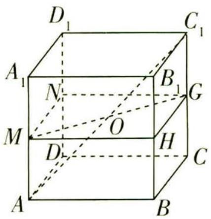

<details>
<summary>text_image</summary>

D₁
C₁
A₁
N
B₁
G
M
O
H
D
C
A
B
</details>

图1

# 实用定理

当球 O 的一个大圆恰好是四边形 MNGH 的外接圆时, 球 O 的半径最小, 故 R 的最小值为 $2\sqrt{2}$ .

【析实质】实际上, 此时球 $O$ 恰与正方体的棱相切, 为正方体的棱切球, 若球的半径变得更小, 球面会和棱没有公共点

综上, $R\in[2\sqrt{2},2\sqrt{3}]$ .

调研 2 (2023 天津静海一中 6 月调研) 已知长方体 $ABCD - A_{1}B_{1}C_{1}D_{1}$ 中, $AB = 3, BC = \sqrt{6}$ , 若 $AC_{1}$ 与平面 $BCC_{1}B_{1}$ 所成角的余弦值为 $\frac{\sqrt{6}}{3}$ , 则该长方体外接球的表面积为 ( )

A. $\frac{27\pi}{2}$

B. ${27\pi }$

C. $\frac{45\pi}{2}$

D. ${45\pi }$

思维导引

$AC_{1}$ 与平面 $BCC_{1}B_{1}$ 所成角的余弦值为 $\frac{\sqrt{6}}{3}$ $\xrightarrow{直线与平面所成角的定义}$ $\xrightarrow{关于 x}$ $\xrightarrow{解方程}$

x 的值 $\xrightarrow{长方体的体对角线长 = 其外接球的直径}$ 所求球的半径为 R $\xrightarrow{S_{球} = 4\pi R^{2}}$ 所求球的表面积

解析 如图2, 连接 $BC_{1}$ , 因为 $AB \perp$ 平面 $BCC_{1}B_{1}, BC_{1} \subset$ 平面 $BCC_{1}B_{1}$ , 所以 $AB \perp BC_{1}$ , 所以 $\angle AC_{1}B$ 是 $AC_{1}$ 与平面 $BCC_{1}B_{1}$ 所成的角,

【关键提醒】寻找线面所成角的关键是寻找线在面内的射影，即寻找过斜线上的点(非斜足)的面的垂线

所以 $\cos\angle AC_{1}B=\frac{BC_{1}}{AC_{1}}=\frac{\sqrt{6}}{3}$ ，所以 $AC_{1}=\frac{3BC_{1}}{\sqrt{6}}$ .

设 $CC_{1} = x$ ，则 $BC_{1}^{2} = BC^{2} + CC_{1}^{2}$ ，即 $BC_{1}^{2} = 6 + x^{2}$

又 $AC_{1}^{2} = AB^{2} + BC_{1}^{2}$ ，所以 $\frac{9BC_1^2}{6} = 9 + BC_1^2$ ，所以 $\frac{9(6 + x^2)}{6} = 15 + x^2$ ，得 $x^{2} = 12$

所以 $BC_{1}^{2}=18, AC_{1}^{2}=\frac{9\times18}{6}=27.$

设该长方体外接球的半径是 R，则 $R^{2}=\frac{1}{4}AC_{1}^{2}=\frac{27}{4}$

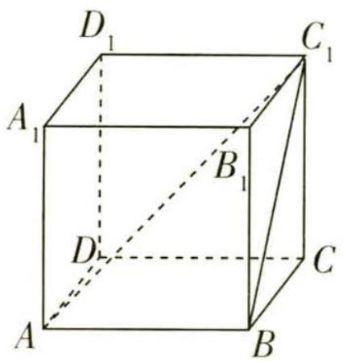

<details>
<summary>text_image</summary>

D₁
C₁
A₁
B₁
D
C
A
B
</details>

图 2

【会思考】长方体的外接球直径就是其面对角线及与此面垂直的棱构成的直角三角形的外接圆直径

所以该外接球的表面积为 $4\pi R^{2}=4\pi\times\frac{27}{4}=27\pi$ . 故选 B.

# 模型 2 柱体的外接球模型


# 天星老师小课堂


柱体的外接球模型包括直棱柱的外接球模型(斜棱柱没有外接球)和圆柱的外接球模型,直棱柱的外接球是指直棱柱的各个顶点都在一个球的球面上,圆柱的外接球是指圆柱的上、下底面的圆周都在一个球的球面上,圆柱的外接球的球心在上、下两底面圆的圆心连线的中点处,正棱柱与该棱柱的外接圆柱有相同的外接球.

调研 3 (2023 河北保定 7 月期末) 某正三棱柱的侧棱长是 4, 底面边长是 $2 \sqrt{3}$ , 且每个顶点都在球 $O$ 的球面上, 则球 $O$ 的表面积为 ( )

A. ${24\pi }$

B. ${28\pi }$

C. $30\pi$

D. ${32\pi }$

解析 ∵ 正三棱柱底面边长为 $2\sqrt{3}$ ，∴ 底面三角形外接圆半径 $r=\frac{1}{2}\times\frac{2\sqrt{3}}{\sin\frac{\pi}{3}}=2$ ，

【小技巧】利用正弦定理得三角形的外接圆的半径，也可以利用正三角形的外接圆半径为其高的 $\frac{2}{3}$ ，得 $r=\frac{2}{3}\times\frac{\sqrt{3}}{2}\times2\sqrt{3}=2$

又正三棱柱的侧棱长为4,即正三棱柱的高h=4,

∴ 球 O 的半径 $R = \sqrt{r^{2} + \left(\frac{h}{2}\right)^{2}} = \sqrt{4 + 4} = 2\sqrt{2}$ ,

【扫清障碍】正棱柱的外接球的球心在上、下底面的中心连线的中点处

∴ 球 O 的表面积 $S = 4\pi R^{2} = 32\pi$ . 故选 D.

调研 4 (2023 陕西师范大学附属中学 5 月模拟) 已知圆柱的上底面圆周经过正三棱锥 $P - ABC$ 的三条侧棱的中点, 下底面圆心为此三棱锥底面中心 $O$ . 若三棱锥 $P - ABC$ 的高为该圆柱外接球半径的 2 倍, 则该三棱锥的外接球与圆柱外接球的半径之比为 ( )

A. $7 : 4$

B. $2 : 1$

C. $3 : 1$

D. $5 : 3$

# 天星老师明思路


要求正三棱锥的外接球与圆柱外接球的半径之比,那么就要想办法将两个球体的半径用同一个变量表示出来.依据题意,可先设出棱锥的底面边长、高及圆柱的外接球半径,然后根据题意建立等式,找出所设参数之间的关系(有3个参数,需至少建立2个等式关系,才能将3个参数统一用同一个变量表示出来),再将正三棱锥的外接球半径用所设参数表示出来,化简求解即可.

# 实用定理

解析 如图 3 所示, 连接 OC, OP, 设正三棱锥 P-ABC 的底面边长为 2a, 高为 h, 圆柱的外接球半径为 R, 则圆柱的高为 $\frac{h}{2}$ ,

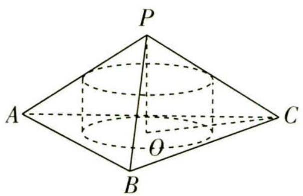

<details>
<summary>text_image</summary>

P
A
C
O
B
</details>

图3

所以 $\triangle ABC$ 的外接圆的半径为 $OC = \frac{2a}{2\sin\frac{\pi}{3}} = \frac{2\sqrt{3}}{3}a$ ，所以圆柱的底面圆半径为 $\frac{1}{2} \times \frac{2\sqrt{3}}{3}a = \frac{\sqrt{3}}{3}a$ ，

【题眼】根据 “圆柱的上底面圆周经过正三棱锥 P-ABC 的三条侧棱的中点”，可知圆柱的底面圆半径为 $\triangle ABC$ 的外接圆半径的一半

则 $R = \sqrt{\frac{h^2}{16} + \frac{a^2}{3}}$ ，又 $h = 2R = 2\sqrt{\frac{h^2}{16} + \frac{a^2}{3}} = \sqrt{\frac{h^2}{4} + \frac{4a^2}{3}}$ ，所以 $h = \frac{4}{3} a$ ，所以 $R = \frac{2}{3} a$ .

【关键提醒】圆柱轴截面(矩形)的外接圆是圆柱外接球的大圆,该矩形的对角线(外接圆的直径)是外接球的直径,圆柱的外接球的球心在上、下两底面圆的圆心连线的中点处

设正三棱锥 P-ABC 的外接球的半径为 r，则球心到底面距离为 h-r，

由勾股定理得 $r^2 = (h - r)^2 + \left(\frac{2\sqrt{3}}{3} a\right)^2$ ，得 $r = \frac{7}{6} a$ ，故 $\frac{r}{R} = \frac{\frac{7}{6} a}{\frac{2}{3} a} = \frac{7}{4}$ . 故选 A.

# 模型 3 锥体的外接球模型


# 天星老师小课堂


锥体的外接球模型包括棱锥的外接球模型和圆锥的外接球模型,棱锥的外接球是指棱锥的各个顶点都在一个球的球面上,圆锥的外接球是指圆锥的顶点与底面的圆周都在一个球的球面上.圆锥的外接球的球心在顶点与底面圆的圆心连线所在的直线上,棱锥的外接球的球心在顶点与底面外接圆的圆心连线所在的直线上.棱长为 a 的正四面体的外接球的半径为 $\frac{\sqrt{6}}{4}a$ .

# 实用定理

调研 5 (2023 全国乙卷)已知点 S, A, B, C 均在半径为 2 的球面上, △ABC 是边长为 3 的等边三角形, $SA \perp$ 平面 ABC, 则 SA = \_\_\_\_.

# 天星老师传技巧


由垂直关系“SA⊥平面 ABC”可联想到补形法, 将三棱锥补形成三棱柱, 能更直观地找到外接球的球心及半径, 充分利用垂直关系, 结合球的性质列方程求解.

解析 方法一 第一步: 将三棱锥的外接球转化为三棱柱的外接球.

如图 4, S, A, B, C 构成三棱锥 S-ABC，将三棱锥 S-ABC 补形为直三棱柱 SMN-ABC，则该三棱柱的外接球即三棱锥的外接球。

【技巧点拨】构造直三棱柱，则外接球的球心尽显

第二步: 确定 $\triangle ABC$ 的外接圆半径.

设 $\triangle ABC$ 的外接圆圆心为 $O_{1}$ ,半径为 $r$ ,连接 $O_{1}A$ ,则 $2r=\frac{AB}{\sin\angle ACB}=\frac{3}{\frac{\sqrt{3}}{2}}=$

$2\sqrt{3}$ ，所以 $O_{1}A=r=\sqrt{3}$ .

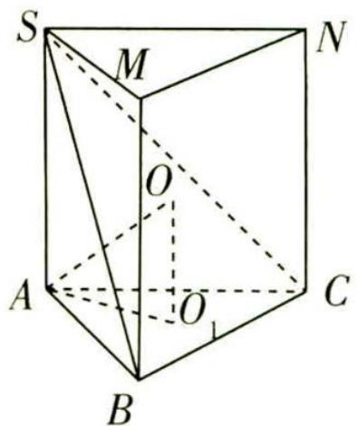

<details>
<summary>text_image</summary>

S
M
N
O
A
O₁
C
B
</details>

图4

第三步:结合球的性质,利用勾股定理求出 SA.

设三棱锥外接球球心为 O，连接 $OA, OO_{1}$ ，则 $OA = 2, OO_{1} = \frac{1}{2}SA$ ，

在 Rt△OAO₁ 中, 由勾股定理得 $OA^{2}=O_{1}A^{2}+OO_{1}^{2}$ , 即 $4=3+\frac{1}{4}SA^{2}$ , 解得 SA=2. 故填 2.

【扫清障碍】利用球心、 $\triangle ABC$ 外接圆的圆心、三棱柱(锥)的顶点(即球上的点)所构成的直角三角形, 结合勾股定理, 即可得 $SA$ 的方程

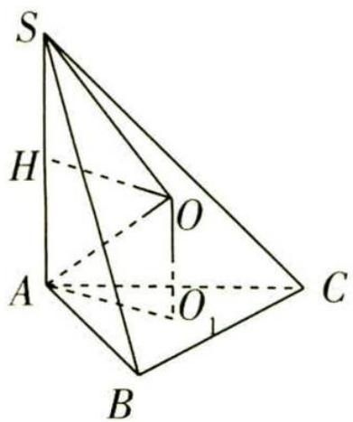

<details>
<summary>text_image</summary>

S
H
O
A
O₁
C
B
</details>

图5

方法二 第一步: 确定 $\triangle ABC$ 的外接圆半径.

如图 5, 设 $\triangle ABC$ 的外接圆圆心为 $O_{1}$ , 半径为 r, 连接 $O_{1}A$ , 则 2r = $\frac{AB}{\sin\angle ACB} = \frac{3}{\frac{\sqrt{3}}{2}} = 2\sqrt{3}$ , 所以 $O_{1}A = r = \sqrt{3}$ .

第二步:确定外接球球心位置.

$S, A, B, C$ 构成三棱锥 $S - ABC$ , 设三棱锥的外接球球心为 $O$ , 连接 $OO_{1}$ , 则 $OO_{1} \perp$ 平面 $ABC$ .

又 $SA \perp$ 平面 $ABC$ , 所以 $OO_{1} // SA$ , 连接 $OS, OA$ , 则 $OS = OA = 2$ .

过 O 作 SA 的垂线, 垂足为 H, 则四边形 $AO_{1}OH$ 为矩形, 所以 $OO_{1}=AH$ ,

由 OS = OA 可知 H 为 SA 的中点, 则 $OO_{1} = AH = \frac{1}{2}SA$ .

实用定理

第三步:利用勾股定理求出 SA.

在 Rt△OO₁A 中, 由勾股定理得 $OA^{2}=O_{1}A^{2}+OO_{1}^{2}$ , 即 $4=3+\frac{1}{4}SA^{2}$ , 所以 SA=2.

【解后反思】先过棱锥某个面(一般选取直角三角形、正三角形、矩形等)的外接圆圆心作该面的垂线, 则球心一定在该垂线上, 再根据球心到棱锥各个顶点的距离相等, 结合勾股定理构建等式, 确定球心及半径, 这是解决此类问题的常规思路

调研 6 (2023 广东揭阳 7 月期末) 已知圆锥 $SA$ 的轴截面是边长为 $2 \sqrt{3}$ 的等边三角形, 顶点 $S$ 和底面圆周上的所有点都在球 $O$ 的球面上, 则球 $O$ 的体积为 ( )

A. $4\sqrt{3}\pi$

B. $\frac{32}{3}\pi$

C. $\frac{20\sqrt{5}}{3}\pi$

D. $\frac{28\sqrt{7}}{3}\pi$

# 天星老师明规律


圆锥的外接球球心在圆锥的高所在的直线上,圆锥轴截面三角形的外接圆是圆锥外接球的大圆,该三角形的外接圆的直径是外接球的直径.

解析 因为圆锥 SA 的轴截面是边长为 $2\sqrt{3}$ 的等边三角形，

则该等边三角形外接圆的半径 $R=\frac{2}{3}\times2\sqrt{3}\sin60^{\circ}=2$

即球 O 的半径为 2, 所以球 O 的体积为 $V = \frac{4\pi}{3} R^{3} = \frac{32}{3}\pi$ . 故选 B.

【辨析比较】半径为 R 的球的体积公式 $V=\frac{4}{3}\pi R^{3}$ 与表面积公式 $S=4\pi R^{2}$ 不要搞混

# 模型 4 台体的外接球模型


# 天星老师小课堂


台体的外接球模型包括棱台的外接球模型和圆台的外接球模型, 圆台的外接球的球心在上、下底面的圆心连线所在的直线上, 棱台的外接球的球心在上、下底面的外接圆的圆心连线所在的直线上.

调研 7 (2023 湖南郴州 5 月适应性模拟) 已知圆台的上、下底面的圆周都在半径为 2 的球面上, 圆台的下底面过球心, 上底面半径为 1 , 则圆台的体积为 ( )

A. $\frac{5\sqrt{3}}{3}\pi$

B. $5\sqrt{3}\pi$

C. $\frac{7\sqrt{3}}{3}\pi$

D. $7\sqrt{3}\pi$

# 思维导引

作出示意图

圆台轴截面等腰梯形ABCD的外接圆是圆台外接球的大圆

在这个轴截面中利用勾股定理求出圆台的高

圆台的体积公式

圆台体积

解析 如图6,等腰梯形ABCD为圆台的轴截面,设AB的中点为 $O_{1}$ ,CD的中点为O,则O为球心, $O_{1}A=1$ .

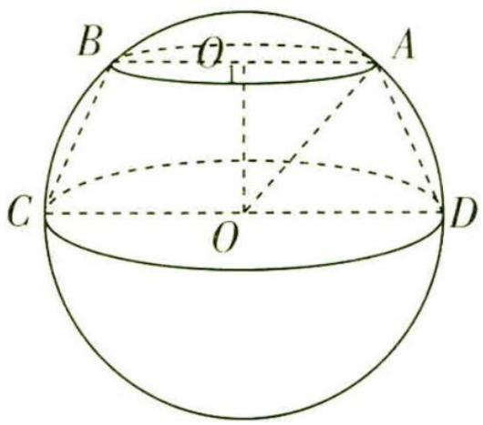

<details>
<summary>text_image</summary>

B
O
A
C
O
D
</details>

图6

连接 $OO_{1}, OA$ ，设圆台的高为 h，由题意知球 O 的半径 R = OA = OD = 2，

【扫清障碍】圆台外接球的半径即其轴截面外接圆的半径

则在 Rt△OO₁A 中，h = OO₁ = √R² - O₁A² = √4 - 1 = √3，

所以圆台的体积 $V=\frac{1}{3}\times(2^{2}\times\pi+\sqrt{2^{2}\times\pi\times1^{2}\times\pi}+1^{2}\times\pi)\times\sqrt{3}=\frac{7\sqrt{3}\pi}{3}$ . 故选 C.

【易混辨析】圆台的体积公式需要记牢，注意圆台的体积公式与圆台的侧面积公式的区别

调研 8 (2023 湖北武汉 5 月测评) 已知正三棱台 $ABC - A_{1}B_{1}C_{1}$ 的上、下底面面积分别为 $\frac{9\sqrt{3}}{4}, 9\sqrt{3}$ , 若 $AA_{1} = \sqrt{30}$ , 则该正三棱台的外接球的表面积为 ( )

A. ${40\pi }$

B. ${80\pi }$

C. ${30\pi }$

D. ${60\pi }$

# 天星老师引思路


对于三棱台外接球问题, 可先分别找出三棱台上、下底面的外接圆圆心及半径, 再根据外接球球心在两圆心连线所在的直线上及球心到棱台各个顶点的距离均为半径, 列方程求解. 注意题眼“正三棱台”, $\triangle ABC$ , $\triangle A_{1}B_{1}C_{1}$ 均为正三角形.

解析 若正三角形的边长为 a，则其面积为 $\frac{1}{2} \times a \times a \times \frac{\sqrt{3}}{2} = \frac{\sqrt{3}}{4} a^{2}$ ，

结合题意,不妨令 $AB = 3, A_{1}B_{1} = 6$ .

如图7, 取 $\triangle ABC, \triangle A_{1}B_{1}C_{1}$ 外接圆的圆心 $O, O_{2}$ , 正三棱台 $ABC-A_{1}B_{1}C_{1}$ 外接球的球心 $O_{1}$ ,

实用定理


# 试题调研 每月一手考情 讲透关键题型

连接 $OA, OO_2, O_1A, O_1A_1, O_2A_1$ ，设点 $A$ 在底面上的射影为 $M$ ，连接 $AM$ ，

易知 M 在 $O_{2}A_{1}$ 上, $OA = O_{2}M = \sqrt{3}$ , $O_{2}A_{1} = 2\sqrt{3}$ , 则 $MA_{1} = \sqrt{3}$ ,

由 $AA_{1} = \sqrt{30}$ ，可得 $OO_{2} = MA = \sqrt{AA_{1}^{2} - MA_{1}^{2}} = 3\sqrt{3}.$

【小技巧】利用图形的直观性，求出正三棱台的高

设正三棱台外接球的半径为 R，则 $O_{1}A = O_{1}A_{1} = R$ ，

可得 $\left\{\begin{aligned}R^{2}&=OA^{2}+OO_{1}^{2}=3+OO_{1}^{2},\\ R^{2}&=O_{2}A_{1}^{2}+O_{2}O_{1}^{2}=12+(3\sqrt{3}-OO_{1})^{2},\end{aligned}\right.$ 解得 $\left\{\begin{aligned}R&=\sqrt{15},\\ OO_{1}&=2\sqrt{3},\end{aligned}\right.$

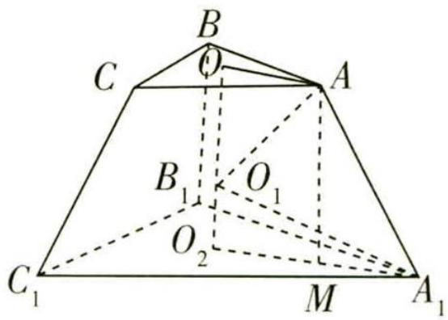

<details>
<summary>text_image</summary>

B
C
O
A
B₁
O₁
O₂
C₁
M
A₁
</details>

图7

【扫清障碍】由于 $\triangle OO_{1}A$ 与 $\triangle O_{1}O_{2}A_{1}$ 为直角三角形，利用勾股定理，即可得关于 $R, OO_{1}$ 的方程组

所以该正三棱台的外接球的表面积 $S = 4\pi R^{2} = 60\pi$ . 故选 D.

# 新题演练

1. (2023 重庆巴蜀中学、南开中学等校 6 月期末)已知圆锥的顶点和底面圆周都在球 O 的球面上,圆锥底面半径为 $\sqrt{6}$ ,侧面展开是一个半圆,则球 O 的表面积是()

A. $8 \pi$

B. $9 \pi$

C. ${16\pi }$

D. ${32\pi }$

2. (2023 天津 5 月检测) 如图 8, 几何体 $\Omega$ 为一个圆柱和圆锥的组合体, 圆锥的底面和圆柱的一个底面重合, 圆锥的顶点为 $A$ , 圆柱的上、下底面的圆心分别为 $B, C$ , 若该几何体 $\Omega$ 存在外接球 (即圆锥的顶点与底面圆周在球面上, 且圆柱的底面圆周也在球面上), 已知 $BC = 2AB = 4$ , 则该组合体的体积等于 ( )

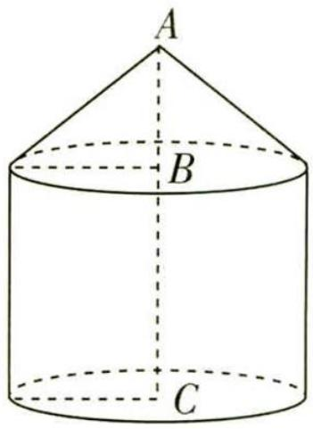

<details>
<summary>text_image</summary>

A
B
C
</details>

图8

A. $56 \pi$

B. $\frac{70}{3}\pi$

C. ${48\pi }$

D. ${64\pi }$

3. (2023 河南开封 5 月测评) 在棱长为 2 的正方体 $ABCD - A_{1}B_{1}C_{1}D_{1}$ 中, $M$ 为 $AB$ 的中点, 过点 $M$ 的平面 $\alpha$ 截正方体 $ABCD - A_{1}B_{1}C_{1}D_{1}$ 的外接球的截面面积的最小值为 \_\_\_\_.

4. (2023 西南大学附属中学 5 月月考)已知一个正六棱锥的所有顶点都在一个球的球面上,六棱锥的底面边长为 1 ,侧棱长为 2 ,则球的表面积为 ( )

A. $\frac{4 \pi}{3}$

B. $\frac{8\pi}{3}$

C. $\frac{16\pi}{3}$

D. $4 \pi$

# 实用定理

5. (2023 陕西安康 6 月期末) 已知某正三棱台的所有顶点都在半径为 5 的球面上, 若该正三棱台的上、下底面边长分别是 $3 \sqrt{3}$ 和 $5 \sqrt{3}$ , 则该正三棱台的高为 ( )

A. 1

B. 2

C. 3

D. 4

6. (2023 河南省实验中学 5 月模拟)已知直四棱柱 $ABCD - A_{1}B_{1}C_{1}D_{1}$ 的底面为正方形, $AA_{1} = 2$ , $AB = 1$ , $P$ 为 $CC_{1}$ 的中点, 过 $A, B, P$ 三点作平面 $\alpha$ , 则该四棱柱的外接球被平面 $\alpha$ 截得的截面圆的周长为 ( )

A. $\sqrt{6} \pi$

B. $\sqrt{5} \pi$

C. $2 \pi$

D. $\frac{\sqrt{22}\pi}{2}$

# 参考答案与解析

1. D 依题意得圆锥底面半径 $r = \sqrt{6}$ ,

设圆锥的高为 h，母线为 l，圆锥外接球的半径为 R，则 $2\pi r = \pi l$ ，

【关键提醒】圆锥侧面展开图的半圆弧长等于圆锥底面圆的周长

即 $2\pi \times \sqrt{6} = \pi l$ ，解得 $l = 2\sqrt{6}$ ，所以 $h = \sqrt{l^2 - r^2} = \sqrt{(2\sqrt{6})^2 - (\sqrt{6})^2} = 3\sqrt{2}$

所以 $R^2 = (h - R)^2 + r^2$ ，即 $R^2 = (3\sqrt{2} - R)^2 + (\sqrt{6})^2$ ，解得 $R = 2\sqrt{2}$

【小技巧】根据球心到圆锥顶点及圆锥底面圆周任一点的距离相等，构建直角三角形，利用勾股定理求解

所以圆锥的外接球球 O 的表面积 $S = 4\pi R^{2} = 32\pi$ . 故选 D.

2. A 设该组合体外接球的球心为 O，半径为 R，则 $R = AO = 2 + 2 = 4$ .

【突破瓶颈】该组合体外接球的大圆为其轴截面的外接圆，则其外接球的球心在圆柱的上、下两底面圆的圆心连线的中点处，即球心在 BC 中点处

所以圆柱的底面半径为 $r = \sqrt{4^{2} - 2^{2}} = 2\sqrt{3}$ ,

则该组合体的体积为 $V=\frac{1}{3}\times\pi\times(2\sqrt{3})^{2}\times2+\pi\times(2\sqrt{3})^{2}\times4=56\pi.$ 故选 A.

3. $\pi$ 如图9, 连接 $BD_{1}$ , 正方体 $ABCD - A_{1}B_{1}C_{1}D_{1}$ 的外接球的球心 $O$ 为正方体的中心, 即体对角线 $BD_{1}$ 的中点.

设球 O 的半径为 R，则 $R=\frac{1}{2}BD_{1}=\frac{1}{2}\times\sqrt{2^{2}+2^{2}+2^{2}}=\sqrt{3}$ .

连接 $AD_{1}, OM$ ，由 O, M 分别为 $BD_{1}, AB$ 的中点，可得 $OM = \frac{1}{2} AD_{1} = \sqrt{2}$ ，
易知当 OM 与截面圆垂直时，截面圆的半径 r 最小，

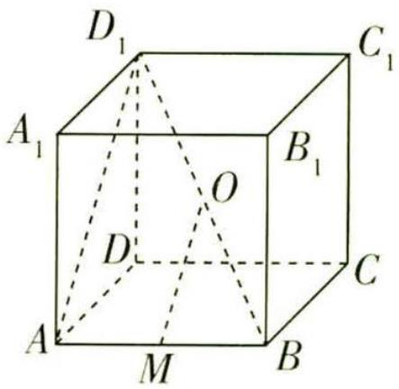

<details>
<summary>text_image</summary>

D₁
C₁
A₁
B₁
O
D
C
A
M
B
</details>

图9

【扫清障碍】设球心 O 到截面圆的距离为 d，则 $r = \sqrt{R^{2} - d^{2}}$ ，由 $d \leqslant OM$ ，得 $r \geqslant \sqrt{R^{2} - OM^{2}}$

# 实用定理

此时 $r = \sqrt{R^{2} - OM^{2}} = 1$ ，故截面面积的最小值为 $\pi r^{2} = \pi$ .

# 4. C 第一步: 确定正六棱锥外接球的球心.

如图 10, 在正六棱锥 P-ABCDEF 中, 连接 AD, BE, CF, 并交于 G, G 为正六边形 ABCDEF 的中心, 连接 PG, 则 PG⊥平面 ABCDEF,

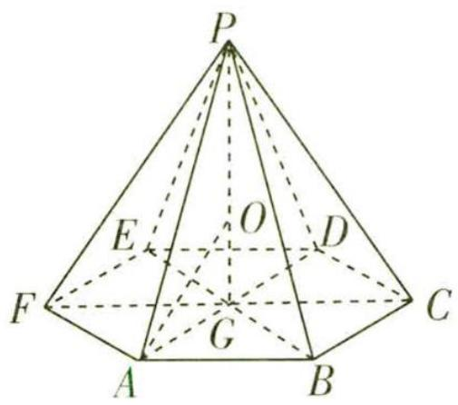

<details>
<summary>text_image</summary>

P
E
O
D
F
G
A
B
C
</details>

图10

该六棱锥的外接球球心 O 在 PG 上, 连接 OA.

【记结论】正棱锥的外接球球心均在其高所在的直线上

# 第二步:利用勾股定理列方程求外接球的半径.

因为 $AG \subset$ 平面 ABCDEF, 所以 $PG \perp AG$ ,

【易漏】由线面垂直到线线垂直，注意不要忘记线在面内的说明

由题意可知 AG = 1, PA = 2, 所以 $PG = \sqrt{PA^{2} - AG^{2}} = \sqrt{3}$ .

设该六棱锥外接球的半径为 R，则 OA = OP = R，所以 $OG = \sqrt{3} - R$ ，

在直角三角形 GOA 中, $OA^{2}=AG^{2}+OG^{2}$ , 所以 $R^{2}=1^{2}+(\sqrt{3}-R)^{2}$ , 解得 $R=\frac{2\sqrt{3}}{3}$ ,

【关键提醒】利用球心到正六棱锥的各个顶点的距离都相等，得关于 R 的方程第三步: 求出外接球的表面积.

所以所求球的表面积为 $4\pi R^{2}=4\pi\times\left(\frac{2\sqrt{3}}{3}\right)^{2}=\frac{16\pi}{3}$ ，故选 C.

5. D 如图 11 所示, 设该正三棱台为 $ABC - A_{1}B_{1}C_{1}$ , 三棱台的上底面外接圆为 $\odot O_{1}$ , 下底面外接圆为 $\odot O$ ,

【扫清障碍】先找出上、下底面外接圆的圆心及半径，再在由圆心 $O_{1}$ ，O，三棱台的顶点 $A_{1}$ ，A所构成的直角梯形中列方程求解

连接 $O_{1}A_{1}, OA, O_{1}O$ ，则 $O_{1}A_{1} = \frac{2}{3} \times \sqrt{A_{1}B_{1}^{2} - (\frac{1}{2}B_{1}C_{1})^{2}} = \frac{2}{3} \times \sqrt{(3\sqrt{3})^{2} - (\frac{1}{2} \times 3\sqrt{3})^{2}} = 3,$

【另解】利用正弦定理求外接圆半径， $O_{1}A_{1}=\frac{1}{2}\times\frac{A_{1}B_{1}}{\sin60^{\circ}}=3$

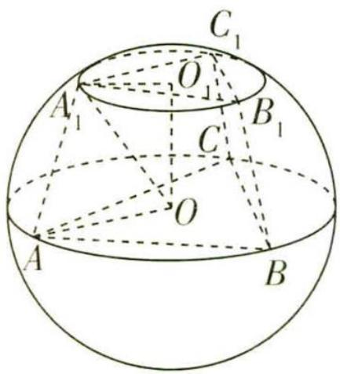

<details>
<summary>text_image</summary>

C₁
O
A₁
B₁
C
O
A
B
</details>

图11

# 实用定理

$$
O A = \frac {2}{3} \times \sqrt {A B ^ {2} - (\frac {1}{2} B C) ^ {2}} = \frac {2}{3} \times \sqrt {(5 \sqrt {3}) ^ {2} - (\frac {1}{2} \times 5 \sqrt {3}) ^ {2}} = 5,
$$

又球的半径为 5, 所以球心即下底面外接圆的圆心 O,

连接 $OA_{1}$ ，则 $OA_{1}=5$ ，所以 $OO_{1}=\sqrt{OA_{1}^{2}-O_{1}A_{1}^{2}}=\sqrt{5^{2}-3^{2}}=4$ ，即该正三棱台的高为4。故选D.

# 6. D 第一步: 确定直四棱柱的外接球球心及半径.

由题意知直四棱柱 $ABCD-A_{1}B_{1}C_{1}D_{1}$ 的外接球的球心为其中心 O，

半径 $R=\frac{1}{2}\times\sqrt{1^{2}+1^{2}+2^{2}}=\frac{\sqrt{6}}{2}.$

【题眼】“直四棱柱,底面为正方形”,该图形为长方体,而长方体的外接球的球心在体对角线的中点处,则该直四棱柱的体对角线的中点是外接球的球心

第二步:利用平行关系将球心 O 到平面 $\alpha$ 的距离转化为 $O_{1}$ 到平面 $\alpha$ 的距离.

如图 12, 取 $DD_{1}$ 的中点 E, 连接 AE, PE, BP, 易知四边形 ABPE 为矩形, 且平面 $\alpha$ 即平面 ABPE,

分别取 $AA_{1}, BB_{1}$ 的中点M,N,连接MN,NP,ME,易得四边形MNPE为正方形.由直四棱柱的对称性可知,其外接球的球心O即正方形MNPE的中心,

取 $ME$ 的中点 $O_{1}$ , 连接 $O_{1}O$ , 则 $O_{1}O \parallel EP, O_{1}O \not\subset$ 平面 $ABPE$ , 因为 $EP \subset$ 平面 $ABPE$ ,

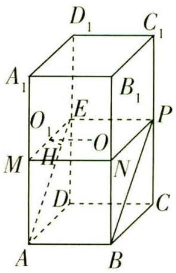

<details>
<summary>text_image</summary>

D₁
C₁
A₁
B₁
O
E
P
M
H
O
N
D
C
A
B
</details>

图 12

【易漏】由线线平行到线面平行，注意不要忘记面内线与面外线的说明

所以 $O_{1}O \parallel$ 平面 ABPE, 故球心 O 到平面 ABPE 的距离与 $O_{1}$ 到平面 ABPE 的距离相等.

第三步:结合线面垂直求出 O 到平面 ABPE 的距离.

过点 $O_{1}$ 作 $O_{1}H \perp AE$ ，垂足为 H，

易知 $AB \perp$ 平面 $AA_{1}D_{1}D, O_{1}H \subset$ 平面 $AA_{1}D_{1}D$ ，故 $AB \perp O_{1}H$ ，

又 $AB \cap AE = A, AB, AE \subset$ 平面 ABPE，所以 $O_{1}H \perp$ 平面 ABPE，

又 $O_{1}H = O_{1}E \sin 45^{\circ} = \frac{\sqrt{2}}{4}$ ，所以球心 O 到平面 ABPE 的距离为 $\frac{\sqrt{2}}{4}$ .

第四步:求出截面圆的周长.

由球的性质知,截面圆的半径 $r = \sqrt{R^{2} - O_{1}H^{2}} = \sqrt{\left(\frac{\sqrt{6}}{2}\right)^{2} - \left(\frac{\sqrt{2}}{4}\right)^{2}} = \frac{\sqrt{22}}{4}$ ,

【突破瓶颈】过球心与小圆圆心的直线垂直于小圆所在的平面，据此可寻找到直角三角形，利用勾股定理，即可得截面圆的半径

所以所求截面圆的周长为 $2\pi r = \frac{\sqrt{22}}{2}\pi$ . 故选 D.

# 超重点8 探索空间线、面位置关系的7大判定思路

# 天星老师小提醒


本超重点题目只节选了原题中的1个小问,所给条件可能有多余,这些条件是用在其他小问的,之所以没把它们去掉,是因为考场上本来也需要我们去判断该用哪些条件去证明结论.

# 模块 1 探索空间线、面平行关系的 4 大判定思路


# 思路1 找关键图形挖掘平行关系

调研 1 (2023 山西太原 7 月期末节选) 如图 1, $PA \perp$ 平面 $ABC, AB$ 为圆 $O$ 的直径, $E, F$ 分别为棱 $PC, PB$ 的中点.

证明:EF//平面ABC.

证明 因为 E, F 分别为棱 PC, PB 的中点, 所以 EF 是 $\triangle PBC$ 的中位线, 所以 $EF \parallel BC$ .

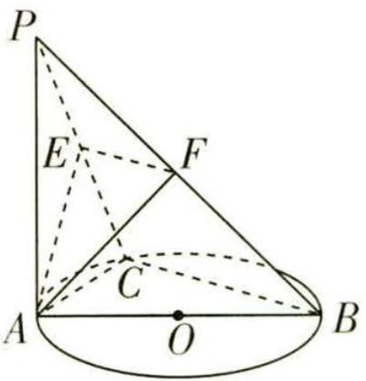

<details>
<summary>text_image</summary>

P
E
F
C
A
O
B
</details>

图1

因为 $EF \not\subset$ 平面 $ABC, BC \subset$ 平面 $ABC$ , 所以 $EF \parallel$ 平面 $ABC$ .

【易漏】由线线平行推出线面平行，注意面外线与面内线的说明，否则可能因跳步而失分

调研 2 (2023 江西南昌 5 月三模节选) 如图 2, 在多面体 ABCDEF 中, 四边形 ABCD 与 ABEF 均为直角梯形, $AD \parallel BC$ , $AF \parallel BE$ , $DA \perp$ 平面 $ABEF$ , $AB \perp AF$ , $AD = AB = 2BC = 2BE = 2$ , $G$ 在 $AF$ 上, 且 $AG = 1$ .

求证:BG//平面 DCE.

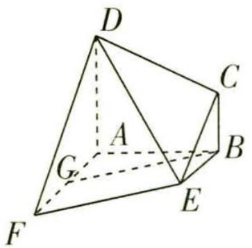

<details>
<summary>text_image</summary>

D
C
A
B
G
F
E
</details>

图2

# 天星老师讲易错


切不可想当然地以为 G 为 AF 的中点,从而通过证明四边形 BEFG 为平行四边形来证线面平行,AF 的长是不确定的,这样会导致思路错误而失分.

证明 如图3,延长DC交AB的延长线于点M,连接EM,GE,

易知 EM 在平面 DCE 内, 由 $BC \parallel DA$ , 得 $\frac{BM}{AM} = \frac{BC}{DA}$ ,

【小结论】平行线分线段成比例

又 $AD = AB = 2BC = 2$ ，所以 $\frac{BM}{BM + 2} = \frac{1}{2}$ 可得 $BM = AB = 2$

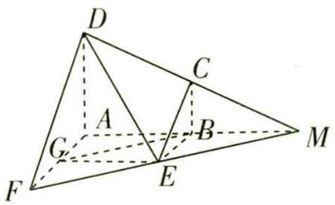

<details>
<summary>text_image</summary>

D
C
A
B
G
F
E
M
</details>

图3

# 实用定理

等差数列的性质 数列 $\{a_{n}\}$ 为公差为 d 的等差数列，则 $a_{k}, a_{k+m}, a_{k+2m} \cdots (k, m \in \mathbf{N}^{*})$ 为公差为 md 的等差数列.
关注微信公众号“初高教辅站”获取更多初高中教辅资料

由 $AF \parallel BE, G$ 在 AF 上且 AG = BE = 1，得四边形 AGEB 为平行四边形，

【关键提醒】利用几何体的特征,合理构造平行四边形证明两直线平行

则 $EG \parallel AB$ ，且 $EG = AB$ ，又 $A, B, M$ 三点共线，

所以 $EG \parallel BM$ ，且 $EG = BM$ ，故四边形 $BMEG$ 为平行四边形，则 $BG \parallel EM$ ，

由 $BG \not\subset$ 平面 $DCE, EM \subset$ 平面 $DCE$ , 所以 $BG \parallel$ 平面 $DCE$ .

# 思路2 用线线平行进行转化

调研 3 (2023 天津红桥区 7 月期末节选) 如图 4, 六棱锥 P-ABCDEF 的底面是边长为 1 的正六边形, PA⊥平面 ABCDEF, PA = 2√3.

求证: 直线 BC // 平面 PAD.

证明 在正六边形 ABCDEF 中, BC // AD,

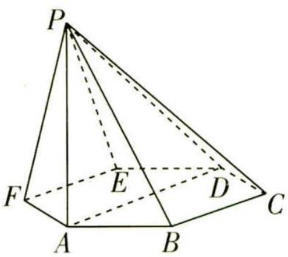

<details>
<summary>text_image</summary>

P
F
E
D
C
A
B
</details>

图4

【关键提醒】证明直线与平面平行的关键是设法在该平面内找到或作出一条与已知直线平行的直线

又 $AD \subset$ 平面 PAD, BC ∉ 平面 PAD, 所以 BC // 平面 PAD.

# 思路3 用线面平行进行转化

调研 4 (2023 福建厦门双十中学 6 月月考节选) 如图 5 所示, 在四边形 ABCD 中, $BC \perp CD$ , E 为 BC 上一点, $AE = BE = AD = 2CD = 2$ , $CE = \sqrt{3}$ , 将四边形 AECD 沿 AE 折起, 使得 $BC = \sqrt{3}$ , 得到如图 6 所示的四棱锥.

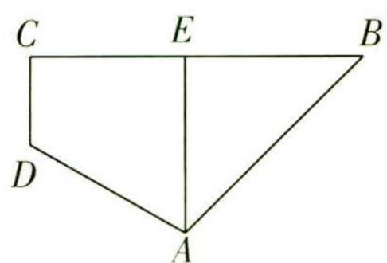

<details>
<summary>text_image</summary>

C E B
D
A
</details>

图 5

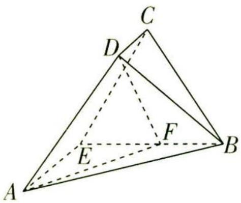

<details>
<summary>text_image</summary>

C
D
E
F
A
B
</details>

图6

若平面 $BCD \cap$ 平面 ABE = l, 证明: $CD \parallel l$ .

# 天星老师传技巧


空间几何中的线线平行的证明,往往需要通过线面平行或面面平行进行转化.由“交线”联想到线面平行的性质定理:一条直线与一个平面平行,如果过该直线的平面与此平面相交,那么该直线与交线平行.有时为了更直观,还需要经过已知直线作辅助平面来确定交线.

# 实用定理

等差数列前 $n$ 项和的性质 等差数列 $\{a_{n}\}$ 的公差为 $d$ , 前 $n$ 项和为 $S_{n}$ , 则 $S_{m}, S_{2m} - S_{m}, S_{3m} - S_{2m} \cdots (m \in \mathbf{N}^{*})$ 为公差为 $m^{2} d$ 的等差数列, $\{S_{n}/n\}$ 为公差为 $d/2$ 的等差数列. 关注微信公众号“初高教辅站”获取更多初高中教辅资料

证明 连接 DE, 因为 $CE \perp CD, CE = \sqrt{3}, CD = 1$ ,

所以 $DE = 2, \sin \angle CDE = \frac{\sqrt{3}}{2}$ , 又 $\angle CDE \in (0, \frac{\pi}{2})$ , 所以 $\angle CDE = \frac{\pi}{3}$ ,

因为 DE=2, AE=AD=2, 所以 $\triangle ADE$ 是等边三角形, 所以 $\angle DEA=\frac{\pi}{3}$ , 故 $CD \parallel AE$ .

【扫清障碍】翻折问题中的难点是要识别翻折前后的线段、角中, 哪些是变量哪些是不变量, 并抓住这些不变量, 得到想要的线面、线线位置关系

又 $AE \subset$ 平面 $ABE, CD \not\subset$ 平面 $ABE$ , 所以 $CD \parallel$ 平面 $ABE$ ,

因为 $CD \subset$ 平面 BCD, 平面 $BCD \cap$ 平面 ABE = l, 所以 $CD \parallel l$ .

# 思路4 用面面平行进行转化

调研 5 (2023 四川成都嘉祥外国语学校 5 月三诊节选) 如图 7, 在四棱锥 $P - ABCD$ 中, $\triangle BCD$ 为等边三角形, $\angle DAB = 120^{\circ}$ , $AD = AB = PD = PB = 2$ , 点 $E$ 为 $PC$ 的中点.

证明:BE//平面 PAD.

证明 第一步:利用线面平行的判定定理证明 EM // 平面 PAD.

如图 8, 取 CD 的中点 M, 连接 EM, BM,

∵ E 为 PC 中点, ∴ EM∥PD,

又 $EM \not\subset$ 平面 PAD, $PD \subset$ 平面 PAD, $\therefore EM \parallel$ 平面 PAD.

第二步:利用平面几何知识证明 $MB \parallel AD$ .

∵ $\triangle BCD$ 为等边三角形, ∴ $MB \perp CD$ ,

$$
\because \angle D A B = 1 2 0 ^ {\circ}, A D = A B,
$$

$$
\therefore \angle A D B = \angle A B D = 3 0 ^ {\circ}, \angle A D C = \angle C D B + \angle A D B = 6 0 ^ {\circ} + 3 0 ^ {\circ} = 9 0 ^ {\circ},
$$

$$
\therefore A D \perp C D, \therefore M B \parallel A D.
$$

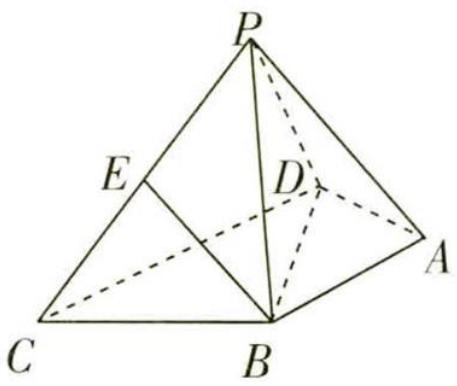

<details>
<summary>text_image</summary>

P
E
D
C
B
A
</details>

图 7

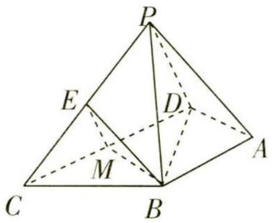

<details>
<summary>text_image</summary>

P
E
D
M
C
B
A
</details>

图8

【小技巧】在同一平面内，垂直于同一条直线的两条直线平行

第三步:利用线面平行的判定定理证明 $MB \parallel$ 平面 PAD.

又 $MB \not\subset$ 平面 $PAD, AD \subset$ 平面 $PAD, \therefore MB \parallel$ 平面 $PAD$ .

第四步:利用面面平行的判定定理证明面面平行,再由面面平行证明线面平行.

∵ EM ∩ MB = M, EM, MB ⊂ 平面 EMB,

【易漏】由线面平行证明面面平行，注意不要忘记面内两相交线的说明

∴ 平面 $EMB \parallel$ 平面 PAD, ∵ $EB \subset$ 平面 EMB, ∴ $EB \parallel$ 平面 PAD.

【小妙拓】证出面面平行，再转化为线面平行

# 实用定理

公差为 d 的等差数列 $\{a_{n}\}$ 的前 2n 项中, 记偶数项和为 $S_{偶}$ , 奇数项和为 $S_{奇}$ , 则 $S_{偶} - S_{奇} = nd$ , $S_{偶}/S_{奇} = a_{n+1}/a_{n}$ .

关注微信公众号 “初高教辅站” 获取更多初高中教辅资料

# 模块 2 探索空间线、面垂直关系的 3 大判定思路


# 思路1 用几何法构造图形挖掘垂直关系

调研 6 (2023 河南许平汝名校 5 月三模节选) 如图 9 所示, 在直四棱柱 $ABCD - A_{1}B_{1}C_{1}D_{1}$ 中, $AB \parallel CD$ , $AB \perp AD$ , 且 $AB = AD = 1$ , $CD = 2$ , $M$ 是 $DD_{1}$ 的中点.

证明: $BC \perp B_{1}M.$

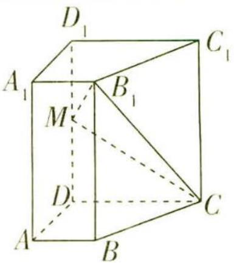

<details>
<summary>text_image</summary>

D₁
A₁
B₁
C₁
M
D
A
B
C
</details>

图9

# 天星老师引思路


异面直线垂直关系的证明,一般通过线面垂直转化.如本题:欲证 $BC \perp B_{1}M$ , 根据题中垂直关系,只需找到一个过 $B_{1}M$ 的平面,结合线面垂直的判定定理证明 BC 垂直于该平面,即可证明 $BC \perp B_{1}M$ .

证明 如图 10, 连接 $BD, B_{1}D_{1}, \because AB = AD = 1, CD = 2, AB \parallel CD, AB \perp AD$ ,

【指点迷津】能明显观察到的是 $B_{1} M$ 所在的平面 $B_{1} M C$ , 但该平面与直线 $B C$ 的关系难以确定, 考虑到直四棱柱的性质, 故先作辅助线构造一个垂直于底面 $A B C D$ 的平面, 利用该平面求解

$$
\therefore B D = \sqrt {A B ^ {2} + A D ^ {2}} = \sqrt {2}, B C = \sqrt {1 ^ {2} + (2 - 1) ^ {2}} = \sqrt {2},
$$

$$
\therefore B D ^ {2} + B C ^ {2} = C D ^ {2}, \therefore B C \perp B D.
$$

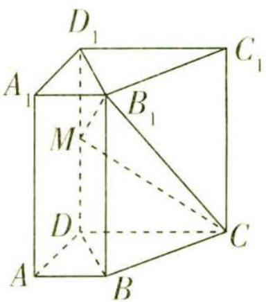

<details>
<summary>text_image</summary>

D₁
A₁
B₁
C₁
M
D
A
B
C
</details>

图 10

【技法点拨】利用勾股定理的逆定理，可证得线线垂直，这是常用的方法

$\because BB_{1}\perp$ 平面ABCD, $BC\subset$ 平面ABCD, $\therefore BB_{1}\perp BC.$

又 $BB_{1}\cap BD=B,BB_{1},BD\subset$ 平面 $B_{1}BDD_{1},\therefore BC\perp$ 平面 $B_{1}BDD_{1}$

【易漏】由线线垂直证明线面垂直，注意相交的说明

$\because B_{1}M\subset$ 平面 $B_{1}BDD_{1},\therefore BC\perp B_{1}M.$

# 思路2 用倒推法分析并挖掘垂直关系

调研 7 (2023 福建三明 6 月期末节选) 如图 11, 在三棱柱 $ABC - A_{1}B_{1}C_{1}$ 中, $\triangle AB_{1}C$ 为等边三角形, 四边形 $AA_{1}B_{1}B$ 为菱形, $AC \perp BC$ , $AC = 4$ , $BC = 3$ .

求证: $BC \perp$ 平面 $ACB_{1}$ .

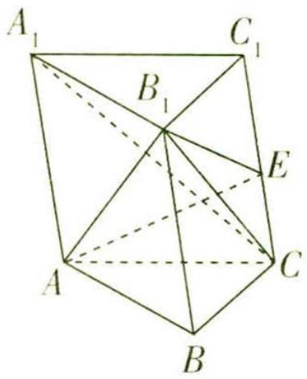

<details>
<summary>text_image</summary>

A₁
B₁
C₁
E
A
C
B
</details>

图11

# 思维导引

欲证 $BC \perp$ 平面 $ACB_{1}$ ，只需在平面 $ACB_{1}$ 内寻找两条相交直线与 BC 垂直

$AC \perp BC$

只需证 $BC \perp B_{1}C$

只需求出 $BC, B_{1}C$ 与 $BB_{1}$ 的长度

勾股定理的逆定理

得证

# 实用定理

等比数列的性质 数列 $\{a_{n}\}$ 为公比为 q 的等比数列，则 $a_{k}, a_{k+m}, a_{k+2m} \cdots (k, m \in \mathbb{N}^{*})$ 为公比为 $q^{m}$ 的等比数列.
关注微信公众号“初高教辅站”获取更多初高中教辅资料

证明 在 Rt△ABC 中, $AB = \sqrt{AC^{2} + BC^{2}} = 5$ ,

因为四边形 $AA_{1}B_{1}B$ 为菱形, 所以 $BB_{1}=AB=5$ .

因为 $\triangle AB_{1}C$ 为等边三角形,所以 $B_{1}C=AC=4$ ,

则 $BB_{1}^{2}=BC^{2}+B_{1}C^{2}$ ，所以 $BC\perp B_{1}C$ .

【小技巧】三角形中垂直关系的证明多利用勾股定理的逆定理或等腰三角形“三线合一”

又 $AC \perp BC, AC \cap B_{1}C = C, AC, B_{1}C \subset$ 平面 $ACB_{1}$ ，所以 $BC \perp$ 平面 $ACB_{1}$ .

【换个思路】也可通过求证 $AB_{1} \perp BC$ 得解，此时需要证明 $AB_{1}$ 垂直于 $BC$ 所在的某个平面，同样可采用倒推法挖掘垂直关系，虽过程较繁琐，但此法有助于快速掌握线面垂直判定定理的运用，可以很好地锻炼逻辑思维能力，同学们不妨一试！

调研 8 (2023 重庆巴蜀中学 7 月校考期末节选) 如图 12, 在四棱锥 $P - ABCD$ 中, 底面 $ABCD$ 为平行四边形, $PA = PB$ , 平面 $PAB \perp$ 平面 $ABCD$ , $AD = 2$ , $AB = \sqrt{3}$ , $\angle BAD = 30^\circ$ .

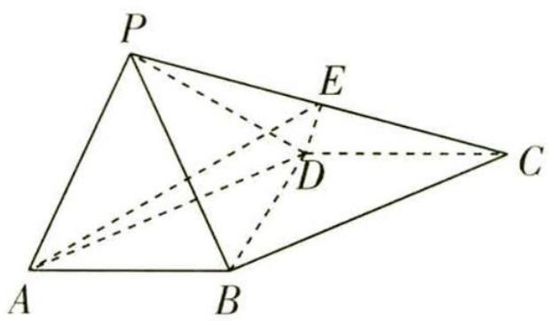

<details>
<summary>text_image</summary>

P
E
D
C
A
B
</details>

图 12

求证:平面 $PBD \perp$ 平面 PAB.

# 天星老师明思路


要证面面垂直,需要在其中一个平面内找到一条直线证明其与另一个平面垂直,而此类线面垂直的证明,一般思路有两个:一是根据题目中的垂直关系,利用线面垂直的判定定理证明;二是根据面面垂直的性质定理证明.对于本题,显然第二个思路行得通.

证明 在 $\triangle ABD$ 中, $AD=2,AB=\sqrt{3},\angle BAD=30^{\circ}$ ,

则 $BD^{2}=4+3-2\times2\times\sqrt{3}\times\frac{\sqrt{3}}{2}=1$ ,所以 BD=1 ,

则 $BD^{2} + AB^{2} = AD^{2}$ ，所以 $AB \perp BD$ .

【会联想】根据题目中的数量关系，联想利用余弦定理、勾股定理的逆定理求解

又平面 $PAB \perp$ 平面 ABCD, 平面 $PAB \cap$ 平面 ABCD = AB, $BD \subset$ 平面 ABCD,

【警示】利用面面垂直的性质定理时，注意不要忘记对交线的说明

所以 $BD \perp$ 平面 PAB. 又 $BD \subset$ 平面 PBD, 所以平面 $PBD \perp$ 平面 PAB.

# 实用定理

等比数列前 n 项和的性质 等比数列 $\{a_{n}\}$ 的公比为 q，前 n 项和为 $S_{n}$ ，则当 $q \neq -1$ （或 q = -1 且 m 为奇数）时， $S_{m}, S_{2m} - S_{m}, S_{3m} - S_{2m} \cdots (m \in \mathbf{N}^{*})$ 为公比为 $q^{m}$ 的等比数列。
关注微信公众号“初高教辅站”获取更多初高中教辅资料

# 思路3 用数据计算法证明垂直关系

调研 9 (2023 四川内江 7 月零模节选) 如图 13, 扇形 AOB 的半径为 2, 圆心角 $\angle AOB = 120^{\circ}$ , 点 $C$ 为 $\widehat{AB}$ 上一点, $PO \perp$ 平面 AOB 且 $PO = \sqrt{5}$ , 点 $M \in PB$ 且 $BM = 2MP$ , $PA \parallel$ 平面 MOC.

求证: $OC \perp$ 平面 $POB$ .

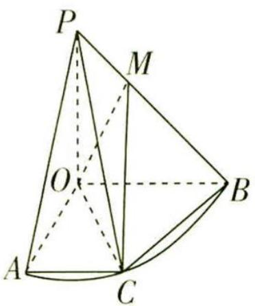

<details>
<summary>text_image</summary>

P
M
O
A
C
B
</details>

图 13

# 天星老师传技巧


题设条件所给数量关系较多,且所给角度不是直角,故可考虑结合正(余)弦定理、勾股定理的逆定理等,利用数据求证垂直关系.

证明 第一步: 取 AB 与 OC 的交点 N, 利用 PA // 平面 MOC 证明 PA // MN, 从而得 BN = 2AN.

如图 14, 连接 AB, 设 AB 与 OC 相交于点 N, 连接 MN.

∵ PA // 平面 MOC, PA ⊂ 平面 PAB, 平面 PAB ∩ 平面 MOC = MN, ∴ PA // MN, ∵ BM = 2MP, ∴ BN = 2AN.

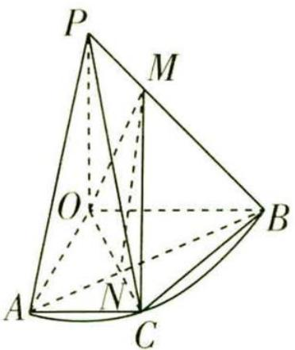

<details>
<summary>text_image</summary>

P
M
O
B
A
N
C
</details>

图14

第二步:利用余弦定理求出 AB, 进而求出 BN.

在 $\triangle AOB$ 中，由余弦定理可得 $AB = \sqrt{OA^2 + OB^2 - 2OA\times OB\times\cos120^\circ} = \sqrt{4 + 4 - 2\times 2\times 2\times(-\frac{1}{2})} = 2\sqrt{3}$

$$
\therefore B N = \frac {2}{3} A B = \frac {4 \sqrt {3}}{3}.
$$

第三步:利用余弦定理求出 ON.

在 $\triangle OBN$ 中， $\angle OBN = 30^{\circ}$ ，由余弦定理可得， $ON = \sqrt{OB^{2} + BN^{2} - 2OB \times BN \times \cos 30^{\circ}} = \sqrt{4 + \frac{16}{3} - 2 \times 2 \times \frac{4\sqrt{3}}{3} \times \frac{\sqrt{3}}{2}} = \frac{2\sqrt{3}}{3}$ ，

第四步:利用勾股定理的逆定理证明 $OB \perp ON$ .

$\therefore OB^{2} + ON^{2} = BN^{2}$ ，故 $OB \perp ON$ .

第五步:利用线面垂直的判定定理证明 $OC \perp$ 平面 POB.

∵ PO ⊥ 平面 ABC, ON ⊂ 平面 ABC, ∴ PO ⊥ ON,

又 $PO \cap OB = O, PO, OB \subset$ 平面 POB,

$\therefore ON \perp$ 平面 POB, $\therefore OC \perp$ 平面 POB.

# 数学名家

欧几里得 古希腊数学家,被称为“几何之父”.他最著名的著作《几何原本》是欧洲数学的基础,在书中他提出五大公设.

关注微信公众号“初高教辅站”获取更多初高中教辅资料

# 新题演练

1. (2023 广东广州 6 月仿真模拟节选) 如图 15, 在四棱锥 $P-ABCD$ 中, $PD \perp$ 平面 $ABCD$ , 底面 $ABCD$ 为菱形, $E,F$ 分别为 $AB,PD$ 的中点.

求证:EF//平面PBC.

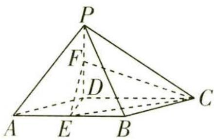

<details>
<summary>text_image</summary>

P
F
D
A E B C
</details>

图 15

2. (2023 四川成都树德中学 5 月适应性考试节选) 如图 16, 在直三棱柱 ${ABC} - {A}_{1}{B}_{1}{C}_{1}$ 中, ${AC} = {BC} = C{C}_{1} = 2,D$ 为 ${BC}$ 的中点,点 $E$ 在 $A{A}_{1}$ 上, ${AD} \perp  N{C}_{1}$ .

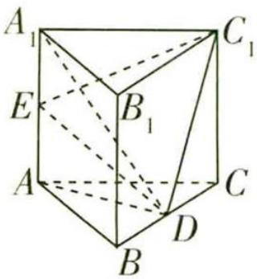

<details>
<summary>text_image</summary>

A₁
E
B₁
A
C₁
D
B
</details>

图16

证明: $BC \perp$ 平面 $A_{1}AD$ .

# 天星老师点细节


立体几何中的字母相似,在读题时要仔细辨别题目中所给的等量关系,做题时可将题目中的条件标在题图中,避免大意失分.由 $AD \perp DC_{1}$ 可联想三垂线定理及其逆定理 ( $a \subset \alpha, l$ 在 $\alpha$ 内的射影为 b, 若 $a \perp b$ , 则 $a \perp l$ . 反之也成立), 以此为依据寻找垂直关系.

3. (2023 长沙雅礼中学 5 月适应性训练节选) 如图 17, 在等腰梯形 $ABCD$ 中, $AB \parallel CD$ , $E$ , $F$ 分别为 $AB$ , $CD$ 的中点, $CD = 2AB = 2EF = 4$ , $M$ 为 $DF$ 的中点. 现将四边形 $BEFC$ 沿 $EF$ 折起, 使平面 $BEFC \perp$ 平面 $AEFD$ , 得到如图 18 所示的多面体.

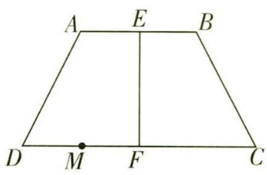

<details>
<summary>text_image</summary>

A E B
D M F C
</details>

图 17

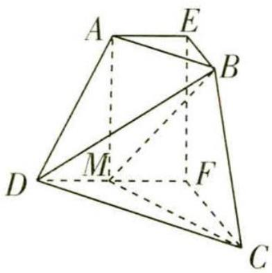

<details>
<summary>text_image</summary>

A
E
B
M
F
D
C
</details>

图18

在多面体中,证明: $EF \perp MC$ .

4. (2023 河南郑州 6 月冲刺节选) 如图 19, 在底面 ABCD 为梯形的多面体中, $AB \parallel CD$ , $BC \perp CD$ , $AB = 2CD = 2\sqrt{2}$ , $\angle CBD = 45^{\circ}$ , BC = AE = DE, 且四边形 BDEN 为矩形.

求证: $BD \perp AE$ .

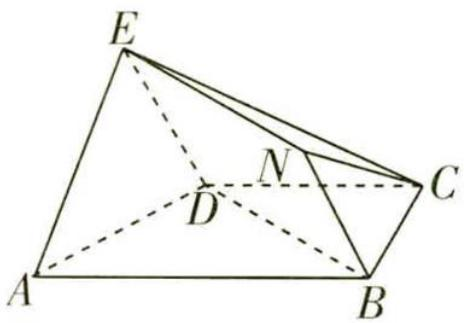

<details>
<summary>text_image</summary>

E
N
D
C
A
B
</details>

图 19

# 数学名家

欧几里得的《几何原本》被广泛认为是历史上最成功的教科书。欧几里得也写了一些关于透视、圆锥曲线、球面几何学及数论的作品。

关注微信公众号“初高教辅站”获取更多初高中教辅资料

# 参考答案与解析

1. 如图 20, 取 PC 中点 M, 连接 FM, BM.

在 $\triangle PCD$ 中，M,F分别为PC,PD的中点，所以 $MF\parallel DC,MF=\frac{1}{2}DC.$ 在菱形 ABCD 中，易知 $AB \parallel DC, BE = \frac{1}{2} DC$ ,

所以 $BE \parallel MF, BE = MF.$

所以四边形 BEFM 为平行四边形, 所以 EF // BM.

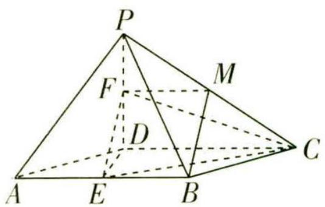

<details>
<summary>text_image</summary>

P
F
M
D
A
E
B
C
</details>

图 20

【小技巧】利用 “一组对边平行且相等的四边形是平行四边形” 找关键图形挖掘平行关系又 $EF \not\subset$ 平面 $PBC, BM \subset$ 平面 $PBC$ , 所以 $EF \parallel$ 平面 $PBC$ .

2. $\because$ 三棱柱 $ABC - A_{1}B_{1}C_{1}$ 为直三棱柱， $\therefore C_{1}C \perp$ 平面 $ABC$

【小结论】掌握直三棱柱的定义, 并能转化为性质应用, 即直三棱柱的侧棱与底面垂直, 直三棱柱的侧棱与底面各棱垂直

$\because AD \subset$ 平面 $ABC, \therefore C_{1}C \perp AD.$

又 $AD \perp DC_{1}, DC_{1} \cap CC_{1} = C_{1}, DC_{1}, CC_{1} \subset$ 平面 $C_{1}DC, \therefore AD \perp$ 平面 $C_{1}DC$ ,

$\because BC\subset$ 平面 $C_{1}DC,\therefore AD\perp BC,\because AA_{1}\perp$ 平面ABC, $BC\subset$ 平面ABC, $\therefore AA_{1}\perp BC,$

又 $AA_{1}\cap AD=A,AA_{1},AD\subset$ 平面 $A_{1}AD,\therefore BC\perp$ 平面 $A_{1}AD.$

3. 由题意知在等腰梯形 ABCD 中, $AB \parallel CD$ ,

又 E, F 分别为 AB, CD 的中点, 所以 $EF \perp CD$ , 即折叠后 $EF \perp DF$ , $EF \perp CF$ ,

【规律现形】根据折叠前后同一平面内的垂直关系不变可得线线垂直

又 $DF \cap CF = F, DF, CF \subset$ 平面 $DCF$ , 所以 $EF \perp$ 平面 $DCF$ , 又 $MC \subset$ 平面 $DCF$ , 所以 $EF \perp MC$ .

4. 第一步: 利用数据计算法证明 $BD \perp AD$ .

由题意知, $AB \parallel CD, BC \perp CD, AB = 2CD = 2\sqrt{2}, \angle CBD = 45^{\circ}$ ,

故有 $BC = DC = \sqrt{2}$ , BD = 2, $AD = \sqrt{BC^{2} + (AB - CD)^{2}} = \sqrt{2 + 2} = 2$ ,

在 $\triangle ABD$ 中, $AD^{2}+BD^{2}=AB^{2}$ ,所以 $BD\perp AD$ .

【扫清障碍】通过数据计算，利用勾股定理的逆定理证明线线垂直

第二步:根据矩形的性质证明 $BD \perp DE$ .

因为四边形 BDEN 为矩形, 所以 $BD \perp DE$ ,

【析疑难】思路受阻时,常需回头望望,审视条件在解题中的应用,矩形的相邻两线垂直

第三步:利用线面垂直的判定定理证明 $BD \perp$ 平面 ADE.

又 $DE \cap AD = D, DE, AD \subset$ 平面 ADE, 故 $BD \perp$ 平面 ADE.

第四步:根据线面垂直的性质证得 $BD \perp AE$ .

因为 $AE \subset$ 平面 ADE, 所以 $BD \perp AE$ .

# 数学名家

丢番图 古希腊时期的学者和数学家,他是代数学的创始人之一,对算术理论有深入研究,他完全脱离了几何形式,以代数学闻名于世.

关注微信公众号“初高教辅站”获取更多初高中教辅资料

# 超重点 9 空间向量的巧妙应用: 求角与求距离

# 巧妙应用 1 利用空间向量求线线角


# 天星老师小课堂


设异面直线 $l_{1}, l_{2}$ 的方向向量分别为 $\pmb{m}_{1}, \pmb{m}_{2}, \pmb{m}_{1} = (x_{1}, y_{1}, z_{1}), \pmb{m}_{2} = (x_{2}, y_{2}, z_{2})$ , $\theta$ 是 $l_{1}$ 与 $l_{2}$ 所成的角, 根据向量数量积的定义和坐标表示可得 $\cos \theta =$

$$
\left| \cos \left\langle \boldsymbol {m} _ {1}, \boldsymbol {m} _ {2} \right\rangle \right| = \frac {\left| \boldsymbol {m} _ {1} \cdot \boldsymbol {m} _ {2} \right|}{\left| \boldsymbol {m} _ {1} \right| \left| \boldsymbol {m} _ {2} \right|} = \frac {\left| x _ {1} x _ {2} + y _ {1} y _ {2} + z _ {1} z _ {2} \right|}{\sqrt {x _ {1} ^ {2} + y _ {1} ^ {2} + z _ {1} ^ {2}} \sqrt {x _ {2} ^ {2} + y _ {2} ^ {2} + z _ {2} ^ {2}}}.
$$

调研 1 (2023 江西南昌 5 月押题) 如图 1, 三棱柱 ABC - $A_{1}B_{1}C_{1}$ 的底面边长和侧棱长均相等, $\angle BAA_{1} = \angle CAA_{1} = 60^{\circ}$ , 则异面直线 $AB_{1}$ 与 $BC_{1}$ 所成角的余弦值为 ( )

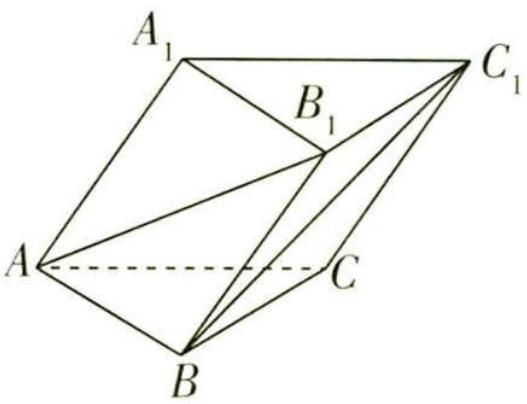

<details>
<summary>text_image</summary>

A₁
B₁
C₁
A
C
B
</details>

图1

A. $\frac{\sqrt{6}}{6}$   
B. $\frac{1}{3}$   
C. $\frac{\sqrt{2}}{4}$   
D. $\frac{\sqrt{3}}{2}$

思维导引

选定一组合适的基底

利用这组基底分别表示出两条异面直线的方向向量

利用夹角公式
求余弦值

解析 设 $\overrightarrow{AA_{1}}=\boldsymbol{c},\overrightarrow{AB}=\boldsymbol{a},\overrightarrow{AC}=\boldsymbol{b}$ ，三棱柱 $ABC-A_{1}B_{1}C_{1}$ 的所有棱长均为 1.

【简化运算】题干中告诉我们“底面边长和侧棱长均相等”，为了后续计算方便，我们可以将棱长设为1，不影响结果，千万不要再引入参数 $k$ ，费心费力、得不偿失

由题意知 $a \cdot b = 1 \times 1 \times \cos 60^{\circ} = \frac{1}{2}, b \cdot c = \frac{1}{2}, a \cdot c = \frac{1}{2}$ ,

$$
\therefore \overrightarrow {A B _ {1}} \cdot \overrightarrow {B C _ {1}} = (\boldsymbol {a} + \boldsymbol {c}) \cdot (\boldsymbol {b} - \boldsymbol {a} + \boldsymbol {c}) = \frac {1}{2} - 1 + \frac {1}{2} + \frac {1}{2} - \frac {1}{2} + 1 = 1,
$$

又 $|\overrightarrow{AB_1}| = \sqrt{(a + c)^2} = \sqrt{a^2 + 2a \cdot c + c^2} = \sqrt{1 + 1 + 1} = \sqrt{3}$ , $|\overrightarrow{BC_1}| = \sqrt{(b - a + c)^2} = \sqrt{1 + 1 + 1 - 1 + 1 - 1} = \sqrt{2}$ ,

$\therefore \cos \langle \overrightarrow{AB_1},\overrightarrow{BC_1}\rangle = \frac{\overrightarrow{AB_1} \cdot \overrightarrow{BC_1}}{|\overrightarrow{AB_1}| |\overrightarrow{BC_1}|} = \frac{\sqrt{6}}{6}, \therefore$ 异面直线 $AB_{1}$ 与 $BC_{1}$ 所成角的余弦值为 $\frac{\sqrt{6}}{6}$ . 故选A.

# 数学名家

丢番图所著的《算术》是讲数论的,它讨论了一次、二次以及个别的三次方程,还有大量的不定方程.

关注微信公众号“初高教辅站”获取更多初高中教辅资料

调研 2 (2023 华大新高考联盟 5 月预测) 已知在长方体 $ABCD - A_{1}B_{1}C_{1}D_{1}$ 中, $AB = BC < BB_{1}$ , 点 $M$ 是线段 $CC_{1}$ 上靠近点 $C$ 的三等分点, 记直线 $A_{1}B, AD_{1}$ 的夹角为 $\alpha_{1}$ , 直线 $A_{1}B, BD$ 的夹角为 $\alpha_{2}$ , 直线 $AM, BD$ 的夹角为 $\alpha_{3}$ , 则 $\alpha_{1}, \alpha_{2}, \alpha_{3}$ 之间的大小关系为 \_\_\_\_. (用“<”连接)

解析 记 $BB_{1}=a, AB=BC=b$ ，如图2，作出图形并以A为坐标原点建立空间直角坐标系，

则 $A(0,0,0)$ , $A_{1}(0,0,a)$ , $B(b,0,0)$ , $D(0,b,0)$ , $D_{1}(0,b,a)$ , $M(b,b,\frac{a}{3})$ ,

所以 $\overrightarrow{A_1B} = (b,0, - a),\overrightarrow{AD_1} = (0,b,a),\overrightarrow{BD} = (-b,b,0),\overrightarrow{AM} = (b,b,\frac{a}{3})$

所以 $\cos \alpha_{1} = |\cos \langle \overrightarrow{A_{1}B}\cdot \overrightarrow{AD_{1}}\rangle | = \frac{a^{2}}{a^{2} + b^{2}} = \frac{1}{1 + (\frac{b}{a})^{2}} >\frac{1}{2},$ 又 $\alpha_{1}\in (0,\frac{\pi}{2} ]$

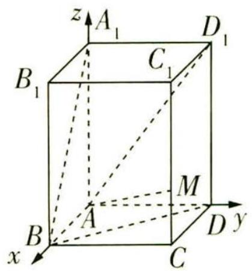

<details>
<summary>text_image</summary>

z
A₁
D₁
B₁
C₁
M
A
B
x
C
D y
</details>

图 2

【扫清障碍】因为 $AB = BC < BB_{1}$ ，所以 a > b，所以 $1 + \left(\frac{b}{a}\right)^{2} < 2$ ，所以 $\frac{1}{1 + \left(\frac{b}{a}\right)^{2}} > \frac{1}{2}$

故 $\alpha_{1}\in(0,\frac{\pi}{3})$ .

$$
\cos \alpha_ {2} = | \cos \langle \overrightarrow {A _ {1} B} \cdot \overrightarrow {B D} \rangle | = \frac {b}{\sqrt {2} \cdot \sqrt {a ^ {2} + b ^ {2}}} = \frac {1}{\sqrt {2} \cdot \sqrt {1 + (\frac {a}{b}) ^ {2}}} <   \frac {1}{2}, \text {且} \cos \alpha_ {2} > 0, \alpha_ {2} \in (0,
$$

$\frac{\pi}{2}$ , 故 $\alpha_{2}\in\left(\frac{\pi}{3},\frac{\pi}{2}\right)$ .

因为 $\overrightarrow{BD}\cdot\overrightarrow{AM}=-b^{2}+b^{2}+0\cdot\frac{a}{3}=0$ ，所以 $\overrightarrow{BD}\perp\overrightarrow{AM}$ ，所以 $\alpha_{3}=\frac{\pi}{2}$ 。故 $\alpha_{1}<\alpha_{2}<\alpha_{3}$

【易错提醒】注意题目要求的书写顺序，必须“从小到大”书写，写反了是不得分的

# 巧妙应用2 利用空间向量求线面角


# 天星老师小课堂


设直线 AB 的方向向量和平面 $\alpha$ 的法向量分别为 m, $\boldsymbol{n}, \boldsymbol{m} = (x_{1}, y_{1}, z_{1}), \boldsymbol{n} = (x_{2}, y_{2}, z_{2})$ ，如图 3，直线 AB 与平面 $\alpha$ 相交于点 B，设直线 AB 与平面 $\alpha$ 所成的角为 $\theta$ ，则 $\sin \theta =$

$$
\mid \cos \langle \boldsymbol {m}, \boldsymbol {n} \rangle \mid = \frac {\mid \boldsymbol {m} \cdot \boldsymbol {n} \mid}{\mid \boldsymbol {m} \mid \mid \boldsymbol {n} \mid} = \frac {\mid x _ {1} x _ {2} + y _ {1} y _ {2} + z _ {1} z _ {2} \mid}{\sqrt {x _ {1} ^ {2} + y _ {1} ^ {2} + z _ {1} ^ {2}} \sqrt {x _ {2} ^ {2} + y _ {2} ^ {2} + z _ {2} ^ {2}}}.
$$

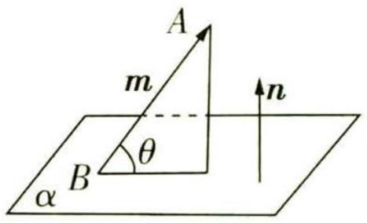

<details>
<summary>text_image</summary>

A
m
θ
B
α
n
</details>

图3

调研 3 (2023 福建福州一中 7 月测试 | 多选) 如图 4, 在各棱长均为 2 的正三棱柱 $ABC - A_{1}B_{1}C_{1}$ 中, $D, E$ 分别是 $CC_{1}, BB_{1}$ 的中点, 设 $\overrightarrow{A_{1}F} = \lambda \overrightarrow{A_{1}C_{1}}, \lambda \in [0,1]$ , 则 ( )

# 数学名家

A. 当 $\lambda = \frac{1}{2}$ 时, $CF \perp AD$   
B. $\exists\lambda\in[0,1]$ , $CF\perp$ 平面 ABD  
C. $\exists\lambda\in[0,1],EF\parallel$ 平面ABD   
D. 当 $\lambda = \frac{1}{3}$ 时, AF 与平面 ABD 所成的角为 $60^{\circ}$

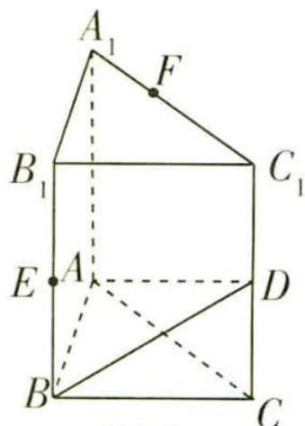

<details>
<summary>text_image</summary>

A₁
F
B₁
C₁
E
A
D
B
C
</details>

图 4

# 天星老师抓题眼


注意关键信息“正三棱柱”,那么必然能找到三条两两垂直的相交直线,一般情况下我们会选择底面三角形其中一条边上的中线所在直线作为x轴,该边的中点作为坐标原点,该边所在直线作为y轴来建系.如本题,便是以AC的中点为坐标原点建立空间直角坐标系,然后写出各点的坐标,表示出相关向量,根据向量法求解并判断的.

解析 取 AC 的中点 $O, A_{1}C_{1}$ 的中点 G, 连接 OB, OG,

则 OB, OC, OG 三线两两垂直.

【拿分要点】建立空间直角坐标系之前一定要说明三条两两垂直的相交直线,最好换行书写,能突出显示我们步骤的完整性

如图5,以点O为坐标原点,OB所在直线为x轴,OC所在直线为y轴,OG所在直线为z轴建立空间直角坐标系,则 $A(0,-1,0)$ , $D(0,1,1)$ , $C(0,1,0)$ , $C_{1}(0,1,2)$ , $A_{1}(0,-1,2)$ , $B(\sqrt{3},0,0)$ , $E(\sqrt{3},0,1)$ ,所以 $\overrightarrow{A_{1}C_{1}}=(0,2,0)$ .

连接 $OF, OA_1$ ，则由 $\overrightarrow{A_1F} = \lambda \overrightarrow{A_1C_1}$ 可得 $\overrightarrow{OF} = \overrightarrow{OA_1} + \lambda \overrightarrow{A_1C_1} = (0, 2\lambda - 1, 2)$ ，

所以 $F(0,2\lambda-1,2)$ , $\overrightarrow{CF}=(0,2\lambda-2,2)$ .

下面依次分析四个选项.

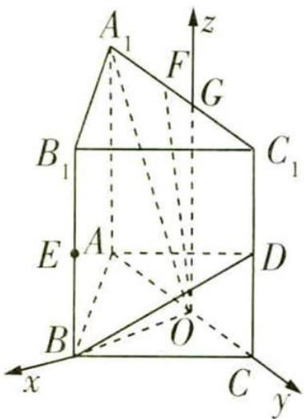

<details>
<summary>text_image</summary>

A₁
F
G
B₁
C₁
E
A
D
B
O
x
C
y
z
</details>

图5

<table><tr><td>选项</td><td>分析过程</td><td>正误</td></tr><tr><td>A</td><td>当 $\lambda = \frac{1}{2}$ 时, $F(0,0,2)$ ,所以 $\overrightarrow{CF} = (0,-1,2)$ .又 $\overrightarrow{AD} = (0,2,1)$ ,所以 $\overrightarrow{CF} \cdot \overrightarrow{AD} = 0 - 1 \times 2 + 2 \times 1 = 0$ ,所以 $\overrightarrow{CF} \perp \overrightarrow{AD}$ ,即 $CF \perp AD$ </td><td>√</td></tr><tr><td>B</td><td> $\overrightarrow{AD} = (0,2,1)$ , $\overrightarrow{AB} = (\sqrt{3},1,0)$ ,设 $n = (x,y,z)$ 是平面ABD的法向量,则有 $\begin{cases} n \cdot \overrightarrow{AD} = 0, & \text{即} \begin{cases} 2y + z = 0, \\ \sqrt{3}x + y = 0. \end{cases} \text{取} x=1$ ,则 $n = (1,-\sqrt{3},2\sqrt{3})$ 是平面ABD的一个法向量.若 $CF \perp$ 平面ABD,则 $\overrightarrow{CF} // n$ ,而 $\overrightarrow{CF} = (0,2\lambda -2,2)$ ,显然 $\overrightarrow{CF}$ , $n$ 不共线,【会转化】线面垂直 $\Leftrightarrow$ 直线的方向向量和平面的法向量共线选项不成立</td><td>×</td></tr></table>

# 数学名家

续表

<table><tr><td>选项</td><td>分析过程</td><td>正误</td></tr><tr><td>C</td><td> $\overrightarrow{EF} = (-\sqrt{3}, 2\lambda - 1, 1)$ ,要使  $EF//$  平面 ABD,则应有  $\overrightarrow{EF} \perp \boldsymbol{n}$ ,【会转化】线面平行  $\Leftrightarrow$  直线的方向向量和平面的法向量垂直所以  $\overrightarrow{EF} \cdot \boldsymbol{n} = -\sqrt{3} - \sqrt{3}(2\lambda - 1) + 2\sqrt{3} = 0$ ,解得  $\lambda = 1$ ,满足题意</td><td>√</td></tr><tr><td>D</td><td>当  $\lambda = \frac{1}{3}$ 时, $F(0, -\frac{1}{3}, 2)$ ,则  $\overrightarrow{AF} = (0, \frac{2}{3}, 2)$ .设 AF 与平面 ABD 所成角为  $\theta$ ,所以  $\sin \theta = |\cos \langle \boldsymbol{n}, \overrightarrow{AF} \rangle| = \frac{|\boldsymbol{n} \cdot \overrightarrow{AF}|}{|\boldsymbol{n}| |\overrightarrow{AF}|} = \frac{1 - \frac{2\sqrt{3}}{3} + 4\sqrt{3}|}{4 \times \frac{2\sqrt{10}}{3}} = \frac{\sqrt{30}}{8} \neq \sin 60^\circ$ </td><td>×</td></tr></table>

调研 4 (2023 浙江金华十校 6 月期末联考) 如图 6, 在四棱锥 $P - ABCD$ 中, 点 $A, B, C, D$ 在圆 $O$ 上, $AB = AD = 2$ , $\angle BAD = 120^{\circ}$ , 顶点 $P$ 在底面上的射影为圆心 $O$ , 点 $E$ 在线段 $PD$ 上.

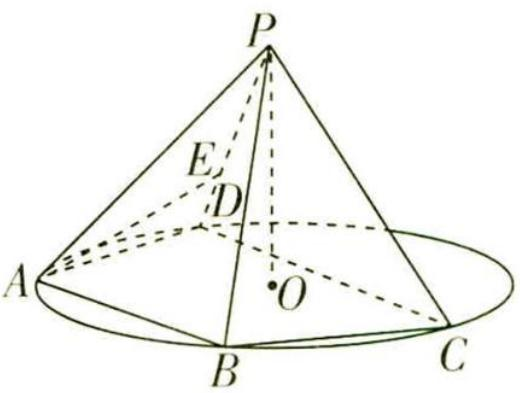

<details>
<summary>text_image</summary>

P
E
D
A
O
B
C
</details>

图6

(1) 若 $AB \parallel CD, PE = \lambda PD$ , 当 $AE \parallel$ 平面 $PBC$ 时, 求 $\lambda$ 的值.  
(2) 若 AB 与 CD 不平行, 四棱锥 P-ABCD 的体积为 $\sqrt{6}$ , $PO = \sqrt{2}$ , 求直线 PC 与平面 PAB 所成角的正弦值.

# 天星老师破障碍


本题确认数量关系的关键在于确定点 C 的位置. 四棱锥 P-ABCD 的体积是确定的, 高也是确定的, 那么相当于底面面积已知, 所以我们把底面单独拎出来研究 C 的位置. 但 C 的位置有两种可能性, 这两种情况下直线 PC 与平面 PAB 所成角是不一样大的, 因此要考虑是否需要舍弃一种情况, 如何确定是否舍去? 观

察已知条件“AB 与 CD 不平行”，这是一个限制条件，就靠这个条件去确定。

解析 (1) 过 $E$ 作 $EF \parallel PC$ 交线段 $DC$ 于 $F$ , 连接 $AF$ , 如图7.

∵ $EF \parallel PC, EF \not\subset$ 平面 PBC, $PC \subset$ 平面 PBC, ∴ $EF \parallel$ 平面 PBC,

又 $AE \parallel$ 平面 $PBC, EF \cap AE = E, EF, AE \subset$ 平面 $AEF$ ,

∴ 平面 AEF // 平面 PBC.

∵ 平面 $AEF \cap$ 平面 ABCD = AF，平面 $PBC \cap$ 平面 ABCD = BC，

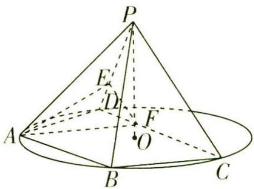

<details>
<summary>text_image</summary>

P
E
D
F
O
A
B
C
</details>

图7

# 数学名家

笛卡尔 法国数学家、物理学家. 他于1637年发明了现代数学的基础工具之一——坐标系, 将几何和代数相结合, 创立了解析几何学.

关注微信公众号“初高教辅站”获取更多初高中教辅资料

∴ AF // BC.

【用定理】这里用到了面面平行的性质定理“两个平面平行，如果另一个平面与这两个平面相交，那么两条交线平行”，这个定理对个别同学来说可能是个“知识盲区”，注意补漏

又 $AB \parallel CD, \therefore$ 四边形 $ABCF$ 是平行四边形, $\therefore CF = AB = 2$ ,

又 A, B, C, D 四点共圆且 $\angle BAD = 120^{\circ}$ ，∴ 四边形 ABCD 为等腰梯形，∴ CD = 4，故 CF = $\frac{1}{2}CD$ ，从而 $PE = \frac{1}{2}PD, \lambda = \frac{1}{2}$ .

(2) 由锥体的体积公式可得 $V_{P-ABCD} = \frac{1}{3} S \cdot PO$ (S 为四边形 ABCD 的面积), 则 $\frac{1}{3} S \cdot \sqrt{2} = \sqrt{6}$ , 解得 $S = 3\sqrt{3}$ . 连接 $BD$ , 则 $S_{\triangle ABD} = \frac{1}{2} \times 2 \times 2 \times \sin 120^\circ = \sqrt{3}$ , $\therefore S_{\triangle BCD} = S - S_{\triangle ABD} = 2\sqrt{3}$ .

在 $\triangle ABD$ 中，由余弦定理得 $BD^{2} = 2^{2} + 2^{2} - 2\times 2\times 2\times \cos 120^{\circ} = 12$ ，则 $BD = 2\sqrt{3}$

设 $\triangle BCD$ 的边 $BD$ 上的高为 $h$ ，则 $\frac{1}{2} \times 2\sqrt{3} \times h = 2\sqrt{3}$ ，解得 $h = 2$

所以点 C 在与 BD 平行且到 BD 的距离为 2 的直线 l 上, 如图 8 所示, 该直线与圆 O 有两个交点 $C_{1}, C_{2}$ , 则点 C 的位置有 $C_{1}, C_{2}$ 两种可能性.

设四边形 ABCD 的外接圆半径为 R, 根据正弦定理得 $2R = \frac{BD}{\sin 120^{\circ}} = 4$ ,

$$
\therefore R = 2,
$$

∴ 点 O 到直线 BD 的距离与到直线 l 的距离相等, ∴ $DC_{1}$ 与 $BC_{2}$ 均为直径, ∴ $DC_{1} = BC_{2} = 4$ .

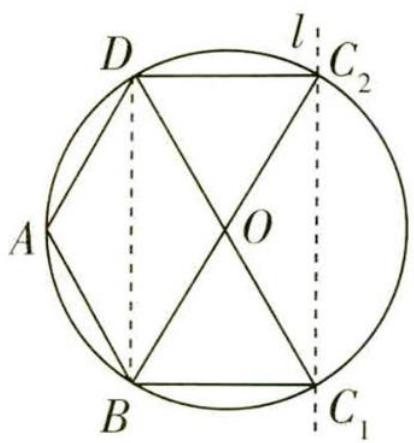

<details>
<summary>text_image</summary>

D
l
C₂
A
O
B
C₁
</details>

图8

【敲黑板】这里可以这么思考：点 $A$ 到直线 $BD$ 的距离是 1（可以通过 $\triangle ABD$ 的面积得到），点 $A$ 到圆心 $O$ 的距离是半径 2，那么圆心到直线 $BD$ 的距离就是 1，直线 $BD$ 与 $C_1 C_2$ 关于圆心“对称”，圆心在四边形 $BDC_2 C_1$ 对角线的交点处

若点 C 位于 $C_{1}$ 处，则 DA = AB = BC = 2，此时 $AB \parallel CD$ ，不满足题意，∴ 点 C 只能在 $C_{2}$ 处，此时 BC 为圆 O 的直径.

以 O 为坐标原点, OB, OP 所在直线分别为 y 轴, z 轴, 过 O 且垂直于 BC 的直线为 x 轴建立空间直角坐标系, 如图 9 所示.

则 $A(\sqrt{3},1,0),B(0,2,0),C(0,-2,0),P(0,0,\sqrt{2})$

所以 $\overrightarrow{PA} = (\sqrt{3}, 1, -\sqrt{2}), \overrightarrow{PB} = (0, 2, -\sqrt{2}), \overrightarrow{PC} = (0, -2, -\sqrt{2})$

设平面 $PAB$ 的法向量为 $\pmb{n} = (x, y, z)$ ，则

$$
\left\{ \begin{array}{l l} {\pmb {n} \cdot \overrightarrow {P A} = 0,} \\ {\pmb {n} \cdot \overrightarrow {P B} = 0,} \end{array} \right. \text {即} \left\{ \begin{array}{l l} {\sqrt {3} x + y - \sqrt {2} z = 0,} \\ {2 y - \sqrt {2} z = 0,} \end{array} \right.
$$

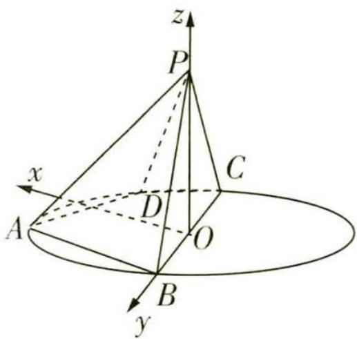

<details>
<summary>text_image</summary>

z
P
x
A
D
C
O
B
y
</details>

图9

费马 法国律师和业余数学家,他在数学上的成就不比职业数学家差,他似乎对数论最有兴趣,亦对现代微积分的建立有所贡献.被誉为“业余数学家之王”.

关注微信公众号“初高教辅站”获取更多初高中教辅资料

令 $y = 1$ ，则 $z = \sqrt{2}, x = \frac{\sqrt{3}}{3}$ 所以平面PAB的一个法向量为 $\pmb{n} = (\frac{\sqrt{3}}{3}, 1, \sqrt{2})$

设直线 $PC$ 与平面 $PAB$ 所成角为 $\theta$ , 则 $\sin \theta = \frac{|\overrightarrow{PC} \cdot \boldsymbol{n}|}{|\overrightarrow{PC}| |\boldsymbol{n}|} = \frac{4}{\sqrt{6} \times \frac{\sqrt{30}}{3}} = \frac{2\sqrt{5}}{5}$ ,

∴ 直线 PC 与平面 PAB 所成角的正弦值为 $\frac{2\sqrt{5}}{5}$ .

# 巧妙应用 3 利用空间向量求二面角


# 天星老师小课堂

# 利用空间向量求二面角的两大方法

(1) 直接法: 如图 10①, AB, CD 是二面角 $\alpha - l - \beta$ 的两个面内与棱 l 垂直的直线, 则二面角的大小 $\theta = \langle \overrightarrow{AB}, \overrightarrow{CD} \rangle$ .


  
①


<details>
<summary>text_image</summary>

n₁
α
l
n₂
β
</details>

②


<details>
<summary>text_image</summary>

n₁
α
l
n₂
β
</details>

③   
图10

(2)法向量法:如图10②③, $n_{1},n_{2}$ 分别是二面角 $\alpha-l-\beta$ 的两个半平面 $\alpha,\beta$ 的法向量,则二面角的大小 $\theta$ 满足 $|\cos\theta|=\left|\cos\langle n_{1},n_{2}\rangle\right|$ ,二面角的平面角大小是向量 $n_{1}$ 与 $n_{2}$ 的夹角(或其补角).结合立体图形中二面角的实际情况,判断二面角的平面角是钝角还是锐角.

【提示】如果题干要求平面 $\alpha$ 与平面 $\beta$ 的夹角, 注意平面 $\alpha$ 与平面 $\beta$ 的夹角的定义 “平面 $\alpha$ 与平面 $\beta$ 相交, 形成四个二面角, 我们把这四个二面角中不大于 $90^{\circ}$ 的二面角称为平面 $\alpha$ 与平面 $\beta$ 的夹角”, 也就是说平面与平面的夹角的取值范围是 $(0^{\circ}, 90^{\circ}]$ .

调研 5 (2023 新课标Ⅱ卷) 如图 11, 三棱锥 A-BCD 中, DA=DB=DC, BD⊥CD, ∠ADB=∠ADC=60°, E 为 BC 的中点.

(1) 证明: $BC \perp DA$ .   
(2) 点 F 满足 $\overrightarrow{EF} = \overrightarrow{DA}$ ，求二面角 D - AB - F 的正弦值.

解析 (1) 第一步: 作辅助线, 证 $DE \perp BC$ , $AE \perp BC$ .


<details>
<summary>text_image</summary>

A
F
C
E
D
B
</details>

图 11

如图 12, 连接 DE, AE,

# 数学名家

费马对丢番图所写的《算术》一书中的不定方程进行了深入研究,将不定方程的研究限制在整数范围内,从而开始了数论这门数学分支.

关注微信公众号“初高教辅站”获取更多初高中教辅资料

因为 DC = DB，且 E 为 BC 的中点，所以 $DE \perp BC$ .

因为 $\angle ADB = \angle ADC = 60^{\circ}, DA = DA, DC = DB,$

所以 $\triangle ADB \cong \triangle ADC(\text{SAS})$ .

可得 AC = AB，故 $AE \perp BC$ .

第二步:证 $BC \perp$ 平面 ADE.

因为 $DE \cap AE = E, DE, AE \subset$ 平面 ADE, 所以 $BC \perp$ 平面 ADE.

第三步:证 $BC \perp DA$ .

又 $DA \subset$ 平面 ADE, 所以 $BC \perp DA$ .

(2) 第一步: 证 $ED, EB, EA$ 两两垂直.

由(1)知, $DE \perp BC, AE \perp BC.$

不妨设 DA = DB = DC = 2，因为 $\angle ADB = \angle ADC = 60^{\circ}$ ，

所以AB = AC = 2.

由题可知 $\triangle DBC$ 为等腰直角三角形, 故 $DE = EB = EC = \sqrt{2}$ .

因为 $AE \perp BC$ ，所以 $AE = \sqrt{AB^{2} - EB^{2}} = \sqrt{2}$ .

在 $\triangle ADE$ 中, $AE^{2}+ED^{2}=AD^{2}$ ,所以 $AE\perp ED$ .


<details>
<summary>text_image</summary>

z
A
F
C
E
x D
B
y
</details>

图 12

【易错提醒】要先证 $ED, EB, EA$ 两两垂直，才能建系

# 第二步:建系,写出相关坐标.

以 E 为坐标原点, ED 所在直线为 x 轴, EB 所在直线为 y 轴, EA 所在直线为 z 轴, 建立空间直角坐标系, 如图 12, 则 $D(\sqrt{2}, 0, 0)$ , $B(0, \sqrt{2}, 0)$ , $A(0, 0, \sqrt{2})$ , $\overrightarrow{DA} = (-\sqrt{2}, 0, \sqrt{2})$ , $\overrightarrow{BA} = (0, -\sqrt{2}, \sqrt{2})$ .

设 $F(x_{F},y_{F},z_{F})$ ，因为 $\overrightarrow{EF} = \overrightarrow{DA}$ 所以 $(x_{F},y_{F},z_{F}) = (-\sqrt{2},0,\sqrt{2})$ ，可得 $F(-\sqrt{2},0,\sqrt{2})$

所以 $\overrightarrow{FA}=(\sqrt{2},0,0)$ .

【一题多解】因为 $\overrightarrow{EF}=\overrightarrow{DA}$ ，所以四边形EDAF为平行四边形，则 $\overrightarrow{FA}=\overrightarrow{ED}$ ，据此可得 $\overrightarrow{FA}$ 的坐标表示

# 第三步: 分别求平面 DAB、平面 ABF 的法向量.

设平面 DAB 的法向量为 $\boldsymbol{m}=(x_{1},y_{1},z_{1})$ ,

则 $\left\{ \begin{array}{l} \overrightarrow{DA} \cdot \boldsymbol{m} = 0, \\ \overrightarrow{BA} \cdot \boldsymbol{m} = 0, \end{array} \right.$ 即 $\left\{ \begin{array}{l} -\sqrt{2} x_1 + \sqrt{2} z_1 = 0, \\ -\sqrt{2} y_1 + \sqrt{2} z_1 = 0, \end{array} \right.$ 取 $x_1 = 1$ ，则 $y_1 = z_1 = 1, m = (1,1,1)$ .

设平面 $ABF$ 的法向量为 $\pmb {n} = (x_{2},y_{2},z_{2})$

则 $\left\{ \begin{array}{l} \overrightarrow{FA} \cdot \boldsymbol{n} = 0, \\ \overrightarrow{BA} \cdot \boldsymbol{n} = 0, \end{array} \right.$ 即 $\left\{ \begin{array}{l} \sqrt{2} x_2 = 0, \\ -\sqrt{2} y_2 + \sqrt{2} z_2 = 0, \end{array} \right.$ 得 $x_2 = 0$ ，取 $y_2 = 1$ ，则 $z_2 = 1, n = (0,1,1)$ .

# 数学名家

惠更斯 荷兰物理学家、天文学家、数学家,惠更斯对悬链线、对数螺线等都进行过研究,还在概率论和微积分方面有所成就.

关注微信公众号“初高教辅站”获取更多初高中教辅资料

第四步:求二面角 D-AB-F 的正弦值.

所以 $\cos \langle m, n \rangle = \frac{m \cdot n}{|m||n|} = \frac{2}{\sqrt{3} \times \sqrt{2}} = \frac{\sqrt{6}}{3}$ .

【满分宝典】会做的题一定要拿全分，审题一定要认真，本题的求解目标是正弦值，因此求到此处还未结束，注意转化

记二面角 $D - AB - F$ 的大小为 $\theta$ ，则 $\sin \theta = \sqrt{1 - \cos^2\langle m,n\rangle} = \sqrt{1 - (\frac{\sqrt{6}}{3})^2} = \frac{\sqrt{3}}{3},$

故二面角 D-AB-F 的正弦值为 $\frac{\sqrt{3}}{3}$ .

调研 6 (特殊几何图形12023 河南许昌名校三模) 如图13, 矩形 ABCD 与半圆柱 O'O 相接, 半圆柱的轴截面 DCEF ⊥ 平面 ABCD, 线段 DC 的中点为 O, M 是 EF 上一点, AD = 1, AB = 2, OM 与底面 ABCD 所成的角为 $\frac{\pi}{4}$ .


<details>
<summary>text_image</summary>

Geometric diagram with labeled points and lines, likely from a math problem or proof
</details>

图 13

(1) 在线段 AM 上有一点 P 满足 AP = 2PM, 证明: 直线 MO // 平面 PBD.  
(2) 若 $\widehat{FM}=2\widehat{ME}$ ，求平面 AMD 与平面 ABCD 夹角的余弦值.

解析 (1) 如图 14, 连接 AO 交 BD 于 Q, 连接 PQ.

因为 $OD \parallel AB$ ，则 $\triangle AQB \sim \triangle OQD$ ，所以 $\frac{AQ}{QO} = \frac{AB}{DO} = 2$ .

因为 AP = 2PM, 所以 $\frac{AQ}{QO} = \frac{AP}{PM}$ , 所以 $MO \parallel PQ$ .

【证平行】证明线线平行的方法有很多，包括但不限于三角形的中位线、平行四边形的性质、平行线的判定（内错角相等，两直线平行等），此处用到的是比例法，是通过相似三角形转化而来的

又 $MO \not\subset$ 平面 $PBD, PQ \subset$ 平面 $PBD$ , 所以 $MO \parallel$ 平面 $PBD$ .

(2) 作 $MN \perp$ 平面 $ABCD$ 于 $N$ , 则 $N$ 在 $\widehat{DC}$ 上, 连接 $ON$ , 则 $ON$ 为 $OM$ 在平面 $ABCD$ 内的射影, 所以 $\angle MON$ 为 $OM$ 与底面 $ABCD$ 所成的角, 所以 $\angle MON = \frac{\pi}{4}$ , 所以 $ON = MN = 1$ .


<details>
<summary>text_image</summary>

z
M
O'
F
E
P
N
D
O
C
y
A
Q
B
x
</details>

图14

以 O 为坐标原点, 过 O 且与 DA 平行的直线为 x 轴, OC 所在直线为 y 轴, $OO'$ 所在直线为 z 轴, 建立空间直角坐标系, 如图 14.

# 数学名家

牛顿 英国著名的物理学家、数学家,百科全书式的“全才”,他与莱布尼茨共享发展出微积分学的荣誉.
关注微信公众号“初高教辅站”获取更多初高中教辅资料

因为 $\widehat{FM}=2\widehat{ME}$ ，所以 $\angle CON=\frac{\pi}{3}$ ，则 $D(0,-1,0)$ ， $A(1,-1,0)$ ， $M(-\frac{\sqrt{3}}{2},\frac{1}{2},1)$ ，

所以 $\overrightarrow{DA}=(1,0,0),\overrightarrow{DM}=(-\frac{\sqrt{3}}{2},\frac{3}{2},1)$ .

设平面AMD的法向量为 $\pmb {n} = (x,y,z)$ ，则 $\left\{ \begin{array}{l}\overrightarrow{DA}\cdot \pmb {n} = 0,\\ \overrightarrow{DM}\cdot \pmb {n} = 0, \end{array} \right.$ 所以 $\left\{ \begin{array}{l}x = 0,\\ -\frac{\sqrt{3}}{2} x + \frac{3}{2} y + z = 0, \end{array} \right.$

令 y=2，得平面 AMD 的一个法向量为 $\boldsymbol{n}=(0,2,-3)$ .

易知平面 ABCD 的一个法向量为 $\boldsymbol{m}=(0,0,1)$ ,

设平面AMD与平面ABCD的夹角为 $\alpha$ ，则 $\cos \alpha = \frac{|\pmb{n}\cdot\pmb{m}|}{|\pmb{n}||\pmb{m}|} = \frac{3}{\sqrt{13}} = \frac{3\sqrt{13}}{13},$

所以平面 AMD 与平面 ABCD 夹角的余弦值为 $\frac{3\sqrt{13}}{13}$ .

# 巧妙应用 4 利用空间向量求距离


# 天星老师小课堂

# 如何利用空间向量求点线距、点面距？

1. 利用空间向量求点线距 如图 15, 已知直线 l 的单位方向向量为 u, 设 $\overrightarrow{AP} = a$ , 则向量 $\overrightarrow{AP}$ 在直线 l 上的投影向量 $\overrightarrow{AQ} = (\boldsymbol{a} \cdot \boldsymbol{u})\boldsymbol{u}$ . 在 Rt△APQ 中, 由勾股定理, 得点 P 到直线 l 的距离


<details>
<summary>text_image</summary>

u
P
A Q l
</details>

图 15

$$
\vert P Q \vert = \sqrt {\vert \overrightarrow {A P} \vert^ {2} - \vert \overrightarrow {A Q} \vert^ {2}} = \sqrt {\boldsymbol {a} ^ {2} - (\boldsymbol {a} \cdot \boldsymbol {u}) ^ {2}}.
$$

2. 利用空间向量求点面距 如图16, 已知平面 $\alpha$ 的法向量为 $n, A$ 是平面 $\alpha$ 内的定点, $P$ 是平面 $\alpha$ 外一点. 过点 $P$ 作平面 $\alpha$ 的垂线 $l$ , 交平面 $\alpha$ 于点 $Q$ , 则 $n$ 是直线 $l$ 的方向向量, 且点 $P$ 到平面 $\alpha$ 的距离就是向量 $\overrightarrow{QP}$ 的长度, 因此点 $P$ 到平面 $\alpha$ 的距离 $|PQ| = |\overrightarrow{AP}| \cdot |\cos \langle \overrightarrow{AP}, n\rangle| = \frac{|\overrightarrow{AP} \cdot n|}{|n|}$ .


<details>
<summary>text_image</summary>

n
P
α
A
Q
l
</details>

图16

调研 7 (2023 浙江温州 5 月三模) 在四面体 OABC 中, $\angle AOB = \angle BOC = \angle COA = 90^{\circ}$ , OA = 1, OB = 2, OC = 3, 点 D 在棱 OC 上, 且 OC = 3OD, 点 G 为 $\triangle ABC$ 的重心, 则点 G 到直线 AD 的距离为 ( )

A. $\frac{\sqrt{2}}{2}$

B. $\frac{1}{2}$

C. $\frac{\sqrt{3}}{3}$

D. $\frac{1}{3}$

# 数学名家

解析 由题意知 OA, OB, OC 三线两两垂直, 以点 O 为坐标原点, $\overrightarrow{OA}, \overrightarrow{OB}$ , $\overrightarrow{OC}$ 的方向分别为 x 轴, y 轴, z 轴的正方向建立空间直角坐标系, 如图 17 所示.

因为 $OA = 1, OB = 2, OC = 3, OC = 3OD, G$ 为 $\triangle ABC$ 的重心，所以 $A(1,0,0), D(0,0,1), G(\frac{1}{3}, \frac{2}{3}, 1)$ ，

连接 AG, 所以 $\overrightarrow{AG} = (-\frac{2}{3}, \frac{2}{3}, 1)$ , $\overrightarrow{AD} = (-1, 0, 1)$ , $|\overrightarrow{AD}| = \sqrt{(-1)^{2} + 1^{2}} = \sqrt{2}$ ,

$$
| \overrightarrow {A G} | = \sqrt {\left(- \frac {2}{3}\right) ^ {2} + \left(\frac {2}{3}\right) ^ {2} + 1 ^ {2}} = \frac {\sqrt {1 7}}{3}, \overrightarrow {A G} \cdot \overrightarrow {A D} = - \frac {2}{3} \times (- 1) + 1 = \frac {5}{3},
$$


<details>
<summary>text_image</summary>

z
C
D
G
A
O
B
y
x
</details>

图17

所以点 G 到直线 AD 的距离 $d = \sqrt{|\overrightarrow{AG}|^{2} - (\frac{\overrightarrow{AG} \cdot \overrightarrow{AD}}{|\overrightarrow{AD}|})^{2}} = \sqrt{\frac{17}{9} - (\frac{\frac{5}{3}}{\sqrt{2}})^{2}} = \frac{\sqrt{2}}{2}$ ，故选 A.

【会应用】此处利用空间向量法求点线距时, 将 $\overrightarrow{AG}$ 在 $\overrightarrow{AD}$ 上的投影向量的长度用 $\frac{\overrightarrow{AG} \cdot \overrightarrow{AD}}{|\overrightarrow{AD}|}$ 的形式表示, 这样只需要计算 $|\overrightarrow{AD}|$ , $|\overrightarrow{AG}|$ , $\overrightarrow{AG} \cdot \overrightarrow{AD}$ 三个量就可以得到距离了

调研 8 (翻折问题12023 浙江镇海中学5月模考)如图18,在直角梯形ABCD中, $CD\perp AD$ ,AB=BC=2CD=2, $AD=\sqrt{3}$ ,现将 $\triangle ACD$ 沿着对角线AC折起,使点D到达点P的位置,二面角P-AC-D为 $\frac{\pi}{3}$ .


<details>
<summary>text_image</summary>

D
C
A
B
</details>

图18

(1)求异面直线 $AP, BC$ 所成角的余弦值.  
(2) 求点 A 到平面 PBC 的距离.

解析 (1) 在直角梯形 $ABCD$ 中, 过点 $D$ 作 $DO \perp AC$ 交 $AC$ 于 $O$ , 连接 $OP$ , 则可以以点 $O$ 为坐标原点, 直线 $OA$ 为 $x$ 轴, 平面 $ABCD$ 内过点 $O$ 且垂直于 $AC$ 的直线为 $y$ 轴, 过点 $O$ 垂直于平面 $ABCD$ 的直线为 $z$ 轴建立空间直角坐标系, 如图 19 所示.

因为 $DO \perp AC$ ，所以 $PO \perp AC$ ，所以 $\angle DOP$ 为二面角 P - AC - D 的平面角，所以 $\angle DOP = \frac{\pi}{3}$ .


<details>
<summary>text_image</summary>

P
z
C
D
O
A
x
B y
</details>

图19

又 $OD = OP = \frac{\sqrt{3}}{2}$ , 所以 $P(0, -\frac{\sqrt{3}}{4}, \frac{3}{4})$ ,

【敲黑板】由 $DO \perp AC$ ， $PO \perp AC$ ，可得 $AC \perp$ 平面 $POD$ ，所以点 $P$ 在平面 $yOz$ 上

# 数学名家

莱布尼茨 德国哲学家、数学家,他和牛顿先后独立发现了微积分,而且他所使用的微积分的数学符号被更广泛地使用.莱布尼茨还发现并完善了二进制.

关注微信公众号“初高教辅站”获取更多初高中教辅资料

易知 $C(-\frac{1}{2},0,0),A(\frac{3}{2},0,0),B(\frac{1}{2},\sqrt{3},0)$ ，所以 $\overrightarrow{AP} = (-\frac{3}{2}, - \frac{\sqrt{3}}{4},\frac{3}{4}),\overrightarrow{BC} = (-1, - \sqrt{3},0)$

所以 $\cos \langle \overrightarrow{AP},\overrightarrow{BC}\rangle = \frac{\overrightarrow{AP}\cdot\overrightarrow{BC}}{|\overrightarrow{AP}||\overrightarrow{BC}|} = \frac{\frac{3}{2} + \frac{3}{4}}{\sqrt{\frac{9}{4} + \frac{3}{16} + \frac{9}{16}}\times 2} = \frac{3\sqrt{3}}{8},$

所以异面直线 AP, BC 所成角的余弦值为 $\frac{3\sqrt{3}}{8}$ .

(2) $\overrightarrow{PC}=(-\frac{1}{2},\frac{\sqrt{3}}{4},-\frac{3}{4}),\overrightarrow{BC}=(-1,-\sqrt{3},0)$ ,

设 $\boldsymbol{n}=(x,y,z)$ 为平面 PBC 的法向量，则 $\left\{\begin{aligned}\boldsymbol{n}\cdot\overrightarrow{PC}&=-\frac{1}{2}x+\frac{\sqrt{3}}{4}y-\frac{3}{4}z=0,\\ \boldsymbol{n}\cdot\overrightarrow{BC}&=-x-\sqrt{3}y=0,\end{aligned}\right.$

令 $x = \sqrt{3}$ ，则 $y = -1, z = -\sqrt{3}$ ，故平面PBC的一个法向量为 $\pmb{n} = (\sqrt{3}, -1, -\sqrt{3})$

所以点 A 到平面 PBC 的距离 $d=\frac{|\overrightarrow{AP}\cdot\boldsymbol{n}|}{|\boldsymbol{n}|}=\frac{2\sqrt{3}}{\sqrt{7}}=\frac{2\sqrt{21}}{7}$ .

# 新题演练

1. (2023 广东 6 月统考) 已知正四棱锥 $P - ABCD$ 的侧棱长为 2 , 底面边长为 $\sqrt{6}$ , 点 $E$ 在射线 $PD$ 上, $F, G$ 分别是 $BC, PC$ 的中点, 则异面直线 $AE$ 与 $FG$ 所成角的余弦值的最大值为 ( )

A. $\frac{\sqrt{6}}{3}$

B. $\frac{\sqrt{7}}{4}$

C. $\frac{\sqrt{10}}{5}$

D. $\frac{2 \sqrt{5}}{5}$

2. (2023 河北沧州示范性高中 5 月三模) 在空间直角坐标系中, 已知 $A(a^{2}, 2a, 6), B(0,0,1), C(1,1,2), D(-1,0,3), E(a^{2},0,5)$ , 则当点 $A$ 到平面 $BCD$ 的距离最小时, 直线 $AE$ 与平面 $BCD$ 所成角的正弦值为 \_\_\_\_.

3. (2023 江苏盐城中学 5 月三模) 图 20 所示的几何体由等高的半个圆柱和 $\frac{1}{4}$ 个圆柱拼接而成, 点 $G$ 为弧 $CD$ 的中点, 且 $C, E, D$ , $G$ 四点共面.


<details>
<summary>text_image</summary>

Geometric diagram of a 3D cylinder with labeled vertices and internal points, used for spatial geometry problems.
</details>

图 20

(1) 证明: 平面 $BDF \perp$ 平面 BCG.

(2) 若平面 BDF 与平面 ABG 的夹角的余弦值为 $\frac{\sqrt{15}}{5}$ ，且线段 AB 长度为 2，求点 G 到直线 DF 的距离.

# 数学名家

# 天星老师讲思路


(1) 要证面面垂直, 根据面面垂直的判定定理, 需要通过恰当的线线垂直转化, 因此取平面 $BCG$ 内的两条相交直线 $CG, CB$ , 取平面 $BDF$ 内的直线 $FB$ , 那么只需要证明 $FB \perp CG, FB \perp CB$ 就可以了.

(2) 观察题干图形, 有显而易见的三条两两垂直的相交直线 $(AF, AB, AD)$ , 所以利用空间向量法求距离是最优解. 由于我们并不知晓 $AD$ 的长, 所以考虑引入变量 $h$ , 然后按部就班地表示出相关点的坐标, 借助已知的余弦值求出 $h$ , 即可套公式得到点 $G$ 到直线 $DF$ 的距离.

# 参考答案与解析

1. C 如图 21, 连接 AC, BD 交于 O, 连接 PO.

因为 F, G 分别是 BC, PC 的中点, 所以 $FG \parallel PB$ , 则 AE 与 PB 所成的角即 AE 与 FG 所成的角, 设 AE 与 PB 所成的角为 $\theta$ .

由题意知,OA,OB,OP 三线两两垂直,分别以 OA,OB,OP 所在直线为 x 轴,y 轴,z 轴建立空间直角坐标系,

则 $P(0,0,1)$ , $D(0,-\sqrt{3},0)$ , $B(0,\sqrt{3},0)$ , $A(\sqrt{3},0,0)$ .

因为点 E 在射线 PD 上, 所以设 $\overrightarrow{PE} = \lambda \overrightarrow{PD}$ , 则 $\lambda \geqslant 0$ , 且 $E(0, -\sqrt{3}\lambda, 1 - \lambda)$ ,

所以 $\overrightarrow{AE} = (-\sqrt{3}, -\sqrt{3}\lambda, 1 - \lambda), \overrightarrow{PB} = (0, \sqrt{3}, -1)$ ，所以 $\cos \theta = \frac{|\overrightarrow{AE} \cdot \overrightarrow{PB}|}{|\overrightarrow{AE}| |\overrightarrow{PB}|} = \frac{|2\lambda + 1|}{2\sqrt{2}\sqrt{2\lambda^2 - \lambda + 2}}.$

令 $f(\lambda)=\frac{4\lambda^{2}+4\lambda+1}{2\lambda^{2}-\lambda+2}(\lambda\geqslant0)$ ，则 $f'(\lambda)=\frac{-3(2\lambda+1)(2\lambda-3)}{(2\lambda^{2}-\lambda+2)^{2}}$


<details>
<summary>text_image</summary>

z
P
E
G
D
C
A
O
F
B
x
y
</details>

图21

【妙设函数】函数 $f(\lambda)=\frac{4\lambda^{2}+4\lambda+1}{2\lambda^{2}-\lambda+2}$ 是以 $\frac{|2\lambda+1|}{\sqrt{2\lambda^{2}-\lambda+2}}$ 的平方为切入点引入的，之所以选择平方，是因为 $\cos\theta$ 的表达式中包含很多根号，直接构造函数不易求解，所以变形后再借助导数工具研究最值

当 $0 < \lambda < \frac{3}{2}$ 时， $f'(\lambda) > 0, f(\lambda)$ 单调递增，当 $\lambda > \frac{3}{2}$ 时， $f'(\lambda) < 0, f(\lambda)$ 单调递减，

所以当 $\lambda=\frac{3}{2}$ 时, $f(\lambda)$ 取得最大值, 此时 $\cos\theta$ 取得最大值 $\frac{\sqrt{10}}{5}$ . 故选 C.

2. $\frac{4\sqrt{35}}{35}$ 依题意可得 $\overrightarrow{DA} = (a^2 + 1, 2a, 3), \overrightarrow{BC} = (1, 1, 1), \overrightarrow{BD} = (-1, 0, 2)$ .

设 $\boldsymbol{n}=(x,y,z)$ 是平面 BCD 的法向量，则 $\left\{\begin{aligned}\boldsymbol{n}\cdot\overrightarrow{BC}&=0,\\ \boldsymbol{n}\cdot\overrightarrow{BD}&=0,\end{aligned}\right.$ 即 $\left\{\begin{aligned}x+y+z&=0,\\ -x+2z&=0,\end{aligned}\right.$

令 x=2 ，得平面 BCD 的一个法向量为 $\boldsymbol{n}=(2,-3,1)$

数学名家

欧拉 瑞士数学家、自然科学家,他是数学史上最多产的数学家,平均每年写出八百多页的论文,还写了大量的力学、分析学、几何学、变分法等的课本.

关注微信公众号“初高教辅站”获取更多初高中教辅资料

所以点 $A$ 到平面 $BCD$ 的距离 $d = \frac{|\overrightarrow{DA} \cdot \boldsymbol{n}|}{|\boldsymbol{n}|} = \frac{|2a^2 - 6a + 5|}{\sqrt{14}} = \frac{2(a - \frac{3}{2})^2 + \frac{1}{2}}{\sqrt{14}}.$

【会思考】寻找点 $A$ 到平面 $BCD$ 的距离最小的情况, 将距离 $d$ 用 $a$ 表示出来之后, 结合二次函数的性质考虑

当 $a=\frac{3}{2}$ 时, d 取得最小值, 此时 $\overrightarrow{AE}=(0,-3,-1)$ ,

所以直线 AE 与平面 BCD 所成角的正弦值为 $\frac{|\overrightarrow{AE} \cdot n|}{|\overrightarrow{AE}| |n|} = \frac{8}{\sqrt{10} \times \sqrt{14}} = \frac{4\sqrt{35}}{35}$ ，故填 $\frac{4\sqrt{35}}{35}$ .

3. (1) 如图 22, 取弧 $AB$ 的中点 $H$ , 连接 $HB$ , 则 $\angle HBA = 45^{\circ}$ .

由题设易知 $\angle ABF = 45^{\circ}$ ，则 $\angle HBF = \angle HBA + \angle ABF = 90^{\circ}$ ，所以 $FB\bot HB$

连接 GH, 由圆柱的性质知四边形 BCGH 是平行四边形, 所以 HB // CG, 所以 FB ⊥ CG.

由题意知 $CB \perp$ 底面 ABF, 而 $FB \subset$ 平面 ABF, 所以 $CB \perp FB$ .

又 $CB \cap CG = C, CB, CG \subset$ 平面 BCG, 所以 $FB \perp$ 平面 BCG,

又 $FB \subset$ 平面 BDF, 所以平面 $BDF \perp$ 平面 BCG.

(2) 易知 $AF, AB, AD$ 三线两两垂直, 故以 $A$ 为坐标原点建立如图 22 所示的空间直角坐标系 $A - xyz$ , 设 $AD = h$ .

【巧引变量】本题图形由两部分拼接而成，看似复杂，但在其中隐含了一个长度关系 AB = AF = 2，所以只需要引入高度变量就可以了

则 A(0,0,0), B(0,2,0), F(2,0,0), D(0,0,h), G(-1,1,h),

所以 $\overrightarrow{FD} = (-2,0,h),\overrightarrow{BD} = (0, - 2,h),\overrightarrow{AB} = (0,2,0),\overrightarrow{AG} = (-1,1,h).$


<details>
<summary>text_image</summary>

z
G
D
C
E
A
H
B
F
x
y
</details>

图 22

设平面 BDF 的法向量为 $\boldsymbol{m} = (x, y, z)$ ，则 $\left\{\begin{aligned}\boldsymbol{m} \cdot \overrightarrow{FD} &= 0, \\ \boldsymbol{m} \cdot \overrightarrow{BD} &= 0,\end{aligned}\right.$ 即 $\left\{\begin{aligned}-2x + hz &= 0, \\ -2y + hz &= 0,\end{aligned}\right.$ 令 z=2，得平面 BDF 的一个法向量为 $\boldsymbol{m}=(h,h,2)$ .

设平面 $ABG$ 的法向量为 $\pmb{n} = (a,b,c)$ ，则 $\left\{ \begin{array}{l}\pmb {n}\cdot \overrightarrow{AB} = 0,\\ \pmb {n}\cdot \overrightarrow{AG} = 0, \end{array} \right.$ 即 $\left\{ \begin{array}{l}2b = 0,\\ -a + b + hc = 0, \end{array} \right.$

令 c=1 ，得平面 ABG 的一个法向量为 $\boldsymbol{n}=(h,0,1)$ .

所以 $|\cos \langle m, n\rangle| = |\frac{m \cdot n}{|m||n|}| = \frac{h^2 + 2}{\sqrt{2h^2 + 4} \times \sqrt{h^2 + 1}} = \frac{\sqrt{15}}{5}$ , 解得 $h = 2$ .

所以 $D(0,0,2)$ , $G(-1,1,2)$ , $\overrightarrow{DF} = (2,0,-2)$ , $\overrightarrow{DG} = (-1,1,0)$ ,

所以点 $G$ 到直线 $DF$ 的距离 $d = \sqrt{\overrightarrow{DG}^2 - \frac{(\overrightarrow{DG} \cdot \overrightarrow{DF})^2}{|\overrightarrow{DF}|^2}} = \frac{\sqrt{6}}{2}$ .

# 数学名家

# 超重点 10 3 个角度破解立体几何存在探索性问题

# 角度1 破解动点是否存在问题


调研 1 (2023 北京大兴精华学校三模) 如图 1, 在正方体 $ABCD - A_{1}B_{1}C_{1}D_{1}$ 中, $M, N$ 分别为线段 $A_{1}D_{1}, BC_{1}$ 上的动点. 给出下列四个结论:


<details>
<summary>text_image</summary>

D₁
C₁
M
A₁
B₁
N
D
C
A
B
</details>

图1

①存在点 M, N, 满足 $MN \parallel$ 平面 $ABB_{1}A_{1}$ .  
②对于任意点 M, 存在点 N, 满足 $MN \parallel$ 平面 $ABB_{1}A_{1}$ .  
③对于任意点 M, 存在点 N, 满足 $MN \perp BC_{1}$ .  
④对于任意点 N, 存在点 M, 满足 $MN \perp BC_{1}$ .

其中所有正确结论的序号是\_\_\_\_。

解析 对于①, 当 M, N 分别为 $A_{1}D_{1}, BC_{1}$ 的中点时, 如图 2, 取 $B_{1}C_{1}$ 的中点 P, 连接 MP, NP, 则根据正方形的性质可得 $MP \parallel A_{1}B_{1}$ , 又 $MP \not\subset$ 平面 $ABB_{1}A_{1}, A_{1}B_{1} \subset$ 平面 $ABB_{1}A_{1}$ , 故 $MP \parallel$ 平面 $ABB_{1}A_{1}$ , 同理 $NP \parallel$ 平面 $ABB_{1}A_{1}$ .


<details>
<summary>text_image</summary>

D₁
M
A₁
P
C₁
B₁
N
D
C
A
B
</details>

图2

又 $MP \cap NP = P, MP, NP \subset$ 平面 MNP, 故平面 $MNP \parallel$ 平面 $ABB_{1}A_{1}$ .

又 $MN \subset$ 平面 MNP, 所以 $MN \parallel$ 平面 $ABB_{1}A_{1}$ . 故①正确.

【特殊点速解】当 $M$ 在 $D_{1}$ 处, $N$ 在 $C_{1}$ 处时, 显然 $MN \parallel$ 平面 $ABB_{1}A_{1}$ , 可以快速得到结论, 也就是说, 对于 “存在类”说法的判断, 确定一组情况即可说明存在. 类似地, 对于 “任意类”说法的判断, 只需找到反例即可说明不成立

对于②, 当 $M$ 在 $A_{1}$ 处, $N$ 不在 $B$ 处时, $M$ 在平面 $ABB_{1}A_{1}$ 上, $MN \parallel$ 平面 $ABB_{1}A_{1}$ 不成立, 故②错误.

对于③④,方法一:几何法 连接 $MB, MC_1$ ,如图3.当 $M$ 在 $A_1$ 处时, $\triangle MBC_1$ 为正三角形,当 $N$ 在 $BC_1$ 的中点时,则有 $MN \perp BC_1$ . 当 $M$ 在 $D_1$ 处时, $\triangle MBC_1$ 为直角三角形,当 $N$ 在 $C_1$ 处时,则有 $MN \perp BC_1$ . 当 $M$ 在线段 $A_1D_1$ (不含端点)上时,由于 $\cos \angle BMC_1 = \frac{MB^2 + MC_1^2 - BC_1^2}{2MB \cdot MC_1} > 0$ ,所以 $\angle BMC_1$ 为锐角,且 $MB^2 > MC_1^2$ . 设 $BC_1$ 的中点为 $Q$ ,则过 $M$ 作 $\triangle MBC_1$ 中$BC_{1}$ 边上的高时,垂足一定在 $QC_{1}$ 上,这个垂足就是满足条件的点 N,所以对任意点 M,存在点 N,


<details>
<summary>text_image</summary>

D₁
C₁
M
A₁
B₁
N
D
C
A
B
</details>

图3

数学名家

满足 $MN \perp BC_{1}$ . 反过来, 当 $N$ 在 $BQ$ (不含 $Q$ ) 上时, 若 $MN \perp BC_{1}$ , 则点 $M$ 在 $D_{1}A_{1}$ 的延长线上, 因而在线段 $A_{1}D_{1}$ 上不存在满足题意的点 $M$ , 从而③正确, ④错误.

方法二: 向量法 如图4, 以D为坐标原点建立空间直角坐标系, 设正方体 $ABCD - A_{1}B_{1}C_{1}D_{1}$ 的棱长为1, 则 $B(1,1,0)$ , $C_{1}(0,1,1)$ , $\overrightarrow{BC_{1}} = (-1,0,1)$ .

设 $M(t,0,1), \overrightarrow{BN} = \lambda \overrightarrow{BC_1} = (-\lambda, 0, \lambda)$ ，则 $t, \lambda \in [0,1], N(1 - \lambda, 1, \lambda)$ ，所以 $\overrightarrow{MN} = (1 - \lambda - t, 1, \lambda - 1)$ .

当 $MN \perp BC_{1}$ 时， $\overrightarrow{MN} \cdot \overrightarrow{BC_{1}} = \lambda + t - 1 + \lambda - 1 = 0$ ，即 $t + 2\lambda = 2$ .


<details>
<summary>text_image</summary>

D₁
z
C₁
M
A₁
B₁
N
D
C
y
x
A
B
</details>

图 4

故对于任意的 $t \in [0,1]$ , 存在 $\lambda = 1 - \frac{t}{2} \in [\frac{1}{2},1]$ 满足条件, 即对于任意的点 $M$ , 存在点 $N$ , 满足 $MN \perp BC_{1}$ . 故③正确. 当 $\lambda = 0$ , 即 $N$ 在 $B$ 点处时, 若 $MN \perp BC_{1}$ , 则 $t = 2$ , 不满足 $t \in [0,1]$ , 即 $M$ 不在线段 $A_{1}D_{1}$ 上, 故④错误. 故填①③.

# 角度 2 破解参数的值是否存在问题


调研 2 (2023 湖北襄阳四中 5 月模拟) 如图 5, 在三棱锥 P-ABC 中, 已知 PA⊥BC, PB⊥AC, 点 P 在底面 ABC 上的射影为点 H.


<details>
<summary>text_image</summary>

P
A
H
B
C
</details>

图5

(1) 证明: $PC \perp AB$ .

(2) 设 PH = HA = HB = HC = 2，对于动点 M，是否存在 $\lambda$ ，使得

$\overrightarrow{CM}=\lambda\overrightarrow{CP}$ ，且BM与平面PAB所成角的余弦值为 $\frac{4}{5}$ ？若存在，求出 $\lambda$ 的值，若不存在，请说明理由.

解析 (1) 因为点 $P$ 在底面 $ABC$ 上的射影为点 $H$ , 所以 $PH \perp$ 平面 $ABC$ ,

又 $AB, BC, CA \subset$ 平面 $ABC$ , 所以 $PH \perp AB, PH \perp BC, PH \perp CA$ ,

因为 $PA \perp BC, PH \perp BC, PA \cap PH = P, PA, PH \subset$ 平面 PAH, 所以 $BC \perp$ 平面 PAH,

又 $AH \subset$ 平面 $PAH$ , 所以 $BC \perp AH$ , 同理, $AC \perp BH$ , 所以点 $H$ 为 $\triangle ABC$ 的垂心, 所以 $CH \perp AB$ , 又 $PH \perp AB$ , $CH \cap PH = H$ , $CH$ , $PH \subset$ 平面 $PCH$ , 所以 $AB \perp$ 平面 $PCH$ ,

又 $PC \subset$ 平面 $PCH$ , 所以 $PC \perp AB$ .

(2) 延长 $CH$ 交 $AB$ 于点 $O$ , 则有 $CO \perp AB$ ,

又 HA = HB, 所以点 O 为线段 AB 的中点, 所以 CA = CB,

同理,BA=BC,所以 $\triangle ABC$ 为等边三角形.

【抓全分】注意逻辑的严密性, 发现 $\triangle ABC$ 是等边三角形不难, 但是利用条件说明其是等边三角形是很容易遗漏的, 这里通过条件的转化, 用 “三条边都相等” 的方式进行了说明

# 数学名家

高斯发现了质数分布定理和最小二乘法,证明了仅用尺规便可构造出正十七边形,总结了复数的应用……

关注微信公众号“初高教辅站”获取更多初高中教辅资料

又 HA = HB = HC = 2，所以 $AB = 2\sqrt{3}$ .

【另解】由 ${HA} = {HB} = {HC} = 2$ 知点 $H$ 是 $\bigtriangleup  {ABC}$ 的外心,同时点 $H$ 为 $\bigtriangleup  {ABC}$ 的垂心,所以 $\bigtriangleup  {ABC}$ 为正三角形,其外接圆半径 $R = 2$ ,由正弦定理得 $\bigtriangleup  {ABC}$ 的边长为 ${2R}\sin {60}^{ \circ  } = {2\sqrt{3}}$

如图6,以点O为坐标原点,以 $\overrightarrow{OB},\overrightarrow{OC},\overrightarrow{HP}$ 的方向分别为x轴,y轴,z轴的正方向,建立空间直角坐标系,则 $A(-\sqrt{3},0,0),B(\sqrt{3},0,0),P(0,1,2),C(0,3,0)$ ,

故 $\overrightarrow{AB}=(2\sqrt{3},0,0)$ , $\overrightarrow{AP}=(\sqrt{3},1,2)$ , $\overrightarrow{BC}=(-\sqrt{3},3,0)$ , $\overrightarrow{CP}=(0,-2,2)$ .

由 $\overrightarrow{CM} = \lambda \overrightarrow{CP}$ ，得 $\overrightarrow{BM} = \overrightarrow{BC} +\overrightarrow{CM} = \overrightarrow{BC} +\lambda \overrightarrow{CP} = (-\sqrt{3},3 - 2\lambda ,2\lambda)$


<details>
<summary>text_image</summary>

z
P
A
O
H
B
C
y
x
</details>

图6

设平面 PAB 的法向量为 $\boldsymbol{n}=(x,y,z)$ ，则 $\left\{\begin{aligned}\boldsymbol{n}\cdot\overrightarrow{AB}&=0,\\ \boldsymbol{n}\cdot\overrightarrow{AP}&=0,\end{aligned}\right.$ 所以 $\left\{\begin{aligned}2\sqrt{3}x&=0,\\ \sqrt{3}x+y+2z&=0,\end{aligned}\right.$ 令 z=1，得 x=0，

y=-2，所以平面 PAB 的一个法向量为 $\boldsymbol{n}=(0,-2,1)$ ，

所以 $\cos\langle\overrightarrow{BM},n\rangle=\frac{\overrightarrow{BM}\cdot n}{|\overrightarrow{BM}||n|}=\frac{-6+6\lambda}{\sqrt{12-12\lambda+8\lambda^{2}}\times\sqrt{5}}$

设直线 BM 与平面 PAB 所成角为 $\theta$ ，由已知得 $\cos\theta=\frac{4}{5}$ ，又 $\theta\in[0,\frac{\pi}{2}]$ ，所以 $\sin\theta=\frac{3}{5}$ ，

【易错提醒】注意平面 PAB 的法向量与直线 BM 的方向向量所成角不是直线与平面所成角，即 $\cos\theta\neq\cos\langle\overrightarrow{BM},n\rangle$ ，正确的是 $\sin\theta=|\cos\langle\overrightarrow{BM},n\rangle|$

故 $\frac{|-6 + 6\lambda|}{\sqrt{12 - 12\lambda + 8\lambda^2} \times \sqrt{5}} = \frac{3}{5}$ , 所以 $\lambda = \frac{1}{3}$ 或 $\lambda = 2$ ,

即存在 $\lambda=\frac{1}{3}$ 或 $\lambda=2$ ，均可使得 BM 与平面 PAB 所成角的余弦值为 $\frac{4}{5}$ .

【名师叨叨】注意此时参数 $\lambda$ 的值有两个， $\lambda=\frac{1}{3}$ 时，M 在线段 CP 上， $\lambda=2$ 时，M 在线段 CP 的延长线上，本题对 $\lambda$ 没有限制，所以两种情况都符合题意，要写全面

# 角度 3 破解某些数量关系(角度、长度、面积等) 是否存在问题


调研 3 (2023 广东广雅中学质检改编 | 多选) 如图 7, 已知直四棱柱 ABCD-EFGH 的底面是边长为 2 的正方形, CG = m, 点 M 为 CG 的中点, 点 P 为正方形 EFGH 内一动点 (含边界), 则 ( )


<details>
<summary>text_image</summary>

H
G
P
E
F
M
D
C
A
B
</details>

图 7

A. 当 m=2 时, $\angle APM$ 可能为 $\frac{\pi}{2}$

# 数学名家

B. 当 m=2 时, $PA+PM$ 的长度可能为 4  
C. 当 $m=\frac{2\sqrt{3}}{3}$ 时, 满足 $BP \perp AM$ 的点 P 的轨迹长度为 $\frac{5\sqrt{2}}{3}$   
D. 当 $m=\frac{2\sqrt{3}}{3}$ 时, 满足 $AP \perp PM$ 的点 P 的轨迹长度为 $\frac{4\sqrt{3}\pi}{3}$

# 天星老师教审题


当发现垂直、平行、长度、角度等关键词时,立刻想到建系设点,利用坐标法解决问题.本题唯一的动点是点P,那么设出点P的坐标,根据其是否有解就可判断所求数量关系是否存在.

解析 以点 D 为坐标原点, DA, DC, DH 所在直线分别为 x 轴, y 轴, z 轴建立如图 8 所示的空间直角坐标系, 则 $A(2,0,0)$ , $M(0,2,\frac{m}{2})$ , $B(2,2,0)$ , 设 $P(x,y,m)$ , $0 \leqslant x \leqslant 2$ , $0 \leqslant y \leqslant 2$ .

对于 A, 当 m=2 时, $\overrightarrow{AP}=(x-2,y,2)$ , $\overrightarrow{MP}=(x,y-2,1)$ ,

假设 $\angle APM = \frac{\pi}{2}$ , 则有 $\overrightarrow{AP} \cdot \overrightarrow{MP} = 0$ , 可得 $x^{2} - 2x + y^{2} - 2y + 2 = 0$ , 即 $(x - 1)^{2} + (y - 1)^{2} = 0$ ,


<details>
<summary>text_image</summary>

z
H
G
P
E
F
M
D
A
B
C y
x
</details>

图8

解得 x=y=1，点 P 符合条件，所以 $\angle APM$ 可能为 $\frac{\pi}{2}$ ，故 A 正确.

对于 B, 当 m=2 时, $M(0,2,1)$ , 设点 A 关于平面 EFGH 的对称点为 $A'$ , 连接 $A'M, A'P$ , 则 $A'(2,0,4), A'M = \sqrt{4 + 4 + 9} = \sqrt{17} > 4$ .

所以 $PA + PM = PA' + PM \geqslant A'M > 4$ , $PA + PM$ 的长度不可能为 4, 故 B 不正确.

对于 C, 当 $m=\frac{2\sqrt{3}}{3}$ 时, $P(x,y,\frac{2\sqrt{3}}{3})$ , 则 $\overrightarrow{AM}=(-2,2,\frac{\sqrt{3}}{3}),\overrightarrow{BP}=(x-2,y-2,\frac{2\sqrt{3}}{3})$ .

由 $\overrightarrow{AM} \cdot \overrightarrow{BP} = 0$ 得 $x - y - \frac{1}{3} = 0 (0 \leqslant x \leqslant 2, 0 \leqslant y \leqslant 2)$ .

取 $N(\frac{1}{3},0,\frac{2\sqrt{3}}{3})$ , $Q(2,\frac{5}{3},\frac{2\sqrt{3}}{3})$ , 连接 NQ, 在平面 EFGH 中, 如图 9,

【降维速解】三维问题二维化，点 $P$ 的轨迹方程 $x - y - \frac{1}{3} = 0$ 与其竖坐标无关，那么可以把“战场”拉到二维平面 EFGH 中，变成平面几何问题解决，包括后面的 D 选项也是如此


<details>
<summary>text_image</summary>

y
G
F
Q
H
N
E
x
</details>

图9

# 数学名家

高斯还专注于曲面与曲线的计算,并成功得到高斯钟形曲线(正态分布曲线).其函数被命名为标准正态分布(或高斯分布),并在概率计算中大量使用.

关注微信公众号“初高教辅站”获取更多初高中教辅资料

连接 $NQ$ ，则方程 $x - y - \frac{1}{3} = 0 (0 \leqslant x \leqslant 2, 0 \leqslant y \leqslant 2)$ 表示的轨迹就是线段 $NQ, NQ = \sqrt{NE^2 + EQ^2} = \frac{5\sqrt{2}}{3}$ ，故 C 正确.

对于 D, 当 $m=\frac{2\sqrt{3}}{3}$ 时, $M(0,2,\frac{\sqrt{3}}{3})$ , $P(x,y,\frac{2\sqrt{3}}{3})$ , 则 $\overrightarrow{AP}=(x-2,y,\frac{2\sqrt{3}}{3})$ , $\overrightarrow{MP}=(x,y-2,$ $\frac{\sqrt{3}}{3}$ ). 由 $\overrightarrow{AP}\cdot\overrightarrow{MP}=0$ 得 $x^{2}-2x+y^{2}-2y+\frac{2}{3}=0$ ，即 $(x-1)^{2}+(y-1)^{2}=\frac{4}{3}$ .

在平面 EFGH 中, 如图 10, 记方程 $(x-1)^{2}+(y-1)^{2}=\frac{4}{3}$ 表示的圆的圆心为 O, 半径为 $\frac{2\sqrt{3}}{3}$ , 设此圆与 GF 交于 S, T 两点, 连接 OS, OT.

令 y=2，可得 $x_{s}=1-\frac{\sqrt{3}}{3},x_{T}=1+\frac{\sqrt{3}}{3}$ ，所以 $ST=\frac{2\sqrt{3}}{3}$ ，


<details>
<summary>text_image</summary>

y
G S T F
O
H E x
</details>

图10

所以 $\triangle OST$ 是等边三角形, 所以 $\angle SOT = \frac{\pi}{3}$ , 其对应的圆弧长度为 图 10 $\frac{2\sqrt{3}\pi}{9}$ , 根据对称性可知点 $P$ 的轨迹长度为 $2\pi \times \frac{2\sqrt{3}}{3} - 4 \times \frac{2\sqrt{3}\pi}{9} = \frac{4\sqrt{3}\pi}{9}$ , 故 D 错误. 故选 AC.

【另解】P 点在正方形 EFGH 内运动，因而 P 点的轨迹是四段圆弧，这里用圆的周长减去底面正方形外的 4 段弧长，也可以直接求底面内的 4 段弧长，也就是 $4 \times \frac{\pi}{6} \times \frac{2\sqrt{3}}{3} = \frac{4\sqrt{3}\pi}{9}$

# 新题演练

1. (2023 福建厦门一中五模 | 多选)棱长为 $a$ 且体积为 $V$ 的正四面体 $ABCD$ 的底面 $BCD$ 内有一动点 $H$ , 它到平面 $ABC, ACD, ABD$ 的距离分别为 $h_1, h_2, h_3, E, F$ 分别在 $BC, BD$ 上, 且 $BE = 2EC, BF = 2FD$ , 则下列结论正确的是 ( )

A. 若 a 为定值, 则 $h_{1} + h_{2} + h_{3}$ 为定值  
B. 若 $h_{1} + h_{2} + h_{3} = 2\sqrt{2}$ ，则 $V = 4\sqrt{2}$   
C. 存在点 H, 使得 $h_{1}, h_{2}, h_{3}$ 成等比数列  
D. 存在 $H \in EF$ ，使得 $h_{1}, h_{2}, h_{3}$ 成等差数列

2. (名师原创) 如图 11, 已知多面体 $EACBD$ 中, $EB \perp$ 底面 $ACBD$ , $EB = 1$ , $AB = 2$ , 其中点 $C$ 是以 $AB$ 为直径的半圆 $ACB$ 上的动点, $\triangle ABD$ 为正三角形.

(1) 若 BC = 1, 求证: BC // 平面 ADE.  
(2) 记 $\lambda = \frac{2S_{\triangle ACE}}{S_{\triangle ADE}}$ , 问 $\lambda$ 能否为整数. 若能, 求出 $\lambda$ 的值, 并求此时二面角 $C - AE - D$ 的余弦值; 若不能, 请说明理由.


<details>
<summary>text_image</summary>

Geometric diagram of a cone with labeled points A, B, C, D, E and dashed construction lines
</details>

图 11

# 数学名家

拉格朗日 法国著名数学家、物理学家,他在数学、力学和天文学三个学科领域中都有历史性的贡献,其中尤以数学方面的成就最为突出.

关注微信公众号“初高教辅站”获取更多初高中教辅资料

# 参考答案与解析

1. ACD 正四面体 $ABCD$ 的高为 $\sqrt{a^2 - (\frac{2}{3} \times \frac{\sqrt{3}}{2} a)^2} = \frac{\sqrt{6}}{3} a$ .

【二级结论】棱长为 a 的正四面体的高为 $\frac{\sqrt{6}}{3}a$ ，斜高为 $\frac{\sqrt{3}}{2}a$ ，内切球半径为 $\frac{\sqrt{6}}{12}a$ ，外接球半径为 $\frac{\sqrt{6}}{4}a$ ，牢记此结论可以达到快速求解的目的

对于 A 选项, 如图 12, 连接 HA, HB, HC, HD, 将该四面体分割成三个三棱锥, 则 $V_{A-BCD} = V_{H-ABC} + V_{H-ABD} + V_{H-ACD}$ ,

即 $\frac{1}{3} S_{\triangle ABC}h_1 + \frac{1}{3} S_{\triangle ACD}h_2 + \frac{1}{3} S_{\triangle ABD}h_3 = \frac{1}{3}\times \frac{\sqrt{3}}{4} a^2\times \frac{\sqrt{6}}{3} a,$

【等体积法】根据等体积法建立等式，结合各侧面面积相等可得三个距离的和


<details>
<summary>text_image</summary>

A
D
F
H
B E C
</details>

图 12

所以 $\frac{1}{3} \times \frac{\sqrt{3}}{4} a^2 h_1 + \frac{1}{3} \times \frac{\sqrt{3}}{4} a^2 h_2 + \frac{1}{3} \times \frac{\sqrt{3}}{4} a^2 h_3 = \frac{\sqrt{2}}{12} a^3$ ，所以 $h_1 + h_2 + h_3 = \frac{\sqrt{6}}{3} a$ ，故 A 正确.

对于 B 选项,由 A 选项及题意知 $\frac{\sqrt{6}}{3}a=2\sqrt{2}$ , 解得 $a=2\sqrt{3}$ , 所以 $V=\frac{\sqrt{2}}{12}a^{3}=2\sqrt{6}$ , B 不正确.

对于 C 选项, 当 H 是 $\triangle BCD$ 的中心时, $h_{1}=h_{2}=h_{3}, h_{1}, h_{2}, h_{3}$ 成等比数列, 故 C 正确.

对于 D 选项, 因为 BE = 2EC, BF = 2FD, 所以若 $H \in EF$ , 则 $S_{\triangle HCD} = \frac{1}{3}S_{\triangle BCD}$ , 即 $S_{\triangle HBC} + S_{\triangle HBD} = \frac{2}{3}S_{\triangle BCD} = 2S_{\triangle HCD}$ , 设 H 到 BC, CD, DB 的距离分别为 $d_{1}, d_{2}, d_{3}$ , 则 $d_{1} + d_{3} = 2d_{2}$ , 又平面 ABC、平面 ACD、平面 ABD 与平面 BCD 所成角相等, 所以 $h_{1} + h_{3} = 2h_{2}$ , 所以 $h_{1}, h_{2}, h_{3}$ 成等差数列, 故 D 正确. 故选 ACD.

【速解】由 C 选项知当 H 是 $\triangle BCD$ 的中心时， $h_{1}=h_{2}=h_{3}$ ，此时 $H\in EF$ ，且满足 $h_{1}, h_{2}, h_{3}$ 成等差数列，故 D 正确

2. (1)由题意可得 $AC \perp BC$ , 则 $\sin \angle CAB = \frac{BC}{AB} = \frac{1}{2}$ , 又 $\angle CAB$ 为锐角, 则 $\angle CAB = 30^{\circ}$ ,

【妙用平面几何】点 C 在半圆上，AB 为直径，根据 “直径所对的圆周角是直角” 可以得到垂直关系，回到我们熟悉的领域

因为 $\triangle ABD$ 为正三角形,所以 $\angle DAB=60^{\circ}$ ,可得 $\angle DAC=\angle DAB+\angle CAB=90^{\circ}$ ,即 $AD\perp AC$ .

所以 $AD \parallel BC$ , 又 $AD \subset$ 平面 $ADE, BC \not\subset$ 平面 $ADE$ , 所以 $BC \parallel$ 平面 $ADE$ .

【敲黑板】这里用到了“同一平面内，垂直于同一条直线的两条直线互相平行”，注意限制条件“同一平面内”，空间中此结论不成立

# 数学名家

他在数学上的突出贡献是使数学分析与几何和力学脱离开来,使数学的独立性更为清楚,从此数学不再仅仅是其他学科的工具.

关注微信公众号“初高教辅站”获取更多初高中教辅资料(2)由已知得 $AE = DE = \sqrt{2^{2} + 1^{2}} = \sqrt{5}$ ，所以 $\triangle ADE$ 为等腰三角形，其底边 AD 上的高为 2, $S_{\triangle ADE} = 2$ .

设 BC = x (0 < x < 2)，则 $AC = \sqrt{4 - x^{2}}$ , $EC = \sqrt{1 + x^{2}}$ ，易知 $AC \perp EC$ ，则 $S_{\triangle ACE} = \frac{1}{2}\sqrt{(4 - x^{2})(1 + x^{2})}$ . 所以 $\lambda = \frac{2S_{\triangle ACE}}{S_{\triangle ADE}} = \frac{1}{2}\sqrt{(4 - x^{2})(1 + x^{2})}$ ，则 $(4 - x^{2})(1 + x^{2}) = 4\lambda^{2}$ ,

整理得关于 x 的方程 $x^{4}-3x^{2}+4(\lambda^{2}-1)=0$ ，由 $\Delta=9-16(\lambda^{2}-1)\geqslant0$ ，得 $0<\lambda\leqslant\frac{5}{4}$ ，若 $\lambda$ 为整数，则 $\lambda=1$ 。

【另解】也可以根据 $x$ 的范围求 $\lambda$ . 由于 $x \in (0,2)$ , 因而 $4\lambda^{2} = (4 - x^{2})(1 + x^{2}) = -(x^{2} - \frac{3}{2})^{2} + \frac{25}{4} \leqslant \frac{25}{4}$ , 从而 $0 < \lambda \leqslant \frac{5}{4}$ , 故 $\lambda = 1$

此时 $x=\sqrt{3}\in(0,2)$ ，满足题意。下面求二面角 C-AE-D 的余弦值。

以 B 为坐标原点, BA 所在直线为 x 轴, BA 在平面 ABC 上的垂线为 y 轴, BE 所在直线为 z 轴建立空间直角坐标系, 如图 13, 则有 A(2,0,0),$B(0,0,0),C(\frac{3}{2},\frac{\sqrt{3}}{2},0),D(1,-\sqrt{3},0),E(0,0,1),\overrightarrow{EA}=(2,0,-1)$ $\overrightarrow{AD} = (-1, -\sqrt{3}, 0), \overrightarrow{AC} = (-\frac{1}{2}, \frac{\sqrt{3}}{2}, 0)$ .


<details>
<summary>text_image</summary>

A
x
C
D
B
E
z
y
</details>

图13

设平面 ADE 的法向量为 $\boldsymbol{n}=(t,y,z)$ ，则 $\left\{\begin{aligned}\overrightarrow{EA}\cdot\boldsymbol{n}&=2t-z=0,\\ \overrightarrow{AD}\cdot\boldsymbol{n}&=-t-\sqrt{3}y=0,\end{aligned}\right.$ 取 $t=\sqrt{3}$ ，则 $y=-1,z=2\sqrt{3}$ ，所以平面 ADE 的一个法向量为 $\boldsymbol{n}=(\sqrt{3},-1,2\sqrt{3})$ .

设平面 ACE 的法向量为 $\boldsymbol{m} = (a, b, c)$ ，则 $\left\{\begin{aligned}\overrightarrow{EA} \cdot \boldsymbol{m &= 2a - c = 0, \\ \overrightarrow{AC} \cdot \boldsymbol{m &= -\frac{1}{2}a + \frac{\sqrt{3}}{2}b = 0,\end{aligned}\right.$ 取 $a = \sqrt{3}$ ，则 $b = 1, c = 2\sqrt{3}$ ，
所以平面 ACE 的一个法向量为 $\boldsymbol{m} = (\sqrt{3}, 1, 2\sqrt{3})$ . $\cos\langle\boldsymbol{m}, \boldsymbol{n}\rangle = \frac{\boldsymbol{m} \cdot \boldsymbol{n}}{|\boldsymbol{m}| |\boldsymbol{n}|} = \frac{7}{8}$ ，由图可知所求二面角为钝角，故二面角 C-AE-D 的余弦值为 $-\frac{7}{8}$ .

【拓展解】事实上，我们也可以通过 $\angle BAC = \angle BAD = 60^{\circ}$ 证明平面 EAB 平分二面角 C - AE - D，由于平面 EAB 的一个法向量为 $p = (0,1,0)$ ，那么 $\left|\cos\langle p,n\rangle\right| = \frac{|p \cdot n|}{|p||n|} = \frac{1}{4}$ ，所以所求二面角余弦值为 $2\cos^{2}\langle p,n\rangle - 1 = -\frac{7}{8}$

# 数学名家

# 高效破题有方法

# 超重点 11 求数列通项的 7 大核心技法

# 核心技法1 由 $S_{n}$ 求通项


调研 1 (2023 湖北武汉三模) 已知数列 $\{a_{n}\}$ 的前 $n$ 项和为 $S_{n}, a_{1} = -\frac{16}{5}$ , 且 $5a_{n+1} + S_{n} + 16 = 0$ . 则 $a_{n} =$ \_\_\_\_.

# 天星老师明思路


已知 $a_{n+1}$ 和 $S_n$ 的关系式, 求 $\{a_n\}$ 的通项公式, 可以将 $n$ 用 $n-1$ 替换, 两式作差得到 $a_{n+1}$ 和 $a_n$ 的关系, 从而得到数列 $\{a_n\}$ 是等比数列, 最后利用等比数列的通项公式进行求解.

解析 当 n=1 时, $5a_{2}+a_{1}+16=0$ , $\therefore a_{2}=-\frac{64}{25}$ ,

由 $5a_{n + 1} + S_n + 16 = 0$ ①，得 $5a_{n} + S_{n - 1} + 16 = 0(n\geqslant 2)$ ②，

【易错提醒】利用 $a_{n}=S_{n}-S_{n-1}$ 时，注意此时 $n\geqslant2$ 的条件限制

① - ② 得 $5a_{n+1} = 4a_n (n \geqslant 2)$ ,

$$
\because a _ {2} = - \frac {6 4}{2 5} \neq 0, \therefore a _ {n} \neq 0, \therefore \frac {a _ {n + 1}}{a _ {n}} = \frac {4}{5} (n \geqslant 2),
$$

又 $\frac{a_2}{a_1} = \frac{4}{5},\therefore \{a_n\}$ 是首项为 $-\frac{16}{5}$ 公比为 $\frac{4}{5}$ 的等比数列，

$$
\therefore a _ {n} = - \frac {1 6}{5} \cdot (\frac {4}{5}) ^ {n - 1} = - 4 \cdot (\frac {4}{5}) ^ {n}.
$$

调研 2 (2023 四川达州 5 月三诊) 已知数列 $\{a_{n}\}$ 满足 $\frac{a_{1}}{2} + \frac{a_{2}}{2^{2}} + \cdots + \frac{a_{n}}{2^{n}} = n (n \in$ $\mathbf{N}^{*})$ , $b_{n} = \lambda (a_{n} - 1) - n^{2} + 4n$ , 若数列 $\{b_{n}\}$ 为递增数列, 则 $\lambda$ 的取值范围是 ( )

A. $\left(\frac{3}{8},+\infty\right)$

B. $\left(\frac{1}{2},+\infty\right)$

C. $\left[\frac{3}{8},+\infty\right)$

D. $\left[\frac{1}{2},+\infty\right)$

# 数学名家

在研究天体问题的过程中,他创造和发展了许多数学的方法,以他的名字命名的拉普拉斯变换、拉普拉斯定理和拉普拉斯方程,在科学技术的各个领域有着广泛的应用.

关注微信公众号“初高教辅站”获取更多初高中教辅资料

# 思维导引

作差并验证首项得 $a_{n} = 2^{n}(n\in \mathbf{N}^{*})$

$b_{n}=\lambda(2^{n}-1)-n^{2}+4n$

若数列 $\{b_n\}$ 为递增数列，则 $\lambda \cdot 2^n - 2n + 3 > 0$

分离参数, 令 $c_{n}=\frac{2n-3}{2^{n}}$

$c_{n}$ 的最大值

$\lambda$ 的取值范围

解析 由 $\frac{a_{1}}{2}+\frac{a_{2}}{2^{2}}+\cdots+\frac{a_{n}}{2^{n}}=n(n\in\mathbf{N}^{*})$ 可得 $\frac{a_{1}}{2}+\frac{a_{2}}{2^{2}}+\cdots+\frac{a_{n-1}}{2^{n-1}}=n-1(n\geqslant2)$ ,

【敲黑板】若条件中一侧是前 $n$ 项和的形式，可用 $n - 1$ 替换写出新的等式，两者作差求解两式相减可得 $\frac{a_n}{2^n} = 1 (n \geqslant 2)$ ，则 $a_n = 2^n (n \geqslant 2)$ ，

当 $n = 1$ 时，由 $\frac{a_1}{2} = 1$ 可得 $a_1 = 2$ ，满足上式，故 $a_{n} = 2^{n}(n\in \mathbf{N}^{*})$

所以 $b_{n}=\lambda(2^{n}-1)-n^{2}+4n.$

因为数列 $\{b_n\}$ 为递增数列，即 $\forall n\in \mathbf{N}^*$ ， $b_{n + 1} - b_n > 0$

则 $\lambda (2^{n + 1} - 1) - (n + 1)^2 +4(n + 1) - [\lambda (2^n -1) - n^2 +4n] = \lambda \cdot 2^n -2n + 3 > 0,$

整理得 $\lambda >\frac{2n - 3}{2^n}$

【小技巧】分离参数，转化为求 $\frac{2n-3}{2^{n}}$ 的最大值，即 $\lambda>(\frac{2n-3}{2^{n}})_{\max}$

令 $c_{n} = \frac{2n - 3}{2^{n}}$ ，则 $c_{n + 1} - c_n = \frac{2n - 1}{2^{n + 1}} -\frac{2n - 3}{2^n} = \frac{5 - 2n}{2^{n + 1}} (n\in \mathbf{N}^*)$

当 $n \leqslant 2$ 时, $c_{n+1} > c_n$ , 当 $n \geqslant 3$ 时, $c_{n+1} < c_n$ ,

即当 n=3 时， $\frac{2n-3}{2^{n}}$ 取得最大值 $\frac{3}{8}$ ，从而得 $\lambda > \frac{3}{8}$ ，

所以 $\lambda$ 的取值范围为 $\left(\frac{3}{8}, +\infty\right)$ . 故选 A.

调研 3 (2023 山东菏泽鄄城一中三模) 已知数列 $\{a_{n}\}$ 的前 $n$ 项和为 $S_{n}$ , 且满足 $S_{n} = 4a_{n} - 3$ , 则 $S_{n} =$ ( )

A. $4\left[\left(\frac{2}{5}\right)^n - 1\right]$

B. $4\left[\left(\frac{2}{3}\right)^{n}-1\right]$

C. $3\left[\left(\frac{4}{3}\right)^{n}-1\right]$

D. $4(3^{n} - 1)$

解析 当 n=1 时, $S_{1}=4a_{1}-3$ , 得 $a_{1}=S_{1}=1$ ,

当 $n \geqslant 2$ 时, $S_{n} = 4(S_{n} - S_{n-1}) - 3$ , 化简得 $S_{n} = \frac{4}{3} S_{n-1} + 1$ ,

【小技巧】观察 $S_{n}=\frac{4}{3}S_{n-1}+1$ 的特点，利用待定系数法构造等比数列求解 $S_{n}$

# 数学名家

柯西 法国数学家,在数学领域,有很高的建树和造诣,很多数学的定理和公式都以他的名字来命名,如柯西不等式、柯西积分公式.

关注微信公众号“初高教辅站”获取更多初高中教辅资料

即 $S_{n} + 3 = \frac{4}{3}(S_{n - 1} + 3)(n\geqslant 2)$ ，又 $S_{1} + 3 = 4$

所以 $\{S_{n}+3\}$ 是首项为 4, 公比为 $\frac{4}{3}$ 的等比数列,

所以 $S_{n} + 3 = 4 \times \left( \frac{4}{3} \right)^{n-1}$ ,

所以 $S_{n}=4\times\left(\frac{4}{3}\right)^{n-1}-3=3\left[\left(\frac{4}{3}\right)^{n}-1\right]$ ，故选 C.

# 解后反思

# 已知 $S_{n}$ 求 $a_{n}$ 的“三步曲”

(1) 令 n=1，利用 $a_{1}=S_{1}$ ，求出 $a_{1}$ .  
(2) 用 $n - 1$ 替换 $S_{n}$ 中的 $n$ 得到一个新的关系, 利用 $a_{n} = S_{n} - S_{n-1} (n \geqslant 2)$ 求出当 $n \geqslant 2$ 时 $a_{n}$ 的表达式.  
(3) 对 $a_{1}$ 进行检验, 看是否符合 $n \geqslant 2$ 时 $a_{n}$ 的表达式, 如果符合, 则可以把数列的通项公式合写; 如果不符合, 则应该分 $n = 1$ 与 $n \geqslant 2$ 两段来写.

# 核心技法2 用累加法求通项


调研 4 (2023 山东济南历城二中 5 月模拟) 数列 $\{a_{n}\}$ 中, $a_{1} = 2$ , $a_{n+1} = a_{n} + n + 1$ .

(1) 求数列 $\{a_{n}\}$ 的通项公式；  
(2) 设 $b_{n} = \frac{1}{a_{n}}$ , 数列 $\{b_{n}\}$ 的前 $n$ 项和为 $T_{n}$ , 证明 $T_{n} < 2$ .

# 天星老师讲方法


(1) 递推公式形如 $a_{n+1} - a_n = f(n)$ 的数列可利用累加法求通项公式.  
(2) 由 (1) 可得 $b_{n} = \frac{2}{n^{2} + n + 2} < \frac{2}{n^{2} + n} = 2\left(\frac{1}{n} - \frac{1}{n + 1}\right) \rightarrow$ 用裂项相消法求和得证.

解析 (1) 因为 $a_{n+1} = a_n + n + 1$ , 即 $a_{n+1} - a_n = n + 1$ ,

所以当 $n \geqslant 2$ 时， $a_{2} - a_{1} = 2, a_{3} - a_{2} = 3, \cdots, a_{n} - a_{n-1} = n,$

将以上各式相加, 得 $a_{n}-a_{1}=2+3+\cdots+n=\frac{(n-1)(n+2)}{2}$ ，则 $a_{n}=\frac{n^{2}+n+2}{2}(n\geqslant2)$ ,

当 n=1 时也符合上式, 故 $a_{n}=\frac{n^{2}+n+2}{2}$ .

【规范答题】验证 n=1 时是否成立，这是易失分点，不要忽视

# 数学名家

(2) 由题意知 $b_{n} = \frac{1}{a_{n}} = \frac{2}{n^{2} + n + 2} < \frac{2}{n^{2} + n} = \frac{2}{n(n + 1)} = 2\left(\frac{1}{n} - \frac{1}{n + 1}\right)$ .

所以 $T_{n}=b_{1}+b_{2}+\cdots+b_{n}<2\left(1-\frac{1}{2}+\frac{1}{2}-\frac{1}{3}+\cdots+\frac{1}{n}-\frac{1}{n+1}\right)=2\left(1-\frac{1}{n+1}\right)<2$ ，问题得证.

# 核心技法 3 用累乘法求通项


调研 5 (2023 江苏扬州三模) 已知数列 $\{a_{n}\}$ 满足 $a_{1} = 1, (2n - 1)a_{n + 1} = (2n + 1)a_{n}$ .

(1) 求 $\{a_{n}\}$ 的通项公式.  
(2) 若 $b_{n} = \left(\frac{1}{2}\right)^{a_{n}}$ ，设数列 $\left\{a_{n}b_{n}\right\}$ 的前 n 项和为 $S_{n}$ ，证明： $S_{n} < \frac{10}{9}$ .

# 天星老师讲方法


(1) 递推公式形如 $a_{n+1} = a_n f(n)$ 的数列可考虑利用累乘法求通项公式.  
(2) 由 (1) 得 $b_{n} = \frac{1}{2^{2n - 1}}, a_{n}b_{n} = \frac{2n - 1}{2^{2n - 1}} \rightarrow$ 用错位相减法求 $S_{n} \rightarrow$ 证明 $S_{n} < \frac{10}{9}$ .

解析 (1) 由 $(2n - 1)a_{n + 1} = (2n + 1)a_n$ 及 $a_1 = 1$ , 得 $a_n \neq 0$ ,

所以 $a_{n+1}=a_{n}\cdot\frac{2n+1}{2n-1}$ ,

当 $n \geqslant 2$ 时，有 $a_{n} = \frac{a_{n}}{a_{n-1}} \times \frac{a_{n-1}}{a_{n-2}} \times \cdots \times \frac{a_{4}}{a_{3}} \times \frac{a_{3}}{a_{2}} \times \frac{a_{2}}{a_{1}} \times a_{1} = \frac{2n-1}{2n-3} \times \frac{2n-3}{2n-5} \times \cdots \times \frac{7}{5} \times \frac{5}{3} \times \frac{3}{1} \times 1 = 2n-1.$

当 n=1 时, $a_{1}=1$ ,符合上式,所以 $a_{n}=2n-1$ .

(2) 由(1)得 $b_n = \left(\frac{1}{2}\right)^{2n-1} = \frac{1}{2^{2n-1}}$ ，所以 $a_n b_n = \frac{2n-1}{2^{2n-1}}$ ，

则 $S_{n}=\frac{1}{2}+\frac{3}{2^{3}}+\frac{5}{2^{5}}+\cdots+\frac{2n-1}{2^{2n-1}}$ ,

$$
\frac {1}{2 ^ {2}} S _ {n} = \quad \frac {1}{2 ^ {3}} + \frac {3}{2 ^ {5}} + \frac {5}{2 ^ {7}} + \dots + \frac {2 n - 1}{2 ^ {2 n + 1}},
$$

【小技巧】写“ $S_{n}$ ”与“ $qS_{n}$ ”的表达式时应特别注意将两式“错项对齐”，以便于下一步准确地写出“ $S_{n}-qS_{n}$ ”的表达式

# 数学名家

伽罗瓦 法国数学家,群论的创立者.利用群论彻底解决了根式求解代数方程的问题,并由此发展了一整套关于群和域的理论,人们称之为伽罗瓦理论.

关注微信公众号“初高教辅站”获取更多初高中教辅资料

两式相减得 $\frac{3}{4} S_n = \frac{1}{2} +\frac{2}{2^3} +\frac{2}{2^5} +\dots +\frac{2}{2^{2n - 1}} -\frac{2n - 1}{2^{2n + 1}} = \frac{1}{2} +\frac{\frac{2}{2^3}(1 - \frac{1}{2^{2n - 2}})}{1 - \frac{1}{2^2}} -\frac{2n - 1}{2^{2n + 1}} = \frac{1}{2} +\frac{1}{3}-$ $\frac{6n + 5}{3\times 2^{2n + 1}} = \frac{5}{6} -\frac{6n + 5}{3\times 2^{2n + 1}}$ ，所以 $S_{n} = \frac{10}{9} -\frac{6n + 5}{9\times 2^{2n - 1}}.$

因为 $\frac{6n + 5}{3 \times 2^{2n - 1}} > 0$ ，所以 $S_{n} < \frac{10}{9}$ .

# 核心技法 4 用待定系数法求通项


调研 6: (2023 东北育才学校三模) 已知数列 $\{a_{n}\}$ 满足 $a_{n+1} + 2a_{n} = 3$ 且 $a_{1} = 2$ , 其前 $n$ 项和为 $S_{n}$ , 则满足不等式 $|S_{n} - n - \frac{1}{3}| \geqslant 100$ 的最小整数 $n$ 为 \_\_\_\_.

# 天星老师讲方法


递推公式形如 $a_{n + 1} = pa_n + q$ （其中 $p,q$ 为常数，且 $pq(p - 1)\neq 0$ )的数列可用待定系数法求通项公式，步骤如下：

第一步 将递推公式改写为 $a_{n+1} + t = p(a_n + t)$ 的形式, 其中 t 为参数;

第二步 由对应项相等解得 $t=\frac{q}{p-1}$ ;

第三步 写出等比数列 $\{a_{n} + \frac{q}{p - 1}\}$ 的通项公式；

第四步 写出数列 $\{a_{n}\}$ 的通项公式.

解析 因为 $a_{n+1} + 2a_{n} = 3$ ，所以 $a_{n+1} - 1 = -2(a_{n} - 1)$ ，且 $a_{1} - 1 = 1$ ，

所以数列 $\{a_{n} - 1\}$ 是首项为1，公比为-2的等比数列，

则 $a_{n} - 1 = (-2)^{n - 1}$ ，所以 $a_{n} = 1 + (-2)^{n - 1}$

【技巧】若数列 $\{c_{n}\}$ 的通项公式形如 $c_{n}=a_{n}\pm b_{n}$ ，且 $\{a_{n}\}$ ， $\{b_{n}\}$ 为等差或等比数列，可采用分组求和法求数列 $\{c_{n}\}$ 的前 n 项和

所以 $S_{n} = n + \frac{1 - (-2)^{n}}{1 - (-2)} = n + \frac{1}{3} -\frac{1}{3} (-2)^{n},$

所以 $|S_{n}-n-\frac{1}{3}|\geqslant100$ 即 $\left|-\frac{1}{3}(-2)^{n}\right|\geqslant100$ ，所以 $n\geqslant\log_{2}300$ ，

因为 $2^{8}=256<300<2^{9}=512$ ，所以满足不等式 $\left|S_{n}-n-\frac{1}{3}\right|\geqslant100$ 的最小整数 n 为 9.

# 核心技法 5 用倒数构造法求通项


调研 7 (2023 黑龙江哈尔滨三中第五次模考) 已知数列 $\{a_{n}\}$ 的首项 $a_{1} = \frac{2}{5}$ , 且满足 $a_{n+1} = \frac{2a_{n}}{2a_{n} + 1}$ .

(1) 求证: 数列 $\left\{\frac{1}{a_{n}}-2\right\}$ 为等比数列.  
(2) 若 $\frac{1}{a_{1}} + \frac{1}{a_{2}} + \frac{1}{a_{3}} + \cdots + \frac{1}{a_{n}} < 101$ ，求满足条件的最大整数 n.

解析 (1) 由 $a_{n+1} = \frac{2a_n}{2a_n + 1}$ , 可得 $\frac{1}{a_{n+1}} = \frac{2a_n + 1}{2a_n} = 1 + \frac{1}{2a_n}$ ,

【指点迷津】通项公式形如 $a_{n+1}=\frac{Aa_{n}}{Ba_{n}+C}(A,B,C$ 为常数， $A\neq0,B\neq0,C\neq0)$ 的数列可以

对该式两边同时取倒数，用倒数构造法求通项公式

$$
\frac {1}{a _ {_ {n + 1}}} - 2 = \frac {1}{2 a _ {_ {n}}} - 1 = \frac {1}{2} (\frac {1}{a _ {_ {n}}} - 2)  ,   \text { 又 } \frac {1}{a _ {_ {1}}} - 2 = \frac {1}{2} \neq 0  ,
$$

【易错提醒】勿忘检验 $n = 1$ 的情况，等比数列的首项不为0

故数列 $\{\frac{1}{a_n} - 2\}$ 为等比数列.

(2) 由(1)可知 $\frac{1}{a_n} - 2 = \frac{1}{2} \times \left(\frac{1}{2}\right)^{n-1} = \frac{1}{2^n}$ , 故 $\frac{1}{a_n} = \frac{1}{2^n} + 2$ .

$$
\frac {1}{a _ {1}} + \frac {1}{a _ {2}} + \frac {1}{a _ {3}} + \dots + \frac {1}{a _ {n}} = \frac {1}{2} + 2 + \frac {1}{2 ^ {2}} + 2 + \frac {1}{2 ^ {3}} + 2 + \dots + \frac {1}{2 ^ {n}} + 2 = \frac {\frac {1}{2} (1 - \frac {1}{2 ^ {n}})}{1 - \frac {1}{2}} + 2 n = 1 - \frac {1}{2 ^ {n}} + 2 n.
$$

令 $f(n)=1-\frac{1}{2^{n}}+2n$ ，易知 $f(n)$ 随n的增大而增大， $f(50)<101,f(51)>101$ ，

【关键提醒】若两个函数在公共区间上具有单调性，则有“增函数加增函数等于增函数”故满足 $f(n)<101$ 的最大整数为50.

# 核心技法6 用对数构造法求通项


调研 8 (2023 厦门双十中学三模改编) 已知数列 $\{a_{n}\}$ 满足 $a_{1} = 1, a_{n+1}^{2} = 10a_{n}$ ( $a_{n} > 0$ ), 求 $\{a_{n}\}$ 的通项公式.

扬帆启航


<details>
<summary>flowchart</summary>


</details>

解析 等式两边取以 10 为底的对数可得 $2 \lg a_{n+1} = \lg a_n + 1$ ，

【指点迷津】两边取对数后，可把 $\lg a_{n}$ 看作整体，用待定系数法求解

即 $\lg a_{n + 1} - 1 = \frac{1}{2} (\lg a_n - 1)$

所以数列 $\{\lg a_n - 1\}$ 是以 $\lg a_1 - 1 = -1$ 为首项， $\frac{1}{2}$ 为公比的等比数列，

所以 $\lg a_{n} - 1 = (-1)\times (\frac{1}{2})^{n - 1} = -(\frac{1}{2})^{n - 1}$ 即 $\lg a_n = 1 - (\frac{1}{2})^{n - 1}$ 即 $a_{n} = 10\times (\frac{1}{10})^{(\frac{1}{2})^{n - 1}}$

# 核心技法 7 借助相邻项的“组合”构造成的特殊数列求通项


调研 9 (2023 合肥六中三模) 已知在数列 $\{a_{n}\}$ 中, $a_{1} = 5$ , $a_{2} = 2$ , $a_{n} = 2a_{n-1} + 3a_{n-2}(n \geqslant 3)$ , 则数列 $\{a_{n}\}$ 的通项公式为 \_\_\_\_.

解析 $\because a_{n}=2a_{n-1}+3a_{n-2}(n\geqslant3)$ ,

$$
\therefore a _ {n} + a _ {n - 1} = 3 \left(a _ {n - 1} + a _ {n - 2}\right) (n \geqslant 3), \text {又} a _ {1} + a _ {2} = 7,
$$

∴ $\left\{a_{n}+a_{n-1}\right\}$ 是首项为 7, 公比为 3 的等比数列,

则 $a_{n} + a_{n-1} = 7 \times 3^{n-2}$ ①,

又 $a_{n} - 3a_{n - 1} = -(a_{n - 1} - 3a_{n - 2})(n\geqslant 3),a_{2} - 3a_{1} = -13,$

∴ $\left\{a_{n}-3a_{n-1}\right\}$ 是首项为 -13，公比为 -1 的等比数列，

则 $a_{n}-3a_{n-1}=(-13)\times(-1)^{n-2}$ ②,

由①×3+②得, $4a_{n}=7\times3^{n-1}+13\times(-1)^{n-1}$ ,

$$
\therefore a _ {n} = \frac {7}{4} \times 3 ^ {n - 1} + \frac {1 3}{4} \times (- 1) ^ {n - 1}.
$$

【解后反思】 $a_{n+1}=pa_{n}+qa_{n-1}(pq\neq0)$ 可以化为 $a_{n+1}-x_{1}a_{n}=x_{2}(a_{n}-x_{1}a_{n-1})$ 的形式，其中 $x_{1},x_{2}$ 是方程 $x^{2}-px-q=0$ 的两个根，若 1 是方程的根，则只需要构造一个数列 $\left|a_{n}-a_{n-1}\right|$ ，若 1 不是方程的根，则需要构造两个数列，采取消元法求数列 $\left|a_{n}\right|$ 的通项公式

# 扬帆启航

# 新题演练

1. (2023 安徽淮南第五次联考) 数列 $\{a_{n}\}$ 满足 $a_{1} + 2a_{2} + 3a_{3} + \cdots + na_{n} = (n - 1) \cdot 2^{n} + 1$ , 则 $a_{7} =$

A. 64

B. 128

C. 256

D. 512

2. (2023 山东威海三模)已知数列 $\{a_{n}\}$ 中, $a_{1} = \frac{5}{6}, a_{n+1} = \frac{1}{3} a_{n} + (\frac{1}{2})^{n+1}$ , 则 $\{a_{n}\}$ 的通项公式为 \_\_\_\_.

3. (2023 甘肃白银 5 月第二次联考) 设 $\{a_{n}\}$ 是首项为 1 的正项数列, 且 $(n+1)a_{n+1}^{2}-na_{n}^{2}+a_{n+1}a_{n}=0(n\in\mathbf{N}^{*})$ , 则它的通项公式 $a_{n}=$ \_\_\_\_.

4. (三角垛|2023 安徽合肥一六八中学最后一卷) 如图 1 所示的形状出现在南宋数学家杨辉所著的《详解九章算法》中, 后人称之为“三角垛”. “三角垛”的最上层有 1 个球, 第二层有 3 个球, 第三层有 6 个球. 根据以上规律引入一个数列 $\{a_{n}\}$ , 满足 $a_{n} = a_{n-1} + n, n > 1$ 且 $n \in \mathbf{N}^{*}$ .


<details>
<summary>natural_image</summary>

Molecular model of a cluster of green spheres (no labels or text)
</details>

图 1

(1) 求数列 $\{a_{n}\}$ 的通项公式.

(2) 求证: $\frac{1}{a_{1}} + \frac{1}{a_{2}} + \cdots + \frac{1}{a_{n}} < 2.$

5. (2023 辽宁省名校 5 月联考) 已知数列 $\{a_{n}\}$ 的前 $n$ 项和为 $S_{n} = \frac{n}{n + 1} (n \in \mathbf{N}^{*})$ , 数列 $\{b_{n}\}$ 满足 $b_{1} = 1$ , 且 $b_{n + 1} = \frac{b_{n}}{b_{n} + 2} (n \in \mathbf{N}^{*})$ .

(1) 求数列 $\{a_{n}\}$ , $\{b_{n}\}$ 的通项公式;

(2) 对于 $n \in N^{*}$ ，试比较 $b_{n+1}$ 与 $a_{n}$ 的大小.

# 参考答案与解析

1. A 由 $a_{1} + 2a_{2} + 3a_{3} + \cdots + na_{n} = (n - 1) \cdot 2^{n} + 1$ ①,

得 $a_{1} + 2a_{2} + 3a_{3} + \cdots + (n - 1)a_{n-1} = (n - 2) \cdot 2^{n-1} + 1 (n \geqslant 2)$ ②,

①-②, 得 $na_{n}=\left[(n-1)\cdot2^{n}+1\right]-\left[(n-2)\cdot2^{n-1}+1\right]=n\cdot2^{n-1}(n\geqslant2)$ ,

【易错提醒】本题不需要验证 $a_{1}$ 是否满足，但是需要注意不要遗漏 $n \geqslant 2$ 的限制条件所以 $a_{n} = 2^{n-1} (n \geqslant 2)$ ，则 $a_{7} = 64$ 。故选 A.

2. $a_{n}=\frac{3}{2^{n}}-\frac{2}{3^{n}}$ 方法一: 待定系数法 令 $a_{n+1}+\lambda\left(\frac{1}{2}\right)^{n+1}=\frac{1}{3}\left[a_{n}+\lambda\left(\frac{1}{2}\right)^{n}\right]$ ,

扬帆启航

即 $a_{n + 1} = \frac{1}{3} a_n - \frac{\lambda}{3}\left(\frac{1}{2}\right)^{n + 1},$

由对应项系数相等得 $\lambda = -3$ ，

设 $b_{n} = a_{n} - 3\left(\frac{1}{2}\right)^{n}$ ，则 $b_{1} = a_{1} - 3\times \left(\frac{1}{2}\right)^{1} = -\frac{2}{3},$

则数列 $\{b_n\}$ 是以 $-\frac{2}{3}$ 为首项， $\frac{1}{3}$ 为公比的等比数列，则 $b_n = -\frac{2}{3} (\frac{1}{3})^{n-1}$ ，

所以 $a_{n} = \frac{3}{2^{n}} -\frac{2}{3^{n}}.$

方法二: 变形转化 + 待定系数法 将 $a_{n+1} = \frac{1}{3} a_n + \left( \frac{1}{2} \right)^{n+1}$ 两边同时乘以 $2^{n+1}$ ,

【指点迷津】等式两边同时乘以 $2^{n + 1}$ 可以将 $a_{n + 1} = pa_n + f(n)(p\neq 0)$ 型的递推公式转化为 $a_{n + 1} = pa_n + q(pq(p - 1)\neq 0)$ 型的递推公式，更容易使用待定系数法求解

得 $2^{n + 1}a_{n + 1} = \frac{2}{3} (2^n a_n) + 1.$

令 $c_{n} = 2^{n}a_{n}$ ，则 $c_{n + 1} = \frac{2}{3} c_n + 1$ ，可得 $c_{n + 1} - 3 = \frac{2}{3} (c_n - 3)$

【小技巧】用整体代换法进行替换，后续解题过程更直观快捷

所以数列 $\{c_{n} - 3\}$ 是首项为 $c_{1} - 3 = 2\times \frac{5}{6} -3 = -\frac{4}{3}$ ，公比为 $\frac{2}{3}$ 的等比数列，

所以 $c_{n} - 3 = -\frac{4}{3}\times \left(\frac{2}{3}\right)^{n - 1}$ ，即 $c_{n} = 3 - 2\times \left(\frac{2}{3}\right)^{n}$

所以 $a_{n}=\frac{c_{n}}{2^{n}}=\frac{3}{2^{n}}-\frac{2}{3^{n}}.$

方法三: 累加法 将 $a_{n+1}=\frac{1}{3}a_{n}+\left(\frac{1}{2}\right)^{n+1}$ 两边同时除以 $\left(\frac{1}{3}\right)^{n+1}$ ，得 $3^{n+1}a_{n+1}=3^{n}a_{n}+\left(\frac{3}{2}\right)^{n+1}$ .令 $t_n = 3^n a_n$ ，则 $t_{n + 1} = t_n + \left(\frac{3}{2}\right)^{n + 1}$

所以当 $n \geqslant 2$ 时， $t_{n} - t_{n-1} = \left(\frac{3}{2}\right)^{n}, \cdots, t_{3} - t_{2} = \left(\frac{3}{2}\right)^{3}, t_{2} - t_{1} = \left(\frac{3}{2}\right)^{2}$ .

将以上各式相加, 得 $t_{n}-t_{1}=\left(\frac{3}{2}\right)^{2}+\left(\frac{3}{2}\right)^{3}+\cdots+\left(\frac{3}{2}\right)^{n}(n\geqslant2)$ .

又 $t_{1}=3a_{1}=3\times\frac{5}{6}=\frac{5}{2}=1+\frac{3}{2}$ ，所以 $t_{n}=1+\frac{3}{2}+(\frac{3}{2})^{2}+\cdots+(\frac{3}{2})^{n}=2\cdot(\frac{3}{2})^{n+1}-2(n\geqslant2)$ ，当 n=1 时也符合上式，故 $t_{n}=2\cdot(\frac{3}{2})^{n+1}-2$ ，

所以 $a_{n}=\frac{t_{n}}{3^{n}}=\frac{3}{2^{n}}-\frac{2}{3^{n}}.$

3. $\frac{1}{n}$ 方法一: 累乘法 将原式分解因式, 得 $[(n+1)a_{n+1}-na_n](a_{n+1}+a_n)=0$ .

【突破瓶颈】原式结构复杂，想直接找出 $a_{n+1}$ 和 $a_n$ 的关系比较困难，观察原式发现原式里面含有 $a_{n+1}$ 和 $a_n$ 的平方以及二者的乘积，要能够想到用分解因式的方法找到突破口，进行化简 $\because \{a_n\}$ 是正项数列， $\therefore a_{n+1} + a_n > 0, \therefore (n+1)a_{n+1} - na_n = 0, \therefore \frac{a_{n+1}}{a_n} = \frac{n}{n+1}$ ，

$$
\therefore \frac {a _ {2}}{a _ {1}} \times \frac {a _ {3}}{a _ {2}} \times \frac {a _ {4}}{a _ {3}} \times \dots \times \frac {a _ {n}}{a _ {n - 1}} = \frac {1}{2} \times \frac {2}{3} \times \frac {3}{4} \times \dots \times \frac {n - 1}{n} (n \geqslant 2), \therefore \frac {a _ {n}}{a _ {1}} = \frac {1}{n} (n \geqslant 2).
$$

$\because a_{1} = 1, \therefore a_{n} = \frac{1}{n} a_{1} = \frac{1}{n} (n \geqslant 2)$ , 当 $n = 1$ 时也符合上式, 故 $a_{n} = \frac{1}{n}$ .

方法二:迭代法 由方法一,知 $\frac{a_{n+1}}{a_{n}}=\frac{n}{n+1},\therefore a_{n+1}=\frac{n}{n+1}a_{n}$ ,

$$
\therefore a _ {n} = \frac {n - 1}{n} a _ {n - 1} = \frac {n - 1}{n} \cdot \frac {n - 2}{n - 1} \cdot a _ {n - 2} = \dots = \frac {n - 1}{n} \cdot \frac {n - 2}{n - 1} \cdot \dots \cdot \frac {1}{2} a _ {1} = \frac {1}{n} a _ {1} (n \geqslant 2).
$$

$\because a_{1}=1,\therefore a_{n}=\frac{1}{n}(n\geqslant2)$ ，当n=1时也符合上式，故 $a_{n}=\frac{1}{n}$ .

方法三:构造特殊数列法 由方法一,知 $(n+1)a_{n+1}=na_{n}$ ,

∴ 数列 $\{na_{n}\}$ 是常数列, $\therefore na_{n}=1\cdot a_{1}=1$ , $\therefore a_{n}=\frac{1}{n}$ .

4. (1) 因为 $a_{n} = a_{n - 1} + n, n > 1$ ，所以 $a_{n} - a_{n - 1} = n, n > 1$

所以当 n > 1 时， $a_{n} = (a_{n} - a_{n-1}) + (a_{n-1} - a_{n-2}) + \cdots + (a_{2} - a_{1}) + a_{1} = n + (n-1) + \cdots + 2 + 1 = \frac{n(n+1)}{2}$ ,

易知 $a_{1}=1$ ，当 n=1 时，上式也成立，所以 $a_{n}=\frac{n(n+1)}{2}$ .

(2) 由 $\frac{1}{a_n} = \frac{2}{n(n + 1)} = 2\left(\frac{1}{n} - \frac{1}{n + 1}\right)$ ,

得 $\frac{1}{a_{1}}+\frac{1}{a_{2}}+\cdots+\frac{1}{a_{n}}=2\left(1-\frac{1}{2}+\frac{1}{2}-\frac{1}{3}+\cdots+\frac{1}{n}-\frac{1}{n+1}\right)=2\left(1-\frac{1}{n+1}\right)<2$ ，问题得证.

【小技巧】消项技巧：消项后前边剩几项，后边就剩几项，是对应的

5. (1) 当 n = 1 时, $a_{1} = S_{1} = \frac{1}{2}$ .

当 $n \geqslant 2$ 时, $a_{n} = S_{n} - S_{n - 1} = \frac{n}{n + 1} - \frac{n - 1}{n} = \frac{1}{n(n + 1)} = \frac{1}{n^{2} + n}$ ,

经检验, n=1 时, $a_{1}=\frac{1}{2}$ 也符合上式,

所以数列 $\{a_{n}\}$ 的通项公式为 $a_{n} = \frac{1}{n^{2} + n}$ .

易知 $b_{n} > 0$ ，对 $b_{n + 1} = \frac{b_n}{b_n + 2}$ 两边同时取倒数得 $\frac{1}{b_{n + 1}} = \frac{b_n + 2}{b_n}$ 整理得 $\frac{1}{b_{n + 1}} + 1 = 2\left(\frac{1}{b_n} + 1\right)$

所以 $\{\frac{1}{b_n} + 1\}$ 是首项为 $\frac{1}{b_1} + 1 = 2$ ，公比为2的等比数列，

所以 $\frac{1}{b_n} + 1 = 2 \times 2^{n-1} = 2^n$ ，所以 $b_n = \frac{1}{2^n - 1}$ .

(2)由(1)可知,欲比较 $b_{n+1}=\frac{1}{2^{n+1}-1}$ 与 $a_{n}=\frac{1}{n^{2}+n}$ 的大小,

可转化为比较 $2^{n + 1} - 1$ 与 $n^2 + n$ 的大小.

当 n=1 时, $2^{1+1}-1=3,1^{2}+1=2$ ,有 3>2;

当 n=2 时, $2^{2+1}-1=7,2^{2}+2=6$ ,有 7>6;

当 n=3 时, $2^{3+1}-1=15,3^{2}+3=12$ ,有 15>12.

【敲黑板】由于我们不能直观看出 $2^{n + 1} - 1$ 与 $n^2 + n$ 的大小关系，因此我们先代入前几项进行比较，猜测二者大小关系后再进行证明

猜想 $2^{n+1}-1>n^{2}+n$ ，下面进行证明：

$$
\begin{array}{l} {\text {   方法一   } \quad \text {   当   } n \geqslant 4 \text {   时   }, 2 ^ {n + 1} - 1 = (1 + 1) ^ {n + 1} - 1 = C _ {n + 1} ^ {0} + C _ {n + 1} ^ {1} + C _ {n + 1} ^ {2} + \dots + C _ {n + 1} ^ {n - 1} + C _ {n + 1} ^ {n} + C _ {n + 1} ^ {n + 1} -} \\ {1 \geqslant 2 C _ {n + 1} ^ {0} + 2 C _ {n + 1} ^ {1} + 2 C _ {n + 1} ^ {2} - 1 = 2 + 2 (n + 1) + (n + 1) n - 1 > n ^ {2} + n,} \end{array}
$$

【指点迷津】证明不等式成立时，常需要对不等式进行放缩，我们这里不需要求出二项展开式每一项具体的值，只需要利用 $C_{n}^{m}=C_{n}^{n-m}(n\geqslant m)$ 取前三项和后三项进行放缩证明即可

所以 $2^{n+1}-1>n^{2}+n$ 对于任意的 $n\in N^{*}$ 都成立，所以 $b_{n+1}<a_{n}$

方法二 令 $f(x) = 2^{x + 1} - 1 - x^2 - x$ ，则 $f'(x) = 2^{x + 1}\ln 2 - 2x - 1$ ，

令 $g(x) = 2^{x + 1}\ln 2 - 2x - 1$ ，则 $g^{\prime}(x) = 2^{x + 1}(\ln 2)^{2} - 2 > 2^{x + 1}(\ln \sqrt{\mathrm{e}})^{2} - 2 = 2^{x - 1} - 2,$

当 $x \in [4, +\infty)$ 时， $g'(x) > 2^{x-1} - 2 > 0, g(x)$ 在 $x \in [4, +\infty)$ 上单调递增，

所以 $f'(x) \geqslant f'(4) = 2^{4+1} \ln 2 - 2 \times 4 - 1 > 2^5 \times \frac{1}{2} - 2 \times 4 - 1 = 7 > 0, f(x)$ 在 $x \in [4, +\infty)$ 上单调递增，

所以 $f(x) \geqslant f(4) = 2^{4+1} - 1 - 4^2 - 4 = 11 > 0,$

所以 $2^{x+1}-1-x^{2}-x>0$ , 即 $2^{x+1}-1>x^{2}+x$

所以 $2^{n+1}-1>n^{2}+n$ 对于任意的 $n\in N^{*}$ 都成立，所以 $b_{n+1}<a_{n}$

# 超重点 12 5 招破解数列求和问题

# 招法1 错位相减法


调研 1 (结构不良问题|2023 四川绵阳南山中学 5 月模拟) 在① $S_{n+1}=2S_{n}+$ 2,② $a_{n+1}-a_{n}=2^{n}$ 这两个条件中任选一个,补充在下面的问题中,并解答该问题.

已知数列 $\{a_{n}\}$ 的前n项和为 $S_{n},a_{1}=2$ ，且\_\_\_\_.

(1) 求 $a_{n}$ ;   
(2) 若 $b_{n} = (n + 1) \cdot a_{n}$ , 求数列 $\{b_{n}\}$ 的前 $n$ 项和 $T_{n}$ .

注:如果选择多个条件分别解答,按第一个解答计分.


<details>
<summary>flowchart</summary>

```mermaid
graph TD
    A["选①"] --> B["S_{n+1} = 2S_n + 2, S_n = 2S_{n-1} + 2 (n ≥ 2)"]
    B --> C{a_n}为等比数列
    C --> D["a_n"]
    D --> E["T_n"]
    F["选②"] --> G["a_{n+1} - a_n = 2^n, a_n - a_{n-1} = 2^n, ..."]
    G --> H["累加法"]
    H --> C
    I["两式相减检验"] --> C
    J["错位相减法"] --> D
```
</details>

解析 (1) 若选①, $S_{n+1} = 2S_n + 2$ ,

当 $n \geqslant 2$ 时, $S_{n} = 2S_{n - 1} + 2$ , 两式相减得 $a_{n + 1} = 2a_{n}, n \geqslant 2$ .

【易遗漏】此时还不能断定数列 $|a_{n}|$ 是等比数列，因为 $a_{2}$ 与 $a_{1}$ 可能不满足这个式子，需要检验

当 $n = 1$ 时， $S_{2} = 2S_{1} + 2$ ，即 $a_{1} + a_{2} = 2a_{1} + 2$ ，又 $a_{1} = 2$ ，所以 $a_{2} = 2a_{1}$ ，

所以 $a_{n + 1} = 2a_n, n \in \mathbf{N}^*$ ，即数列 $\{a_n\}$ 是首项为2、公比为2的等比数列，故 $a_n = 2^n$

若选②, 因为 $a_{n+1}-a_{n}=2^{n}$ ,

【扫清障碍】求满足 $a_{n+1} - a_n = f(n)$ 的数列 $\{a_n\}$ 的通项公式，用累加法（逐差相加法）求解，即 $a_n - a_1 = (a_2 - a_1) + (a_3 - a_2) + \cdots + (a_n - a_{n-1}) = f(1) + f(2) + \cdots + f(n-1)$ ，这里有两个注意点：①等式左边的“ $-a_1$ ”不要遗漏；②等式右边的最后一项是 $f(n-1)$ ，而不是 $f(n)$

所以当 $n \geqslant 2$ 时， $a_{n} - a_{1} = (a_{2} - a_{1}) + (a_{3} - a_{2}) + \cdots + (a_{n} - a_{n-1}) = 2^{1} + 2^{2} + \cdots + 2^{n-1} = \frac{2(1 - 2^{n-1})}{1 - 2} = 2^{n} - 2$ ，所以 $a_{n} = 2^{n} - 2 + a_{1} = 2^{n}$ ，

当 n=1 时, $a_{1}=2$ 满足上式,故 $a_{n}=2^{n},n\in N^{*}$ .

# 扬帆启航

人生道路上既有坦途,又有泥泞,既有美景,又有陷阱,只有坚定信念又勇往直前的人才能到达胜利的终点.

关注微信公众号“初高教辅站”获取更多初高中教辅资料

(2) 由(1)知 $b_n = (n + 1) \cdot a_n = (n + 1) \cdot 2^n$ ,

则 $T_{n}=2\times2+3\times2^{2}+4\times2^{3}+\cdots+(n+1)\times2^{n}$

$$
2 T _ {n} = 2 \times 2 ^ {2} + 3 \times 2 ^ {3} + \dots + n \times 2 ^ {n} + (n + 1) \times 2 ^ {n + 1},
$$

【小妙拓】将求和式的两边同时乘以等比数列的公比 $q$ ，然后把原式与变形后的等式同次数的项上下对齐书写，这样可以避免“错位相减”时出错

两式相减得 $-T_{n}=4+2^{2}+2^{3}+\cdots+2^{n}-(n+1)\cdot2^{n+1}=4+\frac{4(1-2^{n-1})}{1-2}-(n+1)\cdot2^{n+1}=$ $4-4+2^{n+1}-(n+1)\cdot2^{n+1}=-n\cdot2^{n+1}$

故 $T_{n} = n\cdot 2^{n + 1}$

# 方法点津

一般地, 如果数列 $\{a_{n}\}$ 是公差为 $d (d \neq 0)$ 的等差数列, $\{b_{n}\}$ 是公比为 $q (q \neq 1)$ 的等比数列, 求数列 $\{a_{n} b_{n}\}$ 的前 $n$ 项和 $S_{n}$ 时, 可采用错位相减法, 即错位相减法常用来求解通项公式为“等差 $\times$ 等比”形式的数列的前 $n$ 项和, 具体步骤如下:

(1) 写出前 n 项和的计算式 $S_{n}=a_{1}b_{1}+a_{2}b_{2}+\cdots+a_{n}b_{n}$ ①;

(2)等式两边同乘 q, 得 $qS_{n}=a_{1}b_{2}+a_{2}b_{3}+\cdots+a_{n}b_{n+1}$ ②;

(3)①-②得， $(1-q)S_{n}=a_{1}b_{1}+d(b_{2}+b_{3}+\cdots+b_{n})-a_{n}b_{n+1}$ ，化简；

(4) 将上式两边同时除以 $(1 - q)$ (这一步非常容易遗漏, 尤其是 $(1 - q)$ 为负数的情况), 得解.

调研 2 (数列中的探究问题 | 2023 南京一中 5 月模拟) 各项均为正数的数列 $\{a_{n}\}$ 满足 $a_{n+1}^{2} - a_{n+1}a_{n} - 2a_{n}^{2} = 0, a_{1}a_{2}a_{3} = 64$ .

(1) 求 $\{a_{n}\}$ 的通项公式；

(2) 记 $T_{n} = \left(1 + \frac{1}{a_{1}}\right)\left(1 + \frac{2}{a_{2}}\right)\left(1 + \frac{3}{a_{3}}\right) \cdots \left(1 + \frac{n}{a_{n}}\right)$ ，试比较 $T_{n}$ 与 9 的大小，并加以证明.


# 天星老师教审题

第(2)问表面是探究问题,其实是数列中常见的证明问题,先猜想结论,利用放缩法得到一个新数列,求和,然后证明.

解析 (1) $a_{n+1}^{2}-a_{n+1}a_{n}-2a_{n}^{2}=0$ ，即 $(a_{n+1}+a_{n})(a_{n+1}-2a_{n})=0$

因为 $\{a_{n}\}$ 的各项均为正数，所以 $a_{n + 1} + a_n > 0$ ，故 $a_{n + 1} = 2a_{n}$ ，即 $\frac{a_{n + 1}}{a_n} = 2$

所以 $\{a_{n}\}$ 是以2为公比的等比数列，又 $a_1a_2a_3 = 64$ ，故 $a_2^3 = 64, a_2 = 4$

# 扬帆启航

结合公比为2得 $a_{1}=2$ ，所以 $a_{n}=2\times2^{n-1}=2^{n}$ .

(2) $T_{n}<9$ ,证明如下.

【猜题有据】第(1)问得出 $a_{n} = 2^{n}$ , 计算得 $1 + \frac{1}{a_{1}}$ 要比9小很多, 而且随着 $n$ 的增加, $1 + \frac{n}{a_{n}}$ . 越来越小且越接近于1, 所以大胆猜想 $T_{n} < 9$

令 $f(x)=\ln(1+x)-x(x>0)$ ，则 $f'(x)=\frac{1}{1+x}-1=\frac{-x}{1+x}$

当 x > 0 时, $f'(x) < 0$ , 即 $f(x)$ 在 $(0, +\infty)$ 上单调递减,

所以 $\ln (1 + x) - x < \ln (1 + 0) - 0 = 0$ ，即 $\ln (1 + x) < x.$

设 $c_{n} = 1 + \frac{n}{a_{n}}$ ，则 $\ln c_n = \ln (1 + \frac{n}{a_n}) = \ln (1 + \frac{n}{2^n}) <   \frac{n}{2^n},$

所以 $\ln T_{n}=\ln c_{1}+\ln c_{2}+\ln c_{3}+\cdots+\ln c_{n}<\frac{1}{2}+\frac{2}{2^{2}}+\frac{3}{2^{3}}+\cdots+\frac{n}{2^{n}}.$

记 $A_{n}=\frac{1}{2}+\frac{2}{2^{2}}+\frac{3}{2^{3}}+\cdots+\frac{n}{2^{n}}$

则 $\frac{1}{2}A_{n}=\frac{1}{2^{2}}+\frac{2}{2^{3}}+\cdots+\frac{n-1}{2^{n}}+\frac{n}{2^{n+1}}$

所以 $A_{n}-\frac{1}{2}A_{n}=\frac{1}{2}+\frac{1}{2^{2}}+\frac{1}{2^{3}}+\cdots+\frac{1}{2^{n}}-\frac{n}{2^{n+1}}=\frac{\frac{1}{2}(1-\frac{1}{2^{n}})}{1-\frac{1}{2}}-\frac{n}{2^{n+1}}=1-\frac{n+2}{2^{n+1}}<1$

所以 $\frac{1}{2}A_{n}<1$ ，即 $\ln T_{n}<A_{n}<2$ ，所以 $T_{n}<e^{2}<3^{2}=9$ 。

# 招法2 裂项相消法


调研 3 (2023 辽宁抚顺六校 5 月模拟) 已知在等差数列 $\{a_{n}\}$ 中, $a_{2} + a_{10} = 34, a_{5} = 14$ .

(1) 求 $\{a_{n}\}$ 的通项公式；  
(2) 求数列 $\left\{\frac{1}{a_{n}a_{n+1}}\right\}$ 的前 n 项和 $S_{n}$ .

# 天星老师教审题


数列的通项公式为分式结构,首先考虑用裂项相消法求和.

解析 (1) 方法一 设 $\{a_{n}\}$ 的公差为 $d$ , 则 $\left\{\begin{array}{l} a_{2} + a_{10} = 34, \\ a_{5} = 14 \end{array}\right.$ 即 $\left\{\begin{array}{l} 2a_{1} + 10d = 34, \\ a_{1} + 4d = 14, \end{array}\right.$

# 扬帆启航

解得 $\left\{\begin{aligned}a_{1}&=2,\\ d&=3,\end{aligned}\right.$ 所以 $a_{n}=3n-1.$

方法二 设 $\{a_{n}\}$ 的公差为 $d$ ，由 $a_{2} + a_{10} = 34$ ，可得 $a_{6} = \frac{a_{2} + a_{10}}{2} = 17$ .

因为 $a_{5}=14$ ，所以 $d=a_{6}-a_{5}=3$ 。

因为 $a_{5}=a_{1}+4d=14$ ，所以 $a_{1}=2$ ，故 $a_{n}=3n-1$ 。

(2) 因为 $a_{n} = 3n - 1$ ，所以 $\frac{1}{a_{n}a_{n + 1}} = \frac{1}{(3n - 1)(3n + 2)} = \frac{1}{3}\left(\frac{1}{3n - 1} -\frac{1}{3n + 2}\right)$ ，

所以 $S_{n}=\frac{1}{3}\times\left(\frac{1}{2}-\frac{1}{5}\right)+\frac{1}{3}\times\left(\frac{1}{5}-\frac{1}{8}\right)+\cdots+\frac{1}{3}\times\left(\frac{1}{3n-1}-\frac{1}{3n+2}\right)=\frac{1}{3}\left(\frac{1}{2}-\frac{1}{3n+2}\right)=\frac{n}{6n+4}.$

【扫清障碍】运用裂项相消法求和时，应注意消项后前面剩几项，后面也剩几项

调研 4 (2023 广州 5 月三模) 已知数列 $\{a_{n}\}$ 的前 $n$ 项和为 $S_{n}$ , 且 $S_{1} = 2, S_{n} = \frac{n}{n + 2} a_{n + 1}, b_{n} = \frac{S_{n}}{n} (n \in \mathbf{N}^{*})$ .

(1) 求数列 $\{b_{n}\}$ 的通项公式；  
(2) 设 $c_{n}=\frac{b_{n}}{(b_{n}-1)(b_{n+1}-1)}$ ，数列 $\{c_{n}\}$ 的前 n 项和为 $T_{n}$ ，求证： $\frac{2}{3}\leqslant T_{n}<1$ .

解析 (1) 因为 $S_{n} = \frac{n}{n + 2} a_{n + 1}$ , 所以 $(n + 2)S_{n} = na_{n + 1}$ ,

又 $a_{n + 1} = S_{n + 1} - S_n$ ，所以 $(n + 2)S_{n} = n(S_{n + 1} - S_{n})$

即 $nS_{n + 1} = 2(n + 1)S_n$ ，所以 $\frac{S_{n + 1}}{n + 1} = 2\cdot \frac{S_n}{n}$

结合 $b_{n}=\frac{S_{n}}{n}$ ，得 $b_{n+1}=2b_{n}$ ，

又 $b_{1} = S_{1} = 2$ ，所以数列 $\{b_n\}$ 是首项为2、公比为2的等比数列.

所以 $b_{n}=2^{n}$ .

(2) $c_{n}=\frac{b_{n}}{(b_{n}-1)(b_{n+1}-1)}=\frac{2^{n}}{(2^{n}-1)(2^{n+1}-1)}=\frac{1}{2^{n}-1}-\frac{1}{2^{n+1}-1},$

故 $T_{n}=(1-\frac{1}{2^{2}-1})+(\frac{1}{2^{2}-1}-\frac{1}{2^{3}-1})+\cdots+(\frac{1}{2^{n}-1}-\frac{1}{2^{n+1}-1})=1-\frac{1}{2^{n+1}-1}$

因为 $n \in \mathbf{N}^*$ , 所以 $2^{n+1} \geqslant 4, 2^{n+1} - 1 \geqslant 3$ , 所以 $0 < \frac{1}{2^{n+1} - 1} \leqslant \frac{1}{3}$ ,

【点拨】观察题干中待证明的不等式能不能取到等号，据此适当放缩

所以 $\frac{2}{3}\leqslant T_{n}<1.$

# 扬帆启航

# 方法点津

一般地,数列的通项公式为分式,且分子结构简单、分母为两个“结构相同”的式子相乘,求和时可以运用裂项相消法,其实质是把分式变形成两个式子之差的形式,累加可以消掉中间的项,达到求和的目的.

$$
\begin{array}{r l} & {\text {常见的裂项形式有:} \frac {1}{n (n + k)} = \frac {1}{k} (\frac {1}{n} - \frac {1}{n + k}) (k \neq 0), \frac {1}{(2 n - 1) (2 n + 1)} = \frac {1}{2} (\frac {1}{2 n - 1} -} \\ & {\frac {1}{2 n + 1}), \frac {1}{n (n + 1) (n + 2)} = \frac {1}{2} [ \frac {1}{n (n + 1)} - \frac {1}{(n + 1) (n + 2)} ], \frac {1}{\sqrt {n} + \sqrt {n + k}} = \frac {1}{k} (\sqrt {n + k} - \sqrt {n}),} \\ & {\frac {2 ^ {n}}{(2 ^ {n} - 1) (2 ^ {n + 1} - 1)} = \frac {1}{2 ^ {n} - 1} - \frac {1}{2 ^ {n + 1} - 1}, \ln (1 + \frac {1}{n}) = \ln (1 + n) - \ln n.} \end{array}
$$

# 招法3 倒序相加法


调研 5 (2023 上海宜川中学 5 月模拟) 德国数学家高斯是近代数学奠基者之一, 有“数学王子”之称. 相传, 幼年的高斯就表现出超人的数学天赋, 他在进行 $1 + 2 + 3 + \cdots + 100$ 的求和运算时, 提出了倒序相加法的原理, 该原理基于所给数据前后对应项的和呈现一定的规律生成, 此方法也被称为高斯算法. 已知某数列的通项公式为 $a_{n} = \frac{2n - 100}{2n - 101}$ , 则 $a_{1} + a_{2} + \cdots + a_{100} =$ ( )

A. 98

B. 99

C. 100

D. 101

解析 方法一 由数列的通项公式为 $a_{n} = \frac{2n - 100}{2n - 101}$ ,

可得当 $1 \leqslant n \leqslant 100, n \in \mathbf{N}^*$ 时， $a_n + a_{101-n} = \frac{2n - 100}{2n - 101} + \frac{2(101 - n) - 100}{2(101 - n) - 101} = \frac{2n - 100}{2n - 101} + \frac{102 - 2n}{101 - 2n} = \frac{4n - 202}{2n - 101} = 2,$

所以 $a_{1} + a_{100} = a_{2} + a_{99} = a_{3} + a_{98} = \cdots = a_{n} + a_{101-n} = 2$ ,

所以 $2(a_{1}+a_{2}+\cdots+a_{100})=2\times100=200$ ，所以 $a_{1}+a_{2}+\cdots+a_{100}=100$ ，故选C.

【扫清障碍】求和式中到首尾距离相等的两项和相等，考虑使用倒序相加法，将求和式倒序书写，之后与原式相加，两两结合求解

方法二 函数 $f(x) = \frac{2x - 100}{2x - 101}$ 的图象关于点 $\left(\frac{101}{2}, 1\right)$ 对称，

所以 $f(x) + f(101 - x) = 2$ ，则 $f(1) + f(100) = f(2) + f(99) = \cdots = f(50) + f(51) = 2$ ，

即 $a_{1} + a_{100} = a_{2} + a_{99} = \cdots = a_{50} + a_{51} = 2$ ,

# 扬帆启航

所以 $a_{1} + a_{2} + \cdots + a_{100} = 50 \times 2 = 100$ . 故选 C.

【方法辨析】方法二中,首尾对应的项两两结合,求和时项数易错,而采用倒序相加法, 项数容易确定,但不要忘了结果要除以2

# 招法4 并项求和法


调研 6 (2023 江苏南京外国语学校、金陵中学 5 月三模) 已知正项数列 $\{a_{n}\}$ 满足 $a_{1} = 1, a_{n+1}^{2} - a_{n}^{2} = 8n$ .

(1) 求 $\{a_{n}\}$ 的通项公式;  
(2) 记 $b_{n}=a_{n}\sin\frac{a_{n}\pi}{2}$ ，数列 $\{b_{n}\}$ 的前n项和为 $S_{n}$ ，求 $S_{2023}$ .

# 天星老师传技巧


数列通项中含有三角函数或 $(-1)^{n}$ ，一般考虑并项求和法，将数列的相邻几项合并，便于求和.


<details>
<summary>flowchart</summary>


</details>

解析 (1) 对任意的 $n \in \mathbf{N}^*$ , $a_{n+1}^2 - a_n^2 = 8n$ ,

当 $n \geqslant 2$ 时， $a_{n}^{2} = (a_{n}^{2} - a_{n-1}^{2}) + \cdots + (a_{2}^{2} - a_{1}^{2}) + a_{1}^{2} = 8(n-1) + \cdots + 8 \times 1 + 1 = 8[1 + 2 + 3 + \cdots + (n-1)] + 1 = 8 \times \frac{n(n-1)}{2} + 1 = (2n-1)^{2}$ ,

因为 $a_{n}>0$ ，故 $a_{n}=2n-1$ 。

【题眼】 $\{a_{n}\}$ 为“正项数列”，据此排除负值

当 n=1 时, $a_{1}=1$ 符合 $a_{n}=2n-1$ ,

所以 $a_{n}=2n-1, n\in N^{*}$ .

(2) $b_{n}=a_{n}\sin\left(\frac{a_{n}}{2}\cdot\pi\right)=(-1)^{n+1}(2n-1)$ ,

所以当 $k \in \mathbf{N}^*$ 时， $b_{2k} + b_{2k+1} = -(4k-1) + 4k+1 = 2$

故 $S_{2023}=b_{1}+(b_{2}+b_{3})+(b_{4}+b_{5})+\cdots+(b_{2022}+b_{2023})=1+2\times1011=2023.$

【扫清障碍】并项求和法类似倒序相加法，数列中的项满足某些规律，一般是正负项交替出现，求解时要重点关注项两两结合后的“新数列”有多少项

# 扬帆启航

# 招法5 分组求和法


调研 7 (2023 长沙一中 5 月三模) 已知数列 $\{a_{n}\}$ 满足 $2a_{n+1} = a_{n} + a_{n+2} (n \in \mathbf{N}^{*})$ , 它的前 $n$ 项和为 $S_{n}$ , 且 $a_{3} = -25, S_{6} = -144$ .

(1) 求数列 $\{a_{n}\}$ 的前 n 项和 $S_{n}$ 的最小值.  
(2) 求数列 $\left\{\left|a_{n}\right|\right\}$ 的前 n 项和 $T_{n}$ .

解析 (1) 由 $2a_{n+1} = a_n + a_{n+2}$ 可得 $a_{n+1} - a_n = a_{n+2} - a_{n+1}$ , 所以 $\{a_n\}$ 是等差数列,

设 $\{a_{n}\}$ 的公差为 $d$ ，由 $\left\{ \begin{array}{l}a_3 = -25,\\ S_6 = -144 \end{array} \right.$ 即 $\left\{ \begin{array}{l}a_1 + 2d = -25,\\ 6a_1 + \frac{6\times 5}{2} d = -144, \end{array} \right.$ 得 $\left\{ \begin{array}{l}a_1 = -29,\\ d = 2. \end{array} \right.$

所以 $a_{n}=a_{1}+(n-1)d=2n-31$

所以 $S_{n}=n^{2}-30n=(n-15)^{2}-225$

所以当 n=15 时, $S_{n}$ 取得最小值 -225.

【敲黑板】求等差数列前 $n$ 项和的最值，常用配方法，结合二次函数的性质求解

(2) 由(1)知 $a_{n} = 2n - 31$ ，则当 $n \leqslant 15$ 时， $a_{n} < 0$ ，当 $n \geqslant 16$ 时， $a_{n} > 0$ .

【扫清障碍】 $\left|a_{n}\right|$ 有正项和负项，那么 $\left|\left|a_{n}\right|\right|$ 可以看作数列 $\left|a_{n}\right|$ 和 $\left|-a_{n}\right|$ 中某些项的和，分类讨论 $\left|T_{n}\right|$ 中分别包含这两个数列中的哪些项，进而求解

当 $n \leqslant 15$ 时， $T_{n} = -S_{n} = -n^{2} + 30n$ ，

当 $n \geqslant 16$ 时， $T_{n} = -S_{15} + S_{n} - S_{15} = n^{2} - 30n + 450.$

综上, $T_{n}=\left\{\begin{aligned}-n^{2}+30n,n&\leqslant15,\\n^{2}-30n+450,n&\geqslant16.\end{aligned}\right.$

# 方法点津

使用分组求和法的数列常见类型

<table><tr><td>数列 $\{a_n\}$ 的特征</td><td>求前n项和的方法</td></tr><tr><td>数列 $\{a_n\}$ 可以看作其他两个(或更多个)数列之和,即 $a_n = b_n + c_n$ </td><td>分别求数列 $\{b_n\}, \{c_n\}$ 的前n项和,相加得解</td></tr><tr><td>数列的奇偶项满足不同规律,即 $a_n = \begin{cases} \cdots, n \text{为奇数,} \\ \cdots, n \text{为偶数} \end{cases}$ </td><td>把奇数项和偶数项看作两个数列,分别求和,相加得解,往往需要分n为奇数和偶数进行讨论</td></tr><tr><td>数列通项中含绝对值</td><td>先不考虑绝对值,求解数列从哪一项开始变号,把正数项和非正数项分开看作两个数列,分别求和(此时需考虑绝对值),相加得解</td></tr></table>

# 新题演练

1. (2023 山东师范大学附中 5 月模拟) 在① $a_{1} + a_{4} + a_{7} = 15$ , ② $S_{5} = 20$ , ③ $a_{3}(S_{3} - 9) = 0$ 这三个条件中任选一个, 补充在下面问题中, 并解答.

已知公差不为0的等差数列 $\{a_{n}\}$ 的前n项和为 $S_{n},a_{7}$ 是 $a_{3}$ 与 $a_{15}$ 的等比中项，\_\_\_\_.

(1) 求 $\{a_{n}\}$ 的通项公式；  
(2) 求数列 $\left\{2^{n}a_{n}\right\}$ 的前 n 项和 $T_{n}$ .

注:如果选择多个条件分别解答,按第一个解答计分.

2. (数列、函数交汇问题 | 2023 山东潍坊 5 月模拟) 在公差不为零的等差数列 $\{a_{n}\}$ 中, $a_{1} = 1$ , 且 $a_{1}, a_{3}, a_{13}$ 成等比数列, 数列 $\{b_{n}\}$ 的前 $n$ 项和 $S_{n}$ 满足 $S_{n} = 2b_{n} - 2$ .

(1) 求数列 $\{a_{n}\}$ 和 $\{b_{n}\}$ 的通项公式；  
(2) 设 $c_{n}=b_{n}-a_{n}$ ，数列 $\{c_{n}\}$ 的前 n 项和为 $T_{n}$ ，若不等式 $T_{n}+n^{2}-n>\log_{2}(1-a)$ 对任意 $n\in N^{*}$ 恒成立，求实数 a 的取值范围.

3. (2023 合肥一中 5 月诊断) 在等比数列 $\{a_{n}\}$ 中, 已知 $a_{2} = 4, a_{5} = 32$ .

(1) 求数列 $\{a_{n}\}$ 的通项公式；  
(2) $b_{n}=(-1)^{n}\cdot\log_{2}a_{n}$ ，求数列 $\{b_{n}\}$ 的前n项和 $S_{n}$ .

# 参考答案与解析

1. (1) 设等差数列 $\{a_{n}\}$ 的公差为 $d(d \neq 0)$ .

选条件①,则 $\left\{\begin{aligned}a_{7}^{2}&=a_{3}a_{15},\\ a_{1}+a_{4}+a_{7}&=15,\end{aligned}\right.$ 即 $\left\{\begin{aligned}(a_{1}+6d)^{2}&=(a_{1}+2d)(a_{1}+14d),\\ 3(a_{1}+3d)&=15,\end{aligned}\right.$ 得 $\left\{\begin{aligned}a_{1}&=2,\\ d&=1,\end{aligned}\right.$

所以 $a_{n}=2+(n-1)=n+1$ .

选条件②,则 $\left\{\begin{aligned}a_{7}^{2}&=a_{3}a_{15},\\ 5a_{1}&+10d=20,\end{aligned}\right.$ 即 $\left\{\begin{aligned}(a_{1}&+6d)^{2}=(a_{1}+2d)(a_{1}+14d),\\ a_{1}&+2d=4,\end{aligned}\right.$ 得 $\left\{\begin{aligned}a_{1}&=2,\\ d&=1,\end{aligned}\right.$

所以 $a_{n}=2+(n-1)=n+1$ .

选条件③, 易知 $a_{3} \neq 0$ , 由 $a_{3}(S_{3}-9)=0$ , 可得 $S_{3}=9$ ,

【会读题】注意挖掘隐含条件，“ $a_{7}$ 是 $a_{3}$ 与 $a_{15}$ 的等比中项”，等比中项不可能为0

则 $\left\{\begin{aligned}a_{7}^{2}&=a_{3}a_{15},\\ 3a_{1}&+3d=9,\end{aligned}\right.$ 即 $\left\{\begin{aligned}(a_{1}&+6d)^{2}=(a_{1}+2d)(a_{1}+14d),\\ a_{1}&+d=3,\end{aligned}\right.$ 得 $\left\{\begin{aligned}a_{1}&=2,\\ d&=1,\end{aligned}\right.$

所以 $a_{n}=2+(n-1)=n+1$ .

(2)由(1)得 $T_{n}=2\times2^{1}+3\times2^{2}+4\times2^{3}+\cdots+(n+1)2^{n}$ ,

则 $2T_{n}=2\times2^{2}+3\times2^{3}+4\times2^{4}+\cdots+(n+1)2^{n+1}$

两式相减得 $-T_{n}=2\times2^{1}+2^{2}+2^{3}+\cdots+2^{n}-(n+1)2^{n+1}=2+\frac{2(1-2^{n})}{1-2}-(n+1)2^{n+1}=$ $-n\times2^{n+1}$ ,

所以 $T_{n}=n\times2^{n+1}$ .

2.(1)设等差数列 $\{a_{n}\}$ 的公差为 $d(d\neq0)$ ， $\because a_{1}=1$ ，且 $a_{1},a_{3},a_{13}$ 成等比数列，

$\therefore a_{3}^{2} = a_{1}a_{13}$ ，即 $(1 + 2d)^{2} = 1 + 12d$ ，得 $d = 2,\therefore a_{n} = 1 + 2(n - 1) = 2n - 1.$

∵ 数列 $\{b_{n}\}$ 的前 n 项和 $S_{n}=2b_{n}-2$ ，当 n=1 时， $b_{1}=2b_{1}-2,\therefore b_{1}=2$ ，

当 $n \geqslant 2$ 时, $b_{n} = S_{n} - S_{n-1} = 2b_{n} - 2b_{n-1}, \therefore b_{n} = 2b_{n-1}$ ,

故数列 $\{b_n\}$ 是首项为2、公比为2的等比数列， $\therefore b_{n} = 2^{n}$ .

(2)由(1)可得 $c_{n} = b_{n} - a_{n} = 2^{n} - (2n - 1),\therefore T_{n} = \frac{2(1 - 2^{n})}{1 - 2} -\frac{n(1 + 2n - 1)}{2} = 2^{n + 1} - 2 - n^{2},$

【方法点津】对 $\left|a_{n}\right|$ 和 $\left|b_{n}\right|$ 分别利用求和公式求和，注意下一步是相减求解，而不是相加 $\therefore T_{n} + n^{2} - n = 2^{n+1} - n - 2.$

令 $f(x)=2^{x+1}-x-2(x\geqslant1)$ , $f'(x)=2^{x+1}\ln2-1$ ,

$\because x\geqslant1,\therefore f'(x)>0,f(x)$ 单调递增, $\therefore f(x)_{\min}=f(1)=1.$

$$
\therefore \log_ {2} (1 - a) <   1, \therefore 0 <   1 - a <   2, \therefore - 1 <   a <   1.
$$

3.(1)设 $\{a_{n}\}$ 的公比为q，则 $\left\{\begin{aligned}a_{1}q&=4,\\ a_{1}q^{4}&=32,\end{aligned}\right.$ 解得 $\left\{\begin{aligned}a_{1}&=2,\\ q&=2,\end{aligned}\right.$

所以数列 $\{a_{n}\}$ 的通项公式 $a_{n}=2\times2^{n-1}=2^{n}$ .

(2)由(1)得 $b_{n}=(-1)^{n}\cdot\log_{2}a_{n}=(-1)^{n}\cdot n$

所以数列 $\{b_{n}\}$ 的前 n 项和 $S_{n} = -1 + 2 - 3 + 4 - 5 + 6 - 7 + 8 - \cdots + (-1)^{n} \cdot n$ ,

当 n 为偶数时, $S_{n}=-1+2-3+4-5+6-7+8-\cdots+n=\frac{n}{2}$ ;

当 n 为奇数时, $S_{n}=-1+2-3+4-5+6-7+8-\cdots-n=\frac{n-1}{2}-n=-\frac{n+1}{2}$ .

【小妙拓】求出当 n 为偶数时， $S_{n}=\frac{n}{2}$ ，那么当 n 为奇数时，n-1 为偶数， $S_{n}=S_{n-1}+(-1)^{n}n=\frac{n-1}{2}-n$

所以 $S_{n}=\left\{\begin{aligned}-\frac{n+1}{2},&n\text{为奇数,}\\ \frac{n}{2},&n\text{为偶数.}\end{aligned}\right.$

# 超重点 13 探究立体几何中的 4 大动态问题

压轴热点

# 角度 1 动态问题中的有关动点轨迹问题的探究


调研 1 (2023 黑龙江哈尔滨第九中学四模 | 多选) 已知正方体 $ABCD - A_{1}B_{1}C_{1}D_{1}$ 的棱长为 $2, M$ 为 $DD_{1}$ 的中点, $N$ 为正方形 $ABCD$ 所在平面内一动点, 则下列说法正确的有 ( )

A. 若 $MN = 2$ , 则线段 $MN$ 的中点 $P$ 的轨迹所围成图形的面积为 $\pi$   
B. 若 N 到直线 $BB_{1}$ 与到直线 DC 的距离相等, 则点 N 的轨迹为抛物线  
C. 若直线 $D_{1}N$ 与 AB 所成的角为 $\frac{\pi}{3}$ ，则点 N 的轨迹为双曲线  
D. 若直线 MN 与平面 ABCD 所成的角为 $\frac{\pi}{3}$ ，则点 N 的轨迹为椭圆

解析 对于 A, MN = 2, MD = 1, 所以 $DN = \sqrt{MN^{2} - MD^{2}} = \sqrt{3}$ ,

则线段 MN 的中点到线段 MD 中点的距离为定值 $\frac{\sqrt{3}}{2}$ ,

所以线段 MN 的中点 P 的轨迹为以线段 MD 中点为圆心, $\frac{\sqrt{3}}{2}$ 为半径且平行于平面 ABCD 的圆,

【关键提醒】注意审题，N 点是正方形 ABCD 所在平面内一动点，不局限于正方形 ABCD 内，因而轨迹是整个圆，而不是一段弧。后续选项也是同样的道理

其面积为 $\pi \times \left(\frac{\sqrt{3}}{2}\right)^{2} = \frac{3\pi}{4}$ ，故 A 错误.

对于 B, 在正方体 $ABCD - A_{1}B_{1}C_{1}D_{1}$ 中, 有 $BB_{1} \perp$ 平面 ABCD, 连接 NB, 则 NB 即 N 到直线 $BB_{1}$ 的距离,

在平面 ABCD 内, 点 N 到定点 B 的距离与到定直线 DC 的距离相等,

所以点 N 的轨迹是以 B 为焦点, DC 为准线的抛物线, 故 B 正确.

对于 C, 如图 1, 以 D 为坐标原点, $\overrightarrow{DA}, \overrightarrow{DC}, \overrightarrow{DD_{1}}$ 的方向分别为 x 轴, y 轴, z 轴的正方向建立空间直角坐标系, 则 $D_{1}(0,0,2), A(2,0,0), B(2,2,0)$ , 设 $N(x,y,0)$ ,

所以 $\overrightarrow{D_{1}N}=(x,y,-2),\overrightarrow{AB}=(0,2,0)$ ,


<details>
<summary>text_image</summary>

z
D₁
A₁
M
B₁
C₁
y
D
N
C
x
A
B
</details>

图1

人生没有真正的完美,只有不完美才是最真实的美;人生没有永远的成功,只有不断在挫折中站起才是真正的成功.

关注微信公众号“初高教辅站”获取更多初高中教辅资料

$$
\left| \cos \langle \overrightarrow {D _ {1} N}, \overrightarrow {A B} \rangle \right| = \frac {\left| \overrightarrow {D _ {1} N} \cdot \overrightarrow {A B} \right|}{\left| \overrightarrow {D _ {1} N} \right| \left| \overrightarrow {A B} \right|} = \frac {| 2 y |}{\sqrt {x ^ {2} + y ^ {2} + 4} \times 2} = \cos \frac {\pi}{3} = \frac {1}{2},
$$

化简得 $3y^{2}-x^{2}=4$ ，即 $\frac{y^{2}}{\frac{4}{3}}-\frac{x^{2}}{4}=1$ ，

所以点 N 的轨迹为双曲线, 故 C 正确.

【会思考】通过建系, 求出轨迹方程, 确定轨迹形状. 注意: 建立的是空间直角坐标系, 但所求轨迹在平面 $xDy$ 内, 因而是平面图形

对于 D, 连接 ND, 如图 1, 则 MN 与平面 ABCD 所成的角为 $\angle MND$ , 所以 $\angle MND = \frac{\pi}{3}$ ,

则 $DN=\frac{\sqrt{3}}{3}$ ，所以点 N 的轨迹为以 D 为圆心， $\frac{\sqrt{3}}{3}$ 为半径的圆，故 D 错误.

故选 BC.

# 角度 2 动态问题中有关距离、体积、角等最值的探究


调研 2 (2023 安徽亳州第一中学考前最后一卷 | 多选) 正方体 $ABCD - A_{1}B_{1}C_{1}D_{1}$ 的棱长为 $4, P$ 是直线 $A_{1}B$ 上的一个动点, 则下列结论中正确的是 ( )

A. DP 的最小值为 $2\sqrt{6}$

B. $PA + PC$ 的最小值为 $4\sqrt{2 - \sqrt{2}}$

C. 若 Q 为直线 AC 上一动点, 则线段 PQ 的最小值为 $\frac{4\sqrt{3}}{3}$

D. 当 $A_{1}B = 3A_{1}P$ 时, 过点 P 作三棱锥 $C_{1} - A_{1}BD$ 的外接球的截面, 则所得截面面积的最小值为 $\frac{64\pi}{3}$

# 天星老师引思路


对于 A, 求 DP 的最小值即求等边三角形 $\triangle DA_{1}B$ 的高. 对于 B, PA 和 PC 在两个不同的平面内, 要求 $PA + PC$ 的最小值, 需要将 $\triangle AA_{1}B$ 沿着 $A_{1}B$ 翻折至与矩形 $A_{1}D_{1}CB$ 在同一个平面内, 通过三点共线得到 $PA + PC$ 的最小值. 对于 C, 点 P

在直线 $A_{1}B$ 上, 点 Q 在直线 AC 上, 故问题可转化为求异面直线 $A_{1}B$ 和 AC 之间的距离, 通过建立空间直角坐标系利用向量求解. 对于 D, 当 OP 垂直于过点 P 的外接球的截面时, 所得截面面积最小, 结合 $A_{1}B = 3A_{1}P$ , 求得 P 的坐标, 进而求解.

# 扬帆启航

解析 对于 A, 连接 $DA_{1}, DB$ , 在 $\triangle DA_{1}B$ 中, $DA_{1} = DB = A_{1}B = 4\sqrt{2}$ , 所以 $\triangle DA_{1}B$ 为边长为 $4\sqrt{2}$ 的等边三角形, 所以 DP 的最小值为 $\triangle DA_{1}B$ 的底边 $A_{1}B$ 上的高, 即 P 为 $A_{1}B$ 中点, $DP_{\min} = \sqrt{32 - 8} = 2\sqrt{6}$ , 故 A 正确.

对于 B, 连接 $D_{1}C$ , 将 $\triangle AA_{1}B$ 沿 $A_{1}B$ 翻折至与矩形 $A_{1}D_{1}CB$ 在同一个平面内, 如图 2 所示, 连接 AC, 则 $PA + PC$ 的最小值为 AC, 此时 P, A, C 三点共线.

易知 $AB = BC = 4, \angle ABA_{1} = 45^{\circ}, \angle A_{1}BC = 90^{\circ}$ , 所以 $\angle ABC = 135^{\circ}$ ,

在 $\triangle ABC$ 中, 由余弦定理得 $AC^2 = AB^2 + BC^2 - 2AB \cdot BC \cdot \cos 135^\circ = 32 + 16\sqrt{2}$ , 即 $AC = \sqrt{32 + 16\sqrt{2}} = 4\sqrt{2 + \sqrt{2}}$ , 即 $(PA + PC)_{\min} = 4\sqrt{2 + \sqrt{2}}$ , 故 B 错误.


<details>
<summary>text_image</summary>

A₁
D₁
A
P
B
C
</details>

图2

对于 C, 根据题意可知, 线段 PQ 的最小值即异面直线 $A_{1}B$ 和 AC 之间的距离,

如图3所示,以A为坐标原点,AB,AD, $AA_{1}$ 所在直线为x轴,y轴,z轴建立空间直角坐标系,则 $A(0,0,0)$ , $B(4,0,0)$ , $C(4,4,0)$ , $A_{1}(0,0,4)$ , $\overrightarrow{BA_{1}}=(-4,0,4)$ , $\overrightarrow{AC}=(4,4,0)$ , $\overrightarrow{AA_{1}}=(0,0,4)$ ,

设异面直线 $A_{1}B$ 与 $AC$ 的公垂线的方向向量为 $\pmb {n} = (x,y,z)$ ，则 $\left\{ \begin{array}{l}\pmb {n}\cdot \overrightarrow{BA_1} = 0,\\ \pmb {n}\cdot \overrightarrow{AC} = 0, \end{array} \right.$ 即 $\left\{ \begin{array}{l} - 4x + 4z = 0,\\ 4x + 4y = 0, \end{array} \right.$ 令 $x = 1$ ，则 $y = -1,z = 1,n = (1, - 1,1),$


<details>
<summary>text_image</summary>

z
A₁
D₁
B₁
P
C₁
A
Q
D
y
x
B
C
</details>

图 3

所以异面直线 $A_{1}B$ 和 AC 之间的距离为 $d=\frac{|\overrightarrow{AA_{1}}\cdot n|}{|n|}=\frac{4}{\sqrt{3}}=\frac{4\sqrt{3}}{3}$ ，所以线段 PQ 的最小值为 $\frac{4\sqrt{3}}{3}$ ，故 C 正确.

【另解】异面直线上两点间距离的最小值为两异面直线公垂线段的长, 可转化为分别过这两条异面直线且互相平行的两平面间的距离. 如图4所示, 线段 ${PQ}$ 的最小值即平面 ${A}_{1}B{C}_{1}$ 与平面 $A{CD}_{1}$ 的距离,等于正方体体对角线长的三分之一,即 $\frac{4\sqrt{3}}{3}$


<details>
<summary>text_image</summary>

A₁
B₁
C₁
D₁
A
B
C
D
</details>

图4

对于 D, 设三棱锥 $C_{1}-A_{1}BD$ 的外接球球心为 O, 连接 OP, 则当 OP 垂直于过点 P 的外接球的截面时, 所得截面面积最小.

【方法总结】对于过圆 O 内的点 P 圆的弦长最大、最小问题，当该弦过圆心时，弦长最长，当弦与 OP 垂直时，弦长最短；类比球，对于过球 O 内的点 P 球的截面面积最大、最小问

# 扬帆启航

行动是打败焦虑的最好办法,当你不清楚该做什么的时候,就把手头的每一件小事做好;当你不清楚怎么开始时,就把离你最近的事情做好.

关注微信公众号“初高教辅站”获取更多初高中教辅资料题, 当该截面过球心时, 截面面积最大, 即球大圆的面积, 当截面圆与 ${OP}$ 垂直时, 截面面积最小

易知三棱锥 $C_1 - A_1BD$ 的外接球即正方体 $ABCD - A_1B_1C_1D_1$ 的外接球，故 $O(2,2,2)$

因为 $A_{1}B=3A_{1}P$ ，所以 $P\left(\frac{4}{3},0,\frac{8}{3}\right)$ ，则 $OP=\frac{2\sqrt{11}}{3}$ ，

三棱锥 $C_{1} - A_{1}BD$ 的外接球直径为正方体 $ABCD - A_{1}B_{1}C_{1}D_{1}$ 的体对角线长，

即 $2R = \sqrt{4^{2} + 4^{2} + 4^{2}} = 4\sqrt{3}$ (其中 R 为外接球半径), 解得 $R = 2\sqrt{3}$ , 即三棱锥 $C_{1} - A_{1}BD$ 的外接球半径为 $2\sqrt{3}$ ,

所以截面面积最小时,截面圆的半径 $r=\sqrt{(2\sqrt{3})^{2}-(\frac{2\sqrt{11}}{3})^{2}}=\sqrt{\frac{64}{9}}=\frac{8}{3}$ ,

截面面积为 $\pi r^{2}=\frac{64\pi}{9}$ ，故 D 错误.

故选 AC.

# 角度 3 动态问题中有关定值问题的探究


调研 3 (2023 陕西西安铁一中学 5 月模考) 如图 5, 正方体 $ABCD - A_{1}B_{1}C_{1}D_{1}$ 的棱长为 1 , 线段 $B_{1}D_{1}$ 上有两个动点 $E, F$ , 且 $EF = \frac{\sqrt{2}}{2}$ , 则下列结论中错误的是 ( )

A. ${AC} \bot  {BE}$

B. $EF \parallel$ 平面ABCD

C. 三棱锥 A - BEF 的体积为定值

D. 异面直线 $AE, BF$ 所成的角为定值


<details>
<summary>text_image</summary>

C₁
E
A F
B₁
D₁
C
B
D
A
</details>

图5

# 天星老师讲方法


求异面直线所成角,实际做题时可以考虑过其中一条直线上的某点作另一条直线的平行线,将异面直线“平移”到同一平面内,利用几何法求出相应边的长度,进而求出角度;也可用向量法,通过建系求两异面直线所成角的某三角函数值,进而得所成角的度数.

解析 对于选项 A, 连接 BD, 在正方体 $ABCD - A_{1}B_{1}C_{1}D_{1}$ 中, $AC \perp$ 平面 $B_{1}BDD_{1}, BE \subset$ 平面 $B_{1}BDD_{1}$ , 所以 $AC \perp BE$ , 故 A 正确.

# 扬帆启航

对于选项 B, 在正方体 $ABCD - A_{1}B_{1}C_{1}D_{1}$ 中, 平面 $ABCD \parallel$ 平面 $A_{1}B_{1}C_{1}D_{1}, EF \subset$ 平面 $A_{1}B_{1}C_{1}D_{1}$ , 所以 $EF \parallel$ 平面 ABCD, 故 B 正确.

对于选项 C, 记 BD 与 AC 的交点为 O, 设三棱锥 A - BEF 底面 BEF 对应的高为 h, 则 $V_{A - BEF} = \frac{1}{3} S_{\triangle BEF} \cdot h$ ,

因为 $BB_{1} \perp$ 平面 $A_{1}B_{1}C_{1}D_{1}, B_{1}D_{1} \subset$ 平面 $A_{1}B_{1}C_{1}D_{1}$ , 所以 $BB_{1} \perp B_{1}D_{1}$ ,

所以点 B 到直线 $B_{1}D_{1}$ 的距离为 $BB_{1}=1, S_{\triangle BEF}=\frac{1}{2}EF\times BB_{1}=\frac{1}{2}\times\frac{\sqrt{2}}{2}\times1=\frac{\sqrt{2}}{4}.$

又 $AC \perp$ 平面 $B_{1}BDD_{1}$ , 即 $AO \perp$ 平面 $B_{1}BDD_{1}$ , 所以 $AO$ 为三棱锥 $A - BEF$ 底面 $BEF$ 对应的高,

在 Rt△ABC 中, $AC = \sqrt{BA^{2} + BC^{2}} = \sqrt{1^{2} + 1^{2}} = \sqrt{2}$ , 所以 $h = AO = \frac{1}{2}AC = \frac{\sqrt{2}}{2}$ ,

所以 $V_{A-BEF}=\frac{1}{3}S_{\triangle BEF}\times h=\frac{1}{3}\times\frac{\sqrt{2}}{4}\times\frac{\sqrt{2}}{2}=\frac{1}{12}$ ，是定值，故 C 正确.

【另解】也可以不通过计算，仅靠分析判断。在 $\triangle BEF$ 中，底边 $EF$ 与高（点 $B$ 到 $B_{1}D_{1}$ 的距离）均是定值，因而 $S_{\triangle BEF}$ 为定值，而 $A$ 到平面 $BB_{1}D_{1}D$ 的距离为定值，即三棱锥 $A-BEF$ 底面 $BEF$ 对应的高为定值，因而三棱锥 $V_{A-BEF}$ 的体积为定值

对于选项 D, 连接 $A_{1}C_{1}$ 交 $B_{1}D_{1}$ 于点 $O_{1}$ .

如图6, 当点 E 与 $D_{1}$ 重合时, 因为 $EF = \frac{\sqrt{2}}{2}$ , 所以点 F 与点 $O_{1}$ 重合, 连接 $BC_{1}$ , 则 $BC_{1}$ 与 BF 所成角为异面直线 AE, BF 所成的角, 易得所成角为 $30^{\circ}$ .

如图7, 当点 $F$ 与 $B_{1}$ 重合时, 因为 $EF = \frac{\sqrt{2}}{2}$ , 所以点 $E$ 与点 $O_{1}$ 重合, 又 $AA_{1} \parallel BB_{1}$ , 所以 $\angle O_{1} AA_{1}$ 即异面直线 $AE, BF$ 所成的角,

在 $\triangle O_{1}AA_{1}$ 中， $O_{1}A_{1} = \frac{\sqrt{2}}{2}, AA_{1} = 1$ ，所以 $\sin \angle O_{1}AA_{1} = \frac{O_{1}A_{1}}{\sqrt{O_{1}A_{1}^{2} + AA_{1}^{2}}} = \frac{\sqrt{2}}{\frac{2}{\sqrt{6}}}$ $= \frac{\sqrt{3}}{3} \neq \sin 30^{\circ}$ ，所以 $\angle O_{1}AA_{1} \neq 30^{\circ}$ ，可见异面直线 $AE, BF$ 所成的角

不是定值,故 D 错误.


<details>
<summary>text_image</summary>

C₁
O₁(F)
B₁
(E)D₁
A₁
C
B
D
A
</details>

图6


<details>
<summary>text_image</summary>

C₁
O₁(E)
B₁(F)
D₁
A₁
C
B
D
A
</details>

图7

故选D.

# 角度4 多个不同角度的综合考查


调研 4 (2023 重庆市万州区第二高级中学四检|多选)如图8,在棱长为1的正方体 $ABCD - A_{1}B_{1}C_{1}D_{1}$ 中,P为棱 $BB_{1}$ 的中点,Q为正方形 $BB_{1}C_{1}C$ 内一动点(含边界),则下列说法中正确的是()


<details>
<summary>text_image</summary>

D
C
A
B
D₁
P
C₁
A₁
B₁
</details>

图8

A. 若 $D_{1}Q \parallel$ 平面 $A_{1}PD$ ，则动点 Q 的轨迹是一条线段  
B. 存在点 Q, 使得 $D_{1}Q \perp$ 平面 $A_{1}PD$   
C. 当且仅当点 Q 落在 $C_{1}$ 处时, 三棱锥 $Q - A_{1}PD$ 的体积最大  
D. 若 $D_{1}Q=\frac{\sqrt{6}}{2}$ ，那么点 Q 的轨迹长度为 $\frac{\sqrt{2}}{4}\pi$

解析 对于 A 选项，

方法一 分别取 $B_{1}C_{1}, C_{1}C$ 的中点 $E, F$ , 连接 $D_{1}E, D_{1}F, EF, PF$ , 如图9所示.

易知 $PF \parallel B_{1}C_{1} \parallel A_{1}D_{1}, PF = B_{1}C_{1} = A_{1}D_{1}$ ,

∴ 四边形 $A_{1}PFD_{1}$ 是平行四边形, ∴ $D_{1}F \parallel A_{1}P$ ,

∵ $D_{1}F \not\subset$ 平面 $A_{1}PD, A_{1}P \subset$ 平面 $A_{1}PD, \therefore D_{1}F \parallel$ 平面 $A_{1}PD.$

由题意得 $EF \parallel$ 平面 $A_{1}PD$ ,

又 $EF \cap D_{1}F = F, EF, D_{1}F \subset$ 平面 $D_{1}EF.$

∴ 平面 $A_{1}PD \parallel$ 平面 $D_{1}EF$ ，则点 Q 的轨迹为线段 EF，A 选项正确.

方法二 如图9, 以 $D_{1}$ 为坐标原点, $D_{1}A_{1}, D_{1}C_{1}, D_{1}D$ 所在直线分别为 $x$ 轴, $y$ 轴, $z$ 轴建立空间直角坐标系, 则 $A_{1}(1,0,0), P(1,1,\frac{1}{2})$ , $D(0,0,1)$ . 设 $Q(x,1,z), 0 \leqslant x \leqslant 1, 0 \leqslant z \leqslant 1$ ,

则 $\overrightarrow{A_1D} = (-1,0,1),\overrightarrow{A_1P} = (0,1,\frac{1}{2}),\overrightarrow{D_1Q} = (x,1,z)$


<details>
<summary>text_image</summary>

z
D
C
A
B
F
D₁
P
C₁
y
E
A₁
B₁
x
</details>

图9

设 $\boldsymbol{m}=(a,b,c)$ 为平面 $A_{1}PD$ 的法向量，则 $\left\{\begin{aligned}\boldsymbol{m}\cdot\overrightarrow{A_{1}D}=0,\\ \boldsymbol{m}\cdot\overrightarrow{A_{1}P}=0,\end{aligned}\right.$ 即 $\left\{\begin{aligned}-a+c=0,\\ b+\frac{c}{2}=0,\end{aligned}\right.$

取 c=1，则 $a=1, b=-\frac{1}{2}$ ，则 $\boldsymbol{m}=(1,-\frac{1}{2},1)$ 为平面 $A_{1}PD$ 的一个法向量.

若 $D_{1}Q \parallel$ 平面 $A_{1}PD$ , 则 $\overrightarrow{D_{1}Q}$ 与 $m$ 垂直, 即 $m \cdot \overrightarrow{D_{1}Q} = 0$ , $\therefore x - \frac{1}{2} + z = 0 (0 \leqslant x \leqslant 1, 0 \leqslant z \leqslant 1)$ ,

扬帆启航

∴ 动点 Q 的轨迹是一条线段, A 选项正确.

对于 B 选项, 平面 $A_{1}PD$ 的一个法向量为 $\boldsymbol{m} = (1, -\frac{1}{2}, 1)$ .

若 $D_{1}Q \perp$ 平面 $A_{1}PD$ ，则 $\overrightarrow{D_{1}Q} \parallel m$ ，即存在 $\lambda \in R$ ，使得 $\overrightarrow{D_{1}Q} = \lambda m$ ，

【敲黑板】将线面垂直转化为直线的方向向量与平面的法向量平行

则 $\left\{\begin{aligned}x&=\lambda,\\ 1&=-\frac{\lambda}{2},\\ z&=\lambda,\end{aligned}\right.$ 可得 $x=z=-2\notin[0,1]$ ,

故不存在点 Q 使得 $D_{1}Q \perp$ 平面 $A_{1}PD$ , B 选项错误.

对于 C 选项, $\because \triangle A_{1}PD$ 的面积为定值, $\therefore$ 当 Q 到平面 $A_{1}PD$ 的距离 d 最大时,三棱锥 $Q-A_{1}PD$ 的体积最大.

【扫清障碍】 $\triangle A_{1}PD$ 的面积为定值, 故可将体积的最值问题转化为高的最值问题, 注意 $Q$ 为正方形 $BB_{1}C_{1}C$ 内一动点, 因而 $0 \leqslant x + z \leqslant 2$ , 这是难点之一

$\overrightarrow{A_1Q} = (x - 1,1,z)$ ，则 $d = \frac{|\overrightarrow{A_1Q}\cdot\boldsymbol{m}|}{|\boldsymbol{m}|} = \frac{2}{3} |x + z - \frac{3}{2} |.$

①当 $0 \leqslant x + z \leqslant \frac{3}{2}$ 时， $d = 1 - \frac{2}{3}(x + z)$ ，则当 $x + z = 0$ 时， $d$ 有最大值1；

②当 $2 \geqslant x + z > \frac{3}{2}$ 时， $d = \frac{2}{3}(x + z) - 1$ ，则当 $x + z = 2$ 时，d 有最大值 $\frac{1}{3}$ .

综上, 当 $x + z = 0$ , 即 Q 和 $C_{1}$ 重合时, 三棱锥 $Q - A_{1}PD$ 的体积最大, C 选项正确.

对于 D 选项, 连接 $C_{1}Q$ , $\because D_{1}C_{1} \perp$ 平面 $BB_{1}C_{1}C, C_{1}Q \subset$ 平面 $BB_{1}C_{1}C, \therefore D_{1}C_{1} \perp C_{1}Q, \therefore D_{1}Q = \sqrt{D_{1}C_{1}^{2} + C_{1}Q^{2}} = \frac{\sqrt{6}}{2}$ ,

$\therefore C_{1}Q=\frac{\sqrt{2}}{2}$ ，点Q的轨迹是以 $C_{1}$ 为圆心， $\frac{\sqrt{2}}{2}$ 为半径，且圆心角为 $\frac{\pi}{2}$ 的圆弧，

从而点 Q 的轨迹长度为 $\frac{\sqrt{2}}{4}\pi$ , D 选项正确.

故选 ACD.

# 新题演练

1. (阿氏圆|2023 黑龙江哈尔滨九中 6 月五模) 已知平面上两定点 $A, B$ , 则满足 $\frac{|PA|}{|PB|} = \lambda (\lambda > 0$ 且 $\lambda \neq 1)$ 的点 $P$ 的轨迹是一个圆心在 $AB$ 上, 半径为 $|\frac{\lambda}{1 - \lambda^2}| \cdot |AB|$ 的圆.

这个轨迹最先由古希腊数学家阿波罗尼斯发现,故称作阿氏圆. 已知棱长为 3 的正方体 ${ABCD} - {A}_{1}{B}_{1}{C}_{1}{D}_{1}$ 表面上一动点 $P$ 满足 $\left| {PA}\right|  = 2\left| {PB}\right|$ ,则点 $P$ 的轨迹长度为 (   )

A. $2 \pi$

B. $\frac{4\pi}{3}+\sqrt{3}\pi$

C. $\frac{4\pi}{3}+\frac{\sqrt{3}\pi}{2}$

D. $(2+\sqrt{3})\pi$

# 天星老师教审题


点 $P$ 满足 $|PA| = 2|PB|$ , 根据阿波罗尼斯圆的定义, 可以得到点 $P$ 在空间中的轨迹在半径为 2 的球面上, 结合点 $P$ 是正方体表面上一动点, 需要分别求出在正方形 $ABB_{1}A_{1}$ 、正方形 $ABCD$ 、正方形 $BCC_{1}B_{1}$ 内点 $P$ 的轨迹长度并求和.

2. (2023 四川成都玉林中学 5 月适应性考试) 如图 10, 圆台 $O_{1} O_{2}$ 的上、下底面圆半径分别为 1,2, 高 $O_{1} O_{2} = 2 \sqrt{2}$ , 点 $S, A$ 分别为其上、下底面圆周上一点, $B C$ 为下底面圆直径, $S, O_{1}, O_{2}, C$ 四点共面, 则下列说法中错误的是 ( )


<details>
<summary>text_image</summary>

O₁
S
O₂
B
C
A
</details>

图 10

A. 该圆台的体积为 $\frac{14\sqrt{2}\pi}{3}$   
B. 直线 SA 与直线 $O_{1}O_{2}$ 所成角的最大值为 $\frac{\pi}{3}$   
C. 该圆台有内切球,且半径为 $\sqrt{2}$   
D. 直线 $AO_{1}$ 与平面 $SO_{1}O_{2}C$ 所成角正切值的最大值为 $\frac{\sqrt{2}}{2}$

# 天星老师明关键


对于 A 选项, 圆台的体积公式为 $V = \frac{1}{3} \pi h (R^2 + r^2 + Rr)$ , 其中 $R, r$ 分别为上、下底面圆的半径. 对于 C 选项, 若圆台存在内切球, 则其轴截面等腰梯形存在内切圆.

3. (2023 北京师大附中 5 月模考) 如图 11, 在正方体 $ABCD-A'B'C'D'$ 中, $E$ 为棱 $DC$ 上的动点, $F$ 为线段 $B'E$ 的中点. 给出下列四个结论:


<details>
<summary>text_image</summary>

D'
A'
B'
C'
F
D
E
C
A
B
</details>

图11

① $B^{\prime}E \perp AD^{\prime}$ 的关系不变；  
②直线 $D'F$ 与平面 $ABB'A'$ 所成角不变；

# 扬帆启航

③点 F 到直线 AB 的距离不变；  
④点 F 到 A, D, $D'$ , $A'$ 四点的距离相等.

其中,所有正确结论的序号为 ( )

A. ②③

B. ③④

C. ①③④

D.①②④

4. (2023 河北张家口二模 | 多选) 已知在棱长为 1 的正方体 $ABCD - A_{1}B_{1}C_{1}D_{1}$ 中, 点 $P$ 为底面 $ABCD$ 上的动点, 则 ( )

A. 当 $P$ 在对角线 $BD$ 上运动时, 三棱锥 $A - PB_{1}D_{1}$ 的体积为定值  
B. 当 P 在对角线 BD 上运动时, 异面直线 $D_{1}P$ 与 $B_{1}C$ 所成角可以取到 $\frac{\pi}{3}$   
C. 当 P 在对角线 BD 上运动时, 直线 $D_{1}P$ 与平面 $A_{1}BD$ 所成角可以取到 $\frac{\pi}{3}$   
D. 若点 P 到棱 $AA_{1}$ 的距离是到平面 $BCC_{1}B_{1}$ 的距离的两倍, 则点 P 的轨迹为椭圆的一部分

# 参考答案与解析

1. C 如图 12, 我们先在二维平面上研究点 P 的轨迹. 以 B 为坐标原点, AB 所在直线为 x 轴建立平面直角坐标系, 易知点 P 的轨迹为阿氏圆, 设此阿氏圆圆心为 $O(a,0)$ , 半径为 r,

$$
\because | P A | = 2 | P B |, \therefore \frac {| P A |}{| P B |} = 2, \therefore r = \left| \frac {2}{1 - 2 ^ {2}} \right| \times | A B | = \frac {2}{3} \times 3 = 2.
$$

设圆 O 与 AB 交于点 M, 由阿氏圆性质知 $\frac{|AM|}{|MB|} = \lambda = 2$ ,

$$
\because | B M | = 2 - | B O | = 2 - a, \therefore | A M | = 2 | B M | = 4 - 2 a,
$$

$$
\therefore 4 - 2 a + 2 - a = 6 - 3 a = 3, \therefore a = 1, O (1, 0),
$$

故点 P 在以 O 为球心,2 为半径的球上,如图 13 所示.

【指点迷津】阿氏圆是平面图形，所以我们先在平面图形中求出圆的半径，再放在空间中研究点 $P$ 的轨迹

当点 P 在平面 $ABB_{1}A_{1}$ 内时, 如图 14, 点 P 的轨迹与 $AB, BB_{1}$ 分别交于 N, R, 则 P 在平面 $ABB_{1}A_{1}$ 内的轨迹为 $\widehat{NR}$ ,

连接 RO, ∵ |RO| = 2, |BO| = 1, 在 Rt△RBO 中, ∠ROB = 60°,

∴ $\widehat{NR} = \frac{2\pi}{3}$ ，即点 P 在平面 $ABB_{1}A_{1}$ 内的轨迹长度为 $\frac{2\pi}{3}$ .


<details>
<summary>text_image</summary>

y
P
A M B O x
</details>

图 12  


<details>
<summary>text_image</summary>

D₁
A₁ B₁ C₁
R
D Q C
O
A N B
</details>

图13

【方法总结】求球面与平面交线长度时,一般先求出平面截球所得图形的半径,当截面为完

# 扬帆启航

整的圆时, 可直接求圆的周长, 当截面只是圆的一部分时, 先求圆心角的大小, 再计算弧长

同理, 点 P 在平面 ABCD 内的轨迹长度也为 $\frac{2\pi}{3}$ .

当 P 在平面 $BCC_{1}B_{1}$ 时, 如图 15 所示, 平面 $BCC_{1}B_{1}$ 截球所得图形是以 B 为圆心, BP 为半径的 $\frac{1}{4}$ 圆, 该 $\frac{1}{4}$ 圆的圆周与 $BB_{1}, BC$ 分别交于 R, Q,

∴ 点 P 在平面 $BCC_{1}B_{1}$ 内的轨迹为 $\widehat{RQ}$ , 而 $BR = \sqrt{OR^{2} - OB^{2}} = \sqrt{4 - 1} = \sqrt{3}$

$$
\therefore \widehat {R Q} = \frac {\pi}{2} \times \sqrt {3} = \frac {\sqrt {3} \pi}{2},
$$

综上, 点 P 的轨迹长度为 $\frac{2\pi}{3} + \frac{2\pi}{3} + \frac{\sqrt{3}\pi}{2} = \frac{4\pi}{3} + \frac{\sqrt{3}\pi}{2}$ .
故选 C.

2. B 对于 A 选项,该圆台的体积 $V=\frac{\pi}{3}\times(1+2+4)\times2\sqrt{2}=\frac{14\sqrt{2}\pi}{3}$ , 故 A 正确.

对于 B 选项, 如图 16, 过 S 作 SD 垂直下底面于点 D, 则 $O_{1}O_{2} \parallel SD$ , 所以直线 SA 与直线 $O_{1}O_{2}$ 所成角即直线 SA 与直线 SD 所成角, 即 $\angle ASD$ ,

【技巧点拨】通过作平行线，得出异面直线所成的角连接 AD, 由圆的性质得 $1 \leqslant AD \leqslant 3$ ,

所以 $\tan\angle ASD=\frac{AD}{SD}=\frac{AD}{2\sqrt{2}}\in\left[\frac{\sqrt{2}}{4},\frac{3\sqrt{2}}{4}\right]$ ,

因为 $\frac{3\sqrt{2}}{4}<\sqrt{3}=\tan\frac{\pi}{3}$ ，所以B错误.

对于 C 选项, 如图 17 所示, 轴截面梯形的上底和下底分别为 2, 4, 高为 $2\sqrt{2}$ ,

则此等腰梯形的腰长为 $\sqrt{1^{2}+(2\sqrt{2})^{2}}=3.$

假设该等腰梯形有内切圆,记内切圆与 SC 的切点为 M,内切圆圆心为 O,连接 OM,由内切圆的性质以及切线长定理,可得腰长为 $SM + MC = SO_{1} + CO_{2} = 3$ ,恰好吻合,

所以圆台存在内切球,且内切球的半径为 $\sqrt{2}$ ,故C正确.

对于 D 选项, 如图 18, 过点 A 作 $AH \perp BC$ 交 BC 于点 H, 则 $O_{1}O_{2} \perp AH$ ,

又 $O_{1}O_{2}\cap BC = O_{2}$ ，且 $BC,O_1O_2\subset$ 平面 $SO_{1}O_{2}C$ ，所以 $AH\bot$ 平面 $SO_{1}O_{2}C$


<details>
<summary>text_image</summary>

A₁
B₁
R
A N B O
</details>

图 14


<details>
<summary>text_image</summary>

B₁
C₁
R
P
B
Q
C
</details>

图 15


<details>
<summary>text_image</summary>

O₁
S
B
O₂
D
C
A
</details>

图16


<details>
<summary>text_image</summary>

O₁ S
M
O
O₂
B C
</details>

图 17

扬帆启航


# 试题调研 每月一手考情 讲透关键题型

所以直线 $AO_{1}$ 与平面 $SO_{1}O_{2}C$ 所成角为 $\angle AO_{1}H$ ，连接 $O_{1}H$ ，则$\tan \angle AO_{1}H = \frac{AH}{O_{1}H}$

设 $AH = x, x \in [0, 2]$ ，则 $O_{2}H = \sqrt{2^{2} - AH^{2}} = \sqrt{4 - x^{2}}$

所以 $O_{1}H=\sqrt{O_{1}O_{2}^{2}+O_{2}H^{2}}=\sqrt{8+4-x^{2}}=\sqrt{12-x^{2}}$

所以 $\tan \angle AO_{1}H = \frac{AH}{O_{1}H} = \frac{x}{\sqrt{12 - x^{2}}},$


<details>
<summary>text_image</summary>

O₁
S
B
O₂
H
C
A
</details>

图18

当 x=0 时, $\tan\angle AO_{1}H=0$ , 当 $x\in(0,2]$ 时, $\tan\angle AO_{1}H=\sqrt{\frac{x^{2}}{12-x^{2}}}=\sqrt{\frac{1}{\frac{12}{x^{2}}-1}}$ , $\tan\angle AO_{1}H$ 随着 x 的增大而增大.所以当 x=2 时, $\tan\angle AO_{1}H$ 有最大值, 最大值为 $\frac{\sqrt{2}}{2}$ , 故 D 正确.

【解后反思】对于 D 选项这样的与动点相关的求最值问题，如果不能从图形中找到最值对应的点的位置，那么可以通过求函数的最值求解

故选 B.

3. C 如图 19, 连接 $A'D$ , $B'C$ , 当 $E$ 在棱 $DC$ 上运动时, $B'E$ 始终在平面 $A'B'CD$ 中,


<details>
<summary>text_image</summary>

D'
C'
A'
B'
F₂
F
F₁
G
D
E
C
A
B
H
M
</details>

图 19

因为 $AD' \perp A'D, AD' \perp CD, A'D \cap CD = D,$

所以 $AD' \perp$ 平面 $A'B'CD$ ，又 $B'E \subset$ 平面 $A'B'CD$ ，

所以 $B^{\prime}E\perp AD^{\prime}$ 的关系是不变的,因而①正确.

【敲黑板】通过证明线面垂直，确定直线垂直平面内的任意线，

因而与动点位置无关

连接 $B^{\prime}D$ ，取 $B^{\prime}C$ 的中点 $F_{1}, B^{\prime}D$ 的中点 $F_{2}$ ，连接 $F_{1}F_{2}$ ，

则随着 E 点移动, 点 F 的轨迹为线段 $F_{1}F_{2}$ .

连接 $D'F_{2}$ 并延长, 易知 $D', F_{2}, B$ 三点共线, 即 $D'F_{2}$ 的延长线与 AB 交于点 B,

延长 $D'F$ 交 AB 的延长线于 H, 连接 $D'F_{1}$ 并延长, 交 AB 的延长线于 M, 连接 $A'H$ ,

则 $\angle A^{\prime}HD^{\prime}$ 为直线 $D^{\prime}F$ 与平面 $ABB^{\prime}A^{\prime}$ 所成角, 且 H 在 BM 上运动.

当点 H 在 BM 上运动时, $A^{\prime}D^{\prime}$ 不变而 $HD^{\prime}$ 在变,

所以 $\sin\angle A^{\prime}HD^{\prime}=\frac{A^{\prime}D^{\prime}}{HD^{\prime}}$ 不是定值, 故②错误.

易知 $F_{1}F_{2} \parallel AB$ ，所以 F 到直线 AB 的距离不变，故③正确.

# 扬帆启航

延长 $F_{1}F_{2}$ 与平面 $ADD'A'$ 交于点 G，则点 G 为正方形 $ADD'A'$ 的中心，且 $F_{1}F_{2} \perp$ 平面 $ADD'A'$ ，所以点 F 到 A, D, $D', A'$ 四点的距离相等，故④正确.

故选 C.

4. AB 当 P 在对角线 BD 上运动时, $BD \parallel B_{1}D_{1}, B_{1}D_{1} \subset$ 平面 $AB_{1}D_{1}, BD \not\subset$ 平面 $AB_{1}D_{1}$ ,

故 ${BD}//$ 平面 $A{B}_{1}{D}_{1}$ ,从而点 $P$ 到平面 $A{B}_{1}{D}_{1}$ 的距离为定值,从而三棱锥 $P - A{B}_{1}{D}_{1}$ 的体积为定值,

【敲黑板】直线与平面平行，那么直线上任一点到平面的距离均相等

即三棱锥 $A - PB_{1}D_{1}$ 的体积为定值, A 正确.

如图 20, 以 D 为原点, DA, DC, $DD_{1}$ 所在直线分别为 x 轴, y 轴, z 轴, 建立空间直角坐标系,

则 $D_{1}(0,0,1),B_{1}(1,1,1),B(1,1,0),C(0,1,0),A(1,0,0),C_{1}(0,$ $1,1),A_{1}(1,0,1)$

P 在对角线 BD 上运动, 设 $P(m,m,0)(0 \leqslant m \leqslant 1)$ ,

则 $\overrightarrow{B_{1}C}=(-1,0,-1),\overrightarrow{D_{1}P}=(m,m,-1)$ ,

假设存在点 P 满足异面直线 $D_{1}P$ 与 $B_{1}C$ 所成角为 $\frac{\pi}{3}$ ,

则有 $\frac{1}{2}=|\frac{-m+1}{\sqrt{2m^{2}+1}\cdot\sqrt{2}}|$ ，解得 $m=\frac{1}{4}$ ，

所以异面直线 $D_{1}P$ 与 $B_{1}C$ 所成角可以取到 $\frac{\pi}{3}$ , B 正确.

连接 $AC_{1}$ ，则 $\overrightarrow{AC_{1}} = (-1, 1, 1)$ ， $\overrightarrow{DA_{1}} = (1, 0, 1)$ ， $\overrightarrow{DB} = (1, 1, 0)$ ，

则 $\overrightarrow{AC_{1}}\cdot\overrightarrow{DA_{1}}=0,\overrightarrow{AC_{1}}\cdot\overrightarrow{DB}=0,$

所以平面 $A_{1}BD$ 的一个法向量为 $\overrightarrow{AC_{1}}=(-1,1,1)$ ,

令 $\sin\frac{\pi}{3}=\frac{\sqrt{3}}{2}=|\frac{-m+m-1}{\sqrt{2m^{2}+1}\cdot\sqrt{3}}|$ ，解得 $m\in\varnothing$ ，

即直线 $D_{1}P$ 与平面 $A_{1}BD$ 所成角取不到 $\frac{\pi}{3}$ , C 错误.

易知点 P 到棱 $AA_{1}$ 的距离为点 P 到点 A 的距离，

所以在平面 ABCD 内, 动点 P 到定点 A 的距离与到定直线 BC 的距离之比为 2 ,

则动点 P 的轨迹为双曲线的一部分, D 错误. 故选 AB.

【记结论】平面内到定点的距离与到定直线的距离的比值为定值 e 的点的轨迹为圆锥曲线(定点不在定直线上). 当 0 < e < 1 时, 该圆锥曲线为椭圆; 当 e = 1 时, 该圆锥曲线为抛物线; 当 e > 1 时, 该圆锥曲线为双曲线


<details>
<summary>text_image</summary>

z
D₁
C₁
A₁
B₁
D
C y
A
P
B
x
</details>

图20

# 全程提分方略


<details>
<summary>natural_image</summary>

Cartoon star character wearing a outfit with stars and a number 100 (no text or symbols)
</details>

<table><tr><td>系列</td><td colspan="2">主题</td><td>提分关键词</td><td>上市时间</td><td>定价</td></tr><tr><td>智能教辅</td><td colspan="2">解题秘籍18课(数学、物理、化学、生物)</td><td>考场没思路,也能多得分</td><td>2024.1</td><td>198元/册</td></tr><tr><td rowspan="15">月刊教辅系列</td><td colspan="2">调研1辑·函数与导数</td><td rowspan="4">2024高考超重点 疑难点薄弱点 突破复习障碍</td><td>2023.6</td><td rowspan="15">18.9元/册</td></tr><tr><td colspan="2">调研2辑·三角函数&amp;平面向量</td><td>2023.7</td></tr><tr><td colspan="2">调研3辑·数列&amp;立体几何</td><td>2023.8</td></tr><tr><td colspan="2">调研4辑·解析几何&amp;概率与统计</td><td>2023.9</td></tr><tr><td colspan="2">调研5辑·模型解题法</td><td>试题归类 解题思路 方法与技巧</td><td>2023.11</td></tr><tr><td colspan="2">调研6辑·高频易错点快攻</td><td>易错易混点 设题陷阱 解题误区 快速攻克</td><td>2023.12</td></tr><tr><td colspan="2">调研7辑·高考热点大串讲</td><td>网络构建 前沿热点 创新热点</td><td>2024.1</td></tr><tr><td colspan="2">调研8辑·情境题解读与预测</td><td>创新情境 深度解读 解题模型</td><td>2024.2</td></tr><tr><td colspan="2">调研9辑·考前50天50题</td><td>名校名师 原创押题 前瞻预测</td><td>2024.3</td></tr><tr><td colspan="2">调研10辑·考前抢分必备</td><td>必考点 易错点 命题热点 核心解法 考前密题</td><td>2024.4</td></tr><tr><td rowspan="3">作文素材</td><td>作文素材(上)·名校模考满分作文</td><td>高分佳作 超热主题 高分模板</td><td>2023.6</td></tr><tr><td>作文素材(中)·年度精选素材</td><td>2023年1-11月鲜活素材 多维解读</td><td>2023.11</td></tr><tr><td>作文素材(下)·考前热点素材</td><td>2023年11月-2024年3月时新素材 速背速用</td><td>2024.3</td></tr><tr><td rowspan="2">时政热点</td><td>时政热点(上)</td><td>2023年4-12月重大时事 剖析解读</td><td>2023.12</td></tr><tr><td>时政热点(下)</td><td>全年度重大时事热点 分析预测</td><td>2024.4</td></tr><tr><td rowspan="11">热点题型专练系列</td><td colspan="2">高考情境题(数学、物理、化学、生物、地理、历史)</td><td>情境全览 深度解读 模型解法 练精练透</td><td>2023.9</td><td rowspan="11">26.9-53.9元/册</td></tr><tr><td colspan="2">选择题(语文、物理、化学、生物、政治、历史、地理、文综、理综)</td><td rowspan="2">抓准热点 精选新题 多维巧解练准度 练速度 练题感</td><td rowspan="10">2023.8</td></tr><tr><td colspan="2">选择题&amp;填空题(数学)</td></tr><tr><td colspan="2">应用文&amp;读后续写&amp;概要写作(英语)</td><td>巧学技法 速背素材 精练写作</td></tr><tr><td colspan="2">文言文阅读(语文)</td><td>洞悉考向 攻克薄弱 套路解题 反思积累</td></tr><tr><td colspan="2">数学解答题</td><td>模型构建 模型应用 分组强化 深度解析</td></tr><tr><td colspan="2">阅读&amp;语言运用(英语)</td><td>主题语境 题型组合主题分类 巧思妙解 词语积累 综合提升</td></tr><tr><td colspan="2">物理计算题</td><td>模型解法 思维建模 提分技法 规范答题</td></tr><tr><td colspan="2">实验题(物理、化学)</td><td>热点实验 创新装置 高频考点 讲深讲透</td></tr><tr><td colspan="2">工艺流程题(化学)</td><td>深度剖析流程 精准解读热点</td></tr><tr><td colspan="2">生物遗传题</td><td>套路审题 传授技法 攻克疑难 专项提升</td></tr><tr><td rowspan="2">高考总复习系列</td><td colspan="2">高考题型全练</td><td>高考题型 分类练习 通性通法</td><td>2023.6</td><td>73.9-79.9元/册</td></tr><tr><td colspan="2">高考必备题型1000例(数学、物理)</td><td>高频题型 母题探究 解题大招 新题演练</td><td>2023.9</td><td>69.8元/册</td></tr><tr><td rowspan="6">随身速记系列</td><td colspan="2">必背古诗文64篇</td><td rowspan="2">同步翻译 设题关键 重难词解 课外拓展</td><td rowspan="6">2023.1</td><td rowspan="6">17.9元/册</td></tr><tr><td colspan="2">古诗文理解性默写72篇</td></tr><tr><td colspan="2">巧记英语3500词</td><td>巧记核心词 速记合成词 快记主题词</td></tr><tr><td colspan="2">英语高分范文天天背</td><td>常考话题 素材语料 亮点表达 写作套路</td></tr><tr><td colspan="2">历史大事年表</td><td>精选高考常考史实 梳理历史发展脉络</td></tr><tr><td colspan="2">高中语文作文金句素材</td><td>高级标题 闪亮开头 深度结尾 点睛金句精彩分论点 高分论证句 提分名言与文采句</td></tr></table>

# 高考提分好搭档


<details>
<summary>text_image</summary>

2 1辑数学
元/本
</details>


# 每月一手考情 讲透关键题型

21年品牌积淀相见恨晚的提分利器，知乎、小红书高中生推崇的好教辅


<details>
<summary>text_image</summary>

大星教育
第1期·语文
金考卷 特快专选
产品高考试题卷 高考卷专用章
第1期
★★★ 2023全国各省市 ★★★
高考试题汇编
呈现原卷 8次审校保证质量
拆解原卷 名校名师解读考词
CHISO 高考局
</details>


<details>
<summary>text_image</summary>

天星教育
第2期·数学
全考卷
11综合选
第一期
2024 新高考
新高三检测卷
CN50-XJ11-6年
</details>


<details>
<summary>text_image</summary>

大星教育
第3册-教学
全考卷
评读专题
第3册
*** 2024新高考
摸底监测卷
</details>


<details>
<summary>text_image</summary>

大学教育
第4期·数学
金考卷 特快专递
每班产品10卷 每班最低考单内容
第4期
★★★ 2024 新高考 ★★★
名校联考卷
</details>


<details>
<summary>text_image</summary>

大星致春
第5期·数学
金考卷
特快专递
主刊第10版
第5期
*** 2024 新高考 ***
大市联考卷
CHISO: 大市联考卷
</details>


<details>
<summary>text_image</summary>

大星教育
第6期·数学
全考卷
特快专递
每班产第10卷  每班自考卷共8页
第6期
*** 2024新高考 ***
一模精选卷
CHISO: 大星教育
</details>


<details>
<summary>text_image</summary>

大星教育
第7期·数学
金考卷 特快专递
专业教材/图书 专业备考选题
第7期
★★★ 2024 新高考 ★★★
考前精选卷
CHISU 阿尔·德森
</details>


<details>
<summary>text_image</summary>

大星教育
第8期·数学
金考卷
特快专课
每班产品10卷卷 每班也是特别问题!
第8期
*** 2024 新高考 ***
临考冲刺卷
CHISU: A#15-634
</details>

# 每期严选10套卷 每套值得刷两遍

24年品牌积淀 B站、知乎大神力荐，与专家名师深度对话的好试卷

每月掌握一手考情，每月刷透一手好卷，每月稳步提升成绩！


<details>
<summary>text_image</summary>

为什么好题在天星？
25年
积累好题数据库
10000+
一线名师编委
1=100
分层设问,懂一题会百题
6审6校
品控远超国标
</details>

# 每月一手考情 讲透关键题型


<details>
<summary>natural_image</summary>

Illustration of a calendar with a clock icon (no text or symbols)
</details>

# 全年按月更新 掌握一手考情

·月刊教辅开创品牌，21年超千万师生信赖！  
·全国一线名师网络，确保一手考向，一手素材，一手试题！


<details>
<summary>natural_image</summary>

Illustration of a document with a magnifying glass, symbolizing document review or search (no text present)
</details>

# 严选关键题型 只讲提分干货

·针对关键题型，层层严选一手高质量题例！  
·批注式讲透每一题的解题思路，满满的都是提分干货！

# 每月掌握一手考情 每月稳步提升成绩


<details>
<summary>text_image</summary>

上市
时间 2023.6—2023.9 2023.11 2023.12 2024.1 2024.2 2024.3 2024.4
1—4辑
高考超重点①②③④
试题调研
试题5辑
模型解题法
试题调研
高频易错点快攻
试题调研
高考热点大串讲
试题调研
情境题解读与预测
试题调研
考前50天50题
试题调研
考前抢分必备
</details>


<details>
<summary>text_image</summary>

ISBN 978-7-5590-8843-
9 787559 088437 >
</details>

定价：18.90元