# 创于2003

# 试题调研 小考教辅站 初高教辅站

# 每月一手考情

# 讲透关键题型

教辅资料站

电子教辅 试卷练习

知识总结 备课资源

扫码关注获取更多学习资料——

第1辑

第2辑

第3辑

第4辑

第5辑

第6辑

第7辑

第8辑

第9辑

第10辑

2023年6月上市

7月上市

8月上市

9月上市

11月上市

12月上市

2024年1月上市

2月上市

3月上市

4月上市

# - 模型解题法 ·

# 一个模型，理清千头万绪！

3大

情境命题新考向

- 应用性情境命题  
- 交汇性情境命题  
- 转化性情境命题  
微信公众号
教辅发网址

21个

解题技法模型

- 5个思维模型，快速厘思路  
- 10个技法模型，轻松攻疑难   
- 6个图象模型，巧妙拿高分

12个

创新题解题模型

- 情境创新题解题模型  
- 形式创新题解题模型  
- 角度创新题解题模型

natural_image

Cartoon character with a yellow star wearing a patterned outfit and holding a pen (no text or symbols visible)

教辅员科站

小考教班站

初文教材批

初高教辅站

# 新书推荐

# 2024版《试题调研·热点题型专练》

# 专练热点提分快 微信公教辅资

微信公众号
教辅资料站
小考教辅站
初高教辅站

text_image

QR code image with a blue border, containing encoded data for scanning

电子书试读

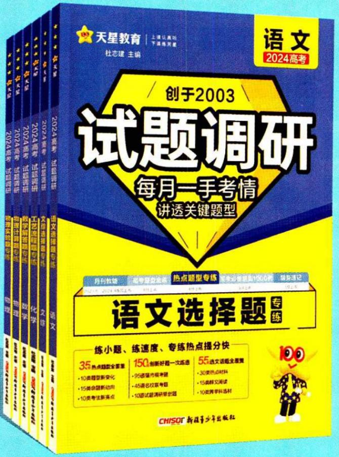

text_image

天星教育
杜志建 主编
语文
2024高考
创于2003
试题调研
每月一手考情
讲透关键题型
月刊数据
热点题型专题
语文选择题 专练
150创新好程一次选题
95增强成绩考题
45语言校萃专题
10试题调研聚全题
55语文话题全展览
30美热点材料
15典群义阅读
10美青年科技选材
CHISOR 新技青少年出版社

创新上市热销中

抓热点 专项突破稳拿分

练速度 小题速解快得分

提准度 大题巧解拿高分

》本套书共25本，具体书目详见“2024《试题调研》全程提分方略”（正文最后一页）

2024版《试题调研》第5辑

特别推荐

英语作文技法 语文作文素材、技法 文综/理综大题冲关

text_image

天星教育
主编 杜宏基
第5辑·英语
月利数据 2024届考
创于2003
试题调研
每月一手考情
讲透关键题型
教程 等编 东西 等编 第5辑 等编 安通 比例 静误 非误
· 写作高分技法 ·
高分作文，赢在技法！
21热门命题作文实梦 26高分写作公式 33高分写作素材结构
· 解析提交的试题多和题
· 解析提交的试题多和题
· 一个论文是试题多和题
· 一个论文是试题多和题
· 一个论文是试题多和题
CHISO 海川少年红书局

微信公众号教辅资料站小考教辅站初高教辅站

英语作文，赢在技法活用素材，巧夺高分

text_image

天星教育
王薇 杜志雄
创于2003
试题调研
每月一手考情
讲透关键题型
作文素材(中)年度精选素材
巧用速成模板，播
CHISO
CHISO 新编少年儿童出版社
天星教育 主编 社文雄
创于2003
试题调研
每月一手考情
讲透关键题型
中文·语文
2024届考
1月刊编辑
CNYSI
每月一手考情
21高分搜读！
·作文高分
·写作艺术类教材
·写作艺术类教材
·写作艺术类教材
·写作艺术类教材
·写作艺术类教材
·写作艺术类教材
·写作艺术类教材
·写作艺术类教材
·写作艺术类教材
·写作艺术类教材
·写作艺术类教材
·写作艺术类教材
·写作艺术类教材
·写作艺术类教材
·写作艺术类教材
·写作艺术类教材
·写作艺术类教材
·写作 artistic素材
·写作艺术类教材
·写作艺术类教材
·写作艺术类教材
·写作艺术类教材
·写作艺术类教材
·写作艺术类教材
·写作艺术类教材
·写作艺术类教材
·写作艺术类教材
·写作艺术类教材
·写作艺术类教材
·写作艺术类教材
·写作艺术类教材
·写作艺术类教材
·写作艺术类教材
·写作艺术类教材
·写作文艺类教材
·写作文艺类教材
·写作文艺类教材
·写作文艺类教材
·写作文艺类教材
·写作文艺类教材
·写作文艺类教材
·写作文艺类教材
·写作文艺类教材
·写作文艺类教材
·写作文艺类教材
·写作文艺类教材
·写作文艺类教材
·写作文艺类教材
·写作文艺类教材
·写作文艺类教材
·写作文艺类教材
CHISO

巧用速成模板，拯救作文平庸活用时新素材，突破高分上限

text_image

天星教育
创于2003
试题调研
每月一手考情
讲透关键题型
· 大题冲关 ·
套路解题，规范考
3 高好快解模型 29 解题
· 多模策略与大题解法 2个步骤解答
· 求定思维与实践解法 1个步骤解答
· 实验设计与实践解法 2个步骤解答
第5辑·文科综合
第5辑·文科综合
第5辑·文科综合
· 大题冲关 ·
套路解题，规范答题，锁定高分！
11 解题技法概要 7 高分评错推理 5 创新题解题技法
· 大题解题方法：创新思维与实践解法 2. 空心与思维导论研究 1. 空心与思维导论研究 2. 空心与思维导论研究 3. 空心与思维导论研究 4. 空心与思维导论研究 5. 空心与思维导论研究 6. 空心与思维导论研究 7. 空心与思维导论研究 8. 空心与思维导论研究 9. 空心与思维导论研究 10. 空心与思维导论研究 11. 空心与思维导论研究 12. 空心与思维导论研究 13. 空心与思维导论研究 14. 空心与思维导论研究 15. 空心与思维导论研究 16. 空心与思维导论研究 17. 空心与思维导论研究 18. 空心与思维导论研究 19. 空心与思维导论研究 20. 空心与思维导论研究 21. 空心与思维导论研究 22. 空心与思维导论研究 23. 空心与思维导论研究 24. 空心与思维导论研究 25. 空心与思维导论研究 26. 空心与思维导论研究 27. 空心与思维导论研究 28. 空心与思维导论研究 29. 空心与思维导论研究 30. 空心与思维导论研究 31. 空心与思维导论研究 32. 空心与思维导论研究 33. 空心与思维导论研究 34. 空心与思维导论研究 35. 空心与思维导论研究 36. 空心与思维导论研究 37. 空心与思维导论研究 38. 空心与思维导论研究 39. 空心与思维导论研究 40. 空心与思维导论研究 41. 空心与思维导论研究 42. 空心与思维导论研究 43. 空心与思维导论研究 44. 空心与思维导论研究 45. 空心与思维导论研究 46. 空心与思维导论研究 47. 空心与思维导论研究 48. 空心与思维导论研究 49. 空心与思维导论研究 50. 空心与思维导论研究 51. 空心与思维导论研究 52. 空心与思维导论研究 53. 空心与思维导论研究 54. 空心与思维导论研究 55. 空心与思维导论研究 56. 空心与思维导论研究 57. 空心与思维导论研究 58. 空心与思维导论研究 59. 空心与思维导论研究 60. 空心与思维导论研究 61. 空心与思维导论研究 62. 空心与思维导论研究 63. 空心与思维导论研究 64. 空心与思维导论研究 65. 空心与思维导论研究 66. 空心与思维导论研究 67. 空心与思维导论研究 68. 空心与思维导论研究 69. 空心与思维导论研究 70. 空心与思维导论研究 71. 空心与思维导论研究 72. 空心与思维导论研究 73. 空心与思维导论研究 74. 空心与思维导论研究 75. 空心与思维导论研究 76. 空心与思维导论研究 77. 空心与思维导论研究 78. 空心与思维导论研究 79. 空心与思维导论研究 80. 空心与思维导论研究 81. 空心与思维导论研究 82. 空心与思维导论研究 83. 空心与思维导论研究 84. 空心与思维导论研究 85. 空心与思维导论研究 86. 空心与思维导论研究 87. 空心与思维导论研究 88. 空心与思维导论研究 89. 空心与思维导论研究 90. 空心与思维导论研究 91. 空心与思维导论研究 92. 空心与思维导论研究 93. 空心与思维导论研究 94. 空心与思维导论研究 95. 空心与思维导论研究 96. 空心与思维导论研究 97. 空心与思维导论研究 98. 空心与思维导论研究 99. 空心与思维导论研究

套路解题，规范答题
专攻大题，锁定高分

text_image

创于2003
试题调研
每月一手考情
讲透关键题型
微信公众号
教辅资料站
小考教辅站
初高教辅站

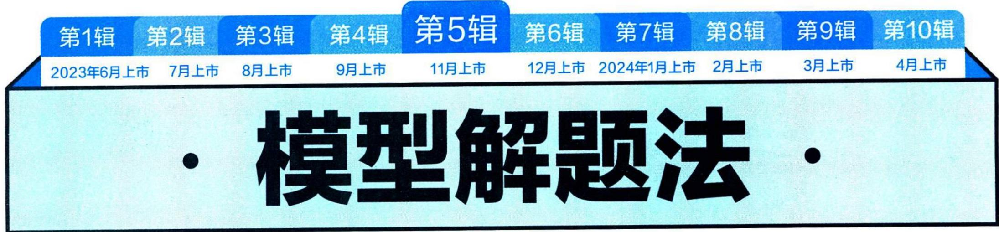

text_image

第1辑 第2辑 第3辑 第4辑 第5辑 第6辑 第7辑 第8辑 第9辑 第10辑
2023年6月上市 7月上市 8月上市 9月上市 11月上市 12月上市 2024年1月上市 2月上市 3月上市 4月上市
· 模型解题法 ·

# 特约名师

赵成海 正高级教师，河北省优秀教师，省级骨干教师。中国数学奥林匹克一级教练员，中国数学会会员，在国家级及省级等各类专业报刊上发表教育教学论文近二百篇。

王军 重庆一中数学教师，骨干教师，中国数学奥林匹克一级教练员，曾获“重庆市数学教学论文大赛一等奖”。

微信公众号

教辅资料站

小考教科站委

初高教辅站

赵成海 周鸿高 章礼抗 王博渊 王军 王铱 杨飞

# 图书在版编目(CIP)数据

试题调研. 第5辑 模型解题法 数学 / 杜志建主编
-- 乌鲁木齐：新疆青少年出版社，2023.11

ISBN 978-7-5590-0238-9

I. ①试… II. ①杜… III. ①中学数学课 - 高中 - 升学参考资料 IV. ①G634

中国国家版本馆 CIP 数据核字(2023)第 165525 号

出版人:徐江

策划: 王启全

责任编辑:多艳萍

# 试题调研第5辑 模型解题法 数学

# SHITI DIAOYAN DI 5 JI MOXING JIETIFA SHUXUE

杜志建 主编

出版:新疆青少年出版社有限公司

社址:乌鲁木齐市北京北路29号

邮政编码:830012

电话:0991-6239223(编辑部)

0371-68698015(读者服务部)

官网:http://www.qingshao.net

天猫旗舰店:http://xjqss.tmall.com

发行:新疆青少年出版社有限公司

经销:各地新华书店

法律顾问: 王冠华 18699089007

印刷:郑州市欣隆印刷有限公司

开 本:787mm×1092mm 1/16

版 次:2023年11月第1版

印 张:7

印 次:2023年11月第1次印刷

字 数:130 千字

书号:ISBN 978-7-5590-0238-9

定 价:18.90元

CHISO 青少社
SINCE 1956

版权所有，侵权必究。印装问题可随时同印厂退换。

# 声 明

基于对知识和创作的尊重,本书向所选文章、图片的作者支付补贴。因条件所限未能及时联系的作者,我们在此深表歉意,当您看到本书时,请与我们联系,以便我们向您支付补贴和赠送样书。联系方式:0371-68698015。

# 一个模型，理清千失万绪

# 1 聚焦一手考情 深度解读2023高考创新情境

调研 3: (试题调研原创|宏图一号01组卫星,双空题)北京时间2023年3月30日18时50分,中国在太原卫星发射中心成功将宏图一号01组卫星发射升空,卫星顺利进入预定轨道,发射任务获得圆满成功,据了解,在不考虑空气动力和地球引

力的理想状态下,可以用公式 $v = v_{0} \cdot \ln \frac{M}{m}$ 计算火箭的最大速度 v (单位: $v_{0}$ (单位: m/s) 是喷流相对速度, m (单位: kg) 是火箭 (除推进剂外) 的质 kg) 是推进剂与火箭质量的总和, $\frac{M}{m}$ 称为总质比, 创新命题解读: 结合学科知识、学习实践

物理、科技双交汇，强调应用

微信公众号
用(P002)
教辅资料站
小考教辅站
一次联考改编
初高教辅站
不知部分a写

调研 4: (黄金分割12024江西吉安一中、临川一中等校第一次联考文献多选)把一条线段分割为两部分,使较长部分 b 与全长 $a + b$ 的比值等于较短部分 a 同较长部分 b 的比值,为 $\frac{\sqrt{5} - 1}{2}$ ,这个比值就叫作黄金分割比,黄金分割比被公认为是最具有美感的.四名同学对此展开了探究,下列说法中正确的是()

A. 若椭圆 $\Gamma$ 的焦点在 x 轴上, 上顶点为 B, 右顶点为 A, 左焦点为 F. 小欧提出只要 $\overrightarrow{BF} \cdot \overrightarrow{BA} = 0$ , 椭圆 $\Gamma$ 的离心率 e 就等于 $\frac{\sqrt{5} - 1}{2}$

创新命题解读:本题在以数学文化为背景的相同的已知条件下,每个选项所考查的数学知识各异,是典型的综合性情境题 选项 A 考查解析 π.

多知识考查，重视综合（P003）

# 2 科学建构解题模型 扫清解题障碍，高效解题得高分

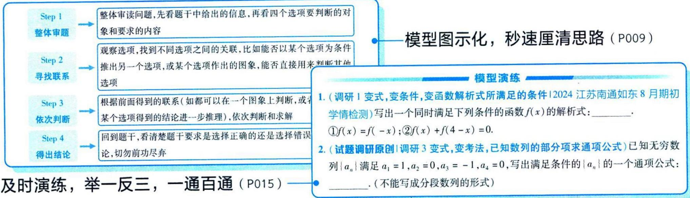

flowchart

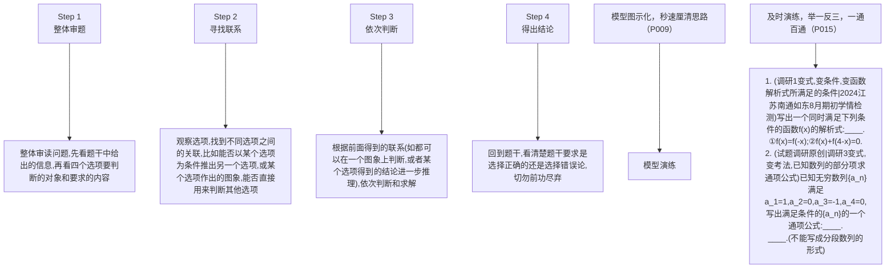
```mermaid
graph TD
    A["Step 1<br>整体审题"] --> B["整体审读问题,先看题干中给出的信息,再看四个选项要判断的对象和要求的内容"]
    C["Step 2<br>寻找联系"] --> D["观察选项,找到不同选项之间的关联,比如能否以某个选项为条件推出另一个选项,或某个选项作出的图象,能否直接用来判断其他选项"]
    E["Step 3<br>依次判断"] --> F["根据前面得到的联系(如都可以在一个图象上判断,或者某个选项得到的结论进一步推理),依次判断和求解"]
    G["Step 4<br>得出结论"] --> H["回到题干,看清楚题干要求是选择正确的还是选择错误论,切勿前功尽弃"]
    I["模型图示化，秒速厘清思路（P009）"] --> J["模型演练"]
    K["及时演练，举一反三，一通百通（P015）"] --> L["1. (调研1变式,变条件,变函数解析式所满足的条件|2024江苏南通如东8月期初学情检测)写出一个同时满足下列条件的函数f(x)的解析式:____.<br>①f(x)=f(-x);②f(x)+f(4-x)=0.<br>2. (试题调研原创|调研3变式,变考法,已知数列的部分项求通项公式)已知无穷数列{a_n}满足a_1=1,a_2=0,a_3=-1,a_4=0,写出满足条件的{a_n}的一个通项公式:____.<br>____.(不能写成分段数列的形式)"]
```

# 3 巧构创新题模型 有“技”可循，玩转新题多抢分

二级结论:有关以 e 为底的指数、对数不等式及其应用

① $e^{x}\geqslant x+1$ ，② $e^{x}\leqslant\frac{1}{1-x}(x<1)$ ，③ $x-\frac{x^{2}}{2}\leqslant\ln(1+x)\leqslant x$ ，④ $1-\frac{1}{x}\leqslant\ln x\leqslant x-1$ 。以下给出证明：

①思路一 由 $e^{x}=1+x+\frac{x^{2}}{2!}+\cdots+\frac{x^{n}}{n!}+\cdots(e^{x}$ 的泰勒展开式），则 $e^{x}\geqslant1$ 号成立）。思路二 设 $f(x)=e^{x}-1-x$ ，通过求导知当 $x\in(-\infty,0)$ 时 $f(x)$ 单 $+\infty$ ）时 $f(x)$ 单调递增，因而 $f(x)\geqslant f(0)=0$ ，从而 $e^{x}\geqslant x+1$ 得证。

②在①中以 $-x$ 替换 $x$ ，得到不等式 $\mathrm{e}^{-x}\geqslant -x + 1$ ，即 $x <   1$ 时， $\mathrm{e}^x\leqslant \frac{1}{1 - x}$

多法并举，压轴热点逐个攻破（P021）

建构二级结论模板，

攻克高数接轨难题（P017）

2.(1)方法一:常规求导 $f(x)$ 的定义域为 $(0,+\infty)$ ，则 $f'(x)=\left(\frac{1}{x}-\frac{1}{x^{2}}\right)e^{x}-\frac{1}{x}+1=\frac{1}{x}(1-\frac{1}{x})e^{x}+(1-\frac{1}{x})=\frac{x-1}{x}\left(\frac{e^{x}}{x}+1\right)$ ，令 $f'(x)=0$ ，得 x=1。当 $x\in(0,1)$ 时， $f'(x)<0$ ， $f(x)$ 单调递减；当 $x\in(1,+\infty)$ 时， $f'(x)>0$ ， $f(x)$ 单调递增。
所以 $f(x) \geqslant f(1) = e + 1 - a$ ，若 $f(x) \geqslant 0$ ，则 $e + 1 - a \geqslant 0$ ，即 $a \leqslant e + 1$ ，所以 a 的取值范围为
【会翻译】将题眼“函数 $f(x)$ 的图象不在x轴的下方”翻译为数学语言“ $f(x)\geqslant0$ ” $(-∞,e+1]$ .

方法二：同构处理 由 $f(x) \geqslant 0$ 得 $\mathrm{e}^{-\ln x + x} + x - \ln x - a \geqslant 0$ ，令 $t = x - \ln x, t \geqslant 1$ ，则 $f(t) = \mathrm{e}^t + t - a \geqslant 0$ ，即 $a \leqslant \mathrm{e}^t + t.$

微信公众号教辅资料站小考教辅站初高教辅站

# 本书7类80道创新好题速览

<table><tr><td>具体考法</td><td>原创新题</td><td>变式好题</td><td>创新设问</td><td>真实情境</td><td>模块交汇</td><td>接轨高数</td><td>学科融合</td></tr><tr><td>本书题量</td><td>22</td><td>21</td><td>12</td><td>8</td><td>7</td><td>4</td><td>6</td></tr></table>

# 亮点速览

新情境 安全进入车库的一
氧化碳浓度 P001

新考法 实际中的测量应用
问题 P002

新趋势 数学与科技、物理
交汇融合 P003

新题型 开放性填空题 P014

新角度 用二级结论快解高
数接轨题 P017

新思路 用对称消元法证明
不等式成立 P019

新考法 新定义有界数列与无界数列 P027

新考法 嵌套函数的零点问题 P035

新角度 同时关于指数、对数、三角函数的恒成立问题P040 微信公众号教辅资料站小考教辅站初高教辅站

# CONTENTS

# 目录

# 每月一手考情

微信公众号
教辅资料站
小考教辅站
初高教辅站

# 聚焦热点情境命题的 3 大创新考向

创新考向 1 应用性情境命题 001

创新考向 2 综合性情境命题 003

创新考向 3 转化性情境命题 007

# 模型巧突破

# 巧用 5 类思维模型，快解创新热点问题

模型 1 用大局观快解多选题 009

模型 2 用特值思想快解答案不唯一填空题 013

模型 3 用二级结论快解高数接轨题 017

模型 4 用假设存在思想快解存在性探索题 022

模型 5 用综合法快解新情境背景下的数列创新题 027

# 妙用 10 类技法模型，速解核心必考问题

模型 1 用设而不求法速解函数零点问题 031

模型 2 用换元思想速解函数嵌套问题 034

模型 3 用端点效应速解不等式恒成立问题 038

模型 4 用临界思想速解取值范围问题 041

模型 5 用同构思想速解指、对型比大小问题 044

模型 6 用参变分离法速解参数的取值范围问题 048

模型 7 用放缩思想速解不等式证明问题 052

模型 8 用定量 + 定性双法分析立体几何中的求角问题
056

模型 9 用分类讨论思想速解分段数列问题 060

模型 10 用点差法速解圆锥曲线的中点弦问题 064

# 会用 6 类图象模型，巧解高频关键问题

模型 1 公切线模型 069

模型 2 翻折模型 072

模型 3 “加线三角形” 模型 076

模型 4 四边形或多边形背景下的解三角形模型 080

模型 5 圆锥曲线中的几何图形模型 083

模型 6 圆锥曲线中的斜率模型 087

# 必用 5 类解题模型，会解专项疑难问题

微信公众号教辅资料站小考教辅站初高教辅站

模型 1 研究函数 $y = A \sin(\omega x + \varphi)$ 的性质与图象 090

模型 2 破解动态几何中轨迹与截面问题 094

模型 3 平面向量几何意义的应用 098

# 亮点速览

新思路 用作图法探究周期函数的零点问题 P050

新趋势 含三角函数的不等式证明P054

新题型 双空题 P071

新角度 平面三角函数图象
与立体几何创新交
汇 P072

新趋势 梯形的翻折模型
P073

新考法 求三棱锥外接球的
表面积 P074

新趋势 动态几何中的轨迹
与截面问题 P094

新角度 平面向量与解三角形交汇 P098

新情境 投篮活动中的命中
概率探求 P101

# 目录

# CONTENTS

模型 4 条件概率与全概率公式的应用

100

模型 5 抽象函数与函数性质的综合

103

# 下辑精彩预告 2023年12月全新上市

# 《试题调研》第6辑将推出

——高频易错点快攻

# 聚焦一手考情

解读融合最新热点的数学应用题，如：杭州亚运会中的概率计算题，网红大熊猫的分配问题，以进博会为情境的决策性问题……知最新热点，练原创新题！

# 攻克易错快提分

关键题型高频易错点 挖掘信息问题中的失分陷阱，如新定义问题抓不到定义的本质、不会从情境题中抽出数列关系、跨学科渗透题不会提取关键信息等；速纠图表问题中的高频易错，如几何问题不会作辅助线、不会用图象解决嵌套函数的零点问题等。抓易错，补短板，纠误区，考场提分必杀技！

核心主干知识易错点 挖掘教材盲点，如泰勒展开式、海伦公式等；厘清相近概念，如“单调区间”与“在区间上单调”，“项的系数”与“二项式系数”，曲线上的点与切点等；填补逻辑思维漏洞，如函数的定义域漏洞，函数零点赋值漏洞，基本不等式使用前提漏洞等；科学使用技法，如用最值法弥补基本不等式的“漏洞”，正确数形结合等。洞悉命题人爱挖的陷阱，定位自己最易失分的地方，归纳整理易错易失分点，全面提升解题能力！

# 速记失分稳提升

微信公众号教辅资料站小考教辅站初高教辅站

图表化呈现最实用、高考最易失分的高频易错点，助你快速厘清易混概念、定理等，速背，减负增效，完胜2024高考！

# 每月一手考情

# 聚焦热点情境命题的 3 大创新考向

河北正高级教师 赵成海

# 创新考向 1 应用性情境命题

调研 1 (试题调研原创|多选) 某地下车库在排气扇发生故障的情况下测得空气中一氧化碳含量达到了危险状态, 经抢修, 排气扇恢复正常, 排气 4 分钟后测得车库内的一氧化碳浓度为 81 单位, 继续排气 4 分钟后又测得浓度为 27 单位. 由检验知该地下车库一氧化碳浓度 $y$ 与排气时间 $t$ (分) 之间存在函数关系 $y = f(t)$ , 其中 $\frac{f'(t)}{f(t)} = R$ ( $R$ 为常数). 若空气中一氧化碳浓度不高于 0.5 单位为正常, 人就可以安全进入车库了, 则下列说法错误的是 ( )

A. $R = -\frac{\ln 3}{4}$

B. $R = \mathrm{e}^{-\frac{1}{3}}$

C. 排气 20 分钟后, 可以安全进入车库 D. 排气 24 分钟后, 可以安全进入车库

思路导引 由题意可设 $f(t)=ka^{t}(ka\neq0)$ ，再由已知列出关于k,a的方程组，求出k,a，

【突破瓶颈】本题的难点是建立函数 $f(t)$ 的模型，当看到上述设法时，想必你会有些疑惑，为什么设成指数形式？原因是：通过已知中的两组量(4,81)，(8,27)分析，函数图象必过这两点，而一开始达到危险状态时，一氧化碳的浓度达到最大值，说明所要建构的函数图象与y轴有交点，再从实际角度分析，随排放时间的推移，其含量趋近于0，但一般不会达到0，若设成直线型，必与x轴相交，不符合实际，同时，也不满足 $f'(t)$ 为常数，因而设成曲线型，而且函数是单调递减的，从学过的函数模分析，指数形式是比较接近这种情况的（如图1所示）

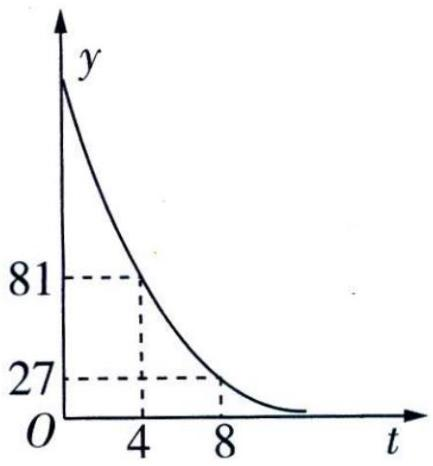

line

| t | y  |
|---|----|
| 4 | 81 |
| 8 | 27 |

图1

判断 AB; 由 $f(t) \leqslant 0.5$ 求得 t 的范围, 判断 CD.

微信公众号教辅资料站小考教辅站初高教辅站

图书反馈

图书反馈赢新书! 如果你发现图书错误或对图书有好的建议,请扫描左侧二维码反馈. 错误经过核实或建议被采纳的,将给予赠书奖励(同类错误或建议限前五名).

关注微信公众号“初高教辅站”获取更多初高中教辅资料

解析

<table><tr><td>选项</td><td>分析过程</td><td>正误</td></tr><tr><td>A</td><td>由题意可设 $f(t) = ka^{t}$ ,其中 $k > 0, a \in (0,1)$ ,则 $f'(t) = ka^{t}\ln a$ ,此时 $\frac{f'(t)}{f(t)} = \ln a$ ,为常数,符合题设条件,【敲黑板】对于设出的新函数,要先验证符合题意,才能进行进一步运算</td><td rowspan="2">√</td></tr><tr><td>B</td><td>由 $\begin{cases} 81 = ka^{4}, \\ 27 = ka^{8} \end{cases}$ 解得 $\begin{cases} a = \left( \frac{1}{3} \right)^{\frac{1}{4}}, \\ k = 243, \end{cases}$ 所以 $f(t) = 243 \cdot \left( \frac{1}{3} \right)^{\frac{t}{4}}$ , $R = -\frac{\ln 3}{4}$ </td></tr><tr><td>C</td><td>由 $243 \cdot \left( \frac{1}{3} \right)^{\frac{t}{4}} \leqslant 0.5$ 得 $t \geqslant 20 + 4\log_{3}2$ ,而 $\log_{3}2 \in (0,1)$ ,</td><td>×</td></tr><tr><td>D</td><td>所以排气24分钟后,人可以安全进入车库</td><td>√</td></tr></table>

故选BC.

调研 2 (试题调研原创) 如图 2, 为测量某塔的总高度 $AB$ (单位: 米), 选取与塔底 $B$ 在同一水平面内的两个测量基点 $C$ 与 $D$ , 现测得 $\angle BCD = 30^{\circ}, \angle BDC = 45^{\circ}, CD = 20$ , 在 $C$ 点测得塔顶 $A$ 的仰角为 $60^{\circ}$ , 则 $AB =$ \_\_\_\_.

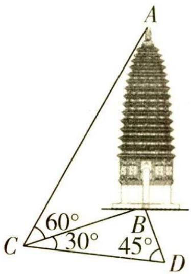

text_image

A
60°
C 30° B
45° D

图2

解析 在 $\triangle BCD$ 中, $\angle BCD=30^{\circ}, \angle BDC=45^{\circ}$ ,

则 $\angle DBC = 180^{\circ} - \angle BCD - \angle BDC = 105^{\circ}$ ,

$$
\sin 1 0 5 ^ {\circ} = \sin (6 0 ^ {\circ} + 4 5 ^ {\circ}) = \sin 6 0 ^ {\circ} \cos 4 5 ^ {\circ} + \cos 6 0 ^ {\circ} \sin 4 5 ^ {\circ} = \frac {\sqrt {6} + \sqrt {2}}{4},
$$

由正弦定理得 $\frac{CD}{\sin\angle DBC}=\frac{BC}{\sin\angle BDC}$ ，即 $\frac{20}{\sin105^{\circ}}=\frac{BC}{\sin45^{\circ}}$

【用定理】三角形中已知两角和一边，往往利用正弦定理

所以 $\sin 105^{\circ} \cdot BC = 20\sin 45^{\circ}$ ，得 $BC = 20(\sqrt{3} - 1)$ .

在 Rt△ABC 中，∠ACB = 60°，

则 $AB = BC \tan \angle ACB = 20(\sqrt{3} - 1) \times \sqrt{3} = 20(3 - \sqrt{3})$ .

调研 3: (试题调研原创|宏图一号01组卫星,双空题)北京时间2023年3月30日18时50分,中国在太原卫星发射中心成功将宏图一号01组卫星发射升空,卫

# 数说亚运

小编说:杭州第19届亚运会已于10月8日圆满闭幕,从数字角度,本届亚运会有哪些不一样的解读呢?和小编一起来统计吧!

星顺利进入预定轨道,发射任务获得圆满成功.据了解,在不考虑空气动力和地球引力的理想状态下,可以用公式 $v=v_{0}\cdot\ln\frac{M}{m}$ 计算火箭的最大速度v(单位:m/s),其中 $v_{0}$ (单位:m/s)是喷流相对速度,m(单位:kg)是火箭(除推进剂外)的质量,M(单位:kg)

是推进剂与火箭质量的总和, $\frac{M}{m}$ 称为总质比,已知A型火箭的喷流相对速度为2000 m/s.当总质比为200时,利用给出的参考数据得A型火箭的最大速度为\_\_\_\_;经过材料更新和技术改进后,A型火箭的喷流相对速度提高到了原来的 $\frac{3}{2}$ 倍,总质比变为原来的 $\frac{1}{3}$ ,若要使火箭的最大速度至少增加1000 m/s,则在材料更新和技术改进前总质比的最小整数值为\_\_\_\_.(参考数据: $\ln 200 \approx 5.3, 2.718 < e < 2.719$ )

创新命题解读: 结合日常生活、其他学科知识、学习实践中的素材等, 发现问题、提出问题, 并运用数学知识、思想方法, 通过独立思考、探索和研究, 分析、解决问题是高考命题对创新能力考查的重点之一. 本题结合科技、物理知识建立函数模型, 通过近似运算、解不等式求解, 符合最新考查趋势.

解析 第一空 当总质比为 200 时, $v = 2000 \times \ln 200 \approx 2000 \times 5.3 = 10600 (\mathrm{~m} / \mathrm{s})$ ,

微信公众号

所以当总质比为 200 时, A 型火箭的最大速度约为 10 600 m/s.

第二空 由题意,经过材料更新和技术改造后,火箭的喷流相对速度为 $3000 \mathrm{~m} / \mathrm{s}$ , 总质比从 $\frac{M}{m}$ 变为 $\frac{M}{3 m}$ , 要使火箭的最大速度至少增加 $1000 \mathrm{~m} / \mathrm{s}$ , 则需 $3000 \cdot \ln \frac{M}{3 m} - 2000 \cdot \ln \frac{M}{m} \geqslant 1000$ ,

化简得 $3\ln\frac{M}{3m}-2\ln\frac{M}{m}\geqslant1$ ，所以 $\ln(\frac{M}{3m})^{3}-\ln(\frac{M}{m})^{2}\geqslant1$ ，

【抓关键】由已知建立不等式模型，解对数不等式

整理得 $\ln \frac{M}{27m} \geqslant 1$ ，则 $\frac{M}{m} \geqslant 27\mathrm{e}$ ，

由参考数据知 2.718 < e < 2.719, 所以 73.386 < 27e < 73.413,

所以材料更新和技术改进前总质比的最小整数值为74.

【盯题眼】注意题目所求为最小整数值，切勿因为审题不认真得到错误结果

# 创新考向2 综合性情境命题

调研 4: (黄金分割|2024 江西吉安一中、临川一中等校第一次联考改编|多选)把一条线段分割为两部分,使较长部分 b 与全长 $a + b$ 的比值等于较短部分 a 与较长部分 b 的比值,为 $\frac{\sqrt{5} - 1}{2}$ ,这个比值就叫作黄金分割比,黄金分割比被公认为是最

数说亚运

具有美感的. 四名同学对此展开了探究, 下列说法中正确的是 ( )

A. 若椭圆 $\Gamma$ 的焦点在 x 轴上, 上顶点为 B, 右顶点为 A, 左焦点为 F. 小欧提出只要 $\overrightarrow{BF} \cdot \overrightarrow{BA} = 0$ , 椭圆 $\Gamma$ 的离心率 e 就等于 $\frac{\sqrt{5} - 1}{2}$   
B. 一顶角等于 $36^{\circ}$ 的等腰三角形, 小斯通过正、余弦定理和二倍角公式, 算得该三角形底边长与腰长的比值等于 $\frac{\sqrt{5} - 1}{2}$   
C. 假设 $n \in \mathbf{N}^{*}$ , 小莱发现若公比大于 0 的等比数列 $\{a_{n}\}$ 中的项满足著名的斐波那契数列

创新命题解读:本题在以数学文化为背景的相同的已知条件下, 每个选项所考查的数学知识各异, 是典型的综合性情境题. 选项 A 考查解析几何与向量; 选项 B 考查解三角形; 选项 C 考查数列; 选项 D 考查对数运算及性质. 本题体现了很强的综合性, 解题策略是根据题目特性, 对每个选项逐个击破.

$\{f_n\}$ 的递推公式 $f_{n + 2} = f_{n + 1} + f_n$ ，则数列 $\{a_{n}\}$ 的公比等于 $\frac{\sqrt{5} - 1}{2}$   
D. 小利在阅读时了解到: 古老的雅典帕特农神庙, 其柱顶至屋顶的距离 a 与柱高 b 满足 $\log_{4}a = \log_{6}b = \log_{9}(a + b)$ , 则 $\frac{a}{b} = \frac{\sqrt{5} - 1}{2}$

# 解析

<table><tr><td>选项</td><td>分析过程</td><td>正误</td></tr><tr><td>A</td><td>设椭圆 $\Gamma$ 的方程为 $\frac{x^{2}}{a^{2}}+\frac{y^{2}}{b^{2}}=1(a>b>0)$ ,则 $A(a,0)$ , $B(0,b)$ , $F(-c,0)$ .由 $\overrightarrow{BF} \cdot \overrightarrow{BA}=0$ 得 $(-c,-b) \cdot (a,-b)=-ac+b^{2}=0$ ,即 $c^{2}+ac-a^{2}=0$ ,即 $e^{2}+e-1=0$ ,可得 $e=\frac{\sqrt{5}-1}{2}$ (负值舍去)</td><td>√</td></tr><tr><td>B</td><td>设该三角形底边长为x,腰长为y.由正弦定理得 $\frac{x}{y}=\frac{\sin36^{\circ}}{\sin72^{\circ}}=\frac{1}{2\cos36^{\circ}}$ ,即 $\frac{1}{\cos36^{\circ}}=\frac{2x}{y}$ 1;又由余弦定理得 $\cos36^{\circ}=\frac{2y^{2}-x^{2}}{2y^{2}}=1-\frac{1}{2}\left(\frac{x}{y}\right)^{2}$ 2.联立【用定理】分别由正、余弦定理得到关于边长与腰长的方程,联立方程即可12得 $(\frac{x}{y})^{3}-\frac{2x}{y}+1=0$ ,即 $(\frac{x}{y}-1)\left[(\frac{x}{y})^{2}+\frac{x}{y}-1\right]=0$ .由于 $\frac{x}{y}\neq1,\frac{x}{y}>0$ ,故 $\frac{x}{y}=\frac{\sqrt{5}-1}{2}$ </td><td>√</td></tr></table>

# 数说亚运

续表

<table><tr><td>选项</td><td>分析过程</td><td>正误</td></tr><tr><td>C</td><td>设数列 $\{a_n\}$ 的公比为 $q,q>0$ ,则 $\frac{a_{n+2}}{a_{n+1}}=\frac{a_{n+1}}{a_n}=q$ .由题意得 $a_{n+2}=a_{n+1}+a_n$ ,两边同除以 $a_n$ ,整理得 $q^2-q-1=0$ ,解得 $q=\frac{1+\sqrt{5}}{2}$ 【敲黑板】由等比数列的性质,等式两边同时除以 $a_n$ ,可得关于公比的方程</td><td>×</td></tr><tr><td>D</td><td>设 $\log_4a=\log_6b=\log_9(a+b)=k$ ,则 $a=4^k,b=6^k,a+b=9^k$ .【选方法】结合对数的性质,找到 $a,b$ 的等量关系即可由 $(6^k)^2=4^k\times 9^k$ 得 $b^2=a(a+b)$ ,即 $a^2+ab-b^2=0$ ,则 $(\frac{a}{b})^2+\frac{a}{b}-1=0$ ,又 $\frac{a}{b}>0$ ,解得 $\frac{a}{b}=\frac{\sqrt{5}-1}{2}$ </td><td>√</td></tr></table>

调研 5: (2024 浙江省 A9 协作体 9 月联考 | 多选 | 偏难) 已知数列 $\{a_{n}\}$ 为正项数列, 前 $n$ 项和为 $S_{n}, a_{1} = 1$ , 满足 $a_{n+1} = \sqrt{S_{n}^{2} + S_{n} + 1} (n \in \mathbf{N}^{*})$ , 则下列说法正确的是 ( )

A. 长度为 $a_{n+1}, S_n, 1$ 的三条线段可以围成一个有内角为 $\frac{\pi}{3}$ 的三角形

B. $2a_{n} \cdot \cos \frac{\pi}{3 \cdot 2^{n}} = a_{n + 1}$

C. $S_{n} = \frac{\sqrt{3}}{2\tan\frac{\pi}{3\cdot 2^{n}}} -\frac{1}{2}$

D. $S_{n} \leqslant 1 + \sqrt{3}(2^{n - 1} - 1)$

创新命题解读: 本题是综合性情境题, 已知数列的递推关系, 综合考查解三角形、简单的三角方程、三角恒等变形、换元法等, 求解过程中体现了各种转化的思想方法, 因此也是典型的转化情境题, 难度较大, 请读者根据自身情况选择挑战和练习.

解析 对于 A, 假设符合题意的三角形存在, 设边长为 $a_{n+1}$ 的边对应的内角为 $\alpha$ , 因为 $a_{n+1} = \sqrt{S_n^2 + S_n + 1}, S_n \neq 0$ , 所以 $\cos \alpha = \frac{S_n^2 + 1 - a_{n+1}^2}{2S_n} = -\frac{1}{2}$ , 又 $0 < \alpha < \pi$ , 所以 $\alpha = \frac{2\pi}{3}$ , 即边长为 $a_{n+1}$ 的边对应的内角为 $\frac{2\pi}{3}$ , 故 A 错误.

【释疑解惑】既然是考查能否构成三角形，为什么选择上述解法计算？这里蕴含对已知条件的转化与判断：要判断能否围成一个有内角为 $\frac{\pi}{3}$ 的三角形，可以先确定最大角的取值。由已知

# 数说亚运

杭州“大莲花”里有一支专门用来运输铁饼的机器狗团队,这些机器狗的跑步速度在3.5米/秒左右,一场比赛下来,大约可以替人跑7200米的距离.

$a_{n+1}=\sqrt{S_{n}^{2}+S_{n}+1}>1$ ， $a_{n+1}^{2}-S_{n}^{2}=S_{n}+1>0$ ，可知三个量中 $a_{n+1}$ 是最大的。由最大角是 $\frac{2\pi}{3}$ ，可知三角形其他两个内角都不可能为 $\frac{\pi}{3}$ ，从而确定选项的正误

因为 $a_{n + 1} = \sqrt{S_n^2 + S_n + 1} = \sqrt{(S_n + \frac{1}{2})^2 + \frac{3}{4}} = \frac{\sqrt{3}}{2}\sqrt{1 + (\frac{2S_n + 1}{\sqrt{3}})^2}$

所以 $\frac{2}{\sqrt{3}} (S_{n + 1} - S_n) = \sqrt{1 + (\frac{2S_n + 1}{\sqrt{3}})^2}$ 即 $\frac{2S_{n + 1} + 1}{\sqrt{3}} = \frac{2S_n + 1}{\sqrt{3}} +\sqrt{1 + (\frac{2S_n + 1}{\sqrt{3}})^2}.$

令 $x_{n} = \frac{2S_{n} + 1}{\sqrt{3}}$ ，则 $x_{n + 1} = x_n + \sqrt{1 + x_n^2}$

【扫清障碍】对于 $x + \sqrt{1 + x^{2}}$ 的形式，往往选取三角换元法，可设 $x = \tan \theta$ ，用公式 $1 + \tan^{2} \theta = \frac{1}{\cos^{2} \theta}$ 去根号，也可以设 $x = \frac{1}{\tan \theta}$ ，用公式 $1 + \frac{1}{\tan^{2} \theta} = \frac{1}{\sin^{2} \theta}$ 去根号；对于 $x + \sqrt{1 - x^{2}}$ 的形式，可设 $x = \cos \theta$ ，用公式 $1 - \cos^{2} \theta = \sin^{2} \theta$ 去根号。不管选取哪一个，都要注意角的取值范围

令 $x_{n} = \frac{1}{\tan\theta_{n}},\theta_{n}$ 为锐角，则 $\frac{1}{\tan\theta_{n + 1}} = \frac{1}{\tan\theta_n} +\sqrt{1 + \frac{1}{\tan^2\theta_n}} = \frac{\cos\theta_n}{\sin\theta_n} +\sqrt{\frac{1}{\sin^2\theta_n}} = \frac{\cos\theta_n + 1}{\sin\theta_n} =$ $\frac{2\cos^2\frac{\theta_n}{2}}{2\sin\frac{\theta_n}{2}\cos\frac{\theta_n}{2}} = \frac{1}{\tan\frac{\theta_n}{2}}$ ，所以 $\tan \theta_{n + 1} = \tan \frac{\theta_n}{2}$ ，所以 $\theta_{n + 1} = \frac{\theta_n}{2}$

又 $S_{1} = a_{1} = 1$ ，所以 $x_{1} = \frac{2S_{1} + 1}{\sqrt{3}} = \sqrt{3} = \frac{1}{\tan\theta_{1}}$ 即 $\tan \theta_1 = \frac{\sqrt{3}}{3}$ 所以 $\theta_{1} = \frac{\pi}{6}$

所以 $\theta_{n}=\frac{\pi}{6}\cdot\left(\frac{1}{2}\right)^{n-1}=\frac{\pi}{3\cdot2^{n}},\frac{2S_{n}+1}{\sqrt{3}}=\frac{1}{\tan\frac{\pi}{3\cdot2^{n}}},S_{n}=\frac{\sqrt{3}}{2\tan\frac{\pi}{3\cdot2^{n}}}-\frac{1}{2}$ ，故 C 正确.

所以 $a_{n+1}=\frac{\sqrt{3}}{2}\sqrt{1+\left(\frac{2S_{n}+1}{\sqrt{3}}\right)^{2}}=\frac{\sqrt{3}}{2\sin\frac{\pi}{3\cdot2^{n}}}$ ,

【突破瓶颈】这里的计算化简也用到公式 $1 + \frac{1}{\tan^2\theta} = \frac{1}{\sin^2\theta}$

当 $n \geqslant 2$ 时, $a_{n} = \frac{\sqrt{3}}{2\sin\frac{2\pi}{3\cdot 2^{n}}}$ , 又 $a_{1} = 1$ 也适合该式, 所以 $a_{n} = \frac{\sqrt{3}}{2\sin\frac{2\pi}{3\cdot 2^{n}}}$ ,

又 $a_{n} = \frac{\sqrt{3}}{2\sin\frac{2\pi}{3\cdot 2^{n}}} = \frac{\sqrt{3}}{4\sin\frac{\pi}{3\cdot 2^{n}}\cdot\cos\frac{\pi}{3\cdot 2^{n}}}$ 所以 $2a_{n}\cdot \cos \frac{\pi}{3\cdot 2^{n}} = a_{n + 1}$ 故B正确.

构造 $f(x)=\sin\frac{\pi}{6}x-x\sin\frac{\pi}{6}=\sin\frac{\pi}{6}x-\frac{1}{2}x,0<x\leqslant\frac{1}{2}$ ，则 $f'(x)=\frac{\pi}{6}\cos\frac{\pi}{6}x-\frac{1}{2}$ .

# 数说亚运

杭州第 19 届亚运会竞赛项目设置为:40 个大项,61 个分项,481 个小项. 参赛运动员人数超过 12 000 名.

记 $g(x)=\frac{\pi}{6}\cos\frac{\pi}{6}x-\frac{1}{2}$ ，则 $g'(x)=-\frac{\pi^{2}}{36}\sin\frac{\pi}{6}x$ ，当 $0<x\leqslant\frac{1}{2}$ 时， $g'(x)<0$ ，所以 $f'(x)$ 在 $(0,\frac{1}{2}]$ 上单调递减，所以 $f'(x)\geqslant\frac{\pi}{6}\cos\frac{\pi}{12}-\frac{1}{2}>0$ ，所以 $f(x)$ 在 $(0,\frac{1}{2}]$ 上单调递增，所以 $f(x)>0$ ，所以 $\sin\frac{\pi}{6}x>\frac{1}{2}x$ 。

又当 $x = 0$ 时， $\sin \frac{\pi}{6} x = \frac{1}{2} x$ ，所以 $\sin \frac{\pi}{6} x \geqslant \frac{1}{2} x, 0 \leqslant x \leqslant \frac{1}{2}$ ，

所以 $\sin \frac{\pi}{3\cdot 2^n} = \sin \frac{\pi}{6\cdot 2^{n - 1}}\geqslant \frac{1}{2^n}$ 所以 $a_{n + 1} = \frac{\sqrt{3}}{2\sin\frac{\pi}{3\cdot 2^n}}\leqslant \frac{\sqrt{3}}{2\cdot\frac{1}{2^n}} = \sqrt{3}\cdot 2^{n - 1},$

所以 $S_{n}=a_{1}+a_{2}+\cdots+a_{n}=1+a_{2}+\cdots+a_{n}\leqslant1+\sqrt{3}\cdot\frac{1-2^{n-1}}{1-2}=1+\sqrt{3}(2^{n-1}-1)$ ，故 D 正确.
故选 BCD.

# 创新考向 3 转化性情境命题

调研 6 (2024 重庆第十一中学 9 月第一次质量监测) 已知圆 $C_{1}: x^{2} + y^{2} - kx + 2y = 0$ 与圆 $C_{2}: x^{2} + y^{2} + ky - 2 = 0$ 的公共弦所在直线经过定点 $P$ , 且点 $P$ 在直线 $mx - ny - 2 = 0$ 上, 则 $m^{2} + 2n$ 的取值范围是 ( )

A. $[3, +\infty)$

B. $[2, +\infty)$

C. $[0,3]$

D. $[0,4]$

解析 将两圆方程直接相减得,两圆的公共弦方程为 $k(x+y)-2y-2=0$ .

【回归教材】此处利用了两圆方程相减的几何含义,来源于人教 A 版《选择性必修第一册》
P98【练习】第2题及【习题2.5】第9题

故定点坐标 $(x, y)$ 满足 $\left\{ \begin{array}{l} x + y = 0, \\ -2y - 2 = 0, \end{array} \right.$ 即 $\left\{ \begin{array}{l} x = 1, \\ y = -1, \end{array} \right.$ 故 $P(1, -1)$ .

又点 $P$ 在直线 $mx - ny - 2 = 0$ 上，故 $m + n - 2 = 0$ ，即 $m = 2 - n$

所以 $m^{2}+2n=(2-n)^{2}+2n=n^{2}-2n+4=(n-1)^{2}+3\geqslant3$

【选方法】通过消元法转化为二次函数的最值问题，用配方法求解

故 $m^{2}+2n$ 的取值范围是 $[3,+\infty)$ . 故选 A.

调研 7 (试题调研原创) 已知 $A(2,1)$ 为椭圆 $C: \frac{x^{2}}{a^{2}} + \frac{y^{2}}{b^{2}} = 1 (a > b > 0)$ 上的点, 过 $A$ 作两条斜率之积等于 $-\frac{1}{4}$ 的直线, 与椭圆 $C$ 交于 $A$ 以外的点 $M, N$ , 且 $M, N$ 关于原点对称.

(1) 求椭圆 C 的方程;

(2) 若点 M 到直线 AN 的距离 d=2, 求直线 AM 的方程.

# 数说亚运

40 个大项中,包括 31 个奥运项目,9 个非奥运项目,在保持 40 个大项目不变的前提下,增设电子竞技、霹雳舞两个项目.

解析 (1) 由已知得 $\frac{4}{a^2} + \frac{1}{b^2} = 1$ ①, 设 $M(x_1, y_1)$ ,

则 $N(-x_{1}, - y_{1}), k_{AM} = \frac{1 - y_{1}}{2 - x_{1}}, k_{AN} = \frac{1 + y_{1}}{2 + x_{1}}$ ，且 $\frac{x_1^2}{a^2} + \frac{y_1^2}{b^2} = 1$ ②.

①②两式相减得 $\frac{4-x_{1}^{2}}{a^{2}}+\frac{1-y_{1}^{2}}{b^{2}}=0$ ，所以 $\frac{1-y_{1}}{2-x_{1}}\cdot\frac{1+y_{1}}{2+x_{1}}=-\frac{b^{2}}{a^{2}}=-\frac{1}{4}$

【选方法】利用点差法表示出斜率乘积并转化, 事实上, 这就是椭圆的第三定义的应用因而 $a^{2}=4b^{2}$ , 代入①式, 得 $\frac{4}{4b^{2}}+\frac{1}{b^{2}}=1$ , 所以 $b^{2}=2, a^{2}=8$ ,

故椭圆方程为 $\frac{x^{2}}{8}+\frac{y^{2}}{2}=1.$

(2)由已知得,直线AM的斜率存在且不为0,设直线AM方程为 $y-1=k(x-2)$ .

由 $\left\{\begin{aligned}y-1&=k(x-2),\\ \frac{x^{2}}{8}&+\frac{y^{2}}{2}=1\end{aligned}\right.$ 消去 y 得关于 x 的方程 $(1+4k^{2})x^{2}+8k(1-2k)x+16k^{2}-16k-4=0,\Delta>0.$

由根与系数的关系得 $x_{1} \cdot 2 = \frac{16k^{2} - 16k - 4}{1 + 4k^{2}}$ ，即 $x_{1} = \frac{8k^{2} - 8k - 2}{1 + 4k^{2}}$

所以 $y_{1}=kx_{1}+1-2k=\frac{-4k^{2}-4k+1}{1+4k^{2}}$ ，即 $M\left(\frac{8k^{2}-8k-2}{1+4k^{2}},\frac{-4k^{2}-4k+1}{1+4k^{2}}\right)$ ，

易知直线 AN 的方程为 $y - 1 = -\frac{1}{4k}(x - 2)$ ，即 $x + 4ky - 4k - 2 = 0$ .

由点到直线的距离公式得 $d=\frac{\left|\frac{8k^{2}-8k-2}{1+4k^{2}}+4k\cdot\frac{-4k^{2}-4k+1}{1+4k^{2}}-4k-2\right|}{\sqrt{1+16k^{2}}}=2$

即 $\frac{|8k + 4|}{\sqrt{1 + 16k^2}} = 2$ ，解得 $k = -\frac{3}{16}$

所以直线 AM 的方程为 $y - 1 = -\frac{3}{16}(x - 2)$ ，即 $3x + 16y - 22 = 0$ .

# 速解

如图3,由对称性,将点M到直线AN的距离为2,转化为点O到直线AN的距离为1.设直线AM的方程为 $y-1=k(x-2)$ ,则直线AN【明关键】画出图象,根据图象特征进行转化,是后续简化运算的关键的方程为 $y-1=-\frac{1}{4k}(x-2)$ ,即 $x+4ky-4k-2=0$ .由点到直线的距离公式得 $\frac{|0+4k\cdot0-4k-2|}{\sqrt{1+16k^{2}}}=1$ ,即 $(4k+2)^{2}=1+16k^{2}$ ,得 $k=-\frac{3}{16}$ .所以直线AM的方程为 $y-1=-\frac{3}{16}(x-2)$ ,即 $3x+16y-22=0$ .

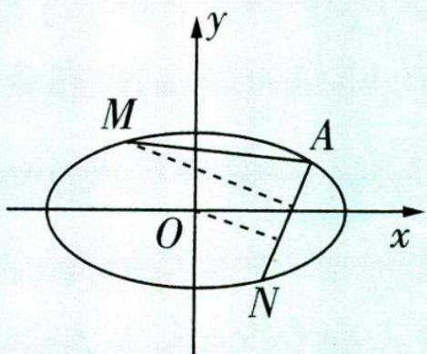

text_image

y
M
A
O
x
N

图3

# 数说亚运

尚未开幕,本届亚运会就已经创造一个记录:史上规模最大、项目最多、覆盖面最广的一届亚运会.

# 模型巧突破

# 巧用 5 类思维模型, 快解创新热点问题

# 型1 用大局观快解多选题

# 模型攻略

多选题作为高考改革后新出现的题型,由于其题型新、考查知识点灵活、综合性强,有时会让学生觉得无章可循,特别是四个选项独立的多选题(四个选项彼此独立,可当成四个小题做的多选题),很多学生解题前没有经过整体思考,对四个选项选用四个方法分别求解,耗费大量时间,不符合“小题小做”的原则.这里给出一种思维模型:用大局观求解.

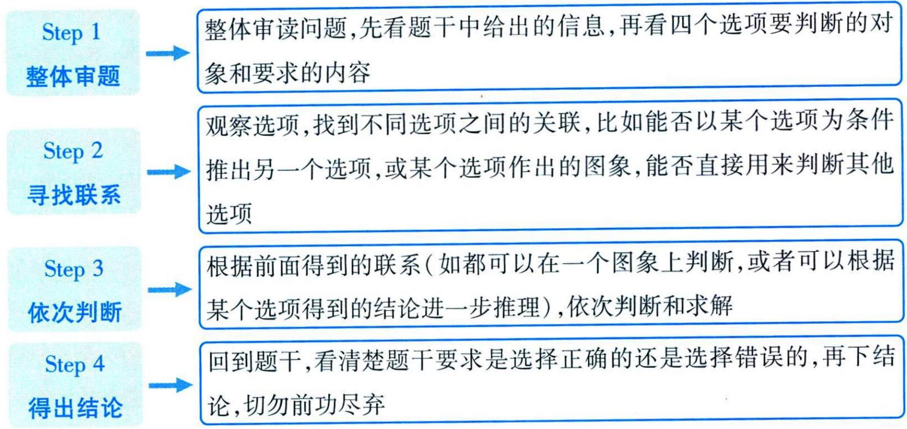

flowchart

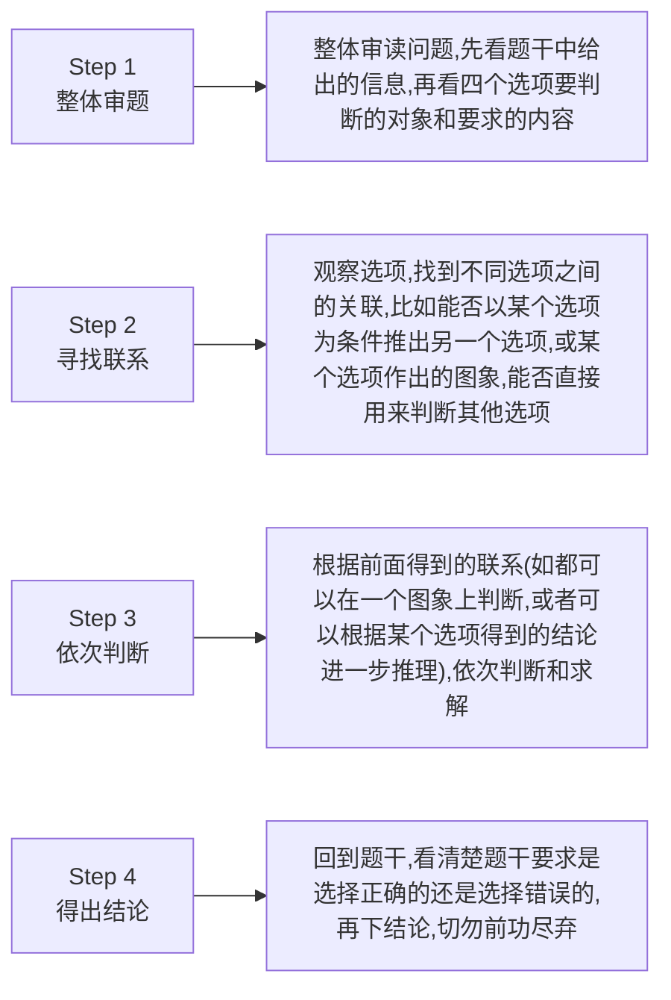
```mermaid
graph LR
    A["Step 1<br>整体审题"] --> B["整体审读问题,先看题干中给出的信息,再看四个选项要判断的对象和要求的内容"]
    C["Step 2<br>寻找联系"] --> D["观察选项,找到不同选项之间的关联,比如能否以某个选项为条件推出另一个选项,或某个选项作出的图象,能否直接用来判断其他选项"]
    E["Step 3<br>依次判断"] --> F["根据前面得到的联系(如都可以在一个图象上判断,或者可以根据某个选项得到的结论进一步推理),依次判断和求解"]
    G["Step 4<br>得出结论"] --> H["回到题干,看清楚题干要求是选择正确的还是选择错误的,再下结论,切勿前功尽弃"]
```

调研 1: (2024 江苏常州高级中学 9 月期初检测 | 多选) 已知函数 $f(x)= \frac{x^{2}+x-1}{e^{x}}$ , 其中 $x \in \mathbf{R}$ , 则下列说法正确的是 ( )

A. 不等式 $f(x) \geqslant -\mathrm{e}$ 对 $x \in  \mathbf{R}$ 恒成立  
B. 若关于 $x$ 的方程 $f(x) = k$ 有且只有两个不等实根, 则 $k$ 的取值范围为 $(-e, 0]$   
C. 方程 $f(f(x)) = -1$ 共有 4 个不等实根  
D. 若关于 $x$ 的不等式 $f(x) \geqslant ax$ 恰有 1 个正整数解, 则 $a$ 的取值范围为 $(\frac{5}{2e^2}, \frac{1}{e}]$

# 数说亚运

思路导引 对 $f(x)$ 求导, 判断其单调性, 求出其最小值, 可判断 A 选项; 作出曲线 $y = f(x)$ 与直线 $y = k$ , 根据图象可判断 B 选项; 令 $f(x) = t$ , 且 $f(t) = -1$ , 则 $f(t) = -1$ 有两解 $t_1, t_2$ , 且 $\frac{-1 - \sqrt{5}}{2} < t_1 < -1, t_2 = 0$ , 再令 $f(x) = t_1, f(x) = t_2$ , 数形结合可判断 C 选项; 由直线 $y = ax$ 过原点 (0,0), 再结合图象分析即可判断 D 选项.

解析 Step 1: 整体审题, 分析四个选项目标.

分析4个选项,A中, $f(x)\geqslant-e$ 是否恒成立,关键在于分析 $f(x)$ 的最小值情况,需要研究函数的单调性;B中,关于x的方程 $f(x)=k$ 的实根个数,可转化为函数 $y=f(x)$ 的图象与直线y=k的交点个数;C中,显然可以先研究关于t的方程 $f(t)=-1$ 的解,再研究 $f(x)=t$ 的解,所以与B相似,均可转化为 $f(x)$ 的图象与某直线的交点问题;D中, $f(x)\geqslant ax$ 恰有1个正整数解,是研究函数 $y=f(x)$ 的图象与直线y=ax位置关系的问题.综上分析,必先对函数 $f(x)$ 求导,研究其性质(尤其是函数的图象),进而整体求解.

Step 2: 寻找联系, 找到解题的入手点.

$f'(x) = -\frac{x^2 - x - 2}{\mathrm{e}^x} = -\frac{(x + 1)(x - 2)}{\mathrm{e}^x}$ , 当 $x < -1$ 或 $x > 2$ 时, $f'(x) < 0$ , 当 $-1 < x < 2$ 时, $f'(x) > 0$ , 所以 $f(x)$ 在 $(-∞, -1)$ , $(2, +∞)$ 上单调递减, 在 $(-1, 2)$ 上单调递增.

对于选项 A, 函数 $f(x)$ 在 x = -1 处取得极小值, $f(-1) = -e$ , 在 x = 2 处取得极大值, $f(2) = \frac{5}{\mathrm{e}^{2}}$ .

而 $x > 2$ 时，恒有 $f(x) > 0$ 成立，所以函数 $f(x)$ 的最小值是 $-\mathrm{e}$ ，即 $f(x) \geqslant -\mathrm{e}$ 对 $x \in \mathbb{R}$ 恒成立，故A正确.

根据上述分析,作出 $f(x)$ 的图象与直线 $y=k$ 、y=ax,如图1所示.

【解题关键】通过对 A 选项的分析, 得到函数图象的大致形状, 这正是判断 BCD 选项所需要的

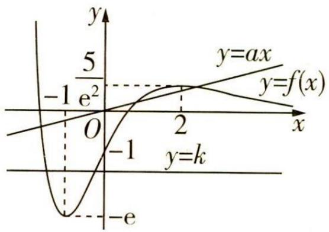

line

| x    | y=ax   | y=f(x) |
| ---- | ------ | ------ |
| -1   | -1     | -1     |
| 0    | 0      | 0      |
| 2    | 0      | 0      |

图 1

Step 3: 根据上面所作图, 依次判断 BCD 三个选项.

对于选项 B, 方程 $f(x)=k$ 有且只有两个不等实根, 即曲线 $y=f(x)$ 与直线 y=k 有且只有两个交点, 由图知, 当 $-e<k\leqslant0$ 或 $k=\frac{5}{e^{2}}$ 时, 曲线 $y=f(x)$ 与直线 y=k 有且只有两个交点, 故 B 错误.

对于选项 C, 由 $f(x)=0$ 得 $x^{2}+x-1=0$ , 解得 $x=\frac{-1\pm\sqrt{5}}{2}$ .

令 $f(x)=t$ ，且 $f(t)=-1$ ，由图象知， $f(t)=-1$ 有两个不相等的根，记为 $t_{1},t_{2}(t_{1}<t_{2})$ ，则 $\frac{-1-\sqrt{5}}{2}<t_{1}<-1,t_{2}=0,$

【会转化】求与复合函数有关的方程的根，先整体换元引入参数，变成以参数为未知数的方程，再继续求解，本题确定 $t_{1}, t_{2}$ 所在范围是后续求解的关键

而 $\frac{-1 - \sqrt{5}}{2} > -\mathrm{e}$ , 则 $f(x) = t_{1}$ 有两个不相等的根, $f(x) = t_{2} = 0$ 也有两个不相等的根.

# 数说亚运

本届亚运会共招募了3.76万名赛会志愿者“小青荷”，此名称取自宋代诗人杨万里的诗句“接天莲叶无穷碧，映日荷花别样红”。

综上,方程 $f(f(x))=-1$ 共有4个不相等的根,C正确.

对于选项D, 直线 $y = ax$ 过原点 $(0,0)$ , 且 $f(1) = \frac{1}{\mathrm{e}}, f(2) = \frac{5}{\mathrm{e}^2}, f(3) = \frac{11}{\mathrm{e}^3}$ ,

【扫清障碍】考虑选项中不等式的正整数解仅有1个，因而分析横坐标为整数的点，由这些点与原点连线所在直线的斜率确定直线 $y = ax$ 的斜率范围，进而得解

记 $k_{1} = \frac{f(1) - 0}{1 - 0} = \frac{1}{\mathrm{e}}, k_{2} = \frac{f(2) - 0}{2 - 0} = \frac{5}{2\mathrm{e}^{2}}, k_{3} = \frac{f(3) - 0}{3 - 0} = \frac{11}{3\mathrm{e}^{3}}$ ，易判断 $k_{1} > k_{2} > k_{3}$ ，不等式 $f(x)\geqslant ax$ 恰有1个正整数解，即曲线 $y = f(x)$ 在直线 $y = ax$ 非下方部分对应的 $x$ 恰有1个正整数值，由图象可得 $k_{2} < a\leqslant k_{1}$ ，即 $\frac{5}{2\mathrm{e}^2} < a\leqslant \frac{1}{\mathrm{e}}$ ，故D正确.

Step 4: 得出结论.

综合以上分析,故选 ACD.

调研 2 (2024 黑龙江 8 月期初学业质量检测 | 多选) 若函数 $f(x) = a \ln x + \frac{b}{x} + \frac{c}{x^2}$ ( $a \neq 0$ ) 既有极大值也有极小值, 则下列不等关系成立的是 ( )

A. ${bc} > 0$

B. ${ab} > 0$

C. ${b}^{2} + {8ac} > 0$

D. ${ac} > 0$

解析 Step 1: 整体审题, 分析四个选项目标.

函数 $f(x)$ 的定义域为 $(0, +\infty)$ , $f'(x) = \frac{a}{x} - \frac{b}{x^2} - \frac{2c}{x^3} = \frac{ax^2 - bx - 2c}{x^3}$ , 因为 $f(x)$ 既有极大值也有极小值, 所以 $f'(x) = 0$ 在 $(0, +\infty)$ 上有两个不同的实数根,

【会转化】四个选项都关于已知函数式中字母符号, 而已知条件的核心是函数既有极大值也有极小值, 因而转化为 ${f}^{\prime }\left( x\right)  = 0$ 有两个不同根这一必要条件

Step 2: 寻找联系, 找到不同选项之间的关联.

即关于 $x$ 的方程 $ax^2 - bx - 2c = 0 (a \neq 0)$ 在 $(0, +\infty)$ 上有两个不同的实数根 $x_1, x_2$ .

Step 3:由二次方程根的分布情况列关系式,并求解判断.

则有 $\left\{\begin{aligned}\Delta&=b^{2}+8ac>0,\\ x_{1}&+x_{2}=\frac{b}{a}>0,\end{aligned}\right.$ 从而BC成立，D不成立。由于ab>0，ac<0，所以 $ab\cdot ac<0$ ，即 $a^{2}bc<0$ 。

【思维拓展】若改成两根均大于1，注意并不等价于 $\left\{\begin{aligned}x_{1}+x_{2}&>2,\\ x_{1}x_{2}&>1,\end{aligned}\right.$ 这也是一个易错点。但可以转化为 $\left\{\begin{aligned}x_{1}+x_{2}&>2,\\ (x_{1}-1)(x_{2}-1)&>0\end{aligned}\right.$ 0, 则 bc<0, A 不成立.

Step 4: 得出结论.

故选BC.

数说亚运

调研 3 (2024 辽宁大连第八中学 9 月月考 | 多选) 已知不等式 $\frac{1}{x} + \frac{a}{1 - x} \geqslant 9$ 对任意 $x \in (0,1)$ 恒成立, 则满足条件的正实数 $a$ 的值可以是 ( )

A. 2

B. 4

C. 8

D. 9

解析 Step 1: 整体审题, 分析四个选项目标.

分析 4 个选项, 每个选项分别是不同的整数值, 因而求解的关键是求出参数 $a$ 的取值范围.

Step 2: 分析已知, 确定求解策略与方法.

已知式可化为 $\frac{1}{x} + \frac{a}{1 - x} = [x + (1 - x)]\left(\frac{1}{x} + \frac{a}{1 - x}\right) = 1 + a + \frac{1 - x}{x} + \frac{ax}{1 - x} \geqslant 1 + a + 2\sqrt{\frac{1 - x}{x} \cdot \frac{ax}{1 - x}} = 1 + a + 2\sqrt{a}$ ,

【定策略】从题型上分析, 显然是积为定值的求倒数和的最值问题, 因而采用基本不等式求解

当且仅当 $\frac{1 - x}{x} = \frac{ax}{1 - x}$ 即 $x = \frac{1}{\sqrt{a} + 1}$ 时等号成立，

【易错】此处容易忽视对 $\frac{1-x}{x}$ ， $\frac{ax}{1-x}$ 的正负的考虑与等号成立条件的判断

Step 3: 由已知恒成立特点, 转化为不等式求解.

所以要使 $\frac{1}{x} +\frac{a}{1 - x}\geqslant 9$ 对任意 $x\in (0,1)$ 恒成立，只需要最小值 $1 + a + 2\sqrt{a}\geqslant 9$ ，即 $a + 2\sqrt{a} -$ $8\geqslant 0$ ，得 $(\sqrt{a} +4)(\sqrt{a} -2)\geqslant 0$ ，解得 $\sqrt{a}\leqslant -4$ （舍去）或 $\sqrt{a}\geqslant 2$ ，得 $a\geqslant 4$

Step 4: 得出结论.

根据 a 的取值范围, 结合选项中的数值知, 选 BCD.

# 模型演练

(调研1变式,变换函数表达式|2024山西运城8月摸底调研|多选)已知函数 $f(x)=\left\{\begin{aligned}&2^{(x+2)^{2}},&x\leqslant-1,\\&|\log_{2}(x+1)|,&x> - 1,\end{aligned}\right.$ 若关于x的方程 $f(x)=m$ 有四个不等实根 $x_{1},x_{2},x_{3},x_{4}$ ，且 $x_{1}<x_{2}<x_{3}<x_{4}$ ，则下列结论正确的是()

A. $1 \leqslant m < 2$

B. $-3 \leqslant x_{1} < -2$

C. $\frac{5}{4} < x_3^2 + 2x_3 + 2x_4 \leqslant \frac{81}{16}$

D. $x_{1}^{2} + x_{2}^{2} + \log_{m}\sqrt{2}$ 的最小值为 $\frac{17}{2}$

# 参考答案与解析

BC Step 1: 整体审题, 分析已知条件下所要解的问题, 定解法策略.

已知方程有 4 个解, 而方程对应的函数是由指数函数、对数函数构造成的分段函数, 直接求解是策略之一, 但是含参方程无法直接求解, 遇到困难, 再考虑方程特色, 可转化为图象问题求解. 作出函数图象, 如图 2 所示.

# 数说亚运

中国体育代表团总人数为 1329 人, 其中运动员有 886 人, 运动员平均年龄为 25 岁.

关注微信公众号“初高教辅站”获取更多初高中教辅资料

Step 2: 寻找联系, 找到不同选项之间的关联.

方程有4个不同的解,因而由函数 $f(x)$ 的图象可知, $1<m\leq2$ ,A错误.

【易错】此处容易没注意到定义域区间的开与闭，导致图象端点的选取出错

进而可以确定 4 个不同解的取值情况,以便各个击破.

Step 3: 根据上面所作图依次判断 BCD 三个选项.

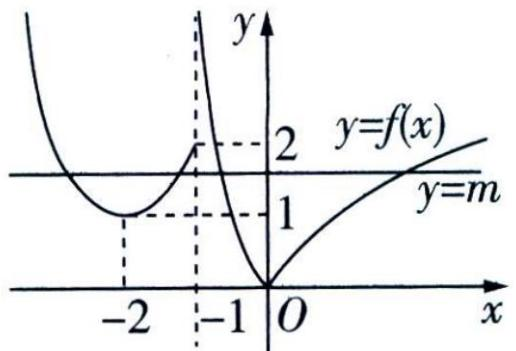

line

| x    | y=f(x) | y=m |
| ---- | ------ | --- |
| -2   | 0      | 0   |
| -1   | 1      | 1   |
| 0    | 0      | 0   |

图2

当 $f(x)=2$ 时,最小的根为-3,当 $f(x)=1$ 时,最小的根为-2,故 $-3\leqslant x_{1}<-2$ ,B正确.

$-\log_{2}(x_{3} + 1) = \log_{2}(x_{4} + 1) = m$ ，则 $x_{3} = 2^{-m} - 1, x_{4} = 2^{m} - 1$ ，所以 $x_{3}^{2} + 2x_{3} + 2x_{4} = (2^{-m} - 1)^{2} + 2(2^{-m} - 1) + 2(2^{m} - 1) = 2^{-2m} + 2 \times 2^{m} - 3.$

令 $t = 2^{m}$ , 则 $t \in (2,4]$ , 构造函数 $y = \frac{1}{t^2} + 2t - 3$ , 则 $y' = -\frac{2}{t^3} + 2 = \frac{2t^3 - 2}{t^3}$ , 显然当 $t \in (2,4]$ 时, $y' > 0$ ,

即 $y = \frac{1}{t^2} + 2t - 3$ 在(2,4]上单调递增， $y > \frac{1}{2^2} + 2 \times 2 - 3 = \frac{5}{4}, y \leqslant \frac{1}{4^2} + 2 \times 4 - 3 = \frac{81}{16}$ ，即 $\frac{5}{4} < x_3^2 + 2x_3 + 2x_4 \leqslant \frac{81}{16}$ ，C 正确.

由图象可知, $2^{(x_{1}+2)^{2}}=2^{(x_{2}+2)^{2}}=m$ ,则 $x_{1}=-2-\sqrt{\log_{2}m},x_{2}=-2+\sqrt{\log_{2}m}$ ,所以 $x_{1}^{2}+x_{2}^{2}+\log_{m}\sqrt{2}=4+\log_{2}m+2\times2\times\sqrt{\log_{2}m}+4+\log_{2}m-2\times2\times\sqrt{\log_{2}m}+\log_{m}\sqrt{2}=8+2\log_{2}m+\log_{m}\sqrt{2}=8+\frac{1}{\log_{m}\sqrt{2}}+\log_{m}\sqrt{2}\geqslant8+2=10$ ,当且仅当 $\frac{1}{\log_{m}\sqrt{2}}=\log_{m}\sqrt{2}$ ,即 $m=\sqrt{2}$ 时取得等号,D错误.

Step 4: 得出结论.

故选BC.

# 型2 用特值思想快解答案不唯一填空题

# 模型攻略

答案不唯一填空题在已知条件下, 正确答案不是只有一个, 且一般并不要求写出所有答案, 只要写出一个正确答案即可. 这种题具有开放性, 对不同能力学生的考查形成一定的区分度, 有助于选拔. 对于这种题目, 求解时力争 “正确、合理、迅速”, 解题策略是 “优选特值”, 即找特值试答案.

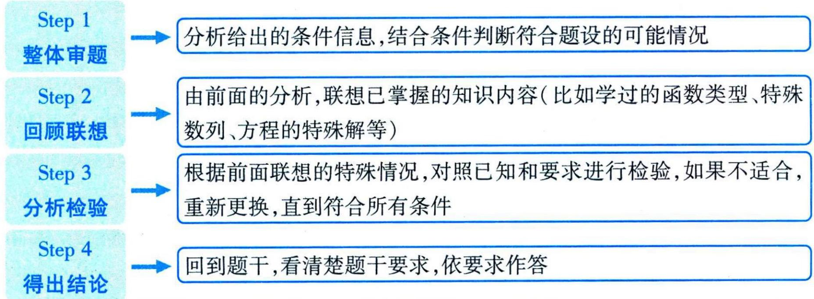

flowchart

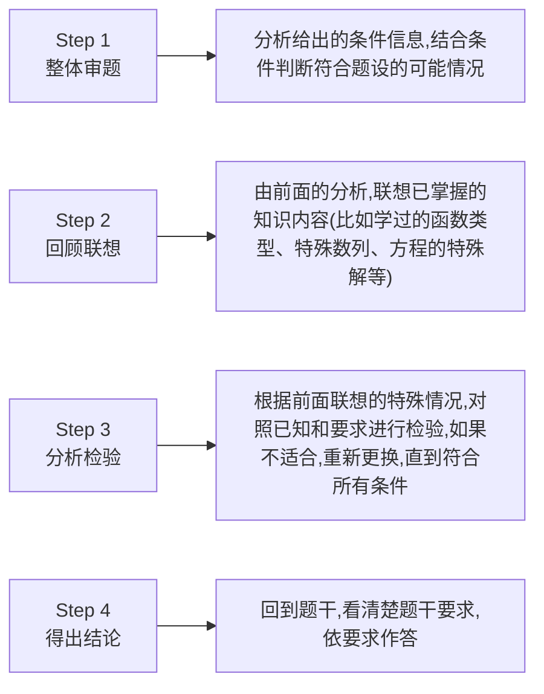
```mermaid
graph LR
    A["Step 1<br>整体审题"] --> B["分析给出的条件信息,结合条件判断符合题设的可能情况"]
    C["Step 2<br>回顾联想"] --> D["由前面的分析,联想已掌握的知识内容(比如学过的函数类型、特殊数列、方程的特殊解等)"]
    E["Step 3<br>分析检验"] --> F["根据前面联想的特殊情况,对照已知和要求进行检验,如果不适合,重新更换,直到符合所有条件"]
    G["Step 4<br>得出结论"] --> H["回到题干,看清楚题干要求,依要求作答"]
```

# 数说亚运

调研 1 (2024 广州第六十五中学 8 月摸底测试) 已知函数 $f(x)$ 满足 $f(x+1)=f(x)+2$ , 则 $f(x)$ 的解析式可以是 \_\_\_\_. (写出满足条件的一个解析式即可)

解析 Step 1: 整体审题, 分析已知条件信息.

函数 $f(x)$ 满足的条件 $f(x+1)=f(x)+2$ 结构较为简单,且只有这一个条件,因而结果有不确定性,观察其结构特点,联想到等差数列.

Step 2: 联想回顾, 找到符合已知的特殊情况.

根据等差数列的特性,设特殊函数为 $f(x)=ax$ .

【扫清障碍】等差数列的通项公式为一次形式，因而将函数设成一次函数，而常数项为0的一次函数最简单，也可以理解为取首项为a、公差为a的等差数列的通项公式

Step 3: 由特殊值进行检验或运算.

由 $f(x+1)=f(x)+2$ ，得 $a(x+1)=ax+2$ ，解得a=2，所以 $f(x)=2x$ .

Step 4: 得出结论.

故答案为 $f(x)=2x$ （答案不唯一）.

调研 2 (试题调研原创) 若点 $P(\cos \theta, \sin \theta)$ 与点 $Q(\cos (\theta + \frac{\pi}{3}), \sin (\theta + \frac{\pi}{3}))$ 关于 $y$ 轴对称, 写出一个符合题意的 $\theta$ 值: \_\_\_\_.

解析 Step 1: 整体审题, 分析已知条件信息.

已知点 $P(\cos \theta, \sin \theta)$ 与点 $Q(\cos (\theta + \frac{\pi}{3}), \sin (\theta + \frac{\pi}{3}))$ 关于 $y$ 轴对称，因而可以确定两坐标间的关系，寻得解题方向： $\left\{ \begin{array}{l} \cos \theta = -\cos (\theta + \frac{\pi}{3}), \\ \sin \theta = \sin (\theta + \frac{\pi}{3}). \end{array} \right.$

Step 2: 联想回顾, 找到符合已知的特殊情况.

方法一: 直接运算求解 由 $\cos \theta = -\cos (\theta + \frac{\pi}{3})$ 可得 $\cos \theta \cos \frac{\pi}{3} - \sin \theta \sin \frac{\pi}{3} = -\cos \theta$ , 则 $\frac{3}{2} \cos \theta = \frac{\sqrt{3}}{2} \sin \theta$ , 所以 $\tan \theta = \sqrt{3}$ . 由 $\sin (\theta + \frac{\pi}{3}) = \sin \theta$ 可得 $\sin \theta \cos \frac{\pi}{3} + \cos \theta \sin \frac{\pi}{3} = \sin \theta$ , 则 $\frac{\sqrt{3}}{2} \cos \theta = \frac{1}{2} \sin \theta$ , 所以 $\tan \theta = \sqrt{3}$ . 因此 $\theta = \frac{\pi}{3} + k\pi, k \in \mathbf{Z}$ , 可取 $\theta = \frac{\pi}{3}$ .

方法二:取特值 由于余弦反号、正弦同号,因而根据以往经验,可以使θ为第一象限角, $\theta+\frac{\pi}{3}$ 为第二象限角, $\theta+\theta+\frac{\pi}{3}=\pi$ ,满足题意,即 $\theta=\frac{\pi}{3}$ .

# 数说亚运

Step 3:由特殊值进行检验或运算.

$\cos \left(\frac{\pi}{3} + \frac{\pi}{3}\right) = -\cos \frac{\pi}{3}, \sin \left(\frac{\pi}{3} + \frac{\pi}{3}\right) = \sin \frac{\pi}{3}$ , 符合题意.

Step 4: 得出结论.

故答案为 $\frac{\pi}{3}$ (答案不唯一).

调研 3 (试题调研原创)已知数列 $\{a_{n}\}$ 的首项 $a_{1} = 1$ ,试写出满足下列条件的数列 $\{a_{n}\}$ 的一个通项公式: \_\_\_\_.

①数列 $\left\{a_{n+1}-a_{n}\right\}$ 是等比数列；②数列 $\left\{\frac{a_{n+1}}{a_{n}}\right\}$ 是等差数列.

解析 Step 1: 整体审题, 分析已知条件信息.

已知中的两个条件是由数列 $\{a_{n}\}$ 相邻的后项减前项的差、相邻的后项与前项的商构成的两个新数列, 分别是等比、等差数列, 因而数列 $\{a_{n}\}$ 不会是常数列, 各项不能为 0.

Step 2: 结合已知, 分析符合已知的可能情况, 寻求特例.

数列 $\{\frac{a_{n + 1}}{a_n}\}$ 是等差数列，尝试取 $\{\frac{a_{n + 1}}{a_n}\}$ 为非零常数列，取特例 $\frac{a_{n + 1}}{a_n} = 2.$

【扫清障碍】最特殊的例子是 $\frac{a_{n+1}}{a_{n}}=1$ ，但不符合①，因而从容易运算的角度取 $\frac{a_{n+1}}{a_{n}}=2$ ，当然有同学会想可否取-1？答案是肯定的

Step 3: 特值检验.

则 $a_{n} = 2^{n - 1}$ ，此时 $a_{n + 1} - a_n = 2^{n - 1},\{a_{n + 1} - a_n\}$ 是公比为2的等比数列，符合①.

【另解】当取 $\frac{a_{n+1}}{a_{n}}=-1$ 时， $a_{n}=(-1)^{n-1}$ ，则 $a_{n+1}-a_{n}=2\cdot(-1)^{n}$ ，满足①

Step 4: 得出结论.

故答案为 $a_{n}=2^{n-1}$ （答案不唯一）.

# 模型演练

1. (调研 1 变式,变条件,变函数解析式所满足的条件 | 2024 江苏南通如东 8 月期初学情检测)写出一个同时满足下列条件的函数 $f(x)$ 的解析式: \_\_\_\_.

① $f(x)=f(-x)$ ; ② $f(x)+f(4-x)=0$ .

2. (试题调研原创 | 调研 3 变式, 变考法, 已知数列的部分项求通项公式) 已知无穷数列 $\{a_{n}\}$ 满足 $a_{1} = 1, a_{2} = 0, a_{3} = -1, a_{4} = 0$ , 写出满足条件的 $\{a_{n}\}$ 的一个通项公式: \_\_\_\_. (不能写成分段数列的形式)

数说亚运

# 参考答案与解析

1. $f(x) = 2 \cos \frac{\pi}{4} x$ (答案不唯一) Step 1: 整体审题, 分析已知条件信息.

本题有两个已知条件,一个是 $f(x)=f(-x)$ ,表明函数 $f(x)$ 为偶函数,另一个是 $f(x)+f(4-x)=0$ ,可先转化为 $f(4+x)=-f(-x)=-f(x)$ ,进而得 $f(x+8)=-f(x+4)=f(x)$ ,所以 $f(x)$ 是周期为8的周期函数.

Step 2: 联想回顾, 找到符合已知的特殊情况.

取特殊函数 $f(x)=2\cos\frac{\pi}{4}x.$

【技巧点拨】既有奇偶性，又有周期性，容易联想到特殊函数——三角函数，偶函数往往设成余弦函数，奇函数往往设成正弦函数、正切函数（取决于函数定义域）

Step 3: 由特殊值进行检验或运算.

$f(-x)=2\cos(-\frac{\pi}{4}x)=2\cos\frac{\pi}{4}x=f(x)$ ，最小正周期 $T=\frac{2\pi}{\frac{\pi}{4}}=8$ ，满足①②.

Step 4: 得出结论.

故答案为 $f(x)=2\cos\frac{\pi}{4}x$ （答案不唯一）.

2. $a_{n} = \sin \frac{n \pi}{2}$ (或 $a_{n} = 2^{n} - n^{2}$ 等, 答案不唯一) Step 1: 整体审题, 分析已知条件信息.

由已知可以猜测数列为周期数列,周期为4,且题目要求不能写成分段数列的形式.

Step 2: 联想回顾, 寻找特例.

设 $a_{n}=\sin\frac{n\pi}{2}$ ，类比三角函数可得其最小正周期 $T=\frac{2\pi}{\frac{\pi}{2}}=4$ .

Step 3: 由特殊值进行检验或运算.

$a_{1} = \sin \frac{\pi}{2} = 1, a_{2} = \sin \frac{2\pi}{2} = 0, a_{3} = \sin \frac{3\pi}{2} = -1, a_{4} = \sin \frac{4\pi}{2} = 0$ ，符合题设.

Step 4: 得出结论.

故答案为 $a_{n}=\sin\frac{n\pi}{2}$ (答案不唯一).

【另解】也可以归纳猜想，由 $a_1 = 1 = 2 - 1$ ， $a_2 = 0 = 2^2 -2^2$ ， $a_3 = -1 = 2^3 -3^2$ ， $a_4 = 0 = 2^4-$ $4^{2}$ ，猜想 $a_{n} = 2^{n} - n^{2}$ .所以答案可以为 $a_{n} = 2^{n} - n^{2}$

# 数说亚运

# 模型3 用二级结论快解高数接轨题

# 模型攻略

# 二级结论:有关以 e 为底的指数、对数不等式及其应用

① $e^{x}\geqslant x+1$ ,② $e^{x}\leqslant\frac{1}{1-x}(x<1)$ ,③ $x-\frac{x^{2}}{2}\leqslant\ln(1+x)\leqslant x$ ,④ $1-\frac{1}{x}\leqslant\ln x\leqslant x-1$ .以下给出证明：

①思路一 由 $e^{x}=1+x+\frac{x^{2}}{2!}+\cdots+\frac{x^{n}}{n!}+\cdots(e^{x}$ 的泰勒展开式)，则 $e^{x}\geqslant1+x$ （当 x=0 时等号成立）。思路二 设 $f(x)=e^{x}-1-x$ ，通过求导知当 $x\in(-\infty,0)$ 时 $f(x)$ 单调递减，当 $x\in(0,+\infty)$ 时 $f(x)$ 单调递增，因而 $f(x)\geqslant f(0)=0$ ，从而 $e^{x}\geqslant x+1$ 得证。

②在①中以 -x 替换 x，得到不等式 $e^{-x} \geqslant -x + 1$ ，即 x < 1 时， $e^{x} \leqslant \frac{1}{1 - x}$ .

③由 $\ln(1+x)=x-\frac{x^{2}}{2}+\frac{x^{3}}{3}-\cdots+(-1)^{n-1}\cdot\frac{x^{n}}{n}+\cdots(\ln(1+x)$ 的泰勒展开式)，则 $x-\frac{x^{2}}{2}\leqslant \ln(1+x)\leqslant x$ （当 x=0 时等号成立）.

④在③的右侧不等式中,以 x-1 替换 x, 则 $\ln x \leqslant x - 1$ , 再以 $\frac{1}{x}$ 替换 x, 则 $\ln \frac{1}{x} \leqslant \frac{1}{x} - 1$ , 从而 $\ln x \geqslant 1 - \frac{1}{x}$ (当 x = 1 时等号成立).

调研 1 (2024 四川成都外国语学校 8 月入学考试) $a = \sqrt[6]{\mathrm{e}} - 1, b = \ln \frac{7}{6}, c = \frac{1}{6}$ , 则 $a, b, c$ 的大小关系为 ( )

A. $b < a < c$

B. $c < a < b$

C. $a < c < b$

D. $b < c < a$

解析 设 $f(x) = \ln (1 + x) - x, x \geqslant 0$ ，则 $f'(x) = \frac{1}{1 + x} - 1 = \frac{-x}{1 + x} < 0$ 在 $[0, +\infty)$ 上恒成立，故 $f(x) = \ln (1 + x) - x$ 在 $[0, +\infty)$ 上单调递减.

故 $f(\frac{1}{6})<f(0)=0$ ，即 $\ln(1+\frac{1}{6})=\ln\frac{7}{6}<\frac{1}{6}$ ，故b<c.

令 $g(x) = \mathrm{e}^{x} - 1 - x, x \geqslant 0$ ，则 $g'(x) = \mathrm{e}^{x} - 1 \geqslant 0$ 在 $[0, +\infty)$ 上恒成立且不恒为 0，

故 $g(x) = \mathrm{e}^{x} - 1 - x$ 在 $[0, +\infty)$ 上单调递增.

又 $g(0) = \mathrm{e}^{0} - 1 = 0$ ，故 $g(\frac{1}{6}) = \mathrm{e}^{\frac{1}{6}} - 1 - \frac{1}{6} >0$ ，即 $\mathrm{e}^{\frac{1}{6}} - 1 > \frac{1}{6}$ 故 $a > c.$

综上:b<c<a.故选D.

【探本质】事实上, 上述解法正是利用导数对前面的二级结论给出了证明, 这也告诉我们, 考试时若记住结论直接求解, 可以加快解题速度, 为后面大题的计算争取时间

# 速解

由 $\mathrm{e}^x\geqslant x + 1$ 得 $\mathrm{e}^{\frac{1}{6}} - 1 > \frac{1}{6}$ ，由 $\ln (1 + x)\leqslant x$ 得 $\ln (1 + \frac{1}{6}) <   \frac{1}{6}$ ，从而 $b <   c <   a$ ，选D.

# 备考方略

小编说:即将进入新一轮的复习,新阶段的复习策略有所变化,更加注重“实战”.具体应该怎么做呢?

# 模型攻略

# 二级结论:对数均值不等式与飘带不等式

对数均值不等式: $\sqrt{mn} < \frac{m - n}{\ln m - \ln n} < \frac{m + n}{2}, m > n > 0.$

简证:对左侧,要证 $\sqrt{mn} < \frac{m - n}{\ln m - \ln n}$ , 即证 $\ln m - \ln n < \frac{m - n}{\sqrt{mn}}$ , 即 $\ln \frac{m}{n} < \frac{\frac{m}{n} - 1}{\sqrt{\frac{m}{n}}}$ , 构造函数 $f(x) = \ln x^{2} - \frac{x^{2} - 1}{x}, x > 1$ , 求导得 $f'(x) = \frac{-(x - 1)^{2}}{x^{2}} < 0$ , 所以 $f(x)$ 在 $(1, +\infty)$ 上单调递减, 则 $f(x) < \ln 1^{2} - \frac{1^{2} - 1}{1} = 0$ . 由于 m > n > 0, 则 $\sqrt{\frac{m}{n}} > 1$ , 所以 $\ln \frac{m}{n} < \frac{\frac{m}{n} - 1}{\sqrt{\frac{m}{n}}}$ 成立, 即 $\sqrt{mn} < \frac{m - n}{\ln m - \ln n}$ 成立. (右侧同理, 请你自己动手尝试证明吧)

飘带不等式: $\frac{1}{2} (x - \frac{1}{x}) < \ln x < \frac{2(x - 1)}{x + 1}, x \in (0,1); \frac{2(x - 1)}{x + 1} < \ln x < \frac{1}{2} (x - \frac{1}{x}), x \in (1, +\infty)$ .

简证: 设 $f(x)=\frac{1}{2}(x-\frac{1}{x})-\ln x, x>0$ 且 $x\neq1$ ，则 $f'(x)=\frac{1}{2}(1-\frac{1}{x})^{2}>0$ ，所以 $f(x)$ 在 $(0,1)\cup(1,+\infty)$ 上单调递增，又 $\frac{1}{2}\times(1-\frac{1}{1})-\ln1=0$ ，所以 $x\in(0,1)$ 时 $f(x)<0$ ，即 $\frac{1}{2}(x-\frac{1}{x})<\ln x, x\in(1,+\infty)$ 时 $f(x)>0$ ，即 $\frac{1}{2}(x-\frac{1}{x})>\ln x$ 。设 $g(x)=\ln x-\frac{2(x-1)}{x+1}, x>0$ 且 $x\neq1, g'(x)=\frac{(x-1)^{2}}{x(x+1)^{2}}>0$ ，所以 $g(x)$ 在 $(0,1)\cup(1,+\infty)$ 上单调递增，又 $\ln1-\frac{2\times(1-1)}{1+1}=0$ ，所以 $x\in(0,1)$ 时 $g(x)<0$ ，即 $\ln x<\frac{2(x-1)}{x+1}, x\in(1,+\infty)$ 时 $g(x)>0$ ，即 $\ln x>\frac{2(x-1)}{x+1}$ 。

调研 2 (2024 云南三校 9 月一检) 已知函数 $f(x) = \frac{a\ln x + a}{x}$ .

(1) 讨论 $f(x)$ 的极值.  
(2) 若 $(\mathrm{e}x_{1})^{x_{2}} = (\mathrm{e}x_{2})^{x_{1}}$ (e 是自然对数的底数), 且 $x_{1} > 0, x_{2} > 0, x_{1} \neq x_{2}$ , 证明: $x_{1} + x_{2} > 2$ .

解析 (1) 当 $a = 0$ 时, 函数 $f(x) = 0$ 无极值.

# 备考方略

复习有道,计划为先 在开始前,先做一份行之有效的计划表,明确自己的整体目标,再将大目标拆解为数个小目标,并计划好完成各阶段目标的时间节点.

$f'(x) = -\frac{a \ln x}{x^{2}}$ , 当 a > 0 时, $x \in (0,1)$ 时 $f(x)$ 单调递增, $x \in (1, +\infty)$ 时 $f(x)$ 单调递减, 因此 $f(x)$ 有极大值 $f(1)=a$ .

当 $a < 0$ 时, $x \in (0,1)$ 时 $f(x)$ 单调递减, $x \in (1, +\infty)$ 时 $f(x)$ 单调递增, 因此 $f(x)$ 有极小值 $f(1) = a$ .

综上所述: 当 a=0 时, $f(x)$ 无极值; 当 a>0 时, $f(x)$ 有极大值 $f(1)=a$ ; 当 a<0 时, $f(x)$ 有极小值 $f(1)=a$ .

【规范步骤】做大题时，分类讨论后的综述千万不要漏写，否则容易丢失1分的步骤分

(2) 将已知等式两边同时取自然对数, 化简得 $\frac{\ln x_{1} + 1}{x_{1}} = \frac{\ln x_{2} + 1}{x_{2}} > 0$ , 即当 $a = 1$ 时, $f(x) = m (m > 0)$ 有两个不同解 $x_{1}, x_{2}$ .

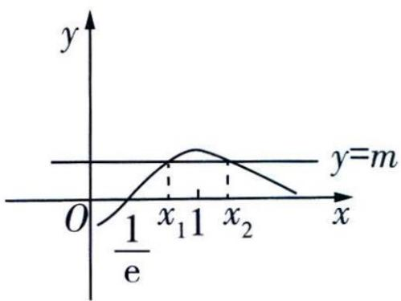

line

| x       | y     |
| ------- | ----- |
| 0       | 0     |
| x₁/1    | Peak  |
| x₂      | Peak  |
| >x₂     | Decrease |

图 1

【会转化】将问题转化为方程解的问题

不妨设 $x_{1} < x_{2}$ , 易知 $f(\frac{1}{\mathrm{e}}) = 0$ , 则由 (1) 知 $\frac{1}{\mathrm{e}} < x_{1} < 1 < x_{2}, 0 < m < 1$ .

【抓关键】根据(1)中函数的单调性画出草图(如图1), 数形结合, 即可确定解的范围

方法一: 对称消元法 要证 $x_{1} + x_{2} > 2$ , 即证 1 > $x_{1} > 2 - x_{2}$ , 即证 $f(x_{2}) = f(x_{1}) > f(2 - x_{2})$ .

当 $x_{2} \geqslant 2$ 时, 必有 $x_{1} + x_{2} > 2$ , 因此只需考虑 $1 < x_{2} < 2$ , 设 $g(x) = f(x) - f(2 - x), 1 < x < 2$ .

$$
g ^ {\prime} (x) = f ^ {\prime} (x) - f ^ {\prime} (2 - x) = - \frac {\ln x}{x ^ {2}} - \frac {\ln (2 - x)}{(2 - x) ^ {2}} >
$$

提醒:要注意在解大题时,若运用二级结论,要给出证明过程,否则可能会丢失步骤分.即便不用二级结论直接解题,也可以用二级结论来分析条件,寻找解题关键.

$-\frac{\ln x}{x^2} - \frac{\ln(2 - x)}{x^2} = -\frac{\ln[- (x - 1)^2 + 1]}{x^2} > 0$ ，所以 $g(x)$ 在 $(1,2)$ 上单调递增， $g(x) > f(1) - f(1) = 0$ .

所以 $f(x_{2})=f(x_{1})>f(2-x_{2})$ 成立,也就是 $x_{1}+x_{2}>2$ 成立.

方法二:对数均值不等式法 依题意得 $\frac{\ln x_{1}+1}{x_{1}}=\frac{\ln x_{2}+1}{x_{2}}=m$ ，所以 $\frac{1}{m}=\frac{x_{1}}{\ln x_{1}+1}=\frac{x_{2}}{\ln x_{2}+1}$ ，
即 $\frac{1}{m}=\frac{x_{1}-x_{2}}{\ln x_{1}-\ln x_{2}}<\frac{x_{1}+x_{2}}{2}$

所以 $\frac{x_{1}+x_{2}}{2}>\frac{1}{m}>1$ ，也就是 $x_{1}+x_{2}>2$ 成立.

方法三:飘带不等式法 所以 $mx_{1}-1=\ln x_{1}<\frac{2(x_{1}-1)}{x_{1}+1}$ ，即 $mx_{1}^{2}+(m-3)x_{1}+1<0$ ，

备考方略

$$
m x _ {2} - 1 = \ln   x _ {2} > \frac {2 (  x _ {2} - 1)}{x _ {2} + 1}, \text {即}   m x _ {2} ^ {2} + (  m - 3)   x _ {2} + 1 > 0,
$$

所以 $mx_{1}^{2} + (m - 3)x_{1} + 1 < mx_{2}^{2} + (m - 3)x_{2} + 1$ ，即 $x_{1} + x_{2} > \frac{3}{m} - 1 > 2$ .

# 模型演练

1. (试题调研原创 | 调研 1 变式, 变数式结构) 已知 $a = \frac{9}{10}, b = \mathrm{e}^{-\frac{1}{9}}, c = 1 + \ln \frac{10}{11}$ , 则 $a, b, c$ 的大小关系为 ( )

A. $a < b < c$

B. $b < a < c$

C. $c < b < a$

D. $c < a < b$

2. (试题调研原创 | 调研 2 变式, 变考法, 零点和变零点积) 已知函数 $f(x) = \frac{\mathrm{e}^{x}}{x} - \ln x + x - a$ .

(1) 若函数 $f(x)$ 的图象不在 x 轴的下方, 求 a 的取值范围.  
(2) 证明: 若 $f(x)$ 有两个零点 $x_{1}, x_{2}, x_{1} \neq x_{2}$ , 则 $x_{1} x_{2} < 1$ .

# 参考答案与解析

1. B 令 $f(x) = \mathrm{e}^{x} - x - 1$ ，得 $f'(x) = \mathrm{e}^{x} - 1$ ，由 $f'(x) = \mathrm{e}^{x} - 1 = 0$ ，解得 $x = 0$ .

当 x<0 时, $f'(x)<0$ , $f(x)$ 单调递减, 当 x>0 时, $f'(x)>0$ , $f(x)$ 单调递增,

故 $f(x) \geqslant f(0) = 0$ , 即 $e^{x} - x - 1 \geqslant 0$ , 当且仅当 $x = 0$ 时, 等号成立, 所以 $e^{x} > x + 1 (x \neq 0)$ .

则 $\frac{1}{b}=e^{\frac{1}{9}}>\frac{1}{9}+1=\frac{10}{9}=\frac{1}{a}>0$ ，所以b<a.

因为 $c = 1 + \ln \frac{10}{11} = 1 + \ln \frac{1}{1 + \frac{1}{10}}, a = \frac{9}{10} = 1 - \frac{1}{10}$ , 所以 $c - a = \ln \frac{1}{1 + \frac{1}{10}} + \frac{1}{10}$ .

令 $h(x) = \ln \frac{1}{1 + x} + x = -\ln (1 + x) + x$ ，得 $h'(x) = -\frac{1}{1 + x} + 1 = \frac{x}{1 + x}$ . 令 $h'(x) > 0$ 得 $x > 0$ ，令 $h'(x) < 0$ 得 $-1 < x < 0$ ，所以 $h(x)$ 在 $(-1, 0)$ 上单调递减，在 $(0, +\infty)$ 上单调递增，所以 $h(x) \geqslant h(0) = 0$ ，所以 $h(\frac{1}{10}) > 0$ ，即 $c - a > 0$ ，则 $c > a$ . 所以 $b < a < c$ ，故选 B.

# 速解

由 $\mathrm{e}^x\geqslant x + 1$ 得 $b = \mathrm{e}^{-\frac{1}{9}} = \frac{1}{\mathrm{e}^{\frac{1}{9}}} < \frac{1}{1 + \frac{1}{9}} = \frac{9}{10} = a$ ，由 $\ln (x + 1)\leqslant x$ 得 $c = 1 + \ln \frac{10}{11} = 1 - \ln (1 + \frac{1}{10})>$ $1 - \frac{1}{10} = \frac{9}{10} = a$ ，从而 $c > a > b$ ，故选B.

# 备考方略

夯实基础,重视通法 高考对基础知识的考查占 $70\%$ 以上.要重视基本概念、公式、法则、定理的形成过程,运用时注意条件和结论的限制范围.

2. (1) 方法一: 常规求导 $f(x)$ 的定义域为 $(0, +\infty)$ , 则 $f'(x) = \left(\frac{1}{x} - \frac{1}{x^2}\right) e^x - \frac{1}{x} + 1 = \frac{1}{x} (1 - \frac{1}{x}) e^x + (1 - \frac{1}{x}) = \frac{x - 1}{x} (\frac{e^x}{x} + 1)$ , 令 $f'(x) = 0$ , 得 $x = 1$ . 当 $x \in (0, 1)$ 时, $f'(x) < 0$ , $f(x)$ 单调递减; 当 $x \in (1, +\infty)$ 时, $f'(x) > 0$ , $f(x)$ 单调递增.

所以 $f(x) \geqslant f(1) = e + 1 - a$ ，若 $f(x) \geqslant 0$ ，则 $e + 1 - a \geqslant 0$ ，即 $a \leqslant e + 1$ ，所以 a 的取值范围为

【会翻译】将题眼“函数 $f(x)$ 的图象不在 x 轴的下方”翻译为数学语言“ $f(x) \geqslant 0$ ” $(-∞, e + 1]$ .

方法二: 同构处理 由 $f(x) \geqslant 0$ 得 $\mathrm{e}^{-\ln x + x} + x - \ln x - a \geqslant 0$ , 令 $t = x - \ln x, t \geqslant 1$ , 则 $f(t) = \mathrm{e}^t + t - a \geqslant 0$ , 即 $a \leqslant \mathrm{e}^t + t$ .

令 $g(t) = \mathrm{e}^t + t, t \in [1, +\infty)$ , 则 $g'(t) = \mathrm{e}^t + 1 > 0$ , 故 $g(t)$ 在区间 $[1, +\infty)$ 上单调递增, 故 $g(t)_{\min} = g(1) = \mathrm{e} + 1$ , 即 $a \leqslant \mathrm{e} + 1$ , 所以 $a$ 的取值范围为 $(- \infty, \mathrm{e} + 1]$ .

(2) 方法一: 对数平均不等式法 由题意得 $f(x) = \frac{\mathrm{e}^{x}}{x} + \ln \frac{\mathrm{e}^{x}}{x} - a$ , 令 $t = \frac{\mathrm{e}^{x}}{x}$ , 则 $t > 1, f(t) = t + \ln t - a, f'(t) = 1 + \frac{1}{t} > 0$ , 所以 $f(t)$ 在 $(1, +\infty)$ 上单调递增, 故结合题意知 $f(t) = 0$ 只有 1 个解.

又 $f(x)$ 有两个零点 $x_{1}, x_{2}$ , 故 $t = \frac{\mathrm{e}^{x_1}}{x_1} = \frac{\mathrm{e}^{x_2}}{x_2}$ , 两边取对数得 $x_{1} - \ln x_{1} = x_{2} - \ln x_{2}$ , 即 $\frac{x_1 - x_2}{\ln x_1 - \ln x_2} = 1$ . 又 $\sqrt{x_1x_2} < \frac{x_1 - x_2}{\ln x_1 - \ln x_2}$ , 故 $\sqrt{x_1x_2} < 1$ , 即 $x_{1}x_{2} < 1$ .

方法二:飘带不等式法 由题意及(1)知, $f(x)$ 一个零点小于1,一个零点大于1,不妨设 $x_{1}<1<x_{2}$ ,要证 $x_{1}x_{2}<1$ ,即证 $x_{1}<\frac{1}{x_{2}}$ .又 $x_{1},\frac{1}{x_{2}}\in(0,1)$ ,即证 $f(x_{1})>f(\frac{1}{x_{2}})$ .又 $f(x_{1})=f(x_{2})$ ,故只需证 $f(x_{2})>f(\frac{1}{x_{2}})$ ,即证 $\frac{\mathrm{e}^{x}}{x}-\ln x+x-x\mathrm{e}^{\frac{1}{x}}-\ln x-\frac{1}{x}>0,x\in(1,+\infty)$ ,即证 $\frac{\mathrm{e}^{x}}{x}-x\mathrm{e}^{\frac{1}{x}}-2[\ln x-\frac{1}{2}(x-\frac{1}{x})]>0.$

由于 $x > 1$ 时 $\ln x < \frac{1}{2} (x - \frac{1}{x})$ ，则 $\ln x^2 < x - \frac{1}{x}$ ，即 $\mathrm{e}^{x - \frac{1}{x}} > x^2$ ，所以 $\frac{\mathrm{e}^x}{x} - x\mathrm{e}^{\frac{1}{x}} > 0 > \ln x - \frac{1}{2}(x - \frac{1}{x})$ ，从而 $\frac{\mathrm{e}^x}{x} - x\mathrm{e}^{\frac{1}{x}} - 2[\ln x - \frac{1}{2}(x - \frac{1}{x})] > 0$ 成立，所以 $x_1x_2 < 1$ .

备考方略

# 模型4 用假设存在思想快解存在性探索题

# 模型攻略

存在性探索问题题目构思精巧,解题方法灵活,对于分析问题、解决问题的能力要求比较高,是高考命题的热点之一.由于这类问题的结论有两种可能,所以具有开放性特点,解题思路往往有两种:一是由已知直接证明存在性.二是在假设存在的条件下,根据条件解出相关量,代入已知条件进行检验,如果满足条件,则存在,否则不存在.本文主要介绍第二种解题思路,解题模型如下:

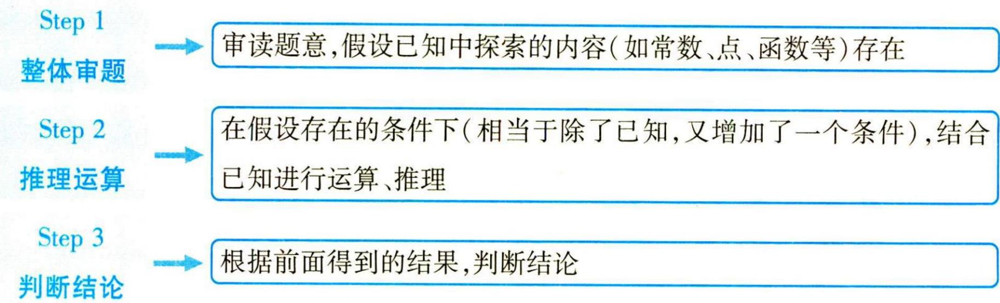

flowchart

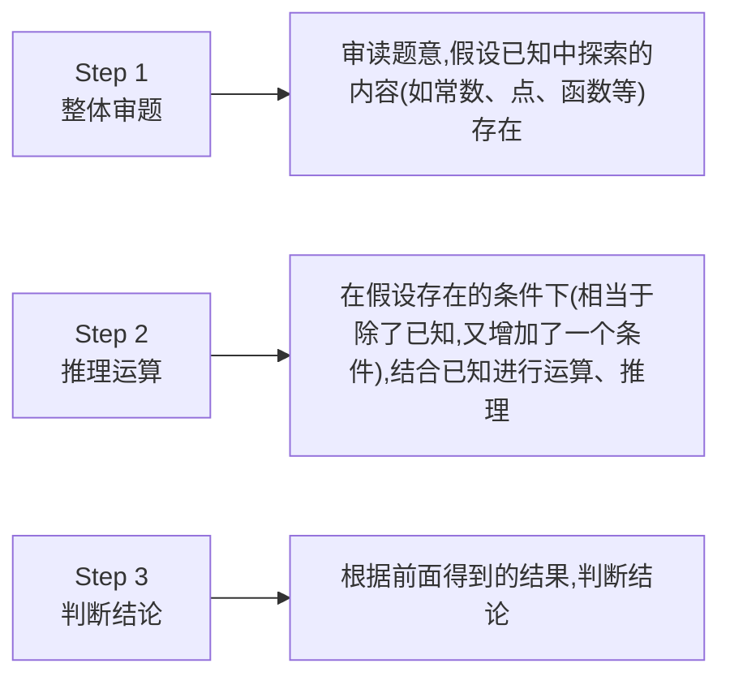
```mermaid
graph LR
    A["Step 1<br>整体审题"] --> B["审读题意,假设已知中探索的内容(如常数、点、函数等)存在"]
    C["Step 2<br>推理运算"] --> D["在假设存在的条件下(相当于除了已知,又增加了一个条件),结合已知进行运算、推理"]
    E["Step 3<br>判断结论"] --> F["根据前面得到的结果,判断结论"]
```

调研 1 (2024 广西贵百 9 月联考) 已知双曲线 $C: \frac{x^{2}}{2} - \frac{y^{2}}{b^{2}} = 1 (b > 0)$ 一个焦点 $F$ 到渐近线的距离为 $\sqrt{2}$ .

(1) 求双曲线 C 的方程.

(2) 过点 $(2,0)$ 的直线 l 与双曲线 C 的右支交于 A, B 两点, 在 x 轴上是否存在点 N, 使得 $\overrightarrow{NA} \cdot \overrightarrow{NB}$ 为定值? 如果存在, 求出点 N 的坐标及该定值; 如果不存在, 请说明理由.

解析 (1)由双曲线方程得渐近线方程为 $bx \pm \sqrt{2}y = 0$ .

设 $F(c,0)$ ，则根据题意知焦点 $F$ 到渐近线的距离 $d = \frac{|bc|}{\sqrt{2 + b^2}} = \frac{bc}{c} = b = \sqrt{2}$

所以双曲线 C 的方程为 $\frac{x^{2}}{2}-\frac{y^{2}}{2}=1$ .

(2) Step 1: 整体审题, 进行假设.

假设点 N 存在, 设 $N(t,0)$ .

Step 2: 结合已知, 进行推理、运算.

依题意, 直线 l 的斜率不为 0 , 设其方程为 $x = my + 2, -1 < m < 1$ , 与双曲线方程 $x^{2} - y^{2} = 2$ 联立并消元得关于 y 的方程 $(m^{2} - 1)y^{2} + 4my + 2 = 0, \Delta > 0$ .

# 备考方略

抓住重点,注重能力 有些内容,像函数的性质与图象、平面向量、直线和圆锥曲线的位置关系、空间线面关系判断等,都是每年必考的.

设 $A(x_{1},y_{1}),B(x_{2},y_{2})$ ，由根与系数的关系知 $y_{1} + y_{2} = -\frac{4m}{m^{2} - 1},y_{1}y_{2} = \frac{2}{m^{2} - 1},$

所以 $\overrightarrow{NA} \cdot \overrightarrow{NB} = (x_1 - t)(x_2 - t) + y_1y_2 = (my_1 + 2 - t)(my_2 + 2 - t) + y_1y_2 = (m^2 + 1)y_1y_2 +$

$$
m (2 - t) \left(y _ {1} + y _ {2}\right) + (2 - t) ^ {2} = \left(m ^ {2} + 1\right) \frac {2}{m ^ {2} - 1} - m (2 - t) \frac {4 m}{m ^ {2} - 1} + (2 - t) ^ {2} = \frac {(4 t - 6) m ^ {2} + 2}{m ^ {2} - 1} + (2 - t) ^ {2}.
$$

若要上式为定值,则必须有 4t - 6 = -2, 解得 t = 1, 所以 $\frac{(4t - 6)m^{2} + 2}{m^{2} - 1} + (2 - t)^{2} = -2 + 1 = -1$ .

Step 3: 判断结论.

故在 x 轴上存在点 $N(1,0)$ 满足 $\overrightarrow{NA} \cdot \overrightarrow{NB} = -1$ ，即 $\overrightarrow{NA} \cdot \overrightarrow{NB}$ 为定值，为 -1.

调研 2 (2024 湖南师范大学附属中学 9 月月考) 如图 1, 在多面体 $ABCDEF$ 中, 四边形 $ABCD$ 为正方形, $AF \perp$ 平面 $ABCD$ , $AF \parallel DE$ , $AB = AF = 2DE = 2$ , $M$ 是线段 $BF$ 上的一个动点, 过点 $M$ 和直线 $AD$ 的平面 $\alpha$ 与 $FC$ , $EC$ 分别交于 $P$ , $Q$ 两点.

(1) 若 M 为 BF 的中点, 请在图中作出线段 PQ, 并说明 P, Q 的位置及理由.

(2) 线段 BF 上是否存在点 M, 使得直线 AC 与平面 $\alpha$ 所成角的正弦值为 $\frac{\sqrt{10}}{10}$ ? 若存在, 求出 MB 的长; 若不存在, 请说明理由.

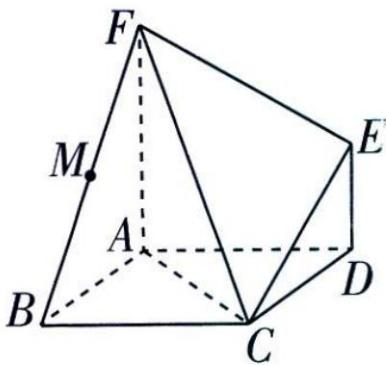

text_image

Geometric diagram of a polyhedron with labeled vertices and internal points, used for spatial geometry problems.

图1

解析 (1) 如图 2, 取 $P$ 为 $FC$ 的中点, $Q$ 为 $EC$ 靠近点 $E$ 的三等分点, 连接 $PQ, MP, QD, AM$ . 理由如下:

由四边形 ABCD 为正方形得 $AD \parallel BC, AB \parallel CD$ ，又 $BC \subset$ 平面 FBC， $AD \not\subset$ 平面 FBC，

所以 $AD \parallel$ 平面 $FBC$ .

又平面 $ADM \cap$ 平面 FBC = MP, M 为 FB 的中点, 所以 $AD \parallel MP$ , 且 P 为 FC 的中点.

因为 $AF \parallel DE, AB \parallel CD, CD, DE \subset$ 平面 DCE, AB, AF $\not\subset$ 平面 DCE,

所以 $AB, AF \parallel$ 平面 DCE, 又 $AF \cap AB = A, AB, AF \subset$ 平面 ABF,

所以平面 $ABF \parallel$ 平面 DCE, 因为平面 $ADM \cap$ 平面 AFB = AM, 平面 $ADM \cap$ 平面 DCE = DQ, 所以 $DQ \parallel AM$ , 又 AM 平分 $\angle FAB$ , 所以 DQ 平分 $\angle EDC$ .

又 $\frac{ED}{DC}=\frac{1}{2}$ ，所以 $\frac{EQ}{QC}=\frac{1}{2}$ ，Q为EC的三等分点，从而作出线段PQ.

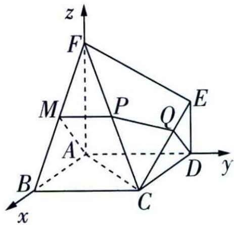

text_image

z
F
M
P
Q
E
A
B
C
D
y
x

图2

(2) 方法一 Step 1: 整体审题, 进行假设.

由题意,以 A 为坐标原点, $\overrightarrow{AB},\overrightarrow{AD},\overrightarrow{AF}$ 的方向为 x 轴,y 轴,z 轴的正方向,建立如图 2 所示的空间直角坐标系 A-xyz,则 $A(0,0,0)$ , $C(2,2,0)$ , $F(0,0,2)$ , $B(2,0,0)$ , $D(0,2,0)$ .

备考方略

于是 $\overrightarrow{BF} = (-2,0,2),\overrightarrow{AD} = (0,2,0),\overrightarrow{AC} = (2,2,0)$ ，假设存在点 $M$ ，设 $M(t,0,2 - t),t\in (0,2)$

【难点突破】观察图形，由于 $AF = AB$ ，因而 $M$ 点的横坐标与竖坐标和为2，纵坐标为0

Step 2: 结合已知, 进行推理、求解运算.

则 $\overrightarrow{AM} = (t,0,2 - t)$ ，设平面DAM的法向量为 $\pmb {m} = (x,y,z)$

则由 $\left\{\begin{aligned}\boldsymbol{m}\cdot\overrightarrow{AM}&=0,\\ \boldsymbol{m}\cdot\overrightarrow{AD}&=0,\end{aligned}\right.$ 得 $\left\{\begin{aligned}xt+z(2-t)&=0,\\ 2y&=0,\end{aligned}\right.$ 取z=1,y=0,则 $x=1-\frac{2}{t}$ ,即 $\boldsymbol{m}=(1-\frac{2}{t},0,1)$ .

设直线 $AC$ 与平面 $\alpha$ 所成角为 $\theta$ , 则 $\sin \theta = |\cos \langle m, \overrightarrow{AC} \rangle| = \frac{|\boldsymbol{m} \cdot \overrightarrow{AC}|}{|\boldsymbol{m}| |\overrightarrow{AC}|}$ ,

由已知得直线 $AC$ 与平面 $\alpha$ 所成角的正弦值为 $\frac{\sqrt{10}}{10}$ , 则 $\frac{|2 - \frac{4}{t}|}{\sqrt{(1 - \frac{2}{t})^2 + 1} \cdot 2\sqrt{2}} = \frac{\sqrt{10}}{10}$ , 解得 $t = \frac{4}{3}$ , 所以 $M(\frac{4}{3}, 0, \frac{2}{3})$ .

Step 3: 判断结论.

易知若 M 与点 B 或 F 重合时, 不满足题意, 所以满足题设的点 $M\left(\frac{4}{3}, 0, \frac{2}{3}\right)$ 存在, 此时 $MB = \frac{2\sqrt{2}}{3}$ .

方法二 假设存在点 M 满足题设, 并设 $\overrightarrow{BM} = \lambda \overrightarrow{BF} (0 < \lambda \leqslant 1)$ , 由方法一建立的坐标系得 $M(2 - 2\lambda, 0, 2\lambda)$ .

设平面 DAM 的法向量为 $\boldsymbol{m} = (x, y, z)$ ，则由 $\left\{\begin{aligned}\boldsymbol{m} \cdot \overrightarrow{AM} &= 0, \\ \boldsymbol{m} \cdot \overrightarrow{AD} &= 0,\end{aligned}\right.$ 得 $\left\{\begin{aligned}(2 - 2\lambda)x + 2\lambda z &= 0, \\ 2y &= 0,\end{aligned}\right.$

令 x=1 ，得平面 APQ 的一个法向量为 $\boldsymbol{m}=(1,0,1-\frac{1}{\lambda})$ .

设直线 $AC$ 与平面 $\alpha$ 所成角为 $\theta$ , 则 $\sin \theta = |\cos \langle m, \overrightarrow{AC} \rangle| = \frac{|\boldsymbol{m} \cdot \overrightarrow{AC}|}{|\boldsymbol{m}| |\overrightarrow{AC}|}$ ,

由直线 AC 与平面 $\alpha$ 所成角的正弦值为 $\frac{\sqrt{10}}{10}$ 得 $\frac{|m \cdot \overrightarrow{AC}|}{|m||\overrightarrow{AC}|} = \frac{2}{\sqrt{1 + (1 - \frac{1}{\lambda})^2} \cdot 2\sqrt{2}} = \frac{\sqrt{10}}{10}$ ，解得 $\lambda = \frac{1}{3}$ ，即 $M(\frac{4}{3}, 0, \frac{2}{3})$ ，所以 $MB = \frac{2\sqrt{2}}{3}$ .

易知若 M 与点 B 重合时, 不符合题意, 所以线段 BF 上存在点 M 满足条件, 且点 M 位于靠近点 B 的三等分点处, 此时 $MB = \frac{2\sqrt{2}}{3}$ .

# 备考方略

# 模型演练

1. (调研 1 变式, 变载体, 双曲线变椭圆 |2024 四川成都蓉城联盟 8 月入学联考) 已知椭圆 $C: \frac{x^{2}}{a^{2}} + \frac{y^{2}}{b^{2}} = 1 (a > b > 0)$ 过点 $(1, \frac{\sqrt{2}}{2})$ , 且上顶点与右顶点的距离为 $\sqrt{3}$ .

(1) 求椭圆 C 的方程.

(2)若过点 $P(3,0)$ 的直线 $l$ 交椭圆 $C$ 于 $A,B$ 两点,在 $x$ 轴上是否存在点 $Q$ 使得 $\angle PQA + \angle PQB = \pi$ ? 若存在,求出点 $Q$ 的坐标;若不存在,请说明理由.

2. (调研2 变式, 变考法, 探索使得位置关系成立的点是否存在 2024 重庆八中 9 月入学测试) 如图3, 在四棱锥 $P - ABCD$ 中, 底面 $ABCD$ 是菱形, $\angle ABC = 60^{\circ}$ , 三角形 $PAB$ 为正三角形, 且侧面 $PAB \perp$ 底面 $ABCD$ . $E, M$ 分别为线段 $AB, PD$ 的中点.

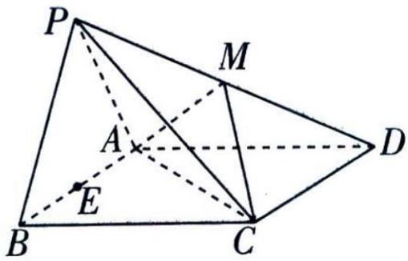

text_image

P
M
A
D
B
E
C

图3

(1) 求证: PB // 平面 ACM.

(2)在棱 $CD$ 上是否存在点 $G$ , 使得平面 $GAM \perp$ 平面 $ABCD$ ? 若存在, 求出 $\frac{CG}{CD}$ 的值; 若不存在, 请说明理由.

# 参考答案与解析

1. (1) 因为椭圆 C 的上顶点与右顶点的距离为 $\sqrt{3}$ ，所以 $a^{2} + b^{2} = 3$ .

因为椭圆 C 过点 $(1, \frac{\sqrt{2}}{2})$ ，所以 $\frac{1}{a^{2}} + \frac{1}{2b^{2}} = 1$ .

由 $\left\{\begin{aligned}a^{2}+b^{2}&=3,\\ \frac{1}{a^{2}}+\frac{1}{2b^{2}}&=1,\end{aligned}\right.$ 可得 $a^{2}=2,b^{2}=1$ ，所以椭圆C的方程为 $\frac{x^{2}}{2}+y^{2}=1$ .

(2) Step 1: 整体审题, 进行假设.

假设在 x 轴上存在点 $Q(m,0)$ ，使得 $\angle PQA + \angle PQB = \pi$ ，即存在点 Q，使得 $k_{QA} + k_{QB} = 0$ 。

Step 2: 结合已知, 进行推理、运算.

如图4,当直线 l 与 x 轴不重合时,设其方程为 $x = ty + 3$ , 设 $A(x_{1}, y_{1}), B(x_{2}, y_{2})$ ,

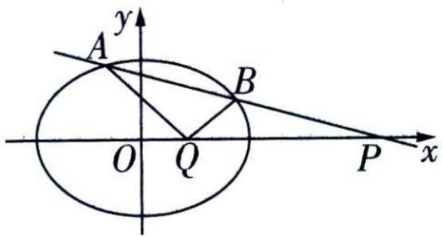

text_image

y
A
B
O Q P x

图4

由 $\left\{\begin{aligned}x&=ty+3,\\ \frac{x^{2}}{2}&+y^{2}=1\end{aligned}\right.$ 得关于y的方程 $(t^{2}+2)y^{2}+6ty+7=0$ ，则 $\Delta=8(t^{2}-$

7) >0, 解得 $t > \sqrt{7}$ 或 $t < -\sqrt{7}$ , 所以 $y_{1} + y_{2} = -\frac{6t}{t^{2} + 2}, y_{1}y_{2} = \frac{7}{t^{2} + 2}$ , 则 $k_{QA} + k_{QB} = \frac{y_{1}}{x_{1} - m} + \frac{y_{2}}{x_{2} - m} = 0$ .

备考方略

规范计算,减少失误 计算问题在数学试卷中的考查无处不在,在每次考试中,因为计算失误而造成的失分占有相当的比例.

所以 $y_{1}(x_{2}-m)+y_{2}(x_{1}-m)=y_{1}(ty_{2}+3-m)+y_{2}(ty_{1}+3-m)=2ty_{1}y_{2}+(3-m)(y_{1}+y_{2})=\frac{14t}{t^{2}+2}-\frac{6t(3-m)}{t^{2}+2}=0$ ,所以 $6t(3-m)=14t$

又 $t \in (-\infty, -\sqrt{7}) \cup (\sqrt{7}, +\infty)$ , 所以 $6(3 - m) = 14$ , 解得 $m = \frac{2}{3}$ , 所以 $Q(\frac{2}{3}, 0)$ .

当直线 l 与 x 轴重合时, A, B 分别为椭圆 C 的左、右顶点,

【易错提醒】此处容易漏掉对特殊情况的判断

若 $Q(\frac{2}{3},0)$ ，则 $\angle PQA + \angle PQB = \pi$ 显然成立.

Step 3: 给出结论.

综上所述,在 x 轴上存在点 $Q(\frac{2}{3},0)$ 满足题意.

2. (1) 如图 5, 连接 BD 交 AC 于 H 点, 连接 MH,

因为四边形 ABCD 是菱形, 所以点 H 为 BD 的中点.

又 M 为 PD 的中点, 所以 $MH \parallel BP$ ,

又 $BP \not\subset$ 平面 $ACM, MH \subset$ 平面 $ACM$ , 所以 $BP \parallel$ 平面 $ACM$ .

(2) Step 1: 整体审题, 做必要铺垫, 并通过题目要求进行假设.

设底面 $ABCD$ 的边长为 2 , 连接 $PE, EC$ , 由于 $ABCD$ 为菱形, 且 $\angle ABC = 60^{\circ}$ ,故 BE = 1, BC = 2, $EC = \sqrt{BE^{2} + BC^{2} - 2BE \cdot BC \cdot \cos 60^{\circ}} = \sqrt{3}$ ，所以 $BC^{2}=BE^{2}+EC^{2}$ ，故 $EC\perp AB$ ，

又三角形 PAB 为正三角形, E 为 AB 中点, 故 $PE \perp AB$ .

因为侧面 $PAB \perp$ 底面 ABCD, 平面 $PAB \cap$ 平面 ABCD = AB, $PE \subset$ 平面 PAB, 所以 $PE \perp$ 平面 ABCD. 如图 5, 以 E 为坐标原点, $\overrightarrow{EC}, \overrightarrow{EA}, \overrightarrow{EP}$ 的方向分别为 x 轴, y 轴, z 轴的正方向, 建立空间直角坐标系,

则 $A(0,1,0)$ , $C(\sqrt{3},0,0)$ , $P(0,0,\sqrt{3})$ , $D(\sqrt{3},2,0)$ , $M(\frac{\sqrt{3}}{2},1,\frac{\sqrt{3}}{2})$ , 设 $\frac{CG}{CD} = \lambda, \lambda \in [0,1]$ .

Step 2: 结合题目特色, 进行推理、运算.

$\overrightarrow{CG} = \lambda \overrightarrow{CD} = (0,2\lambda ,0)$ ，则 $G(\sqrt{3},2\lambda ,0),\overrightarrow{AM} = (\frac{\sqrt{3}}{2},0,\frac{\sqrt{3}}{2}),\overrightarrow{AG} = (\sqrt{3},2\lambda -1,0)$

设平面 $GAM$ 的法向量为 $\pmb {n} = (x,y,z)$ ，则有 $\left\{ \begin{array}{l}\pmb {n}\cdot \overrightarrow{AM} = 0,\\ \pmb {n}\cdot \overrightarrow{AG} = 0, \end{array} \right.\left\{ \begin{array}{l}x + z = 0,\\ \sqrt{3} x + (2\lambda -1)y = 0, \end{array} \right.$

取 $y = 1$ ，得 $x = \frac{1 - 2\lambda}{\sqrt{3}},z = \frac{2\lambda - 1}{\sqrt{3}}$ ，所以平面GAM的一个法向量为 $\pmb {n} = (\frac{1 - 2\lambda}{\sqrt{3}},1,\frac{2\lambda - 1}{\sqrt{3}})$

平面 ABCD 的法向量可取 $\boldsymbol{m}=(0,0,1)$ ，由题可知 $\cos\langle\boldsymbol{m},\boldsymbol{n}\rangle=\frac{\boldsymbol{m}\cdot\boldsymbol{n}}{|\boldsymbol{m}||\boldsymbol{n}|}=0$ ，即 $\left|\frac{2\lambda-1}{\sqrt{3}}\right|=0$ ，解

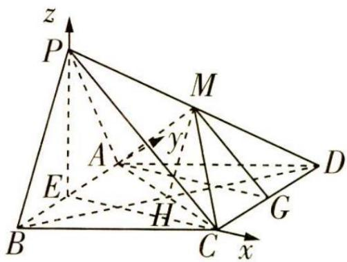

text_image

z
P
M
A
y
E
H
B
C
x
G
D

图5

# 备考方略

我们在复习时,除抓好知识、题型、方法等方面之外,还应通过各种方式保证运算的正确性,包括随时检验,规范演草等.

得 $\lambda = \frac{1}{2}$ .

Step 3: 给出结论.

故在棱 $CD$ 上存在点 $G$ 使得平面 $GAM \perp$ 平面 $ABCD$ , 此时 $\frac{CG}{CD} = \frac{1}{2}$ .

# 型5 用综合法快解新情境背景下的数列创新题

# 模型攻略

数列作为创新问题设置的重要载体,是高考创新题命题的热点之一,其创新性的呈现形式是多种多样的,但其求解方法是有章可循的,这里给出一种思维模型:

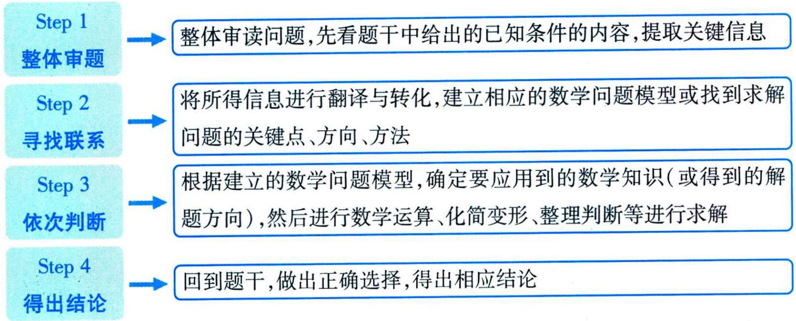

flowchart

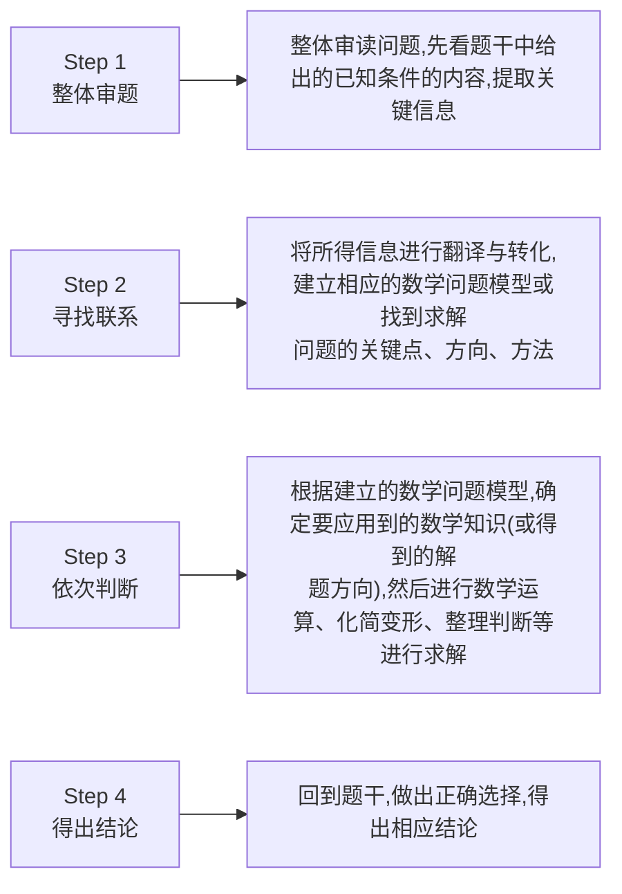
```mermaid
graph LR
    A["Step 1<br>整体审题"] --> B["整体审读问题,先看题干中给出的已知条件的内容,提取关键信息"]
    C["Step 2<br>寻找联系"] --> D["将所得信息进行翻译与转化,建立相应的数学问题模型或找到求解<br>问题的关键点、方向、方法"]
    E["Step 3<br>依次判断"] --> F["根据建立的数学问题模型,确定要应用到的数学知识(或得到的解<br>题方向),然后进行数学运算、化简变形、整理判断等进行求解"]
    G["Step 4<br>得出结论"] --> H["回到题干,做出正确选择,得出相应结论"]
```

调研 1: (有界数列与无界数列|2024 广东深中、华附、省实、广雅四校 8 月第一次联考|多选)对于数列 $\{a_{n}\}$ , 若存在正数 $M$ , 使得对一切正整数 $n$ , 都有 $|a_{n}| \leqslant M$ , 则称数列 $\{a_{n}\}$ 是有界的. 若这样的正数 $M$ 不存在, 则称数列 $\{a_{n}\}$ 是无界的. 记数列 $\{a_{n}\}$ 的前 $n$ 项和为 $S_{n}$ , 下列结论正确的是 ( )

A. 若 $a_{n} = \frac{1}{n}$ , 则数列 $\{a_{n}\}$ 是无界的  
B. 若 $a_{n} = \left(\frac{1}{2}\right)^{n}\sin n$ ，则数列 $\{S_{n}\}$ 是有界的  
C. 若 $a_{n} = (-1)^{n}$ , 则数列 $\{S_{n}\}$ 是有界的  
D. 若 $a_{n} = 2 + \frac{1}{n^{2}}$ , 则数列 $\{S_{n}\}$ 是有界的

解析 Step 1: 整体审题, 提取信息.

题设关键信息是“有界数列”的定义,选项中给出了不同的数列.

Step 2: 结合信息, 确定解题方向、方法.

# 备考方略

关注教材,稳定中心 学会回归教材,把书上的知识点理解透彻.一方面要“把书读薄”,也就是整理教材的逻辑框架,简化成思维导图,方便理解和记忆.

通过定义,得到如何判断“有界数列”的方法,即判断数列通项的绝对值是否不大于某个常数.

Step 3: 由 Step 2 所确定的方法, 推理、运算.

<table><tr><td>A</td><td> $\because |a_n| = |\frac{1}{n}| = \frac{1}{n} \leq 1$ 恒成立, $\therefore$ 存在正数  $M=1$ ,使得  $|a_n| \leq M$  恒成立, $\therefore$ 数列  $\{a_n\}$  是有界的</td><td>×</td></tr><tr><td>B</td><td> $\because -1 \leq \sin n \leq 1, \therefore -\left(\frac{1}{2}\right)^n \leq a_n = \left(\frac{1}{2}\right)^n \sin n \leq \left(\frac{1}{2}\right)^n, \therefore S_n = a_1 + a_2 + \cdots + a_n \leq \frac{1}{2} + \left(\frac{1}{2}\right)^2 + \cdots + \left(\frac{1}{2}\right)^n = \frac{\frac{1}{2}\left[1 - \left(\frac{1}{2}\right)^n\right]}{1 - \frac{1}{2}} = 1 - \left(\frac{1}{2}\right)^n < 1,$  $S_n = a_1 + a_2 + \cdots + a_n \geq -\left[\frac{1}{2} + \left(\frac{1}{2}\right)^2 + \cdots + \left(\frac{1}{2}\right)^n\right] = -1 + \left(\frac{1}{2}\right)^n > -1,$ 【易错提醒】因为需要考虑绝对值,有同学认为  $S_n \leq \frac{\frac{1}{2}\left[1 - \left(\frac{1}{2}\right)^n\right]}{1 - \frac{1}{2}} = 1 - (\frac{1}{2})^n < 1$ ,所以  $\{S_n\}$  有界.结果看似正确,但这是不完整的 $\therefore$  存在正数  $M=1$ ,使得  $|S_n| < M$  恒成立, $\therefore$  数列  $\{S_n\}$  是有界的</td><td>√</td></tr><tr><td>C</td><td> $\because a_n = (-1)^n, \therefore$ 当  $n$  为偶数时, $S_n = 0$ ;当  $n$  为奇数时, $S_n = -1.$  $\therefore |S_n| \leq 1, \therefore$  存在正数  $M=1$ ,使得  $|S_n| \leq M$  恒成立,数列  $\{S_n\}$  是有界的</td><td>√</td></tr><tr><td>D</td><td> $\because \frac{1}{n^2} = \frac{4}{4n^2} < \frac{4}{(2n-1)(2n+1)} = 2\left(\frac{1}{2n-1} - \frac{1}{2n+1}\right),$  $\therefore S_n = 2n + 1 + \frac{1}{2^2} + \frac{1}{3^2} + \cdots + \frac{1}{n^2} \leq 2n + 2\left(1 - \frac{1}{3} + \frac{1}{3} - \frac{1}{5} + \cdots + \frac{1}{2n-1} - \frac{1}{2n+1}\right) = 2n + 2\left(1 - \frac{1}{2n+1}\right) = 2n + \frac{4n}{2n+1} = 2\left(n - \frac{1}{2n+1} + 1\right).$  $\because y = x - \frac{1}{2x+1}$  在  $[1, +\infty)$  上单调递增, $\therefore n - \frac{1}{2n+1} \in [\frac{2}{3}, +\infty),$  $\therefore$  不存在正数  $M$ ,使得  $|S_n| \leq M$  恒成立, $\therefore$  数列  $\{S_n\}$  是无界的</td><td>×</td></tr></table>

Step 4: 给出结论.

综上所述,选 BC.

# 备考方略

调研 2: (根据前 n 项积构造新数列 | 2024 重庆一中 8 月入学考试) 正项数列 $\{a_n\}$ 的前 n 项的积为 $t_n, \{t_n\}$ 的前 n 项的积为 $T_n$ , 若 $\left\{\frac{t_n}{a_n}\right\}$ 是公差为 1 的等差数列.

(1)求数列 $\{a_{n}\}$ 的通项公式.  
(2) 记数列 $\left\{\frac{n^{2}}{T_{n}}\right\}$ 的前 n 项的和为 $S_{n}$ ，证明： $S_{n}<\frac{7}{4}$ .

解析 (1) Step 1: 整体审题, 提取信息.

已知有两条关键信息,一是数列 $\{a_{n}\}$ 的前n项的积为 $t_{n}$ ,另一个是数列 $\left\{\frac{t_{n}}{a_{n}}\right\}$ 是公差为1的等差数列,据此可求出 $\frac{t_{n}}{a_{n}}$ 的表达式,即递推关系式.

Step 2 + 3: 结合信息, 推理、运算.

因为数列 $\{a_{n}\}$ 的前 n 项的积为 $t_{n}$ ，所以 $\frac{t_{1}}{a_{1}}=1,\frac{t_{n}}{a_{n}}=a_{1}a_{2}a_{3}\cdots a_{n-1}(n\geqslant2)$ ，

又 $\{\frac{t_n}{a_n}\}$ 是公差为1的等差数列，所以 $\frac{t_n}{a_n} = a_1a_2a_3\dots a_{n - 1} = n(n\geqslant 2)$ ，即 $t_n = na_n,t_{n + 1} = (n+$ 1） $a_{n + 1}$

当 $n = 2$ 时, $\frac{t_2}{t_1} = \frac{2a_2}{a_1} = a_2$ , 所以 $a_1 = 2$ ; 当 $n \geqslant 2$ 时两式相除, 得 $\frac{t_{n+1}}{t_n} = \frac{n+1}{n} \cdot \frac{a_{n+1}}{a_n}$ , 即 $a_n = \frac{n+1}{n}$ .

【易错提醒】因为 $\frac{t_{n}}{a_{n}}=a_{1}a_{2}a_{3}\cdots a_{n-1}=n$ 的前提是 $n\geqslant2$ ，所以探求 $a_{n}$ 时要注意分类讨论，再验证总结

Step 4: 给出结论.

又 $a_1 = 2$ 满足上式，所以数列 $\{a_n\}$ 的通项公式为 $a_n = \frac{n + 1}{n}$ .

(2) 由(1)得 $t_n = n + 1$ , 所以 $T_n = 2 \times 3 \times 4 \times \cdots \times (n + 1) = (n + 1)!$ , 所以 $\frac{n^2}{T_n} = \frac{n^2}{(n + 1)!}$ .

$$
S _ {1} = \frac {1}{2} <   \frac {7}{4}, S _ {2} = \frac {1}{2} + \frac {4}{6} = \frac {7}{6} <   \frac {7}{4}, S _ {3} = \frac {1}{2} + \frac {4}{6} + \frac {9}{2 4} = \frac {3 7}{2 4} <   \frac {7}{4},
$$

因为当 $n \geqslant 4$ 时, $\frac{n^2}{T_n} = \frac{n^2}{(n + 1)!} < \frac{n^2 + n - 1}{(n + 1)!} = \frac{1}{(n - 1)!} - \frac{1}{(n + 1)!}$ ,

所以当 $n \geqslant 4$ 时, $S_{n} < \frac{1}{2} + \frac{4}{6} + \frac{9}{24} + \frac{1}{3!} - \frac{1}{5!} + \frac{1}{4!} - \frac{1}{6!} + \frac{1}{5!} - \frac{1}{7!} + \cdots + \frac{1}{(n-2)!} - \frac{1}{n!} + \frac{1}{(n-1)!} - \frac{1}{(n+1)!} = \frac{1}{2} + \frac{4}{6} + \frac{9}{24} + \frac{1}{3!} + \frac{1}{4!} - \frac{1}{n!} - \frac{1}{(n+1)!} = \frac{7}{4} - \frac{1}{n!} - \frac{1}{(n+1)!} < \frac{7}{4}$ , 所以 $S_{n} < \frac{7}{4}$ .

备考方略

有效刷题,拒绝题海 有些同学起早贪黑学习,试卷做了一套又一套,成绩却没有多大提升,甚至产生了自我否定心理.其实不是你不行,而是侧重点偏了.

# 模型演练

(调研 1 变式,变数列,跳跃数列 |2024 湖南长沙名校 8 月第一次质量检测 |多选)若数列 $\{a_{n}\}$ 中任意连续三项 $a_{i}, a_{i+1}, a_{i+2}$ 均满足 $(a_{i} - a_{i+2})(a_{i+2} - a_{i+1}) > 0$ , 则称数列 $\{a_{n}\}$ 为跳跃数列. 则下列结论正确的是 ( )

A. 等比数列: $1, -\frac{1}{3}, \frac{1}{9}, -\frac{1}{27}, \frac{1}{81}, \cdots$ 是跳跃数列

B. 数列 $\{a_{n}\}$ 的通项公式为 $a_{n} = \cos \frac{n\pi}{2} (n\in \mathbf{N}^{*})$ ，数列 $\{a_{n}\}$ 是跳跃数列

C. 等差数列不可能是跳跃数列

D. 等比数列是跳跃数列的充要条件是该等比数列的公比 $q \in (-1, 0)$

# 参考答案与解析

ACD Step 1 + 2: 整体审题, 提取信息, 确定解题方向、方法.

题设关键信息是跳跃数列的定义,通过相邻三项的关系进行运算,判断跳跃数列.

Step 3: 由 Step 2 所确定的方法, 推理、运算.

对于 A, 等比数列 1, $-\frac{1}{3}, \frac{1}{9}, -\frac{1}{27}, \frac{1}{81}, \cdots$ 的通项公式为 $a_{n} = \left(-\frac{1}{3}\right)^{n-1}$ ,

那么 $(a_{n} - a_{n + 2})(a_{n + 2} - a_{n + 1}) = [(-\frac{1}{3})^{n - 1} - (-\frac{1}{3})^{n + 1}][(-\frac{1}{3})^{n + 1} - (-\frac{1}{3})^n] = -\frac{32}{27}$ （ $-\frac{1}{3})^{2n - 1} > 0$

由跳跃数列的定义知,等比数列 $1, -\frac{1}{3}, \frac{1}{9}, -\frac{1}{27}, \frac{1}{81}, \cdots$ 是跳跃数列,故 A 正确.

对于 B, 数列的前三项为 $a_{1}=0, a_{2}=-1, a_{3}=0$ , 不符合跳跃数列的定义, 故 B 错误.

# 【点技巧】判断不正确，只需找到反例

对于 C, 当等差数列的公差 d > 0 时, 它是递增数列; d < 0 时, 它是递减数列; d = 0 时, 它是常数列. 所以等差数列不可能是跳跃数列, 故 C 正确.

对于 D, 若等比数列 $\{a_{n}\}$ 是跳跃数列, 则 $(a_{i}-a_{i+2})(a_{i+2}-a_{i+1})=a_{i}^{2}(1-q^{2})(q^{2}-q)>0$ , 整理得 $(q+1)q(q-1)^{2}<0$ , 即 -1<q<0,

若等比数列 $\{a_{n}\}$ 的公比 $q$ 满足 $-1 < q < 0$ ，则 $(q + 1)q(q - 1)^{2} < 0$

可得 $(a_{i}-a_{i+2})(a_{i+2}-a_{i+1})=a_{i}^{2}(1-q^{2})(q^{2}-q)>0$ ，所以等比数列 $\{a_{n}\}$ 是跳跃数列，故D正确.

Step 4: 给出结论.

故选 ACD.

# 备考方略

这时候要明确自身的薄弱点，“挑题做”，不要每套试卷每道题都花费时间去做，挑选自己需要训练的题目进行针对性练习。

# 妙用 10 类技法模型,速解核心必考问题

# 型1 用设而不求法速解函数零点问题

# 模型攻略

在解决有关函数 $f(x)$ 的零点、范围、最值等问题时,常常会遇到其导函数 $f'(x)$ 在某个区间内一定存在零点,但又无法直接求得该零点的情况,对此,我们通常采用“设而不求”的方法,具体步骤如下:

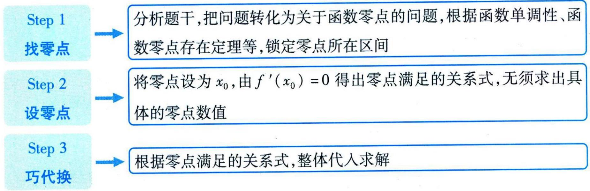

flowchart

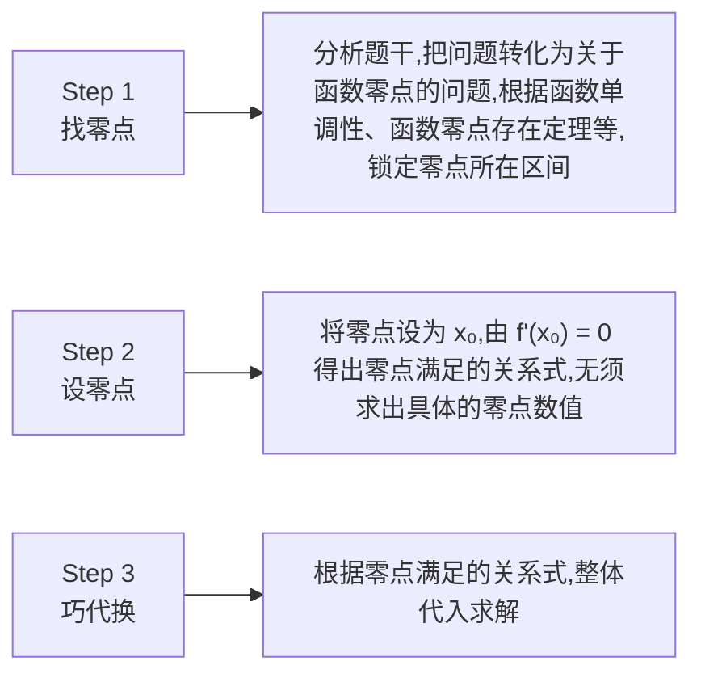
```mermaid
graph LR
    A["Step 1<br>找零点"] --> B["分析题干,把问题转化为关于函数零点的问题,根据函数单调性、函数零点存在定理等,锁定零点所在区间"]
    C["Step 2<br>设零点"] --> D["将零点设为 x₀,由 f'(x₀) = 0 得出零点满足的关系式,无须求出具体的零点数值"]
    E["Step 3<br>巧代换"] --> F["根据零点满足的关系式,整体代入求解"]
```

调研 1: (试题调研原创) 已知函数 $f(x) = \mathrm{e}^{x} - 3x$ , 若对任意实数 $x, f(x) \geqslant -x^{2} - 3 + 2b$ 恒成立, 则整数 $b$ 的最大值为 \_\_\_\_.

解析 Step 1: 分析题干, 转化问题, 找零点.

对任意实数 $x, f(x) \geqslant -x^2 - 3 + 2b$ 恒成立，即 $\mathrm{e}^x + x^2 - 3x + 3 \geqslant 2b$ 恒成立，

令 $g(x) = \mathrm{e}^{x} + x^{2} - 3x + 3$ ，则 $b\leqslant \frac{1}{2} g(x)_{\min}$

【会转化】通过分离参数，转化为求函数 $g(x)$ 的最值问题

$g'(x) = e^{x} + 2x - 3$ , 令 $h(x) = g'(x) = e^{x} + 2x - 3$ , 则 $h'(x) = e^{x} + 2 > 0$ ,

所以 $g'(x) = \mathrm{e}^{x} + 2x - 3$ 在 R 上单调递增，

又 $g^{\prime}(\frac{1}{2}) = \sqrt{\mathrm{e}} - 2 < 0, g^{\prime}(1) = \mathrm{e} - 1 > 0$ ，则由函数零点存在定理知，存在唯一 $x \in (\frac{1}{2}, 1)$ ，使得 $g^{\prime}(x) = 0$ .

Step 2: 设零点, 找等量关系.

设 $x_0 \in (\frac{1}{2}, 1)$ , 且 $g'(x_0) = 0$ , 则 $g'(x_0) = e^{x_0} + 2x_0 - 3 = 0$ , 所以 $e^{x_0} = 3 - 2x_0$ .

当 $x \in (-\infty, x_0)$ 时， $g'(x) < 0$ ，函数 $g(x)$ 在 $(- \infty, x_0)$ 上单调递减；

当 $x \in (x_0, +\infty)$ 时， $g'(x) > 0$ ，函数 $g(x)$ 在 $(x_0, +\infty)$ 上单调递增.

所以 $g(x)$ 在 $x=x_{0}$ 时取得最小值 $g(x_{0})=\mathrm{e}^{x_{0}}+x_{0}^{2}-3x_{0}+3$ .

备考方略

错题分析,避免重犯 错题分析想两个问题:一个是弄清楚这道题考查的是什么知识点,对应到课本上属于哪节课的内容,自己有没有掌握.

Step 3:根据零点所满足的等量关系,整体代入,“设而不求”求得结果.

由 $\mathrm{e}^{x_0} = 3 - 2x_0$ ，得 $g(x_0) = 3 - 2x_0 + x_0^2 -3x_0 + 3 = (x_0 - \frac{5}{2})^2 -\frac{1}{4},$

【会代换】整体代换要向着解决问题的方向去靠，如本题要求代数式的最小值，消去指数项，代数式变为二次函数型，便易于求解了

又 $x_0 \in \left(\frac{1}{2}, 1\right)$ , 所以 $(x_0 - \frac{5}{2})^2 - \frac{1}{4} \in (2, \frac{15}{4})$ , 所以 $\frac{1}{2} g(x_0) \in (1, \frac{15}{8})$ ,

又 $b \in \mathbf{Z}$ , 所以整数 $b$ 的最大值为 1.

调研 2 (2024 河北保定开学测试) 已知函数 $f(x) = \frac{\cos x}{x}, x \in (0, \pi]$ , $f'(x)$ 是 $f(x)$ 的导函数, 若关于 $x$ 的不等式 $f'(x) + \frac{a}{x^2} + a \leqslant 0$ 有解, 则 $a$ 的取值范围为 \_\_\_\_.

解析 Step 1: 分析题干, 转化问题, 找零点.

$f(x) = \frac{\cos x}{x}, x \in (0, \pi]$ , 则 $f'(x) = \frac{-(x \sin x + \cos x)}{x^2}$ ,

$f^{\prime}(x) + \frac{a}{x^{2}} + a \leqslant 0$ ，即 $x \sin x + \cos x - a(x^{2} + 1) \geqslant 0$

设 $F(x) = x\sin x + \cos x - a(x^2 + 1), x \in (0, \pi]$ ，则 $F'(x) = x\cos x - 2ax = x(\cos x - 2a)$ .

当 $2a \leqslant -1$ ，即 $a \leqslant -\frac{1}{2}$ 时， $F'(x) \geqslant 0, F(x)$ 在 $(0, \pi]$ 上单调递增，

$F(x)_{\max}=F(\pi)=-1-a(\pi^{2}+1)\geqslant0,a\leqslant-\frac{1}{\pi^{2}+1},$ 所以 $a\leqslant-\frac{1}{2}$ 符合题意.

当 $2a \geqslant 1$ , 即 $a \geqslant \frac{1}{2}$ 时, $F'(x) \leqslant 0$ , $F(x)$ 在 $(0, \pi]$ 上单调递减, 则 $1 - a > 0$ , 即 $a < 1$ , 所以 $\frac{1}{2} \leqslant a < 1$ 符合题意.

当 $-\frac{1}{2} < a < \frac{1}{2}$ 时，存在唯一的 $x \in (0, \pi]$ ，使得 $F'(x) = 0$

【小技巧】导函数值的符号无法确定，需要分类讨论，分类时注意要不重、不漏

Step 2: 设零点, 得出零点满足的关系式.

设 $x_0 \in (0, \pi]$ ，且 $F'(x_0) = 0$ ，则 $\cos x_0 = 2a$

当 $x \in (0, x_0)$ 时， $\cos x > 2a, F'(x) > 0, F(x)$ 单调递增，

当 $x \in (x_0, \pi]$ 时， $\cos x < 2a, F'(x) < 0, F(x)$ 单调递减.

Step 3: 根据零点所满足的等量关系,整体代入,“设而不求”,转化为不含参数的函数的最值问题.

所以 $F(x)_{\max} = F(x_0) = x_0\sin x_0 + \cos x_0 - a(x_0^2 + 1) = x_0\sin x_0 + \cos x_0 - \frac{1}{2}(x_0^2 + 1)\cos x_0 =$

# 备考方略

另一个是自己是否粗心大意,留意自己容易在什么样的细节上疏忽,以后遇到同类问题时,记得提醒自己不要再次掉坑.

$$
x _ {0} \sin x _ {0} + \frac {1}{2} \cos x _ {0} - \frac {x _ {0} ^ {2}}{2} \cos x _ {0}.
$$

令 $\varphi(x) = x\sin x + \frac{1}{2}\cos x - \frac{x^2}{2}\cos x, x \in (0, \pi]$ ,

【会研究】关于零点的代数式比较复杂，其最值不能直接观察得出，所以另设函数研究

则 $\varphi'(x) = \frac{1}{2}\sin x + \frac{x^2}{2}\sin x > 0$ ，所以 $\varphi(x) > 0 \times \sin 0 + \frac{1}{2}\cos 0 - \frac{0^2}{2} \times \cos 0 = \frac{1}{2}, F(x_0) \geqslant 0$ 成立，所以 $-\frac{1}{2} < a < \frac{1}{2}$ 符合题意.

综上, $a$ 的取值范围为 $(- \infty, 1)$ .

# 模型演练

(调研1变式,变函数模型,对数型函数的设而不求问题|2024江苏连云港灌南高级中学9月月考)已知函数 $f(x)=\ln(x+1)-ax+2$ . 当 $x\geqslant0$ 时, $f(x)+2x+x\ln(x+1)\geqslant0$ 恒成立,则整数a的最大值为\_\_\_\_.

# 参考答案与解析

4 Step 1: 分析题干, 转化问题, 找零点.

由 $f(x) + 2x + x\ln (x + 1)\geqslant 0$ ，得 $ax\leqslant (x + 1)[\ln (x + 1) + 2]$

当 $x = 0$ 时， $a \cdot 0 \leqslant 2, a \in \mathbf{R}$ .

【易错提醒】分离参数时, 注意参数的系数可能为 0

当 $x > 0$ 时， $a \leqslant \frac{(x + 1)[\ln(x + 1) + 2]}{x}$ ，

设 $g(x) = \frac{(x + 1)[\ln(x + 1) + 2]}{x} (x > 0)$ , 则 $g'(x) = \frac{x - 2 - \ln(x + 1)}{x^2}$ ,

设 $h(x)=x-2-\ln(x+1)(x>0)$ ，则 $h'(x)=\frac{x}{x+1}>0$ ，则 $h(x)$ 在 $(0,+\infty)$ 上单调递增，

又 $h(3) = 1 - \ln 4 < 0, h(4) = 2 - \ln 5 > 0$ ，所以 $h(x)$ 在 $(3,4)$ 上存在唯一零点.

Step 2: 设零点, 得出零点满足的关系式.

设 $x_0 \in (3,4)$ , 且 $h(x_0) = 0$ , 则 $x_0 - 2 = \ln (x_0 + 1)$ .

当 $x \in (0, x_0)$ 时， $h(x) < 0$ ，即 $g'(x) < 0$ ，当 $x \in (x_0, +\infty)$ 时， $h(x) > 0$ ，即 $g'(x) > 0$

则有 $g(x)$ 在 $(0, x_{0})$ 上单调递减，在 $(x_{0}, +\infty)$ 上单调递增，所以 $g(x)_{\min} = g(x_{0})$ .

Step 3:根据零点所满足的等量关系,整体代入,“设而不求”,结合零点的取值范围求解.

所以 $a \leqslant g(x_0) = \frac{(x_0 + 1)[\ln(x_0 + 1) + 2]}{x_0} = \frac{(x_0 + 1)[(x_0 - 2) + 2]}{x_0} = x_0 + 1$

【会转化】实施“ $x_{0}-2$ ”和“ $\ln(x_{0}+1)$ ”之间的转化，从而可以化简得出结果

因为 $x_0 \in (3,4)$ , 所以 $x_0 + 1 \in (4,5)$ , 所以整数 $a$ 的最大值为 4.

备考方略

研究考题,把握方向 研究往年的真题,感受高考试题的深度和广度,防止在训练题时片面追求偏、难、怪.

# 模型2 用换元思想速解函数嵌套问题

# 模型攻略

嵌套函数即复合函数,以基本初等函数相互“复合”成的一些“新函数”为主,常与函数的图象、性质、零点等交汇起来综合考查.对于嵌套函数的零点,通常先“换元解套”,将复合函数拆解为两个相对简单的函数,借助函数的图象、性质求解.

对于嵌套函数 $y=f(g(x))$ 的零点问题, 求解思路如下:

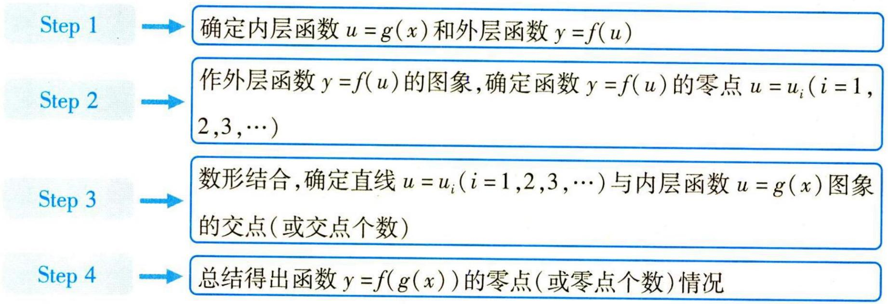

flowchart

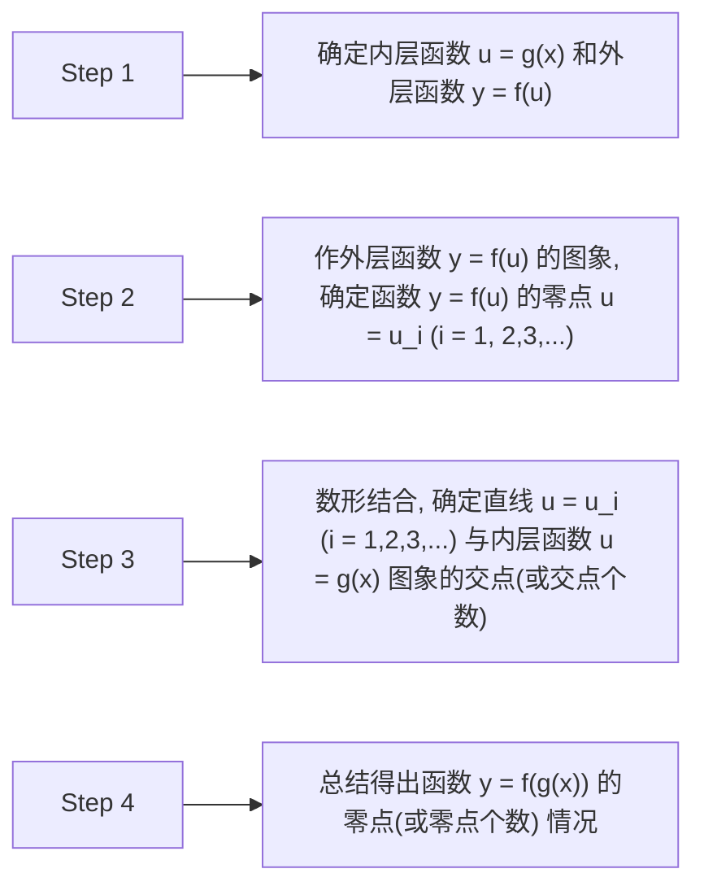
```mermaid
graph LR
    A["Step 1"] --> B["确定内层函数 u = g(x) 和外层函数 y = f(u)"]
    C["Step 2"] --> D["作外层函数 y = f(u) 的图象, 确定函数 y = f(u) 的零点 u = u_i (i = 1, 2,3,...)"]
    E["Step 3"] --> F["数形结合, 确定直线 u = u_i (i = 1,2,3,...) 与内层函数 u = g(x) 图象的交点(或交点个数)"]
    G["Step 4"] --> H["总结得出函数 y = f(g(x)) 的零点(或零点个数) 情况"]
```

调研 1 (2024 江苏常州高级中学 8 月期初检测) 已知函数 $f(x) = \frac{x^2 + x - 1}{e^x}$ , 其中 $x \in \mathbb{R}$ , 则函数 $y = f(f(x)) + 1$ 共有 \_\_\_\_ 个零点.

解析 Step 1: 确定内层函数和外层函数.

函数 $y = f(f(x)) + 1$ 分解后是函数 $y = f(t) + 1, t = f(x)$ ，即内层函数为 $t = f(x)$ ，外层函数为 $y = f(t) + 1$ .

Step 2: 确定外层函数 $f(t) + 1$ 的零点及所在区间.

令 $f(t)+1=0$ ，即 $f(t)=-1$ 。

由 $f(t)=0$ 可得 $t^{2}+t-1=0$ ，解得 $t=\frac{-1\pm\sqrt{5}}{2}$ ，所以当 $\frac{-1-\sqrt{5}}{2}<t<\frac{-1+\sqrt{5}}{2}$ 时， $f(t)<0$ .

对 $f(t)$ 求导得 $f'(t)=\frac{-t^{2}+t+2}{e^{t}}$ ，令 $f'(t)=0$ ，得t=-1或t=2，

因此 $f(t)$ 在 $(-∞,-1)$ 上单调递减,在 $(-1,2)$ 上单调递增,在 $(2,+∞)$ 上单调递减.

【敲黑板】研究函数值的符号和函数的单调性，目的是缩小函数零点的范围

所以 $f(t) = -1$ 有两解 $t_1, t_2$ ，不妨设 $t_1 < t_2$ ，则 $\frac{-1 - \sqrt{5}}{2} < t_1 < -1, t_2 = 0$ .

Step 3: 根据外层函数的零点及零点所在区间, 确定内层函数的零点情况.

根据对 $f(t)$ 的分析作出 $f(x)$ 的大致图象,如图1所示.

# 备考方略

因为 $\frac{-1 - \sqrt{5}}{2} > -\mathrm{e}$ , 所以根据图象可知直线 $y = t_{1}$ 与曲线 $y = f(x)$ 有 2 个交点, 直线 $y = t_{2}$ 与曲线 $y = f(x)$ 有 2 个交点.

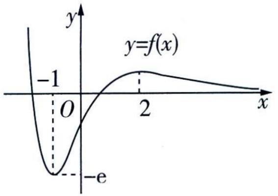

line

| x    | y     |
| ---- | ----- |
| -1   | -e    |
| 0    | 0     |
| 2    | f(x)  |

图1

Step 4: 整合结论, 确定结果.

综上, 函数 $y=f(f(x))+1$ 共有 4 个零点.

调研 2 (2024 重庆八中 8 月开学考试 | 多选) 已知函

数 $f(x)=\left\{\begin{aligned}\mathrm{e}^{x},&x\leqslant0,\\|\ln x|,&x>0,\end{aligned}\right.$ $g(x)=f(f(x))-f(x)-a(a\in\mathbf{R})$ ，则下列说法正确的是()

A. $\exists a \in \mathbf{R}$ , 使得 $g(x)$ 有 2 个零点

B. $\exists a \in \mathbf{R}$ , 使得 $g(x)$ 有 3 个零点

C. 若 $g(x)$ 有 3 个零点, 则 $a > 1$

D. 若 $g(x)$ 有4个零点, 则 $a = 1$

解析 Step 1: 确定内层函数和外层函数, 对内层函数实施换元.

令 $f(x)=t$ ，则 $t\geqslant0$ ，则 $g(x)=f(f(x))-f(x)-a=0\Rightarrow f(t)=t+a.$

【会转化】换元后，可以看出内层函数为 $t = f(x)$ ，外层函数为 $g(t) = f(t) - t - a$

Step 2: 借助切线, 研究外层函数的零点.

根据题意作出 $y=f(t)$ 的大致图象, 如图 2 所示, 则外层函数的零点个数即直线 $y=t+a$ 与曲线 $y=f(t)(t\geqslant0)$ 的交点个数.

【易遗漏】内层函数的值域限制了外层函数的定义域，故换元后要注意新元的取值范围

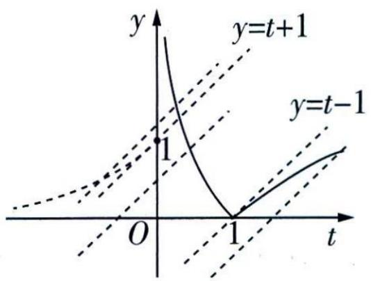

text_image

y
y=t+1
y=t-1
O
1
1
t

图2

直线 $y = t + a$ 的斜率为 1，

当 $t \geqslant 1$ 时, $\ln t \geqslant 0$ , 设曲线 $y = \ln t (t \geqslant 1)$ 的斜率为 1 的切线的切点为 $(t_0, \ln t_0), y' = \frac{1}{t}$ , 则由 $\frac{1}{t_0} = 1$ 得 $t_0 = 1$ , 故切点为 $(1, 0)$ , 切线方程为 $y$

向上平移直线 y = t - 1，当到达直线 $y = t + 1$ 的位置时，与曲线 $y = f(t) (t \geqslant 0)$ 有 2 个交点.

故当 a > 1 时, 直线 $y = t + a$ 与曲线 $y = f(t) (t \geqslant 0)$ 有 1 个交点, 且交点横坐标满足 $t \in (0, 1)$ ;

当 $a = 1$ 时，直线 $y = t + a$ 与曲线 $y = f(t)(t \geqslant 0)$ 有2个交点，交点横坐标分别满足 $t \in (0,1)$ 和 $t = 0$ ；

当 -1 < a < 1 时, 直线 $y = t + a$ 与曲线 $y = f(t) (t \geqslant 0)$ 有 1 个交点, 且交点横坐标满足 $t \in (0,1)$ ;

当 a = -1 时, 直线 $y = t + a$ 与曲线 $y = f(t) (t \geqslant 0)$ 有 1 个交点, 且交点横坐标满足 t = 1;

当 a < -1 时, 直线 $y = t + a$ 与曲线 $y = f(t) (t \geqslant 0)$ 有 1 个交点, 且交点横坐标满足 t > 1.

Step 3: 研究内层函数 $y = f(x)$ 的图象与直线 $y = t$ 的交点个数情况.

再看 $f(x)$ 的图象,如图3所示,

备考方略

注重细节,勿因小失大 把重点放在复习上的同时,不要忽视“规范答题”,这一点做好了能够避免丢掉不应丢掉的分,是守卫高分的重要武器.

当 t > 1 时, 曲线 $y = f(x)$ 与直线 y = t 有 2 个交点,

当 $0 < t \leqslant 1$ 时，曲线 $y = f(x)$ 与直线 $y = t$ 有3个交点，

当 t=0 时, 曲线 $y=f(x)$ 与直线 y=t 有 1 个交点,

当 t<0 时, 曲线 $y=f(x)$ 与直线 y=t 没有交点.

Step 4: 整合结论, 求得结果.

综上可知: 当 $-1 \leqslant a < 1$ 或 a > 1 时, $g(x)$ 有 3 个零点; 当 a = 1 时, $g(x)$ 有 4 个零点; 当 a < -1 时, $g(x)$ 有 2 个零点. 故选 ABD.

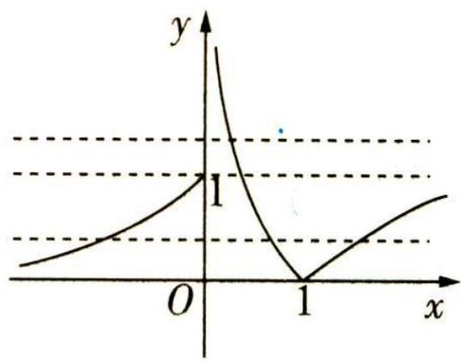

line

| x | y |
|---|---|
| 0 | 0 |
| 1 | 0 |

图3

# 模型演练

1. (调研 1 变式, 变设问, 知零点个数反求参数问题 | 2024 江苏盐城 8 月期初测试) 已知函数 $f(x) = \cos^{2} x + a \sin x + \frac{1}{4}$ 在区间 $[0, \pi]$ 上有 2 个不同的零点, 则实数 $a$ 的取值范围为

A. $(- \frac{5}{4}, - \frac{1}{4})$

B. $(-1,-\frac{1}{4})$

C. $(-\infty, -\frac{1}{4})$

D. $\left(-\frac{5}{4},-1\right)$

2. (调研 2 变式, 变函数模型, 关于对勾函数和二次函数的复合函数零点问题 | 2024 广东茂名 9 月统测) 已知函数 $f(x) = -x^{2} - 2x$ , $g(x) = \begin{cases} x + \frac{1}{4x}, & x > 0, \\ x + 1, & x \leqslant 0. \end{cases}$ 若关于 $x$ 的方程 $g(f(x)) - a = 0$ 有 4 个实数根, 则实数 $a$ 的取值范围为 \_\_\_\_.

# 参考答案与解析

1. C Step 1: 利用降幂公式转化题目条件, 换元确定内、外层函数.

$$
f (x) = \cos^ {2} x + a \sin x + \frac {1}{4} = 1 - \sin^ {2} x + a \sin x + \frac {1}{4} = - \sin^ {2} x + a \sin x + \frac {5}{4},
$$

令 $t = \sin x, x \in [0, \pi]$ ，则 $t \in [0, 1]$ ，

则外层函数为 $y = -t^{2} + at + \frac{5}{4}$ ，内层函数为 $t = \sin x$ .

Step 2: 分析确定外层函数的零点个数.

若函数 $y = -t^{2} + at + \frac{5}{4}$ 的零点含 1, 不符合题意.

【扫清障碍】若函数 $y = -t^{2} + at + \frac{5}{4}$ 只有 1 个零点 t = 1，则函数 $f(x)$ 只有 1 个零点 $x = \frac{\pi}{2}$ ; 若函数 $y = -t^{2} + at + \frac{5}{4}$ 除 1 外还有别的零点，则由二次函数图象知函数 $f(x)$ 的零点有奇数个。均不符合题意

# 备考方略

假设函数 $y = -t^{2} + at + \frac{5}{4}$ 在区间 $[0,1)$ 上有 n 个零点.

Step 3: 分析确定内层函数的零点个数.

若 $y = -t^2 + at + \frac{5}{4}$ 在 $[0,1)$ 上有 1 个零点 $t_0$ ，则在 $[0, \pi]$ 上有 2 个不同的 $x$ 满足 $t_0 = \sin x$ ，

【会分析】正向求解零点个数的问题时, 由外向内, 逐层分析, 即可得出结论; 而已知零点个数求解参数范围时, 需要先假设外层函数的零点情况, 根据内、外层函数的对应关系, 分析内层函数的零点情况, 据此确定各假设是否成立

因此若函数 $y = -t^{2} + at + \frac{5}{4}$ 在区间 $[0,1)$ 上有 n 个零点，则函数 $f(x)$ 在 $[0,\pi]$ 上有 2n 个零点，
所以函数 $f(x)$ 在 $[0,\pi]$ 上有 2 个零点，即函数 $y = -t^{2} + at + \frac{5}{4}$ 在区间 $[0,1)$ 上有 1 个零点.

Step 4: 根据 $t$ 的范围确定参数的范围.

又 t=0 时 $-t^{2}+at+\frac{5}{4}=\frac{5}{4}>0$ ，则 t=1 时 $-t^{2}+at+\frac{5}{4}=-1+a+\frac{5}{4}<0$ ，得 $a<-\frac{1}{4}$ ，
即实数 a 的取值范围为 $(-∞, -\frac{1}{4})$ . 故选 C.

2. $[1, \frac{5}{4})$ Step 1: 换元, 确定内层函数和外层函数.

令 $f(x)=t$ ，则原方程可以化为 $g(t)=a$ 。

Step 2: 根据原方程根的个数, 分析内、外层函数的零点情况, 确定 $t$ 的范围.

因为方程 $g(f(x)) - a = 0$ 有4个实数根，且 $f(x) = -x^{2} - 2x = -(x + 1)^{2} + 1\leqslant 1,$

当 t=1 时, 关于 x 的方程 $f(x)=t$ 只有 1 个根 x=-1, 不符合题意.

当 $t \in (-\infty, 1)$ 时, 关于 $x$ 的方程 $f(x) = t$ 有 2 个不同的根.

则原方程有4个根等价于函数 $y = g(t) (t < 1)$ 的图象与直线 $y = a$ 有2个不同的交点.

Step 3:作出外层函数的图象和直线 y = a.

作出函数 $y = g(t) (t < 1)$ 和 y = a 的图象, 如图 4 所示.

Step 4: 数形结合, 得出 a 的取值范围.

由图象可知, 当 $1 \leqslant a < \frac{5}{4}$ 时, 函数 $y = g(t) (t < 1)$ 的图象与直线 y = a

有 2 个不同的交点,

故 a 的取值范围是 $\left[1, \frac{5}{4}\right)$ .

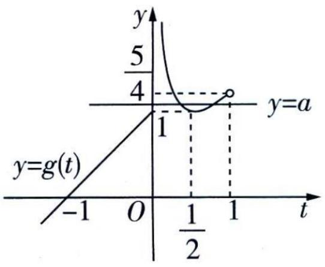

line

| t     | y=g(t) |
|-------|--------|
| -1/2  | 0      |
| 1/2   | 0      |
| 1     | 4      |

图4

备考方略

# 模型3 用端点效应速解不等式恒成立问题

# 模型攻略

若可导函数 $f(x)$ 在 $x=x_{0}$ 处的函数值 $f(x_{0})$ 恰好为0,则当 $x\in(x_{0},+\infty)$ 时,函数 $f(x)>0$ 恒成立的一个必要条件为 $f'(x_{0})>0$ ;当 $x\in(x_{0},+\infty)$ 时,函数 $f(x)<0$ 恒成立的一个必要条件为 $f'(x_{0})<0$ .根据该方法,要解决某个区间上函数的恒成立问题,可以先判断“端点”处的导数值的符号,这就是“端点效应”.端点效应类导数题是高考压轴题的“常客”,解题模型如下:

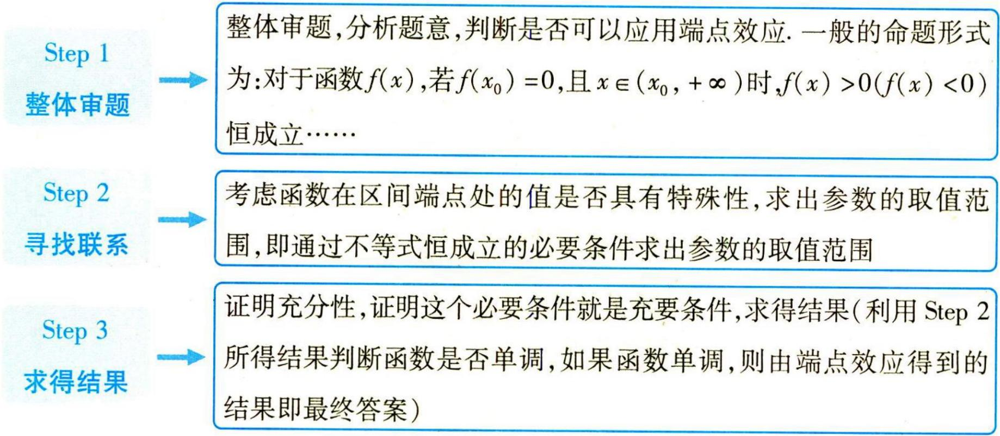

flowchart

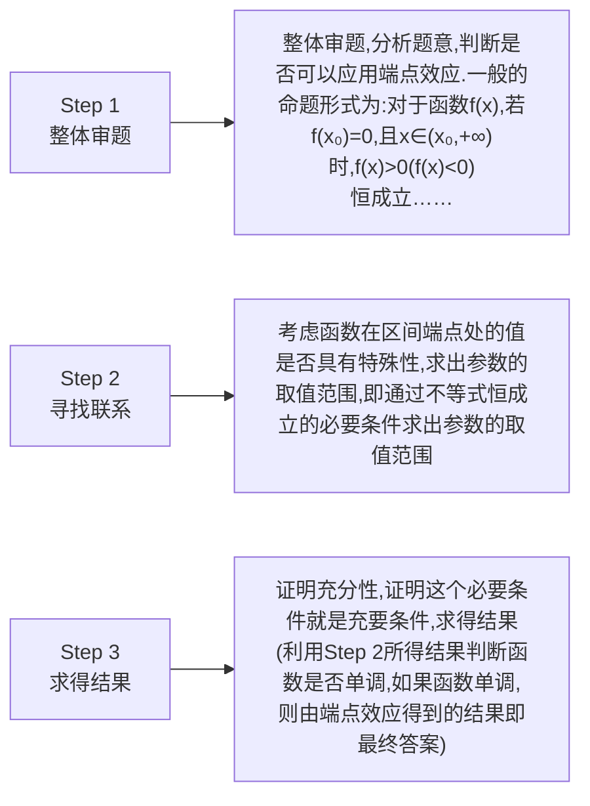
```mermaid
graph LR
    A["Step 1<br>整体审题"] --> B["整体审题,分析题意,判断是否可以应用端点效应.一般的命题形式为:对于函数f(x),若f(x₀)=0,且x∈(x₀,+∞)时,f(x)>0(f(x)<0)<br>恒成立……"]
    C["Step 2<br>寻找联系"] --> D["考虑函数在区间端点处的值是否具有特殊性,求出参数的取值范围,即通过不等式恒成立的必要条件求出参数的取值范围"]
    E["Step 3<br>求得结果"] --> F["证明充分性,证明这个必要条件就是充要条件,求得结果(利用Step 2所得结果判断函数是否单调,如果函数单调,则由端点效应得到的结果即最终答案)"]
```

端点效应类导数题分为 3 大类型：

(1) 区间端点值包含参数型: 若函数 $f(x) \geqslant 0$ 在区间 $[a, b]$ 上恒成立, 则 $\left\{\begin{aligned} f(a) & \geqslant 0, \\ f(b) & \geqslant 0. \end{aligned}\right.$   
(2) 区间端点值为 0 型: 若函数 $f(x) \geqslant 0$ 在区间 $[a, b]$ 上恒成立, 且 $f(a) = 0$ (或 $f(b) = 0$ ), 则 $f'(a) \geqslant 0$ (或 $f'(b) \leqslant 0$ ).  
(3) 区间端点处的函数值与导数值均为 0 型: 若函数 $f(x) \geqslant 0$ 在区间 $[a, b]$ 上恒成立, 且 $f(a) = 0, f'(a) = 0$ (或 $f(b) = 0, f'(b) = 0$ ), 则 $f''(a) \geqslant 0$ (或 $f''(b) \leqslant 0$ ).

调研 1 (2023 全国甲卷改编) 关于 $x$ 的不等式 $ax - \frac{\sin x}{\cos^3 x} - \sin 2x < 0$ 在 $x \in (0, \frac{\pi}{2})$ 上恒成立, 求实数 $a$ 的取值范围.

解析 依题意,令 $f(x)=ax-\frac{\sin x}{\cos^{3}x}-\sin2x,x\in[0,\frac{\pi}{2})$ ,

所以 $f^{\prime}(x) = a - \frac{3 - 2\cos^{2}x}{\cos^{4}x} - 2\cos 2x,$

# 备考方略

此外,不要过分关注排名.要知道别的同学也都在努力,名次没有前进不代表没有进步,不要让测试影响了自己的复习节奏,打击到自己的信心.

Step 1: 整体审题, 分析题意, 判断是否可以应用端点效应.

则问题等价于 $f(x)<0$ 在 $(0,\frac{\pi}{2})$ 上恒成立,且 $f(0)=0$ .

【点技巧】符合类型2的情形，区间端点的函数值为0，即 $f(0)=0$

Step 2: 代入端点值, 求出参数范围.

于是 $f(x)<0$ 的必要条件为 $f'(0)\leqslant0$ ，即 $f'(0)=a-3\leqslant0$ ，即 $a\leqslant3$ .

【破题有括】需要注意的是, $f'(x_0) > 0$ (或 $f'(x_0) < 0$ ) 只是 $f(x) > 0$ (或 $f(x) < 0$ ) 成立的一个必要条件, 若此时 “二阶导数” 不变号, 该方法没有问题; 若此时 “二阶导数” 变号, 那么所得结果就可能出现问题, 导致错误出现

Step 3: 证明充分性, 求得结果.

当 $a \leqslant 3$ 时, $f(x) \leqslant 3x - \frac{\sin x}{\cos^3 x} - \sin 2x$ ,

设 $g(x) = 3x - \frac{\sin x}{\cos^3 x} - \sin 2x, x \in (0, \frac{\pi}{2})$

$$
\begin{array}{l} \frac {- 4 \left(\cos^ {6} x - \cos^ {4} x\right) + \cos^ {4} x + 2 \cos^ {2} x - 3}{\cos^ {4} x} = \frac {- 4 \cos^ {4} x \left(\cos^ {2} x - 1\right) + \left(\cos^ {2} x - 1\right) \left(\cos^ {2} x + 3\right)}{\cos^ {4} x} = \\ \frac {- (\cos^ {2} x - 1) (4 \cos^ {4} x - \cos^ {2} x - 3)}{\cos^ {4} x} = \frac {- (\cos^ {2} x - 1) ^ {2} (4 \cos^ {2} x + 3)}{\cos^ {4} x} <   0, \\ \end{array}
$$

则 $g^{\prime}(x) = 3 - \frac{3 - 2\cos^{2}x}{\cos^{4}x} - 2\cos 2x = \frac{3\cos^{4}x + 2\cos^{2}x - 3 - 2(2\cos^{2}x - 1)\cos^{4}x}{\cos^{4}x} =$

所以函数 $g(x)$ 在 $(0, \frac{\pi}{2})$ 上单调递减，

所以当 $x \in (0, \frac{\pi}{2})$ 时, $f(x) \leqslant g(x) < 3 \times 0 - \frac{\sin 0}{\cos^3 0} - \sin 0 = 0$ ,

于是 $a \leqslant 3$ 是 $f(x) < 0$ 在 $(0, \frac{\pi}{2})$ 上恒成立的充要条件, 所以实数 a 的取值范围是 $(-∞, 3]$ .

调研 2 (试题调研原创) 关于 $x$ 的不等式 $x \mathrm{e}^{ax} - \mathrm{e}^{x} + 1 < 0$ 在 $x \in (0, +\infty)$ 上恒成立, 则实数 $a$ 的取值范围是 \_\_\_\_.

解析 Step 1: 整体审题, 分析题意, 判断是否可以应用端点效应.

依题意,令 $f(x)=xe^{ax}-e^{x}+1,x\in[0,+\infty)$ ,

则问题等价于 $f(x)<0$ 在 $(0,+\infty)$ 上恒成立，且 $f(0)=0$ ，

$$
f ^ {\prime} (x) = (1 + a x) \mathrm{e} ^ {a x} - \mathrm{e} ^ {x},
$$

令 $g(x) = f'(x) = (1 + ax)\mathrm{e}^{ax} - \mathrm{e}^x, x \in [0, +\infty)$ ，则 $g'(x) = (2a + a^2 x)\mathrm{e}^{ax} - \mathrm{e}^x$

Step 2: 代入端点值, 求出参数范围.

又 $g(0)=f'(0)=0$ ，于是 $f(x)<0$ 在 $(0,+\infty)$ 上恒成立的必要条件为 $g'(0)\leqslant0$

【点技巧】经过两次代换，将不等式恒成立问题转化为函数的恒成立问题，从而转化为利

# 数学分支

小编说:对于大多数人而言,对数学的了解还是集中在课本上,但是我们又经常会听到一些数学其他分支的术语,那么常见的数学分支有哪些?小编带大家看一看.

用端点效应速解导数题，注意不要忘记验证 $f(0)=f'(0)=0$ ，正好符合类型3的情形

$g'(0)=2a-1\leqslant0$ , 即 $a\leqslant\frac{1}{2}$ .

Step 3: 证明充分性, 求得结果.

当 $a \leqslant \frac{1}{2}$ 时, $f(x) \leqslant x\mathrm{e}^{\frac{1}{2}x} - \mathrm{e}^{x} + 1$ ,

设 $h(x)=xe^{\frac{1}{2}x}-e^{x}+1,x\in[0,+\infty)$ ，则 $h'(x)=e^{\frac{1}{2}x}+\frac{x}{2}e^{\frac{1}{2}x}-e^{x}=e^{\frac{1}{2}x}(1+\frac{x}{2}-e^{\frac{1}{2}x})$ .

下面证明 $1 + \frac{x}{2} -\mathrm{e}^{\frac{1}{2} x} < 0$ 在 $(0, + \infty)$ 上恒成立.

令 $\varphi(x) = 1 + x - \mathrm{e}^x, x \in [0, +\infty)$ ，所以 $\varphi'(x) = 1 - \mathrm{e}^x < 0$ 在 $(0, +\infty)$ 上恒成立，

所以当 $x \in (0, +\infty)$ 时，函数 $\varphi(x)$ 单调递减，所以 $\varphi(x) < \varphi(0) = 0$ ，即 $1 + x - e^x < 0$ 在 $(0, +\infty)$ 上恒成立，所以 $1 + \frac{x}{2} - e^{\frac{1}{2}x} < 0$ 在 $(0, +\infty)$ 上恒成立，所以 $h'(x) = e^{\frac{1}{2}x} (1 + \frac{x}{2} - e^{\frac{1}{2}x}) < 0$ 在 $(0, +\infty)$ 上恒成立，

所以当 $x \in (0, +\infty)$ 时，函数 $h(x)$ 单调递减，所以 $h(x) < h(0) = 0$

于是 $f(x)<0$ 在 $(0,+\infty)$ 上恒成立.

所以 $a \leqslant \frac{1}{2}$ 是 $f(x) < 0$ 在 $(0, +\infty)$ 上恒成立的充要条件.

【易遗漏】验证 $a \leqslant \frac{1}{2}$ 是 $f(x) < 0$ 在 $(0, +\infty)$ 上恒成立的充分条件这一步必不可少，否则 Step 2 求出的参数范围是不严谨的

所以实数 a 的取值范围为 $(-∞, \frac{1}{2}]$ .

# 模型演练

(调研1变式,变考法,同时关于指数、对数、三角函数的恒成立问题|2024河北邯郸8月开学考试节选)已知函数 $f(x)=3\mathrm{e}^{x}-a\ln(x+1)$ ,若 $f(x)-\sin x\geqslant3$ 在区间 $[0,+\infty)$ 上恒成立,求实数a的取值范围.

# 参考答案与解析

Step 1: 整体审题, 分析题意, 判断是否可以应用端点效应.

不等式 $f(x)-\sin x\geqslant3$ 在区间 $[0,+\infty)$ 上恒成立，

即 $3\mathrm{e}^{x} - a\ln (x + 1) - \sin x - 3\geqslant 0$ 在区间 $[0, + \infty)$ 上恒成立，

令 $g(x)=3\mathrm{e}^{x}-a\ln(x+1)-\sin x-3,x\in[0,+\infty)$ ，则 $g'(x)=3\mathrm{e}^{x}-\frac{a}{x+1}-\cos x,x\in[0,+\infty)$ .

Step 2: 代入端点值, 求出参数范围.

$g(0)=0$ , 则函数 $g(x)\geqslant0$ 在区间 $[0,+\infty)$ 上恒成立的必要条件为 $g'(0)=3-a-1\geqslant0$ , 即 $a\leqslant2$ .

【点技巧】符合类型2的情形，区间端点的函数值为0，即 $g(0)=0$ ，从而得出不等式成立的必

# 数学分支

数论 人类从学会计数开始就一直和自然数打交道了. 数论这门学科最初是从研究整数开始的, 所以叫作整数论. 后来整数论又进一步发展, 就叫作数论了.

要条件，求出参数的取值范围，但是不要忘记证明充分性

Step 3: 证明充分性, 求得结果,

当 $a \leqslant 2$ 时, $g(x) = 3\mathrm{e}^{x} - a\ln (x + 1) - \sin x - 3 \geqslant 3\mathrm{e}^{x} - 2\ln (x + 1) - \sin x - 3,$

令 $h(x) = 3\mathrm{e}^{x} - 2\ln (x + 1) - \sin x - 3, x \in [0, +\infty)$ ，则 $h'(x) = 3\mathrm{e}^x - \frac{2}{x + 1} - \cos x, x \in [0, +\infty)$ .

又 $h''(x) = 3\mathrm{e}^x +\frac{2}{(x + 1)^2} +\sin x > 0$ 在 $[0, + \infty)$ 上恒成立，所以函数 $h^\prime (x)$ 在 $[0, + \infty)$ 上单调递增，所以 $h^\prime (x)\geqslant h^\prime (0) = 0$ ，所以函数 $h(x)$ 在 $[0, + \infty)$ 上单调递增，

所以 $h(x) \geqslant h(0) = 0$ ，即 $3\mathrm{e}^{x} - 2\ln (x + 1) - \sin x - 3 \geqslant 0$

所以当 $a \leqslant 2$ 时, $g(x) = 3\mathrm{e}^{x} - a\ln (x + 1) - \sin x - 3 \geqslant 0$ 在 $[0, +\infty)$ 上恒成立.

所以 $a \leqslant 2$ 是函数 $g(x) \geqslant 0$ 在区间 $[0, +\infty)$ 上恒成立的充要条件，

所以实数 a 的取值范围是 $(-∞,2]$ .

# 型4 用临界思想速解取值范围问题

# 模型攻略

“临界状态”一般可以认为是从一种状态向另一种状态变化过程中, 发生转变时的那一 “转折点”或运动状态的“极限”状态(位置). 在解决具有一定制约关系的相关变量的数学问题时, 常常运用“临界状态”, 即研究问题中的某变量变化到某一状态时出现“转折”或者“极限”的时刻, 把动态变化 (或不定量) 问题转化为静态问题 (或定量) 问题, 从而达到简化运算、事半功倍的解题效果. 这里给出一种解题模型:

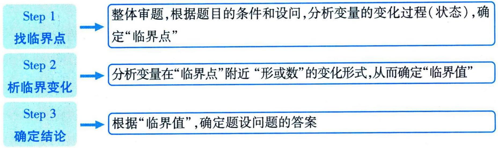

flowchart

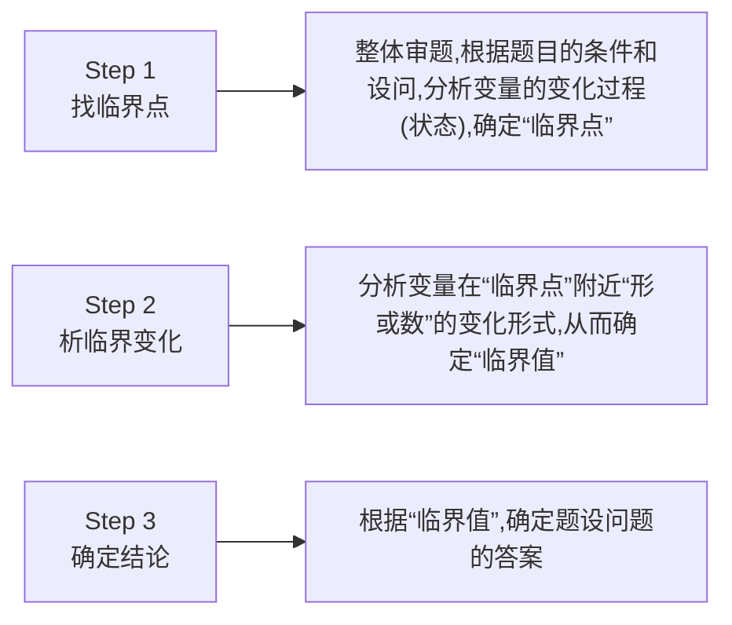
```mermaid
graph LR
    A["Step 1\n找临界点"] --> B["整体审题,根据题目的条件和设问,分析变量的变化过程(状态),确定“临界点”"]
    C["Step 2\n析临界变化"] --> D["分析变量在“临界点”附近“形或数”的变化形式,从而确定“临界值”"]
    E["Step 3\n确定结论"] --> F["根据“临界值”,确定题设问题的答案"]
```

调研 1: (试题调研原创) 函数 $f(x) = \mathrm{e}^{x} - kx$ 恰有两个零点, 则实数 $k$ 的取值范围是 \_\_\_\_.

解析 方法一 由题知 $f'(x) = \mathrm{e}^x - k$ .

当 $k \leqslant 0$ 时, $f'(x) > 0$ , 则 $f(x)$ 在 $\mathbf{R}$ 上单调递增, 不合题意;

当 $k > 0$ 时，令 $f'(x) = 0$ ，则 $x = \ln k$

则 $f(x)$ 在 $(-\infty, \ln k)$ 上单调递减，在 $(\ln k, +\infty)$ 上单调递增.

# 数学分支

我国古代许多著名的数学著作中都有关于数论内容的论述,比如求最大公因数、勾股数组、某些不定方程整数解的问题等.

又当 $x \to -\infty$ 时, $f(x) \to +\infty$ , 当 $x \to +\infty$ 时, $f(x) \to +\infty$ ,

【指点迷津】判断函数 $f(x) = \mathrm{e}^{x} - kx$ 在 $x \to +\infty, x \to -\infty$ 时的图象趋势，借助极限思想，数形结合求解

则当函数 $f(x)$ 恰有两个零点时， $f(x)_{\min} = f(\ln k) = k - k \ln k < 0$ ，所以 $\ln k > 1$ ，则 $k > e$ .

所以 k 的取值范围是 $(e, +\infty)$ .

方法二 依题意可知, 函数 $f(x) = \mathrm{e}^{x} - kx$ 恰好有两个零点, 即函数 $g(x) = \mathrm{e}^{x}$ 与函数 $h(x) = kx$ 的图象有两个交点,

当 $k \leqslant 0$ 时, 函数 $g(x) = \mathrm{e}^{x}$ 与函数 $h(x) = kx$ 的图象不可能有两个交点, 不合题意.

Step 1: 整体审题, 根据两个函数图象的位置关系, 确定“临界点”.

由上可知 $k > 0$ ，当函数 $g(x) = \mathrm{e}^{x}$ 与函数 $h(x) = kx$ 的图象相切时，设切点坐标为 $(m,n)$

因为 $g^{\prime}(x) = \mathrm{e}^{x}$ ，所以 $g^{\prime}(m) = \mathrm{e}^{m} = k$ ，所以切线方程为 $y - n = \mathrm{e}^{m}(x - m)$

因为切线过原点,所以 $-n=e^{m}(-m)$ .

Step 2: 确定“临界值”.

又 $n = \mathrm{e}^{m}$ ，所以 $m = 1, n = \mathrm{e}$ ，此时 $k = \mathrm{e}$

【破瓶颈】函数 $g(x)=\mathrm{e}^{x}$ 图象在点 $(m,n)$ 处的切线与函数 $h(x)=kx$ 的图象是同一直线，都经过原点，所以直线方程也是一样的

Step 3: 根据“临界值”, 确定题设问题的答案.

所以函数 $g(x)=\mathrm{e}^{x}$ 与函数 $h(x)=kx$ 的图象有两个交点时, k>e.

所以实数 k 的取值范围是 $(e, +\infty)$ .

调研 2 (试题调研原创) 已知双曲线 $C: \frac{x^{2}}{a^{2}} - \frac{y^{2}}{b^{2}} = 1 (a > 0, b > 0)$ , $F$ 为左焦点, $A_{1}, A_{2}$ 分别为左、右顶点, $P$ 为 $C$ 右支上的点, 且 $|OP| = |OF|$ ( $O$ 为坐标原点). 若直线 $PF$ 与以线段 $A_{1}A_{2}$ 为直径的圆相交, 则 $C$ 的离心率的取值范围为 ( )

A. $(1, \sqrt{3})$

B. $(\sqrt{3},+\infty)$

C. $(\sqrt{5},+\infty)$

D. $(1, \sqrt{5})$

解析 如图 1, 设双曲线的右焦点为 $F_{1}$ , 连接 $PF_{1}$ , 则 $|OP| = |OF| = |OF_{1}|$ , 则 $\angle FPF_{1} = 90^{\circ}$ ,

P 为 C 右支上的点, 取 PF 的中点为 B, 连接 OB, 则 OB ⊥ PF.

方法一 设 $|OB|=t$ ，则 $|PF_{1}|=2t$ ，则 $|PF|=2a+2t$ ，

在 Rt△FPF₁ 中， $(2a+2t)^{2}+(2t)^{2}=(2c)^{2}$ ，即 $2t^{2}+2at+a^{2}-c^{2}=0$ .

直线 PF 与以线段 $A_{1}A_{2}$ 为直径的圆相交, 则 0 < t < a,

【指点迷津】若直线与圆相交，圆心到直线的距离小于半径；若直线与圆相切，圆心到直线的距离等于半径；若直线与圆相离，圆心到直线的距离大于半径

设 $f(t)=2t^{2}+2at+a^{2}-c^{2},0\leqslant t\leqslant a$ ，则 $f(0)=a^{2}-c^{2}<0$ ，

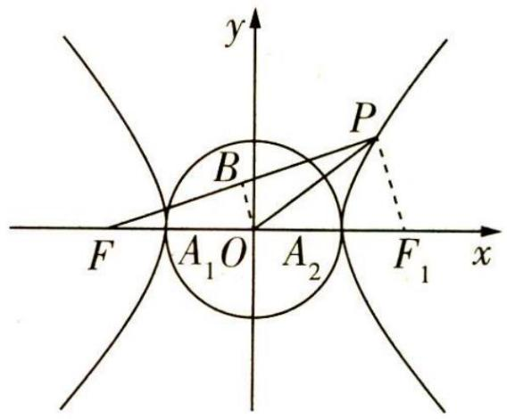

text_image

y
P
B
F
A₁O
A₂
F₁ x

图 1

# 数学分支

1949 年以后,数论的研究得到了更大的发展. 特别是在“筛法”和“哥德巴赫猜想”方面的研究,已取得世界领先的优秀成绩.

则要满足题意,需使 $f(a)=2a^{2}+2a^{2}+a^{2}-c^{2}>0$ ,得 $\frac{c}{a}<\sqrt{5}$ .

故 C 的离心率的取值范围为 $(1, \sqrt{5})$ ，故选 D.

方法二 Step 1 + 2: 整体审题, 根据题目的条件和设问, 确定两个“临界点”, 分析变量在“临界点”附近“形”的变化形式, 从而确定“临界点”及“临界值”.

若直线 PF 恰好与以线段 $AA_{1}$ 为直径的圆相切于 B 点，

【破瓶颈】找两个临界点, 直线与圆 $O$ 相切和圆 $O$ 经过 $F_{1}, F, P$ 点, 这两个临界点都取不到, 对应的双曲线离心率也都不能取到

则 $2|OB| = |PF_{1}|$ ，即 $|PF_{1}| = 2a$ ，根据双曲线的定义得 $|PF| = 4a$ ，

又 $|FF_{1}|=2c$ ，所以 $16a^{2}+4a^{2}=4c^{2}$ ，即 $c=\sqrt{5}a$ ，此时离心率为 $e=\frac{c}{a}=\sqrt{5}$ .

考虑极限情况,若以线段 $A_{1}A_{2}$ 为直径的圆恰好经过 $F_{1}, F, P$ 点, 则 $c = a$ , 离心率 $e = \frac{c}{a} = 1$ .

Step 3: 根据“临界值”, 确定题设问题的答案.

由以上可知, 直线 PF 与以线段 $A_{1}A_{2}$ 为直径的圆相交, 则双曲线的离心率的取值范围是 (1, $\sqrt{5}$ ), 故选 D.

# 模型演练

(试题调研原创|调研1变式,变考法,考查根据不等式恒成立求参数取值范围)已知函数 $f(x)=\ln\frac{1}{x}+ax-2,a\in\mathbf{R}$ . 若 $f(x)\geqslant0$ 恒成立,则实数a的取值范围是\_\_\_\_.

# 参考答案与解析

$[e, +\infty)$ 方法一 由题意, $x \in (0, +\infty), a \in \mathbf{R}, f'(x) = -\frac{1}{x} + a = \frac{ax - 1}{x}$ ,

当 $a \leqslant 0$ 时, $f'(x) < 0$ 恒成立, 函数 $f(x)$ 在 $(0, +\infty)$ 上单调递减,

$\because f(1)=a-2<0,\therefore f(x)\geqslant0$ 不可能恒成立.

【点技巧】取特殊值，如 1, 2, e 等都可以，此时 $f(x) < 0$ ，由此判断 $f(x) \geqslant 0$ 不恒成立

当 $a > 0$ 时，令 $f'(x) = \frac{ax - 1}{x} = 0$ ，得 $x = \frac{1}{a}$

当 $x \in (0, \frac{1}{a})$ 时， $f'(x) < 0$ ，函数 $f(x)$ 单调递减，

当 $x \in (\frac{1}{a}, +\infty)$ 时, $f'(x) > 0$ , 函数 $f(x)$ 单调递增,

∴ 函数 $f(x)$ 在 $x = \frac{1}{a}$ 处取得最小值，为 $f(\frac{1}{a}) = \ln a - 1$ ，

∴ $\ln a - 1 \geqslant 0$ , 得 $a \in [e, +\infty)$ , ∴ 实数 a 的取值范围是 $[e, +\infty)$ .

方法二 依题意, $f(x)\geqslant0$ 恒成立,即 $ax-2\geqslant\ln x$ 恒成立.

# 数学分支

陈景润证明“哥德巴赫猜想”的“一个大偶数可以表示为一个素数和一个不超过两个素数的乘积之和”后，在国际数学界引起了强烈反响。陈景润的论文是解析数学的名作，是筛法的光辉顶点。

令 $g(x)=ax-2, h(x)=\ln x,$

当 $a \leqslant 0$ 时, 函数 $g(x) = ax - 2$ 和函数 $h(x) = \ln x$ 的图象相交, 不合题意.

Step 1: 整体审题, 根据题目的条件和设问, 分析变量的变化过程, 确定“临界点”.

当 a > 0 时, 设函数 $g(x) = ax - 2$ 的图象和函数 $h(x) = \ln x$ 的图象相切于点 $(m, n)$ ,

【指点迷津】要符合要求,则需使函数 $g\left( x\right)  = {ax} - 2$ 的图象不在函数 $h\left( x\right)  = \ln x$ 的图象下方, 那么临界点即两个函数的图象相切时的情形,此时函数 $h\left( x\right)$ 的图象在点(m,n)处的切线就是 $g\left( x\right)$ 的图象

$\because h'(x)=\frac{1}{x},\therefore$ 切线方程为 $y-n=\frac{1}{m}(x-m)$ .

Step 2: 确定“临界值”.

又函数 $g(x)=ax-2$ 的图象是过定点 $(0,-2)$ 的直线, 将 $(0,-2)$ 代入切线方程,

则有 $-2 - n = \frac{1}{m} (-m)$ ，得 $n = -1, m = \frac{1}{\mathrm{e}}$

Step 3: 根据“临界值”, 确定题设问题的答案.

$\therefore h'(m)=\frac{1}{m}=e=a$ , 故当 $f(x)\geqslant0$ 恒成立时, 实数 a 的取值范围是 $[e,+\infty)$ .

# 型5 用同构思想速解指、对型比大小问题

# 模型攻略

指、对型比大小问题是高考常考题型,大多以选择题的形式出现,其解题方法灵活多变,有作差法、作商法、不等式性质法、特值法、中间值法、图象法、构造函数法等.其中,构造函数法既可以考查函数的图象和性质,又可以考查“同构”这一重要思想,故该方法成为近几年高考比大小问题中的考查热点,难度较大.

在利用同构思想解指、对型比大小问题时,需要先将式子通过变形化为同一结构形式,从而构造函数,或将式子化为含有相同数的式子,作差后构造函数,再利用该函数的图象和性质进行比大小.解题模型如下:

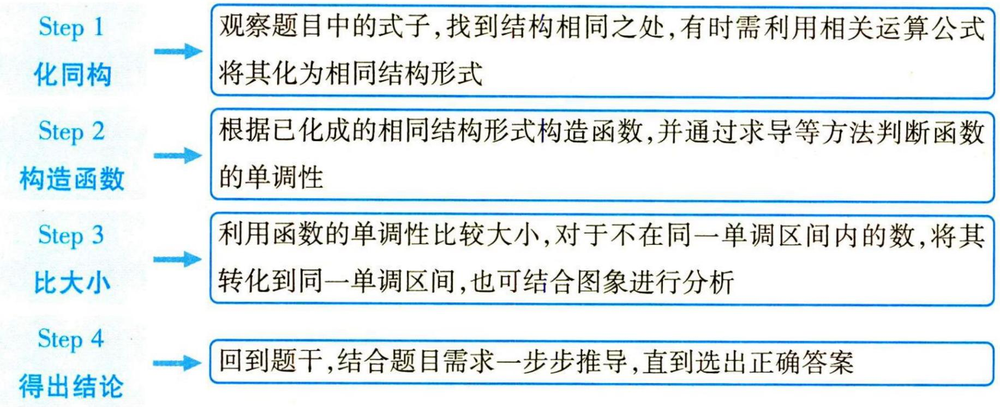

flowchart

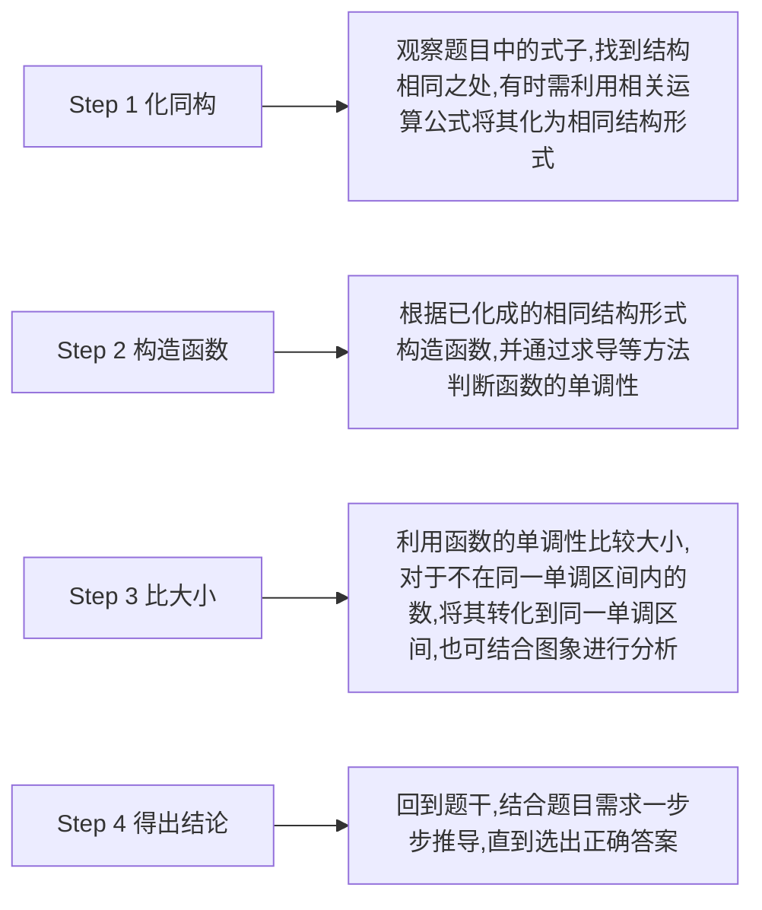
```mermaid
graph LR
    A["Step 1 化同构"] --> B["观察题目中的式子,找到结构相同之处,有时需利用相关运算公式将其化为相同结构形式"]
    C["Step 2 构造函数"] --> D["根据已化成的相同结构形式构造函数,并通过求导等方法判断函数的单调性"]
    E["Step 3 比大小"] --> F["利用函数的单调性比较大小,对于不在同一单调区间内的数,将其转化到同一单调区间,也可结合图象进行分析"]
    G["Step 4 得出结论"] --> H["回到题干,结合题目需求一步步推导,直到选出正确答案"]
```

# 数学分支

拓扑学 几何拓扑学是十九世纪形成的一门数学分支,它属于几何学的范畴.而有关拓扑学的一些内容,早在十八世纪就出现了.

调研 1 (2024 江苏扬州中学 8 月开学考试) 若 $2^{a} + \log_{2} a < 2^{2b} + \log_{2} b + 1$ , 则 ( )

A. $\ln (2b - a + 1) < 0$

B. $\ln (2b - a + 1) > 0$

C. $\ln |a - 2b| > 0$

D. $\ln \left| {a - {2b}}\right|  < 0$

解析 Step 1: 观察式子, 化为相同结构.

对已知不等式变形可得: $2^{a} + \log_{2} a < 2^{2b} + \log_{2} 2b$ .

【会转化】观察不等式，发现要想将左、右两边化为相同的形式，需要将右边变形，根据对数的运算性质，可得 $2^{2b} + \log_{2}b + 1 = 2^{2b} + \log_{2}b + \log_{2}2 = 2^{2b} + \log_{2}2b$

Step 2: 构造函数, 判断单调性.

令 $f(x)=2^{x}+\log_{2}x,x>0.$

易知函数 $y = 2^{x}$ 与 $y = \log_2 x$ 在 $(0, +\infty)$ 上均为增函数，

所以函数 $f(x)=2^{x}+\log_{2}x$ 在 $(0,+\infty)$ 上为增函数.

Step 3: 利用函数的单调性比大小.

$2^{a}+\log_{2}a<2^{2b}+\log_{2}2b$ 即 $f(a)<f(2b)$ ，根据函数 $f(x)=2^{x}+\log_{2}x$ 在 $(0,+\infty)$ 上为增函数，可得 2b>a>0，则 2b-a>0。

【易错提醒】根据对数的真数部分大于0，可知a与2b均大于0，处在同一单调递增区间内

Step 4: 得出结论.

因为 $2b - a > 0$ ，所以 $2b - a + 1 > 1$ ，则 $\ln (2b - a + 1) > \ln 1 = 0$ ，A错，B对.

无法确定 $|a-2b|$ 与1的大小,故无法确定 $\ln|a-2b|$ 与0的大小,CD都错.故选B.

调研 2 (试题调研原创) $a = -\frac{10}{9} \ln 0.9, b = \frac{1}{9}, c = e^{\frac{10}{9}}$ , 则 ( )

A. $a < b < c$

B. $b < a < c$

C. $c < a < b$

D. $a < c < b$

解析 Step 1: 观察式子, 化为含有相同数的式子.

$$
a = - \frac {1 0}{9} \ln 0. 9 = \frac {1 0}{9} \ln \frac {1 0}{9}, b = \frac {1}{9} = \frac {1 0}{9} - 1, c = e ^ {\frac {1 0}{9}}.
$$

Step 2: 构造函数, 判断单调性.

设 $f(x)=x\ln x-x+1(x>0)$ ，则 $f'(x)=\ln x+1-1=\ln x$

【作差法】因为 $a=\frac{10}{9}\ln\frac{10}{9}$ 与 $b=\frac{10}{9}-1$ 中均含有相同数字 $\frac{10}{9}$ ，作差得 $a-b=\frac{10}{9}\ln\frac{10}{9}-\frac{10}{9}+1$ ，构造函数 $f(x)=x\ln x-x+1(x>0)$ ，利用函数的单调性比较大小

当 $x \in (0,1)$ 时， $f'(x) < 0$ ，当 $x \in (1, +\infty)$ 时， $f'(x) > 0$ .

所以函数 $f(x) = x \ln x - x + 1$ 在 $(0,1)$ 上单调递减，在 $(1, +\infty)$ 上单调递增.

数学分支

Step 3: 利用单调性比大小.

因为函数 $f(x) = x \ln x - x + 1$ 在 $(1, +\infty)$ 上单调递增，

所以 $f(\frac{10}{9}) > f(1) = 0$ ，所以 $\frac{10}{9}\ln \frac{10}{9} - \frac{10}{9} + 1 > 0, \frac{10}{9}\ln \frac{10}{9} > \frac{10}{9} - 1$ ，即 $a > b$ .

根据 Step 2 与 Step 3 同理可得 b 与 c, a 与 c 的大小关系, 步骤如下:

设 $g(x) = \mathrm{e}^{x} - x + 1$ ，则 $g^{\prime}(x) = \mathrm{e}^{x} - 1$

当 $x \in (-\infty, 0)$ 时， $g'(x) < 0$ ，当 $x \in (0, +\infty)$ 时， $g'(x) > 0$ .

所以函数 $g(x)$ 在 $(-\infty, 0)$ 上单调递减，在 $(0, +\infty)$ 上单调递增，

所以 $g(\frac{10}{9}) > g(0) = 2$ ，则 $e^{\frac{10}{9}} - \frac{10}{9} + 1 > 0$ ，故 $e^{\frac{10}{9}} > \frac{1}{9}$ ，即 c > b.

令 $h(x) = x\ln x - \mathrm{e}^x, x > 0$ ，则 $h'(x) = \ln x + 1 - \mathrm{e}^x$ ，易知 $h'(x) = \ln x + 1 - \mathrm{e}^x < 0$

【会分析】通过函数图象或构造函数，易证 $e^{x} \geqslant x + 1, x > \ln x$ ，所以 $x + 1 > \ln x + 1$ ，所以 $\ln x + 1 < e^{x}$ ，即 $\ln x + 1 - e^{x} < 0$

所以 $h(x) = x\ln x - \mathrm{e}^x$ 在 $(0, +\infty)$ 上单调递减，

所以 $h\left(\frac{10}{9}\right) < h(1) = -\mathrm{e}$ , 所以 $\frac{10}{9} \ln \frac{10}{9} - \mathrm{e}^{\frac{10}{9}} < 0$ , 故 $\frac{10}{9} \ln \frac{10}{9} < \mathrm{e}^{\frac{10}{9}}$ , 即 $a < c$ .

Step 4:得出结论.

综上， $a > b, c > b, a < c$ ，所以 $b < a < c.$ 故选B.

# 模型演练

1. (试题调研原创|调研1变式,变函数模型,关于抽象函数的比大小问题)已知偶函数 $f(x)$ 在 $(-∞,0)$ 上单调递增, $a=f(\frac{1}{e}),b=f(-\frac{\ln 2}{2}),c=f(\frac{\ln 3}{3})$ ,则()

A. $a < b < c$

B. $b < a < c$

C. $a < c < b$

D. $c < b < a$

2. (调研 2 变式 | 2024 江苏宿迁 8 月开学统考) 已知 $a = \ln \frac{6}{7}, b = \frac{7}{13}, c = e^{-\frac{6}{7}}$ , 则 ( )

A. $a < b < c$

B. b < a < c

C. b < c < a

D. $a < c < b$

# 参考答案与解析

1. C Step 1: 观察式子, 化为相同结构.

$$
\frac {1}{\mathrm{e}} = \frac {\ln \mathrm{e}}{\mathrm{e}}, \frac {\ln 2}{2} = \frac {2 \ln 2}{4} = \frac {\ln 4}{4}.
$$

【转化技巧】这里之所以将 $\frac{\ln 2}{2}$ 转化为 $\frac{\ln 4}{4}$ , 是因为构造函数后, 发现自变量不在同一单调区间, 需将其转化到同一单调区间内

# 数学分支

拓扑学发展到今天,在理论上有两个分支.一个分支是偏重于用分析的方法来研究的,叫作点集拓扑学,或者叫作分析拓扑学.另一个分支是偏重于用代数方法来研究的,叫作代数拓扑.

Step 2: 构造函数, 判断单调性.

设 $g(x) = \frac{\ln x}{x} (x > 0)$ ，则 $g'(x) = \frac{1 - \ln x}{x^2}$ .

当 0 < x < e 时, $g'(x) > 0$ , $g(x)$ 单调递增, 当 x > e 时, $g'(x) < 0$ , $g(x)$ 单调递减.

Step 3: 利用单调性比大小.

因为 $g(x)$ 在 $(e, +\infty)$ 上单调递减，且 e < 3 < 4，

所以 $g(\mathrm{e}) > g(3) > g(4)$ ，即 $\frac{\ln \mathrm{e}}{\mathrm{e}} > \frac{\ln 3}{3} > \frac{\ln 4}{4}$ ，故 $\frac{\ln \mathrm{e}}{\mathrm{e}} > \frac{\ln 3}{3} > \frac{\ln 2}{2}$ .

Step 4: 得出结论.

因为偶函数 $f(x)$ 在 $(-∞,0)$ 上单调递增,所以 $f(x)$ 在 $(0,+∞)$ 上单调递减.

【记重点】奇函数在关于原点对称的区间上单调性相同，偶函数在关于原点对称的区间上单调性相反

$b=f(-\frac{\ln 2}{2})=f(\frac{\ln 2}{2})$ ，因为 $\frac{\ln e}{e}>\frac{\ln 3}{3}>\frac{\ln 2}{2}>0$

所以 $f(\frac{\ln e}{e})<f(\frac{\ln 3}{3})<f(\frac{\ln 2}{2})$ ，即a<c<b。故选C.

2. D Step 1: 观察式子, 化为含有相同数的式子.

$\ln\frac{6}{7}<0,\frac{7}{13}>0,e^{-\frac{6}{7}}>0,$ 所以a<b,a<c.

$$
- \ln b = - \ln \frac {7}{1 3} = \ln \frac {1 3}{7} = \ln (1 + \frac {6}{7}), - \ln c = - \ln e ^ {- \frac {6}{7}} = \frac {6}{7}.
$$

【转化技巧】对 $b$ 和 $c$ 同时取对数, 加负号, 将其转化为含有相同数 $\frac{6}{7}$ 的两个式子

Step 2: 构造函数, 判断单调性.

令 $f(x)=\ln(x+1)-x$ ，其中x>-1，则 $f'(x)=\frac{1}{x+1}-1=\frac{-x}{x+1}$ .

当 -1 < x < 0 时, $f'(x) > 0$ , 当 x > 0 时, $f'(x) < 0$ .

【扫清障碍】 $f'(x)=\frac{-x}{x+1}>0\Leftrightarrow x(x+1)<0\Leftrightarrow-1<x<0,\ f'(x)=\frac{-x}{x+1}<0\Leftrightarrow x(x+1)>0\Leftrightarrow$ x>0 或 x<-1 (结合定义域舍去)

所以 $f(x)$ 在 $(-1,0)$ 上单调递增，在 $(0,+\infty)$ 上单调递减.

Step 3: 利用单调性比大小.

因为 $f(x)$ 在 $(0, +\infty)$ 上单调递减，且 $\frac{6}{7} > 0$ ，所以 $f(\frac{6}{7}) < f(0) = 0$ ，所以 $\ln \frac{13}{7} < \frac{6}{7}$ ，即 $-\ln b <$

数学分支

射影几何 射影几何是研究图形的射影性质,即它们经过射影变换后,依然保持不变的图形性质的几何学分支学科.

$$
- \ln c, \ln b > \ln c.
$$

Step 4: 得出结论.

又函数 $y = \ln x$ 在 $(0, +\infty)$ 上单调递增, 所以 b > c. 故 a < c < b. 故选 D.

# 型6 用参变分离法速解参数的取值范围问题

# 模型攻略

参变分离法是求参数取值范围的一种常用方法,该方法可以避免对参数分类讨论,使问题得到简化. 参变分离法广泛应用于不等式恒成立及有解问题、函数的零点问题、已知函数单调性求参数取值范围问题等一系列问题的求解中. 这里给出一种思维模型:

Step 1

对题目中的已知条件进行分析、化简,将题目翻译为熟悉的题型,如不等式恒成立问题,不等式有解问题等,便于进行参变分离

Step 2

分清楚谁是参数,谁是变量,通常将需要求范围的量作为参数,将含有该参数的式子移到一边,其他式子移到另一边

Step 3

将上一步中另外一边的式子设成新函数,并通过求导等方式,或求出函数的最值,或作出函数的图象

Step 4

根据最值得出参数的取值范围,或根据图象得出参数的取值范围

调研 1 (试题调研原创) 已知函数 $f(x)$ 是定义在 $\mathbf{R}$ 上的奇函数, 且函数 $f(x)$ 在 $(- \infty, 0)$ 上单调递增. 若对任意 $t \in (0,1)$ , 不等式 $f(t^{3} - 2t) + f\left(\frac{1}{2} t^{2} - k\right) > 0$ 恒成立, 则实数 $k$ 的取值范围为 \_\_\_\_.

解析 Step 1: 分析题意, 化简条件.

因为函数 $f(x)$ 为R上的奇函数,所以 $-f(\frac{1}{2}t^{2}-k)=f(k-\frac{1}{2}t^{2})$ ,

所以 $f(t^3 - 2t) + f(\frac{1}{2} t^2 - k) > 0$ ，即 $f(t^3 - 2t) > f(k - \frac{1}{2} t^2)$ ，

因为函数 $f(x)$ 在 $(-∞,0)$ 上单调递增,所以 $f(x)$ 在R上单调递增,所以 $t^{3}-2t>k-\frac{1}{2}t^{2}$ .

依题意,对任意 $t \in (0,1)$ , $t^{3} - 2t > k - \frac{1}{2}t^{2}$ 恒成立.

【会翻译】通过函数的单调性和奇偶性，对条件中的不等式进行化简，将题目翻译为不等式恒成立问题

# 数学分支

基于绘图学和建筑学的需要,古希腊几何学家开始研究透视法,也就是投影和截影.早在公元前200年左右,阿波罗尼奥斯就曾把二次曲线作为正圆锥面的截线来研究.

Step 2: 参变分离.

所以 $k < t^{3} + \frac{1}{2}t^{2} - 2t$ 在 $t \in (0,1)$ 时恒成立，所以 $k < \left(t^{3} + \frac{1}{2}t^{2} - 2t\right)_{\min}$ .

【敲黑板】 $m \leqslant f(x)$ 恒成立 $\Leftrightarrow m \leqslant f(x)_{\min}, m \geqslant f(x)$ 恒成立 $\Leftrightarrow m \geqslant f(x)_{\max}$

Step 3: 构造函数, 求出最值.

令 $g(t) = t^3 +\frac{1}{2} t^2 -2t,t\in (0,1)$

则 $g'(t)=3t^{2}+t-2=(3t-2)(t+1)$ ,

令 $g'(t)=0$ , 得 $t=\frac{2}{3}$ .

Tips:十分标准的利用导数求最值的步骤! 值得记到本子上: 写出函数 (包括定义域)→求导→令导函数为0, 求极值点→分析单调性→得最值.

当 $t \in (0, \frac{2}{3})$ 时， $g'(t) < 0$ ，当 $t \in (\frac{2}{3}, 1)$ 时， $g'(t) > 0$

所以函数 $g(t)$ 在 $(0, \frac{2}{3})$ 上单调递减，在 $(\frac{2}{3}, 1)$ 上单调递增.

所以 $g(t)_{\min}=g(\frac{2}{3})=-\frac{22}{27}$ .

Step 4: 得出结论.

因为 $k < (t^3 + \frac{1}{2} t^2 - 2t)_{\min}$ , 所以 $k < -\frac{22}{27}$ , 即实数 $k$ 的取值范围为 $(- \infty, -\frac{22}{27})$ .

调研 2 (2024 河南郑州名校联考改编) 若关于 $x$ 的不等式 $x^{3} \ln x + 1 \leqslant (a^{2} + a - 1)x$ 有解, 则实数 $a$ 的取值范围为 \_\_\_\_.

解析 Step 1 + 2: 分析题意, 参变分离.

因为 $x > 0$ ，所以关于 $x$ 的不等式 $x^{3}\ln x + 1\leqslant (a^{2} + a - 1)x$ 有解等价于 $a^2 +a - 1\geqslant x^2\ln x + \frac{1}{x}$ 在 $x\in (0, + \infty)$ 时有解，所以 $a^2 +a - 1\geqslant (x^2\ln x + \frac{1}{x})_{\min}$

【敲黑板】 $m \leqslant g(x)$ 有解 $\Leftrightarrow m \leqslant g(x)_{\max}$ ， $m \geqslant g(x)$ 有解 $\Leftrightarrow m \geqslant g(x)_{\min}$

Step 3: 构造函数, 求出最值.

令 $g(x) = x^2\ln x + \frac{1}{x}, x \in (0, +\infty)$ ，则 $g'(x) = \frac{2x^3\ln x + x^3 - 1}{x^2}$ ，

令 $h(x)=2x^{3}\ln x+x^{3}-1, x\in(0,+\infty)$ ，则 $h'(x)=x^{2}(6\ln x+5)$ ，

【难点突破】当无法确定导函数值正负，也无法直接判断单调性时，可再次将导函数或其一部分设成新函数，通过二次求导分析得出导函数的变化情况，从而判断原函数的单调性

令 $x^{2}(6\ln x+5)=0$ , 则 $x=e^{-\frac{5}{6}}$

# 数学分支

欧式直线再加上一个无穷远点就是射影几何中的直线,如果一个平面内两条直线平行,那么这两条直线就交于这两条直线共有的无穷远点.通过同一无穷远点的所有直线平行.

当 $0 < x < e^{-\frac{5}{6}}$ 时, $h'(x) < 0$ ; 当 $x > e^{-\frac{5}{6}}$ 时, $h'(x) > 0$ .

故 $h(x)$ 在 $(0, e^{-\frac{5}{6}})$ 上单调递减，在 $(e^{-\frac{5}{6}}, +\infty)$ 上单调递增.

而 $h(1)=0$ , 且当 x>0 且 $x\to0$ 时, $h(x)<0$

故当 $x \in (0,1)$ 时, $h(x) < 0$ , 当 $x \in (1, +\infty)$ 时, $h(x) > 0$ ,

【转换思维】由于 $h(e^{-\frac{5}{6}})$ 的正负不易判断，这里通过 $h(1)=0$ ，再结合 $h(x)$ 的单调性和变化趋势，分析出 $h(x)$ 的正负

所以当 $x \in (0,1)$ 时， $g'(x) < 0$ ，当 $x \in (1, +\infty)$ 时， $g'(x) > 0$

即 $g(x)$ 在 $(0,1)$ 上单调递减，在 $(1,+\infty)$ 上单调递增，故 $g(x)_{\min}=g(1)=1$

Step 4: 得出结论.

所以 $a^{2}+a-1\leqslant1$ , 即 $-2\leqslant a\leqslant1$ , 故实数 a 的取值范围为 $[-2,1]$ .

调研 3 (2024 广东惠州 9 月第一次质检) 定义在 $\mathbf{R}$ 上的函数 $f(x)$ 满足 $f(x + 2) = f(x - 2)$ , 当 $x \in [0,4)$ 时, $f(x) = |x^2 - 4x + 3|$ . 若关于 $x$ 的函数 $y = f(x) - m$ 在区间 $[-4,6]$ 上有 10 个不同零点, 则实数 $m$ 的取值范围是

解析 Step 1 + 2: 分析题意与参变分离.

关于 $x$ 的函数 $y = f(x) - m$ 在区间 $[-4, 6]$ 上有 10 个不同零点 $\Leftrightarrow$ 关于 $x$ 的方程 $f(x) - m = 0$ 在区间 $[-4, 6]$ 上有 10 个不同的根 $\Leftrightarrow$ 函数 $y = f(x)$ 的图象与直线 $y = m$ 在 $[-4, 6]$ 上有 10 个不同的交点.

【会转化】关于 $x$ 的方程 $f(x) - m = 0$ 有实数根 $\Leftrightarrow$ 函数 $y = f(x) - m$ 有零点 $\Leftrightarrow$ 函数 $y = f(x)$ 的图象与直线 $y = m$ 有交点

Step 3: 画出函数图象.

由 $f(x+2)=f(x-2)$ 得 $f(x+4)=f(x)$ ，所以函数 $f(x)$ 的周期为4，

根据“当 $x \in [0,4)$ 时, $f(x)=|x^{2}-4x+3|$ ”作出 $y=f(x)$ 在区间 $[-4,6]$ 上的图象, 如图1所 【易混淆】涉及绝对值的函数图象的翻折变换要注意翻折方式: 从 $y=f(x)$ 的图象到 $y=|f(x)|$ 的图象, 需要将 $x$ 轴下方图象对称翻折到 $x$ 轴上方, 下方无图; 从 $y=f(x)$ 的图象到 $y=f(|x|)$ 的图象, 需要将 $y$ 轴左侧图象删去, 将 $y$ 轴右侧图象对称翻折到 $y$ 轴左侧, 且右侧图象保留示, 其中 $f(0)=3$ , $f(2)=1$ , $f(1)=f(3)=0$ .

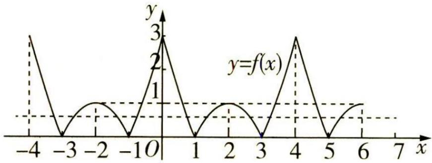

line

| x   | y   |
| --- | --- |
| -4  | 3   |
| -3  | 0   |
| -2  | 1   |
| -1  | 0   |
| 0   | 3   |
| 1   | 0   |
| 2   | 1   |
| 3   | 0   |
| 4   | 3   |
| 5   | 0   |
| 6   | 1   |

图 1

# 数学分支

在引入无穷远点和无穷远直线后,原来普通点和普通直线的结合关系依然成立,而过去只有两条直线不平行的时候才能求交点的限制就消失了.

Step 4: 得出结论.

由图象可知, 若函数 $y = f(x)$ 的图象与直线 $y = m$ 在 $[-4, 6]$ 上有 10 个不同的交点, 则实数 $m$ 的取值范围为 $(0, 1)$ .

# 模型演练

(调研2变式,变考点,用换元法与基本不等式求解能成立问题|2024山东潍坊8月月考)已知二次函数 $f(x)=x^{2}+bx+c$ ,且不等式 $f(x)<2x$ 的解集为(1,3).

(1) 求 $f(x)$ 的解析式.  
(2) 若不等式 $kf(2^x) - 2^x + 1 \leqslant 0$ 在 $x \in [1, 2]$ 时有解, 求实数 $k$ 的取值范围.

# 参考答案与解析

(1)由题意知关于 $x$ 的方程 $x^{2} - (2 - b)x + c = 0$ 的两个根分别是1,3，

故 $\left\{\begin{aligned}2-b=4,\\ c=3,\end{aligned}\right.$ 即 $\left\{\begin{aligned}b&=-2,\\ c&=3,\end{aligned}\right.$ 故 $f(x)=x^{2}-2x+3.$

(2) Step 1 + 2: 分析题意, 参变分离.

不等式 $kf(2^{x})-2^{x}+1\leqslant0$ 在 $x\in[1,2]$ 时有解，即 $k(2^{2x}-2\cdot2^{x}+3)\leqslant2^{x}-1$ 在 $x\in[1,2]$ 时有解.
因为 $2^{2x}-2\cdot2^{x}+3=(2^{x}-1)^{2}+2>0$ ，所以 $k\leqslant\frac{2^{x}-1}{2^{2x}-2\cdot2^{x}+3}$ 在 $x\in[1,2]$ 时有解，

【敲黑板】通过配方法得出 $2^{2x} - 2 \cdot 2^{x} + 3 > 0$ ，这是分离参数的前提

所以 $k \leqslant \left(\frac{2^x - 1}{2^{2x} - 2 \cdot 2^x + 3}\right)_{\max}$ .

Step 3: 利用基本不等式求最值.

设 $t = 2^{x} - 1, x \in [1,2]$ , 则 $t \in [1,3], k \leqslant \left(\frac{t}{t^2 + 2}\right)_{\max}$ .

【灵活换元】不等号右边式子结构看似复杂，但若把 $2^{x} - 1$ 看作一个整体，采用换元法，结果便一目了然了

$\frac{t}{t^2 + 2} = \frac{1}{t + \frac{2}{t}} \leqslant \frac{1}{2\sqrt{2}} = \frac{\sqrt{2}}{4}$ , 当且仅当 $t = \frac{2}{t}$ , 即 $t = \sqrt{2}$ 时, 不等式取等号.

Step 4: 得出结论.

所以 $k \leqslant \frac{\sqrt{2}}{4}$ ，即实数 k 的取值范围为 $(-∞, \frac{\sqrt{2}}{4}]$ .

# 数学分支

常微分方程 如果在一个微分方程中出现的未知函数只含一个自变量,这个方程就叫作常微分方程,也可以简单地叫作微分方程.

# 模型7 用放缩思想速解不等式证明问题

# 模型攻略

利用放缩思想证明不等式是高考中的难点. 放缩思想, 就是利用不等式的传递性, 对照求解目标合理放大或缩小, 使用时要注意放缩有度. 放缩的方法技巧有很多, 比如添项去项放缩、公式放缩、构造函数放缩等, 这些方法需要有敏捷的数学观察力和熟练的代数变形能力, 需要灵活运用. 这里给出一种思维模型:

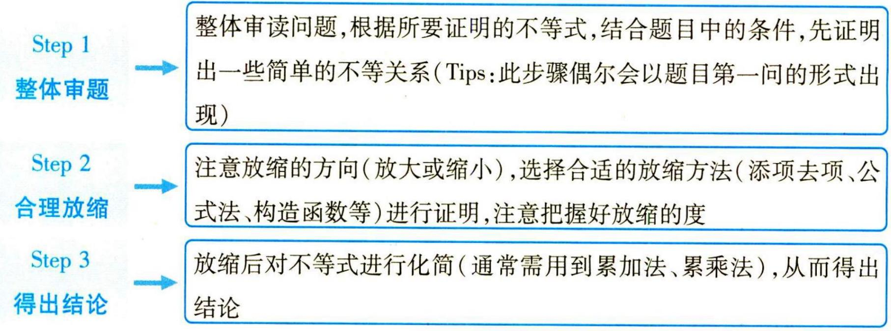

flowchart

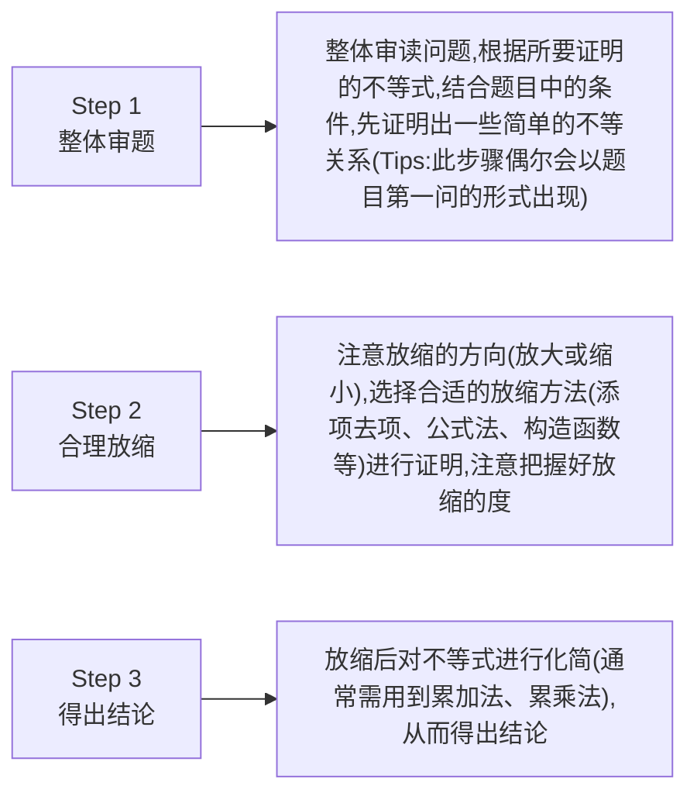
```mermaid
graph LR
    A["Step 1<br>整体审题"] --> B["整体审读问题,根据所要证明的不等式,结合题目中的条件,先证明出一些简单的不等关系(Tips:此步骤偶尔会以题目第一问的形式出现)"]
    C["Step 2<br>合理放缩"] --> D["注意放缩的方向(放大或缩小),选择合适的放缩方法(添项去项、公式法、构造函数等)进行证明,注意把握好放缩的度"]
    E["Step 3<br>得出结论"] --> F["放缩后对不等式进行化简(通常需用到累加法、累乘法),从而得出结论"]
```

调研 1 (2024 山东济南 8 月开学考试) 已知函数 $f(x) = a \ln x + 1 - x$ .

(1) 若 $f(x) \leqslant 0$ , 求 a 的值.

(2) 证明: 当 $n \in \mathbf{N}^*$ 且 $n \geqslant 2$ 时, $\frac{\ln 2}{2^2} \times \frac{\ln 3}{3^2} \times \frac{\ln 4}{4^2} \times \cdots \times \frac{\ln n}{n^2} < \frac{1}{n}$ .

解析 (1) 由题意知, $x \in (0, +\infty)$ , $f'(x) = \frac{a}{x} - 1 = \frac{a - x}{x}$ 且 $f(1) = 0$ .

【突破瓶颈】平时我们见到的问题大多是需要证明 “ $f(x) \leq 0$ ”，此时求解 $f(x)$ 的最大值即可。本题却反其道而行之，提前告诉了我们 $f(x) \leq 0$ ，但是解决方法不变，我们仍旧可以找 $f(x)$ 的最大值，然后判断众多最大值中什么时候满足小于等于0。“0”有什么特殊之处呢？观察解析式，发现 $f(1)$ 恰好为0，也就是 $f(1)$ 是函数的最大值

①当 $a \leqslant 0$ 时, $f'(x) < 0$ 恒成立, $f(x)$ 在 $(0, +\infty)$ 上单调递减,所以当 $x \in (0,1)$ 时, $f(x) > f(1) =$ 【分类有标准】令 $f'(x) = 0$ , 可得 $x = a$ , 那么根据极值点是否在定义域内 (a与0的关系)、极值点与1的关系分类即可

0 成立,不合题意.

②当0<a<1时,由 $f'(x)>0$ 得 $x\in(0,a)$ ,由 $f'(x)<0$ 得 $x\in(a,+\infty)$ ,

则 $f(x)$ 在 $(0, a)$ 上单调递增，在 $(a, +\infty)$ 上单调递减，所以 $f(a) > f(1) = 0$ 成立，不合题意.

③当a=1时,由 $f'(x)>0$ 得 $x\in(0,1)$ ,由 $f'(x)<0$ 得 $x\in(1,+\infty)$ ,

# 数学分支

常微分方程的概念、解法和其他理论很多,比如,方程和方程组的种类及解法、解的存在性和唯一性、奇解、定性理论等.

则 $f(x)$ 在 $(0,1)$ 上单调递增，在 $(1, +\infty)$ 上单调递减，

所以对于任意的 $x \in (0, +\infty)$ , $f(x) \leqslant f(1) = 0$ , 符合题意.

④当a>1时,由 $f'(x)>0$ 得 $x\in(0,a)$ ,由 $f'(x)<0$ 得 $x\in(a,+\infty)$ ,

则 $f(x)$ 在 $(0, a)$ 上单调递增，在 $(a, +\infty)$ 上单调递减，所以 $f(a) > f(1) = 0$ 成立，不合题意.

综上所述,a=1.

(2) Step 1: 整体审题, 找到简单的不等关系.

由(1)知,当 a=1 时, $f(x)=\ln x+1-x\leqslant0$ ,即 $\ln x\leqslant x-1$ ,当且仅当 x=1 时等号成立.

令 $x = n$ ，其中 $n\in \mathbf{N}^*$ 且 $n\geqslant 2$ ，则有 $\ln n <   n - 1$

Step 2: 合理放缩.

又 $n-1<n(n-1)$ ，所以 $\ln n<n(n-1)$ ，即 $\frac{\ln n}{n^{2}}<\frac{n-1}{n}$ .

【重要思路】明确放缩的方向，合理地进行添项对不等式进行放大，当遇见与 $n$ 相关的不等式时，下面这个不等式链是第一思考方向：当 $n \geqslant 2$ 时， $n - 1 < (n - 1)^{2} < n(n - 1) < n^{2} < n(n + 1) < (n + 1)^{2}$

Step 3: 化简不等式, 得出结论.

所以 $\frac{\ln 2}{2^2} \times \frac{\ln 3}{3^2} \times \frac{\ln 4}{4^2} \times \cdots \times \frac{\ln n}{n^2} < \frac{1}{2} \times \frac{2}{3} \times \frac{3}{4} \times \cdots \times \frac{n - 1}{n} = \frac{1}{n}$ ,

【累乘法】选择使用累乘法将分子分母相消，从而得出结论

即当 $n \in N^{*}$ 且 $n \geqslant 2$ 时， $\frac{\ln 2}{2^{2}} \times \frac{\ln 3}{3^{2}} \times \frac{\ln 4}{4^{2}} \times \cdots \times \frac{\ln n}{n^{2}} < \frac{1}{n}$ .

调研 2 (2024 广东梅州中学 9 月校考) 已知数列 $\{a_{n}\}$ 的前 $n$ 项和为 $S_{n}, a_{1} = 4, S_{n}$ 是 $a_{n+1}$ 与 $2n-4$ 的等差中项.

(1) 求 $\{a_{n}\}$ 的通项公式.

(2) 设 $b_{n}=\frac{1}{a_{n}-\frac{4}{3}}$ ，且数列 $\{b_{n}\}$ 的前 n 项和为 $T_{n}$ ，求证： $T_{n}<\frac{9}{16}$ .

解析 (1) $\because S_{n}$ 是 $a_{n+1}$ 与 $2n-4$ 的等差中项, $\therefore 2S_{n}=a_{n+1}+2n-4$ .

当 n=1 时, $2a_{1}=2S_{1}=a_{2}+2-4$ ,又 $a_{1}=4,\therefore a_{2}=10.$

当 $n \geqslant 2$ 时， $2a_{n} = 2S_{n} - 2S_{n-1} = a_{n+1} + 2n - 4 - a_{n} - 2(n - 1) + 4 = a_{n+1} - a_{n} + 2,$

$$
\therefore a _ {n + 1} = 3 a _ {n} - 2, \therefore a _ {n + 1} - 1 = 3 (a _ {n} - 1).
$$

【技巧点拨】递推公式形如 “ $a_{n+1}=qa_{n}+p(p\neq0,q\neq0,q\neq1)$ ” 的数列，可以通过等号两边同时加某个常数，配凑出以 q 为公比的等比数列

数学分支

微分方程的理论逐步完善的时候,利用它就可以精确地表述事物变化所遵循的基本规律,只要列出相应的微分方程即可.微分方程也就成了最有生命力的数学分支.

又 $a_2 - 1 = 3(a_1 - 1), a_1 - 1 = 3, \therefore$ 数列 $\{a_n - 1\}$ 是以3为首项，3为公比的等比数列，

$$
\therefore a _ {n} - 1 = 3 ^ {n}, \therefore a _ {n} = 3 ^ {n} + 1.
$$

(2) Step 1: 整体审题, 找到简单的不等关系.

由(1)得 $b_{n}=\frac{1}{3^{n}-\frac{1}{3}}=\frac{3}{3^{n+1}-1}>0.$

$$
\because \frac {b _ {n + 1}}{b _ {n}} = \frac {\frac {3}{3 ^ {n + 2} - 1}}{\frac {3}{3 ^ {n + 1} - 1}} = \frac {\frac {1}{3} (3 ^ {n + 2} - 1) - \frac {2}{3}}{3 ^ {n + 2} - 1} = \frac {1}{3} - \frac {2}{3 ^ {n + 3} - 3} <   \frac {1}{3}, \therefore b _ {n + 1} <   \frac {1}{3} b _ {n},
$$

【找不等关系】根据数列 $\{b_{n}\}$ 通项公式的形式进行等比数列形式的放缩, 得到 $b_{n+1} < \frac{1}{3} b_{n}$ Step 2 + 3: 从不等关系入手合理放缩, 得出结论.

$\therefore T_{1} = b_{1} = \frac{3}{8} < \frac{9}{16}$ , 当 $n \geqslant 2$ 时, $T_{n} = b_{1} + b_{2} + b_{3} + \cdots + b_{n-1} + b_{n} < b_{1} + \frac{1}{3}b_{1} + \frac{1}{3}b_{2} + \cdots + \frac{1}{3}b_{n-2} + \frac{1}{3}b_{n-1} = b_{1} + \frac{1}{3}T_{n-1}$ ,

$$
\because b _ {n + 1} > 0, \therefore T _ {n} <   T _ {n + 1}, \therefore b _ {1} + \frac {1}{3} T _ {n - 1} <   b _ {1} + \frac {1}{3} T _ {n}, \therefore T _ {n} <   b _ {1} + \frac {1}{3} T _ {n}, \therefore \frac {2}{3} T _ {n} <   b _ {1} = \frac {3}{8}, \therefore T _ {n} <   \frac {9}{1 6}.
$$

# 模型演练

1. (调研 1 变式, 变考点, 考查含三角函数的不等式证明 |2024 河南郑州外国语学校 10 月调研) 已知函数 $f(x) = x \mathrm{e}^{x} - \mathrm{e}^{x} + 1$ .

(1) 证明: $f(x) \geqslant 0$ .   
(2) 已知 $n \in N^{*}$ ，证明： $\sin \frac{1}{n+1} + \sin \frac{1}{n+2} + \cdots + \sin \frac{1}{2n} < \ln 2.$

2. (试题调研原创 | 调研 2 变式, 变解法, 利用二项式定理放缩) 数列 $\{a_{n}\}$ 的前 $n$ 项和为 $S_{n}$ , 已知对任意的 $n \in \mathbf{N}^{*}$ , 点 $(n, S_{n})$ 均在函数 $y = 3 - \frac{3^{x + 1}}{4^{x}}$ 的图象上.

(1) 求数列 $\{a_{n}\}$ 的通项公式.  
(2) 证明: 对任意的 $n \in \mathbf{N}^*$ , 不等式 $a_n < \frac{18}{(n + 2)(n + 3)}$ 成立.

# 参考答案与解析

1. (1) 函数 $f(x) = x\mathrm{e}^{x} - \mathrm{e}^{x} + 1$ 的定义域为 $\mathbf{R}, f'(x) = x\mathrm{e}^{x}$ ,

由 $f'(x)>0$ 得x>0，由 $f'(x)<0$ 得x<0，

故 $f(x)$ 在区间 $(0,+\infty)$ 上单调递增，在区间 $(-∞,0)$ 上单调递减，

# 数学分支

非欧几何 非欧几何学是一门大的数学分支,一般来讲,它有广义、狭义、通常意义这三个方面的不同含义.

故 $f(x)$ 的最小值是 $f(0)=0$ ，所以 $f(x)\geqslant0$ .

(2) Step 1: 整体审题, 找到简单的不等关系.

由(1)得, $x\mathrm{e}^{x}-\mathrm{e}^{x}+1\geqslant0$ . 令 $t=\mathrm{e}^{x}$ , 其中 t>0 , 则 $t\ln t-t+1\geqslant0$ , 即 $\ln t\geqslant1-\frac{1}{t}$ ,

令 $t = \frac{n + k}{n + k - 1}$ ，则 $\ln \frac{n + k}{n + k - 1} >\frac{1}{n + k},$

所以 $\frac{1}{n+k}<\ln\frac{n+k}{n+k-1}=\ln(n+k)-\ln(n+k-1),k\in\{1,2,\cdots,n\}$ .

【会转化】通过两次换元，得到 $\frac{1}{n+k}<\ln(n+k)-\ln(n+k-1),k\in\{1,2,\cdots,n\}$ ，这帮助我们找到了 $\frac{1}{n+k}$ 与 $\ln(n+k)-\ln(n+k-1)$ 之间的关系，那么接下来再找到 $\sin\frac{1}{n+k}$ 与 $\frac{1}{n+k}$ 的关系即可。显然可以利用不等式 $\sin x<x(x>0)$ ，注意步骤要规范书写

令 $g(x) = x - \sin x (x > 0)$ ，则 $g'(x) = 1 - \cos x \geqslant 0$ 且 $g'(x)$ 不恒为零，

所以函数 $g(x)$ 在 $(0, +\infty)$ 上单调递增，故 $g(x) > 0 - \sin 0 = 0$ ，则 $\sin x < x (x > 0)$ .

Step 2: 合理放缩.

所以 $\sin\frac{1}{n+k}<\frac{1}{n+k}<\ln(n+k)-\ln(n+k-1),k\in\{1,2,\cdots,n\}$ .

【关键点】以 $\frac{1}{n+k}$ 为桥梁，放缩得到三角函数值与对数值之间的不等关系

Step 3: 化简不等式, 得出结论.

所以 $\sin\frac{1}{n+1}+\sin\frac{1}{n+2}+\cdots+\sin\frac{1}{2n}<\left[\ln(n+1)-\ln n\right]+\left[\ln(n+2)-\ln(n+1)\right]+\cdots+$

$\left[\ln 2n - \ln (2n - 1)\right] = \ln 2n - \ln n = \ln \frac{2n}{n} = \ln 2$ ，问题得证.

2. (1) 因为对任意 $n \in \mathbf{N}^{*}$ , 点 $(n, S_{n})$ 均在函数 $y = 3 - \frac{3^{x + 1}}{4^{x}}$ 的图象上, 所以 $S_{n} = 3 - \frac{3^{n + 1}}{4^{n}}$ .

当 $n \geqslant 2$ 时, $a_{n} = S_{n} - S_{n-1} = (3 - \frac{3^{n+1}}{4^{n}}) - (3 - \frac{3^{n}}{4^{n-1}}) = \frac{3^{n}}{4^{n-1}} - \frac{3^{n+1}}{4^{n}} = (\frac{3}{4})^{n}$ .

当 n=1 时, $a_{1}=S_{1}=\frac{3}{4}$ ,符合上式.

因此数列 $\{a_{n}\}$ 的通项公式是 $a_{n} = \left(\frac{3}{4}\right)^{n}, n \in \mathbf{N}^{*}$ .

(2)Step 1:整体审题.

因为 $a_{n} = \left(\frac{3}{4}\right)^{n}, n \in \mathbf{N}^{*}$ , 所以要证 $a_{n} < \frac{18}{(n + 2)(n + 3)}$ , 即证 $(\frac{3}{4})^{n} < \frac{18}{(n + 2)(n + 3)}, n \in \mathbf{N}^{*}$ .

# 数学分支

广义上泛指一切和欧几里得几何学不同的几何学,狭义的非欧几何只是指罗式几何,至于通常意义的非欧几何,就是指罗式几何和黎曼几何.

Step 2: 合理放缩.

当 $n \geqslant 2$ 且 $n \in N^{*}$ 时，因为 $\left(\frac{4}{3}\right)^{n} = \left(1 + \frac{1}{3}\right)^{n} = C_{n}^{0} + C_{n}^{1} \cdot \left(\frac{1}{3}\right)^{1} + C_{n}^{2} \cdot \left(\frac{1}{3}\right)^{2} + \cdots \geqslant 1 + \frac{n}{3} + \frac{n(n-1)}{18} = \frac{(n+2)(n+3)+12}{18} > \frac{(n+2)(n+3)}{18}$ ，所以 $\left(\frac{3}{4}\right)^{n} < \frac{18}{(n+2)(n+3)}$ .

【神来之笔】从取倒数入手，由 $\left(\frac{3}{4}\right)^{n}$ 得到 $\left(\frac{4}{3}\right)^{n}$ ，从而利用二项式定理进行放缩，是解决本题的关键思路

当 $n = 1$ 时, $\frac{3}{4} < \frac{18}{(1 + 2)(1 + 3)}$ , 不等式成立.

【易遗漏】不要遗漏 $n = 1$ 时情况的说明

Step 3: 得出结论.

综上所述, $a_{n}<\frac{18}{(n+2)(n+3)}$ .

# 型8 用定量+定性双法分析立体几何中的求角问题

# 模型攻略

高考在立体几何模块中,涉及有关角的考查是核心考点之一,解决角的相关问题常用的方法有两种.

(1) 几何法, 即根据角的定义和线面关系, 在图形中找出该角, 再将该角置于三角形中, 通过解三角形得解, 其解题步骤为:

Step 1

厘清线面关系,合理添加辅助线,将已知条件进行转化

Step 2

根据所求角的定义(直线与平面所成角、二面角的平面角),确认该角

Step 3

将角置于三角形中,解三角形求解

(2) 向量法, 多在空间直角坐标系下, 借助直线的方向向量、平面的法向量的夹角, 根据夹角公式计算, 再利用向量的夹角求所求角, 其步骤为:

Step 1

建立合适的空间直角坐标系

Step 2

求出空间中的直线的方向向量或平面的法向量

Step 3

利用夹角公式,计算向量的夹角

Step 4

根据夹角和所求角之间的关系,翻译还原为所求角

# 数学分支

欧氏几何、罗氏几何、黎曼几何是三种各有区别的几何。这三种几何各自所有的命题都构成了一个严密的公理体系，各公理之间满足和谐性、完备性和独立性。因此这三种几何都是正确的。

调研 (2024 河北定州中学 8 月开学考试) 如图 1 所示, 四边形 $ABCD$ 是圆柱下底面的内接四边形, $AC$ 是圆柱底面的直径, $PC$ 是圆柱的一条母线, $AB = AD$ ,

$\angle BAD=60^{\circ}$ ，点 F 在线段 AP 上，PA=3PF.

(1)求证:平面PAB⊥平面PBC.   
(2) 若 $CP = 3, CA = 4$ , 求直线 $AC$ 与平面 $FCD$ 所成角的正弦值.

解析 (1) 因为 $PC$ 是圆柱的一条母线, 所以 $PC \perp$ 底面 $ABCD$ ,

又 $AB \subset$ 底面 ABCD, 所以 $PC \perp AB$ .

因为 AC 是圆柱底面的直径, 所以 $AB \perp BC$ .

因为 $PC, BC \subset$ 平面 $PBC, PC \cap BC = C$ ，所以 $AB \perp$ 平面 PBC.

【易遗漏】由线线垂直证明线面垂直，注意相交的说明

又 $AB \subset$ 平面PAB,所以平面 $PAB \perp$ 平面PBC.

(2) 方法一: 几何法 Step 1: 厘清线面关系, 将已知条件进行转化.

因为 $AB = AD, AC = AC, \angle ADC = \angle ABC = 90^{\circ}$ , 所以 Rt $\triangle ADC \cong$ Rt $\triangle ABC$ ,

又 $\angle BAD = 60^{\circ}$ 所以 $\angle DAC = \angle BAC = 30^{\circ}$

所以 $CD=\frac{1}{2}AC=2,AD=2\sqrt{3}$ ，且 $AD\perp$ 平面 PCD，所以 $AD\perp PD$ ，

$$
P A = \sqrt {P C ^ {2} + A C ^ {2}} = 5, \cos \angle D A F = \frac {2 \sqrt {3}}{5}, A F = \frac {2}{3} \times 5 = \frac {1 0}{3},
$$

$$
D F = \sqrt {1 2 + \frac {1 0 0}{9} - 2 \times 2 \sqrt {3} \times \frac {1 0}{3} \times \frac {2 \sqrt {3}}{5}} = \frac {8}{3}.
$$

在 Rt△PAC 中，cos∠CAP = $\frac{4}{5}$ ，CF = $\sqrt{16 + \frac{100}{9} - 2 \times 4 \times \frac{10}{3} \times \frac{4}{5}} = \frac{2\sqrt{13}}{3}$ .

在 $\triangle FCD$ 中， $\cos \angle FDC = \frac{4 + \frac{64}{9} - \frac{52}{9}}{2 \times 2 \times \frac{8}{3}} = \frac{1}{2}$ ，所以 $\angle FDC = 60^{\circ}$ ，所以 $\sin \angle FDC = \frac{\sqrt{3}}{2}$ ，

所以 $S_{\triangle FCD}=\frac{1}{2}\times2\times\frac{8}{3}\times\frac{\sqrt{3}}{2}=\frac{4\sqrt{3}}{3}.$

$$
S _ {\triangle A C D} = \frac {1}{2} \times 2 \times 2 \sqrt {3} = 2 \sqrt {3}.
$$

Step 2: 根据直线与平面所成角的定义, 将求角转化为求距离.

设点 A 到平面 FCD 的距离为 d，由 $V_{A-FCD} = V_{F-ACD}$ 得 $\frac{1}{3} S_{\triangle FCD} \cdot d = \frac{1}{3} S_{\triangle ACD} \cdot 2$ ，解得 d = 3。

【敲黑板】在三棱锥中，用等体积法求点到面的距离是一种既常见又好用的方法

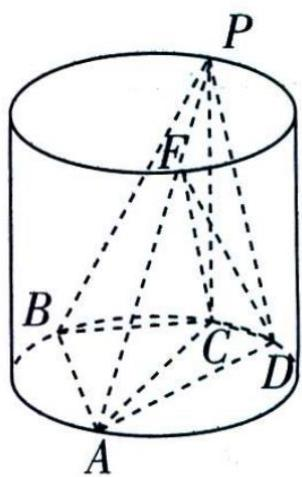

text_image

P
F
B
C
D
A

图 1

# 数学分支

在我们的日常生活中,欧式几何是适用的;在宇宙空间中或原子核世界里,罗氏几何更符合客观实际;在地球表面研究航海、航空等实际问题,黎曼几何更准确一些.

Step 3: 将角置于直角三角形中, 解三角形求解.

设 AC 与平面 FCD 所成的角为 $\theta$ ，因为 AC = 4，所以 $\sin \theta = \frac{d}{AC} = \frac{3}{4}$ ，

即直线 AC 与平面 FCD 所成角的正弦值为 $\frac{3}{4}$ .

# 方法二: 向量法 Step 1: 建立空间直角坐标系.

如图2,以 $C$ 为坐标原点, $CA$ 所在直线为 $x$ 轴, 过 $C$ 且垂直于平面 $APC$ 的直线为 $y$ 轴, $CP$ 所在直线为 $z$ 轴, 建立空间直角坐标系.

因为 AB = AD, AC = AC, $\angle ADC = \angle ABC = 90^{\circ}$ ,

所以 Rt△ADC≌Rt△ABC,

又 $\angle BAD = 60^{\circ}$ ，所以 $\angle DAC = \angle BAC = 30^{\circ}.$

因为 CP=3, CA=4, 所以 $CD=\frac{1}{2}AC=2, AD=2\sqrt{3}$ ,

Step 2: 求出空间中的直线的方向向量及平面的法向量.

则 $C(0,0,0)$ , $A(4,0,0)$ , $D(1,\sqrt{3},0)$ , $F(\frac{4}{3},0,2)$ ,

所以 $\overrightarrow{AC} = (-4,0,0),\overrightarrow{CD} = (1,\sqrt{3},0),\overrightarrow{CF} = (\frac{4}{3},0,2)$ .

设平面 FCD 的法向量为 $\boldsymbol{n}=(x,y,z)$ ，则 $\left\{\begin{aligned}\boldsymbol{n}\cdot\overrightarrow{CD}&=x+\sqrt{3}y=0,\\ \boldsymbol{n}\cdot\overrightarrow{CF}&=\frac{4}{3}x+2z=0,\end{aligned}\right.$ 令 x=-3，得 $y=\sqrt{3},z=2$ ，则平面 FCD 的一个法向量为 $\boldsymbol{n}=(-3,\sqrt{3},2)$ .

Step 3: 利用夹角公式, 计算向量的夹角.

设直线 AC 与平面 FCD 所成角为 $\theta$ ,

则 $\sin \theta = |\cos \langle \overrightarrow{AC},\pmb {n}\rangle | = |\frac{\overrightarrow{AC}\cdot\pmb{n}}{|\overrightarrow{AC}||\pmb{n}|}| = \frac{12}{4\times\sqrt{9 + 3 + 4}} = \frac{3}{4}.$

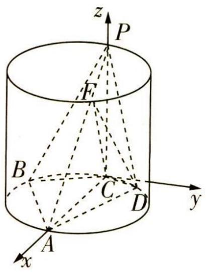

text_image

z
P
F
B
C
D
y
A
x

图 2

【易错提醒】注意平面 $FCD$ 的法向量与直线 $AC$ 的方向向量所成角不是直线与平面所成角 Step 4: 根据夹角和所求角之间的关系, 翻译还原为所求角.

即直线 AC 与平面 FCD 所成角的正弦值为 $\frac{3}{4}$ .

# 模型演练

(试题调研原创|调研变式,变设问,求二面角)如图3,在四棱锥P-ABCD中, $PA\perp$ 平面ABCD, $AD\parallel BC$ ,AD=2BC, $\triangle ABC$ 是等边三角形,PA=AB=1.

(1) 求证: 平面 $PCD \perp$ 平面 PAC.

(2) 求二面角 B - PC - A 的余弦值.

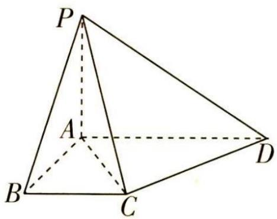

text_image

P
A
B
C
D

图 3

# 数学分支

计算数学 现代的科学技术发展十分迅速,它们有一个共同的特点,就是都有大量的数据问题.研究计算问题的解决方法和有关数学理论问题的一门学科就叫作计算数学.

# 参考答案与解析

(1) $\because PA \perp$ 平面 $ABCD, CD \subset$ 平面 $ABCD, \therefore PA \perp CD$ .

在 $\triangle ACD$ 中， $AC = 1,AD = 2,\angle CAD = 60^{\circ},\therefore CD = \sqrt{1^{2} + 2^{2} - 2\times 1\times 2\times\cos 60^{\circ}} = \sqrt{3}$

$\therefore AC^{2} + CD^{2} = AD^{2}, \therefore AC \perp CD,$ 又 $PA \cap AC = A, PA, AC \subset$ 平面 $PAC, \therefore CD \perp$ 平面 $PAC.$

∵ CD⊂平面 PCD, ∴ 平面 PCD⊥平面 PAC.

(2)方法一:几何法 Step 1:厘清线面关系,合理添加辅助线,将已知条件转化.

过点 B 作 $BM \perp AC$ 交 AC 于点 M, 过 M 作 $MN \perp PC$ 交 PC 于点 N, 连接 BN.

Step 2: 根据二面角平面角的定义, 确认该角.

∵ PA ⊥ 平面 ABCD, BM ⊂ 平面 ABCD, ∴ PA ⊥ BM.

又 $BM \perp AC, PA \cap AC = A, PA, AC \subset$ 平面 PAC, ∴ $BM \perp$ 平面 PAC,

∵ PC ⊂ 平面 PAC, ∴ BM ⊥ PC,

又 $MN \perp PC, MN \cap BM = M, MN, BM \subset$ 平面 BMN, ∴ $PC \perp$ 平面 BMN,

∵ $BN \subset$ 平面 BMN, ∴ $PC \perp BN$ , ∴ $\angle BNM$ 为二面角 B - PC - A 的平面角.

Step 3: 将角置于三角形中, 解三角形求解.

在 Rt△BMN 中, $BM=\frac{\sqrt{3}}{2}$ ,MN= $\frac{\sqrt{2}}{4}$ ,∴tan∠BNM= $\frac{BM}{MN}=\sqrt{6}$ ,∴cos∠BNM= $\frac{\sqrt{7}}{7}$ ,

故二面角 B - PC - A 的余弦值为 $\frac{\sqrt{7}}{7}$ .

方法二: 向量法 Step 1: 建立空间直角坐标系.

如图4,取BC的中点E,连接AE,则AE,AD,AP两两垂直,

【拿分要点】建立空间直角坐标系之前，一定要说明三条两两垂直的相交直线，若垂直关系不易直接看出，还需要进行证明

以 A 为坐标原点, AE, AD, AP 所在直线分别为 x 轴, y 轴, z 轴建立空间直角坐标系,

Step 2: 求出平面的法向量.

则 $A(0,0,0)$ , $P(0,0,1)$ , $C(\frac{\sqrt{3}}{2},\frac{1}{2},0)$ , $B(\frac{\sqrt{3}}{2},-\frac{1}{2},0)$ ,

$$
\therefore \overrightarrow {A P} = (0, 0, 1), \overrightarrow {A C} = (\frac {\sqrt {3}}{2}, \frac {1}{2}, 0), \overrightarrow {B C} = (0, 1, 0), \overrightarrow {P C} = (\frac {\sqrt {3}}{2}, \frac {1}{2}, - 1).
$$

设平面 PAC 的法向量为 $\boldsymbol{m} = (x, y, z)$ ，则 $\left\{\begin{aligned}\overrightarrow{AP} & \cdot \boldsymbol{m} = 0, \\ \overrightarrow{AC} & \cdot \boldsymbol{m} = 0,\end{aligned}\right.$

所以 $\left\{\begin{aligned}z=0,\\ \frac{\sqrt{3}}{2}x+\frac{1}{2}y=0,\end{aligned}\right.$ 令x=1,得平面PAC的一个法向量的 $m=(1,-\sqrt{3},0)$ .

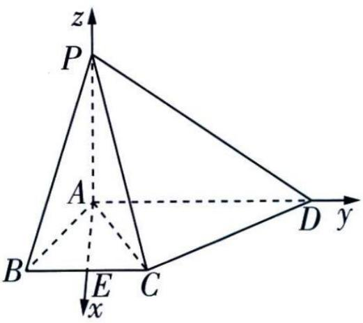

text_image

z
P
A
B
E
C
x
y
D

图 4

# 数学分支

计算数学也叫作数值计算方法或数值分析.主要内容包括代数方程、线性代数方程组、微分方程的数值解法,函数的数值逼近问题,矩阵特征值的求法,最优化计算问题,概率统计计算问题等.

设平面 PBC 的法向量为 $\boldsymbol{n}=(x',y',z')$ ，则 $\left\{\begin{aligned}\overrightarrow{BC}\cdot\boldsymbol{n}&=0,\\\overrightarrow{PC}\cdot\boldsymbol{n}&=0,\end{aligned}\right.$

所以 $\left\{\begin{aligned}y^{\prime}&=0,\\ \frac{\sqrt{3}}{2}x^{\prime}+\frac{1}{2}y^{\prime}-z^{\prime}&=0,\end{aligned}\right.$ 令 $x^{\prime}=2$ ，得平面PBC的一个法向量为 $n=(2,0,\sqrt{3})$ .

Step 3 +4: 利用夹角公式, 计算向量的夹角, 还原为所求角.

记二面角 $B - PC - A$ 为 $\theta$ , 显然 $\theta$ 为锐角, 则 $\cos \theta = |\cos \langle m, n \rangle| = \frac{2}{\sqrt{1 + 3} \times \sqrt{4 + 3}} = \frac{\sqrt{7}}{7}$ ,即二面角 B - PC - A 的余弦值为 $\frac{\sqrt{7}}{7}$ .

# 型9 用分类讨论思想速解分段数列问题

# 模型攻略

分段数列实际是分段函数的一种特殊情形,所以分段数列问题可以借鉴分段函数问题的处理方式,首先明确分段数列的构成特征,是由项数的奇偶引起的分段,还是“新定义”的分段,或者是由题设条件的预先设定而构成的分段;其次,一旦明确了分段数列的构成特征,就要进行不重不漏逐一分类讨论;最后,要对以上所有讨论的结论进行合理整合,从而获得题目要求的简洁、完整的答案.其解题步骤为:

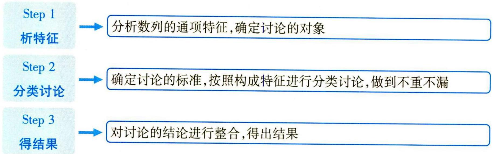

flowchart

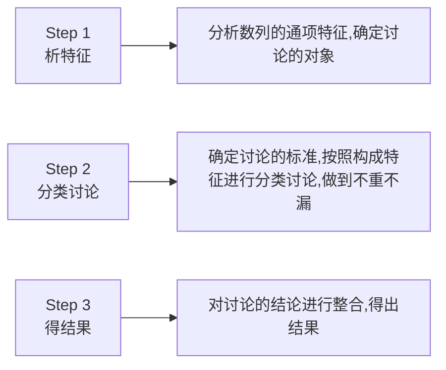
```mermaid
graph LR
    A["Step 1<br>析特征"] --> B["分析数列的通项特征,确定讨论的对象"]
    C["Step 2<br>分类讨论"] --> D["确定讨论的标准,按照构成特征进行分类讨论,做到不重不漏"]
    E["Step 3<br>得结果"] --> F["对讨论的结论进行整合,得出结果"]
```

调研 1 (2024 天津耀华中学 9 月学情反馈) 已知等比数列 $\{a_{n}\}$ 的公比 $q > 1$ , 若 $a_{2} + a_{3} + a_{4} = 14$ , 且 $a_{2}, a_{3} + 1, a_{4}$ 分别是等差数列 $\{b_{n}\}$ 的第 1,3,5 项.

(1) 求数列 $\{a_{n}\}$ 和 $\{b_{n}\}$ 的通项公式.  
(2) 记 $d_{n} = (-1)^{n - 1}\frac{6n + 5}{4b_{n}b_{n + 1}}$ ，求 $\sum_{i=1}^{n} d_{i}$ 的最大值和最小值.

解析 (1)依题意得 $\left\{ \begin{array}{l}a_{2} + a_{3} + a_{4} = 14,\\ 2(a_{3} + 1) = a_{2} + a_{4},\\ q > 1, \end{array} \right.$ 则 $\left\{ \begin{array}{l}a_1q + a_1q^2 +a_1q^3 = 14,\\ 2(a_1q^2 +1) = a_1q + a_1q^3,\\ q > 1, \end{array} \right.$

# 数学分支

此外,计算数学还包括解的存在性、唯一性、收敛性和误差分析等理论问题,它的内容十分丰富,在科学技术中正发挥着越来越大的作用.

解得 $a_1 = 1, q = 2$ ，所以 $a_n = 2^{n-1}$ ，则 $b_1 = a_2 = 2, b_3 = a_3 + 1 = 4 + 1 = 5, b_5 = a_4 = 8$ .

设等差数列 $\{b_n\}$ 的公差为 $d$ ，则 $d = \frac{5 - 2}{3 - 1} = \frac{3}{2}$ ，所以 $b_n = 2 + (n - 1) \times \frac{3}{2} = \frac{3}{2} n + \frac{1}{2}$ .

(2)Step 1:分析数列的通项特征,确定讨论的对象.

$$
d _ {n} = (- 1) ^ {n - 1} \frac {6 n + 5}{4 b _ {n} b _ {n + 1}} = (- 1) ^ {n - 1} \times \frac {6 n + 5}{4 \times \left(\frac {3}{2} n + \frac {1}{2}\right) \times \left(\frac {3}{2} n + \frac {4}{2}\right)} = (- 1) ^ {n - 1} \times
$$

$$
\frac {6 n + 5}{(3 n + 1) \times (3 n + 4)} = (- 1) ^ {n - 1} \times \left(\frac {1}{3 n + 1} + \frac {1}{3 n + 4}\right),
$$

【名师点拨】观察发现 $d_{n}$ 中含有 $(-1)^{n-1}$ ，故 $\{d_{n}\}$ 各项的正负与奇偶项有关，属于分段数列，需要按照 $n$ 为奇数和 $n$ 为偶数进行讨论

$$
\sum_ {i = 1} ^ {n} d _ {i} = \left(\frac {1}{4} + \frac {1}{7}\right) - \left(\frac {1}{7} + \frac {1}{1 0}\right) + \left(\frac {1}{1 0} + \frac {1}{1 3}\right) - \left(\frac {1}{1 3} + \frac {1}{1 6}\right) + \dots + (- 1) ^ {n - 1} \times \left(\frac {1}{3 n + 1} + \frac {1}{3 n + 4}\right).
$$

Step 2: 确定讨论的标准, 对 $n$ 的奇偶进行分类讨论.

当 $n$ 为偶数时， $\sum_{i=1}^{n} d_i = \frac{1}{4} - \frac{1}{3n+4}$ ，令 $T_n = \frac{1}{4} - \frac{1}{3n+4}$ （ $n$ 为偶数），

根据增减性知 $T_{n}$ 的最小值为 $T_{2} = \frac{1}{4} -\frac{1}{10} = \frac{3}{20}$ 且 $T_{n} = \frac{1}{4} -\frac{1}{3n + 4} <  \frac{1}{4}.$

当 $n$ 为奇数时， $\sum_{i=1}^{n} d_i = \frac{1}{4} + \frac{1}{3n+4}$ ，令 $M_n = \frac{1}{4} + \frac{1}{3n+4}$ （ $n$ 为奇数），

根据增减性知 $M_{n}$ 的最大值为 $M_{1} = \frac{1}{4} +\frac{1}{7} = \frac{11}{28}$ ，且 $M_{n} = \frac{1}{4} +\frac{1}{3n + 4} >\frac{1}{4}.$

【敲黑板】在判断出 $T_{n}$ 的最小值和 $M_{n}$ 的最大值后，还要判断 $T_{n}$ 恒小于 $\frac{1}{4}$ ， $M_{n}$ 恒大于 $\frac{1}{4}$ ，才能得出 $\sum_{i=1}^{n} d_{i}$ 的最大值与最小值

Step 3: 对讨论的结论进行整合, 得出结果.

综上所述, $\sum_{i=1}^{n}d_{i}$ 的最大值为 $\frac{11}{28}$ ，最小值为 $\frac{3}{20}$ .

调研 2 (2024 河南名校 9 月联考) 已知数列 $\{a_{n}\}$ 的前 $n$ 项和为 $S_{n}$ , 且满足 $S_{n} = 2a_{n} - 1, b_{n} = 30 - \log_{2}(S_{n} + 1)$ .

(1)求数列 $\{a_{n}\}$ ， $\{b_{n}\}$ 的通项公式；  
(2) 定义 $a * b = \begin{cases} a, & a > b, \\ b, & a \leqslant b, \end{cases}$ 记 $c_{n} = a_{n} * b_{n}$ , 求数列 $\{c_{n}\}$ 的前 20 项和 $T_{20}$ .

解析 (1) 因为 $S_{n} = 2a_{n} - 1$ , 当 $n = 1$ 时, $S_{1} = 2a_{1} - 1$ , 解得 $a_{1} = 1$ .

# 数学分支

分形几何 分形几何学的基本思想是:客观事物具有自相似的层次结构,局部与整体在形态、功能、信息、时间、空间等方面具有统计意义上的相似性.

当 $n\geqslant2$ 时, $S_{n-1}=2a_{n-1}-1$ ,所以 $S_{n}-S_{n-1}=2a_{n}-1-(2a_{n-1}-1)$ ,即 $a_{n}=2a_{n}-2a_{n-1}$ ,

【易错提醒】在用 $S_{n} - S_{n - 1}$ 求 $a_{n}$ 时，注意说明 $n \geqslant 2$

所以 $a_{n} = 2a_{n - 1}$ ，即 $\{a_n\}$ 是以1为首项，2为公比的等比数列，故 $a_{n} = 2^{n - 1}$

$S_{n} = 2a_{n} - 1 = 2^{n} - 1$ ，则 $b_{n} = 30 - \log_{2}(S_{n} + 1) = 30 - n.$

(2) Step 1: 分析数列 $\{c_{n}\}$ 的通项特征, 研究数列 $\{a_{n}\}, \{b_{n}\}$ 的单调性.

$a_{n} = 2^{n - 1}$ ，数列 $\{a_n\}$ 为递增数列， $b_{n} = 30 - n$ ，数列 $\{b_n\}$ 为递减数列.

$$
a _ {1} = 1, a _ {2} = 2, a _ {3} = 4, a _ {4} = 8, a _ {5} = 1 6, a _ {6} = 3 2, \dots ,
$$

$$
b _ {1} = 2 9, b _ {2} = 2 8, b _ {3} = 2 7, b _ {4} = 2 6, b _ {5} = 2 5, b _ {6} = 2 4, \dots
$$

Step 2: 确定讨论标准, 由新定义及 $a_{n}, b_{n}$ 的大小, 得出数列 $\{c_{n}\}$ 的通项.

所以当 $n \leqslant 5$ 时, $a_{n} < b_{n}$ , 当 $n \geqslant 6$ 时, $a_{n} > b_{n}$ ,

所以 $c_{n} = a_{n}*b_{n} = \left\{ \begin{array}{l}b_{n},n\leqslant 5,\\ a_{n},n\geqslant 6. \end{array} \right.$

Step 3: 根据数列 $\{c_{n}\}$ 的特征, 分组求和, 得出结果.

所以 $T_{20}=b_{1}+b_{2}+b_{3}+b_{4}+b_{5}+a_{6}+\cdots+a_{20}=\frac{5(b_{1}+b_{5})}{2}+\frac{32(1-2^{15})}{1-2}=135+2^{20}-32=$ 1 048 679.

# 模型演练

1. (调研 1 变式, 变设问, 求前 $n$ 项和 |2024 广西南宁二中、柳州铁一中 9 月摸底调研) 已知数列 $\{a_{n}\}$ 的前 $n$ 项和为 $S_{n}, S_{n} = \frac{3^{n+1}}{2} - \frac{3}{2}, n \in \mathbf{N}^{*}$ .

(1) 求 $\{a_{n}\}$ 的通项公式；  
(2) 设 $b_n = (\log_3 a_n)^2$ , $c_n = (-1)^n \left( \frac{1}{b_{n+1}} + \frac{1}{b_{n+2}} \right)$ , 求数列 $\{c_n\}$ 的前 $n$ 项和 $T_n$ .

2. (试题调研原创 | 调研 2 变式, 变条件) 已知 $S_{n}$ 为数列 $\{a_{n}\}$ 的前 $n$ 项和, $3S_{n} = a_{n} + 2a_{1}(n \in \mathbf{N}^{*})$ , $a_{1} \neq 0$ , $a_{1}, a_{2} + 1$ , $a_{3}$ 成等比数列.

(1)求数列 $\{a_{n}\}$ 的通项公式;  
(2) 记 $b_{n} = \begin{cases} a_{n}, & n \text{ 为偶数,} \\ \log_{3}a_{n}, & n \text{ 为奇数,} \end{cases}$ 求数列 $\{b_{n}\}$ 的前 $2n + 1$ 项和 $T_{2n+1}$ .

# 参考答案与解析

1. (1) 由题意, 当 n=1 时, $a_{1}=S_{1}=\frac{3^{2}}{2}-\frac{3}{2}=3$ ,

# 数学分支

当 $n \geqslant 2$ 时, $a_{n} = S_{n} - S_{n-1} = \left(\frac{3^{n+1}}{2} - \frac{3}{2}\right) - \left(\frac{3^{n}}{2} - \frac{3}{2}\right) = 3^{n}$ ,

当 n=1 时, 上式也符合, 所以 $\{a_{n}\}$ 的通项公式为 $a_{n}=3^{n}(n\in\mathbf{N}^{*})$ .

(2)Step 1: 分析数列 $\{c_{n}\}$ 的特征, 得到通项公式, 确定讨论的对象.

由(1)得 $a_{n} = 3^{n}$ , 所以 $b_{n} = (\log_{3} a_{n})^{2} = (\log_{3} 3^{n})^{2} = n^{2}$ , 则 $c_{n} = (-1)^{n} \left[ \frac{1}{(n + 1)^{2}} + \frac{1}{(n + 2)^{2}} \right]$ .

Step 2: 确定讨论的标准, 根据 $n$ 的奇偶进行分类讨论.

当 $n$ 为偶数时， $T_{n} = -\left(\frac{1}{2^{2}} + \frac{1}{3^{2}}\right) + \left(\frac{1}{3^{2}} + \frac{1}{4^{2}}\right) - \dots - \left[\frac{1}{n^{2}} + \frac{1}{(n + 1)^{2}}\right] + \left[\frac{1}{(n + 1)^{2}} + \frac{1}{(n + 2)^{2}}\right] = \frac{1}{(n + 2)^{2}} - \frac{1}{4}$ ;

当 n 为奇数时, $T_{n}=-\left(\frac{1}{2^{2}}+\frac{1}{3^{2}}\right)+\left(\frac{1}{3^{2}}+\frac{1}{4^{2}}\right)-\cdots+\left[\frac{1}{n^{2}}+\frac{1}{(n+1)^{2}}\right]-\left[\frac{1}{(n+1)^{2}}+\frac{1}{(n+2)^{2}}\right]=$ $-\frac{1}{(n+2)^{2}}-\frac{1}{4}.$

Step 3: 对讨论的结论进行整合, 得出结果.

综上所述, $T_{n}=\frac{(-1)^{n}}{(n+2)^{2}}-\frac{1}{4}.$

2. (1) 由 $3S_{n} = a_{n} + 2a_{1}, n \in \mathbf{N}^{*}$ 得, 当 $n \geqslant 2$ 时, $3S_{n-1} = a_{n-1} + 2a_{1}$ ,

两式相减得 $3a_{n} = a_{n} - a_{n - 1}$ ，即 $\frac{a_n}{a_{n - 1}} = -\frac{1}{2},$

所以数列 $\{a_{n}\}$ 为等比数列,公比为 $-\frac{1}{2}$ .

由 $a_1, a_2 + 1, a_3$ 成等比数列，得 $a_1 a_3 = (a_2 + 1)^2$ ，即 $a_1 \cdot a_1 \cdot (-\frac{1}{2})^2 = (-\frac{1}{2} a_1 + 1)^2$

解得 $a_1 = 1$ ，所以 $a_n = 1 \times \left(-\frac{1}{2}\right)^{n-1} = \left(-\frac{1}{2}\right)^{n-1}$ .

(2)Step $1 + 2$ : 分析数列 $\{b_{n}\}$ 的特征, 确定讨论的对象, 对 $n$ 的奇偶进行分类讨论.

由 $b_{n}=\left\{\begin{aligned}a_{n},&n\text{为偶数,}\\ \log_{3}a_{n},&n\text{为奇数}\end{aligned}\right.$ 知，当n为奇数时， $b_{n}=\log_{3}a_{n}=\log_{3}\left(-\frac{1}{2}\right)^{n-1}=\log_{3}\left(\frac{1}{2}\right)^{n-1}=-(n-\frac{1}{2})^{n-1}$

【技巧点拨】此类数列，根据数列 $\{b_{n}\}$ 前 $2n+1$ 项中的奇数项和偶数项分组求和

1) $\log_3 2$ , 记前 $2n + 1$ 项中的奇数项之和为 $T_{\text {奇}}$ ,

则 $T_{奇} = b_{1} + b_{3} + b_{5} + \cdots + b_{2n+1} = -(0 + 2 + 4 + \cdots + 2n) \log_{3} 2 = -\frac{(n+1) \cdot 2n}{2} \log_{3} 2 = -n (n + 1) \log_{3} 2;$

当 n 为偶数时, $b_{n}=(-\frac{1}{2})^{n-1}=-(\frac{1}{2})^{n-1}$ ,记前 $2n+1$ 项中的偶数项之和为 $T_{偶}$ ,则 $T_{偶}=b_{2}+$

# 数学分支

电子计算机图形显示协助人们推开了分形几何的大门. 这座具有无穷层次结构的宏伟建筑, 每一个角落里都存在无限嵌套的迷宫和回廊, 促使科学家深入研究.

$$
\begin{array}{l} b _ {4} + b _ {6} + \dots + b _ {2 n} = - \left[ \left(\frac {1}{2}\right) ^ {1} + \left(\frac {1}{2}\right) ^ {3} + \left(\frac {1}{2}\right) ^ {5} + \dots + \left(\frac {1}{2}\right) ^ {2 n - 1} \right] = - \frac {\frac {1}{2} \cdot \left[ 1 - \left(\frac {1}{4}\right) ^ {n} \right]}{1 - \frac {1}{4}} = - \frac {2}{3} [ 1 - \\ \left. \left(\frac {1}{4}\right) ^ {n} \right]. \\ \end{array}
$$

Step 3: 对讨论的结论进行整合, 得出结果.

故 $T_{2n + 1} = -n(n + 1)\log_32 - \frac{2}{3}\big[1 - (\frac{1}{4})^n\big].$

# 型10 用点差法速解圆锥曲线的中点弦问题

# 模型攻略

在直线与圆锥曲线的位置关系问题中,“中点弦”问题是一类非常重要的考点,而“点差法”恰恰是解决此类问题最有效的方法.所谓“点差法”,即“先设点”再“作差”,充分利用作差之后式子的结构特征,巧妙地搭建起“中点”和“斜率”(直线斜率)之间的桥梁,大大减少运算量,提高了解题效率(点差法一般应用于弦所在直线斜率存在且不为0的情况,如果出现斜率为0或斜率不存在的特殊情况,应单独分析).给出解题模型如下:

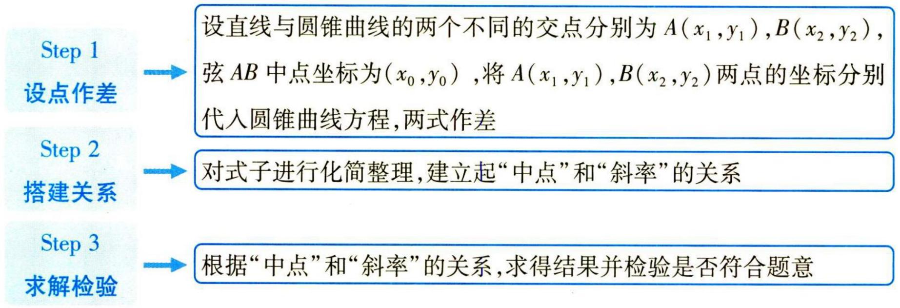

flowchart

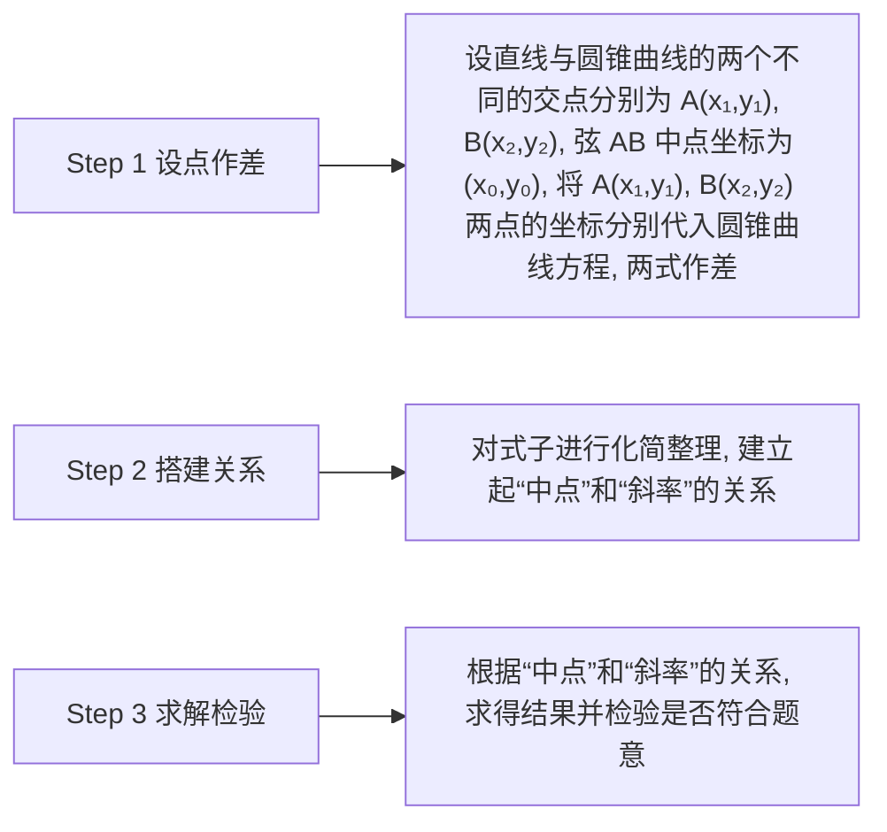
```mermaid
graph LR
    A["Step 1 设点作差"] --> B["设直线与圆锥曲线的两个不同的交点分别为 A(x₁,y₁), B(x₂,y₂), 弦 AB 中点坐标为 (x₀,y₀), 将 A(x₁,y₁), B(x₂,y₂) 两点的坐标分别代入圆锥曲线方程, 两式作差"]
    C["Step 2 搭建关系"] --> D["对式子进行化简整理, 建立起“中点”和“斜率”的关系"]
    E["Step 3 求解检验"] --> F["根据“中点”和“斜率”的关系, 求得结果并检验是否符合题意"]
```

(1)在椭圆 $\frac{x^2}{a^2} +\frac{y^2}{b^2} = 1(a > b > 0)$ 中， $\left\{ \begin{array}{l}\frac{x_1^2}{a^2} +\frac{y_1^2}{b^2} = 1,\\ \frac{x_2^2}{a^2} +\frac{y_2^2}{b^2} = 1, \end{array} \right.$ 作差得 $\frac{x_1 + x_2}{y_1 + y_2} = -\frac{a^2}{b^2}\cdot \frac{y_1 - y_2}{x_1 - x_2}$ 即 $k_{AB} = -\frac{b^2x_0}{a^2y_0}.$   
(2)在双曲线 $\frac{x^{2}}{a^{2}}-\frac{y^{2}}{b^{2}}=1(a>0,b>0)$ 中， $\left\{\begin{aligned}\frac{x_{1}^{2}}{a^{2}}-\frac{y_{1}^{2}}{b^{2}}&=1,\\ \frac{x_{2}^{2}}{a^{2}}-\frac{y_{2}^{2}}{b^{2}}&=1,\end{aligned}\right.$ 作差得 $\frac{x_{1}+x_{2}}{y_{1}+y_{2}}=\frac{a^{2}}{b^{2}}\cdot\frac{y_{1}-y_{2}}{x_{1}-x_{2}}$ ，即 $k_{AB}=\frac{b^{2}x_{0}}{a^{2}y_{0}}$ .  
(3)在抛物线 $y^{2} = 2px (p > 0)$ 中， $\begin{cases} y_{1}^{2} = 2px_{1}, \\ y_{2}^{2} = 2px_{2}, \end{cases}$ 作差得 $\frac{2p}{y_{1} + y_{2}} = \frac{y_{1} - y_{2}}{x_{1} - x_{2}}$ ，即 $k_{AB} = \frac{p}{y_{0}}$ .

# 数学分支

突变理论 在自然界和社会现象中,有许多突变和飞跃的过程,飞跃造成的不连续性把系统的行为空间变成不可微的,微积分无法解决.例如,水突然沸腾,火山爆发,房屋突然倒塌……

调研 1 (2023 全国乙卷) 设 A, B 为双曲线 $x^{2}-\frac{y^{2}}{9}=1$ 上两点, 下列四个点中, 可为线段 AB 中点的是 ( )

A. (1,1)

B. $(-1,2)$

C. $(1,3)$

D. $(-1,-4)$

解析 Step 1: 设 $A(x_{1}, y_{1}), B(x_{2}, y_{2})$ , 将 $A, B$ 的坐标分别代入圆锥曲线方程, 两式作差.

设 $A(x_{1},y_{1}),B(x_{2},y_{2}),AB$ 的中点 $M(x_0,y_0)$ ，则 $x_0 = \frac{x_1 + x_2}{2},y_0 = \frac{y_1 + y_2}{2}$

结合选项知 $x_0 \neq 0, y_0 \neq 0$ ，所以 $|x_1| \neq |x_2|$ ， $|y_1| \neq |y_2|$ .

连接 $OM$ (O 为坐标原点), 设直线 $OM$ 的斜率为 $k$ , 可得 $k_{AB} = \frac{y_1 - y_2}{x_1 - x_2}, k = \frac{y_0}{x_0} = \frac{\frac{y_1 + y_2}{2}}{\frac{x_1 + x_2}{2}}$ ,

因为 A, B 在双曲线上, 所以 $\left\{\begin{aligned}x_{1}^{2}-\frac{y_{1}^{2}}{9}&=1,\\ x_{2}^{2}-\frac{y_{2}^{2}}{9}&=1,\end{aligned}\right.$ 两式相减得 $(x_{1}^{2}-x_{2}^{2})-\frac{y_{1}^{2}-y_{2}^{2}}{9}=0$ ,

Step 2: 对式子进行化简整理, 建立“中点”和“斜率”的关系.

所以 $k_{AB}\cdot k=\frac{y_{1}^{2}-y_{2}^{2}}{x_{1}^{2}-x_{2}^{2}}=9.$

【点技巧】也可以直接利用双曲线的有关结论得 $k_{AB} = \frac{b^2x_0}{a^2y_0}, k_{AB}k = \frac{b^2}{a^2} = 9$

Step 3: 根据“中点”和“斜率”的关系, 对选项逐一检验, 得出正确结果.

对于选项 A: $k=1, k_{AB}=9, M(1,1)$ ，则直线 AB 的方程为 y=9x-8，由 $\left\{\begin{aligned}y &= 9x - 8, \\ x^{2} & -\frac{y^{2}}{9} = 1\end{aligned}\right.$ 消去 y 得关于 x 的一元二次方程 $72x^{2}-144x+73=0$ ，此时 $\Delta=144^{2}-4\times72\times73<0$ ，所以直线 AB 与双曲线没有交点，故 A 错误。

对于选项 B: $k = -2, k_{AB} = -\frac{9}{2}, M(-1, 2)$ ，则直线 AB 的方程为 $y = -\frac{9}{2}x - \frac{5}{2}$ ，由 $\left\{\begin{aligned}&y=-\frac{9}{2}x-\frac{5}{2},\\ &x^{2}-\frac{y^{2}}{9}=1\end{aligned}\right.$ 消去 y 得关于 x 的一元二次方程 $45x^{2} + 90x + 61 = 0$ ，此时 $\Delta = 90^{2} - 4 \times 45 \times 61 <$

0,所以直线 AB 与双曲线没有交点,故 B 错误.

# 数学分支

有没有可能建立一种关于突变现象的一般性数学理论来描述上述过程呢？1972年法国数学家勒内·托姆在《结构稳定性和形态发生学》一书中，明确地阐明了突变理论，宣告了突变理论的诞生。

对于选项 C: k=3, $k_{AB}=3$ , $M(1,3)$ ，则直线 AB 的方程为 y=3x，此时直线 AB 为双曲线的渐近线，与双曲线没有交点，故 C 错误.

对于选项 D: $k=4, k_{AB}=\frac{9}{4}, M(-1,-4)$ ，则直线 AB 的方程为 $y=\frac{9}{4}x-\frac{7}{4}$ ，由 $\left\{\begin{aligned}y&=\frac{9}{4}x-\frac{7}{4},\\ x^{2}&-\frac{y^{2}}{9}=1\end{aligned}\right.$ 消去 y 得关于 x 的一元二次方程 $63x^{2}+126x-193=0$ ，此时 $\Delta=126^{2}+4\times63\times193>0$ ，故直线 AB 与双曲线有 2 个交点，故 D 正确。

故选D.

调研 2 (2024 陕西师大附中 9 月摸底测试) 已知椭圆 $C: \frac{x^{2}}{a^{2}} + \frac{y^{2}}{b^{2}} = 1 (a > b > 0)$ 的焦距为 $2c$ , 左焦点为 $F$ , 直线 $l$ 与 $C$ 相交于 $A, B$ 两点, 点 $P$ 是线段 $AB$ 的中点, $P$ 的横坐标为 $\frac{1}{3} c$ . 若直线 $l$ 与直线 $PF$ 的斜率之积等于 $-\frac{3}{16}$ , 则 $C$ 的离心率 $e = \_$ .

解析 Step 1: 设 $A(x_{1}, y_{1}), B(x_{2}, y_{2})$ , 将 $A, B$ 的坐标分别代入椭圆方程, 两式作差.

依题意可知 $F(-c,0)$ ，设 $A(x_{1},y_{1})$ ， $B(x_{2},y_{2})$ ，作出示意图如图1，

因为点 P 是线段 AB 的中点, P 的横坐标为 $\frac{1}{3}c$ , 所以 $x_{1} + x_{2} = \frac{2c}{3}$ , $P\left(\frac{c}{3}, \frac{y_{1} + y_{2}}{2}\right)$ ,

【关键信息】弦的中点问题，通过转化，优先考虑利用点差法求解

则 $k_{PF} = \frac{\frac{y_1 + y_2}{2}}{\frac{c}{3} + c} = \frac{\frac{y_1 + y_2}{2}}{\frac{4c}{3}} = \frac{3(y_1 + y_2)}{8c}$ .

由直线 l 与 C 相交于 A, B 两点, 得 $\frac{x_{1}^{2}}{a^{2}} + \frac{y_{1}^{2}}{b^{2}} = 1, \frac{x_{2}^{2}}{a^{2}} + \frac{y_{2}^{2}}{b^{2}} = 1$ ,

两式相减得 $\frac{x_{1}^{2}}{a^{2}}+\frac{y_{1}^{2}}{b^{2}}-\frac{x_{2}^{2}}{a^{2}}-\frac{y_{2}^{2}}{b^{2}}=0$ ，

Step 2: 对式子进行化简整理, 建立“中点”和“斜率”的关系.

即 $\frac{(x_1 - x_2)(x_1 + x_2)}{a^2} +\frac{(y_1 - y_2)(y_1 + y_2)}{b^2} = 0,$

所以 $\frac{(y_1 - y_2)(y_1 + y_2)}{(x_1 - x_2)(x_1 + x_2)} = -\frac{b^2}{a^2}$ , 即 $k_l \cdot \frac{y_1 + y_2}{x_1 + x_2} = -\frac{b^2}{a^2}$ ,

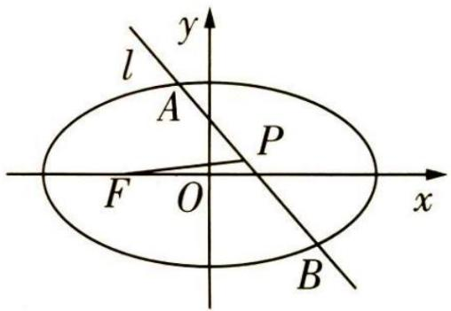

text_image

l
y
A
P
F O x
B

图 1

# 数学分支

突变理论主要以拓扑学为工具,以结构稳定性理论为基础,提出了一条新的判别突变、飞跃的原则:在严格控制条件下,如果质变中经历的中间过渡态是稳定的,那么它就是一个渐变过程.

所以 $k_{l} = -\frac{b^{2}}{a^{2}}\cdot \frac{x_{1} + x_{2}}{y_{1} + y_{2}} = -\frac{b^{2}}{a^{2}}\cdot \frac{2c}{3(y_{1} + y_{2})},$

【易错】整理化简以后,注意双曲线与椭圆的区别,别忘记此处等号右边有负号,而如果是双曲线,则没有负号

Step 3: 根据“中点”和“斜率”的关系, 得出结果.

则 $k_{l} \cdot k_{PF} = -\frac{b^{2}}{a^{2}} \cdot \frac{2c}{3(y_{1} + y_{2})} \cdot \frac{3(y_{1} + y_{2})}{8c} = -\frac{b^{2}}{4a^{2}} = -\frac{3}{16}$ , 所以 $\frac{b^{2}}{a^{2}} = \frac{3}{4}$ ,

所以离心率 $e = \frac{c}{a} = \sqrt{1 - \frac{b^2}{a^2}} = \frac{1}{2}$ .

# 模型演练

1. (调研 1 变式, 变设问, 有关中点弦的最值问题 |2024 四川师大附中 9 月模拟) 若 $A$ , $B$ 是抛物线 $y^{2} = 4x$ 上不同的两点, 线段 $AB$ 的垂直平分线交 $x$ 轴于点 $D(4,0)$ , 则 $|AB|$ 的最大值为 \_\_\_\_.

2. (调研 2 变式, 变考法, 椭圆与圆的综合问题 | 2024 重庆一中、重庆八中 9 月联考) 已知椭圆 $C: \frac{x^{2}}{12} + \frac{y^{2}}{4} = 1$ , 圆 $O: x^{2} + y^{2} = 4$ , 直线 $l$ 与圆 $O$ 相切于第一象限的点 $A$ , 与椭圆 $C$ 交于 $P, Q$ 两点, 与 $x$ 轴正半轴交于点 $B$ . 若 $|PB| = |QA|$ , 则直线 $l$ 的方程为 \_\_\_\_.

# 参考答案与解析

1.6 Step 1: 设 $A(x_{1}, y_{1}), B(x_{2}, y_{2})$ , 将 $A, B$ 的坐标分别代入抛物线方程, 然后两式作差.

设 $A(x_{1},y_{1}),B(x_{2},y_{2}),AB$ 的中点 $M(x_0,y_0)$

易知直线 AB 斜率存在且不为 0, 设直线 AB 的斜率为 k, 则 $\left\{\begin{aligned}y_{1}^{2}&=4x_{1},\\ y_{1}^{2}&-y_{2}^{2}=4(x_{1}-x_{2}).\\ y_{2}^{2}&=4x_{2},\end{aligned}\right.$

Step 2: 对式子进行化简整理, 建立“中点”和“斜率”的关系.

故 $k = \frac{y_1 - y_2}{x_1 - x_2} = \frac{4}{y_1 + y_2} = \frac{2}{y_0},$

Step 3: 根据“中点”和“斜率”的关系, 得出结果.

$\because k_{MD}=\frac{y_{0}}{x_{0}-4}=-\frac{1}{k}=-\frac{y_{0}}{2}, 易知 y_{0}\neq0,\therefore x_{0}=2,$

【指点迷津】由“线段 $AB$ 的垂直平分线”可得直线 $AB$ 与 $MD$ 垂直, 两直线斜率互为负倒数设抛物线的焦点为 $F$ , 连接 $AF, BF$ , 则 $|AF| + |BF| = x_{1} + x_{2} + 2 = 2x_{0} + 2 = 6$ ,

数学分支

模糊数学 在日常生活中,经常遇到许多模糊事物,没有分明的数量界限,要使用一些模糊的词句来描述.比如,看起来比较年轻的人、感觉有点热……但计算机对模糊现象识别能力较差.

$\therefore |AB| \leqslant |AF| + |BF| = 6$ , 当且仅当 $A, B, F$ 三点共线时等号成立, 此时 $M(2, \pm\sqrt{2})$ , 满足题意;

【扫清障碍】数形结合构建不等式，当 $A, B, F$ 三点共线时，线段 $AB$ 为焦点弦

$\therefore |AB|$ 的最大值为6.

2. $x + y - 2\sqrt{2} = 0$ 如图2, 取AB的中点M, 连接OM,

【指点迷津】题目没有直接给出中点、中垂线、对称等条件，此时我们找到弦的中点，为下面用点差法求解做准备

因为 $|PB|=|QA|$ ，所以 $|PA|=|BQ|,|PM|=|MQ|$ ，

设 $A(x_0, y_0)$ , 则 $x_0 > 0, y_0 > 0$ , 设直线 $l$ 上任意一点 $N(x, y)$ , 连接 $OA$ , 则 $\overrightarrow{OA} = (x_0, y_0), \overrightarrow{AN} = (x - x_0, y - y_0)$ ,

由于 NA 是圆 O 的切线, 所以 $\overrightarrow{OA} \cdot \overrightarrow{AN} = 0$ , 所以 $(x - x_{0})x_{0} + (y - y_{0})y_{0} = 0$ , 即 $xx_{0} + yy_{0} = x_{0}^{2} + y_{0}^{2} = 4$ , 所以直线 l 的方程为 $x_{0}x + y_{0}y = 4$ ,

【用结论】此处也可以直接应用结论：圆 $x^{2} + y^{2} = r^{2}$ 的切线的方程为 $xx_{0} + yy_{0} = r^{2}$ ，其中切点为 $A(x_{0},y_{0})$

令 $y = 0$ ，得 $x = \frac{4}{x_0}$ 所以 $B(\frac{4}{x_0},0),M(\frac{x_0 + \frac{4}{x_0}}{2},\frac{y_0}{2}).$

Step 1: 设 $P(x_{1}, y_{1}), Q(x_{2}, y_{2})$ , 将点 $P, Q$ 的坐标分别代入椭圆方程, 两式作差.

设 $P(x_{1},y_{1}),Q(x_{2},y_{2})$ ，易知 $\vert x_1\vert \neq \vert x_2\vert ,\vert y_1\vert \neq \vert y_2\vert ,$

则 $\frac{x_1^2}{12} +\frac{y_1^2}{4} = 1,\frac{x_2^2}{12} +\frac{y_2^2}{4} = 1$ ，两式相减可得 $\frac{x_1^2 - x_2^2}{12} +\frac{y_1^2 - y_2^2}{4} = 0,$

则 $\frac{y_1 - y_2}{x_1 - x_2} = -\frac{4}{12} \cdot \frac{x_1 + x_2}{y_1 + y_2} = -\frac{x_M}{3y_M}$ ,

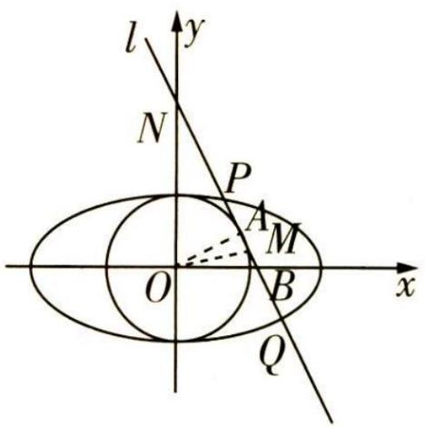

text_image

l
y
N
P
A
M
O
B
x
Q

图 2

Step 2: 对式子进行化简整理, 建立“中点”和“斜率”的关系.

所以 $k_{PQ}k_{OM} = -\frac{1}{3}$ 又 $k_{PQ} = -\frac{1}{k_{OA}} = -\frac{x_0}{y_0}, k_{OM} = \frac{y_0}{x_0 + \frac{4}{x_0}},$

所以 $-\frac{x_{0}}{y_{0}}\times\frac{y_{0}}{x_{0}+\frac{4}{x_{0}}}=-\frac{1}{3}$ ，得 $x_{0}^{2}=2$ ，又 $x_{0}>0$ ，所以 $x_{0}=\sqrt{2}$ ， $y_{0}=\sqrt{2}$ 。

【易遗漏】根据题干中的“第一象限”舍去负数

Step 3: 根据“中点”和“斜率”的关系得出结果.

故直线 l 的方程为 $x + y - 2\sqrt{2} = 0$ .

# 数学分支

为了提高计算机识别模糊现象的能力,就需要把人们常用的模糊语言设计成机器能接受的指令和程序,以便机器能像人脑那样简洁灵活地做出相应的判断.

# 会用 6 类图象模型,巧解高频关键问题

# 型1 公切线模型

# 模型攻略

曲线的切线问题是高考的热点,而公切线问题由于涉及曲线、参数数量较多,求解难度大,考生往往无法把握解题的关键.此类问题,核心都是设未知数,表示出切线方程并求解.下面给出解题模型:

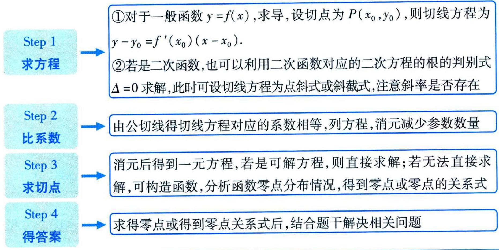

flowchart

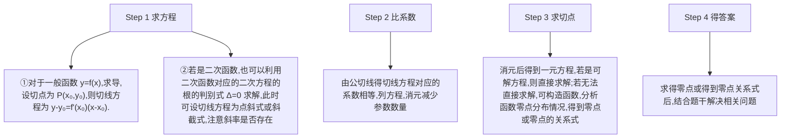
```mermaid
graph TD
    A["Step 1 求方程"] --> B["①对于一般函数 y=f(x),求导,设切点为 P(x₀,y₀),则切线方程为 y-y₀=f'(x₀)(x-x₀)."]
    A --> C["②若是二次函数,也可以利用二次函数对应的二次方程的根的判别式 Δ=0 求解,此时可设切线方程为点斜式或斜截式,注意斜率是否存在"]
    D["Step 2 比系数"] --> E["由公切线得切线方程对应的系数相等,列方程,消元减少参数数量"]
    F["Step 3 求切点"] --> G["消元后得到一元方程,若是可解方程,则直接求解;若无法直接求解,可构造函数,分析函数零点分布情况,得到零点或零点的关系式"]
    H["Step 4 得答案"] --> I["求得零点或得到零点关系式后,结合题干解决相关问题"]
```

调研 1 (试题调研原创)已知函数 $f(x) = \mathrm{e}^{x} + x, g(x) = ax^{2} + 2x + 1, a < 0$ ，则曲线 $y = f(x)$ 与 $y = g(x)$ 的公切线方程为 \_\_\_\_.

解析 Step 1: 设切点, 分别表示出两条曲线的切线方程.

因为 $f(x) = \mathrm{e}^{x} + x, g(x) = ax^{2} + 2x + 1$ ，所以 $f'(x) = \mathrm{e}^{x} + 1, g'(x) = 2ax + 2$ ，

设曲线 $y=f(x)$ 在点 $(x_{1},f(x_{1}))$ 处的切线与曲线 $y=g(x)$ 在点 $(x_{2},g(x_{2}))$ 处的切线相同，

则切线方程为 $y - f(x_{1}) = f'(x_{1})(x - x_{1})$ ，即 $y - \mathrm{e}^{x_1} - x_1 = (\mathrm{e}^{x_1} + 1)(x - x_1)$ ，整理得 $y = (\mathrm{e}^{x_1} + 1)x - \mathrm{e}^{x_1}x_1 + \mathrm{e}^{x_1}$ .

又切线方程也可表示为 $y - g(x_{2}) = g'(x_{2})(x - x_{2})$ ，即 $y - ax_{2}^{2} - 2x_{2} - 1 = (2ax_{2} + 2)(x - x_{2})$ ，整理得 $y = (2ax_{2} + 2)x - ax_{2}^{2} + 1$ .

Step 2: 得出关于切线方程系数的方程.

所以 $\left\{\begin{aligned}e^{x_{1}}+1&=2ax_{2}+2,\\ -e^{x_{1}}x_{1}&=e^{x_{1}}=-ax_{2}^{2}+1,\end{aligned}\right.$ 消去 $x_{2}$ ，整理得 $e^{2x_{1}}-4ax_{1}e^{x_{1}}+(4a-2)e^{x_{1}}-4a+1=0.$

【点技巧】合理消元，若消去 $x_{1}$ ，则会产生对数，求解复杂，应该消去 $x_{2}$ ，由 $\mathrm{e}^{x_1} + 1 = 2ax_2 + 2$ ，得 $x_{2} = \frac{\mathrm{e}^{x_1} - 1}{2a}$

数学分支

Step 3: 构造函数, 利用函数的单调性求解切点坐标.

令 $m(x) = \mathrm{e}^{2x} - 4ax\mathrm{e}^x + (4a - 2)\mathrm{e}^x - 4a + 1 = 0, a < 0,$

则 $m'(x)=2\mathrm{e}^{2x}-4a\mathrm{e}^{x}-4ax\mathrm{e}^{x}+(4a-2)\mathrm{e}^{x}=2\mathrm{e}^{x}\left(\mathrm{e}^{x}-2ax-1\right)$ .

令 $\varphi(x)=\mathrm{e}^{x}-2ax-1,a<0,$

因为 a<0, 所以函数 y=-2ax-1 在 R 上单调递增, 又函数 $y=e^{x}$ 在 R 上单调递增,

所以 $\varphi(x)$ 在 R 上单调递增.

又 $\varphi(0) = 0$ ，所以当 $x \in (-\infty, 0)$ 时， $\varphi(x) < 0$ ；当 $x \in (0, +\infty)$ 时， $\varphi(x) > 0$ 。

又 $\mathrm{e}^x > 0$ ，所以当 $x \in (-\infty, 0)$ 时， $m'(x) < 0$ ，当 $x \in (0, +\infty)$ 时， $m'(x) > 0$

所以 $m(x)$ 在 $(-∞,0)$ 上单调递减，在 $(0,+∞)$ 上单调递增，所以 $m(x)≥m(0)=0$ ，

因此函数 $y = m(x)$ 只有一个零点, 即关于 $x_{1}$ 的方程 $\mathrm{e}^{2x_{1}} - 4ax_{1}\mathrm{e}^{x_{1}} + (4a - 2)\mathrm{e}^{x_{1}} - 4a + 1 = 0$ 只有一个解 $x_{1} = 0$ .

【破瓶颈】此方程无法直接求解,构造函数,应用导数分析函数单调性,求得零点 $x_{1} = 0$

Step 4: 求得公切线方程.

由 $x_{1}=0$ 得切线方程为 $y=2x+1$ ，所以公切线方程为 $y=2x+1$ 。

调研 2 (2024 安徽合肥一中 9 月模拟) 曲线 $y = \mathrm{e}^{x}$ 与 $y = \ln x$ 的两条公共切线的斜率分别为 $k_{1}, k_{2} (k_{1} < k_{2})$ , 设两切线的夹角为 $\theta (0 < \theta < \frac{\pi}{2})$ , 则 $\frac{\tan \theta}{k_{2} - k_{1}} =$ \_\_\_\_.

解析 Step 1: 设切点横坐标, 分别表示出曲线 $y = \mathrm{e}^{x}$ 与 $y = \ln x$ 的两条公共切线的方程.

设两条公切线与曲线 $y=e^{x}$ 相切的两个切点横坐标分别为 $x_{1}, x_{3}$ ，与曲线 $y=\ln x$ 相切的两个切点横坐标分别为 $x_{2}, x_{4}$ ，其中 $x_{1}<x_{4}<x_{3}<x_{2}$ ，则 $x_{1}<0, x_{2}>1, x_{3}>0$ 且 $x_{3}\neq1,0<x_{4}<1$ .

由 $(\mathrm{e}^x)' = \mathrm{e}^x, (\ln x)' = \frac{1}{x}$ , 可得 $k_1 = \mathrm{e}^{x_1} = \frac{1}{x_2}, k_2 = \mathrm{e}^{x_3} = \frac{1}{x_4}$ .

斜率为 $k_{1}$ 的切线方程为 $y - \mathrm{e}^{x_1} = \mathrm{e}^{x_1}(x - x_1)$ ，也可以表示为 $y - \ln x_{2} = \frac{1}{x_{2}} (x - x_{2})$ ；

斜率为 $k_{2}$ 的切线方程为 $y - e^{x_{3}} = e^{x_{3}}(x - x_{3})$ ，也可以表示为 $y - \ln x_{4} = \frac{1}{x_{4}}(x - x_{4})$ .

Step 2: 得出关于切线方程系数的方程.

所以 $\left\{\begin{aligned}\mathrm{e}^{x_{1}}&=\frac{1}{x_{2}},\\ \mathrm{e}^{x_{1}}(1-x_{1})&=\ln x_{2}-1,\end{aligned}\right.$ 整理得 $e^{x_{1}}=\frac{x_{1}+1}{x_{1}-1}$ ，同理得 $e^{x_{3}}=\frac{x_{3}+1}{x_{3}-1}$ .

【会类比】 $x_{3}$ 与 $x_{1}$ 的“地位”一样，得到 $x_{1}$ 的关系式，可同理得到 $x_{3}$ 的关系式

Step 3: 构造函数, 利用函数的单调性得切点横坐标的关系式.

因此 $x_{1}, x_{3}$ 是方程 $\mathrm{e}^{x} = \frac{x + 1}{x - 1}$ 的根，又 $\frac{1}{\mathrm{e}^x} = \frac{x - 1}{x + 1} = \frac{-x + 1}{-x - 1} = \mathrm{e}^{-x}$ ，

所以若 x 是方程 $e^{x}=\frac{x+1}{x-1}$ 的根, 则 -x 也是方程 $e^{x}=\frac{x+1}{x-1}$ 的根.

# 数学分支

在模糊集合中,给定范围内元素对它的隶属关系不一定只有“是”或“否”两种情况,而是用介于0和1之间的实数来表示隶属程度,还存在中间过渡状态.

设 $f(x)=\mathrm{e}^{x}-\frac{x+1}{x-1}=\mathrm{e}^{x}-\frac{2}{x-1}-1(x\neq1)$ ,

易知 $f'(x) = \mathrm{e}^{x} + \frac{2}{(x - 1)^{2}} > 0$ ，则 $f(x)$ 在 $(-\infty, 1)$ ， $(1, +\infty)$ 上单调递增，

$$
f (- 2) = \frac {1}{\mathrm{e} ^ {2}} - \frac {1}{3} <   0, f (- 1) = \frac {1}{\mathrm{e}} > 0, f (\frac {3}{2}) = \mathrm{e} \sqrt {\mathrm{e}} - 5 <   0, f (2) = \mathrm{e} ^ {2} - 3 > 0,
$$

于是函数 $f(x)$ 在 $(-2, -1)$ , $(\frac{3}{2}, 2)$ 上各有一个零点, 即方程 $e^{x} = \frac{x + 1}{x - 1}$ 有两个不等根,

则 $x_{1} + x_{3} = 0$ ，即 $k_{1}k_{2} = \mathrm{e}^{x_{1}}\cdot \mathrm{e}^{x_{3}} = 1.$

【扫清障碍】函数 $f(x)$ 无法求出零点，但可分析得到 $x_{1}+x_{3}=0$ ，进而可得 $k_{1}k_{2}=1$

Step 4: 求代数式的值.

令斜率为 $k_{1}, k_{2}$ 的切线倾斜角分别为 $\alpha_{1}, \alpha_{2}$ ，则 $\theta = \alpha_{2} - \alpha_{1}$ ，

$\tan \theta = \tan (\alpha_{2} - \alpha_{1}) = \frac{\tan \alpha_{2} - \tan \alpha_{1}}{1 + \tan \alpha_{2} \tan \alpha_{1}} = \frac{k_{2} - k_{1}}{1 + k_{1}k_{2}} = \frac{k_{2} - k_{1}}{2}$ , 所以 $\frac{\tan \theta}{k_{2} - k_{1}} = \frac{1}{2}$ .

# 模型演练

(调研2变式,变考法,双空题|2024江苏基地大联考第一次质量监测)已知直线 $l$ 与曲线 $y = \mathrm{e}^{x - 1}$ 和 $y = \ln (x + 1)$ 都相切,请写出符合条件的两条直线 $l$ 的方程: \_\_\_\_, \_\_\_\_.

# 参考答案与解析

$y = x \quad y = \frac{1}{e}x + \frac{1}{e}$ Step 1: 设切点, 分别表示出曲线 $y = e^{x-1}$ 和 $y = \ln(x+1)$ 的切线方程.

设直线 l 与曲线 $y = e^{x-1}$ 和 $y = \ln(x + 1)$ 分别切于点 $(x_{1}, e^{x_{1}-1})$ , $(x_{2}, \ln(x_{2} + 1))$ , $x_{2} > -1$ ,

由 $(\mathrm{e}^{x - 1})' = \mathrm{e}^{x - 1},[\ln (x + 1)]' = \frac{1}{x + 1}$ 可得切线方程分别为 $y = \mathrm{e}^{x_1 - 1}(x - x_1) + \mathrm{e}^{x_1 - 1},y = \frac{1}{x_2 + 1}(x - x_2)$ $+ \ln (x_{2} + 1)$ ，即 $y = \mathrm{e}^{x_1 - 1}x - x_1\mathrm{e}^{x_1 - 1} + \mathrm{e}^{x_1 - 1},y = \frac{1}{x_2 + 1} x - \frac{x_2}{x_2 + 1} +\ln (x_2 + 1).$

Step 2: 得出关于切线方程系数的方程.

因此 $\mathrm{e}^{x_1 - 1} = \frac{1}{x_2 + 1}$ ，则 $x_{1} - 1 = -\ln (x_{2} + 1)$

又 $-x_{1}\mathrm{e}^{x_{1} - 1} + \mathrm{e}^{x_{1} - 1} = \frac{-x_{2}}{x_{2} + 1} +\ln (x_{2} + 1),$

所以 $-x_{1}\mathrm{e}^{x_{1} - 1} + \mathrm{e}^{x_{1} - 1} = [\ln (x_{2} + 1) - 1]\cdot \frac{1}{x_{2} + 1} +\frac{1}{x_{2} + 1} = \frac{-x_{2}}{x_{2} + 1} +\ln (x_{2} + 1).$

【指点迷津】根据曲线 $y=e^{x-1}$ 和 $y=\ln(x+1)$ 的公切线斜率相等，可得 $x_{1}-1=-\ln(x_{2}+1)$ ，根据两个切线方程的对应系数相等列方程，化简整理求解

Step 3: 化简求切点横坐标.

化简得 $[1 - \ln (x_2 + 1)]\cdot \frac{x_2}{x_2 + 1} = 0$ ，解得 $x_{2} = 0$ 或 $x_{2} = \mathrm{e} - 1$

# 名家定理

小编说:中国古代算术的许多研究成果里面早已孕育了后来西方数学才涉及的思想方法,近现代也有不少世界领先的数学研究成果是以华人数学家命名的.

Step 4: 求得两条切线方程.

当 $x_{2} = 0$ 时， $x_{1} = 1$ ，切线方程为 $y = x$ ；当 $x_{2} = \mathrm{e} - 1$ 时， $x_{1} = 0$ ，切线方程为 $y = \frac{1}{\mathrm{e}} x + \frac{1}{\mathrm{e}}$ .

# 模型2 翻折模型

# 模型攻略

把一个平面图形按照某种要求折起,转化为空间图形,进而研究图形翻折前后在位置关系和数量关系上的变化,这就是翻折问题.主要题型为在翻折背景下判断或证明线面平行或垂直关系,计算表面积、体积、点面距、线面角,求参数等,给出解题模型如下:

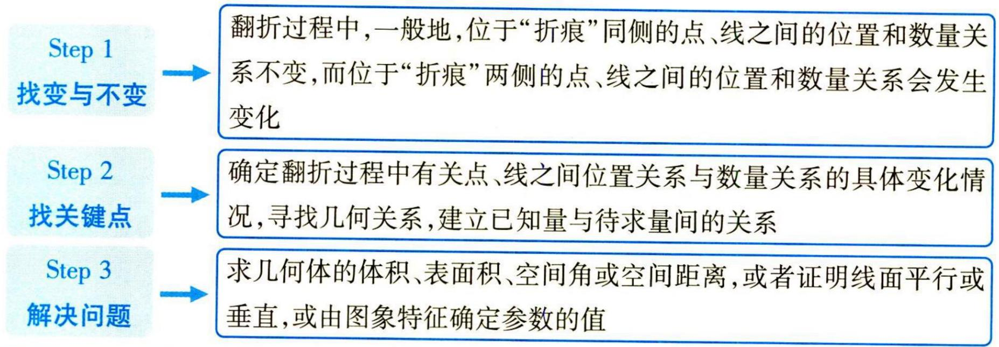

flowchart

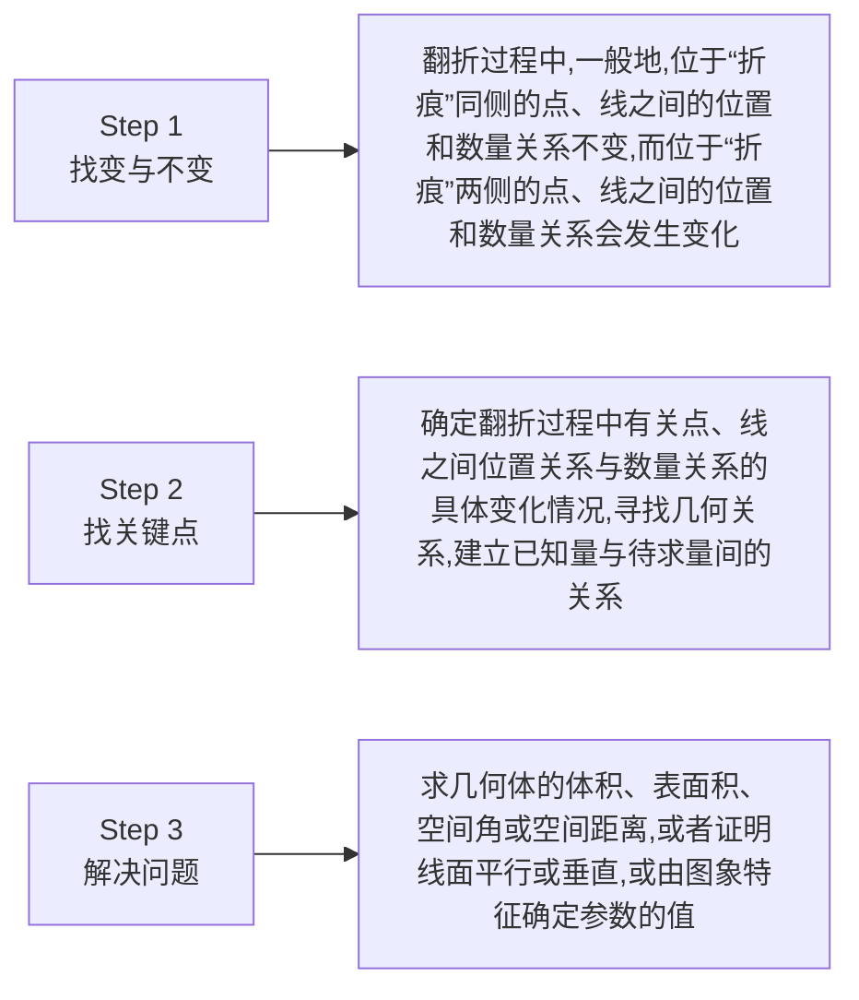
```mermaid
graph LR
    A["Step 1<br>找变与不变"] --> B["翻折过程中,一般地,位于“折痕”同侧的点、线之间的位置和数量关系不变,而位于“折痕”两侧的点、线之间的位置和数量关系会发生变化"]
    C["Step 2<br>找关键点"] --> D["确定翻折过程中有关点、线之间位置关系与数量关系的具体变化情况,寻找几何关系,建立已知量与待求量间的关系"]
    E["Step 3<br>解决问题"] --> F["求几何体的体积、表面积、空间角或空间距离,或者证明线面平行或垂直,或由图象特征确定参数的值"]
```

调研 1 (2024 黑龙江大庆实验中学9月开学考试) 如图1, 将绘有函数 $f(x)=m\sin(\frac{\pi}{2}x+\varphi)(m>0,0<\varphi<\pi)$ 部分图象的纸片沿 x 轴折成直二面角，此时 A, B 之间的距离为 $\sqrt{10}$ ，则 $\varphi =$ \_\_\_\_ .

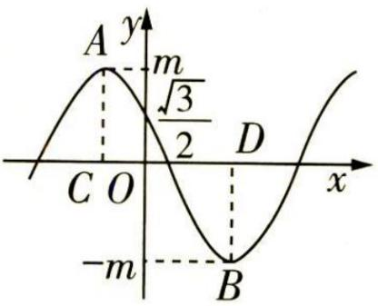

line

| Point | x    | y     |
|-------|------|-------|
| A     | 0    | 1     |
| B     | -2   | -3    |
| C     | 0    | 0     |
| D     | 2    | 3     |

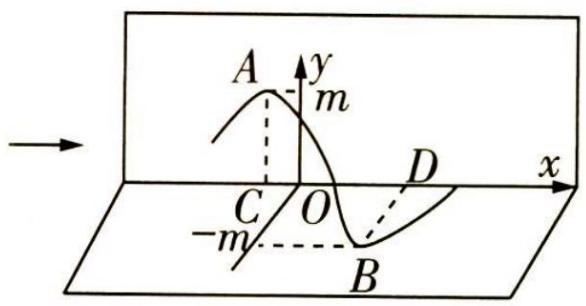

text_image

A
y
m
C O D
x
-m
B

图 1

解析 Step 1 + 2: 找不变量 $\rightarrow CD, AC, BC$ 的长度在翻折前后没有变化, 找变量 $\rightarrow$ 在翻折后, $AB$ 的长度发生变化. 据此建立几何关系求解.

连接 BC, 因为 $f(x)$ 的最小正周期为 $T = \frac{2\pi}{\frac{\pi}{2}} = 4$ , 所以 $CD = \frac{T}{2} = 2$ , AC = m, $BC = \sqrt{m^{2} + 4}$ .

所以翻折之后的 $AB = \sqrt{AC^{2} + BC^{2}} = \sqrt{2m^{2} + 4} = \sqrt{10}$ ，解得 $m = \sqrt{3}$ ，所以 $f(x) = \sqrt{3} \sin\left(\frac{\pi}{2}x + \varphi\right)$ .

【指点迷津】A, B 在 “折痕” OD 的两侧，所以在翻折前后 A, B 之间的距离发生了变化，应在立体图形中利用 Rt△ABC 计算

所以 $f(0) = \sqrt{3}\sin \varphi = \frac{\sqrt{3}}{2},\sin \varphi = \frac{1}{2},$

# 名家定理

李善兰恒等式 数学家李善兰在级数求和方面的研究成果,在国际上被命名为“李善兰恒等式”(或李氏恒等式).

因为 $0 < \varphi < \pi$ ，所以 $\varphi = \frac{\pi}{6}$ 或 $\frac{5\pi}{6}$ ，

Step 3: 注意函数图象的变化规律, 确定参数的值.

又函数 $f(x)$ 在y轴右侧先是单调递减,所以 $\varphi=\frac{5\pi}{6}$ .

调研 2 (2024 湖南长沙一中 9 月开学考试) 如图 2 所示, 等腰梯形 ABCD 中, $AB \parallel CD$ , AD = AB = BC = 2, CD = 4, E 为 CD 中点, AE 与 BD 交于点 O, 将 $\triangle ADE$ 沿 AE 折起, 使点 D 到达点 P 的位置 ( $P \notin$ 平面 ABCE).

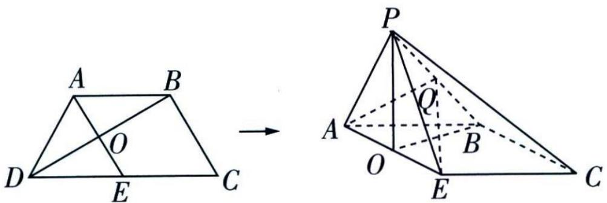

text_image

Geometric diagram showing a parallelogram and its 3D polyhedron with labeled vertices and internal points.

图2

(1) 证明: 平面 $POB \perp$ 平面 $PBC$ .

(2) 若 $PB = \sqrt{6}$ ，则线段 PB 上是否存在一点 Q（不含端点），使得直线 PC 与平面 AEQ 所成角的正弦值为 $\frac{\sqrt{15}}{5}$ ？若存在，求三棱锥 P - AQE 的体积，若不存在，说明理由。

解析 (1) Step 1 + 2: 找变量与不变量. 在平面图形中, 可得 $BC \perp BD$ ; 在翻折后, 可知 $BC \perp OP, BC \perp OB$ , 位置关系不变.

如图 3, 在原平面图形中, 连接 BE, 由于 $AB \parallel DE, AB = DE$ ,

所以四边形 ABED 是平行四边形, 由于 AB = AD, 所以四边形 ABED 是菱形, 所以 $AE \perp BD$ .

由于 $AB \parallel CE, AB = CE$ , 所以四边形 $ABCE$ 是平行四边形, 所以 $BC \parallel AE$ , 所以 $BC \perp BD$ .

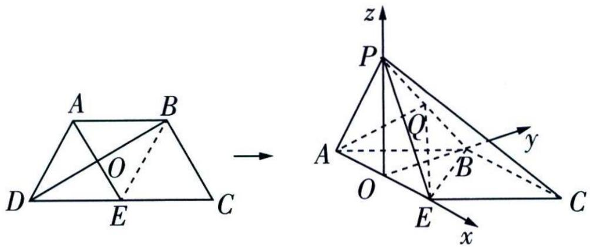

text_image

A
B
O
D
E
C
→
z
P
O
A
B
O
E
x
y
C

图 3

在翻折过程中, $AE \perp OP$ , $AE \perp OB$ 保持不变, 即 $BC \perp OP$ , $BC \perp OB$ 保持不变,

【指点迷津】在翻折前后, 可知 $AE$ 与 $OD, OB$ 的位置关系不变, 利用平行线的传递性, 可得垂直关系

Step 3: 证明线面、面面垂直.

又 $OP \cap OB = O, OP, OB \subset$ 平面 POB, 所以 $BC \perp$ 平面 POB.

又 $BC \subset$ 平面 PBC, 所以平面 $POB \perp$ 平面 PBC.

(2) Step 1: 找不变量与变量. 翻折前后, $OB, OP(OD)$ 的长度没有变化, 可在平面图形中计算; 而 $BP(BD)$ 的长度发生变化, 应在立体图形中的 $\triangle OBP$ 中计算.

在原平面图形中, 因为 $BC \perp BD$ , 所以 $BD = \sqrt{4^{2} - 2^{2}} = 2\sqrt{3}$ , 所以 OB = OD = $\sqrt{3}$ ,

名家定理

折叠后, 若 $PB = \sqrt{6}$ , 则 $PO^{2} + OB^{2} = PB^{2}$ , 所以 $PO \perp OB$ ,

又 $PO \perp OE$ , 所以 $OE, OB, OP$ 三线两两垂直,

由此以 $O$ 为原点建立如图3所示的空间直角坐标系，

$$
O E = O A = \sqrt {2 ^ {2} - (\sqrt {3}) ^ {2}} = 1, P (0, 0, \sqrt {3}), C (2, \sqrt {3}, 0), A (- 1, 0, 0), E (1, 0, 0),
$$

Step 2:选取关键点 Q, 设点 Q 的坐标, 并指明参数范围, 完成后续计算.

设 $Q(0,t,\sqrt{3}-t)$ , $0<t<\sqrt{3}$ ，则 $\overrightarrow{PC}=(2,\sqrt{3},-\sqrt{3})$ , $\overrightarrow{AE}=(2,0,0)$ , $\overrightarrow{AQ}=(1,t,\sqrt{3}-t)$ ,

【易遗漏】对于 $t$ 的取值范围, 不要忘记, 保证点 $Q$ 在线段 $P B$ 上 (不含端点)

设平面 AEQ 的法向量为 $\boldsymbol{n}=(x,y,z)$ ，由 $\left\{\begin{aligned}\boldsymbol{n}\cdot\overrightarrow{AE}=2x=0,\\ \boldsymbol{n}\cdot\overrightarrow{AQ}=x+ty+(\sqrt{3}-t)z=0,\end{aligned}\right.$ 可取 $\boldsymbol{n}=(0,t-\sqrt{3},t)$ .

设直线 $PC$ 与平面 $AEQ$ 所成角为 $\theta$ , 则 $\sin \theta = \frac{|\boldsymbol{n} \cdot \overrightarrow{PC}|}{|\boldsymbol{n}| |\overrightarrow{PC}|} = \frac{3}{\sqrt{2t^2 - 2\sqrt{3}t + 3} \times \sqrt{10}} = \frac{\sqrt{15}}{5}$ ,

整理得 $4t^{2}-4\sqrt{3}t+3=0$ ，解得 $t=\frac{\sqrt{3}}{2}$ ，所以 $Q(0,\frac{\sqrt{3}}{2},\frac{\sqrt{3}}{2})$ ，即 Q 是 PB 的中点.

Step 3: 根据等体积法求三棱锥 $P - AQE$ 的体积.

由于 y 轴与平面 PAE 垂直, 所以 Q 到平面 PAE 的距离为 $\frac{\sqrt{3}}{2}$ ,

所以 $V_{P-AQE}=V_{Q-PAE}=\frac{1}{3}\times\left(\frac{1}{2}\times2\times\sqrt{3}\right)\times\frac{\sqrt{3}}{2}=\frac{1}{2}.$

【点技巧】选取合适的底面和对应的高,利用等体积法求三棱锥的体积

# 模型演练

(试题调研原创|调研2变式,变考法,求三棱锥的外接球的

表面积)如图4,在矩形ABCD中,已知AB=2AD=4,E是AB的中点,将△ADE沿直线DE翻折成△A $_{1}$ DE,当二面角A $_{1}$ -DE-C的平面角的大小为60°时,三棱锥A $_{1}$ -CDE外接球的表面积为\_\_\_\_.

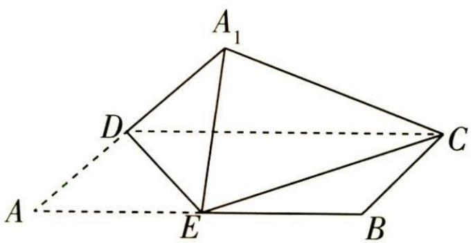

text_image

A₁
D
C
A
E
B

图4

# 参考答案与解析

$\frac{56 \pi}{3}$ Step $1 + 2$ : 找变量与不变量. $\triangle ADE$ 的形状, $CE \perp DE$ 等不变, 作辅助线, 提取关键信息, 找几何关系.

因为 AB = 4, E 是 AB 的中点, 所以 AE = 2, 又 AD = 2, $\angle DAE = 90^{\circ}$ , 所以 $\triangle ADE$ 为等腰直角三角形, 故 $\triangle A_{1}DE$ 为等腰直角三角形, 所以 $DE = 2\sqrt{2}$ , 同理可得 $CE = 2\sqrt{2}$ ,

【易错】翻折后仍在同一平面上的线段长度与角度不变

又 $CD = AB = 4$ ，所以 $DE^{2} + CE^{2} = CD^{2}$ ，所以 $CE\bot DE.$

取 DE 的中点 F, 连接 $A_{1}F$ , 如图 5, 则 $A_{1}F \perp DE$ ,

# 名家定理

华氏定理 数学家华罗庚关于完整三角和的研究成果被国际数学界称为“华氏定理”;另外,他与数学家王元提出多重积分近似计算的方法在国际上被誉为“华-王方法”.

取 $CD$ 的中点 $H$ , 连接 $FH$ , 则 $FH \parallel CE$ , 所以 $FH \perp DE$ ,

所以 $\angle A_{1}FH$ 为二面角 $A_{1} - DE - C$ 的平面角, 所以 $\angle A_{1}FH = 60^{\circ}$ .

连接 $A_{1}H$ ，因为 $A_{1}F = \frac{1}{2} DE = \sqrt{2}, FH = \frac{1}{2} CE = \sqrt{2}, \angle A_{1}FH = 60^{\circ}$ ，所以 $\triangle A_{1}FH$ 为等边三角形.

取 FH 的中点 M, 连接 $A_{1}M$ , 则 $A_{1}M \perp FH$ .

因为 $A_{1}F \perp DE, FH \perp DE, A_{1}F \cap FH = F, A_{1}F, FH \subset$ 平面 $A_{1}FH,$

所以 $DE \perp$ 平面 $A_{1}FH$ ，又 $A_{1}M \subset$ 平面 $A_{1}FH$ ，所以 $DE \perp A_{1}M$ .

又 $DE \cap FH = F, DE, FH \subset$ 平面 CDE, 所以 $A_{1}M \perp$ 平面 CDE.

Step 3: 在翻折后的图形中, 设法找到三棱锥 $A_{1} - CDE$ 外接球的球心和半径, 进而求外接球的表面积.

连接 $HE$ , 因为 $\triangle DEC$ 为直角三角形, $CD$ 为斜边, 所以 $HE = HD = HC$ , 所以 $H$ 为 $\triangle DEC$ 的外接圆的圆心, 设 $O$ 为三棱锥 $A_{1} - CDE$ 外接球的球心, 连接 $OH, OC, OA_{1}$ , 则 $OH \perp$ 平面 $CDE$ ,

设 ${OH} = d$ ,三棱锥 ${A}_{1} - {CDE}$ 外接球的半径为 $R$ ,则 $R = {OC} = \sqrt{{d}^{2} + 4}$ .

【易错指导】空间图形中的直角三角形，注意判断谁是直角，不要误得 $R=\sqrt{d^{2}-4}$

若球心 O 和点 $A_{1}$ 位于平面 CDE 的两侧, 如图 5 所示, 延长 $A_{1}M$ 到点 N, 使得 MN = HO, 连接 ON,

【指点迷津】三棱锥 $A_{1} - CDE$ 外接球球心的位置不确定, 需要分类讨论

因为 $OH \perp$ 平面 $CDE, A_{1}M \perp$ 平面 CDE, 所以 $MN \parallel HO$ , 所以四边形 HMNO 为矩形,

所以 $ON = HM = \frac{\sqrt{2}}{2}, A_1N = A_1M + MN = A_1M + OH = \frac{\sqrt{6}}{2} + d,$

所以 $R = A_{1}O = \sqrt{\left(\frac{\sqrt{6}}{2} + d\right)^{2} + \frac{1}{2}}$ ，所以 $\sqrt{\left(\frac{\sqrt{6}}{2} + d\right)^{2} + \frac{1}{2}} = \sqrt{d^{2} + 4}$ ，所以 $d = \frac{\sqrt{6}}{3}, R^{2} = d^{2} + 4 = \frac{14}{3}$ ，
所以三棱锥 $A_{1}-CDE$ 外接球的表面积 $S=4\pi R^{2}=\frac{56\pi}{3}$ .

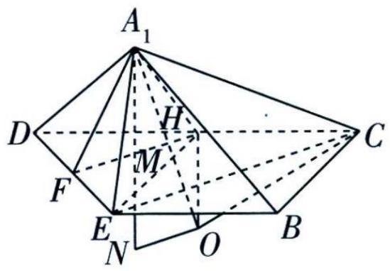

text_image

A₁
H
D
C
F
M
E
N
O
B

图 5

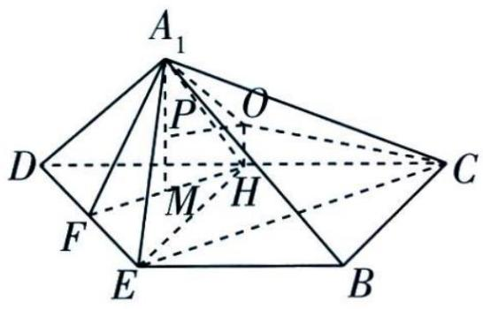

text_image

A₁
P
O
D
C
M
H
F
E
B

图6

若球心 O 和点 $A_{1}$ 位于平面 CDE 的同侧, 如图 6 所示, 因为 $OH \perp$ 平面 CDE, $A_{1}M \perp$ 平面 CDE, 所以 $A_{1}M \parallel HO$ , 过点 O 作 $OP \parallel HM$ 交 $A_{1}M$ 于 P, 则四边形 HMPO 为矩形,

所以 $OP = HM = \frac{\sqrt{2}}{2}, A_1P = A_1M - MP = A_1M - OH = \frac{\sqrt{6}}{2} - d$ ，所以 $R = A_1O = \sqrt{\left(\frac{\sqrt{6}}{2} - d\right)^2 + \frac{1}{2}}$ ，所以 $\sqrt{\left(\frac{\sqrt{6}}{2} - d\right)^2 + \frac{1}{2}} = \sqrt{d^2 + 4}, d$ 无解，此情况舍去。故填 $\frac{56\pi}{3}$ 。

名家定理

# 模型3 “加线三角形” 模型

# 模型攻略

解三角形问题常常涉及“加线三角形”, 如图 1, $\triangle ABC$ 中, 点 $D$ 在 $BC$ 上, 线段 $AD$ 把 $\triangle ABC$ 分成 $\triangle ABD$ 和 $\triangle ACD$ , 则 $\angle ADB + \angle ADC = \pi$ , 从而 $\cos \angle ADB + \cos \angle ADC = 0$ , 代入余弦定理得到边的数量关系, 此关系式可作为“加线三角形”的解题通法.

若 AD 是中线, 则有 $\overrightarrow{AD} = \frac{1}{2} (\overrightarrow{AB} + \overrightarrow{AC})$ , 平方得 $\overrightarrow{AD}^{2} = \frac{1}{4} (\overrightarrow{AB}^{2} + \overrightarrow{AC}^{2} + 2\overrightarrow{AB} \cdot \overrightarrow{AC})$ , 如果已知 AB, AC 的长度以及角 A, 就能求出中线 AD 的长度. 此结论一般化, 就是三角形中的“爪子”定理: 若 $\overrightarrow{BD} = \lambda \overrightarrow{BC}$ , 则 $\overrightarrow{AD} = (1 - \lambda)\overrightarrow{AB} + \lambda \overrightarrow{AC}$ .

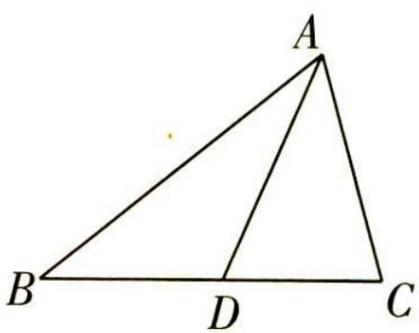

text_image

A
B D C

图1

若 AD 是角平分线, 则有 $\frac{S_{\triangle ABD}}{S_{\triangle ACD}} = \frac{AB}{AC} = \frac{BD}{CD}$ , 此结论揭示了角平分线分边所成的性质, 即得到边的比值关系, 解题时借助此性质可进行相关转化和消元.

这样,可以形成“加线三角形”的一般模型解法:

<table><tr><td>Step 1</td><td>→</td><td>判断所加线段的特征,一般为中线或角平分线</td></tr><tr><td>Step 2</td><td>→</td><td>挖掘特征线的相关性质,表述为等量关系</td></tr><tr><td>Step 3</td><td>→</td><td>将上述等量关系代入其他已知条件,转化和消元</td></tr><tr><td>Step 4</td><td>→</td><td>进一步求解题干问题</td></tr></table>

调研 1 (2024 福建莆田二中 9 月第一次月考) 在 $\triangle ABC$ 中, 内角 $A, B, C$ 所对的边分别为 $a, b, c, A = \frac{\pi}{3}$ , 若 $\overrightarrow{BD} = \overrightarrow{DC}$ , 且 $AD = 2$ , 则 $\triangle ABC$ 面积的最大值为 \_\_\_\_.

解析 方法一 在 $\triangle ABC$ 中,由余弦定理得 $\cos \angle BAC = \frac{b^{2} + c^{2} - a^{2}}{2bc} = \frac{1}{2}$ ,

即 $b^{2} + c^{2} - a^{2} = bc$ ①.

Step 1: 判断所加线段的特征.

因为 $\overrightarrow{BD}=\overrightarrow{DC}$ ，所以 $BD=DC=\frac{a}{2}$ ，点D为边BC的中点，AD是中线.

Step 2: 挖掘特征线的相关性质.

$$
\angle A D B + \angle A D C = \pi , \text {   即   } \cos \angle A D B + \cos \angle A D C = 0,
$$

【易错】注意此处为 $\cos \angle ADB + \cos \angle ADC = 0$ ，而不是 $\cos \angle ADB = \cos \angle ADC$

在 $\triangle ADB$ 和 $\triangle ADC$ 中,由余弦定理可得 $\frac{BD^{2}+AD^{2}-AB^{2}}{2BD\cdot AD}+\frac{DC^{2}+AD^{2}-AC^{2}}{2DC\cdot AD}=0$ ,

# 名家定理

即 $\left(\frac{a}{2}\right)^2 + 2^2 - c^2 + \left(\frac{a}{2}\right)^2 + 2^2 - b^2 = 0$ ，即 $b^2 + c^2 = 8 + \frac{1}{2} a^2$ ②.

Step 3: 转化和消元, 联立①②消去 $a^{2}$ .

联立①②消去 $a^{2}$ ，可得 $b^{2}+c^{2}=16-bc$ .

Step 4: 进一步求解问题, 应用基本不等式求最值.

因为 $b^{2} + c^{2}\geqslant 2bc$ ，当且仅当 $b = c = \frac{4\sqrt{3}}{3}$ 时等号成立，所以 $16 - bc\geqslant 2bc$ ，即 $bc\leqslant \frac{16}{3}$

所以 $\triangle ABC$ 的面积 $S = \frac{1}{2} bc\sin \angle BAC = \frac{\sqrt{3}}{4} bc \leqslant \frac{4\sqrt{3}}{3}$ .

故 $\triangle ABC$ 面积的最大值为 $\frac{4\sqrt{3}}{3}$ .

方法二 Step 1: 判断所加线段的特征.

因为 $\overrightarrow{BD}=\overrightarrow{DC}$ ，所以点D是边BC的中点，AD是中线.

Step 2: 挖掘特征线的相关性质.

所以 $\overrightarrow{AD} = \frac{1}{2} (\overrightarrow{AB} +\overrightarrow{AC})$ ，则 $\overrightarrow{AD}^2 = \frac{1}{4} (\overrightarrow{AB}^2 +\overrightarrow{AC}^2 +2\overrightarrow{AB}\cdot \overrightarrow{AC})$

Step 3: 进行相关转化和消元.

又 $\angle BAC=\frac{\pi}{3},AD=2$ ,所以 $16=c^{2}+b^{2}+bc\geqslant2bc+bc=3bc$ ,当且仅当 $b=c$ 时等号成立,

【易遗漏】有意识地养成习惯，遇到基本不等式就要验证等号能否取到，形成“肌肉记忆”所以 $bc \leqslant \frac{16}{3}$ .

Step 4: 进一步求解问题.

所以 $\triangle ABC$ 的面积 $S = \frac{1}{2} bc\sin \angle BAC = \frac{\sqrt{3}}{4} bc \leqslant \frac{4\sqrt{3}}{3}$ .

故 $\triangle ABC$ 面积的最大值为 $\frac{4\sqrt{3}}{3}$ .

调研 2 (2024 江苏盐城响水中学 9 月测试) 在 $\triangle ABC$ 中, 记内角 $A, B, C$ 所对的边分别为 $a, b, c$ , 已知 $\tan B = \frac{\sin A}{2 - \cos A}$ , 中线 $AM$ 交 $BC$ 于 $M$ , 内角平分线 $AN$ 交 $BC$ 于 $N$ , 且 $AM = 3, MN = 1$ , 则 $\triangle ABC$ 的面积为 \_\_\_\_.

解析 Step 1: 判断三角形的特征.

$\tan B = \frac{\sin A}{2 - \cos A}$ , 即 $\frac{\sin B}{\cos B} = \frac{\sin A}{2 - \cos A}$ , 即 $2\sin B - \sin B\cos A = \sin A\cos B$ ,

移项得 $2\sin B = \sin B\cos A + \sin A\cos B = \sin(A + B)$ ，即 $\sin C = 2\sin B$ ，所以 c = 2b。

【会转化】利用三角形特征，应用正弦定理进行角化边

# 名家定理

周氏坐标 数学家周炜良在代数几何学方面的研究成果被国际数学界称为“周氏坐标”;另外还有以他命名的“周氏定理”和“周氏环”.

Step 2: 挖掘特征线的相关性质.

由角平分线定理可知, $\frac{AB}{AC}=\frac{BN}{CN}=\frac{c}{b}=2$ ,所以BN=2CN.

Step 3: 进行相关转化和消元.

又 $MN = 1, BM = CM$ ，所以 $BM = 3, CN = 2$ ，所以 $AM = \frac{1}{2} BC = 3$ ，可得 $\angle BAC = \frac{\pi}{2}$ .

Step 4: 进一步求解问题.

所以 $b^{2} + c^{2} = a^{2} = 36$ ，所以 $b^{2} = \frac{36}{5}$ 所以 $\triangle ABC$ 的面积 $S = \frac{1}{2} bc = \frac{1}{2} \cdot 2b^{2} = b^{2} = \frac{36}{5}$ .

调研 3 (2024 山东烟台牟平区 9 月测试) 已知在 $\triangle ABC$ 中, 内角 $A, B, C$ 所对的边分别为 $a, b, c$ , 已知 $A = \frac{\pi}{3}$ , 若 $AD$ 平分 $\angle BAC$ 并交 $BC$ 于 $D$ , 且 $AD = 2, a = 3$ , 则 $\triangle ABC$ 的面积为 \_\_\_\_.

解析 Step 1: 判断所加线段的特征.

在 $\triangle ABC$ 中, $AD$ 为 $\angle BAC$ 的平分线, 则 $\angle BAD = \angle CAD = \frac{\pi}{6}$ .

Step 2: 挖掘特征线的相关性质.

$$
S _ {\triangle B A D} + S _ {\triangle C A D} = S _ {\triangle A B C}, \text {即} \frac {1}{2} c \cdot A D \sin \angle B A D + \frac {1}{2} b \cdot A D \sin \angle C A D = \frac {1}{2} b c \sin \angle B A C,
$$

又 $AD = 2$ ，则上式即 $c\sin \frac{\pi}{6} + b\sin \frac{\pi}{6} = \frac{1}{2} bc\sin \frac{\pi}{3}$ 整理得 $b + c = \frac{\sqrt{3}}{2} bc.$

Step 3: 进行相关转化和消元.

由 $\angle BAC = \frac{\pi}{3}$ , 得 $a^2 = b^2 + c^2 - bc = (b + c)^2 - 3bc$ ,

【会转化】由余弦定理列方程，变形并替换 $b+c$ ，即可转化为关于bc的方程，把bc看作一个整体求解

又 $a = 3$ ，则 $\frac{3}{4} (bc)^2 - 3bc - 9 = 0$ ，而 $bc > 0$ ，得 $bc = 6$ .

Step 4: 进一步求解问题.

所以 $S_{\triangle ABC} = \frac{1}{2} bc\sin \angle BAC = \frac{1}{2}\times 6\times \frac{\sqrt{3}}{2} = \frac{3\sqrt{3}}{2}.$

# 模型演练

1. (调研 1 变式, 变设问, 求解正切值的解三角形问题 | 2024 广东揭阳勤建学校 9 月第一次月考) 在 $\triangle ABC$ 中, 记内角 $A, B, C$ 所对的边分别为 $a, b, c, a \cos C + \sqrt{3} a \sin C - b - 2c = 0$ .

# 名家定理

吴氏方法 数学家吴文俊关于几何定理机器证明的方法在国际上被誉为“吴氏方法”，另外还有以他命名的“吴氏公式”。

(1) 求角 $A$ ;   
(2) 若 $\frac{\sin B}{\sin C} = \frac{2}{3}$ ，AD 为 BC 边上的中线，求 $\tan \angle BAD$ .

2. (调研 3 变式, 变条件 | 2024 浙江绍兴上虞中学 8 月开学考) 在 $\triangle ABC$ 中, 已知内角 $A, B, C$ 所对的边分别是 $a, b, c$ , 且 $\frac{a^{2} + c^{2} - b^{2}}{a^{2} + b^{2} - c^{2}} = \frac{2a - b}{b}$ .

(1) 求角 $C$ ;   
(2) 若 b=2，角 C 的平分线交 AB 于 D， $CD=\sqrt{3}$ ，求 $\triangle ABC$ 的面积.

# 参考答案与解析

1. (1)由已知条件及正弦定理得 $\sin A \cos C + \sqrt{3} \sin A \sin C - \sin B - 2 \sin C = 0$ ,

因为 $B = \pi - A - C$ ，所以 $\sin A \cos C + \sqrt{3} \sin A \sin C - \sin (A + C) - 2 \sin C = 0$

所以 $\sin A\cos C + \sqrt{3}\sin A\sin C - \sin A\cos C - \cos A\sin C - 2\sin C = 0,$

即 $\sqrt{3}\sin A\sin C - \cos A\sin C - 2\sin C = 0$ ，又 $C\in (0,\pi)$ ，则 $\sin C\neq 0$

所以 $\sqrt{3}\sin A - \cos A = 2$ ，即 $2\sin (A - \frac{\pi}{6}) = 2$ ，又 $A\in (0,\pi)$ ，所以 $A - \frac{\pi}{6} = \frac{\pi}{2}$ 所以 $A = \frac{2\pi}{3}$

(2) Step 1: 判断所加线段的特征.

根据题意作出示意图如图 2, AD 为中线, 则 CD = BD.

Step 2: 挖掘特征线的相关性质.

因为 AD 为 BC 边上的中线, 所以 $S_{\triangle ABD} = S_{\triangle ACD}$ .

【合理转化】 $\triangle ABD$ 和 $\triangle ACD$ 等底同高, 因此面积相等, 通过三角形面积公式得到关于角度的方程, 进而求解

Step 3: 进行相关转化和消元.

因为 $\frac{\sin B}{\sin C} = \frac{2}{3}$ , 所以由正弦定理得 $\frac{b}{c} = \frac{\sin B}{\sin C} = \frac{2}{3}$ ,

设 $\angle BAD = \theta$ ，则 $\angle CAD = \frac{2\pi}{3} -\theta ,\frac{1}{2} c\cdot AD\cdot \sin \theta = \frac{1}{2} b\cdot AD\cdot \sin (\frac{2\pi}{3} -\theta),$

即 $3\sin \theta = 2\sin \left(\frac{2\pi}{3} -\theta\right),3\sin \theta = 2\left(\frac{\sqrt{3}}{2}\cos \theta +\frac{1}{2}\sin \theta\right)$

Step 4: 进一步求解问题.

即 $2\sin \theta = \sqrt{3}\cos \theta$ ，显然 $\cos \theta \neq 0$ ，所以 $\tan \theta = \frac{\sqrt{3}}{2}$ 即 $\tan \angle BAD = \frac{\sqrt{3}}{2}$

2. (1) 因为 $\frac{a^2 + c^2 - b^2}{a^2 + b^2 - c^2} = \frac{2a - b}{b}$ , 所以由余弦定理得 $\frac{2ac\cos B}{2ab\cos C} = \frac{2a - b}{b}$ ,

即 $\frac{\cos B}{\cos C} = \frac{2a - b}{c}$ , 由正弦定理得 $\frac{\cos B}{\cos C} = \frac{2\sin A - \sin B}{\sin C}$ ,

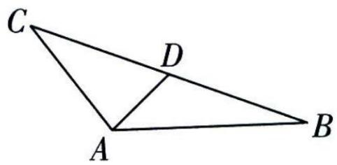

text_image

C
D
A
B

图2

# 名家定理

整理得 $\sin C\cos B + \sin B\cos C = 2\sin A\cos C$ ，即 $\sin (B + C) = 2\sin A\cos C = \sin A$

又 $\sin A \neq 0$ ，则 $\cos C = \frac{1}{2}$ ，又 $C \in (0, \pi)$ ，所以 $C = \frac{\pi}{3}$ .

(2) Step 1: 判断所加线段的特征.

因为 CD 为角 C 的平分线, 所以 $\angle ACD = \angle BCD = \frac{\pi}{6}$ ,

Step 2: 挖掘特征线的相关性质.

由 $S_{\triangle ABC} = S_{\triangle ACD} + S_{\triangle BCD}$ ，得 $\frac{1}{2} ab\sin \angle ACB = \frac{1}{2}\times b\times CD\times \sin \angle ACD + \frac{1}{2}\times a\times CD\times \sin \angle BCD,$

Step 3: 进行相关转化和消元.

即 $\frac{1}{2} a \times 2 \times \frac{\sqrt{3}}{2} = \frac{1}{2} \times 2 \times \sqrt{3} \times \frac{1}{2} + \frac{1}{2} \times a \times \sqrt{3} \times \frac{1}{2}$ , 解得 $a = 2$ ,

Step 4: 进一步求解问题.

所以 $S_{\triangle ABC} = \frac{1}{2} ab \sin \angle ACB = \frac{1}{2} \times 2 \times 2 \times \frac{\sqrt{3}}{2} = \sqrt{3}.$

# 型4 四边形或多边形背景下的解三角形模型

# 模型攻略

以四边形或多边形呈现的解三角形问题,让边角关系的呈现方式更加隐蔽、多样,解题关键在于挖掘题设条件关系,寻找可解三角形,再进行边角转化,让最终问题得到解决.解题时,可从问题出发,求解思路如下:

Step 1

分析所给三角形距离可解还缺少哪些必要条件

Step 2

把未知条件转化到另外的三角形(四边形)中求解

Step 3

将求得的条件代入原三角形,解答问题

调研 1 (2024 海南定安中学 8 月开学考试) 如图 1, 已知平面四边形 ABCD 存在外接圆, 且 AB = 5, BC = 2, $\cos \angle ADC = \frac{4}{5}$ .

(1) 求 $\triangle ABC$ 的面积;  
(2) 若 $DC = DA$ , 求 $\triangle ADC$ 的周长.

解析 (1) Step 1: 分析要求 $\triangle ABC$ 的面积缺少哪些必要条件.

已知 AB = 5, BC = 2，则求出 $\sin \angle ABC$ 即可求出 $\triangle ABC$ 的面积.

Step 2: 在四边形中, 根据 $\cos \angle ADC = \frac{4}{5}$ 求 $\sin \angle ABC$ .

因为平面四边形 ABCD 存在外接圆，

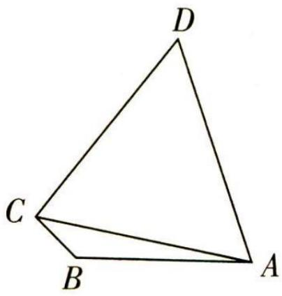

natural_image

Simple geometric diagram of a quadrilateral with vertices labeled A, B, C, D (no additional text or symbols)

图 1

# 名家定理

柯氏定理 数学家柯召关于卡特兰问题的研究成果被国际数学界称为“柯氏定理”;另外,他与数学家孙琦在数论方面的研究成果在国际上被称为“柯-孙猜测”.

所以 $\angle ABC = \pi - \angle ADC, \cos \angle ABC = -\cos \angle ADC = -\frac{4}{5},$

【挖掘条件】平面四边形 $ABCD$ 存在外接圆, 则对角互补, 即 $\angle ABC + \angle ADC = \pi$

又 $\angle ABC\in (0,\pi)$ ，所以 $\sin \angle ABC = \sqrt{1 - \cos^2\angle ABC} = \sqrt{1 - (-\frac{4}{5})^2} = \frac{3}{5},$

Step 3: 将求得的 $\sin \angle ABC$ 的值代入三角形面积公式求解.

所以 $S_{\triangle ABC} = \frac{1}{2} AB\times BC\times \sin \angle ABC = \frac{1}{2}\times 5\times 2\times \frac{3}{5} = 3.$

(2)Step 1:分析要求 $\triangle ADC$ 的周长缺少哪些必要条件.

$\triangle ADC$ 中, $\cos \angle ADC = \frac{4}{5}, DC = DA$ , 但长度未知, $AC$ 可在 $\triangle ABC$ 中求出.

【找突破口】在多边形中解三角形，三角形的公共边往往是解题的关键

Step 2: 在 $\triangle ABC$ 中, 由余弦定理求 $AC$ .

在 $\triangle ABC$ 中,由余弦定理得 $AC^{2}=AB^{2}+BC^{2}-2AB\cdot BC\cos\angle ABC=45$ ,所以 $AC=3\sqrt{5}$ .

Step 3: 回到 $\triangle ADC$ , 根据余弦定理及求出的 $AC$ 列方程求得 $DC, DA$ , 得解.

在 $\triangle ADC$ 中,由余弦定理得 $AC^{2}=DA^{2}+DC^{2}-2DA\cdot DC\cdot\cos\angle ADC$ ,

又 $DC = DA$ ，则 $45 = DA^2 +DA^2 -\frac{8}{5} DA^2 = \frac{2}{5} DA^2$ ，解得 $DA = DC = \frac{15\sqrt{2}}{2}$

所以 $\triangle ADC$ 的周长为 $AC + CD + DA = 3\sqrt{5} + 15\sqrt{2}$ .

调研 2 (2024 湖南师大附中 9 月月考) 在梯形 $ABCD$ 中, $AB \parallel CD$ , $\angle BCD = \frac{3\pi}{4}$ , $BD = \sqrt{10}$ , $CD = \sqrt{2}$ .

(1) 求 $\sin \angle CBD$ 的值;

(2) 若 $\triangle ABD$ 的面积为 4 , 求 $AD$ 的长.

解析 (1) 在 $\triangle BCD$ 中, $\angle BCD = \frac{3\pi}{4}, BD = \sqrt{10}, CD = \sqrt{2}$ ,

由正弦定理得 $\frac{CD}{\sin\angle CBD} = \frac{BD}{\sin\angle BCD}$ 则 $\sin \angle CBD = \frac{CD\times\sin\angle BCD}{BD} = \frac{\sqrt{2}\times\frac{\sqrt{2}}{2}}{\sqrt{10}} = \frac{\sqrt{10}}{10}.$

(2) Step 1: 分析要求 $AD$ 缺少哪些必要条件.

在 $\triangle ABD$ 中, $BD=\sqrt{10}$ , $\triangle ABD$ 的面积为4,如果能够求出 $\sin\angle ABD$ ,则可以进一步求出 $AB$ ,进而求出 $AD$ .

Step 2: 在梯形 $ABCD$ 中, 根据平行关系求解 $\sin \angle ABD$ .

因为 $\sin \angle CBD = \frac{\sqrt{10}}{10}, \angle CBD$ 为锐角，所以 $\cos \angle CBD = \frac{3\sqrt{10}}{10}$ .

名家定理

所以 $\sin \angle ABD = \sin \left(\frac{\pi}{4} -\angle CBD\right) = \sin \frac{\pi}{4}\cdot \cos \angle CBD - \cos \frac{\pi}{4}\cdot \sin \angle CBD = \frac{\sqrt{5}}{5}.$

【会变换】 $AB \parallel CD$ ，则 $\angle ABD + \angle CBD + \angle BCD = \pi$ ，又 $\angle BCD = \frac{3\pi}{4}$ ，所以 $\angle ABD = \frac{\pi}{4} - \angle CBD$ ，据此求解

Step 3: 回到 $\triangle ABD$ , 根据三角形面积公式求解 $AB$ , 再根据余弦定理求解 $AD$ .

因为 $S_{\triangle ABD} = \frac{1}{2} AB \cdot BD \cdot \sin \angle ABD = 4, BD = \sqrt{10}$ ，所以 $AB = 4\sqrt{2}$ .

因为 $\angle ABD$ 为锐角, 所以 $\cos\angle ABD=\frac{2\sqrt{5}}{5}$ .

在 $\triangle ABD$ 中, 由余弦定理得 $AD^{2} = AB^{2} + BD^{2} - 2AB \times BD \times \cos \angle ABD = 32 + 10 - 2 \times 4\sqrt{2} \times$ $\sqrt{10} \times \frac{2\sqrt{5}}{5} = 10$ , 所以 $AD = \sqrt{10}$ .

# 模型演练

(调研2 变式, 变已知条件, 有关角平分线的四边形中的解三角形问题 | 2024 四川泸县一中8月开学考试) 如图2, 平面四边形ABCD中, AC与BD相交于点E, $\angle ABD = \angle CBD, AC \perp AD, AE = EB = 3, DE = 5.$

(1) 求 $\triangle ADB$ 的面积;  
(2) 求 $\sin \angle BAC$ 的值及 EC 的长度.

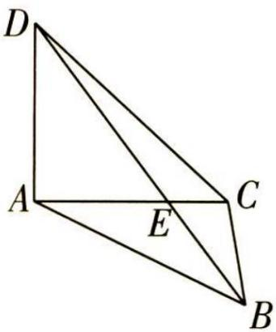

natural_image

Geometric diagram of a tetrahedron with vertices labeled A, B, C, D, and E (no text or symbols beyond labels)

图 2

# 参考答案与解析

(1) Step 1: 分析要求 $\triangle ADB$ 的面积缺少哪些必要条件.

在 $\triangle ADB$ 中, $DB=DE+EB=8$ ,DA和 $\sin\angle ADB$ 均未知.

Step 2: 在 Rt△ADE 中, 根据勾股定理及三角函数的定义求解 DA 和 sin∠ADB.

$$
\because A C \perp A D, A E = 3, D E = 5, \therefore A D = \sqrt {D E ^ {2} - A E ^ {2}} = 4, \sin \angle A D B = \frac {3}{5},
$$

Step 3: 回到 $\triangle ABD$ , 结合三角形面积公式得解.

$$
\therefore S _ {\triangle A B D} = \frac {1}{2} \times D A \times D B \times \sin \angle A D B = \frac {1}{2} \times 4 \times 8 \times \frac {3}{5} = \frac {4 8}{5}.
$$

(2) Step 1: 分析求 $\sin \angle BAC$ 及 $EC$ 缺少哪些必要条件.

考虑在 $\triangle AEB$ 中求解 $\sin\angle BAC$ ，在 $\triangle CEB$ 中求解EC.

$AE = EB = 3, \angle EAB = \angle ABE = \angle CBE, \triangle AEB$ 是等腰三角形, 且顶角的外角余弦值易求, 求出 $\sin \angle BAC$ , 则可以在 $\triangle CEB$ 中由正弦定理求 $EC$ .

Step 2: 结合外角和角度关系求解 $\sin \angle BAC$ 和 $\sin \angle BCE$ .

$$
\because \angle A E D = \angle E A B + \angle E B A, A E = E B, \cos \angle A E D = \frac {3}{5}, \therefore \angle A E D = 2 \angle B A C, \cos \angle A E D = 1 -
$$

# 名家定理

$$
2 \sin^ {2} \angle B A C = \frac {3}{5},
$$

$$
\because \angle B A C \in (0, \frac {\pi}{2}), \therefore \sin \angle B A C = \frac {\sqrt {5}}{5}, \cos \angle B A C = \sqrt {1 - \sin^ {2} \angle B A C} = \frac {2 \sqrt {5}}{5}.
$$

【易错】求解三角形内角的余弦值时要特别关注能否取到负值，需要具体问题具体分析

又 $\angle CBD = \angle ABD = \angle BAC$ ，在 $\triangle BCE$ 中， $\angle CBE + \angle BEC + \angle BCE = \pi ,\sin \angle AED = \frac{4}{5},\angle BEC = \angle AED,$ 则 $\sin\angle BCE=\sin(\angle CBE+\angle BEC)=\sin\angle CBE\cos\angle BEC+\cos\angle CBE\sin\angle BEC=\frac{\sqrt{5}}{5}\times\frac{3}{5}+\frac{2\sqrt{5}}{5}\times$ 【依据】互补的两个角的正弦值相等,展开时十分容易出错,注意仔细检查

$$
\frac {4}{5} = \frac {1 1 \sqrt {5}}{2 5}.
$$

Step 3: 在 $\triangle CEB$ 中, 结合正弦定理求解 $EC$ .

由正弦定理, 可知 $\frac{EC}{\sin\angle CBE} = \frac{BE}{\sin\angle BCE}, \therefore EC = \frac{BE \times \sin\angle CBE}{\sin\angle BCE} = \frac{3 \times \frac{\sqrt{5}}{5}}{\frac{11\sqrt{5}}{25}} = \frac{15}{11}.$

# 型5 圆锥曲线中的几何图形模型

# 模型攻略

圆锥曲线中的几何图形模型是指在解有些解析几何综合题时,需要借助几何图形的特征、性质,找到解题的路径,得到相关数量关系,进而解决问题.这里给出一种思维模型:

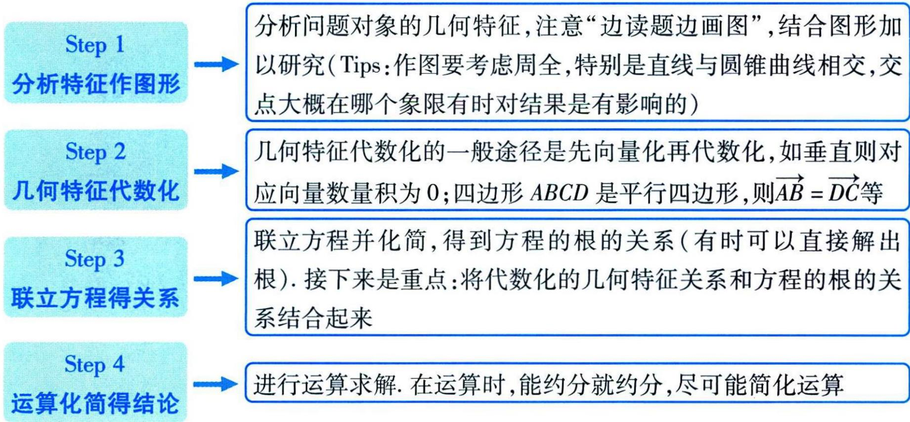

flowchart

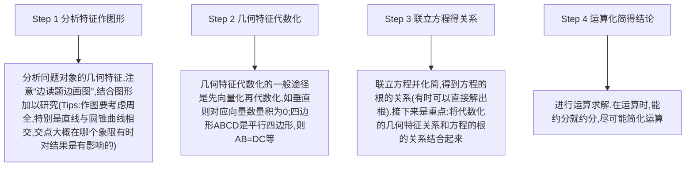
```mermaid
graph TD
    A["Step 1 分析特征作图形"] --> B["分析问题对象的几何特征,注意“边读题边画图”,结合图形加以研究(Tips:作图要考虑周全,特别是直线与圆锥曲线相交,交点大概在哪个象限有时对结果是有影响的)"]
    C["Step 2 几何特征代数化"] --> D["几何特征代数化的一般途径是先向量化再代数化,如垂直则对应向量数量积为0;四边形ABCD是平行四边形,则AB=DC等"]
    E["Step 3 联立方程得关系"] --> F["联立方程并化简,得到方程的根的关系(有时可以直接解出根).接下来是重点:将代数化的几何特征关系和方程的根的关系结合起来"]
    G["Step 4 运算化简得结论"] --> H["进行运算求解.在运算时,能约分就约分,尽可能简化运算"]
```

调研 1 (2024 北京清华附中 9 月开学考试节选) 已知椭圆 $E: \frac{x^{2}}{9} + \frac{y^{2}}{4} = 1$ 的上、下顶点分别为 $A, B$ , 右顶点为 $C$ , 过点 $A$ 的直线 $l$ 与椭圆 $E$ 的另一个交点为 $P$ , 点 $Q$ 与点 $P$ 关于 $x$ 轴对称, 直线 $AP$ 交直线 $BC$ 于 $M$ , 直线 $AQ$ 交直线 $BC$ 于 $N$ , 点 $T(6, -2)$ , 求证: $|AM| = |TN|$ .

名家定理

# 解析 Step 1: 分析特征作图形.

根据题意作出图形,如图1,连接MT,AT.

【作图妙招】既然要证明 $|AM| = |TN|$ ，那么一般分两种情况：在等腰三角形里面作为两腰，在平行四边形里面作为对边。在本题求解过程中，我们先粗略画图后，感觉跟平行四边形有点像，然后按照这个思路重新画一个更精确的图形，这也是矫正作图的一种思路

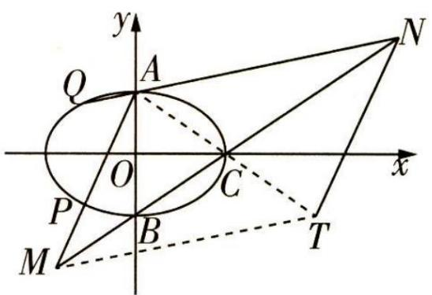

text_image

y
Q
A
N
O
x
P
B
C
T
M

图 1

Step 2: 几何特征代数化.

要想证明 $|AM| = |TN|$ ，考虑从证明四边形 $AMTN$ 是平行四边形入手. 平行四边形这一几何特征如何转化为代数运算呢? 我们可以根据平行四边形的判定方法来实现.

Step 3: 联立方程得关系.

设点 $P(x_0, y_0)$ , 则点 $Q(x_0, -y_0), x_0 \neq 0$ , 易知点 $A(0,2), B(0,-2), C(3,0)$ ,

所以直线 BC 的方程为 $\frac{x}{3}-\frac{y}{2}=1$ ，即 2x-3y=6。

直线 $AP$ 的方程为 $y = \frac{y_0 - 2}{x_0} x + 2$

联立直线 BC 与直线 AP 的方程, 可得 $M\left(\frac{12x_{0}}{2x_{0}-3y_{0}+6}, \frac{4x_{0}+6y_{0}-12}{2x_{0}-3y_{0}+6}\right)$ ,

直线 AQ 的方程为 $y = -\frac{y_{0} + 2}{x_{0}}x + 2$ ，同理可得 $N\left(\frac{12x_{0}}{2x_{0} + 3y_{0} + 6}, \frac{4x_{0} - 6y_{0} - 12}{2x_{0} + 3y_{0} + 6}\right)$ .

Step 4: 运算化简得结论.

$$
x _ {M} + x _ {N} = \frac {1 2 x _ {0}}{2 x _ {0} + 6 - 3 y _ {0}} + \frac {1 2 x _ {0}}{2 x _ {0} + 6 + 3 y _ {0}} = \frac {4 8 x _ {0} ^ {2} + 1 4 4 x _ {0}}{4 x _ {0} ^ {2} + 2 4 x _ {0} + 3 6 - 9 y _ {0} ^ {2}} = \frac {4 8 x _ {0} ^ {2} + 1 4 4 x _ {0}}{4 x _ {0} ^ {2} + 2 4 x _ {0} + 4 x _ {0} ^ {2}} = 6 = 2 x _ {C},
$$

且 $y_{M} + y_{N} = \frac{2x_{M}}{3} - 2 + \frac{2x_{N}}{3} - 2 = \frac{2}{3}(x_{M} + x_{N}) - 4 = \frac{2}{3} \times 6 - 4 = 0 = 2y_{C}$ ,

所以线段 ${MN}$ 的中点为点 $C$ . 又点 $A\left( {0,2}\right) ,T\left( {6, - 2}\right)$ ,则线段 ${AT}$ 的中点也为点 $C$ .

【会变通】这里若想通过 $\overrightarrow{AM}=\overrightarrow{NT}$ 证明四边形AMTN是平行四边形，由 $\overrightarrow{AM}=(\frac{12x_{0}}{2x_{0}-3y_{0}+6})$ ， $\frac{12y_{0}-24}{2x_{0}-3y_{0}+6}$ ， $\overrightarrow{NT}=(\frac{18y_{0}+36}{2x_{0}+3y_{0}+6},\frac{-8x_{0}}{2x_{0}+3y_{0}+6})$ ，结合 $\frac{x_{0}^{2}}{9}+\frac{y_{0}^{2}}{4}=1$ 消元化简，非常烦琐。所以选择利用对角线互相平分证明平行四边形，运算量就变小了

所以四边形 AMTN 为平行四边形, 故 $\left|AM\right| = \left|TN\right|$ .

调研 2 (试题调研原创) 已知椭圆 $C: \frac{x^{2}}{3} + y^{2} = 1$ , 过点 $F(\sqrt{2}, 0)$ 作与坐标轴不垂直的直线 $l$ 与椭圆 $C$ 交于 $A, B$ 两点, 在 $y$ 轴上是否存在点 $M$ , 使得 $\triangle MAB$ 为正三角形? 若存在, 求出点 $M$ 的坐标; 若不存在, 请说明理由.

# 名家定理

夏氏不等式 数学家夏道行在泛函积分和不变测度论方面的研究成果被国际数学界称为“夏氏不等式”.

解析 Step 1 + 2: 分析特征画草图, 几何特征代数化.

记线段 AB 的中点为 P, 连接 PM (草图略), 若 $\triangle MAB$ 是正三角形, 则 $AB \perp PM$ 且 $|PM| = \frac{\sqrt{3}}{2} |AB|$ .

Step 3: 联立方程得关系.

过点 $F(\sqrt{2},0)$ 作与坐标轴不垂直的直线 $l$ , 可设直线 $l$ 的方程为 $x = my + \sqrt{2} (m \neq 0)$ ,

由 $\left\{\begin{aligned}x&=\sqrt{2}+my,\\ \frac{x^{2}}{3}+y^{2}&=1,\end{aligned}\right.$ 消去x整理得关于y的方程 $(3+m^{2})y^{2}+2\sqrt{2}my-1=0,\Delta>0,$

设 $A(x_{1},y_{1}),B(x_{2},y_{2})$ ，则 $y_{1} + y_{2} = -\frac{2\sqrt{2}m}{3 + m^{2}},y_{1}y_{2} = -\frac{1}{3 + m^{2}}.$

所以 $|AB| = \sqrt{1 + m^2} \cdot \sqrt{(y_1 + y_2)^2 - 4y_1y_2} = \frac{2\sqrt{3}(1 + m^2)}{3 + m^2}$ ,

设 $P(x_{3},y_{3})$ ，则 $y_{3} = \frac{y_{1} + y_{2}}{2} = -\frac{\sqrt{2}m}{3 + m^{2}},x_{3} = \sqrt{2} +my_{3} = \frac{3\sqrt{2}}{3 + m^{2}}.$

Step 4: 运算化简得结论.

因为 $\triangle MAB$ 是正三角形, 所以 $AB \perp PM$ 且 $|PM| = \frac{\sqrt{3}}{2} |AB|$ .

【敲黑板】这一步是联系几何与代数的关键。垂直关系是显而易见的，而另一个长度关系也不容忽视。解析几何问题离不开求弦长，所以我们先求了弦长 $|AB|$ ，而从AB入手找代数关系，结合正三角形，自然想到了 $|PM|=\frac{\sqrt{3}}{2}|AB|$ 。有了这两个关系，足以求出M点坐标

所以直线 $PM$ 的斜率为 $-m, |PM| = \sqrt{1 + m^2} \cdot |x_3 - 0| = \sqrt{1 + m^2} \cdot \frac{3\sqrt{2}}{3 + m^2}$ ,

则 $\sqrt{1 + m^2} \cdot \frac{3\sqrt{2}}{3 + m^2} = \frac{\sqrt{3}}{2} \cdot \frac{2\sqrt{3}(1 + m^2)}{3 + m^2}$ , 解得 $m = \pm 1$ .

设 $M(0,t)$ ，则 $\frac{y_3 - t}{x_3} = -m$ ，所以 $t = mx_{3} + y_{3} = \frac{2\sqrt{2}m}{3 + m^{2}} = \pm \frac{\sqrt{2}}{2}$

故在 y 轴上存在点 M, 使得 $\triangle MAB$ 为正三角形, 点 M 的坐标为 $(0, \frac{\sqrt{2}}{2})$ 或 $(0, -\frac{\sqrt{2}}{2})$ .

# 模型演练

(综合变式, 变设问, 求面积的最值问题 |2024 山东泰安 9 月月考) 在平面直角坐标系 $xOy$ 中, 动圆 $P$ 过定点 $F(0, \frac{1}{4})$ , 且与定直线 $l: y = -\frac{1}{4}$ 相切, 记动点 $P$ 的轨迹为 $W$ .

(1) 求 W 的方程.  
(2)已知正方形 $ABCD$ 有三个顶点在 $W$ 上,求正方形 $ABCD$ 面积的最小值.

名家定理

姜氏空间 数学家姜伯驹关于尼尔森数计算的研究成果在国际上被命名为“姜氏空间”，另外还有以他命名的“姜氏子群”.

# 参考答案与解析

(1) 设 $P(x, y)$ , 由题意得 $|y + \frac{1}{4}| = \sqrt{x^2 + (y - \frac{1}{4})^2}$ , 整理得 $y = x^2$ ,

即 W 的方程为 $y = x^{2}$ .

(2) Step 1: 分析特征作图形.

如图2,不妨设A,B,C在W上,B,C在y轴右侧(包括在y轴上),且A,B,C三点的坐标分别为 $(x_{1},y_{1}),(x_{2},y_{2}),(x_{3},y_{3})$ ,则 $x_{1}<0,x_{3}>x_{2}\geqslant0$ .

Step 2: 几何特征代数化.

由四边形 ABCD 是正方形, 可得 $\left|AB\right| = \left|BC\right|$ , 即 $\sqrt{\left(x_{1}-x_{2}\right)^{2}+\left(y_{1}-y_{2}\right)^{2}} = \sqrt{\left(x_{3}-x_{2}\right)^{2}+\left(y_{3}-y_{2}\right)^{2}}$ ,

设直线 $BC$ 的斜率为 $k(k > 0)$ , 可得 $\sqrt{1 + \frac{1}{k^2}} (x_2 - x_1) = \sqrt{1 + k^2} (x_3 - x_2)$ , 化简得 $x_2 - x_1 = k(x_3 - x_2)$ ①.

Step 3: 联立方程得关系.

因为 A, B, C 三点在抛物线 W 上, 所以 $y_{1} = x_{1}^{2}, y_{2} = x_{2}^{2}, y_{3} = x_{3}^{2}$ ,

而 A, B, C 三点也满足 $y_{3} - y_{2} = k(x_{3} - x_{2})$ , $y_{1} - y_{2} = -\frac{1}{k}(x_{1} - x_{2})$ ,

化简可得 $x_{3} = k - x_{2}$ ②, $x_{1} = -\frac{1}{k} - x_{2}$ ③.

Step 4: 运算化简得结论.

联立①②③, 可得 $\frac{1}{k} + 2x_{2} = k(k - 2x_{2})$ , 所以 $x_{2} = \frac{k^{3} - 1}{k(2k + 2)} \geqslant 0$ , 所以 $k^{3} \geqslant 1, k \geqslant 1$ .

所以正方形 ABCD 的边长为 $\sqrt{1+k^{2}}(x_{3}-x_{2})=\sqrt{1+k^{2}}(k-2x_{2})=\sqrt{1+k^{2}}\left[k-\frac{k^{3}-1}{k(k+1)}\right]=$ $\frac{k^{2}+1}{k}\cdot\frac{\sqrt{1+k^{2}}}{k+1}\geqslant\frac{2k}{k}\cdot\frac{\sqrt{\frac{1}{2}(1+k)^{2}}}{k+1}=\sqrt{2}$ ，当且仅当 k=1，即 B 点坐标为 $(0,0)$ 时等号成立.

所以正方形 ABCD 面积的最小值为 2.

【一题多解】这里也可以利用函数思想求解，正方形 ABCD 的面积 $S = \frac{(k^{2} + 1)^{3}}{k^{2}(k + 1)^{2}}$ ，变形一下就是 $S = \frac{(k + \frac{1}{k})^{3}}{k + \frac{1}{k} + 2}$ ，这时通过换元，令 $t = k + \frac{1}{k}$ ，则 $t \geqslant 2$ ，则 S 随着 t 的增大而增大，所以 S 的最小值为 $\frac{2^{3}}{2 + 2} = 2$

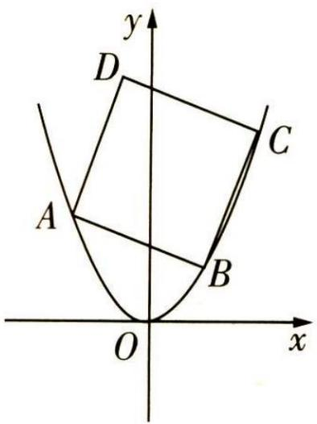

text_image

y
D
C
A
B
O
x

图2

# 名家定理

# 型6 圆锥曲线中的斜率模型

# 模型攻略

圆锥曲线综合题中有一类涉及斜率和、斜率积的试题,常常与定点、定值、最值问题交汇在一起,各种条件错综复杂,难以入手.如果没有成型的解题模型,解题时就会茫然失措,毫无章法.其实,这类题型有其解题模型,解题过程也是有章可循的.这里给出一种思维模型:

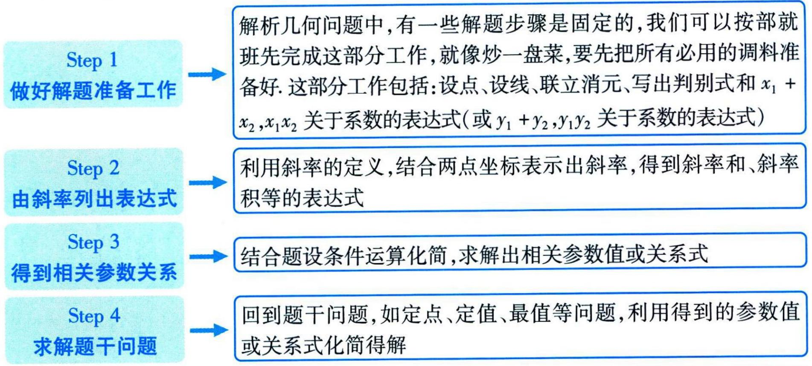

flowchart

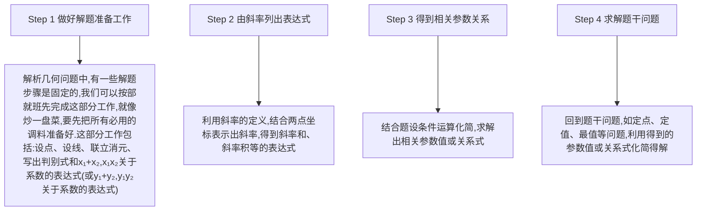
```mermaid
graph TD
    A["Step 1 做好解题准备工作"] --> B["解析几何问题中,有一些解题步骤是固定的,我们可以按部就班先完成这部分工作,就像炒一盘菜,要先把所有必用的调料准备好.这部分工作包括:设点、设线、联立消元、写出判别式和x₁+x₂,x₁x₂关于系数的表达式(或y₁+y₂,y₁y₂关于系数的表达式)"]
    C["Step 2 由斜率列出表达式"] --> D["利用斜率的定义,结合两点坐标表示出斜率,得到斜率和、斜率积等的表达式"]
    E["Step 3 得到相关参数关系"] --> F["结合题设条件运算化简,求解出相关参数值或关系式"]
    G["Step 4 求解题干问题"] --> H["回到题干问题,如定点、定值、最值等问题,利用得到的参数值或关系式化简得解"]
```

调研 1 (2024 海南海口嘉勋高级中学 8 月模拟) 已知椭圆 $C: \frac{x^{2}}{4} + \frac{y^{2}}{3} = 1$ 的左、右焦点分别为 $F_{1}, F_{2}, x$ 轴上存在一点 $E$ (点 $E$ 在椭圆左顶点的左侧), 过 $E$ 的直线 $l$ 与椭圆 $C$ 交于点 $M$ 和点 $N$ (异于椭圆左、右顶点), 且 $\angle EF_{1} M$ 与 $\angle EF_{1} N$ 互为补角, 求 $\triangle F_{1} M N$ 面积的最大值.

解析 Step 1: 做好解题准备工作.

由题意知, 直线 l 的斜率存在且不为 0 , 设直线 l 的方程为 $x = my + n (m \neq 0)$ , 则 $E(n, 0) (n < -2)$ , 由 $\left\{\begin{aligned} x &= my + n, \\ \frac{x^{2}}{4} + \frac{y^{2}}{3} &= 1, \end{aligned}\right.$ 消去 x 并整理得关于 y 的方程 $(3m^{2} + 4)y^{2} + 6mny + 3n^{2} - 12 = 0$ ,

由 $\Delta=36m^{2}n^{2}-4(3m^{2}+4)(3n^{2}-12)>0$ ，可得 $n^{2}<3m^{2}+4$ ①，

【敲黑板】点 $E$ 在椭圆外, 所以要保证直线 $l$ 与椭圆有两个交点, 必须满足 $\Delta > 0$

设 $M(x_{1},y_{1}),N(x_{2},y_{2})$ ，则 $y_{1} + y_{2} = -\frac{6mn}{3m^{2} + 4},y_{1}y_{2} = \frac{3n^{2} - 12}{3m^{2} + 4}.$

Step 2:由斜率列出表达式.

$\because \angle EF_{1}M$ 与 $\angle EF_{1}N$ 互为补角， $F_{1}(-1,0), \therefore k_{MF_{1}} + k_{NF_{1}} = 0$ ，则 $\frac{y_{1}}{x_{1} + 1} + \frac{y_{2}}{x_{2} + 1} = 0$

【建立敏感度】解析几何涉及角的关系，要立刻联想到直线的倾斜角，进而联系到斜率，得到斜率之间的关系，如斜率相等、斜率和为0等

$$
\therefore x _ {1} y _ {2} + y _ {2} + x _ {2} y _ {1} + y _ {1} = 0, \therefore 2 m y _ {1} y _ {2} + (n + 1) (y _ {1} + y _ {2}) = 0, \therefore \frac {6 m (n ^ {2} - 4)}{3 m ^ {2} + 4} = \frac {6 m n (n + 1)}{3 m ^ {2} + 4},
$$

名家定理

Step 3: 得到相关参数关系.

解得 n = -4, ∴ 直线 l 的方程为 x = my - 4, 且由①可得 $3m^{2} + 4 > 16$ , 即 $m^{2} > 4$ .

Step 4: 求解题干问题.

点 $F_{1}(-1,0)$ 到直线 $l$ 的距离 $d = \frac{|-1\times 1 - 0 + 4|}{\sqrt{1 + m^2}} = \frac{3}{\sqrt{1 + m^2}},$

$$
\therefore S _ {\triangle F _ {1} M N} = \frac {1}{2} | M N | \cdot d = \frac {1}{2} \sqrt {1 + m ^ {2}} \cdot \sqrt {(y _ {1} + y _ {2}) ^ {2} - 4 y _ {1} y _ {2}} \cdot \frac {3}{\sqrt {1 + m ^ {2}}} = 1 8 \sqrt {\frac {m ^ {2} - 4}{(3 m ^ {2} + 4) ^ {2}}}.
$$

令 $\sqrt{m^2 - 4} = t, t > 0$ ，则 $S_{\triangle F_1MN} = \frac{18t}{3t^2 + 16} = \frac{18}{3t + \frac{16}{t}} \leqslant \frac{18}{2 \times \sqrt{3 \times 16}} = \frac{3\sqrt{3}}{4}$ ，

当且仅当 $3t=\frac{16}{t}$ ，即 $m=\pm\frac{2\sqrt{21}}{3}$ 时等号成立，∴ $\triangle F_{1}MN$ 面积的最大值为 $\frac{3\sqrt{3}}{4}$ .

调研 2 (试题调研原创) 已知 O 为坐标原点, 椭圆 $C: \frac{x^{2}}{9} + \frac{y^{2}}{3} = 1$ . 直线 l 与椭圆 C 交于 A, B 两点, 直线 OA 的斜率为 $k_{1}$ , 直线 OB 的斜率为 $k_{2}$ , 且 $k_{1}k_{2} = -\frac{1}{3}$ , 求 $\overrightarrow{OA} \cdot \overrightarrow{OB}$ 的取值范围.

解析 Step 1: 做好解题准备工作.

设 $A(x_{1},y_{1}),B(x_{2},y_{2})$ ，当直线 $l$ 的斜率存在时，设 $l$ 的方程为 $y = kx + t$

由 $\left\{\begin{aligned}y&=kx+t,\\ \frac{x^{2}}{9}&+\frac{y^{2}}{3}=1,\end{aligned}\right.$ 消去 y 得关于 x 的方程 $(1+3k^{2})x^{2}+6ktx+3t^{2}-9=0,\Delta=12(3+9k^{2}-t^{2})>0,$

则 $x_{1} + x_{2} = \frac{-6kt}{1 + 3k^{2}}, x_{1}x_{2} = \frac{3t^{2} - 9}{1 + 3k^{2}}.$

Step 2:由斜率列出表达式.

因为 $k_{1}k_{2} = \frac{y_{1}y_{2}}{x_{1}x_{2}} = -\frac{1}{3}$ 所以 $y_{1}y_{2} = -\frac{1}{3} x_{1}x_{2} = \frac{3 - t^{2}}{1 + 3k^{2}}\neq 0$ ，则 $t^2\neq 3$

$$
\frac {y _ {1} y _ {2}}{x _ {1} x _ {2}} = \frac {(k x _ {1} + t) (k x _ {2} + t)}{x _ {1} x _ {2}} = k ^ {2} + \frac {k t (x _ {1} + x _ {2}) + t ^ {2}}{x _ {1} x _ {2}} = k ^ {2} + \frac {\frac {- 6 k ^ {2} t ^ {2}}{1 + 3 k ^ {2}} + t ^ {2}}{\frac {3 t ^ {2} - 9}{1 + 3 k ^ {2}}} = \frac {t ^ {2} - 9 k ^ {2}}{3 t ^ {2} - 9} = - \frac {1}{3},
$$

Step 3: 得到相关参数关系.

整理得 $2t^{2}=9k^{2}+3\geqslant3$ ，则 $t^{2}\geqslant\frac{3}{2}$ 且 $\Delta>0$ 恒成立.

Step 4: 求解题干问题.

$$
\overrightarrow {O A} \cdot \overrightarrow {O B} = x _ {1} x _ {2} + y _ {1} y _ {2} = x _ {1} x _ {2} - \frac {1}{3} x _ {1} x _ {2} = \frac {2}{3} x _ {1} x _ {2} = \frac {2}{3} \cdot \frac {3 t ^ {2} - 9}{1 + 3 k ^ {2}} = 3 \cdot \frac {t ^ {2} - 3}{t ^ {2}} = 3 (1 - \frac {3}{t ^ {2}}),
$$

又 $t^2 \geqslant \frac{3}{2}$ 且 $t^2 \neq 3$ ，故 $3(1 - \frac{3}{t^2}) \in [-3,0) \cup (0,3)$ .

当直线 l 的斜率不存在时, $x_{2}=x_{1}, y_{2}=-y_{1}$ ,

【易遗漏】涉及直线斜率的问题，直线斜率可能不存在，不要遗漏，所得结果取并集

# 名家定理

则 $k_{1}k_{2} = -\frac{y_{1}^{2}}{x_{1}^{2}} = -\frac{1}{3}$ 又 $\frac{x_1^2}{9} +\frac{y_1^2}{3} = 1$ ，得 $x_{1}^{2} = \frac{9}{2}$ 则 $\overrightarrow{OA}\cdot \overrightarrow{OB} = x_1^2 -y_1^2 = \frac{2}{3} x_1^2 = 3.$

综上, $\overrightarrow{OA}\cdot\overrightarrow{OB}$ 的取值范围为 $[-3,0)\cup(0,3]$ .

# 模型演练

(综合变式, 变考点, 研究斜率的关系 | 2024 四川宜宾第四中学 8 月开学考试) 如图 1, 已知抛物线 $C: y^{2} = 2px (p > 0)$ 的焦点为 $F$ , $D(1,0)$ , 点 $P$ 是在第一象限内且在 $C$ 上的一个动点, 当 $DP$ 与 $x$ 轴垂直时, $|PF| = \frac{5}{4}$ , 过点 $P$ 作与 $C$ 相切的直线 $l$ 交 $y$ 轴于点 $M$ , 过点 $M$ 作直线 $l$ 的垂线交抛物线 $C$ 于 $A, B$ 两点.

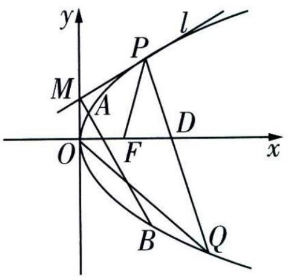

text_image

y
l
P
M
A
D
O
F
x
B
Q

图 1

(1) 求 $C$ 的方程.  
(2)延长 $PD$ , 交抛物线 $C$ 于点 $Q$ . 设直线 $AB, OQ$ (其中 $O$ 为坐标原点)的斜率分别为 $k_{1}, k_{2}$ , 证明: $\frac{k_{1}}{k_{2}}$ 为定值.

# 参考答案与解析

(1) 当 DP 与 x 轴垂直时, $\left|PF\right|=\frac{5}{4}$ , 则由抛物线的定义可得 $1+\frac{p}{2}=\frac{5}{4}$ , 解得 $p=\frac{1}{2}$ , 所以 C 的方程为 $y^{2}=x$ .

(2)Step 1: 做好解题准备工作.

设 $P(x_0, y_0)$ , 对于 $y^2 = x$ , 当 $y > 0$ 时, $y = \sqrt{x}$ , $y' = \frac{1}{2\sqrt{x}}$ , 所以 $y_0 = \sqrt{x_0}$ , 直线 $PM$ 的斜率为 $\frac{1}{2\sqrt{x_0}}$ .

当直线 PD 的斜率存在时, 将直线 PD 的方程 $y = \frac{\sqrt{x_{0}}}{x_{0} - 1}(x - 1)$ 与抛物线方程 $y^{2} = x$ 联立, 消去 x 并化简, 得 $y^{2} - \frac{x_{0} - 1}{\sqrt{x_{0}}}y - 1 = 0$ , 易得 $\Delta > 0$ , 设 $Q(x_{Q}, y_{Q})$ , 则 $y_{0}y_{Q} = -1$ , 所以 $y_{Q} = -\frac{1}{y_{0}} = -\frac{1}{\sqrt{x_{0}}}$ .

【抓条件】直线 $PD$ 与抛物线的另一个交点是点 $P$ , 这是一个直白的、但容易灯下黑的条件, 这里根据 “ $y_{1}y_{2}=\frac{c}{a}$ ” 可以直接求出 $y_{Q}$

把点 $Q$ 的纵坐标代入 $y = \frac{\sqrt{x_0}}{x_0 - 1} (x - 1)$ , 得 $x_Q = \frac{1}{x_0}$ , 所以 $Q(\frac{1}{x_0}, -\frac{1}{\sqrt{x_0}})$ .

Step 2: 列出斜率表达式.

因为直线 $AB$ 与切线 $l$ 垂直, 所以 $k_{1} = \frac{-1}{k_{PM}}$ , 而 $k_{PM} = \frac{1}{2\sqrt{x_0}}$ , 所以 $k_{1} = -2\sqrt{x_0}$ .

又 O 为坐标原点, 所以 $k_{2}=\frac{y_{Q}}{x_{Q}}=-\sqrt{x_{0}}$ .

Step 3: 求解题干问题.

所以 $\frac{k_{1}}{k_{2}}=2$ . 当直线 PD 的斜率不存在时, $P(1,1)$ , $Q(1,-1)$ , 此时 $k_{1}=-2$ , $k_{2}=-1$ , 所以 $\frac{k_{1}}{k_{2}}=2$ .
综上, $\frac{k_{1}}{k_{2}}$ 为定值2.

名家定理

# 必用 5 类解题模型,会解专项疑难问题

# 型1 研究函数 $y = A \sin (\omega x + \varphi)$ 的性质与图象

# 模型攻略

函数 $y = A \sin(\omega x + \varphi)$ 的性质与图象是高考的高频考点, 其考查角度丰富, 常见考点有单调性、零点、最值、交点、切线等, 设问形式可以从代数表达式和函数图象两个方向展开. 解题步骤可总结为:

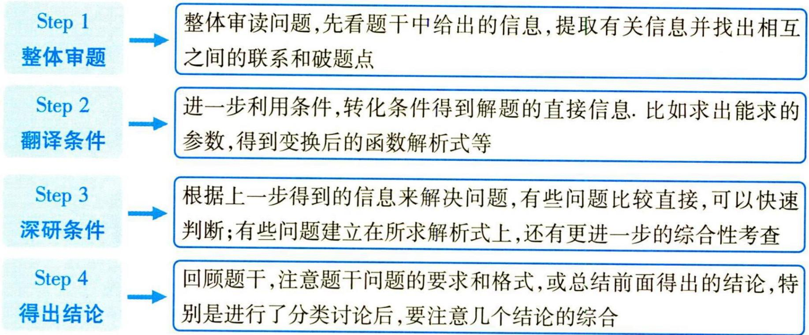

flowchart

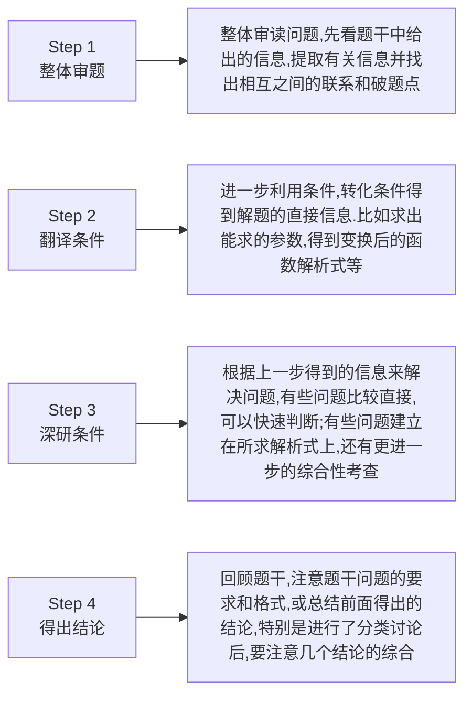
```mermaid
graph LR
    A["Step 1<br>整体审题"] --> B["整体审读问题,先看题干中给出的信息,提取有关信息并找出相互之间的联系和破题点"]
    C["Step 2<br>翻译条件"] --> D["进一步利用条件,转化条件得到解题的直接信息.比如求出能求的参数,得到变换后的函数解析式等"]
    E["Step 3<br>深研条件"] --> F["根据上一步得到的信息来解决问题,有些问题比较直接,可以快速判断;有些问题建立在所求解析式上,还有更进一步的综合性考查"]
    G["Step 4<br>得出结论"] --> H["回顾题干,注意题干问题的要求和格式,或总结前面得出的结论,特别是进行了分类讨论后,要注意几个结论的综合"]
```

调研 1 (2024 四川眉山仁寿第一中学 9 月摸底测试) 函数 $f(x)=A\sin(\omega x+\varphi)(A>0, \omega>0, -\frac{\pi}{2}<\varphi<\frac{\pi}{2})$ 的部分图象如图 1 所示, 则下列说法正确的是 ( )

A. $f(x)$ 的最小正周期为 $2 \pi$

B. $\varphi = \frac{\pi}{6}$

C. $f(x)$ 在 $[-1, \frac{1}{\pi}]$ 上单调递增

D. 将函数 $f(x)$ 的图象向左平移 $\frac{\pi}{12}$ 个单位长度, 可得到函数 $g(x)=\sqrt{2}\cos2x$ 的图象

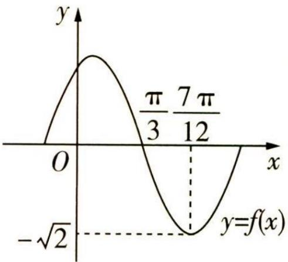

line

| x         | y          |
| --------- | ---------- |
| 0         | 0          |
| π/3       | π/3        |
| 7π/12     | 7π/12      |
| ∞         | -√2        |

图 1

解析 Step 1: 整体审题, 分析题目条件.

由函数图象可得, 函数在 $x = \frac{7\pi}{12}$ 处取得最小值, 为 $-\sqrt{2}$ , 函数图象过点 $(\frac{\pi}{3}, 0)$ 且 $x = \frac{\pi}{3}$ 为单调递减区间上的零点.

【规避易错】必须意识到 $x = \frac{\pi}{3}$ 是单调递减区间上的零点, 即 “下降零点”, 不可直接令 $\frac{\pi}{3} \omega + \varphi = k \pi (k \in \mathbf{Z})$

# 名家定理

Step 2: 翻译条件, 得出函数解析式.

由 A > 0 可得 $A = \sqrt{2}$ .

由对称轴 $x=\frac{7\pi}{12}$ 和平衡点 $(\frac{\pi}{3},0)$ 相邻可得, $f(x)$ 的最小正周期 $T=4\times(\frac{7\pi}{12}-\frac{\pi}{3})=\pi$ ,

所以 $\omega=\frac{2\pi}{T}=2.$

由函数在 $x = \frac{7\pi}{12}$ 处取得最小值，得 $2\times \frac{7\pi}{12} +\varphi = -\frac{\pi}{2} +2k\pi (k\in \mathbf{Z})$

又 $-\frac{\pi}{2} < \varphi < \frac{\pi}{2}$ , 所以 $\varphi = \frac{\pi}{3}$ , 所以 $f(x) = \sqrt{2} \sin(2x + \frac{\pi}{3})$ .

Step 3 +4: 深研条件, 根据题中条件与解析式, 逐一判断各选项, 得出结论.

对于 A, 函数 $f(x)$ 的最小正周期 $T = \pi$ , A 错误.

对于 B, $f(x)=\sqrt{2}\sin(2x+\frac{\pi}{3})$ , B 错误.

对于 C, 因为 $-1 \leqslant x \leqslant \frac{1}{\pi}$ ，所以 $-2 + \frac{\pi}{3} \leqslant 2x + \frac{\pi}{3} \leqslant \frac{2}{\pi} + \frac{\pi}{3}, -\frac{\pi}{2} < -2 + \frac{\pi}{3} < 0$ ，而 $\pi < 2\sqrt{3}$ ，则 $\frac{2}{\pi} - \frac{\pi}{6} = \frac{12 - \pi^{2}}{6\pi} > 0$ ，即 $\frac{2}{\pi} > \frac{\pi}{6}$ ，则 $\frac{2}{\pi} + \frac{\pi}{3} > \frac{\pi}{6} + \frac{\pi}{3} = \frac{\pi}{2}$ ，所以 $f(x)$ 在 $[-1, \frac{1}{\pi}]$ 上不单调，C 错误.

对于 $\mathrm{D}, f(x) = \sqrt{2} \sin \left(2x + \frac{\pi}{3}\right)$ , 将函数 $f(x)$ 的图象向左平移 $\frac{\pi}{12}$ 个单位长度, 得 $y = \sqrt{2} \sin \left[2(x + \frac{\pi}{12}) + \frac{\pi}{3}\right] = \sqrt{2} \sin \left(2x + \frac{\pi}{2}\right) = \sqrt{2} \cos 2x$ 的图象, D 正确.

故选 D.

调研 2 (试题调研原创) 已知函数 $f(x) = 2\sin \omega x \cos^{2}(\frac{\omega x}{2} - \frac{\pi}{4}) - \sin^{2} \omega x (\omega > 0)$ , 先将该函数图象向右平移 $\frac{\pi}{4 \omega}$ 个单位长度, 再将图象上各点的横坐标缩短为原来的 $\frac{1}{2}$ , 纵坐标不变, 得到函数 $g(x)$ 的图象, 已知函数 $g(x)$ 在区间 $(\frac{\pi}{2}, \pi)$ 上是单调的, 则 $\omega$ 的取值范围是 \_\_\_\_.

解析 Step 1 + 2: 整体审题, 分析题目条件, 利用条件, 明确函数解析式.

对原函数变形化简得, $f(x)=2\sin\omega x\cos^{2}\left(\frac{\omega x}{2}-\frac{\pi}{4}\right)-\sin^{2}\omega x=2\sin\omega x\cdot\frac{1+\cos\left(\omega x-\frac{\pi}{2}\right)}{2}-$ $\sin^{2}\omega x=\sin\omega x(1+\sin\omega x)-\sin^{2}\omega x=\sin\omega x.$

名家定理

由函数图象向右平移 $\frac{\pi}{4\omega}$ 个单位长度得 $f_{1}(x) = \sin \omega (x - \frac{\pi}{4\omega}) = \sin (\omega x - \frac{\pi}{4})$ 的图象，

【敲黑板】左右平移遵循“左加右减”的原则，且平移的时候“加”“减”是作用在 $x$ 上的，注意不要错写成 $f_{1}(x) = \sin (\omega x - \frac{\pi}{4 \omega})$

根据横坐标缩短为原来的 $\frac{1}{2}$ , 纵坐标不变得 $g(x) = \sin (2\omega x - \frac{\pi}{4})$ .

Step 3: 深研条件, 根据题中条件与解析式, 解决问题.

由于函数 $g(x)$ 在区间 $(\frac{\pi}{2}, \pi)$ 上是单调的，

【关键提醒】题干中只说了函数 $g(x)$ 在区间 $(\frac{\pi}{2}, \pi)$ 上是单调的，并没有说是单调递增还是单调递减，因此接下来要分类讨论

则① $\left(\omega\pi-\frac{\pi}{4},2\omega\pi-\frac{\pi}{4}\right)\subseteq\left(-\frac{\pi}{4},\frac{\pi}{2}\right)$ ，可得 $\left\{\begin{aligned}\omega\pi-\frac{\pi}{4}&> -\frac{\pi}{4},\\ 2\omega\pi-\frac{\pi}{4}&\leqslant\frac{\pi}{2},\end{aligned}\right.$ 解得 $0<\omega\leqslant\frac{3}{8}$ ;

【明易错】在 $\omega > 0$ 的条件下, $2 \omega \pi - \frac{\pi}{4} > \omega \pi - \frac{\pi}{4} > - \frac{\pi}{4}$ , 务必要考虑到两数最小也要大于 $- \frac{\pi}{4}$ , 与之最相近的单调区间 $(- \frac{\pi}{4}, \frac{\pi}{2}]$ 是不完整的, 必须单独进行讨论

② $(\omega \pi - \frac{\pi}{4}, 2\omega \pi - \frac{\pi}{4}) \subseteq (\frac{\pi}{2} + k\pi, \frac{3\pi}{2} + k\pi) (k \in \mathbb{N})$ ，可得 $\left\{ \begin{array}{l} \omega \pi - \frac{\pi}{4} \geqslant \frac{\pi}{2} + k\pi, \\ 2\omega \pi - \frac{\pi}{4} \leqslant \frac{3\pi}{2} + k\pi \end{array} \right.$ （ $k \in \mathbb{N}$ ），解得 $\frac{3}{4} + k \leqslant \omega \leqslant \frac{7}{8} + \frac{k}{2} (k \in \mathbb{N})$ ，又 $\frac{7}{8} + \frac{k}{2} > \frac{3}{4} + k$ ，解得 $k < \frac{1}{4}$ ，结合 $k \in \mathbb{N}$ ，得 $k = 0$ ，则 $\omega \in [\frac{3}{4}, \frac{7}{8}]$ .

Step 4: 得出结论.

综上, $\omega$ 的取值范围为 $(0,\frac{3}{8}]\cup[\frac{3}{4},\frac{7}{8}]$ .

# 模型演练

(调研 1 变式, 变条件 | 2024 江西省名校 9 月联合测评 | 多选) 已知函数 $f(x)=2 \sin (\omega x + \varphi)(\omega > 0, 0 < \varphi < \frac{\pi}{2})$ 的图象的任意一条对称轴与其相邻的零点之间的距

# 趣味数学

离为 $\frac{\pi}{4}$ , 若将曲线 $y = f(x)$ 向左平移 $\frac{\pi}{6}$ 个单位长度得到的图象关于 $y$ 轴对称, 则下列说法正确的是 ( )

A. $\omega = 2, \varphi = \frac{\pi}{6}$

B. 直线 $x = \frac{2 \pi}{3}$ 为曲线 $y = f(x)$ 的一条对称轴

C. 若 $f(x)$ 在 $(-a, a)$ 上单调递增，则 $0 < a \leqslant \frac{\pi}{3}$

D. 曲线 $y = f(x)$ 与直线 $y = \frac{1}{2} x - \frac{5\pi}{24}$ 有且仅有 5 个交点

# 参考答案与解析

ABD Step 1 + 2: 整体审题, 分析题目条件, 利用条件, 明确函数解析式.

由题意得 $\frac{\pi}{4} = \frac{T}{4} = \frac{2\pi}{4\omega}$ ( $T$ 为 $f(x)$ 的最小正周期), 故 $\omega = 2$ .

由 $f(x)=2\sin(2x+\varphi)$ 的图象向左平移 $\frac{\pi}{6}$ 个单位长度得 $y=2\sin\left[2\left(x+\frac{\pi}{6}\right)+\varphi\right]=2\sin\left(2x+\frac{\pi}{3}+\varphi\right)$ 的图象，由该函数图象关于y轴对称，得 $\frac{\pi}{3}+\varphi=k\pi+\frac{\pi}{2}(k\in\mathbf{Z})$ ，又 $0<\varphi<\frac{\pi}{2}$ ，故 $\varphi=\frac{\pi}{6}$ ，

故 $f(x)=2\sin(2x+\frac{\pi}{6})$ .

Step 3 +4: 深研条件, 根据题中条件与解析式, 逐一判断各选项, 得出结论.

由 $f(x)$ 的解析式知,A 正确.

因为 $f(\frac{2\pi}{3})=2\sin(\frac{4\pi}{3}+\frac{\pi}{6})=-2$ ，为 $f(x)$ 的最小值，所以直线 $x=\frac{2\pi}{3}$ 为曲线 $y=f(x)$ 的一条对称轴，B正确.

易知 $f(x)$ 在 $(- \frac{\pi}{3}, \frac{\pi}{6})$ 上单调递增, 故 $0 < a \leqslant \frac{\pi}{6}$ , C 错误.

如图2, 直线 $y = \frac{1}{2}x - \frac{5\pi}{24}$ 与曲线 $y = f(x)$ 均过点 $\left(\frac{5\pi}{12}, 0\right)$ ，且直线与曲线均关于该点中心对称，

【会思考】直线与三角函数图象的交点个数问题，主要利用

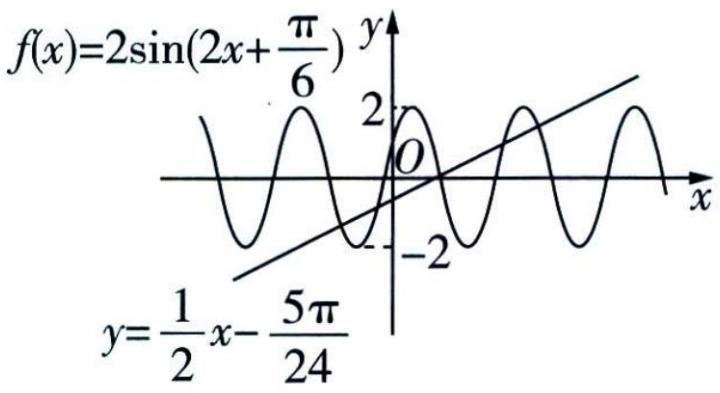

line

| x    | f(x)       | y          |
| ---- | ---------- | ---------- |
| -3   | 0          | -1.579     |
| -2   | 1          | -0.841     |
| -1   | 2          | 0.000      |
| 0    | 3          | 1.579      |
| 1    | 2          | 0.841      |
| 2    | 1          | -0.841     |
| 3    | 0          | -1.579     |

图2

# 趣味数学

用1到9组成一个九位数,使这个数的第一位能被1整除,前两位组成的两位数能被2整除,以此类推,一直到整个九位数能被9整除,这样的数存在吗?

数形结合思想，直线刚好经过点 $\left(\frac{5\pi}{12},0\right)$ ，该点为三角函数图象的对称中心，故利用对称性只需考虑一半的交点个数即可

对于 $y = \frac{1}{2} x - \frac{5\pi}{24}$ ，当 $x = \frac{7\pi}{6}$ 时， $y = \frac{3\pi}{8} < f(\frac{7\pi}{6}) = 2$ ，当 $x = \frac{13\pi}{6}$ 时， $y = \frac{7\pi}{8} > f(\frac{13\pi}{6}) = 2$ ，

由对称性可知曲线 $y=f(x)$ 与直线 $y=\frac{1}{2}x-\frac{5\pi}{24}$ 有且仅有 5 个交点，D 正确。故选 ABD.

# 型2 破解动态几何中轨迹与截面问题

# 模型攻略

动态几何中的轨迹与截面问题属于高考在考查立体几何时综合性强、复杂度高的一类热点问题. 面对这类题目,首先要做到认真审题、厘清线面关系,立足条件,画出立体图形的草图,呈现其中的几何关系. 画出整体图形之后,根据相应的条件分析动点轨迹或截面形状,从宏观角度刻画动点状态,轨迹往往表现为多边形或圆锥曲线,最后根据其相应的特征破题. 此类问题由于是动态的,处于变化当中,常常与范围、最值结合在一起考查.

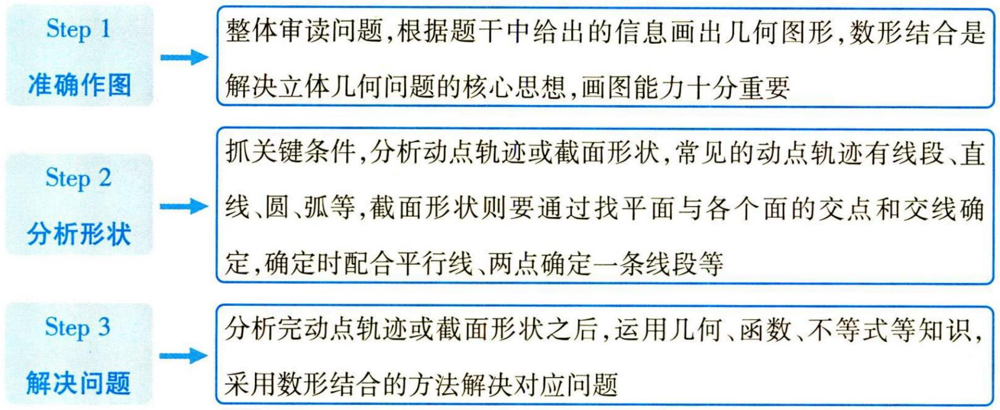

flowchart

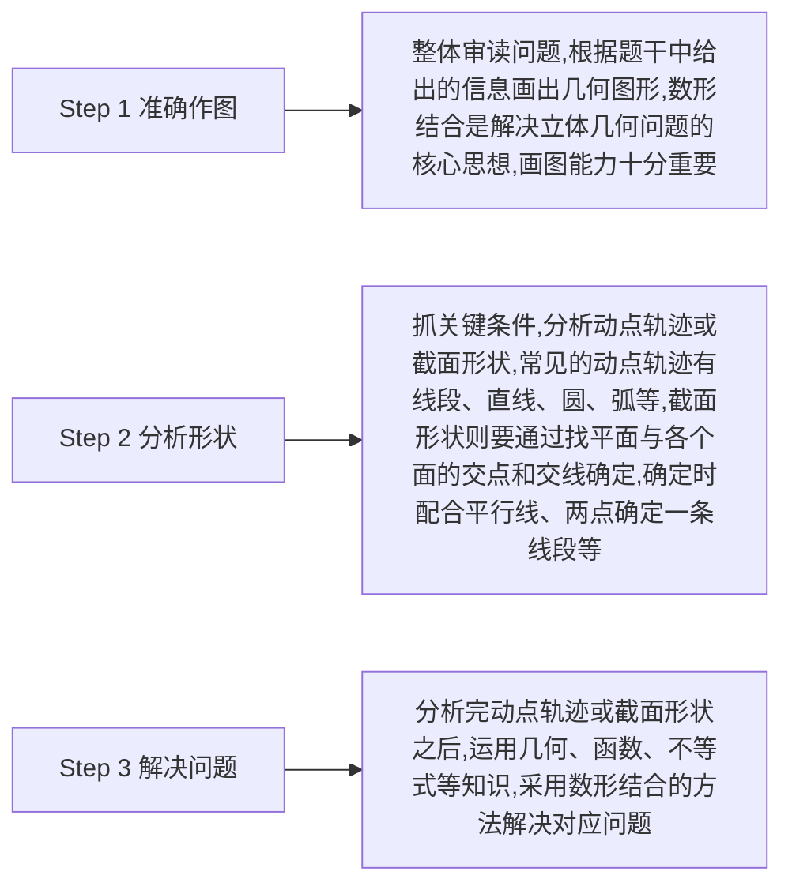
```mermaid
graph LR
    A["Step 1 准确作图"] --> B["整体审读问题,根据题干中给出的信息画出几何图形,数形结合是解决立体几何问题的核心思想,画图能力十分重要"]
    C["Step 2 分析形状"] --> D["抓关键条件,分析动点轨迹或截面形状,常见的动点轨迹有线段、直线、圆、弧等,截面形状则要通过找平面与各个面的交点和交线确定,确定时配合平行线、两点确定一条线段等"]
    E["Step 3 解决问题"] --> F["分析完动点轨迹或截面形状之后,运用几何、函数、不等式等知识,采用数形结合的方法解决对应问题"]
```

调研 1 (2024 江苏南通 8 月期初检测 | 多选) 在棱长为 2 的正方体 $ABCD - A_{1}B_{1}C_{1}D_{1}$ 中, $M, N$ 分别为 $BD_{1}, B_{1}C_{1}$ 的中点, 点 $P$ 在正方体的表面上运动, 且满足 $MP \perp CN$ . 记点 $P$ 的轨迹为 $\Omega$ , 则下列说法正确的是 ( )

A. 点 $P$ 可以是侧面 $BCC_{1}B_{1}$ 的中心

B. $\Omega$ 是菱形

C. 线段 $MP$ 的最大值为 $\frac{3}{2}$

D. $\Omega$ 的周长是 $2 \sqrt{5}$

# 趣味数学

解析 Step 1: 审读题目, 根据题目条件画出对应图形.

如图1所示,以 $D$ 为坐标原点,分别以 ${DA},{DC},{DD}_{1}$ 所在直线为 $x$ 轴、 $y$ 轴和 $z$ 轴,建立空间直角坐标系,

【技巧点拨】本题载体为正方体，容易想到墙角模型，为简化问题，可建系用坐标运算分析线面关系

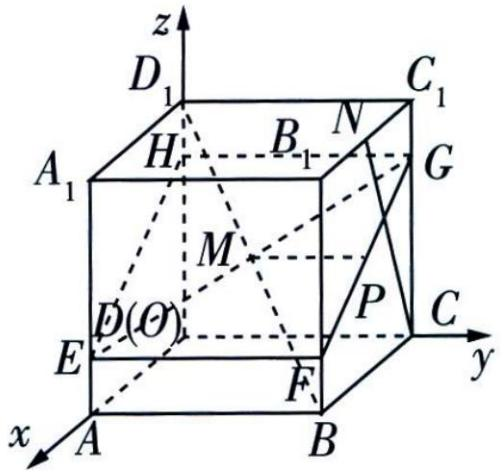

text_image

z
D₁
C₁
A₁
H
B₁
N
G
M
D(θ)
E
P
C
y
F
x
A
B

图1

可得 $D(0,0,0)$ , $M(1,1,1)$ , $N(1,2,2)$ , $C(0,2,0)$ , 所以 $\overrightarrow{CN} = (1,0,2)$ ,

设 $P(x,y,z)(0\leqslant x\leqslant 2)$ ，则 $\overrightarrow{MP} = (x - 1,y - 1,z - 1)$

Step 2: 结合条件, 分析点 $P$ 的轨迹.

A 中, 当点 P 是侧面 $BCC_{1}B_{1}$ 的中心时, 可得 $P(1,2,1)$ , 此时 $\overrightarrow{MP} = (0,1,0)$ , 因为 $\overrightarrow{MP} \cdot \overrightarrow{CN} = 0$ , 所以 $MP \perp CN$ , 所以 A 正确.

B 中, 因为 $MP \perp CN$ , 所以 $1 \times (x - 1) + 2(z - 1) = 0$ , 可得 $x + 2z - 3 = 0$ .

【会思考】点 $P(x,y,z)$ 的坐标满足 $x+2z-3=0(0\leqslant x\leqslant2)$ ，y 可取任意值，只要满足点 $P(x,y,z)$ 在正方体表面上. $x+2z-3=0(0\leqslant x\leqslant2)$ 在平面直角坐标系中表示一条线段，在空间直角坐标系中表示与平面 xOz 垂直且与平面 xOz 的交线为线段 $x+2z-3=0(0\leqslant x\leqslant2)$ 的平面，故动点 P 的轨迹为此平面截正方体所得的截口曲线（矩形）

当 $x = 2$ 时， $z = \frac{1}{2}$ ；当 $x = 0$ 时， $z = \frac{3}{2}$ .

取 $E(2,0,\frac{1}{2}),F(2,2,\frac{1}{2}),H(0,0,\frac{3}{2}),G(0,2,\frac{3}{2})$ ，连接 $EF,FG,GH,HE,$

则 $\overrightarrow{EF} = \overrightarrow{HG} = (0,2,0),\overrightarrow{EH} = \overrightarrow{FG} = (-2,0,1)$ ，所以四边形 $EFGH$ 为矩形，

则 $\overrightarrow{EF} \cdot \overrightarrow{CN} = 0, \overrightarrow{EH} \cdot \overrightarrow{CN} = 0$ ，即 $EF \perp CN, EH \perp CN,$

又 $EF \cap EH = E, EF, EH \subset$ 平面 $EFGH$ , 所以 $CN \perp$ 平面 $EFGH$ ,

连接 EM, MG，则 $\overrightarrow{EM} = (-1, 1, \frac{1}{2})$ , $\overrightarrow{MG} = (-1, 1, \frac{1}{2})$ , $\overrightarrow{EM} = \overrightarrow{MG}$ ，所以 M 为 EG 的中点，则 $M \in$ 平面 EFGH，

因为点 P 在正方体的表面上运动, 所以点 P 的轨迹为四边形 EFGH,

又 EF = GH = 2, $EH = FG = \sqrt{5}$ , $EF \neq EH$ , 则点 P 的轨迹为矩形, 不是菱形, 所以 B 错误.

# 趣味数学

任意选一个四位数(数字不能全相同), 把所有数字从大到小排列, 再把所有数字从小到大排列, 用前者减去后者得到新的数. 重复以上操作, 会得到一个固定的数吗? 答: 7 步之内必然得到 6174.

Step 3: 根据动点 $P$ 的轨迹解决相关问题.

$EG = \sqrt{EF^{2} + EH^{2}} = 3$ , 所以线段 MP 的最大值为 $\frac{EG}{2} = \frac{3}{2}$ , 所以 C 正确.

矩形 EFGH 的周长 $C=2\times(EF+EH)=4+2\sqrt{5}$ ，所以 D 错误.

故选 AC.

调研 2 (2024 长沙雅礼中学9月月考)已知正方体的棱长为1,每条棱所在直线与平面α所成的角都相等,则平面α截此正方体所得截面面积的最大值为

解析 Step 1:通读题目,根据题目条件画出对应图形.

根据题意作出示意图,如图2所示,根据相互平行的直线与平面所成的角是相等的可知,在正方体 $ABCD-A_{1}B_{1}C_{1}D_{1}$ 中,平面 $AB_{1}D_{1}$ 与直线 $AA_{1},A_{1}B_{1},A_{1}D_{1}$ 所成的角是相等的,

所以平面 $AB_{1}D_{1}$ 与平面 $\alpha$ 平行.

【会思考】题干所给的条件 “每条棱所在直线与平面 $\alpha$ 所成的角都相等” 较为抽象, 将抽象问题具象化, 我们先从正方体中找到一个与每条棱所在直线所成角相同的面,即由三条面对角线形成的等边三角形所在的平面 $A{B}_{1}{D}_{1}$

Step 2: 结合条件, 分析截面形状.

由图易知平面 $\alpha$ 和正方体形成的截面可以是三角形,也可以是六边形.

Step 3: 根据截面形状解决相关问题.

由正方体的对称性知,截面面积最大时,截面的位置为与平面 $AB_{1}D_{1}$ 平行且过正方体中心的正六边形,其边长为 $\frac{\sqrt{2}}{2}$ ,所以其面积为 $S=6\times\frac{\sqrt{3}}{4}\times\left(\frac{\sqrt{2}}{2}\right)^{2}=\frac{3\sqrt{3}}{4}$ .

# 模型演练

(调研 1 变式, 变考点, 考查动点轨迹与截面 | 2024 浙江省名校协作体 9 月联考 | 多选) 已知正方体 $ABCD - A_{1}B_{1}C_{1}D_{1}$ 的棱长为 2 , 点 $P$ 为底面 $ABCD$ 内一动点, 则下列说法正确的是 ( )

A. 若点 $P$ 在棱 $AD$ 上运动, 则 $A_{1} P + P C$ 的最小值为 $2 + 2 \sqrt{2}$

B. 若点 $P$ 是棱 $AD$ 的中点, 则平面 $PBC_{1}$ 截正方体所得截面的周长为 $2 \sqrt{5} + 3 \sqrt{2}$

C. 若点 $P$ 满足 $PD_{1} \perp DC_{1}$ , 则动点 $P$ 的轨迹是一条线段

D. 若点 P 在棱 AC 上运动, 则 P 到棱 $BC_{1}$ 的最小距离为 $\frac{2\sqrt{3}}{3}$

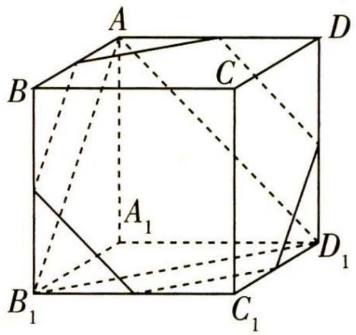

text_image

A
B
C
D
A₁
B₁
C₁
D₁

图2

# 趣味数学

维纳今年岁数的三次方是个四位数,今年岁数的四次方是个六位数,这两个数,刚好把十个数字0\~9全都用上了,维纳的年龄是多少?答:18岁.

# 参考答案与解析

BCD 对于 A, 如图 3, 将平面 ABCD 展开与平面 $ADD_{1}A_{1}$ 处于同一个平面, 连接 $A_{1}C$ 与

【讲技巧】对于立体图形中几个线段长度和的最值问题, 我们可以展开相应平面, 将空间中的最值问题转化为平面中的最值问题

AD 交于点 P, 此时 $A_{1}P + PC$ 取得最小值, 即 $(A_{1}P + PC)_{\min} = \sqrt{2^{2} + 4^{2}} = 2\sqrt{5}$ , 故 A 错误.

对于 B, 如图 4, 取 $DD_{1}$ 的中点 E, 连接 BP, PE, $C_{1}E$ , $AD_{1}$ ,

因为点 P 是棱 AD 的中点, 所以 $PE \parallel AD_{1}$ 且 $PE = \frac{1}{2} AD_{1}$ ,

又 $AD_{1} / / BC_{1}$ ，所以 $PE / / BC_{1}$

所以四边形 $EPBC_{1}$ 即平面 $PBC_{1}$ 截正方体所得截面,

【会思考】截面问题中“找(作)截面”是难点，B选项中找平面 $PBC_{1}$ 截正方体所得截面，先确定正方体各面上已有的交线—— $BP, BC_{1}$ ，再在其他平

面上找(作)与已知交线平行的直线—— $PE \parallel BC_{1}$ ，最后针对余下含两交点的平面，直接连接确定在此平面的交线即可

又 $BC_{1} = 2\sqrt{2}, PE = \frac{1}{2} AD_{1} = \sqrt{2}, BP = EC_{1} = \sqrt{1^{2} + 2^{2}} = \sqrt{5}$ ,

所以截面周长为 $3\sqrt{2} + 2\sqrt{5}$ ，故 B 正确.

对于 C, 如图 5, 连接 $A_{1}B, D_{1}C$ , 易知 $DC_{1} \perp D_{1}C$ . 因为 $BC \perp$ 平面 $DCC_{1}D_{1}$ , $DC_{1} \subset$ 平面 $DCC_{1}D_{1}$ , 所以 $DC_{1} \perp BC$ , 又 $D_{1}C \cap BC = C, D_{1}C, BC \subset$ 平面 $BCD_{1}A_{1}$ , 所以 $DC_{1} \perp$ 平面 $BCD_{1}A_{1}$ ,

因为平面 $ABCD \cap$ 平面 $BCD_{1}A_{1} = BC, D_{1} \in$ 平面 $BCD_{1}A_{1}, P \in$ 平面 ABCD, $PD_{1} \perp DC_{1}$ , 所以 P 在线段 BC 上, 即动点 P 的轨迹是一条线段, 故 C 正确.

对于 D, 如图 6, 建立空间直角坐标系, 连接 BP, 则 $B(2,2,0)$ , $C_{1}(0,2,2)$ ,

设 $P(a,2 - a,0)(a\in [0,2])$ ，则 $\overrightarrow{BC_1} = (-2,0,2),\overrightarrow{BP} = (a - 2, - a,0)$

所以 P 到棱 $BC_{1}$ 的距离 $d = \sqrt{|\overrightarrow{BP}|^{2} - (\frac{\overrightarrow{BC_{1}} \cdot \overrightarrow{BP}}{|\overrightarrow{BC_{1}}|})^{2}} = \sqrt{\frac{3}{2}a^{2} - 2a + 2} =$

$$
\sqrt {\frac {3}{2} \left(a - \frac {2}{3}\right) ^ {2} + \frac {4}{3}},
$$

所以当 $a=\frac{2}{3}$ 时, d 取得最小值, 且 $d_{\min}=\sqrt{\frac{4}{3}}=\frac{2\sqrt{3}}{3}$ , 故 D 正确. 故选 BCD.

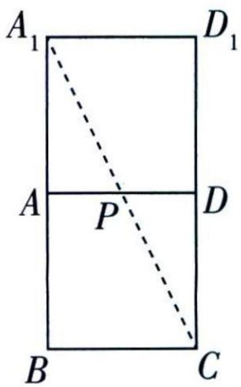

text_image

A₁
D₁
A
P
D
B
C

图3   
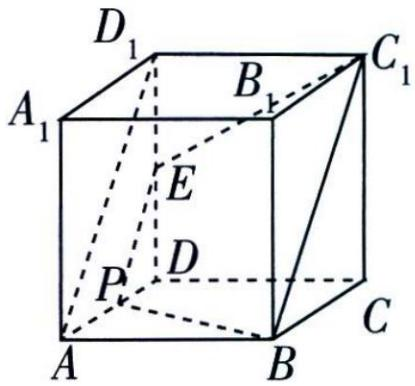

text_image

D₁
A₁
B₁
C₁
E
P
D
A
B
C

图 4

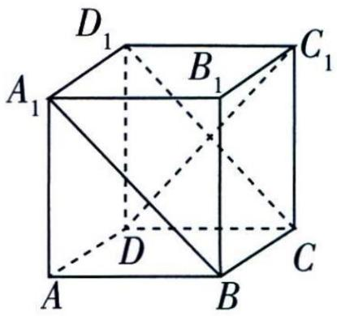

text_image

D₁
A₁ B₁ C₁
D
A B C

图 5

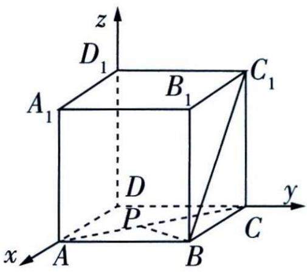

text_image

z
D₁
A₁
B₁
C₁
D
P
x
A
B
C
y

图6

# 趣味数学

已知小数 0.123 456 789 101 112 131 4…是一个由连续自然数拼接组成的无限不循环小数,问小数点后面出现的第一个“2019”中的“2”是小数点后面第几位.答:第6572位.

# 模型3 平面向量几何意义的应用

# 模型攻略

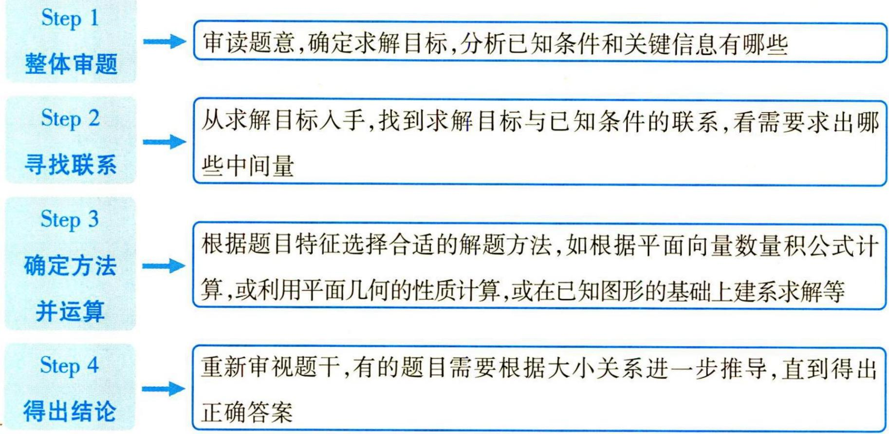

flowchart

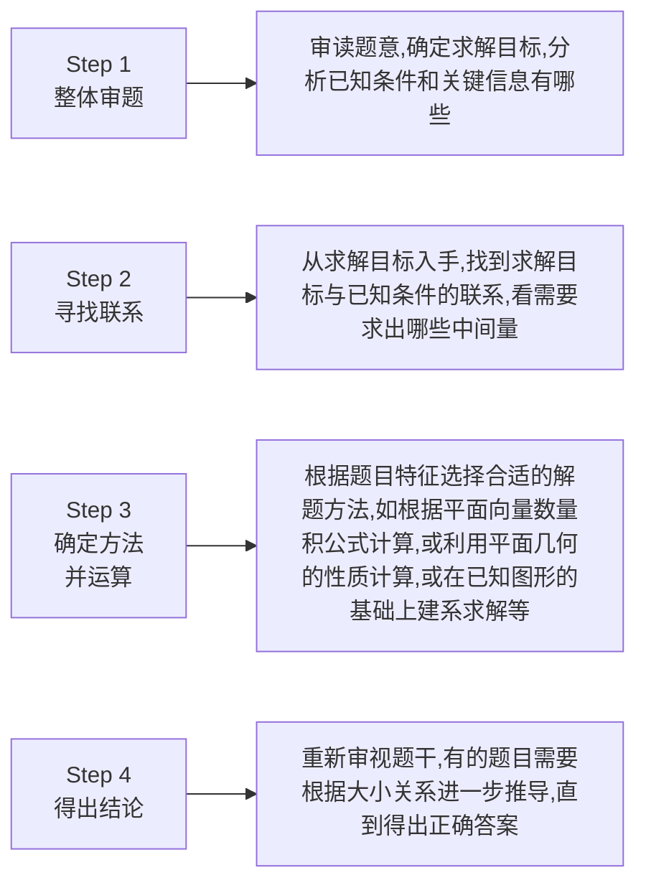
```mermaid
graph LR
    A["Step 1<br>整体审题"] --> B["审读题意,确定求解目标,分析已知条件和关键信息有哪些"]
    C["Step 2<br>寻找联系"] --> D["从求解目标入手,找到求解目标与已知条件的联系,看需要求出哪些中间量"]
    E["Step 3<br>确定方法<br>并运算"] --> F["根据题目特征选择合适的解题方法,如根据平面向量数量积公式计算,或利用平面几何的性质计算,或在已知图形的基础上建系求解等"]
    G["Step 4<br>得出结论"] --> H["重新审视题干,有的题目需要根据大小关系进一步推导,直到得出正确答案"]
```

调研 1 (平面向量与解三角形交汇, 双空题 | 2023 天津) 在三角形 $ABC$ 中, $\angle A = \frac{\pi}{3}, |\overrightarrow{BC}| = 1, D$ 为线段 $AB$ 的中点, $E$ 为线段 $CD$ 的中点, 若设 $\overrightarrow{AB} = a, \overrightarrow{AC} = b$ , 则 $\overrightarrow{AE}$ 可用 $a, b$ 表示为 \_\_\_\_ ; 若 $\overrightarrow{BF} = \frac{1}{3}\overrightarrow{BC}$ , 则 $\overrightarrow{AE} \cdot \overrightarrow{AF}$ 的最大值为 \_\_\_\_.

解析 Step 1 + 2: 整体审题.

在 $\triangle ABC$ 中, $\angle A=\frac{\pi}{3},BC=1$ ,点 $D$ 为 $AB$ 的中点,点 $E$ 为 $CD$ 的中点.对于第一空,用 $\overrightarrow{AB}=\boldsymbol{a}$ , $\overrightarrow{AC}=\boldsymbol{b}$ 表示 $\overrightarrow{AE}$ 即可;对于第二空,可作出图形,再进行分析.

Step 3: 确定方法并运算.

第一空 由于 E 为 CD 的中点, 所以 $\overrightarrow{AE} = \frac{1}{2} (\overrightarrow{AC} + \overrightarrow{AD})$ , 又 D 是 AB 的中点, 所以 $\overrightarrow{AD} = \frac{1}{2} \overrightarrow{AB}$ .

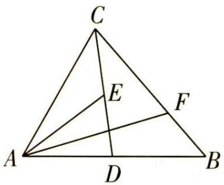

text_image

C
E
F
A
D
B

图 1

由于 $\overrightarrow{AB} = \pmb{a},\overrightarrow{AC} = \pmb{b}$ ，所以 $\overrightarrow{AE} = \frac{1}{4}\pmb {a} + \frac{1}{2}\pmb{b}.$

第二空 作出图形,如图1所示.

因为 $\overrightarrow{BF} = \frac{1}{3}\overrightarrow{BC}$ ，所以 $2\overrightarrow{FB} +\overrightarrow{FC} = \mathbf{0}$ ，由 $\left\{ \begin{array}{l}\overrightarrow {AF} +\overrightarrow {FC} = \overrightarrow {AC},\\ \overrightarrow {AF} +\overrightarrow {FB} = \overrightarrow {AB} \end{array} \right.$ 可得 $\overrightarrow {AF} +\overrightarrow {FC} +2(\overrightarrow {AF} +\overrightarrow {FB}) = \overrightarrow {AC} +$

# 趣味数学

$2\overrightarrow{AB}$ ，即 $3\overrightarrow{AF}=2a+b$ ，即 $\overrightarrow{AF}=\frac{2}{3}a+\frac{1}{3}b.$

于是 $\overrightarrow{AE} \cdot \overrightarrow{AF} = (\frac{1}{4}\boldsymbol{a} + \frac{1}{2}\boldsymbol{b}) \cdot (\frac{2}{3}\boldsymbol{a} + \frac{1}{3}\boldsymbol{b}) = \frac{1}{12}(2\boldsymbol{a}^2 + 5\boldsymbol{a} \cdot \boldsymbol{b} + 2\boldsymbol{b}^2)$ .

记 AB = x, AC = y,

则 $\overrightarrow{AE} \cdot \overrightarrow{AF} = \frac{1}{12}(2a^2 + 5a \cdot b + 2b^2) = \frac{1}{12}(2x^2 + 5xy\cos \frac{\pi}{3} + 2y^2) = \frac{1}{12}(2x^2 + \frac{5xy}{2} + 2y^2)$ .

在 $\triangle ABC$ 中, 根据余弦定理得 $BC^{2} = x^{2} + y^{2} - 2xy\cos \frac{\pi}{3} = x^{2} + y^{2} - xy = 1$ ,

于是 $\overrightarrow{AE} \cdot \overrightarrow{AF} = \frac{1}{12}(2xy + \frac{5xy}{2} + 2) = \frac{1}{12}\left(\frac{9xy}{2} + 2\right)$ .

由 $x^{2} + y^{2} - xy = 1$ 和基本不等式得, $x^{2} + y^{2} - xy = 1 \geqslant 2xy - xy = xy$ , 当且仅当 x = y = 1 时取得等号, 故 $xy \leqslant 1$ , 则 x = y = 1 时, $\overrightarrow{AE} \cdot \overrightarrow{AF}$ 有最大值 $\frac{13}{24}$ .

【易错提醒】使用基本不等式时，注意等号成立的条件不要漏掉

Step 4: 得出结论.

故答案为: $\frac{1}{4}a+\frac{1}{2}b;\frac{13}{24}.$

调研 2 (试题调研原创) 如图 2, $\triangle ABC$ 中, $AB = AC = 4$ , $\angle BAC = \frac{2\pi}{3}$ , 半径为 1 的 $\odot A$ 分别交 $AB, AC$ 于点 $E, F$ , 点 $P$ 是劣弧 $EF$ 上的一个动点, 则 $\overrightarrow{PB} \cdot \overrightarrow{PC}$ 的取值范围是 \_\_\_\_.

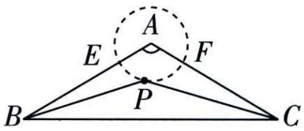

text_image

A
E
F
B
P
C

图 2

解析 Step 1 + 2: 整体审题.

△ABC 是顶角为 $\frac{2\pi}{3}$ 、腰为 4 的等腰三角形，⊙A 的半径为 1, P 是劣弧 EF 上的一个动点，求 $\overrightarrow{PB} \cdot \overrightarrow{PC}$ 的取值范围。有题图，可以考虑建系；也可以考虑取三角形底边的中点，用几何法解决。

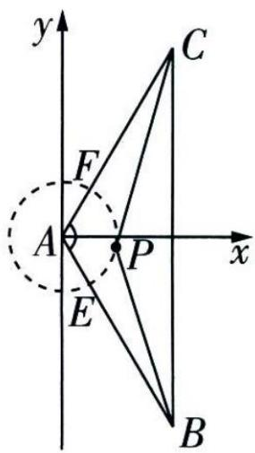

text_image

y
C
F
A
P
x
E
B

图3

Step 3 +4: 确定方法并运算, 得出结论.

方法一:坐标法 如图3,以A为原点,垂直于BC的直线为x轴建立平面直角坐标系xAy,则 $B(2,-2\sqrt{3}),C(2,2\sqrt{3})$ ,设 $P(\cos\theta,\sin\theta)$ ,其中 $\theta\in\left[-\frac{\pi}{3},\frac{\pi}{3}\right]$ .

所以 $\overrightarrow{PB} \cdot \overrightarrow{PC} = (2 - \cos \theta, -2\sqrt{3} - \sin \theta) \cdot (2 - \cos \theta, 2\sqrt{3} - \sin \theta) = (2 - \cos \theta)^2 + \sin^2\theta - 12 =$

# 趣味数学

-7 -4cos θ.

因为 $\cos \theta \in [\frac{1}{2}, 1]$ , 所以 $\overrightarrow{PB} \cdot \overrightarrow{PC} \in [-11, -9]$ .

方法二: 几何法 如图4, 取BC的中点M, 连接PM, 则两个动向量 $\overrightarrow{PB}, \overrightarrow{PC}$ 均可用一个动向量 $\overrightarrow{PM}$ 和一个定向量 $\overrightarrow{MC}$ 表示. $\overrightarrow{PB} \cdot \overrightarrow{PC} = (\overrightarrow{PM} - \overrightarrow{MC}) \cdot (\overrightarrow{PM} + \overrightarrow{MC}) = \overrightarrow{PM^{2}} - \overrightarrow{MC^{2}}$ .

因为 MC 为定值, 所以 $\overrightarrow{PB} \cdot \overrightarrow{PC}$ 的变化可由 $\overrightarrow{PM}$ 的变化确定.

连接 AM, 易得 $AM = 2, MC = 2\sqrt{3}$ , 当 P 为劣弧 EF 与 AM 的交点时, PM 取得最小值, 为 AM - 1 = 1; 连接 EM, PM 的最大值为 $EM = \sqrt{BE^{2} + BM^{2} - 2 \cdot BE \cdot BM \cdot \cos \angle EBM} = \sqrt{3}$ .

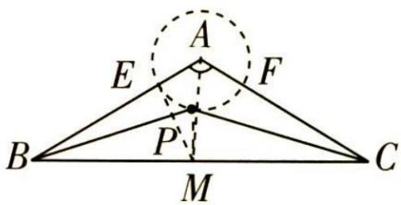

text_image

A
E
F
B
P
M
C

图 4

所以 $\overrightarrow{PM^{2}}-\overrightarrow{MC^{2}}$ 的取值范围是 $[-11,-9]$ ，即 $\overrightarrow{PB}\cdot\overrightarrow{PC}\in[-11,-9]$ .

# 型4 条件概率与全概率公式的应用

# 模型攻略

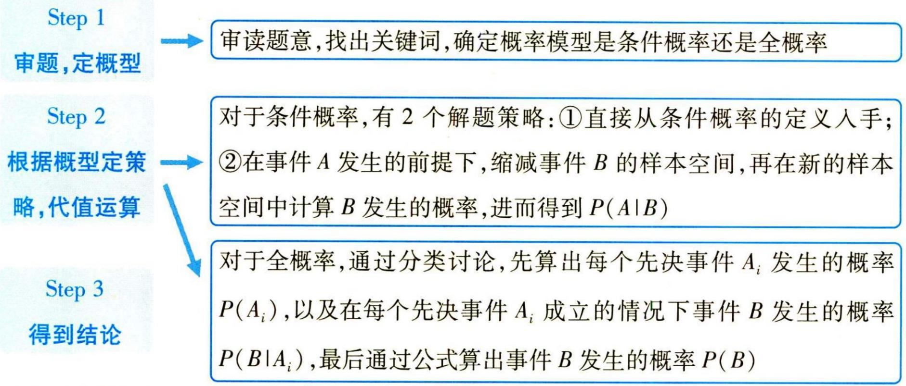

flowchart

```mermaid
graph TD
    A["审题, 定概型"] --> B["审读题意, 找出关键词, 确定概率模型是条件概率还是全概率"]
    C["根据概型定策略, 代值运算"] --> D["对于条件概率, 有2个解题策略: ①直接从条件概率的定义入手; ②在事件A发生的前提下, 缩减事件B的样本空间, 再在新的样本空间中计算B发生的概率, 进而得到P(A|B)"]
    E["得到结论"] --> F["对于全概率, 通过分类讨论, 先算出每个先决事件Ai发生的概率P(Ai), 以及在每个先决事件Ai成立的情况下事件B发生的概率P(B|Ai), 最后通过公式算出事件B发生的概率P(B)"]
```

调研 1 (试题调研原创)有50人报名足球兴趣班,60人报名乒乓球兴趣班,共有70人报名足球或乒乓球兴趣班,若已知某人报名足球兴趣班,则其报名乒乓球兴趣班的概率为

A. 0.8

B. 0.4

C. 0.2

D. 0.1

解析 Step 1: 审题, 定概型.

关键信息是“已知某人报名足球兴趣班,则其报名乒乓球兴趣班的概率”,判断为条件概率.

【找关键】当题目中涉及“在……的条件(前提)下”“已知……则”等字眼, 一般可初步判断为条件概率

# 趣味数学

Step 2: 根据概型定策略, 代值运算.

直接从条件概率的定义式入手.

报名两个兴趣班的人数为 $50 + 60 - 70 = 40$ ，

记“某人报名足球兴趣班”为事件 $A$ , 记“某人报名乒乓球兴趣班”为事件 $B$ ,

则 $P(A) = \frac{50}{70} = \frac{5}{7}, P(AB) = \frac{40}{70} = \frac{4}{7}$ , 所以 $P(B|A) = \frac{P(AB)}{P(A)} = \frac{\frac{4}{7}}{\frac{5}{7}} = 0.8$ .

Step 3: 得到结论.

故选A.

调研 2 (2023 新课标 I 卷) 甲、乙两人投篮, 每次由其中一人投篮, 规则如下: 若命中则此人继续投篮, 若未命中则换为对方投篮. 无论之前投篮情况如何, 甲每次投篮的命中率均为 0.6, 乙每次投篮的命中率均为 0.8. 由抽签确定第 1 次投篮的人选, 第 1 次投篮的人是甲、乙的概率各为 0.5.

(1) 求第 2 次投篮的人是乙的概率.  
(2) 求第 i 次投篮的人是甲的概率.  
(3)已知:若随机变量 $X_{i}$ 服从两点分布,且 $P(X_{i}=1)=1-P(X_{i}=0)=q_{i}, i=1,2,\cdots,n$ , 则 $E(\sum_{i=1}^{n}X_{i})=\sum_{i=1}^{n}q_{i}$ . 记前 n 次(即从第 1 次到第 n 次投篮)中甲投篮的次数为 Y, 求 $E(Y)$ .

解析 (1) Step 1: 审题, 定概型.

第2次投篮的人是乙受第一次投篮的人是谁的影响,根据题意判断为全概率.

【技巧点拨】若随机事件可以分两个阶段进行，且第一阶段的各试验结果具体怎样未知，如果要求的是第二阶段某一个结果发生的概率，则用全概率公式计算

用字母表示事件:记“第 $i$ 次投篮的人是甲”为事件 $A_{i}$ , “第 $i$ 次投篮的人是乙”为事件 $B_{i}$ .

Step 2: 根据概型定策略, 代值运算.

所以 $P(B_{2}) = P(A_{1}B_{2}) + P(B_{1}B_{2}) = P(A_{1})P(B_{2}|A_{1}) + P(B_{1})P(B_{2}|B_{1}) = 0.5\times (1 - 0.6) +$ $0.5\times 0.8 = 0.6.$

趣味数学

Step 3: 得到结论.

所以第 2 次投篮的人是乙的概率为 0.6.

(2) 设 $P(A_{i}) = p_{i}$ , 依题可知, $P(B_{i}) = 1 - p_{i}$ , 则 $P(A_{i+1}) = P(A_{i}A_{i+1}) + P(B_{i}A_{i+1}) = P(A_{i})P(A_{i+1}|A_{i}) + P(B_{i})P(A_{i+1}|B_{i})$ , 即 $p_{i+1} = 0.6p_{i} + (1 - 0.8) \times (1 - p_{i}) = 0.4p_{i} + 0.2$ .

构造等比数列 $\{p_i + \lambda\}$ , 设 $p_{i+1} + \lambda = \frac{2}{5}(p_i + \lambda)$ , 解得 $\lambda = -\frac{1}{3}$ , 则 $p_{i+1} - \frac{1}{3} = \frac{2}{5}(p_i - \frac{1}{3})$ .

又 $p_1 = \frac{1}{2}, p_1 - \frac{1}{3} = \frac{1}{6}$ , 所以 $\{p_i - \frac{1}{3}\}$ 是首项为 $\frac{1}{6}$ 、公比为 $\frac{2}{5}$ 的等比数列, 即 $p_i - \frac{1}{3} = \frac{1}{6} \times (\frac{2}{5})^{i-1}, p_i = \frac{1}{6} \times (\frac{2}{5})^{i-1} + \frac{1}{3}$ .

(3) 因为 $p_{i}=\frac{1}{6}\times\left(\frac{2}{5}\right)^{i-1}+\frac{1}{3}, i=1,2,\cdots,n$ ，所以当 $n\in N^{*}$ 时， $E(Y)=p_{1}+p_{2}+\cdots+p_{n}=$ $\frac{1}{6}\times\frac{1-\left(\frac{2}{5}\right)^{n}}{1-\frac{2}{5}}+\frac{n}{3}=\frac{5}{18}\left[1-\left(\frac{2}{5}\right)^{n}\right]+\frac{n}{3}$ ，故 $E(Y)=\frac{5}{18}\left[1-\left(\frac{2}{5}\right)^{n}\right]+\frac{n}{3}$ .

# 模型演练

(试题调研原创|调研1变式,变载体,有关条件概率的综合问题|多选)有3台车床加工同一型号的零件,第1台加工的次品率为8%,第2台加工的次品率为3%,第3台加工的次品率为2%,加工出来的零件混放在一起.已知第1,2,3台车床加工的零件数分别占总数的10%,40%,50%,从混放的零件中任取一个零件,则下列结论正确的是()

A. 该零件是第 1 台车床加工出来的次品的概率为 0.08  
B. 该零件是次品的概率为 0.03  
C. 如果该零件是第 3 台车床加工出来的,那么它不是次品的概率为 0.98  
D. 如果该零件是次品,那么它不是第 3 台车床加工出来的概率为 $\frac{2}{3}$

# 参考答案与解析

BCD Step 1:审题,用数学语言翻译已知信息.

记事件 A: 车床加工的零件为次品.

记事件 $B_{i}$ : 任取一个零件, 该零件是第 i 台车床加工的零件.

# 趣味数学

则 $P(A|B_1) = 8\% , P(A|B_2) = 3\% , P(A|B_3) = 2\% , P(B_1) = 10\% , P(B_2) = 40\% , P(B_3) = 50\%$ .

Step 2: 判断概型, 根据概型定策略, 代值运算.

对于 A, 任取一个零件, 其是第 1 台车床生产出来的次品的概率为 $P(AB_{1}) = P(A \mid B_{1})P(B_{1}) = 8\% \times$ 【敲黑板】概率的乘法公式本质上与条件概率公式等价, 解题时要灵活运用 $10\% = 0.008$ , 故 A 错误.

对于 B, 任取一个零件, 其是次品的概率为 $P(A) = P(AB_1) + P(AB_2) + P(AB_3) = 8\% \times 10\% + 3\% \times 40\% + 2\% \times 50\% = 0.03$ , 故 B 正确.

对于 C, 如果该零件是第 3 台车床加工出来的, 那么它不是次品的概率为 $P(\overline{A} | B_3) = 1 - P(A | B_3) = 1 - 2\% = 0.98$ , 故 C 正确.

对于 D, 如果该零件是次品, 那么它不是第 3 台车床加工出来的概率为 $1 - P(B_{3} \mid A) = 1 - \frac{P(AB_{3})}{P(A)} = 1 - \frac{P(A|B_{3})P(B_{3})}{P(A)} = 1 - \frac{2\% \times 50\%}{0.03} = \frac{2}{3}$ , 故 D 正确.

Step 3: 得到结论.

故选 BCD.

# 模

# 型5 抽象函数与函数性质的综合

# 模型攻略

Step 1
翻译信息

整体审题,把关键信息转化为数学语言,初步判断题干与选项之间的联系

Step 2
联系函数性质

根据题干与选项、选项之间的联系,逐项分析,或者先整体、再局部分析,看选项的正误判断需要用到函数的哪些性质,再从性质出发,对已知式进行推算,或者将抽象函数具体化,用特值法解题

Step 3 得到结果

回读题干,看清题目所求,得到结果

调研 1: (试题调研原创|多选|较难)已知函数 $f(x)$ 及其导函数 $f'(x)$ 的定义域均为 $\mathbf{R}$ , 记 $g(x) = f'(x)$ . 若 $y = f(2x + 1) - 2x$ 与 $g(x + 2)$ 均为偶函数, 则下列说法正确的是 ( )

A. $g(1) = 1$

B. 函数 $y = \frac{f(x + 1)}{x}$ 的图象关于点 $(0,1)$ 对称

C. 函数 $g(x)$ 的周期为 2

D. $\sum_{k=1}^{2024}[g(k)-1][g(k+1)+1]=0$

# 趣味数学

小白买了一盒蚊香,其中每卷蚊香可燃烧半小时.若他想以此测量45分钟时长,他该如何计算?答:先点燃第一卷蚊香的一端,燃尽后同时点燃第二卷蚊香的两端.

# 解析 Step 1: 整体审题, 翻译信息.

根据函数的奇偶性得到关于 $g(x)$ 的表达式,代值判断 A→根据奇偶性判断函数图象的对称性,判断 B→研究函数 $g(x)$ 的周期性,判断 C→根据 D 中式子结构的特征知也与周期性有关.

# Step 2: 联系函数性质进行运算.

对于 A, 若 $y = f(2x + 1) - 2x$ 为偶函数, 则 $y = f(2x + 1) - 2x$ 的图象关于直线 x = 0 对称, 将其图象上所有点的纵坐标保持不变, 横坐标变为原来的 2 倍, 可得 $y = f(x + 1) - x$ 的图象关于直线 x = 0 对称, 即 $y = f(x + 1) - x$ 为偶函数, 所以 $f(x + 1) - x = f(-x + 1) + x$ , 则 $f(x + 1) = f(-x + 1) + 2x$ .

【快速分析】也可以直接用 $x$ 代换 $2 x$ , 直接得 $y = f (x + 1) - x$ 为偶函数

所以 $f'(x+1)=-f'(-x+1)+2$ ，即 $g(x+1)=-g(-x+1)+2$ ，令x=0，得 $g(1)=-g(1)+2$ ，所以 $g(1)=1$ ，故A正确.

对于 B, 由 $f(x+1)=f(-x+1)+2x$ 可得, 当 $x\neq0$ 时, $\frac{f(x+1)}{x}=\frac{f(-x+1)}{x}+2$ , 即 $\frac{f(x+1)}{x}+\frac{f(-x+1)}{-x}=2$ , 令 $h(x)=\frac{f(x+1)}{x}$ , 则 $h(-x)=\frac{f(-x+1)}{-x}$ , 所以 $h(x)+h(-x)=2$ , 所以函数 $y=\frac{f(x+1)}{x}$ 的图象关于点 $(0,1)$ 对称, 故 B 正确.

对于 C, 因为 $g(x+2)$ 为偶函数, 所以 $g(x+2)=g(-x+2)$ , 又 $g(x+1)=-g(-x+1)+2$ , 所以 $g(x+2)=g[(x+1)+1]=-g[-(x+1)+1]+2=-g(-x)+2$ , 则 $g(x+4)=g[(x+2)+2]=g[-(x+2)+2]=g(-x)$ , 所以 $g(x+2)+g(x+4)=2$ , 即 $g(x)+g(x+2)=2$ , 则 $g(x+4)=2-g(x+2)=2-[2-g(x)]=g(x)$ , 所以函数 $g(x)$ 的周期为 4, 故 C 不正确.

# 【敲黑板】证明函数的周期性，要紧扣周期的定义

对于 D, 函数 $g(x)$ 的周期为 4, 则函数 $y = g(k) \cdot g(k + 1)$ 的周期也为 4, 由 $g(x) + g(x + 2) = 2$ , 可得 $g(1) + g(3) = 2$ , $g(2) + g(4) = 2$ , 则 $\sum_{k=1}^{2024} [g(k)g(k+1)] - \sum_{k=1}^{2024} g(k+1) + \sum_{k=1}^{2024} g(k) - 2024 = \sum_{k=1}^{2024} [g(k)g(k+1)] - g(2025) + g(1) - 2024 = \sum_{k=1}^{2024} [g(k)g(k+1)] - g(506 \times 4 + 1) + g(1) - 2024 = \sum_{k=1}^{2024} [g(k)g(k+1)] - 2024 = 506 \times [g(1)g(2) + g(2)g(3) + g(3)g(4) + g(4)g(5)] - 2024 = 506 \times [g(2) + g(4)][g(1) + g(3)] - 2024 = 0$ , 故 D 正确.

Step 3: 得到结论.

故选 ABD.

# 趣味数学

将 100 颗绿豆和 100 颗黄豆混在一起又随机一分为二,需要几次才能使第一堆中黄豆数量和第二堆中绿豆数量相等呢?答:每次都相等.

调研 2 (试题调研原创)已知定义在 $\mathbf{R}$ 上的奇函数 $f(x)$ 满足 $f(4 + x) + f(-x) = 0$ , 若 $f'(2) = 4$ , 则曲线 $y = f(x)$ 在点 $(-6, f(-6))$ 处的切线方程为 \_\_\_\_.

解析 Step 1: 整体审题, 翻译信息.

$f(x)$ 为奇函数 $\rightarrow f(x) = -f(-x)\rightarrow$ 因为 $f(4 + x) + f(-x) = 0$ ，所以 $f(4 + x) = f(x)$

Step 2 + 3: 联系函数性质进行运算, 得到结论.

故 $f(x)$ 是以4为周期的周期函数.

将 $x = -2$ 代入 $f(4 + x) + f(-x) = 0$ ，则 $f(2) + f(2) = 2f(2) = 0$ ，即 $f(2) = 0$

则 $f(-6)=f(2)=0.$

对 $f(4+x)=f(x)$ 求导得 $f'(4+x)=f'(x)$ ,

故 $f'(x)$ 是以4为周期的周期函数,则 $f'(-6)=f'(2)=4$ ,

即切点坐标为 $(-6,0)$ ，切线斜率k=4，

故所求切线方程为 $y-0=4(x+6)$ ，即 $y=4x+24$ .

# 模型演练

(试题调研原创|调研1变式,变考法,构造函数解不等式)已知 $f(x)$ 是定义在R上的偶函数, $f'(x)$ 是 $f(x)$ 的导函数,当 $x \geqslant 0$ 时, $f'(x) - 2x > 0$ ,且 $f(1) = 3$ ,则 $f(x) > x^{2} + 2$ 的解集是()

A. $(-1,0) \cup (1, +\infty)$

B. $(-∞,-1)∪(1,+∞)$

C. $(-1,0) \cup (0,1)$

D. $(- \infty, -1) \cup (0, 1)$

# 参考答案与解析

B Step 1: 整体审题, 翻译信息.

$f(x)$ 是定义在 R 上的偶函数 $\rightarrow f(-x)=f(x)$ . 要研究 $f(x)>x^{2}+2$ 的解集, 可考虑移项并构造函数 $g(x)=f(x)-x^{2}$ .

Step 2 + 3: 联系函数性质进行运算, 得到结论.

则 $g(-x)=f(-x)-(-x)^{2}=f(x)-x^{2}=g(x)$ ，所以函数 $g(x)$ 也是偶函数.

$g'(x)=f'(x)-2x$ ，因为当 $x\geqslant0$ 时， $f'(x)-2x>0$ ，即 $g'(x)=f'(x)-2x>0$ ，

所以函数 $g(x)$ 在 $(0, +\infty)$ 上单调递增，不等式 $f(x) > x^{2} + 2$ ，即不等式 $g(x) > 2$ .

由 $f(1)=3$ 得 $g(1)=2$ ，所以 $g(x)>g(1)$ ，所以 $|x|>1$ ，解得x>1或x<-1。故选B。

【极易出错】注意函数 $g(x)$ 是偶函数, 因此绝对值不要漏掉, 否则会漏解

# 趣味数学

一艘轮船从甲港顺水航行到乙港,立即逆水返航到甲港,共用8小时,已知轮船顺水速度比逆水速度每小时快20千米,又知前4小时比后4小时多航行60千米,问两港口距离.答:150千米.

# 2024《试题调研》

# 全程提分方略

natural_image

Cartoon star character wearing a blue outfit with stars and a white hat, standing against a solid blue background (no text or symbols)

<table><tr><td>系列</td><td colspan="2">主题</td><td>提分关键词</td><td>上市时间</td><td>定价</td></tr><tr><td rowspan="17">月刊教辅系列</td><td colspan="2">调研1辑·函数与导数</td><td rowspan="4">2024高考超重点 疑难点薄弱点 突破复习障碍</td><td>2023.6</td><td rowspan="17">18.9元/册</td></tr><tr><td colspan="2">调研2辑·三角函数&amp;平面向量</td><td>2023.7</td></tr><tr><td colspan="2">调研3辑·数列&amp;立体几何</td><td>2023.8</td></tr><tr><td colspan="2">调研4辑·解析几何&amp;概率与统计</td><td>2023.9</td></tr><tr><td colspan="2">调研5辑·模型解题法</td><td>试题归类 解题思路 方法与技巧</td><td>2023.11</td></tr><tr><td colspan="2">调研6辑·高频易错点快攻</td><td>易错易混点 设题陷阱 解题误区 快速攻克</td><td>2023.12</td></tr><tr><td colspan="2">调研7辑·高考热点大串讲</td><td>网络构建 前沿热点 创新热点</td><td>2024.1</td></tr><tr><td colspan="2">调研8辑·情境题解读与预测</td><td>创新情境 深度解读 解题模型</td><td>2024.2</td></tr><tr><td colspan="2">调研9辑·考前50天50题</td><td>名校名师 原创押题 前瞻预测</td><td>2024.3</td></tr><tr><td colspan="2">调研10辑·考前抢分必备</td><td>必考点 易错点 命题热点 核心解法 考前密题</td><td>2024.4</td></tr><tr><td rowspan="2">数学专项</td><td>选择题&amp;填空题满分技法</td><td>小题巧做 秒杀得解 高妙解法</td><td>2024.1</td></tr><tr><td>解答题高分技法</td><td>答题模板 高妙技法 抢分秘籍</td><td>2024.1</td></tr><tr><td rowspan="3">作文素材</td><td>作文素材(上)·名校模考满分作文</td><td>高分佳作 超热主题 高分模板</td><td>2023.6</td></tr><tr><td>作文素材(中)·年度精选素材</td><td>2023年1-11月鲜活素材 多维解读</td><td>2023.11</td></tr><tr><td>作文素材(下)·考前热点素材</td><td>2023年11月-2024年3月时新素材 速背速用</td><td>2024.3</td></tr><tr><td rowspan="2">时政热点</td><td>时政热点(上)</td><td>2023年4-12月重大时事 剖析解读</td><td>2023.12</td></tr><tr><td>时政热点(下)</td><td>全年度重大时事热点 分析预测</td><td>2024.4</td></tr><tr><td rowspan="11">热点题型专练系列</td><td colspan="2">高考情境题(数学、物理、化学、生物、地理、历史)</td><td>情境全览 深度解读 模型解法 练精练透</td><td>2023.9</td><td rowspan="11">26.9-53.9元/册</td></tr><tr><td colspan="2">选择题(语文、物理、化学、生物、政治、历史、地理、文综、理综)</td><td rowspan="2">抓准热点 精选新题 多维巧解练准度 练速度 练题感</td><td rowspan="10">2023.8</td></tr><tr><td colspan="2">选择题&amp;填空题(数学)</td></tr><tr><td colspan="2">应用文&amp;读后续写&amp;概要写作(英语)</td><td>巧学技法 速背素材 精练写作</td></tr><tr><td colspan="2">文言文阅读(语文)</td><td>洞悉考向 攻克薄弱 套路解题 反思积累</td></tr><tr><td colspan="2">数学解答题</td><td>模型构建 模型应用 分组强化 深度解析</td></tr><tr><td colspan="2">阅读&amp;语言运用(英语)</td><td>主题语境 题型组合主题分类 巧思妙解 词语积累 综合提升</td></tr><tr><td colspan="2">物理计算题</td><td>模型解法 思维建模 提分技法 规范答题</td></tr><tr><td colspan="2">实验题(物理、化学)</td><td>热点实验 创新装置 高频考点 讲深讲透</td></tr><tr><td colspan="2">工艺流程题(化学)</td><td>深度剖析流程 精准解读热点</td></tr><tr><td colspan="2">生物遗传题</td><td>套路审题 传授技法 攻克疑难 专项提升</td></tr></table>

# 高考提分好搭档

# 21辑数学元/本

text_image

天星教育
比索通·艾格
试是 每
2本题的字/本
第1辑
高考超重点
个高考超变化 2个
第一学期
高考超重点
高考超重点
大高考超变化 2个
第一学期
高考超重点
高考超重点
大高考超变化 13个
第一学期
高考超重点
高考超重点
大高考超变化 13个
第二学期
高考超重点
高考超重点
大高考超变化 13个
第二学期
高考超重点
高考超重点
大高考超变化 13个
第三学期
高考超重点
高考超重点
大高考超变化 13个
第三学期
高考超重点
高考超重点
大高考超变化 13个
第四学期
高考超重点
高考超重点
大高考超变化 13个
第四学期
高考超重点
高考超重点
大高考超变化 13个
第四学期
高考超重点
高考超重点
大高考超变化 13个
第五学期
高考超重点
高考超重点
大高考超变化 13个
第五学期
高考超重点
高考超重点
大高考超变化 13个
第五学期
高考超重点
高考超重点
大高考超变化 13个
第五学期
高考超重点
高考超重点
大高考超变化 13个
第六学期
高考超重点
高考超重点
大高考超变化 13个
第六学期
高考超重点
高考超重点
大高考超变化 13个
第六学期
高考超重点
高考超重点
大高考超变化 13个
第七学期
高考超重点
高考超重点
大高考超变化 13个
第七学期
高考超重点
高考超重点
大高考超变化 13个
第七学期
高考超重点
高考超重点
大高考超变化 13个
第七学期
高考超重点
高考超重点
大高考超变化 13个
第七学期
高考超重点
高考超重点
大高考超变化 13个
第八学期
高考超重点
高考超重点
大高考超变化 13个
第八学期
高考超重点
高考超重点
大高考超变化 13个
第八学期
高考超重点
高考超重点
大高考超变化 13个
第八学期
高考超重点
高考超重点
大高考超变化 13个
第八学期
高考超重点
高考超重点
大高考超变化 13个
第九学期
高考超重点
高考超重点
大高考超变化 13个
第九学期
高考超重点
高考超重点
大高考超变化 13个
第九学期
高考超重点
高考超重点
大高考超变化 13个
第九学期
高考超重点
高考超重点
大高考超变化 13个
第九学期
高考超重点
高考超重点
大高考超变化 13个
十九学期
高考超重点
高考超重点
大高考超变化 13个
十九学期
高考超重点
高考超重点
大高考超变化 13个
十九学期
高考超重点
高考超重点
大高考超变化 13个

text_image

天星教育
第5辑·物理
创于2003
试题调研
每月一手考情
讲述关键题型
· 模型解题法 ·
一个模型，键槽千头万维！
2. 课程命题解答方 50 精度问题解答 2. 课程命题解答方
· 课程考点：50 精度问题解答方
· 课程考点：50 精度问题解答方
· 课程考点：50 精度问题解答方
· 课程考点：50 精度问题解答方
· 课程考点：50 精度问题解答方
· 课程考点：50 精度问题解答方
· 课程考点：50 精度问题解答方
· 课程考点：55 精度问题解答方
· 课程考点：55 精度问题解答方
· 课程考点：55 精度问题解答方
· 课程考点：55 精度问题解答方
· 课程考点：55 精度问题解答方
· 课程考点：55 精度问题解答方
· 课程考点：55 精度问题解答方
· 联系学习辅导组
CHINA 天星教育

text_image

天星教育
创于2003
试题调研
每月一手考情
讲透关键题型
· 高频易错点快攻 ·
纠正错误比音剧剧重要重要
10
23
4
5
6
7
8
9
10
11
12
13
14
15
16
17
18
19
20
21
22
23
24
25
26
27
28
29
30
31
32
33
34
35
36
37
38
39
40
41
42
43
44
45
46
47
48
49
50
51
52
53
54
55
56
57
58
59
60
61
62
63
64
65
66
67
68
69
70
71
72
73
74
75
76
77
78
79
80
81
82
83
84
85
86
87
88
89
90
91
92
93
94
95
96
97
98
99
100

text_image

天星教育
创于2003
试题调研
每月一手考情
讲透关键题型
· 高考热点大串讲 ·
热点串成章，备考更方便！
5.好考点
· 20年考点是考试重点
· 12年考点是考试重点
· 20年考点是考试重点
· 12年考点是考试重点
CNISOF 南夏大学出版社

text_image

天星教育
创于2003
试题调研
每月一手考情
讲述关键题型
· 情境题解读与预测 ·
4个高考新特色 11个超重点 4大创新题型

text_image

天星教育
创于2003
试题调研
每月一手考情
讲选关键题型
· 考前50天50题 ·
4个高考新特色 11个超重点 4大创新题型

text_image

天星教育
创于2003
试题调研
每月一手考情
讲选关键题型
第10辑·政治
2024版号
· 考前抢分必备 ·
4个高考新特色 11个超重点 4大创新题型
2024年高考最新专题封面出版
中国科学技术出版社

text_image

天星教育
红书屋 主编
上册·政治
创刊政策 2024版等
/ 创于2003
试题调研
每月一手考情
讲选关键词型
· 时政热点（上）·
聚焦时政热点，把新高考命题！
3. 最新热点 10. 最新热点 6. 最新热点
· 由我学习了合作  · 由我学习了合作  · 由我学习了合作  · 由我学习了合作  · 由我学习了合作  · 由我学习了合作  · 由我学习了合作  · 由我学习了合作  · 由我学习了合作  · 由我学习了合作  · 由我学习了合作  · 由我学习了合作  · 由我学习了合作  · 由我学
CHISSOP 南京大学出版社

text_image

天星教育
创于2003
试题调研
每月一手考情
讲述关键题型
上册：名家看考满分作文
作文素材(上) 名校模考满分作文
调分作文：始于模仿，终于超越！
第1页一季考绩
第2页一季考绩
第3页一季考绩
第4页一季考绩
第5页一季考绩
第6页一季考绩
第7页一季考绩
第8页一季考绩
第9页一季考绩
第10页一季考绩
第11页一季考绩
第12页一季考绩
第13页一季考绩
第14页一季考绩
第15页一季考绩
第16页一季考绩
第17页一季考绩
第18页一季考绩
第19页一季考绩
第20页一季考绩
第21页一季考绩
第22页一季考绩
第23页一季考绩
第24页一季考绩
第25页一季考绩
第26页一季考绩
第27页一季考绩
第28页一季考绩
第29页一季考绩
第30页一季考绩
第31页一季考绩
第32页一季考绩
第33页一季考绩
第34页一季考绩
第35页一季考绩
第36页一季考绩
第37页一季考绩
第38页一季考绩
第39页一季考绩
第40页一季考绩
第41页一季考绩
第42页一季考绩
第43页一季考绩
第44页一季考绩
第45页一季考绩
第46页一季考绩
第47页一季考绩
第48页一季考绩
第49页一季考绩
第50页一季考绩
第51页一季考绩
第52页一季考绩
第53页一季考绩
第54页一季考绩
第55页一季考绩
第56页一季考绩
第57页一季考绩
第58页一季考绩
第59页一季考绩
第60页一季考绩
第61页一季考绩
第62页一季考绩
第63页一季考绩
第64页一季考绩
第65页一季考绩
第66页一季考绩
第67页一季考绩
第68页一季考绩
第69页一季考绩
第70页一季考绩
第71页一季考绩
第72页一季考绩
第73页一季考绩
第74页一季考绩
第75页一季考绩
第76页一季考绩
第77页一季考绩
第78页一季考绩
第79页一季考绩
第80页一季考绩
第81页一季考绩
第82页一季考绩
第83页一季考绩
第84页一季考绩
第85页一季考绩
第86页一季考绩
第87页一季考绩
第88页一季考绩
第89页一季考绩
第90页一季考绩
第91页一季考绩
第92页一季考绩
第93页一季考绩
第94页一季考绩
第95页一季考绩
第96页一季考绩
第97页一季考绩
第98页一季考绩
第99页一季考绩

# 每月一手考情 讲透关键题型

21年品牌积淀相见恨晚的提分利器，知乎、小红书高中生推崇的好教辅

text_image

天星教育
第1期·数学
杜志雄 主编
金考卷™ 特快专递
每班评卷前高考 每套值得两高！
第1期
★★★ 2023全国各省市★★★
高考试题汇编
呈现原卷 8次审校保证质量
拆解原卷 名校名师解读考向
CHISDI:南昌青少年出版社
第2期·数学
杜志雄 主编
金考卷™ 特快专递
每班评卷前高考 每套值得两高！
第2期
★★★ 2024新高考 ★★
新高三检测卷
CHISDI:南昌青少年出版社
第3期·数学
杜志雄 主编
金考卷™ 特快专递
每班评卷前高考 每套值得两高！
第3期
★★★ 2024新高考 ★★
摸底监测卷
CHISDI:南昌青少年出版社
第4期·数学
杜志雄 主编
金考卷™ 特快专递
每班评卷前高考 每套值得两高！
第4期
★★★ 2024新高考 ★★
名校联考卷
CHISDI:南昌青少年出版社
第4期·数学
杜志雄 主编
金考卷™ 特快专递
每班评卷前高考 每套值得两高！
第4期
★★★ 2024新高考 ★★
名校联考卷
CHISDI:南昌青少年出版社
第5期·数学
杜志雄 主编
金考卷™ 特快专递
每班评卷前高考 每套值得两高！
第5期
★★★ 2024新高考 ★★
大市联考卷
CHISDI:南昌青少年出版社
第6期·数学
杜志雄 主编
金考卷™ 特快专递
每班评卷前高考 每套值得两高！
第6期
★★★ 2024新高考 ★★
一模精选卷
CHISDI:南昌青少年出版社
第7期·数学
杜志雄 主编
金考卷™ 特快专递
每班评卷前高考 每套值得两高！
第7期
★★★ 2024新高考 ★★
考前精选卷
CHISDI:南昌青少年出版社
第8期·数学
杜志雄 主编
金考卷™ 特快专递
每班评卷前高考 每套值得两高！
第8期
★★★ 2024新高考 ★★
临考冲刺卷

# 每期严选10套卷 每套值得刷两遍

24年品牌积淀 B站、知乎大神力荐，与名校名师深度对话的好试卷

每月掌握一手考情，每月刷透一手好卷，每月稳步提升成绩！

natural_image

Yellow cartoon star character wearing a suit and patterned tie, holding a white object (no text or symbols visible)

# 为什么好题在天星？

  
25年

积累好题数据库

  
10000+

一线名师编委

  
1=100

分层设问,懂一题会百题

  
6审6校

品控超越国标

# 每月一手考情 讲透关键题型

natural_image

Icon of a calendar with a clock, symbolizing time or refresh (no text or symbols present)

# 全年按月更新 掌握一手考情

·月刊教辅开创品牌，21年超千万师生信赖！  
·全国一线名师网络，确保一手考向，一手素材，一手试题！

natural_image

Illustration of a document with a magnifying glass, symbolizing search or review (no text or symbols present)

# 严选关键题型 只讲提分干货

·针对关键题型，层层严选一手高质量题例！  
·批注式讲透每一题的解题思路，满满的都是提分干货！

# 每月掌握一手考情 每月稳步提升成绩

上市

时间 2023.6—2023.9

2023.11

2023.12

2024.1

2024.2

2024.3

2024.4

  
1—4辑

高考超重点①②③④

  
5辑

模型解题法

  
6辑

高频易错点快攻

  
7辑

高考热点大串讲

  
8辑

情境题解读与预测

  
9辑

考前50天50题

  
10辑

考前抢分必备

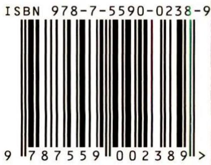

text_image

ISBN 978-7-5590-0238-9
9 787559 002389 >

定价：18.90元