# 创于2003

# 试题调研 初高教辅站

# 每月一手考情

# 讲透关键题型

教辅资料站

电子教辅

试卷练习

知识总结

备课资源

扫码关注获取更多学习资料——

第1辑

第2辑

第3辑

第4辑

第5辑

第6辑

第7辑

第8辑

第9辑

第10辑

2023年6月上市

7月上市

8月上市

9月上市

11月上市

12月上市

2024年1月上市

2月上市

3月上市

4月上市

# 高频易错点快攻·

每月一手考情

全国知名教育专家 曹凤山

从3个最新社会热点研析数

学命题的情境构建

小考教辅站

初高教辅站

# 纠正错误比盲目刷题更重要

10类关键题型易错点

\- 新定义题不会抓本质致误

\- 交汇问题找不准方法出错

\- 创新情境题不会审题致误

24个核心主干易错点

\- 辨别不清曲线上的点和切点出错

\- 混淆“恒成立”“能成立”致误

\- 用零点存在定理时不会赋值出错

natural_image

Cartoon character with a yellow star wearing a blue patterned outfit and a yellow shirt, giving a thumbs-up (no text or symbols visible)

# 新书预告

# 2024版《试题调研》第7辑

# 热点串成串，

# 考试不卡壳 微信公众

特别推荐

数学满分解题技法专项

微信公众号
教辅资料站
小考教辅站
初高教辅站

text_image

天星教育
王雯 杜志捷
第7辑·语文
月刊数据 2024高考
创于2003
试题调研
每月一手考情
讲透关键题型
第1辑 第2辑 第3辑 第4辑 第5辑 第6辑 第7辑 第8辑 第9辑 第10辑
· 高考热点大串讲 ·
每月一手考情
比选你能够解答，考试不卡壳
5 必考创新总考点
· 每讲“新经典”，考试成绩不卡壳
· 每讲“新经典”，综合成绩不卡壳
24 必考核心题考点
· 每讲“新经典”，考试不卡壳
CNYSO：获得24个年级论文

串讲 必考创新命题点，知识迁移不卡壳

串讲 必考核心疑难点，应用解题不卡壳

text_image

天星教育
主编: 杜志俊
专项1·数学
期刊: 丹刊教辅 2024高考
创于2003
试题调研
讲透关键题型
专项1：选择题&填空题满分技法
·选择题、填空题满分技法·
小题要巧做，快招巧突破！
10 速解核心技巧
·高龄快速读数解题技巧
·高龄快速读数解题技巧
·高龄快速读数解题技巧
·高龄快速读数解题技巧
·高龄快速读数解题技巧
·高龄快速读数解题技巧
·高龄快速读数解题技巧
·高龄快速读数解题技巧
·高龄快速读数解题技巧
·高龄快速读数解题技巧
·高龄快速读数解质方法
·高龄快速读数解质方法
·高龄快速读数解质方法
·高龄快速读数解质方法
·高龄快速读数解质方法
·高龄快速读数解质方法
·高龄快速读数解质方法
·高龄快速读数解质方法
·高龄快速读数解质方法
·高龄快速读数解质方法
·高龄快速读数解质办法
·高龄快速读数解质办法
·高龄快速读数解质办法
·高龄快速读数解质办法
·高龄快速读数解质办法
·高龄快速读数解质办法
·高龄快速读数解质办法
·高龄快速读数解质办法
·高龄快速读数解质办法
·高龄快速读数解质办法
·高龄快速读数解质方法
·高龄快速读数解质方法
·高龄快速读数解质方法
·高龄快速读数解质方法
·高龄快速读数解质方法
·高龄快速读数解质方法
·高龄快速读数解质方法
·高龄快速读数解质方法
·高龄快速读数解质方法
·高龄快速读数解质的方法
·高龄快速读数解质方法
·高龄快速读数解质方法
·高龄快速读数解质方法
·高龄快速读数解质方法
·高龄快速读数解质方法
·高龄快速读数解质方法
·高龄快速读数解质方法
·高龄快速读数解质方法
·高龄快速读数解质方法
·高龄快速读数解质法
·高龄快速读数解质方法
·高龄快速读数解质方法
·高龄快速读数解质方法
·高龄快速读数解质方法
·高龄快速读数解质方法
·高龄快速读数解质方法
·高龄快速读数解质方法
·高龄快速读数解质方法
·高龄快速读数解质方法
·高龄快速读数解质技术应用指南
·高龄快速读数解质技术应用指南
·高龄快速读数解质技术应用指南
·高龄快速读数解质技术应用指南
·高龄快速读数解质技术应用指南
·高龄快速读数解质技术应用指南
·高龄快速读数解质技术应用指南
·高龄快速读数解质技术应用指南
·高龄快速读数解质技术应用指南
·高学制学制学制学制学制学制学制学制学制学制学制学制学制学制学制学制学制学制学制学制学制学制学制学制学制学制学制学制学制学制学制学制学制学制学制学制学制学制学制学制学制学制学制学制学制学制学制学制学制学制学<nl>

小题巧做，秒出答案节约时间，速解得满分

text_image

天星教育
主编 杜志国
创于2003
试题调研
讲透关键题型
专项2·数学
10月教辅 2024高考
专项·新解题编改变式教学法
专项2·解答题高分技法
· 解答题高分技法 ·
大题用妙招，分数自然高！
核心解题技法
• 利得手选，以好生活理解方法
• 福活思维与工具相结合
• 等效语言与理解、仿写方法
5万级特殊教材
• 选择多条为好的方法
• 策略上要看如何做方法
• 策略上要看如何做方法
8高龄解题技巧
• 采取数字学习方法
• 采取数字学习方法
CHISO 高级数学出版社

高效审题，快速破题
精准答题，踩点得高分

# 新书推荐

# 2024版《试题调研·热点题型专练》

# 专练热点提分快

text_image

QR code image with blue border, no visible text or symbols beyond the matrix pattern

电子书试读

text_image

天星教育
杜志建 主编
上海让黄明
于清华大学
语文
2024高考
创于2003
试题调研
每月一手考情
讲透关键题型
月刊教辅
热点题型专练
高点试题专题1000课
题目笔记
语文选择题专练
练小题、练速度、专练热点提分快
35 热点题型全覆盖
· 10类题型新变化
· 15类命题新动向
· 10类导法新亮点
150 倍数好题一次炼酒
· 30道速不俗考题
· 45名名校考题
· 10篇试题题环评专题
55 语文话题全覆盖
· 30类语文材料
· 15类语文阅读
· 10类青年科选材
CHISOT 新疆青少年出版社

创新上市热销中

微信公众号教辅资料站小考教辅站初高教辅站

抓热点 专项突破稳拿分

练速度 小题速解快得分

提准度 大题巧解拿高分

》本套书共25个题型专项，具体书目详见“2024《试题调研》全程提分方略”（正文最后一页）

# 创于2003

# 试题调研

# 每月一手考情

# 讲透关键题型

第1辑

第2辑

第3辑

第4辑

第5辑

第6辑

第7辑

第8辑

第9辑

第10辑

2023年6月上市

7月上市

8月上市

9月上市

11月上市

12月上市

2024年1月上市

2月上市

3月上市

4月上市

# - 高频易错点快攻·

# 特约名师 曹凤山

二级正高级教师，浙江师范大学硕士生导师，杭州师范大学讲席教授，中国教育电视台《中国课堂》栏目主讲教师。  
《中国数学教学参考》编委，浙派名师培养对象导师，在省级及以上刊物上发表论文340余篇；在北京、上海等多地做讲座、上观摩课百余场。

# 图书在版编目(CIP)数据

试题调研. 第6辑 高频易错点快攻 数学 / 杜志建主编. -- 乌鲁木齐：新疆青少年出版社，2023.12

ISBN 978-7-5590-0251-8

I. ①试… II. ①杜… III. ①中学数学课 - 高中 - 升学参考资料 IV. ①G634

中国国家版本馆 CIP 数据核字(2023)第 165517 号

出版人:徐江

策划: 王启全

责任编辑:多艳萍

# 试题调研 第6辑 高频易错点快攻 数学

# SHITI DIAOYAN DI 6 JI GAOPIN YICUODIAN KUAIGONG SHUXUE

杜志建 主编

出版:新疆青少年出版社有限公司

社 址:乌鲁木齐市北京北路29号 邮政编码:830012

电话:0991-6239223(编辑部) 0371-68698015(读者服务部)

官网:http://www.qingshao.net 天猫旗舰店:http://xjqss.tmall.com

发行:新疆青少年出版社有限公司

经销:各地新华书店 法律顾问:王冠华 18699089007

印刷:河南文华印务有限公司

开 本:787mm×1092mm 1/16 版 次:2023年12月第1版

印 张:7 印 次:2023年12月第1次印刷

字 数:130 千字

书号:ISBN 978-7-5590-0251-8

定 价:18.90元

CHISO 青少社
SINCE 1956

版权所有，侵权必究。印装问题可随时同印厂退换。

# 声 明

基于对知识和创作的尊重,本书向所选文章、图片的作者支付补贴。因条件所限未能及时联系的作者,我们在此深表歉意,当您看到本书时,请与我们联系,以便我们向您支付补贴和赠送样书。联系方式:0371-68698015。

# 本辑特色

# 纠正错误比盲目刷题更重要

# 聚焦一手考情 深度研析创新命题情境构建

调研 1 (试题调研原创) 杭州第 19 届亚运会已于 2023 年 10 月 8 日圆满闭

幕,本届亚运会上,各国各地区体育健儿顽强拼搏,用行动践行“永远向
事会格言,生动诠释了激励人心的体育精神,同时也向我们展示了运动的
性.有研究表明,科学、合理、适量的有氧运动会增加人体大脑多巴胺的
解抑郁、焦虑的情绪.根据运动后多巴胺含量可将运动分为明显有效运
效运动.为了解学生明显有效运动是否与性别有关,某学校科研兴趣小红
后80名学生进行检测,其中女生与男生的人数之比为1:3,女生中明显
人数占 $\frac{1}{2}$ ,男生中明显有效运动的人数占 $\frac{3}{4}$ .

解读命题立意，一手考情速递（P003）

关注热门运动赛事，研析情境构建（P001）站

调研 2 (试题调研原创) 在中国, 大熊猫是每个人都非常熟悉的动物, 空着不可撼动的地位. 大熊猫丰腴富态、头圆尾短、呆萌可爱. 现有福多多、雅颂、芝士、芝麻、热干面和蛋烘糕 6 只大熊猫, 其中芝士和芝麻是双胞胎, 热干面和蛋烘糕是双胞胎. 假设给它们安排到山月、秋月、云月 3 个场馆入住, 要求每个场馆至少入住 1 只大熊猫, 双胞胎熊猫要住在同一个场馆, 则不同的分配方案有 \_\_\_\_ 种(用数字作答).

【抓窥眼】要求双胞胎熊猫住在同一个场馆，马上联想“捆绑法”的应用

# 考情速递。

考查计数原理的问题在高考中常搭载实际情境出现,如2023年新课标Ⅰ卷第13题,以学校开设选修课为情境,求不同的选课方案种数;新课标Ⅱ卷第3题,以学生参加体育活动情况为情境,求不同的抽样结果种数;全国乙卷第7题,以选读课外读物为情境,求指定情形的选法种数;全国甲卷第9题,以志愿者参加公益活动为情境,求指定情形的不同安排方式种数等.计数原理搭载现实情境命题是必然的,要引起关注.

# 快攻关键题型失分点 纠偏差、破障碍、找方法，突破瓶颈

# 类型 1 信息问题中 5 个失分陷阱点

# 失分陷阱1 新定义问题抓不到定义的本质

调研 1 (2024 浙江省强基联盟 10 月联考) 定义 $\max \{a, b\} = \begin{cases} a, & a \geqslant b, \\ b, & a < b. \end{cases}$ 数列 $\{a_n\}$ 的前 $n$ 项和为 $S_n = \lambda n^2 + (20 + \lambda)n (\lambda \in \mathbf{R}, n \in \mathbf{N}^*)$ ，数列 $\{b_n\}$ 满足 $b_1 = 2, 2^{n+1}(b_{n+1} - b_n) = b_nb_{n+1}$ ，令 $c_n = \max \{a_n, b_n\}$ ，若 $c_n \geqslant c_3$ 恒成立，则实数 $\lambda$ 的取值范围是

$$
\mathrm{A.} [ - 4, - 3 ]
$$

追根溯源: $\max\{a,b\}=\begin{cases}a,a\geqslant b,\\b,a<b\end{cases}$ 可追

溯到人教 A 版《必修第一册》第 68

页例6及第69页练习注教材中的例、习题，展的定理或定义，这命题素材来源.

$$
\mathrm{B.} [ - 3, - 2 ]
$$

挖掘新定义的本质，扫除审题障碍（P006）

# 失分陷阱2 不会从情境中抽出数列模型或关系

调研 1 (试题调研原创) 在如图 1 所示的数阵中, 第一行有两个数, 均为 1, 将上一行数据中每相邻两数的和插入到两数中, 得到下一行数据, 形成数阵, 则数阵的第 11 行共有 \_\_\_\_ 个数, 第 n 行 $(n \in \mathbf{N}^{*})$ 所有数的和 $S_{n} =$ \_\_\_\_.

解析 第一空 设第 n 行有 $a_{n}$ 个数，则 $a_{n}=a_{n-1}+a_{n-1}-1=2a_{n-1}-1(n\geqslant2)$ ,

$$
\text {则} a _ {n} - 1 = 2 (a _ {n - 1} - 1) (n \geqslant 2),
$$

消除情境迷雾，正确找到关系（P008）

# 速破核心主干易错点 补盲区、堵误区、避陷阱，杜绝失分

# 盲点1 泰勒展开式

# ·盲点剖析。

人教 A 版教材《必修第一册》P256“拓广探索”第 26 题给出了正弦和余弦的泰勒展开式： $\sin x = x - \frac{x^{3}}{3!} + \frac{x^{5}}{5!} - \frac{x^{7}}{7!} + \cdots, \cos x = 1 - \frac{x^{2}}{2!} + \frac{x^{4}}{4!} - \frac{x^{6}}{6!} + \cdots.$ 而 2022 年全国甲卷理科的第 12 题就可以用正弦和余弦的泰勒展开式估计三角函数值，进而比大小，这是一个明显我们充分挖掘教材，避免盲区。

批注式精讲细解，走出思维误区（P036）

剖析教材盲点，填补知识漏洞（P034）

所以 $f^{n}(x)=g^{n}(x)$ .

【堵误区】由 $f(x)=g(x)$ 推出 $f^{n}(x)=g^{n}(x)$ 有一个隐藏的前提条件： $f^{n-1}(x), g^{n-1}(x)(n=2,3,4,\cdots)$ 均可导。指数函数 $f(x)$ 和多项式型函数 $g(x)$ 满足这个前提条件，换作其他函数则不一定满足

易得 $f^n (0) = 2^n\mathrm{e}^0 = 2^n,g^n (0) = a_nn!$

微信公众号教辅资料站小考教辅站初高教辅站

# 本书6类121道创新好题速览

<table><tr><td>具体考法</td><td>原创新题</td><td>变式好题</td><td>创新设问</td><td>真实情境</td><td>模块交汇</td><td>学科融合</td></tr><tr><td>本书题量</td><td>48</td><td>30</td><td>14</td><td>10</td><td>13</td><td>6</td></tr></table>

# 亮点速览

新情境 杭州第 19 届亚运会
P001

新考法 概率与数列交汇 P004

新题型 双空题 P008

新方法 猜想法 P009

新考法 数学与心理学交汇
P012

新考法 探索动点的轨迹周长 P023

新思路 数形结合解决嵌套函数的零点问题 P025

新考法 将指、对函数与分段函数融合 P026

新情境 比萨斜塔 P027

微信公众号教辅资料站小考教辅站初高教辅站

考法 回归与挖掘教材 P034

新思路 利用泰勒展开式估值比大小 P035

# CONTENTS

# 目录

# 每月一手考情

# 从 3 个最新社会热点研析数学命题的情境构建

情境构建 1 关注热门运动赛事，融合概率考点命题 001

情境构建 2 取材网络热门话题，融合计数考点命题 003

情境构建 3 走进进博会，融合分布列命题 004

# 高频易错点快攻

# 关键题型 10 个高频易错点

# 类型 1 信息问题中 5 个失分陷阱点 006

失分陷阱 1 新定义问题抓不到定义的本质 006

失分陷阱 2 不会从情境中抽出数列模型或关系 008

失分陷阱 3 跨学科渗透题不会提取关键信息 012

失分陷阱 4 模块融合题找不准解题方法 015

失分陷阱 5 思维不严谨或信息提取有误 019

# 类型 2 图表问题中 5 个高频易错点 022

易错点 1 几何问题不会作辅助线 022

易错点 2 不会用图象解决嵌套函数的零点问题 024

易错点 3 不会从情境题中抽象出数学图形 027

易错点 4 已知图象求三角函数解析式时选点不当 029

易错点 5 翻折前后找错 “变与不变量” 030

# 核心主干知识 24 个高频易错点

# 类型 1 新教材盲点类 034

盲点 1 泰勒展开式 034

盲点 2 柯西不等式 037

盲点 3 斜坐标系 040

盲点 4 斐波那契数列 042

# 类型 2 相近词易混淆类 045

易错点 1 混淆 “单调区间” 与 “在区间上单调” 045

易错点 2 混淆 “项的系数” 与 “二项式系数” 047

易错点3 曲线上的点与切点辨别不清 048

易错点4 忽视法向量夹角与二面角的关系 051

易错点5 误认为函数的极值点就是导数的零点 054

易错点6 混淆“恒成立”与“能成立” 056

# 类型 3 逻辑思维漏洞类 059

易错点1 忽视函数的定义域 059

易错点2 用函数零点存在定理时不会赋值 062

易错点3 不能挖掘隐含条件产生增解 064

易错点4 忽略对二次项系数是否为0的讨论 067

易错点5 未考虑基本不等式的使用条件 070

易错点6 求数列通项时遗漏对首项的验证 073

易错点7 求轨迹方程时未舍去特殊点 077

易错点8 圆锥曲线问题中未讨论直线斜率的特殊情况 078

易错点9 概率类型定不准致误 080

# 类型 4 解题技法提升类 084

技法提升 1 用函数的单调性弥补利用基本不等式求最值的“漏洞” 084

技法提升 2 用构造法解决 $f(x)$ 与 $f'(x)$ 共存的不等式问题 086

技法提升3 正确数形结合，避免解题烦琐或漏解 090

技法提升4 巧用换元法，注意新元取值范围 095

技法提升5 用特值验证法减少解题运算量 098

# 高频易错点速记

# 速记高考最易失分的 54 个高频考点 100

类型1 符号类14个易错高频考点 100

# 亮点速览

新考法 函数与充分不必要条件交汇P046

新情境 立体几何与二项式
定理交汇 P047

新方法 二级结论法 P050

新题型 多选题 P060

新考法 平面几何与三角函数交汇 P065

新方法 三元均值不等式法
P070

新考法 考查三角形重心的相关性质 P077

新情境 融合生产、生活实践 P085

新题型 开放性填空题 P087

新考法 新定义运算法则 P097

微信公众号教辅资料站小考教辅站初高教辅站

# 目录

# CONTENTS

类型2 推理类12个易错高频考点 101

类型 3 图象类 5 个易错高频考点 102

类型4 相近名词、公式类11个易错高频考点 103

类型5 思维漏洞类12个易错高频考点 104

# 下辑精彩预告 2024年1月全新上市

# 《试题调研》第7辑将推出

——高考热点大串讲

# 热点串成串，考试不卡壳！

本辑将串讲必考前沿热点、必考核心疑难点，必考创新命题点，助你形成系统的知识体系，快速提升解题能力，备考中更加得心应手，考试中不再卡壳。

串讲 4 类必考新题型,知识迁移不卡壳 名师精心原创,解读新定义问题、结论开放题、劣构性试题、新设问试题 4 类必考新题型. 掌握新题型,学会新方法,备考如丝般顺滑!

串讲 2 类必考新情境,信息转换不卡壳 甄选最新名校好题,揭秘数学文化情境在高考中的 4 个命题角度,如搭载数学文化情境的数列问题、立体几何问题等;串讲学科交汇情境在高考中的 4 个命题角度,如与物理交汇的向量问题、与化学交汇的立体几何问题等.揭开情境迷雾,解题 so easy!

串讲 7 类必考图象,数形关联不卡壳 串讲高考必考的复杂函数与抽象函数的图象识别问题、三角函数图象的变换问题、两条曲线的公切线问题、几何体的截面问题、立体几何中的翻折问题等,会读图更会用图,从此面对图形问题不 emo!

串讲 4 大必考模型, 思维建模不卡壳 构建原函数构造模型、向量分解模型、空间四面体外接球模型、手电筒模型 4 大高考必会解题模型, 模型在手, 做题无忧!

串讲 16 个必考性质,应用解题不卡壳 深入剖析高考必会的 16 个关键性质,如函数的奇偶性、周期性、单调性、图象的对称性,等差或等比数列的性质,圆锥曲线的几何性质等,会性质,才会解题!

考情速报》高考前沿信息,尽在“每月一手考情”.本辑将特邀命题专家解读跨年最

“热点”事件,研判高考命题走势,原创一手高质量试题;探究学科“热点”考情,锁定高考命题重点,总结一手实用干货.

# 每月一手考情

# 从 3 个最新社会热点研析数学命题的情境构建

全国知名教育专家 曹凤山

高考评价体系中规定了高考的考查载体——情境,以此来承载考查内容,实现考查目的与要求. 高考数学将试题情境分为三类:课程学习情境,探索创新情境和社会实践情境,其中社会实践情境主要关注数学与其他学科以及社会生活实际的关联,包括生活生产实际、科学研究等问题情境. 此外,“四层”考查内容和“四翼”考查要求,也是通过“情境”这一载体来实现的. 通过选取适宜的素材呈现真实的现实问题环境,让学生在真实的背景下发挥核心价值的引领作用,运用必备知识和关键能力去解决实际问题,全面综合展现学科素养水平.

在 2023 年高考中, 新课标 I 卷第 21 题挖掘体育中投篮比赛过程构建情境; 新课标 II 卷第 3 题依托体育运动统计调查构建情境; 新课标 II 卷第 19 题挖掘某种疾病指标创设现实情境中的概率与函数问题; 上海卷第 11 题研究人上坡消耗的总体能问题, 第 19 题研究汽车模型的外观与内饰颜色问题.

因此,以最新时事热点为情境素材的问题,在备考时应引起足够重视.

# 情境构建 1 关注热门运动赛事，融合概率考点命题

调研 1 (试题调研原创) 杭州第 19 届亚运会已于 2023 年 10 月 8 日圆满闭幕,本届亚运会上,各国各地区体育健儿顽强拼搏,用行动践行“永远向前”的亚奥理事会格言,生动诠释了激励人心的体育精神,同时也向我们展示了运动的魅力与重要性.有研究表明,科学、合理、适量的有氧运动会增加人体大脑多巴胺的分泌,可以缓解抑郁、焦虑的情绪.根据运动后多巴胺含量可将运动分为明显有效运动和不明显有效运动.为了解学生明显有效运动是否与性别有关,某学校科研兴趣小组对本校运动后80 名学生进行检测,其中女生与男生的人数之比为 1:3 ,女生中明显有效运动的人数占 $\frac{1}{2}$ ,男生中明显有效运动的人数占 $\frac{3}{4}$ .

<table><tr><td></td><td>女生</td><td>男生</td><td>合计</td></tr><tr><td>明显有效运动</td><td></td><td></td><td></td></tr><tr><td>不明显有效运动</td><td></td><td></td><td></td></tr><tr><td>合计</td><td></td><td></td><td></td></tr></table>

(1)根据所给的数据完成上表,并依据 $\alpha = 0.050$ 的独立性检验,判断明显有效运动是否与性别有关,并说明理由.

(2) 若从该学校所有学生中抽取 10 人, 用样本的频率估计概率, 则 10 人中不明显有效运动的人数最有可能是多少?

附: $\chi^{2}=\frac{n(ad-bc)^{2}}{(a+b)(c+d)(a+c)(b+d)}$ ,其中 $n=a+b+c+d$ .

参考数据：

<table><tr><td> $\alpha$ </td><td>0.150</td><td>0.100</td><td>0.050</td><td>0.025</td><td>0.010</td><td>0.005</td><td>0.001</td></tr><tr><td> $x_{\alpha}$ </td><td>2.072</td><td>2.706</td><td>3.841</td><td>5.024</td><td>6.635</td><td>7.879</td><td>10.828</td></tr></table>

# ·考情速递。

概率与统计是高考考查的重点,常以具体生活情境入手,考查样本的数字特征、独立性检验、随机事件的概率及随机变量的分布等,体现了数学来源于生活、作用于生活的显著特征,也体现了考查应用数学解决实际问题的能力,体现数学建模核心素养的落实.本题以时事热点亚运会为背景,以运动这一话题为载体,研究明显有效运动与性别的关系,引导学生关注体育运动与身体健康,落实五育并举,体现了数学的应用价值.

# 解析 (1) 第一步: 补充列联表.

因为对80名学生进行检测,其中女生与男生的人数之比为1:3,女生中明显有效运动的人数占 $\frac{1}{2}$ ,男生中明显有效运动的人数占 $\frac{3}{4}$ ,所以可得到如下 $2 \times 2$ 列联表:

<table><tr><td></td><td>女生</td><td>男生</td><td>合计</td></tr><tr><td>明显有效运动</td><td>10</td><td>45</td><td>55</td></tr><tr><td>不明显有效运动</td><td>10</td><td>15</td><td>25</td></tr><tr><td>合计</td><td>20</td><td>60</td><td>80</td></tr></table>

# 第二步:作出零假设.

零假设为 $H_{0}$ : 明显有效运动与性别没有关系.

第三步: 计算 $\chi^{2}$ .

因为 $\chi^2 = \frac{80\times(10\times 15 - 45\times 10)^2}{55\times 25\times 20\times 60}\approx 4.364 > 3.841 = x_{0.050},$

# 防错指南

小编说:数学中有很多易混淆的概念、易遗漏的解题环节,平时注意识别这些“坑”,考试才能轻松迈过!

所以根据小概率值 $\alpha=0.050$ 的独立性检验,有充分的证据推断 $H_{0}$ 不成立.

第四步: 下结论.

因此认为明显有效运动与性别有关.

(2) 第一步: 利用样本数据的频率估计概率.

由样本数据知, 不明显有效运动的频率为 $\frac{25}{80} = \frac{5}{16}$ , 用样本的频率估计概率, 所以该校学生不明显有效运动的概率为 $\frac{5}{16}$ .

第二步:利用二项分布表示概率.

设 10 人中不明显有效运动的人数为 X, 则 $X \sim B(10, \frac{5}{16})$ ,

所以 $P(X=m)=\mathrm{C}_{10}^{m}\left(\frac{5}{16}\right)^{m}\left(1-\frac{5}{16}\right)^{10-m}(m=0,1,2,\cdots,10)$ .

第三步:建立不等式组,得结果.

假设 10 人中不明显有效运动的人数最有可能是 k, 易知 0 < k < 10, $k \in Z$ ,

$$
\text {则} \left\{ \begin{array}{l l} {\mathrm{C} _ {1 0} ^ {k} (\frac {5}{1 6}) ^ {k} (1 - \frac {5}{1 6}) ^ {1 0 - k} \geqslant \mathrm{C} _ {1 0} ^ {k + 1} (\frac {5}{1 6}) ^ {k + 1} (1 - \frac {5}{1 6}) ^ {9 - k},} \\ {\mathrm{C} _ {1 0} ^ {k} (\frac {5}{1 6}) ^ {k} (1 - \frac {5}{1 6}) ^ {1 0 - k} \geqslant \mathrm{C} _ {1 0} ^ {k - 1} (\frac {5}{1 6}) ^ {k - 1} (1 - \frac {5}{1 6}) ^ {1 1 - k},} \end{array} \right. \text {得} \frac {3 9}{1 6} \leqslant k \leqslant \frac {5 5}{1 6},
$$

【破障碍】复杂式子的运算定要仔细认真。以上面第一个式子为例，根据组合数的计算公式得 $\frac{10!}{k!(10-k)!}\left(\frac{5}{16}\right)^k\left(\frac{11}{16}\right)^{10-k} \geqslant \frac{10!}{(k+1)!}$ 教辅资料站（9）小考教辅站（ $11/16$ ） $^{k+1}$ （ $\frac{11}{16}$ ） $^{9-k}$ ，约分得 $\frac{1}{10-k} \cdot \frac{11}{16} \geqslant \frac{1}{k+1} \cdot \frac{5}{16}$ ，从而 $k \geqslant \frac{39}{16}$

又 $k \in \mathbf{Z}$ , 所以 $k = 3$ . 所以 10 人中不明显有效运动的人数最有可能是 3.

# 情境构建 2 取材网络热门话题，融合计数考点命题

调研 2 (试题调研原创) 在中国, 大熊猫是每个人都非常熟悉的动物, 有着不可撼动的地位. 大熊猫丰腴富态、头圆尾短、呆萌可爱. 现有福多多、雅颂、芝士、芝麻、热干面和蛋烘糕 6 只大熊猫, 其中芝士和芝麻是双胞胎, 热干面和蛋烘糕是双胞胎, 假设给它们安排到山月、秋月、云月 3 个场馆入住, 要求每个场馆至少入住 1 只大熊猫, 双胞胎熊猫要住在同一个场馆, 则不同的分配方案有\_\_\_\_种(用数字作答).

【抓题眼】要求双胞胎熊猫住在同一个场馆，马上联想“捆绑法”的应用

# 考情速递。

考查计数原理的问题在高考中常搭载实际情境出现,如2023年新课标Ⅰ卷第13题,以学校开设选修课为情境,求不同的选课方案种数;新课标Ⅱ卷第3题,以学生参加体育活动情况为情境,求不同的抽样结果种数;全国乙卷第7题,以选读课外读物为情境,求指定情形的选法种数;全国甲卷第9题,以志愿者参加公益活动为情境,求指定情形的不同安排方式种数等.计数原理搭载现实情境命题是必然的,要引起关注.

# 防错指南

有关函数的问题都要关注定义域,尤其在涉及对数、换元、解不等式时,定义域最容易被忽视.

关注微信公众号“初高教辅站”获取更多初高中教辅资料

解析 将芝士和芝麻看成一个整体,热干面和蛋烘糕看成一个整体,即相当于把4个对象分配给3个场馆,每个场馆至少有1个对象,

所以必有1个场馆含有2个对象,其余场馆各1个对象.

可先选出有2个对象的场馆分配对象,再将其余对象进行分配,

所以共有 $C_{3}^{1}C_{4}^{2}A_{2}^{2}=36$ (种) 方案, 故答案为36.

# 情境构建 3 走进进博会，融合分布列命题

调研 3 (试题调研原创)第六届中国国际进口博览会于2023年11月5日至10日在国家会展中心(上海)举行,主题为“新时代共享未来”.企业商业展继续设置食品及农产品、汽车、技术装备、消费品、医疗器械及医药保健、服务贸易六大展区,将持续优化企业展板块专区划分,加大专业观众邀请力度,策划全年专业活动,不断增强广大展客商的获得感.在某届进博会中,一款无导线心脏起搏器引起广大参会者的关注,成为了进博会上的“明星展品”.这款心脏起搏器仅有维生素胶囊的大小,体积比传统心脏起搏器减小了93%,质量仅约2克,拥有强大的电池续航能力,配合兼容1.5T/3.0T全身核磁共振扫描检查等创新功能.在起搏器研发后期,某企业快速启动无线充电器主控芯片生产,试产期每天都需同步进行产品检测,检测包括智能检测和人工检测,选择哪种检测方式的规则如下:第一天选择智能检测,随后每天由计算机随机等可能生成数字“0”和“1”,连续生成4次,把4次的数字相加,若和小于3,则该天的检测方式和前一天相同,否则选择另一种检测方式.

(1)求该企业前三天的产品检测选择智能检测的天数 $X$ 的分布列.  
(2)当地政府为了检查该企业是否具有一定的智能化管理水平,采用如下方案:设 $P_{n}(n \in \mathbf{N}^{*})$ 为事件“第 $n$ 天该企业产品检测选择的是智能检测”的概率,若 $P_{n} > \frac{1}{2}$ 恒成立,认为该企业具有一定的智能化管理水平,将给予该企业一定的奖励资金,否则将没有该项奖励资金.该企业能拿到奖励资金吗?请说明理由.

# ·考情速递。

本题以现实情境为载体,考查离散型随机变量的分布列和期望,以及用全概率公式求解概率.在课程标准中内容要求是“通过具体实例,了解离散型随机变量的概念,理解离散型随机变量的分布列及其数字特征(均值、方差)”,以实际问题为背景,构建数学模型,突出考查统计概率的思想和考生的数据处理能力及应用意识.在备考过程中,立足课本基础知识的同时,也要适当关注社会热点,注意提升自己的阅读理解能力与提取信息的能力,只有这样才能“以不变应万变”,达到事半功倍的效果.

# 防错指南

设直线方程时,要关注特殊情况,避免研究不全面.若直线方程设成 $y = kx + b$ , 则要考虑直线斜率不存在的情况.若直线方程设成 $x = my + n$ , 则要考虑直线斜率为 0 的情况.

关注微信公众号“初高教辅站”获取更多初高中教辅资料

解析 (1) 设计算机 4 次生成的数字之和为 $\xi$ ,

则 $P(\xi < 3) = \mathrm{C}_4^0 (\frac{1}{2})^4 +\mathrm{C}_4^1 (\frac{1}{2})^4 +\mathrm{C}_4^2 (\frac{1}{2})^4 = \frac{11}{16},P(\xi \geqslant 3) = 1 - P(\xi < 3) = \frac{5}{16}.$

X 的所有可能取值为 1,2,3,

则 $P(X = 1) = \frac{5}{16} \times \frac{11}{16} = \frac{55}{256}, P(X = 2) = (\frac{5}{16})^2 + \frac{5}{16} \times \frac{11}{16} = \frac{5}{16}, P(X = 3) = (\frac{11}{16})^2 = \frac{121}{256}$ ,

【避陷阱】求出随机变量取每个值对应的概率后，注意将概率进行求和检验，看是否为 1 所以 $X$ 的分布列为

<table><tr><td>X</td><td>1</td><td>2</td><td>3</td></tr><tr><td>P</td><td>55/256</td><td>5/16</td><td>121/256</td></tr></table>

(2) 设 $A_{n-1} (n \geqslant 2)$ 为事件“第 $n-1$ 天该企业产品检测选择的是智能检测”，

则 $A_{n}$ 表示事件“第 $n$ 天该企业产品检测选择的是智能检测”，

由全概率公式可知 $P_{n} = P(A_{n}) = P(A_{n}|A_{n - 1})P(A_{n - 1}) + P(A_{n}|\overline{A}_{n - 1})P(\overline{A}_{n - 1}) = \frac{11}{16} P_{n - 1} + (1 -$ $P_{n - 1})\frac{5}{16} = \frac{3}{8} P_{n - 1} + \frac{5}{16}$ 整理得 $P_{n} = \frac{5}{16} +\frac{3}{8} P_{n - 1},n\geqslant 2,$

【破障碍】递推关系式满足 “ $P_{n}=aP_{n-1}+b(a,b$ 为参数）” 的形式，可利用待定系数法和等比数列的知识得出 $P_{n}$ ，比较 $P_{n}$ 与 $\frac{1}{2}$ 的大小关系，即可判断

即 $P_{n} - \frac{1}{2} = \frac{3}{8}(P_{n - 1} - \frac{1}{2}), n \geqslant 2$ ，又 $P_{1} - \frac{1}{2} = \frac{1}{2} \neq 0$ ，所以 $\{P_{n} - \frac{1}{2}\}$ 是首项为 $\frac{1}{2}$ ，公比为 $\frac{3}{8}$ 的等比数列，

则 $P_{n} - \frac{1}{2} = \frac{1}{2}\cdot (\frac{3}{8})^{n - 1}$ ，所以 $P_{n} = \frac{1}{2} +\frac{1}{2}\cdot (\frac{3}{8})^{n - 1} > \frac{1}{2}$ 恒成立，

所以该企业具有一定的智能化管理水平,能拿到奖励资金.

以最新社会热点为素材构建情境的问题,有效考查阅读理解能力,引导学生关注身边大事,提升综合素养与关键能力,对此类情境问题的训练需要强化三关:事理关,明白问题中的现实情境说了一件什么事,学会建模分析;文理关,即阅读理解关,一般现实情境的文字阅读量都比较大,通过阅读找出关键词句,并理解其意义;数理关,对建立的数学模型,会用恰当的数学方法去解.

防错指南

# 高频易错点快攻

# 关键题型 10 个高频易错点

# 类型 1 信息问题中 5 个失分陷阱点

# 失分陷阱1 新定义问题抓不到定义的本质

调研 1 (2024 浙江省强基联盟 10 月联考)定义 $\max\{a,b\}=\begin{cases}a,a\geqslant b,\\b,a<b.\end{cases}$ 数列 $\{a_{n}\}$ 的前 n 项和为 $S_{n}=\lambda n^{2}+(20+\lambda)n(\lambda\in\mathbf{R},n\in\mathbf{N}^{*})$ ，数列 $\{b_{n}\}$ 满足 $b_{1}=2,2^{n+1}(b_{n+1}-b_{n})=b_{n}b_{n+1}$ ，令 $c_{n}=\max\{a_{n},b_{n}\}$ ，若 $c_{n}\geqslant c_{3}$ 恒成立，则实数 $\lambda$ 的取值范围是（）

追根溯源: $\max\{a,b\}=\begin{cases}a,a\geqslant b,\\b,a<b\end{cases}$ 可追溯到人教 A 版《必修第一册》第 68 页例 6 及第 69 页练习第 3 题. 适当关注教材中的例、习题，尤其是一些拓展的定理或定义，这往往是考试的命题素材来源.

A. $[-4, -3]$

B. $[-3, -2]$

C. $\left[-\frac{2}{3}, -\frac{1}{2}\right]$

D. $[-3, -\frac{2}{3}]$

抓取本质 本题中的新定义是 $\max \{a, b\}$ , 其本质是取较大者 (含相等), 即若 $a \geqslant b$ , 则取 $a$ , 若 $a < b$ , 则取 $b$ . 这样就转化成比较 $a$ 与 $b$ 的大小的问题了, 先求出 $a_{n}$ 与 $b_{n}$ , 再比较大小, 即可确定 $c_{n}$ , 由 $c_{n} \geqslant c_{3}$ 列不等式组求参数范围.

解析 由数列 $\{a_{n}\}$ 的前 $n$ 项和为 $S_{n} = \lambda n^{2} + (20 + \lambda)n (\lambda \in \mathbf{R}, n \in \mathbf{N}^{*})$ 得，

当 $n \geqslant 2$ 时， $a_{n} = S_{n} - S_{n-1} = \lambda n^{2} + (20 + \lambda)n - \lambda(n-1)^{2} - (20 + \lambda)(n-1) = 2\lambda n + 20$ ，
又当 n=1 时， $a_{1}=S_{1}=20+2\lambda$ ，符合上式，所以数列 $\{a_{n}\}$ 的通项公式为 $a_{n}=2\lambda n+20$ .

【避陷阱】注意对 $n = 1$ 的情况的讨论, 若 $a_{1}$ 不符合上式, 需要把通项写成分段形式由数列 $\{b_{n}\}$ 满足 $b_{1} = 2$ 且 $2^{n + 1}(b_{n + 1} - b_n) = b_nb_{n + 1}$ , 可得 $\frac{1}{b_n} - \frac{1}{b_{n + 1}} = \frac{1}{2^{n + 1}}$ ,

即 $\frac{1}{b_{1}}-\frac{1}{b_{2}}=\frac{1}{2^{2}},\frac{1}{b_{2}}-\frac{1}{b_{3}}=\frac{1}{2^{3}},\frac{1}{b_{3}}-\frac{1}{b_{4}}=\frac{1}{2^{4}},\cdots,\frac{1}{b_{n-1}}-\frac{1}{b_{n}}=\frac{1}{2^{n}}(n\geqslant2)$ ,

对上面各式相加可得 $\frac{1}{b_1} -\frac{1}{b_n} = \frac{1}{2^2} +\frac{1}{2^3} +\frac{1}{2^4} +\dots +\frac{1}{2^n} = \frac{\frac{1}{2^2}\left[1 - (\frac{1}{2})^{n - 1}\right]}{1 - \frac{1}{2}} = \frac{1}{2} -\frac{1}{2^n},$

# 防错指南

倾斜角和斜率分别从不同的角度反映了直线的倾斜程度. 任何一条直线都有倾斜角, 但不一定有斜率.

关注微信公众号“初高教辅站”获取更多初高中教辅资料

又 $\frac{1}{b_1} = \frac{1}{2}$ , 所以 $\frac{1}{b_n} = \frac{1}{2^n}$ , 所以 $b_n = 2^n$ .

因为 $c_{n}=\max\left\{a_{n},b_{n}\right\}$ ，所以若 $c_{n}\geqslant c_{3}$ 恒成立，则 $\lambda<0$ 恒成立，且 $b_{3}\leqslant a_{3}\leqslant b_{4}$ 或 $a_{3}\leqslant b_{3}\leqslant a_{2}$ ，即 $8\leqslant6\lambda+20\leqslant16$ 或 $6\lambda+20\leqslant8\leqslant4\lambda+20$ ，可得 $-2\leqslant\lambda\leqslant-\frac{2}{3}$ 或 $-3\leqslant\lambda\leqslant-2$ ，即实数 $\lambda$ 的取值

【厘思路】注意这里 $c_{3}$ 是数列 $\{c_{n}\}$ 中的最小项, 由于 $b_{n} = 2^{n}$ 是单调递增的, 因而 $a_{n}$ 必是单调递减的 (分析不出这点, 则列不出不等式), 且 $c_{3}$ 既可能是 $a_{3}$ (则 $b_{3} \leqslant a_{3} \leqslant b_{4}$ ), 也有可能是 $b_{3}$ (则 $a_{3} \leqslant b_{3} \leqslant a_{2}$ ), 两种情况分开讨论, 结果取并集即可

范围为 $\left[-3,-\frac{2}{3}\right]$ . 故选 D.

调研 2 (2024 江苏南通如皋 9 月诊断) 已知集合 $M = \{x \mid x^{2} - 2mx - 3m^{2} \leqslant 0\}$ , $N = \{x \mid x^{2} + mx - 2m^{2} \leqslant 0\}$ , 定义 $b - a$ 为集合 $\{x \mid a \leqslant x \leqslant b\}$ 的长度. 若集合 $M \cap N$ 的长度为 4, 则 $M \cup N$ 的长度为 ( )

A. 3

B. 4

C. 5

D. 10

抓取本质 本题中的新定义是集合的长度,所以解题的关键是找到集合的“两端”.先求出集合 $M \cap N$ ,得到集合 $M \cap N$ 的长度,从而求出 $m$ 的值,然后求出 $M \cup N$ ,确定其长度.注意分类讨论.

解析 当 m=0 时, $M \cap N = \{0\}$ .

【补盲点】注意对特殊情况的讨论, 当 $m = 0$ 时, 集合 $M \cap N$ 的长度为 0 , 不符合题意. 这虽然对本题结果没影响, 但也需要思维的严谨性, 这道题没影响, 换道题也许就有影响了

当 $m \neq 0$ 时, 关于 $x$ 的方程 $x^{2} - 2mx - 3m^{2} = 0$ 的两根为 $-m, 3m$ , 关于 $x$ 的方程 $x^{2} + mx - 2m^{2} = 0$ 的两根为 $m, -2m$ ,

当 $m > 0$ 时， $M = \{x \mid -m \leqslant x \leqslant 3m\}$ ， $N = \{x \mid -2m \leqslant x \leqslant m\}$ ， $M \cap N = \{x \mid -m \leqslant x \leqslant m\}$ ，

当 $m < 0$ 时， $M = \{x \mid 3m \leqslant x \leqslant -m\}$ ， $N = \{x \mid m \leqslant x \leqslant -2m\}$ ， $M \cap N = \{x \mid m \leqslant x \leqslant -m\}$ .

因为 $M \cap N$ 的长度为 4, 所以 2m = 4 或 -2m = 4, 得 m = 2 或 m = -2.

当 $m = 2$ 时， $M = \{x \mid -2 \leqslant x \leqslant 6\}$ ， $N = \{x \mid -4 \leqslant x \leqslant 2\}$ ， $M \cup N = \{x \mid -4 \leqslant x \leqslant 6\}$ ，

当 $m = -2$ 时， $M = \{x \mid -6 \leqslant x \leqslant 2\}$ ， $N = \{x \mid -2 \leqslant x \leqslant 4\}$ ， $M \cup N = \{x \mid -6 \leqslant x \leqslant 4\}$ .

所以 $M \cup N$ 的长度为 10, 故选 D.

# 纠错攻略

# 破解新定义问题的攻略：

(1)理解“新定义”，明确“新定义”的条件、原理、操作步骤和结论.  
(2)重视“举例”,利用“举例”检验是否理解和正确运用“新定义”,并归纳“举例”提供的解题方法.  
(3) 类比新定义的概念、原理、方法, 解决问题.

# 防错指南

# 纠错巩固

1. (试题调研原创 | 变定义形式不变内涵) 设 $s, t \in \mathbf{R}$ , 定义运算 “ $\Delta$ ” 和 “ $\nabla$ ” 如下: $s \Delta t = \begin{cases} s, s \leqslant t, \\ t, s > t, \end{cases} s \nabla t = \begin{cases} t, s \leqslant t, \\ s, s > t. \end{cases}$ 对于正数 $m, n, p, q$ , 若满足 $mn \geqslant 4, p + q \leqslant 4$ , 那么下列结论成立的是 ( )

A. $m\Delta n \geqslant 2, p\Delta q \leqslant 2$

B. $m\nabla n\geqslant 2,p\nabla q\geqslant 2$

C. $m\Delta n \geqslant 2, p\nabla q \leqslant 2$

D. $m\nabla n\geqslant 2,p\Delta q\leqslant 2$

2. (试题调研原创 | 改变已知条件) 定义 $b - a$ 为非空集合 $\{x \mid a \leqslant x \leqslant b\}$ 的长度. 已知集合 $M = \{x \mid x^2 - mx + n \leqslant 0\}$ , $N = \{x \mid x^2 - 2mx + m^2 + n > 0\}$ , 且集合 $M, \complement_{\mathbb{R}} N$ 的长度均为 2, 则集合 $P = \{x \mid x^2 + (2m + n)x + 2n \leqslant 0\}$ 的长度为 ( )

A. 2

B. 3

C. 4

D. 5

# 参考答案与解析

1. D 由运算“ $\Delta$ ”和“ $\nabla$ ”的定义知, $m\Delta n$ 表示数m,n中较小的数, $m\nabla n$ 表示数m,n中较大的数. 当m=1,n=5时, $m\Delta n=1$ ,故AC错误. 当p=q=1时, $p\nabla q=1$ ,故B错误.

【传技巧】要想判断结论不成立，只需找到反倒进行说明即可，到此处已足够选出正确选项

因为 $m + n \geqslant 2\sqrt{mn} \geqslant 4$ ，且 $2(m\nabla n) \geqslant m + n$ ，所以 $m\nabla n \geqslant 2$ ，因为 $pq \leqslant \left(\frac{p + q}{2}\right)^{2} \leqslant 4, (p\Delta q)^{2} \leqslant pq$ ，所以 $p\Delta q \leqslant 2$ ，故 D 正确。故选 D。

【破障碍】注意运算 “∇” 是要较大者，因而 $2(m\nabla n)$ 等于较大者的二倍，而运算 “Δ” 是要较小者，因而 $(p\Delta q)^{2}$ 等于较小者的平方，由此可以放缩，这是证明 D 正确的必经之路

2. B 由已知可设方程 $x^{2} - mx + n = 0$ 的两根分别为 $x_{1}, x_{2}$ , 且 $x_{1} \leqslant x_{2}$ ,

那么 $x_{2} - x_{1} = \sqrt{(x_{2} + x_{1})^{2} - 4x_{1}x_{2}} = \sqrt{m^{2} - 4n} = 2$ ，即 $m^2 -4n = 4.$

同理,集合 $C_{R}N$ 的长度为 $\sqrt{4m^{2}-4(m^{2}+n)}=2$ ,即n=-1,

从而 m=0，则 $P=\left\{x\mid x^{2}-x-2\leqslant0\right\}=\left\{x\mid-1\leqslant x\leqslant2\right\}$ ，长度为 3，从而选 B.

# 失分陷阱2 不会从情境中抽出数列模型或关系

调研 1 (试题调研原创) 在如图 1 所示的数阵中, 第一行有两个数, 均为 1 , 将上一行数据中每相邻两数的和插入到两数中, 得到下一行数据, 形成数阵, 则数阵的第 11 行共有 \_\_\_\_ 个数, 第 $n$ 行 $(n \in \mathbf{N}^{*})$ 所有数的和 $S_{n} =$ \_\_\_\_. 图 1

解析 第一空 设第 n 行有 $a_{n}$ 个数, 则 $a_{n}=a_{n-1}+a_{n-1}-1=2a_{n-1}-1(n\geqslant2)$ ,

则 $a_{n} - 1 = 2(a_{n - 1} - 1)(n\geqslant 2)$

# 防错指南

若 $f(x+a)$ 为偶函数,则 $f(x+a)=f(-x+a)$ ,而不是 $f(x+a)=f(-x-a)$ .

关注微信公众号“初高教辅站”获取更多初高中教辅资料

所以数列 $\{a_{n} - 1\}$ 是以1为首项、2为公比的等比数列，则 $a_{n} - 1 = 2^{n - 1}, a_{n} = 2^{n - 1} + 1.$

所以 $a_{11}=1\ 025.$

第二空 由数阵的形成规则分析可得 $S_{n} = 3S_{n - 1} - 2(n \geqslant 2)$ , 所以 $S_{n} - 1 = 3(S_{n - 1} - 1)(n \geqslant 2)$ , 所以 $\{S_{n} - 1\}$ 是以 1 为首项、3 为公比的等比数列,

所以 $S_{n} - 1 = 3^{n - 1}, S_{n} = 3^{n - 1} + 1.$

# 秒解

猜想法——观察数阵的形成规律,从中抽出数列模型

第一空 观察数阵,从上到下每一行数据的个数依次为:2,3,5,9……记为数列 $\{a_{n}\}$ ,

【厘思路】每一项与前一项的差为 1, 2, 4……即相邻两项的差构成以 2 为公比的等比数列，所以从上到下每一行数据的个数构成“等差比数列”

猜想 $a_{n+1}-a_{n}=2^{n-1}$ ，所以 $a_{n}=a_{1}+1+2+\cdots+2^{n-2}=2^{n-1}+1$ ，所以 $a_{11}=1025$ 。

第二空 观察数阵,从上到下每一行的数据之和依次为:2,4,10,28……记为数列 $\{S_{n}\}$ ,

【厘思路】每一项与前一项的差为 2, 6, 18……即相邻两项的差构成以 3 为公比的等比数列，所以从上到下每一行数据之和构成“等差比数列”

猜想 $S_{n+1}-S_{n}=2\times3^{n-1}$ ，那么 $S_{n}=S_{1}+2\times(1+3+\cdots+3^{n-2})=2+2\times\frac{(3^{n-1}-1)}{2}=3^{n-1}+1.$

调研 2 (保等比数列函数 | 2024 云南省三校第三次联考) 定义在区间 $(- \infty, 0) \cup (0, + \infty)$ 上的函数 $f(x)$ , 如果对于任意给定的非常数等比数列 $\{a_{n}\}, \{f(a_{n})\}$ 仍是等比数列, 则称 $f(x)$ 为“保等比数列函数”. 下列函数是“保等比数列函数”的是 ( )

【破障碍】该定义的核心：将数列 $\{a_{n}\}$ 中的项作为函数 $f(x)$ 的自变量，对应的函数值仍构成等比数列

A. $f(x) = 2x + 1$

B. $f(x) = \frac{1}{|x|}$

C. $f(x) = \mathrm{e}^{x}$

D. $f(x) = \log_3|x|$

解析 不妨设 $\{a_{n}\}$ 的公比为 $q(q \neq 1)$ , 即 $\frac{a_{n+1}}{a_{n}} = q$ .

<table><tr><td>选项</td><td>分析过程</td><td>正误</td></tr><tr><td>A</td><td> $\frac{f(a_{n+1})}{f(a_n)} = \frac{2a_{n+1} + 1}{2a_n + 1} = \frac{2qa_n + 1}{2a_n + 1} = q + \frac{1 - q}{2a_n + 1}$ ,因为 $\{a_n\}$ 不是常数数列,所以 $q + \frac{1 - q}{2a_n + 1}$ 不是常数,所以 $\frac{f(a_{n+1})}{f(a_n)}$ 不是常数【堵误区】从情境中抽出的关系为:要判断函数 $f(x)$ 是否为“保等比数列函数”,即判断 $\frac{f(a_{n+1})}{f(a_n)}$ 是否为常数</td><td>×</td></tr></table>

# 防错指南

对于可导函数 $f(x)$ ，若 $f'(x)>0$ ，则 $f(x)$ 单调递增，反过来，若 $f(x)$ 单调递增，则 $f'(x)\geqslant0$ （注意此处可以取等号，取等号的前提条件是 $f'(x)$ 不恒为0）.

关注微信公众号“初高教辅站”获取更多初高中教辅资料

续表

<table><tr><td>选项</td><td>分析过程</td><td>正误</td></tr><tr><td>B</td><td> $\frac{f(a_{n+1})}{f(a_n)} = \frac{|a_n|}{|a_{n+1}|} = |\frac{1}{q}| \rightarrow \frac{f(a_{n+1})}{f(a_n)}$ 是常数</td><td>√</td></tr><tr><td>C</td><td> $\frac{f(a_{n+1})}{f(a_n)} = \frac{\mathrm{e}^{a_{n+1}}}{\mathrm{e}^{a_n}} = \mathrm{e}^{a_{n+1}-a_n} = \mathrm{e}^{(q-1)a_n} \rightarrow \text{同 A 项} \rightarrow \frac{f(a_{n+1})}{f(a_n)} \text{不是常数}$ </td><td>×</td></tr><tr><td>D</td><td> $\frac{f(a_{n+1})}{f(a_n)} = \frac{\log_3 |a_{n+1}|}{\log_3 |a_n|} = \frac{\log_3 |a_n| + \log_3 |q|}{\log_3 |a_n|} = 1 + \frac{\log_3 |q|}{\log_3 |a_n|} \rightarrow \text{同 A 项} \rightarrow \frac{f(a_{n+1})}{f(a_n)} \text{不是常数}$ </td><td>×</td></tr></table>

故选 B(本题可以通过函数性质判断: 当 $\frac{f(kx)}{f(x)} (k \neq 0, k \neq 1)$ 的值与自变量 x 无关时, 满足“保等比”, 站在函数的观点思考, 正比例、反比例函数一定满足这一特性, 所以选 B).

调研 3 (2024 湖南长沙一中 10 月月考 | 多选) 设正整数 $n = a_{0} \times 9^{0} + a_{1} \times 9^{1} + \cdots + a_{k-1} \times 9^{k-1} + a_{k} \times 9^{k}$ , 其中 $a_{i} \in \{0, 1, 2, 3, 4, 5, 6, 7, 8\} (i = 0, 1, 2, \cdots, k)$ . 记 $\omega(n) = a_{0} + a_{1} + \cdots + a_{k}$ , 则 ( )

【破障碍】注意 $n$ 的定义类似于 9 进制数, 而 $k+1$ 是这个 9 进制数的位数, 9 进制数各数位上的数字构成一个数列, 而 $\omega(n)$ 是这个数列的前 $k+1$ 项和, 这是需要通过已知分析出的核心内容

A. $\omega (11) = 3$

B. $\omega (81n + 29) = \omega (n) + 5$

C. $\omega (9n + 10) = \omega (n) + 1$

D. $\omega (\frac{9^n - 1}{8}) = n$

解析 $11 = 2 \times 9^{0} + 1 \times 9^{1}$ , 所以 $\omega(11) = 2 + 1 = 3$ , A 正确.

【扫壁垒】将10进制数改写成9进制数,从而求解 $\omega(n)$

$$
8 1 n + 2 9 = 8 1 \left(a _ {0} \times 9 ^ {0} + a _ {1} \times 9 ^ {1} + \dots + a _ {k - 1} \times 9 ^ {k - 1} + a _ {k} \times 9 ^ {k}\right) + 1 + 1 + 9 + 9 + 9 = 2 \times 9 ^ {0} + 3 \times 9 ^ {1} +
$$

【释疑难】将29这样拆分，目的是转化成 $9^{0}$ 与 $9^{1}$ ，对于C也是同样的道理

$a_{0}\times9^{2}+a_{1}\times9^{3}+\cdots+a_{k-1}\times9^{k+1}+a_{k}\times9^{k+2}$ ，所以 $\omega(81n+29)=2+3+a_{0}+a_{1}+\cdots+a_{k}=$ $\omega(n)+5,B$ 正确.

$9n+10=9(a_{0}\times9^{0}+a_{1}\times9^{1}+\cdots+a_{k-1}\times9^{k-1}+a_{k}\times9^{k})+1+9=1\times9^{0}+(a_{0}+1)\times9^{1}+a_{1}\times9^{2}+\cdots+a_{k-1}\times9^{k}+a_{k}\times9^{k+1}$ ，所以 $\omega(9n+10)=1+a_{0}+1+a_{1}+\cdots+a_{k}=\omega(n)+2$ ，C错误.

$\frac{9^{n}-1}{8}=\frac{1-9^{n}}{1-9}$ ，可看成首项为1，公比为9的数列的前n项和，即 $\frac{9^{n}-1}{8}=\frac{1-9^{n}}{1-9}=1\times9^{0}+1\times9^{1}+1\times9^{2}+\cdots+1\times9^{n-1}$ ，所以 $\omega(\frac{9^{n}-1}{8})=1+1+\cdots+1=n$ ，D正确。故选ABD。

# 防错指南

# 纠错巩固

1. (变情境, 从兔子数列中挖掘新数列 |2024 浙江嘉兴 10 月联考) 意大利数学家列昂那多 · 斐波那契以兔子繁殖为例, 引入 “兔子数列”: 1,1,2,3,5,8,13,21, 34,55, $\cdots$ , 即 $F(1)=F(2)=1$ , $F(n)=F(n-1)+F(n-2)(n\geqslant3,n\in\mathbf{N}^{*})$ . 此数列在现代物理、生物、化学等领域都有着广泛的应用. 若此数列的各项除以 3 的余数构成一个新数列 $\{a_{n}\}$ , 则数列 $\{a_{n}\}$ 的前 2023 项的和为 \_\_\_\_.

2. (试题调研原创|变定义, 类比数列定义给出 “向量列”) 定义: 若向量列 $a_{1}, a_{2}, a_{3}, \cdots, a_{n}$ 满足 “从第二项开始, 每一项与它的前一项的差都等于同一个常向量 (常向量即坐标都是常数的向量), 即 $a_{n} = a_{n-1} + d (n \geqslant 2$ , 且 $n \in \mathbf{N}^{*}, d$ 为常向量)”, 则称这个向量列 $\{a_{n}\}$ 为等差向量列, 常向量叫作等差向量列的公差, 且向量列 $\{a_{n}\}$ 的前 $n$ 项和为 $S_{n}$ . 已知等差向量列 $\{a_{n}\}$ 满足 $a_{1} = (1, 1), a_{2} + a_{4} = (6, 10)$ , 则向量列 $\{a_{n}\}$ 的前 $n$ 项和 $S_{n} =$

A. $(\frac{n + n^2}{2}, n^2)$

B. $\left(\frac{n+n^{2}}{2},(n-1)^{2}\right)$

C. $\left(\frac{n+n^{2}}{2},(n+1)^{2}\right)$

D. $\left(\frac{(n+1)+(n+1)^{2}}{2},(n+1)^{2}\right)$

# Q 参考答案与解析

1.2 277 由数列 $1, 1, 2, 3, 5, 8, 13, 21, 34, 55, \cdots$ 各项除以 3 的余数，

可得 $\{a_{n}\}$ 为1,1,2,0,2,2,1,0,1,1,2,0,2,2,1,0,…,

所以 $\{a_{n}\}$ 是周期为8的周期数列，一个周期中的8项和为9.

因为 $2023 = 252 \times 8 + 7$ ，所以数列 $\{a_{n}\}$ 的前 2023 项的和为 $252 \times 9 + 9 = 2277$ .

2. A 由题易知等差数列的性质对于等差向量列也适合,类比等差数列的性质得 $2a_{3} = a_{2} + a_{4} =$ 【破障碍】根据新定义,等差向量列坐标运算中,向量的横、纵坐标分别成等差数列,这是从定义中抽出的关键关系,据此即可确定求解方法

(6,10), 所以 $\boldsymbol{a}_{3} = (3,5)$ ，所以等差向量列 $\{\boldsymbol{a}_{n}\}$ 的公差为 $d = \frac{\boldsymbol{a}_{3} - \boldsymbol{a}_{1}}{2} = (1,2)$ .

类比等差数列的通项公式得等差向量列 $\{\pmb{a}_n\}$ 的通项为 $\pmb{a}_n = \pmb{a}_1 + (n - 1)\pmb{d} = (1,1) + (n - 1)(1,2) = (1,1) + (n - 1,2n - 2) = (n,2n - 1)$ .

进而类比等差数列的前 n 项和公式, 可以得到等差向量列 $\{a_{n}\}$ 的前 n 项和为 $S_{n}=\frac{n(a_{1}+a_{n})}{2}=$ $\left(\frac{n+n^{2}}{2},n^{2}\right)$ . 故选 A.

防错指南

# 失分陷阱3 跨学科渗透题不会提取关键信息

调研 1 (试题调研改编|数学与心理学交汇) 自出生之日起,一个人的体力、情绪、智力等生理、心理状况就呈周期性变化. 心理学家经过统计发现,人体节律可以大致分为体力节律、情绪节律和智力节律,在设计引入一些数据量化后,人的体力、情绪、智力的变化可以分别近似用函数 $f_{1}(x)=A_{1}\sin\frac{2\pi}{23}x+M_{1},f_{2}(x)=A_{2}\sin\frac{\pi}{14}x+M_{2},$ $f_{3}(x)=A_{3}\sin\frac{2\pi}{33}x+M_{3}$ 进行描述,其中变量 x 为出生之后的天数,规定 x=1 表示出生当天.

(1) 情绪节律的时间周期为 \_\_\_\_ 天.  
(2)已知 $A_{i} > 0 (i = 1,2,3)$ , 心理学家认为, 某年某月某一天对某人来说, 若这天他对应的某种节律函数值满足 $f_{i}(x) - M_{i} > 0 (i = 1,2,3)$ , 则判断他这天该项人体节律处于高潮期; 若 $f_{i}(x) - M_{i} < 0 (i = 1,2,3)$ , 则判断他这天该项人体节律处于低潮期; 若 $f_{i}(x) - M_{i} = 0 (i = 1,2,3)$ , 则判断这天他该项人体节律处于临界期. 一些心理医生通常根据 $f_{i}(x) - M_{i} (i = 1,2,3)$ 运算结果的正负情况, 对就诊者提出生活学习的活动建议.

小明同学于2007年11月27日出生,那么今天(2023年11月27日)他的人体节律处于高潮期的有\_\_\_\_。(从“①体力节律,②情绪节律,③智力节律”中选择正确序号填写即可)

提取信息 已知条件文字内容长,信息多,因而需要认真阅读,从中抽取解题的关键要素,即①人体的三类节律(体力节律,情绪节律,智力节律);②函数的自变量是出生之后的天数.因而解题关键是求出小明出生多少天,进而判断求解.

解析 (1) 情绪节律对应的函数为 $f_{2}(x)=A_{2}\sin\frac{\pi}{14}x+M_{2}$ , 函数周期为 $\frac{2\pi}{\frac{\pi}{14}}=28$ (天).

(2)2023年11月27日是小明同学出生后第 $16 \times 365 + 4 + 1 = 5845$ （天），

【避陷阱】注意从 2007 年到 2023 年之间有 4 个闰年，因此算天数要加 4，这里极易出错

则 $f_{1}(5\ 845)-M_{1}=A_{1}\sin\left(\frac{2\pi}{23}\times5\ 845\right)=A_{1}\sin\left(254\times2\pi+\frac{6\pi}{23}\right)=A_{1}\sin\frac{6\pi}{23}>0$ ,所以体力节律

【破障碍】利用诱导公式将角转化到 $[0,2\pi)$ 内，再通过所在象限确定三角函数值的符号，以下同理

# 防错指南

椭圆中, $a^{2}=b^{2}+c^{2}$ ，双曲线中， $c^{2}=a^{2}+b^{2}(a,b,c$ 分别为长（实）半轴长、短（虚）半轴长、半焦距），计算离心率时常常容易混淆.

关注微信公众号“初高教辅站”获取更多初高中教辅资料

处于高潮期; $f_{2}(5\ 845)-M_{2}=A_{2}\sin(\frac{\pi}{14}\times5\ 845)=A_{2}\sin(208\times2\pi+\frac{3\pi}{2})=-A_{2}<0$ ,所以情绪节律处于低潮期; $f_{3}(5\ 845)-M_{3}=A_{3}\sin(\frac{2\pi}{33}\times5\ 845)=A_{3}\sin(177\times2\pi+\frac{8\pi}{33})=A_{3}\sin\frac{8\pi}{33}>0$ ,所以智力节律处于高潮期.综上所述,①③处于高潮期.

调研 2 (2024 江苏徐州第一次学情调研 | 多选) 如图 1, 弹簧下端悬挂着的小球做上下运动 (忽略小球的大小), 它在 $t$ (单位: s) 时刻相对于平衡位置的高度 $h$ (单位: cm) 可以由 $h = 2 \sin \left( \frac{\pi}{2} t + \frac{\pi}{4} \right)$ 确定, 则下列说法正确的是 ( )

A. 小球运动的最高点与最低点的距离为 $2 \mathrm{~cm}$   
B. 小球经过 4 s 往复运动一次  
C. $t \in (3,5)$ 时小球是自下往上运动  
D. 当 $t = 6.5 \mathrm{~s}$ 时, 小球到达最低点

解析

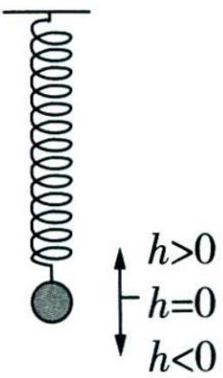

text_image

h>0
h=0
h<0

图 1

<table><tr><td>选项</td><td>分析过程</td><td>正误</td></tr><tr><td>A</td><td>小球运动的最高点与最低点的距离为 $2 - (-2) = 4$ (cm)【破障碍】注意对振动方程中振幅的理解,不要误以为从最高点到最低点是振幅2,事实上,振幅是振动物体离开平衡位置的最大距离,所以小球从最高点运动到最低点经历了两个振幅</td><td>×</td></tr><tr><td>B</td><td> $\frac{2\pi}{\frac{\pi}{2}} = 4$ →小球经过4s往复运动一次【厘思路】往复运动一次就是一个周期</td><td>√</td></tr><tr><td>C</td><td>当 $t \in (3,5)$ 时, $\frac{\pi}{2}t + \frac{\pi}{4} \in (\frac{7\pi}{4}, \frac{11\pi}{4})$ →小球自下往上运动到最高点,再往下运动</td><td>×</td></tr><tr><td>D</td><td>当 $t = 6.5$  s时, $h = 2\sin(\frac{\pi}{2} \times 6.5 + \frac{\pi}{4}) = -2$ </td><td>√</td></tr></table>

故选 BD(解本题时,容易因对振动方程中各参数的含义与数学中三角函数的概念链接失败,即信息提取能力不足,而无从下手.要明确:振幅是振动物体离开平衡位置的最大距离;往复运动一次的时间是函数的最小正周期;自下往上运动对应函数递增区间,自上往下运动对应函数递减区间;小球到达最低点即函数取得最小值).

# 防错指南

直线的截距分为纵截距和横截距,它是一个实数,可以为0,也可以为负数,而距离是一个非负数,注意区分.

关注微信公众号“初高教辅站”获取更多初高中教辅资料

# 纠错巩固

1. (试题调研改编 | 变学科知识, 生物中的基因型) 自然界中某些生物的基因型是由雌雄配子的基因组合而成的, 这种生物在生育下一代时, 成对的基因相互分离形成配子, 配子随机结合形成下一代. 若某生物群体的基因型为 Aa, 在该生物个体的随机交配过程中, 基因型为 aa 的子代因无法适应自然环境, 会被自然界淘汰. 例如, 当亲代只有 Aa 基因型个体时, 其子 1 代的基因型如下表所示:

<table><tr><td>雌雄配子</td><td> $\frac{1}{2}A$ </td><td> $\frac{1}{2}a$ </td></tr><tr><td> $\frac{1}{2}A$ </td><td> $\frac{1}{4}AA$ </td><td> $\frac{1}{4}Aa$ </td></tr><tr><td> $\frac{1}{2}a$ </td><td> $\frac{1}{4}Aa$ </td><td>×</td></tr></table>

由上表可知,子1代中 AA:Aa = 1:2,子1代产生的配子中 A 占 $\frac{2}{3}$ ,a 占 $\frac{1}{3}$ .依据上述材料,推测子10代中 Aa 个体占比为 \_\_\_\_.

2. (变函数与设问 | 2024 北京中关村中学 10 月月考) 如图 2, 弹簧挂着一个小球做上下运动, 小球在 $t$ 秒时相对于平衡位置的高度 $h$ (单位: 厘米)由如下关系式确定: $h = \sqrt{2} \sin t + \sqrt{2} \cos t, t \in [0, +\infty)$ . 则小球在开始运动(即 $t = 0$ )时 $h$ 的值为 , 小球运动过程中最大的高度差为 \_\_\_\_ 厘米.

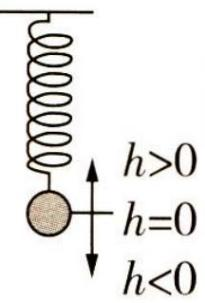  
图2

# 参考答案与解析

1. $\frac{1}{6}$ 由题意, 设子 $n$ 代中 $\mathrm{Aa}$ 占比为 $a_{n}$ , 则 $\mathrm{AA}$ 占比为 $1 - a_{n}$ .

所以 A: $a = \left[2\left(1 - a_{n}\right) + a_{n}\right]$ : $a_{n} = (2 - a_{n})$ : $a_{n}$ ，则子 $(n + 1)$ 代的基因型如下表所示.

<table><tr><td>雌雄配子</td><td> $\frac{2 - a_n}{2}A$ </td><td> $\frac{a_n}{2}a$ </td></tr><tr><td> $\frac{2 - a_n}{2}A$ </td><td> $(\frac{2 - a_n}{2})^2AA$ </td><td> $\frac{(2 - a_n)a_n}{4}Aa$ </td></tr><tr><td> $\frac{a_n}{2}a$ </td><td> $\frac{(2 - a_n)a_n}{4}Aa$ </td><td>×</td></tr></table>

# 防错指南

数列是一种特殊的函数,借助函数来研究数列是常见的方法,但注意两者在性质上不是完全相同的,例如,数列单调,其对应的函数不一定单调.

表格中子 $(n+1)$ 代基因型的“总份数”为 $\left(\frac{2-a_{n}}{2}\right)^{2}+2\times\frac{(2-a_{n})a_{n}}{4}$ （其中淘汰了 $\frac{a_{n}^{2}}{4}$ “份”），【易错提醒】注意题眼“基因型为aa的子代因无法适应自然环境，会被自然界淘汰”，否则会得到错解

因此子 $(n + 1)$ 代中Aa占比为 $\frac{\frac{(2 - a_n)a_n}{2}}{(\frac{2 - a_n}{2})^2 + \frac{(2 - a_n)a_n}{2}} = a_{n + 1}$ , 化简得 $a_{n + 1} = \frac{2a_n}{2 + a_n}$ , 即 $\frac{1}{a_{n + 1}} = \frac{1}{a_n + \frac{1}{2}}$ , 即 $\frac{1}{a_{n + 1}} - \frac{1}{a_n} = \frac{1}{2}$ ,

所以 $\left\{\frac{1}{a_{n}}\right\}$ 是首项为 $\frac{3}{2}$ ，公差为 $\frac{1}{2}$ 的等差数列，所以 $\frac{1}{a_{n}} = \frac{1}{2} n + 1, a_{n} = \frac{2}{n + 2}$ ，因此 $a_{10} = \frac{2}{10 + 2} = \frac{1}{6}$ .
2. $\sqrt{2}$ 4 因为 $h = \sqrt{2}\sin t + \sqrt{2}\cos t = 2\sin\left(t + \frac{\pi}{4}\right)$ ，令 t = 0，可得 $h = \sqrt{2}$ .

由振幅为2,可得小球运动的最高点与平衡位置的距离为2,且在平衡位置的上方,最低点与平衡位置的距离为2,且在平衡位置的下方,故最大的高度差为4厘米.

# 失分陷阱4 模块融合题找不准解题方法

调研 1 (圆锥曲线融合新定义共轭点对12024 上海格致中学 10 月月考) 若椭圆 $C: \frac{x^2}{a^2} + \frac{y^2}{b^2} = 1 (a > b > 0)$ 上的两个点 $A(x_1, y_1), B(x_2, y_2)$ 满足 $\frac{x_1 x_2}{a^2} + \frac{y_1 y_2}{b^2} = 0$ , 则称 $A, B$ 为该椭圆的一个“共轭点对”, 记作 $[A, B]$ . 已知椭圆 $C$ 的一个焦点坐标为 $F_1(-2\sqrt{2}, 0)$ , 且椭圆 $C$ 过点 $A(3, 1)$ .

(1) 求椭圆 C 的标准方程.

(2)求“共轭点对”[A,B]中点B所在直线l的方程.

(3) 设 O 为坐标原点, 点 P, Q 在椭圆 C 上, 且 $PQ \parallel OA$ , (2) 中的直线 l 与椭圆 C 交于两点 $B_{1}, B_{2}$ , 且点 $B_{1}$ 的纵坐标大于 0, 设四点 $B_{1}, P, B_{2}, Q$ 在椭圆 C 上逆时针排列. 证明: 四边形 $B_{1}PB_{2}Q$ 的面积小于 $8\sqrt{3}$ .

解析 (1)依题意得,椭圆 $C: \frac{x^2}{a^2} + \frac{y^2}{b^2} = 1 (a > b > 0)$ 的另一个焦点为 $F_2(2\sqrt{2}, 0)$ , 连接 $AF_1$ ,

# 防错指南

根据 $y = A \sin(\omega x + \varphi) + B$ 的图象选点求解 $\varphi$ 时, 如果选取平衡点, 要区分平衡点是在图象的上升段还是下降段, 如果不区分, 可能会出现增解.

关注微信公众号“初高教辅站”获取更多初高中教辅资料

$AF_{2}$ ，则 $2a = |AF_{1}| + |AF_{2}| = \sqrt{(3 + 2\sqrt{2})^{2} + 1^{2}} + \sqrt{(3 - 2\sqrt{2})^{2} + 1^{2}} = (2\sqrt{3} + \sqrt{6}) + (2\sqrt{3} - \sqrt{6}) = 4\sqrt{3}$

于是 $a=2\sqrt{3}$ , $b=\sqrt{(2\sqrt{3})^{2}-(2\sqrt{2})^{2}}=2$ , 所以椭圆 C 的标准方程为 $\frac{x^{2}}{12}+\frac{y^{2}}{4}=1$ .

【厘思路】这里运用了椭圆定义，也可以由已知 $c=2\sqrt{2}$ ，且 $\frac{9}{a^{2}}+\frac{1}{b^{2}}=1$ ， $a^{2}=b^{2}+c^{2}$ 得解

(2)设“共轭点对”[A,B]中点B的坐标为B(x,y),

【破障碍】什么叫“共轭点对”？关键信息是：有 A, B 两点，两点坐标满足关系式 $\frac{x_{1}x_{2}}{a^{2}} + \frac{y_{1}y_{2}}{b^{2}} = 0$ ，从而转化为由 A(3,1) 求 B 点坐标满足的条件，即得 B 点所在直线方程

由(1)知, 点 $A(3,1)$ 在椭圆 $C: \frac{x^{2}}{12} + \frac{y^{2}}{4} = 1$ 上, 依题意得直线 l 的方程为 $\frac{3x}{12} + \frac{y}{4} = 0$ , 整理得 $x + y = 0$ ,

所以直线 l 的方程为 $x + y = 0$ .

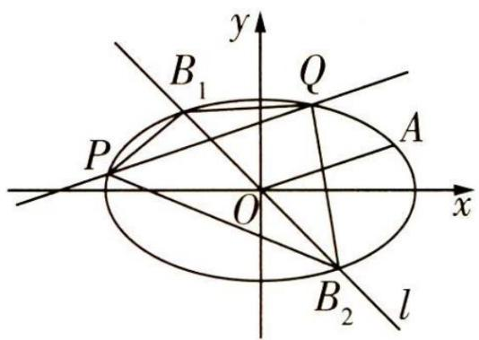

text_image

y
B₁
Q
P
O
A
x
B₂
l

图1

(3)根据题意作图,如图1所示.

由(2)知, 直线 l 的方程为 $x + y = 0$ , 由 $\left\{\begin{aligned}y &= -x, \\ \frac{x^{2}}{12} + \frac{y^{2}}{4} &= 1,\end{aligned}\right.$ 解得 $\left\{\begin{aligned}x &= -\sqrt{3}, \\ y &= \sqrt{3}\end{aligned}\right.$ 或 $\left\{\begin{aligned}x &= \sqrt{3}, \\ y &= -\sqrt{3},\end{aligned}\right.$

则 $B_{1}(-\sqrt{3},\sqrt{3}), B_{2}(\sqrt{3}, -\sqrt{3})$ ，设 $P(x_{P},y_{P}), Q(x_{Q},y_{Q})$ ，则 $\left\{\begin{aligned}\frac{x_{P}^{2}}{12} + \frac{y_{P}^{2}}{4} &= 1,\\ \frac{x_{Q}^{2}}{12} + \frac{y_{Q}^{2}}{4} &= 1,\end{aligned}\right.$

两式相减得 $\frac{(x_{P} - x_{Q})(x_{P} + x_{Q})}{12} +\frac{(y_{P} - y_{Q})(y_{P} + y_{Q})}{4} = 0,$

又 $PQ \parallel OA$ ，于是 $\frac{y_P - y_Q}{x_P - x_Q} = \frac{1}{3}$ ，则 $y_P + y_Q = -(x_P + x_Q)$ ，有 $\frac{y_P + y_Q}{2} = -\frac{x_P + x_Q}{2}$ ，

所以线段 PQ 被直线 l 平分.

设点 P 到直线 l 的距离为 d，则四边形 $B_{1}PB_{2}Q$ 的面积 $S_{四边形B_{1}PB_{2}Q}=2S_{\triangle PB_{1}B_{2}}=2\times\frac{1}{2}\times|B_{1}B_{2}|\times d,$

而 $|B_{1}B_{2}|=\sqrt{(-\sqrt{3}-\sqrt{3})^{2}+(\sqrt{3}+\sqrt{3})^{2}}=2\sqrt{6}$ ，则有 $S_{四边形B_{1}PB_{2}Q}=2\sqrt{6}d.$

设过点 P 且与直线 l 平行的直线 $l_{1}$ 的方程为 $x + y = m$ ，则当直线 $l_{1}$ 与椭圆 C 相切时，d 取得最大值，

由 $\left\{\begin{aligned}x+y=m,\\ \frac{x^{2}}{12}+\frac{y^{2}}{4}=1\end{aligned}\right.$ 消去 y 得关于 x 的方程 $4x^{2}-6mx+3(m^{2}-4)=0$ ,

令 $\Delta = 36m^{2} - 48(m^{2} - 4) = 0$ ，得 $m = \pm 4$

【破障碍】假设“直曲”相切，从而方程的根的判别式为0，求出 $m$ 的值，再推理判断，否定相切的可能情况

当 $m = \pm 4$ 时, 方程为 $4x^{2} \mp 24x + 36 = 0$ , 即 $(x \mp 3)^{2} = 0$ , 解得 $x = \pm 3$ , 则点 P 或点 Q 必有一个和点 $A(3,1)$ 重合, 不符合条件 $PQ \parallel OA$ , 从而直线 $l_{1}$ 与椭圆 C 不可能相切, 即 d 小于平行直线 $x + y = 0$ 和 $x + y = 4$ (或 $x + y = -4$ ) 的距离 $\frac{4}{\sqrt{2}} = 2\sqrt{2}$ .

所以 $S_{\text{四边形} B_1PB_2Q} < 2\sqrt{6} \times 2\sqrt{2} = 8\sqrt{3}$ . 所以四边形 $B_1PB_2Q$ 的面积小于 $8\sqrt{3}$ .

调研 2 (概率融合数列12024 湖北武汉第四十九中学9月调考)甲、乙两人进行象棋比赛,赛前每人发3枚筹码.一局后负的一方需将自己的一枚筹码给对方;若平局,双方的筹码不动.当一方无筹码时,比赛结束,另一方最终获胜.由以往两人的比赛结果可知,在一局比赛中甲胜的概率为0.3,乙胜的概率为0.2.

(1)第一局比赛后,甲的筹码个数记为 X,求 X 的分布列和期望.

(2) 求四局比赛后, 比赛结束的概率.

(3) 若 $P_{i} (i=0,1,\cdots,6)$ 表示“在甲所得筹码为 i 枚时, 最终甲获胜的概率”, 则 $P_{0}=0, P_{6}=1$ . 证明: $\left\{P_{i+1}-P_{i}\right\}(i=0,1,\cdots,5)$ 为等比数列.

解析 (1) $X$ 的所有可能取值为 2,3,4, 则 $P(X=2)=0.2, P(X=3)=0.5, P(X=4)=0.3$ , 则 $X$ 的分布列为

<table><tr><td>X</td><td>2</td><td>3</td><td>4</td></tr><tr><td>P</td><td>0.2</td><td>0.5</td><td>0.3</td></tr></table>

$$
E (X) = 2 \times 0. 2 + 3 \times 0. 5 + 4 \times 0. 3 = 3. 1.
$$

(2) 当四局比赛结束且甲胜时, 第四局比赛甲胜, 前三局比赛甲 2 胜 1 平, 其概率为 $\mathrm{C}_{3}^{2} \times 0.3^{2} \times 0.5 \times 0.3 = 0.0405$ ,

当四局比赛结束且乙胜时,第四局比赛乙胜,前三局比赛乙2胜1平,其概率为 $C_{3}^{2}\times0.2^{2}\times0.5\times0.2=0.012$ ,

防错指南

所以四局比赛后,比赛结束的概率为 $0.0405 + 0.012 = 0.0525$ .

(3) $P_{i} (i = 0,1,\dots ,6)$ 表示“在甲所得筹码为 $i$ 枚时，最终甲获胜的概率”， $P_{0} = 0$

【破障碍】 $P_{i}$ 表示 “在甲所得筹码为 i 枚时，最终甲获胜的概率”，因而需要分析甲所得筹码为 i 枚时下一局甲获胜情况，决定后续甲获胜的概率情况，这也是本问的难点

在甲所得筹码为 1 枚时, 下局甲胜且最终甲获胜的概率为 $0.3P_{2}$ ; 在甲所得筹码为 1 枚时, 下局平局且最终甲获胜的概率为 $0.5P_{1}$ ; 在甲所得筹码为 1 枚时, 下局乙胜且最终甲获胜的概率为 $0.2P_{0}$ .

【厘思路】 $P_{1}$ 是甲获得 1 枚筹码且最终甲获胜的概率, 而在甲获得 1 枚筹码时的下一局, 有三种可能: 甲胜、平、甲负. 若甲胜, 则转化成甲获得 2 枚筹码且最终甲获胜的概率, 因而是 $0.3P_{2}$ , 若平, 则依然是甲获得 1 枚筹码且最终甲获胜的概率, 若甲负, 则转化为甲获得 0 枚筹码且最终甲获胜的概率, 再利用全概率公式求解即可

根据全概率公式得 $P_{1} = 0.3P_{2} + 0.5P_{1} + 0.2P_{0}$ ，即 $0.3(P_{2} - P_{1}) = 0.2(P_{1} - P_{0})$ ，又 $P_{1}-$ $P_0 > 0$ ，所以 $\frac{P_2 - P_1}{P_1 - P_0} = \frac{2}{3}$

同理可得 $\frac{P_{3}-P_{2}}{P_{2}-P_{1}}=\frac{P_{4}-P_{3}}{P_{3}-P_{2}}=\frac{P_{5}-P_{4}}{P_{4}-P_{3}}=\frac{P_{6}-P_{5}}{P_{5}-P_{4}}=\frac{2}{3}$ ，所以 $\left\{P_{i+1}-P_{i}\right\}(i=0,1,\cdots,5)$ 为等比数列.

# 纠错巩固

(试题调研原创 | 变情境, 概率融合数列) 足球是一项大众喜爱的运动. 某校足球队中的甲、乙、丙三名球员将进行传球训练, 第1次由甲将球传出, 每次传球时, 传球者都等可能将球传给另外两个人中的任意一人, 如此不停地传下去, 且假定每次传球都能被接到. 记开始传球的人为第1次触球者, 第 $n$ 次触球者是甲的概率为 $P_{n}$ , 则 $P_{1} = 1$ .

(1) 求 $P_{3}$ .

(2) 证明: 数列 $\{P_{n} - \frac{1}{3}\}$ 为等比数列, 并比较第 9 次与第 10 次触球者是甲的概率的大小关系.

# 参考答案与解析

(1)由题意得,第二次触球者为乙、丙中的一个,第二次触球者等可能传给甲或乙(丙)中的任意一人,故传给甲的概率为 $\frac{1}{2}$ ,故 $P_{3}=\frac{1}{2}$ .

(2)当 $n \geqslant 2$ 时, 第 $n - 1$ 次触球者是甲的概率为 $P_{n-1}$ , 第 $n - 1$ 次触球者不是甲的概率为 $1 - P_{n-1}$ ,

【补盲点】第 $n$ 次触球者是否为甲, 取决于上一次 (即第 $n - 1$ 次) 触球者是谁, 有两种可能,可能是甲, 可能不是甲, 据此得递推关系

# 防错指南

则 $P_{n} = P_{n - 1}\times 0 + (1 - P_{n - 1})\times \frac{1}{2} = \frac{1}{2} (1 - P_{n - 1})$ ，从而 $P_{n} - \frac{1}{3} = -\frac{1}{2} (P_{n - 1} - \frac{1}{3})$

【破障碍】如果观察不出来这一递推关系，可采用待定系数法，设递推关系式为 $P_{n}-\lambda=-\frac{1}{2}(P_{n-1}-\lambda)$ ，展开、还原后得 $P_{n}=-\frac{1}{2}P_{n-1}+\frac{3}{2}\lambda$ ，因而 $\frac{3}{2}\lambda=\frac{1}{2}$ ，即 $\lambda=\frac{1}{3}$

又 $P_{1} - \frac{1}{3} = \frac{2}{3}$ 所以 $\{P_n - \frac{1}{3}\}$ 是以 $\frac{2}{3}$ 为首项， $-\frac{1}{2}$ 为公比的等比数列， $P_{n} = \frac{2}{3} \times (-\frac{1}{2})^{n-1} + \frac{1}{3}$ ，

所以 $P_{9}=\frac{2}{3}\times\left(-\frac{1}{2}\right)^{8}+\frac{1}{3}>\frac{1}{3},P_{10}=\frac{2}{3}\times\left(-\frac{1}{2}\right)^{9}+\frac{1}{3}<\frac{1}{3},P_{9}>P_{10}$ ，故第9次触球者是甲的概率比第10次的大.

# 失分陷阱5 思维不严谨或信息提取有误

调研 (试题调研原创) 已知双曲线 $\frac{x^{2}}{a^{2}} - \frac{y^{2}}{b^{2}} = 1 (a > 0, b > 0)$ 的右焦点为 $F$ , 过 $F$ 的直线交双曲线于 $A, B$ 两点, 点 $C$ 是点 $A$ 关于原点 $O$ 的对称点, 若 $CF \perp AB$ 且 $CF = AB$ , 双曲线的离心率为 $e$ , 则 $e^{2} =$ \_\_\_\_.

解析 设双曲线左焦点为 $F'$ , 如图 1 所示, 连接 $AF', BF', CF'$ .

设 $|AF|=x$ ，则 $|AF'|=x+2a=|CF|=|AB|$ ，

所以 $|BF|=|AB|-x=2a,|BF'|=|BF|+2a=4a.$

又 $CF \perp AB$ , 由图形的对称性可知四边形 $AF'CF$ 为矩形, 所以 $AF' \perp AB$ , 所以 $\triangle AF'B$ 为等腰直角三角形,

所以 $|BF'|=\sqrt{2}|AB|$ ，即 $4a=\sqrt{2}(x+2a)$ ， $x=2\sqrt{2}a-2a$ ，即 $|AF|=2\sqrt{2}a-2a$ ， $|AF'|=2\sqrt{2}a$ 。

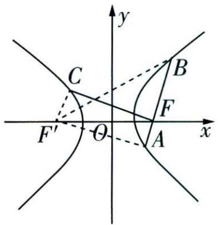

text_image

y
C
B
F
F'
O
A
x

图1

在 $\triangle AF'F$ 中，由勾股定理得 $(2\sqrt{2} a)^2 + (2\sqrt{2} a - 2a)^2 = (2c)^2$ ，得 $e^2 = \frac{c^2}{a^2} = 5 - 2\sqrt{2}$

【第1次敲警钟】若解到这里直接作答, 虽然你的思路看似没有问题, 但是你也只能得到0分或1分, 原因是提取信息不足, 只考虑了直线与双曲线的交点都在双曲线右支的一种情况. 是不是还有其他情况呢? 请继续看

如图2,当直线与双曲线在其左、右两支上各有一个交点时,A在左支,B在右支,设 $|AF|=x$ ,则 $|AF'|=x-2a=|CF|=|AB|$ ,所以 $|BF|=|AF|-|AB|=2a,|BF'|=|BF|+2a=4a.$

防错指南

又 $CF \perp AB$ , 由图形的对称性可知四边形 $AF'CF$ 为矩形, 所以 $AF' \perp AB$ , 所以 $\triangle AF'B$ 为等腰直角三角形,

所以 $\left|BF'\right|=\sqrt{2}\left|AB\right|$ ，即 $4a=\sqrt{2}(x-2a)$ ， $x=2\sqrt{2}a+2a$ ，

即 $|AF|=2\sqrt{2}a+2a,|AF'|=2\sqrt{2}a.$

在 $\triangle AF'F$ 中, 由勾股定理得 $(2\sqrt{2}a)^2 + (2\sqrt{2}a + 2a)^2 = (2c)^2$ , 得 $e^2 = \frac{c^2}{a^2} = 5 + 2\sqrt{2}$ .

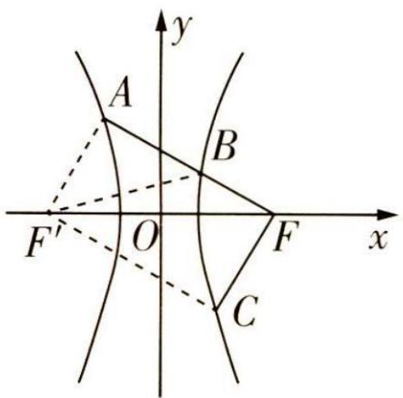

text_image

y
A
B
F'
O
F
x
C

图 2

【第2次敲警钟】你以为解到这里已经万事大吉了吗？事实上，还会丢分，原因依然是缺少情况，因为图2中A,B的位置可以交换，而交换后情况会发生转变，请继续看图3

如图3,当直线与双曲线左、右两支各有一个交点时,A在右支,B在左支,设 $|AF|=x$ , 则 $|AF'|=x+2a=|CF|=|AB|$ , 所以 $|BF|=|AF|+|AB|=2x+2a$ , $|BF'|=|BF|-2a=2x.$

又 $CF \perp AB$ , 由图形的对称性可知四边形 $AF'CF$ 为矩形, 所以 $AF' \perp AB$ , 所以 $\triangle AF'B$ 为等腰直角三角形.

所以 $|BF'|=\sqrt{2}|AB|$ ，即 $2x=\sqrt{2}(x+2a)$ ， $x=2\sqrt{2}a+2a$ ，即 $|AF|=2\sqrt{2}a+2a$ ， $|AF'|=2\sqrt{2}a+4a$ 。

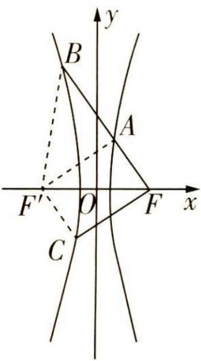

text_image

y
B
A
F'
O
F
x
C

图 3

在 $\triangle AF'F$ 中，由勾股定理得 $(2\sqrt{2} a + 2a)^2 + (2\sqrt{2} a + 4a)^2 = (2c)^2$ ，得 $e^2 = \frac{c^2}{a^2} = 9 + 6\sqrt{2}$

故填 $5-2\sqrt{2}$ 或 $5+2\sqrt{2}$ 或 $9+6\sqrt{2}$ .

# 纠错巩固

(因考虑情况不全失分 |2024 湖南衡阳田家炳实验中学 9 月测试 | 多选) 已知 $P$ 为平面直角坐标系 $xOy$ 内的动点, 则下列关于 $P$ 的轨迹方程的说法中正确的有 ( )

A. 点 $Q(0,1)$ , 直线 $l$ 的方程为 $y = -1$ , 若 $|PQ|$ 等于 $P$ 到直线 $l$ 的距离, 则点 $P$ 的轨迹方程为 $x^{2} = 2y$   
B. 圆 M 的方程为 $x^{2} + y^{2} - 2x = 0$ ，圆 N 的方程为 $(x + 1)^{2} + y^{2} = 9$ ，动圆 P 分别与圆 M, N 相切，则点 P 的轨迹方程为 $\frac{x^{2}}{4} + \frac{y^{2}}{3} = 1 (x \neq 2)$

# 防错指南

连续放缩时,如 $f(x)\geqslant g(x)$ , $g(x)\geqslant h(x)$ ,如果 $f(x)\geqslant g(x)$ , $g(x)\geqslant h(x)$ 的等号不能同时取到,则不能得到 $f(x)\geqslant h(x)$ ,只能得到 $f(x)>h(x)$ .

关注微信公众号“初高教辅站”获取更多初高中教辅资料

C. 点 $O(0,0), M(1,0)$ 与点 $P$ 的距离满足 $|PM| = \sqrt{3} |PO|$ , 则点 $P$ 的轨迹方程为

$$
x ^ {2} + y ^ {2} + x - \frac {1}{2} = 0
$$

D. 圆 $B$ 的方程为 $x^{2} + y^{2} + 6x = 0, A(3,0)$ , 点 $C$ 为圆 $B$ 上一动点, 线段 $CA$ 的垂直平分线交直线 BC 于点 P, 则点 P 的轨迹方程为 $\frac{4x^{2}}{9}-\frac{4y^{2}}{27}=1$

# 参考答案与解析

CD 对于 A, $|PQ|$ 等于 P 到直线 l 的距离, 根据抛物线的定义知, 点 P 的轨迹是抛物线, 点 Q 是焦点, 直线 l 为准线, 所以焦点到准线的距离 p = 2, 点 P 的轨迹方程为 $x^{2} = 4y$ , A 错误.

对于 B, 易知 $M(1,0)$ , $N(-1,0)$ , 动圆 P 分别与圆 M, N 相切, 有 3 种情况: 动圆 P 与圆 M 外切, 与圆 N 内切, 或动圆 P 与圆 M, N 均外切, 或动圆 P 与圆 M, N 均内切.

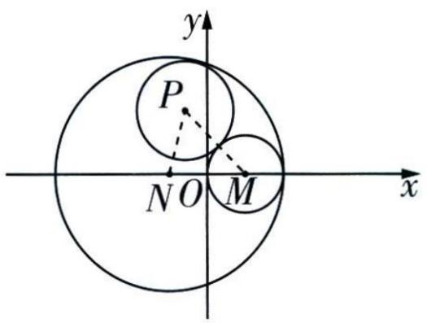

text_image

y
P
NO M
x

图4

如图4,若动圆 $P$ 与圆 $M$ 外切,与圆 $N$ 内切,设圆 $P$ 的半径为 $r$ ,连接 $PM,PN$ ,则 $|PM| = r + 1$ , $|PN| = 3 - r$ ,所以 $|PM| + |PN| = r + 1 + 3 - r = 4 > |MN|$ ,根据椭圆的定义可得点 $P$ 轨迹方程为 $\frac{x^2}{4} + \frac{y^2}{3} = 1 (x \neq 2)$ .

若动圆 P 与圆 M, N 均外切, 点 P 的轨迹是以点 $(2,0)$ 为端点的射线 (除去端点).

若动圆 P 与圆 M, N 均内切, 点 P 的轨迹是以 $(1,0)$ , $(2,0)$ 为端点的线段(除去端点). 故 B 错误.

对于 C, 设 $P(x, y)$ ，由 $\left|PM\right| = \sqrt{3} \left|PO\right|$ 可得 $\sqrt{(x-1)^{2} + y^{2}} = \sqrt{3} \times \sqrt{x^{2} + y^{2}}$ ，化简得 $x^{2} + y^{2} + x - \frac{1}{2} = 0$ 。故 C 正确。

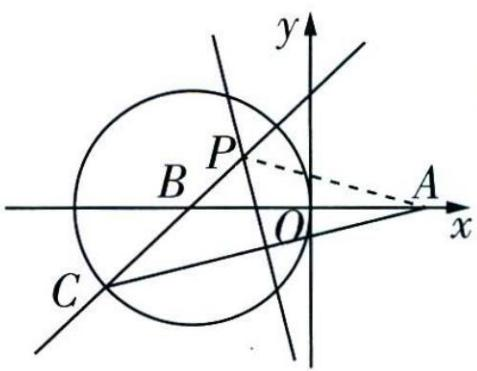

text_image

y
P
B
O
A
x
C

图 5

【厘思路】此时动点 $P$ 的轨迹是阿波罗尼斯圆

对于 D, 易知 $B(-3,0)$ , 如图 5, 连接 PA, 由题意得 $|PA| = |PC|$ , 所以 $\left||PA\right| - \left|PB\right| = \left||PC\right| - \left|PB\right| = \left|BC\right| = 3$ , 根据双曲线的定义易求得

【堵误区】此处易考虑不全，误认为 $|PA|>|PB|$ 恒成立，事实上，还有图6所示的情形，此时 $|PA|<|PB|$ ，因此要加绝对值

点 P 的轨迹方程为 $\frac{4x^{2}}{9}-\frac{4y^{2}}{27}=1$ . 故 D 正确. 故选 CD.

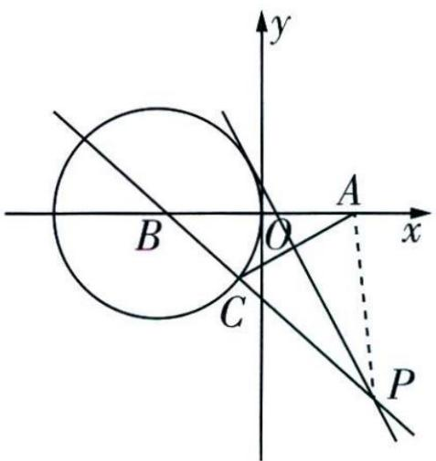

text_image

y
A
x
B
O
C
P

图6

# 防错指南

# 类型 2 图表问题中 5 个高频易错点

# 易错点1 几何问题不会作辅助线

调研 1 (2024 辽宁鞍山一中 10 月零模) 棱长为 4、各面均为等边三角形的四面体 $PABC$ 的四个顶点都在球 $O$ 的球面上, 则球 $O$ 的表面积 $S =$ ( )

A. ${24\pi }$

B. ${48\pi }$

C. $8 \sqrt{6} \pi$

D. $16 \sqrt{6} \pi$

解析 将四面体 PABC 放入正方体中, 如图 1 所示, 则该正方体的棱

【破障碍】棱长全部相等的四面体为正四面体，直接研究四面体的外接球，势必要在内部作很多辅助线，找球心，定半径，不易“下手”。不妨通过补形得到一个正方体，在外部作辅助线，那么正四面体的外接球就是该正方体的外接球，这样问题就简化了长为 $2 \sqrt{2}$ ，

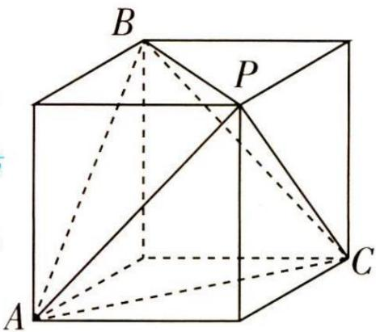

text_image

B
P
A
C

图1

所以正方体的体对角线即球 O 的直径，

故外接球半径 $R=\frac{\sqrt{(2\sqrt{2})^{2}+(2\sqrt{2})^{2}+(2\sqrt{2})^{2}}}{2}=\sqrt{6}$ （正四面体较为特殊，也可以用结论来快解小题：棱长为 a 的正四面体的外接球半径为 $\frac{\sqrt{6}a}{4}$ ），故 $S=4\pi R^{2}=24\pi$ ，故选 A.

调研 2 (试题调研原创) 四棱锥 $P - ABCD$ 的底面是矩形, $AB = 4$ , $BC = 2\sqrt{2}$ , $\triangle PAB$ 为等边三角形, 侧面 $PAB \perp$ 底面 $ABCD$ , 则侧棱 $PC$ 与底面 $ABCD$ 所成的角为 ( )

A. $\frac{\pi}{6}$

B. $\frac{\pi}{4}$

C. $\frac{\pi}{3}$

D. $\frac{\pi}{2}$

解析 如图2,取AB的中点E,连接PE,CE,

因为 $\triangle PAB$ 为等边三角形, 故 $PE \perp AB$ ,

又平面 $PAB \perp$ 平面 $ABCD$ , 平面 $PAB \cap$ 平面 $ABCD = AB, PE \subset$ 平面 $PAB$ ,

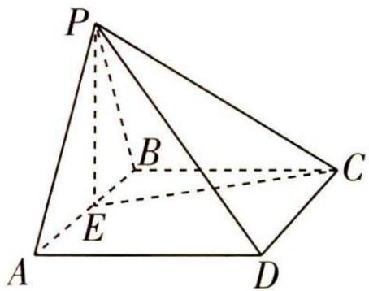

text_image

P
B
C
E
A
D

图 2

所以 $PE \perp$ 平面 $ABCD, \angle PCE$ 为直线 $PC$ 与底面 $ABCD$ 所成的角.

【破障碍】求线面角的关键是确定线在面上的射影, 找到对应的线面角, 通常是借助等腰三角形的 “三线合一” 的特性, 结合垂直关系寻找, 从而把立体几何问题转化为平面问题

在 $\triangle PAB$ 中， $AB = 4$ ，故 $PE = 2\sqrt{3}$

在 $\triangle BCE$ 中， $BE = 2,BC = 2\sqrt{2}$ ，故 $CE = 2\sqrt{3}$

在 Rt△PCE 中, $PE=CE=2\sqrt{3}$ ,故 $\angle PCE=\frac{\pi}{4}$ ,即侧棱 PC 与底面 ABCD 所成的角为 $\frac{\pi}{4}$ .故选 B.

解三角形时要排除不合理的情况,排除的依据一般有“大角对大边”“两边之和大于第三边”“三角形内角和为 $\pi$ ”等.

关注微信公众号“初高教辅站”获取更多初高中教辅资料

# 纠错攻略

# 求线面角的常规步骤

1. 寻找过斜线上一点与平面垂直的直线.  
2. 连接垂足和斜足得到斜线在平面上的射影，斜线与其射影所成的锐角即所求角。  
3. 把该角放在三角形中，通过解三角形求角.

调研 3 (试题调研原创) 正三棱柱 $ABC - A_{1}B_{1}C_{1}$ 中, $AB = CE = 2BD$ , 点 $D, E$ 分别是侧棱 $BB_{1}, CC_{1}$ 上的点, 则平面 $ADE$ 与底面 $ABC$ 所成的角为 ( )

A. $\frac{\pi}{4}$

B. $\frac{\pi}{3}$

C. $\frac{2\pi}{3}$

D. $\frac{3 \pi}{4}$

解析 如图3,延长ED,CB交于点P,连接AP,

则 ${AP}$ 为平面 ${ADE}$ 与平面 ${ABC}$ 的交线.

【厘思路】用几何法求二面角, 就需要确定二面角的平面角, 那就需要确定两个平面的交线, 对于题目中没有棱的二面角, 常常可以先作两个平面的交线, 再在交线上找一特殊点, 在两个半平面内分别作垂直于棱的射线, 两射线夹角为所求二面角的平面角, 由此把立体几何问题转化为解三角形问题

由 CE = 2BD 知 BP = BC.

又 AB = BP = BC，所以 $CA \perp AP$ 。

因为 $EC \perp$ 平面 ABC, 所以 $EC \perp AP$ , 则 $AP \perp$ 平面 ACE, 所以 $EA \perp AP$ ,

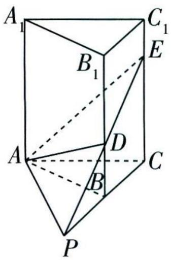

text_image

A₁
B₁
C₁
E
A
D
B
C
P

图3

【破障碍】作平面角时, 要清楚二面角的平面角的大小与顶点在棱上的位置无关, 根据需要选择平面角的顶点. 本题选 $A$ 为顶点, 通过证明 $CA, EA$ 均垂直于交线说明 $\angle EAC$ 为二面角的平面角

故 $\angle EAC$ 为所求二面角的平面角.

在 Rt△ACE 中, CE = AC, 所以 $\angle EAC = \frac{\pi}{4}$ . 故选 A.

调研 4 (2024 浙江金华、丽水、衢州十二校 9 月联考) 正四棱锥 $S-ABCD$ 的底面边长为 2, 高为 2, E 是 BC 的中点, 动点 P 在四棱锥的表面上运动, 并且总保持 $PE \perp AC$ , 则动点 P 的轨迹的周长为 ( )

A. $\sqrt{6} + \sqrt{2}$

B. $\sqrt{6} - \sqrt{2}$

C. 4

D. $\sqrt{5} + 1$

解析 如图4,连接BD,设AC,BD交于O,连接SO.

由正四棱锥的性质可得, $SO \perp$ 平面ABCD,

因为 $AC \subset$ 平面 ABCD, 所以 $SO \perp AC$ .

又 $BD \perp AC, SO \cap BD = O, SO, BD \subset$ 平面 SBD,

# 防错指南

所以 $AC \perp$ 平面 SBD.

因为 $PE \perp AC$ ，所以动点 P 的轨迹为过 E 且垂直于 AC 的平面与正四棱锥 S-ABCD 表面的交线.

【破障碍】解决轨迹问题的关键是确定截面的形状

取 SC 的中点 G, CD 的中点 F, 连接 EF, EG, GF.

易得平面 SBD// 平面 EFG, 所以 AC⊥ 平面 EFG,

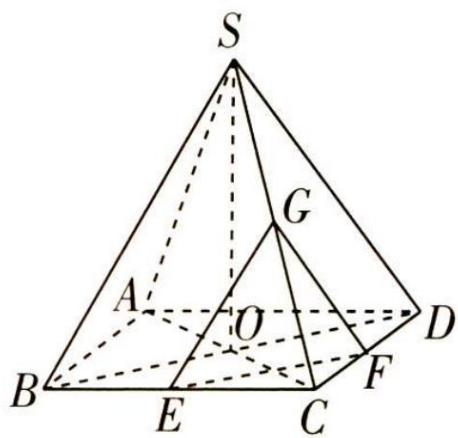

text_image

S
G
A
O
B
E
C
F
D

图4

则平面 EFG 即过 E 且垂直于 AC 的平面,那么动点 P 的轨迹的周长即 $\triangle EFG$ 的周长.

由题意得 $BD = 2\sqrt{2}$ , $SB = SD = \sqrt{2^{2} + 2} = \sqrt{6}$ ,

故 $EG + EF + GF = \frac{1}{2}\times (\sqrt{6} +\sqrt{6} +2\sqrt{2}) = \sqrt{6} +\sqrt{2}.$ 故选A.

# 纠错巩固

(变题型, 考查二面角 |2024 石家庄二中 10 月期中) 如图 5, 三棱柱 $ABC - A_{1}B_{1}C_{1}$ 的底面是边长为 $2\sqrt{3}$ 的正三角形, $AA_{1} = 3, AA_{1} \perp AC, D$ 为 $A_{1}C_{1}$ 的中点, $BD = 3\sqrt{3}$ , 则二面角 $A_{1} - AC - B$ 的正切值为 \_\_\_\_.

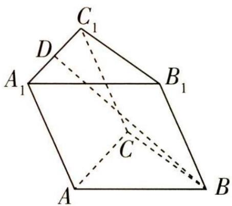

text_image

C₁
D
A₁ B₁
C
A B

图5

# 参考答案与解析

$-\sqrt{3}$ 如图6,取AC的中点E,连接ED,EB.

因为 D 为 $A_{1}C_{1}$ 的中点, $\triangle ABC$ 是边长为 $2\sqrt{3}$ 的正三角形,

所以 $DE = AA_{1} = 3, BE = 3, DE \perp AC, BE \perp AC,$

【避陷阱】三棱柱有可能是斜三棱柱，不能想当然地以为侧棱垂直于底面，根据平面图形（正三角形、矩形）寻找垂直关系是最稳妥的办法所以 $\angle BED$ 为二面角 $A_{1} - AC - B$ 的平面角.

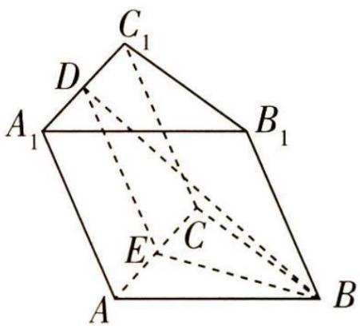

text_image

C₁
D
A₁
B₁
E
C
A
B

图6

在 $\triangle BED$ 中, $DE = 3$ , $BE = 3$ , $BD = 3\sqrt{3}$ , 由余弦定理得 $\cos \angle BED = \frac{3^2 + 3^2 - (3\sqrt{3})^2}{2 \times 3 \times 3} = -\frac{1}{2}$ , 所以 $\angle BED = 120^\circ$ , 所以 $\tan \angle BED = -\sqrt{3}$ .

# 易错点2 不会用图象解决嵌套函数的零点问题

调研 1 (2024 福建龙岩 10 月零诊) 已知函数 $f(x) = \begin{cases} \frac{2^x + 2}{2}, & x \leqslant 1, \\ |\log_2(x - 1)|, & x > 1, \end{cases}$ 则

# 纠错有方

小编说:在学习的过程中,我们难免犯错,纠错则是提升自我的最好机会,怎样纠错,是一门学问.

关注微信公众号“初高教辅站”获取更多初高中教辅资料

函数 $F(x) = f(f(x)) - 2f(x) - \frac{3}{2}$ 的零点个数为 （）

A. 4

B. 5

C. 6

D. 7

解析 令 $t = f(x), F(x) = 0$ ，则 $f(t) - 2t - \frac{3}{2} = 0$ .

【厘思路】解决嵌套函数问题的关键在于“数形结合”，但嵌套函数的图象一般都难以直接得到，因此要换元，结合换元后的图象逐步解决问题

作出曲线 $y=f(x)$ 和直线 $y=2x+\frac{3}{2}$ ，如图1，由图象可知二者有两个交点，设交点的横坐标分别为 $t_{1}, t_{2} (t_{1}<t_{2})$ ，则 $t_{1}=0, t_{2}\in$

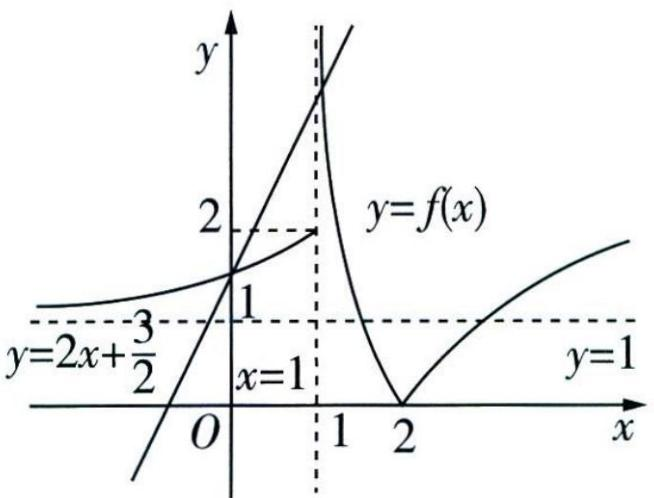

line

| x    | y=f(x) |
| ---- | ------ |
| 0    | 1      |
| 1    | 2      |
| 2    | 0      |

图 1

由图象可知,关于 x 的方程 $f(x)=t_{1}$ 有 1 个解,为 x=2; 关于 x 的方程 $f(x)=t_{2}$ 有 3 个解.

【辨易混】嵌套函数题目要多次利用图象, 如本题, 确定 $f(t) - 2t - \frac{3}{2} = 0$ 的解用一次, 之后确定 $f(x) = t_{1}(f(x) = t_{2})$ 的解再用一次. 第一次应用, 横轴可以看作 $t$ , 第二次应用, 横轴则是 $x$ , 两次应用的目的不相同, 顺序也不能颠倒

综上,方程 $F(x)=0$ 共有 4 个解,即函数 $F(x)$ 有 4 个零点,故选 A.

调研 2: (2024 南京外国语学校 9 月月考) 函数 $f(x)=\left\{\begin{array}{l}\ln(-x-1), x<-1, \\2x+1, x \geqslant -1.\end{array}\right.$ 若函数 $g(x)=f(f(x))-a$ 有 3 个不同的零点, 则实数 $a$ 的取值范围为 \_\_\_\_.

解析 设 $t = f(x)$ ，则 $g(x) = f(f(x)) - a = 0$ 即 $a = f(t)$ .

作出 $y=f(x)$ , y=a 的图象, 如图 2 所示.

①当 $a \geqslant -1$ 时,直线 $y = a$ 与曲线 $y = f(x)$ 有2个交点,

【纠易错】 $a$ 的取值会影响交点的个数, 因此要分类讨论, 让参数的取值 “动起来”. 此时要格外注意端点值的取舍, 端点值取舍出错, 那么最终结果大概率也是错的

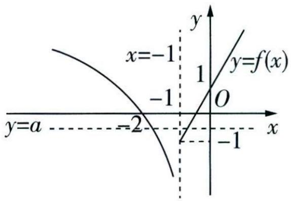

text_image

x=-1
y=f(x)
-1
O
y=a
-2
-1
x
y
y
1

图 2

设交点的横坐标分别为 $t_{1}, t_{2} (t_{1} < t_{2})$ ，则 $t_{1} < -1, t_{2} \geqslant -1$ .

由图象可得关于 x 的方程 $f(x)=t_{1}$ 有 1 个解, 关于 x 的方程 $f(x)=t_{2}$ 有 2 个解.

此时 $g(x)=f(f(x))-a$ 有 3 个不同的零点, 满足题意.

②当a<-1时,直线y=a与曲线 $y=f(x)$ 有1个交点.

纠错有方

设交点的横坐标为 $t_3$ ，令 $\ln (-x - 1) = -1$ 得 $x = -1 - \frac{1}{\mathrm{e}}$ ，所以 $-1 - \frac{1}{\mathrm{e}} < t_3 < -1$

【破障碍】应用图象, 大多数时候无法得出解的具体值, 这时便要尽可能缩小解的取值范围, 为下一步求解做铺垫

由图象可得关于 $x$ 的方程 $f(x) = t_3$ 有1个解. 此时 $g(x) = f(f(x)) - a$ 只有1个零点, 不满足题意. 综上, $a$ 的取值范围为 $[-1, +\infty)$ .

# 纠错巩固

1. (变形式, 有关二次函数的嵌套函数问题 |2024 浙江嘉兴 10 月联考) 已知函数 $f(x) = \left\{ \begin{array}{l} \left| \ln x \right| (x > 0), \\ -x^{2} - 3x (x \leqslant 0), \end{array} \right.$ 则函数 $y = 4[f(x)]^{2} - 13f(x) + 9$ 的零点个数为 ( )

A. 8

B. 7

C. 5

D. 2

2. (变载体, 融合指数函数、对数函数、分段函数的嵌套函数零点问题 | 2024 辽宁东北育才中学 9 月月考) 已知函数 $f(x) = \begin{cases} \mathrm{e}^{x}, & x \leqslant 0, \\ \ln x, & x > 0, \end{cases}$ , $g(x) = f(f(x)) - a$ , 若 $g(x)$ 有 2 个不同的零点, 则实数 $a$ 的取值范围是 \_\_\_\_.

# 参考答案与解析

1. B 根据题意, 令 $4[f(x)]^{2} - 13f(x) + 9 = 0$ , 得 $f(x) = 1$ 或 $f(x) = \frac{9}{4}$ .

【厘思路】将关于 $x$ 的方程看作关于 $f(x)$ 的方程, 则方程可以视为一元二次方程, 直接求解作出 $y=f(x)$ 的图象与直线 y=1, $y=\frac{9}{4}$ , 如图 3 所示.

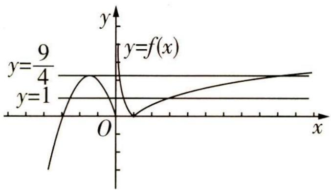

line

| x    | y=f(x) |
| ---- | ------ |
| 0    | 9/4    |
| >0   | 1      |

图3

【辨易混】曲线 $y = f(x) \frac{x \text{ 轴下方部分翻折到上方}}{x \text{ 轴及 } x \text{ 轴上方部分不变}}$ 曲线 y =$|f(x)|$ ; 曲线 $y=f(x)\xrightarrow[y\text{轴左侧部分原图象舍去，}y\text{轴右侧部分翻折到左侧}]{y\text{轴右侧部分不变}}$ 曲线 $y=f(|x|)$

由图象可得, 直线 y=1 与曲线 $y=f(x)$ 有 4 个交点, 直线 $y=\frac{9}{4}$ 与曲线 $y=f(x)$ 有 3 个交点, 故函数 $y=4[f(x)]^{2}-13f(x)+9$ 的零点个数为 7. 故选 B.

2. $(-∞,1]$ 方法一:直接应用图象得解 作出 $y=f(x)$ 的图象,如图4所示.

①当 $a \leqslant 0$ 时, 第一次应用图象得直线 $y = a$ 与曲线 $y = f(x)$ 有 1 个交点, 设交点横坐标为 $m$ , 则 $0 < m \leqslant 1$ ,

# 纠错有方

第二次应用图象得直线 $y = m$ 与曲线 $y = f(x)$ 有2个交点，

【破障碍】熟练之后, 就可以不换元、直接应用图象求解, 但要注意关键点的转化: 第一次应用图象, 找交点横坐标; 第二次应用图象,交点的横坐标变换为纵坐标, 作直线, 数交点个数

此时 $g(x)$ 有 2 个不同的零点, 满足题意.

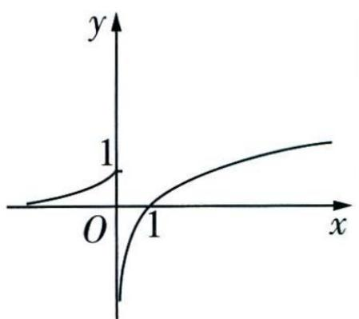

text_image

y
1
O 1 x

图4

②当 $0 < a \leqslant 1$ 时, 第一次应用图象得直线 $y = a$ 与曲线 $y = f(x)$ 有 2 个交点, 设交点横坐标分别为 $p, q (p < q)$ , 则 $p \leqslant 0, 1 < q \leqslant e$ ,

第二次应用图象得直线 y=p 与曲线 $y=f(x)$ 有 1 个交点, 直线 y=q 与曲线 $y=f(x)$ 有 1 个交点, 此时 $g(x)$ 有 2 个不同的零点, 满足题意.

③当 a > 1 时, 第一次应用图象得直线 y = a 与曲线 $y = f(x)$ 有 1 个交点, 设交点横坐标为 k, 则 k > e, 第二次应用图象得直线 y = k 与曲线 $y = f(x)$ 有 1 个交点, 此时 $g(x)$ 只有 1 个零点, 不满足题意. 综上, a 的取值范围是 $(-∞, 1]$ .

方法二:先化简 $f(f(x))$ 再求解 设 $h(x)=f(f(x))$ .

当 $x \leqslant 0$ 时, $\mathrm{e}^{x} > 0$ , $f(f(x)) = \ln \mathrm{e}^{x} = x$ ;

当 $0 < x \leqslant 1$ 时， $\ln x \leqslant 0, f(f(x)) = \mathrm{e}^{\ln x} = x$ ;

当 $x > 1$ 时， $\ln x > 0,f(f(x)) = \ln (\ln x).$

【补漏洞】 $f(x)$ 是以0为分界点的分段函数，要化简 $f(f(x))$ ，就要拿内层的 $f(x)$ 与0比较，然后选择对应的分段函数的解析式代入化简

综上, $h(x)=\left\{\begin{aligned}x,x&\leqslant1,\\ \ln(\ln x),&x>1.\end{aligned}\right.$

$h(e)=\ln(\ln e)=0$ , 由复合函数的单调性规则可知函数 $y=\ln(\ln x)$ 在 $(1,+\infty)$ 上单调递增, 作出 $y=h(x)$ 的图象, 如图 5 所示,

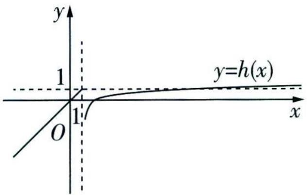

text_image

y
1
y=h(x)
O
1
x

图5

由图象可知, 当直线 y = a 和曲线 $y = h(x)$ 有 2 个交点, 即 $g(x)$ 有 2 个零点时, $a \leqslant 1$ ,

所以 a 的取值范围是 $(-∞,1]$ .

# 易错点3 不会从情境题中抽象出数学图形

调研 (2024 河南郑州 10 月零模) 比萨斜塔(如图 1)是意大利的著名景点,因斜而不倒的奇特景象而世界闻名. 把地球看成一个球(球心记为 O),地球上一点 A 的纬度是指 OA 与地球赤道所在平面所成角,OA 的方向即为 A 点处的竖直方向. 已

# 纠错有方

记录错误也有很多方法,把错题手抄到错题本上,会很整齐、美观,但比较耗费时间.把错题剪下来贴在错题本上要更省事,同时也能兼顾美感.

关注微信公众号“初高教辅站”获取更多初高中教辅资料知比萨斜塔处于北纬约 $44^{\circ}$ , 经过测量, 比萨斜塔朝正南方向倾斜, 且其中轴线与竖直方向的夹角约为 $4^{\circ}$ , 则中轴线与赤道所在平面所成的角为 ( )

natural_image

Black-and-white photograph of the Leaning Tower of Pisa, showing its iconic architectural details and spoked facade (no visible text or symbols)

图 1

命题解读:新情境试题多以优秀传统文化、现代科学技术、现实生活、学科间的交汇、社会热点等为背景创设，旨在突出新时代教育总方针——立德树人. 正确解答这类问题的关键是认真阅读理解题意，准确获取关键信息，排除题目背景中的干扰因素，实现数学思想、方法、能力的迁移运用.

A. ${40}^{ \circ  }$

B. ${42}^{ \circ  }$

C. ${48}^{ \circ  }$

D. ${50}^{ \circ  }$

解析 根据题意作出示意图如图2所示, $\odot  O$ 为地球的大圆截面 (与赤道所在平面垂直),过A作 ${AC}//{OD}$ , ${AP}$ 为比萨斜塔的中轴线,则 $\angle {AOD} = {44}^{ \circ  },\angle {BAP} = {4}^{ \circ  }$ ,

【堵误区】解决有关图形的情境题的关键在于理解题中的概念,并与图形对应. 如本题中, 根据题中的描述把 “纬度” 与角度对应起来, 把 “中轴线” “赤道” 与图中的线对应起来, 问题便迎刃而解了

则 $\angle PAC = 40^{\circ}$ , 即中轴线与赤道所在平面所成的角为 $40^{\circ}$ , 故选 A.

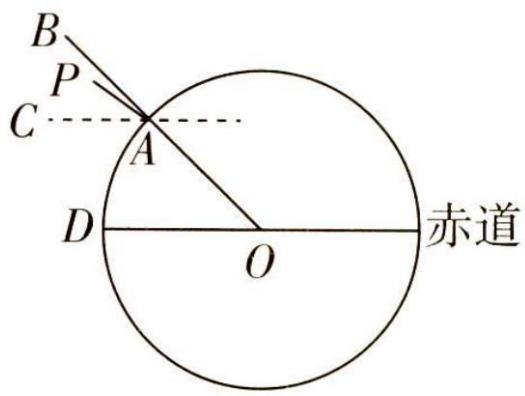

text_image

B
P
C
A
D
O
赤道

图 2

# 纠错巩固

(变情境, 考查球的截面性质 |2024 湖北孝感 9 月联考) 经纬度是经度与纬度的合称, 它们组成一个坐标系统, 称为地理坐标系统, 它是利用三维空间的球面来定义地球上空间的球面坐标系, 能够确定地球上任何一个位置. 其中纬度是地球重力方向上的铅垂线与赤道所在平面所成的线面角. 如世界最高峰珠穆朗玛峰就处在北纬约 $30^{\circ}$ , 若将地球近似看成一个球体, 其半径约为 $6400 \mathrm{~km}$ , 则北纬 $30^{\circ}$ 纬线的长为 ( )

A. $6400 \sqrt{3} \pi \mathrm{~km}$

B. $6400 \pi \mathrm{~km}$

C. $3200\sqrt{3}\pi$ km

D. $3200 \pi \mathrm{~km}$

# 参考答案与解析

A 根据题意作出示意图如图 3 所示, O 为球心, $\odot O$ 为地球的大圆截面 (与赤道所在平面垂直), 过 O 作 BC 的垂线, 垂足为 D, 连接 OC, 在 Rt $\triangle OCD$ 中, $\angle OCB = 30^{\circ}, CD = OC \times \cos 30^{\circ} = 6400 \times \frac{\sqrt{3}}{2} = 3200\sqrt{3}$ (km), 则北纬 $30^{\circ}$ 纬线的长为 $2\pi \times 3200\sqrt{3} = 6400\sqrt{3}\pi$ (km). 故选 A.

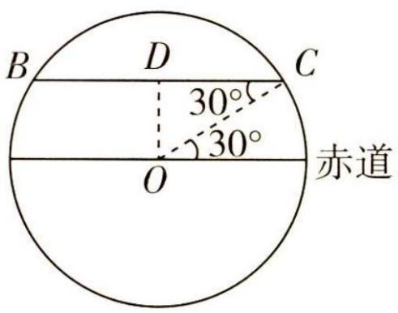

text_image

B
D
C
30°
30°
O
赤道

图3

# 纠错有方

记录的时候最好把答案分开记录,防止再次做的时候瞥到答案而“唤起记忆”,这样就达不到训练的效果了.

关注微信公众号“初高教辅站”获取更多初高中教辅资料

# 易错点4 已知图象求三角函数解析式时选点不当

调研 (试题调研原创) 已知函数 $f(x) = A \sin (\omega x + \varphi) (A > 0, \omega > 0, |\varphi| < \frac{\pi}{2})$ 的部分图象如图1所示, 则函数 $f(x)$ 在 $[0, \pi]$ 上的零点所构成的集合为 \_\_\_\_.

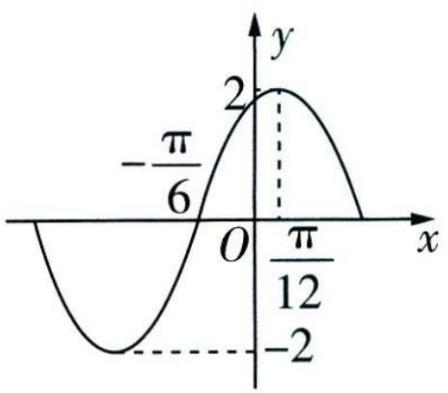  
图1

解析 由题图可知, $A = 2, f(x)$ 的最小正周期 $T = 4 \times \left[\frac{\pi}{12} - \left(-\frac{\pi}{6}\right)\right] = \pi$ ,所以 $\omega=\frac{2\pi}{T}=2.$

由 $\left\{\begin{aligned}&2\sin\left(2\times\frac{\pi}{12}+\varphi\right)=2,\\&|\varphi|<\frac{\pi}{2},\end{aligned}\right.$ 得 $\varphi=\frac{\pi}{3}$ ，所以 $f(x)=2\sin\left(2x+\frac{\pi}{3}\right)$ .

【避陷阱】观察图象可以确定 $A$ 与最小正周期 $T$ , 问题的关键就是列方程求 $\varphi$ . 求 $\varphi$ 的值,一般选取最高点或最低点的坐标代入,而不选择平衡点,因为平衡点分为上升平衡点和下降平衡点,求解时不注意区分,就会产生增根,掉入命题人的陷阱

令 $f(x_0) = 0$ ，即 $\sin (2x + \frac{\pi}{3}) = 0$ ，得 $x_0 = \frac{k\pi}{2} -\frac{\pi}{6} (k\in \mathbf{Z})$

当 $x_0 \in [0, \pi]$ 时， $x_0 = \frac{\pi}{3}, \frac{5\pi}{6}$ ，

故填 $\left\{\frac{\pi}{3},\frac{5\pi}{6}\right\}$ .

【易遗漏】最终结果按照题目要求写成集合的形式

# 纠错攻略

知 $f(x) = A \sin (\omega x + \varphi) + B (A, \omega > 0)$ 的图象求解析式的常规步骤

1. 求 $A, B$ , 确定函数的最大值 $M$ 和最小值 $m$ , 则 $A = \frac{M - m}{2}, B = \frac{M + m}{2}$ ;

2. 求 $\omega$ ，确定函数的最小正周期 T，则 $\omega = \frac{2\pi}{T}$ ;

3. 求 $\varphi$ , 将图象上的已知点的坐标代入解析式, 求解时注意点在单调递增区间还是单调递减区间. 如果已知图象上有最值点, 最好代入最值点的坐标求解.

# 纠错有方

析错 分析错因,对比正确答案,看自己错在哪里,是马虎的原因,还是一知半解,还是完全不会的难题、怪题.

关注微信公众号“初高教辅站”获取更多初高中教辅资料

# 纠错巩固

(变题型 |2024 河南郑州 9 月诊断 | 多选) 函数 $f(x) = A \sin (\omega x + \varphi) (A > 0, \omega > 0$ , $0 < |\varphi| < \pi$ ) 的部分图象如图 2, 下列结论正确的是 ( )

A. 函数 $f(x)$ 的最小正周期为 $\pi$   
B. 函数 $f(x)$ 的图象关于直线 $x = -\frac{\pi}{12}$ 对称  
C. 函数 $f(x)$ 在区间 $\left[-\frac{\pi}{3}, \frac{\pi}{6}\right]$ 上单调递减

D. 方程 $f(x) = 2$ 在 $[- \frac{\pi}{12}, \frac{23\pi}{12}]$ 上的所有实根之和为 $\frac{4\pi}{3}$

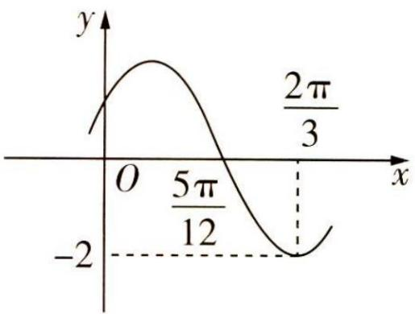

line

| x       | y       |
| ------- | ------- |
| 0       | -2      |
| 5π/12   | 5π/12   |
| 2π/3    | 2π/3    |

图 2

# 参考答案与解析

AD 由题图得 A=2，函数 $f(x)$ 的最小正周期 $T=4\times\left(\frac{2\pi}{3}-\frac{5\pi}{12}\right)=\pi,\therefore\omega=\frac{2\pi}{T}=2$

∵ 点 $\left(\frac{2\pi}{3},-2\right)$ 在函数 $f(x)$ 的图象上，∴ $-2=2\sin\left(\frac{4\pi}{3}+\varphi\right)$ ，即 $\sin\left(\frac{\pi}{3}+\varphi\right)=1$ ，

$\because 0 < |\varphi| < \pi, \therefore \varphi = \frac{\pi}{6}$ , 从而 $f(x) = 2\sin (2x + \frac{\pi}{6})$ .

对于 A, $T = \pi$ , A 正确.

对于 B, $f(-\frac{\pi}{12}) = 2 \sin(-\frac{\pi}{6} + \frac{\pi}{6}) = 0$ , B 错误.

【破障碍】三角函数在对称轴处取得最值，据此快速验证选项对错

对于 C, 由 $-\frac{\pi}{3} \leqslant x \leqslant \frac{\pi}{6}$ ，得 $-\frac{\pi}{2} \leqslant 2x + \frac{\pi}{6} \leqslant \frac{\pi}{2}$ ，则函数 $f(x)$ 在区间 $\left[-\frac{\pi}{3}, \frac{\pi}{6}\right]$ 上单调递增，C 错误.

对于 D, 由 $2\sin\left(2x+\frac{\pi}{6}\right)=2$ , 得 $2x+\frac{\pi}{6}=2k\pi+\frac{\pi}{2}$ , $x=k\pi+\frac{\pi}{6}$ , $k\in Z$ , 由 $x\in\left[-\frac{\pi}{12},\frac{23\pi}{12}\right]$ , 得 $x=\frac{\pi}{6},\frac{7\pi}{6},\frac{\pi}{6}+\frac{7\pi}{6}=\frac{4\pi}{3}$ , D 正确. 故选 AD.

# 易错点5 翻折前后找错“变与不变量”

调研 (2024 长沙一中 10 月月考) 如图 1 所示, 平面图形 ABCDFE 中, 四边形 ABCD 为矩形, AB = 3, BC = 8, 四边形 ADFE 为等腰梯形, AE = 5, EF = 2. 现将该平面

# 纠错有方

把记错和析错结合, 错题本可以分很多“章节”——“马虎 part”“模糊 part”“完全不会 part”等, 不同错因的题目, 分别归纳记录.

关注微信公众号“初高教辅站”获取更多初高中教辅资料图形沿着 $AD$ 折叠, 使梯形 $ADFE$ 与矩形 $ABCD$ 垂直, 再连接 $BE, CF$ , 得到如图 2 所示的空间图形.

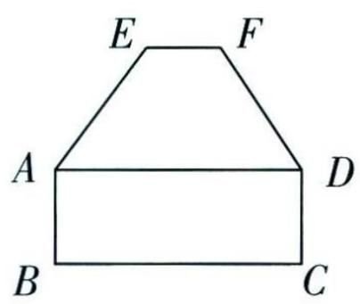

text_image

E
F
A
D
B
C

图 1

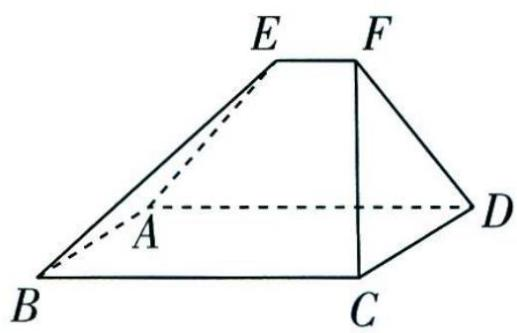

text_image

E
F
A
B
C
D

图 2

(1) 证明: $AB \perp DF$ .   
(2) 求平面 $ABE$ 与平面 $CDF$ 所成锐二面角的余弦值.

解析 如图3所示,作 $EH \perp AD$ ,垂足为H,过H作 $HK \parallel AB$ 交BC于K,易得EH=4.

方法一: 向量法 (1) 根据题意, 易得 $E H, H D, H K$ 三线两两垂直,

【破障碍】明确翻折前后不变的数量和形状, 一般来说, 位于 “折痕” 同侧的点、线位置关系不变, 应用到本题就可以得到翻折后, 四边形 $ABCD, ADFE$ 的形状都没有变, 各边长也不变, 那么可以直接得到 $HK \perp HD$ , 再根据平面 $ADFE$ 与平面 $ABCD$ 垂直得 $EH \perp HK$ , 据此建系

以 H 为坐标原点, HK, HD, HE 所在直线分别为 x 轴, y 轴, z 轴建立如图 3 所示的空间直角坐标系, 则 $H(0,0,0)$ , $A(0,-3,0)$ , $B(3,-3,0)$ , $D(0,5,0)$ , $F(0,2,4)$ , $E(0,0,4)$ .

$$
\overrightarrow {A B} = \overrightarrow {D C} = (3, 0, 0), \overrightarrow {A E} = (0, 3, 4), \overrightarrow {D F} = (0, - 3, 4).
$$

因为 $\overrightarrow{AB}\cdot\overrightarrow{DF}=0$ ，所以 $AB\perp DF$ .

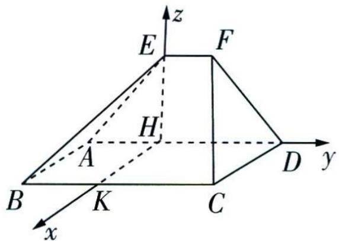

text_image

z
E
F
H
A
B
K
C
D
y
x

图3

(2) 设平面 ABE 的法向量为 $\boldsymbol{v} = (x, y, z)$ ,

则 $\left\{ \begin{array}{l} \pmb{v} \cdot \overrightarrow{AB} = 0, \\ \pmb{v} \cdot \overrightarrow{AE} = 0, \end{array} \right.$ 即 $\left\{ \begin{array}{l} 3x = 0, \\ 3y + 4z = 0, \end{array} \right.$

不妨取 y = -4，则平面 ABE 的一个法向量为 $v = (0, -4, 3)$ .

设平面 CDF 的法向量为 $\boldsymbol{u}=(p,q,r)$ ,

则 $\left\{ \begin{array}{l} \boldsymbol{u} \cdot \overrightarrow{DC} = 0, \\ \boldsymbol{u} \cdot \overrightarrow{DF} = 0, \end{array} \right.$ 即 $\left\{ \begin{array}{l} 3p = 0, \\ -3q + 4r = 0, \end{array} \right.$

不妨取 q=4，则平面 CDF 的一个法向量为 $\boldsymbol{u}=(0,4,3)$ .

所以 $|\cos \langle \pmb {v},\pmb {u}\rangle | = \frac{|\pmb{v}\cdot\pmb{u}|}{|\pmb{v}||\pmb{u}|} = \frac{|0\times 0 + (-4)\times 4 + 3\times 3|}{5\times 5} = \frac{7}{25}.$

# 纠错有方

有一些不会做但是误打误撞做对的题,最好也记录下来,不好好掌握的话,下次可就不一定这么幸运了.

关注微信公众号“初高教辅站”获取更多初高中教辅资料

故平面 ABE 与平面 CDF 所成锐二面角的余弦值为 $\frac{7}{25}$ .

方法二: 几何法 (1) 因为四边形 ABCD 是矩形, 所以 $AB \perp AD$ .

因为平面 $ADFE \perp$ 平面 ABCD, 平面 $ADFE \cap$ 平面 ABCD = AD, 所以 $AB \perp$ 平面 ADFE.

因为 $DF \subset$ 平面 ADFE, 所以 $AB \perp DF$ .

(2)如图4所示,作 $FG\perp AD$ ,垂足为G,过G作 $GS\parallel CD$ 交BC于S,连接EK,FS.

设平面 $ABE$ 与平面 $EHK$ 所成锐二面角为 $\theta$ , 易得平面 $ABE$ 与平面 $EHK$ 的交线与 $HK$ 平行,

因为 $HE \perp HK, AE \perp HK,$ 所以 $\angle AEH = \theta.$

所以 $\cos\theta=\frac{HE}{AE}=\frac{4}{5}.$

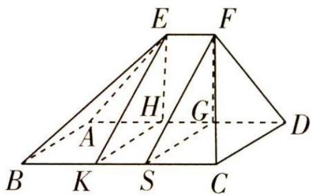

text_image

E
F
H
G
A
D
B
K
S
C

图 4

由图形的对称性可知平面 ABE 与平面 CDF 所成锐二面角为 $2\theta$ ，则 $\cos 2\theta = 2 \cos^{2}\theta - 1 = \frac{7}{25}$ .

【厘思路】截去三棱柱 EHK - FGS，把两边的图形拼合，使点 E, H, K 分别与点 F, G, S 重合，可以发现变化后的几何体关于平面 EHK 对称，因此平面 ABE 与平面 CDF 所成锐二面角即为平面 ABE 与平面 EHK 所成锐二面角的 2 倍

# 纠错攻略

# 翻折问题的两个解题关键

1. 确定翻折前后变与不变的关系: 画好翻折前后的平面图形与立体图形, 分清翻折前后图形的位置关系和数量关系的变与不变. 一般地, 位于 “折痕” 同侧的点、线之间的位置关系和数量关系不变, 而位于 “折痕” 两侧的点、线之间的位置关系会发生变化. 在平面图形中处理不变的关系, 在立体图形中处理变化的关系.

2. 确定翻折后关键点的位置: 所谓的关键点, 是指翻折过程中运动变化的点, 关键点的位置移动会带动点、线、面之间位置关系与数量关系的变化. 只有分析清楚关键点的准确位置, 才能以此为参照点, 确定其他点、线、面的位置, 进而进行有关的证明与计算.

# 纠错巩固

(试题调研原创 | 变考法, 求线面角) 在如图 5 所示的平面图形梯形 $ABCD$ 和 Rt $\triangle ADP$ 中, $2AB = 2BC = 2AP = AD = 2$ , $AD \parallel BC$ , 现将 Rt $\triangle PAD$ 沿 $AD$ 进行翻折, 使平面 $PAD \perp$ 平面 $ABCD$ , 如图 6 所示.

# 纠错有方

纠错时肯定需要把答案誊写在错题本上,但不是所有的错题,都需要一五一十地详尽记录的.

关注微信公众号“初高教辅站”获取更多初高中教辅资料

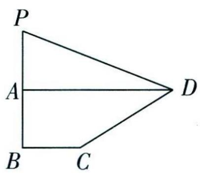

text_image

P
A
D
B
C

图5

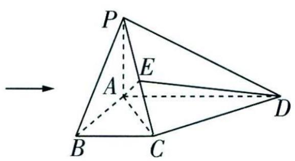

text_image

P
E
A
B
C
D

图6

(1) 求证: $CD \perp$ 平面 PAC.  
(2) 若 E 为 PC 的中点, 求 PD 与平面 AED 所成角的正弦值.

# 参考答案与解析

(1)如图7,取AD的中点F,连接CF,则AF=BC=1,

又 $AD \parallel BC, \therefore$ 四边形 ABCF 为平行四边形, 又 $AB \perp AD,$

∴ 四边形 ABCF 为正方形. ∴ $CF \perp AD$ , ∴ $AC = CD = \sqrt{1^{2} + 1^{2}} = \sqrt{2}$ ,

$$
\because A C ^ {2} + C D ^ {2} = A D ^ {2}, \therefore A C \perp C D.
$$

【避陷阱】翻折后， $\triangle PAD$ 和四边形 $ABCD$ 的形状都没有变化，因此各边长也不变，据此从数量关系下手求解，立体几何问题中，结合勾股定理的逆定理寻找垂直关系是常见的手段

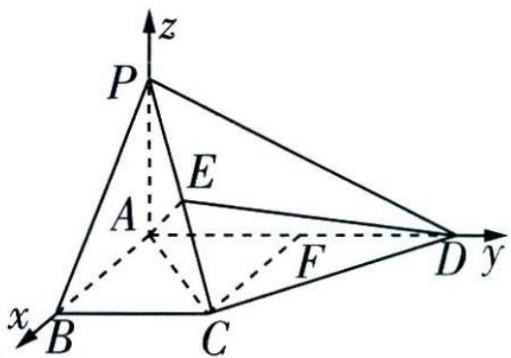

text_image

z
P
E
A
F
D y
x
B
C

图7

∵ 平面 $PAD \perp$ 平面 ABCD, 平面 $PAD \cap$ 平面 ABCD = AD, $PA \subset$ 平面 PAD, $PA \perp AD$ , 故 $PA \perp$ 平面 ABCD, 又 $CD \subset$ 平面 ABCD, ∴ $CD \perp PA$ . 又 $AC \cap PA = A$ , AC, $PA \subset$ 平面 PAC, ∴ $CD \perp$ 平面 PAC.

(2)由题意知 $PA \perp AD, PA \perp AB, AB \perp AD,$

【补漏洞】建系前不要忘了说明三条直线两两垂直

如图7,以A为坐标原点,以AB,AD,AP所在的直线分别为x轴,y轴,z轴建立空间直角坐标系,则 $A(0,0,0)$ , $P(0,0,1)$ , $C(1,1,0)$ , $D(0,2,0)$ ,

$$
\overrightarrow {A D} = (0, 2, 0), \overrightarrow {P D} = (0, 2, - 1).
$$

∵ E 为 PC 的中点, ∴ $E(\frac{1}{2}, \frac{1}{2}, \frac{1}{2})$ , ∴ $\overrightarrow{AE} = (\frac{1}{2}, \frac{1}{2}, \frac{1}{2})$ .

设平面 AED 的法向量为 $\boldsymbol{m} = (x, y, z)$ ，则 $\left\{\begin{aligned}\boldsymbol{m} \cdot \overrightarrow{AE} &= 0, \\ \boldsymbol{m} \cdot \overrightarrow{AD} &= 0,\end{aligned}\right.$ 即 $\left\{\begin{aligned}\frac{1}{2}x + \frac{1}{2}y + \frac{1}{2}z &= 0, \\ y &= 0,\end{aligned}\right.$

令 $z = \frac{1}{2}$ ，可得平面 $AED$ 的一个法向量为 $\pmb {m} = (-\frac{1}{2},0,\frac{1}{2})$

∴ PD 与平面 AED 所成角的正弦值为 $\left|\cos\langle\boldsymbol{m},\overrightarrow{PD}\rangle\right|=\frac{\left|\boldsymbol{m}\cdot\overrightarrow{PD}\right|}{\left|\boldsymbol{m}\right|\left|\overrightarrow{PD}\right|}=\frac{\frac{1}{2}}{\sqrt{\left(-\frac{1}{2}\right)^{2}+\left(\frac{1}{2}\right)^{2}}\times\sqrt{5}}=\frac{\sqrt{10}}{10}.$

# 纠错有方

那些一看就懂的、因为马虎出错的题目, 只记录答案和错因就可以; 那些一知半解的题目, 简单备注思路和关键步骤; 而那些完全不会做的题目, 最好是完整抄下正确答案, 然后慢慢理解.

关注微信公众号“初高教辅站”获取更多初高中教辅资料

# 核心主干知识24个高频易错点

# 类型 1 新教材盲点类

# 盲点1 泰勒展开式

# 盲点剖析

人教 A 版教材《必修第一册》P256“拓广探索”第 26 题给出了正弦和余弦的泰勒展开式: $\sin x = x - \frac{x^{3}}{3!} + \frac{x^{5}}{5!} - \frac{x^{7}}{7!} + \cdots, \cos x = 1 - \frac{x^{2}}{2!} + \frac{x^{4}}{4!} - \frac{x^{6}}{6!} + \cdots$ . 而 2022 年全国甲卷理科的第 12 题, 就可以用正弦和余弦的泰勒展开式估计三角函数值, 进而比大小, 这是一个明显的信号, 引导我们充分挖掘教材, 避免盲区.

调研 1 (试题调研原创)英国数学家泰勒于 1712 年首次提出了泰勒公式,这个公式是高等数学中非常重要的内容之一. 常用函数的泰勒展开式如下:

$$
\sin x = x - \frac {x ^ {3}}{3 !} + \frac {x ^ {5}}{5 !} - \frac {x ^ {7}}{7 !} + \dots + (- 1) ^ {n - 1} \frac {x ^ {2 n - 1}}{(2 n - 1) !} + \dots ,
$$

$$
\cos x = 1 - \frac {x ^ {2}}{2 !} + \frac {x ^ {4}}{4 !} - \frac {x ^ {6}}{6 !} + \dots + (- 1) ^ {n} \frac {x ^ {2 n}}{(2 n) !} + \dots ,
$$

$$
\mathrm{e} ^ {x} = 1 + x + \frac {x ^ {2}}{2 !} + \dots + \frac {x ^ {n}}{n !} + \dots , \text {其中} x \in \mathbf {R}, n \in \mathbf {N} ^ {*}.
$$

根据上述公式,若 $\sin x\cos x = a_{1}x + a_{2}x^{3} + a_{3}x^{5} + a_{4}x^{7} + \cdots + a_{n}x^{2n-1} + \cdots, e^{\frac{x}{2}} = 1 + b_{1}x + b_{2}x^{2} + \cdots + b_{n}x^{n} + \cdots$ , 则 $\sum_{i=1}^{n}\frac{a_{i}}{b_{2i-1}} =$ \_\_\_\_.

$$
\sin x \cos x = \frac {1}{2} \sin 2 x = \frac {1}{2} \left[ 2 x - \frac {(2 x) ^ {3}}{3 !} + \frac {(2 x) ^ {5}}{5 !} - \frac {(2 x) ^ {7}}{7 !} + \dots + (- 1) ^ {n - 1} \frac {(2 x) ^ {2 n - 1}}{(2 n - 1) !} + \dots \right],
$$

【破障碍】利用三角恒等变换将其化为正弦型函数，结合正弦的泰勒展开式，并采用替换的思想即可得出 $\sin 2x$ 的泰勒展开式，这是解题的关键

所以 $a_{n} = (-1)^{n - 1}\frac{2^{2n - 2}}{(2n - 1)!}$

$$
\mathrm{e} ^ {x} = 1 + x + \frac {x ^ {2}}{2 !} + \dots + \frac {x ^ {n}}{n !} + \dots , \text {所以} \mathrm{e} ^ {\frac {x}{2}} = 1 + \frac {x}{2} + \frac {\left(\frac {x}{2}\right) ^ {2}}{2 !} + \dots + \frac {\left(\frac {x}{2}\right) ^ {n}}{n !} + \dots ,
$$

所以 $b_{n} = \frac{1}{2^{n}\cdot n!}$ ，所以 $b_{2n - 1} = \frac{1}{2^{2n - 1}\cdot(2n - 1)!}$

# 纠错有方

设 $c_{n} = \frac{a_{n}}{b_{2n - 1}}$ ，则 $c_{n} = \frac{a_{n}}{b_{2n - 1}} = \frac{(-1)^{n - 1}\frac{2^{2n - 2}}{(2n - 1)!}}{\frac{1}{2^{2n - 1}\cdot(2n - 1)!}} = (-1)^{n - 1}\cdot 2^{4n - 3},$

因为 $\frac{c_{n + 1}}{c_n} = \frac{(-1)^n\cdot 2^{4n + 1}}{(-1)^{n - 1}\cdot 2^{4n - 3}} = -2^4 = -16$ ，所以数列 $\{c_n\}$ 是首项为2、公比为-16的等比数列，

设 $S_{n}$ 为数列 $\{c_n\}$ 的前 $n$ 项和，则 $\sum_{i=1}^{n} \frac{a_i}{b_{2i-1}} = S_n = \frac{2[1 - (-16)^n]}{1 - (-16)} = \frac{2}{17}[1 - (-16)^n]$ .

调研 2 (试题调研原创) $a = \ln \frac{3}{2}, b = \frac{1}{2} \cos \frac{1}{2}, c = \sin \frac{1}{2}$ , 则 ( )

A. $a < b < c$

B. $c < a < b$

C. $c < b < a$

D. $b < c < a$

解析 由泰勒展开式可得 $\sin x = x - \frac{x^{3}}{3!} + \frac{x^{5}}{5!} - \frac{x^{7}}{7!} + \cdots$ ,

$$
\cos x = 1 - \frac {x ^ {2}}{2 !} + \frac {x ^ {4}}{4 !} - \frac {x ^ {6}}{6 !} + \dots , \ln (1 + x) = x - \frac {x ^ {2}}{2} + \frac {x ^ {3}}{3} - \frac {x ^ {4}}{4} + \dots (x \in [ - 1, 1 ]),
$$

所以当 $x > 0$ 时， $\sin x \approx x - \frac{x^3}{3!}, \cos x \approx 1 - \frac{x^2}{2!}, \ln (1 + x) \approx x - \frac{x^2}{2}$ ，

【厘思路】比大小的小题中, 常取泰勒展开式的前几项来估算, 小题小做, 从而避开构造函数的复杂方法, 熟练记忆常见的泰勒展开式 (记忆有困难的可以只记前几项), 对做小题很有帮助

$$
a = \ln \frac {3}{2} = \ln (1 + \frac {1}{2}) \approx \frac {1}{2} - \frac {1}{8} = \frac {3}{8}, b = \frac {1}{2} \cos \frac {1}{2} \approx \frac {1}{2} \times (1 - \frac {1}{8}) = \frac {7}{1 6}, c = \sin \frac {1}{2} \approx \frac {1}{2} - \frac {1}{4 8} = \frac {2 3}{4 8},
$$

所以 a < b < c, 故选 A.

# 纠错巩固

1. (变考点, 数列与导数交汇 |2024 上海格致中学开学考试|较难) 若 $\mathbf{R}$ 上的可导函数 $f(x), g(x)$ 满足 $f(x) = g(x)$ , 则 $f'(x) = g'(x)$ 成立. 根据泰勒展开式可以得出: $\mathrm{e}^{2x} = a_{0} + a_{1}x + a_{2}x^{2} + \cdots + a_{n}x^{n} + \cdots$ , 则 $\sum_{n=1}^{10} \frac{a_{n+1}}{na_{n}} =$ \_\_\_\_.

2. (试题调研原创 | 变题型, 考查泰勒展开式与导数的交汇 | 多选) 公元 1715 年英国数学家布鲁克·泰勒在他的著作中陈述了泰勒公式. 泰勒公式将一些复杂函数近似地表示为简单的多项式函数, 这使得它成为分析和研究许多数学问题的有力工具,

例如:① $e^{x}=1+x+\frac{x^{2}}{2!}+\cdots+\frac{x^{n}}{n!}+\cdots$ ;② $\sin x=x-\frac{x^{3}}{3!}+\frac{x^{5}}{5!}-\cdots+(-1)^{n}\frac{x^{2n+1}}{(2n+1)!}+\cdots;$

③ $\cos x=1-\frac{x^{2}}{2!}+\frac{x^{4}}{4!}-\cdots+(-1)^{n}\frac{x^{2n}}{(2n)!}+\cdots;$ ④ $\ln(1+x)=x-\frac{x^{2}}{2}+\frac{x^{3}}{3}-\cdots+$

# 纠错有方

改错 错题本就是量身定做的教科书,一定要常看.不需要每次都正襟危坐地去看,偶尔随意地看一看,也能加深印象.

$(-1)^{n}\frac{x^{n+1}}{n+1}+\cdots$ 运用上述公式,以下大小关系正确的是()

A. $\mathrm{e}^{0.1} > 1.105$

B. $2 \sin \frac{1}{2} > \frac{5}{6}$

C. $\frac{1}{1 + x} > 1 - x + x^2 (-1 < x < 0)$

D. $\cos \frac{1}{4} < \frac{31}{32}$

# 参考答案与解析

1. $\frac{20}{11}$ 设 $f(x) = \mathrm{e}^{2x}, g(x) = a_0 + a_1x + a_2x^2 + \dots + a_nx^n + \dots,$

则 $a_{0}=g(0)=f(0)=1$ , 记 $f^{1}(x)=f'(x),\left[f^{1}(x)\right]'=f^{2}(x)=f''(x),\left[f^{2}(x)\right]'=f^{3}(x)=f'''(x),\cdots,$ 则 $\left[f^{n}(x)\right]'=f^{n+1}(x),n\in\mathbf{N}^{*}$ .

结合题意,由 $f(x)=g(x)$ ,可得 $f^{1}(x)=g^{1}(x)$ ,

由 $f^{1}(x)=g^{1}(x)$ ，可得 $f^{2}(x)=g^{2}(x)$ ，

由 $f^{2}(x)=g^{2}(x)$ ，可得 $f^{3}(x)=g^{3}(x)$ ，

● ● ● ● ● ●

所以 $f^{n}(x)=g^{n}(x)$ .

【堵误区】由 $f(x)=g(x)$ 推出 $f^{n}(x)=g^{n}(x)$ 有一个隐藏的前提条件： $f^{n-1}(x), g^{n-1}(x)(n=2,3,4,\cdots)$ 均可导。指数函数 $f(x)$ 和多项式型函数 $g(x)$ 满足这个前提条件，换作其他函数则不一定满足

易得 $f^{n}(0)=2^{n}e^{0}=2^{n},g^{n}(0)=a_{n}n!$ ,

由 $g^n (0) = f^n (0)$ ，可得 $a_{n} = \frac{2^{n}}{n!}$ 所以 $\frac{a_{n + 1}}{na_n} = \frac{2}{n(n + 1)} = 2\left(\frac{1}{n} -\frac{1}{n + 1}\right),$

所以 $\sum_{n=1}^{10} \frac{a_{n+1}}{na_n} = 2 \times (1 - \frac{1}{2} + \frac{1}{2} - \frac{1}{3} + \cdots + \frac{1}{10} - \frac{1}{11}) = \frac{20}{11}$ , 故答案为 $\frac{20}{11}$ .

2. ABC 因为 $e^{x}=1+x+\frac{x^{2}}{2!}+\cdots+\frac{x^{n}}{n!}+\cdots$ ，所以当 x>0 时， $e^{x}>1+x+\frac{x^{2}}{2!}$

则 $\mathrm{e}^{0.1} > 1 + 0.1 + \frac{0.1^2}{2!} = 1.105$ , A 正确.

因为 $\sin x = x - \frac{x^{3}}{3!} + \frac{x^{5}}{5!} - \cdots + (-1)^{n} \frac{x^{2n+1}}{(2n+1)!} + \cdots$ ，所以当 $x \in (0,1)$ 时， $\sin x > x - \frac{x^{3}}{3!}$

则 $\sin \frac{1}{2} >\frac{1}{2} -\frac{\left(\frac{1}{2}\right)^3}{3!} = \frac{1}{2} -\frac{1}{48} = \frac{23}{48} >\frac{5}{12}$ 所以 $2\sin \frac{1}{2} >\frac{5}{6},$ B正确.

# 纠错有方

$\ln(1+x)=x-\frac{x^{2}}{2}+\frac{x^{3}}{3}-\cdots+(-1)^{n}\frac{x^{n+1}}{n+1}+\cdots$ ，两边同时求导可得 $\frac{1}{1+x}=1-x+x^{2}-x^{3}+\cdots$

【补漏洞】结合 $\ln(1+x)$ 和 $\frac{1}{1+x}$ 联想求导得解. 注意: 像同加、同减、同乘这样的变换, 适用于等式和不等式, 而同时平方一般只用于等式, 某些情况可以用于不等式, 同时求导则只适用于等式

所以当 -1 < x < 0 时， $\frac{1}{1 + x} = 1 - x + x^{2} - x^{3} + \cdots > 1 - x + x^{2}$ ，C 正确.

【破障碍】等号右边 $x^{2}$ 后的项两两结合, 每两项结合的值都大于 0 , 据此放缩; D 选项中的放缩也是类比此方法进行的

因为 $\cos x = 1 - \frac{x^{2}}{2!} + \frac{x^{4}}{4!} - \cdots + (-1)^{n} \frac{x^{2n}}{(2n)!} + \cdots$ ，所以当 0 < x < 1 时， $1 - \frac{x^{2}}{2!} < \cos x = 1 - \frac{x^{2}}{2!} + \frac{x^{4}}{4!} - \cdots < 1 - \frac{x^{2}}{2!} + \frac{x^{4}}{4!}$ ，所以 $\cos \frac{1}{4} > 1 - \frac{1}{32} = \frac{31}{32}$ ，D 错误。故选 ABC.

# 盲点2 柯西不等式

# ·盲点剖析。

柯西不等式的一般形式为 $(a_{1}^{2}+a_{2}^{2}+\cdots+a_{n}^{2})(b_{1}^{2}+b_{2}^{2}+\cdots+b_{n}^{2})\geqslant(a_{1}b_{1}+a_{2}b_{2}+\cdots+a_{n}b_{n})^{2}$ ，当且仅当 $b_{i}=0(i=1,2,\cdots,n)$ 或存在一个数k，使得 $a_{i}=kb_{i}(i=1,2,\cdots,n)$ 时取等号。人教A版教材《必修第二册》P19给出了二维形式的柯西不等式向量表示形式，即 $|a\cdot b|\leq|a||b|$ ；人教A版教材《必修第二册》P37第16题要求运用向量方法证明二维形式的柯西不等式，足以见得其重要性，在备考时应有意识地去关注、训练。

调研 1 (试题调研原创)已知 $3a + 4b + 1 = 0$ , 则 $(a + 1)^{2} + b^{2}$ 的最小值为

解析 设 $\boldsymbol{m}=(a+1,b)$ , $\boldsymbol{n}=(3,4)$ ，则 $\boldsymbol{m}\cdot\boldsymbol{n}=(a+1,b)\cdot(3,4)=3(a+1)+4b=2$ ,

【厘思路】利用柯西不等式的关键是结合已知条件, 将目标式子进行恰当的变形、配凑, 以符合柯西不等式的结构特征. 向量形式的柯西不等式则需要构造两个向量, 使得两向量的模的积一定或内积一定, 即使不等式的某一侧为定值

由 $|\pmb {m}\cdot \pmb {n}|\leqslant |\pmb {m}||\pmb {n}|$ 可得 $2\leqslant \sqrt{(a + 1)^2 + b^2}\times \sqrt{3^2 + 4^2}$ ，即 $2\leqslant 5\sqrt{(a + 1)^2 + b^2}$

即 $(a + 1)^2 + b^2 \geqslant \frac{4}{25}$ , 故 $(a + 1)^2 + b^2$ 的最小值为 $\frac{4}{25}$ .

调研 2 (试题调研原创) 已知 $a > 0, b > 0$ , 且 $15a + 2b = 12$ , 则 $\sqrt{13a + \frac{b}{2}} +$

# 纠错有方

看错题也是优化错题本的好机会,对易错、不理解的地方多批注,翻开错题本,里面五颜六色,无论怎样的坏心情也会消失吧.

$\sqrt{\frac{a}{3}+\frac{b}{4}}$ 的最大值为 \_\_\_\_.

解析 $\sqrt{13a + \frac{b}{2}} +\sqrt{\frac{a}{3} + \frac{b}{4}} = \frac{1}{\sqrt{2}}\times \sqrt{26a + b} +\frac{1}{\sqrt{12}}\times \sqrt{4a + 3b},$

【破障碍】有些最值问题从表面上看不能利用柯西不等式，但只要适当添加上常数项或和为常数的各项，就可以应用柯西不等式来解，这也是运用柯西不等式解题的技巧

所以 $(\sqrt{13a + \frac{b}{2}} + \sqrt{\frac{a}{3} + \frac{b}{4}})^2 = (\frac{1}{\sqrt{2}} \times \sqrt{26a + b} + \frac{1}{\sqrt{12}} \times \sqrt{4a + 3b})^2 \leqslant (\frac{1}{2} + \frac{1}{12})[(26a +$

$b) + (4a + 3b)] = \frac{7}{12}(30a + 4b) = \frac{7}{6}(15a + 2b) = 14$ , 当且仅当 $\left\{\begin{aligned}\frac{\sqrt{4a+3b}}{\sqrt{2}} &= \frac{\sqrt{26a+b}}{\sqrt{12}},\\15a+2b &= 12,\end{aligned}\right.$ 即

$\left\{ \begin{array}{l} a = \frac{204}{259}, \\ b = \frac{24}{259} \end{array} \right.$ 时等号成立.

故 $\sqrt{13a + \frac{b}{2}} +\sqrt{\frac{a}{3} + \frac{b}{4}}$ 的最大值为 $\sqrt{14}$

# 纠错巩固

1. (试题调研原创 | 变考点, 考查用换元思想构建柯西不等式) 若 $\frac{1}{(3a + 2b)^2} + \frac{1}{(2a - 3b)^2} = 4$ , 则 $a^2 + b^2$ 的最小值为 \_\_\_\_.

2. (变考点, 混合考查导数、基本不等式与柯西不等式 |2024 江西丰城 9 月月考 | 多选 | 较难) $a > 0, b > 0, a + b = 1$ , 则下列结论正确的是 ( )

A. $\sqrt{a + 1} + \sqrt{1 - b}$ 的最大值为 $\frac{\sqrt{6} + \sqrt{2}}{2}$

B. $\log_ {2} a + \log_ {2} b$ 的最大值为 -2

C. $a^3 + b^3$ 的最小值为 $\frac{1}{4}$

D. $\frac{a^5 + b^5}{ab}$ 的最小值为 $\frac{1}{4}$

# 纠错有方

# 参考答案与解析

1. $\frac{1}{13}$ 设 $x=3a+2b, y=2a-3b$ ,

【破障碍】通过换元,将问题巧妙转化,以满足柯西不等式的结构特征

则 $\frac{1}{x^2} +\frac{1}{y^2} = 4$ ，且 $x^{2} + y^{2} = (3a + 2b)^{2} + (2a - 3b)^{2} = 13(a^{2} + b^{2})$ ，所以 $a^2 +b^2 = \frac{1}{13} (x^2 +y^2)$

则 $a^2 + b^2 = \frac{1}{13} (x^2 + y^2) = \frac{1}{13 \times 4} (x^2 + y^2) (\frac{1}{x^2} + \frac{1}{y^2}) \geqslant \frac{1}{52} (x \cdot \frac{1}{x} + y \cdot \frac{1}{y})^2 = \frac{1}{13}$ ,

当且仅当 $x^{2} = y^{2}$ ，即 $x = \pm \frac{\sqrt{2}}{2},y = \pm \frac{\sqrt{2}}{2}$ 即 $a = \pm \frac{5\sqrt{2}}{26},b = \mp \frac{\sqrt{2}}{26}$ 或 $a = \pm \frac{\sqrt{2}}{26},b = \pm \frac{5\sqrt{2}}{26}$ 时等号成立，故 $a^2 +b^2$ 的最小值为 $\frac{1}{13}$

2. BCD $a > 0, b > 0, a + b = 1$ , 则 $0 < a < 1, 0 < b < 1$ .

对 A: $\sqrt{a+1} + \sqrt{1-b} = \sqrt{a+1} + \sqrt{a}$ ，设 $y = \sqrt{x+1} + \sqrt{x}$ ，显然该函数在 $(0,1)$ 上单调递增，因此该函数没有最大值，A 错误.

对 $\mathrm{B}:\log_2a + \log_2b = -(-\log_2a - \log_2b) = -\log_2\frac{1}{ab}$ , 由基本不等式得 $0 < ab \leqslant \left(\frac{a + b}{2}\right)^2 = \frac{1}{4} \Rightarrow$ $\frac{1}{ab} \geqslant 4$ , 则 $\log_2\frac{1}{ab} \geqslant 2$ , 当且仅当 $a = b = \frac{1}{2}$ 时取等号,

所以 $-\log_{2}\frac{1}{ab}\leqslant-2$ , 即 $\log_{2}a+\log_{2}b$ 的最大值为 -2, B 正确.

对 C: 不妨设 $a \geqslant b, a = \frac{1}{2} + t, b = \frac{1}{2} - t (0 \leqslant t < \frac{1}{2})$ ，则 $y = a^{3} + b^{3} = (\frac{1}{2} + t)^{3} + (\frac{1}{2} - t)^{3} = 3t^{2} + \frac{1}{4} \geqslant \frac{1}{4}$ ，C 正确.

【破障碍】利用换元思想，将三次函数问题转化为二次函数问题

对 D: $\frac{a^5 + b^5}{ab} = \frac{a^4}{b} + \frac{b^4}{a} = (\frac{a^4}{b} + \frac{b^4}{a})(a + b) \geqslant (\sqrt{\frac{a^4}{b}} \cdot \sqrt{b} + \sqrt{\frac{b^4}{a}} \cdot \sqrt{a})^2 = (a^2 + b^2)^2$ , 当且仅当 $\frac{a^4}{b} \cdot a = \frac{b^4}{a} \cdot b$ , 即 $a = b$ 时取等号, 而 $(a^2 + b^2)^2 \geqslant [\frac{(a + b)^2}{2}]^2 = \frac{1}{4}$ , 当且仅当 $a = b = \frac{1}{2}$ 时取等号,

【避陷阱】同时利用基本不等式、柯西不等式时，等号成立的条件不能相互矛盾，否则就会出现错误

所以 $\frac{a^{5}+b^{5}}{ab}$ 的最小值为 $\frac{1}{4}$ , D 正确. 故选 BCD.

纠错有方

# 盲点3 斜坐标系

# ·盲点剖析。

人教 A 版教材《必修第二册》P37“拓广探索”第 15 题给出了斜坐标的定义,并要求在斜坐标系下求向量的模,近几年的高考试题也经常出现斜坐标系问题,因此探究在斜坐标系下向量的运算及其应用是非常有必要的,应该重点关注.

调研 1 (试题调研原创) 在等腰梯形 $ABCD$ 中, $\angle BAD = 60^{\circ}, AD = 4, AB = BC = CD = 2$ , 点 $E$ 为 $CD$ 的中点, 点 $F$ 满足 $\overrightarrow{BF} = \frac{1}{4}\overrightarrow{BC}$ , 则 $\overrightarrow{AE} \cdot \overrightarrow{DF} =$ \_\_\_\_.

$$
\begin{array}{r l} & {\mathrm{解析方法一:基底法} \quad \overrightarrow {A E} \cdot \overrightarrow {D F} = (\overrightarrow {A D} + \overrightarrow {D E}) \cdot (\overrightarrow {D A} + \overrightarrow {A B} + \overrightarrow {B F}) = (\overrightarrow {A D} + \frac {1}{2} \overrightarrow {D C}) \cdot (- \overrightarrow {A D} +} \\ & {\overrightarrow {A B} + \frac {1}{8} \overrightarrow {A D}) = [ \overrightarrow {A D} + \frac {1}{2} (\overrightarrow {A B} + \frac {1}{2} \overrightarrow {A D} - \overrightarrow {A D}) ] \cdot (\overrightarrow {A B} - \frac {7}{8} \overrightarrow {A D}) = (\frac {3}{4} \overrightarrow {A D} + \frac {1}{2} \overrightarrow {A B}) \cdot (\overrightarrow {A B} - \frac {7}{8} \overrightarrow {A D}) =} \\ & {\frac {3}{4} \overrightarrow {A D} \cdot \overrightarrow {A B} - \frac {2 1}{3 2} \overrightarrow {A D ^ {2}} + \frac {1}{2} \overrightarrow {A B ^ {2}} - \frac {7}{1 6} \overrightarrow {A D} \cdot \overrightarrow {A B} = \frac {5}{1 6} \overrightarrow {A D} \cdot \overrightarrow {A B} - \frac {2 1}{3 2} \overrightarrow {A D ^ {2}} + \frac {1}{2} \overrightarrow {A B ^ {2}} = \frac {5}{1 6} \times 4 \times 2 \times \frac {1}{2} - \frac {2 1}{3 2} \times 1 6 +} \\ & {\frac {1}{2} \times 4 = - \frac {2 9}{4}.} \end{array}
$$

【破障碍】利用基底法求解的关键是选择适当的基底向量，将其余向量利用向量的线性运算全部转化为基底向量

方法二: 建立平面直角坐标系 建立如图1所示的平面直角坐标系, 其中 O 为坐标原点, AO = OD, x 轴与 AD 重合, $AD \perp y$ 轴, 则 A(-2, 0), D(2, 0), B(-1, $\sqrt{3}$ ), C(1, $\sqrt{3}$ ), E( $\frac{3}{2}$ , $\frac{\sqrt{3}}{2}$ ), F(- $\frac{1}{2}$ , $\sqrt{3}$ ),

所以 $\overrightarrow{AE} \cdot \overrightarrow{DF} = (\frac{7}{2}, \frac{\sqrt{3}}{2}) \cdot (-\frac{5}{2}, \sqrt{3}) = -\frac{35}{4} + \frac{3}{2} = -\frac{29}{4}$ .

方法三:建立斜坐标系 以 A 为坐标原点,建立如图 2 所示的斜坐标系, $\angle BAD=60^{\circ}$ ,则 $A(0,0)$ , $D(4,0)$ , $B(0,2)$ , $C(2,2)$ , $E(3,1)$ , $F(\frac{1}{2},2)$ ,所以 $\overrightarrow{AE}=(3,1)$ , $\overrightarrow{DF}=(-\frac{7}{2},2)$ ,

所以 $\overrightarrow{AE} \cdot \overrightarrow{DF} = 3 \times (-\frac{7}{2}) + 1 \times 2 + (3 \times 2 - \frac{7}{2} \times 1) \times \cos 60^{\circ} = -\frac{29}{4}$ .

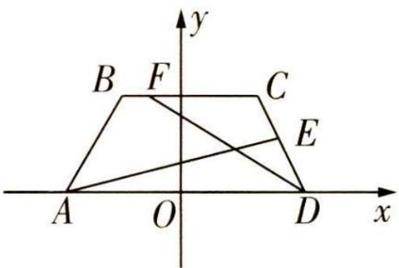

text_image

y
B F C
A O D x
E

图 1

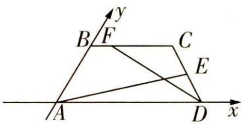

text_image

y
B F C
E
A D x

图 2

【辨易混】在斜坐标系下平面向量及其加、减、数乘运算的坐标表示与直角坐标系下的一致, 但是在斜坐标系下平面向量的数量积的坐标表示与直角坐标系下的不同. 如在斜坐标系下设 $a = (x_{1}, y_{1}), b = (x_{2}, y_{2})$ , 则有 $a \cdot b = (x_{1} x_{2} + y_{1} y_{2}) + (x_{1} y_{2} + x_{2} y_{1}) \cos \langle a, b \rangle$ . 不要混淆两种坐标系的运算

# 纠错有方

调研 2 (试题调研原创) 在边长为 1 的等边三角形 $ABC$ 中, $D$ 为线段 $BC$ 上的动点, $DE \perp AB$ 且交 $AB$ 于点 $E$ , $DF \perp AC$ 且交 $AC$ 于点 $F$ , 则 $(\overrightarrow{BF} + \overrightarrow{CE}) \cdot (\overrightarrow{DA} + \overrightarrow{EF})$ 的最大值为 \_\_\_\_.

解析 建立如图3所示的斜坐标系, 设 ${BD} = t\left( {0 < t < 1}\right)$ ,则 $B\left( {0,0}\right) ,C\left( {1,0}\right) ,A\left( {0,1}\right) ,D\left( t\right.$ , $0),E\left( {0,\frac{t}{2}}\right) ,F\left( {\frac{t + 1}{2},\frac{1 - t}{2}}\right)$ ,

【破障碍】建立斜坐标系的关键是准确写出各点的坐标, 注意结合与坐标轴平行的线得出点的坐标

所以 $\overrightarrow{BF} = (\frac{t + 1}{2},\frac{1 - t}{2}),\overrightarrow{CE} = (-1,\frac{t}{2}),\overrightarrow{DA} = (-t,1),\overrightarrow{EF} = (\frac{t + 1}{2},\frac{1 - 2t}{2})$

所以 $(\overrightarrow{BF} + \overrightarrow{CE}) \cdot (\overrightarrow{DA} + \overrightarrow{EF}) = -\left(\frac{t - 1}{2}\right)^2 + \frac{3 - 2t}{4} + \left(\frac{t - 1}{2} \times \frac{3 - 2t}{2} + \frac{1}{2} \times \frac{1 - t}{2}\right) \times \frac{1}{2} = -\frac{1}{2} t^2 + \frac{1}{2} t + \frac{1}{4} = -\frac{1}{2} (t - \frac{1}{2})^2 + \frac{3}{8},$

所以当 $t = \frac{1}{2}$ 时， $(\overrightarrow{BF} + \overrightarrow{CE}) \cdot (\overrightarrow{DA} + \overrightarrow{EF})$ 取得最大值 $\frac{3}{8}$ .

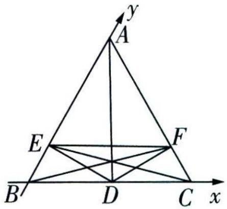

text_image

y
A
E
F
B
D
C
x

图3

# 纠错巩固

(试题调研改编 | 变考点, 平面向量数量积与基本不等式的交汇) 在 $\triangle ABC$ 中, $\angle A = 60^{\circ}, BC = 1$ , 点 $D$ 为 $AB$ 的中点, 点 $E$ 为 $CD$ 的中点, 若 $\overrightarrow{BF} = \frac{1}{3}\overrightarrow{BC}$ , 则 $\overrightarrow{AE} \cdot \overrightarrow{AF}$ 的最大值为 \_\_\_\_.

# 参考答案与解析

$\frac{13}{24}$ 设 AB = m, AC = n, 建立如图 4 所示的斜坐标系, 则 A(0,0), B(m,

0), $C(0, n)$ , $D(\frac{m}{2}, 0)$ , $E(\frac{m}{4}, \frac{n}{2})$ , $F(\frac{2m}{3}, \frac{n}{3})$ ,

则 $\overrightarrow{AE} \cdot \overrightarrow{AF} = \frac{1}{6} m^2 + \frac{1}{6} n^2 + \frac{5}{24} mn.$

在 $\triangle ABC$ 中, 根据余弦定理可得 $BC^{2} = m^{2} + n^{2} - 2mn\cos 60^{\circ} = m^{2} + n^{2} - mn = 1$ ,

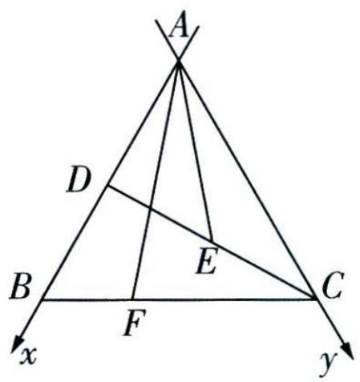

text_image

A
D
B
E
F
C
x
y

图4

由基本不等式可得 $m^{2} + n^{2} - mn = 1 \geqslant 2mn - mn = mn$ ，即 $mn \leqslant 1$ ，当且仅当 m = n = 1 时取等号，

【避陷阱】利用基本不等式求最值务必验证等号成立的条件是否符合题意，否则容易导致错解所以 $\frac{1}{6}m^{2}+\frac{1}{6}n^{2}+\frac{5}{24}mn=\frac{1}{6}(mn+1)+\frac{5}{24}mn=\frac{3}{8}mn+\frac{1}{6}\leqslant\frac{3}{8}+\frac{1}{6}=\frac{13}{24}$ ，即 $\overrightarrow{AE}\cdot\overrightarrow{AF}$ 的最大值为 $\frac{13}{24}$ .

# 纠错有方

养成找题目的相似点的习惯,慢慢地,你会发现题目内在的联系,“揣测出题人意图”对你来说就越来越简单了.

关注微信公众号“初高教辅站”获取更多初高中教辅资料

# 盲点4 斐波那契数列

# ·盲点剖析。

人教 A 版教材《选择性必修第二册》P10“阅读与思考”给出了斐波那契数列的定义、性质以及在自然界中的体现,并且在人教 A 版教材《选择性必修第二册》P57“拓广探索”第 17 题要求运用数学归纳法证明斐波那契数列的通项公式.鉴于斐波那契数列具有深厚的数学文化背景,对其常见的初等数学性质应该予以重视.

调研 1 (试题调研原创 | 多选) 斐波那契数列又称黄金分割数列, 在现代物理、化学等领域都有应用. 斐波那契数列 $\{a_{n}\}$ 满足 $a_{1} = a_{2} = 1$ , $a_{n} = a_{n-1} + a_{n-2} (n \geqslant 3, n \in \mathbf{N}^{*})$ . 下列结论正确的是 ( )

A. $\forall n\in \mathbf{N}^{*},a_{n},a_{n + 2},a_{n + 3}$ 成等差数列

B. $\forall n\in \mathbf{N}^{*}$ ，数列 $\{a_{n + 1}^2 -a_na_{n + 2}\}$ 为等比数列

C. $\exists n, m \in \mathbf{N}^*$ , 使得 $a_n^2 + a_m^2 = a_{n+m}$

D. $\forall n \in \mathbf{N}^*$ , 数列 $\{a_{n+2} - S_n\}$ 不是常数列 ( $S_n$ 为 $\{a_n\}$ 的前 $n$ 项和)

解析 由题意可知: $a_{n+2} = a_{n+1} + a_n, a_{n+2} + a_{n+1} = a_{n+3}$ , 所以 $a_{n+2} + a_{n+2} + a_{n+1} = a_{n+1} + a_n + a_{n+3}$ , 即 $2a_{n+2} = a_n + a_{n+3}$ , 所以 $a_n, a_{n+2}, a_{n+3}$ 成等差数列, 故 A 正确.

【破障碍】证明 $a_{n}, a_{n+2}, a_{n+3}$ 成等差数列，即证 $2a_{n+2} = a_{n} + a_{n+3}$ ，结合斐波那契数列的递推公式 $a_{n+2} = a_{n+1} + a_{n}$ 证明

由题意可知 $a_{n + 1}^2 - a_n a_{n + 2} = a_{n + 1} a_{n + 1} - a_n a_{n + 2} = a_{n + 1}(a_n + a_{n - 1}) - a_n (a_{n + 1} + a_n) = a_{n + 1} a_{n - 1} - a_n^2 = -(a_n^2 - a_{n + 1} a_{n - 1}), n \geqslant 2,$

而 $a_2^2 - a_1a_3 = 1 - 2 = -1 \neq 0$ ，所以数列 $\{a_{n+1}^2 - a_na_{n+2}\}$ 为等比数列，故 B 正确.

因为 $a_{4}=3, a_{6}=8, a_{10}=55, a_{6}^{2}-a_{4}^{2}=a_{10}$ ，所以 C 正确.

【厘思路】对于存在性问题，只需要找出一个满足题意的即可，通常采用特值法验证

对于 D, 当 $n \geqslant 2$ 时, $a_{n-1} + a_n = a_{n+1}$ , 则 $a_n = a_{n+1} - a_{n-1}$ , 则当 $n \geqslant 2$ 时, $S_n = a_1 + a_2 + a_3 + \cdots + a_n = a_1 + (a_3 - a_1) + (a_4 - a_2) + \cdots + (a_{n+1} - a_{n-1}) = (a_1 + a_3 + a_4 + \cdots + a_{n+1}) - (a_1 + a_2 + a_3 + \cdots + a_{n-1}) = a_{n+1} + a_n - 1 = a_{n+2} - 1$ ,

【补盲点】根据数列的前 $n$ 项和公式和斐波那契数列的性质得出 $S_{n}$ 与 $a_{n+1}, a_{n}$ 之间的关系

# 纠错有方

合理地运用错题本,带来的不仅是成绩的提高,还有完成这样一个大工程的成就感和自信.

关注微信公众号“初高教辅站”获取更多初高中教辅资料是解题的关键，斐波那契数列 $\{F_{n}\}$ 的常用性质如下： $F_{1} + F_{2} + F_{3} + \cdots + F_{n-1} + F_{n} = F_{n+2} - 1$ ， $n \in N^{*}$ ; $F_{1}^{2} + F_{2}^{2} + \cdots + F_{n}^{2} = F_{n} F_{n+1}$ , $n \in N^{*}$ ; $F_{1} + F_{3} + F_{5} + \cdots + F_{2n-1} = F_{2n}$ , $n \in N^{*}$ ; $F_{2} + F_{4} + F_{6} + \cdots + F_{2n-2} + F_{2n} = F_{2n+1} - 1$ , $n \in N^{*}$

因此 $a_{n + 2} - S_n = 1, n \geqslant 2$ ，又 $a_4 - S_2 = 3 - 2 = 1, a_3 - S_1 = 2 - 1 = 1,$

所以 $a_{n+2}-S_{n}=1$ , 即 $\forall n\in N^{*}$ , 数列 $\{a_{n+2}-S_{n}\}$ 为常数列, 故 D 错误. 故选 ABC.

调研 2 (试题调研原创|较难) 数列 $\{a_{n}\}: 1, 1, 2, 3, 5, 8, 13, 21, 34 \cdots$ 被称为斐波那契数列, 该数列由意大利数学家斐波那契以兔子繁殖为例子而引入, 故又被称为“兔子数列”. 在数学上, 斐波那契数列 $\{a_{n}\}$ 可表述为 $a_{1} = a_{2} = 1, a_{n} = a_{n-1} + a_{n-2} (n \geqslant 3, n \in \mathbf{N}^{*})$ .

(1) 证明: 数列 $\{a_{n+1} + \frac{\sqrt{5} - 1}{2} a_n\}$ 和 $\{a_{n+1} - \frac{\sqrt{5} + 1}{2} a_n\}$ 均为等比数列, 并求出数列 $\{a_n\}$ 的通项公式.

(2) 若 $a_{4047} = \frac{1}{\sqrt{5}} \left( m + \frac{1}{m} \right) (m > 1)$ ，用含 m 的代数式表示 $\frac{1}{a_{1}a_{3}} + \frac{1}{a_{2}a_{4}} + \frac{1}{a_{3}a_{5}} + \cdots + \frac{1}{a_{2022}a_{2024}}$ .

解析 (1) 因为 $a_{n} = a_{n - 1} + a_{n - 2}, n \geqslant 3, n \in \mathbf{N}^{*}$ ,

所以 $a_{n} + \frac{\sqrt{5} - 1}{2} a_{n - 1} = \frac{\sqrt{5} + 1}{2} (a_{n - 1} + \frac{\sqrt{5} - 1}{2} a_{n - 2}), n \geqslant 3, n \in \mathbf{N}^{*}$ ,

而 $a_{2} + \frac{\sqrt{5} - 1}{2} a_{1} = 1 + \frac{\sqrt{5} - 1}{2} = \frac{\sqrt{5} + 1}{2}\neq 0,$

【避陷阱】不要忘记验证首项，等比数列的首项一定不能为0

所以数列 $\{a_{n + 1} + \frac{\sqrt{5} - 1}{2} a_n\}$ 为等比数列且 $a_{n + 1} + \frac{\sqrt{5} - 1}{2} a_n = (\frac{\sqrt{5} + 1}{2})^n$ ①；

同理可得 $a_{n} - \frac{\sqrt{5} + 1}{2} a_{n - 1} = \frac{1 - \sqrt{5}}{2} (a_{n - 1} - \frac{\sqrt{5} + 1}{2} a_{n - 2}), n \geqslant 3, n \in \mathbf{N}^{*}$

而 $a_2 - \frac{\sqrt{5} + 1}{2} a_1 = 1 - \frac{\sqrt{5} + 1}{2} = \frac{-\sqrt{5} + 1}{2} \neq 0$

所以数列 $\{a_{n + 1} - \frac{\sqrt{5} + 1}{2} a_n\}$ 为等比数列且 $a_{n + 1} - \frac{\sqrt{5} + 1}{2} a_n = (\frac{-\sqrt{5} + 1}{2})^n$ ②.

联立①②可得 $a_{n}=\frac{\sqrt{5}}{5}\left[\left(\frac{1+\sqrt{5}}{2}\right)^{n}-\left(\frac{1-\sqrt{5}}{2}\right)^{n}\right](n\in\mathbf{N}^{*})$ .

(2) 因为 $\frac{1}{a_n a_{n+2}} = \frac{a_{n+1}}{a_n a_{n+1} a_{n+2}} = \frac{a_{n+2} - a_n}{a_n a_{n+1} a_{n+2}} = \frac{1}{a_n a_{n+1}} - \frac{1}{a_{n+1} a_{n+2}}$ ,

$$
\begin{array}{l} = \left(\frac {1}{a _ {1} a _ {2}} - \frac {1}{a _ {2} a _ {3}}\right) + \left(\frac {1}{a _ {2} a _ {3}} - \frac {1}{a _ {3} a _ {4}}\right) + \dots + \left(\frac {1}{a _ {2 0 2 1} a _ {2 0 2 2}} - \frac {1}{a _ {2 0 2 2} a _ {2 0 2 3}}\right) + \left(\frac {1}{a _ {2 0 2 2} a _ {2 0 2 3}} - \frac {1}{a _ {2 0 2 3} a _ {2 0 2 4}}\right) \\ = \frac {1}{a _ {1} a _ {2}} - \frac {1}{a _ {2 0 2 3} a _ {2 0 2 4}} \\ = 1 - \frac {1}{a _ {2 0 2 3} a _ {2 0 2 4}}. \\ \end{array}
$$

所以 $\frac{1}{a_1a_3} +\frac{1}{a_2a_4} +\frac{1}{a_3a_5} +\dots +\frac{1}{a_{2021}a_{2023}} +\frac{1}{a_{2022}a_{2024}}$

由(1)可知 $a_{n}=\frac{1}{\sqrt{5}}\left[\left(\frac{1+\sqrt{5}}{2}\right)^{n}-\left(\frac{1-\sqrt{5}}{2}\right)^{n}\right](n\in\mathbf{N}^{*})$ ,

所以 $a_{2023} = \frac{1}{\sqrt{5}} \left[ \left( \frac{1 + \sqrt{5}}{2} \right)^{2023} - \left( \frac{1 - \sqrt{5}}{2} \right)^{2023} \right], a_{2024} = \frac{1}{\sqrt{5}} \left[ \left( \frac{1 + \sqrt{5}}{2} \right)^{2024} - \left( \frac{1 - \sqrt{5}}{2} \right)^{2024} \right]$ ,

$$
a _ {4 0 4 7} = \frac {1}{\sqrt {5}} \left[ \left(\frac {1 + \sqrt {5}}{2}\right) ^ {4 0 4 7} - \left(\frac {1 - \sqrt {5}}{2}\right) ^ {4 0 4 7} \right],
$$

又 $a_{4047} = \frac{1}{\sqrt{5}} (m + \frac{1}{m})(m > 1)$ ，所以 $\left(\frac{1 + \sqrt{5}}{2}\right)^{4047} = m,$

【厘思路】注意 $\frac{1 - \sqrt{5}}{2} = -\frac{1}{\frac{1 + \sqrt{5}}{2}}$ ，进而可得 $-\left(\frac{1 - \sqrt{5}}{2}\right)^{4047} = \frac{1}{\left(\frac{1 + \sqrt{5}}{2}\right)^{4047}}$ ，为下面求解 $a_{2023}a_{2024}$ 做准备

$$
\begin{array}{l} \frac {1}{5} \left[ \left(\frac {1 + \sqrt {5}}{2}\right) ^ {4 0 4 7} - \left(\frac {1 + \sqrt {5}}{2}\right) ^ {2 0 2 3} \left(\frac {1 - \sqrt {5}}{2}\right) ^ {2 0 2 4} - \left(\frac {1 - \sqrt {5}}{2}\right) ^ {2 0 2 3} \left(\frac {1 + \sqrt {5}}{2}\right) ^ {2 0 2 4} + \left(\frac {1 - \sqrt {5}}{2}\right) ^ {4 0 4 7} \right] = \\ \frac {1}{5} \left[ \left(\frac {1 + \sqrt {5}}{2}\right) ^ {4 0 4 7} + \left(\frac {1 - \sqrt {5}}{2}\right) ^ {4 0 4 7} + 1 \right] = \frac {1}{5} (m - \frac {1}{m} + 1). \\ \end{array}
$$

所以 $a_{2023}a_{2024} = \frac{1}{\sqrt{5}}\left[\left(\frac{1 + \sqrt{5}}{2}\right)^{2023} - \left(\frac{1 - \sqrt{5}}{2}\right)^{2023}\right] \times \frac{1}{\sqrt{5}}\left[\left(\frac{1 + \sqrt{5}}{2}\right)^{2024} - \left(\frac{1 - \sqrt{5}}{2}\right)^{2024}\right] =$

所以 $\frac{1}{a_1a_3} +\frac{1}{a_2a_4} +\frac{1}{a_3a_5} +\dots +\frac{1}{a_{2022}a_{2024}} = 1 - \frac{1}{a_{2023}a_{2024}} = \frac{m - \frac{1}{m} - 4}{m - \frac{1}{m} + 1}.$

# 类型 2 相近词易混淆类

# 易错点1 混淆“单调区间”与“在区间上单调”

调研 1 (试题调研原创) 若函数 $f(x) = \frac{1}{2} x^2 + kx + \ln x$ 在区间 $(1, +\infty)$ 上单调递增, 则 $k$ 的取值范围是 ( )

A. $(-\infty, -2)$

B. $(-∞,-1)$

C. $(-2, +\infty)$

D. $\left[-2,+\infty\right)$

解析 由已知得 $f'(x) = x + k + \frac{1}{x}$ ,

∵ 函数 $f(x)=\frac{1}{2}x^{2}+kx+\ln x$ 在区间 $(1,+\infty)$ 上单调递增，

$\therefore f^{\prime}(x)\geqslant0$ 在区间 $(1,+\infty)$ 上恒成立. $\therefore k\geqslant-(x+\frac{1}{x})$ 对于 $x\in(1,+\infty)$ 恒成立.

【避陷阱】若含参函数 $f(x)$ 在区间 $D$ 上单调递增 (单调递减), 则 $f'(x) \geqslant 0 (f'(x) \leqslant 0)$ 在区间 $D$ 上恒成立, 当然, 也可以先求出函数的单调递增 (单调递减) 区间 $I$ , 利用 $D \subseteq I$ 求解, 注意不是 $D = I$

而 $y = -(x + \frac{1}{x})$ 在区间 $(1, +\infty)$ 上单调递减， $\therefore -(x + \frac{1}{x}) < -2, \therefore k \geqslant -2.$

∴ k 的取值范围是 $[-2, +\infty)$ . 故选 D.

调研 2 (试题调研原创) 已知函数 $f(x) = \sqrt{3 - (a + 1)x - a^2x^2}$ 的单调递减区间为 $[-1, 1]$ , 则 $a$ 的值为 ( )

A. 1

B. - 1

C. 1 或 -1

D. $-\frac{1}{2}$

解析 令 $t(x) = 3 - (a + 1)x - a^{2}x^{2}$ , 易知 $y = \sqrt{x}$ 是定义在 $(0, +\infty)$ 上的单调递增函数, 因此由题意可得 $t(x)$ 的单调递减区间为 $[-1, 1]$ , 且 $t(x) \geqslant 0$ 在 $[-1, 1]$ 上恒成立,

【补盲点】嵌套函数的单调性和内、外层函数均有关，遵循“同增异减”，此外，内层函数的值域还需要满足外层函数的定义域才行

易知 $a \neq 0$ , 因此 $t(x)$ 图象的对称轴只能为直线 $x = -1$ , 且 1 为方程 $t(x) = 0$ 的一个根.

【补漏洞】函数 $t(x)$ 的单调递减区间为 $[-1, 1]$ , 说明 1 和 -1 就是整个单调递减区间的两个端点值, 结合二次函数的图象特征, 图象是开口向下的, 那么其对称轴只能为直线 $x = -1$ , 且 $t(1) = 0$

# 数学奇闻

阿拉伯数字由阿拉伯人传向欧洲,之后再经欧洲人将其现代化.人们常以为是阿拉伯人发明的,所以称其为“阿拉伯数字”.

关注微信公众号“初高教辅站”获取更多初高中教辅资料

所以 $\left\{\begin{aligned}-\frac{a+1}{2a^{2}}&=-1,\\3-(a+1)-a^{2}&=0,\end{aligned}\right.$ 解得 a=1，故选 A.

# 纠错巩固

1. (试题调研原创 | 变设问, 融合充分、必要条件) 函数 $f(x) = (1 - x) \ln x + ax$ 在 $(1, +\infty)$ 上不单调的一个充分不必要条件是 ( )

A. $a \in (1, +\infty)$

B. $a \in (-\infty, 0)$

C. $a \in (0, +\infty)$

D. $a \in (-1, +\infty)$

2. (变角度, 考查构造新函数 |2024 江苏常州 9 月联考) $\forall x_{1}, x_{2} \in (1,3]$ , 当 $x_{1} < x_{2}$ 时, 均有 $x_{2}^{a} \mathrm{e}^{3 x_{1}} - \mathrm{e}^{3 x_{2}} x_{1}^{a} > 0$ , 则实数 $a$ 的取值范围是 ( )

A. $(3, +\infty)$

B. $[3, +\infty)$

C. $(9,+\infty)$

D. $\left[9,+\infty\right)$

# 参考答案与解析

1. A 依题意得 $f'(x) = -\ln x + \frac{1}{x} + a - 1$ ，故 $f'(x)$ 在 $(1, +\infty)$ 上有零点，

【破障碍】因为 $f(x)$ 在 $(1, +\infty)$ 上不单调，故导函数 $f'(x)$ 在 $(1, +\infty)$ 上必有零点令 $f'(x) = 0$ ，得 $a = \ln x - \frac{1}{x} + 1$ ，再令 $z(x) = \ln x - \frac{1}{x} + 1$ ，则 $z'(x) = \frac{1}{x} + \frac{1}{x^2}$ ，

由 x > 1 ，得 $z'(x) > 0, z(x)$ 在 $(1, +\infty)$ 上单调递增，所以 $z(x) > \ln 1 - \frac{1}{1} + 1 = 0$

故 a > 0 , 即 a 的取值范围是 $(0, +\infty)$ ，只有 A 选项是一个充分不必要条件。故选 A.

【避陷阱】题目问的是“充分不必要条件”，所求应是 $a$ 的取值范围的一部分，这一步不要选错了

2. D $\forall x_{1},x_{2}\in(1,3]$ ，当 $x_{1}<x_{2}$ 时， $x_{2}^{a}e^{3x_{1}}-e^{3x_{2}}x_{1}^{a}>0$ ，整理可得 $\frac{e^{3x_{1}}}{e^{3x_{2}}}>(\frac{x_{1}}{x_{2}})^{a}$

即 $\ln\frac{\mathrm{e}^{3x_{1}}}{\mathrm{e}^{3x_{2}}}>\ln\left(\frac{x_{1}}{x_{2}}\right)^{a}$ ，即 $3x_{1}-3x_{2}>a\ln x_{1}-a\ln x_{2}$ ，即 $3x_{1}-a\ln x_{1}>3x_{2}-a\ln x_{2}$

【破障碍】将相同变量放到不等式同一侧，观察式子特征，更容易发现需要构造的新函数令 $f(x)=3x-a\ln x,x\in(1,3]$ ，则 $\forall x_{1},x_{2}\in(1,3]$ ，当 $x_{1}<x_{2}$ 时， $f(x_{1})>f(x_{2})$ ，

所以函数 $f(x)$ 在 $(1,3]$ 上单调递减，即 $\forall x\in(1,3],f'(x)=3-\frac{a}{x}\leqslant0$ ，即 $a\geqslant3x$

由 $x \in (1,3]$ ，得 $3x \in (3,9]$ ，所以 $a \geqslant 9$ ，实数 a 的取值范围是 $[9, +\infty)$ 。故选 D.

# 数学奇闻

无穷大的比较 奇数和偶数可以一一对应,因此可以认为奇数与偶数“一样多”,同理,奇数(偶数)可以和整数一一对应,因此可以认为奇数(偶数)和整数“一样多”.

关注微信公众号“初高教辅站”获取更多初高中教辅资料

# 易错点2 混淆“项的系数”与“二项式系数”

调研 1 (2024 江苏镇江 9 月模拟) 已知 $n \in \mathbf{N}^{*}, (\sqrt{x} + \frac{1}{2\sqrt[4]{x}})^{n}$ 展开式的第 4 项与第 8 项的二项式系数相等, 则展开式中 $x^{5}$ 的系数为 \_\_\_\_.

解析 因为展开式的第4项与第8项的二项式系数相等,所以 $C_{n}^{3}=C_{n}^{7}$ , 解得 n=10.

【辨易混】二项式定理 $(a+b)^{n}$ 的问题要注意项的系数与二项式系数之间的区别与联系,二项式系数是组合数 $C_{n}^{0},C_{n}^{1},C_{n}^{2},\cdots,C_{n}^{n}$ ，而项的系数是看具体情况而定的.某些特殊的二项展开式中，如 $(1+x)^{n}$ ，二项式系数与相应项的系数是相等的

则展开式的通项为 $T_{r + 1} = \mathrm{C}_{10}^{r}\left(\sqrt{x}\right)^{10 - r}\left(\frac{1}{2\sqrt[4]{x}}\right)^{r} = \mathrm{C}_{10}^{r}\left(\frac{1}{2}\right)^{r}x^{\frac{10 - r}{2}}x^{-\frac{r}{4}} = \mathrm{C}_{10}^{r}\left(\frac{1}{2}\right)^{r}x^{\frac{20 - 3r}{4}},$

令 $\frac{20 - 3r}{4} = 5$ ，解得 $r = 0$ ，代入通项有 $T_{1} = \mathrm{C}_{10}^{0}\left(\frac{1}{2}\right)^{0}x^{5} = x^{5}$ ，所以 $x^{5}$ 的系数为1.

调研 2 (试题调研原创) $(2 + ax)^{5} (a \neq 0)$ 的展开式中含 $x$ 的项与含 $x^{2}$ 的项系数相等, 则展开式中系数最大项为 \_\_\_\_.

解析 $(2 + ax)^{5}$ 的展开式的通项为 $T_{r+1} = C_{5}^{r} \cdot 2^{5-r} \cdot (ax)^{r} = 2^{5-r}a^{r}C_{5}^{r}x^{r}$ ,

【堵误区】 $(a + b)^n$ 展开式的第 $r + 1$ 项为 $T_{r+1} = C_n^r a^{n-r}b^r$ ，注意 $a, b$ 的顺序不要更改，更改后容易因疏忽而出错

令 $r = 1$ ，可得 $T_{2} = 2^{4}\cdot a^{1}\mathrm{C}_{5}^{1}\cdot x = 80ax$ ，令 $r = 2$ ，可得 $T_{3} = 2^{3}\cdot a^{2}\mathrm{C}_{5}^{2}\cdot x^{2} = 80a^{2}x^{2}$

因为展开式中含 x 的项与含 $x^{2}$ 的项系数相等, 可得 $a^{2}=a$ , 又 $a\neq0$ , 所以 a=1.

$$
T _ {r + 1} = 2 ^ {5 - r} a ^ {r} \mathrm{C} _ {5} ^ {r} x ^ {r} = 2 ^ {5 - r} \mathrm{C} _ {5} ^ {r} x ^ {r}.
$$

由 $\left\{ \begin{array}{l} 2^{5 - r}\mathrm{C}_5^r\geqslant 2^{4 - r}\mathrm{C}_5^{r + 1},\\ 2^{5 - r}\mathrm{C}_5^r\geqslant 2^{6 - r}\mathrm{C}_5^{r - 1}, \end{array} \right.$ 得 $1\leqslant r\leqslant 2$ ，所以第2项和第3项的系数最大，分别为 $80x,80x^{2}$

# 纠错巩固

1. (变情境, 立体几何与二项式定理交汇 |2024 安徽合肥 9 月统考) 已知 $(1 + x)^{2}(1 + 3x)^{3}$ 的展开式中 $x$ 的系数为 $R$ . 若空间中有 $R$ 个点, 且其中任意三点不共线, 这 $R$ 个点可以确定的直线条数为 $m$ , 可以确定的三角形个数为 $n$ , 则 $m + n =$ ()

A. 185

B. 205

C. 220

D. 385

2. (变设问, 等差数列与二项式定理交汇 12024 江苏镇江 9 月统考) 已知 $n \in \mathbf{N}^{*}$ , 二项式 $(\sqrt{x} + \frac{1}{2\sqrt[4]{x}})^{n}$ 展开式的前三项的系数成等差数列, 则展开式中二项式系数的最大值为 , 系数最大值为 .

数学奇闻

# 参考答案与解析

1. C $(1 + x)^{2}$ 展开式的通项为 $T_{r+1} = C_{2}^{r} x^{r} (r = 0, 1, 2)$ ,

$(1+3x)^{3}$ 展开式的通项为 $T_{k+1}=C_{3}^{k}(3x)^{k}(k=0,1,2,3)$ ,

所以 $(1 + x)^{2}(1 + 3x)^{3}$ 的展开式中 $x$ 的系数为 $\mathrm{C}_2^1\times 1 + 1\times \mathrm{C}_3^1\times 3 = 11$ ，即 $R = 11$

【厘思路】 $(1+x)^{2}(1+3x)^{3}$ 的展开式中含 x 的项由 $(1+x)^{2}$ 与 $(1+3x)^{3}$ 中的一次项与常数项相乘而得，类似的命题思路在考试中是十分常见的

所以空间中有 11 个点, 其中任意三点不共线, 这 11 个点可以确定的直线条数 $m = C_{11}^{2}$ ,

可以确定的三角形个数 $n = C_{11}^{3}$ ，所以 $m + n = C_{11}^{2} + C_{11}^{3} = 55 + 165 = 220$ .

2.70 7 $(\sqrt{x} + \frac{1}{2\sqrt[4]{x}})^n$ 展开式的通项为 $T_{r+1} = C_n^r (\sqrt{x})^{n-r}(\frac{1}{2\sqrt[4]{x}})^r = C_n^r (\frac{1}{2})^rx^{\frac{n-r}{2}}x^{-\frac{r}{4}} = C_n^r (\frac{1}{2})^rx^{\frac{2n-3r}{4}}$ ,

所以第一项的系数为 $\mathrm{C}_{n}^{0}\left(\frac{1}{2}\right)^{0}=1$ ，第二项的系数为 $\mathrm{C}_{n}^{1}\left(\frac{1}{2}\right)^{1}=\frac{n}{2}$ ，第三项的系数为 $\mathrm{C}_{n}^{2}\left(\frac{1}{2}\right)^{2}=\frac{n^{2}-n}{8}$ .

由于前三项的系数成等差数列,所以 $2 \times \frac{n}{2} = 1 + \frac{n^{2} - n}{8}$ , 解得 n = 8 或 n = 1(舍),

所以二项式系数的最大值为 $C_{8}^{4}=70, T_{r+1}=C_{8}^{r}\left(\frac{1}{2}\right)^{r}x^{\frac{16-3r}{4}}$ ,

【破障碍】 $(a+b)^{n}$ 展开式中，当 n 为偶数时，展开式的中间项的二项式系数 $C_{n}^{\frac{n}{2}}$ 最大；当 n 为奇数时，展开式的中间两项的二项式系数 $C_{n}^{\frac{n-1}{2}}, C_{n}^{\frac{n+1}{2}}$ 相等且最大

设第 $k$ 项的系数最大，则 $\left\{ \begin{array}{l} \mathrm{C}_{8}^{k - 1} \cdot (\frac{1}{2})^{k - 1} \geqslant \mathrm{C}_{8}^{k} \cdot (\frac{1}{2})^{k}, \\ \mathrm{C}_{8}^{k - 1} \cdot (\frac{1}{2})^{k - 1} \geqslant \mathrm{C}_{8}^{k - 2} \cdot (\frac{1}{2})^{k - 2}, \end{array} \right.$

即 $\left\{ \begin{array}{l} \frac{8!}{(k - 1)!(9 - k)!} \cdot (\frac{1}{2})^{k - 1} \geqslant \frac{8!}{k!(8 - k)!} \cdot (\frac{1}{2})^k, \\ \frac{8!}{(k - 1)!(9 - k)!} \cdot (\frac{1}{2})^{k - 1} \geqslant \frac{8!}{(k - 2)!(10 - k)!} \cdot (\frac{1}{2})^{k - 2}, \end{array} \right.$ 即 $\left\{ \begin{array}{l} \frac{1}{9 - k} \geqslant \frac{1}{2k}, \\ \frac{1}{2(k - 1)} \geqslant \frac{1}{10 - k}, \end{array} \right.$ 解得

$$
3 \leqslant k \leqslant 4,
$$

因为 $k \in N^{*}$ ，所以 k = 3 或 k = 4，系数最大值为 7.

# 易错点3

# 曲线上的点与切点辨别不清

调研 1 (试题调研原创) 已知函数 $f(x) = \ln x - \frac{a}{x} + 1 (a \geqslant 1)$ , 则曲线 $y = f(x)$ 在点 $A(1, f(1))$ 处的切线与两坐标轴围成的三角形的面积的最小值为 ( )

A. 1

B. 2

C. 4

D. 8

# 数学奇闻

哥德尔不完全性定理 哥德尔证明了任何一个形式系统,只要包括了简单的初等数论描述,而且是自洽的,它必定包含某些系统内所允许的方法既不能证明真也不能证伪的命题.

关注微信公众号“初高教辅站”获取更多初高中教辅资料

解析 $f(x) = \ln x - \frac{a}{x} + 1$ ，则 $f(1) = 1 - a$ ，切点为 $A(1, 1 - a)$ ，

又 $f'(x)=\frac{1}{x}+\frac{a}{x^{2}}$ ，则切线斜率 $k=f'(1)=a+1$ ，

所以曲线 $y=f(x)$ 在点 $A(1,f(1))$ 处的切线方程为 $y-(1-a)=(a+1)(x-1)$ .

取 $x = 0$ ，得 $y = -2a$ ，取 $y = 0$ ，得 $x = \frac{2a}{a + 1}$

故切线与两坐标轴围成的三角形的面积 $S=\frac{1}{2}\times\left|(-2a)\cdot\frac{2a}{a+1}\right|=\frac{1}{2}\times\left|\frac{4a^{2}}{a+1}\right|$ .

令 $t=a+1, t \geqslant 2$ ，则 $S=\frac{1}{2} \times \left|\frac{4(t-1)^{2}}{t}\right| = 2 \times \left|t - 2 + \frac{1}{t}\right| \geqslant 1$ ，当 a=1 时，S 取最小值 1，故选 A.

调研 2 (2024 甘肃天水 9 月模拟) 曲线 $y = x^{4} + 1$ 在点 $P$ 处切线的斜率为 4, 则其过点 $P$ 的切线方程为 \_\_\_\_.

解析 设 $P(t, t^{4} + 1)$ , $\because y' = 4x^{3}$ , $\therefore 4t^{3} = 4$ , 解得 $t = 1$ , $\therefore P(1, 2)$ .

当 P 是切点时,对应的切线方程为 $y - 2 = 4(x - 1)$ , 即 4x - y - 2 = 0.

当 P 不是切点时, 设切点坐标为 $(x_{0}, x_{0}^{4} + 1)$ ,

【堵误区】若求曲线过点 $P$ 的切线, 则点 $P$ 不一定是切点, 切线方程也可能不止一条

则曲线 $y = x^{4} + 1$ 在点 $(x_0, x_0^4 + 1)$ 处的切线方程为 $y = 4x_0^3 (x - x_0) + x_0^4 + 1$ ,

代入点 $P(1,2)$ 得 $2 = 4x_0^3 (1 - x_0) + x_0^4 +1 = -3x_0^4 +4x_0^3 +1$

$$
\begin{array}{r l} & {\therefore 3 x _ {0} ^ {4} - 4 x _ {0} ^ {3} + 1 = (3 x _ {0} ^ {4} - 3 x _ {0} ^ {3}) - (x _ {0} ^ {3} - 1) = 3 x _ {0} ^ {3} (x _ {0} - 1) - (x _ {0} - 1) (x _ {0} ^ {2} + x _ {0} + 1) = (x _ {0} - 1) ^ {2} (3 x _ {0} ^ {2} +} \\ & {2 x _ {0} + 1) = 0, \text {解得} x _ {0} = 1,} \end{array}
$$

∴ 切点为 $(1,2)$ ，与点 P 重合，不合题意.

综上所述,所求切线方程为4x-y-2=0.

调研 3 (试题调研原创) 不等式 $e^{x-1} - 1 \geqslant kx + b \geqslant \ln x$ 在 $x \in (0, +\infty)$ 上恒成立, 则 $k + b =$ \_\_\_\_.

解析 方法一 设 $y = e^{x-1} - 1$ , $y = \ln x$ 图象的公切线对应的切点分别为 $A(x_{1}, e^{x_{1}-1} - 1)$ , $B(x_{2}, \ln x_{2})$ ,

则在这两点处的切线方程分别为 $y - (\mathrm{e}^{x_{1}-1} - 1) = \mathrm{e}^{x_{1}-1}(x - x_{1})$ , $y - \ln x_{2} = \frac{1}{x_{2}}(x - x_{2})$ ,

所以 $\left\{ \begin{array}{l} \mathrm{e}^{x_1 - 1} = \frac{1}{x_2}, \\ \mathrm{e}^{x_1 - 1} - x_1\mathrm{e}^{x_1 - 1} = 1 - x_1, \end{array} \right.$ 即 $\mathrm{e}^{x_1 - 1} - x_1\mathrm{e}^{x_1 - 1} = 1 - x_1$ ，解得 $x_1 = 1$ ，所以 $x_2 = 1$ ，

所以 $y=e^{x-1}-1, y=\ln x$ 的图象相切于点 $(1,0)$ ，公切线方程为 y=x-1，

所以 k=1, b=-1, 故 $k+b=0$ .

# 数学奇闻

哥德尔不完全性定理的第一定理为:任意一个包含一阶谓词逻辑与初等数论的形式系统,都存在一个命题,它在这个系统中既不能被证明为真,也不能被证明为否.

关注微信公众号“初高教辅站”获取更多初高中教辅资料

方法二:二级结论法 因为 $e^{x} \geqslant x + 1$ (当且仅当 x = 0 时等号成立), $\ln x \leqslant x - 1$ (当且仅当 x = 1 时等号成立),

所以 $\mathrm{e}^{x - 1} - 1\geqslant x - 1\geqslant \ln x$ ，当且仅当 $x = 1$ 时两个等号都成立，所以 $k = 1,b = -1,k + b = 0.$

# 纠错巩固

1. (变情境, 圆锥曲线与导数交汇 | 2024 贵州贵阳 9 月联考) 椭圆 $E: \frac{x^{2}}{a^{2}} + \frac{y^{2}}{b^{2}} = 1$ $(a > b > 0)$ 的左、右焦点分别为 $F_{1}, F_{2}$ , 已知 $F_{2}$ 与抛物线 $y^{2} = 4x$ 的焦点重合, 椭圆 $E$ 与过点 $P(4,2)$ 的幂函数 $f(x) = x^{\alpha}$ 的图象交于点 $Q$ , 且幂函数的图象在点 $Q$ 处的切线过点 $F_{1}$ , 则椭圆的离心率为 ( )

A. $\frac{\sqrt{5} + 1}{2}$

B. $\frac{\sqrt{3}-1}{2}$

C. $\frac{\sqrt{5} - 1}{2}$

D. $\sqrt{3} - 1$

2. (变设问, 求参数的取值范围 12024 河南荥阳 9 月联考) 若存在 $k, b \in \mathbf{R}$ , 使得直线 $y = kx + b$ 与 $y = \ln x, y = x^{2} + ax$ 的图象均相切, 则实数 $a$ 的取值范围是 ( )

A. $(-∞,-1]$

B. $(-∞,1]$

C. $[-1, +\infty)$

D. $[1, +\infty)$

# 参考答案与解析

1. C 由题可知,抛物线 $y^{2} = 4x$ 的焦点坐标为 $F_{2}(1,0)$ , 则 $F_{1}(-1,0), a^{2} - b^{2} = 1$ .

又幂函数 $f(x) = x^{\alpha}$ 的图象过点 $P(4,2)$ ，则 $4^{\alpha} = 2$ ，解得 $\alpha = \frac{1}{2}$ ，故 $f(x) = x^{\frac{1}{2}}$ .

设点 Q 的坐标为 $(x_{0}, \sqrt{x_{0}})$ ，则 $f'(x_{0}) = \frac{1}{2\sqrt{x_{0}}}$ ，

【破障碍】点 $Q$ 具有三个身份, 其一为曲线 $y = x^{\frac{1}{2}}$ 的切点, 其二为过点 $F_{1}$ 的切线上一点, 其三为椭圆上一点. 凭借前两个身份足以解出点 $Q$ 的坐标, 再根据第三个身份求出椭圆方程即可得到椭圆离心率. 点 $Q$ 是一个完美的桥梁

所以幂函数 $f(x)=x^{\frac{1}{2}}$ 的图象在点Q处的切线为 $y-\sqrt{x_{0}}=\frac{1}{2\sqrt{x_{0}}}(x-x_{0})$ ，且该切线过点 $F_{1}(-1,0)$ ，故 $-\sqrt{x_{0}}=\frac{1}{2\sqrt{x_{0}}}(-1-x_{0})$ ，解得 $x_{0}=1$ ，故 $Q(1,1)$ .

因为 $Q$ 在椭圆上，所以 $\frac{1}{a^2} +\frac{1}{b^2} = 1$ ，结合 $a^2 -b^2 = 1$ ，可得 $a^2 = \frac{3 + \sqrt{5}}{2}$

所以 $e^{2}=\frac{c^{2}}{a^{2}}=\frac{2}{3+\sqrt{5}}=\frac{6-2\sqrt{5}}{4}$ (e 为椭圆的离心率)，则椭圆的离心率为 $\frac{\sqrt{5}-1}{2}$ . 故选 C.

# 数学奇闻

2. C 设 $y = \ln x, y = x^{2} + ax$ 图象上的切点分别为 $(x_{1}, \ln x_{1}), (x_{2}, x_{2}^{2} + ax_{2})$ ,

则过这两点的切线方程分别为 $y=\frac{x}{x_{1}}+\ln x_{1}-1$ , $y=(2x_{2}+a)x-x_{2}^{2}$ ,

则 $\frac{1}{x_1} = 2x_2 + a, \ln x_1 - 1 = -x_2^2$ ，所以 $a = \mathrm{e}^{x_2^2 - 1} - 2x_2$ .

设 $f(x)=\mathrm{e}^{x^{2}-1}-2x$ ，则 $f'(x)=2(x\mathrm{e}^{x^{2}-1}-1)$ .

再令 $g(x)=2(x\mathrm{e}^{x^{2}-1}-1)$ ，则 $g'(x)=2(2x^{2}+1)\mathrm{e}^{x^{2}-1}>0$ ，所以 $g(x)$ 为 R 上的单调递增函数，

【破障碍】当函数第一次求导完毕后不能完成判断单调性的任务, 也就是无法判断导函数的符号时, 可以选择二次求导, 研究导函数的单调性和零点, 利用 “迂回战术” 判断原函数的单调性

又 $g(1)=0$ , 可得当 x<1 时, $f'(x)<0$ , 当 x>1 时, $f'(x)>0$

所以 $f(x)$ 在 $(-∞,1)$ 上单调递减，在 $(1,+∞)$ 上单调递增， $f(x)_{\min}=f(1)=-1$ ，

所以 a 的取值范围为 $[-1, +\infty)$ . 故选 C.

# 易错点4 忽视法向量夹角与二面角的关系

调研 1 (2024 山西太原 9 月阶段练习) 如图 1, 将菱形纸片 ABCD 沿对角线 AC 折成直二面角, E, F 分别为 AD, BC 的中点, O 是 AC 的中点, $\angle ABC = \frac{2\pi}{3}$ , 则折后二面角 E - OF - A 的余弦值为 ( )

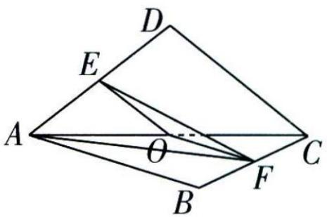

text_image

Geometric diagram of a quadrilateral with labeled vertices and internal points, used for spatial geometry problems.

图 1

A. $\frac{\sqrt{21}}{7}$

B. $-\frac{\sqrt{21}}{7}$

C. $\frac{3\sqrt{13}}{13}$

D. $-\frac{3\sqrt{11}}{11}$

解析 由题意知平面 ${ADC} \bot$ 平面 ${ABC}$ ,

如图 2, 连接 OD, OB, 因为四边形 ABCD 是菱形, O 是 AC 的中点,

所以 $OD \perp AC, OB \perp AC,$

又平面 $ADC \cap$ 平面 $ABC = AC, OD \subset$ 平面 $ADC$ ,

所以 $OD \perp$ 平面 ABC, 而 $OB \subset$ 平面 ABC, 所以 $OD \perp OB$ ,

从而 OB, OC, OD 三线两两垂直.

以 O 为原点, OB, OC, OD 所在直线分别为 x 轴、y 轴、z 轴建立如图 2 所示的空间直角坐标系,

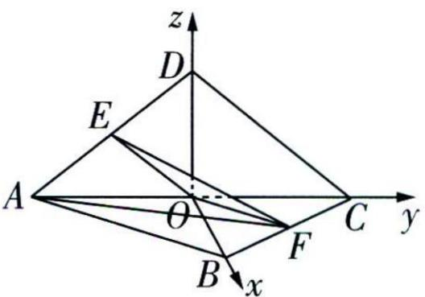

text_image

z
D
E
A
O
C
y
F
B
x

图2

令 AB = 2，则 $D(0,0,1)$ ， $E(0, -\frac{\sqrt{3}}{2}, \frac{1}{2})$ ， $F(\frac{1}{2}, \frac{\sqrt{3}}{2}, 0)$ ， $\overrightarrow{OE} = (0, -\frac{\sqrt{3}}{2}, \frac{1}{2})$ ， $\overrightarrow{OF} = (\frac{1}{2}, \frac{\sqrt{3}}{2}, 0)$ .

# 数学奇闻

设平面 OEF 的法向量为 $\boldsymbol{n}=(x,y,z)$ ，则 $\left\{\begin{aligned}\boldsymbol{n}\cdot\overrightarrow{OE}=0,\\ \boldsymbol{n}\cdot\overrightarrow{OF}=0,\end{aligned}\right.$ 得 $\left\{\begin{aligned}-\frac{\sqrt{3}}{2}y+\frac{1}{2}z=0,\\ \frac{1}{2}x+\frac{\sqrt{3}}{2}y=0,\end{aligned}\right.$

取 $y = 1$ ，则 $x = -\sqrt{3}, z = \sqrt{3}$ ，得平面 $OEF$ 的一个法向量为 $\pmb{n} = (-\sqrt{3}, 1, \sqrt{3})$

易知平面 ABC 的一个法向量为 $\overrightarrow{OD} = (0, 0, 1)$ ,

则 $\cos \langle n, \overrightarrow{OD} \rangle = \frac{n \cdot \overrightarrow{OD}}{|n| |\overrightarrow{OD}|} = \frac{\sqrt{3}}{\sqrt{7} \times 1} = \frac{\sqrt{21}}{7}$ .

由图知,二面角 E-OF-A 为锐角,

【避陷阱】二面角的取值范围是 $[0, \pi]$ , 因此二面角的余弦值有正有负, 在用向量法求解二面角时, 选取的法向量的方向不同, 法向量的夹角与二面角的平面角 $\theta$ 的关系也不同, 可能互补 (如图3左, 此时 $\cos \theta = -\cos \langle n_1, n_2 \rangle = -\frac{n_1 \cdot n_2}{|n_1||n_2|}$ ), 也可能相等 (如图3右, 此时 $\cos \theta = \cos \langle n_1, n_2 \rangle = \frac{n_1 \cdot n_2}{|n_1||n_2|}$ ), 一般要结合图形, 通过判断二面角的范围来确定所求余弦值的正负

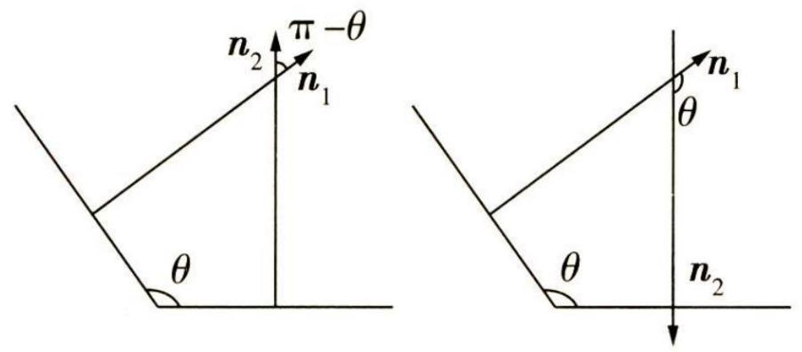

text_image

n₂
π -θ
n₁
θ
n₁
θ
θ
n₂

图3

所以二面角 E - OF - A 的余弦值为 $\frac{\sqrt{21}}{7}$ . 故选 A.

【破障碍】可以这样判断所求二面角与法向量夹角的关系：对于二面角 $\alpha - l - \beta$ ，任取 $A \in \alpha$ 且 $A \notin l, B \in \beta$ 且 $B \notin l$ ，设平面 $\alpha$ 的法向量为 $n_{1}$ ，平面 $\beta$ 的法向量为 $n_{2}$ ，计算数量积 $\overrightarrow{AB} \cdot n_{1}, \overrightarrow{AB} \cdot n_{2}$ ，若两者符号相同，则二面角 $\alpha - l - \beta$ 的平面角等于法向量的夹角；若两者符号相反，则二面角 $\alpha - l - \beta$ 的平面角与法向量夹角互补。可简记为“同号相等，异号互补（同等异补）”。如本题： $\overrightarrow{EB} = (1, \frac{\sqrt{3}}{2}, -\frac{1}{2})$ ，则由 $\overrightarrow{EB} \cdot \overrightarrow{OD} < 0, \overrightarrow{EB} \cdot n < 0$ ，可知二面角 E - OF - A 的大

小等于法向量夹角的大小

调研 2 (试题调研原创) 图4所示为棱长为6的正方体, E, F分别是棱AB, BC上的动点, 且AE = BF, 当A₁, E, F, C₁四点共面时, 平面A₁DE与平面C₁DF的夹角的余弦值为\_\_\_\_.

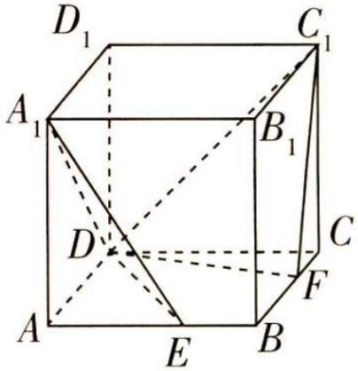

text_image

D₁
C₁
A₁
B₁
D
C
A
E
B
F

图 4

# 数学奇闻

分球定理 该定理指出在选择公理成立的情况下,可以将一个三维实心球分成有限(不可测的)部分,然后仅仅通过旋转和平移到其他地方重新组合,就可以组成两个半径和原来相同的完整的球.

关注微信公众号“初高教辅站”获取更多初高中教辅资料

# 思路导引

$A_{1}, E, F, C_{1}$ 四点共面

$E, F$ 分别为 $AB$ , $BC$ 的中点

$AE = BF = 3$

以 D 为坐标原点, 建立空间直角坐标系 → 平面 $A_{1}DE$ 和平面 $C_{1}DF$ 的法向量分别为 n, m → 结合向量的夹角公式求解

解析 方法一 如图5, 连接 $A_{1} C_{1}, E F$ , 在正方体 $A B C D - A_{1} B_{1} C_{1} D_{1}$ 中, $A_{1} C_{1} \parallel$ 平面 $A B C D$ , $E F \subset$ 平面 $A B C D$ , 则当 $A_{1}, E, F, C_{1}$ 四点共面时, 由平面 $A_{1} C_{1} F E \cap$ 平面 $A B C D = E F$ , 可知 $A_{1} C_{1} \parallel$ $E F$ , 又 $A E = B F$ , 所以 $E, F$ 分别为 $A B, B C$ 的中点, 则 $A E = B F = 3$ .

以 $D$ 为坐标原点, $DA, DC, DD_{1}$ 所在的直线分别为 $x$ 轴、 $y$ 轴、 $z$ 轴, 建立空间直角坐标系,

则 $A_{1}(6,0,6),D(0,0,0),C_{1}(0,6,6),E(6,3,0),F(3,6,0)$

所以 $\overrightarrow{DA_1} = (6,0,6),\overrightarrow{DE} = (6,3,0),\overrightarrow{DC_1} = (0,6,6),\overrightarrow{DF} = (3,6,0).$

设平面 $A_{1}DE$ 的法向量为 $\boldsymbol{n}=(a,b,c)$ ，则 $\left\{\begin{aligned}\boldsymbol{n}\cdot\overrightarrow{DA_{1}}&=6a+6c=0,\\ \boldsymbol{n}\cdot\overrightarrow{DE}&=6a+3b=0,\end{aligned}\right.$

取 a=1 ，可得 b=-2 ,c=-1 ，

所以 $\boldsymbol{n}=(1,-2,-1)$ 为平面 $A_{1}DE$ 的一个法向量.

设平面 $C_{1}DF$ 的法向量为 $\boldsymbol{m}=(x,y,z)$ ，则 $\left\{\begin{aligned}\boldsymbol{m}\cdot\overrightarrow{DC_{1}}&=6y+6z=0,\\ \boldsymbol{m}\cdot\overrightarrow{DF}&=3x+6y=0,\end{aligned}\right.$

取 $x = 2$ ，可得 $y = -1, z = 1$

所以 $\boldsymbol{m}=(2,-1,1)$ 为平面 $C_{1}DF$ 的一个法向量.

设平面 $A_{1}DE$ 与平面 $C_1DF$ 的夹角为 $\theta$ , 则 $\theta \in [0, \frac{\pi}{2}]$ ,

则 $\cos \theta = |\cos \langle n, m\rangle| = |\frac{n \cdot m}{|n||m|}| = \frac{3}{\sqrt{6} \times \sqrt{6}} = \frac{1}{2}$ ,

平面 $A_{1}DE$ 与平面 $C_{1}DF$ 的夹角的余弦值为 $\frac{1}{2}$ .

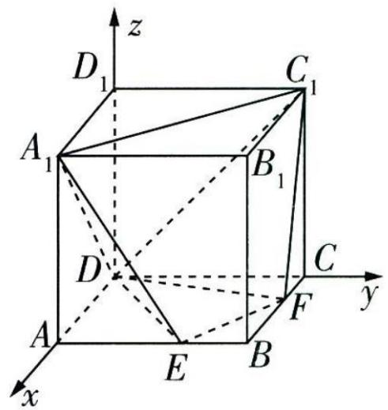

text_image

z
D₁
C₁
A₁
B₁
D
C
y
A
E
B
F
x

图5

【辨易混】二面角建立在两个半平面的基础上, 是一个张角概念, 衡量打开程度; 而平面与平面的夹角建立在两个整平面的基础上, 类似于两条相交直线形成两组对顶角, 人为选择不超过 $\frac{\pi}{2}$ 的角. 二面角的取值范围为 $[0, \pi]$ , 而平面与平面的夹角的取值范围为 $[0, \frac{\pi}{2}]$ , 用向量法求解时, 需要判断二面角是锐角还是钝角, 钝二面角的余弦值就是负的; 而平面与平面的夹角不需要, 平面与平面的夹角余弦值均大于等于零

数学奇闻

方法二 分析可知当 $A_{1}, E, F, C_{1}$ 四点共面时, $E, F$ 分别为 $AB, BC$ 的中点, 则延长 $A_{1} E, C_{1} F, B_{1} B$ 后交于一点, 设该点为 $G$ , 连接 $BD, DG$ , 如图 6.

在 Rt△B₁C₁G 中, 易得 C₁G = 6√5, 同理, A₁G = 6√5.

在 Rt△BDG 中， $DG = \sqrt{BD^{2} + BG^{2}} = 6\sqrt{3}$

所以 $C_{1}G^{2}=C_{1}D^{2}+DG^{2}$ ，所以 $C_{1}D\perp DG$ ，同理 $A_{1}D\perp DG$ ，

所以 $\angle A_{1}DC_{1}$ 即平面 $A_{1}DE$ 与平面 $C_{1}DF$ 所成角.

易知 $\triangle A_{1}DC_{1}$ 为等边三角形，所以 $\angle A_{1}DC_{1} = \frac{\pi}{3}$

所以平面 $A_{1}DE$ 与平面 $C_{1}DF$ 的夹角的余弦值为 $\frac{1}{2}$ .

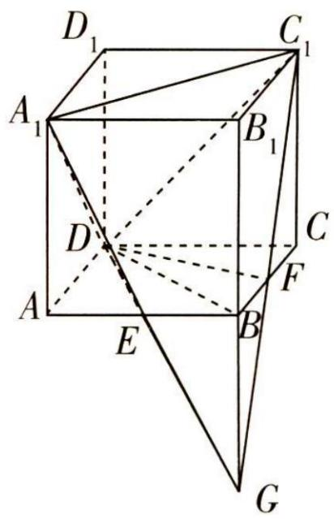

text_image

D₁
C₁
A₁
B₁
D
C
A
E
B
F
G

图6

# 易错点5 误认为函数的极值点就是导数的零点

调研 1 (试题调研原创) 已知函数 $f(x) = x^3 + 3ax^2 + bx + a^2$ 在 $x = -1$ 处有极值 0, 则 $f'(1) =$

A. 6

B. 12

C. 24

D. 12 或 24

解析 由 $f(x) = x^3 + 3ax^2 + bx + a^2$ ，得 $f'(x) = 3x^2 + 6ax + b$ .

因为 $f(x)$ 在 x = -1 处有极值 0，所以 $\left\{\begin{aligned}f(-1)=0,\\ f'(-1)=0,\end{aligned}\right.$ 即 $\left\{\begin{aligned}-1+3a-b+a^{2}=0,\\ 3-6a+b=0,\end{aligned}\right.$ 解得 $\left\{\begin{aligned}a=1,\\ b=3\end{aligned}\right.$ 或 $\left\{\begin{aligned}a=2,\\ b=9.\end{aligned}\right.$

【避陷阱】导数值为零的点不一定是极值点，例如，函数 $f(x)=x^{3}$ ， $f'(0)=0$ ，但是0不是函数 $f(x)$ 的极值点，对于可导函数来说， $f'(x_{0})=0$ 是 $x_{0}$ 为函数极值点的必要不充分条件，因此要进行检验

当 $\left\{\begin{aligned}a=1,\\b=3\end{aligned}\right.$ 时, $f'(x)=3x^{2}+6x+3=3(x+1)^{2}\geqslant0$ ,则 $f(x)$ 在R上单调递增,函数无极值,舍去.

当 $\left\{\begin{aligned}a=2,\\b=9\end{aligned}\right.$ 时, $f'(x)=3x^{2}+12x+9$ ,令 $f'(x)=0$ ,得x=-1或x=-3,经检验x=-1和x=-3都为函数的极值点.

综上, $\left\{\begin{aligned}a&=2,\\ b&=9,\end{aligned}\right.$ 所以 $f'(1)=3+6a+b=24.$ 故选C.

调研 2 (2024 江苏镇江 9 月诊断性考试) 若函数 $f(x) = a \ln x + \frac{2 - x}{x} - \frac{1}{2x^2}$

# 数学奇闻

贝利－波尔温－普劳夫公式 利用这个公式,可以直接计算圆周率 $\pi$ 的某一位(二进制)是多少,不需要计算其前面几位是多少.

关注微信公众号“初高教辅站”获取更多初高中教辅资料

$(a \neq 0)$ 既有极大值也有极小值, 则 $a$ 的取值范围是 ( )

A. $(0,1)$

B. $(0,3)$

C. $(0,1)\cup (9, + \infty)$

D. $(0,3)\cup (9, + \infty)$

解析 由题意知函数 $f(x)$ 的定义域为 $(0, +\infty)$ , $f'(x) = \frac{a}{x} - \frac{2}{x^2} + \frac{1}{x^3} = \frac{ax^2 - 2x + 1}{x^3}$ ,

【补漏洞】解函数问题要有定义域优先意识，尤其是解析式含分式、根号、对数等形式时

由题意知函数 ${f}^{\prime }\left( x\right)$ 有 2 个大于 0 的变号零点,即关于 $x$ 的二次方程 $a{x}^{2} - {2x} + 1 = 0$ 有两个不相等的正根,设为 ${x}_{1},{x}_{2}$ ,

【破障碍】将函数既有极大值也有极小值转化为导函数对应的方程有两个不等正根即可解决问题

则 $\left\{ \begin{array}{l} \Delta = 4 - 4a > 0, \\ x_{1} + x_{2} = \frac{2}{a} > 0, \\ x_{1} \cdot x_{2} = \frac{1}{a} > 0, \end{array} \right.$ 解得 $0 < a < 1$ ，即 $a$ 的取值范围为 $(0,1)$ . 故选 A.

# 纠错巩固

(变角度, 根据极小值点个数求参数范围 |2024 安徽滁州 10 月检测) 已知 $f(x)= \frac{a e^{x}}{x}+\ln x-x$ 有 2 个极小值点, 则 ( )

A. $a \geqslant \frac{1}{\mathrm{e}}$

B. $0 < a < \frac{1}{e}$

C. $a \leqslant e$

D. $a \geqslant \mathrm{e}$

# 参考答案与解析

B 由题意知函数 $f(x)$ 的定义域为 $(0, +\infty)$ ,

$$
f ^ {\prime} (x) = a \cdot \frac {x \mathrm{e} ^ {x} - \mathrm{e} ^ {x}}{x ^ {2}} + \frac {1}{x} - 1 = \frac {a \mathrm{e} ^ {x} (x - 1)}{x ^ {2}} - \frac {\mathrm{e} ^ {x} x (x - 1)}{x ^ {2} \mathrm{e} ^ {x}} = \frac {\mathrm{e} ^ {x}}{x ^ {2}} (x - 1) (a - \frac {x}{\mathrm{e} ^ {x}}).
$$

由连续函数 $f(x)$ 有2个极小值点知 $f'(x)$ 有3个大于0的变号零点,从而 $y = a - \frac{x}{e^x}$ 有2个大于0的变号零点,且零点不为1,从而a > 0且 $a \neq \frac{1}{e}$ .

【堵误区】切勿将函数存在 2 个极小值点简单转化为导函数有 2 个零点, 结合函数图象的变化趋势, 将函数的极值点转化为导函数的变号零点, 进而转化为函数 $y = a - \frac{x}{{\mathrm{e}}^{x}}$ 在 $\left( {0, + \infty }\right)$ 上的变号零点,注意其零点不能为 $x = 1$

# 数学奇闻

当 $a > 0$ 且 $a \neq \frac{1}{\mathrm{e}}$ 时，令 $g(x) = \frac{x}{\mathrm{e}^x}, x \in (0, +\infty)$ ，则 $g'(x) = \frac{\mathrm{e}^x - x\mathrm{e}^x}{(\mathrm{e}^x)^2} = \frac{1 - x}{\mathrm{e}^x}$ ，令 $g'(x) = 0$ ，得 $x = 1$ ，所以当 $x \in (0,1)$ 时， $g'(x) > 0, g(x)$ 单调递增，当 $x \in (1, +\infty)$ 时， $g'(x) < 0, g(x)$ 单调递减，则 $g(x)_{\max} = g(1) = \frac{1}{\mathrm{e}}$ ，易知 $g(x) > 0$ ，且当 $x \to +\infty$ 时， $g(x) \to 0$ 。

作出函数 $g(x)$ 的大致图象, 如图 1 所示, 结合图象可知,
当 $0 < a < \frac{1}{e}$ 时, 函数 $g(x)$ 的图象与直线 y = a 有 2 个交点,
满足函数 $y = a - \frac{x}{e^{x}}$ 有 2 个大于 0 的零点, 且零点不为 1.若 $0 < a < \frac{1}{\mathrm{e}}$ ，则存在 $m \in (0,1), n \in (1, +\infty)$ ，使得 $g(m) = g(n) = a$ ，即 $f'(m) = f'(n) = 0$ ，

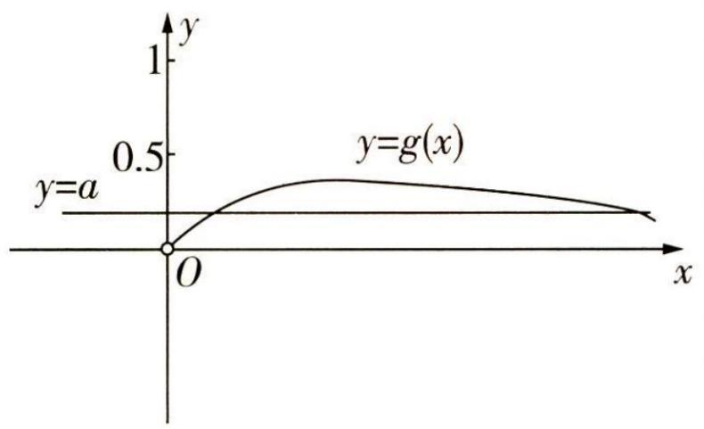

text_image

y
1
y=a
0.5
y=g(x)
O
x

图1

所以当 $x \in (0, m)$ 时， $x - 1 < 0, a - \frac{x}{\mathrm{e}^x} > 0, f'(x) < 0, f(x)$ 单调递减，当 $x \in (m, 1)$ 时， $x - 1 < 0$ ， $a - \frac{x}{\mathrm{e}^x} < 0, f'(x) > 0, f(x)$ 单调递增，当 $x \in (1, n)$ 时， $x - 1 > 0, a - \frac{x}{\mathrm{e}^x} < 0, f'(x) < 0, f(x)$ 单调递减，当 $x \in (n, +\infty)$ 时， $x - 1 > 0, a - \frac{x}{\mathrm{e}^x} > 0, f'(x) > 0, f(x)$ 单调递增，所以当 $0 < a < \frac{1}{e}$ 时, $f(x)$ 有 2 个极小值点, 符合题意.

【厘思路】由函数 $y = a - \frac{x}{e^{x}}$ 有 2 个大于 0 的零点，且零点不为 1 只能得到函数 $f(x)$ 存在 3 个极值点，但并不能保证其存在 2 个极小值点，故需检验综上所述，当 $0 < a < \frac{1}{e}$ 时， $f(x)$ 有 2 个极小值点。故选 B.

# 易错点6 混淆“恒成立”与“能成立”

调研 1 (2024 河北沧州 10 月联考) 已知函数 $f(x) = \ln x - ax^2 - x$ ，定义域为 $\left[\frac{1}{\mathrm{e}}, \mathrm{e}\right]$ ，在其定义域中任取 $x_1, x_2$ （其中 $x_1 > x_2$ ）都满足 $x_1 f(x_2) - x_2 f(x_1) < x_1 x_2 (x_1 - x_2)$ ，则实数 $a$ 的取值范围为 （）

A. $(-\infty, 1]$

B. $[1, +\infty)$

C. $(-\infty, e]$

D. $[e, +\infty)$

# 数学奇闻

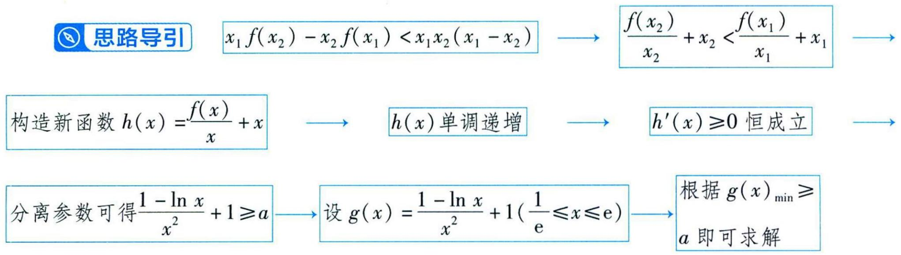

flowchart

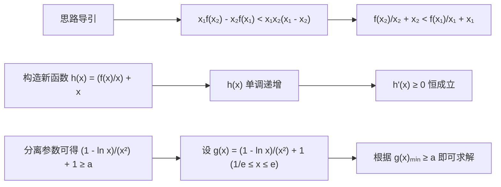

解析 由 $x_{1}f(x_{2}) - x_{2}f(x_{1}) <   x_{1}x_{2}(x_{1} - x_{2})$ ，且 $x_{1} > x_{2} > 0$ ，可得 $\frac{f(x_2)}{x_2} +x_2 <   \frac{f(x_1)}{x_1} +x_1.$

【厘思路】将已知等式中的变量 “归类”，结合转化的形式构造函数令 $h(x) = \frac{f(x)}{x} + x$ ，则 $h(x_{1}) > h(x_{2})$ 恒成立，所以函数 $h(x)$ 在 $[\frac{1}{\mathrm{e}}, \mathrm{e}]$ 上单调递增，

则 $h^{\prime}(x) = \frac{1 - \ln x}{x^{2}} - a + 1 \geqslant 0$ 在 $x \in [\frac{1}{\mathrm{e}}, \mathrm{e}]$ 时恒成立, 即 $\frac{1 - \ln x}{x^2} + 1 \geqslant a$ 在 $x \in [\frac{1}{\mathrm{e}}, \mathrm{e}]$ 时恒成立.

【破障碍】此处为恒成立问题，从而 $\left(\frac{1-\ln x}{x^{2}}+1\right)_{\min}\geqslant a$

设函数 $g(x) = \frac{1 - \ln x}{x^2} + 1\left(\frac{1}{\mathrm{e}} \leqslant x \leqslant \mathrm{e}\right)$ ，则 $g'(x) = \frac{-3 + 2\ln x}{x^3} < 0$

所以 $g(x)_{\min}=g(e)=1$ ，故 $a\leqslant1$ ，即实数 a 的取值范围为 $(-∞,1]$ 。故选 A.

【补盲点】利用导数求解函数或不等式恒成立问题的策略：①构造函数法，令 $F(x) = f(x) - g(x)$ ，利用导数确定函数 $F(x)$ 的单调性与最值，则要使 $f(x) \geqslant g(x)$ 或 $f(x) \leqslant g(x)$ 恒成立，只需 $F(x)_{\min} \geqslant 0$ 或 $F(x)_{\max} \leqslant 0$ 即可；②分离参数法，转化为 $a \geqslant \varphi(x)$ 或 $a \leqslant \varphi(x)$ 恒成立，即 $a \geqslant \varphi(x)_{\max}$ 或 $a \leqslant \varphi(x)_{\min}$ ，只需利用导数确定函数 $\varphi(x)$ 的单调性与最值即可

调研 2 (试题调研原创) 已知函数 $f(x) = \ln x + (x - b)^{2} (b \in \mathbb{R})$ 在 $[1, 2]$ 上存在单调递减区间, 则实数 $b$ 的取值范围是 ( )

A. $\left[\frac{3}{2}, +\infty\right)$

B. $\left[\frac{9}{4}, +\infty\right)$

C. $(\frac{3}{2}, +\infty)$

D. $(\frac{9}{4}, +\infty)$

解析 因为函数 $f(x)$ 在[1,2]上存在单调递减区间，

所以 $f'(x)<0$ 在 $[1,2]$ 上有解， $f'(x)=\frac{1}{x}+2(x-b)=\frac{1}{x}+2x-2b$

【辨易混】“有解”问题即“能成立”问题，即在 $[1,2]$ 上 $f'(x)_{\min} < 0$ ，注意与“恒成立”区分，此处若为恒成立，则在 $[1,2]$ 上 $f'(x)_{\max} < 0$

所以 $b > \left(\frac{1}{2x} + x\right)_{\min}, x \in [1, 2]$ .

令 $g(x) = \frac{1}{2x} + x, x \in [1, 2]$ ，则 $g'(x) = -\frac{1}{2x^2} + 1$ ，显然 $g'(x) > 0$ ，则函数 $g(x)$ 单调递增，

所以 $g(x)_{\min} = g(1) = \frac{3}{2}$ , 即 $b > \frac{3}{2}$ . 故选 C.

# 纠错巩固

(变考点, 考查函数性质与恒成立问题 12024 湖北武汉 9 月模拟) 已知函数 $f(x)= \frac{1}{2}+\frac{1}{\mathrm{e}^{x-1}+1}$ , 若不等式 $f(ax+1)+f(\ln x+1)-2 \geqslant 0$ 对任意的 $x \in (0, +\infty)$ 恒成立, 则实数 $a$ 的取值范围是 \_\_\_\_.

# Q 参考答案与解析

$(-∞,-\frac{1}{e}]$ 令 $g(x)=f(x+1)-1=-\frac{1}{2}+\frac{1}{e^{x}+1}(x∈R)$ ，则 $g(-x)=-\frac{1}{2}+\frac{1}{e^{-x}+1},g(-x)+$ $g(x) = -\frac{1}{2} + \frac{1}{e^{x} + 1} - \frac{1}{2} + \frac{1}{e^{-x} + 1} = -1 + \frac{e^{x} + 1}{e^{x} + 1} = 0, g(-x) = -g(x)$ ，所以 $g(x)$ 是奇函数，

【厘思路】若未熟练掌握与指数型函数的奇偶性相关的结论，也可从题干条件 $f(ax+1)+f(\ln x+1)-2 \geqslant 0$ 入手，将其转化为 $f(ax+1)-1 \geqslant -\left[f(\ln x+1)-1\right]$ ，进而联想函数图象的对称性，构造函数

又 $g^{\prime}(x) = \frac{-\mathrm{e}^{x}}{(\mathrm{e}^{x} + 1)^{2}} < 0$ ，所以 $g(x)$ 在 $\mathbf{R}$ 上单调递减.

由 $f(ax + 1) + f(\ln x + 1) - 2 \geqslant 0$ ，得 $g(ax) + g(\ln x) \geqslant 0$ ，即 $g(ax) \geqslant g(-\ln x)$ ，

所以 $ax \leqslant -\ln x$ ，所以 $a \leqslant -\frac{\ln x}{x}$ 在 $x \in (0, +\infty)$ 时恒成立.

【辩易混】“恒成立”问题，故需 $a \leqslant \left(-\frac{\ln x}{x}\right)_{\min}$ ，而非 $a \leqslant \left(-\frac{\ln x}{x}\right)_{\max}$

令 $h(x) = -\frac{\ln x}{x}$ , 则 $h'(x) = \frac{\ln x - 1}{x^2}$ , 令 $h'(x) < 0$ , 得 $0 < x < \mathrm{e}$ , 令 $h'(x) > 0$ , 得 $x > \mathrm{e}$ ,

所以函数 $h(x)$ 在 $(0, \mathrm{e})$ 上单调递减，在 $(\mathrm{e}, +\infty)$ 上单调递增，所以 $h(x) \geqslant h(\mathrm{e}) = -\frac{1}{\mathrm{e}}$

所以 $a \leqslant -\frac{1}{\mathrm{e}}$ ，即实数 $a$ 的取值范围是 $(- \infty, -\frac{1}{\mathrm{e}}]$ .

# 数学奇闻

# 类型 3 逻辑思维漏洞类

# 易错点1 忽视函数的定义域

调研 1 (2024 河北保定 9 月阶段检测) 函数 $f(x) = \lg (x^{2} - 2ax - a)$ 在区间 $(- \infty, -3)$ 上单调递减的必要不充分条件是

A. $a \in (-\infty, \frac{9}{5}]$

B. $a \in \left[-\frac{9}{5}, +\infty\right)$

C. $a \in [-2, +\infty)$

D. $a \in \left[\frac{4}{5}, +\infty\right)$

解析 设 $u(x) = x^{2} - 2ax - a$ .

$\because f(x)$ 在 $(-\infty, -3)$ 上单调递减，

$\therefore$ 由复合函数的单调性可知, $u(x)$ 在 $(-∞,-3)$ 上单调递减,且 $u(x)>0$ 在 $(-∞,-3)$ 上恒成立.

【补漏洞】解题时往往只注意到了复合函数的单调性这一重要考点，而忽略了“对数的真数在 $(- \infty, -3)$ 上恒大于0”这一隐含条件，从而造成错解

则由二次函数的单调性可知 $a \geqslant -3$ ，且在 $x \in (-\infty, -3)$ 上， $u(x) > u(-3) \geqslant 0$

$\therefore \left\{ \begin{array}{l} a \geqslant -3, \\ u(-3) \geqslant 0, \end{array} \right.$ 解得 $a \geqslant -\frac{9}{5}$ ,

则函数 $f(x)$ 在区间 $(-∞,-3)$ 上单调递减的充要条件是 $a∈\left[-\frac{9}{5},+∞\right)$ .

而所求的是函数 $f(x)$ 在区间 $(-∞,-3)$ 上单调递减的必要不充分条件，

故只需看 $\left[-\frac{9}{5}, +\infty\right)$ 是哪一个选项的真子集即可, 故选 C.

调研 2 (试题调研改编)已知函数 $f(x)$ 在其定义域 $[3 - a, 2]$ 上是偶函数,且在 $[-2,0]$ 上单调递减,则不等式 $f(\log_{\frac{1}{3}}(2x - 5)) > f(\log_3(a + 3))$ 的解集为 \_\_\_\_.

思路导引 根据偶函数的定义域关于原点对称,求出 a,再利用函数的单调性及偶函数的性质将不等式转化为 $f(|\log_{\frac{1}{3}}(2x-5)|) > f(\log_{3}8)$ , 则可得 $|\log_{3}(2x-5)| > \log_{3}8$ , 这里需要注意 $\log_{3}8$ 与 $|\log_{3}(2x-5)|$ 应在同一单调区间 $[0,2]$ 内, 即 $\log_{3}8 < |\log_{3}(2x-5)| \leqslant 2$ , 最后再根据对数的性质求解该对数不等式, 算出结果.

解析 因为函数 $f(x)$ 在其定义域 $[3 - a, 2]$ 上是偶函数，

所以 $3 - a + 2 = 0$ ，解得 a = 5，

所以 $f(\log_{\frac{1}{3}}(2x - 5)) > f(\log_38)$ ，则 $f(|\log_{\frac{1}{3}}(2x - 5)|) > f(\log_38)$ ，即 $f(|\log_3(2x - 5)|) > f(\log_38)$ .

又 $f(x)$ 在 $[-2,0]$ 上单调递减，所以 $f(x)$ 在 $[0,2]$ 上单调递增，

数学奇闻

所以 $\left\{ \begin{array}{l}|\log_3(2x - 5)| > \log_38,\\ 0 <   \log_38 <   2,\\ 0\leqslant |\log_3(2x - 5)|\leqslant 2,\\ 2x - 5 > 0, \end{array} \right.$

所以 $\log_38 < |\log_3(2x - 5)| \leqslant 2$ ，且 $x > \frac{5}{2}$ ，

所以 $-2 \leqslant \log_{3}(2x - 5) < -\log_{3}8$ 或 $\log_{3}8 < \log_{3}(2x - 5) \leqslant 2$ ，且 $x > \frac{5}{2}$ ,

【补漏洞】在利用函数的单调性解不等式时，要注意放在同一单调区间内求解，并且注意原函数定义域的限制

所以 $\frac{1}{9} \leqslant 2x - 5 < \frac{1}{8}$ 或 $8 < 2x - 5 \leqslant 9$ ，且 $x > \frac{5}{2}$ ，

解得 $\frac{23}{9}\leqslant x<\frac{41}{16}$ 或 $\frac{13}{2}<x\leqslant7$ ,

所以不等式的解集为 $\{x\mid \frac{23}{9}\leqslant x <   \frac{41}{16}$ 或 $\frac{13}{2} <  x\leqslant 7\}$

# 纠错巩固

1. (试题调研原创 | 变考点, 考查用换元法求函数的值域) 已知函数 $f(x) = \left(\frac{1}{4}\right)^x + \left(\frac{1}{2}\right)^{x - 3}$ , 则函数 $f(x)$ 的值域为 \_\_\_\_.

2. (变题型, 多选题 | 2024 江苏镇江 8 月阶段检测 | 多选) 给出下列说法, 错误的有 ( )

A. 若函数 $f(x) = \frac{k - 3^x}{1 + k \cdot 3^x}$ 在其定义域上为奇函数, 则 $k = 1$   
B. 已知 $f(x) = \lg(x^{2} + 2x + a)$ 的值域为 R, 则 a 的取值范围是 $(1, +\infty)$   
C. 已知函数 $f(2x + 1)$ 的定义域为 $[-1, 1]$ ，则函数 $f(x)$ 的定义域为 $[-1, 3]$   
D. 已知函数 $f(x) = 1 + \log_3 x, x \in [1,9]$ ，则函数 $y = [f(x)]^2 + f(x^2)$ 的值域为 $[2,14]$

# 参考答案与解析

1. $(0, +\infty)$ $f(x) = (\frac{1}{2})^{2x} + 8 \cdot (\frac{1}{2})^x$ ，令 $(\frac{1}{2})^x = t$ ，则 $t > 0$ .

【厘思路】利用换元法，结合二次函数和指数函数的单调性进行求解即可. 换元后，要注意新元1的取值范围

令 $g(t)=t^{2}+8t,t>0,$

易知 $g(t)$ 在 $(0, +\infty)$ 上单调递增，

所以 $g(t) > 0^{2} + 8 \times 0 = 0$ ，故函数 $f(x)$ 的值域为 $(0, +\infty)$ .

2. ABD

<table><tr><td>选项</td><td>分析过程</td><td>正误</td></tr><tr><td>A</td><td>函数 $f(x)=\frac{k-3^x}{1+k\cdot3^x}$ 在其定义域上为奇函数,则 $f(-x)=-f(x)$ ,即 $\frac{k-3^{-x}}{1+k\cdot3^{-x}}=-\frac{k-3^x}{1+k\cdot3^x}$ ,即 $\frac{k\cdot3^x-1}{k+3^x}=\frac{3^x-k}{1+k\cdot3^x}$ ,整理得 $k^2\cdot9^x-1=9^x-k^2$ ,即 $(k^2-1)(9^x+1)=0$ ,所以 $k^2-1=0$ ,解得 $k=\pm 1$ .当 $k=1$ 时, $f(x)=\frac{1-3^x}{1+3^x}$ ,该函数定义域为 $\mathbf{R}$ ,满足 $f(-x)=-f(x)$ ,符合题意;当 $k=-1$ 时, $f(x)=\frac{-1-3^x}{1-3^x}=\frac{3^x+1}{3^x-1}$ ,由 $3^x-1\neq 0$ 可得 $x\neq 0$ ,此时函数定义域为 $\{x|x\neq 0\}$ ,满足 $f(-x)=-f(x)$ ,符合题意.综上所述, $k=\pm 1$ 【补漏洞】计算出 $k$ 值后,还需要代入函数解析式,检验函数定义域是否关于原点对称</td><td>×</td></tr><tr><td>B</td><td>因为 $f(x)=\lg(x^2+2x+a)$ 的值域为 $\mathbf{R}$ ,所以函数 $y=x^2+2x+a$ 的值域 $M$ 满足 $(0,+\infty)\subseteq M$ ,所以 $\Delta=4-4a\geqslant 0$ ,解得 $a\leqslant 1$ 【破障碍】因为 $f(x)=\lg(x^2+2x+a)$ 的值域为 $\mathbf{R}$ ,所以对数式的真数部分应取遍区间 $(0,+\infty)$ 内的全体实数</td><td>×</td></tr><tr><td>C</td><td>由 $x\in[-1,1]$ 得 $2x+1\in[-1,3]$ ,所以 $f(x)$ 的定义域为 $[-1,3]$ 【补盲点】抽象函数的定义域仍指 $x$ 的取值范围,且在同一对应法则下,括号内的式子的取值范围是相同的</td><td>√</td></tr><tr><td>D</td><td>因为函数 $f(x)=1+\log_3x,x\in[1,9]$ ,所以 $y=[f(x)]^2+f(x^2)=(1+\log_3x)^2+1+\log_3x^2=(\log_3x)^2+4\log_3x+2,x\in[1,3]$ .当 $x\in[1,3]$ 时, $\log_3x\in[0,1]$ ,令 $\log_3x=t$ ,则 $t\in[0,1],t^2+4t+2=(t+2)^2-2\in[2,7]$ ,所以函数 $y=[f(x)]^2+f(x^2)$ 的值域为 $[2,7]$ </td><td>×</td></tr></table>

数学奇闻

# 易错点2 用函数零点存在定理时不会赋值

调研 1 (试题调研原创) 已知函数 $f(x) = \frac{1}{2} ax^2 - (a - 1)x - \ln x, a \geqslant 0$ .

(1) 求函数 $f(x)$ 的单调性;  
(2) 若函数 $f(x)$ 有两个不同的零点, 求实数 a 的取值范围.

学会赋值 求解有关函数零点问题的主要方法是由函数零点存在定理证明零点存在,一般需由导数确定函数的单调性,在单调区间内通过赋值找到两个符号相反的函数值,得出此区间内存在一个零点.此处的赋值一般直接猜数赋值,若行不通,则可通过局部确定范围或消项,借助放缩法、分析法等,探究合适的赋值.

解析 (1) 已知 $f(x) = \frac{1}{2} ax^2 - (a - 1)x - \ln x, x > 0$ ,

所以 $f^{\prime}(x) = ax - (a - 1) - \frac{1}{x} = \frac{ax^{2} - (a - 1)x - 1}{x} = \frac{(ax + 1)(x - 1)}{x}$ .

因为 $a \geqslant 0, x > 0$ ，所以 $\frac{ax + 1}{x} > 0$

所以当 0 < x < 1 时, $f'(x) < 0$ , 当 x > 1 时, $f'(x) > 0$ ,

所以 $f(x)$ 在 $(0,1)$ 上单调递减，在 $(1,+\infty)$ 上单调递增.

(2)由(1)知,函数 $f(x)$ 在(0,1)上单调递减,在 $(1,+\infty)$ 上单调递增,

所以 $f(x)_{\min}=f(1)=-\frac{1}{2}a+1.$

若函数 $f(x)$ 有两个不同的零点,则必有 $f(1)<0$ ,解得a>2.

下面证明 $f(x)$ 在 $(0,1)$ 上与 $(1, +\infty)$ 上分别存在一个零点.

因为 $f(2)=2a-2(a-1)-\ln2=2-\ln2>0$ ,

所以 $f(x)$ 在 $(1, +\infty)$ 上存在唯一零点 $x_{1}$ .

因为 $f(x) = \frac{1}{2} a(x^2 - 2x) + x - \ln x$ ,

当 $x \in (0,1)$ 时， $-1 < x^2 - 2x < 0$ ，所以 $f(x) > -\frac{1}{2} a + x - \ln x$

又 $0 < \mathrm{e}^{-\frac{1}{2} a} < \mathrm{e}^{0} = 1$

所以 $f(\mathrm{e}^{-\frac{1}{2} a}) > -\frac{1}{2} a + \mathrm{e}^{-\frac{1}{2} a} - \ln \mathrm{e}^{-\frac{1}{2} a} = \mathrm{e}^{-\frac{1}{2} a} > 0,$

【破障碍】先局部分析 $x^{2} - 2x$ 的取值范围, 通过放缩法将式子化简, 再进行分析. 证明

# 数学奇闻

伯努利家族可以说是一个科学世家,跨越百年的几代人中,许多父子兄弟皆是科学家,其中约翰·伯努利、雅各布·伯努利和丹尼尔·伯努利这三人的成就最大.

关注微信公众号“初高教辅站”获取更多初高中教辅资料

$f(x) > -\frac{1}{2} a + x - \ln x > 0, x \in (0,1)$ , 考虑将 $-\frac{1}{2} a - \ln x$ 消去, 令 $-\frac{1}{2} a - \ln x = 0$ , 得 $x = \mathrm{e}^{-\frac{1}{2} a}$ , 则证明 $f(\mathrm{e}^{-\frac{1}{2} a}) > 0$ 即可

所以 $f(x)$ 在区间 $(0,1)$ 上存在唯一零点 $x_{2}$ .

所以 a 的取值范围是 $(2, +\infty)$ .

调研 2 (试题调研原创) 已知函数 $f(x) = x \mathrm{e}^{x} - ax - a \ln x$ , 证明: 当 $a > \mathrm{e}$ 时, 函数 $f(x)$ 有两个不同的零点.

解析 由题意知 $f(x) = x\mathrm{e}^{x} - ax - a\ln x = x\mathrm{e}^{x} - a\ln \mathrm{e}^{x} - a\ln x = x\mathrm{e}^{x} - a\ln (x\mathrm{e}^{x})$ ，且定义域为（0，+∞）.

令 $t = x e^{x}$ ，则当 x > 0 时， $t' = (x + 1)e^{x} > 0$ ，

所以函数 $t = x e^{x}$ 在 $(0, +\infty)$ 上单调递增, 所以 $t \in (0, +\infty)$ ,

所以当 $a > \mathrm{e}$ 时, $f(x) = x\mathrm{e}^{x} - ax - a\ln x$ 有两个不同的零点等价于当 $a > \mathrm{e}$ 时, $h(t) = t - a\ln t$ $(t > 0)$ 有两个不同的零点.

$h'(t)=1-\frac{a}{t}=\frac{t-a}{t}$ ，令 $h'(t)=0$ ，则t=a。

当 t > a 时, $h'(t) > 0$ , 当 0 < t < a 时, $h'(t) < 0$ ,

所以 $h(t)$ 在 $(0, a)$ 上单调递减，在 $(a, +\infty)$ 上单调递增，

所以 $h(t)_{\min}=h(a)=a-a\ln a=a(1-\ln a)$ ,

因为 $a > \mathrm{e}$ ，所以 $h(a) < 0$

因为 $h(1)=1>0$ ，所以 $h(t)$ 在 $(1,a)$ 上存在唯一零点.

易知 $e^{a} > a$ ，则下面只需证明当 a > e 时， $h(e^{a}) = e^{a} - a^{2} > 0$ .

【析疑难】观察 $h(t) = t - a \ln t$ 的结构, 不难发现令 $t = \mathrm{e}^{a}$ 时, $h(\mathrm{e}^{a}) = \mathrm{e}^{a} - a^{2}$ , 由该形式联想到经典不等式 $\mathrm{e}^{x} > x^{2} (x \geqslant 0)$ . 解题时只需构造函数对该不等式加以证明后即可使用, 从而证明出 $h(\mathrm{e}^{a}) = \mathrm{e}^{a} - a^{2} > 0$

设 $v(x) = \mathrm{e}^{x} - x^{2}(x > \mathrm{e})$ ，则 $v^{\prime}(x) = \mathrm{e}^{x} - 2x.$

令 $\varphi(x) = \mathrm{e}^{x} - 2x(x > \mathrm{e})$ ，则 $\varphi'(x) = \mathrm{e}^{x} - 2 > \mathrm{e}^{\mathrm{e}} - 2 > 0$

所以 $\varphi(x)$ 在 $(e, +\infty)$ 上单调递增，则 $v'(x) = \varphi(x) > e^{e} - 2e > 0$ ,

所以函数 $v(x)$ 在 $(\mathrm{e}, +\infty)$ 上单调递增， $v(x) = \mathrm{e}^x - x^2 > \mathrm{e}^{\mathrm{e}} - \mathrm{e}^2 > 0$ ，即 $h(\mathrm{e}^a) = \mathrm{e}^a - a^2 > 0$

所以 $h(t)$ 在 $(a, e^{a})$ 上存在唯一零点.

所以当 $a > \mathrm{e}$ 时，函数 $h(t)$ 有两个零点，即函数 $f(x)$ 有两个不同的零点.

# 纠错巩固

(变设问, 考查函数零点个数 |2024 黑龙江鸡西实验中学 9 月模考) 函数 $f(x)=x^{2}+e^{x}-3$ 的零点个数为 \_\_\_\_.

# 参考答案与解析

2 方法一 对 $f(x) = x^{2} + \mathrm{e}^{x} - 3$ 求导, 得 $f'(x) = 2x + \mathrm{e}^{x}$ ,

因为 $f'(x)=2x+e^{x}$ 在R上单调递增, $f'(0)=1>0,f'(-1)=-2+e^{-1}<0,$

所以存在 $x_{0} \in (-1,0)$ ，使得 $f'(x_{0}) = 2x_{0} + e^{x_{0}} = 0$ .

当 $x < x_{0}$ 时, $f'(x) < 0$ ; 当 $x > x_{0}$ 时, $f'(x) > 0$ .

所以 $f(x)$ 在 $(-∞, x_{0})$ 上单调递减，在 $(x_{0}, +∞)$ 上单调递增.

因为 $x_{0} \in (-1,0)$ , $2x_{0} + e^{x_{0}} = 0$ , 所以 $f(x_{0}) = x_{0}^{2} + e^{x_{0}} - 3 = x_{0}^{2} - 2x_{0} - 3 < 0$ .

因为 $f(\sqrt{3})=(\sqrt{3})^{2}+e^{\sqrt{3}}-3>0,f(-\sqrt{3})=(-\sqrt{3})^{2}+e^{-\sqrt{3}}-3>0,$

所以函数 $f(x)$ 存在2个零点，设为 $x_{1},x_{2}(x_{1}<x_{2})$ ，其中 $x_{1}\in(-\sqrt{3},x_{0}),x_{2}\in(x_{0},\sqrt{3})$ .

【破障碍】本题在寻找零点进行赋值时, 采用了消项法. 因为 $e^{x}$ 大于 0 恒成立, 所以令 $x^{2}-3=0$ , 故取 $x=\pm\sqrt{3}$ . 在确定导函数的零点时, 赋值一般选用 0 和 1 , 遵循简便原则

方法二 函数 $f(x) = x^{2} + \mathrm{e}^{x} - 3$ 的零点个数等价于函数 $y = \mathrm{e}^{x}$ 与 $y = 3 - x^{2}$ 图象的交点个数，

【厘思路】将函数的零点问题转化为函数 $y = e^{x}$ 与 $y = 3 - x^{2}$ 图象的交点问题，作出函数图象即可得到结果。注意该方法只适合小题，大题仍需要利用函数零点存在定理严格证明

作出函数 $y = e^{x}$ 与 $y = 3 - x^{2}$ 的图象如图 1 所示，

由图象可知, 函数 $y = e^{x}$ 与 $y = 3 - x^{2}$ 的图象有且仅有 2 个不同的交点, 所以函数 $f(x) = x^{2} + e^{x} - 3$ 的零点个数为 2.

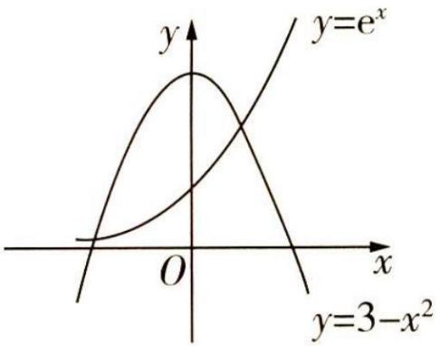

text_image

y=e^x
y=3-x^2

图 1

# 易错点3 不能挖掘隐含条件产生增解

调研 1: (2024 人大附中深圳学校 9 月阶段考试) 在 $\triangle ABC$ 中, $a > b$ , 若 $b \cos A + \frac{\sqrt{2}}{2} a = c$ , 则 $4 \cos A \sin C$ 的取值范围是 \_\_\_\_.

解析 $\because b\cos A + \frac{\sqrt{2}}{2} a = c, \therefore b \cdot \frac{b^2 + c^2 - a^2}{2bc} + \frac{\sqrt{2}}{2} a = c$ ，整理可得 $a^2 + c^2 - b^2 = \sqrt{2} ac$

$$
\therefore \cos B = \frac {a ^ {2} + c ^ {2} - b ^ {2}}{2 a c} = \frac {\sqrt {2} a c}{2 a c} = \frac {\sqrt {2}}{2}, \text {又} 0 <   B <   \pi , \therefore B = \frac {\pi}{4}, \therefore A + C = \frac {3}{4} \pi .
$$

$$
\therefore \cos A \sin C = \cos A \sin (\frac {3}{4} \pi - A) = \cos A (\frac {\sqrt {2}}{2} \cos A + \frac {\sqrt {2}}{2} \sin A) = \frac {\sqrt {2}}{2} \cos^ {2} A + \frac {\sqrt {2}}{2} \sin A \cos A = \frac {\sqrt {2}}{2} \cdot
$$

# 数学奇闻

$$
\frac {\cos 2 A + 1}{2} + \frac {\sqrt {2}}{4} \sin 2 A = \frac {\sqrt {2}}{4} (\sin 2 A + \cos 2 A + 1) = \frac {1}{2} \sin (2 A + \frac {\pi}{4}) + \frac {\sqrt {2}}{4}.
$$

【补漏洞】本题求取值范围使用的是函数思想, 利用降幂公式和辅助角公式得 $\cos A \sin C = \frac{1}{2} \sin (2A + \frac{\pi}{4}) + \frac{\sqrt{2}}{4}$ , 变量为 $A$ , 求 $A$ 的取值范围要考虑三角形的内角和为 $\pi$ 这一隐含条件, 否则会造成错解

$$
\because A + C = \frac {3}{4} \pi , A > B, \therefore \frac {\pi}{4} <   A <   \frac {3}{4} \pi , \therefore \frac {3}{4} \pi <   2 A + \frac {\pi}{4} <   \frac {7}{4} \pi ,
$$

$$
\therefore - 1 \leqslant \sin (2 A + \frac {\pi}{4}) <   \frac {\sqrt {2}}{2}, \therefore \frac {\sqrt {2} - 2}{4} \leqslant \cos A \sin C <   \frac {\sqrt {2}}{2}.
$$

【破障碍】在计算 A 的取值范围时，要结合 $B = \frac{\pi}{4}$ ，a > b 及 $A + B + C = \pi$ 三个约束条件，得出 $\frac{\pi}{4} < A < \frac{3}{4}\pi$ ，在此基础上先求出 $2A + \frac{\pi}{4}$ 的取值范围，再根据正弦函数的图象求解

所以 $4\cos A\sin C \in [\sqrt{2} - 2, 2\sqrt{2})$ ，故填 $[\sqrt{2} - 2, 2\sqrt{2})$ 。

调研 2 (2024 辽宁锦州渤海大学附属高级中学 9 月月考) 已知 $\cos \alpha, \sin \alpha$ 是函数 $f(x) = x^{2} - tx + t (t \in \mathbf{R})$ 的两个零点, 则 $\sin 2\alpha =$ \_\_\_\_.

解析 由题意知, $\cos\alpha,\sin\alpha$ 是关于x的方程 $x^{2}-tx+t=0$ 的两个根,可得 $\cos\alpha+\sin\alpha=t$ , $\cos\alpha\sin\alpha=t$ ,

由 $\cos^2\alpha +\sin^2\alpha = 1$ ，可得 $(\cos \alpha +\sin \alpha)^2 -2\cos \alpha \sin \alpha = 1$ ，即 $t^2 -2t = 1$ ，解得 $t = 1 - \sqrt{2}$ 或 $t = 1 + \sqrt{2}$

因为 $t = \cos \alpha + \sin \alpha = \sqrt{2} \sin \left( \alpha + \frac{\pi}{4} \right) \in \left[ -\sqrt{2}, \sqrt{2} \right]$ ，且 $t = \cos \alpha \sin \alpha = \frac{1}{2} \sin 2\alpha \in \left[ -\frac{1}{2}, \frac{1}{2} \right]$ ，
所以 $t \in \left[-\frac{1}{2}, \frac{1}{2}\right]$ ，所以 $t = 1 - \sqrt{2}$ ，

【补漏洞】先根据辅助角公式及倍角公式得出 $t = \cos \alpha + \sin \alpha = \sqrt{2} \sin \left( \alpha + \frac{\pi}{4} \right)$ , $t = \cos \alpha \cdot \sin \alpha = \frac{1}{2} \sin 2\alpha$ ，再利用三角函数的有界性得到 $t \in [-\sqrt{2}, \sqrt{2}]$ 且 $t \in [-\frac{1}{2}, \frac{1}{2}]$ ，取交集得到 $t \in [-\frac{1}{2}, \frac{1}{2}]$ ，所以 $t = 1 - \sqrt{2}$ 。注意挖掘三角函数的有界性这个隐含条件，对 t 的值进行取舍

即 $\frac{1}{2}\sin 2\alpha = 1 - \sqrt{2}$ 所以 $\sin 2\alpha = 2 - 2\sqrt{2}$ . 故填 $2 - 2\sqrt{2}$ .

# 纠错巩固

1. (试题调研原创 | 变考法, 平面几何与三角函数交汇) 已知点 $A(-\sqrt{3}, 2)$ , 点 $B(\sqrt{3}, 0)$ , 点 $C(0, -1)$ , 直线 $l$ 经过点 $C$ 且与线段 $AB$ 相交, 则直线 $l$ 斜率的取值范围是 \_\_\_\_.

数学符号

2. (试题调研原创 | 变题型, 考查解三角形及三角函数的性质) 已知 $\triangle ABC$ 的内角 $A, B, C$ 所对的边分别为 $a, b, c, \triangle ABC$ 外接圆的半径为 $\sqrt{3}$ , 且 $\sqrt{3} (c - a \cos B) = b \sin A$ .

(1) 求 A 及 a 的值;  
(2) 若 $\triangle ABC$ 为锐角三角形, 且 $\overrightarrow{BC} = 2 \overrightarrow{BP}$ , 求线段 AP 长度的取值范围.

# 参考答案与解析

1. $(-\infty, -\sqrt{3}] \cup [\frac{\sqrt{3}}{3}, +\infty)$ 连接 $CA, CB$ , 由题意可知, 满足条件的直线 $l$ 夹在直线 $CA$ 和直线 $CB$ 之间 (可以重合), 如图 1 所示.

$$
k _ {A C} = \frac {2 - (- 1)}{- \sqrt {3} - 0} = - \sqrt {3}, k _ {B C} = \frac {0 - (- 1)}{\sqrt {3} - 0} = \frac {\sqrt {3}}{3},
$$

结合图 1 可得, 直线 l 的倾斜角 $\alpha \in \left[\frac{\pi}{6}, \frac{\pi}{2}\right) \cup \left(\frac{\pi}{2}, \frac{2\pi}{3}\right]$ .

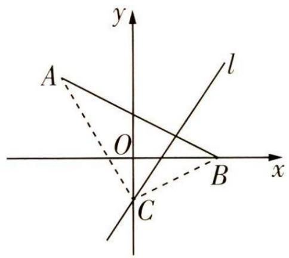

text_image

y
A
O
l
x
B
C

图 1

【补漏洞】题目是求解直线 l 斜率的取值范围，可知直线 l 的斜率一定存在，直线 l 的倾斜角一定不会是 $\frac{\pi}{2}$ ，不要忘记这一隐含条件

设直线 l 的斜率为 k，则 $k = \tan \alpha$ ，作出函数 $y = \tan x (x \in [0, \pi))$ 的图象，如图 2，

得到 $k \leqslant -\sqrt{3}$ 或 $k \geqslant \frac{\sqrt{3}}{3}$ , 即 $k \in (-\infty, -\sqrt{3}] \cup [\frac{\sqrt{3}}{3}, +\infty)$ .

【明易错】本题在求直线斜率的取值范围时, 应先考虑直线倾斜角的取值范围, 再根据正切函数 $y = \tan x$ 的图象, 求出斜率的取值范围, 不要忘记直线倾斜角的取值范围是 $[0, \pi)$ 这一隐含条件

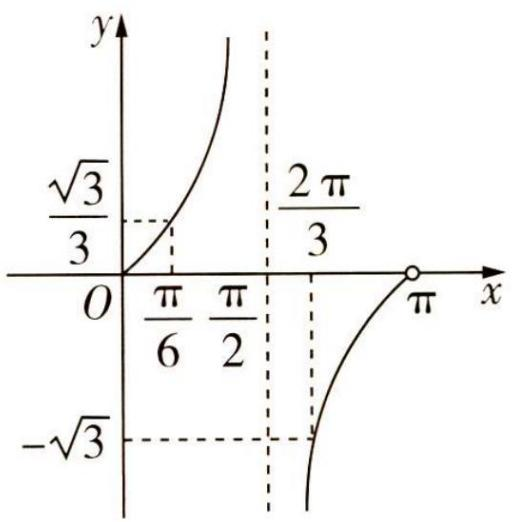

line

| x       | y       |
| ------- | ------- |
| 0       | 0       |
| π/6     | √3/3    |
| π/2     | 2π/3    |
| π       | -√3     |

图 2

2. (1) $\sqrt{3} (c - a \cos B) = b \sin A$ , 由正弦定理得 $\sqrt{3} (\sin C - \sin A \cos B) = \sin B \sin A$ , 即 $\sqrt{3} \sin C - \sqrt{3} \sin A \cos B = \sin B \sin A$ , 则 $\sqrt{3} \sin (A + B) = \sin B \sin A + \sqrt{3} \sin A \cos B$ ,

所以 $\sqrt{3} (\sin A\cos B + \cos A\sin B) = \sin B\sin A + \sqrt{3}\sin A\cos B$ ，即 $\sqrt{3}\cos A\sin B = \sin B\sin A,$ 因为 $\sin B\neq 0$ ，所以 $\sqrt{3}\cos A = \sin A$ ，可得 $\tan A = \frac{\sin A}{\cos A} = \sqrt{3}$

因为 $A \in (0, \pi)$ , 所以 $A = \frac{\pi}{3}$ .

又 $\triangle ABC$ 外接圆的半径 $R = \sqrt{3}$ , 所以 $a = 2R\sin A = 3$ .

(2)第一步:换元,利用(1)中的结论及向量运算求解.

设 $AP = t, t > 0$ ，因为 $\overrightarrow{BC} = 2\overrightarrow{BP}$ ，所以点 $P$ 为 $BC$ 的中点，则 $2\overrightarrow{AP} = \overrightarrow{AB} + \overrightarrow{AC}$ ，两边同时平方得 $4\overrightarrow{AP^2} = \overrightarrow{AB^2} + \overrightarrow{AC^2} + 2|\overrightarrow{AB}| |\overrightarrow{AC}| \cos \angle CAB$ ，即 $4t^2 = c^2 + b^2 + bc$ .

由(1)可知 $b^{2}+c^{2}=a^{2}+bc$ ，可得 $4t^{2}=a^{2}+2bc$ ，即 $t^{2}=\frac{9}{4}+\frac{bc}{2}$ .

第二步:结合正弦定理,利用内角 C 表示 $t^{2}$ .

△ABC 外接圆的半径 $R = \sqrt{3}$ ，由正弦定理得 $b = 2\sqrt{3}\sin B, c = 2\sqrt{3}\sin C$ ，则 $bc = 12\sin B\sin C$ ，所以 $t^{2} = \frac{9}{4} + 6\sin B\sin C = \frac{9}{4} + 3[\cos(B - C) - \cos(B + C)] = \frac{15}{4} + 3\cos(\frac{2\pi}{3} - 2C)$ （此处也可直接将 $B = \frac{2}{3}\pi - C$ 代入，展开、降幂，利用辅助角公式进行化简）.

第三步:利用三角函数的有界性求 AP 长度 t 的取值范围.

△ABC 为锐角三角形, 则 $0 < B = \frac{2\pi}{3} - C < \frac{\pi}{2}, 0 < C < \frac{\pi}{2}$ ,

【补漏洞】在利用三角函数求范围时, 应首先确定自变量 $C$ 的取值范围, 这里要注意该三角形为锐角三角形这一条件

可得 $\frac{\pi}{6} < C < \frac{\pi}{2}$ , 则 $-\frac{\pi}{3} < \frac{2\pi}{3} - 2C < \frac{\pi}{3}$ , 可得 $\frac{1}{2} < \cos\left(\frac{2\pi}{3} - 2C\right) \leqslant 1$ , 则 $\frac{21}{4} < t^2 \leqslant \frac{27}{4}$ , 即 $\frac{\sqrt{21}}{2} < t \leqslant \frac{3\sqrt{3}}{2}$ . 所以线段 $AP$ 长度的取值范围为 $(\frac{\sqrt{21}}{2}, \frac{3\sqrt{3}}{2}]$ .

# 易错点4 忽略对二次项系数是否为0的讨论

调研 1 (试题调研原创) “ $\forall x \in \mathbf{R}$ , 不等式 $mx^{2} + mx - 4 < 2x^{2} + 2x - 1$ 恒成立”的一个必要不充分条件是 ( )

A. $m \leqslant -10$

B. $-10 < m < 3$

C. $-10 \leqslant m < 2$

D. $m \geq  2$

思路导引 解决恒成立问题有两大方法: 图象法和分离参数法. 本题在利用函数图象做题之前, 要考虑二次项系数为0的情况, 当二次项系数不为0时, 再根据二次函数图象的开口方向和与x轴的交点情况, 列不等式进行求解.

解析 不等式 $mx^{2} + mx - 4 < 2x^{2} + 2x - 1$ 对任意实数 x 恒成立, 即不等式 $(m - 2)x^{2} + (m - 2)x - 3 < 0$ 对任意实数 x 恒成立.

当m-2=0,即m=2时,有-3<0恒成立,满足题意.

【补漏洞】当出现不等式 $(m-2)x^{2}+(m-2)x-3<0$ 时，考生容易被形式迷惑，直接根据二次函数的图象和性质做题，忽略了对二次项系数为0的讨论，造成错解

当 $m - 2 \neq 0$ ，即 $m \neq 2$ 时，令 $f(x) = (m - 2)x^2 + (m - 2)x - 3$

“不等式 $(m-2)x^{2}+(m-2)x-3<0$ 对任意实数x恒成立”等价于“函数 $f(x)$ 的图象恒在x轴下方”，

所以 $\left\{\begin{aligned}m-2&<0,\\ \Delta=(m-2)^{2}&+12(m-2)<0,\end{aligned}\right.$ 解得 -10<m<2.

数学符号

综上所述,实数 m 的取值范围为 $(-10,2]$ .

因为要选的是 $m \in (-10, 2]$ 的必要不充分条件, 所以区间 $(-10, 2]$ 是选项的真子集. 故选 B.

调研 2 (试题调研原创) 设 $f(x) = ax^{2} + (1 - a)x - 1 (a \in \mathbb{R})$ .

(1) 若函数 $f(x)$ 在 $[0,2]$ 上为单调函数, 求 a 的取值范围;  
(2) 解关于 $x$ 的不等式 $f(x) < 0$ .

模型构建 解二次不等式的解题步骤为:①化为标准形式并确定二次项系数的符号→②求对应方程的根→③结合二次函数图象求解.

解析 (1)①当 $a = 0$ 时, $f(x) = x - 1$ 在 $[0,2]$ 上单调递增, 符合题意.

【避陷阱】二次函数的单调性自然与其图象对称轴有关，但本题只提到函数，所以还要考虑一次函数也具有单调性，即二次项系数为0的情况，注意这个解题陷阱

②当 $a \neq 0$ 时, 函数 $f(x)$ 图象的对称轴为直线 $x = \frac{a - 1}{2a}$ , 由题意得 $\frac{a - 1}{2a} \leqslant 0$ 或 $\frac{a - 1}{2a} \geqslant 2$ ,

$\frac{a - 1}{2a} \leqslant 0$ ，即 $(a - 1)a \leqslant 0$ 且 $a \neq 0$ ，得 $0 < a \leqslant 1$

$\frac{a - 1}{2a} \geqslant 2$ ，即 $\frac{a - 1}{2a} - 2 = \frac{a - 1 - 4a}{2a} \geqslant 0$ ，即 $(3a + 1)a \leqslant 0$ 且 $a \neq 0$ ，得 $-\frac{1}{3} \leqslant a < 0$

所以 $-\frac{1}{3} \leqslant a < 0$ 或 $0 < a \leqslant 1$ .

综上, $a$ 的取值范围是 $\left[-\frac{1}{3}, 1\right]$ (此处也可以利用导数求解: $f'(x) = 2ax + 1 - a, f'(x)$ 为一次函数, 若 $f(x)$ 在 $[0,2]$ 上不单调, 则 $f'(0) \cdot f'(2) = (1 - a) \cdot (1 + 3a) < 0$ , 得 $a < -\frac{1}{3}$ 或 $a > 1$ . 所以若 $f(x)$ 在 $[0,2]$ 上单调, 则 $a \in \left[-\frac{1}{3}, 1\right]$ .

(2) 当 a=0 时, 由 $f(x)=x-1<0$ , 得 x<1.

【破障碍】本题先按 $a = 0, a \neq 0$ 两种情况分类讨论，当 $a \neq 0$ 时，比较 $-\frac{1}{a}$ 和 1 的大小，再分 $a > 0$ 与 $a < 0$ 两种情况写出不等式的解集，不要忘记 $-\frac{1}{a}$ 与 1 相等的情况

当 $a \neq 0$ 时，由 $f(x) = ax^{2} + (1 - a)x - 1 = (ax + 1)(x - 1) = 0$ ，得 x = 1 或 $x = -\frac{1}{a}$ .

当 $a > 0$ 时， $-\frac{1}{a} < 0 < 1$ ，由 $(ax + 1)(x - 1) < 0$ ，得 $-\frac{1}{a} < x < 1.$

当 $a < 0$ 时，

①当 $-\frac{1}{a}=1$ ，即 a=-1 时，不等式 $f(x)<0$ 的解集为 $\{x|x\neq1\}$ ;

②当 $-\frac{1}{a}>1$ , 即 -1<a<0 时, 不等式 $f(x)<0$ 的解集为 $\left\{x\mid x>-\frac{1}{a}\right.$ 或 $x<1\}$ ;  
③当 $-\frac{1}{a}<1$ , 即 a<-1 时, 不等式 $f(x)<0$ 的解集为 $\{x|x>1$ 或 $x<-\frac{1}{a}\}$ .

综上, 当 $a < -1$ 时, 不等式 $f(x) < 0$ 的解集为 $\{x \mid x > 1 \text{ 或 } x < -\frac{1}{a}\}$ ; 当 $a = -1$ 时, 不等式 $f(x) < 0$ 的解集为 $\{x \mid x \neq 1\}$ ; 当 $-1 < a < 0$ 时, 不等式 $f(x) < 0$ 的解集为 $\{x \mid x > -\frac{1}{a} \text{ 或 } x < 1\}$ ; 当 $a = 0$ 时, 不等式 $f(x) < 0$ 的解集为 $\{x \mid x < 1\}$ ; 当 $a > 0$ 时, 不等式 $f(x) < 0$ 的解集为 $\{x \mid -\frac{1}{a} < x < 1\}$ .

# 纠错巩固

(变考法, 考查利用导数求函数的单调性 |2024 四川南充 9 月零诊节选) 已知函数 $f(x) = \frac{a}{2} x^{2} - x + (1 - a) \ln x$ , 其中 $a \in \mathbf{R}$ , 讨论函数 $f(x)$ 的单调性.

# 参考答案与解析

第一步:对函数 $f(x)$ 求导.

$$
f ^ {\prime} (x) = a x - 1 + \frac {1 - a}{x} = \frac {a x ^ {2} - x + 1 - a}{x} = \frac {(a x - 1 + a) (x - 1)}{x}, x > 0.
$$

第二步:对 a 进行分类讨论,利用导数研究函数 $f(x)$ 的单调性.

当 $a \leqslant 0$ 时, $ax - 1 + a < 0$ , 所以当 $0 < x < 1$ 时, $f'(x) > 0$ , 当 $x > 1$ 时, $f'(x) < 0$ ,

【厘思路】对函数求导后, 要分析导函数值的正负, 观察发现当 $a \leqslant 0$ 与 $a \geqslant 1$ 时, $(ax - 1 + a)$ 的正负可以确定, 从而大大简化了解导函数不等式的步骤. 这里的 $a$ 也可以视作二次项系数, 所以本题算是 “对二次项系数是否为 0 的讨论” 的 “升级版”, 不要忘记对 0 的讨论 $f(x)$ 在 $(0,1)$ 上单调递增, 在 $(1,+\infty)$ 上单调递减.

当 $a \geqslant 1$ 时, $ax - 1 + a > 0$ , 所以当 $0 < x < 1$ 时, $f'(x) < 0$ , 当 $x > 1$ 时, $f'(x) > 0$ ,

$f(x)$ 在 $(0,1)$ 上单调递减，在 $(1,+\infty)$ 上单调递增.

当 0 < a < 1 时, 令 $f'(x) = 0$ , 得 $x = \frac{1 - a}{a}$ 或 x = 1.

①当 $\frac{1-a}{a}=1$ ，即 $a=\frac{1}{2}$ 时， $f'(x)\geqslant0$ 在 $(0,+\infty)$ 上恒成立，所以 $f(x)$ 在 $(0,+\infty)$ 上单调递增.

②当 $0<\frac{1-a}{a}<1$ ，即 $\frac{1}{2}<a<1$ 时，

因为当 $\frac{1-a}{a}<x<1$ 时, $f'(x)<0$ ,当 $0<x<\frac{1-a}{a}$ 或x>1时, $f'(x)>0$ ,

数学符号

所以 $f(x)$ 在 $(0, \frac{1-a}{a})$ 上单调递增，在 $(\frac{1-a}{a}, 1)$ 上单调递减，在 $(1, +\infty)$ 上单调递增.

③当 $\frac{1-a}{a}>1$ ，即 $0<a<\frac{1}{2}$ 时，因为当 $1<x<\frac{1-a}{a}$ 时， $f'(x)<0$ ，当0<x<1或 $x>\frac{1-a}{a}$ 时， $f'(x)>0$ ，所以 $f(x)$ 在 $(0,1)$ 上单调递增，在 $(1,\frac{1-a}{a})$ 上单调递减，在 $(\frac{1-a}{a},+\infty)$ 上单调递增.

第三步: 下结论.

综上, 当 $a \leqslant 0$ 时, $f(x)$ 在 $(0,1)$ 上单调递增, 在 $(1,+\infty)$ 上单调递减; 当 $0 < a < \frac{1}{2}$ 时, $f(x)$ 在【易遗漏】此步不能少, 分类讨论求解函数的单调性, 一定要记得总结, 要不然会失分 $(0,1)$ 上单调递增, 在 $(1, \frac{1-a}{a})$ 上单调递减, 在 $(\frac{1-a}{a},+\infty)$ 上单调递增; 当 $a = \frac{1}{2}$ 时, $f(x)$ 在 $(0,+\infty)$ 上单调递增; 当 $\frac{1}{2} < a < 1$ 时, $f(x)$ 在 $(0, \frac{1-a}{a})$ 上单调递增, 在 $(\frac{1-a}{a},1)$ 上单调递减, 在 $(1,+\infty)$ 上单调递增; 当 $a \geqslant 1$ 时, $f(x)$ 在 $(0,1)$ 上单调递减, 在 $(1,+\infty)$ 上单调递增.

# 易错点5 未考虑基本不等式的使用条件

调研 1 (2024 安徽宿州二中 9 月阶段考试) 下列说法正确的是 ( )

A. 函数 $y = x + \frac{4}{x}$ 的最小值为 4  
B. 函数 $y = \sin^2 x + \frac{16}{\sin^2 x + 2}$ 的最小值为 6  
C. 函数 $y = 4x + \frac{9}{x^{2}} (x > 0)$ 的最小值为 $4\sqrt[3]{18}$   
D. 若 $2^{a} + 4^{b} = 8$ , 则 $a + 2b$ 的最大值为 4

解析 对于 A, 当 x > 0 时, $y = x + \frac{4}{x} \geqslant 2\sqrt{x \cdot \frac{4}{x}} = 4$ , 当且仅当 $x = \frac{4}{x}$ , 即 x = 2 时取等号; 当 x < 0 时, -x > 0, $y = -\left[(-x) + \frac{4}{-x}\right] \leqslant -2\sqrt{(-x) \cdot \frac{4}{-x}} = -4$ , 当且仅当 $-x = \frac{4}{-x}$ , 即 x = -2 时取等号. 综上, $y \in (-\infty, -4] \cup [4, +\infty)$ , A 错误.

对于 B, $y = \sin^{2}x + 2 + \frac{16}{\sin^{2}x + 2} - 2 \geqslant 2 \sqrt{\left(\sin^{2}x + 2\right) \cdot \frac{16}{\sin^{2}x + 2}} - 2 = 6$ , 当且仅当 $\sin^{2}x + 2 = \frac{16}{\sin^{2}x + 2}$ 时取等号, 但 $\sin^{2}x \neq 2$ , 所以等号不成立, B 错误.

对于 C, 方法一: 三元均值不等式法 因为 x > 0, 所以 $y = 2x + 2x + \frac{9}{x^{2}} \geqslant 3\sqrt[3]{2x \cdot 2x \cdot \frac{9}{x^{2}}} = 3\sqrt[3]{36}$ ,

【纠易错】用基本不等式求最值时，必须满足积为定值或和为定值，否则即便满足相等条件, 但由于最值会随变量的改变而改变, 所以会造成错解, 因此本题将 $4 x$ 拆成 $2 x + 2 x$ , 便可以用三元均值不等式 “ $a + b + c \geqslant 3 \sqrt[3]{abc} (a, b, c > 0)$ , 当且仅当 $a = b = c$ 时, 等号成立” 求最值了

当且仅当 $2x = \frac{9}{x^2}$ ，即 $x = \frac{\sqrt[3]{36}}{2}$ 时等号成立， $y_{\mathrm{min}} = 3\sqrt[3]{36}$ ，C错误.

方法二:导数法 令 $f(x)=4x+\frac{9}{x^{2}}(x>0)$ ，则 $f'(x)=4-\frac{18}{x^{3}}=\frac{4x^{3}-18}{x^{3}}$

由 $f'(x)>0$ ，解得 $x>\frac{\sqrt[3]{36}}{2}$ ；由 $f'(x)<0$ ，解得 $0<x<\frac{\sqrt[3]{36}}{2}$ .

所以 $f(x)$ 在 $(0, \frac{\sqrt[3]{36}}{2})$ 上单调递减，在 $(\frac{\sqrt[3]{36}}{2}, +\infty)$ 上单调递增，

所以 $f(x)_{\min}=f(\frac{\sqrt[3]{36}}{2})=3\sqrt[3]{36}$ ，C错误.

对于 D, 因为 $2^{a} > 0, 4^{b} > 0$ , 所以 $8 = 2^{a} + 4^{b} \geqslant 2\sqrt{2^{a} \cdot 2^{2b}} = 2\sqrt{2^{a+2b}}$ , 即 $2^{a+2b} \leqslant 16$ , 解得 $a + 2b \leqslant 4$ , 当且仅当 $2^{a} = 2^{2b}$ 且 $2^{a} + 4^{b} = 8$ , 即 a = 2b = 2 时取等号, 因此 $a + 2b$ 的最大值为 4, D 正确.

故选 D.

# 纠错攻略

利用基本不等式 $a + b \geqslant 2\sqrt{ab}$ 求最值的条件是“一正，二定，三相等”，其中“一正”是指 $a > 0, b > 0$ ；“二定”是指 $a$ 与 $b$ 的乘积或 $a$ 与 $b$ 的和为定值；“三相等”是指当且仅当 $a = b$ 时，等号成立，即取得最值。

调研 2 (试题调研原创) 如图 1, 正方形 ABCD 中, $\overrightarrow{DE} = 2 \overrightarrow{EC}, P$ 是线段 BE 上的动点, 且 $\overrightarrow{AP} = x \overrightarrow{AB} + y \overrightarrow{AD} (x > 0, y > 0)$ , 则 $\frac{1}{x} + \frac{1}{y}$ 的最小值为 \_\_\_\_.

解析 连接 AE, 在正方形 ABCD 中, $\overrightarrow{DE} = 2 \overrightarrow{EC}$ , 则 $\overrightarrow{AD} = \overrightarrow{AE} + \overrightarrow{ED} = \overrightarrow{AE} + \frac{2}{3} \overrightarrow{CD} = \overrightarrow{AE} - \frac{2}{3} \overrightarrow{AB}$ ,

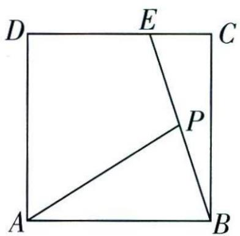

text_image

D
E
C
P
A
B

图1

而 $\overrightarrow{AP} = x\overrightarrow{AB} +y\overrightarrow{AD}$ ，则 $\overrightarrow{AP} = x\overrightarrow{AB} +y(\overrightarrow{AE} -\frac{2}{3}\overrightarrow{AB}) = (x - \frac{2}{3} y)\overrightarrow{AB} +y\overrightarrow{AE},$

又点 B, P, E 共线，于是 $\left(x - \frac{2}{3}y\right) + y = 1$ ，即 $x + \frac{y}{3} = 1, x > 0, y > 0$ ，

【避陷阱】根据 $\frac{1}{x}+\frac{1}{y}$ 的形式，再结合 $x+\frac{y}{3}=1$ ，很容易想到巧用“1”，结合基本不等式求解最值，但该题中“P是线段BE上的动点”，x,y是有限制的，等号成立的条件不满足，要利用函数的单调性解题

# 数学符号

因为 P 是线段 BE 上的动点，

所以 $0 < y \leqslant 1, \frac{1}{x} + \frac{1}{y} = \frac{3}{3 - y} + \frac{1}{y} = \frac{2y + 3}{3y - y^2}$ , 令 $t = 2y + 3$ , 则 $t \in (3,5], y = \frac{t - 3}{2}$ ,

则 $\frac{2y + 3}{3y - y^2} = \frac{t}{3\times\frac{t - 3}{2} - (\frac{t - 3}{2})^2} = \frac{4t}{-t^2 + 12t - 27} = \frac{4}{-t - \frac{27}{t} + 12},$

令 $f(t)=\frac{4}{-t-\frac{27}{t}+12},t\in(3,5]$ ,

易知 $y=t+\frac{27}{t}$ 在 $(3,5]$ 上单调递减，所以 $t+\frac{27}{t}\in\left[\frac{52}{5},12\right)$ ，所以 $-t-\frac{27}{t}+12\in(0,\frac{8}{5}]$ ，故 $f(t) \in \left[\frac{5}{2}, +\infty\right)$ ，即 $\frac{1}{x} + \frac{1}{y}$ 的最小值为 $\frac{5}{2}$ .

# 错解解密

错解如下: $\frac{1}{x} + \frac{1}{y} = (x + \frac{y}{3})(\frac{1}{x} + \frac{1}{y}) = \frac{4}{3} + \frac{x}{y} + \frac{y}{3x} \geqslant \frac{4}{3} + 2\sqrt{\frac{x}{y} \cdot \frac{y}{3x}} = \frac{4 + 2\sqrt{3}}{3}$ , 当且仅当 $\frac{x}{y} = \frac{y}{3x}$ , 即 $x = \frac{3 - \sqrt{3}}{2}, y = \frac{3\sqrt{3} - 3}{2}$ 时, $\frac{1}{x} + \frac{1}{y}$ 取得最小值 $\frac{4 + 2\sqrt{3}}{3}$ . 本法错在基本不等式等号成立的条件不满足题设, 忽视了 $y$ 是不超过 1 的, 从而造成错解.

# 纠错巩固

(试题调研改编|变题型, 考查基本不等式和对勾函数) 已知正实数 $a, b$ 满足 $a^{2} + b^{2} = 1$ , 则 $(a + \frac{1}{a})(b + \frac{1}{b})$ 的最小值为 \_\_\_\_.

# 参考答案与解析

$\frac{9}{2}$ 因为正实数 a, b 满足 $a^{2} + b^{2} = 1$ ，故 $0 < ab \leqslant \frac{a^{2} + b^{2}}{2} = \frac{1}{2}$ ，当且仅当 a = b 时等号成立，

$$
\left(a + \frac {1}{a}\right) \left(b + \frac {1}{b}\right) = a b + \frac {1}{a b} + \frac {a}{b} + \frac {b}{a} = a b + \frac {1}{a b} + \frac {a ^ {2} + b ^ {2}}{a b} = a b + \frac {2}{a b},
$$

【纠易错】此处不要忽略 ab 的取值范围会受到 $a^{2} + b^{2} = 1$ 的限制，因此需要先通过 $a^{2} + b^{2} \geqslant 2ab$ 求出 ab 的取值范围，再根据对勾函数的性质求出最小值

令 $t = ab \in (0, \frac{1}{2}]$ , 易知 $f(t) = t + \frac{2}{t}$ 在 $(0, \frac{1}{2}]$ 上单调递减,

# 数学符号

法国数学家笛卡尔在他的著作中,第一次用“√”表示根号.关注微信公众号“初高教辅站”获取更多初高中教辅资料所以 $f(t)_{\min}=f(\frac{1}{2})=\frac{9}{2}$ . 故填 $\frac{9}{2}$ .

# 错解解密

错解如下: 因为 a > 0, b > 0，所以 $a + \frac{1}{a} \geqslant 2\sqrt{a \cdot \frac{1}{a}} = 2$ ， $b + \frac{1}{b} \geqslant 2\sqrt{b \cdot \frac{1}{b}} = 2$ ，所以 $(a + \frac{1}{a})(b + \frac{1}{b}) \geqslant 2 \times 2 = 4$ ，故 $(a + \frac{1}{a})(b + \frac{1}{b})$ 的最小值为 4。此法错在多次使用基本不等式时，等号成立的条件没有同时满足，当且仅当 a = 1 时， $a + \frac{1}{a} = 2$ ，当且仅当 b = 1 时， $b + \frac{1}{b} = 2$ ，此时 $a^{2} + b^{2} = 2 \neq 1$ ，所以答案错误。

# 易错点6 求数列通项时遗漏对首项的验证

调研 1 (试题调研改编)已知数列 $\{a_{n}\}$ 的前 $n$ 项和为 $S_{n}$ , 若 $S_{n} = n^{2} - 10n - 3$ .

(1)求数列 $\{a_{n}\}$ 的通项公式.  
(2) 若 $b_{n} = |a_{n}|$ ，求数列 $\{b_{n}\}$ 的前 n 项和 $T_{n}$ .

思路导引 (1) 分 $n=1$ 和 $n \geqslant 2$ 两类讨论, 求数列 $\{a_{n}\}$ 的通项公式. (2) 求和的关键是去绝对值, 所以需要讨论 $a_{n}$ 的正负, 通过 $\{a_{n}\}$ 的通项公式判断其前 5 项小于 0 , 第 6 项及以后都大于 0 , 所以 $T_{n}$ 可以分 $n \leqslant 5$ (此时 $T_{n} = -S_{n}$ ) 和 $n \geqslant 6$ (此时 $T_{n} = -S_{5} + (S_{n}-S_{5})$ ) 两部分进行求和. 这里需要和第一问的分类讨论进行区分.

解析 (1) $S_{n} = n^{2} - 10n - 3$ ①, 当 $n = 1$ 时, $a_{1} = -12$ ,

当 $n \geqslant 2$ 时, $S_{n-1} = (n - 1)^{2} - 10(n - 1) - 3 = n^{2} - 12n + 8$ ②,

① - ② 得 $a_{n} = S_{n} - S_{n-1} = 2n - 11, n \geqslant 2$ ,

因为 $a_{1} = -12$ 不符合上式, 所以 $\{a_{n}\}$ 的通项公式为 $a_{n} = \left\{\begin{aligned}-12, &n=1, \\ 2n-11, &n \geqslant 2.\end{aligned}\right.$

【避陷阱】在利用 $S_{n}$ 与 $a_{n}$ 之间的关系求 $\{a_{n}\}$ 的通项公式时，注意分 n=1（此时 $a_{1}=S_{1}$ ）和 $n\geqslant2$ （此时 $a_{n}=S_{n}-S_{n-1}$ ）两种情况进行求解。通过检验，当 $a_{1}$ 满足 $n\geqslant2$ 时的通项公式时，将两种情况进行合并，否则需要写成分段函数的形式，即 $a_{n}=\left\{\begin{aligned}&S_{1},n=1,\\ &S_{n}-S_{n-1},n\geqslant2\end{aligned}\right.$

(2) 因为 $b_{n}=|a_{n}|$ ，所以 $T_{n}=|a_{1}|+|a_{2}|+|a_{3}|+\cdots+|a_{n}|$ ，

当 $a_{n} = 2n - 11 < 0$ 时， $n \leqslant 5$ ；当 $a_{n} = 2n - 11 > 0$ 时， $n \geqslant 6$ .

由(1)知,当 $n \leqslant 5$ 时, $T_{n} = -a_{1} - a_{2} - \cdots - a_{n} = -S_{n} = -n^{2} + 10n + 3$ ,

# 数学符号

英国牛津大学数学、修辞学教授锐考尔德觉得用两条平行而又相等的直线来表示两数相等是最合适不过的了,于是等于符号“=”就从1540年开始使用起来.

关注微信公众号“初高教辅站”获取更多初高中教辅资料

当 $n \geqslant 6$ 时， $T_{n} = -a_{1} - a_{2} - \cdots - a_{5} + a_{6} + a_{7} + \cdots + a_{n} = -S_{5} + (S_{n} - S_{5}) = S_{n} - 2S_{5} = n^{2} - 10n + 53$

从而 $T_{n}=\left\{\begin{aligned}-n^{2}+10n+3,n&\leqslant5,\\ n^{2}-10n+53,n&\geqslant6.\end{aligned}\right.$

调研 2 (2024 贵州遵义 9 月质量检测) 已知数列 $\{a_{n}\}$ 的前 $n$ 项和为 $S_{n}, a_{1} = 1$ , 且当 $n \geqslant 2$ 时, $2S_{n} = (n + 1)a_{n} - 2$ .

(1)求数列 $\{a_{n}\}$ 的通项公式.

(2) 数列 $\{b_{n}\}$ 满足 $b_{n} = \frac{1}{(a_{n} + 2)^{2} - 1}$ , 若对于任意 $n \in \mathbf{N}^{*}$ , 数列 $\{b_{n}\}$ 的前 $n$ 项和 $T_{n} < m$ 恒成立, 求实数 $m$ 的取值范围.

解析 (1) 当 $n \geqslant 2$ 时, $2S_{n} = (n + 1)a_{n} - 2$ , 且 $a_{1} = 1$ ,

若 n=2，则 $2S_{2}=2(1+a_{2})=3a_{2}-2$ ，解得 $a_{2}=4$ ，

若 $n \geqslant 3$ ，则 $2S_{n-1} = na_{n-1} - 2$ ，用 $2S_{n} - 2S_{n-1}$ 可得 $2a_{n} = (n + 1)a_{n} - na_{n-1}, n \geqslant 3$ ，整理得 $\frac{a_n}{n} = \frac{a_{n-1}}{n-1}, n \geqslant 3$

即 $\frac{a_{n}}{n}=\frac{a_{n-1}}{n-1}=\cdots=\frac{a_{2}}{2}=2$ ，可得 $a_{n}=2n,n\geqslant3$ .

可知 n=1 不符合上式, n=2 符合上式, 所以 $a_{n}=\left\{\begin{aligned}&1,n=1,\\ &2n,n\geqslant2.\end{aligned}\right.$

【厘思路】注意验证数列前两项，由题知，当 $n \geqslant 2$ 时， $2S_{n} = (n + 1)a_{n} - 2$ ，所以在利用 $a_{n} = S_{n} - S_{n-1}$ 求解时， $n \geqslant 3$ ，即算出来的是从第3项起的通项公式，所以需要验证 $a_{1}$ 和 $a_{2}$ 是否满足 $n \geqslant 3$ 时的通项公式

(2) 由(1)知, 当 n=1 时, $T_{n}=b_{1}=\frac{1}{\left(a_{1}+2\right)^{2}-1}=\frac{1}{8}$ .

【补盲点】数列 $\{a_{n}\}$ 的通项公式分 n=1 和 $n \geqslant 2$ 两种情况，所以数列 $\{b_{n}\}$ 的通项公式和前 n 项和 $T_{n}$ 也分两种情况

当 $n \geqslant 2$ 时, $b_{n} = \frac{1}{(a_{n} + 2)^{2} - 1} = \frac{1}{4n^{2} + 8n + 3} = \frac{1}{(2n + 1)(2n + 3)} = \frac{1}{2}\left(\frac{1}{2n + 1} -\frac{1}{2n + 3}\right)$ ,

当 $n \geqslant 2$ 时， $T_{n} = b_{1} + b_{2} + b_{3} + \cdots + b_{n} = \frac{1}{8} + \frac{1}{2} \times \left[ \left( \frac{1}{5} - \frac{1}{7} \right) + \cdots + \left( \frac{1}{2n-1} - \frac{1}{2n+1} \right) + \right.$ $\left. \left( \frac{1}{2n+1} - \frac{1}{2n+3} \right) \right] = \frac{1}{8} + \frac{1}{2} \times \left( \frac{1}{5} - \frac{1}{2n+3} \right) = \frac{9}{40} - \frac{1}{4n+6} < \frac{9}{40},$

而 $T_{1} = b_{1} = \frac{1}{8} < \frac{9}{40}$ , 又 $T_{n} < m$ 恒成立, 所以 $m \geqslant \frac{9}{40}$ ,

故实数 m 的取值范围为 $\left[\frac{9}{40}, +\infty\right)$ .

# 纠错巩固

1. (试题调研原创|变方法, 考查错位相减法和分组求和法) 已知数列 $\{a_{n}\}$ 的首项 $a_{1} = 1$ , 其前 $n$ 项和为 $S_{n}$ , 且 $S_{n+1} = 3S_{n} + 2n + 3 (n \in \mathbf{N}^{*})$ .

(1)求数列 $\{a_{n}\}$ 的通项公式;  
(2) 设 $b_{n} = na_{n}$ , 求数列 $\{b_{n}\}$ 的前 $n$ 项和 $T_{n}$ .

2. (变考点, 数列不等式证明问题 |2024 云南昆明一中 9 月二测) 已知数列 $\{a_{n}\}$ 满足 $a_{1} = 2, a_{n+1} = 2^{n+1} a_{n} (n \in \mathbf{N}^{*})$ .

(1) 求数列 $\{a_{n}\}$ 的通项公式.  
(2) 设 $b_n = \log_2 a_n^2 - n^2$ ，数列 $\left\{\frac{b_{n+2}}{2^{n+1} b_n \cdot b_{n+1}}\right\}$ 的前 $n$ 项和为 $S_n$ ，求证： $\frac{3}{8} \leqslant S_n < \frac{1}{2}$ .

# 参考答案与解析

1. (1) $S_{n+1} = 3S_n + 2n + 3$ , 当 $n \geqslant 2$ 时, $S_n = 3S_{n-1} + 2n + 1$ , 两式相减, 得 $S_{n+1} - S_n = 3(S_n - S_{n-1}) + 2, n \geqslant 2$ , 即 $a_{n+1} = 3a_n + 2, n \geqslant 2$ , 从而 $a_{n+1} + 1 = 3(a_n + 1), n \geqslant 2$ ,

当 n=1 时， $S_{2}=3S_{1}+5,\therefore a_{1}+a_{2}=3a_{1}+5.$

【纠易错】要验证两次 $n = 1$ 的情况, 一次是在找特殊数列 $\{a_{n} + 1\}$ 时, 另一次是在求通项公式 $a_{n}$ 时

又 $a_1 = 1, \therefore a_2 = 7$ ，此时 $a_2 + 1 \neq 3(a_1 + 1)$ .

$\therefore \{a_{n} + 1\}$ 是一个从第2项起，后一项是前一项3倍的数列.

∴ 当 $n \geqslant 2$ 时, $a_{n} + 1 = (7 + 1) \times 3^{n-2}$ , $a_{n} = 8 \times 3^{n-2} - 1$ .

又 $a_{1}=1$ 不满足上式, $\therefore a_{n}=\left\{\begin{aligned}&1,n=1,\\ &8\times3^{n-2}-1,n\geqslant2.\end{aligned}\right.$

(2) 第一步: 结合 (1) 知 $\{b_{n}\}$ 的通项公式, 分 $n = 1, n \geqslant 2$ 两种情况求 $T_{n}$ .

由(1)知 $b_{n}=na_{n}=\left\{\begin{aligned}&1,n=1,\\ &8n\times3^{n-2}-n,n\geqslant2.\end{aligned}\right.$

当 n=1 时, $T_{n}=b_{1}=1$ ,

当 $n \geqslant 2$ 时, $T_{n} = b_{1} + b_{2} + b_{3} + b_{4} + \cdots + b_{n} = 1 + (8 \times 2 \times 3^{0} - 2) + (8 \times 3 \times 3^{1} - 3) + (8 \times 4 \times 3^{2} - 4) + \cdots + (8 \times n \times 3^{n-2} - n) = 1 + 8 \times (2 \times 3^{0} + 3 \times 3^{1} + 4 \times 3^{2} + \cdots + n \times 3^{n-2}) - (2 + 3 + 4 + \cdots + n)$ .

第二步:利用错位相减法和分组求和法求解 $T_{n}$ .

令 $A_{n}=2\times3^{0}+3\times3^{1}+4\times3^{2}+\cdots+n\times3^{n-2},n\geqslant2$ , 则 $3A_{n}=2\times3^{1}+3\times3^{2}+4\times3^{3}+\cdots+n\times3^{n-1}$ 两式相减, 得 $-2A_{n}=2+(3^{1}+3^{2}+3^{3}+\cdots+3^{n-2})-n\times3^{n-1}=2+\frac{3\times(1-3^{n-2})}{1-3}-n\times3^{n-1}=\frac{1}{2}+\frac{1-2n}{2}\times3^{n-1},\therefore A_{n}=\frac{2n-1}{4}\times3^{n-1}-\frac{1}{4},n\geqslant2.$

令 $B_{n}=2+3+4+\cdots+n$ , 则 $B_{n}=\frac{(2+n)(n-1)}{2}, n\geqslant2, \therefore T_{n}=1+8A_{n}-B_{n}=1+8\times(\frac{2n-1}{4}\times3^{n-1}-\frac{1}{4})-\frac{(2+n)(n-1)}{2}=(4n-2)\times3^{n-1}-\frac{n(n+1)}{2}, n\geqslant2.$

第三步:验证并下结论.

经验证, $T_{1}=1$ 符合上式.

【补漏洞】不要忘记验证 $n = 1$ 的情况

$$
\therefore T _ {n} = (4 n - 2) \times 3 ^ {n - 1} - \frac {n (n + 1)}{2}.
$$

2. (1) 由已知 $a_1 = 2$ , 得 $\frac{a_{n+1}}{a_n} = 2^{n+1} (n \in \mathbf{N}^*)$ ,

【破障碍】由 $\frac{a_{n+1}}{a_{n}}=2^{n+1}(n\in\mathbf{N}^{*})$ 的形式可知，应使用累乘法求数列 $\{a_{n}\}$ 的通项公式所以 $a_{n}=\frac{a_{n}}{a_{n-1}}\cdot\frac{a_{n-1}}{a_{n-2}}\cdot\cdots\cdot\frac{a_{2}}{a_{1}}\cdot a_{1}=2^{n}\cdot2^{n-1}\cdot\cdots\cdot2^{2}\cdot2=2^{\frac{n(n+1)}{2}}(n\geqslant2)$ ，

当 n=1 时, $a_{1}=2$ 满足上式,所以 $a_{n}=2^{\frac{n(n+1)}{2}}$ .

【补漏洞】由于题目中出现了 $n \in \mathbb{N}^*$ , 故容易遗漏对首项的验证. 结合具体累乘过程, 可知单独的首项不存在累乘过程, 所以需要单独讨论综上, $a_n = 2^{\frac{n(n+1)}{2}}$ .

(2) 第一步: 结合(1)求 $b_{n}$ ，进而求 $\frac{b_{n+2}}{2^{n+1}b_{n}\cdot b_{n+1}}$ 的表达式.

由(1)知 $b_{n}=\log_{2}a_{n}^{2}-n^{2}=n$ ，所以 $\frac{b_{n+2}}{2^{n+1}b_{n}\cdot b_{n+1}}=\frac{n+2}{2^{n+1}n(n+1)}=\frac{1}{n\cdot2^{n}}-\frac{1}{(n+1)2^{n+1}}$ 第二步:利用裂项相消法求 $S_{n}$ .

所以 $S_{n}=\left(\frac{1}{1\times2}-\frac{1}{2\times2^{2}}\right)+\left(\frac{1}{2\times2^{2}}-\frac{1}{3\times2^{3}}\right)+\left(\frac{1}{3\times2^{3}}-\frac{1}{4\times2^{4}}\right)+\cdots+\left(\frac{1}{n\times2^{n}}-\frac{1}{(n+1)2^{n+1}}\right)$ ,
所以 $S_{n}=\frac{1}{1\times2}-\frac{1}{(n+1)2^{n+1}}$

第三步:由函数的单调性证明不等式.

显然 $S_{n}$ 随着n的增大而增大, $S_{1}=\frac{1}{1\times2}-\frac{1}{2\times2^{2}}=\frac{3}{8}$ ，所以 $S_{n}\geqslant S_{1}=\frac{3}{8}$

【破障碍】数列可视作以 n 为自变量的函数，可利用函数的单调性求 $S_{n}$ 的取值范围

又 $S_{n}=\frac{1}{1\times2}-\frac{1}{(n+1)2^{n+1}}<\frac{1}{1\times2}=\frac{1}{2}$ ，所以 $\frac{3}{8}\leqslant S_{n}<\frac{1}{2}$ .

# 易错点7 求轨迹方程时未舍去特殊点

调研 (试题调研原创)已知点 $P$ 是平面直角坐标系 $xOy$ 上异于 $O$ 的任意一点, 过点 $P$ 作直线 $l_{1}: y = \frac{\sqrt{3}}{2} x$ 及 $l_{2}: y = -\frac{\sqrt{3}}{2} x$ 的平行线, 分别交 $y$ 轴于 $M, N$ 两点, 且 $|OM|^{2} + |ON|^{2} = 6$ , 则点 $P$ 的轨迹方程为 \_\_\_\_.

解析 根据题意,设点 P 的坐标为 $(x_{0}, y_{0})$ ,

则过点 P 与直线 $l_{1}: y = \frac{\sqrt{3}}{2}x$ 平行的直线为 $y - y_{0} = \frac{\sqrt{3}}{2}(x - x_{0})$ ,

令 $x = 0$ ，得点 $M$ 的纵坐标 $y_{M} = y_{0} - \frac{\sqrt{3}}{2} x_{0}$

同理, 过点 P 与直线 $l_{2}: y = -\frac{\sqrt{3}}{2}x$ 平行的直线为 $y - y_{0} = -\frac{\sqrt{3}}{2}(x - x_{0})$ ,

令 $x = 0$ ，得点 $N$ 的纵坐标 $y_{N} = y_{0} + \frac{\sqrt{3}}{2} x_{0}$

因为 $|OM|^{2}+|ON|^{2}=6$ ，所以 $y_{M}^{2}+y_{N}^{2}=6$ ，

所以 $(y_0 - \frac{\sqrt{3}}{2} x_0)^2 + (y_0 + \frac{\sqrt{3}}{2} x_0)^2 = 6$ ，化简得 $\frac{x_0^2}{4} + \frac{y_0^2}{3} = 1$

由 $\left\{\begin{aligned}\frac{x^{2}}{4}+\frac{y^{2}}{3}&=1,\\ y&=\frac{\sqrt{3}}{2}x,\end{aligned}\right.$ 得 $x=\pm\sqrt{2}$ ,

所以点 $P$ 的轨迹方程为 $\frac{x^2}{4} +\frac{y^2}{3} = 1(x\neq \pm \sqrt{2})$

【堵误区】由于是过点 P 作直线 $l_{1}: y = \frac{\sqrt{3}}{2}x$ 及 $l_{2}: y = -\frac{\sqrt{3}}{2}x$ 的平行线，所以点 P 必不在直线 $l_{1}$ 与 $l_{2}$ 上，所以应舍掉直线 $l_{1}$ ，直线 $l_{2}$ 与点 P 轨迹的交点。结合图象易知 $l_{1}, l_{2}$ 与点 P 的轨迹有 4 个交点，但根据图象的对称性，求解时只需联立直线 $l_{1}$ 与椭圆 $\frac{x^{2}}{4} + \frac{y^{2}}{3} = 1$ 的方程，求得 $x \neq \pm \sqrt{2}$ ，即可除去不符合要求的点

# 纠错巩固

(试题调研改编 | 变条件, 考查三角形重心的相关性质) 在 $\triangle PF_{1}F_{2}$ 中, 已知 $F_{1}(-\sqrt{3}, 0), F_{2}(\sqrt{3}, 0), PF_{1}$ 边上的中线长与 $PF_{2}$ 边上的中线长之和为 6 , 则 $\triangle PF_{1}F_{2}$ 的重心 $G$ 的轨迹 $C$ 的方程为 \_\_\_\_.

数学符号

# 参考答案与解析

$\frac{x^2}{4} + y^2 = 1 (y \neq 0)$ 如图1, 设 $PF_{1}$ 的中点为 $S, PF_{2}$ 的中点为 $T$ , 连接 $F_{1}T, F_{2}S$ , 相交于点 $G$ , 所以 $|F_{2}G| = \frac{2}{3} |SF_{2}|, |F_{1}G| = \frac{2}{3} |TF_{1}|$ ,

所以 $|F_{1}G|+|F_{2}G|=\frac{2}{3}(|SF_{2}|+|TF_{1}|)=\frac{2}{3}\times6=4$ ，所以 $|F_{1}G|+$ $|F_{2}G|=4>|F_{1}F_{2}|=2\sqrt{3}$

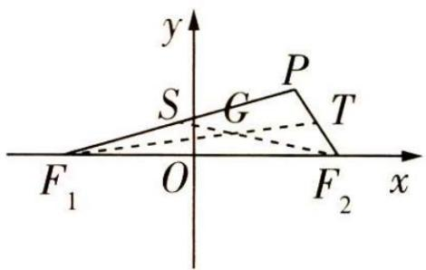

text_image

y
S
G
P
T
F₁ O F₂ x

图 1

所以点 G 的轨迹是以 $F_{1}, F_{2}$ 为焦点, 4 为长轴长的椭圆, 所以 $a = 2, c = \sqrt{3}, b = 1$ ,
所以轨迹 C 的方程为 $\frac{x^{2}}{4} + y^{2} = 1 (y \neq 0)$ .

【补盲点】注意重心 G 在 $\triangle PF_{1}F_{2}$ 内部，故 G 不能在 x 轴上

# 易错点8 圆锥曲线问题中未讨论直线斜率的特殊情况

调研 1 (试题调研改编)已知双曲线 $x^{2} - y^{2} = 4$ .

(1) 若直线 $l$ 过点 $(0,1)$ , 与双曲线有一个公共点, 求直线 $l$ 的方程. (2) 设双曲线与 $x$ 轴分别交于 $A_{1}, A_{2}$ 两点 ( $A_{1}$ 在 $A_{2}$ 的左侧), 若直线 $l$ 过 $R(3,0)$ , 与双曲线交于 $M, N$ 两点 (异于 $A_{1}, A_{2}$ ), 直线 $A_{1} M$ 与直线 $A_{2} N$ 交于点 $P$ , 证明: $P$ 在定直线上.

解析 (1)根据题意,当直线 l 与双曲线 $x^{2}-y^{2}=4$ 有一个公共点时,直线 l 的斜率 k 存在,设直线 l 的方程为 $y=kx+1$ , 由 $\left\{\begin{aligned}y&=kx+1,\\ x^{2}-y^{2}&=4,\end{aligned}\right.$ 消去 y 整理得关于 x 的一元二次方程 $(1-k^{2})x^{2}-2kx-5=0$ .

当 $1 - k^2 = 0$ ，即 $k = \pm 1$ 时，直线 $l$ 与双曲线的渐近线平行，上述方程有唯一实数解，

此时直线与双曲线的某一支交于一点,符合题意.

所以符合要求的直线 l 的方程为 $y = x + 1, y = -x + 1$ .

当 $1 - k^2 \neq 0$ 时, 因为直线 $l$ 与双曲线 $C$ 仅有一个公共点,

则 $\Delta = 4k^{2} + 20(1 - k^{2}) = 0$ ，解得 $k = \pm \frac{\sqrt{5}}{2}$ ，此时直线与双曲线相切于一点，符合题意.

所以符合要求的直线 l 的方程为 $y=\frac{\sqrt{5}}{2}x+1$ , $y=-\frac{\sqrt{5}}{2}x+1$ .

综上,与双曲线 $x^{2}-y^{2}=4$ 有一个公共点的直线 l 有 4 条,分别为 $y=x+1,y=-x+1,y=$ $\frac{\sqrt{5}}{2}x+1,y=-\frac{\sqrt{5}}{2}x+1.$

【避陷阱】当看到有一个公共点时,容易想到相切于一点,所以直接联立直线与双曲线的

# 数学符号

“π”是第十六个希腊字母的小写,亦是希腊语中表示“周边、地域、圆周”等意思的单词的首字母.1706年英国数学家威廉·琼斯最先用“π”来表示圆周率.

关注微信公众号“初高教辅站”获取更多初高中教辅资料方程, 由 $\Delta = 0$ 求解, 造成漏解. 可通过两方面避免该错误, 第一, 根据图象, 除了相切以外, 当过点 $(0,1)$ 的直线 $l$ 与渐近线平行, 即斜率等于渐近线的斜率时, 直线 $l$ 与双曲线的某一支交于一点; 第二, 可根据联立后的方程 $(1 - k^{2})x^{2} - 2kx - 5 = 0$ , 讨论二次项的系数, 当二次项的系数为 0 , 即斜率 $k = \pm 1$ 时, 也可以得到方程只有一个解, 从而可得直线与双曲线有一个交点

(2)由题意知 $A_{1}(-2,0)$ , $A_{2}(2,0)$ ,

若直线 l 的斜率为 0, 则其与双曲线的交点为双曲线的两顶点, 不合题意.

故直线 l 的斜率不能为 0, 设其方程为 $x = ty + 3$ ,

【补漏洞】由“直线 $l$ 过 $R(3,0)$ , 与双曲线交于 $M, N$ 两点 (异于 $A_{1}, A_{2}$ )”可知, 当直线 $l$ 与 $y$ 轴平行, 即斜率不存在时, 满足题意; 当直线 $l$ 与 $x$ 轴平行, 即斜率为 0 时, 不满足题意. 故设直线 $l$ 的方程为 $x = ty + 3$ , 该方程既包含了斜率不存在的情况, 又剔除了斜率为 0 的情况, 一举两得, 且方程形式简单, 方便联立计算

由 $\left\{\begin{aligned}x&=ty+3,\\ x^{2}-y^{2}&=4,\end{aligned}\right.$ 消去x整理得关于y的一元二次方程 $(t^{2}-1)y^{2}+6ty+5=0,$

因为直线 l 与双曲线交于 M, N 两点, 所以 $t \neq \pm1$ , 且 $\Delta_{1} = 16t^{2} + 20 > 0$ ,

设 $M(x_{1},y_{1}),N(x_{2},y_{2})$ ，则 $\left\{ \begin{array}{l} y_1 + y_2 = \frac{-6t}{t^2 - 1},\\ y_1y_2 = \frac{5}{t^2 - 1}, \end{array} \right.$

则直线 $A_{1}M$ 的方程为 $y = \frac{y_1}{x_1 + 2}(x + 2) = \frac{y_1}{ty_1 + 5}(x + 2)$ ，

直线 $A_{2}N$ 的方程为 $y=\frac{y_{2}}{x_{2}-2}(x-2)=\frac{y_{2}}{ty_{2}+1}(x-2)$ ,

联立直线 $A_{1}M$ 与 $A_{2}N$ 的方程，得 $\frac{x + 2}{x - 2} = \frac{ty_1y_2 + 5y_2}{ty_1y_2 + y_1}$

则 $\frac{x + 2}{x - 2} = \frac{\frac{5t}{t^2 - 1} + 5\left(\frac{-6t}{t^2 - 1} - y_1\right)}{\frac{5t}{t^2 - 1} + y_1} = \frac{-\frac{25t}{t^2 - 1} - 5y_1}{\frac{5t}{t^2 - 1} + y_1} = -5,$

解得 $x=\frac{4}{3}$ ，即点 P 的横坐标为定值 $\frac{4}{3}$ ，

故直线 $A_{1}M$ 与直线 $A_{2}N$ 的交点 P 在定直线 $x=\frac{4}{3}$ 上.

调研 2 (试题调研原创)已知动点 M 到定点 $F(1,0)$ 的距离与到定直线 x=4 的距离之比为 $\frac{1}{2}$ .

(1) 求点 M 的轨迹 C 的方程.

(2) 曲线 C 上是否存在两点 A, B 关于直线 $y = k(x - 1)$ 对称？若存在，求出斜率

k;若不存在,请说明理由.

解析 (1) 设 $M(x, y)$ , 根据题意得 $\frac{\sqrt{(x - 1)^2 + y^2}}{|x - 4|} = \frac{1}{2}$ , 则 $4[(x - 1)^2 + y^2] = (x - 4)^2$ , 整理得 $\frac{x^2}{4} + \frac{y^2}{3} = 1$ , 所以点 $M$ 的轨迹 $C$ 的方程为 $\frac{x^2}{4} + \frac{y^2}{3} = 1$ .

(2) 假设曲线 $C$ 上存在 $A, B$ 两点关于直线 $y = k(x - 1)$ 对称，

设 $A(x_{1},y_{1}),B(x_{2},y_{2}),A$ 与 $B$ 的中点 $M(x_0,y_0)$

当 $k \neq 0$ 时，则 $\frac{y_1 - y_2}{x_1 - x_2} = -\frac{1}{k}, y_0 = k(x_0 - 1), x_0 = \frac{x_1 + x_2}{2}, y_0 = \frac{y_1 + y_2}{2}$ .

【厘思路】对称问题由于涉及线段垂直平分线的概念, 与斜率和中点有关, 故选用点差法更简便. 直线 $A B$ 的斜率需要分 $k = 0$ 和 $k \neq 0$ 两种情况进行讨论. 当 $k \neq 0$ 时, 在利用点差法求出结果后, 要根据椭圆内点的限制条件进行取舍

因为 A, B 两点在曲线 C 上, 则 $\frac{x_{1}^{2}}{4} + \frac{y_{1}^{2}}{3} = 1, \frac{x_{2}^{2}}{4} + \frac{y_{2}^{2}}{3} = 1$ ,

两式相减整理得 $\frac{(x_{1}+x_{2})(x_{1}-x_{2})}{4}+\frac{(y_{1}+y_{2})(y_{1}-y_{2})}{3}=0,$

所以 $\frac{(y_1 + y_2)(y_1 - y_2)}{(x_1 + x_2)(x_1 - x_2)} = -\frac{1}{k} \cdot \frac{y_0}{x_0} = -\frac{3}{4}$ ,

将 $y_{0} = k(x_{0} - 1)$ 代入上式，得 $-\frac{1}{k}\cdot \frac{k(x_0 - 1)}{x_0} = -\frac{3}{4}$ ，解得 $x_0 = 4$

因为点 $M(x_{0},y_{0})$ 在椭圆 $\frac{x^{2}}{4}+\frac{y^{2}}{3}=1$ 内，所以 $-2\leqslant x_{0}\leqslant2$

故 $x_0 = 4$ 不符合题意，舍去

当 $k = 0$ 时, 直线 $y = 0$ 为椭圆的对称轴, 易知曲线 $C$ 上必存在两点, 关于直线 $y = 0$ 对称, 符合题意.

综上, k=0 符合题意.

# 易错点9 概率类型定不准致误

调研 1 (2024 广东佛山桂城中学 10 月模拟 | 多选) 甲罐中有 5 个红球, 2 个白球和 3 个黑球, 乙罐中有 4 个红球, 3 个白球和 3 个黑球. 先从甲罐中随机取出一球放入乙罐, 分别以 $A_{1}, A_{2}, A_{3}$ 表示从甲罐中取出的球是红球、白球、黑球, 再从乙罐中随机取两次球, 每次任取一球, 做不放回抽样, 分别以 $B_{1}, B_{2}$ 表示从乙罐中第一次取出的球是红球, 从乙罐中第二次取出的球是红球. 则下列结论中正确的是 ( )

A. $P(B_{1}|A_{1}) = \frac{5}{11}$

B. $P(B_{1}B_{2}|A_{1}) = \frac{2}{11}$

C. $P(B_{1}B_{2}) = \frac{8}{55}$

D. $P(B_{2}|B_{1}) = \frac{2}{5}$

# 数学符号

解析 由已知可得, $P(A_{1})=\frac{5}{10}=\frac{1}{2},P(A_{2})=\frac{2}{10}=\frac{1}{5},P(A_{3})=\frac{3}{10}$ ,

$$
P (B _ {1} \mid A _ {1}) = \frac {5}{1 1}, P (B _ {1} B _ {2} \mid A _ {1}) = \frac {5}{1 1} \times \frac {4}{1 0} = \frac {2}{1 1},
$$

【厘思路】先从甲罐中随机取出一球放入乙罐，再从乙罐中随机取两次球，可以提炼为“在 $A_{i}$ 发生的条件下， $B_{i}$ 发生”，故 $P(B_{1} \mid A_{1})$ ， $P(B_{1} \mid A_{2})$ ， $P(B_{1} \mid A_{3})$ 均为条件概率

$$
P (B _ {1} \mid A _ {2}) = \frac {4}{1 1}, P (B _ {1} B _ {2} \mid A _ {2}) = \frac {4}{1 1} \times \frac {3}{1 0} = \frac {6}{5 5},
$$

$$
P (B _ {1} \mid A _ {3}) = \frac {4}{1 1}, P (B _ {1} B _ {2} \mid A _ {3}) = \frac {4}{1 1} \times \frac {3}{1 0} = \frac {6}{5 5},
$$

由全概率公式可得, $P(B_{1})=P(A_{1}B_{1})+P(A_{2}B_{1})+P(A_{3}B_{1})=P(A_{1})P(B_{1}|A_{1})+P(A_{2})P(B_{1}|A_{2})+$

【破障碍】全概率公式是在 $A_{1}, A_{2}, \cdots, A_{n}$ 是一组两两互斥的事件且 $A_{1} \cup A_{2} \cup \cdots \cup A_{n} = \Omega$ 的前提下再结合乘法公式得到的，因为本题中的 $A_{1}, A_{2}, A_{3}$ 是一组两两互斥的事件且 $A_{1} \cup A_{2} \cup A_{3} = \Omega$ ，所以可用全概率公式计算 $P(B_{1})$ 和 $P(B_{1}B_{2})$

$$
P (A _ {3}) P (B _ {1} \mid A _ {3}) = \frac {1}{2} \times \frac {5}{1 1} + \frac {1}{5} \times \frac {4}{1 1} + \frac {3}{1 0} \times \frac {4}{1 1} = \frac {9}{2 2},
$$

$$
P \left(B _ {1} B _ {2}\right) = P \left(A _ {1} B _ {1} B _ {2}\right) + P \left(A _ {2} B _ {1} B _ {2}\right) + P \left(A _ {3} B _ {1} B _ {2}\right) = P \left(A _ {1}\right) P \left(B _ {1} B _ {2} \mid A _ {1}\right) + P \left(A _ {2}\right) P \left(B _ {1} B _ {2} \mid A _ {2}\right) +
$$

$$
P (A _ {3}) P (B _ {1} B _ {2} \mid A _ {3}) = \frac {1}{2} \times \frac {2}{1 1} + \frac {1}{5} \times \frac {6}{5 5} + \frac {3}{1 0} \times \frac {6}{5 5} = \frac {8}{5 5},
$$

由条件概率公式可得, $P(B_{2}|B_{1})=\frac{P(B_{1}B_{2})}{P(B_{1})}=\frac{16}{45}$ ,故选ABC.

调研 2 (试题调研原创)一个袋子中装有6个大小相同的球,包括2个黄球,4个白球,从中随机摸取3个球(每次摸1个,连摸3次)作为样本,用X表示样本中黄球的个数.

(1) 若采取不放回摸球, 求 X 的分布列.

(2)若采取有放回摸球,求 X 的分布列.

(3)若采取有放回摸球,规定最终摸不出黄球得1分,摸出1个黄球得3分,摸出2个黄球得5分,摸出3个黄球得7分,用Y表示所得分数,求Y的期望和方差.

解析 (1) 若采取不放回摸球, 因为各次试验的结果并不独立, 所以 $X$ 服从超几何分布,

【辨易混】注意关键词 “不放回” “有放回”，这是区分超几何分布与二项分布的关键，此外，还要根据题意进一步明确各个量的具体含义，与概念一一对照，才能做出准确判断

则 $P(X = 0) = \frac{\mathrm{C}_2^0\cdot\mathrm{C}_4^3}{\mathrm{C}_6^3} = \frac{1}{5},P(X = 1) = \frac{\mathrm{C}_2^1\cdot\mathrm{C}_4^2}{\mathrm{C}_6^3} = \frac{3}{5},P(X = 2) = \frac{\mathrm{C}_2^2\cdot\mathrm{C}_4^1}{\mathrm{C}_6^3} = \frac{1}{5},$

$X$ 的分布列为

<table><tr><td>X</td><td>0</td><td>1</td><td>2</td></tr><tr><td>P</td><td> $\frac{1}{5}$ </td><td> $\frac{3}{5}$ </td><td> $\frac{1}{5}$ </td></tr></table>

(2) 若采取有放回摸球, 各次试验结果相互独立, 且每次摸到黄球的概率均为 $\frac{1}{3}$ ,

所以 $X$ 服从二项分布 $B(3, \frac{1}{3})$ ，则 $P(X = k) = C_3^k \cdot \left(\frac{1}{3}\right)^k \cdot \left(1 - \frac{1}{3}\right)^{3-k} (k = 0, 1, 2, 3)$ ，

则 $P(X = 0) = \mathrm{C}_3^0\cdot (\frac{1}{3})^0\cdot (1 - \frac{1}{3})^3 = \frac{8}{27},P(X = 1) = \mathrm{C}_3^1\cdot (\frac{1}{3})^1\cdot (1 - \frac{1}{3})^2 = \frac{4}{9},$

$$
P (X = 2) = \mathrm{C} _ {3} ^ {2} \cdot (\frac {1}{3}) ^ {2} \cdot (1 - \frac {1}{3}) ^ {1} = \frac {2}{9}, P (X = 3) = \mathrm{C} _ {3} ^ {3} \cdot (\frac {1}{3}) ^ {3} \cdot (1 - \frac {1}{3}) ^ {0} = \frac {1}{2 7},
$$

$X$ 的分布列为

<table><tr><td>X</td><td>0</td><td>1</td><td>2</td><td>3</td></tr><tr><td>P</td><td>8/27</td><td>4/9</td><td>2/9</td><td>1/27</td></tr></table>

(3) 因为 $X \sim B\left(3, \frac{1}{3}\right)$ , 所以 $E(X) = 3 \times \frac{1}{3} = 1$ , $D(X) = 3 \times \frac{1}{3} \times \frac{2}{3} = \frac{2}{3}$ ,

根据题意, $Y=2X+1$ ,所以 $E(Y)=2E(X)+1=3,D(Y)=4D(X)=\frac{8}{3}$ .

【避陷阱】黄球个数 $X$ 服从二项分布, 但所得分数 $Y$ 并不符合二项分布, 故不能直接使用二项分布期望和方差的公式, 但我们可以通过 $Y = 2X + 1$ , 再结合期望和方差的性质 $E(aX + b) = aE(X) + b$ , $D(aX + b) = a^2 D(X)$ 进行求解

# 纠错攻略

# 如何区分超几何分布与二项分布？

超几何分布:在含有 M 件次品的 N 件产品中,任取 n 件(不放回),其中恰有 X 件次品,则 $P(X=k)=\frac{C_{M}^{k}C_{N-M}^{n-k}}{C_{N}^{n}}$ , $k=m,m+1,m+2,\cdots,r$ , 其中 $m=\max\{0,n-N+M\}$ , $r=\min\{M,n\}$ , 且 $n\leqslant N$ , $M\leqslant N$ , $n,M,N\in N^{*}$ , 称随机变量 X 服从超几何分布,记作 $X\sim H(N,M,n)$ . 该公式的原理是古典概型的概率公式.

二项分布: 在 n 重伯努利试验中, 用 X 表示事件 A 发生的次数, 设每次试验中事件 A 发生的概率为 $p (0 < p < 1)$ , 不发生的概率为 $q = 1 - p$ , 用 X 表示事件 A 发生的次数, 则 $P(X = k) = C_{n}^{k} p^{k} q^{n - k} (k = 0, 1, 2, \cdots, n)$ . 该公式的原理是相互独立事件交事件与互斥事件并事件的概率公式.

# 数学符号

存在符号“∃”来源于英语中的“exist”一词,因为小写“e”和大写“E”均容易造成混淆,故将此单词首字母大写后反置.

关注微信公众号“初高教辅站”获取更多初高中教辅资料

# 纠错巩固

(变情境, 融合贝叶斯公式 |2024 河南平许济洛 10 月一检)2023 年国庆档电影精彩纷呈, 小成期待去影院观看. 小成家附近有甲、乙两家影院, 小成第一天去甲、乙两家影院观影的概率分别为 $\frac{2}{5}$ 和 $\frac{3}{5}$ . 如果他第一天去甲影院, 那么第二天去甲影院的概率为 $\frac{3}{5}$ ; 如果他第一天去乙影院, 那么第二天去甲影院的概率为 $\frac{1}{2}$ . 若小成第二天去了甲影院, 则第一天去乙影院的概率为 ( )

A. $\frac{23}{50}$

B. $\frac{1}{2}$

C. $\frac{2}{5}$

D. $\frac{5}{9}$

# 参考答案与解析

D 设小成第一天去甲影院为事件 $A$ , 第二天去甲影院为事件 $B$ ; 小成第一天去乙影院为事件 $C$ , 第二天去乙影院为事件 $D$ ,

则 $P(A) = \frac{2}{5}, P(C) = \frac{3}{5}, P(B|A) = \frac{3}{5}, P(B|C) = \frac{1}{2}$ .

根据条件概率公式得 $P(AB)=P(A)P(B|A)=\frac{6}{25}, P(BC)=P(C)P(B|C)=\frac{3}{10}$ ,

故 $P(B)=P(AB)+P(CB)=\frac{6}{25}+\frac{3}{10}=\frac{27}{50}$ ,

则小成第二天去甲影院的概率为 $\frac{27}{50}$ ,

则第一天去乙影院的概率为 $P(C|B)=\frac{P(BC)}{P(B)}=\frac{\frac{3}{10}}{\frac{27}{50}}=\frac{5}{9}$ . 故选 D.

【补盲点】一般地，设 $A_{1},A_{2},\cdots,A_{n}$ 是一组两两互斥的事件， $A_{1}\cup A_{2}\cup\cdots\cup A_{n}=\Omega$ 且 $P(A_{i})>0,i=1,2,\cdots,n$ ，则对任意的事件 $B\subseteq\Omega,P(B)>0$ ，有 $P(A_{i}|B)=\frac{P(A_{i}B)}{P(B)}=\frac{P(A_{i})P(B|A_{i})}{\sum_{j=1}^{n}P(A_{j})P(B|A_{j})}$

$i=1,2,\cdots,n$ ，这就是贝叶斯公式。在做题时，如果是已知结果的情况下推测“前情提要”，也就是已知“在 $A_{i}$ 发生的条件下，B发生的概率”，需要求解“在B发生的条件下， $A_{i}$ 发生的概率”，则可以考虑使用贝叶斯公式

# 数学符号

任意符号“∀”来源于英语中的“arbitrary”一词,因为小写“a”和大写“A”均容易造成混淆,故将此单词首字母大写后倒置.

关注微信公众号“初高教辅站”获取更多初高中教辅资料

# 类型 4 解题技法提升类

# 技法提升1 用函数的单调性弥补利用基本不等式求最值的“漏洞”

# ·技法提升。

基本不等式作为求最值时快捷、有力的工具,却有其自身的局限性.例如:求函数 $f(x)=|\cos x|+\frac{2}{|\cos x|}$ 的最小值时,如果忽略基本不等式等号成立的条件,直接应用基本不等式就会得到 $|\cos x|+\frac{2}{|\cos x|}\geqslant2\sqrt{|\cos x| \times \frac{2}{|\cos x|}}=2\sqrt{2}$ 的错解,原因是“ $|\cos x|=\frac{2}{|\cos x|}$ ”不可能成立,此时就需要用到函数单调性求最值.

调研 1 (试题调研原创) 已知关于 $x$ 的不等式 $x^{2} + bx + c - 3 < 0$ 的解集为 $(-1, 2)$ , 当 $x \in [3, 6]$ 时, 函数 $y = x^{2} + bx + c$ 的图象永远在直线 $y = mx$ 的上方, 则实数 $m$ 的取值范围是 \_\_\_\_.

解析 依题意, -1,2 是方程 $x^{2} + bx + c - 3 = 0$ 的两个根,

【破障碍】不等式解集的“区间端点”即为不等式对应方程的根

则 $\left\{ \begin{array}{l} (-1)^2 + (-1)b + c - 3 = 0, \\ 2^2 + 2b + c - 3 = 0, \end{array} \right.$ 解得 $\left\{ \begin{array}{l} b = -1, \\ c = 1, \end{array} \right.$ 所以 $y = x^2 - x + 1$ .

当 $x \in [3,6]$ 时, 函数 $y = x^{2} - x + 1$ 的图象永远在直线 $y = mx$ 的上方, 等价于 $\forall x \in [3,6]$ , $x^{2} - x + 1 > mx$ 恒成立, 即 $m < \frac{x^{2} - x + 1}{x}$ 在 $x \in [3,6]$ 时恒成立.

令 $f(x)=\frac{x^{2}-x+1}{x}=x+\frac{1}{x}-1,x\in[3,6]$ ,

【避陷阱】这里如果直接利用基本不等式，会发现“=”成立的条件是 $x = \pm 1$ ，不在区间[3,6]内，所以只能根据函数的单调性进行求解

则 $f'(x)=1-\frac{1}{x^{2}}>0$ 在 $[3,6]$ 上恒成立，所以函数 $f(x)$ 在 $[3,6]$ 上单调递增，

所以函数 $f(x)$ 的最小值为 $f(3)=\frac{7}{3}$ ，所以 $m<\frac{7}{3}$ ，即实数m的取值范围是 $(-∞, \frac{7}{3})$ .

调研 2 (试题调研原创) 若 $a \in [1, 2], b \in [1, 3]$ , 不等式 $16a^{2} - \lambda ab + b^{2} \geqslant 0$ 恒成立, 则整数 $\lambda$ 的最大值为 \_\_\_\_.

解析 不等式 $16a^{2} - \lambda ab + b^{2} \geqslant 0$ 恒成立, $a \in [1,2], b \in [1,3]$ , 即不等式 $16\left(\frac{a}{b}\right)^{2} - \lambda \cdot \frac{a}{b} +$

$1 \geqslant 0$ 恒成立，

令 $t = \frac{a}{b}$ , 所以 $t \in \left[\frac{1}{3}, 2\right]$ , 则原不等式可化为 $\lambda \leqslant \frac{16t^2 + 1}{t} = 16t + \frac{1}{t}, t \in \left[\frac{1}{3}, 2\right]$ .

【避陷阱】分离参数法是求解参数取值范围最重要的方法之一. 由于 $t$ 的范围限制, 利用基本不等式时 “=” 成立的条件不能取到, 所以只能根据函数的单调性求最值

令 $f(t)=16t+\frac{1}{t},t\in\left[\frac{1}{3},2\right]$ ，则 $f'(t)=16-\frac{1}{t^{2}}>0$ 在 $\left[\frac{1}{3},2\right]$ 上恒成立，

所以函数 $f(t)$ 在 $\left[\frac{1}{3},2\right]$ 上单调递增,所以 $f(t)$ 的最小值为 $f(\frac{1}{3})=\frac{25}{3}$ ,即 $\lambda\leqslant\frac{25}{3}$ ,

所以整数 $\lambda$ 的最大值为8.

# 纠错巩固

1. (试题调研原创|变情境, 融合生产、生活实践) 如图 1, 某农科所计划在院内围建一块面积为 $200 \mathrm{~m}^{2}$ 的矩形基地做新品种蔬菜种植试验, 规划要求基地一面靠墙, 其余三面用栅栏围成, 设矩形基地的长为 $x \mathrm{~m}$ , 栅栏总长为 $y \mathrm{~m}$ . 则 $y$ 关

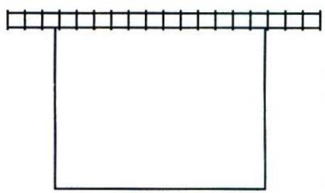

natural_image

Simple geometric diagram with a rectangle and a horizontal line above it (no text or symbols)

图1

于 $x$ 的函数关系式为\_\_\_\_;由于实际需要,基地的长不得少于 $25 \mathrm{~m}$ ,且不能超过 $40 \mathrm{~m}$ ,则所用栅栏总长最小为\_\_\_\_m.

2. (变考点, 考查解三角形 | 2024 四川成都石室中学 10 月考试) 在锐角 $\triangle ABC$ 中, 内角 $A, B, C$ 的对边分别为 $a, b, c, S$ 为 $\triangle ABC$ 的面积, 且 $2S = a^{2} - (b - c)^{2}$ , 则 $\frac{b^{2} + c^{2}}{bc}$ 的取值范围为 ( )

A. $(\frac{34}{15}, \frac{41}{15})$

B. $[2, \frac{41}{15})$

C. $[2, \frac{34}{15})$

D. $[2, +\infty)$

# 参考答案与解析

1. $y = x + \frac{400}{x} (x > 0)$ 41 第一空 根据题意可得, 矩形基地的宽为 $\frac{200}{x}$ m,

所以栅栏总长 $y = x + \frac{400}{x}, x > 0$ ，即 y 关于 x 的函数关系式为 $y = x + \frac{400}{x}, x > 0$ .

第二空 由题意知 $y = x + \frac{400}{x}, 25 \leqslant x \leqslant 40$ ,

【避陷阱】注意第一空和第二空的区别, 第二空 $x$ 的限制变多, 不能直接用基本不等式得最值了则 $y' = 1 - \frac{400}{x^2} > 0$ , $y = x + \frac{400}{x}$ 在 [25,40] 上单调递增,

# 算经十书

十部书包括:《周髀算经》《九章算术》《孙子算经》《五曹算经》《夏侯阳算经》《海岛算经》《五经算术》《缀术》《张邱建算经》《缉古算经》.

关注微信公众号“初高教辅站”获取更多初高中教辅资料

因此当基地的长为 25 m 时, 所用的栅栏总长最小, 为 $25 + \frac{400}{25} = 41 \, (\text{m})$ .

2. C 在 $\triangle ABC$ 中,由余弦定理得 $a^{2}=b^{2}+c^{2}-2bc\cos A$ ,且 $\triangle ABC$ 的面积 $S=\frac{1}{2}bc\sin A$ .

由 $2S = a^{2} - (b - c)^{2}$ ，得 $bc\sin A = 2bc - 2bc\cos A$ ，化简得 $\sin A + 2\cos A = 2$

又 $A \in (0, \frac{\pi}{2})$ , $\sin^{2}A + \cos^{2}A = 1$ , 所以 $5\sin^{2}A - 4\sin A = 0$ , 解得 $\sin A = \frac{4}{5}$ 或 $\sin A = 0$ (舍去),

所以 $\frac{b}{c} = \frac{\sin B}{\sin C} = \frac{\sin(A + C)}{\sin C} = \frac{\sin A\cos C + \cos A\sin C}{\sin C} = \frac{4}{5\tan C} +\frac{3}{5}.$

因为 $\triangle ABC$ 为锐角三角形, 所以 $0 < C < \frac{\pi}{2}, 0 < B = \pi - A - C < \frac{\pi}{2}$ , 所以 $\frac{\pi}{2} - A < C < \frac{\pi}{2}$ ,

【易遗漏】 $\triangle ABC$ 是锐角三角形, 三个内角都有取值限制, 所以 $C$ 的范围不应该只是简单的 $0 < C < \frac{\pi}{2}$ , $B$ 的大小也会对其有影响, 要考虑全面

所以 $\tan C > \tan \left(\frac{\pi}{2} - A\right) = \frac{1}{\tan A} = \frac{3}{4}$ , 所以 $\frac{1}{\tan C} \in (0, \frac{4}{3})$ , 所以 $\frac{b}{c} \in (\frac{3}{5}, \frac{5}{3})$ .

设 $\frac{b}{c} = t, t \in \left(\frac{3}{5}, \frac{5}{3}\right)$ , 则 $\frac{b^2 + c^2}{bc} = \frac{b}{c} + \frac{c}{b} = t + \frac{1}{t}$ ,

【补漏洞】此处可使用基本不等式求最小值，但要求取值范围，仍需借助函数的单调性

由对勾函数的单调性知函数 $y = t + \frac{1}{t}$ 在 $(\frac{3}{5}, 1)$ 上单调递减，在 $(1, \frac{5}{3})$ 上单调递增，且当 t = 1 时， $t + \frac{1}{t} = 2$ ; 当 $t = \frac{3}{5}$ 时， $t + \frac{1}{t} = \frac{34}{15}$ ; 当 $t = \frac{5}{3}$ 时， $t + \frac{1}{t} = \frac{34}{15}$ .

所以 $y \in [2, \frac{34}{15})$ ，即 $\frac{b^{2} + c^{2}}{bc}$ 的取值范围是 $[2, \frac{34}{15})$ 。故选 C.

# 技法提升2 用构造法解决 $f(x)$ 与 $f'(x)$ 共存的不等式问题

# ·技法提升。

用构造法解决 $f(x)$ 与 $f'(x)$ 共存的不等式问题的“三步法”

①观察所给式子的基本特征, 明确所构造的函数 $g(x)$ 是由“主函数” $f(x)$ 和哪些“辅函数”构成, 采取哪种方式构成. 常见的“辅函数”有 $x^{n}, e^{k x}, \sin x, \cos x$ 等, 常见的构成方法有 “和、差、积、商”等.

②结合已知条件,由“主函数”和“辅函数”共同确定构造的函数 $g(x)$ 的单调性.

③将所求不等式合理变形,转化为 $g(x_{1})$ , $g(x_{2})$ 的大小关系,再由单调性确定 $x_{1}, x_{2}$ 的大小关系,从而求解不等式.

# 算经十书

《周髀算经》 原名《周髀》，是中国最古老的天文学和数学著作，约成书于公元前一世纪。

关注微信公众号“初高教辅站”获取更多初高中教辅资料

调研 1 (试题调研原创 | 开放性填空题) 已知 $f'(x)$ 为函数 $y = f(x)$ 的导函数, 且满足 $f(1) = 1$ , $\forall x \in \mathbf{R}$ , $2f'(x) - 1 < 0$ , 则不等式 $f(\ln x) > \frac{1 + \ln x}{2}$ 的整数解可以为 \_\_\_\_. (写出一个满足题意的结果即可)

解析 由 $2f'(x) - 1 < 0$ , 可得 $f'(x) - \frac{1}{2} < 0$ , 令 $g(x) = f(x) - \frac{1}{2} x + a$ ,

由不等式 $f(\ln x) > \frac{1 + \ln x}{2}$ 得 $f(\ln x) - \frac{1}{2}\ln x - \frac{1}{2} > 0$ ，则取 $a = -\frac{1}{2}$ .

【厘思路】 $2f'(x)-1<0$ ，结合 $f(\ln x)>\frac{1+\ln x}{2}$ ，构造函数 $g(x)=f(x)-\frac{1}{2}x-\frac{1}{2}$ ，这是一个容易判断单调性的函数

由题意知函数 $g(x) = f(x) - \frac{1}{2} x - \frac{1}{2}$ 在 $\mathbf{R}$ 上单调递减，且 $g(1) = f(1) - \frac{1}{2} -\frac{1}{2} = 0$

则由 $g(\ln x) = f(\ln x) - \frac{1}{2}\ln x - \frac{1}{2} >0$ ，得 $g(\ln x) > g(1)$ ，即 $\ln x < 1$ ，所以 $x\in (0,\mathrm{e})$

故 $f(\ln x) > \frac{1 + \ln x}{2}$ 的整数解为1或2(任选其一即可).

调研 2 (试题调研原创) 已知函数 $f(x)$ 的定义域为 $(0, +\infty)$ , 导函数为 $f'(x)$ , 不等式 $(x+1)[2f(x)+xf'(x)] > xf(x)$ 恒成立, 且 $f(6)=\frac{7}{12}$ , 则不等式 $f(x+4) < \frac{3x+15}{(x+4)^2}$ 的解集为 \_\_\_\_.

解析 因为 $(x+1)\left[2f(x)+xf'(x)\right]>xf(x)$ ，则有 $\left[x^{2}f(x)\right]'=2xf(x)+x^{2}f'(x)>\frac{x^{2}f(x)}{x+1}$ .

令 $g(x)=x^{2}f(x)$ ，则 $\frac{g(x)}{x+1}-g'(x)=\frac{g(x)-g'(x)(x+1)}{x+1}<0,x\in(0,+\infty)$ ，

【厘思路】根据复合函数的求导法则和已知不等式的结构特征, 构造函数 $g(x) = x^{2} f(x)$ , 从而可得 $\frac{g(x) - g'(x)(x+1)}{x+1} < 0$ , 再次构造函数 $G(x) = \frac{g(x)}{x+1}$ , 可得 $G(x)$ 的单调性, 进而求解. 这里其实是把两个步骤拆开了, 如果想要一步到位, 可以直接构造函数 $m(x) = \frac{x^{2} f(x)}{x+1}$ , 只是对思维量的要求更大

因为 $x + 1 > 0$ ，则 $g(x) - g'(x)(x + 1) < 0$

令 $G(x)=\frac{g(x)}{x+1}$ ，则 $G'(x)=\frac{g'(x)(x+1)-g(x)}{(x+1)^2}>0$ ，所以 $G(x)$ 在 $(0,+\infty)$ 上单调递增.

算经十书

不等式 $f(x+4)<\frac{3x+15}{(x+4)^{2}}$ 等价于 $\frac{(x+4)^{2}f(x+4)}{x+5}<3$ ，即 $G(x+4)<3$ ，

而 $G(6) = \frac{g(6)}{7} = \frac{36f(6)}{7} = 3$ ，所求不等式即 $G(x + 4) < G(6)$ .

由于 $G(x)$ 在 $(0, +\infty)$ 上单调递增, 所以 $\left\{\begin{aligned}x+4<6,\\ x+4>0,\end{aligned}\right.$ 故不等式的解集为 $\{x|-4<x<2\}$ .

# 纠错巩固

1. (变条件 |2024 陕西十一所重点中学 9 月联考) 已知函数 $f(x)$ 的定义域是 $(-5, 5)$ , 导函数为 $f'(x)$ , 且 $f(x) + xf'(x) > 2$ , 则不等式 $(2x - 3)f(2x - 3) - (x - 1)f(x - 1) > 2x - 4$ 的解集为 \_\_\_\_.

2. (综合变式, 变构造形式 |2024 哈尔滨九中 10 月考试) 已知函数 $f(x)$ 的定义域和值域均为 $(0, +\infty)$ , $f(x)$ 的导数为 $f'(x), 2f(x) < f'(x) < 3f(x)$ , 则 $\frac{f(2023)}{f(2024)}$ 的取值范围是 \_\_\_\_.

3. (变构造形式, 与三角函数综合构造 |2024 湖南师大附中 10 月考试) 已知函数 $f(x)$ 的定义域为 $\mathbf{R}, f(x)$ 的导数是 $f'(x)$ , 且 $f(x) \cdot f'(x) + \sin x > 0$ 恒成立, 则 ( )

A. $f(\frac{\pi}{2}) <   f(-\frac{\pi}{2})$

B. $f(\frac{\pi}{2}) > f(-\frac{\pi}{2})$

C. $\left|f\left(\frac{\pi}{2}\right)\right|<\left|f\left(-\frac{\pi}{2}\right)\right|$

D. $\left|f\left(\frac{\pi}{2}\right)\right| > \left|f\left(-\frac{\pi}{2}\right)\right|$

4. (试题调研原创 | 变构造形式, 与对勾函数综合构造 | 多选) 函数 $g(x)$ 与其导函数 $g'(x)$ 满足 $(x + \frac{1}{x}) \cdot g'(x) < (1 - \frac{1}{x^2}) \cdot g(x)$ , 其中 $x > 0$ . 若 $m = \tan \theta, n = \sin \theta + \cos \theta, 0 < \theta < \frac{\pi}{4}$ , 则下列说法正确的有 ( )

A. $g(1) - g(m) < 0$

B. $g(1) - (n^2 - 1)g(m) < 0$

C. $(\sin 2\theta + 2)g(1) - 2ng(n) > 0$

D. $(n^4 - 1)g(m) - 2ng(n) < 0$

# 参考答案与解析

1. $\{x \mid 2 < x < 4\}$ 设 $g(x) = xf(x) - 2x$ , 则 $g'(x) = f(x) + xf'(x) - 2$ .

【厘思路】“ $f(x) + xf'(x)$ ”是典型的“ $[xf(x)]'$ ”结构，在此基础上给原函数 $y = xf(x)$ 加上一次项，就可以构造出函数 $g(x) = xf(x) - 2x$ ，由题易知这是一个单调递增函数

# 算经十书

因为 $f(x)+xf'(x)>2$ ，所以 $g'(x)>0$ ，则 $g(x)$ 在 $(-5,5)$ 上单调递增.

不等式 $(2x - 3)f(2x - 3) - (x - 1)f(x - 1) > 2x - 4$ 等价于 $(2x - 3)f(2x - 3) - 2(2x - 3) > (x - 1)f(x - 1) - 2(x - 1)$ ，

即 $g(2x - 3) > g(x - 1)$ ，则 $\left\{ \begin{array}{l} -5 < 2x - 3 < 5, \\ -5 < x - 1 < 5, \\ 2x - 3 > x - 1, \end{array} \right.$ 解得 $2 < x < 4$ 。故原不等式的解集为 $\{x \mid 2 < x < 4\}$ 。

2. $(\mathrm{e}^{-3}, \mathrm{e}^{-2})$ 令 $g(x) = \frac{f(x)}{\mathrm{e}^{2x}}, h(x) = \frac{f(x)}{\mathrm{e}^{3x}}$ , 则 $g'(x) = \frac{f'(x) - 2f(x)}{\mathrm{e}^{2x}} > 0, h'(x) = \frac{f'(x) - 3f(x)}{\mathrm{e}^{3x}} < 0,$

【厘思路】“ $2f(x)-f'(x)$ ”结构中含有减号，且含 $f(x)$ 的项与 $f'(x)$ 无关，毋庸置疑，“主函数”和“辅函数”一定是商型结构，因此我们构造了函数 $g(x)=\frac{f(x)}{\mathrm{e}^{2x}}$ ，同理可构造函数 $h(x)=\frac{f(x)}{\mathrm{e}^{3x}}$

$\therefore g(x)$ 在 $(0, +\infty)$ 上单调递增， $h(x)$ 在 $(0, +\infty)$ 上单调递减，

$$
\therefore \frac {f (2 0 2 3)}{\mathrm{e} ^ {2 \times 2 0 2 3}} <   \frac {f (2 0 2 4)}{\mathrm{e} ^ {2 \times 2 0 2 4}}, \frac {f (2 0 2 3)}{\mathrm{e} ^ {3 \times 2 0 2 3}} > \frac {f (2 0 2 4)}{\mathrm{e} ^ {3 \times 2 0 2 4}},
$$

又 $f(x) > 0, \therefore \frac{f(2023)}{f(2024)} < \mathrm{e}^{-2}, \frac{f(2023)}{f(2024)} > \mathrm{e}^{-3}, \therefore \frac{f(2023)}{f(2024)}$ 的取值范围是 $(\mathrm{e}^{-3}, \mathrm{e}^{-2})$ .

3. D 设 $g(x) = [f(x)]^2 - 2\cos x$ ，则 $g'(x) = 2f(x) \cdot f'(x) + 2\sin x > 0$ ，

【厘思路】本题涉及三角函数，那么记住一句话“看到正弦想余弦、看到余弦想正弦”，因此构造函数 $g(x) = [f(x)]^{2} - 2\cos x$

故函数 $g(x)$ 在定义域 R 上单调递增, 所以 $g(\frac{\pi}{2}) > g(-\frac{\pi}{2})$ ,

即 $[f(\frac{\pi}{2})]^2 > [f(-\frac{\pi}{2})]^2$ ，所以 $|f(\frac{\pi}{2})| > |f(-\frac{\pi}{2})|$ . 故选 D.

4. BC 设 $f(x) = \frac{g(x)}{x + \frac{1}{x}}$ ，则 $f'(x) = \frac{g'(x) \cdot (x + \frac{1}{x}) - g(x) \cdot (1 - \frac{1}{x^2})}{(x + \frac{1}{x})^2} < 0$ ，

【厘思路】本题给出的原函数与导函数的关系式中包含 “ $x + \frac{1}{x}$ ”，那么何不把对勾函数当作辅函数呢？将 $y = x + \frac{1}{x}$ 看作函数 $h(x)$ ，结合 $h'(x) = 1 - \frac{1}{x^{2}}$ ，便可构造商型函数 $f(x) = \frac{g(x)}{h(x)}$ 所以 $f(x)$ 在 $(0, +\infty)$ 上单调递减.

因为 $0 < \theta < \frac{\pi}{4}$ , 所以 $m = \tan \theta \in (0,1)$ , $n = \sin \theta + \cos \theta = \sqrt{2} \sin (\theta + \frac{\pi}{4}) \in (1, \sqrt{2})$ ,

# 算经十书

《九章算术》内容十分丰富,全书总结了战国、秦、汉时期的数学成就.它不仅最早提到分数问题,也首先记录了盈不足等问题.

关注微信公众号“初高教辅站”获取更多初高中教辅资料

所以 $f(m) > f(1) > f(n)$ .

<table><tr><td>选项</td><td>分析过程</td><td>正误</td></tr><tr><td>A</td><td>由 $f(m) >f(1)$ 得 $\frac{g(m)}{m+\frac{1}{m}} >\frac{g(1)}{2}$ ,虽然 $m+\frac{1}{m} >2$ ,但 $g(m),g(1)$ 的符号不确定,所以仍旧无法判断 $g(m)$ 和 $g(1)$ 的大小关系【避陷阱】如果 $g(m)$ 和 $g(1)$ 都是正数或者一正一负,自然有 $g(m) >g(1)$ ,但若二者都是负数,则可能有 $g(m) < g(1)$ </td><td>×</td></tr><tr><td>B</td><td>由 $\frac{g(m)}{m+\frac{1}{m}} >\frac{g(1)}{2}$ 得 $\frac{2m}{m^{2}+1}g(m) >g(1)$ ,又 $m = \tan \theta$ ,所以 $\frac{2\tan \theta}{\tan^{2}\theta + 1}g(m) >g(1)$ ,所以 $g(m)\sin 2\theta >g(1)$ ,又 $n^{2} = 2\sin^{2}(\theta + \frac{\pi}{4}) = 1 - \cos(2\theta + \frac{\pi}{2}) = 1 + \sin 2\theta$ ,所以 $(n^{2}-1)g(m) >g(1)$ </td><td>√</td></tr><tr><td>C</td><td>由 $f(1) >f(n)$ 得 $\frac{g(1)}{2} >\frac{g(n)}{n+\frac{1}{n}}$ ,所以 $(n^{2}+1)g(1) >2ng(n)$ ,即 $(n^{2}+1)g(1)-2ng(n)>0$ ,所以 $(\sin 2\theta+2)g(1)-2ng(n)>0$ </td><td>√</td></tr><tr><td>D</td><td>由 $f(m) >f(n)$ 得 $\frac{g(m)}{m+\frac{1}{m}} >\frac{g(n)}{n+\frac{1}{n}}$ ,即 $\frac{m}{m^{2}+1}g(m) >\frac{n}{n^{2}+1}g(n)$ ,所以 $\frac{\tan \theta}{\tan^{2}\theta + 1}g(m) >\frac{\sin \theta + \cos \theta}{2 + \sin 2\theta}g(n)$ ,即 $g(m)\sin 2\theta >\frac{2(\sin \theta + \cos \theta)}{2 + \sin 2\theta}g(n)$ ,所以 $(2 + \sin 2\theta)g(m)\sin 2\theta - (2\sin \theta + 2\cos \theta)g(n)>0$ ,所以 $(n^{2}-1)(n^{2}+1)g(m)-2ng(n)>0$ ,即 $(n^{4}-1)g(m)-2ng(n)>0$ </td><td>×</td></tr></table>

# 技法提升3 正确数形结合，避免解题烦琐或漏解

# ·技法提升。

我国著名数学家华罗庚先生曾说,数缺形时少直觉,形少数时难入微,数形结合百般好,隔离分家万事休. 数形结合即“以形助数,以数解形”,在实际应用中更偏重于用图形解决代数问题,如借助函数图象、单位圆、数式的结构特征等解决函数、方程或不等式问题. 图形直观,更易发现解题途径,因此,合理运用“数形结合”的思想方法,不仅能优化解题思路,还能提高解题效率.

# 算经十书

调研 1 (2024 湖南衡阳八中 9 月一测) 已知函数 $f(x)$ 满足 $f(x - 2) = f(x + 2)$ , 且当 $0 \leqslant x < 4$ 时, $f(x) = \sqrt{4 - (x - 2)^2}$ , $g(x) = f(x) - k_n x (n \in \mathbf{N}^*, k_n > 0)$ . 若函数 $g(x)$ 的图象与 $x$ 轴恰好有 $2n + 1$ 个不同的交点, 则 $k_1^2 + k_2^2 + \cdots + k_n^2 =$ \_\_\_\_. (结果用含 $n$ 的式子表达)

解析 $\because f(x - 2) = f(x + 2), \therefore f(x) = f(x + 4), \therefore$ 函数 $f(x)$ 的周期为 4.

当 $0 \leqslant x < 4$ 时, $f(x) = \sqrt{4 - (x - 2)^2}$ , 记 $y = f(x)$ , 则 $(x - 2)^2 + y^2 = 4$ , $y \geqslant 0$ .

令 $g(x) = f(x) - k_n x = 0$ ，可得 $f(x) = k_n x$

即若函数 $g(x)$ 的图象与 $x$ 轴恰好有 $2n + 1$ 个不同的交点，

则直线 $y = k_{n}x$ 与函数 $f(x)$ 的图象恰有 $2n + 1$ 个不同的交点.

作出函数 $y=f(x)$ 的图象与直线 $y=k_{n}x$ ，如图 1 所示.

【避陷阱】本题若不结合图象，只考虑代数法，则需分类讨论，反复代换，求解寸步难行

text_image

y
y=f(x)
y=kₙx
O
x

图1

根据图象知, 直线 $y = k_{n}x$ 与 y 轴右侧的第 $n + 1$ 个半圆相切,

【破障碍】函数 $f(x)$ 的图象由无数个半圆弧构成，根据题意，将函数 $g(x)$ 的图象与x轴的交点情况转化为函数 $f(x)$ 的图象与直线 $y=k_{n}x$ 的交点情况，进而转化为直线与圆的位置关系

故 $k_{n}=\frac{2}{\sqrt{(4n+2)^{2}-4}}=\frac{2}{\sqrt{16n^{2}+16n}}=\frac{1}{\sqrt{4n^{2}+4n}}$

【析疑难】结合图象可知，在 $y$ 轴右侧，半圆弧的半径均为 2，圆心坐标依次为 $(2,0)$ ， $(6,0)$ ， $(10,0)$ ，…，第 $n+1$ 个圆对应的圆心坐标为 $(4n+2,0)$ ，则由直线斜率为倾斜角的正切值，即可列出 $k_{n}$ 的表达式。也可根据点到直线的距离公式得到 $2 = \frac{|k_{n}(2 + 4n)|}{\sqrt{1 + k_{n}^{2}}}$ ，同样可以得到 $k_{n}$ 的表达式。

故 $k_{n}^{2} = \frac{1}{4n^{2} + 4n} = \frac{1}{4}\left(\frac{1}{n} -\frac{1}{n + 1}\right),$

所以 $k_{1}^{2} + k_{2}^{2} + \cdots + k_{n}^{2} = \frac{1}{4} \times (1 - \frac{1}{2} + \frac{1}{2} - \frac{1}{3} + \cdots + \frac{1}{n} - \frac{1}{n+1}) = \frac{n}{4(n+1)}$ .

故填 $\frac{n}{4(n+1)}$ .

算经十书

调研 2 (试题调研原创) 已知函数 $f(x) = \begin{cases} |\ln x|, & x > 0, \\ \mathrm{e}^x + 1, & x \leqslant 0 \end{cases}$ 且函数 $g(x) = f(x) - a$ 恰有三个不同的零点, 则实数 $a$ 的取值范围是 ( )

A. (1,2]

B. $[1,2)$

C. $(-∞,2)$

D. $(- \infty, 1)$

解析 由 $g(x)=0$ 得 $f(x)=a$ ，即函数 $g(x)$ 的零点是直线 y=a 与曲线 $y=f(x)$ 交点的横坐标.

当 $x \leqslant 0$ 时, $f(x) = e^{x} + 1$ 单调递增, $\therefore f(x) \in (1, 2]$ ;

当 $0 < x \leqslant 1$ 时, $f(x) = -\ln x$ 单调递减, 且当 $x \to 0$ 时, $f(x) \to +\infty$ , $f(1) = 0$ , $\therefore f(x) \in [0, +\infty)$ ;

当 $x > 1$ 时， $f(x) = \ln x$ 单调递增，且当 $x \to +\infty$ 时， $f(x) \to +\infty$ ， $\therefore f(x) \in (0, +\infty)$ .

作出函数 $y=f(x)$ 的图象, 如图 2 所示,

【破障碍】把函数 $g(x)$ 的零点问题转化为直线 y = a 与函数 $y = f(x)$ 图象的交点问题解决，从而数形结合，实现快解

观察图象知, 当 $1 < a \leqslant 2$ 时, 直线 y = a 与函数 $y = f(x)$ 图象有 3 个交点, 即函数 $g(x)$ 有 3 个零点,

text_image

y=a
2
1
y=f(x)
O
1
x

图2

所以 $1 < a \leqslant 2$ ，故选 A.

调研 3 (2024 湖南长沙实验中学 10 月阶段检测) 已知 $x, y \in \mathbf{R}_{+}, 2x + y =$ 2, 则 $x + \sqrt{x^{2} + y^{2}}$ 的最小值为 ( )

A. $\frac{5}{4}$

B. $\frac{8}{5}$

C. 1

D. $\frac{1+\sqrt{2}}{2}$

解析 如图3,取线段 $2x + y = 2 (0 < x < 1)$ (不含端点)上任一点 $P(x,y)$ ,过点 $O$ 作点 $O$ 关于【破障碍】由待求式联想点的横坐标与两点间的距离,从而建立平面直角坐标系,数形结合,利用几何知识求解

线段 $2x + y = 2(0 < x < 1)$ 的对称点 $C$ , 连接 $OC, PO, PC$ , 则 $|PO| = |PC|$ .

设 $C(x_0, y_0)$ , 则 $\left\{ \begin{array}{l} \frac{y_0}{x_0} \times (-2) = -1, \\ 2 \times \frac{x_0}{2} + \frac{y_0}{2} = 2, \end{array} \right.$ 解得 $\left\{ \begin{array}{l} x_0 = \frac{8}{5}, \\ y_0 = \frac{4}{5}, \end{array} \right.$ 所以 $C(\frac{8}{5}, \frac{4}{5})$ .

由 $|PO|=\sqrt{x^{2}+y^{2}}$ ，知 $\sqrt{x^{2}+y^{2}}=|PO|=|PC|$ ，

又 $x, y \in \mathbf{R}_{+}$ , 所以点 $P$ 到 $y$ 轴的距离为 $x$ ,

所以 $x + \sqrt{x^{2} + y^{2}}$ 可视为线段 $2x + y = 2 (0 < x < 1)$ 上的点 $P(x, y)$ 到

text_image

y
2
P
D
H
C
O
1
x

图 3

# 算经十书

传本的《孙子算经》共三卷,卷上叙述算筹记数的纵横相间制度和筹算乘除法,卷中举例说明筹算分数算法和筹算开平方法.

关注微信公众号“初高教辅站”获取更多初高中教辅资料

y 轴的距离与到 $C(\frac{8}{5}, \frac{4}{5})$ 的距离之和.

过 $P$ 作 $PD \perp y$ 轴于 $D$ , 过点 $C$ 作 $CH \perp y$ 轴于 $H$ , 连接 $CD$ ,

显然有 $|PD|+|PC|\geqslant|CD|\geqslant|CH|$ ，则 $|CH|$ 为所求最小值.

易得 $|CH|=\frac{8}{5}$ ，所以 $x+\sqrt{x^{2}+y^{2}}$ 的最小值为 $\frac{8}{5}$ . 故选 B (本题也可以设 $x+\sqrt{x^{2}+y^{2}}=k$ ，则 $y^{2}=(k-x)^{2}-x^{2}=k^{2}-2kx$ ，从而 $(2-2x)^{2}=k^{2}-2kx$ ，此关于 x 的二次方程在 $(0,1)$ 上有解，据此结合二次函数的有关性质求解，或直接将 y=2-2x 代入 $x+\sqrt{x^{2}+y^{2}}$ 中，将待求式转化为关于 x 的表达式，进而构造函数，利用导数求解. 这是求解此题的常规代数法，但运算过程较复杂，极易出错).

# 纠错巩固

1. (试题调研原创 | 变设问, 函数的零点问题) 函数 $f(x) = \frac{1}{|x - 1|} - 2 \cos \pi x$ 在 $x \in [ -3, 5 ]$ 上的所有零点之和为

A. 2

B. 4

C. 6

D. 8

2. (变考点, 考查直线与圆的位置关系 |2024 江西南昌 10 月阶段练习) 若平面内两定点 $A, B$ 之间的距离为 2 , 动点 $P$ 满足 $\frac{|PB|}{|PA|} = \sqrt{2}$ , 则 $\sin \angle PBA$ 的最大值为 ( )

A. $\frac{1}{2}$

B. $\frac{\sqrt{2}}{2}$

C. $\frac{\sqrt{3}}{2}$

D. 1

3. (变条件, 函数图象的交点问题 |2024 安徽皖江名校联盟 10 月联考) 已知函数 $f(x)=\left\{\begin{array}{l}\left|\log_{3}|x|\right|, x \neq 0, \\0, x=0,\end{array}\right.$ 设 $a, b, c, d$ 是四个互不相同的实数, 满足 $f(a)=f(b)=f(c)=f(d)$ , 则 $|a|+|b|+|c|+|d|$ 的取值范围是 \_\_\_\_.

# 参考答案与解析

1. D 令 $f(x) = \frac{1}{|x - 1|} - 2\cos {\pi x} = 0$ ,即 $\frac{1}{|x - 1|} =$ ${2\cos \pi x}$ ,函数 $y = \frac{1}{|x - 1|}$ 和 $y = {2\cos \pi x}$ 的图象都关于 【破障碍】要求函数零点之和,往往是考虑函数图象的对称性,数形结合,利用对称性求解直线 $x = 1$ 对称,

line

| x    | y          |
| ---- | ---------- |
| -3   | 0          |
| 0    | 2          |
| 1    | 0          |
| 5    | -2         |

图 4

# 算经十书

卷下第31题,可谓是后世著名的“鸡兔同笼”题的始祖,书中是这样叙述的:今有雉兔同笼,上有三十五头,下有九十四足,问雉兔各几何.

关注微信公众号“初高教辅站”获取更多初高中教辅资料所以函数 $y=\frac{1}{|x-1|}$ 和 $y=2\cos\pi x$ 图象的交点也关于直线 x=1 对称, 分别作出 $y=\frac{1}{|x-1|}$ 与 $y=2\cos\pi x$ 在区间 $[-3,5]$ 上的大致图象, 如图 4 所示.

结合图象可知,两个函数图象在 $[-3,5]$ 上有8个交点,则由图象的对称性可知,交点横坐标的和 $x_{1}+x_{2}+x_{3}+x_{4}+\cdots+x_{8}=2\times4=8$ .

所以函数 $f(x)$ 在 $x \in [-3, 5]$ 上的所有零点之和为8，故选D.

2. B 以经过 A, B 的直线为 x 轴, 线段 AB 的垂直平分线为 y 轴建立如图 5 所示的平面直角坐标系,

则 $B(-1,0), A(1,0)$ , 设 $P(x,y)$ , 由 $\frac{|PB|}{|PA|} = \sqrt{2}$ ,

得 $\frac{\sqrt{(x+1)^{2}+y^{2}}}{\sqrt{(x-1)^{2}+y^{2}}}=\sqrt{2}$ ，两边平方并整理得 $(x-3)^{2}+y^{2}=8$ ，

【破障碍】建立坐标系，求出动点 $P$ 的轨迹方程后，结合图象探求最值

所以点 P 的轨迹为以 $C(3,0)$ 为圆心, $2\sqrt{2}$ 为半径的圆, 连接 PC,

由图可知,当直线 BP 与圆 C 相切时, $\angle {PBA}$ 最大,即 $\sin \angle {PBA}$ 最大,

text_image

y
P
B O A C x

图5

【厘思路】若不能准确由图象得出，也可在 $\triangle PAB$ 中，利用余弦定理及基本不等式（或对勾函数的性质）求出 $\cos \angle PBA$ 的最小值，进而得到 $\sin \angle PBA$ 的最大值此时 $PC \perp PB$ ，所以 $\sin \angle PBA = \frac{|PC|}{|BC|} = \frac{2\sqrt{2}}{4} = \frac{\sqrt{2}}{2}$ 。故选 B.

3. (4, +∞) 作出函数 $y = f(x)$ 的图象, 如图6所示.

【破障碍】将满足 $f(a)=f(b)=f(c)=f(d)$ 的a,b,c,d，转化为函数 $f(x)$ 的图象与直线y=m的交点的横坐标，结合对数函数的特征即可求解

设 $f(a)=f(b)=f(c)=f(d)=m$ ，不妨令a>b>c>d，

则由图象得 0 < b < 1 < a，且 $\log_{3}a = -\log_{3}b$ ，且 a = -d, b = -c，所以 ab = 1，即 $b = \frac{1}{a}$ ，

则 $|a| + |b| + |c| + |d| = 2(a + b) = 2(a + \frac{1}{a}) > 2 \times 2 \times \sqrt{a \times \frac{1}{a}} = 4$ ,

所以 $|a|+|b|+|c|+|d|$ 的取值范围是 $(4,+\infty)$ .

text_image

y
y=f(x)
y=m
O
x

图6

# 算经十书

《五曹算经》 是一部为地方行政人员撰写的应用算术书,该书分为“田曹”“兵曹”“集曹”“仓曹”“金曹”五卷,分别记录农业、军事、商贸等不同类型的问题.

关注微信公众号“初高教辅站”获取更多初高中教辅资料

# 技法提升4 巧用换元法，注意新元取值范围

# ·技法提升。

换元法是一种重要的数学方法,又被称作“变量替换法”,是转化与化归思想的一种具体体现.在解题过程中利用换元法可以将运算“化繁为简”“化难为易”,大大提高解题效率.同时也需要注意的是,我们只是将变量换元,优化解题过程,绝不能改变原来变量的取值范围.因此,在换元过程中,新元的取值范围直接关乎解题的“成与败”.如我们令 $t=\sqrt{x-2}$ ,此时t的范围就应该是 $[0,+\infty)$ ,而不能当作R来处理.

调研 1 (2024 浙江省强基联盟 10 月联考) 已知函数 $f(x) = 1 + \cos 4x + 2\sin 2x (x \in [0, a])$ 的值域为 $[2, \frac{5}{2}]$ , 则实数 $a$ 的取值范围为 ( )

A. $\left[\frac{\pi}{6},\frac{\pi}{2}\right]$

B. $\left[\frac{\pi}{12},\frac{\pi}{2}\right]$

C. $\left[\frac{\pi}{12},\frac{\pi}{6}\right]$

D. $\left[\frac{5\pi}{12},\pi\right]$

解析 由题设可得 $a > 0, f(x) = 2 - 2\sin^2 2x + 2\sin 2x = -2(\sin 2x - \frac{1}{2})^2 + \frac{5}{2}$ ,

令 $t = \sin 2x, g(t) = -2\left(t - \frac{1}{2}\right)^{2} + \frac{5}{2},$

【堵误区】进行三角换元，转化为二次函数问题，注意新元的取值范围

易知 $g(0) = 2, g(\frac{1}{2}) = \frac{5}{2}, g(1) = 2.$

当 $0 < a < \frac{\pi}{12}$ 时， $t \in [0, \sin 2a]$ ，其中 $\sin 2a < \frac{1}{2}$ ，此时 $g(t)$ 的值域不是 $[2, \frac{5}{2}]$ ；

当 $\frac{\pi}{12} \leqslant a \leqslant \frac{\pi}{2}$ 时, $t \in [0, \max \{\sin 2a, 1\}]$ , 其中 $\frac{1}{2} \leqslant \sin 2a \leqslant 1$ , 此时 $g(t)$ 的值域是 $[2, \frac{5}{2}]$ ;

当 $a>\frac{\pi}{2}$ 时，存在 $a_{0}\in(\frac{\pi}{2},+\infty)$ ，使得 $\sin2a_{0}<0,g(t)<2$ ，此时 $g(t)$ 的值域不是 $[2,\frac{5}{2}]$ .

【厘思路】x 的范围会直接影响 t 的范围，则要对 a 进行分类讨论，从而确定 t 的范围综上， $\frac{\pi}{12} \leqslant a \leqslant \frac{\pi}{2}$ . 故选 B.

调研 2 (2024 山西晋中 10 月质量检测) 已知函数 $f(x) = \frac{1}{2} x^2 - x - a\ln (x + 1)$ .

(1) 讨论函数 $f(x)$ 的单调性;

(2) 当 a > 0 时, 若 m 为函数 $f(x)$ 的正零点, 证明: $m > 2\sqrt{a + 1}$ .

# 算经十书

《夏侯阳算经》北宋元丰九年所刻《夏侯阳算经》是唐中叶的一部算书,它引用当时流传的乘除捷法,解答日常生活中的应用问题,保存了很多数学史料.

关注微信公众号“初高教辅站”获取更多初高中教辅资料

解析 (1) 函数 $f(x)$ 的定义域为 $(-1, +\infty), f'(x) = x - 1 - \frac{a}{x + 1} = \frac{x^2 - (1 + a)}{x + 1}$ .

①当 $a+1 \leqslant 0$ ，即 $a \leqslant -1$ 时， $f'(x) \geqslant 0$ ，函数 $f(x)$ 在 $(-1, +\infty)$ 上单调递增.  
②当 -1 < a < 0 时, 由 $0 < \sqrt{a + 1} < 1, -1 < -\sqrt{a + 1} < 0$ , 可得函数 $f(x)$ 在 $(-1, -\sqrt{a + 1})$ , $(\sqrt{a + 1}, +\infty)$ 上单调递增, 在 $(- \sqrt{a + 1}, \sqrt{a + 1})$ 上单调递减.  
③当 $a \geqslant 0$ 时, 由 $\sqrt{a + 1} \geqslant 1, -\sqrt{a + 1} \leqslant -1$ , 可得函数 $f(x)$ 在 $(\sqrt{a + 1}, +\infty)$ 上单调递增, 在 $(-1, \sqrt{a + 1})$ 上单调递减.

综上, 当 $a \leqslant -1$ 时, $f(x)$ 在 $(-1, +\infty)$ 上单调递增; 当 $-1 < a < 0$ 时, $f(x)$ 在 $(-1, -\sqrt{a+1})$ , $(\sqrt{a+1}, +\infty)$ 上单调递增, 在 $(- \sqrt{a+1}, \sqrt{a+1})$ 上单调递减; 当 $a \geqslant 0$ 时, $f(x)$ 在 $(-1, \sqrt{a+1})$ 上单调递减, 在 $(\sqrt{a+1}, +\infty)$ 上单调递增.

(2) 由(1)知当 $a > 0$ 时, $f(x)$ 在 $(\sqrt{a + 1}, +\infty)$ 上单调递增, 则 $m > 2\sqrt{a + 1}$ 等价于 $f(m) > f(2\sqrt{a + 1})$ , 又 $f(m) = 0$ , 等价于证明 $f(2\sqrt{a + 1}) < 0$ .

$$
f (2 \sqrt {a + 1}) = 2 (a + 1) - 2 \sqrt {a + 1} - a \ln (2 \sqrt {a + 1} + 1),
$$

令 $t=2\sqrt{a+1}(t>2)$ ，有 $a=\frac{t^{2}-4}{4}$ ，

【厘思路】令 $t=2\sqrt{a+1}$ ，可得 $f(t)=\frac{1}{4}(t-2)(t+2)\left[\frac{2t}{t+2}-\ln(t+1)\right]$ ，由于 $\frac{1}{4}(t-2)(t+2)>0$ ，所以单调讨论 $\frac{2t}{t+2}-\ln(t+1)$ 即可，由此构造函数 $g(x)=\frac{2x}{x+2}-\ln(x+1)(x\geqslant2)$ ，利用导数讨论其单调性，由单调性即可证明

可得 $f(t) = \frac{t^2}{2} - t - \frac{t^2 - 4}{4}\ln (t + 1) = \frac{t(t - 2)}{2} - \frac{(t + 2)(t - 2)}{4}\ln (t + 1) = \frac{1}{4}(t - 2)[2t - (t + 2)\ln (t + 1)] = \frac{1}{4}(t - 2)(t + 2)\left[\frac{2t}{t + 2} -\ln (t + 1)\right].$

令 $g(x)=\frac{2x}{x+2}-\ln(x+1)(x\geqslant2)$ ，则 $g'(x)=\frac{4}{(x+2)^{2}}-\frac{1}{x+1}=-\frac{x^{2}}{(x+1)(x+2)^{2}}<0$

可得函数 $g(x)$ 单调递减，则 $g(x) \leqslant g(2) = 1 - \ln 3 < 0$

则当 t > 2 时， $\frac{2t}{t+2} - \ln(t+1) < 0.$

故有 $f(2\sqrt{a+1})<0$ ，从而 $m>2\sqrt{a+1}$ 得证.

# 算经十书

《张邱建算经》作者是张邱建,大约作于公元五世纪,现传本有92问,比较突出的成就有最大公约数与最小公倍数的计算、各种等差数列问题的解决、某些不定方程问题的求解等.

关注微信公众号“初高教辅站”获取更多初高中教辅资料

# 纠错巩固

(变设问, 新定义运算法则 |2024 湖南邵阳邵东三中 10 月考试) 把符号 $\begin{vmatrix} a & b \\ c & d \end{vmatrix}$ 称为二阶行列式, 规定它的运算法则为 $\begin{vmatrix} a & b \\ c & d \end{vmatrix} = ad - bc$ . 已知函数 $f(0) = \begin{vmatrix} \cos \theta & 1 - \lambda \sin \theta \\ 2 & \cos \theta \end{vmatrix}$ .

(1) 若 $\lambda = \frac{1}{2}, \theta \in R$ , 求 $f(\theta)$ 的值域.

(2) 函数 $g(x)=\left|\begin{matrix}x^{2}&-1\\ 1&\frac{1}{x^{2}+1}\end{matrix}\right|$ ，若 $\forall x\in[-1,1]$ ， $\forall\theta\in\mathbf{R},g(x)-1\geqslant f(\theta)$ 恒成立，求实数 $\lambda$ 的取值范围.

# 参考答案与解析

(1) $f(\theta)=\cos^{2}\theta+2\lambda\sin\theta-2$ , 当 $\lambda=\frac{1}{2}$ 时, $f(\theta)=1-\sin^{2}\theta+\sin\theta-2=-\sin^{2}\theta+\sin\theta-1$ .

令 $\sin \theta = s$ ，则 $s\in [-1,1]$ ，令 $\varphi (s) = -s^2 +s - 1$ ，则 $\varphi (s)\in [ - 3, - \frac{3}{4} ]$

所以 $f(\theta)$ 的值域为 $[-3,-\frac{3}{4}]$ .

(2) $g(x)=\frac{x^{2}}{x^{2}+1}+1=2-\frac{1}{x^{2}+1}$ ，由 $x\in[-1,1]$ ，得 $x^{2}\in[0,1]$ ，

令 $t = x^{2} + 1$ ，则 $t\in [1,2]$ ，函数 $g(x)$ 转化为函数 $y = 2 - \frac{1}{t},t\in [1,2]$ ，易知函数 $y = \frac{-1}{t} +2$ 在 $t\in [1,2]$ 上单调递增，故当 $t = 1$ 时， $y_{\mathrm{min}} = 1$ ，即函数 $g(x)$ 的最小值为1.

由题意知 $[g(x) - 1]_{\min} \geqslant f(\theta)$ , 所以 $f(\theta) = \cos^2 \theta + 2\lambda \sin \theta - 2 \leqslant 0$ 对于任意 $\theta \in \mathbf{R}$ 恒成立, 即 $\sin^2 \theta - 2\lambda \sin \theta + 1 \geqslant 0$ 对于任意 $\theta \in \mathbf{R}$ 恒成立.

令 $u = \sin \theta$ ，则 $u\in [-1,1]$ ，记 $h(u) = u^{2} - 2\lambda u + 1,u\in [-1,1]$ ，故只需 $h(u)_{\min}\geqslant 0.$

①当 $\lambda\leqslant-1$ 时, $h(u)_{\min}=h(-1)=2+2\lambda\geqslant0$ ,解得 $\lambda\geqslant-1$ ,所以 $\lambda=-1$ ;  
②当 $-1 < \lambda < 1$ 时， $h(u)_{\min} = h(\lambda) = 1 - \lambda^{2} \geqslant 0$ ，解得 $-1 \leqslant \lambda \leqslant 1$ ，所以 $-1 < \lambda < 1$ ;  
③当 $\lambda\geqslant1$ 时, $h(u)_{\min}=h(1)=2-2\lambda\geqslant0$ ,解得 $\lambda\leqslant1$ ,所以 $\lambda=1$ .

【补盲点】此处为二次函数中经典的“动轴定区间”问题，以对称轴的位置为度进行分类讨论最合适

综合①②③得， $-1 \leqslant \lambda \leqslant 1$ .

# 算经十书

书中的“百鸡问题”给出了由含三个未知量的两个方程组成的不定方程组的解。“百鸡问题”是:今有鸡翁一,值钱五;鸡母一,值钱三;鸡雏三,值钱一.凡百钱买鸡百只,问鸡翁母雏各几何.

关注微信公众号“初高教辅站”获取更多初高中教辅资料

# 技法提升5 用特值验证法减少解题运算量

# ·技法提升。

“特值法”是“特殊与一般”的数学思想的具体体现之一,往往是在满足题目所给的条件下,以“特殊值、特殊点、特殊位置”等验证结论是否成立,若不成立,则可以直接否定结论,通过排除法得出正确结果.

调研 1 (2024 辽宁鞍山 9 月模拟) 若函数 $y = \sqrt{3} \cos \omega x - \sin \omega x (\omega > 0)$ 的图象在区间 $(- \frac{\pi}{3}, 0)$ 上恰好有唯一对称轴, 则 $\omega$ 的取值范围为 ( )

A. $\left[\frac{1}{2},\frac{7}{2}\right)$

B. $(\frac{1}{3}, \frac{7}{6}]$

C. $(\frac{1}{3}, \frac{7}{3}]$

D. $(\frac{1}{2}, \frac{7}{2}]$

解析 方法一 $y=\sqrt{3}\cos\omega x-\sin\omega x=2\cos(\omega x+\frac{\pi}{6})$ . 由 $x\in(-\frac{\pi}{3},0)$ , $\omega>0$ , 得 $\omega x+\frac{\pi}{6}\in(-\frac{\omega\pi}{3}+\frac{\pi}{6},\frac{\pi}{6})$ , 因为直线 $x=-\pi, x=0$ 为曲线 $y=2\cos x$ 的对称轴, 故 $-\frac{\omega\pi}{3}+\frac{\pi}{6}\in[-\pi,0)$ , 解得 $\omega\in(\frac{1}{2},\frac{7}{2}]$ . 故选 D.

方法二: 特值验证法 $y = \sqrt{3} \cos \omega x - \sin \omega x = 2 \cos \left( \omega x + \frac{\pi}{6} \right)$ . 根据选项, 不妨令 $\omega = 3$ , 则 y = 【厘思路】结合选项, 合理选取特殊值进行验证, 以此消去参数, 简化运算 $2 \cos \left( 3x + \frac{\pi}{6} \right)$ . 由 $x \in \left( -\frac{\pi}{3}, 0 \right)$ , 得 $3x + \frac{\pi}{6} \in \left( -\frac{5\pi}{6}, \frac{\pi}{6} \right)$ , 曲线 $y = 2 \cos x$ 在区间 $\left( -\frac{5\pi}{6}, \frac{\pi}{6} \right)$ 上仅存在一条对称轴, 符合题意, 因此可以排除 B 选项和 C 选项.

令 $\omega = \frac{1}{2}$ , 则 $y = 2\cos \left(\frac{x}{2} + \frac{\pi}{6}\right)$ . 由 $x \in (-\frac{\pi}{3}, 0)$ , 得 $\frac{x}{2} + \frac{\pi}{6} \in (0, \frac{\pi}{6})$ , 曲线 $y = 2\cos x$ 在区间 $(0, \frac{\pi}{6})$ 上没有对称轴, 可排除 A 选项. 应选 D.

调研 2 (试题调研原创) $F_{1}, F_{2}$ 分别为椭圆 $C: \frac{x^{2}}{a^{2}} + \frac{y^{2}}{b^{2}} = 1 (a > b > 0)$ 的左、右焦点, $A_{1}, A_{2}$ 分别为 $C$ 的左、右顶点, $P$ 为椭圆上的动点, 且 $\overrightarrow{PF_{1}} \cdot \overrightarrow{PF_{2}} + \overrightarrow{PA_{1}} \cdot \overrightarrow{PA_{2}} \geqslant 0$ 恒成立, 则椭圆 $C$ 的离心率 $e$ 可能为 (写出一个合理的值即可).

解析 方法一 由题意得 $F_{1}(-c,0), F_{2}(c,0), A_{1}(-a,0), A_{2}(a,0)$ , 设 $P(x_{0},y_{0})$ ,

则 $\overrightarrow{PF_1} = (-c - x_0, -y_0),\overrightarrow{PF_2} = (c - x_0, -y_0),\overrightarrow{PA_1} = (-a - x_0, -y_0),\overrightarrow{PA_2} = (a - x_0, -y_0)$

$$
\overrightarrow {P F _ {1}} \cdot \overrightarrow {P F _ {2}} + \overrightarrow {P A _ {1}} \cdot \overrightarrow {P A _ {2}} = - c ^ {2} + x _ {0} ^ {2} + y _ {0} ^ {2} - a ^ {2} + x _ {0} ^ {2} + y _ {0} ^ {2} = 2 x _ {0} ^ {2} + 2 y _ {0} ^ {2} - a ^ {2} - c ^ {2} = 2 x _ {0} ^ {2} + 2 \left(b ^ {2} - \frac {b ^ {2}}{a ^ {2}} x _ {0} ^ {2}\right) -
$$

$a^2 - c^2 = \frac{2c^2}{a^2} x_0^2 + a^2 - 3c^2 \geqslant a^2 - 3c^2 \geqslant 0$ 恒成立，

【破障碍】由 ${x}_{0}^{2} \geq  0$ 放缩,得到只含未知量 $a,c$ 的不等式,变形即可求得离心率的取值范围

# 算经十书

《海岛算经》是魏晋时期刘徽所著的一部测量数学著作,也是中国学者编撰的最早一部测量数学著作,亦为地图学提供了数学基础.

关注微信公众号“初高教辅站”获取更多初高中教辅资料

所以 $a^2 - 3c^2 \geqslant 0$ ，所以 $e^2 \leqslant \frac{1}{3}$ ，即 $0 < e \leqslant \frac{\sqrt{3}}{3}$ ，故可填 $\frac{\sqrt{3}}{3}$ （答案不唯一）.

方法二:特殊位置法 依题意可以从特殊位置考虑,取点P为椭圆的上顶点,

【厘思路】 $\overrightarrow{PF_{1}}\cdot\overrightarrow{PF_{2}}+\overrightarrow{PA_{1}}\cdot\overrightarrow{PA_{2}}\geq0$ 恒成立，故可将点P特殊化，简化解答过程

则 $P(0,b),F_{1}(-c,0),F_{2}(c,0),A_{1}(-a,0),A_{2}(a,0)$

$\overrightarrow{PF_1} \cdot \overrightarrow{PF_2} + \overrightarrow{PA_1} \cdot \overrightarrow{PA_2} = -c^2 + b^2 - a^2 + b^2 = 2b^2 - c^2 - a^2 \geqslant 0$ ，即 $2(a^2 - c^2) - c^2 - a^2 \geqslant 0$ ，所以 $a^2 - 3c^2 \geqslant 0$ ，所以 $e^2 \leqslant \frac{1}{3}$ ，即 $0 < e \leqslant \frac{\sqrt{3}}{3}$ ，故可填 $\frac{1}{2}$ （答案不唯一）.

# 纠错巩固

1. (试题调研原创|变考向, 三角函数不等式) 当 $x \in (0, \pi)$ 时, 下列不等式中一定成立的是

A. $\cos (\cos x) > \cos (\sin x)$

B. $\sin (\cos x) <   \cos (\sin x)$

C. $\cos (\cos x) <   \sin (\sin x)$

D. $\sin (\cos x) > \sin (\sin x)$

2. (变考点, 函数图象的识别 | 2024 四川绵阳南山中学 9 月测试) 函数 $y = \frac{x^2}{\mathrm{e}^x}$ (其中 e 为自然对数的底数) 的大致图象是 ( )

text_image

y
O
x

A

text_image

y
O
x

B

text_image

y
O
x

C

text_image

y
O
x

D

# Q 参考答案与解析

1. B 取 $x = \frac{\pi}{2}$ ，则 $\sin x = 1, \cos x = 0$ ，从而 $\cos (\cos x) = 1, 0 < \cos (\sin x) = \cos 1 < 1, \sin (\cos x) = 0$ ，

【厘思路】根据题意选取方便运算的数值，运用排除法求解

$0 < \sin(\sin x) = \sin 1 < 1$ , 所以 CD 错误, 排除 CD.

取 $x=\frac{\pi}{4}$ ，则 $\cos(\cos x)=\cos(\sin x)=\cos\frac{\sqrt{2}}{2}$ ，A 错误，排除 A，选 B.

2. B 方法一 $y'=\frac{2x\cdot e^{x}-x^{2}\cdot e^{x}}{e^{2x}}=\frac{x(2-x)}{e^{x}}$ ，令 $y'>0$ ，可得 0<x<2，令 $y'<0$ ，可得 x<0 或 x>2，所以函数 $y=\frac{x^{2}}{e^{x}}$ 在 $(-∞,0)$ ， $(2,+∞)$ 上单调递减，在 $(0,2)$ 上单调递增，只有 B 符合条件。

方法二: 特殊位置法 当 x=0 时, y=0, 排除 C, 当 $x \neq 0$ 时, y>0 恒成立, 排除 AD, 选 B.

# 算经十书

《海岛算经》共九问. 都是用表尺重复从不同位置测望, 取测量所得的差数进行计算, 从而求得山高或谷深, 这就是刘徽的重差理论.

关注微信公众号“初高教辅站”获取更多初高中教辅资料

# 高频易错点速记

# 速记高考最易失分的 54 个高频考点

# 类型 1 符号类 14 个易错高频考点

<table><tr><td>1</td><td>0</td><td>是一个实数</td><td rowspan="3"> $0 \notin \emptyset$ ,而 $\emptyset \subseteq \{0\}$ </td></tr><tr><td>2</td><td> $\emptyset$ </td><td>是一个集合,它含有0个元素</td></tr><tr><td>3</td><td> $\{0\}$ </td><td>是只有一个元素0的集合</td></tr><tr><td>4</td><td>0</td><td colspan="2">表示模为0的向量,方向是任意的,与任一向量共线</td></tr><tr><td>5</td><td>∈</td><td colspan="2">表示元素与集合间的关系,如 $a \in \{a,b,c\}$ 特别地,在立体几何中表示点与直线或平面间的关系,如点 $A \in$ 直线 $l$ ,点 $A \in$ 平面 $\alpha$ </td></tr><tr><td>6</td><td>⊆</td><td colspan="2">表示集合与集合间的关系,如 $\{a,b\} \subseteq \{a,b,c\}$ </td></tr><tr><td>7</td><td>⊂</td><td colspan="2">在立体几何中,表示直线与平面间的关系,如直线 $l \subset$ 平面 $\alpha$ </td></tr><tr><td>8</td><td>∀</td><td colspan="2">表示全称量词,“所有的”“任意一个”</td></tr><tr><td>9</td><td>∃</td><td colspan="2">表示存在量词,“存在一个”“至少有一个”</td></tr><tr><td>10</td><td> $A \cup B$ 或 $A + B$ </td><td colspan="2">概率角度:事件A与事件B的并(和)事件集合角度:集合A与集合B的并集</td></tr><tr><td>11</td><td> $A \cap B$ 或 $AB$ </td><td colspan="2">概率角度:事件A与事件B的交(积)事件集合角度:集合A与集合B的交集</td></tr><tr><td>12</td><td> $A \cap B = \emptyset$ </td><td colspan="2">概率角度:事件A与事件B互斥集合角度:集合A与集合B的交集为空集</td></tr><tr><td>13</td><td> $A \cap B = \emptyset$ 且 $A \cup B = \Omega$ </td><td colspan="2">概率角度:事件A与事件B互为对立事件, $\Omega$ 表示样本空间集合角度:集合A与集合B互为补集, $\Omega$ 表示全集</td></tr><tr><td>14</td><td>card(A)</td><td colspan="2">用card(A)来表示有限集A(含有有限个元素的集合A)中元素的个数,例如: $A = \{a,b,c\}$ ,则card(A)=3.一般地,对任意两个有限集A,B,有card(A∪B)=card(A)+card(B)-card(A∩B),可结合如下左图理解. 类比两个集合,可以得到三个集合的类似公式:card(A∪B∪C)=card(A)+card(B)+card(C)-card(A∩B)-card(B∩C)-card(C∩A)+card(A∩B∩C),可结合如上右图理解</td></tr></table>

# 算经十书

# 类型 2 推理类 12 个易错高频考点

<table><tr><td>15</td><td>若A∩B=A,则A⊆B(利用该结论时不要忘记A=∅的特例)</td><td>反之成立</td></tr><tr><td>16</td><td>若A∪B=B,则A⊆B(利用该结论时不要忘记A=∅的特例)</td><td>反之成立</td></tr><tr><td rowspan="2">17</td><td>对于在[a,b]上的连续函数f(x),若f(a)f(b)&lt;0,则f(x)在[a,b]上有零点</td><td>反之不一定成立</td></tr><tr><td colspan="2">原因:如f(x)=x2在[0,1]上有零点,但f(0)f(1)=0</td></tr><tr><td rowspan="2">18</td><td>若a=0,则a·b=0</td><td>反之不一定成立</td></tr><tr><td colspan="2">原因:当a≠0且a⊥b时,也有a·b=0</td></tr><tr><td rowspan="2">19</td><td>若向量a与向量b的夹角为锐角,则a·b&gt;0</td><td>反之不一定成立</td></tr><tr><td colspan="2">原因:当向量a与向量b同向共线时,也有a·b&gt;0</td></tr><tr><td rowspan="2">20</td><td>若向量a与向量b的夹角为钝角,则a·b&lt;0</td><td>反之不一定成立</td></tr><tr><td colspan="2">原因:当向量a与向量b反向共线时,也有a·b&lt;0</td></tr><tr><td rowspan="2">21</td><td>a,b,c为非零向量,当a=b时,有a·c=b·c</td><td>反之不一定成立</td></tr><tr><td colspan="2">原因:a·c=|a|·|c|·cos(a,c),b·c=|b|·|c|·cos(b,c),无法推出a=b</td></tr><tr><td rowspan="2">22</td><td>若事件A与事件B是对立事件,则其概率满足P(A)+P(B)=1</td><td>反之不一定成立</td></tr><tr><td colspan="2">原因:若事件A与事件B是对立事件,则A∪B为必然事件,A∩B为不可能事件,再由概率的加法公式得P(A)+P(B)=1,反之不一定成立.如记事件A为掷一枚硬币正面朝上,则P(A)=0.5,记事件B为扔一次骰子点数为偶数,则P(B)=0.5,P(A)+P(B)=1,但事件A与事件B不是对立事件</td></tr><tr><td rowspan="2">23</td><td>若A是不可能事件,则P(A)=0</td><td>反之不一定成立</td></tr><tr><td colspan="2">原因:如果构成某一随机事件的区域是一个单点,由于单点的长度、面积和体积都是0,则它出现的概率为0,但它不是不可能事件</td></tr><tr><td rowspan="2">24</td><td>若A是必然事件,则P(A)=1</td><td>反之不一定成立</td></tr><tr><td colspan="2">原因:如果构成某一随机事件的区域是从全部区域中扣除一个单点,则它出现的概率是1,但它不是必然事件,因此由P(A)=1不能推出A是必然事件</td></tr><tr><td rowspan="2">25</td><td>对于等差数列{an},若m+n=p+q,则am+an=ap+aq</td><td>反之不一定成立</td></tr><tr><td colspan="2">原因:如等差数列1,1,1,1,1,…,a2+a4=a5+a6,但显然2+4≠5+6</td></tr><tr><td rowspan="2">26</td><td>对于等比数列{an},若m+n=p+q,则aman=apaq</td><td>反之不一定成立</td></tr><tr><td colspan="2">原因:如等比数列1,1,1,1,1,…,a1a2=a3a4,但显然1+2≠3+4</td></tr></table>

# 算经十书

《缉古算经》是中国现存最早解三次方程的著作。唐代立于学官的十部算经中，王孝通的《缉古算经》是唯一一部由唐代学者撰写的。

关注微信公众号“初高教辅站”获取更多初高中教辅资料

# 类型 3 图象类 5 个易错高频考点

<table><tr><td rowspan="2">27</td><td rowspan="2">函数图象类</td><td>若函数 $f(x)$ 满足 $f(x+a)=f(x-a)$ ,则函数 $f(x)$ 的周期 $T=2a$ ,若函数 $f(x)$ 满足 $f(x+a)=f(a-x)$ ,则函数 $f(x)$ 的图象关于直线 $x=a$ 对称,若函数 $f(x)$ 满足 $f(x+a)=-f(a-x)$ ,则函数 $f(x)$ 的图象关于点 $(a,0)$ 对称.注意三者的区别,可简记为“和定对称,差定周期”</td></tr><tr><td>函数 $f(x)$ 的图象 $\xrightarrow{\text{向左平移 }a(a>0)\text{个单位长度}}$ 函数 $f(x+a)$ 的图象,函数 $f(\omega x)$ 的图象 $\xrightarrow{\text{向左平移 }a(a>0)\text{个单位长度}}$ 函数 $f(\omega(x+a))$ 的图象</td></tr><tr><td rowspan="5">28</td><td rowspan="5">频率分布直方图</td><td>纵轴表示的是“频率/组距”,不是“频率”</td></tr><tr><td>各组频率的和等于1,即所有矩形面积的和等于1</td></tr><tr><td>中位数左边和右边的直方图的面积相等,均为0.5</td></tr><tr><td>平均数的估计值:频率分布直方图中每个小矩形的面积乘以小矩形底边中点的横坐标之和</td></tr><tr><td>从频率分布直方图中可以清楚地看出数据分布的总体态势,但是从直方图本身得不出原始的数据</td></tr><tr><td>29</td><td>二面角</td><td>设二面角 $\alpha-l-\beta$ 的平面角为 $\theta,n_1,n_2$ 分别为平面 $\alpha,\beta$ 的法向量, $n_1,n_2$ 的夹角为 $\gamma$ ,则有 $\theta+\gamma=\pi$ (图1)或 $\theta=\gamma$ (图2),其中 $\cos\gamma=\frac{n_1\cdot n_2}{|n_1||n_2|}$ 同进同出互补,一进一出相等)图1 图2</td></tr><tr><td rowspan="5">30</td><td rowspan="5">角的范围</td><td>两条异面直线所成角的范围: $(0,\frac{\pi}{2}]$ </td></tr><tr><td>直线与平面所成角的范围: $[0,\frac{\pi}{2}]$ </td></tr><tr><td>二面角的平面角的取值范围: $[0,\pi]$ </td></tr><tr><td>直线倾斜角的取值范围: $[0,\pi)$ </td></tr><tr><td>两向量夹角的取值范围: $[0,\pi]$ </td></tr></table>

# 算经十书

全书一卷共二十题,主要是天文历法问题、施工计算问题和勾股问题.这些问题反映了当时开凿运河、修筑长城和大规模城市建设等土木和水利工程施工计算的实际需要.

关注微信公众号“初高教辅站”获取更多初高中教辅资料

<table><tr><td rowspan="4">31</td><td rowspan="4">正方体的10种基本截面</td><td rowspan="4"></td><td></td><td></td><td></td><td></td><td></td></tr><tr><td>锐角三角形</td><td>等腰三角形</td><td>等边三角形</td><td>梯形</td><td>平行四边形</td></tr><tr><td></td><td></td><td></td><td></td><td></td></tr><tr><td>菱形</td><td>矩形</td><td>五边形</td><td>六边形</td><td>正六边形</td></tr></table>

# 类型 4 相近名词、公式类 11 个易错高频考点

<table><tr><td>32</td><td>“函数在某区间上有意义”与“函数的定义域为某区间”</td><td>若函数f(x)的定义域为某区间,则该区间为函数有意义的最大范围;若函数f(x)在某区间上有意义,则该区间为函数定义域的子集.在解决此类问题时,要辨别清楚</td></tr><tr><td>33</td><td>函数的“恒成立”与“能成立”</td><td>若k≤f(x)能成立(有解),则k≤f(x)max;若k≤f(x)恒成立,则k≤f(x)min.“能成立”是存在性问题,“恒成立”是任意性问题</td></tr><tr><td>34</td><td>函数的极值点与导函数的零点</td><td>函数在极值点处的导数值为0,但不能认为导函数的零点就是函数的极值点,而要判断函数在该点两侧的单调性是否发生变化,即导函数的零点是否是一个变号零点,如果不是变号零点,那么就不是极值点</td></tr><tr><td>35</td><td>(a+b)^n与(b+a)^n的展开式</td><td>虽然二者本质相同,但具体到它们展开式的某一项时是不相同的,所以公式中a与b的位置不能颠倒</td></tr><tr><td>36</td><td>截距和距离</td><td>截距可为一切实数,距离是一个非负数.如:直线与x轴、y轴分别交于点(a,0),(0,b),其中a叫直线在x轴上的截距,b叫直线在y轴上的截距</td></tr><tr><td>37</td><td>同向向量与平行向量</td><td>两非零向量同向是两非零向量平行的充分不必要条件,两非零向量平行,则两非零向量可能同向,也可能反向.如a=(1,2),b=(-2,-4),a//b,但方向相反</td></tr><tr><td>38</td><td>x1y2-x2y1=0与x1x2+y1y2=0</td><td>前者是两非零向量a=(x1,y1),b=(x2,y2)共线的充要条件,后者是它们垂直的充要条件</td></tr></table>

# 算经十书

《五经算术》 北周甄鸾所著. 书中对儒家经典及其古注中与数字有关的地方详加注释, 对研究经学的人或有一定的帮助, 但就数学的内容而论, 其价值有限.

关注微信公众号“初高教辅站”获取更多初高中教辅资料

<table><tr><td>39</td><td>“项的系数”与“二项式系数”</td><td>对于 $(a+b)^n$ 的二项展开式,项的系数与a,b有关,可正可负,二项式系数只与n和第几项有关,恒为正</td></tr><tr><td>40</td><td>“二项分布”与“超几何分布”</td><td>二项分布需要很大的样本量(无限或可以看作无限),且每次发生的概率相等;超几何分布的总体是有限的,以下列两个问题为例:问题1:从某校随机抽取16名学生检查视力,其中“好视力”4人,以这16人的样本数据来估计整个学校的整体数据,若从该校(可视为人数很多)任选3人,记X为抽到“好视力”学生的人数,求X的分布列和数学期望.问题2:从某校随机抽取16名学生检查视力,其中“好视力”4人.现从这16名学生(总体有限)中任取3名,记X为抽到“好视力”学生的人数,求X的分布列和数学期望.显然,问题1是二项分布,问题2是超几何分布</td></tr><tr><td>41</td><td>轨迹与轨迹方程</td><td>二者既有区别又有联系,轨迹是图形,求“轨迹”时,一般要先求出“轨迹方程”,然后说明轨迹形状</td></tr><tr><td>42</td><td>概率的加法公式</td><td>使用概率的加法公式 $P(A∪B)=P(A)+P(B)$ 前,一定要验证该公式的使用条件,即事件A与事件B互斥</td></tr></table>

# 类型 5 思维漏洞类 12 个易错高频考点

<table><tr><td>43</td><td>应用函数零点存在定理的前提有2个:1函数 $y=f(x)$ 在区间 $(a,b)$ 内连续;2 $f(a)f(b)<0$ .两个条件同时成立,才能得函数 $f(x)$ 在区间 $(a,b)$ 内存在零点. $f(a)f(b)<0$ 不是连续函数 $f(x)$ 在区间 $(a,b)$ 内存在唯一零点的充要条件.若函数 $y=f(x)$ 在区间 $(a,b)$ 内连续且 $f(a)f(b)<0$ ,则函数 $f(x)$ 在区间 $(a,b)$ 内至少有一个零点;若函数 $y=f(x)$ 在区间 $(a,b)$ 内连续、单调且 $f(a)f(b)<0$ ,则函数 $f(x)$ 在区间 $(a,b)$ 内有唯一零点</td></tr><tr><td>44</td><td>求函数 $y=\sin(\omega x+\varphi)$ 的单调递增区间时,一定要注意当 $\omega>0$ 时,才能利用整体代换法,令 $-\frac{\pi}{2}+2k\pi\leqslant\omega x+\varphi\leqslant\frac{\pi}{2}+2k\pi,k\in\mathbf{Z}$ 求解,若 $\omega<0$ ,则应先利用三角恒等变换将x所乘的系数变为正数之后,再利用整体代换法求解</td></tr></table>

# 算经十书

<table><tr><td>45</td><td>1求解数列前n项和的最值,无论是利用Sn,还是利用an来求,都要注意n的取值限制,在利用不等式(组)求解时,不能漏掉不等式(组)中的等号,避免造成无解或漏解的失误.2已知数列的前n项和求an,易忽视n=1的情形,直接用Sn-Sn-1表示,作答时,应验证a1是否满足an=Sn-Sn-1,如满足,则an=Sn-Sn-1,否则,an={a1,n=1,Sn-Sn-1,n≥2</td></tr><tr><td>46</td><td>运用等比数列的前n项和公式时,一定要分q=1和q≠1两种情况进行讨论</td></tr><tr><td>47</td><td>利用错位相减法求和时,要注意寻找规律,不要漏掉第一项和最后一项</td></tr><tr><td>48</td><td>通项中含有(-1)n的数列求和时,一般要把结果写成n为奇数和n为偶数两种情况的分段形式</td></tr><tr><td>49</td><td>不能将平面几何中的结论随意推广到空间几何中,如“过直线外一点只能作一条直线与已知直线垂直”“垂直于同一条直线的两条直线平行”等性质在空间中不成立</td></tr><tr><td>50</td><td>不清楚空间线面平行与垂直关系中的判定定理和性质定理,忽视判定定理和性质定理的条件,导致判断出错,如:由α⊥β,α∩β=l,m⊥l,易误得出m⊥β的结论,就是因为忽视面面垂直的性质定理中m⊂α的限制条件</td></tr><tr><td>51</td><td>讨论两条直线的位置关系时,易忽视斜率为0或斜率不存在的情况导致漏解,如两条直线垂直时,有可能一条直线的斜率不存在,另一条直线的斜率为0</td></tr><tr><td>52</td><td>弦长公式d=√1+k2·√(x1+x2)2-4x1x2(其中k是直线的斜率,x1,x2是直线与曲线的两个交点的横坐标)在解决弦长问题中常常用到,但有两种情况不宜使用弦长公式:一是圆中求弦长(宜采用构造直角三角形的方法,使用勾股定理解决);二是过抛物线焦点的弦长(宜利用抛物线的定义解决)</td></tr><tr><td>53</td><td>解决二项式中项的系数和问题时,若直接利用二项式定理,分类讨论特定项产生的所有可能情形,有时会因计算量过大而造成失误,这时可以尝试采用“赋值法”.如f(x)=a0+a1x+a2x2+···+anxn,则f(x)展开式中各项系数之和为f(1),奇数项系数之和为a0+a2+a4+···=(f(1)+f(-1)/2),偶数项系数之和为a1+a3+a5+···=(f(1)-f(-1)/2)</td></tr><tr><td>54</td><td>对于平均分组问题,不管元素的顺序如何,都是一种情况,所以分组后一定要除以Am(其中m为均分的组数).在部分平均分组的时候,有一种特殊情况,就是n(n&gt;2)个元素分成(n-1)组,由于有(n-2)组中的元素个数为1,所以总的分组方式就是Cn2或Cn-n-2</td></tr></table>

# 算经十书

《缀术》在唐代被收入算经十书,成为唐代国子监算学课本,当时学习《缀术》需要四年的时间,可见《缀术》的艰深.

关注微信公众号“初高教辅站”获取更多初高中教辅资料

# 2024《试题调研》

# 全程提分方略

natural_image

Cartoon star character wearing a blue outfit with stars and a 100 badge (no text or symbols)

<table><tr><td>系列</td><td colspan="2">主题</td><td>提分关键词</td><td>上市时间</td><td>定价</td></tr><tr><td rowspan="17">月刊教辅系列</td><td colspan="2">调研1辑·函数与导数</td><td rowspan="4">2024高考超重点 疑难点薄弱点 突破复习障碍</td><td>2023.6</td><td rowspan="17">18.9元/册</td></tr><tr><td colspan="2">调研2辑·三角函数&amp;平面向量</td><td>2023.7</td></tr><tr><td colspan="2">调研3辑·数列&amp;立体几何</td><td>2023.8</td></tr><tr><td colspan="2">调研4辑·解析几何&amp;概率与统计</td><td>2023.9</td></tr><tr><td colspan="2">调研5辑·模型解题法</td><td>试题归类 解题思路 方法与技巧</td><td>2023.11</td></tr><tr><td colspan="2">调研6辑·高频易错点快攻</td><td>易错易混点 设题陷阱 解题误区 快速攻克</td><td>2023.12</td></tr><tr><td colspan="2">调研7辑·高考热点大串讲</td><td>网络构建 前沿热点 创新热点</td><td>2024.1</td></tr><tr><td colspan="2">调研8辑·情境题解读与预测</td><td>创新情境 深度解读 解题模型</td><td>2024.2</td></tr><tr><td colspan="2">调研9辑·考前50天50题</td><td>名校名师 原创押题 前瞻预测</td><td>2024.3</td></tr><tr><td colspan="2">调研10辑·考前抢分必备</td><td>必考点 易错点 命题热点 核心解法 考前密题</td><td>2024.4</td></tr><tr><td rowspan="2">数学专项</td><td>选择题&amp;填空题满分技法</td><td>小题巧做 秒杀得解 高妙解法</td><td>2024.1</td></tr><tr><td>解答题高分技法</td><td>答题模板 高妙技法 抢分秘籍</td><td>2024.1</td></tr><tr><td rowspan="3">作文素材</td><td>作文素材(上)·名校模考满分作文</td><td>高分佳作 超热主题 高分模板</td><td>2023.6</td></tr><tr><td>作文素材(中)·年度精选素材</td><td>2023年1—11月鲜活素材 多维解读</td><td>2023.11</td></tr><tr><td>作文素材(下)·考前热点素材</td><td>2023年11月—2024年3月时新素材 速背速用</td><td>2024.3</td></tr><tr><td rowspan="2">时政热点</td><td>时政热点(上)</td><td>2023年4—12月重大时事 剖析解读</td><td>2023.12</td></tr><tr><td>时政热点(下)</td><td>全年度重大时事热点 分析预测</td><td>2024.4</td></tr><tr><td rowspan="11">热点题型专练系列</td><td colspan="2">高考情境题(数学、物理、化学、生物、地理、历史)</td><td>情境全览 深度解读 模型解法 练精练透</td><td>2023.9</td><td rowspan="11">26.9—53.9元/册</td></tr><tr><td colspan="2">选择题(语文、物理、化学、生物、政治、历史、地理、文综、理综)</td><td rowspan="2">抓准热点 精选新题 多维巧解练准度 练速度 练题感</td><td rowspan="10">2023.8</td></tr><tr><td colspan="2">选择题&amp;填空题(数学)</td></tr><tr><td colspan="2">应用文&amp;读后续写&amp;概要写作(英语)</td><td>巧学技法 速背素材 精练写作</td></tr><tr><td colspan="2">文言文阅读(语文)</td><td>洞悉考向 攻克薄弱 套路解题 反思积累</td></tr><tr><td colspan="2">数学解答题</td><td>模型构建 模型应用 分组强化 深度解析</td></tr><tr><td colspan="2">阅读&amp;语言运用(英语)</td><td>主题语境 题型组合主题分类 巧思妙解 词语积累 综合提升</td></tr><tr><td colspan="2">物理计算题</td><td>模型解法 思维建模 提分技法 规范答题</td></tr><tr><td colspan="2">实验题(物理、化学)</td><td>热点实验 创新装置 高频考点 讲深讲透</td></tr><tr><td colspan="2">工艺流程题(化学)</td><td>深度剖析流程 精准解读热点</td></tr><tr><td colspan="2">生物遗传题</td><td>套路审题 传授技法 攻克疑难 专项提升</td></tr></table>

# 高考提分好搭档

# 21辑数学元/本

text_image

天星教育
第1辑
试题
每
2个题积分
元/本
第2辑
高考超重点
5个高考新变化
15个
试题调查
每天考题
高考超重点
3大高考新变化
22个
高考超重点
高考超重点
3大高考新成绩
13个
试题调查
第3辑
考点
第3辑
高考超重点
高考超重点4 读图专项讲练
创于2003
试题调研
每月一手考情
讲透关键题型
第4辑·地理
2024卷号
读图有答题，智慧有答题！

text_image

天星教育
创于2003
试题调研
每月一手考情
讲透关键题型
· 模型解题法 ·
一个模型，理清千头万维！
2. 课程是数学类
3. 课程是物理类
4. 课程是数学类
1. 课程是数学类
2. 课程是物理类
3. 课程是数学类
1. 课程是数学类
2. 课程是物理类
1. 课程是数学类
2. 课程是物理类
1. 课程是数学类
2. 课程是物理类
1. 课程是数学类
2. 课程是物理类
1. 课程是数学类
2. 课程是物理类
1. 课程是数学类
2. 课程是物理类
1. 课程是数学类
2. 课程是物理类
1.
2.
3.
4.
5.
6.
7.
8.
9.
10.
11.
12.
13.
14.
15.
16.
17.
18.
19.
20.
21.
22.
23.
24.
25.
26.
27.
28.
29.
30.
31.
32.
33.
34.
35.
36.
37.
38.
39.
40.
41.
42.
43.
44.
45.
46.
47.
48.
49.
50.
51.
52.
53.
54.
55.
56.
57.
58.
59.
60.
61.
62.
63.
64.
65.
66.
67.
68.
69.
70.
71.
72.
73.
74.
75.
76.
77.
78.
79.
80.
81.
82.
83.
84.
85.
86.
87.
88.
89.
90.
91.
92.
93.
94.
95.
96.
97.
98.
99.
100.

text_image

天星教育
创于2003
试题调研
每月一手考情
讲透关键题型
· 高频易错点快攻 ·
10. 试题调查问卷 26. 心于数学类
每月一手考情
学习辅导与考试
学习辅导与考试
学习辅导与考试
学习辅导与考试
学习辅导与考试
学习辅导与考试
学习辅导与考试
学习辅导与考试
学习辅导与考试
学习辅导与考试
学习辅导与考试
学习辅导与考试
学习辅导与考试
学习辅导与考试
学习辅导与考试
学习辅导与考试
学习辅导与考试
学习辅导与考试
学习辅导与考试
学习辅导与考试
学习辅导与試

text_image

天星教育
创于2003
试题调研
每月一手考情
讲透关键题型
第7辑·语文
第10辑·语文
第12辑·语文
第14辑·语文
第16辑·语文
第18辑·语文
第20辑·语文
第22辑·语文
第24辑·语文
高考热点大串讲
热点读成稿，考试不齐类
每月一手考情
5.5年答辩课考点
24.5年答辩课考点
- 24.5年答辩课考点
- 24.5年答辩课考点
- 24.5年答辩课考点
- 24.5年答辩课考点
- 24.5年答辩课考点
CHINA RESEARCH & CO., LTD.
© 中国科学技术报

text_image

天望教育
创于2003
试题调研
每月一手考情
讲述关键题型
· 情境题解读与预测
4个高考新特色 11个超重点 4大创新模型
第8辑·历史
第8辑·历史
第8辑·历史
第8辑·历史
第8辑·历史
第8辑·历史
第8辑·历史
第8辑·历史
第8辑·历史
第8辑·历史
第8辑·历史
第8辑·历史
第8辑·历史
第8辑·历史
第8辑·历史
第8辑·历史
第8辑·历史
第8编辑·历史
第8编辑·历史
第8编辑·历史
第8编辑·历史
第8编辑·历史
第8编辑·历史
第8编辑·历史
第8编辑·历史
第8编辑·历史
第8编辑·历史
第8编辑·历史
第8编辑·历史
第8编辑·历史
第8编辑·历史
第8编辑·历史
第8编辑·历史
第8编辑·历史
中国出版集团

text_image

天星教育
创于2003
试题调研
每月一手考情
讲述关键题型
· 考前50天50题 ·
4个高考新特色 11个题重点 4大创新题型
CHISOR 每导

text_image

天星教育
创于2003
试题调研
每月一手考情
讲透关键题型
· 考前抢分必备 ·
4个高考新特色 11个题重点 4大创新题型
第10辑·政治
期刊数量：2023版号
CN507 高考必读

text_image

天星教育
主编：张志德
上册·政治
创于2003
试题调研
每月一手考情
讲透关键题型
· 时政热点（上）·
全方位解读时政热点，把臻高考命题
2. 最近热点
——在考试中找到
——在考试中找到
5. 最近热点
——在考试中找到
11. 最近热点
——在考试中找到
12. 最近热点
——在考试中找到
CHINA 新建大学出版社

text_image

天皇教育
创于2003
试题调研
每月一手考情
讲选关键题型
上册：名校模考满分作文
作文素材(上) 名校模考满分作文
满分作文：始于模仿，终于超颜！
每日一手考情 36 正常成绩评价 51% 额导成绩测评
· 请在“欢迎光临”栏目前，立即启动考试，才能完成考试。
· 请在“欢迎光临”栏目前，立即启动考试，才能完成考试。
COPD 到第1版

# 每月一手考情 讲透关键题型

21年品牌积淀相见恨晚的提分利器，知乎、小红书高中生推崇的好教辅

text_image

天星教育
第1期·数学
杜杰强 王强
金考卷™
特快专递
严选高考真题卷 与您值得到高题！
第1期
第2期 第3期 第4期 第5期 第6期 第7期 第8期 第9期
★★★ 2023 全国各省市 ★★★★
高考试题汇编
呈现原卷 8次审校保证质量
拆解原卷 名校名师解读考向
CHISO 高考试题汇编

text_image

天星教育
金考卷
特快专递
每册严选10首卷 每章经典简答题！
第2期
2023年1月第十一届中国优秀青少年 math 考赛试题卷
第2次 2023年第二季优秀青少年 math 考赛试题卷
第3次 2023年第三季优秀青少年 math 考赛试题卷
第4次 2023年第四季优秀青少年 math 考赛试题卷
2023年5月第十一届中国优秀青少年 math 考赛试题卷
2023年6月第十一届中国优秀青少年 math 考赛试题卷
2023年7月第十一届中国优秀青少年 math 考赛试题卷
2023年8月第十一届中国优秀青少年 math 考赛试题卷
2023年9月第十一届中国优秀青少年 math 考赛试题卷
2023年10月第十一届中国优秀青少年 math 考赛试题卷
CHISOV 新高青少年出版版

text_image

天星教育
第3期·数学
杜克瑞 主编
金考卷 特快专道
即期严选10套卷 每套能得到帮助！
第3期
2024新高考
摸底监测卷
CHISO:四川少年儿童出版社

text_image

天星教育
第4期·数学
金考卷™
特快专递
每职产品10套 好套值印刷两卷！
第4期
★★★ 2024 新高考 ★★★
名校联考卷
CNISO: 吉林大学出版社

text_image

天星教育
第5期·数学
金考卷™
特快专选
每期严选10卷，每套值得别真实！
第5期
*** 2024 新高考 ***
大市联考卷
CNISO!新高 school

text_image

天星教育
第6期·数学
金考卷™
三特快专递
每期严选10套卷 每套值得期待肯定！
第6期
★★★ 2024新高考 ★★★
一模精选卷
CHISO: 新编351版

text_image

第7期·数学
全考卷™
三特快专递
每期产品10套卷 有优惠券副秀卷！
第7期
2024 新高考
考前精选卷
CHISO 高科数学出版社

text_image

天星教育
第8期·数学
杜思源 主编
金考卷™
三特快手送
每班严选10卷，每卖值得别再通！
第8期
2024 新高考
临考冲刺卷
CIMSO·大胜千沙出版社

# 每期严选10套卷 每套值得刷两遍

24年品牌积淀 B站、知乎大神力荐，与名校名师深度对话的好试卷

natural_image

Yellow star-shaped mascot with a red '100' badge, wearing a patterned suit and holding a white object (no text or symbols on the character itself)

# 为什么好题在天星？

  
25年
积累好题数据库

  
10000+ 一线名师编委

  
1=100 分层设问,懂一题会百题

  
6审6校品控超越国标

# 每月一手考情 讲透关键题型

natural_image

Icon of a calendar with a clock, symbolizing time or schedule (no text or symbols present)

# 全年按月更新 掌握一手考情

·月刊教辅开创品牌，21年超千万师生信赖！  
·全国一线名师网络，确保一手考向，一手素材，一手试题！

natural_image

Icon of a document with a magnifying glass, symbolizing search or review (no text or symbols present)

# 严选关键题型 只讲提分干货

·针对关键题型，层层严选一手高质量题例！  
·批注式讲透每一题的解题思路，满满的都是提分干货！

# 每月掌握一手考情 每月稳步提升成绩

上市

时间

2023.6—2023.9

2023.11

2023.12

2024.1

2024.2

2024.3

2024.4

  
1—4辑

高考超重点①②③④

  
5辑

模型解题法

  
6辑

高频易错点快攻

  
7辑

高考热点大串讲

  
8辑

情境题解读与预测

  
9辑

考前50天50题

  
10辑

考前抢分必备

text_image

ISBN 978-7-5590-0251-8
9 787559 002518 >

定价：18.90元