# 创于2003

# 试题调研

# 每月一手考情

# 讲透关键题型

畅销22年

第1辑 第2辑 第3辑 第4辑 第5辑 第6辑 第7辑 第8辑 第9辑 第10辑

2024年6月上市

7月上市

8月上市

9月上市

11月上市

12月上市

2025年1月上市

1月上市

3月上市

4月上市

# 考前50天50题

连续22年临考预测， $100\%$ 原创

☑ 预测全新题型题，直击命题热点  
√ 预测全新情境题，追踪时效热点   
☑ 预测创新考法题，圈准热考重点  
☑ 预测创新压轴题，攻克得分难点

特别配赠

2025高考最后一卷（9科9套卷电子版）

依据2025“八省联考”考情变化编写

natural_image

Cartoon star character wearing a blue patterned outfit with yellow stars and a red '100' badge (no text or symbols on the character itself)

第9辑·数学

3月 月刊教辅 2025新高考

# 大学专家领衔预测 阅卷专家终稿审订

# 连续22年临考预测，钻石品质，值得信赖

# 35+大学专家领衔预测

# 100%还原命题人思维，预测更准确

党为民 北京师大硕士生导师

李胜文 陕西师大硕士生导师

彭伟桥 华中师大外聘兼职导师

彭传正 广州大学硕士生兼职导师

刘秋祥 湖南师大硕士生导师

党宇飞 华中师大硕士生导师

张敬彩 河北师大副教授

田奇林 深圳大学硕士生导师

吴龙军 东北师大硕士生导师

刘江涛 河北师大硕士生导师

曹新庆 北京师大硕士研究生导师

王衡保 湖南师大硕士生导师

于永建 河南师大硕士生兼职导师

王福 湖南师大硕士生导师

高云昌 华中师大硕士生校外指导教师

# 200+学科专家执笔主创

# 100%覆盖课标考点，预测更科学

姜有荣 江苏省语文正高级、特级教师

张健 北京市数学正高级、特级教师

赵成海 河北省数学正高级、特级教师

吴志鹏 福建省数学正高级、特级教师

昝亚娟 北京市英语正高级、特级教师

程梦辉 安徽省物理正高级、特级教师

赵红梅 河北省生物正高级、特级教师

郑淑清 辽宁省语文正高级教师

赵叶 北京市英语特级教师

陈书策 河南省物理正高级教师

周鑫荣 江苏省化学正高级教师

马世伦 山东省政治正高级教师

辛西娟 河南省历史正高级教师

敖晓玲 四川省地理正高级教师

王娅莉 陕西省英语正高级教师

罗倩敏 北京市物理正高级教师

王清泉 河南省化学正高级教师

訾玉玲 河北省生物正高级教师

刘赋斌 北京市历史正高级教师

耿顺传 山东省地理正高级教师

马卫华 北京市地理正高级教师

# 35+阅卷专家终稿审订

# 100%符合评分标准，预测更严谨

河南省郑州外国语学校

湖北省华中师大一附中

辽宁省大连育明高级中学

辽宁省大连第二十四中学

江苏省天一中学

赵付

付晓奇

李秀芬

韩志萍

江雪松

河北省石家庄二中

陕西省西安铁一中

山东省青岛二中

山东省实验中学

河南省实验中学

王晓民

杨雅兰

于坤

张方水

马丹丹

广东省实验中学

湖南省雅礼中学

湖北省襄阳五中

安徽省合肥八中

江西省临川一中

唐言

刘彦廷

王凤婷

吴丽菊

李继兵

(以上排名不分先后, 因篇幅有限, 未能列入所有合作编委, 在此一并致谢!)

# 超值配赠，助攻高考

助攻1

高考倒计时30天·2025高考最后一卷

5月8日准时上线

高考命题查重结束后，依照2025“八省联考”考情变化全新编写。

助攻2

高考倒计时7天·全9科临考预测

5月31日准时上线

临门一脚，高考预测，考前最后一波高能助攻！

  
扫码即得

# 创于2003

# 试题调研

# 每月一手考情

# 讲透关键题型

畅销22年

<table><tr><td>第1辑</td><td>第2辑</td><td>第3辑</td><td>第4辑</td><td>第5辑</td><td>第6辑</td><td>第7辑</td><td>第8辑</td><td>第9辑</td><td>第10辑</td></tr><tr><td>2024年6月上市</td><td>7月上市</td><td>8月上市</td><td>9月上市</td><td>11月上市</td><td>12月上市</td><td>2025年1月上市</td><td>1月上市</td><td>3月上市</td><td>4月上市</td></tr><tr><td colspan="10">考前50天50题</td></tr></table>

# 考前50天50题

# 专家顾问 谢广喜 党宇飞

谢广喜 江南大学理学院讲师，著有《高考数学客观题解题方法和技巧》等5本图书，在《中国考试》等学术杂志上发表论文300多篇。  
党宇飞 华中师范大学硕士研究生兼职导师，湖北省特级教师，湖北省第一批优秀数学教师，华中师大龙岗附中副校长。

本册编委 谢广喜 党宇飞 张健 赵成海 许少华 吴志鹏 汤小梅 杨飞 王博渊

王应祥 刘飞 成好 张方水 付晓奇

本册审订 谢广喜 江南大学理学院

付晓奇 华中师大一附中

# 海量资源一键获取！

防失联微信：AlwaysContact

# 有哪些资源？

1. 海量幼儿小初高资料、全套小初高网课及讲义  
2. 各种电子书籍资源，这辈子都看不完！  
3. 海量电影、动漫、电视剧、短剧实时更新，再也不用去办会员了！  
4. 各种考公考编考研考证资料，全部无偿分享！

# 图书在版编目(CIP)数据

试题调研. 第9辑 考前50天50题 新高考数学/杜志建主编. — 乌鲁木齐：新疆青少年出版社，2024.3(2025.3重印)

ISBN 978-7-5590-9440-7

I. ①试… II. ①杜… III. ①中学数学课 - 高中 - 升学参考资料 IV. ①G634

中国国家版本馆 CIP 数据核字(2024)第 026310 号

出版人:马俊

策划: 王启全

责任编辑:多艳萍

  
使用微信扫一扫

电子教辅 名校试卷  
高中网课 一手资源  
知识总结 备课资料  
扫码关注 获取更多

# 试题调研第9辑考前50天50题新高考数学

# SHITI DIAOYAN DI 9 JI KAOQIAN 50 TIAN 50 TI XINGAOKAO SHUXUE

# 杜志建 主编

出版:新疆青少年出版社有限公司

社 址:乌鲁木齐市泰山街608号 邮政编码:830015

电话:0991-8156932(编辑部) 0371-68698015(读者服务部)

官网:http://www.qingshao.net 天猫旗舰店:http://xjqss.tmall.com

发行:新疆青少年出版社有限公司

经销:各地新华书店 法律顾问:王冠华 18699089007

印刷:郑州市欣隆印刷有限公司

开 本:787mm×1092mm 1/16 版 次:2024年3月第1版

印 张:7 印 次:2025年3月第2次印刷

字 数:130 千字

书号:ISBN 978-7-5590-9440-7

定价:18.90元

  
使用微信扫一扫

电子教辅名校试卷  
高中网课一手资源  
知识总结备课资料  
扫码关注获取更多

CHISO 青少社
版权所有,侵权必究。印装问题可随时同印厂退换。

# 声明

基于对知识和创作的尊重,本书向所选文章、图片的作者支付补贴。因条件所限未能及时联系的作者,我们在此深表歉意,当您看到本书时,请与我们联系,以便我们向您支付补贴和赠送样书。联系方式:0371-68698015。

# 扫码即享

# 2025高考最后一卷

text_image

QR code image containing encoded data, no visible human-readable text

年年预测年年中

22年考前实力预测

200+ 重点中学深度参与

多得1分超千人

200+ 一线名师执笔主创

900万+ 大数据圈定方向

100%仿真高考试卷。2025高考命题查重结束后，依据2025“八省联考”考情变化和《教育部关于做好2025年普通高校招生工作的通知》最新命题要求编写。

√ 9科9套卷，高考倒计时30天，5月8日准时上线。

超值组件

① 9科9套高考仿真标准卷

②标准答题卡

③ 阅卷评分标准

④ 答案详细解析

(以上内容全为可打印电子版)

# 年年预测年年中，三年命中300+分

<table><tr><td>2024年高考真题</td><td>2024版《试题调研》原题</td></tr><tr><td>语文・新课标I卷随着互联网的普及、人工智能的应用,越来越多的问题能很快得到答案。那么,我们的问题是否会越来越少?以上材料引发了你怎样的联想和思考篇文章。</td><td>作文・60分题目:“假设时间来到10年后......你拥有所需要的所有资源,那你最想探索的科学问题是什么?......本科学问题或者技术难题,你能解答或者突”没有让人眼前一亮的回答。:当我们追问星空为何浩瀚......在问与答的过程中,我们会发现未知的世界;在想与做的过程中,我们会找到自身存在的意义。</td></tr><tr><td>英语・天津卷假设你是晨光中学的学生李津,学校即将举办“低碳校园,从我做起”英语主题演讲活动......(1)指出校园中不符合低碳环保理念(2)建议从身边小事做起,如......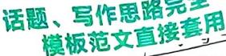</td><td>书面表达・25分[试题调研原创|变文体・演讲]假如你是李华,你校项目为&quot;Less Plastic&quot;的英文演讲比赛,请二届演讲稿参赛,内容包括:1.塑料的危害;2.减塑做法。</td></tr><tr><td>2023年高考真题</td><td>2023版《试题调研》原题</td></tr><tr><td>语文・全国乙卷吹灭别人的灯,并不会让自己更加光明;阻挡别人的路,也不会让自己行得更远。“一花独放不是春,百花齐放春满园。”如果一种花朵,就算这种花朵再美,那也是单调</td><td>作文・60分谚语道:“想要走得快,就独自上路;想要走得远,就结……独行或结伴也无非是两种不同的人生选择,本无定论。结伴同行者自有许多人支持,然独自上路者也绝不能被视作一意孤行的莽夫——他们只是在群体性和独立性中偏爱后者。</td></tr><tr><td>英语・全国乙卷学校英文报组织同学们分享自己在假期中学到的学习过程中,考试题目要求、写作要点相同请你以此为主题写一篇短文投稿。内容包括:1.简要描述;2.体验和感受。模板范文直接套用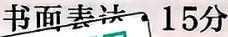</td><td></td></tr><tr><td>2022年高考真题</td><td>2022版《试题调研》原题</td></tr><tr><td>数学・新高考I卷记 $S_{n}$ 为数列 $\{a_{n}\}$ 的前n项和,已知 $a_{1}=1,\{\frac{S_{n}}{a_{n}}\}$ 是公差为 $\frac{1}{3}$ 的等差数列.(2)证明: $\frac{1}{a_{1}}+\frac{1}{a_{2}}+\cdots+\frac{1}{a_{n}}<2$ 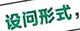【解析】(2)因为 $\frac{1}{a_{n}}=\frac{2}{n(n+1)}=2(\frac{1}{n}-\frac{1}{n+1})$ ,所以 $\frac{1}{a_{1}}+\frac{1}{a_{2}}+\cdots+\frac{1}{a_{n}}=2\times(1-\frac{1}{2}+\frac{1}{2}-\frac{1}{3}+\cdots+\frac{1}{n}-\frac{1}{n+1})=2-\frac{2}{n+1}<2$ ,问题得证.</td><td>解答题・10分(2)若 $a_{1},a_{k},S_{k+2}$ 成等比数列, $k\in\mathbb{N}^{*}$ ,证明 $\frac{1}{s}+\frac{1}{s}+\cdots+\frac{1}{s_{k^{2}}} < 2$ .解[22W3](2)因为 $\frac{1}{S_{n}}=\frac{2}{n(n+1)}=2(\frac{1}{n}-\frac{1}{n+1})$ ,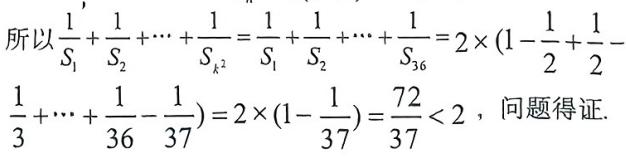</td></tr></table>

# 目录

# 1 预测 全新题型

第1题 图形推理题 八省联考 001

第2题 学科融合新定义题 八省联考 003

第3题 创新情境新定义题 八省联考 006

第4题 无图立体几何题 八省联考 008

# 2 预测 全新考向题

第5题 “多想少算”创新思维题 八省联考 010

第6题 设问开放的存在性探究题 013

第7题 情境嵌入型创新题 016

第8题 创新结构不良题 018

第9题 答案不唯一填空题 021

第10题 高等数学知识衔接命题 022

第11题 与化学、物理交叉的学科融合题 025

第12题 以数列为“底”的创新交汇题 028

第13题 解三角形在数学文化中的实际应用题 030

# 3 预测 全新情境题

第14题 百年故宫：窗棂中的向量问题 031

第15题 珠海航展：飞出“马赫环”的概率求解问题 032

第16题 巴黎奥运会：射击比赛中的折线图问题 033

第17题 非遗文化：电影票房中的回归分析问题 电影《哪吒2》 034

第18题 拉索：抛物线光学性质的实际应用问题 035

第19题 人工智能：数列思想在概率中的应用问题 DeepSeek 036

第20题 大国重器：国家重大科技项目为载体的创新问题 038

# 4 预测 创新考法题

第21题 函数单调性、奇偶性的应用问题 040

第22题 曲线凹凸性在函数最值中的应用问题 042

第23题 应用基本不等式求解最值问题 044

第24题 平面向量的工具化应用问题 045

第25题 用三角恒等变换公式求角或求值 046

第26题 三角函数图象与性质的综合应用问题 048

第27题 基于项、和或项、积转化的数列问题 050

第28题 奇偶代换模型妙解分段数列问题 052  
第29题 锥体、台体的表面积与体积计算问题 054  
第30题 长方体模型中点、线、面位置关系的巧妙应用 056  
第31题 目标意识解立体几何第（1）问 058  
第32题 空间几何体中的角度与距离问题 060  
第33题 直线与圆的位置关系探究问题 064  
第34题 圆锥曲线离心率的求解问题 065  
第35题 特殊弦——焦点弦与中点弦问题 068  
第36题 动点轨迹的探究问题 070  
第37题 圆锥曲线中的定点、定直线证明问题 073  
第38题 热点情境中的数据分析问题 非遇春节 077  
第39题 计数原理在“排位”问题中的应用 081  
第40题 正态曲线对称性的创新问题 DeepSeek 083  
第41题 实际背景中的离散型随机变量的分布问题 084  
第42题 与条件概率、全概率公式有关的证明问题 088

# 5 预测 创新压轴题

# 选择题、填空题最后一题

第43题 指、对数式比大小问题 090

第44题 抽象函数的性质探索问题 091

第45题 嵌套函数的零点问题 093

第46题 动态几何中的交线或截面问题 095

# 解答题第18、19题

第47题“直曲”联立后的参数转化问题 097

第48题 巧用放缩证明数列不等式问题 099

第49题 指、对、三角组成的复杂函数的零点问题 101

第50题 双变量函数不等式的证明问题 104

# 下辑精彩预告

2025年4月中旬全新上市

# 第10辑将隆重推出考前收官之作：考前抢分必备

# 抢时间看，抢时间背，多抢一分超万人！

本辑为考前1分钟都可以看的抢分宝典. 帮你考前速背结论、速纠误区、速通技法、速览热点, 实现考前快速提分. 精彩无限, 不容错过!

高考未至,抢分不止!《高考作文最后一题(语文)》《时政热点(下)》同时上市,抓热点、准预测、冲高分,敬请关注!

# 预测全新题型

# 考前

# 50天

# 第1题 图形推理题

热考指数

原创 预测1 (多选)下面4个图形中,是由图1中的等边三角形纸片(阴影部分纸片两面颜色不一致)折叠而成的是 ()

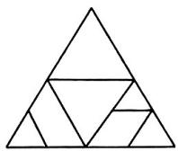  
图1

A.

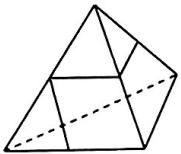

B.

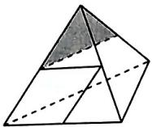

C.

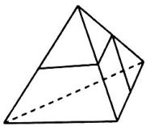

D.

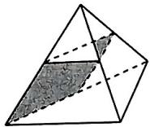

# 命题依据

“图形推理题”在2025“八省联考”中首次出现，凸显高考“重思维、反刷题”的创新导向。本题通过折叠双面颜色差异的纸片，将直观想象素养与几何变换原理相融合，体现数学核心素养的实践价值，也为创新人才选拔提供有效路径。预测2025高考此类试题必考。

解析 对于 A,

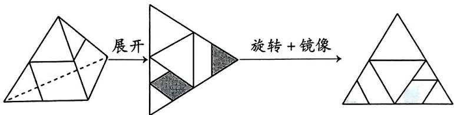

flowchart

,镜像之后与原图保

持一致,故 A 正确.

【避易错】注意纸片两面是有区别的，故各选项对应的三棱锥的展开图阴影颜色应与原图完全一致

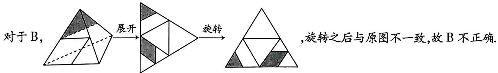

text_image

对于 B，
展开
旋转
,旋转之后与原图不一致,故 B 不正确.

对于 C，展开 旋转，旋转之后与原图不一致，故 C 不正确.

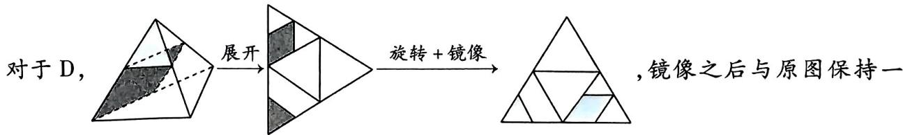

flowchart

致,故 D 正确.

故选AD.

【得分妙招】若无法直观想象出三棱锥的展开图，可借助手边的工具裁出一个等边三角形，做好标记后动手折一折，看一看

原创 预测2: (多选)图2中的连杆系统由活动连接件连接木杆而成,则下列哪些字母对应的连接件固定(连接件固定时,其所连接的木杆的角度不变)时,连杆系统也固定()

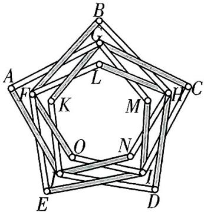

text_image

Geometric diagram of a pentagon with labeled vertices and internal points, used for spatial geometry problems.

图2

# 命题依据

本题以工程实践中的连杆系统为背景，彰显三角形稳定性的实际应用价值，充分体现了高考跨学科与实践能力相融合的创新命题导向.

A. $F, G, H, I, A$

B. $F, G, H, I, J$

C. $K, L, M, N, B$

D. $K, L, M, N, O$

解析 对于 A, 若 F, G, H, I, A 固定, 连接 FH, 则由三角形的稳定性可知, 若 F, H 固定, 【障碍速通】每段木杆的长度固定, 若再辅以固定的点. 保持系统的稳定性, 则可联想到三角形的稳定性, 只要确定两边及其夹角, 那么三角形是确定的, 从而系统保持稳定. 故先从不被同一个木杆相连的两个点开始分析

则连接件 $L$ 和连接件 $B$ 固定; 同理由 $F, I$ 固定可知 $O$ 固定, $E$ 固定; 由 $G, I$ 固定可知 $M$ 固定, $C$ 固定. 其余 $D, J, K, N$ 连接件都不受约束, 故 $\mathbf{A}$ 不符合题意.

对于 B, 若 F, G, H, I, J 固定, 由 A 选项的分析可知, B, C, E, L, M, O 均固定, 由 G, J 固定知 A, K 固定; 由 H, J 固定知 D, N 固定. 则所有的连接件都固定, 从而连杆系统固定, 故 B 符合题意.

对于 C, 若 K, L, M, N, B 固定, 由 K, M 固定可知 G 固定; 由 K, N 固定可知 J 固定; 由 N, L 固定可知 H 固定; 由 J, H 固定可知 D 固定; 由 G, J 固定可知 A 固定. 其余 C, E, F, I, O 连接件不受约束, 故 C 不符合题意.

对于 D, 若 K, L, M, N, O 固定, 由 C 选项的分析可知 A, D, G, H, J 均固定, 则由 O, L 固定可知 F 固定; 由 O, M 固定可知 I 固定; 由 F, H 固定可知 B 固定; 由 G, I 固定知 C 固定; 由 F, I 固定知 E 固定. 所有连接件均固定, 则连杆系统固定, 故 D 符合题意.

故选BD.

# 速记结论

小编说:高考越来越近,这些结论你是否已烂熟于心?掌握这些结论,提高解题速度,高考多拿20分!

# 考前

# 49天

# 第2题 学科融合新定义题

# 预测角度1

# 与计算机图形学融合的新定义曲线

热考指数

原创 预测1 在计算机图形学中, 拉梅曲线方程可以用来绘制复杂的曲线. 已知平面中拉梅曲线的方程为 $\left|\frac{x}{a}\right|^{n} + \left|\frac{y}{b}\right|^{n} = 1 (a, b, n \in (0, +\infty))$ , 则下列说法正确的是 ()

A. 当 $a = b, n = 2$ 时，拉梅曲线 $\left|\frac{x}{a}\right|^n + \left|\frac{y}{b}\right|^n = 1$ 围成的封闭区域的面积为 $2\pi ab$   
B. 当 $a = b$ 时, 若拉梅曲线 $\left|\frac{x}{a}\right|^n + \left|\frac{y}{b}\right|^n = 1$ 与曲线  
$|xy| = 1$ 有4个交点，则 $n = \frac{1}{2}$

C. 当 $a + b = 1, n = 1$ 时，拉梅曲线 $\left|\frac{x}{a}\right|^n + \left|\frac{y}{b}\right|^n = 1$ 围成的封闭区域面积的取值范围为 $(0, \frac{1}{4}]$   
D. 当 $a = b, 0 < n < 1$ 时, 拉梅曲线 $\left|\frac{x}{a}\right|^n + \left|\frac{y}{b}\right|^n = 1$ 围成的封闭区域的面积小于 $2a^2$

解析 由 $|\frac{-x}{a}|^n + |\frac{y}{b}|^n = |\frac{x}{a}|^n + |\frac{-y}{b}|^n = |\frac{x}{a}|^n + |\frac{y}{b}|^n = 1$ 知拉梅曲线关于坐标轴对称.

对于 A, 当 a = b, n = 2 时, 拉梅曲线方程为 $\frac{x^{2}}{a^{2}} + \frac{y^{2}}{a^{2}} = 1$ , 即 $x^{2} + y^{2} = a^{2}$ , 此时拉梅曲线为以 (0,0) 为圆心, a 为半径的圆, 所以它围成的封闭区域的面积为 $\pi a^{2} = \pi ab$ , 故 A 错误.

对于 B, 由拉梅曲线 $\left|\frac{x}{a}\right|^{n} + \left|\frac{y}{a}\right|^{n} = 1$ 与曲线 $|xy| = 1$ 的对称性可知, 要满足题意, 只需使

【技法速通】解题时注意灵活运用曲线的对称性，从而简化运算过程

两条曲线在第一象限只有1个交点即可,即关于x的方程 $\frac{x^{n}}{a^{n}}+\frac{1}{a^{n}x^{n}}=1(x>0)$ 只有1个解,令$x^{n} = t$ ，则关于 $t$ 的方程 $t^2 - a^n t + 1 = 0 (t > 0)$ 有且只有1个解，所以 $\Delta = (a^n)^2 - 4 = 0$ ，则 $a^n = 2$ ，从而 $n = \log_a 2$ ，经检验，满足题意，故B错误.

对于 C, 当 n = 1 时, 结合拉梅曲线的对称性, 作出拉梅曲线

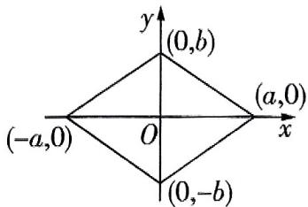

text_image

(0,b)
(-a,0)
O
(a,0)
x
(0,-b)

图1

基本不等式链 $\sqrt{\frac{a^2 + b^2}{2}} \geqslant \frac{a + b}{2} \geqslant \sqrt{ab} \geqslant \frac{2}{\frac{1}{a} + \frac{1}{b}} (a, b > 0)$ .

速记结论

$\left|\frac{x}{a}\right|+\left|\frac{y}{b}\right|=1$ , 如图 1, 由图可知, 此时拉梅曲线围成的封闭图形的面积 S=2ab, 因为 $a+b=1$ , 所以 $S=2ab\leqslant2\cdot\left(\frac{a+b}{2}\right)^{2}=\frac{1}{2}$ , 则 $S\in(0,\frac{1}{2}]$ , 故 C 错误.

对于D，当 $a = b, x > 0, y > 0$ 时，拉梅曲线方程为 $\left(\frac{x}{a}\right)^n + \left(\frac{y}{a}\right)^n = 1$ 则 $0 < x < a$ ，即 $y = (a^n - x^n)^{\frac{1}{n}}, 0 < x < a$ ，则 $y' = \frac{1}{n} (a^n - x^n)^{\frac{1}{n} - 1}(-n)x^{n - 1} = -(a^n - x^n)^{\frac{1 - n}{n}}\left(\frac{1}{x^n}\right)^{\frac{1 - n}{n}} = -\left[\left(\frac{a}{x}\right)^n - 1\right]^{\frac{1 - n}{n}} < 0$ ，且 $y' = -\left[\left(\frac{a}{x}\right)^n - 1\right]^{\frac{1 - n}{n}}$ 在 $(0, a)$ 上单调递增, 所以随着 $x$ 增大, 曲线 $y = (a^n - x^n)^{\frac{1}{n}}$ 的切线的斜率越来越大,作出曲线 $y=(a^{n}-x^{n})^{\frac{1}{n}}(0\leqslant x\leqslant a)$ 与直线 $y=-x+a$ 的大致图象,如图2,由图

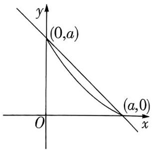

text_image

y
(0,a)
(a,0)
O
x

图2

【障碍速通】结合 C 选项的分析, 注意到曲线 $\left| \frac{x}{a} \right| + \left| \frac{y}{a} \right| = 1$ 围成的封闭图形面积为 $2a^{2}$ , 故可数形结合判断曲线 $y = (a^{n} - x^{n})^{\frac{1}{n}} (0 \leqslant x \leqslant a)$ 与直线 $y = -x + a$ 的位置关系求解. 作图时要注意只判断曲线对应函数的单调性是不够的, 还需判断曲线 “下降” 的速度

可知,拉梅曲线在第一象限与坐标轴围成的封闭图形的面积 $S_{0}$ 小于直线 $y = -x + a$ 在第一象限与坐标轴围成的封闭图形的面积 $S_{1}$ , 即 $S_{0} < S_{1} = \frac{1}{2} a^{2}$ , 故 $4S_{0} < 2a^{2}$ , 故 D 正确. 故选 D.

【妙解】本题为单选题，故在依次判断完ABC三个选项均不正确之后，可直接选D

# 预测角度2 与生物学融合的新定义函数

热考指数 ★★★★★

原创 预测2 Sigmoid 函数是一个在生物学中常见的 S 型函数,为神经网络中的激励函数,它的数学表达式为 $S(x)=\frac{1}{1+e^{-x}}$ . 在某神经网络中, 输入变量 x 满足 $x_{n}=\ln(1+n)(n=1,2,\cdots)$ , 已知 $a_{n}=S(x_{n}), b_{n}=S'(x_{n})$ , 其中 $S'(x)$ 为 $S(x)$ 的导函数.

(1) 求 $S'(x)$ 的最大值.  
(2) 证明: $a_{n+1} > a_n$ .   
(3) 求数列 $\{b_{n}\}$ 的通项公式, 并求 $\sum_{n=1}^{10} b_{n}$ 的近似值 (结果保留小数点后两位).

附： $\sum_{k = 1}^{n}\frac{1}{k^2}\approx \frac{\pi^2}{6},\sum_{k = 1}^{n}\frac{1}{k}\approx \ln n + \gamma (\gamma$ 为欧拉常数， $\gamma \approx 0.5772)$ ， $\ln 2\approx 0.693,\ln 3\approx 1.099,\pi \approx$ 3.142.

# 命题依据

本题以生物学中常见的“Sigmoid 函数”串联起高中数学的函数、导数、不等式与数列多个板块，体现高考“减少题量、优化试题结构”的命题理念，彰显高考跨学科交叉的命题新趋势.

速记结论

三次函数图象的对称中心 三次函数 $f(x) = ax^3 + bx^2 + cx + d (a \neq 0)$ 图象的对称中心为 $(-\frac{b}{3a}, f(-\frac{b}{3a}))$ .

解析 (1) 由题意知 $S'(x) = \frac{\mathrm{e}^{-x}}{(1 + \mathrm{e}^{-x})^2}$ , (1 分)

令 $t = \mathrm{e}^{-x}$ ，则 $t > 0$ ，令 $y = \frac{t}{(1 + t)^2} = \frac{t}{1 + 2t + t^2} = \frac{1}{\frac{1}{t} + 2 + t},$ （2分）

【技法速通】此处导函数的解析式结构较复杂, 故利用换元法结合基本不等式求最值, 而不是二次求导结合函数的单调性求最值

由 $t > 0$ ，得 $\frac{1}{t} + t \geqslant 2\sqrt{\frac{1}{t} \times t} = 2$ ，当且仅当 $\frac{1}{t} = t$ ，即 $t = 1$ 时等号成立，所以 $y \leqslant \frac{1}{2 + 2} = \frac{1}{4}$ 即 $S'(x) \leqslant \frac{1}{4}$ ，所以 $S'(x)$ 的最大值是 $\frac{1}{4}$ . (5分)

(2) 由题意知 $a_{n} = S(x_{n}) = \frac{1}{1 + \mathrm{e}^{-\ln(1 + n)}} = \frac{1}{1 + \frac{1}{1 + n}} = \frac{1 + n}{2 + n} = 1 - \frac{1}{n + 2}$ , (7 分)

则 $a_{n + 1} = 1 - \frac{1}{(n + 1) + 2} = 1 - \frac{1}{n + 3},$

所以 $a_{n + 1} - a_n = (1 - \frac{1}{n + 3}) - (1 - \frac{1}{n + 2}) = \frac{1}{n + 2} -\frac{1}{n + 3} = \frac{(n + 3) - (n + 2)}{(n + 2)(n + 3)} =$ $\frac{1}{(n + 2)(n + 3)} >0,$ 即 $a_{n + 1} > a_n.$ （10分）

【妙解】实际上根据函数 $y = 1 - \frac{1}{x + 2}$ 在 $(1, +\infty)$ 上单调递增，可直接得 $a_{n+1} > a_n$

(3) 由 (1) 知 $S'(x) = S(x)[1 - S(x)]$ ，则 $b_n = S'(x_n) = a_n(1 - a_n) = \frac{1 + n}{(2 + n)^2}$ . (11 分)

设 $\frac{n + 1}{(n + 2)^2} = \frac{A}{n + 2} +\frac{B}{(n + 2)^2}$ ，则 $n + 1 = A(n + 2) + B$ ，得 $A = 1,B = -1$ ，所以 $\frac{n + 1}{(n + 2)^2} =$ $\frac{1}{n + 2} -\frac{1}{(n + 2)^2},$

【障碍速通】根据题干中的“附”利用待定系数法将待求和数列的通项合理裂项，进而分组求和即可

所以 $\sum_{n=1}^{10}\left[\frac{1}{n+2}-\frac{1}{(n+2)^2}\right]=\sum_{n=1}^{10}\frac{1}{n+2}-\sum_{n=1}^{10}\frac{1}{(n+2)^2}$ . (13分)

由 $\sum_{k=1}^{n} \frac{1}{k} \approx \ln n + \gamma$ ，得 $\sum_{n=1}^{10} \frac{1}{n+2} = \sum_{n=1}^{12} \frac{1}{n} - 1 - \frac{1}{2} \approx \ln 12 + \gamma - \frac{3}{2}$ . (14 分)

由 $\sum_{k=1}^{n}\frac{1}{k^2}\approx\frac{\pi^2}{6}$ , 得 $\sum_{n=1}^{10}\frac{1}{(n+2)^2}=\sum_{n=3}^{12}\frac{1}{n^2}=\sum_{n=1}^{12}\frac{1}{n^2}-1-\frac{1}{4}\approx\frac{\pi^2}{6}-\frac{5}{4}$ , (15 分)

故 $\sum_{n=1}^{10} b_n = \sum_{n=1}^{10} \frac{n+1}{(n+2)^2} = \sum_{n=1}^{10} \frac{1}{n+2} - \sum_{n=1}^{10} \frac{1}{(n+2)^2} \approx (\ln 12 + \gamma - \frac{3}{2}) - (\frac{\pi^2}{6} - \frac{5}{4}) = \ln 12 + \gamma - \frac{\pi^2}{6} - \frac{1}{4} = \ln 3 + 2\ln 2 + \gamma - \frac{\pi^2}{6} - \frac{1}{4} \approx 1.17.$ (17分）

函数图象对称结论 $f(a+x)=f(a-x)\Rightarrow$ 曲线 $y=f(x)$ 关于直线 x=a 对称； $f(a+x)=2b-f(a-x)\Rightarrow$ 曲线 $y=f(x)$ 关于点 $(a,b)$ 对称.

# 考前

# 48天

# 第3题 创新情境新定义题

热考指数

原创 预测 希尔密码是基于矩阵运算的一种加密算法,在希尔密码中,每个英文字母都用数字(a=0,b=1,…,z=25)来代替,其加密过程如下:假设明文中2个字母对应的数字分别为 $x_{11},x_{12}$ ,记 $M=(x_{11},x_{12})$ ,加密矩阵 $A=\begin{pmatrix}y_{11}&y_{12}\\y_{21}&y_{22}\end{pmatrix}$ ,加密过程是MA= $(x_{11},x_{12})\begin{pmatrix}y_{11}&y_{12}\\y_{21}&y_{22}\end{pmatrix}=(z_{11},z_{12})$ ,其中 $z_{11}=x_{11}y_{11}+x_{12}y_{21},z_{12}=x_{11}y_{12}+x_{12}y_{22}$ ,则密文为数字 $z_{11},z_{12}$ 分别

# 命题依据

本题依据教育部发布的《关于做好2025年普通高校招生工作的通知》中“加强思维品质考查，引导创新能力培养”的要求命制，以希尔密码为背景，融合矩阵运算与函数零点分析，强调考生对知识的迁移应用能力，预测2025高考极有可能涉及此类新定义题，务必重视起来.

对应的字母,若所得数字大于25,则取该数对26取余数后余数对应的字母,如若得到 $z_{11}=30$ ,则取数字4对应的字母.

(1) 若加密矩阵 $A = \begin{pmatrix} 0 & 1 \\ 1 & 4 \end{pmatrix}$ ，求明文为“me”的希尔密码的密文.   
(2) 若 $(\sqrt{3} \sin x, 1)\begin{pmatrix} \cos x & \sqrt{3} \sin x \\ \sin x & \sin x \end{pmatrix} = (m, n), f(x) = m - n.$   
(i) 证明: $f(x)$ 在区间 $[0,3]$ 上有且仅有 2 个零点.  
(ii)已知 $a, b, c$ 分别为 $\triangle ABC$ 的内角 $A, B, C$ 的对边， $f(A) = 0$ ，且 $\forall t \in \mathbf{R}, |\overrightarrow{AB} - t\overrightarrow{AC}| \geqslant |\overrightarrow{BC}|$ 恒成立，证明： $C = \frac{\pi}{2}$ .

解析 (1)“me”对应的数字分别为 12,4,则(12,4) $\begin{pmatrix}0 & 1 \\ 1 & 4\end{pmatrix}=(4,28)$ , (2分)

【障碍速通】抓住关键信息“ $z_{11} = x_{11}y_{11} + x_{12}y_{21}, z_{12} = x_{11}y_{12} + x_{12}y_{22}$ ”直接代值计算即可

28 对 26 的余数为 2, 所以密文两个字母对应的数字分别为 4, 2, 则密文为“ec”. (4 分)

(2)(i)由题意知 $(\sqrt{3}\sin x,1)\left( \begin{array}{cc}\cos x\sqrt{3}\sin x\\ \sin x & \sin x \end{array} \right) = (\sqrt{3}\sin x\cos x + \sin x,3\sin^2 x + \sin x),$

# 速记结论

函数周期结论 $f(x + a) = -f(x)(a \neq 0) \Rightarrow$ 周期 $T = 2a; f(x + a) = \pm 1 / f(x)(a \neq 0) \Rightarrow$ 周期 $T = 2a; f(x + a) = [1 + f(x)] / [1 - f(x)] (a \neq 0) \Rightarrow$ 周期 $T = 4a$ .

所以 $f(x) = \sqrt{3}\sin x\cos x - 3\sin^2 x = \frac{\sqrt{3}}{2}\sin 2x - \frac{3}{2} (1 - \cos 2x) = \sqrt{3}\sin (2x + \frac{\pi}{3}) - \frac{3}{2}.$ （6分）

令 $f(x)=0$ ，则 $\sin(2x+\frac{\pi}{3})=\frac{\sqrt{3}}{2}$

【技法速通】看到函数的零点问题, 不要思维定式直接求导, 可结合函数的单调性与函数零点存在定理或利用函数图象求解, 解题要灵活, 此处为三角函数型函数的零点问题, 可以先尝试直接解方程, 若方程解不出来再考虑作图求解

所以 $x = k\pi, k \in \mathbf{Z}$ 或 $x = \frac{\pi}{6} + k\pi, k \in \mathbf{Z}$ ,

若 $x \in [0,3]$ , 则 $k$ 只能取 0 , 从而 $x = 0$ 或 $x = \frac{\pi}{6}$ ,

即方程 $f(x)=0$ 在区间 $[0,3]$ 上有2个解，

所以 $f(x)$ 在区间 $[0,3]$ 上有且仅有2个零点. (9分)

(ii) 在 $\triangle ABC$ 中, $A \in (0, \pi)$ , 则由 (i) 可知 $A = \frac{\pi}{6}$ . (10 分)

在 $\triangle ABC$ 中， $\overrightarrow{AB} \cdot \overrightarrow{AC} = \frac{\sqrt{3}}{2} bc$

由余弦定理得 $a^2 = b^2 + c^2 - 2bc\cos \frac{\pi}{6} = b^2 + c^2 - \sqrt{3}bc$ ，（12分）

由 $|\overrightarrow{AB} - t\overrightarrow{AC}| \geqslant |\overrightarrow{BC}|$ 两边同时平方得 $c^2 - 2t \cdot \frac{\sqrt{3}}{2} bc + t^2 b^2 \geqslant a^2$

化简得 $b^{2}t^{2} - \sqrt{3} bct - (b^{2} - \sqrt{3} bc)\geqslant 0$ ，即 $bt^2 -\sqrt{3} ct - (b - \sqrt{3} c)\geqslant 0$ 恒成立， （13分）

则关于 $t$ 的二次方程 $bt^2 -\sqrt{3} ct - (b - \sqrt{3} c) = 0$ 至多只有1个实数根，

【障碍速通】由已知条件转化出的不等式所含参数过多, 此时注意盯紧题眼 “ $\forall t \in \mathbb{R}, |\overrightarrow{AB} - t\overrightarrow{AC}| \geqslant |\overrightarrow{BC}|$ ” 故将 $t$ 作为主元, 转化为二次方程根的问题, 利用判别式求解即可

所以 $\Delta = 3c^2 + 4b(b - \sqrt{3} c) = (2b - \sqrt{3} c)^2 \leqslant 0$

又 $(2b - \sqrt{3} c)^2 \geqslant 0$ ，所以 $(2b - \sqrt{3} c)^2 = 0$ . (15 分)

所以 $2b = \sqrt{3} c$ ，从而 $b = \sqrt{3} a, c = 2a$

所以 $c^2 = a^2 + b^2$ ，即 $C = \frac{\pi}{2}$ ，得证. (17分)

# 考前47天

# 第4题 无图立体几何题

热考指数

原创 预测 在四面体 $ABCD$ 中, $AD \perp$ 平面 $BCD$ ,$\angle BCD = \frac{\pi}{3}, BC = 2, CD = 4, AD = 3, M$ 为棱 $AC$ 靠近点 $A$ 的三等分点.

(1) 证明 BC 与 MD 不垂直, 并求异面直线 BC 与 MD 所成角的余弦值.  
(2) 求二面角 $B - MD - C$ 的正弦值.  
(3)若四面体 ABCD 的外接球半径为 R, 求 R 的值, 并求该外接球被平面 BCD 所截得的圆的面积.

解析 (1) 根据已知条件作出图形, 如图 1 所示.

# 命题依据

无图立体几何题大胆创新，打破了传统立体几何的固有命题模式，灵活多变，选拔功能增强，更聚焦地考查空间想象能力、逻辑推理能力，是2025年1月“八省联考”首次出现的新题型。本题从基本图形四面体入手，创新性地考查了“不垂直”的证明，并与外接球的截面交汇，设计丰富，区分度高。预测2025高考此类试题考查几率较大。

【障碍速通】无图立体几何解答题的作图关键在于“角度”二字，好的观察角度不仅利于找平行、垂直关系，更利于建系设点找坐标。一般将已知的线面垂直条件中的垂足作为坐标原点，如本题，“ $AD \perp$ 平面 $BCD$ ”，那么点D便是理想的坐标原点，应画在点B，C偏“后方”的位置

在平面 $BCD$ 内过点 $D$ 作 $DE \perp DC$ , 因为 $AD \perp$ 平面 $BCD, DC, DE \subset$ 平面 $BCD$ , 所以 $AD \perp DC, AD \perp DE$ , 所以 $AD, DC, DE$ 三线两两垂直. 以 $D$ 为坐标原点, $\overrightarrow{DC}, \overrightarrow{DE}, \overrightarrow{DA}$ 的方向分别为 $x$ 轴, $y$ 轴, $z$ 轴的正方向建立空间直角坐标系. (1分)

【避易错】本题这里有个小陷阱，有的考生注意到且证明了底面 $\triangle BCD$ 是直角三角形（后面我们也会证明），但忽略了点 $B$ 才是直角顶点，还是把系建错了，这就是无图题的扰人之处

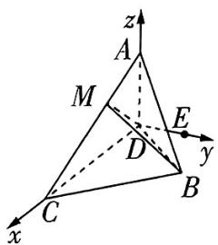

text_image

z
A
M
E
y
D
C
B
x

图1

由已知条件可得 $A(0,0,3), C(4,0,0)$ .

在 $\triangle BCD$ 中， $\angle BCD = \frac{\pi}{3}, BC = 2, CD = 4$ ，根据余弦定理有 $BD^2 = BC^2 + CD^2 - 2BC \cdot CD \cdot \cos \angle BCD = 12$ ，所以 $BD = 2\sqrt{3}$ .

所以 $BD^{2} + BC^{2} = CD^{2}$ ， $\triangle BCD$ 是直角三角形， $\angle BDC = \frac{\pi}{6}$ 所以 $B(3,\sqrt{3},0)$

设 $M(x,y,z)$ ，由 $\overrightarrow{AM} = \frac{1}{3}\overrightarrow{AC}$ 得 $(x,y,z - 3) = (\frac{4}{3},0, - 1)$ ，所以 $M(\frac{4}{3},0,2)$ （2分）

$$
\overrightarrow {B C} = (1, - \sqrt {3}, 0), \overrightarrow {M D} = (- \frac {4}{3}, 0, - 2), \tag {3分}
$$

所以 $\overrightarrow{BC} \cdot \overrightarrow{MD} = -\frac{4}{3} \neq 0$ ，即异面直线 $BC$ 与 $MD$ 不垂直. (4分)

设异面直线 $BC$ 与 $MD$ 所成角为 $\theta$ ，则 $\cos \theta = \frac{|\overrightarrow{BC} \cdot \overrightarrow{MD}|}{|\overrightarrow{BC}| |\overrightarrow{MD}|} = \frac{| -\frac{4}{3}|}{2 \times \frac{2\sqrt{13}}{3}} = \frac{\sqrt{13}}{13}$ ，

即异面直线 $BC$ 与 $MD$ 所成角的余弦值为 $\frac{\sqrt{13}}{13}$ . (6分)

(2) 设平面 BMD 的法向量为 $\boldsymbol{n}=(x_{1},y_{1},z_{1})$ , $\overrightarrow{DM}=(\frac{4}{3},0,2)$ , $\overrightarrow{DB}=(3,\sqrt{3},0)$ ,

由 $\left\{ \begin{array}{l} n \cdot \overrightarrow{DM} = 0, \\ n \cdot \overrightarrow{DB} = 0 \end{array} \right.$ 得 $\left\{ \begin{array}{l} \frac{4}{3} x_1 + 2z_1 = 0, \\ 3x_1 + \sqrt{3} y_1 = 0, \end{array} \right.$ 令 $x_1 = \sqrt{3}$ , 则 $y_1 = -3, z_1 = -\frac{2\sqrt{3}}{3}$ ,

所以平面 BMD 的一个法向量为 $\boldsymbol{n}=(\sqrt{3},-3,-\frac{2\sqrt{3}}{3})$ . (7 分)

由于平面 MDC 所在的平面为平面 xOz，故其法向量可取 $\boldsymbol{m}=(0,1,0)$ ，(8 分)

$$
\cos \langle   {\pmb n}, {\pmb m}   \rangle = {\frac {{\pmb n} \cdot {\pmb m}}{| {\pmb n} | \cdot | {\pmb m} |}} = {\frac {- 3}{\sqrt {(\sqrt {3}) ^ {2} + (- 3) ^ {2} + (- {\frac {2 \sqrt {3}}{3}}) ^ {2}}}} = - {\frac {3   {\sqrt {3 0}}}{2 0}}. \tag {9分}
$$

设二面角 B-MD-C 的大小为 $\alpha$ ,

则 $\sin \alpha = \sqrt{1 - \cos^2\langle n,m\rangle} = \sqrt{1 - (-\frac{3\sqrt{30}}{20})^2} = \frac{\sqrt{130}}{20}$ . (10分)

(3)根据题意,可将四面体A-BCD补形成长方体,如图2所示.

【技法速通】与前两问不同，我们的解题核心不再是证明线面位置关系和求角，而是变成了四面体的外接球问题，自然几何图形也要跟着“变”。本题中四面体的底面 $\triangle BCD$ 是直角三角形，侧棱又垂直于底面，符合“鳖臑”模型[详见2025版试题调研第7辑数学P065]，补形为长方体更易求解

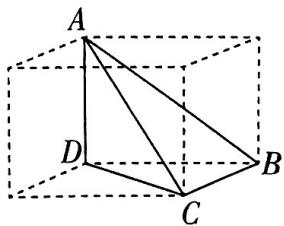

natural_image

Geometric diagram of a cube with labeled vertices A, B, C, D and internal diagonals forming triangles (no text or symbols)

图2

设该长方体的长, 宽, 高分别为 $a, b, c$ , 则长方体的体对角线长 $l = \sqrt{a^2 + b^2 + c^2} = \sqrt{(2\sqrt{3})^2 + 2^2 + 3^2} = 5$ .

易知四面体 ABCD 的外接球直径等于该长方体的体对角线长, 所以 2R = 5, $R = \frac{5}{2}$ .

(14 分)

设外接球球心 O 到平面 BCD 的距离为 d，因为 AD = 3，球心到平面 BCD 的距离为 AD 的一半，所以 $d = \frac{3}{2}$ . (15 分)

设所求截面圆半径为 $r$ ，则 $r = \sqrt{R^2 - d^2} = \sqrt{\left(\frac{5}{2}\right)^2 - \left(\frac{3}{2}\right)^2} = \sqrt{\frac{25}{4} - \frac{9}{4}} = 2,$ （16分）

所以所求截面圆面积 $S = \pi r^2 = 4\pi$ （17分）

正切半角公式 $\sin \alpha = \frac{2\tan\frac{\alpha}{2}}{1 + \tan^2\frac{\alpha}{2}},\cos \alpha = \frac{1 - \tan^2\frac{\alpha}{2}}{1 + \tan^2\frac{\alpha}{2}},\tan \alpha = \frac{2\tan\frac{\alpha}{2}}{1 - \tan^2\frac{\alpha}{2}}.$

速记结论

考前

46天

# 第5题 “多想少算”创新思维题

测角度1

圆锥曲线问题中创新思维实现“多想少算”

热考指数

原创 预测1 已知抛物线 $y=\frac{1}{4}x^{2}$ 与 $y=-\frac{1}{16}x^{2}+5$ 围成的封闭曲线如图1所示, 若在此封闭曲线上恰有三对不同的点, 满足每一对点关于点 $A(0,a)$ $(0<a<5)$ 对称, 则实数 a 的取值范围是 ( )

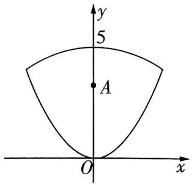

text_image

y
5
A
O
x

图1

A. (1,4]

B. $(\frac{5}{2}, 4)$

C. $\left[\frac{5}{2},3\right)$

D. $(2,3]$

# 命题依据

近年高考数学命题导向明确，试题设计灵活，避免了过于复杂的计算和讨论，在降低计算量的同时增加了思维量，“多想少算”是其显著特征。本题从图形入手，利用极限思想找到特殊值，根据选择题题型特征实现多想少算，契合高考命题趋势。

解析 由 $\frac{1}{4} x^2 = -\frac{1}{16} x^2 + 5$ 得 $x = \pm 4$ . 先考虑与坐标轴平行或垂直的特殊情况. 易知过点 $A$ 与 $x$ 轴平行的直线与封闭曲线的两个交点一定是关于点 $A$ 对称的.

当对称的两个点分属两段曲线时,设其中一个点的坐标为 $(x_{1},y_{1})$ ,

其中 $y_{1} = \frac{x_{1}^{2}}{4}$ 且 $-4\leqslant x_1\leqslant 4$ ，则其关于点 $A$ 的对称点的坐标为 $(-x_{1},2a - y_{1})$

由题可知点 $(-x_{1},2a - y_{1})$ 在曲线 $y = -\frac{1}{16} x^{2} + 5$ 上，

所以 $2a - y_{1} = -\frac{1}{16} x_{1}^{2} + 5$ ，即 $2a - \frac{x_1^2}{4} = -\frac{1}{16} x_1^2 +5$ ，即 $\frac{3}{16} x_1^2 +5 - 2a = 0.$

要想满足题意,则此关于 $x_{1}$ 的方程的解必须有且只有两个,且 $x_{1}\neq\pm4$ .

【避易错】所求的三组对称点，对应连线后，呈现“米”字结构， $(\pm 4, 4)$ 是封闭曲线的最左端和最右端，若 $x_{1} = \pm 4$ ，则 $a = 4$ ，此时只有一对对称点，所以 $x_{1} \neq \pm 4$

速记结论

三角形面积的向量表示 $\overrightarrow{AB} = (x_{1},y_{1}),\overrightarrow{AC} = (x_{2},y_{2})$ ，则 $S_{\triangle ABC} = \frac{1}{2}|x_1y_2 - x_2y_1|$

又 $x_{1} \neq 0$ ，所以 $2a = \frac{3}{16} x_{1}^{2} + 5 \in (5,8)$ ，即 $\frac{5}{2} < a < 4$ ，故选B.

# 多想少算之极限思想法

如图 2, $B(-4,4)$ , $C(4,4)$ , $D(0,5)$ , 记三对满足题意的对称点分别为“ $M,N$ ”“ $E,F$ ”“ $P,Q$ ”, 则当 $E\to D$ , $P\to D$ 时, $F\to O$ , $Q\to O$ , 点 $A$ 的坐标 $\rightarrow(0,\frac{5}{2})$ , $a\to\frac{5}{2}$ ; 当 $E\to B$ , $P\to C$ 时, $F\to C$ , $Q\to B$ , 点 $A$ 的坐标 $\rightarrow(0,4)$ , $a\to4$ . 据此选 B.

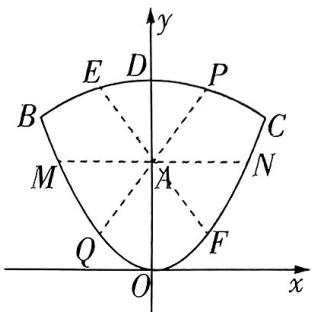

text_image

y
E D P
B C
M A N
Q F
O x

图2

# 预测角度2 平面几何中多角度运用知识实现“多想少算”

热考指数

原创 预测2 在平面直角坐标系 $xOy$ 中, 点 $A(2,0)$ , $B$ 为曲线 $y = \sqrt{1 - x^2}$ 上的动点, $C$ 为第一象限内的点. 已知 $AB \perp AC$ , $|AB| = |AC|$ , 则 $|OC|$ 的最大值是 \_\_\_\_.

解析 由题可知点 B 的轨迹为以 O 为圆心,1 为半径的半圆.

设 $B(\cos \theta, \sin \theta) (0 \leqslant \theta \leqslant \pi), C(m, n) (m, n > 0)$ ，则 $\overrightarrow{AB} = (\cos \theta - 2, \sin \theta), \overrightarrow{AC} = (m - 2, n)$ .

由 $AB \perp AC$ 可得 $(m - 2)(\cos \theta - 2) + n \sin \theta = 0$ ,

由 $|AB|=|AC|$ 可得 $\sqrt{(\cos\theta-2)^{2}+\sin^{2}\theta}=\sqrt{(m-2)^{2}+n^{2}}$ ,

# 命题依据

平面几何问题多以最值问题呈现，解法多样，但不同的方法对应不同的计算难度和解题路径。本题从“复数”的角度出发解题，避开了复杂的平方运算，体现了“多想少算”的优势。

得 $m = 2 + \sin \theta$ 或 $m = 2 - \sin \theta, n = 2 - \cos \theta$ 或 $n = \cos \theta - 2$ （舍去），当 $m = 2 - \sin \theta$ 时， $AB \perp AC$ 不恒成立，舍去.

# 多想少算之复数乘法的几何意义法

设 $B(\cos \theta, \sin \theta) (0 \leqslant \theta \leqslant \pi), C(m, n) (m, n > 0)$ ，则 $\overrightarrow{AB}, \overrightarrow{AC}$ 在复平面内对应的复数分别为 $z_{1} = \cos \theta - 2 + \mathrm{i}\sin \theta, z_{2} = m - 2 + n\mathrm{i}$ ，

如图3，可知 $z_{1} = z_{2}\cdot (\cos 90^{\circ} + \mathrm{i}\sin 90^{\circ}) = z_{2}\cdot \mathrm{i},$

【结论速记】复数乘法的几何意义：将一个复数乘以另一个复数，相当于将其对应的向量旋转并伸缩。旋转的角度是另一个复数的辐角，伸缩的比例是另一个复数的模

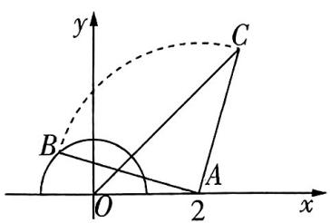

text_image

y
C
B
O
2
x

图3

所以 $m = 2 + \sin \theta, n = 2 - \cos \theta.$

所以 $|OC| = \sqrt{(2 + \sin\theta)^2 + (2 - \cos\theta)^2} = \sqrt{9 + 4\sqrt{2}\sin(\theta - \frac{\pi}{4})}$ ,

当 $\theta -\frac{\pi}{4} = \frac{\pi}{2}$ 即 $\theta = \frac{3\pi}{4}$ 时， $|OC|$ 取得最大值，为 $\sqrt{9 + 4\sqrt{2}} = 1 + 2\sqrt{2}$

36

# 测角度3

# 函数问题中合理选择图形工具实现“多想少算”

热考指数

原创 预测3 已知函数 $f(x) = (x - 2)e^{x} + a(x - 1)^{2}$ 有两个零点 $x_{1}, x_{2}$ ，则实数 $a$ 的取值范围为 \_\_\_\_.

解析 $f(x) = (x - 2)\mathrm{e}^{x} + a(x - 1)^{2}$ ，则 $f^{\prime}(x) = (x - 1)(\mathrm{e}^{x} + 2a)$

若 $a > 0$ , 则当 $x \in (-\infty, 1)$ 时, $f'(x) < 0$ , 当 $x \in (1, +\infty)$ 时, $f'(x) > 0$ , 所以 $f(x)$ 在 $(- \infty, 1)$ 【技法速通】利用分类讨论法求与零点个数相关的参数取值范围问题时, 注意分类讨论的切入点. 本法从导数的角度出发直接研究函数 $f(x)$ 的单调性和零点, 全程正向思考, 求导后由于参数 $a$ 的正负会对单调性有影响, 所以以此切入分类讨论, 优点是思路顺畅, 缺点是过程烦琐

上单调递减, 在 $(1, +\infty)$ 上单调递增. $f(1) = -\mathrm{e} < 0, f(2) = a > 0$ , 且当 $x \to -\infty$ 时, $f(x) > 0$ , 所以此时 $f(x)$ 存在两个零点, 满足题意.

若 $a = 0$ ，则 $f(x) = (x - 2)\mathrm{e}^x,f(x)$ 只有一个零点 $x = 2$ ，不满足题意

若 $a < 0$ ，由 $f^{\prime}(x) = 0$ 得 $x = 1$ 或 $x = \ln (-2a)$

当 $\ln (-2a) = 1$ ，即 $a = -\frac{\mathrm{e}}{2}$ 时， $f'(x) \geqslant 0, f(x)$ 单调递增，不满足题意.

当 $\ln (-2a) < 1$ ，即 $a > -\frac{\mathrm{e}}{2}$ 时， $f(x)$ 在 $(- \infty, \ln (-2a))$ 上单调递增，在 $(\ln (-2a), 1)$ 上单调递减，在 $(1, +\infty)$ 上单调递增。 $f(\ln (-2a)) < 0, f(3) = \mathrm{e}^3 + 4a > \mathrm{e}^3 + 4(-\frac{\mathrm{e}}{2}) = \mathrm{e}(\mathrm{e}^2 - 2) > 0$ ，所以 $f(x)$ 仅在 $(1,3)$ 上有一个零点，不满足题意。

当 $\ln (-2a) > 1$ ，即 $a < -\frac{e}{2}$ 时， $f(x)$ 在 $(- \infty, 1)$ 上单调递增，在 $(1, \ln (-2a))$ 上单调递减，在 $(\ln (-2a), +\infty)$ 上单调递增。 $f(1) < 0, x \to +\infty$ 时， $f(x) > 0$ ，所以 $f(x)$ 仅在 $(\ln (-2a), +\infty)$ 上有一个零点，不满足题意。

综上所述,实数 a 的取值范围为 $(0, +\infty)$ .

# 多想少算之从图形入手数交点得零点

令 $f(x) = (x - 2)e^{x} + a(x - 1)^{2} = 0$ ，当 $a = 0$ 时，此方程化为 $(x - 2)e^{x} = 0$ ，仅有一个解 $x = 2$ ，也就是说原函数只有一个零点，不符合题意，所以 $a \neq 0$ .

当 $x = 2$ 时，得 $a = 0$ ，不符合题意，所以 $x \neq 2$ ，所以有 $\frac{1}{a} = \frac{(x - 1)^2}{(2 - x)e^x} (x \neq 2)$ .

令 $g(x) = \frac{(x - 1)^2}{(2 - x)\mathrm{e}^x} (x\neq 2)$ ，易知当 $x > 2$ 时， $g(x) <   0.$

当 $x < 2$ 时, $g'(x) = \frac{(x - 1)(x^2 - 4x + 5)}{(2 - x)^2 e^x}$ , 令 $g'(x) = 0$ , 得 $x = 1$ , 所以 $g(x)$ 在 $(- \infty, 1)$ 上单调递减, 在 $(1, 2)$ 上单调递增, 且当 $x \to -\infty$ 或 $x \to 2$ 时, $g(x) \to +\infty$ , $g(1) = 0$ , 据此可作出函数 $g(x)$ 的大致图象, 如图4所示.

由图可知,若直线 $y=\frac{1}{a}$ 与函数 $g(x)$ 的图象有两个交点,则 $\frac{1}{a}>0$ , 即 a>0,

即若函数 $f(x)$ 有两个零点，则实数 $a$ 的取值范围为 $(0, +\infty)$ .

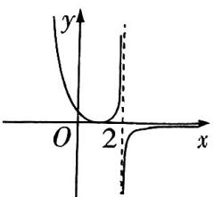

text_image

y
O 2 x

图4

# 速记结论

点到平面的距离公式 点 A 到平面 $\alpha$ 的距离 $d=\frac{|\overrightarrow{AB}\cdot n|}{|n|}$ ，A 为平面 $\alpha$ 外一点，B 为平面 $\alpha$ 上一点，n 为平面 $\alpha$ 的法向量.

# 考前

# 45天

# 第6题 设问开放的存在性探究题

# 预测角度1

# 椭圆中定点与动圆的探究问题

热考指数 ★★★★★

原创预测1 已知椭圆 $\frac{x^2}{a^2} +\frac{y^2}{b^2} = 1(a > b > 0)$ 的左、右焦点分别为 $F_{1}, F_{2}$ ，上、下顶点分别为 $B_{1}, B_{2}$ . $C$ 是 $B_{1}F_{2}$ 的中点，且 $\overrightarrow{B_1F_1} \cdot \overrightarrow{B_1F_2} = 2, \overrightarrow{CF_1} \perp \overrightarrow{B_1F_2}$ .

(1) 求椭圆的方程.   
(2)已知 M, N 是椭圆上的两个动点, 椭圆过 M, N 两点的切线交于点 P, 若 $\overrightarrow{PM} \cdot \overrightarrow{PN} = 0$ , 求点 P 的轨迹方程.  
(3) 点 $Q$ 是椭圆上任意一点, $A_{1}, A_{2}$ 分别是椭圆的左、右顶点, 直线 $QA_{1}, QA_{2}$ 与直线 $x = \frac{4\sqrt{3}}{3}$ 分别交于

# 命题依据

本题依据教育部发布的《关于做好2025年普通高校招生工作的通知》中对探究问题的考查要求命制，充分体现“出活题、考能力”的命题指导思想。本题以椭圆为载体，点在动，圆也在动，这样的设问创意满满，预测2025高考此类试题考查的几率较大。

$E, F$ , 则以 $EF$ 为直径的动圆是否恒过 $x$ 轴上的定点? 若是, 求出定点的坐标; 若不是, 说明理由.

解析 (1) 由题可设 $F_{1}(-c,0), F_{2}(c,0), B_{1}(0,b)$ , 则 $C(\frac{c}{2}, \frac{b}{2})$ .

由 $\left\{ \begin{array}{l} \overrightarrow{B_1F_1} \cdot \overrightarrow{B_1F_2} = 2, \\ \overrightarrow{CF_1} \perp \overrightarrow{B_1F_2} \end{array} \right.$ 得 $\left\{ \begin{array}{l} (-c, -b) \cdot (c, -b) = 2, \\ (-\frac{3c}{2}, -\frac{b}{2}) \cdot (c, -b) = 0, \end{array} \right.$ 即 $\left\{ \begin{array}{l} b^2 - c^2 = 2, \\ b^2 = 3c^2, \end{array} \right.$ 可得 $\left\{ \begin{array}{l} b^2 = 3, \\ c^2 = 1, \end{array} \right.$ (2分)

从而 $a^2 = 4$ ，所求椭圆方程为 $\frac{x^2}{4} +\frac{y^2}{3} = 1.$ (3分）

(2)①当 $PM \perp x$ 轴或 $PM \parallel x$ 轴时, 对应 $PN \parallel x$ 轴或 $PN \perp x$ 轴, 可知 $P(\pm 2, \pm \sqrt{3})$ .

【避易错】这里是容易丢分的地方，不要忽视对平行、垂直特殊位置的说明，此外把特殊情况先写出来能为后续解题指引方向，也能先拿一部分分数 (5 分)

②当 $PM$ 与 $x$ 轴不垂直也不平行时, 设直线 $PM$ 的斜率为 $k (k \neq 0)$ , 则直线 $PN$ 的斜率为 $-\frac{1}{k}$ . 设 $P(x_0, y_0)$ , 则直线 $PM$ 的方程为 $y - y_0 = k (x - x_0)$ , (6分)

由 $\left\{\begin{aligned}y-y_{0}&=k(x-x_{0}),\\ \frac{x^{2}}{4}&+\frac{y^{2}}{3}=1\end{aligned}\right.$ 得关于x的方程 $(3+4k^{2})x^{2}+8k(y_{0}-kx_{0})x+4(y_{0}-kx_{0})^{2}-12=0,$

椭圆(双曲线)的焦点三角形面积公式 P 为椭圆(双曲线)上一点,b 为短半轴长(虚半轴长), $F_{1},F_{2}$ 为两焦点, $\angle F_{1}PF_{2}=2\theta$ ,则对椭圆, $S_{\triangle PF_{1}F_{2}}=b^{2}\tan\theta$ ,对双曲线, $S_{\triangle PF_{1}F_{2}}=b^{2}/\tan\theta$ .

速记结论

因为直线 PM 与椭圆相切, 所以 $\Delta = 0$ ,

即 $4k^{2}(y_{0} - kx_{0})^{2} - (3 + 4k^{2})[(y_{0} - kx_{0})^{2} - 3] = 0,$

化简可得关于 $k$ 的一元二次方程 $(x_0^2 - 4)^2 k^2 - 2x_0y_0k + y_0^2 - 3 = 0, \Delta_1 = 4(3x_0^2 + 4y_0^2 - 12) > 0,$

因为 $k$ 与 $-\frac{1}{k}$ 是上述方程的两个根, 所以 $k \cdot (-\frac{1}{k}) = -1 = \frac{y_0^2 - 3}{x_0^2 - 4}$ , (8分)

【障碍速通】如何根据一个一元二次方程找到点的轨迹呢？关键就在根与系数的关系，通过两根之积把 $k$ 消掉，留下的仅含参数 $x_0, y_0$ 的关系式正是点 $P$ 的轨迹方程

整理得 $x_0^2 + y_0^2 = 7$ ，其中 $x_0 \neq \pm 2$

即点 $P$ 的轨迹方程为 $x^{2} + y^{2} = 7(x\neq \pm 2)$ （9分）

综上, 点 P 的轨迹方程为 $x^{2} + y^{2} = 7$ . (10 分)

(3) 以 $EF$ 为直径的动圆恒过定点 $(\frac{4\sqrt{3}}{3} + 1,0)$ 和 $(\frac{4\sqrt{3}}{3} - 1,0)$ , 理由如下.

由(1)得 $A_{1}(-2,0)$ , $A_{2}(2,0)$ ,

设 $Q(x_{1},y_{1})$ ，则直线 $QA_{1}$ 的方程为 $y = \frac{y_1}{x_1 + 2} (x + 2)$

直线 $QA_{1}$ 与直线 $x = \frac{4\sqrt{3}}{3}$ 的交点 $E$ 的坐标为 $\left(\frac{4\sqrt{3}}{3},\frac{y_1}{x_1 + 2} (\frac{4\sqrt{3}}{3} +2)\right)$

同理, $F(\frac{4\sqrt{3}}{3},\frac{y_{1}}{x_{1}-2}(\frac{4\sqrt{3}}{3}-2))$ . (12分)

结合图形(图略)可知直线 $QA_{1}$ 的倾斜角与直线 $QA_{2}$ 的倾斜角一个是锐角, 另一个是钝角, 则 E, F 两点位于 x 轴的上、下两侧, 所以以 EF 为直径的圆与 x 轴一定有交点,

设交点为 $H(m,0)$ ，连接 $HE,HF$ ，则 $HE\bot HF$ ，从而 $k_{HE}\cdot k_{HF} = -1$

即 $\frac{\frac{y_1}{x_1 + 2}(\frac{4\sqrt{3}}{3} + 2)}{\frac{4\sqrt{3}}{3} - m} \cdot \frac{\frac{y_1}{x_1 - 2}(\frac{4\sqrt{3}}{3} - 2)}{\frac{4\sqrt{3}}{3} - m} = -1$ ，即 $\frac{\frac{4}{3}y_1^2}{x_1^2 - 4} = -\left(\frac{4\sqrt{3}}{3} - m\right)^2,$

由 $\frac{x_1^2}{4} +\frac{y_1^2}{3} = 1$ 得 $y_{1}^{2} = \frac{3(4 - x_{1}^{2})}{4}$ 所以 $m = \frac{4\sqrt{3}}{3}\pm 1.$ （14分）

故以 $EF$ 为直径的圆恒过 $x$ 轴上的两定点，

两定点的坐标分别为 $(\frac{4\sqrt{3}}{3} + 1,0)$ 和 $(\frac{4\sqrt{3}}{3} - 1,0)$ . (15分)

# 测角度 2 立体几何中与空间角相关的定点探究问题

热考指数

原创 预测2 已知正三角形 $ABC$ 的边长为 2, $CD$ 是 $AB$ 边上的高, $E, F$ 分别是 $AC$ 和 $BC$ 的中点. 现将 $\triangle ABC$ 沿 $CD$ 翻折成一个三棱锥 $A - BCD$ , 其中二面角 $A - DC - B$ 是直二面角, 如图1所示.

(1)在棱 $BC$ 上寻找一点 $P$ , 使得 $AP \perp DE$ .  
(2) 在棱 $AD$ 上是否存在一点 $M$ , 使得直线 $BM$ 与平面 $DEF$ 所成的角为 $\frac{\pi}{6}$ ? 若存在, 求出 $DM$ 的长; 若不存在, 说明理由.

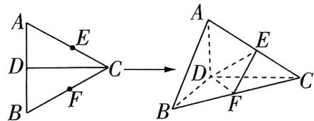

text_image

A
E
D
C
B
F
A
E
D
C
B
F

图1

解析 (1) 在翻折前的 $\triangle ABC$ 中, 有 $CD \perp DA$ , $CD \perp DB$ , 所以翻折过后仍有 $CD \perp DA$ , $CD \perp DB$ , 所以 $\angle ADB$ 是二面角 $A - DC - B$ 的平面角, 即 $\angle ADB = \frac{\pi}{2}$ , 所以 $DB, DC, DA$ 三线两 【技法速通】翻折问题看 “折痕”, 位于折痕同一侧的元素位置关系和数量关系一般不变

两垂直. 以 D 为坐标原点, $\overrightarrow{DB}, \overrightarrow{DC}, \overrightarrow{DA}$ 的方向分别为 x 轴, y 轴, z 轴的正方向建立空间直角坐标系, 则 $A(0,0,1), B(1,0,0), C(0,\sqrt{3},0), E(0,\frac{\sqrt{3}}{2},\frac{1}{2}), F(\frac{1}{2},\frac{\sqrt{3}}{2},0)$ . (2 分)

所以 $\overrightarrow{AB} = (1,0, - 1),\overrightarrow{BC} = (-1,\sqrt{3},0),\overrightarrow{DE} = (0,\frac{\sqrt{3}}{2},\frac{1}{2}).$ （3分）

设 $\overrightarrow{BP} = \lambda \overrightarrow{BC}(0\leqslant \lambda \leqslant 1)$ ，则 $\overrightarrow{AP} = \overrightarrow{AB} +\overrightarrow{BP} = (1 - \lambda ,\sqrt{3}\lambda , - 1)$ ，（4分）

由 $AP \perp DE$ 得 $\overrightarrow{AP} \cdot \overrightarrow{DE} = \frac{3\lambda}{2} - \frac{1}{2} = 0$ ，所以 $\lambda = \frac{1}{3}$ ，即 $\overrightarrow{BP} = \frac{1}{3}\overrightarrow{BC}$ ，（5分）

所以在棱 $BC$ 上存在靠近点 $B$ 的三等分点 $P$ , 使得 $AP \perp DE$ . (6 分)

(2) 由(1)可知 $\overrightarrow{DE} = (0, \frac{\sqrt{3}}{2}, \frac{1}{2}), \overrightarrow{DF} = (\frac{1}{2}, \frac{\sqrt{3}}{2}, 0)$ , (7分)

设平面 $DEF$ 的法向量为 $\pmb {n} = (x,y,z)$ ，则 $\left\{ \begin{array}{l}\pmb {n}\cdot \overrightarrow{DE} = 0,\\ \pmb {n}\cdot \overrightarrow{DF} = 0, \end{array} \right.$ 即 $\left\{ \begin{array}{l}\sqrt{3} y + z = 0,\\ x + \sqrt{3} y = 0, \end{array} \right.$

令 $x = 3$ ，可得 $y = -\sqrt{3}, z = 3$ ，所以平面DEF的一个法向量为 $\pmb{n} = (3, -\sqrt{3}, 3)$ （9分）假设棱AD上存在满足题意的点 $M$

设 $\overrightarrow{DM} = \mu \overrightarrow{DA} (0\leqslant \mu \leqslant 1)$ ，则 $\overrightarrow{BM} = \overrightarrow{BD} +\overrightarrow{DM} = (-1,0,\mu),$ （10分）

【技法速通】借助向量运算, 避免了求点的坐标, 节约时间, 要把向量的工具性作用落到解题的实处所以 $|\cos \langle \overrightarrow{BM}, \boldsymbol{n} \rangle| = \frac{|\overrightarrow{BM} \cdot \boldsymbol{n}|}{|\overrightarrow{BM}| \cdot |\boldsymbol{n}|} = |\frac{-3 + 3\mu}{\sqrt{1 + \mu^2} \cdot \sqrt{21}}| = \sin \frac{\pi}{6}$ , 得 $\mu = \frac{12 - \sqrt{119}}{5}$ . (13分)

此时 $DM = \frac{12 - \sqrt{119}}{5}$ . (14分)

因此,在棱 $AD$ 上存在满足题意的点 $M,DM$ 的长为 $\frac{12 - \sqrt{119}}{5}$ . (15分)

焦半径公式 椭圆中， $\left|PF_{1}\right|=a+ex_{0}$ ， $\left|PF_{2}\right|=a-ex_{0}$ 。双曲线中， $\left|PF_{1}\right|=a+ex_{0}$ ， $\left|PF_{2}\right]=ex_{0}-a$ （点P在右支上）； $\left|PF_{1}\right|=-\left(a+ex_{0}\right)$ ， $\left|PF_{2}\right|=-\left(ex_{0}-a\right)$ （点P在左支上）。其中 $F_{1},F_{2}$ 为圆锥曲线的左、右焦点， $P(x_{0},y_{0})$ 为圆锥曲线上一点。

# 考前

# 44天

# 第7题 情境嵌入型创新题

# 预测角度1

# 螺旋线形成过程中的数列问题

热考指数

原创 预测1 (多选)对于企业,“反内卷”和行业理性竞争十分重要. 数学中的螺旋线可以形象地展示“内卷”这个词: 越往里, 空间越小, 线条密度越大. 螺旋线可以通过以下方法绘制: 如图 1, 在正方形 $ABCD$ 中, 取正方形 $ABCD$ 各边的四等分点 $E, F$ , $G, H$ 作第二个正方形 $EFGH$ , 然后取正方形 $EFGH$ 各边的四等分点 $M, N, P, Q$ 作第三个正方形 $MNPQ$ ……一直循环下去, 可以得到四条螺旋线. 记正方形 $ABCD$ 的边长为 $a_1$ , 后续各正方形的边长依次为 $a_2$ , $a_3, \cdots, a_n$ ; 设 Rt△AEH 的面积为 $b_1$ , 后续各直角三角形的面积依次为 $b_{2}, b_{3}, \cdots, b_{n}$ . 若 $a_{1}=4$ , 则下列说法正确的有

A. 数列 $\{a_{n}\}$ 是以 4 为首项, $\frac{\sqrt{10}}{4}$ 为公比的等比数列  
B. 从正方形 $ABCD$ 开始, 连续 3 个正方形的面积之和为 $\frac{129}{4}$   
C. 使得不等式 $b_{n} > \frac{1}{2}$ 成立的 $n$ 的最大值为4  
D. 数列 $\{b_{n}\}$ 的前 $n$ 项和 $S_{n} < 4$

# 命题依据

情境嵌入型创新题依托各类趣味场景，能更全面、客观地评价考生的综合能力，如2024年新课标Ⅰ卷T11通过创意图形让考生欣赏到了数学的内涵美，受到一致好评。本题挖掘“反内卷”和螺旋线的新视角，精准锚定高考命题的动态走向，与之深度同频共振。

( )

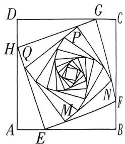

text_image

D
G
C
H
Q
P
N
F
A
E
M
B

图1

解析 对于 A, 由题意得 $a_{1}=4$ , $a_{n}=\sqrt{\left(\frac{1}{4}a_{n-1}\right)^{2}+\left(\frac{3}{4}a_{n-1}\right)^{2}}=\frac{\sqrt{10}}{4}a_{n-1}$ ，所以 $\frac{a_{n}}{a_{n-1}}=\frac{\sqrt{10}}{4}(n\geqslant2)$ ，所以数列 $\{a_{n}\}$ 是以 4 为首项， $\frac{\sqrt{10}}{4}$ 为公比的等比数列，A 正确.

对于 B, 由 A 知 $a_{n} = 4 \cdot (\frac{\sqrt{10}}{4})^{n-1}$ , 则 $a_{2} = \sqrt{10}, a_{3} = \frac{5}{2}$ ,

所以从正方形ABCD开始的连续3个正方形面积之和为 $a_1^2 + a_2^2 + a_3^2 = 4^2 + (\sqrt{10})^2 + (\frac{5}{2})^2 = \frac{129}{4}, B$ 正确.

对于 C, 由题意可得 $S_{\triangle AHE} = \frac{S_{\text{正方形}ABCD} - S_{\text{正方形}EFGH}}{4}$ , 则 $b_1 = \frac{a_1^2 - a_2^2}{4}$ , 同理得 $b_2 = \frac{a_2^2 - a_3^2}{4}, \cdots, b_n = \frac{a_n^2 - a_{n+1}^2}{4}$ , 由 A 知 $a_n^2 = 16 \cdot (\frac{5}{8})^{n-1}$ , 所以 $b_n = \frac{16 \cdot (\frac{5}{8})^{n-1} - 16 \cdot (\frac{5}{8})^n}{4} = \frac{3}{2} \cdot (\frac{5}{8})^{n-1}$ .

# 速记结论

抛物线焦点弦 $A(x_{1},y_{1}),B(x_{2},y_{2}),AB$ 为抛物线 $y^{2} = 2px(p > 0)$ 的焦点弦， $F$ 为焦点，则 $y_{1}y_{2} = -p^{2},x_{1}x_{2} = \frac{p^{2}}{4}$

当 $n = 4$ 时， $b_{4} = \frac{3}{2} \times \left(\frac{5}{8}\right)^{4 - 1} = \frac{375}{1024} < \frac{1}{2}, C$ 错误.

对于 $\mathrm{D}, S_n = \frac{3}{2} \cdot \frac{1 - (\frac{5}{8})^n}{1 - \frac{5}{8}} = 4[1 - (\frac{5}{8})^n] < 4, \mathrm{D}$ 正确. 故选ABD.

【技法速通】简单问题不要复杂化,不需要根据情境判断 $|b_{n}|$ 是个怎样的数列,只需要依据C选项的 $b_{n}=\frac{3}{2}\cdot\left(\frac{5}{8}\right)^{n-1}$ ,按照首项为 $\frac{3}{2}$ ,公比为 $\frac{5}{8}$ 的等比数列求和公式求 $S_{n}$ 即可

# 预测角度2

# “太极图”中的新定义函数问题

热考指数

原创 预测2 如图2是放在平面直角坐标系中的“太极图”, 整个大图形的外轮廓是圆 $x^{2}+y^{2}=4$ . 其中阴影区域在 y 轴左侧部分的边界为一个半圆、在 y 轴右侧部分的边界为两个半圆. 已知符号函数 $\operatorname{sgn}(x)=\left\{\begin{aligned}&1, x>0,\\ &0, x=0,\\ &-1, x<0,\end{aligned}\right.$ 则在 $x^{2}+y^{2}\leqslant 4$ 的前提下, 下列不等式能表示图中阴影部分的是 ( )

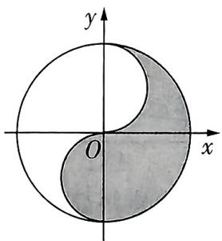

text_image

y
O
x

图2

A. $x\{x^2 + [y - \operatorname{sgn}(x)]^2 - 1\} \leqslant 0$

B. $y\{[x - \operatorname {sgn}(y)]^2 +y^2 -1\} \leqslant 0$

C. $x\{x^2 + [y - \operatorname{sgn}(x)]^2 - 1\} \geqslant 0$

D. $y\{[x - \operatorname {sgn}(y)]^2 +y^2 -1\} \geqslant 0$

解析 先看选项,可以分成 AC 和 BD 两类,其中 AC 选项中的不等式与圆心在 y 轴上的圆有关,BD 选项中的不等式与圆心在 x 轴上的圆有关,显然 BD 是错误的.

观察图形, 在 $x^{2} + y^{2} \leqslant 4$ 的前提下, 当 $x \geqslant 0$ 时, 阴影部分表示不在圆 $x^{2} + (y - 1)^{2} = 1$ 内部的区域; 当 $x < 0$ 时, 阴影部分表示圆 $x^{2} + (y + 1)^{2} = 1$ 上及内部的区域, 所以阴影部分对应的不等式为 $\left\{ \begin{array}{l} x \geqslant 0, \\ x^{2} + (y - 1)^{2} - 1 \geqslant 0 \end{array} \right.$ 或 $\left\{ \begin{array}{l} x < 0, \\ x^{2} + (y + 1)^{2} - 1 \leqslant 0, \end{array} \right.$

所以 $x\{x^2 + [y - \mathrm{sgn}(x)]^2 - 1\} \geqslant 0$ ，故选C.

【思维速解】注意思维的灵活变通, 选择题具有天然优势, 选择特殊点代入验证, 从特殊化角度思考, 也是一种值得推荐的方法, 能更快得到正确选项

全概率公式 一般地, 设 $A_{1}, A_{2}, \cdots, A_{n}$ 是一组两两互斥的事件, $A_{1} \cup A_{2} \cup \cdots \cup A_{n} = \Omega$ , $P(A_{i}) > 0, i = 1, 2, \cdots, n$ , 则对任意事件 $B \subseteq \Omega$ , $P(B) = \sum_{i=1}^{n} P(A_{i}) P(B|A_{i})$ .

速记结论

# 考前

# 43天

# 第8题 创新结构不良题

# 测角度1

# 立体几何中的结构不良题

热考指数

原创 预测1 如图 1, 在四棱锥 P-ABCD 中, 底面 ABCD 是正方形, E 为 PD 的中点, $PA \perp$ 平面 ABCD, PA = AB = 2.

(1) 证明: $PB \parallel$ 平面 $ACE$ .  
(2) 求直线 AC 与平面 PCD 所成角的余弦值.

(3)在“①M 是 PB 的中点;②M 是 BC 的中点;③M 是 AC 的中点”三个条件中任选一个,补充到下面的问题中,并解答.

若\_\_\_\_,求点 M 到平面 PCD 的距离.

注:如果选择多个条件分别解答,按第一个解答计分.

解析 (1) 连接 $BD$ 交 $AC$ 于点 $F$ , 连接 $EF$ , 如图2.

因为 E 是 PD 的中点, F 是 BD 的中点, 所以 $EF \parallel PB.$ (2 分)

又 $EF \subset$ 平面 $ACE, PB \not\subset$ 平面 $ACE$ , 所以 $PB \parallel$ 平面 $ACE$ . (4分)

(2)由题意知 AB, AD, AP 三线两两垂直, 以 A 为坐标原点, $\overrightarrow{AB}$ , $\overrightarrow{AD}$ , $\overrightarrow{AP}$ 的方向分别为 x 轴, y 轴, z 轴的正方向建立空间直角坐标系, 如图 2.

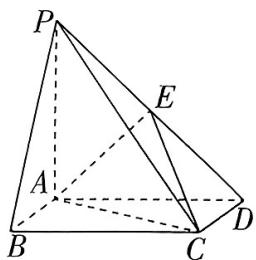

text_image

Geometric diagram of a tetrahedron with labeled vertices P, A, B, C, D and internal points E, showing solid and dashed edges.

图1

# 命题依据

结构不良试题集灵活性、开放性、创新性于一体，是实现“从能力立意到素养立意导向的转变”的载体之一。本题以立体几何为基底，创新性地设计了具有深层联系的三个条件供考生选择，细细品味，M 的三个取点居然组成了一个与平面 PCD 平行的平面，这一设计令人拍案叫绝。

由 $PA = AB = 2$ ，可得 $A(0,0,0),C(2,2,0),P(0,0,2),D(0,2,0)$

则 $\overrightarrow{AC} = (2,2,0),\overrightarrow{PC} = (2,2, - 2),\overrightarrow{PD} = (0,2, - 2)$ ，（7分）设平面 $PCD$ 的法向量为 $\pmb {n} = (x,y,z)$ ，则 $\left\{ \begin{array}{l}\pmb {n}\cdot \overrightarrow{PC} = 2x + 2y - 2z = 0,\\ \pmb {n}\cdot \overrightarrow{PD} = 2y - 2z = 0, \end{array} \right.$

取 z=1，则 x=0,y=1，所以平面 PCD 的一个法向量为 $\boldsymbol{n}=(0,1,1)$ .
(8 分)

设直线 $AC$ 与平面 $PCD$ 所成角为 $\theta$ , 则 $\sin \theta = |\cos \langle n, \overrightarrow{AC} \rangle| = \frac{|n \cdot \overrightarrow{AC}|}{|n||\overrightarrow{AC}|} = \frac{2}{\sqrt{2} \times 2\sqrt{2}} = \frac{1}{2}$ ,

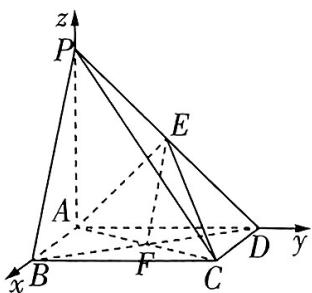

text_image

z
P
E
A
F
B
C
D
y
x

图2

所以 $\cos \theta = \sqrt{1 - \sin^2\theta} = \frac{\sqrt{3}}{2}$ 故直线 $AC$ 与平面 $PCD$ 所成角的余弦值为 $\frac{\sqrt{3}}{2}$ . (10分)

【妙解】由题意可得 $AE \perp$ 平面 $PCD$ ，则 $\angle ACE$ 即所求线面角，在 Rt $\triangle ACE$ 中， $AE = \sqrt{2}, AC = 2\sqrt{2}$ ，则 $CE = \sqrt{6}$ ，从而可得 $\cos \angle ACE = \frac{\sqrt{3}}{2}$

(3) 若选条件①, 解答过程如下.

$B(2,0,0)$ , 因为 $M$ 是 $PB$ 的中点, 所以 $M(1,0,1)$ , 连接 $MC$ , 则 $\overrightarrow{MC} = (1,2,-1)$ . (13分)

所以点 $M$ 到平面 $PCD$ 的距离 $d = \frac{|\overrightarrow{MC} \cdot \boldsymbol{n}|}{|\boldsymbol{n}|} = \frac{1}{\sqrt{2}} = \frac{\sqrt{2}}{2}$ . (15分)

【秒杀解】利用几何法中的补形法, 本题的四棱锥十分 “规矩” 可以补形为正方体 $PB^{\prime}C^{\prime}D^{\prime}-ABCD$ , 则点 $M$ 到平面 $PCD$ 的距离就是点 $M$ 到对角面 $PB^{\prime}CD$ 的距离, 是正方体面对角线长的四分之一

若选条件②,解答过程如下.

$B(2,0,0)$ , 因为 $M$ 是 $BC$ 的中点, 所以 $M(2,1,0)$ , 连接 $MC$ , 则 $\overrightarrow{MC} = (0,1,0)$ . (13分)

所以点 $M$ 到平面 $PCD$ 的距离 $d = \frac{|\overrightarrow{MC} \cdot \boldsymbol{n}|}{|\boldsymbol{n}|} = \frac{1}{\sqrt{2}} = \frac{\sqrt{2}}{2}$ . (15分)

若选条件③,解答过程如下.

因为 M 是 AC 的中点, 所以 $M(1,1,0)$ , 连接 MC, 则 $\overrightarrow{MC} = (1,1,0)$ . (13 分)

所以点 $M$ 到平面 $PCD$ 的距离 $d = \frac{|\overrightarrow{MC} \cdot \boldsymbol{n}|}{|\boldsymbol{n}|} = \frac{1}{\sqrt{2}} = \frac{\sqrt{2}}{2}$ . (15分)

3h

# 测角度2 解析几何中的结构不良题

热考指数

原创 预测2 已知抛物线 $C: y^{2} = 2px (p > 0)$ 的焦点为 $F$ , 过点 $F$ 的直线 $l$ 交 $C$ 于 $M, N$ 两点. 从下面三个条件中选择一个作为已知, 回答问题.

条件①线段 $MN$ 的中点为 $K(\frac{3}{2}, 1)$ , 且 $C$ 上任意一点 $Q$ 都满足 $|QF| + |KQ| > 2$ ; 条件② $|MF| = 3|NF|$ 且 $|MN| = \frac{16}{3}$ ; 条件③ $|NF|^2 - \frac{16}{|MF|}$ 的最小值为 $-4$ .

(1) 求抛物线 C 的标准方程.  
(2)已知 $P(1,2)$ , A, B 是抛物线 C 上横坐标不等于 1 的两个动点, 直线 PA, PB 与 y 轴分别交于 D, E 两点, 线段 DE 的垂直平分线经过点 P. 证明: 直线 AB 的斜率为定值.

注:如果选择多个条件分别解答,按第一个解答计分.

解析 (1) 设 $M(x_{1}, y_{1}), N(x_{2}, y_{2}), F(\frac{p}{2}, 0)$ .

若选条件①: 因为线段 MN 的中点为 $K(\frac{3}{2},1)$ ，所以 $y_{1} + y_{2} = 2$ ，且直线 MN 的斜率存在.

因为点 $M, N$ 在抛物线上，所以 $\left\{ \begin{array}{l} y_1^2 = 2px_1, \\ y_2^2 = 2px_2, \end{array} \right.$ 两式相减得 $k_{MN} = \frac{2p}{y_1 + y_2} = p,$ (2分)

又 $k_{MN} = k_{KF}, k_{KF} = \frac{2}{3 - p}$ , 所以 $\frac{2}{3 - p} = p$ , 解得 $p = 1$ 或 $p = 2$ . (4分)

过点 $Q$ 作抛物线准线的垂线 $QH, H$ 为垂足, 则 $|QH| = |QF|$ , 所以 $|QF| + |KQ| = |QH| + |KQ| \geqslant \frac{p}{2} + \frac{3}{2}$ , 所以 $\frac{p}{2} + \frac{3}{2} > 2$ , 即 $p > 1$ , 所以 $p = 2$ , 所以抛物线 $C$ 的标准方程是 $y^2 = 4x$ . (6分)

若选条件②:由题意可设直线 l 的方程为 $x = ty + \frac{p}{2} (t \neq 0)$ ,由 $\left\{\begin{aligned}x&=ty+\frac{p}{2},\\ y^{2}&=2px\end{aligned}\right.$ 消去 x 得关于 y 的方程 $y^{2}-2pty-p^{2}=0,\Delta>0,$

所以 $y_{1} + y_{2} = 2pt, y_{1}y_{2} = -p^{2}$ . (2分)

因为 $|MF|=3|NF|$ 且 $|MN|=\frac{16}{3}$ ，所以 $\left\{\begin{aligned}|MF|=x_{1}+\frac{p}{2}&=ty_{1}+p=4,\\ |NF|=x_{2}+\frac{p}{2}&=ty_{2}+p=\frac{4}{3},\end{aligned}\right.$ (4分)

所以 $(ty_{1} + p)(ty_{2} + p) = (ty_{1} + p) + (ty_{2} + p)$ ，即 $t^2 y_1y_2 + tp(y_1 + y_2) + p^2 = t(y_1 + y_2) + 2p$

所以 $t^2 p^2 + p^2 = 2pt^2 + 2p$ ，即 $p^2(t^2 + 1) = 2p(t^2 + 1)$ ，解得 $p = 2$

所以抛物线 $C$ 的标准方程是 $y^{2} = 4x$ . (6分)

若选条件③:由已知可得 $\frac{1}{|MF|}+\frac{1}{|NF|}=\frac{2}{p}$ ，所以 $|NF|^{2}-\frac{16}{|MF|}=|NF|^{2}-16\times(\frac{2}{p}-$

【结论速记】此处可由选条件②的分析过程得到, 也可应用抛物线的焦点弦结论得到, 对抛物线 $y^{2}=2px(p>0)$ 过焦点 $F$ 的弦 $MN$ , 当点 $M$ 在第一象限时, 设直线 $MN$ 的倾斜角为 $\alpha$ , 有 $|MF|=\frac{p}{1-\cos\alpha}$ , $|NF|=\frac{p}{1+\cos\alpha}$

$\frac{1}{|NF|}) = |NF|^2 + \frac{8}{|NF|} + \frac{8}{|NF|} - \frac{32}{p} \geqslant 3\sqrt[3]{|NF|^2 \cdot \frac{8}{|NF|} \cdot \frac{8}{|NF|}} - \frac{32}{p} = 12 - \frac{32}{p}$ , 当且仅当 $|NF| = 2$ 时, 等号成立, (5分)

所以 $12 - \frac{32}{p} = -4$ ，解得 $p = 2$ ，所以抛物线 $C$ 的标准方程是 $y^{2} = 4x.$ (6分)

(2) 因为 $P(1,2)$ ，抛物线 $C: y^{2} = 4x$ ，所以点 $P(1,2)$ 在抛物线 C 上. (7 分)

由题可知直线 $PA, PB$ 的斜率都存在且不为0，分别设为 $k, k_1$

则直线 $PA$ 的方程为 $y - 2 = k(x - 1)$ ，即 $y = kx + 2 - k$

当 $x = 0$ 时， $y = 2 - k$ ，所以 $D(0,2 - k)$ ，同理， $E(0,2 - k_1)$ 。 (9分)

【多想少算】通过地位同等代换法用 $k_{1}$ 代替 $k$ , 得到点 $E$ 的坐标, 省去再一次解方程的过程; 类似地, 求出点 $A$ 的坐标后, 用 $-k$ 代替 $k$ 可以快速得到点 $B$ 的坐标

因为线段 $DE$ 的垂直平分线经过点 $P$ , 所以 $\frac{2 - k + 2 - k_1}{2} = 2$ , 所以 $k_1 = -k$ . (10 分)

由 $\left\{\begin{aligned}y&=kx+2-k,\\ y^{2}&=4x,\end{aligned}\right.$ 得关于x的方程 $k^{2}x^{2}-2(k^{2}-2k+2)x+k^{2}-4k+4=0,\Delta^{\prime}>0,k\neq1.$ (11 分)

设 $A(x_{A},y_{A})$ ，则 $1,x_{A}$ 是上述关于 $\pmb{x}$ 的方程的两个解，

所以 $x_{A} = 1\cdot x_{A} = \frac{k^{2} - 4k + 4}{k^{2}}$ ，所以 $y_{A} = k\times \frac{k^{2} - 4k + 4}{k^{2}} +2 - k = \frac{4}{k} -2,$

所以 $A\left(\frac{k^2 - 4k + 4}{k^2}, \frac{4}{k} - 2\right)$ , 同理, $B\left(\frac{k^2 + 4k + 4}{k^2}, \frac{4}{-k} - 2\right)$ . (13分)

所以 $k_{AB} = \frac{\frac{4}{k} - 2 + \frac{4}{k} + 2}{\frac{k^2 - 4k + 4}{k^2} - \frac{k^2 + 4k + 4}{k^2}} = -1$ ，即直线 $AB$ 的斜率为定值-1. (15分)

# 考前

# 42天

# 第9题 答案不唯一填空题

# 预测角度1

# 以复数为载体进行开放创新命题

热考指数

原创 预测1 写出一个同时满足下列条件①②的复数 $z$ : \_\_\_\_.

① $|z|=1$ ; ② $z^{2}$ 的实部小于0.

解析 设 $z = a + b\mathrm{i}(a, b \in \mathbf{R})$ ，则 $|z| = \sqrt{a^2 + b^2} = 1$ ，所以 $a^2 + b^2 = 1$ . $z^2 = (a + b\mathrm{i})^2 = a^2 - b^2 + 2ab\mathrm{i}$ ，由题意知 $a^2 - b^2 < 0$ ，则 $a^2 < b^2$ .

不妨取 $a^2 = \frac{1}{4}, b^2 = \frac{3}{4}$ , 则可取 $a = \frac{1}{2}, b = \frac{\sqrt{3}}{2}$ , 所以满足条件的一个复数 $z$ 为 $\frac{1}{2} + \frac{\sqrt{3}}{2}\mathrm{i}$ .

# 预测角度2

# 以三角求参为载体进行多变命题

热考指数

原创 预测2 已知函数 $f(x) = 2\sin (\omega x + \varphi)(\varphi > 0)$ 的图象相邻两条对称轴之间的距离为$\frac{\pi}{4}$ , 且经过点 $(\frac{\pi}{12}, \sqrt{2})$ , 则 $\varphi$ 的值为 \_\_\_\_. (写出一个满足条件的答案即可)

解析 设函数 $f(x)$ 的周期为 $T$ , 则由其图象相邻两条对称轴之间的距离为 $\frac{\pi}{4}$ , 得 $\frac{T}{2} = \frac{\pi}{4}$ , 则 $T = \frac{\pi}{2}$ , 由 $T = \frac{2\pi}{|\omega|} (\omega \neq 0)$ , 得 $\frac{2\pi}{|\omega|} = \frac{\pi}{2}$ , 则 $|\omega| = 4$ , 所以 $\omega = \pm 4$ .

# 命题依据

三角函数求参问题每年必考，但形式多变，本题巧借答案不唯一填空题进行考查，回归教材而又不失新意，符合新高考强调的素养导向，是2025高考备考的重点，应加以关注.

由函数 $f(x)$ 的图象经过点 $(\frac{\pi}{12},\sqrt{2})$ ，得 $2\sin (\frac{\pi}{12}\omega +\varphi) = \sqrt{2}$ ，则 $\sin (\frac{\pi}{12}\omega +\varphi) = \frac{\sqrt{2}}{2}.$

当 $\omega = 4$ 时， $\sin \left(\frac{\pi}{12} \times 4 + \varphi\right) = \sin \left(\frac{\pi}{3} + \varphi\right) = \frac{\sqrt{2}}{2}$ ，则 $\frac{\pi}{3} + \varphi = 2k\pi + \frac{3\pi}{4}(k \in \mathbf{Z})$ 或 $\frac{\pi}{3} + \varphi = 2k\pi + \frac{\pi}{4}(k \in \mathbf{Z})$ ，得 $\varphi = \frac{5\pi}{12} + 2k\pi (k \in \mathbf{Z})$ 或 $\varphi = 2k\pi - \frac{\pi}{12}(k \in \mathbf{Z})$ 。

当 $\omega = -4$ 时， $\sin \left[\frac{\pi}{12} \times (-4) + \varphi\right] = \sin \left(-\frac{\pi}{3} + \varphi\right) = \frac{\sqrt{2}}{2}$ ，则 $-\frac{\pi}{3} + \varphi = 2k\pi + \frac{3\pi}{4} (k \in \mathbf{Z})$ 或 $-\frac{\pi}{3} + \varphi = 2k\pi + \frac{\pi}{4} (k \in \mathbf{Z})$ ，得 $\varphi = \frac{13\pi}{12} + 2k\pi (k \in \mathbf{Z})$ 或 $\varphi = 2k\pi + \frac{7\pi}{12} (k \in \mathbf{Z})$ 。

由 $\varphi > 0$ 可知 $\varphi$ 的值可以为 $\frac{5\pi}{12}$ (答案不唯一, 写出一个满足条件的值即可).

【秒杀解】对于此类答案不唯一题，得出 $\sin \left(\frac{\pi}{3} + \varphi\right) = \frac{\sqrt{2}}{2}$ 后，联想 $\sin \frac{3\pi}{4} = \frac{\sqrt{2}}{2}$ 可直接得到 $\varphi$ 的一个值，此处注意 $\varphi > 0$ 的限制条件

问:什么是“新工科”?答:新工科是在新一轮科技革命和产业变革背景下,对传统工科专业进行更新改造、交叉融合,由新兴工科专业形成的新型工科体系.新工科强调学科的交叉融合性、创新性和实用性.

# 考前

# 41天

# 第10题 高等数学知识衔接命题

# 测角度1

# 数学分析中的李普希茨条件

热考指数

原创 预测1 设函数 $f(x)$ 在区间 $(a, b)$ 上有定义，若对于任意的 $x_1, x_2 \in (a, b)$ ，且 $x_1 \neq x_2$ ，都有 $\left|\frac{f(x_1) - f(x_2)}{x_1 - x_2}\right| \leqslant M$ （ $M$ 为常数），则称函数 $f(x)$ 在区间 $(a, b)$ 上满足李普希茨条件。已知函数 $f(x) = \sqrt{x}, x \in (0, +\infty)$ 。

(1) 证明: 函数 $f(x)$ 在区间 $(1, +\infty)$ 上满足李普希茨条件, 并求 $M$ 的最小值.

# 命题依据

高等数学知识衔接命题是高考命题创新性的重要体现，每年高考都会涉及，本题巧妙搭载“李普希茨条件”考查函数与数列的交汇放缩，强调应用能力与创新能力，是2025高考的命题热点.

(2) 已知数列 $\{a_{n}\}$ 满足 $a_{n+1} = f(a_{n})(n \in \mathbf{N}^{*})$ , $a_{1} = f(4)$ , 证明: $a_{n} \geqslant (2 - \sqrt{2})(2^{2-n} + \sqrt{2})$ .

解析 (1) 取 $x_{1}, x_{2} \in (1, +\infty), x_{1} \neq x_{2}$ , 由题意知 $\left|\frac{f(x_1) - f(x_2)}{x_1 - x_2}\right| = \left|\frac{\sqrt{x_1} - \sqrt{x_2}}{x_1 - x_2}\right| = \left|\frac{\sqrt{x_1} - \sqrt{x_2}}{x_1 - x_2}\right|$ . $\left|\frac{\sqrt{x_1} - \sqrt{x_2}}{(\sqrt{x_1} - \sqrt{x_2})(\sqrt{x_1} + \sqrt{x_2})}\right| = \left|\frac{1}{\sqrt{x_1} + \sqrt{x_2}}\right|$ , (2分)

因为 $x_{1}, x_{2} \in (1, +\infty)$ , 所以 $\sqrt{x_1} + \sqrt{x_2} > 2$ , 则 $\frac{1}{\sqrt{x_1} + \sqrt{x_2}} < \frac{1}{2}$ , (4分)

【易错警示】在根据 $x_{1}, x_{2} \in (1, +\infty)$ 确定 $\frac{1}{\sqrt{x_1} + \sqrt{x_2}}$ 的范围时，要注意不等号的方向和取值的准确性，避免计算错误导致判断失误

所以函数 $f(x)$ 在区间 $(1, +\infty)$ 上满足李普希茨条件，且 $M$ 的最小值为 $\frac{1}{2}$ . (6分)

(2) 由 $a_1 = f(4)$ 得 $a_1 = 2 > 1$ ，又 $a_{n+1} = \sqrt{a_n}$ ，则 $a_n > 1$ ，所以 $a_{n+1} - a_n = \sqrt{a_n} - a_n = \sqrt{a_n}$ ( $1 - \sqrt{a_n}$ ) < 0，即 $a_{n+1} < a_n$ ，

由(1)可得 $\left|\frac{f(a_{n})-f(a_{n-1})}{a_{n}-a_{n-1}}\right|<\frac{1}{2}(n\geqslant2)$ ，即 $\left|\frac{a_{n+1}-a_{n}}{a_{n}-a_{n-1}}\right|<\frac{1}{2}(n\geqslant2)$ ，

则 $\frac{a_{n+1}-a_{n}}{a_{n}-a_{n-1}}<\frac{1}{2}(n\geqslant2)$ ，从而当 $n\geqslant3$ 时， $\frac{a_{n}-a_{n-1}}{a_{n-1}-a_{n-2}}<\frac{1}{2},\cdots,\frac{a_{3}-a_{2}}{a_{2}-a_{1}}<\frac{1}{2}$

累乘可得 $\frac{a_n - a_{n-1}}{a_2 - a_1} < \left(\frac{1}{2}\right)^{n-2}(n \geqslant 3)$ , 则 $a_n - a_{n-1} > \left(\frac{1}{2}\right)^{n-2}(a_2 - a_1)(n \geqslant 3)$ . (10分)

【破瓶颈】巧妙利用第(1)问的结论放缩化简后，观察代数式的结构利用累乘法计算。此处也可直接

变形为 $a_{n} - a_{n - 1} > \frac{1}{2} (a_{n - 1} - a_{n - 2}) > \frac{1}{2^{2}} (a_{n - 2} - a_{n - 3}) > \dots >\frac{1}{2^{n - 2}} (a_2 - a_1)(n\geqslant 3)$

由 $a_2 = \sqrt{a_1} = \sqrt{2}$ 得 $a_n - a_{n-1} > \left(\frac{1}{2}\right)^{n-2}(\sqrt{2} - 2)(n \geqslant 3)$ ,

所以 $(a_{3}-a_{2})+(a_{4}-a_{3})+\cdots+(a_{n}-a_{n-1})=a_{n}-a_{2}>(\sqrt{2}-2)(\frac{1}{2}+\frac{1}{2^{2}}+\cdots+\frac{1}{2^{n-2}})=(\sqrt{2}-2)(1-\frac{1}{2^{n-2}})(n\geqslant3)$ ，则 $a_{n}>(\sqrt{2}-2)(1-\frac{1}{2^{n-2}})+\sqrt{2}=(2-\sqrt{2})(2^{2-n}+\sqrt{2})(n\geqslant3)$ .
(13 分)

当 $n = 2$ 时， $a_{2} = \sqrt{2} = (2 - \sqrt{2})(1 + \sqrt{2})$ ，当 $n = 1$ 时， $a_{1} = 2 = (2 - \sqrt{2})(2 + \sqrt{2})$ .

综上, $a_{n}\geqslant(2-\sqrt{2})(2^{2-n}+\sqrt{2})$ . (15分)

# 测角度2 高等几何中的射影几何

热考指数 ★★★★☆

原创 预测2 射影几何是几何学的一个重要分支,主要研究图形在射影变换下的性质,极点、极线是射影几何中的重要概念,也是圆锥曲线的一种基本特征.对于圆锥曲线 $C:Ax^{2}+By^{2}+Dx+Ey+F=0$ , 点 $(x_{0},y_{0})$ 与直线 $Axx_{0}+Byy_{0}+D\left(\frac{x+x_{0}}{2}\right)+E\left(\frac{y+y_{0}}{2}\right)+F=0$ 是它的一对极点与极线,即极点与

# 命题依据

2024 全国甲卷 T20，2023 新课标Ⅱ卷 T21 均涉及高等几何中的射影几何，基于此，本题以“射影几何”中的极点与极线为载体，命制圆锥曲线与直线的综合问题，以此强化数学探究与创新思维，体现高考命题新思想.

极线是一一对应的关系. 已知 $A_{1}, A_{2}$ 分别为双曲线 $C: \frac{x^{2}}{a^{2}} - \frac{y^{2}}{b^{2}} = 1 (a > b > 0)$ 的左、右顶点, 点 $A_{1}$ 到双曲线渐近线的距离为 $\frac{\sqrt{3}}{2}$ , 双曲线的离心率为 $2, O$ 为坐标原点, 极点 $G$ 对应的极线与双曲线 $C$ 交于 $D, E$ 两点.

(1) 求双曲线 C 的标准方程.  
(2) 若点 $G\left(\frac{1}{2}, \frac{1}{2}\right)$ , 点 $P$ 为 $DE$ 的中点, 求直线 $OP$ 的斜率.  
(3) 若点 $G$ 在直线 $x - \frac{1}{2} = 0$ 上, $D, E$ 均在双曲线 $C$ 的右支上 (点 $D$ 在 $x$ 轴上方), 直线 $DA_{2}$ , 直线 $EA_{1}$ 分别与 $y$ 轴交于 $M, N$ 两点, 证明: $\frac{|OM|}{|ON|}$ 为定值.

解析 (1) 由题意知 $\frac{c}{a} = 2, \frac{| - ab|}{\sqrt{a^2 + b^2}} = \frac{ab}{c} = \frac{\sqrt{3}}{2}$ , 则 $c^2 = 4a^2, b = \sqrt{3}$ ,

又 $c^2 = a^2 + b^2$ ，所以 $a^2 = 1, b^2 = 3$ ，所以双曲线 $C$ 的标准方程为 $x^2 - \frac{y^2}{3} = 1$ . (3分)

(2) 由题意知点 $G(\frac{1}{2}, \frac{1}{2})$ 对应的极线方程为 $\frac{1}{2} x - \frac{\frac{1}{2} y}{3} = 1$ , 则直线 $DE$ 的方程为 $y = 3x - 6$ . (5分)

【讲技巧】将题干中任意圆锥曲线的极点与极线的关系对应到双曲线 C 上即可得到直线 DE 的方程。实际上就是将双曲线标准方程中 $x^{2}$ 中的一个 “x” 替换为 $\frac{1}{2}$ ， $y^{2}$ 中的一个 “y” 替换为 $\frac{1}{2}$ 即可

设 $D(x_{1},y_{1}),E(x_{2},y_{2}),P(x^{\prime},y^{\prime})$ ，则 $\left\{ \begin{array}{l}x_1^2 -\frac{y_1^2}{3} = 1,\\ x_2^2 -\frac{y_2^2}{3} = 1, \end{array} \right.$ 两式相减得 $(x_{1} - x_{2})(x_{1} + x_{2})$ ： $\frac{(y_1 - y_2)(y_1 + y_2)}{3} = 0$ ，化简得 $\frac{y'(y_1 - y_2)}{x'(x_1 - x_2)} = 3$ ，即 $k_{OP}k_{DE} = 3$ ，(8分

又 $k_{DE} = 3$ ，所以 $k_{OP} = 1.$ (9分

(3)由题意知 $A_{1}(-1,0), A_{2}(1,0)$ , 则直线 $DA_{2}: y = \frac{y_{1}}{x_{1} - 1} (x - 1)$ , 直线 $EA_{1}: y = \frac{y_{2}}{x_{2} + 1} (x + 1)$ , 所以 $M(0, \frac{-y_{1}}{x_{1} - 1}), N(0, \frac{y_{2}}{x_{2} + 1})$ , 所以 $\frac{|OM|}{|ON|} = \frac{|y_{1}(x_{2} + 1)|}{|y_{2}(x_{1} - 1)|}$ . (11分)

设 $G(\frac{1}{2}, t)$ , 则直线 $DE$ 的方程为 $\frac{1}{2} x - \frac{ty}{3} = 1$ .

由 $\left\{\begin{aligned}\frac{1}{2}x-\frac{ty}{3}=1,\\ x^{2}-\frac{y^{2}}{3}=1,\end{aligned}\right.$ 消去x得关于y的方程 $(4t^{2}-3)y^{2}+24ty+27=0,\Delta>0,$

则 $y_{1} + y_{2} = -\frac{24t}{4t^{2} - 3}, y_{1}y_{2} = \frac{27}{4t^{2} - 3}$ . (13分)

当 $t \neq 0$ 时, $y_{1}y_{2} = -\frac{9}{8t}(y_{1} + y_{2})$ ,

【破障碍】待求目标式是“非对称”结构，故根据根与系数的关系整体代换，此处注意参数 $t$ 不为0

则 $\frac{|OM|}{|ON|} = \frac{|y_1(x_2 + 1)|}{|y_2(x_1 - 1)|} = \frac{|y_1(2ty_2 + 9)|}{|y_2(2ty_1 + 3)|} = \frac{|2t\cdot\frac{-9}{8t}(y_1 + y_2) + 9y_1|}{|2t\cdot\frac{-9}{8t}(y_1 + y_2) + 3y_2|} = \frac{|9(3y_1 - y_2)|}{| - 3(3y_1 - y_2)|} = 3.$ (15分)

当 $t = 0$ 时， $x_{1} = x_{2} = 2, y_{1} = -y_{2} = 3$ ，则 $\frac{|OM|}{|ON|} = \frac{|y_1(x_2 + 1)|}{|y_2(x_1 - 1)|} = 3.$ (16分)

综上, $\frac{|OM|}{|ON|}$ 为定值3. (17分)

# 考前 40天

# 第11题 与化学、物理交叉的学科融合题

# 预测角度1

# 与化学反应融合的指数函数模型问题

热考指数

原创 预测1 (多选)阿伦尼乌斯公式是用于描述化学反应速率常数随温度变化关系的经验公式, 它的指数形式为 $k = A e^{-\frac{E_{a}}{R T}}$ , 其中 A 为表观频率因子, k 为反应速率常数, T 为热力学温度 (T > 0), R 为摩尔气体常数, $E_{a}$ 为活化能. 已知某化学反应过程中, 热力学温度分别为 $T_{1}, T_{2}$ 时的化学反应速率分别为 $k_{1}, k_{2} (k_{1}, k_{2} > 0)$ , 且此过程中 A, R, $E_{a}$ (均为正数)保持不变,则下列说法正确的是

A. 若 $T_{1} > T_{2}$ , 则 $k_{1} > k_{2}$   
B. 若 $T_{2} = 4T_{1}$ , 则 $k_{2} = k_{1}^{\frac{1}{4}}A^{\frac{1}{4}}$   
C. 若 $T_{2} = 2T_{1}, -\frac{E_{a}}{RT_{1}} = M$ ，则 $\ln \frac{k_1}{k_2} = \frac{M}{2}$   
D. 若 $T_{2} = 2T_{1}, -\frac{E_{a}}{RT_{1}} = M$ ，则 $\ln \frac{k_1}{k_2} = \frac{M}{4}$

# 命题依据

学科融合命题一直是高考的热考题型，5年23考，本题融合化学反应考查指、对互化，强化考查考生运用数学知识解决实际问题的能力，体现创新思维，契合新高考对考生综合素养的考查要求，是一道不容错过的好题。

( )

解析 对于 A, 由 $k = A e^{-\frac{E_{a}}{R T}}$ 得 $\ln k = \ln A - \frac{E_{a}}{R T}$ ，则 $\ln k_{1} = \ln A - \frac{E_{a}}{R T_{1}}$ ， $\ln k_{2} = \ln A - \frac{E_{a}}{R T_{2}}$ ，所
【技法速通】指数式的底数为“e”故等式两边同取自然对数，再结合对数的运算法则作差即可判断
以 $\ln\frac{k_{1}}{k_{2}}=\ln k_{1}-\ln k_{2}=\ln A-\frac{E_{a}}{RT_{1}}-\ln A+\frac{E_{a}}{RT_{2}}=\frac{E_{a}}{R}\left(\frac{1}{T_{2}}-\frac{1}{T_{1}}\right)$ . 若 $T_{1}>T_{2}$ ，则 $\frac{1}{T_{2}}-\frac{1}{T_{1}}>0$ ，因为 $\frac{E_{a}}{R}>0$ , 所以 $\ln\frac{k_{1}}{k_{2}}>0$ , 从而 $\frac{k_{1}}{k_{2}}>1$ , 又 $k_{1}, k_{2}>0$ , 所以 $k_{1}>k_{2}$ , A 正确.

对于 B, $k_{1}=Ae^{-\frac{E_{s}}{RT_{1}}}$ ，则 $e^{-\frac{E_{s}}{RT_{1}}}=\frac{k_{1}}{A}$ ，若 $T_{2}=4T_{1}$ ，则 $k_{2}=Ae^{-\frac{E_{s}}{4RT_{1}}}=A(e^{-\frac{E_{s}}{RT_{1}}})^{\frac{1}{4}}=A(\frac{k_{1}}{A})^{\frac{1}{4}}=k_{1}^{\frac{1}{4}}A^{\frac{3}{4}}$ ，B 错误.

对于 CD, 若 $T_{2}=2T_{1}$ , 则 $\ln\frac{k_{1}}{k_{2}}=\frac{E_{a}}{R}\left(\frac{1}{2T_{1}}-\frac{1}{T_{1}}\right)=-\frac{E_{a}}{RT_{1}}\left(-\frac{1}{2}+1\right)=\frac{M}{2}$ , 故 C 正确, D 错误.
故选 AC.

# 预测角度2

# 与物理中光学融合的直线与圆问题

原创预测2 在平面直角坐标系 $xOy$ 中, 已知射线 $l_{1}: y = x (x \geqslant 0), l_{2}: y = 0 (x \geqslant 0)$ , 半圆 $C: y = \sqrt{1 - (x - 4)^{2}}$ , 现从点 $A(1,0)$ 向 $x$ 轴上方区域的某方向发射一束光线, 光线沿直线传播, 但遇到射线 $l_{1}, l_{2}$ 时会发生镜面反射. 设光线在发生反射前所在直线的斜率为 $k$ , 若光线始终与半圆 $C$ 没有交点, 则 $k$ 的取值范围为 ( )

# 命题依据

本题结合光的反射巧妙设题，考查直线与圆的位置关系，解题时需用到反射的“对称性”，实现物理与数学的完美融合，试题命制极具创新！

A. $(- \frac{15}{8}, -\frac{\sqrt{6}}{12}) \cup (\frac{\sqrt{2}}{4}, +\infty)$

B. $(-\infty, -\frac{15}{8}) \cup (\frac{\sqrt{2}}{4}, +\infty)$

C. $(\frac{\sqrt{2}}{4}, +\infty)$

D. $(- \frac{15}{8}, \frac{\sqrt{2}}{4})$

解析 由题意知半圆 C 的圆心为 $(4,0)$ ，半径为 1，反射前光线所在直线方程为 $y = k(x - 1)$ .

①当光线不发生反射时,光线所在直线的斜率 $k\in(0,1]$ ,

若此时光线与半圆 C 无交点, 则半圆圆心 $(4,0)$ 到光线所在直线的距离 $d=\frac{|4k-k|}{\sqrt{k^{2}+1}}>1$ ,
解得 $k > \frac{\sqrt{2}}{4}$ ，即 $k \in (\frac{\sqrt{2}}{4}, 1]$ .

②当光线只发生一次反射时,反射光线不与x轴非负半轴相交,

由 $\left\{ \begin{array}{l} y = k(x - 1), \\ y = x \end{array} \right.$ 得 $\left\{ \begin{array}{l} x = \frac{k}{k - 1}, \\ y = \frac{k}{k - 1}, \end{array} \right.$ 则反射光线所在直线方程为 $y - \frac{k}{k - 1} = \frac{1}{k}(x - \frac{k}{k - 1})$ ，即 $y = \frac{1}{k} x + 1$ ，

所以 $0 < \frac{1}{k} < 1$ ，解得 $k > 1$ .

令半圆圆心(4,0)到反射光线所在直线的距离 $d_{1} = \frac{|4 + k|}{\sqrt{1 + k^{2}}} > 1$ ，解得 $k > -\frac{15}{8}$ ，

又 $k > 1$ ，所以此时要使光线与半圆 $C$ 没有交点，则 $k \in (1, +\infty)$

③当光线发生两次反射时，

当 $k \neq -1$ 时, 第一次反射后光线所在直线与 $x$ 轴非负半轴有交点, 交点为 $(-k, 0)$ ,

则第二次反射后光线所在直线方程为 $y = -\frac{1}{k} (x + k) = -\frac{1}{k} x - 1$ ，

所以 $0 < -\frac{1}{k} < 1$ ，解得 $k < -1$

令半圆圆心(4,0)到第二次反射光线的距离 $d_{2} = \frac{|4 + k|}{\sqrt{1 + k^{2}}} > 1$ ，得 $k > -\frac{15}{8}$ ，

故此时要使光线与半圆 C 无交点, 则 $k \in (-\frac{15}{8}, -1)$ .

当 $k = -1$ 时, 易知第一次反射后光线过点 $A$ , 第二次反射后光线所在直线方程为 $y = x - 1$ , 与半圆 $C$ 没有交点. 综上, $k \in (-\frac{15}{8}, -1]$ .

④当光线发生三次反射时,由 $\left\{ \begin{array}{l} y = -\frac{1}{k} x - 1, \\ y = x, \end{array} \right.$ 得 $\left\{ \begin{array}{l} x = -\frac{k}{k + 1}, \\ y = -\frac{k}{k + 1}, \end{array} \right.$ 则第三次反射光线所在直线

【障碍速通】根据反射的次数分类讨论,从直线与圆的相切关系入手寻找临界值,再结合图形判断 $k$ 的范围即可,注意对反射次数的讨论要不重、不漏

方程为 $y + \frac{k}{k + 1} = -k\left(x + \frac{k}{k + 1}\right)$

即 $y = -kx - k$ ，所以 $0 < -k < 1$ ，即 $-1 < k < 0.$

令半圆圆心(4,0)到第三次反射光线的距离 $d_{3} = \frac{|4k + k|}{\sqrt{1 + k^{2}}} > 1$ ，得 $k < -\frac{\sqrt{6}}{12}$ ，

故此时要使光线与半圆 $C$ 无交点，则 $k \in (-1, -\frac{\sqrt{6}}{12})$ .

综上, $k$ 的取值范围为 $\left(-\frac{15}{8}, -\frac{\sqrt{6}}{12}\right) \cup \left(\frac{\sqrt{2}}{4}, +\infty\right)$ . 故选 A.

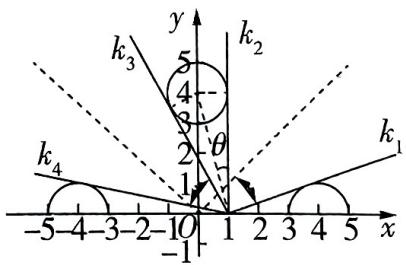

text_image

k₃
5
k₂
4
θ
2
1
k₁
-5-4-3-2-10 1 2 3 4 5 x
-1

图1

【妙解】由物理中的光学性质, 可将原问题等效处理为光线进入了 “镜子后的空间”, 因此问题就转化为光线如何与镜子内外的圆没有交点, “镜子后”的半圆方程依次为 $x^{2} + (y - 4)^{2} = 1 (x \geqslant 0), x^{2} + (y -$ $4)^{2}=1(x<0)$ ， $(x+4)^{2}+y^{2}=1(y\geqslant0)$ ，如图1，由此根据光线未发生反射前所在直线与上述半圆相切时k的临界值即可求解

# 考前

# 39天

# 第12题 以数列为“底”的创新交汇题

热考指数

原创 预测1 对于给定的数列 $\{a_{n}\}$ ， $\{b_{n}\}$ 和正整数 m，若函数 $f(x)=\sum_{i=1}^{m}(a_{i}-b_{i})x$ 中 x 的系数为正数，称 $f(x)$ 为正比例近似函数。已知数列 $\{a_{n}\}$ ， $\{b_{n}\}$ 满足 $a_{1}=1, a_{n}=2a_{n-1}+1, b_{n}=\log_{2}(a_{n}+1)$ ，若 $f(x)$ 为正比例近似函数，则 m 的取值范围为 \_\_\_\_。

解析 由 $a_{n} = 2a_{n - 1} + 1$ 得 $a_{n} + 1 = 2(a_{n - 1}+$ 【技法速通】对于形如 $a_{n} = pa_{n - 1} + q$ 的递推式，可通过等式两边同加常数 $\lambda$ 构造等比数列求通项

# 命题依据

纵观近几年高考，数列创新交汇问题每年必考，如2024新课标Ⅱ卷T19，将解析几何与数列融合命制。本题融合新定义“正比例近似函数”，综合考查数列的通项与增减性，设题新颖，贴合高考，理应成为特别关注点。预测此类试题依然会是2025高考命题热点。

1), $a_1 + 1 = 2$ ，则数列 $\{a_n + 1\}$ 是以2为首项、2为公比的等比数列，所以 $a_{n} + 1 = 2^{n}$ ，则 $a_{n} = 2^{n} - 1, b_{n} = \log_{2}(2^{n} - 1 + 1) = n.$

令 $c_{n} = a_{n} - b_{n}$ ，则 $c_{n + 1} - c_n = 2^{n + 1} - 1 - (n + 1) - (2^n -1 - n) = 2^n -1 > 0$ ，所以 $c_{n}\geqslant c_{1} = 0$ 所以当 $n > 1$ 时， $a_{n} - b_{n} > 0$ ，则当 $m > 1$ 时， $\sum_{i = 1}^{m}(a_i - b_i) > 0$ ，故 $m$ 的取值范围为 $\{m|m\geqslant 2,m\in \mathbf{N}^*\}$

原创 预测2 已知抛物线 $C: y^{2} = 2px (p > 0)$ 的焦点与椭圆 $\Gamma: \frac{x^{2}}{3} + \frac{y^{2}}{b^{2}} = 1 (b > 0)$ 的右焦点重合, 且椭圆 $\Gamma$ 的离心率为 $\frac{\sqrt{3}}{3}$ .

(1)求抛物线 C 的标准方程.  
(2) 点 $P_{1}(x_{1}, y_{1})$ , $P_{2}(x_{2}, y_{2})$ , $\cdots$ , $P_{n}(x_{n}, y_{n})$ 均在抛

物线 C 上(除坐标原点外)，以 $P_{n}$ 为圆心， $|P_{n}F|$ 为半径作一系列的圆，且圆 $P_{n}$ 与圆 $P_{n+1}$ 外切.

(i) 证明: $y_{n} = y_{n+2}$ .   
(ii) 若 $y_1 = 2$ , 数列 $\{a_n\}$ 满足 $a_n = \frac{n(n + 1) - 4}{y_n^n}$ , 证明: 数列 $\{a_n\}$ 的前 $n$ 项和 $S_n < 4$ .

解析 (1) 设椭圆 $\Gamma$ 的右焦点为 $(c,0)$ , 由题意知 $\frac{c}{\sqrt{3}} = \frac{\sqrt{3}}{3}$ , 则 $c = 1$ , 所以 $\frac{p}{2} = 1, p = 2$ ,

所以抛物线 $C$ 的标准方程为 $y^{2} = 4x$ . (3分)

(2)(i) 连接 $P_{n}P_{n + 1}$ , 则由圆 $P_{n}$ 与圆 $P_{n + 1}$ 外切可得 $|P_{n}P_{n + 1}| = |P_{n}F| + |P_{n + 1}F|$ ,

即 $\sqrt{(x_n - x_{n + 1})^2 + (y_n - y_{n + 1})^2} = x_n + 1 + x_{n + 1} + 1,$ （5分）

【技法速通】根据圆的外切关系列出等式，注意应用抛物线的定义转化焦半径的表达式

则 $y_{n}^{2} + y_{n + 1}^{2} - 2y_{n}y_{n + 1} = 4x_{n}x_{n + 1} + 4(x_{n} + x_{n + 1}) + 4 = 4\cdot \frac{y_{n}^{2}}{4}\cdot \frac{y_{n + 1}^{2}}{4} +4(\frac{y_{n}^{2}}{4} +\frac{y_{n + 1}^{2}}{4}) + 4,$

化简得 $\frac{y_n^2 y_{n+1}^2}{4} + 2y_n y_{n+1} + 4 = \frac{1}{4}(y_n y_{n+1} + 4)^2 = 0$ ，所以 $y_n y_{n+1} = -4$ ，（8分）

从而 $y_{n+1}y_{n+2} = -4$ ，所以 $y_n = y_{n+2}$ ，得证. (9分)

(ii) 由(i)知 $a_{n} = \left\{ \begin{array}{l} \frac{n(n + 1) - 4}{2^{n}}, n \text{为奇数,} \\ \frac{n(n + 1) - 4}{(-2)^{n}}, n \text{为偶数,} \end{array} \right.$ 则 $a_{n} = \frac{n(n + 1) - 4}{2^{n}} = \frac{n(n + 1)}{2^{n}} - \frac{4}{2^{n}}$ .

设数列 $\{\frac{n(n + 1)}{2^n}\}$ 的前 $n$ 项和为 $T_{n}$ , 数列 $\{\frac{4}{2^n}\}$ 的前 $n$ 项和为 $H_{n}$ ,

则 $S_{n} = T_{n} - H_{n},H_{n} = \frac{2(1 - \frac{1}{2^{n}})}{1 - \frac{1}{2}} = 4 - \frac{4}{2^{n}},$ （11分）

$T_{n} = \frac{1\times 2}{2^{1}} +\frac{2\times 3}{2^{2}} +\frac{3\times 4}{2^{3}} +\dots +\frac{n\times(n + 1)}{2^{n}},\frac{1}{2} T_{n} = \frac{1\times 2}{2^{2}} +\frac{2\times 3}{2^{3}} +\dots +\frac{(n - 1)\times n}{2^{n}} +$ $\frac{n\times(n + 1)}{2^{n + 1}}$ ，两式相减得 $\frac{1}{2} T_n = \frac{1\times 2}{2^1} +\frac{2\times 2}{2^2} +\frac{3\times 2}{2^3} +\dots +\frac{n\times 2}{2^n} -\frac{n\times(n + 1)}{2^{n + 1}},$ (13分）

【障碍速通】此处数列 $\left\{\frac{n(n+1)}{2^{n}}\right\}$ 的通项公式并非是 “等差 × 等比” 的形式，但根据其分子 $n(n+1)$ 的结构依然可以尝试使用错位相减法化简，相减后 “分子” 会出现等差数列通项的形式，再次利用错位相减法即可

设数列 $\left\{\frac{n\times2}{2^{n}}\right\}$ 的前 n 项和为 $R_{n}$ ，则 $T_{n}=2R_{n}-\frac{n\times(n+1)}{2^{n}}, R_{n}=2\times\left(\frac{1}{2^{1}}+\frac{2}{2^{2}}+\frac{3}{2^{3}}+\cdots+\frac{n}{2^{n}}\right), \frac{1}{2}R_{n}=2\times\left(\frac{1}{2^{2}}+\frac{2}{2^{3}}+\cdots+\frac{n-1}{2^{n}}+\frac{n}{2^{n+1}}\right)$ ，两式相减得 $\frac{1}{2}R_{n}=2\times\left(\frac{1}{2}+\frac{1}{2^{2}}+\frac{1}{2^{3}}+\cdots+\frac{1}{2^{n}}-\frac{n}{2^{n+1}}\right)=2\times\left(1-\frac{1}{2^{n}}\right)-\frac{n}{2^{n}}$ ，所以 $R_{n}=4-\frac{4+2n}{2^{n}}$ ，(15 分)

所以 $T_{n} = 8 - \frac{8 + 4n}{2^{n}} -\frac{n(n + 1)}{2^{n}} = 8 - \frac{n^{2} + 5n + 8}{2^{n}}.$ (16分）

所以 $S_{n} = T_{n} - H_{n} = 8 - \frac{n^{2} + 5n + 8}{2^{n}} -4 + \frac{4}{2^{n}} = 4 - \frac{(n + 1)(n + 4)}{2^{n}} < 4$ ，得证. (17分)

# 考前

# 38天

# 第13题 解三角形在数学文化中的实际应用题

热考指数

原创 预测: 《海岛算经》是我国魏晋时期的数学家刘徽所著, 是一部关于测高望远之术的专著, 记录了用表尺重复从不同位置测望, 并进行计算, 从而求得山高或谷深的方法. 了解这些知识后, 某校数学兴趣小组决定实地测量学校附近某山的高度. 如图 1, 该小组在山脚 $A$ 处测得山顶 $B$ 的仰角为 $45^{\circ}$ , 沿倾斜角为 $\alpha$ 的斜坡向上行驶 $100 \sqrt{5} \mathrm{~m}$ 后到达 $C$ 处, 在 $C$ 处测得山顶 $B$ 的仰角为 $\beta$ . 若 $\tan \alpha = \frac{1}{2}, \tan \beta = 2$ , 则山的高度 $BE =$ \_\_\_\_ m; 山顶有一高为 $37.5 \mathrm{~m}$ 的塔 $BD$ , 该小组成员从 $A$ 到 $C$ 的登山途中, 在点 $P$ 处观看塔的视角为 $\theta (\angle DPB = \theta)$ , 记 $P$ 点高度 $PF = x \mathrm{~m}$ , 则 $\tan \theta$ 的最大值为 \_\_\_\_.

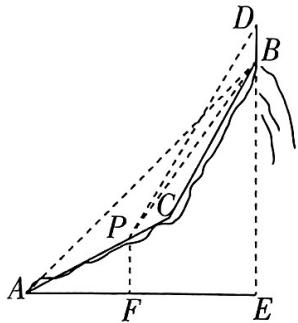

text_image

Geometric diagram with labeled points A, B, C, D, E, F and lines, likely from a math problem or proof.

图1

# 命题依据

本题以《海岛算经》为背景，巧妙设置“一题双空”，考查了解三角形及函数的最值问题，也紧密对照《中国高考评价体系》创新性、综合性的命题要求，是一道值得探究的好题。

解析 $\tan \alpha = \frac{1}{2}$ , 则 $\sin \alpha = \frac{1}{\sqrt{5}}, \cos \alpha = \frac{2}{\sqrt{5}}$ , 过 $C$ 作 $CG \perp AE$ 于点 $G, CH \perp BE$ 于点 $H$ , 在 $\triangle ACG$ 中, $CG = AC \sin \alpha = 100\sqrt{5} \times \frac{1}{\sqrt{5}} = 100(\mathrm{~m})$ , $AG = AC \cos \alpha = 100\sqrt{5} \times \frac{2}{\sqrt{5}} = 200(\mathrm{~m})$ . 设 $BE = h\mathrm{~m}$ , 则 $AE = h\mathrm{~m}$ , 在 Rt $\triangle BCH$ 中, $BH = (h - 100)\mathrm{~m}$ , $CH = (h - 200)\mathrm{~m}$ , 所以 $\frac{h - 100}{h - 200} = 2$ , 得 $h = 300$ .

过 $P$ 作 $PM \perp BE$ 于 $M$ , 由 $PF = x \mathrm{~m}$ , 得 $AF = 2x \mathrm{~m}, x \in [0,100]$ ,

所以 $\tan \angle BPM = \frac{BM}{PM} = \frac{300 - x}{300 - 2x},\tan \angle DPM = \frac{DM}{PM} = \frac{337.5 - x}{300 - 2x},$

所以 $\tan \theta = \tan (\angle DPM - \angle BPM) = \frac{\tan\angle DPM - \tan\angle BPM}{1 + \tan\angle DPM\tan\angle BPM} = \frac{37.5}{(300 - 2x) + \frac{(337.5 - x)(300 - x)}{300 - 2x}},$

【障碍速通】待求角 $\theta$ 未在一个特殊的三角形中, 故作辅助线构造直角三角形, 将 $\theta$ 表示为两个角的差, 借助两角差的正切公式列式, 结合基本不等式即可求解最值

$x \in [0, 100]$ . 令 $t = 300 - 2x$ , 则 $t \in [100, 300]$ , 所以 $x = \frac{300 - t}{2}$ , 则 $\tan \theta = \frac{37.5}{t + \frac{(187.5 + \frac{t}{2})(150 + \frac{t}{2})}{t}} = \frac{6}{\frac{t}{5} + \frac{4500}{t} + 27} \leqslant \frac{6}{2\sqrt{\frac{t}{5} \cdot \frac{4500}{t}} + 27} = \frac{2}{29}$ , 当且仅当 $\frac{t}{5} = \frac{4500}{t}$ , 即

$t = 150, x = 75$ 时, $\tan \theta$ 取得最大值 $\frac{2}{29}$ .

# 专业20问

问:生物医药数据科学专业是医学专业还是计算机学专业?答:该专业属于交叉学科,就业方向包括医药企业的临床试验数据分析、AI药物研发等.

# 预测全新情境题

# 考前37天

# 第 14 题 百年故宫：窗棂中的向量问题

热考指数 ★★★★★

原创 预测: 北京故宫堪称中国古代建筑的巅峰之作, 其规模宏大、布局严谨、装饰精美. 其中不少建筑的窗棂设计精妙, 不仅满足了实用功能, 更体现了极高的美学价值. 冰裂纹是故宫窗棂中的一种纹饰图案 (图 1), 它往往包含着三角形、四边形、五边形等图形. 图 2 为图 1 中冰裂纹的一部分抽象出的几何图形, 其中 $AB = AD$ , $CB = CD = 5$ , $AB \perp BC$ , $AD \perp DC$ , $\cos \angle BCD = -\frac{7}{25}$ , 且 $\overrightarrow{EF} = -\frac{2}{3}\overrightarrow{AB} + \frac{3}{4}\overrightarrow{AD}$ . 假设工作人员在日常维护过程中发现棂条 $AB$ 和 $EF$ 松动, 需进行替换, 则需替换的棂条总长度约为 \_\_\_\_. (结果保留一位小数, $\sqrt{2617} \approx 51.16$ )

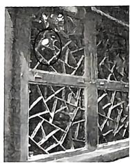

natural_image

Black-and-white photo of a wooden fence with exposed reeds and debris, no visible text or symbols

图1

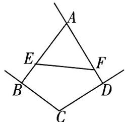

text_image

A
E
F
B
C
D

图2

解析 如图 3, 连接 BD.

【技法速通】求根条的总长度，也就是求 $AB + EF$ ，即三角形求边长问题。作辅助线，构造出顶角互补的2个等腰三角形，利用余弦定理及向量的平方运算求解即可

# 命题依据

本题以中国古代建筑中的瑰宝——北京故宫的窗棂设计为情境，巧妙融合了传统文化与现代数学应用。在试题设计上融合了平面向量、解三角形等核心考点，完美契合“情境载体多元化、学科交叉显性化”的新高考命题导向，具有较强的备考指导价值。

在 $\triangle BCD$ 中，由余弦定理可得 $BD = \sqrt{5^2 + 5^2 - 2 \times 5 \times 5 \times (-\frac{7}{25})} = 8.$

由题意知 $\angle ABC = \angle ADC = \frac{\pi}{2}$ , 则 $\angle BAD + \angle BCD = \pi$ , 所以 $\cos \angle BAD = \frac{7}{25}$ ,在 $\triangle BAD$ 中，由余弦定理得 $BD = \sqrt{AB^2 + AD^2 - 2 \times AB \times AD \times \frac{7}{25}} = 8$ 又 $AB = AD$ ，解得 $AB = AD = \frac{20}{3}$ 则 $AB\approx 6.7$

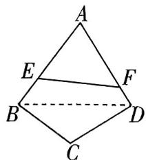

text_image

A
E
F
B
C
D

图3

$\overrightarrow{AB} \cdot \overrightarrow{AD} = \frac{20}{3} \times \frac{20}{3} \times \frac{7}{25} = \frac{112}{9}$ , 则由 $\overrightarrow{EF} = -\frac{2}{3}\overrightarrow{AB} + \frac{3}{4}\overrightarrow{AD}$ 可得 $\overrightarrow{EF^2} = (-\frac{2}{3}\overrightarrow{AB} + \frac{3}{4}\overrightarrow{AD})^2 = \frac{4}{9} \times \frac{400}{9} - 2 \times \frac{2}{3} \times \frac{3}{4} \times \frac{112}{9} + \frac{9}{16} \times \frac{400}{9} = \frac{2617}{81}$ , 所以 $EF = \frac{\sqrt{2617}}{9} \approx 5.7$ . 所以总长度约为 $6.7 + 5.7 = 12.4$ .

问:新能源科学与工程专业毕业后只能去光伏/风电企业吗?答:除风光电外,该专业就业涵盖新能源汽车、储能系统、碳交易等领域,2024年岗位新增“氢能工程师”“能源互联网架构师”岗位.

# 第15题 珠海航展：飞出“马赫环”的概率求解问题

热考指数

原创 预测 第十五届中国国际航空航天博览会于2024年11月12日～17日在广东珠海举办,此次航展上,作为我国新一代中型隐身多用途战斗机的歼-35A首次公开亮相,并在进行飞行表演时飞出了“马赫环”,如图1.假设歼-35A在某次飞行过程中,飞行速度v(单位:马赫)服从正态分布 $N(1.1,0.1^{2})$ ,且飞出“马赫环”的概率与飞行速度v满足以下关系:当 $v\geqslant$ 1.2时,概率为0.9;当 $1.0\leqslant v<1.2$ 时,概率为0.5;当v<1.0时,概率为0.1.若歼-35A在一次飞行过程中飞出了“马赫环”,则它飞行速度不低于1.2马赫的概率约为(若 $X\sim N(\mu,\sigma^{2})$ ,则 $P(\mu-\sigma\leqslant X\leqslant\mu+\sigma)\approx0.6827$ )()

natural_image

Silhouette of a bird in flight against a textured background (no text or symbols)

图1

# 命题依据

本题精准对标《中国高考评价体系》中“应用性”的考查要求，将正态分布与条件概率嵌入战斗机歼-35A的飞行过程，体现了概率论在飞行器性能评估中的实际应用价值，渗透了科技强国理念，符合高考创新命题导向.

A. 0.2856

B. 0.1428

C. 0.158 7

D. 0.5

解析 由题意知 $P(v \geqslant 1.2) = P(v \geqslant 1.1 + 0.1) \approx \frac{1 - 0.6827}{2} = 0.15865$

$$
P (1. 0 \leqslant v <   1. 2) = P (1. 1 - 0. 1 \leqslant v <   1. 1 + 0. 1) \approx 0. 6 8 2 7,
$$

$$
P (v <   1. 0) = P (v <   1. 1 - 0. 1) \approx \frac {1 - 0 . 6 8 2 7}{2} = 0. 1 5 8 6 5.
$$

设歼-35A飞出“马赫环”为事件 $A$ ，飞行速度不低于1.2马赫为事件 $B$

则 $P(A) = 0.15865 \times 0.9 + 0.6827 \times 0.5 + 0.15865 \times 0.1 = 0.5$

【技法速通】题目要求 $P(B \mid A)$ , 则需先利用全概率公式求出 $P(A)$ , 再利用概率的乘法公式求出 $P(AB)$ . 此处需注意辨别 $P(B \mid A)$ 与 $P(A \mid B)$ , 不要弄混

$$
P (A B) = P (B) P (A \mid B) = 0. 1 5 8 6 5 \times 0. 9 = 0. 1 4 2 7 8 5,
$$

所以 $P(B|A) = \frac{P(AB)}{P(A)} = \frac{0.142785}{0.5} = 0.28557\approx 0.2856.$ 故选A.

# 专业20问

问:游戏行业寒冬背景下,数字媒体艺术专业还值得选吗?答:游戏行业转向精品化与全球化,该专业可拓展至虚拟现实教育、元宇宙空间设计等.

# 考前35天

# 第 16 题 巴黎奥运会：射击比赛中的折线图问题

热考指数 ★★★★★

原创 预测 (多选)北京时间 2024 年 7 月 27 日,中国双人组合在巴黎奥运会中夺得射击混合团体 10 米气步枪冠军,这是 2024 巴黎奥运会产生的首枚金牌,也是中国代表团在本届奥运会获得的首枚金牌.两人在决赛中的 14 次射击环数如图 1 所示,则 ( )

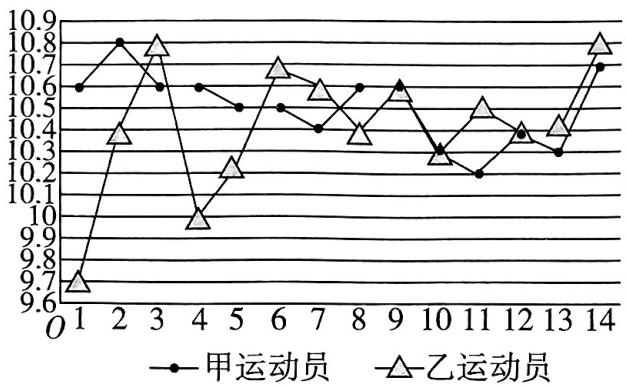

line

| Time Point | 甲运动员 | 乙运动员 |
| ---------- | -------- | -------- |
| 0          | 10.6     | 9.7      |
| 1          | 10.8     | 10.4     |
| 2          | 10.6     | 10.8     |
| 3          | 10.6     | 10.8     |
| 4          | 10.6     | 10.0     |
| 5          | 10.5     | 10.2     |
| 6          | 10.5     | 10.7     |
| 7          | 10.4     | 10.6     |
| 8          | 10.6     | 10.4     |
| 9          | 10.6     | 10.3     |
| 10         | 10.2     | 10.3     |
| 11         | 10.2     | 10.5     |
| 12         | 10.4     | 10.4     |
| 13         | 10.3     | 10.4     |
| 14         | 10.7     | 10.8     |

图1

A. 乙运动员的平均射击环数约为 10.4  
B. 甲运动员射击环数的第75百分位数为10.6  
C. 乙运动员射击环数的方差小于甲运动员射击环数的方差  
D. 甲运动员射击环数的极差小于乙运动员射击环数的极差

解析 对于 A, 乙运动员的平均射击环数为 $\frac{1}{14} \times (9.7 + 10.4 + 10.8 + 10 + 10.2 + 10.7 + 10.6 + 10.4 + 10.6 + 10.3 + 10.5 + 10.4 + 10.4 + 10.8) \approx 10.4$ , 故 A 正确.

对于 B, 将甲运动员的射击环数从小到大排列为 10.2, 10.3, 10.3, 10.4, 10.4, 10.5, 10.5, 10.6, 10.6, 10.6, 10.6, 10.7, 10.8, $14 \times 0.75 = 10.5$ , 则甲运动员射击环数的第 75 百分位数是从小到大排列的第 11 个数, 即 10.6, 故 B 正确.

【技法速通】计算一组 $n$ 个数据的第 $p$ 百分位数的步骤为: ①按从小到大排列原始数据; ②计算 $i = n \times p\%$ ; ③若 $i$ 不是整数, 而大于 $i$ 的比邻整数为 $j$ , 则第 $p$ 百分位数为第 $j$ 项数据, 若 $i$ 是整数, 则第 $p$ 百分位数为第 $i$ 项与第 $(i + 1)$ 项数据的平均数

对于 C, 乙运动员的射击环数更分散, 故方差更大, 故 C 错误.

对于 D, 甲运动员的射击环数极差为 10.8 - 10.2 = 0.6, 乙运动员的射击环数极差为 10.8 - 9.7 = 1.1, 故 D 正确. 故选 ABD.

问: DeepSeek 火爆, 学新闻学会被 AI 取代吗? 答: AI 可完成资讯速报, 但特稿写作等仍需人文视角, 当下, 学新闻学很需要“人机协同”能力.

# 考前

# 34天

# 第17题 非遗文化：电影票房中的回归分析问题

热考指数

原创 预测: 某数学兴趣小组根据电影《哪吒 2》上映 20 天内, 上映天数 $x$ 与累计票房 $y$ (单位: 亿元) 的散点图 (图 1), 选择应用模型 $y = b \sqrt{x} + a$ 来拟合 $y$ 与 $x$ 的关系.

(1) 求 $y$ 关于 $x$ 的回归方程, 并依据此方程预测电影上映 25 天后的累计票房. (结果保留一位小数)
(2) 某数据统计机构分析发现电影《哪吒 2》的观众中, 年龄在 20\~29 岁的占比 28%, 在 30\~39 岁的占比 41%, 40 岁以上的占比 21%. 某记者从电影院观看《哪吒 2》的人群中随机抽取 3 位观众采访, 求抽到年龄在 20 岁以下的观众人数 $X$ 的分布列与期望.

附: 在 $\hat{y} = \hat{b}x + \hat{a}$ 中, $\hat{b} = \frac{\sum_{i=1}^{n} x_i y_i - n\overline{x}\overline{y}}{\sum_{i=1}^{n} x_i^2 - n\overline{x}^2}$ , $\hat{a} = \overline{y} - \hat{b}\overline{x}$ .

参考数据： $\sqrt{x_i} = t_i,\bar{t}\approx 3.08,\overline{y}\approx 66.5,\sum_{i = 1}^{20}t_i^2\approx 210,$ $\sum_{i = 1}^{20}x_i^2\approx 2870,\sum_{i = 1}^{20}t_iy_i\approx 4816.35,\sum_{i = 1}^{20}x_iy_i\approx 18114.22.$

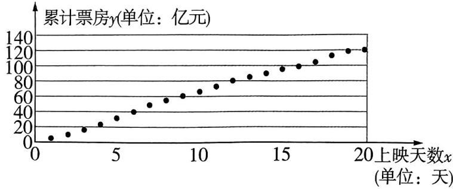

scatter

累计票房y(单位: 亿元)
| 上映天数x (天) | 累计票房y (亿元) |
| :--- | :--- |
| 0 | 5 |
| 1 | 10 |
| 2 | 15 |
| 3 | 20 |
| 4 | 25 |
| 5 | 30 |
| 6 | 35 |
| 7 | 40 |
| 8 | 45 |
| 9 | 50 |
| 10 | 55 |
| 11 | 60 |
| 12 | 65 |
| 13 | 70 |
| 14 | 75 |
| 15 | 80 |
| 16 | 85 |
| 17 | 90 |
| 18 | 95 |
| 19 | 100 |
| 20 | 105 |

图1

# 命题依据

本题以大热电影《哪吒2》为背景，考查考生应用回归分析解决实际问题的能力，以及概率分布模型的构建与计算，通过挖掘隐含条件、多步骤推理，强化数据整合意识与数学模型迁移能力，体现统计学在社会经济领域的应用价值，助力核心素养中“数学建模”“数据分析”素养的培养.

解析

(1) 由题意知 $\hat{b} = \frac{\sum_{i=1}^{20} t_i y_i - n t y}{\sum_{i=1}^{20} t_i^2 - n \bar{t}^2} \approx \frac{4816.35 - 20 \times 3.08 \times 66.5}{210 - 20 \times 3.08^2} = \frac{719.95}{20.272} \approx 35.5, \hat{a} =$

$\overline{y} - \hat{b}\overline{t} \approx -42.8$ ，所以 $\hat{y} = 35.5\sqrt{x} - 42.8.$ (4分)

当 $x = 25$ 时, $\hat{y} = 35.5 \times 5 - 42.8 = 134.7$ , 故预测电影上映 25 天后的累计票房为 134.7 亿元 (6 分) (2) 由题意知年龄在 20 岁以下的观众占比 $10\%$ , 则 $X \sim B(3,0.1)$ , (7 分)

所以 $P(X = 0) = \mathrm{C}_3^0 (0.1)^0 (0.9)^3 = 0.729, P(X = 1) = \mathrm{C}_3^1 (0.1)^1 (0.9)^2 = 0.243,$

$P(X = 2) = \mathrm{C}_3^2 (0.1)^2 (0.9)^1 = 0.027, P(X = 0) = \mathrm{C}_3^3 (0.1)^3 (0.9)^0 = 0.001.$ (10分)

则 $X$ 的分布列为

<table><tr><td>X</td><td>0</td><td>1</td><td>2</td><td>3</td></tr><tr><td>P</td><td>0.729</td><td>0.243</td><td>0.027</td><td>0.001</td></tr></table>

所以 $E(X) = 0 + 0.243 + 2 \times 0.027 + 3 \times 0.001 = 0.3.$ (13分)

# 考前

# 33天

# 第18题 拉索：抛物线光学性质的实际应用问题

热考指数

原创预测: 我国高海拔宇宙线观测站“拉索”中的广角切伦科夫望远镜阵列主要用来捕捉切伦科夫光. 望远镜的反射镜往往设计成抛物面, 这利用了抛物线的光学性质: 平行于抛物线对称轴的光线经抛物线反射后汇聚于其焦点处. 假设某望远镜(图1)的反射镜为抛物面, 其中心截面示意图如图2所示, AB为该望远镜反射面的口径, OP为径深, 点M为探测器(光线聚集于此处), AM, BM为支撑探测器

# 命题依据

本题以我国重大科技基础设施“拉索”为背景，将望远镜中的光学器件抽象为抛物线，综合考查抛物线的定义与三角函数求值问题，强调数学建模，符合高考“体现学科价值，服务国家战略”的命题导向。

的支架, 已知 $|OP| = \frac{3}{2} \mathrm{~m}, \frac{|OM|}{|AB|} = \frac{1}{2}$ , 则探测器 $M$ 到抛物面反射镜底部 $O$ 的距离为 \_\_\_\_ m; 支架的夹角 $\angle AMB$ 的余弦值为 \_\_\_\_.

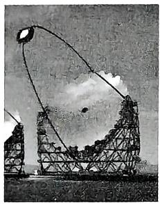

natural_image

Illustration of a large radio telescope with multiple dish antennas and a central beam, no visible text or symbols

图1

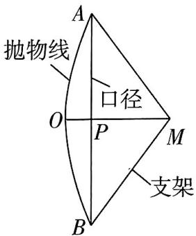

text_image

抛物线
口径
O
P
M
支架
B
A

图2

解析 以 O 为坐标原点, OM 所在直线为 x 轴, 过 O 且与 OM 垂直的直线为 y 轴, 建立如图 3 所示的平面直角坐标系, 则 $O(0,0)$ , $P(\frac{3}{2},0)$ , 设点 A, B 所在的抛物线方程为 $y^{2}=2px (p>0)$ .

由题意知点 M 为抛物线的焦点，

【障碍速通】题眼“光线聚集于此处” 由此可知点 $M$ 即抛物线焦点，从而可将 $|OM|$ ， $|AB|$ 表示为关于参数 $p$ 的式子，根据点在抛物线上建立方程即可求解

则 $|OM|=\frac{p}{2}$ ，所以 $|AB|=p$ ，则 $A\left(\frac{3}{2},\frac{p}{2}\right)$ ，将点A的坐标代入 $y^{2}=2px$ 可得 p=12，所以 $|OM|=\frac{p}{2}=6$ .

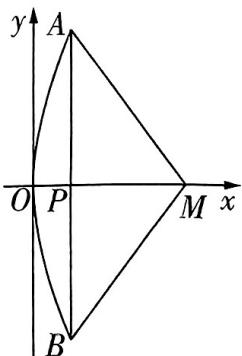

text_image

y
A
O P M x
B

图3

由抛物线的对称性可得 $\angle AMB = 2\angle AMP$ ，在 Rt△APM 中， $|AP| = 6, |PM| = 6 - \frac{3}{2} = \frac{9}{2}$ ，则 $|AM| = \frac{15}{2}$ ，所以 $\cos \angle AMP = \frac{|PM|}{|AM|} = \frac{3}{5}$ ，则 $\cos \angle AMB = \cos 2\angle AMP = 2 \times (\frac{3}{5})^2 - 1 = -\frac{7}{25}$ .

问:量子信息科学专业需要多高的数学天赋?数学一般能学吗?答:理论研究需高等数学、线性代数拔尖,但工程方向(如量子通信设备维护)侧重实操,数学一般但动手能力强的学生也可胜任.

# 考前

# 32天

# 第 19 题 人工智能：数列思想在概率中的应用问题

热考指数

原创 预测 DeepSeek 是基于深度学习的智能搜索与分析系统, 主要是通过迭代优化目标函数来寻求最优解. 假设在 DeepSeek 的一次训练过程中需要进行 n 次独立迭代, 每次迭代的结果可以看作是一个随机变量 X, 若迭代成功, 则 X = 1, 若迭代失败, 则 X = 0, 每次迭代成功的概率为 $p(0 < p < 1)$ .

# 命题依据

DeepSeek 相关概念为年度最热门命题情境，基于此，本题以 “DeepSeek” 中的迭代运算为情境，综合考查随机变量及递推数列，形式新颖，独具匠心.

(1) 若 $n = 6, p = 0.6$ , 求一次训练过程中迭代成功的次数 $Y$ 的期望.  
(2) 假设在 DeepSeek 的某次训练中, 首次连续出现 $k$ 次迭代成功时, 迭代结束, 迭代次数 $Z$ 的期望为 $E_{k}$ .  
(i) 若 $p = 0.8$ ，求 $E_{1}$ .  
(ii) 求 $E_{k}$ . (附: 当 $0 < q < 1$ 时, $\sum_{n=1}^{\infty} q^{n} = \frac{q}{1 - q}, q^{\infty} = 0$ )

解析 (1) 设第 $i$ 次迭代成功的次数为 $X_{i}$ , 则 $X_{i}$ 的所有可能取值为 0, 1,

$$
P (X _ {i} = 0) = 1 - 0. 6 = 0. 4, P (X _ {i} = 1) = 0. 6 \text {, 所以} E (X _ {i}) = 0. 6.
$$

由题意知 $Y = X_{1} + X_{2} + \cdots + X_{6}$ ,

$$
\text {所以} E (Y) = E (X _ {1}) + E (X _ {2}) + \dots + E (X _ {6}) = 6 \times 0. 6 = 3. 6, \tag {2分}
$$

【结论速通】进行 $n$ 次独立迭代即进行 $n$ 次独立重复试验，故 $Y \sim B(n, p)$ ，从而可利用公式 $E(Y) = np$ 直接求解

即所求期望为3.6. (3分)

(2)(i) 当 k=1 时, $P(Z=m)=(1-p)^{m-1}p, m \in \mathbf{N}^{*}$ , (4 分)

所以 $E_{1}=p+2(1-p)p+3(1-p)^{2}p+4(1-p)^{3}p+\cdots,$ (5 分)

则 $(1-p)E_{1}=(1-p)p+2(1-p)^{2}p+3(1-p)^{3}p+4(1-p)^{4}p+\cdots,$

【障碍速通】根据题意列出待求期望的表达式，表达式的结构可看作“等差（np）×等比（1-$p)^{n-1}$ 的形式，故联想错位相减法，由此法化简求值。化简时由于表达式含无穷项，故不要盲目利用等比数列的前 n 项和公式求解，注意应用题干附加条件

两式相减得 $pE_{1}=p+p(1-p)+p(1-p)^{2}+p(1-p)^{3}+\cdots$

所以 $E_{1}=1+(1-p)+(1-p)^{2}+(1-p)^{3}+\cdots,$ (7 分)

所以 $E_{1} = 1 + \sum_{j = 1}^{\infty}(1 - p)^{j} = 1 + \frac{1 - p}{1 - (1 - p)} = \frac{1}{p} = 1.25.$ (8分）

(ii)首次出现连续 $k$ 次迭代成功可以分为以下两种情况.

第一种:首次出现连续 $(k-1)$ 次迭代成功,迭代次数的期望为 $E_{k-1}$ ,再进行一次迭代,迭代成功.

第二种:首次出现连续 $(k-1)$ 次迭代成功,迭代次数的期望为 $E_{k-1}$ ,再进行一次迭代,迭代失败,则相当于需要再次进行迭代试验,直到首次出现连续k次迭代成功.

所以 $E_{k} = p(E_{k - 1} + 1) + (1 - p)(E_{k - 1} + 1 + E_{k})$ ，即 $E_{k} = \frac{1}{p} E_{k - 1} + \frac{1}{p}$ （10分）

【技法速通】对于形如 $a_{n} = A a_{n - 1} + B (A, B$ 为参数， $n \in \mathbb{N}^{*}$ ）的式子，往往利用待定系数法，构造等比数列求解

所以 $E_{k} + \frac{1}{1 - p} = \frac{1}{p}\big(E_{k - 1} + \frac{1}{1 - p}\big),$ (12分)

由(i)知 $E_{1} = \frac{1}{p}$ , 则 $E_{1} + \frac{1}{1 - p} = \frac{1}{p} + \frac{1}{1 - p} = \frac{1}{p(1 - p)} \neq 0$ ,

所以 $\{E_k + \frac{1}{1 - p}\}$ 是以 $\frac{1}{p(1 - p)}$ 为首项， $\frac{1}{p}$ 为公比的等比数列，

所以 $E_{k} + \frac{1}{1 - p} = \frac{1}{p(1 - p)}\cdot (\frac{1}{p})^{k - 1} = \frac{1}{p^{k}(1 - p)},$ (14分)

所以 $E_{k} = \frac{1}{p^{k}(1 - p)} -\frac{1}{1 - p} = \frac{1 - p^{k}}{(1 - p)p^{k}}.$ (15分）

# 第 20 题 大国重器：国家重大科技项目为载体的创新问题

热考指数

原创 预测1: 2024年6月,嫦娥六号完成了月背采样的壮举.将嫦娥六号带回的表取月壤样品分装到10个玻璃器皿中,设这10份样品的编号分别为01,02,…,10,从这10份样品中选取5份分配给甲、乙、丙、丁4个实验室进行协同研究,每个实验室至少有1份,若抽取的5份样品中有且仅有2份样品的编号数字相邻,这2份样品分配给同一个实验室,则不同的分配方案种数为 ( )

A. 2064

B. 1 440

C. 864

D. 192

解析 第一步:从 10 份样品中选取 5 份,且仅有 2 份样品的编号数字相邻.

①当相邻编号为01,02或09,10时,需从剩下的除编号为03或08的7份样品中任选3份编号不相邻的样品,共 $2\left[\mathrm{C}_{7}^{3}-\left(\mathrm{C}_{2}^{1}\mathrm{C}_{4}^{1}+\mathrm{C}_{4}^{1}\mathrm{C}_{3}^{1}\right)-\mathrm{C}_{5}^{1}\right]=20$ (种)方案.  
【障碍速通】正难则反,从 7 个连续的数字中随机选取 3 个,且 3 个数字不相邻,直接分析较困难可利用间接法,用总的方案种数减去相邻的方案种数即可,此处需注意相邻的情况分为两种,一种是有2个数字相邻,一种是 3 个数字相邻,不要遗漏任意一种情况  
②当相邻编号为02,03或08,09时,需从除编号为01,04或07,10的6份样品中任选3份编号不相邻的样品,共 $2\left[\mathrm{C}_{6}^{3}-\left(\mathrm{C}_{2}^{1}\mathrm{C}_{3}^{1}+\mathrm{C}_{3}^{1}\mathrm{C}_{2}^{1}\right)-\mathrm{C}_{4}^{1}\right]=8$ (种)方案.   
③当相邻编号为03,04或07,08时，共 $2(C_{5}^{2}-C_{4}^{1}+1)=14$ （种）方案.  
④当相邻编号为04,05或06,07时，共 $2\left[2\times\left(\mathrm{C}_{4}^{2}-\mathrm{C}_{3}^{1}\right)\right]=12$ （种）方案.  
⑤当相邻编号为05,06时,共 $2\times C_{3}^{1}=6$ (种)方案.

所以共有 $20 + 8 + 14 + 12 + 6 = 60$ (种) 方案.

第二步: 将所选取的 5 份样品分配给 4 个实验室, 每个实验室至少有 1 份.

有 1 个实验室能得到 2 份编号相邻的样品, 其余实验室各得 1 份, 则共有 $C_{4}^{1}A_{3}^{3}=24$ (种) 方案.

所以总的分配方案种数为 $60 \times 24 = 1440$ . 故选 B.

专业20问

问:信息类大类招生可能分流到土木工程专业是真的吗?答:部分高校将土木工程纳入“智能建造”大类,分流时需按绩点竞争,报考前需查阅《本科培养方案》或咨询招生办确认调剂规则.

原创 预测2 2024年11月17日,我国自主设计建造的大洋科考钻探船“梦想”号在广州正式入列,标志着我国深海探测关键技术装备取得重大突破.假设在“梦想”号的某次试钻中钻探深度需达11 000米,钻探进度如下:第1天钻探深度为600米,受海底地质条件的影响,之后每天的钻探深度较前一天都有所减少,且每5天的日钻探深度的减少量增加4米.具体为:第1\~5天每天钻探深度比前一天减少5米,第6\~10天每天钻探深度比前一天减少9米,…,依次类推,则要完成钻探任务至少需要的天数为\_\_\_\_.

# 命题依据

以国家重大科技项目为载体，渗透科技自信，是情境化命题的一个重要考点，本题以“梦想”号大洋钻探船试钻任务为背景，融合“分段等差数列”的核心知识，通过进度规划的复杂情境，考查分层建模、递推运算与实际问题抽象能力.

解析 设每天的钻探深度构成数列 $\{a_{n}\}, \{a_{n}\}$ 的前 $n$ 和项为 $S_{n}$ , 第 $5k - 4 \sim 5k$ 天为第 $k$ 个阶段, 第 $k$ 个阶段的钻探深度和为 $T_{k}$ ,

则 $a_1 = 600$ ，第 $k$ 个阶段每天钻探深度比前一天减少的量为 $b_{k} = 5 + 4(k - 1) = 4k + 1.$

由题意知 $a_{5k - 4}, a_{5k - 3}, a_{5k - 2}, a_{5k - 1}, a_{5k}$ 是公差为 $-(4k + 1)$ 的等差数列，

所以 $T_{k} = a_{5k - 4} + a_{5k - 3} + a_{5k - 2} + a_{5k - 1} + a_{5k} = 5a_{5k - 2}$

【障碍速通】实际上,本题是一个 “分段等差数列” 求和的问题,故只需找到每段等差数列的中项,分析“相邻中项”的递推关系即可

当 $k \geqslant 2$ 时， $a_{5k-2} = a_{5(k-1)-2} - \{2[4(k-1)+1] + 3(4k+1)\} = a_{5k-7} - (20k-3)$ ，

当 $k = 1$ 时， $a_{5k - 2} = a_3 = 600 - 2 \times 5 = 590, S_5 = T_1 = 5 \times 590 = 2950$ ;

当 $k = 2$ 时， $a_{5k - 2} = a_8 = 590 - (40 - 3) = 553, T_2 = 5 \times 553 = 2765, S_{10} = S_5 + T_2 = 5715$ ;

同理可得, 当 k=3 时, $a_{13}=496$ , $S_{15}=S_{10}+5a_{13}=8195$ ;

当 $k = 4$ 时， $a_{18} = 419, S_{20} = S_{15} + 5a_{18} = 10290$ ;

当 $k = 5$ 时， $a_{23} = 322, S_{25} = S_{20} + 5a_{23} > 11000.$

因为 $a_{21} = a_{23} + 2 \times 21 = 364, a_{22} = a_{23} + 21 = 343,$

所以 $S_{22} = S_{20} + a_{21} + a_{22} = 10997 < 11000, S_{23} = S_{22} + a_{23} > 11000.$

所以要完成任务,至少需要钻探23天.

【妙解】若联想不到上述数列各项之间的关系,可以直接列表格 5 个一组,将数列 $\left| {a}_{n}\right|$ 的项一一列出,然后分组求和,直到所得的总和开始超过 11000 即可

问:转专业难度大吗?答:虽然有转专业的机会,但各个院校、各专业的转专业要求、名额都不尽相同.转专业要付出大量的时间、精力,不如在填报志愿时多做功课.

# 考前

# 30天

# 第21题 函数单调性、奇偶性的应用问题

# 预测角度1

# 利用函数奇偶性巧解参数取值范围问题

热考指数

原创 预测1: 已知函数 $f(x)$ 的定义域为 $\mathbf{R}, f'(x)$ 为函数 $f(x)$ 的导函数, 且 $f(-x) - f(x) = 0, y = f'(x) + e^x$ 为偶函数, 若 $f(2a) < f(3a - 1)$ , 则实数 $a$ 的取值范围是 ( )

A. $(\frac{3}{2}, +\infty)$

B. $(-\infty, \frac{3}{2})$

C. $(\frac{1}{5}, \frac{1}{3})$

D. $(\frac{1}{5}, 1)$

解析 因为 $f(-x) - f(x) = 0$ ，所以函数 $f(x)$ 为偶函数，

即 $f(-x) = f(x)$ ，则 $-f'(-x) = f'(x)$ ，即函数 $f'(x)$ 为奇函数.

【结论速记】若函数 $f(x)$ 为奇函数，则其导函数 $f'(x)$ 为偶函数，但若 $f'(x)$ 为偶函数，则 $f(x)$ 不一定是奇函数；若函数 $f(x)$ 为偶函数，则其导函数 $f'(x)$ 为奇函数，若 $f'(x)$ 为奇函数，则 $f(x)$ 为偶函数

因为 $y = f'(x) + \mathrm{e}^x$ 为偶函数，所以 $f'(-x) + \mathrm{e}^{-x} = f'(x) + \mathrm{e}^x$ ，

所以 $f'(x)=\frac{e^{-x}-e^{x}}{2}$ ，易知函数 $f'(x)$ 在R上单调递减， $f'(0)=0$ ，

所以当 $x \in (0, +\infty)$ 时， $f'(x) < 0$ ，函数 $f(x)$ 在 $(0, +\infty)$ 上单调递减，当 $x \in (-\infty, 0)$ 时， $f'(x) > 0$ ，函数 $f(x)$ 在 $(- \infty, 0)$ 上单调递增，

又函数 $f(x)$ 为偶函数,所以 $f(2a)<f(3a-1)$ 等价于 $|2a|>|3a-1|$ ,解得 $\frac{1}{5}<a<1$ .故选D.

# 预测角度2

# 利用函数单调性巧解函数不等式

热考指数

# 原创 预测2

已知函数 $f(x) =$

$\left\{ \begin{array}{l} \mathrm{e}^{x} + 1, x \geqslant 0, \\ x^{3} + 2x + 2, x < 0, \end{array} \right.$ 则不等式 $f(x + 1) > \mathrm{e} - f(x - 1)$

的解集为

解析 当 $x \geqslant 0$ 时, 函数 $f(x) = \mathrm{e}^{x} + 1$ , 函数 $f(x)$ 在 $[0, +\infty)$ 上单调递增; 当 $x < 0$ 时, 函数$f(x) = x^3 + 2x + 2, f'(x) = 3x^2 + 2 > 0$ ，所以函数 $f(x)$ 在 $(- \infty, 0)$ 上单调递增.

又 $e^{0} + 1 = 0^{3} + 2 \times 0 + 2$ ，所以函数 $f(x)$ 在 R 上单调递增.

# 命题依据

利用函数单调性解不等式是高考经典题型，2023、2024 新课标 I 卷连续两年均有考查，本题依托分段函数设置，难度适中，符合高考对于此类问题的命题逻辑.

所以函数 $y = f(x + 1)$ 和 $y = f(x - 1)$ 在 $\mathbf{R}$ 上单调递增，

令 $g(x) = f(x + 1) + f(x - 1)$ ，则 $g(x)$ 在 $\mathbf{R}$ 上单调递增.

又 $g(0) = f(1) + f(-1) = \mathrm{e}$ , 所以不等式 $f(x + 1) > \mathrm{e} - f(x - 1)$ 等价于 $f(x + 1) + f(x - 1) > \mathrm{e} = g(0)$ , 即 $g(x) > g(0)$ , 所以不等式 $f(x + 1) > \mathrm{e} - f(x - 1)$ 的解集为 $(0, +\infty)$ .

# 预测角度3 奇偶性与单调性的综合应用

热考指数 ★★★★★

原创 预测3 (多选)已知函数 $f(x)$ 的定义域为 $D = \{x \mid x \neq 0\}$ , $\forall x, y \in D, f(xy) + 1 = f(x) + f(y)$ , 且当 $x - 1 > 0$ 时, $f(x) - 1 > 0$ , 则 ( )

A. $f(-1) = -f(1)$   
B. $f(x)$ 为偶函数

C. $f(\frac{1}{3}) + f(\frac{2}{3}) + f(1) + f(\frac{3}{2}) + f(3) = 5$

D. 不等式 $f(3) + f(x) > f(x - 1) + 1$ 的解集为

$$
(- \infty , - \frac {1}{2}) \cup (\frac {1}{4}, + \infty)
$$

# 命题依据

抽象函数没有具体的解析式，让部分考生感到头疼，但因其能较好考查考生的思维能力，所以备受高考命题人的青睐，预测2025高考命题极有可能在多选题中融合多知识点考查抽象函数的奇偶性、单调性.

解析 对于 A, 令 x = y = 1, 有 $f(1) + 1 = f(1) + f(1)$ , 所以 $f(1) = 1$ , 令 x = y = -1, 有 $f(1) + 1 = f(-1) + f(-1)$ , 所以 $f(1) = f(-1) = 1$ , 故 A 错误.

对于 B, 令 y = -1, 则 $f(-x) + 1 = f(x) + f(-1)$ , 即 $f(-x) = f(x)$ , 所以函数 $f(x)$ 为偶函数, 故 B 正确.

对于 C, 令 $y = \frac{1}{x}$ , 则 $f(x \cdot \frac{1}{x}) + 1 = f(x) + f(\frac{1}{x})$ , 即 $f(x) + f(\frac{1}{x}) = 2$ , 则 $f(\frac{1}{3}) + f(\frac{2}{3}) + f(1) + f(\frac{3}{2}) + f(3) = 5$ , 故 C 正确.

对于 D, 不等式 $f(3) + f(x) > f(x - 1) + 1$ 等价于 $f(3) + f(x) - 1 > f(x - 1)$ ，即 $f(3x) > f(x - 1)$ 。 $\forall x_{1}, x_{2} \in (0, +\infty)$ ，且 $x_{1} < x_{2}, f(x_{1}) - f(x_{2}) = f(x_{1}) - f(\frac{x_{2}}{x_{1}} \cdot x_{1}) = f(x_{1}) - f(\frac{x_{2}}{x_{1}}) - f(x_{1}) + 1 = 1 - f(\frac{x_{2}}{x_{1}})$ ，又 $\frac{x_{2}}{x_{1}} > 1$ ，所以 $f(\frac{x_{2}}{x_{1}}) > 1$ ，所以 $1 - f(\frac{x_{2}}{x_{1}}) < 0$ ，所以 $f(x_{1}) < f(x_{2})$ ，所以函数

【障碍速通】判断函数的单调性除了导数法之外, 不要忘记还可以根据函数单调性定义确定数 $f(x)$ 在 $(0, +\infty)$ 上单调递增.

因为 $f(x)$ 为偶函数, 所以 $f(3x) > f(x - 1)$ 等价于 $|3x| > |x - 1|$ , 解得 $x < -\frac{1}{2}$ 或 $x > \frac{1}{4}$ , 故 D 正确. 故选 BCD.

# 考前29天

# 第22题 曲线凹凸性在函数最值中的应用问题

热考指数

原创 预测1 丹麦数学家琴生是19世纪对数学分析做出卓越贡献的巨人,特别是在曲线的凹凸性与不等式方面,他留下了很多宝贵的成果.设可导函数 $f(x)$ 在 $(a,b)$ 上的一阶导数为 $f'(x)$ ,二阶导数为 $f''(x)$ ,当 $f''(x)<0$ 时,称曲线 $y=f(x)$ 在 $(a,b)$ 上是凸的,且满足对于 $(a,b)$ 上的任意n个值 $x_{1},x_{2},\cdots,x_{n}$ , $f(x_{1})+f(x_{2})+\cdots+f(x_{n})\leqslant nf(\frac{x_{1}+x_{2}+\cdots+x_{n}}{n})$ .结合以上信息,在锐角△ABC中, $\sin A+\sin B+\sin(A+B)$ 的最大值为\_\_\_\_.

# 命题依据

新高考命题背景下，函数模块更加注重从教材中挖掘命题点，预测2025高考此势头依旧不减。本题根据人教A版《必修第一册》教材第101页的第8题挖掘出的曲线凹凸性命制，兼具创新情境和回归教材的双重背景，贴合考情，选拔效果明显。

解析 在锐角 $\triangle ABC$ 中, $A, B, C \in (0, \frac{\pi}{2})$ , 令 $f(x) = \sin x, x \in (0, \frac{\pi}{2})$ , 则 $f'(x) = \cos x$ , $x \in (0, \frac{\pi}{2})$ , $f''(x) = -\sin x, x \in (0, \frac{\pi}{2})$ , 所以 $f''(x) = -\sin x < 0$ , 曲线 $y = f(x)$ 在 $(0, \frac{\pi}{2})$ 上是凸的.

【障碍速通】创新情境问题的瓶颈在于对新情境的快速学习和应用, 要建立问题与情境的联系, 此处根据背景介绍中曲线 “凸” 的定义判断出正弦曲线在 $(0, \frac{\pi}{2})$ 上的凹凸性后, 利用已知结论可直接得最值

于是 $\sin A + \sin B + \sin (A + B) = \sin A + \sin B + \sin C \leqslant 3\sin \left(\frac{A + B + C}{3}\right) = 3\sin \frac{\pi}{3} = \frac{3\sqrt{3}}{2},$ 当且仅当 $A = B = C = \frac{\pi}{3}$ 时等号成立，所以 $\sin A + \sin B + \sin (A + B)$ 的最大值为 $\frac{3\sqrt{3}}{2}$ .

原创 预测2 曲线凹凸性的定义如下: 设函数 $f(x)$ 在 $[a, b]$ 上连续, 在 $(a, b)$ 内具有一阶导数和二阶导数, 那么若在 $(a, b)$ 内 $f''(x) > 0 (f''(x) \text{为 } f'(x))$ 的导数), 则曲线 $y = f(x)$ 在 $[a, b]$ 上是凹的; 若在 $(a, b)$ 内 $f''(x) < 0$ , 则曲线 $y = f(x)$ 在 $[a, b]$ 上是凸的.

(1) 若 $f(x) = \cos 2x$ ，判断曲线 $y = f(x)$ 在 $(0, \frac{\pi}{4})$ 上的凹凸性.  
(2)已知函数 $g(x) = ax^{2} - 2\ln x, x \in (0, +\infty)$ .

# 冲刺高分

挖掘题目隐含条件 研读题目,不仅要关注表面,更要深入挖掘隐含条件.如在几何问题中,图形的特殊性质、角度关系等可能是解题的关键.

(i) 若曲线 $y = g(x)$ 在 $(0, +\infty)$ 上是凹的，求实数 a 的取值范围.  
(ii) 已知 $a = 1$ ，且 $\forall x_1, x_2, p_1, p_2 \in (0, +\infty)$ ，其中 $p_1 + p_2 = 1$ ，都有 $g(p_1x_1 + p_2x_2) \leqslant p_1g(x_1) + p_2g(x_2)$ . 若 $x_1, x_2, x_3 \in (0, +\infty)$ 且 $x_1 + x_2 + x_3 = 3e^3$ ，求 $g(x_1) + g(x_2) + g(x_3)$ 的最小值.

解析 (1) $f(x)=\cos2x$ ，则 $f'(x)=-2\sin2x,f''(x)=-4\cos2x.$ (2分)

【避易错】有两个易错点：一是混淆正、余弦函数求导公式，缺少负号；二是忘记对内层函数求导，缺少系数“2”

因为 $x \in (0, \frac{\pi}{4})$ ，所以 $2x \in (0, \frac{\pi}{2})$ ，所以 $\cos 2x \in (0,1)$ ， $f''(x) \in (-4,0)$ ，所以 $f''(x) < 0$

根据曲线凹凸性的定义知,曲线 $y=f(x)$ 在 $(0,\frac{\pi}{4})$ 上是凸的. (4 分)

(2) (i) $g(x) = ax^2 - 2\ln x$ ，则 $g'(x) = 2ax - \frac{2}{x}, g''(x) = 2a + \frac{2}{x^2}$ . (6分)

由题可知, $g''(x)>0$ 在 $(0,+\infty)$ 上恒成立,所以 $2a>-\frac{2}{x^{2}}$ 在 $(0,+\infty)$ 上恒成立,

所以 $a \geqslant 0$ ，即实数 $a$ 的取值范围是 $[0, +\infty)$ 。（8分）

【避易错】这里实数 $a$ 是可以取到 0 的。这类特殊的端点值不能忽视

(ii) 若 $a = 1$ ，则 $g(x) = x^2 - 2\ln x$ .

任意取 $x_{1}, x_{2}, x_{3}, \lambda_{1}, \lambda_{2}, \lambda_{3} \in (0, +\infty)$ ，且 $\lambda_{1} + \lambda_{2} + \lambda_{3} = 1$

则 $g(\lambda_1x_1 + \lambda_2x_2 + \lambda_3x_3) = g((\lambda_1 + \lambda_2)(\frac{\lambda_1}{\lambda_1 + \lambda_2} x_1 + \frac{\lambda_2}{\lambda_1 + \lambda_2} x_2) + \lambda_3x_3)$ (9分）

【障碍速通】根据 “两元” 情况下的结论 $g(p_{1}x_{1}+p_{2}x_{2}) \leqslant p_{1}g(x_{1})+p_{2}g(x_{2})$ 类比推理 “三元” 情况下的问题, 通过合理变形, 搭建已知和所求之间的桥梁, 得到新结论

$$
\leqslant (\lambda_ {1} + \lambda_ {2}) g (\frac {\lambda_ {1}}{\lambda_ {1} + \lambda_ {2}} x _ {1} + \frac {\lambda_ {2}}{\lambda_ {1} + \lambda_ {2}} x _ {2}) + \lambda_ {3} g (x _ {3}) \tag {10分}
$$

$$
\leqslant \left(\lambda_ {1} + \lambda_ {2}\right) \left[ \frac {\lambda_ {1}}{\lambda_ {1} + \lambda_ {2}} g (x _ {1}) + \frac {\lambda_ {2}}{\lambda_ {1} + \lambda_ {2}} g (x _ {2}) \right] + \lambda_ {3} g (x _ {3})
$$

$$
\leqslant \lambda_ {1} g (x _ {1}) + \lambda_ {2} g (x _ {2}) + \lambda_ {3} g (x _ {3}), \tag {11分}
$$

令 $\lambda_{1} = \lambda_{2} = \lambda_{3} = \frac{1}{3}$ , 可得 $g\left(\frac{x_{1} + x_{2} + x_{3}}{3}\right) \leqslant \frac{g(x_{1}) + g(x_{2}) + g(x_{3})}{3}$ . (13分)

因为 $x_{1} + x_{2} + x_{3} = 3\mathrm{e}^{3}$ ，所以 $g(x_{1}) + g(x_{2}) + g(x_{3})\geqslant 3g(\frac{x_1 + x_2 + x_3}{3}) = 3g(\mathrm{e}^3) = 3(\mathrm{e}^6 -6)$

即 $g(x_{1}) + g(x_{2}) + g(x_{3})$ 的最小值为 $3(\mathrm{e}^{6} - 6)$ . (15分)

# 考前28天

# 第23题 应用基本不等式求解最值问题

热考指数

原创 预测1 已知 $a > 1, b > 0$ ，且 $a^2 - 3a + 2b = 0$ ，则 $\frac{2}{a - 1} + \frac{a}{4b}$ 的最小值为 （）

A. $\frac{3}{2}$

B. $\frac{9}{4}$

C. $\frac{\sqrt{6}}{3}$

D. $\frac{\sqrt{3}}{4}$

# 命题依据

近年高考命题越来越突出基本不等式的“工具性”作用，预测2025高考不仅会考查基础应用（【原创预测1】），还可能交汇数列考查它的变形应用（【原创预测2】）.

解析 $a^2 - 3a + 2b = 0$ ，即 $2b = 3a - a^2$ ，即 $4b = 6a - 2a^2 > 0$ ，则 $a \in (1,3)$ .

【技法速通】根据 $a, b$ 的等量关系，用 $a$ 表示 $b$ ，注意挖掘隐含条件 “ $a \in (1,3)$

于是 $\frac{2}{a - 1} +\frac{a}{4b} = \frac{2}{a - 1} +\frac{a}{6a - 2a^2} = \frac{2}{a - 1} +\frac{1}{6 - 2a} = \frac{4}{2a - 2} +\frac{1}{6 - 2a},$

又 $2a-2+6-2a=4$ ，

【技法速通】寻找和为定值的结构，为应用基本不等式做铺垫

$$
\begin{array}{r l} & {\text {则} \frac {4}{2 a - 2} + \frac {1}{6 - 2 a} = \frac {1}{4} \big (\frac {4}{2 a - 2} + \frac {1}{6 - 2 a} \big) (2 a - 2 + 6 - 2 a) = \frac {1}{4} \big [ 5 + \frac {4 (6 - 2 a)}{2 a - 2} + \frac {2 a - 2}{6 - 2 a} \big ] \geqslant} \\ & {\frac {1}{4} \big [ 5 + 2 \sqrt {\frac {4 (6 - 2 a)}{2 a - 2} \cdot \frac {2 a - 2}{6 - 2 a}} \big ] = \frac {9}{4},} \end{array}
$$

当且仅当 $\frac{4(6 - 2a)}{2a - 2} = \frac{2a - 2}{6 - 2a}$ 即 $a = \frac{7}{3}$ 时等号成立，故选B.

原创 预测2 已知 $a, b \in \mathbb{R}$ , 且 $1 - 3b, a, 1 + 3b$ 成等比数列, 则 $\frac{3ab}{|a| + 3|b|}$ 的最大值为 ( )

A. $\sqrt{3}$

B. $\sqrt{2}$

C. $\frac{\sqrt{2}}{4}$

D. $\frac{\sqrt{2}}{2}$

解析 因为 $1 - 3b, a, 1 + 3b$ 成等比数列，所以 $a^2 = (1 - 3b)(1 + 3b) = 1 - 9b^2$ ，即 $a^2 + 9b^2 = 1$ . 当 $ab \leqslant 0$ 时， $\frac{3ab}{|a| + 3|b|} \leqslant 0$ ；当 $ab > 0$ 时， $\frac{3ab}{|a| + 3|b|} = \frac{1}{\frac{1}{|a|} + \frac{1}{3|b|}} = \frac{1}{2} \cdot \frac{2}{\frac{1}{|a|} + \frac{1}{3|b|}} \leqslant \frac{1}{2} \cdot \sqrt{\frac{a^2 + 9b^2}{2}} = \frac{\sqrt{2}}{4}$ . 故选 C.

【结论速记】牢记基本不等式链 $\frac{2}{\frac{1}{a} + \frac{1}{b}} \leqslant \sqrt{ab} \leqslant \frac{a + b}{2} \leqslant \sqrt{\frac{a^2 + b^2}{2}} (a > 0, b > 0)$ ，求解小题时效果绝佳。

# 考前27天

# 第24题 平面向量的工具化应用问题

热考指数

原创 预测 已知双曲线 $C: \frac{x^{2}}{a^{2}} - \frac{y^{2}}{b^{2}} = 1 (a > 0, b > 0)$ 的右焦点为 F, M, N 为直线 $y = \frac{b}{a}x$ 上关于坐标原点对称的两点, A 为双曲线的右顶点, 若 $\overrightarrow{FM} \cdot \overrightarrow{FN} = 0$ , 且 $\sin \angle MAN = \frac{\sqrt{6}}{3}$ , 则双曲线 C 的离心率为（）

A. $\sqrt{3}$   
B. $\frac{\sqrt{6}}{2}$   
C. $\sqrt{15}$   
D. $\sqrt{33}$

# 命题依据

平面向量既有代数的抽象性，又有几何的直观性，能将“数”与“形”巧妙结合，高考常将平面向量与其他知识融合交汇考查，如2024全国甲卷T9，新课标Ⅱ卷T17.本题与解析几何交汇，利用平面向量解题，很好地体现了其工具化作用.

解析 因为 $\overrightarrow{FM} \cdot \overrightarrow{FN} = 0$ ，所以 $FM \perp FN$ ，又 $M, N$ 为直线 $y = \frac{b}{a} x$ 上关于坐标原点对称的两点， $F(c, 0)$ ，所以 $|OM| = |ON| = |OF| = c$ （ $O$ 为坐标原点）.

设 $M(x_0, \frac{b}{a} x_0)$ ，则 $\sqrt{x_0^2 + (\frac{b}{a} x_0)^2} = c$ ，可得 $x_0^2 (1 + \frac{b^2}{a^2}) = c^2$

而 $1 + \frac{b^2}{a^2} = \frac{c^2}{a^2}$ , 所以 $x_0^2 = a^2$ , 则 $x_0 = a$ 或 $x_0 = -a$ . 不妨取 $M(a, b), N(-a, -b)$ .

因为 $A(a,0)$ , 所以 $\overrightarrow{AM} = (0,b), \overrightarrow{AN} = (-2a, -b)$ .

$$
| \overrightarrow {A M} | = b, | \overrightarrow {A N} | = \sqrt {(- 2 a) ^ {2} + (- b) ^ {2}} = \sqrt {4 a ^ {2} + b ^ {2}},
$$

$$
\overrightarrow {A M} \cdot \overrightarrow {A N} = 0 \times (- 2 a) + b \times (- b) = - b ^ {2}.
$$

因为 $\sin \angle MAN = \frac{\sqrt{6}}{3}$ , 所以 $\cos \angle MAN = \pm \sqrt{1 - (\frac{\sqrt{6}}{3})^2} = \pm \frac{\sqrt{3}}{3}$ .

根据向量的夹角公式得 $\cos \angle MAN = \frac{\overrightarrow{AM} \cdot \overrightarrow{AN}}{|\overrightarrow{AM}| |\overrightarrow{AN}|} = \frac{-b^2}{b\sqrt{4a^2 + b^2}} = -\frac{\sqrt{3}}{3}$ .

【避易错】注意这里的余弦值只能取负值，虽然后面平方处理不影响最终结果，但解题时要注意严谨性

两边平方可得 $\frac{b^4}{b^2(4a^2 + b^2)} = \frac{1}{3}$ , 化简得 $3b^2 = 4a^2 + b^2$ , 即 $b^2 = 2a^2$ .

又 $c^2 = a^2 + b^2$ ，把 $b^2 = 2a^2$ 代入可得 $c^2 = 3a^2$ .

故双曲线的离心率 $e = \frac{c}{a} = \sqrt{3}$

故选A.

# 考前

# 26天

# 第25题 用三角恒等变换公式求角或求值

热考指数

原创 预测1 已知 $\sin \alpha - \cos (\alpha - \frac{\pi}{6}) = \frac{\sqrt{5}}{3}$ , 则 $\cos (2a - \frac{2\pi}{3})$ 的值为

A. $\frac{4}{9}$

B. $- \frac{1}{9}$

C. $\frac{4}{5}$

D. $-\frac{1}{5}$

# 命题依据

三角恒等变换是三角模块的必考点，5年44考，在选、填题中多以“给值求值”（【原创预测1】【原创预测3】）或“给值求角”（【原创预测2】）形式出现，难度中等，但易掉进“角度转化”的易错陷阱中.

解析 $\sin \alpha -\cos (\alpha -\frac{\pi}{6}) = \frac{\sqrt{5}}{3}$ 即 $\sin \alpha -\cos \alpha \cos \frac{\pi}{6} -\sin \alpha \sin \frac{\pi}{6} = \frac{1}{2}\sin \alpha -\frac{\sqrt{3}}{2}\cos \alpha =$

$$
\sin (\alpha - \frac {\pi}{3}) = \frac {\sqrt {5}}{3},
$$

【障碍速通】根据两角差的余弦公式正向展开，再逆向应用两角差的正弦公式

所以 $\cos (2a - \frac{2\pi}{3}) = 1 - 2\sin^2 (\alpha -\frac{\pi}{3}) = 1 - \frac{10}{9} = -\frac{1}{9}.$ 故选B.

原创 预测2 已知 $\alpha, \beta \in (0, \pi)$ , 且 $\tan \alpha = 2, \sin (\alpha + \beta) = \frac{\sqrt{2}}{10}$ , 则 $\beta - \alpha =$ \_\_\_\_.

解析 因为 $\alpha, \beta \in (0, \pi)$ , 且 $\tan \alpha = 2 > 1$ , 则 $\alpha \in (\frac{\pi}{4}, \frac{\pi}{2}), 2\alpha \in (\frac{\pi}{2}, \pi)$ ,

所以 $\cos \alpha = \frac{\sqrt{5}}{5},\sin \alpha = \frac{2\sqrt{5}}{5},\sin 2\alpha = 2\sin \alpha \cos \alpha = \frac{4}{5},\cos 2\alpha = 1 - 2\sin^2\alpha = -\frac{3}{5},$

因为 $\alpha \in (\frac{\pi}{4},\frac{\pi}{2}),\beta \in (0,\pi)$ ，则 $\alpha +\beta \in (\frac{\pi}{4},\frac{3\pi}{2})$ ，又 $\sin (\alpha +\beta) = \frac{\sqrt{2}}{10}\in (0,\frac{\sqrt{2}}{2})$

则 $\alpha +\beta \in (\frac{3\pi}{4},\pi)$ ，于是 $\cos (\alpha +\beta) = -\frac{7\sqrt{2}}{10},$

【障碍速通】根据三角函数值，先“卡”角范围，角的范围“卡”得尽可能小一些，为下面根据三角函数值求角奠定基础

# 冲刺高分

尝试特殊情况 对于一些一般性的问题,先考虑特殊情况,通过分析特殊情况,推测一般结论或找到解题方向.如在函数问题中,代入特殊的自变量值来研究函数的性质.

$$
\sin (\beta - \alpha) = \sin [ (\alpha + \beta) - 2 \alpha ] = \sin (\alpha + \beta) \cos 2 \alpha - \cos (\alpha + \beta) \sin 2 \alpha = \frac {\sqrt {2}}{1 0} \times (- \frac {3}{5}) -
$$

$$
\left(- \frac {7 \sqrt {2}}{1 0}\right) \times \frac {4}{5} = \frac {\sqrt {2}}{2},
$$

又 $\alpha +\beta \in (\frac{3\pi}{4},\pi),2\alpha \in (\frac{\pi}{2},\pi),$

所以 $(\alpha + \beta - 2\alpha) \in (-\frac{\pi}{4}, \frac{\pi}{2})$ ，所以 $\beta - \alpha = \frac{\pi}{4}$ .

原创 预测3 已知 $2 \sin \alpha + 3 \cos \alpha = 3, \alpha \in (0, \pi)$ , 则 $\tan (\alpha + \frac{\pi}{4})$ 的值为

A. $-\frac{17}{7}$

B. $\frac{12}{5}$

C. $-\frac{17}{12}$

D. $-\frac{5}{13}$

解析 因为 $2\sin \alpha + 3\cos \alpha = 3$ ，所以 $(2\sin \alpha + 3\cos \alpha)^{2} = 9$

【障碍速通】对等式恒等变换，两边平方，构造齐次式

即 $4\sin^2\alpha + 12\sin \alpha \cos \alpha + 9\cos^2\alpha = 9$

即 $\frac{4\sin^2\alpha + 12\sin\alpha\cos\alpha + 9\cos^2\alpha}{\sin^2\alpha + \cos^2\alpha} = 9$

整理得 $\frac{4\tan^2\alpha + 12\tan\alpha + 9}{\tan^2\alpha + 1} = 9$ ，化简可得 $5\tan^2\alpha - 12\tan \alpha = 0$

解得 $\tan \alpha = 0$ （舍去）或 $\tan \alpha = \frac{12}{5}$

则 $\tan (\alpha +\frac{\pi}{4}) = \frac{\tan\alpha + 1}{1 - \tan\alpha} = -\frac{17}{7}.$ 故选A.

# 得分秘籍

# 三角恒等变换两种考查方式的答题策略

①对于“给值求值”问题,着重分析“已知角”和“未知角”之间的关系,试题在考查方式上一般以“线性”关系为主(即倍角关系),如果涉及“平方”关系,可以先借助二倍角公式“降次”再研究.常见的线性变换: $2\alpha=(\alpha+\beta)+(\alpha-\beta)$ , $2\beta=(\alpha+\beta)-(\alpha-\beta)$ , $\alpha=(\alpha+\beta)-\beta$ 等.  
②对于“给值求角”问题,实际上要先进行“给值求值”,再根据角的范围确定角,在求解过程中要时刻关注“角”的范围,基本原则是“尽可能缩小角的范围”,为后续求角奠定基础.

逆向思维 从问题的结论出发,分析得到这个结论需要满足的条件,然后逐步往回推导,看如何从已知条件中得出这些条件.

# 考前

# 25天

# 第26题 三角函数图象与性质的综合应用问题

# 测角度1

# 三角函数性质的综合应用

热考指数

原创 预测1 (多选)已知函数 $f(x)=\sqrt{3}\sin2x+\sin^{4}x-\cos^{4}x,x\in\mathbf{R}$ ，则 ( )

A. $f(\frac{\pi}{6} + x) + f(-x) = 0$   
B. $|f(x)| \leqslant f(\frac{\pi}{3})$   
C. $f(x)$ 在 $\left[-\frac{\pi}{4}, \frac{\pi}{4}\right]$ 上单调递增  
D. 若 $f(x + \varphi)$ 为偶函数, 则 $|\varphi|$ 的最小值为 $\frac{\pi}{6}$

# 命题依据

三角函数的图象与性质每年必考，甚至一卷多考，在“重视基础、回归教材”的大命题背景下，将三角与函数的性质结合，以多选题的形式呈现，充分体现了将函数思想作为基本解题策略的命题思路.

解析 $f(x) = \sqrt{3}\sin 2x + \sin^4 x - \cos^4 x = \sqrt{3}\sin 2x + (\sin^2 x + \cos^2 x)(\sin^2 x - \cos^2 x) = \sqrt{3}\sin 2x - \cos 2x = 2\sin (2x - \frac{\pi}{6}).$

【技法速通】两步法化简三角函数式：第一步化同角，主要利用倍角公式；第二步化同名，主要利用和（差）角公式和辅助角公式

<table><tr><td>选项</td><td>分析过程</td><td>正误</td></tr><tr><td>A</td><td>若 $f(\frac{\pi}{6}+x)+f(-x)=0$ ,则函数 $f(x)$ 的图象关于 $(\frac{\pi}{12},0)$ 对称, $f(\frac{\pi}{12})=2\sin(2\times\frac{\pi}{12}-\frac{\pi}{6})=0$ ,满足对称条件</td><td>√</td></tr><tr><td>B</td><td>因为 $f(\frac{\pi}{3})=2\sin(2\times\frac{\pi}{3}-\frac{\pi}{6})=2$ ,即函数 $f(x)$ 在 $x=\frac{\pi}{3}$ 处取得最大值,所以 $|f(x)|\leqslant f(\frac{\pi}{3})$ 恒成立</td><td>√</td></tr><tr><td>C</td><td>由 $x\in[-\frac{\pi}{4},\frac{\pi}{4}]$ ,得 $2x-\frac{\pi}{6}\in[-\frac{2\pi}{3},\frac{\pi}{3}]$ ,所以函数 $f(x)$ 在 $[-\frac{\pi}{4},\frac{\pi}{4}]$ 上不单调</td><td>×</td></tr><tr><td>D</td><td> $f(x+\varphi)=2\sin[2(x+\varphi)-\frac{\pi}{6}]=2\sin(2x+2\varphi-\frac{\pi}{6})$ ,若其为偶函数,则 $2\varphi-\frac{\pi}{6}=k\pi+\frac{\pi}{2}(k\in\mathbf{Z})$ ,则 $\varphi=\frac{k\pi}{2}+\frac{\pi}{3}(k\in\mathbf{Z})$ ,所以 $|\varphi|_{\min}=\frac{\pi}{6}$ </td><td>√</td></tr></table>

故选 ABD.

# 冲刺高分

构造辅助模型 构造辅助函数、数列、方程或几何模型等来解决问题. 如在不等式问题中往往构造辅助函数研究原问题, 在解析几何中往往构造三角形求长度或角度.

# 测角度2 三角函数图象与性质的创新应用

热考指数

原创 预测2 信息在传递中多数是以波的形式进行传递的,因而必然会存在干扰信号波(干扰信号波的解析式形如 $y = A \sin (\omega x + \varphi) (A > 0, \omega > 0, |\varphi| < \frac{\pi}{2})$ ). 某种“信号净化器”可产生解析式形如 $y = A_{0} \sin (\omega_{0} x + \varphi_{0})$ 的波,只需要调整参数 $(A_{0}, \omega_{0},$

# 命题依据

2025 “八省联考”中以人工神经网络为背景引入激励函数，进而得到双曲函数，本题从信息传递入手考查三角函数的创新应用，有异曲同工之妙.

$\varphi_0)$ , 就可以产生与干扰波波峰相同, 方向相反的波来“抵消”干扰. 图 1 是某个信号的部分图象, 想要通过“信号净化器”过滤得到标准的正弦波 (即仅含有标准正弦函数图象), 可以将净化器的参数调整为 ( )

A. $A_{0} = \frac{3}{4},\omega_{0} = 4,\varphi_{0} = \frac{\pi}{6}$   
B. $A_0 = -\frac{3}{4}, \omega_0 = 4, \varphi_0 = \frac{\pi}{6}$   
C. $A_0 = 1, \omega_0 = 1, \varphi_0 = 0$   
D. $A_0 = -1, \omega_0 = 1, \varphi_0 = 0$

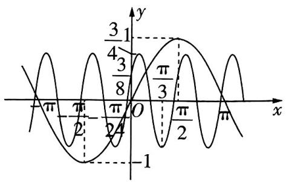

line

| x       | y     |
| ------- | ----- |
| 0       | 0     |
| π/2     | 1     |
| π/8     | 3/4   |
| π/3     | 1     |
| 0       | -1    |
| π/2     | 0     |
| π/8     | 1     |
| π/3     | 3/4   |
| 0       | 0     |
| π       | 0     |

图1

解析 由题可知干扰波对应的函数解析式为 $f(x) = A\sin (\omega x + \varphi)(A > 0, \omega > 0, |\varphi| < \frac{\pi}{2})$ .

由题图得 $\frac{\pi}{3} - (-\frac{\pi}{24}) = \frac{3}{4} T (T$ 为干扰波的最小正周期), 可得 $T = \frac{\pi}{2}$ , 所以 $\omega = \frac{2\pi}{T} = 4$ .

因为函数 $f(x)$ 的最大值为 $\frac{3}{4}$ ，所以 $A=\frac{3}{4}$ ，

将 $(\frac{\pi}{3}, -\frac{3}{4})$ 代入 $f(x) = \frac{3}{4}\sin (4x + \varphi)$ ，得 $\varphi = \frac{\pi}{6} + 2k\pi (k \in \mathbf{Z})$

又 $|\varphi| < \frac{\pi}{2}$ , 所以 $\varphi = \frac{\pi}{6}$ , 所以 $f(x) = \frac{3}{4} \sin(4x + \frac{\pi}{6})$ .

欲消除此干扰波,需要选择波峰相同,方向相反的波,

【避易错】注意前面求的是“干扰波”的解析式，我们要抵消这个干扰，需要一个只有“A”相反的波所以 $A_{0} = -\frac{3}{4}, \omega_{0} = 4, \varphi_{0} = \frac{\pi}{6}$ . 故选 B.

类比迁移 联想之前做过的类似题目,借鉴其解题方法和思路.虽然题目可能不同,但解题的策略和方法可能有相通之处.

# 考前

# 24天

# 第27题 基于项、和或项、积转化的数列问题

# 预测角度1

# 等比数列的项、和转化

热考指数

原创 预测1 已知数列 $\{a_{n}\}$ 的前 n 项和为 $S_{n}$ , $a_{n}\neq0,a_{n}a_{n+2}=a_{n+1}^{2}$ 且 $a_{6}a_{9}=2a_{4}a_{10}$ ，则 $\frac{S_{4}}{S_{8}}=$ （）

A. $\frac{1}{17}$

B. $\frac{16}{17}$

C. $\frac{17}{16}$

D. 17

解析 因为 $a_{n}a_{n + 2} = a_{n + 1}^{2}$ ，且 $a_{n}\neq 0$

所以 $\frac{a_{n+2}}{a_{n+1}}=\frac{a_{n+1}}{a_{n}}=\cdots=\frac{a_{2}}{a_{1}}$ ，所以 $\{a_{n}\}$ 为等比数列.

因为 $a_6a_9 = 2a_4a_{10}$ ，所以 $a_5a_{10} = 2a_4a_{10}$

因为 $a_{10} \neq 0$ ，所以 $a_5 = 2a_4$ ，即 $\{a_n\}$ 的公比 $q = \frac{a_5}{a_4} = 2$ .

方法一 所以 $\frac{S_4}{S_8} = \frac{S_4}{(1 + q^4)S_4} = \frac{1}{1 + q^4} = \frac{1}{1 + 2^4} = \frac{1}{17}$ . 故选A.

【结论速记】 $S_{8}=S_{4}+a_{5}+a_{6}+a_{7}+a_{8}=S_{4}+a_{1}q^{4}+a_{2}q^{4}+a_{3}q^{4}+a_{4}q^{4}=S_{4}+q^{4}S_{4}=(1+q^{4})S_{4}$ ，从而 $S_{2n}(1+q^{n})S_{n}$

方法二 所以 $\frac{S_4}{S_8} = \frac{\frac{a_1(1 - q^4)}{1 - q}}{\frac{a_1(1 - q^8)}{1 - q}} = \frac{1}{1 + q^4} = \frac{1}{1 + 2^4} = \frac{1}{17}$ . 故选A.

# 命题依据

数列的项、和转化是高考的高频考点，难度不大，多以选、填题形式出现。本题巧妙融合等比数列定义与性质考查项、和转化，命题形式渗透创新。近几年高考对等比数列的考查比例加大，因此2025高考极大可能出现此类命题。

# 预测角度2

# 一般数列的项、和转化

热考指数 ★★★★

原创预测2 设数列 $\{a_{n}\}$ 满足 $3a_{1} + 3^{2}a_{2} + 3^{3}a_{3} + \cdots + 3^{n}a_{n} = n(n + 2)$ ，则数列 $\{a_{n}\}$ 的通项公式为 $a_{n} =$ \_\_\_\_ .

解析 因为 $3a_{1} + 3^{2}a_{2} + 3^{3}a_{3} + \cdots + 3^{n}a_{n} = n(n+2)$ ,

# 命题依据

本题不直接考查等差、等比数列，而是给出数列项、和满足的等式，求数列的通项公式，命题形式新颖，强调推理论证和运算求解能力.

所以 $3a_{1} + 3^{2}a_{2} + 3^{3}a_{3} + \cdots + 3^{n-1}a_{n-1} = (n-1)(n+1) (n \geqslant 2, n \in \mathbf{N}^{*})$ ,

【技法速通】遇到此类项、和转化的数列问题，常写出前 $n - 1$ 项的和，作差，求其通项公式

以上两式相减，得 $3^{n}a_{n} = 2n + 1$ ，得 $a_{n} = \frac{2n + 1}{3^{n}} (n\geqslant 2,n\in \mathbf{N}^{*})$

当 $n = 1$ 时， $3a_{1} = 3$ ，得 $a_{1} = 1$ ，满足 $a_{n} = \frac{2n + 1}{3^{n}}$

所以 $\{a_{n}\}$ 的通项公式为 $a_{n} = \frac{2n + 1}{3^{n}}$

# 预测角度3 融合新定义连乘的项、积转化

热考指数

原创 预测3 已知数列 $\{a_{n}\}$ 满足 $a_{1}^{2} + (2a_{n+1} - a_{n})^{2} = 16(a_{1} - 4)$ . 用符号“ $\Pi$ ”表示一系列数的连乘,例如: $\prod_{i=1}^{3} a_{i} = a_{1} \cdot a_{2} \cdot a_{3}$ . 若 $\prod_{i=1}^{n} a_{i} > \frac{1}{512}$ , 则 n 的最大值为 \_\_\_\_.

解析 因为 $a_1^2 + (2a_{n+1} - a_n)^2 = 16(a_1 - 4)$ ,

所以 $(a_{1} - 8)^{2} + (2a_{n + 1} - a_{n})^{2} = 0$

# 命题依据

高考对数列项、积转化的考查是对项、和转化的创新延伸，需多加关注。本题新定义运算符号，考查数列前 $n$ 项积相关的最值问题，考法创新，命题新颖，符合新高考命题的创新趋势。

【障碍速通】观察式子的特征，先移项，再配方得到两个平方式的和为0，可得 $\{a_{n}\}$ 的递推公式与 $\{a_{n}\}$ 的首项

所以 $a_1 = 8$ 且 $2a_{n + 1} = a_n$ ，所以 $\{a_n\}$ 是以8为首项， $\frac{1}{2}$ 为公比的等比数列，

故 $a_{n} = 8\left(\frac{1}{2}\right)^{n - 1} = \left(\frac{1}{2}\right)^{n - 4}.$

由题可知 $\prod_{i=1}^{n} a_i = a_1 \times a_2 \times a_3 \times \cdots \times a_n = (\frac{1}{2})^{-3} \times (\frac{1}{2})^{-2} \times \cdots \times (\frac{1}{2})^{n-4} = (\frac{1}{2})^{(-3) + (-2) + \cdots + (n-4)} = (\frac{1}{2})^{\frac{n(-3+n-4)}{2}} = (\frac{1}{2})^{\frac{n(n-7)}{2}},$

【避易错】利用等差数列的前 $n$ 项和公式求 $(-3) + (-2) + \cdots + (n-4)$ ，注意项数的求法“末减前加1”，即 $(n-4) - (-3) + 1 = n$ ，也可根据前面式子观察知“是 $n$ 项的积”

$\prod_{i=1}^{n} a_i > \frac{1}{512}$ , 即 $\left(\frac{1}{2}\right)^{\frac{n(n-7)}{2}} > \frac{1}{512} = \left(\frac{1}{2}\right)^9$ ,

所以 $\frac{n(n - 7)}{2} < 9$ ，所以 $(n + 2)(n - 9) < 0,$

又 $n \in \mathbb{N}^*$ , 解得 $n \leqslant 8$ , 所以 $n$ 的最大值为8.

# 考前

# 23天

# 第28题 奇偶代换模型妙解分段数列问题

热考指数

原创 预测1: 已知数列 $\{a_{n}\}$ 满足 $a_{n+1}=\left\{\begin{aligned}&2a_{n},n=2k-1,\\ &a_{n}+1,n=2k\end{aligned}\right.$ $(k\in\mathbf{N}^{*})$ ，且 $a_{2}$ 是 $a_{1},a_{3}$ 的等差中项，则数列 $\{a_{n}\}$ 的前 2025 项的和 $S_{2025}=$ \_\_\_\_.

解析 因为 $a_{n + 1} = \begin{cases} 2a_n, & n = 2k - 1, \\ a_n + 1, & n = 2k \end{cases}$ （ $k \in \mathbf{N}^*$ ），

所以 $a_2 = 2a_1$

所以 $a_3 = a_2 + 1 = 2a_1 + 1$

因为 $a_2$ 是 $a_1, a_3$ 的等差中项，

所以 $2a_{2} = a_{1} + a_{3}$ ，所以 $4a_{1} = a_{1} + 2a_{1} + 1$ ，解得 $a_1 = 1.$

①当 $n = 2k - 1, k \in \mathbf{N}^*$ 时， $n + 1$ 为偶数， $n + 2$ 为奇数，

# 命题依据

分段数列的命题形式能够有效覆盖多个知识点，全面考查考生的知识掌握情况，如2023新课标Ⅱ卷T18.本题设计奇偶项不同的分段规则，并巧妙融入了年份数字“2025”，既强化考查考生分类讨论的数学思想，又突出了创新能力.预测2025高考此类试题出现的可能性极大.

所以 $a_{n + 1} = 2a_n, a_{n + 2} = a_{n + 1} + 1 = 2a_n + 1$

所以 $a_{n + 2} + 1 = 2(a_n + 1)$

因为 $a_{n}+1\neq0$ ，所以 $\frac{a_{n+2}+1}{a_{n}+1}=2$ ，

【障碍速通】若 $a_{n} + 1 = 0$ ，则 $a_1 = -1$ ，这与 $a_1 = 1$ 相矛盾，所以 $a_{n} + 1 \neq 0$

所以数列 $\{a_{n} + 1\} (n = 2k - 1, k \in \mathbf{N}^{*})$ 是首项为 $a_{1} + 1 = 2$ ，公比为2的等比数列，

所以 $a_{n} + 1 = 2 \times 2^{\frac{n + 1}{2} - 1} = 2^{\frac{n + 1}{2}} (n = 2k - 1, k \in \mathbf{N}^{*})$ ，所以 $a_{n} = 2^{\frac{n + 1}{2}} - 1 (n = 2k - 1, k \in \mathbf{N}^{*})$ .

②当 $n = 2k, k \in \mathbb{N}^*$ 时， $a_n = 2a_{n-1} = 2\left(2^{\frac{n-1+1}{2}} - 1\right) = 2^{\frac{n+2}{2}} - 2.$

【障碍速通】 $n - 1$ 为奇数，利用①中已推导的结论 $a_{n - 1} = 2^{\frac{(n - 1) + 1}{2}} - 1$ 进行奇偶代换，可速得结果

$$
\begin{array}{r l} & {\text {则} \{a _ {n} \} \text {的前} 2   0 2 5 \text {项的和} S _ {2   0 2 5} = a _ {1} + a _ {2} + \dots + a _ {2   0 2 5} = (a _ {1} + a _ {3} + \dots + a _ {2   0 2 5}) + (a _ {2} + a _ {4} + \dots + a _ {2   0 2 4}) = (2 ^ {1} - 1 + 2 ^ {2} - 1 + \dots + 2 ^ {1   0 1 3} - 1) + (2 ^ {2} - 2 + 2 ^ {3} - 2 + \dots + 2 ^ {1   0 1 3} - 2) = \frac {2 (1 - 2 ^ {1   0 1 3})}{1 - 2}} \\ & {1   0 1 3 + \frac {2 ^ {2} (1 - 2 ^ {1   0 1 2})}{1 - 2} - 2   0 2 4 = 2 ^ {1   0 1 5} - 3   0 4 3.} \end{array}
$$

原创预测2 已知数列 $\{a_{n}\}$ 满足 $a_{n + 1} =$ $\left\{ \begin{array}{l}ta_{n} + n,n = 2k - 1,\\ a_{n} - 3n,n = 2k \end{array} \right.$ （ $k\in \mathbf{N}^{*}$ ），且函数 $f(x) = 2+$ $\log_m(x - 2)(m > 0,m\neq 1)$ 的图象经过定点 $(a_1,a_2)$

(1) 证明: 数列 $\{2a_{2n}-3\}$ 为等比数列.

(2) 求 $\{a_{n}\}$ 的前 $2n$ 项的和 $S_{2n}$ .

# 命题依据

本题与函数交汇，本质仍为分段数列问题，但难度会略有拔高，需利用构造法与定义法求各段的通项公式与前 $n$ 项和，常规中有变化，需要特别关注.

解析 (1) 易知函数 $f(x) = 2 + \log_m(x - 2) (m > 0, m \neq 1)$ 的图象经过定点(3,2)，

依题意得 $a_1 = 3, a_2 = 2$ ，因为 $a_2 = ta_1 + 1$ ，所以 $2 = 3t + 1$ ，解得 $t = \frac{1}{3}$ ，（2分）

所以 $a_{n + 1} = \left\{ \begin{array}{l} \frac{1}{3} a_n + n, n = 2k - 1, \\ a_n - 3n, n = 2k \end{array} \right.$ ( $k \in \mathbf{N}^*$ ). (3分)

$$
\begin{array}{r l} & 2 a _ {2 n + 2} - 3 = 2 \left(\frac {1}{3} a _ {2 n + 1} + 2 n + 1\right) - 3 = \frac {2}{3} a _ {2 n + 1} + 4 n - 1 = \frac {2}{3} (a _ {2 n} - 3 \times 2 n) + 4 n - 1 = \frac {2}{3} a _ {2 n} - \\ & 1 = \frac {1}{3} (2 a _ {2 n} - 3), \end{array}
$$

又 $2a_{2} - 3 = 2 \times 2 - 3 = 1$ ，所以 $\{2a_{2n} - 3\}$ 是以 1 为首项、 $\frac{1}{3}$ 为公比的等比数列。（5 分）

(2) 由 (1) 可知 $2a_{2n} - 3 = 1 \times \left(\frac{1}{3}\right)^{n-1}$ , 则 $a_{2n} = \frac{1}{2} \left(\frac{1}{3}\right)^{n-1} + \frac{3}{2}$ . (6 分)

因为 $a_{2n} = \frac{1}{3} a_{2n - 1} + 2n - 1$ ，所以 $a_{2n - 1} = 3a_{2n} - 6n + 3,$ （8分）

$$
\text {所以} S _ {2 n} = \left(a _ {2} + a _ {4} + \dots + a _ {2 n}\right) + \left(a _ {1} + a _ {3} + \dots + a _ {2 n - 1}\right) = \left(a _ {2} + a _ {4} + \dots + a _ {2 n}\right) + 3 \left(a _ {2} + a _ {4} + \dots + a _ {2 n}\right) - 6 (1 + 2 + \dots + n) + 3 n = 4 \left(a _ {2} + a _ {4} + \dots + a _ {2 n}\right) - 6 (1 + 2 + \dots + n) + 3 n = 4 \times
$$

$$
\frac {1}{2} \left[ 1 + \frac {1}{3} + \left(\frac {1}{3}\right) ^ {2} + \dots + \left(\frac {1}{3}\right) ^ {n - 1} \right] + 4 \times \frac {3}{2} n - 6 \times \frac {n (1 + n)}{2} + 3 n = \frac {2 \left[ 1 - \left(\frac {1}{3}\right) ^ {n} \right]}{1 - \frac {1}{3}} + 9 n - 3 n (1 +
$$

$$
n) = 3 - \left(\frac {1}{3}\right) ^ {n - 1} + 6 n - 3 n ^ {2}. \tag {13分}
$$

【避易错】在求 $1 + \frac{1}{3} + \left(\frac{1}{3}\right)^2 + \cdots + \left(\frac{1}{3}\right)^{n-1}$ 时，注意项数为 $n$ 而不是 $n-1$ ，可以利用等比数列前 $n$ 项和的另一个公式 $S_n = \frac{a_1 - a_n q}{1 - q}$ 得 $\frac{1 - \left(\frac{1}{3}\right)^{n-1} \cdot \frac{1}{3}}{1 - \frac{1}{3}}$ ，避开此类错误

# 考前

# 22天

# 第29题 锥体、台体的表面积与体积计算问题

# 预测角度1

# “圆台容棱台”问题

热考指数

原创 预测1 如图 1, 母线长为 3 的圆台形状的实木筒(壁厚忽略不计)两底面的半径分别为 1,2, 在该实木筒内放入一个等高的正三棱台物体, 则该正三棱台物体的体积的最大值为 \_\_\_\_.

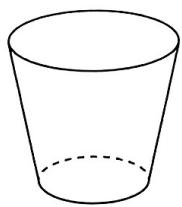  
图1

# 命题依据

锥体、台体的表面积、体积问题是近年高考中的“常客”，稳中有变，既有基础问题，如2023新课标Ⅱ卷T14，又有富含变化的探索性问题，如2024新课标Ⅱ卷T7.本题将圆台与棱台结合，在变化中探求棱台体积的最值，常规中有变化，注重考查空间想象能力.

解析 当正三棱台的两底面正三角形为圆台的两底面圆的内接正三角形时,该正三棱台的体积取得最大值.

因为圆台的母线长为3,两底面圆的半径分别为1与2,

所以圆台的高 $h = \sqrt{3^2 - (2 - 1)^2} = 2\sqrt{2}$ .

设正三棱台两底面正三角形的边长分别为 $a, b (a < b)$ ,

由正弦定理可得 $\frac{a}{\sin 60^{\circ}} = 2\times 1,\frac{b}{\sin 60^{\circ}} = 2\times 2,$

【障碍速通】结合正弦定理速求正三角形的边长

解得 $a = \sqrt{3}, b = 2\sqrt{3}$ ,

故该正三棱台物体的体积的最大值为 $V = \frac{2\sqrt{2}}{3}\left(\frac{\sqrt{3}}{4} a^2 +\frac{\sqrt{3}}{4} ab + \frac{\sqrt{3}}{4} b^2\right) = \frac{2\sqrt{2}}{3}\times \left[\frac{\sqrt{3}}{4}\times (\sqrt{3})^2 +\right.$ $\frac{\sqrt{3}}{4}\times \sqrt{3}\times 2\sqrt{3} +\frac{\sqrt{3}}{4}\times (2\sqrt{3})^2 ] = \frac{7\sqrt{6}}{2}.$

# 预测角度2

# 棱锥与外接球问题

热考指数

原创 预测2 已知三棱锥 $A - BCD$ 中, $AB = AD$ , $BC = CD = BD = 2$ , 二面角 $A - BD - C$ 为直二面角, 三棱锥 $A - BCD$ 的各个顶点都在球 $M$ 上, 球 $M$ 的表面积为 $\frac{112\pi}{9}$ , 则三棱锥 $A - BCD$ 的体积为 \_\_\_\_.

# 冲刺高分

合理分类讨论 对于一些含参变量的函数或曲线问题,分类讨论参数变化对函数、曲线形态的影响,锁定关键点,再结合关键点解题.

解析 如图 2, 取 BD 的中点 O, 连接 AO, CO, 由 AB = AD, BC = CD = BD = 2, 得 $AO \perp BD$ , $CO \perp BD$ ,

所以 $\angle AOC$ 为二面角 $A - BD - C$ 的平面角，

因为二面角 A-BD-C 为直二面角, 所以 $\angle AOC = 90^{\circ}$ , 即 $AO \perp OC$ , 又 $BD \cap OC = O$ , 所以 $AO \perp$ 平面 BCD, 所以 AO 即三棱锥 A-BCD 的高.

设 $\triangle ABD$ 与 $\triangle BCD$ 的外接圆的圆心分别为 $O_{1}, O_{2}$ , 则 $O_{1}, O_{2}$ 分别在 $AO, CO$ 上, 连接 $MO_{1}, MO_{2}, AM, CM$ .

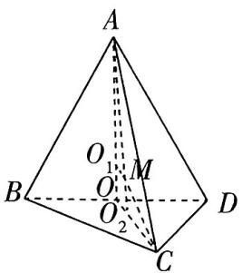

text_image

A
O₁ M
B O₂ D
C

图2

由 $BC = CD = BD = 2$ 可得 $CO = \sqrt{3}, CO_{2} = \frac{2\sqrt{3}}{3}, OO_{2} = \frac{\sqrt{3}}{3}$ .

设球 $M$ 的半径为 $R$ , 则 $4\pi R^2 = \frac{112\pi}{9}$ , 得 $R^2 = \frac{28}{9}$ .

所以 $AO = AO_{1} + MO_{2} = \sqrt{R^{2} - MO_{1}^{2}} +\sqrt{R^{2} - CO_{2}^{2}} = \sqrt{\frac{28}{9} - (\frac{\sqrt{3}}{3})^{2}} +\sqrt{\frac{28}{9} - (\frac{2\sqrt{3}}{3})^{2}} = 3,$

所以 $V_{A - BCD} = \frac{1}{3} S_{\triangle BCD}\times AO = \frac{1}{3}\times \frac{\sqrt{3}}{4}\times 2^2\times 3 = \sqrt{3}.$

【妙解】也可以利用割补法，由 $V_{A - BCD} = \frac{1}{3} S_{\triangle AOC} \cdot BD$ 求三棱锥 $A - BCD$ 的体积

# 得分秘籍

# 双向记忆柱、锥、台、球体的万能体积公式

柱、锥、台、球体的体积公式都可以通过万能体积公式变形后得到, 这是一种从“更高维度”上纵览知识模块的视角. 万能体积公式为 $V = \frac{1}{6} (S + 4S_{0} + S')h$ , 其中 $S, S', S_{0}$ 分别为几何体的上底面、下底面、中截面的面积, $h$ 为几何体的高.

①对于棱(圆)柱,它相当于几何体的上、下底面全等,此时 $S=S_{0}=S'$ ,故 $V_{柱}=Sh$ .   
②对于棱(圆)锥,它相当于几何体的上底面缩成一个点,此时 $S=0, S_{0}=\frac{1}{4}S'$ , 故 $V_{锥}=\frac{1}{3}S'h$ .  
③对于棱(圆)台,它相当于几何体的上、下底面相似,此时 $2\sqrt{S_{0}}=\sqrt{S}+\sqrt{S^{\prime}}$ ,故 $V_{台}=\frac{1}{3}(S+\sqrt{SS^{\prime}}+S^{\prime})h.$   
④对于球,它相当于几何体的上、下底面都缩成了一个点,此时 $S = S' = 0$ , $S_{0} = \pi r^{2}$ (r 为球的半径), h = 2r, 故 $V_{球} = \frac{4}{3} \pi r^{3}$ .

# 考前

# 21天

# 第 30 题 长方体模型中点、线、面位置关系的巧妙应用

# 测角度1

# 纯文字不含图的线面位置关系判断

热考指数

原创 预测1 (多选)设 m, n 是两条不同的直线, $\alpha, \beta$ 是两个不同的平面. 下列各选项中, 满足“q 的充分条件是 p”的有 ()

A. $p: m \parallel n, m \perp \alpha, q: n \perp \alpha$   
B. $p:m / / n,m / / \alpha .q:n / /\alpha$   
C. $p:m\subset \alpha ,n\subset \beta ,m / /\beta ,n / /\alpha .q:\alpha / / \beta$   
D. $p: m \parallel \alpha, m \perp \beta$ . $q: \alpha \perp \beta$

# 命题依据

将空间中线面位置关系的判定与充分、必要条件及命题的真假判断交汇命题，从细节入手，没有图形辅助，对空间想象能力和逻辑推理能力要求变高，符合高考变化趋势.

解析 “q 的充分条件是 p” 即 “ $p \Rightarrow q$ ”, 则只需判断 $p \Rightarrow q$ 是否为真命题即可.

对于 A, 两条平行直线中的一条直线垂直于一个平面, 则另一条直线也垂直于这个平面, 所以 $p \Rightarrow q$ .

对于 B, 如图 1, 在长方体 $ABCD - A_1B_1C_1D_1$ 中, 取 $m = A_1B_1, n = AB$ , 平面 $\alpha =$ 平面 $ABCD$ , 则 $A_1B_1 // AB, A_1B_1 //$ 平面 $ABCD$ , 但 $AB \subset$ 平面 $ABCD$ , 所以 $p \neq q$ .

对于 C, 取 $m = AA_{1}, n = CC_{1}$ ，平面 $\alpha =$ 平面 $ABB_{1}A_{1}$ ，平面 $\beta =$ 平面 $BCC_{1}B_{1}$ ，则 $AA_{1} \subset$ 平面 $ABB_{1}A_{1}, AA_{1} \parallel$ 平面 $BCC_{1}B_{1}, CC_{1} \subset$ 平面 $BCC_{1}B_{1}, CC_{1} \parallel$ 平面 $ABB_{1}A_{1}$ ，但平面 $ABB_{1}A_{1}$ 与平面 $BCC_{1}B_{1}$ 相交，所以 $p \neq q$ .

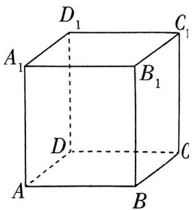

text_image

D₁
A₁
B₁
C₁
D
C
A
B

图1

【秒杀快招】当判断出BC选项错误时，注意到是多选题，可直接选AD

对于 D, 设 $m \subset$ 平面 $\gamma, \alpha \cap \gamma = l$ , 因为 $m \parallel \alpha$ , 所以 $m \parallel l$ . 又 $m \perp \beta$ , 所以 $l \perp \beta$ . 又 $l \subset \alpha$ , 所以 $\alpha \perp \beta, p \Rightarrow q$ . 故选 AD.

# 测角度2

# 以正方体为背景的线面位置关系判断

热考指数

原创 预测2 (多选)如图2,在正方体 $ABCD - A_{1}B_{1}C_{1}D_{1}$ 中， $\overrightarrow{A_1P} = \lambda \overrightarrow{A_1D} (0\leqslant \lambda \leqslant 1),\overrightarrow{AG} = \mu \overrightarrow{AB} (0\leqslant \mu \leqslant 1)$ ，点 $M,N$ 分别为 $AD,BB_{1}$ 的中点，且该正方体的内切球为球 $O$ ，则下列说法正确的有 （）

A. $AC_{1} \perp BP$   
B. 平面 $A_{1}PB \parallel$ 平面 $B_{1}D_{1}C$   
C. 存在 $\mu$ , 使得 $OC \perp$ 平面 $MNG$

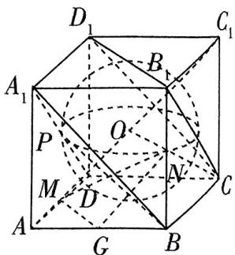

text_image

D₁
C₁
A₁
B₁
P
O
M
D
N
A
G
B
C

图2

# 冲刺高分

关注题目中的不变量 在动态问题中, 不变的量往往是解题的关键. 如在动态几何问题中, 某些不变的长度、不变的垂直关系总是解题的突破口.

D. 若球 $O$ 的半径 $R = 1$ , 则过直线 $MN$ 的平面截球 $O$ 所得的所有截面圆中, 半径最小的圆的面积为 $\frac{\pi}{3}$

解析 对于 A, 如图 3, 连接 AC, BD, 则 $AC \perp BD$ , 易知 $CC_{1} \perp$ 平面 ABCD, $BD \subset$ 平面 ABCD, 所以 $CC_{1} \perp BD$ , 又 $CC_{1} \cap AC = C, CC_{1}, AC \subset$ 平面 $AC_{1}C$ , 所以 $BD \perp$ 平面 $AC_{1}C$ , 而 $AC_{1} \subset$ 平面 $AC_{1}C$ , 所以 $BD \perp AC_{1}$ .

# 命题依据

正方体中花样多，融合球一起命题，综合性更强，设计为选择题，给多种解题渠道留足了空间，能体现“多想少算”思维的妙用.

【障碍速通】由 $\overrightarrow{A_1P} = \lambda \overrightarrow{A_1D} (0 \leqslant \lambda \leqslant 1)$ 知动点 $P$ 在线段 $A_1D$ 上，观察选项 A，要判断 $AC_1 \perp BP$ ，只需判断 $AC_1$ 垂直于 $BP$ 所在的平面，即判断 $AC_1 \perp$ 平面 $A_1BD$ 即可，因此在平面 $A_1BD$ 内找两条相交直线与 $AC_1$ 垂直，我们选择了 $BD$ 和 $BA_1$

同理可得 $BA_{1} \perp AC_{1}$ , 又 $BD \cap BA_{1} = B, BD, BA_{1} \subset$ 平面 $A_{1}BD$ , 所以 $AC_{1} \perp$ 平面 $A_{1}BD$ ,

又 $BP \subset$ 平面 $A_{1}BD$ , 所以 $AC_{1} \perp BP, A$ 正确.

对于 B, 在正方体中, 有平面 $A_{1}BD \parallel$ 平面 $B_{1}D_{1}C$ ,

【技法速通】以小宛大的技巧，欲判断平面 $A_{1}PB \parallel$ 平面 $B_{1}D_{1}C$ ，发现平面 $A_{1}PB$ 就是平面 $A_{1}BD$ ，故只需判断平面 $A_{1}BD \parallel$ 平面 $B_{1}D_{1}C$

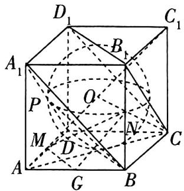

text_image

D₁
C₁
A₁
B₁
P
O
M
D
N
A
G
B

图3

即平面 $A_{1}PB \parallel$ 平面 $B_{1}D_{1}C, B$ 正确.

对于 C, 当 $\mu = \frac{1}{2}$ 时, 点 G 为 AB 的中点, 所以 $MG \perp AC$ , 又 OC 在平面 ABCD 上的射影落在 AC 上, 所以 $MG \perp OC$ , 同理 $GN \perp OC$ . 又 $MG \cap GN = G, MG, GN \subset$ 平面 MGN, 所以 $OC \perp$ 平面 MNG, C 正确.

对于 D, 因为球 O 的半径 R=1, 所以正方体的棱长为 2, 设点 Q 是线段 MN 的中点, 连接 OQ, OM(图略), 易知 M, N 到点 O 的距离相等, 所以 $OQ \perp MN$ , 由勾股定理易知 $MN = \sqrt{1^{2} + 2^{2} + 1^{2}} = \sqrt{6}$ , $OM = \sqrt{2}$ ,

则球心 $O$ 到 $MN$ 的距离为 $OQ = \sqrt{OM^2 - QM^2} = \sqrt{(\sqrt{2})^2 - (\frac{\sqrt{6}}{2})^2} = \frac{\sqrt{2}}{2}$ ,

所以 $MN$ 被球 $O$ 截得的弦长 $l = 2\sqrt{R^2 - OQ^2} = 2\sqrt{1 - \left(\frac{\sqrt{2}}{2}\right)^2} = \sqrt{2}$ ,

所以半径最小的截面圆的半径 $r = \frac{l}{2} = \frac{\sqrt{2}}{2}$ , 面积 $S = \pi r^2 = \frac{1}{2}\pi$ , D 错误.

故选 ABC.

研究命题意图 思考命题者想要通过本题考查的知识点和能力,是对函数性质的综合运用?还是对几何空间想象能力的检验?明确方向后针对性地寻找解题方法.

# 第 31 题 目标意识解立体几何第(1)问

# 预测角度1

# 无图立体几何中的证明问题

热考指数

原创 预测1 在四棱锥 M-ABCD 中, AD=4, AB=BC=2, $\angle BAD=90^{\circ}$ , BC//AD, 线段 AD 的中点为 E, 且 $MC \perp BE$ .

证明:平面 $MAC \perp$ 平面 ACD.

解析 根据题意作出图形,如图1,连接CE.

因为 E 是 AD 的中点, 所以 AD = 2AE.

因为 AD = 4，所以 AE = 2，

因为 BC = 2，且 $BC \parallel AD$ ，所以 $BC \parallel AE$ ，且 BC = AE，

所以四边形 $ABCE$ 为平行四边形，

又 $AB = BC, \angle BAD = 90^{\circ}$ , 所以四边形 $ABCE$ 是正方形, 所以 $BE \perp AC$ . (3分)

因为 $MC \perp BE, MC, AC \subset$ 平面 MAC，且 $MC \cap AC = C$ ，

所以 $BE \perp$ 平面MAC. (4分)

【障碍速通】要证平面 $MAC \perp$ 平面 $ACD$ ，已知 $MC \perp BE$ ，考虑在平面 $MAC$ 内再找一条与 $BE$ 垂直的直线，通过证明 $BE \perp$ 平面 $MAC$ 实现

因为 $BE \subset$ 平面 ABCD, 所以平面 $MAC \perp$ 平面 ABCD,

所以平面 $MAC \perp$ 平面 $ACD$ .

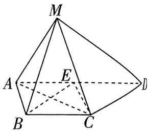

text_image

M
A	E	D
B	C

图1

(6分)

# 预测角度2

# 以台体为载体的动态探究问题

热考指数

原创 预测2 如图2,在底面为菱形的四棱台 $ABCD - A_{1}B_{1}C_{1}D_{1}$ 中，点 $E$ 为 $DD_{1}$ 的中点，

(1)证明:平面 $ABB_{1}A_{1}$ 与平面 $CDD_{1}C_{1}$ 的交线与 CD 平行.  
(2) 在棱 $CC_{1}$ 上是否存在一点 $Q$ , 使得 $BQ \parallel$ 平面 $AEC$ ? 若存在, 请证明; 若不存在, 请说明理由.

解析 (1) 由四边形 $ABCD$ 为菱形, 得 $AB \parallel CD$ ,

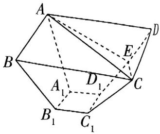

text_image

A
B
D
E
C
A₁
D₁
B₁
C₁

图2

又 $AB \not\subset$ 平面 $CDD_{1}C_{1}, CD \subset$ 平面 $CDD_{1}C_{1}$ ,

则 $AB \parallel$ 平面 $CDD_{1}C_{1}$ . (3分)

又 $AB \subset$ 平面 $ABB_{1}A_{1}$ , 设平面 $ABB_{1}A_{1} \cap$ 平面 $CDD_{1}C_{1} = m$ ,

则 $AB \parallel m$ , 所以 $m \parallel CD$ . (6分)

(2) 在棱 $CC_{1}$ 上存在点 $Q$ , 使得 $BQ \parallel$ 平面 $AEC$ , 证明如下. (7 分)

如图3, 连接 $BD, BD_{1}$ , 设 $BD \cap AC = O$ ,

由四边形 ABCD 是菱形, 得 O 为 BD 的中点,

连接 $OE$ ，则 $BD_{1} / / OE$

又 $OE \subset$ 平面 $AEC, BD_{1} \not\subset$ 平面 $AEC$ , 所以 $BD_{1} //$ 平面 $AEC$ .

(9 分)

在平面 $CDD_{1}C_{1}$ 上，过点 $D_{1}$ 作 $D_{1}Q \parallel CE$ 交 $CC_{1}$ 于点 $Q$ ，连接 $BQ$ ，

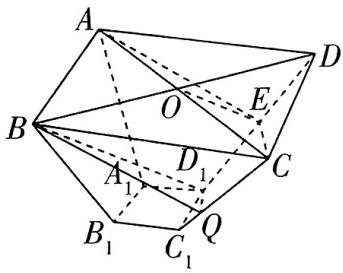

text_image

A
B
O
E
D
A₁
D₁
C
B₁
C₁
Q

图3

因为 $CE \subset$ 平面 $AEC, D_1Q \not\subset$ 平面 $AEC$ , 所以 $D_1Q \parallel$ 平面 $AEC$ , (11 分)

又 $D_{1}Q \cap BD_{1} = D_{1}, D_{1}Q, BD_{1} \subset$ 平面 $BD_{1}Q$ , 所以平面 $BD_{1}Q \parallel$ 平面 $AEC$ , (13分)

【障碍速通】要证线面平行，需要证明线线平行或者面面平行，但点 $Q$ 为动点，线线平行不易证明，故证明面面平行

因为 $BQ \subset$ 平面 $BD_{1}Q$ ，所以 $BQ \parallel$ 平面 AEC. (15 分)

# 得分秘籍

# 破解空间垂直关系的解题关键

①证明线线垂直:可利用菱形(正方形)的对角线互相垂直,勾股定理的逆定理判断线线垂直,或由线面垂直的性质证明线线垂直.   
②证明线面垂直:利用线面垂直的判定定理或面面垂直的性质定理证明.  
③证明面面垂直:利用面面垂直的定义,即两平面所成的二面角为直二面角证明,或利用面面垂直的判定定理证明.

# 破解空间平行关系的解题关键

①证明线线平行:利用线面平行的性质定理,面面平行的性质定理证明,或结合中位线,对应线段成比例,平行四边形等证明线线平行.  
②证明线面平行:利用线面平行的判定定理和面面平行的性质证明.  
③证明面面平行:利用面面平行的判定定理,或垂直于同一条直线的两个平面平行,或平面平行的传递性证明.

# 考前

# 19天

# 第32题 空间几何体中的角度与距离问题

# 预测角度1

# 翻折情境中的空间角求解问题

热考指数

原创 预测1 如图1, 在矩形 $AA_{1}D_{1}D$ 中, $\overrightarrow{AE} = \overrightarrow{ED}, \overrightarrow{B_{1}D_{1}} = 2\overrightarrow{A_{1}B_{1}}, AE = 3, AB_{1} = 2\sqrt{3}$ . 把该矩形折起, 形成一个正三棱柱 $ABC - A_{1}B_{1}C_{1}$ , 其中点 $D, D_{1}$ 分别与 $A, A_{1}$ 重合, 且点 $F$ 为该正三棱柱的棱 $A_{1}C_{1}$ 的中点.

(1)求正三棱柱 $ABC - A_{1}B_{1}C_{1}$ 的体积.  
(2)求异面直线 $AF$ 和 $BC$ 所成角的余弦值.  
(3)求平面 AEF 与平面 $ABB_{1}$ 的夹角的正弦值.

解析 (1) 根据题意构造正三棱柱, 如图 2 所示, 其中 $AB = 2$ , $BE = 1$ , $AB_{1} = 2\sqrt{3}$ ,

【障碍速通】翻折问题中注意抓两大关系：一抓位置关系（如垂直平行关系、点线面的包含关系、翻折不变角）；二抓数量关系（如翻折不变的线段长）

则 $AA_{1}^{2} = AB_{1}^{2} - A_{1}B_{1}^{2} = (2\sqrt{3})^{2} - 2^{2} = 8$

得 $AA_{1} = 2\sqrt{2}$ （1分）

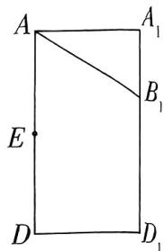

text_image

A
A₁
B₁
E
D
D₁

图1

# 命题依据

纵观近年高考真题，命题愈发重视对考生空间想象能力的考查,2024新课标Ⅱ卷T17便是将平面四边形翻折成五棱锥后以之为载体命制的.本题在此基础上，巧妙地将体积计算与空间角求解相结合，既体现了知识点的综合性，又彰显了命题的前瞻性.

所以正三棱柱 $ABC - A_{1}B_{1}C_{1}$ 的体积 $V = S_{\triangle ABC}\times AA_{1} = \frac{1}{2}\times 2\times 2\times \frac{\sqrt{3}}{2}\times 2\sqrt{2} = 2\sqrt{6}.$ （3分）

(2) 取 $B_{1} C_{1}$ 的中点 $H$ , 连接 $E H$ , 则 $E H \parallel B B_{1}$ , 所以 $E H \perp$ 平面 $A B C$ , 所以 $E H \perp E A, E H \perp E C$ . 又 $A E \perp B C$ , 故以点 $E$ 为原点, 分别以 $\overrightarrow{E C}, \overrightarrow{E H}, \overrightarrow{E A}$ 【避易错】建立空间直角坐标系前, 一定要先证明两两垂直的 “三只脚”, 保证全分的方向为 $x$ 轴, $y$ 轴, $z$ 轴的正方向建立如图 2 所示的空间直角坐标系.

(4 分)

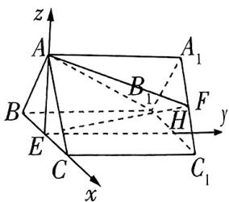

text_image

z
A
A₁
B₁
F
y
B
H
E
C
C₁
x

图2

则 $E(0,0,0),A(0,0,\sqrt{3}),B(-1,0,0),C(1,0,0),B_{1}(-1,2\sqrt{2},$

$$
0), A _ {1} (0, 2 \sqrt {2}, \sqrt {3}), C _ {1} (1, 2 \sqrt {2}, 0), F (\frac {1}{2}, 2 \sqrt {2}, \frac {\sqrt {3}}{2}),
$$

则 $\overrightarrow{AF} = (\frac{1}{2}, 2\sqrt{2}, -\frac{\sqrt{3}}{2}), \overrightarrow{BC} = (2, 0, 0)$ ，所以 $|\overrightarrow{AF}| = 3, |\overrightarrow{BC}| = 2, \overrightarrow{AF} \cdot \overrightarrow{BC} = 1$ ，（6分）

所以 $|\cos \langle \overrightarrow{AF},\overrightarrow{BC}\rangle | = \frac{|\overrightarrow{AF}\cdot\overrightarrow{BC}|}{|\overrightarrow{AF}||\overrightarrow{BC}|} = \frac{1}{6},$

【技法速通】求异面直线所成角的余弦值，常规方法是平移其中一条直线，构造三角形，利用余弦定理求解，但不要忘记在利好建系的情况下，利用方向向量求夹角是更快速的方法

# 冲刺 高分

调整心态,从容应对 压轴题难度较大,遇到不会做的情况很正常,不要因此而紧张焦虑,影响后面的答题,保持平和的心态,尽力而为即可.

所以异面直线 $AF$ 和 $BC$ 所成角的余弦值为 $\frac{1}{6}$ . (8分)

(3) 由(2)可知 $\overrightarrow{EA} = (0,0,\sqrt{3}),\overrightarrow{EF} = (\frac{1}{2},2\sqrt{2},\frac{\sqrt{3}}{2}).$ (9分)

设平面 $AEF$ 的法向量为 $\pmb {n} = (x,y,z)$ ，则 $\left\{ \begin{array}{l} \overrightarrow{EA} \cdot \pmb {n} = \sqrt{3} z = 0, \\ \overrightarrow{EF} \cdot \pmb {n} = \frac{1}{2} x + 2\sqrt{2} y + \frac{\sqrt{3}}{2} z = 0, \end{array} \right.$

取 $y = 1$ ，得 $x = -4\sqrt{2}, z = 0$ ，则平面 $AEF$ 的一个法向量为 $\pmb{n} = (-4\sqrt{2}, 1, 0)$ . （10分）

同理，由(2)可知 $\overrightarrow{AB_1} = (-1, 2\sqrt{2}, -\sqrt{3}), \overrightarrow{BB_1} = (0, 2\sqrt{2}, 0)$ . (11分)

设平面 $ABB_{1}$ 的法向量为 $\pmb {m} = (x_1,y_1,z_1)$ ，则 $\left\{ \begin{array}{l} \overrightarrow{AB_1}\cdot \pmb {m} = -x_1 + 2\sqrt{2} y_1 - \sqrt{3} z_1 = 0,\\ \overrightarrow{BB_1}\cdot \pmb {m} = 2\sqrt{2} y_1 = 0, \end{array} \right.$

取 $z_{1} = 1$ ，得 $x_{1} = -\sqrt{3},y_{1} = 0$ ，则平面 $ABB_{1}$ 的一个法向量为 $\pmb {m} = (-\sqrt{3},0,1)$ （12分）

所以 $\cos \langle m, n \rangle = \frac{m \cdot n}{|m||n|} = \frac{4\sqrt{6}}{2 \times \sqrt{33}} = \frac{2\sqrt{22}}{11}$ . (13分)

设平面 $AEF$ 与平面 $ABB_{1}$ 的夹角为 $\theta$ , 则 $\sin \theta = \sqrt{1 - \cos^2 \langle m, n \rangle} = \sqrt{1 - (\frac{2\sqrt{22}}{11})^2} = \frac{\sqrt{33}}{11}$ ,

【避易错】注意两平面的夹角的取值范围为 $[0, \frac{\pi}{2}]$ ，二面角的取值范围是 $[0, \pi]$

所以平面 $AEF$ 与平面 $ABB_{1}$ 的夹角的正弦值为 $\frac{\sqrt{33}}{11}$ . (15分)

# 预测角度2

# 开放探究情境中的空间角与距离问题

热考指数 ★★★★★

原创 预测2 已知四棱台 $ABCD - A_{1}B_{1}C_{1}D_{1}$ 的上、下底面都是正方形, 正方形 $A_{1}B_{1}C_{1}D_{1}$ 的边长为 1 , 正方形 $ABCD$ 的边长为 2. $AA_{1} \perp$ 平面 $ABCD, AA_{1} = \sqrt{3}$ , 点 $E, F$ 分别是棱 $DD_{1}, CD$ 上的动点.

(1) 证明: $BB_{1} \parallel$ 平面 $AD_{1}C$ .  
(2) 若 $E$ 是棱 $DD_{1}$ 的中点, 求点 $C_{1}$ 到平面 $AEC$ 的距离.  
(3) 当 $\triangle AEC$ 的面积最小时, 是否存在点 $F$ , 使得直

# 命题依据

本题通过三小问系统考查空间线面位置关系、空间距离和空间角. 试题未提供图形，着重考查空间想象能力；本题设问层层递进，兼具综合性与开放性；突出几何直观与逻辑推理的结合，充分体现新高考对数学核心素养的考查要求.

线 $AF$ 与平面 $AEC$ 所成角的正弦值为 $\frac{\sqrt{70}}{70}$ ? 若存在, 求出 $CF$ 的长; 若不存在, 说明理由.

# 解析 (1)根据题意作出图形,如图3所示.

【障碍速通】无图的立体几何问题绘图可分为以下三步：①确认几何体形状和平行、垂直位置关系 ②根据长度信息调整图形比例；③选好角度，立体几何问题一般要建系，所以最好把适合作为建系原点的点放在合适的位置，如本题所示

连接 $BD$ 交 $AC$ 于点 $O$ , 连接 $D_{1}O, B_{1}D_{1}$ , 由棱台的性质知 $B_{1}D_{1} // BD$ . (2分)

因为正方形 $A_{1}B_{1}C_{1}D_{1}$ 和正方形ABCD的边长分别为1,2，所以 $B_{1}D_{1} = \sqrt{2},BO = \sqrt{2},$

所以四边形 $BOD_{1}B_{1}$ 为平行四边形，所以 $BB_{1} / / OD_{1}$ （3分）

因为 $OD_{1} \subset$ 平面 $AD_{1}C, BB_{1} \not\subset$ 平面 $AD_{1}C$ ,

所以 $BB_{1} / /$ 平面 $AD_{1}C.$ (4分)

(2) 因为 $AA_{1} \perp$ 平面 $ABCD, AB, AD \subset$ 平面 $ABCD$ , 所以 $AA_{1} \perp AB$ , $AA_{1} \perp AD$ , 又四边形 $ABCD$ 是正方形, 故 $AB, AA_{1}, AD$ 三线两两垂直,

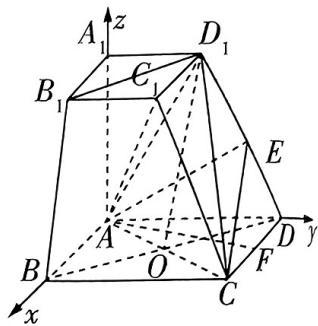

text_image

A₁
z
B₁
C₁
D₁
E
A
O
F
B
C
D
y
x

图3

故以 A 为坐标原点, 以 $\overrightarrow{AB}, \overrightarrow{AD}, \overrightarrow{AA_{1}}$ 的方向分别为 x 轴, y 轴, z 轴的正方向, 建立如图 3 所示的空间直角坐标系. (5 分)

所以 $A(0,0,0)$ , $D(0,2,0)$ , $D_{1}(0,1,\sqrt{3})$ , $C_{1}(1,1,\sqrt{3})$ , $C(2,2,0)$ , 所以 $\overrightarrow{AC} = (2,2,0)$ .

当 E 是棱 $DD_{1}$ 的中点时, $E(0, \frac{3}{2}, \frac{\sqrt{3}}{2})$ ,

所以 $\overrightarrow{AE} = (0, \frac{3}{2}, \frac{\sqrt{3}}{2})$ ，连接 $AC_{1}$ ，所以 $\overrightarrow{AC_1} = (1, 1, \sqrt{3})$ . (7分)

设平面 AEC 的法向量为 $\boldsymbol{n}=(x,y,z)$ ，则 $\left\{\begin{aligned}\boldsymbol{n}\cdot\overrightarrow{AE}&=\frac{3}{2}y+\frac{\sqrt{3}}{2}z=0,\\ \boldsymbol{n}\cdot\overrightarrow{AC}&=2x+2y=0,\end{aligned}\right.$

令 $y = -1$ ，得 $x = 1, z = \sqrt{3}$ ，则平面 $AEC$ 的一个法向量为 $\pmb{n} = (1, -1, \sqrt{3})$ ，（8分）

所以点 $C_1$ 到平面 $AEC$ 的距离 $h = \frac{|\overrightarrow{AC_1} \cdot \boldsymbol{n}|}{|\boldsymbol{n}|} = \frac{3}{\sqrt{5}} = \frac{3\sqrt{5}}{5}$ . (9分)

【避易错】不要混淆点面距与夹角的向量公式. 注意分子的绝对值符号不要丢

(3) 存在, 且 CF 的长为 1. (10 分)

设 $E(0,2 - t,\sqrt{3} t)(0\leqslant t\leqslant 1)$ ，则 $\overrightarrow{AE} = (0,2 - t,\sqrt{3} t)$

所以点 $E$ 到 $AC$ 的距离 $d = \sqrt{\overrightarrow{AE}^2 - |\frac{\overrightarrow{AE}\cdot\overrightarrow{AC}}{|\overrightarrow{AC}|}|^2} = \sqrt{(2 - t)^2 + 3t^2 - |\frac{2(2 - t)}{2\sqrt{2}}|^2} = \sqrt{\frac{7}{2}t^2 - 2t + 2},$

【避易错】注意点 $E$ 到直线 $AC$ 距离的向量公式 $d = \sqrt{\overrightarrow{AE}^2 - |\frac{\overrightarrow{AE}\cdot\overrightarrow{AC}}{|\overrightarrow{AC}|}|^2}$ 中的分母 $|\overrightarrow{AC} |$ 不要漏

所以当 $t=\frac{2}{7}$ 时, E 到 AC 的距离最小, 又线段 AC 的长为定值, 则此时 $\triangle AEC$ 的面积最小, 此时 $\overrightarrow{AE}=(0,\frac{12}{7},\frac{2\sqrt{3}}{7})$ . (12 分)

设平面 AEC 的法向量为 $\boldsymbol{m}=(x_{1},y_{1},z_{1})$ ，则 $\left\{\begin{aligned}\boldsymbol{m}\cdot\overrightarrow{AE}&=\frac{12}{7}y_{1}+\frac{2\sqrt{3}}{7}z_{1}=0,\\ \boldsymbol{m}\cdot\overrightarrow{AC}&=2x_{1}+2y_{1}=0,\end{aligned}\right.$

令 $y_{1} = -1$ ，则 $x_{1} = 1, z_{1} = 2\sqrt{3}$ ，可得平面AEC的一个法向量为 $\pmb {m} = (1, -1, 2\sqrt{3})$ （13分）

当 $\triangle AEC$ 的面积最小时，假设存在满足题意的点 $F$ ，设 $\overrightarrow{AF} = (\lambda,2,0)(0\leqslant \lambda \leqslant 2)$

因为直线 $AF$ 与平面 $AEC$ 所成角的正弦值为 $\frac{\sqrt{70}}{70}$ ,

所以 $\frac{\sqrt{70}}{70} = |\cos \langle m, \overrightarrow{AF}\rangle| = \frac{|\pmb{m} \cdot \overrightarrow{AF}|}{|\pmb{m}| |\overrightarrow{AF}|} = \frac{2 - \lambda}{\sqrt{14} \cdot \sqrt{\lambda^2 + 4}}$ ，得 $\lambda = 1$ ，满足题意.

所以当 $\triangle AEC$ 的面积最小时, 存在满足题意的点 $F$ , 使得直线 $AF$ 与平面 $AEC$ 所成角的正弦值为 $\frac{\sqrt{70}}{70}$ , 且 $CF$ 的长为 1. (15 分)

# 结论速记

# 建系套公式法速解立体几何空间角与距离问题

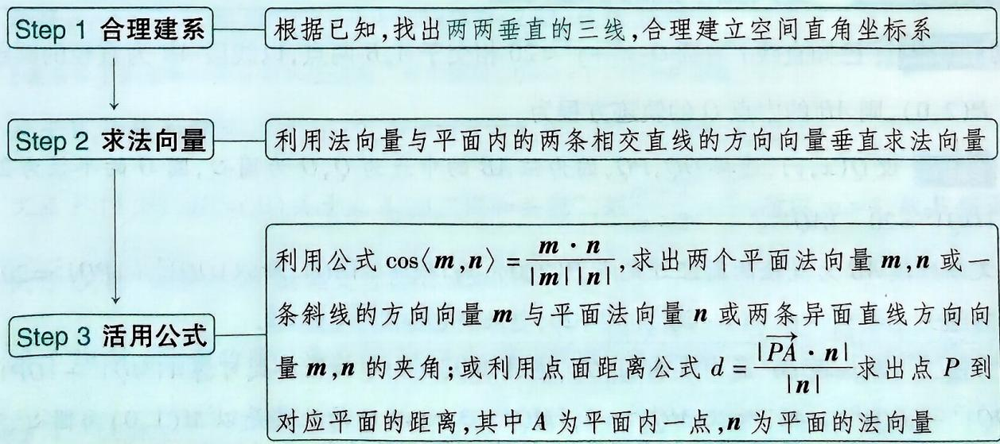

flowchart

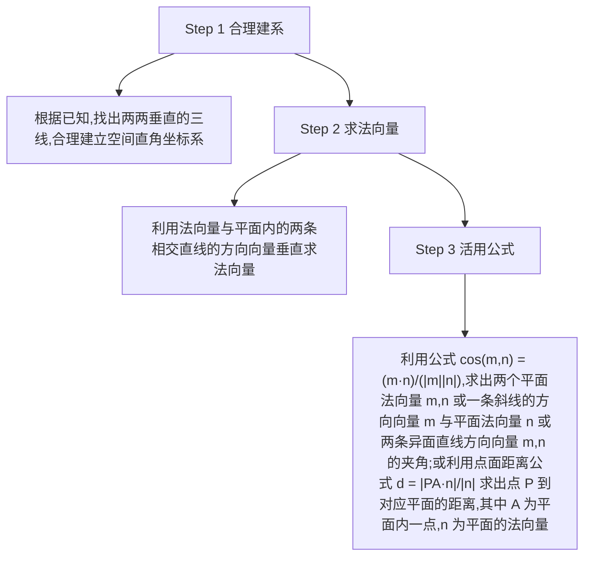

人工智能(AI) 相关专业:人工智能、智能科学与技术、智能视觉工程等.行业方向:机器学习、自然语言处理、自动驾驶、医疗诊断等.

# 考前18天

# 第33题 直线与圆的位置关系探究问题

# 预测角度1

# 直线与圆相切求参数取值范围

热考指数

原创 预测1 已知曲线 $C_{1}: x^{2} + y^{2} = 4y (x \geqslant 0)$ , 曲线 $C_{2}: x^{2} + y^{2} - 2y - 8 = 0 (x < 0, y > 0)$ , 直线 $l: y = \sqrt{3}x + m$ , 若直线 $l$ 与曲线 $C_{1}, C_{2}$ 都没有公共点, 则实数 $m$ 的取值范围为 \_\_\_\_.

解析 曲线 $C_1$ 是以 $(0,2)$ 为圆心，2为半径的圆在 $y$ 轴上及 $y$ 轴右侧的部分，曲线 $C_2$ 是以 $(0,1)$ 为圆心,3为半径的圆在x轴上方、y轴左侧的部分,如图1.

因为直线 $l: y = \sqrt{3} x + m$ 的倾斜角为 $60^{\circ}$ , 所以当直线 $l$ 与曲线 $C_{1}$ 相切于点 $Q$ 时, 设直线 $l$ 与 $y$ 轴交于点 $M(0, m_{1})$ , 连接 $C_{1} Q$ , 则 $|C_{1} M| = 2 |C_{1} Q| = 4$ , 则 $m_{1} = -2$ ,

# 命题依据

直线与圆的位置关系有关问题中，解法灵活多样，选择巧妙方法可以大大提高解题速度，尤其是利用数形结合，可以将问题简化，避开复杂运算，体现高考“多想少算”的命题思想。

text_image

y
P
T
C₁
C₂
O
x
Q
M

图1

【技法速通】数形结合，利用图形性质快速求得相切时 $m$ 的两个临界值

当直线 l 与曲线 $C_{2}$ 相切于点 T 时, 设直线 l 与 y 轴交于点 $P(0, m_{2})$ , 连接 $C_{2}T$ , 则 $\left|C_{2}P\right|=2\left|C_{2}T\right|=6$ , 则 $m_{2}=7$ .

结合图形可知,若直线 l 与曲线 $C_{1}, C_{2}$ 都没有公共点,则实数 m 的取值范围为 $(-∞, -2) ∪ (7, +∞)$ .

# 预测角度2

# 公共弦中点的轨迹问题

热考指数

原创 预测2 已知直线 l 与圆 $O: x^{2} + y^{2} = 20$ 相交于 A, B 两点, 以线段 AB 为直径的圆经过定点 $P(2,0)$ , 则 AB 的中点 Q 的轨迹方程为 \_\_\_\_.

解析 设 $Q(x, y)$ , 连接 $OQ, PQ$ , 因为弦 $AB$ 的中点为 $Q, O$ 为圆心, 圆 $O$ 的半径为 $2\sqrt{5}$ , 所以 $|OQ|^2 = 20 - |AQ|^2$ ,

又以线段 $AB$ 为直径的圆经过定点 $P(2,0)$ ，则 $|PQ| = |AQ|$ ，所以 $|OQ|^2 + |PQ|^2 = 20$ .

方法一 即 $x^{2} + y^{2} + (x - 2)^{2} + y^{2} = 20$ ，整理得 $(x - 1)^{2} + y^{2} = 9.$

方法二 取线段 OP 的中点 $M(1,0)$ ，连接 MQ，则由中线长公式可得 $4|MQ|^{2}+|OP|^{2}=2(|OQ|^{2}+|PQ|^{2})=40$ ，所以 $|MQ|^{2}=9,|MQ|=3$ ，所以 Q 的轨迹是以 $M(1,0)$ 为圆心、3 为半径的圆。故点 Q 的轨迹方程为 $(x-1)^{2}+y^{2}=9$ 。

# 行业风向

大数据与云计算 相关专业: 数据科学与大数据技术、大数据管理与应用等. 行业方向: 金融分析、企业决策支持、智慧城市等.

# 考前

# 17天

# 第34题 圆锥曲线离心率的求解问题

# 预

# 测角度1

# 新定义“调和共轭”背景下求离心率

# 热考指数

原创 预测1 (多选)已知点 $P$ 在线段 $P_{1}P_{2}$ 上, 点 $Q$ 在线段 $P_{1}P_{2}$ 的延长线上, 若 $\frac{|P_1P|}{|PP_2|} = \frac{|P_1Q|}{|QP_2|}$ , 则称点 $P, Q$ 与点 $P_{1}, P_{2}$ “调和共轭”. 设椭圆长轴的左、右端点分别是 $A_{1}, A_{2}$ , 椭圆的左、右焦点分别是 $F_{1}, F_{2}$ , 则 ( )

A. 若点 $F_{1}, A_{2}$ 与点 $A_{1}, F_{2}$ “调和共轭”，则椭圆的离心率为 $3 - 2\sqrt{2}$   
B. 若椭圆的离心率为 $\frac{1}{2}$ , 点 $F_{2}(1,0), M(m,0)$ 关于点 $A_{1}, A_{2}$ “调和共轭”, 则 $m = 6$   
C. 若点 $F_{1}, A_{2}$ 与点 $A_{1}, F_{2}$ “调和共轭”，则点 $F_{2}, A_{1}$ 与点 $A_{2}, F_{1}$ “调和共轭”  
D. 若椭圆的离心率为 $\frac{1}{3}$ , 则点 $A_{1}$ , 坐标原点 $O$ 与点 $F_{1}, A_{2}$ “调和共轭”

解析 对于 A, 因为点 $F_{1}, A_{2}$ 与点 $A_{1}, F_{2}$ “调和共轭”, 所以 $\frac{|A_{1}F_{1}|}{|F_{1}F_{2}|} = \frac{|A_{1}A_{2}|}{|A_{2}F_{2}|}$ , 所以 $\frac{a - c}{2c} = \frac{2a}{a - c}$ , 所以 $c^{2} - 6ac + a^{2} = 0$ , 得 $e^{2} - 6e + 1 = 0$ (e 为椭圆离心率),

【障碍速通】方程两边同除以 $a^2$ ，即可得到关于 $e$ 的方程

解得 $e=3\pm2\sqrt{2}$ ，因为 $0<e<1$ ，所以 $e=3-2\sqrt{2}$ ，故 A 正确.

【避易错】注意离心率 $e$ 的取值范围, 对于椭圆, $0 < e < 1$ , 对于双曲线, $e > 1$

对于 B, 由已知可得 c=1, a=2, 所以 $F_{1}(-1,0)$ , $A_{1}(-2,0)$ , $A_{2}(2,0)$ ,

又点 $F_{2}(1,0), M(m,0)$ 关于点 $A_{1}, A_{2}$ “调和共轭”，则 $\frac{m + 2}{m - 2} = \frac{3}{1}$ ，所以 $m = 4$ ，故 B 错误.

对于 C, 由“调和共轭”的定义可得 C 正确.

对于 D, 因为椭圆的离心率为 $\frac{1}{3}$ , 所以 a = 3c, 所以 $\frac{|A_{1}F_{1}|}{|F_{1}O|} = \frac{a - c}{c} = 2$ , $\frac{|A_{1}A_{2}|}{|A_{2}O|} = \frac{2a}{a} = 2$ , 所以 $\frac{|A_{1}F_{1}|}{|F_{1}O|} = \frac{|A_{1}A_{2}|}{|A_{2}O|}$ , 所以点 $A_{1}$ , 坐标原点 O 与点 $F_{1}, A_{2}$ “调和共轭”, 故 D 正确. 故选 ACD.

量子科技 相关专业:量子信息科学、量子计算等.行业方向:加密通信、材料研发、高性能计算等.

# 测角度 2 结合多边形面积求离心率

原创 预测2 已知椭圆的四个顶点围成的四边形的内切圆的面积为 $S_{1}$ , 四边形的面积为 $S_{2}$ , 若 $\frac{S_{1}}{S_{2}} = \frac{\pi}{5}$ , 则椭圆的离心率为 \_\_\_\_.

# 命题依据

本题融合平面四边形及其内切圆的面积、椭圆的离心率，考查平面几何知识与方程思想，符合高考综合性强的命题趋势.

解析 根据题意作图,如图1,其中 $A_{1},A_{2},B_{1}$ ,

$B_{2}$ 是椭圆的四个顶点, $O$ 是椭圆的中心, 设椭圆的长半轴长为 $a$ , 短半轴长为 $b$ , 设内切圆的半径为 $r$ , 则 $S_{1} = \pi r^{2}$ .

连接 $OA_{2}, OB_{2}$ , 则在 $\triangle OA_{2}B_{2}$ 中, 有 $\frac{1}{2} r\sqrt{a^2 + b^2} = \frac{1}{2} ab$ , 所以 $r =$

【障碍速通】四边形被坐标轴分割成四个三角形，任选其中一个三角形，应用等面积法列方程求 $r$

$$
\frac {a b}{\sqrt {a ^ {2} + b ^ {2}}}, \text {所以} S _ {1} = \pi \frac {a ^ {2} b ^ {2}}{a ^ {2} + b ^ {2}}.
$$

text_image

B₂
r
O
A₁
A₂
B₁

图1

四边形 $A_{1}B_{1}A_{2}B_{2}$ 的面积 $S_{2} = \frac{1}{2}\times 2a\times 2b = 2ab$

所以 $\frac{S_1}{S_2} = \pi \frac{ab}{2(a^2 + b^2)} = \frac{\pi}{5}$ , 所以 $2(a^2 + b^2) = 5ab$ , 所以 $a = 2b$ 或 $a = \frac{1}{2} b$ ,

【障碍速通】把 $a, b$ 的其中一个看作变量，另一个看作参数，求解含参数的一元二次方程

因为 $a > b > 0$ ，所以 $a = 2b, a^2 = 4b^2 = 4(a^2 - c^2)$ ，所以 $c = \frac{\sqrt{3}}{2} a$

所以椭圆的离心率为 $e = \frac{\sqrt{3}}{2}$

# 测角度 3 存在性探索问题中求离心率的取值范围

热考指数

原创 预测3 已知双曲线 $\Omega:\frac{x^{2}}{a^{2}}-\frac{y^{2}}{b^{2}}=1(a>0,b>0)$ 上存在点 M，使得过点 M 作圆 $O:x^{2}+y^{2}=b^{2}$ 的两条切线，切点分别为 P, Q，满足 $\angle PMQ=60^{\circ}$ ，则双曲线 $\Omega$ 的离心率的取值范围为 \_\_\_\_.

解析 如图2, 连接 $OM, OP$ , 由已知得 $MO$ 平分 $\angle PMQ$ , 则 $|OM| = 2|PO| = 2b$ ,

因为点 M 在双曲线 $\Omega:\frac{x^{2}}{a^{2}}-\frac{y^{2}}{b^{2}}=1(a>0,b>0)$ 上，所以 $2b\geqslant a$

【障碍速通】双曲线 $\frac{x^2}{a^2} -\frac{y^2}{b^2} = 1(a > 0,b > 0)$ 上的点应满足横坐标的绝对值大于 $a$ ，据此得出不等关系

所以 $\frac{b}{a} \geqslant \frac{1}{2}$ , 所以双曲线 $\Omega$ 的离心率 $e = \sqrt{1 + (\frac{b}{a})^2} \geqslant \frac{\sqrt{5}}{2}$ .

即双曲线 $\Omega$ 的离心率的取值范围为 $[\frac{\sqrt{5}}{2}, +\infty)$ .

text_image

y
P
M
O
x
Q

图2

# 预测角度4 结合焦半径公式求离心率

热考指数 ★★★★★

原创预测4 对于椭圆的焦半径,有以下结论:横坐标为 m 的点 Q 在椭圆 $\frac{x^{2}}{a^{2}} + \frac{y^{2}}{b^{2}} = 1 (a > b > 0)$ 上,椭圆的左、右焦点分别为 $G_{1}, G_{2}$ , 离心率为 e, 则两个焦半径分别为 $\left|QG_{1}\right| = a + em, \left|QG_{2}\right| = a - em$ . 已知 $\triangle ABC$ 的三个顶点都在椭圆 $\Gamma$ 上, $F_{1}, F_{2}$ 是椭圆 $\Gamma$ 的左、右焦点, $\overrightarrow{AF_{1}} = t_{1} \overrightarrow{F_{1}B}, \overrightarrow{AF_{2}} = t_{2} \overrightarrow{F_{2}C}$ , 若 $t_{1} + t_{2} = 6$ , 则椭圆 $\Gamma$ 的离心率 e 为 \_\_\_\_.

# 命题依据

本题题干信息长，要求解决较复杂的离心率问题，符合近年高考问题变复杂、但解题关键蕴含在题干中的特征，旨在考查考生提取、应用题干信息的能力。

解析 设 $\triangle ABC$ 的三个顶点分别为 $A(x_{1},y_{1}), B(x_{2},y_{2}), C(x_{3},y_{3})$ , 焦点分别为 $F_{1}(-c,0), F_{2}(c,0)$ , 因为 $\overrightarrow{AF_1} = t_1 \overrightarrow{F_1B}$ , 所以 $-c - x_{1} = t_{1}(x_{2} + c)$ ,

又由焦半径公式得 $t_{1}=\frac{a+ex_{1}}{a+ex_{2}}=\frac{a^{2}+cx_{1}}{a^{2}+cx_{2}}$ ，所以 $t_{1}=\frac{a^{2}+c^{2}+2cx_{1}}{a^{2}-c^{2}}$ .

【障碍速通】结合题中所给的焦半径公式寻找变量间的关系，目的是实现变量相互转化，减少方程中变量的个数

因为 $\overrightarrow{AF_2} = t_2\overrightarrow{F_2C}$ ，所以 $c - x_{1} = t_{2}(x_{3} - c)$

又由焦半径公式得 $t_2 = \frac{a - ex_1}{a - ex_3} = \frac{a^2 - cx_1}{a^2 - cx_3},$

所以 $t_2 = \frac{a^2 + c^2 - 2cx_1}{a^2 - c^2}$ .

所以 $t_1 + t_2 = \frac{a^2 + c^2 + 2cx_1}{a^2 - c^2} +\frac{a^2 + c^2 - 2cx_1}{a^2 - c^2} = \frac{2a^2 + 2c^2}{a^2 - c^2},$

又 $t_1 + t_2 = 6$ ，所以 $\frac{2a^2 + 2c^2}{a^2 - c^2} = 6$ ，所以 $a^2 = 2c^2$ ，所以椭圆 $\Gamma$ 的离心率为 $e = \frac{\sqrt{2}}{2}$

# 考前

# 16天

# 第35题 特殊弦——焦点弦与中点弦问题

# 预测角度1

# 双曲线的中点弦问题

热考指数

原创 预测1 (多选)已知倾斜角为 $\theta$ 的直线 $l$ 经过双曲线 $C: \frac{x^2}{4} - \frac{y^2}{5} = 1$ 的右焦点 $F$ , 且与双曲线 $C$ 的右支交于两点 $A, B$ , 线段 $AB$ 的中点为 $N$ . 则下列说法正确的是 ( )

A. 线段 $AB$ 的长度的最小值为 $\frac{5}{2}$   
B. 点 $N$ 到 $y$ 轴距离的最小值为 3  
C. 当 $\theta \neq 90^{\circ}$ 时, 过点 $N$ 作直线 $l$ 的垂线交 $x$ 轴于点  
$M$ ，则 $\vert AB\vert = \frac{4}{3}\vert FM\vert$   
D. 当 $\theta = 60^{\circ}$ 时, $|AB| = 80$

# 命题依据

圆锥曲线关于弦的问题一直是高考的命题热点，2023全国乙卷选择题中就单独考查了双曲线中点弦问题。本题以双曲线为载体，在中点弦基础上提高问题综合性，并在题目中设置陷阱，加大难度，符合高考注重对核心知识的深度考查趋势。

解析 设 $A(x_{1},y_{1}), B(x_{2},y_{2})$ ，设直线 $l$ 的方程为 $x = my + 3$ ，将其代入双曲线 $C$ 的方程中消去 $x$ ，整理得 $(5m^{2} - 4)y^{2} + 30my + 25 = 0, \Delta = (30m)^{2} - 100(5m^{2} - 4) = 400m^{2} + 400 > 0,$

则 $y_{1} + y_{2} = \frac{-30m}{5m^{2} - 4}, y_{1} \cdot y_{2} = \frac{25}{5m^{2} - 4}$ .

因为直线 l 与双曲线 C 的右支交于两点 A, B, 所以 $0 \leqslant |m| < \frac{2}{\sqrt{5}}$ , 所以 $-4 \leqslant 5m^{2} - 4 < 0$ .

【避易错】此处有两点易错，①题目中的条件“直线 $l$ 与双曲线 $C$ 的右支交于两点 $A, B$ ”，则直线 $l$ 的斜率 $k$ 的绝对值应大于双曲线 $C$ 的渐近线的斜率的绝对值，即 $|k| > \frac{\sqrt{5}}{2}$ 。②此处设直线 $l$ 的方程为 $x = my + 3$ ，所以 $0 \leqslant |m| < \frac{2}{\sqrt{5}}$ ，不要求错范围

由弦长公式得 $|AB|=\sqrt{1+m^{2}}\sqrt{(y_{1}+y_{2})^{2}-4y_{1}\cdot y_{2}}=\frac{20(m^{2}+1)}{4-5m^{2}}$ ,

【结论速记】有一个比较常用的圆锥曲线统一焦点弦长公式 $\frac{2ep}{|1-e^{2}\cos^{2}\theta|}$ ，其中e为离心率（抛物线的离心率为1）， $p=\frac{b^{2}}{c}$ ，为焦准距， $\theta$ 为焦点弦所在直线的倾斜角

则当 m=0 时, 线段 AB 长度最小, 最小值为 5, 故 A 错误.

【秒杀解】椭圆或双曲线的焦点弦中，通径最短，为 $\frac{2b^{2}}{a}=5$

$x_{1} + x_{2} = m(y_{1} + y_{2}) + 6 = \frac{-24}{5m^{2} - 4}$ 则线段 $AB$ 的中点 $N$ 的坐标为 $\left(\frac{-12}{5m^2 - 4},\frac{-15m}{5m^2 - 4}\right)$

所以点 $N$ 到 $y$ 轴的距离 $d = \left|\frac{-12}{5m^2 - 4}\right| = \frac{12}{4 - 5m^2}$ , 当 $m = 0$ 时, $d$ 最小, 最小值为 3, 故 B 正确.

设 $M(x_{M},0)$ ，因为直线 $NM\perp$ 直线 $l$ ，且 $\theta \neq 90^{\circ}$ ，所以 $\frac{\frac{-15m}{5m^2 - 4} - 0}{\frac{-12}{5m^2 - 4} - x_M}\cdot \frac{1}{m} = -1$ ，解得 $x_{M} = \frac{-27}{5m^{2} - 4},$

所以 $|FM| = |x_M - 3| = \frac{15(m^2 + 1)}{|5m^2 - 4|}$ ,

又 $|AB|=\frac{20(m^{2}+1)}{|5m^{2}-4|}$ ，所以 $|AB|=\frac{4}{3}|FM|$ 。故C正确。

当 $\theta = 60^{\circ}$ 时， $m = \frac{1}{\sqrt{3}}$ ，所以 $|AB| = \frac{20(m^2 + 1)}{|5m^2 - 4|} = \frac{80}{7}$ . 故D错误. 故选BC.

# 测角度2 抛物线的焦点弦问题

热考指数

原创 预测2 已知抛物线 $x^{2}=4y$ 的准线与对称轴的交点为 T，过点 T 的直线 $l_{1}$ 与抛物线相交于不同的两点 A, B，直线 $l_{2}$ 经过抛物线的焦点 F 与抛物线相交于 D, E 两点，且 $l_{1} \parallel l_{2}$ . 则 $\frac{|TA||TB|}{|DF||EF|}$ 的值为 \_\_\_\_.

解析 由题意知 $T(0, -1), F(0, 1)$ .

设 $A(x_{1},y_{1}),B(x_{2},y_{2}),D(x_{3},y_{3}),E(x_{4},y_{4})$

易知直线 $l_{1}, l_{2}$ 的斜率存在且不为0，设直线 $l_{1}$ 的方程为 $y = kx - 1$ ，与抛物线方程联立后消去 $x$ 整理得 $y^2 + (2 - 4k^2)y + 1 = 0$ ，

则 $\Delta_{1} > 0, y_{1} + y_{2} = 4k^{2} - 2, y_{1}y_{2} = 1$

所以 $|TA||TB| = \sqrt{x_1^2 + (y_1 + 1)^2}\sqrt{x_2^2 + (y_2 + 1)^2} = \sqrt{y_1^2 + 6y_1 + 1}\sqrt{y_2^2 + 6y_2 + 1} = \sqrt{y_1^2y_2^2 + 6y_2^2y_1 + y_2^2 + 6y_1^2y_2 + 36y_1y_2 + 6y_2 + y_1^2 + 6y_1 + 1} = 4k^2 + 4.$

设直线 $l_{2}$ 的方程为 $y=kx+1$ ，与抛物线方程联立后消去x整理得 $y^{2}-(2+4k^{2})y+1=0$ ，则 $\Delta_{2}>0,y_{3}+y_{4}=4k^{2}+2,y_{3}y_{4}=1$ ，

所以 $|FD||FE|=\sqrt{x_{3}^{2}+(y_{3}-1)^{2}}\sqrt{x_{4}^{2}+(y_{4}-1)^{2}}=\sqrt{y_{3}^{2}+2y_{3}+1}\sqrt{y_{4}^{2}+2y_{4}+1}=4k^{2}+4$

【速解】利用抛物线的定义可得 $|FD|=y_{3}+1,|FE|=y_{4}+1$ ，则 $|FD||FE|=(y_{3}+1)(y_{4}+1)=y_{3}y_{4}+y_{3}+y_{4}+1=4k^{2}+4$

所以 $\frac{|TA||TB|}{|DF||EF|} = 1.$

# 命题依据

在圆锥曲线中，与焦点弦相关的二级结论非常多，因此高考命题人非常喜欢围绕焦点弦命题。本题命制抛物线的焦点弦求值相关问题，回归基础，考查考生对抛物线几何性质、代数运算等的综合运用能力，符合高考“注重基础、突出能力”的命题原则。

# 考前

# 15天

# 第 36 题 动点轨迹的探究问题

# 预测角度1

# 结合对称性求动点轨迹

热考指数

原创 预测1 已知平面直角坐标系 $xOy$ 中, 点 $F(2,0)$ , 点 $A$ 是 $y$ 轴上的动点, 过点 $A$ 作直线 $AF$ 的垂线交 $x$ 轴于点 $B$ , 设点 $B$ 关于直线 $AF$ 的对称点为 $P$ , 则点 $P$ 的轨迹方程为 ( )

A. $x^{2} + y^{2} = 1$

B. $x^{2} - y^{2} = 1$

C. $y^{2} = 8x$

D. $y^{2} = -8x$

解析 当 $A(0,0)$ 时，易知 $P(0,0)$ ，当 $A$ 异于 $O$ 时，

方法一 根据题意作出图形,如图1,设点 $P(x,y)$ , $A(0,a)$ , $B(b,0)$ ,

因为点 B 关于直线 AF 的对称点为 P, A, B, P 三点共线, 所以点 A 是线段 BP 的中点,

# 命题依据

近年探求动点轨迹方程问题考查频繁，强调数学符号语言与图形语言的转化，如2024新课标Ⅱ卷T5、2023新课标I卷T22.本题用代数方法、定义法均可解决，但计算、思维量有差异，凸显了高考命题中“重思考轻繁复计算”的原则，有效发挥选拔功能.

所以 $2a = 0 + y, 0 = b + x$ ，即 $a = \frac{y}{2}, b = -x$ ，所以 $B(-x, 0)$ .

因为 $|BF|=|PF|$ ，所以 $|2+x|=\sqrt{(x-2)^{2}+y^{2}}$

text_image

y
B O F x
A P

图1

【障碍速通】找变量间的关系实现变量互换，由几何关系列方程，两边同时平方求解

整理得 $y^{2}=8x$ ，故选 C.

方法二 根据题意作出菱形 BFPQ, 如图 2, 由对称性可得 Q 的横坐标为常数 -2, 即 Q 在定直线 x = -2 上,

所以点 $P$ 到定点 $F$ 的距离 $|PF|$ 等于它到定直线 $x = -2$ 的距离 $|PQ|$ ,

【障碍速通】结合抛物线的定义确定动点轨迹

所以点 $P$ 的轨迹是以 $F$ 为焦点、 $x = -2$ 为准线的抛物线，

所以点 P 的轨迹方程为 $y^{2}=8x$ ，故选 C.

text_image

y
F
x
B
O
A
P
Q

图2

# 预测角度2

# 结合圆与四边形求动点轨迹

热考指数

原创 预测2: 已知四边形 $ABCD$ 中, $A, B$ 是圆 $\Gamma: x^{2} + y^{2} = 16$ 与 $x$ 轴的交点 ( $A$ 在 $B$ 左侧), $AD, BC$ 都垂直于 $x$ 轴, $CD$ 与圆 $\Gamma$ 相切于点 $P, AC, BD$ 的交点为 $Q$ , 则当点 $P$ 在圆 $\Gamma$ 上运动时, 点 $Q$ 的轨迹方程为

A. $\frac{x^2}{16} +\frac{y^2}{4} = 1(y\neq 0)$

B. $\frac{x^2}{4} +\frac{y^2}{16} = 1(y\neq 0)$

C. $\frac{x^2}{16} -\frac{y^2}{4} = 1(y\neq 0)$

D. $\frac{x^2}{4} -\frac{y^2}{16} = 1(y\neq 0)$

行业风向

绿色低碳技术 相关专业: 环境工程、碳储科学与工程等. 行业方向: 碳排放管理、污染治理等.

解析 根据题意作出图形,如图3,设 $P(x_{0},y_{0})$ , $Q(x,y)$ , $D(-4,y_{1})$ , $C(4,y_{2})$ ,

因为点 $P$ 在圆 $\Gamma: x^2 + y^2 = 16$ 上, 所以 $x_0^2 + y_0^2 = 16$ .

由题意可得 $y_{0}\neq0$ .

【避易错】注意点的坐标限制，在求得答案时剔除不符合题意的点

因为 $CD$ 与圆 $\Gamma$ 相切于点 $P$ , 连接 $OP$ , 所以 $\overrightarrow{PD} \perp \overrightarrow{OP}, \overrightarrow{PC} \perp \overrightarrow{OP}$ ,

所以 $(-4 - x_0, y_1 - y_0) \cdot (x_0, y_0) = 0, (4 - x_0, y_2 - y_0) \cdot (x_0, y_0) = 0,$

所以 $y_{1} = \frac{16 + 4x_{0}}{y_{0}}, y_{2} = \frac{16 - 4x_{0}}{y_{0}},$

所以 $y_{1}y_{2} = \frac{16 + 4x_{0}}{y_{0}}\cdot \frac{16 - 4x_{0}}{y_{0}} = 16.$

因为 C, Q, A 三点共线, 所以 $\frac{y_{2}}{8} = \frac{y}{x + 4}$ , 因为 D, Q, B 三点共线, 所以 $\frac{y_{1}}{-8} = \frac{y}{x - 4}$ ,

两个式子相乘得 $\frac{y_1y_2}{-64} = \frac{y}{x + 4}\cdot \frac{y}{x - 4}$ 化简得 $\frac{x^2}{16} +\frac{y^2}{4} = 1.$

因为 $y_{0} \neq 0$ ，所以 $y \neq 0$ ，所以点 Q 的轨迹方程为 $\frac{x^{2}}{16} + \frac{y^{2}}{4} = 1 (y \neq 0)$ 。故选 A.

text_image

D
y
P
C
Q
A
O
B
x

图3

# 预测角度3

# 结合圆与对称点求动点轨迹

热考指数

原创 预测3 已知点 $A_{1}(0, -4), A_{2}(0, 4)$ , 以 $A_{1}A_{2}$ 为直径的圆上的两个点 $P_{1}, P_{2}$ 关于 $y$ 轴对称 $(P_{1}, P_{2}$ 不重合), 直线 $A_{2}P_{2}$ 与直线 $A_{1}P_{1}$ 相交于点 $Q$ , 点 $Q$ 的轨迹为曲线 $C$ .

(1)求曲线 C 的方程.  
(2)设点 $M$ 是曲线 $C$ 上任意一点, 过点 $M$ 的直线 $l$ 交直线 $y = x$ 于点 $N_{1}$ , 交直线 $y = -x$ 于点 $N_{2}$ .  
(i)若直线 l 与曲线 C 相切, 求证: 点 M 平分线段 $N_{1}N_{2}$ .  
(ii) 若直线 $l$ 与曲线 $C$ 相交于另一点 $N$ , 且 $\overrightarrow{N_1M} = \overrightarrow{MN} = \overrightarrow{NN_2}$ , 求证: $\triangle ON_1N_2$ 的面积为定值.

解析 (1) 设 $P_{1}(x_{0}, y_{0}), Q(x, y)$ , 则 $P_{2}(-x_{0}, y_{0})$ ,

因为 $P_{1}(x_{0},y_{0})$ 在以 $A_{1}A_{2}$ 为直径的圆上，所以 $x_0^2 +y_0^2 = 16$ ， (1分)

因为 $P_{1}, A_{1}, Q$ 三点共线，所以 $\overrightarrow{A_1P_1} = (x_0, y_0 + 4)$ 与 $\overrightarrow{A_1Q} = (x, y + 4)$ 共线，

所以 $x_0(y + 4) = x(y_0 + 4)$ ①，

因为 $P_{2}, A_{2}, Q$ 三点共线，所以 $\overrightarrow{A_2P_2} = (-x_0, y_0 - 4)$ 与 $\overrightarrow{A_2Q} = (x, y - 4)$ 共线，

所以 $-x_{0}(y-4)=x(y_{0}-4)$ ②. (3 分)

① × ② 得 $-x_{0}^{2}(y^{2}-16)=x^{2}(y_{0}^{2}-16)$ ，所以 $y^{2}-16=x^{2}$ ，

结合 $P_{1}, P_{2}$ 不重合可知 $y \neq \pm 4$ .

所以曲线 $C$ 的方程为 $\frac{y^2}{16} -\frac{x^2}{16} = 1(y\neq \pm 4).$ (5分)

(2) 设点 $M(x_{M}, y_{M})$ ，则 $y_{M}^{2} - x_{M}^{2} = 16$ . (6分)

(i) 将 $y^2 - 16 = x^2$ 对 $x$ 求导得 $y'2y = 2x$ ，即 $y' = \frac{x}{y}$ ，所以切线 $l$ 的斜率 $k = \frac{x_M}{y_M}$ ，切线 $l$ 的方程为 $y - y_M = \frac{x_M}{y_M}(x - x_M)$ ，化简得 $y_M y - x_M x = 16$ . (8分)

【障碍速通】双曲线 $\frac{y^2}{a^2} -\frac{x^2}{b^2} = 1(a > 0,b > 0)$ 在点 $(x_0,y_0)$ 处的切线方程为 $\frac{y_0y}{a^2} -\frac{x_0x}{b^2} = 1$ ，这个结论在解答题中要先证明才能应用

由 $\left\{ \begin{array}{l} y_{M}y - x_{M}x = 16, \\ y = x \end{array} \right.$ 得 $x = \frac{16}{y_M - x_M} = y_M + x_M$ ，由 $\left\{ \begin{array}{l} y_{M}y - x_{M}x = 16, \\ y = -x \end{array} \right.$ 得 $x = \frac{-16}{y_M + x_M} = x_M - y_M,$

所以 $N_{1}(y_{M} + x_{M},y_{M} + x_{M}),N_{2}(x_{M} - y_{M},y_{M} - x_{M})$

所以 $N_{1}, N_{2}$ 的中点坐标为 $(x_{M}, y_{M})$ ，所以点 $M(x_{M}, y_{M})$ 平分线段 $N_{1}N_{2}$ . (10 分)

(ii) 易知, 当直线 l 斜率不存在时, 不满足 $\overrightarrow{N_{1}M} = \overrightarrow{MN} = \overrightarrow{NN_{2}}$ ,

故可设直线 $l$ 的方程为 $y = kx + m$ ，设 $M(x_{1},y_{1}),N(x_{2},y_{2})$

由 $\left\{\begin{aligned}y&=kx+m,\\ y^{2}&-x^{2}=16\end{aligned}\right.$ 消去y整理得 $(k^{2}-1)x^{2}+2mkx+m^{2}-16=0,\Delta=4(16k^{2}+m^{2}-16)>0,$

根据题意分析可得 $-1 < k < 1, m > 4$ 或 $m < -4, x_{1} + x_{2} = \frac{-2mk}{k^{2} - 1}, x_{1}x_{2} = \frac{m^{2} - 16}{k^{2} - 1}$ . (11分)

由 $\left\{\begin{aligned}y&=kx+m,\\ y&=x\end{aligned}\right.$ 得 $N_{1}\left(\frac{m}{1-k},\frac{m}{1-k}\right)$ ，由 $\left\{\begin{aligned}y&=kx+m,\\ y&=-x\end{aligned}\right.$ 得 $N_{2}\left(\frac{-m}{1+k},\frac{m}{1+k}\right)$ . (13分)

所以 $S_{\triangle ON_1N_2} = \frac{1}{2}\left|\frac{m}{1 - k}\cdot \frac{m}{1 + k} -\frac{-m}{1 + k}\cdot \frac{m}{1 - k}\right| = \frac{m^2}{1 - k^2}.$ (14分)

【结论速记】三角形面积的坐标公式：设平面上两点 $A, B$ 的坐标分别为 $(x_{1}, y_{1}), (x_{2}, y_{2}), O$ 为坐标原点，则 $\triangle AOB$ 的面积 $S_{\triangle AOB} = \frac{1}{2} |x_{1}y_{2} - x_{2}y_{1}|$

因为 $\overrightarrow{N_1M} = \overrightarrow{MN} = \overrightarrow{NN_2}$ 所以 $x_{2} = 2x_{1} - \frac{m}{1 - k}, x_{1} = 2x_{2} + \frac{m}{1 + k},$ (15分)

得 $x_{1} = \frac{m(1 + 3k)}{3(1 - k^{2})}, x_{2} = \frac{m(-1 + 3k)}{3(1 - k^{2})}$ , (16分)

则 $x_{1}x_{2} = \frac{m(1 + 3k)}{3(1 - k^{2})}\cdot \frac{m(-1 + 3k)}{3(1 - k^{2})} = \frac{m^{2} - 16}{k^{2} - 1}$ 整理得 $\frac{m^2}{1 - k^2} = 18$

所以 $S_{\triangle ON_1N_2} = 18.$ (17分)

# 考前

# 14天

# 第37题 圆锥曲线中的定点、定直线证明问题

# 预测角度1

# 椭圆内接三角形的定点、定值问题

热考指数

原创 预测1 (多选)已知△ABC的三个顶点都在

椭圆 $\Omega: \frac{x^2}{4} + \frac{y^2}{b^2} = 1 (0 < b < 2)$ 上，点 $A(1, \frac{3}{2})$ ，则下列说法正确的是 （）

A. 若直线 $BC$ 的斜率为定值, 则直线 $BA, CA$ 的斜率之和为 0  
B. 若 $\angle BAC$ 的平分线垂直于 $x$ 轴, 则直线 $BC$ 的斜率为定值  
C. 若直线 $BC$ 过定点 $(\frac{1}{7}, -\frac{3}{14})$ ，则 $\angle BAC = 90^{\circ}$   
D. 若 $\angle BAC = 90^{\circ}$ , 则直线 $BC$ 过定点

# 命题依据

圆锥曲线的定点、定值问题备受高考命题人青睐，5年19考. 其计算量很大，一般出现在解答题中，如2024新课标Ⅱ卷T19，但在当前“多想少算”大命题背景下，极有可能在选择题中考查，尤其是在多选题中，要格外注意灵活运用解题技巧，提高做题速度.

解析 因为点 $A(1, \frac{3}{2})$ 在椭圆 $\Omega: \frac{x^2}{4} + \frac{y^2}{b^2} = 1$ 上，所以 $\frac{1}{4} + \frac{9}{4b^2} = 1$ ，得 $b^2 = 3$

所以椭圆 $\Omega: \frac{x^2}{4} + \frac{y^2}{3} = 1$ .

设直线 BC 的斜率为 k，直线 BC 的方程为 $y = kx + m$ ，

代入椭圆方程消去 $y$ 得关于 $x$ 的方程 $(3 + 4k^2)x^2 + 8mkx + (4m^2 - 12) = 0$

$$
\Delta = 4 8 \left(4 k ^ {2} - m ^ {2} + 3\right) > 0,
$$

设 $B(x_{1},kx_{1} + m),C(x_{2},kx_{2} + m)$ ，则 $x_{1} + x_{2} = \frac{-8mk}{3 + 4k^{2}},x_{1}x_{2} = \frac{4m^{2} - 12}{3 + 4k^{2}}$ ，直线BA，CA的斜率之和为 $k_{BA} + k_{CA} = \frac{kx_1 + m - \frac{3}{2}}{x_1 - 1} +\frac{kx_2 + m - \frac{3}{2}}{x_2 - 1} = \frac{2kx_1x_2 + (m - \frac{3}{2} -k)(x_1 + x_2) + 3 - 2m}{x_1x_2 - (x_1 + x_2) + 1} =$

$$
\frac {2 k \times \frac {4 m ^ {2} - 1 2}{3 + 4 k ^ {2}} + (m - \frac {3}{2} - k) \frac {- 8 m k}{3 + 4 k ^ {2}} + 3 - 2 m}{\frac {4 m ^ {2} - 1 2}{3 + 4 k ^ {2}} - \frac {- 8 m k}{3 + 4 k ^ {2}} + 1} = \frac {1 2 (k + m - \frac {3}{2}) (k - \frac {1}{2})}{4 (k + m - \frac {3}{2}) (k + m + \frac {3}{2})},
$$

当 $k + m = \frac{3}{2}$ 时，点 $A$ 在直线 $BC$ 上，所以 $k + m \neq \frac{3}{2}$ ，所以 $k_{BA} + k_{CA} = \frac{3(k - \frac{1}{2})}{k + m + \frac{3}{2}}$ ，故 $A$ 错误.

医疗科技 相关专业:医学影像学、麻醉学、健康科学与技术等.行业方向:智能诊断、精准医疗等.

行业风向

若 $\angle BAC$ 的平分线垂直于 $x$ 轴，则 $k_{BA} + k_{CA} = 0$ ，所以 $k = \frac{1}{2}$ 故B正确.

因为 $\angle BAC = 90^{\circ}$ ，所以 $\overrightarrow{AB} \cdot \overrightarrow{AC} = 0$ ，即 $(x_{1} - 1, kx_{1} + m - \frac{3}{2}) \cdot (x_{2} - 1, kx_{2} + m - \frac{3}{2}) = 0,$

所以 $x_{1}x_{2} - (x_{1} + x_{2}) + 1 + k^{2}x_{1}x_{2} + (mk - \frac{3}{2} k)(x_{1} + x_{2}) + (m - \frac{3}{2})^{2} = 0,$

即 $(1 + k^2)\frac{4m^2 - 12}{3 + 4k^2} + (mk - \frac{3}{2} k - 1)\frac{-8mk}{3 + 4k^2} + 1 + (m - \frac{3}{2})^2 = 0,$

整理得 $28m^{2} + (32k - 36)m + 4k^{2} - 9 = 0$ ，得 $m = \frac{3}{2} - k$ （舍）或 $m = \frac{-2k - 3}{14}$

【避易错】此处可转化为 $(14m + 2k + 3)(2m + 2k - 3) = 0$ 求 $m$ ，也可用求根公式求得 $m$ ，注意舍去 $m = \frac{3}{2} - k$ 的情况

所以直线 $BC$ 的方程为 $y = kx + \frac{-2k - 3}{14}$ , 此时直线 $BC$ 过定点 $(\frac{1}{7}, -\frac{3}{14})$ , 上述过程反推

【结论速记】设 $A(x_0, y_0), B(x_1, y_1), C(x_2, y_2)$ 是椭圆 $\frac{x^2}{a^2} + \frac{y^2}{b^2} = 1 (a > b > 0)$ 上三个不同的点，若点 $A$ 是 $\triangle ABC$ 的直角顶点，则斜边 $BC$ 所在的直线经过定点 $D\left(\frac{a^2 - b^2}{a^2 + b^2} x_0, -\frac{a^2 - b^2}{a^2 + b^2} y_0\right)$ ，反之也成立。故定点坐标为 $(\frac{4 - 3}{4 + 3} \times 1, -\frac{4 - 3}{4 + 3} \times \frac{3}{2}) = (\frac{1}{7}, -\frac{3}{14})$

也能成立,故 CD 正确.

故选 BCD.

# 测角度2 圆锥曲线中的定直线证明问题

热考指数

原创 预测2 已知椭圆 $C: \frac{x^2}{a^2} + \frac{y^2}{b^2} = 1 (a > b > 0)$ 的左顶点为 $A(-3,0)$ , 右顶点为 $B(3,0)$ , 椭圆上不同于点 $A, B$ 的一点 $P$ 满足 $k_{PA} \cdot k_{PB} = -\frac{4}{9}$ .

(1) 求椭圆 $C$ 的方程;  
(2) 过点 $(2,0)$ 的直线 l 交椭圆 C 于 M, N 两点 (异于点 A, B), 直线 AM, BN 交于点 Q, 证明: 点 Q 在定直线上.

解析 (1) 根据题意得 $a = 3$ ，设点 $P$ 的坐标为 $(x_0, y_0)$ ，

因为点 $P$ 在椭圆上，所以 $\frac{x_0^2}{9} +\frac{y_0^2}{b^2} = 1$ ，得 $y_0^2 = -\frac{(x_0^2 - 9)b^2}{9},$ (2分)

则 $k_{PA} \cdot k_{PB} = \frac{y_0}{x_0 + 3} \cdot \frac{y_0}{x_0 - 3} = \frac{y_0^2}{x_0^2 - 9} = -\frac{(x_0^2 - 9)b^2}{9} \cdot \frac{1}{x_0^2 - 9} = -\frac{b^2}{9} = -\frac{4}{9}$ , 得 $b^2 = 4$ . (5分)

所以椭圆 $C$ 的标准方程为 $\frac{x^2}{9} +\frac{y^2}{4} = 1.$ (6分)

(2) 设 $M(x_{1}, y_{1}), N(x_{2}, y_{2})$ , 直线 $MN$ 的方程为 $x = my + 2$ ,

【技巧速通】由题易知直线 $MN$ 的斜率不为0，故将直线方程设成此形式，避免分类讨论

由 $\left\{\begin{aligned}x&=my+2,\\ \frac{x^{2}}{9}&+\frac{y^{2}}{4}=1\end{aligned}\right.$ 得关于y的方程 $(4m^{2}+9)y^{2}+16my-20=0,\Delta>0,$

则 $y_{1} + y_{2} = -\frac{16m}{4m^{2} + 9}, y_{1}y_{2} = -\frac{20}{4m^{2} + 9}$ . (8分)

直线 $AM$ 的方程为 $y = \frac{(x + 3)y_1}{x_1 + 3}$ ①, 直线 $BN$ 的方程为 $y = \frac{(x - 3)y_2}{x_2 - 3}$ ②, (10分)

则 $\frac{x + 3}{x - 3} = \frac{(x_1 + 3)y_2}{(x_2 - 3)y_1} = \frac{x_1y_2 + 3y_2}{x_2y_1 - 3y_1} = \frac{(my_1 + 2)y_2 + 3y_2}{(my_2 + 2)y_1 - 3y_1} = \frac{my_1y_2 + 5y_2}{my_1y_2 - y_1}$ . (12分)

因为 $my_{1}y_{2} = \frac{5}{4}(y_{1} + y_{2})$ ，所以 $\frac{x + 3}{x - 3} = \frac{\frac{5}{4}(y_1 + y_2) + 5y_2}{\frac{5}{4}(y_1 + y_2) - y_1} = 5$ ，解得 $x = \frac{9}{2}$ （14分）

因此点 $Q$ 在定直线 $x = \frac{9}{2}$ 上. (15分)

# 测角度 3 圆锥曲线中的定点探索问题

热考指数

原创 预测3 已知椭圆 C 的对称中心为坐标原点, 两个顶点是 A(2,0), B(0,3), y 轴上的点 M, N 关于点 B 对称, 直线 AM, AN 与椭圆 C 分别交于另外的点 P, Q.

(1)求椭圆 C 的标准方程.  
(2) 直线 PQ 是否经过定点？若是，求出定点坐标，否则，说明理由.  
(3) 求 $\triangle PQA$ 的面积的最大值.

# 命题依据

圆锥曲线中的定点问题本质是关于含参方程的恒成立问题，此类探索性问题在解答题中经常出现，考查概率很高。圆锥曲线定点、定值问题计算量通常很大，但解题方法比较固定，多加练习，解题便可轻车熟路。

解析 (1) 由已知可得椭圆 $C$ 的焦点在 $y$ 轴上,

设椭圆方程为 $\frac{y^2}{a^2} +\frac{x^2}{b^2} = 1(a > b > 0)$ ，则 $b = 2,a = 3$ （2分）

所以椭圆 $C$ 的标准方程为 $\frac{y^2}{9} +\frac{x^2}{4} = 1.$ (3分）

(2) 设 $P(x_{1}, y_{1}), Q(x_{2}, y_{2})$ ，易知直线 $PQ$ 斜率存在，设直线 $PQ$ 的方程为 $y = kx + m$

由 $\left\{\begin{aligned}y&=kx+m,\\ \frac{y^{2}}{9}&+\frac{x^{2}}{4}=1\end{aligned}\right.$ 消去 y 整理得关于 x 的方程 $(4k^{2}+9)x^{2}+8mkx+(4m^{2}-36)=0$ ,

则 $\Delta = 144(4k^2 + 9 - m^2) > 0, x_1 + x_2 = \frac{-8mk}{4k^2 + 9}, x_1x_2 = \frac{4m^2 - 36}{4k^2 + 9}$ . (5分)

设 $M(0, y_M), N(0, y_N)$ ，因为点 $M, N$ 关于点 $B(0, 3)$ 对称，所以 $y_M + y_N = 6$ .

因为 $M, A, P$ 三点共线，所以 $\frac{y_1}{x_1 - 2} = \frac{y_M}{-2}$ ，所以 $y_M = (-2)\frac{y_1}{x_1 - 2} = \frac{2y_1}{2 - x_1}$ ，

同理 $y_{N}=\frac{2y_{2}}{2-x_{2}}$ ，所以 $\frac{kx_{1}+m}{2-x_{1}}+\frac{kx_{2}+m}{2-x_{2}}=3$ ，(7分)

所以 $(kx_{1} + m)(2 - x_{2}) + (kx_{2} + m)(2 - x_{1}) = 3(2 - x_{1})(2 - x_{2})$ ，即 $(2k - m + 6)(x_{1} + x_{2}) + (-2k - 3)x_{1}x_{2} + 4m - 12 = 0$ ，即 $(2k - m + 6)\frac{-8mk}{4k^2 + 9} +(-2k - 3)\frac{4m^2 - 36}{4k^2 + 9} + 4m - 12 = 0$ ，整理得 $(m + 2k - 3)(m + 2k) = 0,$ （8分）

因为 $m+2k\neq0$ ，所以 $m+2k-3=0$ ，直线PQ的方程为 $y=k(x-2)+3$ ，

【避易错】若 $m + 2k = 0$ ，则直线 $PQ$ 的方程为 $y = k(x - 2)$ ，直线 $PQ$ 经过点 $A$ ，与已知矛盾所以直线 $PQ$ 经过定点 $T(2,3)$

(3) 由(2)知, 点 $A(2,0)$ 到直线 $PQ$ 的距离为 $d = \frac{|2k + m|}{\sqrt{1 + k^2}} = \frac{3}{\sqrt{1 + k^2}}$ , (10分)

$$
| P Q | = \sqrt {1 + k ^ {2}} \sqrt {(x _ {1} + x _ {2}) ^ {2} - 4 x _ {1} x _ {2}} = \frac {2 4 \sqrt {1 + k ^ {2}} \sqrt {3 k}}{4 k ^ {2} + 9}, \tag {11分}
$$

所以 $S_{\triangle APQ} = \frac{1}{2}|PQ|d = \frac{36\sqrt{3k}}{4k^2 + 9},$ (12分)

令 $\sqrt{k} = t$ ，则 $S_{\triangle APQ} = \frac{36\sqrt{3}t}{4t^4 + 9}$ ，构造函数 $f(t) = \frac{t}{4t^4 + 9}, t \geqslant 0$ ，则 $f'(t) = \frac{9 - 12t^4}{(4t^4 + 9)^2} = 0,$

令 $f'(t)=0$ , 得 $t=\sqrt[4]{\frac{3}{4}}$ ,

所以在 $[0, \sqrt[4]{\frac{3}{4}})$ 上， $f'(t) > 0, f(t)$ 单调递增，在 $(\sqrt[4]{\frac{3}{4}}, +\infty)$ 上， $f'(t) < 0, f(t)$ 单调递减，所以 $f(t)$ 的最大值为 $f(\sqrt[4]{\frac{3}{4}}) = \frac{\sqrt[4]{\frac{3}{4}}}{12} = \frac{\sqrt[4]{12}}{24}$ ，(15分)

所以 $S_{\triangle APQ}$ 的最大值为 $\frac{36\sqrt{3}\sqrt[4]{12}}{24} = \frac{3\sqrt[4]{108}}{2}$ ，当且仅当 $t = \sqrt[4]{\frac{3}{4}}$ ，即 $\sqrt{k} = \sqrt[4]{\frac{3}{4}}$ 时取等号，

此时 $k = \pm \frac{\sqrt{3}}{2}$ , 直线 $PQ$ 的方程为 $y = \pm \frac{\sqrt{3}}{2} (x - 2) + 3$ . (17 分)

# 考前

# 13天

# 第 38 题 热点情境中的数据分析问题

# 预测角度1

# 以体育运动为情境的数据分析问题

热考指数

原创 预测1 某中学在运动会期间,随机抽取了男、女生各100名参加绳子打结计时的趣味性比赛,并对学生性别与绳子打结速度快慢的相关性进行统计分析,得到数据如下表,表格中的数字代表对应的人数.

<table><tr><td rowspan="2">性别</td><td colspan="2">速度</td><td rowspan="2">合计</td></tr><tr><td>快</td><td>慢</td></tr><tr><td>男生</td><td>65</td><td></td><td></td></tr><tr><td>女生</td><td></td><td>55</td><td></td></tr><tr><td>合计</td><td></td><td></td><td>200</td></tr></table>

(1)根据以上数据,依据小概率值 $\alpha=0.01$ 的独立性检验,能否认为学生性别与绳子打结速度快慢有关?  
(2) 现有 $n (n \in \mathbf{N}^{*})$ 根绳子, 共有 $2n$ 个绳头, 每个绳头只打一次结, 且每个结仅含两个绳头, 所有绳头打

结完毕视为结束(规定每根绳子两端绳头视为不同绳头).

(i) 当 $n = 3$ 时, 记随机变量 $X$ 为绳子围成的圈的个数, 求 $X$ 的分布列与数学期望;  
(ii) 求 $n$ 根绳子恰好能围成一个圈的概率.

附： $\chi^2 = \frac{n(ad - bc)^2}{(a + b)(c + d)(a + c)(b + d)}$ ，其中 $n = a + b + c + d.$

<table><tr><td> $\alpha$ </td><td>0.100</td><td>0.050</td><td>0.010</td></tr><tr><td> $x_{\alpha}$ </td><td>2.706</td><td>3.841</td><td>6.635</td></tr></table>

解析 (1) 零假设为 $H_{0}$ : 学生性别与绳子打结速度快慢无关. (1 分)

依题意,补全 $2 \times 2$ 列联表如下,

<table><tr><td rowspan="2">性别</td><td colspan="2">速度</td><td rowspan="2">合计</td></tr><tr><td>快</td><td>慢</td></tr><tr><td>男生</td><td>65</td><td>35</td><td>100</td></tr><tr><td>女生</td><td>45</td><td>55</td><td>100</td></tr><tr><td>合计</td><td>110</td><td>90</td><td>200</td></tr></table>

# 命题依据

数据分析作为数学学科的核心素养之一，在高考中常依托真实情境考查，凸显数学的应用性，如2024全国甲卷T17.本题以“五育并举”中的体育运动为背景，将独立性检验与概率分布列相结合，命题设计综合性强，紧密贴合《高考评价体系》对“应用性”和“创新性”的要求.预测2025此类试题考查的概率极大.

所以 $\chi^2 = \frac{200\times(65\times 55 - 35\times 45)^2}{90\times 110\times 100\times 100} = \frac{800}{99}\approx 8.08 > 6.635.$ (3分)

故依据小概率值 $\alpha = 0.01$ 的独立性检验，可以认为学生性别与绳子打结速度快慢有关。（4分）

(2)(i)由题知,随机变量X的所有可能取值为1,2,3,

$$
P (X = 1) = \frac {\mathrm{C} _ {4} ^ {1} \cdot \mathrm{C} _ {2} ^ {1}}{\frac {\mathrm{C} _ {6} ^ {2} \cdot \mathrm{C} _ {4} ^ {2} \cdot \mathrm{C} _ {2} ^ {2}}{\mathrm{A} _ {3} ^ {3}}} = \frac {8}{1 5},
$$

$$
P (X = 2) = \frac {3 \times 2}{\frac {\mathrm{C} _ {6} ^ {2} \times \mathrm{C} _ {4} ^ {2} \times \mathrm{C} _ {2} ^ {2}}{\mathrm{A} _ {3} ^ {3}}} = \frac {6}{1 5} = \frac {2}{5},
$$

$$
P (X = 3) = \frac {1}{\frac {\mathrm{C} _ {6} ^ {2} \cdot \mathrm{C} _ {4} ^ {2} \cdot \mathrm{C} _ {2} ^ {2}}{\mathrm{A} _ {3} ^ {3}}} = \frac {1}{1 5}, \tag {6分}
$$

【避易错】平均分组问题一定要记得除以具有相同数目的组数的阶乘

所以 $X$ 的分布列为

<table><tr><td>X</td><td>1</td><td>2</td><td>3</td></tr><tr><td>P</td><td>8/15</td><td>2/5</td><td>1/15</td></tr></table>

所以 $E(X) = 1 \times \frac{8}{15} + 2 \times \frac{2}{5} + 3 \times \frac{1}{15} = \frac{23}{15}$ . (8分)

(ii) 不妨令绳头编号依次为 1,2,3,4,…,2n, 其中 1,2 为同一根绳的两头,3,4 为同一根绳的两头,…, 则可以与绳头 2 打结形成一个圈的绳头除了编号 1 外,有(2n-2)种可能,

假设绳头1与绳头3打结,那么相当于对剩下 $(n-1)$ 根绳子进行打结,

设 $n(n \in \mathbf{N}^*)$ 根绳子打结完毕后可成一个圈的情况种数为 $a_n$

那么经过一次打结后,剩下 $(n-1)$ 根绳子打结完毕后可成一个圈的情况种数为 $a_{n-1}$ ,

由此可得, $a_{n}=(2n-2)a_{n-1},n\geqslant2,$ (10 分)

所以 $\frac{a_{n}}{a_{n-1}}=2n-2,\frac{a_{n-1}}{a_{n-2}}=2n-4,\cdots,\frac{a_{2}}{a_{1}}=2,$ (11 分)

所以 $\frac{a_{n}}{a_{1}}=(2n-2)\times(2n-4)\times\cdots\times2=2^{n-1}\cdot(n-1)!$ ，(12分)

【障碍速通】利用分步乘法计数原理得到相邻两次打结的递推关系式，从而利用数列的累乘法求得结果显然 $a_1 = 1$ ，故 $a_{n} = 2^{n - 1}\cdot (n - 1)!$ （13分）

因为对 $2n$ 个绳头进行任意2个绳头打结, 所有方法总数为 $N = \frac{C_{2n}^2 C_{2n-2}^2 C_{2n-4}^2 \cdots C_2^2}{n!} =$

$$
\frac {2 n \cdot (2 n - 1) \cdot (2 n - 2) \cdot \cdots \cdot 2 \cdot 1}{2 ^ {n} \cdot n !} = \frac {(2 n) !}{2 ^ {n} \cdot n !}, \tag {14分}
$$

所以 $P = \frac{a_n}{N} = \frac{2^{n - 1}\cdot(n - 1)!}{\frac{(2n)!}{2^n\cdot n!}} = \frac{2^{2n - 1}\cdot n!(n - 1)!}{(2n)!}. \tag{15分}$

# 测角度 2 以社会热点 “国潮” 为情境的数据分析问题 热考指数 ★★★★★

原创 预测2 近年来,有着中国特色的潮流文化开始大热,人们称之为“国潮”,构成“国潮”的元素十分丰富。“非遗”作为中国传统文化的重要组成部分,越来越受到年轻人的追捧,成为了新“国潮”.某旅游景区为吸引更多游客前来,推出了打铁花、舞龙舞狮等非遗展演活动,下表统计了该景区推出非遗展演活动后第x个月的营业额y(单位:千万元).

<table><tr><td>x</td><td>1</td><td>2</td><td>3</td><td>4</td><td>5</td><td>6</td></tr><tr><td>y</td><td>3.82</td><td>4.56</td><td>5.15</td><td>5.79</td><td>6.27</td><td>6.51</td></tr></table>

(1)通过回归分析,可以利用模型 $\hat{y}=b\sqrt{x}+a$ 对 y 与 x 的关系进行拟合,利用表格数据,求出 y 关于 x 的回归方程.(结果保留两位小数)  
(2)为了庆祝“春节”申遗成功,该景区特在2025年春节期间推出了抽奖活动,规则如下:游客从含有5张舞龙图案与 $k(k \geqslant 5)$ 张舞狮图案的卡池中一次性抽取2张卡片,记录所抽取卡片的图案,然后将卡片放回卡池中,再重复抽取2次,若这3次中恰有1次抽取的2张卡片图案不相同,则游客中奖.当k为多少时,游客中奖概率最高?

附:对于一组具有线性相关关系的数据 $(u_{1},v_{1}),(u_{2},v_{2}),\cdots,(u_{n},v_{n})$ ，其对应经验回归直线

$\hat{v} = \hat{\beta} u + \hat{\alpha}$ 的斜率和截距的最小二乘估计分别为 $\hat{\beta} = \frac{\sum_{i=1}^{n}(u_i - \overline{u})(v_i - \overline{v})}{\sum_{i=1}^{n}(u_i - \overline{u})^2}, \hat{\alpha} = \overline{v} - \hat{\beta} \overline{u}$ .

参考数据: $t_{i}=\sqrt{x_{i}}(i=1,2,\cdots,6),\bar{t}\approx1.81,\sum_{i=1}^{6}y_{i}=32.1,\sum_{i=1}^{6}x_{i}y_{i}=121.96,\sum_{i=1}^{6}t_{i}y_{i}\approx60.74.$

解析 (1) 由题意知 $\bar{y} = \frac{32.1}{6} = 5.35, \sum_{i=1}^{6} t_i^2 = \sum_{i=1}^{6} x_i = 1 + 2 + 3 + 4 + 5 + 6 = 21$ ,

则 $\hat{b} = \frac{\sum_{i=1}^{6}(t_i - \bar{t})(y_i - \bar{y})}{\sum_{i=1}^{6}(t_i - \bar{t})^2} = \frac{\sum_{i=1}^{6}t_iy_i - 6\bar{t}\bar{y}}{\sum_{i=1}^{6}t_i^2 - 6\bar{t}^2}\approx \frac{60.74 - 6\times 1.81\times 5.35}{21 - 6\times 1.81^2}\approx 1.96,$ (3分）

【避易错】将数据代入公式计算时，注意不要弄混 $x$ 与 $t$ ，此处是 $t$ 与 $y$ 呈现线性相关关系.本题计算量较大，注意不要算错哦

所以 $\hat{a} = \overline{y} -\hat{b}\overline{t}\approx 5.35 - 1.96\times 1.81\approx 1.80,$ (4分)

所以 $y$ 关于 $x$ 的回归方程为 $\hat{y} = 1.96\sqrt{x} + 1.80.$ (5分)

(2)设游客一次性从卡池中抽取2张卡片,图案不相同的概率为p,游客中奖的概率为P,

由题意知 $p = \frac{\mathrm{C}_5^1\cdot\mathrm{C}_k^1}{\mathrm{C}_{5 + k}^2} = \frac{5k}{\frac{(5 + k)!}{2!\cdot(3 + k)!}} = \frac{10k}{(5 + k)(4 + k)},$ (7分)

则 $P = \mathrm{C}_3^1 p(1 - p)^2 = 3p^3 -6p^2 +3p.$ (9分）

【障碍速通】若直接将 $p$ 关于 $k$ 的表达式代入上式, 则所得 $P$ 关于 $k$ 的表达式太过复杂, 不易分析, 故此处可借助复合函数的研究方法分析计算

设 $f(x)=\frac{10x}{(5+x)(4+x)}$ ( $x\geqslant5$ ), 则 $f(x)=\frac{10}{x+\frac{20}{x}+9}$ ,

易知 $y = x + \frac{20}{x} + 9$ 在 $(5, +\infty)$ 上单调递增，则 $f(x)$ 在 $(5, +\infty)$ 上单调递减，

所以 $f(x)\leqslant \frac{10}{5 + \frac{20}{5} + 9} = \frac{5}{9}$ 即 $0 <   p\leqslant \frac{5}{9}.$ （11分）

【妙解】由于 $k$ 为整数, 故此处也可利用作差法求数列 $\left\{\frac{10k}{(5 + k)(4 + k)}\right\}$ 的增减性

设 $g(x) = 3x^{3} - 6x^{2} + 3x(0 < x \leqslant \frac{5}{9})$ ，则 $g'(x) = 9x^{2} - 12x + 3 = 3(3x - 1)(x - 1)$ ，

所以 $g(x)$ 在 $(0, \frac{1}{3})$ 上单调递增，在 $(\frac{1}{3}, \frac{5}{9}]$ 上单调递减，

所以当 $p = \frac{10k}{(5 + k)(4 + k)} = \frac{1}{3}$ 时， $P$ 取最大值，此时 $k = 1$ （舍去）或 $k = 20$ . (14分)

所以当 k 为 20 时, 游客中奖概率最高. (15 分)

# 考前

# 12天

# 第 39 题 计数原理在 “排位” 问题中的应用

热考指数

原创 预测1: 从7名短跑运动员中选4人参加 $4 \times 100$ 米接力, 其中甲不能跑第一棒, 乙不能跑第四棒, 则共有\_\_\_\_种参赛方法 (用数字作答).

解析 从7人中选4人参加的方法数为 $A_{7}^{4}$ ，甲、乙两人中至少有一人排在不恰当位置的有 $C_{2}^{1}A_{6}^{3}$ 种方法，

# 命题依据

计数原理是高考每年必考内容，5年24考，但考查难度不大，常设置在选填题中考查排列组合问题.本题就是一道经典的特殊元素需要优先排的排列问题，预测2025高考大概率会继续在排列组合问题中考查计数原理.

【技法速通】元素有特殊要求，位置有特殊限制的排列组合问题，若正向思考很复杂时，通常选用“正难则反”的方法

这 $\mathrm{C}_2^1\mathrm{A}_6^3$ 种方法中，把甲、乙两人都排在不恰当位置的方法数 $\mathbf{A}_5^2$ 计算了两次，

所以共有 $A_{7}^{4}-C_{2}^{1}A_{6}^{3}+A_{5}^{2}=620$ (种) 方法.

原创 预测2 一次围棋擂台赛由一位职业围棋高手设擂做擂主,甲、乙、丙三位业余围棋高手攻擂.如果某一业余棋手获胜,或者擂主战胜全部业余棋手,则比赛结束.已知甲、乙、丙三人战胜擂主的概率分别为 $p_1, p_2, p_3$ ,每人能否战胜擂主相互独立.

(1) 求这次擂主能成功守擂(即战胜三位攻擂者)的概率.

(2) 若按甲、乙、丙顺序攻擂, 这次擂台赛共进行了 $X$ 次比赛, 求 $X$ 的数学期望.

(3) 假定 $p_3 < p_2 < p_1 < 1$ ，试分析以怎样的先后顺序出场，可使比赛结束时的比赛场次数的数学期望达到最小，并证明你的结论.

解析 (1) 设擂主能成功守擂的事件为 $A$ , 三人每个人攻擂获胜的事件为 $B_{i} (i = 1,2,3)$ ,

运动科学与健康 相关专业:运动训练、智能体育工程等.行业方向:运动康复、体育科技等.

行业风向

则 $P(B_{i}) = p_{i}$ ，三人攻擂均失败的概率为 $(1 - p_{1})(1 - p_{2})(1 - p_{3})$ ， (2分)

所以擂主守擂成功的概率是 $P(A) = (1 - p_1)(1 - p_2)(1 - p_3)$ . (4分)

(2) $X$ 的所有可能取值为 1,2,3.

$X = 1$ ，即比赛一场结束，

则第一位业余棋手攻擂成功,其概率为 $P(X=1)=p_{1}$ ; (5 分)

X=2, 即比赛二场结束,

则第一位业余棋手攻擂失败,第二位胜利,其概率为 $P(X=2)=(1-p_{1})p_{2}$ ; (6分)

$X = 3$ ，即比赛三场结束，

则第一、二位业余棋手都攻擂失败，其概率为 $P(X = 3) = (1 - p_1)(1 - p_2)$ ，（7分）

【避易错】要进行三场比赛，只需要前两场都失败即可，不需要考虑第三场的结果

则 $E(X) = p_{1} + 2(1 - p_{1})p_{2} + 3(1 - p_{1})(1 - p_{2}) = 3 - 2p_{1} - p_{2} + p_{1}p_{2}$ . (8分)

(3) 按获胜概率从大到小的顺序出场, 则所求数学期望达到最小. 证明如下.

用战胜擂主的概率代表出场顺序, 设 $q_{1}, q_{2}, q_{3}$ 是 $p_{1}, p_{2}, p_{3}$ 的一个排列, 如果按 $q_{1}, q_{2}, q_{3}$ 的顺序出场,

【障碍速通】要证明其他所有不同出场顺序的数学期望都不小于按照 $p_1, p_2, p_3$ 出场的数学期望，可以假设 $p_1, p_2, p_3$ 的任意一个排列，记为 $q_1, q_2, q_3$ ，这样既能够考虑到所有情况，又能避免讨论

由(2)可得此时所求数学期望为 $3-2q_{1}-q_{2}+q_{1}q_{2}$ . (10分)

因为 $(3 - 2q_{1} - q_{2} + q_{1}q_{2}) - (3 - 2p_{1} - p_{2} + p_{1}p_{2})$

$$
\begin{array}{l} = 2 \left(p _ {1} - q _ {1}\right) + \left(p _ {2} - q _ {2}\right) + q _ {1} q _ {2} - p _ {1} p _ {2} \\ = 2 \left(p _ {1} - q _ {1}\right) + \left(p _ {2} - q _ {2}\right) - \left(p _ {1} - q _ {1}\right) p _ {2} - \left(p _ {2} - q _ {2}\right) q _ {1} \\ = (2 - p _ {2}) (p _ {1} - q _ {1}) + (p _ {2} - q _ {2}) (1 - q _ {1}) \\ \geqslant (1 - q _ {1}) (p _ {1} - q _ {1}) + (p _ {2} - q _ {2}) (1 - q _ {1}) \\ = (1 - q _ {1}) [ (p _ {1} + p _ {2}) - (q _ {1} + q _ {2}) ] \\ \geqslant 0, \\ \end{array}
$$

所以按获胜概率从大到小的顺序出场,所求数学期望最小. (15 分)

# 考前

# 11天

# 第40题 正态曲线对称性的创新问题

热考指数

原创 预测1 (多选)2024年12月, DeepSeek正式上线全新系列大语言模型DeepSeek-V3, 其具备多语言对话、实时信息检索、复杂逻辑推理和创意内容生成等能力, 该大语言模型算法降低了应用门槛, 预测未来AI应用上限将更高. 某校科技兴趣小组设计调查问卷调查本校学生对“大语言模型”的了解程度, 被调查学生所得分数 $X$ 可近似看作服从正态分布 $N(76,225)$ , 则 (附: 若随机变量 $X \sim N(\mu, \sigma^2)$ , 则 $P(\mu - \sigma \leqslant X \leqslant \mu + \sigma) \approx 0.6827$ , $P(\mu - 2\sigma \leqslant X \leqslant \mu + 2\sigma) \approx 0.9545$ , $P(\mu - 3\sigma \leqslant X \leqslant \mu + 3\sigma) \approx 0.9973$

A. $P(X <   20) = P(X > 132)$

B. $P(X > 30) > P(X <   120)$

C. $P(46 \leqslant X \leqslant 106) = 0.8186$

D. $P(31 \leqslant X \leqslant 91) = 0.84$

# 命题依据

高考对正态分布的考查主要为均值（ $\mu$ ）、标准差（ $\sigma$ ）对曲线形状的影响以及“ $3\sigma$ 原则”，如2024新课标I卷T9以“一带一路”为背景考查与亩收入相关的正态曲线问题。预测2025高考对正态分布的考查很可能结合最新时事热点命题，考查分析信息、解决问题的能力。

( )

解析 $\frac{20 + 132}{2} = 76$ , 故 $P(X < 20) = P(X > 132)$ , 故 A 正确. $\frac{30 + 122}{2} = 76, P(X > 30) = P(X < 122) > P(X < 120)$ , 故 B 正确. $\mu = 76, \sigma = 15, P(46 \leqslant X \leqslant 106) = P(\mu - 2\sigma \leqslant X \leqslant \mu +$ 【障碍速通】结合正态曲线的对称性找等量关系, 进而我不等关系

$2\sigma) \approx 0.9545$ ，故C错误。 $P(31 \leqslant X \leqslant 91) = P(\mu - 3\sigma \leqslant X \leqslant \mu + \sigma) \approx \frac{0.6827 + 0.9973}{2} = 0.84$ ，故D正确。故选ABD。

原创 预测2 (多选)已知正态分布 $N(1, \sigma^2)$ 的正态密度曲线如图1所示, $X \sim N(1, \sigma^2)$ , 则下列选项中, 可以表示图中阴影部分面积的是 ( )

A. $\frac{1}{2} - P(X \leqslant 0)$

B. $\frac{1}{2} - P(X \geqslant 2)$

C. $\frac{1}{2} - P(1 \leqslant X \leqslant 2)$

D. $\frac{1}{2} P(X \leqslant 2) - \frac{1}{2} P(X \leqslant 0)$

area

| x    | y     |
| ---- | ----- |
| 0    | 0     |
| 1    | Peak  |

图1

解析 正态分布 $N(1, \sigma^2)$ 的正态密度曲线关于直线 $x = 1$ 对称，可得图中阴影部分的面积为 $P(0 \leqslant X \leqslant 1)$ ，可表示为 $P(0 \leqslant X \leqslant 1) = P(X \leqslant 1) - P(X \leqslant 0) = \frac{1}{2} - P(X \leqslant 0) = \frac{1}{2} - P(X \geqslant 2)$ ，故 AB 正确。对 C，由对称性可得 $\frac{1}{2} - P(1 \leqslant X \leqslant 2) = P(X \geqslant 2) = P(X \leqslant 0)$ ，故 C 错误。对 D，由对称性可得 $P(0 \leqslant X \leqslant 1) = P(1 \leqslant X \leqslant 2)$ ，所以 $P(0 \leqslant X \leqslant 1) = \frac{1}{2}[P(X \leqslant 2) - P(X \leqslant 0)]$ ，故 D 正确。故选 ABD。

学前教育与教育科技 相关专业: 学前教育、教育技术学等. 行业方向: 在线教育、教育机器人等.

行业风向

# 考前

# 10天

# 第41题 实际背景中的离散型随机变量的分布问题

# 测角度 1

# 有关人口结构的调控问题

热考指数

原创 预测1 社会人口学研究发现,一个家庭有X个孩子的概率模型近似如下(X的取值为0,1,2,3外的数值的概率视为0),其中 $\alpha>0,0<p<1$ .每个孩子的性别是男孩还是女孩的概率均为 $\frac{1}{2}$ 且相互独立.

<table><tr><td>X</td><td>1</td><td>2</td><td>3</td><td>0</td></tr><tr><td>P</td><td> $\frac{\alpha }{p}$ </td><td>α</td><td> $\alpha (1-p)$ </td><td> $\alpha (1-p)^2$ </td></tr></table>

# 命题依据

高考对随机变量的考查往往突破教材常规，通过实际情境构建复杂分布列问题，强化对数学建模能力的考查。本题设置人口结构中的探索性问题，情境新颖，注重从“解题”到“解决实际问题”的转化，2025高考极有可能考查。

(1) 若 $p = \frac{1}{2}$ , 求 $\alpha$ 及一个家庭中男孩比女孩多的概率 (若一个家庭恰有一个男孩, 视为该家庭男孩比女孩多).  
(2)为了调控未来人口结构,可以调整参数p,其受到各种因素的影响(例如生育保险的增加,教育、医疗福利的增加等).  
(i) 若希望 $P(X = 2)$ 增大, 则 $p$ 的值应增大还是减小?  
(ii) 是否存在 $p$ 的值使得 $E(X) = \frac{5}{3}$ ? 说明理由.

解析 (1) 由题意得 $\frac{\alpha}{p} + \alpha + \alpha(1 - p) + \alpha(1 - p)^2 = 2\alpha + \alpha + \frac{1}{2}\alpha + \frac{1}{4}\alpha = \frac{15}{4}\alpha = 1$

【障碍速通】根据随机变量分布列的性质（随机变量的所有可能取值概率和为1）列方程求未知数

解得 $\alpha = \frac{4}{15}$ . (2分)

记事件 $A_{i}$ 表示一个家庭有 $i$ 个孩子 $(i = 0,1,2,3)$ , 事件 $B$ 表示一个家庭的男孩比女孩多,

则 $P(B|A_0) = 0, P(B|A_1) = \mathrm{C}_1^1\frac{1}{2}, P(B|A_2) = \mathrm{C}_2^2\left(\frac{1}{2}\right)^2, P(B|A_3) = \mathrm{C}_3^2\left(\frac{1}{2}\right)^3 + \mathrm{C}_3^3\left(\frac{1}{2}\right)^3.$

由全概率公式, 得 $P(B) = \sum_{i=0}^{3} P(B \mid A_i) P(A_i) = \frac{1}{2} \times \frac{\alpha}{p} + C_2^2\left(\frac{1}{2}\right)^2 \alpha + [C_3^2\left(\frac{1}{2}\right)^3 + C_3^3\left(\frac{1}{2}\right)^3] \alpha(1-p) = \frac{\alpha}{2p} + \frac{1}{4} \alpha + \frac{1}{2} \alpha(1-p)$ , 又 $p = \frac{1}{2}$ , 则 $P(B) = \frac{3}{2} \alpha = \frac{2}{5}$ . (6分)

(2)(i)由 $\frac{\alpha}{p} +\alpha +\alpha (1 - p) + \alpha (1 - p)^2 = 1$ ，得 $\frac{1}{\alpha} = p^2 -3p + \frac{1}{p} +3,$ (7分）

记 $f(p)=p^{2}-3p+\frac{1}{p}+3,0<p<1$ ，则 $f'(p)=\frac{2p^{3}-3p^{2}-1}{p^{2}}$

【障碍速递】以函数与导数为工具研究问题,要使 $P\left( {X = 2}\right)  = \alpha$ 增大. 即使 $f\left( p\right)$ 成小. 注意变量 $p$ 的 R值范围

记 $g(p)=2p^{3}-3p^{2}-1$ ，则 $g'(p)=6p^{2}-6p=6p(p-1)<0$ ，故 $g(p)$ 在 $(0,1)$ 上单调递减。
所以 $g(p) < 2 \times 0^{3} - 3 \times 0^{2} - 1 = -1 < 0$ ，所以 $f'(p) < 0, f(p)$ 在 $(0,1)$ 上单调递减.

因此增大 $p$ 的取值, $\frac{1}{\alpha}$ 会减小, $\alpha$ 增大, 即 $P(X = 2)$ 增大. (11 分)

(ii) 假设存在 $p$ 使 $E(X) = \frac{\alpha}{p} + 2\alpha + 3\alpha(1 - p) = \frac{5}{3}$ , 又 $\frac{1}{\alpha} = p^2 - 3p + \frac{1}{p} + 3$ ,

将上述两式相乘, 得 $\frac{1}{p} + 5 - 3p = \frac{5p^{2}}{3} - 5p + \frac{5}{3p} + 5$ , 化简得 $5p^{3} - 6p^{2} + 2 = 0$ . (13 分)

设 $h'(p) = 5p^3 - 6p^2 + 2$ ，则 $h'(p) = 15p^2 - 12p = 3p(5p - 4)$ ，

则 $h(p)$ 在 $(0, \frac{4}{5})$ 上单调递减，在 $(\frac{4}{5}, 1)$ 上单调递增， $h(p)$ 的最小值为 $h(\frac{4}{5}) = \frac{18}{25} > 0$

所以方程 $5p^{3} - 6p^{2} + 2 = 0$ 无解. 故不存在 $p$ 使得 $E(X) = \frac{5}{3}$ . (17分)

# 测角度 2 有关轮滑比赛的最佳方案探索问题

热考指数 ★★★★★

原创 预测2 某学校在年度体育节活动中设置了一项趣味轮滑比赛, 比赛设置了 2 个动作项目组, 其中项目组一中有 3 个规定动作, 项目组二中有 2 个自选动作. 比赛规则: 每位运动员从 2 个项目组的 5 个动作中选择 3 个参赛, 最后得分越多者, 排名越靠前. 评分规则: 对于项目组一中的每个动作, 若没有

# 命题依据

本题以轮滑比赛为载体，命制开放性问题，兼顾考查概率运算等必备知识与数学建模、逻辑推理等关键能力，呼应高考“四层四翼”评价体系。

完成得 0 分, 若完成得 10 分. 对于项目组二中的动作, 若没有完成得 0 分, 若只完成 1 个得 20 分, 若完成 2 个得 50 分. 已知运动员甲完成项目组一中每个动作的概率均为 $\frac{1}{2}$ , 完成项目组二中每个动作的概率均为 $\frac{1}{3}$ , 且每个动作是否能完成相互独立.

(1)若运动员甲选择项目组一中的3个动作参赛,设甲的最后得分为X,求X的分布列与数学期望.  
(2)以最后得分的数学期望为依据,判断运动员甲应选择怎样的方案参赛,请说明你的理由.

解析 (1) 由题意得 $X$ 的所有可能取值为 0, 10, 20, 30, (1 分)

所以 $P(X = 0) = \mathrm{C}_3^0\times (1 - \frac{1}{2})^3 = \frac{1}{8},P(X = 10) = \mathrm{C}_3^1\times \frac{1}{2}\times (1 - \frac{1}{2})^2 = \frac{3}{8},$

$$
P (X = 2 0) = \mathrm{C} _ {3} ^ {2} \times (\frac {1}{2}) ^ {2} \times (1 - \frac {1}{2}) ^ {1} = \frac {3}{8}, P (X = 3 0) = \mathrm{C} _ {3} ^ {3} \times (\frac {1}{2}) ^ {3} = \frac {1}{8}, \tag {3分}
$$

网络工程与软件开发 相关专业: 网络工程、计算机科学与技术等. 行业方向: 全板开发、云计算等.

行业
风

故 $X$ 的分布列为

<table><tr><td>X</td><td>0</td><td>10</td><td>20</td><td>30</td></tr><tr><td>P</td><td> $\frac{1}{8}$ </td><td> $\frac{3}{8}$ </td><td> $\frac{3}{8}$ </td><td> $\frac{1}{8}$ </td></tr></table>

所以 $E(X) = 0 \times \frac{1}{8} + 10 \times \frac{3}{8} + 20 \times \frac{3}{8} + 30 \times \frac{1}{8} = 15.$ (5分)

(2)由题意,运动员甲的参赛方案有3个,讨论如下.

方案1:从项目组一中选择3个动作参赛.由(1)知甲的最终得分的数学期望为15.

(6 分)

方案2:从项目组一中选择2个动作、从项目组二中选择1个动作参赛.

设甲的最终得分为 $Y$ ，则 $Y$ 的所有可能取值为0,10,20,30,40， (7分)

则 $P(Y = 0) = (1 - \frac{1}{2})^2 \times (1 - \frac{1}{3}) = \frac{1}{6}, P(Y = 10) = C_2^1 \times \frac{1}{2} \times (1 - \frac{1}{2}) \times (1 - \frac{1}{3}) = \frac{1}{3},$

$$
P (Y = 2 0) = \left(\frac {1}{2}\right) ^ {2} \times \left(1 - \frac {1}{3}\right) + \left(1 - \frac {1}{2}\right) ^ {2} \times \frac {1}{3} = \frac {1}{4}, P (Y = 3 0) = \frac {1}{3} \times C _ {2} ^ {1} \times \frac {1}{2} \times \left(1 - \frac {1}{2}\right) = \frac {1}{6},
$$

$$
P (Y = 4 0) = (\frac {1}{2}) ^ {2} \times \frac {1}{3} = \frac {1}{1 2}, \tag {9分}
$$

所以 $E(Y) = 0 \times \frac{1}{6} + 10 \times \frac{1}{3} + 20 \times \frac{1}{4} + 30 \times \frac{1}{6} + 40 \times \frac{1}{12} = \frac{50}{3}$ . (10分)

方案3:从项目组一中选择1个动作、从项目组二中选择2个动作参赛.

设甲的最终得分为 Z，则 Z 的所有可能取值为 0, 10, 20, 30, 50, 60， (11 分)

【避易错】完成项目二的2个动作，得分为50分，而不是40分，注意审题

则 $P(Z = 0) = (1 - \frac{1}{2})\times (1 - \frac{1}{3})^2 = \frac{2}{9},P(Z = 10) = \frac{1}{2}\times (1 - \frac{1}{3})^2 = \frac{2}{9},P(Z = 20) =$

$$
\mathrm{C} _ {2} ^ {1} \times \frac {1}{3} \times (1 - \frac {1}{3}) \times (1 - \frac {1}{2}) = \frac {2}{9}, P (Z = 3 0) = \frac {1}{2} \times \mathrm{C} _ {2} ^ {1} \times \frac {1}{3} \times (1 - \frac {1}{3}) = \frac {2}{9}, P (Z = 5 0) =
$$

$$
(\frac {1}{3}) ^ {2} \times (1 - \frac {1}{2}) = \frac {1}{1 8}, P (Z = 6 0) = (\frac {1}{3}) ^ {2} \times \frac {1}{2} = \frac {1}{1 8}, \tag {13分}
$$

所以 $E(Z) = 0 \times \frac{2}{9} + 10 \times \frac{2}{9} + 20 \times \frac{2}{9} + 30 \times \frac{2}{9} + 50 \times \frac{1}{18} + 60 \times \frac{1}{18} = \frac{175}{9}$ . (14分)

因为 $15 < \frac{50}{3} < \frac{175}{9}$ ，所以甲应选择方案3，即从项目组一中选择1个动作、从项目组二中选择2个动作参赛。（15分）

# 测角度 3

# 投篮中的决策性问题

热考指数

原创 预测3: 某单位在2025年3月8日“国际妇女节”举行了一场趣味运动会,其中一个项目为投篮游戏. 游戏的规则如下:每个参与者投篮3次,若投中的次数多于未投中的次数,

行业风向

网络工程与通信技术 相关专业: 网络工程、通信工程等. 行业方向: 5G 基站建设、通信协议开发等.

得3分,否则得1分.已知甲投篮的命中率为 $\frac{1}{2}$ ,且每次投篮的结果相互独立.

(1)求甲在一次游戏中投篮命中次数 $\zeta$ 的分布列与期望.  
(2)若参与者连续玩 n 次投篮游戏获得的分数的平均值不小于 2, 即可获得一份大奖. 现有 n=10 和 n=15 两种选择, 要想获奖概率最大, 甲应该如何选择? 请说明理由.

解析 (1) 由题意知 $\zeta \sim B(3, \frac{1}{2})$ . 则 $P(\zeta = 0) = \mathrm{C}_3^0 \times (\frac{1}{2})^3 = \frac{1}{8}, P(\zeta = 1) = \mathrm{C}_3^1 \times \frac{1}{2} \times$

【障碍速通】判断离散型随机变量是否服从二项分布,关键看是不是做独立重复试验,题中说的是每个参与者投篮3次,每次投篮的结果相互独立,那就是做3次独立重复试验

$$
(\frac {1}{2}) ^ {2} = \frac {3}{8}, P (\zeta = 2) = \mathrm{C} _ {3} ^ {2} \times (\frac {1}{2}) ^ {2} \times \frac {1}{2} = \frac {3}{8}, P (\zeta = 3) = \mathrm{C} _ {3} ^ {3} \times (\frac {1}{2}) ^ {3} = \frac {1}{8},
$$

所以 $\zeta$ 的分布列为

<table><tr><td>ζ</td><td>0</td><td>1</td><td>2</td><td>3</td></tr><tr><td>P</td><td> $\frac{1}{8}$ </td><td> $\frac{3}{8}$ </td><td> $\frac{3}{8}$ </td><td> $\frac{1}{8}$ </td></tr></table>

$E(\zeta) = 3 \times \frac{1}{2} = \frac{3}{2}$ . (6分)

(2) 由(1)可知在一次游戏中, 甲得3分的概率为 $\frac{3}{8} + \frac{1}{8} = \frac{1}{2}$ , 得1分的概率为 $\frac{1}{8} + \frac{3}{8} = \frac{1}{2}$ .

若选择 n=10，此时要能获得奖品，则需 10 次游戏的总得分不小于 20.

设10次游戏中,得3分的次数为m,则 $3m+(10-m)\geqslant20$ ,即 $m\geqslant5$ . (8分)

$$
\begin{array}{l} (\frac {1}{2}) ^ {6} \times (\frac {1}{2}) ^ {4} + C _ {1 0} ^ {7} \times (\frac {1}{2}) ^ {7} \times (\frac {1}{2}) ^ {3} + C _ {1 0} ^ {8} \times (\frac {1}{2}) ^ {8} \times (\frac {1}{2}) ^ {2} + C _ {1 0} ^ {9} \times (\frac {1}{2}) ^ {9} \times (\frac {1}{2}) ^ {1} + C _ {1 0} ^ {1 0} \times \\ (\frac {1}{2}) ^ {1 0} \times (\frac {1}{2}) ^ {0} = \frac {\mathrm{C} _ {1 0} ^ {5} + \mathrm{C} _ {1 0} ^ {6} + \mathrm{C} _ {1 0} ^ {7} + \mathrm{C} _ {1 0} ^ {8} + \mathrm{C} _ {1 0} ^ {9} + \mathrm{C} _ {1 0} ^ {1 0}}{2 ^ {1 0}} = \frac {2 5 2 + 2 1 0 + 1 2 0 + 4 5 + 1 0 + 1}{1 0 2 4} = \frac {3 1 9}{5 1 2}. (1 1 \text {分}) \\ \end{array}
$$

易知 $m \sim B(10, \frac{1}{2})$ ，故此时获奖的概率 $P_{1} = P(m \geqslant 5) = C_{10}^{5} \times (\frac{1}{2})^{5} \times (\frac{1}{2})^{5} + C_{10}^{6} \times$

若选择 $n = 15$ ，此时要能获得奖品，则需15次游戏的总得分不小于30.

设 15 次游戏中, 得 3 分的次数为 $k$ , 则 $3k + (15 - k) \geqslant 30, k \geqslant \frac{15}{2}$ , 又 $k \in \mathbf{N}$ , 所以 $k \geqslant 8$ .

$$
\begin{array}{l} \left(\frac {1}{2}\right) ^ {9} \times \left(\frac {1}{2}\right) ^ {6} + \dots + C _ {1 5} ^ {1 4} \times \left(\frac {1}{2}\right) ^ {1 4} \times \left(\frac {1}{2}\right) ^ {1} + C _ {1 5} ^ {1 5} \times \left(\frac {1}{2}\right) ^ {1 5} \times \left(\frac {1}{2}\right) ^ {0} = \frac {C _ {1 5} ^ {8} + C _ {1 5} ^ {9} + \cdots + C _ {1 5} ^ {1 5}}{2 ^ {1 5}} = \\ \frac {\frac {1}{2} (C _ {1 5} ^ {0} + C _ {1 5} ^ {1} + \cdots + C _ {1 5} ^ {1 5})}{2 ^ {1 5}} = \frac {\frac {1}{2} \times 2 ^ {1 5}}{2 ^ {1 5}} = \frac {1}{2}. \tag {14分} \\ \end{array}
$$

易知 $k \sim B(15, \frac{1}{2})$ ，故此时获奖的概率 $P_{2} = P(k \geqslant 8) = C_{15}^{8} \times (\frac{1}{2})^{8} \times (\frac{1}{2})^{7} + C_{15}^{9} \times$

因为 $\frac{319}{512} > \frac{1}{2}$ , 所以甲选择玩 10 次投篮游戏的获奖概率最大. (15 分)

小编说: 国家在高等教育阶段建立了国家奖学金、国家助学金、国家助学贷款等多种高校家庭经济困难学生资助政策体系, 确保每一个学生顺利入学完成学业, 下面来和小编一起看看吧.

# 考前

# 9天

# 第42题 与条件概率、全概率公式有关的证明问题

# 预

# 测角度1

# 与条件概率有关的探索证明问题

热考指数

原创 预测1 某数学竞赛小组有 10 名同学, 其中 7 名男生, 3 名女生. 现有 3 道模拟题, 老师从 10 名同学中随机逐一抽取 3 名同学 (已经被抽到的同学不再参与后续抽取), 分别去独立完成 3 道模拟题的解答. 记 $A_{i} (i = 1,2,3)$ 为事件“第 $i$ 次抽取到的是男生”.

# 命题依据

条件概率、全概率公式是教材的新增内容，新增以来每年必考。本题沿承高考命题的创新探索性，设计有关概率乘法公式的证明问题，符合新高考改革特色。

(1)求第二次抽到的是男生的概率 $P(A_{2})$   
(2) 求 $P(A_{1}A_{2}A_{3}), P(A_{1}), P(A_{2}|A_{1}), P(A_{3}|A_{1}A_{2})$ 的值, 并观察结果, 确定 $P(A_{1}), P(A_{2}|A_{1}), P(A_{3}|A_{1}A_{2})$ 与 $P(A_{1}A_{2}A_{3})$ 之间的一种等量关系.  
(3)根据(2)的结果,猜想一般情况:对于事件A,B,C,若 $P(AB)>0$ ,则 $P(A)$ , $P(B|A)$ , $P(C|AB)$ 与 $P(ABC)$ 之间会有怎样的一种等量关系式?给出证明,并直接写出对于n个事件 $A_{i}(i=1,2,3,\cdots,n)$ 的结论(不需要证明).

解析 (1) $P(A_{2}) = P(A_{1})P(A_{2}|A_{1}) + P(\overline{A_{1}})P(A_{2}|\overline{A_{1}}) = \frac{7}{10}\times \frac{6}{9} +\frac{3}{10}\times \frac{7}{9} = \frac{7}{10}.$ (3分）

(2) $P(A_{1}A_{2}A_{3}) = \frac{7\times 6\times 5}{10\times 9\times 8} = \frac{7}{24},P(A_{1}) = \frac{7}{10},P(A_{2}\mid A_{1}) = \frac{6}{9} = \frac{2}{3},P(A_{3}\mid A_{1}A_{2}) =$

$$
\frac {P (A _ {1} A _ {2} A _ {3})}{P (A _ {1} A _ {2})} = \frac {7}{2 4} \times \frac {1 0 \times 9}{7 \times 6} = \frac {5}{8}. \tag {7分}
$$

观察发现,其等量关系为 $P(A_{1}A_{2}A_{3})=P(A_{1})\cdot P(A_{2}|A_{1})\cdot P(A_{3}|A_{1}A_{2})$ . (9分)

【技法速通】注意做题顺序 不要刻板印象认为第(2)问简单第(3)问难. 本题反而将(2)(3)问结合起来更简单, 因为仅仅根据四个数字找等量关系比较难, 可能涉及倍数关系、平方运算等, 不如先看第(3)问, 第(3)问引导我们通过公式的计算原理来发现等量关系, 给第(2)问提供方向

(3) 猜想: $P(ABC) = P(A) \cdot P(B|A) \cdot P(C|AB)$ . (10 分)

证明如下: $P(B|A)=\frac{P(AB)}{P(A)},P(C|AB)=\frac{P(ABC)}{P(AB)}$ , (12分)

从而 $P(A) \times P(B|A) \times P(C|AB) = P(A) \times \frac{P(AB)}{P(A)} \times \frac{P(ABC)}{P(AB)} = P(ABC)$ . (13分)

推广: 对 n 个事件 $A_{i}(i=1,2,3,\cdots,n)$ ，若 $P(A_{1}A_{2}\cdots A_{n-1})>0$ ，则 $P(A_{1}A_{2}\cdots A_{n})=P(A_{1})\cdot P(A_{2}|A_{1})\cdot P(A_{3}|A_{1}A_{2})\cdot\cdots\cdot P(A_{n}|A_{1}A_{2}\cdots A_{n-1})$ . (15 分)

【命题逻辑】本式子实际上是乘法公式的拓展应用. 包括本题, 也是以乘法公式为起点, 结合条件概率和全概率公式, 考查逻辑推理和数学证明. 这是对教材知识掌握程度的直观检验, 既与教材贴合, 又不失创新探索性, 是极好的设题方式

# 预测角度2

# 与数列交汇的条件概率证明问题

熱考指数

原创 预测2: ACE 球是指在网球对局中, 一方发球, 球落在有效区内, 但接球方却没有接到球而使发球方直接得分的发球. 甲、乙两人进行发球训练, 规则如下: 每次由其中一人发球, 若发出 ACE 球, 则换人发球, 若未发出 ACE 球, 则两人等可能地获得下一次发球权. 设甲、乙两人发出 ACE 球的概率均为 $p_{0}$ , 记 $A_{n} =$ “第 $n$ 次发球的人是甲”.

(1) 证明: $P(A_{n+1} \mid A_n) + P(A_{n+1} \mid \overline{A_n}) = 1$ .   
(2) 若 $P(A_{1}) = 1, P(A_{2}) = \frac{9}{20}$ , 求 $p_{0}$ 和 $P(A_{n})$ .

解析 (1) 若第 $n$ 次为甲发球的条件下, 第 $n + 1$ 次还是甲发球, 则必然第 $n$ 次甲没有发出 ACE 球, 此时 $P(A_{n+1} \mid A_n) = (1 - p_0) \times \frac{1}{2}$ . (2 分)

若第 $n$ 次不是甲发球的条件下, 第 $n + 1$ 次是甲发球, 可以分为两种情况: 乙发出 ACE 球 (则第 $n + 1$ 次只能是甲发球); 乙没有发出 ACE 球 (则有 $\frac{1}{2}$ 的概率第 $n + 1$ 次是甲发球).

所以 $P(A_{n + 1}|\overline{A_n}) = p_0 + (1 - p_0)\times \frac{1}{2}.$ （5分）

综上， $P(A_{n + 1}|A_n) + P(A_{n + 1}|\overline{A_n}) = p_0 + 1 - p_0 = 1$ ，得证. (6分)

(2) $P(A_{n}) = P(A_{n}A_{n - 1}) + P(A_{n}\overline{A_{n - 1}}) = P(A_{n}|A_{n - 1})P(A_{n - 1}) + P(A_{n}|\overline{A_{n - 1}})P(\overline{A_{n - 1}}) =$

【避易错】注意 $P(A_{n}A_{n-1})$ 与 $P(A_{n}|A_{n-1})$ 的区别, 前者是积事件的概率, 表示 $A_{n}$ 发生且 $A_{n-1}$ 发生; 后若是条件概率, 是在 $A_{n-1}$ 发生的前提下 $A_{n}$ 发生的概率

$$
\frac {1 - p _ {0}}{2} P (A _ {n - 1}) + \frac {1 + p _ {0}}{2} P (\overline {{A _ {n - 1}}}), n \geqslant 2, \tag {8分}
$$

故 $P(A_{2}) = \frac{1 - p_{0}}{2} P(A_{1}) + \frac{1 + p_{0}}{2} P(\overline{A_{1}})$ ，所以 $\frac{9}{20} = \frac{1 - p_0}{2}$ 解得 $p_0 = \frac{1}{10}$ （10分）

所以 $P(A_{n}) = \frac{9}{20} P(A_{n - 1}) + \frac{11}{20}[1 - P(A_{n - 1})] = \frac{11}{20} -\frac{1}{10} P(A_{n - 1}),$ (11分）

则 $P(A_{n}) - \frac{1}{2} = -\frac{1}{10}\big[P(A_{n - 1}) - \frac{1}{2}\big].$ (12分)

又 $P(A_{1}) - \frac{1}{2} = \frac{1}{2}\neq 0$ ，故 $\{P(A_n) - \frac{1}{2}\}$ 是首项为 $\frac{1}{2}$ ，公比为 $-\frac{1}{10}$ 的等比数列，（13分）

故 $P(A_{n}) - \frac{1}{2} = \frac{1}{2}\times (-\frac{1}{10})^{n - 1}$ 即 $P(A_{n}) = \frac{1}{2} +\frac{1}{2}\times (-\frac{1}{10})^{n - 1}.$ (15分）

# 命题依据

将数列与概率交汇融合的解答题，2023新课标Ⅰ卷首次出现，这种综合性、创新性齐具的设问方式不会昙花一现，本题正是从此角度预测，并以网球运动为载体，与过往高考的篮球、乒乓球运动命题载体一脉相承。

# 考前

# 8天

# 第43题 指、对数式比大小问题

热考指数

原创 预测1 已知 $a \cdot \log_3 4 = 1, b \cdot \log_4 5 = 1, c \cdot e^{0.02} = 1$ ，则 （）

A. $a > b > c$

B. $b > a > c$

C. $c > b > a$

D. $b > c > a$

解析 由题意可得 $a = \log_43, b = \log_54$ ，则 $a, b$

【技巧速通】巧用公式 $\log_{m} n \cdot \log_{n} m = 1$ 求解

均在0和1之间, $\frac{a}{b}=\log_{4}3\cdot\log_{4}5<(\frac{\log_{4}3+\log_{4}5}{2})^{2}=$ $\left(\frac{\log_{4}15}{2}\right)^{2}=\left(\log_{4}\sqrt{15}\right)^{2}<1$ ,故a<b.

# 命题依据

指、对数式比大小问题是高考选择压轴题的常客，简单的设题形式，却能将函数、导数、不等式有机结合，较好地考查逻辑推理、数学运算、数学建模的核心素养。预测2025高考此类试题依然会是热门命题点。

当 $x < 0$ 时，令 $f(x) = \mathrm{e}^{x} - x - 1$ ，则 $f'(x) = \mathrm{e}^{x} - 1 < 0$ ，所以 $f(x)$ 在 $(- \infty, 0)$ 上单调递减，故 $f(x) > \mathrm{e}^{0} - 0 - 1 = 0$ ，故 $\mathrm{e}^{x} > x + 1$ ，所以 $c = \mathrm{e}^{-0.02} > -0.02 + 1 = 0.98$

$b=\log_{5}4=2\log_{5}2=\frac{2}{9}\log_{5}2^{9}=\frac{2}{9}\log_{5}512<\frac{2}{9}\log_{5}5^{4}=\frac{8}{9}<0.9$ ，故c>b。所以c>b>a。故选C。

原创 预测2 已知 $a = \sqrt{\mathrm{e}}, b = \frac{3}{2}, c = 2\ln 2$ ，则 （）

A. $b < c < a$

B. $a < c < b$

C. $c < a < b$

D. $c < b < a$

解析 令 $f(x) = \mathrm{e}^{x} - x - 1$ ，则 $f'(x) = \mathrm{e}^{x} - 1$ ，当 $x < 0$ 时， $f'(x) < 0$ ，当 $x > 0$ 时， $f'(x) > 0$ ，所以 $f(x)$ 在 $(- \infty, 0)$ 上单调递减，在 $(0, +\infty)$ 上单调递增，所以 $f(x) \geqslant f(0)$ ，即 $\mathrm{e}^{x} - x - 1 \geqslant \mathrm{e}^{0} - 0 - 1 = 0$ ，所以 $\mathrm{e}^{x} \geqslant x + 1$ ，当且仅当 $x = 0$ 时取等号，

【结论速通】 $\ln (x + 1)\leqslant x\leqslant \mathrm{e}^x -1$ ， $x > - 1$ ，当且仅当 $x = 0$ 时等号成立

故当 $x = \frac{1}{2}$ 时， $\sqrt{\mathrm{e}} = \mathrm{e}^{\frac{1}{2}} > \frac{1}{2} + 1 = \frac{3}{2}$ ，所以 $a > b$

令 $g(x) = \ln x - \frac{1}{\mathrm{e}} x (x > 0)$ , 则 $g'(x) = \frac{1}{x} - \frac{1}{\mathrm{e}}$ , 当 $0 < x < \mathrm{e}$ 时, $g'(x) > 0$ , 当 $x > \mathrm{e}$ 时, $g'(x) < 0$ , 所以 $g(x)$ 在 $(0, \mathrm{e})$ 上单调递增, 在 $(\mathrm{e}, +\infty)$ 上单调递减, 所以 $g(x) \leqslant g(\mathrm{e})$ , 即 $\ln x - \frac{1}{\mathrm{e}} x \leqslant \ln \mathrm{e} - \frac{1}{\mathrm{e}} \times \mathrm{e} = 0$ , 所以 $\ln x \leqslant \frac{1}{\mathrm{e}} x$ , 当且仅当 $x = \mathrm{e}$ 时取等号, 所以 $2 \ln 2 = \ln 4 < \frac{1}{\mathrm{e}} \times 4 < \frac{3}{2}$ , 所以 $c < b$ , 所以 $c < b < a$ . 故选 D.

# 助学政策

国家励志奖学金 中央和地方政府共同出资设立国家励志奖学金,奖励资助品学兼优、家庭经济困难的学生.其奖励标准为每生每年6000元.

# 考前

# 7天

# 第44题 抽象函数的性质探索问题

# 测角度1

# 抽象函数比大小问题

热考指数

原创 预测1 设定义域为 R 的函数 $y = f(x)$ ，满足对任意 $x \in R$ ，都有 $f(x + 2)f(x) = -1$ ，且 $x \in (0, 4]$ 时， $xf'(x) - f(x) > 0$ ，则 $4f(2025)$ ， $2f(2026)$ ， $f(2024)$ 的大小关系是（）

A. $4f(2025) < 2f(2026) < f(2024)$   
B. $2f(2026) < 4f(2025) < f(2024)$   
C. $f(2024) < 2f(2026) < 4f(2025)$   
D. $4f(2025) < f(2024) < 2f(2026)$

# 命题依据

近两年高考对比大小问题的考查由具体转为抽象，如2024新课标I卷T8，这类问题能综合检验考生对函数性质的理解与应用能力，符合高考“强化基础、注重综合”的命题导向，应引起重视.

解析 依题意知,对任意 $x \in \mathbf{R}$ , 都有 $f(x + 2)f(x) = -1$ , 可得 $f(x + 2) = -\frac{1}{f(x)}$ , 则 $f(x + 4) = f(x)$ , 所以 $f(x)$ 是周期为 4 的周期函数.

【结论速记】函数周期性的常用结论：(1) 若 $f(x + a) = -f(x) (a \neq 0)$ ，则 $f(x)$ 的正周期 $T = 2|a|$ ；(2) 若 $f(x + a) = -\frac{1}{f(x)} (a \neq 0, f(x) \neq 0)$ ，则 $f(x)$ 的正周期 $T = 2|a|$ ；(3) 若 $f(x + a) = -\frac{1}{1 + f(x)} (a \neq 0, f(x) \neq -1)$ ，则 $f(x)$ 的正周期 $T = 3|a|$

所以 $f(2025) = f(1), \frac{f(2026)}{2} = \frac{f(2)}{2}, \frac{f(2024)}{4} = \frac{f(4)}{4}$ .

构造函数 $F(x) = \frac{f(x)}{x} (0 < x \leqslant 4)$ ，则 $F'(x) = \frac{xf'(x) - f(x)}{x^2} > 0$

【技法速通】如果题目中出现 $nf(x) + xf'(x) > 0(<0)$ 的形式，可构造函数 $F(x) = x^{n}f(x)$ ；如果题目中出现 $xf'(x) - nf(x) > 0(<0)$ 的形式，可构造函数 $F(x) = \frac{f(x)}{x^n} (x \neq 0)$

所以 $F(x)$ 在区间 $(0,4]$ 上单调递增，所以 $F(1) < F(2) < F(4)$ ，

即 $\frac{f(1)}{1} < \frac{f(2)}{2} < \frac{f(4)}{4}$ , 即 $f(2025) < \frac{f(2026)}{2} < \frac{f(2024)}{4}$ , 所以 $4f(2025) < 2f(2026) < f(2024)$ , 故选 A.

同一学年内,申请国家励志奖学金的学生可以同时申请并获得国家助学金,但不能同时获得国家奖学金.

# 预测角度2 抽象函数求值问题

热考指数

原创 预测2 已知定义在 R 上的函数 $f(x)$ 满足 $f(x)[1-f(x+1)]=1$ ，若 $f(0)=2$ ，则 $f(0)+f(3)+f(6)+\cdots+f(2025)=$ \_\_\_\_.

解析 由 $f(x)[1 - f(x + 1)] = 1$ ，得 $f(x + 1) = 1 - \frac{1}{f(x)}$ ，则 $f(x + 3) = 1 - \frac{1}{f(x + 2)} = 1 - \frac{1}{f(x + 1)} = 1 - \frac{1}{f(x + 1)} = 1 - \frac{1}{f(x + 1)} = 1 - \frac{1}{f(x + 1)} = 1 - \frac{1}{f(x + 1)} = 1 - \frac{1}{f(x + 1)} = 1 - \frac{1}{f(x + 1)} = 1 - \frac{1 - \frac{1}{f(x)}}{-\frac{1}{f(x)}} = f(x)$ 所以 $f(x)$ 的周期为3.

【障碍速通】此类带有明显规律的抽象函数求值问题的关键是找到抽象函数的周期

故 $f(0)+f(3)+f(6)+\cdots+f(2025)=676f(0)=1352.$

# 预测角度3 抽象函数中的求参数取值范围问题

热考指数

原创 预测3 已知函数 $f(x)$ 对任意的实数 $a, b$ ，都有 $f(a + b) = f(a) + f(b) - 3$ ，且当 $x > 0$ 时， $f(x) > 3, f(2) = 1$ . 若 $f(x) \leqslant m^2 - 2km + 1$ 对所有的 $x \in [-2, 2], k \in [-1, 1]$ 恒成立，则实数 $m$ 的取值范围为 \_\_\_\_.

解析 设 $x_{1}, x_{2} \in \mathbb{R}$ 且 $x_{1} > x_{2}$ , 则 $f(x_{1}) = f(x_{1} - x_{2}) + f(x_{2}) - 3$ , 即 $f(x_{1}) - f(x_{2}) = f(x_{1} - x_{2}) - 3$ ,

# 押题依据

抽象函数中的求参数取值范围问题在近几年高考中频现. 本题与不等式交汇, 深度检验逻辑推理能力与代数变形能力, 符合高考 “深化核心考点、强化关键能力” 的命题趋势.

因为 $x_{1} - x_{2} > 0$ ，当 $x > 0$ 时， $f(x) > 3$ ，所以

$f(x_{1} - x_{2}) > 3$ ，即 $f(x_{1}) - f(x_{2}) = f(x_{1} - x_{2}) - 3 > 0$ ，故 $f(x)$ 在 $\mathbf{R}$ 上单调递增，则 $f(x)$ 在[-2,2]上的最大值为 $f(2) = 1$

因为 $f(x) \leqslant m^2 - 2km + 1$ 对所有的 $x \in [-2, 2], k \in [-1, 1]$ 恒成立，所以 $m^2 - 2km + 1 \geqslant 1$ 对所有的 $k \in [-1, 1]$ 恒成立，即 $m^2 - 2km \geqslant 0$ 对所有的 $k \in [-1, 1]$ 恒成立.

【技法速通】已知函数 $f(x)$ 的值域为 $[A, B]$ ，则 $f(x) \geqslant a$ 恒成立 $\Rightarrow f(x)_{\min} \geqslant a$ ，即 $A \geqslant a; f(x) \leqslant a$ 恒成立 $\Rightarrow f(x)_{\max} \leqslant a$ ，即 $B \leqslant a$

令 $g(k) = -2mk + m^2$ ，由 $g(k)\geqslant 0$ 对所有的 $k\in [-1,1]$ 恒成立，得 $\left\{ \begin{array}{l}g(-1)\geqslant 0,\\ g(1)\geqslant 0, \end{array} \right.$ 即 $\left\{ \begin{array}{ll}2m + m^2\geqslant 0, & \text{解得} m\leqslant -2\text{或} m = 0\text{或} m\geqslant 2.\\ -2m + m^2\geqslant 0, & \end{array} \right.$

所以实数 m 的取值范围为 $(-∞, -2] ∪ \{0\} ∪ [2, +∞)$ .

# 助学政策

国家助学金 由中央与地方政府共同出资设立,用于资助家庭经济困难的全日制普通本专科(含高职、第二学士学位)在校学生.

考前

6天

# 第45题 嵌套函数的零点问题

# 测角度1

# 与二次方程有关的嵌套函数零点问题

热考指数

原创 预测1: 已知函数 $f(x) = \log_2 \frac{4x}{x + 1} (x > 0)$ ，若函数 $y = |f(x)|^2 + a |f(x)| + a + 3$ 有三个零点，则实数 $a$ 的取值范围为 \_\_\_\_.

解析 $f(x) = \log_2\left(4 - \frac{4}{x + 1}\right)$ , 因为 $x > 0$ , 所以 $4 - \frac{4}{x + 1} \in (0,4)$ , 所以 $f(x) < 2$ .

又 $f(x) = \log_2(4 - \frac{4}{x + 1})$ 在 $(0, +\infty)$ 上单调递增，且 $f(\frac{1}{3}) = 0$

所以 $y = |f(x)|$ 的大致图象如图 1 所示.

因为函数 $y = |f(x)|^2 + a|f(x)| + a + 3$ 有三个零点, 所以方程 $|f(x)|^2 + a|f(x)| + a + 3 = 0$ 有三个不同的实数根.

text_image

y
2
y=|f(x)|
O
1/3
x

图1

设 $|f(x)|=t,t\geqslant0$ ，则当t=0或 $t\geqslant2$ 时，一个确定的t值对应一个x的值；

【障碍速通】结合图象确定 $t$ 与 $x$ 的对应关系, 主要是区分一一对应与一对多的情况

当 0 < t < 2 时, 一个确定的 t 值对应两个不同的 x 的值.

因此要想满足题意,则方程 $t^{2} + at + a + 3 = 0$ 有两个根,且要么一个根在 $(0,2)$ 上,一个根为 0;要么一个根在 $(0,2)$ 上,一个根在 $[2, +\infty)$ 上.

①当一个根在(0,2)上,一个根为0时,

因为一个根为0,所以 $a+3=0$ ,即a=-3,

此时 $t^{2} + at + a + 3 = t^{2} - 3t = 0$ ，方程的另一根为 $3 \notin (0, 2)$ ，不合题意，舍去。

【避易错】要注意检验零点是否满足要求，避免增解

②当一个根在(0,2)上,一个根在 $[2,+\infty)$ 上时,

令 $k(t) = t^2 + at + a + 3$ .

若一个根在(0,2)上,一个根在 $(2,+\infty)$ 上,

则 $\left\{ \begin{array}{l} k(0) > 0, \\ k(2) < 0, \end{array} \right.$ 即 $\left\{ \begin{array}{l} a + 3 > 0, \\ 7 + 3a < 0, \end{array} \right.$ 解得 $-3 < a < -\frac{7}{3}$ .

若一个根在 $(0,2)$ 上，一个根为2，则 $k(2) = 7 + 3a = 0$ ，解得 $a = -\frac{7}{3}$

此时方程 $t^2 - \frac{7}{3} t + \frac{2}{3} = 0$ 的另一根为 $\frac{1}{3} \in (0,2)$ , 满足题意.

综上,实数 a 的取值范围为 $(-3,-\frac{7}{3}]$ .

# 预测角度2 指、对数式结合的嵌套函数零点问题

热考指数

原创 预测2 已知函数 $f(x) = \begin{cases} 3^x, & x \leqslant 0, \\ \log_3 x, & x > 0, \end{cases}$ 若函数 $y = f(f(x)) - \log_3 (t - x)$ 在 $\mathbf{R}$ 上恰有两个零点，则实数 $t$ 的取值范围为 （）

A. $(-\infty, 1]$

B. $[1,4]$

C. $(1,4]$

D. $(4, +\infty)$

解析 函数 $f(x) = \begin{cases} 3^x, & x \leqslant 0, \\ \log_3 x, & x > 0 \end{cases}$ 的图象如图2所示.

当 $x \leqslant 0$ 时, $f(x) = 3^{x} \in (0,1]$ , $f(f(x)) = \log_3 f(x) = \log_3 3^x = x$ ;

【障碍速通】内层函数的值域影响了外层函数的解析式，故要时刻注意自变量的取值范围

text_image

y
y=f(x)
1
O
x

图2

当 $0 < x \leqslant 1$ 时, $f(x) = \log_3 x \in (-\infty, 0]$ , $f(f(x)) = 3^{\log_3 x} = x$ ;

当 $x > 1$ 时， $f(x) = \log_3 x \in (0, +\infty)$ ， $f(f(x)) = \log_3 (\log_3 x)$ .

所以 $f(f(x)) = \begin{cases} x, & x \leqslant 1, \\ \log_3(\log_3x), & x > 1. \end{cases}$

①若 $x \leqslant 1$ ，则方程 $f(f(x)) - \log_3(t - x) = 0$ 变为 $x = \log_3(t - x)$ ，其中 $x < t$

易知关于 $x$ 的方程 $x = \log_3(t - x)$ 最多只有一个解 $x_0$ ，且 $t = 3^{x_0} + x_0$

结合函数 $y = 3^x, y = x$ 都是增函数可得 $t = 3^{x_0} + x_0 \leqslant 3^1 + 1 = 4$ .

②若 $x > 1$ ，则方程 $f(f(x)) - \log_3(t - x) = 0$ 变为 $\log_3(\log_3x) = \log_3(t - x)$ ，其中 $x < t$

则 $\log_3 x = t - x$ ，易知关于 $x$ 的方程 $\log_3 x = t - x$ 最多只有一个解 $x_0'$ ，且 $t = \log_3 x_0' + x_0'$ ，

结合函数 $y = \log_3 x, y = x$ 都是增函数可得 $t = \log_3 x_0' + x_0' > \log_3 1 + 1 = 1$ .

综上, $t$ 的取值范围为 $(1,4]$ . 故选 C.

# 助学政策

国家助学贷款 是党中央、国务院在社会主义市场经济条件下,利用金融手段完善中国普通高校资助政策体系,加大对普通高校贫困家庭学生资助力度所采取的一项重大措施.

# 考前

# 5天

# 第46题 动态几何中的交线或截面问题

# 预测角度1

# 四面体中交线长度最值问题

热考指数

原创 预测1 如图1,在四面体ABCD中, $\triangle ABC$ 是正三角形, $AD\perp CD$ , $\angle ABD=\angle CBD,AB=BD=2$ ,若点E,F分别是线段AB,BC上的动点,过D,E,F作截面,则截面 $\triangle DEF$ 周长的最小值为\_\_\_\_.

text_image

D
C
A
B

图1

解析 如图2, 将 $\triangle ABD$ 和 $\triangle CBD$ 展开为 $\triangle ABD_{1}$ 和 $\triangle CBD_{2}$ , 这2个三角形与 $\triangle ABC$ 在同一平面上,

【障碍速通】在解决空间曲线或折线(段)最短问题时,一般要考虑几何体的侧面展开图,将空间问题平面化

设 $\angle CBD = \alpha$ ，易知 $BC = BD = 2, DC = \sqrt{2}$ ，则 $\cos \alpha = \frac{2^2 + 2^2 - (\sqrt{2})^2}{2\times 2\times 2} = \frac{3}{4} >\cos \frac{\pi}{3},$

所以 $0 < \alpha < \frac{\pi}{3}, \angle D_{1}BD_{2} = \frac{\pi}{3} + 2\alpha < \pi,$

所以当 $D_{1}, E, F, D_{2}$ 四点共线时， $\triangle DEF$ 的周长取最小值，长度为线段 $D_{1}D_{2}$ 的长度.

# 命题依据

动态几何中的交线与截面问题难度较高，常作为高考选、填题压轴题，具有较强选拔功能。本题表面上是立体几何截面问题，但能巧妙运用平面化思想，结合解三角形知识求解，充分体现了“多想少算”的解题理念，构思新颖，令人耳目一新。

$$
\cos 2 \alpha = 2 \cos^ {2} \alpha - 1 = \frac {1}{8}, \sin 2 \alpha = \sqrt {1 - \cos^ {2} 2 \alpha} = \frac {3 \sqrt {7}}{8},
$$

$$
\cos \angle D _ {1} B D _ {2} = \cos (\frac {\pi}{3} + 2 \alpha) = \frac {1}{2} \cos 2 \alpha - \frac {\sqrt {3}}{2} \sin 2 \alpha = \frac {1 - 3 \sqrt {2 1}}{1 6},
$$

在 $\triangle D_{1}D_{2}B$ 中， $D_{1}D_{2}^{2} = 2^{2} + 2^{2} - 2 \times 2 \times 2 \times \frac{1 - 3\sqrt{21}}{16} = \frac{15 + 3\sqrt{21}}{2}$ ，所以 $D_{1}D_{2} = \frac{\sqrt{21} + 3}{2}$ ，

text_image

Geometric diagram with labeled points A, B, C, D1, D2, E, F forming connected triangles and quadrilaterals

图2

所以所求 $\triangle DEF$ 周长的最小值为 $\frac{\sqrt{21} + 3}{2}$ .

# 预测角度2

# 正方体中交线与截面的综合问题

热考指数

原创 预测2: (多选)如图3所示,正方体 $ABCD-A_{1}B_{1}C_{1}D_{1}$ 的棱长为 2,E,F 分别为 $AA_{1},AB$ 的中点,点 P 是正方体表面上的动点,下列说法正确的有 ()

A. $EF \parallel$ 平面 $B_{1}D_{1}C$   
B. $EF \perp$ 平面 $B_{1}C_{1}DA$   
C. 若 $AC_{1} \perp$ 平面 $EFP$ , 则平面 $EFP$ 截正方体的截面面积为 $\frac{3\sqrt{3}}{4}$

text_image

D₁
C₁
A₁
H
B₁
E
D
C
A
F
B

图3

全日制普通本专科学生的平均资助标准为每生每年3700元,同一学年内,申请并获得国家助学金的学生,可同时申请并获得国家奖学金或国家励志奖学金.

助学政策

D. 若 $C_{1}P \parallel$ 平面 $CD_{1}EF$ , 则 $P$ 点在正方体表面上运动所形成的轨迹长度为 $\sqrt{2} + 2\sqrt{5}$

解析 对于 A, 连接 $A_{1}B$ (图略), 易知 $EF \parallel A_{1}B, D_{1}C \parallel A_{1}B$ , 所以 $EF \parallel D_{1}C$ ,

$EF\not\subset$ 平面 $B_{1}D_{1}C,D_{1}C\subset$ 平面 $B_{1}D_{1}C$ , 故 $EF//$ 平面 $B_{1}D_{1}C,A$ 正确.

# 命题依据

本题以动点为“引”，融合线面位置关系的探索，综合性强，突出直观想象、数学推理与数学运算等核心素养，体现了对思维能力的深度考查。

对于 $\mathrm{B}, A_{1} B \perp A B_{1}, A_{1} B \perp C_{1} B_{1}, A B_{1} \cap C_{1} B_{1} = B_{1}$ , 故 $A_{1} B \perp$ 平面 $B_{1} C_{1} D A$ ,

又 $A_{1}B \parallel EF$ , 故 $EF \perp$ 平面 $B_{1}C_{1}DA, B$ 正确.

对于 C, 连接 BD, $A_{1}D$ , 则 $AC_{1} \perp$ 平面 $A_{1}BD$ , 若平面 $EFP \perp AC_{1}$ , 则平面 $EFP \parallel$ 平面 $A_{1}BD$ ,

平面 $EFP \cap$ 平面 $ADD_{1}A_{1} = EP$ , 平面 $A_{1}BD \cap$ 平面 $ADD_{1}A_{1} = A_{1}D$ ,

所以 $EP \parallel A_{1}D$ ，同理可得 $FP \parallel BD$ 。

故若 $AC_{1} \perp$ 平面 $EFP$ , 则点 $E, F, P$ 的截面为正三角形, 如图 4 所示【障碍速通】借助平行、垂直关系确定动点位置与截面形状, 在立体几何中, 常利用平行四边形、三角形中位线等找平行关系, 利用等腰三角形三线合一找垂直关系 (为方便观察, 只作出与本项相关的线),

text_image

D₁
C₁
A₁
H
B₁
E
D
P
A
F
B
C

图4

此时 $EF = \frac{1}{2} A_1B = \sqrt{2}$ ，所求截面面积 $S = \frac{\sqrt{3}}{4} EF^2 = \frac{\sqrt{3}}{4}\times 2 = \frac{\sqrt{3}}{2},C$ 错误.

对于 D, 如图 5(为方便观察, 只作出与本项相关的线), 取 $BB_{1}$ 的中点 $G, A_{1}B_{1}$ 的中点 $H$ , 连接 $GH, C_{1}G, C_{1}H, HF$ , 则 $EF \parallel GH$ 且 $EF = GH = \sqrt{2}$ . $GH \not\subset$ 平面 $CD_{1}EF, EF \subset$ 平面 $CD_{1}EF$ , 所以 $GH \parallel$ 平面 $CD_{1}EF$ .

text_image

Geometric diagram of a cube with labeled vertices and internal points, used for spatial geometry problems.

图5

易知 $FH \parallel CC_{1}$ ，且 $FH = CC_{1}$ ，所以四边形 $FHC_{1}C$ 为平行四边形，所以 $HC_{1} \parallel CF$ .

因为 $HC_{1} \not\subset$ 平面 $CD_{1}EF, CF \subset$ 平面 $CD_{1}EF$ , 所以 $HC_{1} //$ 平面 $CD_{1}EF$ .

又 $GH \cap HC_{1} = H, HC_{1} \subset$ 平面 $C_{1}GH, GH \subset$ 平面 $C_{1}GH$ , 所以平面 $C_{1}HG //$ 平面 $CD_{1}EF$ .

【障碍速通】找过 $C_1$ 且与平面 $CD_{1}EF$ 平行的平面 $C_1HG$ ，若 $C_1P //$ 平面 $CD_{1}EF$ ，则 $P$ 在平面 $C_1HG$ 上

所以点 P 在正方体表面上运动所形成的轨迹为三角形 $C_{1}HG$ .

因为正方体 $ABCD - A_{1}B_{1}C_{1}D_{1}$ 的棱长为2，所以 $HC_{1} = GC_{1} = \sqrt{2^{2} + 1^{2}} = \sqrt{5}$

所以三角形 $C_1HG$ 的周长为 $GH + HC_1 + GC_1 = \sqrt{2} +\sqrt{5} +\sqrt{5} = \sqrt{2} +2\sqrt{5}.$ D正确.故选ABD.

# 解答题第18、19题

# 考前

# 4天

# 第47题 “直曲”联立后的参数转化问题

热考指数

原创预测 已知抛物线 $C: y^{2} = 2px (p > 0)$ 经过 $P(1,2)$ , 直线 $l: y = ax + 2 - 3a (a \neq 0)$ 与抛物线 $C$ 交于 $A, B$ 两点, 过 $B$ 作 $x$ 轴的平行线, 与直线 $y = x + 3$ 的交点为 $Q$ .

(1) 证明直线 l 过定点, 并求出定点坐标.   
(2) 证明: $A, P, Q$ 三点共线.  
(3) 若 $\triangle PAB$ 的面积不超过 $4\sqrt{3}$ , 求实数 $a$ 的取值范围.

解析 (1) 直线 $l$ 的方程可化为 $a(x - 3) + (2 - y) = 0$ ,

# 命题依据

“直曲”联立是近几年高考圆锥曲线解答题的热门考点，5年44卷每卷必考.本题证明问题与探索性问题并行，同时打破常规，将常见的面积最值问题转变为根据面积最值反推参数范围问题，加强数学运算核心素养的考查.预测2025高考仍会围绕这一热点考查，需特别关注.

令 $\left\{ \begin{array}{l} x - 3 = 0, \\ 2 - y = 0, \end{array} \right.$ 得 $\left\{ \begin{array}{l} x = 3, \\ y = 2, \end{array} \right.$ 所以直线 $l$ 过定点(3,2). (3分)

(2) 抛物线 $C$ 过 $P(1,2)$ , 则 $2^2 = 2p$ , 得 $p = 2$ , 所以抛物线 $C$ 的方程为 $y^2 = 4x$ . (4 分)

根据题意作出图形,如图1.

由 $\left\{\begin{aligned}y&=ax+2-3a,\\ y^{2}&=4x,\end{aligned}\right.$ 得 $y^{2}-\frac{4}{a}y+\frac{8}{a}-12=0,\Delta>0.$

设 $A(x_{1},y_{1}),B(x_{2},y_{2})$ ，则 $y_{1} + y_{2} = \frac{4}{a},y_{1}y_{2} = \frac{8}{a} -12,$

所以 $2(y_{1} + y_{2}) = y_{1}y_{2} + 12.$ (6分)

text_image

y
y=x+3
Q
B
P
O
A
x

图1

【障碍速递】有关抛物线的根与系数的关系，“和式”与“积式”往往能建立等量关系，在实现参数转化中有重要作用

设 $Q(x_{3},y_{3})$ ，则 $y_{3} = y_{2}$ ，代入 $y = x + 3$ 中得 $x_{3} = y_{2} - 3$ ，所以 $Q(y_{2} - 3,y_{2})$

方法一 $k_{AP} = \frac{y_1 - 2}{x_1 - 1} = \frac{y_1 - 2}{\frac{y_1^2}{4} - 1} = \frac{4}{y_1 + 2}, k_{PQ} = \frac{y_2 - 2}{y_2 - 3 - 1} = \frac{y_2 - 2}{y_2 - 4},$ (8分)

【技法速通】 $k_{AP}(k_{PQ})$ 与未知点的横、纵坐标都有关，为了减少参数个数、便于化简，结合点在抛物线（直线）上，将横坐标用纵坐标表示

学费补偿、国家助学贷款代偿以及学费减免的标准,每生每年最高不超过2万元.超出标准部分不予补偿、代偿或减免.

助学政策

$$
k _ {A P} - k _ {P Q} = \frac {4}{y _ {1} + 2} - \frac {y _ {2} - 2}{y _ {2} - 4} = \frac {4 y _ {2} - 1 6 - y _ {1} y _ {2} + 2 y _ {1} - 2 y _ {2} + 4}{(y _ {1} + 2) (y _ {2} - 4)} = \frac {2 (y _ {1} + y _ {2}) - (y _ {1} y _ {2} + 1 2)}{(y _ {1} + 2) (y _ {2} - 4)} = 0,
$$

所以 A, P, Q 三点共线. (10 分)

方法二 直线 $AP$ 的斜率为 $\frac{2 - y_1}{1 - x_1} = \frac{2 - y_1}{1 - \frac{y_1^2}{4}} = \frac{4(2 - y_1)}{(2 - y_1)(2 + y_1)} = \frac{4}{2 + y_1}$

所以直线 $AP$ 的方程为 $y - 2 = \frac{4}{y_1 + 2} (x - 1)$ . (7分)

当 $x = y_{2} - 3$ 时， $y - 2 = \frac{4}{y_1 + 2}(y_2 - 4)$ ，

即 $y=\frac{4(y_{2}-4)}{y_{1}+2}+2=\frac{2y_{1}+4y_{2}-12}{y_{1}+2}=\frac{2(y_{1}+y_{2})+2y_{2}-12}{y_{1}+2}=\frac{y_{1}y_{2}+12+2y_{2}-12}{y_{1}+2}=y_{2},$ (9分)

【另解】 $y=\frac{4(y_{2}-4)}{y_{1}+2}+2=\frac{2y_{1}+4y_{2}-12}{y_{1}+2}=\frac{2y_{1}+4y_{2}-12}{y_{1}y_{2}+2y_{2}}$ ， $y_{2}=\frac{2y_{1}+4y_{2}-12}{2(y_{1}+y_{2})-12+2y_{2}}$ 。 $y_{2}=y_{2}$

所以直线 $AP$ 过点 $Q(y_{2} - 3, y_{2})$ , 从而 $A, P, Q$ 三点共线. (10分)

【解后反思】上述两种思路的解题方向是一致的，即通过参数互化减少参数个数，从而找到等量关系，本题也可以结合直线(或抛物线)的参数方程求解，读者可以自行尝试

(3) 方法一 记 $M(3,2)$ , 连接 $MP$ , 则 $S_{\triangle PAB} = \frac{1}{2} |MP| |y_2 - y_1| = \sqrt{(y_2 + y_1)^2 - 4y_1y_2} = \sqrt{\frac{16}{a^2} - 4(\frac{8}{a} - 12)} = 4\sqrt{(\frac{1}{a} - 1)^2 + 2}$ . (14分)

【障碍速通】用点的纵坐标表示出三角形面积，结合根与系数的关系式，化为只关于斜率 $a$ 的式子

所以 $S_{\triangle PAB} = 4\sqrt{\left(\frac{1}{a} - 1\right)^2 + 2}\leqslant 4\sqrt{3}$ ，从而 $(\frac{1}{a} -1)^2\leqslant 1$ ，得 $0 <   \frac{1}{a}\leqslant 2$ ，即 $a\geqslant \frac{1}{2},$

所以实数 $a$ 的取值范围为 $\left[\frac{1}{2}, +\infty\right)$ . (17分)

方法二 $|AB| = \sqrt{1 + \frac{1}{a^2}\sqrt{(y_2 + y_1)^2 - 4y_1y_2}} = \sqrt{1 + \frac{1}{a^2}}\cdot \sqrt{\frac{16}{a^2} - 4(\frac{8}{a} - 12)}$

$P$ 到直线 $l$ 的距离 $d = \frac{|a + 2 - 3a - 2|}{\sqrt{1 + a^2}} = \frac{2|a|}{\sqrt{1 + a^2}},$

所以 $S_{\triangle PAB} = \frac{1}{2}|AB|d = \frac{1}{2}\times \sqrt{1 + \frac{1}{a^2}}\times \sqrt{\frac{16}{a^2} - 4(\frac{8}{a} - 12)}\times \frac{2|a|}{\sqrt{1 + a^2}} = 4\sqrt{(\frac{1}{a} - 1)^2 + 2}.$ (14分）

所以 $S_{\triangle PAB} = 4\sqrt{\left(\frac{1}{a} - 1\right)^2 + 2}\leqslant 4\sqrt{3}$ ，从而 $(\frac{1}{a} -1)^2\leqslant 1$ ，得 $0 <   \frac{1}{a}\leqslant 2$ ，即 $a\geqslant \frac{1}{2},$

所以实数 $a$ 的取值范围为 $\left[\frac{1}{2}, +\infty\right)$ . (17分)

# 考前

# 3天

# 第48题 巧用放缩证明数列不等式问题

热考指数

原创 预测 已知递增数列 $\{a_{n}\}$ 的首项 $a_{1}=\frac{3}{2}$ ，对于任意的 $n\in N^{*}$ ，关于 x 的一元二次方程 $4x^{2}-8(a_{n}+1)x+4a_{n}^{2}+4a_{n}+\lambda_{n}=0$ 有实根.

(1) 若上述方程有两个相等的实根, 且此时的根为 $a_{n+1}$ , 求数列 $\{\lambda_n\}$ 的前 $n$ 项和.  
(2) $\lambda_{n} = 3$ ，且 $a_{n+1}$ 是上述方程的一个实根.  
(i) 用 $a_{n}$ 表示 $a_{n+1}$ .  
(ii) 证明: $(n + 1)^{2} < 4a_{n} < 3 \times 2^{n + 1} - 6$ .

# 命题依据

数列与不等式交汇的证明问题一直是高考命题热点也是难点，经常设置在压轴题的最后一问，本题融合方程思想命制，设问创新，能有效考查考生对知识理解的深度与思维的敏锐度，是2025高考命题的热点.

解析 (1) 由已知数列 $\{a_{n}\}$ 递增, 则 $a_{n} \geqslant a_{1} = \frac{3}{2} > 0, n \in \mathbf{N}^{*}$ ,

若关于 $x$ 的方程 $4x^{2} - 8(a_{n} + 1)x + 4a_{n}^{2} + 4a_{n} + \lambda_{n} = 0$ 有实根，

则 $\Delta = [8(a_n + 1)]^2 - 4 \times 4 \times (4a_n^2 + 4a_n + \lambda_n) = 16(4a_n + 4 - \lambda_n) \geqslant 0.$ (2分)

若上述方程有两个相等的实根,则 $\Delta=0$ , 得 $\lambda_{n}=4a_{n}+4$ , 易得方程的根为 $a_{n}+1$ ,

又 $a_{n + 1}$ 为方程的根，所以 $a_{n + 1} = a_n + 1$ ，从而数列 $\{a_n\}$ 是首项为 $\frac{3}{2}$ 公差为1的等差数列，则数列 $\{a_n\}$ 的通项公式为 $a_{n} = \frac{3}{2} +(n - 1)\times 1 = n + \frac{1}{2}.$ (3分）

数列 $\{a_{n}\}$ 的前 $n$ 项和为 $\frac{3}{2} n + \frac{1}{2} n(n - 1) = \frac{1}{2} n(n + 2)$ ，

故数列 $\{\lambda_{n}\}$ 的前 $n$ 项和为 $2n(n + 2) + 4n = 2n^{2} + 8n.$ (5分）

【妙解】 $\lambda_{n} = 4(n + \frac{1}{2}) + 4 = 4n + 6$ ，则数列 $\{\lambda_n\}$ 的前 $n$ 项和为 $\frac{n(10 + 4n + 6)}{2} = 2n^2 +8n$

(2)(i) 若 $\lambda_{n} = 3$ ，则原方程为 $4x^{2} - 8(a_{n} + 1)x + 4a_{n}^{2} + 4a_{n} + 3 = 0$

方程有实根,故 $\Delta=16(4a_{n}+1)>0.$

由求根公式得 $a_{n + 1} = \frac{8(a_n + 1)\pm 4\sqrt{4a_n + 1}}{8} = a_n + 1\pm \frac{\sqrt{4a_n + 1}}{2}.$ (8分)

由于数列 $\{a_{n}\}$ 递增，若 $a_{n + 1} = a_n + 1 - \frac{\sqrt{4a_n + 1}}{2}$ ，则 $a_2 - a_1 = 1 - \frac{\sqrt{7}}{2} < 0$ ，不合题意，舍去，

【避易错】注意通过数列 $|a_{n}|$ 递增这一条件排除不合题意的解

采取分年度代偿的办法,学生毕业后每年代偿学费或国家助学贷款总额的1/3,3年代偿完毕.

所以 $a_{n + 1} = a_n + 1 + \frac{\sqrt{4a_n + 1}}{2}$ . (10分)

(ii) 因为 $a_{n+1} = a_n + 1 + \frac{\sqrt{4a_n + 1}}{2} < a_n + 1 + \frac{\sqrt{4a_n^2 + 4a_n + 1}}{2} = 2a_n + \frac{3}{2}$ ,

【障碍速通】放缩的目标是去根号，因而凑完全平方式，通过增量放大结果

所以 $a_{n + 1} + \frac{3}{2} < 2(a_n + \frac{3}{2})$ （12分）

从而 $a_{n} + \frac{3}{2} < 2(a_{n - 1} + \frac{3}{2}) < 2^{2}(a_{n - 2} + \frac{3}{2}) < \dots < 2^{n - 1}(a_{1} + \frac{3}{2}) = 3\times 2^{n - 1},$

故 $4a_{n} < 3 \times 2^{n + 1} - 6$ 成立. (13分)

因为 $a_{n + 1} = a_n + 1 + \frac{\sqrt{4a_n + 1}}{2} >a_n + 1 + \frac{\sqrt{4a_n}}{2} = a_n + \sqrt{a_n} +1,$

所以 $a_{n + 1} > \left(\sqrt{a_n} +\frac{1}{2}\right)^2 +\frac{3}{4} >\left(\sqrt{a_n} +\frac{1}{2}\right)^2$ ，从而 $\sqrt{a_{n + 1}} >\sqrt{a_n} +\frac{1}{2},$

【障碍速通】此处没有从去根号入手，而是配方后再放缩，通过开方运算转化

则 $\sqrt{a_n} = (\sqrt{a_n} -\sqrt{a_{n - 1}}) + (\sqrt{a_{n - 1}} -\sqrt{a_{n - 2}}) + \dots +( \sqrt{a_2} -\sqrt{a_1}) + \sqrt{a_1} >\frac{n - 1}{2} +\sqrt{\frac{3}{2}} >\frac{n + 1}{2},$

从而 $4a_{n} > (n + 1)^{2}$ . (16分)

综上所述， $(n + 1)^{2} <   4a_{n} <   3\times 2^{n + 1} - 6.$ (17分）

# 得分秘籍

# 3 大常见放缩类型

类型 1. 先求和后放缩.

如求证: $\frac{1}{2}+\frac{2}{2^{2}}+\frac{3}{2^{3}}+\cdots+\frac{n}{2^{n}}<2(n\in\mathbf{N}^{*})$ ,先用错位相减法求和,后缩放得到 $2-\frac{n+2}{2^{n}}<2$ ,得证.

类型 2. 先放缩后求和.

如①求证： $\frac{1}{2+1}+\frac{1}{2^{2}+1}+\frac{1}{2^{3}+1}+\cdots+\frac{1}{2^{n}+1}<1(n\in\mathbf{N}^{*})$ ，先放缩 $\frac{1}{2^{n}+1}<\frac{1}{2^{n}}$ ，后求和得 $1-\frac{1}{2^{n}}<1$ .

②求证： $\frac{1}{2+1}+\frac{2}{2^{2}+2}+\frac{3}{2^{3}+3}+\cdots+\frac{n}{2^{n}+n}<2(n\in\mathbf{N}^{*})$ ，先放缩 $\frac{n}{2^{n}+n}<\frac{n}{2^{n}}$ ，后用错位相减法求和得 $2-\frac{n+2}{2^{n}}<2$ .

类型3. 其他.

如本题通过增、减量的方式,先放缩,后适当变形,再求和.而对于同一形式,其放缩思路也有很多,结合目标形式选择合适方法即可.

# 考前

# 2天

# 第49题 指、对、三角组成的复杂函数的零点问题

巧

# 预测角度1

# 融合反函数的变号零点问题

热考指数

原创 预测1 已知函数 $y = \ln x$ 的图象与函数 $y = f(x)$ 的图象关于直线 y = x 对称.

(1) 写出 $y = f(x)$ 的函数表达式及定义域、值域.  
(2) 若 $2f(x - a) \geqslant \sin x$ 在 $(0, \pi)$ 上恒成立, 求实数 $a$ 的取值范围.  
(3) 设 $g(x) = bf(x) + x - \sin x$ 的导函数为 $g'(x)$ ，若 $g'(x)$ 在 $(0, \pi)$ 上有唯一变号零点，求实数 $b$ 的取值范围.

# 命题依据

导数问题每年必考，但是会兼顾基础，因此回归教材是这类题的典型特征。本题取材人教 A 版《必修第一册》134 页反函数概念，同时交汇指数、对数、三角函数，既起到选拔作用，又体现回归教材。预测 2025 高考考查概率极大。

解析 (1) 由题意知 $y = f(x)$ 是函数 $y = \ln x$ 的反函数, 所以 $f(x) = e^x$ , (1 分)

其定义域为 $\mathbf{R}$ , 值域为 $(0, +\infty)$ . (3分)

【速解】互为反函数的两个函数定义域与值域互换, 所以 $f(x)$ 的定义域是 $y = \ln x$ 的值域, 值域是 $y = \ln x$ 的定义域

(2) 由 (1) 知 $y = 2f(x - a) = 2\mathrm{e}^{x - a}$ ，则 $2\mathrm{e}^{x - a} \geqslant \sin x$ 在 $x \in (0, \pi)$ 上恒成立.

因为 $x \in (0, \pi)$ , 所以 $\sin x > 0$ , 通过取自然对数可得 $a \leqslant x - \ln \sin x + \ln 2$ 在 $x \in (0, \pi)$ 上恒成立. (4分)

设 $h(x) = x - \ln \sin x + \ln 2$ ，则 $h^{\prime}(x) = 1 - \frac{\cos x}{\sin x},$ (5分）

当 $x \in (0, \frac{\pi}{4})$ 时， $h'(x) < 0, h(x)$ 单调递减，当 $x \in (\frac{\pi}{4}, \pi)$ 时， $h'(x) > 0, h(x)$ 单调递增，

所以 $h(x)$ 的最小值为 $h\left(\frac{\pi}{4}\right) = \frac{\pi}{4} - \ln \frac{\sqrt{2}}{2} + \ln 2 = \frac{\pi}{4} + \frac{3}{2} \ln 2,$ (8分)

从而 $a \leqslant \frac{\pi}{4} + \frac{3}{2} \ln 2$ ，即实数 $a$ 的取值范围是 $(- \infty, \frac{\pi}{4} + \frac{3}{2} \ln 2]$ . (9分)

(3) $g(x)=bf(x)+x-\sin x=be^{x}+x-\sin x$ ，则 $g'(x)=be^{x}+1-\cos x$ ，(10分)

令 $g^{\prime}(x) = b\mathrm{e}^{x} + 1 - \cos x = 0$ ，则 $b = \frac{\cos x - 1}{\mathrm{e}^x}$ （12分）

【技法速通】分离参数 + 数形结合, 方程中参数 $b$ 容易分离, 选择分离参数法, 进而将方程解的问题转化为直线与曲线的相交问题

设 $\varphi(x) = \frac{\cos x - 1}{\mathrm{e}^x}, x \in [0, \pi]$ ，则 $\varphi'(x) = \frac{-\sin x - \cos x + 1}{\mathrm{e}^x} = \frac{1 - \sqrt{2}\sin\left(x + \frac{\pi}{4}\right)}{\mathrm{e}^x}, x \in [0, \pi]$ . (13分)

当 $x \in (0, \frac{\pi}{2})$ 时， $\sin(x + \frac{\pi}{4}) > \frac{\sqrt{2}}{2}, \varphi'(x) < 0, \varphi(x)$ 单调递减；当 $x \in (\frac{\pi}{2}, \pi)$ 时， $\sin(x + \frac{\pi}{4}) < \frac{\sqrt{2}}{2}, \varphi'(x) > 0, \varphi(x)$ 单调递增。所以 $\varphi(x)$ 的最小值为 $\varphi(\frac{\pi}{2}) = -\frac{1}{\mathrm{e}^{\frac{\pi}{2}}}$ 。（15分）

text_image

y
π/2 π
-2/e^π
-1/e^π/2

图1

又 $\varphi(0) = 0, \varphi(\pi) = -\frac{2}{\mathrm{e}^{\pi}}$ ，据此作出函数 $y = \varphi(x)$ 的大致图象，如图1所示，（16分）

由图可知,实数 b 的取值范围是 $\left[-\frac{2}{e^{\pi}},0\right)$ . (17 分)

【避易错】本题要求的是变号零点，因而不能有 $b = -\frac{1}{\mathrm{e}^{\frac{\pi}{2}}}$ ，不要误写成 $[- \frac{2}{\mathrm{e}^{\pi}}, 0) \cup \{-\frac{1}{\mathrm{e}^{\frac{\pi}{2}}}\}$

# 测角度2

# 融合三角函数的零点个数问题

热考指数

原创 预测2 已知函数 $f(x) = x^{2} - ax + 2\ln x$ .

(1) 当 a=5 时, 求函数 $f(x)$ 的单调区间.  
(2) 证明: 当 x > 0 时, $x > \sin x$ .  
(3) 设 $h(x) = \sin x + \ln x$ , 证明: 当 $a \in [1,2]$ 时, 函数 $y = f(x) - 2\ln x - xh(x)$ 有且仅有 2 个不同的零点. (参考数据: $\frac{\pi}{2} - \ln \frac{\pi}{2} \approx 1.119, \pi - \ln \pi \approx 1.997$ ,

$$
\frac {3 \pi}{2} - \ln \frac {3 \pi}{2} \approx 3. 1 6 2, 2 \pi - \ln 2 \pi \approx 4. 4 4 5)
$$

# 命题依据

与三角函数交汇的导数问题是高考的常考题型，更在 2018、2019、2020 三年连续考查，经过几年考查轮回，2025 再次出现的可能性很高。本题从零点个数入手，关注考生的分类讨论能力，属于能力与素养并重的命题。

解析 (1) 由题可知 $f(x) = x^2 - 5x + 2\ln x$ ，则 $f'(x) = 2x - 5 + \frac{2}{x} = \frac{(2x - 1)(x - 2)}{x}$ ，(1分)

又 $x \in (0, +\infty)$ , 则在 $(0, \frac{1}{2}), (2, +\infty)$ 上, $f'(x) > 0$ , 在 $(\frac{1}{2}, 2)$ 上, $f'(x) < 0$ , (3分)

所以 $f(x)$ 的单调递增区间为 $(0, \frac{1}{2})$ 和 $(2, +\infty)$ , 单调递减区间为 $(\frac{1}{2}, 2)$ . (4分)

(2) 令 $F(x) = x - \sin x, x > 0$ ，则 $F'(x) = 1 - \cos x, F'(x) \geqslant 0$ 且不恒等于 0 对任意 $x \in (0, +\infty)$ 恒成立， (6 分)

所以 $F(x)$ 在 $(0, +\infty)$ 上单调递增，所以 $F(x) > 0 - \sin 0 = 0$ ， (7分)

所以 $x > \sin x$ 对任意 $x\in (0, + \infty)$ 恒成立，即当 $x > 0$ 时， $x > \sin x.$ （8分）

【命题逻辑】对常用不等式或切线不等式的证明，曾在2023年新课标Ⅱ卷的压轴题中出现过，这类命题关注到了部分学生只知道背结论，不懂得原理的“机械式学习”误区，有很强的导向作用

(3) 由 $f(x) - 2\ln x = xh(x)$ ，得 $\sin x + \ln x - x + a = 0$ ，所以函数 $y = f(x) - 2\ln x - xh(x)$ 有且仅有 2 个不同的零点，即关于 $x$ 的方程 $\sin x + \ln x - x + a = 0$ 在 $x \in (0, +\infty)$ 上有且仅有 2 个不同的根，等价于直线 $y = a$ 与函数 $g(x) = x - \ln x - \sin x$ 的图象在 $(0, +\infty)$ 上有 2 个交点. (9 分)

$g'(x) = 1 - \frac{1}{x} - \cos x,$ 下面根据 $g'(x)$ 的符号进行分类讨论. (10分)

【技法速通】大多数学生都能准确将零点问题转化为方程根的问题, 进而转化为图象交点问题, 但转化完毕之后会陷入茫然, 记住此时需要做的只有一件事: 作图象. 而为了把 $g(x)$ 的图象作出来, 我们选择利用导数工具逐段研究图象的变化情况, 如此上下思路便顺畅了

①当 $x \in (0, \pi)$ 时， $g''(x) = \frac{1}{x^2} + \sin x > 0$ 恒成立，所以 $g'(x)$ 在 $x \in (0, \pi)$ 上单调递增.

又 $g^{\prime}(\frac{\pi}{3}) < 0, g^{\prime}(\frac{\pi}{2}) > 0$ ，所以 $g^{\prime}(\frac{\pi}{3}) g^{\prime}(\frac{\pi}{2}) < 0$ ，即 $\exists x_0 \in (\frac{\pi}{3}, \frac{\pi}{2})$ ，使得 $g^{\prime}(x_0) = 0$

当 $x \in (0, x_0)$ 时, $g'(x) < 0$ , $g(x)$ 在 $(0, x_0)$ 上单调递减, 当 $x \in (x_0, \pi)$ 时, $g'(x) > 0$ , $g(x)$ 在 $(x_0, \pi)$ 上单调递增, 所以 $x_0$ 是 $g(x)$ 在 $x \in (0, \pi)$ 上的唯一极小值点,

所以 $g(x_0) < g(\frac{\pi}{2}) = \frac{\pi}{2} - \ln \frac{\pi}{2} - 1 < \frac{\pi}{2} - 1 < 1.$ (11分）

由(2)知 $\sin x < x$ 在 $(0, +\infty)$ 上恒成立，则 $g\left(\frac{1}{\mathrm{e}^2}\right) = \frac{1}{\mathrm{e}^2} - \ln \frac{1}{\mathrm{e}^2} - \sin \frac{1}{\mathrm{e}^2} = \frac{1}{\mathrm{e}^2} + 2 - \sin \frac{1}{\mathrm{e}^2} > 2,$

所以当 $a \in [1,2]$ 时，直线 $y = a$ 与函数 $g(x)$ 的图象在 $(0, x_0)$ 上有1个交点. (12分)

②当 $x \in [\pi, \frac{3}{2}\pi)$ 时， $g'(x) = 1 - \frac{1}{x} - \cos x > 0$ ，即 $g(x)$ 在 $[\pi, \frac{3}{2}\pi)$ 上单调递增，

而 $g(x)$ 在 $(x_0, \pi)$ 上单调递增，故 $g(x)$ 在 $(x_0, \frac{3}{2}\pi)$ 上单调递增，

$g\left(\frac{3}{2}\pi\right)=\frac{3}{2}\pi-\ln\frac{3}{2}\pi-\sin\frac{3}{2}\pi\approx4.162>2,$ 又 $g(x_0)<1$

所以当 $a \in [1,2]$ 时，直线 $y = a$ 与函数 $g(x)$ 的图象在 $(x_0, \frac{3}{2}\pi)$ 上有 1 个交点。（14 分）

③当 $x \in \left[\frac{3}{2}\pi, +\infty\right)$ 时， $g(x) = x - \ln x - \sin x \geqslant x - \ln x - 1.$

令 $m(x) = x - \ln x - 1, x \geqslant \frac{3\pi}{2}$ , 则 $m'(x) = 1 - \frac{1}{x} > 0$ , 即 $m(x)$ 在 $\left[\frac{3}{2}\pi, +\infty\right)$ 上单调递增, 所以 $g(x) \geqslant x - \ln x - 1 \geqslant \frac{3}{2}\pi - \ln \frac{3}{2}\pi - 1 \approx 2.162 > 2$ ,

所以当 $a \in [1,2]$ 时，直线 $y = a$ 与函数 $g(x)$ 的图象在 $\left[\frac{3}{2}\pi, +\infty\right)$ 上无交点。（16分）

综上, 当 $a \in [1,2]$ 时, 直线 $y = a$ 与函数 $g(x)$ 的图象在 $(0, +\infty)$ 上有 2 个交点, 即当 $a \in [1,2]$ 时, 函数 $y = f(x) - 2\ln x - xh(x)$ 有且仅有 2 个不同的零点, 得证.

(17 分)

# 第50题 双变量函数不等式的证明问题

热考指数

原创 预测 已知函数 $f(x) = \ln x$ 的导函数为 $f'(x)$ ，记 $g(x) = f(x) - \frac{a}{f'(x)}$ .

(1) 讨论 $g(x)$ 的单调性.  
(2) 若 $g(x) = 0$ 有两个不同的解 $x_{1}, x_{2}$ , 且 $x_{1} < x_{2}$ .  
(i) 比较 $x_{1} + x_{2}$ 与 $\frac{2}{a}$ 的大小.  
(ii) 证明: $x_{2}^{2} - x_{1}^{2} > \frac{4\sqrt{1 - \mathrm{e}a}}{a^{2}}.$

解析 (1) 由已知得 $f'(x) = \frac{1}{x}$ ，则 $g(x) = \ln x - ax, g'(x) = \frac{1}{x} - a$ .

当 $a \leqslant 0$ 时, $g'(x) > 0$ , 因而 $g(x)$ 在 $(0, +\infty)$ 上单调递增. (2分)

当 $a > 0$ 时，由 $g^{\prime}(x) = 0$ 得 $x = \frac{1}{a}$

则当 $x \in (0, \frac{1}{a})$ 时， $g'(x) > 0, g(x)$ 单调递增，当 $x \in (\frac{1}{a}, +\infty)$ 时， $g'(x) < 0, g(x)$ 单调递减.

综上, 当 $a \leqslant 0$ 时, $g(x)$ 在 $(0, +\infty)$ 上单调递增; 当 $a > 0$ 时, $g(x)$ 在 $(0, \frac{1}{a})$ 上单调递增, 在 $(\frac{1}{a}, +\infty)$ 上单调递减. (4分)

(2)(i)由题意知 $g(x_{1}) = \ln x_{1} - ax_{1} = 0, g(x_{2}) = \ln x_{2} - ax_{2} = 0,$

两式作差得 $a(x_{2} - x_{1}) = \ln x_{2} - \ln x_{1}$ 即 $\frac{x_2 - x_1}{\ln x_2 - \ln x_1} = \frac{1}{a}$ . (6分)

要比较 $x_{1} + x_{2}$ 与 $\frac{2}{a}$ 的大小，只需比较 $\frac{x_2 + x_1}{2}$ 与 $\frac{x_2 - x_1}{\ln x_2 - \ln x_1}$ 的大小即可，

【障碍速通】实际上就是对对数平均不等式的证明

即比较 $\ln x_{2} - \ln x_{1}$ 与 $\frac{2(x_2 - x_1)}{x_2 + x_1}$ 的大小，即比较 $\ln \frac{x_2}{x_1}$ 与 $\frac{2(\frac{x_2}{x_1} - 1)}{\frac{x_2}{x_1} + 1}$ 的大小.

【技法速通】将原不等式转化为只含双变量的不等式问题，利用换元法，变形转化为单变量不等式问题

设 $t = \frac{x_2}{x_1}, h(t) = \ln t - \frac{2(t - 1)}{t + 1}$ , 则 $t > 1, h'(t) = \frac{1}{t} - \frac{4}{(t + 1)^2} = \frac{(t - 1)^2}{t(t + 1)^2} > 0$ ,

所以 $h(t)$ 单调递增，则 $h(t) > \ln 1 - \frac{2 \times (1 - 1)}{1 + 1} = 0$ ，从而 $h(t) > 0$ ，（9分）

即 $\ln x_{2} - \ln x_{1} > \frac{2(x_{2} - x_{1})}{x_{2} + x_{1}}$ ，所以 $\frac{x_2 + x_1}{2} > \frac{x_2 - x_1}{\ln x_2 - \ln x_1}$ ，所以 $x_{1} + x_{2} > \frac{2}{a}$ . (10分)

(ii) $g(x) = 0$ 即 $\frac{\ln x}{x} = a.$

【技法速通】分离参数，由方程解的个数反求参数 $a$ 以及 $x_{1}$ ， $x_{2}$ 的取值范围

设 $m(x)=\frac{\ln x}{x}$ ，则 $m'(x)=\frac{1-\ln x}{x^{2}}$ ，令 $m'(x)=0$ 得 x=e，所以 $m(x)$ 在 $(0,e)$ 上单调递增，在 $(e,+\infty)$ 上单调递减， $m(x)$ 的最大值为 $m(e)=\frac{1}{e}$ .

又 $m(1) = 0$ ，当 $x \to +\infty$ 时， $m(x) \to 0$ 且 $m(x) > 0$ ，当 $x \to 0$ 且 $x > 0$ 时， $m(x) \to -\infty$

故要使 $g(x) = 0$ 有两个不同的解 $x_{1}, x_{2}$ , 则 $0 < a < \frac{1}{\mathrm{e}}$ , 且 $1 < x_{1} < \mathrm{e} < x_{2}$ . (12分)

设 $y = x - 1 - \ln x$ ，则 $y^\prime = 1 - \frac{1}{x}$ 当 $x < 1$ 时， $y^\prime < 0$ ，当 $x > 1$ 时， $y^\prime > 0$

所以 $x - 1 - \ln x\geqslant 1 - 1 - \ln 1 = 0$ ，即 $\ln x\leqslant x - 1$ ，当且仅当 $x = 1$ 时取等号，

【避易错】这是熟知的结论，但在解答题中需要简单证明后才能使用

两边同时乘-1,得 $\ln\frac{1}{x}\geqslant1-x.$

由 $\ln x_{1} - ax_{1} = 0$ ，得 $ax_{1} - 1 = \ln x_{1} - 1 = \ln \frac{x_1}{\mathrm{e}} >1 - \frac{\mathrm{e}}{x_1}$ ，从而 $ax_1^2 -2x_1 + \mathrm{e} > 0$

对关于 $x$ 的方程 $ax^2 - 2x + e = 0, \Delta = 4 - 4ae > 0$ ,

所以 $x_{1} > \frac{1}{a} +\frac{\sqrt{1 - e a}}{a}$ 或 $x_{1} <   \frac{1}{a} -\frac{\sqrt{1 - e a}}{a},$ 同理 $x_{2} > \frac{1}{a} +\frac{\sqrt{1 - e a}}{a}$ 或 $x_{2} <   \frac{1}{a} -\frac{\sqrt{1 - e a}}{a}.$

又 $1 < x_{1} < \mathrm{e} < x_{2}, 0 < a < \frac{1}{\mathrm{e}}$ ，所以 $x_{1} < \frac{1}{a} - \frac{\sqrt{1 - \mathrm{e}a}}{a}$ ，且 $x_{2} > \frac{1}{a} + \frac{\sqrt{1 - \mathrm{e}a}}{a}$ . (15分)

方法一 $x_{1}^{2} < \frac{1}{a^{2}} - \frac{2\sqrt{1 - e a}}{a^{2}} + \frac{1 - e a}{a^{2}}, x_{2}^{2} > \frac{1}{a^{2}} + \frac{2\sqrt{1 - e a}}{a^{2}} + \frac{1 - e a}{a^{2}},$

从而 $x_{2}^{2} - x_{1}^{2} > \frac{4\sqrt{1 - \mathrm{e}a}}{a^{2}}.$ (17分)

方法二 两式作差得 $x_{2} - x_{1} > \frac{2\sqrt{1 - \mathrm{e}a}}{a}$ 又 $x_{1} + x_{2} > \frac{2}{a}$

所以 $x_{2}^{2} - x_{1}^{2} > \frac{4\sqrt{1 - \mathrm{e}a}}{a^{2}}.$ (17分)

系列  
主题  
提分方案  
上市时间  
定价  
月刊教辅
系列  
(全年103本)

<table><tr><td colspan="2">调研1辑·函数与导数</td><td rowspan="4">解透关键题型,专注超重点、疑难点、创新考法的专题突破,快速攻克核心考点</td><td>2024.6</td><td rowspan="10">18.9元/册</td></tr><tr><td colspan="2">调研2辑·三角函数&amp;平面向量</td><td>2024.7</td></tr><tr><td colspan="2">调研3辑·数列&amp;立体几何&amp;概率与统计</td><td>2024.8</td></tr><tr><td colspan="2">调研4辑·解析几何满分攻略</td><td>2024.9</td></tr><tr><td colspan="2">调研5辑·模型解题法</td><td>一个模型理清干头万绪,解一题通百题,一通百通</td><td>2024.11</td></tr><tr><td colspan="2">调研6辑·高频易错点快攻</td><td>纠正高频错误,杜绝盲目刷题,做到精准查漏补缺</td><td>2024.12</td></tr><tr><td colspan="2">调研7辑·高考解题快招</td><td>高考最后100天,得分技巧是关键</td><td>2025.1</td></tr><tr><td colspan="2">调研8辑·高考同源题</td><td>考前70天,练100%高考同源题,提分快人一步</td><td>2025.1</td></tr><tr><td colspan="2">调研9辑·考前50天50题</td><td>考前50天,练原创好题,提升应变能力,提前演练高考</td><td>2025.3</td></tr><tr><td colspan="2">调研10辑·考前抢分必备</td><td>速记结论、速通大招、圈画热点,考前1分钟都能提分</td><td>2025.4</td></tr><tr><td rowspan="5">语文作文素材</td><td>第1册·名校模考满分作文</td><td>模仿名校满分作文,写55+考场一类文</td><td>2024.6</td><td rowspan="13">18.9元/册</td></tr><tr><td>第2册·思辨性写作</td><td>速用万能公式,速背思辨素材,速破思辨命题,拯救作文平庸</td><td>2024.7</td></tr><tr><td>第3册·年度精选素材</td><td>万能鲜活素材,多维解读,考场速用,作文稳破50+</td><td>2024.11</td></tr><tr><td>第4册·考前热点素材</td><td>锁定热点话题,速用热点素材,成就考场一类文</td><td>2025.3</td></tr><tr><td>第5册·高考作文最后一题</td><td>最后一题背得准,高考作文+10分</td><td>2025.4</td></tr><tr><td rowspan="4">数学专项</td><td>专项1·高考新定义题第19题</td><td>攻克新定义压轴题,冲刺高考数学最后17分</td><td>2024.6</td></tr><tr><td>专项2·选择题、填空题高分技法</td><td>小题要巧做,妙招速攻克,30天搞定高考选填题</td><td rowspan="3">2024.11</td></tr><tr><td>专项3·解答题高分技法</td><td>大题要速解,大招巧突破,30天搞定高考解答题</td></tr><tr><td>专项4·二级结论高妙应用</td><td>妙用结论运算,答题时间减半</td></tr><tr><td>英语专项</td><td>万能作文模板&amp;素材</td><td>活用万能模板,速搭写作框架,成就满分作文</td><td>2024.11</td></tr><tr><td>物理专项</td><td>高考物理的数学方法</td><td>物理高分并不难,数学思想是关键</td><td>2024.11</td></tr><tr><td rowspan="2">时政热点</td><td>时政热点(上)</td><td>2024年4月—12月重大时事,全方位解读</td><td>2024.12</td></tr><tr><td>时政热点(下)</td><td>全年度重大时事热点,一网打尽,分析预测,把脉高考</td><td>2025.4</td></tr></table>

热点题型
专练系列  
(全27本) 

<table><tr><td colspan="2">选择题(语文、物理、化学、生物、政治、地理、历史)</td><td rowspan="2">速刷小题小卷,专注小题速破巧解,练速度、刷题感、快提分</td><td rowspan="2">2024.7</td><td rowspan="2">37.9—45.9元/册</td></tr><tr><td colspan="2">选择题&amp;填空题(数学)</td></tr><tr><td rowspan="2">数学</td><td>解答题前3道题</td><td>构建解题模板,专练基础解答题,拿一本保底43分</td><td rowspan="13">2024.8</td><td rowspan="13">26.9—39.9元/册</td></tr><tr><td>解答题第18、19题</td><td>突破思维瓶颈,专攻压轴解答题,进名校必争最后34分</td></tr><tr><td rowspan="2">语文</td><td>文言文阅读</td><td>夯实文言基础,提升解题能力,攻克高考语文“硬伤”</td></tr><tr><td>高考理解性默写</td><td>一句不落,一字不差,名句默写一分不丢</td></tr><tr><td rowspan="2">英语</td><td>阅读&amp;语言运用</td><td>聚焦热考话题,练透必考题型,争满分</td></tr><tr><td>应用文&amp;读后续写</td><td>巧学技法,速背素材,精练新题,拿高分</td></tr><tr><td rowspan="2">物理</td><td>计算题</td><td>构建解题模板,搭配母题变式,专练大题快提分</td></tr><tr><td>实验题</td><td>注重原理剖析,突破探究难点,专练创新实验,得满分</td></tr><tr><td rowspan="4">化学</td><td>实验综合题</td><td rowspan="4">聚焦实验热点,攻克原理难点速推工艺流程,建构有机模型练透4大题型,完胜大题冲满分</td></tr><tr><td>反应原理综合题</td></tr><tr><td>工艺流程题</td></tr><tr><td>有机合成题</td></tr><tr><td>生物</td><td>遗传题</td><td>掌握高分技法,专攻遗传大题,练透难点得高分</td></tr><tr><td colspan="2">高考情境题&amp;创新题(数学、物理、化学、生物、地理、历史)</td><td>聚焦创新情境,练透创新考法,拉开差距得满分</td><td>2024.8</td><td>26.9—27.9元/册</td></tr></table>

# 考前冲刺

# 快速提分好搭档

text_image

创于2003
试题调研
每月一手考情
的边关必选

创于2003
试题调研
每月一手考情
的边关必选

创于2003
试题调研
每月一手考情
的边关必选

高考同源题
第10辑·语文
第8辑 英语

# 第8辑 高考同源题

全科解读2025“八省联考”考情变化！考前深挖高考同源题，提分快人一步！

# 第9辑 考前50天50题

连续22年临考预测， $100\%$ 原创！直击热点，圈准重点，攻克难点！

# 第10辑 考前抢分必备

考前1分钟都可以看的抢分宝典！抢时间看，抢时间背，多抢1分超千人！

高考倒计时30天·2025高考最后一卷（9科9套卷，电子版）

高考倒计时7天·全9科临考预测（线上直播课）

text_image

天星教育
金考卷™
每册产品10元/套 每份盈利预测
金考卷™
每册产品10元/套 每份盈利预测
金考卷™
每册产品10元/套 每份盈利预测
金考卷™
每册产品10元/套 每份盈利预测
金考卷™
每册产品10元/套 每份盈利预测
金考卷™
每册产品10元/套 每份盈利预期
金考卷™
每册产品10元/套 每份盈利预期
金考卷™
每册产品10元/套 每份盈利预期
金考卷™
每册产品10元/套 每份盈利预期
金考卷™
每册产品10元/套 每份盈利预期
金考卷™
每册产品10元/套 每份盈利预测
金考卷™
每册产品10元/套 每份盈利预期
金考卷™
每册产品10元/套 每份盈利预期
金考卷™
每册产品10元/套 每份盈利预期
金考卷™
每册产品10元/套 每份盈利预测
金考卷™
每册产品10元/套 每份盈利预测
金考卷™
每册产品10元/套 每份盈利预测
金考卷™
每册产品10元/套 每份盈利预测
金考卷™
每册产品10元/套 每份盈利预计
金考卷™
每册产品10元/套 每份盈利预测
金考卷™
每册产品10元/套 每份盈利预测
金考卷™
每册产品10元/套 每份盈利预测
金考卷™
每册产品10元/套 每份盈利预测
金考卷™
每册产品10元/套 每份盈利实际数
金考卷™
每册产品10元/套 每份盈利预测
金考卷™
每册产品10元/套 每份盈利预测
金考卷™
每册产品10元/套 每份盈利预测
金考卷™
每册产品10元/套 每份盈利预测
金考卷™
每册产品10元/套 每份盈利模拟数
金考卷™
每册产品10元/套 每份盈利预测
金考卷™
每册产品10元/套 每份盈利预测
金考卷™
每册产品10元/套 每份盈利预测
金考卷™
每册产品10元/套 每份盈利预测
金考卷™
每册产品10元/套 每份盈利能力预测
金考卷™
每册产品10元/套 每份盈利能力预测
金考卷™
每册产品10元/套 每份盈利能力预测
金考卷™
每册产品10元/套 每份盈利能力预测
金考卷™
每册产品10元/套 每份盈利能力预测
金考卷™
每册产品10元/套 每份毛利率预测
金考卷™
每册产品10元/套 每份毛利率预测
金考卷™
每册产品10元/套 每份毛利率预测
金考卷™
每册产品10元/套 每份毛利率预测
金考卷™
每册产品10元/套 每份毛利率预测
金考卷™
每册产品10元/套 每份净利润预测
金考卷™
每册产品10元/套 每份净利润预测
金考卷™
每册产品10元/套 每份净利润预测
金考卷™
每册产品10元/套 每份净利润预测
金考卷™
每册产品10元/套 每份净利润预测
金考卷™
每册产品10元/套 每份毛利率预测
金考卷™
每册产品10元/套 每份毛利率预测
金考卷™
每册产品10元/套 每份毛利率预测
金考卷™
每册产品10元/套 每份毛利率预测
金考卷™
每册产品10元/套 每份利润率预测
金考卷™
每册产品10元/套 每份利润率预测
金考卷™
每册产品10元/套 每份利润率预测
金考卷™
每册产品10元/套 每份毛利率预测
金考卷™
每册产品10元/套 每份毛利率预测
金考卷™
每册产品10元/套 每份毛利率预测
金考卷™
每册产品10元/套 每份毛利率预测
金考卷™
每册产品10元/套 每份增长率预测
金考卷™
每册产品10元/套 每份增长率预测
金考卷™
每册产品10元/套 每份毛利率预测
金考卷™
每册产品10元/套 每份毛利率预测
金考卷™
每册产品10元/套 每份毛利率预测
金考卷™
每册产品10元/套 每份毛利率预测
金考卷™
每册产品10元/套 每份净资产预测
金考卷™
每册产品10元/套 每份净资产预测

# 第7期 考前精选卷

新题速递，冲刺高考！

收录2025年2—3月新出炉的一模二模优质试卷，

试卷新、试题新、素材新、情境新……

紧跟高考命题新趋势，把握高考命题新动向！

# 第8期 临考冲刺卷

实战演练，决胜高考！

收录2025年3—4月新出炉的二模三模优质试卷，覆盖高考核心考点，实战模拟真实考场！

临考冲刺，助力高考提分！

① 新考向题加练

③ 重难试题视频讲解

②命题细目表

4 智能错题加练

