# 狂K

# 上分点

解题技法+必备公式、结论

数学

# 目录

# CONTENTS

# 第一部分 通用技巧

技巧 1 特例法 …… 1

技巧 2 排除法 …… 2

技巧 3 临界法 …… 3

技巧 4 极限法 …… 4

技巧 5 估算法 …… 5

技巧 6 分析法 …… 6

技巧 7 验证法 …… 7

技巧 8 整体法 …… 8

技巧 9 构造法 …… 9

# 第二部分 针对技巧

技巧 10 赋值法 …… 10

技巧 11 同构法 …… 11

技巧 12 放缩法 …… 13

技巧 13 割补法 …… 14

技巧 14 结论法 …… 15

附录 高中数学常用结论…… 16

需要更多高中学习资料和电子讲义加微信公众号：高中精品资料君

# 第一部分 通用技巧

# 技巧1 特例法

见练习册 P12T8

# 一、方法介绍

用特例代替题设中的普通条件,得到特殊结论,对各个选项进行检验,从而作出正确的判断,特例取得越简单、越特殊越好.

常用的特例有特殊数值、特殊数列、特殊函数、特殊图形、特殊角、特殊位置等.

# 二、典例示范

例 1 ▶ 特殊数列

[山东青岛 2025 届质量检测] 设 $S_{n}$ 是等差数列 $\{a_{n}\}$ 的前 $n$ 项和, 若 $a_{1} + a_{3} + a_{5} = 6$ , 则 $S_{5} =$ ( )

A. 8

B. 10

C. 12

D. 15

巧解 取常数列, 令公差 $d = 0$ , 则由 $a_{1} + a_{3} + a_{5} = 6$ , 可得 $a_{n} = 2$ , 所以 $S_{5} = 10$ . 故选 B.

例 2 ▶ 特殊函数

(多选)已知 $f(x)$ 与 $g(x)$ 是定义在R上的连续函数,如果 $f(x)$ 与 $g(x)$ 均仅当x=0时,函数值为0,且 $f(x)\geqslant g(x)$ 恒成立,那么下列情形可能出现的是()

A. 0 是 $f(x)$ 的极大值, 也是 $g(x)$ 的极大值  
B. 0 是 $f(x)$ 的极小值, 也是 $g(x)$ 的极小值  
C. 0 是 $f(x)$ 的极大值,但不是 $g(x)$ 的极值  
D. 0 是 $f(x)$ 的极小值, 但不是 $g(x)$ 的极值

巧解 取 $f(x) = -x^2$ , $g(x) = -2x^2$ , 易知 A 正确.

取 $f(x)=2x^{2},g(x)=x^{2}$ ，易知B正确.

取 $f(x)=2x^{2},g(x)=\left\{\begin{aligned}x^{2},&x\geqslant0,\\ -x^{2},&x<0,\end{aligned}\right.$ 易知D正确.

若0是 $f(x)$ 的极大值,则在x=0附近, $f(0)=0$ 最大;若0不是 $g(x)$ 的极值,则在x=0附近存在实数a,使得 $g(a)>0$ ,与 $f(x)\geqslant g(x)$ 恒成立矛盾,故C错误.故选ABD.

例 3 特殊位置

如图, 已知 $P$ 为椭圆 $\frac{x^2}{25} + \frac{y^2}{9} = 1$ 在第一象限内的任意一点, 过椭圆的右顶点 $A$ 和上顶点 $B$ 分别作关于 $y$ 轴和 $x$ 轴的平行线, 并交于点 $C$ , 过点 $P$ 作 $BC, AC$ 的平行线, 分别交 $AC$ 于点 $N$ , 交 $BC$ 于点

M, 交 AB 于点 D, E. 若矩形 PMCN 的面积是 $S_{1}$ ，三角形 PDE 的面积是 $S_{2}$ ，则 $\frac{S_{1}}{S_{2}} =$ \_\_\_\_.

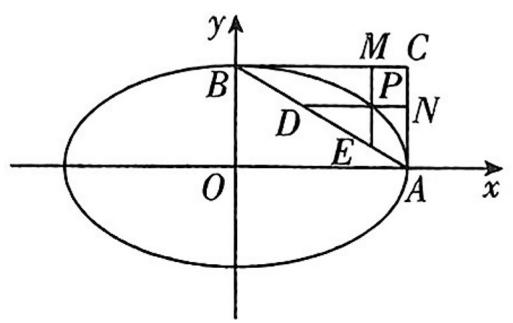

text_image

y
M C
B
P
D
N
E
O
A
x

巧解 由题意可知 $A(5,0), B(0,3)$ .

不妨取点 $P\left(4, \frac{9}{5}\right)$ , 则 $S_{1} = \left(3 - \frac{9}{5}\right) \times (5 - 4) = \frac{6}{5}$ .

由题易知 $|PD|=2,|PE|=\frac{6}{5}$ ，则 $S_{2}=\frac{1}{2}\times2\times\frac{6}{5}=$ $\frac{6}{5}$ , 故 $\frac{S_{1}}{S_{2}}=1$ .

反思 利用特例法解题的关键步骤：

(1) 理解题意, 明确需要求解的问题;  
(2)判断题目是否适合使用特例法,通常当题目涉及一般性的规律、性质或公式,并且这些情况在特殊情况下容易验证时,特例法是一个有效的选择;  
(3)选择特例,特例的选择应尽可能简单且具有代表性,以便快速得出结果并验证一般规律;  
(4)应用特例求解,注意计算的准确性和逻辑性,确保求解无误;  
(5)验证和推断,根据特例的求解结果,验证或推断一般规律的正确性;   
(6)总结答案,根据特例法的求解结果,给出最终的答案或结论,

# 一、方法介绍

排除法也叫筛选法,使用的前提条件是答案唯一,具体的做法是采用简捷有效的手段,从题设条件出发,运用定理、性质、公式推演,将备选答案中与题干相矛盾的干扰项逐一排除,从而获得正确结论.

注意:使用排除法的前提是四个选项中有且只有一个答案正确. 它与特例法结合使用是解选择题的常用且有效的方法.

# 二、典例示范

例 1 ▶ 选项排除

给定四条曲线: ① $x^{2}+y^{2}=\frac{5}{2}$ , ② $\frac{x^{2}}{9}+\frac{y^{2}}{4}=1$ , ③ $x^{2}+\frac{y^{2}}{4}=1$ , ④ $\frac{x^{2}}{4}+y^{2}=1$ , 其中与直线 $x+y-\sqrt{5}=0$ 仅有一个交点的曲线是 ( )

A. ①②③

B. ②③④

C. ①②④

D. ①③④

巧解 分析选项可知, 四条曲线中有且只有一条曲线不符合要求, 故可考虑找不符合条件的曲线从而筛选. 在四条曲线中, ②是一个面积最大的椭圆, 故可先看 ②. 因为直线上的点 $(\sqrt{5}, 0)$ 在椭圆内, 所以直线 $x + y - \sqrt{5} = 0$ 和曲线 $\frac{x^2}{9} + \frac{y^2}{4} = 1$ 有两个交点, 不符合题意. 对照选项, 故选 D.

反思 做单项选择题时,可先从选项下手,根据选项之间的逻辑关系进行排除,这种方法一般适用于选项之间有比较强的逻辑关系的题目.

例 2 · 特征排除

[江苏无锡2025届期中]函数 $f(x)=\frac{e^{x}-e^{-x}}{e^{|x|}}$ 的部分
图象大致为
()

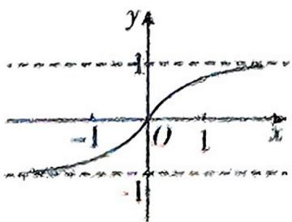

text_image

y
-1
O
1
x
-1

A

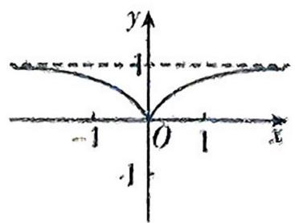

text_image

y
1
-1 O 1 x
-1

B

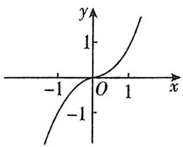

text_image

y
1
-1 O 1 x
-1

C

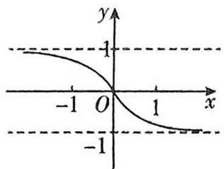

line

| x | y |
|---|---|
| -1 | 1 |
| 0 | 0 |
| 1 | -1 |

D

巧解 由题可知, $f(x)=\frac{e^{x}-e^{-x}}{e^{|x|}}$ 的定义域为R.

因为 $f(-x)=\frac{e^{-x}-e^{x}}{e^{|x|}}=-f(x)$ ，所以 $f(x)$ 为奇函数，
排除 B; 当 x=1 时, $f(1)=\frac{e-e^{-1}}{e}=1-\frac{1}{e^{2}}>0$ , 排除 D;
当 x>0 时, $f(x)=\frac{e^{x}-e^{-x}}{e^{x}}=1-\frac{1}{e^{2x}}<1$ , 且 x 越大, 函数值越接近 1, 排除 C. 故选 A.

例 3 ▶ 特值排除

[山东济宁 2024 模拟]已知函数 $f(x) = \frac{\cos x}{x}$ , 若 $A$ , $B$ 是锐角三角形 $ABC$ 的两个内角, 则下列结论一定正确的是 ( )

A. $f(\sin A) > f(\sin B)$

B. $f(\cos A) > f(\cos B)$

C. $f(\sin A) > f(\cos B)$

D. $f(\cos A) > f(\sin B)$

巧解 易知 $f'(x)=\frac{-x\sin x-\cos x}{x^{2}}$ ，当 $x\in\left(0,\frac{\pi}{2}\right)$ 时， $\sin x>0, \cos x>0$ , 所以 $\frac{-x\sin x-\cos x}{x^{2}}<0$ , 即 $f'(x)<0$ 在 $\left(0,\frac{\pi}{2}\right)$ 上恒成立，故 $f(x)$ 在 $\left(0,\frac{\pi}{2}\right)$ 上单调递减。
令 $A=\frac{\pi}{3}$ , $B=\frac{\pi}{3}$ , 则 A, B, C 错误. 故选 D.

# 一、方法介绍

临界法是指在解决数学问题时,捕捉和巧妙地利用临界条件(具有一定制约关系的相关的变量,当其中的某变量变化到某一个状态时出现极限或某种转折,就把这个状态当成临界状态,此时该变量对应的条件就称为临界条件)进行快速解题的一种方法.

而数与形是数学中最基本的研究对象,通过数形结合、相互转化,可以把动态问题或不定问题转化为静态问题和有型可寻的问题,使问题简化.

# 二、典例示范

# 例 1 · 以形解数找临界

直线 $y=x+m$ 与曲线 $y=\sqrt{1-x^{2}}$ 有且只有一个公共点, 则实数 m 的取值范围是 ( )

A. $[-1, 1) \cup \{\sqrt{2}\}$

B. $\{-\sqrt{2}, \sqrt{2}\}$

C. $[-1, 1)$

D. $(1, \sqrt{2}]$

巧解 $y=\sqrt{1-x^{2}}$ 表示半圆, 则直线与曲线只有一个公共点分为相切及一个相交点两种情况, 则只需考虑相切、过点 $(-1,0)$ 和过点 $(1,0)$ 三个临界条件, 再由数形结合分别讨论即可求解.

如图所示, $y=\sqrt{1-x^{2}}$ 表示的半圆所在圆的圆心为(0,0),半径r=1.

①当直线与半圆相切时, 圆心到直线的距离 $d = \frac{|m|}{\sqrt{1^2 + (-1)^2}} = 1$ , 解得 $m = \sqrt{2}$ 或 $m = -\sqrt{2}$ (舍).

②当直线与半圆相交时,将坐标 $(-1,0)$ 代入直线方程,得 $0=-1+m$ ,解得m=1;

将坐标(1,0)代入直线方程,得 $0=1+m$ , 解得 m=-1.

由图可知, 当 $m \in [-1, 1)$ 时, 直线与半圆有且只有一个交点.

综上, 当直线与曲线有且只有一个公共点时, 实数 $m$ 的取值范围为 $[-1, 1) \cup \{\sqrt{2}\}$ . 故选 A.

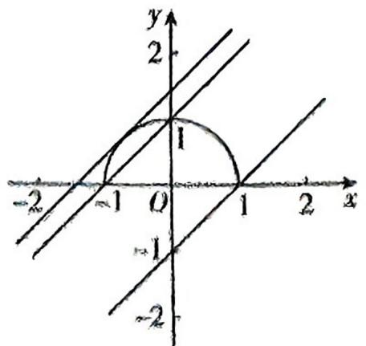

text_image

y
2
1
-2
-1 O 1 2 x
-1
-2

# 例 2 ▶ 以数解形找临界

已知球 O 的表面积为 $36\pi$ ，正四棱锥 P-ABCD 的所有顶点都在球 O 的球面上，则该正四棱锥 P-ABCD 体积的最大值为 \_\_\_\_.

巧解 设球 O 的半径为 r，由球的表面积 $S_{表} = 4\pi r^{2} = 36\pi$ ，得 r = 3。连接 AC, BD，设 $AC \cap BD = M$ ，连接 PM, OA。设正四棱锥的 P-ABCD 底面边长 $AB = a (a > 0)$ ，高 $PM = h (h > 0)$ ，

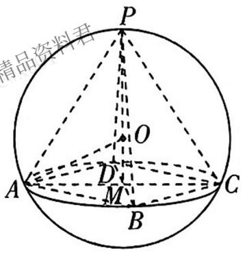

text_image

精品资料君
P
O
A
D
M
B
C

则 $AM=\frac{1}{2}\sqrt{a^{2}+a^{2}}=\frac{\sqrt{2}}{2}a$ , OM=h-r=h-3, 则在 Rt△AOM 中, 有 $\left(\frac{\sqrt{2}}{2}a\right)^{2}+(h-3)^{2}=3^{2}$ , 化简得 $a^{2}=-2h^{2}+12h$ , 所以 $V_{P-ABCD}=\frac{1}{3}a^{2}h=\frac{1}{3}h(-2h^{2}+12h)=-\frac{2}{3}h^{3}+4h^{2}$ . 令 $f(h)=-\frac{2}{3}h^{3}+4h^{2}(h>0)$ , 则 $f'(h)=-2h^{2}+8h=-2h(h-4)$ , 所以当 0<h<4 时, $f'(h)>0$ , $f(h)$ 单调递增, 当 h>4 时, $f'(h)<0$ , $f(h)$ 单调递减, 即 $f(h)$ 有极大值也为最大值, 为 $f(4)=-\frac{2}{3}\times4^{3}+4\times4^{2}=\frac{64}{3}$ , 即该正四棱锥 P-ABCD 体积的最大值为 $\frac{64}{3}$ .

# 一、方法介绍

应用极限思想解决问题,可以避开复杂计算,降低解题难度,优化解题过程.使用极限法是解选择题的一种有效方法,它根据题干及选项的特征,考虑极端情形,有助于缩小选择面,迅速找到答案.

# 二、典例示范

# 例 1 ▶ 范围问题

[广东江门2024月考]已知 $F_{1}, F_{2}$ 分别是椭圆 $\frac{x^{2}}{a^{2}}+$ $\frac{y^{2}}{b^{2}}=1(a>b>0)$ 的左、右焦点,若椭圆上存在点P,
使 $\angle F_{1}PF_{2}=90^{\circ}$ ,则椭圆的离心率e的取值范围为()

A. $\left(0, \frac{\sqrt{2}}{2}\right]$

B. $\left[\frac{\sqrt{2}}{2}, 1\right)$

C. $\left(0, \frac{\sqrt{3}}{2}\right]$

D. $\left[\frac{\sqrt{3}}{2}, 1\right)$

巧解 当点 P 位于短轴端点 $P_{0}$ 处时, $\angle F_{1}PF_{2}$ 最大, 即可得离心率 e 的边界值为 $\frac{\sqrt{2}}{2}$ , 故可排除 C, D; 椭圆越扁, $\angle F_{1}P_{0}F_{2}$ 越大, 则离心率越大. 故选 B. 例 2·求值问题

过抛物线 $y=x^{2}$ 的焦点 F 的一条直线交抛物线于 P, Q 两点, 若线段 PF 与 QF 的长分别是 p, q, 则 $\frac{1}{p}+\frac{1}{q}=$ ()

A. 1

B. 2

C. 3

D. 4

巧解 将直线 PQ 绕点 F 按顺时针方向旋转到与 y 轴重合, 不失一般性, 不妨设此时 Q 与 O 重合 (O 为坐标原点), 点 P 运动到无穷远处, 虽然它不能再是抛物线的弦了, 但它是弦的一种极限情况, 此时 $\frac{1}{p} + \frac{1}{q} = 0 + 4 = 4$ . 故选 D.

# 例 3 ▶ 图象问题

[北京朝阳区 2024 诊断] 已知函数 $f(x) = \frac{-2}{\ln (x + 1) - x}$ ，则函数 $y = f(x - 1)$ 的图象大致为（）

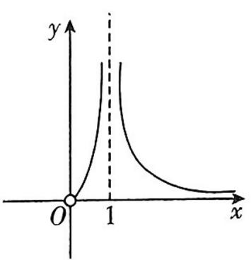

text_image

y
O 1 x

A

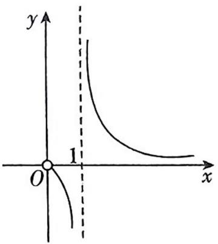

text_image

y
1
O
x

B

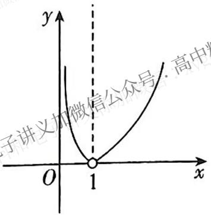

text_image

y
子讲义加微信公众号: 高中
O
1
x

C

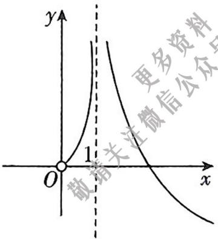

text_image

y
1
O
x
更多资料
敬关注微信公众号

D

巧解 设 $g(x)=f(x-1)=\frac{-2}{\ln x-x+1}$ .

由于 $g\left(\frac{1}{2}\right) = \frac{-2}{\ln\frac{1}{2} + \frac{1}{2}} >0$ ，排除B选项；

因为 $g(\mathrm{e}) = \frac{-2}{2 - \mathrm{e}}, g(\mathrm{e}^2) = \frac{-2}{3 - \mathrm{e}^2}$ , 所以 $g(\mathrm{e}) > g(\mathrm{e}^2)$ , 排除 C 选项;

当 $x \to +\infty$ 时, $g(x) > 0$ , 排除 D 选项. 故选 A.

反思 用排除法结合极限思想,通过函数图象的性质逐个选项进行判断,找出不符合函数解析式的图象,最后剩下的即为此函数的图象.

# 一、方法介绍

估算法是把复杂问题转化为较简单的问题,求出答案的近似值,或把有关数值扩大或缩小,从而将运算结果确定出一个范围或作出一个估计,进而作出判断的方法.

估算法一般包括数值估算、范围估算和推理估算.

# 二、典例示范

# 例 1 · 数值估算

[江苏徐州 2024 期末]用数字 1,2,3,4,5 组成没有重复数字的四位数,其中偶数的个数为 ( )

A. 48

B. 60

C. 96

D. 120

巧解 五个数字可以组成 $A_{5}^{4}=120$ (个)四位数, 其中偶数不到一半. 故选 A.

反思 本题也可先确定个位数字,再确定其他位数字,利用分步乘法计数原理求解.

# 例 2 ▶ 范围估值

[湖北十堰2025届段考]若过点 $(a,b)$ 可以作曲线 $y = \ln x$ 的两条切线,则 （）

A. $a < \ln b$

B. $b < \ln a$

C. $\ln b < a$

D. $\ln a < b$

巧解 如图, 当点 $(a,b)$ 在 y 轴右侧且在曲线 y= $\ln x$ 的上方时, 可以作出两条切线, 由图可知, 此时 $\ln a<b$ . 故选 D.

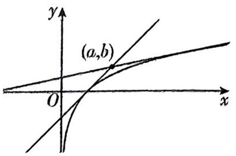

text_image

y
(a,b)
O
x

反思 本题也可先设切点坐标为 $(x_0, y_0)$ , 由切点坐标求出切线方程, 代入坐标 $(a, b)$ , 关于 $x_0$ 的方程有两个不同的实数解, 变形后转化为直线与函数图象有两个交点, 构造新函数, 利用导数确定函数的图象后可得答案.

# 例 3 ▶ 推理估算

甲、乙、丙三名射箭运动员在某次测试中各射箭20次,三人的测试成绩如表所示.

<table><tr><td colspan="5">甲的成绩</td><td colspan="5">乙的成绩</td><td colspan="5">丙的成绩</td></tr><tr><td>环数</td><td>7</td><td>8</td><td>9</td><td>10</td><td>环数</td><td>7</td><td>8</td><td>9</td><td>10</td><td>环数</td><td>7</td><td>8</td><td>9</td><td>10</td></tr><tr><td>频数</td><td>5</td><td>5</td><td>5</td><td>5</td><td>频数</td><td>6</td><td>4</td><td>4</td><td>6</td><td>频数</td><td>4</td><td>6</td><td>6</td><td>4</td></tr></table>

若 $s_1, s_2, s_3$ 分别表示甲、乙、丙三名运动员这次测试成绩的标准差, 则有 ( )

A. $s_3 > s_1 > s_2$

B. $s_2 > s_1 > s_3$

C. $s_1 > s_2 > s_3$

D. $s_2 > s_3 > s_1$

巧解 设甲、乙、丙三名射箭运动员这次测试成绩的平均值分别为 $\overline{x_{1}}, \overline{x_{2}}, \overline{x_{3}}$ ,

则 $\overline{x_1} = \frac{(7 + 8 + 9 + 10) \times 5}{20} = 8.5$ ;

$$
\overline {{{x _ {2}}}} = \frac {7 \times 6 + 8 \times 4 + 9 \times 4 + 1 0 \times 6}{2 0} = 8. 5;
$$

$$
\overline {{{x _ {3}}}} = \frac {7 \times 4 + 8 \times 6 + 9 \times 6 + 1 0 \times 4}{2 0} = 8. 5.
$$

三名射箭运动员这次测试成绩的期望值相同,那么离期望值比较近的数据越多,方差及标准差会越小.

由表可知乙的测试成绩离期望值比较近的数据最少,所以方差及标准差最大;丙的测试成绩离期望值比较近的数据最多,所以方差及标准差最小.故选 B.

反思 本题也可根据给定的数据,求出平均数及对应的方差判断作答.

# 一、方法介绍

分析法即推理分析,就是对有关概念进行全面、准确、深刻地理解或对有关信息提取、分析和加工后而作出判断和选择的方法.推理分析大致可分为如下两个方面:

(1) 特征分析: 根据题目所提供的信息, 如数值特征、结构特征、位置特征等, 进行快速推理并迅速作出判断.  
(2)逻辑分析:根据对四个选项之间的逻辑关系的分析,否定错误项,选出正确项.

# 二、典例示范

# 例 1 · 特征分析

在 $\triangle ABC$ 中, $a,b,c$ 分别为内角 $A,B,C$ 的对边, $a\cos A+b\cos B=c\cos C$ ,那么这个三角形一定是()

A. 以 $a$ 为斜边的直角三角形  
B. 以 $b$ 为斜边的直角三角形  
C. 等边三角形  
D. 以上结论都不对

巧解 由题设可知, $a\cos A$ 与 $b\cos B$ 是对称的关系,则A,B是等价的,而本题只有一个正确选项,故A,B同时排除;

若 C 正确,则原式可化简为 2=1,则 C 被排除.故选 D.

反思 数学题一般都有其明显的结构特征,这种结构特征能告诉我们解题的关键,实质上就是暗示了解题思路的突破口. 因为单项选择题有且仅有一个正确选项,所以若能分析出选项 A,B 等价,则 A,B 同真或同假,则 A,B 均可排除;若 A,B 互斥,则 A,B 至多有一个正确.

# 例 2 · 逻辑分析

设函数 $f(x)=\sin\left(\omega x+\frac{\pi}{5}\right)(\omega>0)$ ，已知 $f(x)$ 在 $[0,2\pi]$ 上有且仅有5个零点，下述四个结论中，正确结论的编号是（）

① $f(x)$ 在 $(0,2\pi)$ 上有且仅有3个极大值点；

② $f(x)$ 在 $(0,2\pi)$ 上有且仅有2个极小值点；  
③ $f(x)$ 在 $\left(0,\frac{\pi}{5}\right)$ 上单调递增；  
④ω 的取值范围是 $\left[\frac{12}{5},\frac{29}{10}\right)$ .

A. ①④   
B. ②③   
C. ①②③   
D. ①③④

巧解 依题意作出 $f(x) = \sin \left( {\omega x + \frac{\pi }{5}}\right)$ 的大致图象,

其中 $m \leqslant 2\pi < n$ ,

显然①正确,②错误,故排除B,C.

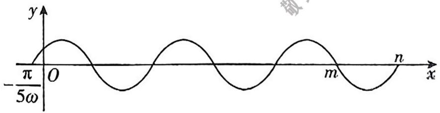

text_image

-π/5ω
O
m
n
x
y

由选项可知, 答案选 A 或者 D, 则④一定正确, 所以可以把④当作条件使用.

当 $x \in \left(0, \frac{\pi}{5}\right)$ 时， $\omega x + \frac{\pi}{5} \in \left(\frac{\pi}{5}, \frac{(\omega + 1)\pi}{5}\right)$ ，

若 $f(x)$ 在 $\left(0, \frac{\pi}{5}\right)$ 上单调递增，

则 $\frac{(\omega + 1)\pi}{5} \leqslant \frac{\pi}{2}$ , 即 $\omega \leqslant \frac{3}{2}$ .

而 $\frac{12}{5} \leqslant \omega < \frac{29}{10}$ , 故③不正确. 故选 A.

反思 利用选项之间的逻辑关系是我们解决选择题的一个较好策略.

# 一、方法介绍

将各个选项逐一代入题设检验,从而获得正确的判断,即将各选项分别作为条件,去验证命题,能使命题成立的选项就是应选的答案.当题干提供的信息太少,或结论是一些具体的数字时,用这种方法较为方便.在运用验证法解题时,若能根据题意确定代入顺序,则能较大地提高解题速度.

# 二、典例示范

例 1 ▶ 求值问题

[江苏苏州 2025 届模拟] 若向量 $a = (1, 1), b = (-2, x)$ , 若 $a$ 与 $a + b$ 的夹角为钝角, 则 $x$ 的可能取值为 ( )

A. 1

B. 0

C.-2

D. -1

巧解 因为 $a+b=(-1,1+x)$ ，a 与 $a+b$ 的夹角为钝角，所以 $a\cdot(a+b)<0$ 且 a 与 $a+b$ 不共线.

将选项逐个代入检验, 可得当 $x = -1$ 时, 有 $a \cdot (a + b) = -1 < 0$ 且 $a$ 与 $a + b$ 不共线, 满足要求. 故选 D.

反思 代入验证的方法本身具有局限性,有些题目要代入三个选项进行验证,才能判断出正确答案,所以这种方法更适用于一些计算比较简单的问题.本题也可在求出 $a+b$ 的坐标后,求得当 $a$ 与 $a+b$ 共线时 $x=-2$ ,排除 C 选项,再根据向量 $a$ 与向量 $a+b$ 的夹角为钝角,列出相应的不等式,求得答案.

例 2 • 范围问题

[辽宁沈阳 2025 届月考] 方程 $ax^2 + 2x + 1 = 0$ 至少有一个负实根的充要条件是 ( )

A. $0 < a \leq 1$

B. $a < 1$

C. $a \leqslant 1$

D. $0 < a \leq 1$ 或 a < 0

巧解 当 a=0 时, 方程为 $2x+1=0$ , 有一个负实根 $x=-\frac{1}{2}$ ; 反之, 当 $x=-\frac{1}{2}$ 时, 可得 a=0. 故排除选项 A, D.

当 $a = 1$ 时，方程为 $x^{2} + 2x + 1 = 0$ ，有一个负实根 $x = -1$ 反之，当 $x = -1$ 时，可得 $a = 1$ 故排除选项B.故选C.

反思 根据选项的特点,选取临界值代入验证是选择题中求解参数范围比较好用的办法,验证法很多时候并不是单独使用,它经常和排除法、特例法等结合起来使用.本题也可按 $a = 0, a > 0$ 和 $a < 0$ , 讨论方程 $ax^{2} + 2x + 1 = 0$ 至少有一个负实根的等价条件.

例 3 ▶ 数列问题

[宁夏银川2025届开学考]数列 $\{a_{n}\}$ 满足 $a_1 = 1$ ， $a_2 = \frac{2}{3}$ ，且 $\frac{1}{a_{n-1}} + \frac{1}{a_{n+1}} = \frac{2}{a_n} (n \geqslant 2)$ ，则 $a_n = \quad$ （）

A. $\frac{2}{n+1}$

B. $\left(\frac{2}{3}\right)^{n-1}$

C. $\left(\frac{2}{3}\right)$

D. $\frac{2}{n + 2}$

巧解 由题易知 $a_{3} = \frac{1}{2}$ .

若 $a_{n} = \left(\frac{2}{3}\right)^{n - 1}$ ，当 $n = 3$ 时， $a_3\neq \frac{1}{2}$ 故排除B选项；  
若 $a_{n} = \left(\frac{2}{3}\right)^{n}$ ，当 $n = 1$ 时， $a_1\neq 1$ ，故排除C选项；  
若 $a_{n} = \frac{2}{n + 2}$ ，当 $n = 1$ 时， $a_1\neq 1$ ，故排除D选项.故选A.

反思 求出数列的几项去验证数列的通项公式或前 $n$ 项和公式是处理这一类问题的一种解题方法。本题也可由等差中项的性质得出数列 $\left\{\frac{1}{a_{n}}\right\}$ 是等差数列，利用等差数列通项公式即可求解。

# 一、方法介绍

有些数学问题的解决往往不是以问题的某个组成部分为着眼点,而是要将要解决的问题看成一个整体、着重分析整体的结构和规律,通过研究得到整体形式或整体处理后,达到顺利而又简捷地解决问题的目的.

注意: 只有所求问题含有(或通过变形含有)已知条件中的“整体”, 才可以使用整体法.

# 二、典例示范

例 1、代换

[河南郑州 2025 届月考] 若 $x, y \in \mathbb{R}_{+}$ , 且 $x + 2y = 1$ , 则 $\frac{x^2}{x + 1} + \frac{2y^2}{y + 2}$ 的最小值为 ( )

A. $\frac{1}{5}$

B. $\frac{1}{6}$

C. $\frac{1}{7}$

D. $\frac{1}{8}$

巧解 令 $m = x + 1 (m > 1), n = y + 2 (n > 2)$ , 则 $x = m - 1, y = n - 2$ .

因为 $x + 2y = 1$ ，所以 $m + 2n = x + 1 + 2y + 4 = 6$

所以 $\frac{x^2}{x + 1} +\frac{2y^2}{y + 2} = \frac{(m - 1)^2}{m} +\frac{2(n - 2)^2}{n} = m + 2n + \frac{1}{m} +$

$$
\frac {8}{n} - 1 0 = \frac {1}{m} + \frac {8}{n} - 4 = \frac {1}{6} \left(\frac {1}{m} + \frac {8}{n}\right) (m + 2 n) - 4 =
$$

$$
\frac {1}{6} \left(\frac {2 n}{m} + \frac {8 m}{n} + 1 7\right) - 4 \geqslant \frac {1}{6} \left(2 \sqrt {\frac {2 n}{m} \cdot \frac {8 m}{n}} + 1 7\right) - 4 = \frac {1}{6},
$$

当且仅当 $\frac{2n}{m}=\frac{8m}{n}$ ，即 $m=\frac{6}{5},n=\frac{12}{5}$ 时等号成立，

所以 $\frac{x^{2}}{x+1}+\frac{2y^{2}}{y+2}$ 的最小值为 $\frac{1}{6}$ . 故选B.

例2·换元

[福建福州2025届质量检测]已知函数 $f(x)=x^{2}-2x+a(e^{x-j}+e^{-x+j})$ 有唯一零点，则a= \_\_\_\_.

巧解 $f(x) = x^2 - 2x + a(e^{x-1} + e^{-x+1}) = (x-1)^2 - 1 + a(e^{x+1} + e^{-x+1}).$

设 $t = x - 1, g(t) = t^2 - 1 + a(e' + e^{-t})$ ，易知 $g(t)$ 的定义域为 $\mathbb{R}$

因为 $g(-t) = (-t)^2 - 1 + a(e^x + e') = g(t)$ ，所以 $g(t)$ 为偶函数，即 $f(x)$ 的图象关于直线 $x = 1$ 对称。

要使 $f(x)$ 有唯一零点，则只能 $f(1) = 0$ ，即 $1^2 - 2 \times 1 + a(\frac{x^2 + x^2}{x}) = 0$ ，解得 $a = \frac{1}{2}$ .

例 3 · 设而不求

[辽宁沈阳 2025 届期中] 已知椭圆 $C: \frac{x^{2}}{72} + \frac{y^{2}}{b^{2}} = 1$ (0 < b < 6√2), 过点 $P(2,1)$ 且斜率为 -1 的直线与椭圆 $C$ 相交于 $A, B$ 两点. 若 $P$ 恰好是线段 $AB$ 的中点, 则椭圆 $C$ 上一点 $M$ 到焦点 $F$ 的距离的最小值为 ( )

A. 6

B. $6\sqrt{2}-6$

C. $6 - 2\sqrt{3}$

D. $6\sqrt{2}+6$

巧解 设 $A(x_{1},y_{1}), B(x_{2},y_{2}), x_{1} \neq x_{2}$

则有 $\frac{x_1^2}{72} +\frac{y_1^2}{b^2} = 1,\frac{x_2^2}{72} +\frac{y_2^2}{b^2} = 1,$

两式作差得 $\frac{x_1^2 - x_2^2}{72} +\frac{y_1^2 - y_2^2}{b^2} = 0,$

即 $\frac{y_1^2 - y_2^2}{x_1^2 - x_2^2} = -\frac{b^2}{72}, \frac{y_1 + y_2}{x_1 + x_2} \cdot \frac{y_1 - y_2}{x_1 - x_2} = -\frac{b^2}{72}$ ①.

因为 $P(2,1)$ 恰好是线段 AB 的中点, 所以 $x_{1} + x_{2} = 4$ , $y_{1} + y_{2} = 2$ , 又直线 AB 的斜率为 $\frac{y_{1} - y_{2}}{x_{1} - x_{2}} = -1$ ,

将它们代入①式得 $\frac{2}{4}\times(-1)=-\frac{b^{2}}{72}$ ，解得 $b^{2}=36$ .

因为 $a^2 = 72$ ，所以 $a = 6\sqrt{2}, c = \sqrt{a^2 - b^2} = \sqrt{72 - 36} = 6$ ，所以椭圆 $C$ 上一点 $M$ 到焦点 $F$ 的距离的最小值为 $a - c = 6\sqrt{2} - 6$ 。故选 B.

有些数学问题若纠缠于题目中的“细技术节”，可能会导致解题过程复杂或解不出。若能统观全局，用整体思想来处理，则可化繁为简。

# 一、方法介绍

根据题目的具体情况,通过构建特定对象(平面图形、几何体、相关函数、不等式、数列)把未知的问题转化为已学知识范围内易于解决的问题,把不熟悉、不规范、复杂的问题转化为熟悉、规范、简单的问题.

关键: 明晰特征、分析问题结构、设计构造策略、实施构造策略、解决问题.

# 二、典例示范

# 例 1 ▶ 构造函数

[四川成都2025届诊断]若 $\ln a = -1, \mathrm{e}^b = \sqrt{2}, 3c = \ln 3$ , 则 $a, b, c$ 的大小关系为 ( )

A. $a > c > b$

B. $b > c > a$

C. $c > b > a$

D. $a > b > c$

巧解 由题设知 $a = \frac{\ln e}{e}, b = \frac{\ln 2}{2} = \frac{\ln 4}{4}, c = \frac{\ln 3}{3}$ .

令 $f(x)=\frac{\ln x}{x}(x>0)$ ，则 $f'(x)=\frac{1-\ln x}{x^{2}}$

当 $x \in (0, e)$ 时, $f'(x) > 0$ , 此时 $f(x)$ 单调递增, 当 $x \in (e, +\infty)$ 时, $f'(x) < 0$ , 此时 $f(x)$ 单调递减, 即 $f(e) > f(3) > f(4) = f(2)$ , 所以 $a > c > b$ . 故选 A.

反思 解决本题的关键在于构造函数 $f(x) = \frac{\ln x}{x}$

(x>0), 利用导数研究其单调性, 进而比较函数值的大小.

# 例2·构造数列

[河北邯郸 2025 届期中]已知数列 $\{a_{n}\}$ 的前 $n$ 项和为 $S_{n}$ , 其中 $a_{1} = 1$ , 且 $S_{n+1} - 2S_{n} = 2n + 1$ , 则 $\frac{S_{7}}{a_{5}} =$ ( )

A. $\frac{369}{46}$

B. $\frac{361}{46}$

C. $\frac{367}{46}$

D. $\frac{365}{46}$

巧解 由 $S_{n+1} - 2S_n = 2n + 1$ , 可得 $S_{n+1} + 2(n+1) + 3 = 2(S_n + 2n + 3)$ , 所以数列 $\{S_n + 2n + 3\}$ 是首项为 6, 公比为 2 的等比数列.

所以 $S_{n} + 2n + 3 = 6 \times 2^{n - 1}$ , 即 $S_{n} = 3 \times 2^{n} - 2n - 3$ ,

所以 $\frac{S_7}{a_5} = \frac{S_7}{S_5 - S_4} = \frac{367}{46}$ . 故选 C.

反思 本题采用构造数列的方法, 确定新数列 $\{S_{n} + 2n + 3\}$ 为等比数列, 然后进行求解.

# 例 3 ▶ 构造几何图形

设 A, B, C, D 是半径为 2 的球面上的四个不同的点，且满足 $\overrightarrow{AB} \cdot \overrightarrow{AC} = 0, \overrightarrow{AC} \cdot \overrightarrow{AD} = 0, \overrightarrow{AD} \cdot \overrightarrow{AB} = 0$ ，用 $S_{1}, S_{2}, S_{3}$ 分别表示 $\triangle ABC, \triangle ACD, \triangle ABD$ 的面积，则 $S_{1} + S_{2} + S_{3}$ 的最大值是 \_\_\_\_.

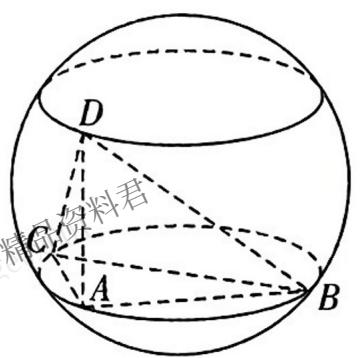

text_image

D
精料君
C
A
B

巧解 设 AB = a, AC = b, AD = c.

由题可知, $AB, AC, AD$ 两两垂直, 以 $AB, AC, AD$ 分别为长方体的长、宽、高, 将三棱锥 $A - BCD$ 补形为长方体 (图略), 则该长方体的体对角线为球的直径, 即 $a^2 + b^2 + c^2 = 4R^2 = 16$ ( $R$ 表示球的半径).

因为 $S_{1} + S_{2} + S_{3} = S_{\triangle ABC} + S_{\triangle ACD} + S_{\triangle ABD} = \frac{1}{2}(ab + bc + ac)$ ，又 $a^2 +b^2\geqslant 2ab,a^2 +c^2\geqslant 2ac,b^2 +c^2\geqslant 2bc,$

所以 $\frac{1}{2} (ab + bc + ac) \leqslant \frac{1}{2} (a^2 + b^2 + c^2) = 8$ ，当且仅当 $a = b = c = \frac{4\sqrt{3}}{3}$ 时取等号，所以 $S_1 + S_2 + S_3$ 的最大值是8.

反思 本题考查球的内接多面体, 把三条侧棱两两垂直的三棱锥补形为长方体, 利用长方体这个规则几何体求解是我们解决此类问题的常用方法.

# 第二部分 针对技巧

# 技巧10 赋值法

见练习册 P12T4

# 一、方法介绍

赋值法是通过明确某个特定变量、符号或表达式所代表的具体数值或对象,以便进行后续的计算、推理或分析的一种方法.在赋值过程中,通常会根据问题的需要或已知条件,为相关的变量赋予合适的值,这往往能简捷有效地解决问题.

# 二、典例示范

# 例 1 · 抽象函数问题

[重庆乌江新高考协作体 2024 联考]已知函数 $f(x)$ 满足 $\forall x, y \in \mathbf{Z}, f(x + y) = f(x) + f(y) + 2xy + 1$ 成立，且 $f(-2) = 1$ ，则当 $n \in \mathbb{N}^*$ 时， $f(2n) = \quad$ （）

A. ${4n} + 6$

B. ${8n} - 1$

C. $4n^{2} + 2n - 1$

D. $8n^{2} + 2n - 5$

巧解 令 $x = y = 0$ ，则 $f(0) = f(0) + f(0) + 1$ ，所以 $f(0) = -1$ .

令 $x = y = -1$ ，则 $f(-2) = f(-1) + f(-1) + 2 + 1 = 2f(-1) + 3 = 1$ ，所以 $f(-1) = -1$ .

令 $x = 1, y = -1$ ，则 $f(0) = f(1) + f(-1) - 2 + 1 = f(1) - 2 = -1$ ，所以 $f(1) = 1$ .

令 $x = n, y = 1, n \in \mathbf{N}^*$ ，则 $f(n + 1) = f(n) + f(1) + 2n + 1 = f(n) + 2n + 2$ ，所以 $f(n + 1) - f(n) = 2n + 2$

则当 $n \geqslant 2$ 时, $f(n) - f(n - 1) = 2n$ ,

则 $f(n)=f(n)-f(n-1)+f(n-1)-f(n-2)+\cdots+f(2)-f(1)+f(1)=2n+(2n-2)+\cdots+4+1=\frac{(2n+4)(n-1)}{2}+1=n^{2}+n-1,$

当 $n = 1$ 时，上式也成立，所以 $f(n) = n^2 + n - 1 (n \in \mathbf{N}^*)$ ， $f(2n) = 4n^2 + 2n - 1 (n \in \mathbf{N}^*)$ 。故选 $\mathbf{C}$ 。

反思 求解以抽象函数为载体的某个函数值或函数表达式问题, 可优先考虑赋值法, 通常取 $0, \pm 1$ , $\frac{1}{2}$ 等, 也可根据题目信息寻找某个特殊值 (如本题中令 $x = n, y = 1, u \in \mathbb{N}^*$ ),

# 例 2 ▶ 二项式定理问题

(多选)[四川眉山2024期中]若 $(2x+1)^{10}=a_{0}+a_{1}x+a_{2}x^{2}+\cdots+a_{10}x^{10},x\in\mathbb{R}$ ，则()

A. $a_0 = 1$   
B. $a_{2} + a_{4} + a_{6} + \dots +a_{10} = \frac{3^{10} - 1}{2}$   
C. $a_0 + a_1 + a_2 + \dots + a_{10} = 3^{10}$   
D. $a_{1}+a_{3}+\cdots+a_{9}=\frac{3^{10}+1}{2}$

巧解 令 $x = 0$ , 可得 $a_{0} = 1$ , 故 A 正确;

令 x=1，可得 $a_{0}+a_{1}+a_{2}+\cdots+a_{10}=3^{10}$ ①，故 C 正确；
令 x = -1，可得 $a_{0}-a_{1}+a_{2}-a_{3}+\cdots+a_{10}=1$ ②，

①②两式相加可得 $a_{0}+a_{2}+a_{4}+\cdots+a_{10}=\frac{3^{10}+1}{2}$ ，则 $a_{2}+a_{4}+\cdots+a_{10}=\frac{3^{10}+1}{2}-a_{0}=\frac{3^{10}-1}{2}$ ，①②两式相减可
得 $a_{1} + a_{3} + \cdots + a_{9} = \frac{3^{10}-1}{2}$ ，故 B 正确，D 错误。故选 ABC.

反思 (1)一般地,若 $(ax + b)^n = a_0 + a_1x + a_2x^2 +\dots +$ $a_{n}x^{n}(a,b\in \mathbb{R})$ ，则令 $x = 0$ 可得常数项，令 $x = 1$ 可得所有项系数之和，令 $x = -1$ 可得偶次项系数之和与奇次项系数之和的差.

(2) 形如 $(ax^2 + bx + c)^m (a, b, c \in \mathbb{R})$ 的式子求其展开式的各项系数之和，令 $x = 1$ 即可.  
(3) 形如 $(ax + by)^n (a, b \in \mathbb{R})$ 的式子求其展开式的各项系数之和，令 $x = y = 1$ 即可.

# 一、方法介绍

同构一般表示结构或形式相同. 同构模型是指通过同构直接建立变量之间的关系, 从而将复杂问题简单化解决的一种模型. 同构的常用方法有以下几种:

(1) 指对形式同时出现,需要利用指对同构来解决问题,观察已知条件的特征,寻找同构形式,进行转化.

(2) 当遇到幂函数与 $e^{x}$ 相乘或常数与 $e^{x}$ 相乘时, 可以用对数恒等式变换: $x^{n}e^{x}=e^{n\ln x}e^{x}=e^{x+n\ln x}$ .

(3)使不等式两边“结构”相同的常用恒等变形的方法: $x = \mathrm{e}^{\ln x}, x \mathrm{e}^{x} = \mathrm{e}^{\ln x + x}, x^{2} \mathrm{e}^{x} = \mathrm{e}^{2 \ln x + x}, \frac{\mathrm{e}^{x}}{x} = \mathrm{e}^{-\ln x + x}$ .

# 二、典例示范

例 1 ▶ 构造 $f(x)=x+e^{x}$

[江苏泰州 2025 届期中]已知函数 $f(x) = \mathrm{e}^{x} - m - \ln (x + m)$ ，若 $f(x) \geqslant 0$ 恒成立，则实数 $m$ 的取值范围是 （）

A. $[-1, +\infty)$

B. $(-∞,1]$

C. $[-1, 1]$

D. $[-1, 2]$

巧解 因为 $f(x) = \mathrm{e}^{x} - m - \ln (x + m)\geqslant 0$ ，所以 $x+$ $\mathrm{e}^x\geqslant x + m + \ln (x + m) = \ln (x + m) + \mathrm{e}^{\ln (x + m)}.$

令 $g(x) = x + \mathrm{e}^x$ ，则 $g(x)\geqslant g(\ln (x + m))$ ，因为 $g(x) = x + \mathrm{e}^x$ 在 $\mathbb{R}$ 上单调递增，所以 $x\geqslant \ln (x + m)$

①当 $m \leqslant 0$ 时, $y = \ln(x + m)$ 的图象可由 $y = \ln x$ 的图象向右平移得到, 结合 y = x 与 $y = \ln x$ 的图象可知, $x \geqslant \ln(x + m)$ 恒成立.

②当 $m > 0$ 时，由 $x \geqslant \ln (x + m)$ 得 $\mathrm{e}^x - x \geqslant m$ ，其中 $x > -m$ .

令 $h(x) = \mathrm{e}^{x} - x, x \in (-m, +\infty)$ ,

则 $h'(x) = \mathrm{e}^x - 1$ ，当 $x > 0$ 时， $h'(x) > 0$ ；当 $-m < x < 0$ 时， $h'(x) < 0$ ，所以 $h(x) = \mathrm{e}^x - x$ 在 $(-m, 0)$ 上单调递减，在 $(0, +\infty)$ 上单调递增，

即 $h(x) = \mathrm{e}^{x} - x$ 在 $x = 0$ 处取得极小值, 也是最小值, 最小值为 $h(0) = 1$ , 所以 $0 < m \leqslant 1$ .

综上, $m\leq1$ .故选B.

反思 本题通过同构构造 $x + \mathrm{e}^{x} \geqslant \ln (x + m) + \mathrm{e}^{\ln (x + m)}$ ，从而令 $g(x) = x + \mathrm{e}^{x}$ ，得到 $g(x) \geqslant g(\ln (x + m))$ ，根据 $g(x) = x + \mathrm{e}^{x}$ 的单调性得到 $x \geqslant \ln (x + m)$ ，再进行下一步求解。

例 2 ▶ 构造 $f(x)=xe^{x}$

[江西部分学校2025届调研]已知 $a > 0, b > 0, e^{\frac{1}{a}} = ab(1 + \ln b)$ , 则 ( )

A. $\ln b > a$

B. $a \ln b > 1$

C. $e > b^{a}$

D. $a(1 + \ln b) < 1$

巧解 当 $b \in (0,1)$ 时, $\ln b < 0$ , 因为 $a > 0$ , 所以 $\ln b < a$ , 故 A 错误.

由 $a > 0, b > 0$ ，且 $\mathrm{e}^{\frac{1}{a}} = ab(1 + \ln b)$ 得， $\frac{1}{a}\mathrm{e}^{\frac{1}{a}} = b\ln b + b = \mathrm{e}^{\ln b}\ln b + b > \mathrm{e}^{\ln b}\ln b,$

令 $f(x)=xe^{x}$ ，则 $f'(x)=(x+1)e^{x}$ ，由 $f'(x)>0$ 得x>-1，由 $f'(x)<0$ 得x<-1，所以函数 $f(x)$ 在 $(-∞,-1)$ 上单调递减，在 $(-1,+∞)$ 上单调递增，且当x<0时， $f(x)<0$ ，当x>0时， $f(x)>0$ ，因为a>0，由 $f\left(\frac{1}{a}\right)>f(\ln b)$ 得 $\frac{1}{a}>\ln b$ ，即 $e^{\frac{1}{a}}>b$ ，所以 $e>b^{a}$ ，故C正确.

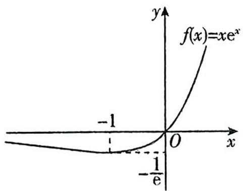

text_image

f(x)=xe^x
-1
O
-x
-1/e

由 C 选项可知 $e > b^{a}$ ，则 $\ln e > \ln b^{a}$ ，即 $1 > a \ln b$ ，故 B 错误.

因为 $\mathrm{e}^{\frac{1}{a}} > b, \mathrm{e}^{\frac{1}{a}} = ab(1 + \ln b)$ ，所以 $ab(1 + \ln b) > b$ ，又 $b > 0$ ，所以 $a(1 + \ln b) > 1$ ，故D错误.故选C.

反思 本题通过观察题目结构特点,同构变形得到 $\frac{1}{a} \mathrm{e}^{\frac{1}{a}} = \mathrm{e}^{\ln b} \ln b + b > \mathrm{e}^{\ln b} \ln b$ , 令 $f(x) = x \mathrm{e}^{x}$ , 则 $f\left(\frac{1}{a}\right) > f(\ln b)$ , 结合 $a > 0$ , 得 $\frac{1}{a} > \ln b$ , 即 $\mathrm{e} > b^{a}$ .

例3 $\triangleright$ 构造 $f(x) = \frac{\ln x}{x} (x > 0)$

已知 $a = \pi \ln 3, b = 3\ln \pi, c = \frac{3\pi}{\mathrm{e}}$ ，则 （）

A. $a < b < c$

B. $c < a < b$

C. $b < a < c$

D. $c < b < a$

巧解 由 $a = \pi \ln 3, b = 3 \ln \pi, c = \frac{3 \pi}{\mathrm{e}}$ , 知 $\frac{a}{3 \pi} = \frac{\ln 3}{3}, \frac{b}{3 \pi} = \frac{\ln \pi}{\pi}, \frac{c}{3 \pi} = \frac{1}{\mathrm{e}} = \frac{\ln \mathrm{e}}{\mathrm{e}}$ .

根据特点设函数 $f(x)=\frac{\ln x}{x},x>0,$

则 $f^{\prime}(x) = \frac{1 - \ln x}{x^{2}}$ ，当 $x\in (\mathrm{e}, + \infty)$ 时， $f^{\prime}(x) <   0$ ，故 $f(x)$ 在 $(\mathrm{e}, + \infty)$ 上单调递减，

又 $e < 3 < \pi$ , 所以 $f(e) > f(3) > f(\pi)$ , 即 $\frac{c}{3\pi} > \frac{a}{3\pi} > \frac{b}{3\pi}$ , 所以 $b < a < c$ . 故选 C.

反思 本题根据题目结构特征构造函数 $f(x) = \frac{\ln x}{x}, x > 0$ , 分析可知 $f(x)$ 在 $(e, +\infty)$ 上单调递减, 结合单调性分析判断.

例 4 ▶ 构造 $f(x)=x\ln x(x>0)$

已知 a, b 都为正数, e 为自然对数的底数, 若 $ae^{a+1} + b < b \ln b$ , 则 ( )

A. $ab > e$

B. $b > \mathrm{e}^{a + 1}$

C. $ab < e$

D. $b < e^{a+1}$

巧解 由题可得 $a\mathrm{e}^{a + 1} < b(\ln b - 1) = b\ln \frac{b}{\mathrm{e}}$ ，从而 $\mathrm{e}^a\ln \mathrm{e}^a < \frac{b}{\mathrm{e}}\ln \frac{b}{\mathrm{e}}.$

设 $f(x) \approx x \ln x, x > 0$ ，则 $f(\mathrm{e}^{\alpha}) < f\left(\frac{b}{\mathrm{e}}\right)$ .

因为 $a > 0$ ，所以 $\mathbf{e}^{\alpha} > 1$

又 $b(\ln b - 1) > ae^{a + 1} > 0, b > 0,$

则 $\ln b > 1$ ，即 $b > \mathrm{e},\frac{b}{\mathrm{e}} >1.$

当 $x > 1$ 时, $f'(x) = \ln x + 1 > 0$ , $f(x)$ 在 $(1, +\infty)$ 上单调递增, 所以 $\mathrm{e}^a < \frac{b}{\mathrm{e}}$ , 即 $b > \mathrm{e}^{a + 1}$ . 故选 B.

# 例 5 · 其他构造

[陕西咸阳 2024 质量检测] 若 $2^{a} + \log_{2} a = 2^{2b} + \log_{2} b$ 则 （）

A. $a > 2b$

B. $a < {2b}$

C. $a > {b}^{2}$

D. $a < {b}^{2}$

巧解 由题意得 a>0, b>0, 则 b<2b, 且 $y=\log_{2}x$ 在 $(0,+\infty)$ 上单调递增, 可得 $\log_{2}b<\log_{2}(2b)$ , 所以 $2^{a}+\log_{2}a=2^{2b}+\log_{2}b<2^{2b}+\log_{2}(2b)$ .

令 $f(x)=2^{x}+\log_{2}x$ ，因为 $y=2^{x}$ 在 $(0,+\infty)$ 上单调递增，所以 $f(x)=2^{x}+\log_{2}x$ 在 $(0,+\infty)$ 上单调递增.

对于 $2^{a} + \log_{2}a < 2^{2b} + \log_{2}(2b)$ , 即 $f(a) < f(2b)$ , 可得 $a < 2b$ , 故 A 错误, B 正确.

令 $g(x)=2^{2x}+\log_{2}x$ ，易知 $g(x)=2^{2x}+\log_{2}x$ 在 $(0,+\infty)$ 上单调递增.

取 a=1，则 $2^{a}+\log_{2}a=2$ ，因为 $2=g(b)<g(1)=4$ ，所以 0<b<1，此时 $a>b^{2}$ ，故 D 错误。

取 b=4，则 $2^{2b}+\log_{2}b=258$ ，因为 $f(16)=2^{16}+4>f(a)=258$ ，所以 a<16，此时 $a<b^{2}$ ，故 C 错误。故选 B.

反思 常见的同构变形

<table><tr><td>同构变形</td><td>构造函数</td></tr><tr><td> $axe^{ax} \geqslant x \ln x \Rightarrow axe^{ax} \geqslant \ln x \cdot e^{\ln x}$ </td><td> $f(x) = xe^{x}$ </td></tr><tr><td> $x^{2} \ln x = a \ln a - a \ln x (a > 0) \Rightarrow x^{2} \ln x = a \ln \frac{a}{x} \Rightarrow x \ln x = \frac{a}{x} \ln \frac{a}{x}$ </td><td> $f(x) = x \ln x$ </td></tr><tr><td> $\frac{e^{x}}{a} + 1 > \ln(ax - a)(a > 0) \Rightarrow \frac{e^{x}}{a} + 1 > \ln a + \ln(x - 1) \Rightarrow \frac{e^{x}}{a} - \ln a + x > \ln(x - 1) + x - 1 \Rightarrow \frac{e^{x}}{a} + \ln \frac{e^{x}}{a} > \ln(x - 1) + x - 1$ </td><td> $f(x) = x + \ln x$ </td></tr></table>

# 一、方法介绍

放缩法是利用放大或缩小的方法来解决大小比较、边界范围确定、不等式证明等问题的一种方法.

# 二、典例示范

例 1 · 函数放缩

设 $a = \sin \frac{1}{4}, b = \sqrt[4]{\mathrm{e}} - 1, c = \ln \frac{5}{4}$ , 则 $a, b, c$ 的大小关系为 ( )

A. $a > b > c$

B. $b > a > c$

C. b>c>a

D. $c > b > a$

巧解 因为 $\sin \frac{1}{4} < \frac{1}{4}$ , 所以 $a < \frac{1}{4}$ .

因为 $\mathrm{e}^{\frac{1}{4}} > 1 + \frac{1}{4}$ , 所以 $\mathrm{e}^{\frac{1}{4}} - 1 > \frac{1}{4}$ , 即 $b > \frac{1}{4}$ .

因为 $\ln \left(\frac{1}{4} + 1\right) < \frac{1}{4}$ , 所以 $c < \frac{1}{4}$ .

还需比较 $a$ 和 $c$ 的大小.

令 $f(x)=\sin x-\ln(x+1)$ , $x\in(0,1)$ ,

则 $f^{\prime}(x) = \cos x - \frac{1}{x + 1},$

令 $g(x) = f'(x)$ ，则 $g'(x) = -\sin x + \frac{1}{(x + 1)^2}$

令 $h(x) = g'(x)$ ，则 $h'(x) = -\cos x - \frac{2}{(x + 1)^3}$ ，

当 $x \in (0,1)$ 时， $h'(x) < 0$

所以 $h(x)$ 在 $(0,1)$ 上单调递减，

且 $h(0) = 1 > 0, h(1) = -\sin 1 + \frac{1}{4} < -\sin \frac{\pi}{6} + \frac{1}{4} < 0,$

所以 $\exists x_0\in (0,1)$ ，使得 $h(x_0) = 0$

当 $x \in (0, x_0)$ 时， $h(x) > 0$

当 $x \in (x_0, 1)$ 时， $h(x) < 0$

即 $g(x)$ 在 $(0, x_{0})$ 上单调递增，在 $(x_{0}, 1)$ 上单调递减.

因为 $g(0) = 0, g(1) = \cos 1 - \frac{1}{2} > \cos \frac{\pi}{3} - \frac{1}{2} = 0,$

所以当 $x \in (0,1)$ 时， $g(x) > 0$

所以 $f(x)$ 在 $(0,1)$ 上单调递增.

因为 $f(0) = \sin 0 - \ln 1 = 0$

所以 $f\left(\frac{1}{4}\right) = \sin \frac{1}{4} - \ln \left(\frac{1}{4} + 1\right) = \sin \frac{1}{4} - \ln \frac{5}{4} > 0,$

即 $a > c$ .

所以 b > a > c. 故选 B.

反思 常用函数放缩结论

<table><tr><td>指数放缩</td><td> $e^x \geqslant 1 + x > x$ (仅当x=0时取等号); $e^x \geqslant ex$ (仅当x=1时取等号); $e^x \leqslant \frac{1}{1 - x} (x < 1)$ (仅当x=0时取等号); $e^x < -\frac{1}{x} (x < 0)$ </td></tr><tr><td>对数放缩</td><td> $\ln(1+x) \leqslant x$ (仅当x=0时取等号); $\ln x \leqslant x - 1 < x$ (仅当x=1时取等号); $\ln x \geqslant 1 - \frac{1}{x}$ (仅当x=1时取等号); $x \ln x \geqslant x - 1$ (仅当x=1时取等号)</td></tr><tr><td>三角放缩</td><td> $\sin x \leqslant x \leqslant \tan x \left(0 \leqslant x < \frac{\pi}{2}\right)$ (仅当x=0时取等号); $\sin x \geqslant x \geqslant \tan x \left(-\frac{\pi}{2} < x \leqslant 0\right)$ (仅当x=0时取等号); $\sin x \geqslant x - \frac{1}{2} x^2$ (仅当x=0时取等号); $\cos x \geqslant 1 - \frac{1}{2} x^2$ (仅当x=0时取等号)</td></tr></table>

# 一、方法介绍

割补模型是指根据简单组合体的结构特征,通过切割或补形将其转化为规则几何体,利用这些规则几何体的表面积或体积公式求出组合体的表面积或体积的模型.

# 二、典例示范

例 1 ▶ 补形

[黑龙江牡丹江 2025 届期中]四面体 SABC 中, 各个侧面都是边长为 a 的正三角形, E, F 分别是 SC 和 AB 的中点, 则异面直线 EF 与 SA 所成的角为 \_\_\_\_.

巧解 先画出四面体 SABC, 如图①所示.

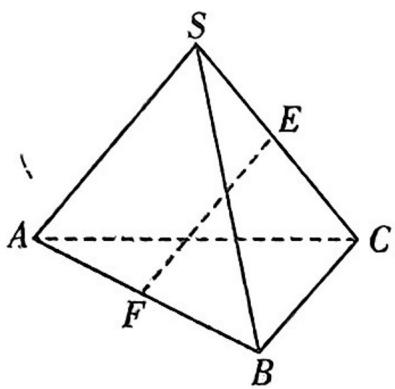

text_image

S
E
A
C
F
B

图①

由各个侧面都是边长为 a 的正三角形知, 可将四面体 SABC 补成一个正方体 $AGBH-A_{1}CB_{1}S$ , 如图②所示.

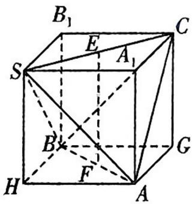

text_image

B₁
E
C
S
A₁
B
F
G
H
A

图②

易知 $EF \parallel AA_{1}$ ,

所以异面直线 EF 与 SA 所成的角, 即 $AA_{1}$ 与 SA 所成的角,

由正方形的性质可知 $\angle A_{1}AS = 45^{\circ}$ , 所以异面直线 $EF$ 与 $SA$ 所成的角为 $45^{\circ}$ .

例 2 · 分割

如图,三棱柱 $ABC - A'B'C'$ 的体积为 $V, P$ 是侧棱 $BB'$ 上任意一点,则四棱锥 $P - ACC'A'$ 的体积是 ( )

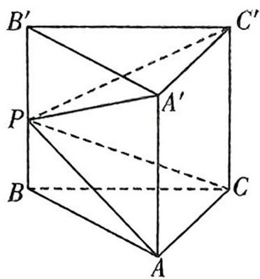

text_image

B'
C'
P
A'
B
C
A

A. $\frac{2}{3} V$

B. $\frac{1}{3} V$

C. $\frac{1}{2} V$

D. $\frac{3}{4} V$

巧解 设三棱柱 $ABC - A'B'C'$ 的高为 $h$ , 三棱锥 $P - ABC, P - A'B'C'$ 的高分别为 $h_1, h_2$ .

易得 $h = h_{1} + h_{2}$ ，又 $S_{\triangle ABC} = S_{\triangle A'B'C'}$

所以 $V_{\text{四棱锥}P - ACC'A'} = V_{\text{三棱柱}ABC - A'B'C'} - V_{\text{三棱锥}P - ABC} - V_{\text{三棱锥}P - A'B'C'}$

$$
\begin{array}{l} = S _ {\triangle A B C} \cdot h - \frac {1}{3} S _ {\triangle A B C} \cdot h _ {1} - \frac {1}{3} S _ {\triangle A ^ {\prime} B ^ {\prime} C ^ {\prime}} \cdot h _ {2} \\ = S _ {\triangle A B C} \cdot h - \frac {1}{3} S _ {\triangle A B C} \cdot \left(h _ {1} + h _ {2}\right) \\ = \frac {2}{3} S _ {\triangle A B C} \cdot h \\ = \frac {2}{3} V. \text {   故选   } A. \\ \end{array}
$$

反思 解决此类问题的关键点:

(1)根据简单组合体的结构特征,将其切割或补形成柱体、锥体、球等规则几何体;   
(2)根据割补的过程明确简单组合体的表面积或体积的构成,注意重叠部分与挖去部分的表面积或体积;  
(3)利用柱体、锥体、球的表面积或体积公式,分别求出各个规则几何体的表面积或体积,进而求出题目中所给模型的表面积或体积.

# 一、方法介绍

我们在解题过程中积累了许多的二级结论,由于选择题、填空题的阅卷评分标准是只看答案正确与否,所以在解答选择题、填空题的过程中应用这些二级结论,可以很好地提升解题速度,同时对结果有精准的验证作用.

# 二、典例示范

例 1 ▶ 不等式问题

已知 $a, b > 0, a + b = 5$ ，则 $\sqrt{a + 1} + \sqrt{b + 3}$ 的最大值为（）

A. 18

B. 9

C. $3\sqrt{2}$

D. $2\sqrt{3}$

巧解 利用柯西不等式, 可得 $(\sqrt{a + 1} + \sqrt{b + 3})^2 \leqslant (1 + 1)(a + 1 + b + 3) = 18$ , 当且仅当 $\sqrt{a + 1} = \sqrt{b + 3}$ , 即 $a = \frac{7}{2}, b = \frac{3}{2}$ 时等号成立.

所以当 $a=\frac{7}{2}$ , $b=\frac{3}{2}$ 时, $\sqrt{a+1}+\sqrt{b+3}$ 取得最大值 $3\sqrt{2}$ . 故选 C.

反思 本题也可以用重要不等式求最值,先将重要不等式 $2ab \leqslant a^{2} + b^{2}$ 转化为 $a + b \leqslant \sqrt{2(a^{2} + b^{2})}$ (当且仅当 $a = b$ 且 $a > 0, b > 0$ 时取等号),从而有 $\sqrt{a + 1} + \sqrt{b + 3} \leqslant \sqrt{2(a + 1 + b + 3)} = \sqrt{2 \times 9} = 3\sqrt{2}$ , 当且仅当 $a + 1 = b + 3$ , 即 $a = \frac{7}{2}, b = \frac{3}{2}$ 时等号成立.

例 2 · 向量问题

已知 O 为 $\triangle ABC$ 的内心, 且 $\cos \angle BAC = \frac{1}{3}$ , 若 $\overrightarrow{AO} = m\overrightarrow{AB} + n\overrightarrow{AC}$ , 则 $m + n$ 的最大值为 \_\_\_\_.

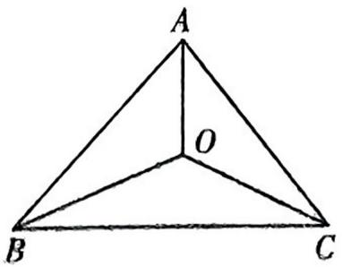

text_image

A
O
B
C

巧解 设 BC=a, AC=b, AB=c，因为 O 为 $\triangle ABC$ 的内心，所以 $S_{\triangle BOC}: S_{\triangle AOC}: S_{\triangle AOB}=a:b:c$ ,

由奔驰定理知 $S_{\triangle BOC} \cdot \overrightarrow{OA} + S_{\triangle AOC} \cdot \overrightarrow{OB} + S_{\triangle AOB}$ · $\overrightarrow{OC} = 0$ ，可得 $a \cdot \overrightarrow{OA} + b \cdot \overrightarrow{OB} + c \cdot \overrightarrow{OC} = 0$ ，所以 $\overrightarrow{AO} = \frac{b}{a}\overrightarrow{OB} + \frac{c}{a}\overrightarrow{OC},$

又 $\overrightarrow{AO} = m\overrightarrow{AB} + n\overrightarrow{AC} = m(\overrightarrow{OB} -\overrightarrow{OA}) + n(\overrightarrow{OC} -\overrightarrow{OA})$

则 $\overrightarrow{AO} = \frac{m}{1 - (m + n)}\overrightarrow{OB} +\frac{n}{1 - (m + n)}\overrightarrow{OC},$

所以 $\left\{ \begin{array}{l} \frac{m}{1 - (m + n)} = \frac{b}{a}, \\ \frac{n}{1 - (m + n)} = \frac{c}{a}, \end{array} \right.$ 化简可得 $m + n = \frac{b + c}{a + b + c}$ ,

因为 $\cos\angle BAC=\frac{1}{3}$ ，由余弦定理可得 $a^{2}=b^{2}+c^{2}-2bc\cos\angle BAC=b^{2}+c^{2}-\frac{2}{3}bc$ ，

由基本不等式可得 $a^2 = (b + c)^2 - \frac{8}{3} bc \geqslant (b + c)^2 - \frac{8}{3} \times \frac{(b + c)^2}{4} = \frac{(b + c)^2}{3}$ ,

所以 $a \geqslant \frac{\sqrt{3}}{3} (b + c)$ , 当且仅当 $b = c$ 时等号成立,

所以 $m + n = \frac{b + c}{a + b + c} = \frac{1}{1 + \frac{a}{b + c}} \leqslant \frac{1}{1 + \frac{\sqrt{3}}{3}} = \frac{3}{3 + \sqrt{3}} = \frac{3 - \sqrt{3}}{2}$ .

反思 本题的关键是利用奔驰定理得到 $m + n = \frac{b + c}{a + b + c}$ , 再结合余弦定理和基本不等式可得到 $a \geqslant \frac{\sqrt{3}}{3} (b + c)$ , 最后代入关系式即可得到 $m + n$ 的最大值.

# 附录 高中数学常用结论

# 第①章 集合与常用逻辑用语、不等式

1. 集合中子集的个数: 集合 $\{a_{1}, a_{2}, \cdots, a_{n}\}$ 的子集有 $2^{n}$ 个; 真子集有 $(2^{n}-1)$ 个; 非空子集有 $(2^{n}-1)$ 个; 非空真子集有 $(2^{n}-2)$ 个.

2. 基本不等式及几个重要的不等式

(1) $\sqrt{ab} \leqslant \frac{a + b}{2} (a > 0, b > 0)$ ;   
(2) $a+b\geqslant2\sqrt{ab}(a>0,b>0)$ ;   
(3) $a^{2}+b^{2}\geqslant2ab;$   
(4) $\frac{b}{a}+\frac{a}{b}\geqslant2(ab\neq0,$ 且a,b同号);   
(5) $ab \leqslant \left(\frac{a + b}{2}\right)^2$ ;   
(6) $\left(\frac{a+b}{2}\right)^{2}\leqslant\frac{a^{2}+b^{2}}{2};$   
(7) $\sqrt{\frac{a^2 + b^2}{2}} \geqslant \frac{a + b}{2} \geqslant \sqrt{ab} \geqslant \frac{2}{\frac{1}{a} + \frac{1}{b}} (a > 0, b > 0)$ .

注:以上不等式均在 a=b 时取等号.

# 二级结论

1. 二维形式的柯西不等式: 若 $a, b, c, d$ 都是实数, 则 $(a^{2} + b^{2})(c^{2} + d^{2}) \geqslant (ac + bd)^{2}$ , 当且仅当 $ad = bc$ 时, 等号成立.  
2. 三维形式的柯西不等式: 若 $a_{1}, a_{2}, a_{3}, b_{1}, b_{2}, b_{3}$ 都是实数, 则 $(a_{1}^{2} + a_{2}^{2} + a_{3}^{2})(b_{1}^{2} + b_{2}^{2} + b_{3}^{2}) \geqslant (a_{1}b_{1} + a_{2}b_{2} + a_{3}b_{3})^{2}$ , 当且仅当 $b_{1} = b_{2} = b_{3} = 0$ 或存在一个数 $k$ , 使得 $a_{i} = kb_{i} (i = 1, 2, 3)$ 时, 等号成立.  
3. 权方和不等式: 若 $a, b, x, y > 0$ , 则 $\frac{a^2}{x} + \frac{b^2}{y} \geqslant \frac{(a+b)^2}{x+y}$ , 当且仅当 $\frac{a}{x} = \frac{b}{y}$ 时, 等号成立.

# 第②章 函数及其性质

对数: 若 a > 0 且 $a \neq 1, M > 0, N > 0$ , 则

(1) 积的对数: $\log_a(MN) = \log_aM + \log_aN$ ; (2) 商的对数: $\log_a \frac{M}{N} = \log_aM - \log_aN$ ;   
(3) 幂的对数: $\log_a M^n = n\log_a M (n \in \mathbb{R})$ ; (4) 换底公式: $\log_a b = \frac{\log_c b}{\log_c a} (c > 0$ 且 $c \neq 1, b > 0$ ).

# 1. 函数的周期性

函数 $y=f(x)$ 对定义域内任意实数 x (a 为常数, 且 a>0) 满足:

<table><tr><td>序号</td><td>常见周期的表达式</td><td>f(x)的周期</td></tr><tr><td>1</td><td> $f(x)=f(x+a)$ </td><td>T=a</td></tr><tr><td>2</td><td> $f(x+a)=-f(x);f(x+a)=\pm\frac{1}{f(x)};f(x+a)=f(x-a);f(x+a)=\frac{f(x)+1}{f(x)-1}$  $(f(x)\neq1);f(x+a)=\frac{1-f(x)}{1+f(x)}(f(x)\neq-1)$ </td><td>T=2a</td></tr><tr><td>3</td><td> $f(x+a)=f(x+b)(a\neq b)$ </td><td>T=|b-a|</td></tr><tr><td>4</td><td> $f(x+a)=-f(x+b)(a\neq b)$ </td><td>T=2|b-a|</td></tr><tr><td>5</td><td> $f(x)$ 的图象关于直线x=a和x=b对称(a≠b)</td><td>T=2|b-a|</td></tr><tr><td>6</td><td> $f(x)$ 的图象关于点(a,0)和点(b,0)对称(a≠b)</td><td>T=2|b-a|</td></tr><tr><td>7</td><td> $f(x)$ 的图象关于直线x=a对称,又关于点(b,0)对称(a≠b)</td><td>T=4|b-a|</td></tr><tr><td>8</td><td> $f(x)$ 是偶函数,其图象关于直线x=a对称</td><td>T=2a</td></tr><tr><td>9</td><td> $f(x)$ 是偶函数,其图象关于点(a,0)对称</td><td>T=4a</td></tr><tr><td>10</td><td> $f(x)$ 是奇函数,其图象关于直线x=a对称</td><td>T=4a</td></tr><tr><td>11</td><td> $f(x)$ 是奇函数,其图象关于点(a,0)对称</td><td>T=2a</td></tr></table>

# 2. 函数图象的对称性

<table><tr><td>分类</td><td>序号</td><td>常见对称性的表达式</td><td>图象关于直线(点)对称</td></tr><tr><td rowspan="8">函数图象本身的对称性(自身对称)</td><td rowspan="4">1</td><td> $f(a+x)=f(b-x)$ </td><td>关于直线  $x=\frac{a+b}{2}$  对称</td></tr><tr><td>推论 1: $f(a+x)=f(a-x)$ </td><td>关于直线  $x=a$  对称</td></tr><tr><td>推论 2: $f(x)=f(2a-x)$ </td><td>关于直线  $x=a$  对称</td></tr><tr><td>推论 3: $f(-x)=f(2a+x)$ </td><td>关于直线  $x=a$  对称</td></tr><tr><td rowspan="4">2</td><td> $f(a+x)+f(b-x)=2c$ </td><td>关于点  $\left(\frac{a+b}{2},c\right)$  对称</td></tr><tr><td>推论 1: $f(a+x)+f(a-x)=2b$ </td><td>关于点  $(a,b)$  对称</td></tr><tr><td>推论 2: $f(x)+f(2a-x)=2b$ </td><td>关于点  $(a,b)$  对称</td></tr><tr><td>推论 3: $f(-x)+f(2a+x)=2b$ </td><td>关于点  $(a,b)$  对称</td></tr><tr><td rowspan="8">两个函数图象的对称性(相互对称)</td><td>1</td><td> $y=f(x)$  与  $y=f(-x)$ </td><td>关于  $y$  轴对称</td></tr><tr><td>2</td><td> $y=f(x)$  与  $y=-f(x)$ </td><td>关于  $x$  轴对称</td></tr><tr><td>3</td><td> $y=f(x)$  与  $y=-f(-x)$ </td><td>关于原点对称</td></tr><tr><td>4</td><td> $y=f(x)$  与其反函数  $y=f^{-1}(x)$  或  $x=f(y)$ </td><td>关于直线  $y=x$  对称</td></tr><tr><td rowspan="4">5</td><td> $y=f(a+x)$  与  $y=f(b-x)$ </td><td>关于直线  $x=\frac{b-a}{2}$  对称</td></tr><tr><td>推论 1: $y=f(a+x)$  与  $y=f(a-x)$ </td><td>关于直线  $x=0$  对称</td></tr><tr><td>推论 2: $y=f(x)$  与  $y=f(2a-x)$ </td><td>关于直线  $x=a$  对称</td></tr><tr><td>推论 3: $y=f(-x)$  与  $y=f(2a+x)$ </td><td>关于直线  $x=-a$  对称</td></tr></table>

1. 基本初等函数的导数公式

<table><tr><td> $c' = 0$ (c为常数)</td><td> $(\ln x)' = \frac{1}{x}$ </td></tr><tr><td> $(x^{\alpha})' = \alpha x^{\alpha - 1}$ ( $\alpha \in \mathbb{R}$ 且 $\alpha \neq 0$ )</td><td> $(\log_a x)' = \frac{1}{x \ln a}$ (a&gt;0且 $a \neq 1$ )</td></tr><tr><td> $(\sin x)' = \cos x$ </td><td> $(\cos x)' = -\sin x$ </td></tr><tr><td> $(e^x)' = e^x$ </td><td> $(a^x)' = a^x \ln a$ (a&gt;0且 $a \neq 1$ )</td></tr></table>

2. 导数运算法则

(1) $[u(x)\pm v(x)]' = u'(x)\pm v'(x)$ ; (2) $[u(x)v(x)]' = u'(x)v(x) + u(x)v'(x)$ ;   
(3) $\left[\frac{u(x)}{v(x)}\right]' = \frac{u'(x)v(x) - u(x)v'(x)}{\left[v(x)\right]^2} (v(x) \neq 0).$

3. 同构技巧

类型一:地位同等要同构,主要针对双变量问题

(1) $\frac{f(x_{1})-f(x_{2})}{x_{1}-x_{2}}>k(x_{1}<x_{2})\Leftrightarrow f(x_{1})-f(x_{2})<kx_{1}-kx_{2}\Leftrightarrow f(x_{1})-kx_{1}<f(x_{2})-kx_{2}\Leftrightarrow y=f(x)-kx$ 为增函数.  
(2) $\frac{f(x_{1})-f(x_{2})}{x_{1}-x_{2}}<\frac{k}{x_{1}x_{2}}(x_{1}<x_{2},x_{1},x_{2}\neq0)\Leftrightarrow f(x_{1})-f(x_{2})>\frac{k(x_{1}-x_{2})}{x_{1}x_{2}}=\frac{k}{x_{2}}-\frac{k}{x_{1}}\Leftrightarrow f(x_{1})+\frac{k}{x_{1}}>f(x_{2})+\frac{k}{x_{2}}\Leftrightarrow$ $y=f(x)+\frac{k}{x}$ 为减函数.

类型二: 指对跨阶型同构, 同左同右取对数

(1) 积型: $a \mathrm{e}^{a} \leqslant b \ln b \xrightarrow{\text {三种同构方式}} \left\{ \begin{array}{l} \text { 同右: } \mathrm{e}^{a} \ln \mathrm{e}^{a} \leqslant b \ln b \to f(x) = x \ln x, \\ \text { 同左: } a \mathrm{e}^{a} \leqslant (\ln b) \mathrm{e}^{\ln b} \to f(x) = x \mathrm{e}^{x}, \\ \text { 取对数: } a + \ln a \leqslant \ln b + \ln (\ln b) \to f(x) = x + \ln x. \end{array} \right.$   
(2) 商型: $\frac{\mathrm{e}^a}{a} < \frac{b}{\ln b}$ 三种同构方式 $\left\{ \begin{array}{l} \text{同左:} \frac{\mathrm{e}^a}{a} < \frac{\mathrm{e}^{\ln b}}{\ln b} \to f(x) = \frac{\mathrm{e}^x}{x}, \\ \text{同右:} \frac{\mathrm{e}^a}{\ln \mathrm{e}^a} < \frac{b}{\ln b} \to f(x) = \frac{x}{\ln x}, \\ \text{取对数: } a - \ln a < \ln b - \ln (\ln b) \to f(x) = x - \ln x. \end{array} \right.$   
(3) 和差型: $e^{a} \pm a > b \pm \ln b \xrightarrow{\text{两种同构方式}} \left\{ \begin{aligned} & \text{同左: } e^{a} \pm a > e^{\ln b} \pm \ln b \to f(x) = e^{x} \pm x, \\ & \text{同右: } e^{a} \pm \ln e^{a} > b \pm \ln b \to f(x) = x \pm \ln x. \end{aligned} \right.$

# 类型三：“无中生有”去同构，利用 $x = \mathrm{e}^{\ln x} = \ln \mathrm{e}^{x}$ 凑形式

(1) 当 $a \neq 0$ 时, $a\mathrm{e}^{ax} > \ln x \xrightarrow{\text{同乘 } x (\text{无中生有})} ax\mathrm{e}^{ax} > x\ln x$ ;

(2) 当 $a > 0$ 时, $\mathrm{e}^x > a\ln (ax - a) - a \Leftrightarrow \frac{1}{a}\mathrm{e}^x > \ln [a(x - 1)] - 1 \Leftrightarrow \mathrm{e}^{x - \ln a} - \ln a > \ln (x - 1) - 1 \xrightarrow{\text{两边同加} x} \mathrm{e}^{x - \ln a} + x - \ln a > \ln (x - 1) + x - 1 = \mathrm{e}^{\ln (x - 1)} + \ln (x - 1) \Leftrightarrow x - \ln a > \ln (x - 1)$ ;

(3) 当 $a > 0$ 且 $a \neq 1$ 时, $a^x > \log_a x \Longleftrightarrow e^{x \ln a} > \frac{\ln x}{\ln a} \Longleftrightarrow (x \ln a) e^{x \ln a} > x \ln x$ .

# 类型四: 切线放缩

(1) $\mathrm{e}^x \geqslant x + 1 \Rightarrow \mathrm{e}^{x - 1} \geqslant x \Rightarrow \mathrm{e}^x \geqslant \mathrm{e}x, \mathrm{e}^x \geqslant 1 + x + \frac{x^2}{2} (x \geqslant 0), \mathrm{e}^{ax} \geqslant ax + 1$ ( $a$ 为常数).

【变式】 $x\mathrm{e}^{x}=\mathrm{e}^{x+\ln x}\geqslant x+\ln x+1,\frac{\mathrm{e}^{x}}{x}=\mathrm{e}^{x-\ln x}\geqslant x-\ln x+1,\frac{x}{\mathrm{e}^{x}}=\mathrm{e}^{\ln x-x}\geqslant\ln x-x+1,\quad x^{n}\mathrm{e}^{x}=\mathrm{e}^{x+n\ln x}\geqslant x+n\ln x+$

$1, x^{n} \mathrm{e}^{x} = \mathrm{e}^{x + n \ln x} \geqslant \mathrm{e}(x + n \ln x)$ , 其中 $n$ 为常数.

(2) $\ln x \leqslant x - 1 \Rightarrow \ln (ex) \leqslant x \Rightarrow \ln x \leqslant \frac{x}{e}, \ln x \leqslant a(x - 1) (x \geqslant 1, a \geqslant 1)$ .

【变式】 $x+\ln x=\ln(x\mathrm{e}^{x})\leqslant x\mathrm{e}^{x}-1,x+n\ln x=\ln(x^{n}\mathrm{e}^{x})\leqslant x^{n}\mathrm{e}^{x}-1$ （n为常数）.

# 4. 关于 $f(x), f'(x)$ 的构造

<table><tr><td>题干形式</td><td>构造函数</td><td>题干形式</td><td>构造函数</td></tr><tr><td> $f'(x) \pm g'(x) > 0$ </td><td> $F(x) = f(x) \pm g(x)$ </td><td> $f(x) + f'(x) \tan x > 0$ </td><td> $F(x) = f(x) \sin x$ </td></tr><tr><td> $f'(x) > k, k \neq 0$ </td><td> $F(x) = f(x) - kx$ </td><td> $f(x) - f'(x) \tan x > 0$ </td><td> $F(x) = \frac{f(x)}{\sin x}$ </td></tr><tr><td> $f'(x)g(x) + g'(x)f(x) > 0$ </td><td> $F(x) = f(x)g(x)$ </td><td> $f'(x) - f(x) \tan x > 0$ </td><td> $F(x) = f(x)\cos x$ </td></tr><tr><td> $f'(x)g(x) - g'(x)f(x) > 0$ </td><td> $F(x) = \frac{f(x)}{g(x)}, g(x) \neq 0$ </td><td> $f'(x) + f(x) \tan x > 0$ </td><td> $F(x) = \frac{f(x)}{\cos x}$ </td></tr><tr><td> $xf'(x) + nf(x) > 0$ </td><td> $F(x) = x^n f(x)$ </td><td> $f'(x)\sin x + f(x)\cos x > 0$ </td><td> $F(x) = f(x)\sin x$ </td></tr><tr><td> $xf'(x) - nf(x) > 0$ </td><td> $F(x) = \frac{f(x)}{x^n}$ </td><td> $f'(x)\sin x - f(x)\cos x > 0$ </td><td> $F(x) = \frac{f(x)}{\sin x}$ </td></tr><tr><td> $f'(x) + kf(x) > 0$ </td><td> $F(x) = e^{kx}f(x)$ </td><td> $f'(x)\cos x - f(x)\sin x > 0$ </td><td> $F(x) = f(x)\cos x$ </td></tr><tr><td> $f'(x) - kf(x) > 0$ </td><td> $F(x) = \frac{f(x)}{e^{kx}}$ </td><td> $f'(x)\cos x + f(x)\sin x > 0$ </td><td> $F(x) = \frac{f(x)}{\cos x}$ </td></tr></table>

# 5. 导数问题中常用函数的图象

<table><tr><td>函数</td><td>图象</td><td>单调性与极值情况</td><td>函数</td><td>图象</td><td>单调性与极值情况</td></tr><tr><td> $f(x)=x+\ln x$ , $x\in(0,+\infty)$ </td><td>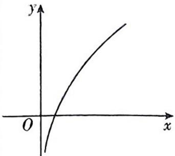</td><td>在 $(0,+\infty)$ 上单调递增,无极值</td><td> $f(x)=e^{x}+x$ , $x\in\mathbb{R}$ </td><td>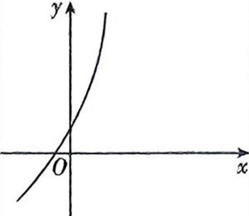</td><td>在 $\mathbb{R}$ 上单调递增,无极值</td></tr><tr><td> $f(x)=\ln x-x$ , $x\in(0,+\infty)$ </td><td>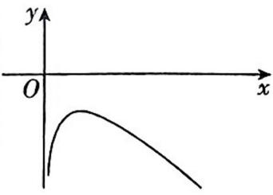</td><td>在 $(0,1)$ 上单调递增,在 $(1,+\infty)$ 上单调递减,在 $x=1$ 处取得极大值-1,无极小值</td><td> $f(x)=e^{x}-x$ , $x\in\mathbb{R}$ </td><td>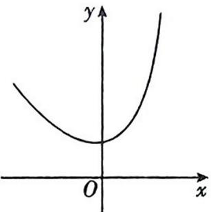</td><td>在 $(-\infty,0)$ 上单调递减,在 $(0,+\infty)$ 上单调递增,在 $x=0$ 处取得极小值1,无极大值</td></tr><tr><td> $f(x)=x\ln x$ , $x\in(0,+\infty)$ </td><td>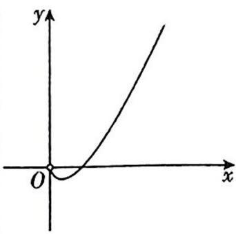</td><td>在 $\left(0,\frac{1}{e}\right)$ 上单调递减,在 $\left(\frac{1}{e},+\infty\right)$ 上单调递增,在 $x=\frac{1}{e}$ 处取得极小值 $-\frac{1}{e}$ ,无极大值</td><td> $f(x)=xe^{x}$ , $x\in\mathbb{R}$ </td><td>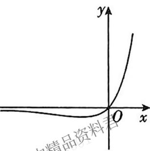</td><td>在 $(-\infty,-1)$ 上单调递减,在 $(-1,+\infty)$ 上单调递增,在 $x=-1$ 处取得极小值 $-\frac{1}{e}$ ,无极大值</td></tr><tr><td> $f(x)=\frac{\ln x}{x}$ , $x\in(0,+\infty)$ </td><td>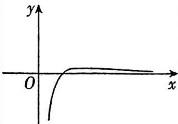</td><td>在 $(0,e)$ 上单调递增,在 $(e,+\infty)$ 上单调递减,在 $x=e$ 处取得极大值 $\frac{1}{e}$ ,无极小值</td><td> $f(x)=\frac{e^{x}}{x}$ , $x\neq0$ </td><td>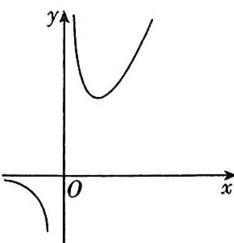</td><td>在 $(-\infty,0)$ , $(0,1)$ 上单调递减,在 $(1,+\infty)$ 上单调递增,在 $x=1$ 处取得极小值 $e$ ,无极大值</td></tr><tr><td> $f(x)=\frac{x}{\ln x},x\in(0,1)\cup(1,+\infty)$ </td><td>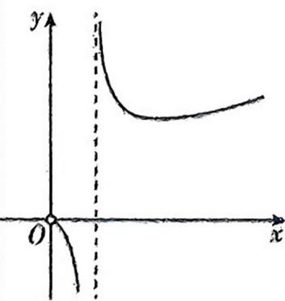</td><td>在 $(0,1)$ , $(1,e)$ 上单调递减,在 $(e,+\infty)$ 上单调递增,在 $x=e$ 处取得极小值 $e$ ,无极大值</td><td> $f(x)=\frac{x}{e^{x}}$ , $x\in\mathbb{R}$ </td><td>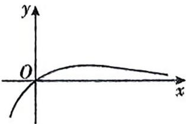</td><td>在 $(-\infty,1)$ 上单调递增,在 $(1,+\infty)$ 上单调递减,在 $x=1$ 处取得极大值 $\frac{1}{e}$ ,无极小值</td></tr></table>

1. 两角和与差的正弦、余弦、正切公式

(1) $S_{(\alpha\pm\beta)}:\sin(\alpha\pm\beta)=\sin\alpha\cos\beta\pm\cos\alpha\sin\beta$ ; (2) $C_{(\alpha\pm\beta)}:\cos(\alpha\pm\beta)=\cos\alpha\cos\beta\mp\sin\alpha\sin\beta;$   
(3) $\mathrm{T}_{(\alpha \pm \beta)}: \tan (\alpha \pm \beta) = \frac{\tan \alpha \pm \tan \beta}{1 \mp \tan \alpha \tan \beta}$ .

2. 二倍角公式

(1) $S_{2\alpha}:\sin 2\alpha=2\sin \alpha\cos \alpha;(2)C_{2\alpha}:\cos 2\alpha=\cos^{2}\alpha-\sin^{2}\alpha=1-2\sin^{2}\alpha=2\cos^{2}\alpha-1;$   
(3) $\mathrm{T}_{2\alpha}:\tan 2\alpha = \frac{2\tan\alpha}{1 - \tan^2\alpha}.$

3. 辅助角公式

$$
\begin{array}{r l} & {a \sin x + b \cos x = \sqrt {a ^ {2} + b ^ {2}} \left(\frac {a}{\sqrt {a ^ {2} + b ^ {2}}} \sin x + \frac {b}{\sqrt {a ^ {2} + b ^ {2}}} \cos x\right) = \sqrt {a ^ {2} + b ^ {2}} (\sin x \cos \varphi + \cos x \sin \varphi) =} \\ & {\sqrt {a ^ {2} + b ^ {2}} \sin (x + \varphi) \left(\text {其中} a b \neq 0, \tan \varphi = \frac {b}{a}\right).} \end{array}
$$

4. 万能公式

$$
\sin \alpha = \frac {2 \tan \frac {\alpha}{2}}{1 + \tan^ {2} \frac {\alpha}{2}}; \cos \alpha = \frac {1 - \tan^ {2} \frac {\alpha}{2}}{1 + \tan^ {2} \frac {\alpha}{2}}; \tan \alpha = \frac {2 \tan \frac {\alpha}{2}}{1 - \tan^ {2} \frac {\alpha}{2}}.
$$

5. 和差化积公式: $\sin \alpha + \sin \beta = 2 \sin \frac{\alpha + \beta}{2} \cos \frac{\alpha - \beta}{2}; \sin \alpha - \sin \beta = 2 \cos \frac{\alpha + \beta}{2} \sin \frac{\alpha - \beta}{2}$ ;

$$
\cos \alpha + \cos \beta = 2 \cos \frac {\alpha + \beta}{2} \cos \frac {\alpha - \beta}{2}; \cos \alpha - \cos \beta = - 2 \sin \frac {\alpha + \beta}{2} \sin \frac {\alpha - \beta}{2}.
$$

6. 积化和差公式

$$
\begin{array}{l} \sin \alpha \cos \beta = \frac {1}{2} [ \sin (\alpha + \beta) + \sin (\alpha - \beta) ]; \cos \alpha \sin \beta = \frac {1}{2} [ \sin (\alpha + \beta) - \sin (\alpha - \beta) ]; \\ \cos \alpha \cos \beta = \frac {1}{2} [ \cos (\alpha + \beta) + \cos (\alpha - \beta) ]; \sin \alpha \sin \beta = - \frac {1}{2} [ \cos (\alpha + \beta) - \cos (\alpha - \beta) ]. \\ \end{array}
$$

7. 正弦定理: (1) $\frac{a}{\sin A} = \frac{b}{\sin B} = \frac{c}{\sin C} = 2R$ ; (2) $a = 2R \sin A; b = 2R \sin B; c = 2R \sin C$ . 其中 $a, b, c$ 分别为 $\triangle ABC$ 的内角 $A, B, C$ 的对边, $R$ 为 $\triangle ABC$ 的外接圆半径.

8. 余弦定理：(1)求边： $a^{2}=b^{2}+c^{2}-2bc\cos A$ ; $b^{2}=a^{2}+c^{2}-2ac\cos B$ ; $c^{2}=a^{2}+b^{2}-2ab\cos C$ .

(2) 求角: $\cos A = \frac{b^2 + c^2 - a^2}{2bc}; \cos B = \frac{a^2 + c^2 - b^2}{2ac}; \cos C = \frac{a^2 + b^2 - c^2}{2ab}$ . 其中 $a, b, c$ 分别为 $\triangle ABC$ 的内角 $A$ , $B, C$ 的对边.

9. 三角形面积公式

已知 $\triangle ABC$ 的内角 $A, B, C$ 所对的边分别为 $a, b, c$ , 则 $\triangle ABC$ 的面积可以表示为:

(1) $S_{\triangle ABC}=\frac{1}{2}ab\sin C=\frac{1}{2}bc\sin A=\frac{1}{2}ac\sin B;$

(2) $S_{\triangle ABC}=\frac{1}{2}a\cdot h_{a}=\frac{1}{2}b\cdot h_{b}=\frac{1}{2}c\cdot h_{c}(h_{a},h_{b},h_{c}$ 分别表示边a,b,c上的高);  
(3) $S_{\triangle ABC} = \frac{1}{2} r(a + b + c) = \frac{1}{2} rl$ ，其中 $r, l$ 分别为 $\triangle ABC$ 的内切圆半径及 $\triangle ABC$ 的周长；  
(4) $S_{\triangle ABC} = \frac{1}{2} a^2 \frac{\sin B \sin C}{\sin A}, S_{\triangle ABC} = \frac{1}{2} b^2 \frac{\sin A \sin C}{\sin B}, S_{\triangle ABC} = \frac{1}{2} c^2 \frac{\sin A \sin B}{\sin C};$   
(5) $S_{\triangle ABC}=2R^{2}\sin A\sin B\sin C=\frac{abc}{4R}$ (R为△ABC外接圆的半径);   
(6) 海伦公式: $S_{\triangle ABC} = \sqrt{p(p - a)(p - b)(p - c)}$ , 其中 $p = \frac{1}{2}(a + b + c)$ ;  
(7) $S_{\triangle ABC}=\frac{1}{2}\sqrt{\left|a\right|^{2}\left|b\right|^{2}-\left(a\cdot b\right)^{2}}$ ，其中 $b=\overrightarrow{CA},a=\overrightarrow{CB};$   
(8) $S_{\triangle ABC}=\frac{1}{2}|a_{1}b_{2}-a_{2}b_{1}|$ ，其中 $\overrightarrow{AB}=(a_{1},a_{2}),\overrightarrow{AC}=(b_{1},b_{2})$ .

【说明】公式(7)可视为三角形面积公式的向量形式, 公式(8)则是三角形面积公式的向量坐标形式.

# 二级结论

1. 常见的三角不等式

(1) 若 $x \in \left(0, \frac{\pi}{2}\right)$ ，则 $\sin x < x < \tan x$ ; (2) 若 $x \in \left(0, \frac{\pi}{2}\right)$ ，则 $1 < \sin x + \cos x \leqslant \sqrt{2}$ ; (3) $1 \leqslant |\sin x| + |\cos x| \leqslant \sqrt{2}$ .

2. 三倍角公式: $\sin 3\alpha = 3\sin \alpha - 4\sin^{3}\alpha$ ; $\cos 3\alpha = 4\cos^{3}\alpha - 3\cos \alpha$ ; $\tan 3\alpha = \frac{3\tan \alpha - \tan^{3}\alpha}{1 - 3\tan^{2}\alpha} = \tan \alpha\tan \left(\frac{\pi}{3} - \alpha\right)\tan \left(\frac{\pi}{3} + \alpha\right)$ .

3. 正弦平方差公式: $\sin^{2}\alpha - \sin^{2}\beta = \sin(\alpha - \beta) \sin(\alpha + \beta) = \cos^{2}\beta - \cos^{2}\alpha$ .

4. 三角形面积比的处理方法

对顶角模型: $\frac{S_{\triangle OAC}}{S_{\triangle OBD}} = \frac{\frac{1}{2}OA \cdot OC \cdot \sin \alpha}{\frac{1}{2}OB \cdot OD \cdot \sin \alpha} = \frac{OA \cdot OC}{OB \cdot OD}$ ;

等角、共角模型： $\frac{S_{\triangle OAC}}{S_{\triangle OBD}}=\frac{\frac{1}{2}OA\cdot OC\cdot\sin\alpha}{\frac{1}{2}OB\cdot OD\cdot\sin\alpha}=\frac{OA\cdot OC}{OB\cdot OD}$

1. 向量的模: 设 $a = (x, y)$ , 则 $|a|^2 = x^2 + y^2$ , $|a| = \sqrt{x^2 + y^2}$ . 若 $A(x_1, y_1), B(x_2, y_2)$ , 则 $|\overrightarrow{AB}| = \sqrt{(x_2 - x_1)^2 + (y_2 - y_1)^2}$ .

2. 向量的夹角: 已知非零向量 $a = (x_{1}, y_{1}), b = (x_{2}, y_{2})$ , 则 $\cos \langle a, b \rangle = \frac{a \cdot b}{|a||b|} = \frac{x_{1} x_{2} + y_{1} y_{2}}{\sqrt{x_{1}^{2} + y_{1}^{2}} \cdot \sqrt{x_{2}^{2} + y_{2}^{2}}}$ .

# 二级结论

# 1. 射影定理

(1) 直角三角形中的射影定理: 如图, 在 Rt△ABC 中, C 为直角, CD⊥AB 于点 D, 则有

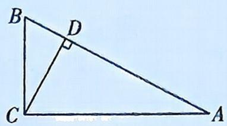

① $A{C}^{2} = {AD} \cdot  {AB}$ ; ② $B{C}^{2} = {BD} \cdot  {AB}$ ; ③ $C{D}^{2} = {AD} \cdot  {DB}$ .

(2)任意三角形中的射影定理:在 $\triangle ABC$ 中,内角 $A,B,C$ 所对的边分别为 $a,b,c$ ,则有

① $a=b\cos C+c\cos B$ ; ② $b=c\cos A+a\cos C$ ; ③ $c=a\cos B+b\cos A$ .

# 2. 三角形的中线

在 $\triangle ABC$ 中,内角A,B,C的对边分别为a,b,c.

(1) 已知 $m_{a}, m_{b}, m_{c}$ 分别为边 a, b, c 上的中线，则 $m_{a} = \frac{1}{2} \sqrt{2(b^{2} + c^{2}) - a^{2}}$ , $m_{b} = \frac{1}{2} \sqrt{2(c^{2} + a^{2}) - b^{2}}$ , $m_{c} = \frac{1}{2} \sqrt{2(a^{2} + b^{2}) - c^{2}}$ .  
(2) 在 $\triangle ABC$ 中, $AD$ 是 $BC$ 边上的中线, 则 $AB^{2} + AC^{2} = 2(BD^{2} + AD^{2}) = 2(AD^{2} + CD^{2})$ .  
(3) 向量法: $\overrightarrow{AD^{2}}=\frac{1}{4}(b^{2}+c^{2}+2bc\cos\angle BAC)$ .

# 3. 三角形的高线

(1) 在 $\triangle ABC$ 中, 内角 $A, B, C$ 所对的边分别为 $a, b, c, h_1, h_2, h_3$ 分别为边 $a, b, c$ 上的高, 则 $h_1: h_2: h_3 = \frac{1}{a}: \frac{1}{b}: \frac{1}{c} = \frac{1}{\sin A}: \frac{1}{\sin B}: \frac{1}{\sin C}$ .  
(2)求高一般采用等面积法,即求某边上的高,需要求出面积和底边长度.

# 4. 三角形的内角平分线

(1)角平分线性质定理:如图,在 $\triangle ABC$ 中,内角 $A,B,C$ 所对的边分别为 $a,b,c,AD$ 是 $\angle BAC$ 的平分线,则 $\frac{AB}{AC}=\frac{BD}{CD}$ .

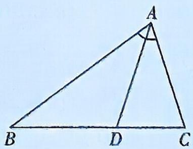

text_image

A
B D C

(2)角平分线长公式: $AD = \frac{2bc\cos\frac{A}{2}}{b + c}$ .

# 5. 张角定理

如图, 在 $\triangle ABC$ 中, $D$ 为边 $BC$ 上一点, 设 $\angle BAD = \alpha$ , $\angle CAD = \beta$ , 则 $\frac{\sin (\alpha + \beta)}{AD} = \frac{\sin \alpha}{AC} + \frac{\sin \beta}{AB}$ . 特别地, 若 $AD$ 恰好为 $\angle BAC$ 的平分线, 则 $\cos \alpha = \frac{1}{2} \left( \frac{AD}{AB} + \frac{AD}{AC} \right)$ .

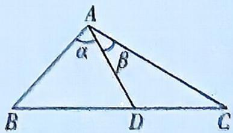

# 6. 奔驰定理

如图, 已知 O 为 $\triangle ABC$ 内一点, 则有 $S_{\triangle BOC} \cdot \overrightarrow{OA} + S_{\triangle AOC} \cdot \overrightarrow{OB} + S_{\triangle AOB} \cdot \overrightarrow{OC} = 0$ .

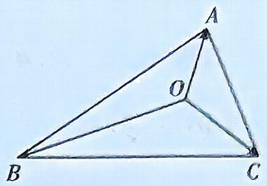

text_image

A
O
B
C

推论: 若 O 是 $\triangle ABC$ 内一点, 且 $x \cdot \overrightarrow{OA} + y \cdot \overrightarrow{OB} + z \cdot \overrightarrow{OC} = 0 (xyz \neq 0)$ , 则 $S_{\triangle BOC}: S_{\triangle AOC}: S_{\triangle AOB} = x: y: z.$

# 7. 三角形的“四心”

三角形的“四心”即重心(三条中线的交点,重心将中线分成长度为2:1的两部分)、内心(三条内角平分线的交点,也是三角形内切圆的圆心)、外心(三条中垂线的交点,也是三角形外接圆的圆心)、垂心(三条高线的交点).

重心：

(1) 若 O 为 $\triangle ABC$ 的重心, 则 $S_{\triangle BOC}: S_{\triangle AOC}: S_{\triangle AOB} = 1:1:1$ .  
(2) $O$ 为 $\triangle ABC$ 的重心 $\Leftrightarrow \overrightarrow{OA} +\overrightarrow{OB} +\overrightarrow{OC} = 0.$   
(3) 设 O 是 $\triangle ABC$ 内一点, 若动点 P 满足 $\overrightarrow{OP} = \overrightarrow{OA} + \lambda (\overrightarrow{AB} + \overrightarrow{AC}), \lambda \in (0, +\infty)$ , 则动点 P 的轨迹一定通过 $\triangle ABC$ 的重心.  
(4)设 O 是△ABC 所在平面内一点, 若动点 P 满足 $\overrightarrow{OP} = \overrightarrow{OA} + \lambda \left( \frac{\overrightarrow{AB}}{|\overrightarrow{AB}| \sin B} + \frac{\overrightarrow{AC}}{|\overrightarrow{AC}| \sin C} \right)$ , $\lambda \in (0, +\infty)$ , 则动点 P 的轨迹一定通过△ABC 的重心.  
(5) 已知 $\triangle ABC$ 的顶点 $A(x_{A}, y_{A}), B(x_{B}, y_{B}), C(x_{C}, y_{C})$ , 则 $\triangle ABC$ 的重心坐标为 $\left(\frac{x_{A} + x_{B} + x_{C}}{3}, \frac{y_{A} + y_{B} + y_{C}}{3}\right)$ .

内心：

(1) 若 O 为 $\triangle ABC$ 的内心, 则 $S_{\triangle BOC}: S_{\triangle AOC}: S_{\triangle AOB} = a:b:c$ (其中 a, b, c 分别为 $\triangle ABC$ 内角 A, B, C 的对边).  
(2) 在 $\triangle ABC$ 中, $|\overrightarrow{BC}| \cdot \overrightarrow{OA} + |\overrightarrow{AC}| \cdot \overrightarrow{OB} + |\overrightarrow{AB}| \cdot \overrightarrow{OC} = 0 \Leftrightarrow O$ 为 $\triangle ABC$ 的内心.  
(3) 设 O 是 $\triangle ABC$ 所在平面内一点, 若动点 P 满足 $\overrightarrow{OP} = \overrightarrow{OA} + \lambda \left( \frac{\overrightarrow{AB}}{|\overrightarrow{AB}|} + \frac{\overrightarrow{AC}}{|\overrightarrow{AC}|} \right)$ , $\lambda \in (0, +\infty)$ , 则动点 P 的轨迹一定通过 $\triangle ABC$ 的内心.  
(4) 在 $\triangle ABC$ 中, $\overrightarrow{OA} \cdot \left( \frac{\overrightarrow{AC}}{|\overrightarrow{AC}|} - \frac{\overrightarrow{AB}}{|\overrightarrow{AB}|} \right) = \overrightarrow{OB} \cdot \left( \frac{\overrightarrow{BC}}{|\overrightarrow{BC}|} - \frac{\overrightarrow{BA}}{|\overrightarrow{BA}|} \right) = \overrightarrow{OC} \cdot \left( \frac{\overrightarrow{CA}}{|\overrightarrow{CA}|} - \frac{\overrightarrow{CB}}{|\overrightarrow{CB}|} \right) = 0 \Leftrightarrow O$ 为 $\triangle ABC$ 的内心.

外心：

(1) 若 O 为 $\triangle ABC$ 的外心，则 $S_{\triangle BOC}: S_{\triangle AOC}: S_{\triangle AOB} = \sin 2A: \sin 2B: \sin 2C.$   
(2) 若 O 为 $\triangle ABC$ 的外心，则 $\overrightarrow{OA}^{2} = \overrightarrow{OB}^{2} = \overrightarrow{OC}^{2}$ .  
(3) 若 O 为 $\triangle ABC$ 的外心，则 $\sin 2A \cdot \overrightarrow{OA} + \sin 2B \cdot \overrightarrow{OB} + \sin 2C \cdot \overrightarrow{OC} = 0.$   
(4) 设 O 是 $\triangle ABC$ 所在平面内一点, 若动点 P 满足 $\overrightarrow{OP} = \frac{\overrightarrow{OB} + \overrightarrow{OC}}{2} + \lambda \left( \frac{\overrightarrow{AB}}{|\overrightarrow{AB}| \cos B} + \frac{\overrightarrow{AC}}{|\overrightarrow{AC}| \cos C} \right)$ , $\lambda \in (0, +\infty)$ , 则动点 P 的轨迹一定通过 $\triangle ABC$ 的外心.  
(5) 若 $(\overrightarrow{OA}+\overrightarrow{OB})\cdot\overrightarrow{AB}=(\overrightarrow{OB}+\overrightarrow{OC})\cdot\overrightarrow{BC}=(\overrightarrow{OA}+\overrightarrow{OC})\cdot\overrightarrow{AC}=0$ ，则 O 是 $\triangle ABC$ 的外心.

垂心(非直角三角形):

(1) 若 $O$ 为 $\triangle ABC$ 的垂心, 则 $S_{\triangle BOC}: S_{\triangle AOC}: S_{\triangle AOB} = \tan A: \tan B: \tan C$ .  
(2) 若 $O$ 为 $\triangle ABC$ 的垂心, 则 $\overrightarrow{OA} \cdot \overrightarrow{OB} = \overrightarrow{OB} \cdot \overrightarrow{OC} = \overrightarrow{OC} \cdot \overrightarrow{OA}$ .  
(3) 若 O 为 $\triangle ABC$ 的垂心, 则 $\tan A \cdot \overrightarrow{OA} + \tan B \cdot \overrightarrow{OB} + \tan C \cdot \overrightarrow{OC} = 0$ .  
(4) 若 O 为 $\triangle ABC$ 的垂心，则 $\left|\overrightarrow{OA}\right|^{2} + \left|\overrightarrow{BC}\right|^{2} = \left|\overrightarrow{OB}\right|^{2} + \left|\overrightarrow{CA}\right|^{2} = \left|\overrightarrow{OC}\right|^{2} + \left|\overrightarrow{AB}\right|^{2}$ .  
(5)设 O 是△ABC 所在平面内一点, 若动点 P 满足 $\overrightarrow{OP} = \overrightarrow{OA} + \lambda \left( \frac{\overrightarrow{AB}}{|\overrightarrow{AB}| \cos B} + \frac{\overrightarrow{AC}}{|\overrightarrow{AC}| \cos C} \right)$ , $\lambda \in (0, +\infty)$ , 则动点 P 的轨迹一定通过△ABC 的垂心.

# 8. 等和线定理

已知平面内的一个基底 $\{\overrightarrow{OA},\overrightarrow{OB}\}$ 及任一向量 $\overrightarrow{OC},\overrightarrow{OC}=x\overrightarrow{OA}+y\overrightarrow{OB}(x,y\in\mathbb{R})$ ，若点 C 在直线 AB 上或在平行于 AB 的直线上，则 $x+y=k$ （定值），反之也成立。其中，直线 AB 及与直线 AB 平行的直线称为等和线。

性质:(1) $|k|=\frac{|\overrightarrow{OC_{1}}|}{|\overrightarrow{OC}|}=\frac{|\overrightarrow{OA_{1}}|}{|\overrightarrow{OA}|}=\frac{|\overrightarrow{OB_{1}}|}{|\overrightarrow{OB}|}=\frac{O\text{到}A_{1}B_{1}\text{的距离}}{O\text{到}AB\text{的距离}}$ ;

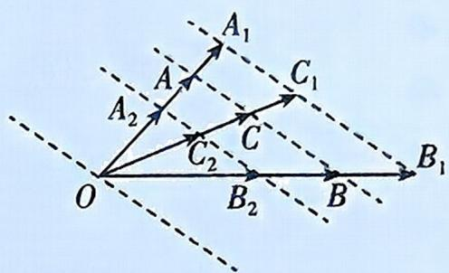

text_image

A₁
A
C₁
A₂
C₂
C
B₁
O
B₂
B

(2) 当等和线恰为直线 $AB$ 时, $k = 1$ ;  
(3) 当等和线在点 O 和直线 AB 之间时, $k \in (0,1)$ ;  
(4) 当直线 AB 在点 O 和等和线之间时, $k \in (1, +\infty)$ ;  
(5) 当等和线过点 O 时, k=0.

# 9. 极化恒等式

对于非零向量 a, b，可以得到 $a \cdot b = \frac{1}{4} \left[ (a + b)^{2} - (a - b)^{2} \right]$ .

几何意义:在 $\triangle ABC$ 中,D是边BC的中点,则 $\overrightarrow{AB} \cdot \overrightarrow{AC} = |\overrightarrow{AD}|^{2} - |\overrightarrow{DB}|^{2}$ .

# 10. 对角线向量定理

如图,在四边形ABCD中,有 $\overrightarrow{AC}\cdot\overrightarrow{BD}=\frac{|\overrightarrow{AD}|^{2}+|\overrightarrow{BC}|^{2}-|\overrightarrow{AB}|^{2}-|\overrightarrow{CD}|^{2}}{2}$ .

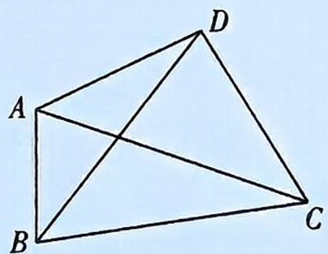

natural_image

Geometric diagram of a quadrilateral ABCD with diagonals AC and BD intersecting (no labels or measurements)

# 第6章 数列

数列的基本公式

<table><tr><td></td><td>等差数列</td><td>等比数列</td></tr><tr><td>通项公式</td><td> $a_n = a_1 + (n-1)d$ (其中首项是  $a_1$ ,公差是  $d$ )</td><td> $a_n = a_1 q^{n-1}$ (其中首项是  $a_1$ ,公比是  $q$ )</td></tr><tr><td>前 n 项和公式</td><td> $S_n = \frac{n(a_1 + a_n)}{2} = na_1 + \frac{n(n-1)}{2}d$ </td><td> $S_n = \begin{cases} na_1, & q=1, \\ a_1 - a_nq & =\frac{a_1(1-q^n)}{1-q}, & q \ne 1 \end{cases}$ </td></tr><tr><td>等差(比)中项</td><td>若 A 是 a 与 b 的等差中项,则  $A = \frac{a+b}{2}$ </td><td>若 G 是 a 与 b 的等比中项,则  $\frac{G}{a} = \frac{b}{G}$ ,即  $G^2 = ab$ (或  $G = \pm \sqrt{ab}$ ,等比中项有两个)</td></tr></table>

# 等差、等比数列的性质及二级结论

<table><tr><td rowspan="4">项的性质</td><td>在等差数列 $\{a_n\}$ 中, $a_n,a_{n+m},a_{n+2m},\cdots$ 为等差数列,公差为md;在等比数列 $\{a_n\}$ 中, $a_n,a_{n+m},a_{n+2m},\cdots$ 为等比数列,公比为 $q^m$ </td></tr><tr><td>在等差数列 $\{a_n\}$ 中, $2a_n=a_{n-1}+a_{n+1}(n\geqslant2),2a_n=a_{n-k}+a_{n+k}(n>k)$ ;在等比数列 $\{a_n\}$ 中, $a_n^2=a_{n-1}\cdot a_{n+1}(n\geqslant2),a_n^2=a_{n-k}\cdot a_{n+k}(n>k)$ </td></tr><tr><td>在等差数列 $\{a_n\}$ 中,若 $m+n=r+s$ ,则 $a_m+a_n=a_r+a_s$ (多项和也成立);在等比数列 $\{a_n\}$ 中,若 $m+n=r+s$ ,则 $a_m a_n=a_r a_s$ (多项积也成立)</td></tr><tr><td>若 $\{a_n\},\{b_n\}$ 为项数相同的等差数列,则1 $\{ka_n\pm lb_n\}$ (k,l为常数)仍为等差数列;2 $\{c^{a_n}\}(c>0,c\neq1)$ 为等比数列.若 $\{a_n\},\{b_n\}$ 为项数相同的等比数列,则1 $\{ka_n\}(k\neq0),\{a_nb_n\},\left\{\frac{1}{a_n}\right\},\left\{\frac{a_n}{b_n}\right\},\left\{\sqrt{a_n}\right\}(a_n>0),\left\{a_k^n\right\},\left\{|a_n|\right\}$ 为等比数列;2 $\{\log_a a_n\}$ (其中 $a_n>0,c>0,c\neq1$ )为等差数列</td></tr><tr><td rowspan="6">和的性质</td><td>在公差为d的等差数列中, $S_n,S_{2n}-S_n,S_{3n}-S_{2n},\cdots$ 也成等差数列,且公差为 $n^2d$ ;在公比 $q\neq-1$ 的等比数列中, $S_n,S_{2n}-S_n,S_{3n}-S_{2n},\cdots$ 也成等比数列,且公比为 $q^n$ </td></tr><tr><td>在公差为d的等差数列中, $\frac{S_n}{n}=\frac{d}{2}n+\left(a_1-\frac{d}{2}\right)$ ,数列 $\left\{\frac{S_n}{n}\right\}$ 也是等差数列</td></tr><tr><td>若 $\{a_n\},\{b_n\}$ 为项数相同的等差数列,且前n项和分别为 $S_n$ 与 $T_n$ ,则 $\frac{a_m}{b_m}=\frac{S_{2m-1}}{T_{2m-1}},\frac{a_n}{b_m}=\frac{(2m-1)S_{2n-1}}{(2n-1)T_{2m-1}}$ </td></tr><tr><td>在公差为d的等差数列中, $S_{m+n}=S_m+S_n+mnd$ ;在公比为q的等比数列中, $S_{m+n}=S_m+q^m S_n=S_n+q^n S_m$ </td></tr><tr><td>在公比为q的等比数列中,当 $q=1$ 时, $\frac{S_n}{S_m}=\frac{n}{m}$ ;当 $q\neq\pm1$ 时, $\frac{S_n}{S_m}=\frac{1-q^n}{1-q^m}$ </td></tr><tr><td>等差数列中的绝对值求和问题:1设等差数列 $\{a_n\}$ 中, $a_1,a_2,\cdots,a_k>0,a_{k+1},\cdots,a_n<0,S_n$ 为 $\{a_n\}$ 的前n项和,则 $|a_1|+|a_2|+|a_3|+\cdots+|a_n|= \begin{cases} \frac{n(a_1+a_n)}{2}, & n\leqslant k, \\ 2S_k-S_n, & n>k. \end{cases}$ 2设等差数列 $\{a_n\}$ 中, $a_1,a_2,\cdots,a_k<0,a_{k+1},\cdots,a_n>0,S_n$ 为 $\{a_n\}$ 的前n项和,则 $|a_1|+|a_2|+|a_3|+\cdots+|a_n|= \begin{cases} -\frac{n(a_1+a_n)}{2}, & n\leqslant k, \\ -2S_k+S_n, & n>k. \end{cases}$ </td></tr></table>

# 第7章 立体几何

1. 空间两点间的距离公式: 若 $A(x_{1}, y_{1}, z_{1}), B(x_{2}, y_{2}, z_{2})$ , 则 $A, B$ 两点间的距离 $d = |\overrightarrow{AB}| = \sqrt{\overrightarrow{AB} \cdot \overrightarrow{AB}} = \sqrt{(x_{2} - x_{1})^{2} + (y_{2} - y_{1})^{2} + (z_{2} - z_{1})^{2}}$ .

2. 空间向量的夹角公式: 设 $a = (a_{1}, a_{2}, a_{3}), b = (b_{1}, b_{2}, b_{3})$ , 则 $\cos \langle a, b \rangle = \frac{a \cdot b}{|a||b|} = \frac{a_{1}b_{1} + a_{2}b_{2} + a_{3}b_{3}}{\sqrt{a_{1}^{2} + a_{2}^{2} + a_{3}^{2}} \cdot \sqrt{b_{1}^{2} + b_{2}^{2} + b_{3}^{2}}}.$

3. 点到平面的距离公式: 点 $B$ 到平面 $\alpha$ 的距离 $d = \frac{|\overrightarrow{AB} \cdot n|}{|n|}$ ( $n$ 为平面 $\alpha$ 的法向量, $AB$ 是经过平面 $\alpha$ 的一条斜线, $A \in \alpha$ ).

# 二级结论

球与正方体、正四面体模型的具体剖析

已知正方体的棱长为 a.

<table><tr><td></td><td>正方体的内切球</td><td>正方体的棱切球</td><td>正方体的外接球</td></tr><tr><td>图形</td><td>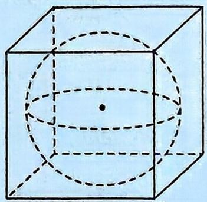</td><td>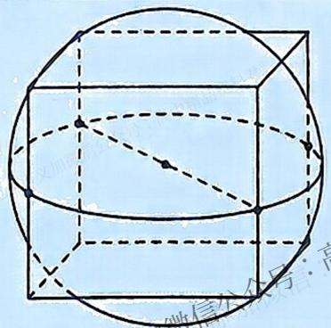</td><td>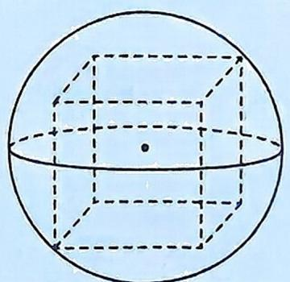</td></tr><tr><td>球的半径</td><td> $r_{\text{内切球}} = \frac{a}{2}$ </td><td> $r_{\text{棱切球}} = \frac{\sqrt{2}}{2} a$ </td><td> $r_{\text{外接球}} = \frac{\sqrt{3}}{2} a$ </td></tr></table>

已知正四面体的棱长为 a.

<table><tr><td></td><td>正四面体的内切球</td><td>正四面体的棱切球</td><td>正四面体的外接球</td></tr><tr><td>图形</td><td>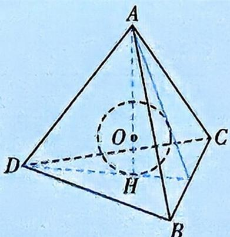</td><td>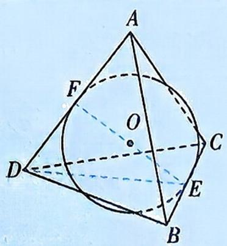</td><td>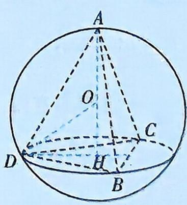</td></tr><tr><td>说明</td><td> $R_{\text{内切球}} = OH = AH - AO = h - R_{\text{外接球}}$ (h为正四面体的高)</td><td>对棱中点E,F为棱切球与棱的切点,且EF=2 $R_{\text{棱切球}}$ ,EF在△DEF中用勾股定理可求</td><td> $DH = \frac{\sqrt{3}}{3}a$ , $R_{\text{外接球}} = OD$ ,OD在△DOH中用勾股定理可求</td></tr><tr><td>球的半径</td><td> $R_{\text{内切球}} = \frac{\sqrt{6}}{12}a$ </td><td> $R_{\text{棱切球}} = \frac{\sqrt{2}}{4}a$ </td><td> $R_{\text{外接球}} = \frac{\sqrt{6}}{4}a$ </td></tr></table>

# 第8章 直线与圆

# 1. 直线方程

(1) 斜截式: $y = kx + b$ ; (2) 点斜式: $y - y_0 = k(x - x_0)$ ; (3) 截距式: $\frac{x}{a} + \frac{y}{b} = 1 (a \neq 0, b \neq 0)$ ;   
(4)两点式: $\frac{y - y_1}{y_2 - y_1} = \frac{x - x_1}{x_2 - x_1} (x_1 \neq x_2, y_1 \neq y_2)$ ; (5)一般式: $Ax + By + C = 0$ (其中 $A, B$ 不同时为 0).

2. 点到点的距离公式: 若 $A(x_{1}, y_{1}), B(x_{2}, y_{2})$ , 则 $|AB| = \sqrt{(x_{2} - x_{1})^{2} + (y_{2} - y_{1}^{2})}$ .  
3. 点到直线的距离公式: 若 $D(x_{0}, y_{0})$ , 直线 $l: Ax + By + C = 0$ , 则点 $D$ 到直线 $l$ 的距离 $d = \frac{|Ax_{0} + By_{0} + C|}{\sqrt{A^{2} + B^{2}}}$ .  
4. 平行直线之间的距离公式: 若两条平行直线 $l_{1}: A x + B y + C_{1} = 0, l_{2}: A x + B y + C_{2} = 0$ , 则平行直线 $l_{1}, l_{2}$ 之间的距离 $d = \frac{|C_{1} - C_{2}|}{\sqrt{A^{2} + B^{2}}}$ .

# 第9章 圆锥曲线

直线与圆锥曲线相交的弦长公式: 直线 $l: y = kx + m$ 与圆锥曲线 C 交于 $A(x_{1}, y_{1}), B(x_{2}, y_{2})$ 两点, 则 $|AB| = \sqrt{1 + k^{2}} |x_{1} - x_{2}|$ 或 $|AB| = \sqrt{1 + \frac{1}{k^{2}}} |y_{1} - y_{2}| (k \neq 0)$ .

# 二级结论

# 1. 椭圆的三大定义

第一定义: 满足 $\left|PF_{1}\right| + \left|PF_{2}\right| = 2a > \left|F_{1}F_{2}\right| = 2c$ 的点 P 的轨迹是椭圆.

第二定义:平面内到定点 $F_{2}(c,0)(c>0)$ 的距离与到定直线 $l_{2}:x=\frac{a^{2}}{c}(a>c>0)$ 的距离之比为常数 $e=\frac{c}{a}\in(0,1)$ 的点 $P(x,y)$ 的轨迹为椭圆 $\frac{x^{2}}{a^{2}}+\frac{y^{2}}{b^{2}}=1(a>b>0)$ ，其中 $a^{2}=b^{2}+c^{2}$ ，定点 $F_{2}$ 为椭圆的右焦点，定直线 $l_{2}$ 为椭圆的右准线。常用结论见下表：

<table><tr><td>椭圆的方程</td><td> $\frac{x^2}{a^2}+\frac{y^2}{b^2}=1(a>b>0)$ </td><td> $\frac{y^2}{a^2}+\frac{x^2}{b^2}=1(a>b>0)$ </td></tr><tr><td>焦点</td><td> $F_1(-c,0),F_2(c,0)$ </td><td> $F_1(0,-c),F_2(0,c)$ </td></tr><tr><td>焦半径长度</td><td> $P(x_0,y_0)$ 为椭圆上一点, $|PF_1|=a+ex_0$ , $|PF_2|=a-ex_0$ </td><td> $P(x_0,y_0)$ 为椭圆上一点, $|PF_1|=a+ey_0,|PF_2|=a-ey_0$ </td></tr><tr><td>焦半径长度记忆口诀</td><td>左加右减</td><td>下加上减</td></tr></table>

第三定义:已知点 $A(x_{0},y_{0})$ , $B(-x_{0},-y_{0})$ 是关于原点对称的两个点, 当点 $P(x,y)$ 与点 A, B 以及 $C(x_{0},-y_{0})$ , $D(-x_{0},y_{0})$ 不重合时, 有 $k_{PA} \cdot k_{PB} = -\frac{b^{2}}{a^{2}} = e^{2} - 1, 0 < e < 1$ , 则点 $P(x,y)$ 的轨迹是中心在原点, 焦点在 x 轴上, 离心率为 e 的椭圆 (不含点 A, B, C, D), 且 A, B, C, D 也在该椭圆上.

# 2. 双曲线的三大定义

第一定义: 满足 $\left|\left|PF_{1}\right|-\left|PF_{2}\right|\right|=2a<\left|F_{1}F_{2}\right|=2c$ 的点 P 的轨迹是双曲线.

第二定义:若平面内到定点 $F_{2}(c,0)(c>0)$ 的距离与到定直线 $l_{2}:x=\frac{a^{2}}{c}(c>a>0)$ 的距离之比为常数 $e=\frac{c}{a}\in(1,+\infty)$ 的点 $P(x,y)$ 的轨迹为双曲线 $\frac{x^{2}}{a^{2}}-\frac{y^{2}}{b^{2}}=1(a>0,b>0)$ ，其中 $c^{2}=a^{2}+b^{2}$ ，定点 $F_{2}$ 为双曲线的右焦点，定直线 $l_{2}$ 为双曲线的右准线。常用结论见下表：

<table><tr><td>双曲线的方程</td><td> $\frac{x^2}{a^2}-\frac{y^2}{b^2}=1(a>0,b>0)$ </td><td> $\frac{y^2}{a^2}-\frac{x^2}{b^2}=1(a>0,b>0)$ </td></tr><tr><td>焦点</td><td> $F_1(-c,0),F_2(c,0)$ </td><td> $F_1(0,-c),F_2(0,c)$ </td></tr><tr><td>焦半径长度</td><td> $P(x_0,y_0)$ 为双曲线上一点, $|PF_1|=|a+ex_0|,|PF_2|=|a-ex_0|$ </td><td> $P(x_0,y_0)$ 为双曲线上一点, $|PF_1|=|a+ey_0|,|PF_2|=|a-ey_0|$ </td></tr><tr><td>焦半径长度记忆口诀</td><td>左加右减</td><td>下加上减</td></tr></table>

第三定义:已知点 $A(x_{0},y_{0})$ , $B(-x_{0},-y_{0})$ 是关于原点对称的两个点, 当点 $P(x,y)$ 与点 A, B 以及 $C(x_{0},-y_{0})$ , $D(-x_{0},y_{0})$ 不重合时, 有 $k_{PA} \cdot k_{PB} = \frac{b^{2}}{a^{2}} = e^{2} - 1 > \frac{y_{0}^{2}}{x_{0}^{2}}, e > 1$ , 则点 $P(x,y)$ 的轨迹是中心在原点, 焦点在 x 轴上, 离心率为 e 的双曲线 (不含点 A, B, C, D), 且 A, B, C, D 也在该双曲线上.

# 3. 椭圆与双曲线的焦点三角形

<table><tr><td></td><td>椭圆</td><td>双曲线</td></tr><tr><td>图形(△PF1F2为曲线的焦点三角形)</td><td>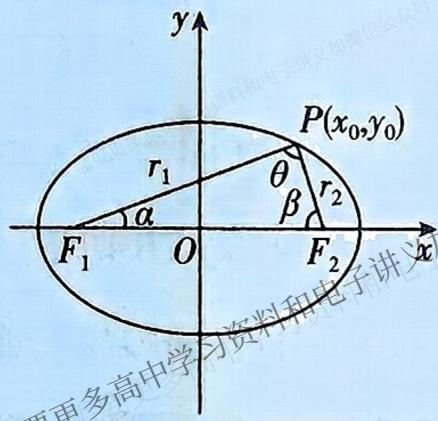</td><td>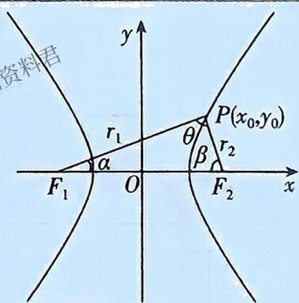</td></tr><tr><td>三条边之间的关系</td><td>|PF1|+|PF2|=2a, |F1F2|=2c</td><td>||PF1|-|PF2||=2a, |F1F2|=2c</td></tr><tr><td>焦点三角形的周长L</td><td>定值:L=2a+2c</td><td>不是定值:L=r1+r2+2c∈(4c,+∞)</td></tr><tr><td>r1·r2</td><td>r1·r2=2b2/1+cosθ=a2-e2x02</td><td>r1·r2=2b2/1-cosθ=e2x02-a2</td></tr><tr><td>焦点三角形的面积S</td><td>S=b2·tanθ/2=c·|y0|,当P为短轴端点时,θ最大,同时S取得最大值bc</td><td>S=b2/c·|y0|∈(0,+∞),S无最值</td></tr><tr><td>离心率</td><td>e=2c/2a=|F1F2|r1+r2=sinθ/sinβ+sinα=sin(α+β)/sinβ+sinα</td><td>e=2c/2a=|F1F2|r1-r2=sinθ/sinβ-sinα=sin(α+β)/sinβ-sinα</td></tr><tr><td>△PF1F2的内切圆</td><td>内切圆半径r=2S/L=b2·tanθ/2+a+c</td><td>内切圆圆心的横坐标恒为a</td></tr></table>

# 4. 抛物线的焦点弦

过抛物线 $y^{2}=2px(p>0)$ 的焦点 F 的直线与抛物线交于 A, B 两点, G 为弦 AB 的中点, 分别过点 A, B 作准线 $l: x=-\frac{p}{2}$ 的垂线, 垂足分别为 M, N, H 为 MN 的中点. 设 $A(x_{1}, y_{1}), B(x_{2}, y_{2})$ , 直线 AB 的倾斜角为 $\alpha(\alpha$ 为锐角), 则有如下结论:

<table><tr><td>图示</td><td>结论</td></tr><tr><td>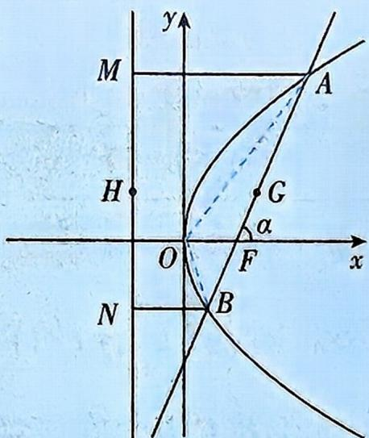</td><td>1.焦半径、焦点弦相关公式(1)焦半径: $|AF| = x_1 + \frac{p}{2} = \frac{p}{1 - \cos \alpha}$ ; $|BF| = x_2 + \frac{p}{2} = \frac{p}{1 + \cos \alpha}$ .(2)焦点弦: $|AB| = x_1 + x_2 + p = \frac{2p}{\sin^2 \alpha}$ .(3)焦半径之比: $\frac{|AF|}{|BF|} = \frac{1 + \cos \alpha}{1 - \cos \alpha}$ .(4)三个定值: $x_1x_2 = \frac{p^2}{4}$ ; $y_1y_2 = -p^2$ ; $\frac{1}{|AF|} + \frac{1}{|BF|} = \frac{2}{p}$ .2. $S_{\triangle OAB} = \frac{1}{2} \cdot |OF| \cdot |AB| \sin \alpha = \frac{p^2}{2 \sin \alpha}$ </td></tr><tr><td>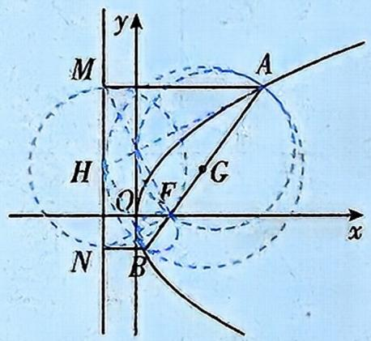</td><td>3.四种相切(1)以AB为直径的圆与MN切于点H,即 $\angle AHB = 90^\circ$ .(2)以MN为直径的圆与AB切于焦点F,即 $\angle MFN = 90^\circ$ .(3)以焦半径AF为直径的圆与y轴相切.(4)以焦半径BF为直径的圆与y轴相切</td></tr><tr><td>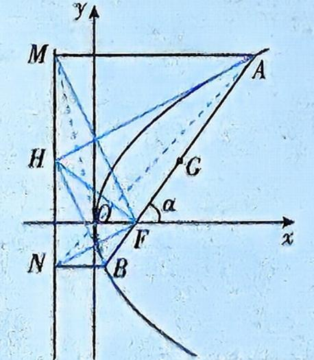</td><td>4.两对全等的三角形(1) $\triangle AMH \cong \triangle AFH$ , $\therefore AH$ 平分 $\angle MAF$ 和 $\angle MHF$ , $AH \perp MF$ ;(2) $\triangle BNH \cong \triangle BFH$ , $\therefore BH$ 平分 $\angle NHF$ 和 $\angle NBF$ , $BH \perp NF$ .5.A,O,N三点共线;B,O,M三点共线.6.记 $\triangle AMF$ , $\triangle FMN$ , $\triangle BNF$ 的面积分别为 $S_1$ , $S_2$ , $S_3$ ,则 $S_2^2 = 4S_1S_3$ . $S_1 = \frac{1}{2} |AF| |AM| \sin \alpha = \frac{\sin \alpha}{2} \cdot \left( \frac{p}{1 - \cos \alpha} \right)^2$ , $S_3 = \frac{1}{2} |BF| |BN| \sin \alpha = \frac{\sin \alpha}{2} \cdot \left( \frac{p}{1 + \cos \alpha} \right)^2$ , $S_2 = \frac{1}{2} \cdot p \cdot |MN| = \frac{1}{2} \cdot p \cdot |AB| \sin \alpha = \frac{p^2}{\sin \alpha}$ </td></tr></table>

# 1. 特殊元素、特殊位置——优先安排

首先考虑问题中的特殊元素(或位置),然后排列其他一般元素(或位置).

# 2. 相邻问题——捆绑法

将 $n$ 个不同的元素排成一排, 其中 $k (k \leqslant n)$ 个元素排在相邻位置上, 求不同排法种数的步骤: ①先将这 $k$ 个元素“捆绑”在一起, 看成一个整体; ②把这个整体当作一个元素与其他元素一起排列,其排列方法有 $\mathrm{A}_{n-k+1}^{n-k+1}$ 种; ③然后“松绑”, 将“捆绑”在一起的元素内部进行排列, 其排列方法有 $\mathrm{A}_k^k$ 种; ④根据分步乘法计数原理, 符合条件的排列方法有 $\mathrm{A}_{n-k+1}^{n-k+1} \cdot \mathrm{A}_k^k$ 种.

# 3. 不相邻问题——插空法

将 $n$ 个不同的元素排成一排, 其中 $k (2k \leqslant n + 1)$ 个元素互不相邻, 求不同排法种数的步骤: ①先将没有不相邻要求的 $n - k$ 个元素排成一排, 其排列方法有 $\mathrm{A}_{n-k}^{n-k}$ 种; ②然后将要求两两不相邻的 $k$ 个元素插入 $n - k + 1$ 个空隙中 (包括两端), 相当于从 $n - k + 1$ 个空隙中选出 $k$ 个, 分别分配给两两不相邻的 $k$ 个元素, 其排列方法有 $\mathrm{A}_{n-k+1}^{k}$ 种; ③根据分步乘法计数原理, 符合条件的排列方法有 $\mathrm{A}_{n-k}^{n-k} \cdot \mathrm{A}_{n-k+1}^{k}$ 种.

# 4. 定序问题——倍缩法

n 个不同元素排列成一排共有 $A_{n}^{n}$ 种排法, m 个不同元素排列成一排共有 $A_{m}^{m}$ 种排法, 因为 m 个不同元素顺序已定的排法只占排法总数的 $\frac{1}{A_{m}^{m}}$ , 所以 n 个不同元素中 $m (m \leqslant n)$ 个元素顺序已定的排法共有 $\frac{A_{n}^{n}}{A_{m}^{m}}$ 种(即定序问题先不考虑顺序限制, 排列后再除以定序元素的全排列).

# 5. 分排问题——合并法

分排问题可以忽略分排,直接看成一排处理.

# 6. 相同元素分组——隔板法

将 $n$ 个相同元素排成一排, 元素之间共形成 $n - 1$ 个空隙, 从中挑出 $m - 1 (m \leqslant n)$ 个空隙插入 $m - 1$ 个隔板, 就可以将 $n$ 个相同元素分为 $m$ 组 (每组至少含 1 个元素), 共有 $\mathrm{C}_{n-1}^{m-1}$ 种方法.

# 7. 不同元素分组

<table><tr><td>常见形式</td><td>处理方法</td></tr><tr><td>非均匀不编号分组</td><td>n个不同元素分成m组,每组元素数目均不相等,且不考虑各组间的顺序,不管是否分尽,分法种数 $N = C_{n}^{m_1} \cdot C_{n-m_1}^{m_2} \cdot C_{n-(m_1+m_2)}^{m_3} \cdot \cdots \cdot C_{n-(m_1+m_2+\cdots+m_{m-1})}^{m_m}$ </td></tr><tr><td>均匀不编号分组</td><td>n个不同元素分成不编号的m组,假定其中r组元素个数相等,不管是否分尽,其分法种数为 $\frac{N}{A_r^r}$ (其中 $N = C_n^{m_1} \cdot C_{n-m_1}^{m_2} \cdot C_{n-(m_1+m_2)}^{m_3} \cdot \cdots \cdot C_{n-(m_1+m_2+\cdots+m_{m-1})}^{m_m}$ ).如果再有k组均匀分组,应再除以 $A_k^k$ </td></tr><tr><td>非均匀编号分组</td><td>n个不同元素分成m组,各组元素数目均不相等,且考虑各组间的顺序,其分法种数为 $N \cdot A_{m}^{m}$ (其中 $N = C_{n}^{m_1} \cdot C_{n-m_1}^{m_2} \cdot C_{n-(m_1+m_2)}^{m_3} \cdot \cdots \cdot C_{n-(m_1+m_2+\cdots+m_{m-1})}^{m_m}$ )</td></tr><tr><td>均匀编号分组</td><td>n个不同元素分成m组,其中r组元素个数相同,且考虑各组间的顺序,其分法种数为 $\frac{N \cdot A_{m}^{m}}{A_{r}^{r}}$ (其中 $N = C_{n}^{m_1} \cdot C_{n-m_1}^{m_2} \cdot C_{n-(m_1+m_2)}^{m_3} \cdot \cdots \cdot C_{n-(m_1+m_2+\cdots+m_{m-1})}^{m_m}$ )</td></tr></table>

# 第11章 概率与统计

# 1. 相互独立事件

(1) 如果 $A_{1}, A_{2}, \cdots, A_{n}$ 相互独立，则有 $P(A_{1}A_{2}\cdots A_{n}) = P(A_{1})P(A_{2})\cdots P(A_{n})$ .  
(2) 若事件 $A, B$ 相互独立, 则

<table><tr><td>事件A,B发生的情况</td><td>概率计算公式</td></tr><tr><td>A,B中至少有一个不发生</td><td> $P(\overline{A}\overline{B} \cup \overline{A}B \cup \overline{A}\overline{B}) = 1 - P(AB) = 1 - P(A)P(B)$ </td></tr><tr><td>A,B中至少有一个发生</td><td> $P(A\overline{B} \cup \overline{A}B \cup AB) = 1 - P(\overline{A},\overline{B}) = 1 - P(\overline{A})P(\overline{B}) = P(A) + P(B) - P(A)P(B)$ </td></tr><tr><td>A,B中恰好有一个发生</td><td> $P(A\overline{B} \cup \overline{A}B) = P(A\overline{B} + \overline{A}B) = P(A)P(\overline{B}) + P(\overline{A})P(B) = P(A) + P(B) - 2P(A)P(B)$ </td></tr></table>

# 2. 条件概率

条件概率公式: $P(B|A)=\frac{P(AB)}{P(A)}=\frac{n(AB)}{n(A)}(P(A)>0,n(A)>0)$ .

乘法公式:对任意两个事件A,B,若 $P(A)>0$ ,则 $P(AB)=P(A)P(B|A)$ .

条件概率的性质:设 $P(A)>0$ , 则

(1) $P(\Omega|A)=1(\Omega$ 为样本空间);   
(2) 如果 $B$ 和 $C$ 是两个互斥事件, 则 $P(B \cup C|A) = P(B|A) + P(C|A)$ ;  
(3) 设 $\overline{B}$ 和 $B$ 互为对立事件, 则 $P(\overline{B} | A) = 1 - P(B | A)$ .

# 3. 金概率公式

$P(B) \approx \sum_{i=1}^{n} P(BA_i) \approx \sum_{i=1}^{n} P(A_i)P(B|A_i)$ (其中 $A_1 \cup A_2 \cup \cdots \cup A_n = \Omega, \Omega$ 为样本空间).

