# 目录

# 专题一 集合与逻辑

大招 1 容斥原理 …… 001

# 专题二 基本不等式

大招 2 “1” 的代换 …… 002

大招 3 一个桥梁 …… 003

# 专题三 函数

大招 4 对勾函数求值域 005

大招 5 挖掘单调性 …… 007

大招6 部分奇偶性 008

大招 7 对称性转化 009

大招 8 半周期 & 双对称推导周期 …… 011

大招9 类周期函数 013

大招 10 函数图象变换 014

大招 11 数形结合找临界 …… 015

大招 12 二次函数的零点分布问题 …… 017

大招 13 复合方程的实数根问题 …… 017

# 专题四 导数

大招 14 函数图象的切线方程 …… 019

大招 15 隐函数求导 020

大招 16 导数逆向构造 …… 021

大招 17 同构思想 023

大招 18 洛必达法则 024

大招 19 泰勒展开式 026

大招 20 齐次化 028

大招 21 $e^{x} \geqslant x + 1$ 与 $\ln x \leqslant x - 1$ 的应用 … 029

大招 22 不等式证明——指对处理 …… 030

大招 23 不等式证明——主元法 …… 031

大招 24 不等式证明——分割与放缩 …… 032

大招 25 函数零点问题 033

大招 26 隐极值点代换 035

大招 27 恒成立求参——分离参数 …… 036

大招 28 恒成立求参——分类讨论 …… 037

大招 29 恒成立求参——必要性探路 …… 038

大招 30 恒成立求参——端点 & 中间点效应
040

大招 31 极值点 & 拐点偏移 …… 042

大招 32 对数平均不等式 …… 044

大招 33 零点的放缩 045

# 专题五 三角函数

大招 34 寻找角的关系 047

大招 35 “ $\omega$ ” 的求解 …… 048

# 专题六 解三角形

大招 36 角平分线定理 050

大招 37 张角定理 050

大招 38 平行四边形定理 …… 051

大招 39 五边两角模型 052

# 专题七 平面向量

大招 40 算两次 053

大招 41 等和线 054

大招 42 极化恒等式 055

大招 43 奔驰定理 056

# 专题八 数列

大招 44 倒序相加求和 & 并项求和 …… 058

大招 45 错位相减求和 059

大招 46 裂项相消求和 061

大招 47 一阶线性递推 062

# 目录

大招 48 二阶线性递推 …… 064

大招 49 分式结构递推 066

大招50 数学归纳法 067

大招51 数列不等式的放缩 068

大招52 周期数列 071

大招53 数列函数属性 072

# 专题九 立体几何

大招 54 四面体的特殊模型 …… 073

大招 55 外接球问题之补形法 …… 075

大招 56 外接球问题之双外心模型 …… 077

大招57 内切球与球的相切问题的临界处理 078

大招58 三余弦定理 079

大招 59 运动中找不变量 …… 080

大招60 动点轨迹的确定 081

大招61 翻折问题之平面化 082

大招 62 截面问题之补全图形 …… 083

# 专题十 直线与圆

大招63 代数问题几何化 …… 083

大招 64 动点问题处理策略 …… 084

大招65 直线系方程 085

大招 66 曼哈顿距离 086

大招67 圆系方程 087

大招68 隐圆 088

大招 69 阿波罗尼斯圆 090

# 专题十一 圆锥曲线

大招 70 圆锥曲线第一定义的应用 …… 091

大招71 圆锥曲线第二定义的应用 092

大招 72 圆锥曲线第三定义的应用 …… 095

大招 73 弦中点问题与点差法 …… 097

大招 74 焦点三角形 099

大招 75 焦点三角形的内心 …… 103

大招76 平均性质 104

大招 77 圆锥曲线的切线 …… 105

大招78 硬解定理 109

大招 79 直线夹角的计算方法 …… 111

大招80 极点极线 114

大招81 超级韦达定理 116

大招82 非对称处理 118

# 专题十二 计数原理

大招83 特殊先安排 120

大招84 固序问题 120

大招85 分组分配问题 122

大招 86 隔板法 …… 123

大招 87 捆绑法 & 插空法 …… 124

大招88 正难则反 125

大招89 赋值法 125

大招 90 整除及余数问题 …… 126

# 专题十三 概率统计

大招 91 条件概率与全概率公式 & 贝叶斯公式
…… 127

大招 92 常见分布的辨析 …… 128

大招 93 概率结合数列模型 …… 130

# 专题十四 复数

大招 94 复数的三角形式…… 131

大招 95 复数的模的运算 …… 133

大招 96 复数的几何意义 …… 134

在研究集合时,经常遇到有关集合中元素的个数问题.例如“在学校文化节前夕某班需要编排一个团体节目,若班里会唱歌的人数为21,会跳舞的人数为18,既会唱歌又会跳舞的人数为6,假定参加团体节目的同学都是在唱歌、跳舞中至少会一种,那么该团体节目最多能安排多少人?”

此时如果令集合 $A = \{x \mid x$ 是会唱歌的人 $\}$ , $B = \{x \mid x$ 是会跳舞的人 $\}$ , 那么问题就转化成在已知集合 $A, B, A \cap B$ 中的元素个数情况下, 去求 $A \cup B$ 中的元素个数. 像这种研究若干集合、集合的交集、集合的并集的元素个数之间的关系, 正是容斥原理的应用范畴.

# 1. 集合中元素个数的表示

我们把含有限个元素的集合 A 叫做有限集,用 $\text{card}(A)$ 来表示有限集合 A 中元素的个数.

# 2.二元容斥原理及其内涵

①二元容斥原理:对于集合A,B来说,有 $\mathrm{card}(A\cup B)=\mathrm{card}(A)+\mathrm{card}(B)-\mathrm{card}(A\cap B)$ .  
②二元容斥原理的内涵: 首先画出韦恩图, 由韦恩图可以发现 $\operatorname{card}(A) + \operatorname{card}(B)$ 与 $\operatorname{card}(A \cup B)$ 相比, 多算了一次集合 $A \cap B$ 中元素的个数, 因此需要减掉一次. 因此得到二元容斥原理 $\operatorname{card}(A \cup B) = \operatorname{card}(A) + \operatorname{card}(B) - \operatorname{card}(A \cap B)$ .

此时回到开头的问题,相当于 $\mathrm{card}(A)=21,\mathrm{card}(B)=18,\mathrm{card}(A\cap$

$B) = 6$ , 因此根据容斥原理直接得到 $\text{card}(A \cup B) = 33$ , 因此该团体节目最多能安排 33 人.

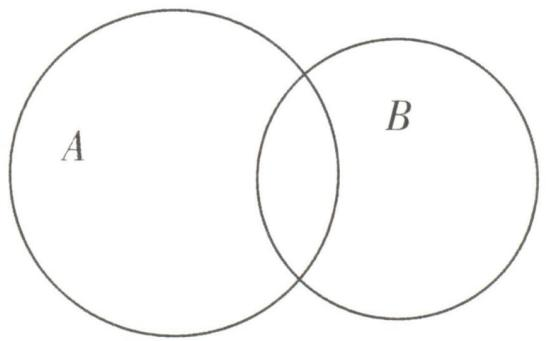

text_image

A
B

# 3.三元容斥原理及其内涵

①三元容斥原理:对于集合 A, B, C 来说,有 $\operatorname{card}(A \cup B \cup C) = \operatorname{card}(A) + \operatorname{card}(B) + \operatorname{card}(C) - \operatorname{card}(A \cap B) - \operatorname{card}(B \cap C) - \operatorname{card}(C \cap A) + \operatorname{card}(A \cap B \cap C)$ .  
②三元容斥原理的内涵:与二元情形一样的思路,画出韦恩图,由韦恩图可以发现 $\mathrm{card}(A) + \mathrm{card}(B) + \mathrm{card}(C)$ 与 $\mathrm{card}(A \cup B \cup C)$ 相比, 多算了集合 A, B, C 两两相交区域中的元素个数, 因此需要减掉 $A \cap B, B \cap C, C \cap A$ 中元素的个数. 但是在减掉 $A \cap B, B \cap C, C \cap A$ 中元素的个数的过程中, 我们把 $A \cap B \cap C$ 的区域减了 3 次, 而 $\mathrm{card}(A) + \mathrm{card}(B) + \mathrm{card}(C)$ 将 $A \cap B \cap C$ 的区域只计算了 3 次, 于是需要再把 $\mathrm{card}(A \cap B \cap C)$ 加上 1 次.

因此得到三元容斥原理 $\operatorname{card}(A \cup B \cup C) = \operatorname{card}(A) + \operatorname{card}(B) + \operatorname{card}(C) - \operatorname{card}(A \cap B) - \operatorname{card}(B \cap C) - \operatorname{card}(C \cap A) + \operatorname{card}(A \cap B \cap C)$ .

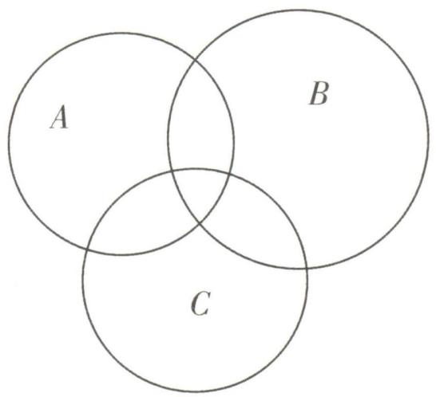

text_image

A
B
C

# 坑神有话说

容斥原理实质上就是一种计数方法,在计数时我们先不考虑重叠的情况,把包含于某内容中的所有对象的数目先计算出来,然后把计数时重复计算的数目排斥出去,最终使得计算结果既无遗漏又无重复.容斥原理还可以拓展为 n 个集合时的 n 元情形,但是已经不属于高中数学的范畴了,这里不再赘述,感兴趣的同学可以自行了解.

大招示例 (2020 新高考 I 卷) 某中学的学生积极参加体育锻炼, 其中有 $96 \%$ 的学生喜欢足球或游泳, $60 \%$ 的学生喜欢足球, $82 \%$ 的学生喜欢游泳, 则该中学既喜欢足球又喜欢游泳的学生数占该校学生总数的比例是 ( )

A. $62\%$

B. $56\%$

C. $46\%$

D. $42\%$

# 大招识别

已知条件符合二元容斥原理模型.

解析 设集合 $A = \{x \mid x$ 是喜欢足球的学生 $\}$ , 集合 $B = \{x \mid x$ 是喜欢游泳的学生 $\}$ , 不妨设该中学有 100 人, 则 $\operatorname{card}(A \cup B) = 96$ , $\operatorname{card}(A) = 60$ , $\operatorname{card}(B) = 82(\operatorname{card}(S)$ 表示集合 $S$ 中元素的个数). 由二元容斥原理可得 $\operatorname{card}(A \cap B) = \operatorname{card}(A) + \operatorname{card}(B) - \operatorname{card}(A \cup B) = 60 + 82 - 96 = 46$ , 所以该中学既喜欢足球又喜欢游泳的学生数占该校学生总数的比例是 $46\%$ . 故选 C.

答案 C

text_image

大招2

# “1”的代换

见招 已知正数 $x, y$ 满足 $ax + by = 1$ , 求 $\frac{c}{x} + \frac{d}{y}$ 的最小值, 其中 $a, b, c, d$ 都为正参数.

满足 $\frac{c}{x}+\frac{d}{y}=1$ ，求 $ax+by$ 的最小值，也是一样的操作

出招 “1”的代换.

第一步：将1用 $ax + by$ 代替. $\frac{c}{x} + \frac{d}{y} = (\frac{c}{x} + \frac{d}{y})(ax + by) = ac + bd + ad \cdot \frac{x}{y} + bc \cdot \frac{y}{x}.$

第二步：使用基本不等式, $ad \cdot \frac{x}{y} + bc \cdot \frac{y}{x} \geqslant 2\sqrt{abcd}$ ，当且仅当 $ad \cdot \frac{x}{y} = bc \cdot \frac{y}{x}$ 时取等号.

第三步: 求出 $\frac{c}{x} + \frac{d}{y}$ 的最小值. $\frac{c}{x} + \frac{d}{y} \geqslant ac + bd + 2\sqrt{abcd}$ , 不难发现一般情况下等号都可以取到.

大招示例 1 已知正数 x, y 满足 $x + y = 1$ , 求 $\frac{1}{x} + \frac{9}{y}$ 的最小值.

# 大招识别

“1”的代换的基本问题,按照此类问题的通用解法处理即可.

解析 因为 $x + y = 1$ ，所以 $\frac{1}{x} +\frac{9}{y} = (\frac{1}{x} +\frac{9}{y})$

$$
(x + y) = 1 0 + \frac {9 x}{y} + \frac {y}{x}.
$$

又 $x, y$ 均为正数，所以 $\frac{9x}{y} + \frac{y}{x} \geqslant 2\sqrt{\frac{9x}{y} \cdot \frac{y}{x}} = 6$ ，当且仅当 $\frac{9x}{y} = \frac{y}{x}$ ，即 $y = 3x$ 时取等号，

所以 $\frac{1}{x}+\frac{9}{y}\geqslant10+6=16$ ，当且仅当 $\left\{\begin{aligned}x+y&=1,\\ y&=3x,\end{aligned}\right.$ 即 $\left\{\begin{aligned}x=\frac{1}{4},\\ y=\frac{3}{4}\end{aligned}\right.$ 时取等号.

综上, $\frac{1}{x}+\frac{9}{y}$ 的最小值为16.

# 坑神来避坑

不少同学在最开始做此类问题时,会这么来写:

因为 $\frac{1}{x} +\frac{9}{y}\geqslant 2\sqrt{\frac{1}{x}\cdot\frac{9}{y}}$ ，且 $xy\leqslant (\frac{x + y}{2})^2 = \frac{1}{4}$ 所以 $\frac{1}{x} +\frac{9}{y}\geqslant 2\sqrt{9\times 4} = 12$ ，所以 $\frac{1}{x} +\frac{9}{y}$ 的最小值为12.

这样的做法,错在哪了?

事实上这个方法有两次放缩：

第一次: $\frac{1}{x}+\frac{9}{y}\geqslant2\sqrt{\frac{1}{x}\cdot\frac{9}{y}}$ ，当且仅当 $\frac{1}{x}=\frac{9}{y}$ ，即y=9x时取等号.

第二次: $xy \leqslant \left(\frac{x+y}{2}\right)^{2}$ ，当且仅当 $x = y = \frac{1}{2}$ 时取等号.

显然第一次、第二次放缩的等号并不能同时取到,所以最小值并不是12.

使用基本不等式时,尤其是多次连用基本不等式后,一定不要忘记验证等号成立的条件.

# 坑神有话说

1. 在使用基本不等式时有“一正、二定、三相等”. 这个“二定”, 其实是直接把代数式一次放缩成一个定值 $(Q(x, y) \geqslant m)$ , 避免了多次放缩, 就规避了这个多次放缩可能等号不能同时成立的风险.

2. 在“1”的代换中, 使用 $ax + by$ 换掉 1 , 表面上是为了满足这个“二定”, 实际上也是避免多次放缩, 直接一次放缩成一个定值.

大招示例 2 已知 a > 0, b > 1 且 $2a + b = 4$ , 求 $\frac{1}{a} + \frac{2}{b - 1}$ 的最小值.

解析 此题 $\frac{1}{a}+\frac{2}{b-1}$ 中有个分母是b-1,看起来与“1”的代换没关系.但是别急,我们可以通过

换元, 令 $x = a, y = b - 1 (x > 0, y > 0)$ , 于是问题就变成了“已知正数 $x, y$ 满足 $2x + y = 3$ , 求 $\frac{1}{x} + \frac{2}{y}$ 的 “1”的代换并不一定换1哦, 换3也是一样的最小值。”这样我们就可以用通用方法愉快地玩耍了.

同理,给出 $x + y = xy (x > 0, y > 0)$ , 求 $2x + y$ 的最小值时,需要先在第一个式子两边同除以 xy,才能转化成“1”的代换的形式. “1”的代换的形式灵活多变,本质上就是配凑出我们所需要的形式,更多妙用需要同学们自己从习题中感悟啦.

text_image

大招3

# 一个桥梁

  
名师大招

# 1. 一个桥梁在基本不等式问题中的应用

见招 已知正数 $x, y$ 满足 $ax + by = f(xy)$ (其中 $a, b$ 都为正参数, $f(xy)$ 为 $cxy + d$ 的形式), 求 $ax + by$ (或 $xy$ ) 的最值.

出招 将 $ax + by$ 与 $xy$ 以基本不等式作为桥梁建立关系.

第一步：根据基本不等式变形得到 $ax + by \geqslant 2\sqrt{abxy}$ ，建立关于 $ax + by$ （或 xy）的不等式.

第二步: 解关于 $ax + by$ (或 $xy$ ) 的不等式, 即可求得 $ax + by$ (或 $xy$ ) 的最值, 注意验证等号能否取到.

大招示例 1 已知正数 x, y 满足 $x + \frac{1}{x} + y + \frac{1}{y} = 5$ ，则 $x + y$ 的最小值为 \_\_\_\_，最大值为 \_\_\_\_.

解析 大招解 我们的目标是求 $x + y$ 的最小值和最大值, 所以式子 $x + \frac{1}{x} + y + \frac{1}{y} = 5$ 中, $x + y$ 可以不动, $\frac{1}{x} + \frac{1}{y}$ 需要往 $x + y$ 与 $xy$ 上转化, 观察发现, 通分即可! 随后以基本不等式为桥梁即可得到只含 $x + y$ 的不等式, 解出范围即可, 下面进入详细步骤.

因为 $x + \frac{1}{x} + y + \frac{1}{y} = x + y + \frac{x + y}{xy} = 5$ ，且 $xy \leqslant$

$\frac{(x + y)^2}{4}$ (当且仅当 $x = y$ 时取等号), 所以 $5 = x + y + \frac{x + y}{xy} \geqslant x + y + \frac{x + y}{\frac{(x + y)^2}{4}} = x + y + \frac{4}{x + y}$ , 即 $(x + y)^2 - 5(x + y) + 4 \leqslant 0$ , 得 $1 \leqslant x + y \leqslant 4$ , 当 $x = y = \frac{1}{2}$ 时, $x + y = 1$ , 当 $x = y = 2$ 时, $x + y = 4$ . 所以 $x + y$ 的最小值为 1, 最大值为 4.

另解 由题可得 $\frac{1}{x} + \frac{1}{y} = 5 - (x + y)$ , 因为 $(\frac{1}{x} + \frac{1}{y})(x + y) \geqslant 4$ , 所以 $[5 - (x + y)](x + y) \geqslant 4$ , 令 $x + y = t$ , 则 $(5 - t)t \geqslant 4$ , 解得 $1 \leqslant t \leqslant 4$ , 所以 $x + y$ 的最小值为 1, 最大值为 4.

答案 1 4

通过上面的例子相信同学们已经能感受到,使用基本不等式作为“桥梁”的目的是通过式子之间的关系减少所求问题中变量的个数,尽量转化为单变量问题.带着这一层理解让我们来继续学习进阶版的“桥梁”.

# 2. 一个桥梁在其他问题中的应用

对于其他类似的已知一个或几个等式成立,求某个量的最值的问题,我们同样可以通过题目中的已知等式来构建桥梁,进而将原问题转化为一个单变量问题,再进行求解.

大招示例 2 (2022 新高考Ⅱ卷, 多选) 若 x, y 满足 $x^{2} + y^{2} - xy = 1$ , 则 ( )

A. $x + y \leqslant 1$

B. $x + y \geqslant -2$

C. $x^{2} + y^{2}\leqslant 2$

D. $x^{2} + y^{2}\geqslant 1$

# 大招识别

要求 $x + y$ 的取值范围, 需要先把 $x^{2} + y^{2} - xy = 1$ 化成关于 $x + y$ 与 xy 的式子, 再利用 $xy \leqslant \left(\frac{x + y}{2}\right)^{2}$ 建立关于 $x + y$ 的不等式; 要求 $x^{2} + y^{2}$ 的取值范围, 需利用 $xy \leqslant \frac{x^{2} + y^{2}}{2}$ 建立关于 $x^{2} + y^{2}$ 的不等式.

解析 由 $xy \leqslant \left(\frac{x + y}{2}\right)^2$ ，当且仅当 $x = y$ 时取等桥梁

号, 可得 $1 = x^{2} + y^{2} - xy = (x + y)^{2} - 3xy \geqslant (x + y)^{2} - 3\left(\frac{x + y}{2}\right)^{2} = \frac{(x + y)^{2}}{4}$ ，即 $(x + y)^{2} \leqslant 4$ ，可得 $-2 \leqslant x + y \leqslant 2$ ，所以选项 A 错误，选项 B 正确。由 $xy \leqslant \frac{x^{2} + y^{2}}{2}$ ，当且仅当 x = y 时取等号，可得 1 =

$x^{2} + y^{2} - xy \geqslant x^{2} + y^{2} - \frac{x^{2} + y^{2}}{2} = \frac{x^{2} + y^{2}}{2}$ , 即 $x^{2} + y^{2} \leqslant 2$ , 所以选项 C 正确. 对于选项 D, 只需举出一个反例即可, 不妨令 $x = \frac{1}{2}$ , 由 $x^{2} + y^{2} - xy = 1$ 可得 $y^{2} - \frac{y}{2} - \frac{3}{4} = 0$ , 解得 $y = \frac{1 \pm \sqrt{13}}{4}$ , 当 $y = \frac{1 - \sqrt{13}}{4}$ 时, $|y| = \frac{\sqrt{13} - 1}{4} < \frac{\sqrt{16} - 1}{4} = \frac{3}{4}$ , 所以 $x^{2} + y^{2} < \frac{1}{4} + \frac{9}{16} < 1$ , 所以选项 D 错误. 故选 BC.

答案 BC

# 坑神小课堂

$x^{2}+y^{2}$ 的最小值为 $\frac{2}{3}$ ，可以通过三角换元求得。大致思路为 $x^{2}+y^{2}-xy=(x-\frac{1}{2}y)^{2}+(\frac{\sqrt{3}}{2}y)^{2}=1$ ，令 $x-\frac{1}{2}y=\cos\theta,\frac{\sqrt{3}}{2}y=\sin\theta$ ，得 $x=\frac{\sqrt{3}}{3}\sin\theta+\cos\theta,y=\frac{2\sqrt{3}}{3}\sin\theta$ ，进而通过三角函数知识解决，具体步骤不再展示。

# 1. 对勾函数的定义及其性质

形如 $f(x)=ax+\frac{b}{x}(a>0,b>0)$ 的函数,其图象如图所示,是关于原点对称的对勾,故函数称为对勾函数.

接下来让我们一起研究下对勾函数的基本性质:

①定义域: $x\in(-\infty,0)\cup(0,+\infty)$ .   
②奇偶性:奇函数.  
③单调性: 当 $x \in (-\infty, -\sqrt{\frac{b}{a}})$ 时, 函数 $f(x)$ 单调递增; 当 $x \in$

$(- \sqrt{\frac{b}{a}}, 0)$ 时, 函数 $f(x)$ 单调递减; 当 $x \in (0, \sqrt{\frac{b}{a}})$ 时, 函数 $f(x)$ 单调递减; 当 $x \in (\sqrt{\frac{b}{a}}, +\infty)$ 时, 函数 $f(x)$ 单调递增.

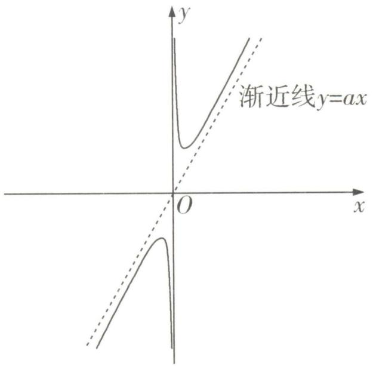

text_image

渐近线y=ax
O
x
y

④极值:极大值 $f(-\sqrt{\frac{b}{a}})=-2\sqrt{ab}$ ;极小值 $f(\sqrt{\frac{b}{a}})=2\sqrt{ab}$ .

⑤最值:函数在定义域上无最值,在区间 $(-∞,0)$ 上,f(x)有最大值 $f(-\sqrt{\frac{b}{a}})=-2\sqrt{ab}$ ;在区间 $(0,+∞)$ 上,f(x)有最小值 $f(\sqrt{\frac{b}{a}})=2\sqrt{ab}$ .

# 坑神有话说

当 $f(x)=ax+\frac{b}{x}(a>0,b<0)$ 时,函数 $f(x)$ 的图象如图所示,在 $(-∞,0),(0,+∞)$ 上均单调递增,此时称 $f(x)$ 为双撇函数.

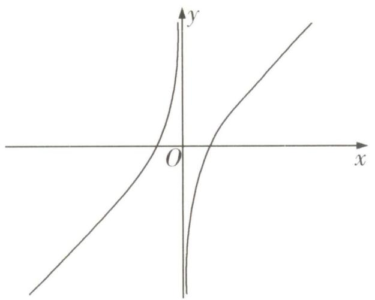

text_image

Graph of a hyperbola with asymptotes and a vertical asymptote, labeled with x and y axes and origin O

# 2. 对勾函数在值域问题中的应用

对勾函数常常应用于一些求值域(最值)的问题,在圆锥曲线、导数等多个模块我们都会见到对勾函数的影子.对于此类问题,我们通常采用以下步骤处理:

# 大招解读

第一步: 通过代数变形(一般为换元), 将待求函数变形为含对勾函数的形式.

第二步: 根据对勾函数的相关性质,得到这个新函数的值域(最值),从而解决问题.

# 3. 利用对勾函数求分式型函数的值域:

使用对勾函数求值域时,大多数情况是求分式型函数的值域,通常包含以下几种情形.

①二次比一次型:形如 $f(x)=\frac{ax^{2}+bx+c}{dx+e}(a,b,c,d,e\in\mathbb{R},ad\neq0)$ ，此时把分母看作一个整体进行换元，即可化成对勾函数的形式，进而求解出值域.  
②一次比二次型:形如 $f(x)=\frac{ax+b}{cx^{2}+dx+e}(a,b,c,d,e\in\mathbb{R},ac\neq0)$ ，此时将分子、分母同除以分子，分母就变成了①中的形式，换元后继续操作即可.  
③二次比二次型:形如 $f(x)=\frac{ax^{2}+bx+c}{dx^{2}+ex+f}(a,b,c,d,e,f\in\mathbb{R},ad\neq0)$ ，此时先把分子中的二次项分离常数分离下去，就变成了②中的形式，再将分子、分母同除以分子，换元后继续操作即可.

# 坑神来避坑

①换元后注意新元取值范围是否变化;②分子、分母同时除以某个式子时,注意这个式子是否可能为0.

大招示例 1 求函数 $f(x) = \frac{x^2 + 5x + 8}{x + 1} (x > 0)$ 的值域.

# 大招识别

二次比一次型函数值域的求解,将分母看作一个整体进行换元,化成对勾函数的形式,进而求解值域.

解析 先令 $t = x + 1$ , 将函数 $f(x) = \frac{x^2 + 5x + 8}{x + 1}$ ( $x > 0$ ) 变形为 $g(t) = t + \frac{4}{t} + 3 (t > 1)$ , 然后根据对勾函数基本性质, 得到函数 $g(t)$ 的值域, 即函数 $f(x)$ 的值域. 下面进入完整解题步骤: 设 $t = x + 1$ , 则 $x = t - 1$ , 因为 $x > 0$ , 所以 $t > 1$ . 因为 $f(x) = \frac{x^2 + 5x + 8}{x + 1} (x > 0)$ , 所以 $f(t - 1) = \frac{(t - 1)^2 + 5(t - 1) + 8}{t - 1 + 1} = t + \frac{4}{t} + 3 (t > 1)$ . 构建函数 $g(t) = t + \frac{4}{t} + 3 (t > 1)$ , 函数 $g(t)$ 在 $(1,2)$ 上单调递减, 在 $(2,+\infty)$ 上单调递增, 所以当 $t = 2$

时, 函数 $g(t) = t + \frac{4}{t} + 3 (t > 1)$ 取得最小值 $g(2)=7$ , 所以函数 $g(t)$ 的值域为 $[7, +\infty)$ ，所以函数 $f(x)$ 的值域为 $[7, +\infty)$ .

大招示例 2 求函数 $f(x) = \frac{5x}{x^2 - 3x + 4}$ 的值域.

# 大招识别

符合一次比二次的形式, x=0 时单独讨论, $x \neq 0$ 时分式上下同除以分子后转化为二次比一次型处理.

解析 当 x=0 时, $f(x)=0$ . 当 $x\neq0$ 时, 分式上下同除以 x 得 $f(x)=\frac{5}{x+\frac{4}{x}-3}$ . 由对勾函数的值

域可知, 当 $x \neq 0$ 时, $x + \frac{4}{x} - 3 \in (-\infty, -7] \cup [1, +\infty)$ , 所以 $f(x) = \frac{5}{x + \frac{4}{x} - 3} \in [-\frac{5}{7}, 0) \cup$

(0,5]. 综上所述, 函数 $f(x)$ 的值域为 $\left[-\frac{5}{7},5\right]$ .

大招示例 ③ 求函数 $f(x) = \frac{x^2 + 2}{x^2 + x + 1}$ 的值域.

# 大招识别

符合二次比二次的形式,分离常数后按一次比二次型的处理方法处理.

解析 $f(x)=\frac{x^{2}+2}{x^{2}+x+1}=\frac{x^{2}+x+1-(x-1)}{x^{2}+x+1}=$

分离常数

$1 - \frac{x - 1}{x^{2} + x + 1}$ . 当 $x = 1$ 时, $f(x) = 1$ . 当 $x \neq 1$ 时, $f(x) = 1 - \frac{1}{\frac{x^{2} + x + 1}{x - 1}}$ , 令 $t = x - 1$ , 则 $t \neq 0, x = t +$

分式上下同除以分子

1, 所以 $f(t + 1) = 1 - \frac{1}{\frac{(t + 1)^{2} + t + 2}{t}} = 1 - \frac{1}{t + \frac{3}{t} + 3}$ . 由对勾函数的值域可知, 当 $t \neq 0$ 时,

$t+\frac{3}{t}+3\in(-\infty,3-2\sqrt{3}]\cup[3+2\sqrt{3},+\infty)$ ,
所以 $-\frac{1}{t+\frac{3}{t}+3}\in\left[\frac{3-2\sqrt{3}}{3},0\right)\cup\left(0,\frac{2\sqrt{3}+3}{3}\right]$ ,

所以 $f(x)\in\left[\frac{6-2\sqrt{3}}{3},1\right)\cup\left(1,\frac{6+2\sqrt{3}}{3}\right]$ .综上所述,函数 $f(x)$ 的值域为 $\left[\frac{6-2\sqrt{3}}{3},\frac{6+2\sqrt{3}}{3}\right]$ .

# 大招5 挖掘单调性

  
名师大招

见招 解函数不等式 $f(g(x)) < f(h(x))$ .

出招 逆用函数单调性.

第一步: 根据单调性的定义或 $f(x)$ 的导数 $f'(x)$ , 得到函数 $f(x)$ 在对应的区间上的单调性.

第二步: 通过函数 $f(x)$ 的单调性, 将不等式 $f(g(x)) < f(h(x))$ 转化为不等式 $g(x) < h(x)$ 或 $g(x) > h(x)$ .

第三步: 求出 $g(x) < h(x)$ 或 $g(x) > h(x)$ 的解集.

大招示例 已知函数 $f(x) = \frac{\mathrm{e}^x - \mathrm{e}^{-x}}{2} - \sin x$ ，求不等式 $f(x + 4) < f(x^2 - 2)$ 的解集.

# 大招识别

题干为关于不等式 $f(g(x))<f(h(x))$ 的问题,故需挖掘函数单调性,将问题转化为 $g(x)<h(x)$ 或 $g(x)>h(x)$ 的问题求解.

解析 我们首先通过导函数 $f'(x) = \frac{\mathrm{e}^x + \mathrm{e}^{-x}}{2} - \cos x$ , 得到函数 $f(x)$ 单调递增, 然后将不等式 $f(x + 4) < f(x^2 - 2)$ 转化为不等式 $x + 4 < x^2 - 2$ , 进而求出其解集. 下面进入完整解题步骤: 因为 $f(x) = \frac{\mathrm{e}^x - \mathrm{e}^{-x}}{2} - \sin x$ , 所以 $f'(x) = \frac{\mathrm{e}^x + \mathrm{e}^{-x}}{2} -$

$\cos x \geqslant \frac{2\sqrt{\mathrm{e}^x \cdot \mathrm{e}^{-x}}}{2} - \cos x = 1 - \cos x \geqslant 0$ ，当且仅当 $x = 0$ 时取等号，所以函数 $f(x) = \frac{\mathrm{e}^x - \mathrm{e}^{-x}}{2} - \sin x$ 单调递增。因为 $f(x + 4) < f(x^2 - 2)$ ，所以 $x + 4 < x^2 - 2$ ，所以 $x^2 - x - 6 > 0$ ，所以 $x < -2$ 或 $x > 3$ 。综上所述，不等式 $f(x + 4) < f(x^2 - 2)$ 的解集为 $(- \infty, -2) \cup (3, +\infty)$ 。

# 坑神来避坑

本题函数 $f(x)$ 的定义域刚好是 R, 如果函数 $f(x)$ 的定义域有限制, 最后求解集时一定不要忽略.

对于根据 $f(x_{0})$ 求解 $f(-x_{0})$ 的问题,我们可以根据部分奇偶性求解.

# 1. 函数的奇偶性分解

对于一个定义域关于原点对称的函数 $f(x)$ 来说,我们构建函数 $g(x)=\frac{f(x)+f(-x)}{2},h(x)=\frac{f(x)-f(-x)}{2}$ ,这样就使得 $f(x)=g(x)+h(x)$ .而对于函数 $g(x)$ 来说, $g(-x)=\frac{f(-x)+f(x)}{2}=g(x)$ ,得到函数 $g(x)$ 是偶函数;对于函数 $h(x)$ 来说, $h(-x)=\frac{f(-x)-f(x)}{2}=-h(x)$ ,得到函数 $h(x)$ 是奇函数.这就说明任何一个定义域关于原点对称的函数都可以表示为一个偶函数与一个奇函数的和.

# 2.部分奇偶性

有了前面的铺垫之后,我们再看如下问题:“已知定义域关于原点对称的函数 $f(x)$ ,且 $f(x_{0})=m$ ,求 $f(-x_{0})$ 的值.”如果函数 $f(x)$ 是奇函数或偶函数,那么 $f(-x_{0})$ 能轻松求出.但现实往往是函数 $f(x)$ 非奇非偶,怎么办?我们通常采用以下步骤处理:

# 大招解读

第一步：观察函数 $f(x)$ 的解析式，看哪部分构成偶函数，哪部分构成奇函数，即构造出 $f(x)=g(x)+h(x)$ ，其中函数 $g(x)$ 是偶函数，函数 $h(x)$ 是奇函数.

第二步: 根据函数 $g(x), h(x)$ 的奇偶性得到 $f(-x_0)$ 与 $f(x_0)$ 的关系式, 进而求出 $f(-x_0)$ 的值.

①如果偶函数 $g(x)$ 是无参或相对简单的,那么我们以奇函数 $h(x)$ 为桥梁构建等式,根据 $h(-x_{0}) = -h(x_{0})$ 解决问题.

②如果奇函数 $h(x)$ 是无参或相对简单的,那么我们以偶函数 $g(x)$ 为桥梁构建等式,根据 $g(-x_{0}) = g(x_{0})$ 解决问题.

# 坑神来避坑

值得注意的是,实际操作中的第一步是通过观察函数 $f(x)$ 的解析式来完成,而非直接构造 $g(x)=\frac{f(x)+f(-x)}{2},h(x)=\frac{f(x)-f(-x)}{2}$ ,前面的证明只是为了说明函数的奇偶性分解是可行的.

大招示例 (1) 已知函数 $f(x) = ax^5 + x^2 + b\sin x$ ，且 $f(2) = 1$ ，求 $f(-2)$ 的值.

(2) 已知函数 $f(x) = ax^{6} + x + b\cos x$ ，且 $f(2) = 1$ ，求 $f(-2)$ 的值.

# 大招识别

(1) 观察得到奇函数为 $h(x)=ax^{5}+b\sin x$ ，偶函数为 $g(x)=x^{2}$ ，所以偶函数 $g(x)=x^{2}$ 相对简单，于是就有 $h(-x_{0})=f(-x_{0})-g(-x_{0})=$

$-h(x_{0})=g(x_{0})-f(x_{0})$ ，进而求出 $f(-2)$ 的值.
(2) 观察得到奇函数为 $h(x)=x$ ，偶函数为 $g(x)=ax^{6}+b\cos x$ ，所以奇函数 $h(x)=x$ 相对简单，于是就有 $g(-x_{0})=f(-x_{0})-h(-x_{0})=$ $g(x_{0})=f(x_{0})-h(x_{0})$ ，进而求出 $f(-2)$ 的值.

解析 (1) 大招解 因为 $f(x) = ax^5 + x^2 + b\sin x$ ，所以 $ax^5 + b\sin x = f(x) - x^2$ . 构建函数$h(x)=ax^{5}+b\sin x=f(x)-x^{2}$ ，所以函数 $h(x)$ 是奇函数，所以 $h(-2)=-h(2)$ ，所以 $f(-2)-(-2)^{2}=-[f(2)-2^{2}]$ ，所以 $f(-2)=2\times2^{2}-f(2)$ ，因为 $f(2)=1$ ，所以 $f(-2)=7$ 。

常规解 由题意得 $f(2) = 32a + 4 + b\sin 2 = 1$ ，

所以 $32a + b\sin 2 = -3$ ，又 $f(-2) = -32a + 4+$ $b\sin (-2) = 4 - (32a + b\sin 2)$ ，所以 $f(-2) = 7.$

(2) 大招解 因为 $f(x)=ax^{6}+x+b\cos x$ ，所以

$ax^{6}+b\cos x=f(x)-x.$ 构建函数 $g(x)=ax^{6}+b\cos x=f(x)-x$ ，所以函数 $g(x)$ 是偶函数，所以 $g(-2)=g(2)$ ，所以 $f(-2)-(-2)=f(2)-2$ ，所以 $f(-2)=f(2)-2\times2$ ，因为 $f(2)=1$ ，所以 $f(-2)=-3.$

常规解 由题意得 $f(2) = 64a + 2 + b\cos 2 = 1$ , 以 $64a + b\cos 2 = -1$ , 又 $f(-2) = 64a - 2 + s(-2) = 64a + b\cos 2 - 2$ , 所以 $f(-2) = -3$ .

# 大招7

# 对称性转化

  
名师大招

# 1. 对称性转化

已知函数 $f(x)$ 的定义域为R.

①由轴对称的性质可知,到对称轴距离相等的两个自变量所对应的函数值相等,所以函数 $f(x)$ 的图象关于直线x=a对称 $\Leftrightarrow f(a+x)=f(a-x)$ .

推论一: $f(x)=f(2a-x)\Leftrightarrow$ 函数 $f(x)$ 的图象关于直线x=a对称.

推论二: $f(x+a)=f(b-x)\Leftrightarrow$ 函数 $f(x)$ 的图象关于直线 $x=\frac{a+b}{2}$ 对称.

证明 因为 $f(x)=f(2a-x)$ ，所以 $f(a+x)=f(2a-(a+x))=f(a-x)$ ，所以函数 $f(x)$ 的图象用 a+x 替换 x

关于直线 x=a 对称，反之亦然，所以推论一正确。因为 $f(x+a)=f(b-x)$ ，所以 $f((x+\frac{b-a}{2})+a)=f(b-(x+\frac{b-a}{2}))$ ，即 $f(\frac{a+b}{2}+x)=f(\frac{a+b}{2}-x)$ ，所以函数 $f(x)$ 的图象关于直线 $x=\frac{a+b}{2}$ 对称，反之用 $x+\frac{b-a}{2}$ 替换 x

亦然,所以推论二正确.

# 坑神有话说

1. 函数 $f(x)$ 的图象关于直线 $x = a$ 对称在需要用等式表达时, 我们通常转化为 $f(x) = f(2a - x)$ (或 $f(a + x) = f(a - x)$ ).  
2. 在看到等式 $f(x+a)=f(b-x)$ 时, 我们也要转化为函数 $f(x)$ 的图象关于直线 $x=\frac{a+b}{2}$ 对称.
该等式的特征：两个表达式写在等号两边时，前面的符号相同，且括号内的代数式之和为常数，这个常数的值恰为对称轴横坐标的两倍.

②由中心对称的性质可知,到对称中心距离相等的两个自变量所对应的函数值之和为对称中心纵坐标的2倍,所以函数 $f(x)$ 的图象关于点 $(a,b)$ 中心对称 $\Leftrightarrow f(a+x)+f(a-x)=2b.$

推论一: $f(x) + f(2a - x) = 2b \Leftrightarrow$ 函数 $f(x)$ 的图象关于点 $(a, b)$ 中心对称.

推论二: $f(x+a)+f(b-x)=2c\Leftrightarrow$ 函数 $f(x)$ 的图象关于点 $\left(\frac{a+b}{2},c\right)$ 中心对称.

证明 因为 $f(x) + f(2a - x) = 2b$ , 所以 $f(a + x) + f(2a - (a + x)) = f(a + x) + f(a - x) = 2b$ , 所用 $a + x$ 替换 $x$ 以函数 $f(x)$ 的图象关于点 $(a, b)$ 中心对称, 反之亦然, 所以推论一正确. 因为 $f(x + a) + f(b - x) = 2c$ , 所以 $f((x + \frac{b - a}{2}) + a) + f(b - (x + \frac{b - a}{2})) = 2c$ , 即 $f(x + \frac{a + b}{2}) + f(\frac{a + b}{2} - x) = 2c$ , 所以函数 $f(x)$ 的用 $x + \frac{b - a}{2}$ 替换 $x$

图象关于点 $\left(\frac{a+b}{2},c\right)$ 中心对称,反之亦然,所以推论二正确.

# 坑神有话说

1. 函数 $f(x)$ 的图象关于点 $(a, b)$ 中心对称在需要用等式表达时, 我们通常转化为 $f(a + x) + f(a - x) = 2b$ (或 $f(x) + f(2a - x) = 2b$ ).  
2. 在看到等式 $f(x+a)+f(b-x)=2c$ 时, 我们也要转化为函数 $f(x)$ 的图象关于点 $(\frac{a+b}{2},c)$ 中心该等式的特征: 两个表达式写在等号同一边时前面的符号相同, 且括号内的代数式之和为常数, 这个常数的值恰为对称中心横坐标的两倍.

对称.

3. 特别地, $f(x) + f(2a - x) = 0 \Leftrightarrow$ 函数 $f(x)$ 的图象关于点 $(a,0)$ 中心对称, $f(x) + f(-x) = 2a \Leftrightarrow$ 函数 $f(x)$ 的图象关于点 $(0,a)$ 中心对称, 这两种情况经常考查.

# 2.三次函数图象的对称性

对于一个三次函数 $f(x)=ax^{3}+bx^{2}+cx+d(a\neq0)$ 来说,点 $(x_{0},f(x_{0}))$ 是函数 $f(x)$ 图象的对称中心,其中 $x_{0}$ 满足方程 $f''(x_{0})=0$ .

$f''(x)$ 为函数 $f(x)$ 的二阶导数

证明 因为 $f(x) = ax^3 + bx^2 + cx + d (a \neq 0)$ ，所以 $f'(x) = 3ax^2 + 2bx + c$ ，所以 $f''(x) = 6ax + 2b$ . 因为 $f''(x_0) = 0$ ，所以 $f''(x_0) = 6ax_0 + 2b = 0$ ，所以 $x_0 = -\frac{b}{3a}$ ，所以 $f(x_0 + x) + f(x_0 - x) = a(x_0 + x)^3 + b(x_0 + x)^2 + c(x_0 + x) + d + a(x_0 - x)^3 + b(x_0 - x)^2 + c(x_0 - x) + d = 2ax_0^3 + 2bx_0^2 + 2cx_0 + 2d + (6ax_0 + 2b)x^2 = 2ax_0^3 + 2bx_0^2 + 2cx_0 + 2d + (-\frac{b}{3a} \cdot 6a + 2b)x^2 = 2f(x_0)$ ，所以点 $(x_0, f(x_0))$ 是函数 $f(x)$ 图象的对称中心.

大招示例 1 若函数 $f(x) = (2^x - 1)(2^{-x} - a)$ 的图象关于直线 $x = 1$ 对称, 则 $f(x)$ 的最大值为 \_\_\_\_.

# 大招识别

根据对称性的定义进行转化,有 $f(x)=f(2-x)$ , 进而根据转化式解决问题.

解析 由函数 $f(x)=(2^{x}-1)(2^{-x}-a)$ 的图象关于直线x=1对称,得到 $f(x)=f(2-x)$ ,因为 $f(x)=(2^{x}-1)\cdot(2^{-x}-a)$ ,所以 $f(0)=0$ ,又

挖掘隐藏条件

$f(x)=f(2-x)$ ，所以 $f(2)=0$ ，所以 $3(2^{-2}-a)=0$ ， $a=\frac{1}{4}$ 。于是 $f(x)=(2^{x}-1)(2^{-x}-\frac{1}{4})=\frac{5}{4}-(\frac{2^{x}}{4}+\frac{1}{2^{x}})$ ，而 $\frac{2^{x}}{4}+\frac{1}{2^{x}}\geqslant1$ ，当且仅当x=1时取等号，因此 $f(x)=\frac{5}{4}-(\frac{2^{x}}{4}+\frac{1}{2^{x}})\leqslant\frac{1}{4}$ ，当且仅当x=1时取等号。综上所述， $f(x)$ 的最大值为 $\frac{1}{4}$ 。

答案 $\frac{1}{4}$

# 坑神有话说

本题是填空题,取 $f(0)=f(2)$ 去求a的值也可以.

大招示例 2 已知函数 $f(x) = ax^3 - 6ax^2 + bx + 1 (a \neq 0)$ ，且 $f(4) - f(2) = 1$ ，求 $f(2)$ 的值.

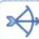

# 大招识别

根据三次函数图象的对称性得 $f(x)$ 图象关于点 $(2,f(2))$ 中心对称,从而得到 $f(4)+f(0)=2f(2)$ ,进而求解 $f(2)$ 的值.

解析▶ 大招解 因为 $f(x)=ax^{3}-6ax^{2}+bx+1(a\neq0)$ ，所以 $f'(x)=3ax^{2}-12ax+b$ ，

$f''(x)=6ax-12a$ , 令 $f''(x)=6ax-12a=0$ , 得x=三次函数图象对称性

2, 所以函数 $f(x)$ 图象关于点 $(2, f(2))$ 中心对称, 所以 $f(4) + f(0) = 2f(2)$ . 因为 $f(0) = 1$ , 所以

挖掘隐藏条件

$f(4) + 1 = 2f(2)$ . 由 $\left\{ \begin{array}{l} f(4) - f(2) = 1, \\ f(4) + 1 = 2f(2), \end{array} \right.$ 解得

$$
\left\{ \begin{array}{l} f (2) = 2, \\ f (4) = 3. \end{array} \right.
$$

常规解 因为 $f(4) = -32a + 4b + 1$ , $f(2) =$

$-16a + 2b + 1$ ，所以 $f(4) - f(2) = -16a + 2b = 1$ ，所以 $f(2) = 2$ .

# 大招8

# 半周期 & 双对称推导周期

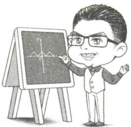

在一些涉及周期性问题的求解中,我们常采用以下两种思路求得函数的周期.

# 1. “半周期” 推导周期

已知 $a \in \mathbf{R}, a \neq 0$ .

①若函数 $f(x)$ 满足 $f(x)+f(x+a)=b(b\in\mathbb{R})$ ，则 $f(x)+f(x+a)=f(x+a)+f(x+2a)=b$ ，所以 $f(x+2a)=f(x)$ ，所以函数 $f(x)$ 是周期为2a的周期函数.

②若函数 $f(x)$ 满足 $f(x)f(x+a)=b(b\in\mathbf{R},b\neq0)$ ，则 $f(x)f(x+a)=f(x+a)f(x+2a)=b$ ，所以
用 $x+a$ 替换x $f(x+2a)=f(x)$ ，所以函数 $f(x)$ 是周期为2a的周期函数.

①和②式子中涉及的 a 刚好是周期的一半,所以这里的 a 也被称为“半周期”.

# 坑神来避坑

①用 $f(x) + f(x + a) = b (b \in \mathbb{R})$ 可得 $f(x)$ 是周期为 2a 的周期函数,但函数 $f(x)$ 是周期为 2a 的周期函数并不一定有 $f(x) + f(x + a) = b (b \in \mathbb{R})$ .  
②半周期的一种隐藏形式为 $f(x + a) = \frac{1 + f(x)}{1 - f(x)}$ ，写出 $f(x + 2a)$ 与 $f(x)$ 的关系之后即可转化成半周期问题.

# 2. 双对称推导周期

已知函数 $f(x)$ 图象的两条对称轴、两个对称中心或一条对称轴加一个对称中心都可以得到 $f(x)$ 的周期的结论.

①两条对称轴:已知函数 $f(x)$ 图象关于直线x=a和直线x=b对称,则函数 $f(x)$ 是周期为 $2|b-a|$ 的周期函数.特别地,当 $f(x)$ 为偶函数且函数 $f(x)$ 图象关于直线x=a对称时,函数 $f(x)$ 是周期为

2|a|的周期函数.

证明 因为函数 $f(x)$ 图象关于直线 $x = a$ 和直线 $x = b$ 对称, 所以 $\left\{ \begin{array}{l} f(x) = f(2a - x), \\ f(x) = f(2b - x), \end{array} \right.$ 所以 $\left\{ \begin{array}{l} f(x) = f(2a - x), \\ f(2a - x) = f(2b - (2a - x)), \end{array} \right.$ 所以 $f(x + 2b - 2a) = f(x)$ , 所以函数 $f(x)$ 是周期为 $2|b - a|$ 的周期用 $2a - x$ 替换 $x$

函数.

②两个对称中心:已知函数 $f(x)$ 图象关于点 $(a,0)$ 和点 $(b,0)$ 中心对称,则函数 $f(x)$ 是周期为 $2|b-a|$ 的周期函数.特别地,当 $f(x)$ 为奇函数且函数 $f(x)$ 图象关于点 $(a,0)$ 中心对称时,函数 $f(x)$ 是周期为 $2|a|$ 的周期函数.

证明 因为函数 $f(x)$ 图象关于点 $(a,0)$ 和点 $(b,0)$ 对称, 所以 $\left\{ \begin{array}{l} f(x) + f(2a - x) = 0, \\ f(x) + f(2b - x) = 0, \end{array} \right.$ 所以 $\left\{ \begin{array}{l} f(x) + f(2a - x) = 0, \\ f(2a - x) + f(2b - (2a - x)) = 0, \end{array} \right.$ 所以 $f(x + 2b - 2a) = f(x)$ , 所以函数 $f(x)$ 是周期为 $2|b - a|$ 的周用 $2a - x$ 替换 $x$

期函数.

③一条对称轴 + 一个对称中心: 已知函数 $f(x)$ 图象关于点 $(a,0)$ 中心对称且关于直线 $x = b$ 对称, 则函数 $f(x)$ 是周期为 $4|b - a|$ 的周期函数.

证明 因为函数 $f(x)$ 图象关于点 $(a,0)$ 中心对称且关于直线 $x = b$ 对称, 所以 $\left\{ \begin{array}{l} f(x) + f(2a - x) = 0, \\ f(x) = f(2b - x), \end{array} \right.$ 所以 $\left\{ \begin{array}{l} f(x) + f(2a - x) = 0, \\ f(2a - x) = f(2b - (2a - x)), \end{array} \right.$ 所以 $f(x) + f(2b - 2a + x) = 0$ , 所以 $f(x) +$ 用 $2a - x$ 替换 $x$

$f(2b-2a+x)=f(2b-2a+x)+f(4b-4a+x)=0$ , 所以 $f(x+4b-4a)=f(x)$ ，所以函数 $f(x)$ 是周期
用2b-2a+x替换x
为4|b-a|的周期函数.

# 坑神来避坑

一般而言,根据一条对称轴+一个对称中心推导出来周期的函数能找到一个 $f(x)$ 与 $f(2b-2a+x)$ 之间的关系式,即可能有“半周期”.

大招示例 (2021 全国甲卷) 设函数 $f(x)$ 的定义域为 $\mathbf{R}, f(x + 1)$ 为奇函数, $f(x + 2)$ 为偶函数, 当 $x \in [1, 2]$ 时, $f(x) = ax^2 + b$ . 若 $f(0) + f(3) = 6$ , 则 $f\left(\frac{9}{2}\right) =$ ()

A. $-\frac{9}{4}$

B. $-\frac{3}{2}$

C. $\frac{7}{4}$

D. $\frac{5}{2}$

解析▶ 大招解 根据 $f(x+1)$ 为奇函数, $f(x+2)$ 为偶函数, 得到 $f(x)$ 的图象关于直线 x=2 对称, 且关于点 $(1,0)$ 中心对称, 进而根据双对称推导周期解决问题. 由于 $f(x+1)$ 为奇函数, 所以函数 $f(x)$ 的图象关于点 $(1,0)$ 中心对称, 即有

$f(x)+f(2-x)=0$ ,所以 $f(1)+f(2-1)=0$ ,得 $f(1)=0$ ,即 $a+b=0$ ①.由于 $f(x+2)$ 为偶函数,所以函数 $f(x)$ 的图象关于直线x=2对称,即有 $f(x)-f(4-x)=0$ ,所以 $f(0)+f(3)=-f(2)+f(1)=-4a-b+a+b=-3a=6$ ②.
根据①②可得a=-2,b=2,所以当 $x\in[1,2]$ 时, $f(x)=-2x^{2}+2$ .根据函数 $f(x)$ 的图象关于直线x=2对称,且关于点(1,0)中心对称,可得
函数 $f(x)$ 的周期为4,所以 $f(\frac{9}{2})=f(\frac{1}{2})=$ 双对称推导周期 $-f(\frac{3}{2})=2\times(\frac{3}{2})^{2}-2=\frac{5}{2}.$

常规解 因为 $f(x+1)$ 为奇函数,所以 $f(-x+1)=-f(x+1)$ ①;因为 $f(x+2)$ 为偶函数,所以 $f(x+2)=f(-x+2)$ ②.令x=1,由①得 $f(0)=-f(2)=-(4a+b)$ ,由②得 $f(3)=f(1)=a+b$ ,因为 $f(0)+f(3)=6$ ,所以 $-(4a+b)+a+b=6\Rightarrow a=-2$ ,令x=0,由①得 $f(1)=-f(1)\Rightarrow f(1)=0\Rightarrow b=2$ ,所以当 $x\in[1,2]$ 时, $f(x)=-2x^{2}+2$ .

方法一(从定义入手) $f(\frac{9}{2}) = f(\frac{5}{2} + 2) =$ $f(-\frac{5}{2} + 2) = f(-\frac{1}{2}) = f(-\frac{3}{2} + 1) = -f(\frac{3}{2} +$

1) = -f( $\frac{5}{2}$ ) = -f( $\frac{1}{2}$ + 2) = -f( $-\frac{1}{2}$ + 2) =
- $f(\frac{3}{2})$ ,所以 $f(\frac{9}{2})=-f(\frac{3}{2})=\frac{5}{2}$ .故选D.

方法二(从周期性入手) 由①②可知,函数 $f(x)$ 的图象关于点(1,0)中心对称,且关于直线x=2
对称,所以函数 $f(x)$ 的周期T=4. 所以 $f(\frac{9}{2})=$ 双对称推导周期 $f(\frac{1}{2})=-f(\frac{3}{2})=\frac{5}{2}$ . 故选D.

答案 D

text_image

大招9

# 类周期函数

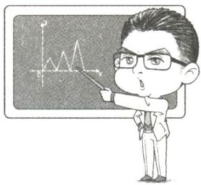

# 1. 类周期函数的定义

从周期函数 $f(x + T) = f(x)$ 进行延伸拓展, 若函数 $g(x)$ 满足 $g(x + T) = ag(bx) + c (a, b > 0, c \in \mathbb{R})$ , 我们可称函数 $g(x)$ 为类周期函数. 其中 $a = b = 1, c = 0$ 的情形就是周期函数.

# 2. 类周期函数问题的处理方法

对于满足 $g(x + T) = ag(bx) + c(a, b > 0, c \in \mathbf{R})$ 的类周期函数 $g(x)$ 来说, 我们往往知道其在 $(x_0, x_0 + T]$ (或 $[x_0, x_0 + T))$ 上的解析式. 此时我们通常采用以下步骤处理:

# 大招解读

第一步: 利用函数 $g(x)$ 的类周期性, 找到函数 $g(x)$ 各段值域之间的关系, 如涉及精细分析则需要将函数 $g(x)$ 各段的解析式求出来, 如有必要画出函数 $g(x)$ 各段的图象.

第二步: 对函数 $g(x)$ 各段开展分类讨论, 或根据函数 $g(x)$ 各段的图象解决问题.

大招示例 已知函数 $f(x) = \begin{cases} - (x - 1)^2 + 1, & x < 2, \\ \frac{1}{2} f(x - 2), & x \geqslant 2, \end{cases}$

若函数 $F(x)=f(x)-m$ 有 4 个零点, 求实数 m 的取值范围.

解析 先根据函数 $f(x)$ 的类周期性, 将函数 $f(x)$ 各段解析式求出来, 画出图象, 然后将函数 $F(x) = f(x) - m$ 有 4 个零点转化为函数 $f(x)$ 的图象与直线 $y = m$ 有 4 个交点, 进而根据函数 $f(x)$ 各段的图象, 求出 $m$ 的取值范围. 下面进入完整解题步骤: 因为 $f(x) = \begin{cases} - (x - 1)^2 + 1, & x < 2, \\ \frac{1}{2} f(x - 2), & x \geqslant 2, \end{cases}$

所以 $f(x) = \left\{ \begin{array}{ll} - x^2 + 2x, & x < 2, \\ \frac{1}{2} f(x - 2), & x \geqslant 2, \end{array} \right.$ 所以当 $x \in [2,4)$

时, $f(x)=\frac{1}{2}f(x-2)=\frac{1}{2}\left[-(x-2)^{2}+2(x-\right.$

2)]，所以当 $x\in [2n,2n + 2)(n\in \mathbf{N}_{+})$ 时， $f(x) = \frac{1}{2^n} f(x - 2n) = \frac{1}{2^n} [-(x - 2n)^2 +2(x - 2n)]$ ，画

如果能根据图象平移和伸缩理清楚，这里不求解析式也可以。

出 $f(x)$ 的部分图象如图所示.

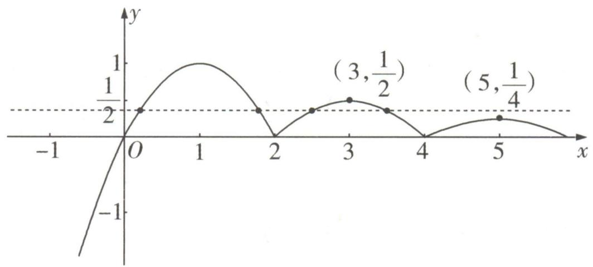

line

| x    | y       |
| ---- | ------- |
| 0    | 0       |
| 1    | 1/2     |
| 2    | 0       |
| 3    | (3, 1/2)|
| 4    | 0       |
| 5    | (5, 1/4)|

因为函数 $F(x)=f(x)-m$ 有 4 个零点, 所以函数 $f(x)$ 的图象与直线 y=m 有 4 个交点, 所以 $\frac{1}{4}<m<\frac{1}{2}$ , 所以实数 m 的取值范围为 $\left(\frac{1}{4}, \frac{1}{2}\right)$ .

text_image

大招10

# 函数图象变换

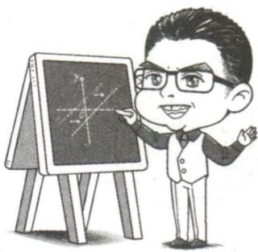

natural_image

Cartoon illustration of a smiling man pointing at a chalkboard with abstract line patterns (no text or symbols)

我们常常需要处理涉及两个函数图象之间平移或翻折关系的问题,此时需要用到函数图象变换.

函数图象变换的基本逻辑:利用点动成线的思想处理函数的变换问题,即根据函数图象上一点的变换,推出函数图象整体的变换.平移变换按左加右减,上加下减的原则处理,伸缩变换只针对自变量x做伸缩变换,这两种变换大家已经非常熟悉了,下面我们重点学习对称变换与翻折变换.

# 1. 对称变换

①关于直线 x = a 对称: 在 $f(x)$ 图象上的点 $A(2a - x_{0}, y_{0})$ 与在 $g(x)$ 图象上的点 $B(x_{0}, y_{0})$ 关于直线 x = a 对称, 所以 $g(x) = f(2a - x)$ 图象是由 $f(x)$ 图象关于直线 x = a 对称而来的.

②关于点 $(a,b)$ 对称:在 $f(x)$ 图象上的点 $A(2a-x_{0},2b-y_{0})$ 与在 $g(x)$ 图象上的点 $B(x_{0},y_{0})$ 关于点 $(a,b)$ 对称,所以 $g(x)=2b-f(2a-x)$ 图象是由 $f(x)$ 图象关于点 $(a,b)$ 对称而来的.

③关于直线 y = x 对称: 在 $f(x)$ 图象上的点 $A(x_{0}, y_{0})$ 与在 $g(x)$ 图象上的点 $B(y_{0}, x_{0})$ 关于直线 y = x 对称, 所以 $g(x) = f^{-1}(x)$ 图象是由 $f(x)$ 图象关于直线 y = x 对称而来的.

$f(x)$ 的反函数

# 2. 翻折变换

①下翻上: $g(x) = |f(x)| = \begin{cases} f(x), f(x) \geqslant 0, \\ -f(x), f(x) < 0, \end{cases}$ 只需把 $f(x)$ 图象中 $f(x) < 0$ 部分的图形沿 $x$ 轴翻折上来, 并抹去原 $f(x) < 0$ 部分的图形, 保留原 $f(x) \geqslant 0$ 部分的图形, 如图1所示.

②右翻左: $g(x) = f(|x|) = \begin{cases} f(x), & x \geqslant 0, \\ f(-x), & x < 0, \end{cases}$ 只需把 $f(x)$ 图象中 $x > 0$ 部分的图形沿 $y$ 轴翻折过去, 并保留原 $x \geqslant 0$ 部分的图形, 如图2所示.

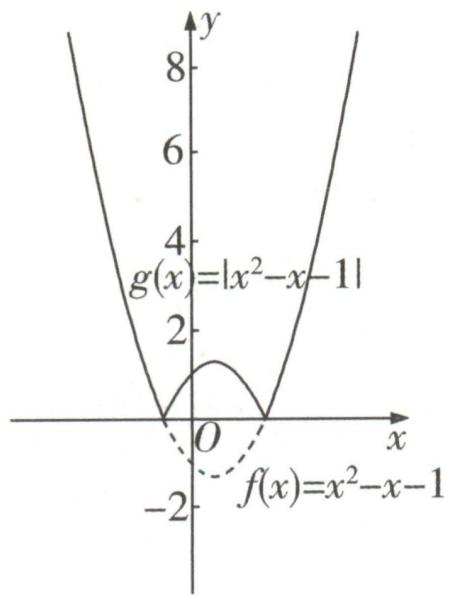

text_image

g(x)=|x²-x-1|
f(x)=x²-x-1

图1

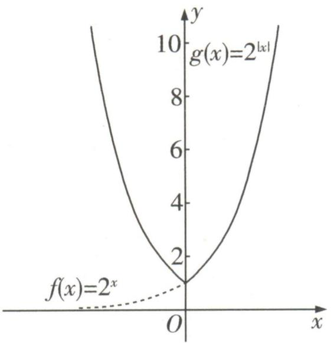

text_image

g(x)=2^{|x|}
f(x)=2^x
O
x
y
10
8
6
4
2
0

图2

大招示例 已知函数 $f(x)$ 的图象向左平移 1 个单位长度, 所得的图象与函数 $y = 2^{x}$ 的图象关于 y 轴对称, 求 $f(2024)$ .

解析 首先设 $A(x_0, f(x_0))$ 为函数 $y = f(x)$ 图象上一点，然后使点 $A(x_0, f(x_0))$ 变换得到点 $B(1 - x_0, f(x_0))$ ，接着根据点 $B(1 - x_0, f(x_0))$ 在 $y = 2^x$ 图象上，求出函数 $y = f(x)$ 的解析式，进而求得 $f(2024)$ . 下面进入完整解题步骤：设 $A(x_0,$

$f(x_{0})$ 为函数 $y=f(x)$ 图象上一点,依题意将 $A(x_{0},f(x_{0}))$ 向左平移 1 个单位长度得 $A'(x_{0}-1,f(x_{0}))$ ,再关于 y 轴对称得 $B(1-x_{0},f(x_{0}))$ , 因为点 $B(1-x_{0},f(x_{0}))$ 在函数 $y=2^{x}$ 的图象上, 所以 $f(x_{0})=2^{1-x_{0}}$ , 所以函数 $f(x)=2^{1-x}$ , 所以 $f(2024)=\frac{1}{2^{2023}}$ .

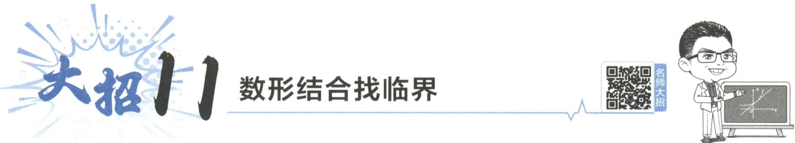

text_image

大招11 数形结合找临界
名师大招

# 1. 函数的零点、方程的实数根、两个函数图象交点的横坐标的关系

函数的零点、方程的实数根、两个函数图象交点的横坐标之间可以相互转化,我们可以写出下面三个完全等价的命题:

①t 是关于 x 的函数 $h(x)=f(x)-g(x)$ 的零点.  
②t 是关于 x 的方程 $f(x) - g(x) = 0$ 的实数根.  
③t 是函数 $f(x)$ 图象与函数 $g(x)$ 图象交点的横坐标.

对于①,我们可以用函数的单调性与零点存在定理处理,对于②,我们可以用方程相关知识与方法处理,对于问题③,我们可以用数形结合,根据两个函数的图象处理.这样我们就可以将三个问题中的一个转化为另一个,选用最简便的方法处理.

# 2.直曲相切 & 双曲公切找临界

即两曲线相切于一点时

在探讨函数 $F(x)=f(x)-[k(x-a)+b]$ 的零点个数时我们常将问题转化为“研究函数 $f(x)$ 图象与直线 $y=k(x-a)+b$ 交点的个数”. 这样我们就可以用数形结合, 讨论两个函数图象交点的个数, 从而解决问题. 在实际计算过程中, 临界情形大多数为直线与曲线相切的时候.

# 坑神小课堂

想一想:为什么直曲相切、双曲公切的时候可能是临界情形?

当函数 $f(x)$ 的图象与直线 $y = k(x - a) + b$ 相切时，切点 $(x_{0}, f(x_{0}))$ 满足 $f'(x_{0}) = k$ ，进一步得到 $F'(x_{0}) = f'(x_{0}) - k = 0$ ，则 $x_{0}$ 很可能是函数 $F(x)$ 的极值点，因此 $x_{0}$ 影响了函数 $F(x)$ 的零点个

如果 $F'(x_{0})$ 在 $x_{0}$ 左右两侧同号，则不是极值点

数变或不变,同时也影响了函数 $f(x)$ 的图象与直线 $y = k(x - a) + b$ 交点个数变或不变.所以在运用数形结合法时,直曲相切的情况需要单独讨论,研究是否为临界情形.同理,当探讨函数 $H(x) = h(x) - g(x)$ 的零点个数时,双曲公切,即 $h'(x) = g'(x)$ 时也可能为临界情形.

# 3. 端点 & 间断点找临界

除直曲相切、双曲公切找到的临界情况外，在曲线（或区间）的端点以及函数图象的间断点处函

数零点个数也可能突变,所以也需要单独讨论,研究是否为临界情形.

# 4. 数形结合找临界的一般步骤

# 大招解读

第一步: 将“函数 $F(x) = f(x) - g(x)$ 的零点个数”的相关问题转化为“函数 $f(x)$ 图象与函数 $g(x)$ 图象的交点个数”的相关问题.

有时需要对 $F(x)$ 做一定的变形，以函数 $f(x)$ 图象与函数 $g(x)$ 图象容易画出为标准。

第二步: 画出函数 $f(x)$ 与函数 $g(x)$ 的图象, 如果含参, 重点讨论直曲相切、双曲公切以及端点、间断点情形, 得到全部的临界情形.

第三步：数形结合解答问题.

大招示例 (2020 天津改编) 已知函数 $f(x) = \left\{ \begin{array}{l} x^3, x \geqslant 0, \\ -x, x < 0, \end{array} \right.$ 若函数 $g(x) = f(x) - |kx^2 - 2x|$ 恰有 4 个零点，则实数 $k$ 的取值范围是 \_\_\_\_.

解析 观察发现 $g(0) = 0$ ，先根据 $g(0) = 0$ ，将函数 $g(x) = f(x) - |kx^2 - 2x| = \left\{ \begin{array}{l} 0, x = 0, \\ |x| \left[ \frac{f(x)}{|x|} - |kx - 2| \right], x \neq 0 \end{array} \right.$ 恰有4个零点转化

为函数 $h(x)=\frac{f(x)}{|x|}=\left\{\begin{aligned}&x^{2},&x>0,\\ &1,&x<0\end{aligned}\right.$ 的图象与函数 $c(x)=|kx-2|$ 的图象有三个交点，接着根据两个函数的大致图象，讨论直曲相切以及间断点情形，从而数形结合求得实数 k 的取值范围.

当 k=0 时, $h(x)=\left\{\begin{aligned}x^{2},&x>0,\\ 1,&x<0,\end{aligned}\right.$ $c(x)=2$ , 两个函数的图象只有一个交点, 不成立. 于是 $k\neq0$ , 进而函数 $c(x)=|kx-2|$ 图象与 x 轴的交点为 $\left(\frac{2}{k},0\right)$ , 由于当 x=0 时, $y=|k\times0-2|=2$ , 于是函数 $c(x)=|kx-2|$ 的图象恒过点 $(0,2)$ .

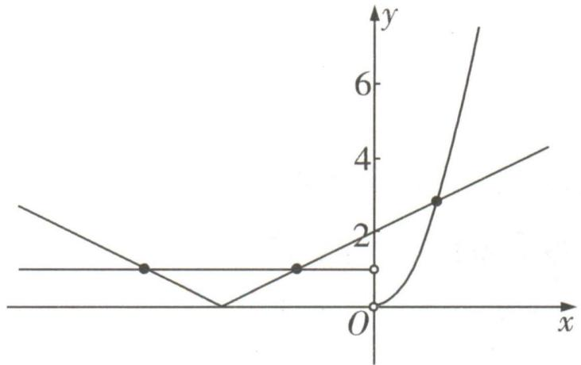

line

| x    | y (Line 1) | y (Line 2) | y (Line 3) |
| ---- | ---------- | ---------- | ---------- |
| 0    | 1          | 1          | 0          |
| ∞    | 0          | 0          | 1          |
| ∞    | 1          | 1          | 2          |
| ∞    | 2          | 2          | 3          |
| ∞    | 3          | 3          | 4          |
| ∞    | 4          | 4          | 5          |
| ∞    | 5          | 5          | 6          |
| ∞    | 6          | 6          | 7          |
| ∞    | 7          | 7          | 8          |
| ∞    | 8          | 8          | 9          |
| ∞    | 9          | 9          | 10         |
| ∞    | 10         | 10         | 11         |
| ∞    | 11         | 11         | 12         |
| ∞    | 12         | 12         | 13         |
| ∞    | 13         | 13         | 14         |
| ∞    | 14         | 14         | 15         |
| ∞    | 15         | 15         | 16         |
| ∞    | 16         | 16         | 17         |
| ∞    | 17         | 17         | 18         |
| ∞    | 18         | 18         | 19         |
| ∞    | 19         | 19         | 20         |
| ∞    | 20         | 20         | 21         |
| ∞    | 21         | 21         | 22         |
| ∞    | 22         | 22         | 23         |
| ∞    | 23         | 23         | 24         |
| ∞    | 24         | 24         | 25         |
| ∞    | 25         | 25         | 26         |
| ∞    | 26         | 26         | 27         |
| ∞    | 27         | 27         | 28         |
| ∞    | 28         | 28         | 29         |
| ∞    | 29         | 29         | 30         |
| ∞    | 30         | 30         | 31         |
| ∞    | 31         | 31         | 32         |
| ∞    | 32         | 32         | 33         |
| ∞    | 33         | 33         | 34         |
| ∞    | 34         | 34         | 35         |
| ∞    | 35         | 35         | 36         |
| ∞    | 36         | 36         | 37         |
| ∞    | 37         | 37         | 38         |
| ∞    | 38         | 38         | 39         |
| ∞    | 39         | 39         | 40         |
| ∞    | 40         | 40         | 41         |
| ∞    | 41         | 41         | 42         |
| ∞    | 42         | 42         | 43         |
| ∞    | 43         | 43         | 44         |
| ∞    | 44         | 44         | 45         |
| ∞    | 45         | 45         | 46         |
| ∞    | 46         | 46         | 47         |
| ∞    | 47         | 47         | 48         |
| ∞    | 48         | 48         | 49         |
| ∞    | 49         | 49         | 50         |
| ∞    | 50         | 50         | 51         |
| ∞    |        |            |            |
| ∞    |        |            |            |
| ∞    |        |            |            |
| ∞    |        |            |            |
| ∞    |        |            |            |
| ∞    |        |            |            |
| ∞    |        |            |            |
| ∞    |        |            |            |
| ∞    |        |            |            |
| ∞    |        |            |           |
| ∞    |        |            |            |
| ∞    |        |            |            |
| ∞    |        |            |            |
| ∞    |        |            |            |
| ∞    |        |            |            |
| ∞    |        |            |            |
| ∞    |        |            |            |
| ∞    |        |            |            |
| ∞    |        |            |            |
|
| ∞    |        |            |            |
| ∞    |        |            |            |
| ∞    |        |            |            |
| ∞    |        |            |            |
| ∞    |        |            |            |
| ∞    |        |            |            |
| ∞    |        |            |            |
| ∞    |        |            |            |
| ∞    |        |            |           |
|
| ∞    |        |            |            |
| ∞    |        |            |            |
| ∞    |        |            |            |
| ∞    |        |            |            |
| ∞    |        |            |            |
| ∞    |        |            |            |
| ∞    |        |            |            |
| ∞    |        |            |            |
| ∞    |        |            |           
|
| ∞    |        -      -   -   -   -   -   -   -   -   -   -   -   -   -   -   -   -   -   -   -   -   -   -   -   -   -   -   -   -   -   -   -   -   -   -   -   -   -   -   -   -   -   -   -   -   -   -   -   -   -   -   -<fcel>x = x₀, y = x₁, y = x₂, y = x₃, y = x₄, y = x₅, y = x₆, y = x₇, y = x₈, y = x₉, y = x₁₀, y = x₁₁, y = x₁₂, y = x₁₃, y = x₁₄, y = x₁₅, y = x₁₆, y = x₁₇, y = x₁₈, y = x₁₉, y = x₂₀, y = x₂₁, y = x₂₂, y = x₂₃, y = x₂₄, y = x₂₅, y = x₂₆, y = x₂₇, y = x₂₈, y = x₉, y = x₉, y = x₁₀, y = x₁₀, y = x₁₁, y = x₁₁, y = x₁₂, y = x₁₂, y = x₁₃, y = x₁₃, y = x₁₄, y = x₁₄, y = x₁₅, y = x₁₆, y = x₁₇, y = x₁₈, y = x₁₈, y = x₂₀, y = x₂₀, y = x₂₁, y = x₂₂, y = x₂₃, y = x₂₄, y = x₂₅, y = x₂₆, y = x₂₇, y = x₂₈, y = x₂₉, y = x₂₉, y = x₉, y = x₉, y = x₁₀, y = x₁₀, y = x₁₁, y = x₁₁, y = x₁₂, y = x₁₂, y = x₁₃, y = x₁₃, y = x₁₄, y = x₁₅, y = x₁₆, y = x₁₇, y = x₁₈, y = x₁₉, y = x₁₉, y = x₂₀, y = x₂₀, y = x₂₁, y = x₂₁, y = x₂₂, y = x₂₃, y = x₂₄, y = x₂₅, y = x₂₆, y = x₂₇, y = x₂₈, y = x₂₉, y = x₂₉, y = x₉, y = x₉, y = x₁₀, y = x₁₀, y = x₁₁, and the remaining lines are constant. The chart is a series of lines representing different functions of a function over the interval [0,∞].

图1

①当 k<0 时， $\frac{2}{k}<0$ ，如图1所示，得到函数 $h(x)=\frac{f(x)}{|x|}=\left\{\begin{aligned}&x^{2},&x>0,\\ &1,x<0\end{aligned}\right.$ 的图象与函数 $c(x)=$ $|kx-2|$ 的图象有三个交点，符合题意.

②当 k > 0 时, $\frac{2}{k} > 0$ , 如图 2
易遗漏这种情况

所示, 若函数 $h(x)$ 的图象与函数 $c(x)$ 的图象有三个交点, 则当 $x \in (-\infty, \frac{2}{k})$ 时, 函数 $h(x)$ 的图象与函数 $c(x)$ 的图象有一个交点, 当 $x \in (\frac{2}{k},$

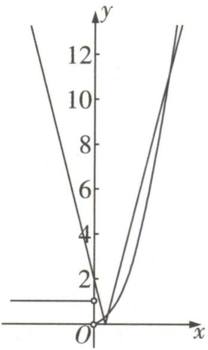

line

| x | y |
|---|---|
| 0 | 0 |
| 1 | 2 |
| 2 | 4 |
| 3 | 6 |
| 4 | 8 |
| 5 | 10 |
| 6 | 12 |

图2

$+\infty$ ）时，函数 $h(x)$ 的图象与函数 $c(x)$ 的图象有两个交点。由图象可知，当 $x\in(-\infty,\frac{2}{k})$ 时，函数 $h(x)$ 的图象与函数 $c(x)$ 的图象恰有一个交点。而若当 $x\in(\frac{2}{k},+\infty)$ 时，函数 $h(x)$ 的图象与函数 $c(x)$ 的图象有两个交点，根据直曲相切可知，需满足 $k>k_{0}>0$ ，其中直线 $y=k_{0}x-2$ 与 $y=x^{2},x>0$ 图象相切。由 $\left\{\begin{aligned}y&=x^{2},\\ y&=k_{0}x-2,\end{aligned}\right.$ 得 $x^{2}-k_{0}x+2=0,\Delta=k_{0}^{2}-8=0,k_{0}=2\sqrt{2}$ ，因此 $k>2\sqrt{2}$ 。

综上所述, 实数 k 的取值范围是 $(-∞,0)∪(2\sqrt{2},+∞)$ .

答案 $(-\infty,0)\cup (2\sqrt{2}, + \infty)$

# 大招12

# 二次函数的零点分布问题

  
名师大招

text_image

开口方向
价格
研判式
好称轴
去碰点
长期
高点率

探讨“二次函数 $f(x) = ax^{2} + bx + c (a \neq 0)$ 的零点分布”问题,我们可以运用函数的单调性与函数零点存在定理进行处理.主要需要考虑以下四个问题:①二次函数图象的开口方向.②对应一元二次方程根的判别式.③二次函数图象的对称轴与区间端点的位置关系.④二次函数在所给区间端点处函数值的正负.

大招示例 (2022 天津) 设 $a \in \mathbb{R}$ . 对任意实数 $x$ , 用 $f(x)$ 表示 $|x| - 2, x^2 - ax + 3a - 5$ 中的较小者. 若函数 $f(x)$ 至少有 3 个零点, 则 $a$ 的取值范围为 \_\_\_\_.

# 大招识别

首先根据题意将问题转化为分段函数问题,其中 $y = x^{2} - ax + 3a - 5$ 为二次函数,故利用二次函数对应方程根的判别式以及图象的对称轴来讨论函数的零点情况.

解析 令函数 $g(x) = x^{2} - ax + 3a - 5$ ，则函数 $y = g(x)$ 图象的对称轴为直线 $x = \frac{a}{2}$ ，方程 $g(x) = 0$ 的判别式 $\Delta = (-a)^{2} - 4(3a - 5) = a^{2} - 12a + 20.f(x)$ 的零点可能是-2,2或 $g(x)$ 的零点.

令 $|x|-2=0$ 可得x=2或-2

(i) 当 $\Delta < 0$ , 即 2 < a < 10 时, 函数 $g(x)$ 无零点, 故 $f(x)$ 至多有 2 个零点, 与题意不符.

(ii) 当 $\Delta = 0$ 时, 则 a = 2 或 a = 10. 若 a = 2, 则

$g(x)=(x-1)^{2}$ ，则 $f(x)$ 有且仅有2个零点-2和2，与题意不符；若a=10，则 $g(x)=(x-5)^{2}$ ，注意 $f(x)$ 取两函数的较小者

则 $f(x)$ 有且仅有3个零点-2,2和5.所以a=10符合题意.

(iii) 当 $\Delta > 0$ , 即 $a < 2$ 或 $a > 10$ 时, 方程 $g(x) = 0$ 有 2 个实数解 $x_{1}, x_{2} (x_{1} < x_{2})$ , 即函数 $g(x)$ 有 2 个零点 $x_{1}, x_{2}$ . 依题意, 函数 $f(x)$ 至少有 3 个零点仅可能有以下两种情况:

数形结合可判断

① $x_{2}\leqslant-2$ ，此时应有 $\left\{\begin{aligned}\frac{a}{2}<-2,\\ g(-2)=5a-1\geqslant0,\end{aligned}\right.$ 无解；

② $x_{1}\geqslant2$ ,此时应有 $\left\{\begin{aligned}\frac{a}{2}>2,\\ g(2)=a-1\geqslant0,\end{aligned}\right.$ 解得 a>4.

所以,a 的取值范围为 a > 10.

综上所述，a 的取值范围为 $[10, +\infty)$ .

答案 [10, +∞)

# 大招13

# 复合方程的实数根问题

  
名师大招

# 1. 复合方程的由外向内

探讨“求关于 x 的复合方程 $f(g(x)) = m (m \in \mathbb{R})$ 实数根的个数”相关问题时, 如果方程能解, 我们一般采用由外向内一层一层去处理, 其一般步骤如下:

# 大招解读

第一步：设 $u = g(x)$ ，解关于 u 的方程 $f(u) = m$ ，得到若干实数根 $u_{1}, u_{2}, \cdots$ .

第二步: 分别探讨关于 $x$ 的方程 $g(x) = u_{1}, g(x) = u_{2}, \cdots$ 的实数根的个数, 各个方程的实数根个数之和即是关于 $x$ 的复合方程 $f(g(x)) = m (m \in \mathbb{R})$ 实数根的个数, 也可以根据实数根个数之和求方程中参数的取值范围.

# 2. 复合方程的由内到外

探讨“已知关于 $x$ 的复合方程 $f(g(x)) = m (m \in \mathbf{R})$ 实数根的个数, 求参数取值范围”相关问题时, 当外层方程容易解时, 可以使用前面的由外向内. 但是现实往往是残酷的, 含参方程往往没法解, 此时就需要由内向外处理. 其一般步骤如下:

# 大招解读

第一步: 构建合适的复合函数, 设 $u = g(x)$ , 得到函数 $u = g(x)$ 的性质及值域, 如有必要画出函数主要是单调性图象.

第二步: 确定关于 $u$ 的方程 $f(u) = m$ 的实数根的个数情况, 进而求出参数的取值范围.

大招示例 1 已知函数 $f(x) = |\ln x|$ , $g(x) = \begin{cases} 0, & 0 < x \leqslant 1, \\ |x^2 - 4| - 2, & x > 1, \end{cases}$ 则方程 $|f(x) + g(x)| = 1$ 实数根的个数为 \_\_\_\_.

解析> 先设 $u = f(x) + g(x)$ , 根据 $|f(x) + g(x)| = 1$ , 得到 $|u| = 1$ , 进而解得 $u_1 = -1, u_2 = 1$ . 而 $f(x) = |\ln x|, g(x) = \begin{cases} 0, & 0 < x \leqslant 1, \\ |x^2 - 4| - 2, & x > 1, \end{cases}$ 于是 $f(x) = \begin{cases} -\ln x, & 0 < x \leqslant 1, \\ \ln x, & x > 1, \end{cases}, g(x) = \begin{cases} 0, & 0 < x \leqslant 1, \\ 2 - x^2, & 1 < x < 2, \\ x^2 - 6, & x \geqslant 2, \end{cases}$ 就

有 $u = f(x) + g(x) = \left\{ \begin{array}{ll} - \ln x, & 0 < x \leqslant 1, \\ \ln x - x^2 + 2, & 1 < x < 2, \\ \ln x + x^2 - 6, & x \geqslant 2, \end{array} \right.$ 根

据导函数 $u'=\left\{\begin{aligned}-\frac{1}{x},&0<x\leqslant1,\\ \frac{1-2x^{2}}{x},&1<x<2,\end{aligned}\right.$ 得到当 $x\in(0,$ $\frac{1}{x} + 2x, x \geqslant 2,$

1]时, $u^{\prime}<0$ ,函数 $u=f(x)+g(x)$ 单调递减,当 $x\in(1,2)$ 时, $u^{\prime}<0$ ,函数 $u=f(x)+g(x)$ 单调递减,当 $x\in[2,+\infty)$ 时, $u^{\prime}>0$ ,函数 $u=f(x)+g(x)$ 单调递增,函数 $u=f(x)+g(x)$ 的图象如图所示.

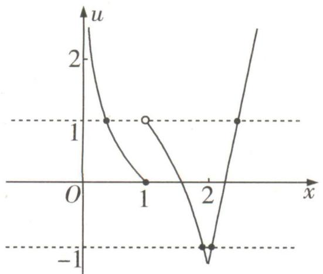

line

| x | u |
|---|---|
| 0 | 2 |
| 1 | 0 |
| 2 | -1 |
| 3 | 1 |

$u(2)=\ln 2-2<-1$ , 当 $x\in(1,2)$ 时, $u(x)<\ln 1-1+2=1$ , 因此关于 x 的方程 $f(x)+g(x)=u_{1}=-1$ 有两个实数根, 关于 x 的方程 $f(x)+g(x)=u_{2}=1$ 有两个实数根.

综上所述,方程 $|f(x)+g(x)|=1$ 实数根的个数为4.

答案 4

大招示例 2 已知函数 $f(x) = \frac{x^2}{3x - 3\mathrm{e}\ln x}$ 与 $g(x) = 3\mathrm{e}\ln x + mx$ 的图象有4个不同的交点，则实数 $m$ 的取值范围是 \_\_\_\_.

解析 通过齐次化, 把函数图象的交点问题转化为复合方程问题. 由于函数 $f(x) = \frac{x^2}{3x - 3\mathrm{e}\ln x}$ 与 $g(x) = 3\mathrm{e}\ln x + mx$ 的图象有4个不同的交点, 于是关于 $x$ 的方程 $\frac{x^2}{3x - 3\mathrm{e}\ln x} = 3\mathrm{e}\ln x + mx$ 有四个不同的实数根, 得到方程 $9\mathrm{e}^2 (\frac{\ln x}{x})^2 - 3\mathrm{e}(3 - m) \cdot \frac{\ln x}{x} + 1 - 3m = 0$ 有四个不同的实数根, 然齐次化

后构建函数 $h(x) = \frac{\ln x}{x}$ , 根据导函数 $h'(x) = \frac{1 - \ln x}{x^2}$ 知, 当 $x \in (0, e)$ 时, $h'(x) > 0$ , $h(x)$ 单调递增, 当 $x \in (e, +\infty)$ 时, $h'(x) < 0$ , $h(x)$ 单调递减, 因此函数 $h(x) = \frac{\ln x}{x}$ 在 $x = e$ 处取得最大值 $\frac{1}{e}$ , 且当 $x < 1$ 时, $h(x) < 0$ , 当 $x > 1$ 时, $h(x) > 0$ , $h(x)$ 的图象如图所示.

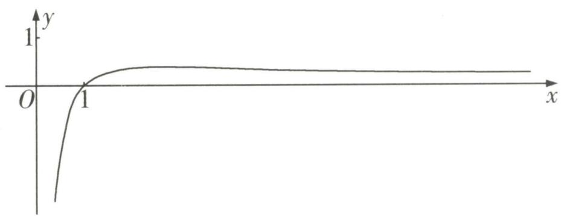

line

| x    | y     |
| ---- | ----- |
| 0    | -2.5  |
| 1    | 1     |
| >1   | 1     |

于是就有当 $t \in (-\infty, 0] \cup \left\{\frac{1}{\mathrm{e}}\right\}$ 时，函数 $h(x)$ 的图象与直线 $y = t$ 有1个交点；当 $t \in (0, \frac{1}{\mathrm{e}})$ 时，函数 $h(x)$ 的图象与直线 $y = t$ 有2个交点；当 $t \in (\frac{1}{\mathrm{e}}, +\infty)$ 时，函数 $h(x)$ 的图象与直线 $y = t$ 没有交点。于是要想有四个不同的实数根，则关于 $t$ 的方程 $9\mathrm{e}^2 t^2 - 3\mathrm{e}(3 - m)t + 1 - 3m = 0$ 有两个不同的实数根 $t_1, t_2$ ，且方程 $h(x) = t_1, h(x) = t_2$ 均

需有两个不同的实数根,且满足 $t_{1}, t_{2} \in (0, \frac{1}{\mathrm{e}})$ ,
即关于 t 的方程 $9e^{2}t^{2}-3e(3-m)t+1-3m=0$ 在 $(0,\frac{1}{\mathrm{e}})$ 上有两个不相等实数根,进而 $\left\{\begin{aligned}&\Delta=9\mathrm{e}^{2}\left[(3-m)^{2}+12m-4\right]>0,\\ &0<\frac{3\mathrm{e}(3-m)}{18\mathrm{e}^{2}}<\frac{1}{\mathrm{e}},\\ &1-3m>0,\\ &9-3(3-m)+1-3m>0,\end{aligned}\right.$ 解得 -1<m<

$\frac{1}{3}$ . 因此实数 m 的取值范围是 $(-1, \frac{1}{3})$ .

答案 $(-1, \frac{1}{3})$

text_image

大招14

# 函数图象的切线方程

  
名师大招

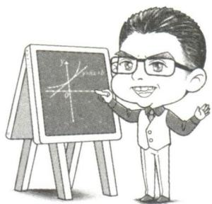

text_image

Cartoon illustration of a man pointing at a coordinate graph on a chalkboard with axes labeled y and z.

# 1. 函数图象的切线方程

已知函数 $f(x)$ 连续,且当 $x=x_{0}$ 时导函数值 $f'(x_{0})$ 存在,则函数 $f(x)$ 的图象在 $(x_{0},f(x_{0}))$ 处切线的斜率为 $f'(x_{0})$ . 于是在 $(x_{0},f(x_{0}))$ 处函数 $f(x)$ 的图象的切线方程用点斜式表示为 $y-f(x_{0})=f'(x_{0})(x-x_{0})$ ,用斜截式表示为 $y=f'(x_{0})x+[f(x_{0})-f'(x_{0})x_{0}]$ .

# 坑神有话说

如果函数 $f(x)$ 的图象是一条直线,那么方程 $y=f'(x_0)x+[f(x_0)-f'(x_0)x_0]$ 表示函数 $f(x)$ 自身,虽然几何意义上已经不是切线,但是可以将其看成代数意义上的“切线”.

# 2. 公切线

如果直线 l 既是函数 $f(x)$ 的图象在 $(x_{1}, f(x_{1}))$ 处的切线，又是函数 $g(x)$ 的图象在 $(x_{2}, g(x_{2}))$ 处的切线，则直线 l 的方程既可以表示为 $y = f'(x_{1})x + [f(x_{1}) - f'(x_{1})x_{1}]$ ，也可以表示为 $y = g'(x_{2})x + [g(x_{2}) - g'(x_{2})x_{2}]$ ，于是就有 $\left\{\begin{aligned}f'(x_{1}) &= g'(x_{2}), \\ f(x_{1}) &= -f'(x_{1})x_{1} = g(x_{2}) - g'(x_{2})x_{2}\end{aligned}\right.$ 我们常根据这两个式子来处理公切线问题。第一个式子表示两条切线斜率相等，第二个式子表示两条切线在 y 轴上的截距相等。

特别地,如果 $x_{1}$ 与 $x_{2}$ 相等且等于 $x_{0}$ ,那么就会有 $\left\{\begin{aligned}f(x_{0})&=g(x_{0}),\\ f'(x_{0})&=g'(x_{0}).\end{aligned}\right.$ 第一个式子表示公切点处函数值相等,第二个式子表示公切点处导数值相等,这也是 $(x_{0},y_{0})$ 作为函数 $y=f(x)$ 与 $y=g(x)$ 的图象公共切点所应满足的条件.

大招示例 若曲线 $y = x^{2}$ 与 $y = \ln(x - a)$ 有一条斜率为 2 的公切线, 则 a = \_\_\_\_.

解析 $y = x^{2}, y' = 2x, y = \ln (x - a), y' = \frac{1}{x - a}.$

先设公切线 $l$ 在曲线 $y = x^{2}$ 上的切点为 $(x_{1}, x_{1}^{2})$ ，在曲线 $y = \ln (x - a)$ 上的切点为 $(x_{2}, \ln (x_{2} - a))$ ，则 $l$ 的方程既可以表示为 $y - x_{1}^{2} = 2x_{1}(x - x_{1})$ ，也可以表示为 $y - \ln (x_{2} - a) = \frac{1}{x_{2} - a}(x -$

$x_{2}$ ). 由于公切线的斜率为 2, 于是 $2x_{1}=\frac{1}{x_{2}-a}=2$ , 得到 $x_{1}=1, x_{2}=a+\frac{1}{2}$ , 于是 l 的方程既为 y=2x-1, 也为 $y=2x-2\left(a+\frac{1}{2}\right)-\ln2$ , 因此 $-2\left(a+\frac{1}{2}\right)-\ln2=-1$ , 解得 $a=-\frac{\ln2}{2}$ .

答案 $-\frac{\ln 2}{2}$

text_image

大招15

# 隐函数求导

# 1. 显函数的定义

如果 $y$ 是关于自变量 $x$ 的一个函数, 且能够得到函数 $y = f(x)$ 的解析式, 则 $y$ 是关于自变量 $x$ 的显函数 (例如 $y = \sqrt{x + 1}$ ).

# 2. 隐函数的定义

如果 y 是关于自变量 x 的一个函数, 且满足一个方程 $F(x,y)=0$ (例如 $y^{2}+\sqrt{y}-x=0$ ), 此时就可以拿方程 $F(x,y)=0$ 作为隐函数 y 的表达式.

# 坑神小课堂

1. 如果函数 $y=f(x)$ 的解析式求不出来, 那么不能将之显性化.  
2. 如果函数 $y = f(x)$ 的解析式求得出来, 那么对于 y 来说既可以表示为隐函数形式, 也可以表示为显函数形式, 例如 $y^{2} = x + 1 (y \geqslant 0)$ 是 y 的隐函数形式, $y = \sqrt{x + 1}$ 是 y 的显函数形式.

# 3. 隐函数的求导

以隐函数 $e^{x} + y^{3} + \ln y = xy + x^{2}$ 为例,由于 y 是关于 x 的隐函数 $y = f(x)$ ,因此就有 $\mathrm{e}^{x} + [f(x)]^{3} + \ln[f(x)] = xf(x) + x^{2}$ ,此时对等式两边求导,根据复合函数求导法则就会有 $\mathrm{e}^{x} + 3[f(x)]^{2} \cdot f'(x) + \frac{f'(x)}{f(x)} = f(x) + xf'(x) + 2x$ ,即 $\mathrm{e}^{x} + 3y^{2}y' + \frac{y'}{y} = y + xy' + 2x$ ,从而得到导函数 $y' = \frac{\mathrm{e}^{x} - 2x - y}{x - 3x^{2} - \frac{1}}$ .

由于函数 $y=f(x)$ 的解析式求不出来，因此导函数 $y'=\frac{e^{x}-2x-y}{x-3y^{2}-\frac{1}{y}}$ 中只能保留y

# 坑神有话说

这里把 y 换成 $f(x)$ 只是为了方便理解, 后面使用熟练后可以直接把 y 关于 x 的导数记为 $y'$ .

# 大招解读

从上面举例中,我们可以归纳出隐函数求导的一般步骤:

第一步：通过两边同时取对数或代数变形,把等式两边变成都能对 x 求导的形式.

第二步: 把 $y$ 看作关于 $x$ 的函数, 运用复合函数的求导法则对等式两边求导.

第三步：化简式子,得出 $y'$ 的表达式.

# 4. 隐函数求导的应用

①求圆锥曲线的切线方程.

②进行复杂函数的求导运算.

大招示例 已知定义在 R 上的函数 $f(x)$ , $g(x)$ 都恒大于 0, 且各自的导函数 $f'(x)$ , $g'(x)$ 都存在. 试求函数 $y = f(x)^{g(x)}$ 的导函数 $y'$ .

解析 这个函数 $y = f(x)^{g(x)}$ 既不属于基本初等函数中的任何一个, 同样也不能由基本初等函数复合得到. 因此要去求这个难看的函数的导函数 $y'$ , 唯有将其变形后进行隐函数求导. 下面进

入完整解题步骤: 因为 $y = f(x)^{g(x)} > 0$ , 所以 $\ln y = g(x) \ln f(x)$ , 所以 $\frac{y'}{y} = g'(x) \ln f(x) + g(x) \cdot$ 两边同时对x求导

$\frac{f'(x)}{f(x)}$ ，所以 $y' = f(x)^{g(x)} \left[ g'(x) \ln f(x) + g(x) \cdot \frac{f'(x)}{f(x)} \right]$ .

# 大招16

# 导数逆向构造

  
名师大招

text_image

f(x)=F'(x)

# 1. 逆向构造问题

对于已知导函数满足的一个不等式,去解一个函数不等式的问题,一般称为逆向构造问题.例如已知 $f(x)+f'(x)>0$ ,且 $f(0)=1$ ,求不等式 $f(x)<\mathrm{e}^{-x}$ 的解集.对于逆向构造问题我们一般采取如下步骤处理:

# 大招解读

第一步：逆用求导法则,构建一个新函数,新函数的导函数能通过题目中所给的导函数不等式判断与0的关系.

第二步: 求出新函数的导函数, 得到新函数的单调性.

第三步：利用新函数的单调性解决问题.

# 2. 常用的逆向构造方法

①逆用加减法: $f'(x) \pm g'(x) = [f(x) \pm g(x)]'$ . 例如 $x + 1 \pm \frac{1}{x} = (\frac{1}{2}x^2 + x \pm \ln x)'$ .

②逆用乘法: $g'(x)f(x)+g(x)f'(x)=[g(x)f(x)]'$ . 例如 $x\cos x+\sin x=(x\sin x)'$ .

③逆用除法: $\frac{g(x)f'(x) - g'(x)f(x)}{[g(x)]^2} = \left[\frac{f(x)}{g(x)}\right]' (g(x) \neq 0)$ . 例如 $x \cos x - \sin x = x^2$

$$
\frac {x (\sin x) ^ {\prime} - x ^ {\prime} \sin x}{x ^ {2}} = x ^ {2} \left(\frac {\sin x}{x}\right) ^ {\prime}.
$$

④逆用复合求导: $g'(f(x)) \cdot f'(x) = [g(f(x))]'$ . 例如 $2xe^{x^2} = (e^{x^2})'$ .

⑤万能构造公式: $g'(x)f(x)+f'(x)=\frac{\mathrm{e}^{g(x)}g'(x)f(x)+\mathrm{e}^{g(x)}f'(x)}{\mathrm{e}^{g(x)}}=\frac{[\mathrm{e}^{g(x)}f(x)]'}{\mathrm{e}^{g(x)}}$ .例如 $nf(x)+$

只要将 $f'(x)$ 的系数化为1后，就可以根据 $g'(x)$ 得到原函数 $g(x)$ ，进而可以根据万能构造公式直接进行逆向构造。

$$
f ^ {\prime} (x) = \frac {n e ^ {n x} f (x) + e ^ {n x} f ^ {\prime} (x)}{e ^ {n x}} = \frac {[ e ^ {n x} f (x) ] ^ {\prime}}{e ^ {n x}} (n \neq 0), n f (x) + x f ^ {\prime} (x) = x [ \frac {n}{x} f (x) + f ^ {\prime} (x) ] = x \cdot
$$

$$
\frac {\mathrm{e} ^ {n \ln x} \cdot \frac {n}{x} \cdot f (x) + \mathrm{e} ^ {n \ln x} f ^ {\prime} (x)}{\mathrm{e} ^ {n \ln x}} = x \cdot \frac {[ \mathrm{e} ^ {n \ln x} f (x) ] ^ {\prime}}{\mathrm{e} ^ {n \ln x}} = \frac {[ x ^ {n} f (x) ] ^ {\prime}}{x ^ {n - 1}} (n \neq 0).
$$

# 坑神小课堂

常见的构造：

(1) 对于 $f'(x) > g'(x)$ ，可构造函数 $h(x) = f(x) - g(x)$ 。一般地，若 $f'(x) > a (a \neq 0)$ ，即导函数大于某个非零常数（若 a = 0，则无需构造），则可构造函数 $h(x) = f(x) - ax$ 。  
(2) 对于 $f'(x) + g'(x) > 0$ ，可构造函数 $h(x) = f(x) + g(x)$ .  
(3) 对于 $f'(x) + f(x) > 0$ ，可构造函数 $h(x) = e^{x}f(x)$ .  
(4) 对于 $f'(x) > f(x)$ (或 $f'(x) - f(x) > 0$ )，可构造函数 $h(x) = \frac{f(x)}{\mathrm{e}^{x}}$ .  
(5) 对于 $xf'(x) + f(x) > 0$ ，可构造函数 $h(x) = xf(x)$ .  
(6) 对于 $xf'(x) - f(x) > 0$ ，可构造函数 $h(x) = \frac{f(x)}{x}$ .  
(7) 对于 $\frac{f'(x)}{f(x)}>0$ ，可分为两类：① 若 $f(x)>0$ ，则可构造函数 $h(x)=\ln f(x)$ ; ② 若 $f(x)<0$ ，则可构造函数 $h(x)=\ln[-f(x)]$ .  
(8) 对于 $f'(x) \sin x + f(x) \cos x > 0$ ，可构造函数 $h(x) = f(x) \sin x$ .  
(9) 对于 $f'(x)\cos x - f(x)\sin x > 0$ ，可构造函数 $h(x) = f(x)\cos x$ .  
(10) 对于 $f'(x)\sin x - f(x)\cos x > 0$ ，可构造函数 $h(x) = \frac{f(x)}{\sin x}$ .  
(11) 对于 $f'(x)\cos x + f(x)\sin x > 0$ ，可构造函数 $h(x) = \frac{f(x)}{\cos x}$ .

大招示例 已知 $f(x)$ 是定义在 R 上的恒大于零的偶函数, 其导函数记为 $f'(x)$ . 且当 $x \neq 0$ 时, $2f(x) + (x + \frac{1}{x})f'(x) < 0$ , 若 $a < 0 < b$ 且 $|a| < b$ , 则一定成立的是 ( )

A. $f(a) > f(0)$

B. $f(b) < f(0)$

C. $f(a) > f(b)$

D. $f(a) <   f(b)$

解析·本题直接构造没有对应的形式,但是在两边同乘以x转化之后,可以根据乘法的求导法

则逆向构造. 由当 $x \neq 0$ 时, $2f(x) + (x + \frac{1}{x})f'(x) < 0$ , 得到当 $x > 0$ 时, $2xf(x) + (x^2 + 1)f'(x) < 0$ , 然后构建函数 $g(x) = (x^2 + 1)f(x)$ , 从而有当 $x > 0$ 时, $g'(x) = 2xf(x) + (x^2 + 1)f'(x) < 0$ , 函数 $g(x)$ 单调递减. 又 $f(x)$ 是定义在 $\mathbb{R}$ 上恒大于零的偶函数, 于是 $g(x) = (x^2 + 1)f(x)$ 也是定义在 $\mathbb{R}$ 上恒大于零的偶函数. 由于 $a < 0 < b$ 且 $|a| < b$ , 于是 $0 < -a < b$ , 又当 $x > 0$ 时, 函数 $g(x)$ 单调递减,于是 $g(a)=g(-a)>g(b)$ , 即 $(a^{2}+1)f(a)>(b^{2}+1)f(b)$ , 于是 $\frac{f(a)}{f(b)}>\frac{b^{2}+1}{a^{2}+1}$ , 而 $0<a^{2}+1<b^{2}+1$ , 因此 $\frac{f(a)}{f(b)}>1$ , 即 $f(a)>f(b)$ . 综上所述, 答案选 C.

答案 C

# 坑神有话说

本题形式特殊,还有一种非常规解法. 因为 $2f(x) + \left(x + \frac{1}{x}\right)f'(x) < 0$ , 所以 $\left(x + \frac{1}{x}\right)f'(x) < -2f(x) < 0$ , 所以当 x > 0 时, $f'(x) < 0$ , 再结合偶函数性质即可得答案.

# 大招17 同构思想

  
名师大招

同构的本质就是通过一系列变形,将原条件转化为同一函数的两个函数值 $f(a)$ 与 $f(b)$ 之间满足的关系,从而利用函数 $f(x)$ 的单调性,得到a与b之间的关系,从而大大简化问题.

同构法的几种常见变形：

# 1. 地位同等同构（主要针对双变量，合二为一泰山移）

① $\frac{f(x_1) - f(x_2)}{x_1 - x_2} > k(x_1 < x_2) \Leftrightarrow f(x_1) - f(x_2) < kx_1 - kx_2 \Leftrightarrow f(x_1) - kx_1 < f(x_2) - kx_2 \Leftrightarrow y = f(x)$

$kx$ 为增函数.

② $\frac{f(x_{1})-f(x_{2})}{x_{1}-x_{2}}<\frac{k}{x_{1}x_{2}}(x_{1}<x_{2})\Leftrightarrow f(x_{1})-f(x_{2})>\frac{k(x_{1}-x_{2})}{x_{1}x_{2}}=\frac{k}{x_{2}}-\frac{k}{x_{1}}\Leftrightarrow f(x_{1})+\frac{k}{x_{1}}>f(x_{2})+\frac{k}{x_{2}}\Leftrightarrow$

$y=f(x)+\frac{k}{x}$ 为减函数.

# 2. 指对跨阶同构（主要针对单变量，左同右同取对数）

①积型：

$$
a \mathrm{e} ^ {a} \leqslant b \ln b \xrightarrow {\text {三种同构方式}} \left\{ \begin{array}{l l} \text {同左} & a \mathrm{e} ^ {a} \leqslant (\ln b) \mathrm{e} ^ {\ln b} \xrightarrow {\text {构造函数}} f (x) = x \mathrm{e} ^ {x} \\ \text {同右} & \mathrm{e} ^ {a} \ln \mathrm{e} ^ {a} \leqslant b \ln b \xrightarrow {\text {构造函数}} f (x) = x \ln x \\ \text {取对} & a + \ln a \leqslant \ln b + \ln (\ln b) \xrightarrow {\text {构造函数}} f (x) = x + \ln x \end{array} \right.
$$

说明:在对“积型”进行同构时,取对数是最快捷的,同构出的函数,其单调性容易获知.

②商型：

$$
\frac {\mathrm{e} ^ {a}}{a} <   \frac {b}{\ln b} \xrightarrow {\text {三种同构方式}} \left\{ \begin{array}{l l} \text {同左} & \frac {\mathrm{e} ^ {a}}{a} <   \frac {\mathrm{e} ^ {\ln b}}{\ln b} \xrightarrow {\text {构造函数}} f (x) = \frac {\mathrm{e} ^ {x}}{x} \\ \text {同右} & \frac {\mathrm{e} ^ {a}}{\ln \mathrm{e} ^ {a}} <   \frac {b}{\ln b} \xrightarrow {\text {构造函数}} f (x) = \frac {x}{\ln x} \\ \text {取对} & a - \ln a <   \ln b - \ln (\ln b) \xrightarrow {\text {构造函数}} f (x) = x - \ln x \end{array} \right.
$$

③和差：

$$
\mathrm{e} ^ {a} \pm a > b \pm \ln b \xrightarrow {\text {两种同构方式}} \left\{ \begin{array}{l l} \text {同左} & \mathrm{e} ^ {a} \pm a > \mathrm{e} ^ {\ln b} \pm \ln b \xrightarrow {\text {构造函数}} f (x) = \mathrm{e} ^ {x} \pm x \\ \text {同右} & \mathrm{e} ^ {a} \pm \ln \mathrm{e} ^ {a} > b \pm \ln b \xrightarrow {\text {构造函数}} f (x) = x \pm \ln x \end{array} \right.
$$

如 $\mathrm{e}^{ax} + ax > \ln (x + 1) + x + 1 \Leftrightarrow \mathrm{e}^{ax} + ax > \mathrm{e}^{\ln (x + 1)} + \ln (x + 1) \Leftrightarrow ax > \ln (x + 1)$ .

# 3. 无中生有同构（主要针对非上型，凑好形式是关键）

① $ae^{ax}>\ln x\xrightarrow{同乘x(无中生有)}axe^{ax}>x\ln x$ ，后面的转化同积型.

② $e^{x}>a\ln(ax-a)-a(a>0)\Leftrightarrow\frac{1}{a}e^{x}>\ln a(x-1)-1\Leftrightarrow e^{x-\ln a}-\ln a>\ln(x-1)-1\xrightarrow{\text{同加}x(\text{无中生有})}$ $e^{x-\ln a}+x-\ln a>\ln(x-1)+x-1=e^{\ln(x-1)}+\ln(x-1)\Leftrightarrow x-\ln a>\ln(x-1).$

③ $a^{x}>\log_{a}x\Leftrightarrow e^{x\ln a}>\frac{\ln x}{\ln a}\Leftrightarrow(x\ln a)e^{x\ln a}>x\ln x$ ，后面的转化同积型.

大招示例 （2020 全国 I 卷）若 $2^{a} + \log_{2}a = 4^{b} + 2\log_{4}b$ ，则 （）

A. $a > 2b$

B. $a <   2b$

C. $a > b^{2}$

D. $a < b^{2}$

解析> 大招解 首先观察式子两边的结构,构建函数 $f(x)=2^{x}+\log_{2}x(x>0)$ ，则 $4^{b}+2\log_{4}b$ 可变形为 $2^{2b}+\log_{2}b$ ，而 $2^{2b}+\log_{2}b<2^{2b}+\log_{2}2b$ ，从而就得到了 $f(a)<f(2b)$ ，而通过函数 $f(x)=2^{x}+\log_{2}x$ 单调递增，就可以得到a与b之间的关系:a<2b.

常规解（取特值法） 由 $2^{a} + \log_{2}a = 4^{b}+$

$2\log_{4}b=4^{b}+\log_{2}b$ ，取b=1，得 $2^{a}+\log_{2}a=4$ ，令

$f(x)=2^{x}+\log_{2}x-4(x>0)$ ，则 $f(x)$ 在 $(0,+\infty)$ 上单调递增，且 $f(1)<0,f(2)>0$ ，所以 $f(1)\cdot f(2)<0,f(x)=2^{x}+\log_{2}x-4$ 在 $(0,+\infty)$ 上存在唯一的零点，所以1<a<2，故a>2b, $a<b^{2}$ 都不成立，排除A,D；取b=2，得 $2^{a}+\log_{2}a=17$ ，令 $g(x)=2^{x}+\log_{2}x-17(x>0)$ ，则 $g(x)$ 在 $(0,+\infty)$ 上单调递增，且 $g(3)<0,g(4)>0$ ，所以 $g(3)g(4)<0,g(x)=2^{x}+\log_{2}x-17$ 在 $(0,+\infty)$ 上存在唯一的零点，所以3<a<4，故 $a>b^{2}$ 不成立，排除C.故选B.

答案 B

# 大招18

# 洛必达法则

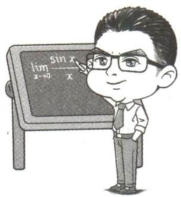

text_image

lim _x → 0
sin x
x → 0
x

# 1. 洛必达法则的定义

已知函数 $f(x)$ 与 $g(x)$ 都存在导数 $f'(x), g'(x)$ ，其中 $g'(x) \neq 0$ .

① $x \to a$ 的情形: 若 $\lim_{x \to a} f(x) = \lim_{x \to a} g(x) = 0$ 或 $\infty$ , 则 $\lim_{x \to a} \frac{f(x)}{g(x)}$ 称为 $\frac{0}{0}$ 型或 $\frac{\infty}{\infty}$ 型的不定式, 此时有 $\lim_{x \to a} \frac{f(x)}{g(x)} = \lim_{x \to a} \frac{f'(x)}{g'(x)}$ . 例如: $\lim_{x \to 0} \frac{\mathrm{e}^x - 1}{x} = \lim_{x \to 0} \frac{\mathrm{e}^x}{1} = 1$ .

② $x \to \infty$ 的情形: 若 $\lim_{x \to \infty} f(x) = \lim_{x \to \infty} g(x) = 0$ 或 $\infty$ , 则 $\lim_{x \to \infty} \frac{f(x)}{g(x)}$ 称为 $\frac{0}{0}$ 型或 $\frac{\infty}{\infty}$ 型的不定式, 此时也有 $\lim_{x \to \infty} \frac{f(x)}{g(x)} = \lim_{x \to \infty} \frac{f'(x)}{g'(x)}$ . 例如: $\lim_{x \to +\infty} \frac{\ln x}{\sqrt{x}} = \lim_{x \to +\infty} \frac{\frac{1}{x}}{\frac{1}{2\sqrt{x}}} = \lim_{x \to +\infty} \frac{2}{\sqrt{x}} = 0$ .

# 坑神有话说

值得注意的是对于 $\lim_{x\to +\infty}xe^{-x}$ 这种 $\infty \cdot 0$ 形式的极限，需要将其转化为 $\frac{0}{0}$ 型或 $\frac{\infty}{\infty}$ 型的不定式，再使用洛必达法则.例如 $\lim_{x\to -\infty}xe^{x} = \lim_{x\to -\infty}\frac{x}{e^{-x}} = \lim_{x\to -\infty}\frac{1}{-e^{-x}} = 0.$

# 2.洛必达法则的应用

在中学阶段,通过洛必达法则可以计算存在不定式情况的函数的极限,进而帮助我们快速得出存在不定式情况的函数的值域.

# 坑神来避坑

特别需要强调的是洛必达法则在小题中可以直接使用,但是在大题中直接使用可能会扣分.

大招示例 1 函数 $y = \frac{\ln(x + 1)}{x} (0 < x < 1)$ 的值域为 \_\_\_\_.

解析 令 $f(x)=\frac{\ln(x+1)}{x}(0<x<1)$ ，则 $f'(x)=\frac{x}{x+1}-\ln(x+1)\frac{x^2}{x^2}$ ，然后构建函数 $g(x)=\frac{x}{x+1}-\ln(x+1)$ ，则 $g'(x)=-\frac{x}{(x+1)^2}<0$ ，得到函数 $g(x)$ 单调递减。于是当 $x\in(0,1)$ 时， $g(x)<g(0)=0,f'(x)<0$ ，函数 $f(x)=\frac{\ln(x+1)}{x}(0<x<1)$ 单调递减，而当 $x\to0^{+}$ 时， $\lim_{x\to0^{+}}\frac{\ln(x+1)}{x}=\lim_{x\to0^{+}}\frac{\frac{1}{x+1}}{1}=1$ ，因此函数 $y=\frac{\ln(x+1)}{x}(0<x<1)$ 的值域为 $(\ln2,1)$ 。

答案 (ln 2,1)

大招示例 2 (2023 全国乙卷) 已知函数 $f(x)=\left(\frac{1}{x}+a\right)\ln(1+x)$ .

(1) 当 a = -1 时, 求曲线 $y = f(x)$ 在点 $(1, f(1))$ 处的切线方程.  
(2) 是否存在 $a, b$ , 使得曲线 $y = f(\frac{1}{x})$ 关于直线 $x = b$ 对称? 若存在, 求 $a, b$ 的值; 若不存在, 说明理由.  
(3) 若 $f(x)$ 在 $(0, +\infty)$ 上存在极值, 求 a 的取值范围.

解析 (1) 当 $a = -1$ 时, $f(x) = \left(\frac{1}{x} - 1\right)\ln(1 + x)$ , 则 $f'(x) = -\frac{1}{x^2}\ln(1 + x) + \left(\frac{1}{x} - 1\right) \cdot \frac{1}{1 + x}$ , 所以 $f'(1) = -\ln 2$ , 又 $f(1) = 0$ , 所以所求切线

方程为 $y - 0 = -\ln 2(x - 1)$ ，即 $x\ln 2 + y - \ln 2 = 0.$

(2) 存在, 理由如下:

假设存在 a, b, 使得曲线 $y = f\left(\frac{1}{x}\right)$ 关于直线 x = b 对称.

令 $g(x)=f(\frac{1}{x})=(x+a)\ln(1+\frac{1}{x})=(x+a)$ $\ln\frac{x+1}{x}$ ,

因为曲线 $y = g(x)$ 关于直线 x = b 对称，

所以 $g(x)=g(2b-x)$ ，即 $(x+a)\ln\frac{x+1}{x}=(2b-$

此处用到了对称性转化，详见大招7

$$
x + a) \ln \frac {2 b - x + 1}{2 b - x} = (x - 2 b - a) \ln \frac {x - 2 b}{x - 2 b - 1},
$$

于是 $\left\{\begin{aligned}a&=-2b-a,\\ 1&=-2b,\end{aligned}\right.$ 得 $\left\{\begin{aligned}a&=\frac{1}{2},\\ b&=-\frac{1}{2},\end{aligned}\right.$

当 $a = \frac{1}{2}, b = -\frac{1}{2}$ 时， $g(x) = (x + \frac{1}{2})\ln (1 + \frac{1}{x})$

$$
g (- 1 - x) = \left(- x - \frac {1}{2}\right) \ln \frac {- x}{- 1 - x} = \left(- x - \frac {1}{2}\right) \cdot
$$

$\ln \frac{x}{1 + x} = (x + \frac{1}{2})\ln \frac{x + 1}{x} = (x + \frac{1}{2})\ln (1 + \frac{1}{x}) = g(x),$

所以曲线 $y = g(x)$ 关于直线 $x = -\frac{1}{2}$ 对称, 满足题意.

故存在 a, b, 使得曲线 $y = f\left(\frac{1}{x}\right)$ 关于直线 x = b 对称,
且 $a=\frac{1}{2}, b=-\frac{1}{2}.$

(3) $f'(x) = -\frac{1}{x^2}\ln(1 + x) + \left(\frac{1}{x} + a\right) \cdot \frac{1}{1 + x} =$

$\frac{ax^2 + x - (1 + x)\ln(1 + x)}{x^2(1 + x)} = \frac{\frac{ax^2 + x}{x + 1} - \ln(1 + x)}{x^2} (x > 0),$

设 $h(x)=\frac{ax^{2}+x}{x+1}-\ln(1+x)(x>0)$ ，则 $h'(x)=\frac{ax^{2}+2ax+1}{(x+1)^{2}}-\frac{1}{x+1}=\frac{ax^{2}+(2a-1)x}{(x+1)^{2}}=\frac{x(ax+2a-1)}{(x+1)^{2}}.$

【大招识别】由题可得 $f'(x)$ 在 $(0, +\infty)$ 有变号零点，因此分离参数可得 $a = \frac{(1 + x)\ln(1 + x) - x}{x^2}$ ，判断可用洛必达法则，因此 $\lim_{x \to 0} \frac{(1 + x)\ln(1 + x) - x}{x^2} = \lim_{x \to 0} \frac{\ln(1 + x)}{2x} = \lim_{x \to 0} \frac{\frac{1}{1 + x}}{2} = \frac{1}{2}$ ，当 $x \to +\infty$ 时， $h(x) \to$

# 0，故可得分类讨论的标准

①当 $a \leqslant 0$ 时, 2a - 1 < 0, 当 x > 0 时, $h'(x) < 0$ , 所以 $h(x)$ 在 $(0, +\infty)$ 上单调递减,

所以当 x > 0 时, $h(x) < h(0) = 0$ , 即 $f'(x) < 0$ ,
所以 $f(x)$ 在 $(0,+\infty)$ 上单调递减,无极值,不满足题意.

②当 $a \geqslant \frac{1}{2}$ 时, $2a - 1 \geqslant 0$ , 当 $x > 0$ 时, $h'(x) > 0$ , 所以 $h(x)$ 在 $(0, +\infty)$ 上单调递增,

所以当 x > 0 时, $h(x) > h(0) = 0$ , 即 $f'(x) > 0$ ,
所以 $f(x)$ 在 $(0, +\infty)$ 上单调递增, 无极值, 不满足题意.

③当 $0 < a < \frac{1}{2}$ 时，令 $h'(x) = 0$ ，得 $x = \frac{1 - 2a}{a}$ ，当 $0 < x < \frac{1 - 2a}{a}$ 时， $h'(x) < 0$ ，当 $x > \frac{1 - 2a}{a}$ 时， $h'(x) > 0$

所以 $h(x)$ 在 $(0, \frac{1-2a}{a})$ 上单调递减，在 $(\frac{1-2a}{a}, +\infty)$ 上单调递增，

所以 $h(\frac{1-2a}{a})<h(0)=0,$

又当 $x \to +\infty$ 时, $h(x) \to +\infty$ , 所以存在 $x_0 \in (\frac{1 - 2a}{a}, +\infty)$ , 使得 $h(x_0) = 0$ ,

即当 $0 < x < x_0$ 时， $h(x) < 0, f'(x) < 0, f(x)$ 单调递减，当 $x > x_0$ 时， $h(x) > 0, f'(x) > 0, f(x)$ 单调递增，

此时 $y=f(x)$ 有极小值点 $x_{0}$ .

综上所述,a 的取值范围为 $(0,\frac{1}{2})$ .

# 坑神有话说

洛必达法则不能在解答题中直接使用,但我们可以通过洛必达法则确定对所构造的新函数求导的次数(即使用了几次洛必达法则得到了结果),以及根据所得结果确定分类讨论的标准,如本题中根据洛必达法则得到 $a=\frac{1}{2}$ ,我们可以分 $a\leqslant0,a\geqslant\frac{1}{2},0<a<\frac{1}{2}$ 直接讨论求解即可.

text_image

大招19

# 泰勒展开式

  
名师大招

# 1. 泰勒中值定理

如果函数 $f(x)$ 在含有 $x_0$ 的某个开区间 $(a, b)$ 内具有直到 $n + 1$ 阶的导数，则当 $x$ 在 $(a, b)$ 内且 $x \neq x_0$ 时， $f(x)$ 可以表示为 $(x - x_0)$ 的一个 $n$ 次多项式与一个余项之和：

$$
f (x) = f \left(x _ {0}\right) + \frac {f ^ {\prime} \left(x _ {0}\right)}{1 !} \left(x - x _ {0}\right) + \frac {f ^ {\prime \prime} \left(x _ {0}\right)}{2 !} \left(x - x _ {0}\right) ^ {2} + \dots + \frac {f ^ {(n)} \left(x _ {0}\right)}{n !} \left(x - x _ {0}\right) ^ {n} + R _ {n} (x),
$$

解题11 2023 武林大会

其中 $R_{n}(x) = \frac{f^{(n + 1)}(\xi)}{(n + 1)!} (x - x_{0})^{n + 1},\xi$ 介于 $x$ 和 $x_0$ 之间，上式即为函数 $f(x)$ 在 $x_0$ 点处的 $n$ 阶泰勒展开式.

# 2. 泰勒公式 $x_{0} = 0$ 时的麦克劳林公式

当 $x_{0}=0$ 时， $f(x)=f(0)+f'(0)x+\frac{f''(0)}{2!}x^{2}+\cdots+\frac{f^{(n)}(0)}{n!}x^{n}+R_{n}(x)$ ，由此我们可以推得常见的公式：

(1) $e^{x}=1+x+\frac{x^{2}}{2!}+\cdots+\frac{x^{n}}{n!}+o(x^{n})$ .   
(2) $\sin x = x - \frac{x^3}{3!} + \frac{x^5}{5!} - \cdots + (-1)^n \frac{x^{2n+1}}{(2n+1)!} + o(x^{2n+2})$ .   
(3) $\cos x = 1 - \frac{x^{2}}{2!} + \frac{x^{4}}{4!} - \cdots + (-1)^{n} \frac{x^{2n}}{(2n)!} + o(x^{2n+1})$ .   
(4) $\ln(1+x)=x-\frac{x^{2}}{2}+\frac{x^{3}}{3}-\cdots+(-1)^{n-1}\frac{x^{n}}{n}+o(x^{n})$ .   
(5) $(1 + x)^{a} = 1 + ax + \frac{a(a - 1)}{2!} x^{2} + \dots +\frac{a(a - 1)\cdot\cdots\cdot(a - n + 1)}{n!} x^{n} + o(x^{n}).$

特别地, 当 $a=\frac{1}{2}$ 时, 有 $\sqrt{1+x}=1+\frac{1}{2}x-\frac{1}{8}x^{2}+\frac{1}{16}x^{3}-\cdots+o(x^{n})$ .

(6) $\frac{1}{1-x}=1+x+x^{2}+\cdots+x^{n}+o(x^{n})$ .

# 3. 几个重要的不等式

由泰勒公式,我们可以得到几个重要的不等式:

(1) $\left\{\begin{aligned}\mathrm{e}^{x}&\geqslant1+x,x\in\mathbf{R},\\\mathrm{e}^{x}&\geqslant1+x+\frac{x^{2}}{2},x\geqslant0,\\\mathrm{e}^{x}&\leqslant1+x+\frac{x^{2}}{2},x\leqslant0.\end{aligned}\right.$

(2) $\left\{ \begin{array}{l} x - \frac{x^2}{2} \leqslant \ln (1 + x) \leqslant x, \\ x - \frac{x^2}{2} \leqslant \ln (1 + x) \leqslant x - \frac{1}{2} x^2 + \frac{1}{3} x^3, \end{array} \right.$ $x \geqslant 0$

(3) $x-\frac{x^{3}}{6}\leqslant\sin x\leqslant x,x\geqslant0.$

(4) $1-\frac{x^{2}}{2}\leqslant\cos x\leqslant1-\frac{x^{2}}{2}+\frac{x^{4}}{24},x\geqslant0.$

(5) $1 + x < e^{x} < \frac{1}{1 - x}, 0 < x < 1.$

(6) $\left\{ \begin{array}{l} \frac{x - 1}{\sqrt{x}} < \ln x < \frac{2(x - 1)}{x + 1}, 0 < x < 1, \\ \frac{2(x - 1)}{x + 1} < \ln x < \frac{x - 1}{\sqrt{x}}, x > 1. \end{array} \right.$

(7) $\left\{ \begin{array}{l} \frac{1}{2} (x - \frac{1}{x}) < \ln x < x - 1, \\ \ln x \leqslant \frac{1}{2} (x - \frac{1}{x}) \leqslant x - 1, x \geqslant 1. \end{array} \right.$

分析 (1) 根据 $f(x)$ 在点 $x = x_{0}$ 处的 $n$ 阶泰勒展开式的定义可直接求得结果.

(2) 令 $h(x) = f_{1}(x) - g_{1}(x)$ , 利用导数可求得 $h(x)$ 在 $\mathbf{R}$ 上单调递增, 结合 $h(0) = 0$ 可得 $h(x)$ 的正负, 由此可得 $f_{1}(x)$ 与 $g_{1}(x)$ 的大小关系.  
(3) 令 $\varphi(x) = f_{2}(x) - g_{2}(x)$ , 利用导数可求得 $\varphi(x) \geqslant \varphi(0) = 0$ , 即 $\cos x \geqslant 1 - \frac{1}{2} x^{2}$ . ① 当 $x \geqslant 0$ 时, 由 $\mathrm{e}^{x} \geqslant 1 + x + \frac{1}{2} x^{2} + \frac{1}{6} x^{3}, \sin x \geqslant x - \frac{1}{6} x^{3}$ , 可直接证得不等式成立; ② 当 $x < 0$ 时, 分类讨论, 由此可证得不等式成立.

大招示例 （2022 新高考 I 卷）设 $a = 0.1 e^{0.1}$ , $b=\frac{1}{9},c=-\ln0.9,$ 则 （）

A. $a < b < c$

B. $c < b < a$

C. $c < a < b$

D. $a < c < b$

# 大招识别

观察题干条件, a 中 e 的指数接近 0, $\ln 0.9$ 可化为 $\ln(1-0.1)$ , 故可用泰勒展开式来近似计算它们, 再比较大小.

$$
\begin{array}{l} \frac {x ^ {n}}{n !} + \dots , \ln (1 + x) = x - \frac {x ^ {2}}{2} + \frac {x ^ {3}}{3} - \dots + \\ 0. 1 + \frac {1}{2} \times 0. 0 1 + \frac {1}{6} \times 0. 0 0 1) \approx 0. 1 1 0 5 1 7, c = \\ \end{array}
$$

解析 大招解 因为 $e^{x}=1+x+\frac{x^{2}}{2!}+\frac{x^{3}}{3!}+\cdots+$

$(-1)^{n-1}\frac{x^{n}}{n}+\cdots$ ,所以 $a=0.1e^{0.1}\approx0.1\times(1+$

$-\ln(1-0.1)\approx0.1+\frac{0.01}{2}+\frac{0.001}{3}\approx0.1053.$ 又

$b=\frac{1}{9}\approx0.111\ 1$ , 所以c<a<b. 故选C.

常规解1 因为 $\mathrm{e}^x \geqslant x + 1$ ，当且仅当 $x = 0$ 时，有 $e^{x}=x+1$ ，从而当 x=-0.1 时， $e^{-0.1}>0.9=\frac{9}{10}$ ，于是 $e^{0.1}<\frac{10}{9}$ ， $a=0.1e^{0.1}<\frac{1}{9}=b.$

设函数 $f(x)=xe^{x}+\ln(1-x)$ ，则 $f'(x)=(x+$ 构造函数，利用单调性比较大小

1) $e^{x}-\frac{1}{1-x}=\frac{(1-x^{2})e^{x}-1}{1-x}$ . 当 0<x<0.1 时， $(1-x^{2})e^{x}-1>(1-x^{2})(x+1)-1=x(1-x-x^{2})>0$ ，所以 $f'(x)>0,f(x)$ 在 $(0,0.1)$ 上单调递增，有 $f(0.1)>f(0)=0$ ，即 $0.1e^{0.1}+\ln0.9>0$ ，
所以 a>c. 故正确选项为 C.

常规解2设 $u(x) = x\mathrm{e}^{x}(0 < x\leqslant 0.1),v(x) =$

$\frac{x}{1 - x} (0 < x \leqslant 0.1), w(x) = -\ln (1 - x) (0 < x \leqslant 0.1)$ , 则当 $0 < x \leqslant 0.1$ 时, $u(x) > 0, v(x) > 0$ , $w(x) > 0$ . ①设 $f(x) = \ln [u(x)] - \ln [v(x)] = \ln x + x - [\ln x - \ln (1 - x)] = x + \ln (1 - x) (0 < x \leqslant 0.1)$ , 则 $f'(x) = 1 - \frac{1}{1 - x} = \frac{x}{x - 1} < 0$ 在 $(0, 0.1]$ 上恒成立, 所以 $f(x)$ 在 $(0, 0.1]$ 上单调递减, 所以 $f(0.1) < 0 + \ln (1 - 0) = 0$ , 即 $\ln [u(0.1)] - \ln [v(0.1)] < 0$ , 所以 $\ln [u(0.1)] < \ln [v(0.1)]$ . 又函数 $y = \ln x$ 在 $(0, +\infty)$ 上单调递增, 所以 $u(0.1) < v(0.1)$ , 即 $0.1e^{0.1} < \frac{1}{9}$ , 所以 $a < b$ . ②设 $g(x) = u(x) - w(x) = xe^x + \ln (1 - x) (0 < x \leqslant 0.1)$ , 则 $g'(x) = (x + 1)e^x - \frac{1}{1 - x} = \frac{(1 - x^2)e^x - 1}{1 - x}$ ( $0 < x \leqslant 0.1$ ), 设 $h(x) = (1 - x^2)e^x - 1 (0 < x \leqslant 0.1)$ , 则 $h'(x) = (1 - 2x - x^2)e^x > 0$ 在 $(0, 0.1]$ 上恒成立, 所以 $h(x)$ 在 $(0, 0.1]$ 上单调递增, 所以 $h(x) > (1 - 0^2)e^0 - 1 = 0$ , 即 $g'(x) > 0$ 在 $(0, 0.1]$ 上恒成立, 所以 $g(x)$ 在 $(0, 0.1]$ 上单调递增, 所以 $g(0.1) > 0 \times e^0 + \ln (1 - 0) = 0$ , 即 $g(0.1) = u(0.1) - w(0.1) > 0$ , 所以 $0.1e^{0.1} > -\ln 0.9$ , 即 $a > c$ . 综上, $c < a < b$ , 故选 C.

答案 C

# 大招20 齐次化

natural_image

Cartoon character holding a sign with x₁/x₂, running joyfully (no text or symbols on the character or background)

在不等式以及三角函数模块中我们已经研究了齐次化的方法,而到了导数这块,对于一道多变量问题,如果变量的次数都是相同的,那么我们同样可以采用齐次化换元,以减少题目中的变量,达到“消元”的目的.

大招示例 若关于 x 的方程 $\left(\mathrm{e}^{x}-mx\right)\mathrm{e}^{x}=x^{2}$ 恰有一个实根, 则实数 m 的取值范围是 \_\_\_\_.

解析 由于关于 $x$ 的方程 $(\mathrm{e}^x - mx)\mathrm{e}^x = x^2$ 恰有一个实根, 直接齐次化得到, 关于 $x$ 的方程 $1 - m \cdot \frac{x}{\mathrm{e}^x} = \left(\frac{x}{\mathrm{e}^x}\right)^2$ 恰有一个实根, 即关于 $x$ 的方程

$\left(\frac{x}{\mathrm{e}^x}\right)^2 + m \cdot \frac{x}{\mathrm{e}^x} - 1 = 0$ 恰有一个实根.

构建函数 $t(x)=\frac{x}{\mathrm{e}^{x}}$ ，根据其导函数 $t'(x)=\frac{1-x}{\mathrm{e}^{x}}$ 得到, 当 $x \in (-\infty, 1)$ 时, $t'(x) > 0$ , 函数 $t(x)$ 单调递增, 当 $x \in (1, +\infty)$ 时, $t'(x) < 0$ , 函数 $t(x)$

单调递减,于是函数 $t(x)$ 在 x=1 处取得最大值 $t(1)=\frac{1}{e}.$

从而关于 t 的方程 $t^{2} + mt - 1 = 0$ 在 $(-∞, 0] ∪ \left\{\frac{1}{e}\right\}$ 上恰有一个实根，在 $(0, \frac{1}{e})$ 上没有实根.

再构建一个关于 $t$ 的二次函数 $g(t) = t^2 + mt - 1$ , 得到函数 $g(t)$ 在 $(- \infty, 0] \cup \{\frac{1}{e}\}$ 上有一个零点, 在 $(0, \frac{1}{e})$ 上没有零点, 又由于 $\Delta = m^2 + 4 > 0$ , $g(0) = -1 < 0$ , 于是函数 $g(t)$ 在 $(- \infty, 0]$ 上有

一个零点,此时只需让另一个零点落在 $\left(\frac{1}{\mathrm{e}},+\infty\right)$ 上即可,进而 $g\left(\frac{1}{\mathrm{e}}\right)=\frac{1}{\mathrm{e}^{2}}+m\cdot\frac{1}{\mathrm{e}}-1<0$ ,因此 $m\in(-\infty,\mathrm{e}-\frac{1}{\mathrm{e}})$ .

答案 $(-\infty, e - \frac{1}{e})$

# 坑神有话说

如果没有观察出来可以齐次化,直接分离参数解决也可以.

# 大招21

$e^{x} \geqslant x + 1$ 与 $\ln x \leqslant x - 1$ 的应用

  
名师大招

text_image

e^x
ln x

对于一些问题来说,老老实实地求导分析过于复杂.此时我们就通过不等式来放缩.

其中在导数题中最常见的放缩不等式有两个：

① $e^{x}\geqslant x+1$ , 当且仅当 x=0 时取等号.  
② $\ln x\leqslant x-1$ , 当且仅当 x=1 时取等号.

证明 ①构建函数 $f(x)=\mathrm{e}^{x}-x-1$ ，所以 $f'(x)=\mathrm{e}^{x}-1$ ，所以当 $x\in(-\infty,0)$ 时， $f'(x)<0$ ，函数 $f(x)$ 单调递减，当 $x\in(0,+\infty)$ 时， $f'(x)>0$ ，函数 $f(x)$ 单调递增，所以当x=0时，函数 $f(x)$ 取最小值0，所以 $e^{x}\geqslant x+1$ ，当且仅当x=0时取等号.

②构建函数 $g(x)=x-\ln x-1$ ，所以 $g'(x)=\frac{x-1}{x}$ ，所以当 $x\in(0,1)$ 时， $g'(x)<0$ ，函数 $g(x)$ 单调递减，当 $x\in(1,+\infty)$ 时， $g'(x)>0$ ，函数 $g(x)$ 单调递增，所以当 x=1 时，函数 $g(x)$ 取最小值 0，所以 $\ln x\leqslant x-1$ ，当且仅当 x=1 时取等号.

# 坑神有话说

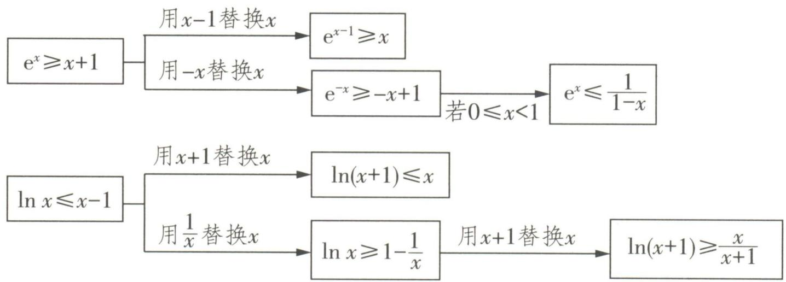

flowchart

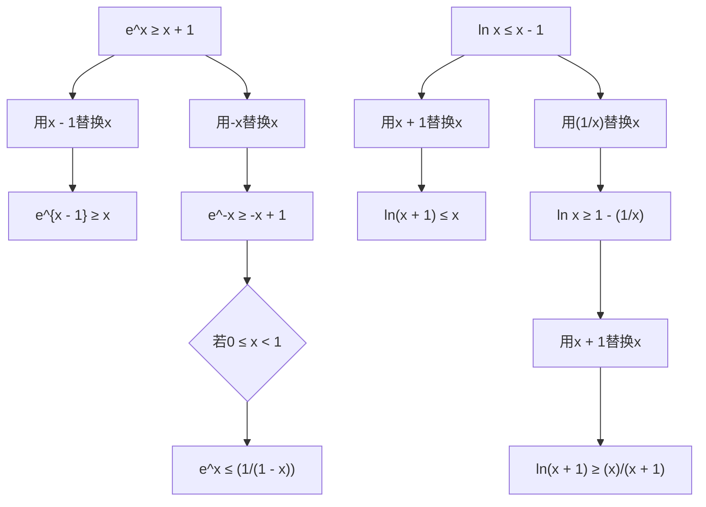

由上述变形可得, $\frac{x}{x+1}\leqslant\ln(x+1)\leqslant x\leqslant e^{x-1}$ ，当且仅当x=0时 $\frac{x}{x+1}\leqslant\ln(x+1)\leqslant x$ 取等号，当且仅当x=1时 $x\leqslant e^{x-1}$ 取等号.

大招示例 不等式 $x^{-3}e^{x}-a\ln x\geqslant x+1$ (e 是自然对数的底数), 对任意 $x\in(1,+\infty)$ 恒成立, 则 a 的取值范围是 ( )

A. $(-∞,1-e]$   
B. $(-∞,2-e^{2}]$   
C. $(-∞,-4]$   
D. $(-∞,-3]$

解析 由于不等式 $x^{-3}\mathrm{e}^x - a\ln x \geqslant x + 1$ 对任意 $x \in (1, +\infty)$ 恒成立，于是参变分离得到不等式 $a \leqslant \frac{x^{-3}\mathrm{e}^x - x - 1}{\ln x}$ 对任意 $x \in (1, +\infty)$ 恒成立，而 $\mathrm{e}^x \geqslant x + 1$ （当且仅当 $x = 0$ 时取等号），于是 $x^{-3}\mathrm{e}^x = \mathrm{e}^{\ln x^{-3} + x} = \mathrm{e}^{-3\ln x + x} \geqslant -3\ln x + x + 1$ ，当且仅当 $-3\ln x + x = 0$ 时取等号，因此 $\frac{x^{-3}\mathrm{e}^x - x - 1}{\ln x} \geqslant -3$ ，当且仅当 $-3\ln x + x = 0$ 时取等号.

然后构建函数 $f(x)=x-3\ln x$ ，则 $f'(x)=\frac{x-3}{x}$ ，
当 $x \in (0,3)$ 时， $f'(x) < 0, f(x)$ 单调递减，当 $x \in (3, +\infty)$ 时， $f'(x) > 0, f(x)$ 单调递增，又 $f(1) = 1 > 0, f(3) = 3 - 3\ln 3 < 0$ ，所以存在 $x_{0} \in (1,3)$ ，使 $f(x_{0}) = 0$ ，从而 $\frac{x^{-3}e^{x}-x-1}{\ln x}$ 的最小值为 -3，因此 $a \in (-\infty, -3]$ 。综上所述，答案选 D.

答案 D

# 坑神小课堂

本题的关键步骤为根据指对恒等变换得到 $f(x) \cdot e^{g(x)} = e^{\ln f(x) + g(x)} \geqslant \ln f(x) + g(x) + 1,$ 当且仅当 $\ln f(x)+g(x)=0$ 时取等号,一定要验证取等条件 $\ln f(x)+g(x)=0$ 是否成立.

text_image

大招22

# 不等式证明——指对处理

text_image

e^x
ln x

在导数大题中, 如果一个函数的解析式中存在指数形式 $e^{x}$ 或者对数形式 $\ln x$ 时, 我们的处理原则是允许指数 $e^{x}$ 与关于 x 的整式、分式乘在一起, 但不允许对数 $\ln x$ 与关于 x 的整式、分式乘在一起. 这样处理完毕后再求导, 得到的导函数与 0 的大小关系容易比较, 一般只取决于多项式与 0 的大小关系. 上述处理方法, 文雅点可以称为“指成双, 对落单”. 如果待求式子不符合上述原则, 则需要先

例如 $f(x) = \frac{1}{x + 1} + \ln x, f'(x) = \frac{x^2 + x + 1}{x(x + 1)^2}, g(x) = (x^2 + 2x + 3)e^x, g'(x) = (x^2 + 4x + 5)e^x$

改造成符合这一原则,然后再进行计算.

大招示例 已知函数 $f(x) = \frac{ax^2 - 2x + 2}{\mathrm{e}^x}$ .

(1) 当 a > 0 时, 试讨论 $f(x)$ 的单调性;  
(2) 求证: $\forall x \in \mathbf{R}, e^{x + 1} \geqslant -x^2 - x + 1$ 恒成立.

# 大招识别

由于“ $\forall x \in \mathbf{R}, e^{x+1} \geqslant -x^2 - x + 1$ ”不符合“指成双”原则，因此要加以改造，变成“ $\forall x \in \mathbf{R}$ ， $g(x) = \frac{x^2 + x - 1}{e^x} + e \geqslant 0$ ”，从而得到证明。

解析 (1) 因为 $f(x) = \frac{ax^2 - 2x + 2}{\mathrm{e}^x}$ , 所以 $f'(x) =$

$-\left(ax-2\right)\left(x-2\right)$ $e^{x}$

若 $0 < a < 1$ ，则当 $x \in (-\infty, 2)$ 时， $f'(x) < 0$ ，函数 $f(x)$ 单调递减，当 $x \in (2, \frac{2}{a})$ 时， $f'(x) > 0$ ，函数 $f(x)$ 单调递增，当 $x \in (\frac{2}{a}, +\infty)$ 时， $f'(x) < 0$ ，函数 $f(x)$ 单调递减。

若 $a = 1$ ，则 $f^{\prime}(x) = \frac{-(x - 2)^{2}}{\mathrm{e}^{x}}\leqslant 0$ ，函数 $f(x)$ 单调递减.

若 $a > 1$ ，则当 $x\in (-\infty ,\frac{2}{a})$ 时， $f^{\prime}(x) <   0$ ，函数$f(x)$ 单调递减, 当 $x \in (\frac{2}{a}, 2)$ 时, $f'(x) > 0$ , 函数 $f(x)$ 单调递增, 当 $x \in (2, +\infty)$ 时, $f'(x) < 0$ , 函数 $f(x)$ 单调递减.

(2) 构建函数 $g(x)=\frac{x^{2}+x-1}{\mathrm{e}^{x}}+\mathrm{e}$ ，所以 $g'(x)=-\frac{(x-2)(x+1)}{\mathrm{e}^{x}}$ ，所以当 $x\in(-\infty,-1)$ 时， $g'(x)<0$ ，函数 $g(x)$ 单调递减，当 $x\in(-1,2)$ 时， $g'(x)>0$ ，函数 $g(x)$ 单调递增，当 $x\in(2,+\infty)$ 时， $g'(x)<0$ ，函数 $g(x)$ 单调递减。所以当 x=-1 时，函数 $g(x)$ 取得极小值 $g(-1)=0$ ，当 x=2 时，函数 $g(x)$ 取得极大值 $g(2)=\frac{5}{\mathrm{e}^{2}}+\mathrm{e}$ ，所

以当 $x \in (-\infty, 2]$ 时， $g(x) = \frac{x^2 + x - 1}{\mathrm{e}^x} + \mathrm{e} \geqslant 0.$ 又当 $x \in (2, +\infty)$ 时， $x^2 + x - 1 > 0$ ，所以 $g(x) = \frac{x^2 + x - 1}{\mathrm{e}^x} + \mathrm{e} > 0$ ，所以 $\forall x \in \mathbf{R}, g(x) = \frac{x^2 + x - 1}{\mathrm{e}^x} + \mathrm{e} \geqslant 0$ ，所以 $\forall x \in \mathbf{R}, \mathrm{e}^{x + 1} \geqslant -x^2 - x + 1$ 恒成立.

# 坑神有话说

在解导数大题之前,可以先把思路理顺,然后在正式解答过程中就能一直从头写到尾,管它变形多么巧妙.这也是为什么一般看解析时,很多步骤刚开始看不知道为啥,看到最后才发现妙在何处的原因.

# 大招23 不等式证明——主元法

text_image

a, x

我们可以把一元含参函数看成二元函数,如一元含参函数 $f(x)=ae^{x}-x(a\geqslant1)$ 与二元函数 $F(x,y)=ye^{x}-x(x\in\mathbb{R},y\geqslant1)$ 是完全等价的.如果学习了高等数学,就可以用偏导数 $\frac{\partial F}{\partial y}=e^{x}>0$ ,又把x看作常数，求 $F(x,y)$ 对y的导数

$y \geqslant 1$ , 于是可以得到 $F(x, y) \geqslant F(x, 1) = e^{x} - x \geqslant 1$ . 那么怎么用不超纲的方法证明当 $a \geqslant 1$ 时, 函数常用放缩不等式 $e^{x} \geqslant x + 1$

$f(x)=ae^{x}-x\geqslant1$ 恒成立呢?

从根本逻辑上看,上面偏导数应用的本质是先将 $x$ 固定,把 $y$ 看作变量,先求出在 $x$ 固定 $y$ 变化的情况下二元函数 $F(x,y)$ 的最小值,进而得到一个关于 $x$ 的表达式,最后再求出这个表达式的最小值,即可得到二元函数 $F(x,y)$ 的最小值.

基于这个思路,在处理其他含参问题时可以依葫芦画瓢,先将 x 固定,以参数为主元,得到一个关于 x 的不等式,然后再加以处理.这种处理含参问题的方法就称为主元法.

大招示例 已知函数 $f(x) = x + ae^{x} + b (a, b \in \mathbb{R})$ , $g(x) = x^{2} + (a + 1)x$ .

(1) 讨论函数 $f(x)$ 的单调性；
(2) 设 $h(x) = xf'(x)$ ，当 $x < 0, a \leqslant 1$ 时，证明： $g(x) > h(x)$ .

解析 (1) 因为 $f(x) = x + ae^{x} + b$ , 所以 $f'(x) = 1 + ae^{x}$ .

若 $a \geqslant 0$ ，则 $f'(x) > 0$ ，函数 $f(x)$ 单调递增.

若 $a < 0$ ，则当 $x \in (-\infty, -\ln(-a))$ 时， $f'(x) > 0$ ，函数 $f(x)$ 单调递增，当 $x \in (-\ln(-a), +\infty)$ 时， $f'(x) < 0$ ，函数 $f(x)$ 单调递减。

(2)先以 a 为主元,得到一个关于 x 的不等式,从而证明一元含参函数 $I(x)=g(x)-h(x)>0$ . 下面进入完整解题步骤:构造函数 $I(x)=g(x)-h(x)$ , 则 $I(x)=x^{2}+(a+1)x-x(1+ae^{x})=x^{2}+$ $ax(1-\mathrm{e}^{x})$ . 因为 x<0, 所以 $1-\mathrm{e}^{x}>0$ , 所以 $x(1-\mathrm{e}^{x})<0$ , 因为 $a\leqslant1$ , 所以 $I(x)=x^{2}+x(1-\mathrm{e}^{x})a\geqslant x^{2}+x(1-\mathrm{e}^{x})=x(x+1-\mathrm{e}^{x})$ .
主元法

构建函数 $j(x)=\mathrm{e}^{x}-x-1$ ，则 $j'(x)=\mathrm{e}^{x}-1$ ，所以

当 $x \in (-\infty, 0)$ 时， $j'(x) < 0$ ，函数 $j(x)$ 单调递减，所以 $j(x) = \mathrm{e}^x - x - 1 > j(0) = 0$ ，所以 $x + 1 - \mathrm{e}^x < 0$ ，所以 $I(x) = x^2 + x(1 - \mathrm{e}^x)a \geqslant x(x + 1 - \mathrm{e}^x) > 0$ ，所以 $g(x) > h(x)$ .

text_image

大招24

# 不等式证明——分割与放缩

natural_image

Cartoon character in dynamic pose, wearing glasses and holding a sword (no text or symbols)

如果不等式 $f(x)>0$ （或 $f(x)<0$ ），通过直接求导证明非常困难或者压根行不通，则需要转换思路，可按下列方法去处理.

# 1. 分割法

令函数 $f(x)=g(x)-h(x)$ ，通过证明 $g(x)_{\min}>h(x)_{\max}$ ，进而有 $f(x)=g(x)-h(x)>0$ ；或者通过证明 $g(x)_{\max}<h(x)_{\min}$ ，进而有 $f(x)=g(x)-h(x)<0$ 。

# 坑神有话说

分割法的核心是构造出 $g(x)_{\min} > h(x)_{\max}$ 或 $g(x)_{\max} < h(x)_{\min}$ . 分割法使用的前提是题目本身的分割特点非常明显.

# 2. 放缩法

通过一个辅助函数 $g(x)$ ，对函数 $f(x)$ 进行放缩，使得 $f(x) > g(x) > 0$ （或 $f(x) < g(x) < 0$ ）。常见的放缩有以下两种情形。

# 大招解读

第一种: 函数 $f(x)$ 中含有指数或对数形式时, 使用 $\mathrm{e}^{x} \geqslant x + 1$ , 当且仅当 $x = 0$ 时取等号, $\ln x \leqslant x - 1$ , 当且仅当 $x = 1$ 时取等号进行放缩.

第二种：在一些题目中第二问放缩不等式时会用到第一问的结论.

大招示例 1 已知函数 $f(x) = x - \ln x + \frac{2x - 1}{x^2}$ .

(1) 求函数 $f(x)$ 的单调区间；  
(2) 证明: 当 $x \in [1, 2]$ 时, $f(x) > f'(x) + \frac{3}{2}$ .

# 大招识别

所证不等式可化为 $x - \ln x > \frac{2}{x^{3}} - \frac{1}{x^{2}} - \frac{3}{x} + \frac{5}{2}$ ，
观察不等式可知, 直接求导比较复杂, 但左右两侧分别求导比较容易, 故采用分割法证明 $(x - \ln x)_{\min} > \left(\frac{2}{x^{3}} - \frac{1}{x^{2}} - \frac{3}{x} + \frac{5}{2}\right)_{\max}$ 即可.

解析 (1) 因为 $f(x) = x - \ln x + \frac{2x - 1}{x^2}$ ，所以 $f'(x) = \frac{(x - 1)(x^2 - 2)}{x^3}$ ，所以当 $x \in (0,1)$ 时， $f'(x) > 0$ ，函数 $f(x)$ 单调递增，当 $x \in (1,\sqrt{2})$ 时， $f'(x) < 0$ ，函数 $f(x)$ 单调递减，当 $x \in (\sqrt{2}, +\infty)$ 时， $f'(x) > 0$ ，函数 $f(x)$ 单调递增，所以函数 $f(x)$ 的单调递增区间为 $(0,1), (\sqrt{2}, +\infty)$ ，单调递减区间为 $(1,\sqrt{2})$ 。

(2) 构建函数 $g(x) = x - \ln x (x \in [1, 2])$ ，所以 $g'(x)=\frac{x-1}{x}\geqslant0$ , 当且仅当 x=1 时取等号, 所以

函数 $g(x)$ 单调递增, 所以 $g(x)_{\min}=g(1)=1$ .
构建函数 $h(x)=\frac{2}{x^{3}}-\frac{1}{x^{2}}-\frac{3}{x}+\frac{5}{2}$ ，所以 $h'(x)=-\frac{6}{x^{4}}+\frac{2}{x^{3}}+\frac{3}{x^{2}}=\frac{3x^{2}+2x-6}{x^{4}}$ ，所以当 $x\in(1,\frac{\sqrt{19}-1}{3})$ 时， $h'(x)<0$ ，函数 $h(x)$ 单调递减，当 $x\in(\frac{\sqrt{19}-1}{3},2)$ 时， $h'(x)>0$ ，函数 $h(x)$ 单调递增。又 $h(1)=\frac{1}{2}, h(2)=1$ ，所以 $h(x)_{\max}=h(2)=1$ ，因为 $1\neq2$ ，且 $g(x)_{\min}=h(x)_{\max}$ ，所以当 $x\in[1,2]$ 时， $(x-\ln x)-(\frac{2}{x^{3}}-\frac{1}{x^{2}}-\frac{3}{x}+\frac{5}{2})>0$ ，所以当 $x\in[1,2]$ 时， $x-\ln x+\frac{2x-1}{x^{2}}>\frac{(x-1)(x^{2}-2)}{x^{3}}+\frac{3}{2}$ ，所以当 $x\in[1,2]$ 时， $f(x)>f'(x)+\frac{3}{2}$ .

大招示例 2 已知函数 $f(x) = \mathrm{e}^{x} - x$ .

(1) 求函数 $f(x)$ 的最小值;

(2) 求证: $e^{\frac{x}{e}} - e \ln x \geqslant 0.$

解析 (1) 因为 $f(x) = \mathrm{e}^x - x$ ，所以 $f'(x) = \mathrm{e}^x - 1$ ，所以当 $x \in (-\infty, 0)$ 时， $f'(x) < 0$ ，函数

$f(x)$ 单调递减, 当 $x \in (0, +\infty)$ 时, $f'(x) > 0$ , 函数 $f(x)$ 单调递增, 所以当 x = 0 时, 函数 $f(x)$ 取得最小值 $f(0) = 1$ .

(2)根据 $\mathrm{e}^x\geqslant x + 1,\ln x\leqslant x - 1$ ，可将 $\mathrm{e}^{\frac{x}{\mathrm{e}}} - \mathrm{e}\ln x$ 变形为 $\mathrm{e(e^{x / e} - 1} - \ln \frac{x}{\mathrm{e}} -1)$ ，然后加以放缩，从而完成证明.下面进入完整解题步骤：由(1)得 $\mathrm{e}^x\geqslant$ $x + 1$ ，当且仅当 $x = 0$ 时取等号，所以 $\mathrm{e}^{x - 1}\geqslant x$ ，即 $\ln x\leqslant x - 1$ ，当且仅当 $x = 1$ 时取等号.观察发现两边同时取以e为底的对数

当 $x = \mathrm{e}$ 时， $\mathrm{e}^{\frac{x}{\mathrm{e}}} - \mathrm{e}\ln x = 0$ ，所以放缩后需要让指数式和对数式都在 $x = \mathrm{e}$ 处取0.因为 $\mathrm{e}^{\frac{x}{\mathrm{e}}} - \mathrm{e}\ln x = \mathrm{e}\left(\mathrm{e}^{\frac{x}{\mathrm{e}} - 1} - \ln \frac{x}{\mathrm{e}} - 1\right)$ ，所以 $\mathrm{e}^{\frac{x}{\mathrm{e}}} - \mathrm{e}\ln x \geqslant \mathrm{e}\left[(\frac{x}{\mathrm{e}} - 1) + 1 - (\frac{x}{\mathrm{e}} - 1) - 1\right] = 0$ ，当且仅当 $x = \mathrm{e}$ 时取等号.

# 坑神有话说

放缩的过程需要好好把控,确定放缩的方向后,有时需要在草稿纸上多次尝试才能最终确定如何放缩.

# 大招25 函数零点问题

  
名师大招

# 1. 函数零点存在定理相关结论

①如果函数 $f(x)$ 在 $[a,b]$ 上连续不断,且 $f(a)f(b)<0$ ,则函数 $f(x)$ 在 $(a,b)$ 上至少有一个零点.  
(2)如果函数 $f(x)$ 在 $[a,b]$ 上连续并具有单调性,且 $f(a)f(b)<0$ ,则函数 $f(x)$ 在 $(a,b)$ 上有且仅

递增或递减均可

有一个零点.

# 2. 函数零点存在定理找点技巧

在使用函数零点存在定理的过程中,很多时候 $f(a)f(b)<0$ 中的a和b不是那么好确定的,这里补充一些找点 $x_{0}$ 使得 $f(x_{0})>0$ (或 $f(x_{0})<0$ )的技巧:

①以目标 $f(x_{0})>0$ （或 $f(x_{0})<0$ ）为导向，代入常见特殊值，如 $0,\frac{1}{e},\frac{1}{2},\pm1,\sqrt{e},e$ 等.   
②从式子形式出发,代入与式子中参数有关的值,如 $\ln a, a, a^{2}, e^{a}$ 等.

③使用放缩法确定 $x_{0}$ : 首先在草稿纸上分析函数解析式中各部分的趋势, 然后将解析式进行放缩, 从而确定 $x_{0}$ . 例如当 $x_{0}<0$ 时, 有 $0<e^{x_{0}}<1$ , 当 $x_{0}>1$ 时, 有 $0<\frac{\ln x_{0}}{x_{0}}\leqslant\frac{1}{e}$ 等.

# 3. 求函数 $f(x)$ 零点个数的一般步骤

# 大招解读

第一步：先通过导函数 $f'(x)$ 分析函数 $f(x)$ 的单调性.

第二步: 根据函数零点存在定理确定函数 $f(x)$ 在每个单调区间上的零点个数为 0 还是 1.

第三步: 最终得到函数 $f(x)$ 零点个数.

# 4. 压缩零点的范围的一般思路

根据零点存在定理不断缩小 a 和 b 的差值, 从而压缩零点 $x_{0}$ 的取值范围.

# 坑神有话说

切勿忘记函数的零点、方程的实数根、两个函数图象的交点横坐标之间可以相互转化.

大招示例 (2022 全国乙卷) 已知函数 $f(x) = \ln (1 + x) + ax\mathrm{e}^{-x}$ .

(1) 当 a=1 时, 求曲线 $y=f(x)$ 在点 $(0,f(0))$ 处的切线方程;  
(2) 若 $f(x)$ 在区间 $(-1,0)$ , $(0,+\infty)$ 上各恰有一个零点, 求 a 的取值范围.

解析 (1) 当 $a = 1$ 时, $f(x) = \ln (1 + x) + x \cdot \mathrm{e}^{-x}$ ,

$$
\begin{array}{l} \therefore f ^ {\prime} (x) = \frac {1}{x + 1} + \mathrm{e} ^ {- x} + x \cdot \mathrm{e} ^ {- x} \cdot (- 1) = \frac {1}{x + 1} + \\ (1 - x) \mathrm{e} ^ {- x}, \end{array}
$$

$$
\therefore f ^ {\prime} (0) = 1 + 1 = 2. \because f (0) = 0,
$$

∴ 所求切线方程为 $y - 0 = 2(x - 0)$ ，即 y = 2x.

(2) $\because f(x) = \ln (1 + x) + ax \cdot e^{-x} = \ln (x + 1) + \frac{ax}{e^x}$ .

①当 $a \geqslant 0$ 时, 若 $x > 0$ , 则 $\ln (x + 1) > 0, \frac{ax}{e^x} \geqslant 0$ , $\therefore f(x) > 0$ ,

∴ $f(x)$ 在 $(0, +\infty)$ 上无零点, 不符合题意.

②当 a<0 时, $f'(x)=\frac{\mathrm{e}^{x}+a(1-x^{2})}{(x+1)\mathrm{e}^{x}}$ .

令 $g(x) = \mathrm{e}^{x} + a(1 - x^{2})$ ，则 $g^{\prime}(x) = \mathrm{e}^{x} - 2ax,$ $g^{\prime}(x)$ 在 $(-1, + \infty)$ 上单调递增， $g^{\prime}(-1) =$ $\mathrm{e}^{-1} + 2a,g'(0) = 1.$

(a) 若 $g'(-1) \geqslant 0$ , 则 $-\frac{1}{2\mathrm{e}} \leqslant a < 0, \therefore -\frac{1}{2\mathrm{e}} \leqslant a <$

0 时, $g'(x)>0$ 在 $(-1,+\infty)$ 上恒成立,

∴ $g(x)$ 在 $(-1, +\infty)$ 上单调递增.

$\because g(-1)=e^{-1}>0,\therefore g(x)>0$ 在 $(-1,+\infty)$ 上恒成立，

$\therefore f'(x)>0$ 在 $(-1,+\infty)$ 上恒成立，

∴ $f(x)$ 在 $(-1, +\infty)$ 上单调递增.

$$
\because f (0) = 0,
$$

$\therefore f(x)$ 在 $(-1,0),(0, + \infty)$ 上均无零点，不符合题意.

(b) 若 $g'(-1)<0$ ，则 $a<-\frac{1}{2e}$ ,

∴ 当 $a < -\frac{1}{2e}$ 时, 存在 $x_{0} \in (-1,0)$ , 使得 $g'(x_{0}) = 0$ . 设而不求

∴ $g(x)$ 在 $(-1, x_{0})$ 上单调递减，在 $(x_{0}, +\infty)$ 上单调递增.

$$
g (- 1) = \mathrm{e} ^ {- 1} > 0, g (0) = 1 + a, g (1) = \mathrm{e} > 0.
$$

(i) 当 $g(0) \geqslant 0$ ，即 $-1 \leqslant a < -\frac{1}{2e}$ 时， $g(x) > 0$ 在 $(0, +\infty)$ 上恒成立，∴ $f'(x) > 0$ 在 $(0, +\infty)$ 上恒成立，

∴ $f(x)$ 在 $(0, +\infty)$ 上单调递增.

$\because f(0)=0,\therefore$ 当 $x\in(0,+\infty)$ 时, $f(x)>0,$

∴ $f(x)$ 在 $(0, +\infty)$ 上无零点, 不符合题意.

(ii) 当 $g(0) < 0$ ，即 $a < -1$ 时，存在 $x_{1} \in (-1, x_{0}), x_{2} \in (0,1)$ ，使得 $g(x_{1}) = g(x_{2}) = 0$ ，

$\therefore f(x)$ 在 $(-1, x_1), (x_2, +\infty)$ 上分别单调递增，在 $(x_1, x_2)$ 上单调递减.

$\because f(0)=0,\therefore f(x_{1})>f(0)=0,$ 当 $x\to-1$ 时， $f(x)<0,$

∴ $f(x)$ 在 $(-1, x_{1})$ 上存在一个零点，即 $f(x)$ 在

零点存在定理

$(-1,0)$ 上存在一个零点.

$\because f(0)=0,$ 当 $x\to+\infty$ 时, $f(x)>0,$

$\therefore f(x)$ 在 $(x_{2}, + \infty)$ 上存在一个零点，即 $f(x)$ 在 $(0, + \infty)$ 上存在一个零点.

综上, a 的取值范围是 $(-∞, -1)$ .

# 大招26 隐极值点代换

  
名师大招

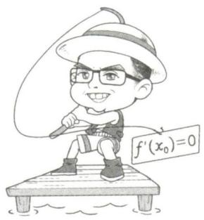

text_image

f'(x₀)=0

对于一些证明不等式 $f(x) > a, a \in \mathbf{R}$ (或 $f(x) < a, a \in \mathbf{R}$ ) 的问题, 我们可以先将函数 $f(x)$ 求导后得 $f'(x)$ , 于是函数 $f(x)$ 的极值点 $x_0$ 就满足 $f'(x_0) = 0$ , 解出 $x_0$ , 进而能求出极值 $f(x_0)$ , 确定 $f(x)$ 的值域, 进而判断不等式 $f(x) > a, a \in \mathbf{R}$ (或 $f(x) < a, a \in \mathbf{R}$ ) 是否成立.

然而前方的路哪能一帆风顺,如果方程 $f'(x_0) = 0$ 很难解或者压根没法解,怎么办?实际上我们一定要把极值 $f(x_0)$ 的具体值求出来吗?也不一定,其实只要确定出极值 $f(x_0)$ 的取值范围就行.虽然 $f'(x_0) = 0$ 很难解,但是我们又知道存在一个这样的 $x_0$ ,此时我们可以把 $x_0$ 称为隐极值点,并采取隐极值点代换的方法处理,步骤如下:

# 大招解读

第一步：求导后得到 $f'(x_{0})=0$ .

第二步: 根据 $f'(x_0) = 0$ 代换掉参数或对极值 $f(x_0)$ 的表达式进行转化, 得到一个仅含有 $x_0$ , 形式简单且容易求取值范围的式子.

第三步: 根据隐极值点 $x_{0}$ 的取值范围, 确定极值 $f(x_{0})$ 的取值范围, 进而证明不等式.

大招示例 已知函数 $f(x) = x \ln x + \frac{a}{\mathrm{e}^x} + bx$ 的图象在 $x = 1$ 处的切线方程为 $y = (\frac{1}{\mathrm{e}} - 1)x - \frac{2}{\mathrm{e}} - 1$ .

(1) 求 $a$ 和 $b$ 的值;  
(2) 求证: $f(x) > -3$ .

解析 (1) 因为 $f(x) = x \ln x + \frac{a}{\mathrm{e}^x} + bx$ ，所以

$$
f ^ {\prime} (x) = \ln x + 1 - \frac {a}{\mathrm{e} ^ {x}} + b, \text {所以} f ^ {\prime} (1) = - \frac {a}{\mathrm{e}} + b +
$$

1, 所以函数 $f(x)$ 的图象在 $x = 1$ 处的切线方程为

$$
y - (\frac {a}{\mathrm{e}} + b) = (- \frac {a}{\mathrm{e}} + b + 1) (x - 1), \text {即} y =
$$

$(-\frac{a}{\mathrm{e}} + b + 1)x + \frac{2a}{\mathrm{e}} - 1.$ 又已知函数 $f(x)$ 的图象

在 x=1 处的切线方程为 $y=\left(\frac{1}{\mathrm{e}}-1\right)x-\frac{2}{\mathrm{e}}-1$ ,

所以 $\left\{\begin{aligned}-\frac{a}{e}+b+1&=\frac{1}{e}-1,\\ \frac{2a}{e}-1&=-\frac{2}{e}-1,\end{aligned}\right.$ 所以 $\left\{\begin{aligned}a&=-1,\\ b&=-2.\end{aligned}\right.$

(2)代入后发现方程 $f'(x)=0$ 无法求解,因此函数 $f(x)$ 存在隐极值点 $x_{0}$ ,于是就要运用隐极值点代换,才能证明 $f(x)>-3$ .下面进入完整解题步骤:

由(1)得 $f(x)=x\ln x-\frac{1}{\mathrm{e}^{x}}-2x$ ，所以 $f'(x)=\ln x+$ $\frac{1}{\mathrm{e}^{x}}-1$ , 令 $c(x)=f'(x)$ ，则 $c'(x)=\frac{1}{x}-\frac{1}{\mathrm{e}^{x}}=\frac{\mathrm{e}^{x}-x}{x\mathrm{e}^{x}}.$

构建函数 $g(x)=\mathrm{e}^{x}-x$ ，所以 $g'(x)=\mathrm{e}^{x}-1$ ，所以当 x > 0 时, $g'(x) = \mathrm{e}^{x} - 1 > 0$ , 函数 $g(x)$ 单调递增, 所以当 x > 0 时, $g(x) = \mathrm{e}^{x} - x > g(0) = 1 > 0$ , 所以 $c'(x) > 0$ , 函数 $f'(x)$ 单调递增.

因为 $f'(1)=\frac{1}{e}-1<0$ , $f'(e)=\frac{1}{e^{e}}>0$ , 所以函数 $f'(x)$ 在 $(1, e)$ 内有唯一零点 $x_{0}$ ，所以当 $x \in (0, x_{0})$ 时， $f'(x) < f'(x_{0}) = 0$ ，函数 $f(x)$ 单调递减，当 $x \in (x_{0}, +\infty)$ 时， $f'(x) > f'(x_{0}) = 0$ ，函数 $f(x)$ 单调递增，所以当 $x = x_{0}$ 时，函数 $f(x)$ 取最小值 $f(x_{0})=x_{0}\ln x_{0}-\frac{1}{e^{x_{0}}}-2x_{0}.$

因为 $f'(x_0) = \ln x_0 + \frac{1}{\mathrm{e}^{x_0}} - 1 = 0$ ，所以 $-\frac{1}{\mathrm{e}^{x_0}} = \ln x_0 - 1$ ，所以 $f(x_0) = (x_0 + 1)\ln x_0 - 2x_0 - 1, x_0 \in (1, \mathrm{e})$ . 构
隐极值点代换

建函数 $h(x) = (x + 1)\ln x - 2x - 1$ ，所以 $h^{\prime}(x) = \frac{1}{x} +\ln x - 1$ ，令 $d(x) = h'(x)$ ，则 $d^{\prime}(x) = \frac{x - 1}{x^{2}}$ 所以当 $x > 1$ 时， $d^{\prime}(x) > 0$ ，函数 $h^\prime (x)$ 单调递增，所以当 $x > 1$ 时， $h^{\prime}(x) > h^{\prime}(1) = 0$ ，则函数 $h(x)$ 单调递增，所以 $f(x_0) > h(1) = -3$ ，所以 $f(x)\geqslant f(x_0) > -3.$

# 大招27 恒成立求参——分离参数

natural_image

Cartoon illustration of a person pouring liquid from a small bowl into a tray (no text or symbols)

# 1. 分离参数的一般思路

对于一个含参问题,可以通过分离参数,将参数与变量彻底分离开来,从而把一个含参问题转化为一个非含参问题,进而通过导数研究分离后得到的函数的单调性,极值与最值,最终解决问题.

# 2. 使用分离参数的要求

# 大招解读

①参数与变量可以比较容易地分离开.  
②分离参数后得到的函数的形式不复杂,通过导数来研究单调性,极值以及最值比较容易.  
③分离参数后得到的函数的值域容易算,不会出现必须使用洛必达法则才能解决问题的情形.

大招示例 已知函数 $f(x) = \ln x, g(x) = \frac{1}{2} ax + b.$

(1) 若 $f(x)$ 与 $g(x)$ 的图象在 x = 1 处相切, 求 $g(x)$ 的表达式;  
(2) 若 $\varphi(x) = \frac{m(x - 1)}{x + 1} - f(x)$ 在 $[2, +\infty)$ 上是减函数, 求实数 $m$ 的取值范围.

解析 (1) 因为 $f(x) = \ln x, g(x) = \frac{1}{2} ax + b$ ，所

以 $f^{\prime}(x) = \frac{1}{x}, g^{\prime}(x) = \frac{1}{2} a$ ，因为 $f(x)$ 与 $g(x)$ 的

图象在 $x = 1$ 处相切，所以 $\left\{ \begin{array}{l} f(1) = g(1), \\ f'(1) = g'(1), \end{array} \right.$ 所以

$\left\{\begin{aligned}a&=2,\\ b&=-1,\end{aligned}\right.$ 所以 $g(x)=x-1$ .

(2) 因为 $\varphi(x) = \frac{m(x - 1)}{x + 1} - f(x) = \frac{m(x - 1)}{x + 1} - \ln x$ 在 $[2, +\infty)$ 上是减函数, 所以当 $x \in [2, +\infty)$ 时, $\varphi'(x) = \frac{2m}{(x + 1)^2} - \frac{1}{x} \leqslant 0$ , 所以当 $x \in [2, +\infty)$ 时, $m \leqslant \frac{(x + 1)^2}{2x} = \frac{1}{2}(x + \frac{1}{x}) + 1$ .

# 分离参数

令 $h(x)=\frac{1}{2}(x+\frac{1}{x})+1$ ，则 $h'(x)=\frac{x^{2}-1}{2x^{2}}$ ，当 $x\in[2,+\infty)$ 时， $h'(x)>0,h(x)$ 单调递增，所以 $h(x)\geqslant h(2)=\frac{9}{4}$ ，所以 $m\leqslant\frac{9}{4}$ 。综上所述，实数 m 的取值范围为 $(-∞,\frac{9}{4}]$ 。

# 1. 分类讨论

①遇到的问题:由于参数、分段函数以及自变量 x 的取值范围等的缘故,造成问题需要分多种情况讨论.  
②处理的原则:一种一种情况去分析与讨论.   
③分类的依据:往往是基于单调性、极值点、零点等分类.

# 2. 多重分类讨论

①遇到的问题:第一层大类分完之后,大类里面还有小类需要分.  
②处理的原则:把一个大类中所有小类全部讨论干净后,再去讨论第二个大类.优先考虑特殊情况,做到不重不漏.

大招示例 已知函数 $f(x) = \frac{\mathrm{e}^{ax}}{x^2 + 1}, a \in \mathbb{R}$ ，求函数 $f(x)$ 的单调区间.

解析 基于函数 $f(x) = \frac{\mathrm{e}^{ax}}{x^2 + 1}, a \in \mathbb{R}$ 的导函数零点的情况开展分类讨论. 下面进入完整解题步骤:

因为 $f(x)=\frac{\mathrm{e}^{ax}}{x^{2}+1}, a\in\mathbf{R}$ ，所以 $f'(x)=\frac{a(x^{2}+1)\mathrm{e}^{ax}-2xe^{ax}}{(x^{2}+1)^{2}}=\frac{(ax^{2}-2x+a)\mathrm{e}^{ax}}{(x^{2}+1)^{2}}.$

先考虑特殊情况, 当 a=0 时, $f'(x)=-\frac{2x}{(x^{2}+1)^{2}}$ ,
所以当 $x \in (-\infty, 0)$ 时, $f'(x) > 0$ , 函数 $f(x)$ 单调递增, 当 $x \in (0, +\infty)$ 时, $f'(x) < 0$ , 函数 $f(x)$ 单调递减.

当 $a \neq 0$ 时, 关于 $x$ 的一元二次方程 $ax^2 - 2x + a = 0$ 的判别式 $\Delta = 4(1 - a^2)$ , 可根据 $a$ 的正负及零点情况分为以下几种情形.

①当 $a \leqslant -1$ 时, $\Delta = 4(1 - a^{2}) \leqslant 0$ , 所以 $ax^{2} - 2x + a \leqslant 0$ 恒成立, 所以 $f'(x) \leqslant 0$ , 所以函数 $f(x)$

当且仅当 $a = -1, x = -1$ 时取等号

单调递减.

②当 -1 < a < 0 时, $\Delta = 4(1 - a^{2}) > 0$ , 所以关于 x 的一元二次方程 $ax^{2} - 2x + a = 0$ 的两个实数根

为 $x_{1}=\frac{1+\sqrt{1-a^{2}}}{a},x_{2}=\frac{1-\sqrt{1-a^{2}}}{a}$ ，且 $x_{1}<x_{2}$ ，
所以当 $x \in (-\infty, \frac{1 + \sqrt{1 - a^{2}}}{a})$ 时， $f'(x) < 0$ ，函数
f(x) 单调递减, 当 $x \in \left( \frac{1 + \sqrt{1 - a^{2}}}{a}, \frac{1 - \sqrt{1 - a^{2}}}{a} \right)$ 时, $f'(x)>0$ , 函数 $f(x)$ 单调递增, 当 $x \in \left( \frac{1 - \sqrt{1 - a^{2}}}{a}, +\infty \right)$ 时, $f'(x)<0$ , 函数 $f(x)$ 单调递减.

③当 0 < a < 1 时, $\Delta = 4(1 - a^{2}) > 0$ , 所以关于 x 的一元二次方程 $ax^{2} - 2x + a = 0$ 的两个实数根为 $x_{1} = \frac{1 + \sqrt{1 - a^{2}}}{a}$ , $x_{2} = \frac{1 - \sqrt{1 - a^{2}}}{a}$ , 且 $x_{1} > x_{2}$ , 所以当 $x \in (-\infty, \frac{1 - \sqrt{1 - a^{2}}}{a})$ 时, $f'(x) > 0$ , 函数 $f(x)$ 单调递增, 当 $x \in (\frac{1 - \sqrt{1 - a^{2}}}{a}, \frac{1 + \sqrt{1 - a^{2}}}{a})$ 时, $f'(x) < 0$ , 函数 $f(x)$ 单调递减, 当 $x \in (\frac{1 + \sqrt{1 - a^{2}}}{a}, +\infty)$ 时, $f'(x) > 0$ , 函数 $f(x)$ 单调递增.

④当 $a \geqslant 1$ 时, $\Delta = 4(1 - a^{2}) \leqslant 0$ , 所以 $ax^{2} - 2x + a \geqslant 0$ 恒成立, 所以 $f'(x) \geqslant 0$ , 所以函数 $f(x)$ 单调

当且仅当 a = 1, x = 1 时取等号

递增.

综上所述, 当 $a \leqslant -1$ 时, 函数 $f(x)$ 在 R 上单调递减. 当 -1 < a < 0 时, 函数 $f(x)$ 在 $(-∞, \frac{1 + \sqrt{1 - a^{2}}}{a})$ , $(\frac{1 - \sqrt{1 - a^{2}}}{a}, +∞)$ 上单调递减, 在 $(\frac{1 + \sqrt{1 - a^{2}}}{a}, \frac{1 - \sqrt{1 - a^{2}}}{a})$ 上单调递增. 当 a = 0 时, 函数 $f(x)$ 在 $(-∞, 0)$ 上单调递增, 在 $(0,$

$+\infty$ ) 上单调递减. 当 0 < a < 1 时, 函数 $f(x)$ 在 $(-∞, \frac{1 - \sqrt{1 - a^{2}}}{a})$ , $(\frac{1 + \sqrt{1 - a^{2}}}{a}, +∞)$ 上单调递增, 在 $(\frac{1 - \sqrt{1 - a^{2}}}{a}, \frac{1 + \sqrt{1 - a^{2}}}{a})$ 上单调递减. 当 $a \geqslant 1$ 时, 函数 $f(x)$ 在 R 上单调递增.

# 大招29

# 恒成立求参——必要性探路

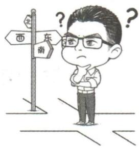

# 1. 必要性探路

在一些含参问题中,可以通过取一些特殊值来缩小参数的取值范围,从而减少讨论参数取值范通常为0,1等特殊点

围时分析讨论的量. 采用这种方法处理问题相当于先算出了最终结果的一个必要条件, 所以我们把这种处理问题的方法称为必要性探路.

# 2. 必要性探路的注意事项

# 大招解读

必要性探路缩小的参数取值范围,不一定是参数的最终取值范围,还需进行如下操作:

第一步：如果可以使用主元法成功证明不等式,则缩小的参数取值范围就是参数的最终取值范围.

第二步: 如果使用主元法无法证明不等式,则需要使用分类讨论或分离参数对缩小的取值范围作进一步分析.

大招示例 (2020 新高考I卷) 已知函数 $f(x) = ae^{x - 1} - \ln x + \ln a$ .

(1) 当 a = e 时, 求曲线 $y = f(x)$ 在点 $(1, f(1))$ 处的切线与两坐标轴围成的三角形的面积;  
(2) 若不等式 $f(x) \geqslant 1$ 恒成立, 求 $a$ 的取值范围.

解析 (1) 当 $a = \mathrm{e}$ 时, $f(x) = \mathrm{e}^{x} - \ln x + 1$ ,

$$
f ^ {\prime} (x) = \mathrm{e} ^ {x} - \frac {1}{x}, \text {所以} k = f ^ {\prime} (1) = \mathrm{e} - 1.
$$

因为 $f(1)=\mathrm{e}+1$ ，所以切点坐标为 $(1,1+\mathrm{e})$ ，

所以曲线 $y=f(x)$ 在点 $(1,f(1))$ 处的切线方程为 $y-\mathrm{e}-1=(\mathrm{e}-1)(x-1)$ ，即 $y=(\mathrm{e}-1)x+2$ ，
所以切线与坐标轴交点坐标分别为 $(0,2)$ , $\left(\frac{-2}{\mathrm{e}-1},0\right)$ ,

所以所求三角形面积为 $\frac{1}{2}\times2\times\left|\frac{-2}{e-1}\right|=\frac{2}{e-1}$ .

# (2) 大招解1（必要性探路）

因为定义域为 $(0, +\infty)$ , 且 $f(x) \geqslant 1$ 恒成立, 所以 $f(1) \geqslant 1$ , 即 $a + \ln a \geqslant 1$ . (由特殊到一般, 利用 $f(1) \geqslant 1$ 可得 $a$ 的取值范围, 再进行充分性证明)

令 $S(a)=a+\ln a$ ，则 $S'(a)=1+\frac{1}{a}>0$ ，所以 $S(a)$ 在区间 $(0, +\infty)$ 内单调递增.

因为 $S(1)=1$ ，所以 $a \geqslant 1$ 时，有 $S(a) \geqslant S(1)$ ，即 $a + \ln a \geqslant 1$ .

下面证明当 $a \geqslant 1$ 时, $f(x) \geqslant 1$ 恒成立.

令 $T(a)=ae^{x-1}-\ln x+\ln a$ ，只需证当 $a\geqslant1$ 时， $T(a)\geqslant1$ 恒成立.

因为 $T'(a) = \mathrm{e}^{x-1} + \frac{1}{a} > 0$ ，所以 $T(a)$ 在区间 $[1, +\infty)$ 内单调递增，则 $T(a)_{\min} = T(1) = \mathrm{e}^{x-1} - \ln x.$

因此要证明 $a \geqslant 1$ 时, $T(a) \geqslant 1$ 恒成立, 只需证明 $T(a)_{\min} = \mathrm{e}^{x - 1} - \ln x \geqslant 1$ 即可.

由 $e^{x} \geqslant x + 1, \ln x \leqslant x - 1$ ，得 $e^{x-1} \geqslant x, -\ln x \geqslant 1 - x.$ 上面两个不等式两边相加可得 $e^{x-1}-\ln x \geqslant 1$ ，故 $a \geqslant 1$ 时， $f(x) \geqslant 1$ 恒成立.

当 0 < a < 1 时, 因为 $f(1) = a + \ln a < 1$ , 显然不满足 $f(x) \geqslant 1$ 恒成立.

所以 a 的取值范围为 $a \geqslant 1$ .

大招解2（分离参数法）由 $f(x) \geqslant 1$ 得 $ae^{x-1}-\ln x+\ln a \geqslant 1$ ，即 $e^{\ln a+x-1}+\ln a+x-1 \geqslant \ln x+x$ ，而 $\ln x+x=e^{\ln x}+\ln x$ ，所以 $e^{\ln a+x-1}+\ln a+x-1 \geqslant e^{\ln x}+\ln x.$ 化同构

令 $h(m)=\mathrm{e}^{m}+m$ ，则 $h'(m)=\mathrm{e}^{m}+1>0$ ，所以 $h(m)$ 在 R 上单调递增.

由 $e^{\ln a+x-1}+\ln a+x-1\geqslant e^{\ln x}+\ln x$ , 可知 $h(\ln a+x-1)\geqslant h(\ln x)$ , 所以 $\ln a+x-1\geqslant\ln x$ , 所以 $\ln a\geqslant(\ln x-x+1)_{\max}$ .
分离参数

令 $F(x)=\ln x-x+1$ , 则 $F'(x)=\frac{1}{x}-1=\frac{1-x}{x}$ .

所以当 $x \in (0,1)$ 时， $F'(x) > 0, F(x)$ 单调递增；
当 $x \in (1, +\infty)$ 时， $F'(x) < 0, F(x)$ 单调递减.

所以 $F(x)_{\max}=F(1)=0$ , 则 $\ln a\geqslant0$ , 即 $a\geqslant1$

所以 a 的取值范围为 $a \geqslant 1$ .

大招解3（分离参数法） 由题意知 $a > 0$ ， $x > 0$ ，令 $ae^{x - 1} = t$ ，所以 $\ln ae^{x - 1} = \ln a + x - 1 = \ln t$ ，所以 $\ln a = \ln t - x + 1$ .

于是 $f(x)=ae^{x-1}-\ln x+\ln a=t-\ln x+\ln t-x+1.$ 换元法

由于 $f(x)\geqslant1$ ，所以 $t-\ln x+\ln t-x+1\geqslant1\Leftrightarrow t+$ $\ln t \geqslant x + \ln x,$ 化同构

而 $y = x + \ln x$ 在 $x \in (0, +\infty)$ 时为增函数，故 $t \geqslant x$ ，即 $ae^{x-1} \geqslant x, a \geqslant \frac{x}{e^{x-1}}$ .

分离参数

令 $g(x) = \frac{x}{\mathrm{e}^{x - 1}}$ ，所以 $g^{\prime}(x) = \frac{\mathrm{e}^{x - 1} - x\mathrm{e}^{x - 1}}{\mathrm{e}^{2x - 2}} = \frac{1 - x}{\mathrm{e}^{x - 1}}.$

当 0 < x < 1 时, $g'(x) > 0$ , $g(x)$ 单调递增; 当 x > 1 时, $g'(x) < 0$ , $g(x)$ 单调递减.

所以当 $x = 1$ 时， $g(x) = \frac{x}{\mathrm{e}^{x - 1}}$ 取得最大值，为 $g(1) = 1$ 。所以 $a \geqslant 1$ 。

综上, $a$ 的取值范围为 $a \geqslant 1$ .

大招解4（分类讨论法） 因为 $f(x)=ae^{x-1}-\ln x+\ln a$ ，所以 $f'(x)=ae^{x-1}-\frac{1}{x}$ ，且a>0.

无法直接判断导函数的正负，故二次求导

设 $g(x)=f'(x)$ ，则 $g'(x)=ae^{x-1}+\frac{1}{x^{2}}>0$ ，

所以 $g(x)$ 在 $(0, +\infty)$ 上单调递增，即 $f'(x)$ 在 $(0, +\infty)$ 上单调递增，

当 a=1 时, $f'(1)=0$ , 则 $x\in(0,1)$ 时, $f'(x)<0$ ,
对参数 a 分类讨论，此法下一大招会讲到

$f(x)$ 单调递减, $x\in(1,+\infty)$ 时, $f'(x)>0,f(x)$ 单调递增,所以 $f(x)_{\min}=f(1)=1$ ,所以 $f(x)\geqslant1$ 恒成立.

当 $a > 1$ 时， $\frac{1}{a} < 1$ ，所以 $\mathrm{e}^{\frac{1}{a} -1} < 1$ ，所以 $f^{\prime}\left(\frac{1}{a}\right)f^{\prime}(1) = a\left(\mathrm{e}^{\frac{1}{a} -1} - 1\right)(a - 1) <   0,$

零点存在定理

所以存在唯一 $x_0$ ，且 $x_0 \in (\frac{1}{a}, 1)$ ，使得 $f'(x_0) = ae^{x_0 - 1} - \frac{1}{x_0} = 0$ ，且当 $x \in (0, x_0)$ 时， $f'(x) < 0, f(x)$ 单调递减，当 $x \in (x_0, +\infty)$ 时， $f'(x) > 0, f(x)$ 单调递增，所以 $ae^{x_0 - 1} = \frac{1}{x_0}$ ，所以 $\ln a + x_0 - 1 = -\ln x_0$ ，因此 $f(x)_{\min} = f(x_0) = ae^{x_0 - 1} - \ln x_0 + \ln a = \frac{1}{x_0} + \ln a + x_0 - 1 + \ln a > 2\ln a - 1 + 2\sqrt{\frac{1}{x_0} \cdot x_0} = 2\ln a + 1 > 1$

基本不等式的应用

所以 $f(x)>1$ ，所以 $f(x)\geqslant1$ 恒成立；

当 0 < a < 1 时, $f(1) = a + \ln a < a < 1$ , 所以 $f(1) < 1, f(x) \geqslant 1$ 不恒成立.

综上所述,实数a的取值范围是 $[1,+\infty)$ .

# 1. 端点效应

①如果函数 $f(x)$ 满足 $\forall x\in[a,b]$ , $f(x)\geqslant0$ , 且 $f(a)=0$ , 则存在 $\delta\in(a,b]$ , 使得 $\forall x\in[a,\delta]$ , $f'(x)\geqslant0$ 恒成立, 即 $f'(a)\geqslant0$ .

因为如果不满足“ $\forall x \in [a, \delta], f'(x) \geqslant 0$ ”，则有“ $\exists \xi \in (a, b], f(\xi) < 0$ ”，就会与已知矛盾。于是，就出现上面的结论。以此为基础，也可以推出下面的各个结论。

②如果函数 $f(x)$ 满足 $\forall x\in[a,b]$ , $f(x)\leqslant0$ , 且 $f(a)=0$ , 则存在 $\delta\in(a,b]$ , 使得 $\forall x\in[a,\delta]$ , $f'(x)\leqslant0$ 恒成立, 即 $f'(a)\leqslant0$ .  
③如果函数 $f(x)$ 满足 $\forall x\in[a,b]$ , $f(x)\geqslant0$ , 且 $f(b)=0$ , 则存在 $\delta\in[a,b)$ , 使得 $\forall x\in[\delta,b]$ , $f'(x)\leqslant0$ 恒成立, 即 $f'(b)\leqslant0$ .  
④如果函数 $f(x)$ 满足 $\forall x\in[a,b]$ , $f(x)\leqslant0$ , 且 $f(b)=0$ , 则存在 $\delta\in[a,b)$ , 使得 $\forall x\in[\delta,b]$ , $f'(x)\geqslant0$ 恒成立, 即 $f'(b)\geqslant0$ .

# 2. 中间点效应

①如果函数 $f(x)$ 满足 $\forall x\in[a,b],f(x)\geqslant0$ ，且 $f(x_{0})=0$ ，其中 $x_{0}\in(a,b)$ ，则存在 $\delta_{1}\in[a,x_{0})$ ，使得 $\forall x\in[\delta_{1},x_{0}],f'(x)\leqslant0$ 恒成立，存在 $\delta_{2}\in(x_{0},b]$ ，使得 $\forall x\in[x_{0},\delta_{2}],f'(x)\geqslant0$ 恒成立，于是就有 $f'(x_{0})=0$ ，且 $f'(x_{0})\geqslant0$ 。

$f''(x)$ 表示 $f'(x)$ 的导函数

②如果函数 $f(x)$ 满足 $\forall x\in[a,b],f(x)\leqslant0$ ，且 $f(x_{0})=0$ ，其中 $x_{0}\in(a,b)$ ，则存在 $\delta_{1}\in[a,x_{0})$ ，使得 $\forall x\in[\delta_{1},x_{0}],f'(x)\geqslant0$ 恒成立，存在 $\delta_{2}\in(x_{0},b]$ ，使得 $\forall x\in[x_{0},\delta_{2}],f'(x)\leqslant0$ 恒成立，于是就有 $f'(x_{0})=0$ ，且 $f''(x_{0})\leqslant0$ .

$f''(x)$ 表示 $f'(x)$ 的导函数

# 3. 端点 & 中间点效应在实际问题中的应用

①根据端点 & 中间点效应可以快速得到参数的取值范围.  
②不符合端点 & 中间点效应的取值,也可以根据端点 & 中间点效应找点进行否定.

# 坑神有话说

需要强调的是,在解大题过程中,需要通过找点找到具体不符合题目要求的 $\delta$ .

大招示例 已知函数 $f(x) = \mathrm{e}^{x} + \sin x - \cos x - ax.$

(1) 若函数 $f(x) \geqslant 0$ 在 $[0, +\infty)$ 上恒成立, 求实数 a 的取值范围;  
(2) 设函数 $g(x)=f(x)-\ln(1-x)$ ，若 $g(x)\geqslant0$ 恒成立，求 a 的值.

解析 (1) 由 $f(0) = 0$ , 根据端点效应得到 $f'(0) = 2 - a \geqslant 0$ , 于是 $a \leqslant 2$ . 下面进入完整解题

步骤：

因为 $f(x) = \mathrm{e}^{x} + \sin x - \cos x - ax$ ，所以 $f^{\prime}(x) =$ $\mathrm{e}^x +\cos x + \sin x - a,$ 令 $c(x) = f'(x)$ ，则 $c^\prime (x) =$ $\mathrm{e}^x -\sin x + \cos x = \mathrm{e}^x +\sqrt{2}\cos (x + \frac{\pi}{4})$ ，又当 $x\in$ $[0,\frac{\pi}{4})$ 时， $\sqrt{2}\cos (x + \frac{\pi}{4}) > 0$ ，则 $c^\prime (x) > 0$ ，当 $x\in$ $[\frac{\pi}{4}, + \infty)$ 时， $c^\prime (x) = \mathrm{e}^x +\sqrt{2}\cos (x + \frac{\pi}{4})\geqslant \mathrm{e}^{\frac{\pi}{4}} -$ $\sqrt{2}>0$ , 所以当 $x\in[0,+\infty)$ 时, $c'(x)>0$ , 所以因为 $e^{\frac{\pi}{2}}>2$ , 所以 $e^{\frac{\pi}{4}}>\sqrt{2}$

函数 $f'(x)$ 单调递增.

①当 $a \leqslant 2$ 时, $f'(0) = 2 - a \geqslant 0$ , 所以当 $x \in (0, +\infty)$ 时, $f'(x) > f'(0) \geqslant 0$ , 函数 $f(x)$ 单调递增, 所以当 $x \geqslant 0$ 时, $f(x) \geqslant f(0) = 0$ .  
②当 a > 2 时, $f'(0) = 2 - a < 0$ . 当 $2 < a < e^{\frac{\pi}{4}} + \sqrt{2}$ 时, $f'(\frac{\pi}{4}) = e^{\frac{\pi}{4}} + \sqrt{2} - a > 0$ , 所以 $f'(0)f'(\frac{\pi}{4}) < 0$ , 所以存在 $\delta \in (0, \frac{\pi}{4})$ , 使得 $f'(\delta) = 0$ , 当 $x \in (0, \delta)$ 时, $f'(x) < 0$ , 函数 $f(x)$ 单调递减, 则 $f(x) < f(0) = 0$ , 矛盾. 当 $a \geqslant e^{\frac{\pi}{4}} + \sqrt{2}$ 时, $f'(\frac{\pi}{4}) = e^{\frac{\pi}{4}} + \sqrt{2} - a \leqslant 0$ , 当 $x \in (0, \frac{\pi}{4})$ 时, $f'(x) < 0$ , 函数 $f(x)$ 单调递减, 则 $f(x) < f(0) = 0$ , 矛盾.

综上所述,实数 a 的取值范围为 $(-∞,2]$ .

(2)由 $g(0)=0$ ，根据中间点效应得到 $g'(0)=3-a=0$ ，于是a=3。下面进入完整解题步骤：

因为 $g(x)=f(x)-\ln(1-x)=\mathrm{e}^{x}+\sin x-\cos x-ax-\ln(1-x)$ ，所以函数 $g(x)$ 的定义域为 $(-∞,1)$ . $g'(x)=\mathrm{e}^{x}+\cos x+\sin x-a+\frac{1}{1-x}$ ，
令 $d(x)=g'(x)$ ，则 $d'(x)=\mathrm{e}^{x}-\sin x+\cos x+\frac{1}{(1-x)^{2}}$ ，由(1)可得，当 $x\in[0,+\infty)$ 时， $e^{x}-\sin x+\cos x>0$ ，所以当 $x\in[0,1)$ 时， $d'(x)>0$ ，又当 $x\in(-\frac{\pi}{2},0)$ 时， $\sin x<0,\cos x>0$ ，所以当 $x\in(-\frac{\pi}{2},1)$ 时， $d'(x)>0$ ，函数 $g'(x)$ 单调递增.

①当 a<3 时, $g'(0)=3-a>0$ , 因为 $g'(-\frac{\pi}{2})=e^{-\frac{\pi}{2}}-1+\frac{2}{2+\pi}-a$ , 当 $e^{-\frac{\pi}{2}}-1+\frac{2}{2+\pi}<a<3$ 时, $g'(-\frac{\pi}{2})<0$ , 所以 $g'(-\frac{\pi}{2})g'(0)<0$ , 所以存在

$\delta_{1} \in (-\frac{\pi}{2}, 0)$ , 使得 $g'(\delta_{1}) = 0$ , 当 $x \in (\delta_{1}, 0)$ 时, $g'(x) > 0$ , 所以 $g(x) < g(0) = 0$ , 矛盾. 当 $a \leqslant e^{-\frac{\pi}{2}} - 1 + \frac{2}{2 + \pi}$ 时, $g'(-\frac{\pi}{2}) \geqslant 0$ , 所以当 $x \in (-\frac{\pi}{2}, 0)$ 时, $g'(x) > 0$ , 则 $g(x) < g(0) = 0$ , 矛盾.

②当 a > 3 时, $g'(0) = 3 - a < 0$ , 因为 $g'(1 - \frac{1}{2a}) = e^{1 - \frac{1}{2a}} + \cos\left(1 - \frac{1}{2a}\right) + \sin\left(1 - \frac{1}{2a}\right) - a + \frac{1}{1 - \left(1 - \frac{1}{2a}\right)} > 1 + 0 + 0 - a + 2a = a + 1 > 0$ , 所以

$g'(0)g'(1-\frac{1}{2a})<0$ ,所以存在 $\delta_{2}\in(0,1-\frac{1}{2a})$ ,
使得 $g'(\delta_{2})=0$ ，所以当 $x\in(0,\delta_{2})$ 时， $g'(x)<g'(\delta_{2})=0$ ，函数 $g(x)$ 单调递减，所以当 $x\in(0,\delta_{2})$ 时， $g(x)<g(0)=0$ ，矛盾.

③当 a=3 时, $g(x)=\mathrm{e}^{x}+\sin x-\cos x-3x-\ln(1-x)$ , 且 $g'(0)=0$ , 所以当 $x\in(-\frac{\pi}{2},0)$ 时, $g'(x)<0$ , 函数 $g(x)$ 单调递减, 当 $x\in(0,1)$ 时, $g'(x)>0$ , 函数 $g(x)$ 单调递增, 所以当 $x\in(-\frac{\pi}{2},1)$ 时, $g(x)\geqslant g(0)=0$ .

当 $x \in (-\infty, -\frac{\pi}{2}]$ 时， $g(x) = \mathrm{e}^x + \sin x - \cos x - 3x - \ln (1 - x) > 0 - 2 - 3x - \ln (1 - x) = -3x - \ln (1 - x) - 2$ ，构建函数 $h(x) = -3x - \ln (1 - x) - 2, x \in (-\infty, -\frac{\pi}{2}]$ ，所以 $h'(x) = -3 + \frac{1}{1 - x} < -3 + 1 = -2 < 0$ ，函数 $h(x)$ 单调递减，所以 $h(x) \geqslant h(-\frac{\pi}{2}) = \frac{3}{2}\pi - \ln (\frac{\pi}{2} + 1) - 2 > \frac{3}{2}\pi -$

$$
\begin{array}{l} \underbrace {1 - 2 > 0 .} \\ \frac {\pi}{2} + 1 <   2. 6 <   e \end{array}
$$

所以 $\forall x\in(-\infty,1),g(x)\geqslant0$ 恒成立.

综上所述,实数 a 的值为 3.

# 1. 极值点偏移

见招 已知函数 $y = f(x)$ 的极值点为 $x_0$ ，且函数 $y = f(x)$ 的图象与直线 $y = m$ 交于 $(x_1, y_1), (x_2, y_2)$ 两点，去判断 $x_1 + x_2$ 与 $2x_0$ 的大小关系.

出招 构建函数 $g(x)=f(x)-f(2x_{0}-x)$ ，再分析函数 $g(x)$ 的单调性即可.

思路如下:如果需要判断 $x_{1} + x_{2}$ 与 $2x_{0}$ 的大小关系,则需要判断 $x_{2}$ 与 $2x_{0} - x_{1}$ 的大小关系,也就需要判断 $f(x_{2})$ 与 $f(2x_{0} - x_{1})$ 的大小关系.而 $f(x_{1}) = f(x_{2})$ ,因此就需要判断 $f(x_{1}) - f(2x_{0} - x_{1})$ 与 0 的大小关系,于是就构建函数 $g(x) = f(x) - f(2x_{0} - x)$ ,再分析函数 $g(x)$ 的单调性即可.

同理,要判断 $x_{1}x_{2}$ 与 $x_{0}^{2}$ 的大小关系,需要构建函数 $g(x)=f(x)-f(\frac{x_{0}^{2}}{x})$ ,再分析函数 $g(x)$ 的单调性即可.

# 2. 拐点偏移

见招 已知 $(x_{1},y_{1}),(x_{2},y_{2})$ 为函数 $y = f(x)$ 的图象上的两个点，且 $f(x_{1}) + f(x_{2}) = 2f(m)$ ，判断 $x_{1} + x_{2}$ 与 $2m$ 的大小关系.

出招 构建函数 $g(x)=f(x)+f(2m-x)$ ，再分析函数 $g(x)$ 的单调性即可

思路如下:如果需要判断 $x_{1} + x_{2}$ 与 2m 的大小关系,则需要判断 $x_{2}$ 与 $2m - x_{1}$ 的大小关系,也就需要判断 $f(x_{2})$ 与 $f(2m - x_{1})$ 的大小关系.而 $f(x_{1}) + f(x_{2}) = 2f(m)$ ,因此就需要判断 $2f(m) - f(x_{1})$ 与

$$
f \left(x _ {2}\right) = 2 f (m) - f \left(x _ {1}\right)
$$

$f(2m-x_{1})$ 的大小关系,也就需要判断 $f(x_{1})+f(2m-x_{1})$ 与 $2f(m)$ 的大小关系,于是就构建函数 $g(x)=f(x)+f(2m-x)$ 进行分析.

大招示例 1 (2022 全国甲卷) 已知函数 $f(x) = \frac{\mathrm{e}^{x}}{x} - \ln x + x - a$ .

(1) 若 $f(x) \geqslant 0$ , 求 a 的取值范围;  
(2) 证明: 若 $f(x)$ 有两个零点 $x_{1}, x_{2}$ ，则 $x_{1}x_{2} < 1$ .

# 大招识别

本题是极值点偏移问题, 可通过构造函数 $g(x)=f(x)-f\left(\frac{x_{0}^{2}}{x}\right)$ ，利用其单调性求解.

解析 (1) 由题意知函数 $f(x)$ 的定义域为 $(0, +\infty)$ .

由 $f^{\prime}(x) = \frac{\mathrm{e}^{x}(x - 1)}{x^{2}} -\frac{1}{x} +1 = \frac{\mathrm{e}^{x}(x - 1) - x + x^{2}}{x^{2}} =$

$$
\frac {\left(\mathrm{e} ^ {x} + x\right) (x - 1)}{x ^ {2}},
$$

可得函数 $f(x)$ 在(0,1)上单调递减，在 $(1,+\infty)$ 上单调递增.

所以 $f(x)_{\min} = f(1) = \mathrm{e} + 1 - a.$

又 $f(x) \geqslant 0$ ，所以 $\mathrm{e} + 1 - a \geqslant 0$ ，解得 $a \leqslant \mathrm{e} + 1$ ，所以 $a$ 的取值范围为 $(- \infty, \mathrm{e} + 1]$ .

(2) 不妨设 $x_{1} < x_{2}$ ，则由(1)知 $0 < x_{1} < 1 < x_{2}$ ， $\frac{1}{x_{1}}>1.$ 令 $F(x)=f(x)-f(\frac{1}{x})$ ，则 $F'(x)=$

$$
\frac {\left(\mathrm{e} ^ {x} + x\right) (x - 1)}{x ^ {2}} + \frac {\left(\mathrm{e} ^ {\frac {1}{x}} + \frac {1}{x}\right) (\frac {1}{x} - 1)}{\frac {1}{x ^ {2}}} \times \frac {1}{x ^ {2}} =
$$

$\frac{x-1}{x^{2}}\cdot\left(\mathrm{e}^{x}+x-x\mathrm{e}^{\frac{1}{x}}-1\right).$

令 $g(x)=\mathrm{e}^{x}+x-x\mathrm{e}^{\frac{1}{x}}-1$ , 则 $g'(x)=\mathrm{e}^{x}+1-\mathrm{e}^{\frac{1}{x}}+x\mathrm{e}^{\frac{1}{x}}\times\frac{1}{x^{2}}=\mathrm{e}^{x}+1+\mathrm{e}^{\frac{1}{x}}(\frac{1}{x}-1)$ , 所以当 $x\in(0,1)$ 时， $g'(x)>0$

所以当 $x \in (0,1)$ 时， $g(x) < g(1) = 0$

所以当 $x \in (0,1)$ 时, $F'(x) > 0$ ,

所以 $F(x)$ 在 $(0,1)$ 上单调递增, 所以 $x \in (0,1)$ 时, $F(x) < F(1)$ ,

即在 $(0,1)$ 上， $f(x)-f(\frac{1}{x})<F(1)=0.$

则 $f(x_{1}) - f(\frac{1}{x_{1}}) < 0.$

又 $f(x_{1}) = f(x_{2}) = 0$ ，所以 $f(x_{2}) - f(\frac{1}{x_{1}}) <   0,$

即 $f(x_{2})<f(\frac{1}{x_{1}})$ .

由(1)可知,函数 $f(x)$ 在 $(1,+\infty)$ 上单调递增,
所以 $x_{2}<\frac{1}{x_{1}}$ , 即 $x_{1}x_{2}<1$ .

另解 先用同构,再使用极值点偏移.不妨设 $x_{1}<x_{2}$ ,则由(1)知 $0<x_{1}<1<x_{2},0<\frac{1}{x_{2}}<1$ .

由 $f(x_{1}) = f(x_{2}) = 0$ ，得 $\frac{\mathrm{e}^{x_1}}{x_1} -\ln x_1 + x_1 = \frac{\mathrm{e}^{x_2}}{x_2} -$ $\ln x_2 + x_2,$

即 $\mathrm{e}^{x_1 - \ln x_1} + x_1 - \ln x_1 = \mathrm{e}^{x_2 - \ln x_2} + x_2 - \ln x_2.$

因为函数 $y = e^{x} + x$ 在 R 上单调递增，

所以 $x_{1}-\ln x_{1}=x_{2}-\ln x_{2}$ .

构造函数 $h(x)=x-\ln x, g(x)=h(x)-h\left(\frac{1}{x}\right)=$ $x-\frac{1}{x}-2\ln x$ ，则 $g'(x)=1+\frac{1}{x^{2}}-\frac{2}{x}=\frac{(x-1)^{2}}{x^{2}}\geqslant0,$

所以函数 $g(x)$ 在 $(0, +\infty)$ 上单调递增，

所以当 $x > 1$ 时， $g(x) > g(1) = 0$ ，即当 $x > 1$ 时， $h(x) > h\left(\frac{1}{x}\right)$ ，所以 $h(x_1) = h(x_2) > h\left(\frac{1}{x_2}\right)$ ，

又 $h'(x) = 1 - \frac{1}{x} = \frac{x - 1}{x}$ , 所以 $h(x)$ 在 $(0,1)$ 上单

调递减,所以 $0 < x_{1} < \frac{1}{x_{2}} < 1$ , 即 $x_{1}x_{2} < 1$ .

# 坑神有话说

当我们学完下一个大招之后, 可用对数平均不等式求解. 在得到 $x_{1}-\ln x_{1}=x_{2}-\ln x_{2}$ 后, 易知 $\frac{x_{1}-x_{2}}{\ln x_{1}-\ln x_{2}}=1$ , 即 $x_{1}x_{2}<1$ . 注意在运用该知识时需要附上证明过程.

# 大招示例 2 已知函数 $f(x) = x + a\ln x (a \in \mathbb{R})$ .

(1) 讨论函数 $f(x)$ 的单调性；
(2) 已知 a > 0，两个不相等的正数 $x_{1}, x_{2}$ 满足 $f(x_{1}) + f(x_{2}) = 2(a + e)$ ，试判断 $x_{1} + x_{2}$ 与 2e 的大小关系，并说明理由.

# 大招识别

本题是拐点偏移问题,可通过构造函数 $g(x)=f(x)+f(2m-x)$ ,根据单调性求解.

解析 (1) 因为 $f(x) = x + a \ln x$ , 所以 $f'(x) = 1 + \frac{a}{x}$ , 若 $a \geqslant 0$ , 则 $f'(x) > 0$ , 函数 $f(x)$ 单调递增. 若 $a < 0$ , 则当 $x \in (0, -a)$ 时, $f'(x) < 0$ , 函数 $f(x)$ 单调递减, 当 $x \in (-a, +\infty)$ 时, $f'(x) > 0$ , 函数 $f(x)$ 单调递增.

(2)依题意设 $x_{1} < x_{2}$ , 因为 $f(x_{1}) + f(x_{2}) = 2(a + e)$ , 且 $f(e) = a + e$ , 所以 $f(x_{1}) + f(x_{2}) = 2f(e)$ . 因为 $a > 0$ , 所以函数 $f(x)$ 单调递增, 所以 $x_{1} < e < x_{2}$ .

构建函数 $g(x)=f(x)+f(2e-x), x\in(0,e]$ ，所
拐点偏移

以 $g'(x)=f'(x)-f'(2e-x)=\frac{2a(e-x)}{x(2e-x)}\geqslant0$ ，所

当且仅当x=e时取等号

以函数 $g(x)$ 单调递增，所以 $g(x_{1}) < g(\mathrm{e})$ ，所以 $f(x_{1}) + f(2\mathrm{e} - x_{1}) < 2f(\mathrm{e}) = f(x_{1}) + f(x_{2})$ ，所以 $f(2\mathrm{e} - x_1) < f(x_2)$ ，所以 $2\mathrm{e} - x_1 < x_2$ ，所以 $x_{1}+$ $x_{2} > 2\mathrm{e}$

齐次化的方法可以处理一些比较复杂的导数大题,这里我们再一起来探讨一个齐次化的衍生结论——对数平均不等式,这个结论在处理一些涉及对数函数的导数问题中有妙用.

# 1. 对数平均不等式

对于两个正实数 $a, b (a > b)$ , 有 $\sqrt{ab} < \frac{a - b}{\ln a - \ln b} < \frac{a + b}{2}$ .

证明 ①先证明左边一半,如果要证明 $\sqrt{ab} < \frac{a - b}{\ln a - \ln b}$ , 则需证明 $\ln \frac{a}{b} < \frac{a - b}{\sqrt{ab}} = \sqrt{\frac{a}{b}} - \sqrt{\frac{b}{a}}$ , 也就是需要证明 $\sqrt{\frac{a}{b}} - 2\ln \sqrt{\frac{a}{b}} - \frac{1}{\sqrt{\frac{a}{b}}} > 0$ .

构建函数 $f(x)=x-2\ln x-\frac{1}{x},x\in[1,+\infty)$ ，所以 $f'(x)=1-\frac{2}{x}+\frac{1}{x^{2}}=(1-\frac{1}{x})^{2}$ ，所以当 $x\in(1,+\infty)$ 时， $f'(x)>0$ ，函数 $f(x)$ 单调递增，所以当 $x\in(1,+\infty)$ 时， $f(x)>f(1)=0$ 。因为a>b>0，所以 $\sqrt{\frac{a}{b}}>1$ ，所以 $f(\sqrt{\frac{a}{b}})=\sqrt{\frac{a}{b}}-2\ln\sqrt{\frac{a}{b}}-\frac{1}{\sqrt{\frac{a}{b}}}>0$ ，所以 $\sqrt{ab}<\frac{a-b}{\ln a-\ln b}$ 。

②再证明右边一半,如果需要证明 $\frac{a - b}{\ln a - \ln b} < \frac{a + b}{2}$ , 则需要证明 $\ln \frac{a}{b} > \frac{2(a - b)}{a + b} = \frac{2(\frac{a}{b} - 1)}{\frac{a}{b} + 1}$ , 也就是需要证明 $\ln \frac{a}{b} - \frac{2(\frac{a}{b} - 1)}{\frac{a}{b} + 1} > 0$ .

构建函数 $g(x)=\ln x-\frac{2(x-1)}{x+1},x\in[1,+\infty)$ ，所以 $g'(x)=\frac{1}{x}-\frac{4}{(x+1)^{2}}=\frac{(x-1)^{2}}{x(x+1)^{2}}$ ，所以当 $x\in(1,+\infty)$ 时， $g'(x)>0$ ，函数 $g(x)$ 单调递增，所以当 $x\in(1,+\infty)$ 时， $g(x)>g(1)=0$ 。因为 a>b>0，所以 $g(\frac{a}{b})=\ln\frac{a}{b}-\frac{2(\frac{a}{b}-1)}{\frac{a}{b}+1}>0$ ，所以 $\frac{a-b}{\ln a-\ln b}<\frac{a+b}{2}$ 。

综上所述, $\sqrt{ab}<\frac{a-b}{\ln a-\ln b}<\frac{a+b}{2}.$

# 2. 对数平均不等式应用时的注意事项

①对数平均不等式在大题中不能直接使用,要使用的话需要补充上证明过程. 因此它更多的是
所以需要记一下如何证明呦
给我们提供一个放缩的思路.

②遇见想用对数平均不等式的问题时,需要从齐次化的角度考虑,把式子往齐次式上转化.

大招示例 已知函数 $f(x) = x - \frac{m}{2}\ln x + 1$ .

(1) 求函数 $f(x)$ 的单调区间.
(2) 设 $g(x)=f(x)-\frac{1}{2}\sin x$ ，若存在两个不相等的实数 $\alpha,\beta$ ，当 $\alpha,\beta\in(0,+\infty)$ 时， $g(\alpha)=g(\beta)$ . 求证: $\alpha\beta<m^{2}$ .

解析 (1) 因为 $f(x) = x - \frac{m}{2} \ln x + 1$ ，所以 $f'(x) = \frac{2x - m}{2x}$ ，若 $m \leqslant 0$ ，则 $f'(x) > 0$ ，函数 $f(x)$ 单调递增，若 $m > 0$ ，则当 $x \in (0, \frac{m}{2})$ 时， $f'(x) < 0$ ，函数 $f(x)$ 单调递减，当 $x \in (\frac{m}{2}, +\infty)$ 时， $f'(x) > 0$ ，函数 $f(x)$ 单调递增.

综上所述, 当 $m \leqslant 0$ 时, 函数 $f(x)$ 的单调递增区间为 $(0, +\infty)$ , 当 m > 0 时, 函数 $f(x)$ 的单调递减区间为 $(0, \frac{m}{2})$ , 函数 $f(x)$ 的单调递增区间为 $(\frac{m}{2}, +\infty)$ .

(2) 先通过 $g(\alpha) = g(\beta)$ 得到 $m = \frac{2(\beta - \alpha) - (\sin \beta - \sin \alpha)}{\ln \beta - \ln \alpha}$ , 然后利用函数 $h(x) = x - \sin x$ 单调递增, 将三角给放缩掉, 得到 $m > \frac{\beta - \alpha}{\ln \beta - \ln \alpha}$ , 进而通过对数平均不等式, 证明 $\alpha \beta < m^2$ . 下面进入完整解题步骤:

因为 $g(x)=f(x)-\frac{1}{2}\sin x$ ，所以 $g(x)=x-\frac{m}{2}\ln x-\frac{1}{2}\sin x+1$ ，因为存在两个不相等的实数

$\alpha, \beta$ , 当 $\alpha, \beta \in (0, +\infty)$ 时, $g(\alpha) = g(\beta)$ , 所以可设 $\beta > \alpha$ , 且满足 $\alpha - \frac{m}{2} \ln \alpha - \frac{1}{2} \sin \alpha + 1 = \beta - \frac{m}{2} \ln \beta - \frac{1}{2} \sin \beta + 1$ , 所以 $m = \frac{2(\beta - \alpha) - (\sin \beta - \sin \alpha)}{\ln \beta - \ln \alpha}$ .

0 0 0

构建函数 $i(x)=x-2\ln x-\frac{1}{x}, x\in[1,+\infty)$ ，所以 $i'(x)=\frac{(x-1)^{2}}{x}$ ，所以当 $x\in(1,+\infty)$ 时， $i'(x)>0, i(x)$ 单调递增，所以当 $x\in(1,+\infty)$ 时， $i(x)>i(1)=0$ ，又 $\sqrt{\frac{\beta}{\alpha}}>1$ ，所以 $\sqrt{\frac{\beta}{\alpha}}-2\ln\sqrt{\frac{\beta}{\alpha}}-\frac{1}{\sqrt{\frac{\beta}{\alpha}}}>0$ ，所以 $\alpha\beta<m^{2}$ .

# 大招33

# 零点的放缩

  
名师大招

在已知 $x_{a}, x_{b}$ 为函数 $f(x)$ 的零点, 去证明关于零点 $x_{a}$ 的不等式, 或者关于零点差 $\left|x_{b} - x_{a}\right|$ 的不等式时, 前面介绍的很多方法处理起来都力不从心了, 此时需要对零点本身进行放缩, 从而解决问题.

# 1.零点的放缩

已知定义在 I 上的函数 $f(x)$ , $g(x)$ 的零点分别为 $x_{1}$ , $x_{2}$ .

①若函数 $g(x)$ 单调递增,且 $f(x) > g(x)$ 恒成立,则有 $x_{1} < x_{2}$ . 证明如下,

由于 $0 = g(x_{2}) = f(x_{1}) > g(x_{1})$ ，因此就有 $x_{1} < x_{2}$ 。下面的结论也一个道理。

②若函数 $g(x)$ 单调递增,且 $f(x) < g(x)$ 恒成立,则有 $x_{1} > x_{2}$ .  
③若函数 $g(x)$ 单调递减,且 $f(x) > g(x)$ 恒成立,则有 $x_{1} > x_{2}$ .  
④若函数 $g(x)$ 单调递减,且 $f(x) < g(x)$ 恒成立,则有 $x_{1} < x_{2}$ .

# 2.零点放缩的逻辑

将不可解零点 $x_{1}$ 放缩成可以求解的零点 $x_{2}$ ，从而证明一些关于零点 $x_{1}$ 的不等式.

大招示例 已知函数 $f(x) = \mathrm{e}^{x} - x^{2} - (a + 1) \cdot x + 1$ ，其中自然常数 $\mathrm{e} \approx 2.71828$ .

(1) 若 x=0 是函数 $f(x)$ 的极值点, 求实数 a 的值;
(2) 当 a > 0 时, 设函数 $f(x)$ 的两个极值点为 $x_{1}$ $x_{2}$ 且 $x_{1}<x_{2}$ ，求证： $e^{x_{2}}-e^{x_{1}}<4a+4$ .

解析 (1) 因为 $f(x) = \mathrm{e}^{x} - x^{2} - (a + 1)x + 1$ , 所以 $f'(x) = \mathrm{e}^{x} - 2x - (a + 1)$ , 因为 $x = 0$ 是函数 $f(x)$ 的极值点, 所以 $f'(0) = -a = 0$ , 解得 $a = 0$ , 所以 $f'(x) = \mathrm{e}^{x} - 2x - 1$ , 所以令 $u(x) = f'(x)$ , 则 $u'(x) = \mathrm{e}^{x} - 2$ , 所以当 $x \in (-\infty, \ln 2)$ 时, $u'(x) < 0$ , 函数 $f'(x)$ 单调递减. 又 $f'(0) = 0$ , 所以当 $x \in (-\infty, 0)$ 时, $f'(x) > 0$ , 函数 $f(x)$ 单调递增, 当 $x \in (0, \ln 2)$ 时, $f'(x) < 0$ , 函数 $f(x)$ 单调递减, 所以 $x = 0$ 确实是函数 $f(x)$ 的极大值点. 综上所述, 一定不要忘了检验 实数 $a$ 的值为 0.

(2) 先通过 $t_1 = \mathrm{e}^{x_1}, t_2 = \mathrm{e}^{x_2}$ 换元, 得到函数 $g(x) = x - 2\ln x$ 的图象与直线 $y = a + 1$ 交于 $(t_1, a + 1)$ , $(t_2, a + 1)$ 两点. 再求出点 $(4a + 4, a + 1)$ 的轨迹方程 $h(x) = \frac{x}{4}$ , 从而通过证明 $g(x) > h(x)$ , 得到 $t_2 - t_1 < t_2 < 4a + 4$ , 进而解决问题. 下面进入完整解题步骤:

因为 a > 0，函数 $f(x)$ 的两个极值点为 $x_{1}, x_{2}$ 且 $x_{1}<x_{2}$ ，所以 $\left\{\begin{aligned}\mathrm{e}^{x_{1}}-2x_{1}-(a+1)=0,\\ \mathrm{e}^{x_{2}}-2x_{2}-(a+1)=0,\end{aligned}\right.$ 设 $t_{1}=e^{x_{1}}$ $t_{2}=e^{x_{2}}$ ，则 $t_{1}-2\ln t_{1}=t_{2}-2\ln t_{2}=a+1$ .

构建函数 $g(x)=x-2\ln x$ ，则函数 $g(x)$ 的图象

与直线 $y = a + 1$ 交于 $(t_{1}, a + 1)$ , $(t_{2}, a + 1)$ 两点.
因为 $g'(x)=\frac{x-2}{x}$ ，所以当 $x\in(0,2)$ 时， $g'(x)<0$ ，函数 $g(x)$ 单调递减，当 $x\in(2,+\infty)$ 时， $g'(x)>0$ ，函数 $g(x)$ 单调递增，所以 $0<t_{1}<2<t_{2}$ ，所以 $t_{2}-t_{1}<t_{2}$ .

构建函数 $h(x) = \frac{x}{4}$ , 所以函数 $h(x) = \frac{x}{4}$ 的图象与直线 $y = a + 1$ 交于点 $(4a + 4, a + 1)$ . 构建函数 $i(x) = g(x) - h(x) = \frac{3x}{4} - 2\ln x$ , 所以 $i'(x) = \frac{3}{4} - \frac{2}{x}$ , 所以当 $x \in (0, \frac{8}{3})$ 时, $i'(x) < 0$ , 函数 $i(x)$ 单调递减, 当 $x \in (\frac{8}{3}, +\infty)$ 时, $i'(x) > 0$ , 函数 $i(x)$ 单调递增, 所以当 $x = \frac{8}{3}$ 时, 函数 $i(x)$ 取得最小值, $i(\frac{8}{3}) = 2 - 2\ln \frac{8}{3}$ , 所以 $i(x) \geqslant 2 - 2\ln \frac{8}{3} > 2 - 2\ln e = 0$ , 所以 $g(x) > h(x)$ , 所以 $a + 1 = h(4a + 4) = g(t_2) > h(t_2)$ , 所以 $t_2 < 4a + 4$ , 所以 $\mathrm{e}^{x_2} - \mathrm{e}^{x_1} = t_2 - t_1 < t_2 < 4a + 4$ .

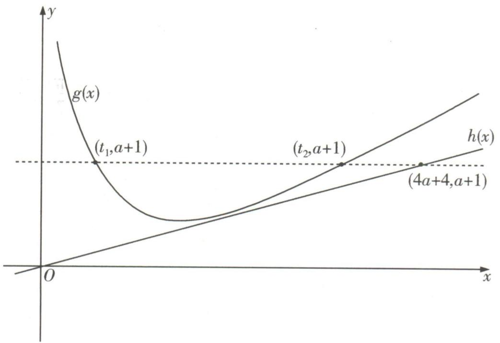

text_image

g(x)
(t₁,a+1)
(t₂,a+1)
(4a+4,a+1)
h(x)
O
x
y

在三角恒等变换中除了灵活运用三角恒等变换公式之外,寻找角与角之间的关系也非常重要,因为这决定了我们用哪一个公式,以及怎么用这个公式.接下来我们对怎么寻找角与角之间的关系展开探讨.

# 1. 计算与化简题中的角的关系

对于计算与化简题,我们先要寻找式子中是不是有两个角满足其和或差为特殊角 $\frac{\pi}{6}, \frac{\pi}{4}, \frac{\pi}{3}, \frac{\pi}{2}$ , $\frac{2\pi}{3}, \frac{3\pi}{4}, \frac{5\pi}{6}, \pi, \frac{3\pi}{2}, 2\pi, \cdots$ , 或者存在 2 倍的关系, 然后利用这些关系, 并结合诱导公式、和差角公式、倍角公式以及辅助角公式进行化简, 从而解决问题.

# 2. “已知若干角的三角函数值，求目标角或目标角的三角函数值”问题中的角的关系

处理“已知若干角的三角函数值,求目标角或目标角的三角函数值”之类的问题时,一定要牢记目标角 $\theta$ 是若干个已知角 $\theta_{1},\theta_{2},\cdots$ 的线性组合,即 $\theta = k_{1}\theta_{1} + k_{2}\theta_{2} + \cdots$ ,其中常数 $k_{i}$ 一般只在集合 $\{-2, - 1,1,2\}$ 中取值,这样我们就可以运用诱导公式、和差角公式以及倍角公式进行目标角的值或目标角的三角函数值的求解.

# 坑神有话说

在实际问题中寻找角的关系时,观察题目直接得出角的关系即可.

特殊角 $\frac{\pi}{6}, \frac{\pi}{4}, \frac{\pi}{3}, \frac{\pi}{2}, \frac{2\pi}{3}, \frac{3\pi}{4}, \frac{5\pi}{6}, \pi, \frac{3\pi}{2}, 2\pi, \cdots$ 也是已知角，只不过特殊角是隐形的，需要我们挖掘出来，使其现形.

$$
\begin{array}{l} \text {   大招示例   } 1 \\ \cos \frac {4 \pi}{7} + \cos \frac {5 \pi}{7} + \cos \frac {6 \pi}{7} = \underline {{\quad}}; \end{array}
$$

$$
(2) \cos \frac {\pi}{1 1} \cos \frac {2 \pi}{1 1} \cos \frac {3 \pi}{1 1} \cos \frac {4 \pi}{1 1} \cos \frac {5 \pi}{1 1} = \underline {{\quad}}.
$$

解析 (1) 观察发现, 原式中 $\frac{\pi}{7}$ 与 $\frac{6\pi}{7}$ 之和为 $\pi$ , 因此根据诱导公式就有 $\cos \frac{6\pi}{7} = \cos (\pi - \frac{\pi}{7}) = -\cos \frac{\pi}{7}$ , 于是 $\cos \frac{\pi}{7} + \cos \frac{6\pi}{7} = 0$ . 同理可得 $\cos \frac{2\pi}{7} + \cos \frac{5\pi}{7} = 0$ 与 $\cos \frac{3\pi}{7} + \cos \frac{4\pi}{7} = 0$ , 所以 $\cos \frac{\pi}{7} + \cos \frac{2\pi}{7} + \cos \frac{3\pi}{7} + \cos \frac{4\pi}{7} + \cos \frac{5\pi}{7} + \cos \frac{6\pi}{7} = 0$ .

(2)看到多个余弦值连续相乘的形式,考虑正弦的二倍角公式,通过观察发现,原式中 $\frac{\pi}{11}$ 与 $\frac{2\pi}{11}$ 是2倍的关系,所以我们要补个 $\sin\frac{\pi}{11}$ ,凑出正弦的二倍角公式,即 $\cos\frac{\pi}{11}\cos\frac{2\pi}{11}\cos\frac{3\pi}{11}\cos\frac{4\pi}{11}\cos\frac{5\pi}{11}=$ $\frac{\sin\frac{\pi}{11}\cos\frac{\pi}{11}\cos\frac{2\pi}{11}\cos\frac{3\pi}{11}\cos\frac{4\pi}{11}\cos\frac{5\pi}{11}}{\sin\frac{\pi}{11}}=$

$$
\frac {\sin \frac {2 \pi}{1 1} \cos \frac {2 \pi}{1 1} \cos \frac {3 \pi}{1 1} \cos \frac {4 \pi}{1 1} \cos \frac {5 \pi}{1 1}}{2 \sin \frac {\pi}{1 1}} =
$$

$$
\frac {\sin \frac {4 \pi}{1 1} \cos \frac {3 \pi}{1 1} \cos \frac {4 \pi}{1 1} \cos \frac {5 \pi}{1 1}}{4 \sin \frac {\pi}{1 1}} =
$$

$$
\frac {\sin \frac {8 \pi}{1 1} \cos \frac {3 \pi}{1 1} \cos \frac {5 \pi}{1 1}}{8 \sin \frac {\pi}{1 1}},
$$

看似无法进行了,然而其中蕴含着隐形角, $\frac{3\pi}{11}$ 与 $\frac{8\pi}{11}$ 之和是 $\pi$ ,因此我们使用诱导公式将 $\cos\frac{3\pi}{11}$ 改造成 $\cos(\pi-\frac{8\pi}{11})=-\cos\frac{8\pi}{11}$ 之后,继续玩耍,即 $\frac{\sin\frac{8\pi}{11}\cos\frac{3\pi}{11}\cos\frac{5\pi}{11}}{8\sin\frac{\pi}{11}}=-\frac{\sin\frac{8\pi}{11}\cos\frac{8\pi}{11}\cos\frac{5\pi}{11}}{8\sin\frac{\pi}{11}}=$

$-\frac{\sin \frac{16\pi}{11}\cos \frac{5\pi}{11}}{16\sin \frac{\pi}{11}}.$ 接着观察又可以发现 $\frac{16\pi}{11}$ 与 $\frac{5\pi}{11}$

之差是 $\pi$ ，于是再用诱导公式将 $\sin \frac{16\pi}{11}$ 改造成 $-\sin \frac{5\pi}{11}$ ，然后接着玩，即 $-\frac{\sin\frac{16\pi}{11}\cos\frac{5\pi}{11}}{16\sin\frac{\pi}{11}} =$

$\frac{\sin\frac{5\pi}{11}\cos\frac{5\pi}{11}}{16\sin\frac{\pi}{11}}=\frac{\sin\frac{10\pi}{11}}{32\sin\frac{\pi}{11}}$ ，而 $\frac{\pi}{11}$ 与 $\frac{10\pi}{11}$ 之和是 $\pi$ ，于

是 $\frac{\sin\frac{10\pi}{11}}{32\sin\frac{\pi}{11}} = \frac{\sin\frac{\pi}{11}}{32\sin\frac{\pi}{11}} = \frac{1}{32}$ , 即 $\cos \frac{\pi}{11} \cos \frac{2\pi}{11} \cos \frac{3\pi}{11}$ .

$$
\cos \frac {4 \pi}{1 1} \cos \frac {5 \pi}{1 1} = \frac {1}{3 2}.
$$

答案 (1)0;(2) $\frac{1}{32}$

大招示例 2 若 $x \in (\frac{\pi}{4}, \frac{3\pi}{4}), y \in (0, \frac{\pi}{4})$ ，且 $\cos(x - \frac{\pi}{4}) = \frac{3}{5}, \sin(\frac{3\pi}{4} + y) = \frac{5}{13}$ ，则 $\sin(x + y) =$ \_\_\_\_.

解析 千万别想不开展开去算,通过观察发现,目标角 $x + y$ 与已知角 $x - \frac{\pi}{4}, \frac{3\pi}{4} + y$ 以及隐形已知角 $\frac{\pi}{2}$ 存在关系, $x + y = (x - \frac{\pi}{4}) + (\frac{3\pi}{4} + y) - \frac{\pi}{2}$ , 因此就有 $\sin(x + y) = \sin\left[(x - \frac{\pi}{4}) + (\frac{3\pi}{4} + y) - \frac{\pi}{2}\right]$ , 这样就可以根据诱导公式以及和差角公式处理, 即 $\sin\left[(x - \frac{\pi}{4}) + (\frac{3\pi}{4} + y) - \frac{\pi}{2}\right] = -\cos\left[(x - \frac{\pi}{4}) + (\frac{3\pi}{4} + y)\right] = -\left[\cos(x - \frac{\pi}{4})\right]$ .

$\cos \left(\frac{3\pi}{4} + y\right) - \sin \left(x - \frac{\pi}{4}\right)\sin \left(\frac{3\pi}{4} + y\right)]$ 。而根据 $x \in \left(\frac{\pi}{4}, \frac{3\pi}{4}\right)$ 有 $\sin \left(x - \frac{\pi}{4}\right) > 0$ ，于是根据 $\cos (x - \frac{\pi}{4}) = \frac{3}{5}$ 得 $\sin \left(x - \frac{\pi}{4}\right) = \frac{4}{5}$ ，同理根据 $y \in (0, \frac{\pi}{4})$ 得 $\cos \left(\frac{3\pi}{4} + y\right) < 0$ ，根据 $\sin \left(\frac{3\pi}{4} + y\right) = \frac{5}{13}$ 得 $\cos \left(\frac{3\pi}{4} + y\right) = -\frac{12}{13}$ ，于是就有 $\sin (x + y) = -\left[\cos (x - \frac{\pi}{4})\cos (\frac{3\pi}{4} + y) - \sin (x - \frac{\pi}{4})\sin (\frac{3\pi}{4} + y)\right]$ .

$$
y) ] = - \left[ \frac {3}{5} \times \left(- \frac {1 2}{1 3}\right) - \frac {4}{5} \times \frac {5}{1 3} \right] = \frac {5 6}{6 5}.
$$

答案 $\frac{56}{65}$

text_image

大招35

“ω”的求解

  
名师大招

在处理“ω”的求解问题时,不可避免会涉及三角函数的一些性质,特别是正弦型函数的一些性质.因此我们先补充一下正弦型函数的比较重要的性质,再研究“ω”的求解问题的通法.

# 1. 正弦型函数的性质

对于正弦型函数 $f(x) = A\sin (\omega x + \varphi)(A, \omega, \varphi$ 是常数, $A > 0, \omega > 0$ 来说:

①函数的零点(图象的对称中心): 满足 $\omega x + \varphi = k\pi (k \in \mathbb{Z})$ ，因此可得函数 $f(x)$ 的零点为 $x = -\frac{\varphi}{\omega} + \frac{k\pi}{\omega} (k \in \mathbb{Z})$ ，函数图象的对称中心为 $(- \frac{\varphi}{\omega} + \frac{k\pi}{\omega}, 0) (k \in \mathbb{Z})$ .  
②函数图象的对称轴(最值点): 满足 $\omega x + \varphi = \frac{\pi}{2} + k\pi (k \in \mathbf{Z})$ ，因此可得函数 $f(x)$ 图象的对称轴方程(最值点)为 $x = \frac{\pi}{2\omega} - \frac{\varphi}{\omega} + \frac{k\pi}{\omega} (k \in \mathbf{Z})$ .  
③函数的最大值点: 满足 $\omega x + \varphi = \frac{\pi}{2} + 2k\pi (k \in \mathbf{Z})$ ，因此可得函数 $f(x)$ 的最大值点为 $x = \frac{\pi}{2\omega} - \frac{\varphi}{\omega} + \frac{2k\pi}{\omega} (k \in \mathbf{Z})$ .  
④函数的最小值点:满足 $\omega x + \varphi = -\frac{\pi}{2} + 2k\pi (k \in \mathbf{Z})$ ，因此可得函数 $f(x)$ 的最小值点为 $x = -\frac{\pi}{2\omega} - \frac{\varphi}{\omega} + \frac{2k\pi}{\omega} (k \in \mathbf{Z})$ .

# 2. “ω” 的求解问题的通法

对于三角函数中“ $\omega$ ”的求解问题,我们一般采用以下方法进行处理:

# 大招解读

第一步: 根据题目的条件,得到函数 $f(x)$ 图象的对称轴、对称中心(零点)或函数的最值点所满足的关系,从而建立方程(组)或不等式(组).

第二步: 解这些方程(组)或不等式(组), 得到答案.

# 坑神有话说

当不等式(组)有些复杂时,我们可以先去压缩不等式中的整数 k 的取值范围,进而对整数 k 的取值进行分类讨论,从而求得 $\omega$ 的取值范围.

大招示例 （2023 新高考 I 卷）已知函数 $f(x) = \cos \omega x - 1 (\omega > 0)$ 在区间 $[0, 2\pi]$ 有且仅有 3 个零点，则 $\omega$ 的取值范围是 \_\_\_\_.

# 大招识别

余弦型函数求 $\omega$ 的取值范围问题,根据题干条件结合余弦函数的图象列方程(组)或不等式(组)求解.

解析 大招解 函数 $f(x)=\cos \omega x-1$ 在区间 $[0,2\pi]$ 有且仅有3个零点,即 $\cos \omega x=1$ 在区间 $[0,2\pi]$ 有且仅有3个根,因为 $\omega>0,x\in[0,2\pi]$ ,所以 $\omega x\in[0,2\omega\pi]$ ,则由余弦函数的图象可知, $4\pi\leqslant2\omega\pi<6\pi$ ,解得 $2\leqslant\omega<3$ ,即 $\omega$ 的取值范围是 $[2,3)$ .

根据条件，列不等式组求解

常规解 函数 $f(x) = \cos \omega x - 1$ 在区间 $[0, 2\pi]$

有且仅有3个零点,即 $\cos\omega x=1$ 在区间 $[0,2\pi]$

有且仅有3个根,根据函数 $y=\cos x$ 在 $[0,2\pi]$ 上的图象可知, $\cos x=1$ 在区间 $[0,2\pi]$ 有2个根,所以若 $\cos\omega x=1$ 在区间 $[0,2\pi]$ 有且仅有3个根,则函数 $y=\cos\omega x$ 在 $[0,2\pi]$ 内至少包含2个

周期,但小于3个周期,即 $\left\{\begin{aligned}&2\times\frac{2\pi}{\omega}\leqslant2\pi,\\ &3\times\frac{2\pi}{\omega}>2\pi.\end{aligned}\right.$ 又 $\omega>0$ ,

所以 $2 \leqslant \omega < 3$ ，即 $\omega$ 的取值范围是 [2,3).

# 坑神小课堂

研究函数 $y = A \sin(\omega x + \varphi)$ (或 $y = A \cos(\omega x + \varphi)$ ) 的值域、单调性、零点及极值点等问题时，可将 $\omega x + \varphi$ 看成一个整体，然后对照函数 $y = \sin x$ (或 $y = \cos x$ ) 的图象求解.

答案 [2,3)

# 1. 角平分线定理

在 $\triangle ABC$ 中, $\angle BAC$ 的平分线交 $BC$ 于点 $D$ (如图),则有 $\frac{AB}{AC}=\frac{DB}{DC}$ .

证明 因为 $\angle ADB + \angle ADC = \pi$ , 所以 $\sin \angle ADB = \sin \angle ADC$ , 在 $\triangle BAD$ 中, 使用正弦定理有 $\frac{AB}{\sin \angle ADB} = \frac{DB}{\sin \angle BAD}$ , 在 $\triangle CAD$ 中, 使用正弦定理有 $\frac{AC}{\sin \angle ADC} = \frac{DC}{\sin \angle CAD}$ , 又 $\angle BAD = \angle CAD$ , 所以 $\frac{AB}{AC} = \frac{DB}{DC}$ .

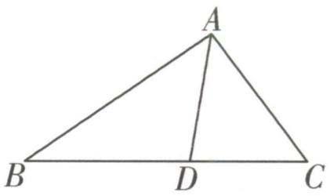

text_image

A
B D C

# 2. 角平分线定理的应用

角平分线定理实际上构建了角平分线分对边形成的两条线段长度与该角的两条邻边长度之间的关系,题目中出现角平分线条件时,可以考虑使用这组关系列式子解决问题.

# 坑神有话说

角平分线定理在选择、填空题中直接用就行,但是在解答题中使用之前需要推理一下.

大招示例 在 $\triangle ABC$ 中,角 $A,B,C$ 所对的边分别为 $a,b,c,\angle BAC$ 的平分线交 $BC$ 于点 $D$ ,且满足 $\frac{BD}{DC}=\frac{3}{4},\angle BAC=60^{\circ},a=7$ ,则 $c=$ \_\_\_\_.

解析 根据角平分线定理有 $\frac{DB}{DC} = \frac{AB}{AC} = \frac{c}{b} = \frac{3}{4}$ 于是 $b = \frac{4}{3} c$ ，又 $\angle BAC = 60^{\circ}, a = 7$ ，在 $\triangle ABC$ 中，

使用余弦定理的推论有 $\cos\angle BAC=\frac{b^{2}+c^{2}-a^{2}}{2bc}=$ $\frac{1}{2}$ ，进而得到 $\frac{13}{9}c^{2}-49=0$ ，因此 $c=\frac{21\sqrt{13}}{13}$ .

答案 $\frac{21\sqrt{13}}{13}$

# 大招37

# 张角定理

  
名师大招

# 1. 张角定理

在 $\triangle ABC$ 中,角 $A,B,C$ 所对的边分别为 $a,b,c$ ,若 $D$ 为 $BC$ 上一点(如图),且 $\angle BAD=\alpha,\angle CAD=\beta$ ,则有 $\frac{\sin(\alpha+\beta)}{AD}=\frac{\sin\alpha}{b}+\frac{\sin\beta}{c}$ .

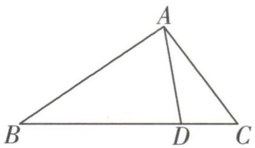

text_image

A
B D C

证明 因为 $S_{\triangle ABC} = S_{\triangle ABD} + S_{\triangle ACD}$ , 所以 $\frac{1}{2} bc \sin (\alpha + \beta) = \frac{1}{2} AD \cdot c \sin \alpha + \frac{1}{2} AD \cdot b \sin \beta$ , 等式两边同时除以 $\frac{1}{2} bc \cdot AD$ , 得 $\frac{\sin (\alpha + \beta)}{AD} = \frac{\sin \alpha}{b} + \frac{\sin \beta}{c}$ .

# 2. 张角定理的应用

张角定理的本质是通过三角形面积公式构建三角方程.

①如果 $\alpha, \beta$ 是已知的, 使用张角定理可以建立 AD, b, c 之间的关系.  
②如果 AD, b, c 是已知的, 使用张角定理可以得到 $\alpha, \beta$ 满足的三角方程.

# 3. 张角定理与角平分线

特别地,如果在 $\triangle ABC$ 中,角 $B,C$ 所对的边分别为 $b,c,\angle BAC$ 的平分线交 $BC$ 于点 $D$ ,根据张角定理就会有 $\frac{\sin\angle BAC}{AD}=\frac{\sin\frac{\angle BAC}{2}}{b}+\frac{\sin\frac{\angle BAC}{2}}{c}$ ,再使用二倍角公式得到 $\frac{2\sin\frac{\angle BAC}{2}\cos\frac{\angle BAC}{2}}{AD}=\frac{\sin\frac{\angle BAC}{2}}{b}+\frac{\sin\frac{\angle BAC}{2}}{c}$ ,加以化简也就得到 $AD=\frac{2bc\cos\frac{\angle BAC}{2}}{b+c}$ ,根据这个思路我们就可以处理与角平分线相关的问题了.

# 坑神有话说

张角定理在选择、填空题中直接用就行,但是在解答题中使用之前需要推理一下.

大招示例 (2023 全国甲卷) 在 $\triangle ABC$ 中, $\angle BAC = 60^{\circ}, AB = 2, BC = \sqrt{6}, \angle BAC$ 的角平分线交 $BC$ 于 $D$ , 则 $AD = \_$ .

解析 方法一 由余弦定理得 $\cos 60^{\circ} = \frac{AC^{2} + 4 - 6}{2\times 2AC}$ 整理得 $AC^2 -2AC - 2 = 0$ ，得 $AC = 1 + \sqrt{3}$ （负值已舍去).又 $S_{\triangle ABC} = S_{\triangle ABD} + S_{\triangle ACD}$ ，所以 $\frac{1}{2}\times 2AC\sin 60^{\circ} = \frac{1}{2}\times 2AD\sin 30^{\circ} + \frac{1}{2} AC\times$ $AD\sin 30^{\circ}$ ，所以 $AD = \frac{2\sqrt{3}AC}{AC + 2} = \frac{2\sqrt{3}\times(1 + \sqrt{3})}{3 + \sqrt{3}} = 2.$

实际上就是张角定理在角平分线问题中的应用方法二 可用角平分线定理得 $\frac{BD}{AB} = \frac{CD}{AC}$ , 由余弦定理得 $\cos 60^\circ = \frac{AC^2 + 4 - 6}{2 \times 2AC}$ , 得 $AC = 1 + \sqrt{3}$ (负值已舍去). 又 $BD + CD = \sqrt{6}$ , 所以 $BD = \frac{2\sqrt{2}}{1 + \sqrt{3}}$ ,

$CD = \sqrt{2}$

由角平分线长公式得 $AD^{2}=AB\times AC-BD\times CD=$ $2 \times (1 + \sqrt{3}) - \frac{2\sqrt{2} \times \sqrt{2}}{1 + \sqrt{3}} = 4,$

所以 $AD = 2$

方法三 同方法二求出 $AC = 1 + \sqrt{3}$ , $BD = \frac{2\sqrt{2}}{1 + \sqrt{3}}$ , $CD = \sqrt{2}$ 后, 利用大招 39 五边两角模型, 得 $\frac{AD^{2}+BD^{2}-AB^{2}}{BD}+\frac{AD^{2}+CD^{2}-AC^{2}}{CD}=0$ ，即

$$
\frac {A D ^ {2} + \left(\frac {2 \sqrt {2}}{1 + \sqrt {3}}\right) ^ {2} - 4}{\frac {2 \sqrt {2}}{1 + \sqrt {3}}} + \frac {A D ^ {2} + (\sqrt {2}) ^ {2} - (1 + \sqrt {3}) ^ {2}}{\sqrt {2}} =
$$

0, 解得AD = 2.

答案 2

# 大招38

# 平行四边形定理

  
名师大招

# 1. 平行四边形定理

若四边形 ABCD 为平行四边形(如图), 则 $AB^{2} + BC^{2} + CD^{2} + DA^{2} = AC^{2} + BD^{2}$ .

证明 因为四边形 ABCD 是平行四边形, 所以 AB = CD, BC = DA, 且 $\angle ABC + \angle BCD = \pi$ , 所以 $\cos \angle ABC = -\cos \angle BCD$ , 在 $\triangle ABC$ 中, 由余弦定理有 $AC^{2} = AB^{2} + BC^{2} - 2AB \times BC \cos \angle ABC$ , 在 $\triangle BCD$ 中, 由余弦定理有 $BD^{2} = BC^{2} + CD^{2} - 2BC \times CD \cos \angle BCD$ , 所以 $AC^{2} + BD^{2} = AB^{2} + BC^{2} + CD^{2} +$

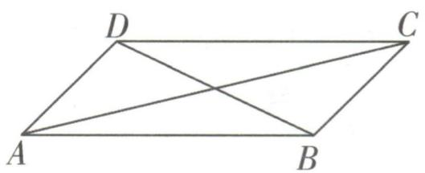

text_image

D
C
A
B

# 2. 平行四边形定理的应用

平行四边形定理常用于解决三角形中线长的相关问题. 如图所示, 在 $\triangle ABC$ 中, 如果 $D$ 是 $BC$ 的中点, 我们倍长中线 $AD$ 即可得到平行四边形 $ABEC$ , 根据平行四边形定理有 $AB^{2} + BE^{2} + EC^{2} + CA^{2} = AE^{2} + BC^{2}$ , 于是就有 $2AB^{2} + 2AC^{2} = 4AD^{2} + BC^{2}$ , 因此得到 $AB^{2} + AC^{2} = 2AD^{2} + \frac{1}{2} BC^{2}$ 与 $AD^{2} = \frac{AB^{2} + AC^{2}}{2} - \frac{BC^{2}}{4}$ , 这样就能较为快速地处理中线长相关问题.

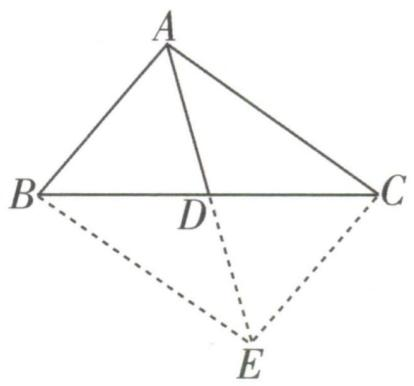

text_image

A
B
D
C
E

# 坑神有话说

平行四边形定理在选择、填空题中直接用就行,但是在解答题中使用之前需要推理一下.

大招示例 在 $\triangle ABC$ 中,角 $A,B,C$ 所对的边分别为 $a,b,c,\sqrt{3}a\sin C\sin(A+C)=2c\sin A\cdot\sin^{2}\frac{B}{2}$ ,则角 $B$ 的值为\_\_\_\_;若 $a+c=6$ ,则 $AC$ 边上的中线长的最小值为\_\_\_\_.

解析 先根据正弦定理进行边化角, 得到 $\sqrt{3}\sin A\sin C\sin(A+C)=2\sin C\sin A\sin^{2}\frac{B}{2}$ ，又 $\sin(A+C)=\sin(\pi-B)=\sin B$ ，因此 $\sqrt{3}\sin B=2\sin^{2}\frac{B}{2}=1-\cos B$ ，于是 $\sqrt{3}\sin B+\cos B=2\sin(B+\frac{\pi}{6})=1$ ，而 $B\in(0,\pi)$ ，从而得到 $B=\frac{2\pi}{3}$ 。使用余弦定理可得 $b^{2}=a^{2}+c^{2}-2ac\cos B=a^{2}+c^{2}+ac$ .
记 AC 边上的中线为 BD, 根据平行四边形定理可得 $2AB^{2} + 2BC^{2} = 4BD^{2} + AC^{2}$ ，则 $BD^{2} = \frac{a^{2} + c^{2}}{2} - \frac{b^{2}}{4} = \frac{a^{2} + c^{2} - ac}{4} = \frac{(a + c)^{2} - 3ac}{4}$ ，由于 $ac \leqslant \left(\frac{a+c}{2}\right)^{2} = 9$ ，当且仅当 a = c 时取等号，于是 $BD^{2} = \frac{(a+c)^{2} - 3ac}{4} \geqslant \frac{36 - 27}{4} = \frac{9}{4}$ ，当且仅当 a = c = 3 时取等号，因此 AC 边上的中线长的最小值为 $\frac{3}{2}$ .

答案 $\frac{2\pi}{3}$ $\frac{3}{2}$

text_image

大招39

# 五边两角模型

  
名师大招

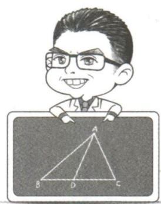

text_image

Cartoon illustration of a smiling man with glasses standing behind a blank board, featuring a triangle diagram labeled A, B, C, D.

# 1. 五边两角模型

在 $\triangle ABC$ 中， $D$ 是线段 $BC$ 上一点，连接 $AD$ (如图)，则有 $\frac{AD^{2}+BD^{2}-AB^{2}}{BD}+\frac{AD^{2}+CD^{2}-AC^{2}}{CD}=0.$

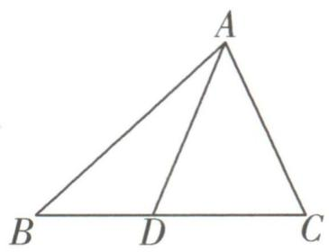

text_image

A
B D C

证明 因为 $\angle ADB + \angle ADC = \pi$ , 所以 $\cos \angle ADB + \cos \angle ADC = 0$ . 在 $\triangle ADB$ 中, 使用余弦定理有 $\cos \angle ADB = \frac{AD^2 + BD^2 - AB^2}{2AD \times BD}$ , 在 $\triangle ADC$ 中, 使用余弦定理有 $\cos \angle ADC = \frac{AD^2 + CD^2 - AC^2}{2AD \times CD}$ , 所以

$\frac{AD^{2}+BD^{2}-AB^{2}}{2AD\times BD}+\frac{AD^{2}+CD^{2}-AC^{2}}{2AD\times CD}=0$ ，所以 $\frac{AD^{2}+BD^{2}-AB^{2}}{BD}+\frac{AD^{2}+CD^{2}-AC^{2}}{CD}=0.$

# 2. 五边两角模型的应用

五边两角模型的本质是通过余弦定理及 $\angle ADB + \angle ADC = \pi$ 构建三角方程. 题目中出现五边两角的结构, 且出现 $BD, CD$ 的比例关系时考虑用 $\frac{AD^2 + BD^2 - AB^2}{BD} + \frac{AD^2 + CD^2 - AC^2}{CD} = 0$ 构建 $AD, BD, CD, AB, AC$ 之间的等量关系求解.

# 坑神有话说

五边两角模型在选择、填空题中直接用就行,但是在解答题中使用之前需要推理一下.

大招示例 在 $\triangle ABC$ 中,角 $A,B,\angle ACB$ 所对的边分别为 $a,b,c,3c\sin A=4b\sin\angle ACB,\cos\angle ACB=\frac{2}{3}$ ,点 $D$ 在线段 $AB$ 上,且 $BD=2DA$ ,若 $\triangle ABC$ 的面积为 $2\sqrt{5}$ ,则 $CD=$ \_\_\_\_.

解析 如图所示,先根据

正弦定理将 $3c\sin A = 4b \cdot$ $\sin \angle ACB$ 角化边, 得到 $3ca =$

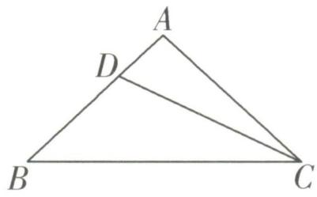

text_image

A
D
B
C

4bc, 于是就有 $b = \frac{3}{4}a$ , 由于 $\cos \angle ACB = \frac{2}{3}$ , 因此 $\sin\angle ACB=\frac{\sqrt{5}}{3}$ . 再根据三角形面积公式得 $S_{\triangle ABC}=$

$\frac{1}{2}ab\sin\angle ACB=\frac{\sqrt{5}}{8}a^{2}=2\sqrt{5}$ ，解得 a=4，故 b=3，
接下来使用余弦定理 $c^{2}=a^{2}+b^{2}-2ab\cos\angle ACB$ 得 c=3.

由于 BD = 2DA，因此 AD = 1, BD = 2，此时使用五边两角模型得 $\frac{CD^{2} + AD^{2} - AC^{2}}{AD} + \frac{CD^{2} + BD^{2} - BC^{2}}{BD} =$

0, 即 $CD^{2} + 1 - 9 + \frac{CD^{2} + 4 - 16}{2} = 0$ , 从而求得
本质: $\cos\angle ADC + \cos\angle BDC = 0$

$$
C D = \frac {2 \sqrt {2 1}}{3}.
$$

答案 $\frac{2\sqrt{21}}{3}$

# 大招40 算两次

  
名师大招

text_image

AB = λe₁ + μe₂
AB = x₁ + y₁

对于通过平面向量线性运算求参数的相关问题,可以采用算两次的方法解决.

# 1. “算两次”背后依据的原理

根据平面向量基本定理“如果 $e_{1}, e_{2}$ 是同一平面内的两个不共线向量,那么对于这一平面内的任一向量 a,有且只有一对实数 $\lambda_{1}, \lambda_{2}$ ,使 $a = \lambda_{1}e_{1} + \lambda_{2}e_{2}$ ”,我们可以在题目中选取两个不共线的向量 $e_{1}$ 和 $e_{2}$ 作为基向量,然后将其余向量都用这一组基向量 $e_{1}$ 和 $e_{2}$ 表达.

# 2. “算两次”的具体方法

①根据题目要求选取合适的基向量 $e_{1}$ 和 $e_{2}$ .

通常选取共起点且方便表达出待求向量的一组向量

②写出待求向量 a 关于基向量 $e_{1}$ 和 $e_{2}$ 的两种表达方式.

五③根据基向量 $e_{1}$ 和 $e_{2}$ 不共线,得到参数所满足的方程(组),最终求得参数的值,表达出a.

大招示例 在 $\triangle ABC$ 中, $CO$ 为边 $AB$ 上的中线, $G$ 为 $OC$ 上一点, 且 $\overrightarrow{CG} = 2\overrightarrow{GO}$ , 若 $\overrightarrow{BD} // \overrightarrow{AG}$ , 且 $\overrightarrow{AD} = \lambda \overrightarrow{AB} + \frac{2}{7} \overrightarrow{AC} (\lambda \in \mathbf{R})$ , 则 $\lambda =$ \_\_\_\_.

解析 如图所示,根据条件 $\overrightarrow{BD}//\overrightarrow{AG}$ ,先以 $\overrightarrow{AB},\overrightarrow{AC}$ 为一组基向量,然后去表示 $\overrightarrow{AG}$ 与 $\overrightarrow{BD}$ ,进而得到 $\overrightarrow{BD}$ 的两种表达方式,使用“算两次”求解. 由 O 为边 AB 的中点, 得到 $\overrightarrow{AO} = \frac{1}{2}\overrightarrow{AB}$ , 而 $\overrightarrow{CG} = 2\overrightarrow{GO}$ , 因此 $\overrightarrow{OG} = \frac{1}{3}\overrightarrow{OC} = \frac{1}{3} (\overrightarrow{AC} - \overrightarrow{AO}) = -\frac{1}{6}\overrightarrow{AB} + \frac{1}{3}\overrightarrow{AC}$ , 于是 $\overrightarrow{AG} = \overrightarrow{AO} + \overrightarrow{OG} = \frac{1}{3}\overrightarrow{AB} + \frac{1}{3}\overrightarrow{AC}$ . 又由 $\overrightarrow{AD} = \lambda \overrightarrow{AB} + \frac{2}{7}\overrightarrow{AC}$ , 得到 $\overrightarrow{BD} = \overrightarrow{AD} - \overrightarrow{AB} =$ $(\lambda - 1) \overrightarrow{AB} + \frac{2}{7} \overrightarrow{AC}.$ 根据 $\overrightarrow{BD} \parallel \overrightarrow{AG}$ , 设 $\overrightarrow{BD} = \mu \overrightarrow{AG}$ $\overrightarrow{BD}$ 的第一种表达方式

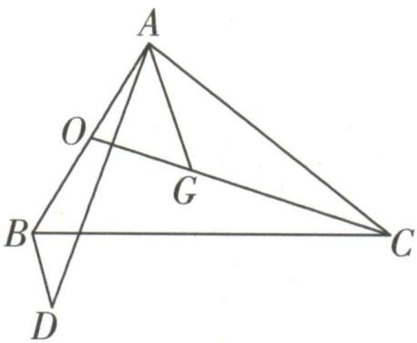

text_image

Geometric diagram of a tetrahedron with labeled vertices A, B, C, D and internal points O, G, showing edges and diagonals.

$(\mu \in \mathbf{R})$ ，于是 $\overrightarrow{BD} = \frac{\mu}{3}\overrightarrow{AB} + \frac{\mu}{3}\overrightarrow{AC}$ 。故 $(\lambda - 1)\overrightarrow{AB} + \overrightarrow{BD}$ 的第二种表达方式

$\frac{2}{7}\overrightarrow{AC} = \frac{\mu}{3}\overrightarrow{AB} +\frac{\mu}{3}\overrightarrow{AC}$ ，因此 $(\lambda -\frac{\mu}{3} -1)\overrightarrow{AB} = (\frac{\mu}{3}-$ $\frac{2}{7})\overrightarrow{AC}.$ 根据 $\overrightarrow{AB}$ 与 $\overrightarrow{AC}$ 不共线，得到

$\left\{ \begin{array}{l} \lambda - \frac{\mu}{3} - 1 = 0, \\ \frac{\mu}{3} - \frac{2}{7} = 0, \end{array} \right.$ 于是 $\lambda$ 的值为 $\frac{9}{7}$ .

答案 $\frac{9}{7}$

# 大招41等和线

text_image

Cartoon illustration of a man with glasses standing behind a blank board, featuring a triangle diagram labeled A, C, B.

对于涉及向量式 $\overrightarrow{OA}=\lambda\overrightarrow{OB}+\mu\overrightarrow{OC},\lambda,\mu\in\mathbb{R}$ 的相关问题,我们常使用等和线处理.

# 1. 其和为 1 的等和线

点 O, A, B 为平面上不共线的三个点, 则 $\overrightarrow{OC} = t \overrightarrow{OA} + (1 - t) \overrightarrow{OB} \Leftrightarrow$ 点 C 在直线 AB 上.

证明 因为 $\overrightarrow{OC} = t\overrightarrow{OA} + (1 - t)\overrightarrow{OB}$ , 所以 $\overrightarrow{OC} - \overrightarrow{OB} = t(\overrightarrow{OA} - \overrightarrow{OB})$ , 所以 $\overrightarrow{BC} = t\overrightarrow{BA}$ , 所以点 $C$ 在直线 $AB$ 上. 把步骤反过去就能知道从右往左推也是正确的.

# 坑神有话说

通过以上推导过程我们还可以知道以下结论:①当 $\overrightarrow{OC}=t\overrightarrow{OA}+(1-t)\overrightarrow{OB}$ 时, $\overrightarrow{BC}=t\overrightarrow{BA}$ ,当 $t<0$ 时,点 $B$ 在线段 $AC$ 上,当 $0\leqslant t\leqslant1$ 时,点 $C$ 在线段 $AB$ 上,当 $t>1$ 时,点 $A$ 在线段 $BC$ 上.②如果 $\overrightarrow{BC}=t\overrightarrow{BA}$ ,则 $\overrightarrow{OC}=t\overrightarrow{OA}+(1-t)\overrightarrow{OB}$ ,这个式子可以帮助我们在知道| $\overrightarrow{BC}$ |与| $\overrightarrow{BA}$ |的比例关系的情况下,快速写出 $\overrightarrow{OC}$ 的表达式.

# 2. 其和为 $k$ 的等和线

点 O, A, B 为平面上不共线的三个点，则 $\overrightarrow{OC} = t \overrightarrow{OA} + (k - t) \overrightarrow{OB} (k \neq 1, k \in \mathbb{R})$ $\Leftrightarrow$ 点 C 的轨迹是平行于直线 AB 的一条直线.

证明 ①当 k=0 时, $\overrightarrow{OC}=t(\overrightarrow{OA}-\overrightarrow{OB})=t\overrightarrow{BA}$ , 所以点 C 的轨迹是过点 O 且平行于直线 AB 的一条直线(如图 1).

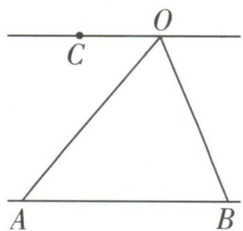

text_image

C
O
A
B

图1

②当 $k \neq 0$ 且 $k \neq 1$ 时, 取两点 $A_{1}, B_{1}$ 使得 $\overrightarrow{OA_{1}} = k\overrightarrow{OA}, \overrightarrow{OB_{1}} = k\overrightarrow{OB}$ , 因为 $\overrightarrow{OC} = t\overrightarrow{OA} + (k - t)\overrightarrow{OB}$ , 所以 $\overrightarrow{OC} = \frac{t}{k}\overrightarrow{OA_{1}} + (1 - \frac{t}{k})\overrightarrow{OB_{1}}$ , 所以点 $C$ 在直线 $A_{1}B_{1}$ 上. 因为 $\overrightarrow{OA_{1}} = k\overrightarrow{OA}, \overrightarrow{OB_{1}} = k\overrightarrow{OB}$ , 所以 $A_{1}B_{1} // AB$ , 所以点 $C$ 的轨迹是平行于直线 $AB$ 的一条直线 (如图2).

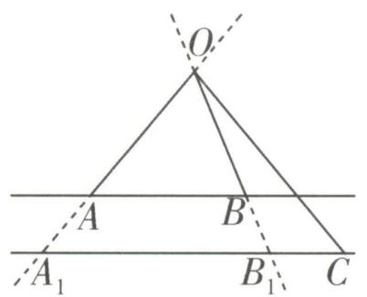

text_image

O
A
B
A₁
B₁
C

图2

同样地,把推导步骤反过去就能知道从右往左推也是正确的.

# 坑神有话说

$|k|$ 的几何意义为 $|\overrightarrow{OA}_{1}|$ 与 $|\overrightarrow{OA}|$ 的比值, 即 $|k|=\frac{|\overrightarrow{OA}_{1}|}{|\overrightarrow{OA}|}=\frac{|\overrightarrow{OB}_{1}|}{|\overrightarrow{OB}|}$ , 实际解题时也是通过长度比确定 k 的值.

# 3. 等和线的应用

从前面知识我们已经知道,等和线“ $\overrightarrow{OC}=t\overrightarrow{OA}+(k-t)\overrightarrow{OB}(k\in\mathbf{R})$ ”实际上建立了点C的轨迹与k值的关系.因此关于等和线就有以下两种应用:

第一种:在已知点 C 的位置的情况下,求 k 的取值范围(这种用得比较多).

第二种:在已知 k 的取值的情况下,去判断点 C 的位置.

大招示例 在矩形 ABCD 中, AB = 1, AD = 2, 动点 P 在以点 C 为圆心且与 BD 相切的圆上, 若 $\overrightarrow{AP} = \lambda \overrightarrow{AB} + \mu \overrightarrow{AD} (\lambda, \mu \text{ 为实数})$ , 则 $\lambda + \mu$ 的最大值是 \_\_\_\_.

解析 过点 P 作 BD 的平行线 l, 与 AB, AD 的延长线分别交于点 $B_{1}, D_{1}$ , 如图所示, 根据等和线, 就有 $\overrightarrow{AP} = t \overrightarrow{AB_{1}} + (1 - t) \overrightarrow{AD_{1}} (t \in \mathbb{R})$ , 以 $\overrightarrow{AB}, \overrightarrow{AD}$ 为基向量, 设 $\overrightarrow{AB_{1}} = m \overrightarrow{AB} (m \in \mathbb{R})$ , 则 $\overrightarrow{AD_{1}} = m \overrightarrow{AD}$ , 于是就有 $\overrightarrow{AP} = mt \overrightarrow{AB} + (m - mt) \overrightarrow{AD}$ ,

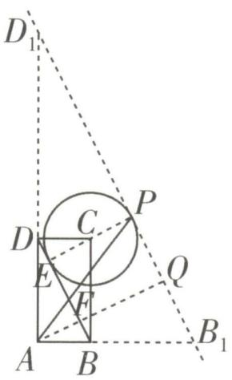

text_image

D₁
P
C
D
E
F
Q
A
B
B₁

$\mu\overrightarrow{AD}$ , 因此 $\left\{\begin{aligned}mt&=\lambda,\\ m-mt&=\mu,\end{aligned}\right.$ 得到 $\lambda+\mu=m$ . 于是要使 $\lambda+\mu$ 最大, 就要使得 m 最大, 当 m 最大时, 直线 l 与圆 C 相切, 此时过点 P 作直线 BD 的垂线 PE, 垂足为 E, 过点 A 作直线 BD, l 的公垂线 AQ, 交 BD 于 F, 交 l 于 Q, 如图所示, 易知 C 为 PE 的中点, 且 $AF=CE=\frac{1}{2}PE=\frac{1}{2}QF$ , 因此 $\frac{AQ}{AF}=\frac{AF+QF}{AF}=3$ . 于是当 m=3 时, $\lambda+\mu$ 取得最大值 3.

答案 3

text_image

大招42

# 极化恒等式

对于共起点向量的数量积问题,我们常采用极化恒等式处理.

# 1. 极化恒等式

对于三个不共线的点 A, B, C 来说, 我们令点 D 为线段 BC 的中点, 如图所示, 则有极化恒等式 $\overrightarrow{AB} + \overrightarrow{AC} = 2\overrightarrow{AD}, \overrightarrow{AB} \cdot \overrightarrow{AC} = |\overrightarrow{AD}|^{2} - |\overrightarrow{DB}|^{2}$ .

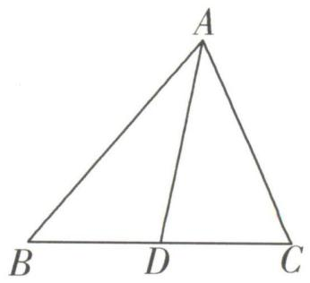

text_image

A
B D C

证明 ① $\overrightarrow{AB}+\overrightarrow{AC}=(\overrightarrow{AD}+\overrightarrow{DB})+(\overrightarrow{AD}+\overrightarrow{DC})=2\overrightarrow{AD}.$

② $\overrightarrow{AB} \cdot \overrightarrow{AC} = (\overrightarrow{AD} + \overrightarrow{DB}) \cdot (\overrightarrow{AD} + \overrightarrow{DC}) = \overrightarrow{AD} \cdot \overrightarrow{AD} + \overrightarrow{AD} \cdot \overrightarrow{DB} + \overrightarrow{AD} \cdot \overrightarrow{DC} + \overrightarrow{DB} \cdot \overrightarrow{DC} = |\overrightarrow{AD}|^{2} - |\overrightarrow{DB}|^{2}$ .

# 2. 极化恒等式的应用

问题中出现共起点的两个向量 $\overrightarrow{AB},\overrightarrow{AC}$ 之和或数量积时,就可以考虑取BC的中点D,然后使用极化恒等式转化,把原本需计算夹角的数量积运算转化为长度运算,进而解决问题.

极化恒等式能简化运算的本质原因

# 坑神有话说

如果问题中给出的是共终点的两个向量之和或数量积,则通过加负号转化为共起点的向量即可,如 $\overrightarrow{BA}+\overrightarrow{CA}=-\overrightarrow{AB}-\overrightarrow{AC}=-2\overrightarrow{AD},\overrightarrow{BA}\cdot\overrightarrow{CA}=(-\overrightarrow{AB})\cdot(-\overrightarrow{AC})=\overrightarrow{AB}\cdot\overrightarrow{AC}=|\overrightarrow{AD}|^{2}-|\overrightarrow{DB}|^{2}$ .

大招示例 (2022 上海) 在 $\triangle ABC$ 中, $C = \frac{\pi}{2}$ , $AC = BC = 2$ , $M$ 为边 $AC$ 的中点, 若点 $P$ 在边 $AB$ 上运动 (点 $P$ 可与 $A, B$ 重合), 则 $\overrightarrow{MP} \cdot \overrightarrow{CP}$ 的最小值为 \_\_\_\_.

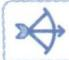

# 大招识别

题目中给出的向量的数量积可以转化成共起点向量的数量积,故考虑使用极化恒等式解决问题.

解析 大招解 取 MC 的中点为 Q，连接 PQ，则 $\left|\overrightarrow{QC}\right|=\frac{1}{2}$ ，所以 $\overrightarrow{MP}\cdot\overrightarrow{CP}=\overrightarrow{PM}\cdot\overrightarrow{PC}=$ $\left|\overrightarrow{PQ}\right|^{2}-\left|\overrightarrow{QC}\right|^{2}=\left|\overrightarrow{PQ}\right|^{2}-\frac{1}{4}\geqslant\left(\frac{3}{2\sqrt{2}}\right)^{2}-\frac{1}{4}=\frac{7}{8}$ 当且仅当 $PQ\perp AB$ 时取等号。故 $\overrightarrow{MP}\cdot\overrightarrow{CP}$ 的最小值为 $\frac{7}{8}$ 。

常规解 涉及几何图形中
面向量的数量积运算, 可
虑建立适当的平面直角坐
系进行求解. 如图, 以 C 为
示原点, 建立平面直角坐标系,则 $C(0,0)$ , $A(0,2)$ , $B(2,0)$ , $M(0,1)$ , 依题意可设 $P(x,2-x)$ , $0 \leqslant x \leqslant 2$ , 则 $\overrightarrow{MP} = (x,1 - x)$ , $\overrightarrow{CP} = (x,2 - x)$ , 所以 $\overrightarrow{MP} \cdot \overrightarrow{CP} = (x,1 - x) \cdot (x,2 - x) = 2x^{2} - 3x + 2 = 2\left(x - \frac{3}{4}\right)^{2} + \frac{7}{8} \geqslant \frac{7}{8}$ , 当

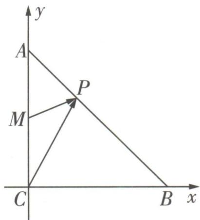

text_image

y
A
P
M
C
B x

利用二次函数求最值

且仅当 $x = \frac{3}{4}$ 时取等号, 故 $\overrightarrow{MP} \cdot \overrightarrow{CP}$ 的最小值为 $\frac{7}{8}$ .

答案 $\frac{7}{8}$

# 大招43奔驰定理

  
Date: 17/05

O 为 $\triangle ABC$ 内一点, 对于找 $S_{\triangle AOB}, S_{\triangle BOC}, S_{\triangle AOC}$ 的比例与 $\overrightarrow{OA}, \overrightarrow{OB}, \overrightarrow{OC}$ 的向量式之间的关系的相关问题, 我们采用奔驰定理处理.

# 1.奔驰定理

若点 O 为 $\triangle ABC$ 内一点（如图），则 $S_{\triangle BOC} \overrightarrow{OA} + S_{\triangle COA} \overrightarrow{OB} + S_{\triangle AOB} \overrightarrow{OC} = 0$ 。因为其图形与奔驰的标志特别相似，故称之为奔驰定理。

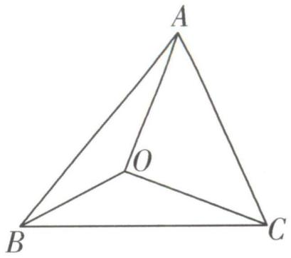

text_image

A
O
B
C

证明 根据重心的性质推导. 在射线 OB 与 OC 上分别取点 $B_{1}$ 与点 $C_{1}$ ，使得点 O 为 $\triangle AB_{1}C_{1}$ 的重心，并令点 D 为 $B_{1}C_{1}$ 的中点，点 E 为 $AB_{1}$ 的中点，如图.

首先我们要得到 $\overrightarrow{OA},\overrightarrow{OB_{1}},\overrightarrow{OC_{1}}$ 所满足的关系,因为点D为 $B_{1}C_{1}$ 的中点,所以 $\overrightarrow{OB_{1}}+\overrightarrow{OC_{1}}=2\overrightarrow{OD}$ ,又点O为 $\triangle AB_{1}C_{1}$ 的重心,所以 $\overrightarrow{OA}=-2\overrightarrow{OD}$ ,所以 $\overrightarrow{OA}+\overrightarrow{OB_{1}}+\overrightarrow{OC_{1}}=\mathbf{0}$ .

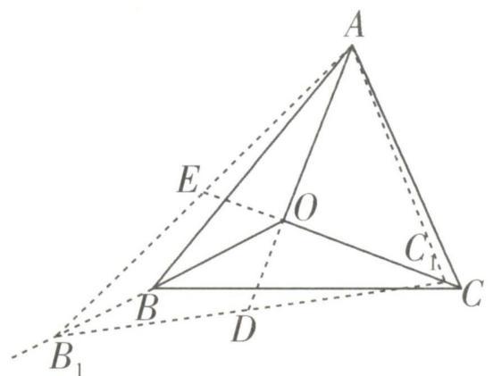

text_image

A
E
O
C
B
D
C₁
B₁

接着我们要通过 $\overrightarrow{OB}$ 与 $\overrightarrow{OB_{1}}$ 的比例关系以及 $\overrightarrow{OC}$ 与 $\overrightarrow{OC_{1}}$ 的比例关系去得到 $\overrightarrow{OA},\overrightarrow{OB},\overrightarrow{OC}$ 所满足的关系. 设 $\overrightarrow{OB}=p\overrightarrow{OB_{1}}(p>0),\overrightarrow{OC}=q\overrightarrow{OC_{1}}(q>0)$ ，则 $\overrightarrow{OA}+\frac{1}{p}\overrightarrow{OB}+\frac{1}{q}\overrightarrow{OC}=\mathbf{0}$ ，且 $|\overrightarrow{OB}|=p|\overrightarrow{OB_{1}}|,\left|\overrightarrow{OC}\right|=q|\overrightarrow{OC_{1}}|$ ，所以 $pq\overrightarrow{OA}+q\overrightarrow{OB}+p\overrightarrow{OC}=\mathbf{0}$ . 因为 $S_{\triangle BOC}=\frac{1}{2}|\overrightarrow{OB}||\overrightarrow{OC}|\sin\angle BOC,S_{\triangle B_{1}OC_{1}}=\frac{1}{2}|\overrightarrow{OB_{1}}||\overrightarrow{OC_{1}}|\cdot$ $\sin\angle B_{1}OC_{1}$ ，所以 $\frac{S_{\triangle BOC}}{S_{\triangle B_{1}OC_{1}}}=\frac{|\overrightarrow{OB}||\overrightarrow{OC}|}{|\overrightarrow{OB_{1}}||\overrightarrow{OC_{1}}|=pq.同理\frac{S_{\triangle AOB}}{S_{\triangle AOB_{1}}}=\frac{|\overrightarrow{OB}|}{|\overrightarrow{OB_{1}}|=p},\frac{S_{\triangle COA}}{S_{\triangle C_{1}OA}}=\frac{|\overrightarrow{OC}|}{|\overrightarrow{OC_{1}}|=q,所以\frac{S_{\triangle BOC}}{S_{\triangle B_{1}OC_{1}}}O A}+\frac{S_{\triangle COA}}{S_{\triangle C_{1}OA}}\overrightarrow{OB}+\frac{S_{\triangle AOB}}{S_{\triangle AOB_{1}}}O C=\mathbf{0}.因为点 O 为△AB_{1}C_{1} 的重心，所以 S_{\triangle AOB_{1}}=S_{\triangle B_{1}O C_{1}}=S_{\triangle C_{1}O A},所以 S_{\triangle BOC}\overrightarrow{OA}+S_{\triangle COA}\overrightarrow{OB}+S_{\triangle AOB}\overrightarrow{OC}=\mathbf{0}.$

# 2.奔驰定理的应用

奔驰定理实际上建立了 $S_{\triangle AOB}, S_{\triangle BOC}, S_{\triangle COA}$ 的比例与 $\overrightarrow{OA}, \overrightarrow{OB}, \overrightarrow{OC}$ 的向量式之间的关系, 在一些三角形面积的向量式或三角形四心向量式相关问题中有妙用.

# 坑神来避坑

有些同学会由 $\alpha \overrightarrow{OA} +\beta \overrightarrow{OB} +\gamma \overrightarrow{OC} = 0(\alpha ,\beta ,\gamma >0)$ ，直接得 $S_{\triangle BOC} = \alpha ,S_{\triangle COA} = \beta ,S_{\triangle AOB} = \gamma .$ 这里存在的问题是下意识认为奔驰定理只有 $S_{\triangle BOC}\overrightarrow{OA} +S_{\triangle COA}\overrightarrow{OB} +S_{\triangle AOB}\overrightarrow{OC} = 0$ 这一个形式，而忽略了这个 $kS_{\triangle BOC}\overrightarrow{OA} +kS_{\triangle COA}\overrightarrow{OB} +kS_{\triangle AOB}\overrightarrow{OC} = 0(k\neq 0)$ 的一般形式.为了避免犯这样的错误，我们在使用奔驰定理过程中，一定要记住系数只与面积的比例关系挂钩，即 $S_{\triangle BOC}:S_{\triangle COA}:S_{\triangle AOB} = \alpha :\beta :\gamma .$

大招示例 已知点 G 是 $\triangle ABC$ 内一点（如图），若 $S_{\triangle AGB} = 7, S_{\triangle BGC} = 5, S_{\triangle AGC} = 6$ ，且 $\overrightarrow{AG} = x \overrightarrow{AB} + y \overrightarrow{AC} (x, y$ 为实数），则 $x + y =$ \_\_\_\_.

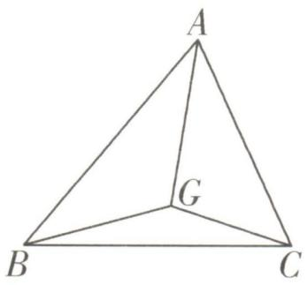

text_image

A
G
B
C

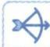

# 大招识别

本题是三角形面积的向量式相关问题,故考虑根据奔驰定理直接把面积比转化为 $\overrightarrow{GA},\overrightarrow{GB},\overrightarrow{GC}$ 所满足的关系式,再得到 $\overrightarrow{AG},\overrightarrow{AB},\overrightarrow{AC}$ 所满足的关系式.

解析 由 $S_{\triangle AGB} = 7, S_{\triangle BGC} = 5, S_{\triangle AGC} = 6$ ，得到 $S_{\triangle BGC}: S_{\triangle AGC}: S_{\triangle AGB} = 5:6:7$ ，因此根据奔驰定理就有 $5 \overrightarrow{GA} + 6 \overrightarrow{GB} + 7 \overrightarrow{GC} = 0$ ，于是 $5 \overrightarrow{GA} + 6 (\overrightarrow{GA} + \overrightarrow{AB}) + 7 (\overrightarrow{GA} + \overrightarrow{AC}) = 0$ ，于是 $\overrightarrow{AG} = \frac{1}{3} \overrightarrow{AB} + \frac{7}{18} \overrightarrow{AC}$ ，又 $\overrightarrow{AG} = x \overrightarrow{AB} + y \overrightarrow{AC}$ ，所以 $x = \frac{1}{3}, y = \frac{7}{18}$ ，所以 $x + y = \frac{1}{3} + \frac{7}{18} = \frac{13}{18}$ .

答案 $\frac{13}{18}$

在对数列进行求和时,有时把首尾两项或相邻的几项合并在一起后再求和会比较方便.

# 1. 倒序相加求和

见招 数列 $\{a_{n}\}$ 中,与首尾两端等距离的两项的和相等.

出招 倒序相加法求前 n 项和.

以等差数列为例,顺序书写为 $S_{n}=a_{1}+a_{2}+\cdots+a_{n}$ ①,倒序书写为 $S_{n}=a_{n}+a_{n-1}+\cdots+a_{1}$ ②,①+②,得 $2S_{n}=(a_{1}+a_{n})+(a_{2}+a_{n-1})+\cdots+(a_{n}+a_{1})=n[2a_{1}+(n-1)d]$ ,所以 $S_{n}=na_{1}+\frac{n(n-1)}{2}d$ .

本质为转化成常数列求和

# 坑神有话说

倒序相加法实际上是一次函数图象中心对称的反映,即若函数 $f(x)$ 的图象关于点 $(a,b)$ 中心对称,则 $f(x)+f(2a-x)=2b$ ,对应到等差数列 $\{a_{n}\}$ 中,则是 $a_{n}+a_{2m-n}=2a_{m}$ .

大招示例 1 已知各项均为正数的数列 $\{a_{n}\}$ 是公比不等于 1 的等比数列, 且 $a_{1}a_{2023}=1$ , 若函数 $f(x)=\frac{4}{1+x^{2}}$ , 则 $f(a_{1})+f(a_{2})+\cdots+f(a_{2023})=$ \_\_\_\_.

解析 数列 $\{a_{n}\}$ 是公比不等于 1 的等比数列， $a_{1}a_{2023}=1$ ，则 $a_{n}a_{2024-n}=1,n\in N^{*},n\leqslant2023,$ 等比数列下标和性质

由 $f(x)=\frac{4}{1+x^{2}}$ 可得,当 $x\neq0$ 时, $f(x)+f(\frac{1}{x})=$ $\frac{4}{1+x^{2}}+\frac{4}{1+(\frac{1}{x})^{2}}=4,$

关键

# 2. 并项求和

对形如 $a_{n} = (-1)^{n} n, a_{n} = (-1)^{n} n^{2}$ 的数列 $\{a_{n}\}$ 或一些周期数列与类周期数列，在求和过程中可将相邻两项或几项合并后再进行求和.

大招示例 2 已知数列 $\{a_{n}\}$ 的前 $n$ 项和为 $S_{n}$ , 若 $a_{n+3} = a_{n} + 1$ , 且 $a_{1} = 1, a_{2} = 2, a_{3} = 3$ , 则 $S_{90} =$ \_\_\_\_.

解析 由 $a_{n+3} = a_n + 1$ , 可知数列 $\{a_n\}$ 是个“类周期数列”. 因此可设数列 $\{b_n\}$ 满足 $b_n = a_{3n-2} + a_{3n-1} + a_{3n}$ , 则 $b_{n+1} = a_{3n+1} + a_{3n+2} + a_{3n+3} = a_{3n-2} +$ 每三项并项

于是 $f(a_{n}) + f(a_{2024 - n}) = f(a_{n}) + f(\frac{1}{a_{n}}) = 4,$

【大招识别】与首尾两端等距离的两项的和相等，采用倒序相加法求和

令 $T_{2023}=f(a_{1})+f(a_{2})+\cdots+f(a_{2023})$ ,

则 $T_{2\ 023}=f(a_{2\ 023})+f(a_{2\ 022})+\cdots+f(a_{1})$

两式相加可得 $2T_{2023} = \left[f(a_{1}) + f(a_{2023})\right] + \left[f(a_{2}) + f(a_{2022})\right] + \cdots + \left[f(a_{2023}) + f(a_{1})\right] = 4 \times 2023$ ,

所以 $T_{2023} = 4046$ .

答案 4 046

$1 + a_{3n-1} + 1 + a_{3n} + 1 = b_n + 3$ , 于是数列 $\{b_n\}$ 是公差为 3 的等差数列, 且 $b_1 = a_1 + a_2 + a_3 = 6$ , 于是得到 $S_{90} = (a_1 + a_2 + a_3) + (a_4 + a_5 + a_6) + \cdots + (a_{88} + a_{89} + a_{90}) = b_1 + b_2 + \cdots + b_{30} = 30 \times 6 + \frac{30 \times 29}{2} \times 3 = 1485.$

答案 1485

# 1. 等比数列前 $n$ 项和的求法

对于公比 q 不为 1 的等比数列 $\{a_{n}\}$ ，求其前 n 项和 $S_{n}$ 时，有 $S_{n}=a_{1}+qa_{1}+\cdots+q^{n-1}a_{1}$ ，两边同时乘 q，得 $qS_{n}=qa_{1}+q^{2}a_{1}+\cdots+q^{n-1}a_{1}+q^{n}a_{1}$ ，两式相减，就可以得到 $(1-q)S_{n}=(1-q^{n})a_{1}$ ，从而 $S_{n}=\frac{1-q^{n}}{1-q}a_{1}$ 。在求等比数列前 n 项和的过程中，我们实际上就用了在等式两边同乘 q 后错位相减的思路。

# 2. 差比数列前 $n$ 项和

若数列 $\{c_{n}\}$ 满足 $c_{n} = a_{n}b_{n}$ , 其中 $\{a_{n}\}$ 是等差数列, $\{b_{n}\}$ 是公比不为 1 的等比数列, 则 $\{c_{n}\}$ 是差比数列. 若差比数列 $\{c_{n}\}$ 满足 $c_{n} = (an + b)q^{n - 1}(a \neq 0, q \neq 1)$ , 通过错位相减法可以得到, 其前 $n$ 项和 $S_{n} = (An + B)q^{n} - B$ , 其中 $A = \frac{a}{q - 1}, B = \frac{b - A}{q - 1}$ .

证明 因为 $c_{n}=(an+b)q^{n-1}(a\neq0,q\neq1)$ , $S_{n}=c_{1}+c_{2}+\cdots+c_{n}$ , 所以 $S_{n}=(a+b)+(2a+b)q+\cdots+(an+b)q^{n-1}$ , 所以 $qS_{n}=(a+b)q+\cdots+[a(n-1)+b]q^{n-1}+(an+b)q^{n}$ (错位), 所以 $(1-q)S_{n}=(a+b)+a(q+q^{2}+\cdots+q^{n-1})-(an+b)q^{n}$ (相减), 所以 $S_{n}=\frac{a+b}{1-q}-\frac{(an+b)q^{n}}{1-q}+\frac{aq-aq^{n}}{(1-q)^{2}}=\frac{a+b}{1-q}-\frac{(an+b)q^{n}}{(1-q)^{2}}+\frac{aq-aq^{n}}{(1-q)^{2}}=$ $\frac{(an+b)q^{n}}{1-q}+\frac{aq}{(1-q)^{2}}-\frac{aq^{n}}{(1-q)^{2}}=\left[\frac{a}{q-1}\cdot n+\frac{b}{q-1}-\frac{a}{(q-1)^{2}}\right]q^{n}-\left[\frac{b}{q-1}-\frac{a}{(q-1)^{2}}\right]$ . 令 $A=\frac{a}{q-1}$ , $B=\frac{b-A}{q-1}$ , 则 $S_{n}=(An+B)q^{n}-B$ .

# 坑神来避坑

(1) 差比数列 $\{c_{n}\}$ 的形式必须先化成 $c_{n} = (an + b)q^{n - 1}(a \neq 0, q \neq 1)$ , 在解答题中不能直接套结论, 可以按错位相减法求和正常写步骤, 最后化简时根据结论直接得答案, 或检验自己算的结果是否正确.  
(2) 对于 $c_{n} = (an + b)q^{n}$ , 可以先化成 $c_{n} = (aqn + bq)q^{n - 1}$ 再验证, 也可直接利用 $S_{n} = \left[\frac{an}{q - 1} + \frac{b}{q - 1} - \frac{a}{(q - 1)^{2}}\right]q^{n + 1} - \left[\frac{b}{q - 1} - \frac{a}{(q - 1)^{2}}\right]q$ 验证.

大招示例 1 (2023 全国甲卷) 记 $S_{n}$ 为数列 $\{a_{n}\}$ 的前 $n$ 项和, 已知 $a_{2} = 1, 2S_{n} = na_{n}$ .

(1) 求 $\{a_{n}\}$ 的通项公式;  
(2)求数列 $\{\frac{a_{n + 1}}{2^n}\}$ 的前 $n$ 项和 $T_{n}$ .

解析 (1) 当 $n = 1$ 时, $2S_{1} = a_{1}$ , 即 $2a_{1} = a_{1}$ , 所以 $a_{1} = 0$ .

当 $n \geqslant 2$ 时，由 $2S_{n} = na_{n}$ ，得 $2S_{n-1} = (n - 1)a_{n-1}$ ，

两式相减得 $2a_{n}=na_{n}-(n-1)a_{n-1}$ ， $S_{n}$ 型之 $a_{n}-S_{n}$ 型

即 $(n-1)a_{n-1}=(n-2)a_{n}$ ,

当 n=2 时, 可得 $a_{1}=0$ ,

故当 $n \geqslant 3$ 时, $\frac{a_n}{a_{n-1}} = \frac{n-1}{n-2}$ , 则 $\frac{a_n}{a_{n-1}} \cdot \frac{a_{n-1}}{a_{n-2}} \cdot \cdots$ .

符合 $\frac{a_{n}}{a_{n-1}}=f(n)$ 形式，采用累乘法求通项

$\frac{a_{3}}{a_{2}}=\frac{n-1}{n-2}\cdot\frac{n-2}{n-3}\cdot\cdots\cdot\frac{2}{1}$ ，整理得 $\frac{a_{n}}{a_{2}}=n-1$ ，

因为 $a_{2}=1$ ，所以 $a_{n}=n-1(n\geqslant3)$ .

当 n=1, n=2 时, 均满足上式, 所以 $a_{n}=n-1$ . 注意检验

(2) 令 $b_{n}=\frac{a_{n+1}}{2^{n}}=\frac{n}{2^{n}}$ ,

$\frac{a_{n+1}}{2^{n}}=\frac{n}{2^{n}}$ 是等差数列×等比数列的形式，故采用错位相减法求和

则 $T_{n}=b_{1}+b_{2}+\cdots+b_{n-1}+b_{n}=\frac{1}{2}+\frac{2}{2^{2}}+\cdots+$

$$
\frac {n - 1}{2 ^ {n - 1}} + \frac {n}{2 ^ {n}}, ①
$$

$$
\frac {1}{2} T _ {n} = \frac {1}{2 ^ {2}} + \frac {2}{2 ^ {3}} + \dots + \frac {n - 1}{2 ^ {n}} + \frac {n}{2 ^ {n + 1}}, \textcircled {2}
$$

由①-②得 $\frac{1}{2}T_{n}=\frac{1}{2}+\frac{1}{2^{2}}+\frac{1}{2^{3}}+\cdots+\frac{1}{2^{n}}-\frac{n}{2^{n+1}}=$

$$
\frac {\frac {1}{2} \left(1 - \frac {1}{2 ^ {n}}\right)}{1 - \frac {1}{2}} - \frac {n}{2 ^ {n + 1}} = 1 - \frac {2 + n}{2 ^ {n + 1}},
$$

即 $T_{n} = 2 - \frac{2 + n}{2^{n}}.$

检验: 设 $b_{n}=\frac{a_{n+1}}{2^{n}}=\frac{n}{2^{n}}=\left(\frac{1}{2}n+0\right)\times\left(\frac{1}{2}\right)^{n-1}$ ，故

# 3.形如 $a_{n}=n^{2}\cdot2^{n}$ 的数列 $\{a_{n}\}$ 的前 n 项和

$$
A = \frac {a}{q - 1} = \frac {\frac {1}{2}}{\frac {1}{2} - 1} = - 1, B = \frac {b - A}{q - 1} = \frac {0 + 1}{\frac {1}{2} - 1} = - 2,
$$

$$
T _ {n} = (- n - 2) \left(\frac {1}{2}\right) ^ {n} + 2 = 2 - \frac {2 + n}{2 ^ {n}}.
$$

# 2023 解题 武林大会

事实上，能用错位相减法求和的试题也可以通过待定系数法转化为裂项相消法求和，原理： $a_{n}=f(n+1)-f(n)$ ，则 $S_{n}=a_{1}+a_{2}+\cdots+a_{n-1}+a_{n}=f(2)-f(1)+f(3)-f(2)+\cdots+f(n)-f(n-1)+f(n+1)-f(n)=f(n+1)-f(1)$ ，对于差比数列来说，这里的 $f(n)=c_{n}=(an+b)q^{n}$ .

另解 $b_{n} = n\cdot 2^{-n} = [a(n + 1) + b]\cdot 2^{-n - 1}-$ $(an + b)\cdot 2^{-n} = (-\frac{1}{2} an + \frac{1}{2} a - \frac{1}{2} b)\cdot 2^{-n}$ ，对比系数可得 $-\frac{1}{2} a = 1,\frac{1}{2} a - \frac{1}{2} b = 0$ ，解得 $a =$ $-2,b = -2$ ，则 $T_{n} = f(n + 1) - f(1) = [-2(n+$ $1) - 2] \cdot 2^{-n - 1} - (-2 - 2)\times 2^{-1} = 2 - \frac{n + 2}{2^n}.$

错位相减求和本质上就是通过代数运算, 消去一些无法通过求和公式求解的项, 从而将问题进行简化. 因此错位相减求和除了应用于差比数列求和之外, 还能应用于求解形如 $a_{n} = n^{2} \cdot 2^{n}$ 的数列的前 $n$ 项和, 只是此时可能需要使用两次错位相减.

大招示例 2 求 $S_{n}=1^{2}\cdot2^{1}+2^{2}\cdot2^{2}+\cdots+n^{2}\cdot2^{n}$ .

解析 对于求解形如 $a_{n} = n^{2}\cdot 2^{n}$ 的数列 $\{a_{n}\}$ 的前 $n$ 项和，我们进行两次错位相减求和即可.

因为 $S_{n}=1^{2}\cdot2^{1}+2^{2}\cdot2^{2}+\cdots+n^{2}\cdot2^{n}$ ，所以 $2S_{n}=1^{2}\cdot2^{2}+\cdots+(n-1)^{2}\cdot2^{n}+n^{2}\cdot2^{n+1}$ （错位），所以 $S_{n}=n^{2}\cdot2^{n+1}-1^{2}\cdot2^{1}-\left\{(2^{2}-1^{2})\right.$

$2^{2}+(3^{2}-2^{2})\cdot2^{3}+\cdots+[n^{2}-(n-1)^{2}]\cdot2^{n}\}$ (相减) $=n^{2}\cdot2^{n+1}-1^{2}\cdot2^{1}-[(2\times2-1)\cdot2^{2}+$

\( (2 \times 3 - 1) \cdot 2^{3} + \cdots + (2n - 1) \cdot 2^{n} \). 令 \( T\_{n} = (2 \times 2 - 1) \cdot 2^{2} + (2 \times 3 - 1) \cdot 2^{3} + \cdots + (2n - 1) \cdot 2^{n} \), 则 \( 2T\_{n} = (2 \times 2 - 1) \cdot 2^{3} + \cdots + [2(n -

$1) - 1] \cdot 2^n + (2n - 1) \cdot 2^{n+1}$ （错位），所以 $T_n = (2n - 1) \cdot 2^{n+1} - (2 \times 2 - 1) \cdot 2^2 - (2^4 + 2^5 + \cdots + 2^{n+1})$ （相减） $= (2n - 3) \cdot 2^{n+1} + 4.$ 所以 $S_n = n^2 \cdot 2^{n+1} - 1^2 \cdot 2^1 - [(2n - 3) \cdot 2^{n+1} + 4] = (n^2 - 2n + 3) \cdot 2^{n+1} - 6.$

另解 $a_{n} = n^{2}\cdot 2^{n} = [a(n + 1)^{2} + b(n + 1) + c]\cdot$ $2^{n + 1} - (an^2 +bn + c)\cdot 2^n = [an^2 +(4a + b)n+$ $2a + 2b + c]\cdot 2^n$ ，对比系数可得 $a = 1,4a + b = 0,$ $2a + 2b + c = 0$ ，解得 $a = 1,b = -4,c = 6$ ，则 $S_{n} =$ $f(n + 1) - f(1) = [(n + 1)^{2} - 4(n + 1) + 6]\cdot$ $2^{n + 1} - (1 - 4 + 6)\times 2 = (n^2 -2n + 3)\cdot 2^{n + 1} - 6.$

# 1. 裂项相消求和的基本原理

①如果数列 $\{a_{n}\}$ 满足 $a_{n}=f(n+1)-f(n)(n\in\mathbf{N}_{+})$ ，则其前n项和 $S_{n}$ 将会满足 $S_{n}=[f(2)-f(1)]+[f(3)-f(2)]+\cdots+[f(n)-f(n-1)]+[f(n+1)-f(n)]=f(n+1)-f(1)$ ，这种求和方法称为一阶裂项相消求和.  
②如果数列 $\{a_{n}\}$ 满足 $a_{n}=f(n+2)-f(n)(n\in\mathbf{N}_{+})$ ，则其前 n 项和 $S_{n}$ 将会满足 $S_{n}=[f(3)-f(1)]+[f(4)-f(2)]+\cdots+[f(n+2)-f(n)]=[f(3)+f(4)+\cdots+f(n+2)]-[f(1)+f(2)+\cdots+f(n)]=f(n+2)+f(n+1)-f(2)-f(1)$ ，这种求和方法称为二阶裂项相消求和。

同理,我们还可以探讨更高阶的裂项相消求和,但是一般只考查到二阶,这里就不展开了.下面我们来看常见的裂项式.

# 2. 分式裂项

① $\frac{1}{n(n+k)}=\frac{1}{k}\cdot\frac{(n+k)-n}{n(n+k)}=\frac{1}{k}\left(\frac{1}{n}-\frac{1}{n+k}\right)(k\in\mathbf{N}_{+})$ （k阶裂项）；  
② $\frac{1}{(2n-1)(2n+1)}=\frac{1}{2}\times\frac{(2n+1)-(2n-1)}{(2n-1)(2n+1)}=\frac{1}{2}\left(\frac{1}{2n-1}-\frac{1}{2n+1}\right)$ （一阶裂项）；  
③ $\frac{1}{n(n+1)(n+2)}=\frac{1}{2}\left[\frac{1}{n(n+1)}-\frac{1}{(n+1)(n+2)}\right]$ （一阶裂项）.

# 3. 根式裂项

$$
\frac {1}{\sqrt {n} + \sqrt {n + k}} = \frac {\sqrt {n + k} - \sqrt {n}}{(\sqrt {n + k} - \sqrt {n}) (\sqrt {n + k} + \sqrt {n})} = \frac {1}{k} (\sqrt {n + k} - \sqrt {n}) (k \in \mathbf {N} _ {+}) (k \text {阶裂项}).
$$

# 4. 分指裂项

① $\frac{(n-1)\cdot2^{n}}{n(n+1)}=\frac{n\cdot2^{n+1}-(n+1)\cdot2^{n}}{n(n+1)}=\frac{2^{n+1}}{n+1}-\frac{2^{n}}{n}$ （一阶裂项）；  
② $\frac{n-1}{2^{n+1}}=\frac{2n-(n+1)}{2^{n+1}}=\frac{n}{2^{n}}-\frac{n+1}{2^{n+1}}$ （一阶裂项）；  
③ $\frac{n+2}{n(n+1)\cdot2^{n+1}}=\frac{2(n+1)-n}{n(n+1)\cdot2^{n+1}}=\frac{1}{n\cdot2^{n}}-\frac{1}{(n+1)\cdot2^{n+1}}$ （一阶裂项）.

# 大招觉醒

见招 数列 $\{a_{n}\}$ 中,通项公式 $a_{n}$ 为分式型,分母为一次型(即等差型)、指数型、根式型等.

出招 裂项相消法求前 n 项和: 将数列的通项 $a_{n}$ 拆分成数列 $\{b_{n}\}$ 的两项之差 $b_{n}-b_{n+1}$ 或 $b_{n}-b_{n+2}$ ，通过正负相消消去一些项后再求和.

大招示例 1 已知数列 $\{a_{n}\}$ 满足 $a_{n} = \frac{3^{n}}{3 \cdot 9^{n} - 4 \cdot 3^{n} + 1}$ , 求数列 $\{a_{n}\}$ 的前 $n$ 项和 $S_{n}$ .

$$
\begin{array}{r l} {\text {解析}} & {\text {因为} a _ {n} = \frac {3 ^ {n}}{3 \cdot 9 ^ {n} - 4 \cdot 3 ^ {n} + 1} =} \\ & {\frac {3 ^ {n}}{3 ^ {n + 1} \cdot 3 ^ {n} - (3 ^ {n + 1} + 3 ^ {n}) + 1} = \frac {3 ^ {n}}{(3 ^ {n + 1} - 1) (3 ^ {n} - 1)} =} \end{array}
$$

$$
\frac {1}{2} \times \frac {\left(3 ^ {n + 1} - 1\right) - \left(3 ^ {n} - 1\right)}{\left(3 ^ {n + 1} - 1\right) \left(3 ^ {n} - 1\right)} = \frac {1}{2} \left(\frac {1}{3 ^ {n} - 1} - \frac {1}{3 ^ {n + 1} - 1}\right)
$$

(一阶裂项), 所以 $S_{n} = \frac{1}{2} \left( \frac{1}{3^{1} - 1} - \frac{1}{3^{2} - 1} \right) + \frac{1}{2} \left( \frac{1}{3^{2} - 1} - \frac{1}{3^{3} - 1} \right) + \cdots + \frac{1}{2} \left( \frac{1}{3^{n} - 1} - \frac{1}{3^{n+1} - 1} \right) = \frac{1}{4} - \frac{1}{2 \left( 3^{n+1} - 1 \right)}$ .

大招示例 2 (1) 求 $T_{n}=1^{2}+2^{2}+\cdots+n^{2}$ $(n \in \mathbf{N}_{+})$ ;

(2) 求 $T_{n}=1^{3}+2^{3}+\cdots+n^{3}(n\in\mathbf{N}_{+})$ .

n 个数的平方和以及立方和公式可以通过裂项相消求和推导

解析 (1) 将 $T_{n}$ 分成两组, 一组为裂项相消求和, 一组为公式法直接求和. 因为 $(n + 1)^{3} - n^{3} = 3n^{2} + 3n + 1$ , 所以 $n^{2} = \frac{1}{3} [(n + 1)^{3} - n^{3}] - n - \frac{1}{3}$ . 因为 $T_{n} = 1^{2} + 2^{2} + \dots + n^{2}$ , 所以 $T_{n} = \frac{1}{3} \{(2^{3} - 1^{3}) + (3^{3} - 2^{3}) + \dots + [(n + 1)^{3} - n^{3}] \} - (1 + 2 + \dots + n) - \frac{n}{3} = \frac{(n + 1)^{3} - 1}{3} - \frac{n(n + 1)}{2} - \frac{n}{3} =$

$$
\frac {n (n + 1) (2 n + 1)}{6}.
$$

(2)与(1)同理,将 $T_{n}$ 分成三组,一组为裂项相消求和,两组为公式法直接求和.因为 $(n+1)^{4}-n^{4}=4n^{3}+6n^{2}+4n+1$ ,所以 $n^{3}=\frac{1}{4}\left[(n+1)^{4}-n^{4}\right]-\frac{3}{2}n^{2}-n-\frac{1}{4}$ .

因为 $T_{n}=1^{3}+2^{3}+\cdots+n^{3}$ ，所以 $T_{n}=\left\{\frac{1}{4}\right[(1+$

$$
1) ^ {4} - 1 ^ {4} ] - \frac {3}{2} \times 1 ^ {2} - 1 - \frac {1}{4} \} + \left\{\frac {1}{4} [ (2 + 1) ^ {4} - \right.
$$

$$
\left. 2 ^ {4} \right] - \frac {3}{2} \times 2 ^ {2} - 2 - \frac {1}{4} \} + \dots + \left\{\frac {1}{4} [ (n + 1) ^ {4} - \right.
$$

$$
\left. n ^ {4} \right] - \frac {3}{2} n ^ {2} - n - \frac {1}{4} \} = \frac {1}{4} [ (n + 1) ^ {4} - 1 ] - \frac {3}{2} \times
$$

$$
\frac {n (n + 1) (2 n + 1)}{6} - \frac {n (n + 1)}{2} - \frac {n}{4} = \frac {1}{4} (n ^ {3} +
$$

$$
4 n ^ {2} + 6 n + 4) n - \frac {1}{4} (2 n ^ {2} + 3 n + 1) n - \frac {1}{4} (2 n +
$$

$$
3) n = \left[ \frac {n (n + 1)}{2} \right] ^ {2}.
$$

# 大招47—阶线性递推

我们把“数列 $\{a_{n}\}$ 满足递推式 $a_{n+1}=pa_{n}+f(n)(p\neq0)$ ，求数列 $\{a_{n}\}$ 的通项公式”的问题，称为一$f(n)$ 是关于 $n$ 的一个函数表达式

阶线性递推问题.

# 1. 递推求通项的基本逻辑

对原数列进行代数变形,构造出一个等比数列或等差数列或常数列,通过求新构造数列的通项公式,得到原数列的通项公式.

# 2. 一阶线性递推问题的处理思路

①当 $p = 1$ 时, $a_{n+1} = a_n + f(n)$ , 于是可以使用累加法来求通项. 特别地, 如果 $f(n)$ 为常数 $d$ , 那么数列 $\{a_n\}$ 就是一个等差数列.

②一般情况我们会采用以下思路处理,首先把 $f(n)$ 拆成 $g(n+1)-pg(n)$ ,则 $a_{n+1}=pa_{n}+g(n+1)$

关键就是如何确定 $g(n)$

1) $-pg(n)$ , 然后移项得 $a_{n+1} - g(n+1) = p[a_n - g(n)]$ , 从而数列 $\{a_n - g(n)\}$ 是公比为 $p$ 的等比数列, 根据数列 $\{a_n - g(n)\}$ 的通项公式, 求得数列 $\{a_n\}$ 的通项公式. 特别地, 当 $p = 1$ 时, 数列 $\{a_n - g(n)\}$ 是常数列, 从而求得数列 $\{a_n\}$ 的通项公式.

# 3. 一阶线性递推中确定 $g(n)$ 的方法——待定系数法

为保证最终能配凑成等比数列, $f(n)$ 的拆分遵循一个原则是: $f(n)$ 是什么形式,拆分后的 $g(n)$ 就是什么形式.从而可以根据待定系数法设出拆分后的形式,进而解出系数.

①当数列 $\{a_{n}\}$ 满足递推式 $a_{n+1}=pa_{n}+q(p\neq0,1)$ 时, 可以使用待定系数法设出 $a_{n+1}-\lambda=p(a_{n}-f(n))$ 为常数 q, 因此将常数 q 拆分后的 $g(n)$ 应该也是常数 $\lambda)(\lambda\in\mathbb{R})$ , 于是解得 $\lambda=\frac{q}{1-p}$ , 因此 $a_{n+1}=pa_{n}+q$ 就可变形为 $a_{n+1}-\frac{q}{1-p}=p(a_{n}-\frac{q}{1-p})$ , 从而数列 $\{a_{n}-\frac{q}{1-p}\}$ 是公比为 p 的等比数列.

②当数列 $\{a_{n}\}$ 满足递推式 $a_{n+1} = pa_{n} + qn + r (p \neq 0, p \neq 1, q, r \in \mathbb{R})$ 时, 可以使用待定系数法设出 $f(n)$ 为一次多项式 $qn + r$ , 因此将一次多项式 $qn + r$ 拆分后的 $g(n)$ 应该也是一次多项式 $a_{n+1} - [A(n+1) + B] = p [a_{n} - (An + B)]$ , 于是解得 $A = \frac{q}{1 - p}, B = \frac{r}{1 - p} - \frac{q}{(1 - p)^{2}}$ , 因此 $a_{n+1} = pa_{n} + qn + r$ 就可变形为 $a_{n+1} - [\frac{q}{1 - p}(n + 1) + \frac{r}{1 - p} - \frac{q}{(1 - p)^{2}}] = p \{a_{n} - [\frac{q}{1 - p} n + \frac{r}{1 - p} - \frac{q}{(1 - p)^{2}}]\}$ , 从而数列 $\{a_{n} - [\frac{q}{1 - p} n + \frac{r}{1 - p} - \frac{q}{(1 - p)^{2}}]\}$ 是公比为 $p$ 的等比数列.

# 坑神有话说

待定系数法构造等比数列的形式都不需要记忆,但需掌握构造方法.①②都是通过“同加变换”构造公比为 $p$ 的等比数列,①是“+(-λ)”得到 $a_{n+1}-\lambda=p(a_n-\lambda)$ ;②是“+[-(An+B)]”得到 $a_{n+1}-[A(n+1)+B]=p[a_n-(An+B)]$ .

③当数列 $\{a_{n}\}$ 满足递推式 $a_{n+1}=pa_{n}+q^{n}(p\neq0,p\neq q)$ 时, 可以使用待定系数法设出 $a_{n+1}-f(n)$ 为指数形式 $q^{n}$ ，因此将指数形式 $q^{n}$ 拆分后的 $g(n)$ 应该也是指数形式 $\lambda q^{n+1}=p(a_{n}-\lambda q^{n})$ ，于是解得 $\lambda=\frac{1}{q-p}$ ，因此 $a_{n+1}=pa_{n}+q^{n}$ 就可变形为 $a_{n+1}-\frac{q^{n+1}}{q-p}=p(a_{n}-\frac{q^{n}}{q-p})$ ，从而数列 $\{a_{n}-\frac{q^{n}}{q-p}\}$ 是公比为 p 的等比数列.

# 坑神小课堂

事实上, 对于 $a_{n+1} = pa_n + q^n (p \neq 0)$ 的递推式可通过“同除变换”求通项: (1) 常用同除以 $p^{n+1}$ ( $p$ 是 $a_n$ 的系数, $n+1$ 是 $a_{n+1}$ 的项数) 得到 $\frac{a_{n+1}}{p^{n+1}} = \frac{a_n}{p^n} + \frac{1}{p} \cdot \left(\frac{q}{p}\right)^n$ , 令 $b_n = \frac{a_n}{p^n}$ , 则 $b_{n+1} = b_n + \frac{1}{p} \cdot \left(\frac{q}{p}\right)^n$ , 即 $b_{n+1} = b_n + f(n)$ , 当 $p = q$ 时, $\{b_n\}$ 是等差数列, 当 $p \neq q$ 时用累加法求通项. (2) 也可以同除以 $q^{n+1}$ 得到 $\frac{a_{n+1}}{q^{n+1}} = \frac{p}{q} \cdot \frac{a_n}{q^n} + \frac{1}{q}$ , 令 $b_n = \frac{a_n}{q^n}$ , 则 $b_{n+1} = \frac{p}{q} b_n + \frac{1}{q}$ , 当 $p = q$ 时, $\{b_n\}$ 是等差数列, 当 $p \neq q$ 时, 用待定系数法求通项.

# 4. 可化为一阶线性递推的其他形式

除上述三种一阶线性递推的常见形式外,对于一些关于 $a_{n+1}, a_n$ 的递推式,虽然表面上不满足一阶线性递推,但可以根据同除、取倒数等恒等变形,将其转化为一阶线性递推的形式.譬如下面的例子:

①当数列 $\{a_{n}\}$ 满足递推式 $a_{n} - a_{n + 1} = a_{n}a_{n + 1}(a_{n}\neq 0)$ 时，两边同除以 $a_{n}a_{n + 1}$ ，得到 $\frac{1}{a_{n + 1}} -\frac{1}{a_n} = 1$ ，从而数列 $\{\frac{1}{a_n}\}$ 是公差为1的等差数列.

②当数列 $\{a_{n}\}$ 满足递推式 $(n + 2)^{2}a_{n} = (n + 1)^{2}a_{n + 1}$ 时，两边同除以 $(n + 1)^{2}(n + 2)^{2}$ ，得到$\frac{a_n}{(n + 1)^2} = \frac{a_{n + 1}}{(n + 2)^2}$ , 从而数列 $\{\frac{a_n}{(n + 1)^2}\}$ 是常数列.

③当数列 $\{a_{n}\}$ 满足递推式 $a_{n+1} = \frac{a_{n}}{(n+1)a_{n} + 2} (a_{n} \neq 0)$ 时, 取倒数得到 $\frac{1}{a_{n+1}} = 2 \cdot \frac{1}{a_{n}} + n + 1$ , 然后使用待定系数法变形为 $\frac{1}{a_{n+1}} + (n+1) + 2 = 2 (\frac{1}{a_{n}} + n + 2)$ , 从而数列 $\{\frac{1}{a_{n}} + n + 2\}$ 是公比为 2 的等比数列.

大招示例 1 (1) 已知数列 $\{a_{n}\}$ 满足 $a_{n+1} = 2a_{n} + 3^{n}$ , 且 $a_{1} = 1$ , 求数列 $\{a_{n}\}$ 的通项公式;

(2) 已知数列 $\{a_{n}\}$ 满足 $a_{n+1}=3a_{n}+3^{n}$ ，且 $a_{1}=1$ ，求数列 $\{a_{n}\}$ 的通项公式.

# 大招识别

形如 $a_{n+1}=pa_{n}+q^{n}$ ，利用同除变换或待定系数法构造数列求通项.

解析 (1) 方法一 因为 $a_{n+1} = 2a_n + 3^n$ , 所以 $a_{n+1} - 3^{n+1} = 2(a_n - 3^n)$ , 所以数列 $\{a_n - 3^n\}$ 是公草稿纸上的步骤: 设 $a_{n+1} - \lambda \cdot 3^{n+1} = 2(a_n - \lambda \cdot 3^n)$ ,

解得 $\lambda = 1$

比为2的等比数列,所以 $a_{n}-3^{n}=2^{n-1}(a_{1}-3)$ ,
因为 $a_{1}=1$ , 所以 $a_{n}=3^{n}-2^{n}$ .

方法二 因为 $a_{n + 1} = 2a_n + 3^n$ ，所以 $\frac{a_{n + 1}}{2^{n + 1}} = \frac{a_n}{2^n} +$ $\frac{3^n}{2^{n + 1}}.$ 令 $b_{n} = \frac{a_{n}}{2^{n}}$ ，则 $b_{n + 1} = b_n + \frac{1}{2}\times (\frac{3}{2})^n.$

利用累加法求通项

$b_{2}-b_{1}=\frac{1}{2}\times\frac{3}{2},b_{3}-b_{2}=\frac{1}{2}\times(\frac{3}{2})^{2},\cdots,b_{n}-b_{n-1}=$ $\frac{1}{2}\times\left(\frac{3}{2}\right)^{n-1}$ ，则 $b_{n}-b_{1}=\frac{1}{2}\times\left[\frac{3}{2}+\left(\frac{3}{2}\right)^{2}+\cdots+\right.$ $\left(\frac{3}{2}\right)^{n-1}=\left(\frac{3}{2}\right)^{n}-\frac{3}{2}(n\geqslant2)$ . 因为 $b_{1}=\frac{a_{1}}{2}=\frac{1}{2}$ ,
所以 $b_{n}=\left(\frac{3}{2}\right)^{n}-1,a_{n}=2^{n}b_{n}=3^{n}-2^{n}.$ ( $n\geqslant2$ )， $a_{1}=1$ 也适合上式，所以通项公式为 $a_{n}=3^{n}-2^{n}$

(2) 因为 $a_{n+1}=3a_{n}+3^{n}$ ，所以 $\frac{a_{n+1}}{3^{n}}=\frac{a_{n}}{3^{n-1}}+1$ ，所满足 $p=q\neq0$ ，两边同时除以 $3^{n}$ 即可

以数列 $\{\frac{a_n}{3^{n - 1}}\}$ 是公差为1的等差数列，所以 $\frac{a_n}{3^{n - 1}} = \frac{a_1}{3^0} +(n - 1)\times 1$ ，因为 $a_1 = 1$ ，所以 $a_{n} = n\cdot 3^{n - 1}$

# 坑神小课堂

若 $p = q \neq 0$ ，则将 $a_{n+1} = pa_n + q^n$ 两边同除以 $p^n$ 变形为 $\frac{a_{n+1}}{p^n} = \frac{a_n}{p^{n-1}} + 1$ ，从而数列 $\{\frac{a_n}{p^{n-1}}\}$ 是公差为 1 的等差数列.

大招示例 2 已知数列 $\{a_{n}\}$ 满足 $(n^{2} + 3n + 2)\cdot$ $(a_{n + 1} - a_n) = a_na_{n + 1}$ , 且 $a_1 = 1$ , 求数列 $\{a_{n}\}$ 的通项公式.

解析 需要先对递推式进行变形才能转化为一阶线性递推的形式. 先将 $n^2 + 3n + 2$ 因式分解成 $(n + 1)(n + 2)$ , 然后对递推式 $(n^2 + 3n + 2) \cdot (a_{n+1} - a_n) = a_na_{n+1}$ 两边同除以 $(n + 1)(n + 2)a_na_{n+1}$ , 得到 $\frac{a_{n+1} - a_n}{a_na_{n+1}} = \frac{1}{(n + 1)(n + 2)}$ , 于是就有 $\frac{1}{a_n} - \frac{1}{a_{n+1}} = \frac{1}{n + 1} - \frac{1}{n + 2}$ , 进而 $\frac{1}{a_{n+1}} - \frac{1}{n + 2} = \frac{1}{a_n} - \frac{1}{n + 1}$ , 从而数列 $\left\{\frac{1}{a_n} - \frac{1}{n + 1}\right\}$ 是常数列, 得到 $\frac{1}{a_n} - \frac{1}{n + 1} = \frac{1}{a_1} - \frac{1}{2}$ , 而 $a_1 = 1$ , 于是 $\frac{1}{a_n} = \frac{n + 3}{2(n + 1)}$ , 因此 $a_n = \frac{2n + 2}{n + 3}$ .

# 大招48二阶线性递推

  
名师大招

见招 数列 $\{a_{n}\}$ 满足递推式 $a_{n + 2} = pa_{n + 1} + qa_{n}$ , 求数列 $\{a_{n}\}$ 的通项公式 (称为二阶线性递推).

出招 配凑相邻两项,构造新数列 $\left\{a_{n+1}-\mu a_{n}\right\}:a_{n+2}-\mu a_{n+1}=\lambda(a_{n+1}-\mu a_{n})$ .采用待征根法配凑.

第一步: 解方程 $x^{2} - px - q = 0$ (把 $a_{n+2}$ 替换成 $x^{2}, a_{n+1}$ 替换成 $x, a_{n}$ 替换成 1), 两根分别记为 $\lambda, \mu$ .

第二步：把 $a_{n + 2} = pa_{n + 1} + qa_n$ 变形为 $a_{n + 2} - \mu a_{n + 1} = \lambda (a_{n + 1} - \mu a_n)$ ，即 $\{a_n - \mu a_{n - 1}\} (n\geqslant 2)$ 是公比为 $\lambda$ 的等比数列， $a_{n} = \mu a_{n - 1} + \lambda^{n - 2}(a_{2} - \mu a_{1})(n\geqslant 2).$

第三步: 根据一阶线性递推求解, 看 $\lambda, \mu$ 是否相等, 当 $\lambda = \mu$ 时, 数列 $\{a_{n}\}$ 的通项公式满足 $a_{n} = (An + B)\lambda^{n}$ 的形式. 当 $\lambda \neq \mu$ 时, 数列 $\{a_{n}\}$ 的通项公式满足 $a_{n} = A\lambda^{n} + B\mu^{n}$ 的形式.

证明 首先使用待定系数法设出 $a_{n+2}-\mu a_{n+1}=\lambda(a_{n+1}-\mu a_{n})$ ，从而有 $a_{n+2}=(\lambda+\mu)a_{n+1}-\lambda\mu a_{n}$ ，于是得到 $\left\{\begin{aligned}\lambda+\mu=p,\\ \lambda\mu=-q,\end{aligned}\right.$ 进而说明 $\lambda,\mu$ 是关于 x 的一元二次方程 $x^{2}-px-q=0$ 的两个实数根。又根据 $\left\{a_{n}-\mu a_{n-1}\right\}(n\geqslant2)$ 是公比为 $\lambda$ 的等比数列，得到 $a_{n}-\mu a_{n-1}=\lambda^{n-2}(a_{2}-\mu a_{1})(n\geqslant2)$ ，从而有 $a_{n}=\mu a_{n-1}+\lambda^{n-2}(a_{2}-\mu a_{1})(n\geqslant2)$ 。

①当 $\lambda = \mu$ 时, $a_{n} = \lambda a_{n-1} + \lambda^{n-2}(a_{2} - \lambda a_{1}) (n \geqslant 2)$ , 于是 $\frac{a_{n}}{\lambda^{n}} = \frac{a_{n-1}}{\lambda^{n-1}} + \frac{1}{\lambda^{2}} (a_{2} - \lambda a_{1})$ , 接着使用迭代法就可以得到, $a_{n} = \lambda^{n-1} a_{1} + (n-1) \cdot \lambda^{n-2} (a_{2} - \lambda a_{1}) = \left[\frac{a_{2} - \lambda a_{1}}{\lambda^{2}} \cdot n + \left(\frac{2a_{1}}{\lambda} - \frac{a_{2}}{\lambda^{2}}\right)\right] \lambda^{n} (n \geqslant 2)$ , 由于当 n = 1 时通项公式依旧成立, 于是数列 $\{a_{n}\}$ 的通项公式满足 $a_{n} = (An + B) \lambda^{n}$ 的形式.

②当 $\lambda \neq \mu$ 时, 使用待定系数法设出 $a_{n} + m\lambda^{n - 1}(a_{2} - \mu a_{1}) = \mu [a_{n - 1} + m\lambda^{n - 2}(a_{2} - \mu a_{1})](n\geqslant 2)$ , 从而有 $a_{n} = \mu a_{n - 1} + (\mu -\lambda)m\lambda^{n - 2}(a_2 - \mu a_1)$ , 于是得到 $m = \frac{1}{\mu - \lambda}$ , 因此数列 $\{a_{n} + \frac{1}{\mu - \lambda}\cdot \lambda^{n - 1}(a_{2}-$ $\mu a_1)\} (n\geqslant 2)$ 是公比为 $\mu$ 的等比数列, 得到 $a_{n} + \frac{1}{\mu - \lambda}\cdot \lambda^{n - 1}(a_{2} - \mu a_{1}) = \mu^{n - 1}[a_{1} + \frac{1}{\mu - \lambda}\cdot \lambda^{1 - 1}(a_{2}-$ $\mu a_1)]$ , 进而 $a_{n} = \frac{a_{2} - \mu a_{1}}{\lambda(\lambda - \mu)}\lambda^{n} + \frac{a_{2} - \lambda a_{1}}{\mu(\mu - \lambda)}\mu^{n}$ , 于是数列 $\{a_{n}\}$ 的通项公式满足 $a_{n} = A\lambda^{n} + B\mu^{n}$ 的形式.

# 坑神有话说

1. 关于 $x$ 的一元二次方程 $x^{2} - px - q = 0$ 也称为数列递推式 $a_{n + 2} = pa_{n + 1} + qa_n$ 的特征方程, $\lambda, \mu$ 也相应称为特征根, 且 $\lambda + \mu = p, \lambda \mu = -q$ .

2. 在选择、填空题中解出特征根之后可以直接套数列 $\{a_{n}\}$ 的通项公式的形式, 通过待定系数法解出 A, B, 进而直接得出通项公式. 在解答题中, 特征方程相当于给我们提供了一个构造的思路, 可以根据特征方程得到需要配凑的 $\lambda, \mu$ , 随后再转化为一阶线性递推推导.

大招示例 已知数列 $\{a_{n}\}$ 满足 $a_1 = 1, a_2 = \frac{1}{2},$ $a_{n} + a_{n+1} = 2a_{n+2}$ , 求 $\{a_{n}\}$ 的通项公式.

解析 解特征方程 $2x^{2} - x - 1 = 0$ 得 $\lambda = -\frac{1}{2}$ , $\mu = 1$ , 于是数列 $\{a_{n} - a_{n-1}\} (n \geqslant 2)$ 是公比为 $-\frac{1}{2}$ 的等比数列. 下面进入完整解题: 因为 $a_{n} + a_{n+1} = 2a_{n+2}$ , 所以 $a_{n+2} - a_{n+1} = -\frac{1}{2}(a_{n+1} - a_{n})$ , 所以数列 $\{a_{n+1} - a_{n}\}$ 是公比为 $-\frac{1}{2}$ 的等比数列. 因为 $a_{1} = 1, a_{2} = \frac{1}{2}$ , 所以 $a_{n+1} - a_{n} = (-\frac{1}{2})^{n-1}(a_{2}-$

$a_{1}) = (-\frac{1}{2})^{n}$ , 所以当 $n \geqslant 2$ 时, $a_{n} = a_{1} + (-\frac{1}{2}) + (-\frac{1}{2})^{2} + \cdots + (-\frac{1}{2})^{n-1} = 1 + \frac{-1 + (-\frac{1}{2})^{n-1}}{3} = \frac{2 + (-\frac{1}{2})^{n-1}}{3}$ , 又当 $n = 1$ 时, $\frac{2 + (-\frac{1}{2})^{1-1}}{3} = 1 = a_{1}$ , 所以对于任意正整数 $n$ 都有 $a_{n} = \frac{2 + (-\frac{1}{2})^{n-1}}{3}$ .

见招 数列 $\{a_{n}\}$ 满足分式结构递推式 $a_{n+1}=\frac{Ca_{n}}{Aa_{n}+B}$ ，求数列 $\{a_{n}\}$ 的通项公式.

出招 左右两边同时取倒数得到 $\frac{1}{a_{n+1}} = \frac{B}{C} \cdot \frac{1}{a_n} + \frac{A}{C}$ , 令 $b_n = \frac{1}{a_n}$ , 得 $b_{n+1} = pb_n + q$ , 利用一阶线性递推求通项.

见招 数列 $\{a_{n}\}$ 满足分式结构递推式 $a_{n + 1} = \frac{Ca_n + D}{Aa_n + B}$ , 求数列 $\{a_{n}\}$ 的通项公式

出招 不动点法.

第一步：解方程 $x=\frac{Cx+D}{Ax+B}(a_{n},a_{n+1}$ 替换成 x)，记方程两根分别为 $x_{1},x_{2}$ .

第二步: 判断两根 $x_{1}, x_{2}$ 之间的关系, 当 $x_{1} = x_{2}$ 时, 数列 $\left\{\frac{1}{a_{n} - x_{1}}\right\}$ 为等差数列, 当 $x_{1} \neq x_{2}$ 时, 数列 $\left\{\frac{a_{n} - x_{1}}{a_{n} - x_{2}}\right\}$ 为等比数列, 进而可得数列 $\{a_{n}\}$ 的通项公式.

证明 由于数列 $\{a_{n}\}$ 满足递推式 $a_{n+1} = \frac{Ca_{n} + D}{Aa_{n} + B}$ , 令 $x_{1}, x_{2}$ 是关于 $x$ 的方程 $x = \frac{Cx + D}{Ax + B}$ 的两个实数根, 于是得到 $x_{1} = \frac{Cx_{1} + D}{Ax_{1} + B}$ , 进而有 $Ax_{1}^{2} + (B - C)x_{1} - D = 0$ , 于是 $-Bx_{1} = Ax_{1}^{2} - Cx_{1} - D$ , 于是 $a_{n+1} - x_{1} = \frac{Ca_{n} + D}{Aa_{n} + B} - x_{1} = \frac{Ca_{n} + D - Ax_{1}a_{n} - Bx_{1}}{Aa_{n} + B} = \frac{Ca_{n} + D - Ax_{1}a_{n} + Ax_{1}^{2} - Cx_{1} - D}{Aa_{n} + B} = \frac{C - Ax_{1}}{Aa_{n} + B}(a_{n} - x_{1})$ , 然后依葫芦画瓢就有 $a_{n+1} - x_{2} = \frac{C - Ax_{2}}{Aa_{n} + B}(a_{n} - x_{2})$ .

①当 $x_{1} = x_{2}$ 时，得到 $x_{1} = x_{2} = \frac{C - B}{2A}$ ，于是 $a_{n + 1} - x_{1} = \frac{\frac{B + C}{2}}{Aa_{n} + B}(a_{n} - x_{1})$ ，接着取倒数得 $\frac{1}{a_{n + 1} - x_1} = \frac{1}{a_n - x_1}\cdot \frac{Aa_n + B}{\frac{B + C}{2}} = \frac{2}{B + C}\cdot \frac{Aa_n + A\cdot\frac{B - C}{2A} + \frac{B + C}{2}}{a_n - x_1} = \frac{2}{B + C}\cdot \frac{A(a_n - x_1) + \frac{B + C}{2}}{a_n - x_1} = \frac{1}{a_n - x_1} +\frac{2A}{B + C}$ ，因此数列 $\{\frac{1}{a_n - x_1}\}$ 是公差为 $\frac{2A}{B + C}$ 的等差数列.

②当 $x_{1} \neq x_{2}$ 时， $\frac{a_{n+1} - x_{1}}{a_{n+1} - x_{2}} = \frac{C - Ax_{1}}{C - Ax_{2}} \cdot \frac{a_{n} - x_{1}}{a_{n} - x_{2}}$ ，因此数列 $\left\{\frac{a_{n} - x_{1}}{a_{n} - x_{2}}\right\}$ 是公比为 $\frac{C - Ax_{1}}{C - Ax_{2}}$ 的等比数列。
这种分式结构递推求数列 $\{a_{n}\}$ 的通项公式的方法称为不动点法.

# 坑神有话说

在极少数情况下,如果方程 $x=\frac{Cx+D}{Ax+B}$ 没有实数根,考虑数列 $\{a_{n}\}$ 为周期数列.

大招示例 已知数列 $\{a_{n}\}$ 满足 $a_{n + 1} = \frac{a_n}{3a_n + 4}$ , 且 $a_1 = 1$ , 求数列 $\{a_{n}\}$ 的通项公式.

解析 方法一 因为 $a_{n+1} = \frac{a_n}{3a_n + 4}$ , 易知 $a_n \neq 0$ , 所以 $\frac{1}{a_{n+1}} = \frac{4}{a_n} + 3$ , 所以 $\frac{1}{a_{n+1}} + 1 = 4\left(\frac{1}{a_n} + 1\right)$ , 取倒数

(草稿纸上的步骤: 设 $\frac{1}{a_{n+1}} + \lambda = 4\left(\frac{1}{a_n} + \lambda\right)$ ，解得 $\lambda = 1$ )

所以数列 $\{\frac{1}{a_n} + 1\}$ 是公比为4的等比数列，又 $a_1 = 1$ ，所以 $\frac{1}{a_1} +1 = 2$ ，所以 $\frac{1}{a_n} +1 = 2\times 4^{n - 1} = 2\times$ $2^{2n - 2} = 2^{2n - 1}$ ，所以 $a_{n} = \frac{1}{2^{2n - 1} - 1}.$

方法二 解方程 $x=\frac{x}{3x+4}$ 可得方程的两根为 $x_{1}=-1, x_{2}=0$ ，因此可构造一个等比数列 $\left\{\frac{a_{n}+1}{a_{n}}\right\}$ 来

求出 $\{a_{n}\}$ 的通项. 下面进入完整解题步骤: 因为 $a_{n+1} = \frac{a_{n}}{3a_{n} + 4}$ , 所以 $a_{n+1} + 1 = \frac{a_{n}}{3a_{n} + 4} + 1 =$

$\frac{4(a_{n}+1)}{3a_{n}+4}$ ，易知 $a_{n}>0$ ，所以 $\frac{a_{n+1}+1}{a_{n+1}}=\frac{\frac{4(a_{n}+1)}{3a_{n}+4}}{\frac{a_{n}}{3a_{n}+4}}=$

$4 \cdot \frac{a_{n} + 1}{a_{n}}$ , 所以数列 $\left\{\frac{a_{n} + 1}{a_{n}}\right\}$ 是公比为 4 的等比数列, 所以 $\frac{a_{n} + 1}{a_{n}} = 4^{n-1} \cdot \frac{a_{1} + 1}{a_{1}}$ , 因为 $a_{1} = 1$ , 所以 $\frac{a_{n} + 1}{a_{n}} = 2 \cdot 4^{n-1} = 2 \cdot 2^{2n-2} = 2^{2n-1}$ , 所以 $a_{n} = \frac{1}{2^{2n-1} - 1}$ .

# 坑神小课堂

分式结构递推中,形如 $a_{n+1}=\frac{Ca_{n}}{Aa_{n}+B}$ 的数列也可以用不动点法求通项,但非常复杂;形如 $a_{n+1}=\frac{Ca_{n}+D}{Aa_{n}+B}$ 的数列只能用不动点法求通项.

# 大招50 数学归纳法

在证明一些数列相关问题时,如果直接证明不太好证明,可以考虑使用数学归纳法证明,这是证明数列相关问题的一种独特的方法,具体步骤如下:

# 大招解读

第一步：证明当 $n = n_{0} (n_{0} \in \mathbf{N}^{*})$ 时命题成立.

第二步: 假设当 $n = k (k \in \mathbf{N}^{*}, k \geqslant n_{0})$ 时命题成立, 推出当 $n = k + 1$ 时命题也成立.

第三步: 综合前两步可得, 命题对所有从 $n_{0}$ 开始的正整数 $n$ 都成立.

# 坑神小课堂

1. 在第二步证明当 $n = k + 1$ 时命题也成立的过程中, 需要用到假设当 $n = k (k \in \mathbf{N}^{*})$ 时命题成立得到的结论.  
2. 数学归纳法的本质就是通过第一步进行归纳奠基之后,再通过第二步进行归纳递推,进而证明命题.

大招示例 求证: $1 + \frac{1}{\sqrt{2}} + \frac{1}{\sqrt{3}} + \cdots + \frac{1}{\sqrt{n}} < 2\sqrt{n}$

$$
(n \in \mathbf {N} _ {+}).
$$

解析 ①当 n=1 时,1<2,成立.

②假设当 $n=k(k\in\mathbf{N}_{+})$ 时， $1+\frac{1}{\sqrt{2}}+\frac{1}{\sqrt{3}}+\cdots+\frac{1}{\sqrt{k}}<$

$2\sqrt{k}$ 成立.

当 $n = k + 1$ 时， $1 + \frac{1}{\sqrt{2}} + \frac{1}{\sqrt{3}} + \cdots + \frac{1}{\sqrt{k}} + \frac{1}{\sqrt{k+1}} < 2\sqrt{k} + \frac{1}{\sqrt{k+1}}$ ,

因为 $2\sqrt{k + 1} - 2\sqrt{k} = \frac{2(\sqrt{k + 1} - \sqrt{k})(\sqrt{k + 1} + \sqrt{k})}{\sqrt{k + 1} + \sqrt{k}} =$

$$
\frac {2}{\sqrt {k + 1} + \sqrt {k}} > \frac {1}{\sqrt {k + 1}},
$$

所以 $1 + \frac{1}{\sqrt{2}} + \frac{1}{\sqrt{3}} + \cdots + \frac{1}{\sqrt{k}} + \frac{1}{\sqrt{k+1}} < 2\sqrt{k} + \frac{1}{\sqrt{k+1}} < 2\sqrt{k+1}$ 成立, 即当 $n = k + 1$ 时上述不等式也成立.

由①②可得, $1+\frac{1}{\sqrt{2}}+\frac{1}{\sqrt{3}}+\cdots+\frac{1}{\sqrt{n}}<2\sqrt{n}(n\in\mathbf{N}_{+})$ 成立.

# 大招51

# 数列不等式的放缩

  
名师大招

natural_image

Cartoon illustration of a detective character holding a magnifying glass next to a column, with no text or symbols present.

如果要证明数列 $\{a_{n}\}$ 的前 n 项和 $S_{n}$ 满足 $S_{n}>m$ (或 $S_{n}<l$ ), 我们可以考虑直接证明以及数学归纳法, 如果这两种方法解决不了, 我们还可以考虑寻找辅助数列 $\{b_{n}\}$ (或 $\{c_{n}\}$ ), 使得 $a_{n}\geqslant b_{n}, S_{n}\geqslant b_{1}+b_{2}+\cdots+b_{n}>m$ (或 $a_{n}\leqslant c_{n}, S_{n}\leqslant c_{1}+c_{2}+\cdots+c_{n}<l$ ).

常见的放缩有分组放缩、等比放缩、裂项放缩、基本不等式放缩、递推放缩、函数放缩,下面我们一一研究这几种放缩方式.

# 1. 分组放缩

先将数列 $\{a_{n}\}$ 的前n项和 $S_{n}$ 分成若干组,再对每组单独确定放缩或不放缩.

大招示例 1 已知数列 $\{a_{n}\}$ 的前 $n$ 项和为 $S_{n}$ , 且 $a_{n} = \frac{1}{n + 2}$ , 求证: $2 < S_{30} < 4$ .

解析> 先将 $S_{30}$ 分为 $(\frac{1}{3} + \frac{1}{4}) + (\frac{1}{5} + \cdots + \frac{1}{8}) + (\frac{1}{9} + \cdots + \frac{1}{16}) + (\frac{1}{17} + \cdots + \frac{1}{32})$ ，这样的4组，再加以求和。因为 $a_n = \frac{1}{n+2}$ ，所以 $S_{30} = (\frac{1}{3} + \frac{1}{4}) + (\frac{1}{5} + \cdots + \frac{1}{8}) + (\frac{1}{9} + \cdots + \frac{1}{16}) + (\frac{1}{17} + \cdots + \frac{1}{32})$ 。

因为 $S_{30} < \left(\frac{1}{2} + \frac{1}{2}\right) + \left(\frac{1}{4} + \cdots + \frac{1}{4}\right) + \left(\frac{1}{8} + \cdots + \frac{1}{8}\right) + \left(\frac{1}{16} + \cdots + \frac{1}{16}\right) = 1 + 1 + 1 + 1$ ，所以 $S_{30} < 4$ .
因为 $S_{30} > \left( \frac{1}{4} + \frac{1}{4} \right) + \left( \frac{1}{8} + \cdots + \frac{1}{8} \right) + \left( \frac{1}{16} + \cdots + \frac{1}{16} \right) + \left( \frac{1}{32} + \cdots + \frac{1}{32} \right) = \frac{1}{2} + \frac{1}{2} + \frac{1}{2} + \frac{1}{2}$ ，所以 $S_{30}>2.$ 综上所述, $2<S_{30}<4.$

# 2. 等比放缩

如果数列 $\{a_{n}\}$ 满足 $a_{n}=\frac{1}{q^{n}+m}(q>1,m>0)$ ，则有 $a_{n}<\frac{1}{q^{n}}$ ，因此数列 $\{a_{n}\}$ 的前 n 项和 $S_{n}$ 满足 $S_{n}<\frac{1}{q}+\frac{1}{q^{2}}+\cdots+\frac{1}{q^{n}}=\frac{1-\frac{1}{q^{n}}}{{q}-1}$ . 这样就完成了对数列 $\{a_{n}\}$ 的放缩，其中等比数列 $\{\frac{1}{q^{n}}\}$ 是辅助数列. 这种所构造的辅助数列是等比数列的放缩方式称为等比放缩.

# 坑神有话说

等比放缩虽然操作起来简单,但弊端也很明显.

①等比放缩需要数列 $\{a_{n}\}$ 的通项满足 $a_{n}=\frac{1}{q^{n}+m}(q>1,m>0)$ ，形式相对固定.  
②等比放缩的放缩结果 $\frac{1-\frac{1}{q^{n}}}{q-1}$ 也比较固定,很容易导致放缩后的精确度不满足题目要求.当精确度过低时,需要综合分组放缩,保留数列的前几项不予放缩.  
③如果遇见 $a_{n}=\frac{1}{q^{n}-m}(q>1,m>0)$ 的形式, 等比放缩大概率趴窝, 此时需要采用指分结构裂项放缩, 后面再详细介绍.

大招示例 2 已知数列 $\{a_{n}\}$ 的前 $n$ 项和为 $S_{n}$ , 且 $a_{n} = \frac{1}{5^{n} + 3}$ , 求证: $S_{n} < \frac{7}{40}$ .

解析 首先看到 $a_{n}=\frac{1}{5^{n}+3}$ ，直接求和或者使用数学归纳法的欲望是基本没有的。因此我们只能运用等比放缩得到 $a_{n}=\frac{1}{5^{n}+3}<\frac{1}{5^{n}}$ ，于是 $S_{n}<\frac{1}{5}+\frac{1}{5^{2}}+\cdots+\frac{1}{5^{n}}=\frac{\frac{1}{5}-\frac{1}{5^{n+1}}}{1-\frac{1}{5}}=\frac{1-\frac{1}{5^{n}}}{4}<\frac{1}{4}$ ，而 $\frac{1}{4}$ 是比 $\frac{7}{40}$ 大的，显然放缩的精度不太够，误差式大。因

此考虑第一项保留,从第二项开始放缩,提高放缩精度.

下面进入完整解题步骤: 因为 $a_{n}=\frac{1}{5^{n}+3}$ ，所以 $a_{n}=\frac{1}{5^{n}+3}<\frac{1}{5^{n}}$ 。当 n=1 时， $S_{1}=\frac{1}{8}<\frac{7}{40}$ 成立。当 $n\geqslant2$ 时, $S_{n}<\frac{1}{8}+(\frac{1}{5^{2}}+\frac{1}{5^{3}}+\cdots+\frac{1}{5^{n}})=\frac{1}{8}+\frac{\frac{1}{5^{2}}-\frac{1}{5^{n+1}}}{1-\frac{1}{5}}=$ 第一项不放缩，从第二项开始放缩

$\frac{1}{8}+\frac{\frac{1}{5}-\frac{1}{5^{n}}}{4}<\frac{1}{8}+\frac{1}{20}=\frac{7}{40}.$ 综上所述， $S_{n}<\frac{7}{40}.$

# 3. 裂项放缩

所构造的辅助数列是可以裂项相消求和的数列的放缩方式称为裂项放缩,常见的裂项放缩形式有以下三种.

(1) 分式裂项放缩: 若数列 $\{a_{n}\}$ 的通项是一个分式, 譬如 $a_{n} = \frac{1}{n^{2}}, a_{n} = \frac{1}{n^{3}}, \cdots$ , 则可将 $a_{n}$ 放缩成一个可以分式裂项相消求和的式子, 如 $\frac{1}{n(n+k)}, \frac{1}{(n-1)(n+1)}, \frac{1}{n(n+1)(n+2)}$ 等.

(2) 根式裂项放缩: 若数列 $\{a_{n}\}$ 的通项是含根式的, 譬如 $a_{n} = \frac{1}{\sqrt{n}}, a_{n} = \frac{1}{\sqrt{n^{3}}}, \cdots$ , 则可将 $a_{n}$ 放缩成一个可以根式裂项相消求和的式子. 下面就是根式裂项放缩中比较常用的两个放缩式.

① $2(\sqrt{n+1}-\sqrt{n})<\frac{1}{\sqrt{n}}<2(\sqrt{n}-\sqrt{n-1})$ .

证明 先证左边, 因为 $\frac{1}{\sqrt{n}} = \frac{2}{2\sqrt{n}} > \frac{2}{\sqrt{n+1} + \sqrt{n}} = \frac{2(\sqrt{n+1} - \sqrt{n})}{(\sqrt{n+1} + \sqrt{n})(\sqrt{n+1} - \sqrt{n})}$ , 所以 $\frac{1}{\sqrt{n}} > 2(\sqrt{n+1} - \sqrt{n})$ . 再证右边, 因为 $\frac{1}{\sqrt{n}} = \frac{2}{2\sqrt{n}} < \frac{2}{\sqrt{n} + \sqrt{n-1}} = \frac{2(\sqrt{n} - \sqrt{n-1})}{(\sqrt{n} + \sqrt{n-1})(\sqrt{n} - \sqrt{n-1})}$ , 所以 $\frac{1}{\sqrt{n}} < 2(\sqrt{n} -$

$\sqrt{n - 1})$ .故 $2(\sqrt{n + 1} -\sqrt{n}) <   \frac{1}{\sqrt{n}} <  2(\sqrt{n} -\sqrt{n - 1})$

$$
② \frac {1}{\sqrt {n}} - \frac {1}{\sqrt {n + 1}} <   \frac {1}{(n + 1) \sqrt {n}} <   2 (\frac {1}{\sqrt {n}} - \frac {1}{\sqrt {n + 1}}).
$$

证明 先证左边, $\frac{1}{(n + 1)\sqrt{n}} = \frac{\sqrt{n}}{n(n + 1)} = \frac{\sqrt{n}}{n} -\frac{\sqrt{n}}{n + 1} >\frac{\sqrt{n}}{n} -\frac{\sqrt{n + 1}}{n + 1} = \frac{1}{\sqrt{n}} -\frac{1}{\sqrt{n + 1}}.$ 再证右边, $\frac{1}{(n + 1)\sqrt{n}} = \frac{2}{\sqrt{n}\cdot\sqrt{n + 1}\cdot 2\sqrt{n + 1}} <  \frac{2}{\sqrt{n}\cdot\sqrt{n + 1}\cdot(\sqrt{n + 1} + \sqrt{n})} = \frac{2(\sqrt{n + 1} - \sqrt{n})}{\sqrt{n}\cdot\sqrt{n + 1}} = 2(\frac{1}{\sqrt{n}} -\frac{1}{\sqrt{n + 1}}).$ 故 $\frac{1}{\sqrt{n}} -\frac{1}{\sqrt{n + 1}} < \frac{1}{(n + 1)\sqrt{n}} <  2(\frac{1}{\sqrt{n}} -\frac{1}{\sqrt{n + 1}}).$

(3) 指分结构裂项放缩: 若数列 $\{a_{n}\}$ 的通项公式为 $a_{n} = \frac{1}{q^{n} - m} (q > 1, 0 < m < q, n \geqslant 2)$ , 则 $a_{n} < \frac{1}{q - 1} (a_{n - 1} - a_{n})$ .

证明 因为 $q > 1, 0 < m < q$ ，所以 $qa_{n} = \frac{q}{q^{n} - m} = \frac{1}{q^{n-1} - \frac{1}{q} \cdot m} < \frac{1}{q^{n-1} - m} = a_{n-1}$ ，所以 $(q - 1)a_{n} < a_{n-1} - a_{n}$ ，即 $a_{n} < \frac{1}{q - 1}(a_{n-1} - a_{n})$ .

# 坑神有话说

在解答题中使用放缩式之前都需要再证明一下.

大招示例 3 求证: $\frac{1}{\sqrt{1^3}} + \frac{1}{\sqrt{2^3}} + \cdots + \frac{1}{\sqrt{n^3}} < 3$ .

解析 运用裂项放缩式 $\frac{1}{n\sqrt{n - 1}} < 2\left(\frac{1}{\sqrt{n - 1}} - \frac{1}{\sqrt{n}}\right)$ 进行放缩. 下面进入完整解题步骤: 当 $n = 1$ 时, $1 < 3$ , 成立. 当 $n \geqslant 2$ 时, $\frac{1}{\sqrt{n^3}} < \frac{1}{n\sqrt{n - 1}} = \frac{2}{\sqrt{n - 1} \cdot \sqrt{n} \cdot 2\sqrt{n}} < \frac{2}{\sqrt{n - 1} \cdot \sqrt{n} \cdot (\sqrt{n} + \sqrt{n - 1})} =$

$\frac{2(\sqrt{n}-\sqrt{n-1})}{\sqrt{n-1}\cdot\sqrt{n}}=2\left(\frac{1}{\sqrt{n-1}}-\frac{1}{\sqrt{n}}\right)$ ，所以 $\frac{1}{\sqrt{1^{3}}}+\frac{1}{\sqrt{2^{3}}}+\cdots+\frac{1}{\sqrt{n^{3}}}<1+2\left(\frac{1}{\sqrt{1}}-\frac{1}{\sqrt{2}}\right)+2\left(\frac{1}{\sqrt{2}}-\frac{1}{\sqrt{3}}\right)+\cdots+2\left(\frac{1}{\sqrt{n-1}}-\frac{1}{\sqrt{n}}\right)=3-\frac{2}{\sqrt{n}}<3.$

综上, $\frac{1}{\sqrt{1^{3}}}+\frac{1}{\sqrt{2^{3}}}+\cdots+\frac{1}{\sqrt{n^{3}}}<3.$

# 4. 基本不等式放缩

如果数列 $\{a_{n}\}$ 的某些项的和符合基本不等式的形式, 可以直接利用基本不等式来进行放缩, 这种放缩方式称为基本不等式放缩.

大招示例 4 已知数列 $\{a_{n}\}$ 满足 $a_{n}=p^{n}q^{2N-n}$ $(p>0 \text{ 且 } p\neq1, q>0 \text{ 且 } q\neq1, p\neq q, N\in\mathbf{N}_{+}, N\geqslant 2)$ ，求证： $a_{1}+a_{2}+\cdots+a_{2N-1}>(2N-1)(pq)^{N}$ .

解析 利用基本不等式放缩解决问题. 因为 $a_{n}=p^{n}q^{2N-n}$ ，所以 $a_{2N-n}=p^{2N-n}q^{n}$ ，所以 $a_{n}+a_{2N-n}=$

$p^{n}q^{2N-n}+p^{2N-n}q^{n}>2\sqrt{(p^{n}q^{2N-n})(p^{2N-n}q^{n})}=$ $p \neq q$ ，等号取不到 $2(pq)^{N}$ ，所以 $2(a_{1} + a_{2} + \cdots + a_{2N-1}) = (a_{1} + a_{2N-1}) + (a_{2} + a_{2N-2}) + \cdots + (a_{2N-1} + a_{1}) > 2(2N-1) \cdot (pq)^{N}$ ，所以 $a_{1} + a_{2} + \cdots + a_{2N-1} > (2N-1)(pq)^{N}$ .

# 5. 递推放缩

如果题目只给了递推关系式 $a_{n+1} = f(a_n)$ , 而根据这个递推关系式没办法直接求出 $\{a_n\}$ 的通项, 然而又需要我们证明一个不等式, 此时就需要直接利用递推关系式 $a_{n+1} = f(a_n)$ , 构建一个放缩式. 这种利用题目中给出的递推关系式直接进行放缩的放缩方式称为递推放缩.

一般来说我们采用以下两种思路处理这类问题：

①写出递推关系式 $a_{n+1} = f(a_n)$ , 然后通过恒等变形得到放缩式.  
②写出 $a_{n+1}=f(a_{n})$ , $a_{n}=f(a_{n-1})$ , 然后将 $a_{n+1}=f(a_{n})$ 与 $a_{n}=f(a_{n-1})$ 这两个关系式进行加减乘除, 再

更多的是相减和相除

恒等变形得到放缩式.

大招示例 5 已知数列 $\{a_{n}\}$ 满足 $a_{n+1} = \frac{1}{1 + a_n}$ , 且 $a_{1} = \frac{1}{2}$ , 求证: $|a_{n+1} - a_{n}| \leqslant \frac{1}{6} \cdot \left(\frac{2}{5}\right)^{n-1}$ .

解析 要证明 $|a_{n+1} - a_n| \leqslant \frac{1}{6} \cdot \left(\frac{2}{5}\right)^{n-1}$ , 形式很像等比数列, 考虑证明 $\frac{|a_{n+1} - a_n|}{|a_n - a_{n-1}|}$ 小于等于某一个常数. 因为 $a_{n+1} = \frac{1}{1 + a_n}$ , 且 $a_1 = \frac{1}{2}$ , 所以 $a_2 = \frac{2}{3}, 0 < a_n < 1$ , 所以 $\frac{1}{2} < a_{n+1} < 1$ , 所以 $\frac{1}{2} \leqslant a_n < 1$ .

压缩 $a_{n}$ 的取值范围
当 $n \geqslant 2$ 时, 因为 $a_{n} = \frac{1}{1 + a_{n-1}}$ , 所以 $a_{n+1} - a_{n} =$

$$
\frac {1}{1 + a _ {n}} - \frac {1}{1 + a _ {n - 1}} = \frac {a _ {n - 1} - a _ {n}}{\left(1 + a _ {n}\right) \left(1 + a _ {n - 1}\right)}, \text {所以}
$$

$$
\frac {\mid a _ {n + 1} - a _ {n} \mid}{\mid a _ {n} - a _ {n - 1} \mid} = \frac {1}{(1 + a _ {n}) (1 + a _ {n - 1})} =
$$

$$
\frac {1}{a _ {n} \left(1 + a _ {n - 1}\right) + \left(1 + a _ {n - 1}\right)} = \frac {1}{2 + a _ {n - 1}} \leqslant \frac {1}{2 + \frac {1}{2}} =
$$

$\frac{2}{5}$ , 所以 $\frac{|a_{n+1} - a_n|}{|a_2 - a_1|} \leqslant \left(\frac{2}{5}\right)^{n-1}$ , 因为 $|a_2 - a_1| = \frac{1}{6}$ , 所以 $|a_{n+1} - a_n| \leqslant \frac{1}{6} \cdot \left(\frac{2}{5}\right)^{n-1} (n \geqslant 2)$ . 当 $n =$

1 时, 上式显然成立, 所以 $|a_{n+1} - a_n| \leqslant \frac{1}{6} \cdot \left(\frac{2}{5}\right)^{n-1}$ .

# 6. 函数放缩

先利用导数研究函数单调性得到函数相关结论,再进行放缩,在导数模块中已经研究,此处不再详细展开.

# 坑神有话说

大多数情况下数列放缩都是要在保证不等号方向不变的前提下,向能进行数列求和的方向放缩.

text_image

大招52

# 周期数列

  
名师大招

text_image

1.3.5.1.3.5.1.3.5......

# 1. 周期数列的定义

如果数列 $\{c_{n}\}$ 满足 $c_{n + T} = c_n(T\in \mathbf{N}_+)$ ，则数列 $\{c_n\}$ 是周期为 $T$ 的周期数列.

# 2. 周期数列在数列求和中的应用

如果数列 $\{a_{n}\}$ 满足 $a_{n} = f(n) \cdot c_{n} + g(n)$ , 其中数列 $\{c_{n}\}$ 是周期为 $T$ 的周期数列, 则在求数列 $\{a_{n}\}$ 的前 $n$ 项和 $S_{n}$ 时, 把每 $T$ 项并项后再求和比较快.

# 3. 周期数列在递推式为 $a_{n+1} = (-1)^{n} a_{n} + f(n)$ 的数列求和中的应用

如果数列 $\{a_{n}\}$ 满足 $a_{n + 1} = (-1)^{n}a_{n} + f(n)$ ，则 $a_{4k - 3} + a_{4k - 2} + a_{4k - 1} + a_{4k} = f(4k - 1) + f(4k - 3)$ ，

$k \in N_{+}$ ，即在求数列 $\{a_{n}\}$ 的前 n 项和 $S_{n}$ 时，把每 4 项并项后再求和比较快.

证明 因为 $\left\{ \begin{array}{l} a_{4k - 2} = -a_{4k - 3} + f(4k - 3), \\ a_{4k} = -a_{4k - 1} + f(4k - 1), \end{array} \right.$ $k\in \mathbf{N}_{+}$ ，所以 $a_{4k - 3} + a_{4k - 2} + a_{4k - 1} + a_{4k} = f(4k - 1) + f(4k - 3), k\in \mathbf{N}_{+}$

# 4. 周期数列在递推式为 $a_{n+1} = (-1)^{n+1} a_n + f(n)$ 的数列求和中的应用

如果数列 $\{a_{n}\}$ 满足 $a_{n + 1} = (-1)^{n + 1}a_n + f(n)$ , 则 $a_{4k - 3} + a_{4k - 2} + a_{4k - 1} + a_{4k} = f(4k - 1) + 2f(4k - 2) - f(4k - 3), k \in \mathbf{N}_{+}$ , 即在求数列 $\{a_{n}\}$ 的前 $n$ 项和 $S_{n}$ 时, 把每4项并项后再求和比较快.

证明 因为 $\left\{ \begin{array}{l} a_{4k - 2} = a_{4k - 3} + f(4k - 3), \\ a_{4k - 1} = -a_{4k - 2} + f(4k - 2), k \in \mathbf{N}_{+}, \\ a_{4k} = a_{4k - 1} + f(4k - 1), \end{array} \right.$ 所以 $a_{4k - 3} = a_{4k - 2} - f(4k - 3)$ ，所以 $a_{4k - 3} + a_{4k} = a_{4k - 1} + f(4k - 1) - f(4k - 3) = f(4k - 1) + f(4k - 2) - f(4k - 3)$ ，所以 $a_{4k - 3} + a_{4k - 2} + a_{4k - 1} + a_{4k} = f(4k - 1) + 2f(4k - 2) - f(4k - 3), k \in \mathbf{N}_{+}$ .

大招示例 1 已知数列 $\{a_{n}\}$ 的前 $n$ 项和为 $S_{n}$ , 且 $a_{n} = n\cos \frac{n\pi}{2} + 1$ , 则 $S_{2023} = \_$ .

解析 由于 $y = \cos \frac{x\pi}{2}$ 的周期 $T = \frac{2\pi}{\frac{\pi}{2}} = 4$ ，于是

把每4项并项后再求和，即 $a_{4k - 3} + a_{4k - 2} + a_{4k - 1} + a_{4k} = 1 + [-(4k - 2) + 1] + 1 + (4k + 1) = 6(k\in \mathbf{N}_{+})$ ，因此 $S_{2023} = (a_1 + a_2 + a_3 + a_4) + (a_5 + a_6 + a_7 + a_8) + \dots +(a_{2021} + a_{2022} + a_{2023} + a_{2024}) - a_{2024} = 506\times 6 - 2025 = 1011.$

答案 1011

大招示例 2 (1) 已知数列 $\{a_{n}\}$ 的前 $n$ 项和为 $S_{n}$ , 且 $a_{n+1} = (-1)^{n} a_{n} + n$ , 则 $S_{100} = \_$ ;

(2)已知数列 $\{a_{n}\}$ 的前 $n$ 项和为 $S_{n}$ , 且 $a_{n+1} = (-1)^{n+1} a_{n} + n$ , 则 $S_{100} = \underline{\quad}$ .

解析 (1) 由 $a_{n+1} = (-1)^n a_n + n$ , 得到 $\left\{ \begin{array}{l} a_{4k-2} = -a_{4k-3} + 4k - 3, \\ a_{4k} = -a_{4k-1} + 4k - 1, \end{array} \right.$ $k \in \mathbf{N}_{+}$ , 于是 $a_{4k-3} +$

$a_{4k-2} + a_{4k-1} + a_{4k} = (4k - 3) + (4k - 1) = 8k - 4,$ $k \in N_{+}$ ，因此 $S_{100} = (a_{1} + a_{2} + a_{3} + a_{4}) + (a_{5} + a_{6} + a_{7} + a_{8}) + \cdots + (a_{97} + a_{98} + a_{99} + a_{100}) = \frac{4 + 8 \times 25 - 4}{2} \times 25 = 2500.$

(2) 由 $a_{n+1} = (-1)^{n+1} a_n + n$ , 得到

$a_{4k - 2} = a_{4k - 3} + 4k - 3,$ $a_{4k - 1} = -a_{4k - 2} + 4k - 2,k\in \mathbf{N}_{+}$ ，于是 $a_{4k - 3} =$ $a_{4k} = a_{4k - 1} + 4k - 1,$

$a_{4k - 2} - (4k - 3)$ ，从而得到 $a_{4k - 3} + a_{4k} = a_{4k - 2} +$ $a_{4k - 1} + (4k - 1) - (4k - 3) = (4k - 2) + (4k-$ $1) - (4k - 3)$ ，因此 $a_{4k - 3} + a_{4k - 2} + a_{4k - 1} + a_{4k} =$ $(4k - 1) + 2(4k - 2) - (4k - 3) = 8k - 2,k\in \mathbf{N}_{+}$ ，于是 $S_{100} = (a_1 + a_2 + a_3 + a_4) + (a_5 + a_6 + a_7+$ $a_8) + \dots +(a_{97} + a_{98} + a_{99} + a_{100}) = \frac{6 + 8\times 25 - 2}{2}\times$ $25 = 2550.$

答案 (1)2500;(2)2550

# 大招53

# 数列函数属性

text_image

aₙ
f(n)

数列的最大、最小项或项的取值范围问题,实质是求函数最值问题,常采用以下方法处理:

# 方法一: (函数单调性法)

利用单调性求函数最值的方法,同样适用于求数列的最大(小)项,但是要注意 $n \in N_{+}$ 的限制.特别

地, 若数列 $\{a_{n}\}$ 是递增数列, 则最小项为 $a_{1}=f(1)$ ; 若数列 $\{a_{n}\}$ 是递减数列, 则最大项为 $a_{1}=f(1)$ .

常采用作差或作商法判断单调性

# 方法二:(不等式组法)

利用 $\left\{ \begin{array}{l} a_{n} \geqslant a_{n-1}, \\ a_{n} \geqslant a_{n+1} \end{array} \right.$ ( $n \geqslant 2$ ) 确定最大项 $a_{n}$ ; 利用 $\left\{ \begin{array}{l} a_{n} \leqslant a_{n-1}, \\ a_{n} \leqslant a_{n+1} \end{array} \right.$ ( $n \geqslant 2$ ) 确定最小项 $a_{n}$ .

大招示例 （2020 北京）在等差数列 $\{a_{n}\}$ 中， $a_{1} = -9, a_{5} = -1$ . 记 $T_{n} = a_{1}a_{2} \cdots a_{n} (n = 1, 2, \cdots)$ ，则数列 $\{T_{n}\}$ （）

A. 有最大项, 有最小项 B. 有最大项, 无最小项 C. 无最大项, 有最小项 D. 无最大项, 无最小项
解析 设等差数列 $\{a_{n}\}$ 的公差为 $d$ , $\because a_{1} = -9, a_{5} = -1, \therefore a_{5} = -9 + 4d = -1, \therefore d = 2, \therefore a_{n} = -9 + (n - 1) \times 2 = 2n - 11$ . 令 $a_{n} = 2n - 11 \leqslant 0$ ,

则 $n \leqslant 5.5, \therefore n \leqslant 5$ 时， $a_{n} < 0; n \geqslant 6$ 时， $a_{n} > 0.$ $\because T_{1} = -9 < 0, T_{2} = (-9) \times (-7) = 63 > 0, T_{3} = (-9) \times (-7) \times (-5) = -315 < 0, T_{4} = (-9) \times (-7) \times (-5) \times (-3) = 945 > 0, T_{5} = (-9) \times (-7) \times (-5) \times (-3) \times (-1) = -945 < 0,$ 当 $n \geqslant 6$ 时， $a_{n} \geqslant 1, \therefore T_{n+1} < T_{n} < 0, \therefore T_{n} = a_{1}a_{2} \cdots a_{n} (n = 1, 2, \cdots)$ 有最大项 $T_{4}$ ，无最小项，故选 B.

答案 B

# 大招54

# 四面体的特殊模型

  
名师大招

natural_image

Cartoon illustration of a man holding a paper airplane and a triangular shape on a balcony (no text or symbols)

四面体是立体几何中最简单的多面体,我们称之为立体几何的基本体,它在立体几何的论证和计算中起着重要的作用.下面给出四面体的常见特殊模型和常用结论.

熟记一些特殊模型和结论可以快速求解选填题

# 1. 正四面体

正四面体是由四个全等正三角形围成的空间封闭图形,所有棱长都相等. 正四面体是最简单的正多面体,又是特殊的正三棱锥.

若正四面体的棱长为 a, 有以下常用结论:

# 大招解读

①高 $h=\frac{\sqrt{6}}{3}a$ ，表面积 $S=\sqrt{3}a^{2}$ ，体积 $V=\frac{\sqrt{2}}{12}a^{3}$ .  
②记相邻两个面的二面角为 $\alpha$ ，则 $\cos \alpha = \frac{1}{3} (\alpha \approx 70.5^{\circ})$ 。记侧棱与底面的夹角为 $\beta$ ，则 $\cos \beta = \frac{\sqrt{3}}{3} (\beta \approx 54.7^{\circ})$ 。  
③正四面体外接球和内切球的球心重合,且球心在高对应的线段上,它是高对应的线段靠近底面的四等分点,球心到顶点的距离为外接球的半径 $R=\frac{\sqrt{6}}{4}a$ ,球心到底面的距离为内切球的半径

证明过程见大招55外接球问题之补形法大招示例1

$$
r = \frac {\sqrt {6}}{1 2} a, R: r = 3: 1.
$$

证明过程见大招57内切球与球的相切问题的临界处理大招示例1

# 大招解读

④顶点在底面的射影是底面三角形的中心(四心合一).

⑤对棱互相垂直,且对棱中点的连线为对棱的公垂线,距离为 $\frac{\sqrt{2}}{2}a$ ,三对对棱公垂线交于一点,此点为该正四面体外接球(或内切球)的球心.

# 2. 正方体切割出来的四面体

在正方体的8个顶点中任取4个,可组成的四面体有以下四种:

# 大招解读

①每个面都是正三角形的正四面体(图1),此正四面体的体积为正方体体积的 $\frac{1}{3}$ .

②每个面都是直角三角形的四面体(也被称作鳖臑)(图2),此鳖臑的外接球球心位于最长边的中点处,且鳖臑的体积为正方体体积的 $\frac{1}{6}$ .

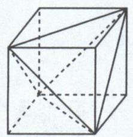  
图1

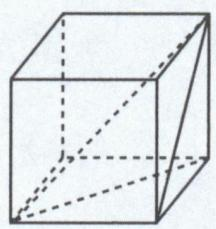  
图2

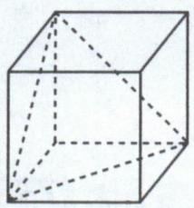  
图3

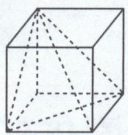  
图4

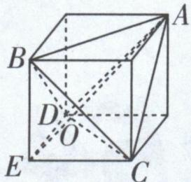  
图5

③有三个面为直角的四面体(图3,图4),其中图3也被称为墙角体,此墙角体的体积为正方体体积的 $\frac{1}{6}$ .

特别地, 把图 1, 图 3 放在一起来看 (图 3 需旋转一下), 可得共底面的正四面体 $A - BCD$ 和正三棱锥 $E - BCD$ , 如图 5, 它们的高之比为 2:1, 且它们的高均在正方体对角线 $AE$ 上, 把体对角线的长分为 2:1 的两部分, 即 $AO:OE = 2:1$ ( $O$ 为 $AE$ 与平面 $BCD$ 的交点).

# 坑神有话说

长方体中同样可以切割出鳖臑和墙角体,一样有上述体积关系.从正方体、长方体中切割出来的四面体,与正方体、长方体有相同的外接球,详见大招外接球问题之补形法.

大招示例 1 在《九章算术》中, 将四个面都为直角三角形的三棱锥称为鳖臑. 已知鳖臑 A - BCD 中, $AB \perp$ 平面 BCD, 且 BC = CD = 4, 当该鳖臑的内切球的半径为 $2(\sqrt{2} - 1)$ 时, 它的外接球体积为 \_\_\_\_.

解析 设鳖臑的内切球的球心为 O, AB = x, 连接 OA, OB, OC, OD (图略). 易知 $V_{A-BCD} = V_{O-ABC} + V_{O-BCD} + V_{O-ABD} + V_{O-ACD}$ , 即 $\frac{1}{3} \times \frac{1}{2} \times 4 \times 4 \times x =$

将三棱锥 A-BCD 分割成以球心为顶点，侧面为底面的四个小三棱锥

$$
\begin{array}{r l} & {\frac {1}{3} (\frac {1}{2} \times 4 x + \frac {1}{2} \times 4 \times 4 + \frac {1}{2} \times 4 \sqrt {2}   x + \frac {1}{2} \times 4 \times} \\ & {\sqrt {1 6 + x ^ {2}}) \times 2 (\sqrt {2} - 1), \text {解得} x = 4, \text {所以} A B = 4.} \end{array}
$$

方法一 直接法. 如图1, 取 $BD$ 的中点 $F$ , 作 $EF \perp BD$ , 交 $AD$ 于 $E$ , 连接 $EB$ , 则 $BF = \frac{1}{2} BD = 2\sqrt{2}$ , 易知 $E$ 为鳖臑的外接球的球心. 设鳖臑的外接球的半径为 $R$ , 因为 $EF = \frac{1}{2} AB = 2$ , 所以 $R = EB = \sqrt{EF^2 + BF^2} = \sqrt{2^2 + (2\sqrt{2})^2} = 2\sqrt{3}$ , 于是鳖臑的外接球的体积 $V=\frac{4\pi}{3}R^{3}=\frac{4\pi}{3}\cdot(2\sqrt{3})^{3}=32\sqrt{3}\pi.$

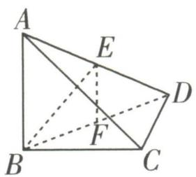  
图1

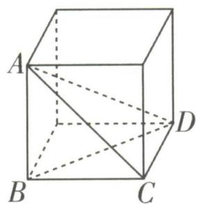  
图2

方法二 补形法. 如图 2, 将鳖臑补形成正方体, 易知鳖臑与此正方体有相同的外接球. 易知 $AD = \sqrt{AB^{2} + BC^{2} + CD^{2}} = \sqrt{4^{2} + 4^{2} + 4^{2}} = 4\sqrt{3}$ , 所以鳖臑的外接球半径 $R = \frac{1}{2}AD = 2\sqrt{3}$ , 于是鳖臑的外接球的体积 $V = \frac{4\pi}{3}R^{3} = \frac{4\pi}{3} \cdot (2\sqrt{3})^{3} = 32\sqrt{3}\pi$ .

答案 $32\sqrt{3}\pi$

大招示例 2 某些正多面体亦被称为“柏拉图多面体”，它们具有高度的对称性和次序感，结构完美。“柏拉图多面体”只存在正四面

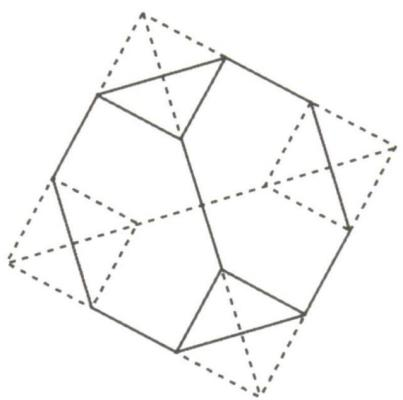

natural_image

Geometric polyhedron diagram with solid and dashed lines indicating visible and hidden edges (no text or labels)

体、正六面体、正八面体、正十二面体、正二十面体5种。半正多面体亦被称为“阿基米德多面体”，它们是由边数不完全相同的正多边形为面围成的凸多面体。如图，将一个正四面体的每一条棱三等分，截去原正四面体顶点所在的四个小正四面体，就实现了最简单的“柏拉图多面体”到“阿基米德多面体”的变换。若图中“阿基米德多面体”的表面积为 $28\sqrt{3}$ ，则该“阿基米德多面体”的体积是\_\_\_\_；其外接球的表面积是\_\_\_\_。

解析 设原正四面体的棱长为 a，则其表面积为 $4 \times \frac{\sqrt{3}}{4} a^{2} = \sqrt{3} a^{2}$ . 由题图可知，所得“阿基米德

表面积 $S = \sqrt{3} a^{2}$

“多面体”与原正四面体比较,表面积少了8个边长为 $\frac{a}{3}$ 的正三角形的面积,所以该“阿基米德多面体”的表面积为 $\sqrt{3}a^{2}-8\times\frac{\sqrt{3}}{4}\times(\frac{a}{3})^{2}=\frac{7\sqrt{3}}{9}a^{2}=$ $28\sqrt{3}$ ,解得a=6.棱长为a的正四面体的高h=

$\sqrt{a^{2}-(\frac{\sqrt{3}}{2}a\times\frac{2}{3})^{2}}=\frac{\sqrt{6}}{3}a$ ，正四面体的底面积为
高 $h=\frac{\sqrt{6}}{3}a$

$\frac{\sqrt{3}}{4}a^{2}$ ，所以正四面体的体积 $V=\frac{1}{3}\times\frac{\sqrt{3}}{4}a^{2}\times\frac{\sqrt{6}}{3}a=$ $\frac{\sqrt{2}}{12}a^{3}$ ，所以该“阿基米德多面体”的体积为 $\frac{\sqrt{2}}{12}a^{3}-$ 体积 $V=\frac{\sqrt{2}}{12}a^{3}$

$4 \times \frac{\sqrt{2}}{12} \times \left( \frac{1}{3} a \right)^{3} = \frac{46\sqrt{2}}{3}$ . 设“阿基米德多面体”的记得将多余的四个小三棱锥的体积减掉

外接球球心为 O, 外接球半径为 R, 则外接球球心在原正四面体的高上且满足 $\sqrt{R^{2} - (\frac{2\sqrt{3}}{3})^{2}} + \sqrt{R^{2} - 2^{2}} = \frac{4\sqrt{6}}{3}$ , 解得 $R^{2} = \frac{11}{2}$ , 于是该“阿基米德多面体”的外接球的表面积为 $4\pi R^{2} = 22\pi$ .

答案 $\frac{46\sqrt{2}}{3}$ $22\pi$

# 大招55

# 外接球问题之补形法

natural_image

Cartoon illustration of a man with glasses standing beside a wooden log, holding a small object (no text or symbols present)

求解棱锥的外接球相关问题,我们一般采用两种方法——补形法与双外心模型. 首先我们一起
一般为三棱锥

来了解一下补形法.

# 1. 补形法

如果一个三棱锥的各个顶点都是直棱柱的一些顶点,那么就可以将这个三棱锥补形成直棱柱,

并且直棱柱的外接球就是原三棱锥的外接球.

空间中不共面的四个点确定一个球

# 2. 四种常见的可以补形成长方体的三棱锥

见招1 一顶点引出的三条棱两两垂直的三棱锥.

因为形状像墙角，又称墙角模型

出招 如图 1 所示, 可以补形成长方体. 若 SA = a, SB = b, SC = c, 则外接球半径 $R = \frac{\sqrt{a^{2} + b^{2} + c^{2}}}{2}$ .

见招2 底面为直角三角形,侧棱垂直于底面,垂足为三角形的非直角顶点的三棱锥.

见招2实际上就是见招1的变式，区别在于垂足是直角顶点还是非直角顶点

出招 如图 2 所示, 可以补形成长方体. 若 SC = a, AB = b, AC = c, 则外接球半径 $R = \frac{\sqrt{a^{2} + b^{2} + c^{2}}}{2}$ .

见招 3 对棱相等的三棱锥.

出招 如图 3 所示, 可以把对棱作为长方体相对的两个面的面对角线, 进而补形成长方体. 若$AB = CD = a, BC = AD = b, AC = BD = c$ ，则外接球半径 $R = \frac{\sqrt{a^2 + b^2 + c^2}}{2\sqrt{2}}$ .

见招 4 顶点在底面的投影恰与底面三个顶点构成长方形的三棱锥.

出招 如图 4 所示,也可以补形成长方体,求出长方体的外接球半径即可得三棱锥 A-BCD 的外求半径.

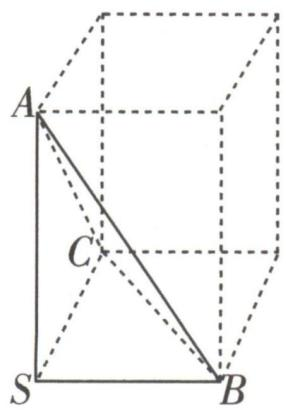

text_image

A
C
S
B

图1

text_image

S
C
A
B

图 2

natural_image

Geometric diagram of a cube with labeled vertices A, B, C and internal diagonals (no text or symbols)

图 3

text_image

Geometric diagram of a cube with labeled vertices A, B, C, D and internal diagonals

图 4

# 坑神有话说

补形法使用起来非常灵活,通过尝试只要能将棱锥补形成特殊的直棱柱就都可以考虑使用.例如处理一些四棱锥外接球相关问题时,就可以往补形法上考虑.

大招示例① 棱长为 $a$ 的正四面体的外接球的半径为

# 大招识别

对棱相等,符合见招3中的补形.

解析 如图所示,正四面体可以补形成一个正方体,正方体棱长为 $\frac{\sqrt{2}}{2}a$ ,于是该正方体的外接球半径 R =

$$
\frac {\sqrt {\frac {1}{2} a ^ {2} + \frac {1}{2} a ^ {2} + \frac {1}{2} a ^ {2}}}{2} = \frac {\sqrt {6}}{4} a,
$$

text_image

A
B
D
C

因此棱长为 a 的正四面体的外接球半径为 $\frac{\sqrt{6}}{4}a$ .

可以当作结论记一下，大家会经常见到它

答案 $\frac{\sqrt{6}}{4}a$

大招示例 2 (2023 全国乙卷) 已知点 S, A, B, C 均在半径为 2 的球面上, $\triangle ABC$ 是边长为 3 的等边三角形, $SA \perp$ 平面 ABC, 则 SA = \_\_\_\_.

# 大招识别

因为 $SA \perp$ 平面 ABC, 所以可想到利用补形法将三棱锥 S-ABC 补成直棱柱进而求解.

解析 如图, 设 $\triangle ABC$ 的外接圆圆心为 $O_{1}$ , 连

接 $O_{1}A$ ，因为 $\triangle ABC$ 是边长为3的等边三角形，所以其外接圆半径 $r = O_{1}A = \frac{2}{3}\times \frac{\sqrt{3}}{2}\times 3 =$ $\sqrt{3}$ .将三棱锥 $S - ABC$ 补形为

text_image

C₁
S
O
B₁
C
O₁
A
B

正三棱柱 $SB_{1}C_{1}-ABC$ ，由题意知 SA 为侧棱，设外接球球心为 O，连接 $OO_{1},OA$ ，则 $OO_{1}\perp$ 平面 ABC，且 $OO_{1}=\frac{1}{2}SA$ 。又球的半径 R=OA=2， $OA^{2}=OO_{1}^{2}+O_{1}A^{2}$ ，即 $4=\frac{1}{4}SA^{2}+3$ ，解得SA=2。

另解 如图, 设 $\triangle ABC$ 的外接圆圆心为 $O_{1}$ , 连接 $O_{1}A$ , 因为 $\triangle ABC$ 是边长为 3 的等边三角

形,所以其外接圆半径 $r = O_{1}A = \frac{2}{3} \times \frac{\sqrt{3}}{2} \times 3 = \sqrt{3}$ .

设三棱锥 S-ABC 的外接球球心为 O, 连接 $OO_{1}$ , 则 $OO_{1} \perp$ 平面 ABC. 又 $SA \perp$ 平面 ABC, 所以 $OO_{1} \parallel SA$ , 连接 OS, OA, 由题意知 OS = OA = 2. 过 O 作 SA 的垂线, 垂足为 H, 则四边形 $AO_{1}OH$ 为矩形, 所以 $OO_{1} = AH$ , 由 OS = OA 可知 H 为 SA 的中点, 则 $OO_{1} = AH = \frac{1}{2}SA$ .

所以在 Rt $\triangle OO_{1}A$ 中, 由勾股定理可得 $OA^{2}=OO_{1}^{2}+O_{1}A^{2}$ , 即 $4=\frac{1}{4}SA^{2}+3$ , 解得 SA=2.

答案 2

# 大招56

# 外接球问题之双外心模型

  
名师大招

见招 求三棱锥的外接球半径,且用补形法不易求出.

出招 找到三棱锥的相邻两个面的外接圆圆心,利用双外心模型公式求解.

# 大招解读

# 双外心模型

如图所示, 点 O 为四面体 ABCD 的外接球球心, 点 $O_{1}$ 为 $\triangle ABC$ 的外接圆圆心, 点 $O_{2}$ 为 $\triangle ABD$ 的外接圆圆心, 点 E 为 AB 的中点, 则四面体 ABCD 的外接球半径 R 满足以下关系: $R^{2}=\frac{EO_{1}^{2}+EO_{2}^{2}-2EO_{1}\times EO_{2}\cos\angle O_{1}EO_{2}}{\sin^{2}\angle O_{1}EO_{2}}+\frac{AB^{2}}{4}.$

text_image

C
O₁
A
O
D
E
O₂
B

证明 因为点 O 为四面体 ABCD 的外接球球心, 点 $O_{1}$ 为 $\triangle ABC$ 的外接圆圆心, 点 $O_{2}$ 为 $\triangle ABD$ 的外接圆圆心, 点 E 为 AB 的中点, 所以点 $O, O_{1}, O_{2}, E$ 都在线段 AB 的中垂面上. 因为 $\angle OO_{1}E = \angle OO_{2}E = 90^{\circ}$ , 所以 $O, O_{1}, O_{2}, E$ 四点共圆, 且 OE 为直径, 所以 $\frac{O_{1}O_{2}}{\sin\angle O_{1}EO_{2}} = OE$ . 因为在 $\triangle O_{1}O_{2}E$ 中使用正弦定理

$O_{1}O_{2}^{2}=EO_{1}^{2}+EO_{2}^{2}-2EO_{1}\times EO_{2}\cos\angle O_{1}EO_{2}$ ，所以 $OE^{2}=\frac{O_{1}O_{2}^{2}}{\sin^{2}\angle O_{1}EO_{2}}=\frac{EO_{1}^{2}+EO_{2}^{2}-2EO_{1}\times EO_{2}\cos\angle O_{1}EO_{2}}{\sin^{2}\angle O_{1}EO_{2}}$ ，因

为 $OA^2 = OE^2 + AE^2$ ，且 $R = OA$ 以及 $AE = \frac{AB}{2}$ ，所以 $R^2 = \frac{EO_1^2 + EO_2^2 - 2EO_1 \times EO_2 \cos \angle O_1EO_2}{\sin^2 \angle O_1EO_2} + \frac{AB^2}{4}$ 。在 $\triangle AEO$ 中使用勾股定理

# 坑神有话说

双外心模型的本质就是把找到两个外心之后根据四点共圆解决问题的过程转化成了一个代数式，即使记不住结论也要记住这种处理问题的思路。

大招示例 已知平面四边形 ABCD 中, AB = AD = $\sqrt{2}$ , $\angle BAD = 120^{\circ}$ , $\triangle BCD$ 是等边三角形. 现将 $\triangle BCD$ 沿 BD 折起到 $\triangle BPD$ , 使得点 P 在平面 ABD 上的射影恰为 $\triangle ABD$ 的外心, 则三棱锥 P - ABD 外接球的表面积为 \_\_\_\_.

# 大招识别

题中条件涉及 $\triangle ABD$ 的外心,三棱锥的外接球球心,由此可想到用双外心模型公式求解.还缺一个“心”,又已知 $\triangle BPD$ 为等边三角形,所以外心易求.进而整体解题思路就明晰了.

解析 令点 $O_{1}$ 为 $\triangle ABD$ 的外心, 点 $O_{2}$ 为 $\triangle BPD$ 的外心, 点 $E$ 为 $BD$ 的中点, 连接 $PO_{1}$ , $PE, AO_{1}$ , 得到下图.

text_image

P(C)
O₂
O₁
D
E
A
B

先根据 $AB = AD = \sqrt{2}$ ， $\angle BAD = 120^{\circ}$ ，得到 AE =

$\frac{\sqrt{2}}{2}, BD = \sqrt{6}$ . 然后在 $\triangle ABD$ 中使用正弦定理得顶角为 $120^{\circ}$ 的特殊等腰三角形

$\frac{BD}{\sin \angle BAD} = 2O_{1}A = 2\sqrt{2}$ , 于是 $O_{1}A = \sqrt{2}$ , 因此就有 $EO_{1} = \frac{\sqrt{2}}{2}$ . 又由于 $\triangle BPD$ 是等边三角形, 于是 $EP = \frac{3\sqrt{2}}{2}$ , 进而得到 $EO_{2} = \frac{1}{3} EP = \frac{\sqrt{2}}{2}$ . 根据点 $P$

等边三角形外心、内心、重心重合

在平面 ABD 上的射影恰为 $\triangle ABD$ 的外心 $O_{1}$ ，得到 $\cos\angle O_{1}EO_{2}=\frac{EO_{1}}{EP}=\frac{1}{3}$ ，因此 $\sin^{2}\angle O_{1}EO_{2}=\frac{8}{9}$ ，使用双外心模型公式： $R^{2}=\frac{EO_{1}^{2}+EO_{2}^{2}-2EO_{1}\times EO_{2}\cos\angle O_{1}EO_{2}}{\sin^{2}\angle O_{1}EO_{2}}+\frac{BD^{2}}{4}$ ，得

$R^2 = \frac{\frac{1}{2} + \frac{1}{2} - 2 \times \frac{\sqrt{2}}{2} \times \frac{\sqrt{2}}{2} \times \frac{1}{3}}{\frac{8}{9}} + \frac{6}{4} = \frac{9}{4}$ , 于是三棱

锥 P-ABD 外接球的表面积为 $S=4\pi R^{2}=9\pi$ .

答案 9π

text_image

大招57

# 内切球与球的相切问题的临界处理

  
名师大招

natural_image

Cartoon illustration of a person with glasses peeking out of a cube containing a large sphere (no text or symbols)

# 1. 内切球与球的相切问题

对于内切球与球的相切问题,无论是柱体切球、锥体切球、台体切球、某几何体中能放的最大球、还是球与球相切,我们处理此类问题的基本逻辑都是去寻找这些几何体之间刚好卡住的临界情况,并且根据此情况直接找空间关系或找一个特殊截面转化为平面问题,从而解决问题.

# 2. 求内切球半径的两种方法

①等体积法:先将几何体的内切球球心与几何体各个顶点用线段连接,如
一般为棱锥
图所示,运用等体积法就有 $V=\frac{1}{3}S_{1}r+\frac{1}{3}S_{2}r+\cdots(S_{1},S_{2},\cdots$ 为几何体各表面的面积),于是就有 $r=\frac{3V}{S}$ ,其中 r 为几何体内切球的半径,V 为几何体的体积,S 为

natural_image

Geometric diagram of a triangle with internal dashed and solid lines forming a 3D structure (no text or symbols)

几何体的表面积.

②平面化:通过找特殊截面,将立体几何问题转化为平面问题,从而通过求得某几何图形的内切

一般为球的截面刚好与几何体截面相切的截面

圆半径,求出原问题中内切球的半径.

大招示例 1 棱长为 a 的正四面体的内切球半径为 \_\_\_\_.

# 大招识别

直接使用等体积法求解即可. 四面体的体积既可以用“ $\frac{1}{3}$ × 底面积 × 高”求解, 也可将四面体的内切球球心与其各顶点连接, 将四面体的体积看成4个小三棱锥的体积之和进而求解.

解析 因为正四面体的顶点在底面的投影恰为底面正三角形的重心,于是正四面体的高 $h=\sqrt{a^{2}-\left(\frac{2}{3}\times\frac{\sqrt{3}}{2}a\right)^{2}}=\frac{\sqrt{6}}{3}a.$

设正四面体内切球的半径为 r，由等体积法可得 $V=\frac{1}{3}S_{底面}h=\frac{1}{3}\times4\times S_{底面}\times r$ ，于是 $r=\frac{h}{4}=\frac{\sqrt{6}}{12}a$ 所以棱长为 a 的正四面体的内切球半径为 $\frac{\sqrt{6}}{12}a$ .

答案 $\frac{\sqrt{6}}{12}a$

大招示例 2 已知一个圆锥底面圆的直径为3, 圆锥的高为 $\frac{3\sqrt{3}}{2}$ , 在该圆锥内放置一个棱长为

a 的正四面体,并且正四面体在该圆锥内可以任意转动,则 a 的最大值为 \_\_\_\_.

解析 表面上看与内切球无关,实际上正四面体任意转动时形成的就是一个球.由于圆锥底面圆的直径为3,圆锥的

natural_image

Simple geometric diagram of a triangle with a vertical dashed line (no text or labels)

高为 $\frac{3\sqrt{3}}{2}$ ，因此此圆锥的截面是个边长为3的等边三角形，如图所示。由于边长为3的等边三角形的内切圆半径为 $\frac{\sqrt{3}}{2}$ ，因此圆锥的内切球半径也为 $\frac{\sqrt{3}}{2}$ 。又棱长为a的正四面体任意转动所形成的轨迹是半径为 $\frac{\sqrt{6}}{4}a$ 的外接球，因此让在圆

详见大招外接球问题之补形法大招示例1

锥内的正四面体不断膨胀,其半径为 $\frac{\sqrt{6}}{4}a$ 的外接球也不断膨胀,这样膨胀所出现的临界情况是“正四面体的外接球刚好是圆锥的内切球”,即 $\frac{\sqrt{6}}{4}a_{\max}=\frac{\sqrt{3}}{2}$ ,从而求出a的最大值为 $\sqrt{2}$ .

答案 $\sqrt{2}$

# 大招58

# 三余弦定理

  
名师大招

text_image

cos α = cos β · cos γ

见招 求直线与平面所成的角等问题.

出招 用三余弦定理快速建立起等量关系.

# 大招解读

# 三余弦定理

如图所示, O 为平面 $\alpha$ 内一点, 直线 l 是平面 $\alpha$ 的一条过点 O 的斜线, OB 为 OA 在平面 $\alpha$ 内的投影, OC 为平面 $\alpha$ 内任一直线, 则 $\cos \angle AOC = \cos \angle AOB \cdot \cos \angle BOC$ .

证明 如图所示,作 $BD \perp OC$ 于点 D, 连接 AD. 因为 OB 为 OA 在平面 $\alpha$ 内的投影, 所以 $AB \perp$ 平面 $\alpha$ , 所以 $AB \perp OD$ . 又 $BD \perp OD, BD \cap AB = B$ , 所以 $OD \perp$ 平面 ABD, 所以 $OD \perp AD$ , 所以 $\cos \angle AOC = \frac{OD}{OA} = \frac{OB}{OA} \cdot \frac{OD}{OB} = \cos \angle AOB \cdot \cos \angle BOC$ .

text_image

l
A
O
B
α
D
C

# 坑神有话说

1. 三余弦定理实际上构建了“水平面”上的 $\angle COB$ 、“竖直面”上的 $\angle AOB$ 以及“斜面”上的 $\angle AOC$ 的余弦之间的关系, 知道其中两个角, 就能求出另外一个角.  
2. 注意三余弦定理在大题中不能直接使用.

大招示例 平行六面体 $ABCD - A_{1}B_{1}C_{1}D_{1}$ 中，已知底面四边形 ABCD 为正方形， $\angle A_{1}AB = \angle A_{1}AD = \frac{\pi}{3}$ ，其中 AB = a, $AA_{1} = b$ ，体对角线 $A_{1}C = 1$ ，则 b 的最大值为 \_\_\_\_.

解析 先过点 $A_{1}$ 作 $A_{1}E \perp$ 平面 ABCD 于 E，过点 E 作 $EF \perp AB$ 于 F，过点 E 作 $EG \perp AD$ 于 G，连接 AC, $A_{1}F$ , $A_{1}G$ ，得到下图.

text_image

D₁
C₁
A₁
B₁
D
C
G
E
A
F
B

由 $A_{1}E \perp$ 平面ABCD, 得到 $A_{1}E \perp AB, A_{1}E \perp AC$ , $A_{1}E \perp AD, A_{1}E \perp EF, A_{1}E \perp EG$ . 再由 $AB \perp EF$ , $A_{1}E \cap EF = E$ , 得 $AB \perp$ 平面 $A_{1}EF$ . 同理, $AD \perp$ 平面 $A_{1}EG$ . 此时用三余弦定理得 $\cos \angle A_{1}AF =$

$\cos \angle A_{1}AE \cdot \cos \angle EAF$ 与 $\cos \angle A_{1}AG = \cos \angle A_{1}AE \cdot \cos \angle EAG$ . 根据 $\angle A_{1}AB = \angle A_{1}AD = \frac{\pi}{3}$ , 得到 $\cos \angle EAF = \cos \angle EAG$ , 从而有 $\angle EAF = \angle EAG$ . 由于四边形 $ABCD$ 为正方形, 因此 $\angle EAF = \angle EAG = \frac{\pi}{4}$ , 于是点 $E$ 在直线 $AC$ 上.

此时 $\cos\angle A_{1}AE=\frac{\cos\angle A_{1}AF}{\cos\angle EAF}=\frac{\sqrt{2}}{2}$ ，于是 $\sin\angle A_{1}AE=\frac{\sqrt{2}}{2}$ 。接着在 $\triangle AA_{1}C$ 中使用正弦定理得 $\frac{AA_{1}}{\sin\angle A_{1}CA}=\frac{A_{1}C}{\sin\angle A_{1}AE}$ ，即 $\frac{b}{\sin\angle A_{1}CA}=\sqrt{2}$ ，得到 $b=\sqrt{2}\sin\angle A_{1}CA$ 。由于 $\sin\angle A_{1}CA\in(0,1]$ ，因此 b 的最大值为 $\sqrt{2}$ ，当 $\angle A_{1}CA=\frac{\pi}{2}$ 时取得。

答案 $\sqrt{2}$

text_image

大招59

# 运动中找不变量

natural_image

Cartoon illustration of a man driving a convertible car with motion lines (no text or symbols)

对于涉及动点的问题来说,关键是找到运动中哪些长度、角度以及位置关系等是不变的,进而可以利用这些运动过程中的不变量为突破口解决问题.

大招示例 长方体 $ABCD - A_{1}B_{1}C_{1}D_{1}$ 中, AB = 1, AD = 2, $AA_{1} = 3$ , P 是棱 $DD_{1}$ 上的动点, 则

$\triangle PA_{1}C$ 的面积最小时, $\frac{DP}{PD_{1}} = \_$ .

解析 我们只要得到点 P 到直线 $A_{1}C$ 距离的最小值, 就能得到 $\triangle PA_{1}C$ 面积的最小值. 连接 $AC, A_{1}C_{1}$ , 由于四棱柱 $ABCD - A_{1}B_{1}C_{1}D_{1}$ 是长方体, 因此 $DD_{1} //$ 平面 $ACC_{1}A_{1}$ , 而点 $P$ 在棱 $DD_{1}$ 上, 于是点 $P$ 到平面 $ACC_{1}A_{1}$ 的距离是定值. 又由 【大招识别】本题中的不变量

于直线 $A_{1}C$ 在平面 $ACC_{1}A_{1}$ 中, 因此点 $P$ 到直线 $A_{1}C$ 的距离大于等于点 $P$ 到平面 $ACC_{1}A_{1}$ 的距离. 接下来就去找棱 $DD_{1}$ 上有没有点 $P_{0}$ , 使得点 $P_{0}$ 到直线 $A_{1}C$ 的距离等于点 $P_{0}$ 到平面 $ACC_{1}A_{1}$ 的距离. 过点 $D$ 作 $AC$ 的垂线 $DE$ , 垂足为 $E$ . 过点 $D_{1}$ 作 $A_{1}C_{1}$ 的垂线 $D_{1}E_{1}$ , 垂足为 $E_{1}$ . 连接 $EE_{1}$ , 与 $A_{1}C$ 相交于 $Q$ . 过点 $Q$ 作 $QP_{0}$ 平行于 $DE$ 与 $DD_{1}$ 相交于 $P_{0}$ , 如图所示.

因为 $DE \perp AC, DE \perp CC_{1}, AC \cap CC_{1} = C$ ，于是 $DE \perp$ 平面 $ACC_{1}A_{1}$ 。又 $QP_{0} \parallel DE$ ，因此 $QP_{0} \perp$ 平面 $ACC_{1}A_{1}$ ，因此点 $P_{0}$ 到直线 $A_{1}C$ 的距离就等于点 $P_{0}$ 到平面 $ACC_{1}A_{1}$ 的距离,也就是当点 P 运动到点 $P_{0}$ 时, $\triangle PA_{1}C$ 的面积最小.

运用相似三角形相关知识可得, 当 $\triangle PA_{1}C$ 的面积最小时, $\frac{DP_{0}}{P_{0}D_{1}} = \frac{EQ}{QE_{1}} = \frac{CE}{A_{1}E_{1}} = \frac{CE}{AE}$ , 而 $AE = AD\cos\angle DAE = \frac{AD^{2}}{AC}$ , $CE = CD\cos\angle DCE = \frac{CD^{2}}{AC}$ , 又 AB = CD = 1, AD = 2, 因此当 $\triangle PA_{1}C$ 的面积最小时, $\frac{DP}{PD_{1}} = \frac{CE}{AE} = \frac{CD^{2}}{AD^{2}} = \frac{1}{4}$ .

text_image

D₁
E₁
C₁
A₁
P
B₁
P₀
Q
D
C
E
A
B

答案 $\frac{1}{4}$

# 大招60

# 动点轨迹的确定

natural_image

Cartoon character sitting cross-legged with a small bird flying nearby (no text or symbols)

空间中涉及动点的问题,还可以类比平面中动点问题的处理方法,考虑通过求出动点的轨迹解决问题.

# 1. 求解动点轨迹问题的一般思路

先根据传统几何法或建系法确定动点的轨迹,再根据动点的轨迹解决问题.

# 2. 确定动点轨迹的两个方法

①传统几何法:根据传统几何,确定动点满足某一图形的基本定义,从而确定该动点的轨迹.

例如射线、直线、圆、双曲线、球等

②建系法:找到合适的平面,建立直角坐标系,求出动点的轨迹方程,从而确定该动点的轨迹.

较少用到

大招示例 (2021 新高考 I 卷, 多选) 在正三棱柱 $ABC - A_{1}B_{1}C_{1}$ 中, $AB = AA_{1} = 1$ , 点 $P$ 满足 $\overrightarrow{BP} = \lambda \overrightarrow{BC} + \mu \overrightarrow{BB_{1}}$ , 其中 $\lambda \in [0,1], \mu \in [0,1]$ , 则 ( )

A. 当 $\lambda = 1$ 时, $\triangle AB_{1}P$ 的周长为定值  
B. 当 $\mu = 1$ 时, 三棱锥 $P - A_{1}BC$ 的体积为定值  
C. 当 $\lambda = \frac{1}{2}$ 时, 有且仅有一个点 P, 使得 $A_{1}P \perp BP$

D. 当 $\mu = \frac{1}{2}$ 时, 有且仅有一个点 P, 使得 $A_{1}B \perp$ 平面 $AB_{1}P$

解析 找到当 $\lambda$ 或 $\mu$ 的值确定时动点 P 的轨迹, 再根据动点 P 的轨迹解决问题.

$$
\overrightarrow {B P} = \lambda \overrightarrow {B C} + \mu \overrightarrow {B B _ {1}} (0 \leqslant \lambda \leqslant 1, 0 \leqslant \mu \leqslant 1).
$$

对于选项 A, 当 $\lambda = 1$ 时, 点 P 在棱 $CC_{1}$ 上运动, 如图 1 所示, 此时 $\triangle AB_{1}P$ 的周长为 $AB_{1} + AP +$

$PB_{1} = \sqrt{2} +\sqrt{1 + \mu^{2}} +\sqrt{1 + (1 - \mu)^{2}} = \sqrt{2} +$ $\sqrt{1 + \mu^2} +\sqrt{2 - 2\mu + \mu^2}$ ，不是定值，A错误；

text_image

A
B
C
P
A₁
B₁
C₁

图 1

text_image

A
B
C
A₁
P
C₁
B₁

图 2

text_image

A
C
z
F(P)
B
K
E
A₁
C₁
B₁
y
x

图 3

对于选项 B, 当 $\mu=1$ 时, 点 P 在棱 $B_{1}C_{1}$ 上运动, 如图 2 所示,

则 $V_{P-A_{1}BC}=V_{A_{1}-PBC}=\frac{1}{3}S_{\triangle PBC}\times\frac{\sqrt{3}}{2}=\frac{\sqrt{3}}{6}S_{\triangle PBC}=$ $\frac{\sqrt{3}}{6}\times\frac{1}{2}\times1\times1=\frac{\sqrt{3}}{12}$ ，为定值，故 B 正确；

对于选项 C, 取 BC 的中点 $D, B_{1}C_{1}$ 的中点 $D_{1}$ , 连接 $DD_{1}, A_{1}B$ (图略), 当 $\lambda = \frac{1}{2}$ 时, 点 P 在线段 $DD_{1}$ 上运动. 假设 $A_{1}P \perp BP$ , 则 $A_{1}P^{2} + BP^{2} =$

$A_{1}B^{2}$ ，即 $\left(\frac{\sqrt{3}}{2}\right)^{2}+\left(1-\mu\right)^{2}+\left(\frac{1}{2}\right)^{2}+\mu^{2}=2$ ，解得 $\mu=0$ 或 $\mu=1$ ，所以点 P 与点 D 或 $D_{1}$ 重合时， $A_{1}P \perp BP$ ，故 C 错误；

对于选项 D, 分别取 $BB_{1}, CC_{1}$ 的中点 E, F, 连接 EF, 则当 $\mu = \frac{1}{2}$ 时, 点 P 在线段 EF 上运动. 以点 $C_{1}$ 为原点建立如图 3 所示的空间直角坐标系 $C_{1} - xyz$ , 则 $B(0,1,1), B_{1}(0,1,0), A_{1}\left(\frac{\sqrt{3}}{2}, \frac{1}{2}, 0\right), P(0,1-\lambda, \frac{1}{2})$ , 所以 $\overrightarrow{A_{1}B} = \left(-\frac{\sqrt{3}}{2}, \frac{1}{2}, 1\right), \overrightarrow{B_{1}P} = (0, -\lambda, \frac{1}{2})$ . 若 $A_{1}B \perp$ 平面 $AB_{1}P$ , 则 $A_{1}B \perp B_{1}P$ , 所以 $-\frac{\lambda}{2} + \frac{1}{2} = 0$ , 解得 $\lambda = 1$ , 所以只存在一个点 P, 使得 $A_{1}B \perp$ 平面 $AB_{1}P$ , 此时点 P 与 F 重合, 故 D 正确. 综上, 选 BD.

答案 BD

# 大招61

# 翻折问题之平面化

  
名师大招

natural_image

Cartoon illustration of a person sitting at a desk writing on paper (no text or symbols present)

处理不同平面内的共点线段长度和的最小值或周长最小值问题的关键在于将原本不在一个平面内的情形,通过翻折变换,转化为在一个平面内的情形,这个过程我们称之为平面化.在实际操作过程中既可以翻折整个平面,也可以只翻折需要的线段.

大招示例 如图 1, 在正三棱锥 S-ABC 中, SA=1, $\angle ASB=40^{\circ}$ , 过 A 作三棱锥的截面 AMN, 则截面三角形 AMN 的周长的最小值为 \_\_\_\_.

text_image

S
N
A
C
M
B

图 1

text_image

S
A       M N       A₁
B       C

图 2

解析 先将 $\triangle SAB$ 沿SB翻折到平面SCB,再将

△SAC 沿 SC 翻折到平面 $SA_{1}C$ ，得到图 2，于是 △AMN 的周长的最小值为 $AA_{1}$ 。由于三棱锥 S-ABC 是正三棱锥，且 $\angle ASB = 40^{\circ}$ ，因此就有 $\angle BSC = \angle CSA_{1} = 40^{\circ}$ ，进而得到 $\angle ASA_{1} = 120^{\circ}$ 。又 SA = 1，则 $AA_{1} = \sqrt{3}$ ，因此 △AMN 的周长的最小顶角为 $120^{\circ}$ 的特殊等腰三角形

值为 $\sqrt{3}$

答案 $\sqrt{3}$

处理截面问题的关键在于使用平面三公理、三线共点、线面(面面)平行的性质以及判定定理将线面平行的性质以及判定定理用得最多截面剩下部分的图形给补充完整,然后根据完整截面图形求解问题.

# 大招解读

补全截面的常用方法有以下三种. ①直接法: 截面的定点在几何体的棱上; ②平行线法: 截面与几何体的两个平行平面相交, 或者截面上有一条直线与几何体的某个面平行; ③延长交线得交点: 截面上的点至少有两个点在几何体的同一平面上.

大招示例 在四面体 ABCD 中, AB = CD = AC = BD = 3, AD = BC = 4, 用平行于 AB, CD 的平面截此四面体, 得到截面四边形 EFGH, 则 FH 的最小值为 \_\_\_\_.

解析 先根据 AB = CD = AC = BD = 3, AD = BC = 4, 得到四面体 AB - CD 是对棱相等的四面体, 从而可以补形为长方体, 如图所示. 使用勾

text_image

B₁
A
F
D
G
B
E
H
α
A₁
C

股定理得 $\left\{\begin{aligned}A_{1}A^{2}+A_{1}B^{2}&=AB^{2}=9,\\ A_{1}A^{2}+A_{1}C^{2}&=AC^{2}=9,\\ A_{1}B^{2}+A_{1}C^{2}&=BC^{2}=16,\end{aligned}\right.$ 解得 $\left\{\begin{aligned}A_{1}A&=1,\\ A_{1}B&=2\sqrt{2},\\ A_{1}C&=2\sqrt{2}.\end{aligned}\right.$

根据面面平行的判定定理,得到平行于AB,CD的平面 $\alpha$ 一定平行于平面 $AA_{1}BB_{1}$ ,当E,F,G,H分别为平面 $\alpha$ 与四面体ABCD的棱AC,AD,BD,BC的交点时, $FH\geqslant d,d$ 为直线AD与直线BC的距离,因此当F,H分别为AD,BC的中点时,FH最小, $FH_{\min}=A_{1}A=1$ .

答案 1

# 大招63

# 代数问题几何化

  
名师大招

text_image

y/x
(x₁-x₂)²+(y₁-y₂)²

对于一些解析几何以及代数问题,可以去寻求问题的几何含义,然后从几何角度去解决问题,这一过程,我们称为“代数问题几何化”.下面就介绍几种比较常见的代数式的几何含义:

# 1. 斜率

$\frac{y_{2}-y_{1}}{x_{2}-x_{1}}(x_{1}\neq x_{2})$ 的几何含义为过点 $(x_{1},y_{1})$ 与点 $(x_{2},y_{2})$ 的直线的斜率.

例如:① $\frac{y+1}{x}(x\neq0)$ 的几何含义为过点 $(x,y)$ 与点 $(0,-1)$ 的直线的斜率;

② $\frac{\sin\alpha+2}{\cos\alpha+2}$ 的几何含义为过点( $\cos\alpha,\sin\alpha$ )与点(-2,-2)的直线的斜率.

# 2. 距离

① $\sqrt{(x_{2}-x_{1})^{2}+(y_{2}-y_{1})^{2}}$ 的几何含义为点 $(x_{1},y_{1})$ 与点 $(x_{2},y_{2})$ 的距离；  
② $\frac{|ax+by+c|}{\sqrt{a^{2}+b^{2}}}$ (a,b不同时为0)的几何含义为点(x,y)到直线 $ax+by+c=0$ 的距离;  
③ $\frac{|c_{1}-c_{2}|}{\sqrt{a^{2}+b^{2}}}(a,b$ 不同时为0)的几何含义为平行直线 $ax+by+c_{1}=0$ 与 $ax+by+c_{2}=0$ 的距离.

大招示例 已知圆 $C: x^{2} + y^{2} - 4x - 6y + 12 = 0$ ，点 $P(x, y)$ 为圆上任意一点，则 $\frac{y}{x}$ 的取值范围是 \_\_\_\_， $(x + 1)^{2} + y^{2}$ 的取值范围是 \_\_\_\_.

# 大招识别

根据 $\frac{y}{x}$ 的几何含义是直线OP的斜率,以及 $(x+$ 点O为原点
1) $^{2}+y^{2}$ 的几何含义是线段PA的长度的平方,
点A的坐标为(-1,0)
将问题“几何化”,然后根据几何图形解决问题.

解析 先将圆 $C: x^{2} + y^{2} - 4x - 6y + 12 = 0$ 的方程化为标准方程为 $C: (x - 2)^{2} + (y - 3)^{2} = 1$ ，圆 C 的圆心为 $C(2,3)$ ，半径为 1，如图.

text_image

y
4.0
3.5
3.0
2.5
2.0
1.5
1.0
0.5
0
-1 O 1 2 3 x

因为 $\frac{y}{x}$ 的几何含义是直线 $OP$ 的斜率, 于是设直线 $OP$ 的方程为 $kx - y = 0$ , 由于圆 $C$ 与直线 $OP$ 有公共点, 因此点 $C(2,3)$ 到直线 $OP$ 的距离 $d$ 满足 $d = \frac{|2k - 3|}{\sqrt{k^2 + (-1)^2}} \leqslant 1$ , 整理得 $3k^2 - 12k + 8 \leqslant 0$ , 解得 $k \in [2 - \frac{2\sqrt{3}}{3}, 2 + \frac{2\sqrt{3}}{3}]$ , 因此 $\frac{y}{x}$ 的取值范围为 $[2 - \frac{2\sqrt{3}}{3}, 2 + \frac{2\sqrt{3}}{3}]$ .

由于 $(x + 1)^2 + y^2$ 的几何含义是线段 $PA$ 的长度的平方, 而 $|AC| - |PC| \leqslant |PA| \leqslant |AC| + |PC|$ , 因此 $|PA| \in [3\sqrt{2} - 1, 3\sqrt{2} + 1]$ , 于是 $(x + 1)^2 + y^2$ 的取值范围为 $[19 - 6\sqrt{2}, 19 + 6\sqrt{2}]$ .

答案 $\left[2 - \frac{2\sqrt{3}}{3}, 2 + \frac{2\sqrt{3}}{3}\right]$ $[19 - 6\sqrt{2}, 19 + 6\sqrt{2}]$

# 坑神来避坑

一定要注意 $\sqrt{(x_2 - x_1)^2 + (y_2 - y_1)^2}$ 的几何含义是点 $(x_{1},y_{1})$ 与点 $(x_{2},y_{2})$ 的距离， $(x_{2} - x_{1})^{2} + (y_{2} - y_{1})^{2}$ 的几何含义为点 $(x_{1},y_{1})$ 与点 $(x_{2},y_{2})$ 的距离的平方.

# 大招64

# 动点问题处理策略

  
名师大招

natural_image

Cartoon illustration of a man in glasses riding a rocket-like shape (no text or symbols)

# 1. 动点轨迹求解的一般思路

当只有一个动点时,根据题目得到动点横、纵坐标所满足的关系式,化简这个关系式即可得该动点的轨迹方程.

# 2. 多动点分析

当问题中出现两个或两个以上的动点时,我们先选取一个“主动点”并固定其余动点加以分析,

直到得出最后的结论.

特别地,在处理圆上的动点问题时,我们一般将关于圆上的动点的条件转化为关于圆心的条件,

圓心位置固定，更易于找关系

然后加以处理.

大招示例 (2020 全国I卷)已知 $\odot M: x^{2} + y^{2} - 2x - 2y - 2 = 0$ , 直线 $l: 2x + y + 2 = 0, P$ 为 $l$ 上的动点. 过点 $P$ 作 $\odot M$ 的切线 $PA, PB$ , 切点为 $A, B$ , 当 $|PM| \cdot |AB|$ 最小时, 直线 $AB$ 的方程为 ( )

A. $2x - y - 1 = 0$

B. $2x + y - 1 = 0$

C. $2x - y + 1 = 0$

D. $2x + y + 1 = 0$

# 大招识别

把 $|PM|\cdot|AB|$ 的最小值向关于圆心的条件转化,最终转化为求 $|PM|$ 的最小值,进而解决问题.

解析 由 $\odot M: x^2 + y^2 - 2x - 2y - 2 = 0$ ①,

得 $\odot M:(x-1)^{2}+(y-1)^{2}=4$ ,所以圆心 $M(1,1)$ .

如图, 连接 AM, BM, 易知四边形 PAMB 的面积为 $\frac{1}{2}|PM| \cdot |AB|$ , 欲使 $|PM| \cdot |AB|$ 最小, 只需四边形 PAMB 的面积最小,即只需 $\triangle PAM$ 的面积最小. 因为 $|AM| = 2$ , 所以只需 $|PA|$ 最小. 又 $|PA| = \sqrt{|PM|^2 - |AM|^2} = \sqrt{|PM|^2 - 4}$ , 所以只需直线 $2x + y + 2 = 0$ 上的动点 $P$ 到 $M$ 的距离最小, 其最小值为 $\frac{|2 + 1 + 2|}{\sqrt{5}} = \sqrt{5}$ , 此时 $PM \perp l$ , 易求出直线 $PM$ 的方程为 $x - 2y + 1 = 0$ . 由$\left\{ \begin{array}{l} 2x + y + 2 = 0, \\ x - 2y + 1 = 0, \end{array} \right.$ 得 $\left\{ \begin{array}{l} x = -1, \\ y = 0, \end{array} \right.$ 所以 $P(-1,0)$ . 易知 $P, A, M, B$ 四点共圆, 所以以 $PM$ 为直径的圆的方程为 $x^{2} + (y - \frac{1}{2})^{2} = (\frac{\sqrt{5}}{2})^{2}$ , 即 $x^{2} + y^{2} - y - 1 = 0$ ②, 由①②得, 直线 $AB$ 的方程为 $2x + y + 1 = 0$ , 故选 D.

text_image

l
3
2
A
1
M
P
-2 -1 O 1 2 3 x
B
-2

另解 因为 $\odot M: (x - 1)^2 + (y - 1)^2 = 4$ ，所以圆心 $M(1,1)$ .

连接AM,BM,易知四边形PAMB的面积为 $\frac{1}{2}|PM|\cdot|AB|$ ,欲使 $|PM|\cdot|AB|$ 最小,只需四边形PAMB的面积最小,即只需 $\triangle PAM$ 的面积最小.因为 $|AM|=2$ ,所以只需 $|PA|$ 最小.

又 $|PA|=\sqrt{|PM|^{2}-|AM|^{2}}=\sqrt{|PM|^{2}-4}$ ，所以只需 $|PM|$ 最小，此时 $PM\perp l$ 。因为 $PM\perp AB$ ，所以 $l\parallel AB$ ，所以 $k_{AB}=-2$ ，排除A,C。

易求出直线 PM 的方程为 $x - 2y + 1 = 0$ ，由 $\left\{\begin{aligned}&2x + y + 2 = 0,\\ &x - 2y + 1 = 0,\end{aligned}\right.$ 得 $\left\{\begin{aligned}&x = -1,\\ &y = 0,\end{aligned}\right.$ 所以 $P(-1,0)$ . 因为点 M 到直线 x = -1 的距离为 2，所以直线 x = -1 过点 P 且与 $\odot M$ 相切，所以 $A(-1,1)$ . 因为点 $A(-1,1)$ 在直线 AB 上，故排除 B. 故选 D.

答案 D

text_image

大招65

# 直线系方程

text_image

Cartoon of a teacher pointing at a coordinate graph on a blackboard, with labeled axes and grid lines.

# 大招解读

直线系方程是满足某个条件的一系列直线的通式方程. 直线系方程中比较常见的通式方程有以下几种:

①过定点 $(x_{0},y_{0})$ 的直线系方程: $a(x-x_{0})+b(y-y_{0})=0;$

$a, b$ 不同时为0

②斜率为 $k_{0}$ 的直线系方程: $y = k_{0}x + b, b \in R;$

③与直线 $Ax + By + C = 0 (A, B$ 不同时为 0) 平行的直线方程: $Ax + By + C_{1} = 0 (C_{1} \neq C)$ ;

④与直线 $Ax + By + C = 0 (A, B$ 不同时为 0) 垂直的直线方程: $Bx - Ay + C_{2} = 0$ ;

⑤过两相交直线 $l_{1}: A_{1}x + B_{1}y + C_{1} = 0$ 与 $l_{2}: A_{2}x + B_{2}y + C_{2} = 0$ 的交点的直线系方程, 可以写为 $A_{1}x + B_{1}y + C_{1} + \lambda (A_{2}x + B_{2}y + C_{2}) = 0$ (其中 $\lambda$ 是参数, 注意此方程不包含直线 $l_{2}$ );

⑥到定点 $(x_{0},y_{0})$ 的距离为定值 $|c|$ 的直线系方程： $(x-x_{0})\cos\theta+(y-y_{0})\sin\theta-c=0.$

也可以理解成以 $\left(x_{0},y_{0}\right)$ 为圆心，以 $|c|$ 为半径的圆的切线的通式方程

证明 直接使用点到直线的距离公式可得点 $(x_0, y_0)$ 到直线 $(x - x_0) \cos \theta + (y - y_0) \sin \theta - c = 0$ 的距离 $d = \frac{|(x_0 - x_0) \cos \theta + (y_0 - y_0) \sin \theta - c|}{\sqrt{\cos^2 \theta + \sin^2 \theta}} = |c|$ , 得证.

大招示例 在平面直角坐标系 $xOy$ 中, 设满足条件 $(x - 1)\cos \theta + y\sin \theta = 1 (0 \leqslant \theta < 2\pi)$ 的所有直线构成集合 $M$ , 对于下列四个命题: ① $M$ 中所有直线经过一个定点; ②存在定点 $P$ 不在 $M$ 中的任意一条直线上; ③ $M$ 中的直线所能围成的正三角形的面积都相等; ④存在正六边形, 使其所在边均在 $M$ 中的直线上. 其中真命题的序号是 \_\_\_\_.

解析 根据点到直线的距离公式可得点(1,0)到直线 $(x-1)\cos\theta+y\sin\theta=1$ 的距离d= $\frac{|0\times\cos\theta+0\times\sin\theta-1|}{\sqrt{\cos^{2}\theta+\sin^{2}\theta}}=1$ ，即点(1,0)到直线

的距离为定值1,因此直线 $(x-1)\cos\theta+y\sin\theta=$ 1是圆 $(x-1)^{2}+y^{2}=1$ 的切线,如图.

对于①, 直线 BC, 直线 ED, 直线 DF 到点 $(1,0)$ 的距离为定值 1, 但并不满足经过一个定点, 错误.

对于②,当定点P在如图所示的圆内时(不含圆

周), 定点 $P$ 不在 $M$ 中的任意一条直线上, 正确. 对于③, 如图所示, $M$ 中的直线所围成的正三角形既可以是 $\triangle ABC$ , 也可以是 $\triangle DEF$ , 显然二者面积不等, 错误.

对于④,当正六边形为图中圆的外接正六边形时符合要求,正确.

综上所述,真命题的序号是②④.

text_image

y
A
B
C
E
F
-1 O 1 2 x
D

答案 ②④

text_image

大招66

# 曼哈顿距离

# 1. 曼哈顿距离的定义

在平面直角坐标系 $xOy$ 中，点 $A(x_{1},y_{1})$ 与点 $B(x_{2},y_{2})$ 的曼哈顿距离为 $L_{AB} = |x_2 - x_1| + |y_2 - y_1|$ .

# 2. 曼哈顿距离的几何意义

我们可以定义曼哈顿距离的正式意义为 $L1-$ 距离或城市区块距离, 也就是在欧几里得空间的固定直角坐标系上两点所形成的线段对两坐标轴产生的投影的距离总和.

图中折线段 BAC 代表曼哈顿距离, 线段 BC 代表直线距离, 而折线段 BOC(图中用虚线表示的线段) 和折线段 BDEFC 代表等价的曼哈顿距离.

text_image

A
C
O
F
B
E
D

# 3. 点的等曼线

已知直线 AB, AC 分别平行于 y 轴, x 轴, 且 $\left|AB\right| = \left|AC\right| = m$ , 若线段 BC 上任意一点 D (含端点) 与点 A 的曼哈顿距离为定值 m, 则线段 BC 就称为点 A 的“等曼哈顿距离线段”, 简称“等曼线” (可以借助上图理解).

# 4.等曼线的性质

①等曼线所在直线的斜率为 -1 或 1;  
②若点 A 到“等曼线”所在直线的距离为 d，则 $m = \sqrt{2} d$ .

大招示例 在平面中, 点 $P(x_{1}, y_{1})$ 和点 $Q(x_{2}, y_{2})$ 的曼哈顿距离为 $L_{PQ} = |x_{2} - x_{1}| + |y_{2} - y_{1}|$ .
若点 $P(1,2)$ ，点 Q 为圆 $O: x^{2} + y^{2} = 4$ 上一动点，则 $L_{PQ}$ 的最大值为 \_\_\_\_.

解析 先作出点 $P(1,2)$ 的“等曼线”BC 过点 Q，要使点 $P(1,2)$ 与点 Q 的曼哈顿距离 $L_{PQ}$ 最大，则点 Q 只能在点 P 的左下方，且“等曼线”BC 所在直线与圆 $O: x^{2} + y^{2} = 4$ 相切，得到下图：

text_image

B
-2
O
2
x
y
P(1,2)
Q
-2
C

于是“等曼线”BC 所在直线的方程可设为 $x \cos \alpha + y \sin \alpha - 2 = 0$ ,

【大招识别】直线系方程的应用

且直线斜率为 -1, 因此“等曼线”BC 所在直线方程为 $x + y + 2\sqrt{2} = 0$ .

所以点 $P(1,2)$ 到“等曼线”BC 所在直线 $x + y + 2\sqrt{2} = 0$ 的距离为 $\frac{|1 + 2 + 2\sqrt{2}|}{\sqrt{1^{2} + 1^{2}}} = \frac{3\sqrt{2} + 4}{2}$ ,

因此点 $P(1,2)$ 与点 Q 的曼哈顿距离 $L_{PQ}$ 的最大值为 $\sqrt{2} \cdot \left(\frac{3\sqrt{2} + 4}{2}\right) = 3 + 2\sqrt{2}$ .

答案 $3 + 2\sqrt{2}$

# 大招67 圆系方程

  
名师大招

natural_image

Cartoon illustration of a smiling man wearing glasses, standing behind a rectangular board with a coordinate system diagram (no text or labels)

根据前面直线系方程的铺垫,我们这里可以直接将圆系方程定义如下:圆系方程是满足某个条件的一系列圆的通式方程.圆系方程中比较常见的通式方程有以下三种:

①圆系 $(x-a)^{2}+(y-b)^{2}=r^{2},r\neq0$ 为圆心坐标是 $(a,b)$ 的圆的通式方程.

②如果圆 $M: x^{2} + y^{2} + C_{1}x + D_{1}y + E_{1} = 0$ 与圆 $N: x^{2} + y^{2} + C_{2}x + D_{2}y + E_{2} = 0$ 有两个交点,那么当 $\lambda \neq -1$ 时,圆系 $x^{2} + y^{2} + C_{1}x + D_{1}y + E_{1} + \lambda (x^{2} + y^{2} + C_{2}x + D_{2}y + E_{2}) = 0$ 为过圆 M 与圆 N 的两个交点的圆的通式方程. 当 $\lambda = -1$ 时, $(C_{1} - C_{2})x + (D_{1} - D_{2})y + (E_{1} - E_{2}) = 0$ 为过圆 M 与圆 N 的两个不含圆 $N: x^{2} + y^{2} + C_{2}x + D_{2}y + E_{2} = 0$

交点的直线方程;若两圆相切,则这个方程为两圆公切线的方程.

在二次项系数一致的情况下，两圆方程相减即可得过两圆交点的直线的方程

(3)如果圆 $M: x^{2} + y^{2} + Cx + Dy + E = 0$ 与直线 $l: ax + by + c = 0$ 有两个交点,那么圆系 $x^{2} + y^{2} + Cx + Dy + E + \lambda (ax + by + c) = 0, \lambda \in \mathbb{R}$ 为过圆 $M$ 与直线 $l$ 的两个交点的圆的通式方程.

大招示例 关于曲线 $C: (x - m)^2 + (y - 2m)^2 = \frac{n^2}{2}$ 有以下五个结论：

①当 m=1 时, 曲线 C 表示圆心为 $(1,2)$ , 半径为 $\frac{\sqrt{2}}{2}|n|$ 的圆;

②当 m=0, n=2 时, 过点 $(3,3)$ 向曲线 C 作切线, 切点为 A, B, 则直线 AB 的方程为 $3x+3y-2=0$ ;  
③当 $m=1, n=\sqrt{2}$ 时, 过点 $(2,0)$ 向曲线 C 作切线, 则切线方程为 $y=-\frac{3}{4}(x-2)$ ;  
④当 $n = m \neq 0$ 时, 曲线 C 表示圆心在直线 y = 2x 上的圆系, 且这些圆的公切线方程为 y = x 或 y = 7x;  
⑤当 n=4, m=0 时, 直线 $kx-y+1-2k=0$ ( $k \in R$ ) 与曲线 C 表示的圆相离.

以上正确结论的序号为

解析 对于①, 当 m=1 时, 曲线 $C:(x-1)^{2}+(y-2)^{2}=\frac{n^{2}}{2}$ . 当 n=0 时, C 表示点 $(1,2)$ , 当 $n\neq0$ 时, 曲线 C 表示圆心为 $(1,2)$ , 半径为 $\frac{\sqrt{2}}{2}|n|$ 的圆, 错误.

对于②, 当 $m = 0, n = 2$ 时, 曲线 $C: x^{2} + y^{2} = 2$ , 因此曲线 $C$ 表示圆心为 $(0,0)$ , 半径为 $\sqrt{2}$ 的圆. 由于过点 $(3,3)$ (记为点 $D$ ) 向曲线 $C$ 作切线, 切点为 $A, B$ , 且点 $(3,3)$ 到点 $(0,0)$ 的距离为 $3\sqrt{2}$ , 根据勾股定理可得 $|DA| = |DB| = \sqrt{(3\sqrt{2})^2 - (\sqrt{2})^2} = 4$ , 因此 $A, B$ 可看作圆 $C: x^{2} + y^{2} = 2$ 与圆 $(x - 3)^{2} + (y - 3)^{2} = 16$ 的交点. 又圆的方程 $(x - 3)^{2} + (y - 3)^{2} = 16$ 化成一般式为 $x^{2} + y^{2} - 6x - 6y + 2 = 0$ , 于是直线 $AB$ 的方程为 $x^{2} + y^{2} - 2 - (x^{2} + y^{2} - 6x - 6y + 2) = 0$ , 即直线 $AB$ 的方程为 $3x + 3y -$

【大招识别】过两圆交点的直线方程

2=0, 正确.

对于③, 当 $m = 1, n = \sqrt{2}$ 时, 曲线 $C: (x - 1)^{2} +$

$(y-2)^{2}=1$ , 圆的切线方程可设为 $(x-1)\cos\theta+$ $(y-2)\sin\theta-1=0$ ，由于切线过点 $(2,0)$ ，因此直线系方程

$\cos \theta - 2\sin \theta - 1 = 0$ ，又 $\sin^2\theta + \cos^2\theta = 1$ ，解得 $\left\{ \begin{array}{l} \sin \theta = -\frac{4}{5}, \\ \cos \theta = -\frac{3}{5} \end{array} \right.$ 或 $\left\{ \begin{array}{l} \sin \theta = 0, \\ \cos \theta = 1, \end{array} \right.$ 因此过点(2,0)的切

线方程为 $y = -\frac{3}{4}(x - 2)$ 或 x = 2，错误.

对于④, 当 $n = m \neq 0$ 时, 曲线 $C: (x - m)^2 + (y - 2m)^2 = \frac{m^2}{2}$ , 因此曲线 $C$ 表示圆心为 $(m, 2m)$ , 半径为 $\frac{\sqrt{2}}{2} |m|$ 的圆. 于是曲线 $C$ 的圆心在直线 $y = 2x$ 上, 又圆心 $(m, 2m)$ 到直线 $y = x$ 的距离为 $\frac{|m - 2m|}{\sqrt{1^2 + (-1)^2}} = \frac{\sqrt{2}}{2} |m|$ , 到直线 $y = 7x$ 的距离为 $\frac{|7m - 2m|}{\sqrt{7^2 + (-1)^2}} = \frac{\sqrt{2}}{2} |m|$ , 因此曲线 $C$ 表示圆心在直线 $y = 2x$ 上的圆系, 且这些圆的公切线方程为 $y = x$ 或 $y = 7x$ , 正确.

对于⑤, 当 $n=4, m=0$ 时, 曲线 $C: x^{2}+y^{2}=8$ , 因此曲线 $C$ 表示圆心为 $(0,0)$ , 半径为 $2\sqrt{2}$ 的圆. 将直线 $kx-y+1-2k=0 (k \in \mathbb{R})$ 变形为 $k(x-2)-(y-1)=0$ , 可知直线过定点 $(2,1)$ , 又点 $(2,1)$

【大招识别】过定点的直线系方程

在圆 $C: x^{2} + y^{2} = 8$ 内, 因此直线 $kx - y + 1 - 2k = 0 (k \in \mathbb{R})$ 与曲线 C 表示的圆相交, 错误.

综上所述,正确的有②④.

答案 ②④

# 大招68 隐圆

  
名师大招

natural_image

Cartoon illustration of a man fishing with a fishing rod and a box, no text or symbols present

在直线与圆的问题中,一些题目通常不明确给出圆的相关信息,而是需要通过分析、转化等途径挖掘内在圆,再利用圆的性质解决问题,我们称这类问题为“隐圆问题”.

# 大招解读

隐圆第一定义: 动点到定点的距离等于定长, 动点的轨迹是圆.

隐圆第二定义: 动点到两定点的距离的平方和为定值, 动点的轨迹是圆.

证明 不妨设 $A(a,0), B(b,0), P(x,y), |PA|^2 + |PB|^2 = m$ , 则 $|PA|^2 + |PB|^2 = (x - a)^2 + y^2 + (x - b)^2 + y^2 = m$ , 可化为 $x^2 + y^2 - (a + b)x + \frac{a^2 + b^2 - m}{2} = 0$ , 显然在适当的条件下表示圆的方程.

隐圆第三定义:动点与两定点的两条连线的夹角为直角,动点的轨迹是不包含两定点的圆(本质为圆的直径所对的圆周角为直角).

隐圆第四定义:已知 A, B 为两个定点, 动点 P 满足 $\overrightarrow{PA} \cdot \overrightarrow{PB} = \lambda (\lambda \text{ 为某个定值})$ , 则 P 的轨迹是圆.

证明 不妨设 $A(a,0)$ , $B(b,0)$ , $P(x,y)$ , 则 $\overrightarrow{PA} \cdot \overrightarrow{PB} = (a - x, -y) \cdot (b - x, -y) = (x - a) \cdot (x - b) + y^{2} = \lambda$ , 整理为 $x^{2} + y^{2} - (a + b)x + ab - \lambda = 0$ , 即 $(x - \frac{a + b}{2})^{2} + y^{2} = \lambda + (\frac{a - b}{2})^{2}$ , 当 $\lambda + (\frac{a - b}{2})^{2} > 0$ 时, 表示圆的方程.

隐圆第五定义:若动点 P 满足 $\left|PA\right|=\lambda\left|PB\right|(\lambda>0,\lambda\neq1)$ ，则点 P 的轨迹是圆。（此圆为阿波罗尼斯圆，详见【大招69】）

大招示例 1 已知圆 $(x-2a)^{2}+(y-a-3)^{2}=4$ 上总存在两个点到原点的距离为1,则a的取值范围是\_\_\_\_.

# 大招识别

“总存在两个点到原点的距离为 1”符合隐圆的第一定义.

解析 “存在两个点到原点的距离为1”提供了两个信息: 定点是原点, 定长是1, 则可得圆 $x^{2} + y^{2} = 1$ . 原题可转化为圆 $(x - 2a)^{2} + (y - a - 3)^{2} = 4$ 和圆 $x^{2} + y^{2} = 1$ 相交于两个点的求参问题. 因为两圆的圆心距为 $\sqrt{(2a - 0)^{2} + (a + 3 - 0)^{2}} = \sqrt{5a^{2} + 6a + 9}$ , 所以 $2 - 1 < \sqrt{5a^{2} + 6a + 9} < 2 + 1$ , 两圆相交时, R - r < d < R + r 解得 $-\frac{6}{5} < a < 0$ .

答案 $(- \frac{6}{5}, 0)$

大招示例 2 已知两定点 $A(-3,0), B(1,0)$ , 若直线 $l: x + ay - 2 = 0$ 上的一点 $P$ 满足 $|PA|^2 + |PB|^2 = 16$ , 则实数 $a$ 的取值范围是 \_\_\_\_.

# 大招识别

“点 P 满足 $\left|PA\right|^{2} + \left|PB\right|^{2} = 16$ ”符合隐圆的第二定义.

解析 设 $P(x,y)$ ，因为 $\left|PA\right|^{2}+\left|PB\right|^{2}=16$ ，所以 $(x+3)^{2}+y^{2}+(x-1)^{2}+y^{2}=16$ ，化简得 $(x+1)^{2}+y^{2}=4$ ，即为 P 的轨迹方程。由于点 P 在直线 l 上，也在圆上，因此直线与圆至少有一个公共点。所以圆心 $(-1,0)$ 到直线 l 的距离为 $\frac{3}{\sqrt{1+a^{2}}}\leqslant2$ ，解得 $a^{2}\geqslant\frac{5}{4}$ ，所以 $a\leqslant-\frac{\sqrt{5}}{2}$ 或 $a\geqslant\frac{\sqrt{5}}{2}$ 。

答案 $(-\infty, -\frac{\sqrt{5}}{2}] \cup [\frac{\sqrt{5}}{2}, +\infty)$

大招示例 3 设 $m \in R$ ，过定点 A 的动直线 $x + my = 0$ 和过定点 B 的动直线 $mx - y - m + 3 = 0$ 交于点 $P(x, y)$ ，则 $|PA| \cdot |PB|$ 的最大值是 \_\_\_\_.

# 大招识别

两直线方程的系数满足 $m \cdot 1 + (-1) \cdot m = 0$ ，即 $l_{1} \perp l_{2}$ ，符合隐圆的第三定义.

解析 易得 $A(0,0)$ , $B(1,3)$ , 联立两直线方程, 消去 m, 可得点 $P(x,y)$ 的轨迹方程: $x^{2} + y^{2} - x - 3y = 0$ (或者利用两条直线垂直得到点 P 的轨迹是以 AB为直径的圆,也可以求出点 P 的轨迹方程).

易得直径 $|AB| = \sqrt{10}$ , $|PA| \cdot |PB| \leqslant \frac{|PA|^2 + |PB|^2}{2} = \frac{|AB|^2}{2} = 5$ , 当且仅当 $|PA| = |PB| = \sqrt{5}$ 时, 等号成立.

答案 5

大招示例 4 已知点 A(2,3)，点 B(6,-3)，点 P 在直线 $3x-4y+3=0$ 上，若满足等式 $\overrightarrow{AP} \cdot \overrightarrow{BP} + 2\lambda = 0$ 的点 P 有两个，则实数 $\lambda$ 的取值范围是 \_\_\_\_.

# 大招识别

由题中等式 $\overrightarrow{AP}\cdot\overrightarrow{BP}+2\lambda=0$ 得出 $\overrightarrow{AP}\cdot\overrightarrow{BP}=-2\lambda,A,B$ 为两个定点， $-2\lambda$ 为某个定值，符合隐圆的第四定义.

解析 设 $P(x,y)$ ，则 $\overrightarrow{AP} = (x - 2, y - 3)$ ， $\overrightarrow{BP} = (x - 6, y + 3)$ ，

代入 $\overrightarrow{AP}\cdot\overrightarrow{BP}+2\lambda=0$ 得 $(x-2)(x-6)+(y-3)\cdot(y+3)+2\lambda=0,$

化简得 $(x-4)^{2}+y^{2}=13-2\lambda$ ，所以 $13-2\lambda>0$ ，P点有两个，则等号取不到，当点P只有一个时取等号解得 $\lambda<\frac{13}{2}$ .

因为点 P 既在直线上, 也在圆上, 且这样的 P 点有两个, 所以圆与直线 $3x - 4y + 3 = 0$ 相交, 圆心 (4,0) 到直线的距离 $d = \frac{|12 - 0 + 3|}{5} = 3$ , 所以 $3 < \sqrt{13 - 2\lambda}$ , 解得 $\lambda < 2$ .

答案 $(- \infty, 2)$

# 大招69

# 阿波罗尼斯圆

natural_image

Cartoon character in dynamic pose holding a shield and sword, no text or symbols present

# 1. 阿波罗尼斯圆的定义

平面内到两个定点 A, B 的距离之比为定值 $\lambda (\lambda \neq 1)$ 的点 M 的轨迹是圆, 此圆被称为阿波罗尼当 $\lambda = 1$ 时, 点 M 的轨迹是线段 AB 的中垂线斯圆.

证明 以直线 $AB$ 为 $x$ 轴建立平面直角坐标系, 并设 $A(a,0), B(b,0) (a \neq b), M(x,y)$ . 因为 $\frac{|MA|}{|MB|} = \lambda \neq 1$ , 所以 $\frac{\sqrt{(x - a)^2 + y^2}}{\sqrt{(x - b)^2 + y^2}} = \lambda$ , 所以 $(x - a)^2 + y^2 = \lambda^2 (x - b)^2 + \lambda^2 y^2$ , 所以 $(1 - \lambda^2)x^2 + (1 - \lambda^2)y^2 + (2\lambda^2b - 2a)x + (a^2 - \lambda^2b^2) = 0$ , 所以 $x^2 + y^2 + \frac{(2\lambda^2b - 2a)x}{1 - \lambda^2} + \frac{a^2 - \lambda^2b^2}{1 - \lambda^2} = 0$ , 所以 $(x + \frac{\lambda^2b - a}{1 - \lambda^2})^2 + y^2 = \frac{\lambda^2(a - b)^2}{(1 - \lambda^2)^2}$ , 所以点 $M$ 的轨迹是圆.

# 2. 阿波罗尼斯圆的性质——三角形相似

当把点 A, B 的坐标分别记为 $A(\lambda^{2}b,0)$ , $B(b,0)$ 时, 其阿波罗尼斯圆的方程为 $x^{2} + y^{2} + \frac{\lambda^{4}b^{2} - \lambda^{2}b^{2}}{1 - \lambda^{2}} = 0$ , 即 $x^{2} + y^{2} = \lambda^{2}b^{2}$ , 则阿波罗尼斯圆圆心为 $O(0,0)$ , 半径为 $|\lambda b|$ , 此时有 $\frac{|OA|}{|OM|} = \frac{|OM|}{|OB|} = \frac{|MA|}{|MB|} = \lambda$ , 于是 $\triangle OAM$ 与 $\triangle OMB$ 相似. 若取 b = 4, $\lambda =$

text_image

y
M
A
-2 -1 O 1 2 3 4 x
B

$\frac{1}{2}$ , 则如图所示. 虽然是取特殊坐标推导的, 但结论具有普遍性, 即当 $M$ 为阿波罗尼斯圆上一点, 且 $M$ 不与 $O, A, B$ 三点所在直线共线时, $\triangle OAM \sim \triangle OMB$ .

大招示例 已知两定点 $P(-\frac{1}{2},0)$ , $Q(m,0)$ $(m<-\frac{1}{2})$ , 动点 M 与定点 P, Q 的距离之比 $\frac{|MQ|}{|MP|}=\lambda(\lambda>0,\lambda\neq1)$ , 那么点 M 的轨迹是阿波罗尼斯圆, 若其方程为 $x^{2}+y^{2}=4$ , 则 $\lambda+m$ 的值为 \_\_\_\_.

解析 如图所示,根据阿波罗尼斯圆的性质得, $\triangle OPM$ 与 $\triangle OMQ$ 相似,于是有 $\frac{|OQ|}{|OM|} = \frac{|OM|}{|OP|} = \frac{|MQ|}{|MP|} = \lambda$ ,又 $P(-\frac{1}{2},0)$ ,且阿波罗尼斯圆方程

为 $x^{2} + y^{2} = 4$ ，所以 $\vert OP\vert = \frac{1}{2},\vert OM\vert = 2$ ，因此 $\lambda =$ $4,|OQ| = 8$ ，由于 $Q(m,0)(m <   - \frac{1}{2})$ ，因此 $m =$ -8，故 $\lambda +m$ 的值为-4.

text_image

Q
M
P O

答案 -4

# 大招70

# 圆锥曲线第一定义的应用

  
名师大招

natural_image

Cartoon illustration of a man in glasses holding two cards, standing on a chair (no text or symbols)

# 1.椭圆第一定义的应用

若 $F_{1}, F_{2}$ 分别为椭圆 $C: \frac{x^{2}}{a^{2}} + \frac{y^{2}}{b^{2}} = 1 (a > b > 0)$ 的左、右焦点，且点 P 在椭圆 C 上，则根据椭圆第一定义有 $\left|PF_{1}\right| + \left|PF_{2}\right| = 2a$ 。此时就可以将 $\left|PF_{1}\right|$ 与 $\left|PF_{2}\right|$ 互相转化。

# 2. 双曲线第一定义的应用

若 $F_{1}, F_{2}$ 分别为双曲线 $C: \frac{x^{2}}{a^{2}} - \frac{y^{2}}{b^{2}} = 1 (a > 0, b > 0)$ 的左、右焦点，且点 P 在双曲线 C 上，则根据双曲线第一定义有 $\left|\left|PF_{1}\right| - \left|PF_{2}\right|\right| = 2a$ 。此时也可以将 $\left|PF_{1}\right|$ 与 $\left|PF_{2}\right|$ 互相转化。

可根据点在双曲线左支还是右支去绝对值

# 3. 抛物线定义的应用

若点 $P$ 在抛物线 $C$ 上, 则根据抛物线的定义有点 $P$ 到焦点的距离等于到准线的距离. 此时就可以将点 $P$ 到焦点的距离与点 $P$ 到准线的距离互相转化.

常用辅助线：连接抛物线上一点与焦点或过焦点作抛物线准线的垂线

大招示例 1 已知椭圆 $C: \frac{x^2}{9} + \frac{y^2}{6} = 1$ 的左、右焦点分别为 $F_1, F_2$ , 以 $F_2$ 为圆心作半径为 1 的圆 $F_2, P$ 为椭圆 $C$ 上一点, $Q$ 为圆 $F_2$ 上一点, 则 $|PF_1| + |PQ|$ 的取值范围为 \_\_\_\_.

解析 先连接 $F_{2}P, F_{2}Q$ ，得到下图，由于椭圆

$C:\frac{x^{2}}{9}+\frac{y^{2}}{6}=1$ 的左、右焦点分别为 $F_{1},F_{2}$ ，且P为椭圆C上一点，根据椭圆的第一定义有 $|PF_{1}|+|PF_{2}|=6$ ，于是得到 $|PF_{1}|+|PQ|=6+|PQ|-|PF_{2}|$ ，而 $-|F_{2}Q|\leqslant|PQ|-|PF_{2}|\leqslant|F_{2}Q|$ ，且Q为圆 $F_{2}$ 上一点，因此 $|PF_{1}|+|PQ|$ 的取值范围

为[5,7].

text_image

y
P
Q
-3 -2 F₁ -1 O 1 F₂ 2 3 x

答案 [5,7]

大招示例 2 已知 $F_{1}, F_{2}$ 分别是双曲线 $\frac{x^{2}}{16} - \frac{y^{2}}{9} = 1$ 的左、右焦点, $AB$ 是双曲线右支上过点 $F_{2}$ 的弦, 且 $|AB| = 6$ , 则 $\triangle ABF_{1}$ 的周长为 \_\_\_\_.

解析 先连接 $F_{1}A, F_{1}B$ ，得到下图，根据双曲线的第一定义有 $|F_{1}A| - |F_{2}A| = 8, |F_{1}B| - |F_{2}B| = 8$ ，于是 $|F_{1}A| + |F_{1}B| = 16 + |F_{2}A| + |F_{2}B| = 16 + |AB|$ ，而 $\triangle ABF_{1}$ 的周长 $L = |AB| + |F_{1}A| + |F_{1}B|$ ，且 $|AB| = 6$ ，因此 $\triangle ABF_{1}$ 的周长为 28.

text_image

F₁
-4
-2
O
2
4
F₂
6
x
y
3
1
2
-1
-2
A
B

答案 28

大招示例 3 已知点 P 是抛物线 $y^{2}=2x$ 上的

动点, 点 P 在 y 轴上的射影是 M, 点 $A(\frac{7}{2}, 4)$ , 则 $|PA| + |PM|$ 的最小值为 \_\_\_\_.

解析 首先求出抛物线 $y^{2}=2x$ 的焦点 F 的坐标 $(\frac{1}{2},0)$ ，然后连接 FA, FP，并延长 PM 交抛物线的准线 $l: x=-\frac{1}{2}$ 于点 B，得到下图。根据抛物线的定义得到 $|PB|=|PF|$ ，于是 $|PA|+|PM|=|PA|+|PB|-\frac{1}{2}=|PA|+|PF|-\frac{1}{2}$ 。又 $|PA|+|PF|\geqslant|FA|$ ，于是 $|PA|+|PM|\geqslant|FA|-\frac{1}{2}=$ 当且仅当点 P 在线段 FA 上取等号

$\sqrt{\left(\frac{7}{2}-\frac{1}{2}\right)^{2}+4^{2}}-\frac{1}{2}=\frac{9}{2}$ ，因此 $|PA|+|PM|$ 的最小值为 $\frac{9}{2}$ .

text_image

y
4
A
3
2
1
2
O
F
M
B
x

答案 $\frac{9}{2}$

# 大招71

# 圆锥曲线第二定义的应用

  
名师大招

natural_image

Cartoon illustration of a man in glasses holding two papers, standing on a chair (no text or symbols)

椭圆与双曲线的定义并不仅仅有第一定义一种形式,类比抛物线的定义中“点到焦点的距离与点到准线的距离相等”,可以衍生出由“点到焦点的距离与点到准线的距离的比例关系”定义椭圆与双曲线的第二定义.

# 1.椭圆的第二定义

平面内到定点 $F_{2}(c,0)$ 的距离与到定直线 $l: x = \frac{a^{2}}{c}$ (点 $F_{2}$ 不在 l 上) 的距离之比为常数 $e = \frac{c}{a} \in$

(0,1)的点 $P(x,y)$ 的轨迹是椭圆.

证明 因为 $\frac{\sqrt{(x - c)^2 + y^2}}{|x - \frac{a^2}{c}|} = e = \frac{c}{a}$ , 所以 $(x - c)^2 + y^2 = \frac{c^2}{a^2} (x - \frac{a^2}{c})^2 = (\frac{c}{a} x - a)^2$ , 所以 $x^2 - 2cx + y^2 + c^2 = \frac{c^2}{a^2} x^2 - 2cx + a^2$ , 所以 $\frac{a^2 - c^2}{a^2} x^2 + y^2 = a^2 - c^2$ , 所以 $\frac{x^2}{a^2} + \frac{y^2}{a^2 - c^2} = 1$ . 令 $b^2 = a^2 - c^2 (b > 0)$ , 则 $\frac{x^2}{a^2} + \frac{y^2}{b^2} = 1 (a > b > 0)$ , 所以点 $P(x, y)$ 的轨迹是椭圆.

# 坑神小课堂

椭圆第二定义有以下三点需要了解：

①定点 $F_{2}(c,0)$ 为椭圆的焦点, 定直线 $l: x = \frac{a^{2}}{c}$ 为其对应的准线.  
②根据对称性,定点 $F_{1}(-c,0)$ 也为椭圆的焦点,定直线 $l':x=-\frac{a^{2}}{c}$ 为其对应的准线,如图1.

text_image

A
y
P
B
F₁ O F₂
x

图1

text_image

y
P
N
B
F₁ O
F₂
Q
x

图2

③焦半径公式：(i) $|PF_{1}| = e|PA| = e[x - \left(-\frac{a^{2}}{c}\right)] = a + ex, |PF_{2}| = e|PB| = e\left(\frac{a^{2}}{c} - x\right) = a - ex.$

这样就将焦半径与点P的横坐标联系起来了

(ii)如图2,设直线 $PF_{2}$ 的倾斜角为 $\theta$ ,过 $F_{2}$ 作直线PB的垂线,垂足为N,则可得到椭圆焦半径的另一组公式: $|PF_{2}|=e|PB|=e(|BN|-|PN|)=e(\frac{a^{2}}{c}-c-|PF_{2}|\cos\theta)$ ,解得 $|PF_{2}|=\frac{b^{2}}{a+c\cos\theta}$ ,同理可得 $|QF_{2}|=\frac{b^{2}}{a-c\cos\theta}$ .

这样就将焦半径与直线的倾斜角联系起来了

# 2. 双曲线的第二定义

平面内到定点 $F_{2}(c,0)$ 的距离与到定直线 $l: x = \frac{a^{2}}{c}$ (点 $F_{2}$ 不在 l 上) 的距离之比为常数 $e = \frac{c}{a} \in (1, +\infty)$ 的点 $P(x, y)$ 的轨迹是双曲线.

证明 因为 $\frac{\sqrt{(x - c)^2 + y^2}}{|x - \frac{a^2}{c}|} = e = \frac{c}{a}$ , 所以 $(x - c)^2 + y^2 = \frac{c^2}{a^2} (x - \frac{a^2}{c})^2 = (\frac{c}{a} x - a)^2$ , 所以 $x^2 - 2cx + y^2 + c^2 = \frac{c^2}{a^2} x^2 - 2cx + a^2$ , 所以 $\frac{c^2 - a^2}{a^2} x^2 - y^2 = c^2 - a^2$ , 所以 $\frac{x^2}{a^2} - \frac{y^2}{c^2 - a^2} = 1$ , 令 $b^2 = c^2 - a^2 (b > 0)$ , 则 $\frac{x^2}{a^2} - \frac{y^2}{b^2} = 1 (a > 0, b > 0)$ , 所以点 $P(x, y)$ 的轨迹是双曲线.

# 坑神小课堂

双曲线第二定义有以下三点需要了解：

①定点 $F_{2}(c,0)$ 为双曲线的焦点, 定直线 $l: x = \frac{a^{2}}{c}$ 为其对应的准线.  
②根据对称性,定点 $F_{1}(-c,0)$ 也为双曲线的焦点,定直线 $l': x = -\frac{a^{2}}{c}$ 为其对应的准线,过 P 作直线 $l'$ 的垂线,垂足为 B,交直线 l 于点 A,如图 1.

text_image

y
B
A
P
F₁ O F₂ x
l′ l

图1

text_image

y
P N
A
F₁ O F₂ x
l

图 2

③(i) 焦半径公式: 当点 P 在双曲线右支上时, $\left|PF_{1}\right|=e\left|PB\right|=e\left|-\frac{a^{2}}{c}-x\right|=ex+a$ , $\left|PF_{2}\right|=e\left|PA\right|=e\left|\frac{a^{2}}{c}-x\right|=ex-a$ . 当点 P 在双曲线左支上时, $\left|PF_{1}\right|=e\left|PB\right|=e\left|-\frac{a^{2}}{c}-x\right|=-ex-a$ , $\left|PF_{2}\right|=e\left|PA\right|=e\left|\frac{a^{2}}{c}-x\right|=a-ex$ .

(ii)如图2,设直线 $PF_{2}$ 的倾斜角为 $\theta$ ,过 $F_{2}$ 作直线PA的垂线,垂足为N,则可得到双曲线焦半径的另一组公式: $|PF_{2}|=e|PA|=e(|AN|-|PN|)=e\left[c-\frac{a^{2}}{c}-|PF_{2}|\cos(\pi-\theta)\right]$ ,解得 $|PF_{2}|=\frac{b^{2}}{a-c\cos\theta}$ ,同理可得 $|QF_{2}|=\frac{b^{2}}{a+c\cos\theta}$ .

$Q$ 为直线 $PF_{2}$ 与双曲线的另一个交点

# 3.焦点弦定比分点问题

有了圆锥曲线第二定义的铺垫之后,我们可以继续对“焦点弦定比分点问题”进行研究.

已知斜率为 k 且过焦点在 x 轴上的圆锥曲线(椭圆/双曲线/抛物线)的焦点 F 的直线 l 与圆锥曲线交于 A, B 两点, 若 $\overrightarrow{AF} = \lambda \overrightarrow{FB} (\lambda > 0 \text{ 且 } \lambda \neq 1)$ , 则圆锥曲线的离心率 $e = \left| \frac{\lambda - 1}{\lambda + 1} \right| \sqrt{1 + k^{2}}$ .

证明 以已知斜率为 $k$ 且过椭圆右焦点 $F_{2}(c,0)$ 的直线 $l$ 与椭圆交于 $A,B$ 两点，若 $\overrightarrow{AF_2} = \lambda \overrightarrow{F_2B}$ ( $\lambda >0$ 且 $\lambda \neq 1$ ) 为例.

先作出椭圆的准线 $l_{1}: x = \frac{a^{2}}{c}$ ，然后过点 A, B 分别作准线 $l_{1}$ 的垂线 AC, BD，垂足依次为 C, D，过点 A 作 BD 的垂线 AE，垂足为 E，如图所示，

因为 $\overrightarrow{AF_2} = \lambda \overrightarrow{F_2B} (\lambda >0$ 且 $\lambda \neq 1)$ ，所以 $|AF_{2}| = \lambda |F_{2}B|$ .因为

text_image

y
A
F₁
O
F₂
x
l₁
C
B
E
D

$\frac{|AF_2|}{|AC|} = \frac{|F_2B|}{|BD|} = e$ ，所以 $|AC| = \frac{|AF_2|}{e} = \frac{\lambda |F_2B|}{e}, |BD| = \frac{|F_2B|}{e}$ . 因为 $|AC| = |DE|$ ，所以 $|BE| = |BD| - |DE|| = ||BD| - |AC|| = \frac{|\lambda - 1||F_2B|}{e}$ .

因为 $|AB|^{2}=|AE|^{2}+|BE|^{2}$ ，所以 $|AE|^{2}=|AB|^{2}-|BE|^{2}$ ，所以 $k^{2}=\frac{|AE|^{2}}{|BE|^{2}}=\frac{|AB|^{2}-|BE|^{2}}{|BE|^{2}}=\frac{(1+\lambda)^{2}|F_{2}B|^{2}}{(\lambda-1)^{2}|F_{2}B|^{2}}-1$ ，所以 $e=|\frac{\lambda-1}{\lambda+1}|\sqrt{1+k^{2}}$ .

焦点在 x 轴上的双曲线(双曲线需满足两交点在同一支上)与抛物线中也有同样的结论,感兴趣的同学可以自己推导一下. 在抛物线中使用该结论时,代入离心率 e=1 即可.

# 坑神来避坑

第二定义与焦点弦定比分点结论在大题中都不能直接使用.

大招示例 已知椭圆 $C: \frac{x^{2}}{a^{2}} + \frac{y^{2}}{b^{2}} = 1 (a > b > 0)$ 的离心率为 $\frac{\sqrt{2}}{2}$ ，过右焦点F且斜率为 $k(k>0)$ 的直线与C相交于A,B两点,若 $\overrightarrow{AF}=3\overrightarrow{FB}$ ,则
k= \_\_\_\_.

解析 常规解 根据 $\frac{c}{a} = \frac{\sqrt{2}}{2}$ , 可得 $a^2 = 2c^2$ , 则 $b^2 = c^2$ , 故椭圆 $C$ 的方程为 $\frac{x^2}{2c^2} + \frac{y^2}{c^2} = 1$ , 即 $x^2 + 2y^2 - 2c^2 = 0$ .

设直线的方程为 $x = my + c\left(m = \frac{1}{k}\right)$ 代入椭圆方程得 $(m^2 + 2)y^2 + 2mcy - c^2 = 0.$ 设 $A(x_1, y_1), B(x_2, y_2)$ ，由 $\overrightarrow{AF} = 3\overrightarrow{FB}$ ，

得 $(c-x_{1},-y_{1})=3(x_{2}-c,y_{2})$ ，即 $-y_{1}=3y_{2}$ ，
根据根与系数的关系得 $y_{1} + y_{2} = -\frac{2cm}{m^{2} + 2}$ ,

$$
y _ {1} y _ {2} = - \frac {c ^ {2}}{m ^ {2} + 2},
$$

把 $-y_{1}=3y_{2}$ 代入上式得, $y_{2}=\frac{cm}{m^{2}+2}$ , $y_{2}^{2}=\frac{c^{2}}{3(m^{2}+2)}$ , 故 $3m^{2}=m^{2}+2$ , 故 $m^{2}=1$ , 从而 $k^{2}=1$ , 解得 $k=\pm1$ . 又 k>0, 故 k=1.

大招解 直接根据焦点弦定比分点结论 $e = \left|\frac{\lambda - 1}{\lambda + 1}\right| \sqrt{1 + k^2}$ , 得到 $\left|\frac{3 - 1}{3 + 1}\right| \sqrt{1 + k^2} = \frac{\sqrt{2}}{2}$ , 由于 $k > 0$ , 因此 $k = 1$ .

答案 1

# 大招72圆锥曲线第三定义的应用

  
名师大招

natural_image

Cartoon illustration of a man holding two cards, one standing and one holding the other (no text or symbols present)

椭圆与双曲线除了第一、第二定义外还有根据斜率积进行定义的第三定义.

# 1. 椭圆的第三定义

已知点 $A(x_0, y_0), B(-x_0, -y_0)$ 是关于原点对称的两个点，如图，且当点 $P(x, y)$ 不与点 $A(x_0, y_0), B(-x_0, -y_0), C(x_0, -y_0), D(-x_0, y_0)$ 重合时，有 $k_{PA} \cdot k_{PB} = e^2 - 1, 0 < e < 1$ ，则点 $P(x, y)$ 的轨迹是中心在原点,焦点在 x 轴上,离心率为 e,且过点 $A(x_{0},y_{0})$ , $B(-x_{0},-y_{0})$ 的椭圆.

证明 ①当点 $P(x, y)$ 不与点 $A, B, C, D$ 重合时: 因为点 $A(x_0, y_0), B(-x_0, -y_0), P(x, y)$ , 所以 $k_{PA} \cdot k_{PB} = \frac{y - y_0}{x - x_0} \cdot \frac{y + y_0}{x + x_0} = e^2 - 1 (x \neq \pm x_0)$ , 所以 $\frac{y^2 - y_0^2}{x^2 - x_0^2} = e^2 - 1$ , 所以 $y^2 - y_0^2 = (e^2 - 1)(x^2 -$

text_image

A
D
P
O
x
y
C
B

$x_{0}^{2}$ ). 因为 0 < e < 1，所以 $(1 - e^{2})x^{2} + y^{2} = (1 - e^{2})x_{0}^{2} + y_{0}^{2}$ ，所以 $\frac{x^{2}}{(1 - e^{2})x_{0}^{2} + y_{0}^{2}} + \frac{y^{2}}{(1 - e^{2})x_{0}^{2} + y_{0}^{2}} = 1 (x \neq \pm x_{0})$ .

②当点 $P(x,y)$ 分别与 A, B, C, D 重合时: $\frac{x^{2}}{\frac{(1-e^{2})x_{0}^{2}+y_{0}^{2}}{1-e^{2}}}+\frac{y^{2}}{(1-e^{2})x_{0}^{2}+y_{0}^{2}}=1$ 成立.

所以点 $P(x, y)$ 的轨迹方程为 $\frac{x^2}{\frac{(1 - e^2)x_0^2 + y_0^2}{1 - e^2}} + \frac{y^2}{(1 - e^2)x_0^2 + y_0^2} = 1$ ，是一个椭圆，且 $a^2 = \frac{(1 - e^2)x_0^2 + y_0^2}{1 - e^2}, b^2 = (1 - e^2)x_0^2 + y_0^2, c^2 = a^2 - b^2 = \frac{(1 - e^2)x_0^2 + y_0^2}{1 - e^2} \cdot e^2, e_P^2 = \frac{c^2}{a^2} = e^2.$

综上所述, $P(x,y)$ 的轨迹是中心在原点,焦点在x轴上,离心率为e,且过点 $A(x_{0},y_{0})$ , $B(-x_{0},-y_{0})$ 的椭圆.

# 2. 双曲线的第三定义

已知点 $A(x_0, y_0), B(-x_0, -y_0)$ 是关于原点对称的两个点，如图，且当点 $P(x, y)$ 不与点 $A(x_0, y_0), B(-x_0, -y_0), C(x_0, -y_0), D(-x_0, y_0)$ 重合时有 $k_{PA} \cdot k_{PB} = e^2 - 1, e > 1$ ，则点 $P(x, y)$ 的轨迹是中心在原点，焦点在 $x$ 轴上，离心率为 $e$ ，且过点 $A(x_0, y_0), B(-x_0, -y_0)$ 的双曲线。证明过程可类比椭圆，此处不再赘述。

text_image

y
A
D
P
O
x
C
B

# 坑神小课堂

根据圆锥曲线的第三定义,我们可归纳结论如下.

<table><tr><td colspan="2">圆锥曲线</td><td colspan="2">椭圆</td><td colspan="2">双曲线</td></tr><tr><td colspan="2">图示</td><td></td><td></td><td></td><td></td></tr><tr><td rowspan="2">结论</td><td>焦点在x轴上</td><td colspan="2"> $k_{PA}k_{PB}=e^{2}-1=-\frac{b^{2}}{a^{2}}$ </td><td colspan="2"> $k_{PA}k_{PB}=e^{2}-1=\frac{b^{2}}{a^{2}}$ </td></tr><tr><td>焦点在y轴上</td><td colspan="2"> $k_{PA}k_{PB}=\frac{1}{e^{2}-1}=-\frac{a^{2}}{b^{2}}$ </td><td colspan="2"> $k_{PA}k_{PB}=\frac{1}{e^{2}-1}=\frac{a^{2}}{b^{2}}$ </td></tr><tr><td colspan="2">说明</td><td colspan="4">A,B分别为圆锥曲线的左、右顶点(上、下顶点)时是A,B关于原点对称的特殊情况</td></tr></table>

大招示例 已知点 M, N 是椭圆 $C: \frac{x^{2}}{a^{2}} + \frac{y^{2}}{b^{2}} = 1$ (a > b > 0) 上的两点, 且线段 MN 恰为圆 $x^{2} + y^{2} = r^{2} (r > 0)$ 的一条直径, A 为椭圆 C 上与 M, N 不重合的一点, 且直线 AM, AN 的斜率之积为 $-\frac{1}{3}$ , 则椭圆 C 的离心率为 \_\_\_\_.

解析 常规解 根据题目条件可知 M, N 是椭圆 $C: \frac{x^{2}}{a^{2}} + \frac{y^{2}}{b^{2}} = 1 (a > b > 0)$ 上关于原点对称的两点, 如图, 设 $A(x_{0}, y_{0}), M(x_{1}, y_{1}), N(-x_{1}, -y_{1})$ ,

text_image

y
A
N
O
x
M

所以 $\frac{x_0^2}{a^2} +\frac{y_0^2}{b^2} = 1,\frac{x_1^2}{a^2} +\frac{y_1^2}{b^2} = 1.$ 两式相减得 $\frac{x_1^2 - x_0^2}{a^2} +$ $\frac{y_1^2 - y_0^2}{b^2} = 0$ ，即 $\frac{y_1^2 - y_0^2}{x_1^2 - x_0^2} = -\frac{b^2}{a^2}$ 因为直线 $AM,AN$ 的斜率之积为 $-\frac{1}{3}$

所以 $\frac{y_1 - y_0}{x_1 - x_0} \cdot \frac{y_1 + y_0}{x_1 + x_0} = -\frac{1}{3}$ , 所以 $-\frac{b^2}{a^2} = -\frac{1}{3}$ , 所以椭圆 $C$ 的离心率 $e = \frac{c}{a} = \sqrt{\frac{c^2}{a^2}} = \sqrt{\frac{a^2 - b^2}{a^2}} = \sqrt{1 - \frac{1}{3}} = \frac{\sqrt{6}}{3}$ .

大招解 根据题目条件可知点 M, N 是椭圆 C: $\frac{x^{2}}{a^{2}}+\frac{y^{2}}{b^{2}}=1(a>b>0)$ 上关于原点对称的两点,
又由于 A 为椭圆 C 上与 M, N 不重合的一点, 且
直线 AM, AN 的斜率之积为 $-\frac{1}{3}$ , 根据椭圆的第
三定义可知 $k_{AM} \cdot k_{AN} = e^{2} - 1 = -\frac{1}{3}$ . 因为椭圆
离心率 $e \in (0,1)$ ，所以 $e = \frac{\sqrt{6}}{3}$ ，因此椭圆 C 的离
心率为 $\frac{\sqrt{6}}{3}$ .

答案 $\frac{\sqrt{6}}{3}$

# 大招73 弦中点问题与点差法

text_image

Cartoon of a man with glasses standing beside a blackboard displaying a coordinate graph and an ellipse, symbolizing a math problem or concept.

当一条斜率为 $k$ 的直线与圆锥曲线交于点 $A, B$ , 若 $G(x_0, y_0)$ 是线段 $AB$ 的中点, 则运用点差法可以得到点 $G$ 的坐标与直线 $AB$ 的斜率 $k$ 存在一定的关系, 下面就分椭圆、双曲线、抛物线三种情况进行探讨.

# 1. 椭圆与双曲线的中点弦问题

若直线 $l:y = kx + p$ 与椭圆 $C:\frac{x^2}{a^2} +\frac{y^2}{b^2} = 1(a > b > 0)$ 交于 $A(x_{1},y_{1}),B(x_{2},y_{2})$ 两点，且 $G(x_0,y_0)$ 是线段 $AB$ 的中点，则 $k = -\frac{b^2x_0}{a^2y_0}$

证明 因为点 $A(x_{1},y_{1}),B(x_{2},y_{2})$ 都在椭圆 $C:\frac{x^2}{a^2} +\frac{y^2}{b^2} = 1(a > b > 0)$ 上，所以 $\left\{ \begin{array}{l} \frac{x_1^2}{a^2} +\frac{y_1^2}{b^2} = 1,\\ \frac{x_2^2}{a^2} +\frac{y_2^2}{b^2} = 1, \end{array} \right.$ 所以

点在椭圆上

$\frac{x_{1}^{2}-x_{2}^{2}}{a^{2}}+\frac{y_{1}^{2}-y_{2}^{2}}{b^{2}}=0$ ,所以 $\frac{y_{1}^{2}-y_{2}^{2}}{x_{1}^{2}-x_{2}^{2}}=-\frac{b^{2}}{a^{2}}$ ,所以 $\frac{y_{1}-y_{2}}{x_{1}-x_{2}}\cdot\frac{y_{1}+y_{2}}{x_{1}+x_{2}}=-\frac{b^{2}}{a^{2}}$ .因为 $k=\frac{y_{1}-y_{2}}{x_{1}-x_{2}},x_{0}=\frac{x_{1}+x_{2}}{2},y_{0}=$ 作差 $\frac{y_{1}+y_{2}}{2}$ ，所以 $k=-\frac{b^{2}x_{0}}{a^{2}y_{0}}$ .

关于椭圆与双曲线中点弦的斜率积结论,我们可总结如下(可仿照上述证明过程进行证明).

<table><tr><td colspan="2">圆锥曲线</td><td colspan="2">椭圆</td><td colspan="2">双曲线</td></tr><tr><td colspan="2">图示</td><td>- </td><td></td><td></td><td></td></tr><tr><td rowspan="2">结论</td><td>焦点在x轴上, $G(x_0,y_0)$ </td><td colspan="2"> $k_{AB} = -\frac{b^2x_0}{a^2y_0}$  $(k_{AB}k_{OG} = -\frac{b^2}{a^2})$ </td><td colspan="2"> $k_{AB} = \frac{b^2x_0}{a^2y_0}$  $(k_{AB}k_{OG} = \frac{b^2}{a^2})$ </td></tr><tr><td>焦点在y轴上 $G(x_0,y_0)$ </td><td colspan="2"> $k_{AB} = -\frac{a^2x_0}{b^2y_0}$  $(k_{AB}k_{OG} = -\frac{a^2}{b^2})$ </td><td colspan="2"> $k_{AB} = \frac{a^2x_0}{b^2y_0}$  $(k_{AB}k_{OG} = \frac{a^2}{b^2})$ </td></tr></table>

# 2. 抛物线弦中点问题

若直线 $l: y = kx + t$ 与抛物线 $C: y^2 = 2px (p > 0)$ 交于 $A(x_1, y_1), B(x_2, y_2)$ 两点，且 $G(x_0, y_0)$ 是线段 $AB$ 的中点，如图，则 $k = \frac{p}{y_0}$ .

证明 因为点 $A(x_{1},y_{1}), B(x_{2},y_{2})$ 都在抛物线 $C:y^{2} = 2px (p > 0)$ 上, 所以 $\left\{ \begin{array}{l} y_{1}^{2} = 2px_{1}, \\ y_{2}^{2} = 2px_{2}, \end{array} \right.$ 所以 $y_{1}^{2} - y_{2}^{2} = 2p(x_{1} - x_{2})$ , 所以 $\frac{y_{1}^{2} - y_{2}^{2}}{x_{1} - x_{2}} = 2p$ , 所以 $\frac{y_{1} - y_{2}}{x_{1} - x_{2}} \cdot (y_{1} + y_{2}) =$ 点在抛物线上

2p. 因为 $k=\frac{y_{1}-y_{2}}{x_{1}-x_{2}}, y_{0}=\frac{y_{1}+y_{2}}{2}$ ，所以 $k=\frac{p}{y_{0}}$ .

若直线 $l: y = kx + t$ 与抛物线 $C: x^{2} = 2py (p > 0)$ 交于 $A(x_{1}, y_{1}), B(x_{2}, y_{2})$ 两点，且 $G(x_{0}, y_{0})$ 是线段 AB 的中点，则仿照上述证明过程可得， $k = \frac{x_{0}}{p}$ .

text_image

y
A
G
O
x
B

# 坑神有话说

点差法得到的结论在小题中可以直接用,在大题中要有推导过程.

大招示例 1 (2023 全国乙卷) 设 A, B 为双曲线 $x^{2}-\frac{y^{2}}{9}=1$ 上两点, 下列四个点中, 可为线段 AB 中点的是 ( )

A. $(1,1)$

B. $(-1,2)$

C. $(1,3)$

D. $(-1, -4)$

# 大招识别

设 AB 的中点为 $M(x_{0}, y_{0})$ ，直接运用点差法结论得 $k_{AB} = \frac{b^{2}x_{0}}{a^{2}y_{0}} = 9 \cdot \frac{x_{0}}{y_{0}}$ 。将各选项坐标代入，比较 $k_{AB}$ 与渐近线的斜率，从而判断直线 AB 与双曲线是否有两个交点。

解析

常规解 由双曲

线方程可得渐近线方程为 $y = \pm 3x$ , 如图.

对于 A 选项, 因为 $k_{AB}=9\times$ $\frac{1}{1}=9>3$ , 所以直线 AB 与
双曲线无交点, 不符合题意;

对于 B 选项, 因为 $k_{AB} = 9 \times \frac{-1}{2} = -\frac{9}{2} < -3$ , 所以直线 AB 与双曲线无交点, 不符合题意;

line

| x   | y (Curve 1) | y (Curve 2) |
| --- | ----------- | ----------- |
| -4  | 0           | 0           |
| -2  | 2           | 2           |
| 0   | 0           | 0           |
| 2   | 2           | 2           |
| 4   | 4           | 4           |
| 6   | 6           | 6           |

对于 C 选项, $k_{AB}=9\times\frac{1}{3}=3$ ,此时直线 AB 与渐近线 y=3x 平行,与双曲线不可能有两个交点,不符合题意;

对于 D 选项, 因为 $k_{AB} = 9 \times \frac{-1}{-4} = \frac{9}{4} < 3$ , 所以直线 AB 与双曲线有两个交点, 满足题意. 故选 D.

大招解 选项中的点均位于双曲线两支之间, 故 A, B 分别在双曲线的两支上且不关于原点对称, 设线段 AB 的中点坐标为 $(x_{0}, y_{0})$ , 则 $|k_{AB}| = 9 \left| \frac{x_{0}}{y_{0}} \right| < 3$ , 即 $|y_{0}| > 3 |x_{0}|$ , 结合选项可知选 D.

答案 D

大招示例 2 直线 y = x - 1 被抛物线 $y^{2} = 4x$ 截得线段的中点坐标是 \_\_\_\_.

解析 先设直线 y = x - 1 被抛物线 $y^{2} = 4x$ 截得线段的中点 G 坐标是 $(x_{0}, y_{0})$ ，而直线 y = x - 1 的斜率 k = 1，且 p = 2，则运用点差法结论 $k = \frac{p}{y_{0}}$ ，得到 $y_{0} = 2$ ，由于中点 G 在直线 y = x - 1 上，于是 $y_{0} = x_{0} - 1$ ，解得 $x_{0} = 3$ ，因此中点 G 的坐标是 $(3, 2)$ .

答案 (3,2)

# 大招74

# 焦点三角形

  
名师大招

text_image

Cartoon of a professor pointing at a coordinate graph on a blackboard, with labeled points and axes.

# 1. 椭圆的焦点三角形

若 $F_{1}, F_{2}$ 是椭圆 $C: \frac{x^{2}}{a^{2}} + \frac{y^{2}}{b^{2}} = 1 (a > b > 0)$ 的左、右焦点，点 $P(x_{0}, y_{0}) (y_{0} \neq 0)$ 是椭圆 $C$ 上一点，则 $\triangle PF_{1}F_{2}$ 是椭圆 $C$ 的焦点三角形.

# 大招解读

椭圆焦点三角形 $PF_{1}F_{2}$ (如右图) 的性质如下:

①焦点三角形 $PF_{1}F_{2}$ 的周长 $L = |PF_{1}| + |PF_{2}| + |F_{1}F_{2}| = 2 (a + c)$ .  
②若 $\angle F_{1}PF_{2} = \theta$ ，则 $|F_1F_2|^2 = |PF_1|^2 + |PF_2|^2 - 2|PF_1||PF_2|\cos \theta,$

余弦定理

进而 $\left|F_{1}F_{2}\right|^{2}=\left(\left|PF_{1}\right|+\left|PF_{2}\right|\right)^{2}-2\left|PF_{1}\right|\left|PF_{2}\right|\left(\cos\theta+1\right)$ ，于是

$$
\mid P F _ {1} \mid \mid P F _ {2} \mid = \frac {4 a ^ {2} - 4 c ^ {2}}{2 (1 + \cos \theta)} = \frac {2 b ^ {2}}{1 + \cos \theta}.
$$

根据 $\left|PF_{1}\right|+\left|PF_{2}\right|=2a$ 整体代换

text_image

y
P
F₁
O
x
F₂

③若 $\angle F_{1}PF_{2}=\theta$ ,则焦点三角形 $PF_{1}F_{2}$ 的面积 $S=\frac{1}{2}\times2c\cdot|y_{0}|=\frac{1}{2}|PF_{1}||PF_{2}|\sin\theta$ ,进而得 $S=$

$$
c \mid y _ {0} \mid = \frac {b ^ {2} \sin \theta}{1 + \cos \theta} = \frac {2 b ^ {2} \sin \frac {\theta}{2} \cos \frac {\theta}{2}}{2 \cos^ {2} \frac {\theta}{2}} = b ^ {2} \tan \frac {\theta}{2}.
$$

# 2. 双曲线的焦点三角形

若 $F_{1}, F_{2}$ 是双曲线 $C: \frac{x^{2}}{a^{2}} - \frac{y^{2}}{b^{2}} = 1 (a > 0, b > 0)$ 的左、右焦点，点 $P(x_{0}, y_{0}) (y_{0} \neq 0)$ 是双曲线 C 上一点，则 $\triangle PF_{1}F_{2}$ 是双曲线 C 的焦点三角形.

# 大招解读

双曲线焦点三角形 $PF_{1}F_{2}$ (如右图) 的性质如下:

①若 $\angle F_{1}PF_{2}=\theta$ ,则 $|F_{1}F_{2}|^{2}=|PF_{1}|^{2}+|PF_{2}|^{2}-2|PF_{1}||PF_{2}|\cos\theta$ ,进而余弦定理

$|F_{1}F_{2}|^{2}=(|PF_{1}|-|PF_{2}|)^{2}-2|PF_{1}||PF_{2}|(\cos\theta-1)$ ，于是 $|PF_{1}||PF_{2}|=\frac{4c^{2}-4a^{2}}{2(1-\cos\theta)}=\frac{2b^{2}}{1-\cos\theta}.$

根据 $\left|\left|PF_{1}\right|-\left|PF_{2}\right|\right|=2a$ 整体代换

text_image

y
P
F₁ O F₂ x
x

②若 $\angle F_{1}PF_{2}=\theta$ ,则焦点三角形 $PF_{1}F_{2}$ 的面积 $S=\frac{1}{2}\times2c\cdot|y_{0}|=\frac{1}{2}|PF_{1}||PF_{2}|\sin\theta$ ,进而得到

$$
S = c \left| y _ {0} \right| = \frac {b ^ {2} \sin \theta}{1 - \cos \theta} = \frac {2 b ^ {2} \sin \frac {\theta}{2} \cos \frac {\theta}{2}}{2 \sin^ {2} \frac {\theta}{2}} = \frac {b ^ {2}}{\tan \frac {\theta}{2}}.
$$

# 3. 抛物线的焦点三角形

若 F 是抛物线 $y^{2}=2px(p>0)$ 的焦点, 且倾斜角为 $\theta(\theta\in(0,\pi))$ 的直线 l 过焦点 F 并与抛物线交于 $A(x_{1},y_{1})$ , $B(x_{2},y_{2})$ 两点, O 为坐标原点, 如图, 则 $\triangle OAB$ 是抛物线的焦点三角形.

如图所示, 直线 AB 的倾斜角为 $\theta$ , 分别过点 A, B 作抛物线准线 $x = -\frac{p}{2}$ 的垂线 AC, BD, 垂足分别为 C, D, 过点 O 作 AB 的垂线 OE, 垂足为 E, 过点 F 作 AC 的垂线 FG, 垂足为 G.

text_image

C
G
A
F
O
E
x
D
B
y

# 大招解读

抛物线焦点三角形 OAB 的性质如下:

① $|AF|=|AC|=x_{1}+\frac{p}{2},|BF|=|BD|=x_{2}+\frac{p}{2}.$   
② $|AF|=|AC|=|AG|+|CG|=|AF|\cos\theta+p.$ 于是 $|AF|=\frac{p}{1-\cos\theta}$ ，同理 $|BF|=\frac{p}{1+\cos\theta}.$

实际使用时可根据图形得 $|AF|$ ， $|BF|$ 的长度关系，比较长的等于 $\frac{p}{1\pm\cos\theta}$ 中的较大者

③ $|AB| = |AF| + |BF| = \frac{2p}{\sin^{2}\theta}, \frac{1}{|AF|} + \frac{1}{|BF|} = \frac{2}{p}.$

④点 O 到直线 AB 的距离为 $\left|OE\right| = \left|OF\right| \sin \theta = \frac{p \sin \theta}{2}$ . 焦点三角形 OAB 的面积 $S = \frac{1}{2} |AB| \left|OE\right| = \frac{p^{2}}{2 \sin \theta}$ .  
⑤以 AB 为直径的圆与准线相切. 取弦 AB 的中点 M, 作直线 MN 垂直于准线, 垂足为 N, 由梯形的中位线定理可得 $\left|MN\right|=\frac{1}{2}\left(\left|AC\right|+\left|BD\right|\right)=\frac{1}{2}\left(\left|AF\right|+\left|BF\right|\right)=\frac{1}{2}\left|AB\right|$ , 故以 AB 为直径的圆与准线相切.

大招示例 1 (2023 全国甲卷) 设 O 为坐标原点, $F_{1}, F_{2}$ 为椭圆 $C: \frac{x^{2}}{9} + \frac{y^{2}}{6} = 1$ 的两个焦点, 点 P 在 C 上, $\cos \angle F_{1}PF_{2} = \frac{3}{5}$ , 则 $|OP| =$ ()

A. $\frac{13}{5}$

B. $\frac{\sqrt{30}}{2}$

C. $\frac{14}{5}$

D. $\frac{\sqrt{35}}{2}$

解析 方法一 依题意
知 a = 3, $b = \sqrt{6}$ , c = $\sqrt{a^{2}-b^{2}}=\sqrt{3}$ . 如图, 不妨
令 $F_{1}(-\sqrt{3},0)$ , $F_{2}(\sqrt{3})$ ,

text_image

y
P
F₁ O F₂ x

0). 设 $\left|PF_{1}\right|=m,\left|PF_{2}\right|=n$ ，在 $\triangle F_{1}PF_{2}$ 中， $\cos\angle F_{1}PF_{2}=\frac{m^{2}+n^{2}-12}{2mn}=\frac{3}{5}$ ①,由椭圆的定义可得 $m+n=2a=6$ ②.由①②,解得 $mn=\frac{15}{2}$ .

设 $|OP|=x$ . 在 $\triangle F_{1}OP$ 和 $\triangle F_{2}OP$ 中， $\angle F_{1}OP + \angle F_{2}OP = \pi$ ，由余弦定理得 $\frac{x^{2}+3-m^{2}}{2\sqrt{3}x} = -\frac{x^{2}+3-n^{2}}{2\sqrt{3}x}$ ，得 $x^{2}=\frac{m^{2}+n^{2}-6}{2}=\frac{(m+n)^{2}-2mn-6}{2}=\frac{15}{2}$ ，所

以 $|OP|=\frac{\sqrt{30}}{2}$ .

方法二 依题意知 $a = 3, b = \sqrt{6}, c = \sqrt{a^2 - b^2} = \sqrt{3}$ . 如图, 设点 $P$ 的坐标为 $(x_0, y_0), \alpha = \angle F_1PF_2$ , 则 $\cos \angle F_1PF_2 = \cos \alpha = \frac{3}{5}, 0 < \alpha < \frac{\pi}{2}$ , 故

$$
\sin \angle F _ {1} P F _ {2} = \sin \alpha = \frac {2 \sin \frac {\alpha}{2} \cos \frac {\alpha}{2}}{\sin^ {2} \frac {\alpha}{2} + \cos^ {2} \frac {\alpha}{2}} = \frac {2 \tan \frac {\alpha}{2}}{1 + \tan^ {2} \frac {\alpha}{2}} =
$$

$\frac{4}{5},0<\frac{\alpha}{2}<\frac{\pi}{4}$ ，则 $\tan\frac{\alpha}{2}=\frac{1}{2}$ 或 $\tan\frac{\alpha}{2}=2$ （舍去）.
故 $\triangle F_{1}PF_{2}$ 的面积 $S_{\triangle F_{1}PF_{2}}=b^{2}\tan\frac{\alpha}{2}=6\times\frac{1}{2}=3.$ 又

大招识别：椭圆焦点三角形面积公式

$S_{\triangle F_{1}PF_{2}}=\frac{1}{2}\times2c|y_{0}|=\sqrt{3}|y_{0}|$ ，故 $y_{0}^{2}=3$ ，又 $\frac{x_{0}^{2}}{9}+\frac{y_{0}^{2}}{6}=1$ ，所以 $x_{0}^{2}=\frac{9}{2}$ ，所以 $|OP|^{2}=x_{0}^{2}+y_{0}^{2}=\frac{15}{2}$ ，进而 $|OP|=\frac{\sqrt{30}}{2}$ .

方法三 依题意知, $a=3,b=\sqrt{6},c=\sqrt{a^{2}-b^{2}}=\sqrt{3}$ .如图,不妨令 $F_{1}(-\sqrt{3},0),F_{2}(\sqrt{3},0)$ .设

$$
\mid P F _ {1} \mid = m, \mid P F _ {2} \mid = n,
$$

在 $\triangle F_{1}PF_{2}$ 中， $\cos \angle F_{1}PF_{2} = \frac{m^{2} + n^{2} - 12}{2mn} = \frac{3}{5}$ ①，

余弦定理

由椭圆的定义可得 $m+n=2a=6$ ②.

椭圆第一定义

由①②, 解得 $mn = \frac{15}{2}$ .

因为 $\overrightarrow{PO}=\frac{1}{2}\left(\overrightarrow{PF_{1}}+\overrightarrow{PF_{2}}\right)$ ,

所以 $|\overrightarrow{PO}|^2 = \frac{1}{4} (m^2 + n^2 + 2mn\cos \angle F_1PF_2) =$

$\frac{1}{4} \left[ (m + n)^2 - \frac{4}{5} mn \right] = \frac{15}{2}$ , 所以 $|PO| = \frac{\sqrt{30}}{2}$ .

答案 B

大招示例 2 （2023 新高考Ⅱ卷, 多选）设 O 为坐标原点, 直线 $y = -\sqrt{3} (x - 1)$ 过抛物线 $C: y^{2} = 2px (p > 0)$ 的焦点, 且与 C 交于 M, N 两点, l 为 C 的准线, 则 ( )

A. $p = 2$   
B. $|MN| = \frac{8}{3}$   
C. 以 $MN$ 为直径的圆与 $l$ 相切  
D. $\triangle OMN$ 为等腰三角形

解析 由题意, 易知直线 $y = -\sqrt{3}(x - 1)$ 过点 (1,0).

对于 A, 因为直线经过抛物线 C 的焦点, 所以易知焦点坐标为 $(1,0)$ , 所以 $\frac{p}{2}=1$ , 即 p=2, 所以 A 选项正确.

对于 B, 不妨设 $M(x_{1}, y_{1}), N(x_{2}, y_{2}), x_{1} < x_{2}$ ，联立方程得 $\left\{\begin{aligned} y &= -\sqrt{3}(x - 1), \\ y^{2} &= 4x, \end{aligned}\right.$ 消去 y 并整理得 $3x^{2} -$

$10x + 3 = 0$ ，解得 $x_{1} = \frac{1}{3}, x_{2} = 3.$ 所以 $M(\frac{1}{3},$

$\frac{2\sqrt{3}}{3}$ ), $N(3, -2\sqrt{3})$ , 所以由两点间距离公式可得 $\left|MN\right| = \sqrt{\left(3 - \frac{1}{3}\right)^{2} + \left(-2\sqrt{3} - \frac{2\sqrt{3}}{3}\right)^{2}} = \frac{16}{3}$ ,
故 B 选项错误.

大招解1 不妨设 $M(x_{1},y_{1}), N(x_{2},y_{2}), x_{1} < x_{2}$ ，联立方程得 $\left\{\begin{aligned} y &= -\sqrt{3}(x-1), \\ y^{2} &= 4x, \end{aligned}\right.$ 消去 y 并整理得 $3x^{2} - 10x + 3 = 0$ ，解得 $x_{1} = \frac{1}{3}, x_{2} = 3$ 。由抛物线的焦点弦性质得， $|MN| = x_{1} + x_{2} + p = \frac{10}{3} + 2 = \frac{16}{3}$ ，故 B 选项错误。

大招解2 易知直线 $y = -\sqrt{3}(x - 1)$ 的倾斜角为 $\frac{2\pi}{3}$ ，所以 $|MN| = \frac{2 \times 2}{\sin^{2}\frac{2\pi}{3}} = \frac{16}{3}$ ，故 B 选项错误.

大招识别：抛物线 $y^{2}=2px(p>0)$ 的焦点弦长 $\left|MN\right|=\frac{2p}{\sin^{2}\theta}$ 对于 C, 由以上分析易知, l 的方程为 x = -1, 以 MN 为直径的圆的圆心坐标为 $\left(\frac{5}{3}, -\frac{2\sqrt{3}}{3}\right)$ , 半径 $r=\frac{1}{2}|MN|=\frac{8}{3}=\frac{5}{3}+1$ , 所以以 MN 为直径的圆与 l 相切, 故 C 选项正确.

大招解3 由二级结论——以抛物线焦点弦为直径的圆与抛物线的准线相切, 易知 C 选项正确.
对于 D, 由两点间距离公式可得 $\left|MN\right|=\frac{16}{3}$ , $|OM|=\frac{\sqrt{13}}{3},|ON|=\sqrt{21}$ ，故 D 选项错误.

综上,选 AC.

答案 AC

# 1. 椭圆的焦点三角形的内心

如图, 若点 I 是焦点三角形 $PF_{1}F_{2}$ 的内心, 则有下列结论:

①若 r 为焦点三角形 $PF_{1}F_{2}$ 的内切圆半径, 则使用等面积法, 就有 $S_{\triangle PF_{1}F_{2}} = S_{\triangle PF_{1}I} + S_{\triangle PF_{2}I} + S_{\triangle IF_{1}F_{2}} = \frac{1}{2} (|PF_{1}| + |PF_{2}| + |F_{1}F_{2}|)r = (a + c)r.$

②若 $\angle F_{1}PF_{2}$ 的平分线交 $F_{1}F_{2}$ 于点 $G$ ,则在 $\triangle PF_{1}F_{2}$ 中,根据角平分线定理得到 $\frac{|PF_{1}|}{|GF_{1}|}=\frac{|PF_{2}|}{|GF_{2}|}=\frac{|PF_{1}|+|PF_{2}|}{|GF_{1}|+|GF_{2}|}=\frac{a}{c}$ .

③在 $\triangle PF_{1}G$ 中使用角平分线定理得到 $\frac{|PI|}{|IG|}=\frac{|PF_{1}|}{|GF_{1}|}=\frac{a}{c}$ .

text_image

y
P
I
F₁
O G
x
F₂

# 2. 双曲线的焦点三角形的内心

①若点 P 在双曲线 $\frac{x^{2}}{a^{2}} - \frac{y^{2}}{b^{2}} = 1 (a > 0, b > 0)$ 的右支上且不与右顶点重合，则焦点三角形 $PF_{1}F_{2}$ 的内心 I 的横坐标为 a.  
②同理,若点 P 在双曲线 $\frac{x^{2}}{a^{2}} - \frac{y^{2}}{b^{2}} = 1 (a > 0, b > 0)$ 的左支上且不与左顶点重合,则焦点三角形 $PF_{1}F_{2}$ 的内心 I 的横坐标为 -a.

证明 以点 $P$ 在双曲线 $\frac{x^2}{a^2} - \frac{y^2}{b^2} = 1 (a > 0, b > 0)$ 的右支上情

形为例分析,左支情形也可以依葫芦画瓢.令 $\triangle PF_{1}F_{2}$ 的内接圆与 $F_{1}F_{2},PF_{1},PF_{2}$ 依次相切于D,E,G三点,连接IP, $IF_{1},IF_{2}$ ,ID,IE,IG,如图所示,

根据内心的性质可得 $|PE| = |PG|$ , $|F_{1}D| = |F_{1}E|$ , $|F_{2}D| = |F_{2}G|$ . 因为点 $P$ 在双曲线 $\frac{x^2}{a^2} - \frac{y^2}{b^2} = 1 (a > 0, b > 0)$ 的右支上, 所以 $|PF_{1}| - |PF_{2}| = 2a$ , 所以 $(|PE| + |F_{1}E|) - (|PG| + |F_{2}G|) = 2a$ , 所以 $|F_{1}E| - |F_{2}G| = 2a$ , 所以 $|F_{1}D| - |F_{2}D| = 2a$ , 又 $|F_{1}D| + |F_{2}D| = 2c$ , 所以 $|F_{1}D| = c + a$ , $|F_{2}D| = c - a$ , 所以点 $D$ 的坐标为 $(a,0)$ , 所以焦点三角形 $PF_{1}F_{2}$ 的内心 $I$ 的横坐标为 $a$ .

text_image

F₁
O
D
x
y
E
P
I
G
F₂

大招示例 1 已知 $F_{1}, F_{2}$ 分别是椭圆 $\frac{x^{2}}{a^{2}} + \frac{y^{2}}{b^{2}} = 1 (a > b > 0)$ 的左、右焦点， $P$ 是椭圆上一点（异于左、右顶点），若存在以 $\frac{\sqrt{3}}{3} c$ 为半径的圆内切于

$\triangle PF_{1}F_{2}$ , 则椭圆的离心率的取值范围是 \_\_\_\_.

解析 根据椭圆焦点三角形 $PF_{1}F_{2}$ 的内心的性质进行解决, 先设椭圆上的点 P 的坐标为 $(x_{0}, y_{0}) (y_{0} \neq 0)$ , 根据题目得到焦点三角形 $PF_{1}F_{2}$ 的面积 $S$ 满足 $S = c|y_0| = (a + c)\cdot \frac{\sqrt{3}}{3} c,$ 于是得到 $S_{\triangle PF_1F_2} = \frac{1}{2} (\overbrace{|PF_1| + |PF_2| + |F_1F_2|})r = (a + c)r$

$|y_{0}|=\frac{\sqrt{3}}{3}(a+c)$ ，由于 $|y_{0}|\leqslant b$ ，因此 $\frac{\sqrt{3}}{3}(a+c)\leqslant b$ ，再根据椭圆的基本量关系式 $a^{2}=b^{2}+c^{2}$ ，得到 $\frac{1}{3}(a^{2}+2ac+c^{2})\leqslant a^{2}-c^{2}$ ，于是 $2\cdot(\frac{c}{a})^{2}+\frac{c}{a}-1=(\frac{2c}{a}-1)(\frac{c}{a}+1)\leqslant0$ ，而 $e=\frac{c}{a}\in(0,1)$ ，因此 $e\in(0,\frac{1}{2}]$ .

答案 $(0, \frac{1}{2}]$

大招示例 2 已知 $F_{1}, F_{2}$ 分别为双曲线 $C$ : $x^{2} - \frac{y^{2}}{b^{2}} = 1 (b > 0)$ 的左、右焦点, 双曲线 $C$ 的离心率 $e = 2$ , 过 $F_{2}$ 的直线 $l$ 与双曲线 $C$ 的右支交于 $A, B$ 两点 ( $A$ 在第一象限), 设点 $M, N$ 分别为 $\triangle AF_{1}F_{2}, \triangle BF_{1}F_{2}$ 的内心, 则 $|MN|$ 的取值范围是 \_\_\_\_.

解析 先连接 $MF_{2}, NF_{2}, MN$ 与 $x$ 轴交于点 $H$ , 则根据双曲线的焦点三角形的内心性质, 就有 $MN \perp x$ 轴, 且点 $H$ 的坐标为 $(a,0)$ , 于是得到 $|F_{2}H| = c - a$ , 然后设直线 $l$ 的倾斜角为 $\theta$ , 则根

据内心的性质得到 $\angle MF_{2}H = \frac{\pi}{2} -\frac{\theta}{2},\angle NF_{2}H =$ $F_{2}M,F_{2}N$ 均为角平分线

$\frac{\theta}{2}$ ，于是 $\left|MH\right| = \left|F_{2}H\right| \tan \angle MF_{2}H = (c - a)$

$\tan \left(\frac{\pi}{2} -\frac{\theta}{2}\right) = (c - a)\cdot \frac{1}{\tan\frac{\theta}{2}},|NH| = |F_2H|\cdot$

$\tan \angle NF_{2}H = (c - a)\tan \frac{\theta}{2}$ , 因此 $|MN| = |MH| +$

$|NH| = (c - a) \left( \frac{1}{\tan \frac{\theta}{2}} + \tan \frac{\theta}{2} \right) = (c - a) \cdot$

$\frac{\frac{2}{2\tan\frac{\theta}{2}}}{1 + \tan^2\frac{\theta}{2}} = \frac{2(c - a)}{\sin\theta}.$

又双曲线 C 的离心率 e=2, a=1, 于是可以得到 $b=\sqrt{3}$ , c=2, 进而双曲线 C 的渐近线方程为 $y=\pm\sqrt{3}x$ , 从而直线 l 的倾斜角 $\theta$ 的取值范围为 $\left(\frac{\pi}{3}, \frac{2\pi}{3}\right)$ . 因此 $|MN|=\frac{2(c-a)}{\sin\theta}=\frac{2}{\sin\theta}, \theta\in\left(\frac{\pi}{3}, \frac{2\pi}{3}\right)$ , 所以 $|MN|$ 的取值范围为 $\left[2, \frac{4\sqrt{3}}{3}\right)$ .

答案 $\left[2,\frac{4\sqrt{3}}{3}\right)$

# 大招76

# 平均性质

# 1. 焦点在 $x$ 轴上的抛物线的平均性质

如图,已知点 $A(x_{1},y_{1})$ , $B(x_{2},y_{2})$ 在抛物线 $C:y^{2}=2px(p>0)$ 上, 若直线 AB 与 x 轴交于点 $M(m,0)$ , 则 $\left\{\begin{aligned}x_{1}x_{2}&=m^{2},\\ y_{1}y_{2}&=-2pm.\end{aligned}\right.$ 我们将这个结论称为平均性质.

横坐标之积,只与m有关

证明 依题意设直线 $AB$ 的方程为 $x = ty + m$ , 联立得 $\left\{ \begin{array}{l} y^{2} = 2px, \\ x = ty + m, \end{array} \right.$ 所以 $y^{2} -$

反设法

text_image

y
A
O F M x
B

$2 p t y - 2 p m = 0$ , 由韦达定理可得 $\left\{ \begin{array}{l} y_{1} + y_{2} = 2 p t, \\ y_{1}y_{2} = -2 p m, \end{array} \right.$ 所以 $x_{1}x_{2} = (ty_{1} + m)(ty_{2} + m) = t^{2}y_{1}y_{2} + tm(y_{1} + y_{2}) + m^{2} = m^{2}$ .

# 坑神小课堂

由于抛物线 $C: y^{2} = 2px (p > 0)$ 的含 $x$ 的项为 1 次, 因此可以颠倒 $x, y$ , 将直线 $AB$ 的方程设为 $x = ty + m$ , 这样的设法就称为反设法, 同时这种设法设出的方程中包含了斜率不存在的情况, 能规避分类讨论.

# 2.焦点在 y 轴上的抛物线的平均性质

依葫芦画瓢,已知点 $A(x_{1},y_{1}),B(x_{2},y_{2})$ 在抛物线 $C:x^{2}=2py$ 上,若直线 $AB$ 与 $y$ 轴交于点 $M(0,$ m),则 $\left\{\begin{array}{l}x_{1}x_{2}=-2pm,\\y_{1}y_{2}=m^{2}.\end{array}\right.$ 纵坐标之积只与 $m$ 有关

# 坑神有话说

通过平均性质我们可以把 $x_{1}x_{2}$ 与 $y_{1}y_{2}$ 的值跟直线 AB 与坐标轴交点坐标联系起来.

大招示例 已知抛物线 $y^{2}=4x$ 与圆 $F: x^{2} + y^{2} - 2x = 0$ ，过点 F 作直线 l，自上而下顺次与上述两曲线交于点 A, B, C, D，则下列关于 $|AB| \cdot |CD|$ 的值的说法中，正确的是（）

A. 等于 1

B. 等于 16

C. 最小值为 4

D. 最大值为 4

解析 先将圆 $F: x^{2} + y^{2} - 2x = 0$ 变形为标准形式 $F: (x - 1)^{2} + y^{2} = 1$ , 得其圆心 $F$ 的坐标是 $(1, 0)$ , 然后根据题目, 作出图形如图. 设点 $A$ 坐标为

$(x_{1},y_{1})$ ，点 D 坐标为 $(x_{2},y_{2})$ ，由于抛物线 $y^{2}=4x$ 的焦点也是点 $F(1,0)$ ，于是就有 $\left|AF\right|=x_{1}+1,\left|DF\right|=x_{2}+1,$ 到焦点的距离等于到准线的距离
因此 $\left|AB\right|=\left|AF\right|-\left|BF\right|=$ $x_{1}, |CD| = |DF| - |CF| = x_{2}$ ，接着根据平均性质得到

text_image

y
A
B
F
O
x
C
D

$|AB|\cdot|CD|=x_{1}x_{2}=1.$ 分析各选项知,答案选 A.

答案 A

text_image

大招77

# 圆锥曲线的切线

  
名师大招

text_image

Cartoon illustration of a man with glasses holding a coordinate graph on a blackboard, labeled with x, y, and z axes.

除了联立后使用判别式来研究圆锥曲线的切线,在做小题时,我们还可以使用导数来研究圆锥曲线的切线.

# 1. 抛物线 $x^{2}=2py(p>0)$ 的切线

先将抛物线 $x^{2}=2py(p>0)$ 转化为函数 $y=\frac{x^{2}}{2p}$ 的图象, 然后直接求导得到 $y'=\frac{x}{p}$ , 因此抛物线

$x^{2} = 2py(p > 0)$ 在点 $P(x_0,y_0)$ 处的切线方程为 $y - y_0 = \frac{x_0}{p} (x - x_0)$ ，又 $x_0^2 = 2py_0$ ，所以切线方程为 $x_0x = p(y + y_0)$ . 如图.

text_image

y
F
O
P
x

综上,抛物线 $x^{2}=2py(p>0)$ 在点 $P(x_{0},y_{0})$ 处的切线方程为 $x_{0}x = p(y + y_{0})$ .

# 2. 抛物线 $y^{2} = 2px (p > 0)$ 的切线

如图,先将抛物线 $y^{2}=2px\left(p>0\right)$ 的图象一分为三,x 轴上方为一部分,x 轴下方为一部分,原点处单独讨论.

text_image

y
O
x

①易得抛物线 $y^{2} = 2px (p > 0)$ 在原点处的切线方程为 $x = 0$ .

②抛物线 $y^{2} = 2px (p > 0)$ 在 $x$ 轴上方的部分可以看成 $y$ 关于 $x$ 的某个函数的图象, 于是在 $y^{2} = 2px$ 两边对自变量 $x$ 求导, 得到 $2yy' = 2p$ . 进而得到 $y' =$

隐函数求导，详见导数部分大招

$\frac{p}{y}$ , 因此抛物线 $y^{2} = 2px (p > 0)$ 在点 $P(x_{0}, y_{0})$ 处的切线方程为 $y - y_{0} = \frac{p}{y_{0}} (x - x_{0})$ , 又 $y_{0}^{2} = 2px_{0}$ , 所以 $y_{0}y = p(x + x_{0})$ .

③依葫芦画瓢,当点 $P(x_{0},y_{0})$ 在 x 轴下方时,切线方程也为 $y_{0}y=p(x+x_{0})$ .

结合①②③可得,抛物线 $y^{2}=2px(p>0)$ 在点 $P(x_{0},y_{0})$ 处的切线方程为 $y_{0}y=p(x+x_{0})$ .

# 3.椭圆 $\frac{x^2}{a^2} +\frac{y^2}{b^2} = 1(a > b > 0)$ 的切线

同样地先将椭圆 $\frac{x^2}{a^2} +\frac{y^2}{b^2} = 1(a > b > 0)$ 的图象一分为三， $x$ 轴上方为一部分， $x$ 轴下方为一部分， $x$ 轴上单独讨论.如图.

text_image

y
O
x

①易得椭圆 $\frac{x^2}{a^2} +\frac{y^2}{b^2} = 1(a > b > 0)$ 在左、右顶点处的切线方程分别为 $x = -a,x = a.$

②椭圆 $\frac{x^{2}}{a^{2}}+\frac{y^{2}}{b^{2}}=1(a>b>0)$ 在x轴上方的部分可以看成y关于x的某个函数的图象,于是在 $\frac{x^{2}}{a^{2}}+\frac{y^{2}}{b^{2}}=1$ 两边对自变量x求导,得到 $\frac{2x}{a^{2}}+\frac{2yy'}{b^{2}}=0$ ,进而得到 $y'=-\frac{b^{2}x}{a^{2}y}$ ,从而椭圆 $\frac{x^{2}}{a^{2}}+\frac{y^{2}}{b^{2}}=1(a>b>0)$

0) 在点 $P(x_{0}, y_{0})$ 处的切线方程为 $y - y_{0} = -\frac{b^{2}x_{0}}{a^{2}y_{0}}(x - x_{0})$ ，于是 $\frac{y_{0}(y - y_{0})}{b^{2}} = -\frac{x_{0}(x - x_{0})}{a^{2}}$ ，于是就有同乘 $\frac{y_{0}}{b^{2}}$

$\frac{x_0x}{a^2} + \frac{y_0y}{b^2} = \frac{x_0^2}{a^2} + \frac{y_0^2}{b^2} = 1$ ，因此椭圆 $\frac{x^2}{a^2} + \frac{y^2}{b^2} = 1 (a > b > 0)$ 在点 $P(x_0, y_0)$ 处的切线方程为 $\frac{x_0x}{a^2} + \frac{y_0y}{b^2} = 1$ .

③依葫芦画瓢,当点 $P(x_{0},y_{0})$ 在 x 轴下方时,椭圆 $\frac{x^{2}}{a^{2}}+\frac{y^{2}}{b^{2}}=1(a>b>0)$ 在点 $P(x_{0},y_{0})$ 处的切线方程为 $\frac{x_{0}x}{a^{2}}+\frac{y_{0}y}{b^{2}}=1$ .

结合①②③可得,椭圆 $\frac{x^{2}}{a^{2}}+\frac{y^{2}}{b^{2}}=1(a>b>0)$ 在点 $P(x_{0},y_{0})$ 处的切线方程为 $\frac{x_{0}x}{a^{2}}+\frac{y_{0}y}{b^{2}}=1$ .

4. 双曲线 $\frac{x^2}{a^2} - \frac{y^2}{b^2} = 1 (a > 0, b > 0)$ 的切线

同样地先将双曲线 $\frac{x^2}{a^2} -\frac{y^2}{b^2} = 1(a > 0,b > 0)$ 的图象一分为三， $x$ 轴上方为一部分， $x$ 轴下方为一部分， $x$ 轴上单独讨论.如图.

text_image

y
O
x

①易得双曲线 $\frac{x^2}{a^2} - \frac{y^2}{b^2} = 1 (a > 0, b > 0)$ 在左、右顶点处的切线方程分别为 $x = -a, x = a$ .

②双曲线 $\frac{x^{2}}{a^{2}}-\frac{y^{2}}{b^{2}}=1(a>0,b>0)$ 在x轴上方的部分可以看成y关于x的某个函数的图象,于是
在 $\frac{x^{2}}{a^{2}}-\frac{y^{2}}{b^{2}}=1$ 两边对自变量x求导,得到 $\frac{2x}{a^{2}}-\frac{2yy'}{b^{2}}=0$ ,进而得到 $y'=\frac{b^{2}x}{a^{2}y}$ ,从而双曲线 $\frac{x^{2}}{a^{2}}-\frac{y^{2}}{b^{2}}=1(a>0,$ 隐函数求导
b>0)在点 $P(x_{0},y_{0})$ 处的切线方程为 $y-y_{0}=\frac{b^{2}x_{0}}{a^{2}y_{0}}(x-x_{0})$ ，于是 $\frac{y_{0}(y-y_{0})}{b^{2}}=\frac{x_{0}(x-x_{0})}{a^{2}}$ ，于是就有 $\frac{x_{0}x}{a^{2}}-$ 同乘 $\frac{y_{0}}{b^{2}}$

$\frac{y_{0}y}{b^{2}}=\frac{x_{0}^{2}}{a^{2}}-\frac{y_{0}^{2}}{b^{2}}=1$ ，因此双曲线 $\frac{x^{2}}{a^{2}}-\frac{y^{2}}{b^{2}}=1(a>0,b>0)$ 在点 $P(x_{0},y_{0})$ 处的切线方程为 $\frac{x_{0}x}{a^{2}}-\frac{y_{0}y}{b^{2}}=1$ 。

③依葫芦画瓢, 当点 $P(x_{0}, y_{0})$ 在 $x$ 轴下方时, 双曲线 $\frac{x^{2}}{a^{2}} - \frac{y^{2}}{b^{2}} = 1 (a > 0, b > 0)$ 在点 $P(x_{0}, y_{0})$ 处的切线方程为 $\frac{x_{0} x}{a^{2}} - \frac{y_{0} y}{b^{2}} = 1$ .

结合①②③可得,双曲线 $\frac{x^{2}}{a^{2}}-\frac{y^{2}}{b^{2}}=1(a>0,b>0)$ 在点 $P(x_{0},y_{0})$ 处的切线方程为 $\frac{x_{0}x}{a^{2}}-\frac{y_{0}y}{b^{2}}=1.$

# 坑神有话说

通过隐函数求导求切线方程只能在小题中使用,在大题中求切线方程时需要联立求解.

# 坑神小课堂

圆锥曲线的切点弦 

<table><tr><td>圆锥曲线</td><td>椭圆 $\left( \frac{x^{2}}{a^{2}} + \frac{y^{2}}{b^{2}} = 1, a > b > 0 \right)$ </td><td>双曲线 $\left( \frac{x^{2}}{a^{2}} - \frac{y^{2}}{b^{2}} = 1, a > 0, b > 0 \right)$ </td><td>抛物线 $y^{2} = 2px (p > 0)$ ; $x^{2} = 2py (p > 0)$ </td></tr><tr><td>图示 $(A(x_{1},y_{1}), B(x_{2},y_{2}), P(m,n))$ </td><td></td><td></td><td> </td></tr><tr><td>切点弦所在直线(直线AB)的方程</td><td> $\frac{mx}{a^{2}} + \frac{ny}{b^{2}} = 1$ </td><td> $\frac{mx}{a^{2}} - \frac{ny}{b^{2}} = 1$ </td><td> $ny = p(x + m)$ ; $mx = p(y + n)$ </td></tr><tr><td colspan="4">【思路点拨】以椭圆为例,求切点弦所在直线方程的思路如下:由大招内容可知,PA的方程为 $\frac{x_{1}x}{a^{2}} + \frac{y_{1}y}{b^{2}} = 1$ ,PB的方程为 $\frac{x_{2}x}{a^{2}} + \frac{y_{2}y}{b^{2}} = 1$ .因为PA,PB都过点P(m,n),则 $\begin{cases} \frac{x_{1}m}{a^{2}} + \frac{y_{1}n}{b^{2}} = 1, \\ \frac{x_{2}m}{a^{2}} + \frac{y_{2}n}{b^{2}} = 1, \end{cases}$  可知A,B两点都满足 $\frac{xm}{a^{2}} + \frac{yn}{b^{2}} = 1$ ,故直线AB的方程为 $\frac{mx}{a^{2}} + \frac{ny}{b^{2}} = 1$ .</td></tr></table>

大招示例 1 双曲线 $\frac{x^2}{a^2} - \frac{y^2}{b^2} = 1 (a > 0, b > 0)$ 的渐近线与抛物线 $y = x^2 + 1$ 相切, 则双曲线的离心率为 \_\_\_\_.

解析 由于双曲线 $\frac{x^2}{a^2} - \frac{y^2}{b^2} = 1 (a > 0, b > 0)$ 的渐近线 $y = \pm \frac{b}{a} x$ 与抛物线 $y = x^2 + 1$ 相切，根据对称性，只要探讨 $y = \frac{b}{a} x$ 与抛物线 $y = x^2 + 1$ 相切的情形就行.

常规解 将 $y=\frac{b}{a}x$ 代入到 $y=x^{2}+1$ 中得, $x^{2}-\frac{b}{a}x+1=0$ , 则由直线与抛物线相切得, $\Delta=(-\frac{b}{a})^{2}-4=0$ , 所以 $\frac{b^{2}}{a^{2}}=4$ , 即 $b^{2}=4a^{2}$ , 又 $c^{2}=a^{2}+b^{2}$ , 且 $e=\frac{c}{a}\in(1,+\infty)$ , 可得离心率为 $\sqrt{5}$ .

大招解 设切点 P 的坐标为 $(x_{0}, y_{0})$ , $x_{0} > 0$ ，于是抛物线 $y = x^{2} + 1$ 在点 $P(x_{0}, y_{0})$ 处的切线方程为 $y - y_{0} = 2x_{0}(x - x_{0})$ ，即 $y = 2x_{0}x + y_{0} - 2x_{0}^{2}$ ，即 $y = \frac{b}{a}x$ 与 $y = 2x_{0}x + y_{0} - 2x_{0}^{2}$ 是同一条直线，于是就有 $\left\{\begin{aligned}&2x_{0}=\frac{b}{a},\\&y_{0}-2x_{0}^{2}=0,\end{aligned}\right.$ 又由于 $y_{0}=x_{0}^{2}+1$ ，进而 $1-\infty$ ，解得 $x_{0}=1$ ，从而得到 $\frac{b}{a}=2$ ，最后根据双曲线的基本量关系式 $c^{2}=a^{2}+b^{2}$ 与 $e=\frac{c}{a}\in(1,+\infty)$ ，得到离心率为 $\sqrt{5}$ 。

答案 $\sqrt{5}$

大招示例 2 过双曲线 $C: \frac{x^2}{a^2} - \frac{y^2}{b^2} = 1 (a > 0, b > 0)$ 上一点 $P$ 作双曲线 $C$ 的切线 $l$ , 若直线 $OP$ 与直线 l 的斜率均存在,且斜率之积为 $\frac{2}{5}$ , 则双曲线 C 的离心率为 \_\_\_\_.

解析 先设双曲线 $C: \frac{x^2}{a^2} - \frac{y^2}{b^2} = 1 (a > 0, b > 0)$ 上点 $P$ 的坐标为 $(x_0, y_0), x_0 \neq 0$ ，则直线 $OP$ 的斜率为 $\frac{y_0}{x_0}$ ，由于过点 $P$ 作双曲线 $C$ 的切线 $l$ ，于是切线 $l$ 的方程为 $\frac{x_0 x}{a^2} - \frac{y_0 y}{b^2} = 1$ ，因此切线 $l$ 的斜率为

$\frac{b^{2}x_{0}}{a^{2}y_{0}}$ , 而直线 OP 与直线 l 的斜率之积为 $\frac{2}{5}$ , 于是 $\frac{b^{2}}{a^{2}}=\frac{2}{5}$ ，又由于 $c^{2}=a^{2}+b^{2}$ ，且 $e=\frac{c}{a}\in(1,+\infty)$ ，
因此 $e=\frac{\sqrt{35}}{5}$ .

答案 $\frac{\sqrt{35}}{5}$

# 大招78

# 硬解定理

  
名师大招

在直线方程与圆锥曲线方程联立求弦长时,不少同学容易出现各种小错误,导致在一道大题上满盘皆输.因此这里介绍一下硬解定理,帮助大家快速计算与验证结果.

# 1. 椭圆 & 双曲线的硬解定理

已知椭圆 $\frac{x^2}{a^2} +\frac{y^2}{b^2} = 1(a > b > 0)$ 与直线 $Ax + By + C = 0$ 相交于 $E(x_{1},y_{1}),F(x_{2},y_{2})$ 两点，联立方程得 $\left\{ \begin{array}{l}\frac{x^2}{a^2} +\frac{y^2}{b^2} = 1,\\ Ax + By + C = 0, \end{array} \right.$ 消去 $y$ 整理得 $(a^{2}A^{2} + b^{2}B^{2})x^{2} + 2ACa^{2}x + a^{2}(C^{2} - b^{2}B^{2}) = 0.$ 则

(1) 判别式 $\Delta_{x}=4a^{2}b^{2}B^{2}(a^{2}A^{2}+b^{2}B^{2}-C^{2})$ , $\Delta_{x}$ 的正负等价于 $\Delta_{x}^{\prime}=a^{2}A^{2}+b^{2}B^{2}-C^{2}$ 的正负（等效判别式），巧记为：大方小方成对和，减去 C 方.

(2) $x_{1} + x_{2} = -\frac{2a^{2}AC}{a^{2}A^{2} + b^{2}B^{2}}, x_{1}x_{2} = \frac{a^{2}(C^{2} - b^{2}B^{2})}{a^{2}A^{2} + b^{2}B^{2}}.$

(3) 弦长 $|EF| = \sqrt{1 + (-\frac{A}{B})^2} \cdot \sqrt{(x_1 + x_2)^2 - 4x_1x_2} = \sqrt{\frac{A^2 + B^2}{B^2}} \cdot \frac{\sqrt{\Delta_x}}{|a^2A^2 + b^2B^2|} = \frac{2\sqrt{a^2b^2(A^2 + B^2)(a^2A^2 + b^2B^2 - C^2)}}{|a^2A^2 + b^2B^2|} (B \neq 0)$ .

巧记为:“小方积、大方和,大方小方成对和去减单 C 方,减完 C 方去下方,不要忘记 2 根号”. 若联立直线方程和椭圆方程消去 x 整理得 $(a^{2}A^{2}+b^{2}B^{2})y^{2}+2BCb^{2}y+b^{2}(C^{2}-a^{2}A^{2})=0$ . 则

(1) $\Delta_{y}=4a^{2}b^{2}\quad(A^{2})\left(a^{2}A^{2}+b^{2}B^{2}-C^{2}\right)$ ，等效判别式 $\Delta_{y}^{\prime}=a^{2}A^{2}+b^{2}B^{2}-C^{2}$ 与 $\Delta_{x}^{\prime}$ 一样.

(2) $y_{1}+y_{2}=\frac{-2b^{2}BC}{a^{2}A^{2}+b^{2}B^{2}},y_{1}y_{2}=\frac{b^{2}(C^{2}-a^{2}A^{2})}{a^{2}A^{2}+b^{2}B^{2}}.$

分母一样, 分子上: A, B 互换; $a^{2}$ , $b^{2}$ 互换; C 不变

(3) 弦长 $\left|EF\right|=\sqrt{1+\left(-\frac{B}{A}\right)^{2}}\cdot\sqrt{\left(y_{1}+y_{2}\right)^{2}-4y_{1}y_{2}}=\frac{2\sqrt{a^{2}b^{2}\left(A^{2}+B^{2}\right)\left(a^{2}A^{2}+b^{2}B^{2}-C^{2}\right)}}{\left|a^{2}A^{2}+b^{2}B^{2}\right|}(A\neq0)$ ，与消去 y 结果一样.

# 坑神小课堂

双曲线的硬解定理只是把椭圆硬解定理中的 $b^{2}$ 换成了 $-b^{2}$ ，唯一不太一样的是等效判别式，如 $\Delta_{x}=4a^{2}\left(-b^{2}\right)B^{2}\left(a^{2}A^{2}-b^{2}B^{2}-C^{2}\right)=4a^{2}b^{2}B^{2}\left[C^{2}-\left(a^{2}A^{2}-b^{2}B^{2}\right)\right]$ ，等效判别式为 $\Delta_{x}^{\prime}=C^{2}-(a^{2}A^{2}-b^{2}B^{2})$ 。弦长公式中分母的绝对值符号对于椭圆是可以去掉的，但对于双曲线不能。

# 2. 抛物线 $y^{2} = 2px (p > 0)$ 的硬解定理

如果直线 $Ax + By + C = 0 (A \neq 0)$ 与抛物线 $y^{2} = 2px (p > 0)$ 有两个交点 $E(x_{1}, y_{1}), F(x_{2}, y_{2})$ . 先将直线方程 $Ax + By + C = 0 (A \neq 0)$ 与抛物线方程 $y^{2} = 2px (p > 0)$ 进行联立, 得到 $\frac{A}{2p}y^{2} + By + C = 0$ , 于是判别式 $\Delta = B^{2} - \frac{2AC}{p} > 0$ , 再根据韦达定理得到 $\left\{\begin{aligned}y_{1} + y_{2} &= -\frac{2pB}{A}, \\ y_{1}y_{2} &= \frac{2pC}{A},\end{aligned}\right.$ 于是有 $(y_{2} - y_{1})^{2} = (y_{1} + y_{2})^{2} - 4y_{1}y_{2} = \frac{4p^{2}\Delta}{A^{2}}$ , 从而 $|EF| = \sqrt{(x_{2} - x_{1})^{2} + (y_{2} - y_{1})^{2}} = \sqrt{1 + (-\frac{B}{A})^{2}} \cdot \sqrt{(y_{2} - y_{1})^{2}} = \frac{2p\sqrt{A^{2} + B^{2}} \cdot \sqrt{\Delta}}{A^{2}}.$

如果直线 $Ax + By + C = 0 (B \neq 0)$ 与抛物线 $x^{2} = 2py (p > 0)$ 有两个交点 $E(x_{1}, y_{1}), F(x_{2}, y_{2})$ . 依葫芦画瓢可知, $|EF| = \frac{2p\sqrt{A^{2} + B^{2}} \cdot \sqrt{\Delta}}{B^{2}}$ .

实际上与抛物线 $y^{2}=2px(p>0)$ 的硬解定理的区别就是把A,B对调了一下

# 坑神有话说

由于将抛物线方程与直线方程联立求解较为方便,记硬解定理公式反而麻烦,故此处仅做了解,实际做题中注意灵活运用所学知识.

# 坑神来避坑

硬解定理的结论不能在大题中直接使用, 只能作为草稿纸上快速计算和验证的依据.

大招示例 (1) 已知 $A, B$ 是椭圆 $\frac{x^2}{4} + \frac{y^2}{3} = 1$ 与直线 $y = x + 1$ 的交点, 求线段 $AB$ 的长度;

(2) 已知 A, B 是双曲线 $x^{2}-\frac{y^{2}}{3}=1$ 与直线 y=2x-4 的交点, 求线段 AB 的长度;  
(3) 已知 A, B 是抛物线 $y^{2} = 4x$ 与直线 y = 3x - 3 的交点, 求线段 AB 的长度.

解析 (1) 设点 $A$ 的坐标为 $(x_{1}, y_{1})$ , 点 $B$ 的坐标为 $(x_{2}, y_{2})$ . 因为点 $A, B$ 是椭圆 $\frac{x^{2}}{4} + \frac{y^{2}}{3} = 1$ 与直

线 $y = x + 1$ 的交点，所以点 $A, B$ 的坐标满足 $\left\{ \begin{array}{l} \frac{x^2}{4} + \frac{y^2}{3} = 1, \\ y = x + 1, \end{array} \right.$ 所以 $7x^{2} + 8x - 8 = 0$ ，由韦达定理可得

$\left\{ \begin{array}{l} x_{1} + x_{2} = -\frac{8}{7}, \\ x_{1}x_{2} = -\frac{8}{7}. \end{array} \right.$ 因为 $|AB| = \sqrt{(x_2 - x_1)^2 + (y_2 - y_1)^2} =$

$\sqrt{1+k^{2}}\times\sqrt{(x_{1}+x_{2})^{2}-4x_{1}x_{2}}$ ，所以 $|AB|=\frac{24}{7}$

(使用硬解定理验证可得 $\mid AB \mid = \frac{2\sqrt{a^{2}b^{2}(A^{2}+B^{2})(a^{2}A^{2}+b^{2}B^{2}-C^{2})}}{\mid a^{2}A^{2}+b^{2}B^{2}\mid}=\frac{24}{7}$ ).

(2)设点A的坐标为 $(x_{1},y_{1})$ ，点B的坐标为 $(x_{2},y_{2})$ 。因为点A,B是双曲线 $x^{2}-\frac{y^{2}}{3}=1$ 与直线y=2x-4的交点，所以点A,B的坐标满足 $\left\{\begin{aligned}x^{2}-\frac{y^{2}}{3}&=1,\\ y&=2x-4,\end{aligned}\right.$ 所以 $x^{2}-16x+19=0$ ，由韦达定理可得 $\left\{\begin{aligned}x_{1}+x_{2}&=16,\\ x_{1}x_{2}&=19.\end{aligned}\right.$ 因为 $|AB|=\sqrt{(x_{2}-x_{1})^{2}+(y_{2}-y_{1})^{2}}=\sqrt{1+k^{2}}\cdot\sqrt{(x_{1}+x_{2})^{2}-4x_{1}x_{2}}$ ，所以 $|AB|=30$ （使用硬解定理验证可得 $|AB|=\frac{2\sqrt{-a^{2}b^{2}(A^{2}+B^{2})(a^{2}A^{2}-b^{2}B^{2}-C^{2})}}{|a^{2}A^{2}-b^{2}B^{2}|}=$

$$
\frac {2 \sqrt {2 2 5}}{| 4 - 3 |} = 3 0).
$$

(3)设点A的坐标为 $(x_{1},y_{1})$ ，点B的坐标为 $(x_{2},y_{2})$ 。因为点A,B是抛物线 $y^{2}=4x$ 与直线y=3x-3的交点，所以点A,B的坐标满足 $\left\{\begin{aligned}y^{2}&=4x,\\ y&=3x-3,\end{aligned}\right.$ 所以 $9x^{2}-22x+9=0$ ，由韦达定理可得 $\left\{\begin{aligned}x_{1}+x_{2}&=\frac{22}{9},\\ x_{1}x_{2}&=1.\end{aligned}\right.$ 因为 $|AB|=\sqrt{(x_{2}-x_{1})^{2}+(y_{2}-y_{1})^{2}}=\sqrt{1+k^{2}}\cdot\sqrt{(x_{1}+x_{2})^{2}-4x_{1}x_{2}}$ ，所以 $|AB|=\frac{40}{9}$ （使用硬解定理验证可得 $\Delta=B^{2}-\frac{2AC}{p}=10$ ， $|AB|=$ $\frac{2p\sqrt{A^{2}+B^{2}}\cdot\sqrt{\Delta}}{A^{2}}=\frac{4\times\sqrt{10}\times\sqrt{10}}{9}=\frac{40}{9}$ ）.

# 坑神有话说

在处理圆锥曲线大题时,椭圆、双曲线、抛物线的处理思路基本没啥区别,都是联立方程后再根据题目条件进行转化.

# 大招79

# 直线夹角的计算方法

text_image

Cartoon illustration of a teacher pointing at a coordinate graph on a blackboard, with axes labeled x and y.

在处理圆锥曲线相关问题时,有时需要根据两直线的夹角列出代数式,这时我们通常采用以下两种方法处理.

# 1. 倾斜角法

设直线 $y = k_{1}x + b_{1}$ 的倾斜角为 $\theta_{1}$ ，直线 $y = k_{2}x + b_{2}$ 的倾斜角为 $\theta_{2}$ ，其中 $\theta_{2} > \theta_{1}$ ，则两条直线的夹角 $\alpha$ 满足 $\tan \alpha = \tan (\theta_{2} - \theta_{1}) = \frac{\tan \theta_{2} - \tan \theta_{1}}{1 + \tan \theta_{1} \tan \theta_{2}} = \frac{k_{2} - k_{1}}{1 + k_{1}k_{2}}.$

# 2. 向量法

因为直线 $y = k_{1}x + b_{1}$ 与 $\boldsymbol{a} = (1, k_{1})$ 平行，直线 $y = k_{2}x + b_{2}$ 与 $\boldsymbol{b} = (1, k_{2})$ 平行，于是两条直线的夹角 $\alpha$ 满足 $\cos \alpha = \frac{\boldsymbol{a} \cdot \boldsymbol{b}}{|\boldsymbol{a}| |\boldsymbol{b}|} = \frac{1 + k_{1}k_{2}}{\sqrt{1 + k_{1}^{2}} \cdot \sqrt{1 + k_{2}^{2}}}$ .

大招示例 1 （2022 全国甲卷）设抛物线 C:

$y^{2}=2px(p>0)$ 的焦点为 F，点 $D(p,0)$ ，过 F 的直线交 C 于 M, N 两点。当直线 MD 垂直于 x 轴时， $|MF|=3$ 。

(1) 求 C 的方程.

(2)设直线 MD, ND 与 C 的另一个交点分别为 A, B, 记直线 MN, AB 的倾斜角分别为 $\alpha, \beta$ . 当 $\alpha - \beta$ 取得最大值时, 求直线 AB 的方程.

解析 (1) 当 $MD \perp x$ 轴时, 有 $|MF| = \frac{p}{2} + p = 3$ , 得 $p = 2$ , 所以抛物线 $C$ 的方程为 $y^{2} = 4x$ .

(2)设出 M, N, A, B 的坐标, 根据倾斜角法使用斜率表达式解决问题. 如图, 根据(1)知 $F(1,0)$ , $D(2,0)$ .

当直线 $MN \perp x$ 轴时, 易得 $\alpha = \beta = \frac{\pi}{2}$ , 此时 $\alpha - \beta = 0$ .

当直线 MN 的斜率存在时, 设 $M(x_{1}, y_{1})$ , $N(x_{2}, y_{2})$ , $A(x_{3}, y_{3})$ , $B(x_{4}, y_{4})$ ,

text_image

y
M
B
O
F
D
x
N
A

则直线 MN 的方程为 $y - y_{1} = \frac{y_{1} - y_{2}}{x_{1} - x_{2}} (x - x_{1})$ ,

即 $y - y_{1} = \frac{y_{1} - y_{2}}{\frac{y_{1}^{2}}{4} - \frac{y_{2}^{2}}{4}} (x - x_{1}) = \frac{4}{y_{1} + y_{2}} (x - x_{1})$

即 $y(y_{1}+y_{2})-y_{1}(y_{1}+y_{2})=4(x-x_{1})$ ,

所以直线 MN 的方程为 $y(y_{1} + y_{2}) - y_{1}y_{2} = 4x$ .

同理可得, 直线 AM 的方程为 $y(y_{3} + y_{1}) - y_{3}y_{1} = 4x$ , 直线 BN 的方程为 $y(y_{4} + y_{2}) - y_{4}y_{2} = 4x$ , 直线 AB 的方程为 $y(y_{4} + y_{3}) - y_{4}y_{3} = 4x$ .

因为 $F(1,0)$ 在直线 MN 上, 所以 $y_{1}y_{2} = -4$ .

因为 $D(2,0)$ 在直线 AM, BN 上, 所以 $y_{3}y_{1} = -8$ , $y_{4}y_{2} = -8$ ,

所以 $y_{3} = -\frac{8}{y_{1}}, y_{4} = -\frac{8}{y_{2}}.$

所以 $y_{3} + y_{4} = -\frac{8}{y_{1}} - \frac{8}{y_{2}} = -\frac{8(y_{1} + y_{2})}{y_{1}y_{2}} = -\frac{8(y_{1} + y_{2})}{-4} = 2(y_{1} + y_{2}), y_{3}y_{4} = \frac{64}{y_{1}y_{2}} = \frac{64}{-4} = -16,$

所以直线 $AB$ 的方程 $y(y_{4} + y_{3}) - y_{4}y_{3} = 4x$ 可化为 $(y_{1} + y_{2})y + 8 = 2x$

所以 $\tan \alpha = \frac{4}{y_2 + y_1},\tan \beta = \frac{2}{y_2 + y_1},$

所以 $\tan (\alpha -\beta) = \frac{\frac{2}{y_2 + y_1}}{1 + \frac{8}{(y_2 + y_1)^2}} = \frac{2(y_2 + y_1)}{(y_2 + y_1)^2 + 8} =$

$$
2 \times \frac {1}{(y _ {2} + y _ {1}) + \frac {8}{y _ {2} + y _ {1}}}.
$$

当 $y_{2} + y_{1} < 0$ 时, $\tan(\alpha - \beta) < 0$ , 所以不符合题意.

当 $y_{2} + y_{1} > 0$ 时， $(y_{2} + y_{1}) + \frac{8}{y_{2} + y_{1}}\geqslant 4\sqrt{2},$

$$
\tan (\alpha - \beta) \leqslant 2 \times \frac {1}{4 \sqrt {2}} = \frac {\sqrt {2}}{4},
$$

当且仅当 $y_{2} + y_{1} = \frac{8}{y_{2} + y_{1}}$ ，即 $y_{2} + y_{1} = 2\sqrt{2}$ 时取等号，

此时 $\alpha - \beta$ 取得最大值, 直线 AB 的方程为 $x - \sqrt{2}y - 4 = 0$ .

大招示例 2 如图, 已知双曲线 $C: \frac{x^{2}}{3} - y^{2} = 1$ ,
过 P(1,1) 向双曲线 C 作两条切线, 切点分别为 $A(x_{1},y_{1}), B(x_{2},y_{2})$ ，且 $x_{1}<0, x_{2}>0.$

(1) 证明: 直线 PA 的方程为 $\frac{x_{1}x}{3}-y_{1}y=1$ ;

(2) 设 F 为双曲线 C 的左焦点, 证明: $\angle AFP + \angle BFP = \pi$ .

text_image

y
1.5
1.0
P
0.5
O
-3
-2
-1
1
2
x
A
B
-0.5
-1.0
-1.5
-2.0

解析 (1) 因为过 $P(1,1)$ 向双曲线 $C: \frac{x^2}{3} - y^2 = 1$ 作两条切线，切点分别为 $A(x_1, y_1), B(x_2, y_2)$ ，且 $x_1 < 0, x_2 > 0$ ，所以 $x_1 \leqslant -\sqrt{3}, x_2 \geqslant \sqrt{3}$ ，所以直线 $PA$ 与 $PB$ 的斜率都是存在的，分别设为 $k_1, k_2$ ，所以可设切线的方程为 $y - 1 = k(x - 1)$ ，联立得 $\left\{ \begin{array}{l} \frac{x^2}{3} - y^2 = 1, \\ y - 1 = k(x - 1), \end{array} \right.$ 所以 $(1 - 3k^2)x^2 + 6k(k - 1)$

004 002 196 158 173 184 192 200 207 215 223 230 237 243 250 257 263 270 276 281 286 291 297 300 301 304 307 310 314 318 321 326 331 336 341 346 351 356 361 367 371 376 381 387 391 396 400 401 404 407 410 415 420 425 430 435 440 445 450 455 460 465 470 475 480 485 490 495 500 505 510 515 520 525 530 535 540 545 550 555 560 565 570 580 585 590 595 600 605 610 615 620 625 630 635 640 645 650 655 660 665 670 675 680 685 690 695 700 705 710 715 720 725 730 735 740 745 750 755 760 765 770 775 780 785 790 795 800 805 810 815 820 825 830 835 840 845 850 855 860 865 870 875 880 885
1999.1999.1999.1999.1999.1999.1999.1999.1999.1999.1999.1999.1999.1999.1999.1999.1999.1999.2000.2000.2000.2000.2000.2000.2000.2000.2000.2001.2001.2001.2001.2001.2001.2001.2001.2001.2001.2001.2001.2001.2001.2001.2001.2001.2001.2001.2001.2002.2002.2002.2002.2002.2002.2002.2002.2002.2002.2002.2002.2002.2002.2002.2002.2002.2002.2002.2002.2003.2003.2003.2003.2003.2003.2003.2003.2003.2003.2003.2003.2003.2003.21666666666666666666666666666666666666666666666666666666666666666666666666666666666666666666666666<|txt\_contd\_src|>
- - - - - - - - - - - - - - - - - - - - - - - - - - - - - - - - - - - - - - - - - - - - - - - - - - - - - - - - - - - - - - - - - - - - - - - - - - - - - - - - - - - - - - - - - - - - - - - - - - - - - <|txt\_contd\_tgt|>
- x = x + x + x + x + x + x + x + x + x + x + x + x + x + x + x + x + x + x + x + x + x + x + x + x + x + x + x + x + x + x + x + x + x + x + x + x + x + x + x + x + x + x + x + x + x + x + x + x + x + x + x > x > x > x > x > x > x > x > x > x > x > x > x > x > x > x > x > x > x > x > x > x > x > x > x > x > x > x > x > x > x > x > x > x > x > x > x > x > x > x > x > x > x > x > x > |x|>
- y = y = y = y = y = y = y = y = y = y = y = y = y = y = y = y = y = y = y = y = y = y = y = y = y = y = y = y = y = y = y = y = y = y = y = y = y = y = y = y = y = y = y = y = y = y = y = y = y = y = y <|txt\_contd\_tgt|>
- z = z = z = z = z = z = z = z = z = z = z = z = z = z = z = z = z = z = z = z = z = z = z = z = z = z = z = z = z = z = z = z = z = z = z = z = z = z = z = z = z = z = z = z = z = z <|txt\_contd\_tgt|>
- w = w = w = w = w = w = w = w = w = w = w = w = w = w = w = w = w = w = w = w = w = w = w = w = w = w = w = w = w = w = w = w = w = w <|txt\_contd\_tgt|>
- a, b, c, d, e, f, g, h, i, j, k, l, m, n, o, p, q, r, s, t, u, v, w, x, y, z, w, X, Y, Z, W, X, Y, Z, W, X, Y, Z, W, X, Y, Z, W, Y, Z, W, X, Y, Z, W, X, Y, Z, W, X, Y, Z, W, X, Y, Z, W, X, Y, Z, W, X, Y, Z, W, X, Y, Z, W, X, Y, Z, W, X, Y, Z, W, X, Y, Z, W, X, Y, Z, W<|txt\_contdscript\_end|>

(2) 运用向量法得到 $\cos \angle AFP = \cos \langle \overrightarrow{FP}, \overrightarrow{FA} \rangle = \frac{\overrightarrow{FP} \cdot \overrightarrow{FA}}{|\overrightarrow{FP}| |\overrightarrow{FA}|}$ 与 $\cos \angle BFP = \cos \langle \overrightarrow{FP}, \overrightarrow{FB} \rangle = \frac{\overrightarrow{FP} \cdot \overrightarrow{FB}}{|\overrightarrow{FP}| |\overrightarrow{FB}|}$ , 进而计算 $\cos \angle AFP$ 与 $\cos \angle BFP$ 的

值,证明结论.

因为 $F$ 为双曲线 $C$ 的左焦点, 所以点 $F$ 的坐标为 $(-2,0)$ , 所以 $\overrightarrow{FP} = (3,1), \overrightarrow{FA} = (x_1 + 2, y_1), \overrightarrow{FB} = (x_2 + 2, y_2)$ , 所以 $\cos \angle AFP = \cos \langle \overrightarrow{FP}, \overrightarrow{FA} \rangle = \frac{\overrightarrow{FP} \cdot \overrightarrow{FA}}{|\overrightarrow{FP}| |\overrightarrow{FA}|} = \frac{3x_1 + y_1 + 6}{\sqrt{10}\sqrt{(x_1 + 2)^2 + y_1^2}}, \cos \angle BFP =$

$$
\cos \langle \overrightarrow {F P}, \overrightarrow {F B} \rangle = \frac {\overrightarrow {F P} \cdot \overrightarrow {F B}}{| \overrightarrow {F P} | | \overrightarrow {F B} |} = \frac {3 x _ {2} + y _ {2} + 6}{\sqrt {1 0} \sqrt {(x _ {2} + 2) ^ {2} + y _ {2} ^ {2}}}.
$$

与(1)同理可得直线 $PB$ 的方程为 $\frac{x_2x}{3} - y_2y = 1$ ，因为直线 $PA$ 与 $PB$ 都过点 $P(1,1)$ ，所以 $\left\{ \begin{array}{l} y_1 = \frac{x_1}{3} - 1, \\ y_2 = \frac{x_2}{3} - 1. \end{array} \right.$ 因

为点 $A, B$ 也都在双曲线 $C$ 上, 所以 $\left\{ \begin{array}{l} y_1^2 = \frac{x_1^2}{3} - 1, \\ y_2^2 = \frac{x_2^2}{3} - 1, \end{array} \right.$ 所以

$$
\cos \angle A F P = \frac {3 x _ {1} + \left(\frac {x _ {1}}{3} - 1\right) + 6}{\sqrt {1 0} \sqrt {\left(x _ {1} + 2\right) ^ {2} + \left(\frac {x _ {1} ^ {2}}{3} - 1\right)}} =
$$

$$
\frac {\frac {1 0 x _ {1}}{3} + 5}{\sqrt {\frac {1 0}{3}} \sqrt {(2 x _ {1} + 3) ^ {2}}} = \frac {\frac {5}{3} (2 x _ {1} + 3)}{\sqrt {\frac {1 0}{3}} | 2 x _ {1} + 3 |} = - \frac {\frac {5}{3}}{\sqrt {\frac {1 0}{3}}} =
$$

$$
- \frac {\sqrt {3 0}}{6}, \cos \angle B F P = \frac {3 x _ {2} + \left(\frac {x _ {2}}{3} - 1\right) + 6}{\sqrt {1 0} \sqrt {\left(x _ {2} + 2\right) ^ {2} + \left(\frac {x _ {2} ^ {2}}{3} - 1\right)}} =
$$

$\frac{\frac{10x_2}{3} + 5}{\sqrt{\frac{10}{3}}\sqrt{(2x_2 + 3)^2}} = \frac{\frac{5}{3}(2x_2 + 3)}{\sqrt{\frac{10}{3}}|2x_2 + 3|} = \frac{\frac{5}{3}}{\sqrt{\frac{10}{3}}} = \frac{\sqrt{30}}{6}$ , 所

以 $\cos\angle BFP = -\cos\angle AFP$ ，所以 $\angle BFP = \pi - \angle AFP$ ，所以 $\angle AFP + \angle BFP = \pi$ .

# 1. 极点极线的定义

过点 $P$ 的直线 $l_{0}$ 交二次曲线 $\Omega$ (圆/椭圆/双曲线/抛物线)于 $G, H$ 两点, 若在直线 $l_{0}$ 上存在点 $Q$ 使得 $\frac{|PG|}{|PH|} = \frac{|QG|}{|QH|}$ , 则点 $Q$ 是点 $P$ 关于二次曲线 $\Omega$ 的调和共轭点. 当直线 $l_{0}$ 开始旋转时, 调和共轭点 $Q$ 所形成的轨迹为一条直线 $l$ , 且这条直线 $l$ 就是点 $P$ 关于二次曲线 $\Omega$ 的极线. 相应地, 点 $P$ 是直线 $l$ 关于二次曲线 $\Omega$ 的极点.

# 2.极点极线的直角坐标形式

在二次曲线 $\Omega: Ax^2 + By^2 + Cx + Dy + E = 0 (A, B$ 不同时为 0) 中, 若极点为 $P(x_0, y_0)$ , 则对应的极线为 $l: Ax_0x + By_0y + \frac{C}{2}(x + x_0) + \frac{D}{2}(y + y_0) + E = 0$ .

①在圆 $(x-a)^{2}+(y-b)^{2}=r^{2}(r>0)$ 中,极点 $P(x_{0},y_{0})$ ,极线 $(x_{0}-a)(x-a)+(y_{0}-b)(y-b)=r^{2}$ .  
②在椭圆 $\frac{x^2}{a^2} +\frac{y^2}{b^2} = 1(a > b > 0)$ 中，极点 $P(x_0,y_0)$ ，极线 $\frac{x_0x}{a^2} +\frac{y_0y}{b^2} = 1.$   
③在双曲线 $\frac{x^{2}}{a^{2}}-\frac{y^{2}}{b^{2}}=1(a>0,b>0)$ 中,极点 $P(x_{0},y_{0})$ ,极线 $\frac{x_{0}x}{a^{2}}-\frac{y_{0}y}{b^{2}}=1$ .  
④在抛物线 $y^{2}=2px(p>0)$ 中, 极点 $P(x_{0},y_{0})$ , 极线 $y_{0}y=p(x+x_{0})$ .

# 3.定比点差法破极点极线

# (1) 椭圆、双曲线中的极线

已知点 $G(x_{1},y_{1})$ , $H(x_{2},y_{2})$ 在有心二次曲线 $\frac{x^{2}}{a^{2}}\pm\frac{y^{2}}{b^{2}}=1(a>b>0)$ 上, 且直线 $l_{0}$ 恒过点 $P(x_{0},y_{0}),\frac{|PG|}{|PH|}=\frac{|QG|}{|QH|}$ , 设 $G(x_{1},y_{1}),H(x_{2},y_{2}),\overrightarrow{GP}=\lambda\overrightarrow{PH},\overrightarrow{GQ}=-\lambda\overrightarrow{QH}(\lambda\neq\pm1)$ , 则由定比分点坐标公式可得 $\left\{\begin{aligned}x_{0}&=\frac{x_{1}+\lambda x_{2}}{1+\lambda},\\ y_{0}&=\frac{y_{1}+\lambda y_{2}}{1+\lambda},\end{aligned}\right.$ 当 $\lambda\neq\pm1$ 时, 将 $G(x_{1},y_{1}),H(x_{2},y_{2})$ 代入曲线方程, 有

可利用向量线性运算求坐标

$\left\{ \begin{array}{l} \frac{x_1^2}{a^2} \pm \frac{y_1^2}{b^2} = 1 \\ \frac{x_2^2}{a^2} \pm \frac{y_2^2}{b^2} = 1 \end{array} \right.$ ①, ② × λ² 得到 $\frac{\lambda^2 x_2^2}{a^2} \pm \frac{\lambda^2 y_2^2}{b^2} = \lambda^2$ ③. ① - ③ 整理得, $\frac{(x_1 + \lambda x_2)(x_1 - \lambda x_2)}{a^2(1 + \lambda)(1 - \lambda)} \pm$

$\frac{(y_1 + \lambda y_2)(y_1 - \lambda y_2)}{b^2(1 + \lambda)(1 - \lambda)} = 1$ ，将定比分点坐标代入整理得 $\frac{x_0x_Q}{a^2} \pm \frac{y_0y_Q}{b^2} = 1$ 。故直线 $l_0$ 开始旋转时，点 $Q$ 形

成的轨迹(即极线)方程为 $\frac{x_{0}x_{Q}}{a^{2}}\pm\frac{y_{0}y_{Q}}{b^{2}}=1.$

# (2) 抛物线中的极线

已知点 $G(x_{1},y_{1}),H(x_{2},y_{2})$ 在抛物线 $y^{2} = 2px(p > 0)$ 上，且直线 $l_0$ 恒过点 $P(x_0,y_0),\frac{|PG|}{|PH|} =$ $\frac{|QG|}{|QH|}$ 设 $G(x_{1},y_{1}),H(x_{2},y_{2}),\overrightarrow{GP} = \lambda \overrightarrow{PH},\overrightarrow{GQ} = -\lambda \overrightarrow{QH} (\lambda \neq \pm 1)$ ，则由定比分点坐标公式可得 $\left\{ \begin{array}{l}x_0 = \frac{x_1 + \lambda x_2}{1 + \lambda},\\ y_0 = \frac{y_1 + \lambda y_2}{1 + \lambda}, \end{array} \right.$ $\left\{ \begin{array}{l}x_Q = \frac{x_1 - \lambda x_2}{1 - \lambda},\\ y_Q = \frac{y_1 - \lambda y_2}{1 - \lambda}. \end{array} \right.$ 当 $\lambda \neq \pm 1$ 时，将 $G(x_{1},y_{1}),H(x_{2},y_{2})$ 代入抛物线方程，有

$\left\{ \begin{array}{ll}y_{1}^{2} = 2px_{1} & ①,\\ y_{2}^{2} = 2px_{2} & ②, \end{array} \right.$ $②\times \lambda^2$ 得到 $\lambda^2 y_2^2 = 2\lambda^2 px_2$ $③,① - ③$ 整理得， $(y_{1} + \lambda y_{2})(y_{1} - \lambda y_{2}) = p(2x_{1} -$ $2\lambda^{2}x_{2}$ ，即 $(y_{1} + \lambda y_{2})(y_{1} - \lambda y_{2}) = p(x_{1} + \lambda x_{2} + x_{1} - \lambda x_{2} + \lambda x_{1} - \lambda^{2}x_{2} - \lambda x_{1} - \lambda^{2}x_{2})$ ，所以凑项目的是凑出M，N的坐标

$\frac{(y_1 + \lambda y_2)(y_1 - \lambda y_2)}{(1 + \lambda)(1 - \lambda)} = \frac{p(x_1 + \lambda x_2)(1 - \lambda)}{(1 - \lambda)(1 + \lambda)} + \frac{p(x_1 - \lambda x_2)(1 + \lambda)}{(1 - \lambda)(1 + \lambda)}$ ，将 $P, Q$ 的坐标代入得 $y_0y_Q = p(x_0 + x_Q)$ . 故直线 $l_0$ 开始旋转时，点 $Q$ 形成的轨迹（即极线）方程为 $y_0y_Q = p(x_0 + x_Q)$ .

# 4.极点极线的性质

①如果点 P 关于二次曲线 $\Omega$ 的极线 $l_{1}$ 经过点 Q，那么点 Q 关于二次曲线 $\Omega$ 的极线 $l_{2}$ 经过点 P。如图 1.  
②已知直线 $l_{1}, l_{2}$ 分别是点 $A, B$ 关于二次曲线 $\Omega$ 的极线, 且直线 $l_{1}, l_{2}$ 交于点 $C$ , 则点 $C$ 关于二次曲线 $\Omega$ 的极线是直线 $AB$ . 如图 2.  
③已知四边形 ABCD 内接于二次曲线 $\Omega$ ，且点 P 是四边形 ABCD 对角线的交点，若点 Q 是直线 AB, DC 的交点，点 R 是 AD, BC 的交点，则点 P 关于二次曲线 $\Omega$ 的极线是直线 QR. 如图 3.

text_image

l₁ Q
l₂
P
O
x
y

图1

text_image

l₁
B
C
O
x
y
l₂
A

图2

text_image

y
B
Q
C
P
O
A
D
R
x

图3

# 5.极点极线的应用方式

极点极线在大题中不能用来直接得结论. 但是使用极点极线相关知识, 可以在定值定点问题中猜出其定点、定值或者其他一些结论, 确定大致方向, 然后规范证明.

大招示例 已知椭圆 $C: \frac{x^2}{a^2} + \frac{y^2}{b^2} = 1 (a > b > 0)$

的一个顶点为 $A(0,\sqrt{2})$ ，且离心率等于 $\frac{\sqrt{3}}{2}$ ，过点 $M(0,2)$ 的直线 l 与椭圆 C 相交于不同的两点 P，Q，点 N 在线段 PQ 上.

(1) 求椭圆 C 的标准方程;  
(2) 若 $\frac{|\overrightarrow{PM}|}{|\overrightarrow{PN}|} = \frac{|\overrightarrow{MQ}|}{|\overrightarrow{NQ}|} = \lambda$ ，且直线 l 与 y 轴不重合，求 $\lambda$ 的取值范围.

解析 (1) 依题意得 $b = \sqrt{2}, e = \frac{c}{a} = \frac{\sqrt{3}}{2}$ . 因为 $a^2 = b^2 + c^2$ , 所以 $a = 2\sqrt{2}, c = \sqrt{6}$ , 所以椭圆 $C$ 的标准方程为 $\frac{x^2}{8} + \frac{y^2}{2} = 1$ .

(2) 由 $\frac{|\overrightarrow{PM}|}{|\overrightarrow{PN}|} = \frac{|\overrightarrow{MQ}|}{|\overrightarrow{NQ}|}$ ，可知点 N 在点 $M(0,2)$ 关于椭圆 C 的极线 y = 1 上，得到图形，如图.

text_image

y
M
P
N
O
x
Q

设点 P, Q, N 的坐标依次为 $(x_{1}, y_{1})$ , $(x_{2}, y_{2})$ ,

$(x_0, y_0), -\sqrt{2} < y_2 < y_0 < y_1 < \sqrt{2}$ , 且直线 $l$ 的方直线 $l$ 与 $y$ 轴不重合，于是 $y_1 < \sqrt{2}$

程为 $x = t(y - 2)(t \neq 0)$ ，联立得 $\left\{ \begin{array}{l} \frac{x^2}{8} + \frac{y^2}{2} = 1, \\ x = t(y - 2), \end{array} \right.$ 所以 $(t^2 + 4)y^2 - 4t^2y + 4t^2 - 8 =$

0, 由韦达定理可得 $\left\{\begin{aligned}y_{1}+y_{2}&=\frac{4t^{2}}{t^{2}+4},\\ y_{1}y_{2}&=\frac{4t^{2}-8}{t^{2}+4}.\end{aligned}\right.$ 因为 $\left|\overrightarrow{PM}\right|=$

$\sqrt{(x_1 - 0)^2 + (y_1 - 2)^2}$ , 所以 $|\overrightarrow{PM}| = \sqrt{t^2 + 1} |y_1 - 2| = \sqrt{t^2 + 1}(2 - y_1)$ . 同理 $|\overrightarrow{PN}| = \sqrt{t^2 + 1}(y_1 - y_0), |\overrightarrow{MQ}| = \sqrt{t^2 + 1}(2 - y_2), |\overrightarrow{NQ}| = \sqrt{t^2 + 1}$ .

$(y_0 - y_2)$ . 因为 $\frac{|\overrightarrow{PM}|}{|\overrightarrow{PN}|} = \frac{|\overrightarrow{MQ}|}{|\overrightarrow{NQ}|} = \lambda$ ，所以 $\frac{2 - y_1}{y_1 - y_0} = \frac{2 - y_2}{y_0 - y_2} = \lambda$ ，所以 $2y_0 - 2y_2 - y_1y_0 + y_1y_2 = 2y_1 -$

$2y_{0}-y_{1}y_{2}+y_{2}y_{0}$ ，所以 $y_{0}=\frac{2y_{1}y_{2}-2(y_{1}+y_{2})}{y_{1}+y_{2}-4}=$

$$
\frac {2 \cdot \frac {4 t ^ {2} - 8}{t ^ {2} + 4} - 2 \cdot \frac {4 t ^ {2}}{t ^ {2} + 4}}{\frac {4 t ^ {2}}{t ^ {2} + 4} - 4} = 1, \lambda = \frac {2 - y _ {1}}{y _ {1} - 1} = \frac {1}{y _ {1} - 1} - 1,
$$

且 $1 < y_{1} < \sqrt{2}$ , 所以 $\lambda > \frac{1}{\sqrt{2} - 1} - 1 = \sqrt{2}$ .

综上所述, $\lambda$ 的取值范围为( $\sqrt{2}$ , +∞).

# 大招81 超级韦达定理

  
名师大招

text_image

k₁k₂
k₁+k₂

已知二次曲线 $C: \frac{x^2}{m} + \frac{y^2}{n} = 1 (m, n$ 至少一个为正数), 定点 $P(x_0, y_0)$ , 且不过点 $P$ 的直线 $l: p(x - x_0) + q(y - y_0) = 1 (p, q$ 至少一个不为 0) 与曲线 $C$ 交于 $A(x_1, y_1), B(x_2, y_2)$ 两点, 若直线 $PA, PB$ 的斜率 $k_{PA}, k_{PB}$ 都存在, 则可按照下面步骤得到斜率和 $(k_{PA} + k_{PB})$ 与斜率积 $(k_{PA} k_{PB})$ .

# 大招解读

第一步: 设出直线 $l$ 方程 $p(x - x_0) + q(y - y_0) = 1$ .

第二步: 将曲线 $C$ 方程 $\frac{x^2}{m} + \frac{y^2}{n} = 1$ 配凑成 $\frac{\left[(x - x_0) + x_0\right]^2}{m} + \frac{\left[(y - y_0) + y_0\right]^2}{n} = 1.$

第三步: 把 1 替换成 $[p(x - x_0) + q(y - y_0)]^2$ , 得到关于 $(x - x_0)$ , $(y - y_0)$ 的二次齐次方程

$$
\frac {\left[ \left(x - x _ {0}\right) + x _ {0} \right] ^ {2}}{m} + \frac {\left[ \left(y - y _ {0}\right) + y _ {0} \right] ^ {2}}{n} = \left[ p \left(x - x _ {0}\right) + q \left(y - y _ {0}\right) \right] ^ {2}.
$$

第四步: 对关于 $(x - x_{0})$ , $(y - y_{0})$ 的二次齐次方程, 两边除以 $(x - x_{0})^{2}$ , 就能得到实数根为直线 $PA, PB$ 的斜率 $k_{PA}, k_{PB}$ 的一元二次方程.

第五步: 用韦达定理得到斜率和 $(k_{PA} + k_{PB})$ 与斜率积 $(k_{PA} k_{PB})$ .

# 坑神有话说

1. 只有直线不过点 $P(x_{0}, y_{0})$ ，才能把直线方程设为 $l: p(x - x_{0}) + q(y - y_{0}) = 1 (p, q \text{ 至少一个不为 } 0)$ .
因为把点 $P(x_{0},y_{0})$ 放进去，左边是0，右边是1，显然不成立

2. 超级韦达定理在抛物线中也适用.

大招示例 (2022 新高考 I 卷) 已知点 A(2,1)
在双曲线 $C: \frac{x^{2}}{a^{2}} - \frac{y^{2}}{a^{2} - 1} = 1 (a > 1)$ 上, 直线 l 交 C 于 P, Q 两点, 直线 AP, AQ 的斜率之和为 0.

(1) 求 l 的斜率;

(2) 若 $\tan\angle PAQ=2\sqrt{2}$ ，求 $\triangle PAQ$ 的面积.

解析 (1) 将点 $A$ 的坐标代入双曲线方程得 $\frac{4}{a^2} - \frac{1}{a^2 - 1} = 1$ , 化简得 $a^4 - 4a^2 + 4 = 0$ , 得 $a^2 = 2$ , 故双曲线 $C$ 的方程为 $\frac{x^2}{2} - y^2 = 1$ .

大招解 因为直线 l 交 C 于 P, Q 两点, 且 $k_{AP} + k_{AQ} = 0$ , 所以直线 l 不过点 A(2,1), 所以可设直线 l 的方程为 $p(x - 2) + q(y - 1) = 1 (p, q$ 至少有一个不为 0), 则点 D, E 的坐标满足 $\left\{\begin{aligned}\frac{x^{2}}{2}-y^{2}&=1,\\p(x-2)+q(y-1)&=1,\end{aligned}\right.$ 所以 $\left[(x-2)+2\right]^{2}-$

$2[(y-1)+1]^{2}-2=0$ , 所以 $(x-2)^{2}-2(y-1)^{2}+4(x-2)-4(y-1)=0$ , 所以 $(x-2)^{2}-2(y-1)^{2}+4(x-2)[p(x-2)+q(y-1)]-$

$4(y-1)[p(x-2)+q(y-1)]=0$ , 所以 $(4q+$ 1 的代换化齐次

2) $(y-1)^{2}+4(p-q)(x-2)(y-1)-(4p+1)(x-2)^{2}=0$ , 所以 $(4q+2)\cdot\left(\frac{y-1}{x-2}\right)^{2}+4(p-q)\frac{y-1}{x-2}-4p-1=0$ , 所以 $k_{AP}, k_{AQ}$ 是关于 k 的一元二次方程 $(4q+2)k^{2}+4(p-q)k-4p-1=0$ 的两个不同实数根, 由韦达定理得 $k_{AP}+k_{AQ}=\frac{-4(p-q)}{4q+2}$ , 又 $k_{AP}+k_{AQ}=0$ , 所以 p=q, 所以直线 l 的方程为 $x+y-3-\frac{1}{p}=0, p\neq0$ , 所以直线 l 的斜率为 -1.

常规解 由题易知直线 l 的斜率存在, 设直线 l 的方程为 $y = kx + b$ , $P(x_{1}, y_{1})$ , $Q(x_{2}, y_{2})$ ,

联立直线 l 与双曲线 C 的方程并整理得 $(2k^{2}-1)x^{2}+4kbx+2b^{2}+2=0$ ,

故 $x_{1} + x_{2} = -\frac{4kb}{2k^{2} - 1}, x_{1}x_{2} = \frac{2b^{2} + 2}{2k^{2} - 1}$ .

$$
k _ {A P} + k _ {A Q} = \frac {y _ {1} - 1}{x _ {1} - 2} + \frac {y _ {2} - 1}{x _ {2} - 2} = \frac {k x _ {1} + b - 1}{x _ {1} - 2} + \frac {k x _ {2} + b - 1}{x _ {2} - 2} = 0,
$$

化简得 $2kx_{1}x_{2}+(b-1-2k)(x_{1}+x_{2})-4(b-1)=0,$

故 $\frac{2k(2b^{2}+2)}{2k^{2}-1}+(b-1-2k)\left(-\frac{4kb}{2k^{2}-1}\right)-4(b-$

1) = 0,

整理得 $(k + 1)(b + 2k - 1) = 0$ ，又直线 $l$ 不过点 $A$ ，即 $b + 2k - 1\neq 0$ ，故 $k = -1$

(2)借助直线 $PA, AQ$ 的倾斜角和 $\angle PAQ$ 的关系求出直线 $PA, AQ$ 的斜率, 然后求出 $P, Q$ 两点的横坐标及 $|AP|, |AQ|$ , 最后利用三角形的面积公式求出 $\triangle PAQ$ 的面积. 不妨设直线 $PA$ 的倾斜角为 $\theta (0 < \theta < \frac{\pi}{2}), P(x_1, y_1), Q(x_2, y_2)$ , 由题意知 $\angle PAQ = \pi - 2\theta$ ,

所以 $\tan \angle PAQ = -\tan 2\theta = \frac{2\tan\theta}{\tan^2\theta - 1} = 2\sqrt{2}$

解得 $\tan \theta = \sqrt{2}$ 或 $\tan \theta = -\frac{\sqrt{2}}{2}$ （舍去），

由 $\left\{\begin{aligned}\frac{y_{1}-1}{x_{1}-2}&=\sqrt{2},\\ \frac{x_{1}^{2}}{2}-y_{1}^{2}&=1,\end{aligned}\right.$ 得 $x_{1}=\frac{10-4\sqrt{2}}{3},$

所以 $|AP|=\sqrt{3}|x_{1}-2|=\frac{4\sqrt{3}(\sqrt{2}-1)}{3}$ ,

同理得 $x_{2} = \frac{10 + 4\sqrt{2}}{3}$ 所以 $|AQ| = \sqrt{3}|x_{2} - 2| =$ $\frac{4\sqrt{3}(\sqrt{2} + 1)}{3}$ . 因为 $\tan \angle PAQ = 2\sqrt{2}$ , 所以 $\sin \angle PAQ =$ $\frac{2\sqrt{2}}{3}$ , 故 $S_{\triangle PAQ} = \frac{1}{2} |AP||AQ|\sin \angle PAQ = \frac{1}{2} \times$ $\frac{4\sqrt{3}(\sqrt{2} - 1)}{3} \times \frac{4\sqrt{3}(\sqrt{2} + 1)}{3} \times \frac{2\sqrt{2}}{3} = \frac{16\sqrt{2}}{9}$ .

# 坑神有话说

对于斜率和、斜率积问题,超级韦达定理运算更简便,但为避免出现不能使用的情形,超级韦达定理与传统联立方法都需要掌握.

# 大招82非对称处理

  
名师大招

text_image

(x₂ - a)y₁
(x₁ + a)y₂

见招 已知点 $A(x_{1},y_{1}), B(x_{2},y_{2})$ 在椭圆 $C: \frac{x^{2}}{a^{2}} + \frac{y^{2}}{b^{2}} = 1 (a > b > 0)$ 上, 要求 $\frac{(x_{2} - a)y_{1}}{(x_{1} + a)y_{2}}$ 或 $\frac{(y_{1} - b)x_{2}}{(y_{2} + b)x_{1}}$ 的值, 这类问题无法直接韦达定理代入, 因此称为非对称问题.

出招 对于非对称问题我们采用转化为对称问题的方法处理.

由于点 $A(x_{1},y_{1}),B(x_{2},y_{2})$ 在椭圆 $C:\frac{x^2}{a^2} +\frac{y^2}{b^2} = 1(a > b > 0)$ 上，则有 $\left\{ \begin{array}{l}x_1^2 = \frac{a^2}{b^2} (b^2 -y_1^2) = -\frac{a^2}{b^2} (y_1 - b)(y_1 + b),\\ x_2^2 = \frac{a^2}{b^2} (b^2 -y_2^2) = -\frac{a^2}{b^2} (y_2 - b)(y_2 + b), \end{array} \right.$ 所以有以下处理

方式：

① $\left[\frac{(x_2 - a)y_1}{(x_1 + a)y_2}\right]^2 = \frac{(x_2 - a)^2y_1^2}{(x_1 + a)^2y_2^2} = \frac{(x_2 - a)^2\cdot\frac{b^2}{a^2}(a^2 - x_1^2)}{(x_1 + a)^2\cdot\frac{b^2}{a^2}(a^2 - x_2^2)} = \frac{(x_2 - a)^2(x_1 - a)(x_1 + a)}{(x_1 + a)^2(x_2 - a)(x_2 + a)} =$

$$
\frac {(x _ {2} - a) (x _ {1} - a)}{(x _ {2} + a) (x _ {1} + a)} = \frac {x _ {1} x _ {2} - a (x _ {1} + x _ {2}) + a ^ {2}}{x _ {1} x _ {2} + a (x _ {1} + x _ {2}) + a ^ {2}}.
$$

② $\left[\frac{(y_1 - b)x_2}{(y_2 + b)x_1}\right]^2 = \frac{(y_1 - b)^2x_2^2}{(y_2 + b)^2x_1^2} = \frac{(y_1 - b)^2\cdot\frac{a^2}{b^2}(b^2 - y_2^2)}{(y_2 + b)^2\cdot\frac{a^2}{b^2}(b^2 - y_1^2)} = \frac{(y_1 - b)^2(y_2 - b)(y_2 + b)}{(y_2 + b)^2(y_1 - b)(y_1 + b)} =$

$$
\frac {(y _ {1} - b) (y _ {2} - b)}{(y _ {1} + b) (y _ {2} + b)} = \frac {y _ {1} y _ {2} - b (y _ {1} + y _ {2}) + b ^ {2}}{y _ {1} y _ {2} + b (y _ {1} + y _ {2}) + b ^ {2}}.
$$

# 坑神有话说

在圆锥曲线大题中使用非对称处理时,要写出完整的转化过程.

大招示例 (2023 新高考Ⅱ卷) 已知双曲线 C 的中心为坐标原点, 左焦点为 $(-2\sqrt{5}, 0)$ , 离心率为 $\sqrt{5}$ .

(1) 求 C 的方程;

(2) 记 C 的左、右顶点分别为 $A_{1}, A_{2}$ ，过点 $(-4, 0)$ 的直线与 C 的左支交于 M, N 两点，M 在第二象限，直线 $MA_{1}$ 与 $NA_{2}$ 交于点 P，证明：点 P 在定直线上.

解析 (1) 设双曲线 $C$ 的方程为 $\frac{x^2}{a^2} - \frac{y^2}{b^2} = 1$ $(a > 0, b > 0)$ , $c$ 为双曲线 $C$ 的半焦距.

由题意可得 $\left\{\begin{aligned}c&=2\sqrt{5},\\ \frac{c}{a}&=\sqrt{5},\\ c^{2}&=a^{2}+b^{2},\end{aligned}\right.$ 解得 $\left\{\begin{aligned}c&=2\sqrt{5},\\ a&=2,\\ b&=4.\end{aligned}\right.$

所以双曲线 C 的方程为 $\frac{x^{2}}{4}-\frac{y^{2}}{16}=1$ .

(2) 直线 MN 过点 $(-4,0)$ ，可设其方程为 x = my - 4, $M(x_{1}, y_{1})$ , $N(x_{2}, y_{2})$ . 易得 $A_{1}(-2,0)$ ，根据直线过 x 轴上定点设线

$$
A _ {2} (2, 0).
$$

联立得 $\left\{\begin{aligned}x&=my-4,\\ 4x^{2}-y^{2}&=16,\end{aligned}\right.$ 化简整理得 $(4m^{2}-1)y^{2}-32my+48=0,$

故 $\Delta = (-32m)^{2} - 4 \times 48 \times (4m^{2} - 1) = 256m^{2} + 192 > 0$ 且 $4m^{2} - 1 \neq 0, y_{1} + y_{2} = \frac{32m}{4m^{2} - 1}, y_{1}y_{2} = \frac{48}{4m^{2} - 1}$ .

直线 $MA_{1}$ 的方程为 $y=\frac{y_{1}}{x_{1}+2}(x+2)$ ，直线 $NA_{2}$ 的方程 $y=\frac{y_{2}}{x_{2}-2}(x-2)$ .

方法一 $\frac{x + 2}{x - 2} = \frac{y_2(x_1 + 2)}{y_1(x_2 - 2)} = \frac{y_2(my_1 - 2)}{y_1(my_2 - 6)} =$ $\frac{my_1y_2 - 2(y_1 + y_2) + 2y_1}{my_1y_2 - 6y_1} =$

$$
\frac {m \cdot \frac {4 8}{4 m ^ {2} - 1} - 2 \cdot \frac {3 2 m}{4 m ^ {2} - 1} + 2 y _ {1}}{m \cdot \frac {4 8}{4 m ^ {2} - 1} - 6 y _ {1}} = \frac {\frac {- 1 6 m}{4 m ^ {2} - 1} + 2 y _ {1}}{\frac {4 8 m}{4 m ^ {2} - 1} - 6 y _ {1}} =
$$

$-\frac{1}{3}$ , 故 $\frac{x + 2}{x - 2} = -\frac{1}{3}$ , 解得 $x = -1$ , 所以 $x_{P} = -1$ , 故点 $P$ 在定直线 $x = -1$ 上运动.

方法二 和积转换. $y_{1}y_{2}\cdot \frac{2}{3} m = y_{1} + y_{2}$ ，故

$$
\frac {x + 2}{x - 2} = \frac {y _ {2} (m y _ {1} - 2)}{y _ {1} (m y _ {2} - 6)} = \frac {m y _ {1} y _ {2} - 2 y _ {2}}{m y _ {1} y _ {2} - 6 y _ {1}} =
$$

$$
\frac {\frac {3}{2} y _ {1} + \frac {3}{2} y _ {2} - 2 y _ {2}}{\frac {3}{2} y _ {1} + \frac {3}{2} y _ {2} - 6 y _ {1}} = \frac {\frac {3}{2} y _ {1} - \frac {1}{2} y _ {2}}{- \frac {9}{2} y _ {1} + \frac {3}{2} y _ {2}} = - \frac {1}{3},
$$

解得 x = -1，所以 $x_{P} = -1$ ，故点 P 在定直线 x = -1 上运动。

方法三 点代平方. $\frac{x + 2}{x - 2} = \frac{y_2(x_1 + 2)}{y_1(x_2 - 2)}$

$y_{2}^{2} = 4x_{2}^{2} - 16 = 4(x_{2} - 2)(x_{2} + 2)$ ，将其代入上式可得 $\frac{x + 2}{x - 2} = \frac{4(x_2 + 2)(x_1 + 2)}{y_1y_2} = \frac{4(my_1 - 2)(my_2 - 2)}{y_1y_2} =$

$\frac{4\left[m^{2}y_{1}y_{2}-2m(y_{1}+y_{2})+4\right]}{y_{1}y_{2}}=-\frac{1}{3},$ 解得 x=-1, 所以 $x_{P}=-1$ ,

故点 P 在定直线 x = -1 上运动.

方法四 大招解. 设 $P(x_0, y_0)$ , 所以 $y_0 = \frac{y_1}{x_1 + 2}(x_0 +$

2) $= \frac{y_2}{x_2 - 2} (x_0 - 2)$ ，所以 $x_0 = \frac{\frac{2y_2}{x_2 - 2} + \frac{2y_1}{x_1 + 2}}{\frac{y_2}{x_2 - 2} - \frac{y_1}{x_1 + 2}} =$

$$
\frac {2 + 2 \frac {(x _ {2} - 2) y _ {1}}{(x _ {1} + 2) y _ {2}}}{1 - \frac {(x _ {2} - 2) y _ {1}}{(x _ {1} + 2) y _ {2}}}.
$$

$$
\left[ \frac {(x _ {2} - 2) y _ {1}}{(x _ {1} + 2) y _ {2}} \right] ^ {2} = \frac {(x _ {2} - 2) ^ {2} y _ {1} ^ {2}}{(x _ {1} + 2) ^ {2} y _ {2} ^ {2}} = \frac {(4 x _ {1} ^ {2} - 1 6) (x _ {2} - 2) ^ {2}}{(4 x _ {2} ^ {2} - 1 6) (x _ {1} + 2) ^ {2}} =
$$

$$
\frac {(x _ {1} - 2) (x _ {2} - 2)}{(x _ {2} + 2) (x _ {1} + 2)} = \frac {(m y _ {1} - 6) (m y _ {2} - 6)}{(m y _ {2} - 2) (m y _ {1} - 2)} =
$$

$\frac{m^{2}y_{1}y_{2}-6m(y_{1}+y_{2})+36}{m^{2}y_{1}y_{2}-2m(y_{1}+y_{2})+4}=9$ ，因为 $\frac{(x_{2}-2)y_{1}}{(x_{1}+2)y_{2}}<$

0, 所以 $\frac{(x_2 - 2)y_1}{(x_1 + 2)y_2} = -3$ ,

则 $x_0 = \frac{2 + 2\frac{(x_2 - 2)y_1}{(x_1 + 2)y_2}}{1 - \frac{(x_2 - 2)y_1}{(x_1 + 2)y_2}} = \frac{2 - 2\times 3}{1 + 3} = -1$ ，所以

$x_{P}=-1$ , 故点 P 在定直线 x=-1 上运动.

# 大招83 特殊先安排

  
[Unreadable]

一般情况下排列组合问题中都蕴含着多种情况的分析,需要我们进行分类讨论将每种情况分析清楚,从而得到问题的正确答案.

如果问题中有些条件与其他条件相比,格外特殊,此时就先安排这些特殊条件,以特殊条件为依比如对位置有特殊要求
据开展分类讨论.

大招示例 甲、乙、丙、丁排成一列,但甲比较害羞不站第一排,丁不愿意站在最后一排,则排列方式有\_\_\_\_种.

解析 甲和丁为特殊元素,先分析他们.

①当甲站在最后一排时,乙、丙、丁在前三排自由排位,于是就有 $A_{3}^{3}=6$ (种).

②当甲不在最后一排时,甲只能在第二排或第三排,那么丁也只剩下2个位置可选,最后剩下两个位置,乙、丙随便选,于是就有 $2 \times 2 \times A_{2}^{2} = 8$ (种).

综上所述,一共有14种排列方式.

答案 14

# 大招84 固序问题

  
名师大招

text_image

A B C D
F G H I

对于整体排序时一部分元素有固定顺序的问题,我们采用以下方法处理.

见招1 $n$ 个人排序中 $m (m \leqslant n)$ 个人的顺序固定为1个.

出招1 除序法. 先将 $n$ 个人进行排序, 得到 $\mathrm{A}_n^n$ , 再将其中 $m$ 个人的 $\mathrm{A}_m^m$ 个顺序都调整为固定的除以 $\mathrm{A}_m^m$

1个顺序,于是不同排法的种数为 $\frac{A_{n}^{n}}{A_{m}^{m}}$ .

出招2 空位法. 先将 $n - m$ 个人进行排序, 得到 $\mathrm{A}_n^{n - m}$ , 则剩下的位置 $m$ 个人按固定顺序排列, 只有一种排列方式, 于是不同排法的种数为 $\mathrm{A}_n^{n - m}$ .

出招3 插入法. 先从 $n$ 个位置里挑出 $m$ 个位置将 $m$ 个人进行排序, 由于 $m$ 个人顺序固定, 所以得到 $\mathrm{C}_n^m$ , 再将剩下 $n - m$ 个人全排列, 于是不同排法的种数为 $\mathrm{C}_n^m \mathrm{A}_{n - m}^{n - m}$ .

见招2 $n$ 个人排序中 $m(m \leqslant n)$ 个人的顺序固定为 $k$ 个.

出招1 除序法. 先将 $n$ 个人进行排序, 得到 $\mathrm{A}_n^n$ , 再将其中 $m$ 个人的 $\mathrm{A}_m^m$ 个顺序都调整为固定的除以 $\mathrm{A}_m^m$ 再乘 $k$ $k$ 个顺序, 于是不同排法的种数为 $\frac{k\mathrm{A}_n^n}{\mathrm{A}_m^m}$ .

出招2 空位法. 先将 $n - m$ 个人进行排序, 得到 $\mathrm{A}_n^{n - m}$ . 剩下的位置 $m$ 个人按固定顺序排列, 有 $k$ 种排列方式, 于是不同排法的种数为 $k\mathrm{A}_n^{n - m}$ .

出招3 插入法. 先从 $n$ 个位置里挑出 $m$ 个位置将 $m$ 个人进行排序, 由于 $m$ 个人有 $k$ 种顺序, 所以得到 $kC_{n}^{m}$ , 再将剩下 $n - m$ 个人全排列, 于是不同排法的种数为 $kC_{n}^{m}A_{n - m}^{n - m}$ .

见招3 N个人排序中,第一组 $m_{1}$ 个人的顺序固定为 $k_{1}$ 个,第二组 $m_{2}$ 个人的顺序固定为 $k_{2}$ 个,…,第 n 组 $m_{n}$ 个人的顺序固定为 $k_{n}$ 个 ( $m_{1} + m_{2} + \cdots + m_{n} \leqslant N$ ), 每组元素不重合.

出招 除序法. 先将 N 个人进行排序, 得到 $A_{N}^{N}$ , 再将第一组 $m_{1}$ 个人的顺序调整为固定的 $k_{1}$ 个, 第二组 $m_{2}$ 个人的顺序调整为固定的 $k_{2}$ 个, …, 第 n 组 $m_{n}$ 个人的顺序调整为固定的 $k_{n}$ 个, 于是不同排法的种数为 $\frac{(k_{1}k_{2}\cdot\cdots\cdot k_{n})A_{N}^{N}}{A_{m_{1}}^{m_{1}}A_{m_{2}}^{m_{2}}\cdot\cdots\cdot A_{m_{n}}^{m_{n}}}$ .

大招示例 7 人排队,其中甲、乙、丙 3 人顺序确定,则共有 \_\_\_\_ 种不同排法.

解析 方法一 除序法. 先将7人排队, 然后将甲、乙、丙调整为固定的1个顺序, 于是共有 $\frac{A_{7}^{7}}{A_{3}^{3}}=4\times5\times6\times7=840$ (种) 排法.

方法二 空位法. 先将甲、乙、丙以外的 4 人进行排

序,有 $A_{7}^{4}$ 种排法,甲、乙、丙按固定位置排其余的3个位置,共有1种排法.总共有 $A_{7}^{4}=840$ (种)不同排法.

方法三 插入法. 先选出 3 个位置将甲、乙、丙三人进行排列, 共有 $C_7^3$ 种选法, 余下四个位置让其余四人插入, 共有 $A_4^4$ 种排法. 总共有 $C_7^3 A_4^4 = 840$ (种) 排法.

答案 840

将不同元素分组,分组后根据需要分配的问题我们称为分组分配问题.

# 1. 分组分配问题的基本模型

①无主体分组:如将4本不同的书分成两堆,每堆2本或将4本不同的书分成两堆,一堆3本、一

只是进行分组，不分配

堆1本.

②有主体等分配:如将4本不同的书分给甲、乙两人,每人2本.

分组后分配，存在元素数量相同的组

③有主体不等分配:如将4本不同的书分给甲、乙两人,一人3本、一人1本.

分组后分配，每组元素数量不同

# 2. 无主体分组问题的一般方法

对于将 n 个不同的元素进行无主体分组的问题, 按照下列步骤处理:

# 大招解读

第一步：将 n 个不同的元素分成有顺序的若干堆；

第二步：将有顺序的元素堆转换为无顺序的物品堆；

第三步：根据乘法计数原理,计算出不同分法的种数.

# 坑神小课堂

有顺序与无顺序之间的转换：

①将原本没有顺序的 n 个元素, 变成一个有顺序的 n 个元素, 需要乘 $A_{n}^{n}$ ;

②反之将原本有顺序的 n 个元素, 变成一个没有顺序的 n 个元素, 需要除以 $A_{n}^{n}$ .

# 3.有主体分配问题的一般方法

对于将 n 个不同的元素进行有主体分配的问题,按照下列步骤处理:

# 大招解读

第一步：将 n 个不同的元素分成有顺序的若干堆；

第二步：排列获得元素的主体的顺序；

第三步：根据乘法计数原理,计算出不同分法的种数.

# 坑神小课堂

如何获得元素的主体间的顺序：

①若主体间获得元素个数不同,则主体之间有差异,因此主体之间是有顺序的;

②若主体间获得元素个数相同,则主体之间没有差异,因此主体之间是没有顺序的.

大招示例 1 现有 4 本不同的书, 按以下方式进行分配.

(1) 分成两堆, 每堆 2 本, 则有 \_\_\_\_ 种分法;
(2) 分成两堆, 一堆 3 本、一堆 1 本, 则有 \_\_\_\_ 种分法;  
(3)分给甲、乙两人,每人2本,则有\_\_\_\_种分法;   
(4)分给甲、乙两人,一人3本、一人1本,则有\_\_\_\_种分法.

解析 (1) 先将 4 本书分成有顺序的 2 堆, 其中第 1 堆有 2 本书, 第 2 堆有 2 本书, 则有 $\mathrm{C}_{4}^{2} \mathrm{C}_{2}^{2}$ 种情况, 由于这两堆书的数量相同并无实际的顺序, 因此需要除以个 $\mathrm{A}_{2}^{2}$ 来去序. 综上所述, 不同分法的种数为 $\frac{\mathrm{C}_{4}^{2} \mathrm{C}_{2}^{2}}{\mathrm{A}_{2}^{2}} = \frac{6 \times 1}{2} = 3$ .

(2)先将4本书分成有顺序的2堆,其中第1堆为3本书,第2堆为1本书,则有 $C_{4}^{3}C_{1}^{1}$ 种情况,由于这两堆书的数量不同因此确实有顺序.综上所述,不同分法的种数为 $C_{4}^{3}C_{1}^{1}=4$ .  
(3)先将4本书分成有顺序的2堆,其中第1堆为2本书,第2堆为2本书,则有 $C_{4}^{2}C_{2}^{2}$ 种情况,由于是4本不同的书,因此无需去序.综上所述,不

同分法的种数为 $C_{4}^{2}C_{2}^{2}=6\times1=6.$

(4)先将4本书分成有顺序的2堆,其中第1堆为3本书,第2堆为1本书,则有 $C_{4}^{3}C_{1}^{1}$ 种情况,由于甲、乙一人拿3本书、一人拿1本书,因此甲和乙有差异,同时也有顺序差异,于是需要乘 $A_{2}^{2}$ .综上所述,不同分法的种数为 $C_{4}^{3}C_{1}^{1}A_{2}^{2}=4\times1\times2=8$ .

答案 (1)3 (2)4 (3)6 (4)8

大招示例 2 现有 10 本不同的书, 分给甲、乙、丙等六人, 其中一人得 3 本、两人得 2 本、三人得 1 本, 则不同分法的种数是 \_\_\_\_. (用排列数、组合数表示)

解析 先将10本书分成有顺序的6堆,其中第1堆为3本书,第2、3堆均为2本书,第4、5、6堆均为1本书,则有 $C_{10}^{3}C_{7}^{2}C_{5}^{2}C_{3}^{1}C_{2}^{1}C_{1}^{1}$ 种情况,然后将甲、乙、丙等六人也进行排序,有 $A_{6}^{6}$ 种情况,而得2本书的两人和得1本书的三人并无顺序差异,因此要除以个 $A_{2}^{2}$ ,再除以个 $A_{3}^{3}$ 去序.综上所述,不同分法的种数是 $\frac{C_{10}^{3}C_{7}^{2}C_{5}^{2}C_{3}^{1}C_{2}^{1}C_{1}^{1}A_{6}^{6}}{A_{2}^{2}A_{3}^{3}}$ .

答案 $\frac{C_{10}^{3}C_{7}^{2}C_{5}^{2}C_{3}^{1}C_{2}^{1}C_{1}^{1}A_{6}^{6}}{A_{2}^{2}A_{3}^{3}}$

text_image

大招86 隔板法

text_image

NO

对于相同元素的分组分配问题,我们采用隔板法处理.

见招1 将 m 个相同元素分配给 n 个人, $n \leqslant m, n \geqslant 2$ 且 $m, n \in N_{+}$ , 每人至少 1 个. 求不同分配方法的种数.

出招 先将 m 个元素排成一列, 中间有 m-1 个空, 然后把 n-1 个隔板放入 m-1 个空中即可把所有元素分为 n 组, 再依次把 n 组元素给到 n 个人即可, 于是总的分法有 $C_{m-1}^{n-1}$ 种.

见招2 将 m 个相同元素分配给 n 个人, $n \leqslant m, n \geqslant 2$ 且 $m, n \in N_{+}$ , 可以有人分不到. 求不同分配

方法的种数.

出招 我们可以采用化归的思路处理. 先借过来 $n$ 个元素, 给每个人分一个, 于是问题就转化为将 $m + n$ 个相同元素分配给 n 个人, 每人至少 1 个, 分完之后每个人再扣除一个即可, 于是总的分法有 $C_{m+n-1}^{n-1}$ 种.

大招示例①

已知正整数 $x_{1}, x_{2}, x_{3}, x_{4}, x_{5}$ 满足

$x_{1}+x_{2}+x_{3}+x_{4}+x_{5}=10$ ，则不同的有序实数对$(x_{1},x_{2},x_{3},x_{4},x_{5})$ 有 \_\_\_\_ 种可能.

# 大招识别

注意题目中要求“正整数”，相当于将10个元素分配给5个人，每人至少1个，符合见招1.

解析 先将10拆成10个1,并排成一列,于是正整数 $x_{1},x_{2},x_{3},x_{4},x_{5}$ 表示在这10个1中占有1的个数,然后用4个隔板把这一列1分为5组,由于这一列数中间有9个空,因此4个隔板的放置方法种数为 $C_{9}^{4}=126$ (种).因此不同的有序实数对 $(x_{1},x_{2},x_{3},x_{4},x_{5})$ 有126种可能.

答案 126

大招示例 2

已知非负整数 $x_{1}, x_{2}, x_{3}, x_{4}, x_{5}$ 满足 $x_{1} + x_{2} + x_{3} + x_{4} + x_{5} = 10$ ，则不同的有序实数

对 $(x_{1},x_{2},x_{3},x_{4},x_{5})$ 有\_\_\_\_种可能.

# 大招识别

注意题目中要求“非负整数”,相当于将10个元素分配给5个人,可以有人分0个,符合见招2.

解析

因为 $x_{1} + x_{2} + x_{3} + x_{4} + x_{5} = 10$ ，所以

$(x_{1}+1)+(x_{2}+1)+(x_{3}+1)+(x_{4}+1)+(x_{5}+1)=15.$ 于是问题转化为正整数 $x_{1}+1, x_{2}+1, x_{3}+1, x_{4}+1, x_{5}+1$ 满足 $(x_{1}+1)+(x_{2}+1)+(x_{3}+1)+(x_{4}+1)+(x_{5}+1)=15$ ，则不同的有序实数对 $(x_{1}+1, x_{2}+1, x_{3}+1, x_{4}+1, x_{5}+1)$ 有多少种可能。于是把 15 个 1 排成 1 列，放入 4 个隔板即可，共有 $C_{14}^{4}=1001$ （种）可能。

答案

1 001

# 大招87

# 捆绑法 & 插空法

text_image

你两相邻

见招1 元素相邻问题.

出招 捆绑法. 将某些元素捆绑成一个整体, 随后把这个整体看作一个新的元素进行分析.

# 坑神来避坑

使用捆绑法一定不要忽略捆绑后元素的内部排序.

见招2 元素不相邻问题.

出招 插空法. 先安排其余 n 个元素, 然后在这些元素旁边挖出 $n + 1$ 个空, 再将不能相邻的元素插空放入.

大招示例 1 (2022 新高考Ⅱ卷) 甲、乙、丙、丁、戊 5 名同学站成一排参加文艺汇演, 若甲不站在两端, 丙和丁相邻, 则不同的排列方式共有 ( )

A. 12 种

B. 24 种

C. 36 种

D. 48 种

# 大招识别

锁定题目关键词“相邻”，立即想到用捆绑法将丙和丁看成一个整体。

解析 先将丙和丁捆在一起有 $A_{2}^{2}$ 种排列方式, 然后将其与乙、戊排列, 有 $A_{3}^{3}$ 种排列方式, 最后将甲插入中间两空, 有 $C_{2}^{1}$ 种排列方式, 所以不

同的排列方式共有 $A_{2}^{2}A_{3}^{3}C_{2}^{1}=24$ 种, 故选 B.

答案 B

大招示例 2 一个晚会的节目有 3 个舞蹈、1 个相声、2 个独唱,独唱节目不能连续出场,则节目的出场顺序有\_\_\_\_种.

解析 由于2个独唱节目不能连续出场,因此先让3个舞蹈、1个相声排序,再在它们旁边挖出5个空放2个独唱节目,于是根据分步乘法计数原理,节目的出场顺序有 $A_{4}^{4}A_{5}^{2}=480$ (种).

答案 480

# 大招88 正难则反

  
名师大招

“正难则反”是非常重要的数学思想,对于某些问题,如果直接从问题的正面去分析过于烦琐,那么我们可以尝试从问题的反面进行分析,从而达到简化分析过程的目的.

大招示例 6件不同产品摆成一排,若产品A与产品B相邻,且产品A与产品C不相邻,则不同的摆法有\_\_\_\_种.

解析 当产品 A 与产品 B 相邻时, 可将产品 A 与产品 B 捆绑在一起, 于是有 $A_{5}^{5}A_{2}^{2}=240$ (种). 此时考虑到产品 A 与产品 C 不相邻的情况很多,

我们不妨从反面考虑,当产品 A 与产品 B 相邻且产品 A 与产品 C 相邻时,可将产品 A,B,C 捆绑在一起,且产品 A 在中间,于是有 $A_{4}^{4}A_{2}^{2}=48$ (种).于是产品 A 与产品 B 相邻,且产品 A 与产品 C 不相邻的摆法有 240-48=192(种).

答案 192

# 大招89 赋值法

  
名师大招

text_image

-1,0,1

见招 求项的系数或项的系数的和的相关问题.

出招 观察式子的结构特点,直接赋一个特殊值,从而求得答案.赋值方法为①直接赋值:常赋的值有 1, -1, 0, $\frac{1}{2}$ 等. ②利用恒等变形, 换元, 求导等方式变形后再赋值.

大招示例 1 若 $(2x + \sqrt{3})^4 = a_0 + a_1x + a_2x^2 + a_3x^3 + a_4x^4$ ，则 $(a_0 + a_2 + a_4)^2 - (a_1 + a_3)^2 =$ \_\_\_\_. 解析 分别赋值 $x = -1$ 与 $x = 1$ ，得到 $a_0 - a_1 + a_2 - a_3 + a_4$ 与 $a_0 + a_1 + a_2 + a_3 + a_4$ 的值，即可得到答案。由于 $(a_0 + a_2 + a_4)^2 - (a_1 + a_3)^2 = (a_0 - a_1 + a_2 - a_3 + a_4)(a_0 + a_1 + a_2 + a_3 + a_4)$ ，而 $(2x + \sqrt{3})^4 = a_0 + a_1x + a_2x^2 + a_3x^3 + a_4x^4$ ，因此令 $x = -1$ ，得到 $a_0 - a_1 + a_2 - a_3 + a_4 = (-2 + \sqrt{3})^4$ ，令 $x = 1$ ，得到 $a_0 + a_1 + a_2 + a_3 + a_4 = (2 + \sqrt{3})^4$ ，于是 $(a_0 + a_2 + a_4)^2 - (a_1 + a_3)^2 = (-2 + \sqrt{3})^4 \cdot (2 + \sqrt{3})^4 = (-4 + 3)^4 = 1$ .

答案 1

大招示例 2 若 $(2x - 1)^{4} = a_{0} + a_{1}x + a_{2}x^{2} + a_{3}x^{3} + a_{4}x^{4}$ , 则 $a_{1} + 2a_{2} + 3a_{3} + 4a_{4}$ 的值为 \_\_\_\_.

解析 想要出现 $a_1 + 2a_2 + 3a_3 + 4a_4$ 直接赋值无法得到, 考虑求导. 先构建函数 $f(x) = (2x - 1)^4 = a_0 + a_1x + a_2x^2 + a_3x^3 + a_4x^4$ , 然后求导得到 $f'(x) = 8(2x - 1)^3 = a_1 + 2a_2x + 3a_3x^2 + 4a_4x^3$ , 再令 $x = 1$ , 得到 $f'(1) = 8 \times (2 \times 1 - 1)^3 = a_1 + 2a_2 + 3a_3 + 4a_4$ , 因此 $a_1 + 2a_2 + 3a_3 + 4a_4 = 8 \times (2 \times 1 - 1)^3 = 8$ .

答案 8

text_image

大招90

# 整除及余数问题

  
名师大招

text_image

2^{100} \div 3

对于 S 被 $a(a \in \mathbf{N}_{+})$ 除的相关问题, 可按以下步骤解决:

# 大招解读

第一步：先将 S 恒等变形为 $S = k(ap \pm 1)^{n} (k \in \mathbf{N}_{+}, n \in \mathbf{N}_{+}, p \in \mathbf{N}_{+})$ .

第二步: 使用二项式定理展开得 $S = k \sum_{i=0}^{n} (\pm 1)^{n-i} p^i C_n^i a^i$ .

第三步：从而可得到 S 被 $a(a \in \mathbf{N}_{+})$ 除的余数 $t, t \in \{0, 1, 2, \cdots, a - 1\}$ . 当 t = 0 时，称 S 被 $a(a \in \mathbf{N}_{+})$ 整除.

大招示例 设 $a \in \mathbf{Z}$ , 且 $0 \leqslant a \leqslant 13$ , 若 $51^{2023} + a$ 能被 13 整除, 则 $a =$ \_\_\_\_.

解析 由于 $51 = 4 \times 13 - 1$ ，于是 $51^{2023} + a$ 可变形为 $(4 \times 13 - 1)^{2023} + a$ ，然后使用二项式定理将 $(4 \times 13 - 1)^{2023} + a$ 展开， $(4 \times 13 - 1)^{2023} + a = \sum_{i=0}^{2023} (-1)^{2023-i} C_{2023}^i \times (4 \times 13)^i + a =$

$\sum_{i=1}^{2023}(-1)^{2023-i}\mathrm{C}_{2023}^{i}\times(4\times 13)^{i}+a-1$ ，由于 $51^{2023}+a$ 能被13整除，以及 $\sum_{i=1}^{2023}(-1)^{2023-i}\mathrm{C}_{2023}^{i}\times(4\times 13)^{i}$ 能被13整除，因此 $a-1$ 也能被13整除，于是 $a=1$ 。

答案 1

# 1. 条件概率

一般地,设 A, B 为两个随机事件,且 $P(A) > 0$ , 我们称 $P(B \mid A) = \frac{P(AB)}{P(A)}$ 为在事件 A 发生的条件下, 事件 B 发生的条件概率, 简称条件概率. 其中积事件 AB 为事件 A 和 B 同时发生.

# 2. 全概率公式及其使用步骤

全概率公式:一般地,设 $A_{1}, A_{2}, \cdots, A_{n}$ 是一组两两互斥的事件, $A_{1} \cup A_{2} \cup \cdots \cup A_{n} = \Omega$ , 且 $P(A_{i}) > 0, i = 1, 2, \cdots, n$ , 则对任意的事件 $B \subseteq \Omega$ , 有 $P(B) = \sum_{i=1}^{n} P(A_{i}) P(B | A_{i})$ .

证明 因为 $P(B \mid A_i) = \frac{P(A_iB)}{P(A_i)}$ ，所以 $P(A_iB) = P(A_i)P(B \mid A_i)$ ，所以 $P(B) = \sum_{i=1}^{n} P(A_iB) = \sum_{i=1}^{n} P(A_i)P(B \mid A_i)$ .

全概率公式的使用步骤:通过分类讨论,先算出每个先决事件 $A_{i}$ 的概率 $P(A_{i})$ ,以及在每个先决事件 $A_{i}$ 成立的情况下事件 B 的概率 $P(B|A_{i})$ ,最后通过公式算出事件 B 的概率 $P(B)$ .

# 3. 贝叶斯公式及其理解

贝叶斯公式:设 $A_{1}, A_{2}, \cdots, A_{n}$ 是一组两两互斥的事件, $A_{1} \cup A_{2} \cup \cdots \cup A_{n} = \Omega$ , 且 $P(A_{i}) > 0, i = 1$ ,
2, $\cdots$ ,n,则对任意的事件 $B\subseteq\Omega,P(B)>0$ ,有 $P(A_{i}|B)=\frac{P(A_{i})P(B|A_{i})}{P(B)}=\frac{P(A_{i})P(B|A_{i})}{\sum_{k=1}^{n}P(A_{k})P(B|A_{k})},i=1,$ 2, $\cdots$ ,n.

证明 因为 $P(BA_{i}) = P(A_{i})P(B|A_{i}) = P(B)P(A_{i}|B)$ ，所以 $P(A_{i}|B) = \frac{P(A_{i})P(B|A_{i})}{P(B)} = \frac{P(A_{i})P(B|A_{i})}{\sum_{k=1}^{n} P(A_{k})P(B|A_{k})}, i = 1, 2, \cdots, n.$

贝叶斯公式的深入理解:通过 $P(BA_{i}) = P(A_{i})P(B|A_{i}) = P(B)P(A_{i}|B)$ 来间接计算条件概率 $P(A_{i}|B)$ .

# 4. 条件概率相关问题求解方法

①定义式法: 直接从条件概率的定义式入手.

②缩减样本空间法:在事件 A 发生的前提下,缩减事件 B 的样本空间,再在新的样本空间中计算 B 发生的概率,进而得到 $P(B \mid A)$ .

③贝叶斯公式法:使用贝叶斯公式间接计算条件概率.

大招示例 (2023 天津) 甲、乙、丙三个盒子中装有一定数量的黑球和白球, 其总数之比为 5:4:6. 这三个盒子中黑球占总数的比例分别为 $40\%$ , $25\%$ , $50\%$ . 现从三个盒子中各取一个球, 取到的三个球都是黑球的概率为 \_\_\_\_ ; 将三个盒子中的球混合后任取一个球, 是白球的概率为 \_\_\_\_.

解析 方法一 设事件 A = “从甲盒子中取一个球, 是黑球”, 事件 B = “从乙盒子中取一个球, 是黑球”, 事件 C = “从丙盒子中取一个球, 是黑球”, 由题意可知 $P(A) = 40\% = \frac{2}{5}$ , $P(B) = 25\% = \frac{1}{4}$ , $P(C) = 50\% = \frac{1}{2}$ , 现从三个盒子中各取一个球, 取到的三个球都是黑球的概率为 $P(ABC) = P(A)P(B)P(C) = \frac{2}{5} \times \frac{1}{4} \times \frac{1}{2} = \frac{1}{20}$ ; 设事件 $D_{1} =$ “取到的球是甲盒子中的”, 事件 $D_{2} =$ “取到的球是乙盒子中的”, 事件 $D_{3} =$ “取到的球是丙盒子中的”, 事件 E = “取到的球是白球”, 由题意可知 $P(D_{1}) = \frac{5}{5 + 4 + 6} = \frac{1}{3}$ , $P(D_{2}) = \frac{4}{5 + 4 + 6} = \frac{4}{15}$ , $P(D_{3}) = \frac{6}{5 + 4 + 6} = \frac{2}{5}$ , $P(E|D_{1}) = 1 - \frac{2}{5} = \frac{3}{5}$ , $P(E|D_{2}) = 1 - \frac{1}{4} = \frac{3}{4}$ , $P(E|D_{3}) = 1 - \frac{1}{2} = \frac{1}{2}$ , 所

$$
\begin{array}{l} \text {以} P (E) = P \left(D _ {1} E + D _ {2} E + D _ {3} E\right) = P \left(D _ {1} E\right) + \\ P \left(D _ {2} E\right) + P \left(D _ {3} E\right) = P \left(D _ {1}\right) P \left(E \mid D _ {1}\right) + P \left(D _ {2}\right) \cdot \\ P (E \mid D _ {2}) + P (D _ {3}) P (E \mid D _ {3}) = \frac {1}{3} \times \frac {3}{5} + \frac {4}{1 5} \times \frac {3}{4} + \\ \frac {2}{5} \times \frac {1}{2} = \frac {3}{5}. \\ \end{array}
$$

【大招识别】全概率公式

方法二 设甲、乙、丙三个盒子中的球的个数分别为5,4,6,其中甲盒子中黑球的个数为2,白球的个数为3;乙盒子中黑球的个数为1,白球的个数为3;丙盒子中黑球的个数为3,白球的个数为3.则从三个盒子中各取一个球,共有 $5 \times 4 \times 6$ 种结果,其中取到的三个球都是黑球有 $2 \times 1 \times 3$ 种结果,所以取到的三个球都是黑球的概率为 $\frac{2 \times 1 \times 3}{5 \times 4 \times 6} = \frac{1}{20}$ ;将三个盒子中的球混合在一起共有 $5 + 4 + 6 = 15$ (个)球,其中白球共有 $3 + 3 + 3 = 9$ (个),所以混合后任取一个球,共有15种结果,其中取到白球有9种结果,所以混合后任取一个球,是白球的概率为 $\frac{9}{15} = \frac{3}{5}$ .

答案 $\frac{1}{20}$ $\frac{3}{5}$

# 大招92

# 常见分布的辨析

  
名师大招

natural_image

Cartoon illustration of a confused person reading at a desk with question marks above (no text or symbols)

二项分布、超几何分布与正态分布的相关概念大家应该已经非常熟悉了,在实际问题中,往往需要我们自行判断随机变量符合何种分布,有时候也会多个分布同时出现,因此如何准确识别并使用哪种分布解决问题至关重要.

# 1. 常见分布的识别和使用

见招1 进行多次重复试验,且单次试验中事件发生概率已知.

出招 二项分布. ① 常见形式: $X \sim B(n, p)$ ; ② 常用公式: $P(X = k) = C_{n}^{k} p^{k}(1 - p)^{n - k}$ ; ③ 二项分布的期望 $E(X) = np$ ; ④ 二项分布的方差 $D(X) = np(1 - p)$ .

见招2 从含有两类元素(分别记为 M 和 N-M)的总体(记为 N)中一次性抽取 n 个元素,探讨两类元素中的一种被不放回抽取到的个数.例如已知男同学有 10 名,女同学有 10 名,现在抽取 6 名同学,探讨这 6 名同学中男同学人数的情况.

出招 超几何分布. ① 常见形式: $X \sim H(N, n, M)$ ; ② 常用公式: $P(X = k) = \frac{C_{M}^{k} C_{N-M}^{n-k}}{C_{N}^{n}}$ ; ③ 超几何分布的期望 $E(X) = \frac{n M}{N}$ ; ④ 超几何分布的方差 $D(X) = \frac{n M}{N} (1 - \frac{M}{N}) \frac{N - n}{N - 1}$ .

见招3 样本特别多或趋于无穷.

出招 正态分布.“正态分布”常出现在题目中. 常见形式: $X \sim N(\mu, \sigma^2)$ .

# 2. 离散型随机变量 $X$ 的含义

一般来说,当一个题目中出现多个离散型随机变量 X,Y,Z,那么这些离散型随机变量的含义大概率不同,X,Y,Z 所服从的分布也将不同,这也是分布接力产生的原因.

大招示例 二项分布、超几何分布与正态分布是概率统计中三个非常重要的分布,且经研究表明,如果一个随机变量 X 服从二项分布 $B(n,p)$ , 当 np>5 且 $np(1-p)>5$ 时,二项分布就可以用正态分布近似替代,即 $P(X\leqslant x)\approx P(Y\leqslant x)$ , 其中随机变量 $Y\sim N(np,np(1-p))$ .

已知在一个不透明盒子中有 3 个红球与 2 个蓝球, 现一次性从中抓取 2 个球.

(1) 只抓取一次, 抓出几个红球的可能性最大?
(2) 若 2 个球为 1 红 1 蓝, 则为中奖, 且每次抓取的结果相互独立.

①若抓取3次,求中奖2次的概率;
②在600次的抓取中,记中奖的次数为 $\eta$ ,计算 $P(336 \leqslant \eta \leqslant 384)$ .

[参考数据: $\eta\sim N(\mu,\sigma^{2})$ ,则 $P(\mu-\sigma\leqslant\eta\leqslant\mu+\sigma)\approx0.6827,P(\mu-2\sigma\leqslant\eta\leqslant\mu+2\sigma)\approx0.9545,$ $P(\mu-3\sigma\leqslant\eta\leqslant\mu+3\sigma)\approx0.9973]$

解析 (1) 在第一问中, 由于是从 3 个红球与 2

个蓝球中抓取 2 个球, 因此符合超几何分布. 设
抓取一次抓出红球的个数为 X, 则 $P(X=0)=\frac{C_{2}^{2}}{C_{5}^{2}}=\frac{1}{10}, P(X=1)=\frac{C_{3}^{1}C_{2}^{1}}{C_{5}^{2}}=\frac{3}{5}, P(X=2)=\frac{C_{3}^{2}}{C_{5}^{2}}=\frac{3}{10}$ , 所
以只抓取一次, 抓出 1 个红球的可能性最大.

(2)①由于是求抓取3次,求中奖2次的概率,因此中奖次数符合二项分布.由(1)得只抓取一次,中奖的概率p=0.6,所以抓取3次,中奖2次的概率为 $C_{3}^{2}p^{2}(1-p)=\frac{54}{125}.$

②因为 $600 \times 0.6 = 360 > 5$ ，且 $600 \times 0.6 \times 0.4 = 144 > 5$ ，即满足 np > 5 且 $np(1 - p) > 5$ ，因此可以近似为一个正态分布，所以中奖的次数 $\eta$ 近似服从正态分布 N(360, 144)，所以 $\mu = 360, \sigma = 12$ ，所以 $P(336 \leqslant \eta \leqslant 384) = P(\mu - 2\sigma \leqslant \eta \leqslant \mu + 2\sigma) \approx 0.9545$ .

对于“甲、乙、丙三人相互传球,求若干次后球在甲手里的概率”、“货车司机在A,B两地送货,且每天货车司机可以送货一次并在送货地休息,或者不送货并在当地休息,求若干天后货车司机在B地的概率”等问题,其特征就是第n次操作的情况会影响第 $n+1$ 次操作的情况,可采取以下方法处理:

# 大招解读

第一步：设出第 n 次操作后需要求解的概率 $P_{n}$ .

第二步: 根据题目中的条件得到概率数列 $\{P_{n}\}$ 所满足的递推关系式.

第三步：通过数列递推关系式求通项或数列求和解决问题.

大招示例 1 设一个正三棱柱 ABC-DEF 的每条棱长都相等, 一只蚂蚁从上底面 ABC 的某顶点出发, 每次沿着棱爬行并爬到另一个顶点, 算一次爬行. 若它选择三个方向爬行的概率相等, 设蚂蚁爬行 10 次, 仍然在上底面的概率为 $P_{10}$ , 则 $P_{10}=$ ( )

A. $\frac{1}{4}\left(\frac{1}{3}\right)^{10}+\frac{1}{2}$

B. $\left(\frac{1}{3}\right)^{11}+\frac{1}{2}$

C. $\left(\frac{1}{3}\right)^{11}-\frac{1}{2}$

D. $\frac{1}{2} (\frac{1}{3})^{10} + \frac{1}{2}$

解析 设蚂蚁爬行 n 次后, 仍在上底面的概率为 $P_{n}$ , 于是得到蚂蚁爬行 n 次后, 在下底面的概率为 $1 - P_{n}$ . 由于当蚂蚁在上底面时, 再爬行 1 次后在上底面的概率为 $\frac{2}{3}$ , 当蚂蚁在下底面时, 再爬行 1 次后在上底面的概率为 $\frac{1}{3}$ , 且蚂蚁初始在上底面, 于是蚂蚁爬行 1 次后, 在上底面的概率为 $P_{1} = \frac{2}{3}$ , 蚂蚁爬行 $n + 1$ 次后, 在上底面的概率为 $P_{n+1} = P_{n} \times \frac{2}{3} + (1 - P_{n}) \times \frac{1}{3}$ , 即 $P_{n+1} = \frac{1}{3} P_{n} + \frac{1}{3}$ , 从而 $P_{n+1} - \frac{1}{2} = \frac{1}{3} (P_{n} - \frac{1}{2})$ , 所以数列 $\{P_{n} -$

$\frac{1}{2}$ 是以 $\frac{1}{6}$ 为首项, $\frac{1}{3}$ 为公比的等比数列,于是 $P_{n}=\frac{1}{2}\left(\frac{1}{3}\right)^{n}+\frac{1}{2}$ ，因此 $P_{10}=\frac{1}{2}\left(\frac{1}{3}\right)^{10}+\frac{1}{2}$ . 综上所述,答案选D.

text_image

C
A
B
F
D
E

答案 D

大招示例 2 (2019 全国 I 卷)为治疗某种疾病,研制了甲、乙两种新药,希望知道哪种新药更有效,为此进行动物试验.试验方案如下:每一轮选取两只白鼠对药效进行对比试验.对于两只白鼠,随机选一只施以甲药,另一只施以乙药.一轮的治疗结果得出后,再安排下一轮试验.当其中一种药治愈的白鼠比另一种药治愈的白鼠多4只时,就停止试验,并认为治愈只数多的药更有效.为了方便描述问题,约定:对于每轮试验,若施以甲药的白鼠治愈且施以乙药的白鼠未治愈则甲药得1分,乙药得-1分;若施以乙药的白鼠治愈且施以甲药的白鼠未治愈则乙药得1分,甲药得 -1 分; 若都治愈或都未治愈则两种药均得 0 分. 甲、乙两种药的治愈率分别记为 $\alpha$ 和 $\beta$ , 一轮试验中甲药的得分记为 $X$ .

(1) 求 X 的分布列.  
(2)若甲药、乙药在试验开始时都赋予4分, $p_{i}$ $(i=0,1,\cdots,8)$ 表示“甲药的累计得分为i时,最终认为甲药比乙药更有效”的概率,则 $p_{0}=0$ , $p_{8}=1$ , $p_{i}=ap_{i-1}+bp_{i}+cp_{i+1}(i=1,2,\cdots,7)$ , 其中 $a=P(X=-1)$ , $b=P(X=0)$ , $c=P(X=1)$ . 假设 $\alpha=0.5, \beta=0.8$ .  
(i) 证明: $\left\{p_{i+1}-p_{i}\right\}(i=0,1,2,\cdots,7)$ 为等比数列;  
(ii) 求 $p_{4}$ ，并根据 $p_{4}$ 的值解释这种试验方案的合理性.

解析 (1) 当 $X = -1$ 时, 甲药未治愈而乙药治愈了, 所以 $P(X = -1) = (1 - \alpha)\beta$ . 当 $X = 0$ 时, 甲药和乙药都未治愈或甲药和乙药都治愈了, 所以 $P(X = 0) = (1 - \alpha)(1 - \beta) + \alpha \beta$ . 当 $X = 1$ 时, 甲药治愈了而乙药未治愈, 所以 $P(X = 1) = \alpha(1 - \beta)$ .

综上所述，X 的分布列为

<table><tr><td>X</td><td>-1</td><td>0</td><td>1</td></tr><tr><td>P</td><td>(1-α)β</td><td>(1-α)(1-β)+αβ</td><td>α(1-β)</td></tr></table>

(2)(i)证明:由 $a = P(X = -1)$ , $b = P(X = 0)$ ,

$c = P(X = 1)$ 以及 $\alpha = 0.5, \beta = 0.8$ 可得 $a = \frac{2}{5}$ , $b = \frac{1}{2}, c = \frac{1}{10}$ .

因为 $p_i = ap_{i-1} + bp_i + cp_{i+1}$ , 所以 $p_i = \frac{2}{5} p_{i-1} + \frac{1}{2} p_i + \frac{1}{10} p_{i+1}$ ,

所以 $p_{i+1} + 5p_i + 4p_{i-1} = 10p_i$ ,

所以 $p_{i+1}-p_{i}=4(p_{i}-p_{i-1})$ ，所以 $\{p_{i+1}-p_{i}\}$ 是公比为 4 的等比数列.

(ii) 由(i)可得, $p_{i+1}-p_i=4^i(p_1-p_0)$ ,所以当 $n\in \{1,2,\cdots,8\}$ 时, $p_n-p_{n-1}=4^{n-1}(p_1-p_0),\cdots,p_3-p_2=4^2(p_1-p_0),p_2-p_1=4(p_1-p_0),p_1-p_0=p_1-p_0$ ,所以 $p_n-p_0=(4^{n-1}+\cdots+4^2+4+1)(p_1-p_0)=\frac{(4^n-1)(p_1-p_0)}{3}$ ,所以 $p_n=\frac{(4^n-1)(p_1-p_0)}{3}+p_0.$

累加法

因为 $p_0 = 0, p_8 = 1$ ，所以 $p_1 - p_0 = \frac{3}{4^8 - 1}$ ，所以 $p_n = \frac{4^n - 1}{4^8 - 1}$ ，所以 $p_4 = \frac{4^4 - 1}{4^8 - 1} = \frac{1}{257}$ .

综上所述, $p_{4}=\frac{1}{257}$ ,说明此时认为甲药更有效的概率非常小,即得出错误结论的概率非常小,所以试验方案合理.

# 大招94

# 复数的三角形式

  
名师大招

# 1. 复数的三角形式

对于复数 $z = a + \mathrm{bi}(a, b \in \mathbf{R})$ 来说, 我们可以三角换元, 令 $a = r\cos \theta, b = r\sin \theta$ , 其中 $r = \sqrt{a^2 + b^2} \geqslant 0, \theta \in \mathbf{R}$ , 则会有 $z = r(\cos \theta + \mathrm{i}\sin \theta) (r \geqslant 0, \theta \in \mathbf{R})$ , 这就是复数的三角形式, 其中 $r$ 是复数 $z$ 的模长, $\theta$ 称为复数 $z$ 的辐角. 由于 $r[\cos (\theta + 2k\pi) + \mathrm{i}\sin (\theta + 2k\pi)] = r(\cos \theta + \mathrm{i}\sin \theta) = z, k \in \mathbf{Z}$ , 因此复数 $z$ 的辐角会有无穷多个, 我们规定在 $0 \leqslant \theta < 2\pi$ 范围内的辐角 $\theta$ 的值称为辐角的主值, 通常记作 $\arg z$ ,

如 $\arg 1 = 0, \arg (-\mathrm{i}) = \frac{3\pi}{2}$ . 这样虽然 $z = 1 + \mathrm{i} = \sqrt{2}[\cos (\frac{\pi}{4} + 2k\pi) + \mathrm{i}\sin (\frac{\pi}{4} + 2k\pi)], k \in \mathbf{Z}$ , 但是我们一般只取辐角的主值为最后结果, 即 $z = \sqrt{2}(\cos \frac{\pi}{4} + \mathrm{i}\sin \frac{\pi}{4})$ .

# 坑神有话说

一个复数会有无穷多个辐角,对应无数种三角形式表达方法,但一个复数只有一个辐角主值,这一点在解关于复数的方程时非常重要.

# 2. 三角形式下复数的运算

我们先定义两个复数 $z_{1} = r_{1}(\cos \theta_{1} + \mathrm{i}\sin \theta_{1}), z_{2} = r_{2}(\cos \theta_{2} + \mathrm{i}\sin \theta_{2})(r_{1}, r_{2} \geqslant 0, \theta_{1}, \theta_{2} \in \mathbf{R})$ ，并由此对三角形式下复数的运算规律展开讨论：

(1) 复数的乘法: $z_{1}z_{2}=r_{1}r_{2}\left[\cos\left(\theta_{1}+\theta_{2}\right)+\mathrm{i}\sin\left(\theta_{1}+\theta_{2}\right)\right]$ .

两个复数相乘,积的模等于各复数的模的积,积的辐角等于各复数的辐角的和

证明 因为 $z_{1}z_{2} = r_{1}(\cos \theta_{1} + \mathrm{i}\sin \theta_{1})\cdot r_{2}(\cos \theta_{2} + \mathrm{i}\sin \theta_{2})$ ，所以 $z_{1}z_{2} = r_{1}r_{2}\left[(\cos \theta_{1}\cos \theta_{2}-\right.$ $\sin \theta_1\sin \theta_2)$ $+\mathrm{i}\left(\cos \theta_1\sin \theta_2 + \cos \theta_2\sin \theta_1\right)] = r_1r_2\left[\cos (\theta_1 + \theta_2) + \mathrm{i}\sin (\theta_1 + \theta_2)\right].$

(2) 复数的除法: 若 $z_{2} \neq 0$ , 则 $\frac{z_{1}}{z_{2}} = \frac{r_{1}}{r_{2}} \left[ \cos\left(\theta_{1} - \theta_{2}\right) + \mathrm{i} \sin\left(\theta_{1} - \theta_{2}\right) \right]$ .

两个复数相除,商的模等于被除数的模除以除数的模所得的商,商的辐角等于被除数的辐角减去除数的辐角所得的差

证明 因为 $\frac{z_{1}}{z_{2}}=\frac{r_{1}(\cos\theta_{1}+\mathrm{i}\sin\theta_{1})}{r_{2}(\cos\theta_{2}+\mathrm{i}\sin\theta_{2})}$ ，所以 $\frac{z_{1}}{z_{2}}=\frac{r_{1}(\cos\theta_{1}+\mathrm{i}\sin\theta_{1})(\cos\theta_{2}-\mathrm{i}\sin\theta_{2})}{r_{2}(\cos\theta_{2}+\mathrm{i}\sin\theta_{2})(\cos\theta_{2}-\mathrm{i}\sin\theta_{2})}=\frac{r_{1}}{r_{2}}[\cos(\theta_{1}-\theta_{2})+\mathrm{i}\sin(\theta_{1}-\theta_{2})]$ .

(3) 复数的乘方: 若 $z = r(\cos \theta + \mathrm{i}\sin \theta) (r \geqslant 0, \theta \in \mathbb{R})$ , 则 $z^n = r^n (\cos n\theta + \mathrm{i}\sin n\theta) (n \in \mathbf{N}_+)$ , 这个复数的 $n (n \in \mathbf{N}_+)$ 次幂的模等于这个复数的模的 $n$ 次幂, 它的辐角等于这个复数的辐角的 $n$ 倍结论又称为棣莫佛定理.

证明 ①当 $n = 1$ 时, 显然成立, 当 $n = 2$ 时, $z^{2} = z \cdot z = r^{2} (\cos 2\theta + \mathrm{i}\sin 2\theta)$ , 成立.

②假设当 $n = k (k \in \mathbf{N}_{+})$ 时, $z^{k} = r^{k} (\cos k\theta + \mathrm{i}\sin k\theta)$ 成立. 当 $n = k + 1$ 时, $z^{k+1} = z^{k} \cdot z = r^{k} \cdot r[\cos (k\theta + \theta) + \mathrm{i}\sin (k\theta + \theta)] = r^{k+1} [\cos (k + 1)\theta + \mathrm{i}\sin (k + 1)\theta]$ , 即 $n = k + 1$ 时也成立.

由①②可得, $z^{n}=r^{n}\left(\cos n\theta+\mathrm{i}\sin n\theta\right)\left(n\in\mathbf{N}_{+}\right)$ .

大招示例 满足使 $I = \left(\frac{1}{2} +\frac{1}{2\sqrt{3}}\mathrm{i}\right)^n$ (i为虚数单位)为纯虚数的最小正整数 $n = \_$ .

解析 本题涉及复数的 n 次幂, 使用复数的代数形式处理比较烦琐, 考虑使用复数的三角形式. 先将 $\frac{1}{2} + \frac{1}{2\sqrt{3}}i$ 转化为三角形式得 $\frac{1}{2} + \frac{1}{2\sqrt{3}}i = \frac{\sqrt{3}}{3}(\cos \frac{\pi}{6} + i \sin \frac{\pi}{6})$ , 于是 $I = \left(\frac{1}{2} + \frac{1}{2\sqrt{3}}i\right)^n =$

$\left[\frac{\sqrt{3}}{3} (\cos \frac{\pi}{6} +\mathrm{i}\sin \frac{\pi}{6})\right]^{n} = (\frac{\sqrt{3}}{3})^{n}(\cos \frac{n\pi}{6} +$ 三角形式下的乘方运算

$\mathrm{isin} \frac{n\pi}{6}$ , 由于 $I = \left(\frac{1}{2} + \frac{1}{2\sqrt{3}}\mathrm{i}\right)^n$ 为纯虚数, 于是

$\left\{ \begin{array}{l} \cos \frac{n\pi}{6} = 0, \\ \sin \frac{n\pi}{6} \neq 0, \end{array} \right.$ 因此最小正整数 $n = 3$

答案 3

在处理复数 $z_{1}, z_{2}$ 的模的相关问题时,采用如下结论能大大简化运算.

# 1. 复数与共轭复数的乘积

$$
z _ {1} \cdot \bar {z} _ {1} = | z _ {1} | ^ {2} = | \bar {z} _ {1} | ^ {2}.
$$

证明 设 $z_{1} = a + b\mathrm{i}$ , 则 $z_{1} \cdot \bar{z}_{1} = (a + b\mathrm{i})(a - b\mathrm{i}) = a^{2} + b^{2} = |z_{1}|^{2} = |\bar{z}_{1}|^{2}$ .

# 2. 复数乘除及乘方的模

① $|z_{1}z_{2}|=|z_{1}||z_{2}|$ .   
②若 $z_{2} \neq 0$ ，则 $\left|\frac{z_1}{z_2}\right| = \frac{\left|z_1\right|}{\left|z_2\right|}$ .

两复数商的模，等于模的商

③ $|z_{1}^{n}| = |z_{1}|^{n}.$

证明 使用复数的代数形式证明非常烦琐,这里采用复数的三角形式证明.不妨设 $z_{1}=r_{1}(\cos\theta_{1}+\mathrm{i}\sin\theta_{1}),z_{2}=r_{2}(\cos\theta_{2}+\mathrm{i}\sin\theta_{2})(r_{1}\geqslant0,r_{2}>0,\theta_{1},\theta_{2}\in\mathbf{R})$ , 则 $z_{1}z_{2}=r_{1}r_{2}[\cos(\theta_{1}+\theta_{2})+i\sin(\theta_{1}+\theta_{2})],\frac{z_{1}}{z_{2}}=\frac{r_{1}}{r_{2}}[\cos(\theta_{1}-\theta_{2})+i\sin(\theta_{1}-\theta_{2})],z_{1}^{n}=r_{1}^{n}(\cos n\theta_{1}+i\sin n\theta_{1})$ , 所以 $|z_{1}z_{2}|=r_{1}r_{2}=|z_{1}||z_{2}|,|\frac{z_{1}}{z_{2}}|=\frac{r_{1}}{r_{2}}=\frac{|z_{1}|}{|z_{2}|},|z_{1}^{n}|=r_{1}^{n}=|z_{1}|^{n}.$

大招示例 设 $z_{1}, z_{2}$ 为复数, 且满足 $\left|z_{1}\right|=5$ , $\frac{z_{1}}{z_{2}}=2+i$ (其中 i 为虚数单位), 则 $\left|z_{1}-z_{2}\right|$ 为 \_\_\_\_.

解析 观察发现 $|z_{1}-z_{2}|=|z_{1}(1-\frac{z_{2}}{z_{1}})|=|z_{1}|\cdot$ $|1-\frac{z_{2}}{z_{1}}|,|z_{1}|$ 已知，再计算 $|1-\frac{z_{2}}{z_{1}}|$ 即可. 由于 $|z_{1}z_{2}|=|z_{1}||z_{2}|$

$\frac{z_1}{z_2} = 2 + \mathrm{i}$ ，因此 $\frac{z_2}{z_1} = \frac{1}{2 + \mathrm{i}} = \frac{2 - \mathrm{i}}{(2 + \mathrm{i})(2 - \mathrm{i})} = \frac{2 - \mathrm{i}}{5},$ 而 $|z_{1}| = 5$ ，于是 $|z_{1} - z_{2}| = |z_{1}||1 - \frac{z_{2}}{z_{1}} | = |z_{1}||1 -$ $\frac{2 - \mathrm{i}}{5}| = |3 + \mathrm{i}| = \sqrt{10}.$

答案 $\sqrt{10}$

# 1. 复数的几何意义

复数 $z = a + bi (a, b \in \mathbb{R})$ ，复平面内的点 $Z(a, b)$ ，平面向量 $\overrightarrow{OZ} = (a, b)$ 的关系可用图表示。因此根据几何意义，可以将复数与几何图形联系起来，从而将一个复数问题转化为一个几何问题，然后进行求解。

flowchart

# 2. 复数的几何意义的应用

在一些求模长或给出模长作为条件的问题中,使用复数的代数形式处理会涉及大量的未知数,而使用复数的几何意义可以把一些代数信息转化为几何关系,大大简化运算.

大招示例 1 （2023 新高考Ⅱ卷）在复平面内，(1 + 3i)(3 - i)对应的点位于 （）

A. 第一象限  
B. 第二象限  
C. 第三象限  
D. 第四象限

解析 因为 $(1+3i)(3-i)=3-i+9i-3i^{2}=6+8i$ ，所以该复数在复平面内对应的点为(6,8)，位于第一象限，故选A.

答案 A

大招示例 2 在复平面内, 复数 $z_{1}, z_{2}, z_{3}$ 对应点分别为 $Z_{1}, Z_{2}, Z_{3}$ , 若 $|z_{1}| = |z_{2}| = \sqrt{2}, \overrightarrow{OZ_{1}} \cdot \overrightarrow{OZ_{2}} = 0, |z_{1} + z_{2} - z_{3}| = 2$ , 则 $|z_{3}|$ 的取值范围是 \_\_\_\_.

解析 从复数角度处理涉及大量的参数,考虑根据复数的几何意义处理. 根据题目,不妨设 $z_{1}=\sqrt{2},z_{2}=\sqrt{2}\mathrm{i},z_{3}=x+y\mathrm{i}(x,y\in\mathbf{R})$ ,由于 $|z_{1}+z_{2}-z_{3}|=2$ ,于是就有 $|(\sqrt{2}-x)+(\sqrt{2}-y)\mathrm{i}|=2$ ,即 $(x-\sqrt{2})^{2}+(y-\sqrt{2})^{2}=4$ ,因此点 $Z_{3}$ 在以点 $(\sqrt{2},\sqrt{2})$ 为圆心,2为半径的圆上,如图所示,进而得到 $|z_{3}|$ 的取值范围是[0,4].

text_image

y
Z₃
O
1
2
3
x

答案 [0,4]

# 名校 觉醒

# 好大学

# 从现在开始破壁追光

哪怕是在大学做饭20年的食堂师傅，身上都有一种独特的文化感

natural_image

Illustration of a person wearing a backpack and holding a book, standing against a brick wall background (no text or symbols)

AWAKENING OF

FAMOUS UNIVERSITIES

natural_image

Illustration of a person walking down a wall, wearing a blue striped shirt and blue pants with a white backpack (no text or symbols)

清华大学

text_image

天星教育
解题觉醒™
副主编：郑诚
数学
PLD
天星教育
解题觉醒
名师大招册
数学
PLD
天星教育
解题觉醒
大招解析册
数学
PLD

陪你寂寞，也终将陪你荣光

# 你有问题 我有大招

<table><tr><td>问题</td><td>大招</td><td>大招解题优势</td></tr><tr><td>对称找周期,一找就蒙圈</td><td>双对称推导周期</td><td>找到对称轴、对称中心,直接口算周期</td></tr><tr><td>复合方程像洋葱,层层嵌套无从下手</td><td>由外向内,由内到外</td><td>根据复合方程特点选择操作方法,两步破解复合方程实数根问题</td></tr><tr><td>导数逆向构造,难于上青天</td><td>万能构造公式</td><td>不用动脑,由万能构造公式直接配凑形式得答案</td></tr><tr><td>指、对都含的函数,越求导越复杂</td><td>指成双,对落单</td><td>教你巧妙代数变形,简化求导后分析过程</td></tr><tr><td>错位相减老大难,忙活半天还算错</td><td>错位相减求和公式</td><td>步骤正常写,化简不用算,套公式直接得答案</td></tr><tr><td>四面体问题按部就班找关系,慢!慢!慢!</td><td>四面体的特殊模型</td><td>教你巧用结论,一网打尽</td></tr><tr><td>外接球球心找不到,几何关系理不清</td><td>双外心模型</td><td>不用找球心,根据长度和角度套公式直接得外接球半径</td></tr><tr><td>定点问题没思路,无脑硬算容易错</td><td>极点极线</td><td>根据极点极线直接得定点坐标,先猜后证,大大简化解题过程</td></tr><tr><td>非对称式子不会算,用不了根与系数的关系怎么办</td><td>非对称处理</td><td>根据点在圆锥曲线上,平方后巧解非对称问题</td></tr><tr><td>直接讨论情况多,一个一个算太烦琐</td><td>正难则反</td><td>从对立面考虑,减少需要分析的情况</td></tr></table>