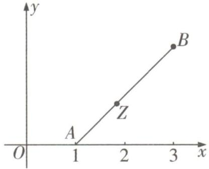
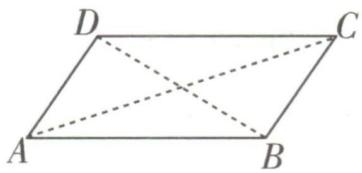
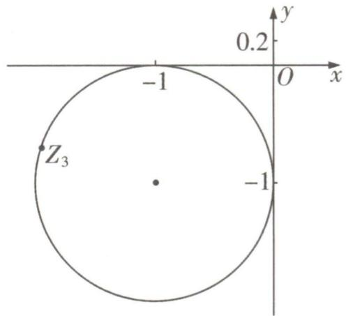
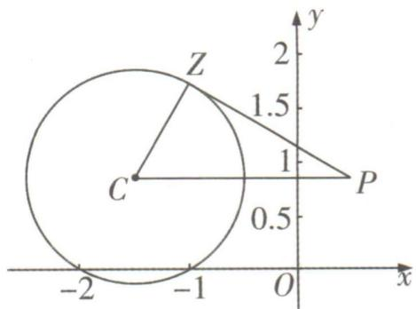
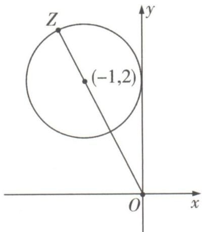
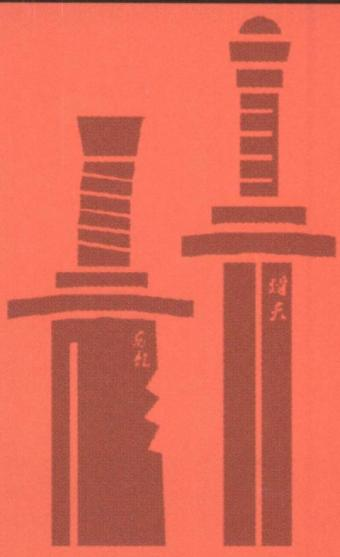
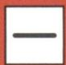

所以奇数项与偶数项的个数之比为 14:7 = 2:1，

所以采用分层抽样抽取6项中奇数有4项,偶数有2项,

所以从这6项中抽出2项,至少含有一项是偶数的概率 P=1 - $\frac{C_{4}^{2}}{C_{6}^{2}}=\frac{3}{5}$ .

11. $e^{-3}$ 解析对 $y=c_{1}e^{c_{2}x}$ 两边同时取对数可得 $\ln y=\ln(c_{1}e^{c_{2}x})=\ln c_{1}+\ln e^{c_{2}x}=c_{2}x+\ln c_{1}$ ,

即 $\hat{z} = c_{2}x + \ln c_{1} = 0.3x + \hat{a}$ ，可得 $c_{2} = 0.3,\ln c_{1} = \hat{a},$

由 $\sum_{i=1}^{20} x_i = 600, \sum_{i=1}^{20} \ln y_i = 120$ 可得 $\overline{x} = 30, \overline{\ln y} = \overline{z} = 6$ ,

代入 $\hat{z} = 0.3x + \hat{a}$ 可得 $\hat{a} = -3$ ，即 $\ln c_1 = \hat{a} = -3$ ，所以 $c_{1} = \mathrm{e}^{-3}$

12. $\frac{3}{5}$ 大招识别 在100米比赛中站上领奖台的条件下在200米比赛中也站上领奖台,属于条件概率,用条件概率公式解决即可.

解析设在200米比赛中站上领奖台为事件A,在100米比赛中站上领奖台为事件B,

则 $P(\overline{A}) = \frac{3}{10}, P(\overline{B}) = \frac{1}{2}, P(\overline{A} \cap \overline{B}) = \frac{1}{10}, P(B) = 1 - P(\overline{B}) = \frac{1}{2}$ ,

则 $P(\overline{A} \cup \overline{B}) = P(\overline{A}) + P(\overline{B}) - P(\overline{A} \cap \overline{B}) = \frac{3}{10} + \frac{1}{2} - \frac{1}{10} = \frac{7}{10}$ ,

则 $P(A \cap B) = 1 - P(\overline{A} \cup \overline{B}) = \frac{3}{10}$ ,

故 $P(A|B) = \frac{P(AB)}{P(B)} = \frac{\frac{3}{10}}{\frac{1}{2}} = \frac{3}{5}.$

13. $\frac{122}{243}$ 解析这个点每次运动后的位置,不在上底面,就在下底面,即为对立事件,可记事件 $A_{i}=$ “第i次运动后这个点停留在下底面”,则事件 $\overline{A_{i}}=$ “第i次运动后这个点停留在上底面”, $i=1,2,3,\cdots,n,\cdots$

设 $P(A_{n}) = a_{n}$ ，则 $P(\overline{A_n}) = 1 - a_n$

由题意知, $P(A_{n+1}|A_n)=\frac{2}{3},P(A_{n+1}|\overline{A_n})=\frac{1}{3}$ ,

则 $P(A_{n+1})=P(A_n)P(A_{n+1}|A_n)+P(\overline{A_n})P(A_{n+1}|\overline{A_n})$ ，全概率公式

则 $a_{n + 1} = \frac{2}{3} a_n + \frac{1}{3} (1 - a_n)$

即 $a_{n + 1} = \frac{1}{3} a_n + \frac{1}{3}$ ，两边同减去 $\frac{1}{2}$ 可得， $a_{n + 1} - \frac{1}{2} = \frac{1}{3}(a_n - \frac{1}{2})$

又已知 $a_1 = \frac{2}{3}, a_1 - \frac{1}{2} = \frac{1}{6} \neq 0$

故数列 $\{a_{n} - \frac{1}{2}\}$ 是以 $\frac{1}{6}$ 为首项， $\frac{1}{3}$ 为公比的等比数列，

则 $a_{n} - \frac{1}{2} = \frac{1}{6}\times (\frac{1}{3})^{n - 1}$ ，即 $a_{n} = \frac{1}{2}\times (\frac{1}{3})^{n} + \frac{1}{2},$

故当 $n = 5$ 时， $a_5 = \frac{122}{243}$ ，即 $P(A_5) = \frac{122}{243}$ .

14. 解析(1)设多选题正确答案是“选两项”为事件 $A_{2}$ ，正确答案是“选三项”为事件 $A_{3}$ ，

则 $\Omega=A_{2}\cup A_{3},P(A_{2})=p_{0},P(A_{3})=1-p_{0}.$

分别记考生得0分,2分,5分为事件 $B_{0},B_{2},B_{5}$ ,

该考生随机选择 1 个选项, 得分结果有 0 分和 2 分两种情况,

$$
\because B _ {0} = A _ {2} B _ {0} \cup A _ {3} B _ {0}, B _ {2} = A _ {2} B _ {2} \cup A _ {3} B _ {2},
$$

$$
\therefore P (B _ {0}) = P (A _ {2} B _ {0} \cup A _ {3} B _ {0}) = P (A _ {2} B _ {0}) + P (A _ {3} B _ {0}) = P (B _ {0} | A _ {2}) P (A _ {2}) +
$$

$$
P (B _ {0} \mid A _ {3}) P (A _ {3}) = \frac {1}{2} \times \frac {\mathrm{C} _ {2} ^ {1}}{\mathrm{C} _ {4} ^ {1}} + \frac {1}{2} \times \frac {1}{\mathrm{C} _ {4} ^ {1}} = \frac {1}{4} + \frac {1}{8} = \frac {3}{8};
$$

$$
P (B _ {2}) = P (A _ {2} B _ {2} \cup A _ {3} B _ {2}) = P (A _ {2} B _ {2}) + P (A _ {3} B _ {2}) = P (B _ {2} | A _ {2}) P (A _ {2}) +
$$

$$
P (B _ {2} \mid A _ {3}) P (A _ {3}) = \frac {1}{2} \times \frac {\mathrm{C} _ {2} ^ {1}}{\mathrm{C} _ {4} ^ {1}} + \frac {1}{2} \times \frac {\mathrm{C} _ {3} ^ {1}}{\mathrm{C} _ {4} ^ {1}} = \frac {1}{4} + \frac {3}{8} = \frac {5}{8}.
$$

∴ 得分 X 的分布列为:

<table><tr><td>X</td><td>0</td><td>2</td></tr><tr><td>P</td><td>3/8</td><td>5/8</td></tr></table>

∴ 得分 X 的数学期望 $E(X)=0 \times \frac{3}{8} + 2 \times \frac{5}{8} = \frac{5}{4}$ .

(2) 方案一: 随机选择 1 个选项.

正确答案是“选两项”时,考生选1项,选对得2分,选错得0分;
正确答案是“选三项”时,考生选1项,选对得2分,选错得0分.

$$
\because B _ {0} = A _ {2} B _ {0} \cup A _ {3} B _ {0}, B _ {2} = A _ {2} B _ {2} \cup A _ {3} B _ {2},
$$

$$
\therefore P \left(B _ {0}\right) = P \left(B _ {0} \mid A _ {2}\right) P \left(A _ {2}\right) + P \left(B _ {0} \mid A _ {3}\right) P \left(A _ {3}\right) = p _ {0} \times \frac {\mathrm{C} _ {2} ^ {1}}{\mathrm{C} _ {4} ^ {1}} + (1 -
$$

$$
p _ {0}) \times \frac {1}{\mathrm{C} _ {4} ^ {1}} = \frac {1}{4} + \frac {1}{4} p _ {0};
$$

$$
P (B _ {2}) = P (B _ {2} \mid A _ {2}) P (A _ {2}) + P (B _ {2} \mid A _ {3}) P (A _ {3}) = p _ {0} \times \frac {\mathrm{C} _ {2} ^ {1}}{\mathrm{C} _ {4} ^ {1}} + (1 -
$$

$$
p _ {0}) \times \frac {\mathrm{C} _ {3} ^ {1}}{\mathrm{C} _ {4} ^ {1}} = \frac {3}{4} - \frac {1}{4} p _ {0}.
$$

∴ 随机选择 1 个选项得分的数学期望为 $0 \times \left(\frac{1}{4} + \frac{1}{4} p_{0}\right) + 2 \times \left(\frac{3}{4} - \frac{1}{4} p_{0}\right) = \frac{3}{2} - \frac{1}{2} p_{0}$ .

方案二:随机选择2个选项.

$$
P (B _ {0}) = P (B _ {0} \mid A _ {2}) P (A _ {2}) + P (B _ {0} \mid A _ {3}) P (A _ {3}) = p _ {0} \times (1 - \frac {\mathrm{C} _ {2} ^ {2}}{\mathrm{C} _ {4} ^ {2}}) +
$$

$$
(1 - p _ {0}) \times \frac {\mathrm{C} _ {3} ^ {1}}{\mathrm{C} _ {4} ^ {2}} = \frac {5}{6} p _ {0} + \frac {1}{2} (1 - p _ {0}) = \frac {1}{3} p _ {0} + \frac {1}{2};
$$

$$
P (B _ {2}) = P (B _ {2} \mid A _ {2}) P (A _ {2}) + P (B _ {2} \mid A _ {3}) P (A _ {3}) = p _ {0} \times 0 + (1 -
$$

$$
p _ {0}) \times \frac {\mathrm{C} _ {3} ^ {2}}{\mathrm{C} _ {4} ^ {2}} = \frac {1}{2} (1 - p _ {0});
$$

$$
P (B _ {5}) = P (B _ {5} \mid A _ {2}) P (A _ {2}) + P (B _ {5} \mid A _ {3}) P (A _ {3}) = p _ {0} \times \frac {1}{\mathrm{C} _ {4} ^ {2}} + (1 -
$$

$$
p _ {0}) \times 0 = \frac {1}{6} p _ {0}.
$$

∴ 随机选择 2 个选项得分的数学期望为 $0 \times \left( \frac{1}{3} p_{0} + \frac{1}{2} \right) + 2 \times$

$$
\frac {1}{2} (1 - p _ {0}) + 5 \times \frac {1}{6} p _ {0} = 1 - \frac {1}{6} p _ {0}.
$$

$\because\left(\frac{3}{2}-\frac{1}{2}p_{0}\right)-\left(1-\frac{1}{6}p_{0}\right)=\frac{1}{2}-\frac{1}{3}p_{0}>0,\therefore$ 选择方案一.

15. 解析(1)由题意,全市高中生航天创新知识竞赛成绩 X 近似服从正态分布 N(73,37.5),

则 $\mu = 73, \sigma = \sqrt{37.5} \approx 6.1$ ，即 $\mu - \sigma = 66.9, \mu + 2\sigma = 85.2$

且 $P(\mu - \sigma < X < \mu + 2\sigma) = \frac{1}{2} P(\mu - \sigma < X < \mu + \sigma) + \frac{1}{2} P(\mu - 2\sigma < X < \mu + 2\sigma) \approx 0.815$

即 $P(66.9 < X < 85.2) \approx 0.815$ ,

设该市 4 万名高中生中航天创新知识竞赛成绩位于区间(66.9, 85.2)的人数为 Y,

则 $Y \sim B(40\ 000, 0.815)$ ，可得 $E(Y) = 40\ 000 \times 0.815 = 32\ 600$ ，所以该市 4 万名高中生中航天创新知识竞赛成绩位于区间 (66.9, 85.2) 的人数约为 32 600.

(2) 由 $P(X > 85.2) = \frac{1 - 0.95}{2} = 0.025$ ,

可知任意抽取一人,等级为优秀的概率 p=0.025,

设抽取次数为 $\xi$ ，则 $\xi$ 的分布列如下：

<table><tr><td> $\xi$ </td><td>1</td><td>2</td><td>3</td><td> $\cdots$ </td><td> $n - 1$ </td><td> $n$ </td></tr><tr><td> $P$ </td><td> $p$ </td><td> $(1 - p)p$ </td><td> $(1 - p)^{2}p$ </td><td> $\cdots$ </td><td> $(1 - p)^{n-2}p$ </td><td> $(1 - p)^{n-1}$ </td></tr></table>

故 $E(\xi)=p+(1-p)p\times2+(1-p)^{2}p\times3+\cdots+(1-p)^{n-2}p\times(n-1)+(1-p)^{n-1}\times n,$

又 $(1-p)\cdot E(\xi)=(1-p)p+(1-p)^{2}p\times2+(1-p)^{3}p\times3+\cdots+(1-p)^{n-1}p\times(n-1)+(1-p)^{n}\times n$ ，所以得 $pE(\xi)=p+(1-p)p+(1-p)^{2}p+\cdots+(1-p)^{n-2}p+(1-p)^{n-1}p$

错位相减法

所以 $E(\xi)=1+(1-p)+(1-p)^{2}+\cdots+(1-p)^{n-2}+(1-p)^{n-1}=$ $\frac{1-(1-p)^{n}}{1-(1-p)}=\frac{1-(1-p)^{n}}{p}=\frac{1-0.975^{n}}{0.025}$ ,

而 $E(\xi) = \frac{1 - 0.975^n}{0.025}$ 在 $n\in \mathbf{N}^*$ 时单调递增，

结合 $0.975^{5} \approx 0.881, 0.975^{6} \approx 0.859, 0.975^{7} \approx 0.838, 0.975^{8} \approx 0.817,$

可知: 当 n=5 时, $E(\xi) \approx 4.76$ ; 当 n=6 时, $E(\xi) \approx 5.64$ ; 当 n=7 时, $E(\xi) \approx 6.48$ .

因为抽取次数的期望值不超过6,所以n的最大值为6.

16. 解析(1)假设 $H_{0}$ : 该校首次参加英语四级考试的学生能否合格与性别无关.

$$
\chi^ {2} = \frac {(4 5 + 5 + 3 5 + 1 5) \times (3 5 \times 5 - 4 5 \times 1 5) ^ {2}}{(3 5 + 1 5) \times (4 5 + 5) \times (3 5 + 4 5) \times (1 5 + 5)} = 6. 2 5.
$$

求解 ${x}^{2}$ 时,易犯计算上的错误,计算时千万要小心

因为 6.25 < 6.635 = $x_{0.010}$ ,

所以依据小概率值 $\alpha=0.010$ 的独立性检验, 没有充分的证据推断 $H_{0}$ 不成立, 因此认为该校首次参加英语四级考试的学生能否合格与性别无关.

(2) 设这 2 人中合格人数为 X, 则 X 的可能取值为 0, 1, 2.

$$
P (X = 0) = \frac {\mathrm{C} _ {3 5} ^ {0} \mathrm{C} _ {1 5} ^ {2}}{\mathrm{C} _ {5 0} ^ {2}} = \frac {3}{3 5},
$$

$$
P (X = 1) = \frac {\mathrm{C} _ {3 5} ^ {1} \mathrm{C} _ {1 5} ^ {1}}{\mathrm{C} _ {5 0} ^ {2}} = \frac {3}{7},
$$

$$
P (X = 2) = \frac {\mathrm{C} _ {3 5} ^ {2} \mathrm{C} _ {1 5} ^ {0}}{\mathrm{C} _ {5 0} ^ {2}} = \frac {1 7}{3 5},
$$

所以这 2 人中合格人数的概率分布列为

<table><tr><td>X</td><td>0</td><td>1</td><td>2</td></tr><tr><td>P</td><td>3/35</td><td>3/7</td><td>17/35</td></tr></table>

所以数学期望 $E(X)=0\times\frac{3}{35}+1\times\frac{3}{7}+2\times\frac{17}{35}=\frac{7}{5}.$

(3)该校首次参加英语四级考试的每位学生合格的概率为 $\frac{35+45}{100}=0.8.$

两次考试后这 2 人全部合格可分为三类:

第一类,这2名学生第一次考试都合格,则概率为 $0.8^{2}=0.64$ ;

第二类,这2名学生中有一名第一次考试不合格,第二次合格,另一名第一次考试合格,则概率为 $C_{2}^{1}\times0.8\times0.2\times0.9=0.288$ ;第三类,这2名学生第一次考试都不合格,第二次都合格,则概率为 $0.2^{2}\times0.9^{2}=0.0324$ .

$$
0. 6 4 + 0. 2 8 8 + 0. 0 3 2 4 = 0. 9 6 0 4,
$$

所以至多两次英语四级考试后,这2人全部合格的概率为0.9604.

# 坑神有话说

一般地,在解决比较复杂的事件的概率问题时,常常把复杂事件分解为几个互斥事件,分解时一定要做到不重不漏.

17. 解析(1)设被调查的大专及以上文化的居民人数为 $5x, 2 \times 2$ 列联表如下:

<table><tr><td></td><td>不喜欢担任垃圾分类志愿者的人数</td><td>喜欢担任垃圾分类志愿者的人数</td><td>合计</td></tr><tr><td>大专文化以下居民的人数</td><td>4x</td><td>x</td><td>5x</td></tr><tr><td>大专及以上文化居民的人数</td><td>2x</td><td>3x</td><td>5x</td></tr><tr><td>合计</td><td>6x</td><td>4x</td><td>10x</td></tr></table>

所以 $K^{2}=\frac{n(ad-bc)^{2}}{(a+b)(c+d)(a+c)(b+d)}=\frac{10x(4x\cdot3x-2x\cdot x)^{2}}{5x\cdot5x\cdot6x\cdot4x}=$ $\frac{5x}{3}$ ,

因为犯错误的概率不超过0.010,所以 $\frac{5x}{3}\geqslant6.635$ ,即 $5x\geqslant19.905$ ,
因而被调查的大专及以上文化的居民至少有20人.

(2) 由 $\bar{y} = \frac{1}{5} \times (26 + 31 + 39 + 44 + t) = 40$ ，解得 t = 60，

又 $\overline{x}=\frac{2+3+4+5+6}{5}=4$ ,

$$
\sum_ {i = 1} ^ {5} x _ {i} ^ {2} = 9 0, \sum_ {i = 1} ^ {5} x _ {i} y _ {i} = 8 8 1,
$$

所以 $\hat{b}=\frac{\sum_{i=1}^{5}x_{i}y_{i}-5\overline{x}\overline{y}}{\sum_{i=1}^{5}x_{i}^{2}-5\overline{x}^{2}}=\frac{881-5\times4\times40}{90-5\times4^{2}}=8.1$

所以 $\hat{a} = \overline{y} -\hat{b}\overline{x} = 40 - 8.1\times 4 = 7.6,$

所以回归直线方程为 $\hat{y}=8.1x+7.6$ .

(3) 根据题意得, 能将垃圾分类投放的概率 $P = \frac{3}{5}$ , 则 $X \sim B(5, \frac{3}{5})$ ,
所以 X 的可能取值为 0,1,2,3,4,5.

$$
P (X = 0) = \mathrm{C} _ {5} ^ {0} \left(1 - \frac {3}{5}\right) ^ {5} = \frac {3 2}{3 1 2 5},
$$

$$
P (X = 1) = \mathrm{C} _ {5} ^ {1} \times \frac {3}{5} \times (1 - \frac {3}{5}) ^ {4} = \frac {4 8}{6 2 5},
$$

$$
P (X = 2) = \mathrm{C} _ {5} ^ {2} \times (\frac {3}{5}) ^ {2} \times (1 - \frac {3}{5}) ^ {3} = \frac {1 4 4}{6 2 5},
$$

$$
P (X = 3) = \mathrm{C} _ {5} ^ {3} \times (\frac {3}{5}) ^ {3} \times (1 - \frac {3}{5}) ^ {2} = \frac {2 1 6}{6 2 5},
$$

$$
P (X = 4) = \mathrm{C} _ {5} ^ {4} \times (\frac {3}{5}) ^ {4} \times (1 - \frac {3}{5}) = \frac {1 6 2}{6 2 5},
$$

$$
P (X = 5) = \mathrm{C} _ {5} ^ {5} \times (\frac {3}{5}) ^ {5} = \frac {2 4 3}{3 1 2 5}.
$$

所以 $X$ 的分布列为

<table><tr><td>X</td><td>0</td><td>1</td><td>2</td><td>3</td><td>4</td><td>5</td></tr><tr><td>P</td><td> $\frac{32}{3\ 125}$ </td><td> $\frac{48}{625}$ </td><td> $\frac{144}{625}$ </td><td> $\frac{216}{625}$ </td><td> $\frac{162}{625}$ </td><td> $\frac{243}{3\ 125}$ </td></tr></table>

故 $E(X) = 0 \times \frac{32}{3125} + 1 \times \frac{48}{625} + 2 \times \frac{144}{625} + 3 \times \frac{216}{625} + 4 \times \frac{162}{625} + 5 \times$

$$
\frac {2 4 3}{3 1 2 5} = 3. (\text {或} E (X) = n p = 5 \times \frac {3}{5} = 3)
$$

# 坑神有话说

二项分布满足的条件：

①每次试验中,事件发生的概率是相同的;  
②各次试验中的事件是相互独立的；  
③每次试验只有两种结果,事件要么发生,要么不发生;  
④随机变量是这 n 次独立重复试验中事件发生的次数.

# 专题十四 复数

# 考点切片

# 考点1 复数的基本概念及运算

1. $(-∞,0)∪(0,1)∪(1,+∞)$ 解析由于 $z=(a^{2}-a)i$ 是纯虚数,因此 $a^{2}-a≠0$ ,进而得到 $a∈(-∞,0)∪(0,1)∪(1,+∞)$ .  
2. $-\frac{1}{2}$ 解析先将复数 $z=(1+ai)(3-i)$ 化简, 得 $z=3+(3a-1)i-ai^{2}=(a+3)+(3a-1)i$ , 于是 $a+3=1-3a$ , 进而得到实部和虚部互为相反数 $a=-\frac{1}{2}$ .  
3. $\frac{1}{5}$ ;二; $-\frac{2}{5}-\frac{1}{5}i;\frac{\sqrt{5}}{5}$ 解析由于 $z(1-2i)=i$ ,因此z= $\frac{i}{1-2i}=\frac{i(1+2i)}{(1-2i)(1+2i)}=\frac{i+2i^{2}}{1-4i^{2}}=-\frac{2}{5}+\frac{1}{5}i$ ,于是得到复数z的虚部为 $\frac{1}{5}$ ,复数z对应的点在复平面的第二象限,复数z的共轭复数为 $\bar{z}=-\frac{2}{5}-\frac{1}{5}i$ ,复数z的模 $|z|=\sqrt{(-\frac{2}{5})^{2}+(\frac{1}{5})^{2}}=\frac{\sqrt{5}}{5}$ .

# 坑神有话说

复数运算中的分母有理化与实数运算中的分母有理化是一致的,都是通过平方差公式来实现的.

4.D 解析 2-z=zi, 则 $z=\frac{2}{1+i}=1-i,\therefore\bar{z}=1+i,\therefore|\bar{z}+i|=$ $|1+2i|=\sqrt{1^{2}+2^{2}}=\sqrt{5}.$   
5.A 解析因为 $z=\frac{1-i}{2+2i}=\frac{(1-i)^{2}}{2(1+i)(1-i)}=-\frac{1}{2}i$ ，所以 $\bar{z}=\frac{1}{2}i$ ，所以 $z-\bar{z}=-\frac{1}{2}i-\frac{1}{2}i=-i$ 。故选 A.  
6.B 解析 $z=\frac{2+i}{1+i^{2}+i^{5}}=\frac{2+i}{1-1+i}=\frac{-i(2+i)}{-i^{2}}=1-2i$ ，所以 $\bar{z}=1+2i$ ，故选 B.  
7.C 解析由于 $z = -1 + \sqrt{3}i$ ，于是 $\bar{z} = -1 - \sqrt{3}i$ ，因此 $\frac{z}{z\bar{z}-1} =$

$\frac{-1+\sqrt{3}i}{4-1}=-\frac{1}{3}+\frac{\sqrt{3}}{3}i.$ 故选 C.

$$
z \bar {z} = (- 1 + \sqrt {3} \mathrm{i}) (- 1 - \sqrt {3} \mathrm{i}) = 1 + 3 = 4
$$

# 坑神有话说

$z\bar{z}=(a+bi)(a-bi)=a^{2}+b^{2}=|z|^{2}$ ，在一些比较复杂的题目中可以把 $z\bar{z}$ 与 $|z|^{2}$ 互相代换以简化运算.

8.A 解析由于 z=1-2i，于是 $\bar{z}=1+2i$ ，而 $z+a\bar{z}+b=0$ ，得到 $(1-2i)+a(1+2i)+b=(a+b+1)+(2a-2)i=0$ ，因此 $\left\{\begin{aligned}&a+b+1=0,\\ &2a-2=0,\end{aligned}\right.$ 解得 $\left\{\begin{aligned}a&=1,\\ b&=-2.\end{aligned}\right.$ 故选 A.

另解 从复数与共轭复数的关系出发求解. 观察等式结构发现 $z + a\bar{z}$ 必然为实数, 于是 $a = 1$ , 则 $z + \bar{z} + b = 0$ , 即 $2 + b = 0, b = -2$ . 综上所述, 答案选 A.

# 考点2 复数的三角形式

1. $\frac{\sqrt{5}}{3}$ 大招识别 先将复数 $z$ 转化为三角形式, 再根据 $\sin \arg z, \cos \arg z$ 求出 $\sin(2\arg z)$ 的值.

解析先设 $\theta = \arg z$ ，然后将复数 $z = 1 + \sqrt{5}\mathrm{i}$ 转化为三角形式，得 $z = \sqrt{6} (\cos \theta +\mathrm{i}\sin \theta)$ ，其中 $\cos \theta = \frac{\sqrt{6}}{6},\sin \theta = \frac{\sqrt{30}}{6}$ 所以 $\sin 2\theta =$ $2\sin \theta \cos \theta = 2\times \frac{\sqrt{30}}{6}\times \frac{\sqrt{6}}{6} = \frac{\sqrt{5}}{3}.$

2. 一定; 二 解析先设出复数 z 的三角形式 $z = r[\cos(\arg z) + \text{isin}(\arg z)] (r > 0)$ ，从而得到 $z^{6} = r^{6}[\cos(6\arg z) + \text{isin}(6\arg z)]$ ，由于 1 的三角形式为 $1 = \cos 0 + \text{isin } 0$ ，因此 $\frac{1}{z^{6}} = \frac{1}{r^{6}} [\cos(0 - 6\arg z) + \text{isin}(0 - 6\arg z)] = \frac{1}{r^{6}} [\cos(-6\arg z) + \text{isin}(-6\arg z)]$ ，

【大招识别】复数三角形式下的除法法则

因此 $\arg \left(\frac{1}{z^6}\right) = -6\arg z + 2k\pi (k\in \mathbf{Z})$ ，而 $\arg z\in (\frac{\pi}{6},\frac{\pi}{4})$ ，于是 $-6\arg z\in (-\frac{3\pi}{2}, - \pi)$ ，又由于 $\arg \left(\frac{1}{z^6}\right)\in [0,2\pi)$ ，从而 $\arg \left(\frac{1}{z^6}\right)\in (\frac{\pi}{2},\pi)$ ，因此 $\frac{1}{z^6}$ 在复平面内的对应点一定在第二象限内.

3.512 解析 设 $z = \sqrt{3} + \mathrm{i}$ , 根据二项式定理有 $(\sqrt{3} + \mathrm{i})^{10} = \sum_{k=0}^{10} C_{10}^{k} (\sqrt{3})^{10-k};^{k}$ , 所以所有奇数项的和为 $z^{10}$ 的实部. 显然直接展开算出实部很烦琐, 所以用复数三角形式得到 $z = \sqrt{3} + \mathrm{i} = 2(\cos \frac{\pi}{6} + \mathrm{i}\sin \frac{\pi}{6})$ , 从而得到 $z^{10} = 2^{10} (\cos \frac{10\pi}{6} + \mathrm{i}\sin \frac{10\pi}{6})$ , 因此 【大招识别】复数三角形式下的乘方运算法则 $(\sqrt{3} + \mathrm{i})^{10}$ 的二项展开式中所有奇数项的和为 $2^{10}\cos \frac{10\pi}{6} = 512$ .

4.[√2-1,√2+1] 解析利用复数的三角形式,将问题转化为单变量问题.先设出复数z的三角形式 $z=m(\cos\alpha+\mathrm{i}\sin\alpha)(m>0,\alpha\in\mathbb{R})$ ,从而得到复数z的模 $|z|=m,\frac{1}{z}=\frac{\cos 0+\mathrm{i}\sin 0}{m(\cos\alpha+\mathrm{i}\sin\alpha)}=\frac{1}{m}\cdot[\cos(-\alpha)+\mathrm{i}\sin(-\alpha)]=\frac{1}{m}(\cos\alpha-\mathrm{i}\sin\alpha)$ ,所以 $|z+\frac{1}{z}|=|(m+\frac{1}{m})\cos\alpha+i(m-\frac{1}{m})\sin\alpha|=\sqrt{(m+\frac{1}{m})^{2}\cos^{2}\alpha+(m-\frac{1}{m})^{2}\sin^{2}\alpha}=$ $\sqrt{(m^{2}+\frac{1}{m^{2}})(\cos^{2}\alpha+\sin^{2}\alpha)+2(\cos^{2}\alpha-\sin^{2}\alpha)}=\sqrt{2\cos 2\alpha+m^{2}+\frac{1}{m^{2}}}$ 而 $-1\leqslant\cos2\alpha\leqslant1$ ,所以 $2\cos2\alpha+m^{2}+\frac{1}{m^{2}}\in[(m-\frac{1}{m})^{2},(m+\frac{1}{m})^{2}]$ ,于是 $|z+\frac{1}{z}|\in[|m-\frac{1}{m}|,|m+\frac{1}{m}|]$ ,由于 $|z+\frac{1}{z}|\leqslant2$ ,
从而得 $|m-\frac{1}{m}|\leqslant2$ ,于是 $-2\leqslant m-\frac{1}{m}\leqslant2$ ,即 $\left\{\begin{aligned}&m^{2}+2m-1\geqslant0,\\ &m^{2}-2m-1\leqslant0,\end{aligned}\right.$ 因此得到 $|z|=m\in[\sqrt{2}-1,\sqrt{2}+1]$ .

# 考点 3 复数的模的运算

1.B 解析 由于 $i \cdot z = 3 - 4i$ ，于是 $|i||z| = |3 - 4i|$ ，因此 $|z| = 5$ . $|z_1||z_2| = |z_1z_2|$

2.1 解析 因为 $\left|(a+bi)^{2}\right|=\left|\frac{1}{2}-\frac{\sqrt{3}}{2}i\right|=1=\left|a+bi\right|^{2}$ ，所以 $|z^{n}|=|z|^{n}$ $a^{2}+b^{2}=1.$

3.2023 解析 反解出 $\alpha$ 后根据模的运算公式进行转化, 从而解决问题. 先设 $z_0 = f(\alpha) = \sqrt{2022} + \mathrm{i}$ , 由于函数 $f(z) = \frac{2023(z - 1)}{z - 2023} (z \in \mathbf{C}$ 且 $z \neq 2023$ ), 于是就有 $\frac{2023(\alpha - 1)}{\alpha - 2023} = z_0$ , 然后得到 $\alpha = \frac{2023z_0 - 2023}{z_0 - 2023}$ , 而 $|z_0| = \sqrt{(\sqrt{2022})^2 + 1^2} = \sqrt{2023}$ , 进而得到 $\alpha = \frac{2023z_0 - 2023}{z_0 - 2023} = \frac{2023z_0 - z_0 \cdot \bar{z}_0}{z_0 - 2023} = z_0 \cdot z_0 \cdot \bar{z}_0 = |z_0|^2 = 2023$

$\frac{2\ 023-\bar{z}_{0}}{z_{0}-2\ 023}$ ，因此 $|\alpha|=|z_{0}\cdot\frac{2\ 023-\bar{z}_{0}}{z_{0}-2\ 023}|=|z_{0}|\cdot\frac{|\bar{z}_{0}-2\ 023|}{|z_{0}-2\ 023|}$ ，而

$z_0 - 2023$ 与 $\overline{z}_0 - 2023$ 互为共轭复数，因此 $|\alpha| = |z_0|\cdot \frac{|\overline{z}_0 - 2023|}{|z_0 - 2023|} = |z_0| = \sqrt{2023}$ ，最终得到 $|\alpha^2| = |\alpha|^2 = 2023$ .

# 考点 4 复数的几何意义

1.C 解析 把复数条件转化为几何条件,根据几何意义解决问题.由于 $|z-i|=1$ 表示复数z在复平面内对应的点 $(x,y)$ 到点 $(0,1)$ 的距离为1,于是 $x^{2}+(y-1)^{2}=1$ .故选C.

2.1 解析先设复数 $z, 1, 3 + 2\mathrm{i}$ 在复平面所对应的点分别为 $Z, A, B$ , 由于 $|z - 1| + |z - 3 - 2\mathrm{i}| = 2\sqrt{2}$ , 因此得到 $|ZA| + |ZB| = 2\sqrt{2}$ , 而 $|AB| = 2\sqrt{2}$ , 于是点 $Z$ 在线段 $AB$ 上 (含端点 $A, B$ ), 如图所示, 进而得到 $|z|$ 的最小值为 1.

当点 $Z$ 与点 $A$ 重合时取得

text_image

y
A
Z
B
O
1
2
3
x

3.D 解析 根据复数的几何形式可设复数 $z_{1}, z_{2}$ 所对应的向量分别为 $\overrightarrow{AB}, \overrightarrow{AD}$ ，如图所示，于是复数 $z_{1} + z_{2}, z_{1} - z_{2}$ 所对

应的向量分别为 $\overrightarrow{AC},\overrightarrow{DB}$ ，易知 $|\overrightarrow{AC}|^2 +|\overrightarrow{DB}|^2 = 2(|\overrightarrow{AB}|^2 +|\overrightarrow{AD}|^2)$ ，得到 $|z_1 + z_2|^2 +|z_1 - z_2|^2 = 2(|z_1|^2 +|z_2|^2)$ ，而 $|z_{1}| = 2|z_{2}| = 2,|z_{1} + z_{2}| = \sqrt{7}$ ，因此 $|z_{1} - z_{2}| = \sqrt{3}$ .故选D.

4. $\sqrt{2}-1$ 解析由于 $|z_{1}|=|z_{2}|=1$ ，于是 $\left|\frac{z_{1}}{z_{2}}\right|=\frac{|z_{1}|}{|z_{2}|}=1$ ，而 $\frac{z_{1}}{z_{2}}$ 为纯虚数，不妨设 $z_{1}=1,z_{2}=i$ ，并设 $z_{3}=x+y\mathrm{i}(x,y\in\mathbf{R})$ ，由于 $|z_{1}+z_{2}+z_{3}|=1$ ，于是 $|(x+1)+(y+1)\mathrm{i}|=1$ ，进而得到复数 $z_{3}$ 在复平

text_image

0.2
y
-1
O x
Z₃
-1

面所对应的点 $Z_{3}$ 在以点 $(-1, -1)$ 为圆心，1 为半径的圆上，如图所示，因此 $\left|z_{3}\right|$ 的最小值是 $\sqrt{2}-1$ .

5. $-\frac{\sqrt{3}}{3}$ 解析 由于 $z = x + yi$ ，于是 $\frac{z + 1}{z + 2} = \frac{(x + 1) + yi}{(x + 2) + yi} = \frac{[(x + 1) + yi][(x + 2) - yi]}{[(x + 2) + yi][(x + 2) - yi]} = \frac{(x + 1)(x + 2) + y^2 + yi}{(x + 2)^2 + y^2}$ ，又 $\frac{z + 1}{z + 2}$ 的实部与虚部之比为 $\sqrt{3}$ ，因此 $x^2 + 3x + 2 + y^2 = \sqrt{3}y$ ，即 $(x + \frac{3}{2})^2 + (y - \frac{\sqrt{3}}{2})^2 = 1$ ，于是复数 $z$ 在复平面所对应的点 $Z$ 在圆 $(x + \frac{3}{2})^2 + (y - \frac{\sqrt{3}}{2})^2 = 1$ 上，圆心 $C$ 的坐标为 $(- \frac{3}{2}, \frac{\sqrt{3}}{2})$ 。

令点 P 的坐标为 $\left(\frac{1}{2}, \frac{\sqrt{3}}{2}\right)$ ，如图所

示,于是就有 $\frac{2y-\sqrt{3}}{2x-1}=\frac{y-\frac{\sqrt{3}}{2}}{x-\frac{1}{2}}=$

text_image

Z
1.5
1
C
0.5
P
-2
-1
O
x
y

$k_{PZ}$ ，因此当直线 PZ 与圆相切时 $k_{PZ}$ 最小，其最小值为 $-\frac{|CZ|}{|PZ|}=$ 转化为斜率，代数问题几何化

$-\frac{|CZ|}{\sqrt{|PC|^{2}-|CZ|^{2}}}=-\frac{1}{\sqrt{2^{2}-1^{2}}}=-\frac{\sqrt{3}}{3}$ ，因此 $\frac{2y-\sqrt{3}}{2x-1}$ 的最小值为 $-\frac{\sqrt{3}}{3}$ .

# 考点5 复数与数列

1.2 025 + 1 012i 解析 根据条件列出等式, 结合数列知识解决即可. 先设 $z_{n} = a_{n} + b_{n}\mathrm{i}(a_{n}, b_{n} \in \mathbb{R})$ , 由 $z_{1} = 1$ , 得到 $a_{1} = 1, b_{1} = 0$ , 而 $z_{n+1} = \bar{z}_{n} + 1 + n\mathrm{i}$ , 于是就有 $a_{n+1} + b_{n+1}\mathrm{i} = (a_{n} - b_{n}\mathrm{i}) + 1 + n\mathrm{i} = (a_{n} + 1) + (n - b_{n})\mathrm{i}$ , 进而得到 $\left\{ \begin{array}{l} a_{n+1} = a_n + 1, \\ b_{n+1} = n - b_n, \end{array} \right.$ 从而 $\left\{ \begin{array}{l} a_n = n, \\ b_{n+1} = n - [(n-1) - b_{n-1}] = b_{n-1} + 1, \end{array} \right.$ $n \geqslant 2$ , 于是得到 $b_{2n+1} = n$ , 因此就有 $a_{2025} = 2025, b_{2025} = 1012$ , 最终得到 $z_{2025} = 2025 + 1012\mathrm{i}$ .

另解 直接求解. 因为 $z_{n+2} = \bar{z}_{n+1} + 1 + (n+1)i = z_n + 1 - ni + 1 + (n+1)i = z_n + 2 + i$ ，所以 $z_{2025} - z_{2023} = 2 + i, \cdots, z_3 - z_1 = 2 + i$ ，累加得 $z_{2025} = z_1 + (2 + i) \times 1012 = 2025 + 1012i$ .

2. $\frac{2023}{2024}$ 解析由于 $z_{n}=n+\sqrt{n}i$ ，因此 $|z_{n}|^{2}=n^{2}+n=n(n+1)$ ，
于是就有 $\left|\frac{1}{z_{n}^{2}}\right|=\frac{1}{\left|z_{n}\right|^{2}}=\frac{1}{n(n+1)}=\frac{1}{n}-\frac{1}{n+1}$ ，进而得到 $\left|\frac{1}{z_{1}^{2}}\right|+\left|\frac{1}{z_{2}^{2}}\right|+\cdots+\left|\frac{1}{z_{2023}^{2}}\right|=(1-\frac{1}{2})+(\frac{1}{2}-\frac{1}{3})+\cdots+(\frac{1}{2023}-\frac{1}{2024})=1-\frac{1}{2024}=\frac{2023}{2024}.$

3.1 解析由 $z_{n}=(1+i)(1+\frac{i}{\sqrt{2}})\cdot\cdots\cdot(1+\frac{i}{\sqrt{n}})(n\in\mathbf{N}^{*})$ ，得
到 $\left\{\begin{aligned}z_{2023}&=(1+i)(1+\frac{i}{\sqrt{2}})\cdot\cdots\cdot(1+\frac{i}{\sqrt{2023}}),\\ z_{2024}&=(1+i)(1+\frac{i}{\sqrt{2}})\cdot\cdots\cdot(1+\frac{i}{\sqrt{2023}})(1+\frac{i}{\sqrt{2024}}),\end{aligned}\right.$ 从而有 $z_{2023}-z_{2024}=(1+i)(1+\frac{i}{\sqrt{2}})\cdot\cdots\cdot(1+\frac{i}{\sqrt{2023}})\cdot(-\frac{i}{\sqrt{2024}})$ ，进而得到 $\left|z_{2023}-z_{2024}\right|=|1+i|\cdot|1+\frac{i}{\sqrt{2}}|\cdot\cdots\cdot|1+\frac{i}{\sqrt{2023}}|\cdot|-$ $\frac{i}{\sqrt{2024}}|\cdot|-\frac{i}{\sqrt{2024}}|=\sqrt{2}\cdot\frac{\sqrt{3}}{\sqrt{2}}\cdot\cdots\cdot\frac{\sqrt{2024}}{\sqrt{2023}}\cdot\frac{1}{\sqrt{2024}}=1.$

# 觉醒集训

1.D 解析 $\frac{1 - 2\mathrm{i}}{2 - \mathrm{i}} = \frac{(1 - 2\mathrm{i})(2 + \mathrm{i})}{(2 - \mathrm{i})(2 + \mathrm{i})} = \frac{2 + \mathrm{i} - 4\mathrm{i} + 2}{5} = \frac{4 - 3\mathrm{i}}{5}$ , 故选 D.

2.C 解析 $\because (a + \mathrm{i})(1 - a\mathrm{i}) = a + \mathrm{i} - a^2\mathrm{i} - a\mathrm{i}^2 = 2a + (1 - a^2)\mathrm{i} = 2, \therefore 2a = 2$ 且 $1 - a^2 = 0$ , 解得 $a = 1$ , 故选 C.

3.C 解析 $z = -1 - \mathrm{i}^{2023} = -1 - \mathrm{i}^{505\times 4 + 3} = -1 - \mathrm{i}^3 = -1 + \mathrm{i}$ ，所以 $|z| = \sqrt{(-1)^2 + 1^2} = \sqrt{2}$ ，故选C.

4.C 解析 $\because \bar{z} = \frac{5}{2 - \mathrm{i}} = \frac{5(2 + \mathrm{i})}{5} = 2 + \mathrm{i},\therefore z = 2 - \mathrm{i},$ 则 $|z| = \sqrt{5}$

# 考点6 复数与方程

1. $\pm\sqrt{3}i$ 解析由于 $x+\frac{1}{x}=-1$ ，因此 $x^{2}+x+1=0$ ，于是 $x=\frac{-1\pm\sqrt{3}i}{2}$ 。当 $x=\frac{-1-\sqrt{3}i}{2}$ 时，化为三角形式得 $x=\cos\frac{4\pi}{3}+\frac{-1\pm\sqrt{3}i}{2}$ 求根公式在复数方程中同样适用

$\mathrm{isin}\frac{4\pi}{3}$ ，因此 $x^{2023} = \cos \frac{4\times 2023\pi}{3} +\mathrm{i}\sin \frac{4\times 2023\pi}{3} = \frac{-1 - \sqrt{3}\mathrm{i}}{2},$ $\frac{1}{x^{2023}} = \frac{2}{-1 - \sqrt{3}\mathrm{i}} = \frac{-1 + \sqrt{3}\mathrm{i}}{2}$ 所以 $x^{2023} - \frac{1}{x^{2023}} = -\sqrt{3}\mathrm{i}.$ 当 $x =$ $\frac{-1 + \sqrt{3}\mathrm{i}}{2}$ 时，化为三角形式得 $x = \cos \frac{2\pi}{3} +\mathrm{i}\sin \frac{2\pi}{3}$ 因此 $x^{2023} =$ $\cos \frac{2\times 2023\pi}{3} +\mathrm{i}\sin \frac{2\times 2023\pi}{3} = \frac{-1 + \sqrt{3}\mathrm{i}}{2},\frac{1}{x^{2023}} = \frac{2}{-1 + \sqrt{3}\mathrm{i}} =$ $\frac{-1 - \sqrt{3}\mathrm{i}}{2}$ ，所以 $x^{2023} - \frac{1}{x^{2023}} = \sqrt{3}\mathrm{i}.$ 综上所述， $x^{2023} - \frac{1}{x^{2023}} = \pm \sqrt{3}\mathrm{i}.$

另解 变形整体求解. 由于 $x + \frac{1}{x} = -1$ , 因此 $x^2 + x + 1 = 0$ , 于是 $x^3 - 1 = (x - 1)(x^2 + x + 1) = 0$ , 从而 $x^3 = 1$ , 进而得到 $x^{2023} - \frac{1}{x^{2023}} = x \cdot x^{3 \times 674} - \frac{1}{x \cdot x^{3 \times 674}} = x - \frac{1}{x}$ . 而 $(x - \frac{1}{x})^2 = (x + \frac{1}{x})^2 - 4$ , 于是 $(x - \frac{1}{x})^2 = -3$ , 因此 $x^{2023} - \frac{1}{x^{2023}} = x - \frac{1}{x} = \pm \sqrt{3}\mathrm{i}$ .

2.-1或2023 解析由于 $z^{4}=1$ ，于是 $z^{2}=1$ 或 $z^{2}=-1$ ，于是z=1或z=-1或z=i或z=-i。当z=1时， $z+z^{2}+z^{3}+\cdots+z^{2022}+z^{2023}=2023$ ，当z=-1时， $z+z^{2}+z^{3}+\cdots+z^{2022}+z^{2023}=z^{2023}=$ $z+z^{2}=0,z^{3}+z^{4}=0,\cdots,z^{2021}+z^{2022}=0$ -1，当z=i时， $z+z^{2}+z^{3}+z^{4}=0$ ，于是 $z+z^{2}+z^{3}+\cdots+z^{2022}+z^{2023}=(z+z^{2}+z^{3}+z^{4})+\cdots+(z^{2021}+z^{2022}+z^{2023}+z^{2024})-z^{2024}=-z^{2024}=-(z^{4})^{506}=-1$ ，同理当z=-i时， $z+z^{2}+z^{3}+\cdots+z^{2022}+z^{2023}=-z^{2024}=-1$ 。综上所述， $z+z^{2}+z^{3}+\cdots+z^{2022}+z^{2023}=-1$ 或2023。

另解 变形整体求解. 由于 $z^4 = 1$ , 于是 $z^4 - 1 = (z^2 + 1)(z^2 - 1) = (z - 1)(z^3 + z^2 + z + 1) = 0$ , 当 $z = 1$ 时, 有 $z + z^2 + z^3 + \cdots + z^{2022} + z^{2023} = 2023$ , 当 $z \neq 1$ 时, 有 $z^3 + z^2 + z + 1 = 0$ , 从而 $z + z^2 + z^3 + z^4 = z(z^3 + z^2 + z + 1) = 0$ , 于是 $z + z^2 + z^3 + \cdots + z^{2022} + z^{2023} = (z + z^2 + z^3 + z^4) + \cdots + (z^{2021} + z^{2022} + z^{2023} + z^{2024}) - z^{2024} = -z^{2024} = -(z^4)^{506} = -1$ . 综上所述, $z + z^2 + z^3 + \cdots + z^{2022} + z^{2023} = -1$ 或 2023.

故选 C.

另解 因为 $(2-i)\bar{z}=5$ ，所以 $|2-i||\bar{z}|=5$ ，所以 $|\bar{z}|=|z|=\sqrt{5}$ $|z_{1}z_{2}|=|z_{1}|\cdot|z_{2}|$

5.D 解析因为 $z=(2+\mathrm{i})\mathrm{i}=-1+2\mathrm{i}$ ，所以 $\bar{z}=-1-2\mathrm{i}$ ，所以 $z\bar{z}=(-1+2\mathrm{i})(-1-2\mathrm{i})=(-1)^{2}-(2\mathrm{i})^{2}=5$ ，故选 D.

另解 $z\bar{z}=|z|^{2}=|(2+i)i|^{2}=(|2+i|\cdot|i|)^{2}=(\sqrt{5})^{2}=5$ 故选 D.

6.A 解析 因为 $(a + bi)^{3} = a^{3} + 3a^{2}bi - 3ab^{2} - b^{3}i = (a^{3} - 3ab^{2}) + (3a^{2}b - b^{3})i$ 为实数, 所以 $3a^{2}b - b^{3} = 0$ . 又 $b \neq 0$ , 所以 $(a + b)^{3} = a^{3} + 3a^{2}b + 3ab^{2} + b^{3}$ $3a^{2} = b^{2}$ , 故选 A.

7.B 解析∵ 复数 $\frac{a+i}{1-i}=\frac{(a+i)(1+i)}{(1-i)(1+i)}=\frac{a-1}{2}+\frac{(a+1)i}{2}$ 在复平面内对应的点位于实轴上，∴ $a+1=0$ ，即 a=-1。故选 B.

8.B 大招识别 破题关键点在于复数的几何意义,即复数 $x + yi$ 在复平面上对应的点为 $(x, y)$ .

解析设复数 $z_{1} = 1 + 2\mathrm{i},z_{2} = 2 - \mathrm{i},z_{3} = -1 - 2\mathrm{i}$ 在复平面上分别对应点 $A(1,2),B(2, - 1),C(-1, - 2)$

因为 $\overrightarrow{AB}=(1,-3),\overrightarrow{BC}=(-3,-1)$ ,

所以 $\overrightarrow{AB}\cdot\overrightarrow{BC}=1\times(-3)+(-3)\times(-1)=0,|\overrightarrow{AB}|=|\overrightarrow{BC}|=\sqrt{10}$ ，即 $AB\perp BC$ ，

设正方形的第4个顶点是 $D(x,y)$ ，则其对应的复数为 $z_{4} = x + y\mathrm{i},x,y\in \mathbf{R},$

则 $\overrightarrow{AD}=(x-1,y-2)$ ，又 $\overrightarrow{BC}=(-3,-1)$ ，

结合对应点的位置特征知 $\overrightarrow{AD}=\overrightarrow{BC}$ ,

可得 $\left\{\begin{aligned}x-1&=-3,\\ y-2&=-1,\end{aligned}\right.$ 解得 $\left\{\begin{aligned}x&=-2,\\ y&=1,\end{aligned}\right.$

故这个正方形的第4个顶点对应的复数是 $z_{4} = -2 + \mathrm{i}$ .

9.B 解析设 $z = a + bi (a, b \in \mathbf{R})$ ，则 $\overline{z} = a - bi$ ，所以 $z - \overline{z} = 2bi = 2i$ ，则 $b = 1$ ，所以 $|z| = \sqrt{a^2 + b^2} = \sqrt{a^2 + 1} = 2$ ，解得 $a = \pm \sqrt{3}$ 。又复数 $z$ 在复平面所对应的点位于第一象限，所以 $a = \sqrt{3}$ ，所以 $z = \sqrt{3} + i$ ，所以 $\frac{1}{z} = \frac{1}{\sqrt{3} + i} = \frac{\sqrt{3} - i}{(\sqrt{3} + i)(\sqrt{3} - i)} = \frac{\sqrt{3} - i}{4}$ ，故选 B.

10.B 解析 对于 $A, z \bar{z} = \left(\frac{1}{2} + \frac{\sqrt{3}}{2} i\right) \left(\frac{1}{2} - \frac{\sqrt{3}}{2} i\right) = 1$ ，故 A 正确；对于 $B, z^2 = \left(\frac{1}{2} + \frac{\sqrt{3}}{2} i\right)^2 = -\frac{1}{2} + \frac{\sqrt{3}}{2} i, \bar{z} = \frac{1}{2} - \frac{\sqrt{3}}{2} i, z^2 = -\bar{z}$ ，故 B 错误；对于 C， $\left(\frac{1}{2} + \frac{\sqrt{3}}{2} i\right)^2 - \left(\frac{1}{2} + \frac{\sqrt{3}}{2} i\right) + 1 = -\frac{1}{2} + \frac{\sqrt{3}}{2} i - \frac{1}{2} - \frac{\sqrt{3}}{2} i + 1 = 0$ ，则 $z$ 是方程 $x^2 - x + 1 = 0$ 的一个根，故 C 正确；对于 D， $z = \frac{1}{2} + \frac{\sqrt{3}}{2} i, z^2 = -\frac{1}{2} + \frac{\sqrt{3}}{2} i, z^3 = z^2 \cdot z = -\left(\frac{1}{2} - \frac{\sqrt{3}}{2} i\right) \cdot \left(\frac{1}{2} + \frac{\sqrt{3}}{2} i\right) = -1$ ，故 D 正确。故选 B.

11. AC 解析 $z = \frac{i(1 + 2i)}{1 + i} = \frac{-2 + i}{1 + i} = \frac{(-2 + i)(1 - i)}{(1 + i)(1 - i)} = \frac{-2 + 2i + i + 1}{2} = -\frac{1}{2} + \frac{3}{2}i.$

对于 A, 复数 z 的虚部为 $\frac{3}{2}$ , 所以选项 A 正确.

对于 B, $\bar{z} = -\frac{1}{2} - \frac{3}{2}i$ , 所以选项 B 错误.

对于 C, $\left|z\right|=\sqrt{\left(-\frac{1}{2}\right)^{2}+\left(\frac{3}{2}\right)^{2}}=\frac{\sqrt{10}}{2}$ ，所以选项 C 正确.

另解 $|z| = |\frac{\mathrm{i}(1 + 2\mathrm{i})}{1 + \mathrm{i}}| = \frac{|\mathrm{i}|\cdot|1 + 2\mathrm{i}|}{|1 + \mathrm{i}|} = \frac{1\times\sqrt{5}}{\sqrt{2}} = \frac{\sqrt{10}}{2}$ 所以 $|\frac{z_1}{z_2}| = \frac{|z_1|}{|z_2|} (|z_2|\neq 0), |z_1z_2| = |z_1||z_2|$

选项 C 正确.

对于 D, $z^{2}=(-\frac{1}{2}+\frac{3}{2}\mathrm{i})^{2}=(-\frac{1}{2})^{2}+2\times(-\frac{1}{2})\times\frac{3}{2}\mathrm{i}+$ $\frac{9}{4}i^{2}=-2-\frac{3}{2}i$ ，则 $z^{3}=z^{2}\cdot z=(-2-\frac{3}{2}i)(-\frac{1}{2}+\frac{3}{2}i)=1-$ $3i+\frac{3}{4}i+\frac{9}{4}=\frac{13}{4}-\frac{9}{4}i$ ，所以选项D错误.

另解 因为 $|z^3| = |z|^3 = \left(\frac{\sqrt{10}}{2}\right)^3 \neq 1$ ，所以选项D错误.

综上,选 AC.

12.BD 解析 对于 A, 因为 $z(i-1)=i^{2023}-1=-i-1$ , 则 $z=\frac{-i-1}{i-1}=\frac{i+1}{1-i}=\frac{(1+i)^{2}}{2}=i$ , 所以 $Z(0,1)$ 在坐标轴上, 故 A 错误; 对于 B, 若 z 为纯虚数, 可设 $z=bi(b\neq0)$ , 则 $Z(0,b)(b\neq0)$ 在虚轴上, 故 B 正确;

对于 C, 设 $z = a + bi (a, b \in \mathbb{R})$ , 因为 $|z| \leqslant 3$ , 所以 $\sqrt{a^{2} + b^{2}} \leqslant 3$ , 即 $a^{2} + b^{2} \leqslant 9$ , 则点 Z 的集合所构成的图形是圆心为 $(0, 0)$ , 半径为 3 的圆及其内部, 所以点 Z 的集合所构成的图形的面积为 $3^{2} \times \pi = 9\pi$ , 故 C 错误;

对于 D, 设 $z_{1}=a+bi(a,b\in\mathbf{R})$ , 则 $z_{2}=a-bi$ , 所以 $z_{1}\cdot z_{2}=(a+bi)(a-bi)=a^{2}+b^{2}\in\mathbf{R}$ , 故 D 正确. 故选 BD.

13. $\sqrt{2}$ 解析 $|z|=\left|\frac{1-\sqrt{3}i}{1-i}\right|=\frac{|1-\sqrt{3}i|}{|1-i|}=\frac{2}{\sqrt{2}}=\sqrt{2}$ ，故答案为 $\sqrt{2}$ .

14. $\sqrt{5}+1$ 解析 $|z+1-2i|=|z-(-1+2i)|=1$ ，则复数 z 在复平面所对应的点 Z 到点 $(-1,2)$ 的距离为 1，即点 Z 在以 $(-1,2)$ 为圆心、1 为半径的圆上，如图所示，又原点到点 $(-1,2)$ 的距离为 $\sqrt{5}$ ，于是复数 z 所对应的点到原点的距离的最大值为 $\sqrt{5}+1$ ，因此 $|z|$ 的最大值为 $\sqrt{5}+1$ 。

text_image

Z
(-1,2)
O
x
y

15.9 解析由于 $z = a + bi (a, b > 0)$ ，于是 $z(1 + i) = (a + bi) \cdot (1 + i) = (a - b) + (a + b)i$ ，又复数 $z(1 + i)$ 在复平面对应的点在直线 $x + 3y - 2 = 0$ 上，所以 $(a - b) + 3(a + b) - 2 = 0$ ，从而 $2a + b = 1$ ，进而 $\frac{2}{a} + \frac{1}{b} = (\frac{2}{a} + \frac{1}{b})(2a + b) = 5 + \frac{2b}{a} + \frac{2a}{b} \geqslant 5 +$ “1”的代换

$2\sqrt{\frac{2b}{a}\cdot\frac{2a}{b}}=9$ , 当且仅当 $a=b=\frac{1}{3}$ 时取等号, 因此 $\frac{2}{a}+\frac{1}{b}$ 的最小值为 9.

# 解题

natural_image

Two stylized wooden tools with vertical ridges and a base, rendered in monochrome red tones (no text or symbols)

# 2024

# 武林大会

# 我想和你的名字一起出现在书上

# 真正优质的内容，都来自民间 用户生产的内容，才能完全适配用户

《解题觉醒》以“题”会友，诚邀各路解题高手切磋武艺。凡参赛，即有机会“书上留名”，并享超值大奖！

# 大会时间

第一季：即日起至2024.6.20

第二季：2024.8.1—2024.11.20

# 参赛对象

在校高中生及高中老师

# 奖项设置

一等奖：

解题王1名：HUAWEIMatePadAir平板1台+《解题觉醒》1套6科

二等奖：

解题侠2名：“解题觉醒”超级大礼包1个（价值1000元的“解题觉醒”定制周边1套）

三等奖：

解题星7名：《解题觉醒》1册

参与奖：

解题人：投稿即享《解题觉醒》25元购书优惠券(指定店铺可用)

# 征集内容

# 1. 好文争霸赛：我能写好文

自呱呱坠地，我们便不断解题：第一次写作文，第一次解方程，第一次背诵全文是解题；第一次开口讲话，第一次独立走路，第一次自己做选择，也是解题。有的题有参考答案，有的题没有；有的题多解，有的题无解。有人总能解法精妙，有人却无从下手……

请从“解题”出发，进行写作，要求原创，字数不限，题材不限，中英文均可。

# 2. 解题争霸赛：我有好解法

全网寻找更省时高效、更易于理解的好解法。好解法可以是一类题的解法，也可以是具体一道题的解法。解法尽量不超纲，最好说明解法出处（原创或借鉴哪位高人）。

范围界定：高一至高三考试中所面临的九大学科（语、数、英、物、化、生、政、史、地）问题。

# 3. 解题争霸赛：我有好记法

全网寻找好记、速记、巧记方法。记住为王，无惧离谱，不怕搞笑。不管是“瀚海阑干百丈冰，酸脱羟基醇脱氢”“一片冰心在玉壶，

游标卡尺不估读”，还是“谁进的货，杜天海（水星、金星、地球、火星、木星、土星、天王星、海王星）”，统统都可以！最好说明记法来源（原创或借鉴哪位高人）。

范围界定：高一至高三考试中所面临的九大学科（语、数、英、物、化、生、政、史、地）问题。

# 参赛形式

1. 文字形式投稿：将好文、好解法或好记法以文字形式展示出来，把word稿发送至txjtjx2023@163.com。  
2.视频形式投稿：将好文、好解法或好记法以视频形式展示出来，视频投稿至bilibili，@天星教育官方号@天星解题觉醒，并带话题#觉醒你的解题力#。

# 联系方式

联系电话：(王老师)15637174171，15538198561

官方邮箱：txjtjx2023@163.com

通信地址：郑州市高新区企业总部基地51号楼

十年磨一剑，从教学坑小白到大家眼中的坑神，我通过不断思考和沉淀，形成了“坑式训练体系和解题大招”，通过将高考数学题型切分，让同学们知其所以然，学会解题诀窍、秒杀难题。

解题武林大会发起人 清华数学系坑老师（《解题觉醒》数学主编）

深耕英语数十载，盖盖大招可不赖。令人头疼的阅读、七选五、完形，长句、难句、复杂句，盖老师教你逐一攻破，轻松搞定英语学习。

高考英语盖楼大会，就从此刻开始。

解题武林大会发起人 英语盖老师（《解题觉醒》英语主编）

# 这一次，你未写答案

没办法，有些问题，注定就是留给我们的

24年前，有人发问：试卷真的能量价齐优吗？

《高考45套》举手，作了回答

23年前，又有人问：平时练的试卷能跟高考卷同新同好吗？

《百校联盟》用100%高品质原创，作了回答

22年前，很多人问：所有学生都能用到教育强市强区以及各名校的模拟卷吗？

《特快专递》迅疾出世，作了回答

21年前，大多数人问：高三的书只能又厚又大，拿不动也做不完吗？

《试题调研》以一月一新的杂志化出版模式，作了回答

■ ■ ■ ■ ■ ■

面对新教材新高考，《教材帮》《一遍过》率先举手，作了回答

与此同时，《必刷题》《一本涂书》通过概念创新，从另一个角度写下了精彩答案

面对真题，有人问：除了1真、3真、5真、10真、真题分类，还有其他模式吗？

朱昊鲲带着《真题全刷》，作了回答

时代加速，有人退出舞台，有人正值当打之年，有人历尽千帆后风华依旧

我们面对很多问题，我们不断回答，也不断从他人的答案中汲取灵感

■ ■ ■ ■ ■ ■

# 不知不觉，我们走到了“无人区”，内卷、新高考、提质增效难……

无数人在ChatGPT里提问：高考的本质是解题，解题能力的提升只能靠没日没夜地刷题，卷上加卷吗？有没有一条稍微短一点、快一点的通路？

坑老师、石油老师、一化儿老师、盖老师、跳跳学长、李林老师、定哥、马宇轩老师、李哲老师带着《解题觉醒》踏浪而来，作了回答

解题能力提升后，我们依然会面临新的问题。比如，如何应对新高考难以捉摸的考情？再比如，面对科技的快速更迭和几乎停滞不前的教育形式，科技如何赋能教育，才能给学生带来更便捷、更高效、更鲜活的学习体验？

有些问题前所未遇

有些问题老生常谈

有些问题无经可取，无例可参

但总有人会给出答案

natural_image

Simple line drawing of a heartbeat waveform with a heart symbol (no text or labels)

by觉醒小编F选手

如果说每一套爆品都有一个共同点的话，那这个共同点一定是——它们都有一位好的主编。我们感谢每一位主编的倾力回答！