以卷克卷，提质增效。专治凌晨一点还在卷

# 解题觉醒™

精练/少刷/
快解/巧做/
透析

text_image

副主编·邓诚

副主编：邓诚

清北名师；B站百万粉UP主“清华数学系坑老师”

text_image

解题
觉醒 + 名师
大招册 + 大招
解析册 +

三册一课（价值万元课程公开免费看）

natural_image

Illustration of two athletes in motion, one jumping and the other falling, against a green geometric background (no text or symbols)

坑式学习法 解题实战经验

# 解题觉醒

# 名师大招册

本册含93个觉醒大招+93节大招视频课+

8个来自解题武林大会解题方法

第2册（共3册）

高考数学

# 《百日冲刺》筑梦中考、高考

2025 中考押题卷、高考押题卷全网首发！

2025 最新春季网课、押题网课

免费领取！可扫码加入群聊，第一时间获取最新资料。

text_image

获取更多资料请扫码进《资料群》
群内每天更新大量资料，全部免费！
2025小、初、高《教辅资料群》
2025初、高实时网课、名师讲义
系列教辅、课件、题库、同步讲义
中考、高考复习讲义、真题
全国各地期中、期末、月考试题
扫描二维码了解更多信息

# 更多资料可关注公众号《自学大王》获取

（关注后，回复“目录”自动获取小初高所有资料）

text_image

QR code image with a central logo, likely linking to a digital resource or website.

# 专题一 集合与逻辑

大招1 容斥原理 001

# 专题二 不等式

大招 2 “1” 的代换…… 002

大招3 一个桥梁 004

# 专题三 函数

大招4 对勾函数求值域 005

大招5 挖掘单调性 008

大招6 部分奇偶性 008

大招7 对称性转化 010

大招8 半周期 & 双对称推导周期 …… 012

大招9 类周期函数 014

大招10 函数图象变换 014

大招11 数形结合找临界 015

大招12 二次函数的零点分布问题 …… 017

大招13 复合方程的实数根问题 …… 018

# 专题四 导数

大招 14 函数图象的切线方程 …… 020

大招 15 隐函数求导 …… 021

大招 16 导数逆向构造 …… 022

大招17 同构思想 023

大招18 洛必达法则 025

大招 19 泰勒展开式 027

大招 20 齐次化 028

大招21 $e^{x} \geqslant x + 1$ 与 $\ln x \leqslant x - 1$ 的应用 … 029

大招22 不等式证明——指对处理 030

大招23 不等式证明——主元法 …… 031

大招 24 不等式证明——分割与放缩 … 032

大招25 函数零点问题 033

大招 26 隐极值点代换 035

大招 27 恒成立求参——分离参数 …… 036

大招28 恒成立求参——分类讨论 …… 037

大招 29 恒成立求参——必要性探路 … 038

大招30 恒成立求参——端点&中间点效应 040

大招 31 极值点 & 拐点偏移 …… 041

大招32 零点的放缩 046

# 专题五 三角函数

大招 33 寻找角的关系 048

大招 34 “ $\omega$ ” 的求解 …… 049

# 专题六 解三角形

大招 35 角平分线定理 …… 050

大招 36 张角定理 051

大招 37 平行四边形恒等式 …… 052

大招 38 五边两角模型 …… 053

# 专题七 平面向量

大招39 算两次 054

大招40 等和线 055

大招 41 极化恒等式 …… 057

大招42 奔驰定理 058

# 专题八 数列

大招 43 倒序相加求和 & 并项求和 …… 059

大招 44 错位相减求和 060

大招 45 裂项相消求和 061

大招 46 一阶线性递推 063

大招 47 二阶线性递推 065

# 目录

大招48 分式结构递推 066

大招49 奇偶分类数列的递推 068

大招50 数列不等式的放缩 069

大招51 周期数列 073

大招52 数列函数属性 074

# 专题九 立体几何

大招53 四面体的特殊模型 075

大招 54 外接球问题之补形法 …… 077

大招 55 外接球问题之双外心模型 …… 078

大招56 内切球与球的相切问题的临界处理 080

大招57 三余弦定理 080

大招 58 动点轨迹的确定 …… 081

大招 59 翻折问题之平面化 …… 083

大招60 截面问题之补全图形 084

# 专题十 直线与圆

大招61 代数问题几何化 085

大招62 动点问题处理策略 086

大招63 距离问题 087

大招64 直线系方程 088

大招65 圆系方程 089

大招66 隐圆 091

大招67 阿波罗尼斯圆 092

# 专题十一 圆锥曲线

大招68 圆锥曲线第一定义的应用 …… 093

大招69 圆锥曲线第二定义的应用 …… 095

大招70 圆锥曲线第三定义的应用 …… 098

大招71 弦中点问题与点差法 099

大招72 焦点三角形……101

大招73 焦点三角形的内心 104

大招74 平均性质 105

大招75 圆锥曲线的切线 107

大招 76 硬解定理 …… 110

大招 77 直线夹角的计算方法…… 112

大招78 极点极线 114

大招 79 超级韦达定理 …… 118

大招80 非对称处理 120

# 专题十二 计数原理

大招81 特殊先安排 122

大招82 固序问题 123

大招83 分组分配问题 124

大招84 隔板法 125

大招85 捆绑法 & 插空法 …… 126

大招86 正难则反 127

大招87 赋值法 127

大招88 整除及余数问题 128

# 专题十三 概率统计

大招89 条件概率与全概率公式 & 贝叶斯公式 …… 129

大招90 常见分布的辨析【含二项分布概率最大问题】…130

大招91 概率结合数列模型【马尔科夫链】 132

# 专题十四 复数

大招92 复数的模的运算 …… 133

大招93 复数的几何意义 134

# 大招解读

在研究集合时,经常遇到有关集合中元素的个数问题.例如“在学校文化节前夕某班需要编排一个团体节目,若班里会唱歌的人数为21,会跳舞的人数为18,既会唱歌又会跳舞的人数为6,假定参加团体节目的同学都是在唱歌、跳舞中至少会一种,那么该团体节目最多能安排多少人?”

此时如果令集合 $A = \{x \mid x$ 是会唱歌的人 $\}, B = \{x \mid x$ 是会跳舞的人 $\}$ , 那么问题就转化成在已知集合 $A, B, A \cap B$ 中的元素个数情况下, 去求 $A \cup B$ 中的元素个数. 像这种研究若干集合、集合的交集、集合的并集的元素个数之间的关系, 正是容斥原理的应用范畴.

# 1. 集合中元素个数的表示

我们把含有限个元素的集合 A 叫做有限集, 用 $\text{card}(A)$ 来表示有限集合 A 中元素的个数.

# 2.二元容斥原理及其内涵

①二元容斥原理:对于集合A,B来说,有 $\text{card}(A \cup B) = \text{card}(A) + \text{card}(B) - \text{card}(A \cap B)$ .

②二元容斥原理的内涵: 首先画出韦恩图, 由韦恩图可以发现 $\operatorname{card}(A) + \operatorname{card}(B)$ 与 $\operatorname{card}(A \cup B)$ 相比, 多算了一次集合 $A \cap B$ 中元素的个数, 因此需要减掉一次. 因此得到二元容斥原理 $\operatorname{card}(A \cup B) = \operatorname{card}(A) + \operatorname{card}(B) - \operatorname{card}(A \cap B)$ .

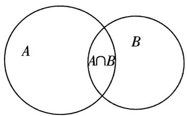

text_image

A
A∩B
B

此时回到开头的问题,相当于 $\mathrm{card}(A)=21,\mathrm{card}(B)=18,\mathrm{card}(A\cap B)=6$ , 因此根据容斥原理直接得到 $\mathrm{card}(A\cup B)=33$ , 因此该团体节目最多能安排 33 人.

# 3.三元容斥原理及其内涵

①三元容斥原理:对于集合A,B,C来说,有 $\mathrm{card}(A\cup B\cup C)=\mathrm{card}(A)+\mathrm{card}(B)+\mathrm{card}(C)-\mathrm{card}(A\cap B)-\mathrm{card}(B\cap C)-\mathrm{card}(C\cap A)+\mathrm{card}(A\cap B\cap C)$ .  
(2)三元容斥原理的内涵:与二元情形一样的思路,画出韦恩图,由韦恩图可以发现 $\text{card}(A) + \text{card}(B) + \text{card}(C)$ 与 $\text{card}(\underbrace{A \cup B \cup C}_{\text{或 } A \text{ 或 } B \text{ 或 } C})$ 相比,多算了集合 $A, B, C$ 两两相交区域中的元素个数,因此需要减掉 $A \cap B$ , $B \cap C, C \cap A$ 中元素的个数.但是在减掉 $A \cap B, B \cap C, C \cap A$ 中元素的个数的过程中,我们把 $A \cap B \cap C$ 的区域减了3次,而 $\text{card}(A) + \text{card}(B) +$

card(C)将 $A \cap B \cap C$ 的区域只计算了3次, 于是需要再把 $\operatorname{card}(A \cap B \cap C)$ 加上1次.

因此得到三元容斥原理 $\operatorname{card}(A \cup B \cup C) = \operatorname{card}(A) + \operatorname{card}(B) + \operatorname{card}(C) - \operatorname{card}(A \cap B) - \operatorname{card}(B \cap C) - \operatorname{card}(C \cap A) + \operatorname{card}(A \cap B \cap C)$ .

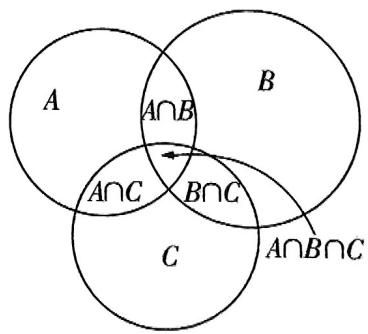

text_image

A
A∩B
B
A∩C
B∩C
C
A∩B∩C

# 大招应用

大招示例 (2020 新高考 I 卷) 某中学的学生积极参加体育锻炼, 其中有 96% 的学生喜欢足球或游泳, 60% 的学生喜欢足球, 82% 的学生喜欢

游泳,则该中学既喜欢足球又喜欢游泳的学生数占该校学生总数的比例是()

A. $62\%$

B. 56%

C. $46\%$

D. 42%

大招识别 已知条件符合二元容斥原理模型.

解析 设集合 $A = \{x \mid x$ 是喜欢足球的学生\}, 集合 $B = \{x \mid x$ 是喜欢游泳的学生\}, 不妨设该中学有 100 人, 则 $\operatorname{card}(A \cup B) = 96, \operatorname{card}(A) = 60, \operatorname{card}(B) = 82(\operatorname{card}(S)$ 表示集合 $S$ 中元素的个数).

由二元容斥原理可得 $\operatorname{card}(A \cap B) = \operatorname{card}(A) + \operatorname{card}(B) - \operatorname{card}(A \cup B) = 60 + 82 - 96 = 46$ ，所以该中学既喜欢足球又喜欢游泳的学生数占该校学生总数的比例是 $46\%$ 。故选 C.

答案 C

练大招，见《解题觉醒》主书P010

[NO TEXT]

text_image

大招2

# “1”的代换

natural_image

Cartoon illustration of a smiling man wearing glasses and a suit with the number 1 (no text or symbols present)

# 大招解读

见招 已知正数 $x, y$ 满足 $ax + by = 1$ , 求 $\frac{c}{x} + \frac{d}{y}$ 的最小值, 其中 $a, b, c, d$ 都为正参数.

满足 $\frac{c}{x}+\frac{d}{y}=1$ ，求 $ax+by$ 的最小值，也是一样的操作

出招 “1”的代换.

第一步：将1用 $ax + by$ 代替. $\frac{c}{x} +\frac{d}{y} = (\frac{c}{x} +\frac{d}{y})(ax + by) = ac + bd + ad\cdot \frac{x}{y} +bc\cdot \frac{y}{x}.$

第二步：使用基本不等式, $ad \cdot \frac{x}{y} + bc \cdot \frac{y}{x} \geqslant 2\sqrt{abcd}$ , 当且仅当 $ad \cdot \frac{x}{y} = bc \cdot \frac{y}{x}$ 时取等号.

第三步: 求出 $\frac{c}{x} + \frac{d}{y}$ 的最小值. $\frac{c}{x} + \frac{d}{y} \geqslant ac + bd + 2\sqrt{abcd}$ , 不难发现一般情况下等号都可以取到.

# 坑袖小课堂

# 柯西不等式

设 $a, b, c, d$ 均为实数，则 $\underbrace{(a^2 + b^2)(c^2 + d^2) \geqslant (ac + bd)^2}_{\text{【提示】将右边式子移项到左边，展开即可证明}}$ ，当且仅当 $ad = bc$ 时，等号成立。【注意】当

$c = 1, d = 1$ 的时候，上式即可变形为重要不等式： $a^2 + b^2 \geqslant 2ab$ .

# 权方和不等式

设 $a, b, x, y > 0$ ，则 $\frac{a^2}{x} + \frac{b^2}{y} \geqslant \frac{(a + b)^2}{x + y}$ ，当且仅当 $\frac{a}{x} = \frac{b}{y}$ 时取等号（常用于速求一些分式和的最值）.

证明： $\frac{a^2}{x} +\frac{b^2}{y}\geqslant \frac{(a + b)^2}{x + y}$ 两边同乘 $x + y$ ，得 $(\frac{a^2}{x} +\frac{b^2}{y})(x + y)\geqslant (a + b)^2$ ①.

解题 11 第3季 武材大会

方法一 不等式①的左边 $= a^{2} + b^{2} + a^{2}\cdot \frac{y}{x} +b^{2}\cdot \frac{x}{y}\geqslant a^{2} + b^{2} + 2$

$\sqrt{a^2 \cdot \frac{y}{x} \cdot b^2 \cdot \frac{x}{y}} = a^2 + b^2 + 2ab = (a + b)^2$ = 右边. 当且仅当 $a^2 \cdot \frac{y}{x} = b^2 \cdot \frac{x}{y}$ , 即 $\frac{a}{x} = \frac{b}{y}$ 时取等号.

方法二 不等式①可化为 $\left[\left(\frac{a}{\sqrt{x}}\right)^2 +\left(\frac{b}{\sqrt{y}}\right)^2\right]\left[\left(\sqrt{x}\right)^2 +\left(\sqrt{y}\right)^2\right] \geqslant \left(\frac{a}{\sqrt{x}}\cdot \sqrt{x} +\frac{b}{\sqrt{y}}\cdot \sqrt{y}\right)^2 = (a + b)^2.$

由柯西不等式可得，因此权方和不等式可看成柯西不等式的变形

【注意】这两种不等式我们只研究二维代数形式.

# 大招应用

大招示例 1 已知正数 $x, y$ 满足 $x + y = 1$ , 求 $\frac{1}{x} + \frac{9}{y}$ 的最小值.

大招识别 “1”的代换的基本问题,按照此类问题的通用解法处理即可.

解析 因为 $x + y = 1$ ，所以 $\frac{1}{x} + \frac{9}{y} = (\frac{1}{x} + \frac{9}{y}) \cdot (x + y) = 10 + \frac{9x}{y} + \frac{y}{x}$ .

又 $x, y$ 均为正数，所以 $\frac{9x}{y} + \frac{y}{x} \geqslant 2\sqrt{\frac{9x}{y} \cdot \frac{y}{x}} = 6$ ，当且仅当 $\frac{9x}{y} = \frac{y}{x}$ ，即 $y = 3x$ 时取等号，

所以 $\frac{1}{x} +\frac{9}{y}\geqslant 10 + 6 = 16$ ，当且仅当 $\left\{ \begin{array}{l}x + y = 1,\\ y = 3x, \end{array} \right.$ 即 $\left\{ \begin{array}{ll}x = \frac{1}{4},\\ y = \frac{3}{4} \end{array} \right.$ 时取等号.

综上, $\frac{1}{x}+\frac{9}{y}$ 的最小值为16.

另解 利用权方和不等式得 $\frac{1}{x} + \frac{9}{y} = \frac{1^2}{x} + \frac{3^2}{y} \geqslant \frac{(1 + 3)^2}{x + y} = 16$ ，当且仅当 $\frac{1}{x} = \frac{3}{y}$ ，即 $x = \frac{1}{4}, y = \frac{3}{4}$ 时等号成立，故 $\frac{1}{x} + \frac{9}{y}$ 的最小值为 16.

# 坑神来避坑

不少同学在最开始做此类问题时,会这么来写:

因为 $\frac{1}{x} +\frac{9}{y}\geqslant 2\sqrt{\frac{1}{x}\cdot\frac{9}{y}}$ ，且 $xy\leqslant (\frac{x + y}{2})^2 = \frac{1}{4}$ 所以 $\frac{1}{x} +\frac{9}{y}\geqslant 2\sqrt{9\times 4} = 12$ ，所以 $\frac{1}{x} +\frac{9}{y}$ 的最小值为12.

这样的做法,错在哪了?

事实上这个方法有两次放缩：

第一次: $\frac{1}{x}+\frac{9}{y}\geqslant2\sqrt{\frac{1}{x}\cdot\frac{9}{y}}$ ，当且仅当 $\frac{1}{x}=\frac{9}{y}$ ，即y=9x时取等号.

第二次: $xy \leqslant \left(\frac{x+y}{2}\right)^{2}$ ，当且仅当 $x=y=\frac{1}{2}$ 时取等号.

显然第一次、第二次放缩的等号并不能同时取到，所以最小值并不是12.

使用基本不等式时,尤其是多次连用基本不等式后,一定不要忘记验证等号成立的条件.

大招示例 ② 已知 a > 0, b > 1 且 $2a + b = 4$ , 求 $\frac{1}{a} + \frac{2}{b - 1}$ 的最小值.

解析 此题 $\frac{1}{a} + \frac{2}{b - 1}$ 中有个分母是 $b - 1$ , 看起来与 “1”的代换没关系. 但是别急, 我们可以通过换元, 令

x = a, y = b - 1 (x > 0, y > 0), 于是问题就变成了“已知正数 x, y 满足 $2x + y = 3$ , 求 $\frac{1}{x} + \frac{2}{y}$ 的最小“1”的代换并不一定换1哦，换3也是一样的值。”这样我们就可以用通用方法愉快地玩耍了.

同理,给出 $x + y = xy (x > 0, y > 0)$ , 求 $2x + y$ 的最小值时, 需要先在第一个式子两边同除以 $xy$ , 才能转化成“1”的代换的形式. “1”的代换的形式灵活多变, 本质上就是配凑出我们所需要的形式, 更多妙用需要同学们自己从习题中感悟啦!

练大招，见《解题觉醒》主书 P014

[NO TEXT]

# 大招解读

# 1. 一个桥梁在基本不等式问题中的应用

见招 已知正数 $x, y$ 满足 $ax + by = f(xy)$ （其中 $a, b$ 都为正数， $f(xy)$ 为 $cxy + d$ 的形式），求 $ax + by$ （或 $xy$ ）的最值.

出招 将 $ax + by$ 与 $xy$ 以基本不等式作为桥梁建立关系.

第一步：根据基本不等式变形得到 $ax + by \geqslant 2\sqrt{abxy}$ ，建立关于 $ax + by$ （或 $xy$ ）的不等式.

第二步：解关于 $ax + by$ （或 $xy$ )的不等式，即可求得 $ax + by$ （或 $xy$ )的最值，注意验证等号能否取到.

# 2. 一个桥梁在其他问题中的应用

对于其他类似的已知一个或几个等式成立,求某个量的最值的问题,我们同样可以通过题目中的已知等式来构建桥梁,进而将原问题转化为一个单变量问题,再进行求解.

# 大招应用

大招示例① 已知正数 $x, y$ 满足 $x + \frac{1}{x} + y + \frac{1}{y} = 5$ , 则 $x + y$ 的最小值为 \_\_\_\_, 最大值为 \_\_\_\_.

大招解 我们的目标是求 $x + y$ 的最小值和最大值, 所以式子 $x + \frac{1}{x} + y + \frac{1}{y} = 5$ 中, $x + y$ 可以不动, $\frac{1}{x} + \frac{1}{y}$ 需要往 $x + y$ 与 $xy$ 上转化, 观察发现, 通分即可! 随后以基本不等式为桥梁即可得到只含 $x + y$ 的不等式, 解出范围即可, 下面进入详细步骤.

因为 $x + \frac{1}{x} + y + \frac{1}{y} = x + y + \frac{x + y}{xy} = 5$ ，且 $xy \leqslant \frac{(x + y)^2}{4}$ （当且仅当 $x = y$ 时取等号），所以 $5 = x + y + \frac{x + y}{xy} \geqslant x + y + \frac{x + y}{\frac{(x + y)^2}{4}} = x + y + \frac{4}{x + y}$ ，即 $(x + y)^2 - 5(x + y) + 4 \leqslant 0$

得 $1 \leqslant x + y \leqslant 4$ ，当 $x = y = \frac{1}{2}$ 时， $x + y = 1$ ，当 $x = y = 2$ 时， $x + y = 4$ . 所以 $x + y$ 的最小值为 1，最大值为 4.

另解由题可得 $\frac{1}{x} +\frac{1}{y} = 5 - (x + y)$ ，因为 $(\frac{1}{x} +\frac{1}{y})$ （ $x + y)\geqslant 4$ （当且仅当 $x = y$ 时取等号），所以 $[5 - (x + y)](x + y)\geqslant 4$ ，令 $x + y = t$ ，则 $(5 - t)t\geqslant 4$ ，解得 $1\leqslant t\leqslant 4$ 所以 $x + y$ 的最小值为1，最大值为4.

答案 14

# 坑神有话说

通过上面的例子相信同学们已经能感受到，使用基本不等式作为“桥梁”的目的是通过式子之间的关系减少所求问题中变量的个数，尽量转化为单变量问题.

大招示例 ② [多选](2022 新高考Ⅱ卷)若 $x$ , $y$ 满足 $x^{2} + y^{2} - xy = 1$ , 则 ( )

A. $x + y \leqslant 1$

B. $x + y \geqslant -2$

C. $x^{2} + y^{2}\leqslant 2$

D. $x^{2} + y^{2}\geqslant 1$

大招识别 要求 $x + y$ 的取值范围, 需要先把 $x^{2} + y^{2} - xy = 1$ 化成关于 $x + y$ 与 $xy$ 的式子, 再利用 $xy \leqslant \left(\frac{x + y}{2}\right)^{2}$ 建立关于 $x + y$ 的不等式; 要求 $x^{2} + y^{2}$ 的取值范围, 需利用 $xy \leqslant \frac{x^{2} + y^{2}}{2}$ 建立关于 $x^{2} + y^{2}$ 的不等式.

解析 由 $xy \leqslant \left(\frac{x + y}{2}\right)^2$ ，当且仅当 $x = y$ 时取等号，可得桥梁

$$
1 = x ^ {2} + y ^ {2} - x y = (x + y) ^ {2} - 3 x y \geqslant (x + y) ^ {2} - 3 (\frac {x + y}{2}) ^ {2} =
$$

$\frac{(x + y)^2}{4}$ , 即 $(x + y)^2 \leqslant 4$ , 可得 $-2 \leqslant x + y \leqslant 2$ , 所以选项 A

错误,选项B正确.由 $xy \leqslant \frac{x^{2} + y^{2}}{2}$ ，当且仅当x=y时取等号，可得 $1 = x^{2} + y^{2} - xy \geqslant x^{2} + y^{2} - \frac{x^{2} + y^{2}}{2} = \frac{x^{2} + y^{2}}{2}$ ，即 $x^{2} + y^{2} \leqslant 2$ ，所以选项C正确.对于选项D，只需举出一个反例即可，不妨令 $x = \frac{1}{2}$ ，由 $x^{2} + y^{2} - xy = 1$ 可得 $y^{2} - \frac{y}{2} - \frac{3}{4} = 0$ ，解得 $y = \frac{1 \pm \sqrt{13}}{4}$ ，当 $y = \frac{1 - \sqrt{13}}{4}$ 时， $|y| = \frac{\sqrt{13} - 1}{4} < \frac{\sqrt{16} - 1}{4} = \frac{3}{4}$ ，所以 $x^{2} + y^{2} < \frac{1}{4} + \frac{9}{16} < 1$ ，所以选项D错误.故选BC.

答案 BC

# 坑神小课堂

$x^{2} + y^{2}$ 的最小值为 $\frac{2}{3}$ , 可以通过三角换元求得. 大致思路为 $x^{2} + y^{2} - xy = (x - \frac{1}{2}y)^{2} + (\frac{\sqrt{3}}{2}y)^{2} = 1$ , 令 $x - \frac{1}{2}y = \cos \theta, \frac{\sqrt{3}}{2}y = \sin \theta$ , 得 $x = \frac{\sqrt{3}}{3}\sin \theta + \cos \theta, y = \frac{2\sqrt{3}}{3}\sin \theta$ , 进而通过三角函数知识解决, 具体步骤不再展示.

练大招，见《解题觉醒》主书 P014

text_image

大招4

# 对勾函数求值域

natural_image

Caricature of a man riding a skateboard with a small block on the ground (no text or symbols)

# 大招解读

# 1. 对勾函数的定义及其性质

形如 $f(x) = ax + \frac{b}{x} (ab > 0)$ 的函数，当 $a > 0, b > 0$ 时其图象如图所示，是关于原点对称的对勾，故函数称为对勾函数.

接下来让我们一起研究下对勾函数的基本性质：

①定义域: $x\in(-\infty,0)\cup(0,+\infty)$ .   
②奇偶性:奇函数.  
③单调性: 当 $x \in (-\infty, -\sqrt{\frac{b}{a}})$ 时, 函数 $f(x)$ 单调递增; 当 $x \in$

$(-\sqrt{\frac{b}{a}},0)$ 时，函数 $f(x)$ 单调递减；当 $x \in (0, \sqrt{\frac{b}{a}})$ 时，函数 $f(x)$ 单调递减；当 $x \in (\sqrt{\frac{b}{a}}, +\infty)$ 时，函数 $f(x)$ 单调递增.

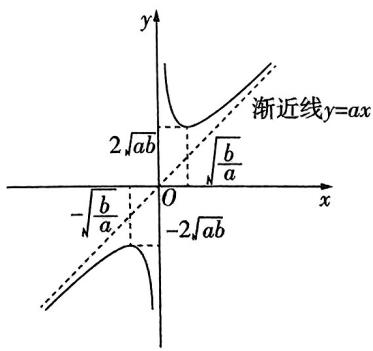

text_image

y
渐近线y=ax
2√ab
√b/a
-√b/a
-2√ab
x

④极值:极大值 $f(-\sqrt{\frac{b}{a}})=-2\sqrt{ab}$ ;极小值 $f(\sqrt{\frac{b}{a}})=2\sqrt{ab}$ .

⑤最值:函数在定义域上无最值,在区间 $(-∞,0)$ 上, $f(x)$ 有最大值 $f(-\sqrt{\frac{b}{a}})=-2\sqrt{ab}$ ;在区间 $(0,+∞)$ 上, $f(x)$ 有最小值 $f(\sqrt{\frac{b}{a}})=2\sqrt{ab}$ .

# 坑神有话说

当 $f(x) = ax + \frac{b}{x} (a < 0, b < 0)$ 时，函数 $f(x)$ 的图象如图1所示，此时 $f(x) = -\left(-ax - \frac{b}{x}\right)$ 也为对勾函数，其基本性质可参考上述对勾函数性质.

当 $f(x) = ax + \frac{b}{x} (a > 0, b < 0)$ 时，函数 $f(x)$ 的图象如图2所示，在 $(- \infty, 0), (0, +\infty)$ 上均单调递 $y = ax \uparrow, y = \frac{b}{x} \uparrow, \uparrow + \uparrow = \uparrow$

增,此时称 $f(x)$ 为双撇函数.

$f(x)=ax+\frac{b}{x}(a<0,b>0)$ 时，也是双撇函数

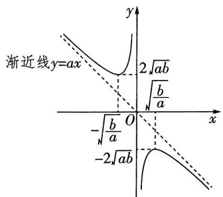

text_image

渐近线y=ax
2√ab
√b/a
-√b/a
O
x
-2√ab

图1

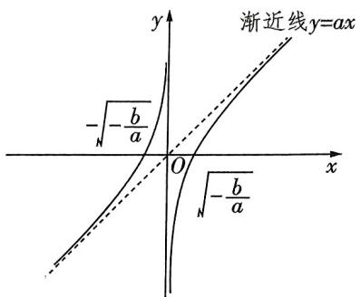

text_image

渐近线y=ax
-\sqrt{-\frac{b}{a}}
O
\sqrt{-\frac{b}{a}}

图2

# 2. 对勾函数在值域问题中的应用

对勾函数常常应用于一些求值域(最值)的问题,在圆锥曲线、导数等多个模块我们都会见到对勾函数的影子.对于此类问题,我们通常采用以下步骤处理:

第一步：通过代数变形(一般为换元)，将待求函数变形为含对勾函数的形式.

第二步：根据对勾函数的相关性质,得到这个新函数的值域(最值),从而解决问题.

# 3. 利用对勾函数求分式型函数的值域:

使用对勾函数求值域时,大多数情况是求分式型函数的值域,通常包含以下几种情形.

①二次比一次型:形如 $f(x)=\frac{ax^{2}+bx+c}{dx+e}(a,b,c,d,e\in\mathbf{R},ad\neq0)$ ，此时把分母看作一个整体进行换元，即可化成对勾函数的形式，进而求解出值域.  
②一次比二次型:形如 $f(x)=\frac{ax+b}{cx^{2}+dx+e}(a,b,c,d,e\in\mathbb{R},ac\neq0)$ ，此时将分子、分母同除以分子，分母就变成了①中的形式，换元后继续操作即可.  
③二次比二次型:形如 $f(x)=\frac{ax^{2}+bx+c}{dx^{2}+ex+f}(a,b,c,d,e,f\in\mathbb{R},ad\neq0)$ ，此时先把分子中的二次项分离常数分离下去，就变成了②中的形式，再将分子、分母同除以分子，换元后继续操作即可.

# 坑神有谣说

当分式型函数不限定定义域时,上述①②形式也适用判别式法求值域.

# 坑神

(1)换元后注意新元取值范围是否变化；(2)分子、分母同时除以某个式子时，注意这个式子是否可能为0.

# 大招应用

大招示例 1 求函数 $f(x) = \frac{x^2 + 5x + 8}{x + 1} (x > 0)$

的值域。

大招识别 二次比一次型函数值域的求解, 将分母看作一个整体进行换元, 化成对勾函数的形式, 进而求解值域.

解析 先令 $t = x + 1$ ，将函数 $f(x) = \frac{x^{2} + 5x + 8}{x + 1} (x > 0)$ 变形为 $g(t) = t + \frac{4}{t} + 3 (t > 1)$ ，然后根据对勾函数基本性质，得到函数 $g(t)$ 的值域，即函数 $f(x)$ 的值域。下面进入完整解题步骤：设 $t = x + 1$ ，则 x = t - 1，因为 x > 0，所以换元

$t > 1.$ 因为 $f(x) = \frac{x^2 + 5x + 8}{x + 1} (x > 0)$ ，所以 $f(t - 1) =$ 新元的范围 $\frac{(t - 1)^2 + 5(t - 1) + 8}{t - 1 + 1} = t + \frac{4}{t} +3(t > 1).$ 构建函数分子、分母同时除以 $t$

$g(t)=t+\frac{4}{t}+3(t>1)$ ，函数 $g(t)$ 在 $(1,2)$ 上单调递减，在 $(2,+\infty)$ 上单调递增，所以当t=2时，函数 $g(t)=t+$ 对勾函数的性质 $\frac{4}{t}+3(t>1)$ 取得最小值 $g(2)=7$ ，所以函数 $g(t)$ 的值域为 $[7,+\infty)$ ，所以函数 $f(x)$ 的值域为 $[7,+\infty)$ .

大招示例 ② 求函数 $f(x) = \frac{5x}{x^2 - 3x + 4}$ 的值域.

大招识别 符合一次比二次的形式, x=0 时单独讨论, $x \neq 0$ 时分式上下同除以 x 后转化为二次比一次型处理.

解析 当 $x = 0$ 时, $f(x) = 0$ . 当 $x \neq 0$ 时, 分式上下同除以 $x$ 得 $f(x) = \frac{5}{x + \frac{4}{x} - 3}$ . 由对勾函数的值域可知, 当 $x \neq 0$ 时, $x + \frac{4}{x} - 3 \in (-\infty, -7] \cup [1, +\infty)$ , 所以 $f(x) = \frac{5}{x + \frac{4}{x} - 3} \in [-\frac{5}{7}, 0) \cup (0, 5]$ . 综上所述, 函数 $f(x)$ 的值域为 $[- \frac{5}{7}, 5]$ .

另解 判别式法. 函数 $y = f(x) = \frac{5x}{x^{2} - 3x + 4}$ 的定义域为 R, 此时可考虑用判别式法求解.

函数 $y = f(x) = \frac{5x}{x^2 - 3x + 4}$ 变形后得 $y(x^2 - 3x + 4) = 5x$ ，整理得 $yx^2 - (3y + 5)x + 4y = 0$ ，

则当 $y = 0$ 时，有解；当 $y \neq 0$ 时， $\Delta = (3y + 5)^2 - 16y^2 \geqslant 0$ 解得 $y \in [-\frac{5}{7}, 0) \cup (0, 5]$ .

综上所述,函数 $f(x)$ 的值域为 $\left[-\frac{5}{7},5\right]$ .

# 坑神有话说

(1) 当给定的函数定义域是 $\mathbf{R}$ 时, 也可考虑用判别式法; 若定义域不是 $\mathbf{R}$ , 用判别式法时需要对产生的增根分情况讨论, 此时不建议用判别式法.  
(2)用判别式法解题时首先将原函数整理成一个关于 $x$ 的整式方程, 此时 $y$ 看作参数, 对 $y = 0, y \neq 0$ 分两种情况讨论, 当 $y \neq 0$ 时, 根据方程有根, 也就是通过判别式大于等于0, 可以得到 $y$ 的范围, 结合 $y = 0$ 是否有解进而得值域.

大招示例 ③ 求函数 $f(x) = \frac{x^2 + 2}{x^2 + x + 1}$ 的值域.

大招识别 符合二次比二次的形式,分离常数后按一次比二次型的处理方法处理.

解析 $f(x) = \frac{x^2 + 2}{x^2 + x + 1} = \frac{x^2 + x + 1 - (x - 1)}{x^2 + x + 1} = 1 -$ 分离常数

$\frac{x - 1}{x^2 + x + 1}$ . 当 $x = 1$ 时, $f(x) = 1$ . 当 $x \neq 1$ 时, $f(x) = 1 - \frac{1}{\frac{x^2 + x + 1}{x - 1}}$ , 令 $t = x - 1$ , 则 $t \neq 0, x = t + 1$ , 所以分式上下同除以分子

$f(t+1)=1-\frac{1}{\frac{(t+1)^{2}+t+2}{t}}=1-\frac{1}{t+\frac{3}{t}+3}.$ 由对勾函数
分母上的分式上下同除以ℓ

的值域可知, 当 $t \neq 0$ 时, $t + \frac{3}{t} + 3 \in (-\infty, 3 - 2\sqrt{3}] \cup [3 + 2\sqrt{3}, +\infty)$ , 所以 $-\frac{1}{t + \frac{3}{t} + 3} \in [\frac{3 - 2\sqrt{3}}{3}, 0) \cup$

$(0, \frac{2\sqrt{3} + 3}{3}]$ , 所以 $f(x) \in [\frac{6 - 2\sqrt{3}}{3}, 1) \cup (1, \frac{6 + 2\sqrt{3}}{3}]$ . 综上所述, 函数 $f(x)$ 的值域为 $[\frac{6 - 2\sqrt{3}}{3}, \frac{6 + 2\sqrt{3}}{3}]$ .

# 大招解读

见招 解函数不等式 $f(g(x))<f(h(x))$ .

出招 逆用函数单调性.

第一步：根据单调性的定义或 $f(x)$ 的导数 $f'(x)$ ，得到函数 $f(x)$ 在对应的区间上的单调性.

第二步: 通过函数 $f(x)$ 的单调性, 将不等式 $f(g(x)) < f(h(x))$ 转化为不等式 $g(x) < h(x)$ 或 $g(x) > h(x)$ .

第三步: 求出 $g(x) < h(x)$ 或 $g(x) > h(x)$ 的解集.

# 大招应用

大招示例 已知函数 $f(x) = \frac{\mathrm{e}^x - \mathrm{e}^{-x}}{2} - \sin x$ ，求不等式 $f(x + 4) < f(x^2 - 2)$ 的解集.

大招识别 题干为关于不等式 $f(g(x)) < f(h(x))$ 的问题, 故需挖掘函数单调性, 将问题转化为 $g(x) < h(x)$ 或 $g(x) > h(x)$ 的问题求解.

解析 我们首先通过导函数 $f'(x) = \frac{\mathrm{e}^x + \mathrm{e}^{-x}}{2} - \cos x$ , 得到函数 $f(x)$ 单调递增, 然后将不等式 $f(x + 4) < f(x^2 - 2)$ 转化为不等式 $x + 4 < x^2 - 2$ , 进而求出其解集. 下面进入完整解题步骤: 因为 $f(x) = \frac{\mathrm{e}^x - \mathrm{e}^{-x}}{2} - \sin x$ , 所以 $f'(x) =$

$\frac{\mathrm{e}^x + \mathrm{e}^{-x}}{2} -\cos x\geqslant \frac{2\sqrt{\mathrm{e}^x\cdot\mathrm{e}^{-x}}}{2} -\cos x = 1 - \cos x\geqslant 0$ ，当且易错：取“ $=$ ”时还要满足基本不等时的取“ $=$ ”条件仅当 $x = 0$ 时取等号，所以函数 $f(x) = \frac{\mathrm{e}^x - \mathrm{e}^{-x}}{2} -\sin x$ 单调递增.因为 $f(x + 4) <   f(x^{2} - 2)$ ，所以 $x + 4 <   x^2 -2$ ，所以 $x^{2} - x - 6 > 0$ ，所以 $x <   - 2$ 或 $x > 3.$ 综上所述，不等式 $f(x + 4) <   f(x^2 -2)$ 的解集为 $(-\infty , - 2)\cup (3, + \infty)$

# 坑神来避坑

本题函数 $f(x)$ 的定义域刚好是R,如果函数 $f(x)$ 的定义域有限制,最后求解集时一定不要忽略.例如: 若 $f(x)$ 的定义域为 D, 解不等式 $f(g(x)) < f(h(x))$ 时容易忽略隐含条件 $g(x) \in D, h(x) \in D.$

练大招，见《解题觉醒》主书 P019

Q

text_image

大招6

# 部分奇偶性

text_image

f(x)
f-x

# 大招解读

对于根据 $f(x_{0})$ 求解 $f(-x_{0})$ 的问题,我们可以根据部分奇偶性求解.

# 1. 函数的奇偶性分解

对于一个定义域关于原点对称的函数 $f(x)$ 来说，我们构建函数 $g(x) = \frac{f(x) + f(-x)}{2}, h(x) = \frac{f(x) - f(-x)}{2}$ ，这样就使得 $f(x) = g(x) + h(x)$ ，而对于函数 $g(x)$ 来说， $g(-x) = \frac{f(-x) + f(x)}{2} =$ $g(x)$ ，得到函数 $g(x)$ 是偶函数；对于函数 $h(x)$ 来说， $h(-x)=\frac{f(-x)-f(x)}{2}=-h(x)$ ，得到函数 $h(x)$ 是奇函数。这就说明任何一个定义域关于原点对称的函数都可以表示为一个偶函数与一个奇函数的和。

# 2.部分奇偶性

有了前面的铺垫之后,我们再看如下问题:“已知定义域关于原点对称的函数 $f(x)$ ,且 $f(x_{0})=m$ ,求 $f(-x_{0})$ 的值.”如果函数 $f(x)$ 是奇函数或偶函数,那么 $f(-x_{0})$ 能轻松求出.但现实往往是函数 $f(x)$ 非奇非偶,怎么办?我们通常采用以下步骤处理:

第一步: 观察函数 $f(x)$ 的解析式, 看哪部分构成偶函数, 哪部分构成奇函数, 即构造出 $f(x) = g(x) + h(x)$ , 其中函数 $g(x)$ 是偶函数, 函数 $h(x)$ 是奇函数.

第二步: 根据函数 $g(x), h(x)$ 的奇偶性得到 $f(-x_0)$ 与 $f(x_0)$ 的关系式, 进而求出 $f(-x_0)$ 的值.

①如果偶函数 $g(x)$ 是无参或相对简单的, 那么我们以奇函数 $h(x)$ 为桥梁构建等式, 根据 $h(-x_0) = -h(x_0)$ 解决问题.  
②如果奇函数 $h(x)$ 是无参或相对简单的, 那么我们以偶函数 $g(x)$ 为桥梁构建等式, 根据 $g(-x_0) = g(x_0)$ 解决问题.

值得注意的是,实际操作中的第一步是通过观察函数 $f(x)$ 的解析式来完成,而非直接构造 $g(x)=\frac{f(x)+f(-x)}{2},h(x)=\frac{f(x)-f(-x)}{2}$ ,前面的证明只是为了说明函数的奇偶性分解是可行的.

# 3.奇函数的性质延伸——“奇常”模型

若 $f(x) = g(x) + c$ ，其中 $g(x)$ 为奇函数， $c$ 为不为0的常数，当奇函数 $g(x)$ 有最大值和最小值时， $f(x)$ 也有最大值和最小值，且有 $f(x)_{\max} + f(x)_{\min} = 2c$ .

$$
f (x) _ {\max} = g (x) _ {\max} + c, f (x) _ {\min} = g (x) _ {\min} + c, g (x) _ {\max} + g (x) _ {\min} = 0
$$

# 大招应用

大招示例 1 (1) 已知函数 $f(x) = ax^5 + x^2 + b\sin x$ ，且 $f(2) = 1$ ，求 $f(-2)$ 的值.

(2)已知函数 $f(x)=ax^{6}+x+b\cos x$ ，且 $f(2)=1$ ，求 $f(-2)$ 的值.

大招识别 (1) 观察得到奇函数为 $h(x) = ax^5 + b\sin x$ ，偶函数为 $g(x) = x^2$ ，所以偶函数 $g(x) = x^2$ 相对简单，于是就有 $h(-x_0) = f(-x_0) - g(-x_0) = -h(x_0) = g(x_0) - f(x_0)$ ，进而求出 $f(-2)$ 的值.

(2) 观察得到奇函数为 $h(x) = x$ ，偶函数为 $g(x) = ax^6 + b\cos x$ ，所以奇函数 $h(x) = x$ 相对简单，于是就有 $g(-x_0) = f(-x_0) - h(-x_0) = g(x_0) = f(x_0) - h(x_0)$ ，进而求出 $f(-2)$ 的值.

解析 (1) 大招解 因为 $f(x) = ax^5 + x^2 + b\sin x$ ，所以 $ax^5 + b\sin x = f(x) - x^2$ . 构建函数 $h(x) = ax^5 + b\sin x = f(x) - x^2$ ，所以函数 $h(x)$ 是奇函数，所以 $h(-2) = -h(2)$ ，所以 $f(-2) - (-2)^2 = -[f(2) - 2^2]$ ，所以 $f(-2) = 2 \times 2^2 - f(2)$ ，因为 $f(2) = 1$ ，所以 $f(-2) = 7$ .

常规解由题意得 $f(2) = 32a + 4 + b\sin 2 = 1$ ，所以 $32a + b\sin 2 = -3$ ，又 $f(-2) = -32a + 4 + b\sin (-2) =$

$4 - (32a + b\sin 2)$ , 所以 $f(-2) = 7$ .

(2) 大招解 因为 $f(x) = ax^6 + x + b\cos x$ ，所以 $ax^6 + b\cos x = f(x) - x$ . 构建函数 $g(x) = ax^6 + b\cos x = f(x) - x$ ，所以函数 $g(x)$ 是偶函数，所以 $g(-2) = g(2)$ ，所以 $f(-2) - (-2) = f(2) - 2$ ，所以 $f(-2) = f(2) - 2 \times 2$ ，因为 $f(2) = 1$ ，所以 $f(-2) = -3$ .

常规解 由题意得 $f(2) = 64a + 2 + b\cos 2 = 1$ ，所以 $64a + b\cos 2 = -1$ ，又 $f(-2) = 64a - 2 + b\cos (-2) = 64a + b\cos 2 - 2$ ，所以 $f(-2) = -3$ .

大招示例 ② (2024 江西景德镇期中统考) 已知 $f(x)$ 是定义在 $\mathbb{R}$ 上的奇函数, 设函数 $g(x) = \frac{(x + 4)^2 + f(x)}{x^2 + 16}$ 的最大值为 $M$ , 最小值为 $m$ , 则 $M + m =$ ( )

A. 2

B. 4

C. 8

D. 16

大招识别 函数 $g(x)$ 的最大、最小值分别为 M, m，且 $f(x)$ 为奇函数， $g(x)$ 解析式中包含 $f(x)$ ，则可考虑利用奇函数的性质 $f(x) + f(-x) = 0$ 求解参数.

解析因为 $g(x) = \frac{(x + 4)^2 + f(x)}{x^2 + 16} = \frac{x^2 + 16 + 8x + f(x)}{x^2 + 16} =$ $\frac{8x + f(x)}{x^2 + 16} +1$ ，令 $h(x) = g(x) - 1 = \frac{8x + f(x)}{x^2 + 16}$ ，所以函数 $h(x)$ 的最大值为 $M - 1$ ，最小值为 $m - 1$ ，因为 $f(x)$ 是奇函数，所以 $f(-x) = -f(x)$

所以 $h(-x)=\frac{-8x+f(-x)}{x^{2}+16}=-\frac{8x+f(x)}{x^{2}+16}=-h(x)$ ，所以函数 $h(x)$ 是奇函数，
由奇函数的性质可得, $M-1+m-1=0$ ,
解得 $M + m = 2$ .

答案 A

练大招，见《解题觉醒》主书 P020

# 大招了

# 对称性转化

# 大招解读

# 1. 对称性转化

已知函数 $f(x)$ 的定义域为R.

①由轴对称的性质可知,到对称轴距离相等的两个自变量所对应的函数值相等,所以函数 $f(x)$ —外同
的图象关于直线 x = a 对称 $\Leftrightarrow f(a + x) = f(a - x)$ .
—内反

推论一: $f(x)=f(2a-x)\Leftrightarrow$ 函数 $f(x)$ 的图象关于直线x=a对称.

推论二: $f(x+a)=f(b-x)\Leftrightarrow$ 函数 $f(x)$ 的图象关于直线 $x=\frac{a+b}{2}$ 对称.

证明 因为 $f(x) = f(2a - x)$ ，所以 $f(a + x) = f(2a - (a + x)) = f(a - x)$ ，所以函数 $f(x)$ 的图象关于直线 $x = a$ 对称，反之亦然，所以推论一正确。因为 $f(x + a) = f(b - x)$ ，所以 $f((x + \frac{b - a}{2}) + a) = f(b - (x + \frac{b - a}{2}))$ ，即 $f(\frac{a + b}{2} + x) = f(\frac{a + b}{2} - x)$ ，所以函数 $f(x)$ 的图象关于直线 $x = \frac{a + b}{2}$ 对称，反之亦然，所以推论二正确。

②由中心对称的性质可知,到对称中心距离相等的两个自变量所对应的函数值之和为对称中心纵坐
外反
标的2倍,所以函数 $f(x)$ 的图象关于点 $(a,b)$ 中心对称 $\Leftrightarrow f(a+x)+f(a-x)=2b$ ,即 $f(a+x)=-f(a-x)+2b$ .

推论一: $f(x) = -f(2a - x) + 2b \Leftrightarrow$ 函数 $f(x)$ 的图象关于点 $(a, b)$ 中心对称.

推论二: $f(x+a)=-f(b-x)+2c\Leftrightarrow$ 函数 $f(x)$ 的图象关于点 $\left(\frac{a+b}{2},c\right)$ 中心对称.

证明 因为 $f(x) + f(2a - x) = 2b$ ，所以 $f(a + x) + f(2a - (a + x)) = f(a + x) + f(a - x) = 2b$ ，所以函数 $f(x)$ 的图象关于点 $(a, b)$ 中心对称，反之亦然，所以推论一正确。因为 $f(x + a) + f(b - x) = 2c$ ，所以 $f((x + \frac{b - a}{2}) + a) + f(b - (x + \frac{b - a}{2})) = 2c$ ，即 $f(x + \frac{a + b}{2}) = -f(\frac{a + b}{2} - x) + 2c$ ，所以函数 $f(x)$

的图象关于点 $\left(\frac{a+b}{2},c\right)$ 中心对称,反之亦然,所以推论二正确.

# 坑神有话说

1. 函数 $f(x)$ 的图象关于点 $(a, b)$ 中心对称在需要用等式表达时，我们通常转化为 $f(a + x) = -f(a - x) + 2b$ （或 $f(x) = -f(2a - x) + 2b$ ）.

2. 在看到等式 $f(x + a) = -f(b - x) + 2c$ 时, 我们也要转化为函数 $f(x)$ 的图象关于点 $\left(\frac{a + b}{2}, c\right)$ 中心对称.

3. 特别地, $f(x) = -f(2a - x) \Leftrightarrow$ 函数 $f(x)$ 的图象关于点 $(a,0)$ 中心对称, $f(x) = -f(-x) + 2a \Leftrightarrow$ 函数 $f(x)$ 的图象关于点 $(0,a)$ 中心对称,这两种情况经常考查.

# 2.三次函数图象的对称性

对于一个三次函数 $f(x) = ax^3 + bx^2 + cx + d (a \neq 0)$ 来说，点 $(x_0, f(x_0))$ 是函数 $f(x)$ 图象的对称中心，其中 $x_0$ 满足方程 $f''(x_0) = 0$ .

$f''(x)$ 为函数 $f(x)$ 的二阶导数

证明 因为 $f(x) = ax^3 + bx^2 + cx + d (a \neq 0)$ ，所以 $f'(x) = 3ax^2 + 2bx + c$ ，所以 $f''(x) = 6ax + 2b$ . 因为 $f''(x_0) = 0$ ，所以 $f''(x_0) = 6ax_0 + 2b = 0$ ，所以 $x_0 = -\frac{b}{3a}$ ，所以 $f(x_0 + x) + f(x_0 - x) = a(x_0 + x)^3 + b(x_0 + x)^2 + c(x_0 + x) + d + a(x_0 - x)^3 + b(x_0 - x)^2 + c(x_0 - x) + d = 2ax_0^3 + 2bx_0^2 + 2cx_0 + 2d + (6ax_0 + 2b)x^2 = 2ax_0^3 + 2bx_0^2 + 2cx_0 + 2d + (-\frac{b}{3a} \cdot 6a + 2b)x^2 = 2f(x_0)$ ，所以点 $(x_0, f(x_0))$ 是函数 $f(x)$ 图象的对称中心.

# 坑神有话说

# 原函数与导函数性质的关系

(1) 若 $f(x)$ 是奇函数，则 $f'(x)$ 为偶函数；若 $f(x)$ 是偶函数，则 $f'(x)$ 为奇函数.

(2) 若 $f(x)$ 的图象关于直线 $x = a$ 对称, 则 $f'(x)$ 的图象关于点 $(a,0)$ 对称; 若 $f(x)$ 的图象关于点 $(a,b)$ 对称, 则 $f'(x)$ 的图象关于直线 $x = a$ 对称.

(3) 周期函数的导函数仍是周期函数, 且周期相同.

# 大招应用

大招示例 [多选] (2024 新课标Ⅱ卷) 设函数 $f(x) = 2x^{3} - 3ax^{2} + 1$ ，则 （）

A. 当 $a > 1$ 时, $f(x)$ 有三个零点  
B. 当 $a < 0$ 时, $x = 0$ 是 $f(x)$ 的极大值点  
C. 存在 $a, b$ , 使得 $x = b$ 为曲线 $y = f(x)$ 的对称轴  
D. 存在 $a$ , 使得点 $(1, f(1))$ 为曲线 $y = f(x)$ 的对称中心

解析 由题可知, $f'(x)=6x(x-a)$ .

对于 A, 当 a > 1 时, 由 $f'(x) < 0$ 得 0 < x < a, 由 $f'(x) > 0$ 得 x < 0 或 x > a, 则 $f(x)$ 在 $(-\infty, 0)$ 上单调递增, 在 $(0, a)$ 上单调递减, 在 $(a, +\infty)$ 上单调递增, 且当 $x \to -\infty$ 时, $f(x) \to -\infty$ , $f(0) = 1$ , $f(a) = -a^{3} + 1 < 0$ , 当 $x \to +\infty$ 时, $f(x) \to +\infty$ , 故 $f(x)$ 有三个零点, A 正确;

对于 B, 当 a<0 时, 由 $f'(x)<0$ 得 a<x<0, 由 $f'(x)>0$ 得 x>0 或 x<a, 则 $f(x)$ 在 $(-∞, a)$ 上单调递增, 在 $(a,0)$ 上单调递减, 在 $(0,+\infty)$ 上单调递增, 故 x=0 是$f(x)$ 的极小值点, B 错误;

对于 C, 当 $x \to +\infty$ 时, $f(x) \to +\infty$ , 当 $x \to -\infty$ 时, $f(x) \to -\infty$ , 故曲线 $y = f(x)$ 必不存在对称轴, C 错误; 对于 D, 常规解配方、平移. $f(x) = 2x^3 - 3ax^2 + 1 = 2(x - \frac{a}{2})^3 - \frac{3}{2}a^2(x - \frac{a}{2}) + 1 - \frac{a^3}{2}$ , 令 $t = x - \frac{a}{2}$ , 则 $f(x)$ 可转化为 $g(t) = 2t^3 - \frac{3}{2}a^2t + 1 - \frac{a^3}{2}$ , 由 $y = 2t^3 - \frac{3}{2}a^2t$ 为奇函数, 且其图象关于原点对称, 可知 $g(t)$ 的图象关于点 $(0, 1 - \frac{a^3}{2})$ 对称, 则 $f(x)$ 的图象关于点 $(\frac{a}{2}, 1 - \frac{a^3}{2})$ 对称, 故存在 $a = 2$ , 使得点 $(1, f(1))$ 为曲线 $y = f(x)$ 的对称中心, D 正确.

大招解 任意三次函数 $f(x) = ax^3 + bx^2 + cx + d (a \neq 0)$ 的图象均关于点 $(- \frac{b}{3a}, f(-\frac{b}{3a}))$ 成中心对称，D 正确.

答案 AD

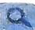

# 大招解读

在一些涉及周期性问题的求解中,我们常采用以下两种思路求得函数的周期.

# 1. “半周期”推导周期

已知 $a \in \mathbb{R}, a \neq 0$ .

①若函数 $f(x)$ 满足 $f(x)+f(x+a)=b(b\in\mathbf{R})$ ，则 $f(x)+f(x+a)=f(x+a)+f(x+2a)=b$ ，所以 $f(x+2a)=f(x)$ ，所以函数 $f(x)$ 是周期为 $2|a|$ 的周期函数.

②若函数 $f(x)$ 满足 $f(x)f(x+a)=b(b\in\mathbb{R},b\neq0)$ ，则 $f(x)f(x+a)=f(x+a)f(x+2a)=b$ ，所以 $f(x+2a)=f(x)$ ，所以函数 $f(x)$ 是周期为 $2|a|$ 的周期函数.

③若函数 $f(x)$ 满足 $f(x+a)=\frac{1-f(x)}{1+f(x)}$ ，则 $f(x+2a)=\frac{1-f(x+a)}{1+f(x+a)}=\frac{1-\frac{1-f(x)}{1+f(x)}}{1+\frac{1-f(x)}{1+f(x)}}=f(x)$ ，所以函用 $x+a$ 替换x

数 $f(x)$ 是周期为 $2|a|$ 的周期函数.

①②③式子中涉及的 $|a|$ 刚好是周期的一半,所以这里的 $|a|$ 也被称为“半周期”.

# 坑神来避坑

①用 $f(x) + f(x + a) = b (b \in \mathbb{R})$ 可得 $f(x)$ 是周期为 $2|a|$ 的周期函数,但函数 $f(x)$ 是周期为 $2|a|$ 的周期函数并不一定有 $f(x) + f(x + a) = b (b \in \mathbb{R})$ .  
②半周期的一种隐藏形式为 $f(x + a) = \frac{1 + f(x)}{1 - f(x)}$ ，写出 $f(x + 2a)$ 与 $f(x)$ 的关系之后即可转化成半周期问题.

# 2. 双对称推导周期

已知函数 $f(x)$ 图象的两条对称轴、两个对称中心或一条对称轴加一个对称中心都可以得到 $f(x)$ 的周期的结论.

①两条对称轴:已知函数 $f(x)$ 的图象关于直线x=a和直线x=b对称,则函数 $f(x)$ 是周期为双轴
2|b-a|的周期函数. 特别地,当 $f(x)$ 为偶函数且函数 $f(x)$ 的图象关于直线x=a对称时,函数 $f(x)$ 是
二周期
图象关于直线x=0对称
周期为2|a|的周期函数.

证明 因为函数 $f(x)$ 的图象关于直线 $x = a$ 和直线 $x = b$ 对称, 所以 $\left\{ \begin{array}{l} f(x) = f(2a - x), \\ f(x) = f(2b - x), \end{array} \right.$ 所以 $\left\{ \begin{array}{l} f(x) = f(2a - x), \\ f(2a - x) = f(2b - (2a - x)), \end{array} \right.$ 所以 $f(x + 2b - 2a) = f(x)$ , 所以函数 $f(x)$ 是周期为 $2|b - a|$ 的周期函数.

②两个对称中心:已知函数 $f(x)$ 的图象关于点 $(a,0)$ 和点 $(b,0)$ 中心对称,则函数 $f(x)$ 是周期为2 $|b-a|$ 的周期函数.特别地,当 $f(x)$ 为奇函数且函数 $f(x)$ 的图象关于点 $(a,0)$ 中心对称时,函数 $f(x)$

一周期

是周期为 $2|a|$ 的周期函数.

图象关于点（0，0）对称

证明 因为函数 $f(x)$ 的图象关于点 $(a,0)$ 和点 $(b,0)$ 中心对称，所以 $\left\{ \begin{array}{l} f(x) + f(2a - x) = 0, \\ f(x) + f(2b - x) = 0, \end{array} \right.$ 所以 $\left\{ \begin{array}{l} f(x) + f(2a - x) = 0, \\ f(2a - x) + f(2b - (2a - x)) = 0, \end{array} \right.$ 所以 $f(x + 2b - 2a) = f(x)$ ，所以函数 $f(x)$ 是周期为 $2|b - a|$ 的周期函数.

(3)一条对称轴 + 一个对称中心: 已知函数 $f(x)$ 的图象关于点 $(a,0)$ 中心对称且关于直线 $x=b$ 对称, 则函数 $f(x)$ 是周期为 $4|b-a|$ 的周期函数.

四周期

证明 因为函数 $f(x)$ 的图象关于点 $(a,0)$ 中心对称且关于直线 $x = b$ 对称，所以 $\left\{ \begin{array}{l} f(x) + f(2a - x) = 0, \\ f(x) = f(2b - x), \end{array} \right.$ 所以 $\left\{ \begin{array}{l} f(x) + f(2a - x) = 0, \\ f(2a - x) = f(2b - (2a - x)), \end{array} \right.$ 所以 $f(x) + f(2b - 2a + x) = 0$ ，所以 $f(x) + f(2b - 2a + x) = 0$ ，所以 $f(x) + f(2b - 2a + x) = 0$ ，所以 $f(x) + f(2b - 2a + x) = 0$ ，所以 $f(x) + f(2b - 2a + x) = 0$ ，所以 $f(x) + f(2b - 4a + x) = 0$ ，所以 $f(x) + f(2b - 4a + x) = 0$ ，所以 $f(x) + f(2b - 4a + x) = 0$ ，所以 $f(x) + f(2b - 4a + x) = 0$ ，所以 $f(x) + f(2b - 4a + x) = 0$ ，所以 $g(x) = g(x)g(x)g(x)g(x)g(x)g(x)g(x)g(x)g(x)g(x)g(x)g(x)g(x)g(x)g(x)g(x)g(x)g(x)g(x)g(x)g(x)g(x)g(x)g(x)g(x)g(x)g(x)g(x)g(x)g(x)g(x)$ .

# 坑神来避坑

一般而言,根据一条对称轴+一个对称中心推导出来周期的函数能找到一个 $f(x)$ 与 $f(2b-2a+x)$ 之间的关系式,即可能有“半周期”.

# 大招应用

大招示例 （2021全国甲卷）设函数 $f(x)$ 的定义域为 $\mathbf{R}, f(x + 1)$ 为奇函数， $f(x + 2)$ 为偶函数，当 $x \in [1, 2]$ 时， $f(x) = ax^2 + b$ 。若 $f(0) + f(3) = 6$ ，则 $f\left(\frac{9}{2}\right) =$ （）

A. $-\frac{9}{4}$

B. $-\frac{3}{2}$

C. $\frac{7}{4}$

D. $\frac{5}{2}$

大招解 根据 $f(x+1)$ 为奇函数, $f(x+2)$ 为偶函数,得到 $f(x)$ 的图象关于点(1,0)中心对称,且关于直线x=2对称,进而根据双对称推导周期解决问题.由于 $f(x+1)$ 为奇函数,所以函数 $f(x)$ 的图象关于点(1,0)中心对称,即有 $f(x)+f(2-x)=0$ ,所以 $f(1)+f(2-1)=0$ ,得 $f(1)=0$ ,即 $a+b=0$ ①.由于 $f(x+2)$ 为偶函数,所以函数 $f(x)$ 的图象关于直线x=2对称,即有 $f(x)=f(4-x)$ ,所以 $f(0)+f(3)=-f(2)+f(1)=-4a-b+a+b=-3a=6$ ②.根据①②可得a=-2,b=2,所以当 $x\in[1,2]$ 时, $f(x)=-2x^{2}+2$ .根据函数 $f(x)$ 的图象关于直线x=2对称,且关于点(1,0)中心对称,可得函数 $f(x)$ 的周期为4,所以 $f(\frac{9}{2})=f(\frac{1}{2})=-f(\frac{3}{2})=2\times(\frac{3}{2})^{2}-2=\frac{5}{2}$ .

常规解因为 $f(x + 1)$ 为奇函数，所以 $f(-x + 1) =$

$-f(x+1)$ ①; 因为 $f(x+2)$ 为偶函数, 所以 $f(x+2)=f(-x+2)$ ②. 令x=1, 由①得 $f(0)=-f(2)=-(4a+b)$ , 由②得 $f(3)=f(1)=a+b$ , 因为 $f(0)+f(3)=6$ , 所以 $-(4a+b)+a+b=6$ , 得a=-2, 令x=0, 由①得 $f(1)=-f(1)$ , 所以 $f(1)=0$ , 即 $a+b=0$ , 所以b=2, 所以当 $x\in[1,2]$ 时, $f(x)=-2x^{2}+2$ .

方法一:从定义入手. $f(\frac{9}{2})=f(\frac{5}{2}+2)=f(-\frac{5}{2}+2)=$ $f(-\frac{1}{2})=f(-\frac{3}{2}+1)=-f(\frac{3}{2}+1)=-f(\frac{5}{2})=$ $-f(\frac{1}{2}+2)=-f(-\frac{1}{2}+2)=-f(\frac{3}{2})$ , 所以 $f(\frac{9}{2})=-f(\frac{3}{2})=\frac{5}{2}$ . 故选 D.

方法二:从周期性入手.由①②可知,函数 $f(x)$ 的图象关于点(1,0)中心对称,且关于直线x=2对称,所以函数 $f(x)$ 的周期T=4.所以 $f(\frac{9}{2})=f(\frac{1}{2})=-f(\frac{3}{2})=\frac{5}{2}$ .
一轴一心四周期，即 $4 \times (2 - 1) = 4$ 故选 D.

答案 D

# 大招解读

# 1. 类周期函数的定义

从周期函数 $f(x + T) = f(x)$ 进行延伸拓展, 若函数 $g(x)$ 满足 $g(x + T) = ag(bx) + c (a, b > 0, c \in \mathbb{R})$ , 我们可称函数 $g(x)$ 为类周期函数. 其中 $a = b = 1, c = 0$ 的情形就是周期函数.

# 2.类周期函数问题的处理方法

对于满足 $g(x + T) = ag(bx) + c(a, b > 0, c \in \mathbb{R})$ 的类周期函数 $g(x)$ 来说，我们往往知道其在 $(x_0, x_0 + T]$ （或 $[x_0, x_0 + T)$ ）上的解析式。此时我们通常采用以下步骤处理：

第一步: 利用函数 $g(x)$ 的类周期性, 找到函数 $g(x)$ 各段值域之间的关系, 如涉及精细分析则需要将函数 $g(x)$ 各段的解析式求出来, 如有必要, 则画出函数 $g(x)$ 各段的图象.

第二步: 对函数 $g(x)$ 各段开展分类讨论, 或根据函数 $g(x)$ 各段的图象解决问题.

# 大招应用

大招示例

已知函数 $f(x)=\left\{\begin{aligned}&-(x-1)^{2}+1,x<2,\\&\frac{1}{2}f(x-2),x\geqslant2,\end{aligned}\right.$

若函数 $F(x) = f(x) - m$ 有4个零点，求实数 $m$ 的取值范围.

解析> 先根据函数 $f(x)$ 的类周期性, 将函数 $f(x)$ 各段解析式求出来, 画出图象, 然后将函数 $F(x) = f(x) - m$ 有 4 个零点转化为函数 $f(x)$ 的图象与直线 $y = m$ 有 4 个交点, 进而根据函数 $f(x)$ 各段的图象, 求出 $m$ 的取值范围. 下面进入完整解题步骤: 因为 $f(x) = \left\{ \begin{array}{l} - (x - 1)^2 + 1, x < 2, \\ \frac{1}{2} f(x - 2), x \geqslant 2, \end{array} \right.$

所以 $f(x) = \left\{ \begin{array}{ll} - x^2 + 2x, & x < 2, \\ \frac{1}{2} f(x - 2), & x \geqslant 2, \end{array} \right.$ 所以当 $x \in [2,4)$ 时，

$f(x) = \frac{1}{2} f(x - 2) = \frac{1}{2} [-(x - 2)^2 + 2(x - 2)]$ ，所以

当 $x \in [2n, 2n + 2)(n \in \mathbb{N}_{+})$ 时， $f(x) = \frac{1}{2^n} f(x - 2n) = \frac{1}{2^n} [-(x - 2n)^2 + 2(x - 2n)]$ ，画出 $f(x)$ 的部分图象如

如果能根据图象平移和伸缩理清楚，这里不求解析式也可以图所示.

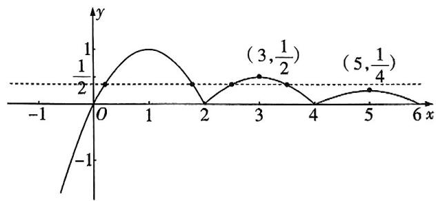

line

| x | y |
|---|---|
| 0 | 1/2 |
| 3 | (3, 1/2) |
| 5 | (5, 1/4) |

因为函数 $F(x) = f(x) - m$ 有4个零点,所以函数 $f(x)$ 的图象与直线 $y = m$ 有4个交点,所以 $\frac{1}{4} < m < \frac{1}{2}$ ,所以实数 $m$ 的取值范围为 $(\frac{1}{4},\frac{1}{2})$ .

练大招，见《解题觉醒》主书 P022

text_image

大招10

# 函数图象变换

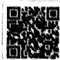  
高漢人會

# 大招解读

我们常常需要处理涉及两个函数图象之间平移或翻折关系的问题,此时需要用到函数图象变换.

函数图象变换的基本逻辑:利用点动成线的思想处理函数的变换问题,即根据函数图象上一点的变换,推出函数图象整体的变换.平移变换按左加右减,上加下减的原则处理,伸缩变换分为针对自变量x的横向伸缩变换和针对y的纵向伸缩变换,这两种变换大家已经非常熟悉了,下面我们重点学习对称变换与翻折变换.

# 1. 对称变换

关于函数的对称性,可分为两类:一类是函数 $f(x)$ 自身的对称性,称为自对称,另一类是两个函数的对称,称为互对称,下面重点说明互对称.

①关于直线 $x = a$ 对称: 在 $f(x)$ 图象上的点 $A(2a - x_0, y_0)$ 与在 $g(x)$ 图象上的点 $B(x_0, y_0)$ 关于直线 $x = a$ 对称, 所以 $g(x) = f(2a - x)$ 图象是由 $f(x)$ 图象关于直线 $x = a$ 对称而来的.

②关于点 $(a,b)$ 对称:在 $f(x)$ 图象上的点 $A(2a-x_{0},2b-y_{0})$ 与在 $g(x)$ 图象上的点 $B(x_{0},y_{0})$ 关于点 $(a,b)$ 对称,所以 $g(x)=2b-f(2a-x)$ 图象是由 $f(x)$ 图象关于点 $(a,b)$ 对称而来的.

③关于直线 y = x 对称: 在 $f(x)$ 图象上的点 $A(x_{0}, y_{0})$ 与在 $g(x)$ 图象上的点 $B(y_{0}, x_{0})$ 关于直线 y = x 对称, 所以 $g(x) = f^{-1}(x)$ 图象是由 $f(x)$ 图象关于直线 y = x 对称而来的.

$f(x)$ 的反函数

# 2. 翻折变换

①下翻上:以 $g(x)=|f(x)|=\begin{cases}f(x),f(x)\geqslant0,\\-f(x),f(x)<0\end{cases}$ 为例,只需把 $f(x)$ 图象中 $f(x)<0$ 部分的图形沿 x 轴翻折上来,并抹去原 $f(x)<0$ 部分的图形,保留原 $f(x)\geqslant0$ 部分的图形,如图1所示.

简记: 留上剪贴下.

②右翻左：以 $g(x) = f(|x|) = \begin{cases} f(x), & x \geqslant 0, \\ f(-x), & x < 0 \end{cases}$ 为

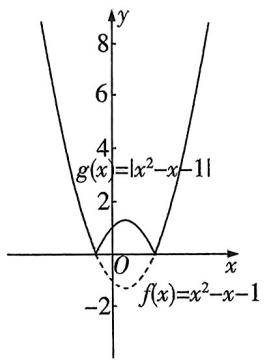

text_image

g(x)=|x²-x-1|
f(x)=x²-x-1

图1

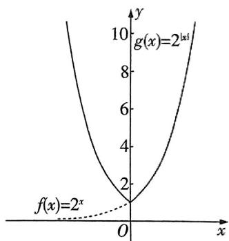

text_image

g(x)=2^{ax}
f(x)=2^x
O
x
y
10
8
6
4
2

图2

例, 只需把 $f(x)$ 图象中 x > 0 部分的图形沿 y 轴翻折过去, 并保留原 $x \geqslant 0$ 部分的图形, 如图 2 所示.

简记:去左复制右.

# 大招应用

大招示例 已知函数 $f(x)$ 的图象向左平移 1 个单位长度, 所得的图象与函数 $y = 2^{x}$ 的图象关于 y 轴对称, 求 $f(2024)$ .

解析 首先设 $A(x_0, f(x_0))$ 为函数 $y = f(x)$ 图象上一点，然后使点 $A(x_0, f(x_0))$ 变换得到点 $B(1 - x_0, f(x_0))$ ，接着根据点 $B(1 - x_0, f(x_0))$ 在 $y = 2^x$ 图象上，求出函数 $y = f(x)$ 的解析式，进而求得 $f(2024)$ 。下面进入完整解题步骤：设 $A(x_0, f(x_0))$ 为函数 $y = f(x)$ 图象上一点，依题意将 $A(x_0, f(x_0))$ 向左平移1个单位长度得 $A'(x_0 - 1, f(x_0))$ ，再关于 $y$ 轴对称得 $B(1 - x_0, f(x_0))$ ，因为点 $B(1 - x_0, f(x_0))$ 在函数 $y = 2^x$ 的图象上，所以 $f(x_0) = 2^{1 - x_0}$ ，所以函数 $f(x) = 2^{1 - x}$ ，所以 $f(2024) = \frac{1}{2^{2023}}$ 。

练大招，见《解题觉醒》主书 P024

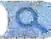

text_image

大招11

# 数形结合找临界

natural_image

Cartoon illustration of a man pointing at a chalkboard with a grid pattern (no text or symbols)

# 大招解读

# 1. 函数的零点、方程的实数根、两个函数图象交点的横坐标的关系

函数的零点、方程的实数根、两个函数图象交点的横坐标之间可以相互转化,我们可以写出下面三个完全等价的命题:

① $t$ 是关于 $x$ 的函数 $h(x) = f(x) - g(x)$ 的零点.  
② $t$ 是关于 $x$ 的方程 $f(x) - g(x) = 0$ 的实数根.  
③t 是函数 $f(x)$ 图象与函数 $g(x)$ 图象交点的横坐标.

对于①,我们可以用函数的单调性与零点存在定理处理,对于②,我们可以用方程相关知识与方法处理,对于③,我们可以用数形结合,根据两个函数的图象处理.这样我们就可以将三个问题中的一个转化为另一个,选用最简便的方法处理.

# 2.直曲相切 & 双曲公切找临界

即两曲线相切于一点时

在探讨函数 $F(x) = f(x) - [k(x - a) + b]$ 的零点个数时我们常将问题转化为“研究函数 $f(x)$ 图象与直线 $y = k(x - a) + b$ 交点的个数”。这样我们就可以用数形结合，讨论两个函数图象交点的个数，从而解决问题。在实际计算过程中，临界情形大多数为直线与曲线相切的时候。

# 坑神小课堂

想一想:为什么直曲相切、双曲公切的时候可能是临界情形?

当函数 $f(x)$ 的图象与直线 $y = k(x - a) + b$ 相切时，切点 $(x_0, f(x_0))$ 满足 $f'(x_0) = k$ ，进一步得到 $F'(x_0) = f'(x_0) - k = 0$ ，则 $x_0$ 很可能是函数 $F(x)$ 的极值点，因此 $x_0$ 影响了函数 $F(x)$ 的零点个。如果 $F'(x_0)$ 在 $x_0$ 左右两侧同号，则不是极值点

数变或不变,同时也影响了函数 $f(x)$ 的图象与直线 $y=k(x-a)+b$ 交点个数变或不变.所以在运用数形结合法时,直曲相切的情况需要单独讨论,研究是否为临界情形.同理,当探讨函数 $H(x)=h(x)-g(x)$ 的零点个数时,双曲公切,即 $h'(x)=g'(x)$ 时也可能为临界情形.

# 3.端点 & 间断点找临界

除直曲相切、双曲公切找到的临界情况外，在曲线（或区间）的端点以及函数图象的间断点处函数零点个数也可能突变，所以也需要单独讨论，研究是否为临界情形.

# 4. 数形结合找临界的一般步骤

第一步: 将“函数 $F(x) = f(x) - g(x)$ 的零点个数”的相关问题转化为“函数 $f(x)$ 图象与函数 $g(x)$ 图象的交点个数”的相关问题.

有时需要对 $F(x)$ 做一定的变形，以函数 $f(x)$ 图象与函数 $g(x)$ 图象容易画出为标准

第二步: 画出函数 $f(x)$ 与函数 $g(x)$ 的图象, 如果含参, 重点讨论直曲相切、双曲公切以及端点、间断点情形, 得到全部的临界情形.

第三步：数形结合解答问题.

# 大招应用

大招示例 (2020 天津改编) 已知函数 $f(x) = \left\{ \begin{array}{l} x^3, x \geqslant 0, \\ -x, x < 0, \end{array} \right.$ 若函数 $g(x) = f(x) = |kx^2 - 2x|$ 恰有 4 个零点，则实数 $k$ 的取值范围是 \_\_\_\_.

$$
g (x) = f (x) - | k x ^ {2} - 2 x | = \left\{ \begin{array}{l l} 0, x = 0, \\ | x | \left[ \frac {f (x)}{| x |} - | k x - 2 | \right], x \neq 0 \end{array} \right. \text {恰}
$$

有4个零点转化为函数 $h(x) = \frac{f(x)}{|x|} = \left\{ \begin{array}{ll}x^{2}, & x > 0,\\ 1, & x < 0 \end{array} \right.$ 的图象与函数 $c(x)\equiv |kx - 2|$ 的图象有三个交点，接着根据两个函数的大致图象,讨论直曲相切以及间断点情形,从而数形结合求得实数 k 的取值范围.

当 $k = 0$ 时, $h(x) = \begin{cases} x^2, & x > 0, \\ 1, & x < 0, \end{cases}$ $c(x) = 2$ , 两个函数的图象只有一个交点, 不成立. 于是 $k \neq 0$ , 进而函数 $c(x) = |kx - 2|$ 图象与 $x$ 轴的交点为 $(\frac{2}{k}, 0)$ , 由于当 $x = 0$ 时, $y = |k \times 0 - 2| = 2$ , 于是函数 $c(x) = |kx - 2|$ 的图象恒过点 $(0, 2)$ .

①当 k<0 时， $\frac{2}{k}<0$ ，如图1所示，得到函数 $h(x)=\frac{f(x)}{|x|}=$ $\left\{\begin{aligned}x^{2},&x>0,\\ 1,x&<0\end{aligned}\right.$ 的图象与函数

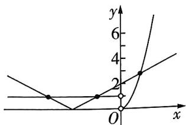

text_image

y
6
4
2
0
x
O

图1

$c(x)=|kx-2|$ 的图象有三个交点,符合题意.

② 当 $k > 0$ 时, $\frac{2}{k} > 0$ , 如图 2

易遗漏这种情况

所示, 若函数 $h(x)$ 的图象与函数 $c(x)$ 的图象有三个交点, 则当 $x \in (-\infty, \frac{2}{k})$ 时, 函数 $h(x)$ 的图象与函数 $c(x)$ 的图象有一个交点, 当 $x \in (\frac{2}{k}, +\infty)$ 时, 函数 $h(x)$ 的图象与函数 $c(x)$ 的图象有两个交点. 根据直曲相切可知, 需满足 $k > k_0 > 0$ , 其中直线 $y = k_0 x - 2$ 与 $y = x^2, x > 0$ 图象相切. 由 $\left\{ \begin{array}{l} y = x^2, \\ y = k_0 x - 2, \end{array} \right.$ 得 $x^2 - k_0 x + 2 = 0, \Delta = k_0^2 - 8 = 0, k_0 = 2\sqrt{2}$ , 因此 $k > 2\sqrt{2}$ .

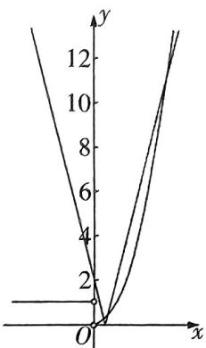  
图2

综上所述,实数 k 的取值范围是 $(-∞,0)∪(2\sqrt{2},+∞)$ .

答案 $(-\infty,0)\cup (2\sqrt{2}, + \infty)$

练大招，见《解题觉醒》主书P025

The image is too blurry to recognize any text content.

text_image

大招12

# 二次函数的零点分布问题

text_image

鱼
鱼到海
鱼
鱼到海
鱼到海

# 大招解读

探讨“二次函数 $f(x) = ax^{2} + bx + c (a \neq 0)$ 的零点分布”问题, 我们可以运用函数的单调性与函数零点存在定理进行处理. 主要需要考虑以下四个问题: ①二次函数图象的开口方向. ②对应一元二次方程根的判别式与 0 的大小. ③二次函数图象的对称轴与区间端点的位置关系. ④二次函数在所给区间端点处函数值的正负.

# 大招应用

大招示例 (2022 天津) 设 $a \in \mathbb{R}$ . 对任意实数 $x$ , 用 $f(x)$ 表示 $|x| - 2, x^2 - ax + 3a - 5$ 中的较小者. 若函数 $f(x)$ 至少有 3 个零点, 则 $a$ 的取值范围为 \_\_\_\_.

大招识别 首先根据题意将问题转化为分段函数问题, 其中 $y = x^{2} - ax + 3a - 5$ 为二次函数, 故利用二次函数对应方程根的判别式以及图象的对称轴来讨论函数的零点情况.

解析 令函数 $g(x) = x^2 - ax + 3a - 5$ ，则函数 $y = g(x)$ 图象的对称轴为直线 $x = \frac{a}{2}$ ，方程 $g(x) = 0$ 的判别式 $\Delta = (-a)^2 - 4(3a - 5) = a^2 - 12a + 20$ . $f(x)$ 的零点可能是 $-2, 2$ 或 $g(x)$ 的零点.

令 $\{x\} - 2 = 0$ 可得 $x = 2x - 2$

(i) 当 $\Delta < 0$ ，即 $2 < a < 10$ 时，函数 $g(x)$ 无零点，故 $f(x)$ 至多有 2 个零点，与题意不符.  
(ii) 当 $\Delta = 0$ 时, 则 $a = 2$ 或 $a = 10$ . 若 $a = 2$ , 则 $g(x) = (x - 1)^2$ , 作出 $g(x)$ 与 $h(x) = |x| - 2$ 的大致图象如图1所示, 由图象可知 $f(x)$ 有且仅有2个零点-2和2, 与

注意 $f(x)$ 取两函数的较小者

题意不符；若 $a = 10$ ，则 $g(x) = (x - 5)^2$ ，作出 $g(x)$ 与 $h(x) = |x| - 2$ 的大致图象如图2所示，由图象可知 $f(x)$ 有且仅有3个零点-2,2和5.所以 $a = 10$ 符合题意

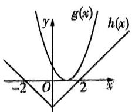

text_image

y
g(x)
h(x)
-2 O 2 x

图1

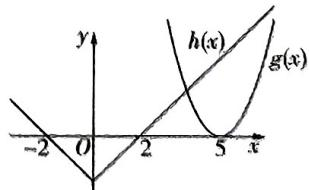

text_image

y
h(x)
g(x)
-2 0 2 5 x

图2

(iii) 当 $\Delta > 0$ ，即 $a < 2$ 或 $a > 10$ 时，方程 $g(x) = 0$ 有

2个实数解 $x_{1}, x_{2} (x_{1} < x_{2})$ ，即函数 $g(x)$ 有2个零点 $x_{1}$ ， $x_{2}$ . 依题意，函数 $f(x)$ 至少有3个零点仅可能有以下两种情况：

数形结合可判断

① $x_{2}\leqslant-2$ ，此时应有 $\left\{\begin{aligned}\frac{a}{2}&<-2,\\ g(-2)&=5a-1\geqslant0,\end{aligned}\right.$ 无解；

② $x_{1}\geqslant2$ ，此时应有 $\left\{\begin{aligned}\frac{a}{2}>2,\\ g(2)=a-1\geqslant0,\end{aligned}\right.$ 解得a>4.

所以 a 的取值范围为 a > 10.

综上所述， $a$ 的取值范围为 $[10, +\infty)$

答案 [10, +∞)

练大招，见《解题觉醒》主书 P025

text_image

大招13

# 复合方程的实数根问题

# 大招解读

# 1. 复合方程的由外向内

探讨“求关于 $x$ 的复合方程 $f(g(x)) = m (m \in \mathbf{R})$ 实数根的个数”相关问题时, 如果方程能解, 我们一般采用由外向内一层一层去处理, 其一般步骤如下:

第一步: 设 $u = g(x)$ , 解关于 $u$ 的方程 $f(u) = m$ , 得到若干实数根 $u_1, u_2, \cdots$ 或确定方程的根 $u_1, u_2 \cdots$ 的范围.

第二步: 分别探讨关于 $x$ 的方程 $g(x) = u_{1}, g(x) = u_{2}, \cdots$ 的实数根的个数 (或结合图象观察函数 $y = g(x)$ 的图象与函数 $y = u_{i} (i = 1, 2 \cdots, n)$ 的图象的交点个数), 各个方程的实数根个数之和即是

通过换元转化为简单函数处理

关于 $x$ 的复合方程 $f(g(x)) = m (m \in \mathbb{R})$ 实数根的个数, 也可以根据实数根个数之和求方程中参数的取值范围.

# 2. 复合方程的由内到外

探讨“已知关于 $x$ 的复合方程 $f(g(x)) = m (m \in \mathbf{R})$ 实数根的个数, 求参数取值范围”相关问题时, 当外层方程容易解时, 可以使用前面的由外向内. 但是现实往往是残酷的, 含参方程往往没法解, 此时就需要由内向外处理. 其一般步骤如下:

第一步: 构建合适的复合函数, 设 $u = g(x)$ , 得到函数 $u = g(x)$ 的性质及值域, 如有必要, 则画出函数图象.

主要是单调性

第二步：确定关于 u 的方程 $f(u)=m$ 的实数根的个数情况，或求出参数的取值范围.

统神

# 复合方程实数根(函数零点)问题中由内到外的三种类型

# 类型一 函数 $f(x)$ 中将某个整体替换为 $t$ .

如大招示例2可将方程 $9e^{2}\left(\frac{\ln x}{x}\right)^{2} - 3e(3 - m) \cdot \frac{\ln x}{x} + 1 - 3m = 0$ 看成 $t = \frac{\ln x}{x}$ 与 $9e^{2}t^{2} - 3e(3 - m)t + 1 - 3m = 0$ 复合而成. 先研究直线 $y = t$ 与函数 $y = \frac{\ln x}{x}$ 图象的交点个数, 再研究关于 $t$ 的方程 $9e^{2}t^{2} - 3e(3 - m)t + 1 - 3m = 0$ 的实根分布情况.

类型二 含 $f^{2}(x)$ 的表达式中将 $f(x)$ 换成t.

如函数 $f(x) = \begin{cases} 5^{|x-1|} - 1, & x \geqslant 0, \\ x^2 + 4x + 4, & x < 0, \end{cases}$ 若关于 $x$ 的方程 $f^2(x) - (2m+1)f(x) + m^2 = 0$ 有7个不同的实根，求 $m$ 的取值范围。由于方程 $f^2(x) - (2m+1)f(x) + m^2 = 0$ 中含有 $f^2(x)$ ，故将 $f(x)$ 替换成 $t$ ，转化为研究直线 $y = t$ 与函数 $f(x)$ 图象的交点个数以及方程 $t^2 - (2m+1)t + m^2 = 0$ 实根的分布情况。

类型三 $f(f(x))$ 的表达式中将 $f(x)$ 替换成 $t$ .

如已知函数 $f(x) = \begin{cases} e^x, & x \geqslant 0, \\ -2x, & x < 0, \end{cases}$ 判断关于 $x$ 的方程 $f(f(x)) + k = 0$ 的零点个数. 由于方程 $f(f(x)) + k = 0$ 含有 $f(f(x))$ , 故将 $f(x)$ 替换成 $t$ , 转化为研究直线 $y = t$ 与 $f(x)$ 图象的交点个数以及方程 $f(t) = -k$ 的实根分布情况.

# 大招应用

大招示例 1 已知函数 $f(x) = |\ln x|, g(x) = \left\{ \begin{array}{l} 0, 0 < x \leqslant 1, \\ |x^2 - 4| - 2, x > 1, \end{array} \right.$ 则方程 $|f(x) + g(x)| = 1$ 实数根的个数为 \_\_\_\_.

解析 先设 $u=f(x)+g(x)$ ，根据 $|f(x)+g(x)|=1$ ，
整体换元
得到 $|u|=1$ ，进而解得 $u_{1}=-1, u_{2}=1$ 。而 $f(x)=|\ln x|$ ，
先由 $|u|=1$ 解出u

$$
g (x) = \left\{ \begin{array}{l l} 0, 0 <   x \leqslant 1, \\ | x ^ {2} - 4 | - 2, x > 1, \end{array} \right. \text {于是} f (x) = \left\{ \begin{array}{l l} - \ln x, 0 <   x \leqslant 1, \\ \ln x, x > 1, \end{array} \right.
$$

$$
g (x) = \left\{ \begin{array}{l l} 0, 0 <   x \leqslant 1, \\ 2 - x ^ {2}, 1 <   x <   2, \text {则有} u = f (x) + g (x) = \\ x ^ {2} - 6, x \geqslant 2, \end{array} \right.
$$

$$
\left\{ \begin{array}{l l} - \ln x, 0 <   x \leqslant 1, \\ \ln x - x ^ {2} + 2, 1 <   x <   2, \text {根据导函数} u ^ {\prime} = \left\{ \begin{array}{l l} - \frac {1}{x}, 0 <   x \leqslant 1, \\ \frac {1 - 2 x ^ {2}}{x}, 1 <   x <   2, \\ \frac {1}{x} + 2 x, x \geqslant 2, \end{array} \right. \\ \ln x + x ^ {2} - 6, x \geqslant 2, \end{array} \right.
$$

得到当 $x \in (0,1]$ 时， $u' < 0$ ，函数 $u = f(x) + g(x)$ 单调递减，当 $x \in (1,2)$ 时， $u' < 0$ ，函数 $u = f(x) + g(x)$ 单调递减，当 $x \in [2, +\infty)$ 时， $u' > 0$ ，函数 $u = f(x) + g(x)$ 单调递增，函数 $u = f(x) + g(x)$ 的图象如图所示.

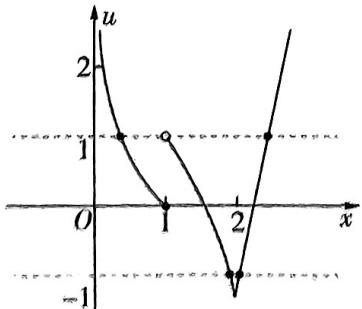

line

| Point | x | u |
|---|---|---|
| 1 | 0.5 | 1 |
| 2 | 1 | -1 |

$u(2) = \ln 2 - 2 < -1$ ，当 $x \in (1, 2)$ 时， $u(x) < \ln 1 - 1 + 2 = 1$ ，因此关于 $x$ 的方程 $f(x) + g(x) = u_1 = -1$ 有两个实数根,关于 x 的方程 $f(x)+g(x)=\underbrace{u_{2}=1}_{再由 u=\pm1 解出 x}$

综上所述,方程 $|f(x)+g(x)|=1$ 实数根的个数为4.

答案 4

大招示例 ② 已知函数 $f(x) = \frac{x^2}{3x - 3\mathrm{e}\ln x}$ 与 $g(x) = 3\mathrm{e}\ln x + mx$ 的图象有四个不同的交点, 则实数 $m$ 的取值范围是 \_\_\_\_.

解析 通过齐次化, 把函数图象的交点问题转化为复合方程问题. 由于函数 $f(x) = \frac{x^2}{3x - 3\mathrm{e}\ln x}$ 与 $g(x) = 3\mathrm{e}\ln x + mx$ 的图象有四个不同的交点, 于是关于 $x$ 的方程 $\frac{x^2}{3x - 3\mathrm{e}\ln x} = 3\mathrm{e}\ln x + mx$ 有四个不同的实数根, 得到方程 $9\mathrm{e}^2 (\frac{\ln x}{x})^2 - 3\mathrm{e}(3 - m) \cdot \frac{\ln x}{x} + 1 - 3m = 0$ 有四个不同的实数根, 然后构建函数 $h(x) = \frac{\ln x}{x}$ , 根据导函数齐次化 $h'(x) = \frac{1 - \ln x}{x^2}$ 知, 当 $x \in (0, e)$ 时, $h'(x) > 0$ , $h(x)$ 单调递增, 当 $x \in (e, +\infty)$ 时, $h'(x) < 0$ , $h(x)$ 单调递减, 因此函数 $h(x) = \frac{\ln x}{x}$ 在 $x = e$ 处取得最大值 $\frac{1}{e}$ , 且当 $x < 1$ 时, $h(x) < 0$ , 当 $x > 1$ 时, $h(x) > 0$ , $h(x)$ 的图象如图所示.

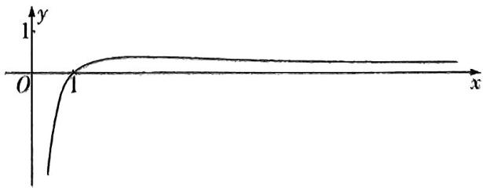

text_image

y
1
O
1
x

于是就有当 $t \in (-\infty, 0] \cup \left\{\frac{1}{e}\right|$ 时，函数 $h(x)$ 的图象与直线 $y = t$ 有一个交点；当 $t \in (0, \frac{1}{e})$ 时，函数 $h(x)$ 的图象与直线 y=t 有两个交点；当 $t \in (\frac{1}{\mathrm{e}}, +\infty)$ 时，函数 $h(x)$ 的图象与直线 y=t 没有交点。于是要想有四个不同的实数根，则关于 t 的方程 $9\mathrm{e}^{2}t^{2}-3\mathrm{e}(3-m)t+1-3m=0$ 有两个不同的实数根 $t_{1}, t_{2}$ ，且方程 $h(x)=t_{1}, h(x)=t_{2}$ 均需有两个不同的实数根，即需满足 $t_{1}, t_{2} \in (0, \frac{1}{\mathrm{e}})$ ，即关于 t 的方程 $9\mathrm{e}^{2}t^{2}-3\mathrm{e}(3-m)t+1-3m=0$ 在 $(0, \frac{1}{\mathrm{e}})$ 上有两个不相等的实数根，进而

$\begin{cases} \Delta = 9\mathrm{e}^{2}\left[(3 - m)^{2} + 12m - 4\right] > 0,\\ 0 <   \frac{3\mathrm{e}(3 - m)}{18\mathrm{e}^{2}} <  \frac{1}{\mathrm{e}},\\ 1 - 3m > 0,\\ 9 - 3(3 - m) + 1 - 3m > 0, \end{cases}$ 解得 $-1 <   m <   \frac{1}{3}.$

因此实数 m 的取值范围是 $(-1, \frac{1}{3})$ .

答案 $(-1, \frac{1}{3})$

练大招，见《解题觉醒》主书P026

text_image

大招14

# 函数图象的切线方程

text_image

名师大招

# 大招解读

# 1. 函数图象的切线方程

已知函数 $f(x)$ 连续，且当 $x = x_0$ 时导函数值 $f'(x_0)$ 存在，则函数 $f(x)$ 的图象在 $(x_0, f(x_0))$ 处切线的斜率为 $f'(x_0)$ . 于是在 $(x_0, f(x_0))$ 处函数 $f(x)$ 的图象的切线方程用点斜式表示为 $y - f(x_0) = f'(x_0)(x - x_0)$ ，用斜截式表示为 $y = f'(x_0)x + [f(x_0) - f'(x_0)x_0]$ .

# 坑神来避坑

求曲线的切线方程时要看清题目说的是求“在某点”还是“过某点”的切线方程,若是求在某点的切线方程,则这个点一定就是切点;若是求过某点的切线方程,则切点未知,先设出切点坐标.

# 2. 公切线

如果直线 l 既是函数 $f(x)$ 的图象在 $(x_{1}, f(x_{1}))$ 处的切线，又是函数 $g(x)$ 的图象在 $(x_{2}, g(x_{2}))$ 处的切线，则直线 l 的方程既可以表示为 $y = f'(x_{1})x + [f(x_{1}) - f'(x_{1})x_{1}]$ ，也可以表示为 $y = g'(x_{2})x + [g(x_{2}) - g'(x_{2})x_{2}]$ ，于是就有 $\left\{\begin{aligned}f'(x_{1}) &= g'(x_{2}), \\ f(x_{1}) &= f'(x_{1})x_{1} = g(x_{2}) - g'(x_{2})x_{2}\end{aligned}\right.$ ，我们常根据这两个式子来处理公切线问题。第一个式子表示两条切线斜率相等，第二个式子表示两条切线在 y 轴上的截距相等。

# 大招应用

大招示例 (2024 新课标Ⅰ卷) 若曲线 $y = \mathrm{e}^{x} + x$ 在点(0,1)处的切线也是曲线 $y = \ln (x + 1) + a$ 的切线, 则 $a =$ \_\_\_\_.

解析 令 $f(x) = \mathrm{e}^{x} + x$ ，则 $f'(x) = \mathrm{e}^{x} + 1$ ，所以 $f'(0) = 2$ ，所以曲线 $y = \mathrm{e}^{x} + x$ 在点(0,1)处的切线方程为 $y = 2x + 1$ .接下来就是已知切线方程求参问题，令 $g(x) =$

$\ln (x + 1) + a$ ，则 $g^{\prime}(x) = \frac{1}{x + 1}$ 设直线 $y = 2x + 1$ 与曲线 $y = g(x)$ 相切于点 $(x_0,y_0)$ ，则 $\frac{1}{x_0 + 1} = 2$ ，得 $x_0 = -\frac{1}{2}$ 切点未知先设出切点坐标

则 $y_{0}=2x_{0}+1=0$ ，所以 $0=\ln\left(-\frac{1}{2}+1\right)+a$ ，所以 $a=$ 利用切点在切线上求 $y_{0}$ 利用切点在曲线上求a

ln 2.

答案 In 2

# 大招解读

# 1. 显函数的定义

如果 $y$ 是关于自变量 $x$ 的一个函数, 且能够得到函数 $y = f(x)$ 的解析式, 则 $y$ 是关于自变量 $x$ 的显函数 (例如 $y = \sqrt{x + 1}$ ).

# 2. 隐函数的定义

如果 $y$ 是关于自变量 $x$ 的一个函数, 且满足一个方程 $F(x, y) = 0$ (例如 $y^2 + \sqrt{y} - x = 0$ ), 此时就可以拿方程 $F(x, y) = 0$ 作为隐函数 $y$ 的表达式.

# 坑神

1. 如果函数 $y=f(x)$ 的解析式求不出来, 那么不能将之显性化.  
2. 如果函数 $y = f(x)$ 的解析式求得出来, 那么对于 $y$ 来说既可以表示为隐函数形式, 也可以表示为显函数形式, 例如 $y^2 = x + 1 (y \geqslant 0)$ 是 $y$ 的隐函数形式, $y = \sqrt{x + 1}$ 是 $y$ 的显函数形式.

# 3.隐函数的求导

以隐函数 $e^{x} + y^{3} + \ln y = xy + x^{2}$ 为例，由于 y 是关于 x 的隐函数 $y = f(x)$ ，因此就有 $e^{x} + [f(x)]^{3} + \ln [f(x)] = xf(x) + x^{2}$ ，此时对等式两边求导，根据复合函数求导法则就会有 $e^{x} + 3[f(x)]^{2} \cdot f'(x) + \frac{f'(x)}{f(x)} = f(x) + xf'(x) + 2x$ ，即 $e^{x} + 3y^{2}y' + \frac{y'}{y} = y + xy' + 2x$ ，从而得到导函数 $y' = \frac{e^{x} - 2x - y}{x - 3y^{2} - \frac{1}{y}}$ .

由于函数 $y=f(x)$ 的解析式求不出来，因此导函数 $y'=\frac{e^{x}-2x-y}{x-3y^{2}-\frac{1}{y}}$ 中只能保留y

# 坑神有话说

这里把 y 换成 $f(x)$ 只是为了方便理解, 后面使用熟练后可以直接把 y 关于 x 的导数记为 $y'$ .

从上面举例中,我们可以归纳出隐函数求导的一般步骤:

第一步：通过两边同时取对数或代数变形，把等式两边变成都能对 $x$ 求导的形式.

第二步：把 y 看作关于 x 的函数，运用复合函数的求导法则对等式两边求导.

第三步：化简式子,得出 $y'$ 的表达式.

# 4. 隐函数求导的应用

①求圆锥曲线的切线方程.   
②进行复杂函数的求导运算.

# 大招应用

大招示例 已知定义在 $\mathbf{R}$ 上的函数 $f(x), g(x)$ 都恒大于0，且各自的导函数 $f'(x), g'(x)$ 都存在. 试求函数 $y = f(x)^{g(x)}$ 的导函数 $y'$ .

解析 这个函数 $y = f(x)^{g(x)}$ 既不属于基本初等函数

中的任何一个,也不能由基本初等函数复合得到.因此要去求这个难求导的函数的导函数 $y'$ ,唯有将其变形后进行隐函数求导.下面进入完整解题步骤:因为 $y = f(x)^{g(x)} > 0$ ,所以 $\ln y = g(x)\ln f(x)$ ,所以 $\frac{y'}{y} = g'(x)\ln f(x) +$

$$
g (x) \cdot {\frac {f ^ {\prime} (x)}{f (x)}}, \text {所以} y ^ {\prime} = f (x) ^ {g (x)} [ g ^ {\prime} (x) \ln f (x) + g (x) \cdot {\frac {f ^ {\prime} (x)}{f (x)}} ].
$$

两边同时对x求导

另解指对恒等变形. 因为 $f(x) = \mathrm{e}^{\ln f(x)}$ ，所以 $y = f(x)^{g(x)} = [\mathrm{e}^{\ln f(x)}]^{g(x)} = \mathrm{e}^{g(x)\ln f(x)}$

所以 $y' = \mathrm{e}^{g(x)\ln f(x)}[g'(x)\ln f(x) + g(x)\cdot \frac{f'(x)}{f(x)}] =$

$$
f (x) ^ {g (x)} \left[ g ^ {\prime} (x) \ln f (x) + g (x) \cdot \frac {f ^ {\prime} (x)}{f (x)} \right].
$$

练大招，见《解题觉醒》主书 P032

The image is too blurry to recognize any text content.

# 大招16

# 导数逆向构造

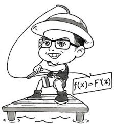

text_image

f(x)=F'(x)

# 大招解读

# 1. 逆向构造问题

对于已知导函数满足的一个不等式,去解一个函数不等式的问题,一般称为逆向构造问题.例如已知 $f(x)+f'(x)>0$ ,且 $f(0)=1$ ,求不等式 $f(x)<\mathrm{e}^{-x}$ 的解集.对于逆向构造问题我们一般采取如下步骤处理:

第一步：逆用求导法则,构造一个新函数,新函数的导函数能通过题目中所给的导函数不等式判断与0的关系.

第二步: 求出新函数的导函数, 得到新函数的单调性.

第三步：利用新函数的单调性解决问题.

# 2. 常用的逆向构造方法

①逆用加减法： $f'(x) \pm g'(x) = [f(x) \pm g(x)]'$ . 例如 $x + 1 \pm \frac{1}{x} = (\frac{1}{2}x^{2} + x \pm \ln x)'$ .  
②逆用乘法: $g'(x)f(x)+g(x)f'(x)=[g(x)f(x)]'$ .例如 $\sin x+x\cos x=(x\sin x)'$ .  
③逆用除法: $\frac{g(x)f'(x) - g'(x)f(x)}{[g(x)]^2} = [\frac{f(x)}{g(x)}]' (g(x) \neq 0)$ . 例如 $x\cos x - \sin x = x^2 \cdot \frac{x(\sin x)' - x'\sin x}{x^2} = x^2 (\frac{\sin x}{x})'$ .

④逆用复合求导: $g'(f(x)) \cdot f'(x) = [g(f(x))]'$ . 例如 $2xe^{x^2} = (e^{x^2})'$ .

⑤万能构造公式： $g'(x)f(x)+f'(x)=\frac{\mathrm{e}^{g(x)}g'(x)f(x)+\mathrm{e}^{g(x)}f'(x)}{\mathrm{e}^{g(x)}}=\frac{\left[\mathrm{e}^{g(x)}f(x)\right]'{\mathrm{e}^{g(x)}}$

将 $f^{\prime}(x)$ 的系数化为1后，就可以根据 $g^{\prime}(x)$ 得到原函数 $g(x)$ ，进而可以根据万能构造公式直接进行逆向构造

例如 $nf(x) + f'(x) = \frac{n\mathrm{e}^{nx}f(x) + \mathrm{e}^{nx}f'(x)}{\mathrm{e}^{nx}} = \frac{[\mathrm{e}^{nx}f(x)]'}{\mathrm{e}^{nx}} (n\neq 0),nf(x) + xf'(x) = x[\frac{n}{x} f(x) +$

$$
f ^ {\prime} (x) ] = x \cdot \frac {\mathrm{e} ^ {n \ln x} \cdot \frac {n}{x} \cdot f (x) + \mathrm{e} ^ {n \ln x} f ^ {\prime} (x)}{\mathrm{e} ^ {n \ln x}} = x \cdot \frac {[ \mathrm{e} ^ {n \ln x} f (x) ] ^ {\prime}}{\mathrm{e} ^ {n \ln x}} = \frac {[ x ^ {n} f (x) ] ^ {\prime}}{x ^ {n - 1}} (n \neq 0).
$$

# 抗神有溺说

常见的构造：

(1) 对于 $f'(x) > g'(x)$ ，可构造函数 $h(x) = f(x) - g(x)$ . 一般地，若 $f'(x) > a (a \neq 0)$ ，即导函数大于某个非零常数（若 $a = 0$ ，则无需构造），可构造函数 $h(x) = f(x) - ax$ .

(2) 对于 $f'(x) + g'(x) > 0$ ，可构造函数 $h(x) = f(x) + g(x)$ .  
(3) 对于 $f'(x) + f(x) > 0$ ，可构造函数 $h(x) = \mathrm{e}^x f(x)$ . 若 $f'(x) + kf(x) > 0$ ，则可构造函数 $h(x) = \mathrm{e}^{kx}f(x)$ .  
(4) 对于 $f'(x) > f(x)$ (或 $f'(x) - f(x) > 0$ )，可构造函数 $h(x) = \frac{f(x)}{\mathrm{e}^{x}}$ . 若 $f'(x) - kf(x) > 0$ ，则可构造函数 $h(x) = \frac{f(x)}{\mathrm{e}^{kx}}$ .  
(5) 对于 $xf'(x) + f(x) > 0$ ，可构造函数 $h(x) = xf(x)$ . 若 $xf'(x) + nf(x) > 0$ ，则可构造函数 $h(x) = x^n f(x)$ .  
(6) 对于 $xf'(x) - f(x) > 0$ , 可构造函数 $h(x) = \frac{f(x)}{x}$ . 若 $xf'(x) - nf(x) > 0$ , 则可构造函数 $h(x) = \frac{f(x)}{x^n}$ .  
(7) 对于 $\frac{f'(x)}{f(x)}>0$ , 可分为两类: ① 若 $f(x)>0$ , 则可构造函数 $h(x)=\ln f(x)$ ; ② 若 $f(x)<0$ , 则可构造函数 $h(x)=\ln[-f(x)]$ .  
(8) 对于 $f'(x)\sin x + f(x)\cos x > 0$ ，可构造函数 $h(x) = f(x)\sin x$ .  
(9) 对于 $f'(x) \cos x - f(x) \sin x > 0$ ，可构造函数 $h(x) = f(x) \cos x$ .  
(10) 对于 $f'(x)\sin x - f(x)\cos x > 0$ ，可构造函数 $h(x) = \frac{f(x)}{\sin x}$ .  
(11) 对于 $f'(x) \cos x + f(x) \sin x > 0$ ，可构造函数 $h(x) = \frac{f(x)}{\cos x}$ .

注意对于(3)(4)，可以这样记忆，系数只有常数 $(f'(x)$ 系数为1, $f(x)$ 系数为k), $e^{kx}$ 来构，和为积，差为商.对于(5)(6)，可以这样记忆，系数有x有常数 $(f'(x)$ 系数为x, $f(x)$ 系数为n), $x^{n}$ 来构，和为积，差为商.

# 大招应用

大招示例 (2024 四川成都外国语学校期中) 已知定义在 $\mathbf{R}$ 上的函数 $f(x)$ 及其导函数 $f'(x)$ 满足 $f'(x) > -f(x)$ , 若 $f(\ln 3) = \frac{1}{3}$ , 则满足不等式 $f(x) > \frac{1}{\mathrm{e}^x}$ 的 $x$ 的取值范围是 \_\_\_\_.

大招识别 条件给出 $f'(x) > -f(x)$ ，可转化为 $f'(x) + f(x) > 0$ ，系数只有常数 $(f'(x))$ 系数为 $1, f(x)$ 系数为 1），用 $e^x$ 来构，和的形式用“积”来构，联想到构造函数 $g(x) = e^x f(x)$ .

解析 因为对任意 $x \in \mathbb{R}$ , 都有 $f'(x) > -f(x)$ 成立, 即 $f'(x) + f(x) > 0$ , 所以可构造函数 $g(x) = \mathrm{e}^x f(x)$ , 则 $g'(x) = f'(x) \mathrm{e}^x + f(x) \mathrm{e}^x = \mathrm{e}^x [f'(x) + f(x)] > 0$ , 所以函数 $g(x)$ 在 $\mathbb{R}$ 上单调递增.

不等式 $f(x) > \frac{1}{\mathrm{e}^x}$ , 即 $\mathrm{e}^x f(x) > 1$ , 即 $g(x) > 1$ .

因为 $f(\ln 3) = \frac{1}{3}$ , 所以 $g(\ln 3) = \mathrm{e}^{\ln 3} f(\ln 3) = 3 \times \frac{1}{3} = 1$ . 由 $g(x) > g(\ln 3)$ , 得 $x > \ln 3$ ,

所以不等式 $f(x) > \frac{1}{\mathrm{e}^x}$ 的解集为 $(\ln 3, +\infty)$ .

答案 $(\ln 3, +\infty)$

练大招，见《解题觉醒》主书 P033

text_image

大招17

# 同构思想

# 大招解读

同构的本质就是通过一系列变形,将原条件转化为同一函数的两个函数值 $f(a)$ 与 $f(b)$ 之间满足的关系,从而利用函数 $f(x)$ 的单调性,得到a与b之间的关系,从而大大简化问题.

同构法的几种常见变形：

# 1.地位同等同构（主要针对双变量，合二为一泰山移）

① $\frac{f(x_1) - f(x_2)}{x_1 - x_2} > k(x_1 < x_2) \Leftrightarrow f(x_1) - f(x_2) < kx_1 - kx_2 \Leftrightarrow f(x_1) - kx_1 < f(x_2) - kx_2 \Leftrightarrow y = f(x) -$ 相同自变量放同一侧

$kx$ 为增函数.

② $\frac{f(x_1) - f(x_2)}{x_1 - x_2} < \frac{k}{x_1x_2} (x_1 < x_2)\Leftrightarrow f(x_1) - f(x_2) > \frac{k(x_1 - x_2)}{x_1x_2} = \frac{k}{x_2} -\frac{k}{x_1}\Leftrightarrow f(x_1) + \frac{k}{x_1} >f(x_2) + \frac{k}{x_2}\Leftrightarrow$

$y=f(x)+\frac{k}{x}$ 为减函数.

# 2. 指对跨阶同构（主要针对单变量，左同右同取对数）

指对跨阶同构的关键在于利用对幂互化 $(x = \mathrm{e}^{\ln x} = \ln \mathrm{e}^{x})$ 或取对数，常见类型如下：

①积型：

$$
a \mathrm{e} ^ {a} \leqslant b \ln b \xrightarrow {\text {三种同构方式}} \left\{ \begin{array}{l l} \text {同左} & a \mathrm{e} ^ {a} \leqslant (\ln b) \mathrm{e} ^ {\ln b} \xrightarrow {\text {构造函数}} f (x) = x \mathrm{e} ^ {x} \\ \text {同右} & \mathrm{e} ^ {a} \ln \mathrm{e} ^ {a} \leqslant b \ln b \xrightarrow {\text {构造函数}} f (x) = x \ln x \\ \text {取对} & a + \ln a \leqslant \ln b + \ln (\ln b) \xrightarrow {\text {构造函数}} f (x) = x + \ln x \end{array} \right.
$$

说明:在对“积型”进行同构时,取对数是最快捷的,同构出的函数,其单调性容易获知.

②商型：

$$
\frac {\mathrm{e} ^ {a}}{a} <   \frac {b}{\ln b} \xrightarrow {\text {三种同构方式}} \left\{ \begin{array}{l l} \text {同左} & \frac {\mathrm{e} ^ {a}}{a} <   \frac {\mathrm{e} ^ {\ln b}}{\ln b} \xrightarrow {\text {构造函数}} f (x) = \frac {\mathrm{e} ^ {x}}{x} \\ \text {同右} & \frac {\mathrm{e} ^ {a}}{\ln \mathrm{e} ^ {a}} <   \frac {b}{\ln b} \xrightarrow {\text {构造函数}} f (x) = \frac {x}{\ln x} \\ \text {取对} & a - \ln a <   \ln b - \ln (\ln b) \xrightarrow {\text {构造函数}} f (x) = x - \ln x \end{array} \right.
$$

③和差型:

$$
\begin{array}{r l} & {\mathrm{e} ^ {a} \pm a > b \pm \ln b \xrightarrow {\text {两种同构方式}} \left\{ \begin{array}{l l} {\text {同左}} & {\mathrm{e} ^ {a} \pm a > \mathrm{e} ^ {\ln b} \pm \ln b \xrightarrow {\text {构造函数}} f (x) = \mathrm{e} ^ {x} \pm x} \\ {\text {同右}} & {\mathrm{e} ^ {a} \pm \ln \mathrm{e} ^ {a} > b \pm \ln b \xrightarrow {\text {构造函数}} f (x) = x \pm \ln x} \end{array} \right.} \\ & {\text {如} \mathrm{e} ^ {a x} + a x > \ln (x + 1) + x + 1 \Longleftrightarrow \underbrace {\mathrm{e} ^ {a x} + a x > \mathrm{e} ^ {\ln (x + 1)} + \ln (x + 1)} _ {\text {构造函数} f (x) = \mathrm{e} ^ {x} + x} \Longleftrightarrow a x > \ln (x + 1).} \end{array}
$$

# 坑神有话说

和差型也可以取指，如 $\mathrm{e}^a + a > b + \ln b \longrightarrow \mathrm{e}^{\mathrm{e}^a + a} > \mathrm{e}^{b + \ln b} \longrightarrow \mathrm{e}^{\mathrm{e}^a} \cdot \mathrm{e}^a > \mathrm{e}^b \cdot \mathrm{e}^{\ln b} \longrightarrow \mathrm{e}^{\mathrm{e}^a} \cdot \mathrm{e}^a > \mathrm{e}^b \cdot b$ ，令 $H(x) = x\mathrm{e}^x.$

# 3.无中生有同构（主要针对非上型，凑好形式是关键）

① $ae^{ax}>\ln x\xrightarrow{同乘x(无中生有)}axe^{ax}>x\ln x$ ，后面转化为同积型.

② $e^{x}>a\ln(ax-a)-a(a>0)\Leftrightarrow\frac{1}{a}e^{x}>\ln[a(x-1)]-1\Leftrightarrow e^{x-\ln a}-\ln a>\ln(x-1)-1$ 同加 $x(\text{无中生有})$ $\rightarrow e^{x-\ln a}+x-\ln a>\ln(x-1)+x-1=\underbrace{e^{\ln(x-1)}+\ln(x-1)}_{构造函数f(x)=e^{x}+x}\Leftrightarrow x-\ln a>\ln(x-1).$

③ $a^{x} > \log_{a} x (a > 1) \Leftrightarrow e^{x \ln a} > \frac{\ln x}{\ln a} \Leftrightarrow \ln a \cdot e^{x \ln a} > \ln x \xrightarrow{\text{同乘 } x (\text{无中生有})} (x \ln a) e^{x \ln a} > x \ln x,$ 后面转化为同积型.

# 坑神有言说

此类构造要以指数或真数为核心,结合核心来凑型.如①中 $ae^{ax}$ 中e的指数ex就是核心,将 $ae^{ax}$ 凑成 $axe^{ax}$ .

# 大招应用

大招示例 （2020 全国 I 卷）若 $2^{a} + \log_{2}a = 4^{b} + 2\log_{4}b$ ，则

A. $a > 2b$

B. $a <   2b$

C. $a > b^{2}$

D. $a < b^{2}$

大招解观察式子两边的结构相似可向同构方向转化. $4^{b} + 2\log_{4}b$ 可变形为 $2^{2b} + \log_2b$ ，而 $2^{2b} + \log_2b <   2^{2b}+$ $\log_22b$ ，则 $2^{a} + \log_{2}a <   2^{2b} + \log_{2}2b$ ，构造函数 $f(x) = 2^{x}+$ $\log_2x(x > 0)$ ，从而就得到了 $f(a) <   f(2b)$ ，又函数 $f(x) = 2^{x} + \log_{2}x$ 在 $(0, + \infty)$ 上单调递增，所以 $a <   2b.$

常规解 取特值法. 由 $2^{a} + \log_{2} a = 4^{b} + 2\log_{4} b = 4^{b} +$

$\log_2b$ ，取 $b = 1$ ，得 $2^a + \log_2a = 4$ ，令 $f(x) = 2^x + \log_2x - 4(x > 0)$ ，则 $f(x)$ 在 $(0, +\infty)$ 上单调递增，且 $f(1) < 0$ ， $f(2) > 0$ ，所以 $f(1)f(2) < 0$ ， $f(x) = 2^x + \log_2x - 4$ 在 $(0, +\infty)$ 上存在唯一的零点，所以 $1 < a < 2$ ，故 $a > 2b$ ， $a < b^2$ 都不成立，排除 A, D；取 $b = 2$ ，得 $2^a + \log_2a = 17$ ，令 $g(x) = 2^x + \log_2x - 17(x > 0)$ ，则 $g(x)$ 在 $(0, +\infty)$ 上单调递增，且 $g(3) < 0$ ， $g(4) > 0$ ，所以 $g(3)g(4) < 0$ ， $g(x) = 2^x + \log_2x - 17$ 在 $(0, +\infty)$ 上存在唯一的零点，所以 $3 < a < 4$ ，故 $a > b^2$ 不成立，排除 C. 故选 B.

答案 B

练大招，见《解题觉醒》主书 P033

text_image

大招18

# 洛必达法则

text_image

名师大招
\ln \frac{\sin x}{x}

# 大招解读

# 1. 洛必达法则的定义

已知函数 $f(x)$ 与 $g(x)$ 都存在导数 $f'(x), g'(x)$ ，其中 $g'(x) \neq 0$ .

① $x \to a$ 的情形: 若 $\lim_{x \to a} f(x) = \lim_{x \to a} g(x) = 0$ 或 $\infty$ , 则 $\lim_{x \to a} \frac{f(x)}{g(x)}$ 称为 $\frac{0}{0}$ 型或 $\frac{\infty}{\infty}$ 型的不定式, 此时有 $\lim_{x \to a} \frac{f(x)}{g(x)} = \lim_{x \to a} f'(x)$ . 例如: $\lim_{x \to 0} \frac{\mathrm{e}^x - 1}{x} = \lim_{x \to 0} \frac{\mathrm{e}^x}{1} = 1$ .  
② $x \to \infty$ 的情形: 若 $\lim_{x \to \infty} f(x) = \lim_{x \to \infty} g(x) = 0$ 或 $\infty$ , 则 $\lim_{x \to \infty} \frac{f(x)}{g(x)}$ 称为 $\frac{0}{0}$ 型或 $\frac{\infty}{\infty}$ 型的不定式, 此时也有 $\lim_{x \to \infty} \frac{f(x)}{g(x)} = \lim_{x \to \infty} \frac{f'(x)}{g'(x)}$ . 例如: $\lim_{x \to +\infty} \frac{\ln x}{\sqrt{x}} = \lim_{x \to +\infty} \frac{\frac{1}{x}}{\frac{1}{2\sqrt{x}}} = \lim_{x \to +\infty} \frac{2}{\sqrt{x}} = 0$ .

# 坑神有话说

值得注意的是,对于 $\lim_{x\to+\infty}xe^{-x}$ 这种 $\infty\cdot0$ 形式的极限,需要将其转化为 $\frac{0}{0}$ 型或 $\frac{\infty}{\infty}$ 型的不定式,再使用洛必达法则.例如 $\lim_{x\to-\infty}xe^{x}=\lim_{x\to-\infty}\frac{x}{e^{-x}}=\lim_{x\to-\infty}\frac{1}{-e^{-x}}=0.$

# 2. 洛必达法则的应用

在中学阶段,通过洛必达法则可以计算存在不定式情况的函数的极限,进而帮助我们快速得出存在不定式情况的函数的值域.

# 坑神来避坑

特别需要强调的是洛必达法则在小题中可以直接使用,但是在大题中直接使用可能会扣分.

# 大招应用

大招示例 1 函数 $y = \frac{\ln (x + 1)}{x} (0 < x < 1)$ 的值域为 \_\_\_\_.

解析，令 $f(x) = \frac{\ln(x + 1)}{x} (0 < x < 1)$ ，则 $f'(x) =$

$\frac{\frac{x}{x + 1} - \ln (x + 1)}{x^2}$ , 然后构造函数 $g(x) = \frac{x}{x + 1} - \ln (x + 1)$ , 则 $g'(x) = -\frac{x}{(x + 1)^2} < 0$ , 得到函数 $g(x)$ 单调递减.

于是当 $x \in (0,1)$ 时， $g(x) < g(0) = 0, f'(x) < 0$ ，函数 $f(x) = \frac{\ln(x + 1)}{x} (0 < x < 1)$ 单调递减，而当 $x \to 0^+$ 时， $\lim_{x \to 0^-} \frac{\ln(x + 1)}{x} = \lim_{x \to 0^+} \frac{\frac{1}{x + 1}}{1} = 1$ ，因此函数 $y = \frac{\ln(x + 1)}{x}$ （ $0 < x < 1$ ）的值域为（ $\ln 2, 1$ ）.

答案 (ln 2,1)

大招示例 ② (2023 全国乙卷) 已知函数 $f(x) = \left(\frac{1}{x} + a\right)\ln(1 + x)$ .

(1) 当 a = -1 时, 求曲线 $y = f(x)$ 在点 $(1, f(1))$ 处的切线方程.  
(2) 是否存在 $a, b$ , 使得曲线 $y = f(\frac{1}{x})$ 关于直线 $x = b$ 对称? 若存在, 求 $a, b$ 的值; 若不存在, 说明理由.  
(3) 若 $f(x)$ 在 $(0, +\infty)$ 上存在极值, 求 $a$ 的取值范围.

解析 (1) 当 $a = -1$ 时, $f(x) = \left(\frac{1}{x} - 1\right)\ln (1 + x)$ , 则 $f'(x) = -\frac{1}{x^2}\ln (1 + x) + \left(\frac{1}{x} - 1\right) \cdot \frac{1}{1 + x}$ , 所以 $f'(1) = -\ln 2$ , 又 $f(1) = 0$ , 所以所求切线方程为 $y - 0 = (-\ln 2) \cdot (x - 1)$ , 即 $x \ln 2 + y - \ln 2 = 0$ .

(2) 存在, 理由如下:

假设存在 a, b，使得曲线 $y = f\left(\frac{1}{x}\right)$ 关于直线 x = b 对称.

令 $g(x) = f\left(\frac{1}{x}\right) = (x + a)\ln \left(1 + \frac{1}{x}\right) = (x + a)\cdot$ $\ln \frac{x + 1}{x}$ ，因为曲线 $y = g(x)$ 关于直线 $x = b$ 对称，

所以 $g(x)=g(2b-x)$ ，即 $(x+a)\ln\frac{x+1}{x}=(2b-x+a)$ 。
此处用到了对称性转化，详见【大招7】

$$
\ln \frac {2 b - x + 1}{2 b - x} = (x - 2 b - a) \ln \frac {x - 2 b}{x - 2 b - 1},
$$

于是 $\left\{ \begin{array}{l} a = -2b - a, \\ 1 = -2b, \end{array} \right.$ 得 $\left\{ \begin{array}{l} a = \frac{1}{2}, \\ b = -\frac{1}{2}, \end{array} \right.$ 当 $a = \frac{1}{2}, b = -\frac{1}{2}$ 时，

$$
g (x) = (x + \frac {1}{2}) \ln \frac {x + 1}{x}, g (- 1 - x) = (- x - \frac {1}{2})
$$

$\ln\frac{-x}{-1-x}=(x+\frac{1}{2})\ln\frac{x+1}{x}=g(x)$ ，所以曲线 $y=g(x)$ 关于直线 $x = -\frac{1}{2}$ 对称，满足题意.

故存在 $a, b$ ，使得曲线 $y = f\left(\frac{1}{x}\right)$ 关于直线 $x = b$ 对称，且 $a = \frac{1}{2}, b = -\frac{1}{2}$ .

(3) $f'(x) = -\frac{1}{x^2} \ln (1 + x) + (\frac{1}{x} + a) \cdot \frac{1}{1 + x}$

$$
\frac {a x ^ {2} + x - (1 + x) \ln (1 + x)}{x ^ {2} (1 + x)} = \frac {\frac {a x ^ {2} + x}{x + 1} - \ln (1 + x)}{x ^ {2}} (x > 0),
$$

设 $h(x) = \frac{ax^2 + x}{x + 1} -\ln (1 + x)(x > 0)$ ，则 $h^{\prime}(x) =$ $\frac{ax^2 + 2ax + 1}{(x + 1)^2} -\frac{1}{x + 1} = \frac{ax^2 + (2a - 1)x}{(x + 1)^2} = \frac{x(ax + 2a - 1)}{(x + 1)^2},$

【大招识别】由题可得 $f'(x)$ 在 $(0, +\infty)$ 上有变号零点，令 $f'(x) = 0$ ，分离参数可得 $a = \frac{(1 + x)\ln(1 + x) - x}{x^2}$ ，判断可用洛必达法则，因此 $\lim_{x \to 0^+} \frac{(1 + x)\ln(1 + x) - x}{x^2} = \lim_{x \to 0^+} \frac{\ln(1 + x)}{2x} = \lim_{x \to 0^+} \frac{\frac{1}{1 + x}}{2} = \frac{1}{2}$ ，当 $x \to +\infty$ 时， $a \to 0$ ，故可得分类讨论的标准

①当 $a \leqslant 0$ 时, $2a - 1 < 0$ , 当 $x > 0$ 时, $h'(x) < 0$ , 所以 $h(x)$ 在 $(0, +\infty)$ 上单调递减,

所以当 x>0 时, $h(x)<h(0)=0$ , 即 $f'(x)<0$ ,

所以 $f(x)$ 在 $(0, +\infty)$ 上单调递减, 无极值, 不满足题意.

②当 $a \geqslant \frac{1}{2}$ 时， $2a - 1 \geqslant 0$ ，当 $x > 0$ 时， $h'(x) > 0$ ，所以 $h(x)$ 在 $(0, +\infty)$ 上单调递增，

所以当 $x > 0$ 时， $h(x) > h(0) = 0$ ，即 $f'(x) > 0$

所以 $f(x)$ 在 $(0, +\infty)$ 上单调递增,无极值,不满足题意.

③当 $0 < a < \frac{1}{2}$ 时，令 $h'(x) = 0$ ，得 $x = \frac{1 - 2a}{a}$ 当 $0 < x < \frac{1 - 2a}{a}$ 时， $h'(x) < 0$ ，当 $x > \frac{1 - 2a}{a}$ 时， $h'(x) > 0$

所以 $h(x)$ 在 $(0, \frac{1 - 2a}{a})$ 上单调递减，在 $(\frac{1 - 2a}{a}, +\infty)$ 上单调递增，

所以 $h(\frac{1-2a}{a})<h(0)=0$ ,

又当 $x \to +\infty$ 时, $h(x) \to +\infty$ , 所以存在 $x_0 \in (\frac{1 - 2a}{a}, +\infty)$ , 使得 $h(x_0) = 0$ ,

即当 $0 < x < x_0$ 时， $h(x) < 0, f'(x) < 0, f(x)$ 单调递减，当 $x > x_0$ 时， $h(x) > 0, f'(x) > 0, f(x)$ 单调递增，此时 $y = f(x)$ 有极小值点 $x_0$ .

综上所述，a 的取值范围为 $(0,\frac{1}{2})$ .

# 坑神小课堂

洛必达法则不能在解答题中直接使用, 但我们可以通过洛必达法则确定对所构造的新函数的求导次数(即使用了几次洛必达法则得到了结果), 以及根据所得结果确定分类讨论的标准, 如本题中根据洛必达法则得到 $a = \frac{1}{2}$ , 我们可以分 $a \leqslant 0, a \geqslant \frac{1}{2}, 0 < a < \frac{1}{2}$ 直接讨论求解即可.

# 大招解读

# 1.泰勒中值定理

如果函数 $f(x)$ 在含有 $x_0$ 的某个开区间 $(a, b)$ 内具有直到 $n+1$ 阶的导数，则当 $x$ 在 $(a, b)$ 内且 $x \neq x_0$ 时， $f(x)$ 可以表示为 $(x - x_0)$ 的一个 $n$ 次多项式与一个余项之和：

$$
f (x) = f \left(x _ {0}\right) + \frac {f ^ {\prime} \left(x _ {0}\right)}{1 !} \left(x - x _ {0}\right) + \frac {f ^ {\prime \prime} \left(x _ {0}\right)}{2 !} \left(x - x _ {0}\right) ^ {2} + \dots + \frac {f ^ {(n)} \left(x _ {0}\right)}{n !} \left(x - x _ {0}\right) ^ {n} + R _ {n} (x),
$$

解题 11 第2季 武林大会

其中 $R_{n}(x) = \frac{f^{(n + 1)}(\xi)}{(n + 1)!} (x - x_{0})^{n + 1},\xi$ 介于 $x$ 和 $x_0$ 之间，上式即为函数 $f(x)$ 在 $x_0$ 处的 $n$ 阶泰勒展开式

# 2. 泰勒公式 $x_{0} = 0$ 时的麦克劳林公式

当 $x_0 = 0$ 时， $f(x) = f(0) + f'(0)x + \frac{f''(0)}{2!} x^2 + \cdots + \frac{f^{(n)}(0)}{n!} x^n + R_n(x)$ ，由此我们可以推得常见的公式：

(1) $e^{x}=1+x+\frac{x^{2}}{2!}+\cdots.$   
(2) $\sin x = x - \frac{x^3}{3!} + \frac{x^5}{5!} - \cdots$ .   
(3) $\cos x = 1 - \frac{x^2}{2!} + \frac{x^4}{4!} - \cdots$ .

(4) $\ln(1+x)=x-\frac{x^{2}}{2}+\frac{x^{3}}{3}-\cdots,x\in(-1,1)$ .

(5) $(1+x)^{a}=1+ax+\frac{a(a-1)}{2!}x^{2}+\cdots.$

特别地, 当 $a=\frac{1}{2}$ 时, 有 $\sqrt{1+x}=1+\frac{1}{2}x-\frac{1}{8}x^{2}+\frac{1}{16}x^{3}-\cdots$ .

(6) $\frac{1}{1-x}=1+x+x^{2}+\cdots,x\in(-1,1)$ .

# 3. 几个重要的不等式

由泰勒公式,我们可以得到几个重要的不等式:

(1) $\left\{\begin{aligned}\mathrm{e}^{x}&\geqslant1+x,x\in\mathbf{R},\\\mathrm{e}^{x}&\geqslant1+x+\frac{x^{2}}{2},x\geqslant0,\\\mathrm{e}^{x}&\leqslant1+x+\frac{x^{2}}{2},x\leqslant0.\end{aligned}\right.$

(2) $\left\{ \begin{array}{l} x - \frac{x^2}{2} \leqslant \ln (1 + x) \leqslant x, \\ x - \frac{x^2}{2} \leqslant \ln (1 + x) \leqslant x - \frac{1}{2} x^2 + \frac{1}{3} x^3, \end{array} \right.$

(3) $x - \frac{x^3}{6} \leqslant \sin x \leqslant x, x \geqslant 0.$

(4) $1-\frac{x^{2}}{2}\leqslant\cos x\leqslant1-\frac{x^{2}}{2}+\frac{x^{4}}{24},x\geqslant0.$

(5) $1 + x < e^{x} < \frac{1}{1 - x}, 0 < x < 1.$

# 大招应用

大招示例 (2022 新高考 I 卷) 设 $a = 0.1 \mathrm{e}^{0.1}$ , $b = \frac{1}{9}, c = -\ln 0.9$ , 则 ( )

A. $a < b < c$

B. c < b < a

C. c < a < b

D. $a < c < b$

大招识别 观察题干条件, $a$ 中 $\mathbf{e}$ 的指数接近0, $\ln 0.9$ 可化为 $\ln (1 - 0.1)$ , 故可用泰勒展开式来近似计算它们, 再比较大小.

大招解因为 $e^{x}=1+x+\frac{x^{2}}{2!}+\frac{x^{3}}{3!}+\cdots,\ln(1+x)=$

$x-\frac{x^{2}}{2}+\frac{x^{3}}{3}-\cdots$ , 所以 $a=0.1e^{0.1}\approx0.1\times(1+0.1+\frac{1}{2}\times0.01+\frac{1}{6}\times0.001)\approx0.110517,c=-\ln(1-0.1)\approx0.1+\frac{0.01}{2}+\frac{0.001}{3}\approx0.1053.$ 又 $b=\frac{1}{9}\approx0.1111$ , 所以 c<a<b. 故选 C.

常规解因为 $\mathrm{e}^x\geqslant x + 1$ ，当且仅当 $x = 0$ 时，有 $\mathrm{e}^x = x+$ 1，从而当 $x = -0.1$ 时， $\mathrm{e}^{-0.1} > 0.9 = \frac{9}{10}$ ，于是 $\mathrm{e}^{0.1} <   \frac{10}{9},$ $a = 0.1\mathrm{e}^{0.1} <   \frac{1}{9} = b.$

另解： $a = 0.1\mathrm{e}^{0.1}$ ， $b = \frac{0.1}{1 - 0.1}$ ， $\ln a - \ln b = 0.1 + \ln (1 - 0.1)$ ，令

$f(x)=x+\ln(1-x)$ ，0<x<1，则 $f'(x)=1-\frac{1}{1-x}=\frac{x}{x-1}<0$ （0<x<1），所以 $f(x)$ 在（0，1）上单调递减，所以 $f(0.1)<f(0)=0$ ，即 $\ln a-\ln b<0$ ，所以a<b

设函数 $f(x) = x\mathrm{e}^{x} + \ln (1 - x)$ ，则 $f'(x) = (x + 1)\mathrm{e}^x -$ 构造函数，利用单调性比较大小

$\frac{1}{1 - x} = \frac{(1 - x^2)e^x - 1}{1 - x}$ . 当 $0 < x < 0.1$ 时， $(1 - x^2)e^x - 1 > (1 - x^2)(x + 1) - 1 = x(1 - x - x^2) > 0$ ，所以 $f'(x) > 0$ ，当 $x \neq 0$ 时， $e^x > x + 1$

$f(x)$ 在 $(0,0.1)$ 上单调递增，有 $f(0.1) > f(0) = 0$ ，即 $0.1\mathrm{e}^{0.1} + \ln 0.9 > 0$ ，所以 $a > c.$ 故正确选项为C.

答案 C

练大招，见《解题觉醒》主书 P035

text_image

大招20

# 齐次化

text_image

x₁/x₂
名师大招

# 大招解读

在不等式以及三角函数模块中我们已经研究了齐次化的方法,而到了导数这块,对于一道多变量问题,如果变量的次数都是相同的,那么我们同样可以采用齐次化换元,以减少题目中的变量,达到“消元”的目的.

# 坑神有话说

除了上边的齐次化(作比换元)之外,有时还会用到作差换元,比如证明不等式 $\frac{\mathrm{e}^{x_{1}}}{\mathrm{e}^{x_{2}}}-(x_{1}-x_{2})\geqslant1$ ,
我们可将不等式化简为 $\mathrm{e}^{x_{1}-x_{2}}-(x_{1}-x_{2})\geqslant1$ , 设 $t=x_{1}-x_{2}, t\in R$ , 构造函数 $f(t)=\mathrm{e}^{t}-t, t\in\mathbb{R}$ , 我们只需证明 $f(t)\geqslant1$ 恒成立即可.

# 大招应用

大招示例 若关于 x 的方程 $\left(\mathrm{e}^{x}-mx\right)\mathrm{e}^{x}=x^{2}$ 恰有一个实根，则实数 m 的取值范围是 \_\_\_\_.

解析 由于关于 $x$ 的方程 $(\mathrm{e}^x - mx)\mathrm{e}^x = x^2$ 恰有一个实根，两边同时除以 $\mathrm{e}^{2x}$ 直接齐次化，转化为关于 $x$ 的方程 $1 - m \cdot \frac{x}{\mathrm{e}^x} = \left(\frac{x}{\mathrm{e}^x}\right)^2$ 恰有一个实根，即关于 $x$ 的方程 $\left(\frac{x}{c^x}\right)^2 + m \cdot \frac{x}{\mathrm{e}^x} - 1 = 0$ 恰有一个实根.

构建函数 $t(x) = \frac{x}{\mathrm{e}^x}$ , 根据其导函数 $t'(x) = \frac{1 - x}{\mathrm{e}^x}$ 得到, 当 $x \in (-\infty, 1)$ 时, $t'(x) > 0$ , 函数 $t(x)$ 单调递增, 当 $x \in (1, +\infty)$ 时, $t'(x) < 0$ , 函数 $t(x)$ 单调递减, 于是函数 $t(x)$ 在 $x = 1$ 处取得最大值 $t(1) = \frac{1}{\mathrm{e}}$ ，则 $t(x)$ 的图象如图所示.

从而关于 $t$ 的方程 $t^2 + mt - 1 = 0$ 在 $(- \infty, 0] \cup \{\frac{1}{\mathrm{e}}\}$ 上恰有一个实根，在 $(0, \frac{1}{\mathrm{e}})$ 上没有实根.

再构建一个关于 $t$ 的二次函数

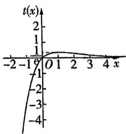

line

| x | t(x) |
|---|------|
| -2 | 1 |
| -1 | 1 |
| 0 | 1 |
| 1 | 1 |
| 2 | 1 |
| 3 | 1 |
| 4 | 1 |

$g(t) = t^2 + mt - 1$ ，得到函数 $g(t)$ 在 $(- \infty, 0] \cup \left\{\frac{1}{e}\right|$ 上有一个零点，在 $(0, \frac{1}{e})$ 上没有零点，又由于 $\Delta = m^2 + 4 > 0$ ， $g(0) = -1 < 0$ ，于是函数 $g(t)$ 在 $(- \infty, 0]$ 上有一个零点，此时只需让另一个零点落在 $(\frac{1}{\mathrm{e}}, +\infty)$ 上即可，进而 $g(\frac{1}{\mathrm{e}}) = \frac{1}{\mathrm{e}^2} + m \cdot \frac{1}{\mathrm{e}} - 1 < 0$ ，因此 $m \in (-\infty, \mathrm{e} - \frac{1}{\mathrm{e}})$ .

答案 $(-\infty, e - \frac{1}{e})$

# 坑物小课堂

如果没有观察出来可以齐次化,直接分离参数求解也可以.

练大招，见《解题觉醒》主书 P035

text_image

大招21

$\mathrm{e}^x \geqslant x + 1$ 与 $\ln x \leqslant x - 1$ 的应用

text_image

e^z
ln x

# 大招解读

对于一些问题来说,老老实实地求导分析过于复杂,此时我们就通过不等式来放缩.

其中在导数题中最常见的放缩不等式有两个：

① $e^{x}\geqslant x+1$ ，当且仅当x=0时取等号；  
② $\ln x\leqslant x-1$ ,当且仅当x=1时取等号.

证明 ①构建函数 $f(x) = \mathrm{e}^{x} - x - 1$ ，所以 $f'(x) = \mathrm{e}^{x} - 1$ ，所以当 $x \in (-\infty, 0)$ 时， $f'(x) < 0$ ，函数 $f(x)$ 单调递减，当 $x \in (0, +\infty)$ 时， $f'(x) > 0$ ，函数 $f(x)$ 单调递增，所以当 $x = 0$ 时，函数 $f(x)$ 取最小值 0，所以 $\mathrm{e}^x \geqslant x + 1$ ，当且仅当 $x = 0$ 时取等号.

②构建函数 $g(x) = x - \ln x - 1$ ，所以 $g'(x) = \frac{x - 1}{x}$ ，所以当 $x \in (0,1)$ 时， $g'(x) < 0$ ，函数 $g(x)$ 单调递减，当 $x \in (1, +\infty)$ 时， $g'(x) > 0$ ，函数 $g(x)$ 单调递增，所以当 $x = 1$ 时，函数 $g(x)$ 取最小值 0，所以 $\ln x \leqslant x - 1$ ，当且仅当 $x = 1$ 时取等号.

# 坑神小课堂

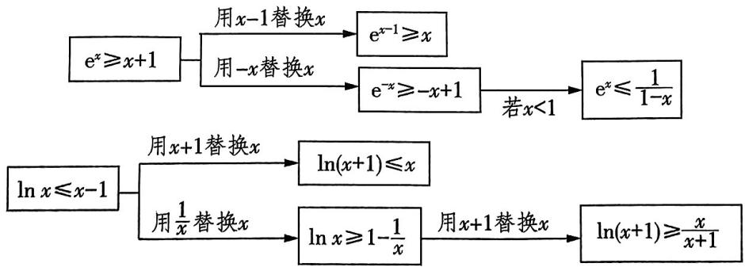

flowchart

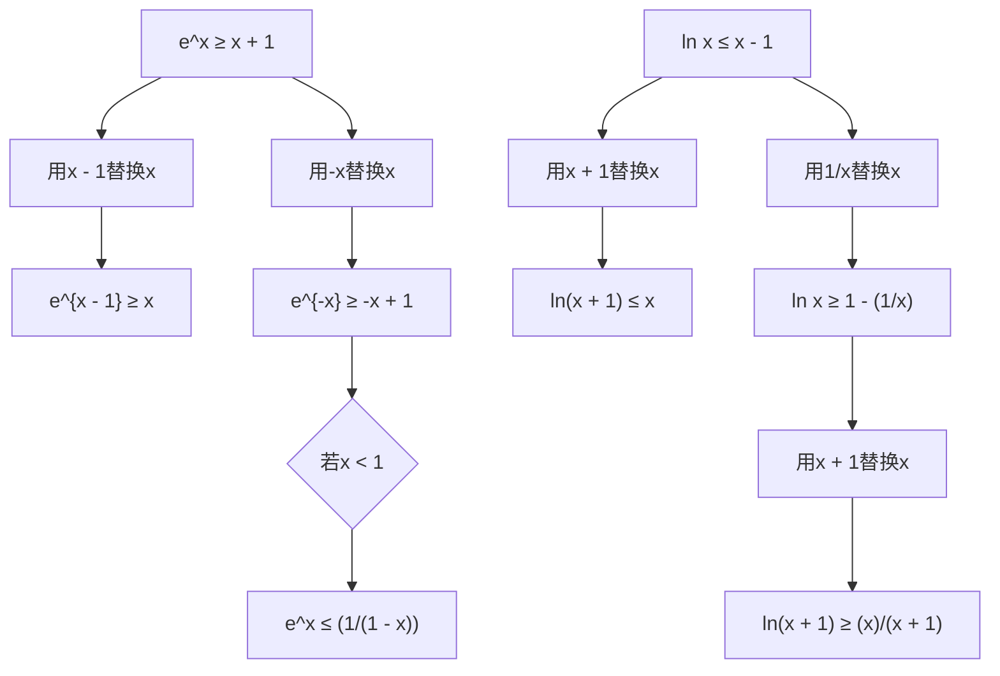

由上述变形可得， $\frac{x}{x + 1}\leqslant \ln (x + 1)\leqslant x\leqslant \mathrm{e}^{x - 1}$ ，当且仅当 $x = 0$ 时 $\frac{x}{x + 1}\leqslant \ln (x + 1)\leqslant x$ 取等号，当且仅当 $x = 1$ 时 $x\leqslant \mathrm{e}^{x - 1}$ 取等号.

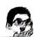

# 坑神有话说

除了上述放缩不等式外,还有如下三角函数放缩不等式:

①当 $x > 0$ 时， $x > \sin x$ ；当 $x < 0$ 时， $x < \sin x$ .  
② $x < \tan x (0 < x < \frac{\pi}{2})$ .

这些三角函数不等式与不等式 $\mathrm{e}^x\geqslant x + 1,\ln x\leqslant x - 1$ 都是切线放缩.

# 大招应用

大招示例 不等式 $x^{-3}\mathrm{e}^x - a\ln x \geqslant x + 1$ ，对任意 $x \in (1, +\infty)$ 恒成立，则 $a$ 的取值范围是（）

A. $(-\infty, 1 - e]$

B. $(-\infty, 2 - e^{2}]$

C. $(-\infty, -4]$

D. $(-\infty, -3]$

解析 由于不等式 $x^{-3}\mathrm{e}^x - a\ln x \geqslant x + 1$ 对任意 $x \in (1, +\infty)$ 恒成立，于是分离参数得到不等式 $a \leqslant \frac{x^{-3}\mathrm{e}^x - x - 1}{\ln x}$ 对任意 $x \in (1, +\infty)$ 恒成立，而 $\mathrm{e}^x \geqslant x + 1$ （当且仅当 $x = 0$ 时取等号），于是 $x^{-3}\mathrm{e}^x = \mathrm{e}^{\ln x^{-3} + x} = \mathrm{e}^{-3\ln x + x} \geqslant -3\ln x + x + 1$ ，当且仅当 $-3\ln x + x = 0$ 时取等号，因此 $\frac{x^{-3}\mathrm{e}^x - x - 1}{\ln x} \geqslant -3$ ，当且仅当 $-3\ln x + x = 0$ 时取等号.

然后构建函数 $f(x) = x - 3\ln x$ ，则 $f'(x) = \frac{x - 3}{x}$ ，当 $x \in (0,3)$ 时， $f'(x) < 0$ ， $f(x)$ 单调递减，当 $x \in (3, +\infty)$ 时，

$f^{\prime}(x) > 0, f(x)$ 单调递增，又 $f(1) = 1 > 0, f(3) = 3 - 3\ln 3 < 0$ ，所以存在 $x_0 \in (1,3)$ ，使 $f(x_0) = 0$ ，从而 $\frac{x^{-3}e^x - x - 1}{\ln x}$ 的最小值为-3，因此 $a \in (-\infty, -3]$ .

答案 D

# 坑神小课堂

1. 本题的关键步骤为根据指对恒等变换得到 $f(x) \cdot \mathrm{e}^{g(x)} = \mathrm{e}^{\ln f(x) + g(x)} \geqslant \ln f(x) + g(x) + 1$ ，当且仅当 $\ln f(x) + g(x) = 0$ 时取等号，一定要验证取等条件 $\ln f(x) + g(x) = 0$ 是否成立。

2. 上述关键步骤实际上就是朗博同构：
当遇到幂函数(这里的幂函数包括常数)乘以 $e^{x}$ 时我们可以用对数恒等式变换, 即 $x^{n}e^{x}=e^{n\ln x}\cdot e^{x}=e^{x+n\ln x}$ , 这时搭配 $x+n\ln x$ 就能找到同构.

练大招，见《解题觉醒》主书 P036

# 大招22

# 不等式证明——指对处理

  
名师大招

text_image

e^x
ln x

# 大招解读

在导数大题中,如果一个函数的解析式中存在指数形式 $e^{x}$ 或者对数形式 $\ln x$ 时,我们的处理原则是允许指数 $e^{x}$ 与关于 x 的整式、分式乘在一起,但不允许对数 $\ln x$ 与关于 x 的整式、分式乘在一起.这样处理完毕后再求导,得到的导函数与 0 的大小关系容易比较,一般只取决于多项式与 0 的大小关系.上述处理方法,可以称为“指成双,对落单”.如果待求式子不符合上述原则,则需要先改造成例如 $f(x)=\frac{1}{x+1}+\ln x$ (对落单), $f'(x)=\frac{x^{2}+x+1}{x(x+1)^{2}}$ , $g(x)=(x^{2}+2x+3)e^{x}$ (指成双), $g'(x)=(x^{2}+4x+5)e^{x}$

符合这一原则,然后再进行计算.

# 大招应用

大招示例 已知函数 $f(x) = \frac{ax^2 - 2x + 2}{\mathrm{e}^x}$ .

(1) 当 a > 0 时, 试讨论 $f(x)$ 的单调性;  
(2) 求证: $\forall x \in \mathbf{R}, e^{x + 1} \geqslant -x^2 - x + 1$ 恒成立.

大招识别 第(2)问中由于“ $\forall x \in \mathbf{R}, e^{x+1} \geqslant -x^2 - x+1$ ”不符合“指成双”原则，因此要加以改造，变成“ $\forall x \in \mathbf{R}, g(x) = \frac{x^2 + x - 1}{e^x} + e \geqslant 0$ ”，从而得到证明.

解析 (1) 因为 $f(x) = \frac{ax^2 - 2x + 2}{\mathrm{e}^x}$ ，所以 $f'(x) = \frac{-(ax - 2)(x - 2)}{\mathrm{e}^x}$ .

若 $0 < a < 1$ ，则当 $x \in (-\infty, 2)$ 时， $f'(x) < 0$ ，函数 $f(x)$ 单调递减，当 $x \in (2, \frac{2}{a})$ 时， $f'(x) > 0$ ，函数 $f(x)$ 单调递增，当 $x \in (\frac{2}{a}, +\infty)$ 时， $f'(x) < 0$ ，函数 $f(x)$ 单调递减。

若 $a = 1$ ，则 $f^{\prime}(x) = \frac{-(x - 2)^{2}}{\mathrm{e}^{x}}\leqslant 0$ ，函数 $f(x)$ 单调递减.  
若 $a > 1$ ，则当 $x\in (-\infty ,\frac{2}{a})$ 时， $f^{\prime}(x) <   0$ ，函数 $f(x)$ 单调递减，当 $x\in (\frac{2}{a},2)$ 时， $f^{\prime}(x) > 0$ ，函数 $f(x)$ 单调递增，当 $x\in (2, + \infty)$ 时， $f^{\prime}(x) <   0$ ，函数 $f(x)$ 单调递减.

(2) 构建函数 $g(x)=\frac{x^{2}+x-1}{\mathrm{e}^{x}}+\mathrm{e}$ ，所以 $g'(x)=$ 指成双

$-\frac{(x-2)(x+1)}{\mathrm{e}^{x}}$ ，所以当 $x\in(-\infty,-1)$ 时， $g'(x)<g'(x)$ 与0的大小只与多项式 $-(x-2)(x+1)$ 有关

0, 函数 $g(x)$ 单调递减, 当 $x \in (-1, 2)$ 时, $g'(x) > 0$ , 函数 $g(x)$ 单调递增, 当 $x \in (2, +\infty)$ 时, $g'(x) < 0$ , 函数 $g(x)$ 单调递减. 所以当 $x = -1$ 时, 函数 $g(x)$ 取得极小值 $g(-1) = 0$ , 当 $x = 2$ 时, 函数 $g(x)$ 取得极大值

$g(2)=\frac{5}{\mathrm{e}^{2}}+\mathrm{e}$ ，所以当 $x\in(-\infty,2]$ 时， $g(x)=\frac{x^{2}+x-1}{\mathrm{e}^{x}}+\mathrm{e}\geqslant0$ 。又当 $x\in(2,+\infty)$ 时， $x^{2}+x-1>0$ ，所以 $g(x)=\frac{x^{2}+x-1}{\mathrm{e}^{x}}+\mathrm{e}>0$ 。

所以 $\forall x\in \mathbf{R},g(x) = \frac{x^2 + x - 1}{\mathrm{e}^x} +\mathrm{e}\geqslant 0$ ，所以 $\forall x\in \mathbf{R}$ $\mathrm{e}^{x + 1}\geqslant -x^2 -x + 1$ 恒成立.

# 坑神小课堂

在解导数大题之前,可以先把思路理顺,然后在正式解答过程中就能一直从头写到尾,管它变形多么巧妙.这也是为什么一般看解析时,很多步骤刚开始看不知道为啥,看到最后才发现妙在何处的原因.

练大招，见《解题觉醒》主书 P037

The image is too blurry to recognize any text content.

text_image

大招23

# 不等式证明——主元法

text_image

名师大招
a, x

# 大招解读

我们可以把一元含参函数看成二元函数,如一元含参函数 $f(x)=ae^{x}-x(a\geqslant1)$ 与二元函数 $F(x,y)=ye^{x}-x(x\in\mathbf{R},y\geqslant1)$ 是完全等价的.如果学习了高等数学,就可以用偏导数 $\frac{\partial F}{\partial y}=e^{x}>0$ ,又把x看作常数,求 $F(x,y)$ 对y的导数

$y \geqslant 1$ ，于是可以得到 $F(x, y) \geqslant F(x, 1) = \mathrm{e}^{x} - x \geqslant 1.$ 那么怎么用不超纲的方法证明当 $a \geqslant 1$ 时，函数常用放缩不等式 $\mathrm{e}^x \geqslant x + 1$ $f(x) = a\mathrm{e}^x - x \geqslant 1$ 恒成立呢？

从根本逻辑上看,上面偏导数应用的本质是先将 $x$ 固定,把 $y$ 看作变量,先求出在 $x$ 固定 $y$ 变化的情况下二元函数 $F(x,y)$ 的最小值,进而得到一个关于 $x$ 的表达式,最后再求出这个表达式的最小值,即可得到二元函数 $F(x,y)$ 的最小值.

基于这个思路,在处理其他含参问题时可以依葫芦画瓢,先将 x 固定,以参数为主元,得到一个关于 x 的不等式,然后再加以处理.这种处理含参问题的方法就称为主元法.

# 大招应用

大招示例 (2024 全国甲卷) 已知函数 $f(x) = a(x - 1) - \ln x + 1$ .

(1) 求 $f(x)$ 的单调区间；  
(2) 当 $a \leqslant 2$ 时, 证明: 当 $x > 1$ 时, $f(x) < \mathrm{e}^{x - 1}$ 恒成立.  
解析 (1) 因为 $f(x) = a(x - 1) - \ln x + 1$ ，所以 $f'(x) = a - \frac{1}{x} = \frac{ax - 1}{x}, x > 0$ ，

若 $a \leqslant 0$ ，则 $f'(x) < 0$ 恒成立，所以 $f(x)$ 在 $(0, +\infty)$ 上单调递减，即 $f(x)$ 的单调递减区间为 $(0, +\infty)$ ，无单调递增区间；

若 $a > 0$ ，则当 $0 < x < \frac{1}{a}$ 时， $f'(x) < 0$ ，当 $x > \frac{1}{a}$ 时， $f'(x) > 0$ ，所以 $f(x)$ 的单调递减区间为 $(0, \frac{1}{a})$ ，单调递增区间为 $(\frac{1}{a}, +\infty)$ .

综上，当 $a \leqslant 0$ 时， $f(x)$ 的单调递减区间为 $(0, +\infty)$ ，无单调递增区间；当 $a > 0$ 时， $f(x)$ 的单调递减区间为 $(0, \frac{1}{a})$ ，单调递增区间为 $(\frac{1}{a}, +\infty)$ .

(2) 方法一: 主元法.

因为 $a \leqslant 2$ ，所以当 $x > 1$ 时， $\mathrm{e}^{x - 1} - f(x) = \mathrm{e}^{x - 1} - a(x -$

$$
\underbrace {1) + \ln x - 1 \geqslant \mathrm{e} ^ {x - 1} - 2 x + \ln x + 1 .} _ {\text {以} a \text {为主元，不等式放缩}}
$$

令 $g(x) = \mathrm{e}^{x - 1} - 2x + \ln x + 1$ ，则只需证当 $x > 1$ 时 $g(x) > 0.$

易知 $g'(x) = e^{x-1} - 2 + \frac{1}{x}$ ,

令 $h(x) = g'(x)$ ，则 $h'(x) = \mathrm{e}^{x - 1} - \frac{1}{x^2}$ 在 $(1, +\infty)$ 上单调递增，

则当 $x > 1$ 时， $h'(x) > h'(1) = 0$ ，所以 $h(x) = g'(x)$ 在 $(1, +\infty)$ 上单调递增，

所以当 $x > 1$ 时， $g'(x) > g'(1) = 0$ ，故 $g(x)$ 在 $(1, +\infty)$ 上单调递增，

所以当 $x > 1$ 时， $g(x) > g(1) = 0$ ，即当 $x > 1$ 时， $f(x) < \mathrm{e}^{x - 1}$ 恒成立.

方法二:作差法直接求导证明.

设 $g(x)=a(x-1)-\ln x+1-e^{x-1}$ ,

作差构造函数

只需证当 x > 1 时 $g(x) < 0$ 即可。

易知 $g^{\prime}(x) = a - \frac{1}{x} -\mathrm{e}^{x - 1},$

令 $h(x) = g'(x)$ ，则 $h'(x) = \frac{1}{x^2} - \mathrm{e}^{x - 1}$ ，

由基本初等函数的单调性可知 $h'(x)$ 在 $(1, +\infty)$ 上单调递减，

则当x>1时, $h'(x)<h'(1)=1-1=0$ ,

所以 $h(x)=g'(x)$ 在 $(1,+\infty)$ 上单调递减，

于是当 x > 1 时, $g'(x) < g'(1) = a - 2$ ,

又 $a \leqslant 2$ ，所以 $a - 2 \leqslant 0$ ，则当 $x > 1$ 时， $g'(x) < 0$ ，故 $g(x)$ 在 $(1, +\infty)$ 上单调递减，

所以当 $x > 1$ 时， $g(x) < g(1) = 0$ ，即当 $x > 1$ 时， $f(x) < \mathrm{e}^{x - 1}$ 恒成立.

练大招，见《解题觉醒》主书P037

text_image

大招24

# 不等式证明——分割与放缩

  
名师大招

natural_image

Cartoon character in dynamic pose, wearing glasses and holding a megaphone (no text or symbols)

# 大招解读

如果不等式 $f(x) > 0$ （或 $f(x) < 0$ ），通过直接求导证明非常困难或者压根行不通，则需要转换思路，按下列方法去处理.

# 1. 分割法

令函数 $f(x) = g(x) - h(x)$ ，通过证明 $g(x)_{\min} > h(x)_{\max}$ ，进而有 $f(x) = g(x) - h(x) > 0$ ；或者通过证明 $g(x)_{\max} < h(x)_{\min}$ ，进而有 $f(x) = g(x) - h(x) < 0$ .

# 坑神有话说

分割法的核心是构造出 $g(x)_{\min} > h(x)_{\max}$ 或 $g(x)_{\max} < h(x)_{\min}$ . 分割法使用的前提是题目本身的分割特点非常明显, 且分成的两个函数一个为凹函数, 一个为凸函数.

# 2. 放缩法

通过一个辅助函数 $g(x)$ , 对函数 $f(x)$ 进行放缩, 使得 $f(x) > g(x) > 0$ (或 $f(x) < g(x) < 0$ ). 常见的放缩有以下两种情形.

第一种：函数 $f(x)$ 中含有指数或对数形式时，使用 $e^x \geqslant x + 1$ ，当且仅当 $x = 0$ 时取等号， $e^x \geqslant e^x$ ，当且仅当 $x = 1$ 时取等号， $\ln x \leqslant x - 1$ ，当且仅当 $x = 1$ 时取等号， $\ln x \leqslant \frac{x}{e}$ ，当且仅当 $x = e$ 时取等号进行放缩.

第二种：在一些题目中第二问放缩不等式时会用到第一问的结论.

# 大招应用

大招示例1（新课标I卷）设函数 $f(x) = a\mathrm{e}^{x}\ln x + \frac{b\mathrm{e}^{x - 1}}{x}$ ，曲线 $y = f(x)$ 在点(1, $f(1)$ )处的

切线方程为 $y = e(x - 1) + 2$ .

(1) 求 a, b;   
(2) 证明: $f(x) > 1$ ,

解析 (1) 函数 $f(x)$ 的定义域为 $(0, +\infty)$ ,

$$
f ^ {\prime} (x) = a \mathrm{e} ^ {x} \ln x + \frac {a}{x} \mathrm{e} ^ {x} - \frac {b}{x ^ {2}} \mathrm{e} ^ {x - 1} + \frac {b}{x} \mathrm{e} ^ {x - 1}.
$$

由切线方程得 $f(1)=2,f'(1)=\mathrm{e}$ ，所以 $f(1)=b=2$ ， $f'(1)=ae=e$ , 解得 a=1, b=2.

# 大招识别

第(2)问中所证不等式分割特点明显,不等式 $f(x) > 1$ ，即 $\mathrm{e}^x\ln x + \frac{2\mathrm{e}^{x - 1}}{x} > 1$ ，可以有多种等价变形方法，比如 $\ln x + \frac{2}{\mathrm{e}x} > \mathrm{e}^{-x}, x\ln x > \frac{x}{\mathrm{e}^x} - \frac{2}{\mathrm{e}}$ 等，其中 $x\ln x > \frac{x}{\mathrm{e}^x} - \frac{2}{\mathrm{e}}$ 相对便于研究，转化后分割成两个函数 $g(x) = x\ln x$ 与 $h(x) = x\mathrm{e}^{-x} - \frac{2}{\mathrm{e}}$ ，研究这两个函数的最值，使 $g(x)$ 在 $(0, +\infty)$ 上的最小值大于 $h(x)$ 在 $(0, +\infty)$ 上的最大值即可.

(2) 由(1)知, $f(x)=\mathrm{e}^{x}\ln x+\frac{2}{x}\mathrm{e}^{x-1}$ ,

从而 $f(x) > 1$ 等价于 $x\ln x > xe^{-x} - \frac{2}{e}$ . 分割

设函数 $g(x)=x\ln x$ ，则 $g'(x)=1+\ln x$ .

所以当 $x \in (0, \frac{1}{\mathrm{e}}), g'(x) < 0$ ；当 $x \in (\frac{1}{\mathrm{e}}, +\infty)$ 时， $g'(x) > 0$ .

故 $g(x)$ 在 $(0, \frac{1}{\mathrm{e}})$ 上单调递减，在 $(\frac{1}{\mathrm{e}}, +\infty)$ 上单调递增，从而 $g(x)$ 在 $(0, +\infty)$ 上的最小值为 $g(\frac{1}{\mathrm{e}}) = -\frac{1}{\mathrm{e}}$

设函数 $h(x) = x\mathrm{e}^{-x} - \frac{2}{\mathrm{e}}$ ，则 $h^{\prime}(x) = \mathrm{e}^{-x}(1 - x)$

所以当 $x \in (0,1)$ 时， $h'(x) > 0$ ；当 $x \in (1, +\infty)$ 时， $h'(x) < 0$ 。故 $h(x)$ 在 $(0,1)$ 上单调递增，在 $(1, +\infty)$ 上单调递减,从而 $h(x)$ 在 $(0,+\infty)$ 上的最大值为 $h(1)=-\frac{1}{\mathrm{e}}$ .
综上, 当 x > 0 时, $g(x) > h(x)$ , 即 $f(x) > 1$ .

# 大招示例 2

已知函数 $f(x) = \mathrm{e}^{x} - x$ .

(1) 求函数 $f(x)$ 的最小值；  
(2) 求证: $e^{\frac{x}{e}} - e \ln x \geqslant 0.$

解析 (1) 因为 $f(x) = \mathrm{e}^{x} - x$ ，所以 $f'(x) = \mathrm{e}^{x} - 1$ ，所以当 $x \in (-\infty, 0)$ 时， $f'(x) < 0$ ，函数 $f(x)$ 单调递减，当 $x \in (0, +\infty)$ 时， $f'(x) > 0$ ，函数 $f(x)$ 单调递增，所以当 $x = 0$ 时，函数 $f(x)$ 取得最小值 $f(0) = 1$ .

(2)根据 $\mathrm{e}^x\geqslant x + 1,\ln x\leqslant x - 1$ ，可将 $\mathrm{e}^{\frac{x}{e}} - \mathrm{e}\ln x$ 变形为 $\mathrm{e(e^{\frac{x}{e} -1} - \ln \frac{x}{e} - 1)}$ ，然后加以放缩，从而完成证明.下面进入完整解题步骤：由(1)得 $\mathrm{e}^x\geqslant x + 1$ ，当且仅当 $x = 0$ 时取等号，所以 $\mathrm{e}^{x - 1}\geqslant x$ ，即 $\underbrace{\ln x\leqslant x - 1}_{\text{两边同时取以e为底的对数}}$ ，当且仅当 $x = 1$

时取等号. 观察发现当 $x = \mathrm{e}$ 时, $\mathrm{e}^{\frac{x}{\mathrm{e}}} - \mathrm{e}\ln x = 0$ ，所以放缩后需要让指数式和对数式都在 $x = \mathrm{e}$ 处等号成立. 因为 $\mathrm{e}^{\frac{x}{\mathrm{e}}} - \mathrm{e}\ln x = \mathrm{e}\left(\mathrm{e}^{\frac{x}{\mathrm{e}} - 1} - \ln \frac{x}{\mathrm{e}} - 1\right)$ ，所以 $\mathrm{e}^{\frac{x}{\mathrm{e}}} - \mathrm{e}\ln x \geqslant \mathrm{e}\left[(\frac{x}{\mathrm{e}} - 1) + 1 - (\frac{x}{\mathrm{e}} - 1) - 1\right] = 0$ ，当且仅当 $x = \mathrm{e}$ 时取等号.

# 坑神小课堂

放缩的过程需要好好把控,确定放缩的方向后,有时需要在草稿纸上多次尝试才能最终确定如何放缩.

练大招，见《解题觉醒》主书 P038

text_image

大招25

# 函数零点问题

# 大招解读

# 1. 函数零点存在定理相关结论

①如果函数 $f(x)$ 在 $[a,b]$ 上连续不断，且 $f(a)f(b)<0$ ，则函数 $f(x)$ 在 $(a,b)$ 上至少有一个零点.  
②如果函数 $f(x)$ 在 $[a,b]$ 上连续并具有单调性，且 $f(a)f(b)<0$ ，则函数 $f(x)$ 在 $(a,b)$ 上有且仅

递增或递减均可

有一个零点.

# 2. 函数零点存在定理找点技巧

在使用函数零点存在定理的过程中,很多时候 $f(a)f(b)<0$ 中的a和b不是那么好确定的,这里补充一些找 $x_{0}$ 使得 $f(x_{0})>0$ (或 $f(x_{0})<0$ )的技巧:

①以目标 $f(x_{0})>0$ （或 $f(x_{0})<0$ ）为导向，代入常见特殊值，如 $0,\frac{1}{e},\frac{1}{2},\pm1,\sqrt{e},e$ 等.

②从式子形式出发,代入与式子中参数有关的值,如 $\ln a, a, a^{2}, e^{a}$ 等.

(3)使用放缩法确定 $x_{0}$ : 首先在草稿纸上分析函数解析式中各部分的趋势, 然后将解析式进行放缩, 从而确定 $x_{0}$ . 例如当 $x_{0} < 0$ 时, 有 $0 < \mathrm{e}^{x_{0}} < 1$ , 当 $x_{0} > 1$ 时, 有 $0 < \frac{\ln x_{0}}{x_{0}} \leqslant \frac{1}{\mathrm{e}}$ 等.

# 3. 求函数 $f(x)$ 零点个数的一般步骤

第一步：先通过导函数 $f'(x)$ 分析函数 $f(x)$ 的单调性.

第二步: 根据函数零点存在定理确定函数 $f(x)$ 在每个单调区间上的零点个数为 0 还是 1.

第三步: 最终得到函数 $f(x)$ 零点个数.

# 4. 已知函数零点求参的方法

切入点1 直接法. 对函数进行求导, 观察参数是否影响函数的单调性, 若参数不影响单调性, 分析零点个数, 通过函数极值和0的关系求解; 若参数影响单调性, 确定参数的分类标准, 在每个范围内, 研究零点的个数是否符合题意, 将满足题意的参数的各个小范围并在一起, 即所求参数范围.

切入点2 分离参数法. 有两种情况: (1) 由 $f(x)=0$ 分离出参数 $a$ , 得 $a=g(x)$ , 利用导数求函数 $y=g(x)$ 的单调性、极值和最值, 进而画出 $y=g(x)$ 的大致图象, 再根据直线 $y=a$ 与 $y=g(x)$ 的图象的交点个数得参数的取值范围.

(2) 将函数 $f(x)$ 分成两个函数, 一个为容易求导的不含参函数 (具有明显的凹凸性), 另一个为含参的一次函数, 或一个为凹函数, 一个为凸函数, 观察它们图象的变化趋势, 找到临界的位置 (两函数图象相切), 求出此时参数的值, 再根据零点个数, 数形结合, 即可求得参数的取值范围.

# 坑神有话说

切勿忘记函数的零点、方程的实数根、两个函数图象的交点横坐标之间可以相互转化.

# 大招应用

大招示例 (2022 全国乙卷)已知函数 $f(x) = \ln (1 + x) + axe^{-x}$ .

(1) 当 $a = 1$ 时, 求曲线 $y = f(x)$ 在点 $(0, f(0))$ 处的切线方程;  
(2) 若 $f(x)$ 在区间 $(-1,0), (0, +\infty)$ 各恰有一个零点，求 $a$ 的取值范围.

解析，（1）当 $a = 1$ 时， $f(x) = \ln (1 + x) + x \cdot e^{-x}$ ，

$$
\therefore f ^ {\prime} (x) = \frac {1}{x + 1} + \mathrm{e} ^ {- x} + x \cdot \mathrm{e} ^ {- x} \cdot (- 1) = \frac {1}{x + 1} + (1 -
$$

$$
x) \mathrm{e} ^ {- x},
$$

$$
\therefore f ^ {\prime} (0) = 1 + 1 = 2. \because f (0) = 0,
$$

∴所求切线方程为 $y-0=2(x-0)$ ，即 y=2x.

(2) $\because f(x)=\ln(1+x)+ax\cdot e^{-x}=\ln(x+1)+\frac{ax}{e^{x}}.$

① 当 $a \geqslant 0$ 时，若 $x > 0$ ，则 $\ln (x + 1) > 0, \frac{ax}{\mathrm{e}^x} \geqslant 0,$

$$
\therefore f (x) > 0,
$$

∴ $f(x)$ 在 $(0, +\infty)$ 上无零点，不符合题意.

②当 $a < 0$ 时， $f'(x) = \frac{\mathrm{e}^x + a(1 - x^2)}{(x + 1)\mathrm{e}^x}$ .

令 $g(x) = \mathrm{e}^{x} + a(1 - x^{2})$ ，则 $g^{\prime}(x) = \mathrm{e}^{x} - 2ax,g^{\prime}(x)$ 在 $(-1, + \infty)$ 上单调递增， $g^{\prime}(-1) = \mathrm{e}^{-1} + 2a,g^{\prime}(0) = 1.$

(a) 若 $g'(-1) \geqslant 0$ ，则 $-\frac{1}{2e} \leqslant a < 0, \therefore -\frac{1}{2e} \leqslant a < 0$ 时， $g'(x)>0$ 在 $(-1,+\infty)$ 上恒成立，

∴ $g(x)$ 在 $(-1, +\infty)$ 上单调递增.

$\because g(-1) = \mathrm{e}^{-1} > 0, \therefore g(x) > 0$ 在 $(-1, +\infty)$ 上恒成立，

$\therefore f^{\prime}(x) > 0$ 在 $(-1, +\infty)$ 上恒成立，

∴ $f(x)$ 在 $(-1, +\infty)$ 上单调递增.

$$
\because f (0) = 0,
$$

$\therefore f(x)$ 在 $(-1,0),(0, + \infty)$ 上均无零点，不符合题意

(b) 若 $g^{\prime}(-1) < 0$ ，则 $a < -\frac{1}{2e}$ ，

∴ 当 $a < -\frac{1}{2e}$ 时，存在 $x_{0} \in (-1,0)$ ，使得 $g'(x_{0}) = 0$ .
设而不求
∴ $g(x)$ 在 $(-1, x_{0})$ 上单调递减，在 $(x_{0}, +\infty)$ 上单调递增. $g(-1)=\mathrm{e}^{-1}>0,g(0)=1+a,g(1)=\mathrm{e}>0.$

(i) 当 $g(0) \geqslant 0$ ，即 $-1 \leqslant a < -\frac{1}{2e}$ 时， $g(x) > 0$ 在 $(0, +\infty)$ 上恒成立，∴ $f'(x) > 0$ 在 $(0, +\infty)$ 上恒成立，
∴ $f(x)$ 在 $(0, +\infty)$ 上单调递增.

$\because f(0) = 0, \therefore$ 当 $x \in (0, +\infty)$ 时, $f(x) > 0$ ,

$\therefore f(x)$ 在 $(0, +\infty)$ 上无零点，不符合题意.

(ii) 当 $g(0) < 0$ ，即 $a < -1$ 时，存在 $x_{1} \in (-1, x_{0}), x_{2} \in$

(0,1)，使得 $g(x_{1}) = g(x_{2}) = 0$ ∴ $f(x)$ 在 $(-1,x_1),(x_2, + \infty)$ 上分别单调递增，在 $(x_{1},$ $x_{2})$ 上单调递减. $\because f(0) = 0,\therefore f(x_{1}) > f(0) = 0$ ，当 $x\to -1$ 时， $f(x) <   0$ ∴ $f(x)$ 在 $(-1,x_1)$ 上存在一个零点，即 $f(x)$ 在 $(-1,0)$ 零点存在定理

上存在一个零点.

$\because f(0) = 0, \therefore f(x_{2}) < f(0) = 0$ ，当 $x \to +\infty$ 时， $f(x) > 0$ ， $\therefore f(x)$ 在 $(x_{2}, +\infty)$ 上存在一个零点，即 $f(x)$ 在 $(0, +\infty)$ 上存在一个零点.

综上, $a$ 的取值范围是 $(- \infty, -1)$ .

练大招，见《解题觉醒》主书P038

text_image

大招26

# 隐极值点代换

  
名师大招

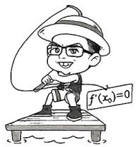

text_image

f'(x₀)=0

# 大招解读

对于一些证明不等式 $f(x) > a, a \in \mathbf{R}$ （或 $f(x) < a, a \in \mathbf{R}$ ）的问题，我们可以先将函数 $f(x)$ 求导后得 $f'(x)$ ，于是函数 $f(x)$ 的极值点 $x_0$ 就满足 $f'(x_0) = 0$ ，解出 $x_0$ ，进而能求出极值 $f(x_0)$ ，确定 $f(x)$ 的值域，进而判断不等式 $f(x) > a, a \in \mathbf{R}$ （或 $f(x) < a, a \in \mathbf{R}$ ）是否成立.

然而前方的路哪能一帆风顺,如果方程 $f'(x_0) = 0$ 很难解或者压根没法解,怎么办?实际上我们一定要把极值 $f(x_0)$ 的具体值求出来吗?也不一定,其实只要确定出极值 $f(x_0)$ 的取值范围就行.虽然 $f'(x_0) = 0$ 很难解,但是我们又知道存在一个这样的 $x_0$ ,此时我们可以把 $x_0$ 称为隐极值点,并采取隐极值点代换的方法处理,步骤如下:

第一步: 求导后得到 $f'(x_0) = 0$ .

第二步：根据 $f'(x_0) = 0$ 代换掉参数或对极值 $f(x_0)$ 的表达式进行转化，得到一个仅含有 $x_0$ ，形式简单且容易求取值范围的式子.

第三步: 根据隐极值点 $x_0$ 的取值范围, 确定极值 $f(x_0)$ 的取值范围, 进而证明不等式.

# 大招应用

大招示例 已知函数 $f(x) = x \ln x + \frac{a}{\mathrm{e}^x} + bx$ 的图象在 $x = 1$ 处的切线方程为 $y = (\frac{1}{\mathrm{e}} - 1)x - \frac{2}{\mathrm{e}} - 1$ .

(1) 求 $a$ 和 $b$ 的值;

(2) 求证: $f(x) > -3$ .

解析 (1) 因为 $f(x) = x \ln x + \frac{a}{\mathrm{e}^x} + bx$ ，所以 $f'(x) = \ln x + 1 - \frac{a}{\mathrm{e}^x} + b$ ，所以 $f'(1) = -\frac{a}{\mathrm{e}} + b + 1$ ，又 $f(1) = \frac{a}{\mathrm{e}} + b$ ，所以函数 $f(x)$ 的图象在 $x = 1$ 处的切线方程为

$y - \left(\frac{a}{\mathrm{e}} + b\right) = \left(-\frac{a}{\mathrm{e}} + b + 1\right)(x - 1)$ , 即 $y = \left(-\frac{a}{\mathrm{e}} + b + 1\right)x + \frac{2a}{\mathrm{e}} - 1$ . 又已知函数 $f(x)$ 的图象在 $x = 1$ 处的切线方程为 $y = \left(\frac{1}{\mathrm{e}} - 1\right)x - \frac{2}{\mathrm{e}} - 1$ , 所以 $\left\{\begin{aligned}-\frac{a}{\mathrm{e}}+b+1&=\frac{1}{\mathrm{e}}-1,\\ \frac{2a}{\mathrm{e}}-1&=-\frac{2}{\mathrm{e}}-1,\end{aligned}\right.$ 所以 $\left\{\begin{aligned}a&=-1,\\ b&=-2,\end{aligned}\right.$

(2) 代入后发现方程 $f'(x) = 0$ 无法求解，因此函数 $f(x)$ 存在隐极值点 $x_0$ ，于是就要运用隐极值点代换，证明 $f(x) > -3$ . 下面进入完整解题步骤：

由(1)得 $f(x)=x\ln x-\frac{1}{\mathrm{e}^{x}}-2x$ ，所以 $f'(x)=\ln x+\frac{1}{\mathrm{e}^{x}}-1$ 令 $c(x)=f'(x)$ ，则 $c'(x)=\frac{1}{x}-\frac{1}{\mathrm{e}^{x}}=\frac{\mathrm{e}^{x}-x}{x\mathrm{e}^{x}}$ .

构建函数 $g(x) = \mathrm{e}^{x} - x$ ，所以 $g^{\prime}(x) = \mathrm{e}^{x} - 1$ ，所以当 $x > 0$ 时， $g^{\prime}(x) = \mathrm{e}^{x} - 1 > 0$ ，函数 $g(x)$ 单调递增，所以当 $x > 0$ 时， $g(x) = \mathrm{e}^{x} - x > g(0) = 1 > 0$ ，所以 $c^\prime (x) > 0$ ，函数 $f^{\prime}(x)$ 单调递增.

因为 $f'(1)=\frac{1}{e}-1<0$ , $f'(e)=\frac{1}{e^{e}}>0$ , 所以函数 $f'(x)$ 在 $(1,e)$ 内有唯一零点 $x_{0}$ ，所以当 $x\in(0,x_{0})$ 时， $f'(x)<f'(x_{0})=0$ ，函数 $f(x)$ 单调递减，当 $x\in(x_{0},+\infty)$ 时， $f'(x)>f'(x_{0})=0$ ，函数 $f(x)$ 单调递增，所以当 $x=x_{0}$

时，函数 $f(x)$ 取最小值 $f(x_0) = x_0\ln x_0 - \frac{1}{\mathrm{e}^{x_0}} -2x_0.$

因为 $f^{\prime}(x_0) = \ln x_0 + \frac{1}{\mathrm{e}^{x_0}} - 1 = 0$ ，所以 $-\frac{1}{\mathrm{e}^{x_0}} = \ln x_0 - 1$ ，所以 $f(x_0) = (x_0 + 1)\ln x_0 - 2x_0 - 1,x_0\in (1,\mathrm{e}).$ 构建函数 $h(x) =$ 隐极值点代换

$(x+1)\ln x-2x-1$ , 所以 $h'(x)=\frac{1}{x}+\ln x-1$ , 令 $d(x)=h'(x)$ , 则 $d'(x)=\frac{x-1}{x^{2}}$ , 所以当 x>1 时, $d'(x)>0$ , 函数 $h'(x)$ 单调递增, 所以当 x>1 时, $h'(x)>h'(1)=0$ , 则函数 $h(x)$ 单调递增, 所以 $f(x_{0})>h(1)=-3$ , 所以 $f(x)\geqslant f(x_{0})>-3$ .

练大招，见《解题觉醒》主书 P039

text_image

大招27

# 恒成立求参——分离参数

  
名而大招

natural_image

Cartoon illustration of a smiling person wearing glasses and aprons, sitting at a table with a bowl (no text or symbols)

# 大招解读

# 1. 分离参数的一般思路

对于一个含参问题,可以通过分离参数,将参数与变量彻底分离开来,从而把一个含参问题转化为一个非含参问题,进而通过导数研究分离后得到的函数的单调性、极值与最值,最终解决问题.

# 2. 使用分离参数的要求

①参数与变量可以比较容易地分离开.  
②分离参数后得到的函数的形式不复杂,通过导数来研究单调性、极值以及最值比较容易.  
③分离参数后得到的函数的值域容易算,不会出现必须使用洛必达法则才能解决问题的情形.

# 大招应用

大招示例 已知函数 $f(x) = \ln x, g(x) = \frac{1}{2} ax + b.$

(1) 若 $f(x)$ 与 $g(x)$ 的图象在 $x = 1$ 处相切, 求 $g(x)$ 的表达式;  
(2) 若 $\varphi(x) = \frac{m(x - 1)}{x + 1} - f(x)$ 在 $[2, +\infty)$ 上是减函数, 求实数 $m$ 的取值范围.

解析？（1）因为 $f(x) = \ln x, g(x) = \frac{1}{2} ax + b$ ，所以 $f'(x) = \frac{1}{x}$ ，因为 $f(x)$ 与 $g(x)$ 的图象在 $x = 1$ 处相切，所以 $\left\{ \begin{array}{l} f(1) = g(1), \\ f'(1) = \frac{1}{2} a, \end{array} \right.$ 所以 $\left\{ \begin{array}{l} a = 2, \\ b = -1, \end{array} \right.$ 所以 $g(x) = x - 1$ .

(2) 因为 $\varphi(x) = \frac{m(x - 1)}{x + 1} - f(x) = \frac{m(x - 1)}{x + 1} - \ln x$ 在 $[2, +\infty)$ 上是减函数，所以当 $x \in [2, +\infty)$ 时， $\varphi'(x) = \frac{2m}{(x + 1)^2} - \frac{1}{x} \leqslant 0$ ，所以当 $x \in [2, +\infty)$ 时， $m \leqslant \frac{(x + 1)^2}{2x} = \frac{1}{2}(x + \frac{1}{x}) + 1.$ 分离参数

令 $h(x) = \frac{1}{2} (x + \frac{1}{x}) + 1$ ，则 $h'(x) = \frac{x^2 - 1}{2x^2}$ ，当 $x \in [2, +\infty)$ 时， $h'(x) > 0, h(x)$ 单调递增，所以 $h(x) \geqslant h(2) = \frac{9}{4}$ ，所以 $m \leqslant \frac{9}{4}$ .

所以实数 $m$ 的取值范围为 $(-\infty, \frac{9}{4}]$ .

练大招，见《解题觉醒》主书 P041

# 大招解读

# 1. 分类讨论

①遇到的问题:由于参数、分段函数以及自变量 x 的取值范围等的缘故,造成问题需要分多种情况讨论.

②处理的原则:一种一种情况去分析与讨论.

③分类的依据:往往是基于单调性、极值点、零点等分类.

# 2. 多重分类讨论

①遇到的问题:第一层大类分完之后,大类里面还有小类需要分.

②处理的原则:把一个大类中所有小类全部讨论干净后,再去讨论第二个大类.优先考虑特殊情况,做到不重不漏.

# 大招应用

大招示例 已知函数 $f(x) = \frac{\mathrm{e}^{ax}}{x^2 + 1}, a \in \mathbb{R}$ ，求函数 $f(x)$ 的单调区间.

解析 基于函数 $f(x) = \frac{\mathrm{e}^{ax}}{x^2 + 1}, a \in \mathbb{R}$ 的导函数零点的情况开展分类讨论. 下面进入完整解题步骤:

因为 $f(x) = \frac{\mathrm{e}^{ax}}{x^2 + 1}, a \in \mathbb{R}$ , 所以 $f'(x) = \frac{a(x^2 + 1)\mathrm{e}^{ax} - 2xe^{ax}}{(x^2 + 1)^2} = \frac{(ax^2 - 2x + a)\mathrm{e}^{ax}}{(x^2 + 1)^2}$ .

先考虑特殊情况, 当 a=0 时, $f'(x)=-\frac{2x}{(x^{2}+1)^{2}}$ , 所以当 $x\in(-\infty,0)$ 时, $f'(x)>0$ , 函数 $f(x)$ 单调递增, 当 $x\in(0,+\infty)$ 时, $f'(x)<0$ , 函数 $f(x)$ 单调递减.

当 $a \neq 0$ 时, 关于 $x$ 的一元二次方程 $ax^2 - 2x + a = 0$ 的判别式 $\Delta = 4(1 - a^2)$ , 可根据 $a$ 的正负及零点情况分为以下几种情形.

①当 $a \leqslant -1$ 时, $\Delta = 4(1 - a^2) \leqslant 0$ , 所以 $ax^2 - 2x + a \leqslant 0$ 恒成立, 所以 $f'(x) \leqslant 0$ , 所以函数 $f(x)$ 单调递减.

当且仅当 $a = -1, x = -1$ 时取等号

②当 $-1 < a < 0$ 时, $\Delta = 4(1 - a^2) > 0$ , 所以关于 $x$ 的一元二次方程 $ax^2 - 2x + a = 0$ 的两个实数根为 $x_1 = \frac{1 + \sqrt{1 - a^2}}{a}, x_2 = \frac{1 - \sqrt{1 - a^2}}{a}$ , 且 $x_1 < x_2$ , 所以当 $x \in (-\infty, -\infty)$ .

$\frac{1+\sqrt{1-a^{2}}}{a}$ ）时， $f'(x)<0$ ，函数 $f(x)$ 单调递减，当 $x\in$

$(\frac{1 + \sqrt{1 - a^2}}{a}, \frac{1 - \sqrt{1 - a^2}}{a})$ 时, $f'(x) > 0$ , 函数 $f(x)$ 单调递增, 当 $x \in (\frac{1 - \sqrt{1 - a^2}}{a}, +\infty)$ 时, $f'(x) < 0$ , 函数 $f(x)$ 单

调递减.

③当 0 < a < 1 时, $\Delta = 4(1 - a^{2}) > 0$ , 所以关于 x 的一元二次方程 $ax^{2} - 2x + a = 0$ 的两个实数根为 $x_{1} = \frac{1 + \sqrt{1 - a^{2}}}{a}, x_{2} = \frac{1 - \sqrt{1 - a^{2}}}{a}$ , 且 $x_{1} > x_{2}$ , 所以当 $x \in (-\infty, \frac{1 - \sqrt{1 - a^{2}}}{a})$ 时, $f'(x) > 0$ , 函数 $f(x)$ 单调递增, 当 $x \in (\frac{1 - \sqrt{1 - a^{2}}}{a}, \frac{1 + \sqrt{1 - a^{2}}}{a})$ 时, $f'(x) < 0$ , 函数 $f(x)$ 单调递减, 当 $x \in (\frac{1 + \sqrt{1 - a^{2}}}{a}, +\infty)$ 时, $f'(x) > 0$ , 函数 $f(x)$ 单调递增.

④当 $a \geqslant 1$ 时, $\Delta = 4(1 - a^2) \leqslant 0$ , 所以 $ax^2 - 2x + a \geqslant 0$ 恒成立, 所以 $f'(x) \geqslant 0$ , 所以函数 $f(x)$ 单调递增.

当且仅当 $a = 1$ ， $x = 1$ 时取等号

综上所述, 当 $a \leqslant -1$ 时, 函数 $f(x)$ 在 $\mathbb{R}$ 上单调递减. 当 $-1 < a < 0$ 时, 函数 $f(x)$ 在 $(- \infty, \frac{1 + \sqrt{1 - a^2}}{a})$ , $(\frac{1 - \sqrt{1 - a^2}}{a}, + \infty)$ 上单调递减, 在 $(\frac{1 + \sqrt{1 - a^2}}{a}, \frac{1 - \sqrt{1 - a^2}}{a})$ 上单调递增. 当 $a = 0$ 时, 函数 $f(x)$ 在 $(- \infty, 0)$ 上单调递增, 在 $(0, + \infty)$ 上单调递减. 当 $0 < a < 1$ 时, 函数 $f(x)$ 在 $(- \infty, \frac{1 - \sqrt{1 - a^2}}{a})$ , $(\frac{1 + \sqrt{1 - a^2}}{a}, + \infty)$ 上单调递增, 在 $(\frac{1 - \sqrt{1 - a^2}}{a}, \frac{1 + \sqrt{1 - a^2}}{a})$ 上单调递减. 当 $a \geqslant 1$ 时, 函数 $f(x)$ 在 $\mathbb{R}$ 上单调递增.

# 大招解读

# 1. 必要性探路

在一些含参问题中,可以通过取一些特殊值来缩小参数的取值范围,从而减少讨论参数取值范围时分析讨论的量.采用这种方法处理问题相当于先算出了最终结果的一个必要条件,所以我们把这种处理问题的方法称为必要性探路.

# 2. 必要性探路的注意事项

必要性探路缩小的参数取值范围,不一定是参数的最终取值范围,还需进行如下操作:

第一步：如果可以使用主元法成功证明不等式，则缩小的参数取值范围就是参数的最终取值范围.

第二步: 如果使用主元法无法证明不等式, 则需要使用分类讨论或分离参数对缩小的取值范围作进一步分析.

# 大招应用

大招示例 1 (2024 天津卷节选) 设函数 $f(x) = x \ln x$ ，若 $f(x) \geqslant a(x - \sqrt{x})$ 在 $x \in (0, +\infty)$ 时恒成立，求 $a$ 的值.

解析 由题可得 $x \ln x \geqslant a(x - \sqrt{x})$ 在 $(0, +\infty)$ 上恒成立，即 $\ln x \geqslant a\left(1 - \frac{1}{\sqrt{x}}\right)$ 在 $(0, +\infty)$ 上恒成立.

设 $g(x) = \ln x - a\left(1 - \frac{1}{\sqrt{x}}\right) = \ln x - a + \frac{a}{\sqrt{x}}, x \in (0, +\infty)$ ,

则 $g(x) \geqslant 0$ 恒成立, 又 $g(1) = 0$ , 所以 $g'(1) = 0$ .

取特殊值1探路，发现刚好等于0，所以1为最小值点，得到1为极小值点，所以1处的导函数为0，实际上就是【大招30】的中间点效应

因为 $g^{\prime}(x) = \frac{1}{x} -\frac{1}{2} ax^{-\frac{3}{2}},$

所以 $g'(1)=1-\frac{a}{2}=0$ ，解得 a=2。

另解设 $h(t)=t-1-\ln t$ ，则 $h'(t)=1-\frac{1}{t}=\frac{t-1}{t}$ ，从【大招21】

而当 $0 < t < 1$ 时 $h'(t) < 0$ , 当 $t > 1$ 时 $h'(t) > 0$ . 所以 $h(t)$ 在 $(0,1]$ 上单调递减, 在 $[1, +\infty)$ 上单调递增, 所以 $h(t) \geqslant h(1)$ , 即 $t - 1 \geqslant \ln t$ , 当且仅当 $t = 1$ 时等号成立.

设 $g(t) = a(t - 1) - 2\ln t$ ，则 $f(x) - a(x - \sqrt{x}) = x\ln x - a(x - \sqrt{x}) = x[a(\frac{1}{\sqrt{x}} - 1) - 2\ln \frac{1}{\sqrt{x}}] = x \cdot g(\frac{1}{\sqrt{x}})$ .

当 $x \in (0, +\infty)$ 时， $\frac{1}{\sqrt{x}}$ 的取值范围是 $(0, +\infty)$ ，所以命题等价于对任意 $t \in (0, +\infty)$ ，都有 $g(t) \geqslant 0$ .

一方面，若对任意 $t \in (0, +\infty)$ ，都有 $g(t) \geqslant 0$ ，则对 $t \in$

$(0, +\infty)$ , 有 $0 \leqslant g(t) = a(t - 1) - 2\ln t = a(t - 1) + 2\ln \frac{1}{t} \leqslant a(t - 1) + 2(\frac{1}{t} - 1) = at + \frac{2}{t} - a - 2,$ 不等式放缩: $\ln x \leqslant x - 1$

取 t=2 ，得 $0 \leqslant a-1$ ，故 $a \geqslant 1$ 。

必要性探路：取特殊值 $t = 2$ ，可得 $\alpha$ 的取值范围

再取 $t = \sqrt{\frac{2}{a}} (a > 0)$ ，得 $0 \leqslant a \cdot \sqrt{\frac{2}{a}} + 2\sqrt{\frac{a}{2}} - a - 2 = 2\sqrt{2a} - a - 2 = -(\sqrt{a} - \sqrt{2})^2$ ，所以 $a = 2$

另一方面, 若 $a = 2$ , 则对任意 $t \in (0, +\infty)$ 都有 $g(t) = 2(t - 1) - 2\ln t = 2h(t) \geqslant 0$ , 满足条件. (证明充分性) 综合以上两个方面, 知 $a$ 的值为 2.

大招示例 ② (2020 新高考I卷)已知函数 $f(x) = ae^{x - 1} - \ln x + \ln a$ .

(1) 当 $a = e$ 时, 求曲线 $y = f(x)$ 在点 $(1, f(1))$ 处的切线与两坐标轴围成的三角形的面积; (2) 若 $f(x) \geqslant 1$ , 求 $a$ 的取值范围.

解析 (1) 当 $a = \mathrm{e}$ 时, $f(x) = \mathrm{e}^{x} - \ln x + 1$ , $f'(x) = \mathrm{e}^{x} - \frac{1}{x}$ , 所以 $f'(1) = \mathrm{e} - 1$ .

因为 $f(1) = \mathrm{e} + 1$ ，所以切点坐标为 $(1,1 + \mathrm{e})$

所以曲线 $y = f(x)$ 在点(1, $f(1)$ )处的切线方程为 $y - e - 1 = (e - 1)(x - 1)$ ，即 $y = (e - 1)x + 2$ ，

所以该切线与两坐标轴的交点坐标分别为(0,2)， $(\frac{-2}{e-1},0)$

所以所求三角形面积为 $\frac{1}{2} \times 2 \times \left| \frac{-2}{e-1} \right| = \frac{2}{e-1}$ .

(2) 大招解1 必要性探路. 因为 $f(x)$ 的定义域为 $(0, +\infty)$ , 且 $f(x) \geqslant 1$ 恒成立, 所以 $f(1) \geqslant 1$ , 即 $a + \ln a \geqslant 1$ . (由特殊到一般, 利用 $f(1) \geqslant 1$ 可得 $a$ 的取值范围, 再证明充分性)

令 $S(a)=a+\ln a$ ，则 $S'(a)=1+\frac{1}{a}>0$ ，所以 $S(a)$ 在区间 $(0,+\infty)$ 内单调递增.

因为 $S(1) = 1$ ，所以 $a \geqslant 1$ 时，有 $S(a) \geqslant S(1)$ ，即 $a + \ln a \geqslant 1$ .

下面证明当 $a \geqslant 1$ 时, $f(x) \geqslant 1$ 恒成立.

令 $T(a) = ae^{\mathrm{x} - 1} - \ln x + \ln a$ ，只需证明当 $a\geqslant 1$ 时， $T(a)\geqslant 1$ 恒成立.

因为 $T'(a) = \mathrm{e}^{x-1} + \frac{1}{a} > 0$ ，所以 $T(a)$ 在区间 $[1, +\infty)$ 内单调递增，则 $T(a)_{\min}=T(1)=\mathrm{e}^{x-1}-\ln x.$

因此要证明 $a \geqslant 1$ 时, $T(a) \geqslant 1$ 恒成立, 只需证明 $T(a)_{\min} = \mathrm{e}^{x - 1} - \ln x \geqslant 1$ 即可.

令 $F(x) = \ln x - x + 1$ ，则 $F'(x) = \frac{1}{x} - 1 = \frac{1 - x}{x}$ .

所以当 $x \in (0,1)$ 时， $F'(x) > 0, F(x)$ 单调递增；

当 $x \in (1, +\infty)$ 时， $F'(x) < 0, F(x)$ 单调递减.

所以 $F(x)_{\max} = F(1) = 0$ ，故 $F(x) = \ln x - x + 1 \leqslant 0$ ，即 $\ln x \leqslant x - 1$ ，所以 $\mathrm{e}^{x - 1} \geqslant x, -\ln x \geqslant 1 - x.$

上面两个不等式两边相加可得 $\mathrm{e}^{x - 1} - \ln x\geqslant 1$ ，故 $a\geqslant 1$ 时， $f(x)\geqslant 1$ 恒成立.

当 $0 < a < 1$ 时，因为 $f(1) = a + \ln a < 1$ ，显然不满足 $f(x)\geqslant 1$ 恒成立.

所以 a 的取值范围为 $[1, +\infty)$ .

大招解2分离参数法. 由 $f(x) \geqslant 1$ 得 $a\mathrm{e}^{x - 1} - \ln x + \ln a \geqslant 1$ , 即 $\mathrm{e}^{\ln a + x - 1} + \ln a + x - 1 \geqslant \ln x + x$ , 而 $\ln x + x = \mathrm{e}^{\ln x} + \ln x$ , 所以 $\underbrace{\mathrm{e}^{\ln a + x - 1} + \ln a + x - 1 \geqslant \mathrm{e}^{\ln x} + \ln x}_{\text{化同构}}$ .

令 $h(m) = \mathrm{e}^{m} + m$ ，则 $h'(m) = \mathrm{e}^{m} + 1 > 0$ ，所以 $h(m)$ 在 $\mathbf{R}$ 上单调递增.

由 $\mathrm{e}^{\ln a + x - 1} + \ln a + x - 1 \geqslant \mathrm{e}^{\ln x} + \ln x$ ，可知 $h(\ln a + x - 1) \geqslant h(\ln x)$ ，所以 $\ln a + x - 1 \geqslant \ln x$ ，所以 $\underbrace{\ln a \geqslant (\ln x - 1)}_{\text{分离参数}}$

$$
\underbrace {x + 1) _ {\max}}.
$$

令 $F(x) = \ln x - x + 1$ ，则 $F'(x) = \frac{1}{x} - 1 = \frac{1 - x}{x}$ .

所以当 $x \in (0,1)$ 时， $F'(x) > 0, F(x)$ 单调递增；

当 $x \in (1, +\infty)$ 时， $F'(x) < 0, F(x)$ 单调递减。

所以 $F(x)_{\max} = F(1) = 0$ ，则 $\ln a\geqslant 0$ ，即 $a\geqslant 1$

所以 a 的取值范围为 $[1, +\infty)$ .

大招解3分离参数法. 由题意知 $a > 0, x > 0$ , 令 $ae^{x-1} = t$ , 所以 $\ln ae^{x-1} = \ln a + x - 1 = \ln t$ , 所以 $\ln a = \ln t - x + 1$ .

于是 $f(x) = ae^{x - 1} - \ln x + \ln a = t - \ln x + \ln t - x + 1.$ 换元法

由于 $f(x)\geqslant 1$ ，所以 $\underbrace{t - \ln x + \ln t - x + 1\geqslant 1}_{\text{化同构}}$ 即 $t + \ln t\geqslant x + \ln x,$

而 $y = x + \ln x$ 在 $x\in (0, + \infty)$ 时为增函数，故 $t\geqslant x$ ，即 $a\mathrm{e}^{x - 1}\geqslant x,a\geqslant \frac{x}{\mathrm{e}^{x - 1}}.$

分离参数

令 $g(x) = \frac{x}{\mathrm{e}^{x - 1}}$ ，所以 $g^{\prime}(x) = \frac{\mathrm{e}^{x - 1} - x\mathrm{e}^{x - 1}}{\mathrm{e}^{2x - 2}} = \frac{1 - x}{\mathrm{e}^{x - 1}}.$

当 0 < x < 1 时， $g'(x) > 0$ ， $g(x)$ 单调递增；当 x > 1 时， $g'(x) < 0$ ， $g(x)$ 单调递减.

所以当 $x = 1$ 时， $g(x) = \frac{x}{\mathrm{e}^{x - 1}}$ 取得最大值，为 $g(1) = 1$ 。所以 $a \geqslant 1$ 。

综上, $a$ 的取值范围为 $[1, +\infty)$ .

大招解4分类讨论法. 因为 $f(x) = ae^{x - 1} - \ln x + \ln a$ , 所以 $f'(x) = ae^{x - 1} - \frac{1}{x}$ , 且 $a > 0$ .

无法直接判断导函数的正负，故二次求导

设 $m(x) = f'(x)$ ，则 $m'(x) = a\mathrm{e}^{x - 1} + \frac{1}{x^2} >0$

所以 $m(x)$ 在 $(0, +\infty)$ 上单调递增，即 $f'(x)$ 在 $(0, +\infty)$ 上单调递增，

当 $a = 1$ 时， $f'(1) = 0$ ，则 $x \in (0,1)$ 时， $f'(x) < 0, f(x)$ 单对参数 $a$ 分类讨论

调递减, $x\in(1,+\infty)$ 时, $f'(x)>0,f(x)$ 单调递增,所以 $f(x)_{\min}=f(1)=1$ ,所以 $f(x)\geqslant1$ 恒成立.

当 $a > 1$ 时， $\frac{1}{a} < 1$ ，所以 $\mathrm{e}^{\frac{1}{a} -1} < 1$ ，所以 $f^{\prime}\left(\frac{1}{a}\right)f^{\prime}(1) = a\left(\mathrm{e}^{\frac{1}{a} -1} - 1\right)(a - 1) <   0,$

零点存在定理

所以存在唯一 $x_0$ ，且 $x_0\in (\frac{1}{a},1)$ ，使得 $f^{\prime}(x_0) = ae^{x_0 - 1} -$ $\frac{1}{x_0} = 0$ ，且当 $x\in (0,x_0)$ 时， $f^{\prime}(x) <   0,f(x)$ 单调递减，当 $x\in (x_0, + \infty)$ 时， $f^{\prime}(x) > 0,f(x)$ 单调递增，又 $ae^{x_0 - 1} =$ $\frac{1}{x_0}$ 所以 $\ln a + x_0 - 1 = -\ln x_0,$

因此 $f(x)_{\min} = f(x_0) = ae^{x_0 - 1} - \ln x_0 + \ln a = \frac{1}{x_0} +$ $\underbrace{\ln a + x_0 - 1 + \ln a}_{\text{隐极值点代换}} > 2\ln a - 1 + 2\sqrt{\frac{1}{x_0}\cdot x_0} = 2\ln a + 1 > 1,$ 基本不等式的应用

所以 $f(x) > 1$ ，所以 $f(x)\geqslant 1$ 恒成立.

当 $0 < a < 1$ 时， $f(1) = a + \ln a < a < 1$ ，所以 $f(1) < 1$ ， $f(x) \geqslant 1$ 不恒成立.

综上所述，实数 $a$ 的取值范围为 $[1, +\infty)$

# 大招解读

# 1. 端点效应

①如果函数 $f(x)$ 满足 $\forall x\in[a,b]$ , $f(x)\geqslant0$ , 且 $f(a)=0$ , 则存在 $\delta\in(a,b]$ , 使得 $\forall x\in[a,\delta]$ , $f'(x)\geqslant0$ 恒成立, 即 $f'(a)\geqslant0$ .

因为如果不满足“ $\forall x \in [a, \delta], f'(x) \geqslant 0$ ”，则有“ $\exists \xi \in (a, b], f(\xi) < 0$ ”，就会与已知矛盾。于是，就出现上面的结论。以此为基础，也可以推出下面的各个结论。

②如果函数 $f(x)$ 满足 $\forall x\in[a,b]$ , $f(x)\leqslant0$ , 且 $f(a)=0$ , 则存在 $\delta\in(a,b]$ , 使得 $\forall x\in[a,\delta]$ , $f'(x)\leqslant0$ 恒成立, 即 $f'(a)\leqslant0$ .  
③如果函数 $f(x)$ 满足 $\forall x\in[a,b]$ , $f(x)\geqslant0$ , 且 $f(b)=0$ , 则存在 $\delta\in[a,b)$ , 使得 $\forall x\in[\delta,b]$ , $f'(x)\leqslant0$ 恒成立, 即 $f'(b)\leqslant0$ .  
④如果函数 $f(x)$ 满足 $\forall x\in[a,b]$ , $f(x)\leqslant0$ , 且 $f(b)=0$ , 则存在 $\delta\in[a,b)$ , 使得 $\forall x\in[\delta,b]$ , $f'(x)\geqslant0$ 恒成立, 即 $f'(b)\geqslant0$ .

# 2. 中间点效应

①如果函数 $f(x)$ 满足 $\forall x\in[a,b],f(x)\geqslant0$ ，且 $f(x_{0})=0$ ，其中 $x_{0}\in(a,b)$ ，则存在 $\delta_{1}\in[a,x_{0})$ ，使得 $\forall x\in[\delta_{1},x_{0}],f'(x)\leqslant0$ 恒成立，存在 $\delta_{2}\in(x_{0},b]$ ，使得 $\forall x\in[x_{0},\delta_{2}],f'(x)\geqslant0$ 恒成立，于是就有 $f'(x_{0})=0$ ，且 $f''(x_{0})\geqslant0$ .

$$
f ^ {\prime \prime} (x) \text {表示} f ^ {\prime} (x) \text {的导函数}
$$

②如果函数 $f(x)$ 满足 $\forall x\in[a,b]$ , $f(x)\leqslant0$ , 且 $f(x_0)=0$ , 其中 $x_0\in(a,b)$ , 则存在 $\delta_1\in[a,x_0)$ , 使得 $\forall x\in[\delta_1,x_0]$ , $f'(x)\geqslant0$ 恒成立, 存在 $\delta_2\in(x_0,b]$ , 使得 $\forall x\in[x_0,\delta_2]$ , $f'(x)\leqslant0$ 恒成立, 于是就有 $f'(x_0)=0$ , 且 $f''(x_0)\leqslant0$ .

# 3. 端点 & 中间点效应在实际问题中的应用

①根据端点 & 中间点效应可以快速得到参数的取值范围.  
②不符合端点 & 中间点效应的取值,也可以根据端点 & 中间点效应找点进行否定.

# 坑神有话说

需要强调的是,在解大题过程中,需要通过找点找到具体不符合题目要求的 $\delta$ .

# 大招应用

大招示例 (2024 新课标I卷)已知函数 $f(x)=\ln\frac{x}{2-x}+ax+b(x-1)^{3}$ .

(1) 若 $b = 0$ ，且 $f'(x) \geqslant 0$ ，求 $a$ 的最小值；  
(2) 证明: 曲线 $y = f(x)$ 是中心对称图形;  
(3) 若 $f(x) > -2$ 当且仅当 $1 < x < 2$ ，求 $b$ 的取值范围.

解析·(1) $f(x)$ 的定义域为(0,2)，

容易忽略求解函数的定义项，从而致错

若 $b = 0$ ，则 $f(x) = \ln \frac{x}{2 - x} + ax,$

$$
f ^ {\prime} (x) = \frac {2 - x}{x} \cdot \frac {(2 - x) + x}{(2 - x) ^ {2}} + a = \frac {2}{x (2 - x)} + a,
$$

当 $x \in (0,2)$ 时， $x(2 - x) \in (0,1]$ ， $f'(x)_{\min} = 2 + a \geqslant 0$ ，则 $a \geqslant -2$ ，

故 a 的最小值为 -2.

(2) $f(2 - x) = \ln \frac{2 - x}{x} + a(2 - x) + b(1 - x)^3 = -\ln \frac{x}{2 - x} -$

$$
a x - b (x - 1) ^ {3} + 2 a = - f (x) + 2 a,
$$

故曲线 $y=f(x)$ 关于点 $(1,a)$ 中心对称.

对称性转化：若 $f(2a-x)+f(x)=2b$ ，则函数 $f(x)$ 的图

象关于点 $(a,b)$ 中心对称

(3) 因为 $f(x)$ 的图象关于点 $(1, a)$ 中心对称，且 $f(x) > -2$ 当且仅当 1 < x < 2，所以 $f(1) = a = -2$ .

$$
\begin{array}{l} \frac {(2 - x) + x}{(2 - x) ^ {2}} - 2 + 3 b (x - 1) ^ {2} = \frac {2}{x (2 - x)} - 2 + 3 b (x - 1) ^ {2} = \\ (x - 1) ^ {2} \left[ \frac {2}{x (2 - x)} + 3 b \right]. \\ \end{array}
$$

此时 $f(x) = \ln \frac{x}{2 - x} - 2x + b(x - 1)^3, f'(x) = \frac{2 - x}{x}$ .

难点突破: 对导函数 $f'(x)$ 进行通分、分解因式 (提公因式) 等, 可以有效化繁为简, 便于判断 $f'(x)$ 的符号

记 $g(x) = \frac{2}{x(2 - x)} + 3b, x \in (0,2)$ ，易知 $g(x)$ 在 $(0,1)$ 上单调递减，在 $(1,2)$ 上单调递增， $g(1) = 2 + 3b$ 当 $b \geqslant -\frac{2}{3}$ 时， $g(x) \geqslant 0, f'(x) \geqslant 0, f(x)$ 在 $(0,2)$ 上单调由 $f(1) = -2$ ，考虑根据端点效应求解范围，对于 $f'(x) = (x - 1)^2 \circ g(x), x \in (1,2)$ ，因为 $(x - 1)^2 > 0$ 恒成立，所以只需确保在端点1附近的一个小邻域内有 $g(x) \geqslant 0$ 即可，于是由 $g(1) \geqslant 0$ 得 $b \geqslant -\frac{2}{3}$

递增, 又 $f(1) = -2$ , 故符合题意.

当 $b < -\frac{2}{3}$ 时， $g(1) < 0, g(x) = \frac{2}{x(2 - x)} + 3b =$

根据端点效应得到参数的范围后，还需检验矛盾区间，我矛盾区间的本质是“找点”，对于结构简单的函数来说，无须“放缩取点”，切莫形成思维定式

$$
\frac {- 3 b x ^ {2} + 6 b x + 2}{x (2 - x)},
$$

令 $g(x) = 0$ ，得 $x = 1 \pm \sqrt{1 + \frac{2}{3b}}$

因为 $b < -\frac{2}{3}$ , 所以 $\sqrt{1 + \frac{2}{3b}} \in (0, 1)$ , 故 $1 + \sqrt{1 + \frac{2}{3b}} \in (1, 2), 1 - \sqrt{1 + \frac{2}{3b}} \in (0, 1)$ ,

所以当 $x \in (1, 1 + \sqrt{1 + \frac{2}{3b}})$ 时， $g(x) < 0, f'(x) < 0, f(x)$ 在 $(1, 1 + \sqrt{1 + \frac{2}{3b}})$ 上单调递减，故 $f(1 + \sqrt{1 + \frac{2}{3b}}) < f(1) = -2$ ，不符合题意.

综上, $b$ 的取值范围为 $\left[-\frac{2}{3}, +\infty\right)$ .

练大招，见《解题觉醒》主书 P043

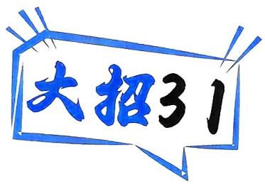

text_image

大招31

# 极值点 & 拐点偏移

natural_image

Cartoon illustration of a man with glasses standing next to a computer monitor, with question marks above his head (no text or symbols present)

# 大招解读

# 1.极值点偏移

极值点左偏移: $x_{1}+x_{2}>2x_{0},x=\frac{x_{1}+x_{2}}{2}$ 处切线与x轴不平行(如图).

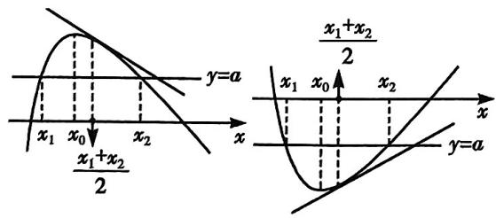

text_image

y=a
x₁ x₀ x₂
x₁+x₂/2
x₁ x₀ x₂
x
y=a

极值点左偏移

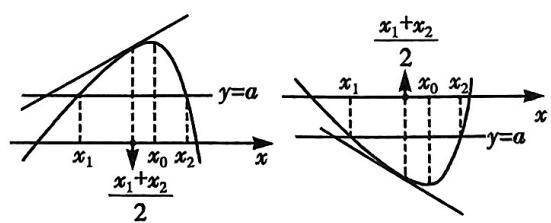

text_image

y=a
x₁ x₀ x₂
x₁+x₂/2
x₁ x₀ x₂
x
y=a

极值点右偏移

极值点右偏移: $x_{1}+x_{2}<2x_{0},x=\frac{x_{1}+x_{2}}{2}$ 处切线与x轴不平行(如图).

见招 已知函数 $y = f(x)$ 的极值点为 $x_0$ ，且函数 $y = f(x)$ 的图象与直线 $y = m$ 交于 $(x_1, y_1), (x_2, y_2)$ 两点，去判断 $x_1 + x_2$ 与 $2x_0$ 的大小关系.

出招 构建函数 $g(x)=f(x)-f(2x_{0}-x)$ ，再分析函数 $g(x)$ 的单调性即可.

思路如下:如果需要判断 $x_{1} + x_{2}$ 与 $2x_{0}$ 的大小关系,则需要判断 $x_{2}$ 与 $2x_{0} - x_{1}$ 的大小关系,也就需要判断 $f(x_{2})$ 与 $f(2x_{0} - x_{1})$ 的大小关系.而 $f(x_{1}) = f(x_{2})$ ,因此就需要判断 $f(x_{1}) - f(2x_{0} - x_{1})$ 与 0 的大小关系,于是就构建函数 $g(x) = f(x) - f(2x_{0} - x)$ ,再分析函数 $g(x)$ 的单调性即可.

同理,要判断 $x_{1}x_{2}$ 与 $x_{0}^{2}$ 的大小关系,需要构建函数 $g(x)=f(x)-f(\frac{x_{0}^{2}}{x})$ ,再分析函数 $g(x)$ 的单调性即可.

# 坑神有话说

若要证明结论 $f^{\prime}\left(\frac{x_{1} + x_{2}}{2}\right) > 0$ （或 $f^{\prime}\left(\frac{x_1 + x_2}{2}\right) < 0$ ），则由结论 $x_{1} + x_{2} > 2x_{0}$ （或 $x_{1} + x_{2} < 2x_{0}$ ）得 $\frac{x_1 + x_2}{2} > x_0$ （或 $\frac{x_1 + x_2}{2} < x_0$ ），再由函数 $f^{\prime}(x)$ 在 $(x_0, +\infty)$ （或在 $(- \infty, x_0)$ ）上的单调性而得 $f^{\prime}\left(\frac{x_1 + x_2}{2}\right)$ 的符号.

上述证明方法称为对称化构造法,这是解决极值点偏移问题的最基本的方法.

# 坑神小课堂

从形式上看极值点偏移问题有时也可以尝试用对数平均不等式来解决.

1. 对数平均不等式: 对于两个正实数 $a, b (a > b)$ , 有 $\sqrt{ab} < \frac{a - b}{\ln a - \ln b} < \frac{a + b}{2}$ .

证明 ①先证明不等式左边一半,如果要证明 $\sqrt{ab} < \frac{a - b}{\ln a - \ln b}$ , 则需证明 $\ln \frac{a}{b} < \frac{a - b}{\sqrt{ab}} = \sqrt{\frac{a}{b}} - \sqrt{\frac{b}{a}}$ , 也就是需要证明 $\sqrt{\frac{a}{b}} - 2\ln \sqrt{\frac{a}{b}} - \frac{1}{\sqrt{\frac{a}{b}}} > 0$ .

构建函数 $f(x) = x - 2\ln x - \frac{1}{x}, x \in [1, +\infty)$ ，所以 $f'(x) = 1 - \frac{2}{x} + \frac{1}{x^2} = (1 - \frac{1}{x})^2$ ，所以当 $x \in (1, +\infty)$ 时， $f'(x) > 0$ ，函数 $f(x)$ 单调递增，所以当 $x \in (1, +\infty)$ 时， $f(x) > f(1) = 0$ . 因为 $a > b > 0$ ，所以 $\sqrt{\frac{a}{b}} > 1$ ，所以 $f(\sqrt{\frac{a}{b}}) = \sqrt{\frac{a}{b}} - 2\ln \sqrt{\frac{a}{b}} - \frac{1}{\sqrt{\frac{a}{b}}} > f(1) = 0$ ，所以 $\sqrt{ab} < \frac{a - b}{\ln a - \ln b}$ .

②再证明不等式右边一半,如果需要证明 $\frac{a - b}{\ln a - \ln b} < \frac{a + b}{2}$ , 则需要证明 $\ln \frac{a}{b} > \frac{2(a - b)}{a + b} = \frac{2(\frac{a}{b} - 1)}{\frac{a}{b} + 1}$ , 也就是需要证明 $\ln \frac{a}{b} - \frac{2(\frac{a}{b} - 1)}{\frac{a}{b} + 1} > 0$ .

构建函数 $g(x) = \ln x - \frac{2(x - 1)}{x + 1}, x \in [1, +\infty)$ ，所以 $g'(x) = \frac{1}{x} - \frac{4}{(x + 1)^2} = \frac{(x - 1)^2}{x(x + 1)^2}$ ，所以当 $x \in (1, +\infty)$ 时， $g'(x) > 0$ ，函数 $g(x)$ 单调递增，所以当 $x \in (1, +\infty)$ 时， $g(x) > g(1) = 0$ 。因为 $a > b > 0$ ，所以 $\frac{a}{b} > 1$ ，所以 $g(\frac{a}{b}) = \ln \frac{a}{b} - \frac{2(\frac{a}{b} - 1)}{\frac{a}{b} + 1} > g(1) = 0$ ，所以 $\frac{a - b}{\ln a - \ln b} < \frac{a + b}{2}$ 。

综上所述， $\sqrt{ab} <  \frac{a - b}{\ln a - \ln b} <  \frac{a + b}{2}.$

2. 应用对数平均不等式时的注意事项：

①对数平均不等式在大题中不能直接使用,使用时需要补充上证明过程. 它更多是给我们提供一个放缩的思路.

②遇见可用对数平均不等式的问题时,需要从齐次化的角度考虑,把式子往齐次式上转化.

# 2. 拐点偏移

若函数 $f(x)$ 在某点 $x = x_0$ 处，二阶导为零，三阶导不为零，则这个点即为拐点。对于三次函数 $f(x)$ ，拐点横坐标 $x_0 = \frac{x_1 + x_2}{2}$ ，此时认为拐点居中，没有偏离中点（如图1）。当拐点左右的“增减速度”不同，函数图象不具有中心对称的性质，有拐点横坐标 $x_0 \neq \frac{x_1 + x_2}{2}$ ，即拐点偏移（如图2）。

注意:极值点偏移关联于函数的轴对称性,拐点偏移关联于函数的中心对称性.

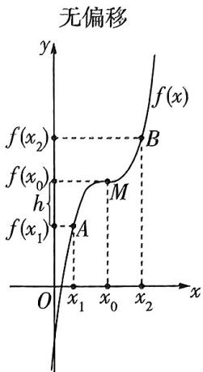

text_image

无偏移
y
f(x)
f(x₂)
f(x₀)
h
M
f(x₁)
A
O
x₁
x₀
x₂
x

图1

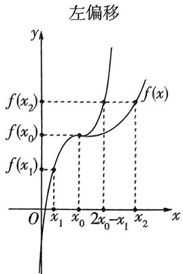

text_image

左偏移
f(x₂)
f(x₀)
f(x₁)
O
x₁
x₀
2x₀−x₁
x₂
y
x

图2

见招 已知 $(x_{1},y_{1}),(x_{2},y_{2})$ 为函数 $y = f(x)$ 的图象

上的两个点，且 $f(x_{1}) + f(x_{2}) = 2f(m)$ ，判断 $x_{1} + x_{2}$ 与 $2m$ 的大小关系.

出招 构建函数 $g(x)=f(x)+f(2m-x)$ ，再分析函数 $g(x)$ 的单调性即可.

思路如下:如果需要判断 $x_{1} + x_{2}$ 与 2m 的大小关系,则需要判断 $x_{2}$ 与 $2m - x_{1}$ 的大小关系,也就需要判断 $f(x_{2})$ 与 $f(2m - x_{1})$ 的大小关系.而 $f(x_{1}) + f(x_{2}) = 2f(m)$ ,因此就需要判断 $2f(m) - f(x_{1})$ 与 $f(x_{2}) = 2f(m) - f(x_{1})$ $f(2m - x_1)$ 的大小关系，也就需要判断 $f(x_{1}) + f(2m - x_{1})$ 与 $2f(m)$ 的大小关系，于是就构建函数 $g(x) = f(x) + f(2m - x)$ 进行分析.

# 大招应用

大招示例 1 (2022 全国甲卷) 已知函数 $f(x) = \frac{\mathrm{e}^x}{x} - \ln x + x - a$ .

(1) 若 $f(x) \geqslant 0$ , 求 $a$ 的取值范围;  
(2) 证明: 若 $f(x)$ 有两个零点 $x_{1}, x_{2}$ , 则 $x_{1} x_{2} < 1$ .

大招识别 由“ $x_{1}x_{2}<1$ ”识别出本题是极值点偏移问题,可通过构造函数 $g(x)=f(x)-f(\frac{x_{0}^{2}}{x})$ ,利用其单调性求解.

解析 (1) 由题意知函数 $f(x)$ 的定义域为 $(0, +\infty)$ . 由 $f'(x) = \frac{\mathrm{e}^x(x - 1)}{x^2} - \frac{1}{x} + 1 = \frac{\mathrm{e}^x(x - 1) - x + x^2}{x^2} = \frac{(\mathrm{e}^x + x)(x - 1)}{x^2}$ ,

可得函数 $f(x)$ 在(0,1)上单调递减，在 $(1,+\infty)$ 上单调递增.所以 $f(x)_{\min}=f(1)=e+1-a$ .

又 $f(x) \geqslant 0$ ，则 $f(x)_{\min} \geqslant 0$ ，所以 $e + 1 - a \geqslant 0$ ，解得 $a \leqslant e + 1$ ，所以 $a$ 的取值范围为 $(-\infty, e + 1]$ .

(2)不妨设 $0 < x_{1} < x_{2}$ , 则由(1)知 $0 < x_{1} < 1 < x_{2}, \frac{1}{x_{1}} > 1$ . 令 $F(x) = f(x) - f(\frac{1}{x})$ , 则 $F''(x) = \frac{(e^{x} + x)(x - 1)}{x^{2}} +$

$$
\frac {\left(\mathrm{e} ^ {\frac {1}{x}} + \frac {1}{x}\right) \left(\frac {1}{x} - 1\right)}{\frac {1}{x ^ {2}}} \times \frac {1}{x ^ {2}} = \frac {x - 1}{x ^ {2}} \cdot \left(\mathrm{e} ^ {x} + x - x \mathrm{e} ^ {\frac {1}{x}} - 1\right).
$$

令 $g(x) = \mathrm{e}^{x} + x - x\mathrm{e}^{\frac{1}{x}} - 1$ ，则 $g'(x) = \mathrm{e}^{x} + 1 - \mathrm{e}^{\frac{1}{x}} + x\mathrm{e}^{\frac{1}{x}} \times \frac{1}{x^2} = \mathrm{e}^{x} + 1 + \mathrm{e}^{\frac{1}{x}}\left(\frac{1}{x} - 1\right)$ ，所以当 $x \in (0,1)$ 时， $g'(x) > 0$ ，注意限定 $x$ 的范围为 $x_1$ 或 $x_2$ 的范围，此处限定为 $x_1$ 的范围。所以当 $x \in (0,1)$ 时， $g(x)$ 单调递增， $g(x) < g(1) = 0$ ，又因为当 $x \in (0,1)$ 时， $\frac{x - 1}{x^2} < 0$ ，所以当 $x \in (0,1)$ 时， $F'(x) > 0$ ，

所以 $F(x)$ 在 $(0,1)$ 上单调递增，所以当 $x\in (0,1)$ 时， $F(x) < F(1)$ ，即在 $(0,1)$ 上， $f(x) - f(\frac{1}{x}) < F(1) = 0$ ，则 $f(x_{1}) - f(\frac{1}{x_{1}}) < 0$ 。又 $f(x_{1}) = f(x_{2}) = 0$ ，所以 $f(x_{2}) - f(\frac{1}{x_{1}}) < 0$ ，即 $f(x_{2}) < f(\frac{1}{x_{1}})$ ，由（1）可知，函数 $f(x)$ 在 $(1, +\infty)$ 上单调递增，所以 $x_{2} < \frac{1}{x_{1}}$ ，即 $x_{1}x_{2} < 1$ 。

另解1先用同构,再使用极值点偏移、不妨设 $0<x_{1}<x_{2}$ ，则由(1)知 $0<x_{1}<1<x_{2},0<\frac{1}{x_{2}}<1$ .

由 $f(x_{1}) = f(x_{2}) = 0$ ，得 $\frac{\mathrm{e}^{x_1}}{x_1} -\ln x_1 + x_1 = \frac{\mathrm{e}^{x_2}}{x_2} -\ln x_2 + x_2,$

即 $\underbrace{\mathrm{e}^{x_1 - \ln x_1} + x_1 - \ln x_1 = \mathrm{e}^{x_2 - \ln x_2} + x_2 - \ln x_2}_{\text{化同构}}$ ，构造函数

$t(x) = \mathrm{e}^{x} + x$ ，则 $t(x_{1} - \ln x_{1}) = t(x_{2} - \ln x_{2})$

因为函数 $t(x) = \mathrm{e}^{x} + x$ 在 $\mathbf{R}$ 上单调递增，所以 $x_{1} - \ln x_{1} = x_{2} - \ln x_{2}$

构造函数 $h(x) = x - \ln x$ ，令 $g(x) = h(x) - h\left(\frac{1}{x}\right) = x - \frac{1}{x} - 2\ln x$ ，则 $g'(x) = 1 + \frac{1}{x^2} - \frac{2}{x} = \frac{(x - 1)^2}{x^2} \geqslant 0$ ，

所以函数 $g(x)$ 在 $(0, +\infty)$ 上单调递增，

所以当 $x > 1$ 时， $g(x) > g(1) = 0$ ，即当 $x > 1$ 时， $h(x) > h(\frac{1}{x})$ ，所以 $h(x_1) = h(x_2) > h(\frac{1}{x_2})$ ，

又 $h'(x) = 1 - \frac{1}{x} = \frac{x - 1}{x}$ , 当 $x \in (0,1)$ 时, $h'(x) < 0$ , 所以 $h(x)$ 在 $(0,1)$ 上单调递减, 所以 $0 < x_1 < \frac{1}{x_2} < 1$ , 即 $x_1 x_2 < 1$ .

另解2先同构再用对数平均不等式. 同另解1, 可得到 $x_{1} - \ln x_{1} = x_{2} - \ln x_{2}$ , 即得 $\frac{\ln x_{1} - \ln x_{2}}{x_{1} - x_{2}} = 1$ ,

要证 $x_{1}x_{2} < 1$ ，只需证 $\sqrt{x_1x_2} < 1$ ，只需证 $\sqrt{x_1x_2} < \frac{\ln x_1 - \ln x_2}{x_1 - x_2},$

由对数平均不等式可知,上式成立.(在考试时,不能直接运用该结论,要附上证明过程)

大招示例 ② （天津高考题节选）已知函数 $f(x) = x\mathrm{e}^{-x}, x \in \mathbb{R}$ ，如果 $x_{1} \neq x_{2}$ ，且 $f(x_{1}) = f(x_{2})$ . 证明 $x_{1} + x_{2} > 2$ .

解析极值点偏移.由题意知 $f^{\prime}(x) = (1 - x)\mathrm{e}^{-x}$ ，令 $f^{\prime}(x) = 0$ ，解得 $x = 1$

当 $x \in (-\infty, 1)$ 时， $f'(x) > 0$ ，当 $x \in (1, +\infty)$ 时， $f'(x) < 0$ ，所以 $f(x)$ 在 $(- \infty, 1)$ 上单调递增，在 $(1, +\infty)$ 上单调递减，所以 $f(x)$ 在 $x = 1$ 处取得极大值.

又 $f(x_{1})=f(x_{2})$ ，所以 $x_{1},x_{2}$ 一个大于1，一个小于1，不妨设 $x_{1}<1,x_{2}>1$ ，要证 $x_{1}+x_{2}>2$ ，即证 $2-x_{1}<x_{2}$ ，又 $2-x_{1}>1,x_{2}>1,f(x)$ 在 $(1,+\infty)$ 上单调递减，所以即证 $f(x_{2})<f(2-x_{1})$ ，又 $f(x_{1})=f(x_{2})$ ，所以需要证明 $f(x_{1})-f(2-x_{1})<0$ 。

令 $h(x) = f(x) - f(2 - x) = xe^{-x} - (2 - x)e^{x - 2}$ , 则 $h'(x) = (x - 1) \cdot (e^{2x - 2} - 1)e^{-x}$ .

当 $x < 1$ 时， $x - 1 < 0, 2x - 2 < 0$ ，从而 $\mathrm{e}^{2x - 2} - 1 < 0$ ，又 $\mathrm{e}^{-x} > 0$ ，所以 $h'(x) > 0$ ，从而函数 $h(x)$ 在 $(- \infty, 1)$ 上单调递增，所以 $h(x) < h(1) = 0$ ，即 $f(x_1) - f(2 - x_1) < 0$ 。所以 $x_1 + x_2 > 2$ 。

另解1对数平均不等式. 因为 $f(x_{1})=f(x_{2})$ ，所以 $x_{1}e^{-x_{1}}=x_{2}e^{-x_{2}}$ ，两边取对数，得 $\ln x_{1}-x_{1}=\ln x_{2}-x_{2}$ ，所以 $\frac{x_{2}-x_{1}}{\ln x_{2}-\ln x_{1}}=1$ ，所以要证 $x_{1}+x_{2}>2$ ，即证 $\frac{x_{1}+x_{2}}{2}>\frac{x_{2}-x_{1}}{\ln x_{2}-\ln x_{1}}$ . 由对数平均不等式可知上式成立。（在考试时，大题不能直接运用该结论，要附上证明过程）

# 坑神有话说

# 泰勒公式秒杀极值点偏移

极值点偏移的一种背景是:已知 $f(x_{1})=f(x_{2}),x_{1}\neq x_{2}$ ，求证 $x_{1}+x_{2}>2x_{0}$ （或 $<2x_{0}$ ）.

下面介绍泰勒公式法.

一、原理.

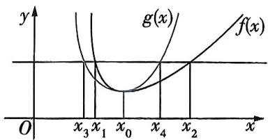

text_image

y
g(x)
f(x)
O
x₃ x₁ x₀ x₄ x₂ x

以上图为例. 图中黑色曲线为 $y = f(x)$ 的图象. 如果 $f(x_{1}) = f(x_{2})$ , 要证 $x_{1} + x_{2} > 2x_{0}$ , 可以这样考虑: 假如极值点不偏移, 必有 $x_{1} + x_{2} = 2x_{0}$ , 那么, 要证 $x_{1} + x_{2} > 2x_{0}$ , 能否找到一个函数, 使这个函数的极值点与原函数 $y = f(x)$ 的极值点相同, 并且它的极值点不偏移, 而且该函数的图象还在函数 $y = f(x)$ 图象的左侧? 如果能找到, 那么它的图象应该与图中蓝色曲线走势相同, 设它为 $y = g(x)$ .

设 $g(x_{3}) = g(x_{4}) = f(x_{1}) = f(x_{2})$ ，由图可知， $x_{1} > x_{3},x_{2} > x_{4}$ ，那么 $x_{1} + x_{2} > x_{3} + x_{4}$ ，而 $x_{3} + x_{4} = 2x_{0}$ 则 $x_{1} + x_{2} > 2x_{0}$ ，就证毕了.

因此,若能找到图中蓝色曲线对应的函数,极值点偏移问题就迎刃而解.巧的是泰勒公式完美地找到了这个函数.

泰勒公式: $f(x)=f(x_{0})+\frac{f'(x_{0})}{1!}(x-x_{0})+\frac{f''(x_{0})}{2!}(x-x_{0})^{2}+\frac{f'''(x_{0})}{3!}(x-x_{0})^{3}+\cdots+\frac{f^{(n)}(x_{0})}{n!}(x-x_{0})^{n}+R_{n}(x)$ .

注意到,泰勒公式前三项: $f(x_0) + f'(x_0)(x - x_0) + \frac{f''(x_0)}{2}(x - x_0)^2$ 是一个二次函数,而此处 $x_0$ 若取原函数 $f(x)$ 的极值点 $x_0$ ,那么, $f'(x_0) = 0$ ,上述公式变为: $f(x_0) + \frac{f''(x_0)}{2}(x - x_0)^2$ .而这正是一个对称轴为直线 $x = x_0$ 的二次函数,再加上泰勒公式本身是用多项式函数来逼近原函数的,所以这个二次函数应该不会偏移 $y = f(x)$ 太远,故它就是我们要找的函数.

# 二、一般步骤.

(1) 对 $f(x)$ 求导, 研究其极值情况. 这时, 一定会有 $f'(x_{0}) = 0$ , 并得到 $f(x)$ 在 $x_{0}$ 左右的单调性情况.  
(2) 构建函数 $F(x) = f(x_0) + \frac{f''(x_0)}{2} (x - x_0)^2$ . (这里构建函数, 体现在解题步骤中时, 直接写结果, 千万不要把“泰勒公式”这种字眼写到步骤里)  
(3) 构建函数 $G(x) = f(x) - F(x)$ ，求导研究其单调性，这里，一般都会有 $G(x_0) = 0, G(x)$ 单调，并且可以有下面的草图：

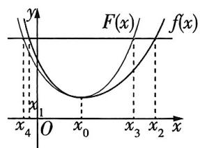

line

| x    | F(x)  | f(x)  |
| ---- | ----- | ----- |
| x₀   | 0     | 0     |
| x₁   | -1    | -1    |
| x₂   | 1     | 1     |
| x₃   | 2     | 2     |
| x₄   | 3     | 3     |

$$
x _ {1} + x _ {2} > x _ {3} + x _ {4} = 2 x _ {0}
$$

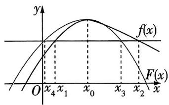

text_image

y
f(x)
O x₄ x₁ x₀ x₃ x₂ x
F(x)

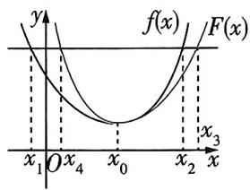

text_image

y
f(x)
F(x)
x₁ O x₄ x₀ x₂ x₃
x

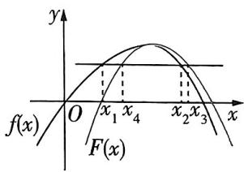

text_image

y
f(x)
O
x₁ x₄
x₂ x₃
x
F(x)

$$
x _ {1} + x _ {2} <   x _ {3} + x _ {4} = 2 x _ {0}
$$

当然,以上草图亦无须体现在解题过程中,只用根据每个单调区间内 $f(x)$ 与 $F(x)$ 的大小关系,分别给出 $x_{1}$ 与 $x_{4}$ 、 $x_{2}$ 与 $x_{3}$ 的大小关系即可.

注意:以上泰勒公式解题法只限于证明“ $x_{1}+x_{2}>2x_{0}(<2x_{0})$ ”的问题,而“ $x_{1}x_{2}>x_{0}^{2}(<x_{0}^{2})$ ”这种类型,还是用常规方法证明.

下面我们尝试用泰勒公式法来解上述例题.

另解2泰勒公式法. 第一步: 先求导, 研究 $f(x)$ 单调性及极值情况.

对于 $f(x)=\frac{x}{\mathrm{e}^{x}}$ ，有 $f'(x)=\frac{1-x}{\mathrm{e}^{x}}$ ，令 $f'(x)=0$ ，得x=1。

当 $x < 1$ 时， $f'(x) > 0$ ，当 $x > 1$ 时， $f'(x) < 0$ .

所以 $f(x)$ 在 $(-\infty, 1)$ 上单调递增，在 $(1, +\infty)$ 上单调递减.

(这里顺带着定一下 $x_{1}$ 与 $x_{2}$ 的范围)又 $x_{1}\neq x_{2}$ ，不妨设 $x_{1}<x_{2}$ ，易知 $x_{1}\in(-\infty,1)$ ， $x_{2}\in(1,+\infty)$ .

第二步：由 $f''(x) = \frac{x - 2}{\mathrm{e}^x}$ ，知 $f''(x_0) = f''(1) = -\frac{1}{\mathrm{e}}$ ，代入泰勒公式，有 $F(x) = f'(x_0) + \frac{f''(x_0)}{2}(x - x_0)^2 = \frac{1}{\mathrm{e}} - \frac{1}{2\mathrm{e}} (x - 1)^2.$

构建函数 $F(x) = \frac{1}{e} -\frac{1}{2e} (x - 1)^2$ ，又令 $G(x) = f(x) - F(x)$

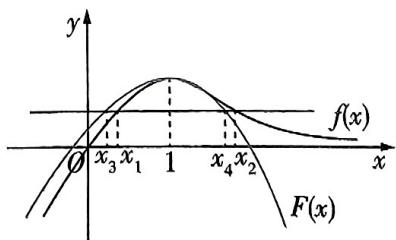

text_image

y
f(x)
O
x₃ x₁ 1 x₄ x₂
x
F(x)

第三步:研究 $G(x)$ 的单调性,并作草图.

$$
G ^ {\prime} (x) = \frac {1 - x}{\mathrm{e} ^ {x}} + \frac {1}{\mathrm{e}} (x - 1) = \frac {(x - 1) (\mathrm{e} ^ {x - 1} - 1)}{\mathrm{e} ^ {x}},
$$

当 $x < 1$ 时， $x - 1 < 0, \mathrm{e}^{x - 1} - 1 < 0, G'(x) = \frac{(x - 1)(\mathrm{e}^{x - 1} - 1)}{\mathrm{e}^x} > 0;$

当 $x \geqslant 1$ 时， $x - 1 \geqslant 0, \mathrm{e}^{x - 1} - 1 \geqslant 0, G'(x) = \frac{(x - 1)(\mathrm{e}^{x - 1} - 1)}{\mathrm{e}^x} \geqslant 0.$

故 $G^{\prime}(x)\geqslant 0$ 恒成立， $G(x)$ 在 $\mathbb{R}$ 上单调递增.

注意到 $G(1) \cong f(1) \to F(1) \cong \frac{1}{\mathrm{e}} - \frac{1}{\mathrm{e}} = 0$

故当 $x < 1$ 时， $G(x) = f(x) - F(x) < 0, f(x) < F(x)$ ①.

当 $x > 1$ 时， $G(x) = f(x) - F(x) > 0, f(x) > F(x)$ ②.

(由①②, 可作图. 根据图知, 易有: $x_{1} > x_{3}, x_{2} > x_{4}, x_{3} + x_{4} = 2$ , 所以 $x_{1} + x_{2} > 2$ , 在解题中, 具体步骤可参考下面)

不妨令 $f(x_{1})=f(x_{2})=F(x_{3})=F(x_{4})$ ，其中 $x_{3}<1<x_{4}$ 。当x<1时， $F(x_{3})=f(x_{1})<F(x_{1})$ （此处利用了①），而 $F(x)$ 在 $(-∞,1)$ 上单调递增，故 $x_{3}<x_{1}$ ；

实际就是下个大招中的零点放缩.

当 $x > 1$ 时， $F(x_4) = f(x_3) > F(x_2)$ （此处利用了②），而 $F(x)$ 在 $(1, +\infty)$ 上单调递减，故 $x_4 < x_2$ .

而 $F(x)$ 关于直线 x=1 轴对称, 故 $x_{3}+x_{4}=2$ .

故 $x_{1} + x_{2} > x_{3} + x_{4} = 2.$ 证毕.

# 大招示例 3 已知函数 $f(x) = x + a\ln x (a \in \mathbb{R})$ .

(1) 讨论函数 $f(x)$ 的单调性;

(2) 已知 $a > 0$ , 两个不相等的正数 $x_{1}, x_{2}$ 满足 $f(x_{1}) + f(x_{2}) = 2(a + e)$ , 试判断 $x_{1} + x_{2}$ 与 $2e$ 的大小关系, 并说明理由.

大招识别

本题是拐点偏移问题,可通过构造函数

$g(x)=f(x)+f(2m-x)$ ，根据其单调性求解.

解析> (1) 因为 $f(x) = x + a \ln x, x \in (0, +\infty)$ ，所以 $f'(x) = 1 + \frac{a}{x}$ ，若 $a \geqslant 0$ ，则 $f'(x) > 0$ ，函数 $f(x)$ 在 $(0, +\infty)$ 上单调递增。若 $a < 0$ ，则当 $x \in (0, -a)$ 时， $f'(x) < 0$ ，函数 $f(x)$ 单调递减，当 $x \in (-a, +\infty)$ 时， $f'(x) > 0$ ，函数 $f(x)$ 单调递增。

(2)依题意设 $x_{1} < x_{2}$ , 因为 $f(x_{1}) + f(x_{2}) = 2(a + e)$ , 且 $f(e) = a + e$ , 所以 $f(x_{1}) + f(x_{2}) = 2f(e)$ . 因为 $a > 0$ , 所以函数 $f(x)$ 在 $(0, +\infty)$ 上单调递增, 所以 $x_{1} < e < x_{2}$ . 构建函数 $g(x) = f(x) + f(2e - x), x \in (0, e]$ , 所以拐点偏移

$g'(x)=f'(x)-f'(2e-x)=\frac{2a(e-x)}{x(2e-x)}\geqslant0$ ，所以函数 $g(x)$ 当且仅当x=e时取等号

在 $(0, \mathrm{e}]$ 上单调递增，所以 $g(x_{1}) < g(\mathrm{e})$ ，所以 $f(x_{1}) + f(2\mathrm{e} - x_{1}) < 2f(\mathrm{e}) = f(x_{1}) + f(x_{2})$ ，所以 $f(2\mathrm{e} - x_{1}) < f(x_{2})$ ，所以 $2\mathrm{e} - x_{1} < x_{2}$ ，所以 $x_{1} + x_{2} > 2\mathrm{e}$

练大招，见《解题觉醒》主书 P043

text_image

大招32

# 零点的放缩

# 大招解读

在已知 $x_{a}, x_{b}$ 为函数 $f(x)$ 的零点, 证明关于零点 $x_{a}$ 的不等式, 或者关于零点差 $\left|x_{b} - x_{a}\right|$ 的不等式时, 前面介绍的很多方法处理起来都力不从心了, 此时需要对零点本身进行放缩, 从而解决问题.

# 1.零点的放缩

已知定义在 I 上的函数 $f(x)$ , $g(x)$ 的零点分别为 $x_{1}$ , $x_{2}$ .

①若函数 $g(x)$ 单调递增,且 $f(x) > g(x)$ 恒成立,则有 $x_{1} < x_{2}$ . 证明如下,

由于 $0 = g(x_{2}) = f(x_{1}) > g(x_{1})$ ，因此就有 $x_{1} < x_{2}$ .下面的结论也一个道理

②若函数 $g(x)$ 单调递增，且 $f(x) < g(x)$ 恒成立，则有 $x_{1} > x_{2}$ .

③若函数 $g(x)$ 单调递减，且 $f(x) > g(x)$ 恒成立，则有 $x_{1} > x_{2}$

④若函数 $g(x)$ 单调递减，且 $f(x) < g(x)$ 恒成立，则有 $x_{1} < x_{2}$ .

# 2.零点放缩的逻辑

将不可解零点 $x_{1}$ 放缩成可以求解的零点 $x_{2}$ , 从而证明一些关于零点 $x_{1}$ 的不等式.

# 大招应用

大招示例 已知函数 $f(x) = \mathrm{e}^{x} - x^{2} - (a + 1) \cdot x + 1$ ，其中自然常数 $\mathrm{e} \approx 2.71828$ .

(1) 若 $x = 0$ 是函数 $f(x)$ 的极值点, 求实数 $a$

的值；

(2) 当 $a > 0$ 时, 设函数 $f(x)$ 的两个极值点为 $x_{1}$ , $x_{2}$ 且 $x_{1} < x_{2}$ , 求证: $\mathrm{e}^{x_2} - \mathrm{e}^{x_1} < 4a + 4$ .

解析 (1) 因为 $f(x) = \mathrm{e}^{x} - x^{2} - (a + 1)x + 1$ ，所以 $f'(x) = \mathrm{e}^{x} - 2x - (a + 1)$ ，因为 $x = 0$ 是函数 $f(x)$ 的极值点，所以 $f'(0) = -a = 0$ ，解得 $a = 0$ ，所以 $f'(x) = \mathrm{e}^x - 2x - 1$ ，所以令 $u(x) = f'(x)$ ，则 $u'(x) = \mathrm{e}^x - 2$ ，当 $u'(x) = \mathrm{e}^x - 2 = 0$ 时， $x = \ln 2$ ，所以当 $x \in (-\infty, \ln 2)$ 时， $u'(x) < 0$ ，函数 $f'(x)$ 单调递减。又 $f'(0) = 0$ ，所以当 $x \in (-\infty, 0)$ 时， $f'(x) > 0$ ，函数 $f(x)$ 单调递增，当 $x \in (0, \ln 2)$ 时， $f'(x) < 0$ ，函数 $f(x)$ 单调递减，所以 $x = 0$ 确实是函数 $f(x)$ 的极大值点。

一定不要忘了检验

综上所述,实数 a 的值为 0.

(2) 先通过 $t_1 = \mathrm{e}^{x_1}, t_2 = \mathrm{e}^{x_2}$ 换元, 得到函数 $g(x) = x - 2\ln x$ 的图象与直线 $y = a + 1$ 交于 $(t_1, a + 1), (t_2, a + 1)$ 两点. 再求出点 $(4a + 4, a + 1)$ 的轨迹方程 $h(x) = \frac{x}{4}$ , 从而通过证明 $g(x) > h(x)$ , 得到 $t_2 - t_1 < t_2 < 4a + 4$ , 进而解决问题. 下面进入完整解题步骤:

因为 $a > 0$ ，函数 $f(x)$ 的两个极值点为 $x_{1}, x_{2}$ 且 $x_{1} < x_{2}$ ，所以 $\left\{ \begin{array}{l} \mathrm{e}^{x_1} - 2x_1 - (a + 1) = 0, \\ \mathrm{e}^{x_2} - 2x_2 - (a + 1) = 0, \end{array} \right.$ 设 $t_1 = \mathrm{e}^{x_1}, t_2 = \mathrm{e}^{x_2}$ ，则 $t_1 - 2\ln t_1 = t_2 - 2\ln t_2 = a + 1$ .

构建函数 $g(x) = x - 2\ln x, x \in (0, +\infty)$ ，则函数 $g(x)$ 的图象与直线 $y = a + 1$ 交于 $(t_1, a + 1), (t_2, a + 1)$ 两点。因为 $g'(x) = \frac{x - 2}{x}$ ，所以当 $x \in (0, 2)$ 时， $g'(x) < 0$ ，函数 $g(x)$ 单调递减，当 $x \in (2, +\infty)$ 时， $g'(x) > 0$ ，函数 $g(x)$ 单调递增，所以 $0 < t_1 < 2 < t_2$ ，所以 $t_2 - t_1 < t_2$ 。

构建函数 $h(x)=\frac{x}{4}$ ，所以函数 $h(x)=\frac{x}{4}$ 的图象与直线点 $(4a+4,a+1)$ 的轨迹方程，点 $(4a+4,a+1)$ 是由所证不等式右边的值和直线 $y=a+1$ 想到的

$y = a + 1$ 交于点 $(4a + 4, a + 1)$ , 如图. 构建函数 $i(x) = g(x) - h(x) = \frac{3x}{4} - 2\ln x$ , 所以 $i'(x) = \frac{3}{4} - \frac{2}{x}$ , 所以当 $x \in (0, \frac{8}{3})$ 时, $i'(x) < 0$ , 函数 $i(x)$ 单调递减, 当 $x \in (\frac{8}{3}, +\infty)$ 时, $i'(x) > 0$ , 函数 $i(x)$ 单调递增, 所以当 $x = \frac{8}{3}$ 时, 函数 $i(x)$ 取得最小值, $i(\frac{8}{3}) = 2 - 2\ln \frac{8}{3}$ , 所以 $i(x) \geqslant 2 - 2\ln \frac{8}{3} > 2 - 2\ln e = 0$ , 所以 $g(x) > h(x)$ , 所以 $a + 1 = h(4a + 4) = g(t_2) > h(t_2)$ , 所以 $t_2 < 4a + 4$ , 所以零点放缩

$$
\mathrm{e} ^ {x _ {2}} - \mathrm{e} ^ {x _ {1}} = t _ {2} - t _ {1} <   t _ {2} <   4 a + 4.
$$

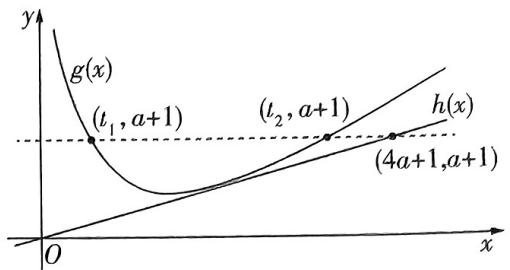

text_image

y
g(x)
(t₁, a+1)
(t₂, a+1)
h(x)
(4a+1, a+1)
O
x

另解 $f^{\prime}(x) = \mathrm{e}^{x} - 2x - (a + 1)$

因为函数 $f(x)$ 的两个极值点为 $x_{1}, x_{2}$ 且 $x_{1} < x_{2}$ ,

所以 $\left\{ \begin{array}{l} \mathrm{e}^{x_1} - 2x_1 - (a + 1) = 0, \\ \mathrm{e}^{x_2} - 2x_2 - (a + 1) = 0, \end{array} \right.$

两式相减得 $\mathrm{e}^{x_2} - \mathrm{e}^{x_1} = 2(x_2 - x_1)$

要证 $\mathrm{e}^{x_2} - \mathrm{e}^{x_1} < 4a + 2$ ，即证 $x_{2} - x_{1} < 2a + 1$

即证 $x_{2} < x_{1} + 2a + 1$

令 $g(x) = \mathrm{e}^{x} - 2x - (a + 1)$ ，则 $g'(x) = \mathrm{e}^x - 2$ ，当 $g'(x) = 0$ 时， $x = \ln 2$

当 $x < \ln 2$ 时， $g'(x) < 0$ ，当 $x > \ln 2$ 时， $g'(x) > 0$

所以函数 $g(x)$ 在 $(- \infty, \ln 2)$ 上递减，在 $(\ln 2, +\infty)$ 上递增，所以 $x_{1} < \ln 2 < x_{2}$ .

$x_{1}, x_{2}$ 是 $f(x)$ 的极值点，所以是 $g(x)$ 的两个零点

则要证 $x_{2} < x_{1} + 2a + 1$ ，只要证 $g(x_{2}) < g(x_{1} + 2a + 1)$ 即可，即证 $g(x_{1} + 2a + 1) > 0$

$$
g \left(x _ {2}\right) = 0, \text {所以只需证} g \left(x _ {1} + 2 a + 1\right) > 0
$$

即 $\mathrm{e}^{x_1 + 2a + 1} - 2(x_1 + 2a + 1) - (a + 1) = \mathrm{e}^{2a + 1}\cdot \mathrm{e}^{x_1} - 5a-$ $2x_{1} - 3 > 0.$

由 $\mathrm{e}^{x_1} - 2x_1 - (a + 1) = 0, \mathrm{e}^{x_1} = 2x_1 + a + 1 > 0$ ，得 $\mathrm{e}^{2a + 1} \cdot \mathrm{e}^{x_1} - 5a - 2x_1 - 3 = (2x_1 + a + 1)\mathrm{e}^{2a + 1} - 5a - 2x_1 - 3.$

隐极值点代换

令 $F(a) = (2x_{1} + a + 1)\mathrm{e}^{2a + 1} - 5a - 2x_{1} - 3(a > 1)$

则 $F'(a) = \mathrm{e}^{2a + 1} + 2(2x_1 + a + 1)\mathrm{e}^{2a + 1} - 5,$ 从a为主元

因为 $a > 1$ ，所以 $\mathrm{e}^{2a + 1} - 5 > 0$

所以 $F^{\prime}(a) = \mathrm{e}^{2a + 1} + 2(2x_{1} + a + 1)\mathrm{e}^{2a + 1} - 5 > 0$ 在 $a\in (1, + \infty)$ 上恒成立，所以函数 $F(a)$ 在 $a\in (1, + \infty)$ 上递增，所以 $F(a) > F(1) = (2x_{1} + 2)\mathrm{e}^{3} - 2x_{1} - 8 = (2\mathrm{e}^{3} - 2)x_{1}+$ $2\mathrm{e}^3 -8$ ，当 $a = 1$ 时， $g(x) = \mathrm{e}^x -2x - 2.$

只需证明 $(2\mathrm{e}^3 - 2)x_1 + 2\mathrm{e}^3 - 8 \geqslant 0$ 即可，即证明 $x_1 \geqslant \frac{4 - \mathrm{e}^3}{\mathrm{e}^3 - 1} = -1 + \frac{3}{\mathrm{e}^3 - 1}, -1 < -1 + \frac{3}{\mathrm{e}^3 - 1} < 0 < \ln 2$ ，要证明 $x_1 \geqslant \frac{4 - \mathrm{e}^3}{\mathrm{e}^3 - 1}$ ，只需要证明 $g(x_1) \leqslant g(\frac{4 - \mathrm{e}^3}{\mathrm{e}^3 - 1})$ 即可，

即证明 $g\left(\frac{4 - \mathrm{e}^3}{\mathrm{e}^3 - 1}\right) = \mathrm{e}^{\frac{4 - \mathrm{e}^3}{\mathrm{e}^3 - 1}} - 2 \cdot \frac{4 - \mathrm{e}^3}{\mathrm{e}^3 - 1} - 2 = \mathrm{e}^{-1 + \frac{3}{\mathrm{e}^3 - 1}} - \frac{6}{\mathrm{e}^3 - 1} \geqslant 0$ ，即证明 $\mathrm{e}^{-1 + \frac{3}{\mathrm{e}^3 - 1}} \geqslant \frac{6}{\mathrm{e}^3 - 1}$ ，

因为 $-1 < -1 + \frac{3}{\mathrm{e}^3 - 1} < 0$ ，所以 $\frac{1}{\mathrm{e}} < \mathrm{e}^{-1 + \frac{3}{\mathrm{e}^3 - 1}} < 1$ ，又 $\frac{6}{\mathrm{e}^3 - 1} < \frac{6}{2.7^3 - 1} < \frac{1}{3}$ ，所以 $\mathrm{e}^{-1 + \frac{3}{\mathrm{e}^3 - 1}} \geqslant \frac{6}{\mathrm{e}^3 - 1}$ ，

则不等式得证，即 $\mathrm{e}^{x_2} - \mathrm{e}^{x_1} < 4a + 2.$

练大招，见《解题觉醒》主书 P045

# 大招解读

在三角恒等变换解题时可以灵活运用三角恒等变换公式,但有些题目无法直接套用公式,这些题目中角与角之间往往存在特殊关系,可转化后再用公式,因此寻找角与角之间的关系也非常重要,因为这决定了我们用哪一个公式,以及怎么用这个公式.接下来我们对怎么寻找角与角之间的关系展开探讨.

# 1. 计算与化简题中的角的关系

对于计算与化简题,我们先要寻找式子中是不是有两个角满足其和或差为特殊角 $\frac{\pi}{6},\frac{\pi}{4},\frac{\pi}{3},\frac{\pi}{2},$ $\frac{2\pi}{3},\frac{3\pi}{4},\frac{5\pi}{6},\pi,\frac{3\pi}{2},2\pi,\cdots,$ 或者存在2倍的关系,然后利用这些关系,并结合诱导公式、和差角公式、
倍角公式以及辅助角公式进行化简,从而解决问题.

# 2. “已知若干角或若干角的三角函数值，求目标角或目标角的三角函数值”问题中的角的关系

处理“已知若干角或若干角的三角函数值,求目标角或目标角的三角函数值”之类的问题时,一定要牢记目标角 $\theta$ 是若干个已知角 $\theta_{1},\theta_{2},\cdots$ 的线性组合,即 $\theta = k_{1}\theta_{1} + k_{2}\theta_{2} + \cdots$ ,其中常数 $k_{i}$ 一般只在集合 $\{-2,-1,1,2\}$ 中取值,这样我们就可以运用诱导公式、和差角公式以及倍角公式进行目标角的值或目标角的三角函数值的求解.

# 坑神有话说

在实际问题中寻找角的关系时,观察题目直接得出角的关系即可.

特殊角 $\frac{\pi}{6},\frac{\pi}{4},\frac{\pi}{3},\frac{\pi}{2},\frac{2\pi}{3},\frac{3\pi}{4},\frac{5\pi}{6},\pi,\frac{3\pi}{2},2\pi,\cdots$ 也是已知角,只不过特殊角是隐形的,需要我们挖掘出来,使其现形.

# 大招应用

大招示例 1 (1) $\cos \frac{\pi}{7} + \cos \frac{2\pi}{7} + \cos \frac{3\pi}{7} +$

$$
\cos \frac {4 \pi}{7} + \cos \frac {5 \pi}{7} + \cos \frac {6 \pi}{7} = \underline {{\quad}};
$$

(2) $\cos \frac{\pi}{11} \cos \frac{2\pi}{11} \cos \frac{3\pi}{11} \cos \frac{4\pi}{11} \cos \frac{5\pi}{11} =$ \_\_\_\_.

解析 (1) 观察发现, 原式中 $\frac{\pi}{7}$ 与 $\frac{6\pi}{7}$ 之和为 $\pi$ , 因此根据诱导公式就有 $\cos \frac{6\pi}{7} = \cos (\pi - \frac{\pi}{7}) = -\cos \frac{\pi}{7}$ , 于是 $\cos \frac{\pi}{7} + \cos \frac{6\pi}{7} = 0$ . 同理可得 $\cos \frac{2\pi}{7} + \cos \frac{5\pi}{7} = 0$ 与 $\cos \frac{3\pi}{7} + \cos \frac{4\pi}{7} = 0$ , 所以 $\cos \frac{\pi}{7} + \cos \frac{2\pi}{7} + \cos \frac{3\pi}{7} + \cos \frac{4\pi}{7} + \cos \frac{5\pi}{7} + \cos \frac{6\pi}{7} = 0$ .

(2) 看到多个余弦值连续相乘的形式, 考虑正弦的二倍角公式, 通过观察发现, 原式中 $\frac{\pi}{11}$ 与 $\frac{2\pi}{11}$ 是 2 倍的关系, 所以我们要补个 $\sin \frac{\pi}{11}$ , 凑出正弦的二倍角公式, 即

$$
\begin{array}{l} \cos \frac {\pi}{1 1} \cos \frac {2 \pi}{1 1} \cos \frac {3 \pi}{1 1} \cos \frac {4 \pi}{1 1} \cos \frac {5 \pi}{1 1} \\ = \frac {\sin \frac {\pi}{1 1} \cos \frac {\pi}{1 1} \cos \frac {2 \pi}{1 1} \cos \frac {3 \pi}{1 1} \cos \frac {4 \pi}{1 1} \cos \frac {5 \pi}{1 1}}{\sin \frac {\pi}{1 1}} \\ = \frac {\sin \frac {2 \pi}{1 1} \cos \frac {2 \pi}{1 1} \cos \frac {3 \pi}{1 1} \cos \frac {4 \pi}{1 1} \cos \frac {5 \pi}{1 1}}{2 \sin \frac {\pi}{1 1}} \\ = \frac {\sin \frac {4 \pi}{1 1} \cos \frac {3 \pi}{1 1} \cos \frac {4 \pi}{1 1} \cos \frac {5 \pi}{1 1}}{4 \sin \frac {\pi}{1 1}} \\ = \frac {\sin \frac {8 \pi}{1 1} \cos \frac {3 \pi}{1 1} \cos \frac {5 \pi}{1 1}}{8 \sin \frac {\pi}{1 1}}, \\ \end{array}
$$

看似无法进行了,然而其中蕴含着隐形角, $\frac{3\pi}{11}$ 与 $\frac{8\pi}{11}$ 之和是 $\pi$ ,因此我们使用诱导公式将 $\sin\frac{8\pi}{11}$ 改写成 $\sin(\pi-$

$\frac{3\pi}{11}) = \sin \frac{3\pi}{11}$ 之后，继续玩耍，即 $\frac{\sin \frac{8\pi}{11} \cos \frac{3\pi}{11} \cos \frac{5\pi}{11}}{8\sin \frac{\pi}{11}} =$ 化简原则负化立.大化小

$\frac{\sin \frac{3\pi}{11}\cos \frac{3\pi}{11}\cos \frac{5\pi}{11}}{8\sin \frac{\pi}{11}} = \frac{\sin \frac{6\pi}{11}\cos \frac{5\pi}{11}}{16\sin \frac{\pi}{11}}.$ 接着观察又可以发

现 $\frac{6\pi}{11}$ 与 $\frac{5\pi}{11}$ 之和是 $\pi$ ，于是再用诱导公式将 $\sin \frac{6\pi}{11}$ 改写

成 $\sin \frac{5\pi}{11}$ , 然后接着玩, 即 $\frac{\sin \frac{6\pi}{11} \cos \frac{5\pi}{11}}{16 \sin \frac{\pi}{11}} = \frac{\sin \frac{5\pi}{11} \cos \frac{5\pi}{11}}{16 \sin \frac{\pi}{11}} =$

$\frac{\sin \frac{10\pi}{11}}{32\sin \frac{\pi}{11}}$ ，而 $\frac{\pi}{11}$ 与 $\frac{10\pi}{11}$ 之和是 $\pi$ ，于是 $\frac{\sin \frac{10\pi}{11}}{32\sin \frac{\pi}{11}} = \frac{\sin \frac{\pi}{11}}{32\sin \frac{\pi}{11}} = \frac{1}{32}$ ，即 $\cos \frac{\pi}{11}\cos \frac{2\pi}{11} \cdot \cos \frac{3\pi}{11}\cos \frac{4\pi}{11}\cos \frac{5\pi}{11} = \frac{1}{32}$ .

答案 (1)0;(2) $\frac{1}{32}$

大招示例 2 若 $x \in (\frac{\pi}{4}, \frac{3\pi}{4}), y \in (0, \frac{\pi}{4})$ ，且 $\cos(x - \frac{\pi}{4}) = \frac{3}{5}, \sin(\frac{3\pi}{4} + y) = \frac{5}{13}$ ，则 $\sin(x + y) =$ \_\_\_\_.

【解析】千万别展开去算，要有整体思想，通过观察发现，目标角 $x + y$ 与角 $x - \frac{\pi}{4}, \frac{3\pi}{4} + y$ 以及隐形已知角 $\frac{\pi}{2}$ 存在关系， $x + y = (x - \frac{\pi}{4}) + (\frac{3\pi}{4} + y) - \frac{\pi}{2}$ ，因此就有 $\sin(x + y) = \sin[(x - \frac{\pi}{4}) + (\frac{3\pi}{4} + y) - \frac{\pi}{2}]$ ，这样就可以根据诱导公式以及和差角公式处理，即 $\sin[(x - \frac{\pi}{4}) + (\frac{3\pi}{4} + y) - \frac{\pi}{2}] = -\cos[(x - \frac{\pi}{4}) + (\frac{3\pi}{4} + y)] = -[\cos(x - \frac{\pi}{4}) \cdot \cos(\frac{3\pi}{4} + y) - \sin(x - \frac{\pi}{4}) \sin(\frac{3\pi}{4} + y)]$ 。而根据 $x \in (\frac{\pi}{4}, \frac{3\pi}{4})$ 有 $x - \frac{\pi}{4} \in (0, \frac{\pi}{2})$ ，则 $\sin(x - \frac{\pi}{4}) > 0$ ，于是根据 $\cos(x - \frac{\pi}{4}) = \frac{3}{5}$ 得 $\sin(x - \frac{\pi}{4}) = \frac{4}{5}$ ，同理根据 $y \in (0, \frac{\pi}{4})$ 得 $\cos(\frac{3\pi}{4} + y) < 0$ ，根据 $\sin(\frac{3\pi}{4} + y) = \frac{5}{13}$ 得 $\cos(\frac{3\pi}{4} + y) = -\frac{12}{13}$ ，于是就有 $\sin(x + y) = -[\cos(x - \frac{\pi}{4})\cos(\frac{3\pi}{4} + y) - \sin(x - \frac{\pi}{4})\sin(\frac{3\pi}{4} + y)] = -[\frac{3}{5} \times (-\frac{12}{13}) - \frac{4}{5} \times \frac{5}{13}] = \frac{56}{65}$ .

答案 $\frac{56}{65}$

练大招，见《解题觉醒》主书 P052

text_image

大招34

# “ω”的求解

# 大招解读

在处理“ $\omega$ ”的求解问题时, 不可避免会涉及三角函数的一些性质, 特别是正弦型函数的一些性质. 因此我们先补充一下正弦型函数的比较重要的性质, 再研究“ $\omega$ ”的求解问题的通法.

# 1. 正弦型函数的性质

对于正弦型函数 $f(x)=A\sin(\omega x+\varphi)(A,\omega,\varphi$ 是常数， $A>0,\omega>0)$ 来说：

①函数的零点(图象的对称中心): 满足 $\omega x + \varphi = k\pi (k \in \mathbb{Z})$ ，因此可得函数 $f(x)$ 的零点为 $x = -\frac{\varphi}{\omega} + \frac{k\pi}{\omega} (k \in \mathbb{Z})$ ，函数图象的对称中心为 $(- \frac{\varphi}{\omega} + \frac{k\pi}{\omega}, 0) (k \in \mathbb{Z})$ .

②函数图象的对称轴(最值点或极值点): 满足 $\omega x + \varphi = \frac{\pi}{2} + k\pi (k \in \mathbb{Z})$ ，因此可得函数 $f(x)$ 图象的对称轴方程(最值点或极值点)为 $x = \frac{\pi}{2\omega} - \frac{\varphi}{\omega} + \frac{k\pi}{\omega} (k \in \mathbb{Z})$ .

③函数的最(极)大值点: 满足 $\omega x + \varphi = \frac{\pi}{2} + 2k\pi (k \in \mathbb{Z})$ ，因此可得函数 $f(x)$ 的最(极)大值点为 $k=\frac{\pi}{2}\omega-\frac{\varphi}{\omega}+\frac{2k\pi}{\omega}(k\in\mathbb{Z})$

④函数的最(极)小值点:满足 $\omega x + \varphi = -\frac{\pi}{2} + 2k\pi (k \in \mathbf{Z})$ ，因此可得函数 $f(x)$ 的最(极)小值点为 $x = -\frac{\pi}{2\omega} - \frac{\varphi}{\omega} + \frac{2k\pi}{\omega} (k \in \mathbf{Z})$ .

# 2. “ω”的求解问题的通法

对于三角函数中“ $\omega$ ”的求解问题,我们一般采用以下方法进行处理:

第一步: 根据题目的条件, 将 $\omega x + \varphi$ 看作整体, 得到函数 $f(x)$ 图象的对称轴、对称中心 (零点) 或函数的最 (极) 值点所满足的关系, 从而建立方程 (组) 或不等式 (组).

第二步: 解这些方程(组)或不等式(组), 得到答案.

# 坑神有话说

当不等式(组)有些复杂时,我们可以先去压缩不等式中整数 k 的取值范围,进而对整数 k 的取值进行分类讨论,从而求得 $\omega$ 的取值范围.

# 大招应用

大招示例 （2023 新课标 I 卷）已知函数 $f(x) = \cos \omega x - 1 (\omega > 0)$ 在区间 $[0, 2\pi]$ 有且仅有 3 个零点，则 $\omega$ 的取值范围是 \_\_\_\_.

大招识别 余弦型函数求 $\omega$ 的取值范围问题, 根据题干条件结合余弦函数的图象列方程(组)或不等式(组)求解.

大招解1 函数 $f(x) = \cos \omega x - 1$ 在区间 $[0,2\pi]$ 有且仅有3个零点，即 $\cos \omega x = 1$ 在区间 $[0,2\pi]$ 有且仅有3个根，因为 $\omega > 0, x \in [0,2\pi]$ ，所以 $\omega x \in [0,2\omega\pi]$ ，则由余弦函数的图象可知， $4\pi \leqslant 2\omega\pi < 6\pi$ ，解得 $2 \leqslant \omega < 3$ ，即 $\omega$ 的取值范围是[2,3).

大招解2 函数 $f(x)=\cos\omega x-1(\omega>0)$ 在 $[0,2\pi]$ 有且仅有且仅有3个零点，即 $y=\cos\omega x$ 在 $[0,2\pi]$ 上有3个最大值，又函数 $y=\cos\omega x$ 的最大值点通式为 $x=\frac{2k\pi}{\omega}(k\in\mathbf{Z})$ ，从0开始，函数的最大值点依次为 $0,\frac{2\pi}{\omega}$ ， $\frac{4\pi}{\omega},\frac{6\pi}{\omega},\cdots$ ，若在 $[0,2\pi]$ 上有且仅有3个最大值，则

$\frac{4\pi}{\omega}\leqslant2\pi<\frac{6\pi}{\omega},$ 解得 $2\leqslant\omega<3.$

常规解 函数 $f(x)=\cos\omega x-1$ 在区间 $[0,2\pi]$ 有且仅有 3 个零点，即 $\cos\omega x=1$ 在区间 $[0,2\pi]$ 有且仅有 3 个根，根据函数 $y=\cos x$ 在 $[0,2\pi]$ 上的图象可知， $\cos x=1$ 在区间 $[0,2\pi]$ 有 2 个根，所以若 $\cos\omega x=1$ 在区间 $[0,2\pi]$ 有且仅有 3 个根，则函数 $y=\cos\omega x$ 在 $[0,2\pi]$ 内至少包含 2 个周期，但小于 3 个周期，即 $\left\{\begin{aligned}&2\times\frac{2\pi}{\omega}\leqslant2\pi,\\ &3\times\frac{2\pi}{\omega}>2\pi.\end{aligned}\right.$ 又 $\omega>0$ ，所以 $2\leqslant\omega<3$ ，即 $\omega$ 的取值范围是 [2,3).

# 坑神小课堂

研究函数 $y = A \sin (\omega x + \varphi)$ （或 $y = A \cos (\omega x + \varphi)$ ）的值域、单调性、零点及极值点等问题时，可将 $\omega x + \varphi$ 看成一个整体，然后对照函数 $y = \sin x$ （或 $y = \cos x$ ）的图象求解.

答案 [2,3)

练大招，见《解题觉醒》主书 P055

text_image

大招35

# 角平分线定理

  
名师大招

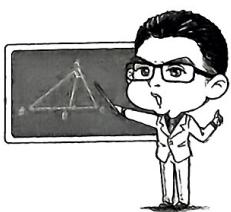

text_image

Cartoon illustration of a person presenting in front of a chalkboard with geometric diagrams and text elements

# 大招解读

# 1. 角平分线定理

在 $\triangle ABC$ 中， $\angle BAC$ 的平分线交 $BC$ 于点 $D$ (如图)，则有 $\frac{AB}{AC}=\frac{DB}{DC}$ 或 $\frac{AB}{BD}=\frac{AC}{CD}$ .

证明 方法一: 因为 $\angle ADB + \angle ADC = \pi$ , 所以 $\sin \angle ADB = \sin \angle ADC$ , 在 $\triangle BAD$ 中, 使用正弦定理有 $\frac{AB}{\sin \angle ADB} = \frac{DB}{\sin \angle BAD}$ , 在 $\triangle CAD$ 中, 使用正弦定理有

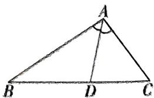

text_image

A
B D C

$\frac{AC}{\sin\angle ADC} = \frac{DC}{\sin\angle CAD}$ 又 $\angle BAD = \angle CAD$ ，所以 $\frac{AB}{AC} = \frac{DB}{DC}$ 或 $\frac{AB}{BD} = \frac{AC}{CD}$

方法二: 因为 $\angle BAD = \angle CAD$ , 所以 $\frac{S_{\triangle ABD}}{S_{\triangle ACD}} = \frac{AB}{AC}$ , 又 $\frac{S_{\triangle ABD}}{S_{\triangle ACD}} = \frac{BD}{DC}$ , 故 $\frac{AB}{AC} = \frac{BD}{CD}$ 或 $\frac{AB}{BD} = \frac{AC}{CD}$ .

# 2. 角平分线定理的应用

角平分线定理实际上构建了角平分线分对边形成的两条线段长度与该角的两条邻边长度之间的关系,题目中出现角平分线条件时,可以考虑使用这组关系列式子解决问题.

# 大招应用

大招示例 在 $\triangle ABC$ 中, 角 $A, B, C$ 所对的边分别为 $a, b, c, \angle BAC$ 的平分线交 $BC$ 于点 $D$ , 且满足 $\frac{BD}{DC} = \frac{3}{4}, \angle BAC = 60^\circ, a = 7$ , 则 $c =$ \_\_\_\_.解析，根据角平分线定理有 $\frac{DB}{DC} = \frac{AB}{AC} = \frac{c}{b} = \frac{3}{4}$ ，于是 $b=\frac{4}{3}c$ ，又 $\angle BAC=60^{\circ},a=7$ ，在 $\triangle ABC$ 中，使用余弦定理的推论有 $a^{2}=b^{2}+c^{2}-2bc\cos\angle BAC$ ，进而得到 $\frac{13}{9}c^{2}-49=0$ ，因此 $c=\frac{21\sqrt{13}}{13}$ .

答案 $\frac{21\sqrt{13}}{13}$

练大招，见《解题觉醒》主书 P063

[NO TEXT]

text_image

大招36

# 张角定理

  
名师大招

# 大招解读

# 1. 张角定理

在 $\triangle ABC$ 中,角 $A,B,C$ 所对的边分别为 $a,b,c$ ,若 $D$ 为 $BC$ 上一点(如图),且 $\angle BAD=\alpha,\angle CAD=\beta$ ,则有 $\frac{\sin(\alpha+\beta)}{AD}=\frac{\sin\alpha}{b}+\frac{\sin\beta}{c}$ .

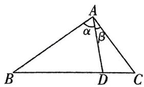

text_image

A
α
β
B
D
C

证明 因为 $S_{\triangle ABC} = S_{\triangle ABD} + S_{\triangle ACD}$ , 所以 $\frac{1}{2} bc\sin (\alpha + \beta) = \frac{1}{2} AD \cdot c\sin \alpha + \frac{1}{2} AD \cdot b\sin \beta$ , 等式两边同时除以 $\frac{1}{2} bc \cdot AD$ , 得 $\frac{\sin (\alpha + \beta)}{AD} = \frac{\sin \alpha}{b} + \frac{\sin \beta}{c}$ .

# 2. 张角定理的应用

张角定理的本质是通过三角形面积公式构建三角方程.

①如果 $\alpha,\beta$ 是已知的,使用张角定理可以建立 AD,b,c 之间的关系.  
②如果 AD, b, c 是已知的, 使用张角定理可以得到 $\alpha, \beta$ 满足的三角方程.

# 3. 张角定理与角平分线

特别地, 如果张角定理中 $\alpha = \beta$ , 则有 $\frac{\sin 2\alpha}{AD} = \frac{\sin \alpha}{b} + \frac{\sin \alpha}{c}$ , 再使用二倍角公式得到 $\frac{2\sin \alpha \cos \alpha}{AD} = \frac{\sin \alpha}{b} + \frac{\sin \alpha}{c}$ , 加以化简也就得到 $AD = \frac{2bc \cos \alpha}{b + c}$ , 根据这个思路我们就可以处理与角平分线相关的问题了.

# 大招应用

大招示例 （2023 全国甲卷）在 $\triangle ABC$ 中， $\angle BAC = 60^{\circ}, AB = 2, BC = \sqrt{6}, \angle BAC$ 的角平分线交 $BC$ 于 $D$ ，则 $AD =$ \_\_\_\_.

解析 由余弦定理得 $\cos 60^{\circ} = \frac{AC^{2} + 4 - 6}{2\times 2AC}$ 整理得 $AC^2 -$ $2AC - 2 = 0$ ，得 $AC = 1 + \sqrt{3}$ （负值已舍去）.

方法一:由角平分线定理得 $\frac{BD}{CD}=\frac{AB}{AC}$ ，又 $BD+CD=\sqrt{6}$ ，
所以 $BD=\sqrt{6}-\sqrt{2}, CD=\sqrt{2}$ . 在 $\triangle ACD$ 中，由余弦定理得 $CD^{2}=AC^{2}+AD^{2}-2AC\cdot AD\cos30^{\circ}$ ，即 $2=(1+\sqrt{3})^{2}+AD^{2}-2\times\frac{\sqrt{3}}{2}\times(1+\sqrt{3})AD$ ，整理得 $AD^{2}-(3+\sqrt{3})AD+(2+2\sqrt{3})=0$ ，解得AD=2或 $AD=1+\sqrt{3}$ ，而 $1+\sqrt{3}>2=AB$ ，舍去，故AD=2.

方法二：张角定理. $S_{\triangle ABC} = S_{\triangle ABD} + S_{\triangle ACD}$ ，所以 $\frac{1}{2}\times$

$2AC\sin60^{\circ}=\frac{1}{2}\times2AD\sin30^{\circ}+\frac{1}{2}AC\times AD\sin30^{\circ}$ ，所以 $AD=\frac{2\sqrt{3}AC}{AC+2}=\frac{2\sqrt{3}\times(1+\sqrt{3})}{3+\sqrt{3}}=2.$

实际上就是张角定理在角平分线问题中的应用

方法三: 斯库顿定理. 同方法一求出 $BD = \sqrt{6} - \sqrt{2}$ , $CD = \sqrt{2}$ 后, 由大招 38 推论斯库顿定理得 $AD^{2} = AB \cdot AC - BD \cdot CD = 2 \times (1 + \sqrt{3}) - \sqrt{2} \times (\sqrt{6} - \sqrt{2}) = 4$ , 所以 AD = 2.

方法四: 五边两角模型. 同方法一求出 $BD = \sqrt{6} - \sqrt{2}$ , $CD = \sqrt{2}$ 后, 利用大招 38 五边两角模型, 得 $\frac{AD^{2} + BD^{2} - AB^{2}}{BD} + \frac{AD^{2} + CD^{2} - AC^{2}}{CD} = 0$ , 即 $\frac{AD^{2} + (\sqrt{6} - \sqrt{2})^{2} - 4}{\sqrt{6} - \sqrt{2}} + \frac{AD^{2} + (\sqrt{2})^{2} - (1 + \sqrt{3})^{2}}{\sqrt{2}} = 0$ , 解得 AD = 2.

答案 2

练大招，见《解题觉醒》主书 P063

text_image

大招37

# 平行四边形恒等式

# 大招解读

# 1. 平行四边形的一个重要恒等式

若四边形 ABCD 为平行四边形（如图），则 $AB^{2} + BC^{2} + CD^{2} + DA^{2} = AC^{2} + BD^{2}$ .

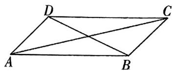

text_image

D
C
A
B

证明 因为四边形 $ABCD$ 是平行四边形, 所以 $AB = CD$ , $BC = DA$ , 且 $\angle ABC + \angle BCD = \pi$ , 所以 $\cos \angle ABC = -\cos \angle BCD$ , 在 $\triangle ABC$ 中, 由余弦定理有 $AC^2 = AB^2 + BC^2 - 2AB \times BC \cos \angle ABC$ , 在 $\triangle BCD$ 中, 由余弦定理有 $BD^2 = BC^2 + CD^2 - 2BC \times CD \cos \angle BCD$ , 两式相加得 $AC^2 + BD^2 = AB^2 + BC^2 + CD^2 + DA^2$ .

# 2. 平行四边形恒等式的应用——中线定理

在 $\triangle ABC$ 中, 若 $D$ 为 $BC$ 中点, 则有 $AD^2 = \frac{AB^2 + AC^2}{2} - \frac{BC^2}{4}$ .

证明 如图所示, 在 $\triangle ABC$ 中, 如果 $D$ 是 $BC$ 的中点, 我们倍长中线 $AD$ 即可得到平行四边形 $ABEC$ , 根据平行四边形恒等式有 $AB^{2} + BE^{2} + EC^{2} + CA^{2} = AE^{2} + BC^{2}$ , 于是就有 $2AB^{2} + 2AC^{2} = 4AD^{2} + BC^{2}$ , 因此得到中线定理 $AD^{2} = \frac{AB^{2} + AC^{2}}{2} - \frac{BC^{2}}{4}$ , 这样就能较为快速地处理中线长相关问题.

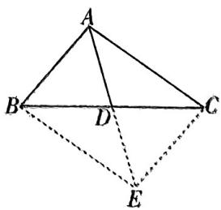

text_image

Geometric diagram of a tetrahedron with labeled vertices A, B, C, D and an internal point E connected by solid and dashed lines.

# 大招应用

大招示例 在 $\triangle ABC$ 中,角 $A,B,C$ 所对的边分别为 $a,b,c,\sqrt{3}a\sin C\sin(A+C)=2c\sin A\cdot\sin^{2}\frac{B}{2}$ ,则角 $B$ 的值为\_\_\_\_;若 $a+c=6$ ,则 $AC$ 边上的中线长的最小值为\_\_\_\_.

解析 先根据正弦定理进行边化角，得到 $\sqrt{3}\sin A\sin C\sin (A + C) = 2\sin C\sin A\sin^2\frac{B}{2}$ 又三角形中 $\sin A\sin C\neq 0$ ，而 $\sin (A + C) = \sin (\pi -B) = \sin B$ ，因此 $\sqrt{3}\sin B = 2\sin^2\frac{B}{2} = 1 - \cos B,$ 于是 $\sqrt{3}\sin B + \cos B =$ $2\sin (B + \frac{\pi}{6}) = 1$ ，而 $B\in (0,\pi)$ ，从而得到 $B = \frac{2\pi}{3}$ 使用余弦定理可得 $b^{2} = a^{2} + c^{2} - 2accos B = a^{2} + c^{2} + ac.$

记 $AC$ 边上的中线为 $BD$ , 根据中线定理可得 $BD^{2} = \frac{a^{2} + c^{2}}{2} - \frac{b^{2}}{4} = \frac{a^{2} + c^{2} - ac}{4} = \frac{(a + c)^{2} - 3ac}{4} = 9 - \frac{3}{4}ac$ , 由

也可由平行四边形法则得到 $\overrightarrow{BD}=\frac{1}{2}(\overrightarrow{BA}+\overrightarrow{BC})$ ，则 $\overrightarrow{BD^{2}}=$

$$
\frac {1}{4} (\overrightarrow {B A} + \overrightarrow {B C}) ^ {2} = \frac {1}{4} (\overrightarrow {B A ^ {2}} + \overrightarrow {B C ^ {2}} + 2 \overrightarrow {B A} \cdot \overrightarrow {B C}) =
$$

$$
\frac {a ^ {2} + c ^ {2} - a c}{4}
$$

于 $ac \leqslant \left(\frac{a + c}{2}\right)^2 = 9$ ，当且仅当 $a = c$ 时取等号，于是 $BD^2 = 9 - \frac{3ac}{4} \geqslant 9 - \frac{3 \times 9}{4} = \frac{9}{4}$ ，即 $BD \geqslant \frac{3}{2}$ ，当且仅当 $a = c = 3$ 时取等号，因此 $AC$ 边上的中线长的最小值为 $\frac{3}{2}$ .

答案 $\frac{2\pi}{3}$ $\frac{3}{2}$

练大招，见《解题觉醒》主书 P064

text_image

大招38

# 五边两角模型

text_image

Cartoon illustration of a person holding a blank board with a triangle diagram labeled A, B, C, D

# 大招解读

# 1. 五边两角模型

在 $\triangle ABC$ 中, $D$ 是线段 $BC$ 上一点,连接 $AD$ (如图), $\triangle ABD$ 与 $\triangle ACD$ 共边 $AD$ ,且以 $AD$ 为公共边的两角互补,则有 $\frac{AD^{2}+BD^{2}-AB^{2}}{BD}+\frac{AD^{2}+CD^{2}-AC^{2}}{CD}=0$ .

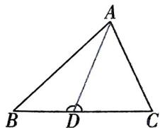

text_image

A
B D C

证明 因为 $\angle ADB + \angle ADC = \pi$ , 所以 $\cos \angle ADB + \cos \angle ADC = 0$ . 在 $\triangle ADB$ 中, $B = \frac{D}{D} = C$ 使用余弦定理有 $\cos \angle ADB = \frac{AD^2 + BD^2 - AB^2}{2AD \times BD}$ , 在 $\triangle ADC$ 中, 使用余弦定理有 $\cos \angle ADC = \frac{AD^2 + CD^2 - AC^2}{2AD \times CD}$ , 所以 $\frac{AD^2 + BD^2 - AB^2}{2AD \times BD} + \frac{AD^2 + CD^2 - AC^2}{2AD \times CD} = 0$ , 所以 $\frac{AD^2 + BD^2 - AB^2}{BD} + \frac{AD^2 + CD^2 - AC^2}{CD} = 0$ .

# 2.五边两角模型的应用

五边两角模型的本质是通过余弦定理及 $\angle ADB + \angle ADC = \pi$ 构建三角方程. 题目中出现五边两角的结构, 且出现 $BD, CD$ 的比例关系时考虑用 $\frac{AD^2 + BD^2 - AB^2}{BD} + \frac{AD^2 + CD^2 - AC^2}{CD} = 0$ 构建 $AD, BD, CD, AB, AC$ 之间的等量关系求解.

# 3.斯特瓦尔特定理及其推论

由五边两角模型化简后的式子整理可得 $CD (AD^{2} + BD^{2} - AB^{2}) + BD (AD^{2} + CD^{2} - AC^{2}) = 0 \Rightarrow CD \cdot AD^{2} + CD \cdot BD^{2} - CD \cdot AB^{2} + BD \cdot AD^{2} + BD \cdot CD^{2} - BD \cdot AC^{2} = 0 \Rightarrow BC \cdot AD^{2} + BD \cdot CD \cdot BC - CD \cdot AB^{2} - BD \cdot AC^{2} = 0 \Rightarrow AD^{2} = AB^{2} \cdot \frac{CD}{BC} + AC^{2} \cdot \frac{BD}{BC} - BD \cdot CD.$

推论:角平分线长公式. 若 AD 为 $\angle BAC$ 的平分线, 则 $AD^{2} = AB \cdot AC - BD \cdot CD$ .

证明 由角平分线定理得 $\frac{AB}{AC} = \frac{BD}{DC}$ , 则 $\frac{AB}{AB + AC} = \frac{BD}{BD + DC} = \frac{BD}{BC}, \frac{AC}{AB + AC} = \frac{CD}{BD + DC} = \frac{CD}{BC}$ , 则 $AD^2 = AB^2 \cdot \frac{AC}{AB + AC} + AC^2 \cdot \frac{AB}{AB + AC} - BD \cdot CD = AB \cdot AC \cdot \frac{AB + AC}{AB + AC} - BD \cdot CD = AB \cdot AC - BD \cdot CD$ .

# 坑神有话说

大招 35—38 中涉及的定理及推论在选择、填空题中直接用就行,但是在解答题中使用之前需要借助证明过程推理一下.

# 大招应用

大招示例 在 $\triangle ABC$ 中,角 $A,B,\angle ACB$ 所对的边分别为 $a,b,c,3c\sin A=4b\sin\angle ACB,\cos\angle ACB=\frac{2}{3}$ ,点 $D$ 在线段 $AB$ 上,且 $BD=2DA$ ,若 $\triangle ABC$ 的面积为 $2\sqrt{5}$ ,则 $CD=$ \_\_\_\_.

解析 如图所示, 先根据正弦定理将 $3c \sin A = 4b \cdot \sin \angle ACB$ 角化边, 得到 3ca = 4bc, 于是就有 $b = \frac{3}{4}a$ , 由于 $\cos \angle ACB = \frac{2}{3}$ ,因此 $\sin \angle ACB = \frac{\sqrt{5}}{3}$ . 再根据三角形面积公式得 $S_{\triangle ABC} = \frac{1}{2} ab\sin \angle ACB = \frac{\sqrt{5}}{8} a^2 = 2\sqrt{5}$ , 解得 $a = 4$ , 故 $b = 3$ , 接下来使用余弦定理 $c^2 = a^2 + b^2 - 2ab\cos \angle ACB$ 得 $c = 3$ .

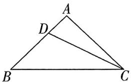

text_image

A
D
B
C

大招解1由于 $BD = 2DA$ ，因此 $AD = 1, BD = 2$ ，此时使用五边两角模型得 $\frac{CD^2 + AD^2 - AC^2}{AD} + \frac{CD^2 + BD^2 - BC^2}{BD} = 0$ 即 $CD^2 + 1 - 9 + \frac{CD^2 + 4 - 16}{2} = 0$ ，从而求得 $CD = \frac{2\sqrt{21}}{3}$

本质: $\cos\angle ADC + \cos\angle BDC = 0$

大招解2由斯特瓦尔特定理得 $CD^2 = CB^2\cdot \frac{AD}{BA} +$ $CA^{2}\cdot \frac{BD}{BA} -BD\cdot AD = 4^{2}\times \frac{1}{3} +3^{2}\times \frac{2}{3} -2\times 1 = \frac{28}{3},$ 则 $CD = \frac{2\sqrt{21}}{3}.$

另解1 向量法. $\overrightarrow{CD} = \overrightarrow{CA} +\overrightarrow{AD} = \overrightarrow{CA} +\frac{1}{3}\overrightarrow{AB} = \overrightarrow{CA}+$ $\frac{1}{3} (\overrightarrow{CB} -\overrightarrow{CA}) = \frac{1}{3}\overrightarrow{CB} +\frac{2}{3}\overrightarrow{CA},$ 故 $\overrightarrow{CD^2} = (\frac{1}{3}\overrightarrow{CB} +\frac{2}{3}\overrightarrow{CA})^2 =$ $\frac{1}{9}\overrightarrow{CB^2} +\frac{4}{9}\overrightarrow{CA^2} +2\times \frac{1}{3}\times \frac{2}{3} |\overrightarrow{CB}|\cdot |\overrightarrow{CA}|\cdot \cos \angle ACB =$ $\frac{28}{3}$ ，则 $CD = \frac{2\sqrt{21}}{3}.$

另解2 在 $\triangle BCD$ 中, 由余弦定理得 $CD^{2} = BD^{2} + BC^{2} - 2BD \cdot BC\cos \angle DBC = \frac{28}{3}$ , 则 $CD = \frac{2\sqrt{21}}{3}$ .

答案 $\frac{2\sqrt{21}}{3}$

练大招，见《解题觉醒》主书 P064

text_image

大招39

# 算两次

text_image

名师大招
四一四二
四一四二

# 大招解读

对于通过平面向量线性运算求参数的相关问题,常需要列出方程(组),采用算两次的方法解决.

# 1. “算两次”背后依据的原理

根据平面向量基本定理“如果 $e_1, e_2$ 是同一平面内的两个不共线向量，那么对于这一平面内的任一向量 $a$ ，有且只有一对实数 $\lambda_1, \lambda_2$ ，使 $a = \lambda_1 e_1 + \lambda_2 e_2$ ”，我们可以在题目中选取两个不共线的向量 $e_1$ 和 $e_2$ 作为基向量，然后将其余向量都用这一组基向量 $e_1$ 和 $e_2$ 表达。

# 2. “算两次”的具体方法

①根据题目要求选取合适的基向量 $e_{1}$ 和 $e_{2}$ .

通常选取共起点且方便表达出待求向量的一组向量

②写出待求向量 a 关于基向量 $e_{1}$ 和 $e_{2}$ 的两种表达方式.

③根据基向量 $e_{1}$ 和 $e_{2}$ 不共线，得到参数所满足的方程(组)，最终求得参数的值，表达出a.

# 大招应用

大招示例 在 $\triangle ABC$ 中, $CO$ 为边 $AB$ 上的中线, $G$ 为 $OC$ 上一点, 且 $\overrightarrow{CG} = 2\overrightarrow{GO}$ , 若 $\overrightarrow{BD} // \overrightarrow{AG}$ , 且 $\overrightarrow{AD} = \lambda \overrightarrow{AB} + \frac{2}{7} \overrightarrow{AC} (\lambda \in \mathbf{R})$ , 则 $\lambda =$ \_\_\_\_.

解析 如图所示,根据条件 $\overrightarrow{BD}//\overrightarrow{AG}$ ,先以 $\overrightarrow{AB},\overrightarrow{AC}$ 为一组基向量,然后去表示 $\overrightarrow{AG}$ 与 $\overrightarrow{BD}$ ,进而得到 $\overrightarrow{BD}$ 的两种表达方式,使用“算两次”求解.由O为边 $\frac{1}{2}\overrightarrow{AB}$ ,而 $\overrightarrow{CG}=2\overrightarrow{GO}$ ,因此点G是

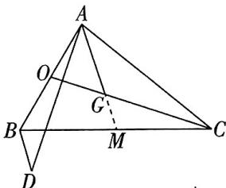

text_image

Geometric diagram of triangle ABC with internal points D, O, G, M and connecting line segments

AB 的中点, 得到 $\overrightarrow{AO} =$ $\triangle ABC$ 的重心, 延长 AG

交 BC 于点 M，则 $\overrightarrow{AG} = \frac{2}{3}\overrightarrow{AM} = \frac{2}{3} \times \frac{1}{2} (\overrightarrow{AB} + \overrightarrow{AC}) = \frac{1}{3}\overrightarrow{AB} + \frac{1}{3}\overrightarrow{AC}$ . 根据 $\overrightarrow{BD} // \overrightarrow{AG}$ ，设 $\overrightarrow{BD} = \mu \overrightarrow{AG} (\mu \in \mathbb{R})$ ，于是 $\overrightarrow{BD} = \frac{\mu}{3}\overrightarrow{AB} + \frac{\mu}{3}\overrightarrow{AC}$ . 故 $\overrightarrow{AD} = \overrightarrow{AB} + \overrightarrow{BD} = (1 + \frac{\mu}{3})\overrightarrow{AB} + \frac{\mu}{3}\overrightarrow{AC}$ .

∵ $\overrightarrow{AD} = \lambda \overrightarrow{AB} + \frac{2}{7}\overrightarrow{AC}, \overrightarrow{AB}$ 与 $\overrightarrow{AC}$ 不共线，∴ 根据平面向量 $\overrightarrow{AD}$ 的已知表达式

基本定理得到 $\left\{\begin{aligned}\lambda&=1+\frac{\mu}{3},\\ \frac{2}{7}&=\frac{\mu}{3},\end{aligned}\right.$ 于是 $\lambda$ 的值为 $\frac{9}{7}$ .

答案 $\frac{9}{7}$

练大招，见《解题觉醒》主书 P068

text_image

大招40

# 等和线

  
名师大招

text_image

Cartoon illustration of a man with glasses standing beside a chalkboard with a simple triangle diagram labeled A, B, C, and S.

# 大招解读

对于涉及向量式 $\overrightarrow{OA}=\lambda\overrightarrow{OB}+\mu\overrightarrow{OC},\lambda,\mu\in\mathbb{R}$ 的相关问题,我们常使用等和线处理.

# 1. 其和为 1 的等和线（三点共线的充要条件）

点 O, A, B 为平面上不共线的三个点，则 $\overrightarrow{OC} = t \overrightarrow{OA} + (1 - t) \overrightarrow{OB} \Leftrightarrow$ 点 C 在直线 AB 上.

证明 因为 $\overrightarrow{OC} = t\overrightarrow{OA} + (1 - t)\overrightarrow{OB}$ , 所以 $\overrightarrow{OC} - \overrightarrow{OB} = t(\overrightarrow{OA} - \overrightarrow{OB})$ , 所以 $\overrightarrow{BC} = t\overrightarrow{BA}$ , 所以点 $C$ 在直线 $AB$ 上. 把步骤反过去就能知道从右往左推也是正确的.

此时直线 $AB$ 是和为1的等和线.

# 坑神有话说

通过以上推导过程我们还可以知道以下结论:①当 $\overrightarrow{OC}=t\overrightarrow{OA}+(1-t)\overrightarrow{OB}$ 时, $\overrightarrow{BC}=t\overrightarrow{BA}$ ,即 $A,B,C$ 三点共线.当 $t<0$ 时,点 $C$ 在线段 $AB$ 延长线上;当 $0\leqslant t\leqslant1$ 时,点 $C$ 在线段 $AB$ 上;当 $t>1$ 时,点 $C$ 在线段 $AB$ 反向延长线上.②如果 $\overrightarrow{BC}=t\overrightarrow{BA}$ ,则 $\overrightarrow{OC}=t\overrightarrow{OA}+(1-t)\overrightarrow{OB}$ ,这个式子可以帮助我们在知道| $\overrightarrow{BC}$ |与| $\overrightarrow{BA}$ |的比例关系的情况下,快速写出 $\overrightarrow{OC}$ 的表达式.

# 2. 其和为 $k$ 的等和线

点 $O, A, B$ 为平面上不共线的三个点，则 $\overrightarrow{OC} = t\overrightarrow{OA} + (k - t)\overrightarrow{OB} (k \neq 1, k \in \mathbb{R}) \Leftrightarrow$ 点 $C$ 的轨迹是平行于直线 $AB$ 的一条直线.

证明 ①当 $k = 0$ 时, $\overrightarrow{OC} = t(\overrightarrow{OA} -\overrightarrow{OB}) = t\overrightarrow{BA}$ , 所以点 $C$ 的轨迹是过点 $O$ 且平行于直线 $AB$ 的一条直线 (如图1).

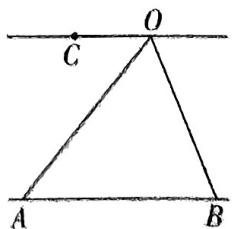

text_image

C
O
A
B

图1

②当 $k \neq 0$ 且 $k \neq 1$ 时, 取两点 $A_{1}, B_{1}$ 使得 $\overrightarrow{OA_{1}} = k\overrightarrow{OA}, \overrightarrow{OB_{1}} = k\overrightarrow{OB}$ , 因为 $\overrightarrow{OC} = t\overrightarrow{OA} + (k - t)\overrightarrow{OB}$ , 所以 $\overrightarrow{OC} = \frac{t}{k}\overrightarrow{OA_{1}} + (1 - \frac{t}{k})\overrightarrow{OB_{1}}$ , 所以点 $C$ 在直线 $A_{1}B_{1}$ 上. 因为 $\overrightarrow{OA_{1}} = k\overrightarrow{OA}, \overrightarrow{OB_{1}} = k\overrightarrow{OB}$ , 所以 $A_{1}B_{1} // AB$ , 所以点 $C$ 的轨迹是平行于直线 $AB$ 的一条直线 (如图2).

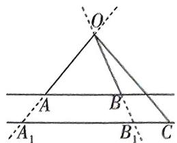

text_image

O
A
B
A₁
B₁
C

图2

同样地,把推导步骤反过去就能知道从右往左推也是正确的.

此时直线 $A_{1}B_{1}$ 是和为 k 的等和线.

# 坑神有话说

$|k|$ 的几何意义为 $|\overrightarrow{OA_{1}}|$ 与 $|\overrightarrow{OA}|$ 的比值，即 $|k|=\frac{|\overrightarrow{OA_{1}}|}{|\overrightarrow{OA}|}=\frac{|\overrightarrow{OB_{1}}|}{|\overrightarrow{OB}|}=\frac{d_{1}}{d}$ ，实际解题时也是通过长度比 $d_{1}$ 为点 O 到直线 $A_{1}B_{1}$ 的距离，d 为点 O 到直线 AB 的距离

确定 k 的值.

# 3.等和线的应用

从前面知识我们已经知道,“ $\overrightarrow{OC} = t \overrightarrow{OA} + (k - t) \overrightarrow{OB} (k \in \mathbf{R})$ ”实际上建立了点 $C$ 的轨迹与 $k$ 值的关系. 因此关于等和线就有以下两种应用:

第一种:在已知点 C 的轨迹的情况下,求 k 的取值范围(这种用得比较多).

第二种:在已知 k 的取值的情况下,去判断点 C 的位置.

# 大招应用

大招示例 在矩形 ABCD 中, AB = 1, AD = 2, 动点 P 在以点 C 为圆心且与 BD 相切的圆上, 若 $\overrightarrow{AP} = \lambda \overrightarrow{AB} + \mu \overrightarrow{AD} (\lambda, \mu$ 为实数), 则 $\lambda + \mu$ 的最大值是 \_\_\_\_.

解析 过点 $P$ 作 $BD$ 的平行线 $l$ , 与 $AB, AD$ 的延长线分别交于点 $B_{1}, D_{1}$ , 如图所示, 根据等和线, 就有 $\overrightarrow{AP} = t\overrightarrow{AB}_{1} + (1 - t)\overrightarrow{AD}_{1}(t \in \mathbb{R})$ , 以 $\overrightarrow{AB}, \overrightarrow{AD}$ 为基向量, 设 $\overrightarrow{AB}_{1} = m\overrightarrow{AB}(m \in \mathbb{R})$ , 则 $\overrightarrow{AD}_{1} = m\overrightarrow{AD}$ , 于是就有 $\overrightarrow{AP} = mt\overrightarrow{AB} + (m - mt)\cdot \overrightarrow{AD}$ , 又 $\overrightarrow{AP} = \lambda \overrightarrow{AB} + \mu \overrightarrow{AD}$ , 因此 $\left\{ \begin{array}{l}mt = \lambda, \\ m - mt = \mu, \end{array} \right.$ 得到 $\lambda + \mu = m$ . 于是要使$\lambda + \mu$ 最大, 就要使得 $m$ 最大. 当 $m$ 最大时, 直线 $l$ 与圆 $C$ 相切, 设圆 $C$ 与直线 $BD, B_1D_1$ 的切点分别为 $E, P$ , 连接 $EP$ , 则 $EP$ 为直径. 过点 $A$ 作直线 $BD, l$ 的公垂线 $AQ$ , 交 $BD$ 于 $F$ , 交 $l$ 于 $Q$ , 则 $\frac{AQ}{AF} = \frac{AB_1}{AB} = m$ . 易知 $C$ 为 $PE$ 的中点, 且 $AF = CE = \frac{1}{2}PE = \frac{1}{2}QF$ , 因此 $\frac{AQ}{AF} = \frac{AF + QF}{AF} = 3$ .

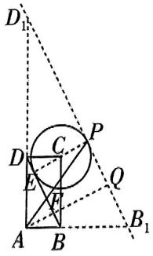

text_image

Geometric diagram with labeled points and lines, including a circle inscribed in a square and auxiliary points D, E, F, P, Q, B₁, B, C, D₁.

于是当 $m = 3$ 时， $\lambda +\mu$ 取得最大值3.

另解 以 A 为坐标原点, AB 所在直线为 x 轴, AD 所在直线为 y 轴建立平面直角坐标系, 则 $B(1,0)$ , $D(0,2)$ , 则 $C(1,2)$ , 设 $P(x,y)$ , 则点 P 满足 $(x-1)^{2}+(y-2)^{2}=(\frac{2}{\sqrt{5}})^{2}$ , 即 $(x-1)^{2}+(y-2)^{2}=\frac{4}{5}$ . 又 $\overrightarrow{AP}=(x,y)$ , $\overrightarrow{AP}=\lambda\overrightarrow{AB}+\mu\overrightarrow{AD}=(\lambda,2\mu)$ , 所以 $\left\{\begin{aligned}\lambda&=x,\\ \mu&=\frac{y}{2}\end{aligned}\right.$ 则 $\lambda+\mu=x+$

$\frac{\gamma}{2} = 1 + \frac{2}{\sqrt{5}}\cos \theta +\frac{2 + \frac{2}{\sqrt{5}}\sin\theta}{2} = 2 + \frac{2}{\sqrt{5}}\cos \theta +\frac{1}{\sqrt{5}}\sin \theta =$ $2 + \sin (\theta +\varphi)$ ，其中 $\tan \varphi = 2$ ，所以 $\lambda +\mu$ 的最大值为3，此时 $\theta +\varphi = \frac{\pi}{2}$

答案 3

# 坑神有话说

系数和问题除了可以用等和线解决,有时也可用建系法求解,注意方法的选择.

练大招，见《解题觉醒》主书 P069

# 大招解读

对于共起点向量的数量积问题,我们常采用极化恒等式处理.

# 1. 极化恒等式

对于三个不共线的点 A, B, C 来说, 我们令点 D 为线段 BC 的中点, 如图所示, 则有极化恒等式 $\overrightarrow{AB} + \overrightarrow{AC} = 2\overrightarrow{AD}, \overrightarrow{AB} \cdot \overrightarrow{AC} = \frac{1}{4}\left[(\overrightarrow{AB} + \overrightarrow{AC})^2 - (\overrightarrow{AB} - \overrightarrow{AC})^2\right] = |\overrightarrow{AD}|^2 - |\overrightarrow{DB}|^2.$

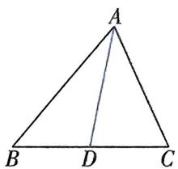

text_image

A
B D C

证明 ① $\overrightarrow{AB} +\overrightarrow{AC} = (\overrightarrow{AD} +\overrightarrow{DB}) + (\overrightarrow{AD} +\overrightarrow{DC}) = 2\overrightarrow{AD}.$

② $\overrightarrow{AB} \cdot \overrightarrow{AC} = (\overrightarrow{AD} + \overrightarrow{DB}) \cdot (\overrightarrow{AD} - \overrightarrow{DB}) = |\overrightarrow{AD}|^2 - |\overrightarrow{DB}|^2.$

# 2. 极化恒等式的应用

问题中出现共起点的两个向量 $\overrightarrow{AB},\overrightarrow{AC}$ 之和或数量积时,就可以考虑取 $BC$ 的中点 $D$ ,然后使用极化恒等式转化,把原本需计算夹角的数量积运算转化为长度运算,进而解决问题.

极化恒等式能简化运算的本质原因

# 坑神有话说

如果问题中给出的是共终点的两个向量之和或数量积,则通过加负号转化为共起点的向量即可,如 $\overrightarrow{BA}+\overrightarrow{CA}=-\overrightarrow{AB}-\overrightarrow{AC}=-2\overrightarrow{AD},\overrightarrow{BA}\cdot\overrightarrow{CA}=(-\overrightarrow{AB})\cdot(-\overrightarrow{AC})=\overrightarrow{AB}\cdot\overrightarrow{AC}=|\overrightarrow{AD}|^{2}-|\overrightarrow{DB}|^{2}$ .

# 大招应用

大招示例 (2022 上海) 在 $\triangle ABC$ 中, $C = \frac{\pi}{2}$ , $AC = BC = 2$ , $M$ 为边 $AC$ 的中点, 若点 $P$ 在边 $AB$ 上运动 (点 $P$ 可与 $A, B$ 重合), 则 $\overrightarrow{MP} \cdot \overrightarrow{CP}$ 的最小值为 \_\_\_\_.

大招识别 题目中给出的向量的数量积可以转化成共起点向量的数量积,故考虑使用极化恒等式解决问题.

大招解取 $MC$ 的中点为 $Q$ , 连接 $PQ$ , 则 $|\overrightarrow{QC}| = \frac{1}{2}$ , 所以 $\overrightarrow{MP} \cdot \overrightarrow{CP} = \overrightarrow{PM} \cdot \overrightarrow{PC} = |\overrightarrow{PQ}|^2 - |\overrightarrow{QC}|^2 = |\overrightarrow{PQ}|^2 - \frac{1}{4} \geqslant (\frac{3}{2\sqrt{2}})^2 - \frac{1}{4} = \frac{7}{8}$ , 当且仅当 $PQ \perp AB$ 时取等号. 故 $\overrightarrow{MP} \cdot \overrightarrow{CP}$ 的最小值为 $\frac{7}{8}$ .

常规解 涉及几何图形中平面向量的数量积运算, 可考虑建立适当的平面直角坐标系进行求解. 如图, 以 C 为坐标原点, 建立平面直角坐标系, 则 $C(0,0)$ ,$A(0,2),B(2,0),M(0,1)$ ，依题意可设 $P(x,2-x),0\leqslant x\leqslant2$ ，则 $\overrightarrow{MP}=(x,1-x),\overrightarrow{CP}=(x,2-x)$ ，所以 $\overrightarrow{MP}\cdot\overrightarrow{CP}=(x,1-x)\cdot(x,2-x)=2x^{2}-3x+2=2(x-\frac{3}{4})^{2}+\frac{7}{8}\geqslant\frac{7}{8}$ ，当且仅当 $x=\frac{3}{4}$ 时取等号，故 $\overrightarrow{MP}\cdot\overrightarrow{CP}$ 的最小值利用二次函数求最值

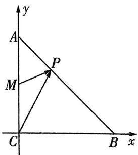

text_image

y
A
P
M
C
B
x

为 $\frac{7}{8}$ .

答案 $\frac{7}{8}$

# 大招解读

O 为 $\triangle ABC$ 内一点, 对于找 $S_{\triangle AOB}, S_{\triangle BOC}, S_{\triangle AOC}$ 的比例与 $\overrightarrow{OA}, \overrightarrow{OB}, \overrightarrow{OC}$ 的向量式之间的关系的相关问题, 我们采用奔驰定理处理.

# 1. 奔驰定理

若点 O 为 $\triangle ABC$ 内一点（如图），则 $S_{\triangle BOC} \overrightarrow{OA} + S_{\triangle COA} \overrightarrow{OB} + S_{\triangle AOB} \overrightarrow{OC} = 0$ 。因为其图形与奔驰的标志特别相似，故称之为奔驰定理。

证明 根据重心的性质推导. 在射线 $OB$ 与 $OC$ 上分别取点 $B_{1}$ 与点 $C_{1}$ , 使得点 $O$ 为 $\triangle AB_{1}C_{1}$ 的重心, 并令点 $D$ 为 $B_{1}C_{1}$ 的中点, 点 $E$ 为 $AB_{1}$ 的中点, 如图. 因为点 $D$ 为 $B_{1}C_{1}$ 的中点, 所以 $\overrightarrow{OB_1} + \overrightarrow{OC_1} = 2\overrightarrow{OD}$ , 又点 $O$ 为 $\triangle AB_{1}C_{1}$ 的重心, 所以 $\overrightarrow{OA} = -2\overrightarrow{OD}$ , 所以 $\overrightarrow{OA} + \overrightarrow{OB_1} + \overrightarrow{OC_1} = 0$ .

设 $\overrightarrow{OB} = p\overrightarrow{OB_1}(p > 0),\overrightarrow{OC} = q\overrightarrow{OC_1}(q > 0)$ ，则 $\overrightarrow{OA} +\frac{1}{p}\overrightarrow{OB} +\frac{1}{q}\overrightarrow{OC} = \mathbf{0},$ 且 $|\overrightarrow{OB}| = p|\overrightarrow{OB_1} |,|\overrightarrow{OC}| = q|\overrightarrow{OC_1} |,$ 所以 $pq\overrightarrow{OA} +q\overrightarrow{OB} +p\overrightarrow{OC} = \mathbf{0}.$ 因为$S_{\triangle BOC} = \frac{1}{2} |\overrightarrow{OB}| |\overrightarrow{OC} |\sin \angle BOC, S_{\triangle B_1OC_1} = \frac{1}{2} |\overrightarrow{OB_1}| |\overrightarrow{OC_1}| \cdot \sin \angle B_1OC_1$ ，所以 $\frac{S_{\triangle BOC}}{S_{\triangle B_1OC_1}} = \frac{|\overrightarrow{OB}| |\overrightarrow{OC}|}{|\overrightarrow{OB_1}| |\overrightarrow{OC_1}|} = pq.$

同理 $\frac{S_{\triangle AOB}}{S_{\triangle AOB_1}} = \frac{|\overrightarrow{OB}|}{|\overrightarrow{OB_1}|} = p, \frac{S_{\triangle COA}}{S_{\triangle C_1OA}} = \frac{|\overrightarrow{OC}|}{|\overrightarrow{OC_1}|} = q$ ，所以 $\frac{S_{\triangle BOC}}{S_{\triangle B_1OC_1}} \overrightarrow{OA} + \frac{S_{\triangle COA}}{S_{\triangle C_1OA}} \overrightarrow{OB} + \frac{S_{\triangle AOB}}{S_{\triangle AOB_1}} \overrightarrow{OC} = 0.$

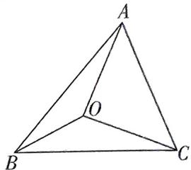

text_image

A
O
B
C

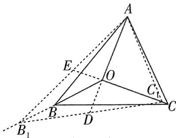

text_image

Geometric diagram of a tetrahedron with labeled vertices and internal points, including dashed lines indicating hidden edges.

因为点 O 为 $\triangle AB_{1}C_{1}$ 的重心，所以 $S_{\triangle AOB_{1}} = S_{\triangle B_{1}OC_{1}} = S_{\triangle C_{1}OA}$ ，所以 $S_{\triangle BOC} \overrightarrow{OA} + S_{\triangle COA} \overrightarrow{OB} + S_{\triangle AOB} \overrightarrow{OC} = 0$ .

推论:已知 O 为 $\triangle ABC$ 内一点,且 $x\overrightarrow{OA} + y\overrightarrow{OB} + z\overrightarrow{OC} = 0 (x, y, z \in \mathbf{R}, x \neq 0, y \neq 0, z \neq 0)$ , 则有

(1) $S_{\triangle OBC}: S_{\triangle OAC}: S_{\triangle OAB}: S_{\triangle ABC} = |x|: |y|: |z|: |x + y + z|$ .

(2) $\frac{S_{\triangle OBC}}{S_{\triangle ABC}} = |\frac{x}{x + y + z} |, \frac{S_{\triangle OAC}}{S_{\triangle ABC}} = |\frac{y}{x + y + z} |, \frac{S_{\triangle OAB}}{S_{\triangle ABC}} = |\frac{z}{x + y + z} |.$

# 2.奔驰定理的应用

奔驰定理实际上建立了 $S_{\triangle AOB}, S_{\triangle BOC}, S_{\triangle COA}$ 的比例与 $\overrightarrow{OA}, \overrightarrow{OB}, \overrightarrow{OC}$ 的向量式之间的关系，在一些三角形面积的向量式或三角形四心向量式相关问题中有妙用.

# 坑神来避坑

有些同学会由 $\alpha \overrightarrow{OA} + \beta \overrightarrow{OB} + \gamma \overrightarrow{OC} = 0 (\alpha, \beta, \gamma > 0)$ , 直接得 $S_{\triangle BOC} = \alpha, S_{\triangle COA} = \beta, S_{\triangle AOB} = \gamma$ . 这里存在的问题是下意识认为奔驰定理只有 $S_{\triangle BOC} \overrightarrow{OA} + S_{\triangle COA} \overrightarrow{OB} + S_{\triangle AOB} \overrightarrow{OC} = 0$ 这一个形式, 而忽略了这个 $kS_{\triangle BOC} \overrightarrow{OA} + kS_{\triangle COA} \overrightarrow{OB} + kS_{\triangle AOB} \overrightarrow{OC} = 0 (k \neq 0)$ 的一般形式. 为了避免犯这样的错误, 我们在使用奔驰定理过程中, 一定要记住系数只与面积的比例关系挂钩, 即 $S_{\triangle BOC}: S_{\triangle COA}: S_{\triangle AOB} = \alpha: \beta: \gamma$ .

# 大招应用

大招示例 已知点 G 是 $\triangle ABC$ 内一点（如图），若 $S_{\triangle AGB} = 7, S_{\triangle BGC} = 5, S_{\triangle AGC} = 6$ ，且 $\overrightarrow{AG} = x \overrightarrow{AB} + y \overrightarrow{AC} (x, y \text{ 为实数})$ ，则 $x + y =$ \_\_\_\_.

text_image

A
G
B
C

大招识别 本题是三角形面积与向量式相关问题,故考虑根据奔驰定理直接把面积比转化为 $\overrightarrow{GA}$ , $\overrightarrow{GB}$ , $\overrightarrow{GC}$ 所满足的关系式,再得到 $\overrightarrow{AG}$ , $\overrightarrow{AB}$ , $\overrightarrow{AC}$ 所满足的关系式.

解析：由 $S_{\triangle AGB} = 7, S_{\triangle BGC} = 5, S_{\triangle AGC} = 6$ ，得到 $S_{\triangle BGC}$

$S_{\triangle AGC}: S_{\triangle AGB} = 5:6:7$ ，因此根据奔驰定理就有 $5\overrightarrow{GA} + 6\overrightarrow{GB} + 7\overrightarrow{GC} = \mathbf{0}$ ，于是 $5\overrightarrow{GA} + 6(\overrightarrow{GA} + \overrightarrow{AB}) + 7(\overrightarrow{GA} + \overrightarrow{AC}) = \mathbf{0}$ ，于是 $\overrightarrow{AG} = \frac{1}{3}\overrightarrow{AB} + \frac{7}{18}\overrightarrow{AC}$ ，又 $\overrightarrow{AG} = x\overrightarrow{AB} + y\overrightarrow{AC}$ ，所以 $x =$

$\frac{1}{3}, y = \frac{7}{18}$ , 所以 $x + y = \frac{1}{3} + \frac{7}{18} = \frac{13}{18}$ .

答案 $\frac{13}{18}$

练大招，见《解题觉醒》主书 P071

text_image

大招43

# 倒序相加求和 & 并项求和

# 大招解读

在对数列进行求和时,有时把首尾两项或相邻的几项合并在一起后再求和会比较方便.

# 1. 倒序相加求和

见招 数列 $\{a_{n}\}$ 中，与首尾两端等距离的两项的和相等.

出招 倒序相加法求前 n 项和.

以等差数列为例,顺序书写为 $S_{n}=a_{1}+a_{2}+\cdots+a_{n}$ ①,倒序书写为 $S_{n}=a_{n}+a_{n-1}+\cdots+a_{1}$ ②,
① + ②, 得 $2S_{n}=(a_{1}+a_{n})+(a_{2}+a_{n-1})+\cdots+(a_{n}+a_{1})=n[2a_{1}+(n-1)d]$ , 所以 $S_{n}=na_{1}+\frac{n(n-1)}{2}d.$

# 坑神有话说

倒序相加法实际上是函数图象中心对称的反映,即若函数 $f(x)$ 的图象关于点 $(a,b)$ 中心对称,则 $f(x)+f(2a-x)=2b$ ,对应到等差数列 $\{a_{n}\}$ 中,则是 $a_{n}+a_{2m-n}=2a_{m}$ .

# 2. 并项求和

对形如 $a_{n} = (-1)^{n}n, a_{n} = (-1)^{n}n^{2}$ 的数列 $\{a_{n}\}$ 或一些周期数列与类周期数列，在求和过程中可将相邻两项或几项合并后再进行求和.

# 大招应用

大招示例① 已知各项均为正数的数列 $\{a_{n}\}$ 是公比不等于 1 的等比数列，且 $a_{1}a_{2025}=1$ ，若函数 $f(x)=\frac{4}{1+x^{2}}$ ，则 $f(a_{1})+f(a_{2})+\cdots+f(a_{2025})=$ \_\_\_\_.

解析 数列 $\{a_{n}\}$ 是公比不等于1的等比数列, $a_{1}a_{2025}=1$ ,
则 $a_{n}a_{2026\sim n}=1,n\in N_{+},n\leqslant2025$ 等比数列下标和性质

由 $f(x)=\frac{4}{1+x^{2}}$ 可得，当 $x\neq0$ 时 $f(x)+f(\frac{1}{x})=\frac{4}{1+x^{2}}+\frac{4}{1+(\frac{1}{x})^{2}}=4$ ，于是 $f(a_{n})+f(a_{2026-n})=f(a_{n})+$ 【大招识别】与首尾两端等距离的两项的和相等，采用倒序相加法求和关键

$$
f \left(\frac {1}{a _ {n}}\right) = 4,
$$

令 $T_{2025} = f(a_1) + f(a_2) + \dots +f(a_{2025})$

则 $T_{2025} \approx f(a_{2025}) + f(a_{2024}) + \cdots + f(a_{1})$ ,

两式相加可得 $2T_{2025} = \left[f(a_{1}) + f(a_{2025})\right] + \left[f(a_{2}) + f(a_{2024})\right] + \cdots + \left[f(a_{2025}) + f(a_{1})\right] = 4 \times 2025$ ,
所以 $T_{2025}=4050.$

答案· 4050

大招示例 2 已知数列 $\{a_{n}\}$ 的前 $n$ 项和为 $S_{n}$ , 若 $a_{n+3} = a_{n} + 1$ , 且 $a_{1} = 1, a_{2} = 2, a_{3} = 3$ , 则 $S_{90} =$ \_\_\_\_.

解析 由 $a_{n+3} = a_n + 1$ ，可知数列 $\{a_n\}$ 是个“类周期数列”。因此可设数列 $\{b_n\}$ 满足 $b_n = a_{3n-2} + a_{3n-1} + a_{3n}$ ，则 $b_{n+1} = a_{3n+1} + a_{3n+2} + a_{3n+3} = a_{3n-2} + 1 + a_{3n-1} + 1 + a_{3n} + 1 = b_n + 3$ ，于是数列 $\{b_n\}$ 是公差为 3 的等差数列，且 $b_1 = a_1 + a_2 + a_3 = 6$ ，于是得到 $S_{90} = (a_1 + a_2 + a_3) + (a_4 + a_5 + a_6) + \cdots + (a_{88} + a_{89} + a_{90}) = b_1 + b_2 + \cdots + b_{30} = 30 \times 6 + \frac{30 \times 29}{2} \times 3 = 1.485$ 。

答案 1485

练大招，见《解题觉醒》主书 P077

# 大招解读

# 1. 等比数列前 $n$ 项和的求法

对于公比 q 不为 1 的等比数列 $\{a_{n}\}$ ，求其前 n 项和 $S_{n}$ 时，有 $S_{n}=a_{1}+a_{1}q+\cdots+a_{1}q^{n-1}$ ，两边同时乘 q，得 $qS_{n}=a_{1}q+a_{1}q^{2}+\cdots+a_{1}q^{n-1}+a_{1}q^{n}$ ，两式相减，就可以得到 $(1-q)S_{n}=a_{1}(1-q^{n})$ ，从而 $S_{n}=\frac{a_{1}(1-q^{n})}{1-q}$ 。在求等比数列前 n 项和的过程中，我们实际上就用了在等式两边同乘 q 后错位相减的思路。

# 2. 差比数列前 $n$ 项和

若数列 $\{c_{n}\}$ 满足 $c_{n} = a_{n}b_{n}$ , 其中 $\{a_{n}\}$ 是等差数列, $\{b_{n}\}$ 是公比不为 1 的等比数列, 则 $\{c_{n}\}$ 是差比数列. 若差比数列 $\{c_{n}\}$ 满足 $c_{n} = (an + b)q^{n - 1}(a\neq 0,q\neq 1)$ , 通过错位相减法可以得到其前 $n$ 项和 $S_{n} = (An + B)q^{n} - B$ , 其中 $A = \frac{a}{q - 1}, B = \frac{b - A}{q - 1}$ .

证明 因为 $c_{n}=(an+b)q^{n-1}(a\neq0,q\neq1)$ , $S_{n}=c_{1}+c_{2}+\cdots+c_{n}$ ，所以 $S_{n}=(a+b)+(2a+b)q+\cdots+(an+b)q^{n-1}$ ，所以 $qS_{n}=(a+b)q+\cdots+[a(n-1)+b]q^{n-1}+(an+b)q^{n}$ （错位），所以 $(1-q)S_{n}=(a+b)+a(q+q^{2}+\cdots+q^{n-1})-(an+b)q^{n}$ （相减），所以 $S_{n}=\frac{a+b}{1-q}-\frac{(an+b)q^{n}}{1-q}+\frac{aq-aq^{n}}{(1-q)^{2}}=\frac{a+b}{1-q}-\frac{(an+b)q^{n}}{1-q}+\frac{aq}{(1-q)^{2}}-\frac{aq^{n}}{(1-q)^{2}}=\left[\frac{a}{q-1}\cdot n+\frac{b}{q-1}-\frac{a}{(q-1)^{2}}\right]q^{n}-\left[\frac{b}{q-1}-\frac{a}{(q-1)^{2}}\right]$ 。令 $A=\frac{a}{q-1}$ ， $B=\frac{b-A}{q-1}$ ，则 $S_{n}=(An+B)q^{n}-B$ 。

# 坑神来避坑

(1) 差比数列 $\{c_{n}\}$ 的形式必须先化成 $c_{n} = (an + b)q^{n - 1}(a \neq 0, q \neq 1)$ , 在解答题中不能直接套结论, 可以按错位相减法求和正常写步骤, 最后化简时根据结论直接得答案, 或检验自己算的结果是否正确.  
(2) 对于 $c_{n} = (an + b)q^{n}$ , 需先化成 $c_{n} = (aqn + bq)q^{n - 1}$ 再验证.

# 3.形如 $a_{n} = n^{2}\cdot 2^{n}$ 的数列 $\{a_{n}\}$ 的前 $n$ 项和

错位相减求和的本质就是通过代数运算, 消去一些无法通过求和公式求解的项, 从而将问题进行简化. 因此错位相减求和除了应用于差比数列求和之外, 还能应用于求解形如 $a_{n} = n^{2} \cdot 2^{n}$ 的数列的前 $n$ 项和, 只是此时可能需要使用两次错位相减.

# 大招应用

大招示例 1 （2024 全国甲卷）记 $S_{n}$ 为数列 $\{a_{n}\}$ 的前 $n$ 项和，已知 $4S_{n} = 3a_{n} + 4$ .

(1) 求 $\{a_{n}\}$ 的通项公式；  
(2) 设 $b_n = (-1)^{n-1} na_n$ , 求数列 $\{b_n\}$ 的前 $n$ 项和 $T_n$ .  
解析：（1）因为 $4S_{n} = 3a_{n} + 4$ ①，所以当 $n\geqslant 2$ 时， $4S_{n - 1} = 3a_{n - 1} + 4$ ②，  
则当 $n \geqslant 2$ 时，①-②得 $4a_{n} = 3a_{n} - 3a_{n-1}$ ，即 $a_{n} = -3a_{n-1}$ 当 $n \geqslant 2$ 时 $a_{n} = S_{n} - S_{n-1}$   
当 n=1 时，由 $4S_{n}=3a_{n}+4$ 得 $4a_{1}=3a_{1}+4$ ，所以 $a_{1}=4\neq0$ ，
当n=1时 $a_{1}=S_{1}$

所以数列 $\{a_{n}\}$ 是以4为首项，-3为公比的等比数列，（易错警示：由 $a_{n} = -3a_{n - 1}(n\geqslant 2)$ 还不能说数列 $\{a_{n}\}$ 是等比数列，必须说明其首项不为0才可以）

所以 $a_{n} = 4 \times (-3)^{n - 1}$ .

# 坑神倍妙招

若一个数列 $\{a_{n}\}$ 的前 $n$ 项和 $S_{n}$ 与 $a_{n}$ 满足 $S_{n} = pa_{n} + r$ ，且 $p\neq 0,p\neq 1,r\neq 0$ ，则数列 $\{a_{n}\}$ 是等比数列.

(2) 大招解 错位相减法. 因为 $b_n = (-1)^{n-1} \cdot na_n =$

$$
(- 1) ^ {n - 1} n \times 4 \times (- 3) ^ {n - 1} = 4 n \cdot 3 ^ {n - 1},
$$

所以 $T_{n}=4\times3^{0}+8\times3^{1}+12\times3^{2}+\cdots+4n\cdot3^{n-1}$

所以 $3T_{n}=4\times3^{1}+8\times3^{2}+12\times3^{3}+\cdots+4n\cdot3^{n}$

两式相减得 $-2T_{n}=4+4(3^{1}+3^{2}+\cdots+3^{n-1})-4n\cdot3^{n}=$ $4+4\times\frac{3(1-3^{n-1})}{1-3}-4n\cdot3^{n}=-2+(2-4n)\cdot3^{n}$

所以 $T_{n}=1+(2n-1)\cdot3^{n}$

草稿纸上检验: $b_{n}=4n\cdot3^{n-1}$ ，故 $A=\frac{a}{q-1}=\frac{4}{3-1}=2,B=\frac{b-A}{q-1}=\frac{0-2}{2}=-1$ ，则 $T_{n}=(An+B)q^{n}-B=(2n-1)\cdot3^{n}+1.$

# 解题 11 第1季 武林大会

事实上，能用错位相减法求和的试题也可以通过待定系数法转化为用裂项相消法求和，原理： $a_{n}=f(n+1)-f(n)$ ，则 $S_{n}=a_{1}+a_{2}+\cdots+a_{n-1}+a_{n}=f(2)-f(1)+f(3)-f(2)+\cdots+f(n)-f(n-1)+f(n+1)-f(n)=f(n+1)-f(1)$ ，对于差比数列来说，这里的 $f(n)=c_{n}=(an+b)q^{n}$ .

——bilibili 用户 “正在学习的小哲”

另解 裂项相消法求和. $b_{n} = (-1)^{n - 1}na_{n} = (-1)^{n - 1}n\times$ $4\times (-3)^{n - 1} = 4n\cdot 3^{n - 1},$

令 $b_{n} = (kn + b)\cdot 3^{n} - [k(n - 1) + b]\cdot 3^{n - 1},$

则 $b_{n} = (kn + b)\cdot 3^{n} - [k(n - 1) + b]\cdot 3^{n - 1} = 3^{n - 1}[3kn+$ $3b - k(n - 1) - b] = (2kn + 2b + k)\cdot 3^{n - 1},$ 所以 $\left\{ \begin{array}{l}2k = 4\\ 2b + k = 0 \end{array} \right.$ ，解得 $\left\{ \begin{array}{l}k = 2\\ b = -1 \end{array} \right.,$

即 $b_{n} = (2n - 1)\cdot 3^{n} - [2(n - 1) - 1]\cdot 3^{n - 1} = (2n - 1)\cdot$ $3^{n} - (2n - 3)\cdot 3^{n - 1},$

所以 $T_{n}=b_{1}+b_{2}+b_{3}+\cdots+b_{n}=1\times3^{1}-(-1)\times3^{0}+$

$3 \times 3^{2} - 1 \times 3^{1} + 5 \times 3^{3} - 3 \times 3^{2} + \cdots + (2n - 1) \cdot 3^{n} - (2n - 3) \cdot 3^{n-1} = (2n - 1) \cdot 3^{n} - (-1) \times 3^{0} = (2n - 1) \cdot 3^{n} + 1.$

大招示例 2 求 $S_{n} = 1^{2} \cdot 2^{1} + 2^{2} \cdot 2^{2} + \cdots + n^{2} \cdot 2^{n}$ .

解析：对于求解形如 $a_{n} = n^{2} \cdot 2^{n}$ 的数列 $\{a_{n}\}$ 的前 $n$ 项和，我们进行两次错位相减求和即可.

因为 $S_{n}=1^{2}\cdot2^{1}+2^{2}\cdot2^{2}+\cdots+n^{2}\cdot2^{n}$ ，所以 $2S_{n}=1^{2}\cdot2^{2}+\cdots+(n-1)^{2}\cdot2^{n}+n^{2}\cdot2^{n+1}$ （错位），

所以 $S_{n}=n^{2}\cdot2^{n+1}-1^{2}\cdot2^{1}-\left\{(2^{2}-1^{2})\cdot2^{2}+(3^{2}-2^{2})\cdot2^{3}+\cdots+\left[n^{2}-(n-1)^{2}\right]\cdot2^{n}\right\}=n^{2}\cdot2^{n+1}-1^{2}\cdot2^{1}-\left[(2\times2-1)\cdot2^{2}+(2\times3-1)\cdot2^{3}+\cdots+(2n-1)\cdot2^{n}\right]$ （相减）.

令 $T_{n}=(2\times2-1)\cdot2^{2}+(2\times3-1)\cdot2^{3}+\cdots+(2n-1)\cdot2^{n}$ ,

则 $2T_{n}=(2\times2-1)\cdot2^{3}+\cdots+[2(n-1)-1]\cdot2^{n}+(2n-1)\cdot2^{n+1}$ (错位),

所以 $T_{n}=(2n-1)\cdot2^{n+1}-(2\times2-1)\cdot2^{2}-(2^{4}+2^{5}+\cdots+2^{n+1})=(2n-3)\cdot2^{n+1}+4$ （相减）.

所以 $S_{n} = n^{2}\cdot 2^{n + 1} - 1^{2}\cdot 2^{1} - [(2n - 3)\cdot 2^{n + 1} + 4] =$ $(n^2 -2n + 3)\cdot 2^{n + 1} - 6.$

另解裂项相消法求和，设 $a_{n} = n^{2}\cdot 2^{n} = f(n + 1) - f(n) =$ 由 $a_{n}$ 得此处 $f(n) = (an^{2} + bn + c)\cdot 2^{n}$

$$
\begin{array}{l} {\left[ a (n + 1) ^ {2} + b (n + 1) + c \right] \cdot 2 ^ {n + 1} - (a n ^ {2} + b n + c) \cdot} \\ {2 ^ {n} = \left[ a n ^ {2} + (4 a + b) n + 2 a + 2 b + c \right] \cdot 2 ^ {n},} \end{array}
$$

对比系数可得 $a = 1,4a + b = 0,2a + 2b + c = 0$ ，解得 $a = 1$ $b = -4,c = 6,$

则 $S_{n} = f(n + 1) - f(1) = [(n + 1)^{2} - 4(n + 1) + 6]\cdot$ $2^{n + 1} - (1 - 4 + 6)\times 2 = (n^2 -2n + 3)\cdot 2^{n + 1} - 6.$

练大招，见《解题觉醒》主书 P078

text_image

大招45

# 裂项相消求和

natural_image

Cartoon character illustration of a person in motion, no text or symbols present

# 大招解读

# 1. 裂项相消求和的基本原理

①如果数列 $\{a_{n}\}$ 满足 $a_{n}=f(n+1)-f(n)(n\in\mathbf{N}_{n})$ ，则其前n项和 $S_{n}$ 将会满足 $S_{n}=[f(2)-f(1)]+[f(3)-f(2)]+\cdots+[f(n)-f(n-1)]+[f(n+1)-f(n)]=f(n+1)-f(1)$ ，这种求和方法称为一阶裂项相消求和.

②如果数列 $\{a_{n}\}$ 满足 $a_{n} = f(n + 2) - f(n)(n\in \mathbb{N}_{+})$ ，则其前 $n$ 项和 $S_{n}$ 将会满足 $S_{n} = [f(3) - f(1)] + [f(4) - f(2)] + \dots +[f(n + 2) - f(n)] = [f(3) + f(4) + \dots +f(n + 2)] - [f(1) + f(2) + \dots +f(n)] = f(n + 2) + f(n + 1) - f(2) - f(1)$ ，这种求和方法称为二阶裂项相消求和.

同理,我们还可以探讨更高阶的裂项相消求和,但是一般只考查到二阶,这里就不展开了.下面我们来看常见的裂项式.

# 2.分式裂项

$$
\begin{array}{l} ① \frac {1}{n (n + k)} = \underbrace {\frac {1}{k} \cdot \frac {(n + k) - n}{n (n + k)}} _ {\text {通分的逆运算}} = \frac {1}{k} (\frac {1}{n} - \frac {1}{n + k}) (k \neq 0); \\ ② \frac {1}{(2 n - 1) (2 n + 1)} = \frac {1}{2} \times \frac {(2 n + 1) - (2 n - 1)}{(2 n - 1) (2 n + 1)} = \frac {1}{2} (\frac {1}{2 n - 1} - \frac {1}{2 n + 1}); \\ ③ \frac {1}{n (n + 1) (n + 2)} = \frac {1}{2} \big [ \frac {1}{n (n + 1)} - \frac {1}{(n + 1) (n + 2)} \big ]. \\ \end{array}
$$

# 3. 根式裂项——分母有理化

① $\frac{1}{\sqrt{n} + \sqrt{n + k}} = \frac{\sqrt{n + k} - \sqrt{n}}{(\sqrt{n + k} - \sqrt{n})(\sqrt{n + k} + \sqrt{n})} = \frac{1}{k} (\sqrt{n + k} - \sqrt{n})(k \neq 0)$ , 特别地, 当 $k = 1$ 时, $\frac{1}{\sqrt{n} + \sqrt{n + 1}} = \sqrt{n + 1} - \sqrt{n}$ ;

② $\frac{1}{\sqrt{a_n} + \sqrt{a_{n + k}}} = \frac{1}{kd} (\sqrt{a_{n + k}} -\sqrt{a_n})(k\in \mathbf{N}_+)$ ，其中 $\{a_{n}\}$ 是公差 $d\neq 0$ 的正项等差数列；

$$
③ \frac {1}{\underbrace {n \sqrt {n + 1} + (n + 1) \sqrt {n}} _ {\text {也可直接进行分母有理化}}} = \frac {1}{\sqrt {n} \sqrt {n + 1} (\sqrt {n + 1} + \sqrt {n})} = \frac {\sqrt {n + 1} - \sqrt {n}}{\sqrt {n} \sqrt {n + 1}} = \frac {1}{\sqrt {n}} - \frac {1}{\sqrt {n + 1}} = \frac {\sqrt {n}}{n} - \frac {\sqrt {n + 1}}{n + 1}.
$$

# 4. 分指裂项

$$
\begin{array}{l} ① \frac {(n - 1) \cdot 2 ^ {n}}{n (n + 1)} = \frac {n \cdot 2 ^ {n + 1} - (n + 1) \cdot 2 ^ {n}}{n (n + 1)} = \frac {2 ^ {n + 1}}{n + 1} - \frac {2 ^ {n}}{n}; \\ ② \frac {n - 1}{2 ^ {n + 1}} = \frac {2 n - (n + 1)}{2 ^ {n + 1}} = \frac {n}{2 ^ {n}} - \frac {n + 1}{2 ^ {n + 1}}; \\ ③ \frac {n + 2}{n (n + 1) \cdot 2 ^ {n + 1}} = \frac {2 (n + 1) - n}{n (n + 1) \cdot 2 ^ {n + 1}} = \frac {1}{n \cdot 2 ^ {n}} - \frac {1}{(n + 1) \cdot 2 ^ {n + 1}}. \\ \end{array}
$$

# 大招应用

大招示例 1 已知数列 $\{a_{n}\}$ 满足 $a_{n} = \frac{3^{n}}{3 \cdot 9^{n} - 4 \cdot 3^{n} + 1}$ , 求数列 $\{a_{n}\}$ 的前 $n$ 项和 $S_{n}$ .

$$
\begin{array}{l} \frac {3 ^ {n}}{3 ^ {n + 1} \cdot 3 ^ {n} - (3 ^ {n + 1} + 3 ^ {n}) + 1} = \frac {3 ^ {n}}{(3 ^ {n + 1} - 1) (3 ^ {n} - 1)} = \frac {1}{2} \times \\ \frac {(3 ^ {n + 1} - 1) - (3 ^ {n} - 1)}{(3 ^ {n + 1} - 1) (3 ^ {n} - 1)} = \frac {1}{2} (\frac {1}{3 ^ {n} - 1} - \frac {1}{3 ^ {n + 1} - 1}), \text {所以} S _ {n} = \\ \frac {1}{2} \times \left(\frac {1}{3 ^ {1} - 1} - \frac {1}{3 ^ {2} - 1}\right) + \frac {1}{2} \times \left(\frac {1}{3 ^ {2} - 1} - \frac {1}{3 ^ {3} - 1}\right) + \dots + \\ \frac {1}{2} \times \left(\frac {1}{3 ^ {n} - 1} - \frac {1}{3 ^ {n + 1} - 1}\right) = \frac {1}{4} - \frac {1}{2 \times (3 ^ {n + 1} - 1)}. \\ \end{array}
$$

解析：因为 $a_{n} = \frac{3^{n}}{3\cdot 9^{n} - 4\cdot 3^{n} + 1}$

$$
\begin{array}{l} \frac {(3 ^ {n + 1} - 1) - (3 ^ {n} - 1)}{(3 ^ {n + 1} - 1) (3 ^ {n} - 1)} = \frac {1}{2} (\frac {1}{3 ^ {n} - 1} - \frac {1}{3 ^ {n + 1} - 1}), \text {所以} S _ {n} = \\ \frac {1}{2} \times \left(\frac {1}{3 ^ {1} - 1} - \frac {1}{3 ^ {2} - 1}\right) + \frac {1}{2} \times \left(\frac {1}{3 ^ {2} - 1} - \frac {1}{3 ^ {3} - 1}\right) + \dots + \\ \frac {1}{2} \times \left(\frac {1}{3 ^ {n} - 1} - \frac {1}{3 ^ {n + 1} - 1}\right) = \frac {1}{4} - \frac {1}{2 \times (3 ^ {n + 1} - 1)}. \\ \end{array}
$$

大招示例 2 (1) 求 $T_{n} = 1^{2} + 2^{2} + \dots + n^{2}$ ( $n \in \mathbf{N}_{+}$ );

(2) 求 $T_{n}=1^{3}+2^{3}+\cdots+n^{3}(n\in\mathbf{N}_{+})$ .

解析：(1) 将 $T_{n}$ 分成两组，一组为裂项相消法求和，一组为公式法直接求和。因为 $(n+1)^{3}-n^{3}=3n^{2}+3n+1$ ，所以 $n^{2}=\frac{1}{3}\left[(n+1)^{3}-n^{3}\right]-n-\frac{1}{3}$ 。因为 $T_{n}=1^{2}+2^{2}+\cdots+n^{2}$ ，所以 $T_{n}=\frac{1}{3}\left\{(2^{3}-1^{3})+(3^{3}-2^{3})+\cdots+\left[(n+1)^{3}-n^{3}\right]\right\}-(1+2+\cdots+n)-\frac{n}{3}=\frac{(n+1)^{3}-1}{3}-\frac{n(n+1)}{2}-\frac{n}{3}=\frac{n(n+1)(2n+1)}{6}$ 。

(2)与(1)同理,将 $T_{n}$ 分成三组,一组为裂项相消求和,两组为公式法直接求和.因为 $(n+1)^{4}-n^{4}=4n^{3}+6n^{2}+4n+1$ ,所以 $n^{3}=\frac{1}{4}\left[(n+1)^{4}-n^{4}\right]-\frac{3}{2}n^{2}-n-\frac{1}{4}$ .
因为 $T_{n}=1^{3}+2^{3}+\cdots+n^{3}$ ，所以 $T_{n}=\left\{\frac{1}{4}\left[(1+1)^{4}-1^{4}\right]-\frac{3}{2}\times1^{2}-1-\frac{1}{4}\right\}+\left\{\frac{1}{4}\left[(2+1)^{4}-2^{4}\right]-\frac{3}{2}\times2^{2}-1\right\}$

$$
\begin{array}{l} 2 - \frac {1}{4} \} + \dots + \{\frac {1}{4} [ (n + 1) ^ {4} - n ^ {4} ] - \frac {3}{2} n ^ {2} - n - \frac {1}{4} \} = \\ \frac {1}{4} [ (n + 1) ^ {4} - 1 ] - \frac {3}{2} \times \frac {n (n + 1) (2 n + 1)}{6} - \frac {n (n + 1)}{2} - \\ \frac {n}{4} = \frac {1}{4} (n ^ {3} + 4 n ^ {2} + 6 n + 4) n - \frac {1}{4} (2 n ^ {2} + 3 n + 1) n - \\ \frac {1}{4} (2 n + 3) n = \left[ \frac {n (n + 1)}{2} \right] ^ {2}. \\ \end{array}
$$

练大招，见《解题觉醒》主书P079

text_image

大招46

# 一阶线性递推

  
名师大招

# 大招解读

我们把“数列 $\{a_{n}\}$ 满足递推式 $a_{n+1}=pa_{n}+f(n)(p\neq0)$ ，求数列 $\{a_{n}\}$ 的通项公式”的问题，称为一阶线性递推问题.

# 1. 递推求通项的基本逻辑

对原数列进行代数变形,构造出一个等比数列或等差数列或常数列,通过求新构造数列的通项公式,得到原数列的通项公式.

# 2. 一阶线性递推问题的处理思路

①当 p=1 时， $a_{n+1}=a_{n}+f(n)$ ，于是可以使用累加法来求通项.

特别地, 如果 $f(n)$ 为常数 $d$ , 那么数列 $\{a_{n}\}$ 就是一个等差数列.

②一般情况我们会采用以下思路处理,首先把 $f(n)$ 拆成 $g(n+1)-pg(n)$ ,则 $a_{n+1}=pa_n+g(n+1)-pg(n)$ ,然后移项得 $a_{n+1}-g(n+1)=p[a_n-g(n)]$ ,从而数列 $\{a_n-g(n)\}$ 是公比为p的等比数列,根据数列 $\{a_n-g(n)\}$ 的通项公式,求得数列 $\{a_n\}$ 的通项公式.

特别地, 当 p=1 时, 数列 $\{a_{n}-g(n)\}$ 是常数列, 从而求得数列 $\{a_{n}\}$ 的通项公式.

# 3.一阶线性递推中确定 $g(n)$ 的方法——待定系数法

为保证最终能配凑成等比数列, $f(n)$ 的拆分遵循一个原则: $f(n)$ 是什么形式,拆分后的 $g(n)$ 就是什么形式.从而可以根据待定系数法设出拆分后的形式,进而解出系数.

①当数列 $\{a_{n}\}$ 满足递推式 $a_{n+1} = pa_{n} + q (p \neq 0, 1)$ 时，可以使用待定系数法设出 $a_{n+1} - \lambda = p(a_{n} - f(n))$ 为常数 $q$ ，因此将常数 $q$ 拆分后的 $g(n)$ 也应该是常数 $\lambda)(\lambda \in \mathbb{R})$ ，于是解得 $\lambda = \frac{q}{1 - p}$ ，因此 $a_{n+1} = pa_{n} + q$ 就可变形为 $a_{n+1} - \frac{q}{1 - p} = p(a_{n} - \frac{q}{1 - p})$ ，从而数列 $\{a_{n} - \frac{q}{1 - p}\}$ 是公比为 $p$ 的等比数列.

②当数列 $\{a_{n}\}$ 满足递推式 $a_{n + 1} = pa_{n} + qn + r (p \neq 0, p \neq 1, q \neq 0, r \in \mathbb{R})$ 时，可以使用待定系数法设 $f(n)$ 为一次多项式 $qn + r$ ，因此将一次多项式 $qn + r$ 拆分后的 $g(n)$ 也应该是一次多项式出 $a_{n + 1} - [A(n + 1) + B] = p[a_{n} - (An + B)]$ .  
③当数列 $\{a_{n}\}$ 满足递推式 $a_{n + 1} = pa_{n} + q^{n}(p\neq 0,p\neq q)$ 时，可以使用待定系数法设出 $a_{n + 1} - f(n)$ 为指数形式 $q^n$ 因此将指数形式 $q^n$ 拆分后的 $g(n)$ 也应该是指数形式 $\lambda q^{n + 1} = p(a_n - \lambda q^n)$

# 坑神小课堂

事实上, 对于 $a_{n+1} = pa_n + q^n (p \neq 0)$ 的递推式可通过“同除变换”求通项: (1) 常用同除以 $p^{n+1}$ ( $p$ 是 $a_n$ 的系数, $n+1$ 是 $a_{n+1}$ 的项数) 得到 $\frac{a_{n+1}}{p^{n+1}} = \frac{a_n}{p^n} + \frac{1}{p} \cdot \left(\frac{q}{p}\right)^n$ , 令 $b_n = \frac{a_n}{p^n}$ , 则 $b_{n+1} = b_n + \frac{1}{p} \cdot \left(\frac{q}{p}\right)^n$ , 即 $b_{n+1} = b_n + f(n)$ , 当 $p = q$ 时, $\{b_n\}$ 是等差数列, 当 $p \neq q$ 时用累加法求通项. (2) 也可以同除以 $q^{n+1}$ 得到 $\frac{a_{n+1}}{q^{n+1}} = \frac{p}{q} \cdot \frac{a_n}{q^n} + \frac{1}{q}$ , 令 $b_n = \frac{a_n}{q^n}$ , 则 $b_{n+1} = \frac{p}{q} b_n + \frac{1}{q}$ , 当 $p = q$ 时, $\{b_n\}$ 是等差数列, 当 $p \neq q$ 时, 用待定系数法求通项.

注意:该方法可以解决指数形式中 p=q 的问题,但待定系数法不可以.

# 4. 可化为一阶线性递推的其他形式

除上述三种一阶线性递推的常见形式外,对于一些关于 $a_{n+1}, a_n$ 的递推式,虽然表面上不满足一阶线性递推,但可以根据同除、取倒数等恒等变形,将其转化为一阶线性递推的形式.譬如下面的例子:

①当数列 $\{a_{n}\}$ 满足递推式 $a_{n} - a_{n + 1} = a_{n}a_{n + 1}(a_{n}\neq 0)$ 时，两边同除以 $a_{n}a_{n + 1}$ ，得到 $\frac{1}{a_{n + 1}} -\frac{1}{a_n} = 1$ ，从而数列 $\{\frac{1}{a_n}\}$ 是公差为1的等差数列.  
②当数列 $\{a_{n}\}$ 满足递推式 $(n + 2)^{2}a_{n} = (n + 1)^{2}a_{n + 1}$ 时，两边同除以 $(n + 1)^{2}(n + 2)^{2}$ ，得到 $\frac{a_n}{(n + 1)^2} = \frac{a_{n + 1}}{(n + 2)^2}$ ，从而数列 $\{\frac{a_n}{(n + 1)^2}\}$ 是常数列.  
③当数列 $\{a_{n}\}$ 满足递推式 $a_{n + 1} = \frac{a_n}{(n + 1)a_n + 2} (a_n\neq 0)$ 时，取倒数得到 $\frac{1}{a_{n + 1}} = 2\cdot \frac{1}{a_n} +n + 1$ ，然后使用待定系数法变形为 $\frac{1}{a_{n + 1}} +(n + 1) + 2 = 2(\frac{1}{a_n} +n + 2)$ ，从而数列 $\{\frac{1}{a_n} +n + 2\}$ 是公比为2的等比数列.

# 大招应用

大招示例 1 （1）已知数列 $\{a_{n}\}$ 满足 $a_{n + 1} = 2a_{n} + 3^{n}$ ，且 $a_1 = 1$ ，求数列 $\{a_{n}\}$ 的通项公式；

(2) 已知数列 $\{a_{n}\}$ 满足 $a_{n+1}=3a_{n}+3^{n}$ ，且 $a_{1}=1$ ，求数列 $\{a_{n}\}$ 的通项公式.

大招识别 形如 $a_{n+1} = pa_n + q^n$ ，利用同除变换或待定系数法构造数列求通项.

解析 (1) 方法一 因为 $a_{n+1} = 2a_n + 3^n$ ，所以 $a_{n+1} - 3^{n+1} = 2(a_n - 3^n)$ ，又 $a_1 - 3 = -2 \neq 0$ ，所以数列 $\{a_n - \text{掌稿纸上的步骤}$ 设 $a_{n+1} - \lambda \cdot 3^{n+1} = 2(a_n - \lambda \cdot 3^n)$ ，解得 $\lambda = 1$

$3^{n}$ 是以-2为首项、2为公比的等比数列，所以 $a_{n} - 3^{n} = 2 \cdot 2^{n-1} = 2^{n}$ ，所以 $a_{n} = 3^{n} - 2^{n}$ .

方法二 因为 $a_{n + 1} = 2a_n + 3^n$ 所以 $\frac{a_{n + 1}}{2^{n + 1}} = \frac{a_n}{2^n} +\frac{3^n}{2^{n + 1}}.$ 令系数不为1 需除 $2^{n + 1}$ 换元化为1

$b_{n}=\frac{a_{n}}{2^{n}}$ ，则 $b_{n+1}=b_{n}+\frac{1}{2}\times\left(\frac{3}{2}\right)^{n}$ .
裁法结构 利用累加法求通项

$$
b _ {2} - b _ {1} = \frac {1}{2} \times \frac {3}{2}, b _ {3} - b _ {2} = \frac {1}{2} \times (\frac {3}{2}) ^ {2}, \dots , b _ {n} - b _ {n - 1} = \frac {1}{2} \times
$$

$\left(\frac{3}{2}\right)^{n-1}(n\geqslant2)$ ，则累加得 $b_{n}-b_{1}=\frac{1}{2}\times\left[\frac{3}{2}+\left(\frac{3}{2}\right)^{2}+\cdots+\left(\frac{3}{2}\right)^{n-1}\right]=\left(\frac{3}{2}\right)^{n}-\frac{3}{2}(n\geqslant2)$ 。因为 $b_{1}=\frac{a_{1}}{2}=\frac{1}{2}$ ，所以 $b_{n}=\left(\frac{3}{2}\right)^{n}-1,a_{n}=2^{n}b_{n}=3^{n}-2^{n}(n\geqslant2),a_{1}=1$ 也适合上式，所以通项公式为 $a_{n}=3^{n}-2^{n}$ 。

方法三 因为 $a_{n + 1} = 2a_n + 3^n$ ，所以 $\frac{a_{n + 1}}{3^{n + 1}} = \frac{2}{3}\cdot \frac{a_n}{3^n} +\frac{1}{3}$ ，令 $b_{n} = \frac{a_{n}}{3^{n}}$ ，则 $b_{n + 1} = \frac{2}{3} b_n + \frac{1}{3}$ 所以 $b_{n + 1} - 1 = \frac{2}{3} (b_n - 1)$ ，又

草稿纸上的步骤: 设 $b_{n+1}-\lambda=\frac{2}{3}(b_{n}-\lambda)$ ，解得 $\lambda=1$

$b_{1}-1=-\frac{2}{3}$ ，所以 $\left\{b_{n}-1\right\}$ 是首项为 $-\frac{2}{3}$ ，公比为 $\frac{2}{3}$ 的等比数列，所以 $b_{n}-1=-\frac{2}{3}\cdot(\frac{2}{3})^{n-1}=-(\frac{2}{3})^{n}$ ，所以 $b_{n}=1-(\frac{2}{3})^{n}$ ，所以 $a_{n}=3^{n}-2^{n}$ .

(2) 因为 $a_{n+1}=3a_{n}+3^{n}$ ，所以 $\frac{a_{n+1}}{3^{n+1}}=\frac{a_{n}}{3^{n}}+\frac{1}{3}$ ，所以数列

满足 $p=q\neq0$ 两边同时除以 $3^{n+1}$ 即可$\left\{\frac{a_{n}}{3^{n}}\right\}$ 是公差为 $\frac{1}{3}$ 的等差数列, 所以 $\frac{a_{n}}{3^{n}}=\frac{a_{1}}{3}+(n-1)\times\frac{1}{3}$ , 因为 $a_{1}=1$ , 所以 $a_{n}=n\cdot3^{n-1}$ .

大招示例 ② 已知数列 $\{a_{n}\}$ 满足 $(n^{2} + 3n + 2)\cdot$ $(a_{n + 1} - a_n) = a_na_{n + 1}$ , 且 $a_1 = 1$ , 求数列 $\{a_{n}\}$ 的通项公式.

解析 需要先对递推式进行变形才能转化为一阶线性递推的形式. 先将 $n^2 + 3n + 2$ 因式分解成 $(n + 1)(n + 2)$ , 然后对递推式 $(n^2 + 3n + 2) \cdot (a_{n+1} - a_n) = a_n a_{n+1}$

两边同除以 $(n + 1)(n + 2)a_{n}a_{n + 1}$ ，得到 $\frac{a_{n + 1} - a_n}{a_na_{n + 1}} = \frac{1}{(n + 1)(n + 2)}$ ，于是就有 $\frac{1}{a_n} -\frac{1}{a_{n + 1}} = \frac{1}{n + 1} -\frac{1}{n + 2}$ ，进而 $\frac{1}{a_{n + 1}} -\frac{1}{n + 2} = \frac{1}{a_n} -\frac{1}{n + 1}$ ，从而数列 $\{\frac{1}{a_n} -\frac{1}{n + 1}\}$ 是常数列，得到 $\frac{1}{a_n} -\frac{1}{n + 1} = \frac{1}{a_1} -\frac{1}{2}$ ，而 $a_1 = 1$ ，于是 $\frac{1}{a_n} =$ $\frac{n + 3}{2(n + 1)}$ ，因此 $a_{n} = \frac{2n + 2}{n + 3}$

练大招，见《解题觉醒》主书 P082

text_image

大招47

# 二阶线性递推

text_image

特征树
名师大插
a_{00} \mu p = a_1 + p_2

# 大招解读

见招 数列 $\{a_{n}\}$ 满足递推式 $a_{n + 2} = pa_{n + 1} + qa_n$ ，求数列 $\{a_{n}\}$ 的通项公式（称为二阶线性递推）.

出招 配凑相邻两项,构造新数列 $\left\{a_{n+1}-\mu a_{n}\right\}:a_{n+2}-\mu a_{n+1}=\lambda\left(a_{n+1}-\mu a_{n}\right)$ . 一般直接观察或采用特征根法配凑.

特征根法的步骤如下：

第一步：解方程 $x^{2} - px - q = 0$ （把 $a_{n + 2}$ 替换成 $x^{2}, a_{n + 1}$ 替换成 $x, a_{n}$ 替换成1），两根分别记为 $\lambda, \mu$ .

第二步：把 $a_{n + 2} = pa_{n + 1} + qa_n$ 变形为 $a_{n + 2} - \mu a_{n + 1} = \lambda (a_{n + 1} - \mu a_n)$ ，即 $\{a_n - \mu a_{n - 1}\} (n\geqslant 2)$ 是公比为 $\lambda$ 的等比数列， $a_{n} = \mu a_{n - 1} + \lambda^{n - 2}(a_{2} - \mu a_{1})(n\geqslant 2).$

第三步: 根据一阶线性递推求解, 看 $\lambda, \mu$ 是否相等, 当 $\lambda = \mu$ 时, 数列 $\{a_{n}\}$ 的通项公式满足 $a_{n} = (An + B)\lambda^{n}$ 的形式. 当 $\lambda \neq \mu$ 时, 数列 $\{a_{n}\}$ 的通项公式满足 $a_{n} = C\lambda^{n} + D\mu^{n}$ 的形式.

证明 首先使用待定系数法设出 $a_{n+2} - \mu a_{n+1} = \lambda (a_{n+1} - \mu a_n)$ , 从而有 $a_{n+2} = (\lambda + \mu)a_{n+1} - \lambda \mu a_n$ , 于是得到 $\left\{ \begin{array}{l} \lambda + \mu = p, \\ \lambda \mu = -q, \end{array} \right.$ 进而说明 $\lambda, \mu$ 是关于 $x$ 的一元二次方程 $x^2 - px - q = 0$ 的两个实数根. 又根据 $\{a_n - \mu a_{n-1}\} (n \geqslant 2)$ 是公比为 $\lambda$ 的等比数列, 得到 $a_n - \mu a_{n-1} = \lambda^{n-2}(a_2 - \mu a_1) (n \geqslant 2)$ , 从而有 $a_n = \mu a_{n-1} + \lambda^{n-2}(a_2 - \mu a_1) (n \geqslant 2)$ .

①当 $\lambda = \mu$ 时, $a_{n} = \lambda a_{n-1} + \lambda^{n-2}(a_{2} - \lambda a_{1})(n \geqslant 2)$ , 于是 $\frac{a_{n}}{\lambda^{n}} = \frac{a_{n-1}}{\lambda^{n-1}} + \frac{1}{\lambda^{2}}(a_{2} - \lambda a_{1})$ , 接着使用迭代法就可以得到, $a_{n} = \lambda^{n-1}a_{1} + (n-1) \cdot \lambda^{n-2}(a_{2} - \lambda a_{1}) = \left[\frac{a_{2} - \lambda a_{1}}{\lambda^{2}} \cdot n + \left(\frac{2a_{1}}{\lambda} - \frac{a_{2}}{\lambda^{2}}\right)\right]\lambda^{n}(n \geqslant 2)$ , 由于当 $n=1$ 时通项公式依旧成立, 于是数列 $\{a_{n}\}$ 的通项公式满足 $a_{n} = (An+B)\lambda^{n}$ 的形式.

②当 $\lambda \neq \mu$ 时，使用待定系数法设出 $a_{n} + m\lambda^{n - 1}(a_{2} - \mu a_{1}) = \mu [a_{n - 1} + m\lambda^{n - 2}(a_{2} - \mu a_{1})](n\geqslant 2)$ 从而有 $a_{n} = \mu a_{n - 1} + (\mu -\lambda)m\lambda^{n - 2}(a_2 - \mu a_1)$ ，于是得到 $m = \frac{1}{\mu - \lambda}$ ，因此数列 $\{a_{n} + \frac{1}{\mu - \lambda}\cdot \lambda^{n - 1}(a_{2}-$ $\mu a_1)\} (n\geqslant 2)$ 是公比为 $\pmb{\mu}$ 的等比数列，得到 $a_{n} + \frac{1}{\mu - \lambda}\cdot \lambda^{n - 1}(a_2 - \mu a_1) = \mu^{n - 1}[a_1 + \frac{1}{\mu - \lambda}\cdot \lambda^{1 - 1}(a_2-$ $\mu a_1)]$ ，进而 $a_{n} = \frac{a_{2} - \mu a_{1}}{\lambda(\lambda - \mu)}\lambda^{n} + \frac{a_{2} - \lambda a_{1}}{\mu(\mu - \lambda)}\mu^{n}$ ，于是数列 $\{a_n\}$ 的通项公式满足 $a_{n} = C\lambda^{n} + D\mu^{n}$ 的形式

# 坑神有话说

1. 关于 $x$ 的一元二次方程 $x^{2} - px - q = 0$ 称为数列递推式 $a_{n + 2} = pa_{n + 1} + qa_{n}$ 的特征方程， $\lambda, \mu$ 称为相应的特征根，且 $\lambda + \mu = p, \lambda \mu = -q$ .

2. 在选择、填空题中解出特征根之后可以直接套数列 $\{a_{n}\}$ 的通项公式的形式, 通过待定系数法解出 A, B 或 C, D, 进而直接得出通项公式. 在解答题中, 特征方程相当于给我们提供了一个构造的思路, 可以根据特征方程得到需要配凑的 $\lambda, \mu$ , 随后再转化为一阶线性递推推导.

# 大招应用

大招示例 已知数列 $\{a_{n}\}$ 满足 $a_{1}=1, a_{2}=4, a_{n+2}+2a_{n}=3a_{n+1}(n\in\mathbf{N}_{+})$ ，则数列 $\{a_{n}\}$ 的通项公式 $a_{n}=$ \_\_\_\_.

大招解1 $a_{n + 2} + 2a_{n} = 3a_{n + 1}$ 的特征方程 $x^{2} - 3x+$ $2 = 0$ 的解为 $\lambda = 2,\mu = 1$ ，所以 $a_{n} = A\lambda^{n} + B\mu^{n} = A\times 2^{n}+$ $B\times 1^{n}$ ，由 $a_1 = 1,a_2 = 4$ 可得 $\left\{ \begin{array}{l}a_1 = A\times 2 + B = 1,\\ a_2 = A\times 2^2 +B = 4, \end{array} \right.$ 解得 $\left\{ \begin{array}{ll}A = \frac{3}{2}, & \text{所以} a_n = 3\times 2^{n - 1} - 2.\\ B = -2. \end{array} \right.$ （此种方法只适合小题）

大招解2 $a_{n + 2} + 2a_{n} = 3a_{n + 1}$ 的特征方程 $x^{2} - 3x + 2 = 0$ 的解为 $\lambda = 2,\mu = 1.$

下边进入完整的解题过程:由 $a_{n+2} + 2a_{n} - 3a_{n+1} = 0$ ，得 $a_{n+2} - a_{n+1} = 2(a_{n+1} - a_{n})$ ，

对于此题相对简单也可以通过观察完成配凑

所以数列 $\{a_{n + 1} - a_n\}$ 是以 $a_2 - a_1 = 3$ 为首项，2为公比

的等比数列,则 $a_{n+1}-a_{n}=3\times2^{n-1}$ ,所以 $n\geqslant2$ 时, $a_{n}-$ 减法结构,用累加法求通项公式

$a_{n-1}=3\times2^{n-2},\cdots,a_{3}-a_{2}=3\times2,a_{2}-a_{1}=3$ ，将以上各式累加得 $a_{n}-a_{1}=3\times2^{n-2}+\cdots+3\times2+3=3(2^{n-1}-1)$ ，所以 $a_{n}=3\times2^{n-1}-2(n\geqslant2)$ ，经检验，当n=1时， $a_{1}=1$ 符合上式。所以 $a_{n}=3\times2^{n-1}-2$ 。

另解 $a_{n + 2} + 2a_{n} = 3a_{n + 1}$ 可变形为 $a_{n + 2} - 2a_{n + 1} = a_{n + 1} - 2a_{n}$

构造常数列 $\{a_{n + 1} - 2a_n\}$ ，而 $a_2 - 2a_1 = 2$ ，则 $a_{n + 1} - 2a_n = 2$ 即 $a_{n + 1} = 2a_n + 2.$

形如 $a_{n+1}=pa_{n}+q$ 的一阶线性递推

令 $a_{n + 1} - t = 2(a_n - t)$ ，即 $a_{n + 1} = 2a_{n} - t$ ，比较系数得 $t = -2$ ，从而 $a_{n + 1} + 2 = 2(a_n + 2)$ ，又 $a_1 + 2 = 3$ ，所以 $\{a_n + 2\}$ 是首项为3，公比为2的等比数列，所以 $a_{n} + 2 = 3\times$ $2^{n - 1}$ ，所以 $a_{n} = 3\times 2^{n - 1} - 2.$

答案 $3 \times 2^{n-1} - 2$

练大招，见《解题觉醒》主书 P084

# 大招48

# 分式结构递推

  
名师大招

text_image

Cartoon illustration of a man climbing a board with a formula 'a' and 'b' displayed on it, symbolizing physics or mathematics.

# 大招解读

见招 数列 $\{a_{n}\}$ 满足分式结构递推式 $a_{n + 1} = \frac{Ca_n}{Aa_n + B}, C \neq 0$ ，求数列 $\{a_{n}\}$ 的通项公式.

出招 左右两边同时取倒数得到 $\frac{1}{a_{n+1}} = \frac{B}{C} \cdot \frac{1}{a_n} + \frac{A}{C}$ , 令 $b_n = \frac{1}{a_n}$ , 得 $b_{n+1} = pb_n + q$ , 利用一阶线性递推求通项.

见招 数列 $\{a_{n}\}$ 满足分式结构递推式 $a_{n + 1} = \frac{Ca_n + D}{Aa_n + B}$ , 求数列 $\{a_{n}\}$ 的通项公式.

出招 不动点法.

第一步：解方程 $x = \frac{Cx + D}{Ax + B} (a_n, a_{n+1}$ 替换成 $x$ ），记方程两根分别为 $x_1, x_2$ .

第二步：判断两根 $x_{1}, x_{2}$ 之间的关系，当 $x_{1} = x_{2}$ 时，数列 $\left\{\frac{1}{a_n - x_1}\right\}$ 为等差数列，当 $x_{1} \neq x_{2}$ 时，数列 $\left\{\frac{a_n - x_1}{a_n - x_2}\right\}$ 为等比数列，进而可得数列 $\{a_n\}$ 的通项公式.

证明 由于数列 $\{a_{n}\}$ 满足递推式 $a_{n + 1} = \frac{Ca_n + D}{Aa_n + B}, x_1, x_2$ 是关于 $x$ 的方程 $x = \frac{Cx + D}{Ax + B}$ 的两个实数根，于是得到 $x_{1} = \frac{Cx_{1} + D}{Ax_{1} + B}$ ，进而有 $Ax_{1}^{2} + (B - C)x_{1} - D = 0$ ，于是 $-Bx_{1} = Ax_{1}^{2} - Cx_{1} - D$ ，于是 $a_{n + 1} - x_{1} = \frac{Ca_{n} + D}{Aa_{n} + B} - x_{1} = \frac{Ca_{n} + D - Ax_{1}a_{n} - Bx_{1}}{Aa_{n} + B} = \frac{Ca_{n} + D - Ax_{1}a_{n} + Ax_{1}^{2} - Cx_{1} - D}{Aa_{n} + B} = \frac{C - Ax_{1}}{Aa_{n} + B}(a_{n} - x_{1})$ ，然后同理就有 $a_{n + 1} - x_{2} = \frac{C - Ax_{2}}{Aa_{n} + B}(a_{n} - x_{2})$ 。

①当 $x_{1} = x_{2}$ 时，得到 $x_{1} = x_{2} = \frac{C - B}{2A}$ ，于是 $a_{n + 1} - x_{1} = \frac{\frac{B + C}{2}}{Aa_{n} + B}(a_{n} - x_{1})$ ，接着取倒数得 $\frac{1}{a_{n + 1} - x_1} = \frac{1}{a_n - x_1}\cdot \frac{Aa_n + B}{\frac{B + C}{2}} = \frac{2}{B + C}\cdot \frac{Aa_n + A\cdot\frac{B - C}{2A} + \frac{B + C}{2}}{a_n - x_1} = \frac{2}{B + C}\cdot \frac{A(a_n - x_1) + \frac{B + C}{2}}{a_n - x_1} = \frac{1}{a_n - x_1} +\frac{2A}{B + C}$ ，因此数列 $\{\frac{1}{a_n - x_1}\}$ 是公差为 $\frac{2A}{B + C}$ 的等差数列.

②当 $x_{1} \neq x_{2}$ 时, $\frac{a_{n+1}-x_{1}}{a_{n+1}-x_{2}}=\frac{C-Ax_{1}}{C-Ax_{2}} \cdot \frac{a_{n}-x_{1}}{a_{n}-x_{2}}$ , 因此数列 $\left\{\frac{a_{n}-x_{1}}{a_{n}-x_{2}}\right\}$ 是公比为 $\frac{C-Ax_{1}}{C-Ax_{2}}$ 的等比数列. 这种分式结构递推求数列 $\{a_{n}\}$ 的通项公式的方法称为不动点法.

# 坑神有话说

在极少数情况下,如果方程 $x=\frac{Cx+D}{Ax+B}$ 没有实数根,考虑数列 $\{a_{n}\}$ 为周期数列.

# 大招应用

大招示例 已知数列 $\{a_{n}\}$ 满足 $a_{n+1}=\frac{a_{n}}{3a_{n}+4}$ ，且 $a_{1}=1$ ，求数列 $\{a_{n}\}$ 的通项公式.

解析 因为 $a_{n+1} = \frac{a_n}{3a_n + 4}$ , 易知 $a_n \neq 0$ , 所以 $\frac{1}{a_{n+1}} = \frac{4}{a_n} + 3$ , 所以 $\frac{1}{a_{n+1}} + 1 = 4\left(\frac{1}{a_n} + 1\right)$ , (草稿纸上的步骤: 设取倒数

$$
\frac {1}{a _ {n + 1}} + \lambda = 4 (\frac {1}{a _ {n}} + \lambda), \text {解得} \lambda = 1)
$$

所以数列 $\{\frac{1}{a_n} + 1\}$ 是公比为4的等比数列，又 $a_1 = 1$ ，所以 $\frac{1}{a_1} + 1 = 2$ ，所以 $\frac{1}{a_n} + 1 = 2 \times 4^{n-1} = 2 \times 2^{2n-2} = 2^{2n-1}$ ，所以 $a_n = \frac{1}{2^{2n-1} - 1}$ .

另解解方程 $x = \frac{x}{3x + 4}$ 可得方程的两根为 $x_{1} = -1, x_{2} = 0$ ，因此可构造一个等比数列 $\left|\frac{a_n + 1}{a_n}\right|$ 来求 $\{a_n\}$ 的通项。下面进入完整解题步骤：因为 $a_{n+1} = \frac{a_n}{3a_n + 4}$ ，所以

$a_{n + 1} + 1 = \frac{a_n}{3a_n + 4} +1 = \frac{4(a_n + 1)}{3a_n + 4},$ 易知 $a_{n} > 0$ ，所以 $\frac{a_{n + 1} + 1}{a_{n + 1}} = \frac{\frac{4(a_n + 1)}{3a_n + 4}}{\frac{a_n}{3a_n + 4}} = 4\cdot \frac{a_n + 1}{a_n}$ 所以数列 $\{\frac{a_n + 1}{a_n}\}$ 是

公比为4的等比数列，所以 $\frac{a_n + 1}{a_n} = 4^{n - 1}\cdot \frac{a_1 + 1}{a_1}$ 因为 $a_1 = 1$ ，所以 $\frac{a_n + 1}{a_n} = 2\cdot 4^{n - 1} = 2\cdot 2^{2n - 2} = 2^{2n - 1}$ ，所以 $a_{n} =$ $\frac{1}{2^{2n - 1} - 1}$

# 坑神小课堂

分式结构递推中，形如 $a_{n + 1} = \frac{Ca_n}{Aa_n + B}$ 的数列也可以用不动点法求通项，但非常复杂；形如 $a_{n + 1} = \frac{Ca_n + D}{Aa_n + B}$ 的数列只能用不动点法求通项.

# 大招解读

常见的奇偶分类数列有三种类型：

# 1. 递推式分奇偶

n 为奇数和 n 为偶数时的递推公式不同, 分奇偶讨论 $a_{n}=\left\{\begin{aligned}h(n),&n\text{为奇数},\\ g(n),&n\text{为偶数}.\end{aligned}\right.$

# 2. 递推式为 $a_{n+2}$ 与 $a_n$ 的关系（隔项递推）

递推式中出现 $a_{n + 2}$ 与 $a_{n}$ 的关系，或给出的是 $a_{n + 1} + a_n = f(n), a_{n + 1}a_n = f(n)$ ，但直接分析 $a_{n + 1}$ 与 $a_{n}$ 的递推式无法获得解题思路，需转化为 $a_{n + 2}$ 与 $a_{n}$ 的递推式处理，得到 $a_{n} = \begin{cases} h(n), n\text{为奇数}, \\ g(n), n\text{为偶数}. \end{cases}$

对于通项奇偶分段的数列,奇数项和偶数项分别构成不同的数列,求和时需对奇数项和偶数项分组求和.

# 坑神小课堂

若数列 $\{a_{n}\}$ 满足 $a_{n + 1} + a_n = f(n)$ ，则称为和数列，若满足 $a_{n + 1}a_{n} = f(n)$ ，则称为积数列.

和数列通项公式: 当 $a_{n+1} + a_n = f(n) = An + B$ 时, $a_n + a_{n-1} = A(n-1) + B(n \geqslant 2)$ , 两式相减得 $a_{n+1} - a_{n-1} = A(n \geqslant 2)$ , 故 $\{a_n\}$ 是隔项的等差数列, 隔项公差 d = A, 即 $a_n = \begin{cases} a_1 + A\left(\frac{n+1}{2} - 1\right), & n \text{ 为奇数}, \\ a_2 + A\left(\frac{n}{2} - 1\right), & n \text{ 为偶数}. \end{cases}$

积数列通项公式: 当 $a_{n+1}a_{n}=f(n)=q^{n}$ 时, $a_{n}a_{n-1}=q^{n-1}$ , 两式相除得 $\frac{a_{n+1}}{a_{n-1}}=q$ , 故 $\{a_{n}\}$ 是隔项的等比数列, 隔项公比为 q, 即 $a_{n}=\left\{\begin{aligned}a_{1}&\cdot q^{\frac{n+1}{2}}-1,n\\ a_{2}&\cdot q^{\frac{n}{2}}-1,n\end{aligned}\right.$ 为奇数,

# 3. 递推式中含 $(-1)^{n}$

对 $n \in \mathbf{N}_{+}$ 分奇偶讨论, 寻找前后项的递推关系分析求解. 求和时会出现正负交替的情况, 一般分奇偶, 将相邻两项组合后并项求和, 具体情况在【大招51】中讨论.

# 大招应用

大招示例 1 （2020 全国 I 卷）数列 $\{a_{n}\}$ 满足 $a_{n+2} + (-1)^{n}a_{n} = 3n - 1$ ，前 16 项和为 540，则 $a_{j} =$ \_\_\_\_ .

大招识别 递推式中含 $(-1)^n$ ，且是 $a_{n+2}$ 与 $a_n$ 的关系，故分奇偶讨论.

解析 当 $n$ 为奇数时, $a_{n+2} - a_n = 3n - 1$ , 所以 $a_3 - a_1 = 2, a_5 - a_3 = 8, a_7 - a_5 = 14, a_9 - a_7 = 20, a_{11} - a_9 =$

$26, a_{13} - a_{11} = 32, a_{15} - a_{13} = 38$ ，故 $a_3 = 2 + a_1, a_5 = 10 + a_1, a_7 = 24 + a_1, a_9 = 44 + a_1, a_{11} = 70 + a_1, a_{13} = 102 + a_1, a_{15} = 140 + a_1$ ，所以 $a_1 + a_3 + a_5 +$ 要求 $a_1$ 的值，故奇数项都用 $a_1$ 表示

$$
a _ {7} + a _ {9} + a _ {1 1} + a _ {1 3} + a _ {1 5} = 8 a _ {1} + 3 9 2.
$$

当 $n$ 为偶数时， $a_{n+2} + a_n = 3n - 1$ ，所以 $a_4 + a_2 = 5, a_8 + a_6 = 17, a_{12} + a_{10} = 29, a_{16} + a_{14} = 41$ ，则 $a_2 + a_4 + a_6 + a_8 + a_{10} + a_{12} + a_{14} + a_{16} = 92$ .

因为前16项和为540，所以 $a_1 + a_3 + a_5 + a_7 + a_9 + a_{11} + a_{13} + a_{15} = 540 - 92 = 448$ ，即 $8a_{1} + 392 = 448$ ，解得 $a_1 = 7$

答案 7

大招示例 ② （2021 新高考全国 I 卷）已知数列 $\{a_{n}\}$ 满足 $a_{1}=1, a_{n+1}=\begin{cases}a_{n}+1,n\text{为奇数},\\a_{n}+2,n\text{为偶数}.\end{cases}$

(1) 记 $b_{n} = a_{2n}$ ，写出 $b_{1}, b_{2}$ ，并求数列 $\{b_{n}\}$ 的通项公式；  
(2) 求 $\{a_{n}\}$ 的前 20 项和.

大招识别 递推式分奇偶, 观察易得 n 为奇数或偶数时, $\{a_{n}\}$ 都是等差数列. (1) $\{b_{n}\}$ 即为 $\{a_{n}\}$ 的偶数项构成的数列; (2) 分组求 $\{a_{n}\}$ 前 20 项和.

解析（1）因为 $b_{n} = a_{2n}$ ，且 $a_1 = 1, a_{n+1} = \left\{ \begin{array}{l} a_n + 1, n \text{为奇数}, \\ a_n + 2, n \text{为偶数}, \end{array} \right.$ 所以 $b_1 = a_2 = a_1 + 1 = 2, b_2 = a_4 + a_3 + 1 = a_2 + 2 + 1 = 5.$

因为 $b_{n} = a_{2n}$ ，所以 $b_{n + 1} = a_{2n + 2} = a_{2n + 1 + 1} = a_{2n + 1} + 1 = a_{2n} + 2 + 1 = a_{2n} + 3$ ，所以 $b_{n + 1} - b_n = a_{2n} + 3 - a_{2n} = 3,$ 所以数列 $\{b_n\}$ 是以2为首项，3为公差的等差数列， $b_{n} = 2 + 3(n - 1) = 3n - 1.$

(2) 因为 $a_{n+1}=\left\{\begin{aligned}a_{n}+1,n & \text{为奇数,}\\ a_{n}+2,n & \text{为偶数,}\end{aligned}\right.$ 所以 $k\in N_{+}$ 时,

$a_{2k} = a_{2k - 1 + 1} = a_{2k - 1} + 1$ ，即 $a_{2k} = a_{2k - 1} + 1$ ①， $a_{2k + 1} = a_{2k} + 2$ ②， $a_{2k + 2} = a_{2k + 1 + 1} = a_{2k + 1} + 1$ ，即 $a_{2k + 2} =$ $a_{2k + 1} + 1$ ③，

所以① + ②得 $a_{2k+1} = a_{2k-1} + 3$ ，即 $a_{2k+1} - a_{2k-1} = 3$

所以数列 $\{a_{n}\}$ 的奇数项是以1为首项，3为公差的等差数列；

② + ③ 得 $a_{2k+2} = a_{2k} + 3$ ，即 $a_{2k+2} - a_{2k} = 3$

又 $a_2 = 2$ ，所以数列 $\{a_n\}$ 的偶数项是以2为首项，

3 为公差的等差数列.
也可由(1)直接得到

所以数列 $\{a_{n}\}$ 的前 20 项和 $S_{20}=(a_{1}+a_{3}+a_{5}+\cdots+a_{19})+(a_{2}+a_{4}+a_{6}+\cdots+a_{20})=10+\frac{10\times9}{2}\times3+20+\frac{10\times9}{2}\times3=300.$

# 坑神有话说

(1) 奇偶分类的有穷数列问题中, 当 $n$ 为奇数时, 奇数项有 $\frac{n+1}{2}$ 个, 偶数项有 $\frac{n-1}{2}$ 个; 当 $n$ 为偶数时, 奇数项和偶数项各有 $\frac{n}{2}$ 个.  
(2)下标变换是常用操作,奇数项表示为 $a_{2k-1}$ ,偶数项表示为 $a_{2k}$ ,记 $a_{n}=f(n)(n\in\mathbf{N}_{+})$ ,则 $a_{2k-1}=f(2k-1)$ , $a_{2k}=f(2k)$ ;已知 $a_{2k-1}$ 和 $a_{2k}$ 求 $a_{n}$ 时,本质上是已知 $f(2k-1)$ 和 $f(2k)$ 求 $f(n)$ ,可用换元法分别令2k-1和2k等于n,求得各自的 $f(n)$ ,即 $a_{n}$ .

练大招，见《解题觉醒》主书 P086

text_image

大招50

# 数列不等式的放缩

  
名师大招

# 大招解读

如果要证明数列 $\{a_{n}\}$ 的前 n 项和 $S_{n}$ 满足 $S_{n}>m$ (或 $S_{n}<l$ ), 我们可以考虑直接证明法以及数学归纳法, 如果这两种方法解决不了, 我们还可以考虑寻找辅助数列 $\{b_{n}\}$ (或 $\{c_{n}\}$ ), 使得 $a_{n}>b_{n}, S_{n}>b_{1}+b_{2}+\cdots+b_{n}\geqslant m$ (或 $a_{n}<c_{n}, S_{n}<c_{1}+c_{2}+\cdots+c_{n}\leqslant l$ ).

常见的放缩有分组放缩、等比放缩、裂项放缩、分式放缩、基本不等式放缩、递推放缩、函数放缩，下面我们一一研究这几种放缩方式.

# 1. 分组放缩

先将数列 $\{a_{n}\}$ 的前 $n$ 项和 $S_{n}$ 分成若干组，再对每组单独确定放缩或不放缩.

# 2.等比放缩

如果数列 $\{a_{n}\}$ 满足 $a_{n}=\frac{1}{q^{n}+m}(q>1,m>0)$ ，则有 $a_{n}<\frac{1}{q^{n}}$ ，因此数列 $\{a_{n}\}$ 的前 n 项和 $S_{n}$ 满足 $S_{n}<\frac{1}{q}+\frac{1}{q^{2}}+\cdots+\frac{1}{q^{n}}=\frac{1-\frac{1}{q^{n}}}{q-1}$ 。这样就完成了对数列 $\{a_{n}\}$ 的放缩，其中等比数列 $\left\{\frac{1}{q^{n}}\right\}$ 是辅助数列。这种辅助数列是等比数列的放缩方式称为等比放缩。

# 坑神有话说

等比放缩虽然操作起来简单,但弊端也很明显.

①等比放缩需要数列 $\{a_{n}\}$ 的通项满足 $a_{n} = \frac{1}{q^{n} + m} (q > 1, m > 0)$ ，形式相对固定。  
②等比放缩的放缩结果 $\frac{1-\frac{1}{q^{n}}}{q-1}$ 也比较固定,很容易导致放缩后的精确度不满足题目要求.当精确度过低时,需要保留数列的前几项不予放缩.  
前几项误差较大， $n$ 越大误差越小  
③如果遇见 $a_{n} = \frac{1}{q^{n} - m} (q > 1, m > 0)$ 的形式，等比放缩大概率趴窝，此时需要采用指分结构裂项放缩，后面再详细介绍.

# 3.裂项放缩

(1) 分式裂项放缩: 若数列 $\{a_{n}\}$ 的通项是一个分式, 譬如 $a_{n} = \frac{1}{n^{2}}, a_{n} = \frac{1}{n^{3}}, \cdots$ , 则可将 $a_{n}$ 放缩成一个可以分式裂项相消求和的式子, 常见的有 $\frac{1}{n} - \frac{1}{n+1} = \frac{1}{n(n+1)} < \frac{1}{n^{2}} < \frac{1}{n(n-1)} = \frac{1}{n-1} - \frac{1}{n}, \frac{1}{n^{2}} < \frac{1}{n^{2}-1} = \frac{1}{2} (\frac{1}{n-1} - \frac{1}{n+1}) (n \geqslant 2)$ .

(2) 根式裂项放缩: 若数列 $\{a_{n}\}$ 的通项是含根式的, 譬如 $a_{n} = \frac{1}{\sqrt{n}}, a_{n} = \frac{1}{\sqrt{n^{3}}}, \cdots$ , 则可将 $a_{n}$ 放缩成一个可以根式裂项相消求和的式子. 下面就是根式裂项放缩中比较常用的两个放缩式.

① $2(\sqrt{n+1}-\sqrt{n})<\frac{1}{\sqrt{n}}<2(\sqrt{n}-\sqrt{n-1})$ .

证明 先证左边, 因为 $\frac{1}{\sqrt{n}} = \frac{2}{2\sqrt{n}} > \frac{2}{\sqrt{n+1} + \sqrt{n}} = \frac{2(\sqrt{n+1} - \sqrt{n})}{(\sqrt{n+1} + \sqrt{n})(\sqrt{n+1} - \sqrt{n})}$ , 所以 $\frac{1}{\sqrt{n}} > 2(\sqrt{n+1} - \sqrt{n})$ . 再证右边, 因为 $\frac{1}{\sqrt{n}} = \frac{2}{2\sqrt{n}} < \frac{2}{\sqrt{n} + \sqrt{n-1}} = \frac{2(\sqrt{n} - \sqrt{n-1})}{(\sqrt{n} + \sqrt{n-1})(\sqrt{n} - \sqrt{n-1})}$ , 所以 $\frac{1}{\sqrt{n}} < 2(\sqrt{n} - \sqrt{n-1})$ . 故 $2(\sqrt{n+1} - \sqrt{n}) < \frac{1}{\sqrt{n}} < 2(\sqrt{n} - \sqrt{n-1})$ .

② $\frac{1}{\sqrt{n}} -\frac{1}{\sqrt{n + 1}} <  \frac{1}{(n + 1)\sqrt{n}} <  2(\frac{1}{\sqrt{n}} -\frac{1}{\sqrt{n + 1}}).$

证明 先证左边, $\frac{1}{(n + 1)\sqrt{n}} = \frac{\sqrt{n}}{n(n + 1)} = \frac{\sqrt{n}}{n} - \frac{\sqrt{n}}{n + 1} > \frac{\sqrt{n}}{n} - \frac{\sqrt{n + 1}}{n + 1} = \frac{1}{\sqrt{n}} - \frac{1}{\sqrt{n + 1}}$ , 再证右边, $\frac{1}{(n + 1)\sqrt{n}} = \frac{2}{\sqrt{n} \cdot \sqrt{n + 1} \cdot 2\sqrt{n + 1}} < \frac{2}{\sqrt{n} \cdot \sqrt{n + 1} \cdot (\sqrt{n + 1} + \sqrt{n})} = \frac{2(\sqrt{n + 1} - \sqrt{n})}{\sqrt{n} \cdot \sqrt{n + 1}} = 2(\frac{1}{\sqrt{n}} - \frac{1}{\sqrt{n + 1}})$ . 故 $\frac{1}{\sqrt{n}} - \frac{1}{\sqrt{n + 1}} < \frac{1}{(n + 1)\sqrt{n}} < 2(\frac{1}{\sqrt{n}} - \frac{1}{\sqrt{n + 1}})$ .

(3) 分指结构裂项放缩: 若数列 $\{a_{n}\}$ 的通项公式为 $a_{n} = \frac{1}{q^{n} - m} (q > 1, 0 < m < q, n \geqslant 2)$ , 则 $a_{n} < \frac{1}{q - 1} (a_{n - 1} - a_{n})$ .

证明 因为 $q > 1, 0 < m < q$ ，所以 $qa_{n} = \frac{q}{q^{n} - m} = \frac{1}{q^{n-1} - \frac{1}{q} \cdot m} < \frac{1}{q^{n-1} - m} = a_{n-1}$ ，所以 $(q - 1)a_{n} < a_{n-1} - a_{n}$ ，即 $a_{n} < \frac{1}{q - 1}(a_{n-1} - a_{n})$ .

# 坑神有话说

在解答题中使用放缩式之前都需要再证明一下.

# 4. 分式放缩

对于有些分式结构的数列不等式,可考虑对正分数的分母或分子进行放大或缩小完成放缩,比较常见的是应用糖水不等式“若 a > b > 0, m > 0, 则 $\frac{b}{a} < \frac{b + m}{a + m}$ ”进行放缩.

# 坑神小课堂

①若数列 $\{a_{n}\}$ 满足 $a_{n} = \frac{1}{q^{n} - m} (q > 1, m > 0, q > m)$ ，则 $a_{n} = \frac{1}{q^{n}\left(1 - \frac{m}{q^{n}}\right)} \leqslant \frac{1}{q^{n}\left(1 - \frac{m}{q}\right)}.$   
②若数列 $\{a_{n}\}$ 满足 $a_{n} = \frac{1}{q^{n} - p^{n}} (q > 1, p > 1, q > p)$ ，则 $a_{n} = \frac{1}{q^{n}\left[1 - \left(\frac{p}{q}\right)^{n}\right]} \leqslant \frac{1}{q^{n}\left(1 - \frac{p}{q}\right)}.$

# 5.基本不等式放缩

如果数列 $\{a_{n}\}$ 的某些项的和符合基本不等式的形式, 可以直接利用基本不等式来进行放缩.

# 6. 递推放缩

如果题目只给了递推关系式 $a_{n+1} = f(a_n)$ , 而根据这个递推关系式没办法直接求出 $\{a_n\}$ 的通项, 然而又需要我们证明一个不等式, 此时就需要直接利用递推关系式构建一个放缩式. 这种利用题目中给出的递推关系式直接进行放缩的放缩方式称为递推放缩.

一般来说我们采用以下两种思路处理这类问题：

①写出递推关系式 $a_{n+1} = f(a_n)$ ，然后通过变形得到放缩式.  
②写出 $a_{n+1} = f(a_n), a_n = f(a_{n-1})$ ，然后将 $a_{n+1} = f(a_n)$ 与 $a_n = f(a_{n-1})$ 这两个关系式进行加减乘除，再

更多的是相减和相除

变形得到放缩式.

# 7. 函数放缩

先利用导数研究函数单调性得到函数相关结论,再进行放缩,在导数模块中已经研究,此处不再详细展开.

# 大招应用

大招示例 1 已知数列 $\{a_{n}\}$ 的前 n 项和为 $S_{n}$ ,
且 $a_{n}=\frac{1}{n+2}$ ，求证： $2<S_{30}<4.$

解析：先将 $S_{10}$ 分为 $(\frac{1}{3} + \frac{1}{4}) + (\frac{1}{5} + \dots + \frac{1}{8}) +$

$\left(\frac{1}{9}+\cdots+\frac{1}{16}\right)+\left(\frac{1}{17}+\cdots+\frac{1}{32}\right)$ ，这样的4组、再放缩并加以求和。因为 $a_{n}=\frac{1}{n+2}$ ，所以 $S_{30}=\left(\frac{1}{3}+\frac{1}{4}\right)+\left(\frac{1}{5}+\cdots+\frac{1}{8}\right)+\left(\frac{1}{9}+\cdots+\frac{1}{16}\right)+\left(\frac{1}{17}+\cdots+\frac{1}{32}\right)$ 。因为 $S_{30}<\left(\frac{1}{2}+\frac{1}{8}\right)$

$\frac{1}{2}+\left(\frac{1}{4}+\cdots+\frac{1}{4}\right)+\left(\frac{1}{8}+\cdots+\frac{1}{8}\right)+\left(\frac{1}{16}+\cdots+\frac{1}{16}\right)=$ $1+1+1+1$ , 所以 $S_{30}<4$ . 因为 $S_{30}>\left(\frac{1}{4}+\frac{1}{4}\right)+\left(\frac{1}{8}+\cdots+\frac{1}{8}\right)+\left(\frac{1}{16}+\cdots+\frac{1}{16}\right)+\left(\frac{1}{32}+\cdots+\frac{1}{32}\right)=\frac{1}{2}+\frac{1}{2}+\frac{1}{2}+\frac{1}{2}$ ,
所以 $S_{30}>2$ . 综上所述, $2<S_{30}<4$ .

# 坑神有话说

大多情况下,数列不等式的放缩都是要在保证不等号方向不变的前提下,向能进行数列求和的方向放缩.

大招示例 ② 已知数列 $\{a_{n}\}$ 的前 $n$ 项和为 $S_{n}$ , 且 $a_{n} = \frac{1}{5^{n} + 3}$ , 求证: $S_{n} < \frac{7}{40}$ .

解析 首先运用等比放缩得到 $a_{n}=\frac{1}{5^{n}+3}<\frac{1}{5^{n}}$ ，于是 $S_{n}<\frac{1}{5}+\frac{1}{5^{2}}+\cdots+\frac{1}{5^{n}}=\frac{\frac{1}{5}-\frac{1}{5^{n+1}}}{1-\frac{1}{5}}=\frac{1-\frac{1}{5^{n}}}{4}<\frac{1}{4}$ ，而 $\frac{1}{4}$ 是比 $\frac{7}{40}$ 大的,显然放缩过度.因此考虑第一项保留,从第二项开始放缩,提高放缩精度.

下面进入完整解题步骤: 因为 $a_{n}=\frac{1}{5^{n}+3}$ ，所以 $a_{n}=\frac{1}{5^{n}+3}<\frac{1}{5^{n}}$ 。当 n=1 时， $S_{1}=\frac{1}{8}<\frac{7}{40}$ 成立。当 $n\geqslant2$ 时， $S_{n}<\frac{1}{8}+\left(\frac{1}{5^{2}}+\frac{1}{5^{3}}+\cdots+\frac{1}{5^{n}}\right)=\frac{1}{8}+\frac{\frac{1}{5^{2}}-\frac{1}{5^{n+1}}}{1-\frac{1}{5}}=\frac{1}{8}+\frac{\frac{1}{5}-\frac{1}{5^{n}}}{4}<$ 第一项不放缩，从第二

项开始放缩

$\frac{1}{8} + \frac{1}{20} = \frac{7}{40}$ . 综上所述, $S_{n} < \frac{7}{40}$ .

大招示例 ③ 求证: $\frac{1}{\sqrt{1^3}} + \frac{1}{\sqrt{2^3}} + \cdots + \frac{1}{\sqrt{n^3}} < 3$ .

解析 运用裂项放缩式 $\frac{1}{n\sqrt{n - 1}} < 2\left(\frac{1}{\sqrt{n - 1}} -\frac{1}{\sqrt{n}}\right)$ 进行放缩.下面进入完整解题步骤：当 $n = 1$ 时， $1 <   3$ ，成立.当 $n\geqslant 2$ 时， $\frac{1}{\sqrt{n^3}} < \frac{1}{n\sqrt{n - 1}} = \frac{2}{\sqrt{n - 1}\cdot\sqrt{n}\cdot2\sqrt{n}} <$ $\frac{2}{\sqrt{n - 1}\cdot\sqrt{n}\cdot(\sqrt{n} + \sqrt{n - 1})} = \frac{2(\sqrt{n} - \sqrt{n - 1})}{\sqrt{n - 1}\cdot\sqrt{n}} =$ $2(\frac{1}{\sqrt{n - 1}} -\frac{1}{\sqrt{n}})$ ，所以 $\frac{1}{\sqrt{1^3}} +\frac{1}{\sqrt{2^3}} +\dots +\frac{1}{\sqrt{n^3}} <  1 + 2(\frac{1}{\sqrt{1}} -$ $\frac{1}{\sqrt{2}})+2(\frac{1}{\sqrt{2}} -\frac{1}{\sqrt{3}}) + \dots +2(\frac{1}{\sqrt{n - 1}} -\frac{1}{\sqrt{n}}) = 3 - \frac{2}{\sqrt{n}} <  3.$ 综上， $\frac{1}{\sqrt{1^3}} +\frac{1}{\sqrt{2^3}} +\dots +\frac{1}{\sqrt{n^3}} <   3.$

大招示例 4 已知数列 $\{b_{n}\}$ 满足 $b_{n} = 2^{n} - \frac{1}{2^{n}}$ 数列 $\{a_{n}\}$ 的前 $n$ 项和为 $S_{n}$ , 且 $a_{n} = \frac{1}{b_{n}}$ . 求证: $S_{n} < \frac{4}{3}$ . 解析 由题设得 $a_{n} = \frac{1}{b_{n}} = \frac{1}{2^{n} - \frac{1}{2^{n}}}$ . 观察 $a_{n}$ 的结构特

征,无法利用等比放缩,且利用裂项放缩对不等式的放缩度有些大,无法得到要证不等式,故采用分式放缩,对分子、分母同时放缩,以提高放缩的精度.所以 $a_{n}=\frac{1}{2^{n}-\frac{1}{2^{n}}}<\frac{1+\frac{1}{2^{n}}}{2^{n}}=\frac{1}{2^{n}}+\frac{1}{4^{n}}$ ,所以 $S_{n}<\frac{1}{2}+\frac{1}{2^{2}}+\cdots+\frac{1}{2^{n}}+$

分子、分母同时加上 $\frac{1}{2^n}$ , 利用糖水不等式放缩

$$
\frac {1}{4} + \frac {1}{4 ^ {2}} + \dots + \frac {1}{4 ^ {n}} = \frac {\frac {1}{2} (1 - \frac {1}{2 ^ {n}})}{1 - \frac {1}{2}} + \frac {\frac {1}{4} (1 - \frac {1}{4 ^ {n}})}{1 - \frac {1}{4}} <   1 + \frac {1}{3} = \frac {4}{3}.
$$

另解 由题设得 $a_{n} = \frac{1}{b_{n}} = \frac{1}{2^{n} - \frac{1}{2^{n}}} = \frac{1}{2^{n}(1 - \frac{1}{4^{n}})} \leqslant$ $\frac{1}{2^n(1 - \frac{1}{4})} = \frac{4}{3} \cdot (\frac{1}{2})^n$ , 当 $n = 1$ 时, $S_{1} = \frac{2}{3} < \frac{4}{3}$ ; 当 $n \geqslant 2$ 时, $S_{n} < \frac{4}{3} \cdot \frac{\frac{1}{2}[1 - (\frac{1}{2})^{n}]}{1 - \frac{1}{2}} = \frac{4}{3}[1 - (\frac{1}{2})^{n}] < \frac{4}{3}$ . 综上可知, $S_{n} < \frac{4}{3}$ .

大招示例 5 已知数列 $\{a_{n}\}$ 满足 $a_{n+1} = \frac{1}{1 + a_n}$ , 且 $a_{1} = \frac{1}{2}$ , 求证: $|a_{n+1} - a_{n}| \leqslant \frac{1}{6} \cdot (\frac{2}{5})^{n-1}$ .

解析 要证明 $|a_{n+1} - a_n| \leqslant \frac{1}{6} \cdot \left(\frac{2}{5}\right)^{n-1}$ , 形式很像等比数列, 考虑证明 $\frac{|a_{n+1} - a_n|}{|a_n - a_{n-1}|}$ 小于等于某一个常数. 因为 $a_{n+1} = \frac{1}{1 + a_n}$ , 且 $a_1 = \frac{1}{2}$ , 所以 $a_2 = \frac{2}{3}, 0 < a_n < 1$ , 所以 $\frac{1}{2} < a_{n+1} < 1$ , 所以 $\frac{1}{2} \leqslant a_n < 1$ . 当 $n \geqslant 2$ 时, 因为 $a_n =$ 压缩 $a_n$ 的取值范围

$\frac{1}{1 + a_{n - 1}}$ ，所以 $a_{n + 1} - a_n = \frac{1}{1 + a_n} -\frac{1}{1 + a_{n - 1}} =$ $\frac{a_{n - 1} - a_n}{(1 + a_n)(1 + a_{n - 1})}$ ，所以 $\frac{|a_{n + 1} - a_n|}{|a_n - a_{n - 1}|} = \frac{1}{(1 + a_n)(1 + a_{n - 1})} =$

$\frac{1}{a_{n}(1 + a_{n - 1}) + (1 + a_{n - 1})} = \frac{1}{2 + a_{n - 1}}\leqslant \frac{1}{2 + \frac{1}{2}} = \frac{2}{5},$ 累乘

法得 $\frac{|a_{n + 1} - a_n|}{|a_2 - a_1|}\leqslant (\frac{2}{5})^{n - 1}$ ，因为 $|a_{2} - a_{1}| = \frac{1}{6}$ 所以

$|a_{n+1}-a_n|\leqslant\frac{1}{6}\cdot(\frac{2}{5})^{n-1}(n\geqslant2)$ . 当 n=1 时, 上式显然成立, 所以 $|a_{n+1}-a_n|\leqslant\frac{1}{6}\cdot(\frac{2}{5})^{n-1}$ .

练大招，见《解题觉醒》主书 P087

text_image

大招51

# 周期数列

text_image

名师大招
1,3,5,1,3,5,1,3,5

# 大招解读

# 1. 周期数列的定义

如果数列 $\{c_{n}\}$ 满足 $c_{n + T} = c_n(T\in \mathbf{N}_+)$ ，则数列 $\{c_n\}$ 是周期为 $T$ 的周期数列.

# 2. 周期数列在数列求和中的应用

如果数列 $\{a_{n}\}$ 满足 $a_{n} = f(n)\cdot c_{n} + g(n)$ ，其中数列 $\{c_n\}$ 是周期为 $T$ 的周期数列，则在求数列 $\{a_{n}\}$ 的前 $n$ 项和 $S_{n}$ 时，把每 $T$ 项并项后再求和比较快.

# 3. 周期数列在递推式为 $a_{n+1} = (-1)^{n} a_{n} + f(n)$ 的数列求和中的应用

如果数列 $\{a_{n}\}$ 满足 $a_{n + 1} = (-1)^{n}a_{n} + f(n)$ ，则 $a_{2k - 1} + a_{2k} = a_{2k - 1} + (-1)^{2k - 1}a_{2k - 1} + f(2k - 1) = f(2k - 1), k \in \mathbf{N}_{+}$ ，即在求数列 $\{a_{n}\}$ 的前 $n$ 项和 $S_{n}$ 时，把每2项并项后再求和比较快.

# 4. 周期数列在递推式为 $a_{n+1} = (-1)^{n+1} a_n + f(n)$ 的数列求和中的应用

如果数列 $\{a_{n}\}$ 满足 $a_{n+1} = (-1)^{n+1} a_{n} + f(n)$ , 则 $a_{4k-3} + a_{4k-2} + a_{4k-1} + a_{4k} = f(4k-1) + 2f(4k-2) - f(4k-3), k \in \mathbf{N}_{+}$ , 即在求数列 $\{a_{n}\}$ 的前 $n$ 项和 $S_{n}$ 时, 把每 4 项并项后再求和比较快. ( $a_{1}$ 已知时与上述情况同理, 可以从第 2 项开始把每 2 项并项后求和)

证明 因为 $\left\{ \begin{array}{l} a_{4k - 2} = a_{4k - 3} + f(4k - 3), \\ a_{4k - 1} = -a_{4k - 2} + f(4k - 2), k \in \mathbf{N}_{+}, \\ a_{4k} = a_{4k - 1} + f(4k - 1), \end{array} \right.$ 所以 $a_{4k - 3} = a_{4k - 2} - f(4k - 3)$ ，所以 $a_{4k - 3} + a_{4k} =$

$a_{4k - 2} + a_{4k - 1} + f(4k - 1) - f(4k - 3) = f(4k - 1) + f(4k - 2) - f(4k - 3)$ ，所以 $a_{4k - 3} + a_{4k - 2} + a_{4k - 1} +$ $a_{4k} = f(4k - 1) + 2f(4k - 2) - f(4k - 3),k\in \mathbf{N}_{+}$

# 大招应用

大招示例 1 已知数列 $\{a_{n}\}$ 的前 $n$ 项和为 $S_{n}$ , 且 $a_{n} = n\cos \frac{n\pi}{2} + 1$ , 则 $S_{2025} =$ \_\_\_\_.

解析 y 由于 $y = \cos \frac{x\pi}{2}$ 的周期 $T = \frac{2\pi}{\frac{\pi}{2}} = 4$ ，于是把每 4

项并项后再求和，即 $a_{4k-3} + a_{4k-2} + a_{4k-1} + a_{4k} \equiv 1 + [-(4k-2) + 1] + 1 + (4k+1) \equiv 6(k \in \mathbb{N}_*)$ ，因此 $S_{2025} = (a_1 + a_2 + a_3 + a_4) + (a_5 + a_6 + a_7 + a_8) + \dots +$

$(a_{2021} + a_{2022} + a_{2023} + a_{2024}) + a_{2025} = 506 \times 6 + 1 = 3037.$

答案 3037

大招示例 ② (1) 已知数列 $a_{n}$ 的前 $n$ 项和为 $S_{n}$ , 且 $a_{n+1} = (-1)^{n} a_{n} + n$ , 则 $S_{100} =$ \_\_\_\_;

(2)已知数列 $\{a_{n}\}$ 的前n项和为 $S_{n}$ ，且 $a_{n+1}=(-1)^{n+1}a_{n}+n$ ，则 $S_{100}=$

[解析] (1) 由 $a_{n+1} = (-1)^{n} a_{n} + n$ , 得到 $a_{2k} = -a_{2k-1} + 2k - 1, k \in \mathbb{N}_{+}$ , 于是 $a_{2k-1} + a_{2k} = 2k - 1, k \in \mathbb{N}_{+}$ , 因此 $S_{100} = (a_1 + a_2) + (a_3 + a_4) + \cdots + (a_{97} + a_{98}) + (a_{99} +$

$$
a _ {1 0 0}) = \frac {1 + 2 \times 5 0 - 1}{2} \times 5 0 = 2 5 0 0.
$$

(2) 由 $a_{n+1} = (-1)^{n+1} a_n + n$ , 得到

$$
\left\{ \begin{array}{l l} {a _ {4 k - 2} = a _ {4 k - 3} + 4 k - 3  ,} \\ {a _ {4 k - 1} = - a _ {4 k - 2} + 4 k - 2  , k \in \mathbb {N} _ {+}  ,   \text {于是}    a _ {4 k - 3} = a _ {4 k - 2}   -} \\ {a _ {4 k} = a _ {4 k - 1} + 4 k - 1  ,} \end{array} \right.
$$

(4k-3)，从而得到 $a_{4k - 3} + a_{4k} = a_{4k - 2} + a_{4k - 1} + (4k - 1) -$

$$
\begin{array}{l} (4 k - 3) = (4 k - 2) + (4 k - 1) - (4 k - 3), \text {因此} a _ {4 k - 3} + \\ a _ {4 k - 2} + a _ {4 k - 1} + a _ {4 k} = (4 k - 1) + 2 (4 k - 2) - (4 k - 3) = \\ 8 k - 2, k \in \mathbf {N} _ {+}, \text {于是} S _ {1 0 0} = (a _ {1} + a _ {2} + a _ {3} + a _ {4}) + (a _ {5} + \\ \left. a _ {6} + a _ {7} + a _ {8}\right) + \dots + \left(a _ {9 7} + a _ {9 8} + a _ {9 9} + a _ {1 0 0}\right) = \frac {6 + 8 \times 2 5 - 2}{2} \times \\ 2 5 = 2 5 5 0. \\ \end{array}
$$

答案 (1)2500;(2)2550

练大招，见《解题觉醒》主书P090

text_image

大招52

# 数列函数属性

  
名师大招

text_image

aₙ
f(n)

# 大招解读

数列的最大、最小项或项的取值范围问题,实质是求函数最值问题,常采用以下方法处理:

方法一: 函数单调性法. 利用单调性求函数最值的方法, 同样适用于求数列的最大(小)项, 但是要注意 $n \in \mathbf{N}_{+}$ 的限制. 特别地, 若数列 $\{a_{n}\}$ 是递增数列, 则最小项为 $a_{1} = f(1)$ ; 若数列 $\{a_{n}\}$ 是递减数列,

常采用作差或作商法判断单调性

则最大项为 $a_1 = f(1)$

方法二: 不等式组法. 利用 $\left\{\begin{aligned}a_{n}&\geqslant a_{n-1},\\ a_{n}&\geqslant a_{n+1}\end{aligned}\right.$ $(n\geqslant2)$ 确定最大项 $a_{n}$ ; 利用 $\left\{\begin{aligned}a_{n}&\leqslant a_{n-1},\\ a_{n}&\leqslant a_{n+1}\end{aligned}\right.$ $(n\geqslant2)$ 确定最小项 $a_{n}$ .

# 大招应用

大招示例 (2024 北京卷) 设 $\{a_{n}\}$ 与 $\{b_{n}\}$ 是两个不同的无穷数列, 且都不是常数列. 记集合 $M = \{k \mid a_{k} = b_{k}, k \in \mathbf{N}_{+}\}$ , 给出下列四个结论:

①若 $\{a_{n}\}$ 与 $\{b_{n}\}$ 均为等差数列，则 $M$ 中最多有1个元素；  
②若 $\{a_{n}\}$ 与 $\{b_{n}\}$ 均为等比数列，则 $M$ 中最多有2个元素；  
③若 $\{a_{n}\}$ 为等差数列， $\{b_{n}\}$ 为等比数列，则 $M$ 中最多有3个元素；  
④若 $\{a_{n}\}$ 为递增数列, $\{b_{n}\}$ 为递减数列,则M中最多有1个元素.

其中正确结论的序号是\_\_\_\_。

解析 对于①, 因为 $a_{n}, b_{n}$ 是关于 $n$ 的一次式, 对应的函数为一次函数, 即点 $(n, a_{n}), (n, b_{n})$ 分别在两条斜率

提示：等差数列 $\{a_{n}\}$ 的通项可化简为 $a_{n} = An + B(A\neq 0)$

的形式，是关于 $n$ 的一次式

均不为0的直线上,而这两条直线最多有1个交点,所以M中最多有1个元素,所以①正确.

对于②, 不妨取 $a_{n} = 2^{n}, b_{n} = (-2)^{n}$ , 则有 $a_{2k} = 2^{2k} = 4^{k}$ , $b_{2k} = (-2)^{2k} = 4^{k} (k \in \mathbf{N}_{+})$ , 所以 $a_{2k} = b_{2k} (k \in \mathbf{N}_{+})$ , 此时 $M$ 中有无数个元素, 所以②不正确.

对于③, 由①知点 $(n, a_{n})$ 在一条斜率不为0的直线 $l_{0}$ 上. 设 $b_{n} = b_{1} q^{n-1} (q \neq 1)$ , 当公比 $q > 0$ 时, 直线 $l_{0}$ 与数

列 $\{b_n\}$ 对应的函数的图象至多有2个公共点， $M$ 中最多有2个元素；当 $q < -1$ 时，点 $(n, b_n)$ 在如图所示的曲线 $C_1, C_2$ 上，由图易知直线 $l_0$ 与曲线 $C_1, C_2$ 至多有3个公共点，如当 $a_n = 3n - 4, b_n = -1 \times (-2)^{n-1}$ 时， $a_1 = b_1 = -1, a_2 = b_2 = 2, a_4 = b_4 = 8$ ，两个数列有3项相同，所以 $M$ 中最多有3个元素；

text_image

y
C₁
l₀
O
x
C₂

当 $q = -1$ 时，易知 $M$ 中最多有2个元素；当 $-1 < q < 0$ 时，易知 $M$ 中最多有3个元素。综上可知，当 $\{a_{n}\}$ 为等差数列， $\{b_{n}\}$ 为等比数列时， $M$ 中最多有3个元素，所以③正确。

对于④, 若数列 $\{a_{n}\}$ 为递增数列, 数列 $\{b_{n}\}$ 为递减数列, 则它们对应的函数分别为单调递增函数和单调递减函数, 两个函数图象的公共点最多有 1 个, 所以 $M$ 中最多有 1 个元素, 所以④正确.

综上可知,正确结论的序号为①③④.

答案 ①③④

# 大招解读

四面体是立体几何中最简单的多面体,我们称之为立体几何的基本体,它在立体几何的论证和计算中起着重要的作用.下面给出四面体的常见特殊模型和常用结论.

熟记一些特殊模型和结论可以快速求解选填题

# 1. 正四面体

正四面体是由四个全等正三角形围成的空间封闭图形,所有棱长都相等.正四面体是最简单的正多面体,又是特殊的正三棱锥.若正四面体的棱长为a,有以下常用结论:

①高 $h = \frac{\sqrt{6}}{3} a$ ，表面积 $S = \sqrt{3} a^2$ ，体积 $V = \frac{\sqrt{2}}{12} a^3.$

②记相邻两个面的夹角为 $\alpha$ ，则 $\cos \alpha = \frac{1}{3} (\alpha \approx 70.5^{\circ})$ 。记侧棱与底面的夹角为 $\beta$ ，则 $\cos \beta = \frac{\sqrt{3}}{3} (\beta \approx 54.7^{\circ})$ 。

③正四面体外接球和内切球的球心重合,且球心在高对应的线段上,它是高对应的线段靠近底面的四等分点,球心到顶点的距离为外接球的半径 $R=\frac{\sqrt{6}}{4}a$ , 球心到底面的距离为内切球的半径 $r=\frac{\sqrt{6}}{12}a$ , $R: r=3:1$ .

④顶点在底面的射影是底面三角形的中心(四心合一).

⑤对棱互相垂直,且对棱中点的连线为对棱的公垂线,距离为 $\frac{\sqrt{2}}{2}a$ ,三对对棱公垂线交于一点,此点为该正四面体外接球(或内切球)的球心.

# 2. 正方体切割出来的四面体

在正方体的8个顶点中任取4个，可组成的四面体有以下四种：

①每个面都是正三角形的正四面体(图1)，此正四面体的体积为正方体体积的 $\frac{1}{3}$ .

②每个面都是直角三角形的四面体(也被称作鳖臑)(图2),此鳖臑的外接球球心位于最长棱的中点处,且鳖臑的体积为正方体体积的 $\frac{1}{6}$ .

  
图1

  
图2

  
图3

  
图4

  
图5

③有三个面为直角的四面体(图3, 图4), 其中图3也被称为墙角体, 此墙角体的体积为正方体体积的 $\frac{1}{6}$ .

特别地, 把图 1, 图 3 放在一起来看 (图 3 需旋转一下), 可得共底面的正四面体 $ABCD$ 和正三棱锥 $E-BCD$ , 如图 5, 它们的高之比为 $2:1$ , 且它们的高均在正方体对角线 $AE$ 上, 把体对角线的长分为 $2:1$ 的两部分, 即 $AO:OE=2:1$ ( $O$ 为 $AE$ 与平面 $BCD$ 的交点).

# 坑神有话说

长方体中同样可以切割出鳖臑和墙角体,一样有上述体积关系.从正方体、长方体中切割出来的四面体,与正方体、长方体有相同的外接球,详见大招外接球问题之补形法.

# 大招应用

大招示例 1 在《九章算术》中, 将四个面都为直角三角形的三棱锥称为鳖臑. 已知鳖臑 A - BCD 中, $AB \perp$ 平面 BCD, 且 BC = CD = 4, 当该鳖臑的内切球的半径为 $2(\sqrt{2} - 1)$ 时, 它的外接球体积为 \_\_\_\_.

解析 设鳖臑的内切球的球心为 O, AB = x，连接 OA, OB, OC, OD（图略）. 易知 $V_{A-BCD} = V_{O-ABC} + V_{O-BCD} + V_{O-ABD} + V_{O-ACD}$ ，即 $\frac{1}{3} \times \frac{1}{2} \times 4 \times 4 \times x = \frac{1}{3} (\frac{1}{2} \times 4x + \frac{1}{2}) \times$ 将三棱锥 A-BCD 分割成以球心为顶点，各面为底面的四个小三棱锥

$4 \times 4 + \frac{1}{2} \times 4\sqrt{2}x + \frac{1}{2} \times 4 \times \sqrt{16 + x^{2}}) \times 2(\sqrt{2} - 1)$ ，解得 x = 4，所以 AB = 4。

方法一 直接法. 如图 1, 取 BD 的中点 F, 作 $EF \perp BD$ , 交 AD 于 E, 连接 EB, 则 $BF = \frac{1}{2}BD = 2\sqrt{2}$ , 易知 E 为鳖臑的外接球的球心. 设鳖臑的外接球的半径为 R, 因为 $EF = \frac{1}{2}AB = 2$ , 所以 $R = EB = \sqrt{EF^{2} + BF^{2}} = \sqrt{2^{2} + (2\sqrt{2})^{2}} = 2\sqrt{3}$ , 于是鳖臑的外接球的体积 $V = \frac{4\pi}{3}R^{3} = \frac{4\pi}{3} \cdot (2\sqrt{3})^{3} = 32\sqrt{3}\pi$ .

  
图1

  
图2

方法二 补形法. 如图2, 将鳖臑补形成正方体, 易知鳖臑与此正方体有相同的外接球易知 $AD = \sqrt{AB^2 + BC^2 + CD^2} = \sqrt{4^2 + 4^2 + 4^2} = 4\sqrt{3}$ , 所以鳖臑的外接球半径 $R = \frac{1}{2} AD = 2\sqrt{3}$ , 于是鳖臑的外接球的体积

$$
V = \frac {4 \pi}{3} R ^ {3} = \frac {4 \pi}{3} \cdot (2 \sqrt {3}) ^ {3} = 3 2 \sqrt {3} \pi .
$$

答案 $32\sqrt{3}\pi$

大招示例② 某些正多面体亦被称为“柏拉图多面体”，它们具有高度的对称性和次序感，结构完美。“柏拉图多面体”

natural_image

Geometric polyhedron diagram with solid and dashed lines indicating visible and hidden edges (no text or labels)

只存在正四面体、正六面体、正八面体、正十二面体、正二十面体5种. 半正多面体亦被称为“阿基米德多面体”, 它们是由边数不完全相同的正多边形为面围成的凸多面体. 将一个正四面体的每一条棱三等分, 截去原正四面体顶点所在的四个小正四面体, 就实现了最简单的“柏拉图多面体”到“阿基米德多面体”的变换 (示意图如图所示). 若图中“阿基米德多面体”的表面积为 $28\sqrt{3}$ , 则该“阿基米德多面体”的体积是\_\_\_\_; 其外接球的表面积是\_\_\_\_.

解析 设原正四面体的棱长为 a，则其表面积为 $4 \times \frac{\sqrt{3}}{4}a^{2} = \sqrt{3}a^{2}$ . 由题图可知，所得“阿基米德多面体”与原表面积 $S = \sqrt{3}a^{2}$

正四面体比较,表面积少了8个边长为 $\frac{a}{3}$ 的正三角形的面积,所以该“阿基米德多面体”的表面积为 $\sqrt{3}a^{2}-8\times\frac{\sqrt{3}}{4}\times(\frac{a}{3})^{2}=\frac{7\sqrt{3}}{9}a^{2}=28\sqrt{3}$ ,解得a=6.棱长为a的正四

面体的高 $h=\sqrt{a^{2}-\left(\frac{\sqrt{3}}{2}a\times\frac{2}{3}\right)^{2}}=\frac{\sqrt{6}}{3}a$ ，正四面体的底
高 $h=\frac{\sqrt{6}}{3}a$

面积为 $\frac{\sqrt{3}}{4} a^2$ ，所以正四面体的体积 $V = \frac{1}{3} \times \frac{\sqrt{3}}{4} a^2 \times$

$\frac{\sqrt{6}}{3} a = \frac{\sqrt{2}}{12} a^3$ 所以该“阿基米德多面体”的体积为 $\frac{\sqrt{2}}{12} a^3 -$ 体积 $V = \frac{\sqrt{2}}{12} a^3$

$4 \times \frac{\sqrt{2}}{12} \times \left( \frac{1}{3} a \right)^{3} = \frac{46\sqrt{2}}{3}$ . 设“阿基米德多面体”的外接球

将多余的四个小三棱锥的体积减掉

球心为 O, 外接球半径为 R, 则外接球球心在原正四面

体的高上且满足 $\sqrt{R^2 - (\frac{2\sqrt{3}}{3})^2} + \sqrt{R^2 - 2^2} = \frac{4\sqrt{6}}{3}$ , 解得 $R^2 = \frac{11}{2}$ , 于是该“阿基米德多面体”的外接球的表面积为 $4\pi R^2 = 22\pi$ .

答案 $\frac{46\sqrt{2}}{3}$ $22\pi$

练大招，见《解题觉醒》主书 P096

text_image

大招54

# 外接球问题之补形法

natural_image

Cartoon illustration of a man with glasses standing next to a wooden structure (no text or symbols)

# 大招解读

解决空间几何体外接球问题重点在于找外接球球心,即找到一个点使其到所有顶点距离相等.

求解棱锥的外接球相关问题,我们一般采用两种方法——补形法与双外心模型.首先我们一起
一般为三棱锥
来了解一下补形法.

如果一个三棱锥的各个顶点都是直棱柱的一些顶点,那么就可以将这个三棱锥补形成直棱柱,并且直棱柱的外接球就是原三棱锥的外接球.注意直棱柱的外接球的球心是上、下底面外接圆圆心空间中不共面的四个点确定一个球连线段的中点,正棱柱的外接球的球心是上、下底面中心连线段的中点.

见招1 一顶点引出的三条棱两两垂直的三棱锥. 因为形状像墙角，又称墙角模型

出招 如图1所示,可以补形成长方体.若SA=a,SB=b,SC=c,则外接球半径 $R=\frac{\sqrt{a^{2}+b^{2}+c^{2}}}{2}$ .

见招2 底面为直角三角形,侧棱垂直于底面,垂足为三角形的非直角顶点的三棱锥.见招2实际上就是见招1的变式,区别在于垂足是直角顶点还是非直角顶点

出招 如图2所示,可以补形成长方体.若 SC=a,AB=b,AC=c,则外接球半径 $R=\frac{\sqrt{a^{2}+b^{2}+c^{2}}}{2}$ .

对于侧棱垂直于底面的三棱锥, 还可以补形成三棱柱求解. 则外接球的半径为 $R^{2} = r^{2} + \frac{h^{2}}{4}$ , 其中 $r$ 是底柱体外接球的半径公式

面外接圆半径, $h$ 为三棱柱的高. 证明如下.

以图2为例,三棱锥SAB还可以补形为三棱柱 $SA'B'-CAB$ ,记 $O_{2},O_{1}$ 分别是棱柱上、下底面外接圆的圆心, $O_{1}O_{2}$ 是高,则三棱锥外接球球心O为 $O_{1}O_{2}$ 的中点.设外接球半径为R, $O_{1}O_{2}=h$ , $O_{1}A=r,OA=R,OO_{1}=\frac{h}{2}$ ,在Rt△ $OO_{1}A$ 中, $OA^{2}=O_{1}A^{2}+OO_{1}^{2}=r^{2}+\left(\frac{h}{2}\right)^{2}$ ,即 $R^{2}=r^{2}+\frac{h^{2}}{4}$ .

注意: 图 2 中的底面是直角三角形, 事实上, 只要满足一条侧棱垂直于底面的棱锥, 无论底面是什么样的三角形, 都可以用柱体外接球公式. 由于这样的棱锥可以补形成直棱柱或者圆柱, 故此公式的适用范围为: 直棱柱的外接球、圆柱的外接球、一条侧棱垂直于底面的棱锥的外接球.

见招3 对棱相等的三棱锥。

出招 如图 3 所示, 可以把对棱作为长方体相对的两个面的面对角线, 进而补形

成长方体. 若 $AB = CD = a, BC = AD = b, AC = BD = c$ ，则外接球半径 $R = \frac{\sqrt{a^2 + b^2 + c^2}}{2\sqrt{2}}$ .

解题1 第2季
武林大会
—206261736@qq.com

见招4 顶点在底面的投影恰与底面三个顶点构成长方形的三棱锥.

出招 如图4所示,也可以补形成长方体,求出长方体的外接球半径即可得三棱锥A-BCD的外接球半径.

text_image

A
C
S
B

图1

text_image

S
O₂
A′
O
B′
C
O₁
A
B

图2

natural_image

Geometric diagram of a cube with labeled vertices A, B, C, D (no text or symbols beyond labels)

图3

natural_image

3D geometric diagram of a cube with labeled vertices A, B, C, D (no text or symbols beyond labels)

图4

# 坑神有话说

补形法使用起来非常灵活,通过尝试只要能将棱锥补形成特殊的直棱柱就都可以考虑使用.例如处理一些四棱锥外接球相关问题时,就可以往补形法上考虑.

# 大招应用

大招示例 (2023 全国乙卷)已知点 $S, A, B, C$ 均在半径为 2 的球面上, $\triangle ABC$ 是边长为 3 的等边三角形, $SA \perp$ 平面 $ABC$ , 则 $SA =$ \_\_\_\_.

大招识别 因为 $SA \perp$ 平面 $ABC$ , 所以可想到利用补形法将三棱锥 $S - ABC$ 补成直棱柱进而求解.

大招解 如图, 设 $\triangle ABC$ 的外接圆圆心为 $O_{1}$ , 连接 $O_{1}A$ , 因为 $\triangle ABC$ 是边长为 3 的等边三角形, 所以其外接圆半径 $r = O_{1}A = \frac{2}{3} \times \frac{\sqrt{3}}{2} \times 3 = \sqrt{3}$ . 将

text_image

C₁
S
O
B₁
C
O₁
A
B

三棱锥 S-ABC 补形为正三棱柱 $SB_{1}C_{1}-ABC$ ，由题意知 SA 为侧棱，设外接球球心为 O，连接 $OO_{1},OA$ ，则 $OO_{1}\perp$ 平面 ABC，且 $OO_{1}=\frac{1}{2}SA$ 。又球半径 R=OA=2, $OA^{2}=OO_{1}^{2}+O_{1}A^{2}$ ，即 $4=\frac{1}{4}SA^{2}+3$ ，解得 SA=2。

实际上就是柱体外接球半径公式 $R^2 = r^2 + \frac{h^2}{4}$ 的应用

常规解如图,设 $\triangle ABC$ 的外接圆圆心为 $O_{1}$ ,连接 $O_{1}A$ ,因为 $\triangle ABC$ 是边长为3的等边三角形,所以其

外接圆半径 $r = O_{1}A = \frac{2}{3}\times \frac{\sqrt{3}}{2}\times 3 = \sqrt{3}.$

设三棱锥 S-ABC 的外接球球心为 O，连接 $OO_{1}$ ，则 $OO_{1} \perp$ 平面 ABC。又 $SA \perp$ 平面 ABC，所以 $OO_{1} \parallel SA$ ，连接 OS, OA，由题意知 OS = OA = 2。过 O 作 SA 的垂线，垂足为 H，则四边形 $AO_{1}OH$ 为矩形，所以 $OO_{1} = AH$ ，由 OS = OA 可知 H 为 SA 的中点，则 $OO_{1} = AH = \frac{1}{2}SA$ 。

所以在 Rt $\triangle OO_{1}A$ 中，由勾股定理可得 $OA^{2}=OO_{1}^{2}+O_{1}A^{2}$ ，即 $4=\frac{1}{4}SA^{2}+3$ ，解得 SA=2。

答案 2

练大招，见《解题觉醒》主书 P097

text_image

大招55

# 外接球问题之双外心模型

text_image

名师大博

# 大招解读

见招 求题目中明显含有二面角信息的三棱锥的外接球半径,且用补形法不易求出.

出招 找到三棱锥的相邻两个面的外接圆圆心,利用双外心模型公式求解.

也称双距离单交线公式

如图所示, 点 O 为四面体 ABCD 的外接球球心, 点 $O_{1}$ 为 $\triangle ABC$ 的外接圆圆心, 点 $O_{2}$ 为 $\triangle ABD$ 的外接圆圆心, 点 E 为 AB 的中点, 则四面体 ABCD 的外接球半径 R 与二面角 D - AB - C 的平面角 $\angle O_{1}ED_{2}$ 满足以下关系:

$$
R ^ {2} = \frac {E O _ {1} ^ {2} + E O _ {2} ^ {2} - 2 E O _ {1} \times E O _ {2} \cos \angle O _ {1} E O _ {2}}{\sin^ {2} \angle O _ {1} E O _ {2}} + \frac {A B ^ {2}}{4}.
$$

text_image

Geometric diagram of a circle with inscribed triangle ABC and auxiliary points D, E, O, O₁, O₂, showing shaded regions and dashed construction lines.

证明 因为点 $O$ 为四面体ABCD的外接球球心，点 $O_{1}$ 为 $\triangle ABC$ 的外接圆圆心, 点 $O_{2}$ 为 $\triangle ABD$ 的外接圆圆心, 点 $E$ 为 $AB$ 的中点, 所以点 $O, O_{1}, O_{2}, E$ 都在线段 $AB$ 的中垂面上. 因为 $\angle OO_{1}E = \angle OO_{2}E = 90^{\circ}$ , 所以 $O, O_{1}, O_{2}, E$ 四点共圆, 且 $OE$ 为直径, 所以 $\frac{O_{1}O_{2}}{\sin\angle O_{1}EO_{2}} = OE$ . 因为

在 $\triangle O_{1}O_{2}E$ 中使用正弦定理

$O_{1}O_{2}^{2} = EO_{1}^{2} + EO_{2}^{2} - 2EO_{1}\times EO_{2}\cos \angle O_{1}EO_{2},$ 所以 $OE^2 = \frac{O_1O_2^2}{\sin^2\angle O_1EO_2} = \frac{EO_1^2 + EO_2^2 - 2EO_1\times EO_2\cos\angle O_1EO_2}{\sin^2\angle O_1EO_2},$

因为 $OB^{2} = OE^{2} + BE^{2}$ ，且 $R = OB$ 以及 $BE = \frac{AB}{2}$ 所以 $R^2 = \frac{EO_1^2 + EO_2^2 - 2EO_1\times EO_2\cos\angle O_1EO_2}{\sin^2\angle O_1EO_2} +\frac{AB^2}{4}.$

# 坑神有话说

双外心模型的本质就是把找到两个外心之后根据四点共圆解决问题的过程转化成了一个代数式，即使记不住结论也要记住这种处理问题的思路.

# 大招应用

大招示例 已知平面四边形 ABCD 中, $AB = AD = \sqrt{2}$ , $\angle BAD = 120^{\circ}$ , $\triangle BCD$ 是等边三角形. 现将 $\triangle BCD$ 沿 BD 折起到 $\triangle BPD$ , 使得点 P 在平面 ABD 上的射影恰为 $\triangle ABD$ 的外心, 则三棱锥 P - ABD 外接球的表面积为 \_\_\_\_.

大招识别 题中条件涉及 $\triangle ABD$ 的外心, 三棱锥的外接球球心, 由此可想到用双外心模型公式求解. 还缺一个“心”, 又已知 $\triangle BPD$ 为等边三角形, 所以外心易求. 进而整体解题思路就明晰了.

解析 令点 $O_{1}$ 为 $\triangle ABD$ 的外心，点 $O_{2}$ 为 $\triangle BPD$ 的外心，点 $E$ 为 $BD$ 的中点，连接 $PO_{1}, PE, AO_{1}$ ，得到下图.

text_image

P(C)
D
O₂
O₁
E
A
B

先根据 $AB = AD = \sqrt{2},\angle BAD = 120^{\circ}$ ，得到 $AE = \frac{\sqrt{2}}{2},BD =$ $\sqrt{6}.$ 然后在 $\triangle ABD$ 中使用正弦定理得 $\frac{BD}{\sin\angle BAD} = 2O_1A =$ 顶角为 $120^{\circ}$ 的特殊等腰三角形

$2\sqrt{2}$ ，于是 $O_{1}A = \sqrt{2}$ ，因此就有 $EO_{1} = \frac{\sqrt{2}}{2}$ 又由于 $\triangle BPD$ 是等边三角形，于是 $EP = \frac{3\sqrt{2}}{2}$ ，进而得到 $EO_{2} = \frac{1}{3} EP = \frac{\sqrt{2}}{2}$ 根据点

等边三角形外心、内心、重心重合

P 在平面 ABD 上的射影恰为 $\triangle ABD$ 的外心 $O_{1}$ ，得到 $\cos\angle O_{1}EO_{2}=\frac{EO_{1}}{EP}=\frac{1}{3}$ ，因此 $\sin^{2}\angle O_{1}EO_{2}=\frac{8}{9}$ ，使用双外心模型公式 $R^{2}=\frac{EO_{1}^{2}+EO_{2}^{2}-2EO_{1}\times EO_{2}\cos\angle O_{1}EO_{2}}{\sin^{2}\angle O_{1}EO_{2}}+\frac{BD^{2}}{4}$ ，得

$R^2 = \frac{\frac{1}{2} + \frac{1}{2} - 2 \times \frac{\sqrt{2}}{2} \times \frac{\sqrt{2}}{2} \times \frac{1}{3}}{\frac{8}{9}} + \frac{6}{4} = \frac{9}{4}$ , 于是三棱锥

P-ABD外接球的表面积为 $S=4\pi R^{2}=9\pi$ .

答案 9π

练大招，见《解题觉醒》主书 P098

# 大招解读

# 1. 内切球与球的相切问题

对于内切球与球的相切问题,无论是柱体切球、锥体切球、台体切球、某几何体中能放的最大球,还是球与球相切,我们处理此类问题的基本逻辑都是去寻找这些几何体之间刚好卡住的临界情况,并且根据此情况直接找空间关系或找一个特殊截面转化为平面问题,从而解决问题.

# 2. 求内切球半径的两种方法

①等体积法:先将几何体的内切球球心与几何体各个顶点用线段连接,运用等体积法就有 V = $\frac{1}{3}S_{1}r + \frac{1}{3}S_{2}r + \cdots (S_{1}, S_{2}, \cdots$ 为几何体各个面的面积),于是就有 $r = \frac{3V}{S}$ ,其中 r 为几何体内切球的半径,V 为几何体的体积,S 为几何体的表面积.  
②平面化:通过找特殊截面,将立体几何问题转化为平面问题,从而通过求得某几何图形的内切圆半径,求出原问题中内切球的半径.在轴截面中,内切球的球心一定在该截面内,截面内圆的半径与球的半径相等.根据圆心到切点的连线垂直于切线,可构造直角三角形,再利用勾股定理或相似三角形求解.

# 大招应用

大招示例 已知一个圆锥底面圆的直径为 3, 圆锥的高为 $\frac{3\sqrt{3}}{2}$ , 在该圆锥内放置一个棱长为 $a$ 的正四面体, 并且正四面体在该圆锥内可以任意转动, 则 $a$ 的最大值为 \_\_\_\_.

解析 表面上看与内切球无关,实际上正四面体任意转动时形成的就是一个球.由于圆锥底面圆的直径为3,圆锥的高为 $\frac{3\sqrt{3}}{2}$ ,因此此圆锥的轴截面是个边长为3的等边三角

由于边长为3的等边三角形的内切圆半径为 $\frac{\sqrt{3}}{2}$ , 因此圆锥的内切球半径也为 $\frac{\sqrt{3}}{2}$ . 又棱长为 $a$ 的正四面体任意转动所形成的轨迹是半径为 $\frac{\sqrt{6}}{4} a$ 的外接球, 因此让在圆锥内的正四面体不断膨胀, 其半径为 $\frac{\sqrt{6}}{4} a$ 的外接球也不断膨胀, 这样膨胀所出现的临界情况是“正四面体的外接球刚好是圆锥的内切球”, 即 $\frac{\sqrt{6}}{4} a_{\max} = \frac{\sqrt{3}}{2}$ , 从而求出 $a$ 的最大值为 $\sqrt{2}$ .

答案 $\sqrt{2}$

练大招，见《解题觉醒》主书 P099

text_image

大招57

# 三余弦定理

text_image

高科大桥
高科大桥

# 大招解读

如图所示， $O$ 为平面 $\alpha$ 内一点，直线 $l$ 是平面 $\alpha$ 的一条过点 $O$ 的斜线， $OB$ 为 $OA$ 在平面 $\alpha$ 内的射影， $OC$ 为平面 $\alpha$ 内任一直线，则 $\cos \angle AOC = \cos \angle AOB\cdot$ $\cos \angle BOC.$

解题11 第1章 武昌大会

证明 如图所示,作 $BD \perp OC$ 于点 $D$ , 连接 $AD$ . 因为 $OB$ 为 $OA$ 在平面 $\alpha$ 内的射影, 所以 $AB \perp$ 平面 $\alpha$ , 所以 $AB \perp OD$ . 又 $BD \perp OD$ , $BD \cap AB = B$ , 所以 $OD \perp$ 平面 $ABD$ , 所以 $OD \perp AD$ , 所以 $\cos \angle AOC = \frac{OD}{OA} = \frac{OB}{OA} \cdot \frac{OD}{OB} = \cos \angle AOB \cdot \cos \angle BOC$ .

text_image

A
l
O
B
D
α
C

由于 $0 < \cos \angle BOC \leqslant 1$ ，所以 $\cos \angle AOC \leqslant \cos \angle AOB$ ，从而 $\angle AOB \leqslant \angle AOC$ . 即平面的斜线与平面所成的角是该斜线与这个平面内的任一直线所成角的最小角，故三余弦定理又称为最小角定理.

# 坑神有话说

1. 三余弦定理实际上构建了“水平面”上的 $\angle COB$ 、“竖直面”上的 $\angle AOB$ 以及“斜面”上的 $\angle AOC$ 的余弦之间的关系, 知道其中两个角, 就能求出另外一个角, 故又称“立平斜公式”.  
2. 注意三余弦定理在大题中不能直接使用.

# 大招应用

大招示例 平行六面体 $ABCD - A_{1}B_{1}C_{1}D_{1}$ 中，已知底面四边形 ABCD 为正方形， $\angle A_{1}AB = \angle A_{1}AD = \frac{\pi}{3}$ ，其中 AB = a, $AA_{1} = b$ ，体对角线 $A_{1}C = 1$ ，则 b 的最大值为 \_\_\_\_.

解析 如图, 先过点 $A_{1}$ 作 $A_{1}E \perp$ 平面 ABCD 于 E, 过点 E 作 $EF \perp AB$ 于 F, 过点 E 作 $EG \perp AD$ 于 G, 连接 AC, $A_{1}F, A_{1}G$ .

text_image

D₁
C₁
A₁
B₁
D
C
G
E
A
F
B

由 $A_{1}E \perp$ 平面ABCD，得到 $A_{1}E \perp AB, A_{1}E \perp AC, A_{1}E \perp AD, A_{1}E \perp EF, A_{1}E \perp EG.$ 再由 $AB \perp EF, A_{1}E \cap EF = E,$ 得$AB \perp$ 平面 $A_{1}EF$ . 同理, $AD \perp$ 平面 $A_{1}EG$ . 此时用三余弦定理得 $\cos \angle A_{1}AF = \cos \angle A_{1}AE \cdot \cos \angle EAF$ 与 $\cos \angle A_{1}AG = \cos \angle A_{1}AE \cdot \cos \angle EAG$ . 根据 $\angle A_{1}AB = \angle A_{1}AD = \frac{\pi}{3}$ , 得到 $\cos \angle EAF = \cos \angle EAG$ , 从而有 $\angle EAF = \angle EAG$ . 由于四边形 $ABCD$ 为正方形, 因此 $\angle EAF = \angle EAG = \frac{\pi}{4}$ , 于是点 $E$ 在直线 $AC$ 上.

此时 $\cos \angle A_{1}AE = \frac{\cos\angle A_{1}AF}{\cos\angle EAF} = \frac{\sqrt{2}}{2}$ ，于是 $\sin \angle A_1AE = \frac{\sqrt{2}}{2}$ 接着在 $\triangle AA_{1}C$ 中使用正弦定理得 $\frac{AA_1}{\sin\angle A_1CA} = \frac{A_1C}{\sin\angle A_1AE}$ 即 $\frac{b}{\sin\angle A_1CA} = \sqrt{2}$ 得到 $b = \sqrt{2}\sin \angle A_{1}CA.$ 由于 $\sin \angle A_1CA\in (0,1]$ ，因此 $b$ 的最大值为 $\sqrt{2}$ ，当 $\angle A_{1}CA = \frac{\pi}{2}$ 时取得.

答案 $\sqrt{2}$

练大招，见《解题觉醒》主书 P104

text_image

大招58

# 动点轨迹的确定

natural_image

Cartoon character with glasses sitting cross-legged, holding a small emoji above his head (no text or symbols)

# 大招解读

求解动点轨迹问题的一般思路为先根据传统几何法或建系法确定动点的轨迹,再根据动点的轨迹解决问题.

# 1.传统几何法

确定动点满足某一图形的基本定义,从而确定该动点的轨迹.

例如射线、直线、圆、双曲线、球等

常包括以下几种类型：

①动点保持平行关系求轨迹

见招 题目一般是给出过动点的一条直线 l，平行于某个平面 $\alpha$ ，求动点轨迹.

出招 过直线 l 找到一个平行于 $\alpha$ 的平面, 进而确定动点的轨迹.

速记: 将线面平行升维为面面平行.

示例:如图,在正方体 $ABCD - A_{1}B_{1}C_{1}D_{1}$ 中,E 为棱 BC 的中点,F 是侧面 $BCC_{1}B_{1}$ 上的动点,若 $A_{1}F \parallel$ 平面 $AD_{1}E$ ,则动点 F 的轨迹为线段 $MN(M,N$ 分别为棱 $BB_{1}, B_{1}C_{1}$ 的中点).

text_image

Geometric diagram of a cube with labeled vertices and internal points, used for spatial geometry problems.

解题思路: $A_{1}F \parallel$ 平面 $AD_{1}E$ , 则点 $F$ 在与平面 $AD_{1}E$ 平行的平面上 $BC_{1} \parallel AD_{1}, A_{1}N \parallel AE, MN \parallel BC_{1} \Rightarrow$ 平面 $A_{1}MN \parallel$ 平面 $AD_{1}E \} \Rightarrow F$ 在平面 $A_{1}MN$ 上, 且在侧面 $BCC_{1}B_{1}$ 上 $\Rightarrow$ 点 $F$ 的轨迹为线段 $MN$ .

②动点保持垂直关系求轨迹

见招 题目一般是给出过动点的一条直线 l，垂直于某条直线 $l'$ ，求动点轨迹.

出招 过直线 l 找到一个垂直于 $l'$ 的平面, 进而确定动点的轨迹.

速记: 将线线垂直升维为线面垂直.

示例:如图,在正方体 $ABCD-A_{1}B_{1}C_{1}D_{1}$ 中,点 P 在侧面 $BCC_{1}B_{1}$ 上运动,且满足 $AP \perp BD_{1}$ ,则动点 P 的轨迹为线段 $B_{1}C$ .

解题思路: $AP \perp BD_{1}$ , 则点 $P$ 在与 $BD_{1}$ 垂直的平面上 $\left. \begin{array}{l} \\ AC \perp BD_{1}, AB_{1} \perp BD_{1} \Rightarrow BD_{1} \perp \text { 平面 } AB_{1}C \end{array} \right\} \Rightarrow P$ 在平面 $AB_{1}C$ 上且在侧面 $BCC_{1}B_{1}$ 上 $\Rightarrow$ 点 $P$ 的轨迹为线段 $B_{1}C$ .

text_image

D₁
C₁
A₁
B₁
D
C
A
B

③动点保持等距(或定长)求轨迹

给出定点,动点满足到定点的距离为定值,则在平面上,动点的轨迹是以定点为圆心的圆;在空间中,动点的轨迹是以定点为球心的球面.

④动点保持等角(或定角)求轨迹

见招 题目一般是给出定点 A 和平面 $\alpha$ ，已知动点 $P \in \alpha, PA$ 与平面 $\alpha$ 所成的角为 $\theta (\theta \neq \frac{\pi}{2})$ ，求动点轨迹.

出招 过点 A 作 $AA' \perp \alpha$ 于 $A'$ ，利用 $A'P = \frac{AA'}{\tan \theta}$ 求解.

示例:如图,在正方体 $ABCD - A_{1}B_{1}C_{1}D_{1}$ 中, $AB = 2\sqrt{3}$ , 点 E 为平面 $A_{1}BD$ 上的动点, 设直线 AE 与平面 $A_{1}BD$ 所成的角为 $\theta$ , 若 $\sin \theta = \frac{2\sqrt{5}}{5}$ , 则点 E 的轨迹是半径为 1 的圆.

text_image

D₁
A₁
B₁
C₁
E
Q
D
C
A
B

解题思路: 直线 AE 与平面 $A_{1}BD$ 所成的角为 $\theta \Rightarrow$ 过 A 作直线 $AO \perp$ 平面 $A_{1}BD$ ，易知点 O 为 $AC_{1}$ 上靠近点 A 的三等分点 $\Rightarrow \angle AEO = \theta$ ，由 $\sin \theta = \frac{2\sqrt{5}}{5}$ 可得 $\tan \theta = 2$ ，即 $\frac{AO}{EO} = 2 \Rightarrow EO = 1 \Rightarrow E$ 的轨迹是平面 $A_{1}BD$ 上以 O 为圆心，1 为半径的圆.

# 2. 建系法

找到合适的平面,建立直角坐标系,求出动点的轨迹方程,从而确定该动点的轨迹(较少用到).

# 大招应用

大招示例 [多选](2021 新高考I卷)在正三棱柱 $ABC-A_{1}B_{1}C_{1}$ 中, $AB=AA_{1}=1$ , 点 P 满足 $\overrightarrow{BP}=\lambda\overrightarrow{BC}+\mu\overrightarrow{BB_{1}}$ , 其中 $\lambda\in[0,1]$ , $\mu\in[0,1]$ , 则 ( )

A. 当 $\lambda = 1$ 时， $\triangle AB_{1}P$ 的周长为定值  
B. 当 $\mu = 1$ 时，三棱锥 $P - A_{1}BC$ 的体积为定值  
C. 当 $\lambda = \frac{1}{2}$ 时, 有且仅有一个点 P, 使得 $A_{1}P \perp BP$

D. 当 $\mu = \frac{1}{2}$ 时, 有且仅有一个点 P, 使得 $A_{1}B \perp$ 平面 $AB_{1}P$

解析 找到当 $\lambda$ 或 $\mu$ 的值确定时动点 P 的轨迹, 再根据动点 P 的轨迹解决问题.

$$
\overrightarrow {B P} = \lambda \overrightarrow {B C} + \mu \overrightarrow {B B _ {1}} (0 \leqslant \lambda \leqslant 1, 0 \leqslant \mu \leqslant 1).
$$

$A(\times)$ 当 $\lambda=1$ 时，点 P 在棱 $CG_{1}$ 上运动，如图 1 所示，此时 $\triangle AB_{1}P$ 的周长为 $AB_{1} + AP + PB_{1} = \sqrt{2} +\sqrt{1 + \mu^{2}} +$ $\sqrt{1 + (1 - \mu)^2} = \sqrt{2} +\sqrt{1 + \mu^2} +\sqrt{2 - 2\mu + \mu^2}$ ，不是定值.

text_image

A
B
C
P
A₁
B₁
C₁

图1

text_image

A
B
C
A₁
B₁
P
C₁

图2

text_image

A
C
B
F(P)
K
E
A₁
B₁
C₁
x
y
z

图3

B(√)当 $\mu=1$ 时，点 P 在棱 $B_{1}C_{1}$ 上运动，如图 2 所示，则 $V_{P-A_{1}BC}=V_{A_{1}-PBC}=\frac{1}{3}S_{\triangle PBC}\times\frac{\sqrt{3}}{2}=\frac{\sqrt{3}}{6}S_{\triangle PBC}=\frac{\sqrt{3}}{6}\times\frac{1}{2}\times1\times1=\frac{\sqrt{3}}{12}$ ，为定值.

C(×)取BC的中点 $D,B_{1}C_{1}$ 的中点 $D_{1}$ ，连接 $DD_{1},A_{1}B$ （图略），当 $\lambda=\frac{1}{2}$ 时，点P在线段 $DD_{1}$ 上运动.假设 $A_{1}P\perp$

$BP$ ，则 $A_{1}P^{2} + BP^{2} = A_{1}B^{2}$ ，即 $(\frac{\sqrt{3}}{2})^2 +(1 - \mu)^2 +$ $(\frac{1}{2})^2 +\mu^2 = 2$ ，解得 $\mu = 0$ 或 $\mu = 1$ ，所以点 $P$ 与点 $D$ 或 $D_{1}$ 重合时， $A_{1}P\bot BP.$

D(√)分别取 $BB_{1}, CC_{1}$ 的中点E,F,连接EF,则当 $\mu=\frac{1}{2}$ 时,点P在线段EF上运动.以点 $C_{1}$ 为原点建立如图3所示的空间直角坐标系 $C_{1}-xyz$ ,则 $B(0,1,1),B_{1}(0,1,0),A_{1}(\frac{\sqrt{3}}{2},\frac{1}{2},0),P(0,1-\lambda,\frac{1}{2})$ ,所以 $\overrightarrow{A_{1}B}=(-\frac{\sqrt{3}}{2},\frac{1}{2},1),\overrightarrow{B_{1}P}=(0,-\lambda,\frac{1}{2})$ .若 $A_{1}B\perp$ 平面 $AB_{1}P$ ,则 $A_{1}B\perp B_{1}P$ ,所以 $-\frac{\lambda}{2}+\frac{1}{2}=0$ ,解得 $\lambda=1$ ,所以只存在一个点P,使得 $A_{1}B\perp$ 平面 $AB_{1}P$ ,此时点P与F重合.综上,选BD.

答案 BD

练大招，见《解题觉醒》主书 P104

# 大招59

# 翻折问题之平面化

text_image

名师大招

# 大招解读

处理不同平面内的共点线段长度和的最小值或周长最小值问题的关键在于将原本不在一个平面内的情形,通过翻折变换,转化为在一个平面内的情形,这个过程我们称之为平面化.在实际操作

空间化平面，化归思想

过程中既可以翻折整个平面,也可以只翻折需要的线段.解题根本原理是“两点之间,线段最短”.

平面化其实就是对展开图的深入考查,常见的展开方式有两种,即平面展开和曲面展开.

对于平面展开,题目一般是折线两端点都是固定点,折点在一条棱上运动,求解方法为沿合适的棱“剪开”几何体,连接两定点,求最短距离即可(如下方大招示例).注意,若折线跨过的注意,折线所跨的棱不能被“剪开”

棱不确定,则需分类讨论,画出不同的展开图.

对于曲面展开,常见的题目是对圆柱和圆锥的侧面展开图进行考查.

# 大招应用

大招示例 如图1, 在正三棱锥 $S - ABC$ 中, $SA = 1$ , $\angle ASB = 40^{\circ}$ , 过 $A$ 作三棱锥的截面 $AMN$ , 则截面三角形 $AMN$ 的周长的最小值为 \_\_\_\_.

text_image

Geometric diagram of a tetrahedron with labeled vertices A, B, C, S and internal points M, N, showing solid and dashed edges.

图1

text_image

S
A       M N       A₁
B       C

图2

(解析) 先将 $\triangle SAB$ 沿 $SB$ 翻折到平面 $SCB$ 内, 再将 $\triangle SAC$ 沿 $SC$ 翻折到平面 $SCB$ 内, 得到图2, 于是 $\triangle AMN$ 的周长的最小值为 $AA_{1}$ . 由于三棱锥 $S-ABC$ 是正三棱锥, 且 $\angle ASB = 40^{\circ}$ , 因此就有 $\angle BSC = \angle CSA_{1} = 40^{\circ}$ , 进而得到 $\angle ASA_{1} = 120^{\circ}$ , 又 $SA = 1$ , 则 $AA_{1} = \sqrt{3}$ , 因此顶角为 $120^{\circ}$ 的特殊导股三角形 $\triangle AMN$ 的周长的最小值为 $\sqrt{3}$ .

答案： $\sqrt{3}$

练大招，见《解题觉醒》主书 P105

# 大招解读

处理截面问题的依据是平面的基本事实和推论、三线共点、线面(面面)平行的性质以及判定定理.

线面平行的性质以及判定定理用得最多

处理截面问题的关键在于将截面剩下部分的图形给补充完整,然后根据完整截面图形求解问题补全截面的常用方法有以下三种.

①直接法:直接找截面与几何体棱的交点.  
②平行线法:已知截面上的一条线段与其外一点,若线段所在几何体的面与点所在几何体的一个面平行,过点作(找)线段的平行线即截线.找截线与几何体棱的交点,顺次连接各点,即能补全截面.  
③延长线法:若截面与几何体的一个面有两个交点,可以连线并延长,直至与其他面相交,以此找到截面与几何体其他面的交点.

示例:如图 1,E,F 为正方体棱的中点,作平面 $C_{1}EF$ 截正方体所得的截面.

text_image

D₁
A₁
B₁
E
A
D
F
C
B
C₁

图1

text_image

Geometric diagram of a triangular pyramid with labeled vertices and internal points, used in spatial geometry problems.

图2

text_image

Geometric diagram of a cube with labeled vertices and internal points, showing shaded triangular regions for spatial analysis.

图3

方法一:平行线法.如图2,过 $C_{1}$ 作EF的平行线,分别交AB, $AD_{1}$ 的延长线于K,L两点,连接KF,交棱BC于点J,连接LE,交棱 $A_{1}D_{1}$ 于点H.连接 $C_{1}H,C_{1}J$ ,则五边形 $EFJC_{1}H$ 即所求截面.

方法二:延长线法.如图3,直线EF分别交 $B_{1}A_{1}$ 的延长线、 $B_{1}C$ 的延长线于点G、点I,连接 $C_{1}G$ ,交棱 $A_{1}D_{1}$ 于点H,连接 $C_{1}I$ ,交棱BC于点J.连接EH,FJ,则五边形 $EFJC_{1}H$ 即所求截面.

# 大招应用

大招示例 在四面体 ABCD 中, AB = CD = AC = BD = 3, AD = BC = 4, 用平行于 AB, CD 的平面截此四面体, 得到截面四边形 EFGH, 则 FH 的最小值为 \_\_\_\_.

解析 先根据 AB = CD = AC = BD = 3, AD = BC = 4，得到四面体 ABCD 是对棱相等的四面体，从而可以补形为长方体，示意图如图所示。使用勾股定理得

text_image

B₁
D
F
G
A
β
E
H
α
A₁
C

$$
\left\{ \begin{array}{l l} {A _ {1} A ^ {2} + A _ {1} B ^ {2} = A B ^ {2} = 9  ,} \\ {A _ {1} A ^ {2} + A _ {1} C ^ {2} = A C ^ {2} = 9  ,} \\ {A _ {1} B ^ {2} + A _ {1} C ^ {2} = B C ^ {2} = 1 6  ,} \end{array} \right. \text {解得} \left\{ \begin{array}{l l} {A _ {1} A = 1  ,} \\ {A _ {1} B = 2 \sqrt {2}  ,} \\ {A _ {1} C = 2 \sqrt {2}.} \end{array} \right.
$$

根据面面平行的判定定理,得到平行于AB,CD的平面 $\alpha$ 一定平行于平面 $AA_{1}BB_{1}$ ,当E,F,G,H分别为平面 $\alpha$ 与四面体ABCD的棱AC,AD,BD,BC的交点时, $FH\geqslant d(d$ 为直线【大招识别】直接法我截面与几何体棱的交点

AD 与直线 BC 的距离), 因此当 F, H 分别为 AD, BC 的中点时, FH 最小, $FH_{\min} = A_{1}A = 1$ .

答案 1

# 大招解读

对于一些解析几何以及代数问题,可以去寻求代数式的几何含义,然后从几何角度去解决问题,这一过程,我们称为“代数问题几何化”.下面就介绍几种比较常见的代数式的几何含义:

# 1. 斜率

$\frac{y_2 - y_1}{x_2 - x_1} (x_1 \neq x_2)$ 的几何含义为过点 $(x_1, y_1)$ 与点 $(x_2, y_2)$ 的直线的斜率.

例如:① $\frac{y+1}{x}(x\neq0)$ 的几何含义为过点 $(x,y)$ 与点 $(0,-1)$ 的直线的斜率;

② $\frac{\sin\alpha+2}{\cos\alpha+2}$ 的几何含义为过点( $\cos\alpha,\sin\alpha$ )与点(-2,-2)的直线的斜率.

# 2. 距离

① $\sqrt{(x_2 - x_1)^2 + (y_2 - y_1)^2}$ 的几何含义为点 $(x_{1},y_{1})$ 与点 $(x_{2},y_{2})$ 的距离；

② $\frac{|ax+by+c|}{\sqrt{a^{2}+b^{2}}}$ (a,b不同时为0)的几何含义为点 $(x,y)$ 到直线 $ax+by+c=0$ 的距离；

③ $\frac{|c_{1}-c_{2}|}{\sqrt{a^{2}+b^{2}}}(a,b$ 不同时为0 $)$ 的几何含义为平行直线 $ax+by+c_{1}=0$ 与 $ax+by+c_{2}=0$ 的距离.

# 3.交点

常见类型是给出一个函数解析式,研究其零点问题.例如已知函数 $f(x)=\sqrt{8x-x^{2}}-kx-2$ 有且只有一个零点的几何含义为直线 $y=kx+2$ 与 $y=\sqrt{8x-x^{2}}$ 的图象(半圆)有且仅有一个交点.

# 大招应用

大招示例 [多选]（2025 重庆期中）已知实数 $x, y$ 满足方程 $x = \sqrt{1 - y^2}$ ，则 （）

A. $(x - 2)^{2} + y^{2}$ 的取值范围是 $[1, \sqrt{5}]$   
B. $\frac{\gamma + 2}{x + 1}$ 的取值范围是 $[\frac{3}{4}, 3]$   
C. $2x - y$ 的取值范围是 $[-1, \sqrt{5}]$   
D. $|x + y - 5|$ 的取值范围是 $\left[\frac{5\sqrt{2}}{2} - 1, 3\sqrt{2}\right]$

解析 y 方程 $x = \sqrt{1 - y^{2}} \geqslant 0$ ，即 $x^{2} + y^{2} = 1, x \geqslant 0$ ，因此方程 $x = \sqrt{1 - y^{2}}$ 表示以原点 O 为圆心，1 为半径的圆在 y 轴及右侧的部分，记该图象与坐标轴的交点分别为 $T(1,0), M(0,1), N(0,-1)$ .

$A(\times)(x-2)^{2}+y^{2}$ 表示半圆 $x=\sqrt{1-y^{2}}$ 上的点到点 Q(2,0) 的距离的平方. 如图 1, 显然 $|TQ|^{2}$ 为所求最小值, 最小值为 1, $|MQ|^{2}$ 或 $|NQ|^{2}$ 为所求最大值, 最大值为 $2^{2}+1^{2}=5$ , 因此 $(x-2)^{2}+y^{2}$ 的取值范围为 [1,5].

$B(\sqrt{})\frac{y+2}{x+1}$ 表示半圆 $x=\sqrt{1-y^{2}}$ 上的点与点A(-1,-2)所确定直线的斜率.如图2,设过点A(-1,-2)的直线为 $y+2=k(x+1)(k>0)$ ,当该直线与半圆相切时,斜率有最小值,此时 $\frac{|k-2|}{\sqrt{1+k^{2}}}=1$ ,解得 $k=\frac{3}{4}$ .当直线过点M时,斜率有最大值,直线AM的斜率为 $\frac{1+2}{0+1}=3$ ,因此 $\frac{y+2}{x+1}$ 的取值范围是 $\left[\frac{3}{4},3\right]$ .

text_image

y
M
O
T
(2,0)
x
Q
N

图1

text_image

y
M
O
x
A(-1,-2)

图2

C(√)令2x-y=t，则-t为直线y=2x-t的纵截距.如图3,当直线y=2x-t与半圆 $x=\sqrt{1-y^{2}}$ 相切于H时,-t取得最小值,t取得最大值,此时由 $\frac{|t|}{\sqrt{1+4}}=1$ ,且-t<0,解得 $t=\sqrt{5}$ .当直线y=2x-t过点M时,-t取得最大值,t取得最小值,此时易得-t=1,即t=-1,因此2x-y的取值范围是 $[-1,\sqrt{5}]$ .

text_image

y
M
y=2x-t
O
H
x

图3

text_image

y
5
x+y-5=0
J
K
M
S
O
N
5 x

图4

$\bar{D}(\times)|x+y-5|$ 表示半圆 $x=\sqrt{1-y^{2}}$ 上的点到直线 $x+$

$y - 5 = 0$ 的距离（即 $\frac{|x + y - 5|}{\sqrt{2}}$ ）的 $\sqrt{2}$ 倍.

如图4, 过点 $O$ 作 $OJ$ 垂直直线 $x + y - 5 = 0$ 于点 $J$ , 与半圆 $x = \sqrt{1 - y^2}$ 交于点 $S$ , 则 $|SJ|$ 即为半圆 $x = \sqrt{1 - y^2}$ 上的点到直线 $x + y - 5 = 0$ 的最小距离, 此时 $|OJ| = \frac{|-5|}{\sqrt{2}} = \frac{5\sqrt{2}}{2}, |SJ| = \frac{5\sqrt{2}}{2} - 1$ . 过点 $N$ 作 $NK$ 垂直直线 $x + y - 5 = 0$ 于点 $K$ , 则 $|NK|$ 即为半圆 $x = \sqrt{1 - y^2}$ 上的点到直线 $x + y - 5 = 0$ 的最大距离, 此时 $|NK| = \frac{|-1 - 5|}{\sqrt{2}} = 3\sqrt{2}$ , 因此 $\frac{|x + y - 5|}{\sqrt{2}}$ 的取值范围是 $[\frac{5\sqrt{2}}{2} - 1, 3\sqrt{2}]$ , 所以 $|x + y - 5|$ 的取值范围为 $[5 - \sqrt{2}, 6]$ .

答案

BC

# 坑神来避坑

一定要注意 $\sqrt{(x_2 - x_1)^2 + (y_2 - y_1)^2}$ 的几何含义是点 $(x_{1},y_{1})$ 与点 $(x_{2},y_{2})$ 的距离， $(x_{2} - x_{1})^{2} + (y_{2} - y_{1})^{2}$ 的几何含义为点 $(x_{1},y_{1})$ 与点 $(x_{2}, y_{2})$ 的距离的平方.

练大招，见《解题觉醒》主书 P114

text_image

大招62

# 动点问题处理策略

natural_image

Cartoon illustration of a man riding a rocket-like shape (no text or symbols)

# 大招解读

# 1. 动点轨迹求解的一般思路

当只有一个动点时,根据题目得到动点横、纵坐标所满足的关系式,化简这个关系式即可得该动点的轨迹方程.

# 2. 多动点分析

当问题中出现两个或两个以上的动点时,我们先选取一个“主动点”并固定其余动点加以分析,直到得出最后的结论.

特别地，在处理圆上的动点问题时，我们一般将关于圆上的动点的条件转化为关于圆心的条件，

圆心位置固定，更易于找关系

然后加以处理。

# 大招应用

大招示例 (2020 全国I卷)已知 $\odot M: x^{2} + y^{2} - 2x - 2y - 2 = 0$ , 直线 $l: 2x + y + 2 = 0, P$ 为 $l$ 上的动点. 过点 $P$ 作 $\odot M$ 的切线 $PA, PB$ , 切点为 $A, B$ , 当 $|PM| \cdot |AB|$ 最小时, 直线 $AB$ 的方程为 ( )

A. $2x - y - 1 = 0$

B. $2x + y - 1 = 0$

C. $2x - y + 1 = 0$

D. $2x + y + 1 = 0$

大招识别 把 $|PM|\cdot|AB|$ 的最小值向关于圆心的条件转化,最终转化为求 $|PM|$ 的最小值,进而解决问题.

解析 由 $\odot M: x^2 + y^2 - 2x - 2y - 2 = 0$ ①，得 $\odot M: (x - 1)^2 + (y - 1)^2 = 4$ ，所以圆心 $M(1,1)$ .

如图, 连接 AM, BM, 易知四边形 PAMB 的面积为 $\frac{1}{2}|PM|$ .

$|AB|$ , 欲使 $|PM| \cdot |AB|$ 最小, 只需四边形 $PAMB$ 的面积最小, 即只需 $\triangle PAM$ 的面积最小. 因为 $|AM| = 2$ , 所以只需 $|PA|$ 最小. 又 $|PA| = \sqrt{|PM|^2 - |AM|^2} =$

text_image

l
3
2
A
1
M
P
-2
-1
B
O
1
2
3
x
y
-2

$\sqrt{|PM|^{2}-4}$ ，所以只需直线 $2x+y+2=0$ 上的动点P到M的距离最小，其最小值为 $\frac{|2+1+2|}{\sqrt{5}}=\sqrt{5}$ ，此时 $PM\perp l$ ，易求出直线PM的方程为 $x-2y+1=0$ 。

由 $\left\{\begin{aligned}&2x+y+2=0,\\ &x-2y+1=0,\end{aligned}\right.$ 得 $\left\{\begin{aligned}x&=-1,\\ y&=0,\end{aligned}\right.$ 所以 $P(-1,0)$ . 易知P,
A,M,B四点共圆,所以以PM为直径的圆的方程为 $x^{2}+$ $(y-\frac{1}{2})^{2}=(\frac{\sqrt{5}}{2})^{2}$ ,即 $x^{2}+y^{2}-y-1=0$ ②,由①②得,

直线 $AB$ 的方程为 $2x + y + 1 = 0$ , 故选 D.

过两圆交点的直线方程，详见【大招65】

另解 因为 $\odot M: (x - 1)^2 + (y - 1)^2 = 4$ ，所以圆心 $M(1,1)$ .

连接 $AM, BM$ , 易知四边形 $PAMB$ 的面积为 $\frac{1}{2} |PM| \cdot |AB|$ , 欲使 $|PM| \cdot |AB|$ 最小, 只需四边形 $PAMB$ 的面积最小, 即只需 $\triangle PAM$ 的面积最小. 因为 $|AM| = 2$ , 所以只需 $|PA|$ 最小.

又 $|PA|=\sqrt{|PM|^{2}-|AM|^{2}}=\sqrt{|PM|^{2}-4}$ ，所以只需 $|PM|$ 最小，此时 $PM\perp l$ 。因为 $PM\perp AB$ ，所以 $l//AB$ ，所以 $k_{AB}=-2$ ，排除A,C。

因为点 $M$ 到直线 $x = -1$ 的距离为2, 所以直线 $x = -1$ 过点 $P$ 且与 $\odot M$ 相切, 所以 $A(-1,1)$ . 因为点 $A(-1,1)$ 在直线 $AB$ 上, 故排除B. 故选D.

答案 D

练大招，见《解题觉醒》主书 P115

text_image

大招63

# 距离问题

text_image

名师大招

# 大招解读

见招 已知圆心和半径 r，求圆上有几个点到直线 l 的距离为 $d'$ .

出招1 几何法. 作与直线 l 距离为 $d'$ 的平行线 $l'$ ，求直线 $l'$ 与圆有几个交点.

记 d 为圆心到直线 l 的距离.

若 $d = r + d'$ ，直线 $l'$ 与圆的交点只有1个（如图1）；

若 $r - d' < d < r + d'$ ，直线 $l'$ 与圆的交点有2个；

若 $d = r - d'$ ，直线 $l'$ 与圆的交点有3个（如图2）；

若 $d < r - d'$ , 直线 $l'$ 与圆的交点有 4 个.

text_image

l'
l

图1

  
图2

【记忆方法】只记忆“临界”情况的图,其他两种情况以图1,图2中的情况为界限.

出招2 数轴法. 如下图所示.

# 大招应用

大招示例 若圆 $(x-3)^{2}+(y-\sqrt{3})^{2}=24$ 上至少有三个不同的点到直线 $l:ax+by=0(b\neq0)$ 的距离为 $\sqrt{6}$ ，则直线l的倾斜角的取值范围是()

A. $\left[\frac{\pi}{12},\frac{\pi}{4}\right]$

B. $\left[\frac{\pi}{12}, \frac{5\pi}{4}\right]$

C. $[0, \frac{\pi}{12}] \cup [\frac{11\pi}{12}, \pi)$

D. $[0, \frac{5\pi}{12}] \cup [\frac{11\pi}{12}, \pi)$

大招识别 由“至少有三个不同的点”可知 $d \leqslant r - d'$ .

解析 由题意得, 圆的半径为 $2\sqrt{6}$ , 圆心为 $(3, \sqrt{3})$ , 要想圆 $(x - 3)^{2} + (y - \sqrt{3})^{2} = 24$ 上至少有三个不同的点到直线 $l: ax + by = 0 (b \neq 0)$ 的距离为 $\sqrt{6}$ , 则圆心到直线的距离 $d \leqslant \sqrt{6}$ , 所以 $d = \frac{|3a + \sqrt{3}b|}{\sqrt{a^2 + b^2}} \leqslant \sqrt{6}$ , 化简为 $a^2 + 2\sqrt{3}ab - b^2 \leqslant 0$ , 不等式两边同除 $b^2$ , 得 $(\frac{a}{b})^2 + \frac{2\sqrt{3}a}{b} -$

$1 \leqslant 0$ ，解得 $-2 - \sqrt{3} \leqslant \frac{a}{b} \leqslant 2 - \sqrt{3}$ 故直线 $l: ax + by = 0$ 的斜率为 $\sqrt{3} - 2 \leqslant -\frac{a}{b} \leqslant 2 + \sqrt{3}$ .

设直线 $l$ 的倾斜角为 $\alpha$ , 又 $\tan \frac{5\pi}{12} = \tan \left(\frac{\pi}{6} + \frac{\pi}{4}\right) =$

$\frac{\tan \frac{\pi}{6} + \tan \frac{\pi}{4}}{1 - \tan \frac{\pi}{6} \tan \frac{\pi}{4}} = \frac{\frac{\sqrt{3}}{3} + 1}{1 - \frac{\sqrt{3}}{3} \times 1} = 2 + \sqrt{3}, \tan \frac{11\pi}{12} = \tan (\pi -$

特殊的三角函数值需加深记忆

$\frac{\pi}{12}) = -\tan \left(\frac{\pi}{4} - \frac{\pi}{6}\right) = -\frac{\tan \frac{\pi}{4} - \tan \frac{\pi}{6}}{1 + \tan \frac{\pi}{4} \tan \frac{\pi}{6}} = -\frac{1 - \frac{\sqrt{3}}{3}}{1 + 1 \times \frac{\sqrt{3}}{3}} =$ $\sqrt{3} - 2$ ，结合正切函数图象可得 $\alpha \in [0, \frac{5\pi}{12}] \cup [\frac{11\pi}{12}, \pi)$ .

答案 D

练大招，见《解题觉醒》主书 P116

# 大招64

# 直线系方程

text_image

名师大格

# 大招解读

直线系方程是满足某个条件的所有直线的方程. 直线系方程中比较常见的有以下几种:

①过定点 $(x_{0},y_{0})$ 的直线系方程： $a(x-x_{0})+b(y-y_{0})=0$ ；  
②斜率为 $k_{0}$ 的直线系方程: $y = k_{0}x + b, b \in \mathbf{R}$ ;  
③与直线 $Ax + By + C = 0(A, B$ 不同时为0)平行的直线系方程： $Ax + By + C_1 = 0(C_1 \neq C)$ ；  
④与直线 $Ax + By + C = 0 (A, B$ 不同时为 0) 垂直的直线系方程: $Bx - Ay + C_{2} = 0$ ;  
⑤过两相交直线 $l_{1}: A_{1}x + B_{1}y + C_{1} = 0 (A_{1}, B_{1}$ 不同时为 0) 与 $l_{2}: A_{2}x + B_{2}y + C_{2} = 0 (A_{2}, B_{2}$ 不同时为 0) 的交点的直线系方程, 可以写为 $A_{1}x + B_{1}y + C_{1} + \lambda (A_{2}x + B_{2}y + C_{2}) = 0$ (其中 $\lambda$ 是参数, 注意此方程不包含直线 $l_{2}$ );  
⑥到定点 $(x_{0},y_{0})$ 的距离为定值 $|c|$ 的直线系方程： $(x-x_{0})\cos\theta+(y-y_{0})\sin\theta-c=0.$

也可以理解成以 $(x_{0},y_{0})$ 为圆心，以|e|为半径的圆的切线的通式方程

证明 直接使用点到直线的距离公式可得点 $(x_0, y_0)$ 到直线 $(x - x_0) \cos \theta + (y - y_0) \sin \theta - c = 0$ 的距离 $d = \frac{|\left(x_0 - x_0\right) \cos \theta + \left(y_0 - y_0\right) \sin \theta - c|}{\sqrt{\cos^2 \theta + \sin^2 \theta}} = |c|$ , 得证.

# 大招应用

大招示例 在平面直角坐标系 $xOy$ 中, 设满足条件 $(x - 1)\cos \theta + y\sin \theta = 1 (0 \leqslant \theta < 2\pi)$ 的所有直线构成集合 $M$ , 对于下列四个命题: ① $M$ 中所有直线经过一个定点; ②存在定点 $P$ 不在 $M$ 中的任意一条直线上; ③ $M$ 中的直线所能围成的正三角形的面积都相等; ④存在正六边形, 使其所在边均在 $M$ 中的直线上. 其中真命题的序号是 \_\_\_\_.

解析 根据点到直线的距离公式可得点(1,0)到直线 $(x-1)\cos\theta+y\sin\theta=1$ 的距离 $d=\frac{|0\times\cos\theta+0\times\sin\theta-1|}{\sqrt{\cos^{2}\theta+\sin^{2}\theta}}=1$ ，即点(1,0)到直线的距离为定值1，因此直线 $(x-1)\cos\theta+y\sin\theta=1$ 是圆 $(x-1)^{2}+y^{2}=1$ 的切线，如图.

①(×)直线 BC, 直线 ED, 直线 DF 到点 $(1,0)$ 的距离为定值 1, 但并不满足经过一个定点.

②(√)当定点P在如图所示的圆内时(不含圆周)，定点P不在M中的任意一条直线上.  
③(×)如图所示,M 中的直线所围成的正三角形既可以是△ABC,也可以是△DEF,显然二者面积不等.  
④(√)当正六边形为图中与圆相切的正六边形时符合要求.

综上所述,真命题的序号是②④.

text_image

y
A
B
C
E
-1 O 1 2 3 x
F
D

答案 ②④

练大招，见《解题觉醒》主书 P116

text_image

大招65

# 圆系方程

natural_image

Cartoon illustration of a smiling man wearing glasses, standing behind a blackboard with a grid diagram (no text or symbols)

# 大招解读

根据前面直线系方程的铺垫,我们这里可以直接将圆系方程定义如下:圆系方程是满足某个条件的一系列圆的通式方程.圆系方程中比较常见的通式方程有以下三种:

①圆系 $(x-a)^{2}+(y-b)^{2}=r^{2},r\neq0$ 为圆心坐标是 $(a,b)$ 的圆的通式方程.
②如果圆 $M: x^{2} + y^{2} + C_{1}x + D_{1}y + E_{1} = 0$ 与圆 $N: x^{2} + y^{2} + C_{2}x + D_{2}y + E_{2} = 0$ 有两个交点，那么当 $\lambda \neq -1$ 时，圆系 $x^{2} + y^{2} + C_{1}x + D_{1}y + E_{1} + \lambda(x^{2} + y^{2} + C_{2}x + D_{2}y + E_{2}) = 0$ 为过圆 M 与圆 N 的两个交点的圆的通式方程. 当 $\lambda = -1$ 时， $(C_{1} - C_{2})x + (D_{1} - D_{2})y + (E_{1} - E_{2}) = 0$ 为过圆 M 与圆 N 的两个不含圆 $N: x^{2} + y^{2} + C_{2}x + D_{2}y + E_{2} = 0$

交点的直线方程;若两圆相切,则这个方程为两圆公切线的方程.

在二次项系数一致的情况下，两圆方程相减即可得过两圆交点的直线的方程

③如果圆 $M: x^{2} + y^{2} + Cx + Dy + E = 0$ 与直线 $l: ax + by + c = 0$ 有两个交点, 那么圆系 $x^{2} + y^{2} + Cx + Dy + E + \lambda (ax + by + c) = 0, \lambda \in \mathbb{R}$ 为过圆 $M$ 与直线 $l$ 的两个交点的圆的通式方程.

# 大招应用

大招示例 关于曲线 $C: (x - m)^2 + (y - 2m)^2 = \frac{n^2}{2}$ 有以下五个结论：

①当 $m = 1$ 时，曲线 $C$ 表示圆心为 $(1,2)$ ，半径为 $\frac{\sqrt{2}}{2} |n|$ 的圆；  
②当 m=0, n=2 时，过点 $(3,3)$ 向曲线 C 作切线，切点为 A, B，则直线 AB 的方程为 $3x+3y-2=0$ ;  
③当 $m = 1, n = \sqrt{2}$ 时，过点 $(2,0)$ 向曲线 $C$ 作切线，则切线方程为 $y = -\frac{3}{4} (x - 2)$   
④当 $n = m \neq 0$ 时，曲线 $C$ 表示圆心在直线 $y = 2x$ 上的圆系，且这些圆的公切线方程为 $y = x$ 或 $y = 7x$ ；  
⑤当 n=4, m=0 时，直线 $kx-y+1-2k=0 (k \in \mathbf{R})$ 与曲线 C 表示的圆相离.

以上正确结论的序号为\_\_\_\_。

解析 ①(×) 当 m=1 时, $C:(x-1)^{2}+(y-2)^{2}=\frac{n^{2}}{2}$ . 当 n=0 时, C 表示点 $(1,2)$ , 当 $n\neq0$ 时, C 表示圆心为 $(1,2)$ , 半径为 $\frac{\sqrt{2}}{2}|n|$ 的圆.

②(√)当 m=0, n=2 时，曲线 $C: x^{2} + y^{2} = 2$ ，因此曲线 C 表示圆心为 $(0,0)$ ，半径为 $\sqrt{2}$ 的圆。由于过点 $(3,3)$ （记为点 D）向曲线 C 作切线，切点为 A, B，且点 $(3,3)$ 到点 $(0,0)$ 的距离为 $3\sqrt{2}$ ，根据勾股定理可得 $|DA| = |DB| = \sqrt{(3\sqrt{2})^{2} - (\sqrt{2})^{2}} = 4$ ，因此 A, B 可看作圆 $C: x^{2} + y^{2} = 2$ 与圆 $(x-3)^{2} + (y-3)^{2} = 16$ 的交点。又圆的方程 $(x-3)^{2} + (y-3)^{2} = 16$ 化成一般式为 $x^{2} + y^{2} - 6x - 6y + 2 = 0$ ，于是直线 AB 的方程为 $x^{2} + y^{2} - 2 - (x^{2} + y^{2} - 6x - 6y + 2) = 0$ ，即直线 AB 的方程为 $3x + 3y - 2 = 0$ 。

【大招识别】过两圆交点的直线方程

③(×)当 $m=1, n=\sqrt{2}$ 时，曲线 $C:(x-1)^{2}+(y-2)^{2}=1$ ，该圆的切线方程可设为 $(x-1)\cos\theta+(y-2)\sin\theta-1=0$ ，详见【大招64】直线系方程⑥

由于切线过点(2,0)，因此 $\cos\theta-2\sin\theta-1=0$ ，又 $\sin^{2}\theta+\cos^{2}\theta=1$ ，解得 $\left\{\begin{aligned}\sin\theta&=-\frac{4}{5},\\ \cos\theta&=-\frac{3}{5}\end{aligned}\right.$ 或 $\left\{\begin{aligned}\sin\theta&=0,\\ \cos\theta&=1,\end{aligned}\right.$ 因此过点(2，

0) 的切线方程为 $y = -\frac{3}{4} (x - 2)$ 或 $x = 2$ .

④(√)当 $n = m \neq 0$ 时, 曲线 $C: (x - m)^2 + (y - 2m)^2 = \frac{m^2}{2}$ , 因此曲线 $C$ 表示圆心为 $(m, 2m)$ , 半径为 $\frac{\sqrt{2}}{2} |m|$ 的圆. 于是曲线 $C$ 的圆心在直线 $y = 2x$ 上, 又圆心 $(m, 2m)$ 到直线 $y = x$ 的距离为 $\frac{|m - 2m|}{\sqrt{1^2 + (-1)^2}} = \frac{\sqrt{2}}{2} |m|$ , 到直线 $y = 7x$ 的距离为 $\frac{|7m - 2m|}{\sqrt{7^2 + (-1)^2}} = \frac{\sqrt{2}}{2} |m|$ , 因此曲线 $C$ 表示圆心在直线 $y = 2x$ 上的圆系, 且这些圆的公切线方程为 $y = x$ 或 $y = 7x$ .

⑤(×)当 n=4, m=0 时，曲线 $C: x^{2} + y^{2} = 8$ ，因此曲线 C 表示圆心为 $(0,0)$ ，半径为 $2\sqrt{2}$ 的圆。将直线 $kx - y + 1 - 2k = 0 (k \in \mathbb{R})$ 变形为 $k(x - 2) - (y - 1) = 0$ ，可知直线过定点 $(2,1)$ ，又点 $(2,1)$ 在圆 $C: x^{2} + y^{2} = 8$ 内，因此直线 [大招识别] 过定点的直线系方程 $kx - y + 1 - 2k = 0 (k \in \mathbb{R})$ 与曲线 C 表示的圆相交。

综上所述，正确的有②④.

答案 ②④

# 大招解读

在直线与圆的问题中,一些题目通常不明确给出圆的相关信息,而是需要通过分析、转化等途径挖掘内在圆,再利用圆的性质解决问题,我们称这类问题为“隐圆问题”.

隐圆第一定义:动点到定点的距离等于定长,动点的轨迹是圆.

隐圆第二定义:动点到两定点的距离的平方和为定值,动点的轨迹是圆.

证明 不妨设 $A(a,0), B(b,0), P(x,y), |PA|^2 + |PB|^2 = m (m > 0)$ ，则 $|PA|^2 + |PB|^2 = (x - a)^2 + y^2 + (x - b)^2 + y^2 = m$ ，可化为 $x^2 + y^2 - (a + b)x + \frac{a^2 + b^2 - m}{2} = 0$ ，显然该方程在适当的条件下可以表示圆.

隐圆第三定义: 动点与两定点的两条连线的夹角为直角, 动点的轨迹是不包含两定点的圆(本质为圆的直径所对的圆周角为直角).

隐圆第四定义: 已知 A, B 为两个定点, 动点 P 满足 $\overrightarrow{PA} \cdot \overrightarrow{PB} = \lambda (\lambda$ 为某个定值), 则点 P 的轨迹是圆.

证明 不妨设 $A(a,0), B(b,0), P(x,y)$ , 则 $\overrightarrow{PA} \cdot \overrightarrow{PB} = (a - x, -y) \cdot (b - x, -y) = (x - a) \cdot (x - b) + y^2 = \lambda$ , 整理为 $x^2 + y^2 - (a + b)x + ab - \lambda = 0$ , 即 $(x - \frac{a + b}{2})^2 + y^2 = \lambda + (\frac{a - b}{2})^2$ , 当 $\lambda + (\frac{a - b}{2})^2 > 0$ 时, 该方程表示圆.

隐圆第五定义:若动点 P 满足 $\left|PA\right|=\lambda\left|PB\right|(\lambda>0$ 且 $\lambda\neq1)$ ，则点 P 的轨迹是圆。（此圆为阿波罗尼斯圆，详见【大招 67】）

# 大招应用

大招示例 ① 已知圆 $(x-2a)^{2}+(y-a-3)^{2}=4$ 上总存在两个点到原点的距离为1，则a的取值范围是\_\_\_\_.

大招识别 “总存在两个点到原点的距离为 1” 符合隐圆的第一定义.

解析 “存在两个点到原点的距离为1”提供了两个信息: 定点是原点, 定长是1, 则可得圆 $x^{2} + y^{2} = 1$ . 原题可转化为圆 $(x - 2a)^{2} + (y - a - 3)^{2} = 4$ 和圆 $x^{2} + y^{2} = 1$ 相交于两个点的求参问题. 因为两圆的圆心距为 $\sqrt{(2a - 0)^{2} + (a + 3 - 0)^{2}} = \sqrt{5a^{2} + 6a + 9}$ , 所以 $2 - 1 < \sqrt{5a^{2} + 6a + 9} < 2 + 1$ , 解得 $-\frac{6}{5} < a < 0$ . 两圆相交时 $R - r < d < R + r$

答案 $(- \frac{6}{5}, 0)$

大招示例 ② 已知两定点 $A(-3,0), B(1,0)$ , 若直线 $l: x + ay - 2 = 0$ 上的一点 $P$ 满足 $|PA|^2 + |PB|^2 = 16$ , 则实数 $a$ 的取值范围是 \_\_\_\_.

大招识别 “点 P 满足 $\left|PA\right|^{2} + \left|PB\right|^{2} = 16$ ” 符合隐圆的第二定义.

解析 设 $P(x, y)$ , 因为 $|PA|^2 + |PB|^2 = 16$ , 所以 $(x + 3)^2 + y^2 + (x - 1)^2 + y^2 = 16$ , 化简得 $(x + 1)^2 + y^2 = 4$ , 即为点 $P$ 的轨迹方程. 由于点 $P$ 在直线 $l$ 上, 也在圆上, 因此直线与圆至少有一个公共点. 所以圆心 $(-1, 0)$ 到直线 $l$ 的距离 $\frac{3}{\sqrt{1 + a^2}} \leqslant 2$ , 解得 $a^2 \geqslant \frac{5}{4}$ , 所以 $a \leqslant -\frac{\sqrt{5}}{2}$ 或 $a \geqslant \frac{\sqrt{5}}{2}$ .

答案 $(-\infty, -\frac{\sqrt{5}}{2}] \cup [\frac{\sqrt{5}}{2}, +\infty)$

大招示例 ③ 设 $m \in \mathbb{R}$ , 过定点 $A$ 的动直线 $x + my = 0$ 和过定点 $B$ 的动直线 $mx - y - m + 3 = 0$ 交于点 $P(x, y)$ , 则 $|PA| \cdot |PB|$ 的最大值是 \_\_\_\_.

大招识别 两直线方程的系数满足 $m \cdot 1 + (-1) \cdot m = 0$ ，即两直线相互垂直，符合隐圆的第三定义.

解析 易得 $A(0,0)$ , $B(1,3)$ ，联立两直线方程，消去 m，可得点 $P(x,y)$ 的轨迹方程: $x^{2} + y^{2} - x - 3y = 0$ （或者利用两条直线垂直得到点 P 的轨迹是以 AB 为直径的圆，也可以求出点 P 的轨迹方程）.

易得直径 $|AB|=\sqrt{10}$ ， $|PA|\cdot|PB|\leqslant\frac{|PA|^{2}+|PB|^{2}}{2}=$ $\frac{|AB|^{2}}{2}=5$ , 当且仅当 $|PA|=|PB|=\sqrt{5}$ 时, 等号成立.

答案 5

大招示例 4 已知点 $A(2,3)$ , 点 $B(6,-3)$ , 点 $P$ 在直线 $3x-4y+3=0$ 上, 若满足等式 $\overrightarrow{AP}$ .

$\overrightarrow{BP}+2\lambda=0$ 的点 P 有两个,则实数 $\lambda$ 的取值范围是 \_\_\_\_.

大招识别 由题中等式 $\overrightarrow{AP} \cdot \overrightarrow{BP} + 2\lambda = 0$ 得出 $\overrightarrow{AP} \cdot \overrightarrow{BP} = -2\lambda, A, B$ 为两个定点， $-2\lambda$ 为某个定值，符合隐圆的第四定义.

解析 设 $P(x, y)$ , 则 $\overrightarrow{AP} = (x - 2, y - 3), \overrightarrow{BP} = (x - 6, y + 3)$ , 代入 $\overrightarrow{AP} \cdot \overrightarrow{BP} + 2\lambda = 0$ 得 $(x - 2)(x - 6) + (y - 3) \cdot (y + 3) + 2\lambda = 0$ , 化简得 $(x - 4)^2 + y^2 = 13 - 2\lambda$ , 所以 $13 - 2\lambda > 0$ , 解得 $\lambda < \frac{13}{2}$ .

P 点有两个，则等号取不到，当点 P 只有一个时取等号

因为点 P 既在直线上, 也在圆上, 且这样的 P 点有两个, 所以圆与直线 $3x - 4y + 3 = 0$ 相交, 圆心 (4,0) 到直线的距离 $d = \frac{|12 - 0 + 3|}{5} = 3$ , 所以 $3 < \sqrt{13 - 2\lambda}$ , 解得 $\lambda < 2$ .

答案 $\quad (-\infty, 2)$

练大招，见《解题觉醒》主书 P117

The image is too blurry to recognize any text content.

# 大招67

# 阿波罗尼斯圆

natural_image

Cartoon character in armor holding a shield and holding a pencil, with motion lines indicating speed (no text or symbols)

# 大招解读

# 1. 阿波罗尼斯圆的定义

平面内到两个定点 A, B 的距离之比为定值 $\lambda (\lambda > 0 \text{ 且 } \lambda \neq 1)$ 的点 M 的轨迹是圆，此圆被称当 $\lambda = 1$ 时，点 M 的轨迹是线段 AB 的中垂线为阿波罗尼斯圆.

证明 以直线 $AB$ 为 $x$ 轴建立平面直角坐标系，并设 $A(a,0), B(b,0) (a \neq b), M(x,y)$ . 因为 $\frac{|MA|}{|MB|} = \lambda \neq 1$ ，所以 $\frac{\sqrt{(x - a)^2 + y^2}}{\sqrt{(x - b)^2 + y^2}} = \lambda$ ，所以 $(x - a)^2 + y^2 = \lambda^2(x - b)^2 + \lambda^2y^2$ ，所以 $(1 - \lambda^2)x^2 + (1 - \lambda^2)y^2 + (2\lambda^2b - 2a)x + (a^2 - \lambda^2b^2) = 0$ ，所以 $x^2 + y^2 + \frac{(2\lambda^2b - 2a)x}{1 - \lambda^2} + \frac{a^2 - \lambda^2b^2}{1 - \lambda^2} = 0$ ，所以 $(x + \frac{\lambda^2b - a}{1 - \lambda^2})^2 + y^2 = \frac{\lambda^2(a - b)^2}{(1 - \lambda^2)^2}$ ，所以点 $M$ 的轨迹是圆.

# 2.阿波罗尼斯圆的性质——三角形相似

如图， $\triangle PAO \sim \triangle BPO$ .

证明 设半径 $|OC| = |OD| = |OP| = r$ . 则有 $\frac{|PA|}{|PB|} = \frac{|AC|}{|CB|} = \frac{|AD|}{|DB|} = \lambda$ , 可得 $\frac{|OA| - r}{r - |OB|} = \frac{|OA| + r}{|OB| + r} = \lambda$ , 则 $\frac{|OA| - r + |OA| + r}{r - |OB| + r + |OB|} = \frac{|OA| - r - (|OA| + r)}{r - |OB| - (r + |OB|)} = \lambda$ , 即

text_image

P
A C B O D

等比定理： $\frac{a}{b} = \frac{c}{d} = \frac{a + c}{b + d} = \frac{a - c}{b - d}$

$\frac{|OA|}{r} = \frac{r}{|OB|} = \lambda$ ，可得 $\frac{|OA|}{|OP|} = \frac{|OP|}{|OB|} = \frac{|PA|}{|PB|} = \lambda$ ，所以 $\triangle PAO \sim \triangle BPO.$

# 大招应用

大招示例 已知两定点 $P(-\frac{1}{2},0), Q(m,0)$ $(m < -\frac{1}{2})$ ，动点 $M$ 与定点 $P, Q$ 的距离之比 $\frac{|MQ|}{|MP|} = \lambda (\lambda > 0, \lambda \neq 1)$ ，那么点 $M$ 的轨迹是阿波罗尼斯圆，若其方程为 $x^2 + y^2 = 4$ ，则 $\lambda + m$ 的值为 \_\_\_\_.

解析 如图所示,根据阿波罗尼斯圆的性质得, $\triangle OPM$ 与 $\triangle OMQ$ 相似,于是有 $\frac{|OQ|}{|OM|} = \frac{|OM|}{|OP|} = \frac{|MQ|}{|MP|} = \lambda$ ,

又 $P(-\frac{1}{2},0)$ ，且阿波罗尼斯圆方程为 $x^{2} + y^{2} = 4$ ，所以 $|OP| = \frac{1}{2},|OM| = 2,$ 因此 $\lambda = 4,|OQ| = 8$ ，由于 $Q(m,0)$ $(m < - \frac{1}{2})$ ，因此 $m = -8$ ，故 $\lambda +m$ 的值为-4.

text_image

Geometric diagram showing a circle with points O, P, Q and center M, including tangent and secant lines

答案 -4

练大招，见《解题觉醒》主书 P118

# 大招68

# 圆锥曲线第一定义的应用

  
名师大增

natural_image

Cartoon illustration of a man in glasses holding two papers, standing on a ladder (no text or symbols)

# 大招解读

# 1. 椭圆第一定义的应用

若 $F_{1}, F_{2}$ 分别为椭圆 $C: \frac{x^{2}}{a^{2}} + \frac{y^{2}}{b^{2}} = 1 (a > b > 0)$ 的左、右焦点，且点 $P$ 在椭圆 $C$ 上，则根据椭圆第一定义有 $\left|PF_{1}\right| + \left|PF_{2}\right| = 2a$ . 此时就可以将 $\left|PF_{1}\right|$ 与 $\left|PF_{2}\right|$ 互相转化.

# 2. 双曲线第一定义的应用

若 $F_{1}, F_{2}$ 分别为双曲线 $C: \frac{x^{2}}{a^{2}} - \frac{y^{2}}{b^{2}} = 1 (a > 0, b > 0)$ 的左、右焦点，且点 $P$ 在双曲线 $C$ 上，则根据双曲线第一定义有 $\left|PF_{1}\right| - \left|PF_{2}\right| = 2a.$ 此时也可以将 $\left|PF_{1}\right|$ 与 $\left|PF_{2}\right|$ 互相转化.

可根据点在双曲线左支还是右支去绝对值

# 3. 抛物线定义的应用

若点 $P$ 在抛物线 $C$ 上, 则根据抛物线的定义有点 $P$ 到焦点的距离等于到准线的距离. 此时就可以将点 $P$ 到焦点的距离与点 $P$ 到准线的距离互相转化.

# 大招应用

大招示例 1 已知椭圆 $C: \frac{x^2}{9} + \frac{y^2}{6} = 1$ 的左、右焦点分别为 $F_1, F_2$ , 以 $F_2$ 为圆心作半径为 1 的圆 $F_2, P$ 为椭圆 $C$ 上一点, $Q$ 为圆 $F_2$ 上一点, 则 $|PF_1| + |PQ|$ 的取值范围为 \_\_\_\_.

解析 连接 $F_{2}P, F_{2}Q$ ，如图所示，由于椭圆 $C: \frac{x^{2}}{9} + \frac{y^{2}}{6} = 1$ 的左、右焦点分别为 $F_{1}, F_{2}$ ，且 $P$ 为椭圆 $C$ 上一点，根据椭圆的第一定义有 $|PF_{1}| + |PF_{2}| = 6$ ，于是得到 $|PF_{1}| + |PQ| = 6 + |PQ| - |PF_{2}|$ ，而 $-|F_{2}Q| \leqslant |PQ| - |PF_{2}| \leqslant |F_{2}Q|$ ，且 $Q$ 为圆 $F_{2}$ 上一点，因此 $|PF_{1}| + |PQ|$ 的取值范围为[5,7].

text_image

y
P
Q
-3 -2F₁ -1 O 1 F₂ 2 3x

答案， [5,7]

# 坑神小课堂

# 线段和差的最值问题

以椭圆为例,在求椭圆上的动点 P 到其一焦点 F 的距离和到一定点 A 的距离“和或差”的最值问题时,解题思路是根据椭圆的第一定义,将动点到焦点的距离转换成 $2a - |PF_{1}|$ ( $F_{1}$ 是另一焦点),再利用三角形两边之和大于第三边,或者两边之差小于第三边的性质,并结合三点共线,求出最大值或者最小值.

大招示例 2 已知 $F_{1}, F_{2}$ 分别是双曲线 $\frac{x^{2}}{16} - \frac{y^{2}}{9} = 1$ 的左、右焦点， $AB$ 是双曲线右支上过点 $F_{2}$ 的弦，且 $|AB| = 6$ ，则 $\triangle ABF_{1}$ 的周长为 \_\_\_\_. 解析 如图，根据双曲线的第一定义有 $|F_{1}A| - |F_{2}A| = 8, |F_{1}B| - |F_{2}B| = 8$ ，于是 $|F_{1}A| + |F_{1}B| =$

$16 + |F_{2}A| + |F_{2}B| = 16 + |AB|$ ，而 $\triangle ABF_{1}$ 的周长 $L = |AB| + |F_{1}A| + |F_{1}B|$ ，且 $|AB| = 6$ ，因此 $\triangle ABF_{1}$ 的周长为28.

text_image

F₁
-4
2
O
1
2
3
A
-1
-2
F₂ 6 x
B

答案 28

大招示例 ③ 已知点 P 是抛物线 $y^{2}=2x$ 上的动点，点 P 在 y 轴上的射影是 M，点 $A(\frac{7}{2},4)$ ，则 $|PA|+|PM|$ 的最小值为 \_\_\_\_.

解析 首先求出抛物线 $y^{2} = 2x$ 的焦点 $F$ 的坐标 $\left(\frac{1}{2}, 0\right)$ ，然后连接 $FA, FP$ ，并延长 $PM$ 交抛物线的准线 $l: x = -\frac{1}{2}$ 于点 $B$ ，得到下图。根据抛物线的定义得到 $|PB| = |PF|$ ，于是 $|PA| + |PM| = |PA| + |PB| - \frac{1}{2} = |PA| + |PF| - \frac{1}{2}$ 。又 $|PA| + |PF| \geqslant |FA|$ ，于是 $|PA| + |PM| \geqslant$ 当且仅当点 $P$ 在线段 $FA$ 上取等号 $|FA| - \frac{1}{2} = \sqrt{\left(\frac{7}{2} - \frac{1}{2}\right)^2 + 4^2} - \frac{1}{2} = \frac{9}{2}$ ，因此 $|PA| + |PM|$ 的最小值为 $\frac{9}{2}$ 。

text_image

y
4
3
2
1
B
1
M
P
O
F
2
x

答案 $\frac{9}{2}$

# 大招解读

# 1.椭圆的第二定义

平面内到定点 $F_{2}(c,0)$ 的距离与到定直线 $l: x = \frac{a^{2}}{c}$ (点 $F_{2}$ 不在 l 上) 的距离之比为常数 $e = \frac{c}{a} \in (0,1)$ 的点 $P(x,y)$ 的轨迹是椭圆.

证明 因为 $\frac{\sqrt{(x - c)^2 + y^2}}{|x - \frac{a^2}{c}|} = e = \frac{c}{a}$ , 所以 $(x - c)^2 + y^2 = \frac{c^2}{a^2} (x - \frac{a^2}{c})^2 = (\frac{c}{a} x - a)^2$ , 所以 $x^2 - 2cx + y^2 + c^2 = \frac{c^2}{a^2} x^2 - 2cx + a^2$ , 所以 $\frac{a^2 - c^2}{a^2} x^2 + y^2 = a^2 - c^2$ , 所以 $\frac{x^2}{a^2} + \frac{y^2}{a^2 - c^2} = 1$ . 令 $b^2 = a^2 - c^2 (b > 0)$ , 则 $\frac{x^2}{a^2} + \frac{y^2}{b^2} = 1 (a > b > 0)$ , 所以点 $P(x, y)$ 的轨迹是椭圆.

# 坑神小课堂

椭圆第二定义有以下三点需要了解：

①定点 $F_{2}(c,0)$ 为椭圆的焦点, 定直线 $l: x = \frac{a^{2}}{c}$ 为其对应的准线.  
②根据对称性,定点 $F_{1}(-c,0)$ 也为椭圆的焦点,定直线 $l': x = -\frac{a^{2}}{c}$ 为其对应的准线,如图1.

text_image

A
F₁ O
P
F₂
B
x
y
l′
l

图1

③焦半径公式：(i) $|PF_{1}| = e|PA| = e\left[x - \left(-\frac{a^{2}}{c}\right)\right] = a + ex, |PF_{2}| = e|PB| = e\left(\frac{a^{2}}{c} - x\right) = a - ex.$

这样就将焦半径与点 $P$ 的横坐标联系起来了

(ii)如图2,设直线 $PF_{2}$ 的倾斜角为 $\theta$ ,过 $F_{2}$ 作直线PB的垂线,垂足为N,则可得到椭圆焦半径的另一组公式:如图1, $|PF_{2}|=e|PB|=e(|BN|-|PN|)=e\left(\frac{a^{2}}{c}-c-|PF_{2}|\cos\theta\right)$ ,解得 $|PF_{2}|=\frac{b^{2}}{a+c\cos\theta}$ ,同理可得

$$
\mid Q F _ {2} \mid = \frac {b ^ {2}}{a - c \cos \theta}.
$$

这样就将焦半径与直线的倾斜角联系起来了

text_image

y
P
N
B
F₁ O
F₂
Q
x
l

图2

# 2. 双曲线的第二定义

平面内到定点 $F_{2}(c,0)$ 的距离与到定直线 $l: x = \frac{a^{2}}{c}$ (点 $F_{2}$ 不在 $l$ 上) 的距离之比为常数 $e = \frac{c}{a} \in (1, +\infty)$ 的点 $P(x,y)$ 的轨迹是双曲线. 证明同椭圆, 不再赘述.

坑神

双曲线第二定义有以下三点需要了解：

①定点 $F_{2}(c,0)$ 为双曲线的焦点，定直线 $l: x = \frac{a^{2}}{c}$ 为其对应的准线.  
②根据对称性, 定点 $F_{1}(-c,0)$ 也为双曲线的焦点, 定直线 $l': x = -\frac{a^{2}}{c}$ 为其对应的准线, 过 P 作直线 $l'$ 的垂线, 垂足为 B, 交直线 l 于点 A, 如图 1.

text_image

y
B
A
P
F₁ O F₂ x
l′ l

图1

text_image

y
B
P N
A
F₁ O F₂ x
l′ l

图2

③(i) 焦半径公式: 当点 P 在双曲线右支上时, $\left|PF_{1}\right|=e\left|PB\right|=e\left|-\frac{a^{2}}{c}-x\right|=ex+a$ , $\left|PF_{2}\right|=e\left|PA\right|=e\left|\frac{a^{2}}{c}-x\right|=ex-a$ (如图 1). 当点 P 在双曲线左支上时, $\left|PF_{1}\right|=e\left|PB\right|=e\left|-\frac{a^{2}}{c}-x\right|=-ex-a$ , $\left|PF_{2}\right|=e\left|PA\right|=e\left|\frac{a^{2}}{c}-x\right|=a-ex$ (图略, A, B 同图 1 的位置).

(ii)如图2,设直线 $PF_{2}$ 的倾斜角为 $\theta$ ,过 $F_{2}$ 作直线PA的垂线,垂足为N,则可得到双曲线焦半径的另一组公式: $|PF_{2}|=e|PA|=e(|AN|-|PN|)=e\left[c-\frac{a^{2}}{c}-|PF_{2}|\cos(\pi-\theta)\right]$ ,解得 $|PF_{2}|=\frac{b^{2}}{|a-c\cos\theta|}$ ,同理可得 $|QF_{2}|=\frac{b^{2}}{a+c\cos\theta}$ .

$Q$ 为直线 $PF_{2}$ 与双曲线的另一个交点

双曲线的焦半径公式需要根据点 P 在左支或右支, 直线与双曲线的两个交点在同支或异支上多种情况而定, 在此不一一列举, 具体情况要根据题意具体分析.

# 3.焦点弦定比分点问题

有了圆锥曲线第二定义的铺垫之后,我们可以继续对“焦点弦定比分点问题”进行研究.

已知斜率为 $k$ 且过焦点在 $x$ 轴上的圆锥曲线（椭圆/双曲线/抛物线）的焦点 $F$ 的直线 $l$ 与圆锥曲线交于 $A, B$ 两点，若 $\overrightarrow{AF} = \lambda \overrightarrow{FB} (\lambda > 0$ 且 $\lambda \neq 1)$ ，则圆锥曲线的离心率 $e = \left| \frac{\lambda - 1}{\lambda + 1} \right| \sqrt{1 + k^2}$ .

证明 以已知斜率为 $k$ 且过椭圆右焦点 $F_{2}(c,0)$ 的直线 $l$ 与椭圆交于 $A,B$ 两点，若 $\overrightarrow{AF_2} = \lambda \overrightarrow{F_2B}$ ( $\lambda >0$ 且 $\lambda \neq 1$ ) 为例.

先作出椭圆的准线 $l_{1}: x = \frac{a^{2}}{c}$ , 然后过点 $A, B$ 分别作准线 $l_{1}$ 的垂线 $AC, BD$ , 垂足依次为 $C, D$ , 过点 $A$ 作 $BD$ 的垂线 $AE$ , 垂足为 $E$ , 如图所示,

因为 $\overrightarrow{AF_2} = \lambda \overrightarrow{F_2B} (\lambda >0$ 且 $\lambda \neq 1)$ ，所以 $|AF_{2}| = \lambda |F_{2}B|$ 因为 $\frac{|AF_2|}{|AC|} = \frac{|F_2B|}{|BD|} = e$ ，所以 $|AC| = \frac{|AF_2|}{e} = \frac{\lambda|F_2B|}{e},|BD| = \frac{|F_2B|}{e}$ 因

text_image

y
F₁
O
F₂
A
l₁
C
x
B
E
D

为 $|AC| = |DE|$ ，所以 $|BE| = ||BD| - |DE|| = ||BD| - |AC|| = \frac{|\lambda - 1||F_2B|}{e}$ .

因为 $|AB|^{2} = |AE|^{2} + |BE|^{2}$ ，所以 $|AE|^{2} = |AB|^{2} - |BE|^{2}$ ，所以 $k^{2} = \frac{|AE|^{2}}{|BE|^{2}} = \frac{|AB|^{2} - |BE|^{2}}{|BE|^{2}} = \frac{(1 + \lambda)^{2}|F_{2}B|^{2}}{(\lambda - 1)^{2}|F_{2}B|^{2}} - 1$ ，所以 $e = \left|\frac{\lambda - 1}{\lambda + 1}\right|\sqrt{1 + k^{2}}$ .

# 坑神来避坑

第二定义与焦点弦定比分点结论在大题中都不能直接使用.

# 大招应用

大招示例 ① 已知椭圆 $C: \frac{x^2}{a^2} + \frac{y^2}{b^2} = 1 (a > b > 0)$ 的离心率为 $\frac{\sqrt{2}}{2}$ , 过右焦点 $F$ 且斜率为 $k (k > 0)$ 的直线与 $C$ 相交于 $A, B$ 两点, 若 $\overrightarrow{AF} = 3\overrightarrow{FB}$ , 则 $k = \_$ .

常规解 根据 $\frac{c}{a} = \frac{\sqrt{2}}{2}$ , 可得 $a^2 = 2c^2$ ,

则 $b^{2} = c^{2}$ ，故椭圆 $C$ 的方程为 $\frac{x^2}{2c^2} +\frac{y^2}{c^2} = 1$ ，即 $x^{2} + 2y^{2}-$ $2c^{2} = 0.$

设直线的方程为 $x = my + c\left(m = \frac{1}{k}\right)$

代入椭圆方程得 $(m^2 + 2)y^2 + 2mcy - c^2 = 0$ .

设 $A(x_{1},y_{1}),B(x_{2},y_{2})$ ，由 $\overrightarrow{AF} = 3\overrightarrow{FB}$ ，得 $(c - x_1, - y_1) = 3(x_2 - c,y_2)$ ，即 $-y_{1} = 3y_{2}$ ，根据根与系数的关系得 $y_{1}+$ $y_{2} = -\frac{2cm}{m^{2} + 2},y_{1}y_{2} = -\frac{c^{2}}{m^{2} + 2},$

把 $-y_{1} = 3y_{2}$ 代入上式得， $y_{2} = \frac{cm}{m^{2} + 2}, y_{2}^{2} = \frac{c^{2}}{3(m^{2} + 2)}$ 故 $3m^{2} = m^{2} + 2$ 故 $m^{2} = 1$ ，从而 $k^{2} = 1$ ，解得 $k = \pm 1.$ 又 $k > 0$ 故 $k = 1$

大招解1 直接根据焦点弦定比分点结论 $e = \left|\frac{\lambda - 1}{\lambda + 1}\right| \cdot \sqrt{1 + k^2}$ , 得到 $\left|\frac{3 - 1}{3 + 1}\right| \sqrt{1 + k^2} = \frac{\sqrt{2}}{2}$ , 由于 $k > 0$ , 因此 $k = 1$ .

大招解2第二定义. 如图, 分别过点 A, B 向椭圆的右准线作垂线, 垂足分别为 C, D, 过点 B 向 AC 作垂线, 垂足为点 E.

text_image

y
O
B
D
x
F'
A
E
C

由第二定义可知 $\frac{|BF|}{|BD|} = \frac{|AF|}{|AC|} = e$ ，所以 $|BF| = e|BD|$ ， $|AF| = e|AC|$ ，又 $\overrightarrow{AF} = 3\overrightarrow{FB}$ ，所以 $|AB| = 4|BF|$ .

又 $|AE| = |AC| - |CE| = |AC| - |BD| = \frac{2}{e}|BF| = 2\sqrt{2}|BF|$ ,

所以在 Rt $\triangle BAE$ 中， $|BE| = \sqrt{(4|BF|)^{2} - (2\sqrt{2}|BF|)^{2}} = 2\sqrt{2}|BF|$ ,

所以 $\tan \angle BAE = k = \frac{|BE|}{|AE|} = 1.$

答案 1

大招示例 2 椭圆 $\frac{x^2}{a^2} + \frac{y^2}{b^2} = 1 (a > b > 0)$ 的右焦

点为 F, 直线 $x = \frac{a^{2}}{c}$ 与 x 轴的交点为 A, 在椭圆上存在点 P 满足线段 AP 的垂直平分线过点 F, 则椭圆离心率的取值范围是 ( )

A. $(0, \frac{\sqrt{2}}{2}]$

B. $(0, \frac{1}{2}]$

C. $[\sqrt{2} - 1, 1)$

D. $\left[\frac{1}{2}, 1\right)$

解析> 由题意,椭圆上存在点P,使得线段AP的垂直平分线过点F,即点F到点P与点A的距离相等,而 $|FA|=\frac{a^{2}}{c}-c=\frac{b^{2}}{c},|PF|\in[a-c,a+c]$ ,于是 $\frac{b^{2}}{c}\in[a-c,a+c]$ ,即 $ac-c^{2}\leqslant b^{2}\leqslant ac+c^{2}$ ,

$\therefore \left\{ \begin{array}{l} ac - c^2 \leqslant a^2 - c^2, \\ a^2 - c^2 \leqslant ac + c^2, \end{array} \right.$ 得 $\left\{ \begin{array}{l} \frac{c}{a} \leqslant 1, \\ \frac{c}{a} \leqslant -1 \text{或} \frac{c}{a} \geqslant \frac{1}{2}. \end{array} \right.$

又 $e \in (0,1)$ , 故 $e \in \left[\frac{1}{2}, 1\right)$ .

另解焦半径公式. 设点 $P(x_0, y_0)$ , 则有 $|PF| = |FA|$ , 即 $a - ex_0 = \frac{a^2}{c} - c$ , 解得 $x_0 = \frac{a^2}{c} + a - \frac{a^3}{c^2}$ .

因为 $x_0 \in [-a, a]$ ，所以有 $-a \leqslant \frac{a^2}{c} + a - \frac{a^3}{c^2} \leqslant a$ 又 $0 < e < 1$ ，解得 $\frac{1}{2} \leqslant e < 1$ .

答案 D

# 大招解读

# 1. 椭圆的第三定义

如图, 已知点 $A(x_0, y_0), B(-x_0, -y_0), C(x_0, -y_0), D(-x_0, y_0)$ , 动点 $P(x, y)$ , 连接 $PA, PB, k_{PA} \cdot k_{PB} = -\frac{b^2}{a^2}$ , 则点 $P(x, y)$ 的轨迹是中心在原点, 焦点在 $x$ 轴上, 离心率为 $e = \sqrt{1 - (\frac{b}{a})^2}$ 的椭圆 (除去 $A, B, C, D$ 四点).

text_image

A
y
D
P
O
x
C
B

证明 由 $k_{PA} \cdot k_{PB} = \frac{y - y_0}{x - x_0} \cdot \frac{y + y_0}{x + x_0} = -\frac{b^2}{a^2}$ , 得 $\frac{y^2 - y_0^2}{b^2} = -\frac{x^2 - x_0^2}{a^2}$ , 所以 $\frac{x^2}{a^2} + \frac{y^2}{b^2} = \frac{x_0^2}{a^2} + \frac{y_0^2}{b^2}$ . 令 $\frac{x_0^2}{a^2} + \frac{y_0^2}{b^2} = \lambda^2 (\lambda > 0)$ , 则 $\frac{x^2}{(\lambda a)^2} + \frac{y^2}{(\lambda b)^2} = 1$ .

所以 $P(x,y)$ 的轨迹是中心在原点, 焦点在 x 轴上, 离心率为 $e=\sqrt{1-\left(\frac{b}{a}\right)^{2}}$ 的椭圆 (除去 A, B, C, D 四点).

# 2. 双曲线的第三定义

已知点 $A(x_0, y_0), B(-x_0, -y_0), C(x_0, -y_0), D(-x_0, y_0)$ ，动点 $P(x, y)$ ，连接 $PA, PB, k_{PA} \cdot k_{PB} = \frac{b^2}{a^2}$ ，则点 $P(x, y)$ 的轨迹是中心在原点，焦点在 $x$ 轴上，离心率为 $e = \sqrt{1 + (\frac{b}{a})^2}$ 的双曲线（除去 $A, B, C, D$ 四点）。证明过程可类比椭圆，此处不再赘述。

text_image

y
A
D
P
O
x
C
B

# 坑神小课堂

根据圆锥曲线的第三定义,我们可归纳结论如下.

<table><tr><td colspan="2">圆锥曲线</td><td colspan="2">椭圆</td><td colspan="2">双曲线</td></tr><tr><td colspan="2">图示</td><td></td><td></td><td></td><td></td></tr><tr><td rowspan="2">结论</td><td>焦点在x轴上</td><td colspan="2"> $k_{PA}k_{PB}=-\frac{b^{2}}{a^{2}}=e^{2}-1$ </td><td colspan="2"> $k_{PA}k_{PB}=\frac{b^{2}}{a^{2}}=e^{2}-1$ </td></tr><tr><td>焦点在y轴上</td><td colspan="2"> $k_{PA}k_{PB}=-\frac{a^{2}}{b^{2}}=\frac{1}{e^{2}-1}$ </td><td colspan="2"> $k_{PA}k_{PB}=\frac{a^{2}}{b^{2}}=\frac{1}{e^{2}-1}$ </td></tr><tr><td colspan="2">说明</td><td colspan="4">A,B分别为圆锥曲线的左、右顶点(上、下顶点)时是A,B关于原点对称的特殊情况</td></tr></table>

【注意】第三定义及对应结论在小题中可以直接使用，在大题中不能直接使用.

# 大招应用

大招示例 已知点 M, N 是椭圆 $C: \frac{x^{2}}{a^{2}} + \frac{y^{2}}{b^{2}} = 1$ (a > b > 0) 上的两点，且线段 MN 恰为圆 $x^{2} + y^{2} = r^{2} (r > 0)$ 的一条直径，A 为椭圆 C 上与 M, N 不重合的一点，且直线 AM, AN 的斜率之积为 $-\frac{1}{3}$ ，则椭圆 C 的离心率为 \_\_\_\_.

常规解 根据题目条件可知 M, N 是椭圆 $C: \frac{x^{2}}{a^{2}} + \frac{y^{2}}{b^{2}} = 1$ (a > b > 0) 上关于原点对称的两点, 如图, 设 $A(x_{0}, y_{0})$ , $M(x_{1}, y_{1}), N(-x_{1}, -y_{1})$ ,

text_image

y
A
N
O
x
M

所以 $\frac{x_0^2}{a^2} +\frac{y_0^2}{b^2} = 1,\frac{x_1^2}{a^2} +\frac{y_1^2}{b^2} = 1.$ 两式相减得 $\frac{x_1^2 - x_0^2}{a^2} +$ $\frac{y_{1}^{2}-y_{0}^{2}}{b^{2}}=0$ , 即 $\frac{y_{1}^{2}-y_{0}^{2}}{x_{1}^{2}-x_{0}^{2}}=-\frac{b^{2}}{a^{2}}$ . 因为直线 AM, AN 的斜率之积为 $-\frac{1}{3}$ ,

所以 $\frac{y_1 - y_0}{x_1 - x_0} \cdot \frac{y_1 + y_0}{x_1 + x_0} = -\frac{1}{3}$ , 所以 $-\frac{b^2}{a^2} = -\frac{1}{3}$ , 所以椭圆 $C$ 的离心率 $e = \frac{c}{a} = \sqrt{\frac{c^2}{a^2}} = \sqrt{\frac{a^2 - b^2}{a^2}} = \sqrt{1 - \frac{1}{3}} = \frac{\sqrt{6}}{3}$ .

大招解 根据题目条件可知点 M, N 是椭圆 $C: \frac{x^{2}}{a^{2}} + \frac{y^{2}}{b^{2}} = 1 (a > b > 0)$ 上关于原点对称的两点，又由于 A 为椭圆 C 上与 M, N 不重合的一点，且直线 AM, AN 的斜率之积为 $-\frac{1}{3}$ ，根据椭圆的第三定义可知 $k_{AM} \cdot k_{AN} = e^{2} - 1 = -\frac{1}{3}$ 。因为椭圆离心率 $e \in (0, 1)$ ，所以 $e = \frac{\sqrt{6}}{3}$ ，因此椭圆 C 的离心率为 $\frac{\sqrt{6}}{3}$ 。

答案 $\frac{\sqrt{6}}{3}$

练大招，见《解题觉醒》主书 P124

# 大招71

# 弦中点问题与点差法

text_image

Cartoon illustration of a man pointing at a coordinate system diagram on a blackboard, with labeled axes and geometric shapes.

# 大招解读

当一条不与坐标轴垂直且不过原点、斜率为 $k$ 的直线与圆锥曲线交于点 $A, B$ , 若 $G(x_0, y_0)$ 是线段 $AB$ 的中点, 则运用点差法可以得到点 $G$ 的坐标与直线 $AB$ 的斜率 $k$ 之间的关系, 下面就分椭圆、双曲线、抛物线三种情况进行探讨.

# 1.椭圆与双曲线的中点弦问题

若直线 $l: y = kx + p$ 与椭圆 $C: \frac{x^2}{a^2} + \frac{y^2}{b^2} = 1 (a > b > 0)$ 交于 $A(x_1, y_1), B(x_2, y_2)$ 两点，且 $G(x_0, y_0)$ 是线段 $AB$ 的中点，则 $k \cdot k_{OG} = -\frac{b^2}{a^2}$ ( $O$ 为坐标原点).

证明 因为点 $A(x_{1},y_{1}), B(x_{2},y_{2}) (x_{1} \neq x_{2}, y_{1} \neq y_{2})$ 都在椭圆 $C: \frac{x^{2}}{a^{2}} + \frac{y^{2}}{b^{2}} = 1 (a > b > 0)$ 上，所以 $\left\{ \begin{array}{l} \frac{x_{1}^{2}}{a^{2}} + \frac{y_{1}^{2}}{b^{2}} = 1, \\ \frac{x_{2}^{2}}{a^{2}} + \frac{y_{2}^{2}}{b^{2}} = 1, \end{array} \right.$ 所以 $\frac{x_{1}^{2} - x_{2}^{2}}{a^{2}} + \frac{y_{1}^{2} - y_{2}^{2}}{b^{2}} = 0$ ，所以 $\frac{y_{1}^{2} - y_{2}^{2}}{x_{1}^{2} - x_{2}^{2}} = -\frac{b^{2}}{a^{2}}$ ，所以 $\frac{y_{1} - y_{2}}{x_{1} - x_{2}} \cdot \frac{y_{1} + y_{2}}{x_{1} + x_{2}} = -\frac{b^{2}}{a^{2}}$ 。因为 $k = \frac{y_{1} - y_{2}}{x_{1} - x_{2}}$ ，

点在椭圆上

$x_0 = \frac{x_1 + x_2}{2}, y_0 = \frac{y_1 + y_2}{2}$ , 所以 $k \cdot k_{OG} = -\frac{b^2}{a^2}$ (O 为坐标原点).

关于椭圆与双曲线中点弦的斜率积结论,我们可总结如下(可仿照上述证明过程进行证明).

<table><tr><td colspan="2">圆锥曲线</td><td colspan="2">椭圆</td><td colspan="2">双曲线</td></tr><tr><td colspan="2">图示</td><td></td><td></td><td></td><td></td></tr><tr><td rowspan="2">结论</td><td>焦点在x轴上,</td><td colspan="2"> $k_{AB}k_{OG} = -\frac{b^{2}}{a^{2}}$ </td><td colspan="2"> $k_{AB}k_{OG} = \frac{b^{2}}{a^{2}}$ </td></tr><tr><td>焦点在y轴上</td><td colspan="2"> $k_{AB}k_{OG} = -\frac{a^{2}}{b^{2}}$ </td><td colspan="2"> $k_{AB}k_{OG} = \frac{a^{2}}{b^{2}}$ </td></tr></table>

# 坑神小课堂

中点弦结论与前面的第三定义斜率积结论的结果都是 $-\frac{b^2}{a^2}$ , 两者之间有必然的联系. 如图, 设 $B'$ 为 $B$ 关于原点的对称点, 则 $B'$ 也在该椭圆上, 且 $O$ 为线段 $BB'$ 的中点, 结合 $M$ 为 $AB$ 的中点可得 $OM \parallel AB'$ , 所以 $k_{AB} k_{OM} = k_{AB} k_{AB'}$ .

text_image

y
B
M
O
x
A
B'

# 2. 抛物线弦中点问题

如图, 若直线 $l: y = kx + t$ 与抛物线 $C: y^2 = 2px (p > 0)$ 交于 $A(x_1, y_1), B(x_2, y_2)$ 两点, 且 $G(x_0, y_0)$ 是线段 $AB$ 的中点, 则 $k = \frac{p}{y_0}$ .

证明 因为点 $A(x_{1},y_{1}),B(x_{2},y_{2})$ 都在抛物线 $C:y^{2} = 2px(p > 0)$ 上，所以 $\left\{ \begin{array}{l}y_1^2 = 2px_1,\\ y_2^2 = 2px_2, \end{array} \right.$ 所以 $y_{1}^{2} - y_{2}^{2} = 2p(x_{1} - x_{2})$ ，所以 $\frac{y_1^2 - y_2^2}{x_1 - x_2} = 2p$ ，所以 $\frac{y_1 - y_2}{x_1 - x_2}\cdot (y_1 + y_2) =$ 点在抛物线上

2p. 因为 $k=\frac{y_{1}-y_{2}}{x_{1}-x_{2}}, y_{0}=\frac{y_{1}+y_{2}}{2}$ ，所以 $k=\frac{p}{y_{0}}$ .

若直线 $l: y = kx + t$ 与抛物线 $C: x^2 = 2py (p > 0)$ 交于 $A(x_1, y_1), B(x_2, y_2)$ 两点，且 $G(x_0, y_0)$ 是线段 $AB$ 的中点，则仿照上述证明过程可得， $k = \frac{x_0}{p}$ .

text_image

y
A
G
O
x
B

# 坑神有污说

点差法得到的结论在小题中可以直接用,在大题中要有推导过程.

# 大招应用

大招示例 1 （2023 全国乙卷）设 A, B 为双曲线 $x^{2}-\frac{y^{2}}{9}=1$ 上两点，下列四个点中，可为线段 AB 中点的是（）

A. $(1,1)$

B. $(-1,2)$

C. $(1,3)$

D. $(-1,-4)$

解析方法一 选项中的点均位于双曲线两支之间,故A,B分别在双曲线的两支上且不关于原点对称,设线段

AB 的中点坐标为 $(x_{0}, y_{0})$ ，则 $k_{AB} \circ k_{OM} = 9, |k_{AB}| < 3$ ，则 $|k_{AB}| = 9 \left| \frac{x_{0}}{y_{0}} \right| < 3$ ，即 $|y_{0}| > 3 |x_{0}|$ ，结合选项可知选 D.

方法二 由双曲线方程可得渐近线方程为 $y = \pm 3x$ ，如图.

对于 A 选项, 因为 $k_{AB}=9\times\frac{1}{1}=$ 9>3,所以直线AB与双曲线无
交点,不符合题意;

对于 B 选项, 因为 $k_{AB}=9\times\frac{-1}{2}=$

text_image

Graph of a hyperbola with labeled x and y axes, showing symmetric curves intersecting at origin

$-\frac{9}{2} < -3$ ，所以直线 $AB$ 与双曲线无交点，不符合题意；

对于 C 选项, $k_{AB}=9\times\frac{1}{3}=3$ ,此时直线 AB 与渐近线 y=

3x 平行,与双曲线不可能有两个交点,不符合题意;

对于 D 选项, 因为 $k_{AB} = 9 \times \frac{-1}{-4} = \frac{9}{4} < 3$ , 所以直线 AB 与双曲线有两个交点, 满足题意. 故选 D.

答案 D

大招示例 2 直线 y = x - 1 被抛物线 $y^{2} = 4x$ 截得线段的中点坐标是\_\_\_\_.

解析 先设直线 y = x - 1 被抛物线 $y^{2} = 4x$ 截得线段的中点 G 坐标是 $(x_{0}, y_{0})$ ，而直线 y = x - 1 的斜率 k = 1，且 p = 2，则运用点差法结论 $k = \frac{p}{y_{0}}$ ，得到 $y_{0} = 2$ ，由于中点 G 在直线 y = x - 1 上，于是 $y_{0} = x_{0} - 1$ ，解得 $x_{0} = 3$ ，因此中点 G 的坐标是 $(3, 2)$ .

答案 (3,2)

练大招，见《解题觉醒》主书 P124

text_image

大招72

# 焦点三角形

text_image

名师大招

# 大招解读

# 1. 椭圆的焦点三角形

若 $F_{1}, F_{2}$ 是椭圆 $C: \frac{x^{2}}{a^{2}} + \frac{y^{2}}{b^{2}} = 1 (a > b > 0)$ 的左、右焦点，点 $P(x_{0}, y_{0}) (y_{0} \neq 0)$ 是椭圆 $C$ 上一点，则 $\triangle PF_{1}F_{2}$ 是椭圆 $C$ 的焦点三角形.

椭圆焦点三角形 $PF_{1}F_{2}$ （如右图）的性质如下：

①焦点三角形 $PF_{1}F_{2}$ 的周长 $L=|PF_{1}|+|PF_{2}|+|F_{1}F_{2}|=2(a+c)$ .  
②若 $\angle F_{1}PF_{2} = \theta$ ，则 $|F_{1}F_{2}|^{2} = |PF_{1}|^{2} + |PF_{2}|^{2} - 2|PF_{1}||PF_{2}|\cos \theta$ ，进余弦定理  
而 $\left|F_{1}F_{2}\right|^{2}=\left(\left|PF_{1}\right|+\left|PF_{2}\right|\right)^{2}-2\left|PF_{1}\right|\left|PF_{2}\right|\left(\cos\theta+1\right)$ ，于是

$$
\begin{array}{r l} & {| P F _ {1} | | P F _ {2} | = \frac {4 a ^ {2} - 4 c ^ {2}}{2 (1 + \cos \theta)} = \frac {2 b ^ {2}}{1 + \cos \theta}.} \\ & {\underbrace {\mathrm{根据} | P F _ {1} | + | P F _ {2} | = 2 a \mathrm{整体代换}}} \end{array}
$$

text_image

y
P
θ
F₁ β α F₂
O x

③若 $\angle F_{1}PF_{2} = \theta$ ，则焦点三角形 $PF_{1}F_{2}$ 的面积 $S = \frac{1}{2}\times 2c\cdot |y_0| = \frac{1}{2}|PF_1||PF_2|\sin \theta ,$ 进而得 $S =$

$c|y_{0}|=\frac{b^{2}\sin\theta}{1+\cos\theta}=\frac{2b^{2}\sin\frac{\theta}{2}\cos\frac{\theta}{2}}{2\cos^{2}\frac{\theta}{2}}=b^{2}\tan\frac{\theta}{2}.$ 特别地，当 $\angle F_{1}PF_{2}=90^{\circ}$ 时，有 $S=b^{2}$

④若 $\angle PF_{1}F_{2} = \beta, \angle PF_{2}F_{1} = \alpha$ ，则离心率 $e = \frac{2c}{2a} = \frac{c}{a} = \frac{\sin\theta}{\sin\alpha + \sin\beta} = \frac{\sin(\alpha + \beta)}{\sin\alpha + \sin\beta}$ .

# 2. 双曲线的焦点三角形

若 $F_{1}, F_{2}$ 是双曲线 $C: \frac{x^{2}}{a^{2}} - \frac{y^{2}}{b^{2}} = 1 (a > 0, b > 0)$ 的左、右焦点，点 $P(x_{0}, y_{0}) (y_{0} \neq 0)$ 是双曲线 $C$ 上一点，则 $\triangle PF_{1}F_{2}$ 是双曲线 $C$ 的焦点三角形.

双曲线焦点三角形 $PF_{1}F_{2}$ (如右图) 的性质如下:

①若 $\angle F_{1}PF_{2} = \theta$ ，则 $|F_{1}F_{2}|^{2} = |PF_{1}|^{2} + |PF_{2}|^{2} - 2|PF_{1}||PF_{2}|\cos \theta$ ，进余弦定理而 $|F_{1}F_{2}|^{2} = (|PF_{1}| - |PF_{2}|)^{2} - 2|PF_{1}||PF_{2}|(\cos \theta -1)$ ，于是 $|PF_{1}||PF_{2}| = \frac{4c^{2} - 4a^{2}}{2(1 - \cos\theta)} = \frac{2b^{2}}{1 - \cos\theta}$ 根据 $||PF_1| - |PF_2|| = 2a$ 整体代换

text_image

y
P
θ
β
α
F₁ O F₂ x
x

②若 $\angle F_{1}PF_{2} = \theta$ ，则焦点三角形 $PF_{1}F_{2}$ 的面积 $S = \frac{1}{2} \times 2c \cdot |y_{0}| = \frac{1}{2} |PF_{1}| |PF_{2}| \sin \theta$ ，进而得到 $S = c|y_{0}| = \frac{b^{2} \sin \theta}{1 - \cos \theta} = \frac{2b^{2} \sin \frac{\theta}{2} \cos \frac{\theta}{2}}{2 \sin^{2} \frac{\theta}{2}} = \frac{b^{2}}{\tan \frac{\theta}{2}}$ . 特别地，当 $\angle F_{1}PF_{2} = 90^{\circ}$ 时，有 $S = b^{2}$ .

③若 $\angle PF_{1}F_{2} = \beta, \angle PF_{2}F_{1} = \alpha$ , 且 $P$ 在右支上, 则离心率 $e = \frac{2c}{2a} = \frac{c}{a} = \frac{\sin \theta}{\sin \alpha - \sin \beta} = \frac{\sin (\alpha + \beta)}{\sin \alpha - \sin \beta}$ .

# 3. 抛物线的焦点三角形

若 F 是抛物线 $y^{2}=2px(p>0)$ 的焦点, 且倾斜角为 $\theta(\theta\in(0,\pi))$ 的直线 l 过焦点 F 并与抛物线交于 $A(x_{1},y_{1})$ , $B(x_{2},y_{2})$ 两点, O 为坐标原点, 如图, 则 $\triangle OAB$ 是抛物线的焦点三角形.

如图所示, 直线 AB 的倾斜角为 $\theta$ , 分别过点 A, B 作抛物线准线 $x = -\frac{p}{2}$ 的垂线 AC, BD, 垂足分别为 C, D, 过点 O 作 AB 的垂线 OE, 垂足为 E, 过点 F 作 AC 的垂线 FG, 垂足为 G.

text_image

C
G
A
F
O
E
x
D
B

抛物线焦点三角形 OAB 的性质如下:

① $|AF|=|AC|=x_{1}+\frac{p}{2},|BF|=|BD|=x_{2}+\frac{p}{2}.$   
② $|AF|=|AC|=|AG|+|CG|=|AF|\cos\theta+p$ ，于是 $|AF|=\frac{p}{1-\cos\theta}$ ，同理 $|BF|=\frac{p}{1+\cos\theta}$ .

实际使用时可根据图形得 $|AF|$ ， $|BF|$ 的长度关系，比较长的等于 $\frac{p}{1\pm\cos\theta}$ 中的较大者

③ $|AB| = |AF| + |BF| = \frac{2p}{\sin^{2}\theta}, \frac{1}{|AF|} + \frac{1}{|BF|} = \frac{2}{p}.$

注意：焦点在y轴上时， $|AB|=\frac{2p}{\cos^{2}\theta}$

④点 O 到直线 AB 的距离为 $\left|OE\right| = \left|OF\right|\sin\theta = \frac{p\sin\theta}{2}$ . 焦点三角形 OAB 的面积 $S = \frac{1}{2}\left|AB\right|\left|OE\right| = \frac{p^{2}}{2\sin\theta}$ .  
⑤以 AB 为直径的圆与准线相切.

证明 取弦 $AB$ 的中点 $M$ , 作直线 $MN$ 垂直于准线, 垂足为 $N$ (图略), 由梯形的中位线定理可得 $|MN| = \frac{1}{2} (|AC| + |BD|) = \frac{1}{2} (|AF| + |BF|) = \frac{1}{2} |AB|$ , 故以 $AB$ 为直径的圆与准线相切.

# 大招应用

大招示例 1 （2023 全国甲卷）设 O 为坐标原点， $F_{1}, F_{2}$ 为椭圆 $C: \frac{x^{2}}{9} + \frac{y^{2}}{6} = 1$ 的两个焦点，点 P 在 C 上， $\cos \angle F_{1}PF_{2} = \frac{3}{5}$ ，则 $|OP| =$ （）

A. $\frac{13}{5}$

B. $\frac{\sqrt{30}}{2}$

C. $\frac{14}{5}$

D. $\frac{\sqrt{35}}{2}$

解析 方法一 依题意知

$$
a = 3, b = \sqrt {6}, c = \sqrt {a ^ {2} - b ^ {2}} =
$$

$\sqrt{3}$ . 如图, 不妨令 $F_{1}(-\sqrt{3},$

0), $F_{2}(\sqrt{3},0)$ .设 $\vert PF_1\vert = m$

text_image

y
P
F₁ O F₂ x

$|PF_{2}|=n$ , 在 $\triangle F_{1}PF_{2}$ 中, $\cos\angle F_{1}PF_{2}=\frac{m^{2}+n^{2}-12}{2mn}=$ $\frac{3}{5}$ ①,由椭圆的定义可得 $m+n=2a=6$ ②.由①②,
解得 $mn=\frac{15}{2}$ .

设 $|OP|=x$ . 在 $\triangle F_{1}OP$ 和 $\triangle F_{2}OP$ 中， $\angle F_{1}OP + \angle F_{2}OP = \pi$ ，由余弦定理得 $\frac{x^{2}+3-m^{2}}{2\sqrt{3}x}=-\frac{x^{2}+3-n^{2}}{2\sqrt{3}x}$ ，得 $x^{2}=\frac{m^{2}+n^{2}-6}{2}=\frac{(m+n)^{2}-2mn-6}{2}=\frac{15}{2}$ ，所以 $|OP|=\frac{\sqrt{30}}{2}$ .

方法二 依题意知 $a = 3, b = \sqrt{6}, c = \sqrt{a^2 - b^2} = \sqrt{3}$ . 如图，设 $P(x_0, y_0), \alpha = \angle F_1PF_2$ ，则 $\cos \angle F_1PF_2 = \cos \alpha = \frac{3}{5}$ ， $0 < \alpha < \frac{\pi}{2}$ ，故 $\sin \angle F_1PF_2 = \sin \alpha = \frac{4}{5}$ ，则 $\tan \frac{\alpha}{2} = \frac{\sin \alpha}{1 + \cos \alpha} = \frac{1}{2}$ ，故 $\triangle F_1PF_2$ 的面积 $S_{\triangle F_1PF_2} = b^2\tan \frac{\alpha}{2} = 6 \times$ 大招识别：椭圆焦点三角形面积公式

$\frac{1}{2} = 3.$ 又 $S_{\triangle F_1PF_2} = \frac{1}{2}\times 2c|y_0| = \sqrt{3}|y_0|$ ，故 $y_0^2 = 3$ ，又 $\frac{x_0^2}{9} +\frac{y_0^2}{6} = 1$ ，所以 $x_0^2 = \frac{9}{2}$ ，所以 $|OP|^2 = x_0^2 +y_0^2 = \frac{15}{2}$ ，进而 $|OP| = \frac{\sqrt{30}}{2}$ .

方法三 依题意知， $a=3, b=\sqrt{6}, c=\sqrt{a^{2}-b^{2}}=\sqrt{3}$ . 如图，不妨令 $F_{1}(-\sqrt{3},0), F_{2}(\sqrt{3},0)$ . 设 $\left|PF_{1}\right|=m, \left|PF_{2}\right|=n$ ,

在 $\triangle F_{1}PF_{2}$ 中， $\cos \angle F_{1}PF_{2} = \frac{m^{2} + n^{2} - 12}{2mn} = \frac{3}{5}$ ①，由椭圆余弦定理

的定义可得 $m+n=2a=6$ ②.

椭圆第一定义

由①②, 解得 $mn = \frac{15}{2}$ .

因为 $\overrightarrow{PO} = \frac{1}{2}\left(\overrightarrow{PF_1} +\overrightarrow{PF_2}\right),$

所以 $|\overrightarrow{PO}|^2 = \frac{1}{4} (m^2 + n^2 + 2mn\cos \angle F_1PF_2) = \frac{1}{4} [(m + n)^2 - \frac{4}{5} mn] = \frac{15}{2}$ , 所以 $|PO| = \frac{\sqrt{30}}{2}$ .

答案 B

# 大招示例②

[多选](2023 新课标Ⅱ卷)设 O为坐标原点, 直线 $y = -\sqrt{3}(x - 1)$ 过抛物线 $C: y^{2} = 2px (p > 0)$ 的焦点, 且与 C 交于 M, N 两点, l 为 C 的准线, 则 ( )

A. $p = 2$   
B. $|MN| = \frac{8}{3}$   
C. 以 $MN$ 为直径的圆与 $l$ 相切  
D. $\triangle OMN$ 为等腰三角形

解析 由题意, 易知直线 $y = -\sqrt{3}(x - 1)$ 过点 $(1,0)$ .
A(√) 因为直线经过抛物线 C 的焦点, 所以易知焦点坐标为 $(1,0)$ , 所以 $\frac{p}{2} = 1$ , 即 p = 2.

B(×)不妨设 $M(x_{1},y_{1}), N(x_{2},y_{2}), x_{1}<x_{2}$ ，联立方程得 $\left\{\begin{aligned}&y=-\sqrt{3}(x-1),\\ &y^{2}=4x,\end{aligned}\right.$ 消去 y 并整理得 $3x^{2}-10x+3=0$ ，解

得 $x_{1} = \frac{1}{3}, x_{2} = 3.$ 所以 $M\left(\frac{1}{3}, \frac{2\sqrt{3}}{3}\right), N(3, -2\sqrt{3})$ ，所以由两点间距离公式可得 $|MN| = \sqrt{(3 - \frac{1}{3})^2 + (-2\sqrt{3} - \frac{2\sqrt{3}}{3})^2} = \frac{16}{3}$ .

大招解1不妨设 $M(x_{1},y_{1}),N(x_{2},y_{2}),x_{1} <   x_{2}$ ，联立方程得 $\left\{ \begin{array}{l}y = -\sqrt{3}(x - 1),\\ y^2 = 4x, \end{array} \right.$ 消去 $y$ 并整理得 $3x^{2} - 10x + 3 = 0,$ 故 $x_{1} + x_{2} = \frac{10}{3}$ .由抛物线的弦长公式得， $|MN| = x_1+$ $x_{2} + \rho = \frac{10}{3} +2 = \frac{16}{3}.$

大招解2 易知直线 $y = -\sqrt{3}(x - 1)$ 的倾斜角为 $\frac{2\pi}{3}$ ，所以 $|MN| = \frac{2 \times 2}{\sin^{2}\frac{2\pi}{3}} = \frac{16}{3}$ .

大招识别·抛物线 $y^{2}=2px(p>0)$ 的焦点弦长 $|MN|=\frac{2p}{\sin^{2}\theta}$ （ $\theta$ 为直线MN的倾斜角）

C(√)由以上分析易知，l的方程为x=-1，以MN为直径的圆的圆心坐标为 $\left(\frac{5}{3},-\frac{2\sqrt{3}}{3}\right)$ ，半径 $r=\frac{1}{2}|MN|=$

$\frac{8}{3}=\frac{5}{3}+1$ ,所以以MN为直径的圆与l相切.

大招解3 以抛物线焦点弦为直径的圆与抛物线的准线相切, 易知 C 选项正确.

D(×)由两点间距离公式可得 $|MN|=\frac{16}{3},|OM|=$ $\frac{\sqrt{13}}{3},|ON|=\sqrt{21}.$

综上,选 AC.

答案> AC

练大招，见《解题觉醒》主书P125

text_image

大招73

# 焦点三角形的内心

# 大招解读

# 1.椭圆的焦点三角形的内心

如图, 若点 I 是焦点三角形 $PF_{1}F_{2}$ 的内心, 则有下列结论:

①若 $r$ 为焦点三角形 $PF_{1}F_{2}$ 的内切圆半径, 则使用等面积法, 就有 $S_{\triangle PF_{1}F_{2}} = S_{\triangle PF_{1}I} + S_{\triangle PF_{2}I} + S_{\triangle IF_{1}F_{2}} = \frac{1}{2} (|PF_{1}| + |PF_{2}| + |F_{1}F_{2}|) r = (a + c)r.$

②若 $\angle F_{1}PF_{2}$ 的平分线交 $F_{1}F_{2}$ 于点 $G$ , 则在 $\triangle PF_{1}F_{2}$ 中, 根据角平分线定理得到 $\frac{|PF_{1}|}{|GF_{1}|} = \frac{|PF_{2}|}{|GF_{2}|} = \frac{|PF_{1}| + |PF_{2}|}{|GF_{1}| + |GF_{2}|} = \frac{a}{c}$ .

③在 $\triangle PF_{1}G$ 中使用角平分线定理得到 $\frac{|PI|}{|IG|} = \frac{|PF_1|}{|GF_1|} = \frac{a}{c}$ .

text_image

y
P
I
F₁
O G
x
F₂

# 2. 双曲线的焦点三角形的内心

①若点 $P$ 在双曲线 $\frac{x^2}{a^2} -\frac{y^2}{b^2} = 1(a > 0,b > 0)$ 的右支上且不与右顶点重合，则焦点三角形 $PF_{1}F_{2}$ 的内心 $I$ 的横坐标为 $a$   
②同理, 若点 $P$ 在双曲线 $\frac{x^2}{a^2} - \frac{y^2}{b^2} = 1 (a > 0, b > 0)$ 的左支上且不与左顶点重合, 则焦点三角形 $PF_1F_2$ 的内心 $I$ 的横坐标为 $-a$ .

证明 以点 $P$ 在双曲线 $\frac{x^2}{a^2} - \frac{y^2}{b^2} = 1 (a > 0, b > 0)$ 的右支上为例分析，左支也可以依葫芦画瓢。令 $\triangle PF_1F_2$ 的内切圆与 $F_1F_2$ ， $PF_1, PF_2$ 依次相切于 $D, E, G$ 三点，连接 $IP, IF_1, IF_2, ID, IE, IG$ ，如图所示，根据内心的性质可得 $|PE| = |PG|$ ， $|F_1D| = |F_1E|$ ， $|F_2D| = |F_2G|$ ， $ID \perp F_1F_2$ 。因为点 $P$ 在双曲线 $\frac{x^2}{a^2} - \frac{y^2}{b^2} = 1 (a > 0,$

text_image

F₁
O
D
x
y
E
P
I
G
F₂

$b > 0$ )的右支上, 所以 $|PF_{1}| - |PF_{2}| = 2a$ , 所以 $(|PE| + |F_{1}E|) - (|PG| + |F_{2}G|) = 2a$ , 所以 $|F_{1}E| - |F_{2}G| = 2a$ , 所以 $|F_{1}D| - |F_{2}D| = 2a$ , 又 $|F_{1}D| + |F_{2}D| = 2c$ , 所以 $|F_{1}D| = c + a, |F_{2}D| = c - a$ , 所以点 $D$ 的坐标为 $(a,0)$ , 所以焦点三角形 $PF_{1}F_{2}$ 的内心 $I$ 的横坐标为 $a$ .

# 大招应用

大招示例 ① 已知 $F_{1}, F_{2}$ 分别是椭圆 $\frac{x^{2}}{a^{2}} + \frac{y^{2}}{b^{2}} = 1 (a > b > 0)$ 的左、右焦点，点 $P$ 是椭圆上位于第一象限内的一点，经过点 $P$ 与 $\triangle PF_{1}F_{2}$ 的内切圆圆心 $I$ 的直线交 $x$ 轴于点 $Q$ ，且 $\overrightarrow{PI} = m\overrightarrow{IQ}, 3 < m < 5$ ，则该椭圆的离心率的取值范围为 \_\_\_\_.

解析 如图, 连接 $IF_{1}, IF_{2}, I$ 是 $\triangle PF_{1}F_{2}$ 的内心, 可得 $IF_{1}, IF_{2}$ 分别是 $\angle PF_{1}F_{2}$ 和 $\angle PF_{2}F_{1}$ 的平分线, 所以 $\frac{|PI|}{|IQ|} = \frac{|PF_{1}|}{|F_{1}Q|}, \frac{|PI|}{|IQ|} = \frac{|PF_{2}|}{|F_{2}Q|}$ , 由比例关系可知, $\frac{|PI|}{|IQ|} = \frac{|PF_{1}| + |PF_{2}|}{|F_{1}Q| + |F_{2}Q|} = \frac{2a}{2c} = \frac{a}{c}$ , 又 $\overrightarrow{PI} = m\overrightarrow{IQ}$ , 所以 $|\overrightarrow{PI}| = m|\overrightarrow{IQ}|$ , $\frac{|PI|}{|IQ|} = m$ , 因此 $e = \frac{c}{a} = \frac{1}{m}$ , 又 3 < m < 5, 所以 $\frac{1}{5} < e < \frac{1}{3}$ .

text_image

y
P
I
F₁ O Q F₂ x

答案 $\left(\frac{1}{5},\frac{1}{3}\right)$

大招示例 ② 已知 $F_{1}, F_{2}$ 分别为双曲线 $C: x^{2} - \frac{y^{2}}{b^{2}} = 1 (b > 0)$ 的左、右焦点, 双曲线 $C$ 的离心率 $e = 2$ , 过 $F_{2}$ 的直线 $l$ 与双曲线 $C$ 的右支交于 $A, B$ 两点 ( $A$ 在第一象限), 设点 $M, N$ 分别为 $\triangle AF_{1}F_{2}, \triangle BF_{1}F_{2}$ 的内心, 则 $|MN|$ 的取值范围是 \_\_\_\_.

解析> 先连接 $MF_{2}, NF_{2}$ , 记 $MN$ 与 $x$ 轴交于点 $H$ (图略), 则根据双曲线的焦点三角形的内心性质, 就有 $MN \perp x$ 轴, 且点 $H$ 的坐标为 $(a,0)$ , 于是得到 $|F_{2}H| = c - a$ , 然后设直线 $l$ 的倾斜角为 $\theta$ , 则根据内心的性质得到 $\angle MF_{2}H = \frac{\pi}{2} - \frac{\theta}{2}, \angle NF_{2}H = \frac{\theta}{2}$ , 于是 $|MH| = |F_{2}H|\cdot F_{2}M, F_{2}N$ 均为角平分线

$$
\tan \angle M F _ {2} H = (c - a) \cdot \tan (\frac {\pi}{2} - \frac {\theta}{2}) = (c - a) \cdot \frac {1}{\tan \frac {\theta}{2}},
$$

$$
| N H | = | F _ {2} H | \cdot \tan \angle N F _ {2} H = (c - a) \tan {\frac {\theta}{2}}, \text {因此} | M N | =
$$

$$
| M H | + | N H | = (c - a) \left(\frac {1}{\tan \frac {\theta}{2}} + \tan \frac {\theta}{2}\right) = (c - a) \cdot
$$

$$
\frac {1 + \tan^ {2} \frac {\theta}{2}}{\tan \frac {\theta}{2}} = \frac {2 (c - a)}{\sin \theta}.
$$

又双曲线 C 的离心率 e=2, a=1，于是可以得到 $b=\sqrt{3}$ ，c=2，进而双曲线 C 的渐近线方程为 $y=\pm\sqrt{3}x$ ，从而直线 l 的倾斜角 $\theta$ 的取值范围为 $\left(\frac{\pi}{3},\frac{2\pi}{3}\right)$ 。因此 $|MN|=l$ 与 C 右支交于两点的隐含条件是斜率 $k>\sqrt{3}$ 或 $k<-\sqrt{3}$ 或斜率不存在 $\frac{2(c-a)}{\sin\theta}=\frac{2}{\sin\theta},\theta\in\left(\frac{\pi}{3},\frac{2\pi}{3}\right)$ ，所以 $|MN|$ 的取值范围为 $\left[2,\frac{4\sqrt{3}}{3}\right)$ 。

答案 $\left[2,\frac{4\sqrt{3}}{3}\right)$

练大招，见《解题觉醒》主书 P126

[NO TEXT]

text_image

大招74

# 平均性质

  
黄南大具

# 大招解读

# 1. 焦点在 $x$ 轴上的抛物线的平均性质

如图，已知点 $A(x_{1},y_{1}),B(x_{2},y_{2})$ 在抛物线 $C:y^{2} = 2px(p > 0)$ 上，若直线 $AB$ 与 $\pmb{x}$ 轴交于点 $M(m,0)$

则 $\left\{ \begin{array}{l} x_{1}x_{2} = m^{2}, \\ y_{1}y_{2} = -2pm. \end{array} \right.$ 我们将这个结论称为平均性质.

横坐标之积只与m有关

text_image

y
A
O F M x
B

证明 依题意设直线 $AB$ 的方程为 $\underbrace{x = ty + m}_{\text{反设法}}$ , 联立得 $\left\{ \begin{array}{l} y^2 = 2px, \\ x = ty + m, \end{array} \right.$ 所以 $\underbrace{y^2 - 2pty - 2pm = 0}_{\text{消}x\text{无需平方，因此消去}x}$ , 由韦达定理可得 $\left\{ \begin{array}{l} y_1 + y_2 = 2pt, \\ y_1y_2 = -2pm, \end{array} \right.$ 所以 $x_1x_2 = (ty_1 + m)(ty_2 + m) = t^2y_1y_2 + tm(y_1 + y_2) + m^2 = m^2$ .

# 坑神小课堂

由于抛物线 $C: y^{2} = 2px (p > 0)$ 含 $x$ 的项为 1 次, 因此可以颠倒 $x, y$ , 将直线 $AB$ 的方程设为 $x = ty + m$ , 这样的设法就称为反设法, 同时这种设法设出的方程中包含了斜率不存在的情况, 能规避分类讨论.

# 2. 焦点在 $y$ 轴上的抛物线的平均性质

依葫芦画瓢,已知点 $A(x_{1},y_{1}),B(x_{2},y_{2})$ 在抛物线 $C:x^{2} = 2py$ 上,若直线 $AB$ 与 $y$ 轴交于点 $M(0,$ $m)$ ,则 $\left\{ \begin{array}{l}x_1x_2 = -2pm,\\ y_1y_2 = m^2. \end{array} \right.$

纵坐标之积只与 $m$ 有关

# 坑神有话说

通过平均性质我们可以把 $x_{1}x_{2}$ 与 $y_{1}y_{2}$ 的值跟直线 $AB$ 与坐标轴交点坐标联系起来.

特别地, 若过抛物线 $y^{2}=2px(p>0)$ 的焦点 F 的直线交抛物线于 $A(x_{1},y_{1}), B(x_{2},y_{2})$ 两点, 则 $x_{1}x_{2}=\frac{p^{2}}{4}$ , $y_{1}y_{2}=-p^{2}$ .

# 大招应用

大招示例 已知抛物线 $y^{2} = 4x$ 与圆 $F: x^{2} + y^{2} - 2x = 0$ ，过点 $F$ 作直线 $l$ ，自上而下顺次与上述两曲线交于点 $A, B, C, D$ ，则下列关于 $|AB| \cdot |CD|$ 的值的说法中，正确的是（）

A. 等于 1

B. 等于 16

C. 最小值为 4

D. 最大值为 4

解析先将圆 $F: x^2 + y^2 - 2x = 0$ 变形为标准形式 $(x - 1)^2 + y^2 = 1$ ，得其圆心 $F$ 的坐标是 $(1,0)$ ，然后根据题目，作出图形如图.

设 $A(x_{1},y_{1}),D(x_{2},y_{2})$ ，由于抛物线 $y^{2} = 4x$ 的焦点也是点 $F(1,$ 0），于是就有 $\mid AF\mid =$ $x_{1} + 1,|DF| = x_{2} + 1$ ，因此 $|AB| =$ 抛物线上的点到焦点的

距离等于到准线的距离

$|AF| - |BF| = x_{1}, |CD| = |DF| - |CF| = x_{2}$ ，接着根据平均性质得到 $|AB| \cdot |CD| = x_{1}x_{2} = 1$ .

答案 A

text_image

y
A
B
F
O
x
C
D

练大招，见《解题觉醒》主书 P127

# 大招解读

除了联立后使用判别式来研究圆锥曲线的切线,在做小题时,我们还可以使用导数来研究圆锥曲线的切线.

1. 抛物线 $x^{2} = 2py (p > 0)$ 的切线

抛物线 $x^{2} = 2py(p > 0)$ 即为函数 $y = \frac{x^2}{2p}$ 的图象，直接求导得到 $y' = \frac{x}{p}$ ，因此抛物线 $x^{2} = 2py(p > 0)$ 在点 $P(x_0, y_0)$ 处的切线方程为 $y - y_0 = \frac{x_0}{p}(x - x_0)$ ，又 $x_0^2 = 2py_0$ ，所以切线方程为 $x_0x = p(y + y_0)$ . 如图.

text_image

y
F
O
P
x

2. 抛物线 $y^{2} = 2px (p > 0)$ 的切线

如图,先将抛物线 $y^{2}=2px\left(p>0\right)$ 的图象一分为三,x 轴上方为一部分,x 轴下方为一部分,原点处单独讨论.

text_image

y
O
x

①易得抛物线 $y^{2} = 2px (p > 0)$ 在原点处的切线方程为 $x = 0$ .  
②抛物线 $y^{2} = 2px (p > 0)$ 在 $x$ 轴上方的部分可以看成 $y$ 关于 $x$ 的某个函数的图象, 于是在 $y^{2} = 2px$ 两边对自变量 $x$ 求导, 得到 $2yy' = 2p$ . 进而得到 $y' =$ 隐函数求导 详见导数部分大招

$\frac{p}{y}$ , 因此抛物线 $y^{2} = 2px (p > 0)$ 在点 $P(x_{0}, y_{0})$ 处的切线方程为 $y - y_{0} = \frac{p}{y_{0}} (x - x_{0})$ , 又 $y_{0}^{2} = 2px_{0}$ , 所以 $y_{0}y = p(x + x_{0})$ .

③依葫芦画瓢, 当点 $P(x_{0}, y_{0})$ 在 x 轴下方时, 切线方程也为 $y_{0}y = p(x + x_{0})$ .

结合①②③可得,抛物线 $y^{2}=2px(p>0)$ 在点 $P(x_{0},y_{0})$ 处的切线方程为 $y_{0}y=p(x+x_{0})$ .

3.椭圆 $\frac{x^2}{a^2} +\frac{y^2}{b^2} = 1(a > b > 0)$ 的切线

同样地先将椭圆 $\frac{x^2}{a^2} +\frac{y^2}{b^2} = 1(a > b > 0)$ 的图象一分为三， $x$ 轴上方为一部分， $x$ 轴下方为一部分， $x$ 轴上单独讨论.如图.

text_image

y
O
x

①易得椭圆 $\frac{x^2}{a^2} +\frac{y^2}{b^2} = 1(a > b > 0)$ 在左、右顶点处的切线方程分别为 $x = -a,x = a.$   
②椭圆 $\frac{x^{2}}{a^{2}}+\frac{y^{2}}{b^{2}}=1(a>b>0)$ 在x轴上方的部分可以看成y关于x的
某个函数的图象,于是在 $\frac{x^{2}}{a^{2}}+\frac{y^{2}}{b^{2}}=1$ 两边对自变量x求导,得到 $\frac{2x}{a^{2}}+\frac{2yy'}{b^{2}}=0$ ,进而得到 $y'=-\frac{b^{2}x}{a^{2}y}$ ,从

而椭圆 $\frac{x^2}{a^2} +\frac{y^2}{b^2} = 1(a > b > 0)$ 在点 $P(x_0,y_0)$ 处的切线方程为 $y - y_{0} = -\frac{b^{2}x_{0}}{a^{2}y_{0}} (x - x_{0})$ ，于是 $\frac{y_0(y - y_0)}{b^2} =$ $-\frac{x_0(x - x_0)}{a^2}$ ，于是就有 $\frac{x_0x}{a^2} +\frac{y_0y}{b^2} = \frac{x_0^2}{a^2} +\frac{y_0^2}{b^2} = 1$ ，因此椭圆 $\frac{x^2}{a^2} +\frac{y^2}{b^2} = 1(a > b > 0)$ 在点 $P(x_0,y_0)$ 处的切线方程为 $\frac{x_0x}{a^2} +\frac{y_0y}{b^2} = 1.$

③依葫芦画瓢, 当点 $P(x_0, y_0)$ 在 $x$ 轴下方时, 椭圆 $\frac{x^2}{a^2} + \frac{y^2}{b^2} = 1 (a > b > 0)$ 在点 $P(x_0, y_0)$ 处的切线方程为 $\frac{x_0 x}{a^2} + \frac{y_0 y}{b^2} = 1$ .

结合①②③可得,椭圆 $\frac{x^{2}}{a^{2}}+\frac{y^{2}}{b^{2}}=1(a>b>0)$ 在点 $P(x_{0},y_{0})$ 处的切线方程为 $\frac{x_{0}x}{a^{2}}+\frac{y_{0}y}{b^{2}}=1.$

# 4. 双曲线 $\frac{x^2}{a^2} - \frac{y^2}{b^2} = 1 (a > 0, b > 0)$ 的切线

同样地先将双曲线 $\frac{x^2}{a^2} -\frac{y^2}{b^2} = 1(a > 0,b > 0)$ 的图象一分为三， $x$ 轴上方为一部分， $x$ 轴下方为一部分， $x$ 轴上单独讨论.如图.

text_image

y
O
x

① 易得双曲线 $\frac{x^2}{a^2} - \frac{y^2}{b^2} = 1 (a > 0, b > 0)$ 在左、右顶点处的切线方程分别为 $x = -a, x = a$ .

②双曲线 $\frac{x^2}{a^2} -\frac{y^2}{b^2} = 1(a > 0,b > 0)$ 在 $x$ 轴上方的部分可以看成 $y$ 关于 $x$ 的某个函数的图象，于是在 $\frac{x^2}{a^2} -\frac{y^2}{b^2} = 1$ 两边对自变量 $x$ 求导，得到 $\frac{2x}{a^2} -\frac{2yy'}{b^2} = 0$ ，进而得到 $y' = \frac{b^2x}{a^2y}$ ，从而双曲线 $\frac{x^2}{a^2} -\frac{y^2}{b^2} = 1(a > 0,$

$b > 0$ )在点 $P(x_0, y_0)$ 处的切线方程为 $y - y_0 = \frac{b^2 x_0}{a^2 y_0} (x - x_0)$ , 于是 $\underbrace{\frac{y_0(y - y_0)}{b^2}}_{\text{同乘}\frac{y_0}{b^2}} = \frac{x_0(x - x_0)}{a^2}$ , 于是就有 $\frac{x_0 x}{a^2} -$

$\frac{y_0y}{b^2} = \frac{x_0^2}{a^2} -\frac{y_0^2}{b^2} = 1$ ，因此双曲线 $\frac{x^2}{a^2} -\frac{y^2}{b^2} = 1(a > 0,b > 0)$ 在点 $P(x_0,y_0)$ 处的切线方程为 $\frac{x_0x}{a^2} -\frac{y_0y}{b^2} = 1.$ 点 $P(x_0,y_0)$ 在双曲线上

③依葫芦画瓢, 当点 $P(x_0, y_0)$ 在 $x$ 轴下方时, 双曲线 $\frac{x^2}{a^2} - \frac{y^2}{b^2} = 1 (a > 0, b > 0)$ 在点 $P(x_0, y_0)$ 处的切线方程为 $\frac{x_0 x}{a^2} - \frac{y_0 y}{b^2} = 1$ .

结合①②③可得,双曲线 $\frac{x^{2}}{a^{2}}-\frac{y^{2}}{b^{2}}=1(a>0,b>0)$ 在点 $P(x_{0},y_{0})$ 处的切线方程为 $\frac{x_{0}x}{a^{2}}-\frac{y_{0}y}{b^{2}}=1$

坑神

通过隐函数求导求切线方程只能在小题中使用,在大题中求切线方程时需要联立求解.

圆锥曲线的切点弦 

<table><tr><td>圆锥曲线</td><td>椭圆 $\left( {\frac{{x}^{2}}{{a}^{2}} + \frac{{y}^{2}}{{b}^{2}} = 1,a > b > 0}\right)$ </td><td>双曲线 $\left( {\frac{{x}^{2}}{{a}^{2}} - \frac{{y}^{2}}{{b}^{2}} = 1,a > 0,b > 0}\right)$ </td><td>抛物线 ${y}^{2} = {2px}\left( {p > 0}\right) ;$  ${x}^{2} = {2py}\left( {p > 0}\right)$ </td></tr><tr><td>图示 $\left( {A\left( {{x}_{1},{y}_{1}}\right) ,$  $B\left( {{x}_{2},{y}_{2}}\right) ,$  $P\left( {m,n}\right)$ </td><td></td><td></td><td></td></tr><tr><td>切点弦所在直线(直线AB)的方程</td><td></td><td></td><td> $ny = p(x + m);$  $mx = p(y + n)$ </td></tr><tr><td colspan="4">【思路点拨】以椭圆为例,求切点弦所在直线方程的思路如下:由大招内容可知,PA的方程为 $\frac{{x}_{1}x}{{a}^{2}} +$  $\frac{{y}_{1}y}{b^{2}} = 1,PB$ 的方程为 $\frac{{x}_{2}x}{{a}^{2}} + \frac{{y}_{2}y}{{b}^{2}} = 1$ .因为PA,PB都过点P(m,n),则 $\left\{ \begin{array}{l} \frac{{x}_{1}m}{{a}^{2}} + \frac{{y}_{1}n}{{b}^{2}} = 1, \\ \frac{{x}_{2}m}{{a}^{2}} + \frac{{y}_{2}n}{{b}^{2}} = 1, \end{array}\right.$  可知A,B两点都满足 $\frac{xm}{{a}^{2}} + \frac{yn}{{b}^{2}} = 1$ ,故直线AB的方程为 $\frac{mx}{{a}^{2}} + \frac{ny}{{b}^{2}} = 1$ .</td></tr></table>

# 大招应用

大招示例① 双曲线 $\frac{x^2}{a^2} -\frac{y^2}{b^2} = 1(a > 0,b > 0)$ 的渐近线与抛物线 $y = x^{2} + 1$ 相切，则双曲线的离心率为

解析 由于双曲线 $\frac{x^2}{a^2} - \frac{y^2}{b^2} = 1 (a > 0, b > 0)$ 的渐近线 $y = \pm \frac{b}{a} x$ 与抛物线 $y = x^2 + 1$ 相切，根据对称性，只要探讨 $y = \frac{b}{a} x$ 与抛物线 $y = x^2 + 1$ 相切的情形就行.

常规解将 $y = \frac{b}{a} x$ 代入 $y = x^2 + 1$ 中得, $x^2 - \frac{b}{a} x + 1 = 0$ , 则由直线与抛物线相切得, $\Delta = (-\frac{b}{a})^2 - 4 = 0$ , 所以 $\frac{b^2}{a^2} = 4$ , 即 $b^2 = 4a^2$ , 又 $c^2 = a^2 + b^2$ , 且 $e = \frac{c}{a} \in (1, +\infty)$ , 可得离心率为 $\sqrt{5}$ .

大招解设切点 $P$ 的坐标为 $(x_0, y_0), x_0 > 0$ ，于是抛物线 $y = x^2 + 1$ 在点 $P(x_0, y_0)$ 处的切线方程为 $y - y_0 = 2x_0$ 。

$(x-x_{0})$ ，即 $y=2x_{0}x+y_{0}-2x_{0}^{2}$ ，即 $y=\frac{b}{a}x$ 与 $y=2x_{0}x+y_{0}-2x_{0}^{2}$ 是同一条直线，于是就有 $\left\{\begin{aligned}&2x_{0}=\frac{b}{a},\\ &y_{0}-2x_{0}^{2}=0,\end{aligned}\right.$ 又由于 $y_{0}=x_{0}^{2}+1$ ，进而 $1-x_{0}^{2}=0$ ，解得 $x_{0}=1$ ，从而得到 $\frac{b}{a}=2$ ，所以 $e=\sqrt{1+\left(\frac{b}{a}\right)^{2}}=\sqrt{5}$ .

答案 $\sqrt{5}$

大招示例 ② 过双曲线 $C: \frac{x^2}{a^2} - \frac{y^2}{b^2} = 1 (a > 0, b > 0)$ 上一点 $P$ 作双曲线 $C$ 的切线 $l$ , 若直线 $OP$ 与直线 $l$ 的斜率均存在, 且斜率之积为 $\frac{2}{5}$ , 则双曲线 $C$ 的离心率为 \_\_\_\_.

(解析) 先设双曲线 $C: \frac{x^{2}}{a^{2}} - \frac{y^{2}}{b^{2}} = 1 (a > 0, b > 0)$ 上点 P

的坐标为 $(x_0, y_0), x_0 \neq 0$ ，则直线 $OP$ 的斜率为 $\frac{y_0}{x_0}$ ，由于 $l$ 是双曲线 $C$ 在点 $P$ 处的切线，于是 $l$ 的方程为 $\frac{x_0 x}{a^2} - \frac{y_0 y}{b^2} = 1$ ，因此切线 $l$ 的斜率为 $\frac{b^2 x_0}{a^2 y_0}$ ，而直线 $OP$ 与直线 $l$ 的斜率之

积为 $\frac{2}{5}$ ，于是 $\frac{b^{2}}{a^{2}}=\frac{2}{5}$ ，又由于 $c^{2}=a^{2}+b^{2}$ ，且 $e=\frac{c}{a}\in(1,+\infty)$ ，因此 $e=\frac{\sqrt{35}}{5}$ .

答案 $\frac{\sqrt{35}}{5}$

练大招，见《解题觉醒》主书P127

The image is too blurry to recognize any text content.

# 大招76

# 硬解定理

  
名前大招

# 大招解读

在直线方程与圆锥曲线方程联立求弦长时,不少同学容易出现各种小错误,导致在一道大题上满盘皆输.因此这里介绍一下硬解定理,帮助大家快速计算与验证结果.

# 1. 椭圆 & 双曲线的硬解定理

如果直线 $Ax + By + C = 0 (B \neq 0)$ 与曲线 $\frac{x^{2}}{m} + \frac{y^{2}}{n} = 1 (m, n$ 至少一个为正数) 有两个交点 $E(x_{1}, y_{1})$ ， $F(x_{2}, y_{2})$ . 先将直线方程 $Ax + By + C = 0 (B \neq 0)$ 与曲线方程 $\frac{x^{2}}{m} + \frac{y^{2}}{n} = 1 (m \neq 0, n \neq 0)$ 进行联立，得到 $(A^{2}m + B^{2}n)x^{2} + 2ACmx + (C^{2}m - B^{2}mn) = 0$ ，于是判别式 $\Delta = 4B^{2}mn(A^{2}m + B^{2}n - C^{2}) > 0$ ，再根据韦达定理得到 $\left\{\begin{aligned} x_{1} + x_{2} &= -\frac{2ACm}{A^{2}m + B^{2}n}, \\ x_{1}x_{2} &= \frac{C^{2}m - B^{2}mn}{A^{2}m + B^{2}n}, \end{aligned}\right.$ 于是有 $(x_{2} - x_{1})^{2} = (x_{1} + x_{2})^{2} - 4x_{1}x_{2} = \frac{\Delta}{(A^{2}m + B^{2}n)^{2}}$ ，从而 $|EF| =$

$$
\sqrt {\left(x _ {2} - x _ {1}\right) ^ {2} + \left(y _ {2} - y _ {1}\right) ^ {2}} = \sqrt {1 + \left(- \frac {A}{B}\right) ^ {2}} \sqrt {\left(x _ {2} - x _ {1}\right) ^ {2}} = \frac {\sqrt {A ^ {2} + B ^ {2}} \cdot \sqrt {\Delta}}{| B | | A ^ {2} m + B ^ {2} n |}.
$$

特别地,对于最常见的斜截式 $y = kx + s$ 来说,可令 A = k, B = -1, C = s, 则有以下结论:

①判别式 $\Delta = 4mn(k^{2}m + n - s^{2}) > 0.$

$$
② \left\{ \begin{array}{l} x _ {1} + x _ {2} = - \frac {2 k s m}{k ^ {2} m + n}, \\ x _ {1} x _ {2} = \frac {s ^ {2} m - m n}{k ^ {2} m + n}. \end{array} \right.
$$

③ $(x_{2} - x_{1})^{2} = (x_{1} + x_{2})^{2} - 4x_{1}x_{2} = \frac{\Delta}{(k^{2}m + n)^{2}}.$   
④ $|EF|=\sqrt{(x_{2}-x_{1})^{2}+(y_{2}-y_{1})^{2}}=\frac{\sqrt{k^{2}+1}\cdot\sqrt{\Delta}}{|k^{2}m+n|}.$

# 2. 抛物线 $y^{2} = 2px (p > 0)$ 的硬解定理

如果直线 $Ax + By + C = 0 (A \neq 0)$ 与抛物线 $y^{2} = 2px (p > 0)$ 有两个交点 $E(x_{1}, y_{1}), F(x_{2}, y_{2})$ . 先将直线方程 $Ax + By + C = 0 (A \neq 0)$ 与抛物线方程 $y^{2} = 2px (p > 0)$ 进行联立, 得到 $\frac{A}{2p}y^{2} + By + C = 0$ , 于是判别式 $\Delta_{y} = B^{2} - \frac{2AC}{p} > 0$ , 再根据韦达定理得到 $\left\{ \begin{array}{l} y_{1} + y_{2} = -\frac{2pB}{A}, \\ y_{1}y_{2} = \frac{2pC}{A}, \end{array} \right.$ 于是 $|EF| = \sqrt{(x_{2} - x_{1})^{2} + (y_{2} - y_{1})^{2}} = \sqrt{1 + (-\frac{B}{A})^{2}} \cdot \sqrt{(y_{2} - y_{1})^{2}} = \frac{2p\sqrt{A^{2} + B^{2}} \cdot \sqrt{\Delta_{y}}}{A^{2}}$ .

如果直线 $Ax + By + C = 0 (B \neq 0)$ 与抛物线 $x^{2} = 2py (p > 0)$ 有两个交点 $E(x_{1}, y_{1}), F(x_{2}, y_{2})$ . 依葫芦画瓢可知, $|EF| = \frac{2p \sqrt{A^{2} + B^{2}} \cdot \sqrt{\Delta_{x}}}{B^{2}}$ .

实际上与抛物线 $y^{2}=2px(p>0)$ 的硬解定理的区别就是把A，B对调了一下

# 坑神来避坑

硬解定理的结论不能在大题中直接使用,只能作为草稿纸上快速计算和验证的依据.

# 大招应用

大招示例 (1)已知 $A, B$ 是椭圆 $\frac{x^2}{4} + \frac{y^2}{3} = 1$ 与直线 $y = x + 1$ 的交点, 求线段 $AB$ 的长度;

(2)已知 A, B 是双曲线 $x^{2}-\frac{y^{2}}{3}=1$ 与直线 y=2x-4 的交点, 求线段 AB 的长度;  
(3)已知 $A, B$ 是抛物线 $y^{2} = 4x$ 与直线 $y = 3x - 3$ 的交点, 求线段 $AB$ 的长度.

解析 (1) 设点 $A$ 的坐标为 $(x_{1}, y_{1})$ ，点 $B$ 的坐标为 $(x_{2}, y_{2})$ 。因为点 $A, B$ 是椭圆 $\frac{x^2}{4} + \frac{y^2}{3} = 1$ 与直线 $y = x + 1$ 的交点，所以点 $A, B$ 的坐标满足

$\left\{ \begin{array}{l} \frac{x^2}{4} + \frac{y^2}{3} = 1, \\ y = x + 1, \end{array} \right.$ 所以 $7x^{2} + 8x - 8 = 0$ ，由韦达定理可得

$\left\{ \begin{array}{l} x_{1} + x_{2} = -\frac{8}{7}, \\ x_{1}x_{2} = -\frac{8}{7}. \end{array} \right.$ 因为 $|AB| = \sqrt{(x_2 - x_1)^2 + (y_2 - y_1)^2} =$

$\sqrt{1+1^{2}}\times\sqrt{(x_{1}+x_{2})^{2}-4x_{1}x_{2}}$ ，所以 $|AB|=\frac{24}{7}$ （使用硬

解定理验证可得 $|AB| = \frac{\sqrt{(A^2 + B^2)\Delta}}{|B||mA^2 + nB^2|} = \frac{24}{7}$ ，其中 $\Delta = 4B^2 mn(A^2 m + B^2 n - C^2) = 288$ .

(2)设点A的坐标为 $(x_{1},y_{1})$ ，点B的坐标为 $(x_{2},y_{2})$ 。因为点A,B是双曲线 $x^{2}-\frac{y^{2}}{3}=1$ 与直线y=2x-4的交点，所以点A,B的坐标满足 $\left\{\begin{aligned}x^{2}-\frac{y^{2}}{3}&=1,\\ y&=2x-4,\end{aligned}\right.$ 所以 $x^{2}-16x+19=0$ ，由根与系数关系可得 $\left\{\begin{aligned}x_{1}+x_{2}&=16,\\ x_{1}x_{2}&=19.\end{aligned}\right.$ 因为 $|AB|=\sqrt{(x_{2}-x_{1})^{2}+(y_{2}-y_{1})^{2}}=\sqrt{1+2^{2}}\cdot\sqrt{(x_{1}+x_{2})^{2}-4x_{1}x_{2}}$ ，所以 $|AB|=30$ （使用硬解定理验证可得 $|AB|=\frac{\sqrt{(A^{2}+B^{2})\Delta}}{|B||mA^{2}+nB^{2}|}=\frac{2\sqrt{225}}{|4-3|}=30$ ，其中 $\Delta=4B^{2}mn(A^{2}m+B^{2}n-C^{2})=180$ ）.

(3)设点 $A$ 的坐标为 $(x_{1},y_{1})$ ，点 $B$ 的坐标为 $(x_{2},$ $y_{2})$ .因为点 $A,B$ 是抛物线 $y^{2} = 4x$ 与直线 $y = 3x - 3$ 的交点，所以点 $A,B$ 的坐标满足 $\left\{ \begin{array}{ll}y^{2} = 4x,\\ y = 3x - 3, \end{array} \right.$ 所以

$9x^{2}-22x+9=0$ ，由韦达定理可得 $\left\{\begin{aligned}x_{1}+x_{2}&=\frac{22}{9},\\ x_{1}x_{2}&=1.\end{aligned}\right.$ 因为

$$
\vert A B \vert = \sqrt {\left(x _ {2} - x _ {1}\right) ^ {2} + \left(y _ {2} - y _ {1}\right) ^ {2}} = \sqrt {1 + 3 ^ {2}}.
$$

$\sqrt{(x_1 + x_2)^2 - 4x_1x_2}$ 所以 $|AB| = \frac{40}{9}$ （使用硬解定理验证可得 $\Delta_y = B^2 -\frac{2AC}{p} = 10,|AB| = \frac{2p\sqrt{A^2 + B^2}\cdot\sqrt{\Delta_y}}{A^2} =$

$$
\frac {4 \times \sqrt {1 0} \times \sqrt {1 0}}{9} = \frac {4 0}{9}).
$$

# 坑神小课堂

在处理圆锥曲线大题时,椭圆、双曲线、抛物线的处理思路基本没啥区别,都是联立方程后再根据题目条件进行转化.

练大招，见《解题觉醒》主书P128

# 大招77

# 直线夹角的计算方法

text_image

名师大课

# 大招解读

在处理圆锥曲线相关问题时,有时需要根据两直线的夹角列出代数式,这时我们通常采用以下两种方法处理.

# 1.倾斜角法

设直线 $y = k_{1}x + b_{1}$ 的倾斜角为 $\theta_{1}$ ，直线 $y = k_{2}x + b_{2}$ 的倾斜角为 $\theta_{2}$ ，其中 $\theta_{2} > \theta_{1}$ ，则两条直线的夹角 $\alpha$ 满足 $\tan \alpha = |\tan (\theta_{2} - \theta_{1})| = |\frac{\tan \theta_{2} - \tan \theta_{1}}{1 + \tan \theta_{1}\tan \theta_{2}}| = |\frac{k_{2} - k_{1}}{1 + k_{1}k_{2}}|$ .

# 2. 向量法

因为直线 $y = k_{1}x + b_{1}$ 的方向向量为 $\pmb {a} = (1,k_1)$ ，直线 $y = k_{2}x + b_{2}$ 的方向向量为 $\pmb {b} = (1,k_2)$ ，于是两条直线的夹角 $\alpha$ 满足 $\cos \alpha = \frac{|\pmb{a}\cdot\pmb{b}|}{|\pmb{a}||\pmb{b}|} = \frac{|1 + k_1k_2|}{\sqrt{1 + k_1^2}\cdot\sqrt{1 + k_2^2}}.$

解题 十 第1季 武林大会

# 大招应用

大招示例 1 （2022 全国甲卷）设抛物线 C: $y^{2}=2px(p>0)$ 的焦点为 F，点 $D(p,0)$ ，过 F 的直线交 C 于 M, N 两点。当直线 MD 垂直于 x 轴时， $|MF|=3$ 。

(1) 求 C 的方程.  
(2) 设直线 $MD, ND$ 与 $C$ 的另一个交点分别为 $A, B$ , 记直线 $MN, AB$ 的倾斜角分别为 $\alpha, \beta$ . 当 $\alpha - \beta$ 取得最大值时, 求直线 $AB$ 的方程.

解析：（1）当 $MD \perp x$ 轴时，有 $|MF| = \frac{p}{2} + p = 3$ ，得 $p = 2$ ，所以抛物线 $C$ 的方程为 $y^2 = 4x$

(2) 如图, 设 $M\left(\frac{y_1^2}{4}, y_1\right), N\left(\frac{y_2^2}{4}, y_2\right), A\left(\frac{y_3^2}{4}, y_3\right), B\left(\frac{y_4^2}{4}, y_4\right)$ , 直线 $MN: x = my + 1$ .

由 $\left\{\begin{aligned}x&=my+1,\\ y^{2}&=4x\end{aligned}\right.$ 可得 $y^{2}-4my-4=0,\Delta>0,y_{1}y_{2}=-4,$

由斜率公式可得 $k_{MN} = \frac{y_1 - y_2}{\frac{y_1^2}{4} - \frac{y_2^2}{4}} = \frac{4}{y_1 + y_2}, k_{AB} = \frac{y_3 - y_4}{\frac{y_3^2}{4} - \frac{y_4^2}{4}} = \frac{4}{y_3 + y_4}$ ,

直线 MD: $x = \frac{x_{1} - 2}{y_{1}} \cdot y + 2$ ，代入抛物线方程可得 $y^{2} - \frac{4(x_{1} - 2)}{y_{1}}$ ， $y - 8 \geq 0$ ，

$\Delta>0,y_{1}y_{3}=-8$ ,所以 $y_{3}=2y_{2}$ ,同理可得 $y_{4}=2y_{1}$ ,

所以 $k_{AB} = \frac{4}{y_3 + y_4} = \frac{4}{2(y_1 + y_2)} = \frac{k_{MN}}{2}.$

又因为直线 $MN, AB$ 的倾斜角分别为 $\alpha, \beta$ , 所以 $k_{AB} = \tan \beta = \frac{k_{MN}}{2} = \frac{\tan \alpha}{2}$ ,

若要使 $\alpha -\beta$ 最大，则 $\beta \in (0,\frac{\pi}{2})$ ，设 $k_{MN} = 2k_{AB} = 2k > 0$

则 $\tan (\alpha -\beta) = \frac{\tan\alpha - \tan\beta}{1 + \tan\alpha\tan\beta} = \frac{k}{1 + 2k^2} = \frac{1}{\frac{1}{k} + 2k}\leqslant$

$$
\frac {1}{2 \sqrt {\frac {1}{k} \cdot 2 k}} = \frac {\sqrt {2}}{4},
$$

当且仅当 $\frac{1}{k} = 2k$ 即 $k = \frac{\sqrt{2}}{2}$ 时，等号成立，

所以当 $\alpha -\beta$ 最大时， $k_{AB} = \frac{\sqrt{2}}{2}$ 设直线 $AB:x = \sqrt{2} y + n$

代入抛物线方程可得 $y^{2}-4\sqrt{2}y-4n=0,\Delta>0,y_{3}y_{4}=-4n=4y_{1}y_{2}=-16$ ,所以 n=4 ,

所以直线 $AB: x = \sqrt{2}y + 4.$

另解 三点共线. 设 $M\left(\frac{y_1^2}{4}, y_1\right), N\left(\frac{y_2^2}{4}, y_2\right), A\left(\frac{y_3^2}{4}, y_3\right)$ , $B\left(\frac{y_4^2}{4}, y_4\right)$ ,

设 $P(t,0)$ ，若 $P,M,N$ 三点共线，由 $\overrightarrow{PM} = (\frac{y_1^2}{4} -t,y_1)$ $\overrightarrow{PN} = (\frac{y_2^2}{4} -t,y_2)$

所以 $\left(\frac{y_1^2}{4} - t\right)y_2 = \left(\frac{y_2^2}{4} - t\right)y_1$ ，化简得 $y_1y_2 = -4t$

反之, 若 $y_{1}y_{2} = -4t$ , 可得 MN 过定点 $(t,0)$ .

因此，由 $M, N, F$ 三点共线，得 $y_{1}y_{2} = -4$ ，由 $M, D, A$ 三点共线，得 $y_{1}y_{3} = -8$ ，由 $N, D, B$ 三点共线，得 $y_{2}y_{4} = -8$ ，则 $y_{3}y_{4} = 4y_{1}y_{2} = -16, AB$ 过定点 $(4,0)$ .

下同上述方法.

大招示例 2 如图, 已知双曲线 $C: \frac{x^2}{3} - y^2 = 1$ , 过 $P(1,1)$ 向双曲线 $C$ 作两条切线, 切点分别为 $A(x_1, y_1), B(x_2, y_2)$ , 且 $x_1 < 0, x_2 > 0$ .

(1) 证明: 直线 PA 的方程为 $\frac{x_{1}x}{3}-y_{1}y=1$ ;

(2) 设 $F$ 为双曲线 $C$ 的左焦点, 证明: $\angle AFP + \angle BFP = \pi$ .

text_image

y
1.5
1.0
P
0.5
F
O
-3
-2
-1
1
2
x
-0.5
-1.0
-1.5
-2.0
A
B

解析 (1) 因为过 $P(1,1)$ 向双曲线 $C: \frac{x^2}{3} - y^2 = 1$ 作两条切线，切点分别为 $A(x_1, y_1), B(x_2, y_2)$ ，且 $x_1 < 0$ ， $x_2 > 0$ ，所以 $x_1 \leqslant -\sqrt{3}, x_2 \geqslant \sqrt{3}$ ，所以直线 $PA$ 与 $PB$ 的斜率都是存在的，分别设为 $k_1, k_2$ ，所以可设切线的方程为 $y - 1 = k(x - 1)$ ，联立得 $\left\{ \begin{array}{l} \frac{x^2}{3} - y^2 = 1, \\ y - 1 = k(x - 1), \end{array} \right.$ 所以 $(1 - 3k^2) \cdot$

$x^{2} + 6k(k - 1)x - 3(k - 1)^{2} - 3 = 0$ ，所以 $\Delta = 36k^2 (k - 1)^2 +12(1 - 3k^2)[(k - 1)^2 +1] = 0$ ，所以 $k^2 +k - 1 = 0$ 所以 $\left\{ \begin{array}{l}k_{1} + k_{2} = -1,\\ k_{1}k_{2} = -1. \end{array} \right.$ 因为 $x_{1} = -\frac{6k_{1}(k_{1} - 1)}{2(1 - 3k_{1}^{2})} = \frac{3k_{1}(k_{1} - 1)}{3k_{1}^{2} - 1},$

所以 $y_{1} = k_{1}\left[\frac{3k_{1}(k_{1} - 1)}{3k_{1}^{2} - 1} -1\right] + 1 = \frac{k_{1} - 1}{3k_{1}^{2} - 1},$ 所以 $k_{1} =$ $\frac{x_1}{3y_1}$ ，所以直线 $PA$ 的方程为 $y - y_{1} = \frac{x_{1}}{3y_{1}} (x - x_{1})$ ，所以 $\frac{x_1x}{3} -y_1y = \frac{x_1^2}{3} -y_1^2 = 1,$ 所以直线 $PA$ 的方程为 $\frac{x_1x}{3} -y_1y = 1.$

(2) 运用向量法得到 $\cos \angle AFP = \cos \langle \overrightarrow{FP}, \overrightarrow{FA} \rangle = \frac{\overrightarrow{FP} \cdot \overrightarrow{FA}}{|\overrightarrow{FP}| |\overrightarrow{FA}|}$ 与 $\cos \angle BFP = \cos \langle \overrightarrow{FP}, \overrightarrow{FB} \rangle = \frac{\overrightarrow{FP} \cdot \overrightarrow{FB}}{|\overrightarrow{FP}| |\overrightarrow{FB}|}$ , 进而计算 $\cos \angle AFP$ 与 $\cos \angle BFP$ 的值, 证明结论.

因为 $F$ 为双曲线 $C$ 的左焦点, 所以点 $F$ 的坐标为 $(-2,0)$ , 所以 $\overrightarrow{FP} = (3,1), \overrightarrow{FA} = (x_1 + 2, y_1), \overrightarrow{FB} = (x_2 + 2, y_2)$ , 所以 $\cos \angle AFP = \cos \langle \overrightarrow{FP}, \overrightarrow{FA} \rangle = \frac{\overrightarrow{FP} \cdot \overrightarrow{FA}}{|\overrightarrow{FP}| |\overrightarrow{FA}|} =$

$$
\frac {3 x _ {1} + y _ {1} + 6}{\sqrt {1 0} \sqrt {(x _ {1} + 2) ^ {2} + y _ {1} ^ {2}}}, \cos \angle B F P = \cos \langle \overrightarrow {F P}, \overrightarrow {F B} \rangle = \frac {\overrightarrow {F P} \cdot \overrightarrow {F B}}{| \overrightarrow {F P} | | \overrightarrow {F B} |} =
$$

$$
\frac {3 x _ {2} + y _ {2} + 6}{\sqrt {1 0} \sqrt {\left(x _ {2} + 2\right) ^ {2} + y _ {2} ^ {2}}}.
$$

与(1)同理可得直线 $PB$ 的方程为 $\frac{x_2x}{3} - y_2y = 1$ ，因为直线

$PA$ 与 $PB$ 都过点 $P(1,1)$ ，所以 $\left\{ \begin{array}{l}y_{1} = \frac{x_{1}}{3} -1,\\ y_{2} = \frac{x_{2}}{3} -1. \end{array} \right.$ 因为点 $A,B$

也都在双曲线 $C$ 上，所以 $\left\{ \begin{array}{l} y_1^2 = \frac{x_1^2}{3} - 1, \\ y_2^2 = \frac{x_2^2}{3} - 1, \end{array} \right.$ 所以 $\cos \angle AFP =$

$$
\frac {3 x _ {1} + \left(\frac {x _ {1}}{3} - 1\right) + 6}{\sqrt {1 0} \sqrt {\left(x _ {1} + 2\right) ^ {2} + \left(\frac {x _ {1} ^ {2}}{3} - 1\right)}} = \frac {\frac {1 0 x _ {1}}{3} + 5}{\sqrt {\frac {1 0}{3}} \sqrt {\left(2 x _ {1} + 3\right) ^ {2}}} =
$$

$$
\frac {\frac {5}{3} (2 x _ {1} + 3)}{\sqrt {\frac {1 0}{3}}   | 2 x _ {1} + 3 |} = - \frac {\frac {5}{3}}{\sqrt {\frac {1 0}{3}}} = - \frac {\sqrt {3 0}}{6}, \text {同理} \cos \angle B F P =
$$

$$
\frac {\frac {5}{3} (2 x _ {2} + 3)}{\sqrt {\frac {1 0}{3} | 2 x _ {2} + 3 |}} = \frac {\frac {5}{3}}{\sqrt {\frac {1 0}{3}}} = \frac {\sqrt {3 0}}{6}, \text {所以} \cos \angle B F P =
$$

$$
\begin{array}{r l} & {- \cos \angle A F P, \text {所以} \angle B F P = \pi - \angle A F P, \text {所以} \angle A F P +} \\ & {\angle B F P = \pi .} \end{array}
$$

练大招，见《解题觉醒》主书 P130

# 大招78

# 极点极线

natural_image

Cartoon illustration of a teacher pointing at a blackboard (no text or symbols)

# 大招解读

# 1. 极点极线的定义

过点 P 的直线 $l_{0}$ 交二次曲线 $\Omega$ (圆/椭圆/双曲线/抛物线) 于 G, H 两点, 若在直线 $l_{0}$ 上存在点 Q 使得 $\frac{|PG|}{|PH|} = \frac{|QG|}{|QH|}$ , 则点 Q 是点 P 关于二次曲线 $\Omega$ 的调和共轭点. 当直线 $l_{0}$ 开始旋转时, 调和共轭点 Q 所形成的轨迹为一条直线 l, 且这条直线 l 就是点 P 关于二次曲线 $\Omega$ 的极线. 相应地, 点 P 是直线 l 关于二次曲线 $\Omega$ 的极点.

# 2.极点极线的画法（以椭圆为例）

text_image

P
O

图1

点 $P$ 在椭圆上时，极点 $P$ 对应的极线 $=$ 切线

text_image

P
A
B
O

图2

点 $P$ 在椭圆外时，极点 $P$ 对应的极线 $=$ 切点弦 $AB$

text_image

Geometric diagram showing an ellipse with tangent lines and labeled points P and θ

图3

点 $P$ 在椭圆内时, 极点 $P$ 对应的极线为:

①以点 $P$ 为对角线交点的内接四边形两组对边交点的连线   
②极点弦两个端点处切线交点的轨迹

# 3.极点极线的直角坐标形式

在二次曲线 $\Omega: Ax^2 + By^2 + Cx + Dy + E = 0 (A, B$ 不同时为 0) 中，若极点为 $P(x_0, y_0)$ ，则对应的极线为 $l: Ax_0x + By_0y + \frac{C}{2}(x + x_0) + \frac{D}{2}(y + y_0) + E = 0$ .

$y_{1}x_{0}x$ 替换 $x^{2}$ 以 $\frac{x_{0}+x}{2}$ 替换x，y也是此操作即可得极点对应的极线方程

①在圆 $(x - a)^2 + (y - b)^2 = r^2 (r > 0)$ 中，极点 $P(x_0, y_0)$ ，极线 $(x_0 - a)(x - a) + (y_0 - b)(y - b) = r^2$ .

②在椭圆 $\frac{x^2}{a^2} +\frac{y^2}{b^2} = 1(a > b > 0)$ 中，极点 $P(x_0,y_0)$ ，极线 $\frac{x_0x}{a^2} +\frac{y_0y}{b^2} = 1.$

③在双曲线 $\frac{x^2}{a^2} -\frac{y^2}{b^2} = 1(a > 0,b > 0)$ 中，极点 $P(x_0,y_0)$ ，极线 $\frac{x_0x}{a^2} -\frac{y_0y}{b^2} = 1.$

④在抛物线 $y^{2}=2px(p>0)$ 中，极点 $P(x_{0},y_{0})$ ，极线 $y_{0}y=p(x+x_{0})$ .

# 4. 定比点差法破极点极线

以椭圆、双曲线中的极线为例：

已知点 $G(x_{1},y_{1}),H(x_{2},y_{2})$ 在二次曲线 $\frac{x^2}{a^2}\pm \frac{y^2}{b^2} = 1(a > b > 0)$ 上，且直线 $l_0$ 恒过点 $P(x_0,y_0)$ $\frac{|PG|}{|PH|} = \frac{|QG|}{|QH|}$ 设 $\overrightarrow{GP} = \lambda \overrightarrow{PH},\overrightarrow{GQ} = -\lambda \overrightarrow{QH} (\lambda \neq \pm 1)$ ，则由定比分点坐标公式可得 $\left\{ \begin{array}{l}x_0 = \frac{x_1 + \lambda x_2}{1 + \lambda},\\ y_0 = \frac{y_1 + \lambda y_2}{1 + \lambda}, \end{array} \right.$ $\left\{ \begin{array}{l}x_Q = \frac{x_1 - \lambda x_2}{1 - \lambda},\\ y_Q = \frac{y_1 - \lambda y_2}{1 - \lambda}. \end{array} \right.$ 当 $\lambda \neq \pm 1$ 时，将 $G(x_{1},y_{1}),H(x_{2},y_{2})$ 代入曲线方程，有

可利用向量线性运算求坐标

$\left\{ \begin{array}{l} \frac{x_1^2}{a^2} \pm \frac{y_1^2}{b^2} = 1 \\ \text{①,} \\ \text{②} \times \lambda^2 \text{得到} \frac{\lambda^2 x_2^2}{a^2} \pm \frac{\lambda^2 y_2^2}{b^2} = \lambda^2 \\ \frac{x_2^2}{a^2} \pm \frac{y_2^2}{b^2} = 1 \\ \text{②,} \end{array} \right.$ ③. ① - ③ 整理得, $\frac{(x_1 + \lambda x_2)(x_1 - \lambda x_2)}{a^2(1 + \lambda)(1 - \lambda)} \pm$ $\frac{(y_1 + \lambda y_2)(y_1 - \lambda y_2)}{b^2(1 + \lambda)(1 - \lambda)} = 1$ , 将定比分点坐标代入整理得 $\frac{x_0 x_Q}{a^2} \pm \frac{y_0 y_Q}{b^2} = 1$ . 故直线 $l_0$ 开始旋转时, 点 $Q$ 形成的轨迹 (即极线) 方程为 $\frac{x_0 x}{a^2} \pm \frac{y_0 y}{b^2} = 1$ .

注:抛物线中的极线方程求法同上.

# 5.极点极线的性质

如图4所示,已知 $P(x_{P},y_{P})$ 和二次曲线 $\Omega$ ,过点P任作一割线交曲线于A,B两点,交极线于点Q,则 $\frac{|PA|}{|PB|}=\frac{|QA|}{|QB|}$ ,反之也成立.

相关结论：(1) $\frac{|PA|}{|PB|} = \frac{|QA|}{|QB|} \Leftrightarrow \frac{|PA|}{|QA|} = \frac{|PB|}{|QB|}$ , 可得 $\frac{|PQ| - |PA|}{|PA|} = \frac{|PB| - |PQ|}{|PB|}$ , 可得 $\frac{2}{|PQ|} = \frac{1}{|PA|} + \frac{1}{|PB|}$ ;

(2) 点 $P$ 关于二次曲线 $\Omega$ 的极线经过点 $Q \Leftrightarrow$ 点 $Q$ 关于二次曲线 $\Omega$ 的极线经过点 $P$ ;  
(3)如图5,特别地,当PQ经过二次曲线中心并交二次曲线于点R时,则有 $|OR|^{2}=|OP||OQ|$ .

思考 当点R在第一象限时 是否满足？

反之，若 $|OR|^{2}=|OP||OQ|$ ，则点Q落在点P的极线上.

(4) 当极点位于二次曲线 $\Omega$ 的对称轴上时, 极线垂直于极点所在的对称轴.

text_image

y
P
A
Q
O
x
B

图4

text_image

y
P
Q
R
O
x

图5

text_image

Geometric diagram with coordinate axes, circle, and labeled points for mathematical analysis

图6

(5)如图6,已知四边形ABCD内接于二次曲线 $\Omega$ ,且点 $P$ 是四边形ABCD对角线的交点,若直线 $AB \cap DC = Q,AD \cap BC = R$ ,则极点 $P$ 的对应极线为直线QR,极点 $Q$ 的对应极线为直线PR,极点 $R$ 的对应极线为 $PQ$ ,我们称 $\triangle PQR$ 为自极三角形.

# 6.极点极线的应用方式

极点极线在大题中不能用来直接得结论. 但是使用极点极线相关知识, 可以在定值定点问题中猜出其定点、定值或者其他一些结论, 确定大致方向, 然后规范证明.

# 大招应用

大招示例 1 已知椭圆 $C: \frac{x^2}{a^2} + \frac{y^2}{b^2} = 1 (a > b >$

0)的一个顶点为 $A(0, \sqrt{2})$ ，且离心率等于 $\frac{\sqrt{3}}{2}$ ，过点 $M(0, 2)$ 的直线 $l$ 与椭圆 $C$ 相交于不同的两点 $P, Q$ ，点 $N$ 在线段 $PQ$ 上.

(1) 求椭圆 C 的标准方程;

(2) 若 $\frac{|\overrightarrow{PM}|}{|\overrightarrow{PN}|} = \frac{|\overrightarrow{MQ}|}{|\overrightarrow{NQ}|} = \lambda$ ，且直线 $l$ 与 $y$ 轴不重合，求 $\lambda$ 的取值范围.

解析 (1)依题意得 $b = \sqrt{2}, e = \frac{c}{a} = \frac{\sqrt{3}}{2}$ . 因为 $a^2 = b^2 + c^2$ , 所以 $a = 2\sqrt{2}, c = \sqrt{6}$ , 所以椭圆 $C$ 的标准方程为 $\frac{x^2}{8} + \frac{y^2}{2} = 1$ .

(2) 由 $\frac{|\overrightarrow{PM}|}{|\overrightarrow{PN}|} = \frac{|\overrightarrow{MQ}|}{|\overrightarrow{NQ}|}$ , 可知点 $N$ 在点 $M(0,2)$ 关于椭圆 $C$ 的极线 $y = 1$ 上, 得到图形, 如图.

text_image

y
M
P
N
O
x
Q

设点 $P, Q, N$ 的坐标依次为 $(x_{1}, y_{1}), (x_{2}, y_{2}), (x_{0}, y_{0})$ , $-\sqrt{2} < y_{2} < y_{0} < y_{1} < \sqrt{2}$ , 且直线 $l$ 的方程为 $x = t(y - 2)$ 直线 $l$ 与 $y$ 轴不重合, 于是 $y_{1} < \sqrt{2}$

$(t \neq 0)$ , 联立得 $\left\{ \begin{array}{l} \frac{x^2}{8} + \frac{y^2}{2} = 1, \\ x = t(y - 2), \end{array} \right.$ 所以 $(t^2 + 4)y^2 - 4t^2y +$

$4t^{2}-8=0$ , 由韦达定理可得 $\left\{\begin{aligned}y_{1}+y_{2}&=\frac{4t^{2}}{t^{2}+4},\\ y_{1}y_{2}&=\frac{4t^{2}-8}{t^{2}+4}.\end{aligned}\right.$ 因为 $|\overrightarrow{PM}|=$

$\sqrt{(x_1 - 0)^2 + (y_1 - 2)^2}$ , 所以 $|\overrightarrow{PM}| = \sqrt{t^2 + 1} |y_1 - 2| = \sqrt{t^2 + 1}(2 - y_1)$ . 同理 $|\overrightarrow{PN}| = \sqrt{t^2 + 1}(y_1 - y_0), |\overrightarrow{MQ}| = \sqrt{t^2 + 1}(2 - y_2), |\overrightarrow{NQ}| = \sqrt{t^2 + 1} \cdot (y_0 - y_2)$ . 因为 $\frac{|\overrightarrow{PM}|}{|\overrightarrow{PN}|} = \frac{|\overrightarrow{MQ}|}{|\overrightarrow{NQ}|} = \lambda$ , 所以 $\frac{2 - y_1}{y_1 - y_0} = \frac{2 - y_2}{y_0 - y_2} = \lambda$ , 所以 $2y_0 - 2y_2 - y_1y_0 + y_1y_2 = 2y_1 - 2y_0 - y_1y_2 + y_2y_0$ , 所以 $y_0 =$

$$
\frac {2 y _ {1} y _ {2} - 2 (y _ {1} + y _ {2})}{y _ {1} + y _ {2} - 4} = \frac {2 \cdot \frac {4 t ^ {2} - 8}{t ^ {2} + 4} - 2 \cdot \frac {4 t ^ {2}}{t ^ {2} + 4}}{\frac {4 t ^ {2}}{t ^ {2} + 4} - 4} = 1, \lambda = \frac {2 - y _ {1}}{y _ {1} - 1} =
$$

$\frac{1}{y_1 - 1} - 1$ ，且 $1 < y_1 < \sqrt{2}$ ，所以 $\lambda > \frac{1}{\sqrt{2} - 1} - 1 = \sqrt{2}$ .

综上所述， $\lambda$ 的取值范围为 $(\sqrt{2}, +\infty)$ .

大招示例 2 已知椭圆 $C: \frac{x^2}{a^2} + \frac{y^2}{b^2} = 1 (a > b > 0)$ 的左、右顶点分别为点 $A, B$ , 且 $|AB| = 4$ , 椭圆 $C$ 离心率为 $\frac{1}{2}$ .

(1) 求椭圆 C 的方程;

(2) 过椭圆 $C$ 的右焦点, 且斜率不为 0 的直线 $l$ 交椭圆 $C$ 于 $M, N$ 两点, 直线 $AM, BN$ 的交点为 $Q$ , 求证: 点 $Q$ 在直线 $x = 4$ 上.

解析 (1) 因为 $|AB| = 4$ ，椭圆 $C$ 离心率为 $\frac{1}{2}$ ，

所以 $\left\{\begin{aligned}&2a=4,\\&\frac{c}{a}=\frac{1}{2},\\&a^{2}=b^{2}+c^{2},\end{aligned}\right.$ 解得 $a=2,b=\sqrt{3}.$

所以椭圆 C 的方程是 $\frac{x^{2}}{4} + \frac{y^{2}}{3} = 1$ .

(2) 极点为 $(1,0)$ 时对应的极线为 $\frac{1 \cdot x}{4} + \frac{0 \cdot y}{3} = 1$ ，即 x = 4，又直线 AM, BN 的交点为 Q，所以点 Q 在极线 x = 4 上.

①当直线 l 的斜率不存在时, 如图 1,

因为椭圆 C 的右焦点为 $(1,0)$ ，所以直线 l 的方程是 x=1。

所以点 M 的坐标是 $(1, \frac{3}{2})$ ，点 N 的坐标是 $(1, -\frac{3}{2})$ .

所以直线 $AM$ 的方程是 $y = \frac{1}{2} (x + 2)$

直线 $BN$ 的方程是 $y = \frac{3}{2} (x - 2)$ .

所以直线 AM, BN 的交点 Q 的坐标是 $(4,3)$ .

所以点 Q 在直线 x=4 上.

text_image

y
M
Q
A O 1 B 4 x
N

图1

text_image

y
M
Q
A O 1 B 4 x
N

图2

②当直线 l 的斜率存在时, 如图 2.

设斜率为 $k$ ，所以直线 $l$ 的方程为 $y = k(x - 1)$

联立方程得 $\left\{\begin{aligned}y&=k(x-1),\\ \frac{x^{2}}{4}&+\frac{y^{2}}{3}=1,\end{aligned}\right.$

消去 $y$ ，整理得 $(3 + 4k^{2})x - 8k^{2}x + 4k^{2} - 12 = 0.$

显然 $\Delta > 0$ . 不妨设 $M(x_{1}, y_{1}), N(x_{2}, y_{2})$

所以 $x_{1} + x_{2} = \frac{8k^{2}}{3 + 4k^{2}}, x_{1}x_{2} = \frac{4k^{2} - 12}{3 + 4k^{2}}.$

所以直线 AM 的方程是 $y=\frac{y_{1}}{x_{1}+2}(x+2)$ .

令 $x = 4$ ，得 $y = \frac{6y_1}{x_1 + 2}$

直线 $BN$ 的方程是 $y = \frac{y_2}{x_2 - 2} (x - 2)$ .

令 $x = 4$ ，得 $y = \frac{2y_2}{x_2 - 2}$

$$
\frac {6 y _ {1}}{x _ {1} + 2} - \frac {2 y _ {2}}{x _ {2} - 2} = \frac {6 k (x _ {1} - 1)}{x _ {1} + 2} - \frac {2 k (x _ {2} - 1)}{x _ {2} - 2} =
$$

$$
\frac {6 k (x _ {1} - 1) (x _ {2} - 2) - 2 k (x _ {1} + 2) (x _ {2} - 1)}{(x _ {1} + 2) (x _ {2} - 2)}.
$$

因为 $6k(x_{1} - 1)(x_{2} - 2) - 2k(x_{1} + 2)(x_{2} - 1)$

$$
\begin{array}{l} = 2 k \left[ 3 \left(x _ {1} x _ {2} - x _ {2} - 2 x _ {1} + 2\right) - \left(x _ {1} x _ {2} - x _ {1} + 2 x _ {2} - 2\right) \right] \\ = 2 k \left[ 2 x _ {1} x _ {2} - 5 \left(x _ {1} + x _ {2}\right) + 8 \right] \\ = 2 k \left[ \frac {2 (4 k ^ {2} - 1 2)}{3 + 4 k ^ {2}} - \frac {5 \times 8 k ^ {2}}{3 + 4 k ^ {2}} + 8 \right] \\ = 2 k \left(\frac {8 k ^ {2} - 2 4 - 4 0 k ^ {2} + 2 4 + 3 2 k ^ {2}}{3 + 4 k ^ {2}}\right) = 0. \\ \end{array}
$$

所以点 $Q$ 在直线 $x = 4$ 上.

# 坑神小课堂

本题第二问解题的关键在于分类讨论直线斜率不存在和存在两种情况,当直线斜率存在时,设 $M(x_{1},y_{1}),N(x_{2},y_{2})$ ,写出直线AM的方程是 $y=\frac{y_{1}}{x_{1}+2}(x+2)$ 和直线BN的方程是 $y=\frac{y_{2}}{x_{2}-2}(x-2)$ ,进而计算得x=4时的纵坐标相等即可.

# 大招解读

已知二次曲线 $C: \frac{x^2}{m} + \frac{y^2}{n} = 1 (m, n$ 至少一个为正数), 定点 $P(x_0, y_0)$ , 且不过点 $P$ 的直线与曲线 $C$ 交于 $A(x_1, y_1), B(x_2, y_2)$ 两点, 若直线 $PA, PB$ 的斜率 $k_{PA}, k_{PB}$ 都存在, 则可按照下面步骤得到斜率和 $(k_{PA} + k_{PB})$ 与斜率积 $(k_{PA} k_{PB})$ .

第一步：设出直线 l 方程 $p(x - x_{0}) + q(y - y_{0}) = 1 (p, q$ 至少一个不为 0).

注意： $p(x - x_0) + q(y - y_0) = 0$ 表示过点 $P(x_0,y_0)$ 的所有直线， $p(x - x_0) + q(y - y_0) = 1$ 表示不过点 $p(x_0,y_0)$ 的所有直线

解题1 第2季 武林大会

第二步: 将曲线 $C$ 方程 $\frac{x^2}{m} + \frac{y^2}{n} = 1$ 配凑成 $\frac{\left[(x - x_0) + x_0\right]^2}{m} + \frac{\left[(y - y_0) + y_0\right]^2}{n} = 1.$

第三步: 对上一步式子去括号, 得 $\frac{(x - x_0)^2}{m} + \frac{2x_0(x - x_0)}{m} + \frac{x_0^2}{m} + \frac{(y - y_0)^2}{n} + \frac{2y_0(y - y_0)}{n} + \frac{y_0^2}{n} = 1$ , 其中 $\frac{2x_0(x - x_0)}{m}, \frac{2y_0(y - y_0)}{n}$ 乘 $p(x - x_0) + q(y - y_0), \frac{x_0^2}{m}, \frac{y_0^2}{n}, 1$ 乘 $[p(x - x_0) + q(y - y_0)]^2$ , 得到关 “1” 的代换

于 $(x-x_{0})$ ， $(y-y_{0})$ 的形如 $a(x-x_{0})^{2}+b(y-y_{0})^{2}+c(x-x_{0})(y-y_{0})=0$ 的二次齐次方程.

第四步: 对关于 $(x - x_0), (y - y_0)$ 的二次齐次方程, 两边除以 $(x - x_0)^2$ , 就能得到实数根为直线 $PA, PB$ 的斜率 $k_{PA}, k_{PB}$ 的一元二次方程.

由斜率公式 $k = \frac{y - y_0}{x - x_0}$ 可知，斜率是一个比值，即 $(x - x_0)$ 与 $(y - y_0)$ 之间的关系，因此，如果是关于 $(x - x_0)$ ， $(y - y_0)$ 的齐次方程，就可以转化为关于 $k$ 的方程

第五步：用韦达定理得到斜率和 $(k_{PA} + k_{PB})$ 与斜率积 $(k_{PA}k_{PB})$

# 坑神

1. 只有直线不过点 $P(x_0, y_0)$ , 才能把直线方程设为 $l: p(x - x_0) + q(y - y_0) = 1 (p, q$ 至少一个不为 0).

因为把点 $P(x_{0},y_{0})$ 放进去，左边是0，右边是1，显然不成立

2. 超级韦达定理在抛物线中也适用.

# 坑神

当定点 P 在圆锥曲线上时, 上述问题还可以拓展为“手电筒”模型, 如图 1,2.

text_image

y
P定
动A O x
B动

图1

text_image

P定
A动
O
x
B动

图2

只要任意一个限定 $AP$ 与 $BP$ 的条件（如 $k_{AP} k_{BP} =$ 定值或 $k_{AP} + k_{BP} =$ 定值），直线 $AB$ 依然会过定点（因为三条直线形似手电筒，故名曰手电筒模型）。此类问题除了可以用超级韦达定理解题，还可以用下述方法解题。

单联立法. 第一步: 设直线 AB 方程为 $y = kx + m$ , 联立圆锥曲线方程得根与系数关系, $\Delta > 0$ 求出参数范围;

第二步:由 AP 与 BP 的斜率关系(如 $k_{AP}k_{BP} = -1$ )，得一次函数 $k = f(m)$ 或 $m = f(k)$ ;

第三步：将 $k = f(m)$ 或 $m = f(k)$ 代入 $y = kx + m$ ，得 $y = k(x - x_{\text{定}}) + y_{\text{定}}$

双联立法(计算量稍大). 第一步: 设直线 PA 的方程, 与圆锥曲线方程联立, 解出 A 点坐标是含 $k_{PA}$ 的式子;

第二步:利用 $k_{PA}$ 与 $k_{PB}$ 的关系设出直线 PB, 解出 B 点坐标(同理可得);

第三步:利用 A, B 两点坐标写出直线方程, 找到定点.

# 大招应用

大招示例 (2022 新高考Ⅰ卷)已知点 A(2,1)

在双曲线 $C:\frac{x^{2}}{a^{2}}-\frac{y^{2}}{a^{2}-1}=1(a>1)$ 上, 直线 l 交 C 于 P, Q 两点, 直线 AP, AQ 的斜率之和为 0.

(1) 求 $l$ 的斜率;

(2) 若 $\tan \angle PAQ = 2\sqrt{2}$ , 求 $\triangle PAQ$ 的面积.

解析 (1) 将点 $A$ 的坐标代入双曲线方程得 $\frac{4}{a^2} - \frac{1}{a^2 - 1} = 1$ , 化简得 $a^4 - 4a^2 + 4 = 0$ , 得 $a^2 = 2$ , 故双曲线 $C$ 的方程为 $\frac{x^2}{2} - y^2 = 1$ .

大招解 因为直线 l 交 C 于 P, Q 两点, 且 $k_{AP} + k_{AQ} = 0$ , 所以直线 l 不过点 A(2,1), 所以可设直线 l 的方程为 $p(x-2) + q(y-1) = 1 (p, q \text{ 至少有一个不为 } 0)$ , 则点设直线方程

$P, Q$ 的坐标满足 $\left\{ \begin{array}{l} \frac{x^2}{2} - y^2 = 1, \\ p(x - 2) + q(y - 1) = 1, \end{array} \right.$ 所以 $\underbrace{\left[(x - 2) + \right.}$

$2]^{2}-2[(y-1)+1]^{2}-2=0$ , 所以 $(x-2)^{2}-2(y-1)^{2}+$ 配凑出 $(x-2)$ ， $(y-1)$

$4(x - 2) - 4(y - 1) = 0$ ，所以 $(x - 2)^{2} - 2(y - 1)^{2} + 4(x - 2)[p(x - 2) + q(y - 1)] - 4(y - 1)[p(x - 2) + q(y - 1)] = 0$ ，所以 $(4q + 2)(y - 1)^{2} + 4(p - q)(x - 2)\cdot$

1 的代换将一次项配齐次

$(y - 1) - (4p + 1)(x - 2)^{2} = 0$ ，所以 $(4q + 2) \cdot \left( \frac{\gamma - 1}{x - 2} \right)^{2} + 4(p - q) \frac{\gamma - 1}{x - 2} - 4p - 1 = 0$ ，所以
构造斜率

$k_{AP}, k_{AQ}$ 是关于 k 的一元二次方程 $(4q+2)k^{2}+4(p-q)k-4p-1=0$ 的两个不同实数根，由韦达定理得 $k_{AP}+k_{AQ}=\frac{-4(p-q)}{4q+2}$ ，又 $k_{AP}+k_{AQ}=0$ ，所以 p=q，所以直线 l 的方程

为 $x + y - 3 - \frac{1}{p} = 0, p \neq 0$ ，所以直线 $l$ 的斜率为 -1.

常规解1 单联立法. 由题易知直线 l 的斜率存在, 设直线 l 的方程为 $y = kx + b$ , $P(x_{1}, y_{1})$ , $Q(x_{2}, y_{2})$ , 联立直线 l 与双曲线 C 的方程并整理得 $(2k^{2} - 1)x^{2} + 4kbx + 2b^{2} + 2 = 0$ ,

$$
\Delta > 0 \text {即} b ^ {2} - 2 k ^ {2} + 1 > 0,
$$

故 $x_{1} + x_{2} = -\frac{4kb}{2k^{2} - 1}, x_{1}x_{2} = \frac{2b^{2} + 2}{2k^{2} - 1}$ .

$$
k _ {A P} + k _ {A Q} = \frac {y _ {1} - 1}{x _ {1} - 2} + \frac {y _ {2} - 1}{x _ {2} - 2} = \frac {k x _ {1} + b - 1}{x _ {1} - 2} + \frac {k x _ {2} + b - 1}{x _ {2} - 2} = 0,
$$

化简得 $2kx_{1}x_{2} + (b - 1 - 2k)(x_{1} + x_{2}) - 4(b - 1) = 0,$

故 $\frac{2k(2b^2 + 2)}{2k^2 - 1} + (b - 1 - 2k)(-\frac{4kb}{2k^2 - 1}) - 4(b - 1) = 0,$

整理得 $(k + 1)(b + 2k - 1) = 0$ ，又直线 $l$ 不过点 $A$ ，即 $b + 2k - 1\neq 0$ ，故 $k = -1$

常规解2双联立法. 设 $PQ$ 的方程为 $y = tx + m, AP$ 的方程为 $y - 1 = k_{1}(x - 2), AQ$ 的方程为 $y - 1 = k_{2}(x - 2)$ ,

联立 $\left\{ \begin{array}{l} \frac{x^2}{2} - y^2 = 1, \\ y = k_1x + 1 - 2k_1, \end{array} \right.$ 整理得 $(1 - 2k_1^2)x^2 - 4k_1(1 -$

$$
\begin{array}{r l} & {2 k _ {1}) x - 2 [ (1 - 2 k _ {1}) ^ {2} + 1 ] = 0, x _ {P} \cdot x _ {A} =} \\ & {\frac {- 2 [ (1 - 2 k _ {1}) ^ {2} + 1 ]}{1 - 2 k _ {1} ^ {2}}, \text {则} x _ {P} = \frac {- 4 k _ {1} ^ {2} + 4 k _ {1} - 2}{1 - 2 k _ {1} ^ {2}}, \text {所以} y _ {P} =} \end{array}
$$

$k_{1}(x_{P}-2)+1=\frac{2k_{1}^{2}-4k_{1}+1}{1-2k_{1}^{2}}$ ，因为点P在PQ上，所以 $\frac{2k_{1}^{2}-4k_{1}+1}{1-2k_{1}^{2}}=\frac{(-4k_{1}^{2}+4k_{1}-2)\cdot t}{1-2k_{1}^{2}}+m,$ 化简得 $(2+4t+$

$2m)k_{1}^{2} - (4 + 4t)k_{1} - m + 2t + 1 = 0.$ 同理可得 $(2 + 4t + 2m)k_{2}^{2} - (4 + 4t)k_{3} - m + 2t + 1 = 0$ ，所以 $k_{1}, k_{2}$ 是方程 $(2 + 4t + 2m)k^{2} - (4 + 4t)k - m + 2t + 1 = 0$ 的两根，所

以 $k_{1} + k_{2} = \frac{4t + 4}{2 + 4t + 2m} = 0$ ，则 $t = -1$

(2)借助直线 $PA, AQ$ 的倾斜角和 $\angle PAQ$ 的关系求出直线 $PA, AQ$ 的斜率，然后求出 $P, Q$ 两点的横坐标及 $|AP|, |AQ|$ ，最后利用三角形的面积公式求出 $\triangle PAQ$ 的面积。不妨设直线 $PA$ 的倾斜角为 $\theta (0 < \theta < \frac{\pi}{2}), P(x_1, y_1), Q(x_2, y_2)$ ，由题意知 $\angle PAQ = \pi - 2\theta$

所以 $\tan \angle PAQ = -\tan 2\theta = \frac{2\tan\theta}{\tan^2\theta - 1} = 2\sqrt{2}$

解得 $\tan \theta = \sqrt{2}$ 或 $\tan \theta = -\frac{\sqrt{2}}{2}$ （舍去），

由 $\left\{ \begin{array}{l} \frac{y_1 - 1}{x_1 - 2} = \sqrt{2}, \\ \frac{x_1^2}{2} - y_1^2 = 1, \end{array} \right.$ 得 $x_{1} = \frac{10 - 4\sqrt{2}}{3}$ ,

所以 $|AP|=\sqrt{3}|x_{1}-2|=\frac{4\sqrt{3}(\sqrt{2}-1)}{3}$ ,

同理得 $x_{2} = \frac{10 + 4\sqrt{2}}{3}$ 所以 $|AQ| = \sqrt{3}|x_{2} - 2| = \frac{4\sqrt{3}(\sqrt{2} + 1)}{3}$ . 因为 $\tan \angle PAQ = 2\sqrt{2}$ , 所以 $\sin \angle PAQ = \frac{2\sqrt{2}}{3}$ , 故 $S_{\triangle PAQ} = \frac{1}{2} |AP||AQ|\sin \angle PAQ = \frac{1}{2} \times \frac{4\sqrt{3}(\sqrt{2} - 1)}{3} \times \frac{4\sqrt{3}(\sqrt{2} + 1)}{3} \times \frac{2\sqrt{2}}{3} = \frac{16\sqrt{2}}{9}$ .

# 坑神小课堂

对于斜率和、斜率积问题,超级韦达定理运算更简便,但传统联立方法更普适,所以都需要掌握.

练大招，见《解题觉醒》主书 P133

text_image

大招80

# 非对称处理

text_image

(x₂ - a)y
(x₁ + a)y

# 大招解读

在圆锥曲线问题中,我们联立直线和圆锥曲线方程,消去 x 或 y,得到一个一元二次方程.我们往往能够利用韦达定理快速处理形如 $\frac{x_{1}}{x_{2}}$ 或 $\lambda x_{1} + \mu x_{2}$ 之类的非对称结构.韦达化处理主要有以下几种处理方法:

出招1 代换——即消去 $x$ 或 $y$ 中的一个

由于我们联立后的方程式是关于 $x$ 或 $y$ 的二次方程, 根与系数关系中的两根之和与两根之积只是单独的 $x$ 或 $y$ 的形式, 而此时坐标表达式并非是直接的和或积的形式, 因此需进行代换.

如涉及 $x_{1}x_{2} + y_{1}y_{2}$ 类问题中可直接根据 $\gamma = kx + m$ ，将 $y$ 消去，但是需要注意一点，一般而言，如果直线代换，若曲线为抛物线，也可用抛物线代换，即曲线代换选择代换消去 $y$ ，则正设直线；选择代换消去 $x$ ，则反设直线.

# 出招2 配凑

配凑法一个经典例子就是弦长中的 $|x_{1} - x_{2}| = \sqrt{(x_{1} + x_{2})^{2} - 4x_{1}x_{2}}$ . 对于前述坐标化后的部分式子, 也需要作配凑处理. 例如: $(x_{1} - 2)^{2} + y_{1}^{2} = (x_{2} - 2)^{2} + y_{2}^{2} \Rightarrow x_{1} + x_{2} - 4 = \frac{(y_{2} - y_{1})(y_{1} + y_{2})}{x_{1} - x_{2}}$ , 即 $x_{1} +$ 含平方形式通过平方差公式因式分解转化

$x_{2} - 4 = -k(y_{1} + y_{2})$ ，其中 $k$ 为直线 $AB$ 的斜率， $y_{1} + y_{2}$ 再用直线代换，即 $y_{1} + y_{2} = kx_{1} + m + kx_{2} + m =$ $\frac{y_2 - y_1}{x_2 - x_1}$ 的几何意义是直线斜率

$k(x_{1}+x_{2})+2m$ , 得 $x_{1}+x_{2}-4=-k\left[k(x_{1}+x_{2})+2m\right]$ .

出招3 利用根与系数关系构造“和积消去”型

类似 $\frac{(y_2 - 2)x_1}{(y_1 + 2)x_2}$ 的情形, 通过直线代换并不能完全整理为对称形式. 这时我们就需要通过所求得的根与系数关系找到 $x_1 + x_2$ 和 $x_1x_2$ 之间的关系, 将其中一个替换, 常用手段是把乘法的替换成加法.

见招 已知点 $A(x_{1},y_{1}),B(x_{2},y_{2})$ 在椭圆 $C:\frac{x^{2}}{a^{2}} +\frac{y^{2}}{b^{2}} = 1(a > b > 0)$ 上，要求 $\frac{(x_2 - a)y_1}{(x_1 + a)y_2}$ 或 $\frac{(y_1 - b)x_2}{(y_2 + b)x_1}$ 的值，这类问题无法直接把韦达定理代入，因此称为非对称问题.

出招 对于非对称问题我们采用转化为对称问题的方法处理.

由于点 $A(x_{1},y_{1}),B(x_{2},y_{2})$ 在椭圆 $C\colon \frac{x^2}{a^2} +\frac{y^2}{b^2} = 1(a > b > 0)$ 上，则有 $\left\{ \begin{array}{l}x_1^2 = \frac{a^2}{b^2} (b^2 -y_1^2) = -\frac{a^2}{b^2} (y_1 - b)(y_1 + b),\\ x_2^2 = \frac{a^2}{b^2} (b^2 -y_2^2) = -\frac{a^2}{b^2} (y_2 - b)(y_2 + b), \end{array} \right.\left\{ \begin{array}{l}y_1^2 = \frac{b^2}{a^2} (a^2 -x_1^2) = -\frac{b^2}{a^2} (x_1 - a)(x_1 + a),\\ y_2^2 = \frac{b^2}{a^2} (a^2 -x_2^2) = -\frac{b^2}{a^2} (x_2 - a)(x_2 + a), \end{array} \right.$ 所以有以下处理

方式：

① $\left[\frac{(x_2 - a)y_1}{(x_1 + a)y_2}\right]^2 = \frac{(x_2 - a)^2y_1^2}{(x_1 + a)^2y_2^2} = \frac{(x_2 - a)^2\cdot\frac{b^2}{a^2}(a^2 - x_1^2)}{(x_1 + a)^2\cdot\frac{b^2}{a^2}(a^2 - x_2^2)} = \frac{(x_2 - a)^2(x_1 - a)(x_1 + a)}{(x_1 + a)^2(x_2 - a)(x_2 + a)} =$

$$
\frac {(x _ {2} - a) (x _ {1} - a)}{(x _ {2} + a) (x _ {1} + a)} = \frac {x _ {1} x _ {2} - a (x _ {1} + x _ {2}) + a ^ {2}}{x _ {1} x _ {2} + a (x _ {1} + x _ {2}) + a ^ {2}}.
$$

② $\left[\frac{(y_1 - b)x_2}{(y_2 + b)x_1}\right]^2 = \frac{(y_1 - b)^2x_2^2}{(y_2 + b)^2x_1^2} = \frac{(y_1 - b)^2\cdot\frac{a^2}{b^2}(b^2 - y_2^2)}{(y_2 + b)^2\cdot\frac{a^2}{b^2}(b^2 - y_1^2)} = \frac{(y_1 - b)^2(y_2 - b)(y_2 + b)}{(y_2 + b)^2(y_1 - b)(y_1 + b)} =$

$$
\frac {(y _ {1} - b) (y _ {2} - b)}{(y _ {1} + b) (y _ {2} + b)} = \frac {y _ {1} y _ {2} - b (y _ {1} + y _ {2}) + b ^ {2}}{y _ {1} y _ {2} + b (y _ {1} + y _ {2}) + b ^ {2}}.
$$

# 坑神有话说

在圆锥曲线大题中使用非对称处理时,要写出完整的转化过程.

# 大招应用

大招示例 (2023 新课标Ⅱ卷)已知双曲线 C 的中心为坐标原点, 左焦点为 $(-2\sqrt{5}, 0)$ , 离心率为 $\sqrt{5}$ .

(1) 求 $C$ 的方程;  
(2) 记 $C$ 的左、右顶点分别为 $A_{1}, A_{2}$ , 过点 $(-4, 0)$ 的直线与 $C$ 的左支交于 $M, N$ 两点, $M$ 在第二象限, 直线 $MA_{1}$ 与 $NA_{2}$ 交于点 $P$ , 证明: 点 $P$ 在定直线上.

解析 (1) 设双曲线 $C$ 的方程为 $\frac{x^2}{a^2} - \frac{y^2}{b^2} = 1 (a > 0, b > 0)$ , $c$ 为双曲线 $C$ 的半焦距.

由题意可得 $\left\{\begin{aligned}c&=2\sqrt{5},\\ \frac{c}{a}&=\sqrt{5},\\ c^{2}&=a^{2}+b^{2},\end{aligned}\right.$ 解得 $\left\{\begin{aligned}c&=2\sqrt{5},\\ a&=2,\\ b&=4.\end{aligned}\right.$

所以双曲线 C 的方程为 $\frac{x^{2}}{4}-\frac{y^{2}}{16}=1$ .

(2) 直线 MN 过点 $(-4,0)$ ，可设其方程为 x=my-4，
根据直线过 x 轴上定点设线 $M(x_{1},y_{1}),N(x_{2},y_{2})$ . 易得 $A_{1}(-2,0),A_{2}(2,0)$ .

联立得 $\left\{\begin{aligned}x&=my-4,\\ 4x^{2}-y^{2}&=16,\end{aligned}\right.$ 化简整理得 $(4m^{2}-1)y^{2}-32my+48=0,$ 故 $\Delta=(-32m)^{2}-4\times48\times(4m^{2}-1)=256m^{2}+192>0$ 且 $4m^{2}-1\neq0,y_{1}+y_{2}=\frac{32m}{4m^{2}-1},y_{1}y_{2}=\frac{48}{4m^{2}-1}.$

直线 $MA_{1}$ 的方程为 $y = \frac{y_1}{x_1 + 2} (x + 2)$ ，直线 $NA_{2}$ 的方程为 $y = \frac{y_2}{x_2 - 2} (x - 2)$ .

方法一：配凑法. $\frac{x + 2}{x - 2} = \frac{y_2(x_1 + 2)}{y_1(x_2 - 2)} = \frac{y_2(my_1 - 2)}{y_1(my_2 - 6)} =$ 服立两直线方程

$$
\frac {m y _ {1} y _ {2} - 2 (y _ {1} + y _ {2}) + 2 y _ {1}}{m y _ {1} y _ {2} - 6 y _ {1}} = \frac {\mathrm{分子配填出} y _ {1}}{}
$$

$$
\frac {m \cdot \frac {4 8}{4 m ^ {2} - 1} - 2 \cdot \frac {3 2 m}{4 m ^ {2} - 1} + 2 y _ {1}}{m \cdot \frac {4 8}{4 m ^ {2} - 1} - 6 y _ {1}} = \frac {\frac {- 1 6 m}{4 m ^ {2} - 1} + 2 y _ {1}}{\frac {4 8 m}{4 m ^ {2} - 1} - 6 y _ {1}} = - \frac {1}{3},
$$

故 $\frac{x+2}{x-2}=-\frac{1}{3}$ ，解得x=-1，所以 $x_{P}=-1$ ，故点P在定直线x=-1上运动.

方法二:和积消去. $y_{1}y_{2}\cdot\frac{2}{3}m=y_{1}+y_{2}$ ，故

$$
\frac {x + 2}{x - 2} = \frac {y _ {2} (m y _ {1} - 2)}{y _ {1} (m y _ {2} - 6)} = \frac {m y _ {1} y _ {2} - 2 y _ {2}}{m y _ {1} y _ {2} - 6 y _ {1}} = \frac {\frac {3}{2} y _ {1} + \frac {3}{2} y _ {2} - 2 y _ {2}}{\frac {3}{2} y _ {1} + \frac {3}{2} y _ {2} - 6 y _ {1}} =
$$

$$
\frac {\frac {3}{2} y _ {1} - \frac {1}{2} y _ {2}}{- \frac {9}{2} y _ {1} + \frac {3}{2} y _ {2}} = - \frac {1}{3},
$$

解得 $x = -1$ ，所以 $x_{P} = -1$ ，故点 $P$ 在定直线 $x = -1$ 上运动.

方法三：点代平方. $\frac{x + 2}{x - 2} = \frac{y_2(x_1 + 2)}{y_1(x_2 - 2)}$

$y_{2}^{2} = 4x_{2}^{2} - 16 = 4(x_{2} - 2)(x_{2} + 2)$ ，将其代入上式可得 $\frac{x + 2}{x - 2} = \frac{4(x_2 + 2)(x_1 + 2)}{y_1y_2} = \frac{4(my_1 - 2)(my_2 - 2)}{y_1y_2} =$

$\frac{4\left[m^{2}y_{1}y_{2}-2m(y_{1}+y_{2})+4\right]}{y_{1}y_{2}}=-\frac{1}{3},$ 解得 x=-1, 所以 $x_{P} = -1,$

故点 P 在定直线 x = -1 上运动.

方法四：平方升幂.设 $P(x_0,y_0)$ ，所以 $y_{0} = \frac{y_{1}}{x_{1} + 2} (x_{0} + 2) =$

$\frac{y_2}{x_2 - 2} (x_0 - 2)$ ，所以 $x_0 = \frac{\frac{2y_2}{x_2 - 2} + \frac{2y_1}{x_1 + 2}}{\frac{y_2}{x_2 - 2} - \frac{y_1}{x_1 + 2}} = \frac{2 + 2\frac{(x_2 - 2)y_1}{(x_1 + 2)y_2}}{1 - \frac{(x_2 - 2)y_1}{(x_1 + 2)y_2}}.$

$\left[\frac{(x_2 - 2)y_1}{(x_1 + 2)y_2}\right]^2 = \frac{(x_2 - 2)^2y_1^2}{(x_1 + 2)^2y_2^2} = \frac{(4x_1^2 - 16)(x_2 - 2)^2}{(4x_2^2 - 16)(x_1 + 2)^2} =$

$$
\frac {(x _ {1} - 2) (x _ {2} - 2)}{(x _ {2} + 2) (x _ {1} + 2)} \quad = \quad \frac {(m y _ {1} - 6) (m y _ {2} - 6)}{(m y _ {2} - 2) (m y _ {1} - 2)} \quad =
$$

$\frac{m^{2}y_{1}y_{2}-6m(y_{1}+y_{2})+36}{m^{2}y_{1}y_{2}-2m(y_{1}+y_{2})+4}=9$ ，因为 $\frac{(x_{2}-2)y_{1}}{(x_{1}+2)y_{2}}<0$ ，所以

$$
\frac {(x _ {2} - 2) y _ {1}}{(x _ {1} + 2) y _ {2}} = - 3,
$$

则 $x_0 = \frac{2 + 2\frac{(x_2 - 2)y_1}{(x_1 + 2)y_2}}{1 - \frac{(x_2 - 2)y_1}{(x_1 + 2)y_2}} = \frac{2 - 2\times 3}{1 + 3} = -1$ ，所以 $x_{P} = -1$

故点 P 在定直线 x = -1 上运动.

# 坑神有话说

本题也可利用极点极线法得到点 P 在点 $(-4,0)$ 对应的极线上，则 $\frac{x(-4)}{4}-\frac{y\cdot0}{16}=1$ ，即 x=-1。但此法只可作为检验结果的工具。

练大招，见《解题觉醒》主书 P136

# 大招81

# 特殊先安排

# 大招解读

一般情况下排列组合问题中都蕴含着多种情况的分析,需要我们通过分类讨论将每种情况分析清楚,从而得到问题的正确答案.

如果问题中有些条件与其他条件相比,格外特殊,此时就先安排这些特殊条件,以特殊条件为依

比如对位置有特殊要求

据开展分类讨论.

# 大招应用

大招示例 甲、乙、丙、丁排成一列,但甲比较害羞不站第一排,丁不愿意站在最后一排,则排列方式有\_\_\_\_种.

解析：甲和丁为特殊元素，先分析他们.

①当甲站在最后一排时，乙、丙、丁在前三排自由排位，于是就有 $A_{3}^{3}=6$ （种）.

②当甲不在最后一排时,甲只能在第二排或第三排,那么丁除了甲的位置与最后一排外,也只剩下两个位置可选,最后剩下两个位置,乙、丙随便选,于是就有 $2 \times 2 \times A_{2}^{2} = 8$ (种).

综上所述,一共有14种排列方式.

答案 14

练大招，见《解题觉醒》主书 P143

# 大招解读

对于整体排序时一部分元素有固定顺序的问题,我们采用以下方法处理.

见招 $n$ 个人排序中 $m(m \leqslant n)$ 个人的顺序固定为1个.

出招1 除序法. 先将 $n$ 个人进行排序, 得到 $\mathrm{A}_n^n$ , 再将其中 $m$ 个人的 $\mathrm{A}_m^m$ 个顺序都调整为固定的除以 $\mathrm{A}_m^m$ 1个顺序, 于是不同排法的种数为 $\frac{\mathrm{A}_n^n}{\mathrm{A}_m^m}$ .

出招2 空位法. 先将 $n - m$ 个人在 $n$ 个位置中进行排序, 得到 $\mathrm{A}_n^{n - m}$ , 则剩下的位置由 $m$ 个人按固定顺序排列, 只有一种排列方式, 于是不同排法的种数为 $\mathrm{A}_n^{n - m}$ .

出招3 插入法. 先从 $n$ 个位置里挑出 $m$ 个位置并将 $m$ 个人放进去, 由于 $m$ 个人顺序固定, 所以得到 $\mathrm{C}_n^m$ , 再将剩下 $n - m$ 个人全排列, 于是不同排法的种数为 $\mathrm{C}_n^m \mathrm{A}_{n - m}^{n - m}$ .

见招 n 个人排序中 $m(m \leqslant n)$ 个人的顺序固定为 k 个.

出招 同“见招1”中的三种出招方法,不同排法的种数再乘k即可.

见招 N 个人排序中, 第一组 $m_{1}$ 个人的顺序固定为 $k_{1}$ 个, 第二组 $m_{2}$ 个人的顺序固定为 $k_{2}$ 个, …, 第 n 组 $m_{n}$ 个人的顺序固定为 $k_{n}$ 个 ( $m_{1} + m_{2} + \cdots + m_{n} \leqslant N$ ), 每组元素不重合.

出招 除序法. 先将 N 个人进行排序, 得到 $A_{N}^{N}$ , 再将第一组 $m_{1}$ 个人的顺序调整为固定的 $k_{1}$ 个, 第二组 $m_{2}$ 个人的顺序调整为固定的 $k_{2}$ 个, …, 第 n 组 $m_{n}$ 个人的顺序调整为固定的 $k_{n}$ 个, 于是不同排法的种数为 $\frac{(k_{1}k_{2}\cdots\cdots k_{n})A_{N}^{N}}{A_{m_{1}}^{m_{1}}A_{m_{2}}^{m_{2}}\cdots\cdots A_{m_{n}}^{m_{n}}}$ .

# 大招应用

大招示例 1 7人排队,其中甲、乙、丙3人顺序确定,则共有\_\_\_\_种不同排法.

解析 方法一:除序法.先将7人排队,然后将甲、乙、丙调整为固定的1个顺序,于是共有 $\frac{A_{7}^{7}}{A_{3}^{3}}=4\times5\times6\times7=840$ (种)不同排法.

方法二: 空位法. 先将甲、乙、丙以外的 4 人进行排序, 有 $A_{7}^{4}$ 种排法, 甲、乙、丙按固定位置排其余的 3 个位置, 共有 1 种排法. 总共有 $A_{7}^{4}=840$ (种) 不同排法.

方法三: 插入法. 先选出 3 个位置将甲、乙、丙 3 人放进去, 共有 $C_{7}^{3}$ 种选法, 余下 4 个位置让其余 4 人插入, 共有 $A_{4}^{4}$ 种排法. 总共有 $C_{7}^{3}A_{4}^{4}=840$ (种) 不同排法.

答案 840

大招示例 ② 有 $6 \times 6$ 的方格中停放 3 辆完全相同的红色车和 3 辆完全相同的黑色车, 每一行每一列只有 1 辆车, 每辆车占 1 格, 则停放的方法数为 ( )

A. 720 B. 2 160 C. 8 400 D. 14 400

解析 先假设6辆车完全不同，并在同一行进行排列，得到 $A_{6}^{6}$ ，然后再将3辆红车与3辆黑车的顺序分别固定为1个顺序，于是有 $\frac{A_{6}^{6}}{A_{3}^{3}A_{3}^{3}}=20$ （种）排法.

又因为6辆车不能在同一行同一列，所以有 $A_6^6 = 720$ （种）排法，

所以根据乘法计数原理,一共有 $20 \times 720 = 14400$ (种) 排法.
答案 D

练大招，见《解题觉醒》主书 P144

The image is too blurry to recognize any text content.

# 大招解读

将不同元素分组,分组后根据需要分配的问题我们称为分组分配问题.

# 1. 分组分配问题的基本模型

(1)无主体分组: 如将 4 本不同的书分成两堆, 每堆 2 本或将 4 本不同的书分成两堆, 一堆 3 本、只是进行分组, 不分配一堆 1 本.

②有主体等分配:如将4本不同的书分给甲、乙两人,每人2本.

分组后分配,存在元素数量相同的组

(3)有主体不等分配:如将4本不同的书分给甲、乙两人,一人3本、一人1本.

分组后分配,每组元素数量不同

# 2.无主体分组问题的一般方法

对于将 n 个不同的元素进行无主体分成 m 组的问题, 按照下列步骤处理:

第一步: 将 $n$ 个不同的元素分成有顺序的 $m$ 组;

第二步: 将有顺序的 $m$ 组转换为无顺序的 $m$ 组.

# 坑神小课堂

有顺序与无顺序之间的转换：

①将原本没有顺序的 n 个元素, 变成一个有顺序的 n 个元素, 需要乘 $A_{n}^{n}$ ;  
②反之将原本有顺序的 $n$ 个元素，变成一个没有顺序的 $n$ 个元素，需要除以 $\mathbf{A}_n^n$ ，称之为去序.  
一般地,分组时出现p组数量相同,就要除以 $A_{p}^{p}$ 来去序.

# 3.有主体分配问题的一般方法

对于将 n 个不同的元素分给 m 个主体, 进行有主体分配的问题, 按照下列步骤处理:

第一步（分组）：将 $n$ 个不同的元素分成无顺序的 $m$ 组，有 $x$ 种方法；

第二步（分配）：将 $m$ 组元素分给 $m$ 个主体，有 $\mathrm{A}_m^m$ 种方法；

第三步：根据乘法计数原理，计算出不同分法有 $x\mathrm{A}_m^m$ 种

# 大招应用

大招示例① 现有4本不同的书,按以下方式进行分配.

(1) 分成两堆, 每堆 2 本, 则有 \_\_\_\_ 种分法;

(2) 分成两堆, 一堆 3 本、一堆 1 本, 则有 \_\_\_\_ 种分法;  
(3) 分给甲、乙两人, 每人 2 本, 则有 \_\_\_\_ 种分法;

(4) 分给甲、乙两人, 一人 3 本、一人 1 本, 则有 \_\_\_\_ 种分法.

解析 (1) 先将 4 本书分成有顺序的 2 堆, 其中第 1 堆有 2 本书, 第 2 堆有 2 本书, 则有 $\mathrm{C}_4^2\mathrm{C}_2^2$ 种情况, 由于这两堆书的数量相同并无实际的顺序, 因此需要除以 $\mathrm{A}_2^2$ 来去序. 综上所述, 不同分法的种数为 $\frac{\mathrm{C}_4^2\mathrm{C}_2^2}{\mathrm{A}_2^2} = \frac{6 \times 1}{2} = 3$ .

(2)先将4本书分成有顺序的2堆,其中第1堆为3本书,第2堆为1本书,则有 $C_{4}^{3}C_{1}^{1}$ 种情况,由于这两堆书量不同因此确实有顺序.综上所述,不同分法的种数为 $C_{4}^{3}C_{1}^{1}=4$ .

(3) 第一步, 先分组, 由(1)知有3种分法将书分成2堆; 第二步, 再分配, 2堆书给两个人, 有 $A_{2}^{2} = 2$ (种) 分法; 第三步, 根据乘法计数原理, 有 $3 \times 2 = 6$ (种) 分法.

(4)由(2)知有 $C_{4}^{3}C_{1}^{1}$ 种分组方法,再分配给两个人,故

不同分法的种数为 $C_{4}^{3}C_{1}^{1}A_{2}^{2}=4\times1\times2=8.$

答案 (1)3 (2)4 (3)6 (4)8

大招示例 ② 现有 10 本不同的书, 分给甲、乙、丙等六人, 其中一人得 3 本、两人得 2 本、三人得 1 本, 则不同分法的种数是\_\_\_\_。(用排列数、组合数表示)

解析 第一步, 先分组. 先将 10 本书分成无顺序的 6 堆, 其中第 1 堆为 3 本书, 第 2,3 堆均为 2 本书 (需去序), 第 4,5,6 堆均为 1 本书 (需去序), 则有 $\frac{C_{10}^{3} C_{7}^{2} C_{5}^{2} C_{3}^{1} C_{2}^{1} C_{1}^{1}}{A_{2}^{2} A_{3}^{3}}$ 种情

况；第二步，再分配.6堆书给六个人，有 $\mathrm{A}_6^6$ 种情况；第三步，根据乘法计数原理，不同分法的种数是 $\frac{\mathrm{C}_{10}^{3}\mathrm{C}_{7}^{2}\mathrm{C}_{5}^{2}\mathrm{C}_{3}^{1}\mathrm{C}_{2}^{1}\mathrm{C}_{1}^{1}}{\mathrm{A}_{2}^{2}\mathrm{A}_{3}^{3}}\cdot \mathrm{A}_{6}^{6}.$

答案 $\frac{\mathrm{C}_{10}^{3}\mathrm{C}_{7}^{2}\mathrm{C}_{5}^{2}\mathrm{C}_{3}^{1}\mathrm{C}_{2}^{1}\mathrm{C}_{1}^{1}\mathrm{A}_{6}^{6}}{\mathrm{A}_{2}^{2}\mathrm{A}_{3}^{3}}$

练大招，见《解题觉醒》主书P145

text_image

大招84

# 隔板法

text_image

NO
老师大堂

# 大招解读

对于相同元素的分组分配问题,我们采用隔板法处理.

见招 将 $m$ 个相同元素分配给 $n$ 个人, $n \leqslant m, n \geqslant 2$ 且 $m, n \in \mathbb{N}_{+}$ , 每人至少 1 个. 求不同分配方法的种数.

出招 先将 $m$ 个元素排成一列, 中间有 $m - 1$ 个空, 然后把 $n - 1$ 个隔板放入 $m - 1$ 个空中即可把所有元素分为 $n$ 组, 再依次把 $n$ 组元素给到 $n$ 个人即可, 于是总的分法有 $\mathbf{C}_{m-1}^{n+1}$ 种.

见招 将 $m$ 个相同元素分配给 $n$ 个人, $n \leqslant m, n \geqslant 2$ 且 $m, n \in \mathbb{N}$ , 可以有人分不到. 求不同分配方法的种数.

出招 我们可以采用化归的思路处理. 先借过来 $n$ 个元素, 给每个人分一个, 于是问题就转化为将 $m + n$ 个相同元素分配给 $n$ 个人, 每人至少 1 个, 分完之后每个人再扣除一个即可, 于是总的分法有 $\mathbf{C}_{m + n - 1}^{n - 1}$ 种.

# 大招应用

大招示例 1 已知正整数 $x_{1}, x_{2}, x_{3}, x_{4}, x_{5}$ 满足 $x_{1} + x_{2} + x_{3} + x_{4} + x_{5} = 10$ ，则不同的有序实数对 $(x_{1}, x_{2}, x_{3}, x_{4}, x_{5})$ 有 \_\_\_\_ 种可能.

大招识别 注意题目中要求“正整数”，相当于将10个元素分配给5个人，每人至少1个，符合见招1.

解析 先将10拆成10个1，并排成一列，于是正整数 $x_{1}, x_{2}, x_{3}, x_{4}, x_{5}$ 表示在这10个1中占有1的个数，然后用4个隔板把这一列1分为5组，由于这一列数中间有9个空，因此4个隔板的放置方法种数为 $\mathrm{C}_{9}^{4} = 126$ （种）. 因此不同的有序实数对 $(x_{1}, x_{2}, x_{3}, x_{4}, x_{5})$ 有126种可能.

答案。 126

大招示例②

已知非负整数 $x_{1}, x_{2}, x_{3}, x_{4}, x_{5}$ 满

足 $x_{1} + x_{2} + x_{3} + x_{4} + x_{5} = 10$ ，则不同的有序实数对 $(x_{1},x_{2},x_{3},x_{4},x_{5})$ 有 \_\_\_\_ 种可能.

大招识别 注意题目中要求“非负整数”，相当于将10个元素分配给5个人，可以有人分0个，符合见招2.解析 因为 $x_{1} + x_{2} + x_{3} + x_{4} + x_{5} = 10$ ，所以 $(x_{1} + 1) + (x_{2} + 1) + (x_{3} + 1) + (x_{4} + 1) + (x_{5} + 1) = 15.$ 于是问题转化为正整数 $x_{1} + 1, x_{2} + 1, x_{3} + 1, x_{4} + 1, x_{5} + 1$ 满足 $(x_{1} + 1) + (x_{2} + 1) + (x_{3} + 1) + (x_{4} + 1) + (x_{5} + 1) =$ 15，则不同的有序实数对 $(x_{1} + 1,x_{2} + 1,x_{3} + 1,x_{4} + 1,$ $x_{5} + 1)$ 有多少种可能.于是把15个1排成1列，这一列数中间有14个空，放入4个隔板即可，共有 $\mathrm{C}_{14}^{4} = 1001$ （种）可能.

答案 1001

练大招，见《解题觉醒》主书 P145

# 大招85

# 捆绑法 & 插空法

text_image

你两相邻

# 大招解读

见招 元素相邻问题.

出招 捆绑法. 将某些元素捆绑成一个整体, 随后把这个整体看作一个新的元素进行分析.

# 坑神来避坑

使用捆绑法一定不要忽略捆绑后元素的内部排序.

见招 元素不相邻问题.

出招 插空法. 先安排其余 n 个元素, 这些元素形成 $n+1$ 个空, 再将不能相邻的元素插空放入.

$n$ 个元素中间有 $n - 1$ 个空，两边还有2个空

# 大招应用

大招示例 1 （2022 新高考Ⅱ卷）甲、乙、丙、丁、戊 5 名同学站成一排参加文艺汇演，若甲不站在两端，丙和丁相邻，则不同的排列方式共有 （）

A.12种

B.24种

C. 36 种

D. 48 种

大招识别

锁定题目关键词“相邻”，立即想到用捆

绑法将丙和丁看成一个整体.

解析，先将丙和丁捆在一起有 $\mathbf{A}_2^2$ 种排列方式，然后将其与乙、戊排列，有 $\mathbf{A}_3^3$ 种排列方式，最后将甲插入中间两空，有 $\mathbf{C}_2^1$ 种排列方式，所以不同的排列方式共有 $\mathbf{A}_2^2\mathbf{A}_3^3\mathbf{C}_2^1 = 24$ （种），故选B.

答案 B

大招示例 2 一个晚会的节目有3个舞蹈、1个相声、2个独唱,独唱节目不能连续出场,则节目的出场顺序有\_\_\_\_种.

解析 由于2个独唱节目不能连续出场,因此先让3

个舞蹈、1个相声排序，有 $A_{4}^{4}$ 种排列方式，再在它们形成的5个空中放2个独唱节目，有 $C_{5}^{2}$ 种排列方式，于是根据分步乘法计数原理，节目的出场顺序有 $A_{4}^{4}A_{5}^{2}=480$ （种）.

答案 480

练大招，见《解题觉醒》主书 P145

text_image

大招86

# 正难则反

text_image

名师大院

# 大招解读

“正难则反”是非常重要的数学思想,对于某些问题,如果直接从问题的正面去分析过于烦琐,那么我们可以尝试从问题的反面进行分析,从而达到简化分析过程的目的.

# 大招应用

大招示例 6件不同产品摆成一排,若产品A与产品B相邻,且产品A与产品C不相邻,则不同的摆法有\_\_\_\_种.

解析 当产品 $A$ 与产品 $B$ 相邻时, 可将产品 $A$ 与产品 $B$ 捆绑在一起, 于是有 $\mathrm{A}_5^5\mathrm{A}_2^2 = 240$ (种). 此时考虑到产品 $A$ 与产品 $C$ 不相邻的情况很多, 我们不妨从反面考

虑, 当产品 A 与产品 B 相邻且产品 A 与产品 C 相邻时, 可将产品 A, B, C 捆绑在一起, 且产品 A 在中间, 于是有 $A_{4}^{4}A_{2}^{2}=48$ (种). 于是产品 A 与产品 B 相邻, 且产品 A 与产品 C 不相邻的摆法有 240 - 48 = 192 (种).

答案 192

练大招，见《解题觉醒》主书 P146

# 大招87

# 赋值法

text_image

-1.0,1

# 大招解读

见招 求二项式中某一项的系数或项的系数和的相关问题.

出招 观察式子的结构特点, 直接赋一个特殊值, 从而求得答案. 赋值方法为①直接赋值: 常赋的值有 $1, -1, 0, \frac{1}{2}$ 等. ②利用恒等变形, 换元, 求导等方式变形后再赋值.

# 大招应用

大招示例 1 若 $(2x + \sqrt{3})^4 = a_0 + a_1x + a_2x^2 +$

$a_{3}x^{3} + a_{4}x^{4}$ ，则 $(a_0 + a_2 + a_4)^2 - (a_1 + a_3)^2 =$ 解析 分别赋值 $x = -1$ 与 $x = 1$ ，得到 $a_0 - a_1 + a_2 - a_3 + a_4$ 与 $a_0 + a_1 + a_2 + a_3 + a_4$ 的值，即可得到答案.由于 $(a_0 + a_2 + a_4)^2 - (a_1 + a_3)^2 = (a_0 - a_1 + a_2 - a_3 + a_4)\cdot$ $(a_0 + a_1 + a_2 + a_3 + a_4)$ ，而 $(2x + \sqrt{3})^4 = a_0 + a_1x+$ $a_2x^2 +a_3x^3 +a_4x^4$ ，因此令 $x = -1$ ，得到 $a_0 - a_1 + a_2-$ $a_3 + a_4 = (-2 + \sqrt{3})^4$ ，令 $x = 1$ ，得到 $a_0 + a_1 + a_2 + a_3+$ $a_4 = (2 + \sqrt{3})^4$ ，于是 $(a_0 + a_2 + a_4)^2 -(a_1 + a_3)^2 = (-2+$ $\sqrt{3})^4\cdot (2 + \sqrt{3})^4 = (-4 + 3)^4 = 1.$

答案 1

大招示例 2 若 $(2x - 1)^{4} = a_{0} + a_{1}x + a_{2}x^{2} + a_{3}x^{3} + a_{4}x^{4}$ , 则 $a_{1} + 2a_{2} + 3a_{3} + 4a_{4}$ 的值为 \_\_\_\_.

解析 想要出现 $a_1 + 2a_2 + 3a_3 + 4a_4$ 直接赋值无法得到，考虑求导. 先构建函数 $f(x) = (2x - 1)^4 = a_0 + a_1x + a_2x^2 + a_3x^3 + a_4x^4$ ，然后两边分别求导得到 $f'(x) = 8(2x - 1)^3 = a_1 + 2a_2x + 3a_3x^2 + 4a_4x^3$ ，再令 $x = 1$ ，得到 $f'(1) = 8 \times (2 \times 1 - 1)^3 = a_1 + 2a_2 + 3a_3 + 4a_4$ ，因此 $a_1 + 2a_2 + 3a_3 + 4a_4 = 8 \times (2 \times 1 - 1)^3 = 8.$

答案> 8

练大招，见《解题觉醒》主书 P146

text_image

大招88

# 整除及余数问题

text_image

2^100 ÷ 3
名师大招

# 大招解读

对于 $S$ 被 $a(S, a \in \mathbf{N}_{+})$ 除的相关问题，可按以下步骤解决：

第一步：先将 $S$ 恒等变形为 $S = k(pa \pm 1)^n (k \in \mathbf{N}_+, n \in \mathbf{N}_+, p \in \mathbf{N}_+)$ .

第二步：使用二项式定理展开得 $S = k \left[ C_{n}^{0}(pa)^{0} (\pm 1)^{n} + C_{n}^{1}(pa)^{1} (\pm 1)^{n-1} + \cdots + C_{n}^{n}(pa)^{n} (\pm 1)^{0} \right] =$ 均能被a整除 $k\sum_{i=1}^{n}\mathrm{C}_{n}^{i}(pa)^{i}(\pm1)^{n-i}+k\mathrm{C}_{n}^{0}(pa)^{0}(\pm1)^{n}=k\sum_{i=1}^{n}\mathrm{C}_{n}^{i}(pa)^{i}(\pm1)^{n-i}+k(\pm1)^{n}.$

第三步：由于 $k\sum_{i=1}^{n}\mathrm{C}_{n}^{i}(pa)^{i}(\pm 1)^{n-i}$ 能被 $a$ 整除，因此余数只与 $k(\pm 1)^{n}$ 有关.

# 大招应用

大招示例 设 $a \in \mathbf{Z}$ , 且 $0 \leqslant a \leqslant 13$ , 若 $51^{2023} + a$ 能被 13 整除, 则 $a =$ \_\_\_\_.

解析 由于 $51 = 4 \times 13 - 1$ ，于是 $51^{2023} + a$ 可变形为 $(4 \times 13 - 1)^{2023} + a$ ，然后使用二项式定理将 $(4 \times 13 - 1)^{2023} + a$ 展开， $(4 \times 13 - 1)^{2023} + a = \sum_{i=0}^{2023} (-1)^{2023 - i} C_{2023}^i \times (4 \times 13)^i + a = \sum_{i=1}^{2023} (-1)^{2023 - i} C_{2023}^i \times (4 \times 13)^i + a - 1$ ，由 $i = 0$ 时， $(-1)^{2023} C_{2023}^0 \times (4 \times 13)^0 = -1$ ，将这一项单独写出来

于 $51^{2023} + a$ 能被13整除，以及 $\sum_{i=1}^{2023} (-1)^{2023 - i} C_{2023}^i \times (4 \times 13)^i$ 能被13整除，因此 $a - 1$ 也能被13整除，又因为 $0 \leqslant a \leqslant 13$ ，所以 $a = 1$ .

答案：1

练大招，见《解题觉醒》主书 P147

# 大招解读

# 1. 条件概率相关问题求解方法

见招 两事件概率给出,且可直接或间接求二者同时发生概率.

如利用互斥事件或者事件相交关系

出招 定义式法: 直接从条件概率的定义式入手.

见招 事件定义清晰,可以直接根据字面意思求解.

如掷骰子掷出奇数点等

出招 缩小样本空间法:在事件 A 发生的前提下,缩小事件 B 的样本空间,再在新的样本空间中计算 B 发生的概率,进而得到 $P(B|A)$ .

见招 题中给出 $P(B|A_{i})$ ，但要求 $P(A_{i}|B)$ .

出招 贝叶斯公式法:使用贝叶斯公式间接计算条件概率.

# 2. 全概率公式

定义:一般地,设 $A_{1},A_{2},\cdots,A_{n}$ 是一组两两互斥的事件, $A_{1}\cup A_{2}\cup\cdots\cup A_{n}=\Omega$ ,且 $P(A_{i})>0,i=1$ ,
2, $\cdots$ ,n,则对任意的事件 $B\subseteq\Omega$ ,有 $P(B)=\sum_{i=1}^{n}P(A_{i})P(B|A_{i})$ .

证明 因为 $P(B|A_i) = \frac{P(A_iB)}{P(A_i)}$ ，所以 $P(A_iB) = P(A_i)P(B|A_i)$ ，所以 $P(B) = \sum_{i=1}^{n} P(A_iB) = \sum_{i=1}^{n} P(A_i)P(B|A_i)$ .

全概率公式的使用步骤:通过分类讨论,先算出每个先决事件 $A_{i}$ 的概率 $P(A_{i})$ ,以及在每个先决事件 $A_{i}$ 成立的情况下事件B的概率 $P(B|A_{i})$ ,最后通过公式算出事件B的概率 $P(B)$ .

# 3.贝叶斯公式

定义:设 $A_{1}, A_{2}, \cdots, A_{n}$ 是一组两两互斥的事件, $A_{1} \cup A_{2} \cup \cdots \cup A_{n} = \Omega$ , 且 $P(A_{i}) > 0, i = 1, 2, \cdots, n$ ,
则对任意的事件 $B \subseteq \Omega, P(B) > 0$ ，有 $P(A_{i}|B)=\frac{P(A_{i})P(B|A_{i})}{P(B)}=\frac{P(A_{i})P(B|A_{i})}{\sum_{k=1}^{n}P(A_{k})P(B|A_{k})}, i=1,2,\cdots,n.$

证明 因为 $P(BA_{i}) = P(A_{i})P(B|A_{i}) = P(B)P(A_{i}|B)$ ，所以 $P(A_{i}|B) = \frac{P(A_{i})P(B|A_{i})}{P(B)} = \frac{P(A_{i})P(B|A_{i})}{\sum_{k=1}^{n} P(A_{k})P(B|A_{k})}, i = 1, 2, \cdots, n.$

贝叶斯公式的理解与应用: $A_{i}$ 是事件 $B$ 的原因, 一般有多个 (例如 $B$ 是患有某种疾病, $A_{i}$ 是该病的致病因素), 通过试验可以求得 $P(B|A_{i})$ . 而贝叶斯公式的目的是在试验之后推导出现实中事件 $B$ 发生时背后原因是 $A_{i}$ 的概率.

# 大招应用

大招示例 1 （2023 天津）甲、乙、丙三个盒子中装有一定数量的黑球和白球，其总数之比为5:4:6. 这三个盒子中黑球占总数的比例分别为40%，25%，50%. 现从三个盒子中各取一个球，取到的三个球都是黑球的概率为\_\_\_\_；将三个盒子中的球混合后任取一个球，是白球的概率为\_\_\_\_。

解析 方法一 设事件 A = “从甲盒子中取一个球，是黑球”，事件 B = “从乙盒子中取一个球，是黑球”，事件 C = “从丙盒子中取一个球，是黑球”，由题意可知 $P(A) = 40\% = \frac{2}{5}, P(B) = 25\% = \frac{1}{4}, P(C) = 50\% = \frac{1}{2}$ ，现从三个盒子中各取一个球，取到的三个球都是黑球的概率为 $P(ABC) = P(A)P(B)P(C) = \frac{2}{5} \times \frac{1}{4} \times \frac{1}{2} = \frac{1}{20}$ 。设事件 $D_{1} =$ “取到的球是甲盒子中的”，事件 $D_{2} =$ “取到的球是乙盒子中的”，事件 $D_{3} =$ “取到的球是丙盒子中的”，事件 E = “取到的球是白球”，由题意可知 $P(D_{1}) = \frac{5}{5 + 4 + 6} = \frac{1}{3}, P(D_{2}) = \frac{4}{5 + 4 + 6} = \frac{4}{15}$ ，

$$
\begin{array}{l} P (D _ {3}) = \frac {6}{5 + 4 + 6} = \frac {2}{5}, P (E | D _ {1}) = 1 - \frac {2}{5} = \frac {3}{5}, \\ P (E | D _ {2}) = 1 - \frac {1}{4} = \frac {3}{4}, P (E | D _ {3}) = 1 - \frac {1}{2} = \frac {1}{2}, \text {所以} \\ P (E) = P \left(D _ {1} E + D _ {2} E + D _ {3} E\right) = P \left(D _ {1} E\right) + P \left(D _ {2} E\right) + \\ P \left(D _ {3} E\right) = P \left(D _ {1}\right) P \left(E \mid D _ {1}\right) + P \left(D _ {2}\right) \cdot P \left(E \mid D _ {2}\right) + \\ P (D _ {3}) P (E | D _ {3}) = \frac {1}{3} \times \frac {3}{5} + \frac {4}{1 5} \times \frac {3}{4} + \frac {2}{5} \times \frac {1}{2} = \frac {3}{5}. \\ \end{array}
$$

全概率公式

方法二 设甲、乙、丙三个盒子中的球的个数分别为5, 4,6,其中甲盒子中黑球的个数为2,白球的个数为3;乙盒子中黑球的个数为1,白球的个数为3;丙盒子中黑球的个数为3,白球的个数为3.则从三个盒子中各取一个球,共有 $5\times4\times6$ 种结果,其中取到的三个球都是黑球有 $2\times1\times3$ 种结果,所以取到的三个球都是黑球的概率为 $\frac{2\times1\times3}{5\times4\times6}=\frac{1}{20}$ .将三个盒子中的球混合在一起共有 $5+4+6=15$ (个)球,其中白球共有 $3+3+3=9$ (个),所以混合后任取一个球,共有15种结果,其中取到白球有9种结果,所以混合后任取一个球,是白球的概率为 $\frac{9}{15}=\frac{3}{5}$ .

答案 $\frac{1}{20}$ $\frac{3}{5}$

练大招，见《解题觉醒》主书 P152

text_image

大招90

# 常见分布的辨析

# 【含二项分布概率最大问题】

natural_image

Cartoon illustration of a confused person reading at a desk with question marks above (no text or symbols)

# 大招解读

二项分布、超几何分布与正态分布的相关概念大家应该已经非常熟悉了,在实际问题中,往往需要我们自行判断随机变量符合何种分布,有时候也会多个分布同时出现,因此如何准确识别并使用哪种分布解决问题至关重要.

# 1. 常见分布的识别和使用

见招 进行多次重复试验,且单次试验中事件发生概率已知.

出招 二项分布. ① 表达方式: $X \sim B(n, p)$ ; ② 常用公式: $P(X = k) = C_{n}^{k} p^{k}(1 - p)^{n - k}$ ( $k = 0, 1, 2, \cdots, n$ ); ③ 二项分布的期望 $E(X) = np$ ; ④ 二项分布的方差 $D(X) = np(1 - p)$ .

见招 从含有两类元素(分别记为 M 和 N-M)的总体 N 中一次性抽取 n 个元素,探讨两类元素中的一种被不放回抽取到的个数.例如已知男同学有 10 名,女同学有 10 名,现在抽取 6 名同学,探讨这 6 名同学中男同学人数的情况.

出招 超几何分布. ① 表达方式: $P(X = k) = \frac{\mathrm{C}_M^k\mathrm{C}_{N - M}^{n - k}}{\mathrm{C}_N^n}, k = m, m + 1, m + 2, \cdots, r$ , 其中 $n, N, M \in \mathbf{N}^*$ , $M \leqslant N, n \leqslant N, m = \max \{0, n - N + M\}, r = \min \{n, M\}$ ; ② 超几何分布的期望 $E(X) = \frac{nM}{N}$ .

见招 样本特别多或趋于无穷.

出招 正态分布.“正态分布”常出现在题目中. 表达方式: $X \sim N(\mu, \sigma^2)$ .

# 2. 离散型随机变量 $X$ 的含义

一般来说,当一个题目中出现多个离散型随机变量 X,Y,Z,那么这些离散型随机变量的含义大概率不同,X,Y,Z 所服从的分布也将不同.

# 大招应用

大招示例 ① 二项分布、超几何分布与正态分布是概率统计中三个非常重要的分布,且经研究表明,如果一个随机变量 X 服从二项分布 B(n, p),当 np > 5 且 np(1 - p) > 5 时,二项分布就可以用正态分布近似替代,即 P(X ≤ x) ≈ P(Y ≤ x),其中随机变量 Y \~ N(np, np(1 - p)).

已知在一个不透明盒子中有 3 个红球与 2 个蓝球, 现一次性从中抓取 2 个球.

(1) 只抓取一次, 抓出几个红球的可能性最大?  
(2) 若 2 个球为 1 红 1 蓝, 则为中奖, 且每次抓取的结果相互独立.

①若抓取3次,求中奖2次的概率;   
②在600次的抓取中,记中奖的次数为 $\eta$ , 计算 $P(336 \leqslant \eta \leqslant 384)$ .

[参考数据: $\eta\sim N(\mu,\sigma^{2})$ ,则 $P(\mu-\sigma\leqslant\eta\leqslant\mu+\sigma)\approx0.6827,P(\mu-2\sigma\leqslant\eta\leqslant\mu+2\sigma)\approx0.9545$ , $P(\mu-3\sigma\leqslant\eta\leqslant\mu+3\sigma)\approx0.9973]$

解析 (1) 由于是从 3 个红球与 2 个蓝球中抓取 2 个球, 因此符合超几何分布. 设抓取一次抓出红球的个数为 $X$ , 则 $P(X = 0) = \frac{\mathrm{C}_2^2}{\mathrm{C}_5^2} = \frac{1}{10}, P(X = 1) = \frac{\mathrm{C}_3^1\mathrm{C}_2^1}{\mathrm{C}_5^2} = \frac{3}{5},$ $P(X = 2) = \frac{\mathrm{C}_3^2}{\mathrm{C}_5^2} = \frac{3}{10}$ , 所以只抓取一次, 抓出 1 个红球的可能性最大.

(2)①由于是求抓取3次,求中奖2次的概率,因此中奖次数符合二项分布.由(1)得只抓取一次,中奖的概率p=0.6,所以抓取3次,中奖2次的概率为 $C_{3}^{2}p^{2}(1-p)=\frac{54}{125}.$

②因为 $600 \times 0.6 = 360 > 5$ ，且 $600 \times 0.6 \times 0.4 = 144 > 5$ ，即满足 $np > 5$ 且 $np(1 - p) > 5$ ，因此可以近似为一个

正态分布,所以中奖的次数 $\eta$ 近似服从正态分布 $N(360,144)$ , 所以 $\mu = 360, \sigma = 12$ , 所以 $P(336 \leqslant \eta \leqslant 384) = P(\mu - 2\sigma \leqslant \eta \leqslant \mu + 2\sigma) \approx 0.9545$ .

大招示例 ② 某市为了传承中华优秀传统文化,组织该市中学生进行了一次文化知识答题竞赛.已知某同学答对每道题的概率均为 $\frac{2}{3}$ ,且每次答题相互独立,若该同学连续作答20道试题后结束比赛,记该同学答对m道试题的概率为f(m),则当m=\_\_\_\_时,f(m)取得最大值.

解析 由题意得 $f(m) = C_{20}^{m} \times \left( \frac{2}{3} \right)^{m} \times \left( 1 - \frac{2}{3} \right)^{20 - m}, 0 \leqslant m \leqslant 20$ 且 $m \in \mathbb{N}$ ，若 $f(m)$ 取得最大值，则 $\begin{cases} f(m) \geqslant f(m - 1), \\ f(m) \geqslant f(m + 1), \end{cases}$

$$
\text {即} \left\{ \begin{array}{l l} C _ {2 0} ^ {m} \times (\frac {2}{3}) ^ {m} \times (1 - \frac {2}{3}) ^ {2 0 - m} \geqslant C _ {2 0} ^ {m - 1} \times (\frac {2}{3}) ^ {m - 1} \times (1 - \frac {2}{3}) ^ {2 1 - m}, \\ C _ {2 0} ^ {m} \times (\frac {2}{3}) ^ {m} \times (1 - \frac {2}{3}) ^ {2 0 - m} \geqslant C _ {2 0} ^ {m + 1} \times (\frac {2}{3}) ^ {m + 1} \times (1 - \frac {2}{3}) ^ {1 9 - m}, \end{array} \right.
$$

$$
\text {故} \left\{ \begin{array}{l l} \frac {2 0 !}{m ! (2 0 - m) !} \times \frac {2}{3} \geqslant \frac {2 0 !}{(m - 1) ! (2 1 - m) !} \times \frac {1}{3}, \\ \frac {2 0 !}{m ! (2 0 - m) !} \times \frac {1}{3} \geqslant \frac {2 0 !}{(m + 1) ! (1 9 - m) !} \times \frac {2}{3}, \end{array} \right. \text {解}
$$

得 $13 \leqslant m \leqslant 14$ ，又 $m \in \mathbb{N}$ ，所以 $m = 13$ 或 $m = 14$ ，故当 $m = 13$ 或 $m = 14$ 时， $f(m)$ 取得最大值.

答案 13 或 14

# 坑神小课堂

实际上在小题中我们可以直接使用如下结论：①若 $(n + 1)p$ 是整数，那么取 $k = (n + 1)p$ ， $P(X = k), P(X = k - 1)$ 都是最大值；②若 $(n + 1)p$ 不是整数，那么取 $k$ 为不超过 $(n + 1)p$ 的最大整数， $P(X = k)$ 取最大值.

# 大招解读

对于“甲、乙、丙三人相互传球,求若干次后球在甲手里的概率”这类问题,其特征就是第 n 次操作的情况会影响第 $n+1$ 次操作的情况,可采取以下方法处理:

第一步：设出第 n 次操作后需要求解的概率 $P_{n}$ 或得分为 n 时最终事件结束的概率.

第二步：根据题目中的条件得到概率数列 $\{P_{n}\}$ 所满足的递推关系式.

第三步：通过数列递推关系式求通项或数列求和解决问题.

若第 $n+1$ 次操作只受第 n 次操作的影响, 则该事件是一个马尔科夫链.

# 大招应用

大招示例 1 如图所示,设一个正三棱柱 ABC-DEF,一只蚂蚁从上底面 ABC 的某顶点出发,每次沿着棱爬行并爬到另一个相邻顶点,算一次爬行.若它选择三个方向爬行的概率相等,设蚂蚁爬行 10 次,仍然在上底面的概率为 $P_{10}$ ,则 $P_{10}=$ ( )

text_image

Geometric diagram of a triangular prism with labeled vertices A, B, C, D, E, and F, showing solid and dashed edges.

A. $\frac{1}{4} (\frac{1}{3})^{10} + \frac{1}{2}$

B. $(\frac{1}{3})^{11} + \frac{1}{2}$

C. $(\frac{1}{3})^{11} - \frac{1}{2}$

D. $\frac{1}{2} (\frac{1}{3})^{10} + \frac{1}{2}$

解析：设蚂蚁爬行 $n$ 次后，仍在上底面的概率为 $P_{n}$ 于是得到蚂蚁爬行 $n$ 次后，在下底面的概率为 $1 - P_{n}$ 由于当蚂蚁在上底面时，再爬行1次后在上底面的概率为 $\frac{2}{3}$ ，当蚂蚁在下底面时，再爬行1次后在上底面的概率为 $\frac{1}{3}$ ，且蚂蚁初始在上底面，于是蚂蚁爬行1次后，在上底面的概率为 $P_{1} = \frac{2}{3}$ ，蚂蚁爬行 $n + 1$ 次后，在上底面的概率为 $P_{n + 1} = P_{n} \times \frac{2}{3} + (1 - P_{n}) \times \frac{1}{3}$ ，即 $P_{n + 1} = \frac{1}{3} P_{n} + \frac{1}{3}$ ，从而 $P_{n + 1} - \frac{1}{2} = \frac{1}{3} (P_{n} - \frac{1}{2})$ ，所以数列 $\{P_{n} - \frac{1}{2}\}$ 是以 $\frac{1}{6}$ 为首项， $\frac{1}{3}$ 为公比的等比数列，于是

$P_{n} = \frac{1}{2}\times \left(\frac{1}{3}\right)^{n} + \frac{1}{2},$ 因此 $P_{10} = \frac{1}{2}\times \left(\frac{1}{3}\right)^{10} + \frac{1}{2}.$ 综上所述，答案选D.

答案 D

大招示例 2 (2019 全国 I 卷)甲、乙两种新药可治疗某种疾病,为研究哪种新药更有效,设计试验方案如下:每一轮选取两只白鼠对药效进行对比试验.对于两只白鼠,随机选一只施以甲药,另一只施以乙药.一轮的治疗结果得出后,再安排下一轮试验.当其中一种药治愈的白鼠比另一种药治愈的白鼠多4只时,就停止试验,并认为治愈只数多的药更有效.为了方便描述问题,约定:对于每轮试验,若施以甲药的白鼠治愈且施以乙药的白鼠未治愈则甲药得1分,乙药得-1分;若施以乙药的白鼠治愈且施以甲药的白鼠未治愈则乙药得1分,甲药得-1分;若都治愈或都未治愈则两种药均得0分.甲、乙两种药的治愈率分别记为α和β,一轮试验中甲药的得分记为X.

(1) 求 $X$ 的分布列.

(2) 若甲药、乙药在试验开始时都赋予 4 分， $p_{i}(i=0,1,\cdots,8)$ 表示“甲药的累计得分为 i 时，最终认为甲药比乙药更有效”的概率，则 $p_{0}=0$ ， $p_{8}=1$ ， $p_{i}=ap_{i-1}+bp_{i}+cp_{i+1}(i=1,2,\cdots,7)$ ，其中 $a=P(X=-1)$ ， $b=P(X=0)$ ， $c=P(X=1)$ 。假设 $\alpha=0.5, \beta=0.8$ 。

(i) 证明: $\left\{p_{i+1}-p_{i}\right\}(i=0,1,2,\cdots,7)$ 为等比数列;
(ii) 求 $p_{4}$ ，并根据 $p_{4}$ 的值解释这种试验方案的合理性.

解析 (1) 当 $X = -1$ 时, 甲药未治愈而乙药治愈了, 所以 $P(X = -1) = (1 - \alpha)\beta$ . 当 $X = 0$ 时, 甲药和乙药都未治愈或甲药和乙药都治愈了, 所以 $P(X = 0) = (1 - \alpha)(1 - \beta) + \alpha\beta$ . 当 $X = 1$ 时, 甲药治愈了而乙药未治愈, 所以 $P(X = 1) = \alpha(1 - \beta)$ .

综上所述， $X$ 的分布列为

<table><tr><td>X</td><td>-1</td><td>0</td><td>1</td></tr><tr><td>P</td><td>(1-α)β</td><td>(1-α)(1-β)+αβ</td><td>α(1-β)</td></tr></table>

(2)(i) 证明: 由 $a = P(X = -1), b = P(X = 0), c = P(X = 1)$ 以及 $\alpha = 0.5, \beta = 0.8$ 可得 $a = \frac{2}{5}, b = \frac{1}{2}, c = \frac{1}{10}$ .

因为 $p_i = ap_{i-1} + bp_i + cp_{i+1}$ , 所以 $p_i = \frac{2}{5} p_{i-1} + \frac{1}{2} p_i + \frac{1}{10} p_{i+1}$ , 所以 $p_{i+1} + 5p_i + 4p_{i-1} = 10p_i$ ,

所以 $p_{i + 1} - p_i = 4(p_i - p_{i - 1})$ ，所以 $\{p_{i + 1} - p_i\}$ 是公比为4的等比数列.

(ii) 由(i)可得, $p_{i+1}-p_{i}=4^{i}(p_{1}-p_{0})$ ,所以当 $n\in\{1,2,\cdots,8\}$ 时, $p_{n}-p_{n-1}=4^{n-1}(p_{1}-p_{0}),\cdots,p_{3}-p_{2}=4^{2}(p_{1}-p_{0}),p_{2}-p_{1}=4(p_{1}-p_{0}),p_{1}-p_{0}=p_{1}-p_{0}$ ,所以 $p_{n}-p_{0}=$

$\underbrace{(4^{n-1}+\cdots+4^2+4+1)(p_1-p_0)}_{\text{累加法}}=\frac{(4^n-1)(p_1-p_0)}{3}$ , 所以

$p_n = \frac{(4^n - 1)(p_1 - p_0)}{3} + p_0$ . 因为 $p_0 = 0, p_8 = 1$ , 所以 $p_1 - p_0 = \frac{3}{4^8 - 1}$ , 所以 $p_n = \frac{4^n - 1}{4^8 - 1}$ , 所以 $p_4 = \frac{4^4 - 1}{4^8 - 1} = \frac{1}{257}$ .

综上所述, $p_{4}=\frac{1}{257}$ ，说明此时认为甲药更有效的概率非常小，即得出错误结论的概率非常小，所以试验方案合理.

# 坑神来避坑

本题若未给出 $\{p_i\}$ 所满足的递推关系式, 很多同学会将关系式写成 $p_i = ap_{i+1} + bp_i + cp_{i-1}$ . 出现这样错误的原因是本题中 $p_i$ 的定义为“甲药累计得分为 $i$ 时, 最终认为甲药比乙药更有效”的概率, 也就是该轮之后任何情况都会最终认为甲比乙有效, 而该轮之前的情况则不一定, 所以等式应该表示 $p_i$ 和 $p_i$ 的下一轮的关系, 即 $p_i = ap_{i-1} + bp_i + cp_{i+1}$ .

练大招，见《解题觉醒》主书 P160

text_image

大招92

# 复数的模的运算

text_image

Cartoon caricature of a boy riding a skateboard with a block containing mathematical expressions on the right side.

# 大招解读

在处理复数 $z_{1}, z_{2}$ 的模的相关问题时,采用如下结论能大大简化运算.

# 1. 复数与共轭复数的乘积

$$
z _ {1} \cdot \bar {z} _ {1} = | z _ {1} | ^ {2} = | \bar {z} _ {1} | ^ {2}.
$$

证明 设 $z_{1} = a + bi$ ，则 $z_{1} \cdot \bar{z}_{1} = (a + bi)(a - bi) = a^{2} + b^{2} = |z_{1}|^{2} = |\bar{z}_{1}|^{2}$ .

# 2. 复数乘除及乘方的模

① $|z_{1}z_{2}|=|z_{1}||z_{2}|$ .   
②若 $z_{2} \neq 0$ ，则 $\left|\frac{z_1}{z_2}\right| = \frac{\left|z_1\right|}{\left|z_2\right|}$ .

两复数商的模，等于模的商

③ $|z_{1}^{n}|=|z_{1}|^{n}.$

证明 使用复数的代数形式证明非常烦琐,这里引入复数的三角形式.

对于复数 $z = a + bi(a, b \in \mathbb{R})$ 来说，我们可以三角换元，令 $a = r\cos \theta, b = r\sin \theta$ ，其中 $r = \sqrt{a^2 + b^2} \geqslant 0, \theta \in \mathbb{R}$ ，则会有 $z = r(\cos \theta + i\sin \theta) (r \geqslant 0, \theta \in \mathbb{R})$ ，其中 $r$ 是复数 $z$ 的模长， $\theta$ 是以复数 $\mathbf{Z}$ 在平面内对应的向量所在射线为终边的角。不难发现任意复数都能用这种形式表示。

不妨设 $z_{1} = r_{1}(\cos \theta_{1} + \mathrm{i}\sin \theta_{1}), z_{2} = r_{2}(\cos \theta_{2} + \mathrm{i}\sin \theta_{2})(r_{1} \geqslant 0, \theta_{1}, \theta_{2} \in \mathbb{R})$ 。因为 $z_{1}z_{2} = r_{1}(\cos \theta_{1} + \mathrm{i}\sin \theta_{1}) \cdot r_{2}(\cos \theta_{2} + \mathrm{i}\sin \theta_{2})$ ，所以 $z_{1}z_{2} = r_{1}r_{2}[(\cos \theta_{1}\cos \theta_{2} - \sin \theta_{1}\sin \theta_{2}) + \mathrm{i}(\cos \theta_{1}\sin \theta_{2} + \cos \theta_{2}\sin \theta_{1})] = r_{1}r_{2}[\cos (\theta_{1} + \theta_{2}) + \mathrm{i}\sin (\theta_{1} + \theta_{2})]$ ，进而可得 $z_{1}^{n} = r_{1}^{n}(\cos n\theta_{1} + \mathrm{i}\sin n\theta_{1})$ 。

$r_{2}>0$ 时, 因为 $\frac{z_{1}}{z_{2}}=\frac{r_{1}(\cos\theta_{1}+\mathrm{i}\sin\theta_{1})}{r_{2}(\cos\theta_{2}+\mathrm{i}\sin\theta_{2})}$ , 所以 $\frac{z_{1}}{z_{2}}=\frac{r_{1}(\cos\theta_{1}+\mathrm{i}\sin\theta_{1})(\cos\theta_{2}-\mathrm{i}\sin\theta_{2})}{r_{2}(\cos\theta_{2}+\mathrm{i}\sin\theta_{2})(\cos\theta_{2}-\mathrm{i}\sin\theta_{2})}=\frac{r_{1}}{r_{2}}[\cos(\theta_{1}-\theta_{2})+\mathrm{i}\sin(\theta_{1}-\theta_{2})]$ .

综上， $|z_1z_2| = r_1r_2 = |z_1||z_2|,|\frac{z_1}{z_2}| = \frac{r_1}{r_2} = \frac{|z_1|}{|z_2|},|z_1^n | = r_1^n = |z_1|^n.$

# 大招应用

大招示例 设 $z_{1}, z_{2}$ 为复数, 且满足 $|z_{1}| = 5$ , $\frac{z_{1}}{z_{2}} = 2 + \mathrm{i}$ (其中 $\mathrm{i}$ 为虚数单位), 则 $|z_{1} - z_{2}|$ 为 \_\_\_\_.

解析 因为 $\frac{z_1}{z_2} = 2 + \mathrm{i}, |z_1| = 5$ ，所以 $z_1 = (2 + \mathrm{i})z_2, |z_1| = \sqrt{5} \cdot |z_2|, |z_2| = \sqrt{5}$ ，所以 $|z_1 - z_2| = |(2 + \mathrm{i} - 1)z_2| = \sqrt{2} \cdot |z_2| = \sqrt{10}$ . 答案 $\sqrt{10}$

练大招，见《解题觉醒》主书 P166

# 大招93

# 复数的几何意义

  
名师大招

text_image

|z|=1

# 大招解读

# 1. 复数的几何意义

复数 $z = a + bi (a, b \in \mathbb{R})$ ，复平面内的点 $Z(a, b)$ ，平面向量 $\overrightarrow{OZ} = (a, b)$ 的关系可用图表示。因此根据几何意义，可以将复数与几何图形联系起来，从而将一个复数问题转化为一个几何问题，然后进行求解。

# 2. 复数的几何意义的应用

在一些求模长或给出模长作为条件的问题中,使用复数的代数形式处理会涉及大量的未知数,而使用复数的几何意义可以把一些代数信息转化为几何关系,大大简化运算.

flowchart

# 大招应用

大招示例 1 （2023 新高考Ⅱ卷）在复平面内， $(1+3i)(3-i)$ 对应的点位于（）

A. 第一象限

B. 第二象限

C. 第三象限

D. 第四象限

解析 因为 $(1 + 3\mathrm{i})(3 - \mathrm{i}) = 3 - \mathrm{i} + 9\mathrm{i} - 3\mathrm{i}^2 =$ $6 + 8\mathrm{i}$ ，所以该复数在复平面内对应的点为（6，8），位于第一象限，故选A.

答案：A

大招示例 2 在复平面内, 复数 $z_{1}, z_{2}, z_{3}$ 对应点分别为 $Z_{1}, Z_{2}, Z_{3}$ , 若 $|z_{1}| = |z_{2}| = \sqrt{2}, \overrightarrow{OZ_{1}} \cdot \overrightarrow{OZ_{2}} = 0, |z_{1} + z_{2} - z_{3}| = 2$ , 则 $|z_{3}|$ 的取值范围是

解析：从复数角度处理涉及大量的参数，考虑根据复

数的几何意义处理. 根据题目, 不妨设 $z_{1} = \sqrt{2}, z_{2} = \sqrt{2}\mathrm{i}, z_{3} = x + y\mathrm{i}(x, y \in \mathbb{R})$ , 由于 $|z_{1} + z_{2} - z_{3}| = 2$ , 于是就有 $|(\sqrt{2} - x) + (\sqrt{2} - y)\mathrm{i}| = 2$ , 即 $(x - \sqrt{2})^{2} + (y - \sqrt{2})^{2} = 4$ , 因此点 $Z_{3}$ 在以点 $(\sqrt{2}, \sqrt{2})$ 为圆心, 2 为半径的圆上, 如图所示, 进而得到 $|z_{3}|$ 的取值范围是[0,4].

text_image

y
3
Z₃
2
1
O
1
2
3
x

答案 [0,4]

# 你有问题

# 我有大招

<table><tr><td>问题</td><td>大招</td><td>大招解题优势</td></tr><tr><td>对称找周期,一找就蒙圈</td><td>双对称推导周期</td><td>找到对称轴、对称中心,直接口算周期</td></tr><tr><td>复合方程像洋葱,层层嵌套无从下手</td><td>由外向内,由内到外</td><td>根据复合方程特点选择操作方法,两步破解复合方程实数根问题</td></tr><tr><td>导数逆向构造,难于上青天</td><td>万能构造公式</td><td>不用动脑,由万能构造公式直接配凑形式得答案</td></tr><tr><td>指、对都含的函数,越求导越复杂</td><td>指成双,对落单</td><td>教你巧妙代数变形,简化求导后分析过程</td></tr><tr><td>错位相减老大难,忙活半天还算错</td><td>错位相减求和公式</td><td>步骤正常写,化简不用算,套公式直接得答案</td></tr><tr><td>四面体问题按部就班找关系,慢!慢!慢!</td><td>四面体的特殊模型</td><td>教你巧用结论,一网打尽</td></tr><tr><td>外接球球心找不到,几何关系理不清</td><td>双外心模型</td><td>根据长度和角度套公式直接得外接球半径</td></tr><tr><td>定点问题没思路,无脑硬算容易错</td><td>极点极线</td><td>根据极点极线直接得定点坐标,先猜后证,大大简化解题过程</td></tr><tr><td>非对称式子不会算,用不了根与系数的关系怎么办</td><td>非对称处理</td><td>代换、配凑、和积消去、平方升幂教你非对称转对称</td></tr><tr><td>直接讨论情况多,一个一个算太烦琐</td><td>正难则反</td><td>从对立面考虑,减少需要分析的情况</td></tr></table>

更多解题大招，详见内文

【如果你也有好的解题大招或记忆妙招，欢迎投稿，参加“解题武林大会”赢大奖（详见名师大招册封三）】