$$
\begin{array}{l} = - \overrightarrow {M A} \cdot \overrightarrow {M B} \\ = - \left(x _ {1} - x _ {0}, y _ {1} - y _ {0}\right) \cdot \left(x _ {2} - x _ {0}, y _ {2} - y _ {0}\right) \\ = - \left[ \left(x _ {1} - x _ {0}\right) \left(x _ {2} - x _ {0}\right) + \left(y _ {1} - y _ {0}\right) \left(y _ {2} - y _ {0}\right) \right] = - \left[ x _ {1} x _ {2} - x _ {0} \left(x _ {1} + \right. \right. \\ \left. x _ {2}\right) + x _ {0} ^ {2} + y _ {1} y _ {2} - y _ {0} \left(y _ {1} + y _ {2}\right) + y _ {0} ^ {2} ] \\ = - \left[ \frac {- 3 m ^ {2} - 3 n ^ {2}}{m ^ {2} - 3} - \frac {\sqrt {3} n}{m - \sqrt {3}} \cdot \frac {6 n}{m ^ {2} - 3} + \left(\frac {\sqrt {3} n}{m - \sqrt {3}}\right) ^ {2} + \frac {n ^ {2} - 3}{m ^ {2} - 3} - \right. \\ \frac {n}{m - \sqrt {3}} \cdot \frac {2 m n}{m ^ {2} - 3} + \left(\frac {n}{m - \sqrt {3}}\right) ^ {2} ] \\ = - \frac {- 3 m ^ {3} + 3 \sqrt {3} m ^ {2} - 3 m + 3 \sqrt {3}}{(m ^ {2} - 3) (m - \sqrt {3})} \\ = \frac {3 (m - \sqrt {3}) (m ^ {2} + 1)}{(m ^ {2} - 3) (m - \sqrt {3})} \\ = \frac {3 (m ^ {2} + 1)}{m ^ {2} - 3}, \\ \end{array}
$$

故 $|MA|\cdot|MB|$ 只与m有关.

14. 解析(1)设椭圆 C 的标准方程为 $\frac{x^{2}}{a^{2}} + \frac{y^{2}}{b^{2}} = 1 (a > b > 0)$ ,

$$
\left\{ \begin{array}{l l} {e =  \frac {c}{a} =  \frac {\sqrt {3}}{2},} \\ {c = \sqrt {3}  ,} \\ {a ^ {2} = b ^ {2} + c ^ {2},} \end{array} \right. \text {解得} \left\{ \begin{array}{l l} {a = 2  ,} \\ {c = \sqrt {3}  ,} \\ {b = 1  ,} \end{array} \right.
$$

所以椭圆 C 的标准方程为 $\frac{x^{2}}{4} + y^{2} = 1$ .

(2) 点差法. 设 $A(x_{1}, y_{1}), B(x_{2}, y_{2}), E(x_{0}, y_{0})$ ,

则 $\left\{ \begin{array}{l}x_{1} + x_{2} = 2x_{0},\\ y_{1} + y_{2} = 2y_{0}, \end{array} \right.$ ①

又 $A, B$ 在椭圆 $C$ 上，所以 $\frac{x_1^2}{4} + y_1^2 = 1, \frac{x_2^2}{4} + y_2^2 = 1,$

两式相减得 $\frac{x_2^2 - x_1^2}{4} + y_2^2 - y_1^2 = 0$

即 $\frac{(x_2 + x_1)(x_2 - x_1)}{4} + (y_2 + y_1)(y_2 - y_1) = 0$ ②，

由①②得 $\frac{2x_0(x_2 - x_1)}{4} + 2y_0(y_2 - y_1) = 0$ ，即 $\frac{y_0(y_2 - y_1)}{x_0(x_2 - x_1)} = -\frac{1}{4}$ .

而 $k_{1} = \frac{y_{2} - y_{1}}{x_{2} - x_{1}}, k_{2} = \frac{y_{0}}{x_{0}}$ ，所以 $k_{1} \cdot k_{2} = -\frac{1}{4}$ .

另解1 椭圆方程代换. 设 $A(x_{1}, y_{1}), B(x_{2}, y_{2}), E(x_{0}, y_{0})$

则 $\left\{ \begin{array}{l} x_0 = \frac{x_1 + x_2}{2}, \\ y_0 = \frac{y_1 + y_2}{2}, \end{array} \right.$

$$
k _ {1} k _ {2} = \frac {y _ {2} - y _ {1}}{x _ {2} - x _ {1}} \cdot \frac {y _ {0}}{x _ {0}} = \frac {y _ {2} - y _ {1}}{x _ {2} - x _ {1}} \cdot \frac {\frac {y _ {2} + y _ {1}}{2}}{\frac {x _ {2} + x _ {1}}{2}} = \frac {y _ {2} ^ {2} - y _ {1} ^ {2}}{x _ {2} ^ {2} - x _ {1} ^ {2}} \quad ①,
$$

又 $\left\{ \begin{array}{l} \frac{x_1^2}{4} + y_1^2 = 1, \\ \frac{x_2^2}{4} + y_2^2 = 1, \end{array} \right.$ 即 $\left\{ \begin{array}{l} y_1^2 = 1 - \frac{x_1^2}{4}, \\ y_2^2 = 1 - \frac{x_2^2}{4}, \end{array} \right.$ ②

由①②得 $k_{1}k_{2} = \frac{\frac{1}{4}(x_{1}^{2} - x_{2}^{2})}{x_{2}^{2} - x_{1}^{2}} = -\frac{1}{4}$ .

另解2联立方程.设 $A(x_{1},y_{1}),B(x_{2},y_{2}),E(x_{0},y_{0})$ ，直线l:

$y = k_{1}x + t$ ，则 $\left\{ \begin{array}{l}x_0 = \frac{x_1 + x_2}{2},\\ y_0 = \frac{y_1 + y_2}{2}, \end{array} \right.$ ①

由 $\left\{\begin{aligned}\frac{x^{2}}{4}+y^{2}&=1,\\ y=k_{1}x+t,\end{aligned}\right.$ 得 $(4k_{1}^{2}+1)x^{2}+8k_{1}tx+(4t^{2}-4)=0,$

所以 $x_{1} + x_{2} = -\frac{8k_{1}t}{4k_{1}^{2} + 1}$ ②，

由①②得 $x_0 = -\frac{4k_1t}{4k_1^2 + 1}$ 则 $y_{0} = k_{1}x_{0} + t = \frac{-4k_{1}^{2}t}{4k_{1}^{2} + 1} +t = \frac{t}{4k_{1}^{2} + 1}.$

又 $k_{2} = \frac{y_{0}}{x_{0}} = \frac{\frac{t}{4k_{1}^{2} + 1}}{-\frac{4k_{1}t}{4k_{1}^{2} + 1}} = \frac{1}{-4k_{1}}$ 所以 $k_{1}\cdot k_{2} = -\frac{1}{4}$

(3) 设 $P(x_{3}, y_{3}), Q(x_{4}, y_{4})$ ，先求椭圆 $C$ 在点 $P, Q$ 处的切线 $l_{1}, l_{2}$ 的方程.

方法一:根据判别式 $\Delta=0$ 求解.

椭圆 C 在点 $P(x_{3}, y_{3})$ 处的切线为 $l_{1}$ ，设 $l_{1}: y = rx + s$ ，

由 $\left\{\begin{aligned}\frac{x^{2}}{4}+y^{2}&=1,\\ y&=rx+s,\end{aligned}\right.$ 得 $(4r^{2}+1)x^{2}+8rsx+(4s^{2}-4)=0,$

$\Delta=16(4r^{2}-s^{2}+1)=0$ , 即 $s^{2}=4r^{2}+1$ ,

$$
x _ {3} = \frac {- 8 r s}{2 (4 r ^ {2} + 1)} = \frac {- 8 r s}{2 s ^ {2}} = \frac {- 4 r}{s},
$$

$$
y _ {3} = r x _ {3} + s = \frac {- 4 r ^ {2}}{s} + s = \frac {s ^ {2} - 4 r ^ {2}}{s} = \frac {1}{s},
$$

所以 $s = \frac{1}{y_3}, r = -\frac{s x_3}{4} = -\frac{x_3}{4 y_3}$ .

所以 $l_{1}:y = -\frac{x_{3}x}{4y_{3}} +\frac{1}{y_{3}}$ ，即 $l_{1}:\frac{x_{3}x}{4} +y_{3}y = 1.$

同理可得 $l_{2}:\frac{x_{4}x}{4}+y_{4}y=1.$

由 $\left\{ \begin{array}{l} \frac{x_3x}{4} + y_3y = 1, \\ \frac{x_4x}{4} + y_4y = 1, \end{array} \right.$ 解得 $x = \frac{4(y_3 - y_4)}{x_4y_3 - x_3y_4}$ , 即 $x_T = \frac{4(y_3 - y_4)}{x_4y_3 - x_3y_4}$ ,

又 $x_{T} = 4$ ，可得 $x_{4}y_{3} - x_{3}y_{4} + y_{4} - y_{3} = 0.$

由题意可知直线 d 的斜率不为 0，设 $d: x = my + n$ .

由 P, Q 在直线 d 上可得 $(my_{4} + n)y_{3} - (my_{3} + n)y_{4} + y_{4} - y_{3} = 0$ ,
整理得 $(n-1)y_{3}-(n-1)y_{4}=0$ ，即 $(n-1)(y_{3}-y_{4})=0$ .

又 $y_{3} \neq y_{4}$ , 则 $n = 1$ .

所以 $d: x = my + 1$ ，即直线 $d$ 过定点 $(1,0)$ .

方法二: 导数的几何意义.

$$
\frac {x ^ {2}}{4} + y ^ {2} = 1 \Leftrightarrow y = \pm \sqrt {1 - \frac {x ^ {2}}{4}}, - 2 \leqslant x \leqslant 2.
$$

当点 $P(x_{3},y_{3})$ 在 $y = \sqrt{1 - \frac{x^2}{4}}$ 上时， $y_{3} = \sqrt{1 - \frac{x_3^2}{4}}$ .

$y' = \frac{-x}{4\sqrt{1 - \frac{x^2}{4}}}$ , 则切线斜率 $k_1 = y' |_{x=x_3} = \frac{-x_3}{4\sqrt{1 - \frac{x_3^2}{4}}} = \frac{-x_3}{4y_3}$ ,

所以 $l_{1}:y - y_{3} = -\frac{x_{3}}{4y_{3}} (x - x_{3})$ ，即 $y_{3}y - y_{3}^{2} = -\frac{x_{3}}{4} x + \frac{x_{3}^{2}}{4}$ 则 $\frac{x_3x}{4} +$

$y_{3}y=\frac{x_{3}^{2}}{4}+y_{3}^{2}=1$ ，即 $l_{1}:\frac{x_{3}x}{4}+y_{3}y=1$ .

当点 $P(x_{3},y_{3})$ 在 $y = -\sqrt{1 - \frac{x^2}{4}}$ 上时，同理可得 $l_{1}:\frac{x_{3}x}{4} +y_{3}y = 1.$ 所以 $l_{1}:\frac{x_{3}x}{4} +y_{3}y = 1$ ，同理可得 $l_{2}:\frac{x_{4}x}{4} +y_{4}y = 1.$

后同方法一.

# 坑神有话说

过圆 $(x - a)^2 +(y - b)^2 = r^2$ 上一点 $(x_0,y_0)$ 的切线方程为：

$$
\left(x _ {0} - a\right) (x - a) + \left(y _ {0} - b\right) (y - b) = r ^ {2},
$$

过圆 $(x - a)^2 +(y - b)^2 = r^2$ 外一点 $(x_0,y_0)$ 的切点弦方程为：

$$
\left(x _ {0} - a\right) (x - a) + \left(y _ {0} - b\right) (y - b) = r ^ {2}.
$$

过椭圆 $\frac{x^2}{a^2} +\frac{y^2}{b^2} = 1$ 上一点 $P(x_0,y_0)$ 的切线方程为 $\frac{x_0x}{a^2} +\frac{y_0y}{b^2} = 1,$

过双曲线 $\frac{x^2}{a^2} -\frac{y^2}{b^2} = 1$ 上一点 $P(x_0,y_0)$ 的切线方程为 $\frac{x_0x}{a^2} -\frac{y_0y}{b^2} = 1.$

15. 解析 (1) 设点 $P$ 的坐标为 $(x, y)$ , 由题意得 $|y| = \sqrt{x^2 + (y - \frac{1}{2})^2}$ , 化简得 $x^2 = y - \frac{1}{4}$ , 所以 $W$ 的方程为 $x^2 = y - \frac{1}{4}$ .

(2)设矩形ABCD的三个顶点 $A,B,C$ 在 $\pmb{W}$ 上，

则 $AB \perp BC$ ，矩形ABCD的周长为 $2(|AB| + |BC|)$

设 $B(t, t^2 + \frac{1}{4})$ ，由题意知直线 $AB$ 不与两坐标轴平行，

故可设直线 $AB$ 的方程为 $y - (t^2 + \frac{1}{4}) = k(x - t)$ ，不妨设 $k > 0$ ，与 $x^2 = y - \frac{1}{4}$ 联立，得 $x^2 - kx + kt - t^2 = 0$

则 $\Delta = k^2 - 4(kt - t^2) = (k - 2t)^2 > 0$ ，所以 $k \neq 2t$ .

设 $A(x_{1},y_{1})$ ，所以 $t + x_{1} = k$ ，所以 $x_{1} = k - t$

$$
\text {所以} | A B | = \sqrt {1 + k ^ {2}}   | x _ {1} - t | = \sqrt {1 + k ^ {2}}   | k - 2 t | = \sqrt {1 + k ^ {2}}   | 2 t - k |  ,
$$

$$
\vert B C \vert = \sqrt {1 + (- \frac {1}{k}) ^ {2}} \vert - \frac {1}{k} - 2 t \vert = \frac {\sqrt {1 + k ^ {2}}}{k} \vert \frac {1}{k} + 2 t \vert =
$$

因为 $AB \perp BC$ ，所以求 $|BC|$ 时，只需把 $|AB|$ 的表达式中的 $k$ 换成 $-\frac{1}{k}$ $\frac{\sqrt{1 + k^2}}{k^2} |2kt + 1|$ ，且 $2kt + 1 \neq 0$ ，所以 $2(|AB| + |BC|) = \frac{2\sqrt{1 + k^2}}{k^2} (|2k^2t - k^3| + |2kt + 1|)$ .

因为 $|2k^{2}t-k^{3}|+|2kt+1|=\left\{\begin{aligned}&(-2k^{2}-2k)t+k^{3}-1,t\leqslant-\frac{1}{2k},\\ &(2k-2k^{2})t+k^{3}+1,-\frac{1}{2k}<t\leqslant\frac{k}{2},\\ &(2k^{2}+2k)t-k^{3}+1,t>\frac{k}{2}. \end{aligned}\right.$

令 $2k^{2}t-k^{3}=0$ ，得 $t=\frac{k}{2}$ ，令 $2kt+1=0$ ，得 $t=-\frac{1}{2k}$ ，又k>0，所以按照 $t\leqslant-\frac{1}{2k},-\frac{1}{2k}<t\leqslant\frac{k}{2},t>\frac{k}{2}$ 进行分类讨论

当 $2k - 2k^2 \leqslant 0$ ，即 $k \geqslant 1$ 时，函数 $y = (-2k^2 - 2k)t + k^3 - 1$ 在 $(- \infty, -\frac{1}{2k}]$ 上单调递减，函数 $y = (2k - 2k^2)t + k^3 + 1$ 在 $(- \frac{1}{2k}, \frac{k}{2}]$ 上单调递减或是常函数（当 $k = 1$ 时是常函数），函数

$y=(2k^{2}+2k)t-k^{3}+1$ 在 $\left(\frac{k}{2},+\infty\right)$ 上单调递增，

所以当 $t = \frac{k}{2}$ 时， $|2k^2 t - k^3| + |2kt + 1|$ 取得最小值，且最小值为 $k^2 + 1$

又 $k \neq 2t$ ，所以 $2(|AB| + |BC|) > \frac{2\sqrt{1 + k^2}}{k^2} (k^2 + 1) = \frac{2(1 + k^2)^{\frac{3}{2}}}{k^2}$ . 所以最小值取不到

$$
\mathrm{令} f (k) = \frac {2 \left(1 + k ^ {2}\right) ^ {\frac {3}{2}}}{k ^ {2}}, k \geqslant 1,
$$

构造函数，利用导数求函数的最小值

则 $f'(k)=\frac{2(1+k^{2})^{\frac{1}{2}}(k+\sqrt{2})(k-\sqrt{2})}{k^{3}}$ ,

当 $1 \leqslant k < \sqrt{2}$ 时, $f'(k) < 0$ , 当 $k > \sqrt{2}$ 时, $f'(k) > 0$ , 所以函数 $f(k)$ 在 $[1, \sqrt{2})$ 上单调递减, 在 $(\sqrt{2}, +\infty)$ 上单调递增,

所以 $f(k)\geqslant f(\sqrt{2}) = 3\sqrt{3}$

所以 $2(|AB| + |BC|) > \frac{2(1 + k^2)^{\frac{3}{2}}}{k^2} \geqslant 3\sqrt{3}$ .

当 $2k - 2k^2 > 0$ ，即 $0 < k < 1$ 时，函数 $y = (-2k^2 - 2k)t + k^3 - 1$ 在 $(- \infty, -\frac{1}{2k}]$ 上单调递减，函数 $y = (2k - 2k^2)t + k^3 + 1$ 在 $(- \frac{1}{2k}, \frac{k}{2}]$ 上单调递增，函数 $y = (2k^2 + 2k)t - k^3 + 1$ 在 $(\frac{k}{2}, +\infty)$ 上单调递增，

所以当 $t = -\frac{1}{2k}$ 时， $|2k^2 t - k^3| + |2kt + 1|$ 取得最小值，且最小值为 $k^3 + k = k(1 + k^2)$ ，

又 $2kt + 1 \neq 0$ ，所以 $2(|AB| + |BC|) > \frac{2\sqrt{1 + k^2}}{k^2} k(k^2 + 1) = \frac{2(1 + k^2)^{\frac{3}{2}}}{k}$ .

令 $g(k) = \frac{2(1 + k^2)^{\frac{3}{2}}}{k}, 0 < k < 1,$

构造函数，利用导数求函数的最小值

则 $g'(k)=\frac{2(1+k^{2})^{\frac{1}{2}}(2k^{2}-1)}{k^{2}}$ ,

当 $0 < k < \frac{\sqrt{2}}{2}$ 时， $g'(k) < 0$ ，当 $\frac{\sqrt{2}}{2} < k < 1$ 时， $g'(k) > 0$ ，所以函数 $g(k)$ 在 $(0, \frac{\sqrt{2}}{2})$ 上单调递减，在 $(\frac{\sqrt{2}}{2}, 1)$ 上单调递增，

所以 $g(k) \geqslant g\left(\frac{\sqrt{2}}{2}\right) = 3\sqrt{3}$ ,

所以 $2(|AB| + |BC|) > \frac{2(1 + k^2)^{\frac{3}{2}}}{k} \geqslant 3\sqrt{3}$ .

综上,矩形ABCD的周长大于 $3\sqrt{3}$ .

# 素养提升

1.0 解析如图，由 $M, N$ 在曲线 $y = x^2$ 上，可设 $M(x_1, x_1^2)$ ， $N(x_2, x_2^2)$ ，则 $k_{MN} = \frac{x_2^2 - x_1^2}{x_2 - x_1} = x_1 + x_2$

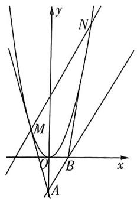

text_image

y
N
M
O
B
x
A

从而当 $MN / / AB$ 时， $k_{MN} = k_{AB} = \sqrt{3}$ ，所以 $x_{1} + x_{2} = \sqrt{3}$

因为 $y' = 2x$ ，所以 $k_{AM} = 2x_1$ ，可得切线 $AM$ 的方程为 $y - x_1^2 = 2x_1(x - x_1)$ ，即 $y = 2x_1x - x_1^2$ ，同理可得切线 $BN$ 的方程为 $y = 2x_2x - x_2^2$ ，

由题设中 $A, B$ 的要求，可设 $A(t, \sqrt{3} t - 3), B(t + \sqrt{3}, \sqrt{3} t)$ ，

将 $A(t, \sqrt{3} t - 3)$ 代入切线 $AM$ 的方程，得 $\sqrt{3} t - 3 = 2tx_1 - x_1^2$

即 $x_{1}^{2} - 2tx_{1} + \sqrt{3} t - 3 = 0$ ，可求得 $\overline{x_1 = t - \sqrt{t^2 - \sqrt{3}t + 3}}$ 这里取较小的根是因为 $M$ 为左边的切点

同理可求得 $x_{2} = t + \sqrt{3} +\sqrt{t^{2} + \sqrt{3}t + 3},$

计算时可以直接 $\Rightarrow N$ 为右边的切点

把 $x_{1}$ 中所有的 $t$ 都换为 $t + \sqrt{3}$

因为 $x_{1} + x_{2} = \sqrt{3}$ ，所以 $t - \sqrt{t^2 - \sqrt{3}t + 3} + t + \sqrt{3} + \sqrt{t^2 + \sqrt{3}t + 3} = \sqrt{3}$

即 $2t$ +

$$
\frac {\left(\sqrt {t ^ {2} + \sqrt {3} t + 3} - \sqrt {t ^ {2} - \sqrt {3} t + 3}\right) \left(\sqrt {t ^ {2} - \sqrt {3} t + 3} + \sqrt {t ^ {2} + \sqrt {3} t + 3}\right)}{\sqrt {t ^ {2} - \sqrt {3} t + 3} + \sqrt {t ^ {2} + \sqrt {3} t + 3}},
$$

整理得 $t\left(1 + \frac{\sqrt{3}}{\sqrt{t^2 - \sqrt{3}t + 3} + \sqrt{t^2 + \sqrt{3}t + 3}}\right) = 0$ ，所以 $t = 0$

故点 A 的横坐标为 0.

2. 大招识别 根据题意, AB 实际上是点 P 对应的切点弦, 可以根据 $l: y = kx + 1$ , 切点弦所在直线方程为 $\frac{mx}{a^{2}} - \frac{ny}{b^{2}} = 1$ 求出点 P 坐标满足的条件, 从而表示出三角形面积.

解析如图，设 $A(x_{1},y_{1}),B(x_{2},y_{2})$ ，将 $l$ 与双曲线方程联立得 $\left\{ \begin{array}{l}y = kx + 1,\\ \frac{x^2}{4} -\frac{y^2}{3} = 1, \end{array} \right.$

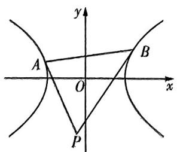

text_image

y
A
O
x
B
P

整理可得 $(3 - 4k^{2})x^{2} - 8kx - 16 = 0$

由于 $l_{1}y = kx + 1$ 与双曲线 $C$ 左右两支分别相交于 $A, B$ 两点，于

是有 $\left\{ \begin{array}{l} x_{1} + x_{2} = \frac{8k}{3 - 4k^{2}}, \\ x_{1}x_{2} = \frac{-16}{3 - 4k^{2}}, \end{array} \right.$

由 $\left\{\begin{aligned}&3-4k^{2}\neq0,\\&\Delta=64(3-3k^{2})>0,\\&\text{注意:容易遗漏} \\&x_{1}x_{2}=\frac{-16}{3-4k^{2}}<0,\end{aligned}\right.$ 可得 $k^{2}\in[0,\frac{3}{4})$ ,

因此 $|AB|=\sqrt{1+k^{2}}\left|x_{1}-x_{2}\right|=\sqrt{1+k^{2}}\sqrt{\left(x_{1}+x_{2}\right)^{2}-4x_{1}x_{2}}=8\sqrt{3}\sqrt{1+k^{2}}\frac{\sqrt{1-k^{2}}}{3-4k^{2}}$

设 $P(x_0, y_0)$ ，故 $P$ 点所对应的切点弦所在直线的方程为 $\frac{x_0x}{4} - \frac{y_0y}{3} = 1$

即为 $l:y = kx + 1$ ，故可得 $x_0 = -4k,y_0 = -3$ ，点 $P$ 到直线 $AB$ 的距离 $d_{P - AB} = \frac{4(1 - k^2)}{\sqrt{k^2 + 1}}$

故 $S_{\triangle PAB}=\frac{1}{2}|AB|d_{P-AB}=16\sqrt{3}\frac{(1-k^{2})^{\frac{3}{2}}}{3-4k^{2}}$ ,

令 $1 - k^2 = t \in \left(\frac{1}{4}, 1\right]$ , 代入上式有 $S_{\triangle PAB} = \frac{16\sqrt{3}t^{\frac{3}{2}}}{4t - 1} = \frac{16\sqrt{3}}{\frac{4}{\sqrt{t}} - \frac{1}{(\sqrt{t})^3}}.$

令 $\frac{1}{\sqrt{t}}=u\in[1,2)$ ，设 $f(u)=4u-u^{3}$ ，则 $f'(u)=4-3u^{2}$ ，

当 $1 \leqslant u < \frac{2}{\sqrt{3}}$ 时, $f'(u) > 0$ ; 当 $\frac{2}{\sqrt{3}} < u < 2$ 时, $f'(u) < 0$ .

故 $f(u)$ 的最大值为 $f(\frac{2}{\sqrt{3}})=\frac{16}{3\sqrt{3}}$ ,

因此三角形 $ABP$ 面积的最小值为 $S_{\triangle PAB} = 16\sqrt{3} \times \frac{3\sqrt{3}}{16} = 9.$

3. 解析设 $A(x_{1}, y_{1}), B(x_{2}, y_{2})$ ，其中 $x_{1} < x_{2}$ .

$$
\because \frac {\mathrm{e} ^ {x _ {1}} - \mathrm{e} ^ {x _ {2}}}{x _ {1} - x _ {2}} <   \frac {\mathrm{e} ^ {x _ {1}} + \mathrm{e} ^ {x _ {2}}}{2}, \therefore k = \frac {y _ {1} - y _ {2}}{x _ {1} - x _ {2}} = \frac {t (\mathrm{e} ^ {x _ {1}} - \mathrm{e} ^ {x _ {2}})}{x _ {1} - x _ {2}} <   \frac {t (\mathrm{e} ^ {x _ {1}} + \mathrm{e} ^ {x _ {2}})}{2} =
$$

对数不等式：若 $a > 0, b > 0, a \neq b$ ，则 $\frac{a - b}{\ln a - \ln b} < \frac{a + b}{2}$ $\frac{y_1 + y_2}{2}, \therefore y_1 + y_2 > 2k$ ①.

将 $\frac{x_1^2}{2} + y_1^2 = 1$ 和 $\frac{x_2^2}{2} + y_2^2 = 1$ 相减，得 $\frac{(x_1 + x_2)(x_1 - x_2)}{2} + (y_1 + y_2)(y_1 - y_2) = 0, \therefore x_1 + x_2 = -2k(y_1 + y_2)$ ②.

再将 $\frac{x_1^2}{2} + y_1^2 = 1$ 和 $\frac{x_2^2}{2} + y_2^2 = 1$ 相加，得 $\frac{x_1^2 + x_2^2}{2} + y_1^2 + y_2^2 = 2$ ③.为利用 $x_{1} + x_{2}$ 与 $y_{1} + y_{2}$ 的条件，需要构造出其相关的量 $x_{t}^{2} + x_{2}^{2}, y_{1}^{2} + y_{2}^{2}$ ，考虑相加

注意到当 $x_{1} \neq x_{2}$ 时，由 $x_{1}^{2} + x_{2}^{2} > 2x_{1}x_{2}$ 知 $\frac{x_1^2 + x_2^2}{2} > \frac{(x_1 + x_2)^2}{4}$ ，结合①②③，知

$2=\frac{x_{1}^{2}+x_{2}^{2}}{2}+y_{1}^{2}+y_{2}^{2}>\frac{(x_{1}+x_{2})^{2}}{4}+\frac{(y_{1}+y_{2})^{2}}{2}=\frac{4k^{2}(y_{1}+y_{2})^{2}}{4}+\frac{(y_{1}+y_{2})^{2}}{2}>4k^{4}+2k^{2},\therefore 2k^{4}+k^{2}-1<0,$ 即 $(2k^{2}-1)(k^{2}+1)<0,$ 解得 $k<\frac{\sqrt{2}}{2}.$

# 专题十二 计数原理

# 考点切片

# 考点1 排列与排列数的基本概念

1.18 或 22 解析由已知可得 $\left\{ \begin{array}{l} m + 1 \leqslant 4, \\ 2 \leqslant m, \end{array} \right.$ 结合 $m \in \mathbf{N}^*$ , 解得 $m = 2$ 或 3, 当 $m = 2$ 时, $\mathrm{A}_4^{m+1} - \mathrm{A}_m^2 = \mathrm{A}_4^3 - \mathrm{A}_2^2 = 22$ , 当 $m = 3$ 时, $\mathrm{A}_4^{m+1} - \mathrm{A}_m^2 = \mathrm{A}_4^4 - \mathrm{A}_3^2 = 18$ .

2. $A_{n-2}^{m}$ 解析等式左边表示从 n 个元素中选取 m 个元素排列；等式右边表示 n 个元素中选取 m 个元素排列并根据两个指定的元素 a, b 是否被选中进行分类，

a, b 都被选出来，有 $A_{m}^{2}A_{n-2}^{m-2}$ 种排法，a, b 中有一个被选出来，有 $C_{2}^{1}A_{m}^{1}A_{n-2}^{m-1}$ 种排法，a, b 都没有被选出来，有 $A_{n-2}^{m}$ 种排法，所以 $A_{n}^{m}=A_{m}^{2}A_{n-2}^{m-2}+C_{2}^{1}A_{m}^{1}A_{n-2}^{m-1}+A_{n-2}^{m}$ .

3.A 解析 因为当 n=5 时, $A_{5}^{5}=120$ ; 当 n>5 时, $A_{n}^{n}=1\times2\times3\times4\times5\times\cdots\times n=120\times\cdots\times n$ , 所以当 $n\geqslant5$ 时, $A_{n}^{n}$ 的个位数字为 0, 又因为 $A_{1}^{1}+A_{2}^{2}+A_{3}^{3}+A_{4}^{4}=1+2+6+24=33$ , 所以 M 的个位数字为 3.

4.A 解析易知 $x \geqslant 3, x \in \mathbf{N}^{*}$ .

因为 $\mathrm{A}_x^3 = x(x - 1)(x - 2),\mathrm{A}_{x + 1}^2 = (x + 1)x,\mathrm{A}_x^2 = x(x - 1),$

所以原不等式可化为 $3x(x - 1)(x - 2) \leqslant 2x(x + 1) + 6x(x - 1)$ ，整理得 $(3x - 2)(x - 5) \leqslant 0$ ，所以 $\frac{2}{3} \leqslant x \leqslant 5$ .

又因为 $x \geqslant 3, x \in \mathbf{N}^{*}$ , 易忽略点

所以原不等式的解集为 $\{3,4,5\}$ .

# 考点2 组合与组合数的基本概念

1.4 解析由组合数的计算公式,可得 $\frac{C_{2n}^{n}}{C_{2n+1}^{n}}=\frac{\frac{(2n)!}{n!(2n-n)!}}{\frac{(2n+1)!}{n!(2n+1-n)!}}=\frac{n+1}{2n+1}=\frac{5}{9}$ ,解得n=4.

2.21或10 解析因为 $\mathrm{C}_{15}^{x^2 + 2x} - \mathrm{C}_{15}^{8x - 9} = 0$ ，所以 $\mathrm{C}_{15}^{x^2 + 2x} = \mathrm{C}_{15}^{8x - 9}$

则 $x^{2} + 2x = 8x - 9$ 或 $x^{2} + 2x + 8x - 9 = 15$

$$
\zeta_ {n} = C _ {n} ^ {m} = C _ {n} ^ {n - m}
$$

当 $x^{2} + 2x = 8x - 9$ 时，即 $x^{2} - 6x + 9 = 0$ ，解得 $x = 3$ ，此时 $\mathrm{C}_{2x + 1}^{2x - 1} = \mathrm{C}_7^5 = \mathrm{C}_7^2 = 21$

当 $x^{2} + 2x + 8x - 9 = 15$ 时，即 $x^{2} + 10x - 24 = 0$ ，解得 $x = 2$ 或 $x = -12$ （舍去），

此时 $C_{2x+1}^{2x-1}=C_{5}^{3}=10.$

3.4 844 解析 $C_{n}^{m} + C_{n}^{m+1} = C_{n+1}^{m+1}$ 可表示为: 从装有 1 个白球, $n$ 个黑球的袋子里, 取出 $m+1$ 个球的取法总数 ( $C_{n}^{m}$ 代表已经取出白球, 再从剩下 $n$ 个黑球中取出 $m$ 个黑球; $C_{n}^{m+1}$ 代表没有取出白球, 需从剩下 $n$ 个黑球中取出 $m+1$ 个黑球), 可简记为: 下加一, 上取大.

因为 $C_{4}^{4}\approx1$ ，所以原式 $=C_{4}^{4}+C_{4}^{3}+C_{8}^{3}+\cdots+C_{19}^{3}-1$

$$
\begin{array}{l} = \mathrm{C} _ {5} ^ {4} + \mathrm{C} _ {5} ^ {3} + \mathrm{C} _ {6} ^ {3} + \dots + \mathrm{C} _ {1 9} ^ {3} - 1 \\ \approx C _ {4 0} ^ {4} + C _ {6} ^ {3} + \dots + C _ {1 9} ^ {3} - 1 \\ \end{array}
$$

$$
\begin{array}{l} \bullet \quad \bullet \quad \circ \\ = \mathrm{C} _ {2 0} ^ {4} - 1 \\ = 4 8 4 4. \\ \end{array}
$$

4.C 解析 $C_{k}^{0} \cdot C_{n}^{m} + C_{k}^{1} \cdot C_{n}^{m-1} + C_{k}^{2} \cdot C_{n}^{m-2} + \cdots + C_{k}^{k} \cdot C_{n}^{m-k}$ 可表示为:从装有 n 个白球,k 个黑球的袋子里,取出 m 个球的取法总数.

又因为从装有 $n + k$ 个球的袋子里取出 $m$ 个球的不同取法数为 $\mathbf{C}_{n + k}^{m}$

所以 $C_{k}^{0} \cdot C_{n}^{m} + C_{k}^{1} \cdot C_{n}^{m-1} + C_{k}^{2} \cdot C_{n}^{m-2} + \cdots + C_{k}^{k} \cdot C_{n}^{m-k} = C_{n+k}^{m}$ 故 $C_{3}^{0}\cdot C_{7}^{4}+C_{3}^{1}\cdot C_{7}^{3}+C_{3}^{2}\cdot C_{7}^{2}+C_{3}^{3}\cdot C_{7}^{1}=C_{10}^{4}.$

# 考点3 多情况分析

1.A 解析分两类情况,第一类情况,去 C 企业仅有一人,有 $C_{5}^{1} \times 2^{4} = 80$ (种) 情况;第二类情况,没有人去 C 企业,有 $2^{5} = 32$ (种) 情况,所以根据加法计数原理共有 $80 + 32 = 112$ (种).

2.C 解析甲、乙二人先选1种相同的课外读物,有 $C_{6}^{1}=6$ (种)情况,再从剩下的5种课外读物中各自选1本不同的读物,有 $C_{5}^{1}C_{4}^{1}=20$ (种)情况,由乘法计数原理可得共有 $6\times20=120$ (种)选法.

3.134 解析设甲、乙、丙3位同学的信件分别为A,B,C,若A,B,C都没有取到,则有 $A_{4}^{3}=24$ (种)不同的取法;

若 $A, B, C$ 取到一个，则有 $\mathrm{C}_3^1\mathrm{A}_2^1\mathrm{A}_4^2 = 72$ （种）不同的取法；

若 A, B, C 取到两个，则有 $\mathrm{C}_{3}^{2}\left(\mathrm{A}_{2}^{1}\mathrm{A}_{4}^{1}+\mathrm{C}_{4}^{1}\right)=36$ （种）不同的取法；若 A, B, C 取到三个，则有 $\mathrm{C}_{2}^{1}=2$ （种）不同的取法.

根据加法计数原理,一共有 $24 + 72 + 36 + 2 = 134$ (种) 不同的取法.

4.64 解析方法一 由题意知, 可分三类: 第一类, 体育类选修课和艺术类选修课各选修1门, 有 $C_{4}^{1}C_{4}^{1}$ 种方案; 第二类, 在体育类选修课中选修1门, 在艺术类选修课中选修2门, 有 $C_{4}^{1}C_{4}^{2}$ 种方案; 第三类, 在体育类选修课中选修2门, 在艺术类选修课中选修1门, 有 $C_{4}^{2}C_{4}^{1}$ 种方案. 综上, 不同的选课方案共有 $C_{4}^{1}C_{4}^{1} + C_{4}^{1}C_{4}^{2} + C_{4}^{2}C_{4}^{1} = 64$ (种).

方法二 若学生从这8门课中选修2门课,则有 $C_{8}^{2}-C_{4}^{2}-C_{4}^{2}=16$ (种)选课方案;若学生从这8门课中选修3门课,则有 $C_{8}^{3}-C_{4}^{3}-C_{4}^{3}=48$ (种)选课方案.综上,不同的选课方案共有 $16+48=64$ (种).

# 坑神有话说

在解决“至多”“至少”类排列组合问题时,一般有两种方法,一是分类,即先把问题分成若干类,然后算出每类的方法数,最后相加在一起;二是排除,即用总的方法数减去不符合条件的方法数.

5.24 112 解析第一步,从第一行任选一个数,共有4种不同的选法;第二步,从第二行选一个与第一个数不同列的数,共有3种不同的选法;第三步,从第三行选一个与第一、二个数均不同列的数,共有2种不同的选法;第四步,从第四行选一个与第一、二、三个数均不同列的数,只有1种选法.

由分步乘法计数原理知,不同的选法种数为 $4 \times 3 \times 2 \times 1 = 24$ .
先按列分析,每列必选出一个数,故所选4个数的十位上的数字分别为1,2,3,4.再按行分析,第一、二、三、四行个位上的数字的最大值分别为1,3,3,5,故从第一行选21,从第二行选33,从第三行选43,从第4行选15,此时个位上的数字之和最大.故选中方格中的4个数之和的最大值为 $21+33+43+15=112$ .

6.32 解析 先分类讨论“交替”排列的方式,然后分类讨论数字在“交替”排列中的位置.由于 $(x_{i}-x_{i+1})(x_{i+1}-x_{i+2})<0$ 对一切 $i\in\{1,2,3\}$ 恒成立,于是其排列方式只能为“小大小大小”或“大小大小大”,其中这里的“小”与“大”指的是比相邻的数小或大.当排列方式为“小大小大小”时,如35142,13254,\cdots,①当1,2,3在小,4,5在大时,排列方式有 $A_{3}^{3}A_{2}^{2}=12$ (种);②当1,2,4在小,3,5在大时,必须4,5在一边,1,2,3在另一边,于是排列方式有 $A_{2}^{2}A_{2}^{2}=4$ (种).因此排列方式为“小大小大小”的有16种.

同理可得,当排列方式为“大小大小大”时,排列方式也有16种.综上所述,“交替”的排列的数目是32.

# 坑神有话说

此题需要注意多重分类讨论,分完大类之后还有小类需要分.

# 考点4 特殊先安排

1.B 大招识别 特殊元素为两天都参加的人,可从5人中先选1人.

解析先从5人中选择1人两天均参加公益活动，有 $\mathrm{C}_5^1$ 种方式；再从余下的4人中选2人分别安排到星期六、星期日，有 $\mathrm{A}_4^2$ 种安排方式.所以不同的安排方式共有 $\mathrm{C}_5^1\mathrm{A}_4^2 = 60$ （种）.

2.36 大招识别 由于甲、乙、丙比较特殊,因此可以将他们先安排,按他们照看第一、四道工序分类讨论.

解析①当甲照看第一道工序、丙照看第四道工序时，剩下4个人选择2个照看中间两道工序，于是有 $A_{4}^{2}=12$ （种）；②当乙照看第一道工序、甲照看第四道工序时，剩下4个人选择2个照看中间两道工序，于是有 $A_{4}^{2}=12$ （种）；③当乙照看第一道工序、丙照看第四道工序时，剩下4个人选择2个照看中间两道工序，于是有 $A_{4}^{2}=12$ （种）.

综上所述,不同的安排方案一共有 $12 + 12 + 12 = 36$ (种).

3.B 大招识别 由于甲、乙、丙比较特殊,因此可以先将他们一个一个安排,最后再考虑剩下的三名教师.

解析第一步,先安排丙,因为丙不去希望中学,所以先将丙安排在其他两所学校,有 $C_{2}^{1}$ 种选法.

第二步,再安排甲,甲有两种可能:①若甲、丙在同一所学校,此时乙就有 $C_{2}^{1}$ 种选法,剩下3名教师可能分别有3、2、1人在最后一所学校(记为X校),分别对应排法有1(3人均在X校)、 $C_{3}^{2}\cdot C_{2}^{1}$ (2人在X校,另1人随便排)、 $C_{3}^{1}\cdot(C_{2}^{1}+A_{2}^{2})$ (1人在X校,另2人分在同一所学校或不在同一所学校),共 $1+C_{3}^{2}\cdot C_{2}^{1}+C_{3}^{1}\cdot(C_{2}^{1}+A_{2}^{2})=19$ (种)排法;

②若甲、丙不在同一所学校，则甲有 $C_{2}^{1}$ 种选法，
此时若乙与丙在同一所学校，则剩下3名教师按上面方法有19种排法，

若乙与丙不在同一所学校，则甲、乙、丙三人在三所不同的学校，

剩下3名教师每个人都可以去三所学校中的任意一所,共有 $3^{3}=27$ (种)排法.

综上，故共有 $\mathrm{C}_2^1\cdot [\mathrm{C}_2^1\cdot 19 + \mathrm{C}_2^1\cdot (19 + 27)] = 260$ （种）排法

# 考点5 多面手问题

1.800 解析 将左右都能划的 2 名队员视为多面手, 将他们作为特殊对象展开分类讨论.

①当2个多面手都不上场时，有 $C_{5}^{3}C_{5}^{3}=100$ （种）；  
②当只有1个多面手划左边时，有 $C_{2}^{1}C_{5}^{2}C_{5}^{3}=200$ （种）；  
③当只有1个多面手划右边时，有 $C_{2}^{1}C_{5}^{3}C_{5}^{2}=200$ （种）；  
④当1个多面手划左边、1个多面手划右边时，有 $C_{2}^{1}C_{5}^{2}C_{5}^{2}=200$ （种）；  
⑤当有2个多面手划左边时，有 $C_{5}^{1}C_{5}^{3}=50$ （种）；  
⑥当有2个多面手划右边时，有 $C_{5}^{3}C_{5}^{1}=50$ （种）.

综上所述,一共有 $100 + 200 + 200 + 200 + 50 + 50 = 800$ (种) 组法.

2.199 解析 根据题意可以得出,3人为多面手,2人只会跳舞,5人只会唱歌.

①当3个多面手都不上场时，有 $C_{5}^{2}=10$ （种）；  
②当1个多面手唱歌时，有 $C_{3}^{1}C_{5}^{1}=15$ （种）；  
③当1个多面手跳舞时，有 $C_{5}^{2}C_{3}^{1}C_{2}^{1}=60$ （种）；  
④当1个多面手唱歌、1个多面手跳舞时，有 $C_{3}^{1}C_{5}^{1}C_{2}^{1}C_{2}^{1}=60$ （种）；  
⑤当2个多面手唱歌时,有 $C_{3}^{2}=3$ (种);  
⑥当2个多面手跳舞时,有 $C_{3}^{2}C_{5}^{2}=30$ (种);  
⑦当2个多面手唱歌、1个多面手跳舞时，有 $C_{3}^{2}C_{2}^{1}=6$ （种）；  
⑧当1个多面手唱歌、2个多面手跳舞时，有 $C_{3}^{1}C_{5}^{1}=15$ （种）.

综上所述,一共有 $10 + 15 + 60 + 60 + 3 + 30 + 6 + 15 = 199$ (种) 选派方法.

# 考点6 数字问题

1.8 解析为了使每一横行、每一竖列以及两条对角线上的三个数字之和都相等，正中心的数最为特殊，只能将 $1\sim 9$ 的中位数5放中心，剩余数字两两分组“1,9”“2,8”“3,7”“4,6”放在“对立”位置，使得与5相加均为15，再经过尝试可知，奇数不能放在4个角，只能将4个偶数放在4个角，此时奇数的位置也就随之确定，故最终符合题意的填写方法有如下8种：

<table><tr><td>2</td><td>9</td><td>4</td></tr><tr><td>7</td><td>5</td><td>3</td></tr><tr><td>6</td><td>1</td><td>8</td></tr></table>

<table><tr><td>6</td><td>1</td><td>8</td></tr><tr><td>7</td><td>5</td><td>3</td></tr><tr><td>2</td><td>9</td><td>4</td></tr></table>

<table><tr><td>4</td><td>9</td><td>2</td></tr><tr><td>3</td><td>5</td><td>7</td></tr><tr><td>8</td><td>1</td><td>6</td></tr></table>

<table><tr><td>8</td><td>1</td><td>6</td></tr><tr><td>3</td><td>5</td><td>7</td></tr><tr><td>4</td><td>9</td><td>2</td></tr></table>

<table><tr><td>6</td><td>7</td><td>2</td></tr><tr><td>1</td><td>5</td><td>9</td></tr><tr><td>8</td><td>3</td><td>4</td></tr></table>

<table><tr><td>4</td><td>3</td><td>8</td></tr><tr><td>9</td><td>5</td><td>1</td></tr><tr><td>2</td><td>7</td><td>6</td></tr></table>

<table><tr><td>2</td><td>7</td><td>6</td></tr><tr><td>9</td><td>5</td><td>1</td></tr><tr><td>4</td><td>3</td><td>8</td></tr></table>

<table><tr><td>8</td><td>3</td><td>4</td></tr><tr><td>1</td><td>5</td><td>9</td></tr><tr><td>6</td><td>7</td><td>2</td></tr></table>

2.329 解析由题意知集合中至多有一个奇数,其余均是偶数.首先讨论三位数中的偶数,

①当个位为0时，则百位和十位在剩余的9个数字中选择两个进行排列，则这样的偶数有 $A_{9}^{2}=72$ （个）；  
②当个位不为0时，则个位有 $C_{4}^{1}$ 个数字可选，百位有 $C_{8}^{1}$ 个数字可选，十位有 $C_{8}^{1}$ 个数字可选，根据分步乘法计数原理知这样的偶数共有 $C_{4}^{1}C_{8}^{1}C_{8}^{1}=256$ （个），

最后再加上单独的奇数,所以集合中元素个数的最大值为 $72 + 256 + 1 \approx 329$ (个).

3. 解析(1)根据题目可得“五位数中万位数字不能是0,且个位数字只能为1,3”,于是可以根据最后一位的数字进行分类讨论.

①当个位为1时,万位只能为2,3,4,所以有 $C_{3}^{1}\times A_{3}^{3}=3\times3!$ =18(个);  
②当个位为3时,万位只能为1,2,4,所以有 $C_{3}^{1}\times A_{3}^{3}=3\times3!$ =18(个).

综上所述,有36个奇数.

(2) 因为万位数为 1 的数有 $A_{4}^{4}=24$ (个)，万位数为 2 的数有 $A_{4}^{4}=24$ (个)，所以从小到大排列，30 124 排第 49 个.

# 考点7 染色问题

1.260 解析根据涂色时使用颜色的种数进行分类讨论.

①当只用2种颜色去涂时，I与Ⅲ颜色相同、Ⅱ与Ⅳ颜色相同，于是就有 $A_{5}^{2}=20$ （种）涂色方法.  
②当只用3种颜色去涂时，I与Ⅲ颜色相同、Ⅱ与Ⅳ颜色不同，有 $A_{5}^{3}=60$ （种）涂色方法；I与Ⅲ颜色不同、Ⅱ与Ⅳ颜色相同，有 $A_{5}^{3}=60$ （种）涂色方法.  
③当用4种颜色去涂时，有 $A_{5}^{4}=120$ （种）涂色方法.

综上所述,一共有 $20 + 60 + 60 + 120 = 260$ (种) 涂色方法.

2.B 解析区域4与其他区域都相邻,比较特殊,先安排.

第一步,涂区域4,有4种方法;第二步,涂区域1,有3种方法;第三步,涂区域2,有2种方法;

第四步(此前三步已经用去三种颜色):涂区域3,分两类:

①区域3与1同色,则区域5涂第四种颜色;   
②区域3与1不同色,则区域3涂第四种颜色,此时区域5就可以涂区域1或区域2或区域3中的任意一种颜色,有3种方法.所以不同的涂色种数有 $4\times3\times2\times(1\times1+1\times3)=96$ (种).

3.1 560 解析 若用 5 种颜色, 从 6 种颜色中任选 5 种再作全排列, 即 $A_{6}^{5}=720$ (种);

若用4种颜色，从6种颜色中任选4种有 $C_{6}^{4}=15$ （种），从中任选一种颜色涂在其中一组对面上有 $C_{4}^{1}C_{2}^{1}=8$ （种），其他3种颜色作全排列有 $A_{3}^{3}=6$ （种），所以共有 $15\times8\times6=720$ （种）；

若用3种颜色,从6种颜色中任选3种有 $C_{6}^{3}=20$ (种),从中任选两种颜色涂在两组对面上有 $A_{3}^{2}=6$ (种),余下的一种颜色涂在底面有1种,所以共有 $20\times6\times1=120$ (种).

综上,不同的涂色方案有 $720 + 720 + 120 = 1560$ (种).

# 考点8 环排问题

1.(1)96 (2)48 解析(1)属于环形排列的问题,四对母子各自看成一个整体参与环形排列,方法有 $A_{3}^{3}=6$ (种),每对母子内捆绑法与环排的结合

部还有顺序问题,为 $A_{2}^{2}A_{2}^{2}A_{2}^{2}A_{2}^{2}=16$ (种),所以排列方式共有 $6\times16=96$ (种).

(2)由于孩子都挨着自己的母亲坐,将每对母子当成一个整体先进行排列.所有孩子均不相邻,孩子或者都在自己母亲的左侧,或者都在自己母亲的右侧,共有2种坐法,而且当第一对母子座位确定后,其他母子座位就确定了,排列数是 $A_{4}^{4}$ ,所以总的排列方式有 $2\times A_{4}^{4}\approx2\times4\times3\times2\times1=48$ (种).

2.120 解析根据题意,假设6个匣子为 $L_{1},L_{2},L_{3},L_{4},L_{5},L_{6}$ ,要求砸开一个匣子后,能继续用钥匙打开其余5个匣子,即在砸开的匣子中必放有另一个匣子的钥匙,依次类推,打开所有的匣

子, 则原问题相当于由 $L_{1}, L_{2}, L_{3}, L_{4}, L_{5}, L_{6}$ 形成一个环状排列, 反过来, 对于由 $L_{1}, L_{2}, L_{3}, L_{4}, L_{5}, L_{6}$ 排成的每一种环状排列, 也就可以对应成一种相继打开各个匣子的放钥匙的方法, 先让 6 个匣子沿着圆环对号入座, 再在每个匣子中放入其下方的匣子的钥匙, 这就得到一种相继打开各个匣子的放钥匙的方法. 所以可使所有匣子相继打开的放钥匙的方法数恰与 $L_{1}, L_{2}, L_{3}, L_{4}, L_{5}, L_{6}$ 的环状排列数相等, 由于 $n$ 个元素的环状排列数为 $(n - 1)$ ! 种, 则钥匙的放法有 $5! = 120$ (种).

# 坑神小课堂

①一般地， $n$ 个不同元素进行环状排列，有 $\mathrm{A}_{n-1}^{n-1} = (n-1)!$ （种）排法.这是因为圈是没有排头的，先选出一个人当排头，剩下的人就可以按照排成一排的思想来解决了，也就是说 $n$ 个人的环形排列就相当于 $(n-1)$ 个人站成一排.  
②如果从 n 个不同元素中取出 m 个元素进行环形排列, 共有 $\frac{1}{m}A_{n}^{m}$ 种排法.

# 考点9 固序问题

1.15 120 大招识别 9人排序,4人顺序不变,符合【大招84】.

解析除序法. 先将 9 人全排, 即为 $A_{9}^{9}$ , 再将甲、乙、丙、丁四人全排, 即为 $A_{4}^{4}$ ,

故有 $\frac{A_{9}^{9}}{A_{4}^{4}}=15\ 120$ （种）排法.

另解1 空位法. 先从9个位置中, 选出5个位置给其余5人, 然后再把甲、乙、丙、丁四人按固定顺序放入剩余的4个位置, 则有 $A_{9}^{5}=15\ 120$ (种) 排法.

另解2 插入法. 先选出 4 个位置给甲、乙、丙、丁四人, 有 $C_9^4$ 种选法, 再将剩余 5 个位置给其余 5 人, 进行全排列, 有 $A_5^5$ 种排法, 故共有 $C_9^4 \cdot A_5^5 = 15120$ (种) 排法.

2.839 大招识别 7 个字母中字母 e 重复了 3 次, 在排序中 3 个 e 的顺序本质上是固定次序为 1 个, 符合【大招 84】.

解析除序法.7个字母的全排列有 $A_{7}^{7}$ 种,

因为有3个字母是重复的，所以共有 $\frac{\mathrm{A}_7^7}{\mathrm{A}_3^3} = 840$ （种）排法，

除去1种正确的写法，所以出现的错误写法共有839种.

另解1 空位法. 先从 7 个位置中, 选出 4 个位置给其余 4 个字母, 然后再把 3 个 e 放入剩余的 3 个位置, 则有 $A_{7}^{4} = 840$ (种) 排法, 除去 1 种正确的写法, 所以出现的错误写法共有 839 种.

另解2 插入法. 先从 7 个位置中选出 3 个位置放入 e, 有 $C_{7}^{3}$ 种选法, 再将剩余 4 个位置给其余 4 个字母, 进行全排列, 有 $A_{4}^{4}$ 种排法, 故共有 $C_{7}^{3} \cdot A_{4}^{4} = 840$ (种) 排法, 除去 1 种正确的写法, 所以出现的错误写法共有 839 种.

3.1 260 大招识别 9 个球的排序中, 3 个红球的顺序本质上固定为 1 个, 4 个蓝球的顺序本质上固定为 1 个, 2 个黄球的顺序本质上固定为 1 个, 符合【大招 84】.

解析先将9个球进行排序,得到 $A_{0}^{9}$ ,再将第一组3个红球的 $A_{1}^{3}$ 个顺序调整为固定的一个,再将第二组4个蓝球的 $A_{4}^{4}$ 个顺序调整为固定的一个,再将第三组2个黄球的 $A_{2}^{2}$ 个顺序调整为固定的一个,故有 $\frac{A_{9}^{9}}{A_{3}^{3}A_{4}^{4}A_{2}^{2}}=1\ 260$ (种)排法.

4.1 260 解析先将 1,2,3,4,5,6,7 进行排序，然后考虑 1,2 与 4,6 的排序种数为 $A_{2}^{2}A_{2}^{2}$ ，于是根据除序法有 $\frac{A_{7}^{7}}{A_{2}^{2}A_{2}^{2}} = 2 \times 3 \times 5 \times 6 \times 7 = 1260$ （个）七位数符合条件.

另解先将3,5,7进行排序，有 $\mathrm{A}_7^3$ 种排法，剩余的四个位置中，选出两个位置排1和2，有 $\mathrm{C}_4^2$ 种选法，剩余两个位置排4和先排4和6也一样

6, 只有 1 种排法, 所以有 $\mathrm{A}_7^3\mathrm{C}_4^2 \times 1 = 1260$ (个) 七位数符合条件.

# 考点10 走楼梯问题

1.924 解析先设有 $x$ 步登两级台阶， $y$ 步登一级台阶，则有 $\left\{ \begin{array}{l} x + y = 12, \\ 2x + y = 18, \end{array} \right.$ 解得 $\left\{ \begin{array}{l} x = 6, \\ y = 6, \end{array} \right.$ 因此将6步登两级台阶，6步登一级台阶进行排序，且登两级台阶与登一级台阶内部无顺序，从而根据除序法，共有 $\frac{\mathrm{A}_{12}^{12}}{\mathrm{A}_6^6\mathrm{A}_6^6} = 924$ （种）不同的走法.

2.34 解析先设有 $x \in \{0,1,2,3,4\}$ 步登两级台阶，则有 $(8 - 2x)$ 步登一级台阶，于是小明总共走了 $(8 - x)$ 步，因此根据除序法，得到在固定 $x$ 为某个值的情况下，小明有 $\frac{\mathrm{A}_{8 - x}^{8 - x}}{\mathrm{A}_x^x\mathrm{A}_{8 - 2x}^{8 - 2x}} = \frac{(8 - x)!}{x!(8 - 2x)!} = \mathrm{C}_{8 - x}^x$ （种）走法，从而小明从一层到二层共有 $\mathrm{C}_8^0 + \mathrm{C}_7^1 + \mathrm{C}_6^2 + \mathrm{C}_5^3 + \mathrm{C}_4^4 = 1 + 7 + 15 + 10 + 1 = 34$ （种）不同的走法.

3.A 解析按题意要求,不难验证这6步只能是1个三阶步,2个二阶步,3个一阶步.

为形象起见,以白、黑、红三种颜色的球来记录从一层到二层跨越10级台阶的过程:白球表示一阶步,黑球表示二阶步,红球表示三阶步,每一种过程可等价于3个白球、2个黑球、1个红球的一种同色球不相邻的排列.

下面分三种情形讨论.

①第1、第6球均为白球，则两黑球必分别位于中间白球的两侧，此时，共有4个黑白球之间的空位放置红球，所以此种情形共有4种可能的不同排列；

②第1球不是白球,若第1球为红球,则余下5球只有一种可能的排列,若第1球为黑球,则余下5球因红、黑球的位置不同有两种不同的排列,所以此种情形共有3种不同排列;

③第6球不是白球，同②，共有3种不同排列.

综上,按题意要求从一层到二层共有 $4+3+3=10$ (种)可能的不同走法.

4.192 解析方法一 记甲上到第 $n$ 级台阶共有 $a_{n}$ 种上法，则 $a_{1} = 1, a_{2} = 2$

上到第3级的方法为, 每一步一级, 或第一步一级第二步两级, 或第一步两级第二步一级, 或一步走三级, 共四种上法, 所以 $a_{3} = 4$ .

当 $n \geqslant 4$ 时，甲上到第 $n$ 级台阶，可以从第 $n - 1$ 级或第 $n - 2$ 级或从第 $n - 1$ 级到第 $n$ 级台阶等价于从开始到第一级台阶。第 $n - 3$ 级上去，所以 $a_{n} = a_{n - 3} + a_{n - 2} + a_{n - 1}$ ，

于是 $a_4 \approx 7, a_5 \approx 13, a_6 \approx 24, a_7 \approx 44, a_8 \approx 81, a_9 \approx 149, a_{10} \approx 274, a_{11} \approx 504,$

其中甲踩过第6级台阶的上台阶方法数,可分两步计算,
第一步,从开始到第6级,共有 $a_{6}$ 种方法;

第二步,从第6级到第11级,上了5个台阶,等价于从开始到第5级的方法数,共有 $a_{5}$ 种方法;

所以甲登完这个楼梯且踩过第6级台阶的上台阶方法有 $a_{6}a_{5}=24\times13=312$ （种），则甲登完这个楼梯且没踩过第6级台阶的方法有 $a_{11}-312=192$ （种）.

方法二 11级楼梯,甲一步能上1级或2级台阶,最多可以一步上3级,以走了几步三级作为分类依据,列举出所有的走法:

①三步三级: $3+3+3+2=11$ 走法为 $C_{4}^{1}=4$ ,

$3 + 3 + 3 + 1 + 1 = 11$ 走法为 $C_{5}^{2} = 10$ .

②两步三级: $3+3+1+1+1+1+1=11$ 走法为 $C_{7}^{2}=21$ ,

$3 + 3 + 2 + 1 + 1 + 1 = 11$ 走法为 $C_{6}^{2}C_{4}^{1} = 60$ ,

$3 + 3 + 2 + 2 + 1 = 11$ 走法为 $C_{5}^{2}C_{3}^{2} = 30$ .

③一步三级: $3+1+1+1+1+1+1+1+1=11$ 走法为 $C_{9}^{1}=9$ ,

$3+2+1+1+1+1+1+1=11$ 走法为 $C_{8}^{1}C_{7}^{1}=56$

$3 + 2 + 2 + 1 + 1 + 1 + 1 = 11$ 走法为 $C_{7}^{1}C_{6}^{2} = 105$ ,

$3+2+2+2+1+1=11$ 走法为 $C_{6}^{1}C_{5}^{3}=60$

$3+2+2+2+2=11$ 走法为 $C_{5}^{1}=5.$

④零步三级: $1+1+1+1+1+1+1+1+1+1+1=11$ 走法为 $C_{11}^{11}=1$ ,

$2+1+1+1+1+1+1+1+1+1=11$ 走法为 $C_{10}^{1}=10$ ,

$2+2+1+1+1+1+1+1+1=11$ 走法为 $C_{9}^{2}=36$ ,

$2+2+2+1+1+1+1+1=11$ 走法为 $C_{8}^{3}=56$ ,

$2+2+2+2+1+1+1=11$ 走法为 $C_{7}^{4}=35$ ,

$2+2+2+2+2+1=11$ 走法为 $C_{6}^{1}=6$ .

综上,上11级台阶共有 $4+10+21+60+30+9+56+105+60+5+1+10+36+56+35+6=504$ .

同理可得从第1级到第6级,共有24种方法;从第6级到第11级,上了5个台阶,等价于从开始到第5级,共有13种方法,所以甲登完这个楼梯且踩过第6级台阶的上台阶方法有 $24 \times 13 = 312$ (种),

则甲登完这个楼梯且没踩过第6级台阶的方法有 $504 - 312 = 192$ （种）.

# 考点11 分组分配问题

1.540 大招识别 先考虑将书分成3堆有多少种情况,再将3堆书按照全排列分配给每个人.

解析第一步,将6本书分成3堆,每堆至少一本,共有3种情况:

①分为 4 - 1 - 1 的三堆,有两堆数量相同,根据除序法,有 $\frac{C_{6}^{1}C_{5}^{1}C_{4}^{4}}{A_{2}^{2}}=15$ （种）情况，

②分为3-2-1的三堆，有 $\mathrm{C}_6^3\mathrm{C}_3^2\mathrm{C}_1^1 = 60$ （种）情况，

③分为2-2-2的三堆，因为数量相同，所以要除以 $A_{3}^{3}$ 去序，有 $\frac{C_{6}^{2}C_{4}^{2}C_{2}^{2}}{A_{3}^{3}}=15$ （种）情况，

所以一共有 $15 + 60 + 15 = 90$ （种）情况；

第二步，将3堆书分给3个人，有 $A_{3}^{3}=6$ （种）情况；

第三步,根据乘法计数原理,共有 $90 \times 6 = 540$ (种)分配方式.

2.30 解析第一步,先将甲、乙、丙、丁4人分成2-1-1的3组,因为后两组数量相同,所以要除以 $A_{2}^{2}$ 去序,不同的分法有 $\frac{C_{4}^{2}C_{2}^{1}C_{1}^{1}}{A_{2}^{2}}=6$ (种),又因为甲、乙不同组,所以共有6-1=5(种)分组方法.

第二步，将3组派遣到 $A, B, C$ 个城市，有 $A_{3}^{3} = 6$ （种）方法.第三步，由乘法计数原理，不同派遣方法有 $5 \times 6 = 30$ （种）.

3.B 解析先从3名女生中选择2人组成一组,共 $C_{3}^{2}=3$ (种);再将余下4人平均分成2组,共 $\frac{C_{4}^{2}C_{2}^{2}}{A_{2}^{2}}=3$ (种);最后将3组分配【大招识别】注意此时还没有分配部门,只需要分成2组即可,故需要除以 $A_{2}^{2}$ 去序

到3个部门,共 $A_{3}^{3}=6$ (种).所以,不同的安排方法有 $3\times3\times6=54$ (种).

4.C 解析第一步,将5名志愿者2-1-1-1分成4组,因为后3组数量相同,所以要除以 $A_{3}^{3}$ 去序,有 $\frac{C_{5}^{2}C_{3}^{1}C_{2}^{1}C_{1}^{1}}{A_{3}^{3}}=10$ (种)情况,

第二步, 将 4 组志愿者分到 4 个项目, 有 $A_{4}^{4}=24$ (种) 情况; 第三步, 根据乘法计数原理, 共有 $10 \times 24 = 240$ (种) 分配方案.

5.1 560 解析第一步,将6名志愿者分成4组,每组至少一个人,共有两种情况:

①按人数分为3-1-1-1的四组，因为后3组数量相同，所以要除以 $A_{3}^{3}$ 去序，有 $\frac{C_{6}^{3}C_{3}^{1}C_{2}^{1}C_{1}^{1}}{A_{3}^{3}}=20$ （种）情况，

②按人数分为2-2-1-1的四组,因为前两组与后两组数量均相同,所以要除以两个 $A_{2}^{2}$ 去序,有 $\frac{C_{6}^{2}C_{4}^{2}C_{2}^{1}C_{1}^{1}}{A_{2}^{2}A_{2}^{2}}=45$ (种)情况,所以一共有 $20+45=65$ (种)情况;

第二步, 将 4 组志愿者分到 4 所学校, 有 $A_{4}^{4}=24$ (种) 情况; 第三步, 根据乘法计数原理, 共有 $65 \times 24 = 1560$ (种) 分配方式.

# 考点12 隔板法

1.10 28 大招识别 对于相同元素的分配问题,可以直接使用隔板法解决.

解析(1)将6本书排成1列,然后用两个隔板把这一列书分成三组,因为六本书之间有5个空,因此两个隔板的放置方法有 $C_{5}^{2}=10$ (种).

(2)先借过来3本相同的书,分给甲、乙、丙每人一本,此时问题就转化为将9本书分给甲、乙、丙三人,每人至少得一本,分完之后每人再扣除一本书,不影响分法种数,于是总的分法有 $C_{6+3-1}^{3-1}=C_{8}^{2}=28$ (种).

# 坑神有话说

“分组分配”与“隔板”最大的区别就是所给的元素是“不同”还是“相同”的，同学们要注意区分，做题时根据关键点快速匹配对应的解法哦。

2.120 [解析] 先在编 2 号, 3 号的盒内分别放入 1 个球和 2 个球, 还剩 17 个小球, 三个盒内每个至少再放入 1 个, 将 17 个球排成一排, 有 16 个空隙, 插入 2 块隔板分为三堆放入三个盒中即可, 共有 $C_{16}^{2} \approx 120$ (种) 方法.

3.84 286 大招识别 将问题转化为有 n 个小球排成一排，利用隔板法可求正整数解、非负整数解的组数.

解析(1) $x_{1}+x_{2}+x_{3}+x_{4}=10$ 的正整数解的组数相当于在10个小球之间的9个空隙中插入3个隔板,把球分为4组的方法数,即一共有 $C_{9}^{3}=\frac{9\times8\times7}{3\times2}=84$ (种);

(2) $x_{1}+x_{2}+x_{3}+x_{4}=10$ 的非负整数解的组数相当于 $(x_{1}+1)+(x_{2}+1)+(x_{3}+1)+(x_{4}+1)=14$ 的正整数解的组数，即 $y_{1}+y_{2}+y_{3}+y_{4}=14$ 的正整数解的组数，

同样的方法看成14个小球排成一排,在13个空隙中插入3个隔板分成4组,则共有 $C_{13}^{3}=\frac{13\times12\times11}{3\times2\times1}=286$ (种).

# 考点13 捆绑法&插空法

1.36 大招识别 将 1 和 3“捆绑”起来, 看作一个数处理.

解析先将1和3打包成a,再让0,2,4,a构成一个四位数,则有 $C_{3}^{1}\times A_{3}^{3}=18$ (种)情况.再让1和3内部排序,有2种情况.因此数字1和3相邻的无重复数字的五位数的个数为36.

2.192 大招识别 先排农场主,然后将两名男生“捆绑”起来看成一个整体再排进去,最后排女生,按此顺序进行求解.

解析农场主排在最中间,有1种排法,则农场主左边右边各有3个空位可用,

两名男生看成一个整体, 排在农场主左边、右边各有 2 种排法, 共 4 种排法, 然后两名男生内部可交换, 有 $A_{2}^{2}=2$ (种) 排法, 剩下 4 个空位排女生, 共 $A_{4}^{4}=24$ (种) 排法. 于是一共有 $2 \times 4 \times 24 = 192$ (种) 排法.

3.240 大招识别 把 A, B, C 排列, 产生 4 个空位, 然后将 F, G 看作一个整体与 D, E 插入到 A, B, C 中可求解.

解析因 F, G 两人必须相邻, 所以把 F, G 看作一个整体有 $A_{2}^{2}$ 种排法.

又 A, B, C 三人互不相邻, D, E 两人也不相邻, 所以先把 A, B, C 排列, 有 $A_{3}^{3}$ 种排法, 产生了 4 个空位, 再用插空法.

①当 D, E 分别插入到 A, B, C 中间的两个空位时，有 $A_{2}^{2}$ 种排法，再把 F, G 整体插入到此时产生的 6 个空位中，有 6 种排法.

②当 D, E 分别插入到 A, B, C 中间的两个空位其中一个和两端空位其中一个时，有 $C_{2}^{1} \cdot C_{2}^{1} \cdot A_{2}^{2} = 8$ (种) 排法，此时 F, G 必须排在 A, B, C 中间的两个空位的另一个空位，有 1 种排法.

综上，一共有 $\mathrm{A}_2^2\cdot \mathrm{A}_3^3\cdot (\mathrm{A}_2^2\cdot 6 + \mathrm{C}_2^1\cdot \mathrm{C}_2^1\cdot \mathrm{A}_2^2) = 240$ （种）排法.

# 考点14 正难则反

1.16 大招识别 至少有两个数为相邻整数的选法有很多，但不相邻的选法只有四种，由组合数公式计算出所有选法，减去三个数都不相邻的选法即可.

解析从1,2,3,4,5,6这六个数中任选三个数，共有 $C_{6}^{3}=20$ （种）选法，

其中三个数都不相邻的，有135,136,146,246这4种，

所以至少有两个数为相邻整数的选法有 20 - 4 = 16(种).

2.B 大招识别 利用正难则反的方法,求出总的方法数,减去一、二、三个职位连任的情况,即得结果.

解析四人中选出三人分别任职三个不同的岗位,其任职结果有

$$
\mathrm{A} _ {4} ^ {3} = 4 \times 3 \times 2 = 2 4 (\text {种}).
$$

三个职位中有一位连任，假设上届任职的甲、乙、丙三人分别担任书记、副书记和组织委员，

当甲连任书记时，副书记可选的人选分别为丙和丁，当丁担任了副书记，则组织委员只能选乙，当丙担任了副书记，则组织委员只能选乙和丁，乙连任副书记和丙连任组织委员的情况同上，故任职结果有 $C_{3}^{1}\times(1+2)=9$ （种）；

三个职位中有两位连任,任职结果有 $C_{3}^{2} \times 1 = 3$ (种);

三个职位中三位都连任,任职结果有1种.

故符合题意的任职结果有 24 - 9 - 3 - 1 = 11(种).

3.1008 解析使用正难则反,计算出甲、乙相邻的总方法数与甲、乙相邻且丙在10月1日或丁在10月7日的方法数即可.当甲、乙相邻时,将甲、乙捆绑,共有 $A_{6}^{6}A_{2}^{2}$ 种情况.当甲、乙相邻且丙在10月1日时,有 $A_{5}^{5}A_{2}^{2}$ 种情况,同理,当甲、乙相邻且丁在10月7日时,有 $A_{5}^{5}A_{2}^{2}$ 种情况.当甲、乙相邻且丙在10月1日、丁在10月7日时,有 $A_{4}^{4}A_{2}^{2}$ 种情况.因此甲、乙排在相邻两天,丙不排在10月1日,丁不排在10月7日,不同的安排方案共有 $A_{6}^{6}A_{2}^{2}-A_{5}^{5}A_{2}^{2}-A_{5}^{5}A_{2}^{2}+A_{4}^{4}A_{2}^{2}=1008$ (种).

# 坑神有话说

当甲、乙相邻且丙在10月1日时，包含了甲、乙相邻且丙在10月1日、丁在10月7日的情况；当甲、乙相邻且丁在10月7日时也包含了甲、乙相邻且丙在10月1日、丁在10月7日的情况，多减的方案数要加回来，所以最后要加上 $A_{4}^{4}A_{2}^{2}$ .

# 考点15 二项式定理展开分析

1.A 解析方法一:公式法. $(x-\sqrt{x})^{4}$ 的展开式的通项 $T_{r+1}=C_{4}^{r}x^{4-r}(-\sqrt{x})^{r}=(-1)^{r}C_{4}^{r}x^{4-\frac{r}{2}}(r=0,1,2,3,4)$ .由 $4-\frac{r}{2}=3$ ,得r=2,所以 $(x-\sqrt{x})^{4}$ 的展开式中 $x^{3}$ 的系数为 $(-1)^{2}C_{4}^{2}=6$ .

方法二: 组合数法. $(x-\sqrt{x})^{4}$ 的展开式中含 $x^{3}$ 的项是由 $(x-\sqrt{x})(x-\sqrt{x})(x-\sqrt{x})(x-\sqrt{x})$ 中任意取 2 个括号内的 x 与剩余的 2 个括号内的 $(- \sqrt{x})$ 相乘得到的, 所以 $(x-\sqrt{x})^{4}$ 的展开式中含 $x^{3}$ 的项为 $C_{4}^{2}x^{2} \cdot C_{2}^{2}(-\sqrt{x})^{2}=6x^{3}$ , 所以 $(x-\sqrt{x})^{4}$ 的展开式中 $x^{3}$ 的系数为 6.

2.17 解析 $(1 - 2x)^4$ 的展开式的通项 $T_{r + 1} = \mathrm{C}_4^r (-2x)^r = (-2)^r\mathrm{C}_4^r x^r$ ，所以 $a_0 + a_4 = (-2)^0\mathrm{C}_4^0 +(-2)^4\mathrm{C}_4^4 = 17.$ 题眼

3.60 解析方法一 二项式 $(2x^{3} - \frac{1}{x})^{6}$ 展开式的通项 $T_{k + 1} =$ $\mathrm{C}_6^h (2x^3)^{6 - k}(-\frac{1}{x})^k = (-1)^k 2^{6 - k}\mathrm{C}_6^k x^{18 - 4k}$ ，令 $18 - 4k = 2$ ，解得 $k = 4$ ，所以 $x^{2}$ 的系数为 $(-1)^{4}\times 2^{2}\times \mathrm{C}_{6}^{4} = 60.$

方法二 将二项式 $(2x^{3} - \frac{1}{x})^{6}$ 看成6个多项式 $(2x^{3} - \frac{1}{x})$ 相乘，要想出现 $x^{2}$ 项，则先在2个多项式中分别取 $2x^{3}$ ，然后在余下的多项式中都取 $-\frac{1}{x}$ 相乘，即 $\mathrm{C}_6^2 (2x^3)^2\times \mathrm{C}_4^4 (-\frac{1}{x})^4 = 60x^2$ ，所以 $x^{2}$ 的系数为60.

4.20 解析 $(\frac{3}{x^3} + \frac{x^3}{3})^6$ 的展开式的通项公式为 $T_{b+1} = C_0^k$

$(\frac{3}{x^3})^{6 - k}(\frac{x^3}{3})^k = \mathrm{C}_6^k\cdot 3^{6 - 2k}\cdot x^{6k - 18}.$ 令 $6k - 18 = 0$ ，则 $k = 3$ ，所以常数项为 $T_{4} = \mathrm{C}_{6}^{3}\cdot 3^{0}\cdot x^{0} = 20.$

5.B 解析 $(x-2y)^{5}$ 的二项展开式的通项为 $T_{k+1}=C_{5}^{k}x^{5-k}\cdot(-2y)^{k}=(-2)^{k}C_{5}^{k}x^{5-k}y^{k}$ ，令k=3，得 $T_{4}=-8C_{5}^{3}x^{2}y^{3}=-80x^{2}y^{3}$ ，所以 $\frac{(x-2y)^{5}}{xy^{3}}$ 的展开式中x的系数为-80.

6.5 35 解析 $(x - m)^{7}$ 展开式的通项为 $T_{r + 1} = \mathrm{C}_7^r\cdot x^{7 - r}\cdot$ $(-m)^{r}$ ，由 $x^4$ 的系数是-35知，当 $7 - r = 4$ ，即 $r = 3$ 时， $\mathrm{C}_7^3$ · $(-m)^3 = -35$ ，解得 $m = 1$ ，故各项系数可用 $\mathrm{C}_7^r\cdot (-1)^r$ 表示.若使 $\mathrm{C}_7^r\cdot (-1)^r$ 最大，则 $r$ 必为偶数，又 $(x - 1)^{7}$ 的展开式中共

有8项,故 r=4,系数最大的项是第5项.系数最大为 $C_{7}^{4}\times(-1)^{4}=35$ .

# 坑神来避坑

(1) 注意二项式系数和项的系数的区别, 二项式系数为组合数, 而项的系数是指未知数 (一般指 x) 的系数.

(2)在求系数最大项时,要注意各项系数符号是相同还是正负相间.本题中若要求 $(x+1)^{7}$ 的展开式中系数最大的项,则应是第4项或第5项.

7.5 解析 \((\frac{1}{3} + x)^{10}\) 的展开式的通项公式为 \(T\_{r+1} = C\_{10}^{r}(\frac{1}{3})^{10-r}x^{r}\), 则各项的系数分别为 \(C\_{10}^{0}(\frac{1}{3})^{10}, C\_{10}^{1}(\frac{1}{3})^{9}, C\_{10}^{2}(\frac{1}{3})^{8}, C\_{10}^{3}(\frac{1}{3})^{7}, C\_{10}^{4}(\frac{1}{3})^{6}, C\_{10}^{5}(\frac{1}{3})^{5}, C\_{10}^{6}(\frac{1}{3})^{4}, C\_{10}^{7}(\frac{1}{3})^{3}, C\_{10}^{8}(\frac{1}{3})^{2}, C\_{10}^{9}(\frac{1}{3})^{1}, C\_{10}^{10}(\frac{1}{3})^{0}\), 观察发现二项式系数先增大后减小, 且前后对称, 指数式递增, 分别计算 \(C\_{10}^{5}(\frac{1}{3})^{5}, C\_{10}^{6}(\frac{1}{3})^{4}, C\_{10}^{7}(\frac{1}{3})^{3}, C\_{10}^{8}(\frac{1}{3})^{2}, C\_{10}^{9}(\frac{1}{3})^{1}, C\_{10}^{10}(\underline{\underline{\underline{\underline{\underline{\underline{\underline{\underline{\underline{\underline{\underline{\underline{\underline{\underline{\underline{\underline{\underline{\underline{\underline{\underline{\underline{\underline{\underline{\underline{\underline{\underline{\underline{\underline{\underline{\underline{\underline{\underline{\underline{\underline{\underline{

8.49 解析 $x^{k}$ 的系数为 $a_{k}=C_{100}^{k}2\ 023^{k}+C_{100}^{k}2\ 023^{100-k}(-1)^{k}=C_{100}^{k}2\ 023^{k}[1+2\ 023^{100-2k}(-1)^{k}], k=0,1,2,\cdots,100$ ，要使 $a_{k}<0$ ，则 k 必为奇数，且 $2\ 023^{100-2k}>1$ ，所以 100-2k>0，即 k<50，所以 k 的最大值为 49.

9.7 解析先使用二项式定理将 $(1 + x)^{3} + (1 + \sqrt{x})^{3} + (1 + \sqrt[3]{x})^{3}$ 展开，得到 $(1 + x)^{3} + (1 + \sqrt{x})^{3} + (1 + \sqrt[3]{x})^{3} = \sum_{i=0}^{3} C_{3}^{i} x^{i} + \sum_{i=0}^{3} C_{3}^{i} x^{\frac{i}{2}} + \sum_{i=0}^{3} C_{3}^{i} x^{\frac{i}{3}}$ ，于是 $x$ 项的构成为 $C_{3}^{1} x + C_{3}^{2} x + C_{3}^{3} x = 7x$ ，因此 $x$ 的系数是7.

10.-10 解析先将 $1 + x$ 视为一个整体，运用二项式定理，得到 $(1 + x - x^2)^6 = [-x^2 + (1 + x)]^6 = \sum_{i=0}^{6} C_6^i (-x^2)^{6-i}(1 + x)^i$ ，再次使用二项式定理将 $(1 + x)^i$ 展开，得到 $(1 + x)^i = \sum_{j=0}^{i} C_i^j x^j$ ，于是就有 $(1 + x - x^2)^6 = \sum_{i=0}^{6} (-1)^{6-i} C_6^i \sum_{j=0}^{i} C_i^j x^{12-2i+j}$ ，然后令 $12 - 2i + j = 3$ ，得到 $j = 2i - 9$ ，于是 $i$ 只能取5和6，因此 $x^3$ 项的构成来自①当 $i = 5, j = 1$ 时， $-C_6^5 C_8^1 x^3 = -30x^3$ ；②当 $i = 6, j = 3$ 时， $C_6^6 C_6^3 x^3 = 20x^3$ ，从而 $x^3$ 的系数为 $-30 + 20 = -10$ .

另解 从代数式分析. $(1+x-x^{2})^{6}$ 可视为 6 个 $(1+x-x^{2})$

相乘,要想得到 $x^{3}$ ,则有以下两种情况.①1个因式提供x,1个因式提供 $-x^{2}$ ,4个因式提供1,此时相乘可以得到 $-x^{3}$ ,共有 $C_{6}^{1}C_{5}^{1}=30$ (种)可能;②3个因式提供x,3个因式提供1,此时相乘可以得到 $x^{3}$ ,共有 $C_{6}^{3}=20$ (种)可能,所以 $x^{3}$ 的系数为 $-30+20=-10$ .

# 坑神有话说

对于三项式问题,可以把三项式中的两项视为一个整体先进行一次展开,再对这个整体进行一次展开.

# 考点16 赋值法求解

1.BC 大招识别 利用赋值法令 $x = 0, -1, 1$ 可快速判断 A, B, C 选项的对错, 观察 D 选项特征, 对二项展开式两边同时求导并令 $x = -1$ 计算可判断.

解析 A(×) 令 x=0，则 $a_{0}=1$ ;

B( $\checkmark$ )令x=1,则 $a_{0}+a_{1}+\cdots+a_{2024}=3^{2024}$ ;

C( $\sqrt{}$ ) 令 x = -1，则 $a_{0} - a_{1} + a_{2} - a_{3} + \cdots + a_{2024} = 1$ ;

D(×)由 $(1+2x)^{2024}=a_{0}+a_{1}x+a_{2}x^{2}+\cdots+a_{2024}x^{2024}$

两边同时求导得 $2024 \times 2 \times (1 + 2x)^{2023} = a_{1} + 2a_{2}x + 3a_{3}x^{2} + \cdots + 2024a_{2024}x^{2023}$ ，令 x = -1，则 $a_{1} - 2a_{2} + 3a_{3} - \cdots - 2024a_{2024} = -4048$ .

# 坑神有话说

令 $x = 0$ 可以求得展开式的常数项，令 $x = 1$ 可以求得展开式中所有项的系数之和.

2.-1 大招识别 先赋值求出 $a_{0}$ ，再观察式子结构得到待求形式需要赋的值.

解析由于 $(1-2x)^{2024}=a_{0}+a_{1}x+\cdots+a_{2024}x^{2024}(x\in\mathbb{R})$ ，先令x=0，于是 $a_{0}=1$ ，然后令 $x=\frac{1}{2}$ ，得到 $a_{0}+\frac{a_{1}}{2}+\frac{a_{2}}{2^{2}}+\cdots+\frac{a_{2024}}{2^{2024}}=(1-2\times\frac{1}{2})^{2024}=0$ ，因此 $\frac{a_{1}}{2}+\frac{a_{2}}{2^{2}}+\cdots+\frac{a_{2024}}{2^{2024}}=-1$ .

3.C 大招识别 利用赋值法令 $x = 0$ ，先求得 $a_0$ 的值，再令 $x = -1$ ，即可出现所求式子，进而求解即可.

解析令 $x = 0$ ，则 $a_0 = 64$

易知 $a_1, a_3, a_5$ 皆为负值， $a_0, a_2, a_4, a_6$ 皆为正值，则 $\left|a_1\right| + \left|a_2\right| + \left|a_3\right| + \left|a_4\right| + \left|a_5\right| + \left|a_6\right| = -a_1 + a_2 - a_3 + a_4 - a_5 + a_6,$

令 $x = -1$ ，则 $5^{6} = 64 + |a_{1}| + |a_{2}| + |a_{3}| + |a_{4}| + |a_{5}| + |a_{6}|$ 故 $\{a_1| + |a_2| + |a_3| + |a_4| + |a_5| + |a_6| = 5^6 -64 = 15561.$

4.24 解析 在 $(x+1)^{4}(x-2)^{5}=a_{0}+a_{1}x+a_{2}x^{2}+\cdots+a_{9}x^{9}$ 中，
令 x=1，得 $(1+1)^{4}(1-2)^{5}=a_{0}+a_{1}+a_{2}+\cdots+a_{9}=-16$ ①，
令 $x=-1$ ，得 $(-1+1)^{4}(-1-2)^{5}=a_{0}-a_{1}+a_{2}-\cdots-a_{9}=0$ ②，
令 $x=0$ ，得 $(0+1)^{4}(0-2)^{5}=a_{0}=-32.$

① + ②, 得 $2a_{0} + 2(a_{2} + a_{4} + a_{6} + a_{8}) = -16 \Rightarrow a_{2} + a_{4} + a_{6} + a_{8} = \frac{-16 - 2 \times (-32)}{2} = 24$ .

# 考点17 系数和问题

1. 解析 (1) $C_{n}^{0} + C_{n}^{1} + C_{n}^{2} + \cdots + C_{n}^{n} = \sum_{i=0}^{n} C_{n}^{i} = (1 + 1)^{n} = 2^{n}$ .

(2) 因为 $iC_{n}^{i} \cong i \cdot \frac{n!}{i!(n - i)!} \cong n \cdot \frac{(n - 1)!}{(i - 1)![(n - 1) - (i - 1)]!}$

$nC_{n-1}^{i-1}$ ，所以 $C_{n}^{1} + 2C_{n}^{2} + \cdots + nC_{n}^{n} = n\sum_{i=0}^{n-1}C_{n-1}^{i} = n \cdot 2^{n-1}$ .

# 坑神有话说

比较常见的组合恒等式除了 $C_{n}^{i}=C_{n}^{n-i}$ 与本题中的 $iC_{n}^{i}=nC_{n-1}^{i-1}$ ，根据 $2^{n}=(1+1)^{n}=\sum_{i=0}^{n}C_{n}^{i}$ 与 $0=(1-1)^{n}=\sum_{i=0}^{n}(-1)^{i}C_{n}^{i}$ ，还可得 $C_{n}^{0}+C_{n}^{2}+C_{n}^{4}+\cdots=C_{n}^{1}+C_{n}^{3}+C_{n}^{5}+\cdots=2^{n-1}$ .

2.10 解析 由题意得 $2^{n} = 32$ ，所以 $n = 5$ ，则 $(x + 1)^{5}$ 的通项 $T_{r+1} = C_{5}^{r} x^{5-r} 1^{r}$ ，令 $5 - r = 2$ ，得 $r = 3$ ，所以展开式中 $x^{2}$ 的系数为 $C_{5}^{3} = 10$ .

3.91 解析由题意得 $(1 + 2)(a + 1)^{7} = 384$ ，解得 $a = 1$ ，故求 $(1 + 2x^{2})(x + \frac{1}{x})^{7}$ 中 $x^{3}$ 的系数即可.

而 $(1 + 2x^{2})(x + \frac{1}{x})^{7} = (x + \frac{1}{x})^{7}\cdot 2x^{2} + (x + \frac{1}{x})^{7},$

$(x + \frac{1}{x})^7$ 的通项为 $T_{r + 1} = \mathrm{C}_7^r\cdot x^{7 - r}\left(\frac{1}{x}\right)^r = \mathrm{C}_7^r\cdot x^{7 - 2r},$

令 $7 - 2r = 3$ ，解得 $r = 2$ ，此时 $x^{3}$ 的系数为 $\mathrm{C}_7^2 = 21$

令 7-2r=1，解得 r=3，此时 $x^{3}$ 的系数为 $2 \cdot C_{7}^{3}=35 \times 2=70$ ，综上，展开式中 $x^{3}$ 的系数为 $21+70=91$ 。

4.-2 解析因为 $\left(\sqrt{x}-\frac{a}{x}\right)^{n}$ 的展开式的二项式系数和为32，所以 $C_{n}^{0}+C_{n}^{1}+C_{n}^{2}+\cdots+C_{n}^{n}=2^{n}=32$ ，解得n=5.

所以二项式展开式的通项公式为 $T_{r + 1} = \mathrm{C}_5^r (\sqrt{x})^{5 - r}(-\frac{a}{x})^r =$ $\mathrm{C}_5^r (-a)^r x^{\frac{5 - 3r}{2}},$

由 $\frac{5 - 3r}{2} = -2$ ，解得 $r = 3$

所以 $x^{-2}$ 的系数为 $\mathrm{C}_5^3 (-a)^3 = -10a^3 = 80$ ，解得 $a = -2$

5.1 792 解析因为 $(1-1)^{n}=\mathrm{C}_{n}^{0}-\mathrm{C}_{n}^{1}+\mathrm{C}_{n}^{2}-\mathrm{C}_{n}^{3}+\cdots=0$ ，且 $\left(\frac{1}{x}+2\sqrt[3]{x}\right)^{n}$ 的展开式中所有奇数项的二项式系数和为128，所以 $C_{n}^{0}+C_{n}^{2}+\cdots=C_{n}^{1}+C_{n}^{3}+\cdots=128$ ，所以 $2^{n}=(1+1)^{n}=\sum_{i=0}^{n}\mathrm{C}_{n}^{i}=256$ ，所以n=8，所以 $\left(\frac{1}{x}+2\sqrt[3]{x}\right)^{n}=\left(x^{-1}+2x^{\frac{1}{3}}\right)^{8}=\sum_{i=0}^{8}\mathrm{C}_{8}^{i}\cdot(2x^{\frac{1}{3}})^{i}(x^{-1})^{8-i}=\sum_{i=0}^{8}2^{i}\mathrm{C}_{8}^{i}x^{\frac{4i}{3}-8}$ ，令 $\frac{4i}{3}-8=0$ 得i=6，所以展开式中常数项为 $2^{6}\mathrm{C}_{8}^{6}x^{0}=64\times28=1792$ .

6.AD 解析 A(√) 由展开式有 7 项, 可知 n=6, 则所有项的二项式系数和为 $2^{6}=64$ ;

B(×)令 x=1，则所有项的系数和为 $\left(1-\frac{1}{2}\right)^{6}=\frac{1}{64}$ ;

C(×) 展开式第 $r+1$ 项为 $C_{6}^{r}x^{6-r}\cdot(-\frac{1}{2\sqrt{x}})^{r}=C_{6}^{r}(-\frac{1}{2})^{r}\cdot x^{6-\frac{3}{2}r}$ ，则第 4 项为负值，故系数最大的项为第 4 项是错误的；

二项展开式的中间项的二项式系数最大，但系数并不一定最大 $D(\sqrt{})$ 当r=0,2,4,6时为有理项，则D项正确.

7.213 解析因为 $(x^{2} + \frac{3}{x})^{n}$ 的展开式中各项系数和为1024，令 $x = 1$ ，整理，得 $4^n = 1024$ ，解得 $n = 5$ ，故 $(x^{2} + x + y)^{5}$ 的展开式的通项 $T_{r + 1} \equiv C_5^r (x^2 + x)^{5 - r}y^r$ ，当 $r = 2$ 时， $(x^2 + x)^3$ 的展开式的通项 $T_{k + 1} = \mathrm{C}_3^k x^{6 - k}$ ，令 $6 - k = 5$ ，解得 $k = 1$ ，故 $x^{5}y^{2}$ 的系数为 $\mathrm{C}_5^2\mathrm{C}_3^1 = 30.$ 由于 $(x^{2} + x + y)^{5}$ 的所有项的系数和为 $x = 1,y = 1$ 时的值，所以所有项的系数和为 $3^{5} = 243$ ，故不含 $x^{5}y^{2}$ 的所有项系数和为 $243 - 30 = 213,$

# 考点18 整除及余数问题

1.1 大招识别 先将 $74^{2026}$ 变形为 $k(15p \pm 1)^n, k \in \mathbb{N}_+, n \in \mathbb{N}_+, p \in \mathbb{N}_+$ , 再使用二项式定理展开分析.

解析 由于 $74^{2026} = (-1 + 5 \times 15)^{2026} = \sum_{i=0}^{2026} C_{2026}^i \times (5 \times 15)^i \times (-1)^{2026-i} = \sum_{i=1}^{2026} C_{2026}^i \times (5 \times 15)^i \times (-1)^{2026-i} + 1$ ，而 $\sum_{i=1}^{2026} C_{2026}^i \times (5 \times 15)^i \times (-1)^{2026-i}$ 能被 15 整除，因此 $74^{2026}$ 被 15 除的余数是 1.

2.0 大招识别 先逆用二项式定理化简,再将原式化为 $k \times (10p \pm 1)^{n}, k \in \mathbb{N}_{+}, n \in \mathbb{N}_{+}, p \in \mathbb{N}_{+}$ 的形式,最后使用二项式定理展开分析.

解析由二项式定理可得 $8\mathrm{C}_n^{n - 1} + 8^2\mathrm{C}_n^{n - 2} + \dots +8^{n - 1}\mathrm{C}_n^1 +8^n = (1+$ $8)^n -1$ ，于是可以再变形为 $(10 - 1)^n -1$ ，接着使用二项式定理将 $(10 - 1)^n -1$ 展开，得到 $\sum_{i = 0}^{n}\mathrm{C}_{n}^{i}\times 10^{n - i}\times (-1)^{i} - 1,$ 于是 $8\mathrm{C}_n^{n - 1}+$ $8^{2}\mathrm{C}_{n}^{n - 2} + \dots +8^{n - 1}\mathrm{C}_{n}^{1} + 8^{n} = \sum_{i = 0}^{n}\mathrm{C}_{n}^{i}\times 10^{n - i}\times (-1)^{i} - 1 = \sum_{i = 0}^{n - 1}\mathrm{C}_{n}^{i}\times$ $10^{n - i}\times (-1)^{i},$ 由于 $\sum_{i = 0}^{n - 1}\mathrm{C}_n^i\times 10^{n - i}\times (-1)^i$ 能被10整除，因此 $8\mathrm{C}_n^{n - 1} + 8^2\mathrm{C}_n^{n - 2} + \dots +8^{n - 1}\mathrm{C}_n^1 +8^n$ 被10除的余数是0.

3.一 三 大招识别 将 $2^{2026}, 3^{2026}$ 变形为 $k(7p \pm 1)^n, k \in \mathbb{N}_+, n \in \mathbb{N}_+, p \in \mathbb{N}_+$ , 再使用二项式定理展开分析. 星期问题的实质是 $S$ 被7除相关的问题

解析由于 $2^{2026} = 2 \times 2^{3 \times 675} = 2 \times 8^{675} = 2 \times (1 + 7)^{675} = 2\sum_{i=0}^{675}7^{i}\mathrm{C}_{675}^{i} = 2\sum_{i=1}^{675}7^{i}\mathrm{C}_{675}^{i} + 2$ ，而 $2\sum_{i=1}^{675}7^{i}\mathrm{C}_{675}^{i}$ 能被7整除，于是 $2^{2026}$ 被7除后余2，由于今天是星期六，因此 $2^{2026}$ 天后是星期一.

由于 $3^{2026} = 3 \times 3^{2025} = 3 \times 27^{675} = 3 \times (4 \times 7 - 1)^{675} = 3\sum_{i=0}^{675} C_{675}^i \times (4 \times 7)^{675-i} \times (-1)^i = 3\sum_{i=0}^{674} C_{675}^i \times (4 \times 7)^{675-i} \times (-1)^i - 3$ ，而 $3\sum_{i=0}^{674} C_{675}^i (4 \times 7)^{675-i}$ 能被7整除，于是 $3^{2026}$ 被7除后余4，因此余数不能是负数，向前借“7”得7-3=4 $3^{2026}$ 天后是星期三.

# 觉醒集训

1.B 大招识别 利用捆绑法将甲、乙与任意一名队员“捆绑”在一起,看成一个整体,并注意甲乙两人可以内部排序.

解析第一步,在其他4人中,选出1人,安排在甲乙之间,甲乙两人可以调序,则有 $C_{4}^{1}A_{2}^{2}=8$ (种)情况;

第二步, 将 3 人看成一个整体, 与其余 3 人全排列, 有 $A_{4}^{4} \approx 4 \times 3 \times 2 \times 1 \approx 24$ (种) 排法;

第三步,根据乘法计数原理,有 $8 \times 24 = 192$ (种) 不同的站法.

2.D 解析由于环状排列没有首尾之分, 将 $n$ 个不同元素围成的环状排列剪开看成 $n$ 个元素排成一排, 即共有 $n!$ 种排法, 由于 $n$ 个不同元素共有 $n$ 种不同的剪法, 则环状排列共有 $\frac{n!}{n} = (n - 1)!$ (种) 排法. 甲、乙两人相邻而坐, 可将此 2 人当作 1 人看, 即 5 人围一圆桌, 有 (5-1)! 种坐法, 又因为甲、乙 2 人可换

位,有2!种坐法,故所求坐法为 $(5-1)!\times2!=48$ (种).

3.B 解析由题意可得,只需确定区域1,2,3,4的颜色,即可确定整个伞面的涂色.

第一步,先涂区域1,有6种选择.第二步,再涂区域2,有5种选择.

第三步,①当区域3与区域1涂的颜色不同时,区域3有4种选择.剩下的区域4有4种选择;

剩下3种不同颜色或与区域2同色（易错：不能与区域1同色，因为区域8与区域1相邻）

②当区域3与区域1涂的颜色相同时,剩下的区域4有5种选择,故不同的涂色方案有 $6\times5\times(4\times4+5)=630$ (种).

剩下4种不同颜色或与区域2同色

4.B 大招识别 先利用隔板法求出 M, 再根据部分平均分组法计算出 m, 即可求解.

解析 ① 根据题意将 5 个完全相同的球放入 3 个不同的盒子中，每个盒子中至少有一个球，

利用隔板法共有 $C_{4}^{2}=6$ (种) 放法, 所以 M=6;

②将 5 个完全不同的球放入 3 个相同的盒子中, 每个盒子中至少有一个球,

可以将5个球分成3组，有(1,1,3)和(1,2,2)两种分组方法，

按(1,1,3)分组时，有 $\frac{\mathrm{C}_5^1\mathrm{C}_4^1\mathrm{C}_3^3}{\mathrm{A}_2^2} = 10$ （种）放法，按(1,2,2)分组时，有 $\frac{\mathrm{C}_5^1\mathrm{C}_4^2\mathrm{C}_2^2}{\mathrm{A}_2^2} = 15$ （种）放法，所以 $m = 10 + 15 = 25.$ 所以 $|M - m| = |6 - 25| = 19.$

5.D 解析分数字位数讨论：

一位数有5个.两位数有 $4 \times 4 = 16$ （个）.三位数有 $4 \times 4 \times 3 = 48$ （个）.四位数有 $4 \times 4 \times 3 \times 2 = 96$ （个）.

五位数分以下两种情况讨论：

①首位数字为1或2,此时共有 $2A_{4}^{4}=2\times24=48$ （个）,
②首位数字为3,则千位数字从0或1中选择一个,其余三个数位任意排列,此时共有 $2A_{3}^{3}=12$ （个）.
综上所述,共有 $5+16+48+96+48+12=225$ （个）比32 000小的数.

6.C 解析因为 $(1+x)^{n}$ 展开式中第 $r+1$ 项为 $T_{r+1}=C_{n}^{r}x^{r}$ ，所以 $(1+x)^{3}+(1+x)^{4}+\cdots+(1+x)^{n+2}$ 中含有 $x^{2}$ 项的系数为 $C_{3}^{2}+C_{4}^{2}+\cdots+C_{n+2}^{2}=C_{3}^{3}+C_{3}^{2}+C_{4}^{2}+\cdots+C_{n+2}^{2}-1$

$$
\begin{array}{l} = \frac {\mathrm{C} _ {4} ^ {3} + \mathrm{C} _ {4} ^ {2} + \cdots + \mathrm{C} _ {n + 2} ^ {2} - 1}{\mathrm{C} _ {n} ^ {m} + \mathrm{C} _ {n} ^ {m + 1} = \mathrm{C} _ {n + 1} ^ {m + 1}} \\ \dots \\ = C _ {n + 3} ^ {3} - 1. \\ \end{array}
$$

7.B 解析 当人数为 5 时,用 1 表示男生,0 表示女生,则可以 01110;

当人数为6时，用1表示男生，0表示女生，则可以101101；

当人数为7时，用 ABCDEFG 表示7名学生，

每相邻的3人组成一组，则有ABC,BCD,CDE,DEF,EFG5组，因为任意相邻的3人中都至少有2名男生，所以这5个组里至少有10名男生，

即 ABBCCCDDDEEEEFFG 这 15 人中至少有 10 名男生；

每相邻的5人组成一组，则有ABCDE,BCDEF,CDEFG3组，因为任意相邻的5人中都至多有3名男生,所以这3个组里至多有9名男生,

即 ABBCCCDDDEEEFFG 这 15 人中至多有 9 名男生.

显然矛盾,故人数不可能大于6.

8.AD 大招识别 借助赋值法分别令 x=0, x=1, x=-1 计算即可得到 B, C, D 选项的值.

解析 A(√) 对 $(1 - x)^{6}$ 有 $T_{r+1} = C_{6}^{r} (-x)^{r} = (-1)^{r} C_{6}^{r} x^{r}$ ，则 $a_{2} = T_{3} = (-1)^{2} C_{6}^{2} = 15$ ;

B(×)令 x=0，有 $a_{0}=1$ ，令 x=1，则有 $a_{0}+a_{1}+a_{2}+\cdots+a_{6}=(1-1)^{6}=0$ ，故 $a_{1}+a_{2}+a_{3}+\cdots+a_{6}=0-1=-1$ ；

C(×)令 x = -1，则有 $a_{0} - a_{1} + a_{2} - \cdots + a_{6} = (1 + 1)^{6} = 64$ ，故 $a_{0} +$

$$
\begin{array}{l} {a _ {2} + a _ {4} + a _ {6} = \frac {(a _ {0} + a _ {1} + a _ {2} + a _ {3} + \cdots + a _ {6}) + (a _ {0} - a _ {1} + a _ {2} - \cdots + a _ {6})}{2} =} \\ {\frac {6 4}{2} = 3 2;} \end{array}
$$

D(√)令 $f(x)=(1-x)^{6}=a_{0}+a_{1}x+a_{2}x^{2}+\cdots+a_{6}x^{6}$ ，两边同时求导得 $f'(x)=-6(1-x)^{5}=a_{1}+2a_{2}x+\cdots+6a_{6}x^{5}$ ，令x=1，则 $f'(1)=-6(1-1)^{5}=a_{1}+2a_{2}+\cdots+6a_{6}=0.$

9. -105 解析 因为 $(2 - \frac{x}{y})(x - y)^{7} = 2(x - y)^{7} - \frac{x}{y} \cdot (x - y)^{7}$ , 而 $(x - y)^{7}$ 的展开式的通项 $T_{r+1} = C_{7}^{r} \cdot x^{7-r} \cdot (-y)^{r}, r = 0, 1, 2, \cdots, 7$ . 所以 $(2 - \frac{x}{y})(x - y)^{7}$ 的展开式中含 $x^{4}y^{3}$ 的项为 $-2C_{7}^{3} \cdot x^{4} \cdot y^{3} - C_{7}^{4}x^{4}y^{3} = -105x^{4}y^{3}$ , 其系数为 -105.

10.8 解析因为 $a = C_{19}^{0} + C_{19}^{1} \times 7 + C_{19}^{2} \times 7^{2} + \cdots + C_{19}^{19} \times 7^{19}$ ，所以 $a = (1 + 7)^{19} = (9 - 1)^{19} = C_{19}^{0} \times 9^{19} + C_{19}^{1} \times 9^{18} \times (-1) + \cdots + C_{19}^{18} \times 9^{1} \times (-1)^{18} + C_{19}^{19} \times (-1)^{19} = 9k - 1 = 9(k - 1) + 8, k \in \mathbf{N}^{\circ}$ ，所以 a 除以 9 所得的余数为 8.

11.44 解析 因为 $(x + 1)^{4} + 2x^{5} = [(x - 1) + 2]^{4} + 2[(x - 1) + 1]^{5}$ , 所以上面展开式中含有 $(x - 1)^{2}$ 项为 $C_{4}^{2} \times 2^{2}(x - 1)^{2} + 2C_{5}^{3}(x - 1)^{2}$ , 所以 $a_{2} = 2^{2}C_{4}^{2} + 2C_{5}^{3} = 44$ .

12.114 大招识别 先考虑将5位志愿者分成3组有多少种情况,再将3组成员按照全排列分配到3个不同的路口.

解析第一步,将5位志愿者分成3组,每组至少一人,共有两种情况:

① 分为 3-1-1 的三组，因为后两组数量相同，所以要除以 $A_{2}^{2}$ 去序，再减去甲、乙同组的情况，有 $\frac{C_{5}^{3}C_{2}^{1}C_{1}^{1}}{A_{2}^{2}}-C_{3}^{1}=7$ （种）情况，

②分为2-2-1的三组，因为前两组数量相同，所以要除以 $A_{2}^{2}$ 去序，再减去甲、乙同组的情况，有 $\frac{C_{5}^{2}C_{3}^{2}C_{1}^{1}}{A_{2}^{2}}-C_{3}^{2}=12$ （种）情况，所以一共有 $7+12=19$ （种）分组情况；

第二步,3组成员分配到3个不同的路口,有 $A_{3}^{3}=6$ (种)情况;第三步,根据乘法计数原理,共有 $19\times6=114$ (种)安排方法.

# 素养提升

1.591 解析 对于幸运数组 $(a, b, c)$ ，当 $10 < a < b < c$ 时，分两类情形讨论.

情形1:a是两位数,b,c是三位数.暂不考虑b,c的大小关系,先在a,b,c的非最高位(五个位置)中选三个位置填0,剩下五个位置还未填,任选其中两个填2,最后三个位置填4,8,9,共有 $C_{5}^{3}\times C_{5}^{2}\times3!=600$ (种)填法.其中b,c的情况“对称”,因此b<c与b>c的情况对应数量相等,所以符合题意的情况有300种.

不存在 $b = c$ 的情况

情形 2:a,b 是两位数,c 是四位数. 暂不考虑 a,b 的大小关系, 同理有 600 种填法. a=b 时必有 a=b=20 , 此时组成 c 的四个数字是 0,4,8,9 的排列, 但 0 不在首位, 其余三个数字全排列, 共有 $3 \times A_{3}^{3}=18$ (种) 填法. a<b 与 a>b 的填法数量相等, 各有 $\frac{600-18}{2}=291$ 种.

综上所述,符合题意的幸运数组的个数为591.

2.3072 大招识别 观察式子特征,令 x = -1 求出 $a_{0}$ , 展开式两边求导, 令 x = 0, 求出 $a_{1} + 2a_{2} + 3a_{3} + \cdots + 20a_{20}$ , 从而可得 $\frac{2a_{0}}{3^{8}} + a_{1} + 2a_{2} + 3a_{3} + \cdots + 20a_{20}$ 的值.

解析 $(x^{2}-3x+2)^{10}=a_{0}+a_{1}(x+1)+a_{2}(x+1)^{2}+\cdots+a_{20}(x+1)^{20}$ ,

两边同时求导, 得 $10(2x-3)(x^{2}-3x+2)^{9}=a_{1}+2a_{2}(x+1)+3a_{3}(x+1)^{2}+\cdots+20a_{20}(x+1)^{19}$ ,

取 x=0，有 $a_{1}+2a_{2}+3a_{3}+\cdots+20a_{20}=-15360$ ，

由 $(x^{2}-3x+2)^{10}=a_{0}+a_{1}(x+1)+a_{2}(x+1)^{2}+\cdots+a_{20}(x+1)$

1) $^{20}$ , x = -1 时, 有 $a_{0} = 6^{10}$ , $\frac{2a_{0}}{3^{8}} = \frac{2 \times 6^{10}}{3^{8}} = 18432$ ,

所以 $\frac{2a_{0}}{3^{8}}+a_{1}+2a_{2}+3a_{3}+\cdots+20a_{20}=3\ 072.$

# 专题十三

# 考点切片

# 考点1 统计的基本概念

1.C 解析根据分层随机抽样的比例分配方式可知,低能量密度锂电池的总产量为 $400 \times \frac{80 - 35}{80} = 225$ (个).  
2.A 解析从第5行第6列开始向右读取数据，

第一个数是253，第二个数是313，第三个数是457，下一个数是860，不符合要求，下一个数是736，不符合要求，下一个数是253，重复，第四个数是007.

# 概率统计

3.C 解析 A(×) 因为前 3 组的频率之和 $0.06 + 0.12 + 0.18 = 0.36 < 0.5$ ，前 4 组的频率之和 $0.36 + 0.30 = 0.66 > 0.5$ ，所以 100 块稻田亩产量的中位数所在的区间为 [1 050, 1 100);

B(×)100块稻田中亩产量低于1 100 kg的稻田所占比例为 $\frac{6+12+18+30}{100}\times100\%=66\%$ ;

C(√)因为1200-900=300,1150-950=200,所以100块稻田亩产量的极差介于200kg至300kg之间；

D(×)100块稻田亩产量的平均值为 $\frac{1}{100}\times(925\times6+975\times12+$

$1025 \times 18 + 1075 \times 30 + 1125 \times 24 + 1175 \times 10 = 1067 \, (\text{kg})$ .
(另解:由题表知, 小于 1000 的数据远少于大于 1000 的数据, 所以 100 块稻田亩产量的平均值大于 1000 kg)

4.BD 解析取 $x_{1}=1, x_{2}=x_{3}=x_{4}=x_{5}=2, x_{6}=9$ ，(指点迷津；适时举特例，可快速排除)则 $x_{2}, x_{3}, x_{4}, x_{5}$ 的平均数等于2，标准差为 $0, x_{1}, x_{2}, \cdots, x_{6}$ 的平均数等于3，标准差为 $\sqrt{\frac{22}{3}} = \frac{\sqrt{66}}{3}$ ，故 A, C 均不正确；根据中位数的定义，将 $x_{1}, x_{2}, \cdots, x_{6}$ 按从小到大由于是多选题，故可排除 A, C，即选 BD

的顺序进行排列, 中位数是中间两个数的算术平均数, 由于 $x_{1}$ 是最小值, $x_{6}$ 是最大值, 故 $x_{1}, x_{2}, \cdots, x_{6}$ 的中位数是将 $x_{2}, x_{3}, x_{4}, x_{5}$ 按从小到大的顺序排列后中间两个数的算术平均数, 与 $x_{2}, x_{3}, x_{4}, x_{5}$ 的中位数相等, 故 B 正确; 根据极差的定义知, $x_{2}, x_{3}, x_{4}, x_{5}$ 的极差不大于 $x_{1}, x_{2}, \cdots, x_{6}$ 的极差, 故 D 正确. 故选 BD.

5.300 解析题图中成绩低于60分的频率为 $20 \times (0.010 + 0.005) = 0.3$ ，则该校成绩低于60分的学生人数为 $1000 \times 0.3 = 300$ （人）.

6.72.5 148 解析设男生成绩样本平均数为 $\overline{x} = 71$ ，方差为 $s_x^2 = 187.75$ ，女生成绩样本平均数为 $\overline{y} = 73.5$ ，方差为 $s_y^2 = 119$ ，总样本的平均数为 $\overline{z}$ ，方差为 $s^2$

$$
\text {则} \overline {{z}} = \frac {4 0}{1 0 0} \overline {{x}} + \frac {6 0}{1 0 0} \overline {{y}} = \frac {2}{5} \times 7 1 + \frac {3}{5} \times 7 3. 5 = 7 2. 5,
$$

$$
s ^ {2} = \frac {4 0}{1 0 0} [ s _ {x} ^ {2} + (\overline {{{{x}}}} - \overline {{{{z}}}}) ^ {2} ] + \frac {6 0}{1 0 0} [ s _ {y} ^ {2} + (\overline {{{{y}}}} - \overline {{{{z}}}}) ^ {2} ] = \frac {2}{5} [ 1 8 7. 7 5 + (7 1 -
$$

$$
7 2. 5) ^ {2} ] + \frac {3}{5} [ 1 1 9 + (7 3. 5 - 7 2. 5) ^ {2} ] = 1 4 8.
$$

所以总样本的平均数和方差分别为 72.5 和 148.

7. 解析(1)估计该地区这种疾病患者的平均年龄 $\bar{x} = 10 \times (5 \times 0.001 + 15 \times 0.002 + 25 \times 0.012 + 35 \times 0.017 + 45 \times 0.023 + 55 \times 0.020 + 65 \times 0.017 + 75 \times 0.006 + 85 \times 0.002) = 47.9$ .

(2) 因为患者的年龄位于区间 $[20,70)$ 是由患者的年龄位于区间 $[20,30), [30,40), [40,50), [50,60), [60,70)$ 组成的，且相互独立，所以所求概率 $P = (0.012 + 0.017 \times 2 + 0.023 + 0.020) \times 10 = 0.89$ .

(3) 设“从该地区任选一人, 年龄位于区间 $[40,50)$ ”为事件 $A$ , “此人患这种疾病”为事件 $B$ , 则 $P(A)=0.16, P(B)=0.001$ , 由频率分布直方图知 $P(A|B)=0.023\times10=0.23$ , 结合该地区这种疾病的患病率为 $0.1\%$ , 可得 $P(AB)=P(B)P(A|B)=0.001\times0.23=0.00023$ ,

所以从该地区任选一人,若年龄位于区间[40,50),则此人患这种疾病的概率为 $P(B|A)=\frac{P(AB)}{P(A)}=\frac{0.00023}{0.16}\approx0.0014.$

# 考点2 古典概型

1.D 解析依题意,从这4名学生中随机选2名组织校文艺汇演,总的基本事件有 $C_{4}^{2}\approx6$ (件),其中这2名学生来自不同年级的基本事件有 $C_{2}^{1}C_{2}^{1}\approx4$ (件),

所以这2名学生来自不同年级的概率 $P=\frac{4}{6}=\frac{2}{3}$ .

2.C 解析画出树状图：

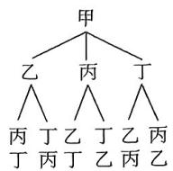

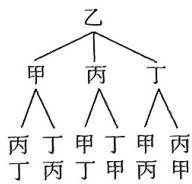

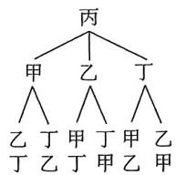

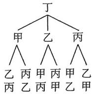

可知甲、乙、丙、丁四人排成一列共有24种排法，其中丙不在排

样本空间中样本点的个数

头，且甲或乙在排尾的排法共有8种，所以所求概率为 $\frac{8}{24} = \frac{1}{3}$

所求事件样本点个数

另解 当甲在排尾,乙在排头时,丙和丁有2种排法,共2种方法;

当甲在排尾,丁在排头时,乙和丙有2种排法,共2种方法.

于是甲在排尾,丙不在排头,共4种方法,同理乙在排尾,丙不在排头,共4种方法,于是共有8种排法符合题意.基本事件总数是 $A_{4}^{4}=24$ ,根据古典概型的概率计算公式,丙不在排头,甲或乙在排尾的概率为 $\frac{8}{24}=\frac{1}{3}$ .

# 坑神有话说

本题中题干对甲、乙的位置要求一致,即甲和乙“地位相同”,所以甲在排尾和乙在排尾的排法数相等.

3.D 解析 从 7 个整数中随机取 2 个不同的数, 共有 $C_7^2 = 21$ (种) 取法, 取得的 2 个数互质的情况有 $\{2,3\}, \{2,5\}, \{2,7\}, \{3,4\}, \{3,5\}, \{3,7\}, \{3,8\}, \{4,5\}, \{4,7\}, \{5,6\}, \{5,7\}, \{5,8\}, \{6,7\}, \{7,8\}$ , 共 14 种, 根据古典概型的概率计算公式, 得这 2 个数互质的概率为 $\frac{14}{21} = \frac{2}{3}$ . 故选 D.

另解 正难则反. 从7个整数中随机取2个不同的数, 共有 $C_{7}^{2}=21$ (种) 取法, 取得的2个数不互质的情况有 $\{2,4\},\{2,6\},\{2,8\},\{3,6\},\{4,6\},\{4,8\},\{6,8\}$ , 共7种, 因此这2个数互质的概率为 $1-\frac{7}{21}=\frac{2}{3}$ . 故选D.

4. $\frac{1}{7}$ 解析因为 $y = f(x)$ 的定义域为 $\{-4, -3, 3, 4\}$ , 关于原点对称, 当 $y = f(x)$ 是偶函数时, 有 $f(-4) = f(4), f(-3) = f(3)$ , 而 $y = f(x)$ 的值域为 $\{2, 3\}$ , 所以有 $f(-4) = f(4) = 2$ 且 $f(-3) = f(3) = 3$ , 或 $f(-4) = f(4) = 3$ 且 $f(-3) = f(3) = 2$ 两种情况.

不考虑 $y=f(x)$ 为偶函数时, 分两种情况讨论:

一种是将-4,-3,3,4分成一组1个元素，一组3个元素，此时有 $C_{4}^{1}A_{2}^{2}=8$ （种）情况满足题设；

一种是将-4,-3,3,4分成每组各2个元素，此时有 $\frac{C_{4}^{2}}{A_{2}^{2}}A_{2}^{2}=$ 【大招识别】平均分配要去序

6(种)情况满足题设.

综上，满足 $y = f(x)$ 的定义域为 $\{-4, -3, 3, 4\}$ ，值域为 $\{2, 3\}$ 的情况共有 $8 + 6 = 14$ （种），所以函数 $y = f(x)$ 是偶函数的概率为 $\frac{2}{14} = \frac{1}{7}$ .

5. $\frac{7}{15}$ 解析题目中的要求“差的绝对值不大于”实际上是一个绝对值不等式,可以表示3次结果的不等关系,之后根据第3次结果的不同取值讨论以保证不重不漏.设3次取出的球上的数字依次为a,b,c,则无放回地随机取3次球的取法有 $A_{6}^{3}=120$ (种),则 $|m-n|=\left|\frac{a+b}{2}-\frac{a+b+c}{3}\right|=\left|\frac{a+b-2c}{6}\right|\leqslant\frac{1}{2}$ ,可得 $\left|a+b-2c\right|\leqslant3$ .

因为 $a, b$ 的系数为 1，所以讨论 $c$ 比较方便

当 c=1 时, a, b 需要满足“ $1 \leqslant a + b \leqslant 5$ ”, 所有可能情况为(2,3), (3,2), 共2种.

当 $c = 2$ 时， $a, b$ 需要满足“ $1 \leqslant a + b \leqslant 7$ ”，所有可能情况为 $(1,3)$ ， $(1,4)$ ， $(1,5)$ ， $(1,6)$ ， $(3,1)$ ， $(4,1)$ ， $(5,1)$ ， $(6,1)$ ， $(3,4)$ ， $(4,3)$ ，共10种.

当 c=3 时, a,b 需要满足“ $3 \leqslant a + b \leqslant 9$ ”, 所有可能情况为 (1,2), (2,1), (1,4), (4,1), (1,5), (5,1), (1,6), (6,1), (2,4), (4,2), (2,5), (5,2), (2,6), (6,2), (4,5), (5,4), 共 16 种.

当 $c = 4$ 时， $a, b$ 需要满足“ $5 \leqslant a + b \leqslant 11$ ”，所有可能情况为（1, 5），(5, 1)，(1, 6)，(6, 1)，(2, 3)，(3, 2)，(2, 5)，(5, 2)，(2, 6)，(6, 2)，(3, 5)，(5, 3)，(3, 6)，(6, 3)，(6, 5)，(5, 6)，共16种.

当 $c = 5$ 时， $a, b$ 需要满足“ $7 \leqslant a + b \leqslant 13$ ”，所有可能情况为（1, 6），(6, 1)，(2, 6)，(6, 2)，(3, 4)，(4, 3)，(3, 6)，(6, 3)，(4, 6)，(6, 4)，共10种.

当 c=6 时, a, b 需要满足“ $9 \leqslant a + b \leqslant 15$ ”, 所有可能情况为 (4, 5), (5,4), 共 2 种.

故共有 $2 + 10 + 16 + 16 + 10 + 2 = 56$ （种）可能情况，

所以所求概率 $P=\frac{56}{120}=\frac{7}{15}.$

6. $\frac{1}{2}$ 解析经过任意举例可以发现数字的组合固定, 仅改变四局的顺序并不改变甲的得分, 不妨设甲按照 1,3,5,7 的次序出牌, 乙任意出牌, 这 24 种结果与实际结果等价.

方法一: 方程法. 设甲在四轮比赛中的得分分别为 $X_{1}, X_{2}, X_{3}, X_{4}$ ，四轮的总得分为 X.

对于任意一轮，甲、乙两人在该轮出示每张牌的概率都均等，其中使得甲得分的出牌组合有六种，从而甲在该轮得分的概率 $P(X_{i}=1)=\frac{6}{4\times4}=\frac{3}{8}$ ，所以 $E(X_{i})=\frac{3}{8}(i=1,2,3,4)$ .

从而 $E(X)=E(X_{1}+X_{2}+X_{3}+X_{4})=\sum_{i=1}^{4}E(X_{i})=\sum_{i=1}^{4}\frac{3}{8}=\frac{3}{2}.$ 期望的可知性

记 $p_k = P(X = k)(k = 0,1,2,3)$

如果甲得0分,则组合方式是唯一的:必定是甲出1,3,5,7分别对应乙出2,4,6,8,所以 $p_{0}=\frac{1}{A_{4}^{4}}=\frac{1}{24}$ ;

如果甲得3分,则组合方式也是唯一的:必定是甲出1,3,5,7分别对应乙出8,2,4,6,所以 $p_{3}=\frac{1}{A_{4}^{4}}=\frac{1}{24}$ .

而 $X$ 的所有可能取值是0,1,2,3，故 $p_0 + p_1 + p_2 + p_3 = 1, p_1 +$ 注意排除甲得4分的情况

$$
2 \rho_ {2} + 3 \rho_ {3} = E (X) = \frac {3}{2}.
$$

所以 $p_{1}+p_{2}+\frac{1}{12}=1,p_{1}+2p_{2}+\frac{1}{8}=\frac{3}{2}$ ,

两式相减即得 $p_{2}+\frac{1}{24}=\frac{1}{2}$ ，故 $p_{2}+p_{3}=\frac{1}{2}$ .

所以甲的总得分不小于2的概率为 $p_{2}+p_{3}=\frac{1}{2}$ .

方法二:穷举法.因为甲出卡片1一定输,出其他卡片有可能赢,所以四轮比赛后,甲的总得分最多为3.

若甲的总得分为3，则甲出卡片3,5,7时都赢，所以只有1种组合：3-2,5-4,7-6,1-8.

若甲的总得分为2,有以下三类情况:

第一类,当甲出卡片3和5时赢,只有1种组合,为3-2,5-4,1-6,7-8;

第二类,当甲出卡片3和7时赢,有3-2,7-4,1-6,5-8或3-2,7-4,1-8,5-6或3-2,7-6,1-4,5-8,共3种组合;

第三类,当甲出卡片5和7时赢,有5-2,7-4,1-6,3-8或5-2,7-4,1-8,3-6或5-4,7-2,1-6,3-8或5-4,7-2,1-8,3-6或5-2,7-6,1-4,3-8或5-2,7-6,1-8,3-4或5-4,7-6,1-2,3-8,共7种组合.

综上,甲的总得分不小于2共有12种组合,而所有不同的组合共有 $4\times3\times2\times1=24$ (种),所以甲的总得分不小于2的概率 $P=\frac{12}{24}=\frac{1}{2}$ .

# 考点3 互斥事件&对立事件

1.A 解析 A(√)“恰有一名男生”和“全是男生”不能同时发生,但可以同时不发生,是互斥而不对立事件;

B(×)“至少有一名男生”和“至少有一名女生”可以同时发生，即“一名男生和一名女生”的事件，不是互斥事件；

C(×)“至少有一名男生”和“全是男生”可以同时发生,即“全是男生”的事件,不是互斥事件;

D(×)“至少有一名男生”和“全是女生”不能同时发生,但必有一个发生,是对立事件.

2.D 解析 3 个小孩性别的样本空间为(男,男,男),(女,男,男),(男,女,男),(男,男,女),(男,女,女),(女,男,女),(女,女,男),(女,女,女).

A(×)根据样本空间与互斥事件的定义,得到两个事件不是互斥事件;

B(×)根据样本空间与对立事件的定义,得到两个事件不是对立事件;

C(×)该家庭3个小孩中只有1个男孩的概率为 $\frac{3}{8}$ ;

D(√)根据样本空间可知,在已知该家庭3个小孩中有男孩的条件下,3个小孩中至少有2个男孩的概率为 $\frac{4}{7}$ .

# 考点4 独立事件

1.B 解析 A(×) 事件 A 和事件 B 可以同时发生, 因为第四个礼盒中既有中国结, 又有记事本, 所以事件 A 与事件 B 不互斥;

B(√) 因为 $P(A)=\frac{1}{2}$ , $P(B)=\frac{1}{2}$ , $P(AB)=\frac{1}{4}$ , 所以 $P(A)P(B)=P(AB)$ , 所以事件 A 与事件 B 相互独立;

C(×)事件A与事件 $B\cup C$ 可以同时发生,因为第四个礼盒中既有中国结,又有记事本,还有笔袋,所以事件A与事件 $B\cup C$ 不互斥;

D(×)因为 $P(A)=\frac{1}{2}$ , $P(B\cap C)=\frac{1}{4}$ , $P(A\cap(B\cap C))=\frac{1}{4}$ , 所以 $P(A)P(B\cap C)\neq P(A\cap (B\cap C))$ ，所以事件 $A$ 与事件 $B\cap C$ 不相互独立.

# 坑神小课堂

# 互斥事件与独立事件的辨析

①二者属于事件关系中的两种不同分类方法，互斥对应没有交集，独立对应互不影响；  
② $P(AB)=P(A)P(B)\Leftrightarrow A,B$ 独立； $P(A+B)=P(A)+P(B)\Leftarrow A,B$ 互斥.

2.CD 解析 A(×)“事件A,B互斥”是“事件A,B对立”的必要不充分条件；

$$
\begin{array}{l} {\mathrm{B(} \times) P (A B) = P (A) P (B) = 0. 5 6, P (A \cup B) = P (A) + P (B) -} \\ {P (A B) = 0. 9 4;} \end{array}
$$

C(√)假设事件A,B互斥且独立,则 $P(AB)=P(A)P(B)=0$ ,这与 $P(A)>0,P(B)>0$ 矛盾,假设不成立;  
$D(\sqrt{})P(A)=\frac{1}{6},P(B)=\frac{6}{6\times6}=\frac{1}{6},P(AB)=\frac{1}{36}$ ，故 $P(AB)=P(A)P(B)$ ，所以事件A与B相互独立.

3.D 解析设棋手在第二盘与甲比赛连胜两盘的概率为 $P_{\text{甲}}$ ，在第二盘与乙比赛连胜两盘的概率为 $P_{\text{乙}}$ ，在第二盘与丙比赛连胜两盘的概率为 $P_{\text{丙}}$ ，该棋手在第二盘与甲比赛，比赛顺序为乙甲丙和丙甲乙的概率均为 $\frac{1}{2}$ ，故 $P_{\text{甲}} = \frac{1}{2}[(1 - p_2)p_1p_3 + p_2p_1(1 - p_3)] + \frac{1}{2}[(1 - p_3)]p_1p_2 + p_3p_1(1 - p_2)] = p_1p_2 + p_1p_3 - 2p_1p_2p_3$ ，同理 $P_{\text{乙}} = p_1p_2 + p_2p_3 - 2p_1p_2p_3, P_{\text{丙}} = p_1p_3 + p_2p_3 - 2p_1p_2p_3.$ 所以 $P_{\text{丙}} - P_{\text{甲}} = p_2(p_3 - p_1) > 0, P_{\text{丙}} - P_{\text{乙}} = p_1(p_3 - p_2) > 0$ ，所以 $P_{\text{丙}}$ 最大，故选 D.

另解 特殊值法. 不妨设 $p_1 = 0.4, p_2 = 0.5, p_3 = 0.6$ ，则该棋手在第二盘与甲比赛连胜两盘的概率 $P_{\text{甲}} = p_1 p_2 + p_1 p_3 - 2p_1 p_2 p_3 = 0.2$ ；在第二盘与乙比赛连胜两盘的概率 $P_{\text{乙}} = p_1 p_2 + p_2 p_3 - 2p_1 p_2 p_3 = 0.26$ ；在第二盘与丙比赛连胜两盘的概率 $P_{\text{丙}} = p_1 p_3 + p_2 p_3 - 2p_1 p_2 p_3 = 0.3$ 。所以 $P_{\text{丙}}$ 最大，故选 D.

# 坑神有话说

合理运用特殊值法能大大提升做题速度.

4.ABD 解析由题意知,发0收1的概率为 $\alpha$ ,发0收0的概率为 $1-\alpha$ ;发1收0的概率为 $\beta$ ,发1收1的概率为 $1-\beta$ .

A(√)相当于发1收1,发0收0,发1收1,所求概率为 $(1-\alpha)(1-\beta)^{2}$ .

B(√)相当于发了1,1,1,收到1,0,1,则概率为 $(1-\beta)\beta(1-\beta)=\beta(1-\beta)^{2}$ .

$C(\times)$ 相当于发了1,1,1，收到1,1,0或1,0,1或0,1,1或1,1，1，则概率为 $C_3^2\beta (1 - \beta)^2 + C_3^3 (1 - \beta)^3 = 3\beta (1 - \beta)^2 + (1 - \beta)^3.$   
D(√)发送0,采用三次传输方案译码为0,相当于发0,0,0,收到0,0,1或0,1,0或1,0,0或0,0,0,则此方案的概率 $P_{1}=C_{3}^{2}\alpha(1-\alpha)^{2}+C_{3}^{3}(1-\alpha)^{3}\equiv3\alpha(1-\alpha)^{2}+(1-\alpha)^{3}$ ;

发送0，采用单次传输方案译码为0的概率 $P_{2} \approx 1 - \alpha$ ，当 $0 < \alpha < 0.5$ 时， $P_{1} - P_{2} = 3\alpha (1 - \alpha)^{2} + (1 - \alpha)^{3} = (1 - \alpha) \approx \alpha (1 - \alpha)(1 - 2\alpha) > 0.$

# 考点5 条件概率

1.A 解析方法一:运用条件概率的计算公式求解.令事件A,B分别表示该同学爱好滑冰、该同学爱好滑雪,事件C表示该同学爱好滑雪的条件下也爱好滑冰,则 $P(A)=0.6,P(B)=0.5$ , $P(AB)=P(A)+P(B)-0.7=0.4$ ,所以 $P(C)=P(A|B)=\frac{P(AB)}{P(B)}=\frac{0.4}{0.5}=0.8$ ,故选A.

方法二:图示法.如图,左圆表示爱好滑冰的同学所占比例,右圆表示爱好滑雪的同学所占比例,A表示爱好滑冰且不爱好滑雪的同学所占比例,B表示既爱好滑冰又爱好

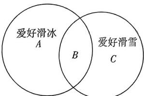

text_image

爱好滑冰
A
B
爱好滑雪
C

滑雪的同学所占比例, C 表示爱好滑雪且不爱好滑冰的同学所占比例, 则 $0.6 + 0.5 - B = 0.7$ , 所以 B = 0.4, C = 0.5 - 0.4 = 0.1.
所以若该同学爱好滑雪,则该同学也爱好滑冰的概率为 $\frac{B}{B+C}=\frac{0.4}{0.5}=0.8$ ,故选A.

2.ACD 解析 A(√)依题意,因为每次只摸出一个球, $A_{1}\cap A_{2}=$ ∅,所以 $A_{1},A_{2}$ 是互斥事件;

$B(\times)P(A_{1})=\frac{1}{2},P(B_{2})=\frac{1}{2}\times\frac{6}{11}+\frac{1}{2}\times\frac{7}{11}=\frac{13}{22}$ ，则 $P(A_{1}B_{2})=P(A_{1})\times P(B_{2}\mid A_{1})=\frac{1}{2}\times\frac{6}{11}=\frac{3}{11}$ ，所以 $P(A_{1})P(B_{2})\neq P(A_{1}B_{2})$ ，所以 $A_{1},B_{2}$ 不是独立事件；

$$
\mathrm{C} (\surd) P (B _ {2} | A _ {2}) = \frac {7}{1 1};
$$

根据题意知即为从4个红球和7个绿球中摸出绿球的概率 $D(\sqrt{})P(B_{2}|A_{1})+P(B_{1}|A_{2})=\frac{6}{11}+\frac{4}{11}=\frac{10}{11}.$

3. AC 解析 设事件 A 为“第一天去甲餐厅”，事件 B 为“第一天去乙餐厅”，事件 C 为“第二天去甲餐厅”，事件 D 为“第二天去乙餐厅”，则 $P(A)=0.4, P(B)=0.6, P(C|A)=0.6, P(C|B)=0.5$ ，然后根据全概率公式得， $P(C)=P(A)P(C|A)+P(B)P(C|B)=0.54$ ，于是 $P(D)=1-P(C)=0.46$ ，再根据贝叶斯公式得， $P(B|C)=\frac{P(B)P(C|B)}{P(C)}=\frac{0.6\times0.5}{0.54}=\frac{5}{9}, P(A|D)=\frac{P(A)P(D|A)}{P(D)}=\frac{0.4\times(1-0.6)}{0.46}=\frac{8}{23}$ 。故选 AC。

# 考点6 期望与方差的计算

1.D 解析 A(√) 若 $X \sim B(4, \frac{1}{2})$ , $Y \sim N(3, 1)$ , 则 $D(X) = 4 \times \frac{1}{2} \times \frac{1}{2} = 1$ , $D(Y) = 1$ , 所以 $D(X) = D(Y)$ ;

B(√) 由 $\xi \sim B(n, p)$ , $E(\xi) = 30$ , $D(\xi) = 20$ , 得 $\left\{\begin{aligned}np &= 30,\\ np(1 - p) &= 20,\end{aligned}\right.$ 解得 $\left\{\begin{aligned}n &= 90,\\ p &= \frac{1}{3};\end{aligned}\right.$ 下式除以上式方便解方程

C(√)随机变量 X 服从两点分布, 设成功概率为 $p(0 < p < 1)$ , 则 $D(X) = p(1 - p) \leqslant \frac{1}{4}$ , 当且仅当 $p = \frac{1}{2}$ 时等号成立;

D(×)由于是不放回地随机摸出20个球作为样本,所以由超几何分布的定义知X服从超几何分布,得 $E(X)=\frac{40\times20}{100}=8$ .

2.C 解析 直接根据期望与方差公式进行计算. 由于 $E(\xi) = a + 2b + 3c, E(\xi^2) = a + 4b + 9c$ , 因此 $D(\xi) = E(\xi^2) - [E(\xi)]^3 =$

$$
a + 4 b + 9 c - (a + 2 b + 3 c) ^ {2}.
$$

又 $E(\eta) = 3a + 2b + c, E(\eta^2) = 9a + 4b + c,$ 因此 $D(\eta) = E(\eta^2) - [E(\eta)]^2 = 9a + 4b + c - (3a + 2b + c)^2.$

而 $E(\xi) - E(\eta) = 2(c - a) \neq 0$ ，于是 $E(\xi) \neq E(\eta)$ ，从而得到 $p$ 为假.

又 $D(\xi) - D(\eta) = [(a + 4b + 9c) - (9a + 4b + c)] + [(3a + 2b + c)^2 - (a + 2b + 3c)^2] = 8(c - a) + [(3a + 2b + c) - (a + 2b + 3c)][(3a + 2b + c) + (a + 2b + 3c)] = 8(c - a) + 8(a - c)(a + b + c)$ ，且 $a + b + c = 1$ ，于是 $D(\xi) - D(\eta) = 0$ ，进而 $D(\xi) = D(\eta)$ ，从而 $q$ 为真。故选 C.

# 考点7 二项分布

1. BCD 解析 从袋子中有放回地取球 4 次, 则每次取球互不影响, 并且每次取到黑球的概率相等, 又每次取一个球, 取到白球记 0 分, 黑球记 1 分, 故 4 次取球的总分数相当于抽到黑球的总个数, 符合二项分布定义.

A(×)易知每次取到黑球的概率为 $\frac{2}{3}$ ，因为是有放回地取球4次，所以 $X\sim B(4,\frac{2}{3})$ ;

$$
\mathrm{B} (\sqrt {}) P (X = 2) = \mathrm{C} _ {4} ^ {2} \times (\frac {2}{3}) ^ {2} \times (1 - \frac {2}{3}) ^ {2} = \frac {8}{2 7};
$$

C(√)根据二项分布的期望公式得 $E(X)=4\times\frac{2}{3}=\frac{8}{3}$ ;

D(√)根据二项分布的方差公式得 $D(X)=4\times\frac{2}{3}\times\frac{1}{3}=\frac{8}{9}$ .

# 坑神小课堂

若 $X \sim B(n, p)$ , 则期望 $E(X) = np$ , 方差 $D(X) = np(1 - p)$ .

2.BC 解析 A(×) 随机变量 $X \sim B(8, \frac{1}{3})$ , $Y \sim B(8, \frac{2}{3})$ ,
则 X,Y 服从二项分布；

$$
\mathrm{B} (\sqrt {}) P (X > 6) = P (X = 7) + P (X = 8) = \mathrm{C} _ {8} ^ {7} \left(\frac {1}{3}\right) ^ {7} \times \frac {2}{3} +
$$

$$
\mathrm{C} _ {8} ^ {8} \left(\frac {1}{3}\right) ^ {8} = \frac {1 7}{3 ^ {8}};
$$

$$
\mathrm{C} (\sqrt {}) E (X) = 8 \times \frac {1}{3} = \frac {8}{3}, E (Y) = 8 \times \frac {2}{3} = \frac {1 6}{3},
$$

$$
D (X) = 8 \times \frac {1}{3} \times (1 - \frac {1}{3}) = \frac {1 6}{9}, D (Y) = 8 \times \frac {2}{3} \times (1 - \frac {2}{3}) = \frac {1 6}{9},
$$

所以 $E(X) < E(Y)$ , $D(X) = D(Y)$ ;

D(×)设 $P(Y=k)(2\leqslant k\leqslant7)$ 为最大值，

则 $\left\{ \begin{array}{l} P(Y = k) \geqslant P(Y = k + 1), \\ P(Y = k) \geqslant P(Y = k - 1), \end{array} \right.$

即 $\left\{ \begin{array}{l} C_{8}^{k}\left(\frac{2}{3}\right)^{k} \cdot \left(1 - \frac{2}{3}\right)^{8 - k} \geqslant C_{8}^{k + 1}\left(\frac{2}{3}\right)^{k + 1} \cdot \left(1 - \frac{2}{3}\right)^{7 - k}, \\ C_{8}^{k}\left(\frac{2}{3}\right)^{k} \cdot \left(1 - \frac{2}{3}\right)^{8 - k} \geqslant C_{8}^{k - 1}\left(\frac{2}{3}\right)^{k - 1} \cdot \left(1 - \frac{2}{3}\right)^{0 - k}, \end{array} \right.$

解得 $5 \leqslant k \leqslant 6$ ，所以当 $k = 5$ 或 6 时， $P(Y = k)$ 取得最大值.

# 考点8 超几何分布

1.B 解析 A, C 选项都是二项分布, 而 D 选项“X 是第一次摸到黑球时已经摸球的次数”也不是超几何分布, 只有 B 选项是超几何分布. 故选 B.

2. 解析(1)①由题意可知 X 服从超几何分布, 则 $E(X)$

$$
\frac {4 0 \times 2 0 0}{4 0 0 0} = 2.
$$

②由于 $P(X \geqslant 1) = 1 - P(X = 0)$ ，而 $P(X = 0) = \frac{C_{3800}^{40}}{C_{4000}^{40}} = \frac{3800 \times 3799 \times \cdots \times 3761}{4000 \times 3999 \times \cdots \times 3961} > \left(\frac{3760}{3960}\right)^{40}$ ， $\frac{\left(\frac{3800}{4000}>\frac{3760}{3960},\frac{3799}{3999}>\frac{3760}{3960}\right)}{5}$

从而 $\lg P(X = 0) > 40(\lg 3.76 - \lg 3.96) \approx -0.9 > -1$

因此 $P(X=0)>0.1, P(X\geqslant1)<0.9$ ，所以没有 90% 的把握认为能捞出身上有标记的鱼.

(2) 由题意, $P(X=30)=\frac{C_{200}^{30}C_{N-200}^{670}}{C_{N}^{700}}$ , 且 $N\geqslant700+(200-30)=870.$

只需求使得 $a_{N} = \frac{\mathrm{C}_{N - 200}^{670}}{\mathrm{C}_N^{700}}$ 最大的 $N$ .

由于 $a_{N} = \frac{(N - 200)!\times 700!\times(N - 700)!}{N!\times 670!\times(N - 870)!},$

$$
a _ {N + 1} = \frac {(N - 1 9 9) ! \times 7 0 0 ! \times (N - 6 9 9) !}{(N + 1) ! \times 6 7 0 ! \times (N - 8 6 9) !},
$$

从而 $a_{N + 1} - a_N = \frac{(N - 200)!\times 700!\times(N - 700)!}{(N + 1)!\times 670!\times(N - 869)!}\times [(N -$

$$
1 9 9) \times (N - 6 9 9) - (N + 1) (N - 8 6 9) ]
$$

$$
= \frac {(N - 2 0 0) ! \times 7 0 0 ! \times (N - 7 0 0) !}{(N + 1) ! \times 6 7 0 ! \times (N - 8 6 9) !} \times [ (1 9 9 \times 6 9 9 + 8 6 9) -
$$

$$
(1 9 9 + 6 9 9 - 8 6 9 + 1) N ]
$$

$$
= \frac {(N - 2 0 0) ! \times 7 0 0 ! \times (N - 7 0 0) !}{(N + 1) ! \times 6 7 0 ! \times (N - 8 6 9) !} \times [ (2 0 0 - 1) (7 0 0 - 1) +
$$

$$
8 6 9 - (2 0 0 + 7 0 0 - 1 - 8 6 9) N ]
$$

$$
= \frac {(N - 2 0 0) ! \times 7 0 0 ! \times (N - 7 0 0) !}{(N + 1) ! \times 6 7 0 ! \times (N - 8 6 9) !} \times (1 3 9 9 7 0 - 3 0 N),
$$

作差法可以提出一次式，方便算出 $N$ 的临界值因此，当 $N \leqslant 4665$ 时， $a_{N+1} > a_N$ ；当 $N \geqslant 4666$ 时， $a_{N+1} < a_N$ 。所以，当 $N = 4666$ 时， $P(X = 30)$ 最大。

综上所述， $N$ 的估计值为4666.

# 坑神小课堂

对于超几何分布模型 $P(X = s) = \frac{\mathrm{C}_k^s\mathrm{C}_{n - k}^{m - s}}{\mathrm{C}_n^m} (n,m,s,k\in \mathbf{N}^*)$ ，可用以下式子来确定当 $P(X = s)$ 最大时 $s$ 的值： $\frac{(k + 1)(m + 1)}{n + 2} -$ $1\leqslant s\leqslant \frac{(k + 1)(m + 1)}{n + 2}.$

# 考点9 正态分布

1.BC 解析 A(×)B(√)由题意可知, $X \sim N(1.8,0.1^{2})$ ,所以 $P(X>2)<P(X>1.8)=0.5$ ,又 $P(X<1.9)\approx0.8413$ ,所以 $P(X>2)<P(X\geqslant1.9)=1-P(X<1.9)\approx1-0.8413=0.1587<0.2;$

C(√)D(×)因为 $Y \sim N(2, 1, 0, 1^2)$ ，所以 $P(Y < 2, 2) \approx 0.8413$ ， $P(Y > 2) > P(Y > 2, 1) = 0.5$ ，所以 $P(2 < Y < 2, 1) = P(2, 1 < Y < 2, 2) = P(Y < 2, 2) - P(Y \leqslant 2, 1) \approx 0.8413 - 0.5 = 0.3413$ ，所以 $P(Y > 2) = P(2 < Y < 2, 1) + P(Y \geqslant 2, 1) \approx 0.3413 + 0.5 = 0.8413 > 0.8$ （另解： $P(Y > 2) = P(Y < 2, 2) \approx 0.8413 > 0.8$ ）

# 坑神小课堂

均值与方差不同的正态分布对应的概率密度函数曲线“高矮”与“胖瘦”可能不同，但不同正态分布中随机变量 $X$ 落在 $\mu$ 加减不同倍数 $\sigma$ 区间的概率均相等.

2.ACD 解析 A(√) 因为 $M \sim N(250, \sigma^{2})$ ，所以 $P(M > 249) = P(M < 251) = 0.75$ ;

$$
\begin{array}{r l} & {\mathrm{B} (\times) \text {因为} P (M <   2 5 1) = 0. 7 5, \text {所以} P (2 4 9 <   M <   2 5 0) =} \\ & {P (2 5 0 <   M <   2 5 1) = 0. 7 5 - 0. 5 = 0. 2 5,} \end{array}
$$

所以 $P(251 < M < 253) = 0.7 - 0.25 \times 2 = 0.2$ ;

C(√) 因为 $P(249 < M < 253) = 0.7$ ，所以 $P(M > 253) = 0.75 - 0.7 = 0.05$ ，

若从该阿胶产品中随机选取1000盒,则质量大于253 g的盒数 $X\sim B(1000,0.05)$ ,

所以 $D(X)=1\ 000\times0.05\times(1-0.05)=47.5;$

$D(\sqrt{})P(251<M<253)=0.2$ ，若从该阿胶产品中随机选取1 000盒，则质量在251 g\~253 g内的盒数 $Y\sim B(1\ 000,0.2)$ ，所以 $E(Y)=1\ 000\times0.2=200$ .

3.ACD 解析 $X \sim N(72, 8^2), \mu_1 = 72, \sigma_1 = 8$ ;

$$
Y \sim N (7 4, 6 ^ {2}), \mu_ {2} = 7 4, \sigma_ {2} = 6.
$$

$$
\frac {P (X \leqslant 8 0) = P (X \leqslant \mu_ {1} + \sigma_ {1}) , P (Y \leqslant 8 0) = P (Y \leqslant \mu_ {2} + \sigma_ {2}) , \text {所以}}{P (X \leqslant 8 0) = P (Y \leqslant 8 0)} ;
$$

$$
\frac {P (X \leqslant 8 8) = P (X \leqslant \mu_ {1} + 2 \sigma_ {1}) , P (Y \leqslant 8 6) = P (Y \leqslant \mu_ {2} + 2 \sigma_ {2}) , \text {所以}   P (X \leqslant 8 8) = P (Y \leqslant 8 6) .}
$$

属于不同的正态分布，但对应的 $\sigma$ 的倍数都是 2

$$
A (\vee) P (X \leqslant 8 6) <   P (X \leqslant 8 8) = P (Y \leqslant 8 6);
$$

$$
\mathrm{B} (\times) P (X \leqslant 8 0) = P (Y \leqslant 8 0);
$$

$$
\mathrm{C} (\sqrt {}) P (X \leqslant 7 4) > P (X \leqslant 7 2) = \frac {1}{2} = P (Y \leqslant 7 4);
$$

$$
\mathrm{D} (\sqrt {}) P (X \leqslant 6 4) = P (X \geqslant 8 0) = P (Y \geqslant 8 0).
$$

# 考点10 常见分布综合

1. 解析(1)由题意得, $\bar{x}=40\times0.02+50\times0.3+60\times0.4+70\times0.23+80\times0.04+90\times0.01=60$ ,

$$
\begin{array}{l} s ^ {2} = (4 0 - 6 0) ^ {2} \times 0. 0 2 + (5 0 - 6 0) ^ {2} \times 0. 3 + (6 0 - 6 0) ^ {2} \times 0. 4 + \\ (7 0 - 6 0) ^ {2} \times 0. 2 3 + (8 0 - 6 0) ^ {2} \times 0. 0 4 + (9 0 - 6 0) ^ {2} \times 0. 0 1 = \\ \begin{array}{l} 4 0 0 \times 0. 0 2 + 1 0 0 \times 0. 3 + 0 \times 0. 4 + 1 0 0 \times 0. 2 3 + 4 0 0 \times 0. 0 4 + \\ 9 0 0 \times 0. 0 1 = 8 6, \end{array} \\ \end{array}
$$

所以估计这200名学生健康指数的平均数为60,方差为86.

(2) ①由(1)可知 $\mu = 60, \sigma = \sqrt{86} \approx 9.27$ ,

则 $P(50.73 < X < 78.54) = P(60 - 9.27 < X < 60 + 9.27 \times 2) =$ $P(\mu - \sigma < X < \mu + 2\sigma) \approx \frac{1}{2} \times 0.955 + \frac{1}{2} \times 0.683 = 0.819.$

正态分布的对称性

②由①可知1名学生的健康指数位于(50.73,78.54)的概率为0.819，

依题意, $\xi$ 服从二项分布,即 $\xi\sim B(10^{4},0.819)$ ,

则 $E(\xi) = np = 8190.$

2. 解析根据题中关键词“每次等可能”“向左或向右”识别本题符合二项分布. 第(1)问只需质点向右移动3次, 向左移动2次(顺序任意). 第(2)同即为5次独立重复试验对应的分布列与期望.

(1)由题意,从0出发,每次等可能地向左或者向右移动一个单

位,可得质点向左或向右移动的概率均为 $\frac{1}{2}$ .

要使得质点移动5次后移动到1的位置,则质点向右移动3次,
向左移动2次,所以概率为 $P = C_{5}^{3}\left(\frac{1}{2}\right)^{3}\left(\frac{1}{2}\right)^{2} = \frac{10}{32} = \frac{5}{16}$ .

(2)由题意知,质点向左或向右移动的概率均为 $\frac{1}{2}$ .

移动5次中向右移动的次数为 $X$ ，可得随机变量 $X$ 的可能取值为0,1,2,3,4,5，

可得 $P(X = 0) = \mathrm{C}_5^0\times (\frac{1}{2})^0\times (\frac{1}{2})^5 = \frac{1}{32},$

$$
P (X = 1) = \mathrm{C} _ {5} ^ {1} \times (\frac {1}{2}) ^ {1} \times (\frac {1}{2}) ^ {4} = \frac {5}{3 2},
$$

$$
P (X = 2) = \mathrm{C} _ {5} ^ {2} \times (\frac {1}{2}) ^ {2} \times (\frac {1}{2}) ^ {3} = \frac {5}{1 6},
$$

$$
P (X = 3) = \mathrm{C} _ {5} ^ {3} \times (\frac {1}{2}) ^ {3} \times (\frac {1}{2}) ^ {2} = \frac {5}{1 6},
$$

$$
P (X = 4) = \mathrm{C} _ {5} ^ {4} \times (\frac {1}{2}) ^ {4} \times (\frac {1}{2}) ^ {1} = \frac {5}{3 2},
$$

$$
P (X = 5) = \mathrm{C} _ {5} ^ {5} \times (\frac {1}{2}) ^ {5} \times (\frac {1}{2}) ^ {0} = \frac {1}{3 2},
$$

所以随机变量 $X$ 的分布列为

<table><tr><td>X</td><td>0</td><td>1</td><td>2</td><td>3</td><td>4</td><td>5</td></tr><tr><td>P</td><td> $\frac{1}{32}$ </td><td> $\frac{5}{32}$ </td><td> $\frac{5}{16}$ </td><td> $\frac{5}{16}$ </td><td> $\frac{5}{32}$ </td><td> $\frac{1}{32}$ </td></tr></table>

则期望 $E(X) = 0 \times \frac{1}{32} + 1 \times \frac{5}{32} + 2 \times \frac{5}{16} + 3 \times \frac{5}{16} + 4 \times \frac{5}{32} + 5 \times \frac{1}{32} = \frac{5}{2}$ .

3. 解析第(1)问总体8个问题可分为两类,求样本4个问题中其中一类的个数,属于超几何分布模型;第(2)问中的“回答被采纳”事件可以分为题干中的两种情况(是否出现语法错误),符合全概率公式的使用条件.

(1)由题可知,X的所有可能取值为1,2,3,4,

$$
P (X = 1) = \frac {\mathrm{C} _ {5} ^ {1} \mathrm{C} _ {3} ^ {3}}{\mathrm{C} _ {8} ^ {4}} = \frac {5}{7 0} = \frac {1}{1 4},
$$

$$
P (X = 2) = \frac {\mathrm{C} _ {5} ^ {2} \mathrm{C} _ {3} ^ {2}}{\mathrm{C} _ {8} ^ {4}} = \frac {3 0}{7 0} = \frac {3}{7},
$$

$$
P (X = 3) = \frac {\mathrm{C} _ {5} ^ {3} \mathrm{C} _ {3} ^ {1}}{\mathrm{C} _ {8} ^ {4}} = \frac {3 0}{7 0} = \frac {3}{7},
$$

$$
P (X = 4) = \frac {\mathrm{C} _ {5} ^ {4} \mathrm{C} _ {3} ^ {0}}{\mathrm{C} _ {8} ^ {4}} = \frac {5}{7 0} = \frac {1}{1 4},
$$

故 $X$ 的分布列为

<table><tr><td>X</td><td>1</td><td>2</td><td>3</td><td>4</td></tr><tr><td>P</td><td> $\frac{1}{14}$ </td><td> $\frac{3}{7}$ </td><td> $\frac{3}{7}$ </td><td> $\frac{1}{14}$ </td></tr></table>

则 $E(X) = 1 \times \frac{1}{14} + 2 \times \frac{3}{7} + 3 \times \frac{3}{7} + 4 \times \frac{1}{14} = \frac{5}{2}$ .

(2) 记“输入的问题没有语法错误”为事件 A, 记“输入的问题有语法错误”为事件 B, 记“回答被采纳”为事件 C,

由已知得, $P(C)=0.7,P(C|A)=0.8,P(C|B)=0.4,P(B)=p$ , $P(A)=1-p,$

所以由全概率公式得 $P(C) = P(A) \cdot P(C|A) + P(B) \cdot P(C|B) = 0.8(1 - p) + 0.4p = 0.7$ ，解得 $p = 0.25$ .

# 考点11 比赛规则问题

1. 解析(1)设甲学校获得冠军为事件A,则甲学校必须获胜2场或者3场.

$$
\begin{array}{l} P (A) = 0. 5 \times 0. 4 \times 0. 8 + (1 - 0. 5) \times 0. 4 \times 0. 8 + 0. 5 \times (1 - \\ 0. 4) \times 0. 8 + 0. 5 \times 0. 4 \times (1 - 0. 8) = 0. 6. \end{array}
$$

故甲学校获得冠军的概率为0.6.

(2)由题意可知,X的取值可以为0,10,20,30.

$$
P (X = 0) = 0. 5 \times 0. 4 \times 0. 8 = 0. 1 6,
$$

$$
\begin{array}{l} P (X = 1 0) = (1 - 0. 5) \times 0. 4 \times 0. 8 + 0. 5 \times (1 - 0. 4) \times 0. 8 + \\ 0. 5 \times 0. 4 \times (1 - 0. 8) = 0. 4 4, \end{array}
$$

$$
\begin{array}{l} P (X = 2 0) = (1 - 0. 5) \times (1 - 0. 4) \times 0. 8 + 0. 5 \times (1 - 0. 4) \times \\ (1 - 0. 8) + (1 - 0. 5) \times 0. 4 \times (1 - 0. 8) = 0. 3 4, \end{array}
$$

$$
P (X = 3 0) = (1 - 0. 5) \times (1 - 0. 4) \times (1 - 0. 8) = 0. 0 6.
$$

所以 $X$ 的分布列为

<table><tr><td>X</td><td>0</td><td>10</td><td>20</td><td>30</td></tr><tr><td>P</td><td>0.16</td><td>0.44</td><td>0.34</td><td>0.06</td></tr></table>

所以 $E(X) = 0\times 0.16 + 10\times 0.44 + 20\times 0.34 + 30\times 0.06 = 13.$

2. 解析 本题不属于二项分布或超几何分布,但每轮间互不影响,使用分类加法与分步乘法表示事件概率即可.

(1)记事件 $A =$ “小李先答对一道甲类试题”， $B =$ “小李继续答对另一道甲类试题”， $C =$ “小李答对乙类试题”， $D =$ “小李答对丙类试题”，

则 $P(A) = P(B) = \frac{2}{3}, P(C) = \frac{1}{3}, P(D) = \frac{1}{2}$ .

记事件 E = “小李答题次数恰好为 2 次”，

则 $E=(A\overline{D})\cup(\overline{A}\overline{B})$ .

分类时注意事件互斥才能直接将概率相加

$$
\begin{array}{l} P (E) = P (A \overline {{D}}) + P (\overline {{A}} \overline {{B}}) = P (A) P (\overline {{D}}) + P (\overline {{A}}) P (\overline {{B}}) = \frac {2}{3} \times \frac {1}{2} + \\ \frac {1}{3} \times \frac {1}{3} = \frac {4}{9}, \end{array}
$$

即小李答题次数恰好为2次的概率为 $\frac{4}{9}$ .

(2) 设小李最终得分为 X，由题知，X 的可能取值为 0, 10, 40, 60.

$$
P (X = 0) = P (\overline {{A}} \overline {{B}}) = \frac {1}{3} \times \frac {1}{3} = \frac {1}{9},
$$

$$
P (X = 1 0) = P (A \overline {{D}}) + P (\overline {{A}} B \overline {{D}}) = \frac {2}{3} \times \frac {1}{2} + \frac {1}{3} \times \frac {2}{3} \times \frac {1}{2} = \frac {4}{9},
$$

$$
\begin{array}{l} P (X = 4 0) = P (A D \overline {{{C}}}) + P (\overline {{{A}}} B D \overline {{{C}}}) = \frac {2}{3} \times \frac {1}{2} \times \frac {2}{3} + \frac {1}{3} \times \frac {2}{3} \times \\ \frac {1}{2} \times \frac {2}{3} = \frac {8}{2 7}, \end{array}
$$

$$
\begin{array}{l} P (X = 6 0) = P (A D C) + P (\overline {{{A}}} B D C) = \frac {2}{3} \times \frac {1}{2} \times \frac {1}{3} + \frac {1}{3} \times \frac {2}{3} \times \frac {1}{2} \times \\ \frac {1}{3} = \frac {4}{2 7}. \end{array}
$$

所以 $E(X) = 0 \times \frac{1}{9} + 10 \times \frac{4}{9} + 40 \times \frac{8}{27} + 60 \times \frac{4}{27} = \frac{680}{27}$ .

3. 解析(1)由题意可知小明踢进点球的次数 $X \sim B\left(3, \frac{2}{3}\right)$ , 所以 $X$ 的取值可能是 0, 1, 2, 3.

因为 $P(X = 0) = (1 - \frac{2}{3})^3 = \frac{1}{27}; P(X = 1) = G_3^1 \times \frac{2}{3} \times (1 - \frac{2}{3})^2 = \frac{2}{9}; P(X = 2) = G_3^2 \times (\frac{2}{3})^2 \times (1 - \frac{2}{3}) = \frac{4}{9}; P(X = 3) = (\frac{2}{3})^2 = \frac{8}{27}$ .

所以 $X$ 的分布列为

<table><tr><td>X</td><td>0</td><td>1</td><td>2</td><td>3</td></tr><tr><td>P</td><td> $\frac{1}{27}$ </td><td> $\frac{2}{9}$ </td><td> $\frac{4}{9}$ </td><td> $\frac{8}{27}$ </td></tr></table>

所以 $E(X) = 3 \times \frac{2}{3} = 2$ .

(2)设“甲队在点球大战中比赛4轮并以3:1获得冠军”为事件A.

当甲队前三个点球都进时,乙队前三个点球必进一个球,

$$
\begin{array}{l} P _ {1} = \left(\frac {2}{3}\right) ^ {3} \times \left(1 - \frac {2}{3}\right) \times C _ {3} ^ {1} \times \frac {3}{5} \times \left(1 - \frac {3}{5}\right) ^ {2} \times \left(1 - \frac {3}{5}\right) = \\ \frac {6 4}{5 6 2 5}; \end{array}
$$

当甲队前三个点球有一个没进时， $P_{2} = \mathrm{C}_{3}^{1}\times (\frac{2}{3})^{2}\times (1 - \frac{2}{3})\times$ $\frac{2}{3}\times \mathrm{C}_4^1\times \frac{3}{5}\times (1 - \frac{3}{5})^3 = \frac{256}{5625}.$

所以 $P(A) = P_{1} + P_{2} = \frac{64}{5625} +\frac{256}{5625} = \frac{64}{1125}.$

# 考点12 回归分析

1.A 解析选项 A 中的散点有从左下角到右上角沿直线分布的趋势,且散点集中在一条直线的附近,故选项 A 中的线性相关系数最大,故选 A.

# 坑神小课堂

在回归分析中，当 $|r|$ 越大，两个变量的线性相关性越强。当 $r > 0$ 时， $r$ 越大，正线性相关性越强；当 $r < 0$ 时， $r$ 的绝对值越大，负线性相关性越强。一般地，当 $|r| > 0.75$ 时，就认为两个变量的线性相关性较强。

2. 解析(1)由数据表可得 $\bar{x}=\frac{0.6}{10}=0.06,\bar{y}=\frac{3.9}{10}=0.39.$

(2) 因为 $\bar{x}=0.06, \bar{y}=0.39$ , 所以

$$
\begin{array}{l} r = \frac {\sum_ {i = 1} ^ {1 0} \left(x _ {i} y _ {i} - x _ {i} \bar {y} - y _ {i} \bar {x} + \bar {x} \bar {y}\right)}{\sqrt {\sum_ {i = 1} ^ {1 0} \left(x _ {i} ^ {2} - 2 x _ {i} \bar {x} + \bar {x} ^ {2}\right) \sum_ {i = 1} ^ {1 0} \left(y _ {i} ^ {2} - 2 y _ {i} \bar {y} + \bar {y} ^ {2}\right)}} \\ = \frac {\sum_ {i = 1} ^ {1 0} x _ {i} y _ {i} - \bar {y} \sum_ {i = 1} ^ {1 0} x _ {i} - \bar {x} \sum_ {i = 1} ^ {1 0} y _ {i} + 1 0 \bar {x} \bar {y}}{\sqrt {\left(\sum_ {i = 1} ^ {1 0} x _ {i} ^ {2} - 2 \bar {x} \sum_ {i = 1} ^ {1 0} x _ {i} + 1 0 \bar {x} ^ {2}\right) \left(\sum_ {i = 1} ^ {1 0} y _ {i} ^ {2} - 2 \bar {y} \sum_ {i = 1} ^ {1 0} y _ {i} + 1 0 \bar {y} ^ {2}\right)}} \\ = \frac {\sum_ {i = 1} ^ {1 0} x _ {i} y _ {i} - 1 0   \overline {{x}}   \overline {{y}}}{\frac {\sqrt {(\sum_ {i = 1} ^ {1 0} x _ {i} ^ {2} - 1 0   \overline {{x}} ^ {2}) (\sum_ {i = 1} ^ {1 0} y _ {i} ^ {2} - 1 0   \overline {{y}} ^ {2})}}{\sum_ {\mathrm{两组形式的表达式之间的转化}}}} \\ = \frac {0 . 2 4 7 4 - 1 0 \times 0 . 0 6 \times 0 . 3 9}{\sqrt {(0 . 0 3 8 - 1 0 \times 0 . 0 6 ^ {2}) (1 . 6 1 5 8 - 1 0 \times 0 . 3 9 ^ {2})}} \\ = \frac {0 . 0 1 3 4}{0 . 0 1 \times \sqrt {1 . 8 9 6}} \\ \approx \frac {0 . 0 1 3 4}{0 . 0 1 3 7 7} \\ \approx 0. 9 7. \\ \end{array}
$$

(3) 设根部横截面积总和为 X，则 $X = 186 \, m^{2}$ ，总材积量为 $Y \, m^{3}$ ，因为树木的材积量与其根部横截面积近似成正比，所以 $\frac{Y}{X} = \frac{\overline{y}}{x}$ ，所以 $Y = \frac{\overline{y}}{x} \times X = \frac{0.39}{0.06} \times 186 = 1209 (\, \text{m}^{3})$ 。

# 考点13 独立性检验

1. 解析(1)填写列联表如下:

<table><tr><td></td><td>优级品</td><td>非优级品</td></tr><tr><td>甲车间</td><td>26</td><td>24</td></tr><tr><td>乙车间</td><td>70</td><td>30</td></tr></table>

则完整的 $2 \times 2$ 列联表如下：

<table><tr><td></td><td>优级品</td><td>非优级品</td><td>总计</td></tr><tr><td>甲车间</td><td>26</td><td>24</td><td>50</td></tr><tr><td>乙车间</td><td>70</td><td>30</td><td>100</td></tr><tr><td>总计</td><td>96</td><td>54</td><td>150</td></tr></table>

$$
K ^ {2} = \frac {1 5 0 \times (2 6 \times 3 0 - 7 0 \times 2 4) ^ {2}}{9 6 \times 5 4 \times 5 0 \times 1 0 0} = 4. 6 8 7 5.
$$

因为 $K^{2}=4.6875>3.841$ ，所以有 95% 的把握认为甲、乙两车间产品的优级品率存在差异；

因为 $K^{2}=4.6875<6.635$ ，所以没有 99% 的把握认为甲、乙两车间产品的优级品率存在差异。

(2)由题意可知 $\overline{p} = \frac{96}{150} = 0.64$

因为 $p + 1.65\sqrt{\frac{p(1 - p)}{n}} = 0.5 + 1.65\times \sqrt{\frac{0.5\times(1 - 0.5)}{150}}\approx$

$$
0. 5 + 1. 6 5 \times \frac {0 . 5}{1 2 . 2 4 7} \approx 0. 5 7 <   0. 6 4,
$$

所以 $\overline{p} > p + 1.65\sqrt{\frac{p(1 - p)}{n}}$

所以能认为生产线智能化升级改造后,该工厂产品的优级品率提高了.

2. 解析 (1) 依题意得 $K^2 = \frac{n(ad - bc)^2}{(a + b)(c + d)(a + c)(b + d)} = \frac{200 \times (40 \times 90 - 60 \times 10)^2}{(40 + 60)(10 + 90)(40 + 10)(60 + 90)} = 24 > 6.635$ ，所以有 $99\%$ 的把握认为患该疾病群体与未患该疾病群体的卫生习惯有差异.

(2) (i) $R = \frac{\frac{P(B|A)}{P(\overline{B}|A)}}{\frac{P(B|\overline{A})}{P(\overline{B}|\overline{A})}} = \frac{P(B|A)}{P(\overline{B}|A)} \cdot \frac{P(\overline{B}|\overline{A})}{P(B|\overline{A})} = \frac{\frac{P(AB)}{P(A)}}{\frac{P(A\overline{B})}{P(A)}} \cdot \frac{\frac{P(\overline{A}\overline{B})}{P(\overline{A})}}{\frac{P(\overline{A}B)}{P(\overline{A})}} =$

$$
\begin{array}{l} \frac {P (A B)}{P (A \overline {{{B}}})} \cdot \frac {P (\overline {{{A}}} \overline {{{B}}})}{P (\overline {{{A}}} B)} = \frac {\frac {P (A B)}{P (B)}}{\frac {P (\overline {{{A}}} B)}{P (\overline {{{A}}} B)}} \cdot \frac {\frac {P (\overline {{{A}}} \overline {{{B}}})}{P (\overline {{{B}}})}}{\frac {P (A \overline {{{B}}})}{P (A | B)}} = \frac {P (A | B)}{P (\overline {{{A}}} | B)} \cdot \frac {P (\overline {{{A}}} | \overline {{{B}}})}{P (A | \overline {{{B}}})}. \\ \frac {P (B) \quad P (\overline {{B}})}{\text {本质上就是考查概率的乘法公式}} \\ \end{array}
$$

(ii) 由题意可知, $P(A \mid B) = \frac{4}{10}, P(A \mid \overline{B}) = \frac{1}{10}, P(\overline{A} \mid B) = \frac{6}{10}$ ,

$$
P (\overline {{{A}}} | \overline {{{B}}}) = \frac {9}{1 0}, \text {所以} R = \frac {P (A | B)}{P (\overline {{{A}}} | B)} \cdot \frac {P (\overline {{{A}}} | \overline {{{B}}})}{P (A | \overline {{{B}}})} = \frac {\frac {4}{1 0}}{\frac {6}{1 0}} \times \frac {\frac {9}{1 0}}{\frac {1}{1 0}} = 6.
$$

# 考点14 决策问题

1. 解析（1）由题意得 $\bar{x} = \frac{8 + 9 + 11 + 12 + 15}{5} = 11, \bar{y} = \frac{67 + 63 + 80 + 80 + 85}{5} = 75,$

又 $\sum_{i=1}^{5} x_i y_i = 4218, \sum_{i=1}^{5} x_i^2 = 635,$

所以 $\hat{b} = \frac{\sum_{i=1}^{5}(x_i - \bar{x})(y_i - \bar{y})}{\sum_{i=1}^{5}(x_i - \bar{x})^2} = \frac{\sum_{i=1}^{5}x_i y_i - 5\bar{x}\bar{y}}{\sum_{i=1}^{5}x_i^2 - 5\bar{x}^2} = \frac{4218 - 4125}{635 - 605} = \frac{93}{30}$

3.1, 所以 $\hat{a} = 75 - 3.1 \times 11 = 40.9$ ,

所以经验回归方程为 $\hat{y}=3.1x+40.9$

(2) 根据题意得 $40 \times 100 \cdot \hat{y} = 4000 (3.1x + 40.9) > 600000$ ，解得 $x > \frac{1091}{31} \approx 35.2$ ，

又 $\frac{35.2}{4} = 8.8$ ，所以至少要请9位主播进行直播.注意此处是向上取整，不是四舍五入

(3)设采用甲款包装箱每箱获得的利润的数学期望为 $E_{1}$ ,

则 $E_{1} = 40 - 1\times E(X) - t = 40 - 1\times \left[0\times \frac{1}{32} +1\times \frac{1}{2} +2\times (\frac{1}{2})^{2} + \right.$

$$
3 \times (\frac {1}{2}) ^ {3} + 4 \times (\frac {1}{2}) ^ {4} + 5 \times (\frac {1}{2}) ^ {5} ] - t = \frac {1 2 2 3}{3 2} - t;
$$

设采用乙款包装箱每箱获得的利润的数学期望为 $E_{2}$

则 $E_{2} = 40 - 1\times E(Y) - \frac{3}{2} t = 40 - 1\times (0\times \frac{9}{16} +1\times \frac{1}{4} +2\times$

$$
\left. \frac {1}{8} + 3 \times \frac {1}{1 6}\right) - \frac {3}{2} t = \frac {6 2 9}{1 6} - \frac {3}{2} t.
$$

令 $\frac{1223}{32} - t = \frac{629}{16} - \frac{3}{2} t$ ，解得 $t = \frac{35}{16}$ ，

因为 $1 \leqslant t \leqslant 5$ ，所以令 $\frac{1223}{32} - t > \frac{629}{16} - \frac{3}{2}t$ ，解得 $t \in (\frac{35}{16}, 5]$ .

令 $\frac{1\ 223}{32}-t<\frac{629}{16}-\frac{3}{2}t$ ，解得 $t\in\left[1,\frac{35}{16}\right)$ .

综上所述, 当 $t=\frac{35}{16}$ 时, 采用两款包装箱获得的利润一样; 当 $t\in(\frac{35}{16},5]$ 时, 采用甲款包装箱获得的利润更大; 当 $t\in[1,\frac{35}{16})$ 时, 采用乙款包装箱获得的利润更大.

2. 解析(1)设 $A_{1} =$ “甲、乙所在队进入第二阶段”，则 $P(A_{1}) = 1 - (1 - 0.4)^{3} = 0.784.$

设 $A_{2} =$ “乙在第二阶段至少得5分”，则 $P(A_{2}) = 1 - (1 - 0.5)^{3} =$ 0.875.

设 $A_{3} =$ “甲、乙所在队的比赛成绩不少于5分”，则 $P(A_{3}) = P(A_{1})\cdot P(A_{2}) = 0.686.$

(2)(i)设甲参加第一阶段比赛时甲、乙所在队得15分的概率为 $P_{甲}$ ，

则 $P_{\text{甲}} = [1 - (1 - p)^3] \cdot q^3 = pq^3 \cdot (3 - 3p + p^2)$ .

设乙参加第一阶段比赛时甲、乙所在队得15分的概率为 $P_{乙}$ ，则 $P_{乙}=\left[1-\left(1-q\right)^{3}\right]\cdot p^{3}=qp^{3}\cdot\left(3-3q+q^{2}\right)$ .

则 $P_{\text{甲}} - P_{\text{乙}} = pq(3q^2 - 3pq^2 + p^2q^2 - 3p^2 + 3p^2q - p^2q^2) = 3pq(q - p) \cdot (p + q - pq)$ ,

由 $0 < p < q \leqslant 1$ ，得 $q - p > 0, p + q - pq = p + q(1 - p) > 0,$

与概率有关的比大小问题中常利用 1-p>0, p>0 的性质所以 $P_{甲}-P_{乙}>0$ ，即 $P_{甲}>P_{乙}$ .

故应该由甲参加第一阶段比赛.

(ii) 若甲参加第一阶段比赛, 则甲、乙所在队的比赛成绩 X 的所有可能取值为 0, 5, 10, 15.

$$
P (X = 0) = (1 - p) ^ {3} + [ 1 - (1 - p) ^ {3} ] \cdot (1 - q) ^ {3},
$$

$$
P (X = 5) = [ 1 - (1 - p) ^ {3} ] \cdot C _ {3} ^ {1} \cdot q \cdot (1 - q) ^ {2},
$$

$$
P (X = 1 0) = [ 1 - (1 - p) ^ {3} ] \cdot C _ {3} ^ {2} \cdot q ^ {2} \cdot (1 - q),
$$

$$
P (X = 1 5) = \left[ 1 - (1 - p) ^ {3} \right] \cdot C _ {3} ^ {3} q ^ {3},
$$

所以 $E(X) = [1 - (1 - p)^3] \cdot [15q(1 - q)^2 + 30q^2(1 - q) + 15q^3] = [1 - (1 - p)^3] \cdot 15q = 15pq(p^2 - 3p + 3)$ .

若乙参加第一阶段比赛，则甲、乙所在队的比赛成绩 Y 的所有可能取值为 0,5,10,15.

同理，可得 $E(Y)=15pq(q^{2}-3q+3)$ .

根据（i）可知二者表达式为 $p, q$ 互换的关系，减少计算量

$$
\begin{array}{l} E (X) - E (Y) = 1 5 p q \left(p ^ {2} - 3 p - q ^ {2} + 3 q\right) = 1 5 p q \cdot (q - p) \cdot (3 - \\ p - q), \end{array}
$$

由 $0 < p < q \leqslant 1$ ，得 $q - p > 0, 3 - p - q = 3 - (p + q) > 0$

所以 $E(X)-E(Y)>0$ , 即 $E(X)>E(Y)$ .

故应该由甲参加第一阶段比赛.

# 坑神有话说

决策问题本质上都是概率、期望或者方差的比较大小问题或最值问题. 比较含有未知数表达式的大小时要联系不等式章节的知识, 而涉及最值问题时往往结合函数分析.

# 考点15 概率结合函数

1. 解析(1)由题图知 $(100-95)\times0.002=1\%>0.5\%$ , 所以95<c<100, 设X为患病者的该指标,

则 $p(c)=P(X\leqslant c)=(c-95)\times0.002=0.5\%$ ,

从频率分布直方图中正确读取相关数据是求解问题的关键解得 c=97.5.

设 $Y$ 为未患病者的该指标，

则 $q(c)=P(Y>c)=(100-97.5)\times0.01+5\times0.002=0.035=$ 3.5%.

(2) 当 $95 \leqslant c \leqslant 100$ 时，

提醒：注意分类讨论思想的应用 $p(c)=(c-95)\times0.002=0.002c-0.19,$

$$
q (c) = (1 0 0 - c) \times 0. 0 1 + 5 \times 0. 0 0 2 = - 0. 0 1 c + 1. 0 1,
$$

所以 $f(c)=p(c)+q(c)=-0.008c+0.82;$

当 $100 < c \leqslant 105$ 时，

$$
p (c) = 5 \times 0. 0 0 2 + (c - 1 0 0) \times 0. 0 1 2 = 0. 0 1 2 c - 1. 1 9,
$$

$$
q (c) = (1 0 5 - c) \times 0. 0 0 2 = - 0. 0 0 2 c + 0. 2 1,
$$

所以 $f(c)=p(c)+q(c)=0.01c-0.98.$

综上所述, $f(c)=\left\{\begin{aligned}-0.008c+0.82,95&\leqslant c\leqslant100,\\0.01c-0.98,100&<c\leqslant105.\end{aligned}\right.$

由一次函数的单调性知, 函数 $f(c)$ 在 [95,100] 上单调递减, 在 (100,105] 上单调递增,

对于一次函数 $y = kx + b (k \neq 0)$ ，当 k > 0 时，函数单调递增；当 k < 0 时，函数单调递减

作出 $f(c)$ 在区间[95,105]上的大致图象(略)，可得 $f(c)$ 在区间[95,105]的最小值为 $f(c)_{\min}=f(100)=-0.008\times100+0.82=0.02$ .

2. 解析(1)由中位数、平均数和频率和为1,求解3个未知数;
(2)期望的统计对象是“利润”,即为表中的y,而频率需要从表中求得,得出利润关于x的函数,令其大于0即可.

(1)由中位数为87.5,得 $5(c+0.02+a)+2.5b=2.5b+5\times$ $(0.04+0.02)=0.5$ ，则 $\left\{\begin{aligned}b&=0.08,\\ c+a&=0.04,\end{aligned}\right.$

由平均值为87, 得 $5c \times 72.5 + 0.1 \times 77.5 + 5a \times 82.5 + 5b \times 87.5 + 0.2 \times 92.5 + 0.1 \times 97.5 = 87$ ,

则 $72.5c + 82.5a = 3.2$ ，联立 $\left\{ \begin{array}{l} c + a = 0.04, \\ 72.5c + 82.5a = 3.2, \end{array} \right.$ 解得 $c = 0.01, a = 0.03$

所以 $a = 0.03, b = 0.08, c = 0.01$ .

(2)以频率作为概率,每件产品的质量指标值 M 与利润 y(单位:万元)及对应概率为:

<table><tr><td>质量指标值M</td><td>[70,75)</td><td>[75,80)</td><td>[80,85)</td><td>[85,90)</td><td>[90,100]</td></tr><tr><td>利润y(万元)</td><td>-10/x</td><td>10cosx/x</td><td>2x</td><td>x/5</td><td>-5/3x</td></tr><tr><td>P</td><td>0.05</td><td>0.1</td><td>5a</td><td>5b</td><td>0.3</td></tr></table>

依题意, $5a+5b=1-0.05-0.1-0.3$ ,即b=0.11-a,

每件产品的利润 $y = -\frac{0.5}{x} + \frac{\cos x}{x} + 10ax + bx - \frac{0.5}{x} = \frac{\cos x - 1}{x} + (9a + 0.11)x, x \in (0, \frac{\pi}{2})$ ,

由对任意的 $x \in (0, \frac{\pi}{2})$ ，生产该产品一定能盈利，得 $\forall x \in (0, \frac{\pi}{2}), y > 0$ 恒成立，

此时 $y > 0 \Leftrightarrow \cos x - 1 + (9a + 0.11)x^2 > 0$

令 $f(x)=\cos x-1+(9a+0.11)x^{2},x\in(0,\frac{\pi}{2})$ ,

注意区分x是自变量，a是参数

则 $f'(x) = -\sin x + 2(9a + 0.11)x$ ,

令 $g(x) = -\sin x + 2(9a + 0.11)x, x \in (0, \frac{\pi}{2})$

则 $g^{\prime}(x) = -\cos x + 2(9a + 0.11)$ ，而 $0 < \cos x < 1, a \geqslant 0$

当 $2(9a + 0.11) \geqslant 1$ ，即 $a \geqslant \frac{13}{300}$ 时， $g'(x) > 0$ ，则函数 $f'(x)$ 在 $(0, \frac{\pi}{2})$ 上单调递增，

则当 $a \in \left[\frac{13}{300}, +\infty\right)$ 时， $f'(x) > f'(0) = 0$

故函数 $f(x)$ 在 $(0, \frac{\pi}{2})$ 上单调递增， $f(x) > f(0) = 0$ ，符合题意；

当 $0 < 2(9a + 0.11) < 1$ 时，则存在 $x_0 \in (0, \frac{\pi}{2})$ ，使得 $g'(x_0) = 0$

由 $g^{\prime}(x)$ 在 $(0,\frac{\pi}{2})$ 上单调递增，得当 $x\in (0,x_0)$ 时， $g^{\prime}(x) < 0$ ，函数 $f^{\prime}(x)$ 在 $(0,x_0)$ 上单调递减，

则当 $x \in (0, x_0)$ 时， $f'(x) < f'(0) = 0$ ，故函数 $f(x)$ 在 $(0, x_0)$ 上单调递减， $f(x) < f(0) = 0$ ，不符合题意，

由 $b = 0.11 - a$ ，及 $b\geqslant 0$ ，得 $a\leqslant \frac{11}{100}$ 因此 $\frac{13}{300}\leqslant a\leqslant \frac{11}{100}.$

3. 解析(1)由题意知, $P(X=0)=0.4$ ,

$$
P (X = 1) = 0. 3,
$$

$$
P (X = 2) = 0. 2,
$$

$$
P (X = 3) = 0. 1.
$$

则 $X$ 的分布列为

<table><tr><td>X</td><td>0</td><td>1</td><td>2</td><td>3</td></tr><tr><td>P</td><td>0.4</td><td>0.3</td><td>0.2</td><td>0.1</td></tr></table>

$$
E (X) = 0 \times 0. 4 + 1 \times 0. 3 + 2 \times 0. 2 + 3 \times 0. 1 = 1.
$$

(2) 记 $f(x) = p_{3}x^{3} + p_{2}x^{2} + p_{1}x + p_{0} - x$ ,

由题意知， $p$ 为 $f(x) = 0$ 的实根，

由 $p_0 = 1 - p_1 - p_2 - p_3$

得 $f(x)=p_{3}(x^{3}-1)+p_{2}(x^{2}-1)+p_{1}(x-1)-(x-1)$

$$
= (x - 1) \left[ p _ {3} x ^ {2} + \left(p _ {3} + p _ {2}\right) x + p _ {3} + p _ {2} + p _ {1} - 1 \right].
$$

记 $g(x) = p_3x^2 +(p_3 + p_2)x + p_3 + p_2 + p_1 - 1,$

则 $g(1) = 3p_{3} + 2p_{2} + p_{1} - 1 = E(X) - 1,$

$$
g (0) = p _ {3} + p _ {2} + p _ {1} - 1 = - p _ {0} <   0.
$$

当 $E(X)\leqslant 1$ 时， $g(1)\leqslant 0$

易知 $g(x)$ 在 $(0,1)$ 上单调递增，

所以当 $x \in (0,1)$ 时， $g(x) = 0$ 无实根.

所以 $f(x) = 0$ 在 $(0,1]$ 上有且仅有一个实根，即 $p = 1$

所以当 $E(X)\leqslant 1$ 时， $p = 1$

当 $E(X) > 1$ 时， $g(1) > 0$ ，又 $g(0) < 0, g(x)$ 的图象开口向上，

所以 $g(x) = 0$ 在 $(0,1)$ 上有唯一实根 $p'$ ,

所以 $f(x) = 0$ 的最小正实根 $p = p' \in (0,1)$ ,

所以当 $E(X)>1$ 时, p<1.

(3) $E(X)\leqslant1$ ，表示1个微生物个体繁殖下一代的个数不超过自身个数，种群数量无法维持稳定或正向增长，多代繁殖后将面临灭绝，所以p=1.

$E(X) > 1$ ，表示1个微生物个体可以繁殖下一代的个数超过自身个数，种群数量可以正向增长，所以面临灭绝的可能性小于1.

# 考点 16 概率结合数列

1. 解析(1)记“第2次投篮的人是乙”为事件A，“第1次投篮的人是甲”为事件B，则 $A=BA+\overline{BA}$ ，

所以 $P(A)=P(BA+\overline{B}A)=P(BA)+P(\overline{B}A)=P(B)P(A|B)+P(\overline{B})P(A|\overline{B})=0.5\times(1-0.6)+0.5\times0.8=0.6.$

(2)设第 $i$ 次投篮的人是甲的概率为 $p_i$ ，确定出 $p_i$ 和 $p_{i + 1}$ 的递推关系式，根据递推关系式，构造等比数列求出 $p_i$

设第 $i$ 次投篮的人是甲的概率为 $p_i$ ，由题意可知， $p_1 = \frac{1}{2}, p_{i+1} = p_i \times 0.6 + (1 - p_i) \times (1 - 0.8)$ ，

即 $p_{i + 1} = 0.4p_i + 0.2 = \frac{2}{5} p_i + \frac{1}{5},$

所以 $p_{i + 1} - \frac{1}{3} = \frac{2}{5} (p_i - \frac{1}{3}).$

又 $p_1 - \frac{1}{3} = \frac{1}{2} -\frac{1}{3} = \frac{1}{6}$ 所以数列 $\{p_i - \frac{1}{3}\}$ 是以 $\frac{1}{6}$ 为首项， $\frac{2}{5}$ 为公比的等比数列，

所以 $p_i - \frac{1}{3} = \frac{1}{6} \times \left(\frac{2}{5}\right)^{i-1}$ , 所以 $p_i = \frac{1}{3} + \frac{1}{6} \times \left(\frac{2}{5}\right)^{i-1}$ .

(3) 设第 i 次投篮时甲投篮的次数为 $X_{i}$ ，则 $X_{i}$ 的可能取值为 0 或 1，当 $X_{i}=0$ 时，表示第 i 次投篮的人是乙；当 $X_{i}=1$ 时，表示第 i 次投篮的人是甲，所以 $P(X_{i}=1)=p_{i}, P(X_{i}=0)=1-p_{i}$ ，所以 $E(X_{i})=p_{i}.Y=X_{1}+X_{2}+X_{3}+\cdots+X_{n}$ ，

则 $E(Y)=E(X_{1}+X_{2}+X_{3}+\cdots+X_{n})=p_{1}+p_{2}+p_{3}+\cdots+p_{n}.$

由(2)知, $p_{i}=\frac{1}{3}+\frac{1}{6}\times\left(\frac{2}{5}\right)^{i-1}$ ,

所以 $E(Y)=p_{1}+p_{2}+p_{3}+\cdots+p_{n}=\frac{n}{3}+\frac{1}{6}\times\left[1+\frac{2}{5}+\left(\frac{2}{5}\right)^{2}+\cdots+\right.$

$$
\begin{array}{r} \left(\frac {2}{5}\right) ^ {n - 1} ] = \frac {n}{3} + \frac {1}{6} \times \frac {1 - \left(\frac {2}{5}\right) ^ {n}}{1 - \frac {2}{5}} = \frac {n}{3} + \frac {5}{1 8} \times \left[ 1 - \left(\frac {2}{5}\right) ^ {n} \right]. \\ \overline {{\text {分组求和法}}} \\ \overline {{\text {等比数列的前} n \text {项和公式}}} \end{array}
$$

2. 解析(1)当 n=0 时, 赌徒已经输光了, 因此 $P(0)=1$ .

当 $n = B$ 时，赌徒到了终止赌博的条件，不再赌了，因此输光的概率 $P(B) = 0$ .

(2) 记 M: 赌徒有 n 元最后输光, N: 赌徒赌赢一局,

$$
P (M) = P (N) P (M | N) + P (\overline {{{{N}}}}) P (M | \overline {{{{N}}}}),
$$

即 $P(n) = \frac{1}{2} P(n - 1) + \frac{1}{2} P(n + 1)$

所以 $P(n) - P(n - 1) = P(n + 1) - P(n)$

所以 $\{P(n)\}$ 是一个等差数列，

设 $P(n)-P(n-1)=d$ ，则 $P(n-1)-P(n-2)=d,\cdots,P(1)-P(0)=d,$

累加得 $P(n) - P(0) = nd$ ，故 $P(B) - P(0) = Bd$ ，得 $d = -\frac{1}{B}$

(3) $A = 100$ ，由 $P(n) - P(0) = nd$ 得 $P(A) - P(0) = Ad$ ，即 $P(A) = 1 - \frac{A}{B},$

当 B=200 时, $P(A)=50\%$ ,

当 B=1 000 时, $P(A)=90\%$ ,

当 $B$ 继续增大时, $P(A)$ 越来越接近 1 , 因此可知久赌无赢家, 即便是这个看似公平的游戏, 只要赌徒一直玩下去就会 $100\%$ 输光.

# 觉醒集训

1.A 解析 A(√) 显然这组样本数据的极差大于或等于 5 - 1 = 4;

B(×)若 a=b=0，则平均数为 $\frac{1+2+3+3+4+5}{8}=\frac{9}{4}<4;$

C(×)若 a=b=0，则这组数据为 0,0,1,2,3,3,4,5，中位数为 $\frac{2+3}{2}=2.5<3$ ;

D(×)若 a=b=1，则 1,1,1,2,3,3,4,5 的众数为 1.

2.C 解析由直方图可得出,从第一组至第七组的频率依次是0.02,0.09,0.22,0.33,0.24,0.08,0.02.

A(√)指标值在区间[195,205)的产品约有 $100 \times 0.33 = 33$ (件); B(√)指标值的最大极差为235 - 165 = 70, 最小极差为225 - 175 = 50;

C(×)因为 $0.02 + 0.09 + 0.22 + 0.33 = 0.66 > 0.6$ ，所以指标值的第60百分位数小于205；

D(√)抽取的产品的质量指标值的样本平均数和样本方差的估计值分别为：

$$
\begin{array}{l} \overline {{x}} = 1 7 0 \times 0. 0 2 + 1 8 0 \times 0. 0 9 + 1 9 0 \times 0. 2 2 + 2 0 0 \times 0. 3 3 + 2 1 0 \times \\ 0. 2 4 + 2 2 0 \times 0. 0 8 + 2 3 0 \times 0. 0 2 = 2 0 0, \end{array}
$$

$$
\begin{array}{l} s ^ {2} = (- 3 0) ^ {2} \times 0. 0 2 + (- 2 0) ^ {2} \times 0. 0 9 + (- 1 0) ^ {2} \times 0. 2 2 + 0 \times \\ 0. 3 3 + 1 0 ^ {2} \times 0. 2 4 + 2 0 ^ {2} \times 0. 0 8 + 3 0 ^ {2} \times 0. 0 2 = 1 5 0. \end{array}
$$

3.A 解析由 $\xi$ 的正态密度曲线知, $\mu = 1, \sigma = \frac{1}{2}$ ,

所以 $E(\xi) = 1, D(\xi) = \frac{1}{4}$ , 即 $\frac{a_1}{a_2} = E(\xi)D(\xi) = \frac{1}{4}$ ,

根据展开式的通项可得 $a_{r}=C_{n}^{r}2^{r}, r=0,1,2,\cdots,n(n\in\mathbf{N}^{\circ})$ ,

则 $\frac{a_1}{a_2} = \frac{2^1\mathrm{C}_n^1}{2^2\mathrm{C}_n^2} = \frac{1}{2}\cdot \frac{n}{\frac{n(n - 1)}{2}} = \frac{1}{4},$ 整理得 $\frac{1}{n - 1} = \frac{1}{4}$ 解得 $n = 5$

4.C 解析记事件 M 表示“这人患了流感”，事件 $N_{1}, N_{2}, N_{3}$ 分别表示“这人来自 A, B, C 地区”，则 $P(N_{1}) = \frac{9}{22}, P(N_{2}) = \frac{8}{22}, P(N_{3}) = \frac{5}{22}$ ,

$$
P (M \mid N _ {1}) = 0. 0 3, P (M \mid N _ {2}) = 0. 0 6, P (M \mid N _ {3}) = 0. 0 5,
$$

$$
P (M) = P \left(N _ {1}\right) P \left(M \mid N _ {1}\right) + P \left(N _ {2}\right) P \left(M \mid N _ {2}\right) + P \left(N _ {3}\right) \cdot
$$

$$
P (M \mid N _ {3}) = \frac {9}{2 2} \times 0. 0 3 + \frac {8}{2 2} \times 0. 0 6 + \frac {5}{2 2} \times 0. 0 5 = \frac {1}{2 2},
$$

$$
\text { 故 } \frac {P (N _ {2} | M)}{\text { 贝叶斯公式间接计算法 }} = \frac {P (N _ {2}) P (M | N _ {2})}{P (M)} = \frac {\frac {8}{2 2} \times 0 . 0 6}{\frac {1}{2 2}} = 0. 4 8.
$$

5.A 解析 A(×)A 与 B 相互独立, 则 $P(AB) = P(A)P(B) = \frac{1}{3} \times \frac{1}{3} = \frac{1}{9}$ , $P(A \cup B) = P(A) + P(B) - P(AB) = \frac{1}{3} + \frac{1}{3} - \frac{1}{9} = \frac{5}{9}$ ;

$$
\mathrm{B} (\vee) P (\overline {{{C}}} | A) = \frac {P (\overline {{{C}}} A)}{P (A)} = 3 P (\overline {{{C}}} A), P (A | \overline {{{C}}}) = \frac {P (\overline {{{C}}} A)}{P (\overline {{{C}}})} = \frac {P (\overline {{{C}}} A)}{1 - \frac {1}{3}} =
$$

$\frac{3}{2} P(\overline{C} A)$ ，所以 $P(\overline{C}|A) = 2P(A|\overline{C})$

C(√) 因为 A 与 C 互斥, 所以 $A \subseteq \overline{C}$ , 则 $P(\overline{C}A) = P(A)$ , 所以 $P(\overline{C}|AB) = \frac{P(\overline{C}AB)}{P(AB)} = \frac{P(AB)}{P(AB)} = 1$ ;

D(√)显然 $P(C)=P(BC)+P(\overline{B}C)=\frac{1}{3}$ ，即 $P(\overline{B}C)=\frac{1}{3}-$

$P(BC)$ ，由 $P(C\mid B) + P(C\mid \overline{B}) = \frac{1}{2}$ 得 $\frac{P(BC)}{P(B)} +\frac{P(C\overline{B})}{P(B)} =$ $3P(BC) + \frac{3}{2}\left[\frac{1}{3} -P(BC)\right] = \frac{1}{2},$ 解得 $P(BC) = 0.$

6.BD 解析 A(×) 回归直线 $\hat{y} = \hat{b}x + \hat{a}$ 一定经过样本中心点 $(\bar{x}, \bar{y})$ ，但不一定经过其样本数据 $(x_{1}, y_{1}), (x_{2}, y_{2}), \cdots, (x_{n}, y_{n})$ 中的点；

B(√)因为 $X \sim B(3, \frac{1}{2})$ ，所以 $E(X) = 3 \times \frac{1}{2} = \frac{3}{2}$ ，所以 $E(2X + 1) = 2E(X) + 1 = 4$ ;

$C(\times)X$ 为取有限个值的离散型随机变量， $D(X)=E(X^{2})-\left[E(X)\right]^{2}\geqslant0$ ，则 $\left[E(X)\right]^{2}\leqslant E(X^{2})$ ;

方差的期望表示

D(√)由题意可知,数据 $x_{1},x_{2},\cdots,x_{n}$ 的平均数为10,则 $\frac{1}{n}\sum_{i=1}^{n}x_{i}=$

10, 则 $\sum_{i=1}^{n}x_{i}=10n$ ，所以数据 $2x_{1}+4, 2x_{2}+4, \cdots, 2x_{n}+4$ 的平均数为 $\frac{1}{n}\sum_{i=1}^{n}(2x_{i}+4)=\frac{2}{n}\sum_{i=1}^{n}x_{i}+4=2\times10+4=24,\sum_{i=1}^{n}(2x_{i}+4)=$

24n, 方差为 $\frac{1}{n}\sum_{i=1}^{n}\left[(2x_{i}+4)-(2\times10+4)\right]^{2}=\frac{4}{n}\sum_{i=1}^{n}(x_{i}-10)^{2}=\frac{4}{n}\sum_{i=1}^{n}x_{i}^{2}-400$ ，即方差为 $\frac{4}{n}\sum_{i=1}^{n}x_{i}^{2}-400=8$ ，所以 $\sum_{i=1}^{n}x_{i}^{2}=102n$ 。将两组数据合并后，新数据 $x_{1}, x_{2}, \cdots, x_{n}, 2x_{1}+4, 2x_{2}+4, \cdots, 2x_{n}+4$ 的平均数为 $\frac{1}{2n}\left[\sum_{i=1}^{n}x_{i}+\sum_{i=1}^{n}(2x_{i}+4)\right]=\frac{1}{2n}(10n+24n)=17$ ，方差为 $\frac{1}{2n}\left[\sum_{i=1}^{n}(x_{i}-17)^{2}+\sum_{i=1}^{n}(2x_{i}+4-17)^{2}\right]=\frac{1}{2n}(5\sum_{i=1}^{n}x_{i}^{2}-86\sum_{i=1}^{n}x_{i}+4-17)^{2})$ 。

$458n$ )，即方差为 $\frac{1}{2n} (5 \times 102n - 860n + 458n) = 54.$

7. AC 解析 A(√) 由题意知, $P(B_{1})=\frac{3}{3+3+4}=\frac{3}{10}$ , $P(B_{2})=\frac{3}{3+3+4}=\frac{3}{10},P(B_{3})=\frac{4}{3+3+4}=\frac{4}{10}=\frac{2}{5}$

$$
P(A|B_{1}) = 80\% ,P(A|B_{2}) = 70\% ,P(A|B_{3}) = 75\% ,
$$

$$
\text {则} P (A) = P (B _ {1}) P (A | B _ {1}) + P (B _ {2}) P (A | B _ {2}) + P (B _ {3}) P (A | B _ {3}) =
$$

$$
0. 7 5;
$$

【大招识别】全概率公式

B(×)由 $P(A)=P(A|B_{3})=\frac{P(AB_{3})}{P(B_{3})}$ ，得 $P(AB_{3})=P(A)P(B_{3})$ ，所以 A 与 $B_{3}$ 相互独立；

C(√) 因为 $P(B_{2})=\frac{3}{10}$ ，所以 $P(\overline{B_{2}})=1-\frac{3}{10}=\frac{7}{10}$ ，所以 $P(\overline{B_{2}}|A)=$

$$
\frac {\frac {P (\overline {{B _ {2}}} A)}{P (A)} = \frac {P (A | \overline {{B _ {2}}}) P (\overline {{B _ {2}}})}{P (A)} = \frac {\frac {3 \times 0 . 8 + 4 \times 0 . 7 5}{3 + 4} \times \frac {7}{1 0}}{0 . 7 5} = 0 . 7 2 ;}{\textcircled {>} [ \text {大招识别} ] \text {条件概率公式}}
$$

D(×)由题意知,这次高一年级数学考试中,(1)班、(2)班、(3)班学生中及格人数之比为 $3\times80\%:3\times70\%:4\times75\%=8:7:10$ ,所以从这次高一年级数学考试及格的学生中随机抽取一人,该同学来自(3)班的概率最大.

8. $\frac{3}{5} = \frac{1}{2}$ 解析由题意知，甲选到 $A$ 活动的概率 $P = \frac{\mathrm{C}_4^2}{\mathrm{C}_5^3} = \frac{3}{5}$ . 方法一：公式法.记乙选择 $A$ 活动为事件 $M$ ，乙选择 $B$ 活动为事件 $N$ ，则 $P(M) = \frac{\mathrm{C}_4^2}{\mathrm{C}_5^3} = \frac{3}{5}, P(MN) = \frac{\mathrm{C}_3^1}{\mathrm{C}_5^3} = \frac{3}{10}$ ，所以 $P(N|M) =$

$$
\frac {P (M N)}{P (M)} = \frac {\frac {3}{1 0}}{\frac {3}{5}} \approx \frac {1}{2}.
$$

方法二: 缩小样本空间法. 乙已经选了 A 活动, 则还需从 B, C, D, E 中选两个活动, 共 $C_{4}^{2}$ 种情况, 若此时他选 B 活动, 则共有 $C_{3}^{1}$ 种情况, 故所求概率为 $\frac{C_{3}^{1}}{C_{4}^{2}} = \frac{1}{2}$ .

9. $\mathrm{e}^{-3}$ 解析对 $y = c_{1}\mathrm{e}^{cz^x}$ 两边同时取对数，可得 $\ln y = \ln (c_1\mathrm{e}^{cz^x}) = \ln c_1 + \ln \mathrm{e}^{cz^x} = c_2x + \ln c_1,$

即 $\hat{z} = c_{2}x + \ln c_{1} = 0.3x + \hat{a}$ ，可得 $c_{2} = 0.3,\ln c_{1} = \hat{a},$

由 $\sum_{i=1}^{20} x_i = 600, \sum_{i=1}^{20} \ln y_i = 120$ ，可得 $\overline{x} = 30, \overline{\ln y} = \overline{z} = 6$

代入 $\hat{z} = 0.3x + \hat{a}$ ，可得 $\hat{a} = -3$ ，即 $\ln c_1 = \hat{a} = -3$ ，所以 $c_{1} = e^{-3}$

10. $\frac{1}{4}$ 解析 注意到题中绝对值等式满足 $a_{1}, a_{2}, a_{3}$ 任意交换均能保持式子不变, 可见条件仅要求点数, 不要求顺序, 因此先确定点数再排序得出所有符合的事件即可.

所有投掷结果共有 $6^{3}$ 种.

由 $|a_{1}-a_{2}|+|a_{2}-a_{3}|+|a_{3}-a_{1}|=6$ ，可得 $2\left[\max\left\{a_{1},a_{2},a_{3}\right\}-\min\left\{a_{1},a_{2},a_{3}\right\}\right]=6$

三个绝对值式中必定存在一个是 $\max \{a_1, a_2, a_3\} - \min \{a_1, a_2, a_3\}$ ，另外两个绝对值相加也一定等于 $\max \{a_1, a_2, a_3\} - \min \{a_1, a_2, a_3\}$

所以 $\max\left\{a_{1},a_{2},a_{3}\right\}-\min\left\{a_{1},a_{2},a_{3}\right\}=3.$

我们不妨设 $\min \{a_1, a_2, a_3\} = x$ ，则 $\max \{a_1, a_2, a_3\} = x + 3$ ，另一个数为 $x + d$ ，

显然 $x \in \{1,2,3\}, d \in \{0,1,2,3\}$ .

当 $d = 0$ 时，三个数为 $x, x, x + 3$ ，对应 $a_1, a_2, a_3$ 有 $\frac{\mathrm{A}_3^3}{\mathrm{A}_2^2} = 3$ （种）有两个数字相等，需要“除序”

方法；

当 $d = 1$ 时，三个数为 $x, x + 1, x + 3$ ，对应 $a_1, a_2, a_3$ 有 $\mathrm{A}_3^3 = 6$ （种）方法；

当 $d = 2$ 时，三个数为 $x, x + 2, x + 3$ ，对应 $a_1, a_2, a_3$ 有 $\mathrm{A}_3^3 = 6$ （种）方法；

当 $d = 3$ 时，三个数为 $x, x + 3, x + 3$ ，对应 $a_1, a_2, a_3$ 有 $\frac{\mathrm{A}_3^3}{\mathrm{A}_2^2} = 3$ （种）方法.

所以一共有 $3 \times (3 + 6 + 6 + 3) = 54$ （种）方法，

故事件“ $|a_{1}-a_{2}|+|a_{2}-a_{3}|+|a_{3}-a_{1}|=6$ ”发生的概率为 $\frac{54}{6^{3}}=\frac{1}{4}$ ,

11. 解析 (1) 由题意知, 问卷调查人数为 $118 - (13 + 5) = 100$ (人), 其中男性 60 人, 女性 40 人,

得完整 $2 \times 2$ 列联表如下表：

<table><tr><td></td><td>满意</td><td>不满意</td><td>合计</td></tr><tr><td>男</td><td>40</td><td>20</td><td>60</td></tr><tr><td>女</td><td>20</td><td>20</td><td>40</td></tr><tr><td>合计</td><td>60</td><td>40</td><td>100</td></tr></table>

零假设为 $H_0$ ：用餐者对本食堂菜品的性价比是否满意与性别无关，

$$
\chi^ {2} = \frac {1 0 0 \times (4 0 \times 2 0 - 2 0 \times 2 0) ^ {2}}{6 0 \times 4 0 \times 6 0 \times 4 0} \approx 2. 7 7 8 <   3. 8 4 1 = x _ {0. 0 5 0}.
$$

根据小概率值 $\alpha = 0.05$ 的 $\chi^2$ 独立性检验，没有充分证据推断 $H_0$ 不成立，因此可以认为 $H_0$ 成立，即认为用餐者对本食堂菜品的性价比是否满意与性别无关。

(2)由(1)知,对菜品的性价比“满意”的人群中有40名男性和20名女性,用分层抽样分别抽取男性4人和女性2人,

方法一 易知 X 的可能取值为 1,2,3,

$$
P (X = 1) = \frac {\mathrm{C} _ {4} ^ {1} \mathrm{C} _ {2} ^ {2}}{\mathrm{C} _ {6} ^ {3}} = \frac {4}{2 0} = \frac {1}{5}, P (X = 2) = \frac {\mathrm{C} _ {4} ^ {2} \mathrm{C} _ {2} ^ {1}}{\mathrm{C} _ {6} ^ {3}} = \frac {1 2}{2 0} = \frac {3}{5},
$$

$$
P (X = 3) = \frac {\mathrm{C} _ {4} ^ {3}}{\mathrm{C} _ {6} ^ {3}} = \frac {4}{2 0} = \frac {1}{5},
$$

所以 $X$ 的分布列为

<table><tr><td>X</td><td>1</td><td>2</td><td>3</td></tr><tr><td>P</td><td> $\frac{1}{5}$ </td><td> $\frac{3}{5}$ </td><td> $\frac{1}{5}$ </td></tr></table>

$$
E (X) = 1 \times \frac {1}{5} + 2 \times \frac {3}{5} + 3 \times \frac {1}{5} = \frac {1 0}{5} = 2.
$$

方法二 根据题意可得, X 服从超几何分布, 且 $X \in \{1, 2, 3\}$ .

$X$ 的分布列为 $P(X = i) = \frac{\mathrm{C}_4^i\times\mathrm{C}_2^{3 - i}}{\mathrm{C}_6^3} (i = 1,2,3)$

$$
E (X) = 3 \times \frac {4}{6} = 2.
$$

12. 解析(1)由已知可得, $\overline{x}=\frac{1+2+3+4+5}{5}=3$ ,

$$
\overline {{y}} = \frac {6 . 4 + 5 . 5 + 5 . 0 + 4 . 8 + 3 . 8}{5} = 5. 1,
$$

由题可列下表:

<table><tr><td> $x_{i}-\overline{x}$ </td><td>-2</td><td>-1</td><td>0</td><td>1</td><td>2</td></tr><tr><td> $y_{i}-\overline{y}$ </td><td>1.3</td><td>0.4</td><td>-0.1</td><td>-0.3</td><td>-1.3</td></tr></table>

$$
\sum_ {i = 1} ^ {5} \left(x _ {i} - \overline {{x}}\right) \left(y _ {i} - \overline {{y}}\right) = \sum_ {i = 1} ^ {5} x _ {i} y _ {i} - 5 \overline {{x}} \overline {{y}} = - 5. 9, \sqrt {\sum_ {i = 1} ^ {5} \left(x _ {i} - \overline {{x}}\right) ^ {2}} =
$$

$$
\frac {\sqrt {\sum_ {i = 1} ^ {5} x _ {i} ^ {2} - n \overline {{x}} ^ {2}} = \sqrt {1 0} , \sqrt {\sum_ {i = 1} ^ {5} (y _ {i} - \overline {{y}}) ^ {2}} = \sqrt {\sum_ {i = 1} ^ {5} y _ {i} ^ {2} - n \overline {{y}} ^ {2}} = \sqrt {3 . 6 4} ,}{S _ {\text {求和式的变形}}}
$$

$$
r = \frac {\sum_ {i = 1} ^ {5} (x _ {i} - \overline {{{x}}}) (y _ {i} - \overline {{{y}}})}{\sqrt {\sum_ {i = 1} ^ {5} (x _ {i} - \overline {{{x}}}) ^ {2}} \sqrt {\sum_ {i = 1} ^ {5} (y _ {i} - \overline {{{y}}}) ^ {2}}} = \frac {- 5 . 9}{\sqrt {3 6 . 4}} \approx \frac {- 5 . 9}{6} \approx - 0. 9 8.
$$

(2)由(1)知，y与x的相关系数 $r\approx-0.98,|r|$ 接近1，所以y与x之间具有较强的线性相关关系，可用一元线性回归模型进行描述.

由(1)中的计算过程知, $\hat{b}=\frac{\sum_{i=1}^{5}(x_{i}-\bar{x})(y_{i}-\bar{y})}{\sum_{i=1}^{5}(x_{i}-\bar{x})^{2}}=\frac{-5.9}{10}=-0.59$ ,

$$
\hat {a} = \bar {y} - \hat {b} \bar {x} = 5. 1 - (- 0. 5 9) \times 3 = 6. 8 7,
$$

所求经验回归方程为 $\hat{y} = -0.59x + 6.87$ .

(3) 令 $x = 9$ , 则 $\hat{y} = -0.59 \times 9 + 6.87 = 1.56$ ,

故预测 2025 年的酸雨区面积占国土面积的百分比为 1.56%.

13. 解析(1)设多选题正确答案是“选两项”为事件 $A_{2}$ ，正确答案是“选三项”为事件 $A_{3}$ ，

则 $\Omega = A_{2} \cup A_{3}, P(A_{2}) = p_{0}, P(A_{3}) = 1 - p_{0}$ .

分别记考生得0分、2分、5分为事件 $B_{0},B_{2},B_{5}$ ,

该考生随机选择1个选项,得分结果有0分和2分两种情况,

因为 $B_{0} = A_{2}B_{0}\cup A_{3}B_{0},B_{2} = A_{2}B_{2}\cup A_{3}B_{2},$

所以 $P(B_0) = P(A_2B_0 \cup A_3B_0) = P(A_2B_0) + P(A_3B_0) = P(B_0|A_2)$ .

$$
P (A _ {2}) + P (B _ {0} | A _ {3}) P (A _ {3}) = \frac {1}{2} \times \frac {\mathrm{C} _ {2} ^ {1}}{\mathrm{C} _ {4} ^ {1}} + \frac {1}{2} \times \frac {1}{\mathrm{C} _ {4} ^ {1}} = \frac {1}{4} + \frac {1}{8} = \frac {3}{8};
$$

$$
P (B _ {2}) = P (A _ {2} B _ {2} \cup A _ {3} B _ {2}) = P (A _ {2} B _ {2}) + P (A _ {3} B _ {2}) = P (B _ {2} \mid A _ {2}) P (A _ {2}) +
$$

$$
P (B _ {2} \mid A _ {3}) P (A _ {3}) = \frac {1}{2} \times \frac {\mathrm{C} _ {2} ^ {1}}{\mathrm{C} _ {4} ^ {1}} + \frac {1}{2} \times \frac {\mathrm{C} _ {3} ^ {1}}{\mathrm{C} _ {4} ^ {1}} = \frac {1}{4} + \frac {3}{8} = \frac {5}{8}.
$$

所以得分 $X$ 的分布列为

<table><tr><td>X</td><td>0</td><td>2</td></tr><tr><td>P</td><td>3/8</td><td>5/8</td></tr></table>

所以得分 $X$ 的数学期望 $E(X) = 0 \times \frac{3}{8} + 2 \times \frac{5}{8} = \frac{5}{4}$ .

(2) 方案一: 随机选择 1 个选项.

正确答案是“选两项”时，考生选1项，选对得2分，选错得0分；正确答案是“选三项”时，考生选1项，选对得2分，选错得0分.因为 $B_{0} = A_{2}B_{0}\cup A_{3}B_{0},B_{2} = A_{2}B_{2}\cup A_{3}B_{2}$

所以 $P(B_0) = P(B_0|A_2)P(A_2) + P(B_0|A_3)P(A_3) = p_0\times \frac{\mathrm{C}_2^1}{\mathrm{C}_4^1} +$

$$
(1 - p _ {0}) \times \frac {1}{C _ {4} ^ {1}} = \frac {1}{4} + \frac {1}{4} p _ {0};
$$

$$
P (B _ {2}) = P (B _ {2} \mid A _ {2}) P (A _ {2}) + P (B _ {2} \mid A _ {3}) P (A _ {3}) = p _ {0} \times \frac {\mathrm{C} _ {2} ^ {1}}{\mathrm{C} _ {4} ^ {1}} + (1 -
$$

$$
p _ {0}) \times \frac {\mathrm{C} _ {3} ^ {1}}{\mathrm{C} _ {4} ^ {1}} = \frac {3}{4} - \frac {1}{4} p _ {0}.
$$

所以随机选择1个选项得分的数学期望为 $0 \times \left(\frac{1}{4} + \frac{1}{4} p_0\right) + 2 \times \left(\frac{3}{4} - \frac{1}{4} p_0\right) = \frac{3}{2} - \frac{1}{2} p_0.$

方案二:随机选择2个选项.

$$
P (B _ {0}) = P (B _ {0} \mid A _ {2}) P (A _ {2}) + P (B _ {0} \mid A _ {3}) P (A _ {3}) = p _ {0} \times (1 - \frac {\mathrm{C} _ {2} ^ {2}}{\mathrm{C} _ {4} ^ {2}}) +
$$

$$
(1 - p _ {0}) \times \frac {\mathrm{C} _ {3} ^ {1}}{\mathrm{C} _ {4} ^ {2}} = \frac {5}{6} p _ {0} + \frac {1}{2} (1 - p _ {0}) = \frac {1}{3} p _ {0} + \frac {1}{2};
$$

$$
P (B _ {2}) = P (B _ {2} \mid A _ {2}) P (A _ {2}) + P (B _ {2} \mid A _ {3}) P (A _ {3}) = p _ {0} \times 0 + (1 -
$$

$$
p _ {0}) \times \frac {\mathrm{C} _ {3} ^ {2}}{\mathrm{C} _ {4} ^ {2}} = \frac {1}{2} (1 - p _ {0});
$$

$$
P (B _ {5}) = P (B _ {5} \mid A _ {2}) P (A _ {2}) + P (B _ {5} \mid A _ {3}) P (A _ {3}) = p _ {0} \times \frac {1}{C _ {4} ^ {2}} + (1 -
$$

$$
\left. p _ {0}\right) \times 0 = \frac {1}{6} p _ {0}.
$$

所以随机选择2个选项得分的数学期望为 $0 \times \left(\frac{1}{3} p_0 + \frac{1}{2}\right) + 2 \times \frac{1}{2}(1 - p_0) + 5 \times \frac{1}{6} p_0 = 1 - \frac{1}{6} p_0.$

因为 $(\frac{3}{2} - \frac{1}{2} p_0) - (1 - \frac{1}{6} p_0) = \frac{1}{2} - \frac{1}{3} p_0 > 0$ ，所以选择方案一.

14. 解析(1)由已知 $2 \times (0.02 + 0.03 + 0.05 + 0.05 + 0.15 + a + 0.05 + 0.04 + 0.01) = 1$ ，解得 $a = 0.1$ ，

所以平均数为 $1 \times 0.04 + 3 \times 0.06 + 5 \times 0.1 + 7 \times 0.1 + 9 \times 0.3 + 11 \times 0.2 + 13 \times 0.1 + 15 \times 0.08 + 17 \times 0.02 = 9.16.$

(2) 这 1 000 名高中学生中, 在 (14, 16], (16, 18] 两组内的学生分别有 $1000 \times 0.08 = 80$ (人), 和 $1000 \times 0.02 = 20$ (人),

所以根据分层抽样可知,5人中在(14,16]的人数为 $5 \times \frac{80}{80 + 20} = 4$ (人),在(16,18]内的人数为5-4=1(人),

所以随机变量 X 的可能取值有 2,3,

所以 $P(X = 2) = \frac{\mathrm{C}_4^2}{\mathrm{C}_5^3} = \frac{3}{5}, P(X = 3) = \frac{\mathrm{C}_4^3}{\mathrm{C}_5^3} = \frac{2}{5},$

则 $X$ 的分布列为

<table><tr><td>X</td><td>2</td><td>3</td></tr><tr><td>P</td><td> $\frac{3}{5}$ </td><td> $\frac{2}{5}$ </td></tr></table>

期望 $E(X)=2\times\frac{3}{5}+3\times\frac{2}{5}=\frac{12}{5}.$

(3)由频率分布直方图可知,运动时间在 $(8,10]$ 内的频率为 $0.15\times2=0.3=\frac{3}{10}$ ,

则 $P_{8}(k) = \mathrm{C}_{8}^{k}\left(\frac{3}{10}\right)^{k}\cdot (1 - \frac{3}{10})^{8 - k} = \mathrm{C}_{8}^{k}\cdot (\frac{3}{10})^{k}\cdot (\frac{7}{10})^{8 - k},$

若 $P_{8}(k)$ 最大，则 $\left\{ \begin{array}{l} P_{8}(k) \geqslant P_{8}(k + 1), \\ P_{8}(k) \geqslant P_{8}(k - 1), \end{array} \right.$

二项分布中求最大值只需大于等于相邻两项即可

即 $\left\{ \begin{array}{l} C_8^k \cdot \left( \frac{3}{10} \right)^k \cdot \left( \frac{7}{10} \right)^{8-k} \geqslant C_8^{k+1} \cdot \left( \frac{3}{10} \right)^{k+1} \cdot \left( \frac{7}{10} \right)^{7-k}, \\ C_8^k \cdot \left( \frac{3}{10} \right)^k \cdot \left( \frac{7}{10} \right)^{8-k} \geqslant C_8^{k-1} \cdot \left( \frac{3}{10} \right)^{k-1} \cdot \left( \frac{7}{10} \right)^{9-k}, \end{array} \right.$

即 $\left\{ \begin{array}{l} \frac{1}{8 - k} \cdot \frac{7}{10} \geqslant \frac{1}{k + 1} \cdot \frac{3}{10}, \\ \frac{1}{k} \cdot \frac{3}{10} \geqslant \frac{1}{9 - k} \cdot \frac{7}{10}, \end{array} \right.$ 解得 $1.7 \leqslant k \leqslant 2.7$

又 $k \in \mathbb{N}$ , 且 $0 \leqslant k \leqslant 8$ , 则 $k = 2$ .

# 素养提升

1.43 256 大招识别 根据回到起点所需步数可以把正八面体的顶点分为三类(起点,对点和中间点),可以设出第n秒时这三种点分别对应的概率,根据3种不同位置列出概率递推式,之后解方程即可.

解析如图,设小虫的起点为A,第n秒在初始位置的概率为 $p_{n}$ ,第n秒位于点B,C,D,E之一的概率为 $q_{n}$ ,位于点F的概率为 $r_{n}$ ,

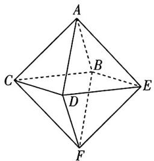

text_image

A
B
C
D
E
F

则 $\left\{ \begin{array}{l} p_{n + 1} = \frac{1}{4} q_n, \\ q_{n + 1} = p_n + r_n + \frac{1}{2} q_n,\\ r_{n + 1} = \frac{1}{4} q_n, \end{array} \right.$ 且 $\left\{ \begin{array}{l}p_1 = 0,\\ q_1 = 1,\text{可得}\left\{ \begin{array}{l}p_{n + 1} = \frac{1}{4} q_n,\\ r_n = p_n, \end{array} \right.\text{再结合}\end{array} \right.$

$p_n + q_n + r_n = 1$ ，得 $p_{n + 1} = \frac{1}{4} (1 - 2p_n) = -\frac{1}{2} p_n + \frac{1}{4},$

可得 $p_{n+1}-\frac{1}{6}=-\frac{1}{2}(p_{n}-\frac{1}{6})$ ，且 $p_{1}-\frac{1}{6}=-\frac{1}{6}$ ，
一阶线性递推构造等比数列

可知数列 $\{p_n - \frac{1}{6}\}$ 是首项为 $-\frac{1}{6}$ , 公比为 $-\frac{1}{2}$ 的等比数列,

则 $p_n - \frac{1}{6} = -\frac{1}{6} \times (-\frac{1}{2})^{n-1} = \frac{1}{3} \times (-\frac{1}{2})^n$ ，可得 $p_n = \frac{1}{6} + \frac{1}{3} \times (-\frac{1}{2})^n$ ，所以小虫在第八秒爬回初始位置的概率为 $p_8 = \frac{1}{6} + \frac{1}{3} \times (-\frac{1}{2})^8 = \frac{43}{256}$ .

2. 解析(1)本质是消去 $H(\xi)$ 中的 $P_{2}$ , 得到关于 $P_{1}$ 的解析式, 求导可得单调性, 故而求出最大值; (2) 根据所给条件联想等比数列, 求通项公式并代入 $H(\xi)$ .

(1) 当 $n = 2$ 时, $P_{1} + P_{2} = 1$ , $H(\xi) = -P_{1}\log_{2}P_{1} - (1 - P_{1})\log_{2}(1 - P_{1})$ , $P_{1} \in (0,1)$ .

令 $f(t) = -t\log_{2}t - (1 - t)\log_{2}(1 - t), t \in (0,1)$ ,

则 $f'(t) = -\log_{2}t + \log_{2}(1-t) = \log_{2}\left(\frac{1}{t} - 1\right)$ ,

所以函数 $f(t)$ 在 $(0, \frac{1}{2})$ 上单调递增，在 $(\frac{1}{2}, 1)$ 上单调递减，所以当 $P_{1} = \frac{1}{2}$ 时， $H(\xi)$ 取得最大值，最大值为 $H(\xi)_{\max} = 1$ .

(2) 因为 $P_{1}=P_{2}=\frac{1}{2^{n-1}}, P_{k+1}=2P_{k}(k=2,3,\cdots,n)$ ，
从第二项开始 $\left\{P_{k}\right\}$ 是等比数列

所以 $P_{k}=P_{2}\cdot2^{k-2}=\frac{2^{k-2}}{2^{n-1}}=\frac{1}{2^{n-k+1}}(k=2,3,\cdots,n)$ ,

故 $P_{k}\log_{2}P_{k} = \frac{1}{2^{n - k + 1}}\log_{2}\frac{1}{2^{n - k + 1}} = -\frac{n - k + 1}{2^{n - k + 1}},$

而 $P_{1}\log_{2}P_{1} = \frac{1}{2^{n - 1}}\log_{2}\frac{1}{2^{n - 1}} = -\frac{n - 1}{2^{n - 1}},$

于是 $H(\xi) = \frac{n - 1}{2^{n - 1}} -\sum_{k = 2}^{n}P_{k}\log_{2}P_{k} = \frac{n - 1}{2^{n - 1}} +\frac{n - 1}{2^{n - 1}} +\frac{n - 2}{2^{n - 2}} +\dots +\frac{2}{2^{2}} +$ $\frac{1}{2},$

整理得 $H(\xi)=\frac{n-1}{2^{n-1}}-\frac{n}{2^{n}}+\frac{n}{2^{n}}+\frac{n-1}{2^{n-1}}+\frac{n-2}{2^{n-2}}+\cdots+\frac{2}{2^{2}}+\frac{1}{2}$ .

令 $S_{n}=\frac{1}{2}+\frac{2}{2^{2}}+\frac{3}{2^{3}}+\cdots+\frac{n-1}{2^{n-1}}+\frac{n}{2^{n}}$

则 $\frac{1}{2}S_{n}=\frac{1}{2^{2}}+\frac{2}{2^{3}}+\frac{3}{2^{4}}+\cdots+\frac{n-1}{2^{n}}+\frac{n}{2^{n+1}}$

两式相减得 $\frac{1}{2} S_n = \frac{1}{2} +\frac{1}{2^2} +\frac{1}{2^3} +\dots +\frac{1}{2^n} -\frac{n}{2^{n + 1}} = 1 - \frac{n + 2}{2^{n + 1}},$

因此 $S_{n} = 2 - \frac{n + 2}{2^{n}}$

所以 $H(\xi) = \frac{n - 1}{2^{n - 1}} -\frac{n}{2^n} +S_n = \frac{n - 1}{2^{n - 1}} -\frac{n}{2^n} +2 - \frac{n + 2}{2^n} = 2 - \frac{1}{2^{n - 2}}.$

# 专题十四 复数

# 考点切片

# 考点1 复数的基本概念及运算

1. $(-\infty, 0) \cup (0, 1) \cup (1, +\infty)$ 解析由于 $z = (a^2 - a)\mathrm{i}$ 是纯虚数，因此 $a^2 - a \neq 0$ ，进而得到 $a \in (-\infty, 0) \cup (0, 1) \cup (1, +\infty)$ .

2. $\frac{1}{5}$ ; 二; $-\frac{2}{5} - \frac{1}{5} i$ ; $\frac{\sqrt{5}}{5}$ 解析由于 $z(1 - 2i) = i$ , 因此 $z = \frac{i}{1 - 2i} = \frac{i(1 + 2i)}{(1 - 2i)(1 + 2i)} = \frac{i + 2i^2}{1 - 4i^2} = -\frac{2}{5} + \frac{1}{5} i$ , 于是得到复数 $z$

的虚部为 $\frac{1}{5}$ , 复数 $z$ 对应的点在复平面的第二象限, 复数 $z$ 的共轭复数为 $\bar{z} = -\frac{2}{5} - \frac{1}{5} i$ , 复数 $z$ 的模 $|z| = \sqrt{\left(-\frac{2}{5}\right)^2 + \left(\frac{1}{5}\right)^2} = \frac{\sqrt{5}}{5}$ .

# 坑神有话说

复数运算中的分母实数化与实数运算中的分母有理化是一致的,都是通过平方差公式来实现的.

3.C 解析 $|z| = |-1 - i| = \sqrt{(-1)^2 + (-1)^2} = \sqrt{2}$ .

4.D 解析因为 $z = \sqrt{2}\mathrm{i}$ ，所以 $\bar{z} = -\sqrt{2}\mathrm{i},z\cdot \bar{z} = 2.$

# 坑神有话说

$z \cdot \bar{z} = (a + bi)(a - bi) = a^{2} + b^{2} = |z|^{2}$ , 在一些比较复杂的题目中可以把 $\bar{z} \cdot \bar{z}$ 与 $|z|^{2}$ 互相代换以简化运算.

5.A 解析因为 $z=5+i$ ，所以 $\bar{z}=5-i$ ，所以 $i(\bar{z}+z)=10i$ .  
6.B 解析 $z = \frac{2 + \mathrm{i}}{1 + \mathrm{i}^2 + \mathrm{i}^5} = \frac{2 + \mathrm{i}}{1 - 1 + \mathrm{i}} = \frac{-\mathrm{i}(2 + \mathrm{i})}{-\mathrm{i}^2} = 1 - 2\mathrm{i}$ 所以 $\overline{z} = 1 + 2\mathrm{i}$   
7.C 解析 因为 $\frac{z}{z - 1} = 1 + \mathrm{i}$ , 所以 $\frac{z - 1}{z} = \frac{1}{1 + \mathrm{i}}$ , 即 $1 - \frac{1}{z} = \frac{1 - \mathrm{i}}{(1 + \mathrm{i})(1 - \mathrm{i})} = \frac{1}{2} - \frac{1}{2}\mathrm{i}$ , 即 $\frac{1}{z} = \frac{1}{2} + \frac{1}{2}\mathrm{i} = \frac{1 + \mathrm{i}}{2}$ , 所以 $z = \frac{2}{1 + \mathrm{i}} = 1 - \mathrm{i}$ , 故选 C.  
8.2 解析 由 $z + \frac{2}{z} = m$ ，得 $z^2 - mz + 2 = 0$ ，解得 $z = \frac{m \pm \sqrt{8 - m^2}i}{2}$ ，依题意得 $\frac{m}{2} = 1$ ，解得 $m = 2$ .

# 考点2 复数的模的运算

1.BD 解析 A(×)举反例: z = i, 则 $|z| = 1$ ;

B(√)设 $z = a + bi, a, b \in R$ ，则 $|z| = \sqrt{a^{2} + b^{2}}$ ，因为 $(\sqrt{3} + i) \cdot z = (\sqrt{3} + i)(a + bi) = (\sqrt{3}a - b) + (a + \sqrt{3}b)i$ ，所以 $|\left(\sqrt{3} + i\right) \cdot z| = \sqrt{\left(\sqrt{3}a - b\right)^{2} + \left(a + \sqrt{3}b\right)^{2}} = 2\sqrt{a^{2} + b^{2}} = 2|z|$ ;

C(×)举反例: $z=1+i$ ,则 $\bar{z}=1-i,|z-\bar{z}|=|2i|=2\neq z-\bar{z};$

D(√)若 $|z|=z\cdot\bar{z}$ ，可得 $\sqrt{a^{2}+b^{2}}=(a-bi)(a+bi)=a^{2}+b^{2}$ ，且 $z\neq0$ ，即 $a^{2}+b^{2}\neq0$ ，可得 $a^{2}+b^{2}=1$ ，即 $|z|=1$ .

2. $3\sqrt{3}$ 解析向量法. 原题等价于 $|a| = |b| = 3, a + b = (2, -\sqrt{5})$ ，求 $|a - b|$ . 因为 $|a + b|^2 + |a - b|^2 = 2|a|^2 + 2|b|^2 = 2 \times 9 + 2 \times 9 = 36, |a + b|^2 = 4 + 5 = 9$ ，所以 $|a - b|^2 = 36 - 9 = 27$ ，所以 $|a - b| = 3\sqrt{3}$ .

另解 几何法. 根据复数的几何意义, $z_{1}+z_{2}$ 是以 $z_{1},z_{2}$ 为邻边的菱形的一条对角线, $z_{1}-z_{2}$ 是另一条对角线. 而 $|z_{1}+z_{2}|=\sqrt{4+5}=3$ , 易知该菱形是两角为 $60^{\circ}$ , 两角为 $120^{\circ}$ 的菱形, 所以 $|z_{1}-z_{2}|=3\sqrt{3}$ .

3.2023 解析 反解出 $\alpha$ 后根据模的运算公式进行转化, 从而解决问题. 先设 $z_0 = f(\alpha) = \sqrt{2022} + \mathrm{i}$ , 由于函数 $f(z) = \frac{2023(z - 1)}{z - 2023} (z \in \mathbf{C}$ 且 $z \neq 2023)$ , 于是就有 $\frac{2023(\alpha - 1)}{\alpha - 2023} = z_0$ , 然后得到 $\alpha = \frac{2023z_0 - 2023}{z_0 - 2023}$ , 而 $|z_0|^2 = (\sqrt{2022})^2 + 1^2 = 2023 = z_0 \cdot \bar{z}_0$ , 进而得到 $\alpha = \frac{2023z_0 - 2023}{z_0 - 2023} = \frac{2023z_0 - z_0 \cdot \bar{z}_0}{z_0 - 2023} = z_0 \cdot \overbrace{|z_0 \cdot \bar{z}_0| = |z_0|^2 = 2023}$ .

$\frac{2023-\bar{z}_{0}}{z_{0}-2023}$ ，因此 $|\alpha|=|z_{0}\cdot\frac{2023-\bar{z}_{0}|=|z_{0}|\cdot\frac{|\bar{z}_{0}-2023|}{|z_{0}-2023|}$ ，而 $z_{0}\sim2023$ 与 $\bar{z}_{0}\sim2023$ 互为共轭复数，因此 $|\alpha|=|z_{0}|\cdot\frac{|\bar{z}_{0}-2023|}{|z_{0}-2023|}=|z_{0}|=\sqrt{2023}$ ，最终得到 $|\alpha^{2}|=|\alpha|^{2}=2023$ .

# 考点3 复数的几何意义

1.D 解析 $z = a + bi$ 对应点 $(a, b)$ ，设对应圆半径为 $R$ ，故 $a^2 + b^2 = R^2 > 0$ ，设 $z' = x + yi, x, y \in \mathbb{R}$ ，由此可知 $z'$ 对应点 $(x, y)$ 在直线 $x + y = R^2$ 上，又 $a \in [-R, R], b \in [-R, R]$ ，所以 $x \in [0, R^2], y \in [0, R^2]$ ，所以表示一条线段。

易错：圆上点坐标的范围

2.D 解析根据复数的几何意义可设复数 $z_{1}, z_{2}$ 所对应的向量分别为 $\overrightarrow{AB}, \overrightarrow{AD}$ , 如图所示, 于是复数 $z_{1} + z_{2}, z_{1} - z_{2}$ 所对应的向量分别为 $\overrightarrow{AC}, \overrightarrow{DB}$ , 易知 $|\overrightarrow{AC}|^{2} +$

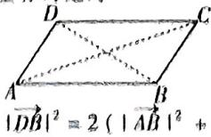

$|\overrightarrow{AD}|^{2}$ ，得到 $|z_{1}+z_{2}|^{2}+|z_{1}-z_{2}|^{2}=2(|z_{1}|^{2}+|z_{2}|^{2})$ ，而 $|z_{1}|=2|z_{2}|=2,|z_{1}+z_{2}|=\sqrt{7}$ ，因此 $|z_{1}-z_{2}|=\sqrt{3}$ .

3.AB 解析 A(√) B(√) 设 $z = a + bi, a, b \in R$ ，由题意可得 $\left\{\begin{aligned}a^{2}+b^{2}&=4,\\ a^{2}+(b+2)^{2}&=4,\end{aligned}\right.$ 解得 $\left\{\begin{aligned}a&=\sqrt{3},\\ b&=-1\end{aligned}\right.$ 或 $\left\{\begin{aligned}a&=-\sqrt{3},\\ b&=-1,\end{aligned}\right.$ 所以点 $M(\sqrt{3},-1)$ 或 $M(-\sqrt{3},-1)$ ,

因为点 M 在第四象限, 所以 $M(\sqrt{3}, -1)$ , 从而可得 $N(\sqrt{3}, 1)$ , 所以点 N 在第一象限, 所以 $|MN| = 2$ ;

$C(\times)\overrightarrow{OM}=(\sqrt{3},-1),\overrightarrow{ON}=(\sqrt{3},1)$ ，所以 $\overrightarrow{OM}\cdot\overrightarrow{ON}=3-1=2$ ，
所以 OM 与 ON 不垂直；

D(×) $z=\sqrt{3}-i,z^{2}+2=(\sqrt{3}-i)^{2}+2=4-2\sqrt{3}i\neq\bar{z}.$

另解 B(√) 因为 $z, z + 2i$ 在复平面内所对应的点分别为 M, N, 所以在复平面中, 点 N 在点 M 正上方 2 个单位长度处;

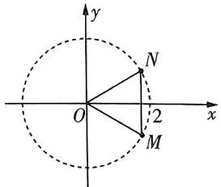

text_image

y
N
O
2 x
M

A(√)C(×)因为MN=OM=ON=2，所以 $\triangle OMN$ 是正三角形，且MN垂直于x轴，所以O,M,N的位置如图所示，所以点N在第一象限， $\angle MON=60^{\circ}$ ;

D(×)根据几何关系,点 M 坐标为 $(\sqrt{3}, -1)$ , 即 $z = \sqrt{3} - i$ , 所以 $z^{2} + 2 = (\sqrt{3} - i)^{2} + 2 = 4 - 2\sqrt{3}i \neq \bar{z}$ .

4.1 解析先设复数 $z, 1, 3 + 2\mathrm{i}$ 在复平面内所对应的点分别为 $Z, A, B$ ，由于 $|z - 1| + |z - 3 - 2\mathrm{i}| = 2\sqrt{2}$ ，因此得到 $|ZA| + |ZB| = 2\sqrt{2}$ ，而 $|AB| = 2\sqrt{2}$ ，于是点 $Z$ 在线段 $AB$ 上（含端点 $A, B$ ），如图所示，进而得到 $|z|$ 的最小值为 1.

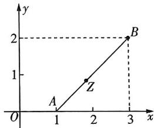

line

| Point | x | y |
|---|---|---|
| A | 1 | 0 |
| B | 3 | 2 |
| Z | 2 | 1 |

当点Z与点A重合时取得

5.B 解析根据题意,得 $|z|=|(z_{2}-z)-z_{2}|\leqslant|z_{2}-z|+|z_{2}|=$ $|z_{1}-1|+1\leqslant|z_{1}|+1+1=3$ , $z_{2}-z$ 与 $z_{2}$ 方向相反且 $z_{1}=-1$ 时取等号，可以类比向量不等式理解
当 $z_{1} = -1, z_{2} = 1, z = 3$ 时， $|z_{1} - z_{2}| = |z_{1} - 1| = |z_{2} - z| = 2$ ，此时 $|z| = 3$ ，所以 $|z|_{max} = 3$ .

# 考点4 复数与数列

1.2025 + 1012i 解析 根据条件列出等式, 结合数列知识解决即可. 先设 $z_{n} = a_{n} + b_{n}\mathrm{i}(a_{n}, b_{n} \in \mathbb{R})$ , 由 $z_{1} = 1$ , 得到 $a_{1} = 1, b_{1} = 0$ , 而 $z_{n+1} = \bar{z}_{n} + 1 + n\mathrm{i}$ , 于是就有 $a_{n+1} + b_{n+1}\mathrm{i} = (a_{n} - b_{n}\mathrm{i}) + 1 + n\mathrm{i} = (a_{n} + 1) + (n - b_{n})\mathrm{i}$ , 进而得到 $\left\{ \begin{array}{l} a_{n+1} = a_{n} + 1, \\ b_{n+1} = n - b_{n}, \end{array} \right.$ 从而 $\left\{ \begin{array}{l} a_{n} = n, \\ b_{n+1} = n - [(n-1) - b_{n-1}] = b_{n-1} + 1, \end{array} \right.$ $n \geqslant 2$ , 于是得到 $b_{2n+1} = n$ , 因此就有 $a_{2025} = 2025, b_{2025} = 1012$ , 最终得到 $z_{2025} = 2025 + 1012\mathrm{i}$ .

2. $\frac{2023}{2024}$ 解析由于 $z_{n}=n+\sqrt{n}i$ ，因此 $|z_{n}|^{2}=n^{2}+n=n(n+1)$ ，于是就有 $\left|\frac{1}{z_{n}^{2}}\right|=\frac{1}{|z_{n}|^{2}}=\frac{1}{n(n+1)}=\frac{1}{n}-\frac{1}{n+1}$ ，进而得到 $\left|\frac{1}{z_{1}^{2}}\right|+\left|\frac{1}{z_{2}^{2}}\right|+\cdots+\left|\frac{1}{z_{2023}^{2}}\right|=\left(1-\frac{1}{2}\right)+\left(\frac{1}{2}-\frac{1}{3}\right)+\cdots+\left(\frac{1}{2023}-\frac{1}{2024}\right)=1-\frac{1}{2024}\approx\frac{2023}{2024}$

3. 解析题中方程是关于 $z_{n}$ 的本次式，两边同时除以 $z_{n}^{2}$ 可化为

关于 $\frac{z_{n+1}}{z_{n}}$ 的一元二次方程.

由于 $|z_1| = 1$ ，且对任意正整数 $n$ ，均有 $4z_{n + 1}^2 + 2z_n z_{n + 1} + z_n^2 = 0$ ，故 $z_n \neq 0 (n \in \mathbf{N}_+)$ ，整理得 $4\left(\frac{z_{n + 1}}{z_n}\right)^2 + 2\left(\frac{z_{n + 1}}{z_n}\right) + 1 = 0 (n \in \mathbf{N}_+)$ ，解得 $\frac{z_{n + 1}}{z_n} = \frac{-1 \pm \sqrt{3}i}{4} (n \in \mathbf{N}_+)$ .

因此 $\frac{|z_{n + 1}|}{|z_n|} = |\frac{z_{n + 1}}{z_n}| = |\frac{-1\pm\sqrt{3}\mathrm{i}}{4}| = \frac{1}{2}$ 故 $|z_{n}| = |z_{1}|\cdot \frac{1}{2^{n - 1}} =$ $\frac{1}{2^{n - 1}} (n\in \mathbf{N}_{+})$

$|z_{n}+z_{n+1}|=|z_{n}\cdot(1+\frac{z_{n+1}}{z_{n}})|=|z_{n}|\cdot|1+\frac{z_{n+1}}{z_{n}}|=\frac{1}{2^{n-1}}\cdot$ $\frac{|3\pm\sqrt{3}i|}{4}=\frac{\sqrt{3}}{2^{n}}(n\in\mathbf{N}_{+})$ ①.

复数的模的乘法运算

因为 m 为偶数, 所以 $\left|z_{1} + z_{2} + \cdots + z_{m}\right| = \left|\left(z_{1} + z_{2}\right) + \left(z_{3} + z_{4}\right) + \cdots + \left(z_{m-1} + z_{m}\right)\right|$ ,

又 $\left|\left(z_{1}+z_{2}\right)+\left(z_{3}+z_{4}\right)+\cdots+\left(z_{m-1}+z_{m}\right)\right|\leqslant\left|z_{1}+z_{2}\right|+\left|z_{3}+z_{4}\right|+\cdots+\left|z_{m-1}+z_{m}\right|,$

复数的几何意义

所以利用①得 $|z_1 + z_2| + |z_3 + z_4| + \dots + |z_{m-1} + z_m| = \frac{\sqrt{3}}{2} + \frac{\sqrt{3}}{2^3} +$

$$
\frac {\sqrt {3}}{2 ^ {5}} + \dots + \frac {\sqrt {3}}{2 ^ {m - 1}} = \frac {\frac {\sqrt {3}}{2} \left[ 1 - \left(\frac {1}{4}\right) ^ {\frac {m}{2}} \right]}{1 - \frac {1}{4}} <   \frac {\frac {\sqrt {3}}{2}}{\frac {3}{4}} = \frac {2 \sqrt {3}}{3},
$$

所以对任意正偶数 m，均有 $\left|z_{1} + z_{2} + \cdots + z_{m}\right| < \frac{2\sqrt{3}}{3}$ .

# 考点5 复数与方程

1.ACD 解析 A(√) $z^{3}-8=(z-2)(z^{2}+2z+4)=0$ ,

方程实数解为2，所以要提出 $(z-2)$ ，恰好利用立方差公式令 $z^{2}+2z+4=0$ ，其中 $\Delta=4-16=-12<0$ ，

由于 $z_{1}, z_{2}$ 为虚数，故 $z_{1}, z_{2}$ 为 $z^{2} + 2z + 4 = 0$ 的两个根，

则 $z_{1}^{2} + 2z_{1} + 4 = 0$

$B(\times)z^{2}+2z+4=0$ 的两根为 $\frac{-2\pm2\sqrt{3}i}{2}=-1\pm\sqrt{3}i,$ 复数范围内求根公式仍然适用若 $z_{1} = -1 + \sqrt{3}\mathrm{i}, z_{2} = -1 - \sqrt{3}\mathrm{i},$

则 $z_{1}^{2} = (-1 + \sqrt{3}\mathrm{i})^{2} = 1 - 2\sqrt{3}\mathrm{i} + 3\mathrm{i}^{2} = -2 - 2\sqrt{3}\mathrm{i}\neq z_{2};$

C(√)由根与系数的关系得 $z_{1}z_{2}=4$ ;

复数范围内根与系数的关系仍然适用

D(√)由B选项, $z_{1}=-1+\sqrt{3}i$ 或 $-1-\sqrt{3}i$ ,均有 $|z_{1}|=\sqrt{1+3}=2$ .

2.-1或2023 解析 由于 $z^4 = 1$ ，于是 $z^2 = 1$ 或 $z^2 = -1$ ，于是 $z = 1$ 或 $z = -1$ 或 $z = \mathrm{i}$ 或 $z = -\mathrm{i}$ 当 $z = 1$ 时， $z + z^{2} + z^{3} + \dots +z^{2022}+$ $z^{2023} = 2023$ ，当 $z = -1$ 时， $z + z^{2} + z^{3} + \dots +z^{2022} + z^{2023} = z^{2023} =$

$$
z + z ^ {2} = 0, z ^ {3} + z ^ {4} = 0, \dots , z ^ {2 0 2 1} + z ^ {2 0 2 2} = 0
$$

-1, 当 $z = \mathrm{i}$ 时, $z + z^2 + z^3 + z^4 = 0$ , 于是 $z + z^2 + z^3 + \cdots + z^{2022} + z^{2023} = (z + z^2 + z^3 + z^4) + \cdots + (z^{2021} + z^{2022} + z^{2023} + z^{2024}) - z^{2024} = -z^{2024} = -(z^4)^{506} = -1$ , 同理当 $z = -\mathrm{i}$ 时, $z + z^2 + z^3 + \cdots + z^{2022} + z^{2023} = -z^{2024} = -1$ . 综上所述, $z + z^2 + z^3 + \cdots + z^{2022} + z^{2023} = -1$ 或 2023.

另解由于 $z^4 = 1$ ，于是 $z^4 - 1 = (z^2 + 1)(z^2 - 1) = (z - 1)(z^3 + z^2 + z + 1) = 0$ ，当 $z = 1$ 时，有 $z + z^2 + z^3 + \dots + z^{2022} + z^{2023} = 2023,$ 当 $z \neq 1$ 时，有 $z^3 + z^2 + z + 1 = 0$ ，从而 $z + z^2 + z^3 + z^4 = z(z^3 + z^2 + z + 1) = 0$ ，于是 $z + z^2 + z^3 + \dots + z^{2022} + z^{2023} = (z + z^2 + z^3 + z^4) + \dots + (z^{2021} + z^{2022} + z^{2023} + z^{2024}) - z^{2024} = -z^{2024} = -(z^4)^{506} = -1.$ 综上所述， $z + z^2 + z^3 + \dots + z^{2022} + z^{2023} = -1$ 或2023.

# 觉醒集训

1.D 解析因为 $z = (3 + \mathrm{i})(1 - \mathrm{i}) = 4 - 2\mathrm{i}$ ，所以该复数在复平面内对应的点为(4，-2)，位于第四象限.

2.D 解析由题意得 $z+1=i(2-i)=1+2i$ ，所以 z=2i.

3.A 解析依题意得, $z=\frac{1-i}{1+i}=\frac{(1-i)(1-i)}{(1+i)(1-i)}=\frac{-2i}{2}=-i$ ,所以 $\bar{z}=i$ 在复平面内对应的点的坐标为(0,1).

4.B 解析 因为 $\frac{\sqrt{3} - \mathrm{i}}{z} = 1 + \sqrt{3}\mathrm{i}$ 所以 $z = \frac{\sqrt{3} - \mathrm{i}}{1 + \sqrt{3}\mathrm{i}} =$ $\frac{(\sqrt{3} - \mathrm{i})(1 - \sqrt{3}\mathrm{i})}{(1 + \sqrt{3}\mathrm{i})(1 - \sqrt{3}\mathrm{i})} = -\mathrm{i},$ 所以 $|z| = 1.$

另解 根据复数的模的乘法运算法则, 复数 z 满足 $\frac{|\sqrt{3}-i|}{|z|}=$ $|1+\sqrt{3}i|$ , 即 $\frac{|2|}{|z|}=2$ , 所以 $|z|=1$ .

5.C 解析充分性: 因为 $z_{1}=z_{2}$ ，所以 $\left|z_{1}+i\right|=\left|z_{2}+i\right|$ ，充分性显然成立.

必要性: 方法一 考虑复数的几何意义, $\left|z_{1}+i\right|=\left|z_{2}+i\right|$ 表示在复平面中 $z_{1}, z_{2}$ 对应的点到 $(0,-1)$ 的距离相等, 不能推出 $z_{1}=z_{2}$ .

方法二 只需举一个反例即可，如 $z_{1} = 1, z_{2} = -1$ ，此时 $|z_{1} + \mathrm{i}| = |1 + \mathrm{i}| = \sqrt{2}, |z_{2} + \mathrm{i}| = |-1 + \mathrm{i}| = \sqrt{2}, |z_{1} + \mathrm{i}| = |z_{2} + \mathrm{i}|$ ，必要性不成立。所以“ $z_{1} = z_{2}$ ”是“ $|z_{1} + \mathrm{i}| = |z_{2} + \mathrm{i}|$ ”的充分不必要条件。

6.B 解析设 $z = a + bi (a, b \in \mathbf{R})$ ，则 $\bar{z} = a - bi, \frac{\bar{z}}{z} = \frac{a - bi}{a + bi} = \frac{(a - bi)^2}{(a + bi)(a - bi)} = \frac{a^2 - b^2 - 2ab\mathrm{i}}{a^2 + b^2}$ .

又 $(a + b\mathrm{i})^2 = -3 + 4\mathrm{i}$ ，所以 $(a^2 -b^2) + 2ab\mathrm{i} = -3 + 4\mathrm{i},$

所以 $a^2 - b^2 = -3, 2ab = 4$ ，所以 $a = 1, b = 2$ 或 $a = -1, b = -2$ ，得到 $a^2 + b^2 = 5$

所以 $\frac{\bar{z}}{z} = \frac{-3 - 4\mathrm{i}}{5} = -\frac{3}{5} -\frac{4}{5}\mathrm{i}.$

另解 设 $z = a + b\mathrm{i}(a, b \in \mathbb{R})$ ，则 $\frac{\bar{z}}{z} = \frac{z \cdot \bar{z}}{z^2} = \frac{a^2 + b^2}{-3 + 4\mathrm{i}}$ 。又 $a^2 + b^2 = |z|^2 = |z^2| = 5$ ，所以 $\frac{\bar{z}}{z} = \frac{5}{-3 + 4\mathrm{i}} = \frac{5(-3 - 4\mathrm{i})}{(-3 + 4\mathrm{i})(-3 - 4\mathrm{i})} = -\frac{3}{5} - \frac{4}{5}\mathrm{i}$ 。

7.D 解析因为 $1 + \mathrm{i}$ 是关于 $x$ 的方程 $x^{2} - ax + b = 0$ 的一个根， $a \in \mathbf{R}, b \in \mathbf{R}$ ，

所以 $1 - \mathrm{i}$ 是关于 $x$ 的方程 $x^{2} - ax + b = 0$ 的一个根，

于是有 $\left\{ \begin{array}{l} 1 + \mathrm{i} + 1 - \mathrm{i} = a, \\ (1 + \mathrm{i})(1 - \mathrm{i}) = b \end{array} \right. \Rightarrow \left\{ \begin{array}{l} a = 2, \\ b = 2 \end{array} \right. \Rightarrow a + b = 4.$

另解 $(1+i)^{2}-a(1+i)+b=b-a+(2-a)i=0$ ，所以 a=b=2, $a+b=4$ .

8.A 解析由 $|(x-3)+(y+3)|=2$ ，可得 $(x-3)^{2}+(y+3)^{2}=4$ ，可令 $\left\{\begin{aligned}x=2\cos\alpha+3,\\ y=2\sin\alpha-3,\end{aligned}\right.$ 则 $|z+1|=\sqrt{(x+1)^{2}+y^{2}}=$ 三角换元

$\sqrt{(2\cos\alpha+4)^{2}+(2\sin\alpha-3)^{2}}=\sqrt{29+16\cos\alpha-12\sin\alpha}=$ $\sqrt{29+20\sin(\varphi-\alpha)}$ ( $\varphi$ 为锐角，且 $\tan\varphi=\frac{4}{3}$ )

由 $-1 \leqslant \sin (\varphi - \alpha) \leqslant 1$ ，可得 $3 \leqslant \sqrt{29 + 20\sin(\varphi - \alpha)} \leqslant 7$

所以 $|z+1|$ 的最小值为3.

另解 $|(x - 3) + (y + 3)\mathrm{i}| = 2$ 可变形为 $|(x + yi) - (3 - 3i)| =$

2, 其几何意义表示复平面内点 $(x, y)$ 在以 $(3, -3)$ 为圆心，2 为半径的圆上。而 $|z + 1|$ 则表示点 $(x, y)$ 到点 $(-1, 0)$ 的距离，显然距离最小值为 $(3, -3)$ 与 $(-1, 0)$ 的距离减去圆的半径，即为 3。

9.C 解析 A(√) 由 $z^{2}=\bar{z}$ ，得 $|z|^{2}=|\bar{z}|=|z|$ ，因为 $|z|\neq0$ ，所以 $|z|=1$ ;

B(√)由 $z^{2}=\bar{z}$ ，得 $z^{3}=z\cdot\bar{z}=|z|^{2}=1$ ；

C(×)D(√)设 $z=a+b\mathrm{i}(a,b\in\mathbf{R},b\neq0)$ ,

则 $\bar{z} = a - bi, z^2 = a^2 - b^2 + 2ab\mathrm{i}$ ,

所以 $\left\{ \begin{array}{l}a^2 -b^2 = a,\\ 2ab = -b, \end{array} \right.$ 解得 $a = -\frac{1}{2},b = \pm \frac{\sqrt{3}}{2},$

所以 $z$ 的虚部为 $\frac{\sqrt{3}}{2}$ 或 $-\frac{\sqrt{3}}{2}$ , 所以 $|z + \overline{z}| = 2 |a| = 1$ .

10.BCD 解析 设复数 $z = a + bi, w = c + di, a, b \in \mathbf{R}$ 且不同时为 $0, c, d \in \mathbf{R}$ 且不同时为 0.

$A(\times)z^{2}=(a+bi)^{2}=a^{2}+2abi+b^{2}i^{2}=a^{2}-b^{2}+2abi$ ，而 $|z|=\sqrt{a^{2}+b^{2}}$ ， $|z|^{2}=a^{2}+b^{2}$ ，所以 $z^{2}=|z|^{2}$ 不成立，故选项A错误；

B( $\sqrt{}$ ) $\frac{z}{\bar{z}}=\frac{a+bi}{a-bi}=\frac{(a+bi)^{2}}{a^{2}+b^{2}}=\frac{z^{2}}{|z|^{2}}$ , 故选项 B 正确;

$C(\sqrt{})\overline{z-w}=\overline{(a+bi)-(c+di)}=\overline{(a-c)+(b-d)i}=(a-c)-(b-d)i$ ，而 $\bar{z}=a-bi,\overline{w}=c-di,\bar{z}-\overline{w}=(a-bi)-(c-di)=(a-c)-(b-d)i=\overline{z-w}$ ，故选项C正确；

D（√） $\frac{z}{w} = \frac{a + bi}{c + di} = \frac{(ac + bd) + (bc - ad)i}{c^2 + d^2}$ 所以 $|\frac{z}{w}| = \frac{\sqrt{(ac + bd)^2 + (bc - ad)^2}}{c^2 + d^2}$ 而 $|\frac{z|}{|w|} = \frac{\sqrt{a^2 + b^2}}{\sqrt{c^2 + d^2}} = \frac{\sqrt{(a^2 + b^2)(c^2 + d^2)}}{c^2 + d^2},$

且 $(ac + bd)^2 + (bc - ad)^2 = a^2c^2 + b^2d^2 + b^2c^2 + a^2d^2 = (a^2 + b^2)$ $(c^2 + d^2)$ ，显然 $|\frac{z}{w}| = \frac{|z|}{|w|}$ ，故选项D正确.

【大招识别】两复数商的模，等于模的商

11.AC 解析设 $z_{1} = a + b\mathrm{i}(a,b\in \mathbf{R}),z_{2} = c + d\mathrm{i}(c,d\in \mathbf{R})$ ，由 $z_{1}z_{2} + z_{1} + z_{2} = 0$ ，得 $\frac{1}{z_1} +\frac{1}{z_2} = -1,$

模长均为1，两边同时除以 $z_{1}z_{2}$ 构造 $\frac{1}{z_{1}},\frac{1}{z_{2}}$ 则 $-1=\frac{1}{z_{1}}+\frac{1}{z_{2}}=\frac{1}{a+bi}+\frac{1}{c+di}=\frac{a-bi}{a^{2}+b^{2}}+\frac{c-di}{c^{2}+d^{2}}$ ，而 $a^{2}+b^{2}=1$ ，
也可由 $z\cdot\bar{z}=|z|^{2}$ 直接得到

$c^2 + d^2 = 1$ ，则 $a - b\mathrm{i} + c - d\mathrm{i} = a + c - (b + d)\mathrm{i} = -1$ ，解得 $a + c = -1$ 且 $b + d = 0$ .

$A(\sqrt{})B(\times)z_{1}+z_{2}=a+bi+c+di=a+c+(b+d)i=-1,|z_{1}+z_{2}|=1;$

$C(\sqrt{})D(\times)z_{1}z_{2}=-(z_{1}+z_{2})=1,z_{1}^{2}+z_{2}^{2}=(z_{1}+z_{2})^{2}-2z_{1}z_{2}=\\ -1,|z_{1}^{2}+z_{2}^{2}|=1.$

12. $\frac{1}{2}$ 解析 $z = \frac{m + i}{2 + i} = \frac{(m + i)(2 - i)}{(2 + i)(2 - i)} = \frac{2m + 1}{5} +\frac{2 - m}{5} i,$

因为复数 $z = \frac{m + i}{2 + i}$ 是纯虚数，所以 $\left\{ \begin{array}{l} \frac{2m + 1}{5} = 0, \\ \frac{2 - m}{5} \neq 0, \end{array} \right.$ 解得 $m = -\frac{1}{2}$ .

13.3 $\sqrt{2}$ 解析几何法. 设复数 $z = x + yi (x, y \in \mathbb{R})$ ,

由 $|z - 5| = |z - 1|$ ，可得复数 $z$ 对应的点在以(5,0)和(1,0)为端点的线段的垂直平分线上，所以 $x = 3$ .

由 $|z-1|=|z+i|$ ，可得复数z对应的点在以(1,0)和(0,-1)为端点的线段的垂直平分线上，所以y=-x=-3，所以z=3-3i.

经检验, $z=3-3i$ 满足 $|z-5|=|z-1|=|z+i|$ ,

则 $|z| = \sqrt{3^2 + (-3)^2} = 3\sqrt{2}$ .

另解 方程法. 设 $z = a + bi (a, b \in \mathbb{R})$ ,

由 $|z - 5| = |z - 1|$ , $(a - 5)^2 + b^2 = (a - 1)^2 + b^2$ , 解得 $a = 3$ .

由 $|z-1|=|z+i|$ , $(a-1)^{2}+b^{2}=a^{2}+(b+1)^{2}$ , 解得 $b=-a=-3$ .

经检验, $z=3-3i$ 满足 $|z-5|=|z-1|=|z+i|$ ,

则 $|z| = \sqrt{3^2 + (-3)^2} = 3\sqrt{2}$ .

# 素养提升

1.4 + 2√2 解析由 $z = x + yi(x, y \in \mathbf{R}), z_1 = -2, z_2 = -\frac{1}{2}, z_3 = i$

知, $Z(x,y)$ , $Z_{1}(-2,0)$ , $Z_{2}(-\frac{1}{2},0)$ , $Z_{3}(0,1)$ ,从而 $\overrightarrow{Z_{1}Z}=(x+$

$2,y),\overrightarrow{Z_{1}Z_{2}} = (\frac{3}{2},0),\overrightarrow{Z_{1}Z_{3}} = (2,1),\overrightarrow{ZZ_{2}} = (-\frac{1}{2} -x, - y).$

由于 $|z - z_1|^2 = |\overrightarrow{Z_1Z}|^2 = (x + 2)^2 + y^2, |z - z_2|^2 = |\overrightarrow{Z_2Z}|^2 = (x + \frac{1}{2})^2 + y^2$ ，故条件 $|z - z_1| = 2|z - z_2|$ 即为 $(x + 2)^2 + y^2 = 4[(x + \frac{1}{2})^2 + y^2]$ ，展开得到 $x^2 + 4x + 4 + y^2 = 4x^2 + 4x + 4y^2 + 1$ ，化简得

$\frac{x^2 + y^2 = 1}{5}$ 【大招识别】阿波罗尼斯圆

由于 $\overrightarrow{Z_{1}Z}=\lambda\overrightarrow{Z_{1}Z_{2}}+\mu\overrightarrow{Z_{1}Z_{3}},\overrightarrow{Z_{1}Z}=(x+2,y),\overrightarrow{Z_{1}Z_{2}}=(\frac{3}{2},0)$ , $\overrightarrow{Z_{1}Z_{3}}=(2,1)$ ，故 $(x+2,y)=(\frac{3\lambda}{2}+2\mu,\mu)$ .

方法一 $(x - y)^2 \leqslant (x - y)^2 + (x + y)^2 = (x^2 + y^2 - 2xy) + (x^2 + y^2 + 2xy) = 2(x^2 + y^2) = 2$ ，从而 $-\sqrt{2} \leqslant x - y \leqslant \sqrt{2}$ .

$3\lambda + 2\mu = 2\left(\frac{3\lambda}{2} + 2\mu\right) - 2\mu = 2(x + 2) - 2y = 4 + 2(x - y) \leqslant 4 +$

$2\sqrt{2}$ . 经验证, 当 $x = \frac{\sqrt{2}}{2}, y = -\frac{\sqrt{2}}{2}$ 时, 条件满足, 此时 $3\lambda + 2\mu = 4 + 2(x - y) = 4 + 2\sqrt{2}$ .

所以 $3\lambda + 2\mu$ 的最大值是 $4 + 2\sqrt{2}$ .

方法二 由 $x^{2} + y^{2} = 1$ ，可令 $x = \cos \theta, y = \sin \theta.$ 又 $(x + 2, y) = (\frac{3\lambda}{2} + 2\mu, \mu)$ ，所以 $\mu = y = \sin \theta, \lambda = \frac{2x - 4y + 4}{3} = \frac{2\cos \theta - 4\sin \theta + 4}{3},$

即 $3\lambda+2\mu=2(\cos\theta-\sin\theta)+4=-2\sqrt{2}\sin(\theta-\frac{\pi}{4})+4$ ，最大值为 $4+2\sqrt{2}$ ，

辅助角公式

当且仅当 $\sin\left(\theta-\frac{\pi}{4}\right)=-1$ , 即 $x=\frac{\sqrt{2}}{2}$ , $y=-\frac{\sqrt{2}}{2}$ 时取等号.

故 $3\lambda + 2\mu$ 的最大值为 $4 + 2\sqrt{2}$ .

P006 1.D 2.D 3.A 4.B 5.AB 6.ACD

P008 2.B 3.B 4.A 5.D \ 1.B 2.B

P009 5.C 6.D \ 1.(1)A (2)C (3)C 2.D 3.(1)A

(2)AC 1.C 2.C

P010 3.A 4.C 5.D || 1.B || 1.B || 1.C

P011 3.C 1.C 2.ABC 1.B 2.A 3.D 4.C

5.A

P012 6.A 7.B 8.C 9.B 10.AC 11.AC 12.CD

P013 1.C 2.D 3.ACD 4.B 1.B 2.D 3.ABD

8.C 9.A

1.(1)D (2)C 2.(1)D (2)A 3.C 5.B

1.BCD 2.A

1.C 2.B 3.A 4.C 5.C 6.B 7.C 8.ABD

9.ABD 10.ACD

P017 2.BC 4.B

P018 6.C

P019 1.D \\ 1.D 2.C 4.B 7.A \\ 1.B 2.A

P020 4.C 5.ACD 7.A

P021 4.B 5.A \ | 4.AC

P022 5.D 6.D 7.AB \1.D 3.B \1.D

P023 3.C 5.A 7.A \\ 2.C 3.B 4.B 6.B 7.C

8.ACD

P024 2.C 4.ABD \ 1.ABD 4.D 5.C

P025 2.B 3.ABC \ 3.A 5.B

P026 3.BCD 4.C \ 2.D

P027 4.D \ 1.A 2.B 3.B 4.D 5.D

P028 6.B 7.D 8.C 9.ABC 10.BC 11.ABD 12.AB

P030 1.C || 3.A || 1.A 4.A || 2.C

P031 3.ACD 5.B || 4.D || 2.C

P032 3.A 5.D 11 1.A

P033 2.C 7.C 1.A 2.AC

P034 3.A 5.C

P035 1.A 2.B

P036 1.C 2.A

P039 4.D

P047 1.C 2.D 3.D 4.D 5.D 6.B 7.AD 8.ACD

9.ACD

P049 1.D

P050 2.BD 1.A 2.C 3.D 5.(2)A

6.C 2.D 4.C 1.B 3.C 5.C

9.C 11.D 12.B 1.D 2.B 4.D

9.A 5.B 1.A 2.B 3.C

4.A 5.D 6.ABC \ 1.D 2.BC 3.BD 4.D

5.A

6.AD 7.D \ 1.B 2.A 3.C 4.C 6.D

P056 9.AC 1.A

P057 7.A 8.D \\ 1.A 2.B 3.B 4.C 5.D 6.C

P058 7.C 8.BC 9.ACD 10.BD

P059 1.B 2.C 3.C \ 1.C

P060 2.C 3.C \ 1.D

P061 1.C 2.A 4.C 5.D

P064 3.A

P065 1.C 2.C 3.B 4.ABD

P068 1.A 2.C 3.B 4.A 1.C 3.A 1.D 2.B

P069 3.A 5.C 1.B 2.B 4.BD 7.D

P070 1.A \ 1.B 3.ACD 4.D

P071 1.A \ 1.AC 2.B 3.C

P072 1.A 2.D 3.D 4.A 5.D

P073 1.A 2.B 3.D 4.A 5.D 6.A 7.C 8.B 9.B

10.B

P074 11.AD 12.ACD 13.ABD

P075 1.B 3.C 4.D

P076 1.C 2.C 3.C 4.B \ 5.C 6.C 7.B

P079 1.D

P081 1.D

P083 2.ABD

P085 2.C

P086 1.C 2.AC 3.CD \ 1.B 2.D

P089 9.A

P091 1.A

P092 3.B 4.ABD 1.B 2.D 3.B 4.C 5.D

6.BCD 7.ACD

POA 1.C 2.ABD

1.B 3.D 5.B 6.C 7.ABD 8.AC

1.C 2.A 3.ABD

P098 1.A 2.D 3.C 4.A 1.D 1.A

P099 2.C 4.D 5.C 6.C 7.C 2.D

P100 4.D 5.B \ 1.C 2.A 3.B 4.CD

P101 1.B 2.ABC 3.ABD 4.BCD

P103 2.A 3.D \ 1.D 2.ABD

P104 3.D || 1.A || 1.A 2.AB

P105 1.A \ 3.ABC

P108 1.BD

P110 1.A 2.B 3.B 4.D 5.B

P111 6.BCD

P113 1.D 2.B 3.AB || 2.BC 3.C || 1.A

2.D 1.ABD

P114 2.B 3.C 4.B \\ 1.B 2.B 3.A 5.D \\ 1.C

P115 2.D 3.C 4.C \ 1.C \ 2.ACD 3.D

P116 1.C 2.C \ 1.C

P117 1.C 3.CD \ 4.A 5.B

P118 1.C 1.C 2.A 3.D

P119 4.A 5.A 6.B 7.ABD 8.ABD 1.AD

2.ABD

P120 1.(1)A (2)C 2.A 3.A 5.C 7.A \ 1.B 2.D 3.B

P121 4.B 5.D 6.C 3.C 4.D 5.C 6.ABC 8.D

P122 1.C 2.A 3.ABD \ 1.B 2.D 3.B

P123 1.B 2.D 6.B 7.C 8.D

P124 4.C 2.A

P125 3.C 4.B 1.D 2.C 3.C 4.A 6.C

P126 1.B 3.C 4.C 6.ACD 1.B

P127 1.B 2.B 3.B 4.BCD

P132 1.BCD

1.C 2.D 3.B 4.D 5.D 6.A 7.A 8.ABD

9.ABD 10.ABD

P142 3.A 4.A || 4.C || 1.A 2.C

P143 1.B 3.B 2.B

P144 3.A

P145 3.B 4.C

P146 2.B \ 1.A 5.B \ 1.BC 3.C

P147 6.AD

P148 1.B 2.D 3.B 4.B 5.D 6.C 7.B 8.AD

P149 1.C 2.A 3.C 4.BD

P150 1.D 2.C 3.D

P151 1.A 2.D \\ 1.B 2.CD 3.D 4.ABD

P152 1.A 2.ACD 3.AC \\ 1.D 2.C \\ 1.BCD

P153 2.BC \ 1.B \ 1.BC 2.ACD

P154 3.ACD

P156 1.A

P162 1.A 2.C 3.A 4.C 5.A 6.BD 7.AC

P166 3.C 4.D 5.A 6.B 7.C \ 1.BD

P167 1.D 2.D 3.AB 5.B 1.ACD 1.D 2.D

P168 3.A 4.B 5.C 6.B 7.D 8.A 9.C 10.BCD

11.AC