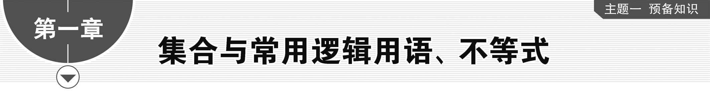
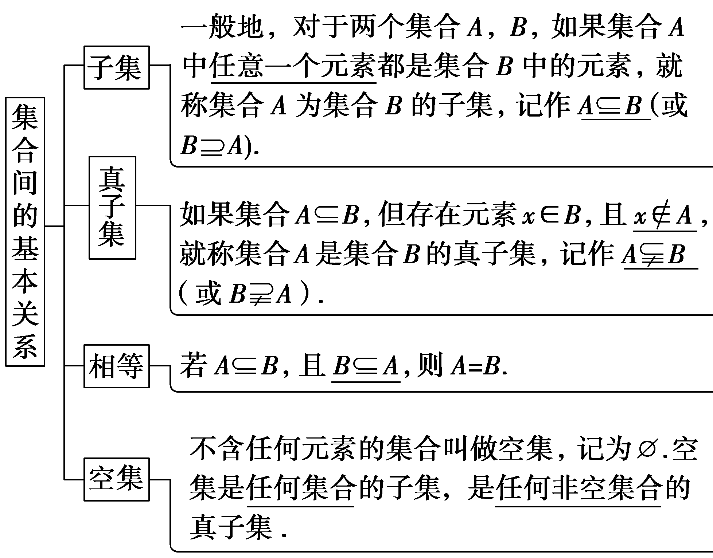
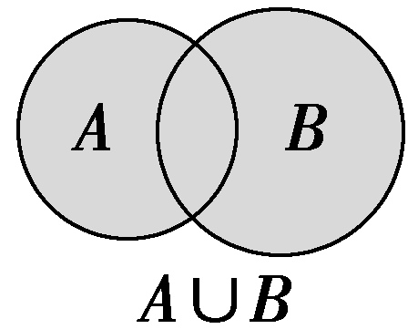
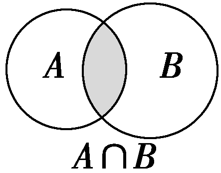
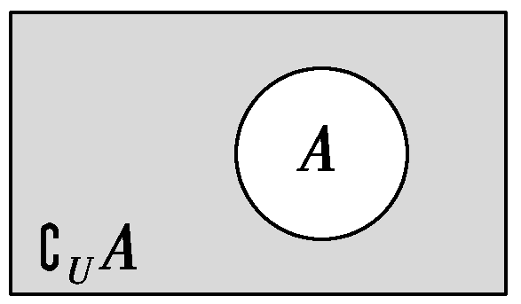
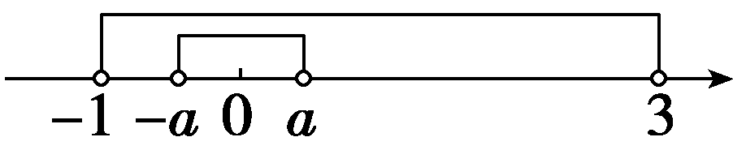
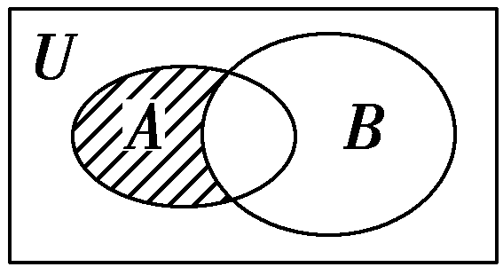
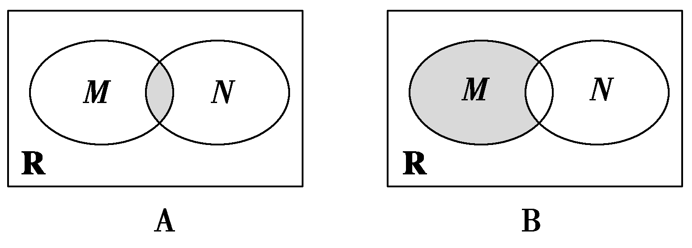
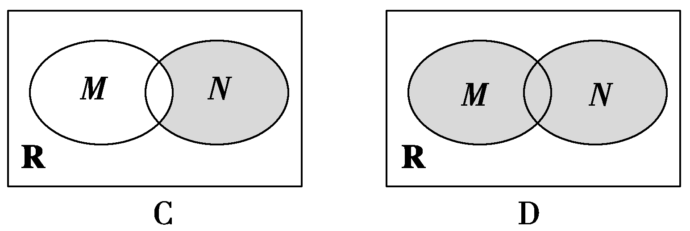
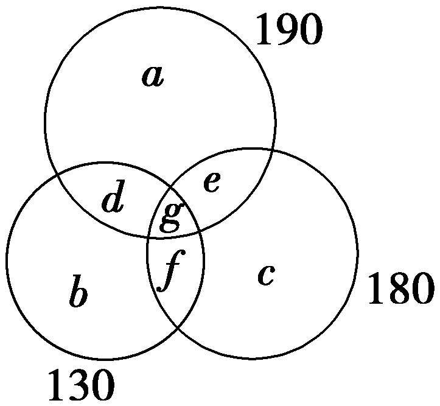

第一节　集　合

【课标研读】　1.通过实例，了解集合的含义，理解元素与集合的关系；针对具体问题，能在自然语言和图形语言的基础上，用符号语言刻画集合；在具体情境中了解全集与空集的含义.　2.理解集合之间包含与相等的含义，能识别给定集合的子集.　3.理解两个集合的并集与交集的含义，能求两个集合的并集与交集；理解在给定集合中一个子集的补集的含义，能求给定子集的补集；能使用Venn图表达集合间的基本关系与基本运算，体会图形对理解抽象概念的作用.

##### 1.集合与元素

（1）集合元素的三个特征：<u>确定性</u>、<u>互异性</u>、无序性.

（2）元素与集合的关系是<u>属于</u>或<u>不属于</u>关系，用符号<u>∈</u>或<u>∉</u>表示.

（3）集合的表示法：<u>列举法</u>、<u>描述法</u>、图示法.

（4）常见数集的记法

<table><tr><td>
集合
</td><td>
自然数集
</td><td>
正整数集
</td><td>
整数集
</td><td>
有理数集
</td><td>
实数集
</td></tr><tr><td>
符号
</td><td>
<strong>N</strong>
</td><td>
<strong>N</strong><em>*</em>

(或<strong>N</strong>＋)
</td><td>
<strong>Z</strong>
</td><td>
<strong>Q</strong>
</td><td>
<strong>R</strong>
</td></tr></table>

[微提醒]　<strong>N</strong>为自然数集(即非负整数集)，包含0，而<strong>N</strong><em>\*</em>和<strong>N</strong>＋的含义是一样的，表示正整数集，不包含0.

##### 2.集合间的基本关系

##### 3.集合的基本运算

<table><tr><td></td><td>
并集
</td><td>
交集
</td><td>
补集
</td></tr><tr><td>
符号

表示
</td><td>
<em>A</em>∪<em>B</em>
</td><td>
<em>A</em>∩<em>B</em>
</td><td>
若全集为<em>U</em>，则集合<em>A</em>的补集为∁<em>UA</em>
</td></tr><tr><td>
图形

表示
</td><td>

</td><td>

</td><td>

</td></tr><tr><td>
集合

表示
</td><td>
{<em>x</em>｜<em>x</em>∈<em>A</em>，或<em>x</em>∈<em>B</em>}
</td><td>
{<em>x</em>｜<em>x</em>∈<em>A</em>，且<em>x</em>∈<em>B</em>}
</td><td>
{<em>x</em>｜<em>x</em>∈<em>U</em>，且<em>x</em>∉<em>A</em>}
</td></tr></table>

【常用结论】

（1）若有限集<em>A</em>中有<em>n</em>个元素，则<em>A</em>的子集有2<em>n</em>个，真子集有2<em>n</em>－1个.

（2）<em>A</em>⊆<em>B</em>⇔<em>A</em>∩<em>B</em>＝<em>A</em>⇔<em>A</em>∪<em>B</em>＝<em>B</em>⇔∁<em>UA</em>⊇∁<em>UB</em>.

（3）∁<em>U</em>(<em>A</em>∩<em>B</em>)＝(∁<em>UA</em>)∪(∁<em>UB</em>)，∁<em>U</em>(<em>A</em>∪<em>B</em>)＝(∁<em>UA</em>)∩(∁<em>UB</em>).

（4）一般地，对任意两个有限集合*A*，*B*，有card(*A*∪*B*)＝card(*A*)＋card(*B*)－card(*A*∩*B*).

【自主检测】

##### 1.(多选)下列结论错误的是(　　)

$\quad$A.集合{<em>x</em>∈<strong>N</strong>｜<em>x</em>3＝<em>x</em>}，用列举法表示为{－1，0，1}

$\quad$B.{<em>x</em>｜<em>y</em>＝<em>x</em>2＋1}＝{<em>y</em>｜<em>y</em>＝<em>x</em>2＋1}＝{(<em>x</em>，<em>y</em>)｜<em>y</em>＝<em>x</em>2＋1}

$\quad$C.若1∈{<em>x</em>2，<em>x</em>}，则<em>x</em>＝－1或<em>x</em>＝1

$\quad$D.对任意集合*A*，*B*，都有(*A*∩*B*)⊆(*A*∪*B*)

答案ABC

##### 2.(链接人教A必修一P8例1)已知集合<em>A</em>＝{<em>x</em>｜<em>x</em>2－4<em>x</em>＜0，<em>x</em>∈<strong>N</strong><em>\*</em>}，则集合<em>A</em>真子集的个数为(　　)

$\quad$A.3	
$\quad$B.4

$\quad$C.7	
$\quad$D.8

答案C

解析<em>A</em>＝{<em>x</em>｜<em>x</em>2－4<em>x</em>＜0，<em>x</em>∈<strong>N</strong><em>\*</em>}＝{1，2，3}，所以集合<em>A</em>真子集的个数为23－1＝7.故选C.

##### 3.(2025·八省适应性测试)已知集合*A*＝{－1，0，1}，*B*＝{0，1，4}，则*A*∩*B*＝(　　)

$\quad$A. $\left\{0\right\}$ 	
$\quad$B. $\left\{1\right\}$

$\quad$C.{0，1}	
$\quad$D.{－1，0，1，4}

答案C

解析由题意可得*A*∩*B*＝{0，1}.故选C.

##### 4.(链接人教A必修一P14T4)设全集为<strong>R</strong>，<em>A</em>＝{<em>x</em>｜3≤<em>x</em>＜7}，<em>B</em>＝{<em>x</em>｜2＜<em>x</em>＜10}，则∁<strong>R</strong>(<em>A</em>∪<em>B</em>)＝<u>　　　　　　　　</u>，(∁<strong>R</strong><em>A</em>)∩<em>B</em>＝<u>　　　　　　　　</u>.

答案{*x*｜*x*≤2，或*x*≥10}　{*x*｜2＜*x*＜3，或7≤*x*＜10}

考点一　集合的基本概念　　　　自主练透

##### 1.(2025·江苏常州模拟)设集合*A*＝{1，2，3，4}，*B*＝{5，6}，*C*＝{*x*＋*y*｜*x*∈*A*，*y*∈*B*}，则*C*中元素的个数为(　　)

$\quad$A.3	
$\quad$B.4

$\quad$C.5	
$\quad$D.6

答案C

解析因为集合*A*＝{1，2，3，4}，*B*＝{5，6}，又*x*∈*A*，*y*∈*B*，则当*y*＝5时，*x*＋*y*的值有6，7，8，9，当*y*＝6时，*x*＋*y*的值有7，8，9，10，于是得*C*＝{6，7，8，9，10}，所以*C*中元素的个数为5.故选C.

##### 2.(2025·江西南昌模拟)已知<em>A</em>＝{<em>x</em>｜<em>x</em>2－<em>ax</em>＋1≤0}，若2∈<em>A</em>，且3∉<em>A</em>，则实数<em>a</em>的取值范围是(　　)

$\quad$A. $\left[\frac{5}{2}，\frac{10}{3}\right)$ 	
$\quad$B. $\left(\frac{5}{2}，\frac{10}{3}\right]$

$\quad$C. $\left[\frac{5}{2}，＋\infty \right)$ 	
$\quad$D. $\left(－\infty ，\frac{10}{3}\right)$

答案A

解析由题意得4－2<text style="it<text style="it<text style="it*a*lic">a</text>lic">a</text>lic">a</text>＋1≤0且9－3a＋1＞0，解得 $\frac{5}{2}$ ≤<text style="it<text style="it<text style="it*a*lic">a</text>lic">a</text>lic">a</text>＜ $\frac{10}{3}$ ，即实数<text style="it<text style="it<text style="it*a*lic">a</text>lic">a</text>lic">a</text>的取值范围为［ $\frac{5}{2}$ ， $\frac{10}{3}$ ).故选A.

##### 3.已知&lt;text style="it&lt;text style="it&lt;text style="it<em>a</em>lic"&gt;a&lt;/text&gt;lic"&gt;a&lt;/text&gt;lic"&gt;a&lt;/text&gt;，<em>&lt;text style="italic"&gt;&lt;text style="italic"&gt;b</em>&lt;/text&gt;&lt;/text&gt;∈<strong>R</strong>，若 $\left\{a，\frac{b}{a}，1\right\}＝$ {&lt;text style="it&lt;text style="it&lt;text style="it<em>a</em>lic"&gt;a&lt;/text&gt;lic"&gt;a&lt;/text&gt;lic"&gt;a&lt;/text&gt;2，a＋<em>&lt;text style="italic"&gt;&lt;text style="italic"&gt;b</em>&lt;/text&gt;&lt;/text&gt;，0}，则a2 025＋b2 026的值为(　　)

$\quad$A.－1	
$\quad$B.0

$\quad$C.1	
$\quad$D.±1

答案A

解析由集合相等可知0∈ $\left\{a，\frac{b}{a}，1\right\}$ ，且&lt;text style="it&lt;text style="it&lt;text style="it&lt;text style="it&lt;text style="it&lt;text style="it<em>a</em>lic"&gt;a&lt;/text&gt;lic"&gt;a&lt;/text&gt;lic"&gt;a&lt;/text&gt;lic"&gt;a&lt;/text&gt;lic"&gt;a&lt;/text&gt;lic"&gt;a&lt;/text&gt;≠0，则 $\frac{b}{a}＝$ 0，所以&lt;text style="it&lt;text style="it&lt;text style="it&lt;text style="it&lt;text style="it&lt;text style="it<em>a</em>lic"&gt;a&lt;/text&gt;lic"&gt;a&lt;/text&gt;lic"&gt;a&lt;/text&gt;lic"&gt;a&lt;/text&gt;lic"&gt;a&lt;/text&gt;lic"&gt;<em>b</em>&lt;/text&gt;＝0，所以<em>a</em>2＝1，解得a＝1或a＝－1.根据集合中元素的互异性可知a＝1应舍去，因此a＝－1，所以a&lt;text style="superscript"&gt;2 025&lt;/text&gt;＋b&lt;text style="superscript"&gt;2 026&lt;/text&gt;＝(－1)2 025＋02 026＝－1.故选A.

##### 4.若集合<em>A</em>＝{<em>x</em>｜<em>kx</em>2＋<em>x</em>＋1＝0}中有且只有一个元素，则实数<em>k</em>的取值集合是<u>　　　　</u>.

答案 $\left\{0，\frac{1}{4}\right\}$

解析当&lt;te&lt;te<em>x</em>t style="italic"&gt;x&lt;/text&gt;t style="italic"&gt;<em>&lt;text style="italic"&gt;&lt;text style="italic"&gt;&lt;text style="italic"&gt;&lt;text style="italic"&gt;&lt;text style="italic"&gt;k</em>&lt;/text&gt;&lt;/text&gt;&lt;/text&gt;&lt;/text&gt;&lt;/text&gt;&lt;/text&gt;＝0时，<em>&lt;text style="italic"&gt;&lt;text style="italic"&gt;A</em>&lt;/text&gt;&lt;/text&gt;＝{－1}，符合题意；当k≠0时，若集合A中有且只有一个元素，由一元二次方程根的判别式<em>Δ</em>＝1－4k＝0，得k $＝\frac{1}{4}$ .综上，当&lt;te&lt;te<em>x</em>t style="italic"&gt;x&lt;/text&gt;t style="italic"&gt;<em>&lt;text style="italic"&gt;&lt;text style="italic"&gt;&lt;text style="italic"&gt;&lt;text style="italic"&gt;&lt;text style="italic"&gt;k</em>&lt;/text&gt;&lt;/text&gt;&lt;/text&gt;&lt;/text&gt;&lt;/text&gt;&lt;/text&gt;＝0或k $＝\frac{1}{4}$ 时，集合&lt;te&lt;te<em>x</em>t style="italic"&gt;x&lt;/text&gt;t style="italic"&gt;<em>&lt;text style="italic"&gt;A</em>&lt;/text&gt;&lt;/text&gt;＝{x｜<em>&lt;text style="italic"&gt;&lt;text style="italic"&gt;&lt;text style="italic"&gt;&lt;text style="italic"&gt;&lt;text style="italic"&gt;&lt;text style="italic"&gt;k</em>&lt;/text&gt;&lt;/text&gt;&lt;/text&gt;&lt;/text&gt;&lt;/text&gt;&lt;/text&gt;x2＋x＋1＝0}中有且只有一个元素，k的取值集合是 $\left\{0，\frac{1}{4}\right\}$ .

解决集合含义问题的关键有三点：一是确定构成集合的元素；二是确定元素的限制条件；三是根据元素的特征(满足的条件)构造关系式解决相应问题.

注意：含字母的集合问题，在求出字母的值后，需要验证集合的元素是否满足互异性.

考点二　集合间的基本关系 　　　　师生共研

（1）若集合<te<te<te*x*t style="italic,superscript">x</text>t st<text st<text st*y*le="italic">y</text>le="italic">y</text>le="italic">x</text>t style="italic">*A*</text>＝{x｜y $＝\sqrt{x}$ }，<te<te*x*t style="italic,superscript">x</text>t st<text st*y*le="italic">y</text>le="italic">B</text>＝{*y*｜y＝2*x*，x∈*<text style="italic">A*</text>}，则(　　)

$\quad$A.<em>A</em>∩<em>B</em>＝⌀	
$\quad$B.<em>A</em>∪<em>B</em>＝<strong>R</strong>

$\quad$C.*B*⊆*A*	
$\quad$D.*A*⊆*B*

（2）(一题多变)(2023·新课标Ⅱ卷)设集合*A*＝{0，－*a*}，*B*＝{1，*a*－2，2*a*－2}，若*A*⊆*B*，则*a*＝(　　)

$\quad$A.2	
$\quad$B.1

$\quad$C. $\frac{2}{3}$ 	
$\quad$D.－1

答案（1）C　（2）B

解析（1）因为<te<te<te*x*t style="italic,superscript">x</text>t st<text st<text st*y*le="italic">y</text>le="italic">y</text>le="italic">x</text>t style="italic">*<text style="italic">A*</text></text>＝{x｜y $＝\sqrt{x}$ }＝[0，＋∞)，<te<te*x*t style="italic,superscript">x</text>t st<text st*y*le="italic">y</text>le="italic">*B*</text>＝{*y*｜y＝2*x*，x∈*<text style="italic"><text style="italic">A*</text></text>}＝[1，＋∞)，所以B⊆A.故选C.

（2）因为*A*⊆*B*，则有：若*a*－2＝0，解得*a*＝2，此时*A*＝{0，－2}，*B*＝{1，0，2}，不符合题意；若2*a*－2＝0，解得*a*＝1，此时*A*＝{0，－1}，*B*＝{1，－1，0}，符合题意.综上所述*a*＝1.故选B.

[变式探究]

(变条件)将本例（2）中的集合<em>A</em>，<em>B</em>分别变为<em>A</em>＝{<em>x</em>｜－<em>a</em>＜<em>x</em>＜<em>a</em>}，<em>B</em>＝{<em>x</em>｜－1＜<em>x</em>＜3}，其它条件不变，则实数<em>a</em>的取值范围为<u>　　　　</u>.

答案(－∞，1]

解析当<te<te<text style="it<text style="it*a*lic">a</text>lic">x</text>t style="italic">x</text>t style="it*a*lic">a</text>≤0时，*<text style="italic"><text style="italic">A*</text></text>＝⌀，显然A⊆*<text style="italic"><text style="italic">B*</text></text>.当a＞0时，因为B＝{x｜－1＜x＜3}，若A⊆B，在数轴上标出两集合，如图，所以 $\left\{\begin{matrix}－a\geq －1，\\a\leq 3，\\－a＜a，\end{matrix}\right.$ 所以0＜<te<te<text style="it<text style="it*a*lic">a</text>lic">x</text>t style="italic">x</text>t style="it*a*lic">a</text>≤1.综上所述，实数a的取值范围为(－∞，1].

##### 1.若*B*⊆*A*，应分*B*＝⌀和*B*≠⌀两种情况讨论.

##### 2.已知两个集合间的关系求参数时，关键是将两个集合间的关系转化为元素或区间端点间的关系，进而求得参数范围.

注意：（1）空集是任何集合的子集，在涉及集合关系问题时，必须考虑空集的情况.

（2）注意合理利用数轴、Venn图帮助分析及对参数进行讨论，求得参数后一定要把端点值代入进行验证，否则易增解或漏解.

对点练1. 已知集合<em>A</em>＝{<em>x</em>∈<strong>N</strong><em>\*</em>｜<em>x</em>2－2<em>x</em>－3＜0}，则满足<em>B</em>⊆<em>A</em>的非空集合<em>B</em>的个数为(　　)

$\quad$A.3	
$\quad$B.4

$\quad$C.7	
$\quad$D.8

答案A

解析<em>A</em>＝{<em>x</em>∈<strong>N</strong><em>\*</em>｜<em>x</em>2－2<em>x</em>－3＜0}＝{<em>x</em>∈<strong>N</strong><em>\*</em>｜－1＜<em>x</em>＜3}＝{1，2}，所以满足<em>B</em>⊆<em>A</em>的非空集合<em>B</em>有{1}，{2}，{1，2}，共3个.故选A.

对点练2.(2025·山东潍坊模拟)已知集合&lt;text style="it&lt;text style="it<em>a</em>lic"&gt;a&lt;/text&gt;lic"&gt;<em>A</em>&lt;/text&gt; $＝\left\{x\left|log_{3}\left(2x+1\right)=2\right.\right\}$ ，集合&lt;text style="it&lt;text style="it<em>a</em>lic"&gt;a&lt;/text&gt;lic"&gt;<em>&lt;text style="italic"&gt;B</em>&lt;/text&gt;&lt;/text&gt; $＝\left\{2，a\right\}$ ，其中&lt;text style="it<em>a</em>lic"&gt;a&lt;/text&gt;∈<strong>R</strong>.若<em>&lt;text style="italic"&gt;A</em>&lt;/text&gt;∪<em>&lt;text style="italic"&gt;&lt;text style="italic"&gt;B</em>&lt;/text&gt;&lt;/text&gt;＝B，则a＝(　　)

$\quad$A.1	
$\quad$B.2

$\quad$C.3	
$\quad$D.4

答案D

解析由log&lt;te&lt;te&lt;text style="it<em>a</em>lic"&gt;x&lt;/text&gt;t style="italic"&gt;x&lt;/text&gt;t style="subscript"&gt;3&lt;/text&gt; $\left(2x+1\right)＝$ &lt;te&lt;text style="it<em>a</em>lic"&gt;x&lt;/text&gt;t style="superscript"&gt;2&lt;/text&gt;，则2<em>x</em>＋1＝32，解得x＝4，所以<em>&lt;text style="italic"&gt;&lt;text style="italic"&gt;A</em>&lt;/text&gt;&lt;/text&gt; $＝\left\{x\left|log_{3}\left(2x+1\right)=2\right.\right\}＝\left\{4\right\}$ ，又&lt;text style="it<em>a</em>lic"&gt;<em>&lt;text style="italic"&gt;&lt;text style="italic"&gt;B</em>&lt;/text&gt;&lt;/text&gt;&lt;/text&gt; $＝\left\{2，a\right\}$ ，&lt;text style="it<em>a</em>lic"&gt;<em>&lt;text style="italic"&gt;A</em>&lt;/text&gt;&lt;/text&gt;∪<em>&lt;text style="italic"&gt;&lt;text style="italic"&gt;&lt;text style="italic"&gt;B</em>&lt;/text&gt;&lt;/text&gt;&lt;/text&gt;＝B，即A⊆B，所以a＝4.故选D.

考点三　集合的运算　　　　　多维探究

角度1　集合的基本运算

（1）(2024·新课标Ⅰ卷)已知集合*<text style="italic">A*</text> $＝\left\{x|-5<x^{3}<5\right\}$ ，*<text style="italic">B*</text>＝{－3，－1，0，2，3}，则*<text style="italic">A*</text>∩B＝(　　)

$\quad$A.{－1，0}	
$\quad$B.{2，3}

$\quad$C.{－3，－1，0}	
$\quad$D.{－1，0，2}

（2）(2024·沈阳质量监测(三))若全集<em>U</em>＝<strong>R</strong>，集合<em>A</em>＝{<em>x</em>｜0≤<em>x</em>＜3}，<em>B</em>＝{<em>x</em>｜1＜<em>x</em>＜4}，则<em>A</em>∩(∁<em>UB</em>)＝(　　)

$\quad$A. $\left[0，1\right)$ 	
$\quad$B. $\left[0，1\right]$

$\quad$C. $\left(－\infty ，1\right)$ 	
$\quad$D. $\left(－\infty ，1\right]$

答案（1）A 　（2）B

解析（1）因为*<text style="italic">A*</text> $＝\left\{x|-\sqrt[3]{5}＜x＜\sqrt[3]{5}\right\}$ ，*<text style="italic">B*</text> $＝\left\{－3,-1，0，2，3\right\}$ ，且注意到1＜ $\sqrt[3]{5}$ ＜2，从而*<text style="italic">A*</text>∩*<text style="italic">B*</text> $＝\left\{－1，0\right\}$ .故选*<text style="italic">A*</text>.

（2）由&lt;te&lt;te&lt;te&lt;te&lt;te&lt;te&lt;te<em>x</em>t style="italic"&gt;x&lt;/text&gt;t style="italic"&gt;x&lt;/text&gt;t style="italic"&gt;x&lt;/text&gt;t style="italic"&gt;x&lt;/text&gt;t style="italic"&gt;x&lt;/text&gt;t style="italic"&gt;x&lt;/text&gt;t style="italic"&gt;<em>&lt;text style="italic"&gt;B</em>&lt;/text&gt;&lt;/text&gt;＝{x｜1＜x＜4}，得∁<em>&lt;text style="italic,subscript"&gt;U</em>&lt;/text&gt;B＝{x｜x≤1，或x≥4}，而<em>&lt;text style="italic"&gt;A</em>&lt;/text&gt;＝{x｜0≤x＜3}，所以A∩(∁UB) $＝\left[0，1\right]$ .故选&lt;te&lt;te&lt;te&lt;te&lt;te&lt;te&lt;te<em>x</em>t style="italic"&gt;x&lt;/text&gt;t style="italic"&gt;x&lt;/text&gt;t style="italic"&gt;x&lt;/text&gt;t style="italic"&gt;x&lt;/text&gt;t style="italic"&gt;x&lt;/text&gt;t style="italic"&gt;x&lt;/text&gt;t style="italic"&gt;<em>&lt;text style="italic"&gt;B</em>&lt;/text&gt;&lt;/text&gt;.

角度2　利用集合的运算求参数的值(范围)

（1）(2025·河北保定模拟) 设集合<te<te<te<te<text style="it*a*lic">x</text>t style="italic">x</text>t style="italic">x</text>t style="italic">x</text>t style="italic">*A*</text>＝{x｜－3≤x≤3}，*<text style="italic">B*</text>＝，{ $x｜2x^{2}＋(a－8)x－4a$ ≤ $0$ }，且<te<te<te<te<text style="it*a*lic">x</text>t style="italic">x</text>t style="italic">x</text>t style="italic">x</text>t style="italic">*A*</text>∩*<text style="italic">B*</text>＝{x｜－2≤x≤3}，则a＝(　　)

$\quad$A.2	
$\quad$B.3

$\quad$C.4	
$\quad$D.5

（2）(2025·江西红色十校联考)设集合&lt;text style="it<em>a</em>lic"&gt;<em>M</em>&lt;/text&gt; $＝\left\{2,-2,-1\right\}$ ，&lt;text style="it<em>a</em>lic"&gt;<em>N</em>&lt;/text&gt; $＝\left\{x\left|\left|x－a\right|<1\right.\right\}$ ，若&lt;text style="it<em>a</em>lic"&gt;<em>M</em>&lt;/text&gt;∩<em>&lt;text style="italic"&gt;N</em>&lt;/text&gt;的真子集的个数是1，则正实数a的取值范围为<u>　　　　　</u>.

答案（1）C　 （2） $\left\{a\left|1<a<3\right.\right\}$

解析（1）因为&lt;te&lt;te&lt;te&lt;te&lt;te&lt;te&lt;te&lt;te&lt;te&lt;te&lt;te&lt;text style="it<em>a</em>lic"&gt;x&lt;/text&gt;t style="italic"&gt;x&lt;/text&gt;t style="italic"&gt;x&lt;/text&gt;t style="italic"&gt;x&lt;/text&gt;t style="italic"&gt;x&lt;/text&gt;t style="italic"&gt;x&lt;/text&gt;t style="italic"&gt;x&lt;/text&gt;t style="it&lt;text style="it&lt;text style="it&lt;text style="it&lt;text style="it<em>a</em>lic"&gt;a&lt;/text&gt;lic"&gt;a&lt;/text&gt;lic"&gt;a&lt;/text&gt;lic"&gt;a&lt;/text&gt;lic"&gt;x&lt;/text&gt;t style="italic"&gt;x&lt;/text&gt;t style="italic"&gt;x&lt;/text&gt;t style="italic"&gt;x&lt;/text&gt;t style="italic"&gt;<em>A</em>&lt;/text&gt;∩<em>&lt;text style="italic"&gt;&lt;text style="italic"&gt;B</em>&lt;/text&gt;&lt;/text&gt;＝{x｜－&lt;text style="superscript"&gt;2&lt;/text&gt;≤x≤3}，所以－2是方程2x2＋ $\left(a－8\right)$ &lt;te&lt;te&lt;te&lt;te&lt;te&lt;te&lt;te&lt;te&lt;te&lt;te&lt;text style="it<em>a</em>lic"&gt;x&lt;/text&gt;t style="italic"&gt;x&lt;/text&gt;t style="italic"&gt;x&lt;/text&gt;t style="italic"&gt;x&lt;/text&gt;t style="italic"&gt;x&lt;/text&gt;t style="italic"&gt;x&lt;/text&gt;t style="italic"&gt;x&lt;/text&gt;t style="it&lt;text style="it&lt;text style="it&lt;text style="it&lt;text style="it<em>a</em>lic"&gt;a&lt;/text&gt;lic"&gt;a&lt;/text&gt;lic"&gt;a&lt;/text&gt;lic"&gt;a&lt;/text&gt;lic"&gt;x&lt;/text&gt;t style="italic"&gt;x&lt;/text&gt;t style="italic"&gt;x&lt;/text&gt;t style="italic"&gt;x&lt;/text&gt;－4a＝0的解，即8－&lt;text style="superscript"&gt;2&lt;/text&gt;(a－8)－4a＝0，得a＝4，当a＝4时，2x2－4x－16≤0，解得－2≤x≤4，此时<em>&lt;text style="italic"&gt;&lt;text style="italic"&gt;B</em>&lt;/text&gt;&lt;/text&gt;＝{x｜－2≤x≤4}，满足<em>&lt;text style="italic"&gt;A</em>&lt;/text&gt;∩B＝{x｜－2≤x≤3}，所以a＝4.故选C.

（2）由 $\left|x－a\right|$ ＜1可得－1＜<te<text style="it<text style="it<text style="it<text style="it<text style="it<text style="it<text style="it<text style="it*a*lic">a</text>lic">a</text>lic">a</text>lic">a</text>lic">a</text>lic">a</text>lic">a</text>lic">x</text>t style="it<text style="it*a*lic">a</text>lic">x</text>－a＜1，解得a－1＜x＜a＋1，因为a＞0，则a－1＞－1且a＋1＞1，因为*<text style="italic"><text style="italic"><text style="italic">M*</text></text></text>∩*<text style="italic"><text style="italic">N*</text></text>的真子集的个数为1，设M∩N的元素个数为*<text style="italic,superscript"><text style="italic">n*</text></text>，则2n－1＝1，解得n＝1，因为M $＝\left\{2，-2，-1\right\}$ ，则<text style="it<text style="it<text style="it<text style="it*a*lic">a</text>lic">a</text>lic">a</text>lic">*<text style="italic"><text style="italic">M*</text></text></text>∩*<text style="italic"><text style="italic">N*</text></text> $＝\left\{2\right\}$ ，所以<te<text style="it<text style="it<text style="it<text style="it<text style="it<text style="it<text style="it<text style="it*a*lic">a</text>lic">a</text>lic">a</text>lic">a</text>lic">a</text>lic">a</text>lic">a</text>lic">x</text>t style="it*a*lic">a</text>－1＜2＜a＋1，解得1＜a＜3，因此，实数a的取值范围是 $\left\{a\left|1<a<3\right.\right\}$ .

集合运算的常用方法

##### 1.进行集合运算时，首先看集合能否化简，能化简的先化简，再研究其关系并进行运算.

##### 2.对于集合的交、并、补运算，如果集合中的元素是离散的，可用Venn图表示；如果集合中的元素是连续的，可用数轴表示，此时要注意端点的情况.

注意：在求出参数后，注意结果的验证(满足集合中元素的互异性).

对点练3.(2025·河南郑州质量检测)已知集合*<text style="italic">A*</text>＝{ $\left.x\right|x^{2}－3x－4$ ≤ $0$ }，*<text style="italic">B*</text> $＝\left\{\left.y\right|y＝ln\left(x^{2}+1\right)\right\}$ ，则*<text style="italic">A*</text>∩*<text style="italic">B*</text>＝(　　)

$\quad$A. $\left[－1，4\right]$ 	
$\quad$B. $\left[0，1\right]$

$\quad$C. $\left(0，4\right]$ 	
$\quad$D. $\left[0，4\right]$

答案D

解析因为&lt;te&lt;te&lt;te&lt;text st&lt;text st<em>y</em>le="italic"&gt;y&lt;/text&gt;le="italic"&gt;x&lt;/text&gt;t style="italic"&gt;x&lt;/text&gt;t style="italic"&gt;x&lt;/text&gt;t style="italic"&gt;<em>&lt;text style="italic"&gt;A</em>&lt;/text&gt;&lt;/text&gt;＝{ $\left.x\right|x^{2}－3x－4$ ≤ $0$ }，所以&lt;te&lt;te&lt;te&lt;text st&lt;text st<em>y</em>le="italic"&gt;y&lt;/text&gt;le="italic"&gt;x&lt;/text&gt;t style="italic"&gt;x&lt;/text&gt;t style="italic"&gt;x&lt;/text&gt;t style="italic"&gt;<em>&lt;text style="italic"&gt;A</em>&lt;/text&gt;&lt;/text&gt;＝{x｜－1≤x≤4}，因为x2＋1∈[1，＋∞)，所以<em>&lt;text style="italic"&gt;B</em>&lt;/text&gt;＝{y｜y≥0}，所以A∩B $＝\left[0，4\right]$ .故选D.

对点练4.(2025·山东德州模拟)已知集合&lt;text style="it<em>a</em>lic"&gt;<em>&lt;text style="italic"&gt;A</em>&lt;/text&gt;&lt;/text&gt; $＝\left\{0，1，2，3\right\}$ ，&lt;text style="it<em>a</em>lic"&gt;<em>B</em>&lt;/text&gt; $＝\left\{a，a^{2}－1\right\}$ ，若&lt;text style="it<em>a</em>lic"&gt;<em>&lt;text style="italic"&gt;A</em>&lt;/text&gt;&lt;/text&gt;∪<em>&lt;text style="italic"&gt;B</em>&lt;/text&gt;＝A，则实数a的值为<u>　　　　</u>.

答案1或2

解析因为集合<text style="it<text style="it<text style="it<text style="it<text style="it<text style="it*a*lic">a</text>lic">a</text>lic">a</text>lic">a</text>lic">a</text>lic">*<text style="italic"><text style="italic"><text style="italic"><text style="italic"><text style="italic"><text style="italic">A*</text></text></text></text></text></text></text> $＝\left\{0，1，2，3\right\}$ ，<text style="it<text style="it<text style="it<text style="it<text style="it<text style="it*a*lic">a</text>lic">a</text>lic">a</text>lic">a</text>lic">a</text>lic">*<text style="italic"><text style="italic"><text style="italic"><text style="italic"><text style="italic"><text style="italic"><text style="italic"><text style="italic"><text style="italic">B*</text></text></text></text></text></text></text></text></text></text> $＝\left\{a，a^{2}－1\right\}$ ，<text style="it<text style="it<text style="it<text style="it<text style="it<text style="it*a*lic">a</text>lic">a</text>lic">a</text>lic">a</text>lic">a</text>lic">*<text style="italic"><text style="italic"><text style="italic"><text style="italic"><text style="italic"><text style="italic">A*</text></text></text></text></text></text></text>∪*<text style="italic"><text style="italic"><text style="italic"><text style="italic"><text style="italic"><text style="italic"><text style="italic"><text style="italic"><text style="italic"><text style="italic">B*</text></text></text></text></text></text></text></text></text></text>＝A，所以B⊆A，所以a＝0或1或2或3，当a＝0时，B $＝\left\{0,-1\right\}$ ，不满足<text style="it<text style="it<text style="it<text style="it<text style="it<text style="it*a*lic">a</text>lic">a</text>lic">a</text>lic">a</text>lic">a</text>lic">*<text style="italic"><text style="italic"><text style="italic"><text style="italic"><text style="italic"><text style="italic"><text style="italic"><text style="italic"><text style="italic">B*</text></text></text></text></text></text></text></text></text></text>⊆*<text style="italic"><text style="italic"><text style="italic"><text style="italic"><text style="italic"><text style="italic"><text style="italic">A*</text></text></text></text></text></text></text>；当a＝1时，B $＝\left\{1，0\right\}$ ，满足<text style="it<text style="it<text style="it<text style="it<text style="it<text style="it*a*lic">a</text>lic">a</text>lic">a</text>lic">a</text>lic">a</text>lic">*<text style="italic"><text style="italic"><text style="italic"><text style="italic"><text style="italic"><text style="italic"><text style="italic"><text style="italic"><text style="italic">B*</text></text></text></text></text></text></text></text></text></text>⊆*<text style="italic"><text style="italic"><text style="italic"><text style="italic"><text style="italic"><text style="italic"><text style="italic">A*</text></text></text></text></text></text></text>；当a＝2时，B $＝\left\{2，3\right\}$ ，满足<text style="it<text style="it<text style="it<text style="it<text style="it<text style="it*a*lic">a</text>lic">a</text>lic">a</text>lic">a</text>lic">a</text>lic">*<text style="italic"><text style="italic"><text style="italic"><text style="italic"><text style="italic"><text style="italic"><text style="italic"><text style="italic"><text style="italic">B*</text></text></text></text></text></text></text></text></text></text>⊆*<text style="italic"><text style="italic"><text style="italic"><text style="italic"><text style="italic"><text style="italic"><text style="italic">A*</text></text></text></text></text></text></text>；当a＝3时，B $＝\left\{3，8\right\}$ ，不满足<text style="it<text style="it<text style="it<text style="it<text style="it<text style="it*a*lic">a</text>lic">a</text>lic">a</text>lic">a</text>lic">a</text>lic">*<text style="italic"><text style="italic"><text style="italic"><text style="italic"><text style="italic"><text style="italic"><text style="italic"><text style="italic"><text style="italic">B*</text></text></text></text></text></text></text></text></text></text>⊆*<text style="italic"><text style="italic"><text style="italic"><text style="italic"><text style="italic"><text style="italic"><text style="italic">A*</text></text></text></text></text></text></text>.综上，实数a的值为1或2.

考点四　集合的新定义问题　　　　　师生共研

（1）(2025·河南洛平许济质量检测)定义集合运算：<em>&lt;text style="italic"&gt;&lt;text style="italic"&gt;A</em>&lt;/text&gt;&lt;/text&gt;⊗<em>&lt;text style="italic"&gt;&lt;text style="italic"&gt;B</em>&lt;/text&gt;&lt;/text&gt; $＝\left\{z｜z＝xy\left(x＋y\right)，x\in A，y\in B\right\}$ ，若集合<em>&lt;text style="italic"&gt;&lt;text style="italic"&gt;A</em>&lt;/text&gt;&lt;/text&gt; $＝\left\{0，2\right\}$ ，<em>&lt;text style="italic"&gt;&lt;text style="italic"&gt;B</em>&lt;/text&gt;&lt;/text&gt; $＝\left\{－1，1\right\}$ ，则集合<em>&lt;text style="italic"&gt;&lt;text style="italic"&gt;A</em>&lt;/text&gt;&lt;/text&gt;⊗<em>&lt;text style="italic"&gt;&lt;text style="italic"&gt;B</em>&lt;/text&gt;&lt;/text&gt;中所有元素之和为<u>　　　　</u>.

(2)当两个集合有公共元素，且互不为对方的子集时，我们称这两个集合“相交”.对于集合&lt;te&lt;text style="it&lt;text style="it<em>a</em>lic"&gt;a&lt;/text&gt;lic"&gt;x&lt;/text&gt;t style="italic"&gt;<em>M</em>&lt;/text&gt;＝{x｜<em>ax</em>2－1＝0，a＞0}，<em>&lt;text style="italic"&gt;N</em>&lt;/text&gt;＝{－ $\frac{1}{2}$ ， $\frac{1}{2}$ ，1}，若&lt;te&lt;text style="it&lt;text style="it<em>a</em>lic"&gt;a&lt;/text&gt;lic"&gt;x&lt;/text&gt;t style="italic"&gt;<em>M</em>&lt;/text&gt;与<em>&lt;text style="italic"&gt;N</em>&lt;/text&gt;“相交”，则a＝<u>　　　　</u>.

答案（1）4　（2）1

解析（1） <te<te<te<text st*y*le="italic">x</text>t st*y*le="italic">x</text>t st*y*le="italic">x</text>t style="italic">*<text style="italic">A*</text></text> $＝\left\{0，2\right\}$ ，<te<te<te<text st*y*le="italic">x</text>t st*y*le="italic">x</text>t st*y*le="italic">x</text>t style="italic">*<text style="italic">B*</text></text> $＝\left\{－1，1\right\}$ ，当<te<te<text st*y*le="italic">x</text>t st*y*le="italic">x</text>t st*y*le="italic">x</text>＝0，y＝±1时，*<text style="italic"><text style="italic">z*</text></text>＝0；当x＝2，y＝－1时，z＝－2；当x＝2，y＝1时，z＝6.所以*<text style="italic"><text style="italic">A*</text></text>⊗*<text style="italic"><text style="italic">B*</text></text> $＝\left\{0,-2，6\right\}$ ，所以集合<te<te<te<text st*y*le="italic">x</text>t st*y*le="italic">x</text>t st*y*le="italic">x</text>t style="italic">*<text style="italic">A*</text></text>⊗*<text style="italic"><text style="italic">B*</text></text>中所有元素之和为0＋ $\left(－2\right)$ ＋6＝4.

（2）由题意得，<text style="it<text style="it<text style="it<text style="it<text style="it*a*lic">a</text>lic">a</text>lic">a</text>lic">a</text>lic">*<text style="italic"><text style="italic">M*</text></text></text>＝{－ $\frac{1}{\sqrt{a}}$ ， $\frac{1}{\sqrt{a}}$ }，若 $\frac{1}{\sqrt{a}}＝\frac{1}{2}$ ，则<text style="it<text style="it<text style="it<text style="it*a*lic">a</text>lic">a</text>lic">a</text>lic">a</text>＝4，若 $\frac{1}{\sqrt{a}}＝$ 1，则<text style="it<text style="it<text style="it<text style="it*a*lic">a</text>lic">a</text>lic">a</text>lic">a</text>＝1.当a＝4时，*<text style="italic"><text style="italic"><text style="italic">M*</text></text></text>＝{－ $\frac{1}{2}$ ， $\frac{1}{2}$ }，此时<text style="it<text style="it<text style="it<text style="it<text style="it*a*lic">a</text>lic">a</text>lic">a</text>lic">a</text>lic">*<text style="italic"><text style="italic">M*</text></text></text>⊆*N*，不符合题意；当a＝1时，M＝{－1，1}，符合题意.故a＝1.

解决集合新定义问题的3个着手点

##### 1.正确理解新定义：剥去新定义、新法则、新运算的外表，转化为我们熟悉的集合知识.

##### 2.合理利用集合性质：运用集合的性质(如元素的性质、集合的运算性质等)是破解新定义型集合问题的关键.

##### 3.对于选择题，可结合选项，通过验证、排除、对比、特值法等进行求解或排除错误选项，当不满足新定义的要求时，只需通过举反例来说明.

对点练5. (多选)设*A*是非空数集，若对任意*x*，*y*∈*A*，都有*x*＋*y*∈*A*，*xy*∈*A*，则称*A*具有性质*P*，下列命题为真命题的是(　　)

$\quad$A.若*A*具有性质*P*，则*A*可以是有限集

$\quad$B.若<em>A</em>1，<em>A</em>2具有性质<em>P</em>，且<em>A</em>1∩<em>A</em>2≠⌀，则<em>A</em>1∩<em>A</em>2具有性质<em>P</em>

$\quad$C.若<em>A</em>1，<em>A</em>2具有性质<em>P</em>，则<em>A</em>1∪<em>A</em>2具有性质<em>P</em>

$\quad$D.若<em>A</em>具有性质<em>P</em>，且<em>A</em>≠<strong>R</strong>，则∁<strong>R</strong><em>A</em>不具有性质<em>P</em>

答案ABD

解析对于&lt;te&lt;te&lt;te&lt;te&lt;te&lt;te&lt;te&lt;te&lt;te&lt;te&lt;te&lt;te&lt;te&lt;te<em>x</em>t style="italic"&gt;x&lt;/text&gt;t style="italic"&gt;x&lt;/text&gt;t style="italic"&gt;x&lt;/text&gt;t style="italic"&gt;x&lt;/text&gt;t style="italic"&gt;x&lt;/text&gt;t style="italic"&gt;x&lt;/text&gt;t style="italic"&gt;x&lt;/text&gt;t st<em>y</em>le="italic"&gt;x&lt;/text&gt;t st<em>y</em>le="italic"&gt;x&lt;/text&gt;t st<em>y</em>le="italic"&gt;x&lt;/text&gt;t st&lt;text st<em>y</em>le="italic"&gt;y&lt;/text&gt;le="italic"&gt;x&lt;/text&gt;t style="italic"&gt;x&lt;/text&gt;t st<em>y</em>le="italic"&gt;x&lt;/text&gt;t style="italic"&gt;<em>&lt;text style="italic"&gt;&lt;text style="italic"&gt;&lt;text style="italic"&gt;&lt;text style="italic"&gt;&lt;text style="italic"&gt;&lt;text style="italic"&gt;&lt;text style="italic"&gt;&lt;text style="italic"&gt;&lt;text style="italic"&gt;&lt;text style="italic"&gt;&lt;text style="italic"&gt;&lt;text style="italic"&gt;&lt;text style="italic"&gt;&lt;text style="italic"&gt;&lt;text style="italic"&gt;&lt;text style="italic"&gt;&lt;text style="italic"&gt;&lt;text style="italic"&gt;&lt;text style="italic"&gt;&lt;text style="italic"&gt;&lt;text style="italic"&gt;&lt;text style="italic"&gt;&lt;text style="italic"&gt;&lt;text style="italic"&gt;&lt;text style="italic"&gt;&lt;text style="italic"&gt;&lt;text style="italic"&gt;&lt;text style="italic"&gt;&lt;text style="italic"&gt;&lt;text style="italic"&gt;&lt;text style="italic"&gt;&lt;text style="italic"&gt;&lt;text style="italic"&gt;&lt;text style="italic"&gt;&lt;text style="italic"&gt;&lt;text style="italic"&gt;&lt;text style="italic"&gt;&lt;text style="italic"&gt;&lt;text style="italic"&gt;&lt;text style="italic"&gt;&lt;text style="italic"&gt;&lt;text style="italic"&gt;&lt;text style="italic"&gt;&lt;text style="italic"&gt;&lt;text style="italic"&gt;A</em>&lt;/text&gt;&lt;/text&gt;&lt;/text&gt;&lt;/text&gt;&lt;/text&gt;&lt;/text&gt;&lt;/text&gt;&lt;/text&gt;&lt;/text&gt;&lt;/text&gt;&lt;/text&gt;&lt;/text&gt;&lt;/text&gt;&lt;/text&gt;&lt;/text&gt;&lt;/text&gt;&lt;/text&gt;&lt;/text&gt;&lt;/text&gt;&lt;/text&gt;&lt;/text&gt;&lt;/text&gt;&lt;/text&gt;&lt;/text&gt;&lt;/text&gt;&lt;/text&gt;&lt;/text&gt;&lt;/text&gt;&lt;/text&gt;&lt;/text&gt;&lt;/text&gt;&lt;/text&gt;&lt;/text&gt;&lt;/text&gt;&lt;/text&gt;&lt;/text&gt;&lt;/text&gt;&lt;/text&gt;&lt;/text&gt;&lt;/text&gt;&lt;/text&gt;&lt;/text&gt;&lt;/text&gt;&lt;/text&gt;&lt;/text&gt;&lt;/text&gt;，取集合A $＝\left\{0\right\}$ 具有性质&lt;te&lt;te&lt;te&lt;te&lt;te&lt;te&lt;te&lt;te&lt;te&lt;te&lt;te&lt;te&lt;te&lt;te<em>x</em>t style="italic"&gt;x&lt;/text&gt;t style="italic"&gt;x&lt;/text&gt;t style="italic"&gt;x&lt;/text&gt;t style="italic"&gt;x&lt;/text&gt;t style="italic"&gt;x&lt;/text&gt;t style="italic"&gt;x&lt;/text&gt;t style="italic"&gt;x&lt;/text&gt;t st<em>y</em>le="italic"&gt;x&lt;/text&gt;t st<em>y</em>le="italic"&gt;x&lt;/text&gt;t st<em>y</em>le="italic"&gt;x&lt;/text&gt;t st&lt;text st<em>y</em>le="italic"&gt;y&lt;/text&gt;le="italic"&gt;x&lt;/text&gt;t style="italic"&gt;x&lt;/text&gt;t st<em>y</em>le="italic"&gt;x&lt;/text&gt;t style="italic"&gt;<em>&lt;text style="italic"&gt;&lt;text style="italic"&gt;&lt;text style="italic"&gt;&lt;text style="italic"&gt;&lt;text style="italic"&gt;&lt;text style="italic"&gt;&lt;text style="italic"&gt;&lt;text style="italic"&gt;P</em>&lt;/text&gt;&lt;/text&gt;&lt;/text&gt;&lt;/text&gt;&lt;/text&gt;&lt;/text&gt;&lt;/text&gt;&lt;/text&gt;&lt;/text&gt;，故<em>&lt;text style="italic"&gt;&lt;text style="italic"&gt;&lt;text style="italic"&gt;&lt;text style="italic"&gt;&lt;text style="italic"&gt;&lt;text style="italic"&gt;&lt;text style="italic"&gt;&lt;text style="italic"&gt;&lt;text style="italic"&gt;&lt;text style="italic"&gt;&lt;text style="italic"&gt;&lt;text style="italic"&gt;&lt;text style="italic"&gt;&lt;text style="italic"&gt;&lt;text style="italic"&gt;&lt;text style="italic"&gt;&lt;text style="italic"&gt;&lt;text style="italic"&gt;&lt;text style="italic"&gt;&lt;text style="italic"&gt;&lt;text style="italic"&gt;&lt;text style="italic"&gt;&lt;text style="italic"&gt;&lt;text style="italic"&gt;&lt;text style="italic"&gt;&lt;text style="italic"&gt;&lt;text style="italic"&gt;&lt;text style="italic"&gt;&lt;text style="italic"&gt;&lt;text style="italic"&gt;&lt;text style="italic"&gt;&lt;text style="italic"&gt;&lt;text style="italic"&gt;&lt;text style="italic"&gt;&lt;text style="italic"&gt;&lt;text style="italic"&gt;&lt;text style="italic"&gt;&lt;text style="italic"&gt;&lt;text style="italic"&gt;&lt;text style="italic"&gt;&lt;text style="italic"&gt;&lt;text style="italic"&gt;&lt;text style="italic"&gt;&lt;text style="italic"&gt;&lt;text style="italic"&gt;&lt;text style="italic"&gt;A</em>&lt;/text&gt;&lt;/text&gt;&lt;/text&gt;&lt;/text&gt;&lt;/text&gt;&lt;/text&gt;&lt;/text&gt;&lt;/text&gt;&lt;/text&gt;&lt;/text&gt;&lt;/text&gt;&lt;/text&gt;&lt;/text&gt;&lt;/text&gt;&lt;/text&gt;&lt;/text&gt;&lt;/text&gt;&lt;/text&gt;&lt;/text&gt;&lt;/text&gt;&lt;/text&gt;&lt;/text&gt;&lt;/text&gt;&lt;/text&gt;&lt;/text&gt;&lt;/text&gt;&lt;/text&gt;&lt;/text&gt;&lt;/text&gt;&lt;/text&gt;&lt;/text&gt;&lt;/text&gt;&lt;/text&gt;&lt;/text&gt;&lt;/text&gt;&lt;/text&gt;&lt;/text&gt;&lt;/text&gt;&lt;/text&gt;&lt;/text&gt;&lt;/text&gt;&lt;/text&gt;&lt;/text&gt;&lt;/text&gt;&lt;/text&gt;&lt;/text&gt;可以是有限集，故A正确；对于B，取x，y∈A&lt;text style="subscript"&gt;&lt;text style="subscript"&gt;&lt;text style="subscript"&gt;&lt;text style="subscript"&gt;&lt;text style="subscript"&gt;&lt;text style="subscript"&gt;&lt;text style="subscript"&gt;&lt;text style="subscript"&gt;&lt;text style="subscript"&gt;&lt;text style="subscript"&gt;&lt;text style="subscript"&gt;1&lt;/text&gt;&lt;/text&gt;&lt;/text&gt;&lt;/text&gt;&lt;/text&gt;&lt;/text&gt;&lt;/text&gt;&lt;/text&gt;&lt;/text&gt;&lt;/text&gt;&lt;/text&gt;∩A&lt;text style="subscript"&gt;&lt;text style="subscript"&gt;&lt;text style="subscript"&gt;&lt;text style="subscript"&gt;&lt;text style="subscript"&gt;&lt;text style="subscript"&gt;&lt;text style="subscript"&gt;&lt;text style="subscript"&gt;&lt;text style="subscript"&gt;&lt;text style="subscript"&gt;&lt;text style="subscript"&gt;&lt;text style="superscript"&gt;&lt;text style="superscript"&gt;2&lt;/text&gt;&lt;/text&gt;&lt;/text&gt;&lt;/text&gt;&lt;/text&gt;&lt;/text&gt;&lt;/text&gt;&lt;/text&gt;&lt;/text&gt;&lt;/text&gt;&lt;/text&gt;&lt;/text&gt;&lt;/text&gt;，则x∈A1，x∈A2，y∈A1，y∈A2，又A1，A2具有性质P，所以x＋y∈A1，<em>&lt;text style="italic"&gt;&lt;text style="italic"&gt;xy</em>&lt;/text&gt;&lt;/text&gt;∈A1，x＋y∈A2，xy∈A2，所以x＋y∈A1∩A2，xy∈A1∩A2，所以A1∩A2具有性质P，故B正确；对于C，取A1 $＝\left\{x｜x=2k，k\in Z\right\}$ ，&lt;te&lt;te&lt;te&lt;te&lt;te&lt;te&lt;te&lt;te&lt;te&lt;te&lt;te&lt;te&lt;te&lt;te<em>x</em>t style="italic"&gt;x&lt;/text&gt;t style="italic"&gt;x&lt;/text&gt;t style="italic"&gt;x&lt;/text&gt;t style="italic"&gt;x&lt;/text&gt;t style="italic"&gt;x&lt;/text&gt;t style="italic"&gt;x&lt;/text&gt;t style="italic"&gt;x&lt;/text&gt;t st<em>y</em>le="italic"&gt;x&lt;/text&gt;t st<em>y</em>le="italic"&gt;x&lt;/text&gt;t st<em>y</em>le="italic"&gt;x&lt;/text&gt;t st&lt;text st<em>y</em>le="italic"&gt;y&lt;/text&gt;le="italic"&gt;x&lt;/text&gt;t style="italic"&gt;x&lt;/text&gt;t st<em>y</em>le="italic"&gt;x&lt;/text&gt;t style="italic"&gt;<em>&lt;text style="italic"&gt;&lt;text style="italic"&gt;&lt;text style="italic"&gt;&lt;text style="italic"&gt;&lt;text style="italic"&gt;&lt;text style="italic"&gt;&lt;text style="italic"&gt;&lt;text style="italic"&gt;&lt;text style="italic"&gt;&lt;text style="italic"&gt;&lt;text style="italic"&gt;&lt;text style="italic"&gt;&lt;text style="italic"&gt;&lt;text style="italic"&gt;&lt;text style="italic"&gt;&lt;text style="italic"&gt;&lt;text style="italic"&gt;&lt;text style="italic"&gt;&lt;text style="italic"&gt;&lt;text style="italic"&gt;&lt;text style="italic"&gt;&lt;text style="italic"&gt;&lt;text style="italic"&gt;&lt;text style="italic"&gt;&lt;text style="italic"&gt;&lt;text style="italic"&gt;&lt;text style="italic"&gt;&lt;text style="italic"&gt;&lt;text style="italic"&gt;&lt;text style="italic"&gt;&lt;text style="italic"&gt;&lt;text style="italic"&gt;&lt;text style="italic"&gt;&lt;text style="italic"&gt;&lt;text style="italic"&gt;&lt;text style="italic"&gt;&lt;text style="italic"&gt;&lt;text style="italic"&gt;&lt;text style="italic"&gt;&lt;text style="italic"&gt;&lt;text style="italic"&gt;&lt;text style="italic"&gt;&lt;text style="italic"&gt;&lt;text style="italic"&gt;&lt;text style="italic"&gt;A</em>&lt;/text&gt;&lt;/text&gt;&lt;/text&gt;&lt;/text&gt;&lt;/text&gt;&lt;/text&gt;&lt;/text&gt;&lt;/text&gt;&lt;/text&gt;&lt;/text&gt;&lt;/text&gt;&lt;/text&gt;&lt;/text&gt;&lt;/text&gt;&lt;/text&gt;&lt;/text&gt;&lt;/text&gt;&lt;/text&gt;&lt;/text&gt;&lt;/text&gt;&lt;/text&gt;&lt;/text&gt;&lt;/text&gt;&lt;/text&gt;&lt;/text&gt;&lt;/text&gt;&lt;/text&gt;&lt;/text&gt;&lt;/text&gt;&lt;/text&gt;&lt;/text&gt;&lt;/text&gt;&lt;/text&gt;&lt;/text&gt;&lt;/text&gt;&lt;/text&gt;&lt;/text&gt;&lt;/text&gt;&lt;/text&gt;&lt;/text&gt;&lt;/text&gt;&lt;/text&gt;&lt;/text&gt;&lt;/text&gt;&lt;/text&gt;&lt;/text&gt;&lt;text style="subscript"&gt;&lt;text style="subscript"&gt;&lt;text style="subscript"&gt;&lt;text style="subscript"&gt;&lt;text style="subscript"&gt;&lt;text style="subscript"&gt;&lt;text style="subscript"&gt;&lt;text style="subscript"&gt;&lt;text style="subscript"&gt;&lt;text style="subscript"&gt;&lt;text style="subscript"&gt;&lt;text style="superscript"&gt;&lt;text style="superscript"&gt;2&lt;/text&gt;&lt;/text&gt;&lt;/text&gt;&lt;/text&gt;&lt;/text&gt;&lt;/text&gt;&lt;/text&gt;&lt;/text&gt;&lt;/text&gt;&lt;/text&gt;&lt;/text&gt;&lt;/text&gt;&lt;/text&gt; $＝\left\{x｜x=3k，k\in Z\right\}$ ，&lt;te&lt;te&lt;te&lt;te&lt;te&lt;te&lt;te&lt;te&lt;te&lt;te&lt;te&lt;te&lt;te<em>x</em>t style="italic"&gt;x&lt;/text&gt;t style="italic"&gt;x&lt;/text&gt;t style="italic"&gt;x&lt;/text&gt;t style="italic"&gt;x&lt;/text&gt;t style="italic"&gt;x&lt;/text&gt;t style="italic"&gt;x&lt;/text&gt;t style="italic"&gt;x&lt;/text&gt;t st<em>y</em>le="italic"&gt;x&lt;/text&gt;t st<em>y</em>le="italic"&gt;x&lt;/text&gt;t st<em>y</em>le="italic"&gt;x&lt;/text&gt;t st&lt;text st<em>y</em>le="italic"&gt;y&lt;/text&gt;le="italic"&gt;x&lt;/text&gt;t style="italic"&gt;x&lt;/text&gt;t style="subscript"&gt;&lt;text style="subscript"&gt;&lt;text style="subscript"&gt;&lt;text style="subscript"&gt;&lt;text style="subscript"&gt;&lt;text style="subscript"&gt;&lt;text style="subscript"&gt;&lt;text style="subscript"&gt;&lt;text style="subscript"&gt;&lt;text style="subscript"&gt;&lt;text style="subscript"&gt;&lt;text style="superscript"&gt;&lt;text style="superscript"&gt;2&lt;/text&gt;&lt;/text&gt;&lt;/text&gt;&lt;/text&gt;&lt;/text&gt;&lt;/text&gt;&lt;/text&gt;&lt;/text&gt;&lt;/text&gt;&lt;/text&gt;&lt;/text&gt;&lt;/text&gt;&lt;/text&gt;∈&lt;te&lt;text st<em>y</em>le="italic"&gt;x&lt;/text&gt;t style="italic"&gt;<em>&lt;text style="italic"&gt;&lt;text style="italic"&gt;&lt;text style="italic"&gt;&lt;text style="italic"&gt;&lt;text style="italic"&gt;&lt;text style="italic"&gt;&lt;text style="italic"&gt;&lt;text style="italic"&gt;&lt;text style="italic"&gt;&lt;text style="italic"&gt;&lt;text style="italic"&gt;&lt;text style="italic"&gt;&lt;text style="italic"&gt;&lt;text style="italic"&gt;&lt;text style="italic"&gt;&lt;text style="italic"&gt;&lt;text style="italic"&gt;&lt;text style="italic"&gt;&lt;text style="italic"&gt;&lt;text style="italic"&gt;&lt;text style="italic"&gt;&lt;text style="italic"&gt;&lt;text style="italic"&gt;&lt;text style="italic"&gt;&lt;text style="italic"&gt;&lt;text style="italic"&gt;&lt;text style="italic"&gt;&lt;text style="italic"&gt;&lt;text style="italic"&gt;&lt;text style="italic"&gt;&lt;text style="italic"&gt;&lt;text style="italic"&gt;&lt;text style="italic"&gt;&lt;text style="italic"&gt;&lt;text style="italic"&gt;&lt;text style="italic"&gt;&lt;text style="italic"&gt;&lt;text style="italic"&gt;&lt;text style="italic"&gt;&lt;text style="italic"&gt;&lt;text style="italic"&gt;&lt;text style="italic"&gt;&lt;text style="italic"&gt;&lt;text style="italic"&gt;&lt;text style="italic"&gt;A</em>&lt;/text&gt;&lt;/text&gt;&lt;/text&gt;&lt;/text&gt;&lt;/text&gt;&lt;/text&gt;&lt;/text&gt;&lt;/text&gt;&lt;/text&gt;&lt;/text&gt;&lt;/text&gt;&lt;/text&gt;&lt;/text&gt;&lt;/text&gt;&lt;/text&gt;&lt;/text&gt;&lt;/text&gt;&lt;/text&gt;&lt;/text&gt;&lt;/text&gt;&lt;/text&gt;&lt;/text&gt;&lt;/text&gt;&lt;/text&gt;&lt;/text&gt;&lt;/text&gt;&lt;/text&gt;&lt;/text&gt;&lt;/text&gt;&lt;/text&gt;&lt;/text&gt;&lt;/text&gt;&lt;/text&gt;&lt;/text&gt;&lt;/text&gt;&lt;/text&gt;&lt;/text&gt;&lt;/text&gt;&lt;/text&gt;&lt;/text&gt;&lt;/text&gt;&lt;/text&gt;&lt;/text&gt;&lt;/text&gt;&lt;/text&gt;&lt;/text&gt;&lt;text style="subscript"&gt;&lt;text style="subscript"&gt;&lt;text style="subscript"&gt;&lt;text style="subscript"&gt;&lt;text style="subscript"&gt;&lt;text style="subscript"&gt;&lt;text style="subscript"&gt;&lt;text style="subscript"&gt;&lt;text style="subscript"&gt;&lt;text style="subscript"&gt;&lt;text style="subscript"&gt;1&lt;/text&gt;&lt;/text&gt;&lt;/text&gt;&lt;/text&gt;&lt;/text&gt;&lt;/text&gt;&lt;/text&gt;&lt;/text&gt;&lt;/text&gt;&lt;/text&gt;&lt;/text&gt;，3∈A2，但2＋3∉A1∪A2，故C错误；对于D，若A具有性质<em>&lt;text style="italic"&gt;&lt;text style="italic"&gt;&lt;text style="italic"&gt;&lt;text style="italic"&gt;&lt;text style="italic"&gt;&lt;text style="italic"&gt;&lt;text style="italic"&gt;&lt;text style="italic"&gt;&lt;text style="italic"&gt;P</em>&lt;/text&gt;&lt;/text&gt;&lt;/text&gt;&lt;/text&gt;&lt;/text&gt;&lt;/text&gt;&lt;/text&gt;&lt;/text&gt;&lt;/text&gt;，且A≠<strong>&lt;text style="bold,subscript"&gt;&lt;text style="bold,subscript"&gt;&lt;text style="bold,subscript"&gt;&lt;text style="bold,subscript"&gt;&lt;text style="bold,subscript"&gt;&lt;text style="bold,subscript"&gt;&lt;text style="bold,subscript"&gt;&lt;text style="bold,subscript"&gt;&lt;text style="bold,subscript"&gt;&lt;text style="bold,subscript"&gt;R</strong>&lt;/text&gt;&lt;/text&gt;&lt;/text&gt;&lt;/text&gt;&lt;/text&gt;&lt;/text&gt;&lt;/text&gt;&lt;/text&gt;&lt;/text&gt;&lt;/text&gt;，假设∁RA也具有性质P，设0∈A，在∁RA中任取一个x，x≠0，此时可证得－x∈A，否则若－x∈∁RA，由于∁RA也具有性质P，则x＋ $\left(－x\right)＝$ 0∈∁&lt;te&lt;te&lt;te&lt;te&lt;te&lt;te&lt;te&lt;te<em>x</em>t style="italic"&gt;x&lt;/text&gt;t style="italic"&gt;x&lt;/text&gt;t style="italic"&gt;x&lt;/text&gt;t style="italic"&gt;x&lt;/text&gt;t style="italic"&gt;x&lt;/text&gt;t style="italic"&gt;x&lt;/text&gt;t style="italic"&gt;x&lt;/text&gt;t style="bold"&gt;<strong>&lt;text style="bold,subscript"&gt;&lt;text style="bold,subscript"&gt;&lt;text style="bold,subscript"&gt;&lt;text style="bold,subscript"&gt;&lt;text style="bold,subscript"&gt;&lt;text style="bold,subscript"&gt;&lt;text style="bold,subscript"&gt;&lt;text style="bold,subscript"&gt;&lt;text style="bold,subscript"&gt;R</strong>&lt;/text&gt;&lt;/text&gt;&lt;/text&gt;&lt;/text&gt;&lt;/text&gt;&lt;/text&gt;&lt;/text&gt;&lt;/text&gt;&lt;/text&gt;&lt;/text&gt;&lt;te&lt;te&lt;te&lt;te&lt;te&lt;te&lt;text st<em>y</em>le="italic"&gt;x&lt;/text&gt;t st<em>y</em>le="italic"&gt;x&lt;/text&gt;t st<em>y</em>le="italic"&gt;x&lt;/text&gt;t st&lt;text st<em>y</em>le="italic"&gt;y&lt;/text&gt;le="italic"&gt;x&lt;/text&gt;t style="italic"&gt;x&lt;/text&gt;t st<em>y</em>le="italic"&gt;x&lt;/text&gt;t style="italic"&gt;<em>&lt;text style="italic"&gt;&lt;text style="italic"&gt;&lt;text style="italic"&gt;&lt;text style="italic"&gt;&lt;text style="italic"&gt;&lt;text style="italic"&gt;&lt;text style="italic"&gt;&lt;text style="italic"&gt;&lt;text style="italic"&gt;&lt;text style="italic"&gt;&lt;text style="italic"&gt;&lt;text style="italic"&gt;&lt;text style="italic"&gt;&lt;text style="italic"&gt;&lt;text style="italic"&gt;&lt;text style="italic"&gt;&lt;text style="italic"&gt;&lt;text style="italic"&gt;&lt;text style="italic"&gt;&lt;text style="italic"&gt;&lt;text style="italic"&gt;&lt;text style="italic"&gt;&lt;text style="italic"&gt;&lt;text style="italic"&gt;&lt;text style="italic"&gt;&lt;text style="italic"&gt;&lt;text style="italic"&gt;&lt;text style="italic"&gt;&lt;text style="italic"&gt;&lt;text style="italic"&gt;&lt;text style="italic"&gt;&lt;text style="italic"&gt;&lt;text style="italic"&gt;&lt;text style="italic"&gt;&lt;text style="italic"&gt;&lt;text style="italic"&gt;&lt;text style="italic"&gt;&lt;text style="italic"&gt;&lt;text style="italic"&gt;&lt;text style="italic"&gt;&lt;text style="italic"&gt;&lt;text style="italic"&gt;&lt;text style="italic"&gt;&lt;text style="italic"&gt;&lt;text style="italic"&gt;A</em>&lt;/text&gt;&lt;/text&gt;&lt;/text&gt;&lt;/text&gt;&lt;/text&gt;&lt;/text&gt;&lt;/text&gt;&lt;/text&gt;&lt;/text&gt;&lt;/text&gt;&lt;/text&gt;&lt;/text&gt;&lt;/text&gt;&lt;/text&gt;&lt;/text&gt;&lt;/text&gt;&lt;/text&gt;&lt;/text&gt;&lt;/text&gt;&lt;/text&gt;&lt;/text&gt;&lt;/text&gt;&lt;/text&gt;&lt;/text&gt;&lt;/text&gt;&lt;/text&gt;&lt;/text&gt;&lt;/text&gt;&lt;/text&gt;&lt;/text&gt;&lt;/text&gt;&lt;/text&gt;&lt;/text&gt;&lt;/text&gt;&lt;/text&gt;&lt;/text&gt;&lt;/text&gt;&lt;/text&gt;&lt;/text&gt;&lt;/text&gt;&lt;/text&gt;&lt;/text&gt;&lt;/text&gt;&lt;/text&gt;&lt;/text&gt;&lt;/text&gt;，与0∈A矛盾，故－x∈A，由于A具有性质<em>&lt;text style="italic"&gt;&lt;text style="italic"&gt;&lt;text style="italic"&gt;&lt;text style="italic"&gt;&lt;text style="italic"&gt;&lt;text style="italic"&gt;&lt;text style="italic"&gt;&lt;text style="italic"&gt;&lt;text style="italic"&gt;P</em>&lt;/text&gt;&lt;/text&gt;&lt;/text&gt;&lt;/text&gt;&lt;/text&gt;&lt;/text&gt;&lt;/text&gt;&lt;/text&gt;&lt;/text&gt;，∁RA也具有性质P，所以 $\left(－x\right)^{2}$ ∈&lt;te&lt;te&lt;te&lt;te&lt;te&lt;te&lt;te&lt;te&lt;te&lt;te&lt;te&lt;te&lt;te&lt;te<em>x</em>t style="italic"&gt;x&lt;/text&gt;t style="italic"&gt;x&lt;/text&gt;t style="italic"&gt;x&lt;/text&gt;t style="italic"&gt;x&lt;/text&gt;t style="italic"&gt;x&lt;/text&gt;t style="italic"&gt;x&lt;/text&gt;t style="italic"&gt;x&lt;/text&gt;t st<em>y</em>le="italic"&gt;x&lt;/text&gt;t st<em>y</em>le="italic"&gt;x&lt;/text&gt;t st<em>y</em>le="italic"&gt;x&lt;/text&gt;t st&lt;text st<em>y</em>le="italic"&gt;y&lt;/text&gt;le="italic"&gt;x&lt;/text&gt;t style="italic"&gt;x&lt;/text&gt;t st<em>y</em>le="italic"&gt;x&lt;/text&gt;t style="italic"&gt;<em>&lt;text style="italic"&gt;&lt;text style="italic"&gt;&lt;text style="italic"&gt;&lt;text style="italic"&gt;&lt;text style="italic"&gt;&lt;text style="italic"&gt;&lt;text style="italic"&gt;&lt;text style="italic"&gt;&lt;text style="italic"&gt;&lt;text style="italic"&gt;&lt;text style="italic"&gt;&lt;text style="italic"&gt;&lt;text style="italic"&gt;&lt;text style="italic"&gt;&lt;text style="italic"&gt;&lt;text style="italic"&gt;&lt;text style="italic"&gt;&lt;text style="italic"&gt;&lt;text style="italic"&gt;&lt;text style="italic"&gt;&lt;text style="italic"&gt;&lt;text style="italic"&gt;&lt;text style="italic"&gt;&lt;text style="italic"&gt;&lt;text style="italic"&gt;&lt;text style="italic"&gt;&lt;text style="italic"&gt;&lt;text style="italic"&gt;&lt;text style="italic"&gt;&lt;text style="italic"&gt;&lt;text style="italic"&gt;&lt;text style="italic"&gt;&lt;text style="italic"&gt;&lt;text style="italic"&gt;&lt;text style="italic"&gt;&lt;text style="italic"&gt;&lt;text style="italic"&gt;&lt;text style="italic"&gt;&lt;text style="italic"&gt;&lt;text style="italic"&gt;&lt;text style="italic"&gt;&lt;text style="italic"&gt;&lt;text style="italic"&gt;&lt;text style="italic"&gt;&lt;text style="italic"&gt;A</em>&lt;/text&gt;&lt;/text&gt;&lt;/text&gt;&lt;/text&gt;&lt;/text&gt;&lt;/text&gt;&lt;/text&gt;&lt;/text&gt;&lt;/text&gt;&lt;/text&gt;&lt;/text&gt;&lt;/text&gt;&lt;/text&gt;&lt;/text&gt;&lt;/text&gt;&lt;/text&gt;&lt;/text&gt;&lt;/text&gt;&lt;/text&gt;&lt;/text&gt;&lt;/text&gt;&lt;/text&gt;&lt;/text&gt;&lt;/text&gt;&lt;/text&gt;&lt;/text&gt;&lt;/text&gt;&lt;/text&gt;&lt;/text&gt;&lt;/text&gt;&lt;/text&gt;&lt;/text&gt;&lt;/text&gt;&lt;/text&gt;&lt;/text&gt;&lt;/text&gt;&lt;/text&gt;&lt;/text&gt;&lt;/text&gt;&lt;/text&gt;&lt;/text&gt;&lt;/text&gt;&lt;/text&gt;&lt;/text&gt;&lt;/text&gt;&lt;/text&gt;，x&lt;text style="subscript"&gt;&lt;text style="subscript"&gt;&lt;text style="subscript"&gt;&lt;text style="subscript"&gt;&lt;text style="subscript"&gt;&lt;text style="subscript"&gt;&lt;text style="subscript"&gt;&lt;text style="subscript"&gt;&lt;text style="subscript"&gt;&lt;text style="subscript"&gt;&lt;text style="subscript"&gt;&lt;text style="superscript"&gt;&lt;text style="superscript"&gt;2&lt;/text&gt;&lt;/text&gt;&lt;/text&gt;&lt;/text&gt;&lt;/text&gt;&lt;/text&gt;&lt;/text&gt;&lt;/text&gt;&lt;/text&gt;&lt;/text&gt;&lt;/text&gt;&lt;/text&gt;&lt;/text&gt;∈∁<strong>&lt;text style="bold,subscript"&gt;&lt;text style="bold,subscript"&gt;&lt;text style="bold,subscript"&gt;&lt;text style="bold,subscript"&gt;&lt;text style="bold,subscript"&gt;&lt;text style="bold,subscript"&gt;&lt;text style="bold,subscript"&gt;&lt;text style="bold,subscript"&gt;&lt;text style="bold,subscript"&gt;&lt;text style="bold,subscript"&gt;R</strong>&lt;/text&gt;&lt;/text&gt;&lt;/text&gt;&lt;/text&gt;&lt;/text&gt;&lt;/text&gt;&lt;/text&gt;&lt;/text&gt;&lt;/text&gt;&lt;/text&gt;A，而 $\left(－x\right)^{2}＝$ &lt;te&lt;te&lt;te&lt;te&lt;te&lt;te&lt;te&lt;te&lt;te&lt;te&lt;te&lt;te&lt;te<em>x</em>t style="italic"&gt;x&lt;/text&gt;t style="italic"&gt;x&lt;/text&gt;t style="italic"&gt;x&lt;/text&gt;t style="italic"&gt;x&lt;/text&gt;t style="italic"&gt;x&lt;/text&gt;t style="italic"&gt;x&lt;/text&gt;t style="italic"&gt;x&lt;/text&gt;t st<em>y</em>le="italic"&gt;x&lt;/text&gt;t st<em>y</em>le="italic"&gt;x&lt;/text&gt;t st<em>y</em>le="italic"&gt;x&lt;/text&gt;t st&lt;text st<em>y</em>le="italic"&gt;y&lt;/text&gt;le="italic"&gt;x&lt;/text&gt;t style="italic"&gt;x&lt;/text&gt;t st<em>y</em>le="italic"&gt;x&lt;/text&gt;&lt;text style="subscript"&gt;&lt;text style="subscript"&gt;&lt;text style="subscript"&gt;&lt;text style="subscript"&gt;&lt;text style="subscript"&gt;&lt;text style="subscript"&gt;&lt;text style="subscript"&gt;&lt;text style="subscript"&gt;&lt;text style="subscript"&gt;&lt;text style="subscript"&gt;&lt;text style="subscript"&gt;&lt;text style="superscript"&gt;&lt;text style="superscript"&gt;2&lt;/text&gt;&lt;/text&gt;&lt;/text&gt;&lt;/text&gt;&lt;/text&gt;&lt;/text&gt;&lt;/text&gt;&lt;/text&gt;&lt;/text&gt;&lt;/text&gt;&lt;/text&gt;&lt;/text&gt;&lt;/text&gt;，这与<em>&lt;text style="italic"&gt;&lt;text style="italic"&gt;&lt;text style="italic"&gt;&lt;text style="italic"&gt;&lt;text style="italic"&gt;&lt;text style="italic"&gt;&lt;text style="italic"&gt;&lt;text style="italic"&gt;&lt;text style="italic"&gt;&lt;text style="italic"&gt;&lt;text style="italic"&gt;&lt;text style="italic"&gt;&lt;text style="italic"&gt;&lt;text style="italic"&gt;&lt;text style="italic"&gt;&lt;text style="italic"&gt;&lt;text style="italic"&gt;&lt;text style="italic"&gt;&lt;text style="italic"&gt;&lt;text style="italic"&gt;&lt;text style="italic"&gt;&lt;text style="italic"&gt;&lt;text style="italic"&gt;&lt;text style="italic"&gt;&lt;text style="italic"&gt;&lt;text style="italic"&gt;&lt;text style="italic"&gt;&lt;text style="italic"&gt;&lt;text style="italic"&gt;&lt;text style="italic"&gt;&lt;text style="italic"&gt;&lt;text style="italic"&gt;&lt;text style="italic"&gt;&lt;text style="italic"&gt;&lt;text style="italic"&gt;&lt;text style="italic"&gt;&lt;text style="italic"&gt;&lt;text style="italic"&gt;&lt;text style="italic"&gt;&lt;text style="italic"&gt;&lt;text style="italic"&gt;&lt;text style="italic"&gt;&lt;text style="italic"&gt;&lt;text style="italic"&gt;&lt;text style="italic"&gt;&lt;text style="italic"&gt;A</em>&lt;/text&gt;&lt;/text&gt;&lt;/text&gt;&lt;/text&gt;&lt;/text&gt;&lt;/text&gt;&lt;/text&gt;&lt;/text&gt;&lt;/text&gt;&lt;/text&gt;&lt;/text&gt;&lt;/text&gt;&lt;/text&gt;&lt;/text&gt;&lt;/text&gt;&lt;/text&gt;&lt;/text&gt;&lt;/text&gt;&lt;/text&gt;&lt;/text&gt;&lt;/text&gt;&lt;/text&gt;&lt;/text&gt;&lt;/text&gt;&lt;/text&gt;&lt;/text&gt;&lt;/text&gt;&lt;/text&gt;&lt;/text&gt;&lt;/text&gt;&lt;/text&gt;&lt;/text&gt;&lt;/text&gt;&lt;/text&gt;&lt;/text&gt;&lt;/text&gt;&lt;/text&gt;&lt;/text&gt;&lt;/text&gt;&lt;/text&gt;&lt;/text&gt;&lt;/text&gt;&lt;/text&gt;&lt;/text&gt;&lt;/text&gt;&lt;/text&gt;∩∁<strong>&lt;text style="bold,subscript"&gt;&lt;text style="bold,subscript"&gt;&lt;text style="bold,subscript"&gt;&lt;text style="bold,subscript"&gt;&lt;text style="bold,subscript"&gt;&lt;text style="bold,subscript"&gt;&lt;text style="bold,subscript"&gt;&lt;text style="bold,subscript"&gt;&lt;text style="bold,subscript"&gt;&lt;text style="bold,subscript"&gt;R</strong>&lt;/text&gt;&lt;/text&gt;&lt;/text&gt;&lt;/text&gt;&lt;/text&gt;&lt;/text&gt;&lt;/text&gt;&lt;/text&gt;&lt;/text&gt;&lt;/text&gt;A＝⌀矛盾，故当0∈A且A具有性质<em>&lt;text style="italic"&gt;&lt;text style="italic"&gt;&lt;text style="italic"&gt;&lt;text style="italic"&gt;&lt;text style="italic"&gt;&lt;text style="italic"&gt;&lt;text style="italic"&gt;&lt;text style="italic"&gt;&lt;text style="italic"&gt;P</em>&lt;/text&gt;&lt;/text&gt;&lt;/text&gt;&lt;/text&gt;&lt;/text&gt;&lt;/text&gt;&lt;/text&gt;&lt;/text&gt;&lt;/text&gt;时，∁RA不具有性质P，同理当0∈∁RA时，也可以类似推出矛盾，故D正确.故选ABD.

[真题再现]　1.(2024·全国甲卷)已知集合<te*x*t style="italic">*<text style="italic,subscript"><text style="italic">A*</text></text></text>＝{1，2，3，4，5，9}，*<text style="italic">B*</text>＝{x｜ $\sqrt{x}$ ∈<te*x*t style="italic">*<text style="italic,subscript"><text style="italic">A*</text></text></text>}，则∁A(A∩*<text style="italic">B*</text>)＝(　　)

$\quad$A.{1，4，9}	
$\quad$B.{3，4，9}

$\quad$C.{1，2，3}	
$\quad$D.{2，3，5}

答案D

解析因为*<text style="italic"><text style="italic,subscript">A*</text></text> $＝\left\{1，2，3，4，5，9\right\}$ ，*<text style="italic"><text style="italic">B*</text></text> $＝\left\{x\left|\sqrt{x}\in A\right.\right\}$ ，所以*<text style="italic"><text style="italic">B*</text></text> $＝\left\{1，4，9，16，25，81\right\}$ ，则*<text style="italic"><text style="italic,subscript">A*</text></text>∩*<text style="italic"><text style="italic">B*</text></text> $＝\left\{1，4，9\right\}$ ，∁*<text style="italic"><text style="italic,subscript">A*</text></text> $\left(A\bigcap B\right)＝\left\{2，3，5\right\}$ .故选D.

##### 2.(2023·全国乙卷)设集合<em>U</em>＝<strong>R</strong>，集合<em>M</em>＝{<em>x</em>｜<em>x</em>＜1}，<em>N</em>＝{<em>x</em>｜－1＜<em>x</em>＜2}，则{<em>x</em>｜<em>x</em>≥2}＝(　　)

$\quad$A.∁<em>U</em>(<em>M</em>∪<em>N</em>)	
$\quad$B.<em>N</em>∪∁<em>UM</em>

$\quad$C.∁<em>U</em>(<em>M</em>∩<em>N</em>)	
$\quad$D.<em>M</em>∪∁<em>UN</em>

答案A

解析由题意可得<em>M</em>∪<em>N</em>＝{<em>x</em>｜<em>x</em>＜2}，则∁<em>U</em>(<em>M</em>∪<em>N</em>)＝{<em>x</em>｜<em>x</em>≥2}，选项A正确；∁<em>UM</em>＝{<em>x</em>｜<em>x</em>≥1}，则<em>N</em>∪∁<em>UM</em>＝{<em>x</em>｜<em>x</em>＞－1}，选项B错误；<em>M</em>∩<em>N</em>＝{<em>x</em>｜－1＜<em>x</em>＜1}，则∁<em>U</em>(<em>M</em>∩<em>N</em>)＝{<em>x</em>｜<em>x</em>≤－1，或<em>x</em>≥1}，选项C错误；∁<em>UN</em>＝{<em>x</em>｜<em>x</em>≤－1，或<em>x</em>≥2}，则<em>M</em>∪∁<em>UN</em>＝{<em>x</em>｜<em>x</em>＜1，或<em>x</em>≥2}，选项D错误.故选A.

教材呈现　1.(人教A必修一P14T1)集合*A*＝{*x*｜2≤*x*＜4}，*B*＝{*x*｜3*x*－7≥8－2*x*}，求*A*∪*B*，*A*∩*B*.

##### 2.(人教A必修一P14T4)已知集合<em>A</em>＝{<em>x</em>｜3≤<em>x</em>＜7}，<em>B</em>＝{<em>x</em>｜2＜<em>x</em>＜10}，求∁<strong>R</strong>(<em>A</em>∪<em>B</em>)，∁<strong>R</strong>(<em>A</em>∩<em>B</em>)，(∁<strong>R</strong><em>A</em>)∩<em>B</em>，<em>A</em>∪(∁<strong>R</strong><em>B</em>).

点评：这两道高考题主要考查集合的交集与补集运算，与教材习题考查角度完全相同，只不过换了集合，对于此类问题一定要注意不等式中端点的开闭.

课时测评1　集合 $\frac{对应学生}{用书P311}$

(时间：60分钟　满分：85分)

(本栏目内容，在学生用书中以独立形式分册装订！)

(1—10题，每小题5分，共50分)

##### 1.(2024·天津卷)集合*<text style="italic">A*</text> $＝\left\{1，2，3，4\right\}$ ，*<text style="italic">B*</text> $＝\left\{2，3，4，5\right\}$ ，则*<text style="italic">A*</text>∩*<text style="italic">B*</text>＝(　　)

$\quad$A. $\left\{1，2，3，4\right\}$ 	
$\quad$B. $\left\{2，3，4\right\}$

$\quad$C. $\left\{2，4\right\}$ 	
$\quad$D. $\left\{1\right\}$

答案B

解析因为集合*<text style="italic">A*</text> $＝\left\{1，2，3，4\right\}$ ，*<text style="italic">B*</text> $＝\left\{2，3，4，5\right\}$ ，所以*<text style="italic">A*</text>∩*<text style="italic">B*</text> $＝\left\{2，3，4\right\}$ .故选*<text style="italic">B*</text>.

##### 2.(2025·安徽合肥模拟)已知集合*A* $＝\left\{x\left|x=3k，k\in N\right.\right\}$ ，*B* $＝\left\{x\left|x=6z，z\in N\right.\right\}$ ，则(　　)

$\quad$A.*A*⊆*B*	
$\quad$B.*B*⊆*A*

$\quad$C.<em>A</em>＝<em>B</em>	
$\quad$D.<em>A</em>∪<em>B</em>＝<strong>N</strong>

答案B

解析因为<em>&lt;text style="italic"&gt;&lt;text style="italic"&gt;&lt;text style="italic"&gt;A</em>&lt;/text&gt;&lt;/text&gt;&lt;/text&gt; $＝\left\{x\left|x=3k，k\in N\right.\right\}$ ，<em>&lt;text style="italic"&gt;&lt;text style="italic"&gt;B</em>&lt;/text&gt;&lt;/text&gt; $＝\left\{x\left|x=6z，z\in N\right.\right\}＝\left\{x\left|x=3\cdot 2z，z\in N\right.\right\}$ ，当<em>&lt;text style="italic"&gt;z</em>&lt;/text&gt;∈<strong>&lt;text style="bold"&gt;N</strong>&lt;/text&gt;时，2z为非负的偶数，所以<em>&lt;text style="italic"&gt;&lt;text style="italic"&gt;B</em>&lt;/text&gt;&lt;/text&gt;⊆<em>&lt;text style="italic"&gt;&lt;text style="italic"&gt;&lt;text style="italic"&gt;A</em>&lt;/text&gt;&lt;/text&gt;&lt;/text&gt;，则A∪B＝A⫋N，B正确，A，C，D错误.故选B.

##### 3.(2025·山东烟台模拟)已知集合<em>U</em>＝<strong>R</strong>，集合<em>A</em> $＝\left\{x｜x^{2}+2x－3<0\right\}$ ，<em>B</em>＝{ $x｜0$ ≤ $x$ ≤ $2$ }，则图中阴影部分表示的集合为(　　)

$\quad$A. $\left(－3，0\right)$ 	
$\quad$B. $\left(－1，0\right)$

$\quad$C. $\left(0，1\right)$ 	
$\quad$D. $\left(2，3\right)$

答案A

解析解不等式<em>x</em>2＋2<em>x</em>－3＜0，得－3＜<em>x</em>＜1，即<em>A</em>＝(－3，1)，由<em>B</em>＝[0，2]，得∁<em>UB</em>＝(－∞，0)∪(2，＋∞)，所以图中阴影部分表示的集合为<em>A</em>∩(∁<em>UB</em>)＝(－3，0).故选A.

##### 4.(2025·安徽阜阳模拟)设集合&lt;text style="it<em>a</em>lic"&gt;<em>S</em>&lt;/text&gt; $＝\left\{x\left|x＜－1，\right.\right.$ 或 $\left.x>5\right\}$ ，集合&lt;text style="it<em>a</em>lic"&gt;<em>T</em>&lt;/text&gt; $＝\left\{x\left|a＜x＜a+8\right.\right\}$ ，且&lt;text style="it<em>a</em>lic"&gt;<em>S</em>&lt;/text&gt;∪<em>&lt;text style="italic"&gt;T</em>&lt;/text&gt;＝<strong>R</strong>，则实数a的取值范围为(　　)

$\quad$A. $\left(－\infty ，-3\right)$ ∪ $\left(－1，＋\infty \right)$

$\quad$B. $\left(－\infty ，-3\right]$ ∪ $\left[－1，＋\infty \right)$

$\quad$C. $\left(－3，-1\right)$

$\quad$D. $\left[－3，-1\right]$

答案C

解析因为&lt;text style="it&lt;text style="it<em>a</em>lic"&gt;a&lt;/text&gt;lic"&gt;<em>S</em>&lt;/text&gt; $＝\left\{x\left|x＜－1\right.\right.$ ，或 $\left.x>5\right\}$ ，&lt;text style="it&lt;text style="it<em>a</em>lic"&gt;a&lt;/text&gt;lic"&gt;<em>T</em>&lt;/text&gt; $＝\left\{x\left|a＜x＜a+8\right.\right\}$ ，且&lt;text style="it&lt;text style="it<em>a</em>lic"&gt;a&lt;/text&gt;lic"&gt;<em>S</em>&lt;/text&gt;∪<em>&lt;text style="italic"&gt;T</em>&lt;/text&gt;＝<strong>R</strong>，所以 $\left\{\begin{matrix}a＜－1，\\a+8>5，\end{matrix}\right.$ 解得－3＜&lt;text style="it<em>a</em>lic"&gt;a&lt;/text&gt;＜－1，即实数a的取值范围为 $\left(－3，-1\right)$ .故选C.

##### 5.已知全集<em>U</em>＝<strong>R</strong>，集合<em>A</em>，<em>B</em>满足<em>A</em>⊆(<em>A</em>∩<em>B</em>)，则下列关系一定正确的是(　　)

$\quad$A.*A*＝*B*	
$\quad$B.*B*⊆*A*

$\quad$C.(∁<em>UA</em>)∩<em>B</em>＝⌀	
$\quad$D.<em>A</em>∩(∁<em>UB</em>)＝⌀

答案D

解析因为集合<em>A</em>，<em>B</em>满足<em>A</em>⊆(<em>A</em>∩<em>B</em>)，故可得<em>A</em>⊆<em>B</em>.对于A，B，C，当<em>A</em>为<em>B</em>的真子集时，不成立；对于D，<em>A</em>∩(∁<em>UB</em>)＝⌀，恒成立.故选D.

##### 6.(多选)已知全集<em>U</em>＝<strong>R</strong>，集合<em>A</em>＝{<em>x</em>｜－2≤<em>x</em>≤7}，<em>B</em>＝{<em>x</em>｜<em>m</em>＋1≤<em>x</em>≤2<em>m</em>－1}，则使<em>A</em>⊆∁<em>UB</em>成立的实数<em>m</em>的取值范围可以是(　　)

$\quad$A.(6，10]	
$\quad$B.(－2，2)

$\quad$C. $\left(－2，\frac{1}{2}\right)$ 	
$\quad$D.(5，8]

答案ABC

解析当&lt;te&lt;te&lt;te&lt;te&lt;te<em>x</em>t style="italic"&gt;x&lt;/text&gt;t style="italic"&gt;x&lt;/text&gt;t style="italic"&gt;x&lt;/text&gt;t style="italic"&gt;x&lt;/text&gt;t style="italic"&gt;<em>&lt;text style="italic"&gt;&lt;text style="italic"&gt;&lt;text style="italic"&gt;&lt;text style="italic"&gt;B</em>&lt;/text&gt;&lt;/text&gt;&lt;/text&gt;&lt;/text&gt;&lt;/text&gt;＝⌀时，<em>&lt;text style="italic"&gt;&lt;text style="italic"&gt;&lt;text style="italic"&gt;&lt;text style="italic"&gt;&lt;text style="italic"&gt;&lt;text style="italic"&gt;&lt;text style="italic"&gt;&lt;text style="italic"&gt;&lt;text style="italic"&gt;&lt;text style="italic"&gt;&lt;text style="italic"&gt;&lt;text style="italic"&gt;&lt;text style="italic"&gt;&lt;text style="italic"&gt;&lt;text style="italic"&gt;&lt;text style="italic"&gt;&lt;text style="italic"&gt;&lt;text style="italic"&gt;&lt;text style="italic"&gt;m</em>&lt;/text&gt;&lt;/text&gt;&lt;/text&gt;&lt;/text&gt;&lt;/text&gt;&lt;/text&gt;&lt;/text&gt;&lt;/text&gt;&lt;/text&gt;&lt;/text&gt;&lt;/text&gt;&lt;/text&gt;&lt;/text&gt;&lt;/text&gt;&lt;/text&gt;&lt;/text&gt;&lt;/text&gt;&lt;/text&gt;&lt;/text&gt;＋1＞2m－1，即m＜2，此时∁<em>&lt;text style="italic,subscript"&gt;&lt;text style="italic,subscript"&gt;U</em>&lt;/text&gt;&lt;/text&gt;B＝<strong>R</strong>，符合题意；当B≠⌀时，m＋1≤2m－1，即m≥2，由B＝{x｜m＋1≤x≤2m－1}，得∁UB＝{x｜x＜m＋1，或x＞2m－1}.因为<em>A</em>⊆∁UB，所以m＋1＞7或2m－1＜－2，可得m＞6或m＜－ $\frac{1}{2}$ .因为&lt;te&lt;te&lt;te&lt;te&lt;te<em>x</em>t style="italic"&gt;x&lt;/text&gt;t style="italic"&gt;x&lt;/text&gt;t style="italic"&gt;x&lt;/text&gt;t style="italic"&gt;x&lt;/text&gt;t style="italic"&gt;<em>&lt;text style="italic"&gt;&lt;text style="italic"&gt;&lt;text style="italic"&gt;&lt;text style="italic"&gt;&lt;text style="italic"&gt;&lt;text style="italic"&gt;&lt;text style="italic"&gt;&lt;text style="italic"&gt;&lt;text style="italic"&gt;&lt;text style="italic"&gt;&lt;text style="italic"&gt;&lt;text style="italic"&gt;&lt;text style="italic"&gt;&lt;text style="italic"&gt;&lt;text style="italic"&gt;&lt;text style="italic"&gt;&lt;text style="italic"&gt;&lt;text style="italic"&gt;m</em>&lt;/text&gt;&lt;/text&gt;&lt;/text&gt;&lt;/text&gt;&lt;/text&gt;&lt;/text&gt;&lt;/text&gt;&lt;/text&gt;&lt;/text&gt;&lt;/text&gt;&lt;/text&gt;&lt;/text&gt;&lt;/text&gt;&lt;/text&gt;&lt;/text&gt;&lt;/text&gt;&lt;/text&gt;&lt;/text&gt;&lt;/text&gt;≥2，所以m＞6.综上，实数m的取值范围为{m｜m＜2，或m＞6}.故选<em>A&lt;text style="italic"&gt;&lt;text style="italic"&gt;&lt;text style="italic"&gt;&lt;text style="italic"&gt;&lt;text style="italic"&gt;B</em>&lt;/text&gt;&lt;/text&gt;&lt;/text&gt;&lt;/text&gt;&lt;/text&gt;C.

##### 7.(多选)中国古代重要的数学著作《孙子算经》下卷有题：“今有物，不知其数，三三数之，剩二；五五数之，剩三；七七数之，剩二.问：物几何？”现有如下表示：已知<em>A</em>＝{<em>x</em>｜<em>x</em>＝3<em>n</em>＋2，<em>n</em>∈<strong>N</strong><em>\*</em>}，<em>B</em>＝{<em>x</em>｜<em>x</em>＝5<em>n</em>＋3，<em>n</em>∈<strong>N</strong><em>\*</em>}，<em>C</em>＝{<em>x</em>｜<em>x</em>＝7<em>n</em>＋2，<em>n</em>∈<strong>N</strong><em>\*</em>}，若<em>x</em>∈<em>A</em>∩<em>B</em>∩<em>C</em>，则下列选项中符合题意的整数<em>x</em>为(　　)

$\quad$A.8	
$\quad$B.128

$\quad$C.37	
$\quad$D.23

答案BD

解析对于A，8＝7×1＋1，则8∉*C*，故A错误；对于B，128＝3×42＋2，即128∈*A*；又128＝5×25＋3，即128∈*B*；又128＝7×18＋2，即128∈*C*，因此128∈*A*∩*B*∩*C*，故B正确；对于C，37＝3×12＋1，则37∉*A*，故C错误；对于D，23＝3×7＋2，即23∈*A*；又23＝5×4＋3，即23∈*B*；又23＝7×3＋2，即23∈*C*，因此23∈*A*∩*B*∩*C*，故D正确.故选BD.

##### 8.(多空题)已知集合<em>A</em>＝{<em>x</em>｜(<em>x</em>－1)(<em>x</em>－3)＜0}，<em>B</em>＝{<em>x</em>｜2＜<em>x</em>＜4}，则<em>A</em>∩<em>B</em>＝<u>　　　　</u>，<em>A</em>∪<em>B</em>＝<u>　　　　</u>，(∁<strong>R</strong><em>A</em>)∪<em>B</em>＝<u>　　　　　　　　</u>.

答案(2，3)　(1，4)　(－∞，1]∪(2，＋∞)

解析由已知得<em>A</em>＝{<em>x</em>｜1＜<em>x</em>＜3}，∁<strong>R</strong><em>A</em>＝{<em>x</em>｜<em>x</em>≤1，或<em>x</em>≥3}，故<em>A</em>∩<em>B</em>＝{<em>x</em>｜2＜<em>x</em>＜3}，<em>A</em>∪<em>B</em>＝{<em>x</em>｜1＜<em>x</em>＜4}，(∁<strong>R</strong><em>A</em>)∪<em>B</em>＝{<em>x</em>｜<em>x</em>≤1，或<em>x</em>＞2}.

##### 9.(2024·山东菏泽模拟)已知集合&lt;text style="it<em>a</em>lic"&gt;A&lt;/text&gt;＝{ $x\left|\frac{x+2}{x－2}\right.$ ≤ $0$ }，&lt;text style="it<em>a</em>lic"&gt;<em>B</em>&lt;/text&gt; $＝\left\{x\left|log_{2}x\geq a\right.\right\}$ ，若&lt;text style="it<em>a</em>lic"&gt;<em>B</em>&lt;/text&gt;⊆ $\left(\complement _{R}A\right)$ ，则<em>a</em>的取值范围是<u>　　　　　　</u>.

答案 $\left[1，＋\infty \right)$

解析由 $\frac{x+2}{x－2}$ ≤0，得－&lt;te&lt;te&lt;text style="it&lt;text style="it&lt;text style="it&lt;text style="it<em>a</em>lic"&gt;a&lt;/text&gt;lic,superscript"&gt;a&lt;/text&gt;lic,superscript"&gt;a&lt;/text&gt;lic"&gt;x&lt;/text&gt;t style="it<em>a</em>lic"&gt;x&lt;/text&gt;t style="subscript"&gt;2&lt;/text&gt;≤&lt;te&lt;te&lt;te<em>x</em>t style="italic"&gt;x&lt;/text&gt;t style="italic"&gt;x&lt;/text&gt;t style="italic"&gt;x&lt;/text&gt;＜2，所以<em>&lt;text style="italic"&gt;&lt;text style="italic"&gt;A</em>&lt;/text&gt;&lt;/text&gt;＝{x｜－2≤x＜2}，则∁<strong>&lt;text style="bold,subscript"&gt;R</strong>&lt;/text&gt;A＝{ $x｜x＜－2$ ，或&lt;te&lt;te&lt;te&lt;te&lt;te&lt;text style="it&lt;text style="it&lt;text style="it&lt;text style="it<em>a</em>lic"&gt;a&lt;/text&gt;lic,superscript"&gt;a&lt;/text&gt;lic,superscript"&gt;a&lt;/text&gt;lic"&gt;x&lt;/text&gt;t style="it<em>a</em>lic"&gt;x&lt;/text&gt;t style="italic"&gt;x&lt;/text&gt;t style="italic"&gt;x&lt;/text&gt;t style="italic"&gt;x&lt;/text&gt;t style="italic"&gt;x&lt;/text&gt;≥2}，由log2x≥a，得x≥2a，又<em>B</em>⊆(∁<strong>&lt;text style="bold,subscript"&gt;R</strong>&lt;/text&gt;<em>&lt;text style="italic"&gt;&lt;text style="italic"&gt;A</em>&lt;/text&gt;&lt;/text&gt;)，所以2a≥2，解得a≥1.即a的取值范围为[1，＋∞).

##### 10.已知集合<em>A</em>＝{1，<em>a</em>}，<em>B</em>＝{<em>x</em>｜log2<em>x</em>＜1}，且<em>A</em>∩<em>B</em>有2个子集，则实数<em>a</em>的取值范围为<u>　　　　　　　</u>.

答案(－∞，0]∪[2，＋∞)

解析由题意得，<em>B</em>＝{<em>x</em>｜log2<em>x</em>＜1}＝{<em>x</em>｜0＜<em>x</em>＜2}，因为<em>A</em>∩<em>B</em>有2个子集，所以<em>A</em>∩<em>B</em>中的元素个数为1.因为1∈(<em>A</em>∩<em>B</em>)，所以<em>a</em>∉(<em>A</em>∩<em>B</em>)，即<em>a</em>∉<em>B</em>，所以<em>a</em>≤0或<em>a</em>≥2，即实数<em>a</em>的取值范围为(－∞，0]∪[2，＋∞).

(11、12题，每小题5分，共10分)

##### 11.已知集合*M*＝{*x*｜*x*(*x*－2)＜0}，*N*＝{*x*｜*x*－1＜0}，则下列Venn图中阴影部分可以表示集合{*x*｜1≤*x*＜2}的是(　　)

答案B

解析<em>x</em>(<em>x</em>－2)＜0⇒0＜<em>x</em>＜2，<em>x</em>－1＜0⇒<em>x</em>＜1，故<em>M</em>＝{<em>x</em>｜0＜<em>x</em>＜2}，<em>N</em>＝{<em>x</em>｜<em>x</em>＜1}.选项A中Venn图中阴影部分表示<em>M</em>∩<em>N</em>＝{<em>x</em>｜0＜<em>x</em>＜1}，不符合题意；选项B中Venn图中阴影部分表示∁<em>M</em>(<em>M</em>∩<em>N</em>)＝{<em>x</em>｜1≤<em>x</em>＜2}，符合题意；选项C中Venn图中阴影部分表示∁<em>N</em>(<em>M</em>∩<em>N</em>)＝{<em>x</em>｜<em>x</em>≤0}，不符合题意；选项D中Venn图中阴影部分表示<em>M</em>∪<em>N</em>＝{<em>x</em>｜<em>x</em>＜2}，不符合题意.故选B.

##### 12.“集合论”是德国数学家康托尔于19世纪末创立的.在他的集合理论中，用card(<em>A</em>)表示有限集合中元素的个数，例如：<em>A</em>＝{<em>a</em>，<em>b</em>，<em>c</em>}，则card(<em>A</em>)＝3.若对于任意两个有限集合<em>A</em>，<em>B</em>，有card(<em>A</em>∪<em>B</em>)＝card(<em>A</em>)＋card(<em>B</em>)－card(<em>A</em>∩<em>B</em>).某小区连续三天举办公益活动，第一天有190人参加，第二天有130人参加，第三天有180人参加，其中，前两天都参加的有30人，后两天都参加的有40人.第一天参加但第二天没参加活动的有<u>　　　　</u>人，这三天参加活动的最少有<u>　　　　</u>人.

答案160　290

解析根据题意画出Venn图，如图所示，<em>a</em>表示只参加第一天的人，<em>b</em>表示只参加第二天的人，<em>c</em>表示只参加第三天的人，<em>d</em>表示只参加第一天与第二天的人，<em>e</em>表示只参加第一天与第三天的人，<em>f</em>表示只参加第二天与第三天的人，<em>g</em>表示三天都参加的人，所以要使总人数最少，则令<em>g</em>最大，其次<em>d</em>，<em>e</em>，<em>f</em>也尽量大，<em>d</em>＋<em>g</em>＝30，<em>f</em>＋<em>g</em>＝40，所以<em>a</em>＋<em>e</em>＝160，即第一天参加但第二天没参加的有160人，所以<em>g</em>max＝30，此时<em>d</em>＝0，<em>f</em>＝10，<em>a</em>＋<em>d</em>＋<em>g</em>＋<em>e</em>＝190，<em>b</em>＝130－(<em>d</em>＋<em>g</em>)－<em>f</em>＝90，所以<em>c</em>＋<em>e</em>＝140，所以<em>e</em>max＝140，所以<em>c</em>＝0，<em>a</em>＝20，则这三天参加活动的最少有<em>a</em>＋<em>b</em>＋<em>c</em>＋…＋<em>g</em>＝20＋90＋0＋0＋140＋10＋30＝290(人).

##### 13.(15分)已知集合<em>A</em>＝{<em>x</em>｜<em>x</em>2－(<em>m</em>＋3)<em>x</em>＋2(<em>m</em>＋1)＝0}，<em>B</em>＝{<em>x</em>｜2<em>x</em>2＋(3<em>n</em>＋1)<em>x</em>＋2＝0}，其中<em>m</em>，<em>n</em>∈<strong>R</strong>.

（1）若<em>A</em>∩∁<strong>R</strong><em>B</em>＝⌀，求<em>m</em>，<em>n</em>的值；(6分)

（2）若集合*B*≠⌀，且对∀*x*∈*B*，有*x*∈*A*，求*m*，*n*的值.(9分)

解：（1）由<em>x</em>2－(<em>m</em>＋3)<em>x</em>＋2(<em>m</em>＋1)＝0，得<em>x</em>＝2或<em>x</em>＝<em>m</em>＋1.

若<em>A</em>∩∁<strong>R</strong><em>B</em>＝⌀，则<em>A</em>⊆<em>B</em>.将<em>x</em>＝2代入2<em>x</em>2＋(3<em>n</em>＋1)<em>x</em>＋2＝0得<em>n</em>＝－2，

则&lt;te&lt;te&lt;te<em>x</em>t style="italic"&gt;x&lt;/text&gt;t style="italic"&gt;x&lt;/text&gt;t style="italic"&gt;<em>B</em>&lt;/text&gt;＝{x｜2x2－5x＋2＝0} $＝\left\{2，\frac{1}{2}\right\}$ ，当<em>A</em>＝&lt;te&lt;te&lt;te<em>x</em>t style="italic"&gt;x&lt;/text&gt;t style="italic"&gt;x&lt;/text&gt;t style="italic"&gt;<em>B</em>&lt;/text&gt;时，<em>&lt;text style="italic"&gt;m</em>&lt;/text&gt;＋1 $＝\frac{1}{2}$ ，则<em>&lt;text style="italic"&gt;m</em>&lt;/text&gt;＝－ $\frac{1}{2}$ ；

当*A*＝{2}时，*m*＋1＝2，解得*m*＝1.

综上，*<text style="italic">m*</text>＝－ $\frac{1}{2}$ ，*<text style="italic">n*</text>＝－2，或*<text style="italic">m*</text>＝1，n＝－2.

（2）若集合*B*≠⌀，且对∀*x*∈*B*，有*x*∈*A*，则*B*⊆*A*.

当<em>Δ</em>＝(3<em>&lt;text style="italic"&gt;&lt;text style="italic"&gt;n</em>&lt;/text&gt;&lt;/text&gt;＋1)2－16＝0时，n＝－ $\frac{5}{3}$ 或<em>&lt;text style="italic"&gt;&lt;text style="italic"&gt;n</em>&lt;/text&gt;&lt;/text&gt;＝1.

当*n*＝－ $\frac{5}{3}$ 时，*B*＝{1}，则*<text style="italic">m*</text>＋1＝1，此时m＝0.

当*n*＝1时，*B*＝{－1}，则*m*＋1＝－1，此时*m*＝－2.

当<em>Δ</em>＝(3<em>&lt;text style="italic"&gt;&lt;text style="italic"&gt;&lt;text style="italic"&gt;n</em>&lt;/text&gt;&lt;/text&gt;&lt;/text&gt;＋1)2－16＞0，即n＜－ $\frac{5}{3}$ 或<em>&lt;text style="italic"&gt;&lt;text style="italic"&gt;&lt;text style="italic"&gt;n</em>&lt;/text&gt;&lt;/text&gt;&lt;/text&gt;＞1时，则2∈<em>B</em>，由（1）得<em>m</em>＝－ $\frac{1}{2}$ ，<em>&lt;text style="italic"&gt;&lt;text style="italic"&gt;&lt;text style="italic"&gt;n</em>&lt;/text&gt;&lt;/text&gt;&lt;/text&gt;＝－2.

综上， $\left\{\begin{matrix}m=0，\\n＝－\frac{5}{3}，\end{matrix}\right.$ 或 $\left\{\begin{matrix}m＝－2，\\n=1，\end{matrix}\right.$ 或 $\left\{\begin{matrix}m＝－\frac{1}{2}，\\n＝－2.\end{matrix}\right.$

(14、15题，每小题5分，共10分)

##### 14.(多选)设非空集合<em>S</em>＝{<em>x</em>｜<em>m</em>≤<em>x</em>≤<em>n</em>}满足：当<em>x</em>∈<em>S</em>时，有<em>x</em>2∈<em>S</em>.下列说法正确的是(　　)

$\quad$A.若*m*＝1，则*S*＝{*x*｜*x*≥1}

$\quad$B.若*m*＝－ $\frac{1}{2}$ ，则 $\frac{1}{4}$ ≤*n*≤1

$\quad$C.若*n* $＝\frac{1}{2}$ ，则－ $\frac{\sqrt{2}}{2}$ ≤*m*≤0

$\quad$D.若*n*＝1，则－1≤*m*≤0

答案BC

解析因为非空集合&lt;te&lt;te&lt;te&lt;te<em>x</em>t style="italic"&gt;x&lt;/text&gt;t style="italic"&gt;x&lt;/text&gt;t style="italic"&gt;x&lt;/text&gt;t style="italic"&gt;<em>&lt;text style="italic"&gt;&lt;text style="italic"&gt;&lt;text style="italic"&gt;&lt;text style="italic"&gt;&lt;text style="italic"&gt;&lt;text style="italic"&gt;&lt;text style="italic"&gt;&lt;text style="italic"&gt;S</em>&lt;/text&gt;&lt;/text&gt;&lt;/text&gt;&lt;/text&gt;&lt;/text&gt;&lt;/text&gt;&lt;/text&gt;&lt;/text&gt;&lt;/text&gt;＝{x｜<em>&lt;text style="italic"&gt;&lt;text style="italic"&gt;&lt;text style="italic"&gt;&lt;text style="italic"&gt;&lt;text style="italic"&gt;&lt;text style="italic"&gt;&lt;text style="italic"&gt;&lt;text style="italic"&gt;&lt;text style="italic"&gt;&lt;text style="italic"&gt;&lt;text style="italic"&gt;&lt;text style="italic"&gt;&lt;text style="italic"&gt;&lt;text style="italic"&gt;m</em>&lt;/text&gt;&lt;/text&gt;&lt;/text&gt;&lt;/text&gt;&lt;/text&gt;&lt;/text&gt;&lt;/text&gt;&lt;/text&gt;&lt;/text&gt;&lt;/text&gt;&lt;/text&gt;&lt;/text&gt;&lt;/text&gt;&lt;/text&gt;≤x≤<em>&lt;text style="italic"&gt;&lt;text style="italic"&gt;&lt;text style="italic"&gt;&lt;text style="italic"&gt;&lt;text style="italic"&gt;&lt;text style="italic"&gt;&lt;text style="italic"&gt;&lt;text style="italic"&gt;&lt;text style="italic"&gt;n</em>&lt;/text&gt;&lt;/text&gt;&lt;/text&gt;&lt;/text&gt;&lt;/text&gt;&lt;/text&gt;&lt;/text&gt;&lt;/text&gt;&lt;/text&gt;}满足：当x∈S时，有x&lt;text style="superscript"&gt;&lt;text style="superscript"&gt;&lt;text style="superscript"&gt;&lt;text style="superscript"&gt;&lt;text style="superscript"&gt;&lt;text style="superscript"&gt;2&lt;/text&gt;&lt;/text&gt;&lt;/text&gt;&lt;/text&gt;&lt;/text&gt;&lt;/text&gt;∈S，所以当m∈S时，有m2∈S，即m2≥m，解得m≥1或m≤0.同理：当n∈S时，有n2∈S，即n2≤n，解得0≤n≤1.对于A，若m＝1，必有m2＝1∈S，故必有 $\left\{\begin{matrix}n\geq m，\\0\leq n\leq 1，\end{matrix}\right.$ 解得&lt;te&lt;te&lt;te<em>x</em>t style="italic"&gt;x&lt;/text&gt;t style="italic"&gt;x&lt;/text&gt;t style="italic"&gt;<em>&lt;text style="italic"&gt;&lt;text style="italic"&gt;&lt;text style="italic"&gt;&lt;text style="italic"&gt;&lt;text style="italic"&gt;&lt;text style="italic"&gt;&lt;text style="italic"&gt;&lt;text style="italic"&gt;&lt;text style="italic"&gt;&lt;text style="italic"&gt;&lt;text style="italic"&gt;&lt;text style="italic"&gt;&lt;text style="italic"&gt;m</em>&lt;/text&gt;&lt;/text&gt;&lt;/text&gt;&lt;/text&gt;&lt;/text&gt;&lt;/text&gt;&lt;/text&gt;&lt;/text&gt;&lt;/text&gt;&lt;/text&gt;&lt;/text&gt;&lt;/text&gt;&lt;/text&gt;&lt;/text&gt;＝<em>&lt;text style="italic"&gt;&lt;text style="italic"&gt;&lt;text style="italic"&gt;&lt;text style="italic"&gt;&lt;text style="italic"&gt;&lt;text style="italic"&gt;&lt;text style="italic"&gt;&lt;text style="italic"&gt;&lt;text style="italic"&gt;n</em>&lt;/text&gt;&lt;/text&gt;&lt;/text&gt;&lt;/text&gt;&lt;/text&gt;&lt;/text&gt;&lt;/text&gt;&lt;/text&gt;&lt;/text&gt;＝1，所以&lt;te<em>x</em>t style="italic"&gt;<em>&lt;text style="italic"&gt;&lt;text style="italic"&gt;&lt;text style="italic"&gt;&lt;text style="italic"&gt;&lt;text style="italic"&gt;&lt;text style="italic"&gt;&lt;text style="italic"&gt;&lt;text style="italic"&gt;S</em>&lt;/text&gt;&lt;/text&gt;&lt;/text&gt;&lt;/text&gt;&lt;/text&gt;&lt;/text&gt;&lt;/text&gt;&lt;/text&gt;&lt;/text&gt;＝{1}，故A错误；对于B，若m＝－ $\frac{1}{2}$ ，必有&lt;te&lt;te&lt;te<em>x</em>t style="italic"&gt;x&lt;/text&gt;t style="italic"&gt;x&lt;/text&gt;t style="italic"&gt;<em>&lt;text style="italic"&gt;&lt;text style="italic"&gt;&lt;text style="italic"&gt;&lt;text style="italic"&gt;&lt;text style="italic"&gt;&lt;text style="italic"&gt;&lt;text style="italic"&gt;&lt;text style="italic"&gt;&lt;text style="italic"&gt;&lt;text style="italic"&gt;&lt;text style="italic"&gt;&lt;text style="italic"&gt;&lt;text style="italic"&gt;m</em>&lt;/text&gt;&lt;/text&gt;&lt;/text&gt;&lt;/text&gt;&lt;/text&gt;&lt;/text&gt;&lt;/text&gt;&lt;/text&gt;&lt;/text&gt;&lt;/text&gt;&lt;/text&gt;&lt;/text&gt;&lt;/text&gt;&lt;/text&gt;&lt;text style="superscript"&gt;&lt;text style="superscript"&gt;&lt;text style="superscript"&gt;&lt;text style="superscript"&gt;&lt;text style="superscript"&gt;&lt;text style="superscript"&gt;2&lt;/text&gt;&lt;/text&gt;&lt;/text&gt;&lt;/text&gt;&lt;/text&gt;&lt;/text&gt; $＝\frac{1}{4}$ ∈&lt;te&lt;te&lt;te&lt;te<em>x</em>t style="italic"&gt;x&lt;/text&gt;t style="italic"&gt;x&lt;/text&gt;t style="italic"&gt;x&lt;/text&gt;t style="italic"&gt;<em>&lt;text style="italic"&gt;&lt;text style="italic"&gt;&lt;text style="italic"&gt;&lt;text style="italic"&gt;&lt;text style="italic"&gt;&lt;text style="italic"&gt;&lt;text style="italic"&gt;&lt;text style="italic"&gt;S</em>&lt;/text&gt;&lt;/text&gt;&lt;/text&gt;&lt;/text&gt;&lt;/text&gt;&lt;/text&gt;&lt;/text&gt;&lt;/text&gt;&lt;/text&gt;，故必有 $\left\{\begin{matrix}n\geq m^{2}，\\0\leq n\leq 1，\end{matrix}\right.$ 解得 $\frac{1}{4}$ ≤&lt;te&lt;te<em>x</em>t style="italic"&gt;x&lt;/text&gt;t style="italic"&gt;<em>&lt;text style="italic"&gt;&lt;text style="italic"&gt;&lt;text style="italic"&gt;&lt;text style="italic"&gt;&lt;text style="italic"&gt;&lt;text style="italic"&gt;&lt;text style="italic"&gt;&lt;text style="italic"&gt;n</em>&lt;/text&gt;&lt;/text&gt;&lt;/text&gt;&lt;/text&gt;&lt;/text&gt;&lt;/text&gt;&lt;/text&gt;&lt;/text&gt;&lt;/text&gt;≤1，故B正确；对于C，若n $＝\frac{1}{2}$ ，则有 $\left\{\begin{matrix}m\leq \frac{1}{2}，\\m\leq m^{2}，\\m^{2}\leq \frac{1}{2}，\end{matrix}\right.$ 解得－ $\frac{\sqrt{2}}{2}$ ≤&lt;te&lt;te&lt;te<em>x</em>t style="italic"&gt;x&lt;/text&gt;t style="italic"&gt;x&lt;/text&gt;t style="italic"&gt;<em>&lt;text style="italic"&gt;&lt;text style="italic"&gt;&lt;text style="italic"&gt;&lt;text style="italic"&gt;&lt;text style="italic"&gt;&lt;text style="italic"&gt;&lt;text style="italic"&gt;&lt;text style="italic"&gt;&lt;text style="italic"&gt;&lt;text style="italic"&gt;&lt;text style="italic"&gt;&lt;text style="italic"&gt;&lt;text style="italic"&gt;m</em>&lt;/text&gt;&lt;/text&gt;&lt;/text&gt;&lt;/text&gt;&lt;/text&gt;&lt;/text&gt;&lt;/text&gt;&lt;/text&gt;&lt;/text&gt;&lt;/text&gt;&lt;/text&gt;&lt;/text&gt;&lt;/text&gt;&lt;/text&gt;≤0，故C正确；对于D，若<em>&lt;text style="italic"&gt;&lt;text style="italic"&gt;&lt;text style="italic"&gt;&lt;text style="italic"&gt;&lt;text style="italic"&gt;&lt;text style="italic"&gt;&lt;text style="italic"&gt;&lt;text style="italic"&gt;&lt;text style="italic"&gt;n</em>&lt;/text&gt;&lt;/text&gt;&lt;/text&gt;&lt;/text&gt;&lt;/text&gt;&lt;/text&gt;&lt;/text&gt;&lt;/text&gt;&lt;/text&gt;＝1，则有 $\left\{\begin{matrix}m\leq 1，\\m\leq m^{2}，\\m^{2}\leq 1，\end{matrix}\right.$ 解得－1≤&lt;te&lt;te&lt;te<em>x</em>t style="italic"&gt;x&lt;/text&gt;t style="italic"&gt;x&lt;/text&gt;t style="italic"&gt;<em>&lt;text style="italic"&gt;&lt;text style="italic"&gt;&lt;text style="italic"&gt;&lt;text style="italic"&gt;&lt;text style="italic"&gt;&lt;text style="italic"&gt;&lt;text style="italic"&gt;&lt;text style="italic"&gt;&lt;text style="italic"&gt;&lt;text style="italic"&gt;&lt;text style="italic"&gt;&lt;text style="italic"&gt;&lt;text style="italic"&gt;m</em>&lt;/text&gt;&lt;/text&gt;&lt;/text&gt;&lt;/text&gt;&lt;/text&gt;&lt;/text&gt;&lt;/text&gt;&lt;/text&gt;&lt;/text&gt;&lt;/text&gt;&lt;/text&gt;&lt;/text&gt;&lt;/text&gt;&lt;/text&gt;≤0或m＝1，故D错误.故选BC.

&lt;text style="subscript"&gt;&lt;text style="subscript"&gt;1&lt;/text&gt;&lt;/text&gt;&lt;text style="subscript"&gt;5&lt;/text&gt;.设集合&lt;text style="it&lt;text style="it&lt;text style="it&lt;text style="it&lt;text style="it&lt;text style="it&lt;text style="it&lt;text style="it&lt;text style="it&lt;text style="it&lt;text style="it&lt;text style="it<em>a</em>lic"&gt;a&lt;/text&gt;lic"&gt;a&lt;/text&gt;lic"&gt;a&lt;/text&gt;lic"&gt;a&lt;/text&gt;lic"&gt;a&lt;/text&gt;lic"&gt;a&lt;/text&gt;lic"&gt;a&lt;/text&gt;lic"&gt;a&lt;/text&gt;lic"&gt;a&lt;/text&gt;lic"&gt;a&lt;/text&gt;lic"&gt;a&lt;/text&gt;lic"&gt;<em>&lt;text style="italic"&gt;&lt;text style="italic"&gt;A</em>&lt;/text&gt;&lt;/text&gt;&lt;/text&gt; $＝\left\{a_{1}，a_{2}，a_{3}，a_{4}，a_{5}\right\}$ ，&lt;text style="it&lt;text style="it&lt;text style="it&lt;text style="it&lt;text style="it&lt;text style="it&lt;text style="it&lt;text style="it&lt;text style="it&lt;text style="it&lt;text style="it&lt;text style="it<em>a</em>lic"&gt;a&lt;/text&gt;lic"&gt;a&lt;/text&gt;lic"&gt;a&lt;/text&gt;lic"&gt;a&lt;/text&gt;lic"&gt;a&lt;/text&gt;lic"&gt;a&lt;/text&gt;lic"&gt;a&lt;/text&gt;lic"&gt;a&lt;/text&gt;lic"&gt;a&lt;/text&gt;lic"&gt;a&lt;/text&gt;lic"&gt;a&lt;/text&gt;lic"&gt;<em>&lt;text style="italic"&gt;B</em>&lt;/text&gt;&lt;/text&gt; $＝\left\{a_{1}^{2}，a_{2}^{2}，a_{3}^{2}，a_{4}^{2}，a_{5}^{2}\right\}$ ，其中&lt;text style="it&lt;text style="it&lt;text style="it&lt;text style="it&lt;text style="it&lt;text style="it&lt;text style="it&lt;text style="it&lt;text style="it&lt;text style="it&lt;text style="it<em>a</em>lic"&gt;a&lt;/text&gt;lic"&gt;a&lt;/text&gt;lic"&gt;a&lt;/text&gt;lic"&gt;a&lt;/text&gt;lic"&gt;a&lt;/text&gt;lic"&gt;a&lt;/text&gt;lic"&gt;a&lt;/text&gt;lic"&gt;a&lt;/text&gt;lic"&gt;a&lt;/text&gt;lic"&gt;a&lt;/text&gt;lic"&gt;a&lt;/text&gt;&lt;text style="subscript"&gt;&lt;text style="subscript"&gt;1&lt;/text&gt;&lt;/text&gt;，a&lt;text style="subscript"&gt;2&lt;/text&gt;，a&lt;text style="subscript"&gt;3&lt;/text&gt;，a&lt;text style="subscript"&gt;&lt;text style="subscript"&gt;4&lt;/text&gt;&lt;/text&gt;，a&lt;text style="subscript"&gt;5&lt;/text&gt;是五个不同的正整数，且a1＜a2＜a3＜a4＜a5，已知<em>&lt;text style="italic"&gt;&lt;text style="italic"&gt;&lt;text style="italic"&gt;A</em>&lt;/text&gt;&lt;/text&gt;&lt;/text&gt;∩<em>&lt;text style="italic"&gt;&lt;text style="italic"&gt;B</em>&lt;/text&gt;&lt;/text&gt; $＝\left\{a_{1}，a_{4}\right\}$ ，&lt;text style="it&lt;text style="it&lt;text style="it&lt;text style="it&lt;text style="it&lt;text style="it&lt;text style="it&lt;text style="it&lt;text style="it&lt;text style="it&lt;text style="it<em>a</em>lic"&gt;a&lt;/text&gt;lic"&gt;a&lt;/text&gt;lic"&gt;a&lt;/text&gt;lic"&gt;a&lt;/text&gt;lic"&gt;a&lt;/text&gt;lic"&gt;a&lt;/text&gt;lic"&gt;a&lt;/text&gt;lic"&gt;a&lt;/text&gt;lic"&gt;a&lt;/text&gt;lic"&gt;a&lt;/text&gt;lic"&gt;a&lt;/text&gt;&lt;text style="subscript"&gt;&lt;text style="subscript"&gt;1&lt;/text&gt;&lt;/text&gt;＋a&lt;text style="subscript"&gt;&lt;text style="subscript"&gt;4&lt;/text&gt;&lt;/text&gt;＝10，<em>&lt;text style="italic"&gt;&lt;text style="italic"&gt;&lt;text style="italic"&gt;A</em>&lt;/text&gt;&lt;/text&gt;&lt;/text&gt;∪<em>&lt;text style="italic"&gt;&lt;text style="italic"&gt;B</em>&lt;/text&gt;&lt;/text&gt;中所有元素之和是&lt;text style="subscript"&gt;2&lt;/text&gt;46，请写出所有满足条件的集合A：<u>　　　　　　　　　</u>.

答案 $\left\{1，3，4，9，11\right\}$ ， $\left\{1，3，6，9，10\right\}$

解析由题意，得 $a_{1}^{2}＝$ &lt;text style="it&lt;text style="it&lt;text style="it&lt;text style="it&lt;text style="it&lt;text style="it&lt;text style="it&lt;text style="it&lt;text style="it&lt;text style="it&lt;text style="it&lt;text style="it&lt;text style="it&lt;text style="it&lt;text style="it&lt;text style="it&lt;text style="it&lt;text style="it&lt;text style="it<em>a</em>lic"&gt;a&lt;/text&gt;lic"&gt;a&lt;/text&gt;lic"&gt;a&lt;/text&gt;lic"&gt;a&lt;/text&gt;lic"&gt;a&lt;/text&gt;lic"&gt;a&lt;/text&gt;lic"&gt;a&lt;/text&gt;lic"&gt;a&lt;/text&gt;lic"&gt;a&lt;/text&gt;lic"&gt;a&lt;/text&gt;lic"&gt;a&lt;/text&gt;lic"&gt;a&lt;/text&gt;lic"&gt;a&lt;/text&gt;lic"&gt;a&lt;/text&gt;lic"&gt;a&lt;/text&gt;lic"&gt;a&lt;/text&gt;lic"&gt;a&lt;/text&gt;lic"&gt;a&lt;/text&gt;lic"&gt;a&lt;/text&gt;&lt;text style="subscript"&gt;1&lt;/text&gt;，所以a1＝1，a4＝9.由于<em>&lt;text style="italic"&gt;&lt;text style="italic"&gt;B</em>&lt;/text&gt;&lt;/text&gt;中有9，因此<em>&lt;text style="italic"&gt;&lt;text style="italic"&gt;&lt;text style="italic"&gt;A</em>&lt;/text&gt;&lt;/text&gt;&lt;/text&gt;中有&lt;text style="subscript"&gt;&lt;text style="subscript"&gt;&lt;text style="subscript"&gt;&lt;text style="subscript"&gt;&lt;text style="subscript"&gt;3&lt;/text&gt;&lt;/text&gt;&lt;/text&gt;&lt;/text&gt;&lt;/text&gt;，此时集合A，B有共同元素1和9，若a3＝3，则a&lt;text style="subscript"&gt;&lt;text style="superscript"&gt;2&lt;/text&gt;&lt;/text&gt;＝2，于是1＋2＋3＋9＋a&lt;text style="subscript"&gt;&lt;text style="subscript"&gt;&lt;text style="subscript"&gt;&lt;text style="subscript"&gt;&lt;text style="subscript"&gt;&lt;text style="subscript"&gt;&lt;text style="subscript"&gt;&lt;text style="subscript"&gt;5&lt;/text&gt;&lt;/text&gt;&lt;/text&gt;&lt;/text&gt;&lt;/text&gt;&lt;/text&gt;&lt;/text&gt;&lt;/text&gt;＋4＋81＋ $a_{5}^{2}＝$ &lt;text style="subscript"&gt;&lt;text style="superscript"&gt;2&lt;/text&gt;&lt;/text&gt;46；此时&lt;text style="it&lt;text style="it&lt;text style="it&lt;text style="it&lt;text style="it&lt;text style="it&lt;text style="it&lt;text style="it&lt;text style="it&lt;text style="it&lt;text style="it&lt;text style="it&lt;text style="it&lt;text style="it&lt;text style="it&lt;text style="it&lt;text style="it&lt;text style="it&lt;text style="it<em>a</em>lic"&gt;a&lt;/text&gt;lic"&gt;a&lt;/text&gt;lic"&gt;a&lt;/text&gt;lic"&gt;a&lt;/text&gt;lic"&gt;a&lt;/text&gt;lic"&gt;a&lt;/text&gt;lic"&gt;a&lt;/text&gt;lic"&gt;a&lt;/text&gt;lic"&gt;a&lt;/text&gt;lic"&gt;a&lt;/text&gt;lic"&gt;a&lt;/text&gt;lic"&gt;a&lt;/text&gt;lic"&gt;a&lt;/text&gt;lic"&gt;a&lt;/text&gt;lic"&gt;a&lt;/text&gt;lic"&gt;a&lt;/text&gt;lic"&gt;a&lt;/text&gt;lic"&gt;a&lt;/text&gt;lic"&gt;a&lt;/text&gt;&lt;text style="subscript"&gt;&lt;text style="subscript"&gt;&lt;text style="subscript"&gt;&lt;text style="subscript"&gt;&lt;text style="subscript"&gt;&lt;text style="subscript"&gt;&lt;text style="subscript"&gt;&lt;text style="subscript"&gt;5&lt;/text&gt;&lt;/text&gt;&lt;/text&gt;&lt;/text&gt;&lt;/text&gt;&lt;/text&gt;&lt;/text&gt;&lt;/text&gt;＋ $a_{5}^{2}＝$ &lt;text style="subscript"&gt;1&lt;/text&gt;46且&lt;text style="it&lt;text style="it&lt;text style="it&lt;text style="it&lt;text style="it&lt;text style="it&lt;text style="it&lt;text style="it&lt;text style="it&lt;text style="it&lt;text style="it&lt;text style="it&lt;text style="it&lt;text style="it&lt;text style="it&lt;text style="it&lt;text style="it&lt;text style="it&lt;text style="it<em>a</em>lic"&gt;a&lt;/text&gt;lic"&gt;a&lt;/text&gt;lic"&gt;a&lt;/text&gt;lic"&gt;a&lt;/text&gt;lic"&gt;a&lt;/text&gt;lic"&gt;a&lt;/text&gt;lic"&gt;a&lt;/text&gt;lic"&gt;a&lt;/text&gt;lic"&gt;a&lt;/text&gt;lic"&gt;a&lt;/text&gt;lic"&gt;a&lt;/text&gt;lic"&gt;a&lt;/text&gt;lic"&gt;a&lt;/text&gt;lic"&gt;a&lt;/text&gt;lic"&gt;a&lt;/text&gt;lic"&gt;a&lt;/text&gt;lic"&gt;a&lt;/text&gt;lic"&gt;a&lt;/text&gt;lic"&gt;a&lt;/text&gt;&lt;text style="subscript"&gt;&lt;text style="subscript"&gt;&lt;text style="subscript"&gt;&lt;text style="subscript"&gt;&lt;text style="subscript"&gt;&lt;text style="subscript"&gt;&lt;text style="subscript"&gt;&lt;text style="subscript"&gt;5&lt;/text&gt;&lt;/text&gt;&lt;/text&gt;&lt;/text&gt;&lt;/text&gt;&lt;/text&gt;&lt;/text&gt;&lt;/text&gt;＞9，无正整数解；若a&lt;text style="subscript"&gt;&lt;text style="superscript"&gt;2&lt;/text&gt;&lt;/text&gt;＝&lt;text style="subscript"&gt;&lt;text style="subscript"&gt;&lt;text style="subscript"&gt;&lt;text style="subscript"&gt;&lt;text style="subscript"&gt;3&lt;/text&gt;&lt;/text&gt;&lt;/text&gt;&lt;/text&gt;&lt;/text&gt;，集合<em>&lt;text style="italic"&gt;&lt;text style="italic"&gt;&lt;text style="italic"&gt;A</em>&lt;/text&gt;&lt;/text&gt;&lt;/text&gt;，<em>&lt;text style="italic"&gt;&lt;text style="italic"&gt;B</em>&lt;/text&gt;&lt;/text&gt;有共同元素1和9，则1＋3＋a3＋9＋a5＋ $a_{3}^{2}$ ＋8&lt;text style="subscript"&gt;1&lt;/text&gt;＋ $a_{5}^{2}＝$ &lt;text style="subscript"&gt;&lt;text style="superscript"&gt;2&lt;/text&gt;&lt;/text&gt;46，所以&lt;text style="it&lt;text style="it&lt;text style="it&lt;text style="it&lt;text style="it&lt;text style="it&lt;text style="it&lt;text style="it&lt;text style="it&lt;text style="it&lt;text style="it&lt;text style="it&lt;text style="it&lt;text style="it&lt;text style="it&lt;text style="it&lt;text style="it&lt;text style="it&lt;text style="it<em>a</em>lic"&gt;a&lt;/text&gt;lic"&gt;a&lt;/text&gt;lic"&gt;a&lt;/text&gt;lic"&gt;a&lt;/text&gt;lic"&gt;a&lt;/text&gt;lic"&gt;a&lt;/text&gt;lic"&gt;a&lt;/text&gt;lic"&gt;a&lt;/text&gt;lic"&gt;a&lt;/text&gt;lic"&gt;a&lt;/text&gt;lic"&gt;a&lt;/text&gt;lic"&gt;a&lt;/text&gt;lic"&gt;a&lt;/text&gt;lic"&gt;a&lt;/text&gt;lic"&gt;a&lt;/text&gt;lic"&gt;a&lt;/text&gt;lic"&gt;a&lt;/text&gt;lic"&gt;a&lt;/text&gt;lic"&gt;a&lt;/text&gt;&lt;text style="subscript"&gt;&lt;text style="subscript"&gt;&lt;text style="subscript"&gt;&lt;text style="subscript"&gt;&lt;text style="subscript"&gt;3&lt;/text&gt;&lt;/text&gt;&lt;/text&gt;&lt;/text&gt;&lt;/text&gt;＋ $a_{3}^{2}$ ＋&lt;text style="it&lt;text style="it&lt;text style="it&lt;text style="it&lt;text style="it&lt;text style="it&lt;text style="it&lt;text style="it&lt;text style="it&lt;text style="it&lt;text style="it&lt;text style="it&lt;text style="it&lt;text style="it&lt;text style="it&lt;text style="it&lt;text style="it&lt;text style="it&lt;text style="it<em>a</em>lic"&gt;a&lt;/text&gt;lic"&gt;a&lt;/text&gt;lic"&gt;a&lt;/text&gt;lic"&gt;a&lt;/text&gt;lic"&gt;a&lt;/text&gt;lic"&gt;a&lt;/text&gt;lic"&gt;a&lt;/text&gt;lic"&gt;a&lt;/text&gt;lic"&gt;a&lt;/text&gt;lic"&gt;a&lt;/text&gt;lic"&gt;a&lt;/text&gt;lic"&gt;a&lt;/text&gt;lic"&gt;a&lt;/text&gt;lic"&gt;a&lt;/text&gt;lic"&gt;a&lt;/text&gt;lic"&gt;a&lt;/text&gt;lic"&gt;a&lt;/text&gt;lic"&gt;a&lt;/text&gt;lic"&gt;a&lt;/text&gt;&lt;text style="subscript"&gt;&lt;text style="subscript"&gt;&lt;text style="subscript"&gt;&lt;text style="subscript"&gt;&lt;text style="subscript"&gt;&lt;text style="subscript"&gt;&lt;text style="subscript"&gt;&lt;text style="subscript"&gt;5&lt;/text&gt;&lt;/text&gt;&lt;/text&gt;&lt;/text&gt;&lt;/text&gt;&lt;/text&gt;&lt;/text&gt;&lt;/text&gt;＋ $a_{5}^{2}＝$ &lt;text style="subscript"&gt;1&lt;/text&gt;&lt;text style="subscript"&gt;&lt;text style="subscript"&gt;&lt;text style="subscript"&gt;&lt;text style="subscript"&gt;&lt;text style="subscript"&gt;&lt;text style="subscript"&gt;&lt;text style="subscript"&gt;&lt;text style="subscript"&gt;5&lt;/text&gt;&lt;/text&gt;&lt;/text&gt;&lt;/text&gt;&lt;/text&gt;&lt;/text&gt;&lt;/text&gt;&lt;/text&gt;&lt;text style="subscript"&gt;&lt;text style="superscript"&gt;2&lt;/text&gt;&lt;/text&gt;，且&lt;text style="subscript"&gt;&lt;text style="subscript"&gt;&lt;text style="subscript"&gt;&lt;text style="subscript"&gt;&lt;text style="subscript"&gt;3&lt;/text&gt;&lt;/text&gt;&lt;/text&gt;&lt;/text&gt;&lt;/text&gt;＜&lt;text style="it&lt;text style="it&lt;text style="it&lt;text style="it&lt;text style="it&lt;text style="it&lt;text style="it&lt;text style="it&lt;text style="it&lt;text style="it&lt;text style="it&lt;text style="it&lt;text style="it&lt;text style="it&lt;text style="it&lt;text style="it&lt;text style="it&lt;text style="it&lt;text style="it<em>a</em>lic"&gt;a&lt;/text&gt;lic"&gt;a&lt;/text&gt;lic"&gt;a&lt;/text&gt;lic"&gt;a&lt;/text&gt;lic"&gt;a&lt;/text&gt;lic"&gt;a&lt;/text&gt;lic"&gt;a&lt;/text&gt;lic"&gt;a&lt;/text&gt;lic"&gt;a&lt;/text&gt;lic"&gt;a&lt;/text&gt;lic"&gt;a&lt;/text&gt;lic"&gt;a&lt;/text&gt;lic"&gt;a&lt;/text&gt;lic"&gt;a&lt;/text&gt;lic"&gt;a&lt;/text&gt;lic"&gt;a&lt;/text&gt;lic"&gt;a&lt;/text&gt;lic"&gt;a&lt;/text&gt;lic"&gt;a&lt;/text&gt;3＜9＜a5，而12＋122＝156＞152，所以10≤a5≤11，当a5＝10时，a3＝6；当a5＝11时，a3＝4；因此满足条件的<em>&lt;text style="italic"&gt;&lt;text style="italic"&gt;&lt;text style="italic"&gt;A</em>&lt;/text&gt;&lt;/text&gt;&lt;/text&gt;共有2个，分别为 $\left\{1，3，4，9，11\right\}$ ， $\left\{1，3，6，9，10\right\}$ .

