第五节　二次函数与一元二次方程、不等式

第1课时　二次函数及其性质

【课标研读】　1.会结合一元二次函数的图象，判断一元二次方程实根的存在性及实根的个数，了解函数的零点与方程根的关系.　2.理解二次函数的图象和性质，能用二次函数、方程、不等式之间的关系解决简单问题.

##### 1.二次函数解析式的三种形式

（1）一般式：<em>f</em>(<em>x</em>)＝<em><u>ax</u></em><u>2＋</u><em><u>bx</u></em><u>＋</u><em><u>c</u></em><u>(</u><em><u>a</u></em><u>≠0)</u>.

（2）顶点式：<em>f</em>(<em>x</em>)＝<em>a</em>(<em>x</em>－<em>m</em>)2＋<em>n</em>(<em>a</em>≠0)，顶点坐标为<u>(</u><em><u>m</u></em><u>，</u><em><u>n</u></em><u>)</u>.

（3）零点式：<em>f</em>(<em>x</em>)＝<em>a</em>(<em>x</em>－<em>x</em>1)(<em>x</em>－<em>x</em>2)(<em>a</em>≠0)，<em>x</em>1，<em>x</em>2为<em>f</em>(<em>x</em>)的零点.

##### 2.二次函数的图象和性质

【常用结论】

二次函数在闭区间上的最值

设二次函数<em>f</em>(<em>x</em>)＝<em>ax</em>2＋<em>bx</em>＋<em>c</em>(<em>a</em>＞0)，闭区间为[<em>m</em>，<em>n</em>].

（1）当－ $\frac{b}{2a}$ ≤*<text style="italic">m*</text>时，最小值为*<text style="italic">f*</text>(m)，最大值为f(*n*).

（2）当*m*＜－ $\frac{b}{2a}$ ≤ $\frac{m＋n}{2}$ 时，最小值为*<text style="italic">f*</text> $\left(－\frac{b}{2a}\right)$ ，最大值为*<text style="italic">f*</text>(*n*).

（3）当 $\frac{m＋n}{2}$ ＜－ $\frac{b}{2a}$ ≤*n*时，最小值为*<text style="italic">f*</text> $\left(－\frac{b}{2a}\right)$ ，最大值为*<text style="italic">f*</text>(*m*).

（4）当－ $\frac{b}{2a}$ ＞*<text style="italic">n*</text>时，最小值为*<text style="italic">f*</text>(n)，最大值为f(*m*).

【自主检测】

##### 1.(多选)下列说法不正确的是(　　 )

$\quad$A.二次函数<em>y</em>＝<em>ax</em>2＋<em>bx</em>＋<em>c</em>的图象恒在<em>x</em>轴下方，则<em>a</em>＜0且<em>Δ</em>＜0

$\quad$B.若二次函数<em>y</em>＝<em>ax</em>2＋<em>bx</em>＋<em>c</em>的两个零点确定，则二次函数的解析式确定

$\quad$C.二次函数&lt;te<em>x</em>t style="itali<em>c</em>"&gt;y&lt;/text&gt;＝<em>ax</em>2＋<em>bx</em>＋c(x∈[<em>m</em>，<em>n</em>])的最值一定是 $\frac{4ac－b^{2}}{4a}$

$\quad$D.二次函数&lt;text style="itali<em>c</em>"&gt;y&lt;/text&gt;＝<em>ax</em>2＋<em>bx</em>＋c在(－∞，－ $\frac{b}{2a}$ ］上单调递减，在［－ $\frac{b}{2a}$ ，＋∞)上单调递增

答案BCD

##### 2.已知函数<em>f</em>(<em>x</em>)＝<em>x</em>2－2<em>x</em>＋2，<em>x</em>∈(－2，2)，则函数<em>f</em>(<em>x</em>)的值域为(　　)

$\quad$A.(2，10)	
$\quad$B.[1，2)

$\quad$C.[2，10]	
$\quad$D.[1，10)

答案D

解析当<em>x</em>∈(－2，2)时，－3＜<em>x</em>－1＜1，则<em>f</em>(<em>x</em>)＝<em>x</em>2－2<em>x</em>＋2＝(<em>x</em>－1)2＋1∈[1，10).故选D.

##### 3.已知函数<em>f</em>(<em>x</em>)＝<em>ax</em>2＋<em>bx</em>＋<em>c</em>，若<em>a</em>＞<em>b</em>＞<em>c</em>且<em>a</em>＋<em>b</em>＋<em>c</em>＝0，则它的图象可能是(　　)

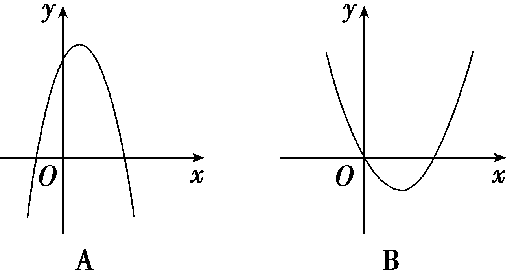

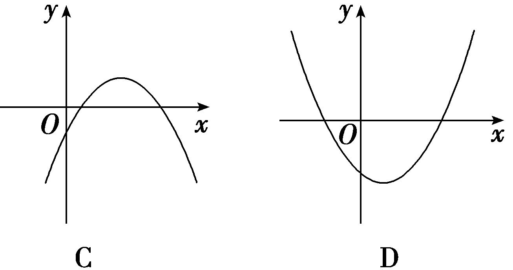

答案D

解析由*a*＞*b*＞*c*且*a*＋*b*＋*c*＝0，得*a*＞0，*c*＜0，所以函数*f*(*x*)是二次函数，图象开口向上，排除A、C；又*f*（0）＝*c*＜0，所以排除B；只有D符合.故选D.

##### 4.已知<em>y</em>＝<em>f</em>(<em>x</em>)为二次函数，若<em>y</em>＝<em>f</em>(<em>x</em>)在<em>x</em>＝2处取得最小值－4，且<em>y</em>＝<em>f</em>(<em>x</em>)的图象经过原点，则函数解析式为<u>　　　　　　</u>.

答案<em>f</em>(<em>x</em>)＝<em>x</em>2－4<em>x</em>

解析由题意，可设<em>f</em>(<em>x</em>)＝<em>a</em>(<em>x</em>－2)2－4(<em>a</em>＞0)，又图象过原点，所以<em>f</em>（0）＝4<em>a</em>－4＝0，<em>a</em>＝1，所以<em>f</em>(<em>x</em>)＝(<em>x</em>－2)2－4＝<em>x</em>2－4<em>x</em>.

考点一　二次函数的解析式　　　　　自主练透

##### 1.(一题多解)已知二次函数<em>f</em>(<em>x</em>)满足<em>f</em>（2）＝－1，<em>f</em>(－1)＝－1，且<em>f</em>(<em>x</em>)的最大值是8，则<em>f</em>(<em>x</em>)＝<u>　　　　　　　　</u>.

答案－4<em>x</em>2＋4<em>x</em>＋7

解析法一(利用“一般式”)：设&lt;te&lt;te&lt;te&lt;te<em>x</em>t style="italic"&gt;x&lt;/text&gt;t style="italic"&gt;x&lt;/text&gt;t style="it<em>a</em>li<em>c</em>"&gt;x&lt;/text&gt;t style="italic"&gt;<em>f</em>&lt;/text&gt;(x)＝<em>ax</em>&lt;text style="superscript"&gt;2&lt;/text&gt;＋<em>bx</em>＋c(a≠0).由题意得 $\left\{\begin{matrix}4a+2b＋c＝－1，\\a－b＋c＝－1，\\\frac{4ac－b^{2}}{4a}=8，\end{matrix}\right.$ 解得 $\left\{\begin{matrix}a＝－4，\\b=4，\\c=7.\end{matrix}\right.$ 所以所求二次函数的解析式为&lt;te&lt;te&lt;te&lt;te<em>x</em>t style="italic"&gt;x&lt;/text&gt;t style="italic"&gt;x&lt;/text&gt;t style="it<em>a</em>li<em>c</em>"&gt;x&lt;/text&gt;t style="italic"&gt;<em>f</em>&lt;/text&gt;(x)＝－4x&lt;text style="superscript"&gt;2&lt;/text&gt;＋4x＋7.

法二(利用“顶点式”)：设&lt;te&lt;te&lt;te&lt;te&lt;te&lt;te&lt;te<em>x</em>t style="italic"&gt;x&lt;/text&gt;t style="italic"&gt;x&lt;/text&gt;t style="it&lt;text style="it&lt;text style="it<em>a</em>lic"&gt;a&lt;/text&gt;lic"&gt;a&lt;/text&gt;lic"&gt;x&lt;/text&gt;t style="italic"&gt;x&lt;/text&gt;t style="it<em>a</em>lic"&gt;x&lt;/text&gt;t style="it<em>a</em>lic"&gt;x&lt;/text&gt;t style="italic"&gt;<em>&lt;text style="italic"&gt;&lt;text style="italic"&gt;&lt;text style="italic"&gt;&lt;text style="italic"&gt;f</em>&lt;/text&gt;&lt;/text&gt;&lt;/text&gt;&lt;/text&gt;&lt;/text&gt;(x)＝a(x－<em>&lt;text style="italic"&gt;m</em>&lt;/text&gt;)&lt;text style="superscript"&gt;2&lt;/text&gt;＋<em>&lt;text style="italic"&gt;n</em>&lt;/text&gt;(a≠0).因为f(2)＝f(－1)，所以抛物线的对称轴为x $＝\frac{2+(-1)}{2}＝\frac{1}{2}$ ，所以&lt;te&lt;te&lt;te&lt;te&lt;te<em>x</em>t style="italic"&gt;x&lt;/text&gt;t style="italic"&gt;x&lt;/text&gt;t style="it&lt;text style="it&lt;text style="it<em>a</em>lic"&gt;a&lt;/text&gt;lic"&gt;a&lt;/text&gt;lic"&gt;x&lt;/text&gt;t style="italic"&gt;x&lt;/text&gt;t style="it<em>a</em>lic"&gt;<em>m</em>&lt;/text&gt; $＝\frac{1}{2}$ .又根据题意，函数有最大值8，所以&lt;te&lt;te&lt;te&lt;te&lt;te<em>x</em>t style="italic"&gt;x&lt;/text&gt;t style="italic"&gt;x&lt;/text&gt;t style="it&lt;text style="it&lt;text style="it<em>a</em>lic"&gt;a&lt;/text&gt;lic"&gt;a&lt;/text&gt;lic"&gt;x&lt;/text&gt;t style="italic"&gt;x&lt;/text&gt;t style="it<em>a</em>lic"&gt;<em>n</em>&lt;/text&gt;＝8，所以&lt;te&lt;te<em>x</em>t style="it<em>a</em>lic"&gt;x&lt;/text&gt;t style="italic"&gt;<em>&lt;text style="italic"&gt;&lt;text style="italic"&gt;&lt;text style="italic"&gt;&lt;text style="italic"&gt;f</em>&lt;/text&gt;&lt;/text&gt;&lt;/text&gt;&lt;/text&gt;&lt;/text&gt;(x)＝a $\left(x－\frac{1}{2}\right)^{2}$ ＋8.因为&lt;te&lt;te&lt;te&lt;te&lt;te&lt;te&lt;te<em>x</em>t style="italic"&gt;x&lt;/text&gt;t style="italic"&gt;x&lt;/text&gt;t style="it&lt;text style="it&lt;text style="it<em>a</em>lic"&gt;a&lt;/text&gt;lic"&gt;a&lt;/text&gt;lic"&gt;x&lt;/text&gt;t style="italic"&gt;x&lt;/text&gt;t style="it<em>a</em>lic"&gt;x&lt;/text&gt;t style="it<em>a</em>lic"&gt;x&lt;/text&gt;t style="italic"&gt;<em>&lt;text style="italic"&gt;&lt;text style="italic"&gt;&lt;text style="italic"&gt;&lt;text style="italic"&gt;f</em>&lt;/text&gt;&lt;/text&gt;&lt;/text&gt;&lt;/text&gt;&lt;/text&gt;(&lt;text style="superscript"&gt;2&lt;/text&gt;)＝－1，所以a $\left(2－\frac{1}{2}\right)^{2}$ ＋8＝－1，解得&lt;te&lt;te&lt;te&lt;te&lt;te&lt;te<em>x</em>t style="italic"&gt;x&lt;/text&gt;t style="italic"&gt;x&lt;/text&gt;t style="it&lt;text style="it&lt;text style="it<em>a</em>lic"&gt;a&lt;/text&gt;lic"&gt;a&lt;/text&gt;lic"&gt;x&lt;/text&gt;t style="italic"&gt;x&lt;/text&gt;t style="it<em>a</em>lic"&gt;x&lt;/text&gt;t style="italic"&gt;a&lt;/text&gt;＝－4，所以&lt;te<em>x</em>t style="italic"&gt;<em>&lt;text style="italic"&gt;&lt;text style="italic"&gt;&lt;text style="italic"&gt;&lt;text style="italic"&gt;f</em>&lt;/text&gt;&lt;/text&gt;&lt;/text&gt;&lt;/text&gt;&lt;/text&gt;(x)＝－4 $\left(x－\frac{1}{2}\right)^{2}$ ＋8＝－4&lt;te&lt;te&lt;te&lt;te&lt;te&lt;te<em>x</em>t style="italic"&gt;x&lt;/text&gt;t style="italic"&gt;x&lt;/text&gt;t style="it&lt;text style="it&lt;text style="it<em>a</em>lic"&gt;a&lt;/text&gt;lic"&gt;a&lt;/text&gt;lic"&gt;x&lt;/text&gt;t style="italic"&gt;x&lt;/text&gt;t style="it<em>a</em>lic"&gt;x&lt;/text&gt;t style="it<em>a</em>lic"&gt;x&lt;/text&gt;&lt;text style="superscript"&gt;2&lt;/text&gt;＋4x＋7.

法三(利用“零点式”)：由已知&lt;te&lt;te&lt;te&lt;te&lt;te&lt;te&lt;te&lt;te&lt;te&lt;te<em>x</em>t style="italic"&gt;x&lt;/text&gt;t style="italic"&gt;x&lt;/text&gt;t style="it&lt;text style="it&lt;text style="it<em>a</em>lic"&gt;a&lt;/text&gt;lic"&gt;a&lt;/text&gt;lic"&gt;x&lt;/text&gt;t style="it<em>a</em>lic"&gt;x&lt;/text&gt;t style="italic"&gt;x&lt;/text&gt;t style="it<em>a</em>lic"&gt;x&lt;/text&gt;t style="italic"&gt;x&lt;/text&gt;t style="italic"&gt;x&lt;/text&gt;t style="italic"&gt;x&lt;/text&gt;t style="italic"&gt;<em>&lt;text style="italic"&gt;&lt;text style="italic"&gt;f</em>&lt;/text&gt;&lt;/text&gt;&lt;/text&gt;(x)＋1＝0的两根为x1＝&lt;text style="superscript"&gt;&lt;text style="superscript"&gt;2&lt;/text&gt;&lt;/text&gt;，x2＝－1，故可设f(x)＋1＝a(x－2)(x＋1)(a≠0)，即f(x)＝<em>&lt;text style="italic"&gt;ax</em>&lt;/text&gt;2－ax－2a－1.又函数有最大值8，即 $\frac{4a(-2a－1)-(-a)^{2}}{4a}＝$ 8，解得&lt;te&lt;te&lt;te&lt;te&lt;te&lt;te<em>x</em>t style="italic"&gt;x&lt;/text&gt;t style="italic"&gt;x&lt;/text&gt;t style="it&lt;text style="it&lt;text style="it<em>a</em>lic"&gt;a&lt;/text&gt;lic"&gt;a&lt;/text&gt;lic"&gt;x&lt;/text&gt;t style="it<em>a</em>lic"&gt;x&lt;/text&gt;t style="italic"&gt;x&lt;/text&gt;t style="italic"&gt;a&lt;/text&gt;＝－4或a＝0(舍).故所求函数的解析式为&lt;te&lt;te&lt;te&lt;te<em>x</em>t style="italic"&gt;x&lt;/text&gt;t style="italic"&gt;x&lt;/text&gt;t style="italic"&gt;x&lt;/text&gt;t style="italic"&gt;<em>&lt;text style="italic"&gt;&lt;text style="italic"&gt;f</em>&lt;/text&gt;&lt;/text&gt;&lt;/text&gt;(x)＝－4x&lt;text style="superscript"&gt;&lt;text style="superscript"&gt;2&lt;/text&gt;&lt;/text&gt;＋4x＋7.

##### 2.已知函数&lt;te&lt;te<em>x</em>t style="italic"&gt;x&lt;/text&gt;t style="italic"&gt;<em>&lt;text style="italic"&gt;&lt;text style="italic"&gt;&lt;text style="italic"&gt;f</em>&lt;/text&gt;&lt;/text&gt;&lt;/text&gt;&lt;/text&gt; $\left(x\right)$ 是二次函数，且&lt;te&lt;te<em>x</em>t style="italic"&gt;x&lt;/text&gt;t style="italic"&gt;<em>&lt;text style="italic"&gt;&lt;text style="italic"&gt;&lt;text style="italic"&gt;f</em>&lt;/text&gt;&lt;/text&gt;&lt;/text&gt;&lt;/text&gt; $\left(0\right)＝$ 1，&lt;te&lt;te<em>x</em>t style="italic"&gt;x&lt;/text&gt;t style="italic"&gt;<em>&lt;text style="italic"&gt;&lt;text style="italic"&gt;&lt;text style="italic"&gt;f</em>&lt;/text&gt;&lt;/text&gt;&lt;/text&gt;&lt;/text&gt;(x＋1)－f $\left(x\right)＝$ 2&lt;te<em>x</em>t style="italic"&gt;x&lt;/text&gt;，则<em>&lt;text style="italic"&gt;&lt;text style="italic"&gt;&lt;text style="italic"&gt;&lt;text style="italic"&gt;f</em>&lt;/text&gt;&lt;/text&gt;&lt;/text&gt;&lt;/text&gt; $\left(x\right)＝$ <u>　　　　　　</u>.

答案<em>x</em>2－<em>x</em>＋1

解析因为&lt;te&lt;te&lt;te&lt;te&lt;te&lt;te<em>x</em>t style="italic"&gt;x&lt;/text&gt;t style="italic"&gt;x&lt;/text&gt;t style="it&lt;text style="it&lt;text style="it<em>a</em>lic"&gt;a&lt;/text&gt;lic"&gt;a&lt;/text&gt;lic"&gt;x&lt;/text&gt;t style="it&lt;text style="it<em>a</em>lic"&gt;a&lt;/text&gt;lic"&gt;x&lt;/text&gt;t style="it<em>a</em>lic"&gt;x&lt;/text&gt;t st<em>y</em>le="italic"&gt;<em>&lt;text style="italic"&gt;&lt;text style="italic"&gt;&lt;text style="italic"&gt;&lt;text style="italic"&gt;f</em>&lt;/text&gt;&lt;/text&gt;&lt;/text&gt;&lt;/text&gt;&lt;/text&gt; $\left(0\right)＝$ 1，&lt;te&lt;te&lt;te&lt;te&lt;te&lt;te<em>x</em>t style="italic"&gt;x&lt;/text&gt;t style="italic"&gt;x&lt;/text&gt;t style="it&lt;text style="it&lt;text style="it<em>a</em>lic"&gt;a&lt;/text&gt;lic"&gt;a&lt;/text&gt;lic"&gt;x&lt;/text&gt;t style="it&lt;text style="it<em>a</em>lic"&gt;a&lt;/text&gt;lic"&gt;x&lt;/text&gt;t style="it<em>a</em>lic"&gt;x&lt;/text&gt;t style="italic"&gt;y&lt;/text&gt;＝<em>&lt;text style="italic"&gt;&lt;text style="italic"&gt;&lt;text style="italic"&gt;&lt;text style="italic"&gt;&lt;text style="italic"&gt;f</em>&lt;/text&gt;&lt;/text&gt;&lt;/text&gt;&lt;/text&gt;&lt;/text&gt; $\left(x\right)$ 是二次函数，所以设&lt;te&lt;te&lt;te&lt;te&lt;te&lt;te<em>x</em>t style="italic"&gt;x&lt;/text&gt;t style="italic"&gt;x&lt;/text&gt;t style="it&lt;text style="it&lt;text style="it<em>a</em>lic"&gt;a&lt;/text&gt;lic"&gt;a&lt;/text&gt;lic"&gt;x&lt;/text&gt;t style="it&lt;text style="it<em>a</em>lic"&gt;a&lt;/text&gt;lic"&gt;x&lt;/text&gt;t style="it<em>a</em>lic"&gt;x&lt;/text&gt;t st<em>y</em>le="italic"&gt;<em>&lt;text style="italic"&gt;&lt;text style="italic"&gt;&lt;text style="italic"&gt;&lt;text style="italic"&gt;f</em>&lt;/text&gt;&lt;/text&gt;&lt;/text&gt;&lt;/text&gt;&lt;/text&gt;(x)＝<em>&lt;text style="italic"&gt;ax</em>&lt;/text&gt;&lt;text style="superscript"&gt;2&lt;/text&gt;＋<em>&lt;text style="italic"&gt;&lt;text style="italic"&gt;&lt;text style="italic"&gt;&lt;text style="italic"&gt;b</em>&lt;/text&gt;&lt;/text&gt;&lt;/text&gt;x&lt;/text&gt;＋1(a≠0)，又因为f $\left(x+1\right)$ －&lt;te&lt;te&lt;te&lt;te&lt;te&lt;te<em>x</em>t style="italic"&gt;x&lt;/text&gt;t style="italic"&gt;x&lt;/text&gt;t style="it&lt;text style="it&lt;text style="it<em>a</em>lic"&gt;a&lt;/text&gt;lic"&gt;a&lt;/text&gt;lic"&gt;x&lt;/text&gt;t style="it&lt;text style="it<em>a</em>lic"&gt;a&lt;/text&gt;lic"&gt;x&lt;/text&gt;t style="it<em>a</em>lic"&gt;x&lt;/text&gt;t st<em>y</em>le="italic"&gt;<em>&lt;text style="italic"&gt;&lt;text style="italic"&gt;&lt;text style="italic"&gt;&lt;text style="italic"&gt;f</em>&lt;/text&gt;&lt;/text&gt;&lt;/text&gt;&lt;/text&gt;&lt;/text&gt; $\left(x\right)＝$ &lt;te&lt;te&lt;te&lt;te&lt;te<em>x</em>t style="italic"&gt;x&lt;/text&gt;t style="italic"&gt;x&lt;/text&gt;t style="it&lt;text style="it&lt;text style="it<em>a</em>lic"&gt;a&lt;/text&gt;lic"&gt;a&lt;/text&gt;lic"&gt;x&lt;/text&gt;t style="it&lt;text style="it<em>a</em>lic"&gt;a&lt;/text&gt;lic"&gt;x&lt;/text&gt;t style="superscript"&gt;2&lt;/text&gt;&lt;text style="it<em>a</em>lic"&gt;x&lt;/text&gt;，所以a $\left(x+1\right)^{2}$ ＋&lt;te&lt;te&lt;te&lt;te<em>x</em>t style="italic"&gt;x&lt;/text&gt;t style="italic"&gt;x&lt;/text&gt;t style="it&lt;text style="it&lt;text style="it<em>a</em>lic"&gt;a&lt;/text&gt;lic"&gt;a&lt;/text&gt;lic"&gt;x&lt;/text&gt;t style="it<em>a</em>lic"&gt;<em>&lt;text style="italic"&gt;&lt;text style="italic"&gt;b</em>&lt;/text&gt;&lt;/text&gt;&lt;/text&gt; $\left(x+1\right)$ ＋1－ $\left(ax^{2}＋bx+1\right)＝$ &lt;te&lt;te&lt;te&lt;te&lt;te<em>x</em>t style="italic"&gt;x&lt;/text&gt;t style="italic"&gt;x&lt;/text&gt;t style="it&lt;text style="it&lt;text style="it<em>a</em>lic"&gt;a&lt;/text&gt;lic"&gt;a&lt;/text&gt;lic"&gt;x&lt;/text&gt;t style="it&lt;text style="it<em>a</em>lic"&gt;a&lt;/text&gt;lic"&gt;x&lt;/text&gt;t style="superscript"&gt;2&lt;/text&gt;<em>ax</em>＋a＋<em>&lt;text style="italic"&gt;&lt;text style="italic"&gt;&lt;text style="italic"&gt;b</em>&lt;/text&gt;&lt;/text&gt;&lt;/text&gt;＝2x，所以2a＝2，a＋b＝0，解得a＝1，b＝－1，所以&lt;text st<em>y</em>le="italic"&gt;<em>&lt;text style="italic"&gt;&lt;text style="italic"&gt;&lt;text style="italic"&gt;&lt;text style="italic"&gt;f</em>&lt;/text&gt;&lt;/text&gt;&lt;/text&gt;&lt;/text&gt;&lt;/text&gt;(x)＝x2－x＋1.

##### 3.已知二次函数的图象过点(－3，0)，(1，0)，且顶点到<em>x</em>轴的距离等于2，则二次函数的解析式为<u>　　　　　　　　　　　　</u>.

答案&lt;te&lt;te&lt;te&lt;te<em>x</em>t style="italic"&gt;x&lt;/text&gt;t st<em>y</em>le="italic"&gt;x&lt;/text&gt;t style="italic"&gt;x&lt;/text&gt;t style="italic"&gt;y&lt;/text&gt; $＝\frac{1}{2}$ &lt;te&lt;te&lt;te<em>x</em>t style="italic"&gt;x&lt;/text&gt;t st<em>y</em>le="italic"&gt;x&lt;/text&gt;t style="italic"&gt;x&lt;/text&gt;&lt;text style="superscript"&gt;2&lt;/text&gt;＋x－ $\frac{3}{2}$ 或&lt;te&lt;te&lt;te&lt;te<em>x</em>t style="italic"&gt;x&lt;/text&gt;t st<em>y</em>le="italic"&gt;x&lt;/text&gt;t style="italic"&gt;x&lt;/text&gt;t style="italic"&gt;y&lt;/text&gt;＝－ $\frac{1}{2}$ &lt;te&lt;te&lt;te<em>x</em>t style="italic"&gt;x&lt;/text&gt;t st<em>y</em>le="italic"&gt;x&lt;/text&gt;t style="italic"&gt;x&lt;/text&gt;&lt;text style="superscript"&gt;2&lt;/text&gt;－x＋ $\frac{3}{2}$

解析因为二次函数的图象过点(－3，0)，(1，0)，所以可设二次函数为&lt;te&lt;te&lt;te&lt;te&lt;te&lt;te&lt;te<em>x</em>t style="italic"&gt;x&lt;/text&gt;t st<em>y</em>le="italic"&gt;x&lt;/text&gt;t style="italic"&gt;x&lt;/text&gt;t st<em>y</em>le="it&lt;text style="it<em>a</em>lic"&gt;a&lt;/text&gt;lic"&gt;x&lt;/text&gt;t st&lt;text style="it&lt;text style="it<em>a</em>lic"&gt;a&lt;/text&gt;lic"&gt;y&lt;/text&gt;le="it<em>a</em>lic"&gt;x&lt;/text&gt;t style="italic"&gt;x&lt;/text&gt;t style="it<em>a</em>lic"&gt;y&lt;/text&gt;＝a(x＋3)(x－1)(a≠0)，展开得，y＝<em>&lt;text style="italic"&gt;ax</em>&lt;/text&gt;&lt;text style="superscript"&gt;&lt;text style="superscript"&gt;2&lt;/text&gt;&lt;/text&gt;＋2ax－3a，顶点的纵坐标为 $\frac{－12a^{2}－4a^{2}}{4a}＝$ －4&lt;te&lt;te&lt;te&lt;te&lt;te&lt;te&lt;te<em>x</em>t style="italic"&gt;x&lt;/text&gt;t st<em>y</em>le="italic"&gt;x&lt;/text&gt;t style="italic"&gt;x&lt;/text&gt;t st<em>y</em>le="it&lt;text style="it<em>a</em>lic"&gt;a&lt;/text&gt;lic"&gt;x&lt;/text&gt;t st&lt;text style="it&lt;text style="it<em>a</em>lic"&gt;a&lt;/text&gt;lic"&gt;y&lt;/text&gt;le="it<em>a</em>lic"&gt;x&lt;/text&gt;t style="italic"&gt;x&lt;/text&gt;t style="italic"&gt;a&lt;/text&gt;，由于二次函数图象的顶点到x轴的距离为&lt;text style="superscript"&gt;&lt;text style="superscript"&gt;2&lt;/text&gt;&lt;/text&gt;，所以｜－4a｜＝2，即a＝± $\frac{1}{2}$ ，所以二次函数的解析式为&lt;te&lt;te&lt;te&lt;te&lt;te&lt;te&lt;te<em>x</em>t style="italic"&gt;x&lt;/text&gt;t st<em>y</em>le="italic"&gt;x&lt;/text&gt;t style="italic"&gt;x&lt;/text&gt;t st<em>y</em>le="it&lt;text style="it<em>a</em>lic"&gt;a&lt;/text&gt;lic"&gt;x&lt;/text&gt;t st&lt;text style="it&lt;text style="it<em>a</em>lic"&gt;a&lt;/text&gt;lic"&gt;y&lt;/text&gt;le="it<em>a</em>lic"&gt;x&lt;/text&gt;t style="italic"&gt;x&lt;/text&gt;t style="it<em>a</em>lic"&gt;y&lt;/text&gt; $＝\frac{1}{2}$ &lt;te&lt;te&lt;te&lt;te&lt;te&lt;te<em>x</em>t style="italic"&gt;x&lt;/text&gt;t st<em>y</em>le="italic"&gt;x&lt;/text&gt;t style="italic"&gt;x&lt;/text&gt;t st<em>y</em>le="it&lt;text style="it<em>a</em>lic"&gt;a&lt;/text&gt;lic"&gt;x&lt;/text&gt;t st&lt;text style="it&lt;text style="it<em>a</em>lic"&gt;a&lt;/text&gt;lic"&gt;y&lt;/text&gt;le="it<em>a</em>lic"&gt;x&lt;/text&gt;t style="italic"&gt;x&lt;/text&gt;&lt;text style="superscript"&gt;&lt;text style="superscript"&gt;2&lt;/text&gt;&lt;/text&gt;＋x－ $\frac{3}{2}$ 或&lt;te&lt;te&lt;te&lt;te&lt;te&lt;te&lt;te<em>x</em>t style="italic"&gt;x&lt;/text&gt;t st<em>y</em>le="italic"&gt;x&lt;/text&gt;t style="italic"&gt;x&lt;/text&gt;t st<em>y</em>le="it&lt;text style="it<em>a</em>lic"&gt;a&lt;/text&gt;lic"&gt;x&lt;/text&gt;t st&lt;text style="it&lt;text style="it<em>a</em>lic"&gt;a&lt;/text&gt;lic"&gt;y&lt;/text&gt;le="it<em>a</em>lic"&gt;x&lt;/text&gt;t style="italic"&gt;x&lt;/text&gt;t style="it<em>a</em>lic"&gt;y&lt;/text&gt;＝－ $\frac{1}{2}$ &lt;te&lt;te&lt;te&lt;te&lt;te&lt;te<em>x</em>t style="italic"&gt;x&lt;/text&gt;t st<em>y</em>le="italic"&gt;x&lt;/text&gt;t style="italic"&gt;x&lt;/text&gt;t st<em>y</em>le="it&lt;text style="it<em>a</em>lic"&gt;a&lt;/text&gt;lic"&gt;x&lt;/text&gt;t st&lt;text style="it&lt;text style="it<em>a</em>lic"&gt;a&lt;/text&gt;lic"&gt;y&lt;/text&gt;le="it<em>a</em>lic"&gt;x&lt;/text&gt;t style="italic"&gt;x&lt;/text&gt;&lt;text style="superscript"&gt;&lt;text style="superscript"&gt;2&lt;/text&gt;&lt;/text&gt;－x＋ $\frac{3}{2}$ .

求二次函数解析式的方法

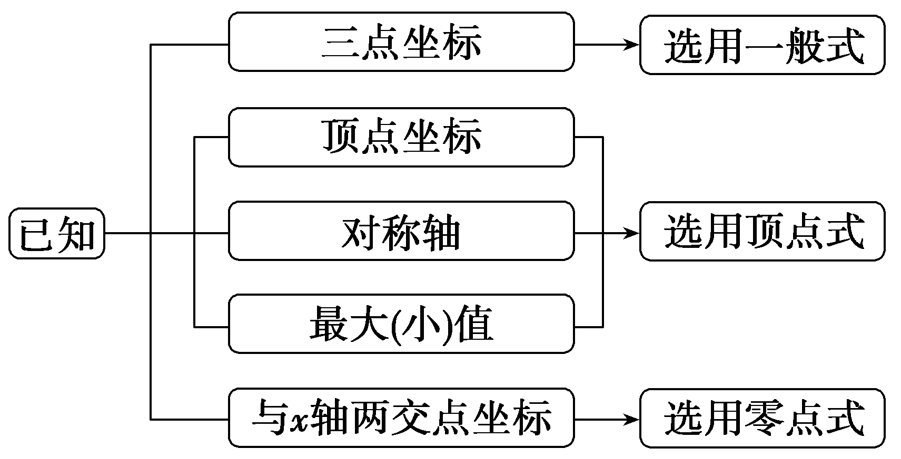

考点二　二次函数的图象　　　　　师生共研

(多选)已知二次函数&lt;te<em>x</em>t style="it<em>a</em>li<em>c</em>"&gt;y&lt;/text&gt;＝<em>ax</em>2＋<em>bx</em>＋c(a≠0)的图象如图所示，对称轴为x＝－ $\frac{1}{2}$ .则下列结论正确的是(　　)

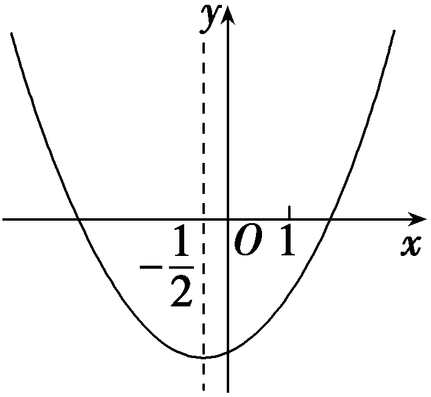

$\quad$A.*abc*＜0

$\quad$B.*b*＜*a*＋*c*

$\quad$C.3*b*＜－4*c*

$\quad$D.当<te*x*t st*y*le="italic">x</text>＞－ $\frac{1}{2}$ 时，<te*x*t style="italic">y</text>随*x*的增大而增大

答案ACD

解析由二次函数图象和性质可得<te<te<te<te<te<te*x*t st*y*le="italic">x</text>t style="italic">x</text>t style="italic">x</text>t st*y*le="it<text style="it<text style="itali<text style="itali<text style="itali<text style="itali*c*">c</text>">c</text>">c</text>">a</text>li*c*">a</text>lic">x</text>t style="it<text style="it<text style="itali*c*">a</text>li*c*">a</text>lic">x</text>t style="it*a*li*c*">a</text>＞0，c＜0，因为－ $\frac{b}{2a}＝$ － $\frac{1}{2}$ ，所以<te<te<te<te<te<te*x*t st*y*le="italic">x</text>t style="italic">x</text>t style="italic">x</text>t st*y*le="it<text style="it<text style="itali<text style="itali<text style="itali<text style="itali*c*">c</text>">c</text>">c</text>">a</text>li*c*">a</text>lic">x</text>t style="it<text style="it<text style="itali*c*">a</text>li*c*">a</text>lic">x</text>t style="it*a*li*c*">a</text>＝*<text style="italic"><text style="italic"><text style="italic"><text style="italic"><text style="italic"><text style="italic"><text style="italic"><text style="italic"><text style="italic"><text style="italic"><text style="italic">b*</text></text></text></text></text></text></text></text></text></text></text>＞0，所以*abc*＜0，故A正确；由图象可知当x＝－1时，函数值小于0，即a－b＋c＜0，所以b＞a＋c，故B错误；由图象可知x＝1时，函数值小于0，即a＋b＋c＜0，因为a＝b，所以2b＋c＜0，即2b＜－c，所以8b＜－4c，因为b＞0，所以3b＜8b，所以3b＜－4c，故C正确；根据函数图象可知，函数在对称轴的右侧y随x的增大而增大，因为二次函数的对称轴为x＝－ $\frac{1}{2}$ ，所以当<te<te<te<te<te*x*t st*y*le="italic">x</text>t style="italic">x</text>t style="italic">x</text>t st*y*le="it<text style="it<text style="itali<text style="itali<text style="itali<text style="itali*c*">c</text>">c</text>">c</text>">a</text>li*c*">a</text>lic">x</text>t style="it<text style="it<text style="itali*c*">a</text>li*c*">a</text>lic">x</text>＞－ $\frac{1}{2}$ 时，<te<te<te<te*x*t st*y*le="italic">x</text>t style="italic">x</text>t style="italic">x</text>t style="italic">y</text>随<te<text style="it<text style="it<text style="itali<text style="itali<text style="itali<text style="itali*c*">c</text>">c</text>">c</text>">a</text>li*c*">a</text>lic">x</text>t style="it<text style="it<text style="itali*c*">a</text>li*c*">a</text>lic">x</text>的增大而增大，故D正确.故选ACD.

研究二次函数图象应从“三点一线一开口”进行分析，“三点”中有一个点是顶点，另两个点是图象上关于对称轴对称的两个点，常取与*x*轴的交点；“一线”是指对称轴这条直线；“一开口”是指抛物线的开口方向.

对点练1.(多选)二次函数<em>y</em>＝<em>ax</em>2＋<em>bx</em>＋<em>c</em>的图象如图所示，则下列说法正确的是(　　)

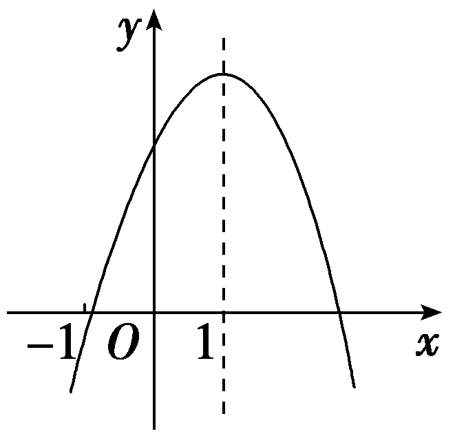

$\quad$A.2*a*＋*b*＝0

$\quad$B.4*a*＋2*b*＋*c*＜0

$\quad$C.9*a*＋3*b*＋*c*＜0

$\quad$D.*abc*＜0

答案ACD

解析由二次函数图象开口向下知<te<text style="it<text style="it<text style="it<text style="itali*c*">a</text>li*c*">a</text>li*c*">a</text>lic">x</text>t style="italic">a</text>＜0，对称轴为x＝－ $\frac{b}{2a}＝$ 1，即2<te<text style="it<text style="it<text style="it<text style="itali*c*">a</text>li*c*">a</text>li*c*">a</text>lic">x</text>t style="italic">a</text>＋*<text style="italic"><text style="italic"><text style="italic">b*</text></text></text>＝0，故b＞0.又因为*<text style="italic"><text style="italic"><text style="italic"><text style="italic">f*</text></text></text></text>（0）＝c＞0，所以*abc*＜0，f(2)＝f(0)＝4a＋2b＋c＞0，f(3)＝f(－1)＝9a＋3b＋c＜0.故选ACD.

考点三　二次函数的性质　　　　　师生共研

(一题多变)已知函数<em>f</em>(<em>x</em>)＝<em>x</em>2－<em>tx</em>－1.

（1）若*f*(*x*)在区间(－1，2)上不单调，求实数*t*的取值范围；

（2）若*x*∈[－1，2]，求*f*(*x*)的最小值*g*(*t*).

解：&lt;te&lt;te<em>x</em>t style="italic"&gt;x&lt;/text&gt;t style="italic"&gt;f&lt;/text&gt;(x)＝x2－<em>tx</em>－1 $＝\left(x－\frac{t}{2}\right)^{2}$ －1－ $\frac{t^{2}}{4}$ .

（1）依题意，－1＜ $\frac{t}{2}$ ＜2，解得－2＜*t*＜4，

所以实数*t*的取值范围是(－2，4).

（2）①当 $\frac{t}{2}$ ≥2，即*t*≥4时，

*f*(*x*)在[－1，2]上单调递减，

所以<em>f</em>(<em>x</em>)min＝<em>f</em>（2）＝3－2<em>t</em>；

②当－1＜ $\frac{t}{2}$ ＜2，即－2＜&lt;te<em>x</em>t style="italic"&gt;t&lt;/text&gt;＜4时，<em>&lt;text style="italic"&gt;f</em>&lt;/text&gt;(x)min＝f $\left(\frac{t}{2}\right)＝$ －1－ $\frac{t^{2}}{4}$ ；

③当 $\frac{t}{2}$ ≤－1，即<te*x*t style="italic">t</text>≤－2时，*f*(x)在[－1，2]上单调递增，

所以<em>f</em>(<em>x</em>)min＝<em>f</em>(－1)＝<em>t</em>.

综上，<*t*ext style="italic">g</text>(t) $＝\left\{\begin{matrix}t，t\leq －2，\\－1－\frac{t^{2}}{4},-2<t<4，\\3－2t，t\geq 4.\end{matrix}\right.$

[变式探究]

(变结论)本例条件不变，求当*x*∈[－1，2]时，*f*(*x*)的最大值*G*(*t*).

解：*f*(－1)＝*t*，*f*（2）＝3－2*t*，

*f*（2）－*f*(－1)＝3－3*t*，

当<em>t</em>≥1时，<em>f</em>（2）－<em>f</em>(－1)≤0，所以<em>f</em>（2）≤<em>f</em>(－1)，所以<em>f</em>(<em>x</em>)max＝<em>f</em>(－1)＝<em>t</em>；

当<em>t</em>＜1时，<em>f</em>（2）－<em>f</em>(－1)＞0，所以<em>f</em>（2）＞<em>f</em>(－1)，所以<em>f</em>(<em>x</em>)max＝<em>f</em>（2）＝3－2<em>t</em>.

综上，<*t*ext style="italic">G</text>(t) $＝\left\{\begin{matrix}t，t\geq 1，\\3－2t，t<1.\end{matrix}\right.$

二次函数最值问题的类型及求解策略

##### 1.类型：（1）对称轴、区间都是固定的；（2）对称轴变动、区间固定；（3）对称轴固定、区间变动.

##### 2.解决这类问题的思路：抓住“三点一轴”数形结合，三点是指区间两个端点和中点，一轴指的是对称轴，结合配方法，根据函数的单调性及分类讨论的思路即可完成.

对点练2.已知函数<em>f</em>(<em>x</em>)＝<em>x</em>2＋(2<em>a</em>－1)<em>x</em>－3.

（1）当*a*＝2，*x*∈[－2，3]时，求函数*f*(*x*)的值域；

（2）若函数*f*(*x*)在[－1，3]上的最大值为1，求实数*a*的值.

解：（1）当<em>a</em>＝2时，<em>f</em>(<em>x</em>)＝<em>x</em>2＋3<em>x</em>－3，<em>x</em>∈[－2，3]，

函数图象的对称轴为直线*x*＝－ $\frac{3}{2}$ ∈[－2，3]，

所以&lt;te<em>x</em>t style="italic"&gt;<em>f</em>&lt;/text&gt;(x)min＝f $\left(－\frac{3}{2}\right)＝\frac{9}{4}$ － $\frac{9}{2}$ －3＝－ $\frac{21}{4}$ ，

<em>f</em>(<em>x</em>)max＝<em>f</em>（3）＝15，

所以函数<te*x*t style="italic">f</text>(x)的值域为 $\left[－\frac{21}{4}，15\right]$ .

（2）函数图象的对称轴为直线*x*＝－ $\frac{2a－1}{2}$ .

①当－ $\frac{2a－1}{2}$ ≤1，即<te<text style="it*a*lic">x</text>t style="italic">a</text>≥－ $\frac{1}{2}$ 时，<te<text style="it*a*lic">x</text>t style="italic">*f*</text>(x)m*a*x＝f(3)＝6a＋3，

所以6<text style="it*a*lic">a</text>＋3＝1，即a＝－ $\frac{1}{3}$ ，满足题意；

②当－ $\frac{2a－1}{2}$ ＞1，即<te<text style="it*a*lic">x</text>t style="italic">a</text>＜－ $\frac{1}{2}$ 时，<te<text style="it*a*lic">x</text>t style="italic">*f*</text>(x)m*a*x＝f(－1)＝－2a－1，

所以－2*a*－1＝1，即*a*＝－1，满足题意.

综上可知，*a*＝－ $\frac{1}{3}$ 或－1.

[真题再现]　(2024·北京卷)已知<em>M</em>＝{(<em>x</em>，<em>y</em>)｜<em>y</em>＝<em>x</em>＋<em>t</em>(<em>x</em>2－<em>x</em>)，1≤<em>x</em>≤2，0≤<em>t</em>≤1}是平面直角坐标系中的点集.设<em>d</em>是<em>M</em>中两点间的距离的最大值，<em>S</em>是<em>M</em>表示的图形的面积，则(　　)

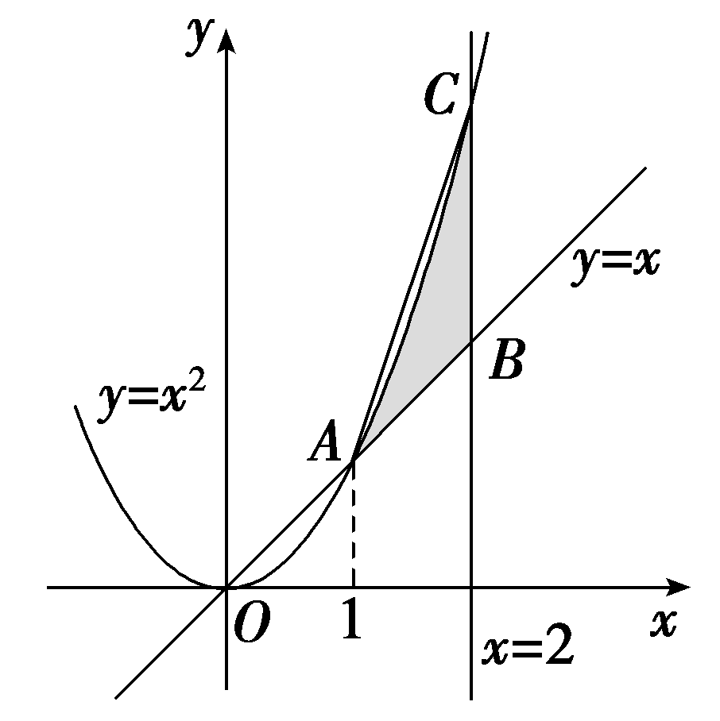

$\quad$A.*d*＝3，*S*＜1	
$\quad$B.*d*＝3，*S*＞1

$\quad$C.*<text style="italic">d*</text> $＝\sqrt{10}$ ，*<text style="italic">S*</text>＜1	
$\quad$D.*<text style="italic">d*</text> $＝\sqrt{10}$ ，*<text style="italic">S*</text>＞1

答案C

解析对任意给定&lt;&lt;&lt;te&lt;te&lt;te&lt;te&lt;te&lt;te<em>x</em>t st<em>y</em>le="italic"&gt;x&lt;/text&gt;t style="italic"&gt;x&lt;/text&gt;t style="italic"&gt;x&lt;/text&gt;t style="italic"&gt;x&lt;/text&gt;t style="italic"&gt;x&lt;/text&gt;t style="italic"&gt;t&lt;/text&gt;e&lt;te<em>x</em>t style="italic"&gt;x&lt;/text&gt;t style="italic"&gt;t&lt;/text&gt;e&lt;te&lt;te<em>x</em>t style="italic"&gt;x&lt;/text&gt;t style="italic"&gt;x&lt;/text&gt;t style="italic"&gt;x&lt;/text&gt;∈ $\left[1，2\right]$ ，则&lt;&lt;&lt;te&lt;te&lt;te&lt;te&lt;te&lt;te<em>x</em>t st<em>y</em>le="italic"&gt;x&lt;/text&gt;t style="italic"&gt;x&lt;/text&gt;t style="italic"&gt;x&lt;/text&gt;t style="italic"&gt;x&lt;/text&gt;t style="italic"&gt;x&lt;/text&gt;t style="italic"&gt;t&lt;/text&gt;e&lt;te<em>x</em>t style="italic"&gt;x&lt;/text&gt;t style="italic"&gt;t&lt;/text&gt;e&lt;te&lt;te<em>x</em>t style="italic"&gt;x&lt;/text&gt;t style="italic"&gt;x&lt;/text&gt;t style="italic"&gt;x&lt;/text&gt;&lt;text style="superscript"&gt;&lt;text style="superscript"&gt;&lt;text style="superscript"&gt;2&lt;/text&gt;&lt;/text&gt;&lt;/text&gt;－x＝x $\left(x－1\right)$ ≥0，且&lt;&lt;te&lt;te&lt;te&lt;te&lt;te&lt;te<em>x</em>t st<em>y</em>le="italic"&gt;x&lt;/text&gt;t style="italic"&gt;x&lt;/text&gt;t style="italic"&gt;x&lt;/text&gt;t style="italic"&gt;x&lt;/text&gt;t style="italic"&gt;x&lt;/text&gt;t style="italic"&gt;t&lt;/text&gt;e&lt;te<em>x</em>t style="italic"&gt;x&lt;/text&gt;t style="italic"&gt;t&lt;/text&gt;∈ $\left[0，1\right]$ ，可知&lt;&lt;&lt;te&lt;te&lt;te&lt;te&lt;te&lt;te<em>x</em>t st<em>y</em>le="italic"&gt;x&lt;/text&gt;t style="italic"&gt;x&lt;/text&gt;t style="italic"&gt;x&lt;/text&gt;t style="italic"&gt;x&lt;/text&gt;t style="italic"&gt;x&lt;/text&gt;t style="italic"&gt;t&lt;/text&gt;e&lt;te<em>x</em>t style="italic"&gt;x&lt;/text&gt;t style="italic"&gt;t&lt;/text&gt;e&lt;te&lt;te<em>x</em>t style="italic"&gt;x&lt;/text&gt;t style="italic"&gt;x&lt;/text&gt;t style="italic"&gt;x&lt;/text&gt;≤x＋t $\left(x^{2}－x\right)$ ≤&lt;&lt;&lt;te&lt;te&lt;te&lt;te&lt;te&lt;te<em>x</em>t st<em>y</em>le="italic"&gt;x&lt;/text&gt;t style="italic"&gt;x&lt;/text&gt;t style="italic"&gt;x&lt;/text&gt;t style="italic"&gt;x&lt;/text&gt;t style="italic"&gt;x&lt;/text&gt;t style="italic"&gt;t&lt;/text&gt;e&lt;te<em>x</em>t style="italic"&gt;x&lt;/text&gt;t style="italic"&gt;t&lt;/text&gt;e&lt;te&lt;te<em>x</em>t style="italic"&gt;x&lt;/text&gt;t style="italic"&gt;x&lt;/text&gt;t style="italic"&gt;x&lt;/text&gt;＋x&lt;text style="superscript"&gt;&lt;text style="superscript"&gt;&lt;text style="superscript"&gt;2&lt;/text&gt;&lt;/text&gt;&lt;/text&gt;－x＝x2，即x≤y≤x2，所以所求集合表示的图形即为平面区域 $\left\{\begin{matrix}y\leq x^{2}，\\y\geq x，\\1\leq x\leq 2，\end{matrix}\right.$ 如图中阴影部分所示，其中<em>A</em> $\left(1，1\right)$ ，<em>B</em> $\left(2，2\right)$ ，<em>C</em> $\left(2，4\right)$ ，可知任意两点间距离最大值<em>d</em> $＝\left|AC\right|＝\sqrt{10}$ ；阴影部分面积<em>&lt;text style="italic"&gt;S</em>&lt;/text&gt;＜S△<em>ABC</em> $＝\frac{1}{2}$ ×1×&lt;&lt;&lt;te&lt;te&lt;te&lt;te&lt;te&lt;te<em>x</em>t st<em>y</em>le="italic"&gt;x&lt;/text&gt;t style="italic"&gt;x&lt;/text&gt;t style="italic"&gt;x&lt;/text&gt;t style="italic"&gt;x&lt;/text&gt;t style="italic"&gt;x&lt;/text&gt;t style="italic"&gt;t&lt;/text&gt;e&lt;te<em>x</em>t style="italic"&gt;x&lt;/text&gt;t style="italic"&gt;t&lt;/text&gt;e&lt;te<em>x</em>t style="italic"&gt;x&lt;/text&gt;t style="superscript"&gt;&lt;text style="superscript"&gt;&lt;text style="superscript"&gt;2&lt;/text&gt;&lt;/text&gt;&lt;/text&gt;＝1.故选<em>C</em>.

[教材呈现]　(人教A必修一P53例4)一家车辆制造厂引进了一条摩托车整车装配流水线，这条流水线生产的摩托车数量<em>x</em>(单位：辆)与创造的价值<em>y</em>(单位：元)之间有如下的关系：<em>y</em>＝－20<em>x</em>2＋2 200<em>x</em>.若这家工厂希望在一个星期内利用这条流水线创收60 000元以上，则在一个星期内大约应该生产多少辆摩托车？

点评：数形结合是以形助数，见数想图，解题时要准确把握条件、结论与几何图形的对应关系，准确利用几何图形中的相关结论求解.

课时测评5　二次函数及其性质 $\frac{对应学生}{用书P319}$

(时间：60分钟　满分：85分)

(本栏目内容，在学生用书中以独立形式分册装订！)

(1—10题，每小题5分，共50分)

##### 1.若二次函数*g*(*x*)满足*g*（1）＝1，*g*(－1)＝5，且图象过原点，则*g*(*x*)的解析式为(　　 )

$\quad$A.<em>g</em>(<em>x</em>)＝2<em>x</em>2－3<em>x</em>	
$\quad$B.<em>g</em>(<em>x</em>)＝3<em>x</em>2－2<em>x</em>

$\quad$C.<em>g</em>(<em>x</em>)＝3<em>x</em>2＋2<em>x</em>	
$\quad$D.<em>g</em>(<em>x</em>)＝－3<em>x</em>2－2<em>x</em>

答案B

解析二次函数&lt;te&lt;te&lt;te&lt;te&lt;te<em>x</em>t style="italic"&gt;x&lt;/text&gt;t style="italic"&gt;x&lt;/text&gt;t style="it&lt;text style="it<em>a</em>lic"&gt;a&lt;/text&gt;lic"&gt;x&lt;/text&gt;t style="italic"&gt;x&lt;/text&gt;t style="italic"&gt;<em>&lt;text style="italic"&gt;&lt;text style="italic"&gt;&lt;text style="italic"&gt;g</em>&lt;/text&gt;&lt;/text&gt;&lt;/text&gt;&lt;/text&gt;(x)满足g(1)＝1，g(－1)＝5，且图象过原点，设二次函数为g(x)＝<em>ax</em>&lt;text style="superscript"&gt;2&lt;/text&gt;＋<em>&lt;text style="italic"&gt;b</em>x&lt;/text&gt;(a≠0)，可得 $\left\{\begin{matrix}a＋b=1，\\a－b=5，\end{matrix}\right.$ 则&lt;te&lt;te&lt;te<em>x</em>t style="italic"&gt;x&lt;/text&gt;t style="italic"&gt;x&lt;/text&gt;t style="it<em>a</em>lic"&gt;a&lt;/text&gt;＝3，<em>b</em>＝－&lt;text style="superscript"&gt;2&lt;/text&gt;，所求的二次函数为&lt;te&lt;te<em>x</em>t style="italic"&gt;x&lt;/text&gt;t style="italic"&gt;<em>&lt;text style="italic"&gt;&lt;text style="italic"&gt;&lt;text style="italic"&gt;g</em>&lt;/text&gt;&lt;/text&gt;&lt;/text&gt;&lt;/text&gt;(x)＝3x2－2x.故选B.

##### 2.函数<em>y</em>＝<em>ax</em>＋<em>b</em>和<em>y</em>＝<em>ax</em>2＋<em>bx</em>＋<em>c</em>在同一平面直角坐标系内的图象可以是(　　 )

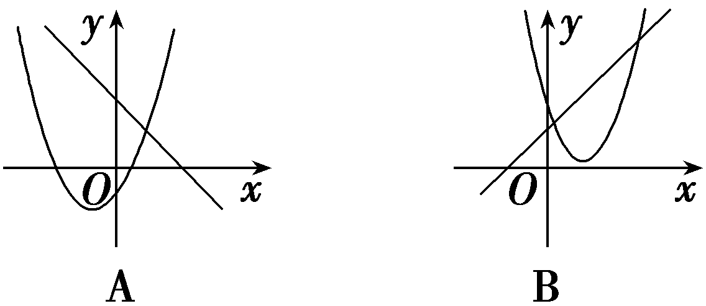

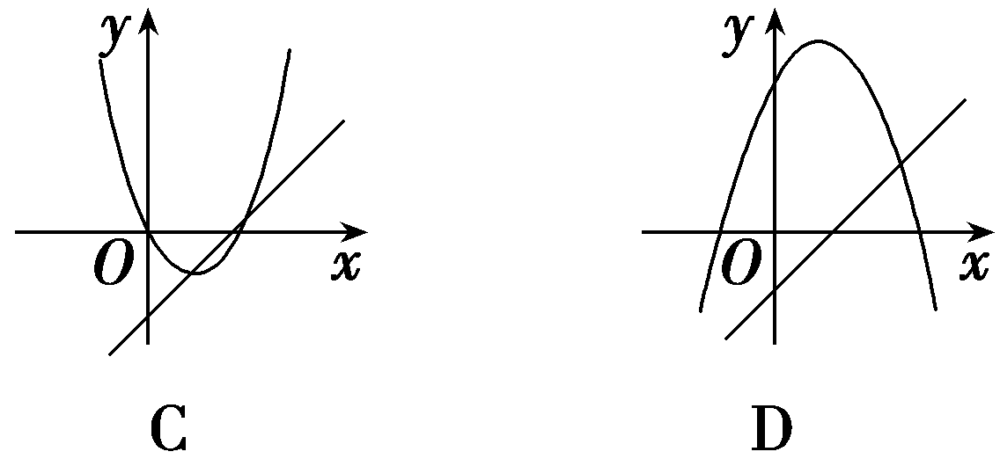

答案C

解析若&lt;text st&lt;text st&lt;text st<em>y</em>le="it<em>a</em>li<em>c</em>"&gt;y&lt;/text&gt;le="italic"&gt;y&lt;/text&gt;le="italic"&gt;a&lt;/text&gt;＞0，则一次函数y＝<em>&lt;text style="italic"&gt;ax</em>&lt;/text&gt;＋<em>&lt;text style="italic"&gt;b</em>&lt;/text&gt;为增函数，二次函数y＝ax2＋<em>bx</em>＋c的图象开口向上，故可排除A，D；对于B，由直线可知a＞0，b＞0，从而－ $\frac{b}{2a}$ ＜0，而二次函数的对称轴在&lt;text st&lt;text st<em>y</em>le="it<em>a</em>li<em>c</em>"&gt;y&lt;/text&gt;le="italic"&gt;y&lt;/text&gt;轴的右侧，故排除B.故选C.

##### 3.已知函数<em>f</em>(<em>x</em>)＝<em>ax</em>2＋<em>bx</em>＋<em>c</em>的图象如图所示，则下列结论错误的是(　　)

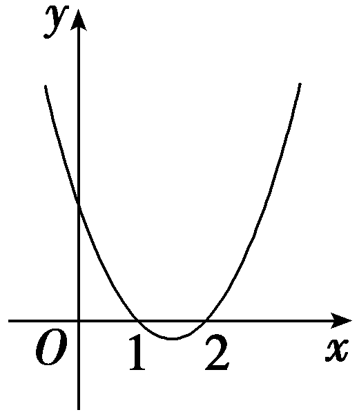

$\quad$A.*b*＞0

$\quad$B.*c*＞0

$\quad$C.*<text style="italic">f*</text> $\left(\frac{3}{2}＋x\right)＝$ *<text style="italic">f*</text> $\left(\frac{3}{2}－x\right)$

$\quad$D.不等式 $\left(ax＋b\right)\left(bx＋c\right)\left(cx＋a\right)$ ＜0的解集是 $\left(－\frac{1}{2}，\frac{2}{3}\right)$ ∪(3，＋∞)

答案A

解析由题图知抛物线开口向上，所以<te<te<te<te<te<te*x*t style="italic">x</text>t style="italic">x</text>t style="italic">x</text>t style="italic">x</text>t style="it<text style="it<text style="it*a*lic">a</text>lic">a</text>lic">x</text>t st<text style="it<text style="it*a*li*c*">a</text>li*c*">y</text>le="italic">a</text>＞0，抛物线与y轴交点纵坐标为正，所以c＞0，因为－ $\frac{b}{a}＝$ 1＋2＝3，所以<te<te<te<te<te<te*x*t style="italic">x</text>t style="italic">x</text>t style="italic">x</text>t style="italic">x</text>t style="it<text style="it<text style="it*a*lic">a</text>lic">a</text>lic">x</text>t style="it<text style="it*a*li*c*">a</text>lic">*b*</text>＜0，由根与系数的关系得 $\frac{c}{a}＝$ 1×2＝2，即<te<te<te<te<te<te*x*t style="italic">x</text>t style="italic">x</text>t style="italic">x</text>t style="italic">x</text>t style="it<text style="it<text style="it*a*lic">a</text>lic">a</text>lic">x</text>t style="it<text style="it*a*li*c*">a</text>lic">*b*</text>＝－3<text st<text style="itali*c*">y</text>le="italic">a</text>＜0，c＝2a＞0，对称轴x $＝\frac{3}{2}$ ，则<te<te<te<te<te*x*t style="italic">x</text>t style="italic">x</text>t style="italic">x</text>t style="italic">x</text>t style="it<text style="it<text style="it*a*lic">a</text>lic">a</text>lic">*f*</text> $\left(\frac{3}{2}＋x\right)＝$ <te<te<te<te<te*x*t style="italic">x</text>t style="italic">x</text>t style="italic">x</text>t style="italic">x</text>t style="it<text style="it<text style="it*a*lic">a</text>lic">a</text>lic">*f*</text> $\left(\frac{3}{2}－x\right)$ ，故A错误，B、C正确；不等式 $\left(ax＋b\right)\left(bx＋c\right)\left(cx＋a\right)$ ＜0 可化为(<te<te<te<te<te<te*x*t style="italic">x</text>t style="italic">x</text>t style="italic">x</text>t style="italic">x</text>t style="it<text style="it<text style="it*a*lic">a</text>lic">a</text>lic">x</text>t st<text style="it<text style="it*a*li*c*">a</text>li*c*">y</text>le="italic">a</text>x－3a)(－3*<text style="italic"><text style="italic">ax*</text></text>＋2a)(2ax＋a)＜0，即(x－3)(3x－2)(2x＋1)＞0，解得－ $\frac{1}{2}$ ＜<te<te<te<te<te*x*t style="italic">x</text>t style="italic">x</text>t style="italic">x</text>t style="italic">x</text>t style="it<text style="it<text style="it*a*lic">a</text>lic">a</text>lic">x</text>＜ $\frac{2}{3}$  或<te<te<te<te<te*x*t style="italic">x</text>t style="italic">x</text>t style="italic">x</text>t style="italic">x</text>t style="it<text style="it<text style="it*a*lic">a</text>lic">a</text>lic">x</text>＞3.所以不等式的解集是 $\left(－\frac{1}{2}，\frac{2}{3}\right)$ ∪ $\left(3，＋\infty \right)$ ，故D正确.故选A.

##### 4.已知<em>a</em>，<em>b</em>，<em>c</em>∈<strong>R</strong>，函数<em>f</em>(<em>x</em>)＝<em>ax</em>2＋<em>bx</em>＋<em>c</em>，若<em>f</em>（0）＝<em>f</em>（4）＞<em>f</em>（1），则(　　)

$\quad$A.*a*＞0，4*a*＋*b*＝0	
$\quad$B.*a*＜0，4*a*＋*b*＝0

$\quad$C.*a*＞0，2*a*＋*b*＝0	
$\quad$D.*a*＜0，2*a*＋*b*＝0

答案A

解析由<te<te<te<text style="it*a*lic">x</text>t style="it*a*lic">x</text>t style="italic">x</text>t style="italic">*<text style="italic"><text style="italic"><text style="italic"><text style="italic"><text style="italic">f*</text></text></text></text></text></text>（0）＝f(4)，得f(x)图象的对称轴为直线x＝－ $\frac{b}{2a}＝$ 2，所以4<te<text style="it*a*lic">x</text>t style="italic">a</text>＋*b*＝0，又<te<te*x*t style="italic">x</text>t style="italic">*<text style="italic"><text style="italic"><text style="italic"><text style="italic"><text style="italic">f*</text></text></text></text></text></text>（0）＝f(4)＞f(1)，所以f(x)的图象开口向上，a＞0.故选A.

##### 5.已知函数<em>f</em>(<em>x</em>)＝<em>x</em>2－4<em>x</em>＋1的定义域为[1，<em>t</em>]，在该定义域内函数的最大值与最小值之和为－5，则实数<em>t</em>的取值范围是(　　)

$\quad$A.(1，3]	
$\quad$B.[2，3]

$\quad$C.(1，2]	
$\quad$D.(2，3)

答案B

解析易知<em>f</em>(<em>x</em>)＝<em>x</em>2－4<em>x</em>＋1的图象是一条开口向上，对称轴为直线<em>x</em>＝2的抛物线，当<em>x</em>＝1时，<em>y</em>＝－2，当<em>x</em>＝2时，<em>y</em>＝－3，由<em>y</em>＝－2，得<em>x</em>＝1或<em>x</em>＝3，因为<em>f</em>(<em>x</em>)在定义域内的最大值与最小值之和为－5，所以2≤<em>t</em>≤3.故选B.

##### 6.(多选)二次函数<em>y</em>＝<em>ax</em>2＋<em>bx</em>＋<em>c</em>的图象如图所示，则下列结论中，正确的是(　　)

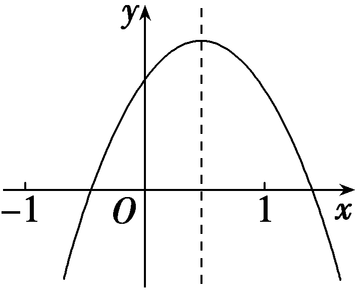

$\quad$A.*a*＋*b*＋*c*＞0

$\quad$B.*a*－*b*＋*c*＜0

$\quad$C.*abc*＞0

$\quad$D.*b*＝2*a*

答案AB

解析由图象可知，当<te<te<text st<text style="it*a*li*c*">y</text>le="italic">x</text>t st<text style="it<text style="it*a*li*c*">a</text>lic">y</text>le="italic">x</text>t st<text style="it<text style="itali*c*">a</text>lic">y</text>le="italic">x</text>＝1时，y＝a＋*<text style="italic"><text style="italic"><text style="italic">b*</text></text></text>＋c＞0，故A正确；当x＝－1时，y＝a－b＋c＜0，故B正确；函数图象的开口向下，a＜0，对称轴－ $\frac{b}{2a}$ ＞0，即<te<te<text st<text style="it*a*li*c*">y</text>le="italic">x</text>t st<text style="it<text style="it*a*li*c*">a</text>lic">y</text>le="italic">x</text>t style="itali*c*">*<text style="italic"><text style="italic">b*</text></text></text>＞0，当<text st<text style="it*a*lic">y</text>le="italic">x</text>＝0时，y＝c＞0，则*abc*＜0，故C错误；若b＝2a，则对称轴－ $\frac{b}{2a}＝$ －1，与图象不符，故D错误.故选AB.

##### 7.(多选)已知函数<em>f</em>(<em>x</em>)＝<em>x</em>2－2<em>x</em>＋<em>a</em>有两个零点<em>x</em>1，<em>x</em>2，以下结论正确的是(　　 )

$\quad$A.*a*＜1

$\quad$B.若&lt;te<em>x</em>t style="italic"&gt;x&lt;/text&gt;1x2≠0，则 $\frac{1}{x_{1}}$ ＋ $\frac{1}{x_{2}}＝\frac{2}{a}$

$\quad$C.*f*(－1)＝*f*（3）

$\quad$D.函数*y*＝*f*(｜*x*｜)有四个零点

答案ABC

解析二次函数对应二次方程根的判别式&lt;te&lt;te&lt;te&lt;te&lt;te&lt;te&lt;te&lt;te&lt;te<em>x</em>t style="italic"&gt;x&lt;/text&gt;t style="italic"&gt;x&lt;/text&gt;t st<em>y</em>le="it<em>a</em>lic"&gt;x&lt;/text&gt;t style="italic"&gt;x&lt;/text&gt;t style="it<em>a</em>lic"&gt;x&lt;/text&gt;t style="italic"&gt;x&lt;/text&gt;t style="italic"&gt;x&lt;/text&gt;t style="italic"&gt;x&lt;/text&gt;t style="it&lt;text style="it&lt;text style="it<em>a</em>lic"&gt;a&lt;/text&gt;lic"&gt;a&lt;/text&gt;lic"&gt;Δ&lt;/text&gt;＝(－&lt;text style="subscript"&gt;&lt;text style="subscript"&gt;&lt;text style="superscript"&gt;2&lt;/text&gt;&lt;/text&gt;&lt;/text&gt;)2－4a＝4－4a＞0，a＜&lt;text style="subscript"&gt;1&lt;/text&gt;，故A正确；由根与系数的关系得，x1＋x2＝2，x1x2＝a， $\frac{1}{x_{1}}$ ＋ $\frac{1}{x_{2}}＝\frac{x_{1}＋x_{2}}{x_{1}x_{2}}＝\frac{2}{a}$ ，故B正确；因为&lt;te&lt;te&lt;te&lt;te&lt;te<em>x</em>t style="italic"&gt;x&lt;/text&gt;t style="italic"&gt;x&lt;/text&gt;t st<em>y</em>le="it<em>a</em>lic"&gt;x&lt;/text&gt;t style="italic"&gt;x&lt;/text&gt;t style="italic"&gt;<em>&lt;text style="italic"&gt;&lt;text style="italic"&gt;f</em>&lt;/text&gt;&lt;/text&gt;&lt;/text&gt;(&lt;te&lt;te&lt;te&lt;text style="it<em>a</em>lic"&gt;x&lt;/text&gt;t style="italic"&gt;x&lt;/text&gt;t style="italic"&gt;x&lt;/text&gt;t style="italic"&gt;x&lt;/text&gt;)的对称轴为x＝&lt;text style="subscript"&gt;1&lt;/text&gt;，点(－1，f(－1))，(3，f(3))关于对称轴对称，故C正确；当&lt;text style="it&lt;text style="it<em>a</em>lic"&gt;a&lt;/text&gt;lic"&gt;a&lt;/text&gt;＝0时，y＝f(｜x｜)＝x&lt;text style="subscript"&gt;&lt;text style="subscript"&gt;&lt;text style="superscript"&gt;2&lt;/text&gt;&lt;/text&gt;&lt;/text&gt;－2｜x｜有3个零点，故D不正确.故选ABC.

##### 8.已知二次函数<em>f</em>(<em>x</em>)的图象经过点(4，3)，且图象被<em>x</em>轴截得的线段长为2，并且对任意<em>x</em>∈<strong>R</strong>，都有<em>f</em>(2－<em>x</em>)＝<em>f</em>(2＋<em>x</em>)，则<em>f</em>(<em>x</em>)的解析式为<u>　　　　　　　</u>.

答案<em>f</em>(<em>x</em>)＝<em>x</em>2－4<em>x</em>＋3

解析因为<em>f</em>(2－<em>x</em>)＝<em>f</em>(2＋<em>x</em>)对任意<em>x</em>∈<strong>R</strong>恒成立，所以<em>f</em>(<em>x</em>)图象的对称轴为直线<em>x</em>＝2.又因为<em>f</em>(<em>x</em>)的图象被<em>x</em>轴截得的线段长为2，所以<em>f</em>(<em>x</em>)＝0的两根为1和3，设<em>f</em>(<em>x</em>)＝<em>a</em>(<em>x</em>－1)(<em>x</em>－3)(<em>a</em>≠0)，因为<em>f</em>(<em>x</em>)的图象过点(4，3)，所以3<em>a</em>＝3，所以<em>a</em>＝1，所以所求函数的解析式为<em>f</em>(<em>x</em>)＝(<em>x</em>－1)(<em>x</em>－3)，即<em>f</em>(<em>x</em>)＝<em>x</em>2－4<em>x</em>＋3.

##### 9.(开放题)请写出一个函数<em>f</em> $\left(x\right)＝$ <u>　　　　　</u>使之同时具有如下性质：

（1）函数*<text style="italic">f*</text> $\left(x+2\right)$ 为偶函数；（2）*<text style="italic">f*</text> $\left(x\right)$ 的值域为[0，＋∞).

答案 $\left(x－2\right)^{2}$ (答案不唯一).

解析根据题意，要求函数<te*x*t style="italic">*<text style="italic"><text style="italic"><text style="italic">f*</text></text></text></text> $\left(x+2\right)$ 为偶函数，则函数<te*x*t style="italic">*<text style="italic"><text style="italic"><text style="italic">f*</text></text></text></text> $\left(x\right)$ 关于直线*x*＝2对称，而*<text style="italic"><text style="italic"><text style="italic"><text style="italic">f*</text></text></text></text> $\left(x\right)$ 的值域为[0，＋∞)，<te*x*t style="italic">*<text style="italic"><text style="italic"><text style="italic">f*</text></text></text></text> $\left(x\right)$ 可以为二次函数，如<te*x*t style="italic">*<text style="italic"><text style="italic"><text style="italic">f*</text></text></text></text> $\left(x\right)＝\left(x－2\right)^{2}$ (答案不唯一).

##### 10.(多空题)已知<em>a</em>，<em>b</em>是常数且<em>a</em>≠0，<em>f</em>(<em>x</em>)＝<em>ax</em>2＋<em>bx</em>且<em>f</em>（2）＝0，且使方程<em>f</em>(<em>x</em>)＝<em>x</em>有等根，则：（1）<em>f</em>(<em>x</em>)的解析式为<u>　　　 　</u>；（2）若<em>f</em>(<em>x</em>)的定义域和值域分别为[<em>m</em>，<em>n</em>]和[2<em>m</em>，2<em>n</em>]，则<em>m</em>＝<u>　　　</u>，<em>n</em>＝<u>　　 　</u>.

答案（1）&lt;te&lt;te<em>x</em>t style="italic"&gt;x&lt;/text&gt;t style="italic"&gt;f&lt;/text&gt;(x)＝－ $\frac{1}{2}$ &lt;te<em>x</em>t style="italic"&gt;x&lt;/text&gt;2＋<em>x</em>　（2）－2　0

解析（1）由&lt;te&lt;te&lt;te&lt;te&lt;text style="it<em>a</em>lic"&gt;x&lt;/text&gt;t style="italic"&gt;x&lt;/text&gt;t style="italic"&gt;x&lt;/text&gt;t style="it<em>a</em>lic"&gt;x&lt;/text&gt;t style="italic"&gt;<em>&lt;text style="italic"&gt;f</em>&lt;/text&gt;&lt;/text&gt;(x)＝<em>&lt;text style="italic"&gt;ax</em>&lt;/text&gt;&lt;text style="superscript"&gt;2&lt;/text&gt;＋<em>&lt;text style="italic"&gt;&lt;text style="italic"&gt;&lt;text style="italic"&gt;b</em>&lt;/text&gt;&lt;/text&gt;x&lt;/text&gt;，且f(2)＝0，则4a＋2b＝0，又方程f(x)＝x有等根，即ax2＋(b－1)x＝0有等根，得b＝1，从而a＝－ $\frac{1}{2}$ ，

所以&lt;te&lt;te&lt;te<em>x</em>t style="italic"&gt;x&lt;/text&gt;t style="italic"&gt;x&lt;/text&gt;t style="italic"&gt;f&lt;/text&gt;(x)＝－ $\frac{1}{2}$ &lt;te&lt;te<em>x</em>t style="italic"&gt;x&lt;/text&gt;t style="italic"&gt;x&lt;/text&gt;2＋x.

(&lt;te&lt;te&lt;te&lt;te&lt;te&lt;te<em>x</em>t style="italic"&gt;x&lt;/text&gt;t style="italic"&gt;x&lt;/text&gt;t style="italic"&gt;x&lt;/text&gt;t style="italic"&gt;x&lt;/text&gt;t style="italic"&gt;x&lt;/text&gt;t style="superscript"&gt;2&lt;/text&gt;)假定存在符合条件的&lt;te&lt;te<em>x</em>t style="italic"&gt;x&lt;/text&gt;t style="italic"&gt;<em>&lt;text style="italic"&gt;&lt;text style="italic"&gt;m</em>&lt;/text&gt;&lt;/text&gt;&lt;/text&gt;，<em>&lt;text style="italic"&gt;&lt;text style="italic"&gt;&lt;text style="italic"&gt;&lt;text style="italic"&gt;&lt;text style="italic"&gt;n</em>&lt;/text&gt;&lt;/text&gt;&lt;/text&gt;&lt;/text&gt;&lt;/text&gt;，由（1）知<em>&lt;text style="italic"&gt;&lt;text style="italic"&gt;&lt;text style="italic"&gt;f</em>&lt;/text&gt;&lt;/text&gt;&lt;/text&gt;(x)＝－ $\frac{1}{2}$ &lt;te&lt;te&lt;te&lt;te&lt;te&lt;te&lt;te<em>x</em>t style="italic"&gt;x&lt;/text&gt;t style="italic"&gt;x&lt;/text&gt;t style="italic"&gt;x&lt;/text&gt;t style="italic"&gt;x&lt;/text&gt;t style="italic"&gt;x&lt;/text&gt;t style="italic"&gt;x&lt;/text&gt;t style="italic"&gt;x&lt;/text&gt;&lt;text style="superscript"&gt;2&lt;/text&gt;＋x＝－ $\frac{1}{2}$ (&lt;te&lt;te&lt;te&lt;te&lt;te&lt;te&lt;te<em>x</em>t style="italic"&gt;x&lt;/text&gt;t style="italic"&gt;x&lt;/text&gt;t style="italic"&gt;x&lt;/text&gt;t style="italic"&gt;x&lt;/text&gt;t style="italic"&gt;x&lt;/text&gt;t style="italic"&gt;x&lt;/text&gt;t style="italic"&gt;x&lt;/text&gt;－1)&lt;text style="superscript"&gt;2&lt;/text&gt;＋ $\frac{1}{2}$ ≤ $\frac{1}{2}$ ，则有&lt;te&lt;te&lt;te&lt;te&lt;te&lt;te<em>x</em>t style="italic"&gt;x&lt;/text&gt;t style="italic"&gt;x&lt;/text&gt;t style="italic"&gt;x&lt;/text&gt;t style="italic"&gt;x&lt;/text&gt;t style="italic"&gt;x&lt;/text&gt;t style="superscript"&gt;2&lt;/text&gt;&lt;te&lt;te<em>x</em>t style="italic"&gt;x&lt;/text&gt;t style="italic"&gt;<em>&lt;text style="italic"&gt;&lt;text style="italic"&gt;&lt;text style="italic"&gt;&lt;text style="italic"&gt;n</em>&lt;/text&gt;&lt;/text&gt;&lt;/text&gt;&lt;/text&gt;&lt;/text&gt;≤ $\frac{1}{2}$ ，即&lt;te&lt;te&lt;te&lt;te&lt;te&lt;te&lt;te&lt;te<em>x</em>t style="italic"&gt;x&lt;/text&gt;t style="italic"&gt;x&lt;/text&gt;t style="italic"&gt;x&lt;/text&gt;t style="italic"&gt;x&lt;/text&gt;t style="italic"&gt;x&lt;/text&gt;t style="italic"&gt;x&lt;/text&gt;t style="italic"&gt;x&lt;/text&gt;t style="italic"&gt;<em>&lt;text style="italic"&gt;&lt;text style="italic"&gt;&lt;text style="italic"&gt;&lt;text style="italic"&gt;n</em>&lt;/text&gt;&lt;/text&gt;&lt;/text&gt;&lt;/text&gt;&lt;/text&gt;≤ $\frac{1}{4}$ .又&lt;te&lt;te&lt;te&lt;te&lt;te&lt;te&lt;te&lt;te<em>x</em>t style="italic"&gt;x&lt;/text&gt;t style="italic"&gt;x&lt;/text&gt;t style="italic"&gt;x&lt;/text&gt;t style="italic"&gt;x&lt;/text&gt;t style="italic"&gt;x&lt;/text&gt;t style="italic"&gt;x&lt;/text&gt;t style="italic"&gt;x&lt;/text&gt;t style="italic"&gt;<em>&lt;text style="italic"&gt;&lt;text style="italic"&gt;f</em>&lt;/text&gt;&lt;/text&gt;&lt;/text&gt;(x)图象的对称轴为直线x＝1，则f(x)在[<em>&lt;text style="italic"&gt;&lt;text style="italic"&gt;&lt;text style="italic"&gt;m</em>&lt;/text&gt;&lt;/text&gt;&lt;/text&gt;，<em>&lt;text style="italic"&gt;&lt;text style="italic"&gt;&lt;text style="italic"&gt;&lt;text style="italic"&gt;&lt;text style="italic"&gt;n</em>&lt;/text&gt;&lt;/text&gt;&lt;/text&gt;&lt;/text&gt;&lt;/text&gt;]上单调递增，于是得 $\left\{\begin{matrix}m＜n\leq \frac{1}{4}，\\f(m)=2m，\\f(n)=2n，\end{matrix}\right.$ 即 $\left\{\begin{matrix}m＜n\leq \frac{1}{4}，\\－\frac{1}{2}m^{2}＋m=2m，\\－\frac{1}{2}n^{2}＋n=2n，\end{matrix}\right.$ 解方程组得&lt;te&lt;te&lt;te&lt;te&lt;te&lt;te&lt;te&lt;te<em>x</em>t style="italic"&gt;x&lt;/text&gt;t style="italic"&gt;x&lt;/text&gt;t style="italic"&gt;x&lt;/text&gt;t style="italic"&gt;x&lt;/text&gt;t style="italic"&gt;x&lt;/text&gt;t style="italic"&gt;x&lt;/text&gt;t style="italic"&gt;x&lt;/text&gt;t style="italic"&gt;<em>&lt;text style="italic"&gt;&lt;text style="italic"&gt;m</em>&lt;/text&gt;&lt;/text&gt;&lt;/text&gt;＝－&lt;text style="superscript"&gt;2&lt;/text&gt;，<em>&lt;text style="italic"&gt;&lt;text style="italic"&gt;&lt;text style="italic"&gt;&lt;text style="italic"&gt;&lt;text style="italic"&gt;n</em>&lt;/text&gt;&lt;/text&gt;&lt;/text&gt;&lt;/text&gt;&lt;/text&gt;＝0，所以存在m＝－2，n＝0，使函数<em>&lt;text style="italic"&gt;&lt;text style="italic"&gt;&lt;text style="italic"&gt;f</em>&lt;/text&gt;&lt;/text&gt;&lt;/text&gt;(x)在[－2，0]上的值域为[－4，0].

(11、12题，每小题5分，共10分)

##### 11.已知函数<em>f</em>(<em>x</em>)＝<em>x</em>2－2(<em>a</em>－1)<em>x</em>＋<em>a</em>，若对于区间[－1，2]上任意两个不相等的实数<em>x</em>1，<em>x</em>2，都有<em>f</em>(<em>x</em>1)≠<em>f</em>(<em>x</em>2)，则实数<em>a</em>的取值范围是(　　)

$\quad$A.(－∞，0]	
$\quad$B.[0，3]

$\quad$C.(－∞，0]∪[3，＋∞)	
$\quad$D.[3，＋∞)

答案C

解析二次函数<em>f</em>(<em>x</em>)＝<em>x</em>2－2(<em>a</em>－1)<em>x</em>＋<em>a</em>图象的对称轴为直线<em>x</em>＝<em>a</em>－1，因为对于任意<em>x</em>1，<em>x</em>2∈[－1，2]且<em>x</em>1≠<em>x</em>2，都有<em>f</em>(<em>x</em>1)≠<em>f</em>(<em>x</em>2)，即<em>f</em>(<em>x</em>)在区间[－1，2]上是单调函数，所以<em>a</em>－1≤－1或<em>a</em>－1≥2，所以<em>a</em>≤0或<em>a</em>≥3，即实数<em>a</em>的取值范围为(－∞，0]∪[3，＋∞).故选C.

##### 12.已知函数<em>f</em> $\left(x\right)＝\left|x^{2}－6x+7\right|$ 在 $\left[1，m\right]\left(m>1\right)$ 上的最大值为<em>&lt;text style="italic"&gt;A</em>&lt;/text&gt;，在 $\left[m，2m－1\right]$ 上的最大值为<em>&lt;text style="italic"&gt;B</em>&lt;/text&gt;，若<em>&lt;text style="italic"&gt;A</em>&lt;/text&gt;≥2B，则实数<em>m</em>的取值范围是<u>　　　　</u>.

答案 $\left[3－\sqrt{3}，\frac{3}{2}\right]$

解析由函数<te*x*t style="italic">*f*</text> $\left(x\right)＝\left|x^{2}－6x+7\right|＝\left|\left(x－3\right)^{2}－2\right|$ ，作出<te*x*t style="italic">*f*</text>(x)的图象如图①：

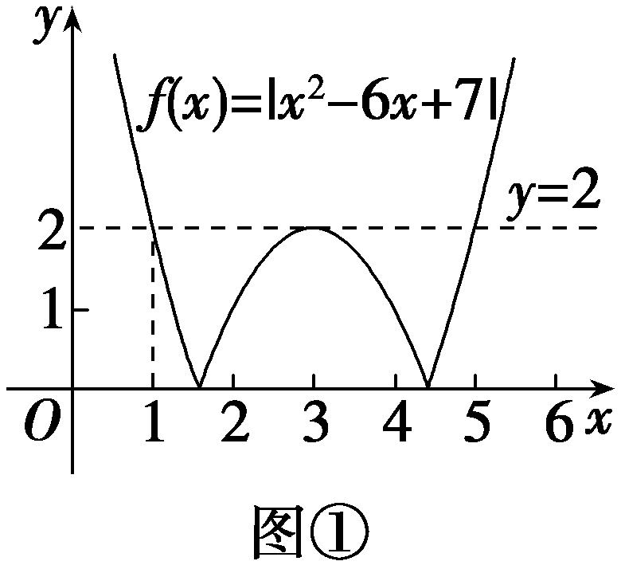

由题意得&lt;te&lt;te&lt;te&lt;te&lt;te<em>x</em>t style="italic"&gt;x&lt;/text&gt;t style="italic"&gt;x&lt;/text&gt;t style="italic"&gt;x&lt;/text&gt;t style="italic"&gt;x&lt;/text&gt;t style="italic"&gt;<em>&lt;text style="italic"&gt;&lt;text style="italic"&gt;&lt;text style="italic"&gt;&lt;text style="italic"&gt;f</em>&lt;/text&gt;&lt;/text&gt;&lt;/text&gt;&lt;/text&gt;&lt;/text&gt;(1)＝f(3)＝f(5)＝2，当1＜<em>&lt;text style="italic"&gt;m</em>&lt;/text&gt;≤5时，函数f $\left(x\right)＝\left|x^{2}－6x+7\right|$ 在 $\left[1，m\right]\left(m>1\right)$ 上的最大值为&lt;te&lt;te<em>x</em>t style="italic"&gt;x&lt;/text&gt;t style="subscript"&gt;2&lt;/text&gt;，即&lt;te&lt;te&lt;te<em>x</em>t style="italic"&gt;x&lt;/text&gt;t style="italic"&gt;x&lt;/text&gt;t style="italic"&gt;<em>A</em>&lt;/text&gt;＝2，要使A≥2<em>&lt;text style="italic"&gt;&lt;text style="italic"&gt;&lt;text style="italic"&gt;B</em>&lt;/text&gt;&lt;/text&gt;&lt;/text&gt;，则B≤1，令<em>&lt;text style="italic"&gt;&lt;text style="italic"&gt;&lt;text style="italic"&gt;&lt;text style="italic"&gt;&lt;text style="italic"&gt;f</em>&lt;/text&gt;&lt;/text&gt;&lt;/text&gt;&lt;/text&gt;&lt;/text&gt;(x)＝1，解得x1＝3－ $\sqrt{3}$ ，&lt;te&lt;te&lt;te&lt;te<em>x</em>t style="italic"&gt;x&lt;/text&gt;t style="italic"&gt;x&lt;/text&gt;t style="italic"&gt;x&lt;/text&gt;t style="italic"&gt;x&lt;/text&gt;2＝2，x3＝4，x4＝3＋ $\sqrt{3}$ ，由图②可得，要使函数&lt;te&lt;te&lt;te&lt;te&lt;te<em>x</em>t style="italic"&gt;x&lt;/text&gt;t style="italic"&gt;x&lt;/text&gt;t style="italic"&gt;x&lt;/text&gt;t style="italic"&gt;x&lt;/text&gt;t style="italic"&gt;<em>&lt;text style="italic"&gt;&lt;text style="italic"&gt;&lt;text style="italic"&gt;&lt;text style="italic"&gt;f</em>&lt;/text&gt;&lt;/text&gt;&lt;/text&gt;&lt;/text&gt;&lt;/text&gt; $\left(x\right)＝\left|x^{2}－6x+7\right|$ 在 $\left[m，2m－1\right]$ 上的最大值为&lt;te&lt;te&lt;te&lt;te&lt;te<em>x</em>t style="italic"&gt;x&lt;/text&gt;t style="italic"&gt;x&lt;/text&gt;t style="italic"&gt;x&lt;/text&gt;t style="italic"&gt;x&lt;/text&gt;t style="italic"&gt;<em>&lt;text style="italic"&gt;&lt;text style="italic"&gt;B</em>&lt;/text&gt;&lt;/text&gt;&lt;/text&gt;，且B≤1，则 $\left\{\begin{matrix}m\geq 3－\sqrt{3}，\\2m－1\leq 2，\end{matrix}\right.$ 或 $\left\{\begin{matrix}m\geq 4，\\2m－1\leq 3+\sqrt{3}，\end{matrix}\right.$ 解得&lt;te<em>x</em>t style="subscript"&gt;3&lt;/text&gt;－ $\sqrt{3}$ ≤&lt;te&lt;te&lt;te&lt;te&lt;te<em>x</em>t style="italic"&gt;x&lt;/text&gt;t style="italic"&gt;x&lt;/text&gt;t style="italic"&gt;x&lt;/text&gt;t style="italic"&gt;x&lt;/text&gt;t style="italic"&gt;<em>m</em>&lt;/text&gt;≤ $\frac{3}{2}$ .

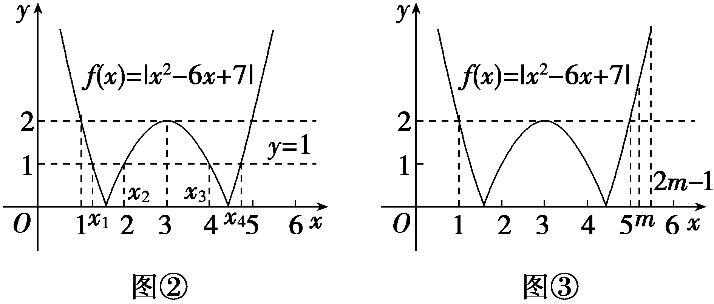

当<em>&lt;text style="italic"&gt;&lt;text style="italic"&gt;&lt;text style="italic"&gt;m</em>&lt;/text&gt;&lt;/text&gt;&lt;/text&gt;＞5时，由图③可得，<em>&lt;text style="italic"&gt;&lt;text style="italic"&gt;&lt;text style="italic"&gt;f</em>&lt;/text&gt;&lt;/text&gt;&lt;/text&gt; $\left(x\right)＝\left|x^{2}－6x+7\right|$ 在 $\left[1，m\right]\left(m>1\right)$ 上的最大值<em>&lt;text style="italic"&gt;&lt;text style="italic"&gt;A</em>&lt;/text&gt;&lt;/text&gt;＝<em>&lt;text style="italic"&gt;&lt;text style="italic"&gt;&lt;text style="italic"&gt;f</em>&lt;/text&gt;&lt;/text&gt;&lt;/text&gt; $\left(m\right)＝$ <em>&lt;text style="italic"&gt;&lt;text style="italic"&gt;&lt;text style="italic"&gt;m</em>&lt;/text&gt;&lt;/text&gt;&lt;/text&gt;2－6m＋7＞0，在 $\left[m，2m－1\right]$ 上单调递增，最大值<em>&lt;text style="italic"&gt;B</em>&lt;/text&gt;＝<em>&lt;text style="italic"&gt;&lt;text style="italic"&gt;&lt;text style="italic"&gt;f</em>&lt;/text&gt;&lt;/text&gt;&lt;/text&gt; $\left(2m－1\right)$ ＞<em>&lt;text style="italic"&gt;&lt;text style="italic"&gt;&lt;text style="italic"&gt;f</em>&lt;/text&gt;&lt;/text&gt;&lt;/text&gt; $\left(m\right)＝$ <em>&lt;text style="italic"&gt;&lt;text style="italic"&gt;A</em>&lt;/text&gt;&lt;/text&gt;＞0，A≥2<em>&lt;text style="italic"&gt;B</em>&lt;/text&gt;不可能成立.综上，实数<em>&lt;text style="italic"&gt;&lt;text style="italic"&gt;&lt;text style="italic"&gt;m</em>&lt;/text&gt;&lt;/text&gt;&lt;/text&gt;的取值范围是 $\left[3－\sqrt{3}，\frac{3}{2}\right]$ .

##### 13.(15分)(&lt;<em>t</em>e<em>x</em>t style="superscript"&gt;2&lt;/text&gt;025·江西南昌开学考)已知函数<em>f</em> $\left(x\right)＝$ &lt;<em>t</em>e<em>x</em>t style="italic"&gt;tx&lt;/text&gt;2＋x－3t＋1， $\left(t\in R\right)$ .

（1）若<*t*ext style="italic">f</text> $\left(x\right)$ 在 $\left(－\infty ，2\right)$ 上单调递增，求实数*t*的取值范围；(5分)

（2）若*t*＞0，设函数*f* $\left(x\right)$ 在区间 $\left[－2,-1\right]$ 上的最大值为*<text style="italic"><text style="italic">g*</text></text> $\left(t\right)$ ，求*<text style="italic"><text style="italic">g*</text></text> $\left(t\right)$ 的表达式，并求出*<text style="italic"><text style="italic">g*</text></text> $\left(t\right)$ 的最小值.(10分)

解：（1）当<te*x*t style="italic">t</text>＝0时，*<text style="italic">f*</text> $\left(x\right)＝$ *x*＋1，则*<text style="italic">f*</text> $\left(x\right)$ 在 $\left(－\infty ，2\right)$ 上单调递增，满足条件；

当&lt;&lt;<em>t</em>e<em>x</em>t style="italic"&gt;t&lt;/text&gt;e<em>x</em>t style="italic"&gt;t&lt;/text&gt;≠0时，<em>&lt;text style="italic"&gt;f</em>&lt;/text&gt; $\left(x\right)＝$ &lt;&lt;<em>t</em>e<em>x</em>t style="italic"&gt;t&lt;/text&gt;e<em>x</em>t style="italic"&gt;t&lt;/text&gt;x2＋x－3t＋1的对称轴为x＝－ $\frac{1}{2t}$ ，要使&lt;&lt;<em>t</em>e<em>x</em>t style="italic"&gt;t&lt;/text&gt;e<em>x</em>t style="italic"&gt;<em>f</em>&lt;/text&gt; $\left(x\right)$ 在 $\left(－\infty ，2\right)$ 上单调递增，则 $\left\{\begin{matrix}t<0，\\－\frac{1}{2t}\geq 2，\end{matrix}\right.$ 解得－ $\frac{1}{4}$ ≤&lt;&lt;<em>t</em>e<em>x</em>t style="italic"&gt;t&lt;/text&gt;e<em>x</em>t style="italic"&gt;t&lt;/text&gt;＜0.

综上，若<*t*ext style="italic">f</text> $\left(x\right)$ 在 $\left(－\infty ，2\right)$ 上单调递增，则实数*t*的取值范围为 $\left[－\frac{1}{4}，0\right]$ .

(&lt;&lt;te&lt;te<em>x</em>t style="italic"&gt;x&lt;/text&gt;t style="italic"&gt;t&lt;/text&gt;e<em>x</em>t style="superscript"&gt;2&lt;/text&gt;)当<em>t</em>＞0时，<em>&lt;text style="italic"&gt;f</em>&lt;/text&gt; $\left(x\right)＝$ &lt;&lt;te&lt;te<em>x</em>t style="italic"&gt;x&lt;/text&gt;t style="italic"&gt;t&lt;/text&gt;e<em>x</em>t style="italic"&gt;t&lt;/text&gt;x2＋x－3t＋1的对称轴为x＝－ $\frac{1}{2t}$ ＜0，所以&lt;&lt;te&lt;te<em>x</em>t style="italic"&gt;x&lt;/text&gt;t style="italic"&gt;t&lt;/text&gt;e<em>x</em>t style="italic"&gt;<em>f</em>&lt;/text&gt;(x)在(－∞，－ $\frac{1}{2t}$ )上单调递减，在(－ $\frac{1}{2t}$ ，＋∞)上单调递增；

当－ $\frac{1}{2t}$ ≥－1，即&lt;&lt;<em>t</em>ext style="italic"&gt;t&lt;/text&gt;e<em>x</em>t style="italic"&gt;t&lt;/text&gt;≥ $\frac{1}{2}$ 时，&lt;&lt;<em>t</em>ext style="italic"&gt;t&lt;/text&gt;e<em>x</em>t style="italic"&gt;<em>f</em>&lt;/text&gt;(x)max＝<em>g</em>(<em>t</em>)＝f(－2)＝t－1；

当－ $\frac{1}{2t}$ ≤－2，即0＜&lt;&lt;<em>t</em>ext style="italic"&gt;t&lt;/text&gt;e<em>x</em>t style="italic"&gt;t&lt;/text&gt;≤ $\frac{1}{4}$ 时，&lt;&lt;<em>t</em>ext style="italic"&gt;t&lt;/text&gt;e<em>x</em>t style="italic"&gt;<em>f</em>&lt;/text&gt;(x)max＝<em>g</em>(<em>t</em>)＝f(－1)＝－2t；

当－2＜－ $\frac{1}{2t}$ ＜－1，即 $\frac{1}{4}$ ＜<<*t*ext style="italic">t</text>ext style="italic">t</text>＜ $\frac{1}{2}$ 时，<<*t*ext style="italic">t</text>ext style="italic">*f*</text>(－2)＝*t*－1，f(－1)＝－2t；

当<<*t*ext style="italic">t</text>ext style="italic">t</text>－1＝－2t时，即t $＝\frac{1}{3}$ 时，

&lt;<em>t</em>e<em>x</em>t style="italic"&gt;<em>&lt;text style="italic"&gt;f</em>&lt;/text&gt;&lt;/text&gt;(x)max＝<em>g</em>(t)＝f(－1)＝f(－2)＝－ $\frac{2}{3}$ ；

当<<*t*ext style="italic">t</text>ext style="italic">t</text>－1＞－2t，即 $\frac{1}{3}$ ＜<<*t*ext style="italic">t</text>ext style="italic">t</text>＜ $\frac{1}{2}$ 时，

<em>f</em>(<em>x</em>)max＝<em>g</em>(<em>t</em>)＝<em>f</em>(－2)＝<em>t</em>－1；

当<<*t*ext style="italic">t</text>ext style="italic">t</text>－1＜－2t，即 $\frac{1}{4}$ ＜<<*t*ext style="italic">t</text>ext style="italic">t</text>＜ $\frac{1}{3}$ 时，

<em>f</em>(<em>x</em>)max＝<em>g</em>(<em>t</em>)＝<em>f</em>(－1)＝－2<em>t</em>.

综上，*g* $\left(t\right)＝\left\{\begin{matrix}－2t，0<t＜\frac{1}{3}，\\t－1，t\geq \frac{1}{3}，\end{matrix}\right.$

所以当&lt;<em>t</em>ext style="italic"&gt;t&lt;/text&gt; $＝\frac{1}{3}$ 时，&lt;<em>t</em>ext style="italic"&gt;<em>g</em>&lt;/text&gt;(<em>t</em>)min＝g( $\frac{1}{3}$ )＝－ $\frac{2}{3}$ .

(14、15题，每小题5分，共10分)

&lt;te&lt;text style="it<em>a</em>lic"&gt;x&lt;/text&gt;t style="subscript"&gt;1&lt;/text&gt;4.已知函数&lt;&lt;te<em>x</em>t style="italic"&gt;t&lt;/text&gt;e<em>x</em>t style="italic"&gt;f&lt;/text&gt; $\left(x\right)＝$ &lt;&lt;te&lt;te&lt;text style="it<em>a</em>lic"&gt;x&lt;/text&gt;t style="italic"&gt;x&lt;/text&gt;t style="italic"&gt;t&lt;/text&gt;e<em>x</em>t style="superscript"&gt;2&lt;/text&gt;<em>ax</em>2－2 024x－2 025，对任意t∈<strong>R</strong>，在区间 $\left[t－1，t+1\right]$ 上存在两个实数&lt;&lt;te&lt;te&lt;text style="it<em>a</em>lic"&gt;x&lt;/text&gt;t style="italic"&gt;x&lt;/text&gt;t style="italic"&gt;t&lt;/text&gt;ext style="italic"&gt;x&lt;/text&gt;1，x&lt;text style="subscript"&gt;2&lt;/text&gt;，使 $\left|f\left(x_{1}\right)－f\left(x_{2}\right)\right|$ ≥&lt;te&lt;text style="it<em>a</em>lic"&gt;x&lt;/text&gt;t style="subscript"&gt;1&lt;/text&gt;成立，则实数a的取值范围是(　　)

$\quad$A. $\left[－\frac{1}{2}，\frac{1}{2}\right]$

$\quad$B. $\left[－1，1\right]$

$\quad$C. $\left(－\infty ,-1\right]$ ∪ $\left\{0\right\}$ ∪[1，＋∞)

$\quad$D. $\left(－\infty ,-\frac{1}{2}\right]$ ∪ $\left\{0\right\}$ ∪ $\left[\frac{1}{2}，＋\infty \right)$

答案D

解析存在两个实数&lt;&lt;&lt;&lt;text style="it&lt;text style="it&lt;text style="it&lt;text style="it&lt;text style="it&lt;text style="it&lt;text style="it<em>a</em>lic"&gt;a&lt;/text&gt;lic"&gt;a&lt;/text&gt;lic"&gt;a&lt;/text&gt;lic"&gt;a&lt;/text&gt;lic"&gt;a&lt;/text&gt;lic"&gt;a&lt;/text&gt;lic"&gt;t&lt;/text&gt;ext style="italic"&gt;t&lt;/text&gt;e<em>x</em>t style="italic"&gt;t&lt;/text&gt;e&lt;te&lt;te&lt;text st<em>y</em>le="italic"&gt;x&lt;/text&gt;t style="it<em>a</em>lic"&gt;x&lt;/text&gt;t style="it<em>a</em>lic"&gt;x&lt;/text&gt;t style="italic"&gt;x&lt;/text&gt;1，x&lt;text style="superscript"&gt;&lt;text style="superscript"&gt;&lt;text style="superscript"&gt;2&lt;/text&gt;&lt;/text&gt;&lt;/text&gt;，使 $\left|f\left(x_{1}\right)－f\left(x_{2}\right)\right|$ ≥&lt;&lt;&lt;&lt;text style="it&lt;text style="it&lt;text style="it&lt;text style="it&lt;text style="it&lt;text style="it&lt;text style="it<em>a</em>lic"&gt;a&lt;/text&gt;lic"&gt;a&lt;/text&gt;lic"&gt;a&lt;/text&gt;lic"&gt;a&lt;/text&gt;lic"&gt;a&lt;/text&gt;lic"&gt;a&lt;/text&gt;lic"&gt;t&lt;/text&gt;ext style="italic"&gt;t&lt;/text&gt;e<em>x</em>t style="italic"&gt;t&lt;/text&gt;e&lt;te&lt;te&lt;text st<em>y</em>le="italic"&gt;x&lt;/text&gt;t style="it<em>a</em>lic"&gt;x&lt;/text&gt;t style="it<em>a</em>lic"&gt;x&lt;/text&gt;t style="subscript"&gt;1&lt;/text&gt;⇔<em>&lt;text style="italic"&gt;&lt;text style="italic"&gt;&lt;text style="italic"&gt;&lt;text style="italic"&gt;&lt;text style="italic"&gt;&lt;text style="italic"&gt;&lt;text style="italic"&gt;&lt;text style="italic"&gt;f</em>&lt;/text&gt;&lt;/text&gt;&lt;/text&gt;&lt;/text&gt;&lt;/text&gt;&lt;/text&gt;&lt;/text&gt;&lt;/text&gt; $\left(x\right)_{max}$ －&lt;&lt;&lt;&lt;text style="it&lt;text style="it&lt;text style="it&lt;text style="it&lt;text style="it&lt;text style="it&lt;text style="it<em>a</em>lic"&gt;a&lt;/text&gt;lic"&gt;a&lt;/text&gt;lic"&gt;a&lt;/text&gt;lic"&gt;a&lt;/text&gt;lic"&gt;a&lt;/text&gt;lic"&gt;a&lt;/text&gt;lic"&gt;t&lt;/text&gt;ext style="italic"&gt;t&lt;/text&gt;e<em>x</em>t style="italic"&gt;t&lt;/text&gt;e&lt;te&lt;text st<em>y</em>le="italic"&gt;x&lt;/text&gt;t style="it<em>a</em>lic"&gt;x&lt;/text&gt;t style="it<em>a</em>lic"&gt;<em>&lt;text style="italic"&gt;&lt;text style="italic"&gt;&lt;text style="italic"&gt;&lt;text style="italic"&gt;&lt;text style="italic"&gt;&lt;text style="italic"&gt;&lt;text style="italic"&gt;f</em>&lt;/text&gt;&lt;/text&gt;&lt;/text&gt;&lt;/text&gt;&lt;/text&gt;&lt;/text&gt;&lt;/text&gt;&lt;/text&gt; $\left(x\right)_{min}$ ≥&lt;&lt;&lt;&lt;text style="it&lt;text style="it&lt;text style="it&lt;text style="it&lt;text style="it&lt;text style="it&lt;text style="it<em>a</em>lic"&gt;a&lt;/text&gt;lic"&gt;a&lt;/text&gt;lic"&gt;a&lt;/text&gt;lic"&gt;a&lt;/text&gt;lic"&gt;a&lt;/text&gt;lic"&gt;a&lt;/text&gt;lic"&gt;t&lt;/text&gt;ext style="italic"&gt;t&lt;/text&gt;e<em>x</em>t style="italic"&gt;t&lt;/text&gt;e&lt;te&lt;te&lt;text st<em>y</em>le="italic"&gt;x&lt;/text&gt;t style="it<em>a</em>lic"&gt;x&lt;/text&gt;t style="it<em>a</em>lic"&gt;x&lt;/text&gt;t style="subscript"&gt;1&lt;/text&gt;，当a＝0时，<em>&lt;text style="italic"&gt;&lt;text style="italic"&gt;&lt;text style="italic"&gt;&lt;text style="italic"&gt;&lt;text style="italic"&gt;&lt;text style="italic"&gt;&lt;text style="italic"&gt;&lt;text style="italic"&gt;f</em>&lt;/text&gt;&lt;/text&gt;&lt;/text&gt;&lt;/text&gt;&lt;/text&gt;&lt;/text&gt;&lt;/text&gt;&lt;/text&gt; $\left(x\right)＝$ －&lt;&lt;&lt;&lt;text style="it&lt;text style="it&lt;text style="it&lt;text style="it&lt;text style="it&lt;text style="it&lt;text style="it<em>a</em>lic"&gt;a&lt;/text&gt;lic"&gt;a&lt;/text&gt;lic"&gt;a&lt;/text&gt;lic"&gt;a&lt;/text&gt;lic"&gt;a&lt;/text&gt;lic"&gt;a&lt;/text&gt;lic"&gt;t&lt;/text&gt;ext style="italic"&gt;t&lt;/text&gt;e<em>x</em>t style="italic"&gt;t&lt;/text&gt;e&lt;te&lt;text st<em>y</em>le="italic"&gt;x&lt;/text&gt;t style="it<em>a</em>lic"&gt;x&lt;/text&gt;t style="subscript"&gt;&lt;text style="superscript"&gt;&lt;text style="superscript"&gt;2&lt;/text&gt;&lt;/text&gt;&lt;/text&gt; 024&lt;te&lt;text style="it<em>a</em>lic"&gt;x&lt;/text&gt;t style="italic"&gt;x&lt;/text&gt;－2 025，<em>&lt;text style="italic"&gt;&lt;text style="italic"&gt;&lt;text style="italic"&gt;&lt;text style="italic"&gt;&lt;text style="italic"&gt;&lt;text style="italic"&gt;&lt;text style="italic"&gt;&lt;text style="italic"&gt;f</em>&lt;/text&gt;&lt;/text&gt;&lt;/text&gt;&lt;/text&gt;&lt;/text&gt;&lt;/text&gt;&lt;/text&gt;&lt;/text&gt; $\left(t－1\right)$ －&lt;&lt;&lt;&lt;text style="it&lt;text style="it&lt;text style="it&lt;text style="it&lt;text style="it&lt;text style="it&lt;text style="it<em>a</em>lic"&gt;a&lt;/text&gt;lic"&gt;a&lt;/text&gt;lic"&gt;a&lt;/text&gt;lic"&gt;a&lt;/text&gt;lic"&gt;a&lt;/text&gt;lic"&gt;a&lt;/text&gt;lic"&gt;t&lt;/text&gt;ext style="italic"&gt;t&lt;/text&gt;e<em>x</em>t style="italic"&gt;t&lt;/text&gt;e&lt;te&lt;text st<em>y</em>le="italic"&gt;x&lt;/text&gt;t style="it<em>a</em>lic"&gt;x&lt;/text&gt;t style="it<em>a</em>lic"&gt;<em>&lt;text style="italic"&gt;&lt;text style="italic"&gt;&lt;text style="italic"&gt;&lt;text style="italic"&gt;&lt;text style="italic"&gt;&lt;text style="italic"&gt;&lt;text style="italic"&gt;f</em>&lt;/text&gt;&lt;/text&gt;&lt;/text&gt;&lt;/text&gt;&lt;/text&gt;&lt;/text&gt;&lt;/text&gt;&lt;/text&gt; $\left(t+1\right)＝$ &lt;&lt;&lt;&lt;text style="it&lt;text style="it&lt;text style="it&lt;text style="it&lt;text style="it&lt;text style="it&lt;text style="it<em>a</em>lic"&gt;a&lt;/text&gt;lic"&gt;a&lt;/text&gt;lic"&gt;a&lt;/text&gt;lic"&gt;a&lt;/text&gt;lic"&gt;a&lt;/text&gt;lic"&gt;a&lt;/text&gt;lic"&gt;t&lt;/text&gt;ext style="italic"&gt;t&lt;/text&gt;e<em>x</em>t style="italic"&gt;t&lt;/text&gt;e&lt;te&lt;text st<em>y</em>le="italic"&gt;x&lt;/text&gt;t style="it<em>a</em>lic"&gt;x&lt;/text&gt;t style="subscript"&gt;&lt;text style="superscript"&gt;&lt;text style="superscript"&gt;2&lt;/text&gt;&lt;/text&gt;&lt;/text&gt;×2 024＞&lt;te&lt;text style="it<em>a</em>lic"&gt;x&lt;/text&gt;t style="subscript"&gt;1&lt;/text&gt;，显然符合；当a≠0时，<em>&lt;text style="italic"&gt;&lt;text style="italic"&gt;&lt;text style="italic"&gt;&lt;text style="italic"&gt;&lt;text style="italic"&gt;&lt;text style="italic"&gt;&lt;text style="italic"&gt;&lt;text style="italic"&gt;f</em>&lt;/text&gt;&lt;/text&gt;&lt;/text&gt;&lt;/text&gt;&lt;/text&gt;&lt;/text&gt;&lt;/text&gt;&lt;/text&gt; $\left(x\right)＝$ &lt;&lt;&lt;&lt;text style="it&lt;text style="it&lt;text style="it&lt;text style="it&lt;text style="it&lt;text style="it&lt;text style="it<em>a</em>lic"&gt;a&lt;/text&gt;lic"&gt;a&lt;/text&gt;lic"&gt;a&lt;/text&gt;lic"&gt;a&lt;/text&gt;lic"&gt;a&lt;/text&gt;lic"&gt;a&lt;/text&gt;lic"&gt;t&lt;/text&gt;ext style="italic"&gt;t&lt;/text&gt;e<em>x</em>t style="italic"&gt;t&lt;/text&gt;e&lt;te&lt;text st<em>y</em>le="italic"&gt;x&lt;/text&gt;t style="it<em>a</em>lic"&gt;x&lt;/text&gt;t style="subscript"&gt;&lt;text style="superscript"&gt;&lt;text style="superscript"&gt;2&lt;/text&gt;&lt;/text&gt;&lt;/text&gt;<em>a</em>&lt;te<em>x</em>t style="italic"&gt;x&lt;/text&gt;2－2 024x－2 025与y＝2<em>&lt;text style="italic"&gt;&lt;text style="italic"&gt;ax</em>&lt;/text&gt;&lt;/text&gt;2的图象完全“全等”，即可以通过平移完全重合.因为t－1≤x≤t＋1且t∈<strong>R</strong>，即用一个区间宽度为2的任意区间去截取函数图象，使得图象的最高点与最低点间的纵坐标之差大于等于1，因此取纵坐标之差最小的状态为<em>&lt;text style="italic"&gt;&lt;text style="italic"&gt;&lt;text style="italic"&gt;&lt;text style="italic"&gt;&lt;text style="italic"&gt;&lt;text style="italic"&gt;&lt;text style="italic"&gt;&lt;text style="italic"&gt;f</em>&lt;/text&gt;&lt;/text&gt;&lt;/text&gt;&lt;/text&gt;&lt;/text&gt;&lt;/text&gt;&lt;/text&gt;&lt;/text&gt; $\left(x\right)＝$ &lt;&lt;&lt;&lt;text style="it&lt;text style="it&lt;text style="it&lt;text style="it&lt;text style="it&lt;text style="it&lt;text style="it<em>a</em>lic"&gt;a&lt;/text&gt;lic"&gt;a&lt;/text&gt;lic"&gt;a&lt;/text&gt;lic"&gt;a&lt;/text&gt;lic"&gt;a&lt;/text&gt;lic"&gt;a&lt;/text&gt;lic"&gt;t&lt;/text&gt;ext style="italic"&gt;t&lt;/text&gt;e<em>x</em>t style="italic"&gt;t&lt;/text&gt;e&lt;te&lt;text st<em>y</em>le="italic"&gt;x&lt;/text&gt;t style="it<em>a</em>lic"&gt;x&lt;/text&gt;t style="subscript"&gt;&lt;text style="superscript"&gt;&lt;text style="superscript"&gt;2&lt;/text&gt;&lt;/text&gt;&lt;/text&gt;<em>a</em>&lt;te<em>x</em>t style="italic"&gt;x&lt;/text&gt;2 $\left(－1\leq x\leq 1\right)$ ，当&lt;&lt;&lt;&lt;text style="it&lt;text style="it&lt;text style="it&lt;text style="it&lt;text style="it&lt;text style="it&lt;text style="it<em>a</em>lic"&gt;a&lt;/text&gt;lic"&gt;a&lt;/text&gt;lic"&gt;a&lt;/text&gt;lic"&gt;a&lt;/text&gt;lic"&gt;a&lt;/text&gt;lic"&gt;a&lt;/text&gt;lic"&gt;t&lt;/text&gt;ext style="italic"&gt;t&lt;/text&gt;e<em>x</em>t style="italic"&gt;t&lt;/text&gt;e&lt;te&lt;text st<em>y</em>le="italic"&gt;x&lt;/text&gt;t style="it<em>a</em>lic"&gt;x&lt;/text&gt;t style="italic"&gt;a&lt;/text&gt;＞0时，此时<em>&lt;text style="italic"&gt;&lt;text style="italic"&gt;&lt;text style="italic"&gt;&lt;text style="italic"&gt;&lt;text style="italic"&gt;&lt;text style="italic"&gt;&lt;text style="italic"&gt;&lt;text style="italic"&gt;f</em>&lt;/text&gt;&lt;/text&gt;&lt;/text&gt;&lt;/text&gt;&lt;/text&gt;&lt;/text&gt;&lt;/text&gt;&lt;/text&gt; $\left(x\right)_{max}$ － $f\left(x\right)_{min}＝$ &lt;&lt;&lt;&lt;text style="it&lt;text style="it&lt;text style="it&lt;text style="it&lt;text style="it&lt;text style="it&lt;text style="it<em>a</em>lic"&gt;a&lt;/text&gt;lic"&gt;a&lt;/text&gt;lic"&gt;a&lt;/text&gt;lic"&gt;a&lt;/text&gt;lic"&gt;a&lt;/text&gt;lic"&gt;a&lt;/text&gt;lic"&gt;t&lt;/text&gt;ext style="italic"&gt;t&lt;/text&gt;e<em>x</em>t style="italic"&gt;t&lt;/text&gt;e&lt;te&lt;text st<em>y</em>le="italic"&gt;x&lt;/text&gt;t style="it<em>a</em>lic"&gt;x&lt;/text&gt;t style="subscript"&gt;&lt;text style="superscript"&gt;&lt;text style="superscript"&gt;2&lt;/text&gt;&lt;/text&gt;&lt;/text&gt;<em>a</em>－0≥&lt;te<em>x</em>t style="subscript"&gt;1&lt;/text&gt;，故a≥ $\frac{1}{2}$ ；当&lt;&lt;&lt;&lt;text style="it&lt;text style="it&lt;text style="it&lt;text style="it&lt;text style="it&lt;text style="it&lt;text style="it<em>a</em>lic"&gt;a&lt;/text&gt;lic"&gt;a&lt;/text&gt;lic"&gt;a&lt;/text&gt;lic"&gt;a&lt;/text&gt;lic"&gt;a&lt;/text&gt;lic"&gt;a&lt;/text&gt;lic"&gt;t&lt;/text&gt;ext style="italic"&gt;t&lt;/text&gt;e<em>x</em>t style="italic"&gt;t&lt;/text&gt;e&lt;te&lt;text st<em>y</em>le="italic"&gt;x&lt;/text&gt;t style="it<em>a</em>lic"&gt;x&lt;/text&gt;t style="italic"&gt;a&lt;/text&gt;＜0时，此时 $f\left(x\right)_{max}$ －&lt;&lt;&lt;&lt;text style="it&lt;text style="it&lt;text style="it&lt;text style="it&lt;text style="it&lt;text style="it&lt;text style="it<em>a</em>lic"&gt;a&lt;/text&gt;lic"&gt;a&lt;/text&gt;lic"&gt;a&lt;/text&gt;lic"&gt;a&lt;/text&gt;lic"&gt;a&lt;/text&gt;lic"&gt;a&lt;/text&gt;lic"&gt;t&lt;/text&gt;ext style="italic"&gt;t&lt;/text&gt;e<em>x</em>t style="italic"&gt;t&lt;/text&gt;e&lt;te&lt;text st<em>y</em>le="italic"&gt;x&lt;/text&gt;t style="it<em>a</em>lic"&gt;x&lt;/text&gt;t style="it<em>a</em>lic"&gt;<em>&lt;text style="italic"&gt;&lt;text style="italic"&gt;&lt;text style="italic"&gt;&lt;text style="italic"&gt;&lt;text style="italic"&gt;&lt;text style="italic"&gt;&lt;text style="italic"&gt;f</em>&lt;/text&gt;&lt;/text&gt;&lt;/text&gt;&lt;/text&gt;&lt;/text&gt;&lt;/text&gt;&lt;/text&gt;&lt;/text&gt; $\left(x\right)_{min}＝$ 0－&lt;&lt;&lt;&lt;text style="it&lt;text style="it&lt;text style="it&lt;text style="it&lt;text style="it&lt;text style="it&lt;text style="it<em>a</em>lic"&gt;a&lt;/text&gt;lic"&gt;a&lt;/text&gt;lic"&gt;a&lt;/text&gt;lic"&gt;a&lt;/text&gt;lic"&gt;a&lt;/text&gt;lic"&gt;a&lt;/text&gt;lic"&gt;t&lt;/text&gt;ext style="italic"&gt;t&lt;/text&gt;e<em>x</em>t style="italic"&gt;t&lt;/text&gt;e&lt;te&lt;text st<em>y</em>le="italic"&gt;x&lt;/text&gt;t style="it<em>a</em>lic"&gt;x&lt;/text&gt;t style="subscript"&gt;&lt;text style="superscript"&gt;&lt;text style="superscript"&gt;2&lt;/text&gt;&lt;/text&gt;&lt;/text&gt;<em>a</em>≥&lt;te<em>x</em>t style="subscript"&gt;1&lt;/text&gt;，故a≤－ $\frac{1}{2}$ .综上，实数&lt;&lt;&lt;&lt;text style="it&lt;text style="it&lt;text style="it&lt;text style="it&lt;text style="it&lt;text style="it&lt;text style="it<em>a</em>lic"&gt;a&lt;/text&gt;lic"&gt;a&lt;/text&gt;lic"&gt;a&lt;/text&gt;lic"&gt;a&lt;/text&gt;lic"&gt;a&lt;/text&gt;lic"&gt;a&lt;/text&gt;lic"&gt;t&lt;/text&gt;ext style="italic"&gt;t&lt;/text&gt;e<em>x</em>t style="italic"&gt;t&lt;/text&gt;e&lt;te&lt;text st<em>y</em>le="italic"&gt;x&lt;/text&gt;t style="it<em>a</em>lic"&gt;x&lt;/text&gt;t style="italic"&gt;a&lt;/text&gt;的取值范围是 $\left(－\infty ,-\frac{1}{2}\right]$ ∪ $\left\{0\right\}$ ∪ $\left[\frac{1}{2}，＋\infty \right)$ .故选D.

##### 15.(多选)对任意的&lt;te<em>x</em>t style="italic"&gt;x&lt;/text&gt;∈<strong>R</strong>，函数<em>f</em> $\left(x\right)＝$ a&lt;te<em>x</em>t style="italic"&gt;x&lt;/text&gt;2－3x＋ $\frac{ab}{4}$ 的值域是 $\left[0，＋\infty \right)$ ，则下列结论中正确的是(　　)

$\quad$A.*a*＞0

$\quad$B.<em>a</em>2<em>b</em>＝9

$\quad$C.<em>a</em>2＋4<em>b</em>的最小值是12

$\quad$D.&lt;text style="it<em>a</em>lic"&gt;a&lt;/text&gt;2＋<em>a&lt;text style="italic"&gt;b</em>&lt;/text&gt;＋3a＋b的最小值是6－6 $\sqrt{3}$

答案ABC

解析因为函数&lt;te&lt;text style="it&lt;text style="it&lt;text style="it&lt;text style="it&lt;text style="it&lt;text style="it&lt;text style="it&lt;text style="it&lt;text style="it&lt;text style="it&lt;text style="it&lt;text style="it&lt;text style="it&lt;text style="it&lt;text style="it&lt;text style="it<em>a</em>lic"&gt;a&lt;/text&gt;lic"&gt;a&lt;/text&gt;lic"&gt;a&lt;/text&gt;lic"&gt;a&lt;/text&gt;lic"&gt;a&lt;/text&gt;lic"&gt;a&lt;/text&gt;lic"&gt;a&lt;/text&gt;lic"&gt;a&lt;/text&gt;lic"&gt;a&lt;/text&gt;lic"&gt;a&lt;/text&gt;lic"&gt;a&lt;/text&gt;lic"&gt;a&lt;/text&gt;lic"&gt;a&lt;/text&gt;lic"&gt;a&lt;/text&gt;lic"&gt;a&lt;/text&gt;lic"&gt;x&lt;/text&gt;t style="italic"&gt;<em>f</em>&lt;/text&gt; $\left(x\right)＝$ &lt;te&lt;text style="it&lt;text style="it&lt;text style="it&lt;text style="it&lt;text style="it&lt;text style="it&lt;text style="it&lt;text style="it&lt;text style="it&lt;text style="it&lt;text style="it&lt;text style="it&lt;text style="it&lt;text style="it&lt;text style="it&lt;text style="it<em>a</em>lic"&gt;a&lt;/text&gt;lic"&gt;a&lt;/text&gt;lic"&gt;a&lt;/text&gt;lic"&gt;a&lt;/text&gt;lic"&gt;a&lt;/text&gt;lic"&gt;a&lt;/text&gt;lic"&gt;a&lt;/text&gt;lic"&gt;a&lt;/text&gt;lic"&gt;a&lt;/text&gt;lic"&gt;a&lt;/text&gt;lic"&gt;a&lt;/text&gt;lic"&gt;a&lt;/text&gt;lic"&gt;a&lt;/text&gt;lic"&gt;a&lt;/text&gt;lic"&gt;a&lt;/text&gt;lic"&gt;x&lt;/text&gt;t style="italic"&gt;ax&lt;/text&gt;&lt;text style="superscript"&gt;&lt;text style="superscript"&gt;&lt;text style="superscript"&gt;&lt;text style="superscript"&gt;&lt;text style="superscript"&gt;&lt;text style="superscript"&gt;&lt;text style="superscript"&gt;&lt;text style="superscript"&gt;&lt;text style="superscript"&gt;&lt;text style="superscript"&gt;2&lt;/text&gt;&lt;/text&gt;&lt;/text&gt;&lt;/text&gt;&lt;/text&gt;&lt;/text&gt;&lt;/text&gt;&lt;/text&gt;&lt;/text&gt;&lt;/text&gt;－3x＋ $\frac{ab}{4}$ 的值域是 $\left[0，＋\infty \right)$ ，所以&lt;text style="it&lt;text style="it&lt;text style="it&lt;text style="it&lt;text style="it&lt;text style="it&lt;text style="it&lt;text style="it&lt;text style="it&lt;text style="it&lt;text style="it&lt;text style="it&lt;text style="it&lt;text style="it&lt;text style="it<em>a</em>lic"&gt;a&lt;/text&gt;lic"&gt;a&lt;/text&gt;lic"&gt;a&lt;/text&gt;lic"&gt;a&lt;/text&gt;lic"&gt;a&lt;/text&gt;lic"&gt;a&lt;/text&gt;lic"&gt;a&lt;/text&gt;lic"&gt;a&lt;/text&gt;lic"&gt;a&lt;/text&gt;lic"&gt;a&lt;/text&gt;lic"&gt;a&lt;/text&gt;lic"&gt;a&lt;/text&gt;lic"&gt;a&lt;/text&gt;lic"&gt;a&lt;/text&gt;lic"&gt;a&lt;/text&gt;＞0，且&lt;te<em>x</em>t style="italic"&gt;<em>f</em>&lt;/text&gt; $\left(\frac{3}{2a}\right)＝$ 0，即 $\frac{9}{4a}$ － $\frac{9}{2a}$ ＋ $\frac{ab}{4}＝$ 0，所以&lt;text style="it&lt;text style="it&lt;text style="it&lt;text style="it&lt;text style="it&lt;text style="it&lt;text style="it&lt;text style="it&lt;text style="it&lt;text style="it&lt;text style="it&lt;text style="it&lt;text style="it&lt;text style="it&lt;text style="it<em>a</em>lic"&gt;a&lt;/text&gt;lic"&gt;a&lt;/text&gt;lic"&gt;a&lt;/text&gt;lic"&gt;a&lt;/text&gt;lic"&gt;a&lt;/text&gt;lic"&gt;a&lt;/text&gt;lic"&gt;a&lt;/text&gt;lic"&gt;a&lt;/text&gt;lic"&gt;a&lt;/text&gt;lic"&gt;a&lt;/text&gt;lic"&gt;a&lt;/text&gt;lic"&gt;a&lt;/text&gt;lic"&gt;a&lt;/text&gt;lic"&gt;a&lt;/text&gt;lic"&gt;a&lt;/text&gt;&lt;te<em>x</em>t style="superscript"&gt;&lt;text style="superscript"&gt;&lt;text style="superscript"&gt;&lt;text style="superscript"&gt;&lt;text style="superscript"&gt;&lt;text style="superscript"&gt;&lt;text style="superscript"&gt;&lt;text style="superscript"&gt;&lt;text style="superscript"&gt;&lt;text style="superscript"&gt;2&lt;/text&gt;&lt;/text&gt;&lt;/text&gt;&lt;/text&gt;&lt;/text&gt;&lt;/text&gt;&lt;/text&gt;&lt;/text&gt;&lt;/text&gt;&lt;/text&gt;<em>&lt;text style="italic"&gt;&lt;text style="italic"&gt;&lt;text style="italic"&gt;&lt;text style="italic"&gt;&lt;text style="italic"&gt;&lt;text style="italic"&gt;&lt;text style="italic"&gt;&lt;text style="italic"&gt;b</em>&lt;/text&gt;&lt;/text&gt;&lt;/text&gt;&lt;/text&gt;&lt;/text&gt;&lt;/text&gt;&lt;/text&gt;&lt;/text&gt;＝9，故A，B正确；由a2b＝9，得b $＝\frac{9}{a^{2}}$ ＞0，则&lt;text style="it&lt;text style="it&lt;text style="it&lt;text style="it&lt;text style="it&lt;text style="it&lt;text style="it&lt;text style="it&lt;text style="it&lt;text style="it&lt;text style="it&lt;text style="it&lt;text style="it&lt;text style="it&lt;text style="it<em>a</em>lic"&gt;a&lt;/text&gt;lic"&gt;a&lt;/text&gt;lic"&gt;a&lt;/text&gt;lic"&gt;a&lt;/text&gt;lic"&gt;a&lt;/text&gt;lic"&gt;a&lt;/text&gt;lic"&gt;a&lt;/text&gt;lic"&gt;a&lt;/text&gt;lic"&gt;a&lt;/text&gt;lic"&gt;a&lt;/text&gt;lic"&gt;a&lt;/text&gt;lic"&gt;a&lt;/text&gt;lic"&gt;a&lt;/text&gt;lic"&gt;a&lt;/text&gt;lic"&gt;a&lt;/text&gt;&lt;te<em>x</em>t style="superscript"&gt;&lt;text style="superscript"&gt;&lt;text style="superscript"&gt;&lt;text style="superscript"&gt;&lt;text style="superscript"&gt;&lt;text style="superscript"&gt;&lt;text style="superscript"&gt;&lt;text style="superscript"&gt;&lt;text style="superscript"&gt;&lt;text style="superscript"&gt;2&lt;/text&gt;&lt;/text&gt;&lt;/text&gt;&lt;/text&gt;&lt;/text&gt;&lt;/text&gt;&lt;/text&gt;&lt;/text&gt;&lt;/text&gt;&lt;/text&gt;＋4<em>&lt;text style="italic"&gt;&lt;text style="italic"&gt;&lt;text style="italic"&gt;&lt;text style="italic"&gt;&lt;text style="italic"&gt;&lt;text style="italic"&gt;&lt;text style="italic"&gt;&lt;text style="italic"&gt;b</em>&lt;/text&gt;&lt;/text&gt;&lt;/text&gt;&lt;/text&gt;&lt;/text&gt;&lt;/text&gt;&lt;/text&gt;&lt;/text&gt;＝a2＋ $\frac{36}{a^{2}}$ ≥&lt;te&lt;text style="it&lt;text style="it&lt;text style="it&lt;text style="it&lt;text style="it&lt;text style="it&lt;text style="it&lt;text style="it&lt;text style="it&lt;text style="it&lt;text style="it&lt;text style="it&lt;text style="it&lt;text style="it&lt;text style="it&lt;text style="it<em>a</em>lic"&gt;a&lt;/text&gt;lic"&gt;a&lt;/text&gt;lic"&gt;a&lt;/text&gt;lic"&gt;a&lt;/text&gt;lic"&gt;a&lt;/text&gt;lic"&gt;a&lt;/text&gt;lic"&gt;a&lt;/text&gt;lic"&gt;a&lt;/text&gt;lic"&gt;a&lt;/text&gt;lic"&gt;a&lt;/text&gt;lic"&gt;a&lt;/text&gt;lic"&gt;a&lt;/text&gt;lic"&gt;a&lt;/text&gt;lic"&gt;a&lt;/text&gt;lic"&gt;a&lt;/text&gt;lic"&gt;x&lt;/text&gt;t style="superscript"&gt;&lt;text style="superscript"&gt;&lt;text style="superscript"&gt;&lt;text style="superscript"&gt;&lt;text style="superscript"&gt;&lt;text style="superscript"&gt;&lt;text style="superscript"&gt;&lt;text style="superscript"&gt;&lt;text style="superscript"&gt;&lt;text style="superscript"&gt;2&lt;/text&gt;&lt;/text&gt;&lt;/text&gt;&lt;/text&gt;&lt;/text&gt;&lt;/text&gt;&lt;/text&gt;&lt;/text&gt;&lt;/text&gt;&lt;/text&gt; $\sqrt{a^{2}\cdot \frac{36}{a^{2}}}＝$ 1&lt;te&lt;text style="it&lt;text style="it&lt;text style="it&lt;text style="it&lt;text style="it&lt;text style="it&lt;text style="it&lt;text style="it&lt;text style="it&lt;text style="it&lt;text style="it&lt;text style="it&lt;text style="it&lt;text style="it&lt;text style="it&lt;text style="it<em>a</em>lic"&gt;a&lt;/text&gt;lic"&gt;a&lt;/text&gt;lic"&gt;a&lt;/text&gt;lic"&gt;a&lt;/text&gt;lic"&gt;a&lt;/text&gt;lic"&gt;a&lt;/text&gt;lic"&gt;a&lt;/text&gt;lic"&gt;a&lt;/text&gt;lic"&gt;a&lt;/text&gt;lic"&gt;a&lt;/text&gt;lic"&gt;a&lt;/text&gt;lic"&gt;a&lt;/text&gt;lic"&gt;a&lt;/text&gt;lic"&gt;a&lt;/text&gt;lic"&gt;a&lt;/text&gt;lic"&gt;x&lt;/text&gt;t style="superscript"&gt;&lt;text style="superscript"&gt;&lt;text style="superscript"&gt;&lt;text style="superscript"&gt;&lt;text style="superscript"&gt;&lt;text style="superscript"&gt;&lt;text style="superscript"&gt;&lt;text style="superscript"&gt;&lt;text style="superscript"&gt;&lt;text style="superscript"&gt;2&lt;/text&gt;&lt;/text&gt;&lt;/text&gt;&lt;/text&gt;&lt;/text&gt;&lt;/text&gt;&lt;/text&gt;&lt;/text&gt;&lt;/text&gt;&lt;/text&gt;，当且仅当a2 $＝\frac{36}{a^{2}}$ ，即&lt;text style="it&lt;text style="it&lt;text style="it&lt;text style="it&lt;text style="it&lt;text style="it&lt;text style="it&lt;text style="it&lt;text style="it&lt;text style="it&lt;text style="it&lt;text style="it&lt;text style="it&lt;text style="it&lt;text style="it<em>a</em>lic"&gt;a&lt;/text&gt;lic"&gt;a&lt;/text&gt;lic"&gt;a&lt;/text&gt;lic"&gt;a&lt;/text&gt;lic"&gt;a&lt;/text&gt;lic"&gt;a&lt;/text&gt;lic"&gt;a&lt;/text&gt;lic"&gt;a&lt;/text&gt;lic"&gt;a&lt;/text&gt;lic"&gt;a&lt;/text&gt;lic"&gt;a&lt;/text&gt;lic"&gt;a&lt;/text&gt;lic"&gt;a&lt;/text&gt;lic"&gt;a&lt;/text&gt;lic"&gt;a&lt;/text&gt; $＝\sqrt{6}$ 时取等号，所以&lt;text style="it&lt;text style="it&lt;text style="it&lt;text style="it&lt;text style="it&lt;text style="it&lt;text style="it&lt;text style="it&lt;text style="it&lt;text style="it&lt;text style="it&lt;text style="it&lt;text style="it&lt;text style="it&lt;text style="it<em>a</em>lic"&gt;a&lt;/text&gt;lic"&gt;a&lt;/text&gt;lic"&gt;a&lt;/text&gt;lic"&gt;a&lt;/text&gt;lic"&gt;a&lt;/text&gt;lic"&gt;a&lt;/text&gt;lic"&gt;a&lt;/text&gt;lic"&gt;a&lt;/text&gt;lic"&gt;a&lt;/text&gt;lic"&gt;a&lt;/text&gt;lic"&gt;a&lt;/text&gt;lic"&gt;a&lt;/text&gt;lic"&gt;a&lt;/text&gt;lic"&gt;a&lt;/text&gt;lic"&gt;a&lt;/text&gt;&lt;te<em>x</em>t style="superscript"&gt;&lt;text style="superscript"&gt;&lt;text style="superscript"&gt;&lt;text style="superscript"&gt;&lt;text style="superscript"&gt;&lt;text style="superscript"&gt;&lt;text style="superscript"&gt;&lt;text style="superscript"&gt;&lt;text style="superscript"&gt;&lt;text style="superscript"&gt;2&lt;/text&gt;&lt;/text&gt;&lt;/text&gt;&lt;/text&gt;&lt;/text&gt;&lt;/text&gt;&lt;/text&gt;&lt;/text&gt;&lt;/text&gt;&lt;/text&gt;＋4<em>&lt;text style="italic"&gt;&lt;text style="italic"&gt;&lt;text style="italic"&gt;&lt;text style="italic"&gt;&lt;text style="italic"&gt;&lt;text style="italic"&gt;&lt;text style="italic"&gt;&lt;text style="italic"&gt;b</em>&lt;/text&gt;&lt;/text&gt;&lt;/text&gt;&lt;/text&gt;&lt;/text&gt;&lt;/text&gt;&lt;/text&gt;&lt;/text&gt;的最小值是12，故C正确；由a2b＝9，得b $＝\frac{9}{a^{2}}$ ＞0，&lt;text style="it&lt;text style="it&lt;text style="it&lt;text style="it&lt;text style="it&lt;text style="it&lt;text style="it&lt;text style="it&lt;text style="it&lt;text style="it&lt;text style="it&lt;text style="it&lt;text style="it&lt;text style="it&lt;text style="it<em>a</em>lic"&gt;a&lt;/text&gt;lic"&gt;a&lt;/text&gt;lic"&gt;a&lt;/text&gt;lic"&gt;a&lt;/text&gt;lic"&gt;a&lt;/text&gt;lic"&gt;a&lt;/text&gt;lic"&gt;a&lt;/text&gt;lic"&gt;a&lt;/text&gt;lic"&gt;a&lt;/text&gt;lic"&gt;a&lt;/text&gt;lic"&gt;a&lt;/text&gt;lic"&gt;a&lt;/text&gt;lic"&gt;a&lt;/text&gt;lic"&gt;a&lt;/text&gt;lic"&gt;a&lt;/text&gt;<em>&lt;text style="italic"&gt;&lt;text style="italic"&gt;&lt;text style="italic"&gt;&lt;text style="italic"&gt;&lt;text style="italic"&gt;&lt;text style="italic"&gt;&lt;text style="italic"&gt;&lt;text style="italic"&gt;b</em>&lt;/text&gt;&lt;/text&gt;&lt;/text&gt;&lt;/text&gt;&lt;/text&gt;&lt;/text&gt;&lt;/text&gt;&lt;/text&gt; $＝\frac{9}{a}$ ＞0，则&lt;text style="it&lt;text style="it&lt;text style="it&lt;text style="it&lt;text style="it&lt;text style="it&lt;text style="it&lt;text style="it&lt;text style="it&lt;text style="it&lt;text style="it&lt;text style="it&lt;text style="it&lt;text style="it&lt;text style="it<em>a</em>lic"&gt;a&lt;/text&gt;lic"&gt;a&lt;/text&gt;lic"&gt;a&lt;/text&gt;lic"&gt;a&lt;/text&gt;lic"&gt;a&lt;/text&gt;lic"&gt;a&lt;/text&gt;lic"&gt;a&lt;/text&gt;lic"&gt;a&lt;/text&gt;lic"&gt;a&lt;/text&gt;lic"&gt;a&lt;/text&gt;lic"&gt;a&lt;/text&gt;lic"&gt;a&lt;/text&gt;lic"&gt;a&lt;/text&gt;lic"&gt;a&lt;/text&gt;lic"&gt;a&lt;/text&gt;&lt;te<em>x</em>t style="superscript"&gt;&lt;text style="superscript"&gt;&lt;text style="superscript"&gt;&lt;text style="superscript"&gt;&lt;text style="superscript"&gt;&lt;text style="superscript"&gt;&lt;text style="superscript"&gt;&lt;text style="superscript"&gt;&lt;text style="superscript"&gt;&lt;text style="superscript"&gt;2&lt;/text&gt;&lt;/text&gt;&lt;/text&gt;&lt;/text&gt;&lt;/text&gt;&lt;/text&gt;&lt;/text&gt;&lt;/text&gt;&lt;/text&gt;&lt;/text&gt;＋a<em>&lt;text style="italic"&gt;&lt;text style="italic"&gt;&lt;text style="italic"&gt;&lt;text style="italic"&gt;&lt;text style="italic"&gt;&lt;text style="italic"&gt;&lt;text style="italic"&gt;&lt;text style="italic"&gt;b</em>&lt;/text&gt;&lt;/text&gt;&lt;/text&gt;&lt;/text&gt;&lt;/text&gt;&lt;/text&gt;&lt;/text&gt;&lt;/text&gt;＋3a＋b＝a2＋ $\frac{9}{a^{2}}$ ＋ $\frac{9}{a}$ ＋3&lt;text style="it&lt;text style="it&lt;text style="it&lt;text style="it&lt;text style="it&lt;text style="it&lt;text style="it&lt;text style="it&lt;text style="it&lt;text style="it&lt;text style="it&lt;text style="it&lt;text style="it&lt;text style="it&lt;text style="it<em>a</em>lic"&gt;a&lt;/text&gt;lic"&gt;a&lt;/text&gt;lic"&gt;a&lt;/text&gt;lic"&gt;a&lt;/text&gt;lic"&gt;a&lt;/text&gt;lic"&gt;a&lt;/text&gt;lic"&gt;a&lt;/text&gt;lic"&gt;a&lt;/text&gt;lic"&gt;a&lt;/text&gt;lic"&gt;a&lt;/text&gt;lic"&gt;a&lt;/text&gt;lic"&gt;a&lt;/text&gt;lic"&gt;a&lt;/text&gt;lic"&gt;a&lt;/text&gt;lic"&gt;a&lt;/text&gt;≥&lt;te<em>x</em>t style="superscript"&gt;&lt;text style="superscript"&gt;&lt;text style="superscript"&gt;&lt;text style="superscript"&gt;&lt;text style="superscript"&gt;&lt;text style="superscript"&gt;&lt;text style="superscript"&gt;&lt;text style="superscript"&gt;&lt;text style="superscript"&gt;&lt;text style="superscript"&gt;2&lt;/text&gt;&lt;/text&gt;&lt;/text&gt;&lt;/text&gt;&lt;/text&gt;&lt;/text&gt;&lt;/text&gt;&lt;/text&gt;&lt;/text&gt;&lt;/text&gt; $\sqrt{a^{2}\cdot \frac{9}{a^{2}}}$ ＋&lt;te&lt;text style="it&lt;text style="it&lt;text style="it&lt;text style="it&lt;text style="it&lt;text style="it&lt;text style="it&lt;text style="it&lt;text style="it&lt;text style="it&lt;text style="it&lt;text style="it&lt;text style="it&lt;text style="it&lt;text style="it&lt;text style="it<em>a</em>lic"&gt;a&lt;/text&gt;lic"&gt;a&lt;/text&gt;lic"&gt;a&lt;/text&gt;lic"&gt;a&lt;/text&gt;lic"&gt;a&lt;/text&gt;lic"&gt;a&lt;/text&gt;lic"&gt;a&lt;/text&gt;lic"&gt;a&lt;/text&gt;lic"&gt;a&lt;/text&gt;lic"&gt;a&lt;/text&gt;lic"&gt;a&lt;/text&gt;lic"&gt;a&lt;/text&gt;lic"&gt;a&lt;/text&gt;lic"&gt;a&lt;/text&gt;lic"&gt;a&lt;/text&gt;lic"&gt;x&lt;/text&gt;t style="superscript"&gt;&lt;text style="superscript"&gt;&lt;text style="superscript"&gt;&lt;text style="superscript"&gt;&lt;text style="superscript"&gt;&lt;text style="superscript"&gt;&lt;text style="superscript"&gt;&lt;text style="superscript"&gt;&lt;text style="superscript"&gt;&lt;text style="superscript"&gt;2&lt;/text&gt;&lt;/text&gt;&lt;/text&gt;&lt;/text&gt;&lt;/text&gt;&lt;/text&gt;&lt;/text&gt;&lt;/text&gt;&lt;/text&gt;&lt;/text&gt; $\sqrt{\frac{9}{a}\cdot 3a}＝$ 6＋6 $\sqrt{3}$ ，当且仅当 $\left\{\begin{matrix}a^{2}＝\frac{9}{a^{2}}，\\\frac{9}{a}=3a，\end{matrix}\right.$ 即&lt;text style="it&lt;text style="it&lt;text style="it&lt;text style="it&lt;text style="it&lt;text style="it&lt;text style="it&lt;text style="it&lt;text style="it&lt;text style="it&lt;text style="it&lt;text style="it&lt;text style="it&lt;text style="it&lt;text style="it<em>a</em>lic"&gt;a&lt;/text&gt;lic"&gt;a&lt;/text&gt;lic"&gt;a&lt;/text&gt;lic"&gt;a&lt;/text&gt;lic"&gt;a&lt;/text&gt;lic"&gt;a&lt;/text&gt;lic"&gt;a&lt;/text&gt;lic"&gt;a&lt;/text&gt;lic"&gt;a&lt;/text&gt;lic"&gt;a&lt;/text&gt;lic"&gt;a&lt;/text&gt;lic"&gt;a&lt;/text&gt;lic"&gt;a&lt;/text&gt;lic"&gt;a&lt;/text&gt;lic"&gt;a&lt;/text&gt; $＝\sqrt{3}$ 时取等号，所以&lt;text style="it&lt;text style="it&lt;text style="it&lt;text style="it&lt;text style="it&lt;text style="it&lt;text style="it&lt;text style="it&lt;text style="it&lt;text style="it&lt;text style="it&lt;text style="it&lt;text style="it&lt;text style="it&lt;text style="it<em>a</em>lic"&gt;a&lt;/text&gt;lic"&gt;a&lt;/text&gt;lic"&gt;a&lt;/text&gt;lic"&gt;a&lt;/text&gt;lic"&gt;a&lt;/text&gt;lic"&gt;a&lt;/text&gt;lic"&gt;a&lt;/text&gt;lic"&gt;a&lt;/text&gt;lic"&gt;a&lt;/text&gt;lic"&gt;a&lt;/text&gt;lic"&gt;a&lt;/text&gt;lic"&gt;a&lt;/text&gt;lic"&gt;a&lt;/text&gt;lic"&gt;a&lt;/text&gt;lic"&gt;a&lt;/text&gt;&lt;te<em>x</em>t style="superscript"&gt;&lt;text style="superscript"&gt;&lt;text style="superscript"&gt;&lt;text style="superscript"&gt;&lt;text style="superscript"&gt;&lt;text style="superscript"&gt;&lt;text style="superscript"&gt;&lt;text style="superscript"&gt;&lt;text style="superscript"&gt;&lt;text style="superscript"&gt;2&lt;/text&gt;&lt;/text&gt;&lt;/text&gt;&lt;/text&gt;&lt;/text&gt;&lt;/text&gt;&lt;/text&gt;&lt;/text&gt;&lt;/text&gt;&lt;/text&gt;＋a<em>&lt;text style="italic"&gt;&lt;text style="italic"&gt;&lt;text style="italic"&gt;&lt;text style="italic"&gt;&lt;text style="italic"&gt;&lt;text style="italic"&gt;&lt;text style="italic"&gt;&lt;text style="italic"&gt;b</em>&lt;/text&gt;&lt;/text&gt;&lt;/text&gt;&lt;/text&gt;&lt;/text&gt;&lt;/text&gt;&lt;/text&gt;&lt;/text&gt;＋3a＋b的最小值是6＋6 $\sqrt{3}$ ，故D错误.故选ABC.

