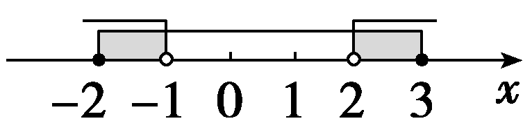
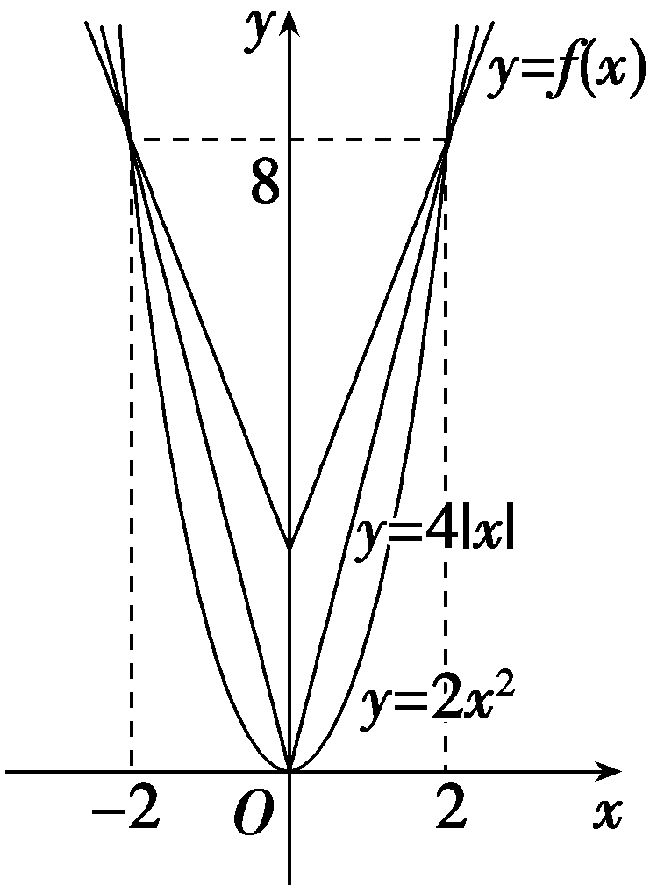

第2课时　一元二次方程、不等式

【课标研读】　1.经历从实际情境中抽象出一元二次不等式的过程，了解一元二次不等式的现实意义；能借助一元二次函数求解一元二次不等式，并能用集合表示一元二次不等式的解集.　2.借助一元二次函数的图象，了解一元二次不等式与相应函数、方程的联系.

##### 1.一元二次不等式

只含有一个未知数，并且未知数的最高次数是2的不等式，称为一元二次不等式.

一元二次不等式的一般形式是<em>ax</em>2＋<em>bx</em>＋<em>c</em>＞0或<em>ax</em>2＋<em>bx</em>＋<em>c</em>＜0，其中<em>a</em>，<em>b</em>，<em>c</em>均为常数，<em>a</em>≠0.

##### 2.三个”二次“间的关系

【常用结论】

（1）分式不等式的解法

① $\frac{f(x)}{g\left(x\right)}$ ＞0(＜0)⇔<te*x*t style="italic">f</text>(x)·*g* $\left(x\right)$ ＞0(＜0).

② $\frac{f(x)}{g\left(x\right)}$ ≥0 $\left(\leq 0\right)$ ⇔ $\left\{\begin{matrix}f(x)\cdot g\left(x\right)\geq 0\left(\leq 0\right)，\\g\left(x\right)\ne 0.\end{matrix}\right.$

（2）绝对值不等式的解法

绝对值不等式｜*x*｜＞*a*(*a*＞0)的解集为(－∞，－*a*)∪(*a*，＋∞)；｜*x*｜＜*a*(*a*＞0)的解集为(－*a*，*a*).

记忆口诀：大于号取两边，小于号取中间.

（3）一元二次不等式恒成立的条件

①&lt;text style="it<em>a</em>li<em>c</em>"&gt;ax&lt;/text&gt;2＋<em>bx</em>＋c＞0(a≠0)恒成立的充要条件是 $\left\{\begin{matrix}a>0，\\b^{2}－4ac<0.\end{matrix}\right.$

②&lt;text style="it<em>a</em>li<em>c</em>"&gt;ax&lt;/text&gt;2＋<em>bx</em>＋c＜0(a≠0)恒成立的充要条件是 $\left\{\begin{matrix}a<0，\\b^{2}－4ac<0.\end{matrix}\right.$

【自主检测】

##### 1.(多选)下列结论正确的是(　　)

$\quad$A.若不等式<em>ax</em>2＋<em>bx</em>＋<em>c</em>＜0的解集为(<em>x</em>1，<em>x</em>2)，则必有<em>a</em>＞0

$\quad$B.若方程<em>ax</em>2＋<em>bx</em>＋<em>c</em>＝0(<em>a</em>≠0)没有实数根，则不等式<em>ax</em>2＋<em>bx</em>＋<em>c</em>＞0的解集为<strong>R</strong>

$\quad$C.不等式<em>ax</em>2＋<em>bx</em>＋<em>c</em>≤0在<strong>R</strong>上恒成立的条件是<em>a</em>＜0且<em>Δ</em>＝<em>b</em>2－4<em>ac</em>≤0

$\quad$D.若二次函数<em>y</em>＝<em>ax</em>2＋<em>bx</em>＋<em>c</em>的图象开口向下，则不等式<em>ax</em>2＋<em>bx</em>＋<em>c</em>＜0的解集一定不是空集

答案AD

##### 2.(链接人教A必修一P53T1)不等式－2<em>x</em>2＋<em>x</em>≤－3的解集为<u>　　　　　　　　</u>.

答案(－∞，－1]∪ $\left[\frac{3}{2}，＋\infty \right)$

解析由－&lt;te&lt;te&lt;te&lt;te&lt;te&lt;te&lt;te<em>x</em>t style="italic"&gt;x&lt;/text&gt;t style="italic"&gt;x&lt;/text&gt;t style="italic"&gt;x&lt;/text&gt;t style="italic"&gt;x&lt;/text&gt;t style="italic"&gt;x&lt;/text&gt;t style="italic"&gt;x&lt;/text&gt;t style="superscript"&gt;2&lt;/text&gt;<em>x</em>2＋x≤－3可得2x2－x－3≥0，即(2x－3)(x＋1)≥0，得x≤－1或x≥ $\frac{3}{2}$ ，故不等式的解集为(－∞，－1]∪ $\left[\frac{3}{2}，＋\infty \right)$ .

##### 3.不等式 $\frac{x－3}{x－2}$ ＜0的解集为<u>　　　　　　 　</u>.

答案(2，3)

解析 $\frac{x－3}{x－2}$ ＜0等价于(<te<te*x*t style="italic">x</text>t style="italic">x</text>－3)(x－2)＜0，解得2＜x＜3.故不等式的解集为(2，3).

##### 4.(易错题)(链接人教A必修一P58T6)若不等式&lt;te<em>x</em>t style="superscript"&gt;2&lt;/text&gt;<em>&lt;text style="italic"&gt;&lt;text style="italic"&gt;k</em>x&lt;/text&gt;&lt;/text&gt;2＋kx－ $\frac{3}{8}$ ＜0对一切实数<em>x</em>都成立，则实数<em>k</em>的取值范围为<u>　　　　　</u>.

答案(－3，0]

解析当*<text style="italic"><text style="italic"><text style="italic"><text style="italic">k*</text></text></text></text>＝0时，满足题意；当k≠0时， $\left\{\begin{matrix}k<0，\\\Delta ＝k^{2}－4\times 2k\times \left(－\frac{3}{8}\right)<0，\end{matrix}\right.$ 解得－3＜*<text style="italic"><text style="italic"><text style="italic"><text style="italic">k*</text></text></text></text>＜0，所以－3＜k≤0，即实数k的取值范围为(－3，0].

考点一　三个“二次”的关系　　　　自主练透

##### 1.若关于&lt;text style="it<em>a</em>lic"&gt;x&lt;/text&gt;的不等式<em>ax</em>2＋<em>&lt;text style="italic"&gt;b</em>x&lt;/text&gt;＋2＞0的解集为 $\left\{x\left|－\frac{1}{2}\right.＜x＜\frac{1}{3}\right\}$ ，则<em>a</em>＋<em>b</em>＝(　　 )

$\quad$A.14	
$\quad$B.－14

$\quad$C.10	
$\quad$D.－10

答案B

解析依题意知 $\left\{\begin{matrix}－\frac{b}{a}＝－\frac{1}{2}＋\frac{1}{3}，\\\frac{2}{a}＝\left(－\frac{1}{2}\right)\times \frac{1}{3}，\end{matrix}\right.$ 解得 $\left\{\begin{matrix}a＝－12，\\b＝－2，\end{matrix}\right.$ 故*a*＋*b*＝－14.故选B.

##### 2.(多选)已知关于<em>x</em>的一元二次不等式<em>ax</em>2＋<em>bx</em>＋<em>c</em>≥0的解集为{<em>x</em>｜<em>x</em>≤－4，或<em>x</em>≥5}，则下列说法正确的是(　　)

$\quad$A.*a*＞0

$\quad$B.不等式*bx*＋*c*＞0的解集为{*x*｜*x*＜－5}

$\quad$C.不等式&lt;text style="it<em>a</em>lic"&gt;cx&lt;/text&gt;2－<em>bx</em>＋a＜0的解集为 $\left\{x\left|x＜－\frac{1}{5}，或x＞\frac{1}{4}\right.\right\}$

$\quad$D.*a*＋*b*＋*c*＞0

答案AC

解析由题意得，二次函数&lt;te&lt;te&lt;te&lt;te&lt;te&lt;te&lt;te&lt;te&lt;te&lt;te&lt;text style="it&lt;text style="itali<em>c</em>"&gt;a&lt;/text&gt;lic"&gt;x&lt;/text&gt;t style="italic"&gt;x&lt;/text&gt;t style="italic"&gt;x&lt;/text&gt;t style="italic"&gt;x&lt;/text&gt;t style="italic"&gt;x&lt;/text&gt;t style="italic"&gt;x&lt;/text&gt;t style="italic"&gt;x&lt;/text&gt;t style="italic"&gt;x&lt;/text&gt;t style="italic"&gt;x&lt;/text&gt;t style="it&lt;text style="it<em>a</em>lic"&gt;a&lt;/text&gt;lic"&gt;x&lt;/text&gt;t style="it&lt;text style="it<em>a</em>li&lt;text style="itali<em>c</em>"&gt;c&lt;/text&gt;"&gt;a&lt;/text&gt;li<em>c</em>"&gt;y&lt;/text&gt;＝<em>&lt;text style="italic"&gt;&lt;text style="italic"&gt;&lt;text style="italic"&gt;&lt;text style="italic"&gt;ax</em>&lt;/text&gt;&lt;/text&gt;&lt;/text&gt;&lt;/text&gt;&lt;text style="superscript"&gt;&lt;text style="superscript"&gt;&lt;text style="superscript"&gt;&lt;text style="superscript"&gt;2&lt;/text&gt;&lt;/text&gt;&lt;/text&gt;&lt;/text&gt;＋<em>&lt;text style="italic"&gt;&lt;text style="italic"&gt;&lt;text style="italic"&gt;&lt;text style="italic"&gt;b</em>x&lt;/text&gt;&lt;/text&gt;&lt;/text&gt;&lt;/text&gt;＋c的开口向上，即a＞0，故A正确；因为－4，5是方程ax2＋bx＋c＝0的根，所以 $\left\{\begin{matrix}－\frac{b}{a}＝－4+5，\\\frac{c}{a}＝－4\times 5，\end{matrix}\right.$ 解得 $\left\{\begin{matrix}b＝－a，\\c＝－20a，\end{matrix}\right.$ 所以 &lt;te&lt;te&lt;te&lt;te&lt;te&lt;te&lt;te&lt;te&lt;te&lt;te&lt;text style="it&lt;text style="itali<em>c</em>"&gt;a&lt;/text&gt;lic"&gt;x&lt;/text&gt;t style="italic"&gt;x&lt;/text&gt;t style="italic"&gt;x&lt;/text&gt;t style="italic"&gt;x&lt;/text&gt;t style="italic"&gt;x&lt;/text&gt;t style="italic"&gt;x&lt;/text&gt;t style="italic"&gt;x&lt;/text&gt;t style="italic"&gt;x&lt;/text&gt;t style="italic"&gt;x&lt;/text&gt;t style="it&lt;text style="it<em>a</em>lic"&gt;a&lt;/text&gt;lic"&gt;x&lt;/text&gt;t style="it&lt;text style="it<em>a</em>li&lt;text style="itali<em>c</em>"&gt;c&lt;/text&gt;"&gt;a&lt;/text&gt;li<em>c</em>"&gt;<em>&lt;text style="italic"&gt;&lt;text style="italic"&gt;&lt;text style="italic"&gt;b</em>x&lt;/text&gt;&lt;/text&gt;&lt;/text&gt;&lt;/text&gt;＋c＞0，即－<em>&lt;text style="italic"&gt;&lt;text style="italic"&gt;&lt;text style="italic"&gt;&lt;text style="italic"&gt;ax</em>&lt;/text&gt;&lt;/text&gt;&lt;/text&gt;&lt;/text&gt;－&lt;text style="superscript"&gt;&lt;text style="superscript"&gt;&lt;text style="superscript"&gt;&lt;text style="superscript"&gt;2&lt;/text&gt;&lt;/text&gt;&lt;/text&gt;&lt;/text&gt;0a＞0，解得x＜－20，故B错误；不等式<em>cx</em>2－bx＋a＜0等价于－20ax2＋ax＋a＜0，即20x2－x－1＞0，即(5x＋1)(4x－1)＞0，解得x＜－ $\frac{1}{5}$ 或&lt;te&lt;te&lt;te&lt;te&lt;te&lt;te&lt;te&lt;te&lt;te&lt;text style="it&lt;text style="itali<em>c</em>"&gt;a&lt;/text&gt;lic"&gt;x&lt;/text&gt;t style="italic"&gt;x&lt;/text&gt;t style="italic"&gt;x&lt;/text&gt;t style="italic"&gt;x&lt;/text&gt;t style="italic"&gt;x&lt;/text&gt;t style="italic"&gt;x&lt;/text&gt;t style="italic"&gt;x&lt;/text&gt;t style="italic"&gt;x&lt;/text&gt;t style="italic"&gt;x&lt;/text&gt;t style="it&lt;text style="it<em>a</em>lic"&gt;a&lt;/text&gt;lic"&gt;x&lt;/text&gt;＞ $\frac{1}{4}$ ，故C正确；因为1∉{&lt;te&lt;te&lt;te&lt;te&lt;te&lt;te&lt;te&lt;te&lt;te&lt;text style="it&lt;text style="itali<em>c</em>"&gt;a&lt;/text&gt;lic"&gt;x&lt;/text&gt;t style="italic"&gt;x&lt;/text&gt;t style="italic"&gt;x&lt;/text&gt;t style="italic"&gt;x&lt;/text&gt;t style="italic"&gt;x&lt;/text&gt;t style="italic"&gt;x&lt;/text&gt;t style="italic"&gt;x&lt;/text&gt;t style="italic"&gt;x&lt;/text&gt;t style="italic"&gt;x&lt;/text&gt;t style="it&lt;text style="it<em>a</em>lic"&gt;a&lt;/text&gt;lic"&gt;x&lt;/text&gt;｜x≤－4，或x≥5}，所以&lt;text style="it<em>a</em>li&lt;text style="itali<em>c</em>"&gt;c&lt;/text&gt;"&gt;a&lt;/text&gt;＋<em>b</em>＋<em>c</em>＜0，故D错误.故选AC.

##### 3.若关于<em>x</em>的不等式<em>x</em>2－2<em>ax</em>－8<em>a</em>2＜0(<em>a</em>＞0)的解集为{<em>x</em>｜<em>x</em>1＜<em>x</em>＜<em>x</em>2}，且<em>x</em>2－<em>x</em>1＝15，则<em>a</em>的值为<u>　　　　</u>.

答案 $\frac{5}{2}$

解析由题知&lt;te&lt;te&lt;te&lt;te&lt;te&lt;te&lt;te&lt;te&lt;te&lt;te&lt;te&lt;te&lt;text style="it&lt;text style="it&lt;text style="it&lt;text style="it&lt;text style="it<em>a</em>lic"&gt;a&lt;/text&gt;lic"&gt;a&lt;/text&gt;lic"&gt;a&lt;/text&gt;lic"&gt;a&lt;/text&gt;lic"&gt;x&lt;/text&gt;t style="italic"&gt;x&lt;/text&gt;t style="italic"&gt;x&lt;/text&gt;t style="italic"&gt;x&lt;/text&gt;t style="italic"&gt;x&lt;/text&gt;t style="italic"&gt;x&lt;/text&gt;t style="it<em>a</em>lic"&gt;x&lt;/text&gt;t style="italic"&gt;x&lt;/text&gt;t style="it<em>a</em>lic"&gt;x&lt;/text&gt;t style="italic"&gt;x&lt;/text&gt;t style="it&lt;text style="it&lt;text style="it&lt;text style="it&lt;text style="it<em>a</em>lic"&gt;a&lt;/text&gt;lic"&gt;a&lt;/text&gt;lic"&gt;a&lt;/text&gt;lic"&gt;a&lt;/text&gt;lic"&gt;x&lt;/text&gt;t style="italic"&gt;x&lt;/text&gt;t style="italic"&gt;x&lt;/text&gt;&lt;text style="subscript"&gt;&lt;text style="subscript"&gt;&lt;text style="subscript"&gt;&lt;text style="subscript"&gt;&lt;text style="subscript"&gt;1&lt;/text&gt;&lt;/text&gt;&lt;/text&gt;&lt;/text&gt;&lt;/text&gt;，x&lt;text style="superscript"&gt;&lt;text style="superscript"&gt;&lt;text style="superscript"&gt;&lt;text style="superscript"&gt;&lt;text style="superscript"&gt;&lt;text style="subscript"&gt;&lt;text style="subscript"&gt;&lt;text style="superscript"&gt;&lt;text style="subscript"&gt;&lt;text style="superscript"&gt;&lt;text style="subscript"&gt;&lt;text style="superscript"&gt;&lt;text style="subscript"&gt;&lt;text style="superscript"&gt;&lt;text style="superscript"&gt;&lt;text style="superscript"&gt;2&lt;/text&gt;&lt;/text&gt;&lt;/text&gt;&lt;/text&gt;&lt;/text&gt;&lt;/text&gt;&lt;/text&gt;&lt;/text&gt;&lt;/text&gt;&lt;/text&gt;&lt;/text&gt;&lt;/text&gt;&lt;/text&gt;&lt;/text&gt;&lt;/text&gt;&lt;/text&gt;是一元二次方程x2－2<em>ax</em>－8a2＝0(a＞0)的实数根，所以<em>Δ</em>＝4a2＋32a2＝36a2＞0，且x1＋x2＝2a，x1x2＝－8a2.又因为x2－x1＝15，所以152＝(x1＋x2)2－4x1x2＝4a2＋32a2＝36a2，又a＞0，解得a $＝\frac{5}{2}$ .

##### 1.一元二次方程的根就是相应一元二次函数的零点，也是相应一元二次不等式解集的端点值.

##### 2.给出一元二次不等式的解集，相当于知道了相应一元二次函数图象的开口方向及与*x*轴的交点，可以利用代入根或根与系数的关系求待定系数.

考点二　一元二次不等式的解法　　　　多维探究

角度1　不含参数的一元二次不等式

解下列不等式：

（1）－3<em>x</em>2－2<em>x</em>＋8≥0；

（2）0＜<em>x</em>2－<em>x</em>－2≤4.

解：（1）原不等式可化为3<em>x</em>2＋2<em>x</em>－8≤0，

即(3<te<te*x*t style="italic">x</text>t style="italic">x</text>－4)(x＋2)≤0，解得－2≤x≤ $\frac{4}{3}$ ，

所以原不等式的解集为 $\left\{x|-2\leq x\leq \frac{4}{3}\right\}$ .

（2）原不等式等价于 $\left\{\begin{matrix}x^{2}－x－2>0，\\x^{2}－x－2\leq 4\end{matrix}\right.$ ⇔ $\left\{\begin{matrix}x^{2}－x－2>0，\\x^{2}－x－6\leq 0\end{matrix}\right.$ ⇔ $\left\{\begin{matrix}\left(x－2\right)\left(x+1\right)>0，\\\left(x－3\right)\left(x+2\right)\leq 0\end{matrix}\right.$ ⇔ $\left\{\begin{matrix}x>2或x＜－1，\\－2\leq x\leq 3.\end{matrix}\right.$ 借助于数轴，如图所示，

所以原不等式的解集为{*x*｜－2≤*x*＜－1，或2＜*x*≤3}.

角度2　含参数的一元二次不等式

解关于<em>x</em>的不等式<em>ax</em>2－(<em>a</em>＋1)<em>x</em>＋1＜0(<em>a</em>＞0).

解：原不等式可化为(*ax*－1)(*x*－1)＜0.

因为<te<te*x*t style="it*a*lic">x</text>t style="it*a*lic">a</text>＞0，所以a $\left(x－\frac{1}{a}\right)$ (<te*x*t style="it*a*lic">x</text>－1)＜0，所以当<text style="it*a*lic">a</text>＞1时，解得 $\frac{1}{a}$ ＜<te*x*t style="it*a*lic">x</text>＜1；

当*a*＝1时，不等式无解；

当0＜<te*x*t style="italic">a</text>＜1时，解得1＜x＜ $\frac{1}{a}$ .

综上，当0＜*a*＜1时，不等式的解集为 $\left\{x\left|1<x＜\frac{1}{a}\right\}\right.$ ；

当*a*＝1时，不等式的解集为⌀；

当*a*＞1时，不等式的解集为 $\left\{x\left|\frac{1}{a}＜x<1\right.\right\}$ .

##### 1.形如<te*x*t style="italic">a</text>≤*f*(x)≤*b*的不等式等价于 $\left\{\begin{matrix}f(x)\geq a，\\f(x)\leq b.\end{matrix}\right.$

##### 2.对含参的不等式的参数进行分类讨论的常见分类有：

（1）根据二次项系数为正、负及零进行分类.

（2）根据判别式*Δ*与0的关系判断根的个数.

（3）有两个根时，有时还需根据两根的大小进行讨论.

对点练1.解下列关于*x*的不等式：

（1）*x*－3 $\sqrt{x}$ ＞－2；

（2） $\frac{1}{x+1}$ ＞1；

（3）<em>x</em>2－(<em>a</em>2＋<em>a</em>)<em>x</em>＋<em>a</em>3＜0(<em>a</em>＞0)；

（4）<em>x</em>2－<em>ax</em>＋1≤0.

解：（1）由不等式<te*x*t style="italic">x</text>－3 $\sqrt{x}$ ＞－2，可得 $\sqrt{x}$ ＞2或 $\sqrt{x}$ ＜1.由 $\sqrt{x}$ ＞2，得<te*x*t style="italic">x</text>＞4；

由 $\sqrt{x}$ ＜1，得<te<te*x*t style="italic">x</text>t style="italic">x</text>＜1且x≥0，即0≤x＜1.

所以不等式的解集为{*x*｜*x*＞4，或0≤*x*＜1}.

（2） $\frac{1}{x+1}$ ＞1⇒ $\frac{1}{x+1}$ －1＞0⇒ $\frac{－x}{x+1}$ ＞0⇒ $\frac{x}{x+1}$ ＜0⇒－1＜*x*＜0，

故不等式的解集为(－1，0).

（3）原不等式可化为(<em>x</em>－<em>a</em>)(<em>x</em>－<em>a</em>2)＜0，

当<em>a</em>2＞<em>a</em>，即<em>a</em>＞1时，不等式的解集为{<em>x</em>｜<em>a</em>＜<em>x</em>＜<em>a</em>2}；

当<em>a</em>2＜<em>a</em>，即0＜<em>a</em>＜1时，不等式的解集为{<em>x</em>｜<em>a</em>2＜<em>x</em>＜<em>a</em>}；

当<em>a</em>2＝<em>a</em>，即<em>a</em>＝1时，不等式的解集为⌀.

（4）由题意知，<em>Δ</em>＝<em>a</em>2－4，

①当<em>a</em>2－4＞0，即<em>a</em>＞2或<em>a</em>＜－2时，

方程&lt;te<em>x</em>t style="italic"&gt;x&lt;/text&gt;2－<em>ax</em>＋1＝0的两根为x $＝\frac{a\pm \sqrt{a^{2}－4}}{2}$ ，

所以解集为 $\left\{x\left|\frac{a－\sqrt{a^{2}－4}}{2}\right.\leq x\leq \frac{a＋\sqrt{a^{2}－4}}{2}\right\}$ .

②若<em>Δ</em>＝<em>a</em>2－4＝0，则<em>a</em>＝±2.

当<em>a</em>＝2时，原不等式可化为<em>x</em>2－2<em>x</em>＋1≤0，

即(<em>x</em>－1)2≤0，所以<em>x</em>＝1；

当<em>a</em>＝－2时，原不等式可化为<em>x</em>2＋2<em>x</em>＋1≤0，

即(<em>x</em>＋1)2≤0，

所以*x*＝－1.

③当<em>Δ</em>＝<em>a</em>2－4＜0，即－2＜<em>a</em>＜2时，

原不等式的解集为⌀.

综上，当<text style="it*a*lic">a</text>＞2或a＜－2时，原不等式的解集为 $\left\{x\left|\frac{a－\sqrt{a^{2}－4}}{2}\right.\leq x\leq \frac{a＋\sqrt{a^{2}－4}}{2}\right\}$ ；

当*a*＝2时，原不等式的解集为{1}；

当*a*＝－2时，原不等式的解集为{－1}；

当－2＜*a*＜2时，原不等式的解集为⌀.

考点三　一元二次不等式恒成立问题　　　　多维探究

角度1　在R上的恒成立问题

已知关于<em>x</em>的不等式<em>kx</em>2－6<em>kx</em>＋<em>k</em>＋8≥0对任意<em>x</em>∈<strong>R</strong>恒成立，则实数<em>k</em>的取值范围是(　　)

$\quad$A.[0，1]

$\quad$B.(0，1]

$\quad$C.(－∞，0)∪(1，＋∞)

$\quad$D.(－∞，0]∪[1，＋∞)

答案A

解析当&lt;te<em>x</em>t style="italic"&gt;<em>&lt;text style="italic"&gt;&lt;text style="italic"&gt;&lt;text style="italic"&gt;k</em>&lt;/text&gt;&lt;/text&gt;&lt;/text&gt;&lt;/text&gt;＝0时，8＞0恒成立，符合题意；当k≠0时，要使<em>&lt;text style="italic"&gt;kx</em>&lt;/text&gt;2－6kx＋k＋8≥0对任意x∈<strong>R</strong>恒成立，只需 $\left\{\begin{matrix}k>0，\\\Delta =36k^{2}－4k\left(k+8\right)\leq 0，\end{matrix}\right.$ 解得0＜&lt;te<em>x</em>t style="italic"&gt;<em>&lt;text style="italic"&gt;&lt;text style="italic"&gt;&lt;text style="italic"&gt;k</em>&lt;/text&gt;&lt;/text&gt;&lt;/text&gt;&lt;/text&gt;≤1.综上实数k的取值范围是[0，1].故选A.

角度2　在给定区间上的恒成立问题

（1）(2025·八省适应性测试)已知函数<em>f</em>(<em>x</em>)＝<em>x</em>｜<em>x</em>－<em>a</em>｜－2<em>a</em>2，若当<em>x</em>＞2时，<em>f</em>(<em>x</em>)＞0，则实数<em>a</em>的取值范围是(　　)

$\quad$A.(－∞，1]	
$\quad$B.[－2，1]

$\quad$C.[－1，2]	
$\quad$D.[－1，＋∞)

（2）(一题多解)已知函数<em>f</em>(<em>x</em>)＝<em>mx</em>2－<em>mx</em>－1.若对于<em>x</em>∈[1，3]，<em>f</em>(<em>x</em>)＜5－<em>m</em>恒成立，则实数<em>m</em>的取值范围为<u>　　　　</u>.

答案（1）B　（2） $\left(－\infty ，\frac{6}{7}\right)$

解析（1）当&lt;te&lt;te&lt;te&lt;te&lt;te&lt;te&lt;te&lt;te&lt;te&lt;te&lt;te&lt;te&lt;te&lt;te&lt;te&lt;te&lt;te&lt;te&lt;te&lt;te&lt;te&lt;te&lt;te&lt;te&lt;te&lt;text style="it&lt;text style="it&lt;text style="it<em>a</em>lic"&gt;a&lt;/text&gt;lic"&gt;a&lt;/text&gt;lic"&gt;x&lt;/text&gt;t style="italic"&gt;x&lt;/text&gt;t style="it<em>a</em>lic"&gt;x&lt;/text&gt;t style="it<em>a</em>lic"&gt;x&lt;/text&gt;t style="it<em>a</em>lic"&gt;x&lt;/text&gt;t style="italic"&gt;x&lt;/text&gt;t style="italic"&gt;x&lt;/text&gt;t style="it<em>a</em>lic"&gt;x&lt;/text&gt;t style="italic"&gt;x&lt;/text&gt;t style="italic"&gt;x&lt;/text&gt;t style="it&lt;text style="it&lt;text style="it<em>a</em>lic"&gt;a&lt;/text&gt;lic"&gt;a&lt;/text&gt;lic"&gt;x&lt;/text&gt;t style="italic"&gt;x&lt;/text&gt;t style="it<em>a</em>lic"&gt;x&lt;/text&gt;t style="it<em>a</em>lic"&gt;x&lt;/text&gt;t style="it<em>a</em>lic"&gt;x&lt;/text&gt;t style="italic"&gt;x&lt;/text&gt;t style="italic"&gt;x&lt;/text&gt;t style="it&lt;text style="it<em>a</em>lic"&gt;a&lt;/text&gt;lic"&gt;x&lt;/text&gt;t style="italic"&gt;x&lt;/text&gt;t style="it&lt;text style="it&lt;text style="it&lt;text style="it<em>a</em>lic"&gt;a&lt;/text&gt;lic"&gt;a&lt;/text&gt;lic"&gt;a&lt;/text&gt;lic"&gt;x&lt;/text&gt;t style="it<em>a</em>lic"&gt;x&lt;/text&gt;t style="it&lt;text style="it<em>a</em>lic"&gt;a&lt;/text&gt;lic"&gt;x&lt;/text&gt;t style="italic"&gt;x&lt;/text&gt;t style="italic"&gt;x&lt;/text&gt;t style="italic"&gt;x&lt;/text&gt;t style="italic"&gt;a&lt;/text&gt;＞&lt;text style="superscript"&gt;&lt;text style="superscript"&gt;&lt;text style="superscript"&gt;&lt;text style="superscript"&gt;&lt;text style="superscript"&gt;&lt;text style="superscript"&gt;&lt;text style="superscript"&gt;&lt;text style="superscript"&gt;&lt;text style="superscript"&gt;&lt;text style="superscript"&gt;&lt;text style="superscript"&gt;&lt;text style="superscript"&gt;2&lt;/text&gt;&lt;/text&gt;&lt;/text&gt;&lt;/text&gt;&lt;/text&gt;&lt;/text&gt;&lt;/text&gt;&lt;/text&gt;&lt;/text&gt;&lt;/text&gt;&lt;/text&gt;&lt;/text&gt;，x＞2时，<em>&lt;text style="italic"&gt;&lt;text style="italic"&gt;&lt;text style="italic"&gt;&lt;text style="italic"&gt;&lt;text style="italic"&gt;&lt;text style="italic"&gt;&lt;text style="italic"&gt;&lt;text style="italic"&gt;f</em>&lt;/text&gt;&lt;/text&gt;&lt;/text&gt;&lt;/text&gt;&lt;/text&gt;&lt;/text&gt;&lt;/text&gt;&lt;/text&gt;(x)＝x｜x－a｜－2a2 $＝\left\{\begin{matrix}x^{2}－ax－2a^{2}，x\geq a，\\－x^{2}＋ax－2a^{2}，2<x＜a.\end{matrix}\right.$ 当&lt;te&lt;te&lt;te&lt;te&lt;te&lt;te&lt;te&lt;te&lt;te&lt;te&lt;te&lt;te&lt;te&lt;te&lt;te&lt;te&lt;te&lt;te&lt;te&lt;te&lt;te&lt;text style="it&lt;text style="it&lt;text style="it<em>a</em>lic"&gt;a&lt;/text&gt;lic"&gt;a&lt;/text&gt;lic"&gt;x&lt;/text&gt;t style="italic"&gt;x&lt;/text&gt;t style="it<em>a</em>lic"&gt;x&lt;/text&gt;t style="it<em>a</em>lic"&gt;x&lt;/text&gt;t style="it<em>a</em>lic"&gt;x&lt;/text&gt;t style="italic"&gt;x&lt;/text&gt;t style="italic"&gt;x&lt;/text&gt;t style="it<em>a</em>lic"&gt;x&lt;/text&gt;t style="italic"&gt;x&lt;/text&gt;t style="italic"&gt;x&lt;/text&gt;t style="it&lt;text style="it&lt;text style="it<em>a</em>lic"&gt;a&lt;/text&gt;lic"&gt;a&lt;/text&gt;lic"&gt;x&lt;/text&gt;t style="italic"&gt;x&lt;/text&gt;t style="it<em>a</em>lic"&gt;x&lt;/text&gt;t style="it<em>a</em>lic"&gt;x&lt;/text&gt;t style="it<em>a</em>lic"&gt;x&lt;/text&gt;t style="italic"&gt;x&lt;/text&gt;t style="italic"&gt;x&lt;/text&gt;t style="it&lt;text style="it<em>a</em>lic"&gt;a&lt;/text&gt;lic"&gt;x&lt;/text&gt;t style="italic"&gt;x&lt;/text&gt;t style="it&lt;text style="it&lt;text style="it&lt;text style="it<em>a</em>lic"&gt;a&lt;/text&gt;lic"&gt;a&lt;/text&gt;lic"&gt;a&lt;/text&gt;lic"&gt;x&lt;/text&gt;t style="it<em>a</em>lic"&gt;x&lt;/text&gt;t style="superscript"&gt;&lt;text style="superscript"&gt;&lt;text style="superscript"&gt;&lt;text style="superscript"&gt;&lt;text style="superscript"&gt;&lt;text style="superscript"&gt;&lt;text style="superscript"&gt;&lt;text style="superscript"&gt;&lt;text style="superscript"&gt;&lt;text style="superscript"&gt;&lt;text style="superscript"&gt;&lt;text style="superscript"&gt;2&lt;/text&gt;&lt;/text&gt;&lt;/text&gt;&lt;/text&gt;&lt;/text&gt;&lt;/text&gt;&lt;/text&gt;&lt;/text&gt;&lt;/text&gt;&lt;/text&gt;&lt;/text&gt;&lt;/text&gt;＜&lt;te&lt;te&lt;te&lt;text style="it&lt;text style="it<em>a</em>lic"&gt;a&lt;/text&gt;lic"&gt;x&lt;/text&gt;t style="italic"&gt;x&lt;/text&gt;t style="italic"&gt;x&lt;/text&gt;t style="italic"&gt;x&lt;/text&gt;＜<em>a</em>时，<em>&lt;text style="italic"&gt;&lt;text style="italic"&gt;&lt;text style="italic"&gt;&lt;text style="italic"&gt;&lt;text style="italic"&gt;&lt;text style="italic"&gt;&lt;text style="italic"&gt;&lt;text style="italic"&gt;f</em>&lt;/text&gt;&lt;/text&gt;&lt;/text&gt;&lt;/text&gt;&lt;/text&gt;&lt;/text&gt;&lt;/text&gt;&lt;/text&gt; $\left(x\right)＝$ －&lt;te&lt;te&lt;te&lt;te&lt;te&lt;te&lt;te&lt;te&lt;te&lt;te&lt;te&lt;te&lt;te&lt;te&lt;te&lt;te&lt;te&lt;te&lt;te&lt;te&lt;te&lt;te&lt;te&lt;te&lt;text style="it&lt;text style="it&lt;text style="it<em>a</em>lic"&gt;a&lt;/text&gt;lic"&gt;a&lt;/text&gt;lic"&gt;x&lt;/text&gt;t style="italic"&gt;x&lt;/text&gt;t style="it<em>a</em>lic"&gt;x&lt;/text&gt;t style="it<em>a</em>lic"&gt;x&lt;/text&gt;t style="it<em>a</em>lic"&gt;x&lt;/text&gt;t style="italic"&gt;x&lt;/text&gt;t style="italic"&gt;x&lt;/text&gt;t style="it<em>a</em>lic"&gt;x&lt;/text&gt;t style="italic"&gt;x&lt;/text&gt;t style="italic"&gt;x&lt;/text&gt;t style="it&lt;text style="it&lt;text style="it<em>a</em>lic"&gt;a&lt;/text&gt;lic"&gt;a&lt;/text&gt;lic"&gt;x&lt;/text&gt;t style="italic"&gt;x&lt;/text&gt;t style="it<em>a</em>lic"&gt;x&lt;/text&gt;t style="it<em>a</em>lic"&gt;x&lt;/text&gt;t style="it<em>a</em>lic"&gt;x&lt;/text&gt;t style="italic"&gt;x&lt;/text&gt;t style="italic"&gt;x&lt;/text&gt;t style="it&lt;text style="it<em>a</em>lic"&gt;a&lt;/text&gt;lic"&gt;x&lt;/text&gt;t style="italic"&gt;x&lt;/text&gt;t style="it&lt;text style="it&lt;text style="it&lt;text style="it<em>a</em>lic"&gt;a&lt;/text&gt;lic"&gt;a&lt;/text&gt;lic"&gt;a&lt;/text&gt;lic"&gt;x&lt;/text&gt;t style="it<em>a</em>lic"&gt;x&lt;/text&gt;t style="it&lt;text style="it<em>a</em>lic"&gt;a&lt;/text&gt;lic"&gt;x&lt;/text&gt;t style="italic"&gt;x&lt;/text&gt;t style="italic"&gt;x&lt;/text&gt;t style="italic"&gt;x&lt;/text&gt;&lt;text style="superscript"&gt;&lt;text style="superscript"&gt;&lt;text style="superscript"&gt;&lt;text style="superscript"&gt;&lt;text style="superscript"&gt;&lt;text style="superscript"&gt;&lt;text style="superscript"&gt;&lt;text style="superscript"&gt;&lt;text style="superscript"&gt;&lt;text style="superscript"&gt;&lt;text style="superscript"&gt;&lt;text style="superscript"&gt;2&lt;/text&gt;&lt;/text&gt;&lt;/text&gt;&lt;/text&gt;&lt;/text&gt;&lt;/text&gt;&lt;/text&gt;&lt;/text&gt;&lt;/text&gt;&lt;/text&gt;&lt;/text&gt;&lt;/text&gt;＋<em>a</em>x－2a2，此时<em>Δ</em>＝a2－4×2a2＝－7a2＜0，所以<em>&lt;text style="italic"&gt;&lt;text style="italic"&gt;&lt;text style="italic"&gt;&lt;text style="italic"&gt;&lt;text style="italic"&gt;&lt;text style="italic"&gt;&lt;text style="italic"&gt;&lt;text style="italic"&gt;f</em>&lt;/text&gt;&lt;/text&gt;&lt;/text&gt;&lt;/text&gt;&lt;/text&gt;&lt;/text&gt;&lt;/text&gt;&lt;/text&gt; $\left(x\right)$ ＜0，不满足当&lt;te&lt;te&lt;te&lt;te&lt;te&lt;te&lt;te&lt;te&lt;te&lt;te&lt;te&lt;te&lt;te&lt;te&lt;te&lt;te&lt;te&lt;te&lt;te&lt;te&lt;te&lt;te&lt;te&lt;te&lt;text style="it&lt;text style="it&lt;text style="it<em>a</em>lic"&gt;a&lt;/text&gt;lic"&gt;a&lt;/text&gt;lic"&gt;x&lt;/text&gt;t style="italic"&gt;x&lt;/text&gt;t style="it<em>a</em>lic"&gt;x&lt;/text&gt;t style="it<em>a</em>lic"&gt;x&lt;/text&gt;t style="it<em>a</em>lic"&gt;x&lt;/text&gt;t style="italic"&gt;x&lt;/text&gt;t style="italic"&gt;x&lt;/text&gt;t style="it<em>a</em>lic"&gt;x&lt;/text&gt;t style="italic"&gt;x&lt;/text&gt;t style="italic"&gt;x&lt;/text&gt;t style="it&lt;text style="it&lt;text style="it<em>a</em>lic"&gt;a&lt;/text&gt;lic"&gt;a&lt;/text&gt;lic"&gt;x&lt;/text&gt;t style="italic"&gt;x&lt;/text&gt;t style="it<em>a</em>lic"&gt;x&lt;/text&gt;t style="it<em>a</em>lic"&gt;x&lt;/text&gt;t style="it<em>a</em>lic"&gt;x&lt;/text&gt;t style="italic"&gt;x&lt;/text&gt;t style="italic"&gt;x&lt;/text&gt;t style="it&lt;text style="it<em>a</em>lic"&gt;a&lt;/text&gt;lic"&gt;x&lt;/text&gt;t style="italic"&gt;x&lt;/text&gt;t style="it&lt;text style="it&lt;text style="it&lt;text style="it<em>a</em>lic"&gt;a&lt;/text&gt;lic"&gt;a&lt;/text&gt;lic"&gt;a&lt;/text&gt;lic"&gt;x&lt;/text&gt;t style="it<em>a</em>lic"&gt;x&lt;/text&gt;t style="it&lt;text style="it<em>a</em>lic"&gt;a&lt;/text&gt;lic"&gt;x&lt;/text&gt;t style="italic"&gt;x&lt;/text&gt;t style="italic"&gt;x&lt;/text&gt;t style="italic"&gt;x&lt;/text&gt;＞&lt;text style="superscript"&gt;&lt;text style="superscript"&gt;&lt;text style="superscript"&gt;&lt;text style="superscript"&gt;&lt;text style="superscript"&gt;&lt;text style="superscript"&gt;&lt;text style="superscript"&gt;&lt;text style="superscript"&gt;&lt;text style="superscript"&gt;&lt;text style="superscript"&gt;&lt;text style="superscript"&gt;&lt;text style="superscript"&gt;2&lt;/text&gt;&lt;/text&gt;&lt;/text&gt;&lt;/text&gt;&lt;/text&gt;&lt;/text&gt;&lt;/text&gt;&lt;/text&gt;&lt;/text&gt;&lt;/text&gt;&lt;/text&gt;&lt;/text&gt;时，<em>&lt;text style="italic"&gt;&lt;text style="italic"&gt;&lt;text style="italic"&gt;&lt;text style="italic"&gt;&lt;text style="italic"&gt;&lt;text style="italic"&gt;&lt;text style="italic"&gt;&lt;text style="italic"&gt;f</em>&lt;/text&gt;&lt;/text&gt;&lt;/text&gt;&lt;/text&gt;&lt;/text&gt;&lt;/text&gt;&lt;/text&gt;&lt;/text&gt;(x)＞0，故<em>a</em>＞2不符合题意.当0＜a≤2，x＞2时，f(x)＝x $\left|x－a\right|$ －&lt;te&lt;te&lt;te&lt;te&lt;te&lt;te&lt;te&lt;te&lt;te&lt;te&lt;te&lt;te&lt;te&lt;te&lt;te&lt;te&lt;te&lt;te&lt;te&lt;te&lt;te&lt;text style="it&lt;text style="it&lt;text style="it<em>a</em>lic"&gt;a&lt;/text&gt;lic"&gt;a&lt;/text&gt;lic"&gt;x&lt;/text&gt;t style="italic"&gt;x&lt;/text&gt;t style="it<em>a</em>lic"&gt;x&lt;/text&gt;t style="it<em>a</em>lic"&gt;x&lt;/text&gt;t style="it<em>a</em>lic"&gt;x&lt;/text&gt;t style="italic"&gt;x&lt;/text&gt;t style="italic"&gt;x&lt;/text&gt;t style="it<em>a</em>lic"&gt;x&lt;/text&gt;t style="italic"&gt;x&lt;/text&gt;t style="italic"&gt;x&lt;/text&gt;t style="it&lt;text style="it&lt;text style="it<em>a</em>lic"&gt;a&lt;/text&gt;lic"&gt;a&lt;/text&gt;lic"&gt;x&lt;/text&gt;t style="italic"&gt;x&lt;/text&gt;t style="it<em>a</em>lic"&gt;x&lt;/text&gt;t style="it<em>a</em>lic"&gt;x&lt;/text&gt;t style="it<em>a</em>lic"&gt;x&lt;/text&gt;t style="italic"&gt;x&lt;/text&gt;t style="italic"&gt;x&lt;/text&gt;t style="it&lt;text style="it<em>a</em>lic"&gt;a&lt;/text&gt;lic"&gt;x&lt;/text&gt;t style="italic"&gt;x&lt;/text&gt;t style="it&lt;text style="it&lt;text style="it&lt;text style="it<em>a</em>lic"&gt;a&lt;/text&gt;lic"&gt;a&lt;/text&gt;lic"&gt;a&lt;/text&gt;lic"&gt;x&lt;/text&gt;t style="it<em>a</em>lic"&gt;x&lt;/text&gt;t style="superscript"&gt;&lt;text style="superscript"&gt;&lt;text style="superscript"&gt;&lt;text style="superscript"&gt;&lt;text style="superscript"&gt;&lt;text style="superscript"&gt;&lt;text style="superscript"&gt;&lt;text style="superscript"&gt;&lt;text style="superscript"&gt;&lt;text style="superscript"&gt;&lt;text style="superscript"&gt;&lt;text style="superscript"&gt;2&lt;/text&gt;&lt;/text&gt;&lt;/text&gt;&lt;/text&gt;&lt;/text&gt;&lt;/text&gt;&lt;/text&gt;&lt;/text&gt;&lt;/text&gt;&lt;/text&gt;&lt;/text&gt;&lt;/text&gt;&lt;te&lt;te&lt;te&lt;te&lt;text style="it&lt;text style="it<em>a</em>lic"&gt;a&lt;/text&gt;lic"&gt;x&lt;/text&gt;t style="italic"&gt;x&lt;/text&gt;t style="italic"&gt;x&lt;/text&gt;t style="italic"&gt;x&lt;/text&gt;t style="italic"&gt;a&lt;/text&gt;2＝x2－<em>&lt;text style="italic"&gt;&lt;text style="italic"&gt;ax</em>&lt;/text&gt;&lt;/text&gt;－2a2 $＝\left(x－2a\right)\left(x＋a\right)$ ＞0，解得&lt;te&lt;te&lt;te&lt;te&lt;te&lt;te&lt;te&lt;te&lt;te&lt;te&lt;te&lt;te&lt;te&lt;te&lt;te&lt;te&lt;te&lt;te&lt;te&lt;te&lt;te&lt;te&lt;te&lt;te&lt;text style="it&lt;text style="it&lt;text style="it<em>a</em>lic"&gt;a&lt;/text&gt;lic"&gt;a&lt;/text&gt;lic"&gt;x&lt;/text&gt;t style="italic"&gt;x&lt;/text&gt;t style="it<em>a</em>lic"&gt;x&lt;/text&gt;t style="it<em>a</em>lic"&gt;x&lt;/text&gt;t style="it<em>a</em>lic"&gt;x&lt;/text&gt;t style="italic"&gt;x&lt;/text&gt;t style="italic"&gt;x&lt;/text&gt;t style="it<em>a</em>lic"&gt;x&lt;/text&gt;t style="italic"&gt;x&lt;/text&gt;t style="italic"&gt;x&lt;/text&gt;t style="it&lt;text style="it&lt;text style="it<em>a</em>lic"&gt;a&lt;/text&gt;lic"&gt;a&lt;/text&gt;lic"&gt;x&lt;/text&gt;t style="italic"&gt;x&lt;/text&gt;t style="it<em>a</em>lic"&gt;x&lt;/text&gt;t style="it<em>a</em>lic"&gt;x&lt;/text&gt;t style="it<em>a</em>lic"&gt;x&lt;/text&gt;t style="italic"&gt;x&lt;/text&gt;t style="italic"&gt;x&lt;/text&gt;t style="it&lt;text style="it<em>a</em>lic"&gt;a&lt;/text&gt;lic"&gt;x&lt;/text&gt;t style="italic"&gt;x&lt;/text&gt;t style="it&lt;text style="it&lt;text style="it&lt;text style="it<em>a</em>lic"&gt;a&lt;/text&gt;lic"&gt;a&lt;/text&gt;lic"&gt;a&lt;/text&gt;lic"&gt;x&lt;/text&gt;t style="it<em>a</em>lic"&gt;x&lt;/text&gt;t style="it&lt;text style="it<em>a</em>lic"&gt;a&lt;/text&gt;lic"&gt;x&lt;/text&gt;t style="italic"&gt;x&lt;/text&gt;t style="italic"&gt;x&lt;/text&gt;t style="italic"&gt;x&lt;/text&gt;＞&lt;text style="superscript"&gt;&lt;text style="superscript"&gt;&lt;text style="superscript"&gt;&lt;text style="superscript"&gt;&lt;text style="superscript"&gt;&lt;text style="superscript"&gt;&lt;text style="superscript"&gt;&lt;text style="superscript"&gt;&lt;text style="superscript"&gt;&lt;text style="superscript"&gt;&lt;text style="superscript"&gt;&lt;text style="superscript"&gt;2&lt;/text&gt;&lt;/text&gt;&lt;/text&gt;&lt;/text&gt;&lt;/text&gt;&lt;/text&gt;&lt;/text&gt;&lt;/text&gt;&lt;/text&gt;&lt;/text&gt;&lt;/text&gt;&lt;/text&gt;<em>a</em>，由于x＞2时，<em>&lt;text style="italic"&gt;&lt;text style="italic"&gt;&lt;text style="italic"&gt;&lt;text style="italic"&gt;&lt;text style="italic"&gt;&lt;text style="italic"&gt;&lt;text style="italic"&gt;&lt;text style="italic"&gt;f</em>&lt;/text&gt;&lt;/text&gt;&lt;/text&gt;&lt;/text&gt;&lt;/text&gt;&lt;/text&gt;&lt;/text&gt;&lt;/text&gt;(x)＞0，故2a≤2，解得0＜a≤1.当a＝0，x＞2时，f(x)＝x2＞0恒成立，符合题意.当a＜0，x＞2时，f(x)＝x $\left|x－a\right|$ －&lt;te&lt;te&lt;te&lt;te&lt;te&lt;te&lt;te&lt;te&lt;te&lt;te&lt;te&lt;te&lt;te&lt;te&lt;te&lt;te&lt;te&lt;te&lt;te&lt;te&lt;te&lt;text style="it&lt;text style="it&lt;text style="it<em>a</em>lic"&gt;a&lt;/text&gt;lic"&gt;a&lt;/text&gt;lic"&gt;x&lt;/text&gt;t style="italic"&gt;x&lt;/text&gt;t style="it<em>a</em>lic"&gt;x&lt;/text&gt;t style="it<em>a</em>lic"&gt;x&lt;/text&gt;t style="it<em>a</em>lic"&gt;x&lt;/text&gt;t style="italic"&gt;x&lt;/text&gt;t style="italic"&gt;x&lt;/text&gt;t style="it<em>a</em>lic"&gt;x&lt;/text&gt;t style="italic"&gt;x&lt;/text&gt;t style="italic"&gt;x&lt;/text&gt;t style="it&lt;text style="it&lt;text style="it<em>a</em>lic"&gt;a&lt;/text&gt;lic"&gt;a&lt;/text&gt;lic"&gt;x&lt;/text&gt;t style="italic"&gt;x&lt;/text&gt;t style="it<em>a</em>lic"&gt;x&lt;/text&gt;t style="it<em>a</em>lic"&gt;x&lt;/text&gt;t style="it<em>a</em>lic"&gt;x&lt;/text&gt;t style="italic"&gt;x&lt;/text&gt;t style="italic"&gt;x&lt;/text&gt;t style="it&lt;text style="it<em>a</em>lic"&gt;a&lt;/text&gt;lic"&gt;x&lt;/text&gt;t style="italic"&gt;x&lt;/text&gt;t style="it&lt;text style="it&lt;text style="it&lt;text style="it<em>a</em>lic"&gt;a&lt;/text&gt;lic"&gt;a&lt;/text&gt;lic"&gt;a&lt;/text&gt;lic"&gt;x&lt;/text&gt;t style="it<em>a</em>lic"&gt;x&lt;/text&gt;t style="superscript"&gt;&lt;text style="superscript"&gt;&lt;text style="superscript"&gt;&lt;text style="superscript"&gt;&lt;text style="superscript"&gt;&lt;text style="superscript"&gt;&lt;text style="superscript"&gt;&lt;text style="superscript"&gt;&lt;text style="superscript"&gt;&lt;text style="superscript"&gt;&lt;text style="superscript"&gt;&lt;text style="superscript"&gt;2&lt;/text&gt;&lt;/text&gt;&lt;/text&gt;&lt;/text&gt;&lt;/text&gt;&lt;/text&gt;&lt;/text&gt;&lt;/text&gt;&lt;/text&gt;&lt;/text&gt;&lt;/text&gt;&lt;/text&gt;&lt;te&lt;te&lt;te&lt;te&lt;text style="it&lt;text style="it<em>a</em>lic"&gt;a&lt;/text&gt;lic"&gt;x&lt;/text&gt;t style="italic"&gt;x&lt;/text&gt;t style="italic"&gt;x&lt;/text&gt;t style="italic"&gt;x&lt;/text&gt;t style="italic"&gt;a&lt;/text&gt;2＝x2－<em>&lt;text style="italic"&gt;&lt;text style="italic"&gt;ax</em>&lt;/text&gt;&lt;/text&gt;－2a2 $＝\left(x－2a\right)\left(x＋a\right)$ ＞0，解得&lt;te&lt;te&lt;te&lt;te&lt;te&lt;te&lt;te&lt;te&lt;te&lt;te&lt;te&lt;te&lt;te&lt;te&lt;te&lt;te&lt;te&lt;te&lt;te&lt;te&lt;te&lt;te&lt;te&lt;te&lt;text style="it&lt;text style="it&lt;text style="it<em>a</em>lic"&gt;a&lt;/text&gt;lic"&gt;a&lt;/text&gt;lic"&gt;x&lt;/text&gt;t style="italic"&gt;x&lt;/text&gt;t style="it<em>a</em>lic"&gt;x&lt;/text&gt;t style="it<em>a</em>lic"&gt;x&lt;/text&gt;t style="it<em>a</em>lic"&gt;x&lt;/text&gt;t style="italic"&gt;x&lt;/text&gt;t style="italic"&gt;x&lt;/text&gt;t style="it<em>a</em>lic"&gt;x&lt;/text&gt;t style="italic"&gt;x&lt;/text&gt;t style="italic"&gt;x&lt;/text&gt;t style="it&lt;text style="it&lt;text style="it<em>a</em>lic"&gt;a&lt;/text&gt;lic"&gt;a&lt;/text&gt;lic"&gt;x&lt;/text&gt;t style="italic"&gt;x&lt;/text&gt;t style="it<em>a</em>lic"&gt;x&lt;/text&gt;t style="it<em>a</em>lic"&gt;x&lt;/text&gt;t style="it<em>a</em>lic"&gt;x&lt;/text&gt;t style="italic"&gt;x&lt;/text&gt;t style="italic"&gt;x&lt;/text&gt;t style="it&lt;text style="it<em>a</em>lic"&gt;a&lt;/text&gt;lic"&gt;x&lt;/text&gt;t style="italic"&gt;x&lt;/text&gt;t style="it&lt;text style="it&lt;text style="it&lt;text style="it<em>a</em>lic"&gt;a&lt;/text&gt;lic"&gt;a&lt;/text&gt;lic"&gt;a&lt;/text&gt;lic"&gt;x&lt;/text&gt;t style="it<em>a</em>lic"&gt;x&lt;/text&gt;t style="it&lt;text style="it<em>a</em>lic"&gt;a&lt;/text&gt;lic"&gt;x&lt;/text&gt;t style="italic"&gt;x&lt;/text&gt;t style="italic"&gt;x&lt;/text&gt;t style="italic"&gt;x&lt;/text&gt;＞－<em>a</em>，由于x＞&lt;text style="superscript"&gt;&lt;text style="superscript"&gt;&lt;text style="superscript"&gt;&lt;text style="superscript"&gt;&lt;text style="superscript"&gt;&lt;text style="superscript"&gt;&lt;text style="superscript"&gt;&lt;text style="superscript"&gt;&lt;text style="superscript"&gt;&lt;text style="superscript"&gt;&lt;text style="superscript"&gt;&lt;text style="superscript"&gt;2&lt;/text&gt;&lt;/text&gt;&lt;/text&gt;&lt;/text&gt;&lt;/text&gt;&lt;/text&gt;&lt;/text&gt;&lt;/text&gt;&lt;/text&gt;&lt;/text&gt;&lt;/text&gt;&lt;/text&gt;时，<em>&lt;text style="italic"&gt;&lt;text style="italic"&gt;&lt;text style="italic"&gt;&lt;text style="italic"&gt;&lt;text style="italic"&gt;&lt;text style="italic"&gt;&lt;text style="italic"&gt;&lt;text style="italic"&gt;f</em>&lt;/text&gt;&lt;/text&gt;&lt;/text&gt;&lt;/text&gt;&lt;/text&gt;&lt;/text&gt;&lt;/text&gt;&lt;/text&gt;(x)＞0，故－a≤2，解得－2≤a＜0.综上－2≤a≤1.故选B.

（2）要使<te<te<te*x*t style="italic">x</text>t style="italic">x</text>t style="italic">f</text>(x)＜5－*<text style="italic"><text style="italic">m*</text></text>在x∈[1，3]上恒成立，即m $\left(x－\frac{1}{2}\right)^{2}$ ＋ $\frac{3}{4}$ <te<te*x*t style="italic">x</text>t style="italic">*<text style="italic">m*</text></text>－6＜0在*x*∈[1，3]上恒成立.

法一：令<te<te<te*x*t style="italic">x</text>t style="italic">x</text>t style="italic">*<text style="italic"><text style="italic"><text style="italic"><text style="italic"><text style="italic">g*</text></text></text></text></text></text> $\left(x\right)＝$ <te<te<te*x*t style="italic">x</text>t style="italic">x</text>t style="italic">*<text style="italic"><text style="italic"><text style="italic"><text style="italic"><text style="italic"><text style="italic"><text style="italic"><text style="italic"><text style="italic"><text style="italic">m*</text></text></text></text></text></text></text></text></text></text></text> $\left(x－\frac{1}{2}\right)^{2}$ ＋ $\frac{3}{4}$ <te<te<te*x*t style="italic">x</text>t style="italic">x</text>t style="italic">*<text style="italic"><text style="italic"><text style="italic"><text style="italic"><text style="italic"><text style="italic"><text style="italic"><text style="italic"><text style="italic"><text style="italic">m*</text></text></text></text></text></text></text></text></text></text></text>－6，x∈[1，3].当m＞0时，*<text style="italic"><text style="italic"><text style="italic"><text style="italic"><text style="italic"><text style="italic">g*</text></text></text></text></text></text>(x)在[1，3]上单调递增，所以g $\left(x\right)_{max}＝$ <te<te<te*x*t style="italic">x</text>t style="italic">x</text>t style="italic">*<text style="italic"><text style="italic"><text style="italic"><text style="italic"><text style="italic">g*</text></text></text></text></text></text>（3），即7*<text style="italic"><text style="italic"><text style="italic"><text style="italic"><text style="italic"><text style="italic"><text style="italic"><text style="italic"><text style="italic"><text style="italic"><text style="italic">m*</text></text></text></text></text></text></text></text></text></text></text>－6＜0，所以m＜ $\frac{6}{7}$ ，所以0＜<te<te<te*x*t style="italic">x</text>t style="italic">x</text>t style="italic">*<text style="italic"><text style="italic"><text style="italic"><text style="italic"><text style="italic"><text style="italic"><text style="italic"><text style="italic"><text style="italic"><text style="italic">m*</text></text></text></text></text></text></text></text></text></text></text>＜ $\frac{6}{7}$ ；当<te<te<te*x*t style="italic">x</text>t style="italic">x</text>t style="italic">*<text style="italic"><text style="italic"><text style="italic"><text style="italic"><text style="italic"><text style="italic"><text style="italic"><text style="italic"><text style="italic"><text style="italic">m*</text></text></text></text></text></text></text></text></text></text></text>＝0时，－6＜0恒成立；当m＜0时，*<text style="italic"><text style="italic"><text style="italic"><text style="italic"><text style="italic"><text style="italic">g*</text></text></text></text></text></text>(x)在[1，3]上单调递减，所以g $\left(x\right)_{max}＝$ <te<te<te*x*t style="italic">x</text>t style="italic">x</text>t style="italic">*<text style="italic"><text style="italic"><text style="italic"><text style="italic"><text style="italic">g*</text></text></text></text></text></text>（1），即*<text style="italic"><text style="italic"><text style="italic"><text style="italic"><text style="italic"><text style="italic"><text style="italic"><text style="italic"><text style="italic"><text style="italic"><text style="italic">m*</text></text></text></text></text></text></text></text></text></text></text>－6＜0，所以m＜6，所以m＜0.综上所述，实数m的取值范围是 $\left(－\infty ，\frac{6}{7}\right)$ .

法二：因为&lt;te<em>x</em>t style="italic"&gt;x&lt;/text&gt;2－x＋1 $＝\left(x－\frac{1}{2}\right)^{2}$ ＋ $\frac{3}{4}$ ＞0，

<em>m</em>(<em>x</em>2－<em>x</em>＋1)－6＜0在<em>x</em>∈[1，3]上恒成立，

所以<te*x*t style="italic">m</text>＜ $\frac{6}{x^{2}－x+1}$ 在*x*∈[1，3]上恒成立.

令<text st*y*le="italic">y</text> $＝\frac{6}{x^{2}－x+1}$ ，因为函数<text st*y*le="italic">y</text> $＝\frac{6}{x^{2}－x+1}＝\frac{6}{\left(x－\frac{1}{2}\right)^{2}＋\frac{3}{4}}$ 在[1，3]上的最小值为 $\frac{6}{7}$ ，

所以只需*m*＜ $\frac{6}{7}$ 即可.

所以实数*m*的取值范围是 $\left(－\infty ，\frac{6}{7}\right)$ .

角度3　在给定参数范围的恒成立问题

若不等式<em>x</em>2＋<em>px</em>＞4<em>x</em>＋<em>p</em>－3，当0≤<em>p</em>≤4时恒成立，则<em>x</em>的取值范围是(　　)

$\quad$A.[－1，3]

$\quad$B.(－∞，－1]

$\quad$C.[3，＋∞)

$\quad$D.(－∞，－1)∪(3，＋∞)

答案D

解析不等式<em>x</em>2＋<em>px</em>＞4<em>x</em>＋<em>p</em>－3可化为(<em>x</em>－1)<em>p</em>＋<em>x</em>2－4<em>x</em>＋3＞0，

由已知可得 $\left[\left(x－1\right)p＋x^{2}－4x+3\right]_{min}$ ＞0(0≤&lt;te&lt;te&lt;te<em>x</em>t style="italic"&gt;x&lt;/text&gt;t style="italic"&gt;x&lt;/text&gt;t style="italic"&gt;<em>&lt;text style="italic"&gt;&lt;text style="italic"&gt;p</em>&lt;/text&gt;&lt;/text&gt;&lt;/text&gt;≤4)，令<em>f</em>(p)＝(x－1)p＋x2－4x＋3(0≤p≤4)，

可得 $\left\{\begin{matrix}f(0)＝x^{2}－4x+3>0，\\f(4)=4\left(x－1\right)＋x^{2}－4x+3>0，\end{matrix}\right.$ 解得<te*x*t style="italic">x</text>＜－1或x＞3.故选D.

恒成立问题求参数范围的解题策略

##### 1.弄清楚自变量、参数，一般情况下，求谁的范围，谁就是参数.

##### 2.一元二次不等式在<strong>R</strong>上恒成立，可用判别式<em>Δ</em>；一元二次不等式在给定区间上恒成立，不能用判别式<em>Δ</em>，一般运用分离参数法求最值或进行分类讨论.

对点练2.(一题多问，一题练透)已知关于<em>x</em>的不等式<em>mx</em>2－2<em>x</em>－<em>m</em>＋1＜0.

（1）是否存在实数<em>m</em>，使不等式对任意<em>x</em>∈<strong>R</strong>恒成立？请说明理由.

（2）若不等式对任意*x*∈[0，1]恒成立，求实数*m*的取值范围.

（3）对于*m*∈[－2，2]，不等式恒成立，求实数*x*的取值范围.

（4）若不等式在[2，3]上有解，求实数*m*的取值范围.

解：（1）当<em>m</em>＝0时，－2<em>x</em>＋1＜0对任意<em>x</em>∈<strong>R</strong>不恒成立，不满足；

当<em>m</em>＜0时，<em>Δ</em>＝4－4<em>m</em>(1－<em>m</em>)＝4<em>m</em>2－4<em>m</em>＋4＜0无解.

故不存在实数<em>m</em>，使得不等式对任意<em>x</em>∈<strong>R</strong>恒成立.

（2）令<em>f</em>(<em>x</em>)＝<em>mx</em>2－2<em>x</em>－<em>m</em>＋1.

当*<text style="italic">m*</text>＞0时， $\left\{\begin{matrix}f(0)＝－m+1<0，\\f(1)＝m－2－m+1<0，\end{matrix}\right.$ 解得*<text style="italic">m*</text>＞1；

当*m*＝0时，－2*x*＋1＜0在[0，1]上不恒成立；

当<te*x*t style="italic">*<text style="italic">m*</text></text>＜0时，因为二次函数图象的对称轴为直线x $＝\frac{1}{m}$ ，抛物线开口向下，所以只需*f*（0）＝－<te*x*t style="italic">*<text style="italic">m*</text></text>＋1＜0，解得m＞1，矛盾.

综上，实数*m*的取值范围为(1，＋∞).

（3）利用主元法，设<em>g</em>(<em>m</em>)＝(<em>x</em>2－1)<em>m</em>－2<em>x</em>＋1，

若当*m*∈[－2，2]时，*g*(*m*)＜0恒成立，

则 $\left\{\begin{matrix}g(2)<0，\\g(-2)<0，\end{matrix}\right.$ 即 $\left\{\begin{matrix}2x^{2}－2x－1<0，\\－2x^{2}－2x+3<0，\end{matrix}\right.$

解得 $\frac{－1+\sqrt{7}}{2}$ ＜*x*＜ $\frac{1+\sqrt{3}}{2}$ ，

所以实数*x*的取值范围为( $\frac{－1+\sqrt{7}}{2}$ ， $\frac{1+\sqrt{3}}{2}$ ).

（4）因为*x*∈[2，3]，不等式可整理为*<text style="italic">m*</text>＜ $\frac{2x－1}{x^{2}－1}$ ，即*<text style="italic">m*</text>＜( $\frac{2x－1}{x^{2}－1}$ )*<text style="italic">m*</text>a*x*，

设2&lt;&lt;te<em>x</em>t style="italic"&gt;t&lt;/text&gt;ext style="italic"&gt;x&lt;/text&gt;－1＝t∈[3，5]，则x2－1 $＝\frac{t^{2}+2t－3}{4}$ ，

所以*m*＜( $\frac{2x－1}{x^{2}－1}$ )*m*ax＝( $\frac{4t}{t^{2}+2t－3}$ )*m*ax＝( $\frac{4}{t－\frac{3}{t}+2}$ )*m*ax.

因为函数<<text st*y*le="italic">t</text>e<text st<text st*y*le="italic">y</text>le="italic">x</text>t style="italic">y</text>＝x和函数y＝－ $\frac{3}{x}$ 在[3，5]上均为增函数，所以函数<<text st*y*le="italic">t</text>e<text st<text st*y*le="italic">y</text>le="italic">x</text>t style="italic">y</text>＝t－ $\frac{3}{t}$ ＋2在[3，5]上为增函数，则函数<<text st*y*le="italic">t</text>e<text st<text st*y*le="italic">y</text>le="italic">x</text>t style="italic">y</text> $＝\frac{4}{t－\frac{3}{t}+2}$ 在[3，5]上为减函数，

所以*m*＜( $\frac{4}{t－\frac{3}{t}+2}$ )*m*ax＝1.

故实数*m*的取值范围为(－∞，1).

[真题再现]　(2023·新课标Ⅰ卷)已知集合*<text style="italic">M*</text>＝{－2，－1，0，1，2}，*<text style="italic">N*</text> $＝\left\{x\left|x^{2}－x－6\geq 0\right.\right\}$ ，则*<text style="italic">M*</text>∩*<text style="italic">N*</text>＝(　　)

$\quad$A. $\left\{－2,-1，0，1\right\}$ 	
$\quad$B. $\left\{0，1，2\right\}$

$\quad$C. $\left\{－2\right\}$ 	
$\quad$D. $\left\{2\right\}$

答案C

解析法一：因为*<text style="italic">N*</text> $＝\left\{x\left|x^{2}－x－6\geq 0\right.\right\}＝\left(－\infty ,-2\right]$ ∪ $\left[3，＋\infty \right)$ ，而*<text style="italic">M*</text> $＝\left\{－2,-1，0，1，2\right\}$ ，所以*<text style="italic">M*</text>∩*<text style="italic">N*</text> $＝\left\{－2\right\}$ .故选C.

法二：因为<te<te*x*t style="italic">x</text>t style="italic">*M*</text> $＝\left\{－2,-1，0，1，2\right\}$ ，将－<te*x*t style="superscript">2</text>，－1，0，1，2代入不等式*x*2－x－6≥0，只有－2使不等式成立，所以*<text style="italic">M*</text>∩*N* $＝\left\{－2\right\}$ .故选C.

[教材呈现]　(人教A必修一 P55 T1)求下列不等式的解集：

（1）13－4<em>x</em>2＞0；（2）(<em>x</em>－3)(<em>x</em>－7)＜0；

（3）<em>x</em>2－3<em>x</em>－10＞0；（4）－3<em>x</em>2＋5<em>x</em>－4＞0.

点评：两题均考查了一元二次不等式的解法，在解一元二次不等式时首先将不等式化为标准形式，然后再利用根与系数的关系解决.

课时测评6　一元二次方程、不等式 $\frac{对应学生}{用书P321}$

(时间：60分钟　满分：88分)

(本栏目内容，在学生用书中以独立形式分册装订！)

(1—8题，每小题5分，共40分)

##### 1.不等式｜*x*｜(1－2*x*)＞0的解集为(　　)

$\quad$A.(－∞，0)∪( 0， $\frac{1}{2}$ )	
$\quad$B. $\left(－\infty ，\frac{1}{2}\right)$

$\quad$C. $\left(\frac{1}{2}，＋\infty \right)$ 	
$\quad$D. $\left(0，\frac{1}{2}\right)$

答案A

解析由题意得<te<te<te<te<te<te<te<te*x*t style="italic">x</text>t style="italic">x</text>t style="italic">x</text>t style="italic">x</text>t style="italic">x</text>t style="italic">x</text>t style="italic">x</text>t style="italic">x</text>≠0，当x＞0时，原不等式即为x(1－2x)＞0，所以0＜x＜ $\frac{1}{2}$ ；当<te<te<te<te<te<te<te<te*x*t style="italic">x</text>t style="italic">x</text>t style="italic">x</text>t style="italic">x</text>t style="italic">x</text>t style="italic">x</text>t style="italic">x</text>t style="italic">x</text>＜0时，原不等式即为－x(1－2x)＞0，所以x＜0.综上，原不等式的解集为(－∞，0)∪ $\left(0，\frac{1}{2}\right)$ .故选A.

##### 2.已知不等式<em>ax</em>2＋<em>bx</em>＋2＞0的解集为{<em>x</em>｜－1＜<em>x</em>＜2}，则不等式2<em>x</em>2＋<em>bx</em>＋<em>a</em>＜0的解集为(　　)

$\quad$A.{<te<te<te<te*x*t style="italic">x</text>t style="italic">x</text>t style="italic">x</text>t style="italic">x</text>｜－1＜x＜ $\frac{1}{2}$ }	
$\quad$B.{<te<te<te<te*x*t style="italic">x</text>t style="italic">x</text>t style="italic">x</text>t style="italic">x</text>｜x＜－1，或x＞ $\frac{1}{2}$ }

$\quad$C.{*x*｜－2＜*x*＜1}	
$\quad$D.{*x*｜*x*＜－2，或*x*＞1}

答案A

解析因为不等式&lt;te&lt;te&lt;te&lt;te&lt;te&lt;te&lt;te&lt;te<em>x</em>t style="italic"&gt;x&lt;/text&gt;t style="it<em>a</em>lic"&gt;x&lt;/text&gt;t style="italic"&gt;x&lt;/text&gt;t style="italic"&gt;x&lt;/text&gt;t style="italic"&gt;x&lt;/text&gt;t style="it&lt;text style="it<em>a</em>lic"&gt;a&lt;/text&gt;lic"&gt;x&lt;/text&gt;t style="italic"&gt;x&lt;/text&gt;t style="italic"&gt;<em>ax</em>&lt;/text&gt;&lt;text style="superscript"&gt;&lt;text style="superscript"&gt;&lt;text style="superscript"&gt;2&lt;/text&gt;&lt;/text&gt;&lt;/text&gt;＋<em>&lt;text style="italic"&gt;&lt;text style="italic"&gt;b</em>x&lt;/text&gt;&lt;/text&gt;＋2＞0的解集为{x｜－1＜x＜2}，所以ax2＋<em>bx</em>＋2＝0的两根为－1，2，且a＜0，－1＋2＝－ $\frac{b}{a}$ ， $\left(－1\right)$ ×&lt;te&lt;te&lt;te&lt;te&lt;te&lt;te&lt;te&lt;te<em>x</em>t style="italic"&gt;x&lt;/text&gt;t style="it<em>a</em>lic"&gt;x&lt;/text&gt;t style="italic"&gt;x&lt;/text&gt;t style="italic"&gt;x&lt;/text&gt;t style="italic"&gt;x&lt;/text&gt;t style="it&lt;text style="it<em>a</em>lic"&gt;a&lt;/text&gt;lic"&gt;x&lt;/text&gt;t style="italic"&gt;x&lt;/text&gt;t style="superscript"&gt;&lt;text style="superscript"&gt;&lt;text style="superscript"&gt;2&lt;/text&gt;&lt;/text&gt;&lt;/text&gt; $＝\frac{2}{a}$ ，解得&lt;te&lt;te&lt;te&lt;te&lt;te&lt;te<em>x</em>t style="italic"&gt;x&lt;/text&gt;t style="it<em>a</em>lic"&gt;x&lt;/text&gt;t style="italic"&gt;x&lt;/text&gt;t style="italic"&gt;x&lt;/text&gt;t style="italic"&gt;x&lt;/text&gt;t style="it<em>a</em>lic"&gt;a&lt;/text&gt;＝－1，<em>b</em>＝1，则所求不等式可化为&lt;te&lt;te<em>x</em>t style="italic"&gt;x&lt;/text&gt;t style="superscript"&gt;&lt;text style="superscript"&gt;&lt;text style="superscript"&gt;2&lt;/text&gt;&lt;/text&gt;&lt;/text&gt;x2＋x－1＜0，解得－1＜x＜ $\frac{1}{2}$ ，则不等式&lt;te&lt;te&lt;te&lt;te&lt;te&lt;te&lt;te&lt;te<em>x</em>t style="italic"&gt;x&lt;/text&gt;t style="it<em>a</em>lic"&gt;x&lt;/text&gt;t style="italic"&gt;x&lt;/text&gt;t style="italic"&gt;x&lt;/text&gt;t style="italic"&gt;x&lt;/text&gt;t style="it&lt;text style="it<em>a</em>lic"&gt;a&lt;/text&gt;lic"&gt;x&lt;/text&gt;t style="italic"&gt;x&lt;/text&gt;t style="superscript"&gt;&lt;text style="superscript"&gt;&lt;text style="superscript"&gt;2&lt;/text&gt;&lt;/text&gt;&lt;/text&gt;x2＋<em>&lt;text style="italic"&gt;&lt;text style="italic"&gt;b</em>x&lt;/text&gt;&lt;/text&gt;＋a＜0的解集为{x｜－1＜x＜ $\frac{1}{2}$ }.故选A.

##### 3.已知命题<em>p</em>：“∀<em>x</em>∈<strong>R</strong>，(<em>a</em>＋1)<em>x</em>2－2(<em>a</em>＋1)<em>x</em>＋3＞0”为真命题，则实数<em>a</em>的取值范围是(　　)

$\quad$A.－1＜*a*＜2	
$\quad$B.*a*≥1

$\quad$C.*a*＜－1	
$\quad$D.－1≤*a*＜2

答案D

解析当<text style="it<text style="it<text style="it<text style="it*a*lic">a</text>lic">a</text>lic">a</text>lic">a</text>＝－1时，3＞0成立；当a≠－1时，需满足 $\left\{\begin{matrix}a+1>0，\\\Delta =4\left(a+1\right)^{2}－12\left(a+1\right)<0，\end{matrix}\right.$ 解得－1＜<text style="it<text style="it<text style="it<text style="it*a*lic">a</text>lic">a</text>lic">a</text>lic">a</text>＜2.综上所述，实数a的取值范围为－1≤a＜2.故选D.

##### 4.对于问题“已知关于&lt;te&lt;te&lt;te&lt;te&lt;te&lt;te<em>x</em>t style="italic"&gt;x&lt;/text&gt;t style="itali<em>c</em>"&gt;x&lt;/text&gt;t style="itali<em>c</em>"&gt;x&lt;/text&gt;t style="italic"&gt;x&lt;/text&gt;t style="it<em>a</em>li&lt;text style="itali<em>c</em>"&gt;c&lt;/text&gt;"&gt;x&lt;/text&gt;t style="itali<em>c</em>"&gt;x&lt;/text&gt;的不等式<em>&lt;text style="italic"&gt;&lt;text style="italic"&gt;&lt;text style="italic"&gt;ax</em>&lt;/text&gt;&lt;/text&gt;&lt;/text&gt;&lt;text style="superscript"&gt;&lt;text style="superscript"&gt;&lt;text style="superscript"&gt;&lt;text style="superscript"&gt;2&lt;/text&gt;&lt;/text&gt;&lt;/text&gt;&lt;/text&gt;＋<em>&lt;text style="italic"&gt;&lt;text style="italic"&gt;&lt;text style="italic"&gt;b</em>x&lt;/text&gt;&lt;/text&gt;&lt;/text&gt;＋c＞0的解集为(－1，2)，解关于x的不等式ax2－<em>bx</em>＋c＞0”，给出如下一种解法.解：由ax2＋bx＋c＞0的解集为(－1，2)，得a(－x)2＋b(－x)＋c＞0的解集为(－2，1)，即关于x的不等式ax2－bx＋c＞0的解集为(－2，1).参考上述解法，若关于x的不等式 $\frac{k}{x＋a}$ ＋ $\frac{x＋b}{x＋c}$ ＜0的解集为 $\left(－1,-\frac{1}{3}\right)$ ∪ $\left(\frac{1}{2}，1\right)$ ，则关于&lt;te&lt;te&lt;te&lt;te&lt;te&lt;te<em>x</em>t style="italic"&gt;x&lt;/text&gt;t style="itali<em>c</em>"&gt;x&lt;/text&gt;t style="itali<em>c</em>"&gt;x&lt;/text&gt;t style="italic"&gt;x&lt;/text&gt;t style="it<em>a</em>li&lt;text style="itali<em>c</em>"&gt;c&lt;/text&gt;"&gt;x&lt;/text&gt;t style="itali<em>c</em>"&gt;x&lt;/text&gt;的不等式 $\frac{kx}{ax+1}$ ＋ $\frac{bx+1}{cx+1}$ ＜0的解集为(　　)

$\quad$A.(－2，1)∪(1，3)

$\quad$B.(－3，－1)∪(1，2)

$\quad$C.(－3，－2)∪(－1，1)

$\quad$D.(－2，－1)∪(1，2)

答案B

解析若关于<te<te<te*x*t style="italic">x</text>t style="italic">x</text>t style="italic">x</text>的不等式 $\frac{k}{x＋a}$ ＋ $\frac{x＋b}{x＋c}$ ＜0的解集为 $\left(－1,-\frac{1}{3}\right)$ ∪ $\left(\frac{1}{2}，1\right)$ ，则关于<te<te<te*x*t style="italic">x</text>t style="italic">x</text>t style="italic">x</text>的不等式 $\frac{kx}{ax+1}$ ＋ $\frac{bx+1}{cx+1}$ ＜0可看成是前者不等式中的<te<te<te*x*t style="italic">x</text>t style="italic">x</text>t style="italic">x</text>用 $\frac{1}{x}$ 代替得到的，所以 $\frac{1}{x}$ ∈ $\left(－1,-\frac{1}{3}\right)$ ∪ $\left(\frac{1}{2}，1\right)$ ，则<te<te<te*x*t style="italic">x</text>t style="italic">x</text>t style="italic">x</text>∈(－3，－1)∪(1，2).故选B.

##### 5.(多选)已知关于<em>x</em>的不等式<em>ax</em>2＋<em>bx</em>＋<em>c</em>≥0的解集为{<em>x</em>｜<em>x</em>≤3，或<em>x</em>≥4}，则下列结论中，正确的有(　　)

$\quad$A.*a*＞0

$\quad$B.不等式*bx*＋*c*＞0的解集为{*x*｜*x*＜－4}

$\quad$C.不等式&lt;te&lt;te&lt;te<em>x</em>t style="italic"&gt;x&lt;/text&gt;t style="italic"&gt;x&lt;/text&gt;t style="it<em>a</em>lic"&gt;cx&lt;/text&gt;2－<em>bx</em>＋a＜0的解集为{x｜x＜－ $\frac{1}{4}$ ，或&lt;te&lt;te<em>x</em>t style="italic"&gt;x&lt;/text&gt;t style="italic"&gt;x&lt;/text&gt;＞ $\frac{1}{3}$ }

$\quad$D.*a*＋*b*＋*c*＞0

答案AD

解析由不等式的解集为{&lt;te&lt;te&lt;te&lt;te&lt;te&lt;te&lt;text style="it&lt;text style="it&lt;text style="it&lt;text style="it&lt;text style="it<em>a</em>lic"&gt;a&lt;/text&gt;lic"&gt;a&lt;/text&gt;lic"&gt;a&lt;/text&gt;li<em>c</em>"&gt;a&lt;/text&gt;lic"&gt;x&lt;/text&gt;t style="italic"&gt;x&lt;/text&gt;t style="italic"&gt;x&lt;/text&gt;t style="it&lt;text style="it&lt;text style="it<em>a</em>lic"&gt;a&lt;/text&gt;lic"&gt;a&lt;/text&gt;lic"&gt;x&lt;/text&gt;t style="it&lt;text style="it&lt;text style="it<em>a</em>lic"&gt;a&lt;/text&gt;li<em>c</em>"&gt;a&lt;/text&gt;lic"&gt;x&lt;/text&gt;t style="italic"&gt;x&lt;/text&gt;t style="italic"&gt;x&lt;/text&gt;｜x≤3，或x≥4}可知a＞0且 $\left\{\begin{matrix}－\frac{b}{a}=3+4=7，\\\frac{c}{a}=3\times 4=12，\end{matrix}\right.$ 所以 $\left\{\begin{matrix}b＝－7a，\\c=12a，\end{matrix}\right.$ 对于A，由上可知，故A正确；对于B，&lt;text style="it&lt;text style="it&lt;text style="it&lt;text style="it<em>a</em>lic"&gt;a&lt;/text&gt;lic"&gt;a&lt;/text&gt;lic"&gt;a&lt;/text&gt;li<em>c</em>"&gt;b&lt;/text&gt;&lt;te&lt;te&lt;te&lt;te&lt;te&lt;te&lt;text style="it<em>a</em>lic"&gt;x&lt;/text&gt;t style="italic"&gt;x&lt;/text&gt;t style="italic"&gt;x&lt;/text&gt;t style="it&lt;text style="it&lt;text style="it<em>a</em>lic"&gt;a&lt;/text&gt;lic"&gt;a&lt;/text&gt;lic"&gt;x&lt;/text&gt;t style="it&lt;text style="it&lt;text style="it<em>a</em>lic"&gt;a&lt;/text&gt;li<em>c</em>"&gt;a&lt;/text&gt;lic"&gt;x&lt;/text&gt;t style="italic"&gt;x&lt;/text&gt;t style="italic"&gt;x&lt;/text&gt;＋c＝－7<em>&lt;text style="italic"&gt;&lt;text style="italic"&gt;ax</em>&lt;/text&gt;&lt;/text&gt;＋1&lt;text style="superscript"&gt;&lt;text style="superscript"&gt;2&lt;/text&gt;&lt;/text&gt;a＞0，又a＞0，所以x＜ $\frac{12}{7}$ ，故B错误；对于C，&lt;te&lt;te&lt;te&lt;te&lt;text style="it&lt;text style="it&lt;text style="it&lt;text style="it&lt;text style="it<em>a</em>lic"&gt;a&lt;/text&gt;lic"&gt;a&lt;/text&gt;lic"&gt;a&lt;/text&gt;li<em>c</em>"&gt;a&lt;/text&gt;lic"&gt;x&lt;/text&gt;t style="italic"&gt;x&lt;/text&gt;t style="italic"&gt;x&lt;/text&gt;t style="it&lt;text style="it&lt;text style="it<em>a</em>lic"&gt;a&lt;/text&gt;lic"&gt;a&lt;/text&gt;lic"&gt;x&lt;/text&gt;t style="it&lt;text style="it<em>a</em>lic"&gt;a&lt;/text&gt;lic"&gt;c&lt;/text&gt;&lt;te&lt;te&lt;text style="it<em>a</em>lic"&gt;x&lt;/text&gt;t style="italic"&gt;x&lt;/text&gt;t style="italic"&gt;x&lt;/text&gt;&lt;text style="superscript"&gt;&lt;text style="superscript"&gt;2&lt;/text&gt;&lt;/text&gt;－<em>&lt;text style="italic"&gt;&lt;text style="italic"&gt;b</em>x&lt;/text&gt;&lt;/text&gt;＋a＝12<em>&lt;text style="italic"&gt;&lt;text style="italic"&gt;ax</em>&lt;/text&gt;&lt;/text&gt;2＋7ax＋a＜0，又a＞0，即12x2＋7x＋1＜0，解得－ $\frac{1}{3}$ ＜&lt;te&lt;te&lt;te&lt;te&lt;te&lt;te&lt;text style="it&lt;text style="it&lt;text style="it&lt;text style="it&lt;text style="it<em>a</em>lic"&gt;a&lt;/text&gt;lic"&gt;a&lt;/text&gt;lic"&gt;a&lt;/text&gt;li<em>c</em>"&gt;a&lt;/text&gt;lic"&gt;x&lt;/text&gt;t style="italic"&gt;x&lt;/text&gt;t style="italic"&gt;x&lt;/text&gt;t style="it&lt;text style="it&lt;text style="it<em>a</em>lic"&gt;a&lt;/text&gt;lic"&gt;a&lt;/text&gt;lic"&gt;x&lt;/text&gt;t style="it&lt;text style="it&lt;text style="it<em>a</em>lic"&gt;a&lt;/text&gt;li<em>c</em>"&gt;a&lt;/text&gt;lic"&gt;x&lt;/text&gt;t style="italic"&gt;x&lt;/text&gt;t style="italic"&gt;x&lt;/text&gt;＜－ $\frac{1}{4}$ ，故C错误；对于D，&lt;te&lt;te&lt;te&lt;te&lt;text style="it&lt;text style="it&lt;text style="it&lt;text style="it&lt;text style="it<em>a</em>lic"&gt;a&lt;/text&gt;lic"&gt;a&lt;/text&gt;lic"&gt;a&lt;/text&gt;li<em>c</em>"&gt;a&lt;/text&gt;lic"&gt;x&lt;/text&gt;t style="italic"&gt;x&lt;/text&gt;t style="italic"&gt;x&lt;/text&gt;t style="it&lt;text style="it&lt;text style="it<em>a</em>lic"&gt;a&lt;/text&gt;lic"&gt;a&lt;/text&gt;lic"&gt;x&lt;/text&gt;t style="it&lt;text style="it<em>a</em>lic"&gt;a&lt;/text&gt;li<em>c</em>"&gt;a&lt;/text&gt;＋<em>b</em>＋c＝a－7a＋1&lt;text style="superscript"&gt;&lt;text style="superscript"&gt;2&lt;/text&gt;&lt;/text&gt;a＝6a＞0，故D正确.故选AD.

##### 6.(多选)关于*x*的不等式(*ax*－1)(*x*＋2*a*－1)＞0的解集中恰有3个整数，则*a*的值可以为(　　)

$\quad$A.－ $\frac{1}{2}$ 	
$\quad$B.1

$\quad$C.－1	
$\quad$D.－2

答案AC

解析由题意知<te<te<te<te<te<te<te<te<te<te<te<te<te*x*t style="italic">x</text>t style="italic">x</text>t style="italic">x</text>t style="italic">x</text>t style="it*a*lic">x</text>t style="italic">x</text>t style="italic">x</text>t style="italic">x</text>t style="italic">x</text>t style="it*a*lic">x</text>t style="italic">x</text>t style="italic">x</text>t style="it*a*lic">a</text>＜0，则排除B；对于A，当a＝－ $\frac{1}{2}$ 时， $\left(－\frac{1}{2}x－1\right)\left(x－2\right)$ ＞0，即(<te<te<te<te<te<te<te<te<te<te<te<te*x*t style="italic">x</text>t style="italic">x</text>t style="italic">x</text>t style="italic">x</text>t style="it*a*lic">x</text>t style="italic">x</text>t style="italic">x</text>t style="italic">x</text>t style="italic">x</text>t style="it*a*lic">x</text>t style="italic">x</text>t style="italic">x</text>＋2)(x－2)＜0，解得－2＜x＜2，解集中恰有3个整数，符合题意；对于C，当<text style="it*a*lic">a</text>＝－1时，(－x－1)(x－3)＞0，即(x＋1)(x－3)＜0，解得－1＜x＜3，解集中恰有3个整数，符合题意；对于D，当a＝－2时，(－2x－1)(x－5)＞0，即(2x＋1)(x－5)＜0，解得－ $\frac{1}{2}$ ＜<te<te<te<te<te<te<te<te<te<te<te<te*x*t style="italic">x</text>t style="italic">x</text>t style="italic">x</text>t style="italic">x</text>t style="it*a*lic">x</text>t style="italic">x</text>t style="italic">x</text>t style="italic">x</text>t style="italic">x</text>t style="it*a*lic">x</text>t style="italic">x</text>t style="italic">x</text>＜5，解集中有5个整数，不符合题意.故选AC.

##### 7.不等式 $\frac{3x+5}{x－1}$ ＞<em>x</em>的解集是<u>　　　　　　　</u>.

答案(－∞，－1)∪(1，5)

解析不等式 $\frac{3x+5}{x－1}$ ＞<te<te*x*t style="italic">x</text>t style="italic">x</text>化为以下两个不等式组 $\left\{\begin{matrix}x－1<0，\\3x+5<x^{2}－x\end{matrix}\right.$ 或 $\left\{\begin{matrix}x－1>0，\\3x+5>x^{2}－x，\end{matrix}\right.$ 解 $\left\{\begin{matrix}x－1<0，\\3x+5<x^{2}－x，\end{matrix}\right.$ 即 $\left\{\begin{matrix}x<1，\\x^{2}－4x－5>0，\end{matrix}\right.$ 解得<te<te*x*t style="italic">x</text>t style="italic">x</text>＜－1，解 $\left\{\begin{matrix}x－1>0，\\3x+5>x^{2}－x，\end{matrix}\right.$ 即 $\left\{\begin{matrix}x>1，\\x^{2}－4x－5<0，\end{matrix}\right.$ 解得1＜<te<te*x*t style="italic">x</text>t style="italic">x</text>＜5，所以原不等式的解集是(－∞，－1)∪(1，5).

##### 8.若不等式<em>x</em>2＋<em>ax</em>＋4≥0对一切<em>x</em>∈[1，3]恒成立，则<em>a</em>的最小值为<u>　　　　</u>.

答案－4

解析因为当&lt;te&lt;te&lt;te&lt;te&lt;te&lt;text style="it&lt;text style="it<em>a</em>lic"&gt;a&lt;/text&gt;lic"&gt;x&lt;/text&gt;t style="italic"&gt;x&lt;/text&gt;t style="italic"&gt;x&lt;/text&gt;t style="italic"&gt;x&lt;/text&gt;t style="it<em>a</em>lic"&gt;x&lt;/text&gt;t style="italic"&gt;x&lt;/text&gt;∈[1，3]时，x2＋<em>ax</em>＋4≥0恒成立，所以a≥－ $\left(x＋\frac{4}{x}\right)$ 恒成立，又当&lt;te&lt;te&lt;te&lt;te&lt;te&lt;text style="it&lt;text style="it<em>a</em>lic"&gt;a&lt;/text&gt;lic"&gt;x&lt;/text&gt;t style="italic"&gt;x&lt;/text&gt;t style="italic"&gt;x&lt;/text&gt;t style="italic"&gt;x&lt;/text&gt;t style="it<em>a</em>lic"&gt;x&lt;/text&gt;t style="italic"&gt;x&lt;/text&gt;∈[1，3]时，x＋ $\frac{4}{x}$ ≥&lt;te&lt;te&lt;te&lt;te&lt;text style="it&lt;text style="it<em>a</em>lic"&gt;a&lt;/text&gt;lic"&gt;x&lt;/text&gt;t style="italic"&gt;x&lt;/text&gt;t style="italic"&gt;x&lt;/text&gt;t style="italic"&gt;x&lt;/text&gt;t style="superscript"&gt;2&lt;/text&gt; $\sqrt{4}＝$ 4，当且仅当&lt;te&lt;te&lt;te&lt;te&lt;te&lt;text style="it&lt;text style="it<em>a</em>lic"&gt;a&lt;/text&gt;lic"&gt;x&lt;/text&gt;t style="italic"&gt;x&lt;/text&gt;t style="italic"&gt;x&lt;/text&gt;t style="italic"&gt;x&lt;/text&gt;t style="it<em>a</em>lic"&gt;x&lt;/text&gt;t style="italic"&gt;x&lt;/text&gt;＝2时取等号，所以－(x＋ $\frac{4}{x}$ )≤－4，所以&lt;te&lt;te&lt;te&lt;te&lt;text style="it&lt;text style="it<em>a</em>lic"&gt;a&lt;/text&gt;lic"&gt;x&lt;/text&gt;t style="italic"&gt;x&lt;/text&gt;t style="italic"&gt;x&lt;/text&gt;t style="italic"&gt;x&lt;/text&gt;t style="italic"&gt;a&lt;/text&gt;≥－4，故a的最小值为－4.

##### 9.(13分)已知集合：①&lt;te&lt;te&lt;te&lt;te&lt;te&lt;te&lt;te&lt;te<em>x</em>t style="italic"&gt;x&lt;/text&gt;t style="italic"&gt;x&lt;/text&gt;t style="italic"&gt;x&lt;/text&gt;t style="italic"&gt;x&lt;/text&gt;t style="italic"&gt;x&lt;/text&gt;t style="italic"&gt;x&lt;/text&gt;t style="italic"&gt;x&lt;/text&gt;t style="italic"&gt;<em>&lt;text style="italic"&gt;&lt;text style="italic"&gt;A</em>&lt;/text&gt;&lt;/text&gt;&lt;/text&gt; $＝\left\{x｜\frac{4}{x+1}>1\right\}$ ；②&lt;te&lt;te&lt;te&lt;te&lt;te&lt;te&lt;te&lt;te<em>x</em>t style="italic"&gt;x&lt;/text&gt;t style="italic"&gt;x&lt;/text&gt;t style="italic"&gt;x&lt;/text&gt;t style="italic"&gt;x&lt;/text&gt;t style="italic"&gt;x&lt;/text&gt;t style="italic"&gt;x&lt;/text&gt;t style="italic"&gt;x&lt;/text&gt;t style="italic"&gt;<em>&lt;text style="italic"&gt;&lt;text style="italic"&gt;A</em>&lt;/text&gt;&lt;/text&gt;&lt;/text&gt;＝{x｜x&lt;text style="superscript"&gt;&lt;text style="superscript"&gt;2&lt;/text&gt;&lt;/text&gt;－2x－3＜0}；③A＝{x｜｜x－1｜＜2}，集合<em>B</em>＝{x｜x2－(2<em>&lt;text style="italic"&gt;&lt;text style="italic"&gt;&lt;text style="italic"&gt;m</em>&lt;/text&gt;&lt;/text&gt;&lt;/text&gt;＋1)x＋m2＋m＜0}(m为常数)，从①②③这三个条件中任选一个作为集合A，求解下列问题：

（1）定义*A*－*B*＝{*x*｜*x*∈*A*，且*x*∉*B*}，当*m*＝0时，求*A*－*B*；(6分)

（2）设命题*p*：*x*∈*A*，命题*q*：*x*∈*B*，若*p*是*q*成立的必要不充分条件，求实数*m*的取值范围.(7分)

解：（1）选①：

由 $\frac{4}{x+1}$ ＞1，可得 $\frac{3－x}{x+1}$ ＞0，即(<te*x*t style="italic">x</text>－3)(x＋1)＜0，

解得－1＜*x*＜3，

故<em>A</em>＝(－1，3)，由<em>m</em>＝0，可得<em>x</em>2－<em>x</em>＜0，

即*x*(*x*－1)＜0，解得0＜*x*＜1，

故*B*＝(0，1)，则*A*－*B*＝(－1，0]∪[1，3).

选②：

<em>x</em>2－2<em>x</em>－3＜0，解得－1＜<em>x</em>＜3，

故*A*＝(－1，3)，

由<em>m</em>＝0，可得<em>x</em>2－<em>x</em>＜0，即<em>x</em>(<em>x</em>－1)＜0，

解得0＜*x*＜1，故*B*＝(0，1)，

则*A*－*B*＝(－1，0]∪[1，3).

选③：

｜*x*－1｜＜2，－2＜*x*－1＜2，解得－1＜*x*＜3，

故*A*＝(－1，3)，

由<em>m</em>＝0，可得<em>x</em>2－<em>x</em>＜0，即<em>x</em>(<em>x</em>－1)＜0，

解得0＜*x*＜1，

故*B*＝(0，1)，

则*A*－*B*＝(－1，0]∪[1，3).

（2）由（1）可知，条件①②③求出的集合*A*相同，即*A*＝(－1，3).

由<em>x</em>2－(2<em>m</em>＋1)<em>x</em>＋<em>m</em>2＋<em>m</em>＜0，

即(*x*－*m*)[*x*－(*m*＋1)]＜0，

解得*B*＝(*m*，*m*＋1)，

因为*p*是*q*成立的必要不充分条件，所以*B*⫋*A*，

所以 $\left\{\begin{matrix}m＞－1，\\m+1\leq 3\end{matrix}\right.$ 或 $\left\{\begin{matrix}m\geq －1，\\m+1<3，\end{matrix}\right.$

解得－1≤*m*≤2，故实数*m*的取值范围为[－1，2].

(10、11题，每小题5分，共10分)

##### 10.(2025·湖南常德模拟)已知函数<em>f</em>(<em>x</em>)＝<em>x</em>2＋<em>ax</em>＋<em>b</em>(<em>a</em>，<em>b</em>∈<strong>R</strong>)的值域为[0，＋∞)，若关于<em>x</em>的不等式<em>f</em>(<em>x</em>)＜<em>c</em>的解集为(<em>m</em>，<em>m</em>＋6)，则实数<em>c</em>的值为<u>　　　　　　　</u>.

答案9

解析因为函数&lt;te&lt;te&lt;te&lt;te&lt;te&lt;te&lt;te&lt;text style="itali&lt;text style="itali<em>c</em>"&gt;c&lt;/text&gt;"&gt;x&lt;/text&gt;t style="itali<em>c</em>"&gt;x&lt;/text&gt;t style="itali<em>c</em>"&gt;x&lt;/text&gt;t style="it<em>a</em>lic"&gt;x&lt;/text&gt;t style="italic"&gt;x&lt;/text&gt;t style="it<em>a</em>lic"&gt;x&lt;/text&gt;t style="italic"&gt;x&lt;/text&gt;t style="italic"&gt;<em>&lt;text style="italic"&gt;f</em>&lt;/text&gt;&lt;/text&gt;(x)＝x&lt;text style="superscript"&gt;&lt;text style="superscript"&gt;&lt;text style="superscript"&gt;&lt;text style="superscript"&gt;2&lt;/text&gt;&lt;/text&gt;&lt;/text&gt;&lt;/text&gt;＋<em>&lt;text style="italic"&gt;&lt;text style="italic"&gt;&lt;text style="italic"&gt;ax</em>&lt;/text&gt;&lt;/text&gt;&lt;/text&gt;＋<em>&lt;text style="italic"&gt;&lt;text style="italic"&gt;&lt;text style="italic"&gt;&lt;text style="italic"&gt;b</em>&lt;/text&gt;&lt;/text&gt;&lt;/text&gt;&lt;/text&gt;(a，b∈<strong>R</strong>)的值域为[0，＋∞)，所以f(x)＝x2＋ax＋b＝0只有一个根，即<em>Δ</em>＝a2－4b＝0，则b $＝\frac{a^{2}}{4}$ ，不等式&lt;te&lt;te&lt;te&lt;te&lt;te&lt;te&lt;te&lt;text style="itali&lt;text style="itali<em>c</em>"&gt;c&lt;/text&gt;"&gt;x&lt;/text&gt;t style="itali<em>c</em>"&gt;x&lt;/text&gt;t style="itali<em>c</em>"&gt;x&lt;/text&gt;t style="it<em>a</em>lic"&gt;x&lt;/text&gt;t style="italic"&gt;x&lt;/text&gt;t style="it<em>a</em>lic"&gt;x&lt;/text&gt;t style="italic"&gt;x&lt;/text&gt;t style="italic"&gt;<em>&lt;text style="italic"&gt;f</em>&lt;/text&gt;&lt;/text&gt;(x)＜c的解集为(<em>&lt;text style="italic"&gt;&lt;text style="italic"&gt;&lt;text style="italic"&gt;&lt;text style="italic"&gt;&lt;text style="italic"&gt;&lt;text style="italic"&gt;&lt;text style="italic"&gt;m</em>&lt;/text&gt;&lt;/text&gt;&lt;/text&gt;&lt;/text&gt;&lt;/text&gt;&lt;/text&gt;&lt;/text&gt;，m＋6)，即x&lt;text style="superscript"&gt;&lt;text style="superscript"&gt;&lt;text style="superscript"&gt;&lt;text style="superscript"&gt;2&lt;/text&gt;&lt;/text&gt;&lt;/text&gt;&lt;/text&gt;＋<em>&lt;text style="italic"&gt;&lt;text style="italic"&gt;&lt;text style="italic"&gt;ax</em>&lt;/text&gt;&lt;/text&gt;&lt;/text&gt;＋ $\frac{a^{2}}{4}$ ＜&lt;te&lt;te&lt;text style="itali&lt;text style="itali<em>c</em>"&gt;c&lt;/text&gt;"&gt;x&lt;/text&gt;t style="itali<em>c</em>"&gt;x&lt;/text&gt;t style="italic"&gt;c&lt;/text&gt;的解集为(<em>&lt;text style="italic"&gt;&lt;text style="italic"&gt;&lt;text style="italic"&gt;&lt;text style="italic"&gt;&lt;text style="italic"&gt;&lt;text style="italic"&gt;&lt;text style="italic"&gt;m</em>&lt;/text&gt;&lt;/text&gt;&lt;/text&gt;&lt;/text&gt;&lt;/text&gt;&lt;/text&gt;&lt;/text&gt;，m＋6)，则&lt;te&lt;te&lt;te&lt;te<em>x</em>t style="it<em>a</em>lic"&gt;x&lt;/text&gt;t style="italic"&gt;x&lt;/text&gt;t style="it<em>a</em>lic"&gt;x&lt;/text&gt;t style="italic"&gt;x&lt;/text&gt;&lt;text style="superscript"&gt;&lt;text style="superscript"&gt;&lt;text style="superscript"&gt;&lt;text style="superscript"&gt;2&lt;/text&gt;&lt;/text&gt;&lt;/text&gt;&lt;/text&gt;＋<em>&lt;text style="italic"&gt;&lt;text style="italic"&gt;&lt;text style="italic"&gt;ax</em>&lt;/text&gt;&lt;/text&gt;&lt;/text&gt;＋ $\frac{a^{2}}{4}$ －&lt;te&lt;te&lt;text style="itali&lt;text style="itali<em>c</em>"&gt;c&lt;/text&gt;"&gt;x&lt;/text&gt;t style="itali<em>c</em>"&gt;x&lt;/text&gt;t style="italic"&gt;c&lt;/text&gt;＝0的两个根为<em>&lt;text style="italic"&gt;&lt;text style="italic"&gt;&lt;text style="italic"&gt;&lt;text style="italic"&gt;&lt;text style="italic"&gt;&lt;text style="italic"&gt;&lt;text style="italic"&gt;m</em>&lt;/text&gt;&lt;/text&gt;&lt;/text&gt;&lt;/text&gt;&lt;/text&gt;&lt;/text&gt;&lt;/text&gt;，m＋6，所以｜m＋6－m｜ $＝\sqrt{a^{2}－4\left(\frac{a^{2}}{4}－c\right)}＝\sqrt{4c}＝$ 6，解得&lt;te&lt;te&lt;text style="itali&lt;text style="itali<em>c</em>"&gt;c&lt;/text&gt;"&gt;x&lt;/text&gt;t style="itali<em>c</em>"&gt;x&lt;/text&gt;t style="italic"&gt;c&lt;/text&gt;＝9.

##### 11.已知0＜<em>&lt;text style="italic"&gt;&lt;text style="italic"&gt;θ</em>&lt;/text&gt;&lt;/text&gt;＜ $\frac{\pi }{2}$ ，若cos2<em>&lt;text style="italic"&gt;&lt;text style="italic"&gt;θ</em>&lt;/text&gt;&lt;/text&gt;＋2<em>&lt;text style="italic"&gt;&lt;text style="italic"&gt;m</em>&lt;/text&gt;&lt;/text&gt;sin θ－2m－2＜0恒成立，则实数m应满足的条件是<u>　　　　</u>.

答案*m*≥－ $\frac{1}{2}$

解析因为cos&lt;te&lt;te&lt;te&lt;te&lt;te&lt;te&lt;te&lt;te&lt;te&lt;te&lt;te&lt;te&lt;te&lt;te&lt;te&lt;te<em>x</em>t style="italic"&gt;x&lt;/text&gt;t style="italic"&gt;x&lt;/text&gt;t style="italic"&gt;x&lt;/text&gt;t style="italic"&gt;x&lt;/text&gt;t style="italic"&gt;x&lt;/text&gt;t style="italic"&gt;x&lt;/text&gt;t style="italic"&gt;x&lt;/text&gt;t style="italic"&gt;x&lt;/text&gt;t style="italic"&gt;x&lt;/text&gt;t style="italic"&gt;x&lt;/text&gt;t style="italic"&gt;x&lt;/text&gt;t style="italic"&gt;x&lt;/text&gt;t style="italic"&gt;x&lt;/text&gt;t style="italic"&gt;x&lt;/text&gt;t style="italic"&gt;x&lt;/text&gt;t style="superscript"&gt;&lt;text style="superscript"&gt;&lt;text style="superscript"&gt;&lt;text style="superscript"&gt;&lt;text style="superscript"&gt;&lt;text style="superscript"&gt;2&lt;/text&gt;&lt;/text&gt;&lt;/text&gt;&lt;/text&gt;&lt;/text&gt;&lt;/text&gt;<em>&lt;text style="italic"&gt;&lt;text style="italic"&gt;&lt;text style="italic"&gt;&lt;text style="italic"&gt;&lt;text style="italic"&gt;&lt;text style="italic"&gt;θ</em>&lt;/text&gt;&lt;/text&gt;&lt;/text&gt;&lt;/text&gt;&lt;/text&gt;&lt;/text&gt;＋2<em>&lt;text style="italic"&gt;&lt;text style="italic"&gt;&lt;text style="italic"&gt;&lt;text style="italic"&gt;&lt;text style="italic"&gt;&lt;text style="italic"&gt;&lt;text style="italic"&gt;&lt;text style="italic"&gt;&lt;text style="italic"&gt;&lt;text style="italic"&gt;&lt;text style="italic"&gt;&lt;text style="italic"&gt;&lt;text style="italic"&gt;&lt;text style="italic"&gt;&lt;text style="italic"&gt;&lt;text style="italic"&gt;&lt;text style="italic"&gt;&lt;text style="italic"&gt;&lt;text style="italic"&gt;&lt;text style="italic"&gt;&lt;text style="italic"&gt;&lt;text style="italic"&gt;&lt;text style="italic"&gt;&lt;text style="italic"&gt;m</em>&lt;/text&gt;&lt;/text&gt;&lt;/text&gt;&lt;/text&gt;&lt;/text&gt;&lt;/text&gt;&lt;/text&gt;&lt;/text&gt;&lt;/text&gt;&lt;/text&gt;&lt;/text&gt;&lt;/text&gt;&lt;/text&gt;&lt;/text&gt;&lt;/text&gt;&lt;/text&gt;&lt;/text&gt;&lt;/text&gt;&lt;/text&gt;&lt;/text&gt;&lt;/text&gt;&lt;/text&gt;&lt;/text&gt;&lt;/text&gt;sin θ－2m－2＜0，所以1－sin2θ＋2msin θ－2m－2＝－sin2θ＋2msin θ－2m－1＜0.设x＝sin θ(0＜x＜1)，<em>&lt;text style="italic"&gt;&lt;text style="italic"&gt;&lt;text style="italic"&gt;&lt;text style="italic"&gt;&lt;text style="italic"&gt;&lt;text style="italic"&gt;&lt;text style="italic"&gt;&lt;text style="italic"&gt;&lt;text style="italic"&gt;f</em>&lt;/text&gt;&lt;/text&gt;&lt;/text&gt;&lt;/text&gt;&lt;/text&gt;&lt;/text&gt;&lt;/text&gt;&lt;/text&gt;&lt;/text&gt;(x)＝－x2＋2<em>mx</em>－2m－1.由题意可知，0＜x＜1时，f(x)＜0恒成立.当对称轴x＝m≤0时，f(x)在x∈(0，1)上单调递减，则f(x)＜f(0)＝－2m－1≤0，即－ $\frac{1}{2}$ ≤&lt;te&lt;te&lt;te&lt;te&lt;te&lt;te&lt;te&lt;te&lt;te&lt;te&lt;te&lt;te&lt;te&lt;te&lt;te&lt;te<em>x</em>t style="italic"&gt;x&lt;/text&gt;t style="italic"&gt;x&lt;/text&gt;t style="italic"&gt;x&lt;/text&gt;t style="italic"&gt;x&lt;/text&gt;t style="italic"&gt;x&lt;/text&gt;t style="italic"&gt;x&lt;/text&gt;t style="italic"&gt;x&lt;/text&gt;t style="italic"&gt;x&lt;/text&gt;t style="italic"&gt;x&lt;/text&gt;t style="italic"&gt;x&lt;/text&gt;t style="italic"&gt;x&lt;/text&gt;t style="italic"&gt;x&lt;/text&gt;t style="italic"&gt;x&lt;/text&gt;t style="italic"&gt;x&lt;/text&gt;t style="italic"&gt;x&lt;/text&gt;t style="italic"&gt;<em>&lt;text style="italic"&gt;&lt;text style="italic"&gt;&lt;text style="italic"&gt;&lt;text style="italic"&gt;&lt;text style="italic"&gt;&lt;text style="italic"&gt;&lt;text style="italic"&gt;&lt;text style="italic"&gt;&lt;text style="italic"&gt;&lt;text style="italic"&gt;&lt;text style="italic"&gt;&lt;text style="italic"&gt;&lt;text style="italic"&gt;&lt;text style="italic"&gt;&lt;text style="italic"&gt;&lt;text style="italic"&gt;&lt;text style="italic"&gt;&lt;text style="italic"&gt;&lt;text style="italic"&gt;&lt;text style="italic"&gt;&lt;text style="italic"&gt;&lt;text style="italic"&gt;&lt;text style="italic"&gt;m</em>&lt;/text&gt;&lt;/text&gt;&lt;/text&gt;&lt;/text&gt;&lt;/text&gt;&lt;/text&gt;&lt;/text&gt;&lt;/text&gt;&lt;/text&gt;&lt;/text&gt;&lt;/text&gt;&lt;/text&gt;&lt;/text&gt;&lt;/text&gt;&lt;/text&gt;&lt;/text&gt;&lt;/text&gt;&lt;/text&gt;&lt;/text&gt;&lt;/text&gt;&lt;/text&gt;&lt;/text&gt;&lt;/text&gt;&lt;/text&gt;≤0；当对称轴0＜x＝m＜1时，<em>&lt;text style="italic"&gt;&lt;text style="italic"&gt;&lt;text style="italic"&gt;&lt;text style="italic"&gt;&lt;text style="italic"&gt;&lt;text style="italic"&gt;&lt;text style="italic"&gt;&lt;text style="italic"&gt;&lt;text style="italic"&gt;f</em>&lt;/text&gt;&lt;/text&gt;&lt;/text&gt;&lt;/text&gt;&lt;/text&gt;&lt;/text&gt;&lt;/text&gt;&lt;/text&gt;&lt;/text&gt;(x)≤f(m)＝－m&lt;text style="superscript"&gt;&lt;text style="superscript"&gt;&lt;text style="superscript"&gt;&lt;text style="superscript"&gt;&lt;text style="superscript"&gt;&lt;text style="superscript"&gt;2&lt;/text&gt;&lt;/text&gt;&lt;/text&gt;&lt;/text&gt;&lt;/text&gt;&lt;/text&gt;＋2m2－2m－1＝m2－2m－1＜0，解得1－ $\sqrt{2}$ ＜&lt;te&lt;te&lt;te&lt;te&lt;te&lt;te&lt;te&lt;te&lt;te&lt;te&lt;te&lt;te&lt;te&lt;te&lt;te&lt;te<em>x</em>t style="italic"&gt;x&lt;/text&gt;t style="italic"&gt;x&lt;/text&gt;t style="italic"&gt;x&lt;/text&gt;t style="italic"&gt;x&lt;/text&gt;t style="italic"&gt;x&lt;/text&gt;t style="italic"&gt;x&lt;/text&gt;t style="italic"&gt;x&lt;/text&gt;t style="italic"&gt;x&lt;/text&gt;t style="italic"&gt;x&lt;/text&gt;t style="italic"&gt;x&lt;/text&gt;t style="italic"&gt;x&lt;/text&gt;t style="italic"&gt;x&lt;/text&gt;t style="italic"&gt;x&lt;/text&gt;t style="italic"&gt;x&lt;/text&gt;t style="italic"&gt;x&lt;/text&gt;t style="italic"&gt;<em>&lt;text style="italic"&gt;&lt;text style="italic"&gt;&lt;text style="italic"&gt;&lt;text style="italic"&gt;&lt;text style="italic"&gt;&lt;text style="italic"&gt;&lt;text style="italic"&gt;&lt;text style="italic"&gt;&lt;text style="italic"&gt;&lt;text style="italic"&gt;&lt;text style="italic"&gt;&lt;text style="italic"&gt;&lt;text style="italic"&gt;&lt;text style="italic"&gt;&lt;text style="italic"&gt;&lt;text style="italic"&gt;&lt;text style="italic"&gt;&lt;text style="italic"&gt;&lt;text style="italic"&gt;&lt;text style="italic"&gt;&lt;text style="italic"&gt;&lt;text style="italic"&gt;&lt;text style="italic"&gt;m</em>&lt;/text&gt;&lt;/text&gt;&lt;/text&gt;&lt;/text&gt;&lt;/text&gt;&lt;/text&gt;&lt;/text&gt;&lt;/text&gt;&lt;/text&gt;&lt;/text&gt;&lt;/text&gt;&lt;/text&gt;&lt;/text&gt;&lt;/text&gt;&lt;/text&gt;&lt;/text&gt;&lt;/text&gt;&lt;/text&gt;&lt;/text&gt;&lt;/text&gt;&lt;/text&gt;&lt;/text&gt;&lt;/text&gt;&lt;/text&gt;＜1＋ $\sqrt{2}$ ，即0＜&lt;te&lt;te&lt;te&lt;te&lt;te&lt;te&lt;te&lt;te&lt;te&lt;te&lt;te&lt;te&lt;te&lt;te&lt;te&lt;te<em>x</em>t style="italic"&gt;x&lt;/text&gt;t style="italic"&gt;x&lt;/text&gt;t style="italic"&gt;x&lt;/text&gt;t style="italic"&gt;x&lt;/text&gt;t style="italic"&gt;x&lt;/text&gt;t style="italic"&gt;x&lt;/text&gt;t style="italic"&gt;x&lt;/text&gt;t style="italic"&gt;x&lt;/text&gt;t style="italic"&gt;x&lt;/text&gt;t style="italic"&gt;x&lt;/text&gt;t style="italic"&gt;x&lt;/text&gt;t style="italic"&gt;x&lt;/text&gt;t style="italic"&gt;x&lt;/text&gt;t style="italic"&gt;x&lt;/text&gt;t style="italic"&gt;x&lt;/text&gt;t style="italic"&gt;<em>&lt;text style="italic"&gt;&lt;text style="italic"&gt;&lt;text style="italic"&gt;&lt;text style="italic"&gt;&lt;text style="italic"&gt;&lt;text style="italic"&gt;&lt;text style="italic"&gt;&lt;text style="italic"&gt;&lt;text style="italic"&gt;&lt;text style="italic"&gt;&lt;text style="italic"&gt;&lt;text style="italic"&gt;&lt;text style="italic"&gt;&lt;text style="italic"&gt;&lt;text style="italic"&gt;&lt;text style="italic"&gt;&lt;text style="italic"&gt;&lt;text style="italic"&gt;&lt;text style="italic"&gt;&lt;text style="italic"&gt;&lt;text style="italic"&gt;&lt;text style="italic"&gt;&lt;text style="italic"&gt;m</em>&lt;/text&gt;&lt;/text&gt;&lt;/text&gt;&lt;/text&gt;&lt;/text&gt;&lt;/text&gt;&lt;/text&gt;&lt;/text&gt;&lt;/text&gt;&lt;/text&gt;&lt;/text&gt;&lt;/text&gt;&lt;/text&gt;&lt;/text&gt;&lt;/text&gt;&lt;/text&gt;&lt;/text&gt;&lt;/text&gt;&lt;/text&gt;&lt;/text&gt;&lt;/text&gt;&lt;/text&gt;&lt;/text&gt;&lt;/text&gt;＜1；当对称轴x＝m≥1时，<em>&lt;text style="italic"&gt;&lt;text style="italic"&gt;&lt;text style="italic"&gt;&lt;text style="italic"&gt;&lt;text style="italic"&gt;&lt;text style="italic"&gt;&lt;text style="italic"&gt;&lt;text style="italic"&gt;&lt;text style="italic"&gt;f</em>&lt;/text&gt;&lt;/text&gt;&lt;/text&gt;&lt;/text&gt;&lt;/text&gt;&lt;/text&gt;&lt;/text&gt;&lt;/text&gt;&lt;/text&gt;(x)在x∈(0，1)上单调递增，则f(x)＜f(1)＝－1＋&lt;text style="superscript"&gt;&lt;text style="superscript"&gt;&lt;text style="superscript"&gt;&lt;text style="superscript"&gt;&lt;text style="superscript"&gt;&lt;text style="superscript"&gt;2&lt;/text&gt;&lt;/text&gt;&lt;/text&gt;&lt;/text&gt;&lt;/text&gt;&lt;/text&gt;m－2m－1＝－2＜0，即m≥1.综上所述，实数m应满足的条件是m≥－ $\frac{1}{2}$ .

##### 12.(15分)已知函数<em>f</em>(<em>x</em>)＝<em>ax</em>2＋(1－<em>a</em>)<em>x</em>＋<em>a</em>－2.

（1）若不等式*f*(*x*)≥－2对于一切实数*x*恒成立，求实数*a*的取值范围；(6分)

（2）若*a*＜0，解关于*x*的不等式*f*(*x*)＜*a*－1.(9分)

解：（1）∀<em>x</em>∈<strong>R</strong>，<em>f</em>(<em>x</em>)≥－2恒成立等价于∀<em>x</em>∈<strong>R</strong>，<em>ax</em>2＋(1－<em>a</em>)<em>x</em>＋<em>a</em>≥0，

当*a*＝0时，*x*≥0，对一切实数*x*不恒成立，则*a*≠0，

此时必有 $\left\{\begin{matrix}a>0，\\\Delta ＝\left(1－a\right)^{2}－4a^{2}\leq 0，\end{matrix}\right.$

即 $\left\{\begin{matrix}a>0，\\3a^{2}+2a－1\geq 0，\end{matrix}\right.$ 解得*a*≥ $\frac{1}{3}$ ，

所以实数*a*的取值范围是 $\left[\frac{1}{3}，＋\infty \right)$ .

(<te*x*t style="superscript">2</text>)依题意，因为<te<text style="it<text style="it*a*lic">a</text>lic">x</text>t style="italic">a</text>＜0，则*f*(x)＜a－1⇔*ax*2＋(1－a)x－1＜0⇔ $\left(x＋\frac{1}{a}\right)\left(x－1\right)$ ＞0，

当<te*x*t style="italic">a</text>＝－1时，－ $\frac{1}{a}＝$ 1，解得*x*≠1；

当－1＜<te<te*x*t style="italic">x</text>t style="italic">a</text>＜0时，－ $\frac{1}{a}$ ＞1，解得<te*x*t style="italic">x</text>＜1或x＞－ $\frac{1}{a}$ ；

当<te<te*x*t style="italic">x</text>t style="italic">a</text>＜－1时，0＜－ $\frac{1}{a}$ ＜1，解得<te*x*t style="italic">x</text>＜－ $\frac{1}{a}$ 或<te*x*t style="italic">x</text>＞1.

所以，当*a*＝－1时，原不等式的解集为{*x*｜*x*≠1}；

当－1＜<te<te<te*x*t style="italic">x</text>t style="italic">x</text>t style="italic">a</text>＜0时，原不等式的解集为{x｜x＜1，或x＞－ $\frac{1}{a}$ }；

当<te<te<te*x*t style="italic">x</text>t style="italic">x</text>t style="italic">a</text>＜－1时，原不等式的解集为{x｜x＜－ $\frac{1}{a}$ ，或<te<te*x*t style="italic">x</text>t style="italic">x</text>＞1}.

(13、14题，每小题5分，共10分)

##### 13.已知函数&lt;te&lt;te<em>x</em>t style="italic"&gt;x&lt;/text&gt;t style="italic"&gt;<em>&lt;text style="italic"&gt;f</em>&lt;/text&gt;&lt;/text&gt; $\left(x\right)$ 是定义在&lt;te&lt;te<em>x</em>t style="italic"&gt;x&lt;/text&gt;t style="bold"&gt;R&lt;/text&gt;上的偶函数，且在 $\left[0，＋\infty \right)$ 上单调递增.若关于&lt;te<em>x</em>t style="italic"&gt;x&lt;/text&gt;的不等式<em>&lt;text style="italic"&gt;&lt;text style="italic"&gt;f</em>&lt;/text&gt;&lt;/text&gt; $\left(x\right)$ ≤4 $\left|x\right|$ 的解集为 $\left(－\infty ,-2\right]$ ∪ $\left[2，＋\infty \right)$ ，则不等式&lt;te&lt;te<em>x</em>t style="italic"&gt;x&lt;/text&gt;t style="italic"&gt;<em>&lt;text style="italic"&gt;f</em>&lt;/text&gt;&lt;/text&gt; $\left(x\right)$ ＞2&lt;te<em>x</em>t style="italic"&gt;x&lt;/text&gt;2的解集为(　　)

$\quad$A.(－∞，－2)∪(2，＋∞)

$\quad$B.(－2，2)

$\quad$C.(－∞，－4)∪(4，＋∞)

$\quad$D.(－4，4)

答案B

解析因为函数&lt;te&lt;te&lt;te&lt;te&lt;te&lt;te&lt;te&lt;te&lt;te&lt;te&lt;te&lt;te&lt;te&lt;te&lt;te&lt;te&lt;te&lt;te<em>x</em>t style="italic"&gt;x&lt;/text&gt;t st<em>y</em>le="italic"&gt;x&lt;/text&gt;t st<em>y</em>le="italic"&gt;x&lt;/text&gt;t style="italic"&gt;x&lt;/text&gt;t st<em>y</em>le="italic"&gt;x&lt;/text&gt;t st<em>y</em>le="italic"&gt;x&lt;/text&gt;t style="italic"&gt;x&lt;/text&gt;t st<em>y</em>le="italic"&gt;x&lt;/text&gt;t st<em>y</em>le="italic"&gt;x&lt;/text&gt;t st<em>y</em>le="italic"&gt;x&lt;/text&gt;t st<em>y</em>le="italic"&gt;x&lt;/text&gt;t style="italic"&gt;x&lt;/text&gt;t st<em>y</em>le="italic"&gt;x&lt;/text&gt;t st<em>y</em>le="italic"&gt;x&lt;/text&gt;t st<em>y</em>le="italic"&gt;x&lt;/text&gt;t st<em>y</em>le="italic"&gt;x&lt;/text&gt;t style="italic"&gt;x&lt;/text&gt;t style="italic"&gt;<em>&lt;text style="italic"&gt;&lt;text style="italic"&gt;&lt;text style="italic"&gt;&lt;text style="italic"&gt;&lt;text style="italic"&gt;&lt;text style="italic"&gt;&lt;text style="italic"&gt;f</em>&lt;/text&gt;&lt;/text&gt;&lt;/text&gt;&lt;/text&gt;&lt;/text&gt;&lt;/text&gt;&lt;/text&gt;&lt;/text&gt; $\left(x\right)$ 是定义在&lt;te&lt;te&lt;te&lt;te&lt;te&lt;te&lt;te&lt;te&lt;te&lt;te&lt;te&lt;te&lt;te&lt;te&lt;te&lt;te&lt;te&lt;te<em>x</em>t style="italic"&gt;x&lt;/text&gt;t st<em>y</em>le="italic"&gt;x&lt;/text&gt;t st<em>y</em>le="italic"&gt;x&lt;/text&gt;t style="italic"&gt;x&lt;/text&gt;t st<em>y</em>le="italic"&gt;x&lt;/text&gt;t st<em>y</em>le="italic"&gt;x&lt;/text&gt;t style="italic"&gt;x&lt;/text&gt;t st<em>y</em>le="italic"&gt;x&lt;/text&gt;t st<em>y</em>le="italic"&gt;x&lt;/text&gt;t st<em>y</em>le="italic"&gt;x&lt;/text&gt;t st<em>y</em>le="italic"&gt;x&lt;/text&gt;t style="italic"&gt;x&lt;/text&gt;t st<em>y</em>le="italic"&gt;x&lt;/text&gt;t st<em>y</em>le="italic"&gt;x&lt;/text&gt;t st<em>y</em>le="italic"&gt;x&lt;/text&gt;t st<em>y</em>le="italic"&gt;x&lt;/text&gt;t style="italic"&gt;x&lt;/text&gt;t style="bold"&gt;R&lt;/text&gt;上的偶函数，且在 $\left[0，＋\infty \right)$ 上单调递增，所以&lt;te&lt;te&lt;te&lt;te&lt;te&lt;te&lt;te&lt;te&lt;te&lt;te&lt;te&lt;te&lt;te&lt;te&lt;te&lt;te&lt;te&lt;te<em>x</em>t style="italic"&gt;x&lt;/text&gt;t st<em>y</em>le="italic"&gt;x&lt;/text&gt;t st<em>y</em>le="italic"&gt;x&lt;/text&gt;t style="italic"&gt;x&lt;/text&gt;t st<em>y</em>le="italic"&gt;x&lt;/text&gt;t st<em>y</em>le="italic"&gt;x&lt;/text&gt;t style="italic"&gt;x&lt;/text&gt;t st<em>y</em>le="italic"&gt;x&lt;/text&gt;t st<em>y</em>le="italic"&gt;x&lt;/text&gt;t st<em>y</em>le="italic"&gt;x&lt;/text&gt;t st<em>y</em>le="italic"&gt;x&lt;/text&gt;t style="italic"&gt;x&lt;/text&gt;t st<em>y</em>le="italic"&gt;x&lt;/text&gt;t st<em>y</em>le="italic"&gt;x&lt;/text&gt;t st<em>y</em>le="italic"&gt;x&lt;/text&gt;t st<em>y</em>le="italic"&gt;x&lt;/text&gt;t style="italic"&gt;x&lt;/text&gt;t style="italic"&gt;<em>&lt;text style="italic"&gt;&lt;text style="italic"&gt;&lt;text style="italic"&gt;&lt;text style="italic"&gt;&lt;text style="italic"&gt;&lt;text style="italic"&gt;&lt;text style="italic"&gt;f</em>&lt;/text&gt;&lt;/text&gt;&lt;/text&gt;&lt;/text&gt;&lt;/text&gt;&lt;/text&gt;&lt;/text&gt;&lt;/text&gt; $\left(x\right)$ 在 $\left(－\infty ，0\right)$ 上单调递减，又&lt;te&lt;te&lt;te&lt;te&lt;te&lt;te&lt;te&lt;te&lt;te&lt;te&lt;te&lt;te&lt;te&lt;te&lt;te&lt;te&lt;te&lt;te<em>x</em>t style="italic"&gt;x&lt;/text&gt;t st<em>y</em>le="italic"&gt;x&lt;/text&gt;t st<em>y</em>le="italic"&gt;x&lt;/text&gt;t style="italic"&gt;x&lt;/text&gt;t st<em>y</em>le="italic"&gt;x&lt;/text&gt;t st<em>y</em>le="italic"&gt;x&lt;/text&gt;t style="italic"&gt;x&lt;/text&gt;t st<em>y</em>le="italic"&gt;x&lt;/text&gt;t st<em>y</em>le="italic"&gt;x&lt;/text&gt;t st<em>y</em>le="italic"&gt;x&lt;/text&gt;t st<em>y</em>le="italic"&gt;x&lt;/text&gt;t style="italic"&gt;x&lt;/text&gt;t st<em>y</em>le="italic"&gt;x&lt;/text&gt;t st<em>y</em>le="italic"&gt;x&lt;/text&gt;t st<em>y</em>le="italic"&gt;x&lt;/text&gt;t st<em>y</em>le="italic"&gt;x&lt;/text&gt;t style="italic"&gt;x&lt;/text&gt;t style="italic"&gt;<em>&lt;text style="italic"&gt;&lt;text style="italic"&gt;&lt;text style="italic"&gt;&lt;text style="italic"&gt;&lt;text style="italic"&gt;&lt;text style="italic"&gt;&lt;text style="italic"&gt;f</em>&lt;/text&gt;&lt;/text&gt;&lt;/text&gt;&lt;/text&gt;&lt;/text&gt;&lt;/text&gt;&lt;/text&gt;&lt;/text&gt; $\left(x\right)$ ≤4 $\left|x\right|$ 的解集为(－∞，－&lt;te&lt;te&lt;te&lt;te&lt;te&lt;te&lt;te&lt;te&lt;te&lt;te<em>x</em>t style="italic"&gt;x&lt;/text&gt;t st<em>y</em>le="italic"&gt;x&lt;/text&gt;t st<em>y</em>le="italic"&gt;x&lt;/text&gt;t style="italic"&gt;x&lt;/text&gt;t st<em>y</em>le="italic"&gt;x&lt;/text&gt;t st<em>y</em>le="italic"&gt;x&lt;/text&gt;t style="italic"&gt;x&lt;/text&gt;t st<em>y</em>le="italic"&gt;x&lt;/text&gt;t st<em>y</em>le="italic"&gt;x&lt;/text&gt;t st<em>y</em>le="superscript"&gt;&lt;text style="superscript"&gt;&lt;text style="superscript"&gt;&lt;text style="superscript"&gt;2&lt;/text&gt;&lt;/text&gt;&lt;/text&gt;&lt;/text&gt;]∪ $\left[2，＋\infty \right)$ ，可得&lt;te&lt;te&lt;te&lt;te&lt;te&lt;te&lt;te&lt;te&lt;te&lt;te&lt;te&lt;te&lt;te&lt;te&lt;te&lt;te&lt;te&lt;te<em>x</em>t style="italic"&gt;x&lt;/text&gt;t st<em>y</em>le="italic"&gt;x&lt;/text&gt;t st<em>y</em>le="italic"&gt;x&lt;/text&gt;t style="italic"&gt;x&lt;/text&gt;t st<em>y</em>le="italic"&gt;x&lt;/text&gt;t st<em>y</em>le="italic"&gt;x&lt;/text&gt;t style="italic"&gt;x&lt;/text&gt;t st<em>y</em>le="italic"&gt;x&lt;/text&gt;t st<em>y</em>le="italic"&gt;x&lt;/text&gt;t st<em>y</em>le="italic"&gt;x&lt;/text&gt;t st<em>y</em>le="italic"&gt;x&lt;/text&gt;t style="italic"&gt;x&lt;/text&gt;t st<em>y</em>le="italic"&gt;x&lt;/text&gt;t st<em>y</em>le="italic"&gt;x&lt;/text&gt;t st<em>y</em>le="italic"&gt;x&lt;/text&gt;t st<em>y</em>le="italic"&gt;x&lt;/text&gt;t style="italic"&gt;x&lt;/text&gt;t style="italic"&gt;<em>&lt;text style="italic"&gt;&lt;text style="italic"&gt;&lt;text style="italic"&gt;&lt;text style="italic"&gt;&lt;text style="italic"&gt;&lt;text style="italic"&gt;&lt;text style="italic"&gt;f</em>&lt;/text&gt;&lt;/text&gt;&lt;/text&gt;&lt;/text&gt;&lt;/text&gt;&lt;/text&gt;&lt;/text&gt;&lt;/text&gt; $\left(x\right)$ ＞4 $\left|x\right|$ 的解集为 $\left(－2，2\right)$ ，所以当&lt;te&lt;te&lt;te&lt;te&lt;te&lt;te&lt;te&lt;te&lt;te&lt;te&lt;te&lt;te&lt;te&lt;te&lt;te&lt;te&lt;te<em>x</em>t style="italic"&gt;x&lt;/text&gt;t st<em>y</em>le="italic"&gt;x&lt;/text&gt;t st<em>y</em>le="italic"&gt;x&lt;/text&gt;t style="italic"&gt;x&lt;/text&gt;t st<em>y</em>le="italic"&gt;x&lt;/text&gt;t st<em>y</em>le="italic"&gt;x&lt;/text&gt;t style="italic"&gt;x&lt;/text&gt;t st<em>y</em>le="italic"&gt;x&lt;/text&gt;t st<em>y</em>le="italic"&gt;x&lt;/text&gt;t st<em>y</em>le="italic"&gt;x&lt;/text&gt;t st<em>y</em>le="italic"&gt;x&lt;/text&gt;t style="italic"&gt;x&lt;/text&gt;t st<em>y</em>le="italic"&gt;x&lt;/text&gt;t st<em>y</em>le="italic"&gt;x&lt;/text&gt;t st<em>y</em>le="italic"&gt;x&lt;/text&gt;t st<em>y</em>le="italic"&gt;x&lt;/text&gt;t style="italic"&gt;x&lt;/text&gt;≥&lt;text style="superscript"&gt;&lt;text style="superscript"&gt;&lt;text style="superscript"&gt;&lt;text style="superscript"&gt;2&lt;/text&gt;&lt;/text&gt;&lt;/text&gt;&lt;/text&gt;，或x≤－2时，y＝<em>&lt;text style="italic"&gt;&lt;text style="italic"&gt;&lt;text style="italic"&gt;&lt;text style="italic"&gt;&lt;text style="italic"&gt;&lt;text style="italic"&gt;&lt;text style="italic"&gt;&lt;text style="italic"&gt;f</em>&lt;/text&gt;&lt;/text&gt;&lt;/text&gt;&lt;/text&gt;&lt;/text&gt;&lt;/text&gt;&lt;/text&gt;&lt;/text&gt;(x)的图象在y＝4 $\left|x\right|$ 图象的下方，当－&lt;te&lt;te&lt;te&lt;te&lt;te&lt;te&lt;te&lt;te&lt;te&lt;te<em>x</em>t style="italic"&gt;x&lt;/text&gt;t st<em>y</em>le="italic"&gt;x&lt;/text&gt;t st<em>y</em>le="italic"&gt;x&lt;/text&gt;t style="italic"&gt;x&lt;/text&gt;t st<em>y</em>le="italic"&gt;x&lt;/text&gt;t st<em>y</em>le="italic"&gt;x&lt;/text&gt;t style="italic"&gt;x&lt;/text&gt;t st<em>y</em>le="italic"&gt;x&lt;/text&gt;t st<em>y</em>le="italic"&gt;x&lt;/text&gt;t st<em>y</em>le="superscript"&gt;&lt;text style="superscript"&gt;&lt;text style="superscript"&gt;&lt;text style="superscript"&gt;2&lt;/text&gt;&lt;/text&gt;&lt;/text&gt;&lt;/text&gt;＜&lt;te&lt;te&lt;te&lt;te&lt;te&lt;te&lt;te<em>x</em>t st<em>y</em>le="italic"&gt;x&lt;/text&gt;t style="italic"&gt;x&lt;/text&gt;t st<em>y</em>le="italic"&gt;x&lt;/text&gt;t st<em>y</em>le="italic"&gt;x&lt;/text&gt;t st<em>y</em>le="italic"&gt;x&lt;/text&gt;t st<em>y</em>le="italic"&gt;x&lt;/text&gt;t style="italic"&gt;x&lt;/text&gt;＜2时，y＝<em>&lt;text style="italic"&gt;&lt;text style="italic"&gt;&lt;text style="italic"&gt;&lt;text style="italic"&gt;&lt;text style="italic"&gt;&lt;text style="italic"&gt;&lt;text style="italic"&gt;&lt;text style="italic"&gt;f</em>&lt;/text&gt;&lt;/text&gt;&lt;/text&gt;&lt;/text&gt;&lt;/text&gt;&lt;/text&gt;&lt;/text&gt;&lt;/text&gt;(x)的图象在y＝4 $\left|x\right|$ 图象的上方，又因为当&lt;te&lt;te&lt;te&lt;te&lt;te&lt;te&lt;te&lt;te&lt;te&lt;te&lt;te&lt;te&lt;te&lt;te&lt;te&lt;te&lt;te<em>x</em>t style="italic"&gt;x&lt;/text&gt;t st<em>y</em>le="italic"&gt;x&lt;/text&gt;t st<em>y</em>le="italic"&gt;x&lt;/text&gt;t style="italic"&gt;x&lt;/text&gt;t st<em>y</em>le="italic"&gt;x&lt;/text&gt;t st<em>y</em>le="italic"&gt;x&lt;/text&gt;t style="italic"&gt;x&lt;/text&gt;t st<em>y</em>le="italic"&gt;x&lt;/text&gt;t st<em>y</em>le="italic"&gt;x&lt;/text&gt;t st<em>y</em>le="italic"&gt;x&lt;/text&gt;t st<em>y</em>le="italic"&gt;x&lt;/text&gt;t style="italic"&gt;x&lt;/text&gt;t st<em>y</em>le="italic"&gt;x&lt;/text&gt;t st<em>y</em>le="italic"&gt;x&lt;/text&gt;t st<em>y</em>le="italic"&gt;x&lt;/text&gt;t st<em>y</em>le="italic"&gt;x&lt;/text&gt;t style="italic"&gt;x&lt;/text&gt;≥&lt;text style="superscript"&gt;&lt;text style="superscript"&gt;&lt;text style="superscript"&gt;&lt;text style="superscript"&gt;2&lt;/text&gt;&lt;/text&gt;&lt;/text&gt;&lt;/text&gt;，或x≤－2时，y＝2x2的图象在y＝4 $\left|x\right|$ 图象的上方，当－&lt;te&lt;te&lt;te&lt;te&lt;te&lt;te&lt;te&lt;te&lt;te&lt;te<em>x</em>t style="italic"&gt;x&lt;/text&gt;t st<em>y</em>le="italic"&gt;x&lt;/text&gt;t st<em>y</em>le="italic"&gt;x&lt;/text&gt;t style="italic"&gt;x&lt;/text&gt;t st<em>y</em>le="italic"&gt;x&lt;/text&gt;t st<em>y</em>le="italic"&gt;x&lt;/text&gt;t style="italic"&gt;x&lt;/text&gt;t st<em>y</em>le="italic"&gt;x&lt;/text&gt;t st<em>y</em>le="italic"&gt;x&lt;/text&gt;t st<em>y</em>le="superscript"&gt;&lt;text style="superscript"&gt;&lt;text style="superscript"&gt;&lt;text style="superscript"&gt;2&lt;/text&gt;&lt;/text&gt;&lt;/text&gt;&lt;/text&gt;＜&lt;te&lt;te&lt;te&lt;te&lt;te&lt;te&lt;te<em>x</em>t st<em>y</em>le="italic"&gt;x&lt;/text&gt;t style="italic"&gt;x&lt;/text&gt;t st<em>y</em>le="italic"&gt;x&lt;/text&gt;t st<em>y</em>le="italic"&gt;x&lt;/text&gt;t st<em>y</em>le="italic"&gt;x&lt;/text&gt;t st<em>y</em>le="italic"&gt;x&lt;/text&gt;t style="italic"&gt;x&lt;/text&gt;＜2时，y＝2x2的图象在y＝4 $\left|x\right|$ 图象的下方，所以当&lt;te&lt;te&lt;te&lt;te&lt;te&lt;te&lt;te&lt;te&lt;te&lt;te&lt;te&lt;te&lt;te&lt;te&lt;te&lt;te&lt;te<em>x</em>t style="italic"&gt;x&lt;/text&gt;t st<em>y</em>le="italic"&gt;x&lt;/text&gt;t st<em>y</em>le="italic"&gt;x&lt;/text&gt;t style="italic"&gt;x&lt;/text&gt;t st<em>y</em>le="italic"&gt;x&lt;/text&gt;t st<em>y</em>le="italic"&gt;x&lt;/text&gt;t style="italic"&gt;x&lt;/text&gt;t st<em>y</em>le="italic"&gt;x&lt;/text&gt;t st<em>y</em>le="italic"&gt;x&lt;/text&gt;t st<em>y</em>le="italic"&gt;x&lt;/text&gt;t st<em>y</em>le="italic"&gt;x&lt;/text&gt;t style="italic"&gt;x&lt;/text&gt;t st<em>y</em>le="italic"&gt;x&lt;/text&gt;t st<em>y</em>le="italic"&gt;x&lt;/text&gt;t st<em>y</em>le="italic"&gt;x&lt;/text&gt;t st<em>y</em>le="italic"&gt;x&lt;/text&gt;t style="italic"&gt;x&lt;/text&gt;≥&lt;text style="superscript"&gt;&lt;text style="superscript"&gt;&lt;text style="superscript"&gt;&lt;text style="superscript"&gt;2&lt;/text&gt;&lt;/text&gt;&lt;/text&gt;&lt;/text&gt;，或x≤－2时，y＝<em>&lt;text style="italic"&gt;&lt;text style="italic"&gt;&lt;text style="italic"&gt;&lt;text style="italic"&gt;&lt;text style="italic"&gt;&lt;text style="italic"&gt;&lt;text style="italic"&gt;&lt;text style="italic"&gt;f</em>&lt;/text&gt;&lt;/text&gt;&lt;/text&gt;&lt;/text&gt;&lt;/text&gt;&lt;/text&gt;&lt;/text&gt;&lt;/text&gt;(x)的图象在y＝2x2图象的下方，当－2＜x＜2时，y＝f(x)的图象在y＝2x2图象的上方，则不等式f $\left(x\right)$ ＞&lt;te&lt;te&lt;te&lt;te&lt;te&lt;te&lt;te&lt;te&lt;te&lt;te<em>x</em>t style="italic"&gt;x&lt;/text&gt;t st<em>y</em>le="italic"&gt;x&lt;/text&gt;t st<em>y</em>le="italic"&gt;x&lt;/text&gt;t style="italic"&gt;x&lt;/text&gt;t st<em>y</em>le="italic"&gt;x&lt;/text&gt;t st<em>y</em>le="italic"&gt;x&lt;/text&gt;t style="italic"&gt;x&lt;/text&gt;t st<em>y</em>le="italic"&gt;x&lt;/text&gt;t st<em>y</em>le="italic"&gt;x&lt;/text&gt;t st<em>y</em>le="superscript"&gt;&lt;text style="superscript"&gt;&lt;text style="superscript"&gt;&lt;text style="superscript"&gt;2&lt;/text&gt;&lt;/text&gt;&lt;/text&gt;&lt;/text&gt;&lt;te&lt;te&lt;te&lt;te&lt;te&lt;te&lt;te<em>x</em>t st<em>y</em>le="italic"&gt;x&lt;/text&gt;t style="italic"&gt;x&lt;/text&gt;t st<em>y</em>le="italic"&gt;x&lt;/text&gt;t st<em>y</em>le="italic"&gt;x&lt;/text&gt;t st<em>y</em>le="italic"&gt;x&lt;/text&gt;t st<em>y</em>le="italic"&gt;x&lt;/text&gt;t style="italic"&gt;x&lt;/text&gt;2的解集为 $\left(－2，2\right)$ .故选B.

##### 14.(新定义)(多选)设＜<em>x</em>＞表示不小于实数<em>x</em>的最小整数，则满足关于<em>x</em>的不等式＜<em>x</em>＞2＋＜<em>x</em>＞－12≤0的解可以为(　　)

$\quad$A. $\sqrt{10}$ 	
$\quad$B.3

$\quad$C.－4.5	
$\quad$D.－5

答案BC

解析因为不等式＜&lt;te&lt;te&lt;te&lt;te&lt;te&lt;te&lt;te&lt;te<em>x</em>t style="italic"&gt;x&lt;/text&gt;t style="italic"&gt;x&lt;/text&gt;t style="italic"&gt;x&lt;/text&gt;t style="italic"&gt;x&lt;/text&gt;t style="italic"&gt;x&lt;/text&gt;t style="italic"&gt;x&lt;/text&gt;t style="italic"&gt;x&lt;/text&gt;t style="italic"&gt;x&lt;/text&gt;＞&lt;text style="superscript"&gt;2&lt;/text&gt;＋＜x＞－12≤0，所以(＜x＞－3)(＜x＞＋4)≤0，即－4≤＜x＞≤3，又因为＜x＞表示不小于实数x的最小整数，＜ $\sqrt{10}$ ＞＝4，＜3＞＝3，＜－4.5＞＝－4，＜－5＞＝－5，所以不等式＜&lt;te&lt;te&lt;te&lt;te&lt;te&lt;te&lt;te&lt;te<em>x</em>t style="italic"&gt;x&lt;/text&gt;t style="italic"&gt;x&lt;/text&gt;t style="italic"&gt;x&lt;/text&gt;t style="italic"&gt;x&lt;/text&gt;t style="italic"&gt;x&lt;/text&gt;t style="italic"&gt;x&lt;/text&gt;t style="italic"&gt;x&lt;/text&gt;t style="italic"&gt;x&lt;/text&gt;＞&lt;text style="superscript"&gt;2&lt;/text&gt;＋＜x＞－12≤0的解可以为3，－4.5.故选BC.

