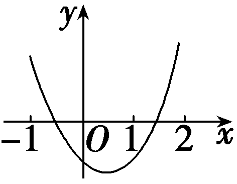
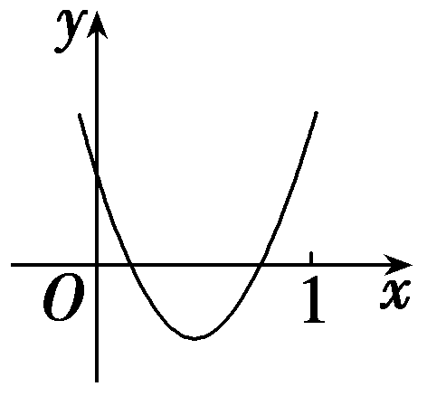

一元二次方程根的分布

解决由一元二次方程根的分布情况，确定方程中系数的取值范围问题，主要从以下三个方面建立关于系数的不等式(组)进行求解：（1）判别式<te*x*t style="italic">Δ</text>的符号；（2）对称轴x＝－ $\frac{b}{2a}$ 与所给区间的位置关系；（3）区间端点处函数值的符号.一元二次方程根的分布问题，类型较多，情况较复杂，但基本可以分为以下两类题型.

### 题型一　已知两根与实数*k*的大小关系

（1）若关于<em>x</em>的方程<em>x</em>2＋(<em>a</em>2－1)<em>x</em>＋<em>a</em>－2＝0的一个根比1大，另一个根比1小，则实数<em>a</em>的取值范围是(　　)

$\quad$A.(－1，1)

$\quad$B.(－∞，－1)∪(1，＋∞)

$\quad$C.(－2，1)

$\quad$D.(－∞，－2)∪(1，＋∞)

（2）已知方程2<em>x</em>2－(<em>m</em>＋1)<em>x</em>＋<em>m</em>＝0有两个不相等的正实数根，则实数<em>m</em>的取值范围是<u>　　　　</u>.

答案（1）C　（2）(0，3－2 $\sqrt{2}$ )∪(3＋2 $\sqrt{2}$ ，＋∞)

解析（1）设<em>f</em>(<em>x</em>)＝<em>x</em>2＋(<em>a</em>2－1)<em>x</em>＋<em>a</em>－2，依题意有<em>f</em>（1）＜0，即<em>a</em>2＋<em>a</em>－2＜0，解得－2＜<em>a</em>＜1，故选C.

(&lt;te<em>x</em>t style="superscript"&gt;2&lt;/text&gt;)设&lt;te&lt;te<em>x</em>t style="italic"&gt;x&lt;/text&gt;t style="italic"&gt;f&lt;/text&gt;(x)＝2x2－(<em>&lt;text style="italic"&gt;&lt;text style="italic"&gt;&lt;text style="italic"&gt;m</em>&lt;/text&gt;&lt;/text&gt;&lt;/text&gt;＋1)x＋m，依题意有 $\left\{\begin{matrix}\Delta >0，\\－\frac{-(m+1)}{2\times 2}>0\\f(0)>0，\end{matrix}\right.$ ，即 $\left\{\begin{matrix}(m+1)^{2}－8m>0，\\m＞－1，\\m>0，\end{matrix}\right.$ 解得0＜&lt;te<em>x</em>t style="italic"&gt;<em>&lt;text style="italic"&gt;&lt;text style="italic"&gt;m</em>&lt;/text&gt;&lt;/text&gt;&lt;/text&gt;＜3－2 $\sqrt{2}$ 或&lt;te<em>x</em>t style="italic"&gt;<em>&lt;text style="italic"&gt;&lt;text style="italic"&gt;m</em>&lt;/text&gt;&lt;/text&gt;&lt;/text&gt;＞3＋2 $\sqrt{2}$ .

当方程中二次项系数含有参数时，为避免讨论对应二次函数图象的开口方向，可将方程两边同时除以二次项系数，从而只需研究开口向上的情况，当然需要先判断二次项系数能否为0.

### 题型二　已知两根所在的区间

已知关于<em>x</em>的一元二次方程<em>x</em>2＋2<em>mx</em>＋2<em>m</em>＋1＝0.

（1）若方程有两根，其中一根在区间(－1，0)内，另一根在区间(1，2)内，求实数 *m*的取值范围；

（2）若方程两根均在区间(0，1)内，求实数*m*的取值范围.

解：（1）设函数&lt;te&lt;te&lt;te<em>x</em>t style="italic"&gt;x&lt;/text&gt;t style="italic"&gt;x&lt;/text&gt;t style="italic"&gt;f&lt;/text&gt;(x)＝x2＋2<em>&lt;text style="italic"&gt;m</em>x&lt;/text&gt;＋2m＋1，则其图象与x轴的交点分别在区间(－1，0)和(1，2)内，画出示意图如图，由题意，得 $\left\{\begin{matrix}f(0)=2m+1<0，\\f(-1)=2>0，\\f(1)=4m+2<0，\\f(2)=6m+5>0，\end{matrix}\right.$

解得－ $\frac{5}{6}$ ＜*m*＜－ $\frac{1}{2}$ .

故实数*m*的取值范围为(－ $\frac{5}{6}$ ，－ $\frac{1}{2}$ ).

(<te*x*t style="superscript">2</text>)由题意知函数<te<te*x*t style="italic">x</text>t style="italic">f</text>(x)＝x2＋2*<text style="italic">m*x</text>＋2m＋1的图象与x轴的交点落在区间(0，1)内，画出示意图如图，由题意，得 $\left\{\begin{matrix}\Delta =4m^{2}－4(2m+1)\geq 0，\\0<－m<1，\\f(0)=2m+1>0，\\f(1)=4m+2>0，\end{matrix}\right.$

解得－ $\frac{1}{2}$ ＜*m*≤1－ $\sqrt{2}$ .

故实数*m*的取值范围为(－ $\frac{1}{2}$ ，1－ $\sqrt{2}$ ］.

求解二次方程根的分布问题，最重要的是数形结合，即结合对应二次函数的图象，从以下角度考虑：①开口方向；②判别式；③对称轴；④在区间端点处的函数值.

对点练1.已知一元二次方程<em>x</em>2－<em>mx</em>＋1＝0的两根都在(0，2)内，则实数<em>m</em>的取值范围是(　　)

$\quad$A. $\left(2，\frac{5}{2}\right)$ 	
$\quad$B. $\left[2，\frac{5}{2}\right)$

$\quad$C. $\left(－\infty ,-2\right]$ ∪ $\left[2，\frac{5}{2}\right)$ 	
$\quad$D. $\left(－\infty ,-2\right]$ ∪ $\left(2，\frac{5}{2}\right)$

答案B

解析设&lt;te<em>x</em>t style="italic"&gt;f&lt;/text&gt; $\left(x\right)＝$ <em>x</em>2－<em>&lt;text style="italic"&gt;&lt;text style="italic"&gt;m</em>&lt;/text&gt;x&lt;/text&gt;＋1，由题意可得 $\left\{\begin{matrix}\Delta ＝m^{2}－4\geq 0，\\0<\frac{m}{2}<2，\\f\left(0\right)=1>0，\\f\left(2\right)＝－2m+5>0，\end{matrix}\right.$ 解得2≤<em>&lt;text style="italic"&gt;m</em>&lt;/text&gt;＜ $\frac{5}{2}$ .因此实数<em>&lt;text style="italic"&gt;m</em>&lt;/text&gt;的取值范围是 $\left[2，\frac{5}{2}\right)$ .故选B.

对点练&lt;te<em>x</em>t style="superscript"&gt;2&lt;/text&gt;.设&lt;te<em>x</em>t st<em>y</em>le="italic"&gt;<em>&lt;text style="italic"&gt;m</em>&lt;/text&gt;&lt;/text&gt;为实数，若二次函数y＝x2－x＋m在区间 $\left(－\infty ，1\right)$ 上有两个零点，则&lt;te&lt;te<em>x</em>t style="italic"&gt;x&lt;/text&gt;t st<em>y</em>le="italic"&gt;<em>&lt;text style="italic"&gt;m</em>&lt;/text&gt;&lt;/text&gt;的取值范围是<u>　　　　　　　　</u>.

答案 $\left(0，\frac{1}{4}\right)$

解析二次函数&lt;te&lt;te&lt;te&lt;te&lt;te&lt;te&lt;te&lt;te&lt;te&lt;te<em>x</em>t style="italic"&gt;x&lt;/text&gt;t style="italic"&gt;x&lt;/text&gt;t style="italic"&gt;x&lt;/text&gt;t style="italic"&gt;x&lt;/text&gt;t style="italic"&gt;x&lt;/text&gt;t style="italic"&gt;x&lt;/text&gt;t st<em>y</em>le="italic"&gt;x&lt;/text&gt;t style="italic"&gt;x&lt;/text&gt;t style="italic"&gt;x&lt;/text&gt;t style="italic"&gt;y&lt;/text&gt;＝x&lt;text style="superscript"&gt;&lt;text style="superscript"&gt;&lt;text style="superscript"&gt;2&lt;/text&gt;&lt;/text&gt;&lt;/text&gt;－x＋<em>&lt;text style="italic"&gt;&lt;text style="italic"&gt;&lt;text style="italic"&gt;&lt;text style="italic"&gt;&lt;text style="italic"&gt;m</em>&lt;/text&gt;&lt;/text&gt;&lt;/text&gt;&lt;/text&gt;&lt;/text&gt;的对称轴为x $＝\frac{1}{2}$ ，且开口向上，因为二次函数&lt;te&lt;te&lt;te&lt;te&lt;te&lt;te&lt;te&lt;te&lt;te&lt;te<em>x</em>t style="italic"&gt;x&lt;/text&gt;t style="italic"&gt;x&lt;/text&gt;t style="italic"&gt;x&lt;/text&gt;t style="italic"&gt;x&lt;/text&gt;t style="italic"&gt;x&lt;/text&gt;t style="italic"&gt;x&lt;/text&gt;t st<em>y</em>le="italic"&gt;x&lt;/text&gt;t style="italic"&gt;x&lt;/text&gt;t style="italic"&gt;x&lt;/text&gt;t style="italic"&gt;y&lt;/text&gt;＝x&lt;text style="superscript"&gt;&lt;text style="superscript"&gt;&lt;text style="superscript"&gt;2&lt;/text&gt;&lt;/text&gt;&lt;/text&gt;－x＋<em>&lt;text style="italic"&gt;&lt;text style="italic"&gt;&lt;text style="italic"&gt;&lt;text style="italic"&gt;&lt;text style="italic"&gt;m</em>&lt;/text&gt;&lt;/text&gt;&lt;/text&gt;&lt;/text&gt;&lt;/text&gt;在区间 $\left(－\infty ，1\right)$ 上有两个零点，所以方程&lt;te&lt;te&lt;te&lt;te&lt;te&lt;te&lt;te&lt;te&lt;te<em>x</em>t style="italic"&gt;x&lt;/text&gt;t style="italic"&gt;x&lt;/text&gt;t style="italic"&gt;x&lt;/text&gt;t style="italic"&gt;x&lt;/text&gt;t style="italic"&gt;x&lt;/text&gt;t style="italic"&gt;x&lt;/text&gt;t st<em>y</em>le="italic"&gt;x&lt;/text&gt;t style="italic"&gt;x&lt;/text&gt;t style="italic"&gt;x&lt;/text&gt;&lt;text style="superscript"&gt;&lt;text style="superscript"&gt;&lt;text style="superscript"&gt;2&lt;/text&gt;&lt;/text&gt;&lt;/text&gt;－x＋<em>&lt;text style="italic"&gt;&lt;text style="italic"&gt;&lt;text style="italic"&gt;&lt;text style="italic"&gt;&lt;text style="italic"&gt;m</em>&lt;/text&gt;&lt;/text&gt;&lt;/text&gt;&lt;/text&gt;&lt;/text&gt;＝0在区间 $\left(－\infty ，1\right)$ 内有两个不同的根，设&lt;te&lt;te&lt;te<em>x</em>t style="italic"&gt;x&lt;/text&gt;t style="italic"&gt;x&lt;/text&gt;t style="italic"&gt;f&lt;/text&gt;(&lt;te&lt;te&lt;te&lt;te&lt;te&lt;te<em>x</em>t style="italic"&gt;x&lt;/text&gt;t style="italic"&gt;x&lt;/text&gt;t style="italic"&gt;x&lt;/text&gt;t st<em>y</em>le="italic"&gt;x&lt;/text&gt;t style="italic"&gt;x&lt;/text&gt;t style="italic"&gt;x&lt;/text&gt;)＝x&lt;text style="superscript"&gt;&lt;text style="superscript"&gt;&lt;text style="superscript"&gt;2&lt;/text&gt;&lt;/text&gt;&lt;/text&gt;－x＋<em>&lt;text style="italic"&gt;&lt;text style="italic"&gt;&lt;text style="italic"&gt;&lt;text style="italic"&gt;&lt;text style="italic"&gt;m</em>&lt;/text&gt;&lt;/text&gt;&lt;/text&gt;&lt;/text&gt;&lt;/text&gt;，由题意可得 $\left\{\begin{matrix}\Delta =1－4m>0，\\\frac{1}{2}<1，\\f\left(1\right)=1－1+m>0，\end{matrix}\right.$ 解得0＜&lt;te&lt;te&lt;te&lt;te&lt;te&lt;te&lt;te&lt;te<em>x</em>t style="italic"&gt;x&lt;/text&gt;t style="italic"&gt;x&lt;/text&gt;t style="italic"&gt;x&lt;/text&gt;t style="italic"&gt;x&lt;/text&gt;t style="italic"&gt;x&lt;/text&gt;t style="italic"&gt;x&lt;/text&gt;t st<em>y</em>le="italic"&gt;x&lt;/text&gt;t style="italic"&gt;<em>&lt;text style="italic"&gt;&lt;text style="italic"&gt;&lt;text style="italic"&gt;&lt;text style="italic"&gt;m</em>&lt;/text&gt;&lt;/text&gt;&lt;/text&gt;&lt;/text&gt;&lt;/text&gt;＜ $\frac{1}{4}$ ，所以&lt;te&lt;te&lt;te&lt;te&lt;te&lt;te&lt;te&lt;te<em>x</em>t style="italic"&gt;x&lt;/text&gt;t style="italic"&gt;x&lt;/text&gt;t style="italic"&gt;x&lt;/text&gt;t style="italic"&gt;x&lt;/text&gt;t style="italic"&gt;x&lt;/text&gt;t style="italic"&gt;x&lt;/text&gt;t st<em>y</em>le="italic"&gt;x&lt;/text&gt;t style="italic"&gt;<em>&lt;text style="italic"&gt;&lt;text style="italic"&gt;&lt;text style="italic"&gt;&lt;text style="italic"&gt;m</em>&lt;/text&gt;&lt;/text&gt;&lt;/text&gt;&lt;/text&gt;&lt;/text&gt;∈ $\left(0，\frac{1}{4}\right)$ .

对点练3.关于&lt;te&lt;te<em>x</em>t style="italic"&gt;x&lt;/text&gt;t style="italic"&gt;x&lt;/text&gt;的方程x2＋ $\left(m－3\right)$ &lt;te&lt;te<em>x</em>t style="italic"&gt;x&lt;/text&gt;t style="italic"&gt;x&lt;/text&gt;＋<em>&lt;text style="italic"&gt;m</em>&lt;/text&gt;＝0满足下列条件，求实数m的取值范围.

（1）有两个正根；

（2）一个根大于1，一个根小于1；

（3）一个根在 $\left(－2，0\right)$ 内，另一个根在 $\left(0，4\right)$ 内.

解：（1）令&lt;te&lt;te<em>x</em>t style="italic"&gt;x&lt;/text&gt;t style="italic"&gt;f&lt;/text&gt; $\left(x\right)＝$ &lt;te<em>x</em>t style="italic"&gt;x&lt;/text&gt;2＋ $\left(m－3\right)$ &lt;te<em>x</em>t style="italic"&gt;x&lt;/text&gt;＋<em>m</em>，

法一：设&lt;te&lt;te<em>x</em>t style="italic"&gt;x&lt;/text&gt;t style="italic"&gt;f&lt;/text&gt; $\left(x\right)＝$ 0的两个根为&lt;te<em>x</em>t style="italic"&gt;x&lt;/text&gt;1，x2.

由题意可得 $\left\{\begin{matrix}\Delta ＝(m－3)^{2}－4m\geq 0，\\x_{1}＋x_{2}=3－m>0，\\x_{1}x_{2}＝m>0，\end{matrix}\right.$ 解得0＜*m*≤1.

所以实数*m*的取值范围为(0，1].

法二：由题意可得 $\left\{\begin{matrix}\Delta ＝(m－3)^{2}－4m\geq 0，\\－\frac{m－3}{2}>0，\\f(0)＝m>0，\end{matrix}\right.$ 解得0＜*m*≤1.

所以实数*m*的取值范围为(0，1].

(&lt;te<em>x</em>t style="superscript"&gt;2&lt;/text&gt;)令&lt;te<em>x</em>t style="italic"&gt;f&lt;/text&gt; $\left(x\right)＝$ &lt;te<em>x</em>t style="italic"&gt;x&lt;/text&gt;2＋ $\left(m－3\right)$ &lt;te<em>x</em>t style="italic"&gt;x&lt;/text&gt;＋<em>m</em>，

若方程&lt;te<em>x</em>t style="italic"&gt;x&lt;/text&gt;2＋ $\left(m－3\right)$ &lt;te<em>x</em>t style="italic"&gt;x&lt;/text&gt;＋<em>m</em>＝0的一个根大于1，一个根小于1，

由于&lt;te&lt;te<em>x</em>t style="italic"&gt;x&lt;/text&gt;t style="italic"&gt;<em>f</em>&lt;/text&gt; $\left(－1\right)＝$ 1－ $\left(m－3\right)$ ＋&lt;te&lt;te<em>x</em>t style="italic"&gt;x&lt;/text&gt;t style="italic"&gt;<em>m</em>&lt;/text&gt;＝4＞0，<em>&lt;text style="italic"&gt;f</em>&lt;/text&gt; $\left(x\right)＝$ &lt;te<em>x</em>t style="italic"&gt;x&lt;/text&gt;2＋ $\left(m－3\right)$ &lt;te<em>x</em>t style="italic"&gt;x&lt;/text&gt;＋<em>&lt;text style="italic"&gt;m</em>&lt;/text&gt;开口向上，

故只需*f* $\left(1\right)＝$ 2*<text style="italic">m*</text>－2＜0，解得m＜1.

所以实数*m*的取值范围为(－∞，1).

（3）令&lt;te&lt;te<em>x</em>t style="italic"&gt;x&lt;/text&gt;t style="italic"&gt;f&lt;/text&gt; $\left(x\right)＝$ &lt;te<em>x</em>t style="italic"&gt;x&lt;/text&gt;2＋ $\left(m－3\right)$ &lt;te<em>x</em>t style="italic"&gt;x&lt;/text&gt;＋<em>m</em>，

若方程&lt;te<em>x</em>t style="italic"&gt;x&lt;/text&gt;2＋ $\left(m－3\right)$ &lt;te<em>x</em>t style="italic"&gt;x&lt;/text&gt;＋<em>m</em>＝0的一个根在 $\left(－2，0\right)$ 内，另一个根在 $\left(0，4\right)$ 内，

结合&lt;te&lt;te<em>x</em>t style="italic"&gt;x&lt;/text&gt;t style="italic"&gt;f&lt;/text&gt; $\left(x\right)＝$ &lt;te<em>x</em>t style="italic"&gt;x&lt;/text&gt;2＋ $\left(m－3\right)$ &lt;te<em>x</em>t style="italic"&gt;x&lt;/text&gt;＋<em>m</em>开口向上，由题意可得 $\left\{\begin{matrix}f\left(－2\right)=10－m>0，\\f\left(0\right)＝m<0，\\f\left(4\right)=5m＋4>0，\end{matrix}\right.$

解得－ $\frac{4}{5}$ ＜*m*＜0.

所以实数*m*的取值范围为(－ $\frac{4}{5}$ ，0).

