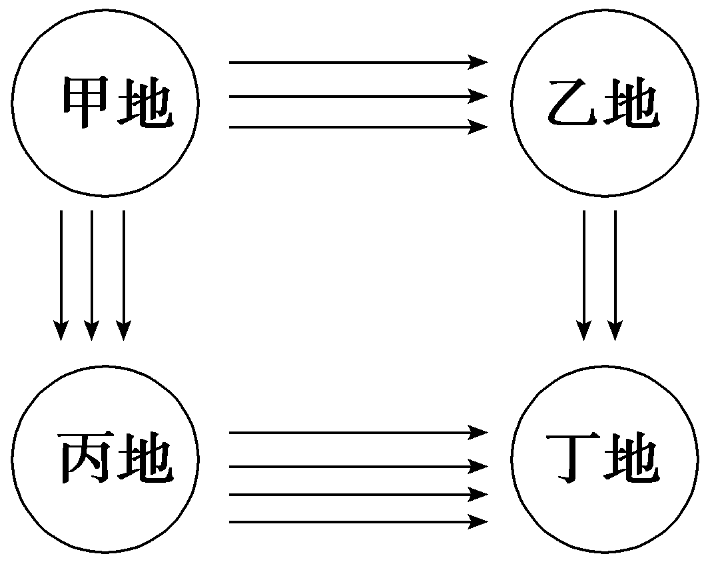
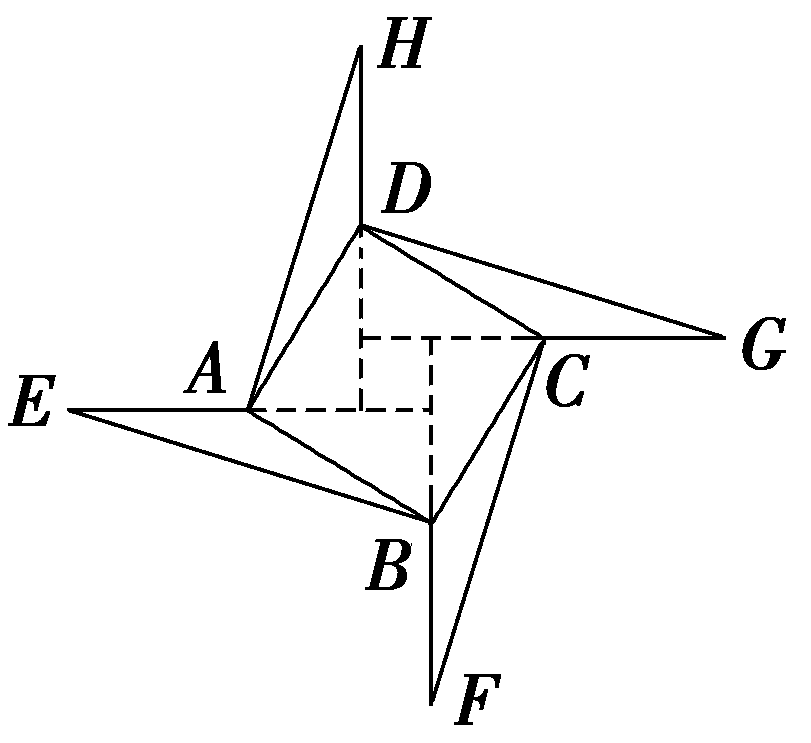
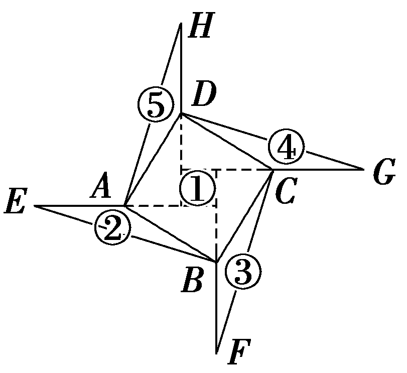
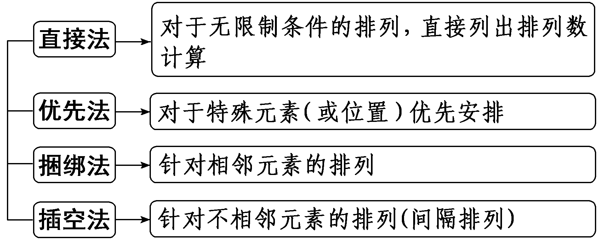
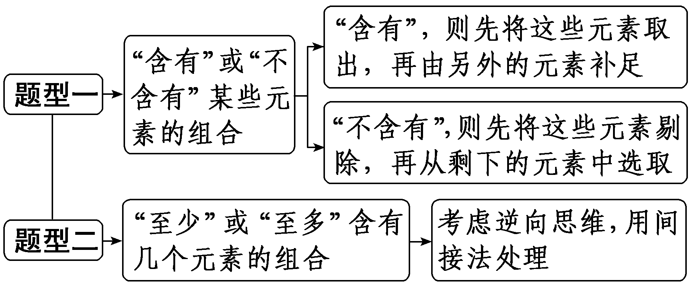
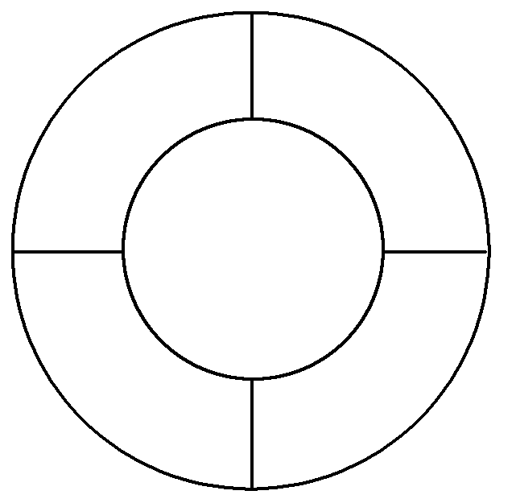
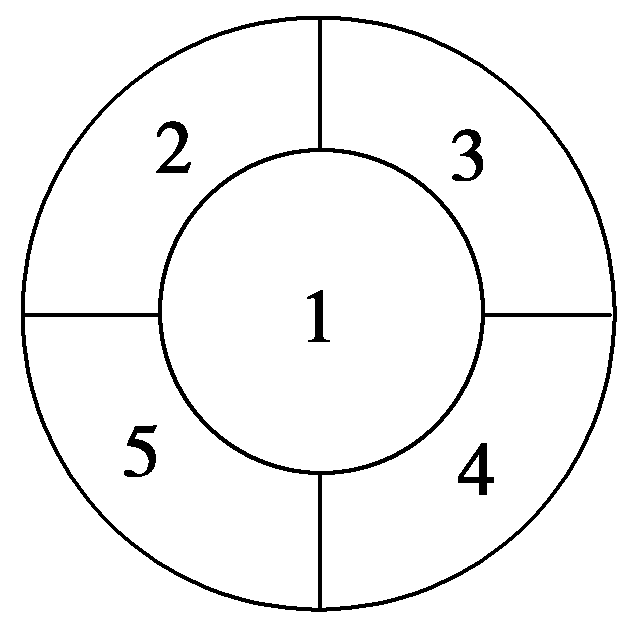

第一节　两个计数原理、排列与组合

【课标研读】　1.通过实例，了解分类加法计数原理、分步乘法计数原理及其意义.　2.通过实例，理解排列、组合的概念；能利用计数原理推导排列数公式、组合数公式.　3.能利用计数原理、排列与组合的知识解决简单的实际问题.

##### 1.两个计数原理

（1）分类加法计数原理：完成一件事有两类不同方案，在第1类方案中有<em>m</em>种不同的方法，在第2类方案中有<em>n</em>种不同的方法，那么完成这件事共有<em>N</em>＝<em><u>m</u></em><u>＋</u><em><u>n</u></em>种不同的方法.

（2）分步乘法计数原理：完成一件事需要两个步骤，做第1步有<em>m</em>种不同的方法，做第2步有<em>n</em>种不同的方法，那么完成这件事共有<em>N</em>＝<em><u>m</u></em><u>×</u><em><u>n</u></em>种不同的方法.

[微提醒]　两个计数原理的联系与区别

<table><tr><td>
原理
</td><td>
分类加法计数原理
</td><td>
分步乘法计数原理
</td></tr><tr><td>
联系
</td><td colspan="2">
两个计数原理都是对完成一件事的方法种数而言
</td></tr><tr><td rowspan="2">
区别
</td><td>
分类、相加
</td><td>
分步、相乘
</td></tr><tr><td>
每类方案中的每一种方法都能独立完成这件事
</td><td>
每步依次完成才算完成这件事(每步中的每一种方法都不能独立完成这件事)
</td></tr><tr><td>
注意点
</td><td>
类类独立，不重不漏
</td><td>
步步相依，缺一不可
</td></tr></table>

##### 2.排列与组合的概念

<table><tr><td>
名称
</td><td colspan="2">
定义
</td></tr><tr><td>
排列
</td><td rowspan="2">
从<em>n</em>个不同元素中取出<em>m</em>(<em>m</em>≤<em>n</em>)个元素
</td><td>
按照一定的顺序排成一列
</td></tr><tr><td>
组合
</td><td>
作为一组
</td></tr></table>

##### 3.排列数与组合数的定义、公式、性质

<table><tr><td></td><td>
排列数
</td><td>
组合数
</td></tr><tr><td>
定

义
</td><td>
从<em>n</em>个不同元素中取出<em>m</em>(<em>m</em>≤<em>n</em>，且<em>m</em>，<em>n</em>∈<strong>N</strong>＋)个元素的所有不同排列的个数，用符号表示
</td><td>
从<em>n</em>个不同元素中取出<em>m</em>(<em>m</em>≤<em>n</em>，且<em>m</em>，<em>n</em>∈<strong>N</strong>＋)个元素的所有不同组合的个数，用符号表示
</td></tr><tr><td>
公

式
</td><td>
＝<em>n</em>(<em>n</em>－1)(<em>n</em>－2)·…·[<em>n</em>－(<em>m</em>－1)]＝
</td><td>
＝＝

＝
</td></tr><tr><td>
性

质
</td><td>
＝1，＝<em>n</em>！，0！＝1
</td><td>
＝1，＝，＝＋
</td></tr></table>

[微提醒]　正确理解组合数的性质

（1） $C_{n}^{m}$ ＝ $C_{n}^{n－m}$ ：从*<text style="italic"><text style="italic">n*</text></text>个不同元素中取出*<text style="italic"><text style="italic">m*</text></text>个元素的方法数等于取出剩余n－m个元素的方法数.（2） $C_{n}^{m}$ ＋ $C_{n}^{m－1}$ ＝ $C_{n＋}^{m}_{1}$ ：从*<text style="italic"><text style="italic">n*</text></text>＋1个不同元素中取出*<text style="italic"><text style="italic">m*</text></text>个元素可分以下两种情况：①不含特殊元素*<text style="italic">A*</text>有 $C_{n}^{m}$ 种方法；②含特殊元素*<text style="italic">A*</text>有 $C_{n}^{m－1}$ 种方法.

【常用结论】

（1）排列数、组合数常用公式

① $A_{n}^{m}$ ＝(*n*－*m*＋1) $A_{n}^{m－1}$ .

② $A_{n}^{m}$ ＝*n* $A_{n－1}^{m－1}$ .

③(*n*＋1)！－*n*！＝*n·n*！.

④*k* $C_{n}^{k}$ ＝*n* $C_{n－1}^{k－1}$ .

⑤ $C_{n}^{m}$ ＋ $C_{n－1}^{m}$ ＋…＋ $C_{m+1}^{m}$ ＋ $C_{m}^{m}$ ＝ $C_{n+1}^{m+1}$ .

（2）解决排列、组合问题的十种技巧

①特殊元素或特殊位置优先安排.②合理分类与准确分步.③排列、组合混合问题要先选后排.④相邻问题捆绑处理.⑤不相邻问题插空处理.⑥定序问题倍缩法处理.⑦分排问题直排处理.⑧“小集团”排列问题先整体后局部.⑨构造模型.⑩正难则反，等价转化.

【自主检测】

##### 1.(多选)下列说法正确的是(　　)

$\quad$A.所有元素完全相同的两个排列为相同排列

$\quad$B.在分类加法计数原理中，每类方案中的方法都能直接完成这件事

$\quad$C.在分步乘法计数原理中，每个步骤中完成这个步骤的方法是各不相同的

$\quad$D.*k* $C_{n}^{k}$ ＝*n* $C_{n－1}^{k－1}$

答案BCD

##### 2.(链接人教A选择性必修三P11T2)如图，从甲地到乙地有3条路，从乙地到丁地有2条路；从甲地到丙地有3条路，从丙地到丁地有4条路.从甲地到丁地的不同路线共有(　　)

$\quad$A.12条	
$\quad$B.15条

$\quad$C.18条	
$\quad$D.72条

答案C

解析若路线为甲乙丁则有3×2＝6(条)，若路线为甲丙丁则有3×4＝12(条)，故共有6＋12＝18(条).故选C.

##### 3.(双空题)(链接人教A选择性必修三P26T1、T2)（1） $\frac{A_{5}^{2}＋A_{10}^{1}}{A_{3}^{3}－A_{4}^{1}}$ ＝<u>　　　　</u>.

（2）若 $C_{11}^{2x－1}$ ＝ $C_{11}^{x}$ ，则正整数<em>x</em>的值是<u>　　　　</u>.

答案（1）15　（2）1或4

解析（1） $\frac{A_{5}^{2}＋A_{10}^{1}}{A_{3}^{3}－A_{4}^{1}}$ ＝ $\frac{5\times 4+10}{3\times 2\times 1－4}$ ＝ $\frac{30}{2}$ ＝15.

（2）因为 $C_{11}^{2x－1}$ ＝ $C_{11}^{x}$ ，所以2<te<te<te<te<te<te<te*x*t style="italic">x</text>t style="italic">x</text>t style="italic">x</text>t style="italic">x</text>t style="italic">x</text>t style="italic">x</text>t style="italic">x</text>－1＝x或2x－1＋x＝11，解得x＝1或x＝4.经检验，x＝1或x＝4满足题意.

##### 4.(易错题、双空题)(链接人教A选择性必修三P12T8)五名学生报名参加四项体育比赛，每人限报一项，则不同的报名方法的种数为<u>　　　　</u>.五名学生争夺四项比赛的冠军(冠军不并列)，则获得冠军的可能性有<u>　　　　</u>种.

答案45　54

解析五名学生参加四项体育比赛，每人限报一项，可逐个学生落实，每个学生有4种报名方法，共有45种不同的报名方法.五名学生争夺四项比赛的冠军，可对4个冠军逐一落实，每个冠军有5种获得的可能性，共有54种获得冠军的可能性.

考点一　两个计数原理　　　　自主练透

##### 1.某公交车上有6位乘客，沿途有4个车站，乘客下车的可能方式有(　　)

$\quad$A.64种	
$\quad$B.46种

$\quad$C.24种	
$\quad$D.360种

答案B

解析由题意，每一位乘客都有4种选择，故乘客下车的可能方式有4×4×4×4×4×4＝46(种).故选B.

##### 2.用0，1，2，3，4可以组成没有重复数字的四位偶数的个数为(　　)

$\quad$A.36	
$\quad$B.48

$\quad$C.60	
$\quad$D.72

答案C

解析当个位数为0时，有 $A_{4}^{3}$ ＝24(个)，当个位数为2或4时，有2 $A_{3}^{1}A_{3}^{2}$ ＝36(个)，所以无重复数字的四位偶数有24＋36＝60(个).故选C.

##### 3.如图是在“赵爽弦图”的基础上创作出的一个“数学风车”平面模型，图中正方形*ABCD*内部为“赵爽弦图”(由四个全等的直角三角形和一个小正方形组成)，给△*ABE*，△*BCF*，△*CDG*，△*DAH*这4个三角形和“赵爽弦图”*ABCD*涂色，且相邻区域(即图中有公共点的区域)不同色，已知有4种不同的颜色可供选择.则不同的涂色方法种数是(　　)

$\quad$A.48	
$\quad$B.54

$\quad$C.72	
$\quad$D.108

答案C

解析设“赵爽弦图”*ABCD*为①区，△*ABE*，△*BCF*，△*CDG*，△*DAH*这4个三角形分别为②，③，④，⑤区.第一步给①区涂色，有4种涂色方法；第二步给②区涂色，有3种涂色方法；第三步给③区涂色，有2种涂色方法；第四步给④区涂色，若④区与②区同色，⑤区有2种涂色方法；若④区与②区不同色，则④区有1种涂色方法，⑤区有1种涂色方法.所以共有4×3×2×(2＋1×1)＝72(种)涂色方法.故选C.

##### 4.(2024·新课标Ⅱ卷)在如图的4×4的方格表中选4个方格，要求每行和每列均恰有一个方格被选中，则共有<u>　　　　</u>种选法.在所有符合上述要求的选法中，选中方格中的4个数之和的最大值是<u>　　　　</u>.

<table><tr><td>
11
</td><td>
21
</td><td>
31
</td><td>
40
</td></tr><tr><td>
12
</td><td>
22
</td><td>
33
</td><td>
42
</td></tr><tr><td>
13
</td><td>
22
</td><td>
33
</td><td>
43
</td></tr><tr><td>
15
</td><td>
24
</td><td>
34
</td><td>
44
</td></tr></table>

答案24　112

解析第一步，从第一行任选一个数，共有4种不同的选法；第二步，从第二行选一个与第一个数不同列的数，共有3种不同的选法；第三步，从第三行选一个与第一、二个数均不同列的数，共有2种不同的选法；第四步，从第四行选一个与第一、二、三个数均不同列的数，只有1种选法.由分步乘法计数原理知，不同的选法种数为4×3×2×1＝24.先按列分析，每列必选出一个数，故所选4个数的十位上的数字分别为1，2，3，4.再按行分析，第一、二、三、四行个位上的数字的最大值分别为1，3，3，5，故从第一行选21，从第二行选33，从第三行选43，从第4行选15，此时个位上的数字之和最大.故选中方格中的4个数之和的最大值为21＋33＋43＋15＝112.

利用两个计数原理解决应用问题的一般思路

##### 1.弄清需要完成一件事是做什么.

##### 2.确定是先分类后分步，还是先分步后分类.

##### 3.弄清分步、分类的标准是什么.

##### 4.分类要做到不重不漏.

考点二　排列问题 　　　　师生共研

有3名男生、4名女生，在下列不同条件下，求不同的排列方法种数：

（1）选5人排成一排；

（2）排成前后两排，前排3人，后排4人；

（3）全体排成一排，女生必须站在一起；

（4）全体排成一排，男生互不相邻；

（5）(一题多解)全体排成一排，其中甲不站最左边，也不站最右边.

解：（1）从7人中选5人排列，有 $A_{7}^{5}$ ＝7×6×5×4×3＝2 520(种)不同排法.

（2）分两步完成，先选3人站前排，有 $A_{7}^{3}$ 种方法，余下4人站后排，有 $A_{4}^{4}$ 种方法，共有 $A_{7}^{3}A_{4}^{4}$ ＝5 040(种)不同排法.

（3）(捆绑法)将女生看作一个整体与3名男生一起全排列，有 $A_{4}^{4}$ 种方法，再将女生全排列，有 $A_{4}^{4}$ 种方法，共有 $A_{4}^{4}A_{4}^{4}$ ＝576(种)不同排法.

（4）(插空法)先排女生，有 $A_{4}^{4}$ 种方法，再在女生之间及首尾5个空位中任选3个空位安排男生，有 $A_{5}^{3}$ 种方法，共有 $A_{4}^{4}A_{5}^{3}$ ＝1 440(种)不同排法.

（5）法一(特殊元素优先法)：先排甲，有5种方法，其余6人有 $A_{6}^{6}$ 种排列方法，共有5× $A_{6}^{6}$ ＝3 600(种)不同排法.

法二(特殊位置优先法)：左右两边位置可安排另6人中的两人，有 $A_{6}^{2}$ 种排法，其他人有 $A_{5}^{5}$ 种排法，共有 $A_{6}^{2}A_{5}^{5}$ ＝3 600(种)不同排法.

[变式探究]　(变条件)若本例（5）改为“全体排成一排，其中甲不站最左边，乙不站最右边”，则不同的排列方法总数为<u>　　　　</u>.

答案3 720

解析法一(特殊元素优先法)：甲在最右边时，其他的可全排，有 $A_{6}^{6}$ 种方法；甲不在最右边时，可从余下的5个位置任选一个，有 $A_{5}^{1}$ 种，而乙可排在除去最右边的位置后剩下的5个中任选一个有 $A_{5}^{1}$ 种，其余人全排列，有 $A_{5}^{5}$ 种不同排法，共有 $A_{6}^{6}$ ＋ $A_{5}^{1}A_{5}^{1}A_{5}^{5}$ ＝3 720(种).

法二(间接法)：7名学生全排列，有 $A_{7}^{7}$ 种方法，其中甲在最左边时，有 $A_{6}^{6}$ 种方法，乙在最右边时，有 $A_{6}^{6}$ 种方法，其中都包含了甲在最左边且乙在最右边的情形，有 $A_{5}^{5}$ 种方法，故共有 $A_{7}^{7}$ －2 $A_{6}^{6}$ ＋ $A_{5}^{5}$ ＝3 720(种).

求解排列问题的四种常用方法

对点练1.(2023·全国甲卷)有5名志愿者参加社区服务，共服务周六、周日两天，每天从中任选2人参加服务，则恰有1人连续参加两天服务的选择种数为(　　)

$\quad$A.120	
$\quad$B.60

$\quad$C.40	
$\quad$D.30

答案B

解析不妨记5名志愿者为<t<t*e*xt style="it<text style="itali*c*">a</text>lic">e</text>xt style="itali*c*">a</text>，*<text style="italic">b*</text>，c，*<text style="italic">d*</text>，e，假设a连续参加了两天社区服务，再从剩余的4人中抽取2人各参加星期六与星期天的社区服务，共有 $A_{4}^{2}$ ＝12种方法，同理：<t<t*e*xt style="it<text style="itali*c*">a</text>lic">e</text>xt style="itali*c*">*b*</text>，c，*<text style="italic">d*</text>，e连续参加了两天社区服务，也各有12种方法，所以恰有1人连续参加了两天社区服务的选择种数有5×12＝60(种).故选B.

对点练2.(2024·九省适应性测试)甲、乙、丙等5人站成一排，且甲不在两端，乙和丙之间恰有2人，则不同排法共有(　　)

$\quad$A.20种	
$\quad$B.16种

$\quad$C.12种	
$\quad$D.8种

答案B

解析因为乙和丙之间恰有2人，所以乙丙及中间2人占据首四位或尾四位，①当乙丙及中间2人占据首四位，此时还剩末位，故甲在乙丙中间，排乙丙有 $A_{2}^{2}$ 种方法，排甲有 $A_{2}^{1}$ 种方法，剩余两个位置两人全排列有 $A_{2}^{2}$ 种排法，所以有 $A_{2}^{2}$ × $A_{2}^{1}$ × $A_{2}^{2}$ ＝8种方法；②当乙丙及中间2人占据尾四位，此时还剩首位，故甲在乙丙中间，排乙丙有 $A_{2}^{2}$ 种方法，排甲有 $A_{2}^{1}$ 种方法，剩余两个位置两人全排列有 $A_{2}^{2}$ 种排法，所以有 $A_{2}^{2}$ × $A_{2}^{1}$ × $A_{2}^{2}$ ＝8种方法；由分类加法计数原理可知，一共有8＋8＝16(种)排法.故选B.

考点三　组合问题 　　　　师生共研

（1）(多选)从6名男生和4名女生中选出4人去参加一项创新大赛，则下列说法正确的有(　　)

$\quad$A.如果4人全部为男生，那么有30种不同的选法

$\quad$B.如果4人中男生、女生各有2人，那么有30种不同的选法

$\quad$C.如果男生中的甲和女生中的乙必须在内，那么有28种不同的选法

$\quad$D.如果男生中的甲和女生中的乙至少要有1人在内，那么有140种不同的选法

（2）(2023·新课标Ⅰ卷)某学校开设了4门体育类选修课和4门艺术类选修课，学生需从这8门课中选修2门或3门课，并且每类选修课至少选修1门，则不同的选课方案共有<u>　　　　</u>种(用数字作答).

答案（1）CD　（2）64

解析（1）如果4人全部为男生，选法有 $C_{6}^{4}$ ＝15(种)，故A错误；如果4人中男生、女生各有2人，男生的选法有 $C_{6}^{2}$ ＝15(种)，女生的选法有 $C_{4}^{2}$ ＝6(种)，则4人中男生、女生各有2人的选法有15×6＝90(种)，故B错误；如果男生中的甲和女生中的乙必须在内，在剩下的8人中再选2人即可，有 $C_{8}^{2}$ ＝28(种)不同的选法，故C正确；在10人中任选4人，有 $C_{10}^{4}$ ＝210(种)，甲、乙都不在其中的选法有 $C_{8}^{4}$ ＝70(种)，故男生中的甲和女生中的乙至少要有1人在内的选法有210－70＝140(种)，故D正确.故选CD.

（2）①当从8门课中选修2门，则不同的选课方案共有 $C_{4}^{1}C_{4}^{1}$ ＝16种；②当从8门课中选修3门，若体育类选修课1门，则不同的选课方案共有 $C_{4}^{1}C_{4}^{2}$ ＝24种；若体育类选修课2门，则不同的选课方案共有 $C_{4}^{2}C_{4}^{1}$ ＝24种；综上所述，不同的选课方案共有16＋24＋24＝64(种).

两类组合问题的解题方法

对点练3.(2020·新高考Ⅰ卷)6名同学到甲、乙、丙三个场馆做志愿者，每名同学只去1个场馆，甲场馆安排1名，乙场馆安排2名，丙场馆安排3名，则不同的安排方法共有(　　)

$\quad$A.120种	
$\quad$B.90种

$\quad$C.60种	
$\quad$D.30种

答案C

解析第1步，抽1名志愿者安排到甲场馆，有 $C_{6}^{1}$ 种安排方法；第2步，从剩下的5名志愿者中抽取2名安排到乙场馆，有 $C_{5}^{2}$ 种安排方法；第3步，将剩下的3名志愿者安排到丙场馆.由分步乘法计数原理得，不同的安排方法共有 $C_{6}^{1}C_{5}^{2}$ ＝60(种).故选C.

对点练4.(多选)在新高考方案中，选择性考试科目有物理、化学、生物、政治、历史、地理6门.学生根据高校的要求，结合自身兴趣特长，首先在物理、历史2门科目中选择1门，再从政治、地理、化学、生物4门科目中选择2门，考试成绩计入考生总分，作为统一高考招生录取的依据.某学生想在物理、化学、生物、政治、历史、地理这6门课程中选三门作为选考科目，下列说法正确的是(　　)

$\quad$A.若任意选科，选法种数为 $C_{4}^{2}$

$\quad$B.若化学必选，选法种数为 $C_{2}^{1}C_{3}^{1}$

$\quad$C.若政治和地理至少选一门，选法种数为 $C_{2}^{1}C_{2}^{1}C_{3}^{1}$

$\quad$D.若物理必选，化学、生物至少选一门，选法种数为 $C_{2}^{1}C_{2}^{1}$ ＋1

答案BD

解析若任意选科，选法种数为 $C_{2}^{1}C_{4}^{2}$ ，故A错误；若化学必选，选法种数为 $C_{2}^{1}C_{3}^{1}$ ，故B正确；若政治和地理至少选一门，选法种数为 $C_{2}^{1}(C_{2}^{1}C_{2}^{1}$ ＋1)，故C错误；若物理必选，化学、生物至少选一门，选法种数为 $C_{2}^{1}C_{2}^{1}$ ＋1，故D正确.故选BD.

考点四　排列与组合的综合问题 　　　　多维探究

角度1　相邻、相间问题

（1）(2022·新高考Ⅱ卷)甲、乙、丙、丁、戊5名同学站成一排参加文艺汇演，若甲不站在两端，丙和丁相邻，则不同的排列方式共有(　　)

$\quad$A.12种	
$\quad$B.24种

$\quad$C.36种	
$\quad$D.48种

（2）(一题多解)高中数学新教材有必修一、二，选择性必修一、二、三，共5本书，把这5本书放在书架上排成一排，必修一、必修二不相邻的排列方法种数是(　　)

$\quad$A. 72	
$\quad$B. 144

$\quad$C. 48	
$\quad$D. 36

答案（1）B　（2）A

解析（1）先将丙和丁捆在一起有 $A_{2}^{2}$ 种排列方式，然后将其与乙、戊排列，有 $A_{3}^{3}$ 种排列方式，最后将甲插入中间两空，有 $C_{2}^{1}$ 种排列方式，所以不同的排列方式共有 $A_{2}^{2}A_{3}^{3}C_{2}^{1}$ ＝24(种)，故选B.

（2）法一：先将选择性必修一、二、三这3本书排成一排，有 $A_{3}^{3}$ ＝6种排列方法，再将必修一、必修二这2本书插入两端或两个空隙中，有 $A_{4}^{2}$ ＝12种排列方法，由分步乘法计数原理得，把这5本书放在书架上排成一排，必修一、必修二不相邻的排列方法种数是6×12＝72(种).故选A.

法二：5本书放在书架上排成一排的排列方法共有 $A_{5}^{5}$  种，其中必修一、必修二相邻的排列方法有 $A_{2}^{2}A_{4}^{4}$  种，所以把这5本书放在书架上排成一排，必修一、必修二不相邻的排列方法种数为 $A_{5}^{5}$ － $A_{2}^{2}A_{4}^{4}$ ＝72(种) .故选A.

角度2　定序问题

有4名男生，3名女生，其中3名女生高矮各不相同，将7名学生排成一行，要求从左到右，女生从矮到高排列(不一定相邻)，不同的排法共有<u>　　　　</u>种.

答案840

解析7名学生的排列共有 $A_{7}^{7}$ 种，其中女生的排列共有 $A_{3}^{3}$ 种，按照从左到右，女生从矮到高的排列只是其中的一种，故有 $\frac{A_{7}^{7}}{A_{3}^{3}}$ ＝ $A_{7}^{4}$ ＝840(种)不同的排法.

角度3　分组、分配问题

（1）中国书法历史悠久，源远流长，书法作为一门艺术，以文字为载体，不断地反映着和丰富着华夏民族的自然观、宇宙观和人生观，谈到书法艺术，就离不开汉字，汉字是书法艺术的精髓，汉字本身具有丰富的意象和可塑的规律性，使汉字书写成为一门独特的艺术，我国书法大体可分为篆、隶、楷、行、草五种书体，如图，以“国”字为例，现有5张分别写有一种书体的临摹纸，将其全部分给3名书法爱好者，每人至少1张，则不同的分法种数为(　　)

$\quad$A.60	
$\quad$B.90

$\quad$C.120	
$\quad$D.150

（2）中国空间站的主体结构包括天和核心舱、问天实验舱和梦天实验舱.假设中国空间站要安排6名航天员开展实验，其中每个舱安排2人.若甲、乙两人不被安排在同一个舱内做实验，则不同的安排方案共有(　　)

$\quad$A.20种	
$\quad$B.36种

$\quad$C.72种	
$\quad$D.84种

答案（1）D　（2）C

解析（1）满足条件的分法可分为两类，第一类，一人三张，另两人各一张，符合条件的分法有 $C_{5}^{3}A_{3}^{3}$ 种，即60种；第二类，其中一人一张，另两人各两张，符合条件的分法有 $\frac{C_{5}^{2}C_{3}^{2}}{A_{2}^{2}}A_{3}^{3}$ 种，即90种.由分类加法计数原理可得，满足条件的不同分法种数为150.故选D.

（2）将6名航天员每个舱安排2人开展实验的所有安排方法数为 $C_{6}^{2}C_{4}^{2}C_{2}^{2}$ ，其中甲、乙两人被安排在同一个舱内做实验的安排方法数为 $C_{2}^{2}$ · $\frac{C_{4}^{2}C_{2}^{2}}{A_{2}^{2}}$ · $A_{3}^{3}$ ，所以满足条件的不同的安排方案数为 $C_{6}^{2}C_{4}^{2}C_{2}^{2}$ － $C_{2}^{2}$ · $\frac{C_{4}^{2}C_{2}^{2}}{A_{2}^{2}}$ · $A_{3}^{3}$ ＝90－18＝72种.故选C.

##### 1.相邻问题采用捆绑法、不相邻问题采用插空法、定序问题采用倍缩法是解决有限制条件的排列问题的常用方法.

##### 2.分组问题属于“组合”问题

（1）对于整体均分，不管它们的顺序如何，都是一种情况，所以分组后一定要除以组数的阶乘.

（2）对于部分均分，即若有*m*组元素个数相同，则分组时应除以*m*！.

（3）对于不等分组，只需先分组，后排列.

##### 3.分配问题属于“排列”问题

（1）相同元素的“分配”问题，常用的方法是采用“挡板法”.

（2）不同元素的“分配”问题，利用分步乘法计数原理，分两步完成，第一步是分组，第二步是发放.

（3）有限制条件的分配问题常采用分类法求解.

对点练5.(多选)已知*A*，*B*，*C*，*D*，*E*五个人并排站在一起，则下列说法正确的有(　　)

$\quad$A.若*A*，*B*不相邻，共有72种排法

$\quad$B.若*A*不站在最左边，*B*不站在最右边，有72种排法

$\quad$C.若*A*在*B*右边有60种排法

$\quad$D.若*A*，*B*两人站在一起有48种排法

答案ACD

解析对于*<text style="italic"><text style="italic"><text style="italic">A*</text></text></text>，若A，*<text style="italic"><text style="italic"><text style="italic">B*</text></text></text>不相邻，共有 $A_{3}^{3}A_{4}^{2}$ ＝72(种)排法，故*<text style="italic"><text style="italic"><text style="italic">A*</text></text></text>正确；对于*<text style="italic"><text style="italic"><text style="italic">B*</text></text></text>，若A不站在最左边，B不站在最右边，利用间接法有 $A_{5}^{5}$ －2 $A_{4}^{4}$ ＋ $A_{3}^{3}$ ＝78(种)排法，故*<text style="italic"><text style="italic"><text style="italic">B*</text></text></text>错误；对于C，若*<text style="italic"><text style="italic"><text style="italic">A*</text></text></text>在B右边有 $\frac{A_{5}^{5}}{A_{2}^{2}}$ ＝60(种)排法，故C正确；对于D，若*<text style="italic"><text style="italic"><text style="italic">A*</text></text></text>，*<text style="italic"><text style="italic"><text style="italic">B*</text></text></text>两人站在一起有 $A_{2}^{2}A_{4}^{4}$ ＝48(种)排法，故D正确.故选*<text style="italic"><text style="italic"><text style="italic">A*</text></text></text>CD.

对点练6.(2021·全国乙卷)将5名北京冬奥会志愿者分配到花样滑冰、短道速滑、冰球和冰壶4个项目进行培训，每名志愿者只分配到1个项目，每个项目至少分配1名志愿者，则不同的分配方案共有(　　)

$\quad$A.60种	
$\quad$B.120种

$\quad$C.240种	
$\quad$D.480种

答案C

解析根据题设中的要求，每名志愿者只分配到1个项目，每个项目至少分配1名志愿者，可分两步进行安排：第一步，将5名志愿者分成4组，其中1组2人，其余每组1人，共有 $C_{5}^{2}$ 种分法；第二步，将分好的4组安排到4个项目中，有 $A_{4}^{4}$ 种安排方法.故满足题意的分配方案共有 $C_{5}^{2}$ · $A_{4}^{4}$ ＝240(种).故选C.

对点练7.6把椅子摆成一排，3人随机就座，任何两人不相邻的坐法种数为<u>　　　　</u>.

答案24

解析“插空法”，先排3个空位，形成4个空隙供3人选择就座，因此任何两人不相邻的坐法种数为 $A_{4}^{3}$ ＝4×3×2＝24.

[真题再现]　(2023·全国乙卷)甲乙两位同学从6种课外读物中各自选读2种，则这两人选读的课外读物中恰有1种相同的选法共有(　　)

$\quad$A.30种	
$\quad$B.60种

$\quad$C.120种	
$\quad$D.240种

答案C

解析甲、乙两位同学选读课外读物可以分为两个步骤：先从6种课外读物中选择一本作为甲、乙两人共同的选择，再从剩下的5本中选择互不相同的两本，所以符合题意的选法共有 $C_{6}^{1}C_{5}^{1}C_{4}^{1}$ ＝120(种).故选C.

[教材呈现] 　(人教A选择性必修三P25T3)有政治、历史、地理、物理、化学、生物这6门学科的学业水平考试成绩，现要从中选3门考试成绩.

（1）共有多少种不同的选法？

（2）如果物理和化学恰有1门被选，那么共有多少种不同的选法？

（3）如果物理和化学至少有1门被选，那么共有多少种不同的选法？

点评：这两题考查相同的知识点，设问的本质也是一样的，都是考查计数原理和组合的相关知识，问题背景也非常相似.

课时测评83　两个计数原理、排列与组合 $\frac{对应学生}{用书P475}$

(时间：50分钟　满分：75分)

(本栏目内容，在学生用书中以独立形式分册装订！)

(1—10题，每小题5分，共50分)

##### 1.“谁知盘中餐，粒粒皆辛苦”，节约粮食是我国的传统美德.已知学校食堂中午有2种主食、6种素菜、5种荤菜，小华准备从中选取1种主食、1种素菜、1种荤菜作为午饭，并全部吃完，则不同的选取方法有(　　)

$\quad$A.13种	
$\quad$B.22种

$\quad$C.30种	
$\quad$D.60种

答案D

解析根据分步乘法计数原理，共有2×6×5＝60(种)不同的选取方法.故选D.

##### 2.如图，在两行三列的网格中放入标有数字1，2，3，4，5，6的六张卡片，每格只放一张卡片，则“只有中间一列两个数字之和为5”的不同的排法有(　　)

<table><tr><td></td><td></td><td></td></tr><tr><td></td><td></td><td></td></tr></table>

$\quad$A.16种	
$\quad$B.32种

$\quad$C.64种	
$\quad$D.96种

答案C

解析根据题意，分3步进行，第一步，要求“只有中间一列两个数字之和为5”，则中间的数字只能为两组数1，4或2，3中的一组，共有2 $A_{2}^{2}$ ＝4种排法；第二步，排第一步中剩余的一组数，共有 $A_{4}^{1}A_{2}^{1}$ ＝8种排法；第三步，排数字5和6，共有 $A_{2}^{2}$ ＝2种排法；由分步乘法计数原理知，共有不同的排法种数为4×8×2＝64.故选C.

##### 3.*A*，*B*，*C*，*D*四个家庭各有2个孩子，共8个孩子，他们准备分乘甲、乙两辆汽车出去游玩，每车限坐4人(乘同一辆车的4个孩子不考虑位置)，其中*A*家庭的孪生姐妹需乘同一辆车，则乘坐甲车的4个孩子恰有2个来自于同一个家庭的乘坐方式共有(　　)

$\quad$A.18种	
$\quad$B.24种

$\quad$C.36种	
$\quad$D.48种

答案B

解析根据题意，分两种情况讨论：

①*<text style="italic">A*</text>家庭的孪生姐妹在甲车上，甲车上另外的2个孩子要来自不同的家庭，可以在剩下的三个家庭中任选两个家庭，再从每个家庭的2个孩子中任选1个来乘坐甲车，有 $C_{3}^{2}$ × $C_{2}^{1}$ × $C_{2}^{1}$ ＝12(种)乘坐方式；②*<text style="italic">A*</text>家庭的孪生姐妹不在甲车上，需要在剩下的三个家庭中任选一个，让其2个孩子都在甲车上，对于剩余的两个家庭，从每个家庭的2个孩子中任选1个来乘坐甲车，有 $C_{3}^{1}$ × $C_{2}^{1}$ × $C_{2}^{1}$ ＝12(种)乘坐方式，所以共有12＋12＝24(种)乘坐方式.故选B.

##### 4.某教育局为振兴乡村教育，将5名教师安排到3所乡村学校支教，若每名教师仅去一所学校，每所学校至少安排1名教师，则不同的安排情况有(　　)

$\quad$A.300种	
$\quad$B.210种

$\quad$C.180种	
$\quad$D.150种

答案D

解析由于每所学校至少安排1名教师，则不同的安排情况有 $\left(\frac{C_{5}^{2}C_{3}^{2}}{A_{2}^{2}}＋C_{5}^{3}\right)A_{3}^{3}$ ＝150(种).故选D.

##### 5.(2024·山东聊城二模)班主任从甲、乙、丙三位同学中安排四门不同学科的课代表，要求每门学科有且只有一位课代表，每位同学至多担任两门学科的课代表，则不同的安排方案共有(　　)

$\quad$A.36种	
$\quad$B. 48种

$\quad$C. 54种	
$\quad$D. 60种

答案C

解析第一种情况，甲、乙、丙三位同学都有安排时，先从3个人中选1个人，让他担任两门学科的课代表，有 $C_{3}^{1}$ ＝3种结果，然后从4门学科中选2门学科给同一个人，有 $C_{4}^{2}$ ＝6种结果，余下的两个学科给剩下的两个人，有 $A_{2}^{2}$ ＝2种结果，所以不同的安排方案共有3×6×2＝36种，第二种情况，甲、乙、丙三位同学中只有两人被安排时，先选两人出来，有 $C_{3}^{2}$ ＝3种结果，再将四门不同学科分成两组，有 $\frac{C_{4}^{2}}{A_{2}^{2}}$ ＝3种结果，将学科分给学生，有 $A_{2}^{2}$ ＝2种结果，所以不同的安排方案共有3×3×2＝18种，综合得不同的安排方案共有36＋18＝54种.故选C.

##### 6.(多选)现有4个编号为1，2，3，4的不同的球和4个编号为1，2，3，4的不同的盒子，把球全部放入盒子内.则下列说法正确的是(　　)

$\quad$A.恰有1个盒子不放球，共有72种放法

$\quad$B.每个盒子内只放一个球，且球的编号和盒子的编号不同的放法有9种

$\quad$C.有2个盒子内不放球，另外两个盒子内各放2个球的放法有36种

$\quad$D.恰有2个盒子不放球，共有84种放法

答案BCD

解析对于A，恰有1个盒子不放球，先选1个空盒子，再选一个盒子放两个球，则 $C_{4}^{1}C_{4}^{2}A_{3}^{3}$ ＝144≠72，故A不正确；对于B，编号为1的球有 $C_{3}^{1}$ 种放法，把与编号为1的球所放盒子的编号相同的球放入1号盒子或者其他两个盒子，共有1＋ $C_{2}^{1}$ ＝3(种)，即3×3＝9(种)，故B正确；对于C，首先选出两个空盒子，再取两个球放剩下的两个盒子中的一个，共有 $C_{4}^{2}C_{4}^{2}$ ＝36(种)，故C正确；对于D，恰有2个盒子不放球，首先选出两个空盒子，再将4个球分为3，1或2，2两种情况放入盒子，共有 $C_{4}^{2}(C_{4}^{1}C_{2}^{1}$ ＋ $C_{4}^{2}$ )＝6×14＝84(种)，故D正确.故选BCD.

##### 7.(多选)(2025·广东佛山联考)第十五届全国运动会将于2025年11月9日在粤港澳三地共同举办，组委会现安排甲、乙、丙、丁、戊5名同学参加志愿者服务活动，有翻译、导游、礼仪、司机四项工作可以安排，则以下说法正确的是(　　)

$\quad$A.若每人都安排一项工作，则不同的方法数为45

$\quad$B.若每项工作至少有1人参加，则不同的方法数为 $A_{5}^{4}C_{4}^{1}$

$\quad$C.如果司机工作不安排，其余三项工作至少安排1人，则这5名同学全部被安排的不同方法数为( $C_{5}^{3}C_{2}^{1}$ ＋ $C_{5}^{2}C_{3}^{2})A_{3}^{3}$

$\quad$D.每项工作至少有1人参加，甲、乙不会开车但能从事其他三项工作，丙、丁、戊都能胜任四项工作，则不同安排方案的种数是 $C_{3}^{1}C_{4}^{2}A_{3}^{3}$ ＋ $C_{3}^{2}A_{3}^{3}$

答案AD

解析根据题意，依次分析选项：对于A，若每人都安排一项工作，每人有4种安排方法，则有45种安排方法，故A正确；对于B，分2步进行分析：先将5人分为4组，再将分好的4组全排列，有 $C_{5}^{2}A_{4}^{4}$ 种安排方法，故B错误；对于C，分2步分析：需要先将5人分为3组，有 $\left(C_{5}^{3}＋\frac{C_{5}^{2}C_{3}^{2}}{A_{2}^{2}}\right)$ 种分组方法，将分好的三组安排翻译、导游、礼仪三项工作，有 $A_{3}^{3}$ 种情况，则有 $\left(C_{5}^{3}＋\frac{C_{5}^{2}C_{3}^{2}}{A_{2}^{2}}\right)A_{3}^{3}$ 种安排方法，故C错误；对于D，分2种情况讨论：①从丙，丁，戊中选出1人开车，②从丙，丁，戊中选2人开车，则有 $C_{3}^{1}C_{4}^{2}A_{3}^{3}$ ＋ $C_{3}^{2}A_{3}^{3}$ 种安排方法，故D正确.故选AD.

##### 8.从集合<em>M</em>＝{1，2，3，4，5，6，7，8，9}中分别取2个不同的数作为对数的底数与真数，一共可得到<u>　　　　</u>个不同的对数值.

答案53

解析①当取的两个数中有一个是1时，则1只能作真数，此时loga1＝0，a＝&lt;text style="subscript"&gt;2&lt;/text&gt;或&lt;text style="subscript"&gt;3&lt;/text&gt;或&lt;text style="subscript"&gt;4&lt;/text&gt;或5或6或7或8或&lt;text style="subscript"&gt;9&lt;/text&gt;；②所取的两个数不含有1时，即从2，3，4，5，6，7，8，9中任取两个，分别作为底数与真数，有 $A_{8}^{2}$ ＝56(个)对数，但是其中log&lt;text style="subscript"&gt;2&lt;/text&gt;&lt;text style="subscript"&gt;3&lt;/text&gt;＝log&lt;text style="subscript"&gt;4&lt;/text&gt;&lt;text style="subscript"&gt;9&lt;/text&gt;，log32＝log94，log24＝log39，log42＝log93.综上可知，共可以得到56＋1－4＝53(个)不同的对数值.

##### 9.(2025·江西省重点中学盟校第一次联考)在数学中，有一个被称为自然常数(又叫欧拉数)的常数e≈2.71 828.小明在设置银行卡的数字密码时，打算将自然常数的前6位数字2，7，1，8，2，8进行某种排列得到密码.如果排列时要求两个2相邻，两个8不相邻，那么小明可以设置的不同密码共有<u>　　　　</u>个.

答案36

解析如果排列时要求两个2相邻，两个8不相邻，两个2捆绑看作一个元素与7，1全排列，排好后有4个空位，两个8插入其中的2个空位中，注意到两个2，两个8均为相同元素，那么小明可以设置的不同密码共有 $A_{3}^{3}$ · $C_{4}^{2}$ ＝36个.

##### 10.如图，某花坛中有5个区域，现有4种不同颜色的花卉可供选择，要求相同颜色的花不能相邻栽种，则符合条件的种植方案有<u>　　　　</u>种.

答案72

解析如图，假设5个区域分别为1，2，3，4，5，分2种情况讨论：

①当选用3种颜色的花卉时，2，4同色且3，5同色，共有种植方案 $C_{4}^{3}$ *·* $A_{3}^{3}$ ＝24(种)；

②当4种不同颜色的花卉全选时，即2，4或3，5用同一种颜色，共有种植方案 $C_{2}^{1}A_{4}^{4}$ ＝48(种)，则不同的种植方案共有24＋48＝72(种).

(11—13题，每小题5分，共15分)

##### 11.4张卡片的正、反面分别写有数字1，2；1，3；4，5；6，7.将这4张卡片排成一排，可构成不同的四位数的个数为(　　)

$\quad$A.288	
$\quad$B.336

$\quad$C.368	
$\quad$D.412

答案B

解析当四位数不出现1时，排法有 $C_{2}^{1}$ × $C_{2}^{1}$ × $A_{4}^{4}$ ＝96(种)；当四位数出现一个1时，排法有2× $C_{2}^{1}$ × $C_{2}^{1}$ × $A_{4}^{4}$ ＝192(种)；当四位数出现两个1时，排法有 $C_{2}^{1}$ × $C_{2}^{1}$ × $A_{4}^{2}$ ＝48(种)；所以不同的四位数的个数共有96＋192＋48＝336.故选B.

##### 12.(易错题)5个小朋友站成一圈，不同的站法一共有(　　)

$\quad$A. 120种	
$\quad$B. 60种

$\quad$C. 30种	
$\quad$D. 24种

答案D

解析先将5个小朋友编为1～5号，然后让他们按1～5的顺序站成一圈，这样就形成了一个圆排列.分别以1，2，3，4，5号作为开头将这个圆排列打开，就可以得到5种排列：12345，23451，34512，45123，51234.这就是说，这个圆排列对应了5个排列.因此，要求圆排列数，只需要求出全排列数再除以5就可以了，即这些小朋友不同的站法一共有 $\frac{A_{5}^{5}}{5}$ ＝ $A_{4}^{4}$ ＝24(种).故选D.

##### 13.将4个相同的白球、5个相同的黑球、6个相同的红球放入4个不同的盒子中的3个，并且这3个盒子中球的颜色齐全的不同放法共有<u>　　　　</u>种.

答案720

解析先从4个盒子中选3个盒子，有 $C_{4}^{3}$ 种方法.为了保证3个盒子中球的颜色齐全，在4个相同的白球所产生的3个空中插入2块板，有 $C_{3}^{2}$ 种方法；在5个相同的黑球所产生的4个空中插入2块板，有 $C_{4}^{2}$ 种方法；在6个相同的红球所产生的5个空中插入2块板，有 $C_{5}^{2}$ 种方法.由分步乘法计数原理可得不同的放法共有 $C_{4}^{3}C_{3}^{2}C_{4}^{2}C_{5}^{2}$ ＝720(种).

(14、15题，每小题5分，共10分)

##### 14.(2024·山东临沂一模)将1到30这30个正整数分成甲、乙两组，每组各15个数，使得甲组的中位数比乙组的中位数小2，则不同的分组方法数是(　　)

$\quad$A. 2 $\left(C_{13}^{7}\right)^{2}$ 	
$\quad$B. 2 $C_{13}^{7}C_{14}^{7}$

$\quad$C. 2 $C_{14}^{6}C_{14}^{7}$ 	
$\quad$D. 2 $\left(C_{14}^{7}\right)^{2}$

答案B

解析因为甲组、乙组均为15个数，则其中位数为从小到大排列的第8个数，即小于中位数的有7个数，大于中位数的也有7个数，依题意可得甲组的中位数为14或15，若甲组的中位数为14，则乙组的中位数为16，此时从1～13中选7个数放到乙组，剩下的6个数放到甲组，再从17～30中选7个数放到甲组，其余数均放到乙组，此时有 $C_{13}^{7}C_{14}^{7}$ 种分组方法；若甲组的中位数为15，则乙组的中位数为17，此时从1～14中选7个数放到甲组，剩下的7个数放到乙组，再从18～30中选7个数放到乙组，其余数均放到甲组，此时有 $C_{14}^{7}C_{13}^{7}$ 种分组方法；若甲组的中位数为16，则乙组的中位数为18，此时甲组中小于16的数有7个、乙组中小于18的数有7个，从而得到小于16的数一共只有7＋7＝14个＜15个，显然不符合题意，故舍去，同理可得，甲组的中位数不能大于15；若甲组的中位数为13，则乙组的中位数为15，此时甲组中小于13的数有7个、乙组中小于 15的数有7个，从而得到小于15的数一共只有7＋7＋1＝15个＞14个，显然不符合题意，故舍去，同理可得，甲组的中位数不能小于14；综上可得，不同的分组方法数是2 $C_{13}^{7}C_{14}^{7}$ 种.故选B.

##### 15. (2024·河北保定二模)6名同学想平均分成两组进行半场篮球比赛，有同学提出用“剪刀、石头、布”游戏决定分组.当大家同时展示各自选择的手势(剪刀、石头或布)时，如果恰好只有3个人手势一样，或有3个人手势为上述手势中的同一种，另外3个人手势为剩余两种手势中的同一种，那么同手势的3个人为一组，其他人为另一组，则下列结论正确的是(　　)

$\quad$A.在进行该游戏前将6人平均分成两组，共有20种分组方案

$\quad$B.一次游戏共有63种手势结果

$\quad$C.一次游戏分不出组的概率为 $\frac{160}{3^{5}}$

$\quad$D.两次游戏才分出组的概率为 $\frac{14 420}{3^{10}}$

答案D

解析对于A，一共有 $\frac{C_{6}^{3}C_{3}^{3}}{A_{2}^{2}}$ ＝10种分组方案，故A错误；对于B，每人有3种选择，所以一次游戏共有36种手势结果，故B错误；对于C，D，要分出组，有两类情况：第一类情况，首先确定3个人出一样的手势，再确定另外2个人出其他两种手势中的一种；最后1个人出剩下的手势，所以能分出组的手势结果有 $\left(C_{6}^{3}\times 3\right)$ × $\left(C_{3}^{2}\times 2\right)$ ＝6 $C_{6}^{3}C_{6}^{2}$ 种；第二类情况，当其中3个人出同一种手势，另外3个人出剩余两种手势中的同一种时，能分出组的手势结果有 $\frac{C_{6}^{3}}{A_{2}^{2}}$ × $A_{3}^{2}$ ＝3 $C_{6}^{3}$ 种，所以一次游戏就分出组的概率为 $\frac{6C_{6}^{3}C_{3}^{2}+3C_{6}^{3}}{3^{6}}$ ＝ $\frac{140}{3^{5}}$ ，所以一次游戏分不出组的概率为1－ $\frac{140}{3^{5}}$ ＝ $\frac{103}{3^{5}}$ ，故C错误；两次游戏才分出组的概率为 $\frac{103}{3^{5}}$ × $\frac{140}{3^{5}}$ ＝ $\frac{14 420}{3^{10}}$ ，故D正确.故选D.

