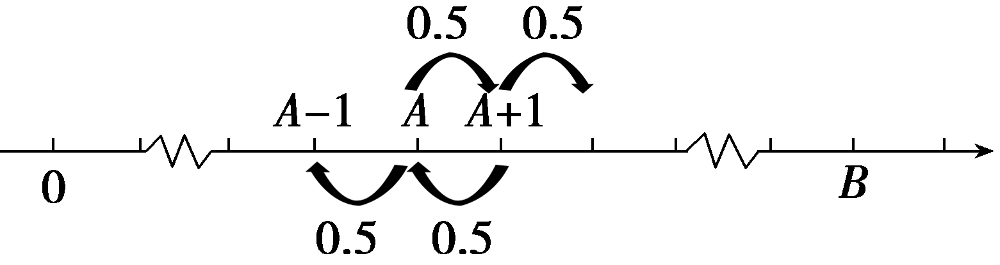

培优课17　概率与统计中的创新问题

高考有时在“概率、统计”与“函数、数列”知识网络的交汇点上设计试题，这成为了近几年命题的一个方向，体现了创新与应用，体现了考教衔接，有利于学生素养提升，有利于选拔人才.因此在解答此类题时，准确把题中所涉及的事件进行分解，明确所求问题所属的事件类型是关键.

### 题型一　切比雪夫不等式

19世纪俄国数学家切比雪夫在研究统计的规律中，论证并用标准差表达了一个不等式，该不等式被称为切比雪夫不等式，它可以使人们在随机变量<em>&lt;text style="italic"&gt;&lt;text style="italic"&gt;&lt;text style="italic"&gt;&lt;text style="italic"&gt;&lt;text style="italic"&gt;X</em>&lt;/text&gt;&lt;/text&gt;&lt;/text&gt;&lt;/text&gt;&lt;/text&gt;的分布未知的情况下，对事件 $\left|X－\mu \right|$ ＜<em>&lt;text style="italic"&gt;&lt;text style="italic"&gt;ε</em>&lt;/text&gt;&lt;/text&gt;做出估计.若随机变量<em>&lt;text style="italic"&gt;&lt;text style="italic"&gt;&lt;text style="italic"&gt;&lt;text style="italic"&gt;&lt;text style="italic"&gt;X</em>&lt;/text&gt;&lt;/text&gt;&lt;/text&gt;&lt;/text&gt;&lt;/text&gt;具有数学期望<em>E</em>(X)＝<em>&lt;text style="italic"&gt;μ</em>&lt;/text&gt;，方差<em>D</em>(X)＝<em>σ</em>2，则切比雪夫不等式可以概括为：对任意正数ε，不等式<em>P</em>(｜X－μ｜＜ε)≥1－ $\frac{\sigma ^{2}}{\varepsilon ^{2}}$ 成立.已知在某通信设备中，信号是由密文“<em>&lt;text style="italic"&gt;A</em>&lt;/text&gt;”和“<em>B</em>”组成的序列，现连续发射信号<em>n</em>次，记发射信号“A”的次数为<em>&lt;text style="italic"&gt;&lt;text style="italic"&gt;&lt;text style="italic"&gt;&lt;text style="italic"&gt;&lt;text style="italic"&gt;X</em>&lt;/text&gt;&lt;/text&gt;&lt;/text&gt;&lt;/text&gt;&lt;/text&gt;.

（1）若每次发射信号“*A*”和“*B*”的可能性是相等的，

①当*n*＝5时，求*P*(*X*≤2)；

②为了至少有98％的把握使发射信号“*A*”的频率在0.4与0.6之间，试估计信号发射次数*n*的最小值；

（2）若每次发射信号“*A*”和“*B*”的可能性是7∶3，已知在2 024次发射中，信号“*A*”发射*m*次的概率最大，求*m*的值.

解：（1）①由题意*X*～*B* $\left(5，\frac{1}{2}\right)$ ，

所以*<text style="italic"><text style="italic"><text style="italic">P*</text></text></text>(*<text style="italic"><text style="italic"><text style="italic">X*</text></text></text>≤2)＝P(X＝0)＋P(X＝1)＋P(X＝2)＝ $C_{5}^{0}\left(\frac{1}{2}\right)^{5}$ ＋ $C_{5}^{1}\left(\frac{1}{2}\right)^{5}$ ＋ $C_{5}^{2}\left(\frac{1}{2}\right)^{5}$ ＝ $\frac{1}{2}$ .

②由题意*X*～*B* $\left(n，\frac{1}{2}\right)$ ，则*E* $\left(X\right)$ ＝ $\frac{1}{2}$ *n*，

*D* $\left(X\right)$ ＝ $\frac{1}{2}$ *<text style="italic">n*</text>× $\left(1－\frac{1}{2}\right)$ ＝0.25*<text style="italic">n*</text>，

若0.4*n*≤*X*≤0.6*n*，则－0.1*n*≤*X*－0.5*n*≤0.1*n*，

所以*<text style="italic">P*</text> $\left(\left|X－\mu \right|＜\varepsilon \right)$ ＝*<text style="italic">P*</text> $\left(\left|X－0.5n\right|<0.1n\right)$ ≥1－ $\frac{\sigma ^{2}}{\varepsilon ^{2}}$ ＝1－ $\frac{0.25n}{\left(0.1n\right)^{2}}$ ≥0.98，

又*n*＞0，解得*n*≥1 250，即发射次数至少为1 250次.

（2）依题意*X*～*B*(2 024，0.7)，

则<em>P</em>(<em>X</em>＝<em>&lt;text style="italic,superscript"&gt;&lt;text style="italic,superscript"&gt;&lt;text style="italic,superscript"&gt;&lt;text style="italic,superscript"&gt;m</em>&lt;/text&gt;&lt;/text&gt;&lt;/text&gt;&lt;/text&gt;)＝ $C_{2 024}^{m}$ ×0.7<em>&lt;text style="italic,superscript"&gt;&lt;text style="italic,superscript"&gt;&lt;text style="italic,superscript"&gt;&lt;text style="italic,superscript"&gt;m</em>&lt;/text&gt;&lt;/text&gt;&lt;/text&gt;&lt;/text&gt;×0.3&lt;text style="superscript"&gt;2 024－&lt;/text&gt;m＝ $\frac{2 024！}{(2 024－m)!m！}$ ×0.7<em>&lt;text style="italic,superscript"&gt;&lt;text style="italic,superscript"&gt;&lt;text style="italic,superscript"&gt;&lt;text style="italic,superscript"&gt;m</em>&lt;/text&gt;&lt;/text&gt;&lt;/text&gt;&lt;/text&gt;×0.3&lt;text style="superscript"&gt;2 024－&lt;/text&gt;m，

<em>P</em>(<em>X</em>＝<em>&lt;text style="italic,superscript"&gt;&lt;text style="italic,superscript"&gt;m</em>&lt;/text&gt;&lt;/text&gt;＋1)＝ $C_{2 024}^{m+1}$ ×0.7<em>&lt;text style="italic,superscript"&gt;&lt;text style="italic,superscript"&gt;m</em>&lt;/text&gt;&lt;/text&gt;＋1×0.32 023－m

＝ $\frac{2 024！}{(2 023－m)!(m+1)!}$ ×0.7<em>&lt;text style="italic,superscript"&gt;m</em>&lt;/text&gt;＋1×0.32 023－m，

<em>P</em>(<em>X</em>＝<em>&lt;text style="italic,superscript"&gt;&lt;text style="italic,superscript"&gt;&lt;text style="italic,superscript"&gt;&lt;text style="italic,superscript"&gt;m</em>&lt;/text&gt;&lt;/text&gt;&lt;/text&gt;&lt;/text&gt;&lt;text style="superscript"&gt;－1&lt;/text&gt;)＝ $C_{2 024}^{m－1}$ ×0.7<em>&lt;text style="italic,superscript"&gt;&lt;text style="italic,superscript"&gt;&lt;text style="italic,superscript"&gt;&lt;text style="italic,superscript"&gt;m</em>&lt;/text&gt;&lt;/text&gt;&lt;/text&gt;&lt;/text&gt;&lt;text style="superscript"&gt;－1&lt;/text&gt;×0.3&lt;text style="superscript"&gt;2 025－&lt;/text&gt;m＝ $\frac{2 024！}{(2 025－m)!(m－1)!}$ ×0.7<em>&lt;text style="italic,superscript"&gt;&lt;text style="italic,superscript"&gt;&lt;text style="italic,superscript"&gt;&lt;text style="italic,superscript"&gt;m</em>&lt;/text&gt;&lt;/text&gt;&lt;/text&gt;&lt;/text&gt;&lt;text style="superscript"&gt;－1&lt;/text&gt;×0.3&lt;text style="superscript"&gt;2 025－&lt;/text&gt;m，

$\frac{P(X＝<eq>\frac{\frac{2 024！}{(2 023－m)!(m+1)!}\times 0.7^{m+1}\times 0.3^{2 023－m}}{\frac{2 024！}{(2 024－m)!m！}\times 0.7^{m}\times 0.3^{2 024－m}}$ *m*+1)}{P(X＝ $\frac{0.7(2 024－m)}{0.3(m+1)}$ *m*)}</eq>＝＝≤1，解得m≥1 416.5，

$\frac{P(X＝<eq>\frac{\frac{2 024！}{(2 024－m)!m！}\times 0.7^{m}\times 0.3^{2 024－m}}{\frac{2 024！}{(2 025－m)!\left(m－1\right)！}\times 0.7^{m－1}\times 0.3^{2 025－m}}$ *m*)}{P(X＝ $\frac{0.7\left(2 025－m\right)}{0.3m}$ *m*－1)}</eq>＝＝≥1，解得m≤1 417.5，

又<em>m</em>∈<strong>N</strong><em>\*</em>，所以当<em>m</em>＝1 417时，<em>P</em>(<em>X</em>＝<em>m</em>)最大.

对点练1.某工厂生产某种元件，其质量按测试指标划分为：指标大于或等于82为合格品，小于82为次品，现抽取这种元件100件进行检测，检测结果统计如下表：

<table><tr><td>
测试指标
</td><td></td><td></td><td></td><td></td><td></td></tr><tr><td>
元件数(件)
</td><td>
12
</td><td>
18
</td><td>
36
</td><td>
30
</td><td>
4
</td></tr></table>

（1）现从这100件样品中随机抽取2件，若其中一件为合格品，求另一件也为合格品的概率；

（2）关于随机变量，俄国数学家切比雪夫提出切比雪夫不等式：

若随机变量<em>X</em>具有数学期望<em>E</em> $\left(X\right)$ ＝<em>μ</em>，方差<em>D</em> $\left(X\right)$ ＝<em>σ</em>2，则对任意正数<em>ε</em>，均有<em>P</em> $\left(\left|X－\mu \right|\geq \varepsilon \right)$ ≤ $\frac{\sigma ^{2}}{\varepsilon ^{2}}$ 成立.

①若*<text style="italic">X*</text>～*B* $\left(100，\frac{1}{2}\right)$ ，证明：*P*(0≤*<text style="italic">X*</text>≤25)≤ $\frac{1}{50}$ ；

②利用该结论表示即使分布未知，随机变量的取值范围落在期望左右的一定范围内的概率是有界的.若该工厂声称本厂元件合格率为90％，那么根据所给样本数据，请结合“切比雪夫不等式”说明该工厂所提供的合格率是否可信？(注：当随机事件*A*发生的概率小于0.05时，可称事件*A*为小概率事件)

解：（1）记事件*A*为抽到一件合格品，事件*B*为抽到两件合格品，

*<text style="italic">P*</text> $\left(AB\right)$ ＝ $\frac{C_{70}^{2}}{C_{100}^{2}}$ ＝ $\frac{161}{330}$ ，*<text style="italic">P*</text> $\left(A\right)$ ＝ $\frac{C_{100}^{2}－C_{30}^{2}}{C_{100}^{2}}$ ＝ $\frac{301}{330}$ ，

*P* $\left(B｜A\right)$ ＝ $\frac{P\left(AB\right)}{P\left(A\right)}$ ＝ $\frac{161}{301}$ ＝ $\frac{23}{43}$ .

（2）①证明：根据题意，若*X*～*B* $\left(100，\frac{1}{2}\right)$ ，

则*E* $\left(X\right)$ ＝50，*D* $\left(X\right)$ ＝25，

又*<text style="italic">P*</text> $\left(X＝k\right)$ ＝ $C_{100}^{k}\left(\frac{1}{2}\right)^{100}$ ＝*<text style="italic">P*</text> $\left(X=100－k\right)$ ，

所以*<text style="italic"><text style="italic">P*</text></text> $\left(0\leq X\leq 25\right)$ ＝ $\frac{1}{2}$ *<text style="italic"><text style="italic">P*</text></text>(0≤*<text style="italic">X*</text>≤25或75≤X≤100)＝ $\frac{1}{2}$ *<text style="italic"><text style="italic">P*</text></text> $\left(\left|X－50\right|\geq 25\right)$ ，

由切比雪夫不等式可知，*P* $\left(\left|X－50\right|\geq 25\right)$ ≤ $\frac{25}{25^{2}}$ ＝ $\frac{1}{25}$ ，

所以*P* $\left(0\leq X\leq 25\right)$ ≤ $\frac{1}{50}$ .

②设随机抽取100件产品中合格品的件数为*X*，

假设厂家关于产品合格率为90％的说法成立，则*X*～*B* $\left(100，0.9\right)$ ，

所以*E* $\left(X\right)$ ＝90，*D* $\left(X\right)$ ＝9，

由切比雪夫不等式知，*<text style="italic">P*</text> $\left(X=70\right)$ ≤*<text style="italic">P*</text>(｜*X*－90｜≥20)≤ $\frac{9}{400}$ ＝0.022 5，

即在假设下100个元件中合格品为70个的概率不超过0.022 5，此概率极小，由小概率原理可知，一般来说在一次试验中是不会发生的，据此我们有理由推断工厂的合格率不可信.

### 题型二　马尔科夫链

马尔科夫链因俄国数学家安德烈·马尔科夫得名，其过程具备“无记忆”的性质，即第<em>&lt;text style="italic"&gt;&lt;text style="italic"&gt;&lt;text style="italic"&gt;&lt;text style="italic"&gt;&lt;text style="italic"&gt;&lt;text style="italic,subscri&lt;text style="italic"&gt;p</em>t"&gt;<em>n</em>&lt;/text&gt;&lt;/text&gt;&lt;/text&gt;&lt;/text&gt;&lt;/text&gt;&lt;/text&gt;&lt;/text&gt;＋1次状态的概率分布只跟第n次的状态有关，与第n－1，n－2，n－3，…次状态无关.马尔科夫链是概率统计中的一个重要模型，也是机器学习和人工智能的基石，在强化学习、自然语言处理、金融领域、天气预测等方面都有着极其广泛的应用.现有<em>&lt;text style="italic"&gt;&lt;text style="italic"&gt;A</em>&lt;/text&gt;&lt;/text&gt;，<em>&lt;text style="italic"&gt;B</em>&lt;/text&gt;两个盒子，各装有2个黑球和1个红球，现从A，B两个盒子中各任取一个球交换放入另一个盒子，重复进行n $\left(n\in N^{*}\right)$ 次这样的操作后，记<em>&lt;text style="italic"&gt;&lt;text style="italic"&gt;A</em>&lt;/text&gt;&lt;/text&gt;盒子中红球的个数为<em>X&lt;text style="italic"&gt;&lt;text style="italic"&gt;&lt;text style="italic"&gt;&lt;text style="italic"&gt;&lt;text style="italic"&gt;&lt;text style="italic,subscri&lt;text style="italic"&gt;p</em>t"&gt;<em>n</em>&lt;/text&gt;&lt;/text&gt;&lt;/text&gt;&lt;/text&gt;&lt;/text&gt;&lt;/text&gt;&lt;/text&gt;，恰有1个红球的概率为pn.

（1）求<em>p</em>1，<em>p</em>2的值；

（2）求<em>pn</em>的值(用<em>n</em>表示)；

（3）求证：<em>Xn</em>的数学期望<em>E</em> $\left(X_{n}\right)$ 为定值.

解：（1）设第<em>&lt;text style="italic,subscri&lt;text style="italic"&gt;p</em>t"&gt;<em>&lt;text style="italic,subscript"&gt;n</em>&lt;/text&gt;&lt;/text&gt;&lt;/text&gt; $\left(n\in N^{*}\right)$ 次操作后<em>A</em>盒子中恰有2个红球的概率为<em>&lt;text style="italic"&gt;q</em>&lt;/text&gt;<em>&lt;text style="italic,subscri&lt;text style="italic"&gt;p</em>t"&gt;<em>&lt;text style="italic,subscript"&gt;n</em>&lt;/text&gt;&lt;/text&gt;&lt;/text&gt;，则没有红球的概率为1－pn－qn.

由题意知<em>p</em>&lt;text style="subscript"&gt;1&lt;/text&gt;＝ $\frac{C_{2}^{1}C_{2}^{1}＋C_{1}^{1}C_{1}^{1}}{C_{3}^{1}C_{3}^{1}}$ ＝ $\frac{5}{9}$ ，<em>q</em>&lt;text style="subscript"&gt;1&lt;/text&gt;＝ $\frac{C_{2}^{1}C_{1}^{1}}{C_{3}^{1}C_{3}^{1}}$ ＝ $\frac{2}{9}$ ，

<em>&lt;text style="italic"&gt;p</em>&lt;/text&gt;2＝p&lt;text style="subscript"&gt;1&lt;/text&gt;<em>&lt;text style="italic"&gt;·</em>&lt;/text&gt; $\frac{C_{2}^{1}C_{2}^{1}＋C_{1}^{1}C_{1}^{1}}{C_{3}^{1}C_{3}^{1}}$ ＋<em>q</em>&lt;text style="subscript"&gt;1&lt;/text&gt;<em>&lt;text style="italic"&gt;·</em>&lt;/text&gt; $\frac{C_{2}^{1}C_{3}^{1}}{C_{3}^{1}C_{3}^{1}}$ ＋ $\left(1－p_{1}－q_{1}\right)$ <em>&lt;text style="italic"&gt;·</em>&lt;/text&gt; $\frac{C_{3}^{1}C_{2}^{1}}{C_{3}^{1}C_{3}^{1}}$ ＝ $\frac{49}{81}$ .

（2）因为<em>&lt;text style="italic"&gt;&lt;text style="italic"&gt;p</em>&lt;/text&gt;&lt;/text&gt;<em>&lt;text style="italic,subscript"&gt;&lt;text style="italic,subscript"&gt;&lt;text style="italic,subscript"&gt;n</em>&lt;/text&gt;&lt;/text&gt;&lt;/text&gt;＝pn&lt;text style="subscript"&gt;&lt;text style="subscript"&gt;－1&lt;/text&gt;&lt;/text&gt;· $\frac{C_{2}^{1}C_{2}^{1}＋C_{1}^{1}C_{1}^{1}}{C_{3}^{1}C_{3}^{1}}$ ＋<em>q</em>&lt;text style="italic,subscri<em>&lt;text style="italic"&gt;p</em>&lt;/text&gt;t"&gt;<em>&lt;text style="italic,subscript"&gt;&lt;text style="italic,subscript"&gt;n</em>&lt;/text&gt;&lt;/text&gt;&lt;/text&gt;&lt;text style="subscript"&gt;&lt;text style="subscript"&gt;－1&lt;/text&gt;&lt;/text&gt;· $\frac{C_{2}^{1}C_{3}^{1}}{C_{3}^{1}C_{3}^{1}}$ ＋ $\left(1－p_{n－1}－q_{n－1}\right)$ · $\frac{C_{3}^{1}C_{2}^{1}}{C_{3}^{1}C_{3}^{1}}$ ＝－ $\frac{1}{9}$ <em>&lt;text style="italic"&gt;&lt;text style="italic"&gt;p</em>&lt;/text&gt;&lt;/text&gt;<em>&lt;text style="italic,subscript"&gt;&lt;text style="italic,subscript"&gt;&lt;text style="italic,subscript"&gt;n</em>&lt;/text&gt;&lt;/text&gt;&lt;/text&gt;&lt;text style="subscript"&gt;&lt;text style="subscript"&gt;－1&lt;/text&gt;&lt;/text&gt;＋ $\frac{2}{3}$ .

所以<em>pn</em>－ $\frac{3}{5}$ ＝－ $\frac{1}{9}\left(p_{n－1}－\frac{3}{5}\right)$ .

又因为<em>p</em>1－ $\frac{3}{5}$ ＝－ $\frac{2}{45}$ ≠0，所以 $\left\{p_{n}－\frac{3}{5}\right\}$ 是以－ $\frac{2}{45}$ 为首项，－ $\frac{1}{9}$ 为公比的等比数列.

所以<em>&lt;text style="italic"&gt;p</em>&lt;/text&gt;<em>&lt;text style="italic,subscript"&gt;n</em>&lt;/text&gt;－ $\frac{3}{5}$ ＝－ $\frac{2}{45}$ × $\left(－\frac{1}{9}\right)^{n－1}$ ，<em>&lt;text style="italic"&gt;p</em>&lt;/text&gt;<em>&lt;text style="italic,subscript"&gt;n</em>&lt;/text&gt;＝－ $\frac{2}{45}$ × $\left(－\frac{1}{9}\right)^{n－1}$ ＋ $\frac{3}{5}$ .

（3）证明：因为<em>&lt;text style="italic"&gt;&lt;text style="italic"&gt;q</em>&lt;/text&gt;&lt;/text&gt;&lt;text style="italic,subscri<em>&lt;text style="italic"&gt;p</em>&lt;/text&gt;t"&gt;<em>&lt;text style="italic,subscript"&gt;&lt;text style="italic,subscript"&gt;&lt;text style="italic,subscript"&gt;n</em>&lt;/text&gt;&lt;/text&gt;&lt;/text&gt;&lt;/text&gt;＝ $\frac{C_{2}^{1}C_{1}^{1}}{C_{3}^{1}C_{3}^{1}}$ <em>&lt;text style="italic"&gt;p</em>&lt;/text&gt;<em>&lt;text style="italic,subscript"&gt;&lt;text style="italic,subscript"&gt;&lt;text style="italic,subscript"&gt;&lt;text style="italic,subscript"&gt;n</em>&lt;/text&gt;&lt;/text&gt;&lt;/text&gt;&lt;/text&gt;&lt;text style="subscript"&gt;&lt;text style="subscript"&gt;&lt;text style="subscript"&gt;－1&lt;/text&gt;&lt;/text&gt;&lt;/text&gt;＋ $\frac{C_{1}^{1}C_{3}^{1}}{C_{3}^{1}C_{3}^{1}}$ <em>&lt;text style="italic"&gt;&lt;text style="italic"&gt;q</em>&lt;/text&gt;&lt;/text&gt;&lt;text style="italic,subscri<em>&lt;text style="italic"&gt;p</em>&lt;/text&gt;t"&gt;<em>&lt;text style="italic,subscript"&gt;&lt;text style="italic,subscript"&gt;&lt;text style="italic,subscript"&gt;n</em>&lt;/text&gt;&lt;/text&gt;&lt;/text&gt;&lt;/text&gt;&lt;text style="subscript"&gt;&lt;text style="subscript"&gt;&lt;text style="subscript"&gt;－1&lt;/text&gt;&lt;/text&gt;&lt;/text&gt;＝ $\frac{2}{9}$ <em>&lt;text style="italic"&gt;p</em>&lt;/text&gt;<em>&lt;text style="italic,subscript"&gt;&lt;text style="italic,subscript"&gt;&lt;text style="italic,subscript"&gt;&lt;text style="italic,subscript"&gt;n</em>&lt;/text&gt;&lt;/text&gt;&lt;/text&gt;&lt;/text&gt;&lt;text style="subscript"&gt;&lt;text style="subscript"&gt;&lt;text style="subscript"&gt;－1&lt;/text&gt;&lt;/text&gt;&lt;/text&gt;＋ $\frac{1}{3}$ <em>&lt;text style="italic"&gt;&lt;text style="italic"&gt;q</em>&lt;/text&gt;&lt;/text&gt;&lt;text style="italic,subscri<em>&lt;text style="italic"&gt;p</em>&lt;/text&gt;t"&gt;<em>&lt;text style="italic,subscript"&gt;&lt;text style="italic,subscript"&gt;&lt;text style="italic,subscript"&gt;n</em>&lt;/text&gt;&lt;/text&gt;&lt;/text&gt;&lt;/text&gt;&lt;text style="subscript"&gt;&lt;text style="subscript"&gt;&lt;text style="subscript"&gt;－1&lt;/text&gt;&lt;/text&gt;&lt;/text&gt;，①

1－<em>q</em>&lt;text style="italic,subscri<em>&lt;text style="italic"&gt;&lt;text style="italic"&gt;p</em>&lt;/text&gt;&lt;/text&gt;t"&gt;<em>&lt;text style="italic,subscript"&gt;&lt;text style="italic,subscript"&gt;n</em>&lt;/text&gt;&lt;/text&gt;&lt;/text&gt;－pn＝ $\frac{C_{1}^{1}C_{2}^{1}}{C_{3}^{1}C_{3}^{1}}$ <em>&lt;text style="italic"&gt;&lt;text style="italic"&gt;p</em>&lt;/text&gt;&lt;/text&gt;<em>&lt;text style="italic,subscript"&gt;&lt;text style="italic,subscript"&gt;&lt;text style="italic,subscript"&gt;n</em>&lt;/text&gt;&lt;/text&gt;&lt;/text&gt;&lt;text style="subscript"&gt;－1&lt;/text&gt;＋ $\frac{C_{3}^{1}C_{1}^{1}}{C_{3}^{1}C_{3}^{1}}\left(1－q_{n－1}－p_{n－1}\right)$ ＝ $\frac{2}{9}$ <em>&lt;text style="italic"&gt;&lt;text style="italic"&gt;p</em>&lt;/text&gt;&lt;/text&gt;<em>&lt;text style="italic,subscript"&gt;&lt;text style="italic,subscript"&gt;&lt;text style="italic,subscript"&gt;n</em>&lt;/text&gt;&lt;/text&gt;&lt;/text&gt;&lt;text style="subscript"&gt;－1&lt;/text&gt;＋ $\frac{1}{3}\left(1－q_{n－1}－p_{n－1}\right)$ ，②

所以①－②，得2<em>&lt;text style="italic"&gt;q</em>&lt;/text&gt;&lt;text style="italic,subscri<em>&lt;text style="italic"&gt;p</em>&lt;/text&gt;t"&gt;<em>&lt;text style="italic,subscript"&gt;&lt;text style="italic,subscript"&gt;n</em>&lt;/text&gt;&lt;/text&gt;&lt;/text&gt;＋pn&lt;text style="subscript"&gt;－1&lt;/text&gt;＝ $\frac{1}{3}$ (2<em>&lt;text style="italic"&gt;q</em>&lt;/text&gt;&lt;text style="italic,subscri<em>&lt;text style="italic"&gt;p</em>&lt;/text&gt;t"&gt;<em>&lt;text style="italic,subscript"&gt;&lt;text style="italic,subscript"&gt;n</em>&lt;/text&gt;&lt;/text&gt;&lt;/text&gt;&lt;text style="subscript"&gt;－1&lt;/text&gt;＋pn－1－1).

又因为2<em>q</em>1＋<em>p</em>1－1＝0，所以2<em>qn</em>＋<em>pn</em>－1＝0，

所以<em>qn</em>＝ $\frac{1－p_{n}}{2}$ .

<em>Xn</em>的可能取值是0，1，2，

<em>&lt;text style="italic"&gt;P</em>&lt;/text&gt; $\left(X_{n}=0\right)$ ＝1－<em>&lt;text style="italic"&gt;p</em>&lt;/text&gt;<em>&lt;text style="italic,subscript"&gt;&lt;text style="italic,subscript"&gt;n</em>&lt;/text&gt;&lt;/text&gt;－<em>q</em>n＝ $\frac{1－p_{n}}{2}$ ，<em>&lt;text style="italic"&gt;P</em>&lt;/text&gt; $\left(X_{n}=1\right)$ ＝<em>&lt;text style="italic"&gt;p</em>&lt;/text&gt;<em>&lt;text style="italic,subscript"&gt;&lt;text style="italic,subscript"&gt;n</em>&lt;/text&gt;&lt;/text&gt;，

<em>P</em> $\left(X_{n}=2\right)$ ＝<em>qn</em>＝ $\frac{1－p_{n}}{2}$ .

所以<em>Xn</em>的分布列为

<table><tr><td>
<em>Xn</em>
</td><td>
0
</td><td>
1
</td><td>
2
</td></tr><tr><td>
<em>p</em>
</td><td></td><td>
<em>pn</em>
</td><td></td></tr></table>

所以<em>E</em> $\left(X_{n}\right)$ ＝0× $\frac{1－p_{n}}{2}$ ＋1×<em>pn</em>＋2× $\frac{1－p_{n}}{2}$ ＝1.

所以<em>Xn</em>的数学期望<em>E</em> $\left(X_{n}\right)$ 为定值1.

对点练2.马尔科夫链是概率统计中的一个重要模型，其过程具备“无记忆”的性质：下一状态的概率分布只能由当前状态决定，即第<em>n</em>＋1次状态的概率分布只与第<em>n</em>次的状态有关，与第<em>n</em>－1，<em>n</em>－2，<em>n</em>－3，…次的状态无关，即<em>P</em>(<em>Xn</em>＋1｜<em>X</em>1，<em>X</em>2，…，<em>Xn</em>－1，<em>Xn</em>)＝<em>P</em>(<em>Xn</em>＋1｜<em>Xn</em>).已知甲盒中装有1个白球和2个黑球，乙盒中装有2个白球，现从甲、乙两个盒中各任取1个球交换放入对方的盒中，重复<em>n</em>次(<em>n</em>∈<strong>N</strong><em>\*</em>)这样的操作，记此时甲盒中白球的个数为<em>Xn</em>，甲盒中恰有2个白球的概率为<em>an</em>，恰有1个白球的概率为<em>bn</em>.

（1）求<em>a</em>1，<em>b</em>1和<em>a</em>2，<em>b</em>2；

（2）证明： $\left\{a_{n}+2b_{n}－\frac{6}{5}\right\}$ 为等比数列；

（3）求<em>Xn</em>的数学期望(用<em>n</em>表示).

解：(1)若甲盒取黑球、乙盒取白球，互换，则甲盒中的球变为2白1黑，乙盒中的球变为1白1黑，概率<em>a</em>1＝ $\frac{2}{3}$ ；

若甲盒取白球、乙盒取白球，互换，则甲盒中的球仍为1白2黑，乙盒中的球仍为2白，概率<em>b</em>1＝ $\frac{1}{3}$ ，

研究第2次交换球时的概率，根据第1次交换球的结果讨论如下：

①当甲盒中的球为2白1黑，乙盒中的球为1白1黑时，对应概率为<em>a</em>1＝ $\frac{2}{3}$ ，

此时，若甲盒取黑球、乙盒取黑球，互换，则甲盒中的球仍为2白&lt;text style="subscript"&gt;1&lt;/text&gt;黑，乙盒中的球仍为1白1黑，概率为&lt;text style="it<em>a</em>lic"&gt;a&lt;/text&gt;1× $\frac{1}{3}$ × $\frac{1}{2}$ ＝ $\frac{1}{6}$ &lt;text style="it<em>a</em>lic"&gt;a&lt;/text&gt;&lt;text style="subscript"&gt;1&lt;/text&gt;；

若甲盒取黑球、乙盒取白球，互换，则甲盒中的球变为3白，乙盒中的球变为2黑，概率为&lt;text style="it<em>a</em>lic"&gt;a&lt;/text&gt;&lt;text style="subscript"&gt;1&lt;/text&gt;× $\frac{1}{3}$ × $\frac{1}{2}$ ＝ $\frac{1}{6}$ &lt;text style="it<em>a</em>lic"&gt;a&lt;/text&gt;&lt;text style="subscript"&gt;1&lt;/text&gt;；

若甲盒取白球、乙盒取黑球，互换，则甲盒中的球变为&lt;text style="subscript"&gt;1&lt;/text&gt;白2黑，乙盒中的球变为2白，概率为&lt;text style="it<em>a</em>lic"&gt;a&lt;/text&gt;1× $\frac{2}{3}$ × $\frac{1}{2}$ ＝ $\frac{1}{3}$ &lt;text style="it<em>a</em>lic"&gt;a&lt;/text&gt;&lt;text style="subscript"&gt;1&lt;/text&gt;；

若甲盒取白球、乙盒取白球，互换，则甲盒中的球仍为2白&lt;text style="subscript"&gt;1&lt;/text&gt;黑，乙盒中的球仍为1白1黑，概率为&lt;text style="it<em>a</em>lic"&gt;a&lt;/text&gt;1× $\frac{2}{3}$ × $\frac{1}{2}$ ＝ $\frac{1}{3}$ &lt;text style="it<em>a</em>lic"&gt;a&lt;/text&gt;&lt;text style="subscript"&gt;1&lt;/text&gt;，

②当甲盒中的球为1白2黑，乙盒中的球为2白时，对应概率为<em>b</em>1＝ $\frac{1}{3}$ ，

此时，若甲盒取黑球、乙盒取白球，互换，则甲盒中的球变为2白&lt;text style="su<em>b</em>script"&gt;1&lt;/text&gt;黑，乙盒中的球变为1白1黑，概率为<em>b</em>1× $\frac{2}{3}$ ＝ $\frac{2}{3}$ <em>&lt;text style="italic"&gt;b</em>&lt;/text&gt;&lt;text style="subscript"&gt;1&lt;/text&gt;，

若甲盒取白球，乙盒取白球，互换，则甲盒中的球仍为&lt;text style="su<em>b</em>script"&gt;1&lt;/text&gt;白2黑，乙盒中的球仍为2白，概率为<em>b</em>1× $\frac{1}{3}$ ＝ $\frac{1}{3}$ <em>&lt;text style="italic"&gt;b</em>&lt;/text&gt;&lt;text style="subscript"&gt;1&lt;/text&gt;，

综上，&lt;text style="it&lt;text style="it&lt;text style="it<em>a</em>lic"&gt;a&lt;/text&gt;lic"&gt;a&lt;/text&gt;lic"&gt;a&lt;/text&gt;&lt;text style="su<em>&lt;text style="italic"&gt;&lt;text style="italic"&gt;b</em>&lt;/text&gt;&lt;/text&gt;script"&gt;2&lt;/text&gt;＝ $\frac{1}{6}$ &lt;text style="it&lt;text style="it&lt;text style="it<em>a</em>lic"&gt;a&lt;/text&gt;lic"&gt;a&lt;/text&gt;lic"&gt;a&lt;/text&gt;&lt;text style="su<em>&lt;text style="italic"&gt;&lt;text style="italic"&gt;b</em>&lt;/text&gt;&lt;/text&gt;script"&gt;&lt;text style="subscript"&gt;&lt;text style="subscript"&gt;&lt;text style="subscript"&gt;1&lt;/text&gt;&lt;/text&gt;&lt;/text&gt;&lt;/text&gt;＋ $\frac{1}{3}$ &lt;text style="it&lt;text style="it&lt;text style="it<em>a</em>lic"&gt;a&lt;/text&gt;lic"&gt;a&lt;/text&gt;lic"&gt;a&lt;/text&gt;&lt;text style="su<em>&lt;text style="italic"&gt;&lt;text style="italic"&gt;b</em>&lt;/text&gt;&lt;/text&gt;script"&gt;&lt;text style="subscript"&gt;&lt;text style="subscript"&gt;&lt;text style="subscript"&gt;1&lt;/text&gt;&lt;/text&gt;&lt;/text&gt;&lt;/text&gt;＋ $\frac{2}{3}$ &lt;text style="it<em>a</em>lic"&gt;<em>&lt;text style="italic"&gt;b</em>&lt;/text&gt;&lt;/text&gt;&lt;text style="subscript"&gt;&lt;text style="subscript"&gt;&lt;text style="subscript"&gt;&lt;text style="subscript"&gt;1&lt;/text&gt;&lt;/text&gt;&lt;/text&gt;&lt;/text&gt;＝ $\frac{5}{9}$ ，&lt;text style="it<em>a</em>lic"&gt;<em>&lt;text style="italic"&gt;b</em>&lt;/text&gt;&lt;/text&gt;&lt;text style="subscript"&gt;2&lt;/text&gt;＝ $\frac{1}{3}$ &lt;text style="it&lt;text style="it&lt;text style="it<em>a</em>lic"&gt;a&lt;/text&gt;lic"&gt;a&lt;/text&gt;lic"&gt;a&lt;/text&gt;&lt;text style="su<em>&lt;text style="italic"&gt;&lt;text style="italic"&gt;b</em>&lt;/text&gt;&lt;/text&gt;script"&gt;&lt;text style="subscript"&gt;&lt;text style="subscript"&gt;&lt;text style="subscript"&gt;1&lt;/text&gt;&lt;/text&gt;&lt;/text&gt;&lt;/text&gt;＋ $\frac{1}{3}$ &lt;text style="it<em>a</em>lic"&gt;<em>&lt;text style="italic"&gt;b</em>&lt;/text&gt;&lt;/text&gt;&lt;text style="subscript"&gt;&lt;text style="subscript"&gt;&lt;text style="subscript"&gt;&lt;text style="subscript"&gt;1&lt;/text&gt;&lt;/text&gt;&lt;/text&gt;&lt;/text&gt;＝ $\frac{1}{3}$ .

（2）证明：依题意，经过<em>n</em>次这样的操作，甲盒中恰有2个白球的概率为<em>an</em>，恰有1个白球的概率为<em>bn</em>，则甲盒中恰有3个白球的概率为1－<em>an</em>－<em>bn</em>，

研究第*n*＋1次交换球时的概率，根据第*n*次交换球的结果讨论如下：

①当甲盒中的球为2白1黑，乙盒中的球为1白1黑时，对应概率为<em>an</em>，

此时，若甲盒取黑球、乙盒取黑球，互换，则甲盒中的球仍为2白1黑，乙盒中的球仍为1白1黑，概率为&lt;text style="it<em>a</em>lic"&gt;a&lt;/text&gt;<em>&lt;text style="italic,subscript"&gt;n</em>&lt;/text&gt;× $\frac{1}{3}$ × $\frac{1}{2}$ ＝ $\frac{1}{6}$ &lt;text style="it<em>a</em>lic"&gt;a&lt;/text&gt;<em>&lt;text style="italic,subscript"&gt;n</em>&lt;/text&gt;；

若甲盒取黑球、乙盒取白球，互换，则甲盒中的球变为3白，乙盒中的球变为2黑，概率为&lt;text style="it<em>a</em>lic"&gt;a&lt;/text&gt;<em>&lt;text style="italic,subscript"&gt;n</em>&lt;/text&gt;× $\frac{1}{3}$ × $\frac{1}{2}$ ＝ $\frac{1}{6}$ &lt;text style="it<em>a</em>lic"&gt;a&lt;/text&gt;<em>&lt;text style="italic,subscript"&gt;n</em>&lt;/text&gt;；

若甲盒取白球、乙盒取黑球，互换，则甲盒中的球变为1白2黑，乙盒中的球变为2白，概率为&lt;text style="it<em>a</em>lic"&gt;a&lt;/text&gt;<em>&lt;text style="italic,subscript"&gt;n</em>&lt;/text&gt;× $\frac{2}{3}$ × $\frac{1}{2}$ ＝ $\frac{1}{3}$ &lt;text style="it<em>a</em>lic"&gt;a&lt;/text&gt;<em>&lt;text style="italic,subscript"&gt;n</em>&lt;/text&gt;；

若甲盒取白球、乙盒取白球，互换，则甲盒中的球仍为2白1黑，乙盒中的球仍为1白1黑，概率为&lt;text style="it<em>a</em>lic"&gt;a&lt;/text&gt;<em>&lt;text style="italic,subscript"&gt;n</em>&lt;/text&gt;× $\frac{2}{3}$ × $\frac{1}{2}$ ＝ $\frac{1}{3}$ &lt;text style="it<em>a</em>lic"&gt;a&lt;/text&gt;<em>&lt;text style="italic,subscript"&gt;n</em>&lt;/text&gt;.

②当甲盒中的球为1白2黑，乙盒中的球为2白时，对应概率为<em>bn</em>，

此时，若甲盒取黑球、乙盒取白球，互换，则甲盒中的球变为2白1黑，乙盒中的球变为1白1黑，概率为<em>&lt;text style="italic"&gt;b</em>&lt;/text&gt;<em>&lt;text style="italic,subscript"&gt;n</em>&lt;/text&gt;× $\frac{2}{3}$ ＝ $\frac{2}{3}$ <em>&lt;text style="italic"&gt;b</em>&lt;/text&gt;<em>&lt;text style="italic,subscript"&gt;n</em>&lt;/text&gt;；

若甲盒取白球、乙盒取白球，互换，则甲盒中的球仍为1白2黑，乙盒中的球仍为2白，概率为<em>&lt;text style="italic"&gt;b</em>&lt;/text&gt;<em>&lt;text style="italic,subscript"&gt;n</em>&lt;/text&gt;× $\frac{1}{3}$ ＝ $\frac{1}{3}$ <em>&lt;text style="italic"&gt;b</em>&lt;/text&gt;<em>&lt;text style="italic,subscript"&gt;n</em>&lt;/text&gt;.

③当甲盒中的球为3白，乙盒中的球为2黑时，对应概率为1－<em>an</em>－<em>bn</em>，

此时，甲盒只能取白球、乙盒只能取黑球，互换，则甲盒中的球变为2白1黑，乙盒中的球变为1白1黑，概率为1－<em>an</em>－<em>bn</em>.

综上，&lt;text style="it&lt;text style="it&lt;text style="it&lt;text style="it&lt;text style="it<em>a</em>lic"&gt;a&lt;/text&gt;lic"&gt;a&lt;/text&gt;lic"&gt;a&lt;/text&gt;lic"&gt;a&lt;/text&gt;lic"&gt;a&lt;/text&gt;&lt;text style="italic,su<em>&lt;text style="italic"&gt;&lt;text style="italic"&gt;&lt;text style="italic"&gt;&lt;text style="italic"&gt;b</em>&lt;/text&gt;&lt;/text&gt;&lt;/text&gt;&lt;/text&gt;script"&gt;<em>&lt;text style="italic,subscript"&gt;&lt;text style="italic,subscript"&gt;&lt;text style="italic,subscript"&gt;&lt;text style="italic,subscript"&gt;&lt;text style="italic,subscript"&gt;&lt;text style="italic,subscript"&gt;&lt;text style="italic,subscript"&gt;&lt;text style="italic,subscript"&gt;&lt;text style="italic,subscript"&gt;n</em>&lt;/text&gt;&lt;/text&gt;&lt;/text&gt;&lt;/text&gt;&lt;/text&gt;&lt;/text&gt;&lt;/text&gt;&lt;/text&gt;&lt;/text&gt;&lt;/text&gt;&lt;text style="subscript"&gt;＋1&lt;/text&gt;＝ $\frac{1}{6}$ &lt;text style="it&lt;text style="it&lt;text style="it&lt;text style="it&lt;text style="it<em>a</em>lic"&gt;a&lt;/text&gt;lic"&gt;a&lt;/text&gt;lic"&gt;a&lt;/text&gt;lic"&gt;a&lt;/text&gt;lic"&gt;a&lt;/text&gt;&lt;text style="italic,su<em>&lt;text style="italic"&gt;&lt;text style="italic"&gt;&lt;text style="italic"&gt;&lt;text style="italic"&gt;b</em>&lt;/text&gt;&lt;/text&gt;&lt;/text&gt;&lt;/text&gt;script"&gt;<em>&lt;text style="italic,subscript"&gt;&lt;text style="italic,subscript"&gt;&lt;text style="italic,subscript"&gt;&lt;text style="italic,subscript"&gt;&lt;text style="italic,subscript"&gt;&lt;text style="italic,subscript"&gt;&lt;text style="italic,subscript"&gt;&lt;text style="italic,subscript"&gt;&lt;text style="italic,subscript"&gt;n</em>&lt;/text&gt;&lt;/text&gt;&lt;/text&gt;&lt;/text&gt;&lt;/text&gt;&lt;/text&gt;&lt;/text&gt;&lt;/text&gt;&lt;/text&gt;&lt;/text&gt;＋ $\frac{1}{3}$ &lt;text style="it&lt;text style="it&lt;text style="it&lt;text style="it&lt;text style="it<em>a</em>lic"&gt;a&lt;/text&gt;lic"&gt;a&lt;/text&gt;lic"&gt;a&lt;/text&gt;lic"&gt;a&lt;/text&gt;lic"&gt;a&lt;/text&gt;&lt;text style="italic,su<em>&lt;text style="italic"&gt;&lt;text style="italic"&gt;&lt;text style="italic"&gt;&lt;text style="italic"&gt;b</em>&lt;/text&gt;&lt;/text&gt;&lt;/text&gt;&lt;/text&gt;script"&gt;<em>&lt;text style="italic,subscript"&gt;&lt;text style="italic,subscript"&gt;&lt;text style="italic,subscript"&gt;&lt;text style="italic,subscript"&gt;&lt;text style="italic,subscript"&gt;&lt;text style="italic,subscript"&gt;&lt;text style="italic,subscript"&gt;&lt;text style="italic,subscript"&gt;&lt;text style="italic,subscript"&gt;n</em>&lt;/text&gt;&lt;/text&gt;&lt;/text&gt;&lt;/text&gt;&lt;/text&gt;&lt;/text&gt;&lt;/text&gt;&lt;/text&gt;&lt;/text&gt;&lt;/text&gt;＋ $\frac{2}{3}$ &lt;text style="it&lt;text style="it&lt;text style="it<em>a</em>lic"&gt;a&lt;/text&gt;lic"&gt;a&lt;/text&gt;lic"&gt;<em>&lt;text style="italic"&gt;&lt;text style="italic"&gt;&lt;text style="italic"&gt;b</em>&lt;/text&gt;&lt;/text&gt;&lt;/text&gt;&lt;/text&gt;&lt;text style="it&lt;text style="it<em>a</em>lic"&gt;a&lt;/text&gt;lic,subscript"&gt;<em>&lt;text style="italic,subscript"&gt;&lt;text style="italic,subscript"&gt;&lt;text style="italic,subscript"&gt;&lt;text style="italic,subscript"&gt;&lt;text style="italic,subscript"&gt;&lt;text style="italic,subscript"&gt;&lt;text style="italic,subscript"&gt;&lt;text style="italic,subscript"&gt;&lt;text style="italic,subscript"&gt;n</em>&lt;/text&gt;&lt;/text&gt;&lt;/text&gt;&lt;/text&gt;&lt;/text&gt;&lt;/text&gt;&lt;/text&gt;&lt;/text&gt;&lt;/text&gt;&lt;/text&gt;&lt;text style="subscript"&gt;＋1&lt;/text&gt;－<em>a</em>n－bn＝1－ $\frac{1}{2}$ &lt;text style="it&lt;text style="it&lt;text style="it&lt;text style="it&lt;text style="it<em>a</em>lic"&gt;a&lt;/text&gt;lic"&gt;a&lt;/text&gt;lic"&gt;a&lt;/text&gt;lic"&gt;a&lt;/text&gt;lic"&gt;a&lt;/text&gt;&lt;text style="italic,su<em>&lt;text style="italic"&gt;&lt;text style="italic"&gt;&lt;text style="italic"&gt;&lt;text style="italic"&gt;b</em>&lt;/text&gt;&lt;/text&gt;&lt;/text&gt;&lt;/text&gt;script"&gt;<em>&lt;text style="italic,subscript"&gt;&lt;text style="italic,subscript"&gt;&lt;text style="italic,subscript"&gt;&lt;text style="italic,subscript"&gt;&lt;text style="italic,subscript"&gt;&lt;text style="italic,subscript"&gt;&lt;text style="italic,subscript"&gt;&lt;text style="italic,subscript"&gt;&lt;text style="italic,subscript"&gt;n</em>&lt;/text&gt;&lt;/text&gt;&lt;/text&gt;&lt;/text&gt;&lt;/text&gt;&lt;/text&gt;&lt;/text&gt;&lt;/text&gt;&lt;/text&gt;&lt;/text&gt;－ $\frac{1}{3}$ &lt;text style="it&lt;text style="it&lt;text style="it<em>a</em>lic"&gt;a&lt;/text&gt;lic"&gt;a&lt;/text&gt;lic"&gt;<em>&lt;text style="italic"&gt;&lt;text style="italic"&gt;&lt;text style="italic"&gt;b</em>&lt;/text&gt;&lt;/text&gt;&lt;/text&gt;&lt;/text&gt;&lt;text style="it&lt;text style="it<em>a</em>lic"&gt;a&lt;/text&gt;lic,subscript"&gt;<em>&lt;text style="italic,subscript"&gt;&lt;text style="italic,subscript"&gt;&lt;text style="italic,subscript"&gt;&lt;text style="italic,subscript"&gt;&lt;text style="italic,subscript"&gt;&lt;text style="italic,subscript"&gt;&lt;text style="italic,subscript"&gt;&lt;text style="italic,subscript"&gt;&lt;text style="italic,subscript"&gt;n</em>&lt;/text&gt;&lt;/text&gt;&lt;/text&gt;&lt;/text&gt;&lt;/text&gt;&lt;/text&gt;&lt;/text&gt;&lt;/text&gt;&lt;/text&gt;&lt;/text&gt;，bn&lt;text style="subscript"&gt;＋1&lt;/text&gt;＝ $\frac{1}{3}$ &lt;text style="it&lt;text style="it&lt;text style="it&lt;text style="it&lt;text style="it<em>a</em>lic"&gt;a&lt;/text&gt;lic"&gt;a&lt;/text&gt;lic"&gt;a&lt;/text&gt;lic"&gt;a&lt;/text&gt;lic"&gt;a&lt;/text&gt;&lt;text style="italic,su<em>&lt;text style="italic"&gt;&lt;text style="italic"&gt;&lt;text style="italic"&gt;&lt;text style="italic"&gt;b</em>&lt;/text&gt;&lt;/text&gt;&lt;/text&gt;&lt;/text&gt;script"&gt;<em>&lt;text style="italic,subscript"&gt;&lt;text style="italic,subscript"&gt;&lt;text style="italic,subscript"&gt;&lt;text style="italic,subscript"&gt;&lt;text style="italic,subscript"&gt;&lt;text style="italic,subscript"&gt;&lt;text style="italic,subscript"&gt;&lt;text style="italic,subscript"&gt;&lt;text style="italic,subscript"&gt;n</em>&lt;/text&gt;&lt;/text&gt;&lt;/text&gt;&lt;/text&gt;&lt;/text&gt;&lt;/text&gt;&lt;/text&gt;&lt;/text&gt;&lt;/text&gt;&lt;/text&gt;＋ $\frac{1}{3}$ &lt;text style="it&lt;text style="it&lt;text style="it<em>a</em>lic"&gt;a&lt;/text&gt;lic"&gt;a&lt;/text&gt;lic"&gt;<em>&lt;text style="italic"&gt;&lt;text style="italic"&gt;&lt;text style="italic"&gt;b</em>&lt;/text&gt;&lt;/text&gt;&lt;/text&gt;&lt;/text&gt;&lt;text style="it&lt;text style="it<em>a</em>lic"&gt;a&lt;/text&gt;lic,subscript"&gt;<em>&lt;text style="italic,subscript"&gt;&lt;text style="italic,subscript"&gt;&lt;text style="italic,subscript"&gt;&lt;text style="italic,subscript"&gt;&lt;text style="italic,subscript"&gt;&lt;text style="italic,subscript"&gt;&lt;text style="italic,subscript"&gt;&lt;text style="italic,subscript"&gt;&lt;text style="italic,subscript"&gt;n</em>&lt;/text&gt;&lt;/text&gt;&lt;/text&gt;&lt;/text&gt;&lt;/text&gt;&lt;/text&gt;&lt;/text&gt;&lt;/text&gt;&lt;/text&gt;&lt;/text&gt;，

则&lt;text style="it&lt;text style="it&lt;text style="it<em>a</em>lic"&gt;a&lt;/text&gt;lic"&gt;a&lt;/text&gt;lic"&gt;a&lt;/text&gt;&lt;text style="italic,su<em>&lt;text style="italic"&gt;&lt;text style="italic"&gt;&lt;text style="italic"&gt;b</em>&lt;/text&gt;&lt;/text&gt;&lt;/text&gt;script"&gt;<em>&lt;text style="italic,subscript"&gt;&lt;text style="italic,subscript"&gt;&lt;text style="italic,subscript"&gt;&lt;text style="italic,subscript"&gt;&lt;text style="italic,subscript"&gt;&lt;text style="italic,subscript"&gt;n</em>&lt;/text&gt;&lt;/text&gt;&lt;/text&gt;&lt;/text&gt;&lt;/text&gt;&lt;/text&gt;&lt;/text&gt;&lt;text style="subscript"&gt;＋1&lt;/text&gt;＋2bn＋1－ $\frac{6}{5}$ ＝1－ $\frac{1}{2}$ &lt;text style="it&lt;text style="it&lt;text style="it<em>a</em>lic"&gt;a&lt;/text&gt;lic"&gt;a&lt;/text&gt;lic"&gt;a&lt;/text&gt;&lt;text style="italic,su<em>&lt;text style="italic"&gt;&lt;text style="italic"&gt;&lt;text style="italic"&gt;b</em>&lt;/text&gt;&lt;/text&gt;&lt;/text&gt;script"&gt;<em>&lt;text style="italic,subscript"&gt;&lt;text style="italic,subscript"&gt;&lt;text style="italic,subscript"&gt;&lt;text style="italic,subscript"&gt;&lt;text style="italic,subscript"&gt;&lt;text style="italic,subscript"&gt;n</em>&lt;/text&gt;&lt;/text&gt;&lt;/text&gt;&lt;/text&gt;&lt;/text&gt;&lt;/text&gt;&lt;/text&gt;－ $\frac{1}{3}$ &lt;text style="it&lt;text style="it&lt;text style="it<em>a</em>lic"&gt;a&lt;/text&gt;lic"&gt;a&lt;/text&gt;lic"&gt;<em>&lt;text style="italic"&gt;&lt;text style="italic"&gt;b</em>&lt;/text&gt;&lt;/text&gt;&lt;/text&gt;<em>&lt;text style="italic,subscript"&gt;&lt;text style="italic,subscript"&gt;&lt;text style="italic,subscript"&gt;&lt;text style="italic,subscript"&gt;&lt;text style="italic,subscript"&gt;&lt;text style="italic,subscript"&gt;&lt;text style="italic,subscript"&gt;n</em>&lt;/text&gt;&lt;/text&gt;&lt;/text&gt;&lt;/text&gt;&lt;/text&gt;&lt;/text&gt;&lt;/text&gt;＋ $\frac{2}{3}$ &lt;text style="it&lt;text style="it&lt;text style="it<em>a</em>lic"&gt;a&lt;/text&gt;lic"&gt;a&lt;/text&gt;lic"&gt;a&lt;/text&gt;&lt;text style="italic,su<em>&lt;text style="italic"&gt;&lt;text style="italic"&gt;&lt;text style="italic"&gt;b</em>&lt;/text&gt;&lt;/text&gt;&lt;/text&gt;script"&gt;<em>&lt;text style="italic,subscript"&gt;&lt;text style="italic,subscript"&gt;&lt;text style="italic,subscript"&gt;&lt;text style="italic,subscript"&gt;&lt;text style="italic,subscript"&gt;&lt;text style="italic,subscript"&gt;n</em>&lt;/text&gt;&lt;/text&gt;&lt;/text&gt;&lt;/text&gt;&lt;/text&gt;&lt;/text&gt;&lt;/text&gt;＋ $\frac{2}{3}$ &lt;text style="it&lt;text style="it&lt;text style="it<em>a</em>lic"&gt;a&lt;/text&gt;lic"&gt;a&lt;/text&gt;lic"&gt;<em>&lt;text style="italic"&gt;&lt;text style="italic"&gt;b</em>&lt;/text&gt;&lt;/text&gt;&lt;/text&gt;<em>&lt;text style="italic,subscript"&gt;&lt;text style="italic,subscript"&gt;&lt;text style="italic,subscript"&gt;&lt;text style="italic,subscript"&gt;&lt;text style="italic,subscript"&gt;&lt;text style="italic,subscript"&gt;&lt;text style="italic,subscript"&gt;n</em>&lt;/text&gt;&lt;/text&gt;&lt;/text&gt;&lt;/text&gt;&lt;/text&gt;&lt;/text&gt;&lt;/text&gt;－ $\frac{6}{5}$ ＝ $\frac{1}{6}$ &lt;text style="it&lt;text style="it&lt;text style="it<em>a</em>lic"&gt;a&lt;/text&gt;lic"&gt;a&lt;/text&gt;lic"&gt;a&lt;/text&gt;&lt;text style="italic,su<em>&lt;text style="italic"&gt;&lt;text style="italic"&gt;&lt;text style="italic"&gt;b</em>&lt;/text&gt;&lt;/text&gt;&lt;/text&gt;script"&gt;<em>&lt;text style="italic,subscript"&gt;&lt;text style="italic,subscript"&gt;&lt;text style="italic,subscript"&gt;&lt;text style="italic,subscript"&gt;&lt;text style="italic,subscript"&gt;&lt;text style="italic,subscript"&gt;n</em>&lt;/text&gt;&lt;/text&gt;&lt;/text&gt;&lt;/text&gt;&lt;/text&gt;&lt;/text&gt;&lt;/text&gt;＋ $\frac{1}{3}$ &lt;text style="it&lt;text style="it&lt;text style="it<em>a</em>lic"&gt;a&lt;/text&gt;lic"&gt;a&lt;/text&gt;lic"&gt;<em>&lt;text style="italic"&gt;&lt;text style="italic"&gt;b</em>&lt;/text&gt;&lt;/text&gt;&lt;/text&gt;<em>&lt;text style="italic,subscript"&gt;&lt;text style="italic,subscript"&gt;&lt;text style="italic,subscript"&gt;&lt;text style="italic,subscript"&gt;&lt;text style="italic,subscript"&gt;&lt;text style="italic,subscript"&gt;&lt;text style="italic,subscript"&gt;n</em>&lt;/text&gt;&lt;/text&gt;&lt;/text&gt;&lt;/text&gt;&lt;/text&gt;&lt;/text&gt;&lt;/text&gt;－ $\frac{1}{5}$ ，

整理得&lt;text style="it&lt;text style="it<em>a</em>lic"&gt;a&lt;/text&gt;lic"&gt;a&lt;/text&gt;&lt;text style="italic,su<em>&lt;text style="italic"&gt;&lt;text style="italic"&gt;b</em>&lt;/text&gt;&lt;/text&gt;script"&gt;<em>&lt;text style="italic,subscript"&gt;&lt;text style="italic,subscript"&gt;n</em>&lt;/text&gt;&lt;/text&gt;&lt;/text&gt;&lt;text style="subscript"&gt;＋&lt;text style="subscript"&gt;&lt;text style="subscript"&gt;1&lt;/text&gt;&lt;/text&gt;&lt;/text&gt;＋2bn＋1－ $\frac{6}{5}$ ＝ $\frac{1}{6}$ (&lt;text style="it&lt;text style="it<em>a</em>lic"&gt;a&lt;/text&gt;lic"&gt;a&lt;/text&gt;&lt;text style="italic,su<em>&lt;text style="italic"&gt;&lt;text style="italic"&gt;b</em>&lt;/text&gt;&lt;/text&gt;script"&gt;<em>&lt;text style="italic,subscript"&gt;&lt;text style="italic,subscript"&gt;n</em>&lt;/text&gt;&lt;/text&gt;&lt;/text&gt;＋2bn－ $\frac{6}{5}$ )，又&lt;text style="it&lt;text style="it<em>a</em>lic"&gt;a&lt;/text&gt;lic"&gt;a&lt;/text&gt;&lt;text style="su<em>b</em>script"&gt;1&lt;/text&gt;＋2<em>&lt;text style="italic"&gt;b</em>&lt;/text&gt;1－ $\frac{6}{5}$ ＝ $\frac{2}{15}$ ＞0，

所以数列 $\left\{a_{n}+2b_{n}－\frac{6}{5}\right\}$ 是公比为 $\frac{1}{6}$ 的等比数列.

（3）由（2）知&lt;text style="it<em>a</em>lic"&gt;a&lt;/text&gt;&lt;text style="italic,su<em>&lt;text style="italic"&gt;b</em>&lt;/text&gt;script"&gt;<em>&lt;text style="italic,superscript"&gt;&lt;text style="italic,subscript"&gt;&lt;text style="italic,subscript"&gt;&lt;text style="italic,superscript"&gt;n</em>&lt;/text&gt;&lt;/text&gt;&lt;/text&gt;&lt;/text&gt;&lt;/text&gt;＋2bn－ $\frac{6}{5}$ ＝ $\frac{2}{15}$ ×( $\frac{1}{6}$ )&lt;text style="it<em>a</em>lic,su<em>&lt;text style="italic"&gt;b</em>&lt;/text&gt;script"&gt;<em>&lt;text style="italic,superscript"&gt;&lt;text style="italic,subscript"&gt;&lt;text style="italic,subscript"&gt;&lt;text style="italic,superscript"&gt;n</em>&lt;/text&gt;&lt;/text&gt;&lt;/text&gt;&lt;/text&gt;&lt;/text&gt;&lt;text style="superscript"&gt;－1&lt;/text&gt;，则<em>a</em>n＋2bn＝ $\frac{6}{5}$ ＋ $\frac{2}{15}$ ×( $\frac{1}{6}$ )&lt;text style="it<em>a</em>lic,su<em>&lt;text style="italic"&gt;b</em>&lt;/text&gt;script"&gt;<em>&lt;text style="italic,superscript"&gt;&lt;text style="italic,subscript"&gt;&lt;text style="italic,subscript"&gt;&lt;text style="italic,superscript"&gt;n</em>&lt;/text&gt;&lt;/text&gt;&lt;/text&gt;&lt;/text&gt;&lt;/text&gt;&lt;text style="superscript"&gt;－1&lt;/text&gt;，

随机变量<em>Xn</em>的分布列为

<table><tr><td>
<em>Xn</em>
</td><td>
1
</td><td>
2
</td><td>
3
</td></tr><tr><td>
<em>P</em>
</td><td>
<em>bn</em>
</td><td>
<em>an</em>
</td><td>
1－<em>an</em>－<em>bn</em>
</td></tr></table>

所以&lt;text style="it&lt;text style="it&lt;text style="it<em>a</em>lic"&gt;a&lt;/text&gt;lic"&gt;a&lt;/text&gt;lic"&gt;E&lt;/text&gt;(<em>X</em>&lt;text style="italic,su<em>&lt;text style="italic"&gt;&lt;text style="italic"&gt;b</em>&lt;/text&gt;&lt;/text&gt;script"&gt;<em>&lt;text style="italic,subscript"&gt;&lt;text style="italic,subscript"&gt;&lt;text style="italic,subscript"&gt;&lt;text style="italic,subscript"&gt;&lt;text style="italic,subscript"&gt;&lt;text style="italic,superscript"&gt;n</em>&lt;/text&gt;&lt;/text&gt;&lt;/text&gt;&lt;/text&gt;&lt;/text&gt;&lt;/text&gt;&lt;/text&gt;)＝bn＋2an＋3－3bn－3an＝3－(an＋2bn)＝ $\frac{9}{5}$ － $\frac{2}{15}$ ×( $\frac{1}{6}$ )&lt;text style="it&lt;text style="it&lt;text style="it<em>a</em>lic"&gt;a&lt;/text&gt;lic"&gt;a&lt;/text&gt;lic,su<em>&lt;text style="italic"&gt;&lt;text style="italic"&gt;b</em>&lt;/text&gt;&lt;/text&gt;script"&gt;<em>&lt;text style="italic,subscript"&gt;&lt;text style="italic,subscript"&gt;&lt;text style="italic,subscript"&gt;&lt;text style="italic,subscript"&gt;&lt;text style="italic,subscript"&gt;&lt;text style="italic,superscript"&gt;n</em>&lt;/text&gt;&lt;/text&gt;&lt;/text&gt;&lt;/text&gt;&lt;/text&gt;&lt;/text&gt;&lt;/text&gt;－1.

### 题型三　 概率密度函数

设随机变量&lt;te&lt;te&lt;te&lt;te&lt;te&lt;te<em>x</em>t style="italic"&gt;x&lt;/text&gt;t style="italic"&gt;x&lt;/text&gt;t style="italic"&gt;x&lt;/text&gt;t style="italic"&gt;x&lt;/text&gt;t style="italic"&gt;x&lt;/text&gt;t style="italic"&gt;<em>&lt;text style="italic"&gt;&lt;text style="italic"&gt;X</em>&lt;/text&gt;&lt;/text&gt;&lt;/text&gt;的概率密度函数为<em>&lt;text style="italic"&gt;&lt;text style="italic"&gt;&lt;text style="italic"&gt;&lt;text style="italic"&gt;p</em>&lt;/text&gt;&lt;/text&gt;&lt;/text&gt;&lt;/text&gt;(x；<em>&lt;text style="italic"&gt;&lt;text style="italic"&gt;&lt;text style="italic"&gt;&lt;text style="italic"&gt;&lt;text style="italic"&gt;&lt;text style="italic"&gt;&lt;text style="italic"&gt;θ</em>&lt;/text&gt;&lt;/text&gt;&lt;/text&gt;&lt;/text&gt;&lt;/text&gt;&lt;/text&gt;&lt;/text&gt;)(当X为离散型随机变量时，p(x；θ)为X＝x的概率)，其中θ为未知参数，极大似然法是求未知参数θ的一种方法.在<em>&lt;text style="italic,subscript"&gt;n</em>&lt;/text&gt;次随机试验中，随机变量X的观测值分别为x1，x2，…，xn，定义<em>&lt;text style="italic"&gt;L</em>&lt;/text&gt;(θ)＝p $\left(x_{1}；\theta \right)$ &lt;te&lt;te&lt;te&lt;te&lt;te&lt;te<em>x</em>t style="italic"&gt;x&lt;/text&gt;t style="italic"&gt;x&lt;/text&gt;t style="italic"&gt;x&lt;/text&gt;t style="italic"&gt;x&lt;/text&gt;t style="italic"&gt;x&lt;/text&gt;t style="italic"&gt;<em>&lt;text style="italic"&gt;&lt;text style="italic"&gt;&lt;text style="italic"&gt;p</em>&lt;/text&gt;&lt;/text&gt;&lt;/text&gt;&lt;/text&gt; $\left(x_{2}；\theta \right)$ …&lt;te&lt;te&lt;te&lt;te&lt;te&lt;te<em>x</em>t style="italic"&gt;x&lt;/text&gt;t style="italic"&gt;x&lt;/text&gt;t style="italic"&gt;x&lt;/text&gt;t style="italic"&gt;x&lt;/text&gt;t style="italic"&gt;x&lt;/text&gt;t style="italic"&gt;<em>&lt;text style="italic"&gt;&lt;text style="italic"&gt;&lt;text style="italic"&gt;p</em>&lt;/text&gt;&lt;/text&gt;&lt;/text&gt;&lt;/text&gt; $\left(x_{n}；\theta \right)$ 为似然函数.若&lt;te&lt;te&lt;te&lt;te&lt;te<em>x</em>t style="italic"&gt;x&lt;/text&gt;t style="italic"&gt;x&lt;/text&gt;t style="italic"&gt;x&lt;/text&gt;t style="italic"&gt;x&lt;/text&gt;t style="italic"&gt;<em>&lt;text style="italic"&gt;&lt;text style="italic"&gt;&lt;text style="italic"&gt;&lt;text style="italic"&gt;&lt;text style="italic"&gt;&lt;text style="italic"&gt;θ</em>&lt;/text&gt;&lt;/text&gt;&lt;/text&gt;&lt;/text&gt;&lt;/text&gt;&lt;/text&gt;&lt;/text&gt;＝ $\overset{\wedge }{\theta }$ 时，<em>&lt;text style="italic"&gt;L</em>&lt;/text&gt;(&lt;te&lt;te&lt;te&lt;te&lt;te<em>x</em>t style="italic"&gt;x&lt;/text&gt;t style="italic"&gt;x&lt;/text&gt;t style="italic"&gt;x&lt;/text&gt;t style="italic"&gt;x&lt;/text&gt;t style="italic"&gt;<em>&lt;text style="italic"&gt;&lt;text style="italic"&gt;&lt;text style="italic"&gt;&lt;text style="italic"&gt;&lt;text style="italic"&gt;&lt;text style="italic"&gt;θ</em>&lt;/text&gt;&lt;/text&gt;&lt;/text&gt;&lt;/text&gt;&lt;/text&gt;&lt;/text&gt;&lt;/text&gt;)取得最大值，则称 $\overset{\wedge }{\theta }$ 为参数&lt;te&lt;te&lt;te&lt;te&lt;te<em>x</em>t style="italic"&gt;x&lt;/text&gt;t style="italic"&gt;x&lt;/text&gt;t style="italic"&gt;x&lt;/text&gt;t style="italic"&gt;x&lt;/text&gt;t style="italic"&gt;<em>&lt;text style="italic"&gt;&lt;text style="italic"&gt;&lt;text style="italic"&gt;&lt;text style="italic"&gt;&lt;text style="italic"&gt;&lt;text style="italic"&gt;θ</em>&lt;/text&gt;&lt;/text&gt;&lt;/text&gt;&lt;/text&gt;&lt;/text&gt;&lt;/text&gt;&lt;/text&gt;的极大似然估计值.

（1）若随机变量*X*的分布列为

<table><tr><td>
<em>X</em>
</td><td>
1
</td><td>
2
</td><td>
3
</td></tr><tr><td>
<em>P</em>
</td><td>
<em>θ</em>2
</td><td>
2<em>θ</em>(1－<em>θ</em>)
</td><td>
(1－<em>θ</em>)2
</td></tr></table>

其中0＜*<text style="italic">θ*</text>＜1.在3次随机试验中，*X*的观测值分别为1，2，1，求θ的极大似然估计值 $\overset{\wedge }{\theta }$ ；

（2）某鱼池中有鱼*<text style="italic"><text style="italic">m*</text></text>(m≥65)尾，从中捞取50尾，做好记号后放回鱼塘.现从中随机捞取20尾，观测到做记号的有5尾，求m的极大似然估计值 $\overset{\wedge }{m}$ ；

（3）随机变量&lt;te&lt;te&lt;te<em>x</em>t style="italic"&gt;x&lt;/text&gt;t style="italic"&gt;x&lt;/text&gt;t style="italic"&gt;<em>X</em>&lt;/text&gt;的概率密度函数为<em>p</em> $\left(x；\sigma ^{2}\right)$ ＝ $\frac{1}{\sqrt{2\pi }\sigma }e^{－\frac{(x－1)^{2}}{2\sigma ^{2}}}$ ，&lt;te&lt;te&lt;te<em>x</em>t style="italic"&gt;x&lt;/text&gt;t style="italic"&gt;x&lt;/text&gt;t style="italic"&gt;<em>σ</em>&lt;/text&gt;＞0.若x1，x&lt;text style="superscript"&gt;2&lt;/text&gt;，…，x<em>n</em>是<em>&lt;text style="italic"&gt;X</em>&lt;/text&gt;的一组观测值，证明：参数σ2的极大似然估计值为 $\overset{\wedge }{\sigma }^{2}$ ＝ $\frac{1}{n}\overset{n}{\underset{i=1}{\sum }}\left(x_{i}－1\right)^{2}$ .

解：（1）依题意得，<em>L</em>(<em>θ</em>)＝<em>P</em>(<em>X</em>＝1)<em>·P</em>(<em>X</em>＝2)·<em>P</em>(<em>X</em>＝1)＝<em>θ</em>2·2<em>θ</em>(1－<em>θ</em>)<em>·θ</em>2＝2<em>θ</em>5－2<em>θ</em>6，

所以<em>L'</em>(<em>&lt;text style="italic"&gt;&lt;text style="italic"&gt;&lt;text style="italic"&gt;θ</em>&lt;/text&gt;&lt;/text&gt;&lt;/text&gt;)＝10θ&lt;text style="superscript"&gt;4&lt;/text&gt;－12θ5＝－12θ4 $\left(\theta －\frac{5}{6}\right)$ .

当0＜*<text style="italic"><text style="italic">θ*</text></text>＜ $\frac{5}{6}$ 时，*<text style="italic">L*'</text>(*<text style="italic"><text style="italic">θ*</text></text>)＞0，L(θ)单调递增；

当 $\frac{5}{6}$ ＜*<text style="italic"><text style="italic">θ*</text></text>＜1时，*<text style="italic">L*'</text>(θ)＜0，L(θ)单调递减；

所以*<text style="italic"><text style="italic">θ*</text></text>＝ $\frac{5}{6}$ 时，*L*(*<text style="italic"><text style="italic">θ*</text></text>)取得最大值，所以θ的极大似然估计值为 $\overset{\wedge }{\theta }$ ＝ $\frac{5}{6}$ .

（2）依题意得，*L*(*<text style="italic">m*</text>)＝*p*(5；m)＝ $\frac{C_{50}^{5}C_{m－50}^{15}}{C_{m}^{20}}$ ，

所以 $\frac{L(m+1)}{L(m)}$ ＝ $\frac{(m－49)(m－19)}{(m－64)(m+1)}$ .

令 $\frac{L(m+1)}{L(m)}$ ＞1，得65≤*<text style="italic">m*</text>＜199，令 $\frac{L(m+1)}{L(m)}$ ＜1，得*<text style="italic">m*</text>＞199，

又*L*（199）＝*L*（200），所以*L*（65）＜*L*（66）＜…＜*L*（199）＝*L*（200）＞*L*（201）＞*L*（202）＞…

所以*<text style="italic"><text style="italic">m*</text></text>＝199或200时，*L*(m)取得最大值，所以m的极大似然估计值为 $\overset{\wedge }{m}$ ＝199或200.

（3）证明：依题意得，*L* $\left(\sigma ^{2}\right)$ ＝*<text style="italic"><text style="italic">p*</text></text> $\left(x_{1}；\sigma ^{2}\right)$ *<text style="italic"><text style="italic">p*</text></text> $\left(x_{2}；\sigma ^{2}\right)$ ·…·*<text style="italic"><text style="italic">p*</text></text> $\left(x_{n}；\sigma ^{2}\right)$

＝ $\frac{1}{\sqrt{2\pi }\sigma }e^{－\frac{(x_{1}－1)^{2}}{2\sigma ^{2}}}$ · $\frac{1}{\sqrt{2\pi }\sigma }e^{－\frac{(x_{2}－1)^{2}}{2\sigma ^{2}}}$ … $\frac{1}{\sqrt{2\pi }\sigma }e^{－\frac{(x_{n}－1)^{2}}{2\sigma ^{2}}}$ ＝ $\left(\frac{1}{\sqrt{2\pi }\sigma }\right)^{n}$ · $e^{\frac{－1}{2\sigma ^{2}}\overset{n}{\underset{i=1}{\sum }}\left(x_{i}－1\right)^{2}}$ ，

所以ln <em>L</em> $\left(\sigma ^{2}\right)$ ＝－ $\frac{n}{2}$ ln (2π)－ $\frac{n}{2}$ ln <em>σ</em>2－ $\frac{1}{2\sigma ^{2}}\overset{n}{\underset{i=1}{\sum }}\left(x_{i}－1\right)^{2}$ ，

令<<<*t*ext style="italic">t</text>ext style="italic">t</text>ext style="italic">F</text>(t)＝－ $\frac{n}{2}$ ln(2π)－ $\frac{n}{2}$ ln <<*t*ext style="italic">t</text>ext style="italic">t</text>－ $\frac{1}{2t}\overset{n}{\underset{i=1}{\sum }}\left(x_{i}－1\right)^{2}$ ，<<*t*ext style="italic">t</text>ext style="italic">t</text>＞0，

则<<<<*t*ext style="italic">t</text>ext style="italic">t</text>ext style="italic">t</text>ext style="italic">*F'*</text>(t)＝－ $\frac{n}{2t}$ ＋ $\frac{1}{2t^{2}}\overset{n}{\underset{i=1}{\sum }}\left(x_{i}－1\right)^{2}$ ＝－ $\frac{n}{2t^{2}}$ (<<<*t*ext style="italic">t</text>ext style="italic">t</text>ext style="italic">t</text>－ $\frac{1}{n}\overset{n}{\underset{i=1}{\sum }}\left(x_{i}－1\right)^{2}$ )，令<<<<*t*ext style="italic">t</text>ext style="italic">t</text>ext style="italic">t</text>ext style="italic">*F'*</text>(t)＝0，得t＝ $\frac{1}{n}\overset{n}{\underset{i=1}{\sum }}\left(x_{i}－1\right)^{2}$ .

当0＜<<*t*ext style="italic">t</text>ext style="italic">t</text>＜ $\frac{1}{n}\overset{n}{\underset{i=1}{\sum }}\left(x_{i}－1\right)^{2}$ 时，<<*t*ext style="italic">t</text>ext style="italic">*F*'</text>(*t*)＞0，F(t)单调递增；

当<<*t*ext style="italic">t</text>ext style="italic">t</text>＞ $\frac{1}{n}\overset{n}{\underset{i=1}{\sum }}\left(x_{i}－1\right)^{2}$ 时，<<*t*ext style="italic">t</text>ext style="italic">*F*'</text>(*t*)＜0，F(t)单调递减；

所以当<*t*ext style="italic">t</text>＝ $\frac{1}{n}\overset{n}{\underset{i=1}{\sum }}\left(x_{i}－1\right)^{2}$ 时，<*t*ext style="italic">F</text>(*t*)取到最大值.

即<em>σ</em>2＝ $\frac{1}{n}\overset{n}{\underset{i=1}{\sum }}\left(x_{i}－1\right)^{2}$ 时，ln <em>L</em> $\left(\sigma ^{2}\right)$ 取得最大值，

即*L* $\left(\sigma ^{2}\right)$ 取得最大值.

所以参数<em>σ</em>2的极大似然估计值为 $\overset{\wedge }{\sigma }^{2}$ ＝ $\frac{1}{n}\overset{n}{\underset{i=1}{\sum }}\left(x_{i}－1\right)^{2}$ .

对点练3.设随机变量<te<te<te*x*t style="italic">x</text>t style="it*a*lic">x</text>t style="italic">*<text style="italic">X*</text></text>的概率密度函数为*<text style="italic">f*</text>(x)＝ $\left\{\begin{matrix}(k+1)x^{k}，x\in (0，1),\\0，x\in (1，＋\infty ),\end{matrix}\right.$ 则<te<te*x*t style="italic">x</text>t style="it*a*lic">P</text>(a＜<te*x*t style="italic">*<text style="italic">X*</text></text>≤*b*)＝ $\int_{a}^{b}$ <te<te<te*x*t style="italic">x</text>t style="it*a*lic">x</text>t style="italic">*f*</text>(x)dx，若对*<text style="italic"><text style="italic">X*</text></text>进行三次独立的观测，事件*A*＝ $\left\{X\leq \frac{1}{2}\right\}$ 至少发生一次的概率为 $\frac{37}{64}$ .

（1）对*X*做*n*次独立重复的观测，若使得事件*A*至少发生一次的概率超过95％，求*n*的最小值；(ln 0.05≈－2.995 7，ln 0.75≈－0.287 7)

（2）为满足广大人民群众对接种疫苗的需求，某地区卫生防疫部门为所辖的甲、乙、丙三区提供了批号分别为1，2，3，4，5的五批次新冠疫苗以供选择，要求每个区只能从中选择一个批号的疫苗接种.由于某些原因甲区不能选择1，2，4号疫苗，且这三区所选批号互不影响.记“甲区选择3号疫苗”为事件*<text style="italic">B*</text>，且*<text style="italic">P*</text>(B)＝P $\left(\frac{1}{3}＜X\leq \frac{2}{3}\right)$ .

①求三个区选择的疫苗批号互不相同的概率；

②记甲、乙、丙三个区选择的疫苗批号最大数为*K*，求*K*的分布列.

解：（1）&lt;te&lt;te<em>x</em>t style="italic"&gt;x&lt;/text&gt;t style="italic"&gt;p&lt;/text&gt;＝<em>&lt;text style="italic"&gt;P</em>&lt;/text&gt;(<em>A</em>)＝P $\left(X\leq \frac{1}{2}\right)$ ＝ $\int_{0}^{\frac{1}{2}}$ (&lt;te&lt;te<em>x</em>t style="italic"&gt;x&lt;/text&gt;t style="italic"&gt;<em>k</em>&lt;/text&gt;＋1)xkdx＝ $\left(\frac{1}{2}\right)^{k+1}$ ，

所以(1－<em>&lt;text style="italic"&gt;p</em>&lt;/text&gt;)3＝1－ $\frac{37}{64}$ ，解得<em>&lt;text style="italic"&gt;p</em>&lt;/text&gt;＝ $\frac{1}{4}$ ，所以<em>k</em>＝1，

用*<text style="italic">Y*</text>表示对*X*的*n*次独立重复观测中事件*A*发生的次数，则Y～*B* $\left(n，\frac{1}{4}\right)$ ，

<em>&lt;text style="italic"&gt;&lt;text style="italic"&gt;P</em>&lt;/text&gt;&lt;/text&gt;(<em>&lt;text style="italic"&gt;&lt;text style="italic"&gt;Y</em>&lt;/text&gt;&lt;/text&gt;≥1)＞&lt;text style="su<em>p</em>erscript"&gt;0&lt;/text&gt;.95，则P(Y＝0)≤0.05，即P(Y＝0)＝ $C_{n}^{0}$ <em>&lt;text style="italic"&gt;p</em>&lt;/text&gt;0(1－p)<em>n</em>＝ $\left(\frac{3}{4}\right)^{n}$ ≤&lt;text style="su<em>p</em>erscript"&gt;0&lt;/text&gt;.05，

解得*n*≥ $log_{\frac{3}{4}}$ 0.05＝ $\frac{ln0.05}{ln0.75}$ ≈ $\frac{2.995 7}{0.287 7}$ ∈(10，11)，

所以*n*≥11，所以对*X*至少做11次独立重复观测.

（2）①<te<te*x*t style="italic">x</text>t style="italic">*P*</text>(*B*)＝P $\left(\frac{1}{3}＜X\leq \frac{2}{3}\right)$ ＝ $\int_{\frac{1}{3}}^{\frac{2}{3}}$ 2<te*x*t style="italic">x</text>dx＝ $\left.x^{2}\right|_{\frac{1}{3}}^{\frac{2}{3}}$ ＝ $\frac{1}{3}$ ，

记“三个区选择疫苗批号互不相同”为事件*<text style="italic">C*</text>，*P*(C)＝ $\frac{1}{3}$ × $\frac{3\times 4}{5^{2}}$ ＋ $\frac{2}{3}$ × $\frac{3\times 4}{5^{2}}$ ＝ $\frac{12}{25}$ .

②依题意*K*的可能取值为3，4，5，

则*<text style="italic"><text style="italic">P*</text></text>(*<text style="italic"><text style="italic">K*</text></text>＝3)＝ $\frac{1}{3}$ × $\frac{3\times 3}{5^{2}}$ ＝ $\frac{3}{25}$ ，*<text style="italic"><text style="italic">P*</text></text>(*<text style="italic"><text style="italic">K*</text></text>＝4)＝ $\frac{1}{3}$ × $\frac{2\times 3+1}{5^{2}}$ ＝ $\frac{7}{75}$ ，*<text style="italic"><text style="italic">P*</text></text>(*<text style="italic"><text style="italic">K*</text></text>＝5)＝ $\frac{1}{3}$ × $\frac{2\times 4+1}{5^{2}}$ ＋ $\frac{2}{3}$ × $\frac{5\times 5}{5^{2}}$ ＝ $\frac{59}{75}$ ，

所以*K*的分布列为：

<table><tr><td>
<em>K</em>
</td><td>
3
</td><td>
4
</td><td>
5
</td></tr><tr><td>
<em>P</em>
</td><td>
 $\frac{3}{25}$ 
</td><td>
 $\frac{7}{75}$ 
</td><td>
 $\frac{59}{75}$ 
</td></tr></table>

课时测评91　概率与统计中的创新问题 $\frac{对应学生}{用书P491}$

(时间：60分钟　满分：68分)

(本栏目内容，在学生用书中以独立形式分册装订！)

##### 1.(17分)(2021·新高考Ⅱ卷)一种微生物群体可以经过自身繁殖不断生存下来，设一个这种微生物为第0代，经过一次繁殖后为第1代，再经过一次繁殖后为第2代……该微生物每代繁殖的个数是相互独立的且有相同的分布列，设<em>X</em>表示1个微生物个体繁殖下一代的个数，<em>P</em>(<em>X</em>＝<em>i</em>)＝<em>pi</em>(<em>i</em>＝0，1，2，3).

（1） 已知<em>p</em>0＝0.4，<em>p</em>1＝0.3，<em>p</em>2＝0.2，<em>p</em>3＝0.1，求<em>E</em>(<em>X</em>)；(3分)

（2） 设<em>p</em>表示该种微生物经过多代繁殖后临近灭绝的概率，<em>p</em>是关于<em>x</em>的方程<em>p</em>0＋<em>p</em>1<em>x</em>＋<em>p</em>2<em>x</em>2＋<em>p</em>3<em>x</em>3＝<em>x</em>的一个最小正实根，求证：当<em>E</em>(<em>X</em>)≤1时，<em>p</em>＝1，当<em>E</em>(<em>X</em>)＞1时，<em>p</em>＜1；(8分)

（3） 根据你的理解说明（2）问结论的实际含义.(6分)

解：（1）由题意，*P*(*X*＝0)＝0.4，*P*(*X*＝1)＝0.3，

*P*(*X*＝2)＝0.2，*P*(*X*＝3)＝0.1.

所以*X*的分布列为

<table><tr><td>
<em>X</em>
</td><td>
0
</td><td>
1
</td><td>
2
</td><td>
3
</td></tr><tr><td>
<em>P</em>
</td><td>
0.4
</td><td>
0.3
</td><td>
0.2
</td><td>
0.1
</td></tr></table>

所以*E*(*X*)＝0×0.4＋1×0.3＋2×0.2＋3×0.1＝1.

（2）证明： 记<em>f</em>(<em>x</em>)＝<em>p</em>3<em>x</em>3＋<em>p</em>2<em>x</em>2＋(<em>p</em>1－1)<em>x</em>＋<em>p</em>0，

由题知，*p*为*f*(*x*)＝0的实根，

由<em>p</em>0＝1－<em>p</em>1－<em>p</em>2－<em>p</em>3，

得<em>f</em>(<em>x</em>)＝<em>p</em>3(<em>x</em>3－1)＋<em>p</em>2(<em>x</em>2－1)＋<em>p</em>1(<em>x</em>－1)－(<em>x</em>－1)＝(<em>x</em>－1)[<em>p</em>3<em>x</em>2＋(<em>p</em>3＋<em>p</em>2)<em>x</em>＋<em>p</em>3＋<em>p</em>2＋<em>p</em>1－1].

记<em>g</em>(<em>x</em>)＝<em>p</em>3<em>x</em>2＋(<em>p</em>3＋<em>p</em>2)<em>x</em>＋<em>p</em>3＋<em>p</em>2＋<em>p</em>1－1，

则<em>g</em>（1）＝3<em>p</em>3＋2<em>p</em>2＋<em>p</em>1－1＝<em>E</em>(<em>X</em>)－1，

<em>g</em>（0）＝<em>p</em>3＋<em>p</em>2＋<em>p</em>1－1＝－<em>p</em>0＜0.

当*E*(*X*)≤1时，*g*（1）≤0，

易知<te*x*t style="italic">g</text>(x)在 $\left(0，1\right)$ 上单调递增，

所以当*x*∈(0，1)时，*g*(*x*)＝0无实根.

所以<te*x*t style="italic">f</text>(x)＝0在 $\left(0，1\right]$ 上有且仅有一个实根，即*p*＝1，

所以当*E*(*X*)≤1时，*p*＝1.

当*E*(*X*)＞1时，*g*（1）＞0，又*g*（0）＜0，*g*(*x*)的图象开口向上，

所以<te*x*t style="italic">g</text>(x)＝0在 $\left(0，1\right)$ 上有唯一实根*p'*∈(0，1)，

所以*f*(*x*)＝0的最小正实根*p*＝*p'*∈(0，1)，

所以当*E*(*X*)＞1时，*p*＜1.

（3）*E*(*X*)≤1，表示1个微生物个体繁殖下一代的个数不超过自身个数，种群数量无法维持稳定或正向增长，多代繁殖后将面临灭绝，所以*p*＝1.

*E*(*X*)＞1，表示1个微生物个体可以繁殖下一代的个数超过自身个数，种群数量可以正向增长，所以面临灭绝的可能性小于1.

##### 2.(17分)(2024·江西南昌四模)马尔科夫链是概率统计中的一个重要模型，也是机器学习和人工智能的基石，在强化学习、自然语言处理、金融领域、天气预测等方面都有着极其广泛的应用.其数学定义为：假设我们的序列状态是…，<em>Xt</em>－2，<em>Xt</em>－1，<em>Xt</em>，<em>Xt</em>＋1，…，那么<em>Xt</em>＋1时刻的状态的条件概率仅依赖前一状态<em>Xt</em>，即<em>P</em>(<em>Xt</em>＋1｜…，<em>Xt</em>－2，<em>Xt</em>－1，<em>Xt</em>)＝<em>P</em>(<em>Xt</em>＋1｜<em>Xt</em>).

现实生活中也存在着许多马尔科夫链，例如著名的赌徒模型.

假如一名赌徒进入赌场参与一个赌博游戏，每一局赌徒赌赢的概率为50％，且每局赌赢可以赢得1元，每一局赌徒赌输的概率为50％，且赌输就要输掉1元.赌徒会一直玩下去，直到遇到如下两种情况才会结束赌博游戏：记赌徒的本金为<em>A</em>(<em>A</em>∈<strong>N</strong><em>\*</em>，<em>A</em>＜<em>B</em>)，一种是赌金达到预期的<em>B</em>元，赌徒停止赌博；另一种是赌徒输光本金后，赌徒可以向赌场借钱，最多借<em>A</em>元，再次输光后赌场不再借钱给赌徒，赌博过程如图的数轴表示.

当赌徒手中有<em>n</em>元(－<em>A</em>≤<em>n</em>≤<em>B</em>，<em>n</em>∈<strong>N</strong>)时，最终欠债<em>A</em>元(可以记为该赌徒手中有－<em>A</em>元)概率为<em>P</em>(<em>n</em>)，请回答下列问题：

（1）请直接写出*P*(－*A*)与*P*(*B*)的数值；(3分)

（2）证明{*P*(*n*)}是一个等差数列，并写出公差*d*；(6分)

（3）当*A*＝100时，分别计算*B*＝300，*B*＝1 500时，*P*(*A*)的数值，论述当*B*持续增大时，*P*(*A*)的统计含义.(8分)

解：（1）当*n*＝－*A*时，赌徒已经欠债*A*元，

因此*P*(－*A*)＝1，

当*n*＝*B*时，赌徒到了终止赌博的条件，不再赌了，因此欠债*A*元的概率*P*(*B*)＝0.

（2）证明：记事件*M*：赌徒有*n*元最终欠债*A*元，事件*N*：赌徒有*n*元上一场赢，

*<text style="italic"><text style="italic"><text style="italic"><text style="italic">P*</text></text></text></text>(*<text style="italic"><text style="italic">M*</text></text>)＝P(*<text style="italic">N*</text>)P(M｜N)＋P( $\overline{N}$ )*<text style="italic"><text style="italic"><text style="italic"><text style="italic">P*</text></text></text></text>(*<text style="italic"><text style="italic">M*</text></text>｜ $\overline{N}$ )，

即*<text style="italic"><text style="italic">P*</text></text>(*<text style="italic"><text style="italic">n*</text></text>)＝ $\frac{1}{2}$ *<text style="italic"><text style="italic">P*</text></text>(*<text style="italic"><text style="italic">n*</text></text>－1)＋ $\frac{1}{2}$ *<text style="italic"><text style="italic">P*</text></text>(*<text style="italic"><text style="italic">n*</text></text>＋1)，

所以*P*(*n*)－*P*(*n*－1)＝*P*(*n*＋1)－*P*(*n*)，

所以{*P*(*n*)}是一个等差数列，设*P*(*n*)－*P*(*n*－1)＝*d*，

则*P*(*n*－1)－*P*(*n*－2)＝*d*，…，*P*(－*A*＋1)－*P*(－*A*)＝*d*，

累加得*P*(*n*)－*P*(－*A*)＝(*n*＋*A*)*d*，

故*<text style="italic">P*</text>(*<text style="italic">B*</text>)－P(－*<text style="italic">A*</text>)＝(A＋B)*<text style="italic">d*</text>，得d＝－ $\frac{1}{A＋B}$ .

（3）*<text style="italic"><text style="italic">A*</text></text>＝100，由（2）得，*<text style="italic">P*</text>(*<text style="italic">n*</text>)－P(－A)＝(n＋A)*d*＝－ $\frac{n＋A}{A＋B}$ ，

代入*n*＝*<text style="italic"><text style="italic">A*</text></text>可得*<text style="italic">P*</text>(A)－P(－A)＝－ $\frac{2A}{A＋B}$ ，

即*P*(*A*)＝1－ $\frac{2A}{A＋B}$ ，

当*<text style="italic">B*</text>＝300时，*<text style="italic">P*</text>(*<text style="italic">A*</text>)＝ $\frac{1}{2}$ ，当*<text style="italic">B*</text>＝1 500时，*<text style="italic">P*</text>(*<text style="italic">A*</text>)＝ $\frac{7}{8}$ ，

当*B*增大时，*P*(*A*)也会增大，即输光欠债的可能性越大，因此可知久赌无赢家，即便是一个这样看似公平的游戏，只要赌徒一直玩下去就会100％的概率输光并负债.

##### 3.(&lt;text style="subscr&lt;text style="&lt;text style="<em>i</em>talic"&gt;i&lt;/text&gt;talic,subscript"&gt;i&lt;/text&gt;pt"&gt;1&lt;/text&gt;7分)材料一：英国数学家贝叶斯 $\left(1702～1761\right)$ 在概率论研究方面成就显著，创立了贝叶斯统计理论，对于统计决策函数、统计推断等做出了重要贡献.贝叶斯公式就是他的重大发现，它用来描述两个条件概率之间的关系.该公式为：设&lt;text style="&lt;text style="&lt;text style="<em>i</em>talic"&gt;i&lt;/text&gt;talic,subscript"&gt;i&lt;/text&gt;talic"&gt;<em>&lt;text style="italic"&gt;&lt;text style="italic"&gt;&lt;text style="italic"&gt;&lt;text style="italic"&gt;&lt;text style="italic"&gt;A</em>&lt;/text&gt;&lt;/text&gt;&lt;/text&gt;&lt;/text&gt;&lt;/text&gt;&lt;/text&gt;&lt;text style="subscript"&gt;1&lt;/text&gt;，A&lt;text style="subscript"&gt;2&lt;/text&gt;，…，A<em>&lt;text style="italic,subscript"&gt;&lt;text style="italic"&gt;&lt;text style="italic"&gt;n</em>&lt;/text&gt;&lt;/text&gt;&lt;/text&gt;是一组两两互斥的事件，A1∪A2∪…∪An＝<em>&lt;text style="italic"&gt;Ω</em>&lt;/text&gt;，且<em>&lt;text style="italic"&gt;&lt;text style="italic"&gt;P</em>&lt;/text&gt;&lt;/text&gt;(Ai)＞0，i＝1，2，…，n，则对任意的事件<em>B</em>⊆Ω，P $\left(B\right)$ ＞0，有&lt;text style="&lt;text style="&lt;text style="<em>i</em>talic"&gt;i&lt;/text&gt;talic,subscript"&gt;i&lt;/text&gt;talic"&gt;<em>&lt;text style="italic"&gt;P</em>&lt;/text&gt;&lt;/text&gt; $\left(A_{i}｜B\right)$ ＝ $\frac{P\left(A_{i}\right)P\left(B｜A_{i}\right)}{P(B)}$ ＝ $\frac{P\left(A_{i}\right)P\left(B｜A_{i}\right)}{\overset{n}{\underset{k=1}{\sum }}P\left(A_{k}\right)P\left(B｜A_{k}\right)}$ ，&lt;text style="&lt;text style="<em>i</em>talic"&gt;i&lt;/text&gt;talic,subscript"&gt;i&lt;/text&gt;＝&lt;text style="subscript"&gt;1&lt;/text&gt;，&lt;text style="subscript"&gt;2&lt;/text&gt;，…，<em>&lt;text style="italic,subscript"&gt;&lt;text style="italic"&gt;&lt;text style="italic"&gt;n</em>&lt;/text&gt;&lt;/text&gt;&lt;/text&gt;.

材料二：马尔科夫链是概率统计中的一个重要模型，也是机器学习和人工智能的基石，在强化学习、自然语言处理、金融领域、天气预测等方面都有着极其广泛的应用.其数学定义为：假设我们的序列状态是…，&lt;&lt;&lt;&lt;&lt;&lt;&lt;&lt;&lt;&lt;<em>t</em>ext style="italic,subscript"&gt;t&lt;/text&gt;ext style="italic,subscript"&gt;t&lt;/text&gt;ext style="italic,subscript"&gt;t&lt;/text&gt;ext style="italic,subscript"&gt;t&lt;/text&gt;ext style="italic,subscript"&gt;t&lt;/text&gt;ext style="italic,subscript"&gt;t&lt;/text&gt;ext style="italic,subscript"&gt;t&lt;/text&gt;ext style="italic,subscript"&gt;t&lt;/text&gt;ext style="italic,subscript"&gt;t&lt;/text&gt;ext style="italic"&gt;<em>&lt;text style="italic"&gt;&lt;text style="italic"&gt;&lt;text style="italic"&gt;&lt;text style="italic"&gt;&lt;text style="italic"&gt;&lt;text style="italic"&gt;&lt;text style="italic"&gt;&lt;text style="italic"&gt;X</em>&lt;/text&gt;&lt;/text&gt;&lt;/text&gt;&lt;/text&gt;&lt;/text&gt;&lt;/text&gt;&lt;/text&gt;&lt;/text&gt;&lt;/text&gt;t&lt;text style="subscript"&gt;－2&lt;/text&gt;，Xt&lt;text style="subscript"&gt;－1&lt;/text&gt;，Xt，Xt&lt;text style="subscript"&gt;&lt;text style="subscript"&gt;＋1&lt;/text&gt;&lt;/text&gt;，…，那么Xt＋1时刻的状态的条件概率仅依赖前一状态Xt，即<em>&lt;text style="italic"&gt;P</em>&lt;/text&gt;(Xt＋1｜…，Xt－2，Xt－1，Xt)＝P $\left(X_{t+1}｜X_{t}\right)$ .

请根据以上材料，回答下列问题.

（1）已知德国电车市场中，有10％的车电池性能很好.*W*公司出口的电动汽车，在德国汽车市场中占比3％，其中有25％的汽车电池性能很好.现有一名顾客在德国购买一辆电动汽车，已知他购买的汽车不是*W*公司的，求该汽车电池性能很好的概率；(结果精确到0.001)(5分)

（2）为迅速抢占市场，<text style="<text style="*i*talic,subscript">i</text>talic">W</text>公司计划进行电动汽车推广活动.活动规则如下：有11个排成一行的格子，编号从左至右为0，1，…，10，有一个小球在格子中运动，每次小球有 $\frac{3}{4}$ 的概率向左移动一格；有 $\frac{1}{4}$ 的概率向右移动一格，规定小球移动到编号为0或者10的格子时，小球不再移动，一轮游戏结束.若小球最终停在10号格子，则赢得600欧元的购车代金券；若小球最终停留在0号格子，则客户获得一个纪念品.记<text style="<text style="*i*talic,subscript">i</text>talic">P</text>i为以下事件发生的概率：小球开始位于第i个格子，且最终停留在第10个格子.一名顾客在一次游戏中，小球开始位于第5个格子，求他获得代金券的概率.(12分)

解：（1）记事件*A*为一辆德国市场的电车性能很好，事件*B*为一辆德国市场的车来自*W*公司.由全概率公式知：*<text style="italic"><text style="italic"><text style="italic"><text style="italic">P*</text></text></text></text> $\left(A\right)$ ＝*<text style="italic"><text style="italic"><text style="italic"><text style="italic">P*</text></text></text></text> $\left(A｜B\right)$ *<text style="italic"><text style="italic"><text style="italic"><text style="italic">P*</text></text></text></text> $\left(B\right)$ ＋*<text style="italic"><text style="italic"><text style="italic"><text style="italic">P*</text></text></text></text> $\left(A｜\overline{B}\right)$ *<text style="italic"><text style="italic"><text style="italic"><text style="italic">P*</text></text></text></text> $\left(\overline{B}\right)$ ，

故：*P* $\left(A｜\overline{B}\right)$ ＝ $\frac{P\left(A\right)－P\left(A｜B\right)\cdot P\left(B\right)}{P\left(\overline{B}\right)}$ ＝ $\frac{10\%-25％\times 3％}{97％}$ ≈0.095.

（2）记事件<text style="*i*talic">A</text> $i\left(i=0，1，\ldots ，10\right)$ 表示小球开始位于第*i*个格子，且最终停留在第10个格子，

事件<em>C</em>表示小球向右走一格.小球开始于第<em>i</em>格，此时的概率为<em>Pi</em>，则下一步小球向左或向右移动，

当小球向右移动，即可理解为小球始于<em>Pi</em>＋1，当小球向左移动，即可理解为小球始于<em>Pi</em>－1，

即&lt;text style="&lt;text style="&lt;text style="<em>i</em>talic,subscript"&gt;i&lt;/text&gt;talic,subscript"&gt;i&lt;/text&gt;talic"&gt;<em>&lt;text style="italic"&gt;&lt;text style="italic"&gt;&lt;text style="italic"&gt;P</em>&lt;/text&gt;&lt;/text&gt;&lt;/text&gt;&lt;/text&gt;i＝ $\frac{1}{4}$ &lt;text style="&lt;text style="&lt;text style="<em>i</em>talic,subscript"&gt;i&lt;/text&gt;talic,subscript"&gt;i&lt;/text&gt;talic"&gt;<em>&lt;text style="italic"&gt;&lt;text style="italic"&gt;&lt;text style="italic"&gt;P</em>&lt;/text&gt;&lt;/text&gt;&lt;/text&gt;&lt;/text&gt;i＋1＋ $\frac{3}{4}$ &lt;text style="&lt;text style="&lt;text style="<em>i</em>talic,subscript"&gt;i&lt;/text&gt;talic,subscript"&gt;i&lt;/text&gt;talic"&gt;<em>&lt;text style="italic"&gt;&lt;text style="italic"&gt;&lt;text style="italic"&gt;P</em>&lt;/text&gt;&lt;/text&gt;&lt;/text&gt;&lt;/text&gt;i－1.由题知P0＝0，P10＝1，

又4<em>Pi</em>＝3<em>Pi</em>－1＋<em>Pi</em>＋1，

故&lt;text style="&lt;text style="<em>i</em>talic,subscript"&gt;i&lt;/text&gt;talic"&gt;<em>P</em>&lt;/text&gt;i＋1－Pi＝3 $\left(P_{i}－P_{i－1}\right)$ ，

所以 $\left\{P_{i}－P_{i－1}\right\}$ 是以<em>&lt;text style="italic"&gt;P</em>&lt;/text&gt;1－P0为首项，3为公比的等比数列，

即：&lt;text style="&lt;text style="&lt;text style="<em>i</em>talic,subscript"&gt;i&lt;/text&gt;talic,subscript"&gt;i&lt;/text&gt;talic"&gt;<em>P</em>&lt;/text&gt;i－Pi&lt;text style="superscript"&gt;－1&lt;/text&gt;＝3i－1 $\left(P_{1}－P_{0}\right)$ ，

即：<em>&lt;text style="italic"&gt;P</em>&lt;/text&gt;10－P&lt;text style="superscript"&gt;9&lt;/text&gt;＝39 $\left(P_{1}－P_{0}\right)$ ，

<em>&lt;text style="italic"&gt;P</em>&lt;/text&gt;9－P&lt;text style="superscript"&gt;8&lt;/text&gt;＝38 $\left(P_{1}－P_{0}\right)$ ，

…

<em>&lt;text style="italic"&gt;P</em>&lt;/text&gt;1－P&lt;text style="superscript"&gt;0&lt;/text&gt;＝30 $\left(P_{1}－P_{0}\right)$ ，

故<em>&lt;text style="italic"&gt;P</em>&lt;/text&gt;&lt;text style="subscript"&gt;10&lt;/text&gt;＝ $\left(3^{9}＋3^{8}＋\ldots ＋3^{0}\right)\left(P_{1}－P_{0}\right)$ ＝ $\frac{3^{10}－1}{2}$ <em>&lt;text style="italic"&gt;P</em>&lt;/text&gt;1，

<em>&lt;text style="italic"&gt;P</em>&lt;/text&gt;5＝(34＋33＋…＋30) $\left(P_{1}－P_{0}\right)$ ＝ $\frac{3^{5}－1}{2}$ <em>&lt;text style="italic"&gt;P</em>&lt;/text&gt;1，

则<em>P</em>5＝ $\frac{P_{5}}{P_{10}}$ ＝ $\frac{3^{5}－1}{3^{10}－1}$ ＝ $\frac{1}{3^{5}+1}$ ＝ $\frac{1}{244}$ ，

故这名顾客获得代金券的概率为 $\frac{1}{244}$ .

##### 4.(17分)(2024·山东潍坊一模)若<em>ξ</em>，<em>η</em>是样本空间<em>Ω</em>上的两个离散型随机变量，则称(<em>ξ</em>，<em>η</em>)是<em>Ω</em>上的二维离散型随机变量或二维随机向量.设(<em>ξ</em>，<em>η</em>)的一切可能取值为(<em>ai</em>，<em>bj</em>)，<em>i</em>，<em>j</em>＝1，2，…，记<em>pij</em>表示(<em>ai</em>，<em>bj</em>)在<em>Ω</em>中出现的概率，其中<em>pij</em>＝<em>P</em>(<em>ξ</em>＝<em>ai</em>，<em>η</em>＝<em>bj</em>)＝<em>P</em>[(<em>ξ</em>＝<em>ai</em>)∩(<em>η</em>＝<em>bj</em>)].

（1）将三个相同的小球等可能地放入编号为1，2，3的三个盒子中，记1号盒子中的小球个数为*ξ*，2号盒子中的小球个数为*η*，则(*ξ*，*η*)是一个二维随机变量.(9分)

①写出该二维离散型随机变量(*ξ*，*η*)的所有可能取值；

②若(*m*，*n*)是①中的值，求*P*(*ξ*＝*m*，*η*＝*n*)(结果用*m*，*n*表示)；

（2）&lt;text style="&lt;text style="&lt;text style="italic,subscri<em>p</em>t"&gt;i&lt;/text&gt;t<em>a</em>lic,subscript"&gt;i&lt;/text&gt;t<em>a</em>lic"&gt;<em>P</em>&lt;/text&gt;(<em>&lt;text style="italic"&gt;&lt;text style="italic"&gt;&lt;text style="italic"&gt;ξ</em>&lt;/text&gt;&lt;/text&gt;&lt;/text&gt;＝ai)称为二维离散型随机变量(ξ，<em>η</em>)关于ξ的边缘分布律或边际分布律，求证：P(ξ＝ai)＝ $\overset{＋\infty }{\underset{j=1}{\sum }}$ <em>p</em>&lt;text style="<em>i</em>t<em>a</em>lic,subscript"&gt;i&lt;/text&gt;j.(8分)

解：（1）①该二维离散型随机变量(*ξ*，*η*)的所有可能取值为

(0，0)，(0，1)，(0，2)，(0，3)，(1，0)，(1，1)，(1，2)，(2，0)，(2，1)，(3，0).

②依题意，0≤*m*＋*n*≤3，*P*(*ξ*＝*m*，*η*＝*n*)＝*P*(*ξ*＝*m*｜*η*＝*n*)*·P*(*η*＝*n*)，

显然<em>&lt;text style="italic"&gt;P</em>&lt;/text&gt;(<em>&lt;text style="italic"&gt;η</em>&lt;/text&gt;＝<em>&lt;text style="italic,superscript"&gt;&lt;text style="italic,superscript"&gt;&lt;text style="italic"&gt;&lt;text style="italic,superscript"&gt;&lt;text style="italic,superscript"&gt;n</em>&lt;/text&gt;&lt;/text&gt;&lt;/text&gt;&lt;/text&gt;&lt;/text&gt;)＝ $C_{3}^{n}(\frac{1}{3}$ )<em>&lt;text style="italic,superscript"&gt;&lt;text style="italic,superscript"&gt;&lt;text style="italic"&gt;&lt;text style="italic,superscript"&gt;&lt;text style="italic,superscript"&gt;n</em>&lt;/text&gt;&lt;/text&gt;&lt;/text&gt;&lt;/text&gt;&lt;/text&gt;( $\frac{2}{3}$ )&lt;text style="superscript"&gt;3&lt;text style="superscript"&gt;－&lt;/text&gt;&lt;/text&gt;<em>&lt;text style="italic,superscript"&gt;&lt;text style="italic,superscript"&gt;&lt;text style="italic"&gt;&lt;text style="italic,superscript"&gt;&lt;text style="italic,superscript"&gt;n</em>&lt;/text&gt;&lt;/text&gt;&lt;/text&gt;&lt;/text&gt;&lt;/text&gt;，则<em>&lt;text style="italic"&gt;P</em>&lt;/text&gt;(<em>ξ</em>＝<em>&lt;text style="italic,superscript"&gt;&lt;text style="italic,superscript"&gt;m</em>&lt;/text&gt;&lt;/text&gt;｜<em>&lt;text style="italic"&gt;η</em>&lt;/text&gt;＝n)＝ $C_{3－n}^{m}(\frac{1}{2}$ )<em>&lt;text style="italic,superscript"&gt;&lt;text style="italic,superscript"&gt;m</em>&lt;/text&gt;&lt;/text&gt;( $\frac{1}{2}$ )&lt;text style="superscript"&gt;3&lt;text style="superscript"&gt;－&lt;/text&gt;&lt;/text&gt;<em>&lt;text style="italic,superscript"&gt;&lt;text style="italic,superscript"&gt;&lt;text style="italic"&gt;&lt;text style="italic,superscript"&gt;&lt;text style="italic,superscript"&gt;n</em>&lt;/text&gt;&lt;/text&gt;&lt;/text&gt;&lt;/text&gt;&lt;/text&gt;－<em>&lt;text style="italic,superscript"&gt;&lt;text style="italic,superscript"&gt;m</em>&lt;/text&gt;&lt;/text&gt;＝ $C_{3－n}^{m}(\frac{1}{2}$ )&lt;text style="superscript"&gt;3&lt;text style="superscript"&gt;－&lt;/text&gt;&lt;/text&gt;<em>&lt;text style="italic,superscript"&gt;&lt;text style="italic,superscript"&gt;&lt;text style="italic"&gt;&lt;text style="italic,superscript"&gt;&lt;text style="italic,superscript"&gt;n</em>&lt;/text&gt;&lt;/text&gt;&lt;/text&gt;&lt;/text&gt;&lt;/text&gt;，

所以<em>P</em>(<em>ξ</em>＝<em>m</em>，<em>η</em>＝<em>&lt;text style="italic,superscript"&gt;&lt;text style="italic,superscript"&gt;&lt;text style="italic,superscript"&gt;n</em>&lt;/text&gt;&lt;/text&gt;&lt;/text&gt;)＝ $C_{3－n}^{m}(\frac{1}{2}$ )&lt;text style="superscript"&gt;3－&lt;/text&gt;<em>&lt;text style="italic,superscript"&gt;&lt;text style="italic,superscript"&gt;&lt;text style="italic,superscript"&gt;n</em>&lt;/text&gt;&lt;/text&gt;&lt;/text&gt;· $C_{3}^{n}(\frac{1}{3}$ )<em>&lt;text style="italic,superscript"&gt;&lt;text style="italic,superscript"&gt;&lt;text style="italic,superscript"&gt;n</em>&lt;/text&gt;&lt;/text&gt;&lt;/text&gt;( $\frac{2}{3}$ )&lt;text style="superscript"&gt;3－&lt;/text&gt;<em>&lt;text style="italic,superscript"&gt;&lt;text style="italic,superscript"&gt;&lt;text style="italic,superscript"&gt;n</em>&lt;/text&gt;&lt;/text&gt;&lt;/text&gt;＝ $\frac{1}{27}C_{3}^{n}C_{3－n}^{m}$ ＝ $\frac{2}{9\cdot m！n!(3－m－n)!}$ .

（2）证明：由定义及全概率公式知，

<em>P</em>(<em>ξ</em>＝<em>ai</em>)＝<em>P</em>{(<em>ξ</em>＝<em>ai</em>)∩[(<em>η</em>＝<em>b</em>1)∪(<em>η</em>＝<em>b</em>2)∪…∪(<em>η</em>＝<em>bj</em>)∪…]}

＝<em>P</em>{[(<em>ξ</em>＝<em>ai</em>)∩(<em>η</em>＝<em>b</em>1)]∪[(<em>ξ</em>＝<em>ai</em>)∩(<em>η</em>＝<em>b</em>2)]∪…∪[(<em>ξ</em>＝<em>ai</em>)∩(<em>η</em>＝<em>bj</em>)]∪…}

＝<em>P</em>[(<em>ξ</em>＝<em>ai</em>)∩(<em>η</em>＝<em>b</em>1)]＋<em>P</em>[(<em>ξ</em>＝<em>ai</em>)∩(<em>η</em>＝<em>b</em>2)]＋…＋<em>P</em>[(<em>ξ</em>＝<em>ai</em>)∩(<em>η</em>＝<em>bj</em>)]＋…

＝ $\overset{＋\infty }{\underset{j=1}{\sum }}$ &lt;text style="&lt;text style="&lt;text style="italic,su<em>b</em>scri<em>p</em>t"&gt;i&lt;/text&gt;t<em>a</em>lic,su<em>b</em>script"&gt;i&lt;/text&gt;t<em>a</em>lic"&gt;<em>P</em>&lt;/text&gt;[(<em>&lt;text style="italic"&gt;ξ</em>&lt;/text&gt;＝ai)∩(<em>&lt;text style="italic"&gt;η</em>&lt;/text&gt;＝b<em>&lt;text style="italic,subscript"&gt;j</em>&lt;/text&gt;)]＝ $\overset{＋\infty }{\underset{j=1}{\sum }}$ &lt;text style="&lt;text style="&lt;text style="italic,su<em>b</em>scri<em>p</em>t"&gt;i&lt;/text&gt;t<em>a</em>lic,su<em>b</em>script"&gt;i&lt;/text&gt;t<em>a</em>lic"&gt;<em>P</em>&lt;/text&gt;(<em>&lt;text style="italic"&gt;ξ</em>&lt;/text&gt;＝ai，<em>&lt;text style="italic"&gt;η</em>&lt;/text&gt;＝b<em>&lt;text style="italic,subscript"&gt;j</em>&lt;/text&gt;)＝ $\overset{＋\infty }{\underset{j=1}{\sum }}$ <em>p</em>&lt;text style="&lt;text style="italic,su<em>b</em>script"&gt;i&lt;/text&gt;t<em>a</em>lic,su<em>b</em>script"&gt;i&lt;/text&gt;<em>&lt;text style="italic,subscript"&gt;j</em>&lt;/text&gt;.

