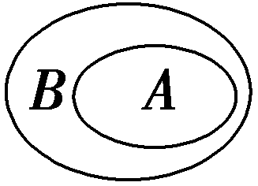
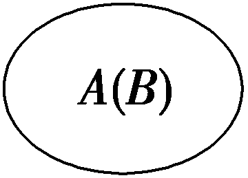
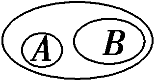
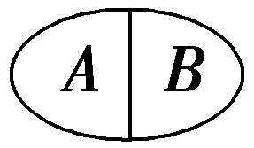
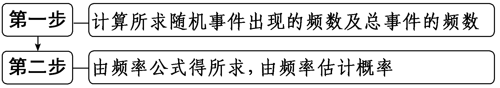
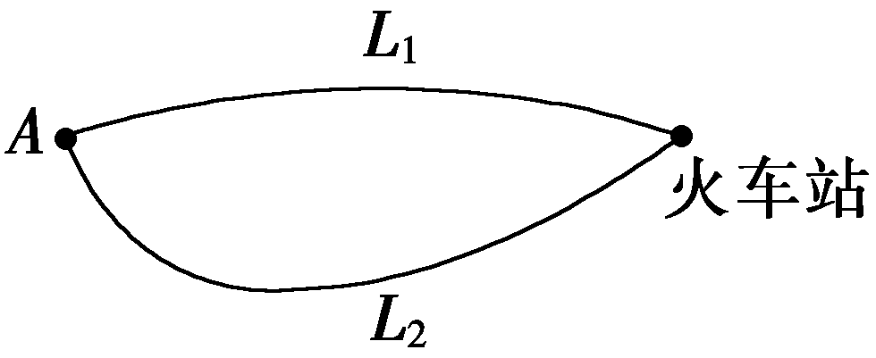
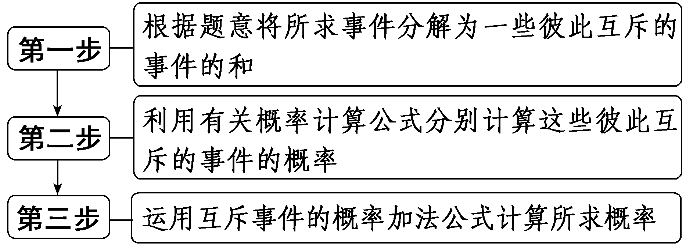
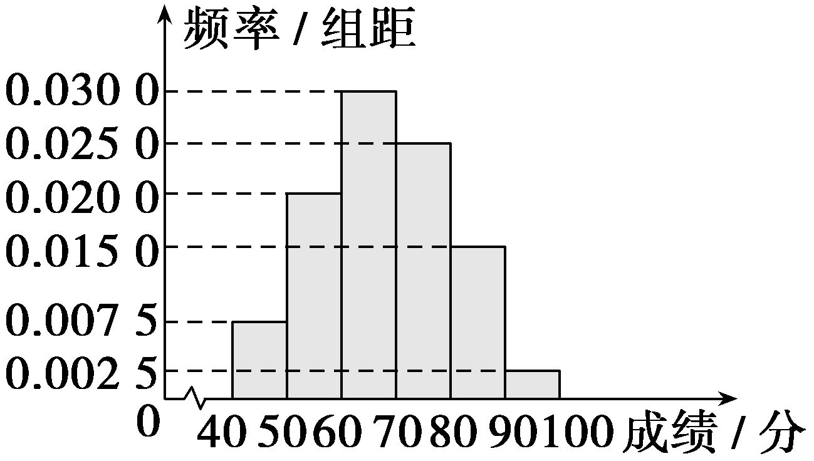
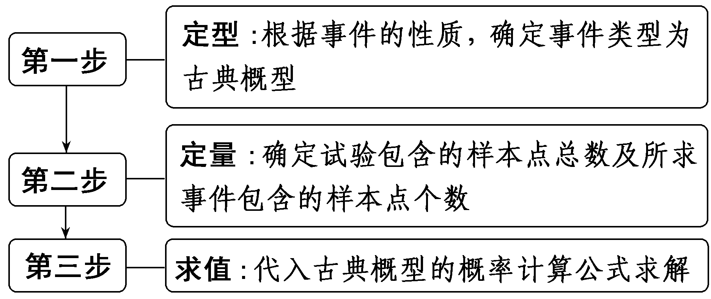
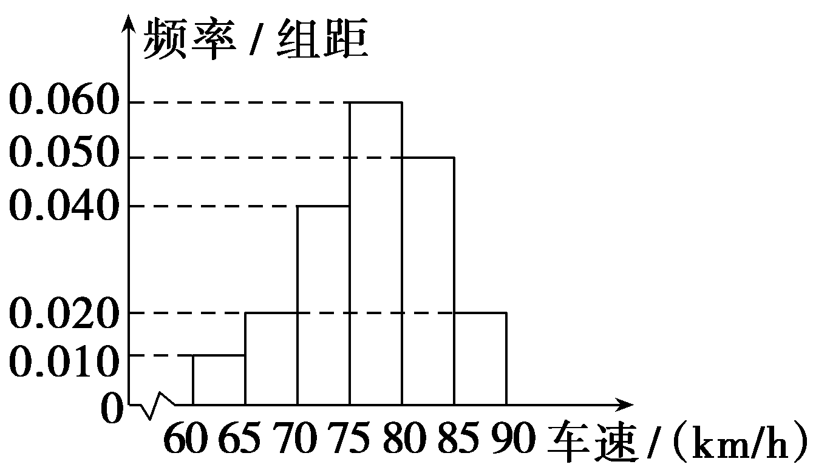

第三节　随机事件与概率

【课标研读】　1.结合具体实例，理解样本点和有限样本空间的含义，理解随机事件与样本点的关系.　2.了解随机事件的并、交与互斥的含义，能结合实例进行随机事件的并、交运算.　3.结合具体实例，理解古典概型，能计算古典概型中简单随机事件的概率.　4.通过实例，理解概率的性质，掌握随机事件概率的运算法则.　5.结合实例，会用频率估计概率.

##### 1.样本空间和随机事件

（1）样本空间

<table><tr><td>
分类
</td><td>
定义
</td></tr><tr><td>
样本点
</td><td>
随机试验<em>E</em>的每个可能的基本结果称为样本点，常用<em>ω</em>表示
</td></tr><tr><td>
样本空间
</td><td>
全体样本点的集合称为试验<em>E</em>的样本空间，常用<em>Ω</em>表示
</td></tr><tr><td>
有限样

本空间
</td><td>
如果一个随机试验有<em>n</em>个可能结果<em>ω</em>1，<em>ω</em>2，…，<em>ωn</em>，则称样本空间<em>Ω</em>＝{<em>ω</em>1，<em>ω</em>2，…，<em>ωn</em>}为有限样本空间
</td></tr></table>

（2）随机事件

<table><tr><td>
定义
</td><td>
将样本空间<em>Ω</em>的子集称为随机事件，简称事件
</td></tr><tr><td>
表示
</td><td>
一般用大写字母<em>A</em>，<em>B</em>，<em>C</em>，…表示
</td></tr><tr><td>
随机事件的

极端情形
</td><td>
必然事件、不可能事件
</td></tr></table>

##### 2.两个事件的关系和运算

<table><tr><td>
事件的关

系或运算
</td><td>
含义
</td><td>
符号表示
</td><td>
图形表示
</td></tr><tr><td>
包含关系
</td><td>
<em>A</em>发生，则

<em>B</em>一定发生
</td><td>
<em>A</em>⊆<em>B</em>
</td><td>

</td></tr><tr><td>
相等关系
</td><td>
<em>B</em>⊇<em>A</em>且<em>A</em>⊇<em>B</em>
</td><td>
<em>A</em>＝<em>B</em>
</td><td>

</td></tr><tr><td>
并事件

(和事件) 
</td><td>
<em>A</em>与<em>B</em>至少

有一个发生
</td><td>
<em>A</em>∪<em>B</em>或

<em>A</em>＋<em>B</em>
</td><td>

</td></tr><tr><td>
交事件

(积事件)
</td><td>
<em>A</em>与<em>B</em>同时发生
</td><td>
<em>A</em>∩<em>B</em>或<em>AB</em>
</td><td>

</td></tr><tr><td>
互斥(互

不相容)
</td><td>
<em>A</em>与<em>B</em>不能

同时发生
</td><td>
<em>A</em>∩<em>B</em>＝⌀
</td><td>

</td></tr><tr><td>
互为对立
</td><td>
<em>A</em>与<em>B</em>有且

仅有一个发生
</td><td>
<em>A</em>∩<em>B</em>＝⌀，

<em>A</em>∪<em>B</em>＝<em>Ω</em>
</td><td>

</td></tr></table>

##### 3.古典概型

（1）定义：具有以下两个特征的试验称为古典概型试验，其数学模型称为古典概率模型，简称古典概型.

①有限性：样本空间的样本点只有<u>有限个</u>；

②等可能性：每个样本点发生的可能性<u>相等</u>.

（2）计算公式：一般地，设试验<em>E</em> 是古典概型，样本空间<em>&lt;text style="italic"&gt;Ω</em>&lt;/text&gt;包含<em>&lt;text style="italic"&gt;&lt;text style="italic"&gt;n</em>&lt;/text&gt; &lt;/text&gt;个样本点，事件<em>&lt;text style="italic"&gt;&lt;text style="italic"&gt;&lt;text style="italic"&gt;A</em>&lt;/text&gt; &lt;/text&gt;&lt;/text&gt;包含其中的<em>k</em> 个样本点，则定义事件<em>A</em> 的概率<em>P</em>(A)<u>＝</u> $\frac{k}{n}$ &lt;text style="u<em>&lt;text style="italic"&gt;n</em>&lt;/text&gt;derline"&gt;＝&lt;/text&gt; $\frac{n(A)}{n(\Omega )}$ .其中，<em>&lt;text style="italic"&gt;n</em>&lt;/text&gt;(<em>&lt;text style="italic"&gt;A</em>&lt;/text&gt;) 和n(<em>&lt;text style="italic"&gt;Ω</em>&lt;/text&gt;) 分别表示事件<em>&lt;text style="italic"&gt;&lt;text style="italic"&gt;A</em> &lt;/text&gt;&lt;/text&gt;和样本空间<em>Ω</em> 包含的样本点个数.

##### 4.概率的基本性质

性质1：对任意的事件*A*，都有*P*(*A*)≥0.

性质2：必然事件的概率为1，不可能事件的概率为0，即*P*(*Ω*)＝1，*P*(⌀)＝0.

性质3：如果事件<em>A</em>与事件<em>B</em>互斥，那么<em>P</em>(<em>A</em>∪<em>B</em>)＝<em><u>P</u></em><u>(</u><em><u>A</u></em><u>)＋</u><em><u>P</u></em><u>(B)</u>.

性质4：如果事件<em>A</em>与事件<em>B</em>互为对立事件，那么<em>P</em>(<em>B</em>)＝1－<em>P</em>(<em>A</em>)，<em>P</em>(<em>A</em>)＝<u>1－</u><em><u>P</u></em><u>(B)</u>.

性质5：如果*A*⊆*B*，那么*P*(*A*)≤*P*(*B*).由该性质可得，对于任意事件*A*，因为⌀⊆*A*⊆*Ω*，所以0≤*P*(*A*)≤1.

性质6：设<em>A</em>，<em>B</em>是一个随机试验中的两个事件，有<em>P</em>(<em>A</em>∪<em>B</em>)＝<em><u>P</u></em><u>(</u><em><u>A</u></em><u>)＋</u><em><u>P</u></em><u>(</u><em><u>B</u></em><u>)－</u><em><u>P</u></em><u>(</u><em><u>A</u></em><u>∩</u><em><u>B</u></em><u>)</u>.

##### 5.频率与概率

（1）频率的稳定性

一般地，随着试验次数<em>n</em>的增大，频率偏离概率的幅度会缩小，即事件<em>A</em>发生的频率<em>fn</em>(<em>A</em>)会逐渐<u>稳定于</u>事件<em>A</em>发生的概率<em>P</em>(<em>A</em>).我们称频率的这个性质为频率的稳定性.

（2）频率稳定性的作用：可以用频率<em>fn</em>(<em>A</em>)估计概率<em>P</em>(A).

【常用结论】

（1）当随机事件*A*，*B*互斥时，不一定对立；当随机事件*A*，*B*对立时，一定互斥，即两事件互斥是对立的必要不充分条件.

(&lt;text style="subscript"&gt;2&lt;/text&gt;)若事件<em>&lt;text style="italic"&gt;&lt;text style="italic"&gt;&lt;text style="italic"&gt;&lt;text style="italic"&gt;&lt;text style="italic"&gt;A</em>&lt;/text&gt;&lt;/text&gt;&lt;/text&gt;&lt;/text&gt;&lt;/text&gt;&lt;text style="subscript"&gt;1&lt;/text&gt;，A2，…，A<em>&lt;text style="italic,subscript"&gt;n</em>&lt;/text&gt;两两互斥，则<em>&lt;text style="italic"&gt;&lt;text style="italic"&gt;&lt;text style="italic"&gt;P</em>&lt;/text&gt;&lt;/text&gt;&lt;/text&gt;(A1∪A2∪…∪An)＝P $\left(A_{1}\right)$ ＋<em>&lt;text style="italic"&gt;&lt;text style="italic"&gt;&lt;text style="italic"&gt;P</em>&lt;/text&gt;&lt;/text&gt;&lt;/text&gt; $\left(A_{2}\right)$ ＋…＋<em>&lt;text style="italic"&gt;&lt;text style="italic"&gt;&lt;text style="italic"&gt;P</em>&lt;/text&gt;&lt;/text&gt;&lt;/text&gt; $\left(A_{n}\right)$ .

【自主检测】

##### 1.(多选)下列说法正确的是(　　)

$\quad$A.事件发生的频率与概率是相同的

$\quad$B.两个事件的和事件发生是指这两个事件至少有一个发生

$\quad$C.从－3，－2，－1，0，1，2中任取一个数，取到的数小于0与不小于0的可能性相同

$\quad$D.若*A*∪*B*是必然事件，则*A*与*B*是对立事件

答案BC

##### 2.(链接人教A必修二P235T1)一个人打靶时连续射击两次，事件“至多有一次中靶”的对立事件是(　　)

$\quad$A.至少有一次中靶	
$\quad$B.两次都中靶

$\quad$C.只有一次中靶	
$\quad$D.两次都不中靶

答案B

解析“至多有一次中靶”的对立事件是“两次都中靶”.故选B.

##### 3.(多选)(链接人教A必修二P235T2)将一枚骰子向上抛掷一次，设事件*A*＝“向上的一面出现奇数点”，事件*B*＝“向上的一面出现的点数不超过2”，事件*C*＝“向上的一面出现的点数不小于4”，则下列说法中正确的有(　　)

$\quad$A. $\overline{A}$ *B*＝⌀

$\quad$B. $\overline{B}$ *C*＝“向上的一面出现的点数大于3”

*C*.*A* $\overline{B}$ ＋ $\overline{B}$ *C*＝“向上的一面出现的点数不小于3”

$\quad$D.*A* $\overline{B}$ *C*＝“向上的一面出现的点数为2”

答案BC

解析由题意知事件*<text style="italic"><text style="italic">A*</text></text>包含的样本点：向上的一面出现的点数为1，3，5；事件*<text style="italic">B*</text>包含的样本点：向上的一面出现的点数为1，2；事件*<text style="italic"><text style="italic"><text style="italic">C*</text></text></text>包含的样本点：向上的一面出现的点数为4，5，6，所以 $\overline{A}$ *<text style="italic">B*</text>＝“向上的一面出现的点数为2”，故*<text style="italic"><text style="italic">A*</text></text>错误； $\overline{B}$ *<text style="italic"><text style="italic"><text style="italic">C*</text></text></text>＝“向上的一面出现的点数为4或5或6”，故*<text style="italic">B*</text>正确；*<text style="italic"><text style="italic">A*</text></text> $\overline{B}$ ＋ $\overline{B}$ *<text style="italic"><text style="italic"><text style="italic">C*</text></text></text>＝“向上的一面出现的点数为3或4或5或6”，故C正确；*<text style="italic"><text style="italic">A*</text></text> $\overline{B}$ *<text style="italic"><text style="italic"><text style="italic">C*</text></text></text>＝“向上的一面出现的点数为5”，故D错误.故选*<text style="italic">B*</text>C.

##### 4.(链接人教A必修二P237例8)若某公司从五位大学毕业生甲、乙、丙、丁、戊中录用三人，这五人被录用的机会均等，则甲或乙被录用的概率为(　　)

$\quad$A. $\frac{2}{3}$ 	
$\quad$B. $\frac{2}{5}$

$\quad$C. $\frac{3}{5}$ 	
$\quad$D. $\frac{9}{10}$

答案D

解析五人录用三人共有10种不同方式，分别为：{丙，丁，戊}，{乙，丁，戊}，{乙，丙，戊}，{乙，丙，丁}，{甲，丁，戊}，{甲，丙，戊}，{甲，丙，丁}，{甲，乙，戊}，{甲，乙，丁}，{甲，乙，丙}.其中甲或乙被录用共9种，故甲或乙被录用的概率为 $\frac{9}{10}$ .故选D.

考点一　随机事件与样本空间　　　　自主练透

##### 1.同时投掷两枚完全相同的骰子，用(*x*，*y*)表示结果，记事件*A*为“所得点数之和小于5”，则事件*A*包含的样本点的个数是(　　)

$\quad$A.3	
$\quad$B.4

$\quad$C.5	
$\quad$D.6

答案D

解析事件*A*包含(1，1)，(1，2)，(1，3)，(2，1)，(2，2)，(3，1)，共6个样本点.故选D.

##### 2.从1，2，3，4，5，6这六个数中任取三个数，下列两个事件为对立事件的是(　　)

$\quad$A.“至多有一个是偶数”和“至多有两个是偶数”

$\quad$B.“恰有一个是奇数”和“恰有一个是偶数”

$\quad$C.“至少有一个是奇数”和“全都是偶数”

$\quad$D.“恰有一个是奇数”和“至多有一个是偶数”

答案C

解析从1，2，3，4，5，6这六个数中任取三个数，可能有0个奇数和3个偶数，1个奇数和2个偶数，2个奇数和1个偶数，3个奇数和0个偶数，“至多有一个是偶数”包括2个奇数和1个偶数，3个奇数和0个偶数，“至多有两个是偶数”包括1个奇数和2个偶数，2个奇数和1个偶数，3个奇数和0个偶数，即“至多有一个是偶数”包含于“至多有两个是偶数”，故A错误；“恰有一个是奇数”即1个奇数和2个偶数，“恰有一个是偶数”即2个奇数和1个偶数，所以“恰有一个是奇数”和“恰有一个是偶数”是互斥但不对立事件，故B错误；同理可得“恰有一个是奇数”和“至多有一个是偶数”是互斥但不对立事件，故D错误；“至少有一个是奇数”包括1个奇数和2个偶数，2个奇数和1个偶数，3个奇数和0个偶数，“全都是偶数”即0个奇数和3个偶数，所以“至少有一个是奇数”和“全都是偶数”为对立事件，故C正确.故选C.

##### 3.(多选)对空中飞行的飞机连续射击两次，每次发射一枚炮弹，设事件*A*＝{两弹都击中飞机}，事件*B*＝{两弹都没击中飞机}，事件*C*＝{恰有一弹击中飞机}，事件*D*＝{至少有一弹击中飞机}，则下列关系正确的是(　　)

$\quad$A.*A*∩*D*＝⌀	
$\quad$B.*B*∩*D*＝⌀

$\quad$C.*A*∪*C*＝*D*	
$\quad$D.*A*∪*B*＝*B*∪*D*

答案BC

解析“恰有一弹击中飞机”指第一枚击中、第二枚没击中或第一枚没击中、第二枚击中，“至少有一弹击中飞机”包含两种情况，一种是恰有一弹击中，另一种是两弹都击中，故*A*∩*D*≠⌀，*B*∩*D*＝⌀，*A*∪*C*＝*D*，*A*∪*B*≠*B*∪*D*.故选BC.

##### 4.(多选)下列结论正确的有(　　)

$\quad$A.若*A*，*B*互为对立事件，*P*(*A*)＝1，则*P*(*B*)＝0

$\quad$B.若事件*A*，*B*，*C*两两互斥，则事件*A*与*B*∪*C*互斥

$\quad$C.若事件*A*与*B*对立，则*P*(*A*∪*B*)＝1

$\quad$D.若事件*A*与*B*互斥，则它们的对立事件也互斥

答案ABC

解析由题意得，*P*(*B*)＝1－*P*(*A*)＝0，故A正确；若事件*A*，*B*，*C*两两互斥，则事件*A*，*B*，*C*不可能同时发生，则事件*A*与*B*∪*C*也不可能同时发生，则事件*A*与*B*∪*C*互斥，故B正确；若事件*A*与*B*对立，则*P*(*A*∪*B*)＝*P*(*A*)＋*P*(*B*)＝1，故C正确；若事件*A*，*B*互斥但不对立，则它们的对立事件不互斥，故D错误.故选ABC.

##### 1.确定样本空间的方法

（1）列举法；（2）树状图法；（3）排列组合法.

注意：在写样本空间时，因为结果出现的机会是均等的，所以按规律去写，要做到既不重复也不遗漏.

##### 2.判断互斥事件、对立事件的两种方法

（1）定义法：判断互斥事件、对立事件一般用定义，不可能同时发生的两个事件为互斥事件；两个事件，若有且仅有一个发生，则这两个事件为对立事件，对立事件一定是互斥事件.

（2）集合法：①由各个事件所含的结果组成的集合，彼此的交集为空集，则事件互斥.②事件*A*的对立事件所含的结果组成的集合，是全集中由事件*A*所含的结果组成的集合的补集.

考点二　频率与概率　　　　师生共研

某超市计划按月订购一种酸奶，每天进货量相同，进货成本每瓶4元，售价每瓶6元，未售出的酸奶降价处理，以每瓶2元的价格当天全部处理完.根据往年销售经验，每天需求量与当天最高气温(单位：℃)有关.如果最高气温不低于25，需求量为500瓶；如果最高气温位于区间[20，25)，需求量为300瓶；如果最高气温低于20，需求量为200瓶.为了确定六月份的订购计划，统计了前三年六月份各天的最高气温数据，得下面的频数分布表：

<table><tr><td>
最高

气温
</td><td>
[10，15)
</td><td>
[15，20)
</td><td>
[20，25)
</td><td>
[25，30)
</td><td>
[30，35)
</td><td>
[35，40]
</td></tr><tr><td>
天数
</td><td>
2
</td><td>
16
</td><td>
36
</td><td>
25
</td><td>
7
</td><td>
4
</td></tr></table>

以最高气温位于各区间的频率估计最高气温位于该区间的概率.

（1）估计六月份这种酸奶一天的需求量不超过300瓶的概率；

（2）设六月份一天销售这种酸奶的利润为*Y*(单位：元)，当六月份这种酸奶一天的进货量为450瓶时，写出*Y*的所有可能值，并估计*Y*大于零的概率.

解：（1）这种酸奶一天的需求量不超过300瓶，当且仅当最高气温低于25，由表中数据可知，最高气温低于25的频率为 $\frac{2+16+36}{90}$ ＝0.6，所以六月份这种酸奶一天的需求量不超过300瓶的概率的估计值为0.6.

（2）当这种酸奶一天的进货量为450瓶时，若最高气温低于20，则*Y*＝200×6＋(450－200)×2－450×4＝－100；

若最高气温位于区间[20，25)，则*Y*＝300×6＋(450－300)×2－450×4＝300；

若最高气温不低于25，则*Y*＝450×(6－4)＝900，所以利润*Y*的所有可能值为－100，300，900.

*Y*大于零，当且仅当最高气温不低于20，由表格数据知，最高气温不低于20的频率为 $\frac{36+25+7+4}{90}$ ＝0.8.

因此*Y*大于零的概率的估计值为0.8.

计算简单随机事件的频率或概率的步骤

对点练1.如图，<em>A</em>地到火车站共有两条路径<em>L</em>1和<em>L</em>2，现随机抽取100位从<em>A</em>地到达火车站的人进行调查，调查结果如下：

<table><tr><td>
所用时间

(分钟)
</td><td>
10～20
</td><td>
20～30
</td><td>
30～40
</td><td>
40～50
</td><td>
50～60
</td></tr><tr><td>
选择<em>L</em>1

的人数
</td><td>
6
</td><td>
12
</td><td>
18
</td><td>
12
</td><td>
12
</td></tr><tr><td>
选择<em>L</em>2

的人数
</td><td>
0
</td><td>
4
</td><td>
16
</td><td>
16
</td><td>
4
</td></tr></table>

（1）试估计40分钟内不能赶到火车站的概率；

（2）分别求通过路径<em>L</em>1和<em>L</em>2所用时间落在上表中各时间段内的频率；

（3）现甲、乙两人分别有40分钟和50分钟时间用于赶往火车站，为了尽最大可能在允许的时间内赶到火车站，试通过计算说明，他们应如何选择各自的路径.

解：（1）由已知共调查了100人，其中40分钟内不能赶到火车站的有12＋12＋16＋4＝44(人)，

所以用频率估计相应的概率为*p*＝ $\frac{44}{100}$ ＝0.44.

（2）选择<em>L</em>1的有60人，选择<em>L</em>2的有40人，

故由调查结果得频率为

<table><tr><td>
所用时间

(分钟)
</td><td>
10～20
</td><td>
20～30
</td><td>
30～40
</td><td>
40～50
</td><td>
50～60
</td></tr><tr><td>
<em>L</em>1的频率
</td><td>
0.1
</td><td>
0.2
</td><td>
0.3
</td><td>
0.2
</td><td>
0.2
</td></tr><tr><td>
<em>L</em>2的频率
</td><td>
0
</td><td>
0.1
</td><td>
0.4
</td><td>
0.4
</td><td>
0.1
</td></tr></table>

（3）设<em>A</em>1，<em>A</em>2分别表示甲选择<em>L</em>1和<em>L</em>2时，在40分钟内赶到火车站；<em>B</em>1，<em>B</em>2分别表示乙选择<em>L</em>1和<em>L</em>2时，在50分钟内赶到火车站.

由（2）知<em>P</em>(<em>A</em>1)＝0.1＋0.2＋0.3＝0.6，

<em>P</em>(<em>A</em>2)＝0.1＋0.4＝0.5，

因为<em>P</em>(<em>A</em>1)＞<em>P</em>(<em>A</em>2)，所以甲应选择<em>L</em>1.

同理，<em>P</em>(<em>B</em>1)＝0.1＋0.2＋0.3＋0.2＝0.8，

<em>P</em>(<em>B</em>2)＝0.1＋0.4＋0.4＝0.9，

因为<em>P</em>(<em>B</em>1)＜<em>P</em>(<em>B</em>2)，所以乙应选择<em>L</em>2.

考点三　互斥事件与对立事件的概率　　　　师生共研

某商场进行有奖销售，购满100元商品得1张奖券，多购多得.1 000张奖券为一个开奖单位，设特等奖1个，一等奖10个，二等奖50个.设1张奖券中特等奖、一等奖、二等奖的事件分别为*A*，*B*，*C*，求：

（1）*P*(*A*)，*P*(*B*)，*P*(*C*)；

（2）1张奖券的中奖概率；

（3）1张奖券不中特等奖且不中一等奖的概率.

解：（1）*<text style="italic"><text style="italic">P*</text></text>(*A*)＝ $\frac{1}{1 000}$ ，*<text style="italic"><text style="italic">P*</text></text>(*B*)＝ $\frac{10}{1 000}$ ＝ $\frac{1}{100}$ ，*<text style="italic"><text style="italic">P*</text></text>(*C*)＝ $\frac{50}{1 000}$ ＝ $\frac{1}{20}$ .

（2）1张奖券中奖包含中特等奖、一等奖、二等奖.设“1张奖券中奖”为事件*M*，则*M*＝*A*∪*B*∪*C*.

因为事件*A*，*B*，*C*两两互斥，

所以*<text style="italic"><text style="italic"><text style="italic"><text style="italic">P*</text></text></text></text>(*M*)＝P(*<text style="italic">A*</text>∪*<text style="italic">B*</text>∪*<text style="italic">C*</text>)＝P(A)＋P(B)＋P(C)＝ $\frac{1+10+50}{1 000}$ ＝ $\frac{61}{1 000}$ ，

故1张奖券的中奖概率为 $\frac{61}{1 000}$ .

（3）设“1张奖券不中特等奖且不中一等奖”为事件*N*，则事件*N*与“1张奖券中特等奖或中一等奖”为对立事件，

所以*<text style="italic">P*</text> $\left(N\right)$ ＝1－*<text style="italic">P*</text> $\left(A\bigcup B\right)$ ＝1－( $\frac{1}{1 000}$ ＋ $\frac{1}{100}$ )＝ $\frac{989}{1 000}$ ，

故1张奖券不中特等奖且不中一等奖的概率为 $\frac{989}{1 000}$ .

求复杂互斥事件的概率的两种方法

##### 1.直接法

##### 2.间接法

正难则反，特别是“至多”“至少”型题目，一般用间接法求解更简单.

对点练2.经统计，在某储蓄所一个营业窗口等候的人数相应的概率如表所示：

<table><tr><td>
排队

人数
</td><td>
0
</td><td>
1
</td><td>
2
</td><td>
3
</td><td>
4
</td><td>
5人及

5人以上
</td></tr><tr><td>
概率
</td><td>
0.1
</td><td>
0.16
</td><td>
0.3
</td><td>
0.3
</td><td>
0.1
</td><td>
0.04
</td></tr></table>

求：（1）至多2人排队等候的概率；

（2）至少3人排队等候的概率.

解：（1）记“无人排队等候”为事件*A*，“1人排队等候”为事件*B*，“2人排队等候”为事件*C*，则事件*A*，*B*，*C*两两互斥.

记“至多2人排队等候”为事件*G*，则*G*＝*A*∪*B*∪*C*，

所以*P*(*G*)＝*P*(*A*∪*B*∪*C*)＝*P*(*A*)＋*P*(*B*)＋*P*(*C*)＝0.1＋0.16＋0.3＝0.56.

（2）记“至少3人排队等候”为事件*H*，则其对立事件为事件*G*，所以*P*(*H*)＝1－*P*(*G*)＝0.44.

考点四　古典概型　　　　多维探究

角度1　简单的古典概型的概率

（1）(2022·新高考Ⅰ卷)从2至8的7个整数中随机取2个不同的数，则这2个数互质的概率为(　　)

$\quad$A. $\frac{1}{6}$ 	
$\quad$B. $\frac{1}{3}$

$\quad$C. $\frac{1}{2}$ 	
$\quad$D. $\frac{2}{3}$

（2）(2023·全国甲卷)某校文艺部有 4 名学生，其中高一、高二年级各2名.从这4名学生中随机选2名组织校文艺汇演，则这2名学生来自不同年级的概率为(　　)

$\quad$A. $\frac{1}{6}$ 	
$\quad$B. $\frac{1}{3}$

$\quad$C. $\frac{1}{2}$ 	
$\quad$D. $\frac{2}{3}$

答案（1）D　（2）D

解析（1）从2至8的7个整数中随机取2个不同的数，共有 $C_{7}^{2}$ ＝21(种)不同的取法，若两数不互质，不同的取法有(2，4)，(2，6)，(2，8)，(3，6)，(4，6)，(4，8)，(6，8)共7种，故所求概率*P*＝ $\frac{21－7}{21}$ ＝ $\frac{2}{3}$ .故选D.

(&lt;text style="su&lt;text style="it&lt;text style="it&lt;text style="it&lt;text style="it&lt;text style="it&lt;text style="it&lt;text style="it&lt;text style="it&lt;text style="it&lt;text style="it<em>a</em>lic"&gt;a&lt;/text&gt;lic"&gt;a&lt;/text&gt;lic"&gt;a&lt;/text&gt;lic"&gt;a&lt;/text&gt;lic"&gt;a&lt;/text&gt;lic"&gt;a&lt;/text&gt;lic"&gt;a&lt;/text&gt;lic"&gt;a&lt;/text&gt;lic"&gt;a&lt;/text&gt;lic"&gt;<em>&lt;text style="italic"&gt;&lt;text style="italic"&gt;&lt;text style="italic"&gt;&lt;text style="italic"&gt;&lt;text style="italic"&gt;&lt;text style="italic"&gt;&lt;text style="italic"&gt;&lt;text style="italic"&gt;&lt;text style="italic"&gt;&lt;text style="italic"&gt;b</em>&lt;/text&gt;&lt;/text&gt;&lt;/text&gt;&lt;/text&gt;&lt;/text&gt;&lt;/text&gt;&lt;/text&gt;&lt;/text&gt;&lt;/text&gt;&lt;/text&gt;&lt;/text&gt;script"&gt;&lt;text style="subscript"&gt;&lt;text style="subscript"&gt;&lt;text style="subscript"&gt;&lt;text style="subscript"&gt;&lt;text style="subscript"&gt;&lt;text style="subscript"&gt;&lt;text style="subscript"&gt;&lt;text style="subscript"&gt;&lt;text style="subscript"&gt;&lt;text style="subscript"&gt;2&lt;/text&gt;&lt;/text&gt;&lt;/text&gt;&lt;/text&gt;&lt;/text&gt;&lt;/text&gt;&lt;/text&gt;&lt;/text&gt;&lt;/text&gt;&lt;/text&gt;&lt;/text&gt;)记高一年级2名学生分别为&lt;text style="it<em>a</em>lic"&gt;a&lt;/text&gt;&lt;text style="subscript"&gt;&lt;text style="subscript"&gt;&lt;text style="subscript"&gt;&lt;text style="subscript"&gt;&lt;text style="subscript"&gt;&lt;text style="subscript"&gt;&lt;text style="subscript"&gt;&lt;text style="subscript"&gt;&lt;text style="subscript"&gt;&lt;text style="subscript"&gt;&lt;text style="subscript"&gt;1&lt;/text&gt;&lt;/text&gt;&lt;/text&gt;&lt;/text&gt;&lt;/text&gt;&lt;/text&gt;&lt;/text&gt;&lt;/text&gt;&lt;/text&gt;&lt;/text&gt;&lt;/text&gt;，a2，高二年级2名学生分别为b1，b2，则从这4名学生中随机选2名组织校文艺汇演的基本事件有(a1，a2)，(a1，b1)，(a1，b2)，(a2，b1)，(a2，b2)，(b1，b2)，共6个，其中这2名学生来自不同年级的基本事件有(a1，b1)，(a1，b2)，(a2，b1)，(a2，b2)，共4个，所以这2名学生来自不同年级的概率<em>P</em>＝ $\frac{4}{6}$ ＝ $\frac{2}{3}$ .故选D.

角度2　古典概型与统计的综合应用

某学校学生参加全国数学竞赛初赛(满分100分).该学校从全体参赛学生中随机抽取了200名学生的初赛成绩绘制成频率分布直方图如图所示：

（1）根据频率分布直方图给出的数据估计此次初赛成绩的中位数和平均数；

（2）从抽取的成绩在90～100的学生中抽取3人组成特训组，用频率估计概率，求学生*A*被选中的概率.

解：（1）因为10×(0.007 5＋0.02)＝0.275，0.275＋10×0.03＝0.575，所以中位数位于区间[60，70)，

设中位数为*x*，

则10×(0.007 5＋0.02)＋10×0.03× $\frac{x－60}{10}$ ＝0.5，解得*x*＝67.5，

即中位数为67.5.

平均数为10×(0.007 5×45＋0.02×55＋0.03×65＋0.025×75＋0.015×85＋0.002 5×95)＝67.75.

（2）成绩在90～100的学生有200×10×0.002 5＝5(人)，

设为*A*，*b*，*c*，*d*，*e*，从这5人中抽取3人，有(*A*，*b*，*c*)，(*A*，*b*，*d*)，(*A*，*b*，*e*)，(*A*，*c*，*d*)，(*A*，*c*，*e*)，(*A*，*d*，*e*)，(*b*，*c*，*d*)，(*b*，*c*，*e*)，(*b*，*d*，*e*)，(*c*，*d*，*e*)，共10种情况，

其中学生<t<t<t*e*xt style="italic">e</text>xt style="itali<text style="itali*c*">c</text>">e</text>xt style="itali*c*">*<text style="italic"><text style="italic"><text style="italic"><text style="italic"><text style="italic"><text style="italic">A*</text></text></text></text></text></text></text>被选中有(A，*<text style="italic"><text style="italic">b*</text></text>，c)，(A，b，*<text style="italic"><text style="italic">d*</text></text>)，(A，b，e)，(A，c，d)，(A，c，e)，(A，d，e)，共6种情况，所以学生A被选中的概率为 $\frac{6}{10}$ ＝0.6.

##### 1.利用公式法求解古典概型问题的步骤

##### 2.古典概型与统计综合问题的解题策略

（1）将题目条件中的相关信息转化为事件.（2）判断事件是否为古典概型.（3）选用合适的方法确定样本点个数.（4）代入古典概型的概率公式求解.

对点练3.已知<em>a</em>，<em>b</em>∈{－2，－1，1，2}，若向量<em><strong>m</strong></em>＝(<em>a</em>，<em>b</em>)，<em><strong>n</strong></em>＝(1，1)，则向量<em><strong>m</strong></em>与<em><strong>n</strong></em>所成的角为锐角的概率是(　　)

$\quad$A. $\frac{3}{16}$ 	
$\quad$B. $\frac{1}{4}$

$\quad$C. $\frac{3}{8}$ 	
$\quad$D. $\frac{7}{16}$

答案B

解析向量&lt;text style="<em>b</em>old,it<em>a</em>lic"&gt;<em><strong>&lt;text style="bold,italic"&gt;&lt;text style="bold,italic"&gt;&lt;text style="bold,italic"&gt;&lt;text style="bold,italic"&gt;&lt;text style="bold,italic"&gt;&lt;text style="bold,italic"&gt;&lt;text style="bold,italic"&gt;m</strong></em>&lt;/text&gt;&lt;/text&gt;&lt;/text&gt;&lt;/text&gt;&lt;/text&gt;&lt;/text&gt;&lt;/text&gt;&lt;/text&gt;与<em><strong>&lt;text style="bold,italic"&gt;&lt;text style="bold,italic"&gt;&lt;text style="bold,italic"&gt;&lt;text style="bold,italic"&gt;&lt;text style="bold,italic"&gt;n</strong></em>&lt;/text&gt;&lt;/text&gt;&lt;/text&gt;&lt;/text&gt;&lt;/text&gt;所成的角为锐角等价于m<em>&lt;text style="italic"&gt;·</em>&lt;/text&gt;n＞0，且m与n的方向不同，即m·n＝a＋b＞0，则满足条件的向量m有(－1，2)，(1，1)，(1，2)，(2，－1)，(2，1)，(2，2)，其中m＝(1，1)或m＝(2，2)时，与n同向，故舍去，故共有4种情况满足条件，又m的取法共有4×4＝16(种)，则向量m与n所成的角为锐角的概率是 $\frac{4}{16}$ ＝ $\frac{1}{4}$ .故选B.

对点练4.(多选)某研究机构为了实时掌握当地新增高速的运行情况，在某服务区从小型汽车中抽取了80名驾驶员进行调查，将他们在某段高速公路的车速(单位：km/h)分成[60，65)，[65，70)，[70，75)，[75，80)，[80，85)，[85，90]，共六段，得到如图所示的频率分布直方图，则下列结论正确的是(　　)

$\quad$A.这80辆小型车辆车速的众数的估计值为77.5

$\quad$B.在该服务区任意抽取1辆车，估计车速超过75 km/h的概率为0.65

$\quad$C.若从样本中车速在[60，70)的车辆中任意抽取2辆，则至少有1辆车的车速在[65，70)的概率为 $\frac{10}{11}$

$\quad$D.若从样本中车速在[60，70)的车辆中任意抽取2辆，则车速都在[65，70)的概率为 $\frac{2}{3}$

答案ABC

解析根据频率分布直方图可知，这80辆小型车辆车速主要集中在[75，80)内，众数为 $\frac{75+80}{2}$ ＝77.5，故A正确；车速超过75 km/h的频率为(0.06＋0.05＋0.02)×5＝0.65，故B正确；车速在[60，70)的车辆共有80×(0.01＋0.02)×5＝12(辆)，车速在[65，70)的车辆有80×0.02×5＝8(辆)，所以任意抽取2辆，至少有1辆车的车速在[65，70)内的概率为*<text style="italic">P*</text>＝ $\frac{C_{8}^{2}}{C_{12}^{2}}$ ＋ $\frac{C_{8}^{1}C_{4}^{1}}{C_{12}^{2}}$ ＝ $\frac{10}{11}$ ，故C正确；车速都在[65，70)内的概率为*<text style="italic">P*</text>＝ $\frac{C_{8}^{2}}{C_{12}^{2}}$ ＝ $\frac{14}{33}$ ，故D错误.故选ABC.

对点练5.(2024·新课标Ⅰ卷)甲、乙两人各有四张卡片，每张卡片上标有一个数字，甲的卡片上分别标有数字1，3，5，7，乙的卡片上分别标有数字2，4，6，8.两人进行四轮比赛，在每轮比赛中，两人各自从自己持有的卡片中随机选一张，并比较所选卡片上数字的大小，数字大的人得1分，数字小的人得0分，然后各自弃置此轮所选的卡片(弃置的卡片在此后的轮次中不能使用).则四轮比赛后，甲的总得分不小于2的概率为<u>　　　　</u>.

答案 $\frac{1}{2}$

解析因为甲出卡片1一定输，出其他卡片有可能赢，所以四轮比赛后，甲的总得分最多为3.若甲的总得分为3，则甲出卡片3，5，7时都赢，所以只有1种组合：3－2，5－4，7－6，1－8.若甲的总得分为2，有以下三类情况：第一类，当甲出卡片3和5时赢，只有1种组合，为3－2，5－4，1－6，7－8；第二类，当甲出卡片3和7时赢，有3－2，7－4，1－6，5－8或3－2，7－4，1－8，5－6或3－2，7－6，1－4，5－8，共3种组合；第三类，当甲出卡片5和7时赢，有5－2，7－4，1－6，3－8或5－2，7－4，1－8，3－6或5－4，7－2，1－6，3－8或5－4，7－2，1－8，3－6或5－2，7－6，1－4，3－8或5－2，7－6，1－8，3－4或5－4，7－6，1－2，3－8，共7种组合.综上，甲的总得分不小于2共有12种组合，而所有不同的组合共有4×3×2×1＝24(种)，所以甲的总得分不小于2的概率*P*＝ $\frac{12}{24}$ ＝ $\frac{1}{2}$ .

[真题再现]　(2024·全国甲卷理)有6个相同的球，分别标有数字1，2，3，4，5，6，从中无放回地随机取3次，每次取1个球，设<em>&lt;text style="italic"&gt;m</em>&lt;/text&gt;为前两次取出的球上数字的平均值，<em>&lt;text style="italic"&gt;n</em>&lt;/text&gt;为取出的三个球上数字的平均值，则m与n之差的绝对值不大于 $\frac{1}{2}$ 的概率为<u>　　　　</u>.

答案 $\frac{7}{15}$

解析设3次取出的球上的数字依次为<text style="it<text style="it<text style="it<text style="it<text style="it<text style="it<text style="it<text style="it<text style="it<text style="it<text style="it<text style="it<text style="it*a*lic">a</text>li*c*">a</text>lic">a</text>li*c*">a</text>lic">a</text>li*c*">a</text>lic">a</text>li*c*">a</text>lic">a</text>li*c*">a</text>lic">a</text>li<text style="itali*c*">c</text>">a</text>li*c*">a</text>，*<text style="italic"><text style="italic"><text style="italic"><text style="italic"><text style="italic"><text style="italic"><text style="italic"><text style="italic"><text style="italic"><text style="italic"><text style="italic"><text style="italic"><text style="italic">b*</text></text></text></text></text></text></text></text></text></text></text></text></text>，c，则无放回地随机取3 次球的取法有 $A_{6}^{3}$ ＝120(种)，则｜<text style="it<text style="it<text style="it<text style="it<text style="it<text style="it<text style="it<text style="it<text style="it<text style="it<text style="it<text style="it<text style="it*a*lic">a</text>li*c*">a</text>lic">a</text>li*c*">a</text>lic">a</text>li*c*">a</text>lic">a</text>li*c*">a</text>lic">a</text>li*c*">a</text>lic">a</text>li<text style="itali*c*">c</text>">a</text>lic">m</text>－*n*｜＝ $\left|\frac{a＋b}{2}－\frac{a＋b＋c}{3}\right|$ ＝ $\left|\frac{a＋b－2c}{6}\right|$ ≤ $\frac{1}{2}$ ，可得｜<text style="it<text style="it<text style="it<text style="it<text style="it<text style="it<text style="it<text style="it<text style="it<text style="it<text style="it<text style="it<text style="it*a*lic">a</text>li*c*">a</text>lic">a</text>li*c*">a</text>lic">a</text>li*c*">a</text>lic">a</text>li*c*">a</text>lic">a</text>li*c*">a</text>lic">a</text>li<text style="itali*c*">c</text>">a</text>li*c*">a</text>＋*<text style="italic"><text style="italic"><text style="italic"><text style="italic"><text style="italic"><text style="italic"><text style="italic"><text style="italic"><text style="italic"><text style="italic"><text style="italic"><text style="italic"><text style="italic">b*</text></text></text></text></text></text></text></text></text></text></text></text></text>－2c｜≤3.当c＝1时，a，b需要满足“3≤a＋b≤5”，所有可能情况为(2，3)，(3，2)，共2种.当c＝2时，a，b需要满足“3≤a＋b≤7”，所有可能情况为(1，3)，(1，4)，(1，5)，(1，6)，(3，1)，(3，4)，(4，1)，(4，3)，(5，1)，(6，1)，共10种.当c＝3时，a，b需要满足“3≤a＋b≤9”，所有可能情况为(1，2)，(2，1)，(1，4)，(4，1)，(1，5)，(5，1)，(1，6)，(6，1)，(2，4)，(4，2)，(2，5)，(5，2)，(2，6)，(6，2)，(4，5)，(5，4)，共16种.当c＝4时，a，b需要满足“5≤a＋b≤11”，所有可能情况为(1，5)，(5，1)，(1，6)，(6，1)，(2，3)，(3，2)，(2，5)，(5，2)，(2，6)，(6，2)，(3，5)，(5，3)，(3，6)，(6，3)，(5，6)，(6，5)，共16种.当c＝5时，a，b需要满足“7≤a＋b≤13”，所有可能情况为(1，6)，(6，1)，(2，6)，(6，2)，(3，4)，(4，3)，(3，6)，(6，3)，(4，6)，(6，4)，共10种.当c＝6时，a，b需要满足“9≤a＋b≤15”，所有可能情况为(4，5)，(5，4)，共2种.故共有2＋10＋16＋16＋10＋2 ＝56(种)可能情况，所以所求概率*P*＝ $\frac{56}{120}$ ＝ $\frac{7}{15}$ .

[教材呈现]　(链接人教A必修二P247T14)将一枚质地均匀的骰子连续抛掷3次，求下列事件的概率：

（1）没有出现6点；

（2）至少出现一次6点；

（3）三个点数之和为9.

点评：这两题考查相同的知识点，设问的本质也是一样的，都是考查古典概型，两题的相似度较高.

课时测评85　随机事件与概率 $\frac{对应学生}{用书P479}$

(时间：70分钟　满分：95分)

(本栏目内容，在学生用书中以独立形式分册装订！)

(1—8题，每小题5分，共40分)

##### 1.已知*<text style="italic">A*</text>与*<text style="italic"><text style="italic">B*</text></text>是互斥事件，且*<text style="italic"><text style="italic">P*</text></text> $\left(\overline{A}\right)$ ＝0.4，*<text style="italic"><text style="italic">P*</text></text>(*<text style="italic"><text style="italic">B*</text></text>)＝0.2，则P(*<text style="italic">A*</text>∪B)＝(　　)

$\quad$A.0.6	
$\quad$B.0.7

$\quad$C.0.8	
$\quad$D.0.9

答案C

解析由题意知*<text style="italic"><text style="italic"><text style="italic"><text style="italic">A*</text></text></text></text>，*<text style="italic"><text style="italic"><text style="italic">B*</text></text></text>是互斥事件，所以*<text style="italic"><text style="italic"><text style="italic"><text style="italic"><text style="italic">P*</text></text></text></text></text>(A∪B)＝P(A)＋P(B)，且P(A)＝1－P $\left(\overline{A}\right)$ ＝1－0.4＝0.6，则*<text style="italic"><text style="italic"><text style="italic"><text style="italic"><text style="italic">P*</text></text></text></text></text>(*<text style="italic"><text style="italic"><text style="italic"><text style="italic">A*</text></text></text></text>∪*<text style="italic"><text style="italic"><text style="italic">B*</text></text></text>)＝0.6＋0.2＝0.8.故选C.

##### 2.“黑匣子”是飞机常用的电子记录设备之一，黑匣子有两个，为驾驶舱语音记录器和飞行数据记录器.某兴趣小组对黑匣子内部构造进行相关课题研究，记事件*A*为“只研究驾驶舱语音记录器”，事件*B*为“至少研究一个黑匣子”，事件*C*为“至多研究一个黑匣子”，事件*D*为“两个黑匣子都研究”，则(　　)

$\quad$A.*A*与*C*是互斥事件	
$\quad$B.*B*与*D*是对立事件

$\quad$C.*B*与*C*是对立事件	
$\quad$D.*C*与*D*是互斥事件

答案D

解析事件*A*为“只研究驾驶舱语音记录器”；事件*B*为“至少研究一个黑匣子”，包含“只研究驾驶舱语音记录器”“只研究飞行数据记录器”“研究驾驶舱语音记录器和研究飞行数据记录器”；事件*C*为“至多研究一个黑匣子”，包含“只研究驾驶舱语音记录器”“只研究飞行数据记录器”“两个黑匣子都不研究”；事件*D*为“两个黑匣子都研究”，即“研究驾驶舱语音记录器和研究飞行数据记录器”.对于A，事件*A*与事件*C*不是互斥事件，故A不正确；对于B，事件*B*与事件*D*不是对立事件，故B不正确；对于C，事件*B*与事件*C*不是对立事件，故C不正确；对于D，事件*C*和事件*D*不能同时发生，故*C*与*D*是互斥事件，故D正确.故选D.

##### 3.(2022·全国甲卷)从分别写有1，2，3，4，5，6的6张卡片中无放回随机抽取2张，则抽到的2张卡片上的数字之积是4的倍数的概率为(　　)

$\quad$A. $\frac{1}{5}$ 	
$\quad$B. $\frac{1}{3}$

$\quad$C. $\frac{2}{5}$ 	
$\quad$D. $\frac{2}{3}$

答案C

解析从6张卡片中无放回抽取2张，有 $C_{6}^{2}$ ＝15(种)情况，其中数字之积为4的倍数的有(1，4)，(2，4)，(2，6)，(3，4)，(4，5)，(4，6)，共6种情况，故概率为 $\frac{6}{15}$ ＝ $\frac{2}{5}$ .故选C.

##### 4.(2025·湘豫名校联考)党的二十大报告提出：“深化全民阅读活动”.今天，我们思索读书的意义、发掘知识的价值、强调阅读的作用，正是为了更好地满足人民群众精神文化生活新期待.某市把图书馆、博物馆、美术馆、文化馆四个公共文化场馆面向社会免费开放，开放期间需要志愿者参与协助管理.现有*A*，*B*，*C*，*D*，*E*共5名志愿者，每名志愿者均参与本次志愿者服务工作，每个场馆至少需要一名志愿者，每名志愿者到各个场馆的可能性相同，则*A*，*B*两名志愿者不在同一个场馆的概率为(　　)

$\quad$A. $\frac{1}{2}$ 	
$\quad$B. $\frac{2}{3}$

$\quad$C. $\frac{5}{6}$ 	
$\quad$D. $\frac{9}{10}$

答案D

解析将5名志愿者分配到4个场馆，共有 $C_{5}^{2}A_{4}^{4}$ 种不同的方法，其中*<text style="italic">A*</text>，*<text style="italic">B*</text>两名志愿者在同一个场馆共有 $A_{4}^{4}$ 种不同的方法，所以*<text style="italic">A*</text>，*<text style="italic">B*</text>两名志愿者不在同一个场馆的概率为*P*＝1－ $\frac{A_{4}^{4}}{C_{5}^{2}A_{4}^{4}}$ ＝ $\frac{9}{10}$ .故选D.

##### 5.(多选)下列说法中正确的有(　　)

$\quad$A.若事件*A*与事件*B*是互斥事件，则*P*(*AB*)＝0

$\quad$B.若事件*A*与事件*B*是对立事件，则*P*(*A*＋*B*)＝1

$\quad$C.某人打靶时连续射击三次，则事件“至少有两次中靶”与事件“至多有一次中靶”是对立事件

$\quad$D.把红、橙、黄3张纸牌随机分给甲、乙、丙3人，每人分得1张，则事件“甲分得的不是红牌”与事件“乙分得的不是红牌”是互斥事件

答案ABC

解析事件*<text style="italic"><text style="italic"><text style="italic">A*</text></text></text>与事件*<text style="italic"><text style="italic"><text style="italic"><text style="italic">B*</text></text></text></text>互斥，则A，B不可能同时发生，所以*<text style="italic">P*</text>(*AB*)＝0，故A正确；事件A与事件B是对立事件，则事件B即为事件 $\overline{A}$ ，所以*<text style="italic">P*</text>(*<text style="italic"><text style="italic"><text style="italic">A*</text></text></text>＋*<text style="italic"><text style="italic"><text style="italic"><text style="italic">B*</text></text></text></text>)＝1，故B正确；事件“至少有两次中靶”与“至多有一次中靶”不可能同时发生，且二者必有一个发生，所以为对立事件，故C正确；事件“甲分得的不是红牌”与事件“乙分得的不是红牌”可能同时发生，即“丙分得的是红牌”，所以不是互斥事件，故D错误.故选*AB*C.

##### 6.(多选)(2024·广西梧州模拟)某市地铁全线共有四个车站，甲、乙两人同时在地铁第1号车站(首发站)乘车，假设每人自第2号车站开始，在每个车站下车是等可能的，则(　　)

$\quad$A.甲、乙两人下车的所有可能的结果有9种

$\quad$B.甲、乙两人同时在第2号车站下车的概率为 $\frac{1}{9}$

$\quad$C.甲、乙两人同时在第4号车站下车的概率为 $\frac{1}{3}$

$\quad$D.甲、乙两人在不同的车站下车的概率为 $\frac{2}{3}$

答案ABD

解析对于A，甲下车的情况有第2号车站，第3号车站，第4号车站，共3种，同理可得，乙下车的情况数也是3，则总情况数为3×3＝9，故A正确；对于B，甲、乙两人同时在第2号车站下车的情况数为1，则概率为 $\frac{1}{9}$ ，故B正确；对于C，甲、乙两人同时在第4号车站下车的情况数为1，则概率为 $\frac{1}{9}$ ，故C错误；对于D，甲、乙两人在相同车站下车的情况数为3，则在不同车站下车的情况数为9－3＝6，即概率为 $\frac{6}{9}$ ＝ $\frac{2}{3}$ ，故D正确.故选ABD.

##### 7.(2025·八省适应性测试)有8张卡片，分别标有数字1，2，3，4，5，6，7，8，现从这8张卡片中随机抽出3张，则抽出的3张卡片上的数字之和与其余5张卡片上的数字之和相等的概率为<u>　　　　</u>.

答案 $\frac{3}{56}$

解析从8张卡片中随机抽出3张，则样本空间中总的样本点数为 $C_{8}^{3}$ ＝56.因为1＋2＋3＋4＋5＋6＋7＋8＝36，所以要使抽出的3张卡片上的数字之和与其余5张卡片上的数字之和相等，则抽出的3张卡片上的数字之和应为18，则抽出的3张卡片上的数字的组合有8，7，3或8，6，4或7，6，5共3种，所以符合抽出的3张卡片上的数字之和为18的样本点个数为3，所以抽出的3张卡片上的数字之和与其余5张卡片上的数字之和相等的概率为 $\frac{3}{56}$ .

##### 8.一个盒子中装有六张卡片，上面分别写着如下六个定义域为<strong>R</strong>的函数：<em>f</em>1(<em>x</em>)＝<em>x</em>，<em>f</em>2(<em>x</em>)＝<em>x</em>2，<em>f</em>3(<em>x</em>)＝<em>x</em>3，<em>f</em>4(<em>x</em>)＝sin <em>x</em>，<em>f</em>5(<em>x</em>)＝cos <em>x</em>，<em>f</em>6(<em>x</em>)＝2｜<em>x</em>｜＋1.现从盒子中逐一抽取卡片并判断函数的奇偶性，每次抽出后均不放回，若取到一张写有偶函数的卡片则停止抽取，否则继续进行，设抽取次数为<em>X</em>，则<em>X</em>＜3的概率为<u>　　　　</u>.

答案 $\frac{4}{5}$

解析易判断&lt;te&lt;te&lt;te&lt;te&lt;te&lt;te<em>x</em>t style="italic"&gt;x&lt;/text&gt;t style="italic"&gt;x&lt;/text&gt;t style="italic"&gt;x&lt;/text&gt;t style="italic"&gt;x&lt;/text&gt;t style="italic"&gt;x&lt;/text&gt;t style="italic"&gt;<em>&lt;text style="italic"&gt;f</em>&lt;/text&gt;&lt;/text&gt;&lt;text style="superscript"&gt;2&lt;/text&gt;(x)＝x2，f5(x)＝cos x，f6(x)＝2｜x｜＋1为偶函数，所以写有偶函数的卡片有3张，<em>&lt;text style="italic"&gt;&lt;text style="italic"&gt;X</em>&lt;/text&gt;&lt;/text&gt;的取值范围是{1，2，3，4}.<em>&lt;text style="italic"&gt;&lt;text style="italic"&gt;&lt;text style="italic"&gt;&lt;text style="italic"&gt;P</em>&lt;/text&gt;&lt;/text&gt;&lt;/text&gt;&lt;/text&gt; $\left(X=1\right)$ ＝ $\frac{C_{3}^{1}}{C_{6}^{1}}$ ＝ $\frac{1}{2}$ ，<em>&lt;text style="italic"&gt;&lt;text style="italic"&gt;&lt;text style="italic"&gt;&lt;text style="italic"&gt;P</em>&lt;/text&gt;&lt;/text&gt;&lt;/text&gt;&lt;/text&gt; $\left(X=2\right)$ ＝ $\frac{C_{3}^{1}C_{3}^{1}}{C_{6}^{1}C_{5}^{1}}$ ＝ $\frac{3}{10}$ ，所以<em>&lt;text style="italic"&gt;&lt;text style="italic"&gt;&lt;text style="italic"&gt;&lt;text style="italic"&gt;P</em>&lt;/text&gt;&lt;/text&gt;&lt;/text&gt;&lt;/text&gt;(<em>&lt;text style="italic"&gt;&lt;text style="italic"&gt;X</em>&lt;/text&gt;&lt;/text&gt;＜3)＝P(X＝1)＋P $\left(X=2\right)$ ＝ $\frac{1}{2}$ ＋ $\frac{3}{10}$ ＝ $\frac{4}{5}$ .

##### 9.(13分)某险种的基本保费为*a*(单位：元)，继续购买该险种的投保人称为续保人，续保人本年度的保费与其上年度出险次数的关联如下：

<table><tr><td>
上年度出险次数
</td><td>
0
</td><td>
1
</td><td>
2
</td><td>
3
</td><td>
4
</td><td>
≥5
</td></tr><tr><td>
保费
</td><td>
0.85<em>a</em>
</td><td>
<em>a</em>
</td><td>
1.25<em>a</em>
</td><td>
1.5<em>a</em>
</td><td>
1.75<em>a</em>
</td><td>
2<em>a</em>
</td></tr></table>

随机调查了该险种的200名续保人在一年内的出险情况，得到如下统计表：

<table><tr><td>
出险次数
</td><td>
0
</td><td>
1
</td><td>
2
</td><td>
3
</td><td>
4
</td><td>
≥5
</td></tr><tr><td>
频数
</td><td>
60
</td><td>
50
</td><td>
30
</td><td>
30
</td><td>
20
</td><td>
10
</td></tr></table>

（1）记*A*为事件：“一续保人本年度的保费不高于基本保费”，求*P*(*A*)的估计值；(4分)

（2）记*B*为事件：“一续保人本年度的保费高于基本保费但不高于基本保费的160％”，求*P*(*B*)的估计值；(4分)

（3）求续保人本年度平均保费的估计值.(5分)

解：（1）事件*A*发生当且仅当一年内出险次数小于2.

由所给数据知，一年内出险次数小于2的频率为 $\frac{60+50}{200}$ ＝0.55，

故*P*(*A*)的估计值为0.55.

（2）事件*B*发生当且仅当一年内出险次数大于1且小于4.

由所给数据知，一年内出险次数大于1且小于4的频率为 $\frac{30+30}{200}$ ＝0.3，

故*P*(*B*)的估计值为0.3.

（3）由所给数据得

<table><tr><td>
保费
</td><td>
0.85<em>a</em>
</td><td>
<em>a</em>
</td><td>
1.25<em>a</em>
</td><td>
1.5<em>a</em>
</td><td>
1.75<em>a</em>
</td><td>
2<em>a</em>
</td></tr><tr><td>
频率
</td><td>
0.30
</td><td>
0.25
</td><td>
0.15
</td><td>
0.15
</td><td>
0.10
</td><td>
0.05
</td></tr></table>

调查的200名续保人的平均保费为

##### 0.85*a*×0.30＋*a*×0.25＋1.25*a*×0.15＋1.5*a*×0.15＋1.75*a*×0.10＋2*a*×0.05＝1.192 5*a*.

因此，续保人本年度平均保费的估计值为1.192 5*a*元.

(10、11题，每小题5分，共10分)

##### 10.(2021·全国甲卷)将3个1和2个0随机排成一行，则2个0不相邻的概率为(　　)

$\quad$A.0.3	
$\quad$B.0.5

$\quad$C.0.6	
$\quad$D.0.8

答案C

解析法一：把3个1和2个0排成一行，共有10种排法，分别是（00111），（10011），（11001），（11100），（01011），（01101），（01110），（10101），（10110），（11010），其中2个0不相邻的排法有6种，分别是（01011），（01101），（01110），（10101），（10110），（11010），所以所求概率为 $\frac{6}{10}$ ＝0.6.故选C.

法二：将3个1和2个0视为完全不同的元素，3个1分别设为1*<text style="italic"><text style="italic"><text style="italic">A*</text></text></text>，1*<text style="italic"><text style="italic"><text style="italic">B*</text></text></text>，1*<text style="italic">C*</text>，2个0分别设为0A，0B，将3个1和2个0随机排成一行，有 $A_{5}^{5}$ 种排法，将1*<text style="italic"><text style="italic"><text style="italic">A*</text></text></text>，1*<text style="italic"><text style="italic"><text style="italic">B*</text></text></text>，1*<text style="italic">C*</text>排成一行有 $A_{3}^{3}$ 种排法，再将0*<text style="italic"><text style="italic"><text style="italic">A*</text></text></text>，0*<text style="italic"><text style="italic"><text style="italic">B*</text></text></text>插空，有 $A_{4}^{2}$ 种排法，所以2个0不相邻的概率为 $\frac{A_{3}^{3}A_{4}^{2}}{A_{5}^{5}}$ ＝ $\frac{3}{5}$ ＝0.6.故选*<text style="italic">C*</text>.

##### 11.(新定义)整数集就像一片浩瀚无边的海洋，充满了无尽的奥秘.古希腊数学家毕达哥拉斯发现220和284具有如下性质：220的所有真因数(不包括本身的因数)之和恰好等于284，同时284的所有真因数之和也等于220，他把具有这种性质的两个整数叫做一对“亲和数”，“亲和数”的发现掀起了无数数学爱好者的研究热潮.已知220和284，1 184和1 210，2 924和2 620是3对“亲和数”，把这六个数随机分成两组，一组2个数，另一组4个数，则220和284在同一组的概率为(　　)

$\quad$A. $\frac{1}{15}$ 	
$\quad$B. $\frac{2}{5}$

$\quad$C. $\frac{7}{15}$ 	
$\quad$D. $\frac{1}{5}$

答案C

解析由题意可得一共有 $C_{6}^{2}$ 种分组方法，若要满足220和284在同一组，则分两种情况讨论：①220和284在2个数这一组中，有 $C_{2}^{2}$ 种分组方法，②220和284在4个数这一组中，有 $C_{4}^{2}$ 种分组方法.故所求概率*P*＝ $\frac{C_{2}^{2}＋C_{4}^{2}}{C_{6}^{2}}$ ＝ $\frac{7}{15}$ .故选C.

##### 12.(15分)某市*A*，*B*两所中学的学生组队参加辩论赛，*A*中学推荐了3名男生、2名女生，*B*中学推荐了3名男生、4名女生，两校所推荐的学生一起参加集训.由于集训后队员水平相当，从参加集训的男生中随机抽取3人、女生中随机抽取3人组成代表队.

（1）求*A*中学至少有1名学生入选代表队的概率；(7分)

（2）某场比赛前，从代表队的6名队员中随机抽取4人参赛，求参赛女生人数不少于2人的概率.(8分)

解：（1）由题意，参加集训的男、女生各有6名，入选代表队学生全从*B*中学抽取(等价于*A*中学没有学生入选代表队)的概率为 $\frac{C_{3}^{3}C_{4}^{3}}{C_{6}^{3}C_{6}^{3}}$ ＝ $\frac{1}{100}$ ，

因此，*A*中学至少有1名学生入选代表队的概率为1－ $\frac{1}{100}$ ＝ $\frac{99}{100}$ .

（2）设“参赛的4人中女生不少于2人”为事件*<text style="italic">A*</text>，记“参赛女生有2人”为事件*<text style="italic"><text style="italic">B*</text></text>，“参赛女生有3人”为事件*<text style="italic"><text style="italic">C*</text></text>，则*<text style="italic"><text style="italic"><text style="italic"><text style="italic">P*</text></text></text></text>(B)＝ $\frac{C_{3}^{2}C_{3}^{2}}{C_{6}^{4}}$ ＝ $\frac{3}{5}$ ，*<text style="italic"><text style="italic"><text style="italic"><text style="italic">P*</text></text></text></text>(*<text style="italic"><text style="italic">C*</text></text>)＝ $\frac{C_{3}^{3}C_{3}^{1}}{C_{6}^{4}}$ ＝ $\frac{1}{5}$ .由互斥事件的概率加法公式，得*<text style="italic"><text style="italic"><text style="italic"><text style="italic">P*</text></text></text></text>(*<text style="italic">A*</text>)＝P(*<text style="italic"><text style="italic">B*</text></text>)＋P(*<text style="italic"><text style="italic">C*</text></text>)＝ $\frac{3}{5}$ ＋ $\frac{1}{5}$ ＝ $\frac{4}{5}$ ，故所求事件的概率为 $\frac{4}{5}$ .

##### 13.(17分)某种质地均匀的正四面体玩具的4个面上分别标有数字0，1，2，3，将这个玩具抛掷<em>n</em>次，记第<em>n</em>次抛掷后玩具与桌面接触的面上所标的数字为<em>an</em>，数列{<em>an</em>}的前<em>n</em>项和为<em>Sn</em>.记<em>Sn</em>是3的倍数的概率为<em>P</em>(<em>n</em>).

（1）求*P*（1），*P*（2）；(5分)

（2）求*P*(*n*).(12分)

解：（1）抛掷一次，一共有4个结果，出现一个0或一个3时符合要求，故<em>&lt;text style="italic"&gt;P</em>&lt;/text&gt;（1）＝ $\frac{1}{2}$ .抛掷两次，一共有42＝16(个)结果，出现1＋2，2＋1，0＋0，3＋3，0＋3，3＋0时，符合要求，共计6种情况，故<em>&lt;text style="italic"&gt;P</em>&lt;/text&gt;（2）＝ $\frac{6}{16}$ ＝ $\frac{3}{8}$ .

（2）设<em>Sn</em>被3除时余1的概率为<em>P</em>1(<em>n</em>)，<em>Sn</em>被3除时余2的概率为<em>P</em>2(<em>n</em>)，

则<em>&lt;text style="italic"&gt;&lt;text style="italic"&gt;&lt;text style="italic"&gt;P</em>&lt;/text&gt;&lt;/text&gt;&lt;/text&gt; $\left(n+1\right)$ ＝ $\frac{1}{2}$ <em>&lt;text style="italic"&gt;&lt;text style="italic"&gt;&lt;text style="italic"&gt;P</em>&lt;/text&gt;&lt;/text&gt;&lt;/text&gt; $\left(n\right)$ ＋ $\frac{1}{4}$ <em>&lt;text style="italic"&gt;&lt;text style="italic"&gt;&lt;text style="italic"&gt;P</em>&lt;/text&gt;&lt;/text&gt;&lt;/text&gt;1 $\left(n\right)$ ＋ $\frac{1}{4}$ <em>&lt;text style="italic"&gt;&lt;text style="italic"&gt;&lt;text style="italic"&gt;P</em>&lt;/text&gt;&lt;/text&gt;&lt;/text&gt;2 $\left(n\right)$ ，	①

<em>&lt;text style="italic"&gt;&lt;text style="italic"&gt;&lt;text style="italic"&gt;P</em>&lt;/text&gt;&lt;/text&gt;&lt;/text&gt;&lt;text style="subscript"&gt;1&lt;/text&gt; $\left(n+1\right)$ ＝ $\frac{1}{4}$ <em>&lt;text style="italic"&gt;&lt;text style="italic"&gt;&lt;text style="italic"&gt;P</em>&lt;/text&gt;&lt;/text&gt;&lt;/text&gt; $\left(n\right)$ ＋ $\frac{1}{2}$ <em>&lt;text style="italic"&gt;&lt;text style="italic"&gt;&lt;text style="italic"&gt;P</em>&lt;/text&gt;&lt;/text&gt;&lt;/text&gt;&lt;text style="subscript"&gt;1&lt;/text&gt; $\left(n\right)$ ＋ $\frac{1}{4}$ <em>&lt;text style="italic"&gt;&lt;text style="italic"&gt;&lt;text style="italic"&gt;P</em>&lt;/text&gt;&lt;/text&gt;&lt;/text&gt;2 $\left(n\right)$ ，	②

<em>&lt;text style="italic"&gt;&lt;text style="italic"&gt;&lt;text style="italic"&gt;P</em>&lt;/text&gt;&lt;/text&gt;&lt;/text&gt;&lt;text style="subscript"&gt;2&lt;/text&gt; $\left(n+1\right)$ ＝ $\frac{1}{4}$ <em>&lt;text style="italic"&gt;&lt;text style="italic"&gt;&lt;text style="italic"&gt;P</em>&lt;/text&gt;&lt;/text&gt;&lt;/text&gt; $\left(n\right)$ ＋ $\frac{1}{4}$ <em>&lt;text style="italic"&gt;&lt;text style="italic"&gt;&lt;text style="italic"&gt;P</em>&lt;/text&gt;&lt;/text&gt;&lt;/text&gt;1 $\left(n\right)$ ＋ $\frac{1}{2}$ <em>&lt;text style="italic"&gt;&lt;text style="italic"&gt;&lt;text style="italic"&gt;P</em>&lt;/text&gt;&lt;/text&gt;&lt;/text&gt;&lt;text style="subscript"&gt;2&lt;/text&gt; $\left(n\right)$ ，	③

①－(②＋③)，得<em>&lt;text style="italic"&gt;&lt;text style="italic"&gt;P</em>&lt;/text&gt;&lt;/text&gt;(<em>&lt;text style="italic"&gt;n</em>&lt;/text&gt;＋1)－[P1(n＋1)＋P2 $\left(n+1\right)$ ]＝－ $\frac{1}{2}\left[P_{1}\left(n\right)＋P_{2}\left(n\right)\right]$ ，

将<em>&lt;text style="italic"&gt;&lt;text style="italic"&gt;&lt;text style="italic"&gt;&lt;text style="italic"&gt;&lt;text style="italic"&gt;P</em>&lt;/text&gt;&lt;/text&gt;&lt;/text&gt;&lt;/text&gt;&lt;/text&gt;(<em>&lt;text style="italic"&gt;&lt;text style="italic"&gt;&lt;text style="italic"&gt;&lt;text style="italic"&gt;&lt;text style="italic"&gt;n</em>&lt;/text&gt;&lt;/text&gt;&lt;/text&gt;&lt;/text&gt;&lt;/text&gt;＋1)＋P1(n＋1)＋P2(n＋1)＝1代入化简，得4P(n＋1)＝P(n)＋1，所以P(n＋1)－ $\frac{1}{3}$ ＝ $\frac{1}{4}\left[P\left(n\right)－\frac{1}{3}\right]$ .

又*P*（1）＝ $\frac{1}{2}$ ，所以数列 $\left\{P\left(n\right)－\frac{1}{3}\right\}$ 是以 $\frac{1}{6}$ 为首项， $\frac{1}{4}$ 为公比的等比数列，

所以*P* $\left(n\right)$ ＝ $\frac{1}{3}$ ＋ $\frac{2}{3}$ × $\frac{1}{4^{n}}$ .

