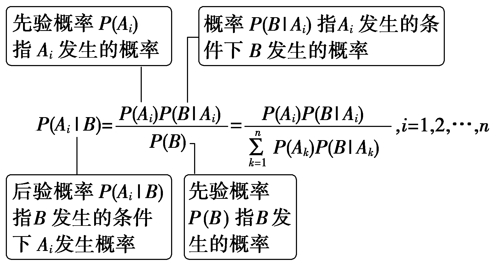

贝叶斯公式

贝叶斯公式：设<em>A</em>1，<em>A</em>2，…，<em>An</em>是一组两两互斥的事件，<em>A</em>1∪<em>A</em>2∪…∪<em>An</em>＝<em>Ω</em>，且<em>P</em>(<em>Ai</em>)＞0，<em>i</em>＝1，2，…，<em>n</em>，则对任意事件<em>B</em>⊆<em>Ω</em>，<em>P</em>(<em>B</em>)＞0，有

（1）(多选)有3台车床加工同一型号的零件.第1台加工的次品率为6％，第2，3台加工的次品率均为5％，加工出来的零件混放在一起，已知第1，2，3台车床的零件数分别占总数的25％，30％，45％，则下列选项正确的有(　　)

$\quad$A.任取一个零件是第1台车床生产出来的次品概率为0.015

$\quad$B.任取一个零件是次品的概率为0.052 5

$\quad$C.如果取到的零件是次品，则是第2台车床加工的概率为 $\frac{2}{7}$

$\quad$D.如果取到的零件是次品，则是第3台车床加工的概率为 $\frac{2}{7}$

（2）随着城市经济的发展，早高峰问题越发严重，上班族需要选择合理的出行方式.某公司员工小明上班出行方式有三种，某天早上他选择自驾、坐公交车、骑共享单车的概率分别为 $\frac{1}{3}$ ， $\frac{1}{3}$ ， $\frac{1}{3}$ ，而他自驾、坐公交车、骑共享单车迟到的概率分别为 $\frac{1}{4}$ ， $\frac{1}{5}$ ， $\frac{1}{6}$ ，结果这一天他迟到了，在此条件下，他自驾去上班的概率是<u>　　　　</u>.

答案（1）ABC　（2） $\frac{15}{37}$

解析(&lt;text style="subscript"&gt;&lt;text style="subscript"&gt;&lt;text style="subscript"&gt;1&lt;/text&gt;&lt;/text&gt;&lt;/text&gt;)记事件&lt;text style="&lt;text style="&lt;text style="<em>i</em>talic"&gt;i&lt;/text&gt;talic,subscript"&gt;i&lt;/text&gt;talic"&gt;<em>&lt;text style="italic"&gt;&lt;text style="italic"&gt;&lt;text style="italic"&gt;&lt;text style="italic"&gt;&lt;text style="italic"&gt;&lt;text style="italic"&gt;&lt;text style="italic"&gt;&lt;text style="italic"&gt;&lt;text style="italic"&gt;&lt;text style="italic"&gt;&lt;text style="italic"&gt;A</em>&lt;/text&gt;&lt;/text&gt;&lt;/text&gt;&lt;/text&gt;&lt;/text&gt;&lt;/text&gt;&lt;/text&gt;&lt;/text&gt;&lt;/text&gt;&lt;/text&gt;&lt;/text&gt;&lt;/text&gt;i：第i台车床加工的零件，i＝1，&lt;text style="subscript"&gt;&lt;text style="subscript"&gt;&lt;text style="subscript"&gt;2&lt;/text&gt;&lt;/text&gt;&lt;/text&gt;，&lt;text style="subscript"&gt;&lt;text style="subscript"&gt;&lt;text style="subscript"&gt;3&lt;/text&gt;&lt;/text&gt;&lt;/text&gt;，事件<em>&lt;text style="italic"&gt;&lt;text style="italic"&gt;&lt;text style="italic"&gt;&lt;text style="italic"&gt;&lt;text style="italic"&gt;&lt;text style="italic"&gt;&lt;text style="italic"&gt;&lt;text style="italic"&gt;&lt;text style="italic"&gt;&lt;text style="italic"&gt;B</em>&lt;/text&gt;&lt;/text&gt;&lt;/text&gt;&lt;/text&gt;&lt;/text&gt;&lt;/text&gt;&lt;/text&gt;&lt;/text&gt;&lt;/text&gt;&lt;/text&gt;＝车床加工的零件为次品.对于A，由题意，任取一个零件是第1台车床生产出来的次品概率为<em>&lt;text style="italic"&gt;&lt;text style="italic"&gt;&lt;text style="italic"&gt;&lt;text style="italic"&gt;&lt;text style="italic"&gt;&lt;text style="italic"&gt;&lt;text style="italic"&gt;&lt;text style="italic"&gt;&lt;text style="italic"&gt;&lt;text style="italic"&gt;&lt;text style="italic"&gt;&lt;text style="italic"&gt;P</em>&lt;/text&gt;&lt;/text&gt;&lt;/text&gt;&lt;/text&gt;&lt;/text&gt;&lt;/text&gt;&lt;/text&gt;&lt;/text&gt;&lt;/text&gt;&lt;/text&gt;&lt;/text&gt;&lt;/text&gt;(A1B)＝6％×25％＝1.5％＝0.015，故A正确；对于B，由题设，任取一个零件是次品的概率为P(B)＝P(A1B)＋P(A2B)＋P(A3B)＝P(B｜A1)P(A1)＋P(B｜A2)P(A2)＋P(B｜A3)P(A3)＝6％×25％＋5％×30％＋5％×45％＝5.25％＝0.0525，故B正确；对于C，由条件概率，取到的零件是次品，则是第2台车床加工的概率为P(A2｜B)＝ $\frac{P(A_{2}B)}{P(B)}$ ＝ $\frac{P(B｜A_{2})P(A_{2})}{P(B)}$ ＝ $\frac{5％\times 30％}{6％\times 25％+5％\times 30％+5％\times 45％}$ ＝ $\frac{2}{7}$ ，故C正确；对于D，由条件概率，取到的零件是次品，则是第&lt;text style="subscript"&gt;&lt;text style="subscript"&gt;&lt;text style="subscript"&gt;3&lt;/text&gt;&lt;/text&gt;&lt;/text&gt;台车床加工的概率为<em>&lt;text style="italic"&gt;&lt;text style="italic"&gt;&lt;text style="italic"&gt;&lt;text style="italic"&gt;&lt;text style="italic"&gt;&lt;text style="italic"&gt;&lt;text style="italic"&gt;&lt;text style="italic"&gt;&lt;text style="italic"&gt;&lt;text style="italic"&gt;&lt;text style="italic"&gt;&lt;text style="italic"&gt;P</em>&lt;/text&gt;&lt;/text&gt;&lt;/text&gt;&lt;/text&gt;&lt;/text&gt;&lt;/text&gt;&lt;/text&gt;&lt;/text&gt;&lt;/text&gt;&lt;/text&gt;&lt;/text&gt;&lt;/text&gt;(&lt;text style="&lt;text style="&lt;text style="<em>i</em>talic"&gt;i&lt;/text&gt;talic,subscript"&gt;i&lt;/text&gt;talic"&gt;<em>&lt;text style="italic"&gt;&lt;text style="italic"&gt;&lt;text style="italic"&gt;&lt;text style="italic"&gt;&lt;text style="italic"&gt;&lt;text style="italic"&gt;&lt;text style="italic"&gt;&lt;text style="italic"&gt;&lt;text style="italic"&gt;&lt;text style="italic"&gt;&lt;text style="italic"&gt;A</em>&lt;/text&gt;&lt;/text&gt;&lt;/text&gt;&lt;/text&gt;&lt;/text&gt;&lt;/text&gt;&lt;/text&gt;&lt;/text&gt;&lt;/text&gt;&lt;/text&gt;&lt;/text&gt;&lt;/text&gt;3｜<em>&lt;text style="italic"&gt;&lt;text style="italic"&gt;&lt;text style="italic"&gt;&lt;text style="italic"&gt;&lt;text style="italic"&gt;&lt;text style="italic"&gt;&lt;text style="italic"&gt;&lt;text style="italic"&gt;&lt;text style="italic"&gt;&lt;text style="italic"&gt;B</em>&lt;/text&gt;&lt;/text&gt;&lt;/text&gt;&lt;/text&gt;&lt;/text&gt;&lt;/text&gt;&lt;/text&gt;&lt;/text&gt;&lt;/text&gt;&lt;/text&gt;)＝ $\frac{P(A_{3}B)}{P(B)}$ ＝ $\frac{P(B｜A_{3})P(A_{3})}{P(B)}$ ＝ $\frac{5％\times 45％}{6％\times 25％+5％\times 30％+5％\times 45％}$ ＝ $\frac{3}{7}$ ，故D错误.故选&lt;text style="&lt;text style="&lt;text style="<em>i</em>talic"&gt;i&lt;/text&gt;talic,subscript"&gt;i&lt;/text&gt;talic"&gt;<em>&lt;text style="italic"&gt;&lt;text style="italic"&gt;&lt;text style="italic"&gt;&lt;text style="italic"&gt;&lt;text style="italic"&gt;&lt;text style="italic"&gt;&lt;text style="italic"&gt;&lt;text style="italic"&gt;&lt;text style="italic"&gt;&lt;text style="italic"&gt;&lt;text style="italic"&gt;A</em>&lt;/text&gt;&lt;/text&gt;&lt;/text&gt;&lt;/text&gt;&lt;/text&gt;&lt;/text&gt;&lt;/text&gt;&lt;/text&gt;&lt;/text&gt;&lt;/text&gt;&lt;/text&gt;&lt;/text&gt;<em>&lt;text style="italic"&gt;&lt;text style="italic"&gt;&lt;text style="italic"&gt;&lt;text style="italic"&gt;&lt;text style="italic"&gt;&lt;text style="italic"&gt;&lt;text style="italic"&gt;&lt;text style="italic"&gt;&lt;text style="italic"&gt;&lt;text style="italic"&gt;B</em>&lt;/text&gt;&lt;/text&gt;&lt;/text&gt;&lt;/text&gt;&lt;/text&gt;&lt;/text&gt;&lt;/text&gt;&lt;/text&gt;&lt;/text&gt;&lt;/text&gt;C.

（2）由题意设事件*<text style="italic"><text style="italic"><text style="italic"><text style="italic"><text style="italic">A*</text></text></text></text></text>表示“自驾”，事件*<text style="italic"><text style="italic"><text style="italic"><text style="italic">B*</text></text></text></text>表示“坐公交车”，事件*<text style="italic"><text style="italic"><text style="italic"><text style="italic">C*</text></text></text></text>表示“骑共享单车”，事件*<text style="italic"><text style="italic"><text style="italic"><text style="italic"><text style="italic"><text style="italic"><text style="italic"><text style="italic">D*</text></text></text></text></text></text></text></text>表示“迟到”，则*<text style="italic"><text style="italic"><text style="italic"><text style="italic"><text style="italic"><text style="italic"><text style="italic"><text style="italic"><text style="italic"><text style="italic"><text style="italic"><text style="italic"><text style="italic">P*</text></text></text></text></text></text></text></text></text></text></text></text></text>(A)＝P(B)＝P(C)＝ $\frac{1}{3}$ ，*<text style="italic"><text style="italic"><text style="italic"><text style="italic"><text style="italic"><text style="italic"><text style="italic"><text style="italic"><text style="italic"><text style="italic"><text style="italic"><text style="italic"><text style="italic">P*</text></text></text></text></text></text></text></text></text></text></text></text></text>(*<text style="italic"><text style="italic"><text style="italic"><text style="italic"><text style="italic"><text style="italic"><text style="italic"><text style="italic">D*</text></text></text></text></text></text></text></text>｜*<text style="italic"><text style="italic"><text style="italic"><text style="italic"><text style="italic">A*</text></text></text></text></text>)＝ $\frac{1}{4}$ ，*<text style="italic"><text style="italic"><text style="italic"><text style="italic"><text style="italic"><text style="italic"><text style="italic"><text style="italic"><text style="italic"><text style="italic"><text style="italic"><text style="italic"><text style="italic">P*</text></text></text></text></text></text></text></text></text></text></text></text></text>(*<text style="italic"><text style="italic"><text style="italic"><text style="italic"><text style="italic"><text style="italic"><text style="italic"><text style="italic">D*</text></text></text></text></text></text></text></text>｜*<text style="italic"><text style="italic"><text style="italic"><text style="italic">B*</text></text></text></text>)＝ $\frac{1}{5}$ ，*<text style="italic"><text style="italic"><text style="italic"><text style="italic"><text style="italic"><text style="italic"><text style="italic"><text style="italic"><text style="italic"><text style="italic"><text style="italic"><text style="italic"><text style="italic">P*</text></text></text></text></text></text></text></text></text></text></text></text></text>(*<text style="italic"><text style="italic"><text style="italic"><text style="italic"><text style="italic"><text style="italic"><text style="italic"><text style="italic">D*</text></text></text></text></text></text></text></text>｜*<text style="italic"><text style="italic"><text style="italic"><text style="italic">C*</text></text></text></text>)＝ $\frac{1}{6}$ ；*<text style="italic"><text style="italic"><text style="italic"><text style="italic"><text style="italic"><text style="italic"><text style="italic"><text style="italic"><text style="italic"><text style="italic"><text style="italic"><text style="italic"><text style="italic">P*</text></text></text></text></text></text></text></text></text></text></text></text></text>(*<text style="italic"><text style="italic"><text style="italic"><text style="italic"><text style="italic"><text style="italic"><text style="italic"><text style="italic">D*</text></text></text></text></text></text></text></text>)＝P(*<text style="italic"><text style="italic"><text style="italic"><text style="italic"><text style="italic">A*</text></text></text></text></text>)P(D｜A)＋P(*<text style="italic"><text style="italic"><text style="italic"><text style="italic">B*</text></text></text></text>)P(D｜B)＋P(*<text style="italic"><text style="italic"><text style="italic"><text style="italic">C*</text></text></text></text>)P(D｜C)＝ $\frac{1}{3}$ × $\left(\frac{1}{4}＋\frac{1}{5}＋\frac{1}{6}\right)$ ，小明迟到了，由贝叶斯公式得他自驾去上班的概率是*<text style="italic"><text style="italic"><text style="italic"><text style="italic"><text style="italic"><text style="italic"><text style="italic"><text style="italic"><text style="italic"><text style="italic"><text style="italic"><text style="italic"><text style="italic">P*</text></text></text></text></text></text></text></text></text></text></text></text></text>(*<text style="italic"><text style="italic"><text style="italic"><text style="italic"><text style="italic">A*</text></text></text></text></text>｜*<text style="italic"><text style="italic"><text style="italic"><text style="italic"><text style="italic"><text style="italic"><text style="italic"><text style="italic">D*</text></text></text></text></text></text></text></text>)＝ $\frac{P(AD)}{P(D)}$ ＝ $\frac{P(A)P(D｜A)}{P(D)}$ ＝ $\frac{\frac{1}{3}\times \frac{1}{4}}{\frac{1}{3}\times \left(\frac{1}{4}＋\frac{1}{5}＋\frac{1}{6}\right)}$ ＝ $\frac{15}{37}$ .

##### 1.从形式上看，全概率公式是求一个事件发生的总概率，而贝叶斯公式是求一个事件的条件概率.

##### 2.从思想上看，全概率公式是将一个复杂的事件分解为若干个简单的子事件，然后利用子事件发生的概率和条件概率来求出复杂事件发生的概率.贝叶斯公式是利用已知的结果，反推出原因的可能性，然后利用原因发生的概率和条件概率来更新对原因发生的概率的估计.

##### 3.从应用上看，全概率公式和贝叶斯公式可以相互配合，一般来说，全概率公式可以用来求出贝叶斯公式中的分母(结果发生的总概率)，而贝叶斯公式可以用来求出全概率公式中的局部项(子事件发生的条件概率).

对点练1.(2025·湖南常德模拟)设有甲、乙两箱数量相同的产品，甲箱中产品的合格率为90％，乙箱中产品的合格率为80％.从两箱产品中任取一件，经检验不合格，放回原箱后在该箱中再随机取一件产品，则该件产品合格的概率为(　　)

$\quad$A. $\frac{5}{6}$ 	
$\quad$B. $\frac{6}{7}$

$\quad$C. $\frac{7}{8}$ 	
$\quad$D. $\frac{17}{20}$

答案A

解析设事件<em>&lt;text style="italic"&gt;&lt;text style="italic"&gt;&lt;text style="italic"&gt;&lt;text style="italic"&gt;&lt;text style="italic"&gt;&lt;text style="italic"&gt;&lt;text style="italic"&gt;B</em>&lt;/text&gt;&lt;/text&gt;&lt;/text&gt;&lt;/text&gt;&lt;/text&gt;&lt;/text&gt;&lt;/text&gt;&lt;text style="subscript"&gt;&lt;text style="subscript"&gt;&lt;text style="subscript"&gt;1&lt;/text&gt;&lt;/text&gt;&lt;/text&gt;表示任选一件产品，来自于甲箱，事件B&lt;text style="subscript"&gt;&lt;text style="subscript"&gt;&lt;text style="subscript"&gt;2&lt;/text&gt;&lt;/text&gt;&lt;/text&gt;表示任选一件产品，来自于乙箱，事件<em>&lt;text style="italic"&gt;&lt;text style="italic"&gt;&lt;text style="italic"&gt;&lt;text style="italic"&gt;&lt;text style="italic"&gt;A</em>&lt;/text&gt;&lt;/text&gt;&lt;/text&gt;&lt;/text&gt;&lt;/text&gt;表示从两箱产品中任取一件，恰好不合格，<em>&lt;text style="italic"&gt;&lt;text style="italic"&gt;&lt;text style="italic"&gt;&lt;text style="italic"&gt;&lt;text style="italic"&gt;&lt;text style="italic"&gt;P</em>&lt;/text&gt;&lt;/text&gt;&lt;/text&gt;&lt;/text&gt;&lt;/text&gt;&lt;/text&gt;(A)＝P(A｜B1)P(B1)＋P(A｜B2)P(B2)＝0.1×0.5＋0.2×0.5＝0.15，又P(B1｜A)＝ $\frac{P(AB_{1})}{P(A)}$ ＝ $\frac{P(A｜B_{1})P(B_{1})}{P(A)}$ ＝ $\frac{0.1\times 0.5}{0.15}$ ＝ $\frac{1}{3}$ ，<em>&lt;text style="italic"&gt;&lt;text style="italic"&gt;&lt;text style="italic"&gt;&lt;text style="italic"&gt;&lt;text style="italic"&gt;&lt;text style="italic"&gt;P</em>&lt;/text&gt;&lt;/text&gt;&lt;/text&gt;&lt;/text&gt;&lt;/text&gt;&lt;/text&gt;(<em>&lt;text style="italic"&gt;&lt;text style="italic"&gt;&lt;text style="italic"&gt;&lt;text style="italic"&gt;&lt;text style="italic"&gt;&lt;text style="italic"&gt;&lt;text style="italic"&gt;B</em>&lt;/text&gt;&lt;/text&gt;&lt;/text&gt;&lt;/text&gt;&lt;/text&gt;&lt;/text&gt;&lt;/text&gt;&lt;text style="subscript"&gt;&lt;text style="subscript"&gt;&lt;text style="subscript"&gt;2&lt;/text&gt;&lt;/text&gt;&lt;/text&gt;｜<em>&lt;text style="italic"&gt;&lt;text style="italic"&gt;&lt;text style="italic"&gt;&lt;text style="italic"&gt;&lt;text style="italic"&gt;A</em>&lt;/text&gt;&lt;/text&gt;&lt;/text&gt;&lt;/text&gt;&lt;/text&gt;)＝ $\frac{P(AB_{2})}{P(A)}$ ＝ $\frac{P(A｜B_{2})P(B_{2})}{P(A)}$ ＝ $\frac{0.2\times 0.5}{0.15}$ ＝ $\frac{2}{3}$ ，经检验不合格，放回原箱后在该箱中再随机取一件产品，则该件产品合格的概率为 $\frac{1}{3}$ × $\frac{9}{10}$ ＋ $\frac{2}{3}$ × $\frac{8}{10}$ ＝ $\frac{5}{6}$ .故选<em>&lt;text style="italic"&gt;&lt;text style="italic"&gt;&lt;text style="italic"&gt;&lt;text style="italic"&gt;&lt;text style="italic"&gt;A</em>&lt;/text&gt;&lt;/text&gt;&lt;/text&gt;&lt;/text&gt;&lt;/text&gt;.

对点练2.(多选)(2025·广东六校联考)英国数学家贝叶斯在概率论研究方面成就显著，根据贝叶斯统计理论，随机事件*<text style="italic">A*</text>，*<text style="italic">B*</text>存在如下关系：*P*(A｜B)＝ $\frac{P(A)P(B｜A)}{P(B)}$ .王同学连续两天在某高校的甲、乙两家餐厅就餐，王同学第一天去甲、乙两家餐厅就餐的概率分别为0.4和0.6.如果他第一天去甲餐厅，那么第二天去甲餐厅的概率为0.6；如果第一天去乙餐厅，那么第二天去甲餐厅的概率为0.5.则王同学(　　)

$\quad$A.第二天去甲餐厅的概率为0.54

$\quad$B.第二天去乙餐厅的概率为0.44

$\quad$C.第二天去了甲餐厅，则第一天去乙餐厅的概率为 $\frac{5}{9}$

$\quad$D.第二天去了乙餐厅，则第一天去甲餐厅的概率为 $\frac{4}{9}$

答案AC

解析设<em>&lt;text style="italic"&gt;&lt;text style="italic"&gt;&lt;text style="italic"&gt;&lt;text style="italic"&gt;&lt;text style="italic"&gt;&lt;text style="italic"&gt;&lt;text style="italic"&gt;&lt;text style="italic"&gt;&lt;text style="italic"&gt;&lt;text style="italic"&gt;&lt;text style="italic"&gt;&lt;text style="italic"&gt;&lt;text style="italic"&gt;A</em>&lt;/text&gt;&lt;/text&gt;&lt;/text&gt;&lt;/text&gt;&lt;/text&gt;&lt;/text&gt;&lt;/text&gt;&lt;/text&gt;&lt;/text&gt;&lt;/text&gt;&lt;/text&gt;&lt;/text&gt;&lt;/text&gt;&lt;text style="subscript"&gt;&lt;text style="subscript"&gt;&lt;text style="subscript"&gt;&lt;text style="subscript"&gt;&lt;text style="subscript"&gt;&lt;text style="subscript"&gt;&lt;text style="subscript"&gt;&lt;text style="subscript"&gt;&lt;text style="subscript"&gt;&lt;text style="subscript"&gt;&lt;text style="subscript"&gt;1&lt;/text&gt;&lt;/text&gt;&lt;/text&gt;&lt;/text&gt;&lt;/text&gt;&lt;/text&gt;&lt;/text&gt;&lt;/text&gt;&lt;/text&gt;&lt;/text&gt;&lt;/text&gt;： 第一天去甲餐厅，A&lt;text style="subscript"&gt;&lt;text style="subscript"&gt;&lt;text style="subscript"&gt;&lt;text style="subscript"&gt;&lt;text style="subscript"&gt;&lt;text style="subscript"&gt;&lt;text style="subscript"&gt;&lt;text style="subscript"&gt;&lt;text style="subscript"&gt;&lt;text style="subscript"&gt;2&lt;/text&gt;&lt;/text&gt;&lt;/text&gt;&lt;/text&gt;&lt;/text&gt;&lt;/text&gt;&lt;/text&gt;&lt;/text&gt;&lt;/text&gt;&lt;/text&gt;： 第二天去甲餐厅，<em>&lt;text style="italic"&gt;&lt;text style="italic"&gt;&lt;text style="italic"&gt;&lt;text style="italic"&gt;&lt;text style="italic"&gt;&lt;text style="italic"&gt;&lt;text style="italic"&gt;&lt;text style="italic"&gt;B</em>&lt;/text&gt;&lt;/text&gt;&lt;/text&gt;&lt;/text&gt;&lt;/text&gt;&lt;/text&gt;&lt;/text&gt;&lt;/text&gt;1：第一天去乙餐厅，B2： 第二天去乙餐厅，则<em>&lt;text style="italic"&gt;&lt;text style="italic"&gt;&lt;text style="italic"&gt;&lt;text style="italic"&gt;&lt;text style="italic"&gt;&lt;text style="italic"&gt;&lt;text style="italic"&gt;&lt;text style="italic"&gt;&lt;text style="italic"&gt;&lt;text style="italic"&gt;&lt;text style="italic"&gt;&lt;text style="italic"&gt;P</em>&lt;/text&gt;&lt;/text&gt;&lt;/text&gt;&lt;/text&gt;&lt;/text&gt;&lt;/text&gt;&lt;/text&gt;&lt;/text&gt;&lt;/text&gt;&lt;/text&gt;&lt;/text&gt;&lt;/text&gt;(A1)＝0.4，P(B1)＝0.6，P(A2｜A1)＝0.6，P(A2｜B1)＝0.5.所以P(A2)＝P(A1)P(A2｜A1)＋P(B1)P(A2｜B1)＝0.4×0.6＋0.6×0.5＝0.54，故A正确；P(B2)＝1－P(A2)＝0.46，故B不正确；P(B1｜A2)＝ $\frac{P(B_{1})P(A_{2}｜B_{1})}{P(A_{2})}$ ＝ $\frac{5}{9}$ ，故C正确；<em>&lt;text style="italic"&gt;&lt;text style="italic"&gt;&lt;text style="italic"&gt;&lt;text style="italic"&gt;&lt;text style="italic"&gt;&lt;text style="italic"&gt;&lt;text style="italic"&gt;&lt;text style="italic"&gt;&lt;text style="italic"&gt;&lt;text style="italic"&gt;&lt;text style="italic"&gt;&lt;text style="italic"&gt;P</em>&lt;/text&gt;&lt;/text&gt;&lt;/text&gt;&lt;/text&gt;&lt;/text&gt;&lt;/text&gt;&lt;/text&gt;&lt;/text&gt;&lt;/text&gt;&lt;/text&gt;&lt;/text&gt;&lt;/text&gt;(<em>&lt;text style="italic"&gt;&lt;text style="italic"&gt;&lt;text style="italic"&gt;&lt;text style="italic"&gt;&lt;text style="italic"&gt;&lt;text style="italic"&gt;&lt;text style="italic"&gt;&lt;text style="italic"&gt;&lt;text style="italic"&gt;&lt;text style="italic"&gt;&lt;text style="italic"&gt;&lt;text style="italic"&gt;&lt;text style="italic"&gt;A</em>&lt;/text&gt;&lt;/text&gt;&lt;/text&gt;&lt;/text&gt;&lt;/text&gt;&lt;/text&gt;&lt;/text&gt;&lt;/text&gt;&lt;/text&gt;&lt;/text&gt;&lt;/text&gt;&lt;/text&gt;&lt;/text&gt;&lt;text style="subscript"&gt;&lt;text style="subscript"&gt;&lt;text style="subscript"&gt;&lt;text style="subscript"&gt;&lt;text style="subscript"&gt;&lt;text style="subscript"&gt;&lt;text style="subscript"&gt;&lt;text style="subscript"&gt;&lt;text style="subscript"&gt;&lt;text style="subscript"&gt;&lt;text style="subscript"&gt;1&lt;/text&gt;&lt;/text&gt;&lt;/text&gt;&lt;/text&gt;&lt;/text&gt;&lt;/text&gt;&lt;/text&gt;&lt;/text&gt;&lt;/text&gt;&lt;/text&gt;&lt;/text&gt;｜<em>&lt;text style="italic"&gt;&lt;text style="italic"&gt;&lt;text style="italic"&gt;&lt;text style="italic"&gt;&lt;text style="italic"&gt;&lt;text style="italic"&gt;&lt;text style="italic"&gt;&lt;text style="italic"&gt;B</em>&lt;/text&gt;&lt;/text&gt;&lt;/text&gt;&lt;/text&gt;&lt;/text&gt;&lt;/text&gt;&lt;/text&gt;&lt;/text&gt;&lt;text style="subscript"&gt;&lt;text style="subscript"&gt;&lt;text style="subscript"&gt;&lt;text style="subscript"&gt;&lt;text style="subscript"&gt;&lt;text style="subscript"&gt;&lt;text style="subscript"&gt;&lt;text style="subscript"&gt;&lt;text style="subscript"&gt;&lt;text style="subscript"&gt;2&lt;/text&gt;&lt;/text&gt;&lt;/text&gt;&lt;/text&gt;&lt;/text&gt;&lt;/text&gt;&lt;/text&gt;&lt;/text&gt;&lt;/text&gt;&lt;/text&gt;)＝ $\frac{P(A_{1})[1－P(A_{2}｜A_{1})]}{P(B_{2})}$ ＝ $\frac{0.4\times (1－0.6)}{0.46}$ ＝ $\frac{8}{23}$ ，故D不正确.故选<em>&lt;text style="italic"&gt;&lt;text style="italic"&gt;&lt;text style="italic"&gt;&lt;text style="italic"&gt;&lt;text style="italic"&gt;&lt;text style="italic"&gt;&lt;text style="italic"&gt;&lt;text style="italic"&gt;&lt;text style="italic"&gt;&lt;text style="italic"&gt;&lt;text style="italic"&gt;&lt;text style="italic"&gt;&lt;text style="italic"&gt;A</em>&lt;/text&gt;&lt;/text&gt;&lt;/text&gt;&lt;/text&gt;&lt;/text&gt;&lt;/text&gt;&lt;/text&gt;&lt;/text&gt;&lt;/text&gt;&lt;/text&gt;&lt;/text&gt;&lt;/text&gt;&lt;/text&gt;C.

对点练3.某人从甲地到乙地，乘火车、轮船、飞机的概率分别为0.2，0.4，0.4，乘火车迟到的概率为0.4，乘轮船迟到的概率为0.3，乘飞机迟到的概率为0.5，则这个人迟到的概率是<u>　　　　</u>；如果这个人迟到了，则他是乘轮船迟到的概率是<u>　　　　</u>.

答案0.4　0.3

解析设事件*<text style="italic"><text style="italic"><text style="italic"><text style="italic">A*</text></text></text></text>＝“乘火车”，事件*<text style="italic"><text style="italic"><text style="italic"><text style="italic"><text style="italic">B*</text></text></text></text></text>＝“乘轮船”，事件*<text style="italic"><text style="italic"><text style="italic"><text style="italic">C*</text></text></text></text>＝“乘飞机”，事件*<text style="italic"><text style="italic"><text style="italic"><text style="italic"><text style="italic"><text style="italic"><text style="italic"><text style="italic">D*</text></text></text></text></text></text></text></text>＝“迟到”，则*<text style="italic"><text style="italic"><text style="italic"><text style="italic"><text style="italic"><text style="italic"><text style="italic"><text style="italic"><text style="italic"><text style="italic"><text style="italic"><text style="italic"><text style="italic">P*</text></text></text></text></text></text></text></text></text></text></text></text></text>(A)＝0.2，P(D｜A)＝0.4，P(B)＝0.4，P(D｜B)＝0.3，P(C)＝0.4，P(D｜C)＝0.5.全概率公式得P(D)＝P(A)P(D｜A)＋P(B)P(D｜B)＋P(C)P(D｜C)＝0.2×0.4＋0.4×0.3＋0.4×0.5＝0.4.由贝叶斯公式得到如果他迟到了，则他是乘轮船迟到的概率为P(B｜D)＝ $\frac{P(DB)}{P(D)}$ ＝ $\frac{P(B)P(D｜B)}{P(D)}$ ＝ $\frac{0.4\times 0.3}{0.4}$ ＝0.3.

