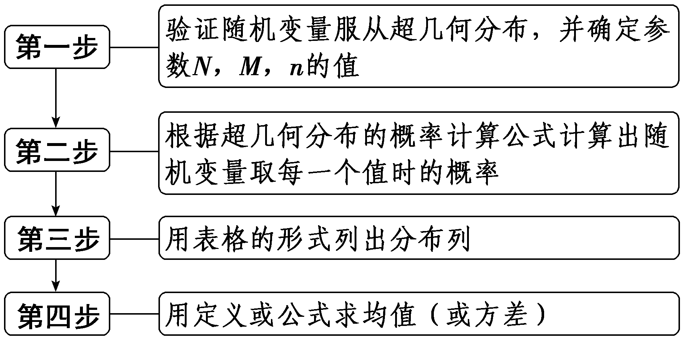
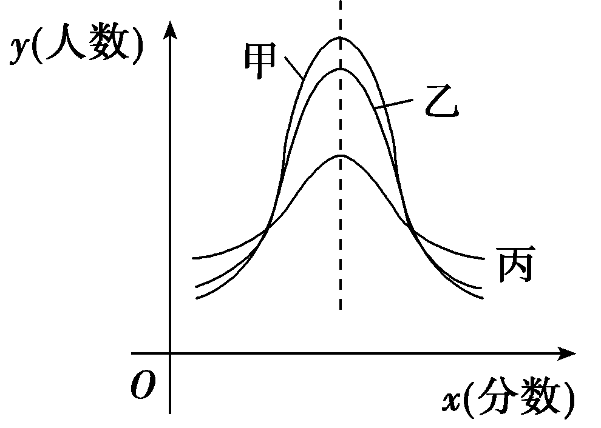
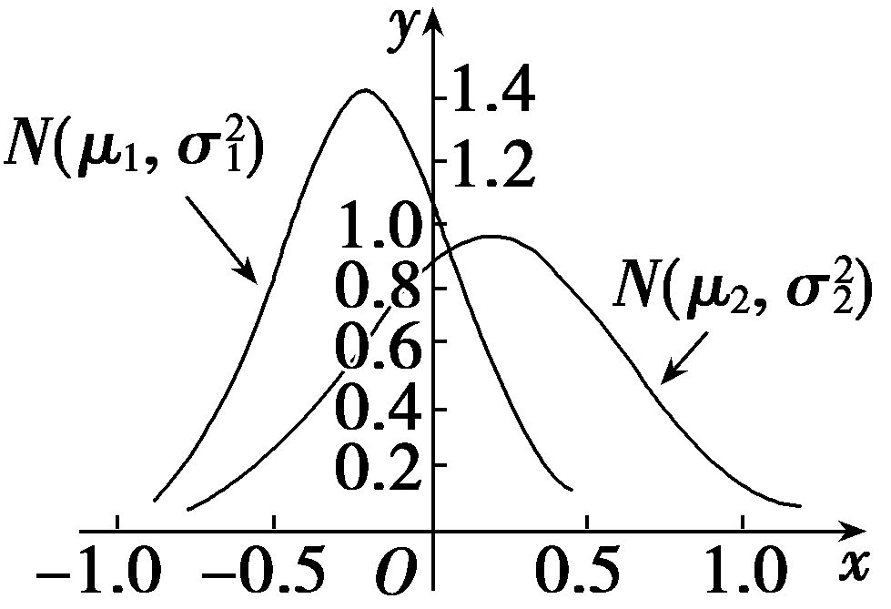

第六节　二项分布、超几何分布与正态分布

【课标研读】　1.通过具体实例，理解伯努利试验，掌握二项分布及其数字特征，并能解决简单的实际问题.　2.通过具体实例，了解超几何分布及其均值，并能解决简单的实际问题.　3.通过误差模型，了解服从正态分布的随机变量.通过具体实例，借助于频率分布直方图的直观，了解正态分布的特征.　4.了解正态分布的均值、方差及其含义.

##### 1.伯努利试验与二项分布

（1）伯努利试验：只包含<u>两个</u>可能结果的试验叫做伯努利试验；将一个伯努利试验独立地重复进行<em>n</em>次所组成的随机试验称为 <em><u>n</u></em><u>重伯努利试验</u>.

（2）二项分布：一般地，在*n*重伯努利试验中，设每次试验中事件*A*发生的概率为*p*(0＜*p*＜1)，用*X*表示事件*A*发生的次数，则*X*的分布列为

<em>P</em>(<em>X</em>＝<em>&lt;text style="italic,u&lt;text style="italic,u&lt;text style="italic"&gt;n</em>derline,superscript"&gt;n&lt;/text&gt;derline,su<em><u>p</u></em>erscript"&gt;<em><u>&lt;text style="italic"&gt;k</u></em>&lt;/text&gt;&lt;/text&gt;&lt;/text&gt;<u>)</u>＝ $C_{n}^{k}$ &lt;text style="italic,u&lt;text style="italic,u<em>n</em>derline,superscript"&gt;n&lt;/text&gt;derline"&gt;<em><u>p</u></em>&lt;/text&gt;<em>&lt;text style="italic,underline,superscript"&gt;&lt;text style="italic,underline,superscript"&gt;&lt;text style="italic"&gt;k</em>&lt;/text&gt;&lt;/text&gt;&lt;/text&gt;<u>(1&lt;text style="underline,superscript"&gt;－</u>&lt;/text&gt;p<u>)</u>n－k，k＝0，1，2，…，n.

如果随机变量<em>X</em>的分布列具有上式的形式，则称随机变量<em>X</em>服从二项分布，记作<em><u>X</u></em><u>～</u><em><u>B</u></em><u>(</u><em><u>n</u></em><u>，</u><em><u>p</u></em><u>)</u>.

（3）两点分布与二项分布的均值、方差

①若随机变量<em>X</em>服从两点分布，则<em>E</em>(<em>X</em>)＝<em><u>p</u></em>，<em>D</em>(<em>X</em>)＝<em><u>p</u></em><u>(1－</u><em><u>p</u></em><u>)</u>.

②若<em>X</em>～<em>B</em>(<em>n</em>，<em>p</em>)，则<em>E</em>(<em>X</em>)＝<em><u>np</u></em>，<em>D</em>(<em>X</em>)＝<em><u>np</u></em><u>(1－</u><em><u>p</u></em><u>)</u>.

##### 2.超几何分布

一般地，假设一批产品共有&lt;text style="<em>i</em>talic"&gt;<em>&lt;text style="italic"&gt;&lt;text style="bold"&gt;&lt;text style="italic"&gt;&lt;text style="italic"&gt;&lt;text style="italic"&gt;N</em>&lt;/text&gt;&lt;/text&gt;&lt;/text&gt;&lt;/text&gt;&lt;/text&gt;&lt;/text&gt;件，其中有<em>&lt;text style="italic"&gt;&lt;text style="italic"&gt;&lt;text style="italic"&gt;&lt;text style="italic"&gt;M</em>&lt;/text&gt;&lt;/text&gt;&lt;/text&gt;&lt;/text&gt;件次品.从N件产品中随机抽取<em>&lt;text style="italic"&gt;&lt;text style="italic"&gt;&lt;text style="italic"&gt;&lt;text style="italic"&gt;&lt;text style="italic"&gt;n</em>&lt;/text&gt;&lt;/text&gt;&lt;/text&gt;&lt;/text&gt;&lt;/text&gt;件(不放回)，用<em>&lt;text style="italic"&gt;&lt;text style="italic"&gt;&lt;text style="italic"&gt;&lt;text style="italic"&gt;X</em>&lt;/text&gt;&lt;/text&gt;&lt;/text&gt;&lt;/text&gt;表示抽取的n件产品中的次品数，则X的分布列为<em>P</em>(X＝<em>&lt;text style="italic"&gt;k</em>&lt;/text&gt;)＝ $\frac{C_{M}^{k}C_{N－M}^{n－k}}{C_{N}^{n}}$ ，&lt;text style="<em>i</em>talic"&gt;<em>k</em>&lt;/text&gt;＝<em>&lt;text style="italic"&gt;&lt;text style="italic"&gt;&lt;text style="italic"&gt;m</em>&lt;/text&gt;&lt;/text&gt;&lt;/text&gt;，m＋1，m＋2，…，<em>&lt;text style="italic"&gt;r</em>&lt;/text&gt;.其中，<em>&lt;text style="italic"&gt;&lt;text style="italic"&gt;&lt;text style="italic"&gt;&lt;text style="italic"&gt;&lt;text style="italic"&gt;n</em>&lt;/text&gt;&lt;/text&gt;&lt;/text&gt;&lt;/text&gt;&lt;/text&gt;，<em>&lt;text style="italic"&gt;&lt;text style="italic"&gt;&lt;text style="bold"&gt;&lt;text style="italic"&gt;&lt;text style="italic"&gt;&lt;text style="italic"&gt;N</em>&lt;/text&gt;&lt;/text&gt;&lt;/text&gt;&lt;/text&gt;&lt;/text&gt;&lt;/text&gt;，<em>&lt;text style="italic"&gt;&lt;text style="italic"&gt;&lt;text style="italic"&gt;&lt;text style="italic"&gt;M</em>&lt;/text&gt;&lt;/text&gt;&lt;/text&gt;&lt;/text&gt;∈N<em>\*</em>，M≤N，n≤N，m＝max{0，n－N＋M}，r＝min{n，M}.如果随机变量<em>&lt;text style="italic"&gt;&lt;text style="italic"&gt;&lt;text style="italic"&gt;&lt;text style="italic"&gt;X</em>&lt;/text&gt;&lt;/text&gt;&lt;/text&gt;&lt;/text&gt;的分布列具有上式的形式，那么称随机变量X服从超几何分布.

随机变量*<text style="italic">X*</text>服从超几何分布，则*E*(X)＝ $\frac{nM}{N}$ .

##### 3.正态分布

（1）定义

若随机变量&lt;te&lt;te<em>x</em>t style="italic"&gt;x&lt;/text&gt;t style="italic"&gt;<em>&lt;text style="italic"&gt;X</em>&lt;/text&gt;&lt;/text&gt;的概率分布密度函数为<em>f</em>(x)＝ $\frac{1}{\sigma \sqrt{2\pi }}$ · $e^{\frac{-(x－\mu )^{2}}{2\sigma ^{2}}}$ ，&lt;te<em>x</em>t style="italic"&gt;x&lt;/text&gt;∈<strong>&lt;text style="bold"&gt;R</strong>&lt;/text&gt;，其中，<em>&lt;text style="italic"&gt;μ</em>&lt;/text&gt;∈R，<em>&lt;text style="italic"&gt;σ</em>&lt;/text&gt;＞0为参数，则称随机变量<em>&lt;text style="italic"&gt;&lt;text style="italic"&gt;X</em>&lt;/text&gt;&lt;/text&gt;服从<u>正态分布</u>，记为X～<em>N</em>(μ，σ2).

（2）正态曲线的特点

①曲线是单峰的，它关于直线<em><u>x</u></em><u>＝</u><em><u>μ</u></em>对称；

②曲线在<em><u>x</u></em><u>＝</u><em><u>μ</u></em>处达到峰值 $\frac{1}{\sigma \sqrt{2\pi }}$ ；

③当｜*x*｜无限增大时，曲线无限接近*x*轴.

（3）3*σ*原则

①*P*(*μ*－*σ*≤*X*≤*μ*＋*σ*)≈0.682 7；

②*P*(*μ*－2*σ* ≤*X*≤*μ*＋2*σ*)≈0.954 5；

③*P*(*μ*－3*σ*≤*X*≤*μ*＋3*σ*)≈0.997 3.

（4）正态分布的均值与方差

若<em>X</em>～<em>N</em>(<em>μ</em>，<em>σ</em>2)，则<em>E</em>(<em>X</em>)＝<em><u>μ</u></em>，<em>D</em>(<em>X</em>)＝<em><u>σ</u></em><u>2</u>.

【常用结论】

（1）“二项分布”与“超几何分布”的区别：有放回抽取问题对应二项分布，不放回抽取问题对应超几何分布，当总体容量很大时，超几何分布可近似为二项分布来处理.

（2）超几何分布有时也记为*<text style="italic"><text style="italic">X*</text></text>～*H*(*n*，*M*，*N*)，其均值*E*(X)＝ $\frac{nM}{N}$ ，*D*(*<text style="italic"><text style="italic">X*</text></text>)＝ $\frac{nM}{N}\left(1－\frac{M}{N}\right)\left(1－\frac{n－1}{N－1}\right)$ .

【自主检测】

##### 1.(多选)下列说法正确的是(　　)

$\quad$A.两点分布是二项分布当*n*＝1时的特殊情形

$\quad$B.若*X*表示*n*次重复抛掷1枚骰子出现点数是3的倍数的次数，则*X*服从二项分布

$\quad$C.从装有3个红球、3个白球的盒中有放回地任取一个球，连取3次，则取到红球的个数*X*服从超几何分布

$\quad$D.当*μ*取定值时，正态曲线的形状由*σ*确定，*σ*越小，曲线越“矮胖”

答案AB

##### 2.(链接人教A选择性必修三P77T2)鸡接种一种疫苗后，有90％不会感染某种病毒，如果有5只鸡接种了疫苗，则恰好有4只鸡没有感染病毒的概率约为(　　)

$\quad$A.0.33	
$\quad$B.0.66

$\quad$C.0.5	
$\quad$D.0.45

答案A

解析设5只接种疫苗的鸡中没有感染病毒的只数为<em>&lt;text style="italic"&gt;X</em>&lt;/text&gt;，则X～<em>B</em>(5，0.9)，所以<em>P</em> $\left(X=4\right)$ ＝ $C_{5}^{4}$ ×0.94×0.1≈0.33.故选A.

##### 3.(链接人教A选择性必修三P87T2)已知随机变量<em>X</em>服从正态分布<em>N</em>(3，1)，且<em>P</em>(<em>X</em>＞2<em>c</em>－1)＝<em>P</em>(<em>X</em>＜<em>c</em>＋3)，则<em>c</em>＝<u>　　　　</u>.

答案 $\frac{4}{3}$

解析因为<te<text style="itali<text style="itali<text style="itali<text style="itali<text style="itali*c*">c</text>">c</text>">c</text>">c</text>">x</text>t style="italic">*<text style="italic">X*</text></text>～*N*(3，1)，所以正态曲线关于x＝3对称，且*<text style="italic">P*</text>(X＞2c－1)＝P(X＜c＋3)，所以2c－1＋c＋3＝3×2，所以c＝ $\frac{4}{3}$ .

##### 4.(链接人教A选择性必修三P78例5)在含有3件次品的10件产品中，任取4件，<em>X</em>表示取到的次品的个数，则<em>P</em>(<em>X</em>＝2)＝<u>　　　　</u>.

答案 $\frac{3}{10}$

解析由题意得*P* $\left(X=2\right)$ ＝ $\frac{C_{3}^{2}C_{7}^{2}}{C_{10}^{4}}$ ＝ $\frac{3}{10}$ .

考点一　二项分布　　　　师生共研

(2024·苏锡常镇四市调研(一))我国无人机发展迅猛，在全球具有领先优势，已经成为“中国制造”一张靓丽的新名片，并广泛用于森林消防、抢险救灾、环境监测等领域.某森林消防支队在一次消防演练中利用无人机进行投弹灭火试验，消防员甲操控无人机对同一目标起火点进行了三次投弹试验，已知无人机每次投弹时击中目标的概率都为 $\frac{4}{5}$ ，每次投弹是否击中目标相互独立.无人机击中目标一次起火点被扑灭的概率为 $\frac{1}{2}$ ，击中目标两次起火点被扑灭的概率为 $\frac{2}{3}$ ，击中目标三次起火点必定被扑灭.

（1）求起火点被无人机击中次数的分布列及数学期望；

（2）求起火点被无人机击中且被扑灭的概率.

解：（1）起火点被无人机击中次数*X*的所有可能取值为0，1，2，3.

<em>&lt;text style="italic"&gt;&lt;text style="italic"&gt;P</em>&lt;/text&gt;&lt;/text&gt;(<em>&lt;text style="italic"&gt;&lt;text style="italic"&gt;X</em>&lt;/text&gt;&lt;/text&gt;＝0)＝( $\frac{1}{5}$ )3＝ $\frac{1}{125}$ ，<em>&lt;text style="italic"&gt;&lt;text style="italic"&gt;P</em>&lt;/text&gt;&lt;/text&gt;(<em>&lt;text style="italic"&gt;&lt;text style="italic"&gt;X</em>&lt;/text&gt;&lt;/text&gt;＝1)＝ $C_{3}^{1}$ × $\frac{4}{5}$ ×( $\frac{1}{5}$ )&lt;text style="superscript"&gt;2&lt;/text&gt;＝ $\frac{12}{125}$ ，<em>&lt;text style="italic"&gt;&lt;text style="italic"&gt;P</em>&lt;/text&gt;&lt;/text&gt;(<em>&lt;text style="italic"&gt;&lt;text style="italic"&gt;X</em>&lt;/text&gt;&lt;/text&gt;＝&lt;text style="superscript"&gt;2&lt;/text&gt;)＝ $C_{3}^{2}$ ×( $\frac{4}{5}$ )&lt;text style="superscript"&gt;2&lt;/text&gt;× $\frac{1}{5}$ ＝ $\frac{48}{125}$ ，

<em>P</em>(<em>X</em>＝3)＝( $\frac{4}{5}$ )3＝ $\frac{64}{125}$ .

所以*X*的分布列为：

<table><tr><td>
<em>X</em>
</td><td>
0
</td><td>
1
</td><td>
2
</td><td>
3
</td></tr><tr><td>
<em>P</em>
</td><td>
 $\frac{1}{125}$ 
</td><td>
 $\frac{12}{125}$ 
</td><td>
 $\frac{48}{125}$ 
</td><td>
 $\frac{64}{125}$ 
</td></tr></table>

所以*E*(*X*)＝0× $\frac{1}{125}$ ＋1× $\frac{12}{125}$ ＋2× $\frac{48}{125}$ ＋3× $\frac{64}{125}$ ＝ $\frac{300}{125}$ ＝ $\frac{12}{5}$ .

(另法：因为*<text style="italic">X*</text>～*B*(3， $\frac{4}{5}$ )，所以*E*(*<text style="italic">X*</text>)＝3× $\frac{4}{5}$ ＝ $\frac{12}{5}$ .)

（2）击中一次火被扑灭的概率为<em>&lt;text style="italic"&gt;P</em>&lt;/text&gt;1＝P(<em>X</em>＝1)× $\frac{1}{2}$ ＝ $\frac{6}{125}$ ，

击中两次火被扑灭的概率为<em>&lt;text style="italic"&gt;P</em>&lt;/text&gt;2＝P(<em>X</em>＝2)× $\frac{2}{3}$ ＝ $\frac{32}{125}$ ，

击中三次火被扑灭的概率为<em>&lt;text style="italic"&gt;P</em>&lt;/text&gt;3＝P(<em>X</em>＝3)＝ $\frac{64}{125}$ ，

所以所求概率*P*＝ $\frac{6}{125}$ ＋ $\frac{32}{125}$ ＋ $\frac{64}{125}$ ＝ $\frac{102}{125}$ .

二项分布的期望与方差的求解策略

##### 1.如果*X* ～*B*(*n*，*p*)，则用公式*E*(*X*)＝*np*，*D*(*X*)＝*np*(1－*p*)求解，可大大减少计算量.

##### 2.有些随机变量虽不服从二项分布，但与之具有线性关系的另一随机变量服从二项分布，这时，可以综合应用*E*(*aX*＋*b*)＝*aE*(*X*)＋*b*以及*E*(*X*)＝*np*求出*E*(*aX*＋*b*)，同样还可求出*D*(*aX*＋*b*).

对点练1.(2024·山东临沂一模)某学校举办了精彩纷呈的数学文化节活动，其中有一个“掷骰子赢奖品”的登台阶游戏最受欢迎.游戏规则如下：抛掷一枚质地均匀的骰子一次，出现3的倍数，则一次上三级台阶，否则上二级台阶，再重复以上步骤，当参加游戏的学生位于第8、第9或第10级台阶时游戏结束.规定：从平地开始，结束时学生位于第8级台阶可获得一本课外读物，位于第9级台阶可获得一套智力玩具，位于第10级台阶则认定游戏失败.

（1）某学生抛掷三次骰子后，按游戏规则位于第*X*级台阶，求*X*的分布列及数学期望*E*(*X*)；

（2）甲、乙两位学生参加游戏，求恰有一人获得奖品的概率.

解：（1）由题意可知：每次掷骰子上两级台阶的概率为 $\frac{4}{6}$ ＝ $\frac{2}{3}$ ，上三级台阶的概率为 $\frac{2}{6}$ ＝ $\frac{1}{3}$ ，且*X*的可能取值为6，7，8，9，可得 $\left(X－6\right)$ ～*B* $\left(3，\frac{1}{3}\right)$ ，

则有：*<text style="italic"><text style="italic">P*</text></text> $\left(X=6\right)$ ＝ $\left(\frac{2}{3}\right)^{3}$ ＝ $\frac{8}{27}$ ，*<text style="italic"><text style="italic">P*</text></text> $\left(X=7\right)$ ＝ $C_{3}^{1}$ × $\frac{1}{3}$ × $\left(\frac{2}{3}\right)^{2}$ ＝ $\frac{4}{9}$ ，*<text style="italic"><text style="italic">P*</text></text> $\left(X=8\right)$ ＝ $C_{3}^{2}$ × $\left(\frac{1}{3}\right)^{2}$ × $\frac{2}{3}$ ＝ $\frac{2}{9}$ ，

*P* $\left(X=9\right)$ ＝ $\left(\frac{1}{3}\right)^{3}$ ＝ $\frac{1}{27}$ .

所以*X*的分布列为：

<table><tr><td>
<em>X</em>
</td><td>
6
</td><td>
7
</td><td>
8
</td><td>
9
</td></tr><tr><td>
<em>P</em>
</td><td>
 $\frac{8}{27}$ 
</td><td>
 $\frac{4}{9}$ 
</td><td>
 $\frac{2}{9}$ 
</td><td>
 $\frac{1}{27}$ 
</td></tr></table>

所以*E* $\left(X\right)$ ＝6× $\frac{8}{27}$ ＋7× $\frac{4}{9}$ ＋8× $\frac{2}{9}$ ＋9× $\frac{1}{27}$ ＝7.

（2）因为位于第10级台阶则认定游戏失败，无法获得奖品，

结合题意可知：若学员位于第10级台阶，则投掷3次后，学员位于第7级台阶，投掷第4次上三级台阶，

可知不能获得奖品的概率为<em>&lt;text style="italic"&gt;P</em>&lt;/text&gt;1＝P(<em>X</em>＝7)× $\frac{1}{3}$ ＝ $\frac{4}{27}$ ，

所以甲、乙两位学生参加游戏，恰有一人获得奖品的概率*P*＝ $C_{2}^{1}$ × $\frac{4}{27}$ × $\left(1－\frac{4}{27}\right)$ ＝ $\frac{184}{729}$ .

考点二　超几何分布　　　　师生共研

(一题多变)在心理学研究中，常采用对比试验的方法评价不同心理暗示对人的影响，具体方法如下：将参加试验的志愿者随机分成两组，一组接受甲种心理暗示，另一组接受乙种心理暗示，通过对比这两组志愿者接受心理暗示后的结果来评价两种心理暗示的作用.现有6名男志愿者<em>A</em>1，<em>A</em>2，<em>A</em>3，<em>A</em>4，<em>A</em>5，<em>A</em>6和4名女志愿者<em>B</em>1，<em>B</em>2，<em>B</em>3，<em>B</em>4，从中随机抽取5人接受甲种心理暗示，另5人接受乙种心理暗示.

（1）求接受甲种心理暗示的志愿者中包含<em>A</em>1但不包含<em>B</em>1的概率；

（2）用*X*表示接受乙种心理暗示的女志愿者人数，求*X*的分布列与均值.

解：(&lt;text style="subscript"&gt;1&lt;/text&gt;)记“接受甲种心理暗示的志愿者中包含<em>A</em>1但不包含<em>B</em>1”为事件<em>&lt;text style="italic"&gt;M</em>&lt;/text&gt;，则<em>P</em>(M)＝ $\frac{C_{8}^{4}}{C_{10}^{5}}$ ＝ $\frac{5}{18}$ .

（2）由题意知*X*的可能取值为0，1，2，3，4，则

*<text style="italic">P*</text>(*<text style="italic">X*</text>＝0)＝ $\frac{C_{6}^{5}}{C_{10}^{5}}$ ＝ $\frac{1}{42}$ ，*<text style="italic">P*</text>(*<text style="italic">X*</text>＝1)＝ $\frac{C_{6}^{4}C_{4}^{1}}{C_{10}^{5}}$ ＝ $\frac{5}{21}$ ，

*<text style="italic">P*</text>(*<text style="italic">X*</text>＝2)＝ $\frac{C_{6}^{3}C_{4}^{2}}{C_{10}^{5}}$ ＝ $\frac{10}{21}$ ，*<text style="italic">P*</text>(*<text style="italic">X*</text>＝3)＝ $\frac{C_{6}^{2}C_{4}^{3}}{C_{10}^{5}}$ ＝ $\frac{5}{21}$ ，

*P*(*X*＝4)＝ $\frac{C_{6}^{1}C_{4}^{4}}{C_{10}^{5}}$ ＝ $\frac{1}{42}$ .

所以*X*的分布列为

<table><tr><td>
<em>X</em>
</td><td>
0
</td><td>
1
</td><td>
2
</td><td>
3
</td><td>
4
</td></tr><tr><td>
<em>P</em>
</td><td>
 $\frac{1}{42}$ 
</td><td>
 $\frac{5}{21}$ 
</td><td>
 $\frac{10}{21}$ 
</td><td>
 $\frac{5}{21}$ 
</td><td>
 $\frac{1}{42}$ 
</td></tr></table>

法一：所以*E*(*X*)＝0× $\frac{1}{42}$ ＋1× $\frac{5}{21}$ ＋2× $\frac{10}{21}$ ＋3× $\frac{5}{21}$ ＋4× $\frac{1}{42}$ ＝2.

法二：由*<text style="italic">E*</text>(*<text style="italic">X*</text>)＝ $\frac{nM}{N}$ ，得*<text style="italic">E*</text>(*<text style="italic">X*</text>)＝ $\frac{4\times 5}{10}$ ＝2.

[变式探究]

(变设问)若用*Y*表示接受乙种心理暗示的男志愿者人数，求*Y*的分布列.

解：由题意可知*Y*的可能取值为1，2，3，4，5，则

*<text style="italic">P*</text>(*<text style="italic">Y*</text>＝1)＝ $\frac{C_{6}^{1}C_{4}^{4}}{C_{10}^{5}}$ ＝ $\frac{1}{42}$ ，*<text style="italic">P*</text>(*<text style="italic">Y*</text>＝2)＝ $\frac{C_{6}^{2}C_{4}^{3}}{C_{10}^{5}}$ ＝ $\frac{5}{21}$ ，

*<text style="italic">P*</text>(*<text style="italic">Y*</text>＝3)＝ $\frac{C_{6}^{3}C_{4}^{2}}{C_{10}^{5}}$ ＝ $\frac{10}{21}$ ，*<text style="italic">P*</text>(*<text style="italic">Y*</text>＝4)＝ $\frac{C_{6}^{4}C_{4}^{1}}{C_{10}^{5}}$ ＝ $\frac{5}{21}$ ，

*P*(*Y*＝5)＝ $\frac{C_{6}^{5}}{C_{10}^{5}}$ ＝ $\frac{1}{42}$ .

所以*Y*的分布列为

<table><tr><td>
<em>Y</em>
</td><td>
1
</td><td>
2
</td><td>
3
</td><td>
4
</td><td>
5
</td></tr><tr><td>
<em>P</em>
</td><td>
 $\frac{1}{42}$ 
</td><td>
 $\frac{5}{21}$ 
</td><td>
 $\frac{10}{21}$ 
</td><td>
 $\frac{5}{21}$ 
</td><td>
 $\frac{1}{42}$ 
</td></tr></table>

求超几何分布的分布列、均值的步骤

注意：（1）超几何分布描述的是不放回抽样问题，随机变量为抽到的某类个体的个数.（2）超几何分布主要用于抽检产品、摸不同类别的小球等概率模型，其本质是古典概型.

对点练2.(2024·安徽合肥第一次质量检测)2023年9月26日，第十四届中国(合肥)国际园林博览会在合肥骆岗公园开幕.本届园博会以“生态优先，百姓园博”为主题，共设有5个省内展园、26个省外展园和7个国际展园，开园面积近3.23平方公里.游客可通过乘坐观光车、骑自行车和步行三种方式游园.

（1）若游客甲计划在5个省内展园和7个国际展园中随机选择2个展园游玩，记甲参观省内展园的数量为*<text style="italic">X*</text>，求X的分布列及数学期望*E* $\left(X\right)$ ；

（2）为更好地服务游客，主办方随机调查了500名首次游园且只选择一种游园方式的游客，其选择的游园方式和游园结果的统计数据如下表：

<table><tr><td>
　　游园方式

游园结果　　
</td><td>
观光车
</td><td>
自行车
</td><td>
步行
</td></tr><tr><td>
参观完所有展园
</td><td>
80
</td><td>
80
</td><td>
40
</td></tr><tr><td>
未参观完所有展园
</td><td>
20
</td><td>
120
</td><td>
160
</td></tr></table>

用频率估计概率.若游客乙首次游园，选择上述三种游园方式的一种，求游园结束时乙能参观完所有展园的概率.

解：（1）由题意知：*X*所有可能取值为0，1，2，则有：

*<text style="italic">P*</text> $\left(X=0\right)$ ＝ $\frac{C^{0}_{5}C^{2}_{7}}{C^{2}_{12}}$ ＝ $\frac{7}{22}$ ，*<text style="italic">P*</text> $\left(X=1\right)$ ＝ $\frac{C^{1}_{5}C^{1}_{7}}{C^{2}_{12}}$ ＝ $\frac{35}{66}$ ，

*P* $\left(X=2\right)$ ＝ $\frac{C^{2}_{5}C^{0}_{7}}{C^{2}_{12}}$ ＝ $\frac{5}{33}$ .

所以*X*的分布列为：

<table><tr><td>
<em>X</em>
</td><td>
0
</td><td>
1
</td><td>
2
</td></tr><tr><td>
<em>P</em>
</td><td>
 $\frac{7}{22}$ 
</td><td>
 $\frac{35}{66}$ 
</td><td>
 $\frac{5}{33}$ 
</td></tr></table>

所以*E* $\left(X\right)$ ＝0× $\frac{7}{22}$ ＋1× $\frac{35}{66}$ ＋2× $\frac{5}{33}$ ＝ $\frac{5}{6}$ .

（2）记事件*A*为“游客乙乘坐观光车游园”，事件*B*为“游客乙骑自行车游园”，事件*C*为“游客乙步行游园”，事件*M*为“游园结束时，乙能参观完所有展园”，

由题意可知：*<text style="italic"><text style="italic">P*</text></text> $\left(A\right)$ ＝0.2，*<text style="italic"><text style="italic">P*</text></text> $\left(B\right)$ ＝0.4，*<text style="italic"><text style="italic">P*</text></text> $\left(C\right)$ ＝0.4，

*<text style="italic"><text style="italic">P*</text></text> $\left(M｜A\right)$ ＝0.8，*<text style="italic"><text style="italic">P*</text></text> $\left(M｜B\right)$ ＝0.4，*<text style="italic"><text style="italic">P*</text></text> $\left(M｜C\right)$ ＝0.2，

由全概率公式可得*<text style="italic"><text style="italic"><text style="italic"><text style="italic"><text style="italic"><text style="italic">P*</text></text></text></text></text></text> $\left(M\right)$ ＝*<text style="italic"><text style="italic"><text style="italic"><text style="italic"><text style="italic"><text style="italic">P*</text></text></text></text></text></text> $\left(A\right)$ *<text style="italic"><text style="italic"><text style="italic"><text style="italic"><text style="italic"><text style="italic">P*</text></text></text></text></text></text> $\left(M｜A\right)$ ＋*<text style="italic"><text style="italic"><text style="italic"><text style="italic"><text style="italic"><text style="italic">P*</text></text></text></text></text></text>(*<text style="italic">B*</text>)P(*M*｜B)＋P $\left(C\right)$ *<text style="italic"><text style="italic"><text style="italic"><text style="italic"><text style="italic"><text style="italic">P*</text></text></text></text></text></text> $\left(M｜C\right)$ ＝0.4，

所以游园结束时，乙能参观完所有展园的概率为0.4.

考点三　正态分布　　　　多维探究

角度1　正态密度函数及正态曲线

（1）设有一正态总体，它的正态曲线是函数<te<te*x*t style="italic">x</text>t style="italic">*f*</text>(x)的图象，且f(x)＝ $\frac{1}{\sqrt{8\pi }}e^{－\frac{(x－10)^{2}}{8}}$ ，则这个正态总体的均值与标准差分别是(　　)

$\quad$A.10与8	
$\quad$B.10与2

$\quad$C.8与10	
$\quad$D.2与10

（2）(多选)某市教学质量检测中，甲、乙、丙三科考试成绩的正态曲线如图所示(由于人数众多，成绩分布的直方图可视为正态分布)，下列说法中正确的是(　　)

$\quad$A.甲科总体的标准差最小

$\quad$B.丙科总体的平均数最小

$\quad$C.乙科总体的标准差及平均数都居中

$\quad$D.甲、乙、丙总体的平均数相同

答案（1）B　（2）AD

解析（1）由正态密度函数的定义和解析式可知，总体的均值<em>μ</em>＝10，方差<em>σ</em>2＝4，即<em>σ</em>＝2.故选B.

（2）不妨设成绩<em>ξ</em>服从正态分布<em>N</em>(<em>μ</em>，<em>σ</em>2)，由正态曲线的性质知，曲线的形状由参数<em>σ</em>确定，<em>σ</em>越大，曲线越“矮胖”；<em>σ</em>越小，曲线越“瘦高”，且<em>σ</em>是标准差，<em>x</em>＝<em>μ</em>为正态曲线的对称轴，且<em>μ</em>为平均数.由题图可知，甲科总体标准差最小，乙科总体标准差居中，丙科总体标准差最大，甲、乙、丙总体的平均数相同，故A，D正确.故选AD.

角度2　正态分布的概率

（1）已知随机变量*X*服从正态分布*N*(*a*，4)，且*P*(*X*＞1)＝0.5，*P*(*X*＞2)＝0.3，则*P*(*X*＜0)＝(　　)

$\quad$A.0.2	
$\quad$B.0.3

$\quad$C.0.7	
$\quad$D.0.8

（2）(2022·新高考Ⅱ卷)已知随机变量<em>X</em>服从正态分布<em>N</em>(2，<em>σ</em>2)，且<em>P</em>(2＜<em>X</em>≤2.5)＝0.36，则<em>P</em>(<em>X</em>＞2.5)＝<u>　　　　</u>.

（3）为了检测某种零件的一条生产线的生产过程，检验员每天从该生产线上随机抽取并检测零件的直径尺寸，根据长期生产经验，可以认为这条生产线正常状态下生产的零件直径尺寸<em>x</em>(cm)服从正态分布<em>N</em>(18，4)，若<em>x</em>落在(20，22]内的零件个数为2 718，则可估计所抽取的这批零件中直径<em>x</em>高于22的个数大约为<u>　　　　</u>.(附：若随机变量<em>X</em>服从正态分布<em>N</em>(<em>μ</em>，<em>σ</em>2)，则<em>P</em>(<em>μ</em>－<em>σ</em>≤<em>X</em>≤<em>μ</em>＋<em>σ</em>)≈0.682 7，<em>P</em>(<em>μ</em>－2<em>σ</em>≤<em>X</em>≤<em>μ</em>＋2<em>σ</em>)≈0.954 5，<em>P</em>(<em>μ</em>－3<em>σ</em>≤<em>X</em>≤<em>μ</em>＋3<em>σ</em>)≈0.997 3)

答案（1）B　（2）0.14　（3）455

解析（1）随机变量*X*服从正态分布*N*(*a*，4)，所以曲线关于直线*x*＝*a*对称，且*P*(*X*＞*a*)＝0.5.由*P*(*X*＞1)＝0.5，可知*a*＝1，所以*P*(*X*＜0)＝*P*(*X*＞2)＝0.3.故选B.

（2）因为<em>X</em>～<em>N</em>(2，<em>σ</em>2)，所以<em>P</em>(<em>X</em>＞2)＝0.5，所以<em>P</em>(<em>X</em>＞2.5)＝<em>P</em>(<em>X</em>＞2)－<em>P</em>(2＜<em>X</em>≤2.5)＝0.5－0.36＝0.14.

（3）由正态分布<te<te<te*x*t style="italic">x</text>t style="italic">x</text>t style="italic">N</text>(18，4)可知*<text style="italic"><text style="italic">μ*</text></text>＝18，*<text style="italic"><text style="italic">σ*</text></text>＝2，所以μ＋σ＝20，μ＋2σ＝22.所以*<text style="italic">P*</text>(20＜x≤22)≈ $\frac{0.954 5－0.682 7}{2}$ ＝0.135 9，<te<te<te*x*t style="italic">x</text>t style="italic">x</text>t style="italic">*P*</text>(x＞22)≈ $\frac{1－0.954 5}{2}$ ＝0.022 75，所以直径<te<te*x*t style="italic">x</text>t style="italic">x</text>高于22的个数大约为2 718÷0.135 9×0.022 75＝455.

角度3　正态分布的实际应用

(2024·湖南衡阳二模)某报社组织“乡村振兴”主题征文比赛，一共收到500篇作品，由评委会给每篇作品打分，下面是从所有作品中随机抽取的9篇作品的得分：82，70，58，79，61，82，79，61，58.

（1）计算样本平均数 $\overline{x}$ 和样本方差<em>s</em>2；

(&lt;text <em>s</em>tyle="superscript"&gt;&lt;text style="superscript"&gt;2&lt;/text&gt;&lt;/text&gt;)若这次征文比赛作品的得分<em>X</em>服从正态分布<em>N</em>(<em>&lt;text style="italic"&gt;μ</em>&lt;/text&gt;，<em>&lt;text style="italic"&gt;σ</em>&lt;/text&gt;2)，其中μ和σ2的估计值分别为样本平均数 $\overline{x}$ 和样本方差<em>s</em>&lt;text style="superscript"&gt;&lt;text style="superscript"&gt;2&lt;/text&gt;&lt;/text&gt;，该报社计划给得分在前50名的作品作者评奖，则评奖的分数线约为多少分？

参考数据：*P*(｜*X*－*μ*｜＜1.3*σ*)≈0.8，*P*(｜*X*－*μ*｜＜1.6*σ*)≈0.9.

解：（1）由题意可得， $\overline{x}$ ＝ $\frac{1}{9}$ ×(82＋70＋58＋79＋61＋82＋79＋61＋58)＝70，

&lt;text <em>s</em>tyle="italic"&gt;s&lt;/text&gt;&lt;text style="superscript"&gt;&lt;text style="superscript"&gt;&lt;text style="superscript"&gt;&lt;text style="superscript"&gt;&lt;text style="superscript"&gt;&lt;text style="superscript"&gt;&lt;text style="superscript"&gt;&lt;text style="superscript"&gt;&lt;text style="superscript"&gt;&lt;text style="superscript"&gt;2&lt;/text&gt;&lt;/text&gt;&lt;/text&gt;&lt;/text&gt;&lt;/text&gt;&lt;/text&gt;&lt;/text&gt;&lt;/text&gt;&lt;/text&gt;&lt;/text&gt;＝ $\frac{1}{9}$ ×[(8&lt;text <em>s</em>tyle="superscript"&gt;&lt;text style="superscript"&gt;&lt;text style="superscript"&gt;&lt;text style="superscript"&gt;&lt;text style="superscript"&gt;&lt;text style="superscript"&gt;&lt;text style="superscript"&gt;&lt;text style="superscript"&gt;&lt;text style="superscript"&gt;&lt;text style="superscript"&gt;2&lt;/text&gt;&lt;/text&gt;&lt;/text&gt;&lt;/text&gt;&lt;/text&gt;&lt;/text&gt;&lt;/text&gt;&lt;/text&gt;&lt;/text&gt;&lt;/text&gt;－70)2＋(70－70)2＋(58－70)2＋(79－70)2＋(61－70)2＋(82－70)2＋(79－70)2＋(61－70)2＋(58－70)2]＝100，所以样本平均数 $\overline{x}$ ＝70，样本方差&lt;text <em>s</em>tyle="italic"&gt;s&lt;/text&gt;&lt;text style="superscript"&gt;&lt;text style="superscript"&gt;&lt;text style="superscript"&gt;&lt;text style="superscript"&gt;&lt;text style="superscript"&gt;&lt;text style="superscript"&gt;&lt;text style="superscript"&gt;&lt;text style="superscript"&gt;&lt;text style="superscript"&gt;&lt;text style="superscript"&gt;2&lt;/text&gt;&lt;/text&gt;&lt;/text&gt;&lt;/text&gt;&lt;/text&gt;&lt;/text&gt;&lt;/text&gt;&lt;/text&gt;&lt;/text&gt;&lt;/text&gt;＝100.

(&lt;text <em>s</em>tyle="superscript"&gt;&lt;text style="superscript"&gt;&lt;text style="superscript"&gt;2&lt;/text&gt;&lt;/text&gt;&lt;/text&gt;)因为得分<em>&lt;text style="italic"&gt;&lt;text style="italic"&gt;&lt;text style="italic"&gt;&lt;text style="italic"&gt;&lt;text style="italic"&gt;&lt;text style="italic"&gt;X</em>&lt;/text&gt;&lt;/text&gt;&lt;/text&gt;&lt;/text&gt;&lt;/text&gt;&lt;/text&gt;服从正态分布<em>&lt;text style="italic"&gt;N</em>&lt;/text&gt;(<em>&lt;text style="italic"&gt;&lt;text style="italic"&gt;&lt;text style="italic"&gt;μ</em>&lt;/text&gt;&lt;/text&gt;&lt;/text&gt;，<em>&lt;text style="italic"&gt;&lt;text style="italic"&gt;&lt;text style="italic"&gt;&lt;text style="italic"&gt;σ</em>&lt;/text&gt;&lt;/text&gt;&lt;/text&gt;&lt;/text&gt;2)，且μ＝ $\overline{x}$ ＝70，&lt;text <em>s</em>tyle="italic"&gt;<em>&lt;text style="italic"&gt;&lt;text style="italic"&gt;&lt;text style="italic"&gt;σ</em>&lt;/text&gt;&lt;/text&gt;&lt;/text&gt;&lt;/text&gt;&lt;text style="superscript"&gt;&lt;text style="superscript"&gt;&lt;text style="superscript"&gt;2&lt;/text&gt;&lt;/text&gt;&lt;/text&gt;＝s2＝100，则σ＝10，所以<em>&lt;text style="italic"&gt;&lt;text style="italic"&gt;&lt;text style="italic"&gt;&lt;text style="italic"&gt;&lt;text style="italic"&gt;&lt;text style="italic"&gt;X</em>&lt;/text&gt;&lt;/text&gt;&lt;/text&gt;&lt;/text&gt;&lt;/text&gt;&lt;/text&gt;～<em>&lt;text style="italic"&gt;N</em>&lt;/text&gt;(70，102)，又<em>&lt;text style="italic"&gt;P</em>&lt;/text&gt;(｜X－<em>&lt;text style="italic"&gt;&lt;text style="italic"&gt;&lt;text style="italic"&gt;μ</em>&lt;/text&gt;&lt;/text&gt;&lt;/text&gt;｜＜1.3σ)≈0.8，｜X－μ｜＜1.3σ，即｜X－70｜＜13，即57＜X＜83，所以P(57＜X＜83)≈0.8，

因为 $\frac{50}{500}$ ＝0.1，所以获奖率为0.1.

因为*P*(57＜*X*＜83)≈0.8，

则1－*P*(57＜*X*＜83)≈0.2，

所以*P*(*X*≤57)＝*P*(*X*≥83)＝0.1，

即评奖的分数线约为83分.

解决正态分布问题有三个关键点

##### 1.对称轴*x*＝*μ*.

##### 2.标准差*σ*.

##### 3.分布区间.利用对称性可求指定范围内的概率值；由*μ*，*σ*分布区间的特征进行转化，使分布区间转化为3*σ*特殊区间，从而求出所求概率，注意只有在标准正态分布下对称轴才为直线*x*＝0.

对点练3.(2024·山东聊城模拟)已知随机变量<em>ξ</em>服从正态分布<em>N</em>(2，<em>σ</em>2)，且<em>P</em>(<em>ξ</em>＜4)＝0.7，则<em>P</em>(0＜<em>ξ</em>＜2)＝(　　)

$\quad$A.0.1	
$\quad$B.0.2

$\quad$C.0.3	
$\quad$D.0.4

答案B

解析因为随机变量<em>ξ</em>服从正态分布<em>N</em>(2，<em>σ</em>2)，则<em>P</em>(<em>ξ</em>≤0)＝<em>P</em>(<em>ξ</em>≥4)＝1－<em>P</em>(<em>ξ</em>＜4)＝0.3，所以<em>P</em>(0＜<em>ξ</em>＜2)＝<em>P</em>(<em>ξ</em>＜2)－<em>P</em>(<em>ξ</em>≤0)＝0.5－0.3＝0.2.故选B.

对点练4.(多选)(2021·新高考Ⅱ卷改编)若某物理量的测量结果服从正态分布<em>N</em>(10，<em>σ</em>2)，则下列结论中正确的是(　　)

$\quad$A.*σ*越大，该物理量在一次测量中落在(9.9，10.1)内的概率越大

$\quad$B.该物理量在一次测量中大于10的概率为0.5

$\quad$C.该物理量在一次测量中小于9.99与大于10.01的概率相等

$\quad$D.该物理量在一次测量中落在(9.9，10.2)与落在(9.8，10.1)内的概率相等

答案BCD

解析<em>σ</em>2为数据的方差，所以<em>σ</em>越大，数据在均值附近越分散，所以测量结果落在(9.9，10.1)内的概率越小，故A错误；由正态分布密度曲线的对称性可知该物理量在一次测量中大于10的概率为0.5，故B正确；由正态分布密度曲线的对称性可知该物理量一次测量结果小于9.99的概率与大于10.01的概率相等，故C正确；由正态分布密度曲线的对称性可知，该物理量在一次测量中落在(9.9，10.2)与落在(9.8，10.1)内的概率相等，故D正确.故选BCD.

对点练5.已知某种袋装食品每袋质量<em>X</em>～<em>N</em>(500，16)，则随机抽取10 000袋这种食品，袋装质量在区间[492，504]内约有<u>　　　　</u>袋.(质量单位：g)(附：<em>X</em>～<em>N</em>(<em>μ</em>，<em>σ</em>2)，则<em>P</em>(<em>μ</em>－<em>σ</em>≤<em>X</em>≤<em>μ</em>＋<em>σ</em>)≈0.682 7，<em>P</em>(<em>μ</em>－2<em>σ</em>≤<em>X</em>≤<em>μ</em>＋2<em>σ</em>)≈0.954 5，<em>P</em>(<em>μ</em>－3<em>σ</em>≤<em>X</em>≤<em>μ</em>＋3<em>σ</em>)≈0.997 3)

答案8 186

解析由题意得*<text style="italic"><text style="italic"><text style="italic">P*</text></text></text>(500－4≤*<text style="italic"><text style="italic"><text style="italic">X*</text></text></text>≤500＋4)≈0.682 7，P(500－8≤X≤500＋8)≈0.954 5，则P(492≤X＜496)≈ $\frac{0.954 5－0.682 7}{2}$ ＝0.135 9，故*<text style="italic"><text style="italic"><text style="italic">P*</text></text></text>(492≤*<text style="italic"><text style="italic"><text style="italic">X*</text></text></text>≤504)≈0.135 9＋0.682 7＝0.818 6，则袋装质量在区间[492，504]内约有10 000×0.818 6＝8 186(袋).

[真题再现]　(多选)(&lt;text <em>s</em>tyle="superscript"&gt;&lt;text style="superscript"&gt;&lt;text style="superscript"&gt;2&lt;/text&gt;&lt;/text&gt;&lt;/text&gt;024·新课标Ⅰ卷)随着“一带一路”国际合作的深入，某茶叶种植区多措并举推动茶叶出口.为了解推动出口后的亩收入(单位：万元)情况，从该种植区抽取样本，得到推动出口后亩收入的样本均值 $\overline{x}$ ＝&lt;text <em>s</em>tyle="superscript"&gt;&lt;text style="superscript"&gt;&lt;text style="superscript"&gt;2&lt;/text&gt;&lt;/text&gt;&lt;/text&gt;.1，样本方差<em>s</em>2＝0.01.已知该种植区以往的亩收入<em>X</em>服从正态分布<em>&lt;text style="italic"&gt;&lt;text style="italic"&gt;N</em>&lt;/text&gt;&lt;/text&gt;(1.8，0.12)，假设推动出口后的亩收入<em>Y</em>服从正态分布N( $\overline{x}$ ，&lt;text <em>s</em>tyle="italic"&gt;s&lt;/text&gt;&lt;text style="superscript"&gt;&lt;text style="superscript"&gt;&lt;text style="superscript"&gt;2&lt;/text&gt;&lt;/text&gt;&lt;/text&gt;)，则(若随机变量<em>&lt;text style="italic"&gt;Z</em>&lt;/text&gt;服从正态分布<em>&lt;text style="italic"&gt;&lt;text style="italic"&gt;N</em>&lt;/text&gt;&lt;/text&gt;(<em>&lt;text style="italic"&gt;μ</em>&lt;/text&gt;，<em>&lt;text style="italic"&gt;σ</em>&lt;/text&gt;2)，则<em>P</em>(Z＜μ＋σ)≈0.841 3)(　　)

$\quad$A.*P*(*X*＞2)＞0.2	
$\quad$B.*P*(*X*＞2)＜0.5

$\quad$C.*P*(*Y*＞2)＞0.5	
$\quad$D.*P*(*Y*＞2)＜0.8

答案BC

解析由题意可知，<em>X</em>～<em>N</em>(1.8，0.12)，所以<em>P</em>(<em>X</em>＞2)＜<em>P</em>(<em>X</em>＞1.8)＝0.5，<em>P</em>(<em>X</em>＜1.9)≈0.841 3，所以<em>P</em>(<em>X</em>＞2)＜<em>P</em>(<em>X</em>≥1.9)＝1－<em>P</em>(<em>X</em>＜1.9)≈1－0.841 3＝0.158 7＜0.2，故A错误，B正确.因为<em>Y</em>～<em>N</em>(2.1，0.12)，所以<em>P</em>(<em>Y</em>＜2.2)≈0.841 3，<em>P</em>(<em>Y</em>＞2)＞<em>P</em>(<em>Y</em>＞2.1)＝0.5，所以<em>P</em>(2＜<em>Y</em>＜2.1)＝<em>P</em>(2.1＜<em>Y</em>＜2.2)＝<em>P</em>(<em>Y</em>＜2.2)－<em>P</em>(<em>Y</em>≤2.1)≈0.841 3－0.5＝0.341 3，所以<em>P</em>(<em>Y</em>＞2)＝<em>P</em>(2＜<em>Y</em>＜2.1)＋<em>P</em>(<em>Y</em>≥2.1)≈0.341 3＋0.5＝0.841 3＞0.8(另解：<em>P</em>(<em>Y</em>＞2)＝<em>P</em>(<em>Y</em>＜2.2)≈0.841 3＞0.8)，故C正确，D错误.故选BC.

[教材呈现]　(人教A选择性必修三P87T2)某市高二年级男生的身高*X*(单位：cm)近似服从正态分布*N* $\left(170，5^{2}\right)$ ，随机选择一名本市高二年级的男生，求下列事件的概率：

（1）{165＜*X*≤175}；（2）{*X*≤165}；（3）{*X*＞175}.

点评：这两题考查相同的知识点，设问的本质也是一样的，都是考查与正态分布有关的概率的求解问题，两题的相似度较高.

课时测评88　二项分布、超几何分布与正态分布 $\frac{对应学生}{用书P485}$

(时间：60分钟　满分：90分)

(本栏目内容，在学生用书中以独立形式分册装订！)

(1—8题，每小题5分，共40分)

##### 1.(2025·山东名校考试联盟联考)已知随机变量*X*～*B* $\left(4，\frac{1}{2}\right)$ ，则*P* $\left(X=2\right)$ ＝(　　)

$\quad$A. $\frac{3}{4}$ 	
$\quad$B. $\frac{3}{8}$

$\quad$C. $\frac{1}{4}$ 	
$\quad$D. $\frac{1}{8}$

答案B

解析因为随机变量*X*～*B* $\left(4，\frac{1}{2}\right)$ ，所以*P* $\left(X=2\right)$ ＝ $C_{4}^{2}\left(\frac{1}{2}\right)^{4}$ ＝ $\frac{6}{16}$ ＝ $\frac{3}{8}$ .故选*B*.

&lt;text style="subscript"&gt;2&lt;/text&gt;.(2025·安徽阜阳模拟)设两个正态分布<em>&lt;text style="italic"&gt;N</em>&lt;/text&gt;(<em>&lt;text style="italic"&gt;μ</em>&lt;/text&gt;&lt;text style="subscript"&gt;1&lt;/text&gt;， $\sigma _{1}^{2}$ )(<em>&lt;text style="italic"&gt;σ</em>&lt;/text&gt;&lt;text style="subscript"&gt;1&lt;/text&gt;＞0)和<em>&lt;text style="italic"&gt;N</em>&lt;/text&gt;(<em>&lt;text style="italic"&gt;μ</em>&lt;/text&gt;&lt;text style="subscript"&gt;2&lt;/text&gt;， $\sigma _{2}^{2}$ )(<em>&lt;text style="italic"&gt;σ</em>&lt;/text&gt;&lt;text style="subscript"&gt;2&lt;/text&gt;＞0)的密度函数图象如图所示.则有(　　)

$\quad$A.<em>μ</em>1＜<em>μ</em>2，<em>σ</em>1＜<em>σ</em>2

$\quad$B.<em>μ</em>1＜<em>μ</em>2，<em>σ</em>1＞<em>σ</em>2

$\quad$C.<em>μ</em>1＞<em>μ</em>2，<em>σ</em>1＜<em>σ</em>2

$\quad$D.<em>μ</em>1＞<em>μ</em>2，<em>σ</em>1＞<em>σ</em>2

答案A

解析根据正态分布<em>N</em>(<em>μ</em>，<em>σ</em>2)曲线的性质：正态分布曲线是一条关于<em>x</em>＝<em>μ</em>对称，在<em>x</em>＝<em>μ</em>处取得最大值的连续钟形曲线；<em>σ</em>越大，曲线的最高点越低且弯曲较平缓；反过来，<em>σ</em>越小，曲线的最高点越高且弯曲较陡峭.故选A.

##### 3.已知5件产品中有2件次品，3件正品，检验员从中随机抽取2件进行检测，记取到的正品数为*X*，则均值*E*(*X*)为(　　)

$\quad$A. $\frac{4}{5}$ 	
$\quad$B. $\frac{9}{10}$

$\quad$C.1	
$\quad$D. $\frac{6}{5}$

答案D

解析*<text style="italic">X*</text>的所有可能取值为0，1，2，则*<text style="italic"><text style="italic">P*</text></text> $\left(X=0\right)$ ＝ $\frac{C_{2}^{2}}{C_{5}^{2}}$ ＝ $\frac{1}{10}$ ，*<text style="italic"><text style="italic">P*</text></text> $\left(X=1\right)$ ＝ $\frac{C_{2}^{1}C_{3}^{1}}{C_{5}^{2}}$ ＝ $\frac{3}{5}$ ，*<text style="italic"><text style="italic">P*</text></text>(*<text style="italic">X*</text>＝2)＝ $\frac{C_{3}^{2}}{C_{5}^{2}}$ ＝ $\frac{3}{10}$ ，则*E* $\left(X\right)$ ＝0× $\frac{1}{10}$ ＋1× $\frac{3}{5}$ ＋2× $\frac{3}{10}$ ＝ $\frac{6}{5}$ .故选D.

##### 4.据统计，某脐橙的果实横径(单位：mm)服从正态分布<em>N</em>(80，52)，则果实横径在[75，90]内的概率为(附：若<em>X</em>～<em>N</em>(<em>μ</em>，<em>σ</em>2)，则<em>P</em>(<em>μ</em>－<em>σ</em> ≤<em>X</em>≤<em>μ</em>＋<em>σ</em>)≈0.682 7，<em>P</em>(<em>μ</em>－2<em>σ</em>≤<em>X</em>≤<em>μ</em>＋2<em>σ</em>)≈0.954 5)(　　)

$\quad$A.0.682 7	
$\quad$B.0.841 3

$\quad$C.0.818 6	
$\quad$D.0.954 5

答案C

解析由题意得*σ*＝5，则*<text style="italic"><text style="italic"><text style="italic"><text style="italic">P*</text></text></text></text>(80－5≤*<text style="italic"><text style="italic"><text style="italic"><text style="italic">X*</text></text></text></text>≤80＋5)≈0.682 7，所以P(75≤X≤85)≈0.682 7；P(80－10≤X≤80＋10)≈0.954 5，所以P(70≤X≤90)≈0.954 5，所以P(85≤X≤90)≈ $\frac{0.954 5－0.682 7}{2}$ ＝0.135 9，所以果实横径在[75，90]内的概率为0.682 7＋0.135 9＝0.818 6.故选C.

##### 5.(多选)(2025·沈阳质量监测(三))下列说法正确的是(　　)

$\quad$A.连续抛掷一枚质地均匀的硬币，直至出现正面向上，则停止抛掷.设随机变量*<text style="italic">X*</text>表示停止时抛掷的次数，则*P*(X＝3)＝ $\frac{3}{8}$

$\quad$B.从6名男同学和3名女同学组成的学习小组中，随机选取2人参加某项活动，设随机变量*Y*表示所选取的学生中男同学的人数，则*E* $\left(Y\right)$ ＝ $\frac{4}{3}$

$\quad$C.若随机变量*X*～*B*(9， $\frac{1}{3}$ )，则*D* $\left(X\right)$ ＝2

$\quad$D.若随机变量*η*～*N* $\left(\mu ，\sigma ^{2}\right)$ ，则当*μ*减小，*<text style="italic">σ*</text>增大时，*P*( $\left|\eta －\mu \right|$ ＜*<text style="italic">σ*</text>)保持不变

答案BCD

解析对于A，抛掷一枚质地均匀的硬币，出现正面、反面的概率均为 $\frac{1}{2}$ ，则<em>&lt;text style="italic"&gt;&lt;text style="italic"&gt;P</em>&lt;/text&gt;&lt;/text&gt;(<em>&lt;text style="italic"&gt;&lt;text style="italic"&gt;X</em>&lt;/text&gt;&lt;/text&gt;＝3)＝( $\frac{1}{2}$ )2× $\frac{1}{2}$ ＝ $\frac{1}{8}$ ，故A错误；对于<em>B</em>，显然随机变量<em>&lt;text style="italic"&gt;Y</em>&lt;/text&gt;服从超几何分布，则<em>E</em>(Y)＝ $\frac{2\times 6}{9}$ ＝ $\frac{4}{3}$ ，故<em>B</em>正确；对于C，由随机变量<em>&lt;text style="italic"&gt;&lt;text style="italic"&gt;X</em>&lt;/text&gt;&lt;/text&gt;～B(9， $\frac{1}{3}$ )，得<em>D</em>(<em>&lt;text style="italic"&gt;&lt;text style="italic"&gt;X</em>&lt;/text&gt;&lt;/text&gt;)＝9× $\frac{1}{3}$ × $\frac{2}{3}$ ＝2，故C正确；对于<em>D</em>，由正态分布的意义知，<em>&lt;text style="italic"&gt;&lt;text style="italic"&gt;P</em>&lt;/text&gt;&lt;/text&gt;(｜<em>&lt;text style="italic"&gt;η</em>&lt;/text&gt;－<em>&lt;text style="italic"&gt;&lt;text style="italic"&gt;μ</em>&lt;/text&gt;&lt;/text&gt;｜＜<em>&lt;text style="italic"&gt;&lt;text style="italic"&gt;σ</em>&lt;/text&gt;&lt;/text&gt;)＝P(μ－σ＜η＜μ＋σ)为定值，故D正确.故选<em>B</em>CD.

##### 6.(多选)(2025·山东聊城模拟)在一次数学学业水平测试中，某市高一全体学生的成绩*<text style="italic"><text style="italic">X*</text></text>～*N* $\left(\mu ，\sigma ^{2}\right)$ ，且*E* $\left(X\right)$ ＝80，*D* $\left(X\right)$ ＝400，规定测试成绩不低于60分者为及格，高于120分者为优秀，令*<text style="italic">P*</text>(｜*<text style="italic"><text style="italic">X*</text></text>－*<text style="italic">μ*</text>｜≤*<text style="italic">σ*</text>)＝*m*，P(｜X－μ｜≤2σ)＝*n*，则(　　)

$\quad$A.*μ*＝80，*σ*＝400

$\quad$B.从该市高一全体学生中随机抽取一名学生，该生测试成绩及格但不优秀的概率为 $\frac{m＋n}{2}$

$\quad$C.从该市高一全体学生中(数量很大)依次抽取两名学生，这两名学生恰好有一名测试成绩优秀的概率为 $\frac{1－n^{2}}{2}$

$\quad$D.从该市高一全体学生中随机抽取一名学生，在已知该生测试成绩及格的条件下，该生测试成绩优秀的概率为 $\frac{1－n}{1+m}$

答案BCD

解析对于A，由<em>E</em> $\left(X\right)$ ＝80，<em>D</em> $\left(X\right)$ ＝400，则<em>&lt;text style="italic"&gt;&lt;text style="italic"&gt;&lt;text style="italic"&gt;&lt;text style="italic"&gt;&lt;text style="italic"&gt;μ</em>&lt;/text&gt;&lt;/text&gt;&lt;/text&gt;&lt;/text&gt;&lt;/text&gt;＝80，<em>&lt;text style="italic"&gt;&lt;text style="italic"&gt;&lt;text style="italic"&gt;&lt;text style="italic"&gt;&lt;text style="italic"&gt;σ</em>&lt;/text&gt;&lt;/text&gt;&lt;/text&gt;&lt;/text&gt;&lt;/text&gt;&lt;text style="superscript"&gt;2&lt;/text&gt;＝400，故A错误；对于B，由μ＝80，σ2＝400，则<em>&lt;text style="italic"&gt;&lt;text style="italic"&gt;&lt;text style="italic"&gt;X</em>&lt;/text&gt;&lt;/text&gt;&lt;/text&gt;～<em>N</em> $\left(80，20^{2}\right)$ ，则<em>&lt;text style="italic"&gt;&lt;text style="italic"&gt;&lt;text style="italic"&gt;&lt;text style="italic"&gt;&lt;text style="italic"&gt;μ</em>&lt;/text&gt;&lt;/text&gt;&lt;/text&gt;&lt;/text&gt;&lt;/text&gt;－<em>&lt;text style="italic"&gt;&lt;text style="italic"&gt;&lt;text style="italic"&gt;&lt;text style="italic"&gt;&lt;text style="italic"&gt;σ</em>&lt;/text&gt;&lt;/text&gt;&lt;/text&gt;&lt;/text&gt;&lt;/text&gt;＝80－&lt;text style="superscript"&gt;2&lt;/text&gt;0＝60，μ＋σ＝80＋20＝100，μ－2σ＝80－2×20＝40，μ＋2σ＝80＋2×20＝120，故有<em>&lt;text style="italic"&gt;&lt;text style="italic"&gt;&lt;text style="italic"&gt;&lt;text style="italic"&gt;&lt;text style="italic"&gt;&lt;text style="italic"&gt;&lt;text style="italic"&gt;P</em>&lt;/text&gt;&lt;/text&gt;&lt;/text&gt;&lt;/text&gt;&lt;/text&gt;&lt;/text&gt;&lt;/text&gt; $\left(60\leq X\leq 100\right)$ ＝<em>&lt;text style="italic"&gt;m</em>&lt;/text&gt;，<em>&lt;text style="italic"&gt;&lt;text style="italic"&gt;&lt;text style="italic"&gt;&lt;text style="italic"&gt;&lt;text style="italic"&gt;&lt;text style="italic"&gt;&lt;text style="italic"&gt;P</em>&lt;/text&gt;&lt;/text&gt;&lt;/text&gt;&lt;/text&gt;&lt;/text&gt;&lt;/text&gt;&lt;/text&gt;(40≤<em>&lt;text style="italic"&gt;&lt;text style="italic"&gt;&lt;text style="italic"&gt;X</em>&lt;/text&gt;&lt;/text&gt;&lt;/text&gt;≤1&lt;text style="superscript"&gt;2&lt;/text&gt;0)＝<em>n</em>，则P $\left(100<X\leq 120\right)$ ＝ $\frac{n－m}{2}$ ，则<em>&lt;text style="italic"&gt;&lt;text style="italic"&gt;&lt;text style="italic"&gt;&lt;text style="italic"&gt;&lt;text style="italic"&gt;&lt;text style="italic"&gt;&lt;text style="italic"&gt;P</em>&lt;/text&gt;&lt;/text&gt;&lt;/text&gt;&lt;/text&gt;&lt;/text&gt;&lt;/text&gt;&lt;/text&gt;(60≤<em>&lt;text style="italic"&gt;&lt;text style="italic"&gt;&lt;text style="italic"&gt;X</em>&lt;/text&gt;&lt;/text&gt;&lt;/text&gt;≤1&lt;text style="superscript"&gt;2&lt;/text&gt;0)＝ $\frac{n－m}{2}$ ＋<em>&lt;text style="italic"&gt;m</em>&lt;/text&gt;＝ $\frac{m＋n}{2}$ ，即从该市高一全体学生中随机抽取一名学生，该生测试成绩及格但不优秀的概率为 $\frac{m＋n}{2}$ ，故B正确；对于C，<em>&lt;text style="italic"&gt;&lt;text style="italic"&gt;&lt;text style="italic"&gt;&lt;text style="italic"&gt;&lt;text style="italic"&gt;&lt;text style="italic"&gt;&lt;text style="italic"&gt;P</em>&lt;/text&gt;&lt;/text&gt;&lt;/text&gt;&lt;/text&gt;&lt;/text&gt;&lt;/text&gt;&lt;/text&gt; $\left(X>120\right)$ ＝ $\frac{1－n}{2}$ ，则从该市高一全体学生中(数量很大)依次抽取两名学生，这两名学生恰好有一名测试成绩优秀的概率为<em>&lt;text style="italic"&gt;&lt;text style="italic"&gt;&lt;text style="italic"&gt;&lt;text style="italic"&gt;&lt;text style="italic"&gt;&lt;text style="italic"&gt;&lt;text style="italic"&gt;P</em>&lt;/text&gt;&lt;/text&gt;&lt;/text&gt;&lt;/text&gt;&lt;/text&gt;&lt;/text&gt;&lt;/text&gt;＝&lt;text style="superscript"&gt;2&lt;/text&gt;× $\frac{1－n}{2}$ × $\left(1－\frac{1－n}{2}\right)$ ＝ $\frac{1－n^{2}}{2}$ ，故C正确；对于<em>D</em>，<em>&lt;text style="italic"&gt;&lt;text style="italic"&gt;&lt;text style="italic"&gt;&lt;text style="italic"&gt;&lt;text style="italic"&gt;&lt;text style="italic"&gt;&lt;text style="italic"&gt;P</em>&lt;/text&gt;&lt;/text&gt;&lt;/text&gt;&lt;/text&gt;&lt;/text&gt;&lt;/text&gt;&lt;/text&gt; $\left(X\geq 60\right)$ ＝ $\frac{1}{2}$ ＋ $\frac{m}{2}$ ，又<em>&lt;text style="italic"&gt;&lt;text style="italic"&gt;&lt;text style="italic"&gt;&lt;text style="italic"&gt;&lt;text style="italic"&gt;&lt;text style="italic"&gt;&lt;text style="italic"&gt;P</em>&lt;/text&gt;&lt;/text&gt;&lt;/text&gt;&lt;/text&gt;&lt;/text&gt;&lt;/text&gt;&lt;/text&gt;(<em>&lt;text style="italic"&gt;&lt;text style="italic"&gt;&lt;text style="italic"&gt;X</em>&lt;/text&gt;&lt;/text&gt;&lt;/text&gt;＞1&lt;text style="superscript"&gt;2&lt;/text&gt;0)＝ $\frac{1－n}{2}$ ，故从该市高一全体学生中随机抽取一名学生，该生测试成绩及格的概率为 $\frac{1}{2}$ ＋ $\frac{m}{2}$ ，该生测试成绩优秀的概率为 $\frac{1－n}{2}$ ，则在已知该生测试成绩及格的条件下，该生测试成绩优秀的概率为 $\frac{\frac{1－n}{2}}{\frac{1}{2}＋\frac{m}{2}}$ ＝ $\frac{1－n}{1+m}$ ，故<em>D</em>正确.故选BCD.

##### 7.某人参加一次测试，在备选的10道题中，他能答对其中的5道.现从备选的10道题中随机抽出3道题进行测试，规定至少答对2道题才算合格.则合格的概率为<u>　　　　</u>.

答案 $\frac{1}{2}$

解析设此人答对题目的个数为*<text style="italic"><text style="italic">X*</text></text>，则X的所有可能取值为0，1，2，3，*<text style="italic"><text style="italic"><text style="italic"><text style="italic"><text style="italic">P*</text></text></text></text></text> $\left(X=0\right)$ ＝ $\frac{C_{5}^{0}C_{5}^{3}}{C_{10}^{3}}$ ＝ $\frac{1}{12}$ ，*<text style="italic"><text style="italic"><text style="italic"><text style="italic"><text style="italic">P*</text></text></text></text></text> $\left(X=1\right)$ ＝ $\frac{C_{5}^{1}C_{5}^{2}}{C_{10}^{3}}$ ＝ $\frac{5}{12}$ ，*<text style="italic"><text style="italic"><text style="italic"><text style="italic"><text style="italic">P*</text></text></text></text></text> $\left(X=2\right)$ ＝ $\frac{C_{5}^{2}C_{5}^{1}}{C_{10}^{3}}$ ＝ $\frac{5}{12}$ ，*<text style="italic"><text style="italic"><text style="italic"><text style="italic"><text style="italic">P*</text></text></text></text></text> $\left(X=3\right)$ ＝ $\frac{C_{5}^{3}C_{5}^{0}}{C_{10}^{3}}$ ＝ $\frac{1}{12}$ ，则合格的概率为*<text style="italic"><text style="italic"><text style="italic"><text style="italic"><text style="italic">P*</text></text></text></text></text> $\left(X=2\right)$ ＋*<text style="italic"><text style="italic"><text style="italic"><text style="italic"><text style="italic">P*</text></text></text></text></text>(*<text style="italic"><text style="italic">X*</text></text>＝3)＝ $\frac{1}{2}$ .

##### 8.某大厦的一部电梯从底层出发后只能在第17，18，19，20层停靠，若该电梯在底层有5位乘客，且每位乘客在这四层的每一层下电梯的概率都为 $\frac{1}{4}$ ，用<em>&lt;text style="italic"&gt;X</em>&lt;/text&gt;表示5位乘客在第20层下电梯的人数，则<em>P</em>(X＝4)＝<u>　　　　</u>.

答案 $\frac{15}{1 024}$

解析每位乘客是否在第20层下电梯为一次试验，这是5次独立重复试验，故*X*～*B* $\left(5，\frac{1}{4}\right)$ ，即有*<text style="italic">P*</text> $\left(X＝k\right)$ ＝ $C_{5}^{k}\left(\frac{1}{4}\right)^{k}$ × $\left(\frac{3}{4}\right)^{5－k}$ ，*k*＝0，1，2，3，4，5.故*<text style="italic">P*</text> $\left(X=4\right)$ ＝ $C_{5}^{4}\left(\frac{1}{4}\right)^{4}$ × $\left(\frac{3}{4}\right)^{1}$ ＝ $\frac{15}{1 024}$ .

##### 9. (13分)(2025·江苏连云港阶段性调研)袋中装着标有数字1，2，3，4，5的小球各 2个，从袋中任取2个小球，每个小球被取出的可能性都相等.

（1）求取出的2个小球上的数字互不相同的概率；(5分)

（2）用*X* 表示取出的 2个小球上所标的最大数字，求随机变量*X*的分布列和数学期望.(8分)

解：（1）设一次取出的2个小球上的数字互不相同的事件记为*A*，则 $\overline{A}$ 为一次取出的2个小球数字相同，

所以*<text style="italic">P*</text> $\left(\overline{A}\right)$ ＝ $\frac{5}{C_{10}^{2}}$ ＝ $\frac{1}{9}$ ，所以*<text style="italic">P*</text> $\left(A\right)$ ＝1－ $\frac{1}{9}$ ＝ $\frac{8}{9}$ .

（2）由题意*X*所有可能的取值为1，2，3，4，5.

*<text style="italic"><text style="italic"><text style="italic"><text style="italic">P*</text></text></text></text>(*<text style="italic"><text style="italic"><text style="italic"><text style="italic">X*</text></text></text></text>＝1)＝ $\frac{C_{2}^{2}}{C^{2}_{10}}$ ＝ $\frac{1}{45}$  ， *<text style="italic"><text style="italic"><text style="italic"><text style="italic">P*</text></text></text></text>(*<text style="italic"><text style="italic"><text style="italic"><text style="italic">X*</text></text></text></text>＝2)＝ $\frac{C_{2}^{1}\cdot C^{1}_{2}＋C_{2}^{2}}{C^{2}_{10}}$ ＝ $\frac{1}{9}$ ，*<text style="italic"><text style="italic"><text style="italic"><text style="italic">P*</text></text></text></text>(*<text style="italic"><text style="italic"><text style="italic"><text style="italic">X*</text></text></text></text>＝3)＝ $\frac{C^{1}_{2}\cdot C^{1}_{4}＋C^{2}_{2}}{C^{2}_{10}}$ ＝ $\frac{1}{5}$ ， *<text style="italic"><text style="italic"><text style="italic"><text style="italic">P*</text></text></text></text>(*<text style="italic"><text style="italic"><text style="italic"><text style="italic">X*</text></text></text></text>＝4)＝ $\frac{C^{1}_{2}\cdot C^{1}_{6}＋C^{2}_{2}}{C^{2}_{10}}$ ＝ $\frac{13}{45}$ ，*<text style="italic"><text style="italic"><text style="italic"><text style="italic">P*</text></text></text></text>(*<text style="italic"><text style="italic"><text style="italic"><text style="italic">X*</text></text></text></text>＝5)＝ $\frac{C^{1}_{2}\cdot C^{1}_{8}＋C^{2}_{2}}{C^{2}_{10}}$ ＝ $\frac{17}{45}$ .

所以随机变量*X*的分布列为：

<table><tr><td>
<em>X</em>
</td><td>
1
</td><td>
2
</td><td>
3
</td><td>
4
</td><td>
5
</td></tr><tr><td>
<em>P</em>
</td><td>
 $\frac{1}{45}$ 
</td><td>
 $\frac{1}{9}$ 
</td><td>
 $\frac{1}{5}$ 
</td><td>
 $\frac{13}{45}$ 
</td><td>
 $\frac{17}{45}$ 
</td></tr></table>

所以*E* $\left(X\right)$ ＝1× $\frac{1}{45}$ ＋2× $\frac{1}{9}$ ＋3× $\frac{1}{5}$ ＋4× $\frac{13}{45}$ ＋5× $\frac{17}{45}$ ＝ $\frac{35}{9}$ .

##### 10.(5分)(多选)(2025·湖北武汉调研)已知离散型随机变量<em>X</em>服从二项分布<em>B</em>(<em>n</em>，<em>p</em>)，其中<em>n</em>∈<strong>N</strong><em>\*</em>，0＜<em>p</em>＜1.记<em>X</em>为奇数的概率为<em>a</em>，<em>X</em>为偶数的概率为<em>b</em>，则下列说法中正确的有(　　)

$\quad$A.*a*＋*b*＝1

$\quad$B.当<text style="it*a*lic">p</text>＝ $\frac{1}{2}$ 时，*a*＝*b*

$\quad$C.当0＜<text style="it*a*lic">p</text>＜ $\frac{1}{2}$ 时，*a*随着*n*的增大而增大

$\quad$D.当 $\frac{1}{2}$ ＜<text style="it*a*lic">p</text>＜1时，a随着*n*的增大而减小

答案ABC

解析对于A，由概率的基本性质可知&lt;text style="it&lt;text style="it&lt;text style="it&lt;text style="it&lt;text style="it<em>a</em>lic"&gt;a&lt;/text&gt;lic"&gt;a&lt;/text&gt;lic"&gt;a&lt;/text&gt;lic"&gt;a&lt;/text&gt;lic"&gt;a&lt;/text&gt;＋<em>&lt;text style="italic"&gt;&lt;text style="italic"&gt;b</em>&lt;/text&gt;&lt;/text&gt;＝&lt;text style="su<em>&lt;text style="italic"&gt;&lt;text style="italic"&gt;&lt;text style="italic"&gt;&lt;text style="italic"&gt;&lt;text style="italic"&gt;p</em>&lt;/text&gt;&lt;/text&gt;&lt;/text&gt;&lt;/text&gt;&lt;/text&gt;erscript"&gt;1&lt;/text&gt;，故A正确；对于<em>B</em>，当<em>&lt;text style="italic"&gt;p</em>&lt;/text&gt;＝ $\frac{1}{2}$ 时，离散型随机变量&lt;text style="it&lt;text style="it&lt;text style="it&lt;text style="it&lt;text style="it<em>a</em>lic"&gt;a&lt;/text&gt;lic"&gt;a&lt;/text&gt;lic"&gt;a&lt;/text&gt;lic"&gt;a&lt;/text&gt;lic"&gt;<em>X</em>&lt;/text&gt;服从二项分布<em>B</em> $\left(n，\frac{1}{2}\right)$ ，则&lt;text style="it&lt;text style="it&lt;text style="it&lt;text style="it&lt;text style="it<em>a</em>lic"&gt;a&lt;/text&gt;lic"&gt;a&lt;/text&gt;lic"&gt;a&lt;/text&gt;lic"&gt;a&lt;/text&gt;lic"&gt;P&lt;/text&gt;(<em>&lt;text style="italic"&gt;X</em>&lt;/text&gt;＝<em>&lt;text style="italic"&gt;k</em>&lt;/text&gt;)＝ $C_{n}^{k}\left(\frac{1}{2}\right)^{k}\left(1－\frac{1}{2}\right)^{n－k}$ (&lt;text style="it&lt;text style="it&lt;text style="it&lt;text style="it&lt;text style="it<em>a</em>lic"&gt;a&lt;/text&gt;lic"&gt;a&lt;/text&gt;lic"&gt;a&lt;/text&gt;lic"&gt;a&lt;/text&gt;lic"&gt;<em>k</em>&lt;/text&gt;＝0，&lt;text style="su<em>&lt;text style="italic"&gt;&lt;text style="italic"&gt;&lt;text style="italic"&gt;&lt;text style="italic"&gt;&lt;text style="italic"&gt;p</em>&lt;/text&gt;&lt;/text&gt;&lt;/text&gt;&lt;/text&gt;&lt;/text&gt;erscript"&gt;1&lt;/text&gt;，2，3，…，<em>&lt;text style="italic,su&lt;text style="italic"&gt;p</em>erscript"&gt;<em>&lt;text style="italic,superscript"&gt;&lt;text style="italic,superscript"&gt;&lt;text style="italic"&gt;&lt;text style="italic,superscript"&gt;n</em>&lt;/text&gt;&lt;/text&gt;&lt;/text&gt;&lt;/text&gt;&lt;/text&gt;&lt;/text&gt;)，所以<em>a</em>＝ $\left(\frac{1}{2}\right)^{n}(C_{n}^{1}$ ＋ $C_{n}^{3}$ ＋ $C_{n}^{5}$ ＋…)＝ $\left(\frac{1}{2}\right)^{n}$ ×2&lt;text style="it&lt;text style="it&lt;text style="it&lt;text style="it&lt;text style="it<em>a</em>lic"&gt;a&lt;/text&gt;lic"&gt;a&lt;/text&gt;lic"&gt;a&lt;/text&gt;lic"&gt;a&lt;/text&gt;lic"&gt;&lt;text style="italic,su<em>&lt;text style="italic"&gt;&lt;text style="italic"&gt;&lt;text style="italic"&gt;&lt;text style="italic"&gt;&lt;text style="italic"&gt;&lt;text style="italic"&gt;p</em>&lt;/text&gt;&lt;/text&gt;&lt;/text&gt;&lt;/text&gt;&lt;/text&gt;&lt;/text&gt;erscript"&gt;<em>&lt;text style="italic,superscript"&gt;&lt;text style="italic,superscript"&gt;&lt;text style="italic"&gt;&lt;text style="italic,superscript"&gt;n</em>&lt;/text&gt;&lt;/text&gt;&lt;/text&gt;&lt;/text&gt;&lt;/text&gt;&lt;/text&gt;&lt;text style="superscript"&gt;－&lt;text style="superscript"&gt;1&lt;/text&gt;&lt;/text&gt;＝ $\frac{1}{2}$ ，&lt;text style="it&lt;text style="it&lt;text style="it&lt;text style="it&lt;text style="it<em>a</em>lic"&gt;a&lt;/text&gt;lic"&gt;a&lt;/text&gt;lic"&gt;a&lt;/text&gt;lic"&gt;a&lt;/text&gt;lic"&gt;<em>&lt;text style="italic"&gt;b</em>&lt;/text&gt;&lt;/text&gt;＝ $\left(\frac{1}{2}\right)^{n}(C_{n}^{0}$ ＋ $C_{n}^{2}$ ＋ $C_{n}^{4}$ ＋…)＝ $\left(\frac{1}{2}\right)^{n}$ ×2&lt;text style="it&lt;text style="it&lt;text style="it&lt;text style="it&lt;text style="it<em>a</em>lic"&gt;a&lt;/text&gt;lic"&gt;a&lt;/text&gt;lic"&gt;a&lt;/text&gt;lic"&gt;a&lt;/text&gt;lic"&gt;&lt;text style="italic,su<em>&lt;text style="italic"&gt;&lt;text style="italic"&gt;&lt;text style="italic"&gt;&lt;text style="italic"&gt;&lt;text style="italic"&gt;&lt;text style="italic"&gt;p</em>&lt;/text&gt;&lt;/text&gt;&lt;/text&gt;&lt;/text&gt;&lt;/text&gt;&lt;/text&gt;erscript"&gt;<em>&lt;text style="italic,superscript"&gt;&lt;text style="italic,superscript"&gt;&lt;text style="italic"&gt;&lt;text style="italic,superscript"&gt;n</em>&lt;/text&gt;&lt;/text&gt;&lt;/text&gt;&lt;/text&gt;&lt;/text&gt;&lt;/text&gt;&lt;text style="superscript"&gt;－&lt;text style="superscript"&gt;1&lt;/text&gt;&lt;/text&gt;＝ $\frac{1}{2}$ ，所以&lt;text style="it&lt;text style="it&lt;text style="it&lt;text style="it&lt;text style="it<em>a</em>lic"&gt;a&lt;/text&gt;lic"&gt;a&lt;/text&gt;lic"&gt;a&lt;/text&gt;lic"&gt;a&lt;/text&gt;lic"&gt;a&lt;/text&gt;＝<em>&lt;text style="italic"&gt;&lt;text style="italic"&gt;b</em>&lt;/text&gt;&lt;/text&gt;，故<em>B</em>正确；对于C，D，a＝ $C_{n}^{1}$ &lt;text style="it&lt;text style="it&lt;text style="it&lt;text style="it&lt;text style="it<em>a</em>lic"&gt;a&lt;/text&gt;lic"&gt;a&lt;/text&gt;lic"&gt;a&lt;/text&gt;lic"&gt;a&lt;/text&gt;lic"&gt;<em>&lt;text style="italic"&gt;&lt;text style="italic"&gt;&lt;text style="italic"&gt;&lt;text style="italic"&gt;&lt;text style="italic"&gt;&lt;text style="italic"&gt;p</em>&lt;/text&gt;&lt;/text&gt;&lt;/text&gt;&lt;/text&gt;&lt;/text&gt;&lt;/text&gt;&lt;/text&gt;1(1－p)<em>&lt;text style="italic,superscript"&gt;&lt;text style="italic,superscript"&gt;&lt;text style="italic,superscript"&gt;&lt;text style="italic,superscript"&gt;&lt;text style="italic"&gt;&lt;text style="italic,superscript"&gt;n</em>&lt;/text&gt;&lt;/text&gt;&lt;/text&gt;&lt;/text&gt;&lt;/text&gt;&lt;/text&gt;&lt;text style="superscript"&gt;&lt;text style="superscript"&gt;－1&lt;/text&gt;&lt;/text&gt;＋ $C_{n}^{3}$ &lt;text style="it&lt;text style="it&lt;text style="it&lt;text style="it&lt;text style="it<em>a</em>lic"&gt;a&lt;/text&gt;lic"&gt;a&lt;/text&gt;lic"&gt;a&lt;/text&gt;lic"&gt;a&lt;/text&gt;lic"&gt;<em>&lt;text style="italic"&gt;&lt;text style="italic"&gt;&lt;text style="italic"&gt;&lt;text style="italic"&gt;&lt;text style="italic"&gt;&lt;text style="italic"&gt;p</em>&lt;/text&gt;&lt;/text&gt;&lt;/text&gt;&lt;/text&gt;&lt;/text&gt;&lt;/text&gt;&lt;/text&gt;3(1－p)<em>&lt;text style="italic,superscript"&gt;&lt;text style="italic,superscript"&gt;&lt;text style="italic,superscript"&gt;&lt;text style="italic,superscript"&gt;&lt;text style="italic"&gt;&lt;text style="italic,superscript"&gt;n</em>&lt;/text&gt;&lt;/text&gt;&lt;/text&gt;&lt;/text&gt;&lt;/text&gt;&lt;/text&gt;－3＋…＝ $\frac{[(1－p)＋p]^{n}-[(1－p)-p]^{n}}{2}$ ＝ $\frac{1-(1－2p)^{n}}{2}$ ，当0＜&lt;text style="it&lt;text style="it&lt;text style="it&lt;text style="it&lt;text style="it<em>a</em>lic"&gt;a&lt;/text&gt;lic"&gt;a&lt;/text&gt;lic"&gt;a&lt;/text&gt;lic"&gt;a&lt;/text&gt;lic"&gt;<em>&lt;text style="italic"&gt;&lt;text style="italic"&gt;&lt;text style="italic"&gt;&lt;text style="italic"&gt;&lt;text style="italic"&gt;&lt;text style="italic"&gt;p</em>&lt;/text&gt;&lt;/text&gt;&lt;/text&gt;&lt;/text&gt;&lt;/text&gt;&lt;/text&gt;&lt;/text&gt;＜ $\frac{1}{2}$ 时，&lt;text style="it&lt;text style="it&lt;text style="it&lt;text style="it&lt;text style="it<em>a</em>lic"&gt;a&lt;/text&gt;lic"&gt;a&lt;/text&gt;lic"&gt;a&lt;/text&gt;lic"&gt;a&lt;/text&gt;lic"&gt;a&lt;/text&gt;＝ $\frac{1-(1－2p)^{n}}{2}$ 为正项，且&lt;text style="it&lt;text style="it&lt;text style="it&lt;text style="it&lt;text style="it<em>a</em>lic"&gt;a&lt;/text&gt;lic"&gt;a&lt;/text&gt;lic"&gt;a&lt;/text&gt;lic"&gt;a&lt;/text&gt;lic"&gt;a&lt;/text&gt;随着<em>&lt;text style="italic,su&lt;text style="italic"&gt;&lt;text style="italic"&gt;&lt;text style="italic"&gt;&lt;text style="italic"&gt;&lt;text style="italic"&gt;&lt;text style="italic"&gt;&lt;text style="italic"&gt;p</em>&lt;/text&gt;&lt;/text&gt;&lt;/text&gt;&lt;/text&gt;&lt;/text&gt;&lt;/text&gt;erscript"&gt;<em>&lt;text style="italic,superscript"&gt;&lt;text style="italic,superscript"&gt;&lt;text style="italic"&gt;&lt;text style="italic,superscript"&gt;n</em>&lt;/text&gt;&lt;/text&gt;&lt;/text&gt;&lt;/text&gt;&lt;/text&gt;&lt;/text&gt;的增大而增大，故C正确；当 $\frac{1}{2}$ ＜&lt;text style="it&lt;text style="it&lt;text style="it&lt;text style="it&lt;text style="it<em>a</em>lic"&gt;a&lt;/text&gt;lic"&gt;a&lt;/text&gt;lic"&gt;a&lt;/text&gt;lic"&gt;a&lt;/text&gt;lic"&gt;<em>&lt;text style="italic"&gt;&lt;text style="italic"&gt;&lt;text style="italic"&gt;&lt;text style="italic"&gt;&lt;text style="italic"&gt;&lt;text style="italic"&gt;p</em>&lt;/text&gt;&lt;/text&gt;&lt;/text&gt;&lt;/text&gt;&lt;/text&gt;&lt;/text&gt;&lt;/text&gt;＜1时，(1－2p)<em>&lt;text style="italic,superscript"&gt;&lt;text style="italic,superscript"&gt;&lt;text style="italic,superscript"&gt;&lt;text style="italic,superscript"&gt;&lt;text style="italic"&gt;&lt;text style="italic,superscript"&gt;n</em>&lt;/text&gt;&lt;/text&gt;&lt;/text&gt;&lt;/text&gt;&lt;/text&gt;&lt;/text&gt;正负交替，故D不正确.故选A<em>B</em>C.

##### 11.(15分) (2025·湘豫名校联考)象棋是中国棋文化之一，也是中华民族的文化瑰宝，源远流长，雅俗共赏.某地举办象棋比赛，规定：每一局比赛中胜方得1分，负方得0分，没有平局.

（1）若甲、乙两名选手进行象棋比赛冠亚军的激烈角逐，每局比赛甲获胜的概率是 $\frac{3}{5}$ ，乙获胜的概率是 $\frac{2}{5}$ ，先得3分者夺冠，比赛结束.(8分)

(*ⅰ*)求比赛结束时，恰好进行了3局的概率；

(*ⅱ*)若前两局甲、乙各胜一局，记*X*表示到比赛结束还需要进行的局数，求*X*的分布列及数学期望；

（2）统计发现，本赛季参赛选手总得分*<text style="italic"><text style="italic">Y*</text></text>近似地服从正态分布*N* $\left(12.16，9\right)$ .若*<text style="italic"><text style="italic">μ*</text></text>－*<text style="italic"><text style="italic">σ*</text></text>≤*<text style="italic"><text style="italic">Y*</text></text>≤μ＋2σ，则参赛选手可获得“参赛纪念证书”；若Y＞μ＋2σ，则参赛选手可获得“优秀参赛选手证书”.若共有200名选手参加本次比赛，试估计获得“参赛纪念证书”的选手人数.(结果保留整数)(7分)

附：若*<text style="italic"><text style="italic"><text style="italic">X*</text></text></text>～*N* $\left(\mu ，\sigma ^{2}\right)$ ，则*<text style="italic"><text style="italic">P*</text></text>(*<text style="italic"><text style="italic"><text style="italic"><text style="italic"><text style="italic">μ*</text></text></text></text></text>－*<text style="italic"><text style="italic"><text style="italic"><text style="italic"><text style="italic">σ*</text></text></text></text></text>≤*<text style="italic"><text style="italic"><text style="italic">X*</text></text></text>≤μ＋σ)≈0.682 7，P(μ－2σ≤X≤μ＋2σ)≈0.954 5，P(μ－3σ≤X≤μ＋3σ)≈0.997 3.

解：(1)(<em>ⅰ</em>)比赛结束时恰好进行了3局，甲夺冠的概率为<em>P</em>1＝ $\left(\frac{3}{5}\right)^{3}$ ＝ $\frac{27}{125}$ ，

乙夺冠的概率为<em>P</em>2＝ $\left(\frac{2}{5}\right)^{3}$ ＝ $\frac{8}{125}$ ，

所以比赛结束时恰好进行了3局的概率为<em>&lt;text style="italic"&gt;&lt;text style="italic"&gt;P</em>&lt;/text&gt;&lt;/text&gt;＝P1＋P2＝ $\frac{27}{125}$ ＋ $\frac{8}{125}$ ＝ $\frac{35}{125}$ ＝ $\frac{7}{25}$  .

(*ⅱ*)*X*的可能取值为2，3，

因为*P*(*X*＝2)＝ $\left(\frac{3}{5}\right)^{2}$ ＋ $\left(\frac{2}{5}\right)^{2}$ ＝ $\frac{13}{25}$ ，

*<text style="italic">P*</text>(*<text style="italic">X*</text>＝3)＝1－P(X＝2)＝ $\frac{12}{25}$ .

所以*X*的分布列为

<table><tr><td>
<em>X</em>
</td><td>
2
</td><td>
3
</td></tr><tr><td>
<em>P</em>
</td><td>
 $\frac{13}{25}$ 
</td><td>
 $\frac{12}{25}$ 
</td></tr></table>

故*E*(*X*)＝2× $\frac{13}{25}$ ＋3× $\frac{12}{25}$ ＝ $\frac{62}{25}$ .

（2）因为比赛成绩*Y*近似地服从正态分布*N* $\left(\mu ，\sigma ^{2}\right)$ ，

所以比赛选手可获得“参赛纪念证书”的概率

*<text style="italic"><text style="italic">P*</text></text>(*<text style="italic"><text style="italic"><text style="italic"><text style="italic"><text style="italic">μ*</text></text></text></text></text>－*<text style="italic"><text style="italic"><text style="italic"><text style="italic"><text style="italic">σ*</text></text></text></text></text>≤*<text style="italic"><text style="italic">Y*</text></text>≤μ＋2σ)＝ $\frac{1}{2}$ *<text style="italic"><text style="italic">P*</text></text>(*<text style="italic"><text style="italic"><text style="italic"><text style="italic"><text style="italic">μ*</text></text></text></text></text>－*<text style="italic"><text style="italic"><text style="italic"><text style="italic"><text style="italic">σ*</text></text></text></text></text>≤*<text style="italic"><text style="italic">Y*</text></text>≤μ＋σ)＋ $\frac{1}{2}$ *<text style="italic"><text style="italic">P*</text></text>(*<text style="italic"><text style="italic"><text style="italic"><text style="italic"><text style="italic">μ*</text></text></text></text></text>－2*<text style="italic"><text style="italic"><text style="italic"><text style="italic"><text style="italic">σ*</text></text></text></text></text>≤*<text style="italic"><text style="italic">Y*</text></text>≤μ＋2σ)

≈ $\frac{1}{2}$ ×0.682 7＋ $\frac{1}{2}$ ×0.954 5＝0.818 6.

200×0.818 6＝163.72≈164，

所以估计获得“参赛纪念证书”的选手人数为164.

##### 12.(17分)(2025·江西上饶一模)机动车辆保险即汽车保险(简称车险)，是指对机动车辆由于自然灾害或意外事故所造成的人身伤亡或财产损失负赔偿责任的一种商业保险.机动车辆保险一般包括交强险和商业险两部分，其中商业险包括基本险和附加险.经验表明商业险保费(单位：元)由过去三年的出险次数决定了下一年的保费倍率，某市某机动车辆保险公司对于购买保险满三年的汽车按如下表格计算商业险费用.(假设每年出险次数2次及以上按2次计算)

<table><tr><td>
出险情况
</td><td>
商业险折扣
</td><td>
若基准保费3 000元时对应保费
</td></tr><tr><td>
三年内6赔
</td><td>
1.8
</td><td>
5 400
</td></tr><tr><td>
三年内5赔
</td><td>
1.5
</td><td>
4 500
</td></tr><tr><td>
三年内4赔
</td><td>
1.2
</td><td>
3 600
</td></tr><tr><td>
三年内3赔
</td><td>
1
</td><td>
3 000
</td></tr><tr><td>
三年内2赔
</td><td>
0.8
</td><td>
2 400
</td></tr><tr><td>
三年内1赔
</td><td>
0.7
</td><td>
2 100
</td></tr><tr><td>
三年内0赔
</td><td>
0.6
</td><td>
1 800
</td></tr></table>

（1）汽车的基准保费由车的价格决定，假定王先生的汽车基准保费为3 000元，且过去三年都没有出险，近期发生轻微事故，王先生到汽车维修店询价得知维修费为1 000元，理赔人员根据王先生过去一直安全行车的习惯，建议王先生出险理赔，王先生是否该接受建议？(假设接下来三年王先生汽车基准保费不变，且都不出险)(5分)

（2）张先生有多年驾车经验，用他过去的驾车出险频率估计概率，得知平均每年不出险的概率为0.8，出一次险的概率为0.1，出两次险的概率为0.1(两次及以上按两次算).张先生近期买了一辆新车，商业险基准保费为3 000元(假设基准保费不变)，求张先生新车刚满三年时的商业险保费分布列及期望.(12分)

解：（1）由于王先生过去三年都没有出险，

若不出险，王先生接下来三年只需按最低标准1 800元缴费，共需5 400元.

若进行理赔，则接下来三年每年需2 100元，共需6 300元，

6 300－5 400＝900＜1 000，故出险理赔更划算.

（2）设商业险保费数额为随机变量*X*，

则*X*的可能值为5 400，4 500，3 600，3 000，2 400，2 100，1 800.

则*P*(*X*＝5 400)＝0.1×0.1×0.1＝0.001，

<em>P</em>(<em>X</em>＝4 500)＝ $C_{3}^{1}$ (0.1)3＝0.003，

<em>P</em>(<em>X</em>＝3 600)＝ $C_{3}^{1}$ (0.1)3＋ $C_{3}^{2}$ (0.1)20.8＝0.027，

<em>P</em>(<em>X</em>＝3 000)＝ $C_{3}^{1}$ 0.8× $C_{2}^{1}$ (0.1)2＋(0.1)3＝0.049，

<em>P</em>(<em>X</em>＝&lt;text style="superscript"&gt;2&lt;/text&gt; 400)＝ $C_{3}^{1}$ 0.1(0.8)&lt;text style="superscript"&gt;2&lt;/text&gt;＋ $C_{3}^{2}$ (0.1)&lt;text style="superscript"&gt;2&lt;/text&gt;0.8＝0.216，

<em>P</em>(<em>X</em>＝2 100)＝ $C_{3}^{1}$ (0.8)20.1＝0.192，

<em>P</em>(<em>X</em>＝1 800)＝(0.8)3＝0.512，

所以*X*的分布列为：

<table><tr><td>
<em>X</em>
</td><td>
5 400
</td><td>
4 500
</td><td>
3 600
</td><td>
3 000
</td><td>
2 400
</td><td>
2 100
</td><td>
1 800
</td></tr><tr><td>
<em>P</em>
</td><td>
0.001
</td><td>
0.003
</td><td>
0.027
</td><td>
0.049
</td><td>
0.216
</td><td>
0.192
</td><td>
0.512
</td></tr></table>

则*E*(*X*)＝5 400×0.001＋4 500×0.003＋3 600×0.027＋3 000×0.049＋2 400×0.216＋2 100×0.192＋1 800×0.512＝2 106.3(元).

