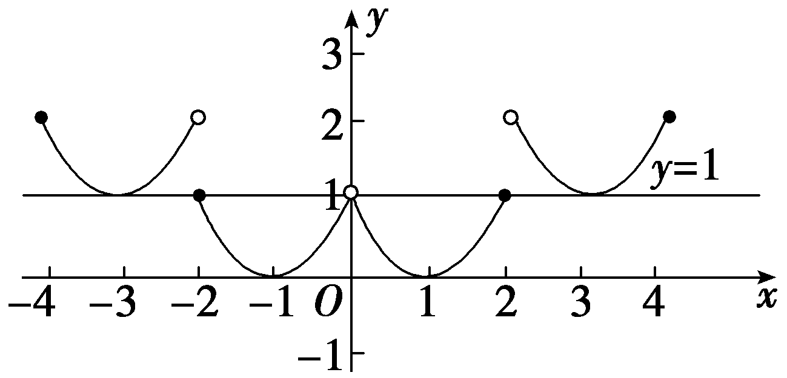
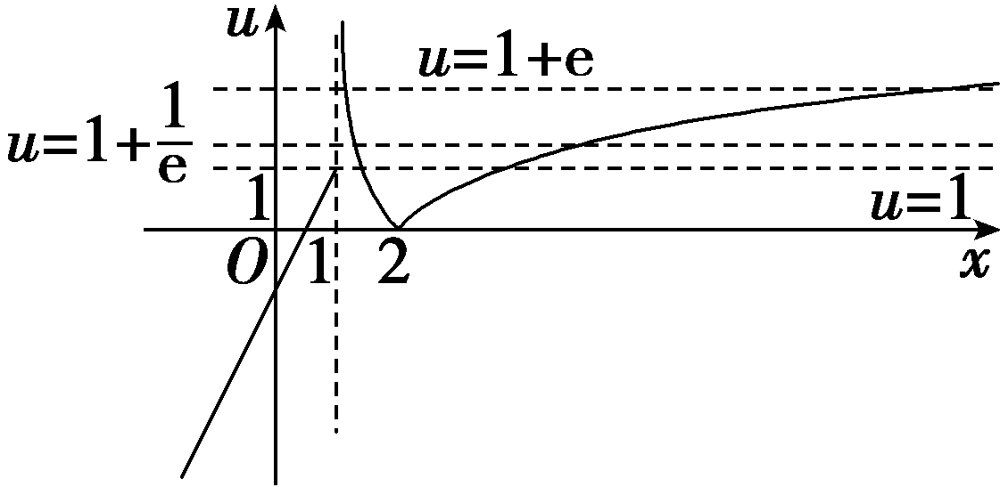
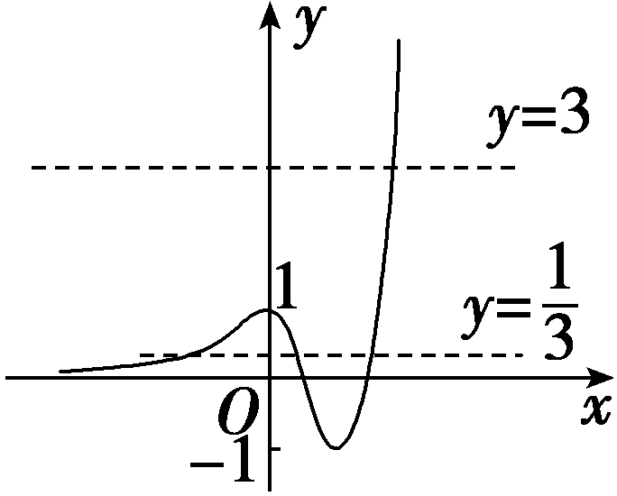
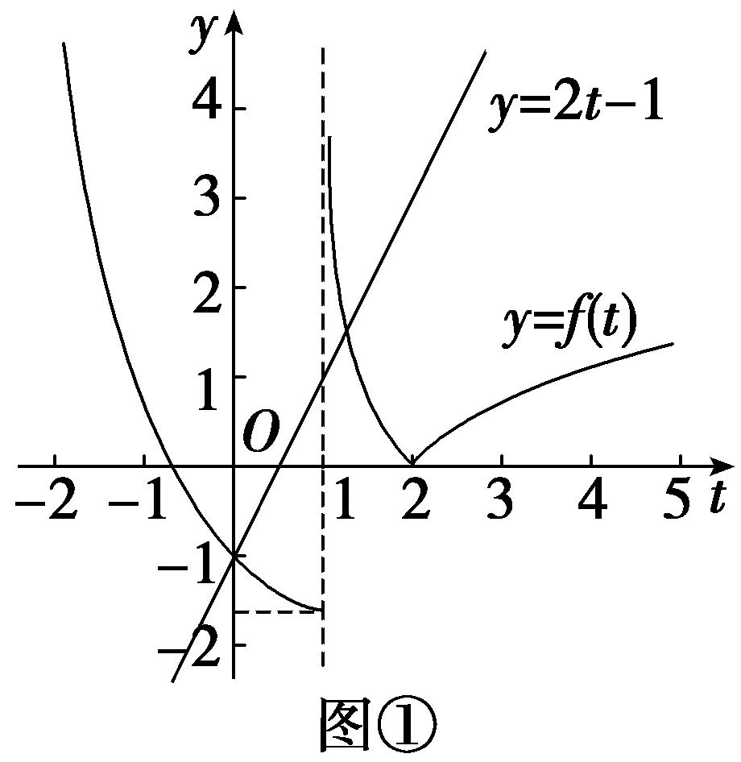
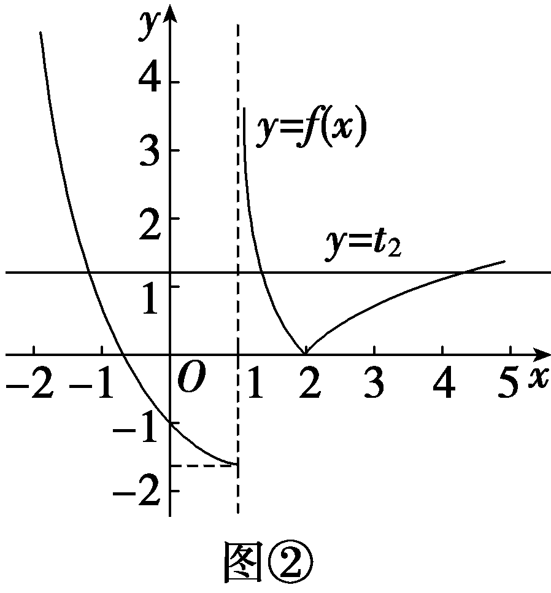
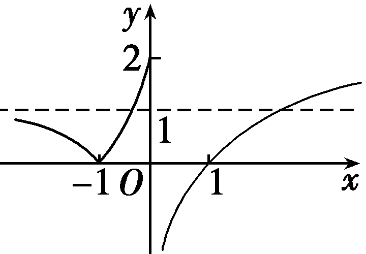
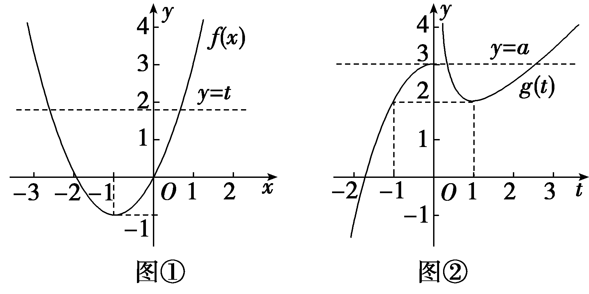
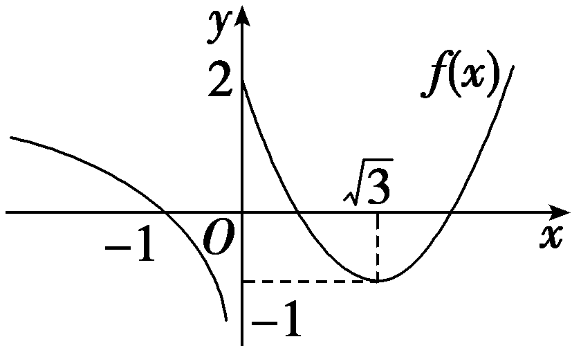
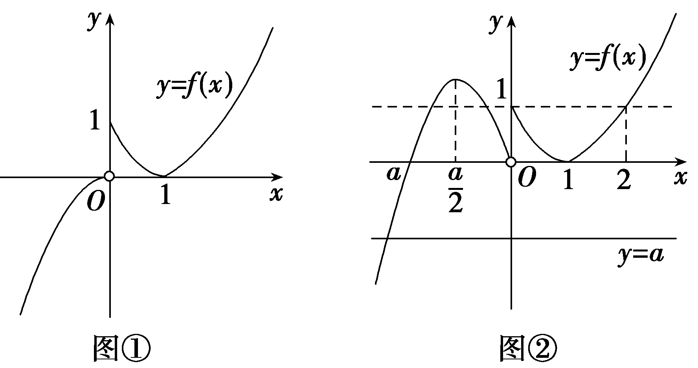

嵌套函数的零点问题

我们把形如*y*＝*f*(*f*(*x*))或*y*＝*f*(*g*(*x*))的一类函数称为嵌套函数，把含有嵌套函数的函数问题称为嵌套函数问题.嵌套函数问题有两类基本形式：
### 一、“*f*(*f*(*x*))”型

这一类型是同一个函数*f*(*x*)自身嵌套问题，求解这一类型的策略是：首先将“内层函数”换元，即设*f*(*x*)＝*t*，然后根据题设条件解出相应*t*的值或范围，最后利用函数*f*(*x*)或利用函数*y*＝*f*(*x*)与*y*＝*t*的图象关系解得问题.
### 二、“*f*(*g*(*x*))”型

这一类型是两个函数*f*(*x*)，*g*(*x*)的互嵌问题，求解这一类型的策略是：首先将“内层函数”换元，即设*g*(*x*)＝*t*，然后通过中间变量既是“内层函数”的函数值，又是*y*＝*f*(*t*)的自变量，利用*y*＝*f*(*t*)与*t*＝*g*(*x*)两个函数的性质，或做出并利用*y*＝*f*(*t*)与*t*＝*g*(*x*)两个函数的图象来解决问题.

### 题型一　嵌套函数零点个数的判断

（1）已知函数&lt;te&lt;te&lt;te&lt;te&lt;te&lt;te<em>x</em>t style="italic"&gt;x&lt;/text&gt;t style="italic"&gt;x&lt;/text&gt;t style="italic"&gt;x&lt;/text&gt;t style="italic"&gt;x&lt;/text&gt;t style="italic"&gt;x&lt;/text&gt;t style="italic"&gt;<em>&lt;text style="italic"&gt;&lt;text style="italic"&gt;f</em>&lt;/text&gt;&lt;/text&gt;&lt;/text&gt;(x)是定义在(－∞，0)∪(0，＋∞)上的偶函数，且当x∈(0，＋∞)时，f(x) $＝\left\{\begin{matrix}\left(x－1\right)^{2}，0<x\leq 2，\\f\left(x－2\right)+1，x>2，\end{matrix}\right.$ 则函数&lt;te&lt;te&lt;te<em>x</em>t style="italic"&gt;x&lt;/text&gt;t style="italic"&gt;x&lt;/text&gt;t style="italic"&gt;g&lt;/text&gt;(&lt;te&lt;te<em>x</em>t style="italic"&gt;x&lt;/text&gt;t style="italic"&gt;x&lt;/text&gt;)＝[<em>&lt;text style="italic"&gt;&lt;text style="italic"&gt;&lt;text style="italic"&gt;f</em>&lt;/text&gt;&lt;/text&gt;&lt;/text&gt;(x)]2－f(x)的零点个数为(　　)

$\quad$A.4	
$\quad$B.5

$\quad$C.6	
$\quad$D.7

（2）已知函数<te<te*x*t style="italic">x</text>t style="italic">*<text style="italic">f*</text></text>(x) $＝\left\{\begin{matrix}2x－1，x\leq 1，\\｜ln(x－1)|,x>1，\end{matrix}\right.$ 则方程<te<te*x*t style="italic">x</text>t style="italic">*<text style="italic">f*</text></text>(f(x))＝1的根的个数为(　　)

$\quad$A.7	
$\quad$B.5

$\quad$C.3	
$\quad$D.2

答案（1）C　（2）A

解析（1）因为当<em>x</em>∈(0，2]时，<em>f</em>(<em>x</em>)＝(<em>x</em>－1)2，当<em>x</em>＞2时，<em>f</em>(<em>x</em>)＝<em>f</em>(<em>x</em>－2)＋1，所以将<em>f</em>(<em>x</em>)在区间(0，2]上的图象向右平移2个单位长度，同时再向上平移1个单位长度，得到函数<em>f</em>(<em>x</em>)在(2，4]上的图象.同理可得到<em>f</em>(<em>x</em>)在(4，6]，(6，8]，…上的图象.再由<em>f</em>(<em>x</em>)的图象关于<em>y</em>轴对称得到<em>f</em>(<em>x</em>)在(－∞，0)上的图象，从而得到<em>f</em>(<em>x</em>)在其定义域内的图象，如图所示，令<em>g</em>(<em>x</em>)＝0，得<em>f</em>(<em>x</em>)＝0或<em>f</em>(<em>x</em>)＝1，由图可知直线<em>y</em>＝0与<em>y</em>＝1和函数<em>y</em>＝<em>f</em>(<em>x</em>)的图象共有6个交点，所以函数<em>g</em>(<em>x</em>)共有6个零点.故选C.

(&lt;te<em>x</em>t style="s<em>u</em>bscript"&gt;2&lt;/text&gt;)令&lt;te<em>x</em>t style="italic"&gt;<em>&lt;text style="italic"&gt;&lt;text style="italic"&gt;&lt;text style="italic"&gt;&lt;text style="italic"&gt;&lt;text style="italic"&gt;&lt;text style="italic"&gt;&lt;text style="italic"&gt;&lt;text style="italic"&gt;&lt;text style="italic"&gt;u</em>&lt;/text&gt;&lt;/text&gt;&lt;/text&gt;&lt;/text&gt;&lt;/text&gt;&lt;/text&gt;&lt;/text&gt;&lt;/text&gt;&lt;/text&gt;&lt;/text&gt;＝<em>&lt;text style="italic"&gt;&lt;text style="italic"&gt;&lt;text style="italic"&gt;&lt;text style="italic"&gt;f</em>&lt;/text&gt;&lt;/text&gt;&lt;/text&gt;&lt;/text&gt;(x)，先解方程f(u)＝1.①当u≤1时，则f(u)＝2u－1＝1，得u1＝1.②当u＞1时，则f(u)＝｜ln (u－1)｜＝1，即ln (u－1)＝±1，解得u2＝1＋ $\frac{1}{e}$ ，&lt;te&lt;te<em>x</em>t style="italic"&gt;x&lt;/text&gt;t style="italic"&gt;<em>&lt;text style="italic"&gt;&lt;text style="italic"&gt;&lt;text style="italic"&gt;&lt;text style="italic"&gt;&lt;text style="italic"&gt;&lt;text style="italic"&gt;&lt;text style="italic"&gt;&lt;text style="italic"&gt;&lt;text style="italic"&gt;&lt;text style="italic"&gt;u</em>&lt;/text&gt;&lt;/text&gt;&lt;/text&gt;&lt;/text&gt;&lt;/text&gt;&lt;/text&gt;&lt;/text&gt;&lt;/text&gt;&lt;/text&gt;&lt;/text&gt;&lt;/text&gt;3＝1＋e.作出函数<em>&lt;text style="italic"&gt;&lt;text style="italic"&gt;&lt;text style="italic"&gt;&lt;text style="italic"&gt;f</em>&lt;/text&gt;&lt;/text&gt;&lt;/text&gt;&lt;/text&gt;(x)的图象，如图所示，

直线<te<te*x*t style="italic">x</text>t style="italic">*<text style="italic"><text style="italic">u*</text></text></text>＝1，u＝1＋ $\frac{1}{e}$ ，<te<te*x*t style="italic">x</text>t style="italic">*<text style="italic"><text style="italic">u*</text></text></text>＝1＋e与函数u＝*<text style="italic"><text style="italic">f*</text></text>(x)图象的交点个数分别为3，2，2，所以方程f(f(x))＝1的根的个数为3＋2＋2＝7.故选A.

破解嵌套函数零点个数问题的主要步骤

第一步：换元解套，转化为*t*＝*g*(*x*)与*y*＝*f*(*t*)的零点；

第二步：依次解方程，令*f*(*t*)＝0，求*t*，代入*t*＝*g*(*x*)求出*x*的值或判断图象的交点个数.

对点练1.已知函数&lt;te&lt;te&lt;te&lt;te<em>x</em>t style="italic"&gt;x&lt;/text&gt;t style="italic"&gt;x&lt;/text&gt;t style="italic"&gt;x&lt;/text&gt;t style="italic"&gt;<em>&lt;text style="italic"&gt;f</em>&lt;/text&gt;&lt;/text&gt;(x) $＝\left\{\begin{matrix}e^{x}，x<0，\\4x^{3}－6x^{2}+1，x\geq 0，\end{matrix}\right.$ 其中e为自然对数的底数，则函数&lt;te&lt;te&lt;te<em>x</em>t style="italic"&gt;x&lt;/text&gt;t style="italic"&gt;x&lt;/text&gt;t style="italic"&gt;g&lt;/text&gt;(<em>x</em>)＝3[<em>&lt;text style="italic"&gt;&lt;text style="italic"&gt;f</em>&lt;/text&gt;&lt;/text&gt;(x)]2－10f(x)＋3的零点个数为(　　)

$\quad$A.3	
$\quad$B.4

$\quad$C.5	
$\quad$D.6

答案B

解析 当&lt;&lt;&lt;&lt;&lt;&lt;&lt;&lt;te&lt;te&lt;te<em>x</em>t style="italic"&gt;x&lt;/text&gt;t style="italic"&gt;x&lt;/text&gt;t style="italic"&gt;t&lt;/text&gt;e&lt;te<em>x</em>t style="italic"&gt;x&lt;/text&gt;t style="italic"&gt;t&lt;/text&gt;ext style="italic"&gt;t&lt;/text&gt;ext style="italic"&gt;t&lt;/text&gt;ext style="italic"&gt;t&lt;/text&gt;ext style="italic"&gt;t&lt;/text&gt;e&lt;te<em>x</em>t style="italic"&gt;x&lt;/text&gt;t style="italic"&gt;t&lt;/text&gt;e&lt;te&lt;te&lt;te&lt;te&lt;te&lt;te&lt;te&lt;te&lt;te&lt;te&lt;te&lt;te&lt;te&lt;te&lt;te&lt;te&lt;te<em>x</em>t style="italic"&gt;x&lt;/text&gt;t style="italic"&gt;x&lt;/text&gt;t style="italic"&gt;x&lt;/text&gt;t st<em>y</em>le="italic"&gt;x&lt;/text&gt;t style="italic"&gt;x&lt;/text&gt;t style="italic"&gt;x&lt;/text&gt;t style="italic"&gt;x&lt;/text&gt;t style="italic"&gt;x&lt;/text&gt;t style="italic"&gt;x&lt;/text&gt;t style="italic"&gt;x&lt;/text&gt;t style="italic"&gt;x&lt;/text&gt;t style="italic"&gt;x&lt;/text&gt;t style="italic"&gt;x&lt;/text&gt;t style="italic"&gt;x&lt;/text&gt;t style="italic"&gt;x&lt;/text&gt;t style="italic"&gt;x&lt;/text&gt;t style="italic"&gt;x&lt;/text&gt;t style="italic"&gt;x&lt;/text&gt;≥0时，<em>&lt;text style="italic"&gt;&lt;text style="italic"&gt;&lt;text style="italic"&gt;&lt;text style="italic"&gt;&lt;text style="italic"&gt;&lt;text style="italic"&gt;&lt;text style="italic"&gt;&lt;text style="italic"&gt;&lt;text style="italic"&gt;&lt;text style="italic"&gt;f</em>&lt;/text&gt;&lt;/text&gt;&lt;/text&gt;&lt;/text&gt;&lt;/text&gt;&lt;/text&gt;&lt;/text&gt;&lt;/text&gt;&lt;/text&gt;&lt;/text&gt;(x)＝4x3－6x&lt;text style="superscript"&gt;&lt;text style="superscript"&gt;&lt;text style="superscript"&gt;2&lt;/text&gt;&lt;/text&gt;&lt;/text&gt;＋1，<em>&lt;text style="italic"&gt;&lt;text style="italic"&gt;f'</em>&lt;/text&gt;&lt;/text&gt;(x)＝12x2－12x，当0＜x＜1时，f'(x)＜0，f(x)单调递减；当x＞1时，f'(x)＞0，f(x)单调递增，可得f(x)在x＝1处取得最小值，最小值为－1，且f(0)＝1.作出函数y＝f(x)的图象如图所示.因为<em>&lt;text style="italic"&gt;&lt;text style="italic"&gt;&lt;text style="italic"&gt;&lt;text style="italic"&gt;g</em>&lt;/text&gt;&lt;/text&gt;&lt;/text&gt;&lt;/text&gt;(x)＝3[f(x)]2－10f(x)＋3，令t＝f(x)，由g(x)＝0，可得3t2－10t＋3＝0，解得t＝3或t $＝\frac{1}{3}$ .当&lt;&lt;&lt;&lt;&lt;&lt;&lt;te&lt;te&lt;te<em>x</em>t style="italic"&gt;x&lt;/text&gt;t style="italic"&gt;x&lt;/text&gt;t style="italic"&gt;t&lt;/text&gt;e&lt;te<em>x</em>t style="italic"&gt;x&lt;/text&gt;t style="italic"&gt;t&lt;/text&gt;ext style="italic"&gt;t&lt;/text&gt;ext style="italic"&gt;t&lt;/text&gt;ext style="italic"&gt;t&lt;/text&gt;ext style="italic"&gt;t&lt;/text&gt;e&lt;te<em>x</em>t style="italic"&gt;x&lt;/text&gt;t style="italic"&gt;t&lt;/text&gt; $＝\frac{1}{3}$ ，即&lt;&lt;&lt;&lt;&lt;&lt;&lt;&lt;te&lt;te&lt;te<em>x</em>t style="italic"&gt;x&lt;/text&gt;t style="italic"&gt;x&lt;/text&gt;t style="italic"&gt;t&lt;/text&gt;e&lt;te<em>x</em>t style="italic"&gt;x&lt;/text&gt;t style="italic"&gt;t&lt;/text&gt;ext style="italic"&gt;t&lt;/text&gt;ext style="italic"&gt;t&lt;/text&gt;ext style="italic"&gt;t&lt;/text&gt;ext style="italic"&gt;t&lt;/text&gt;e&lt;te<em>x</em>t style="italic"&gt;x&lt;/text&gt;t style="italic"&gt;t&lt;/text&gt;e&lt;te&lt;te&lt;te&lt;te&lt;te&lt;te&lt;te&lt;te&lt;te&lt;te&lt;te&lt;te&lt;te&lt;te&lt;te&lt;te&lt;te<em>x</em>t style="italic"&gt;x&lt;/text&gt;t style="italic"&gt;x&lt;/text&gt;t style="italic"&gt;x&lt;/text&gt;t st<em>y</em>le="italic"&gt;x&lt;/text&gt;t style="italic"&gt;x&lt;/text&gt;t style="italic"&gt;x&lt;/text&gt;t style="italic"&gt;x&lt;/text&gt;t style="italic"&gt;x&lt;/text&gt;t style="italic"&gt;x&lt;/text&gt;t style="italic"&gt;x&lt;/text&gt;t style="italic"&gt;x&lt;/text&gt;t style="italic"&gt;x&lt;/text&gt;t style="italic"&gt;x&lt;/text&gt;t style="italic"&gt;x&lt;/text&gt;t style="italic"&gt;x&lt;/text&gt;t style="italic"&gt;x&lt;/text&gt;t style="italic"&gt;x&lt;/text&gt;t style="italic"&gt;<em>&lt;text style="italic"&gt;&lt;text style="italic"&gt;&lt;text style="italic"&gt;&lt;text style="italic"&gt;&lt;text style="italic"&gt;&lt;text style="italic"&gt;&lt;text style="italic"&gt;&lt;text style="italic"&gt;&lt;text style="italic"&gt;f</em>&lt;/text&gt;&lt;/text&gt;&lt;/text&gt;&lt;/text&gt;&lt;/text&gt;&lt;/text&gt;&lt;/text&gt;&lt;/text&gt;&lt;/text&gt;&lt;/text&gt;(<em>x</em>) $＝\frac{1}{3}$ 有&lt;&lt;&lt;&lt;&lt;&lt;&lt;&lt;te&lt;te&lt;te<em>x</em>t style="italic"&gt;x&lt;/text&gt;t style="italic"&gt;x&lt;/text&gt;t style="italic"&gt;t&lt;/text&gt;e&lt;te<em>x</em>t style="italic"&gt;x&lt;/text&gt;t style="italic"&gt;t&lt;/text&gt;ext style="italic"&gt;t&lt;/text&gt;ext style="italic"&gt;t&lt;/text&gt;ext style="italic"&gt;t&lt;/text&gt;ext style="italic"&gt;t&lt;/text&gt;e&lt;te<em>x</em>t style="italic"&gt;x&lt;/text&gt;t style="italic"&gt;t&lt;/text&gt;e&lt;te&lt;te&lt;te&lt;te&lt;te&lt;te&lt;te&lt;te&lt;te&lt;te&lt;te&lt;te&lt;te&lt;te&lt;te<em>x</em>t style="italic"&gt;x&lt;/text&gt;t style="italic"&gt;x&lt;/text&gt;t style="italic"&gt;x&lt;/text&gt;t st<em>y</em>le="italic"&gt;x&lt;/text&gt;t style="italic"&gt;x&lt;/text&gt;t style="italic"&gt;x&lt;/text&gt;t style="italic"&gt;x&lt;/text&gt;t style="italic"&gt;x&lt;/text&gt;t style="italic"&gt;x&lt;/text&gt;t style="italic"&gt;x&lt;/text&gt;t style="italic"&gt;x&lt;/text&gt;t style="italic"&gt;x&lt;/text&gt;t style="italic"&gt;x&lt;/text&gt;t style="italic"&gt;x&lt;/text&gt;t style="italic"&gt;x&lt;/text&gt;t style="superscript"&gt;3&lt;/text&gt;个解，则<em>&lt;text style="italic"&gt;&lt;text style="italic"&gt;&lt;text style="italic"&gt;&lt;text style="italic"&gt;g</em>&lt;/text&gt;&lt;/text&gt;&lt;/text&gt;&lt;/text&gt;(&lt;te&lt;te<em>x</em>t style="italic"&gt;x&lt;/text&gt;t style="italic"&gt;x&lt;/text&gt;)有3个零点；当t＝3，即<em>&lt;text style="italic"&gt;&lt;text style="italic"&gt;&lt;text style="italic"&gt;&lt;text style="italic"&gt;&lt;text style="italic"&gt;&lt;text style="italic"&gt;&lt;text style="italic"&gt;&lt;text style="italic"&gt;&lt;text style="italic"&gt;&lt;text style="italic"&gt;f</em>&lt;/text&gt;&lt;/text&gt;&lt;/text&gt;&lt;/text&gt;&lt;/text&gt;&lt;/text&gt;&lt;/text&gt;&lt;/text&gt;&lt;/text&gt;&lt;/text&gt;(x)＝3有1个解，则g(x)有1个零点.综上，g(x)共有4个零点.故选B.

对点练2.已知函数<te<te<te<te*x*t style="italic">x</text>t style="italic">x</text>t style="italic">x</text>t style="italic">*<text style="italic"><text style="italic">f*</text></text></text>(x) $＝\left\{\begin{matrix}e^{－x}－2，x\leq 1，\\｜ln(x－1)|，x>1，\end{matrix}\right.$ 则函数<te<te<te*x*t style="italic">x</text>t style="italic">x</text>t style="italic">g</text>(*x*)＝*<text style="italic"><text style="italic"><text style="italic">f*</text></text></text>(f(x))－2f(x)＋1的零点个数是(　　)

$\quad$A.4	
$\quad$B.5

$\quad$C.6	
$\quad$D.7

答案B

解析令*t*＝*f*(*x*)，*g*(*x*)＝0，则*f*(*t*)－2*t*＋1＝0，即*f*(*t*)＝2*t*－1，分别作出函数*y*＝*f*(*t*)和直线*y*＝2*t*－1的图象，如图①所示，

由图象可得<em>y</em>＝<em>f</em>(<em>t</em>)与<em>y</em>＝2<em>t</em>－1有两个交点，设两交点横坐标为<em>t</em>1，<em>t</em>2，则<em>t</em>1＝0，1＜<em>t</em>2＜2，对于<em>t</em>＝<em>f</em>(<em>x</em>)，分别作出函数<em>y</em>＝<em>f</em>(<em>x</em>)和直线<em>y</em>＝<em>t</em>2的图象，如图②所示，由图象可得，当<em>f</em>(<em>x</em>)＝<em>t</em>1＝0时，函数<em>y</em>＝<em>f</em>(<em>x</em>)与<em>x</em>轴有两个交点，即方程<em>f</em>(<em>x</em>)＝0有两个不相等的实根，当<em>t</em>2＝<em>f</em>(<em>x</em>)时，函数<em>y</em>＝<em>f</em>(<em>x</em>)和直线<em>y</em>＝<em>t</em>2有三个交点，即方程<em>t</em>2＝<em>f</em>(<em>x</em>)有三个不相等的实根.综上可得<em>g</em>(<em>x</em>)＝0的实根个数为5，即函数<em>g</em>(<em>x</em>)＝<em>f</em>(<em>f</em>(<em>x</em>))－2<em>f</em>(<em>x</em>)＋1的零点个数是5.故选B.

### 题型二　由嵌套函数零点的个数求参数的取值范围

（1）已知函数&lt;te&lt;te&lt;te&lt;te&lt;text style="it&lt;text style="it<em>a</em>lic"&gt;a&lt;/text&gt;lic"&gt;x&lt;/text&gt;t style="italic"&gt;x&lt;/text&gt;t style="italic"&gt;x&lt;/text&gt;t style="italic"&gt;x&lt;/text&gt;t style="italic"&gt;<em>f</em>&lt;/text&gt;(x) $＝\left\{\begin{matrix}｜3^{x+1}－1|，x\leq 0，\\lnx，x>0，\end{matrix}\right.$ 若函数&lt;te&lt;te&lt;te&lt;text style="it&lt;text style="it<em>a</em>lic"&gt;a&lt;/text&gt;lic"&gt;x&lt;/text&gt;t style="italic"&gt;x&lt;/text&gt;t style="italic"&gt;x&lt;/text&gt;t style="italic"&gt;g&lt;/text&gt;(<em>x</em>)＝[<em>&lt;text style="italic"&gt;f</em>&lt;/text&gt;(x)]&lt;text style="superscript"&gt;2&lt;/text&gt;－2<em>af</em>(x)＋a2－1恰有4个不同的零点，则实数a的取值范围是(　　)

$\quad$A.(－1，0)∪(1，2)	
$\quad$B.(－1，1)∪(3，＋∞)

$\quad$C.(－1，0)∪[1，2)	
$\quad$D.(－1，1]∪(3，＋∞)

(&lt;te&lt;te&lt;te&lt;te&lt;text style="it&lt;text style="it<em>a</em>lic"&gt;a&lt;/text&gt;lic"&gt;x&lt;/text&gt;t style="italic"&gt;x&lt;/text&gt;t style="italic"&gt;x&lt;/text&gt;t style="italic"&gt;x&lt;/text&gt;t style="superscript"&gt;2&lt;/text&gt;)设函数&lt;te&lt;te<em>x</em>t style="italic"&gt;x&lt;/text&gt;t style="italic"&gt;<em>f</em>&lt;/text&gt;(x)＝x2＋2x，<em>&lt;text style="italic"&gt;g</em>&lt;/text&gt;(x) $＝\left\{\begin{matrix}x＋\frac{1}{x}，x>0，\\－x^{2}+3，x\leq 0，\end{matrix}\right.$ 若函数&lt;te&lt;te&lt;text style="it&lt;text style="it<em>a</em>lic"&gt;a&lt;/text&gt;lic"&gt;x&lt;/text&gt;t style="italic"&gt;x&lt;/text&gt;t style="italic"&gt;h&lt;/text&gt;(&lt;te&lt;te&lt;te<em>x</em>t style="italic"&gt;x&lt;/text&gt;t style="italic"&gt;x&lt;/text&gt;t style="italic"&gt;x&lt;/text&gt;)＝<em>&lt;text style="italic"&gt;g</em>&lt;/text&gt;(<em>&lt;text style="italic"&gt;f</em>&lt;/text&gt;(x))－a有6个不同的零点，则实数a的取值范围为<u>　　　　　</u>.

答案（1）C　（2）(2，3]

解析 （1）画出&lt;&lt;&lt;&lt;&lt;&lt;&lt;&lt;&lt;&lt;te&lt;te&lt;text style="it&lt;text style="it<em>a</em>lic"&gt;a&lt;/text&gt;lic"&gt;x&lt;/text&gt;t style="italic"&gt;x&lt;/text&gt;t style="italic"&gt;t&lt;/text&gt;ext style="italic"&gt;t&lt;/text&gt;e<em>x</em>t style="italic"&gt;t&lt;/text&gt;ext style="italic"&gt;t&lt;/text&gt;ext style="italic"&gt;t&lt;/text&gt;e<em>x</em>t style="italic"&gt;t&lt;/text&gt;ext style="italic"&gt;t&lt;/text&gt;ext style="italic"&gt;t&lt;/text&gt;ext style="italic"&gt;t&lt;/text&gt;e&lt;te&lt;te&lt;te&lt;te&lt;te&lt;te<em>x</em>t style="it<em>a</em>lic"&gt;x&lt;/text&gt;t style="it<em>a</em>lic"&gt;x&lt;/text&gt;t style="it<em>a</em>lic"&gt;x&lt;/text&gt;t style="italic"&gt;x&lt;/text&gt;t style="italic"&gt;x&lt;/text&gt;t style="italic"&gt;x&lt;/text&gt;t style="italic"&gt;<em>&lt;text style="italic"&gt;&lt;text style="italic"&gt;&lt;text style="italic"&gt;&lt;text style="italic"&gt;&lt;text style="italic"&gt;&lt;text style="italic"&gt;f</em>&lt;/text&gt;&lt;/text&gt;&lt;/text&gt;&lt;/text&gt;&lt;/text&gt;&lt;/text&gt;&lt;/text&gt;(x)的大致图象如图所示.令<em>&lt;text style="italic"&gt;g</em>&lt;/text&gt;(x)＝[f(x)]&lt;text style="superscript"&gt;2&lt;/text&gt;－2<em>af</em>(x)＋a2－1＝0，得f(x)＝a－1或f(x)＝a＋1.设f(x)＝t，由图可知，当t＜0或t＞2时，t＝f(x)有且仅有1个实根，当t＝0或1≤t≤2时，t＝f(x)有2个实根，当0＜t＜1时，t＝f(x)有3个实根，则g(x)恰有4个不同的零点等价于 $\left\{\begin{matrix}a－1<0，\\0<a+1<1，\end{matrix}\right.$ 或 $\left\{\begin{matrix}a－1=0，\\1\leq a+1\leq 2，\end{matrix}\right.$ 或 $\left\{\begin{matrix}0<a－1<1，\\a+1>2\end{matrix}\right.$ 或 $\left\{\begin{matrix}1\leq a－1\leq 2，\\1\leq a+1\leq 2，\end{matrix}\right.$ 解得－1＜&lt;&lt;&lt;&lt;&lt;&lt;&lt;&lt;&lt;&lt;te&lt;te&lt;text style="it&lt;text style="it<em>a</em>lic"&gt;a&lt;/text&gt;lic"&gt;x&lt;/text&gt;t style="italic"&gt;x&lt;/text&gt;t style="italic"&gt;t&lt;/text&gt;ext style="italic"&gt;t&lt;/text&gt;e<em>x</em>t style="italic"&gt;t&lt;/text&gt;ext style="italic"&gt;t&lt;/text&gt;ext style="italic"&gt;t&lt;/text&gt;e<em>x</em>t style="italic"&gt;t&lt;/text&gt;ext style="italic"&gt;t&lt;/text&gt;ext style="italic"&gt;t&lt;/text&gt;ext style="italic"&gt;t&lt;/text&gt;e&lt;te&lt;te<em>x</em>t style="it<em>a</em>lic"&gt;x&lt;/text&gt;t style="it<em>a</em>lic"&gt;x&lt;/text&gt;t style="italic"&gt;a&lt;/text&gt;＜0或1≤a＜&lt;te<em>x</em>t style="superscript"&gt;2&lt;/text&gt;.故选C.

（2）函数<<<<<<<<text st<text style="it<text style="it<text style="it*a*lic">a</text>lic">a</text>lic">y</text>le="italic">t</text>ext st*y*le="italic">t</text>e*x*t style="italic">t</text>e*x*t style="italic">t</text>e*x*t style="italic">t</text>ext style="italic">t</text>e<te<text st*y*le="italic">x</text>t st*y*le="italic">x</text>t style="italic">t</text>e<te<te<text style="it*a*lic">x</text>t style="italic">x</text>t style="italic">x</text>t style="italic">*h*</text>(x)的零点即为方程h(x)＝0的解，也即*<text style="italic">g*</text>(*<text style="italic"><text style="italic">f*</text></text>(x))＝a的解.令t＝f(x)，则原方程的解变为方程组 $\left\{\begin{matrix}t＝f(x)①，\\g(t)＝a②\end{matrix}\right.$ 的解.作出函数<<<<<<<text st<text style="it<text style="it<text style="it*a*lic">a</text>lic">a</text>lic">y</text>le="italic">t</text>ext st*y*le="italic">t</text>e*x*t style="italic">t</text>e*x*t style="italic">t</text>e*x*t style="italic">t</text>ext style="italic">t</text>e<text st*y*le="italic">x</text>t style="italic">y</text>＝<<te*x*t style="italic">t</text>e<text style="it*a*lic">x</text>t style="italic">*<text style="italic">f*</text></text>(<te*x*t style="italic">x</text>)和直线y＝t的图象如图①所示.由图可知，当t＞－1时，有两个不同的x与之对应，当t＝－1时，有一个x与之对应，当t＜－1时，没有x与之对应.由 $\left\{\begin{matrix}t＝f(x)①，\\g(t)＝a②\end{matrix}\right.$ 有6个不同的解知，需要方程②有三个不同的<<<<<<<text st<text style="it<text style="it<text style="it*a*lic">a</text>lic">a</text>lic">y</text>le="italic">t</text>ext st*y*le="italic">t</text>e*x*t style="italic">t</text>e*x*t style="italic">t</text>e*x*t style="italic">t</text>ext style="italic">t</text>e<te<text st*y*le="italic">x</text>t st*y*le="italic">x</text>t style="italic">t</text>，且都大于－1.作出函数y＝<te<text style="it*a*lic">x</text>t style="italic">*g*</text>(t)和直线y＝a的图象如图②所示.当a∈(2，3]时满足要求.综上，实数a的取值范围为(2，3].

已知函数零点的个数求参数范围，常利用数形结合法将其转化为两个函数的图象的交点问题，需准确画出两个函数的图象，利用图象写出满足条件的参数范围.

对点练3.(&lt;te&lt;text style="it<em>a</em>lic"&gt;x&lt;/text&gt;t style="superscript"&gt;2&lt;/text&gt;025·河南驻马店模拟)已知函数&lt;te&lt;te&lt;te<em>x</em>t style="italic"&gt;x&lt;/text&gt;t style="italic"&gt;x&lt;/text&gt;t style="italic"&gt;<em>f</em>&lt;/text&gt;(x) $＝\left\{\begin{matrix}x^{2}－2\sqrt{3}x+2，x\geq 0，\\ln(-x)，x<0，\end{matrix}\right.$ 若函数&lt;te&lt;te&lt;te&lt;text style="it<em>a</em>lic"&gt;x&lt;/text&gt;t style="italic"&gt;x&lt;/text&gt;t style="italic"&gt;x&lt;/text&gt;t style="italic"&gt;g&lt;/text&gt;(<em>x</em>)＝[<em>&lt;text style="italic"&gt;f</em>&lt;/text&gt;(x)]2－<em>af</em>(x)＋1有6个零点，则实数a的取值范围是(　　)

$\quad$A.(2，4]	
$\quad$B.(2，＋∞)

$\quad$C. $\left(2，\frac{5}{2}\right]$ 	
$\quad$D. $\left[\frac{5}{2}，4\right]$

答案C

解析设<em>t</em>＝<em>f</em>(<em>x</em>)，则由<em>g</em>(<em>x</em>)＝[<em>f</em>(<em>x</em>)]2－<em>af</em>(<em>x</em>)＋1，可设<em>y</em>＝<em>h</em>(<em>t</em>)＝<em>t</em>2－<em>at</em>＋1，画出<em>f</em>(<em>x</em>)的图象，如图所示，

由图可知，当*t*＜－1时，*t*＝*f*(*x*)有且仅有一个解；当*t*＝－1或*t*＞2时，*t*＝*f*(*x*)有两个不同的解；

当－1＜<em>t</em>≤2时，<em>t</em>＝<em>f</em>(<em>x</em>)有三个不同的解，令<em>h</em>(<em>t</em>)＝0，即<em>t</em>2－<em>at</em>＋1＝0，因为函数<em>g</em>(<em>x</em>)有6个零点，

故需&lt;text style="it&lt;text style="it<em>a</em>lic"&gt;a&lt;/text&gt;lic"&gt;t&lt;/text&gt;2－<em>at</em>＋1＝0在(－1，2]内有两个不同的根，所以 $\left\{\begin{matrix}\Delta ＝a^{2}－4>0，\\h(-1)=1+a+1>0，\\h(2)=4－2a+1\geq 0，\\－1<\frac{a}{2}<2，\end{matrix}\right.$  解得2＜&lt;text style="it<em>a</em>lic"&gt;a&lt;/text&gt;≤ $\frac{5}{2}$ ，即实数&lt;text style="it<em>a</em>lic"&gt;a&lt;/text&gt;的取值范围是 $\left(2，\frac{5}{2}\right]$ .故选C.

对点练4.(2024·安徽合肥三模)设&lt;text st&lt;text style="it<em>a</em>lic"&gt;y&lt;/text&gt;le="italic"&gt;a&lt;/text&gt;∈<strong>R</strong>，函数<em>&lt;text style="italic"&gt;f</em>&lt;/text&gt; $\left(x\right)＝\left\{\begin{matrix}2^{\left|x－1\right|}－1，x\geq 0，\\－x^{2}＋ax，x<0，\end{matrix}\right.$ 若函数&lt;text style="it<em>a</em>lic"&gt;y&lt;/text&gt;＝<em>&lt;text style="italic"&gt;f</em>&lt;/text&gt; $\left(f\left(x\right)\right)$ 恰有5个零点，则实数&lt;text st&lt;text style="it<em>a</em>lic"&gt;y&lt;/text&gt;le="italic"&gt;a&lt;/text&gt;的取值范围为(　　)

$\quad$A. $\left(－2，2\right)$ 	
$\quad$B. $\left(0，2\right)$

$\quad$C. $\left[－1，0\right)$ 	
$\quad$D. $\left(－\infty ,-2\right)$

答案D

解析设&lt;&lt;&lt;&lt;&lt;text st&lt;text st<em>y</em>le="italic"&gt;y&lt;/text&gt;le="italic"&gt;t&lt;/text&gt;ext style="italic"&gt;t&lt;/text&gt;e&lt;te&lt;te&lt;te&lt;te&lt;te<em>x</em>t st<em>y</em>le="italic"&gt;x&lt;/text&gt;t style="italic"&gt;x&lt;/text&gt;t style="it<em>a</em>lic"&gt;x&lt;/text&gt;t st<em>y</em>le="italic"&gt;x&lt;/text&gt;t style="italic"&gt;x&lt;/text&gt;t style="italic"&gt;t&lt;/text&gt;ext style="italic"&gt;t&lt;/text&gt;e<em>x</em>t style="italic"&gt;t&lt;/text&gt;＝<em>&lt;text style="italic"&gt;&lt;text style="italic"&gt;&lt;text style="italic"&gt;&lt;text style="italic"&gt;&lt;text style="italic"&gt;&lt;text style="italic"&gt;&lt;text style="italic"&gt;&lt;text style="italic"&gt;&lt;text style="italic"&gt;&lt;text style="italic"&gt;&lt;text style="italic"&gt;&lt;text style="italic"&gt;f</em>&lt;/text&gt;&lt;/text&gt;&lt;/text&gt;&lt;/text&gt;&lt;/text&gt;&lt;/text&gt;&lt;/text&gt;&lt;/text&gt;&lt;/text&gt;&lt;/text&gt;&lt;/text&gt;&lt;/text&gt; $\left(x\right)$ ，当&lt;&lt;&lt;&lt;&lt;text st&lt;text st<em>y</em>le="italic"&gt;y&lt;/text&gt;le="italic"&gt;t&lt;/text&gt;ext style="italic"&gt;t&lt;/text&gt;e&lt;te&lt;te&lt;te&lt;te&lt;te<em>x</em>t st<em>y</em>le="italic"&gt;x&lt;/text&gt;t style="italic"&gt;x&lt;/text&gt;t style="it<em>a</em>lic"&gt;x&lt;/text&gt;t st<em>y</em>le="italic"&gt;x&lt;/text&gt;t style="italic"&gt;x&lt;/text&gt;t style="italic"&gt;t&lt;/text&gt;ext style="italic"&gt;t&lt;/text&gt;ext style="italic"&gt;x&lt;/text&gt;≥0时，<em>&lt;text style="italic"&gt;&lt;text style="italic"&gt;&lt;text style="italic"&gt;&lt;text style="italic"&gt;&lt;text style="italic"&gt;&lt;text style="italic"&gt;&lt;text style="italic"&gt;&lt;text style="italic"&gt;&lt;text style="italic"&gt;&lt;text style="italic"&gt;&lt;text style="italic"&gt;&lt;text style="italic"&gt;f</em>&lt;/text&gt;&lt;/text&gt;&lt;/text&gt;&lt;/text&gt;&lt;/text&gt;&lt;/text&gt;&lt;/text&gt;&lt;/text&gt;&lt;/text&gt;&lt;/text&gt;&lt;/text&gt;&lt;/text&gt; $\left(x\right)＝2^{\left|x－1\right|}$ －1，此时&lt;&lt;&lt;&lt;&lt;text st&lt;text st<em>y</em>le="italic"&gt;y&lt;/text&gt;le="italic"&gt;t&lt;/text&gt;ext style="italic"&gt;t&lt;/text&gt;e&lt;te&lt;te&lt;te&lt;te&lt;te<em>x</em>t st<em>y</em>le="italic"&gt;x&lt;/text&gt;t style="italic"&gt;x&lt;/text&gt;t style="it<em>a</em>lic"&gt;x&lt;/text&gt;t st<em>y</em>le="italic"&gt;x&lt;/text&gt;t style="italic"&gt;x&lt;/text&gt;t style="italic"&gt;t&lt;/text&gt;ext style="italic"&gt;t&lt;/text&gt;e<em>x</em>t style="italic"&gt;t&lt;/text&gt;≥0，由<em>&lt;text style="italic"&gt;&lt;text style="italic"&gt;&lt;text style="italic"&gt;&lt;text style="italic"&gt;&lt;text style="italic"&gt;&lt;text style="italic"&gt;&lt;text style="italic"&gt;&lt;text style="italic"&gt;&lt;text style="italic"&gt;&lt;text style="italic"&gt;&lt;text style="italic"&gt;&lt;text style="italic"&gt;f</em>&lt;/text&gt;&lt;/text&gt;&lt;/text&gt;&lt;/text&gt;&lt;/text&gt;&lt;/text&gt;&lt;/text&gt;&lt;/text&gt;&lt;/text&gt;&lt;/text&gt;&lt;/text&gt;&lt;/text&gt; $\left(t\right)＝$ 0得&lt;&lt;&lt;&lt;&lt;text st&lt;text st<em>y</em>le="italic"&gt;y&lt;/text&gt;le="italic"&gt;t&lt;/text&gt;ext style="italic"&gt;t&lt;/text&gt;e&lt;te&lt;te&lt;te&lt;te&lt;te<em>x</em>t st<em>y</em>le="italic"&gt;x&lt;/text&gt;t style="italic"&gt;x&lt;/text&gt;t style="it<em>a</em>lic"&gt;x&lt;/text&gt;t st<em>y</em>le="italic"&gt;x&lt;/text&gt;t style="italic"&gt;x&lt;/text&gt;t style="italic"&gt;t&lt;/text&gt;ext style="italic"&gt;t&lt;/text&gt;e<em>x</em>t style="italic"&gt;t&lt;/text&gt;＝1，即<em>&lt;text style="italic"&gt;&lt;text style="italic"&gt;&lt;text style="italic"&gt;&lt;text style="italic"&gt;&lt;text style="italic"&gt;&lt;text style="italic"&gt;&lt;text style="italic"&gt;&lt;text style="italic"&gt;&lt;text style="italic"&gt;&lt;text style="italic"&gt;&lt;text style="italic"&gt;&lt;text style="italic"&gt;f</em>&lt;/text&gt;&lt;/text&gt;&lt;/text&gt;&lt;/text&gt;&lt;/text&gt;&lt;/text&gt;&lt;/text&gt;&lt;/text&gt;&lt;/text&gt;&lt;/text&gt;&lt;/text&gt;&lt;/text&gt; $\left(x\right)＝2^{\left|x－1\right|}$ －1＝1，解得&lt;&lt;&lt;&lt;&lt;text st&lt;text st<em>y</em>le="italic"&gt;y&lt;/text&gt;le="italic"&gt;t&lt;/text&gt;ext style="italic"&gt;t&lt;/text&gt;e&lt;te&lt;te&lt;te&lt;te&lt;te<em>x</em>t st<em>y</em>le="italic"&gt;x&lt;/text&gt;t style="italic"&gt;x&lt;/text&gt;t style="it<em>a</em>lic"&gt;x&lt;/text&gt;t st<em>y</em>le="italic"&gt;x&lt;/text&gt;t style="italic"&gt;x&lt;/text&gt;t style="italic"&gt;t&lt;/text&gt;ext style="italic"&gt;t&lt;/text&gt;ext style="italic"&gt;x&lt;/text&gt;＝0或x＝&lt;text style="superscript"&gt;2&lt;/text&gt;，所以y＝<em>&lt;text style="italic"&gt;&lt;text style="italic"&gt;&lt;text style="italic"&gt;&lt;text style="italic"&gt;&lt;text style="italic"&gt;&lt;text style="italic"&gt;&lt;text style="italic"&gt;&lt;text style="italic"&gt;&lt;text style="italic"&gt;&lt;text style="italic"&gt;&lt;text style="italic"&gt;&lt;text style="italic"&gt;f</em>&lt;/text&gt;&lt;/text&gt;&lt;/text&gt;&lt;/text&gt;&lt;/text&gt;&lt;/text&gt;&lt;/text&gt;&lt;/text&gt;&lt;/text&gt;&lt;/text&gt;&lt;/text&gt;&lt;/text&gt; $\left(f\left(x\right)\right)$ 在 $\left[0，＋\infty \right)$ 上有&lt;&lt;&lt;text st&lt;text st<em>y</em>le="italic"&gt;y&lt;/text&gt;le="italic"&gt;t&lt;/text&gt;ext style="italic"&gt;t&lt;/text&gt;e&lt;te<em>x</em>t st<em>y</em>le="italic"&gt;x&lt;/text&gt;t style="superscript"&gt;2&lt;/text&gt;个零点；当&lt;&lt;&lt;te&lt;te&lt;te&lt;te<em>x</em>t style="it<em>a</em>lic"&gt;x&lt;/text&gt;t st<em>y</em>le="italic"&gt;x&lt;/text&gt;t style="italic"&gt;x&lt;/text&gt;t style="italic"&gt;t&lt;/text&gt;ext style="italic"&gt;t&lt;/text&gt;ext style="italic"&gt;x&lt;/text&gt;＜0时，若a≥0，<em>&lt;text style="italic"&gt;&lt;text style="italic"&gt;&lt;text style="italic"&gt;&lt;text style="italic"&gt;&lt;text style="italic"&gt;&lt;text style="italic"&gt;&lt;text style="italic"&gt;&lt;text style="italic"&gt;&lt;text style="italic"&gt;&lt;text style="italic"&gt;&lt;text style="italic"&gt;&lt;text style="italic"&gt;f</em>&lt;/text&gt;&lt;/text&gt;&lt;/text&gt;&lt;/text&gt;&lt;/text&gt;&lt;/text&gt;&lt;/text&gt;&lt;/text&gt;&lt;/text&gt;&lt;/text&gt;&lt;/text&gt;&lt;/text&gt; $\left(x\right)＝$ －&lt;&lt;&lt;&lt;&lt;text st&lt;text st<em>y</em>le="italic"&gt;y&lt;/text&gt;le="italic"&gt;t&lt;/text&gt;ext style="italic"&gt;t&lt;/text&gt;e&lt;te&lt;te&lt;te&lt;te&lt;te<em>x</em>t st<em>y</em>le="italic"&gt;x&lt;/text&gt;t style="italic"&gt;x&lt;/text&gt;t style="it<em>a</em>lic"&gt;x&lt;/text&gt;t st<em>y</em>le="italic"&gt;x&lt;/text&gt;t style="italic"&gt;x&lt;/text&gt;t style="italic"&gt;t&lt;/text&gt;ext style="italic"&gt;t&lt;/text&gt;ext style="italic"&gt;x&lt;/text&gt;&lt;text style="superscript"&gt;2&lt;/text&gt;＋<em>&lt;text style="italic"&gt;ax</em>&lt;/text&gt;，对称轴为x $＝\frac{a}{2}$ ，函数&lt;&lt;&lt;text st&lt;text st<em>y</em>le="italic"&gt;y&lt;/text&gt;le="italic"&gt;t&lt;/text&gt;ext style="italic"&gt;t&lt;/text&gt;e&lt;te&lt;te&lt;te<em>x</em>t st<em>y</em>le="italic"&gt;x&lt;/text&gt;t style="italic"&gt;x&lt;/text&gt;t style="it<em>a</em>lic"&gt;x&lt;/text&gt;t style="italic"&gt;y&lt;/text&gt;＝&lt;&lt;&lt;te&lt;te<em>x</em>t style="italic"&gt;x&lt;/text&gt;t style="italic"&gt;t&lt;/text&gt;ext style="italic"&gt;t&lt;/text&gt;e<em>x</em>t style="italic"&gt;<em>&lt;text style="italic"&gt;&lt;text style="italic"&gt;&lt;text style="italic"&gt;&lt;text style="italic"&gt;&lt;text style="italic"&gt;&lt;text style="italic"&gt;&lt;text style="italic"&gt;&lt;text style="italic"&gt;&lt;text style="italic"&gt;&lt;text style="italic"&gt;&lt;text style="italic"&gt;f</em>&lt;/text&gt;&lt;/text&gt;&lt;/text&gt;&lt;/text&gt;&lt;/text&gt;&lt;/text&gt;&lt;/text&gt;&lt;/text&gt;&lt;/text&gt;&lt;/text&gt;&lt;/text&gt;&lt;/text&gt; $\left(x\right)$ 的大致图象如图①所示，此时&lt;&lt;&lt;&lt;&lt;text st&lt;text st<em>y</em>le="italic"&gt;y&lt;/text&gt;le="italic"&gt;t&lt;/text&gt;ext style="italic"&gt;t&lt;/text&gt;e&lt;te&lt;te&lt;te&lt;te&lt;te<em>x</em>t st<em>y</em>le="italic"&gt;x&lt;/text&gt;t style="italic"&gt;x&lt;/text&gt;t style="it<em>a</em>lic"&gt;x&lt;/text&gt;t st<em>y</em>le="italic"&gt;x&lt;/text&gt;t style="italic"&gt;x&lt;/text&gt;t style="italic"&gt;t&lt;/text&gt;ext style="italic"&gt;t&lt;/text&gt;e<em>x</em>t style="italic"&gt;<em>&lt;text style="italic"&gt;&lt;text style="italic"&gt;&lt;text style="italic"&gt;&lt;text style="italic"&gt;&lt;text style="italic"&gt;&lt;text style="italic"&gt;&lt;text style="italic"&gt;&lt;text style="italic"&gt;&lt;text style="italic"&gt;&lt;text style="italic"&gt;&lt;text style="italic"&gt;f</em>&lt;/text&gt;&lt;/text&gt;&lt;/text&gt;&lt;/text&gt;&lt;/text&gt;&lt;/text&gt;&lt;/text&gt;&lt;/text&gt;&lt;/text&gt;&lt;/text&gt;&lt;/text&gt;&lt;/text&gt; $\left(x\right)＝$ －&lt;&lt;&lt;&lt;&lt;text st&lt;text st<em>y</em>le="italic"&gt;y&lt;/text&gt;le="italic"&gt;t&lt;/text&gt;ext style="italic"&gt;t&lt;/text&gt;e&lt;te&lt;te&lt;te&lt;te&lt;te<em>x</em>t st<em>y</em>le="italic"&gt;x&lt;/text&gt;t style="italic"&gt;x&lt;/text&gt;t style="it<em>a</em>lic"&gt;x&lt;/text&gt;t st<em>y</em>le="italic"&gt;x&lt;/text&gt;t style="italic"&gt;x&lt;/text&gt;t style="italic"&gt;t&lt;/text&gt;ext style="italic"&gt;t&lt;/text&gt;ext style="italic"&gt;x&lt;/text&gt;&lt;text style="superscript"&gt;2&lt;/text&gt;＋<em>&lt;text style="italic"&gt;ax</em>&lt;/text&gt;＜0，即<em>t</em>＜0，则<em>&lt;text style="italic"&gt;&lt;text style="italic"&gt;&lt;text style="italic"&gt;&lt;text style="italic"&gt;&lt;text style="italic"&gt;&lt;text style="italic"&gt;&lt;text style="italic"&gt;&lt;text style="italic"&gt;&lt;text style="italic"&gt;&lt;text style="italic"&gt;&lt;text style="italic"&gt;&lt;text style="italic"&gt;f</em>&lt;/text&gt;&lt;/text&gt;&lt;/text&gt;&lt;/text&gt;&lt;/text&gt;&lt;/text&gt;&lt;/text&gt;&lt;/text&gt;&lt;/text&gt;&lt;/text&gt;&lt;/text&gt;&lt;/text&gt; $\left(t\right)$ ＜0，所以&lt;&lt;&lt;&lt;&lt;text st&lt;text st<em>y</em>le="italic"&gt;y&lt;/text&gt;le="italic"&gt;t&lt;/text&gt;ext style="italic"&gt;t&lt;/text&gt;e&lt;te&lt;te&lt;te&lt;te&lt;te<em>x</em>t st<em>y</em>le="italic"&gt;x&lt;/text&gt;t style="italic"&gt;x&lt;/text&gt;t style="it<em>a</em>lic"&gt;x&lt;/text&gt;t st<em>y</em>le="italic"&gt;x&lt;/text&gt;t style="italic"&gt;x&lt;/text&gt;t style="italic"&gt;t&lt;/text&gt;ext style="italic"&gt;t&lt;/text&gt;e<em>x</em>t style="italic"&gt;<em>&lt;text style="italic"&gt;&lt;text style="italic"&gt;&lt;text style="italic"&gt;&lt;text style="italic"&gt;&lt;text style="italic"&gt;&lt;text style="italic"&gt;&lt;text style="italic"&gt;&lt;text style="italic"&gt;&lt;text style="italic"&gt;&lt;text style="italic"&gt;&lt;text style="italic"&gt;f</em>&lt;/text&gt;&lt;/text&gt;&lt;/text&gt;&lt;/text&gt;&lt;/text&gt;&lt;/text&gt;&lt;/text&gt;&lt;/text&gt;&lt;/text&gt;&lt;/text&gt;&lt;/text&gt;&lt;/text&gt; $\left(t\right)＝$ 0无解，则&lt;&lt;&lt;&lt;&lt;text st&lt;text st<em>y</em>le="italic"&gt;y&lt;/text&gt;le="italic"&gt;t&lt;/text&gt;ext style="italic"&gt;t&lt;/text&gt;e&lt;te&lt;te&lt;te&lt;te&lt;te<em>x</em>t st<em>y</em>le="italic"&gt;x&lt;/text&gt;t style="italic"&gt;x&lt;/text&gt;t style="it<em>a</em>lic"&gt;x&lt;/text&gt;t st<em>y</em>le="italic"&gt;x&lt;/text&gt;t style="italic"&gt;x&lt;/text&gt;t style="italic"&gt;t&lt;/text&gt;ext style="italic"&gt;t&lt;/text&gt;e<em>x</em>t style="italic"&gt;t&lt;/text&gt;＝<em>&lt;text style="italic"&gt;&lt;text style="italic"&gt;&lt;text style="italic"&gt;&lt;text style="italic"&gt;&lt;text style="italic"&gt;&lt;text style="italic"&gt;&lt;text style="italic"&gt;&lt;text style="italic"&gt;&lt;text style="italic"&gt;&lt;text style="italic"&gt;&lt;text style="italic"&gt;&lt;text style="italic"&gt;f</em>&lt;/text&gt;&lt;/text&gt;&lt;/text&gt;&lt;/text&gt;&lt;/text&gt;&lt;/text&gt;&lt;/text&gt;&lt;/text&gt;&lt;/text&gt;&lt;/text&gt;&lt;/text&gt;&lt;/text&gt; $\left(x\right)$ 无零点，&lt;&lt;&lt;text st&lt;text st<em>y</em>le="italic"&gt;y&lt;/text&gt;le="italic"&gt;t&lt;/text&gt;ext style="italic"&gt;t&lt;/text&gt;e&lt;te&lt;te&lt;te<em>x</em>t st<em>y</em>le="italic"&gt;x&lt;/text&gt;t style="italic"&gt;x&lt;/text&gt;t style="it<em>a</em>lic"&gt;x&lt;/text&gt;t style="italic"&gt;y&lt;/text&gt;＝&lt;&lt;&lt;te&lt;te<em>x</em>t style="italic"&gt;x&lt;/text&gt;t style="italic"&gt;t&lt;/text&gt;ext style="italic"&gt;t&lt;/text&gt;e<em>x</em>t style="italic"&gt;<em>&lt;text style="italic"&gt;&lt;text style="italic"&gt;&lt;text style="italic"&gt;&lt;text style="italic"&gt;&lt;text style="italic"&gt;&lt;text style="italic"&gt;&lt;text style="italic"&gt;&lt;text style="italic"&gt;&lt;text style="italic"&gt;&lt;text style="italic"&gt;&lt;text style="italic"&gt;f</em>&lt;/text&gt;&lt;/text&gt;&lt;/text&gt;&lt;/text&gt;&lt;/text&gt;&lt;/text&gt;&lt;/text&gt;&lt;/text&gt;&lt;/text&gt;&lt;/text&gt;&lt;/text&gt;&lt;/text&gt; $\left(f\left(x\right)\right)$ 无零点，综上，此时&lt;&lt;&lt;text st&lt;text st<em>y</em>le="italic"&gt;y&lt;/text&gt;le="italic"&gt;t&lt;/text&gt;ext style="italic"&gt;t&lt;/text&gt;e&lt;te&lt;te&lt;te<em>x</em>t st<em>y</em>le="italic"&gt;x&lt;/text&gt;t style="italic"&gt;x&lt;/text&gt;t style="it<em>a</em>lic"&gt;x&lt;/text&gt;t style="italic"&gt;y&lt;/text&gt;＝&lt;&lt;&lt;te&lt;te<em>x</em>t style="italic"&gt;x&lt;/text&gt;t style="italic"&gt;t&lt;/text&gt;ext style="italic"&gt;t&lt;/text&gt;e<em>x</em>t style="italic"&gt;<em>&lt;text style="italic"&gt;&lt;text style="italic"&gt;&lt;text style="italic"&gt;&lt;text style="italic"&gt;&lt;text style="italic"&gt;&lt;text style="italic"&gt;&lt;text style="italic"&gt;&lt;text style="italic"&gt;&lt;text style="italic"&gt;&lt;text style="italic"&gt;&lt;text style="italic"&gt;f</em>&lt;/text&gt;&lt;/text&gt;&lt;/text&gt;&lt;/text&gt;&lt;/text&gt;&lt;/text&gt;&lt;/text&gt;&lt;/text&gt;&lt;/text&gt;&lt;/text&gt;&lt;/text&gt;&lt;/text&gt; $\left(f\left(x\right)\right)$ 只有&lt;&lt;&lt;text st&lt;text st<em>y</em>le="italic"&gt;y&lt;/text&gt;le="italic"&gt;t&lt;/text&gt;ext style="italic"&gt;t&lt;/text&gt;e&lt;te<em>x</em>t st<em>y</em>le="italic"&gt;x&lt;/text&gt;t style="superscript"&gt;2&lt;/text&gt;个零点，不符合题意；

若&lt;&lt;&lt;&lt;te&lt;text style="it&lt;text style="it<em>a</em>lic"&gt;a&lt;/text&gt;lic"&gt;x&lt;/text&gt;t st<em>y</em>le="it<em>a</em>lic"&gt;t&lt;/text&gt;ext style="it<em>a</em>lic"&gt;t&lt;/text&gt;ext style="italic"&gt;t&lt;/text&gt;ext style="italic"&gt;a&lt;/text&gt;＜0，此时<em>&lt;text style="italic"&gt;&lt;text style="italic"&gt;&lt;text style="italic"&gt;&lt;text style="italic"&gt;f</em>&lt;/text&gt;&lt;/text&gt;&lt;/text&gt;&lt;/text&gt; $\left(x\right)$ 的大致图象如图②所示，令－&lt;&lt;&lt;te&lt;text style="it&lt;text style="it<em>a</em>lic"&gt;a&lt;/text&gt;lic"&gt;x&lt;/text&gt;t st<em>y</em>le="it<em>a</em>lic"&gt;t&lt;/text&gt;ext style="it<em>a</em>lic"&gt;t&lt;/text&gt;ext style="italic"&gt;t&lt;/text&gt;2＋<em>a</em>t＝0，解得t＝a＜0(t＝0舍去)，显然<em>&lt;text style="italic"&gt;&lt;text style="italic"&gt;&lt;text style="italic"&gt;&lt;text style="italic"&gt;f</em>&lt;/text&gt;&lt;/text&gt;&lt;/text&gt;&lt;/text&gt; $\left(x\right)＝$ &lt;&lt;&lt;&lt;te&lt;text style="it&lt;text style="it<em>a</em>lic"&gt;a&lt;/text&gt;lic"&gt;x&lt;/text&gt;t st<em>y</em>le="it<em>a</em>lic"&gt;t&lt;/text&gt;ext style="it<em>a</em>lic"&gt;t&lt;/text&gt;ext style="italic"&gt;t&lt;/text&gt;ext style="italic"&gt;a&lt;/text&gt;在 $\left(－\infty ，0\right)$ 上存在唯一负解，所以要使&lt;te&lt;text style="it&lt;text style="it<em>a</em>lic"&gt;a&lt;/text&gt;lic"&gt;x&lt;/text&gt;t style="italic"&gt;y&lt;/text&gt;＝&lt;&lt;&lt;&lt;text style="it<em>a</em>lic"&gt;t&lt;/text&gt;ext style="it<em>a</em>lic"&gt;t&lt;/text&gt;ext style="italic"&gt;t&lt;/text&gt;ext style="italic"&gt;<em>&lt;text style="italic"&gt;&lt;text style="italic"&gt;&lt;text style="italic"&gt;f</em>&lt;/text&gt;&lt;/text&gt;&lt;/text&gt;&lt;/text&gt;(f(x))恰有5个零点，需f $\left(\frac{a}{2}\right)$ ＞1，即－ $\frac{a^{2}}{4}$ ＋ $\frac{a^{2}}{2}$ ＞1，解得&lt;&lt;&lt;&lt;te&lt;text style="it&lt;text style="it<em>a</em>lic"&gt;a&lt;/text&gt;lic"&gt;x&lt;/text&gt;t st<em>y</em>le="it<em>a</em>lic"&gt;t&lt;/text&gt;ext style="it<em>a</em>lic"&gt;t&lt;/text&gt;ext style="italic"&gt;t&lt;/text&gt;ext style="italic"&gt;a&lt;/text&gt;＜－2，所以a∈ $\left(－\infty ,-2\right)$ .故选D.

