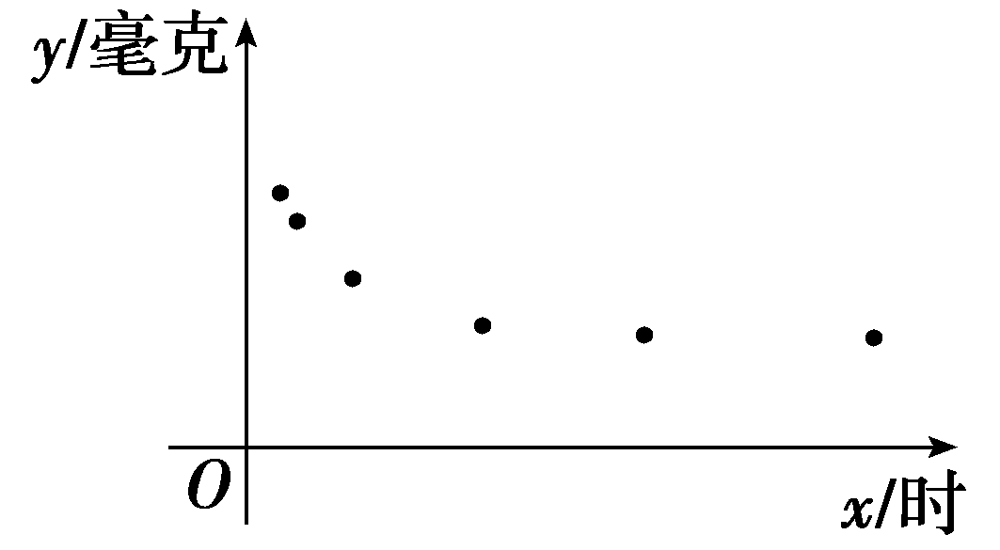
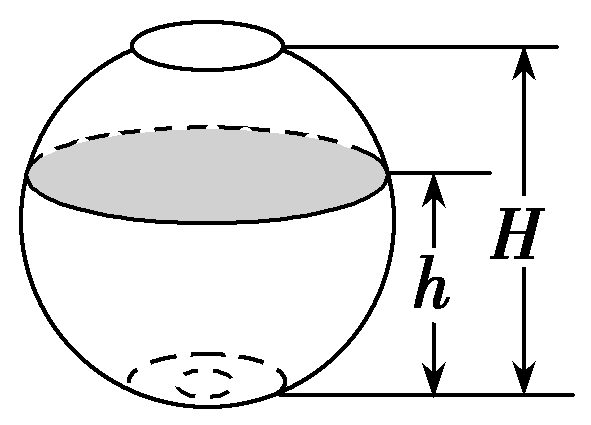
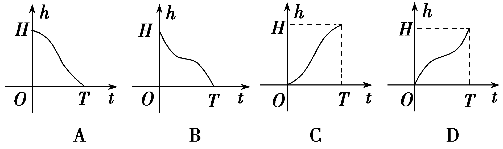
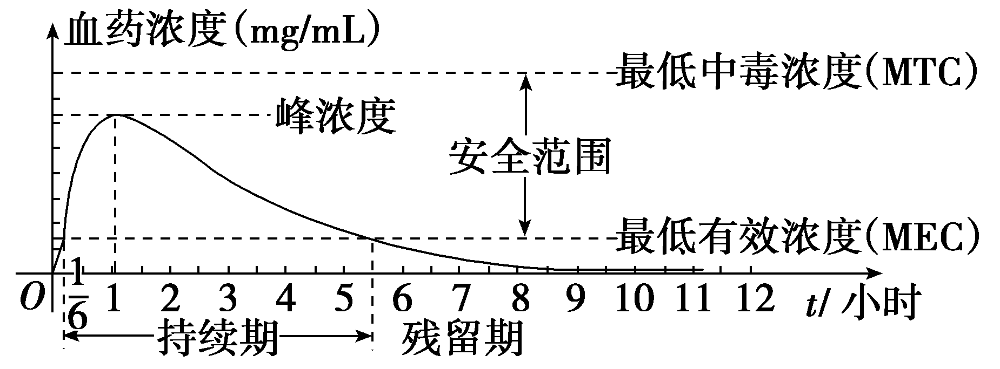
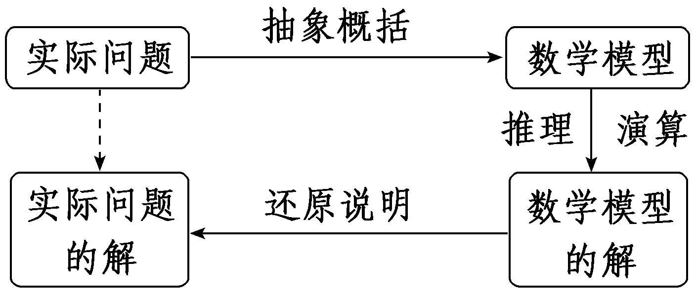
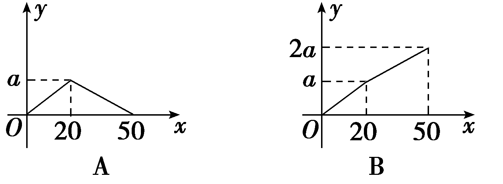
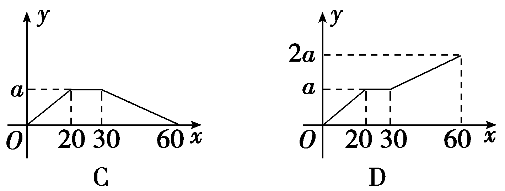
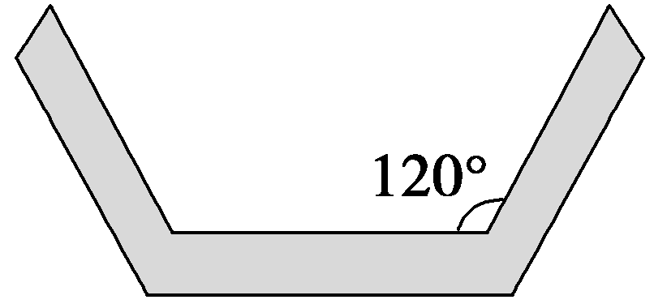
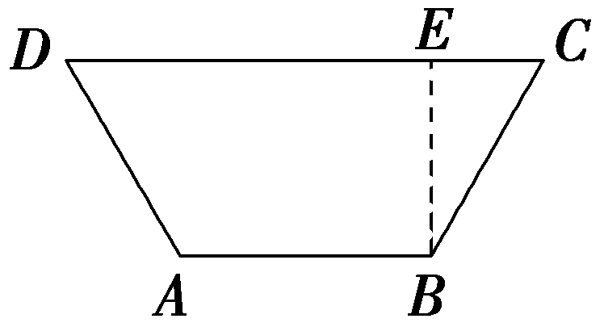
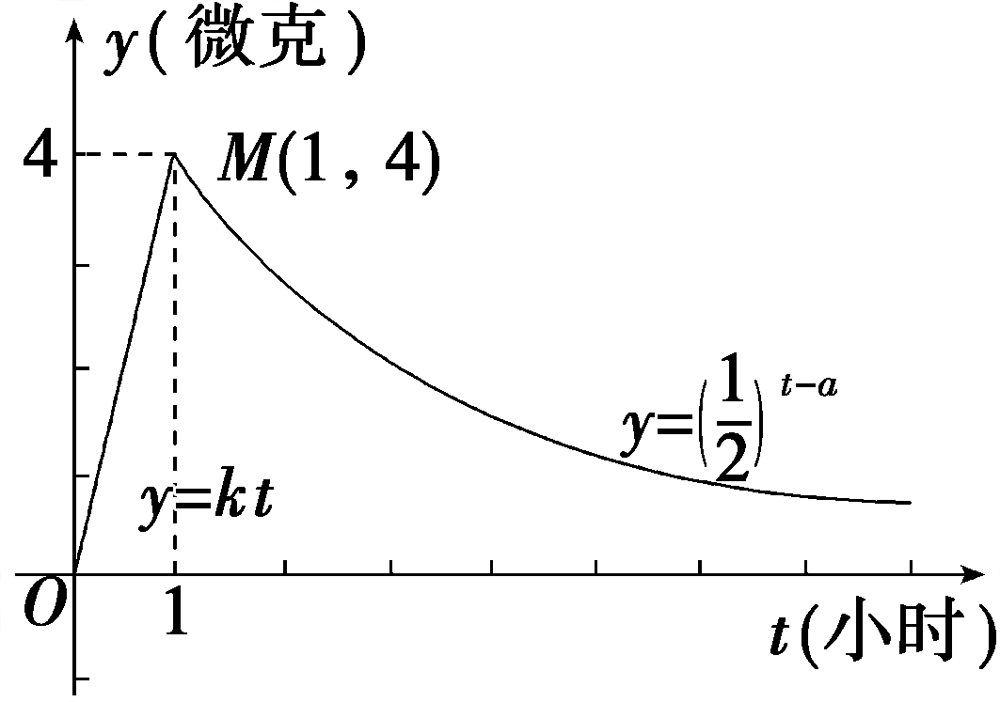

第十一节　函数模型及应用

【课标研读】　1.理解函数模型是描述客观世界中变量关系和规律的重要数学语言和工具，在实际情境中，会选择合适的函数模型刻画现实问题的变化规律.　2.结合现实情境中的具体问题，利用计算工具，比较对数函数、一元一次函数、指数函数增长速度的差异，理解“对数增长”“直线上升”“指数爆炸”等术语的现实含义.

##### 1.几种常见的函数模型

<table><tr><td>
函数模型
</td><td>
函数解析式
</td></tr><tr><td>
一次函数模型
</td><td>
<em>f</em>(<em>x</em>)＝<em>ax</em>＋<em>b</em>(<em>a</em>，<em>b</em>为常数，<em>a</em>≠0)
</td></tr><tr><td>
反比例函数模型
</td><td>
<em>f</em>(<em>x</em>)＋<em>b</em>(<em>k</em>，<em>b</em>为常数且<em>k</em>≠0)
</td></tr><tr><td>
二次函数模型
</td><td>
<em>f</em>(<em>x</em>)＝<em>ax</em>2＋<em>bx</em>＋<em>c</em>(<em>a</em>，<em>b</em>，<em>c</em>为常数，<em>a</em>≠0)
</td></tr><tr><td>
指数函数模型
</td><td>
<em>f</em>(<em>x</em>)＝<em>bax</em>＋<em>c</em>(<em>a</em>，<em>b</em>，<em>c</em>为常数，<em>a</em>＞0且<em>a</em>≠1，<em>b</em>≠0)
</td></tr><tr><td>
对数函数模型
</td><td>
<em>f</em>(<em>x</em>)＝<em>b</em>log<em>ax</em>＋<em>c</em>(<em>a</em>，<em>b</em>，<em>c</em>为常数，<em>a</em>＞0且<em>a</em>≠1，<em>b</em>≠0)
</td></tr><tr><td>
幂函数模型
</td><td>
<em>f</em>(<em>x</em>)＝<em>axn</em>＋<em>b</em>(<em>a</em>，<em>b</em>，<em>n</em>为常数，<em>a</em>≠0，<em>n</em>≠0)
</td></tr></table>

##### 2.三种增长函数模型的性质

<table><tr><td>
　 　函数

性质 　　
</td><td>
<em>y</em>＝<em>ax</em>(<em>a</em>＞1)
</td><td>
<em>y</em>＝log<em>ax</em>(<em>a</em>＞1)
</td><td>
<em>y</em>＝<em>xn</em>(<em>n</em>＞0)
</td></tr><tr><td>
在(0，＋∞)

上的增减性
</td><td>
单调递增
</td><td>
单调递增
</td><td>
单调递增
</td></tr><tr><td>
增长速度
</td><td>
越来越快
</td><td>
越来越慢
</td><td>
相对平稳
</td></tr><tr><td>
图象的变化
</td><td>
随<em>x</em>的增大逐渐表现为与<em>y</em>轴平行
</td><td>
随<em>x</em>的增大逐渐表现为与<em>x</em>轴平行
</td><td>
随<em>n</em>值变化而各有不同
</td></tr><tr><td>
值的比较
</td><td colspan="3">
存在一个<em>x</em>0，当<em>x</em>＞<em>x</em>0时，有log<em>ax</em>＜<em>xn</em>＜<em>ax</em>
</td></tr></table>

【常用结论】

“直线上升”是匀速增长，其增长量固定不变；“指数增长”先慢后快，其增长量成倍增加，常用“指数爆炸”来形容；“对数增长”先快后慢，其增长量越来越小.

【自主检测】

##### 1.(多选)下列说法错误的是(　　)

$\quad$A.函数<em>y</em>＝2<em>x</em>的函数值比<em>y</em>＝<em>x</em>2的函数值大

$\quad$B.不存在&lt;te<em>x</em>t style="it<em>a</em>lic"&gt;x&lt;/text&gt;&lt;text style="subscript"&gt;0&lt;/text&gt;，使 $a^{x_{0}}＜x_{0}^{a}$ ＜log&lt;te<em>x</em>t style="italic,subscript"&gt;a&lt;/text&gt;<em>x</em>&lt;text style="subscript"&gt;0&lt;/text&gt;

$\quad$C.在(0，＋∞)上，随着<em>x</em>的增大，<em>y</em>＝<em>ax</em>(<em>a</em>＞1)的增长速度会超过并远远大于<em>y</em>＝<em>xa</em>(<em>a</em>＞1)的增长速度

$\quad$D.“指数爆炸”是指数型函数<em>y</em>＝<em>a</em>·<em>bx</em>＋<em>c</em>(<em>a</em>≠0，<em>b</em>＞0且<em>b</em>≠1)增长速度越来越快的形象比喻

答案ABD

##### 2.(链接人教A必修一P152例6)某校拟用一种喷雾剂对宿舍进行消毒，需对喷雾完毕后空气中每立方米药物残留量*y*(单位：毫克)与时间*x*(单位：时)的关系进行研究，为此收集部分数据并做了初步处理，得到如图散点图.现拟从下列四个函数模型中选择一个估计*y*与*x*的关系，则应选用的函数模型是(　　)

$\quad$A.*y*＝*ax*＋*b*

$\quad$B.<text style="it<text style="it*a*lic">a</text>lic">y</text>＝a· $\left(\frac{1}{4}\right)^{x}$ ＋<text style="it*a*lic">b</text>(*a*＞0)

$\quad$C.<em>y</em>＝<em>xa</em>＋<em>b</em>(<em>a</em>＞0)

$\quad$D.<text style="it*a*lic">y</text>＝*ax*＋ $\frac{b}{x}$ (*a*＞0，*b*＞0)

答案B

##### 3.(链接人教A必修一P138探究)已知<em>f</em>(<em>x</em>)＝<em>x</em>2，<em>g</em>(<em>x</em>)＝2<em>x</em>，<em>h</em>(<em>x</em>)＝log2<em>x</em>，当<em>x</em>∈(4，＋∞)时，对三个函数的增长速度进行比较，下列选项中正确的是(　　)

$\quad$A.*f*(*x*)＞*g*(*x*)＞*h*(*x*)	
$\quad$B.*g*(*x*)＞*f*(*x*)＞*h*(*x*)

$\quad$C.*g*(*x*)＞*h*(*x*)＞*f*(*x*)	
$\quad$D.*f*(*x*)＞*h*(*x*)＞*g*(*x*)

答案B

解析当*x*∈(4，＋∞)时，易知增长速度由大到小依次为*g*(*x*)＞*f*(*x*)＞*h*(*x*).故选B.

##### 4.某桶装水经营部每天的固定成本为420元，每桶水的进价为5元，日均销售量<em>y</em>(单位：桶)与销售单价<em>x</em>(单位：元)的关系式为<em>y</em>＝－30<em>x</em>＋450，则该桶装水经营部要使利润最大，销售单价应定为<u>　　　　</u>元.

答案10

解析由题意得该桶装水经营部每日利润为<em>W</em>(<em>x</em>)＝(－30<em>x</em>＋450)(<em>x</em>－5)－420＝－30<em>x</em>2＋600<em>x</em>－2 670＝－30(<em>x</em>－10)2＋330，则当<em>x</em>＝10时，利润最大.

考点一　利用函数图象刻画实际问题中的变化过程　　　　自主练透

##### 1.如图，一高为*H*且装满水的鱼缸，其底部装有一排水小孔，当小孔打开时，水从孔中匀速流出，水流完所用时间为*T*.若鱼缸水深为*h*时，水流出所用时间为*t*，则函数*h*＝*f*(*t*)的图象大致是(　　)

答案B

解析水位由高变低，排除C、D.半缸前下降速度先快后慢，半缸后下降速度先慢后快.故选B.

##### 2.(2025·浙江杭州模拟)有一组实验数据如表，则体现这组数据的最佳函数模型是(　　)

<table><tr><td>
<em>x</em>
</td><td>
2
</td><td>
3
</td><td>
4
</td><td>
5
</td><td>
6
</td></tr><tr><td>
<em>y</em>
</td><td>
1.40
</td><td>
2.56
</td><td>
5.31
</td><td>
11
</td><td>
21.30
</td></tr></table>

$\quad$A.&lt;te<em>x</em>t st<em>y</em>le="italic"&gt;y&lt;/text&gt; $＝\sqrt{x}$ &lt;te<em>x</em>t st<em>y</em>le="italic"&gt;	&lt;/text&gt;
$\quad$B.<em>y</em> $＝\frac{1}{3}$ ·2<em>x</em>

$\quad$C.<em>y</em>＝log2<em>x</em>	
$\quad$D.<em>y</em>＝2<em>x</em>－3

答案B

解析<te*x*t st*y*le="italic">*<text style="italic"><text style="italic"><text style="italic"><text style="italic"><text style="italic"><text style="italic">f*</text></text></text></text></text></text></text> $\left(3\right)$ －<te*x*t st*y*le="italic">*<text style="italic"><text style="italic"><text style="italic"><text style="italic"><text style="italic"><text style="italic">f*</text></text></text></text></text></text></text> $\left(2\right)＝$ 1.16，<te*x*t st*y*le="italic">*<text style="italic"><text style="italic"><text style="italic"><text style="italic"><text style="italic"><text style="italic">f*</text></text></text></text></text></text></text> $\left(4\right)$ －<te*x*t st*y*le="italic">*<text style="italic"><text style="italic"><text style="italic"><text style="italic"><text style="italic"><text style="italic">f*</text></text></text></text></text></text></text> $\left(3\right)＝$ 2.75，<te*x*t st*y*le="italic">*<text style="italic"><text style="italic"><text style="italic"><text style="italic"><text style="italic"><text style="italic">f*</text></text></text></text></text></text></text>（5）－f $\left(4\right)＝$ 5.69，<te*x*t st*y*le="italic">*<text style="italic"><text style="italic"><text style="italic"><text style="italic"><text style="italic"><text style="italic">f*</text></text></text></text></text></text></text> $\left(6\right)$ －<te*x*t st*y*le="italic">*<text style="italic"><text style="italic"><text style="italic"><text style="italic"><text style="italic"><text style="italic">f*</text></text></text></text></text></text></text> $\left(5\right)＝$ 10.3，通过所给数据可知，<te*x*t style="italic">y</text>随x的增大而增大，且增长的速度越来越快，A、C选项函数增长的速度越来越慢，D选项函数增长的速度不变，B选项函数增长的速度越来越快，所以B正确.故选B.

##### 3.(多选)血药浓度是指药物吸收后在血浆内的总浓度.药物在人体内发挥治疗作用时，该药物的血药浓度应介于最低有效浓度和最低中毒浓度之间.已知成人单次服用1单位某药物后，体内血药浓度及相关信息如图所示：

根据图中提供的信息，下列关于成人使用该药物的说法中，正确的是(　　)

$\quad$A.首次服用该药物1单位约10分钟后，药物发挥治疗作用

$\quad$B.每次服用该药物1单位，两次服药间隔小于2小时，一定会产生药物中毒

$\quad$C.每间隔5.5小时服用该药物1单位，可使药物持续发挥治疗作用

$\quad$D.首次服用该药物1单位3小时后，再次服用该药物1单位，不会发生药物中毒

答案ABC

解析从题干图象中可以看出，首次服用该药物1单位约10分钟后药物发挥治疗作用，故A正确；根据图象可知，首次服用该药物1单位约1小时时的血药浓度达到最大值，由图象可知，当两次服药间隔小于2小时时，一定会产生药物中毒，故B正确；服药5.5小时时，血药浓度等于最低有效浓度，此时再服药，血药浓度增加，可使药物持续发挥治疗作用，故C正确；第1次服用该药物1单位4小时后与第2次服用该药物1单位1小时后，血药浓度之和大于最低中毒浓度，因此一定会发生药物中毒，故D错误.故选ABC.

判断函数图象与实际问题变化过程相吻合的方法

##### 1.构建函数模型法：当根据题意易构建函数模型时，先建立函数模型，再结合模型选图象.

##### 2.验证法：根据实际问题中两变量的变化快慢等特点，结合图象的变化趋势，验证是否吻合，从中排除不符合实际的情况，选出符合实际情况的答案.

考点二　已知函数模型解决实际问题　　　　师生共研

（1）(&lt;te<em>x</em>t style="superscript"&gt;2&lt;/text&gt;024·福建龙岩三模)声音的等级&lt;te&lt;te<em>x&lt;&lt;text style="italic"&gt;/</em>text&gt;t style="italic"&gt;x&lt;/text&gt;t style="italic"&gt;<em>f</em>&lt;/text&gt;(x)(单位：dB)与声音强度x(单位：W/m2)满足f(x)＝10×lg $\frac{x}{10^{－12}}$ . 喷气式飞机起飞时，声音的等级约为140 dB.若喷气式飞机起飞时声音强度约为一般说话时声音强度的108倍，则一般说话时声音的等级约为(　　)

$\quad$A.120 dB	
$\quad$B.100 dB

$\quad$C.80 dB	
$\quad$D.60 dB

(&lt;<em>t</em>ext style="subscript"&gt;2&lt;/text&gt;)(多选)(2&lt;&lt;&lt;&lt;<em>t</em>ext style="italic"&gt;t&lt;/text&gt;ext style="italic,superscript"&gt;t&lt;/text&gt;ext style="italic"&gt;t&lt;/text&gt;ext style="subscript"&gt;0&lt;/text&gt;25·安徽蚌埠第三次质量检测)科学研究表明，物体在空气中冷却的温度变化是有规律的.如果物体的初始温度为<em>&lt;text style="italic"&gt;&lt;text style="italic"&gt;&lt;text style="italic"&gt;&lt;text style="italic"&gt;&lt;text style="italic"&gt;&lt;text style="italic"&gt;θ</em>&lt;/text&gt;&lt;/text&gt;&lt;/text&gt;&lt;/text&gt;&lt;/text&gt;&lt;/text&gt;&lt;text style="subscript"&gt;&lt;text style="subscript"&gt;1&lt;/text&gt;&lt;/text&gt;℃，空气温度θ0℃保持不变，则t分钟后物体的温度θ(单位：℃)满足：θ＝θ0＋ $\left(\theta _{1}－\theta _{0}\right)$ e－&lt;&lt;&lt;&lt;&lt;<em>t</em>ext style="italic"&gt;t&lt;/text&gt;ext style="italic"&gt;t&lt;/text&gt;ext style="italic,superscript"&gt;t&lt;/text&gt;ext style="italic"&gt;t&lt;/text&gt;ext style="subscript"&gt;0&lt;/text&gt;.05t.若空气温度为&lt;text style="subscript"&gt;&lt;text style="subscript"&gt;1&lt;/text&gt;&lt;/text&gt;0 ℃，该物体温度从<em>&lt;text style="italic"&gt;&lt;text style="italic"&gt;&lt;text style="italic"&gt;&lt;text style="italic"&gt;&lt;text style="italic"&gt;&lt;text style="italic"&gt;θ</em>&lt;/text&gt;&lt;/text&gt;&lt;/text&gt;&lt;/text&gt;&lt;/text&gt;&lt;/text&gt;1 ℃(90≤θ1≤100)下降到30 ℃大约所需的时间为t1，若该物体温度从70 ℃，50 ℃下降到30 ℃大约所需的时间分别为t2，t3，则(　　)

(参考数据：ln 2≈0.7，ln 3≈1.1)

$\quad$A.<em>t</em>2＝20	
$\quad$B.28≤<em>t</em>1≤30

$\quad$C.<em>t</em>1≥2<em>t</em>3	
$\quad$D.<em>t</em>1－<em>t</em>2≤6

答案（1）D　（2）BC

解析(&lt;te&lt;te&lt;te<em>x</em>t style="italic"&gt;x&lt;/text&gt;t style="italic"&gt;x&lt;/text&gt;t style="subscript"&gt;1&lt;/text&gt;)设喷气式飞机起飞时声音强度和一般说话时声音强度分别为<em>x</em>1，x&lt;text style="superscript"&gt;&lt;text style="subscript"&gt;2&lt;/text&gt;&lt;/text&gt;，由题意可得<em>&lt;text style="italic"&gt;f</em>&lt;/text&gt; $\left(x_{1}\right)＝$ &lt;te&lt;te&lt;te<em>x</em>t style="italic"&gt;x&lt;/text&gt;t style="italic"&gt;x&lt;/text&gt;t style="subscript"&gt;1&lt;/text&gt;0×lg $\frac{x_{1}}{10^{－12}}＝$ &lt;te&lt;te&lt;te<em>x</em>t style="italic"&gt;x&lt;/text&gt;t style="italic"&gt;x&lt;/text&gt;t style="subscript"&gt;1&lt;/text&gt;40，解得<em>x</em>1＝10&lt;text style="superscript"&gt;&lt;text style="subscript"&gt;2&lt;/text&gt;&lt;/text&gt;，因为 $\frac{x_{1}}{x_{2}}＝\frac{10^{2}}{x_{2}}＝$ &lt;te&lt;te&lt;te<em>x</em>t style="italic"&gt;x&lt;/text&gt;t style="italic"&gt;x&lt;/text&gt;t style="subscript"&gt;1&lt;/text&gt;08，所以<em>x</em>&lt;text style="superscript"&gt;&lt;text style="subscript"&gt;2&lt;/text&gt;&lt;/text&gt;＝10－6，所以<em>&lt;text style="italic"&gt;f</em>&lt;/text&gt; $\left(10^{－6}\right)＝$ &lt;te&lt;te&lt;te<em>x</em>t style="italic"&gt;x&lt;/text&gt;t style="italic"&gt;x&lt;/text&gt;t style="subscript"&gt;1&lt;/text&gt;0×lg $\frac{10^{－6}}{10^{－12}}＝$ 60，所以一般说话时声音的等级约为60 dB.故选D.

（2）由题意可知，&lt;&lt;&lt;&lt;<em>t</em>ext style="italic"&gt;t&lt;/text&gt;ext style="italic"&gt;t&lt;/text&gt;ext style="italic,superscript"&gt;t&lt;/text&gt;ext style="italic"&gt;<em>&lt;text style="italic"&gt;&lt;text style="italic"&gt;&lt;text style="italic"&gt;θ</em>&lt;/text&gt;&lt;/text&gt;&lt;/text&gt;&lt;/text&gt;＝&lt;text style="subscript"&gt;&lt;text style="subscript"&gt;&lt;text style="subscript"&gt;&lt;text style="subscript"&gt;&lt;text style="subscript"&gt;1&lt;/text&gt;&lt;/text&gt;&lt;/text&gt;&lt;/text&gt;&lt;/text&gt;0＋ $\left(\theta _{1}－10\right)$ e&lt;&lt;&lt;&lt;<em>t</em>ext style="italic"&gt;t&lt;/text&gt;ext style="italic"&gt;t&lt;/text&gt;ext style="italic,superscript"&gt;t&lt;/text&gt;ext style="superscript"&gt;－0.05&lt;/text&gt;t，当<em>&lt;text style="italic"&gt;&lt;text style="italic"&gt;&lt;text style="italic"&gt;&lt;text style="italic"&gt;θ</em>&lt;/text&gt;&lt;/text&gt;&lt;/text&gt;&lt;/text&gt;＝30，则30＝&lt;text style="subscript"&gt;&lt;text style="subscript"&gt;&lt;text style="subscript"&gt;&lt;text style="subscript"&gt;&lt;text style="subscript"&gt;1&lt;/text&gt;&lt;/text&gt;&lt;/text&gt;&lt;/text&gt;&lt;/text&gt;0＋ $\left(\theta _{1}－10\right)e^{－0.05t_{1}}$ ，即 $e^{－0.05t_{1}}＝\frac{20}{\theta _{1}－10}$ ，&lt;&lt;&lt;&lt;<em>t</em>ext style="italic"&gt;t&lt;/text&gt;ext style="italic"&gt;t&lt;/text&gt;ext style="italic,superscript"&gt;t&lt;/text&gt;ext style="superscript"&gt;－0.05&lt;/text&gt;t&lt;text style="subscript"&gt;&lt;text style="subscript"&gt;&lt;text style="subscript"&gt;&lt;text style="subscript"&gt;&lt;text style="subscript"&gt;1&lt;/text&gt;&lt;/text&gt;&lt;/text&gt;&lt;/text&gt;&lt;/text&gt;＝ln $\frac{20}{\theta _{1}－10}$ ，则&lt;&lt;&lt;<em>t</em>ext style="italic"&gt;t&lt;/text&gt;ext style="italic"&gt;t&lt;/text&gt;ext style="italic,superscript"&gt;t&lt;/text&gt;&lt;text style="subscript"&gt;&lt;text style="subscript"&gt;&lt;text style="subscript"&gt;&lt;text style="subscript"&gt;&lt;text style="subscript"&gt;1&lt;/text&gt;&lt;/text&gt;&lt;/text&gt;&lt;/text&gt;&lt;/text&gt;＝20 ln $\frac{\theta _{1}－10}{20}$ ，其是关于&lt;&lt;&lt;&lt;<em>t</em>ext style="italic"&gt;t&lt;/text&gt;ext style="italic"&gt;t&lt;/text&gt;ext style="italic,superscript"&gt;t&lt;/text&gt;ext style="italic"&gt;<em>&lt;text style="italic"&gt;&lt;text style="italic"&gt;&lt;text style="italic"&gt;θ</em>&lt;/text&gt;&lt;/text&gt;&lt;/text&gt;&lt;/text&gt;&lt;text style="subscript"&gt;&lt;text style="subscript"&gt;&lt;text style="subscript"&gt;&lt;text style="subscript"&gt;&lt;text style="subscript"&gt;1&lt;/text&gt;&lt;/text&gt;&lt;/text&gt;&lt;/text&gt;&lt;/text&gt;的单调递增函数，当θ1＝90时，t1＝20 ln $\frac{90－10}{20}＝$ 20 ln 4＝40 ln 2≈28，当&lt;&lt;&lt;&lt;<em>t</em>ext style="italic"&gt;t&lt;/text&gt;ext style="italic"&gt;t&lt;/text&gt;ext style="italic,superscript"&gt;t&lt;/text&gt;ext style="italic"&gt;<em>&lt;text style="italic"&gt;&lt;text style="italic"&gt;&lt;text style="italic"&gt;θ</em>&lt;/text&gt;&lt;/text&gt;&lt;/text&gt;&lt;/text&gt;&lt;text style="subscript"&gt;&lt;text style="subscript"&gt;&lt;text style="subscript"&gt;&lt;text style="subscript"&gt;&lt;text style="subscript"&gt;1&lt;/text&gt;&lt;/text&gt;&lt;/text&gt;&lt;/text&gt;&lt;/text&gt;＝100时，

&lt;&lt;&lt;&lt;&lt;&lt;&lt;<em>t</em>ext style="italic"&gt;t&lt;/text&gt;ext style="italic"&gt;t&lt;/text&gt;ext style="italic"&gt;t&lt;/text&gt;ext style="italic"&gt;t&lt;/text&gt;ext style="italic"&gt;t&lt;/text&gt;ext style="italic"&gt;t&lt;/text&gt;ext style="italic"&gt;t&lt;/text&gt;&lt;text style="subscript"&gt;&lt;text style="subscript"&gt;&lt;text style="subscript"&gt;&lt;text style="subscript"&gt;&lt;text style="subscript"&gt;1&lt;/text&gt;&lt;/text&gt;&lt;/text&gt;&lt;/text&gt;&lt;/text&gt;＝&lt;text style="subscript"&gt;2&lt;/text&gt;0 ln $\frac{100－10}{20}＝$ &lt;&lt;&lt;&lt;&lt;<em>t</em>ext style="italic"&gt;t&lt;/text&gt;ext style="italic"&gt;t&lt;/text&gt;ext style="italic"&gt;t&lt;/text&gt;ext style="italic"&gt;t&lt;/text&gt;ext style="subscript"&gt;2&lt;/text&gt;0 ln $\frac{9}{2}＝$ &lt;&lt;&lt;&lt;&lt;<em>t</em>ext style="italic"&gt;t&lt;/text&gt;ext style="italic"&gt;t&lt;/text&gt;ext style="italic"&gt;t&lt;/text&gt;ext style="italic"&gt;t&lt;/text&gt;ext style="subscript"&gt;2&lt;/text&gt;0 $\left(2ln3－ln2\right)$ ≈&lt;&lt;&lt;&lt;<em>t</em>ext style="italic"&gt;t&lt;/text&gt;ext style="italic"&gt;t&lt;/text&gt;ext style="italic"&gt;t&lt;/text&gt;ext style="subscript"&gt;3&lt;/text&gt;0，则&lt;<em>t</em>ext style="subscript"&gt;2&lt;/text&gt;8≤&lt;&lt;<em>t</em>ext style="italic"&gt;t&lt;/text&gt;ext style="italic"&gt;t&lt;/text&gt;&lt;text style="subscript"&gt;&lt;text style="subscript"&gt;&lt;text style="subscript"&gt;&lt;text style="subscript"&gt;&lt;text style="subscript"&gt;1&lt;/text&gt;&lt;/text&gt;&lt;/text&gt;&lt;/text&gt;&lt;/text&gt;≤30，故B正确；当<em>&lt;text style="italic"&gt;θ</em>&lt;/text&gt;1＝70时，t2＝20ln $\frac{70－10}{20}＝$ &lt;&lt;&lt;&lt;&lt;<em>t</em>ext style="italic"&gt;t&lt;/text&gt;ext style="italic"&gt;t&lt;/text&gt;ext style="italic"&gt;t&lt;/text&gt;ext style="italic"&gt;t&lt;/text&gt;ext style="subscript"&gt;2&lt;/text&gt;0ln &lt;text style="subscript"&gt;3&lt;/text&gt;≈22，故A错误；当&lt;<em>t</em>ext style="italic"&gt;<em>θ</em>&lt;/text&gt;&lt;<em>t</em>ext style="subscript"&gt;&lt;text style="subscript"&gt;&lt;text style="subscript"&gt;&lt;text style="subscript"&gt;&lt;text style="subscript"&gt;1&lt;/text&gt;&lt;/text&gt;&lt;/text&gt;&lt;/text&gt;&lt;/text&gt;＝50时，<em>t</em>3＝20ln $\frac{50－10}{20}＝$ &lt;&lt;&lt;&lt;&lt;<em>t</em>ext style="italic"&gt;t&lt;/text&gt;ext style="italic"&gt;t&lt;/text&gt;ext style="italic"&gt;t&lt;/text&gt;ext style="italic"&gt;t&lt;/text&gt;ext style="subscript"&gt;2&lt;/text&gt;0ln 2≈&lt;&lt;<em>t</em>ext style="italic"&gt;t&lt;/text&gt;ext style="subscript"&gt;&lt;text style="subscript"&gt;&lt;text style="subscript"&gt;&lt;text style="subscript"&gt;&lt;text style="subscript"&gt;1&lt;/text&gt;&lt;/text&gt;&lt;/text&gt;&lt;/text&gt;&lt;/text&gt;4，此时满足<em>t</em>1≥2t&lt;text style="subscript"&gt;3&lt;/text&gt;， t1－t2≥6，故C正确，D错误.故选BC.

已知函数模型解决实际问题的技巧

##### 1.认清所给函数模型，明确其中的变量，弄清楚哪些为待定系数.

##### 2.根据已知条件，利用待定系数法，确定模型中的待定系数.

##### 3.利用该函数模型，借助函数的性质、系数等解决相关问题.

对点练1.(2024·内蒙古包头三模)冰箱、空调等家用电器使用了氟化物，氟化物的释放破坏了大气上层的臭氧层，使臭氧量<em>Q</em>呈指数型变化.当氟化物排放量维持在某种水平时，臭氧量满足关系式<em>Q</em>＝<em>Q</em>0·e－0.002 5 <em>t</em>，其中<em>Q</em>0是臭氧的初始量，e是自然对数的底数，<em>t</em>是时间，以年为单位.若按照关系式<em>Q</em>＝<em>Q</em>0·e－0.002 5<em>t</em>推算，经过<em>t</em>0年臭氧量还保留初始量的四分之一，则<em>t</em>0的值约为(ln 2≈0.693)(　　)

$\quad$A.584年	
$\quad$B.574年

$\quad$C.564年	
$\quad$D.554年

答案D

解析由题意知，&lt;<em>t</em>ext style="italic"&gt;<em>&lt;text style="italic"&gt;Q</em>&lt;/text&gt;&lt;/text&gt;＝Q&lt;text style="subscript"&gt;&lt;text style="subscript"&gt;0&lt;/text&gt;&lt;/text&gt;<em>·</em> $e^{－0.002 5t_{0}}＝\frac{1}{4}$ &lt;<em>t</em>ext style="italic"&gt;<em>&lt;text style="italic"&gt;Q</em>&lt;/text&gt;&lt;/text&gt;&lt;text style="subscript"&gt;&lt;text style="subscript"&gt;0&lt;/text&gt;&lt;/text&gt;，则 $e^{－0.002 5t_{0}}＝\frac{1}{4}$ ，解得<em>t</em>&lt;text style="subscript"&gt;&lt;text style="subscript"&gt;0&lt;/text&gt;&lt;/text&gt;＝－400 ln $\frac{1}{4}＝$ 8&lt;<em>t</em>ext style="subscript"&gt;&lt;text style="subscript"&gt;0&lt;/text&gt;&lt;/text&gt;0 ln 2≈554年.故选D.

对点练2.尽管目前人类还无法准确预报地震，但科学家通过研究，已经对地震有所了解，例如，地震时释放的能量*E*(单位：焦耳)与地震里氏震级*M*之间的关系为lg *E*＝4.8＋1.5 *M*.2008年5月12日我国汶川发生里氏8.0级地震，它所释放出来的能量是2024年4月23日我国台湾发生里氏6.0级地震的(　　)

$\quad$A.3倍	
$\quad$B.10倍

$\quad$C.103倍	
$\quad$D.104倍

答案C

解析设里氏震级<em>&lt;text style="italic"&gt;M</em>&lt;/text&gt;＝8.0时释放的能量为<em>&lt;text style="italic"&gt;&lt;text style="italic"&gt;&lt;text style="italic"&gt;&lt;text style="italic"&gt;&lt;text style="italic"&gt;E</em>&lt;/text&gt;&lt;/text&gt;&lt;/text&gt;&lt;/text&gt;&lt;/text&gt;&lt;text style="subscript"&gt;&lt;text style="subscript"&gt;1&lt;/text&gt;&lt;/text&gt;，里氏震级M＝6.0时释放的能量为E&lt;text style="subscript"&gt;&lt;text style="subscript"&gt;2&lt;/text&gt;&lt;/text&gt;，则lg E1＝4.8＋1.5×8＝16.8，lg E2＝4.8＋1.5×6＝1&lt;text style="superscript"&gt;&lt;text style="superscript"&gt;3&lt;/text&gt;.8&lt;/text&gt;，所以E1＝1016.8，E2＝1013.8，所以 $\frac{E_{1}}{E_{2}}＝$ &lt;text style="subscript"&gt;&lt;text style="subscript"&gt;1&lt;/text&gt;&lt;/text&gt;016.8－1&lt;text style="superscript"&gt;&lt;text style="superscript"&gt;3&lt;/text&gt;.8&lt;/text&gt;＝103，即&lt;text style="subscript"&gt;&lt;text style="subscript"&gt;2&lt;/text&gt;&lt;/text&gt;008年5月12日汶川地震释放出的能量是2024年4月23日我国台湾发生的地震释放的能量的103倍.故选C.

考点三　构建函数模型解决实际问题　　　　多维探究

角度1　构建二次函数、分段函数、“对勾”函数模型

小王大学毕业后，决定利用所学专业进行自主创业.经过市场调查，生产某小型电子产品需投入年固定成本为3万元，每生产&lt;te&lt;te&lt;te&lt;te&lt;te&lt;te<em>x</em>t style="italic"&gt;x&lt;/text&gt;t style="italic"&gt;x&lt;/text&gt;t style="italic"&gt;x&lt;/text&gt;t style="italic"&gt;x&lt;/text&gt;t style="italic"&gt;x&lt;/text&gt;t style="italic"&gt;x&lt;/text&gt;万件，需另投入流动成本<em>&lt;text style="italic"&gt;&lt;text style="italic"&gt;W</em>&lt;/text&gt;&lt;/text&gt;(x)万元，在年产量不足8万件时，W(x) $＝\frac{1}{3}$ &lt;te&lt;te&lt;te&lt;te&lt;te&lt;te<em>x</em>t style="italic"&gt;x&lt;/text&gt;t style="italic"&gt;x&lt;/text&gt;t style="italic"&gt;x&lt;/text&gt;t style="italic"&gt;x&lt;/text&gt;t style="italic"&gt;x&lt;/text&gt;t style="italic"&gt;x&lt;/text&gt;2＋x(万元)；在年产量不小于8万件时，<em>&lt;text style="italic"&gt;&lt;text style="italic"&gt;W</em>&lt;/text&gt;&lt;/text&gt;(x)＝6x＋ $\frac{100}{x}$ －38(万元).每件商品售价为5元.通过市场分析，小王生产的商品当年能全部售完.

（1）写出年利润*L*(*x*)(万元)关于年产量*x*(万件)的函数解析式；(注：年利润＝年销售收入－固定成本－流动成本)

（2）年产量为多少万件时，小王在这一商品的生产中所获利润最大？最大利润是多少？

解：（1）因为每件商品售价为5元，则*x*万件商品销售收入为5*x*万元，

依题意得，当0＜&lt;te&lt;te&lt;te&lt;te&lt;te&lt;te<em>x</em>t style="italic"&gt;x&lt;/text&gt;t style="italic"&gt;x&lt;/text&gt;t style="italic"&gt;x&lt;/text&gt;t style="italic"&gt;x&lt;/text&gt;t style="italic"&gt;x&lt;/text&gt;t style="italic"&gt;x&lt;/text&gt;＜8时，<em>L</em>(x)＝5x－( $\frac{1}{3}$ &lt;te&lt;te&lt;te&lt;te&lt;te&lt;te<em>x</em>t style="italic"&gt;x&lt;/text&gt;t style="italic"&gt;x&lt;/text&gt;t style="italic"&gt;x&lt;/text&gt;t style="italic"&gt;x&lt;/text&gt;t style="italic"&gt;x&lt;/text&gt;t style="italic"&gt;x&lt;/text&gt;&lt;text style="superscript"&gt;2&lt;/text&gt;＋x)－3＝－ $\frac{1}{3}$ &lt;te&lt;te&lt;te&lt;te&lt;te&lt;te<em>x</em>t style="italic"&gt;x&lt;/text&gt;t style="italic"&gt;x&lt;/text&gt;t style="italic"&gt;x&lt;/text&gt;t style="italic"&gt;x&lt;/text&gt;t style="italic"&gt;x&lt;/text&gt;t style="italic"&gt;x&lt;/text&gt;&lt;text style="superscript"&gt;2&lt;/text&gt;＋4x－3；

当<te<te*x*t style="italic">x</text>t style="italic">x</text>≥8时，*L*(x)＝5x－ $\left(6x＋\frac{100}{x}－38\right)$ －3＝35－ $\left(x＋\frac{100}{x}\right)$ .

所以<te*x*t style="italic">L</text>(x) $＝\left\{\begin{matrix}－\frac{1}{3}x^{2}+4x－3，0<x<8，\\35－\left(x＋\frac{100}{x}\right)，x\geq 8.\end{matrix}\right.$

（2）当0＜<te*x*t style="italic">x</text>＜8时，*L*(x)＝－ $\frac{1}{3}\left(x－6\right)^{2}$ ＋9.

即当*x*＝6时，*L*(*x*)取得最大值，最大值为9万元；

当<te<te<te<te<te*x*t style="italic">x</text>t style="italic">x</text>t style="italic">x</text>t style="italic">x</text>t style="italic">x</text>≥8时，*<text style="italic">L*</text>(x)＝35－ $\left(x＋\frac{100}{x}\right)$ ≤35－2 $\sqrt{x\cdot \frac{100}{x}}＝$ 35－20＝15，当且仅当<te<te<te<te<te*x*t style="italic">x</text>t style="italic">x</text>t style="italic">x</text>t style="italic">x</text>t style="italic">x</text> $＝\frac{100}{x}$ ，即<te<te<te<te<te*x*t style="italic">x</text>t style="italic">x</text>t style="italic">x</text>t style="italic">x</text>t style="italic">x</text>＝10时等号成立，即x＝10时，*<text style="italic">L*</text>(x)取得最大值，最大值为15万元.

因为9＜15，所以当年产量为10万件时，小王在这一商品的生产中所获利润最大，最大利润为15万元.

角度2　构建指数函数、对数函数模型

（1）据报道，全球变暖使北冰洋冬季冰雪覆盖面积在最近50年内减少了5％，如果按此速度，设2010年的冬季冰雪覆盖面积为*m*，从2010年起，经过*x*年后，北冰洋冬季冰雪覆盖面积*y*与*x*的函数关系式是(　　)

$\quad$A.*y*＝0.9 $5^{\frac{x}{50}}$ ·*m*

$\quad$B.*y*＝(1－0.0 $5^{\frac{x}{50}}$ )·*m*

$\quad$C.<em>y</em>＝0.9550－<em>x</em>·<em>m</em>

$\quad$D.<em>y</em>＝(1－0.0550－<em>x</em>)·<em>m</em>

(&lt;text style="subscript"&gt;2&lt;/text&gt;)北京时间2020年&lt;text style="subscript"&gt;1&lt;/text&gt;1月24日4时30分，中国在文昌航天发射场用长征五号遥五运载火箭，成功将嫦娥五号月球探测器送入地月转移轨道，发射取得圆满成功.在不考虑空气阻力的情况下，火箭的最大速度<em>&lt;text style="italic"&gt;&lt;text style="italic"&gt;&lt;text style="italic"&gt;&lt;text style="italic"&gt;&lt;text style="italic"&gt;v</em>&lt;/text&gt;&lt;/text&gt;&lt;/text&gt;&lt;/text&gt;&lt;/text&gt; $\left(km/s\right)$ 和燃料的质量<em>&lt;text style="italic"&gt;&lt;text style="italic"&gt;M</em>&lt;/text&gt;&lt;/text&gt; $\left(kg\right)$ 、火箭(除燃料外)的质量<em>&lt;text style="italic"&gt;&lt;text style="italic"&gt;m</em>&lt;/text&gt;&lt;/text&gt; $\left(kg\right)$ 的函数关系是<em>&lt;text style="italic"&gt;&lt;text style="italic"&gt;&lt;text style="italic"&gt;&lt;text style="italic"&gt;&lt;text style="italic"&gt;v</em>&lt;/text&gt;&lt;/text&gt;&lt;/text&gt;&lt;/text&gt;&lt;/text&gt;＝&lt;text style="subscript"&gt;2&lt;/text&gt; 000ln $\left(1+\frac{M}{m}\right)$ .按照这个规律，当&lt;text style="subscript"&gt;1&lt;/text&gt; 000<em>&lt;text style="italic"&gt;&lt;text style="italic"&gt;M</em>&lt;/text&gt;&lt;/text&gt;＝8<em>&lt;text style="italic"&gt;&lt;text style="italic"&gt;m</em>&lt;/text&gt;&lt;/text&gt;时，火箭的最大速度为<em>&lt;text style="italic"&gt;&lt;text style="italic"&gt;&lt;text style="italic"&gt;&lt;text style="italic"&gt;&lt;text style="italic"&gt;v</em>&lt;/text&gt;&lt;/text&gt;&lt;/text&gt;&lt;/text&gt;&lt;/text&gt;1；当1 000M＝4m时，火箭的最大速度为v&lt;text style="subscript"&gt;2&lt;/text&gt;，则v1－v2≈(参考数据：ln $\frac{252}{251}$ ≈0.004)(　　)

$\quad$A.8.0 km*/* s	
$\quad$B.8.4 km*/* s

$\quad$C.8.8 km*/* s	
$\quad$D.9.0 km*/* s

答案（1）A　（2）A

解析（1）设每年减少的百分比为<te<te<text st*y*le="italic">x</text>t st*y*le="italic">x</text>t style="it*a*lic">a</text>，由在50年内减少5％，得 $\left(1－a\right)^{50}＝$ 1－5％＝95％，即<te<te<text st*y*le="italic">x</text>t st*y*le="italic">x</text>t style="it*a*lic">a</text>＝1－(95％ $)^{\frac{1}{50}}$ .所以经过<te<text st*y*le="italic">x</text>t st*y*le="italic">x</text>年后，y与x的函数关系式为y＝*<text style="italic"><text style="italic">m*</text></text>· $\left(1－a\right)^{x}＝$ *<text style="italic"><text style="italic">m*</text></text>· $\left(95％\right)^{\frac{x}{50}}＝$ 0.9 $5^{\frac{x}{50}}$ ·*<text style="italic"><text style="italic">m*</text></text>.故选A.

(&lt;text style="subscript"&gt;2&lt;&lt;text style="italic"&gt;/text&gt;&lt;/text&gt;)由火箭的最大速度<em>&lt;text style="italic"&gt;&lt;text style="italic"&gt;&lt;text style="italic"&gt;&lt;text style="italic"&gt;&lt;text style="italic"&gt;v</em>&lt;/text&gt;&lt;/text&gt;&lt;/text&gt;&lt;/text&gt;&lt;/text&gt;和燃料的质量<em>&lt;text style="italic"&gt;&lt;text style="italic"&gt;M</em>&lt;/text&gt;&lt;/text&gt;、火箭的质量<em>&lt;text style="italic"&gt;&lt;text style="italic"&gt;m</em>&lt;/text&gt;&lt;/text&gt;的函数关系是v＝2 000 ln $\left(1+\frac{M}{m}\right)$ ，当&lt;text style="subscript"&gt;1&lt;&lt;text style="italic"&gt;/text&gt;&lt;/text&gt; 000<em>&lt;text style="italic"&gt;&lt;text style="italic"&gt;M</em>&lt;/text&gt;&lt;/text&gt;＝8<em>&lt;text style="italic"&gt;&lt;text style="italic"&gt;m</em>&lt;/text&gt;&lt;/text&gt;时，有 $\frac{M}{m}＝\frac{8}{1 000}$ ，所以<em>&lt;text style="italic"&gt;&lt;text style="italic"&gt;&lt;text style="italic"&gt;&lt;text style="italic"&gt;&lt;text style="italic"&gt;v&lt;&lt;text style="italic"&gt;/</em>text&gt;&lt;/text&gt;&lt;/text&gt;&lt;/text&gt;&lt;/text&gt;&lt;/text&gt;&lt;text style="subscript"&gt;1&lt;/text&gt;＝&lt;text style="subscript"&gt;2&lt;/text&gt; 000ln(1＋ $\frac{8}{1 000}$ )＝&lt;text style="subscript"&gt;2&lt;&lt;text style="italic"&gt;/text&gt;&lt;/text&gt; 000ln $\frac{1 008}{1 000}$ ；当&lt;text style="subscript"&gt;1&lt;&lt;text style="italic"&gt;/text&gt;&lt;/text&gt; 000<em>&lt;text style="italic"&gt;&lt;text style="italic"&gt;M</em>&lt;/text&gt;&lt;/text&gt;＝4<em>&lt;text style="italic"&gt;&lt;text style="italic"&gt;m</em>&lt;/text&gt;&lt;/text&gt;时，有 $\frac{M}{m}＝\frac{4}{1 000}$ ，所以<em>&lt;text style="italic"&gt;&lt;text style="italic"&gt;&lt;text style="italic"&gt;&lt;text style="italic"&gt;&lt;text style="italic"&gt;v&lt;&lt;text style="italic"&gt;/</em>text&gt;&lt;/text&gt;&lt;/text&gt;&lt;/text&gt;&lt;/text&gt;&lt;/text&gt;&lt;text style="subscript"&gt;2&lt;/text&gt;＝2 000ln $\left(1+\frac{4}{1 000}\right)＝$ &lt;text style="subscript"&gt;2&lt;&lt;text style="italic"&gt;/text&gt;&lt;/text&gt; 000ln $\frac{1 004}{1 000}$ ，可得<em>&lt;text style="italic"&gt;&lt;text style="italic"&gt;&lt;text style="italic"&gt;&lt;text style="italic"&gt;&lt;text style="italic"&gt;v&lt;&lt;text style="italic"&gt;/</em>text&gt;&lt;/text&gt;&lt;/text&gt;&lt;/text&gt;&lt;/text&gt;&lt;/text&gt;&lt;text style="subscript"&gt;1&lt;/text&gt;－v&lt;text style="subscript"&gt;2&lt;/text&gt;＝2 000ln $\frac{1 008}{1 004}＝$ &lt;text style="subscript"&gt;2&lt;&lt;text style="italic"&gt;/text&gt;&lt;/text&gt; 000ln $\frac{252}{251}$ ≈&lt;text style="subscript"&gt;2&lt;&lt;text style="italic"&gt;/text&gt;&lt;/text&gt; 000×0.004＝8.0 k<em>&lt;text style="italic"&gt;&lt;text style="italic"&gt;m</em>&lt;/text&gt;&lt;/text&gt;/s.故选A.

建模解决实际问题的三个步骤

第一步：建模：抽象出实际问题的数学模型.

第二步：解模：对数学模型进行逻辑推理或数学演算，得到问题在数学意义上的解.

第三步：回归：对求得的数学结果进行深入的讨论，作出评价、解释，返回到原来的实际问题中去，得到实际问题的解.即：

注意：（1）构建函数模型时不要忘记考虑函数的定义域.（2）应用指、对函数模型的关键是对模型的判断，先设定模型，再将已知有关数据代入验证，确定参数，从而确定函数模型.

对点练3.酒驾是严重危害交通安全的违法行为.为了保障交通安全，根据国家有关规定：驾驶员血液中的酒精含量大于或等于20 mg/100 mL，小于80 mg/100 mL的驾驶行为为酒后驾车，80 mg/100 mL及以上认定为醉酒驾车.假设某驾驶员喝了一定量的酒后，其血液中的酒精含量上升到了100 mg/100 mL.如果停止喝酒后，他血液中酒精含量会以每小时30％的速度减少，那么他至少经过<u>　　　　</u>个小时才能驾驶汽车.(参考数据：lg 5≈0.7，lg 7≈0.85)

答案4.7

解析设他经过&lt;te&lt;te&lt;te&lt;te&lt;te<em>x</em>t style="italic,superscript"&gt;x&lt;/text&gt;t st<em>y</em>le="italic,superscript"&gt;x&lt;/text&gt;t style="italic,superscript"&gt;x&lt;/text&gt;t st<em>y</em>le="italic,superscript"&gt;x&lt;/text&gt;t st&lt;text st<em>y</em>le="italic"&gt;y&lt;/text&gt;le="italic"&gt;x&lt;/text&gt;个小时血液中酒精含量为y，则y＝100(1－30％)x，令y＜20，得100(1－30％)x＜20，所以0.7x＜0.2.又y＝0.7x为减函数，所以x＞log0.70.2 $＝\frac{lg0.2}{lg0.7}＝\frac{lg\frac{1}{5}}{lg\frac{7}{10}}＝\frac{lg1－lg5}{lg7－lg10}＝\frac{－lg5}{lg7－1}$ ≈ $\frac{－0.7}{0.85－1}$ ≈4.7，所以他至少经过4.7个小时才能驾驶汽车.

对点练4.网店和实体店各有利弊，两者的结合将在未来一段时期内成为商业的一个主要发展方向.某品牌行车记录仪支架销售公司从2022年1月起开展网络销售与实体店体验安装结合的销售模式.根据几个月运营发现，产品的月销量&lt;&lt;te<em>x</em>t style="italic"&gt;t&lt;/text&gt;ext style="italic"&gt;x&lt;/text&gt;(单位：万件)与投入实体店体验安装的费用t(单位：万元)之间满足函数关系式x＝3－ $\frac{2}{t+1}$ .已知网店每月固定的各种费用支出为3万元，产品每1万件的进货价格为32万元，若每件产品的售价定为“进货价的150％”与“平均每件产品的实体店体验安装费用的一半”之和，则该公司的最大月利润是<u>　　　　</u>万元.

答案37.5

解析由题意，产品的月销量<<<<te<te<te*x*t style="italic">x</text>t style="italic">x</text>t style="italic">t</text>e<te<te*x*t style="italic">x</text>t st*y*le="italic">x</text>t style="italic">t</text>e*x*t style="italic">t</text>ext style="italic">x</text>(单位：万件)与投入实体店体验安装的费用t(单位：万元)之间满足x＝3－ $\frac{2}{t+1}$ ，即<<<te<te<te*x*t style="italic">x</text>t style="italic">x</text>t style="italic">t</text>e<te<te*x*t style="italic">x</text>t st*y*le="italic">x</text>t style="italic">t</text>e*x*t style="italic">t</text> $＝\frac{2}{3－x}$ －1(1＜<<<<te<te<te*x*t style="italic">x</text>t style="italic">x</text>t style="italic">t</text>e<te<te*x*t style="italic">x</text>t st*y*le="italic">x</text>t style="italic">t</text>e*x*t style="italic">t</text>ext style="italic">x</text>＜3)，所以月利润为y $＝\left(32\times 1.5+\frac{t}{2x}\right)$ <<<<te<te<te*x*t style="italic">x</text>t style="italic">x</text>t style="italic">t</text>e<te<te*x*t style="italic">x</text>t st*y*le="italic">x</text>t style="italic">t</text>e*x*t style="italic">t</text>ext style="italic">x</text>－32x－3－t＝16x－ $\frac{t}{2}$ －3＝16<<<<te<te<te*x*t style="italic">x</text>t style="italic">x</text>t style="italic">t</text>e<te<te*x*t style="italic">x</text>t st*y*le="italic">x</text>t style="italic">t</text>e*x*t style="italic">t</text>ext style="italic">x</text>－ $\frac{1}{3－x}$ － $\frac{5}{2}＝$ 45.5－ $\left[16\left(3－x\right)＋\frac{1}{3－x}\right]$ ≤45.5－2 $\sqrt{16}＝$ 37.5，当且仅当16 $\left(3－x\right)＝\frac{1}{3－x}$ ，即<<<<te<te<te*x*t style="italic">x</text>t style="italic">x</text>t style="italic">t</text>e<te<te*x*t style="italic">x</text>t st*y*le="italic">x</text>t style="italic">t</text>e*x*t style="italic">t</text>ext style="italic">x</text> $＝\frac{11}{4}$ 时取等号，则最大月利润为37.5万元.

[真题再现]　(多选)(2&lt;text style="subscri<em>p</em>t"&gt;0&lt;/text&gt;23·新课标Ⅰ卷)噪声污染问题越来越受到重视.用声压级来度量声音的强弱，定义声压级<em>L</em>&lt;text style="italic,subscri<em>p</em>t"&gt;p&lt;/text&gt;＝20×lg $\frac{p}{p_{0}}$ ，其中常数&lt;text style="italic,subscri<em>&lt;text style="italic"&gt;p</em>&lt;/text&gt;t"&gt;p&lt;/text&gt;&lt;text style="subscript"&gt;0&lt;/text&gt;(p0＞0)是听觉下限阈值， <em>p</em> 是实际声压.下表为不同声源的声压级：

<table><tr><td>
声源
</td><td>
与声源的距离<em>/</em>m
</td><td>
声压级<em>/</em>dB
</td></tr><tr><td>
燃油汽车
</td><td>
10
</td><td>
60～90
</td></tr><tr><td>
混合动力汽车
</td><td>
10
</td><td>
50～60
</td></tr><tr><td>
电动汽车
</td><td>
10
</td><td>
40
</td></tr></table>

已知在距离燃油汽车、混合动力汽车、电动汽车10 m处测得实际声压分别为<em>p</em>1，<em>p</em>2，<em>p</em>3，则(　　)

$\quad$A.<em>p</em>1≥<em>p</em>2	
$\quad$B.<em>p</em>2＞10<em>p</em>3

$\quad$C.<em>p</em>3＝100<em>p</em>0	
$\quad$D.<em>p</em>1≤100<em>p</em>2

答案ACD

解析由题意可知：<em>&lt;text style="italic"&gt;&lt;text style="italic"&gt;&lt;text style="italic"&gt;&lt;text style="italic"&gt;&lt;text style="italic"&gt;&lt;text style="italic"&gt;&lt;text style="italic"&gt;&lt;text style="italic"&gt;&lt;text style="italic"&gt;&lt;text style="italic"&gt;&lt;text style="italic"&gt;&lt;text style="italic"&gt;&lt;text style="italic"&gt;&lt;text style="italic"&gt;&lt;text style="italic"&gt;&lt;text style="italic"&gt;&lt;text style="italic"&gt;&lt;text style="italic"&gt;L</em>&lt;/text&gt;&lt;/text&gt;&lt;/text&gt;&lt;/text&gt;&lt;/text&gt;&lt;/text&gt;&lt;/text&gt;&lt;/text&gt;&lt;/text&gt;&lt;/text&gt;&lt;/text&gt;&lt;/text&gt;&lt;/text&gt;&lt;/text&gt;&lt;/text&gt;&lt;/text&gt;&lt;/text&gt;&lt;/text&gt;&lt;text style="italic,subscri&lt;text style="italic,subscri&lt;text style="italic,subscri&lt;text style="italic,subscri&lt;text style="italic,subscri&lt;text style="italic,subscri&lt;text style="italic,subscri&lt;text style="italic,subscri&lt;text style="italic,subscri<em>&lt;text style="italic"&gt;&lt;text style="italic"&gt;&lt;text style="italic"&gt;&lt;text style="italic,subscri&lt;text style="italic,subscri&lt;text style="italic,subscri&lt;text style="italic,subscri&lt;text style="italic"&gt;&lt;text style="italic"&gt;&lt;text style="italic"&gt;&lt;text style="italic"&gt;&lt;text style="italic,subscri&lt;text style="italic,subscri&lt;text style="italic"&gt;&lt;text style="italic"&gt;&lt;text style="italic,subscri&lt;text style="italic,subscri&lt;text style="italic,subscri&lt;text style="italic,subscri&lt;text style="italic"&gt;&lt;text style="italic"&gt;&lt;text style="italic"&gt;&lt;text style="italic"&gt;p</em>&lt;/text&gt;&lt;/text&gt;&lt;/text&gt;t"&gt;p&lt;/text&gt;t"&gt;p&lt;/text&gt;t"&gt;p&lt;/text&gt;t"&gt;p&lt;/text&gt;&lt;/text&gt;&lt;/text&gt;t"&gt;p&lt;/text&gt;t"&gt;p&lt;/text&gt;&lt;/text&gt;&lt;/text&gt;&lt;/text&gt;&lt;/text&gt;t"&gt;p&lt;/text&gt;t"&gt;p&lt;/text&gt;t"&gt;p&lt;/text&gt;t"&gt;p&lt;/text&gt;&lt;/text&gt;&lt;/text&gt;&lt;/text&gt;&lt;/text&gt;t"&gt;p&lt;/text&gt;t"&gt;p&lt;/text&gt;t"&gt;p&lt;/text&gt;t"&gt;p&lt;/text&gt;t"&gt;p&lt;/text&gt;t"&gt;p&lt;/text&gt;t"&gt;p&lt;/text&gt;t"&gt;p&lt;/text&gt;t"&gt;p&lt;/text&gt;&lt;text style="subscript"&gt;&lt;text style="subscript"&gt;&lt;text style="subscript"&gt;&lt;text style="subscript"&gt;&lt;text style="subscript"&gt;&lt;text style="subscript"&gt;&lt;text style="subscript"&gt;&lt;text style="subscript"&gt;&lt;text style="subscript"&gt;1&lt;/text&gt;&lt;/text&gt;&lt;/text&gt;&lt;/text&gt;&lt;/text&gt;&lt;/text&gt;&lt;/text&gt;&lt;/text&gt;&lt;/text&gt;∈[60，90]，Lp&lt;text style="subscript"&gt;&lt;text style="subscript"&gt;&lt;text style="subscript"&gt;&lt;text style="subscript"&gt;&lt;text style="subscript"&gt;&lt;text style="subscript"&gt;&lt;text style="subscript"&gt;&lt;text style="subscript"&gt;&lt;text style="subscript"&gt;&lt;text style="subscript"&gt;&lt;text style="subscript"&gt;&lt;text style="subscript"&gt;&lt;text style="subscript"&gt;&lt;text style="subscript"&gt;2&lt;/text&gt;&lt;/text&gt;&lt;/text&gt;&lt;/text&gt;&lt;/text&gt;&lt;/text&gt;&lt;/text&gt;&lt;/text&gt;&lt;/text&gt;&lt;/text&gt;&lt;/text&gt;&lt;/text&gt;&lt;/text&gt;&lt;/text&gt;∈[50，60]，Lp&lt;text style="subscript"&gt;&lt;text style="subscript"&gt;&lt;text style="subscript"&gt;&lt;text style="subscript"&gt;&lt;text style="subscript"&gt;&lt;text style="subscript"&gt;3&lt;/text&gt;&lt;/text&gt;&lt;/text&gt;&lt;/text&gt;&lt;/text&gt;&lt;/text&gt;＝40，对于A，可得Lp1－Lp2＝20×lg $\frac{p_{1}}{p_{0}}$ －&lt;text style="subscri&lt;text style="italic,subscri&lt;text style="italic,subscri&lt;text style="italic,subscri&lt;text style="italic,subscri&lt;text style="italic,subscri&lt;text style="italic,subscri&lt;text style="italic,subscri<em>&lt;text style="italic"&gt;&lt;text style="italic"&gt;&lt;text style="italic"&gt;&lt;text style="italic,subscri&lt;text style="italic,subscri&lt;text style="italic,subscri&lt;text style="italic,subscri&lt;text style="italic"&gt;&lt;text style="italic"&gt;&lt;text style="italic"&gt;&lt;text style="italic"&gt;&lt;text style="italic,subscri&lt;text style="italic,subscri&lt;text style="italic"&gt;&lt;text style="italic"&gt;&lt;text style="italic,subscri&lt;text style="italic,subscri&lt;text style="italic,subscri&lt;text style="italic,subscri&lt;text style="italic"&gt;&lt;text style="italic"&gt;&lt;text style="italic"&gt;&lt;text style="italic"&gt;p</em>&lt;/text&gt;&lt;/text&gt;&lt;/text&gt;t"&gt;p&lt;/text&gt;t"&gt;p&lt;/text&gt;t"&gt;p&lt;/text&gt;t"&gt;p&lt;/text&gt;&lt;/text&gt;&lt;/text&gt;t"&gt;p&lt;/text&gt;t"&gt;p&lt;/text&gt;&lt;/text&gt;&lt;/text&gt;&lt;/text&gt;&lt;/text&gt;t"&gt;p&lt;/text&gt;t"&gt;p&lt;/text&gt;t"&gt;p&lt;/text&gt;t"&gt;p&lt;/text&gt;&lt;/text&gt;&lt;/text&gt;&lt;/text&gt;&lt;/text&gt;t"&gt;p&lt;/text&gt;t"&gt;p&lt;/text&gt;t"&gt;p&lt;/text&gt;t"&gt;p&lt;/text&gt;t"&gt;p&lt;/text&gt;t"&gt;p&lt;/text&gt;t"&gt;p&lt;/text&gt;t"&gt;&lt;text style="subscript"&gt;&lt;text style="subscript"&gt;&lt;text style="subscript"&gt;&lt;text style="subscript"&gt;&lt;text style="subscript"&gt;&lt;text style="subscript"&gt;&lt;text style="subscript"&gt;&lt;text style="subscript"&gt;&lt;text style="subscript"&gt;&lt;text style="subscript"&gt;&lt;text style="subscript"&gt;&lt;text style="subscript"&gt;&lt;text style="subscript"&gt;2&lt;/text&gt;&lt;/text&gt;&lt;/text&gt;&lt;/text&gt;&lt;/text&gt;&lt;/text&gt;&lt;/text&gt;&lt;/text&gt;&lt;/text&gt;&lt;/text&gt;&lt;/text&gt;&lt;/text&gt;&lt;/text&gt;&lt;/text&gt;0×lg $\frac{p_{2}}{p_{0}}＝$ &lt;text style="subscri&lt;text style="italic,subscri&lt;text style="italic,subscri&lt;text style="italic,subscri&lt;text style="italic,subscri&lt;text style="italic,subscri&lt;text style="italic,subscri&lt;text style="italic,subscri<em>&lt;text style="italic"&gt;&lt;text style="italic"&gt;&lt;text style="italic"&gt;&lt;text style="italic,subscri&lt;text style="italic,subscri&lt;text style="italic,subscri&lt;text style="italic,subscri&lt;text style="italic"&gt;&lt;text style="italic"&gt;&lt;text style="italic"&gt;&lt;text style="italic"&gt;&lt;text style="italic,subscri&lt;text style="italic,subscri&lt;text style="italic"&gt;&lt;text style="italic"&gt;&lt;text style="italic,subscri&lt;text style="italic,subscri&lt;text style="italic,subscri&lt;text style="italic,subscri&lt;text style="italic"&gt;&lt;text style="italic"&gt;&lt;text style="italic"&gt;&lt;text style="italic"&gt;p</em>&lt;/text&gt;&lt;/text&gt;&lt;/text&gt;t"&gt;p&lt;/text&gt;t"&gt;p&lt;/text&gt;t"&gt;p&lt;/text&gt;t"&gt;p&lt;/text&gt;&lt;/text&gt;&lt;/text&gt;t"&gt;p&lt;/text&gt;t"&gt;p&lt;/text&gt;&lt;/text&gt;&lt;/text&gt;&lt;/text&gt;&lt;/text&gt;t"&gt;p&lt;/text&gt;t"&gt;p&lt;/text&gt;t"&gt;p&lt;/text&gt;t"&gt;p&lt;/text&gt;&lt;/text&gt;&lt;/text&gt;&lt;/text&gt;&lt;/text&gt;t"&gt;p&lt;/text&gt;t"&gt;p&lt;/text&gt;t"&gt;p&lt;/text&gt;t"&gt;p&lt;/text&gt;t"&gt;p&lt;/text&gt;t"&gt;p&lt;/text&gt;t"&gt;p&lt;/text&gt;t"&gt;&lt;text style="subscript"&gt;&lt;text style="subscript"&gt;&lt;text style="subscript"&gt;&lt;text style="subscript"&gt;&lt;text style="subscript"&gt;&lt;text style="subscript"&gt;&lt;text style="subscript"&gt;&lt;text style="subscript"&gt;&lt;text style="subscript"&gt;&lt;text style="subscript"&gt;&lt;text style="subscript"&gt;&lt;text style="subscript"&gt;&lt;text style="subscript"&gt;2&lt;/text&gt;&lt;/text&gt;&lt;/text&gt;&lt;/text&gt;&lt;/text&gt;&lt;/text&gt;&lt;/text&gt;&lt;/text&gt;&lt;/text&gt;&lt;/text&gt;&lt;/text&gt;&lt;/text&gt;&lt;/text&gt;&lt;/text&gt;0×lg $\frac{p_{1}}{p_{2}}$ ，因为<em>&lt;text style="italic"&gt;&lt;text style="italic"&gt;&lt;text style="italic"&gt;&lt;text style="italic"&gt;&lt;text style="italic"&gt;&lt;text style="italic"&gt;&lt;text style="italic"&gt;&lt;text style="italic"&gt;&lt;text style="italic"&gt;&lt;text style="italic"&gt;&lt;text style="italic"&gt;&lt;text style="italic"&gt;&lt;text style="italic"&gt;&lt;text style="italic"&gt;&lt;text style="italic"&gt;&lt;text style="italic"&gt;&lt;text style="italic"&gt;&lt;text style="italic"&gt;L</em>&lt;/text&gt;&lt;/text&gt;&lt;/text&gt;&lt;/text&gt;&lt;/text&gt;&lt;/text&gt;&lt;/text&gt;&lt;/text&gt;&lt;/text&gt;&lt;/text&gt;&lt;/text&gt;&lt;/text&gt;&lt;/text&gt;&lt;/text&gt;&lt;/text&gt;&lt;/text&gt;&lt;/text&gt;&lt;/text&gt;&lt;text style="italic,subscri&lt;text style="italic,subscri&lt;text style="italic,subscri&lt;text style="italic,subscri&lt;text style="italic,subscri&lt;text style="italic,subscri&lt;text style="italic,subscri&lt;text style="italic,subscri&lt;text style="italic,subscri<em>&lt;text style="italic"&gt;&lt;text style="italic"&gt;&lt;text style="italic"&gt;&lt;text style="italic,subscri&lt;text style="italic,subscri&lt;text style="italic,subscri&lt;text style="italic,subscri&lt;text style="italic"&gt;&lt;text style="italic"&gt;&lt;text style="italic"&gt;&lt;text style="italic"&gt;&lt;text style="italic,subscri&lt;text style="italic,subscri&lt;text style="italic"&gt;&lt;text style="italic"&gt;&lt;text style="italic,subscri&lt;text style="italic,subscri&lt;text style="italic,subscri&lt;text style="italic,subscri&lt;text style="italic"&gt;&lt;text style="italic"&gt;&lt;text style="italic"&gt;&lt;text style="italic"&gt;p</em>&lt;/text&gt;&lt;/text&gt;&lt;/text&gt;t"&gt;p&lt;/text&gt;t"&gt;p&lt;/text&gt;t"&gt;p&lt;/text&gt;t"&gt;p&lt;/text&gt;&lt;/text&gt;&lt;/text&gt;t"&gt;p&lt;/text&gt;t"&gt;p&lt;/text&gt;&lt;/text&gt;&lt;/text&gt;&lt;/text&gt;&lt;/text&gt;t"&gt;p&lt;/text&gt;t"&gt;p&lt;/text&gt;t"&gt;p&lt;/text&gt;t"&gt;p&lt;/text&gt;&lt;/text&gt;&lt;/text&gt;&lt;/text&gt;&lt;/text&gt;t"&gt;p&lt;/text&gt;t"&gt;p&lt;/text&gt;t"&gt;p&lt;/text&gt;t"&gt;p&lt;/text&gt;t"&gt;p&lt;/text&gt;t"&gt;p&lt;/text&gt;t"&gt;p&lt;/text&gt;t"&gt;p&lt;/text&gt;t"&gt;p&lt;/text&gt;&lt;text style="subscript"&gt;&lt;text style="subscript"&gt;&lt;text style="subscript"&gt;&lt;text style="subscript"&gt;&lt;text style="subscript"&gt;&lt;text style="subscript"&gt;&lt;text style="subscript"&gt;&lt;text style="subscript"&gt;&lt;text style="subscript"&gt;1&lt;/text&gt;&lt;/text&gt;&lt;/text&gt;&lt;/text&gt;&lt;/text&gt;&lt;/text&gt;&lt;/text&gt;&lt;/text&gt;&lt;/text&gt;≥Lp&lt;text style="subscript"&gt;&lt;text style="subscript"&gt;&lt;text style="subscript"&gt;&lt;text style="subscript"&gt;&lt;text style="subscript"&gt;&lt;text style="subscript"&gt;&lt;text style="subscript"&gt;&lt;text style="subscript"&gt;&lt;text style="subscript"&gt;&lt;text style="subscript"&gt;&lt;text style="subscript"&gt;&lt;text style="subscript"&gt;&lt;text style="subscript"&gt;&lt;text style="subscript"&gt;2&lt;/text&gt;&lt;/text&gt;&lt;/text&gt;&lt;/text&gt;&lt;/text&gt;&lt;/text&gt;&lt;/text&gt;&lt;/text&gt;&lt;/text&gt;&lt;/text&gt;&lt;/text&gt;&lt;/text&gt;&lt;/text&gt;&lt;/text&gt;，则Lp1－Lp2＝20×lg $\frac{p_{1}}{p_{2}}$ ≥&lt;text style="subscri&lt;text style="italic,subscri&lt;text style="italic,subscri&lt;text style="italic,subscri&lt;text style="italic,subscri<em>&lt;text style="italic"&gt;&lt;text style="italic"&gt;&lt;text style="italic"&gt;p</em>&lt;/text&gt;&lt;/text&gt;&lt;/text&gt;t"&gt;p&lt;/text&gt;t"&gt;p&lt;/text&gt;t"&gt;p&lt;/text&gt;t"&gt;p&lt;/text&gt;t"&gt;0&lt;/text&gt;，即lg $\frac{p_{1}}{p_{2}}$ ≥&lt;text style="subscri&lt;text style="italic,subscri&lt;text style="italic,subscri&lt;text style="italic,subscri&lt;text style="italic,subscri<em>&lt;text style="italic"&gt;&lt;text style="italic"&gt;&lt;text style="italic"&gt;p</em>&lt;/text&gt;&lt;/text&gt;&lt;/text&gt;t"&gt;p&lt;/text&gt;t"&gt;p&lt;/text&gt;t"&gt;p&lt;/text&gt;t"&gt;p&lt;/text&gt;t"&gt;0&lt;/text&gt;，所以 $\frac{p_{1}}{p_{2}}$ ≥&lt;text style="subscri&lt;text style="italic,subscri&lt;text style="italic,subscri&lt;text style="italic,subscri&lt;text style="italic,subscri&lt;text style="italic,subscri&lt;text style="italic,subscri&lt;text style="italic,subscri&lt;text style="italic,subscri<em>&lt;text style="italic"&gt;&lt;text style="italic"&gt;&lt;text style="italic"&gt;&lt;text style="italic,subscri&lt;text style="italic,subscri&lt;text style="italic,subscri&lt;text style="italic,subscri&lt;text style="italic"&gt;&lt;text style="italic"&gt;&lt;text style="italic"&gt;&lt;text style="italic"&gt;&lt;text style="italic,subscri&lt;text style="italic,subscri&lt;text style="italic"&gt;&lt;text style="italic"&gt;&lt;text style="italic,subscri&lt;text style="italic,subscri&lt;text style="italic,subscri&lt;text style="italic,subscri&lt;text style="italic"&gt;&lt;text style="italic"&gt;&lt;text style="italic"&gt;&lt;text style="italic"&gt;p</em>&lt;/text&gt;&lt;/text&gt;&lt;/text&gt;t"&gt;p&lt;/text&gt;t"&gt;p&lt;/text&gt;t"&gt;p&lt;/text&gt;t"&gt;p&lt;/text&gt;&lt;/text&gt;&lt;/text&gt;t"&gt;p&lt;/text&gt;t"&gt;p&lt;/text&gt;&lt;/text&gt;&lt;/text&gt;&lt;/text&gt;&lt;/text&gt;t"&gt;p&lt;/text&gt;t"&gt;p&lt;/text&gt;t"&gt;p&lt;/text&gt;t"&gt;p&lt;/text&gt;&lt;/text&gt;&lt;/text&gt;&lt;/text&gt;&lt;/text&gt;t"&gt;p&lt;/text&gt;t"&gt;p&lt;/text&gt;t"&gt;p&lt;/text&gt;t"&gt;p&lt;/text&gt;t"&gt;p&lt;/text&gt;t"&gt;p&lt;/text&gt;t"&gt;p&lt;/text&gt;t"&gt;p&lt;/text&gt;t"&gt;&lt;text style="subscript"&gt;&lt;text style="subscript"&gt;&lt;text style="subscript"&gt;&lt;text style="subscript"&gt;&lt;text style="subscript"&gt;&lt;text style="subscript"&gt;&lt;text style="subscript"&gt;&lt;text style="subscript"&gt;1&lt;/text&gt;&lt;/text&gt;&lt;/text&gt;&lt;/text&gt;&lt;/text&gt;&lt;/text&gt;&lt;/text&gt;&lt;/text&gt;&lt;/text&gt;且<em>p</em>1，p&lt;text style="subscript"&gt;&lt;text style="subscript"&gt;&lt;text style="subscript"&gt;&lt;text style="subscript"&gt;&lt;text style="subscript"&gt;&lt;text style="subscript"&gt;&lt;text style="subscript"&gt;&lt;text style="subscript"&gt;&lt;text style="subscript"&gt;&lt;text style="subscript"&gt;&lt;text style="subscript"&gt;&lt;text style="subscript"&gt;&lt;text style="subscript"&gt;&lt;text style="subscript"&gt;2&lt;/text&gt;&lt;/text&gt;&lt;/text&gt;&lt;/text&gt;&lt;/text&gt;&lt;/text&gt;&lt;/text&gt;&lt;/text&gt;&lt;/text&gt;&lt;/text&gt;&lt;/text&gt;&lt;/text&gt;&lt;/text&gt;&lt;/text&gt;＞0，可得p1≥p2，故A正确；对于B，可得<em>&lt;text style="italic"&gt;&lt;text style="italic"&gt;&lt;text style="italic"&gt;&lt;text style="italic"&gt;&lt;text style="italic"&gt;&lt;text style="italic"&gt;&lt;text style="italic"&gt;&lt;text style="italic"&gt;&lt;text style="italic"&gt;&lt;text style="italic"&gt;&lt;text style="italic"&gt;&lt;text style="italic"&gt;&lt;text style="italic"&gt;&lt;text style="italic"&gt;&lt;text style="italic"&gt;&lt;text style="italic"&gt;&lt;text style="italic"&gt;&lt;text style="italic"&gt;L</em>&lt;/text&gt;&lt;/text&gt;&lt;/text&gt;&lt;/text&gt;&lt;/text&gt;&lt;/text&gt;&lt;/text&gt;&lt;/text&gt;&lt;/text&gt;&lt;/text&gt;&lt;/text&gt;&lt;/text&gt;&lt;/text&gt;&lt;/text&gt;&lt;/text&gt;&lt;/text&gt;&lt;/text&gt;&lt;/text&gt;p2－Lp&lt;text style="subscript"&gt;&lt;text style="subscript"&gt;&lt;text style="subscript"&gt;&lt;text style="subscript"&gt;&lt;text style="subscript"&gt;&lt;text style="subscript"&gt;3&lt;/text&gt;&lt;/text&gt;&lt;/text&gt;&lt;/text&gt;&lt;/text&gt;&lt;/text&gt;＝20×lg $\frac{p_{2}}{p_{0}}$ －&lt;text style="subscri&lt;text style="italic,subscri&lt;text style="italic,subscri&lt;text style="italic,subscri&lt;text style="italic,subscri&lt;text style="italic,subscri&lt;text style="italic,subscri&lt;text style="italic,subscri<em>&lt;text style="italic"&gt;&lt;text style="italic"&gt;&lt;text style="italic"&gt;&lt;text style="italic,subscri&lt;text style="italic,subscri&lt;text style="italic,subscri&lt;text style="italic,subscri&lt;text style="italic"&gt;&lt;text style="italic"&gt;&lt;text style="italic"&gt;&lt;text style="italic"&gt;&lt;text style="italic,subscri&lt;text style="italic,subscri&lt;text style="italic"&gt;&lt;text style="italic"&gt;&lt;text style="italic,subscri&lt;text style="italic,subscri&lt;text style="italic,subscri&lt;text style="italic,subscri&lt;text style="italic"&gt;&lt;text style="italic"&gt;&lt;text style="italic"&gt;&lt;text style="italic"&gt;p</em>&lt;/text&gt;&lt;/text&gt;&lt;/text&gt;t"&gt;p&lt;/text&gt;t"&gt;p&lt;/text&gt;t"&gt;p&lt;/text&gt;t"&gt;p&lt;/text&gt;&lt;/text&gt;&lt;/text&gt;t"&gt;p&lt;/text&gt;t"&gt;p&lt;/text&gt;&lt;/text&gt;&lt;/text&gt;&lt;/text&gt;&lt;/text&gt;t"&gt;p&lt;/text&gt;t"&gt;p&lt;/text&gt;t"&gt;p&lt;/text&gt;t"&gt;p&lt;/text&gt;&lt;/text&gt;&lt;/text&gt;&lt;/text&gt;&lt;/text&gt;t"&gt;p&lt;/text&gt;t"&gt;p&lt;/text&gt;t"&gt;p&lt;/text&gt;t"&gt;p&lt;/text&gt;t"&gt;p&lt;/text&gt;t"&gt;p&lt;/text&gt;t"&gt;p&lt;/text&gt;t"&gt;&lt;text style="subscript"&gt;&lt;text style="subscript"&gt;&lt;text style="subscript"&gt;&lt;text style="subscript"&gt;&lt;text style="subscript"&gt;&lt;text style="subscript"&gt;&lt;text style="subscript"&gt;&lt;text style="subscript"&gt;&lt;text style="subscript"&gt;&lt;text style="subscript"&gt;&lt;text style="subscript"&gt;&lt;text style="subscript"&gt;&lt;text style="subscript"&gt;2&lt;/text&gt;&lt;/text&gt;&lt;/text&gt;&lt;/text&gt;&lt;/text&gt;&lt;/text&gt;&lt;/text&gt;&lt;/text&gt;&lt;/text&gt;&lt;/text&gt;&lt;/text&gt;&lt;/text&gt;&lt;/text&gt;&lt;/text&gt;0×lg $\frac{p_{3}}{p_{0}}＝$ &lt;text style="subscri&lt;text style="italic,subscri&lt;text style="italic,subscri&lt;text style="italic,subscri&lt;text style="italic,subscri&lt;text style="italic,subscri&lt;text style="italic,subscri&lt;text style="italic,subscri<em>&lt;text style="italic"&gt;&lt;text style="italic"&gt;&lt;text style="italic"&gt;&lt;text style="italic,subscri&lt;text style="italic,subscri&lt;text style="italic,subscri&lt;text style="italic,subscri&lt;text style="italic"&gt;&lt;text style="italic"&gt;&lt;text style="italic"&gt;&lt;text style="italic"&gt;&lt;text style="italic,subscri&lt;text style="italic,subscri&lt;text style="italic"&gt;&lt;text style="italic"&gt;&lt;text style="italic,subscri&lt;text style="italic,subscri&lt;text style="italic,subscri&lt;text style="italic,subscri&lt;text style="italic"&gt;&lt;text style="italic"&gt;&lt;text style="italic"&gt;&lt;text style="italic"&gt;p</em>&lt;/text&gt;&lt;/text&gt;&lt;/text&gt;t"&gt;p&lt;/text&gt;t"&gt;p&lt;/text&gt;t"&gt;p&lt;/text&gt;t"&gt;p&lt;/text&gt;&lt;/text&gt;&lt;/text&gt;t"&gt;p&lt;/text&gt;t"&gt;p&lt;/text&gt;&lt;/text&gt;&lt;/text&gt;&lt;/text&gt;&lt;/text&gt;t"&gt;p&lt;/text&gt;t"&gt;p&lt;/text&gt;t"&gt;p&lt;/text&gt;t"&gt;p&lt;/text&gt;&lt;/text&gt;&lt;/text&gt;&lt;/text&gt;&lt;/text&gt;t"&gt;p&lt;/text&gt;t"&gt;p&lt;/text&gt;t"&gt;p&lt;/text&gt;t"&gt;p&lt;/text&gt;t"&gt;p&lt;/text&gt;t"&gt;p&lt;/text&gt;t"&gt;p&lt;/text&gt;t"&gt;&lt;text style="subscript"&gt;&lt;text style="subscript"&gt;&lt;text style="subscript"&gt;&lt;text style="subscript"&gt;&lt;text style="subscript"&gt;&lt;text style="subscript"&gt;&lt;text style="subscript"&gt;&lt;text style="subscript"&gt;&lt;text style="subscript"&gt;&lt;text style="subscript"&gt;&lt;text style="subscript"&gt;&lt;text style="subscript"&gt;&lt;text style="subscript"&gt;2&lt;/text&gt;&lt;/text&gt;&lt;/text&gt;&lt;/text&gt;&lt;/text&gt;&lt;/text&gt;&lt;/text&gt;&lt;/text&gt;&lt;/text&gt;&lt;/text&gt;&lt;/text&gt;&lt;/text&gt;&lt;/text&gt;&lt;/text&gt;0×lg $\frac{p_{2}}{p_{3}}$ ，因为<em>&lt;text style="italic"&gt;&lt;text style="italic"&gt;&lt;text style="italic"&gt;&lt;text style="italic"&gt;&lt;text style="italic"&gt;&lt;text style="italic"&gt;&lt;text style="italic"&gt;&lt;text style="italic"&gt;&lt;text style="italic"&gt;&lt;text style="italic"&gt;&lt;text style="italic"&gt;&lt;text style="italic"&gt;&lt;text style="italic"&gt;&lt;text style="italic"&gt;&lt;text style="italic"&gt;&lt;text style="italic"&gt;&lt;text style="italic"&gt;&lt;text style="italic"&gt;L</em>&lt;/text&gt;&lt;/text&gt;&lt;/text&gt;&lt;/text&gt;&lt;/text&gt;&lt;/text&gt;&lt;/text&gt;&lt;/text&gt;&lt;/text&gt;&lt;/text&gt;&lt;/text&gt;&lt;/text&gt;&lt;/text&gt;&lt;/text&gt;&lt;/text&gt;&lt;/text&gt;&lt;/text&gt;&lt;/text&gt;&lt;text style="italic,subscri&lt;text style="italic,subscri&lt;text style="italic,subscri&lt;text style="italic,subscri&lt;text style="italic,subscri&lt;text style="italic,subscri&lt;text style="italic,subscri&lt;text style="italic,subscri&lt;text style="italic,subscri<em>&lt;text style="italic"&gt;&lt;text style="italic"&gt;&lt;text style="italic"&gt;&lt;text style="italic,subscri&lt;text style="italic,subscri&lt;text style="italic,subscri&lt;text style="italic,subscri&lt;text style="italic"&gt;&lt;text style="italic"&gt;&lt;text style="italic"&gt;&lt;text style="italic"&gt;&lt;text style="italic,subscri&lt;text style="italic,subscri&lt;text style="italic"&gt;&lt;text style="italic"&gt;&lt;text style="italic,subscri&lt;text style="italic,subscri&lt;text style="italic,subscri&lt;text style="italic,subscri&lt;text style="italic"&gt;&lt;text style="italic"&gt;&lt;text style="italic"&gt;&lt;text style="italic"&gt;p</em>&lt;/text&gt;&lt;/text&gt;&lt;/text&gt;t"&gt;p&lt;/text&gt;t"&gt;p&lt;/text&gt;t"&gt;p&lt;/text&gt;t"&gt;p&lt;/text&gt;&lt;/text&gt;&lt;/text&gt;t"&gt;p&lt;/text&gt;t"&gt;p&lt;/text&gt;&lt;/text&gt;&lt;/text&gt;&lt;/text&gt;&lt;/text&gt;t"&gt;p&lt;/text&gt;t"&gt;p&lt;/text&gt;t"&gt;p&lt;/text&gt;t"&gt;p&lt;/text&gt;&lt;/text&gt;&lt;/text&gt;&lt;/text&gt;&lt;/text&gt;t"&gt;p&lt;/text&gt;t"&gt;p&lt;/text&gt;t"&gt;p&lt;/text&gt;t"&gt;p&lt;/text&gt;t"&gt;p&lt;/text&gt;t"&gt;p&lt;/text&gt;t"&gt;p&lt;/text&gt;t"&gt;p&lt;/text&gt;t"&gt;p&lt;/text&gt;&lt;text style="subscript"&gt;&lt;text style="subscript"&gt;&lt;text style="subscript"&gt;&lt;text style="subscript"&gt;&lt;text style="subscript"&gt;&lt;text style="subscript"&gt;&lt;text style="subscript"&gt;&lt;text style="subscript"&gt;&lt;text style="subscript"&gt;&lt;text style="subscript"&gt;&lt;text style="subscript"&gt;&lt;text style="subscript"&gt;&lt;text style="subscript"&gt;&lt;text style="subscript"&gt;2&lt;/text&gt;&lt;/text&gt;&lt;/text&gt;&lt;/text&gt;&lt;/text&gt;&lt;/text&gt;&lt;/text&gt;&lt;/text&gt;&lt;/text&gt;&lt;/text&gt;&lt;/text&gt;&lt;/text&gt;&lt;/text&gt;&lt;/text&gt;－Lp&lt;text style="subscript"&gt;&lt;text style="subscript"&gt;&lt;text style="subscript"&gt;&lt;text style="subscript"&gt;&lt;text style="subscript"&gt;&lt;text style="subscript"&gt;3&lt;/text&gt;&lt;/text&gt;&lt;/text&gt;&lt;/text&gt;&lt;/text&gt;&lt;/text&gt;≥&lt;text style="subscript"&gt;&lt;text style="subscript"&gt;&lt;text style="subscript"&gt;&lt;text style="subscript"&gt;&lt;text style="subscript"&gt;&lt;text style="subscript"&gt;&lt;text style="subscript"&gt;&lt;text style="subscript"&gt;&lt;text style="subscript"&gt;1&lt;/text&gt;&lt;/text&gt;&lt;/text&gt;&lt;/text&gt;&lt;/text&gt;&lt;/text&gt;&lt;/text&gt;&lt;/text&gt;&lt;/text&gt;0，则20×lg $\frac{p_{2}}{p_{3}}$ ≥&lt;text style="subscri&lt;text style="italic,subscri&lt;text style="italic,subscri&lt;text style="italic,subscri&lt;text style="italic,subscri&lt;text style="italic,subscri&lt;text style="italic,subscri&lt;text style="italic,subscri&lt;text style="italic,subscri<em>&lt;text style="italic"&gt;&lt;text style="italic"&gt;&lt;text style="italic"&gt;&lt;text style="italic,subscri&lt;text style="italic,subscri&lt;text style="italic,subscri&lt;text style="italic,subscri&lt;text style="italic"&gt;&lt;text style="italic"&gt;&lt;text style="italic"&gt;&lt;text style="italic"&gt;&lt;text style="italic,subscri&lt;text style="italic,subscri&lt;text style="italic"&gt;&lt;text style="italic"&gt;&lt;text style="italic,subscri&lt;text style="italic,subscri&lt;text style="italic,subscri&lt;text style="italic,subscri&lt;text style="italic"&gt;&lt;text style="italic"&gt;&lt;text style="italic"&gt;&lt;text style="italic"&gt;p</em>&lt;/text&gt;&lt;/text&gt;&lt;/text&gt;t"&gt;p&lt;/text&gt;t"&gt;p&lt;/text&gt;t"&gt;p&lt;/text&gt;t"&gt;p&lt;/text&gt;&lt;/text&gt;&lt;/text&gt;t"&gt;p&lt;/text&gt;t"&gt;p&lt;/text&gt;&lt;/text&gt;&lt;/text&gt;&lt;/text&gt;&lt;/text&gt;t"&gt;p&lt;/text&gt;t"&gt;p&lt;/text&gt;t"&gt;p&lt;/text&gt;t"&gt;p&lt;/text&gt;&lt;/text&gt;&lt;/text&gt;&lt;/text&gt;&lt;/text&gt;t"&gt;p&lt;/text&gt;t"&gt;p&lt;/text&gt;t"&gt;p&lt;/text&gt;t"&gt;p&lt;/text&gt;t"&gt;p&lt;/text&gt;t"&gt;p&lt;/text&gt;t"&gt;p&lt;/text&gt;t"&gt;p&lt;/text&gt;t"&gt;&lt;text style="subscript"&gt;&lt;text style="subscript"&gt;&lt;text style="subscript"&gt;&lt;text style="subscript"&gt;&lt;text style="subscript"&gt;&lt;text style="subscript"&gt;&lt;text style="subscript"&gt;&lt;text style="subscript"&gt;1&lt;/text&gt;&lt;/text&gt;&lt;/text&gt;&lt;/text&gt;&lt;/text&gt;&lt;/text&gt;&lt;/text&gt;&lt;/text&gt;&lt;/text&gt;0，即lg $\frac{p_{2}}{p_{3}}$ ≥ $\frac{1}{2}$ ，所以 $\frac{p_{2}}{p_{3}}$ ≥ $\sqrt{10}$ 且&lt;text style="italic,subscri&lt;text style="italic,subscri&lt;text style="italic,subscri&lt;text style="italic,subscri&lt;text style="italic,subscri&lt;text style="italic,subscri&lt;text style="italic,subscri&lt;text style="italic,subscri&lt;text style="italic,subscri<em>&lt;text style="italic"&gt;&lt;text style="italic"&gt;&lt;text style="italic"&gt;&lt;text style="italic,subscri&lt;text style="italic,subscri&lt;text style="italic,subscri&lt;text style="italic,subscri&lt;text style="italic"&gt;&lt;text style="italic"&gt;&lt;text style="italic"&gt;&lt;text style="italic"&gt;&lt;text style="italic,subscri&lt;text style="italic,subscri&lt;text style="italic"&gt;&lt;text style="italic"&gt;&lt;text style="italic,subscri&lt;text style="italic,subscri&lt;text style="italic,subscri&lt;text style="italic,subscri&lt;text style="italic"&gt;&lt;text style="italic"&gt;&lt;text style="italic"&gt;&lt;text style="italic"&gt;p</em>&lt;/text&gt;&lt;/text&gt;&lt;/text&gt;t"&gt;p&lt;/text&gt;t"&gt;p&lt;/text&gt;t"&gt;p&lt;/text&gt;t"&gt;p&lt;/text&gt;&lt;/text&gt;&lt;/text&gt;t"&gt;p&lt;/text&gt;t"&gt;p&lt;/text&gt;&lt;/text&gt;&lt;/text&gt;&lt;/text&gt;&lt;/text&gt;t"&gt;p&lt;/text&gt;t"&gt;p&lt;/text&gt;t"&gt;p&lt;/text&gt;t"&gt;p&lt;/text&gt;&lt;/text&gt;&lt;/text&gt;&lt;/text&gt;&lt;/text&gt;t"&gt;p&lt;/text&gt;t"&gt;p&lt;/text&gt;t"&gt;p&lt;/text&gt;t"&gt;p&lt;/text&gt;t"&gt;p&lt;/text&gt;t"&gt;p&lt;/text&gt;t"&gt;p&lt;/text&gt;t"&gt;p&lt;/text&gt;t"&gt;p&lt;/text&gt;&lt;text style="subscript"&gt;&lt;text style="subscript"&gt;&lt;text style="subscript"&gt;&lt;text style="subscript"&gt;&lt;text style="subscript"&gt;&lt;text style="subscript"&gt;&lt;text style="subscript"&gt;&lt;text style="subscript"&gt;&lt;text style="subscript"&gt;&lt;text style="subscript"&gt;&lt;text style="subscript"&gt;&lt;text style="subscript"&gt;&lt;text style="subscript"&gt;&lt;text style="subscript"&gt;2&lt;/text&gt;&lt;/text&gt;&lt;/text&gt;&lt;/text&gt;&lt;/text&gt;&lt;/text&gt;&lt;/text&gt;&lt;/text&gt;&lt;/text&gt;&lt;/text&gt;&lt;/text&gt;&lt;/text&gt;&lt;/text&gt;&lt;/text&gt;，p&lt;text style="subscript"&gt;&lt;text style="subscript"&gt;&lt;text style="subscript"&gt;&lt;text style="subscript"&gt;&lt;text style="subscript"&gt;&lt;text style="subscript"&gt;3&lt;/text&gt;&lt;/text&gt;&lt;/text&gt;&lt;/text&gt;&lt;/text&gt;&lt;/text&gt;＞0，可得p2≥ $\sqrt{10}$ &lt;text style="italic,subscri&lt;text style="italic,subscri&lt;text style="italic,subscri&lt;text style="italic,subscri&lt;text style="italic,subscri&lt;text style="italic,subscri&lt;text style="italic,subscri&lt;text style="italic,subscri&lt;text style="italic,subscri<em>&lt;text style="italic"&gt;&lt;text style="italic"&gt;&lt;text style="italic"&gt;&lt;text style="italic,subscri&lt;text style="italic,subscri&lt;text style="italic,subscri&lt;text style="italic,subscri&lt;text style="italic"&gt;&lt;text style="italic"&gt;&lt;text style="italic"&gt;&lt;text style="italic"&gt;&lt;text style="italic,subscri&lt;text style="italic,subscri&lt;text style="italic"&gt;&lt;text style="italic"&gt;&lt;text style="italic,subscri&lt;text style="italic,subscri&lt;text style="italic,subscri&lt;text style="italic,subscri&lt;text style="italic"&gt;&lt;text style="italic"&gt;&lt;text style="italic"&gt;&lt;text style="italic"&gt;p</em>&lt;/text&gt;&lt;/text&gt;&lt;/text&gt;t"&gt;p&lt;/text&gt;t"&gt;p&lt;/text&gt;t"&gt;p&lt;/text&gt;t"&gt;p&lt;/text&gt;&lt;/text&gt;&lt;/text&gt;t"&gt;p&lt;/text&gt;t"&gt;p&lt;/text&gt;&lt;/text&gt;&lt;/text&gt;&lt;/text&gt;&lt;/text&gt;t"&gt;p&lt;/text&gt;t"&gt;p&lt;/text&gt;t"&gt;p&lt;/text&gt;t"&gt;p&lt;/text&gt;&lt;/text&gt;&lt;/text&gt;&lt;/text&gt;&lt;/text&gt;t"&gt;p&lt;/text&gt;t"&gt;p&lt;/text&gt;t"&gt;p&lt;/text&gt;t"&gt;p&lt;/text&gt;t"&gt;p&lt;/text&gt;t"&gt;p&lt;/text&gt;t"&gt;p&lt;/text&gt;t"&gt;p&lt;/text&gt;t"&gt;p&lt;/text&gt;&lt;text style="subscript"&gt;&lt;text style="subscript"&gt;&lt;text style="subscript"&gt;&lt;text style="subscript"&gt;&lt;text style="subscript"&gt;&lt;text style="subscript"&gt;3&lt;/text&gt;&lt;/text&gt;&lt;/text&gt;&lt;/text&gt;&lt;/text&gt;&lt;/text&gt;，当且仅当<em>&lt;text style="italic"&gt;&lt;text style="italic"&gt;&lt;text style="italic"&gt;&lt;text style="italic"&gt;&lt;text style="italic"&gt;&lt;text style="italic"&gt;&lt;text style="italic"&gt;&lt;text style="italic"&gt;&lt;text style="italic"&gt;&lt;text style="italic"&gt;&lt;text style="italic"&gt;&lt;text style="italic"&gt;&lt;text style="italic"&gt;&lt;text style="italic"&gt;&lt;text style="italic"&gt;&lt;text style="italic"&gt;&lt;text style="italic"&gt;&lt;text style="italic"&gt;L</em>&lt;/text&gt;&lt;/text&gt;&lt;/text&gt;&lt;/text&gt;&lt;/text&gt;&lt;/text&gt;&lt;/text&gt;&lt;/text&gt;&lt;/text&gt;&lt;/text&gt;&lt;/text&gt;&lt;/text&gt;&lt;/text&gt;&lt;/text&gt;&lt;/text&gt;&lt;/text&gt;&lt;/text&gt;&lt;/text&gt;p&lt;text style="subscript"&gt;&lt;text style="subscript"&gt;&lt;text style="subscript"&gt;&lt;text style="subscript"&gt;&lt;text style="subscript"&gt;&lt;text style="subscript"&gt;&lt;text style="subscript"&gt;&lt;text style="subscript"&gt;&lt;text style="subscript"&gt;&lt;text style="subscript"&gt;&lt;text style="subscript"&gt;&lt;text style="subscript"&gt;&lt;text style="subscript"&gt;&lt;text style="subscript"&gt;2&lt;/text&gt;&lt;/text&gt;&lt;/text&gt;&lt;/text&gt;&lt;/text&gt;&lt;/text&gt;&lt;/text&gt;&lt;/text&gt;&lt;/text&gt;&lt;/text&gt;&lt;/text&gt;&lt;/text&gt;&lt;/text&gt;&lt;/text&gt;＝50时，等号成立，故B错误；对于C，因为Lp3＝20×lg $\frac{p_{3}}{p_{0}}＝$ 4&lt;text style="subscri&lt;text style="italic,subscri&lt;text style="italic,subscri&lt;text style="italic,subscri&lt;text style="italic,subscri<em>&lt;text style="italic"&gt;&lt;text style="italic"&gt;&lt;text style="italic"&gt;p</em>&lt;/text&gt;&lt;/text&gt;&lt;/text&gt;t"&gt;p&lt;/text&gt;t"&gt;p&lt;/text&gt;t"&gt;p&lt;/text&gt;t"&gt;p&lt;/text&gt;t"&gt;0&lt;/text&gt;，即lg $\frac{p_{3}}{p_{0}}＝$ &lt;text style="subscri&lt;text style="italic,subscri&lt;text style="italic,subscri&lt;text style="italic,subscri&lt;text style="italic,subscri&lt;text style="italic,subscri&lt;text style="italic,subscri&lt;text style="italic,subscri<em>&lt;text style="italic"&gt;&lt;text style="italic"&gt;&lt;text style="italic"&gt;&lt;text style="italic,subscri&lt;text style="italic,subscri&lt;text style="italic,subscri&lt;text style="italic,subscri&lt;text style="italic"&gt;&lt;text style="italic"&gt;&lt;text style="italic"&gt;&lt;text style="italic"&gt;&lt;text style="italic,subscri&lt;text style="italic,subscri&lt;text style="italic"&gt;&lt;text style="italic"&gt;&lt;text style="italic,subscri&lt;text style="italic,subscri&lt;text style="italic,subscri&lt;text style="italic,subscri&lt;text style="italic"&gt;&lt;text style="italic"&gt;&lt;text style="italic"&gt;&lt;text style="italic"&gt;p</em>&lt;/text&gt;&lt;/text&gt;&lt;/text&gt;t"&gt;p&lt;/text&gt;t"&gt;p&lt;/text&gt;t"&gt;p&lt;/text&gt;t"&gt;p&lt;/text&gt;&lt;/text&gt;&lt;/text&gt;t"&gt;p&lt;/text&gt;t"&gt;p&lt;/text&gt;&lt;/text&gt;&lt;/text&gt;&lt;/text&gt;&lt;/text&gt;t"&gt;p&lt;/text&gt;t"&gt;p&lt;/text&gt;t"&gt;p&lt;/text&gt;t"&gt;p&lt;/text&gt;&lt;/text&gt;&lt;/text&gt;&lt;/text&gt;&lt;/text&gt;t"&gt;p&lt;/text&gt;t"&gt;p&lt;/text&gt;t"&gt;p&lt;/text&gt;t"&gt;p&lt;/text&gt;t"&gt;p&lt;/text&gt;t"&gt;p&lt;/text&gt;t"&gt;p&lt;/text&gt;t"&gt;&lt;text style="subscript"&gt;&lt;text style="subscript"&gt;&lt;text style="subscript"&gt;&lt;text style="subscript"&gt;&lt;text style="subscript"&gt;&lt;text style="subscript"&gt;&lt;text style="subscript"&gt;&lt;text style="subscript"&gt;&lt;text style="subscript"&gt;&lt;text style="subscript"&gt;&lt;text style="subscript"&gt;&lt;text style="subscript"&gt;&lt;text style="subscript"&gt;2&lt;/text&gt;&lt;/text&gt;&lt;/text&gt;&lt;/text&gt;&lt;/text&gt;&lt;/text&gt;&lt;/text&gt;&lt;/text&gt;&lt;/text&gt;&lt;/text&gt;&lt;/text&gt;&lt;/text&gt;&lt;/text&gt;&lt;/text&gt;，可得 $\frac{p_{3}}{p_{0}}＝$ &lt;text style="subscri&lt;text style="italic,subscri&lt;text style="italic,subscri&lt;text style="italic,subscri&lt;text style="italic,subscri&lt;text style="italic,subscri&lt;text style="italic,subscri&lt;text style="italic,subscri&lt;text style="italic,subscri<em>&lt;text style="italic"&gt;&lt;text style="italic"&gt;&lt;text style="italic"&gt;&lt;text style="italic,subscri&lt;text style="italic,subscri&lt;text style="italic,subscri&lt;text style="italic,subscri&lt;text style="italic"&gt;&lt;text style="italic"&gt;&lt;text style="italic"&gt;&lt;text style="italic"&gt;&lt;text style="italic,subscri&lt;text style="italic,subscri&lt;text style="italic"&gt;&lt;text style="italic"&gt;&lt;text style="italic,subscri&lt;text style="italic,subscri&lt;text style="italic,subscri&lt;text style="italic,subscri&lt;text style="italic"&gt;&lt;text style="italic"&gt;&lt;text style="italic"&gt;&lt;text style="italic"&gt;p</em>&lt;/text&gt;&lt;/text&gt;&lt;/text&gt;t"&gt;p&lt;/text&gt;t"&gt;p&lt;/text&gt;t"&gt;p&lt;/text&gt;t"&gt;p&lt;/text&gt;&lt;/text&gt;&lt;/text&gt;t"&gt;p&lt;/text&gt;t"&gt;p&lt;/text&gt;&lt;/text&gt;&lt;/text&gt;&lt;/text&gt;&lt;/text&gt;t"&gt;p&lt;/text&gt;t"&gt;p&lt;/text&gt;t"&gt;p&lt;/text&gt;t"&gt;p&lt;/text&gt;&lt;/text&gt;&lt;/text&gt;&lt;/text&gt;&lt;/text&gt;t"&gt;p&lt;/text&gt;t"&gt;p&lt;/text&gt;t"&gt;p&lt;/text&gt;t"&gt;p&lt;/text&gt;t"&gt;p&lt;/text&gt;t"&gt;p&lt;/text&gt;t"&gt;p&lt;/text&gt;t"&gt;p&lt;/text&gt;t"&gt;&lt;text style="subscript"&gt;&lt;text style="subscript"&gt;&lt;text style="subscript"&gt;&lt;text style="subscript"&gt;&lt;text style="subscript"&gt;&lt;text style="subscript"&gt;&lt;text style="subscript"&gt;&lt;text style="subscript"&gt;1&lt;/text&gt;&lt;/text&gt;&lt;/text&gt;&lt;/text&gt;&lt;/text&gt;&lt;/text&gt;&lt;/text&gt;&lt;/text&gt;&lt;/text&gt;00，即<em>p</em>&lt;text style="subscript"&gt;&lt;text style="subscript"&gt;&lt;text style="subscript"&gt;&lt;text style="subscript"&gt;&lt;text style="subscript"&gt;&lt;text style="subscript"&gt;3&lt;/text&gt;&lt;/text&gt;&lt;/text&gt;&lt;/text&gt;&lt;/text&gt;&lt;/text&gt;＝100p0，故C正确；对于D，由A可知：<em>&lt;text style="italic"&gt;&lt;text style="italic"&gt;&lt;text style="italic"&gt;&lt;text style="italic"&gt;&lt;text style="italic"&gt;&lt;text style="italic"&gt;&lt;text style="italic"&gt;&lt;text style="italic"&gt;&lt;text style="italic"&gt;&lt;text style="italic"&gt;&lt;text style="italic"&gt;&lt;text style="italic"&gt;&lt;text style="italic"&gt;&lt;text style="italic"&gt;&lt;text style="italic"&gt;&lt;text style="italic"&gt;&lt;text style="italic"&gt;&lt;text style="italic"&gt;L</em>&lt;/text&gt;&lt;/text&gt;&lt;/text&gt;&lt;/text&gt;&lt;/text&gt;&lt;/text&gt;&lt;/text&gt;&lt;/text&gt;&lt;/text&gt;&lt;/text&gt;&lt;/text&gt;&lt;/text&gt;&lt;/text&gt;&lt;/text&gt;&lt;/text&gt;&lt;/text&gt;&lt;/text&gt;&lt;/text&gt;p1－Lp&lt;text style="subscript"&gt;&lt;text style="subscript"&gt;&lt;text style="subscript"&gt;&lt;text style="subscript"&gt;&lt;text style="subscript"&gt;&lt;text style="subscript"&gt;&lt;text style="subscript"&gt;&lt;text style="subscript"&gt;&lt;text style="subscript"&gt;&lt;text style="subscript"&gt;&lt;text style="subscript"&gt;&lt;text style="subscript"&gt;&lt;text style="subscript"&gt;&lt;text style="subscript"&gt;2&lt;/text&gt;&lt;/text&gt;&lt;/text&gt;&lt;/text&gt;&lt;/text&gt;&lt;/text&gt;&lt;/text&gt;&lt;/text&gt;&lt;/text&gt;&lt;/text&gt;&lt;/text&gt;&lt;/text&gt;&lt;/text&gt;&lt;/text&gt;＝20×lg $\frac{p_{1}}{p_{2}}$ ，且<em>&lt;text style="italic"&gt;&lt;text style="italic"&gt;&lt;text style="italic"&gt;&lt;text style="italic"&gt;&lt;text style="italic"&gt;&lt;text style="italic"&gt;&lt;text style="italic"&gt;&lt;text style="italic"&gt;&lt;text style="italic"&gt;&lt;text style="italic"&gt;&lt;text style="italic"&gt;&lt;text style="italic"&gt;&lt;text style="italic"&gt;&lt;text style="italic"&gt;&lt;text style="italic"&gt;&lt;text style="italic"&gt;&lt;text style="italic"&gt;&lt;text style="italic"&gt;L</em>&lt;/text&gt;&lt;/text&gt;&lt;/text&gt;&lt;/text&gt;&lt;/text&gt;&lt;/text&gt;&lt;/text&gt;&lt;/text&gt;&lt;/text&gt;&lt;/text&gt;&lt;/text&gt;&lt;/text&gt;&lt;/text&gt;&lt;/text&gt;&lt;/text&gt;&lt;/text&gt;&lt;/text&gt;&lt;/text&gt;&lt;text style="italic,subscri&lt;text style="italic,subscri&lt;text style="italic,subscri&lt;text style="italic,subscri&lt;text style="italic,subscri&lt;text style="italic,subscri&lt;text style="italic,subscri&lt;text style="italic,subscri&lt;text style="italic,subscri<em>&lt;text style="italic"&gt;&lt;text style="italic"&gt;&lt;text style="italic"&gt;&lt;text style="italic,subscri&lt;text style="italic,subscri&lt;text style="italic,subscri&lt;text style="italic,subscri&lt;text style="italic"&gt;&lt;text style="italic"&gt;&lt;text style="italic"&gt;&lt;text style="italic"&gt;&lt;text style="italic,subscri&lt;text style="italic,subscri&lt;text style="italic"&gt;&lt;text style="italic"&gt;&lt;text style="italic,subscri&lt;text style="italic,subscri&lt;text style="italic,subscri&lt;text style="italic,subscri&lt;text style="italic"&gt;&lt;text style="italic"&gt;&lt;text style="italic"&gt;&lt;text style="italic"&gt;p</em>&lt;/text&gt;&lt;/text&gt;&lt;/text&gt;t"&gt;p&lt;/text&gt;t"&gt;p&lt;/text&gt;t"&gt;p&lt;/text&gt;t"&gt;p&lt;/text&gt;&lt;/text&gt;&lt;/text&gt;t"&gt;p&lt;/text&gt;t"&gt;p&lt;/text&gt;&lt;/text&gt;&lt;/text&gt;&lt;/text&gt;&lt;/text&gt;t"&gt;p&lt;/text&gt;t"&gt;p&lt;/text&gt;t"&gt;p&lt;/text&gt;t"&gt;p&lt;/text&gt;&lt;/text&gt;&lt;/text&gt;&lt;/text&gt;&lt;/text&gt;t"&gt;p&lt;/text&gt;t"&gt;p&lt;/text&gt;t"&gt;p&lt;/text&gt;t"&gt;p&lt;/text&gt;t"&gt;p&lt;/text&gt;t"&gt;p&lt;/text&gt;t"&gt;p&lt;/text&gt;t"&gt;p&lt;/text&gt;t"&gt;p&lt;/text&gt;&lt;text style="subscript"&gt;&lt;text style="subscript"&gt;&lt;text style="subscript"&gt;&lt;text style="subscript"&gt;&lt;text style="subscript"&gt;&lt;text style="subscript"&gt;&lt;text style="subscript"&gt;&lt;text style="subscript"&gt;&lt;text style="subscript"&gt;1&lt;/text&gt;&lt;/text&gt;&lt;/text&gt;&lt;/text&gt;&lt;/text&gt;&lt;/text&gt;&lt;/text&gt;&lt;/text&gt;&lt;/text&gt;－Lp&lt;text style="subscript"&gt;&lt;text style="subscript"&gt;&lt;text style="subscript"&gt;&lt;text style="subscript"&gt;&lt;text style="subscript"&gt;&lt;text style="subscript"&gt;&lt;text style="subscript"&gt;&lt;text style="subscript"&gt;&lt;text style="subscript"&gt;&lt;text style="subscript"&gt;&lt;text style="subscript"&gt;&lt;text style="subscript"&gt;&lt;text style="subscript"&gt;&lt;text style="subscript"&gt;2&lt;/text&gt;&lt;/text&gt;&lt;/text&gt;&lt;/text&gt;&lt;/text&gt;&lt;/text&gt;&lt;/text&gt;&lt;/text&gt;&lt;/text&gt;&lt;/text&gt;&lt;/text&gt;&lt;/text&gt;&lt;/text&gt;&lt;/text&gt;≤90－50＝40，则20×lg $\frac{p_{1}}{p_{2}}$ ≤4&lt;text style="subscri&lt;text style="italic,subscri&lt;text style="italic,subscri&lt;text style="italic,subscri&lt;text style="italic,subscri<em>&lt;text style="italic"&gt;&lt;text style="italic"&gt;&lt;text style="italic"&gt;p</em>&lt;/text&gt;&lt;/text&gt;&lt;/text&gt;t"&gt;p&lt;/text&gt;t"&gt;p&lt;/text&gt;t"&gt;p&lt;/text&gt;t"&gt;p&lt;/text&gt;t"&gt;0&lt;/text&gt;，即lg $\frac{p_{1}}{p_{2}}$ ≤&lt;text style="subscri&lt;text style="italic,subscri&lt;text style="italic,subscri&lt;text style="italic,subscri&lt;text style="italic,subscri&lt;text style="italic,subscri&lt;text style="italic,subscri&lt;text style="italic,subscri<em>&lt;text style="italic"&gt;&lt;text style="italic"&gt;&lt;text style="italic"&gt;&lt;text style="italic,subscri&lt;text style="italic,subscri&lt;text style="italic,subscri&lt;text style="italic,subscri&lt;text style="italic"&gt;&lt;text style="italic"&gt;&lt;text style="italic"&gt;&lt;text style="italic"&gt;&lt;text style="italic,subscri&lt;text style="italic,subscri&lt;text style="italic"&gt;&lt;text style="italic"&gt;&lt;text style="italic,subscri&lt;text style="italic,subscri&lt;text style="italic,subscri&lt;text style="italic,subscri&lt;text style="italic"&gt;&lt;text style="italic"&gt;&lt;text style="italic"&gt;&lt;text style="italic"&gt;p</em>&lt;/text&gt;&lt;/text&gt;&lt;/text&gt;t"&gt;p&lt;/text&gt;t"&gt;p&lt;/text&gt;t"&gt;p&lt;/text&gt;t"&gt;p&lt;/text&gt;&lt;/text&gt;&lt;/text&gt;t"&gt;p&lt;/text&gt;t"&gt;p&lt;/text&gt;&lt;/text&gt;&lt;/text&gt;&lt;/text&gt;&lt;/text&gt;t"&gt;p&lt;/text&gt;t"&gt;p&lt;/text&gt;t"&gt;p&lt;/text&gt;t"&gt;p&lt;/text&gt;&lt;/text&gt;&lt;/text&gt;&lt;/text&gt;&lt;/text&gt;t"&gt;p&lt;/text&gt;t"&gt;p&lt;/text&gt;t"&gt;p&lt;/text&gt;t"&gt;p&lt;/text&gt;t"&gt;p&lt;/text&gt;t"&gt;p&lt;/text&gt;t"&gt;p&lt;/text&gt;t"&gt;&lt;text style="subscript"&gt;&lt;text style="subscript"&gt;&lt;text style="subscript"&gt;&lt;text style="subscript"&gt;&lt;text style="subscript"&gt;&lt;text style="subscript"&gt;&lt;text style="subscript"&gt;&lt;text style="subscript"&gt;&lt;text style="subscript"&gt;&lt;text style="subscript"&gt;&lt;text style="subscript"&gt;&lt;text style="subscript"&gt;&lt;text style="subscript"&gt;2&lt;/text&gt;&lt;/text&gt;&lt;/text&gt;&lt;/text&gt;&lt;/text&gt;&lt;/text&gt;&lt;/text&gt;&lt;/text&gt;&lt;/text&gt;&lt;/text&gt;&lt;/text&gt;&lt;/text&gt;&lt;/text&gt;&lt;/text&gt;，可得 $\frac{p_{1}}{p_{2}}$ ≤&lt;text style="subscri&lt;text style="italic,subscri&lt;text style="italic,subscri&lt;text style="italic,subscri&lt;text style="italic,subscri&lt;text style="italic,subscri&lt;text style="italic,subscri&lt;text style="italic,subscri&lt;text style="italic,subscri<em>&lt;text style="italic"&gt;&lt;text style="italic"&gt;&lt;text style="italic"&gt;&lt;text style="italic,subscri&lt;text style="italic,subscri&lt;text style="italic,subscri&lt;text style="italic,subscri&lt;text style="italic"&gt;&lt;text style="italic"&gt;&lt;text style="italic"&gt;&lt;text style="italic"&gt;&lt;text style="italic,subscri&lt;text style="italic,subscri&lt;text style="italic"&gt;&lt;text style="italic"&gt;&lt;text style="italic,subscri&lt;text style="italic,subscri&lt;text style="italic,subscri&lt;text style="italic,subscri&lt;text style="italic"&gt;&lt;text style="italic"&gt;&lt;text style="italic"&gt;&lt;text style="italic"&gt;p</em>&lt;/text&gt;&lt;/text&gt;&lt;/text&gt;t"&gt;p&lt;/text&gt;t"&gt;p&lt;/text&gt;t"&gt;p&lt;/text&gt;t"&gt;p&lt;/text&gt;&lt;/text&gt;&lt;/text&gt;t"&gt;p&lt;/text&gt;t"&gt;p&lt;/text&gt;&lt;/text&gt;&lt;/text&gt;&lt;/text&gt;&lt;/text&gt;t"&gt;p&lt;/text&gt;t"&gt;p&lt;/text&gt;t"&gt;p&lt;/text&gt;t"&gt;p&lt;/text&gt;&lt;/text&gt;&lt;/text&gt;&lt;/text&gt;&lt;/text&gt;t"&gt;p&lt;/text&gt;t"&gt;p&lt;/text&gt;t"&gt;p&lt;/text&gt;t"&gt;p&lt;/text&gt;t"&gt;p&lt;/text&gt;t"&gt;p&lt;/text&gt;t"&gt;p&lt;/text&gt;t"&gt;p&lt;/text&gt;t"&gt;&lt;text style="subscript"&gt;&lt;text style="subscript"&gt;&lt;text style="subscript"&gt;&lt;text style="subscript"&gt;&lt;text style="subscript"&gt;&lt;text style="subscript"&gt;&lt;text style="subscript"&gt;&lt;text style="subscript"&gt;1&lt;/text&gt;&lt;/text&gt;&lt;/text&gt;&lt;/text&gt;&lt;/text&gt;&lt;/text&gt;&lt;/text&gt;&lt;/text&gt;&lt;/text&gt;00，且<em>p</em>1，p&lt;text style="subscript"&gt;&lt;text style="subscript"&gt;&lt;text style="subscript"&gt;&lt;text style="subscript"&gt;&lt;text style="subscript"&gt;&lt;text style="subscript"&gt;&lt;text style="subscript"&gt;&lt;text style="subscript"&gt;&lt;text style="subscript"&gt;&lt;text style="subscript"&gt;&lt;text style="subscript"&gt;&lt;text style="subscript"&gt;&lt;text style="subscript"&gt;&lt;text style="subscript"&gt;2&lt;/text&gt;&lt;/text&gt;&lt;/text&gt;&lt;/text&gt;&lt;/text&gt;&lt;/text&gt;&lt;/text&gt;&lt;/text&gt;&lt;/text&gt;&lt;/text&gt;&lt;/text&gt;&lt;/text&gt;&lt;/text&gt;&lt;/text&gt;＞0，所以p1≤100p2，故D正确.故选ACD.

[教材呈现]　(人教A必修一P141T10)声强级<em>LI</em>(单位：dB)由公式

<em>LI</em>＝10 lg $\left(\frac{I}{10^{－12}}\right)$

给出，其中<em>I</em>为声强(单位：W/m2).

（1）一般正常人听觉能忍受的最高声强为1 W/m2，能听到的最低声强为10－12W/m2.求人听觉的声强级范围.

（2）平时常人交谈时的声强约为10－6W/m2，求其声强级.

点评：该高考题及教材习题分别以声压级和声强级为背景考查对数函数模型在实际问题中的应用，高考题是教材习题的拓展，解法相似.

课时测评19　函数模型及应用 $\frac{对应学生}{用书P347}$

(时间：50分钟　满分：58分)

(本栏目内容，在学生用书中以独立形式分册装订！)

(1—5题，每小题5分，共25分)

##### 1.设甲、乙两地的距离为*a*(*a*＞0)，小王骑自行车匀速从甲地到乙地用了20分钟，在乙地休息10分钟后，他又匀速从乙地返回到甲地用了30分钟，则小王从出发到返回原地所经过的路程*y*和其所用的时间*x*的函数图象为(　　)

答案D

解析*y*为小王从出发到返回原地所经过的路程而不是位移，故排除A、C.又因为小王在乙地休息10分钟，故排除B.故选D.

##### 2.(2025·陕西榆林模拟预测)“学如逆水行舟，不进则退；心似平原跑马，易放难收”(明·《增广贤文》)是勉励人们专心学习的，如果每天的“进步”率都是1％，那么一年后是 $\left(1+1％\right)^{365}＝$ 1.01&lt;text style="superscript"&gt;365&lt;/text&gt;；如果每天的“退步”率都是1％，那么一年后是 $\left(1－1％\right)^{365}＝$ 0.99&lt;text style="superscript"&gt;365&lt;/text&gt;，一年后“进步”的是“退步”的 $\frac{1.01^{365}}{0.99^{365}}＝\left(\frac{1.01}{0.99}\right)^{365}$ ≈1 481倍.若每天的“进步”率和“退步”率都是20％，则要使“进步”的是“退步”的100倍以上，最少要经过(参考数据：lg 2≈0.301，lg 3≈0.477)(　　)

$\quad$A.10天	
$\quad$B.11天

$\quad$C.12天	
$\quad$D.13天

答案C

解析设经过<te<te*x*t style="italic,superscript">x</text>t style="italic">x</text>天后，“进步”的是“退步”的100倍以上，则100× $\left(1－0.2\right)^{x}$ ≤1.2<te<te*x*t style="italic,superscript">x</text>t style="italic">x</text>，即 $\left(\frac{1.2}{0.8}\right)^{x}$ ≥100，所以<te<te*x*t style="italic,superscript">x</text>t style="italic">x</text>≥ $log_{\frac{1.2}{0.8}}$ 100 $＝\frac{lg100}{lg\frac{1.2}{0.8}}＝\frac{2}{lg3－lg2}$ ≈ $\frac{2}{0.176}$ ≈11.36(天).故最少要经过12天.故选C.

##### 3.(2025·浙江绍兴模拟)某乡村要修建一条100米长的水渠，水渠的过水横断面为底角为120°的等腰梯形(如图)，水渠底面与侧面的修建造价均为每平方米100元，为了提高水渠的过水率，要使过水横断面的面积尽可能大，现有资金3万元，当过水横断面面积最大时，水渠的深度(即梯形的高)约为(参考数据： $\sqrt{3}$ ≈1.732)(　　)

$\quad$A.0.58米	
$\quad$B.0.87米

$\quad$C.1.17米	
$\quad$D.1.73米

答案B

解析如图，设过水横断面为等腰梯形&lt;te&lt;te&lt;te&lt;te&lt;te&lt;te&lt;te<em>x</em>t style="italic"&gt;x&lt;/text&gt;t style="italic"&gt;x&lt;/text&gt;t style="italic"&gt;x&lt;/text&gt;t style="italic"&gt;x&lt;/text&gt;t style="italic"&gt;x&lt;/text&gt;t style="italic"&gt;x&lt;/text&gt;t style="italic"&gt;A<em>B&lt;text style="italic"&gt;CD</em>&lt;/text&gt;&lt;/text&gt;，过点B作<em>B&lt;text style="italic"&gt;E</em>&lt;/text&gt;⊥CD于E，∠<em>B&lt;text style="italic"&gt;&lt;text style="italic"&gt;AD</em>&lt;/text&gt;&lt;/text&gt;＝∠<em>&lt;text style="italic"&gt;&lt;text style="italic"&gt;&lt;text style="italic"&gt;AB</em>&lt;/text&gt;&lt;/text&gt;C&lt;/text&gt;＝120°，要使过水横断面面积最大，则此时资金3万元都用完，则100×(AB＋<em>&lt;text style="italic"&gt;&lt;text style="italic"&gt;BC</em>&lt;/text&gt;&lt;/text&gt;＋AD)×100＝30 000，解得AB＋BC＋AD＝3米.设BC＝x，则AB＝3－2x，<em>&lt;text style="italic"&gt;BE</em>&lt;/text&gt; $＝\frac{\sqrt{3}}{2}$ &lt;te&lt;te&lt;te&lt;te&lt;te&lt;te<em>x</em>t style="italic"&gt;x&lt;/text&gt;t style="italic"&gt;x&lt;/text&gt;t style="italic"&gt;x&lt;/text&gt;t style="italic"&gt;x&lt;/text&gt;t style="italic"&gt;x&lt;/text&gt;t style="italic"&gt;x&lt;/text&gt;，C<em>E</em> $＝\frac{1}{2}$ &lt;te&lt;te&lt;te&lt;te&lt;te&lt;te<em>x</em>t style="italic"&gt;x&lt;/text&gt;t style="italic"&gt;x&lt;/text&gt;t style="italic"&gt;x&lt;/text&gt;t style="italic"&gt;x&lt;/text&gt;t style="italic"&gt;x&lt;/text&gt;t style="italic"&gt;x&lt;/text&gt;，<em>&lt;text style="italic"&gt;CD</em>&lt;/text&gt;＝3－x，且0＜x＜ $\frac{3}{2}$ ，则梯形&lt;te&lt;te&lt;te&lt;te&lt;te&lt;te&lt;te<em>x</em>t style="italic"&gt;x&lt;/text&gt;t style="italic"&gt;x&lt;/text&gt;t style="italic"&gt;x&lt;/text&gt;t style="italic"&gt;x&lt;/text&gt;t style="italic"&gt;x&lt;/text&gt;t style="italic"&gt;x&lt;/text&gt;t style="italic"&gt;A<em>B&lt;text style="italic"&gt;CD</em>&lt;/text&gt;&lt;/text&gt;的面积<em>&lt;text style="italic"&gt;S</em>&lt;/text&gt; $＝\frac{\left(3－2x+3－x\right)\times \frac{\sqrt{3}}{2}x}{2}＝\frac{3\sqrt{3}}{4}\left(－x^{2}+2x\right)$ ，当&lt;te&lt;te&lt;te&lt;te&lt;te&lt;te<em>x</em>t style="italic"&gt;x&lt;/text&gt;t style="italic"&gt;x&lt;/text&gt;t style="italic"&gt;x&lt;/text&gt;t style="italic"&gt;x&lt;/text&gt;t style="italic"&gt;x&lt;/text&gt;t style="italic"&gt;x&lt;/text&gt;＝1时，<em>&lt;text style="italic"&gt;S</em>&lt;/text&gt;max $＝\frac{3\sqrt{3}}{4}$ ，此时&lt;te&lt;te&lt;te&lt;te&lt;te&lt;te&lt;te<em>x</em>t style="italic"&gt;x&lt;/text&gt;t style="italic"&gt;x&lt;/text&gt;t style="italic"&gt;x&lt;/text&gt;t style="italic"&gt;x&lt;/text&gt;t style="italic"&gt;x&lt;/text&gt;t style="italic"&gt;x&lt;/text&gt;t style="italic"&gt;B&lt;/text&gt;<em>E</em> $＝\frac{\sqrt{3}}{2}$ ≈0.87，即当过水横断面面积最大时，水渠的深度(即梯形的高)约为0.87米.故选&lt;te&lt;te&lt;te&lt;te&lt;te&lt;te&lt;te<em>x</em>t style="italic"&gt;x&lt;/text&gt;t style="italic"&gt;x&lt;/text&gt;t style="italic"&gt;x&lt;/text&gt;t style="italic"&gt;x&lt;/text&gt;t style="italic"&gt;x&lt;/text&gt;t style="italic"&gt;x&lt;/text&gt;t style="italic"&gt;B&lt;/text&gt;.

##### 4.(多选)某医药研究机构开发了一种新药，据监测，如果患者每次按规定的剂量注射该药物，注射后每毫升血液中的含药量*y*(单位：微克)与时间*t*(单位：小时)之间的关系近似满足一段曲线，如图所示.据进一步测定，当每毫升血液中含药量不少于0.125微克时，对治疗该病有效，则(　　)

$\quad$A.*a*＝3

$\quad$B.注射一次治疗该病的有效时间长度为6小时

$\quad$C.注射该药物 $\frac{1}{8}$ 小时后每毫升血液中的含药量为0.4微克

$\quad$D.注射一次治疗该病的有效时间长度为5 $\frac{31}{32}$ 小时

答案AD

解析当<<<*t*ext style="italic">t</text>ext style="italic">t</text>ext st<text st*y*le="it*a*lic">y</text>le="italic">t</text>＝1时，y＝4，即 $\left(\frac{1}{2}\right)^{1－a}＝$ 4，解得<<<*t*ext style="italic">t</text>ext style="italic">t</text>ext st*y*le="italic">a</text>＝3，且*k*＝4，所以*y* $＝\left\{\begin{matrix}4t，0\leq t<1，\\\left(\frac{1}{2}\right)^{t－3}，t\geq 1，\end{matrix}\right.$ 故A正确；当4<<<*t*ext style="italic">t</text>ext style="italic">t</text>ext st<text st*y*le="it*a*lic">y</text>le="italic">t</text>＝0.125，即t $＝\frac{1}{32}$ 时，药物刚好起效，当 $\left(\frac{1}{2}\right)^{t－3}＝$ 0.125，即<<<*t*ext style="italic">t</text>ext style="italic">t</text>ext st<text st*y*le="it*a*lic">y</text>le="italic">t</text>＝6时，药物刚好失效，故药物有效时长为6－ $\frac{1}{32}＝$ 5 $\frac{31}{32}$ 小时，药物的有效时间小于6个小时，故B错误，D正确；注射该药物 $\frac{1}{8}$ 小时后每毫升血液含药量为4× $\frac{1}{8}＝$ 0.5(微克)，故C错误.故选AD.

##### 5.某核电站爆炸导致约8吨的强辐射物严重泄漏，事故所在地被严重污染.主要辐射物是锶90，它每年的衰减率为2.47％，经专家模拟估计，辐射物中锶90的剩余量低于原有的8.46％时，事故所在地才能再次成为人类居住的安全区，则事故所在地至少经过<u>　　　　</u>年才能再次成为人类居住的安全区.参考数据：ln 0.084 6≈－2.47，ln 0.975 3≈－0.03.(结果保留整数)

答案83

解析设辐射物中原有的锶90有<<<<<<<<<<<*t*ext style="italic">t</text>ext style="italic">t</text>ext style="italic,superscript">t</text>ext style="it<text style="it*a*lic">a</text>lic,superscript">t</text>ext style="it*a*lic,superscript">t</text>ext style="italic">t</text>ext style="italic,superscript">t</text>ext style="it*a*lic">t</text>ext style="italic">t</text>ext style="italic">t</text>ext style="it*a*lic">a</text>(0＜a＜8)吨.经过t年后辐射物中锶90的剩余量为*<text style="italic"><text style="italic">P*</text></text>(t)吨，则P(t)＝a(1－2.47％)t，化简得P(t)＝0.975 3ta，由题意得，0.975 3ta＜0.084 6a，不等式两边同时取对数，得ln 0.975 3t＜ln 0.084 6，即tln 0.975 3＜ln 0.084 6，由参考数据得－0.03t＜－2.47，所以t＞ $\frac{247}{3}$ ≈82.3，所以事故所在地至少经过83年才能再次成为人类居住的安全区.

##### 6.(13分)某共享单车公司计划在甲、乙两座城市共投资240万元.根据行业规定，每个城市至少要投资80万元，由前期市场调研可知：甲城市收益<te<te*x*t style="italic">x</text>t style="it<text style="it*a*lic">a</text>lic">*P*</text>与投入a(单位：万元)满足P＝4 $\sqrt{2a}$ －6，乙城市收益<te<te*x*t style="italic">x</text>t style="it*a*lic">*Q*</text>与投入*a*(单位：万元)满足Q $＝\left\{\begin{matrix}\frac{1}{4}a+2，80\leq a\leq 120，\\32，120<a\leq 160，\end{matrix}\right.$ 设甲城市的投入为<te*x*t style="italic">x</text>(单位：万元)，两个城市的总收益为*f*(x)(单位：万元).

（1）当投资甲城市128万元时，求此时公司的总收益；(5分)

（2）试问：如何安排甲、乙两个城市的投资，才能使公司总收益最大？(8分)

解：（1）当*x*＝128，即甲城市投资128万元时，乙城市投资112万元，

所以*f*（128）＝4× $\sqrt{2\times 128}$ －6＋ $\frac{1}{4}$ ×112＋2＝88(万元).

因此，此时公司的总收益为88万元.

（2）由题意知，甲城市投资*x*万元，则乙城市投资(240－*x*)万元，

依题意得 $\left\{\begin{matrix}x\geq 80，\\240－x\geq 80，\end{matrix}\right.$ 解之得80≤*x*≤160，

当80≤*x*＜120，即120＜240－*x*≤160时，

<te*x*t style="italic">f</text>(x)＝4 $\sqrt{2x}$ －6＋32＝4 $\sqrt{2x}$ ＋26＜26＋16 $\sqrt{15}$ ；

当120≤*x*≤160，即80≤240－*x*≤120时，

<te<te<te*x*t style="italic">x</text>t style="italic">x</text>t style="italic">f</text>(x)＝4 $\sqrt{2x}$ －6＋ $\frac{1}{4}$ (240－<te<te*x*t style="italic">x</text>t style="italic">x</text>)＋2＝－ $\frac{1}{4}$ <te<te*x*t style="italic">x</text>t style="italic">x</text>＋4 $\sqrt{2x}$ ＋56.

令<*t*ext style="italic">t</text> $＝\sqrt{x}$ ，则<*t*ext style="italic">t</text>∈[2 $\sqrt{30}$ ，4 $\sqrt{10}$ ]，

所以&lt;&lt;&lt;<em>t</em>ext style="italic"&gt;t&lt;/text&gt;ext style="italic"&gt;t&lt;/text&gt;ext style="italic"&gt;y&lt;/text&gt;＝－ $\frac{1}{4}$ &lt;&lt;<em>t</em>ext style="italic"&gt;t&lt;/text&gt;ext style="italic"&gt;t&lt;/text&gt;&lt;text style="superscript"&gt;2&lt;/text&gt;＋4 $\sqrt{2}$ &lt;&lt;<em>t</em>ext style="italic"&gt;t&lt;/text&gt;ext style="italic"&gt;t&lt;/text&gt;＋56＝－ $\frac{1}{4}$ (&lt;&lt;<em>t</em>ext style="italic"&gt;t&lt;/text&gt;ext style="italic"&gt;t&lt;/text&gt;－8 $\sqrt{2}$ )&lt;&lt;<em>t</em>ext style="italic"&gt;t&lt;/text&gt;ext style="superscript"&gt;2&lt;/text&gt;＋88.

当<te<text st*y*le="italic">x</text>t style="italic">t</text>＝8 $\sqrt{2}$ ，即<text st*y*le="italic">x</text>＝128时，y取最大值88.

因为88－(26＋16 $\sqrt{15}$ )＝2×(31－8 $\sqrt{15}$ )＞0，

故*f*(*x*)的最大值为88.

因此，当甲城市投资128万元，乙城市投资112万元时，总收益最大，且最大收益为88万元.

##### 7.(15分)“活水围网”养鱼技术具有养殖密度高、经济效益好的特点.研究表明“活水围网”养鱼时，某种鱼在一定的条件下，每尾鱼的平均生长速度*v*(单位：千克*/* 年)是养殖密度*x*(单位：尾*/* 立方米)的函数.当*x*不超过4尾*/* 立方米时，*v*的值为2千克*/* 年；当4＜*x*≤20时，*v*是*x*的一次函数，当*x*达到20尾*/* 立方米时，因缺氧等原因，*v*的值为0千克*/* 年.

（1）当0＜*x*≤20时，求*v*关于*x*的函数解析式；(6分)

（2）当养殖密度*x*为多大时，鱼的年生长量(单位：千克*/* 立方米)可以达到最大？并求出最大值.(9分)

解：（1）由题意得当0＜*x*≤4时，*v*＝2；

当4＜*x*≤20时，设*v*＝*ax*＋*b*(*a*≠0)，

显然*v*＝*ax*＋*b*在(4，20]内单调递减，

由已知得 $\left\{\begin{matrix}20a＋b=0，\\4a＋b=2，\end{matrix}\right.$ 解得 $\left\{\begin{matrix}a＝－\frac{1}{8}，\\b＝\frac{5}{2}，\end{matrix}\right.$

所以<te*x*t style="italic">v</text>＝－ $\frac{1}{8}$ *x*＋ $\frac{5}{2}$ .

故函数*v* $＝\left\{\begin{matrix}2，0<x\leq 4，x\in N*，\\－\frac{1}{8}x＋\frac{5}{2}，4<x\leq 20，x\in N*.\end{matrix}\right.$

（2）设年生长量为<te<te*x*t style="italic">x<*/* text>t style="italic">*f*</text>(x)千克/立方米，依题意并由（1）可得f(x) $＝\left\{\begin{matrix}2x，0<x\leq 4，x\in N*，\\－\frac{1}{8}x^{2}＋\frac{5}{2}x，4<x\leq 20，x\in N*，\end{matrix}\right.$

当0＜*x*≤4时，*f*(*x*)单调递增，

故<em>f</em>(<em>x</em>)max＝<em>f</em>（4）＝4×2＝8；

当4＜&lt;te&lt;te&lt;te&lt;te&lt;te&lt;te<em>x</em>t style="italic"&gt;x&lt;/text&gt;t style="italic"&gt;x&lt;/text&gt;t style="italic"&gt;x&lt;/text&gt;t style="italic"&gt;x&lt;/text&gt;t style="italic"&gt;x&lt;/text&gt;t style="italic"&gt;x&lt;/text&gt;≤&lt;text style="superscript"&gt;2&lt;/text&gt;0时，<em>&lt;text style="italic"&gt;&lt;text style="italic"&gt;f</em>&lt;/text&gt;&lt;/text&gt;(x)＝－ $\frac{1}{8}$ &lt;te&lt;te&lt;te&lt;te&lt;te&lt;te<em>x</em>t style="italic"&gt;x&lt;/text&gt;t style="italic"&gt;x&lt;/text&gt;t style="italic"&gt;x&lt;/text&gt;t style="italic"&gt;x&lt;/text&gt;t style="italic"&gt;x&lt;/text&gt;t style="italic"&gt;x&lt;/text&gt;&lt;text style="superscript"&gt;2&lt;/text&gt;＋ $\frac{5}{2}$ &lt;te&lt;te&lt;te&lt;te&lt;te&lt;te<em>x</em>t style="italic"&gt;x&lt;/text&gt;t style="italic"&gt;x&lt;/text&gt;t style="italic"&gt;x&lt;/text&gt;t style="italic"&gt;x&lt;/text&gt;t style="italic"&gt;x&lt;/text&gt;t style="italic"&gt;x&lt;/text&gt;＝－ $\frac{1}{8}$ (&lt;te&lt;te&lt;te&lt;te&lt;te&lt;te<em>x</em>t style="italic"&gt;x&lt;/text&gt;t style="italic"&gt;x&lt;/text&gt;t style="italic"&gt;x&lt;/text&gt;t style="italic"&gt;x&lt;/text&gt;t style="italic"&gt;x&lt;/text&gt;t style="italic"&gt;x&lt;/text&gt;&lt;text style="superscript"&gt;2&lt;/text&gt;－20x)＝－ $\frac{1}{8}\left(x－10\right)^{2}$ ＋ $\frac{25}{2}$ ，&lt;te&lt;te&lt;te&lt;te&lt;te&lt;te<em>x</em>t style="italic"&gt;x&lt;/text&gt;t style="italic"&gt;x&lt;/text&gt;t style="italic"&gt;x&lt;/text&gt;t style="italic"&gt;x&lt;/text&gt;t style="italic"&gt;x&lt;/text&gt;t style="italic"&gt;<em>&lt;text style="italic"&gt;f</em>&lt;/text&gt;&lt;/text&gt;(<em>x</em>)max＝f $\left(10\right)＝$ 1&lt;te&lt;te&lt;te&lt;te<em>x</em>t style="italic"&gt;x&lt;/text&gt;t style="italic"&gt;x&lt;/text&gt;t style="italic"&gt;x&lt;/text&gt;t style="superscript"&gt;2&lt;/text&gt;.5.

所以当0＜*x*≤20时，*f*(*x*)的最大值为12.5.

即当养殖密度为10尾*/* 立方米时，鱼的年生长量可以达到最大，最大值为12.5千克*/* 立方米.

##### 8.(5分)(多选)(2025·河南郑州一模)溶液酸碱度是通过pH来计量的.pH的计算公式为pH＝－lg $\left[H^{＋}\right]$ ，其中 $\left[H^{＋}\right]$ 表示溶液中氢离子的浓度，单位是摩尔<em>&lt;text style="italic"&gt;/</em>&lt;/text&gt;升.例如纯净水中氢离子的浓度为10－7摩尔/升，则纯净水的pH是7.当pH＜7时，溶液呈酸性，当pH＞7时，溶液呈碱性，当pH＝7(例如：纯净水)时，溶液呈中性.我国规定饮用水的pH值在6.5－8.5之间，则下列选项正确的是(　　)

(参考数据：取lg 2≈0.3)

$\quad$A.若苏打水的pH是8，则苏打水中的氢离子浓度为10－8摩尔<em>/</em>升

$\quad$B.若胃酸中氢离子的浓度为2.5×10－2摩尔<em>/</em>升，则胃酸的pH是1.6

$\quad$C.若海水的氢离子浓度是纯净水的10－1.6倍，则海水的pH是8.6

$\quad$D.若某种水中氢离子的浓度为4×10－7摩尔<em>/</em>升，则该种水适合饮用

答案ABC

解析对于A，若苏打水的pH是8，即pH＝－lg[H＋&lt;&lt;text style="italic"&gt;&lt;text style="italic"&gt;&lt;text style="italic"&gt;/&lt;/text&gt;&lt;/text&gt;text&gt;]＝8，所以 $\left[H^{＋}\right]＝$ 10&lt;text style="superscript"&gt;－8&lt;&lt;text style="italic"&gt;&lt;text style="italic"&gt;&lt;text style="italic"&gt;/&lt;/text&gt;&lt;/text&gt;text&gt;&lt;/text&gt;，即苏打水中的氢离子浓度为10－8摩尔/升，故A正确；对于B，若胃酸中氢离子的浓度为2.5×10&lt;text style="superscript"&gt;&lt;text style="superscript"&gt;－2&lt;/text&gt;&lt;/text&gt;摩尔/升，则pH＝－lg(2.5×10－2)＝－lg 2.5－lg 10－2＝2－(lg 10－lg 4)＝1＋2lg 2≈1.6，故B正确；对于C，若海水的氢离子浓度是纯净水的10&lt;text style="superscript"&gt;－1.6&lt;/text&gt;倍，则海水的氢离子浓度是10－1.6<em>·</em>10&lt;text style="superscript"&gt;&lt;text style="superscript"&gt;&lt;text style="superscript"&gt;－7&lt;/text&gt;&lt;/text&gt;&lt;/text&gt;＝10&lt;text style="superscript"&gt;－8.6&lt;/text&gt;，因此pH＝－lg 10－8.6＝8.6，即海水的pH是8.6，故C正确；对于D，若某种水中氢离子的浓度为4×10－7摩尔/升，则pH＝－lg(4×10－7)＝－lg 4－lg 10－7＝7－2lg 2≈6.4；而6.4不在6.5－8.5范围内，即该种水不适合饮用，故D错误.故选ABC.

