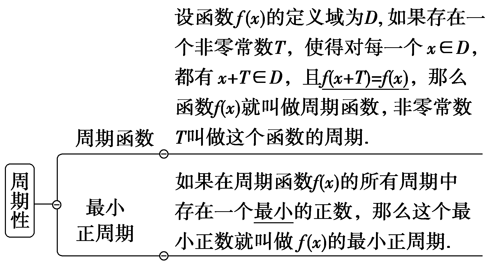
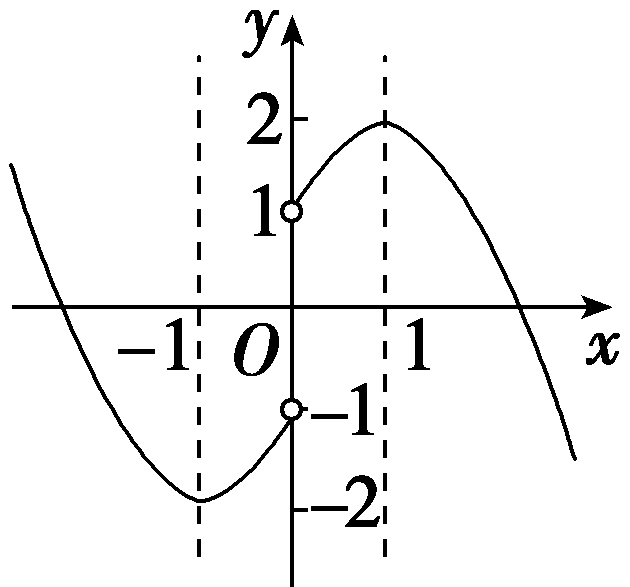
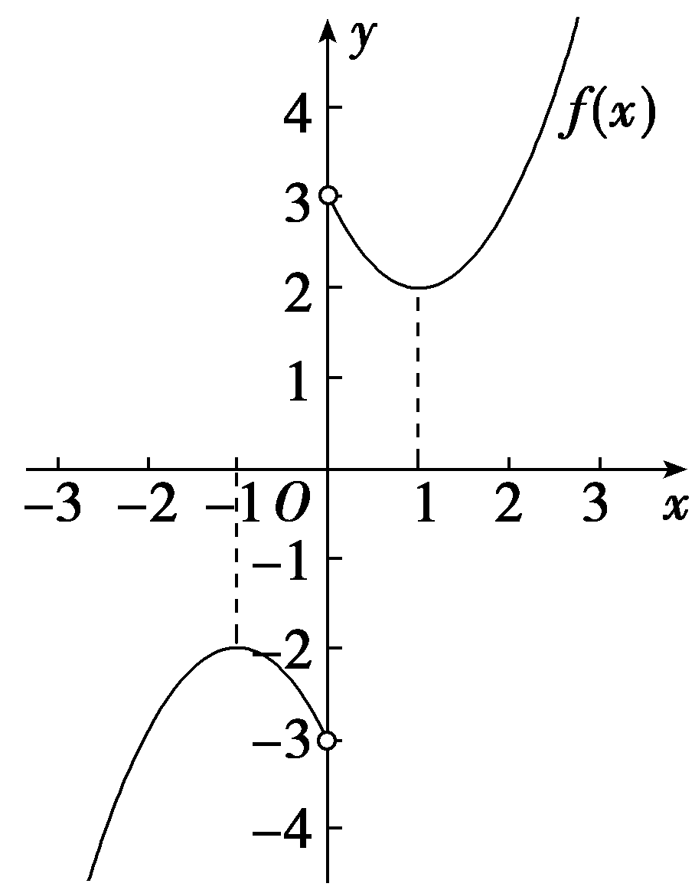

第三节　函数的奇偶性、周期性

【课标研读】　1.结合具体函数，了解奇偶性的概念和几何意义.　2.会运用函数图象理解和研究函数的奇偶性.　3.结合三角函数了解周期性的概念和几何意义，会判断、应用简单函数的周期性解决问题.

##### 1.函数的奇偶性

<table><tr><td>
奇偶性
</td><td>
偶函数
</td><td>
奇函数
</td></tr><tr><td>
前提
</td><td colspan="2">
函数定义域关于原点对称
</td></tr><tr><td>
定义
</td><td>
一般地，设函数<em>f</em>(<em>x</em>)的定义域为<em>D</em>，如果∀<em>x</em>∈<em>D</em>，都有－<em>x</em>∈<em>D</em>，且<em>f</em>(－<em>x</em>)＝<em>f</em>(<em>x</em>)，那么函数<em>f</em>(<em>x</em>)就叫做偶函数
</td><td>
一般地，设函数<em>f</em>(<em>x</em>)的定义域为<em>D</em>，如果∀<em>x</em>∈<em>D</em>，都有－<em>x</em>∈<em>D</em>，且<em>f</em>(－<em>x</em>)＝－<em>f</em>(<em>x</em>)，那么函数<em>f</em>(<em>x</em>)就叫做奇函数
</td></tr><tr><td>
图象

特点
</td><td>
关于<em>y</em>轴对称
</td><td>
关于原点对称
</td></tr><tr><td>
等价

形式
</td><td>
<em>f</em>(－<em>x</em>)＝<em>f</em>(<em>x</em>)⇔<em>f</em>(－<em>x</em>)－<em>f</em>(<em>x</em>)＝0⇔1(<em>f</em>(<em>x</em>)≠0)
</td><td>
<em>f</em>(－<em>x</em>)＝－<em>f</em>(<em>x</em>)⇔<em>f</em>(－<em>x</em>)＋<em>f</em>(<em>x</em>)＝0⇔－1(<em>f</em>(<em>x</em>)≠0)
</td></tr></table>

##### 2.函数的周期性

【常用结论】

（1）函数奇偶性的常用结论

①如果函数*f*(*x*)是奇函数且在*x*＝0处有定义，那么*f*（0）＝0；

如果函数*f*(*x*)是偶函数，那么*f*(*x*)＝*f*(｜*x*｜).

②单调性与奇偶性的关系.奇函数在关于原点对称的区间上具有相同的单调性，即奇增增或奇减减；偶函数在关于原点对称的区间上具有相反的单调性，即偶增减或偶减增.

③在公共定义域内有：奇±奇＝奇，偶±偶＝偶，奇×奇＝偶，偶×偶＝偶，奇×偶＝奇.

④若*y*＝*f*(*x*＋*a*)是奇函数，则*f*(－*x*＋*a*)＝－*f*(*x*＋*a*)；若*y*＝*f*(*x*＋*a*)是偶函数，则*f*(－*x*＋*a*)＝*f*(*x*＋*a*).

（2）函数周期性的常用结论

对*f*(*x*)定义域内任一自变量的值*x*：

①若*f*(*x*＋*a*)＝－*f*(*x*)，则*T*＝2*a*(*a*＞0).

②若<te<text style="it<text style="it<text style="it*a*lic">a</text>lic">a</text>lic">x</text>t style="italic">f</text>(x＋a) $＝\frac{1}{f(x)}$ ，则<text style="it<text style="it*a*lic">a</text>lic">T</text>＝2*a*(a＞0).

③若<te<text style="it<text style="it<text style="it*a*lic">a</text>lic">a</text>lic">x</text>t style="italic">f</text>(x＋a)＝－ $\frac{1}{f(x)}$ ，则<text style="it<text style="it*a*lic">a</text>lic">T</text>＝2*a*(a＞0).

（3）常见奇、偶函数的类型

①&lt;te&lt;te&lt;te&lt;te&lt;te&lt;te&lt;te&lt;text style="it&lt;text style="it<em>a</em>lic"&gt;a&lt;/text&gt;lic"&gt;x&lt;/text&gt;t style="it&lt;text style="it<em>a</em>lic"&gt;a&lt;/text&gt;lic,superscript"&gt;x&lt;/text&gt;t style="it<em>a</em>lic,superscript"&gt;x&lt;/text&gt;t style="it<em>a</em>lic"&gt;x&lt;/text&gt;t style="it&lt;text style="it<em>a</em>lic"&gt;a&lt;/text&gt;lic,superscript"&gt;x&lt;/text&gt;t style="it<em>a</em>lic,superscript"&gt;x&lt;/text&gt;t style="it<em>a</em>lic"&gt;x&lt;/text&gt;t style="italic"&gt;<em>&lt;text style="italic"&gt;f</em>&lt;/text&gt;&lt;/text&gt;(x)＝ax＋a&lt;text style="superscript"&gt;－&lt;/text&gt;x(a＞0且a≠1)为偶函数；f(x)＝ax－a－x(a＞0且a≠1)，f(x) $＝\frac{a^{x}－a^{－x}}{a^{x}＋a^{－x}}＝\frac{a^{2x}－1}{a^{2x}+1}$ (&lt;te&lt;te&lt;te&lt;te&lt;te&lt;te&lt;text style="it&lt;text style="it<em>a</em>lic"&gt;a&lt;/text&gt;lic"&gt;x&lt;/text&gt;t style="it&lt;text style="it<em>a</em>lic"&gt;a&lt;/text&gt;lic,superscript"&gt;x&lt;/text&gt;t style="it<em>a</em>lic,superscript"&gt;x&lt;/text&gt;t style="it<em>a</em>lic"&gt;x&lt;/text&gt;t style="it&lt;text style="it<em>a</em>lic"&gt;a&lt;/text&gt;lic,superscript"&gt;x&lt;/text&gt;t style="it<em>a</em>lic,superscript"&gt;x&lt;/text&gt;t style="italic"&gt;a&lt;/text&gt;＞0且a≠1)为奇函数.

②&lt;te&lt;te&lt;te&lt;te&lt;te&lt;te&lt;text style="it&lt;text style="it<em>a</em>lic"&gt;a&lt;/text&gt;lic"&gt;x&lt;/text&gt;t style="it<em>a</em>lic"&gt;x&lt;/text&gt;t style="it<em>a</em>lic"&gt;x&lt;/text&gt;t style="italic"&gt;x&lt;/text&gt;t style="it&lt;text style="italic,su<em>b</em>script"&gt;a&lt;/text&gt;lic"&gt;x&lt;/text&gt;t style="it&lt;text style="italic,su<em>b</em>script"&gt;a&lt;/text&gt;lic"&gt;x&lt;/text&gt;t style="italic"&gt;<em>&lt;text style="italic"&gt;f</em>&lt;/text&gt;&lt;/text&gt;(x)＝loga(b＋x)＋loga(b－x) $\left(a>0且a\ne 1，b\ne 0\right)$ 为偶函数；&lt;te&lt;te&lt;te&lt;te&lt;te&lt;te&lt;text style="it&lt;text style="it<em>a</em>lic"&gt;a&lt;/text&gt;lic"&gt;x&lt;/text&gt;t style="it<em>a</em>lic"&gt;x&lt;/text&gt;t style="it<em>a</em>lic"&gt;x&lt;/text&gt;t style="italic"&gt;x&lt;/text&gt;t style="it&lt;text style="italic,su<em>b</em>script"&gt;a&lt;/text&gt;lic"&gt;x&lt;/text&gt;t style="it&lt;text style="italic,su<em>b</em>script"&gt;a&lt;/text&gt;lic"&gt;x&lt;/text&gt;t style="italic"&gt;<em>&lt;text style="italic"&gt;f</em>&lt;/text&gt;&lt;/text&gt;(x)＝loga $\frac{b－x}{b＋x}\left(a>0且a\ne 1，b\ne 0\right)$ ，&lt;te&lt;te&lt;te&lt;te&lt;te&lt;te&lt;text style="it&lt;text style="it<em>a</em>lic"&gt;a&lt;/text&gt;lic"&gt;x&lt;/text&gt;t style="it<em>a</em>lic"&gt;x&lt;/text&gt;t style="it<em>a</em>lic"&gt;x&lt;/text&gt;t style="italic"&gt;x&lt;/text&gt;t style="it&lt;text style="italic,su<em>b</em>script"&gt;a&lt;/text&gt;lic"&gt;x&lt;/text&gt;t style="it&lt;text style="italic,su<em>b</em>script"&gt;a&lt;/text&gt;lic"&gt;x&lt;/text&gt;t style="italic"&gt;<em>&lt;text style="italic"&gt;f</em>&lt;/text&gt;&lt;/text&gt;(x)＝loga( $\sqrt{x^{2}+1}$ ±&lt;te&lt;te&lt;te&lt;te&lt;te&lt;text style="it&lt;text style="it<em>a</em>lic"&gt;a&lt;/text&gt;lic"&gt;x&lt;/text&gt;t style="it<em>a</em>lic"&gt;x&lt;/text&gt;t style="it<em>a</em>lic"&gt;x&lt;/text&gt;t style="italic"&gt;x&lt;/text&gt;t style="it&lt;text style="italic,su<em>b</em>script"&gt;a&lt;/text&gt;lic"&gt;x&lt;/text&gt;t style="it&lt;text style="italic,su<em>b</em>script"&gt;a&lt;/text&gt;lic"&gt;x&lt;/text&gt;)(a＞0且a≠1)为奇函数.

③*f*(*x*)＝｜*ax*＋*b*｜＋｜*ax*－*b*｜为偶函数；*f*(*x*)＝｜*ax*＋*b*｜－｜*ax*－*b*｜为奇函数.

【自主检测】

##### 1.(多选)下列结论错误的是(　　)

$\quad$A.若函数*f*(*x*)为奇函数，则*f*（0）＝0

$\quad$B.不存在既是奇函数，又是偶函数的函数

$\quad$C.对于函数*y*＝*f*(*x*)，若存在*x*，使*f*(－*x*)＝－*f*(*x*)，则函数*y*＝*f*(*x*)一定是奇函数

$\quad$D.若<em>T</em>是函数<em>f</em>(<em>x</em>)的一个周期，则<em>kT</em>(<em>k</em>∈<strong>N</strong><em>\*</em>)也是函数的一个周期

答案ABC

##### 2.若偶函数*f*(*x*)在区间[－2，－1]上单调递减，则函数*f*(*x*)在区间[1，2]上(　　)

$\quad$A.单调递增，且有最小值*f*（1）

$\quad$B.单调递增，且有最大值*f*（1）

$\quad$C.单调递减，且有最小值*f*（2）

$\quad$D.单调递减，且有最大值*f*（2）

答案A

解析偶函数*f*(*x*)在区间[－2，－1]上单调递减，由偶函数的图象关于*y*轴对称，则有*f*(*x*)在[1，2]上单调递增，即有最小值为*f*（1），最大值为*f*（2）.故A正确.

##### 3.(多选)(链接人教A必修一P84例6)下列函数中为偶函数的是(　　)

$\quad$A.<te<te<te*x*t style="italic">x</text>t style="italic">x</text>t style="italic">*f*</text>(x)＝x＋ $\frac{1}{x}$ 	
$\quad$B.<te<te<te*x*t style="italic">x</text>t style="italic">x</text>t style="italic">*f*</text>(x) $＝\frac{1}{x^{2}}$

$\quad$C.<em>f</em>(<em>x</em>)＝｜ln <em>x</em>｜	
$\quad$D.<em>f</em>(<em>x</em>)＝2｜<em>x</em>｜

答案BD

解析对于A，&lt;te&lt;te&lt;te&lt;te&lt;te&lt;te&lt;te&lt;te&lt;te&lt;te&lt;te&lt;te<em>x</em>t style="italic,superscript"&gt;x&lt;/text&gt;t style="italic,superscript"&gt;x&lt;/text&gt;t style="italic"&gt;x&lt;/text&gt;t style="italic"&gt;x&lt;/text&gt;t style="italic"&gt;x&lt;/text&gt;t style="italic"&gt;x&lt;/text&gt;t style="italic"&gt;x&lt;/text&gt;t style="italic"&gt;x&lt;/text&gt;t style="italic"&gt;x&lt;/text&gt;t style="italic"&gt;x&lt;/text&gt;t style="italic"&gt;x&lt;/text&gt;t style="italic"&gt;<em>&lt;text style="italic"&gt;&lt;text style="italic"&gt;&lt;text style="italic"&gt;&lt;text style="italic"&gt;&lt;text style="italic"&gt;f</em>&lt;/text&gt;&lt;/text&gt;&lt;/text&gt;&lt;/text&gt;&lt;/text&gt;&lt;/text&gt;(－x)＝－x－ $\frac{1}{x}＝$ －&lt;te&lt;te&lt;te&lt;te&lt;te&lt;te&lt;te&lt;te&lt;te&lt;te&lt;te&lt;te<em>x</em>t style="italic,superscript"&gt;x&lt;/text&gt;t style="italic,superscript"&gt;x&lt;/text&gt;t style="italic"&gt;x&lt;/text&gt;t style="italic"&gt;x&lt;/text&gt;t style="italic"&gt;x&lt;/text&gt;t style="italic"&gt;x&lt;/text&gt;t style="italic"&gt;x&lt;/text&gt;t style="italic"&gt;x&lt;/text&gt;t style="italic"&gt;x&lt;/text&gt;t style="italic"&gt;x&lt;/text&gt;t style="italic"&gt;x&lt;/text&gt;t style="italic"&gt;<em>&lt;text style="italic"&gt;&lt;text style="italic"&gt;&lt;text style="italic"&gt;&lt;text style="italic"&gt;&lt;text style="italic"&gt;f</em>&lt;/text&gt;&lt;/text&gt;&lt;/text&gt;&lt;/text&gt;&lt;/text&gt;&lt;/text&gt;(x)，为奇函数；对于B，f(－x) $＝\frac{1}{(-x)^{2}}＝\frac{1}{x^{2}}＝$ &lt;te&lt;te&lt;te&lt;te&lt;te&lt;te&lt;te&lt;te&lt;te&lt;te&lt;te&lt;te<em>x</em>t style="italic,superscript"&gt;x&lt;/text&gt;t style="italic,superscript"&gt;x&lt;/text&gt;t style="italic"&gt;x&lt;/text&gt;t style="italic"&gt;x&lt;/text&gt;t style="italic"&gt;x&lt;/text&gt;t style="italic"&gt;x&lt;/text&gt;t style="italic"&gt;x&lt;/text&gt;t style="italic"&gt;x&lt;/text&gt;t style="italic"&gt;x&lt;/text&gt;t style="italic"&gt;x&lt;/text&gt;t style="italic"&gt;x&lt;/text&gt;t style="italic"&gt;<em>&lt;text style="italic"&gt;&lt;text style="italic"&gt;&lt;text style="italic"&gt;&lt;text style="italic"&gt;&lt;text style="italic"&gt;f</em>&lt;/text&gt;&lt;/text&gt;&lt;/text&gt;&lt;/text&gt;&lt;/text&gt;&lt;/text&gt;(x)，为偶函数；对于C，f(x)的定义域为{x&lt;text style="superscript"&gt;&lt;text style="superscript"&gt;｜&lt;/text&gt;&lt;/text&gt;x＞0}，不关于原点对称，为非奇非偶函数；对于D，f(－x)＝2｜－x｜＝2｜x｜＝f(x)，为偶函数.故选BD.

##### 4.(链接人教A必修一P214T15)已知<em>f</em>(<em>x</em>)是定义在<strong>R</strong>上的周期为3的奇函数，且<em>f</em>(－1)＝2<em>f</em>（10）＋3，则<em>f</em>(2 024)＋<em>f</em>(2 025)＋<em>f</em>(2 026)＝<u>　　　　</u>.

答案0

解析由题意知*f*（0）＝0，*f*（10）＝*f*(3×3＋1)＝*f*（1），又*f*(－1)＝2*f*（10）＋3，且*f*(－1)＝－*f*（1），所以*f*(－1)＝2*f*（1）＋3，所以－3*f*（1）＝3，即*f*（1）＝－1.所以*f*(2 024)＝*f*(675×3－1)＝*f*(－1)＝1，*f*(2 025)＝*f*(675×3)＝*f*（0）＝0，*f*(2 026)＝*f*(675×3＋1)＝*f*（1）＝－1，所以*f*(2 024)＋*f*(2 025)＋*f*(2 026)＝1＋0－1＝0.

考点一　函数奇偶性的判断　　　　自主练透

##### 1.(2024·天津卷)下列函数是偶函数的是(　　)

$\quad$A.<te<te*x*t style="italic">x</text>t style="italic">*f*</text>(x) $＝\frac{e^{x}－x^{2}}{x^{2}+1}$ 	
$\quad$B.<te<te*x*t style="italic">x</text>t style="italic">*f*</text>(x) $＝\frac{cosx＋x^{2}}{x^{2}+1}$

$\quad$C.<te<te*x*t style="italic">x</text>t style="italic">*f*</text>(x) $＝\frac{e^{x}－x}{x+1}$ 	
$\quad$D.<te<te*x*t style="italic">x</text>t style="italic">*f*</text>(x) $＝\frac{sinx+4x}{e^{\left|x\right|}}$

答案B

解析对于A，<em>&lt;text style="italic"&gt;&lt;text style="italic"&gt;&lt;text style="italic"&gt;&lt;text style="italic"&gt;&lt;text style="italic"&gt;&lt;text style="italic"&gt;&lt;text style="italic"&gt;&lt;text style="italic"&gt;&lt;text style="italic"&gt;&lt;text style="italic"&gt;&lt;text style="italic"&gt;&lt;text style="italic"&gt;&lt;text style="italic"&gt;&lt;text style="italic"&gt;&lt;text style="italic"&gt;&lt;text style="italic"&gt;f</em>&lt;/text&gt;&lt;/text&gt;&lt;/text&gt;&lt;/text&gt;&lt;/text&gt;&lt;/text&gt;&lt;/text&gt;&lt;/text&gt;&lt;/text&gt;&lt;/text&gt;&lt;/text&gt;&lt;/text&gt;&lt;/text&gt;&lt;/text&gt;&lt;/text&gt;&lt;/text&gt; $\left(x\right)＝\frac{e^{x}－x^{2}}{x^{2}+1}$ ，函数定义域为<strong>&lt;text style="bold"&gt;&lt;text style="bold"&gt;R</strong>&lt;/text&gt;&lt;/text&gt;，但<em>&lt;text style="italic"&gt;&lt;text style="italic"&gt;&lt;text style="italic"&gt;&lt;text style="italic"&gt;&lt;text style="italic"&gt;&lt;text style="italic"&gt;&lt;text style="italic"&gt;&lt;text style="italic"&gt;&lt;text style="italic"&gt;&lt;text style="italic"&gt;&lt;text style="italic"&gt;&lt;text style="italic"&gt;&lt;text style="italic"&gt;&lt;text style="italic"&gt;&lt;text style="italic"&gt;&lt;text style="italic"&gt;f</em>&lt;/text&gt;&lt;/text&gt;&lt;/text&gt;&lt;/text&gt;&lt;/text&gt;&lt;/text&gt;&lt;/text&gt;&lt;/text&gt;&lt;/text&gt;&lt;/text&gt;&lt;/text&gt;&lt;/text&gt;&lt;/text&gt;&lt;/text&gt;&lt;/text&gt;&lt;/text&gt; $\left(－1\right)＝\frac{e^{－1}－1}{2}$ ，<em>&lt;text style="italic"&gt;&lt;text style="italic"&gt;&lt;text style="italic"&gt;&lt;text style="italic"&gt;&lt;text style="italic"&gt;&lt;text style="italic"&gt;&lt;text style="italic"&gt;&lt;text style="italic"&gt;&lt;text style="italic"&gt;&lt;text style="italic"&gt;&lt;text style="italic"&gt;&lt;text style="italic"&gt;&lt;text style="italic"&gt;&lt;text style="italic"&gt;&lt;text style="italic"&gt;&lt;text style="italic"&gt;f</em>&lt;/text&gt;&lt;/text&gt;&lt;/text&gt;&lt;/text&gt;&lt;/text&gt;&lt;/text&gt;&lt;/text&gt;&lt;/text&gt;&lt;/text&gt;&lt;/text&gt;&lt;/text&gt;&lt;/text&gt;&lt;/text&gt;&lt;/text&gt;&lt;/text&gt;&lt;/text&gt; $\left(1\right)＝\frac{e－1}{2}$ ，则<em>&lt;text style="italic"&gt;&lt;text style="italic"&gt;&lt;text style="italic"&gt;&lt;text style="italic"&gt;&lt;text style="italic"&gt;&lt;text style="italic"&gt;&lt;text style="italic"&gt;&lt;text style="italic"&gt;&lt;text style="italic"&gt;&lt;text style="italic"&gt;&lt;text style="italic"&gt;&lt;text style="italic"&gt;&lt;text style="italic"&gt;&lt;text style="italic"&gt;&lt;text style="italic"&gt;&lt;text style="italic"&gt;f</em>&lt;/text&gt;&lt;/text&gt;&lt;/text&gt;&lt;/text&gt;&lt;/text&gt;&lt;/text&gt;&lt;/text&gt;&lt;/text&gt;&lt;/text&gt;&lt;/text&gt;&lt;/text&gt;&lt;/text&gt;&lt;/text&gt;&lt;/text&gt;&lt;/text&gt;&lt;/text&gt; $\left(－1\right)$ ≠<em>&lt;text style="italic"&gt;&lt;text style="italic"&gt;&lt;text style="italic"&gt;&lt;text style="italic"&gt;&lt;text style="italic"&gt;&lt;text style="italic"&gt;&lt;text style="italic"&gt;&lt;text style="italic"&gt;&lt;text style="italic"&gt;&lt;text style="italic"&gt;&lt;text style="italic"&gt;&lt;text style="italic"&gt;&lt;text style="italic"&gt;&lt;text style="italic"&gt;&lt;text style="italic"&gt;&lt;text style="italic"&gt;f</em>&lt;/text&gt;&lt;/text&gt;&lt;/text&gt;&lt;/text&gt;&lt;/text&gt;&lt;/text&gt;&lt;/text&gt;&lt;/text&gt;&lt;/text&gt;&lt;/text&gt;&lt;/text&gt;&lt;/text&gt;&lt;/text&gt;&lt;/text&gt;&lt;/text&gt;&lt;/text&gt; $\left(1\right)$ ，故A错误；对于B，<em>&lt;text style="italic"&gt;&lt;text style="italic"&gt;&lt;text style="italic"&gt;&lt;text style="italic"&gt;&lt;text style="italic"&gt;&lt;text style="italic"&gt;&lt;text style="italic"&gt;&lt;text style="italic"&gt;&lt;text style="italic"&gt;&lt;text style="italic"&gt;&lt;text style="italic"&gt;&lt;text style="italic"&gt;&lt;text style="italic"&gt;&lt;text style="italic"&gt;&lt;text style="italic"&gt;&lt;text style="italic"&gt;f</em>&lt;/text&gt;&lt;/text&gt;&lt;/text&gt;&lt;/text&gt;&lt;/text&gt;&lt;/text&gt;&lt;/text&gt;&lt;/text&gt;&lt;/text&gt;&lt;/text&gt;&lt;/text&gt;&lt;/text&gt;&lt;/text&gt;&lt;/text&gt;&lt;/text&gt;&lt;/text&gt; $\left(x\right)＝\frac{cosx＋x^{2}}{x^{2}＋1}$ ，函数定义域为<strong>&lt;text style="bold"&gt;&lt;text style="bold"&gt;R</strong>&lt;/text&gt;&lt;/text&gt;，且<em>&lt;text style="italic"&gt;&lt;text style="italic"&gt;&lt;text style="italic"&gt;&lt;text style="italic"&gt;&lt;text style="italic"&gt;&lt;text style="italic"&gt;&lt;text style="italic"&gt;&lt;text style="italic"&gt;&lt;text style="italic"&gt;&lt;text style="italic"&gt;&lt;text style="italic"&gt;&lt;text style="italic"&gt;&lt;text style="italic"&gt;&lt;text style="italic"&gt;&lt;text style="italic"&gt;&lt;text style="italic"&gt;f</em>&lt;/text&gt;&lt;/text&gt;&lt;/text&gt;&lt;/text&gt;&lt;/text&gt;&lt;/text&gt;&lt;/text&gt;&lt;/text&gt;&lt;/text&gt;&lt;/text&gt;&lt;/text&gt;&lt;/text&gt;&lt;/text&gt;&lt;/text&gt;&lt;/text&gt;&lt;/text&gt; $\left(－x\right)＝\frac{cos\left(－x\right)＋\left(－x\right)^{2}}{\left(－x\right)^{2}+1}＝\frac{cosx＋x^{2}}{x^{2}+1}＝$ <em>&lt;text style="italic"&gt;&lt;text style="italic"&gt;&lt;text style="italic"&gt;&lt;text style="italic"&gt;&lt;text style="italic"&gt;&lt;text style="italic"&gt;&lt;text style="italic"&gt;&lt;text style="italic"&gt;&lt;text style="italic"&gt;&lt;text style="italic"&gt;&lt;text style="italic"&gt;&lt;text style="italic"&gt;&lt;text style="italic"&gt;&lt;text style="italic"&gt;&lt;text style="italic"&gt;&lt;text style="italic"&gt;f</em>&lt;/text&gt;&lt;/text&gt;&lt;/text&gt;&lt;/text&gt;&lt;/text&gt;&lt;/text&gt;&lt;/text&gt;&lt;/text&gt;&lt;/text&gt;&lt;/text&gt;&lt;/text&gt;&lt;/text&gt;&lt;/text&gt;&lt;/text&gt;&lt;/text&gt;&lt;/text&gt; $\left(x\right)$ ，则<em>&lt;text style="italic"&gt;&lt;text style="italic"&gt;&lt;text style="italic"&gt;&lt;text style="italic"&gt;&lt;text style="italic"&gt;&lt;text style="italic"&gt;&lt;text style="italic"&gt;&lt;text style="italic"&gt;&lt;text style="italic"&gt;&lt;text style="italic"&gt;&lt;text style="italic"&gt;&lt;text style="italic"&gt;&lt;text style="italic"&gt;&lt;text style="italic"&gt;&lt;text style="italic"&gt;&lt;text style="italic"&gt;f</em>&lt;/text&gt;&lt;/text&gt;&lt;/text&gt;&lt;/text&gt;&lt;/text&gt;&lt;/text&gt;&lt;/text&gt;&lt;/text&gt;&lt;/text&gt;&lt;/text&gt;&lt;/text&gt;&lt;/text&gt;&lt;/text&gt;&lt;/text&gt;&lt;/text&gt;&lt;/text&gt; $\left(x\right)$ 为偶函数，故B正确；对于C，<em>&lt;text style="italic"&gt;&lt;text style="italic"&gt;&lt;text style="italic"&gt;&lt;text style="italic"&gt;&lt;text style="italic"&gt;&lt;text style="italic"&gt;&lt;text style="italic"&gt;&lt;text style="italic"&gt;&lt;text style="italic"&gt;&lt;text style="italic"&gt;&lt;text style="italic"&gt;&lt;text style="italic"&gt;&lt;text style="italic"&gt;&lt;text style="italic"&gt;&lt;text style="italic"&gt;&lt;text style="italic"&gt;f</em>&lt;/text&gt;&lt;/text&gt;&lt;/text&gt;&lt;/text&gt;&lt;/text&gt;&lt;/text&gt;&lt;/text&gt;&lt;/text&gt;&lt;/text&gt;&lt;/text&gt;&lt;/text&gt;&lt;/text&gt;&lt;/text&gt;&lt;/text&gt;&lt;/text&gt;&lt;/text&gt; $\left(x\right)＝\frac{e^{x}－x}{x+1}$ ，函数定义域为 $\left\{x｜x\ne －1\right\}$ ，不关于原点对称，则<em>&lt;text style="italic"&gt;&lt;text style="italic"&gt;&lt;text style="italic"&gt;&lt;text style="italic"&gt;&lt;text style="italic"&gt;&lt;text style="italic"&gt;&lt;text style="italic"&gt;&lt;text style="italic"&gt;&lt;text style="italic"&gt;&lt;text style="italic"&gt;&lt;text style="italic"&gt;&lt;text style="italic"&gt;&lt;text style="italic"&gt;&lt;text style="italic"&gt;&lt;text style="italic"&gt;&lt;text style="italic"&gt;f</em>&lt;/text&gt;&lt;/text&gt;&lt;/text&gt;&lt;/text&gt;&lt;/text&gt;&lt;/text&gt;&lt;/text&gt;&lt;/text&gt;&lt;/text&gt;&lt;/text&gt;&lt;/text&gt;&lt;/text&gt;&lt;/text&gt;&lt;/text&gt;&lt;/text&gt;&lt;/text&gt; $\left(x\right)$ 不是偶函数，故C错误；对于D，<em>&lt;text style="italic"&gt;&lt;text style="italic"&gt;&lt;text style="italic"&gt;&lt;text style="italic"&gt;&lt;text style="italic"&gt;&lt;text style="italic"&gt;&lt;text style="italic"&gt;&lt;text style="italic"&gt;&lt;text style="italic"&gt;&lt;text style="italic"&gt;&lt;text style="italic"&gt;&lt;text style="italic"&gt;&lt;text style="italic"&gt;&lt;text style="italic"&gt;&lt;text style="italic"&gt;&lt;text style="italic"&gt;f</em>&lt;/text&gt;&lt;/text&gt;&lt;/text&gt;&lt;/text&gt;&lt;/text&gt;&lt;/text&gt;&lt;/text&gt;&lt;/text&gt;&lt;/text&gt;&lt;/text&gt;&lt;/text&gt;&lt;/text&gt;&lt;/text&gt;&lt;/text&gt;&lt;/text&gt;&lt;/text&gt; $\left(x\right)＝\frac{sinx+4x}{e^{\left|x\right|}}$ ，函数定义域为<strong>&lt;text style="bold"&gt;&lt;text style="bold"&gt;R</strong>&lt;/text&gt;&lt;/text&gt;，因为<em>&lt;text style="italic"&gt;&lt;text style="italic"&gt;&lt;text style="italic"&gt;&lt;text style="italic"&gt;&lt;text style="italic"&gt;&lt;text style="italic"&gt;&lt;text style="italic"&gt;&lt;text style="italic"&gt;&lt;text style="italic"&gt;&lt;text style="italic"&gt;&lt;text style="italic"&gt;&lt;text style="italic"&gt;&lt;text style="italic"&gt;&lt;text style="italic"&gt;&lt;text style="italic"&gt;&lt;text style="italic"&gt;f</em>&lt;/text&gt;&lt;/text&gt;&lt;/text&gt;&lt;/text&gt;&lt;/text&gt;&lt;/text&gt;&lt;/text&gt;&lt;/text&gt;&lt;/text&gt;&lt;/text&gt;&lt;/text&gt;&lt;/text&gt;&lt;/text&gt;&lt;/text&gt;&lt;/text&gt;&lt;/text&gt; $\left(1\right)＝\frac{sin1+4}{e}$ ，<em>&lt;text style="italic"&gt;&lt;text style="italic"&gt;&lt;text style="italic"&gt;&lt;text style="italic"&gt;&lt;text style="italic"&gt;&lt;text style="italic"&gt;&lt;text style="italic"&gt;&lt;text style="italic"&gt;&lt;text style="italic"&gt;&lt;text style="italic"&gt;&lt;text style="italic"&gt;&lt;text style="italic"&gt;&lt;text style="italic"&gt;&lt;text style="italic"&gt;&lt;text style="italic"&gt;&lt;text style="italic"&gt;f</em>&lt;/text&gt;&lt;/text&gt;&lt;/text&gt;&lt;/text&gt;&lt;/text&gt;&lt;/text&gt;&lt;/text&gt;&lt;/text&gt;&lt;/text&gt;&lt;/text&gt;&lt;/text&gt;&lt;/text&gt;&lt;/text&gt;&lt;/text&gt;&lt;/text&gt;&lt;/text&gt; $\left(－1\right)＝\frac{－sin1－4}{e}$ ，则<em>&lt;text style="italic"&gt;&lt;text style="italic"&gt;&lt;text style="italic"&gt;&lt;text style="italic"&gt;&lt;text style="italic"&gt;&lt;text style="italic"&gt;&lt;text style="italic"&gt;&lt;text style="italic"&gt;&lt;text style="italic"&gt;&lt;text style="italic"&gt;&lt;text style="italic"&gt;&lt;text style="italic"&gt;&lt;text style="italic"&gt;&lt;text style="italic"&gt;&lt;text style="italic"&gt;&lt;text style="italic"&gt;f</em>&lt;/text&gt;&lt;/text&gt;&lt;/text&gt;&lt;/text&gt;&lt;/text&gt;&lt;/text&gt;&lt;/text&gt;&lt;/text&gt;&lt;/text&gt;&lt;/text&gt;&lt;/text&gt;&lt;/text&gt;&lt;/text&gt;&lt;/text&gt;&lt;/text&gt;&lt;/text&gt; $\left(1\right)$ ≠<em>&lt;text style="italic"&gt;&lt;text style="italic"&gt;&lt;text style="italic"&gt;&lt;text style="italic"&gt;&lt;text style="italic"&gt;&lt;text style="italic"&gt;&lt;text style="italic"&gt;&lt;text style="italic"&gt;&lt;text style="italic"&gt;&lt;text style="italic"&gt;&lt;text style="italic"&gt;&lt;text style="italic"&gt;&lt;text style="italic"&gt;&lt;text style="italic"&gt;&lt;text style="italic"&gt;&lt;text style="italic"&gt;f</em>&lt;/text&gt;&lt;/text&gt;&lt;/text&gt;&lt;/text&gt;&lt;/text&gt;&lt;/text&gt;&lt;/text&gt;&lt;/text&gt;&lt;/text&gt;&lt;/text&gt;&lt;/text&gt;&lt;/text&gt;&lt;/text&gt;&lt;/text&gt;&lt;/text&gt;&lt;/text&gt; $\left(－1\right)$ ，则<em>&lt;text style="italic"&gt;&lt;text style="italic"&gt;&lt;text style="italic"&gt;&lt;text style="italic"&gt;&lt;text style="italic"&gt;&lt;text style="italic"&gt;&lt;text style="italic"&gt;&lt;text style="italic"&gt;&lt;text style="italic"&gt;&lt;text style="italic"&gt;&lt;text style="italic"&gt;&lt;text style="italic"&gt;&lt;text style="italic"&gt;&lt;text style="italic"&gt;&lt;text style="italic"&gt;&lt;text style="italic"&gt;f</em>&lt;/text&gt;&lt;/text&gt;&lt;/text&gt;&lt;/text&gt;&lt;/text&gt;&lt;/text&gt;&lt;/text&gt;&lt;/text&gt;&lt;/text&gt;&lt;/text&gt;&lt;/text&gt;&lt;/text&gt;&lt;/text&gt;&lt;/text&gt;&lt;/text&gt;&lt;/text&gt; $\left(x\right)$ 不是偶函数，故D错误.故选B.

##### 2.(多选)下列函数是奇函数的是(　　)

$\quad$A.<em>f</em>(<em>x</em>)＝tan <em>x</em>	
$\quad$B.<em>f</em>(<em>x</em>)＝<em>x</em>2＋<em>x</em>

$\quad$C.<te<te<te*x*t style="italic">x</text>t style="italic">x</text>t style="italic">*f*</text>(x) $＝\frac{e^{x}－e^{－x}}{2}$ 	
$\quad$D.<te<te<te*x*t style="italic">x</text>t style="italic">x</text>t style="italic">*f*</text>(x)＝ln ｜1＋x｜

答案AC

解析对于A，函数的定义域为{&lt;te&lt;te&lt;te&lt;te&lt;te&lt;te&lt;te&lt;te&lt;te&lt;te&lt;te&lt;te&lt;te<em>x</em>t style="italic"&gt;x&lt;/text&gt;t style="italic"&gt;x&lt;/text&gt;t style="italic"&gt;x&lt;/text&gt;t style="italic"&gt;x&lt;/text&gt;t style="italic"&gt;x&lt;/text&gt;t style="italic"&gt;x&lt;/text&gt;t style="italic"&gt;x&lt;/text&gt;t style="italic"&gt;x&lt;/text&gt;t style="italic"&gt;x&lt;/text&gt;t style="italic"&gt;x&lt;/text&gt;t style="italic"&gt;x&lt;/text&gt;t style="italic"&gt;x&lt;/text&gt;t style="italic"&gt;x&lt;/text&gt;｜x≠ $\frac{\pi }{2}$ ＋&lt;te&lt;te&lt;te&lt;te&lt;te&lt;te&lt;te&lt;te&lt;te&lt;te&lt;te&lt;te<em>x</em>t style="italic"&gt;x&lt;/text&gt;t style="italic"&gt;x&lt;/text&gt;t style="italic"&gt;x&lt;/text&gt;t style="italic"&gt;x&lt;/text&gt;t style="italic"&gt;x&lt;/text&gt;t style="italic"&gt;x&lt;/text&gt;t style="italic"&gt;x&lt;/text&gt;t style="italic"&gt;x&lt;/text&gt;t style="italic"&gt;x&lt;/text&gt;t style="italic"&gt;x&lt;/text&gt;t style="italic"&gt;x&lt;/text&gt;t style="italic"&gt;<em>k</em>&lt;/text&gt;π，k∈<strong>Z</strong>}，关于原点对称，<em>&lt;text style="italic"&gt;&lt;text style="italic"&gt;&lt;text style="italic"&gt;&lt;text style="italic"&gt;&lt;text style="italic"&gt;f</em>&lt;/text&gt;&lt;/text&gt;&lt;/text&gt;&lt;/text&gt;&lt;/text&gt;(－&lt;te<em>x</em>t style="italic"&gt;x&lt;/text&gt;)＝tan(－x)＝－tan x＝－f(x)，故函数为奇函数，符合题意；对于B，函数的定义域为<strong>&lt;text style="bold"&gt;R</strong>&lt;/text&gt;，关于原点对称，f(－x)＝x2－x≠±f(x)，故函数为非奇非偶函数，不符合题意；对于C，函数的定义域为R，关于原点对称，且f(－x) $＝\frac{e^{－x}－e^{x}}{2}＝$ －&lt;te&lt;te&lt;te&lt;te&lt;te&lt;te&lt;te&lt;te&lt;te&lt;te&lt;te&lt;te<em>x</em>t style="italic"&gt;x&lt;/text&gt;t style="italic"&gt;x&lt;/text&gt;t style="italic"&gt;x&lt;/text&gt;t style="italic"&gt;x&lt;/text&gt;t style="italic"&gt;x&lt;/text&gt;t style="italic"&gt;x&lt;/text&gt;t style="italic"&gt;x&lt;/text&gt;t style="italic"&gt;x&lt;/text&gt;t style="italic"&gt;x&lt;/text&gt;t style="italic"&gt;x&lt;/text&gt;t style="italic"&gt;x&lt;/text&gt;t style="italic"&gt;<em>&lt;text style="italic"&gt;&lt;text style="italic"&gt;&lt;text style="italic"&gt;&lt;text style="italic"&gt;f</em>&lt;/text&gt;&lt;/text&gt;&lt;/text&gt;&lt;/text&gt;&lt;/text&gt;(&lt;te<em>x</em>t style="italic"&gt;x&lt;/text&gt;)，故函数为奇函数，符合题意；对于D，函数定义域为{x｜x≠－1}，不关于原点对称，故函数为非奇非偶函数，不符合题意.故选AC.

##### 3.判断下列函数的奇偶性：

（1）&lt;te&lt;te<em>x</em>t style="italic"&gt;x&lt;/text&gt;t style="italic"&gt;f&lt;/text&gt;(x)＝x3－ $\frac{1}{x}$ ；

（2）<te*x*t style="italic">f</text>(x) $＝\frac{lg\left(4－x^{2}\right)}{｜x－2｜＋｜x+4｜}$ ；

（3）<te*x*t style="italic">f</text>(x) $＝\sqrt{x^{2}－1}$ ＋ $\sqrt{1－x^{2}}$ ；

（4）<te*x*t style="italic">f</text>(x) $＝\left\{\begin{matrix}－x^{2}+2x+1，x>0，\\x^{2}+2x－1，x<0.\end{matrix}\right.$

解：（1）原函数的定义域为{*x*｜*x*≠0}，关于原点对称，

并且对于定义域内的任意一个*x*都有

&lt;te&lt;te&lt;te<em>x</em>t style="italic"&gt;x&lt;/text&gt;t style="italic"&gt;x&lt;/text&gt;t style="italic"&gt;<em>f</em>&lt;/text&gt;(－x)＝(－x)3－ $\frac{1}{－x}＝$ － $\left(x^{3}－\frac{1}{x}\right)＝$ －&lt;te&lt;te&lt;te<em>x</em>t style="italic"&gt;x&lt;/text&gt;t style="italic"&gt;x&lt;/text&gt;t style="italic"&gt;<em>f</em>&lt;/text&gt;(x)，

所以函数*f*(*x*)为奇函数.

（2）由 $\left\{\begin{matrix}4－x^{2}>0，\\｜x－2｜＋｜x+4｜\ne 0\end{matrix}\right.$ 得－2＜<te<te<te*x*t style="italic">x</text>t style="italic">x</text>t style="italic">x</text>＜2，即函数*f*(x)的定义域是{x｜－2＜x＜2}，关于原点对称.

因此<te*x*t style="italic">f</text>(x) $＝\frac{lg\left(4－x^{2}\right)}{\left(2－x\right)＋\left(x+4\right)}＝\frac{1}{6}$ lg $\left(4－x^{2}\right)$ ，

所以*f*(－*x*)＝*f*(*x*)，

因此函数*f*(*x*)是偶函数.

（3）*f*(*x*)的定义域为{－1，1}，关于原点对称.

又*f*(－1)＝*f*（1）＝0，*f*(－1)＝－*f*（1）＝0，

所以*f*(*x*)既是奇函数又是偶函数.

（4）法一(定义法)：当<em>x</em>＞0时，－<em>x</em>＜0，<em>f</em>(－<em>x</em>)＝(－<em>x</em>)2＋2(－<em>x</em>)－1＝<em>x</em>2－2<em>x</em>－1＝－<em>f</em>(<em>x</em>)；当<em>x</em>＜0时，－<em>x</em>＞0，<em>f</em>(－<em>x</em>)＝－(－<em>x</em>)2＋2(－<em>x</em>)＋1＝－<em>x</em>2－2<em>x</em>＋1＝－<em>f</em>(<em>x</em>)，所以<em>f</em>(<em>x</em>)为奇函数.

法二(图象法)：如图，作出函数*f*(*x*)的图象，由奇函数的图象关于原点对称的特征知函数*f*(*x*)为奇函数.

##### 1.判断函数奇偶性的方法

（1）定义法；（2）图象法；（3）性质法.

##### 2.判断函数的奇偶性的关键点

（1）定义域关于原点对称，否则即为非奇非偶函数.

（2）判断*f*(*x*)与*f*(－*x*)的关系，在判断奇偶性的运算中，可以判断*f*(*x*)＋*f*(－*x*)＝0(奇函数)或*f*(*x*)－*f*(－*x*)＝0(偶函数)是否成立.

考点二　函数奇偶性的应用　　　　多维探究

角度1　已知函数的奇偶性求参数

（1）(一题多解)(2025·浙江金丽衢十二校第二次联考)若函数<text style="it*a*lic">f</text> $\left(x\right)＝$ ln $\left(e^{x}+1\right)$ ＋<text style="it*a*lic">ax</text>为偶函数，则实数a的值为(　　)

$\quad$A.－ $\frac{1}{2}$ 	
$\quad$B.0

$\quad$C. $\frac{1}{2}$ 	
$\quad$D.1

（2）(2024·河南开封第二次质量检测)若函数<te<text style="it*a*lic">x</text>t style="italic">f</text>(x) $＝\left\{\begin{matrix}a^{2}x－1，x<0，\\x＋a，x>0\end{matrix}\right.$ 是奇函数，则实数*a*＝(　　)

$\quad$A.0	
$\quad$B.－1

$\quad$C.1	
$\quad$D.±1

答案（1）A　（2）C

解析(1)法一(赋值)：因为函数&lt;te&lt;text style="it&lt;text style="it&lt;text style="it&lt;text style="it<em>a</em>lic"&gt;a&lt;/text&gt;lic"&gt;a&lt;/text&gt;lic"&gt;a&lt;/text&gt;lic,superscript"&gt;x&lt;/text&gt;t style="italic"&gt;<em>&lt;text style="italic"&gt;f</em>&lt;/text&gt;&lt;/text&gt; $\left(x\right)＝$ ln(e&lt;text style="it&lt;text style="it&lt;text style="it&lt;text style="it<em>a</em>lic"&gt;a&lt;/text&gt;lic"&gt;a&lt;/text&gt;lic"&gt;a&lt;/text&gt;lic,superscript"&gt;x&lt;/text&gt;＋1)＋<em>ax</em>为偶函数，所以<em>&lt;text style="italic"&gt;&lt;text style="italic"&gt;f</em>&lt;/text&gt;&lt;/text&gt; $\left(－1\right)＝$ &lt;te&lt;text style="it&lt;text style="it&lt;text style="it&lt;text style="it<em>a</em>lic"&gt;a&lt;/text&gt;lic"&gt;a&lt;/text&gt;lic"&gt;a&lt;/text&gt;lic,superscript"&gt;x&lt;/text&gt;t style="italic"&gt;<em>&lt;text style="italic"&gt;f</em>&lt;/text&gt;&lt;/text&gt;(1)，所以ln(e&lt;text style="superscript"&gt;－1&lt;/text&gt;＋1)＋(－1)a＝ln $\left(e^{1}+1\right)$ ＋&lt;text style="it&lt;text style="it&lt;text style="it<em>a</em>lic"&gt;a&lt;/text&gt;lic"&gt;a&lt;/text&gt;lic"&gt;a&lt;/text&gt;，所以2a＝ln(e&lt;text style="superscript"&gt;－&lt;text style="superscript"&gt;1&lt;/text&gt;&lt;/text&gt;＋1)－ln(e1＋1)，解得a＝－ $\frac{1}{2}$ .故选A.

法二(通法)：&lt;te&lt;te&lt;te&lt;te&lt;text style="it&lt;text style="it<em>a</em>lic"&gt;a&lt;/text&gt;lic"&gt;x&lt;/text&gt;t style="italic"&gt;x&lt;/text&gt;t style="italic"&gt;x&lt;/text&gt;t style="italic,superscript"&gt;x&lt;/text&gt;t style="italic"&gt;<em>&lt;text style="italic"&gt;&lt;text style="italic"&gt;&lt;text style="italic"&gt;f</em>&lt;/text&gt;&lt;/text&gt;&lt;/text&gt;&lt;/text&gt; $\left(x\right)＝$ ln $\left(e^{x}+1\right)$ ＋&lt;te&lt;te&lt;te&lt;te&lt;text style="it&lt;text style="it<em>a</em>lic"&gt;a&lt;/text&gt;lic"&gt;x&lt;/text&gt;t style="italic"&gt;x&lt;/text&gt;t style="italic"&gt;x&lt;/text&gt;t style="italic,superscript"&gt;x&lt;/text&gt;t style="italic"&gt;<em>&lt;text style="italic"&gt;&lt;text style="italic"&gt;&lt;text style="italic"&gt;&lt;text style="italic"&gt;ax</em>&lt;/text&gt;&lt;/text&gt;&lt;/text&gt;&lt;/text&gt;&lt;/text&gt;的定义域为<strong>R</strong>，<em>&lt;text style="italic"&gt;&lt;text style="italic"&gt;&lt;text style="italic"&gt;&lt;text style="italic"&gt;f</em>&lt;/text&gt;&lt;/text&gt;&lt;/text&gt;&lt;/text&gt; $\left(－x\right)＝$ ln $\left(e^{－x}+1\right)$ －&lt;te&lt;te&lt;te&lt;te&lt;text style="it&lt;text style="it<em>a</em>lic"&gt;a&lt;/text&gt;lic"&gt;x&lt;/text&gt;t style="italic"&gt;x&lt;/text&gt;t style="italic"&gt;x&lt;/text&gt;t style="italic,superscript"&gt;x&lt;/text&gt;t style="italic"&gt;<em>&lt;text style="italic"&gt;&lt;text style="italic"&gt;&lt;text style="italic"&gt;&lt;text style="italic"&gt;ax</em>&lt;/text&gt;&lt;/text&gt;&lt;/text&gt;&lt;/text&gt;&lt;/text&gt;＝ln $\left(\frac{e^{x}+1}{e^{x}}\right)$ －&lt;te&lt;te&lt;te&lt;te&lt;text style="it&lt;text style="it<em>a</em>lic"&gt;a&lt;/text&gt;lic"&gt;x&lt;/text&gt;t style="italic"&gt;x&lt;/text&gt;t style="italic"&gt;x&lt;/text&gt;t style="italic,superscript"&gt;x&lt;/text&gt;t style="italic"&gt;<em>&lt;text style="italic"&gt;&lt;text style="italic"&gt;&lt;text style="italic"&gt;&lt;text style="italic"&gt;ax</em>&lt;/text&gt;&lt;/text&gt;&lt;/text&gt;&lt;/text&gt;&lt;/text&gt;＝ln(ex＋1)－x－ax，由于<em>&lt;text style="italic"&gt;&lt;text style="italic"&gt;&lt;text style="italic"&gt;&lt;text style="italic"&gt;f</em>&lt;/text&gt;&lt;/text&gt;&lt;/text&gt;&lt;/text&gt; $\left(x\right)＝$ ln $\left(e^{x}+1\right)$ ＋&lt;te&lt;te&lt;te&lt;te&lt;text style="it&lt;text style="it<em>a</em>lic"&gt;a&lt;/text&gt;lic"&gt;x&lt;/text&gt;t style="italic"&gt;x&lt;/text&gt;t style="italic"&gt;x&lt;/text&gt;t style="italic,superscript"&gt;x&lt;/text&gt;t style="italic"&gt;<em>&lt;text style="italic"&gt;&lt;text style="italic"&gt;&lt;text style="italic"&gt;&lt;text style="italic"&gt;ax</em>&lt;/text&gt;&lt;/text&gt;&lt;/text&gt;&lt;/text&gt;&lt;/text&gt;为偶函数，故<em>&lt;text style="italic"&gt;&lt;text style="italic"&gt;&lt;text style="italic"&gt;&lt;text style="italic"&gt;f</em>&lt;/text&gt;&lt;/text&gt;&lt;/text&gt;&lt;/text&gt; $\left(－x\right)＝$ &lt;te&lt;te&lt;te&lt;te&lt;text style="it&lt;text style="it<em>a</em>lic"&gt;a&lt;/text&gt;lic"&gt;x&lt;/text&gt;t style="italic"&gt;x&lt;/text&gt;t style="italic"&gt;x&lt;/text&gt;t style="italic,superscript"&gt;x&lt;/text&gt;t style="italic"&gt;<em>&lt;text style="italic"&gt;&lt;text style="italic"&gt;&lt;text style="italic"&gt;f</em>&lt;/text&gt;&lt;/text&gt;&lt;/text&gt;&lt;/text&gt; $\left(x\right)$ ，即ln $\left(e^{x}+1\right)$ － $\left(1+a\right)$ &lt;te&lt;te&lt;te&lt;text style="it&lt;text style="it<em>a</em>lic"&gt;a&lt;/text&gt;lic"&gt;x&lt;/text&gt;t style="italic"&gt;x&lt;/text&gt;t style="italic"&gt;x&lt;/text&gt;t style="italic,superscript"&gt;x&lt;/text&gt;＝ln $\left(e^{x}+1\right)$ ＋&lt;te&lt;te&lt;te&lt;te&lt;text style="it&lt;text style="it<em>a</em>lic"&gt;a&lt;/text&gt;lic"&gt;x&lt;/text&gt;t style="italic"&gt;x&lt;/text&gt;t style="italic"&gt;x&lt;/text&gt;t style="italic,superscript"&gt;x&lt;/text&gt;t style="italic"&gt;<em>&lt;text style="italic"&gt;&lt;text style="italic"&gt;&lt;text style="italic"&gt;&lt;text style="italic"&gt;ax</em>&lt;/text&gt;&lt;/text&gt;&lt;/text&gt;&lt;/text&gt;&lt;/text&gt;⇒ $\left(1+2a\right)$ &lt;te&lt;te&lt;te&lt;text style="it&lt;text style="it<em>a</em>lic"&gt;a&lt;/text&gt;lic"&gt;x&lt;/text&gt;t style="italic"&gt;x&lt;/text&gt;t style="italic"&gt;x&lt;/text&gt;t style="italic,superscript"&gt;x&lt;/text&gt;＝0，故1＋2a＝0，解得a＝－ $\frac{1}{2}$ .故选A.

法三(利用已知函数奇偶性的结论)：由&lt;te&lt;te&lt;te&lt;text style="it&lt;text style="it&lt;text style="it<em>a</em>lic"&gt;a&lt;/text&gt;lic"&gt;a&lt;/text&gt;lic,superscript"&gt;x&lt;/text&gt;t style="italic,superscript"&gt;x&lt;/text&gt;t st<em>y</em>le="italic,superscript"&gt;x&lt;/text&gt;t style="italic"&gt;<em>f</em>&lt;/text&gt; $\left(x\right)＝$ ln(e&lt;te&lt;te&lt;text style="it&lt;text style="it&lt;text style="it<em>a</em>lic"&gt;a&lt;/text&gt;lic"&gt;a&lt;/text&gt;lic,superscript"&gt;x&lt;/text&gt;t style="italic,superscript"&gt;x&lt;/text&gt;t st<em>y</em>le="italic,superscript"&gt;x&lt;/text&gt;＋1)＋<em>&lt;text style="italic,superscript"&gt;&lt;text style="italic,superscript"&gt;ax</em>&lt;/text&gt;&lt;/text&gt;得，<em>&lt;text style="italic"&gt;f</em>&lt;/text&gt; $\left(x\right)＝$ ln $\left(e^{x}+1\right)$ ＋ln e&lt;text style="it&lt;text style="it<em>a</em>lic"&gt;a&lt;/text&gt;lic"&gt;a&lt;/text&gt;&lt;te&lt;te<em>x</em>t style="italic,superscript"&gt;x&lt;/text&gt;t st<em>y</em>le="italic,superscript"&gt;x&lt;/text&gt;＝ln[ $\left(e^{x}+1\right)$ e&lt;text style="it&lt;text style="it<em>a</em>lic"&gt;a&lt;/text&gt;lic"&gt;a&lt;/text&gt;&lt;te&lt;te<em>x</em>t style="italic,superscript"&gt;x&lt;/text&gt;t st<em>y</em>le="italic,superscript"&gt;x&lt;/text&gt;]＝ln $\left[e^{(a+1)x}＋e^{ax}\right]$ ，已知函数&lt;te&lt;te&lt;text style="it&lt;text style="it&lt;text style="it<em>a</em>lic"&gt;a&lt;/text&gt;lic"&gt;a&lt;/text&gt;lic,superscript"&gt;x&lt;/text&gt;t style="italic,superscript"&gt;x&lt;/text&gt;t style="italic"&gt;y&lt;/text&gt;＝e<em>x</em>＋e－x是偶函数，所以(a＋1)＋a＝0，解得a＝－ $\frac{1}{2}$ .故选A.

(&lt;te&lt;te&lt;te&lt;te&lt;text style="it<em>a</em>lic"&gt;x&lt;/text&gt;t style="italic"&gt;x&lt;/text&gt;t style="italic"&gt;x&lt;/text&gt;t style="it&lt;text style="it<em>a</em>lic"&gt;a&lt;/text&gt;lic"&gt;x&lt;/text&gt;t style="superscript"&gt;2&lt;/text&gt;)当&lt;te&lt;text style="it<em>a</em>lic"&gt;x&lt;/text&gt;t style="italic"&gt;x&lt;/text&gt;＞0时，－x＜0，则<em>&lt;text style="italic"&gt;&lt;text style="italic"&gt;&lt;text style="italic"&gt;&lt;text style="italic"&gt;f</em>&lt;/text&gt;&lt;/text&gt;&lt;/text&gt;&lt;/text&gt; $\left(－x\right)＝$ &lt;te&lt;te&lt;te&lt;te&lt;text style="it<em>a</em>lic"&gt;x&lt;/text&gt;t style="italic"&gt;x&lt;/text&gt;t style="italic"&gt;x&lt;/text&gt;t style="it&lt;text style="it<em>a</em>lic"&gt;a&lt;/text&gt;lic"&gt;x&lt;/text&gt;t style="italic"&gt;a&lt;/text&gt;2 $\left(－x\right)$ －1＝－&lt;te&lt;te&lt;te&lt;te&lt;te&lt;text style="it<em>a</em>lic"&gt;x&lt;/text&gt;t style="italic"&gt;x&lt;/text&gt;t style="italic"&gt;x&lt;/text&gt;t style="it&lt;text style="it<em>a</em>lic"&gt;a&lt;/text&gt;lic"&gt;x&lt;/text&gt;t style="it<em>a</em>lic"&gt;x&lt;/text&gt;t style="italic"&gt;x&lt;/text&gt;－a＝－<em>&lt;text style="italic"&gt;&lt;text style="italic"&gt;&lt;text style="italic"&gt;&lt;text style="italic"&gt;f</em>&lt;/text&gt;&lt;/text&gt;&lt;/text&gt;&lt;/text&gt; $\left(x\right)$ ，则 $\left\{\begin{matrix}－a^{2}＝－1，\\－a＝－1，\end{matrix}\right.$ 解得&lt;te&lt;te&lt;te&lt;te&lt;text style="it<em>a</em>lic"&gt;x&lt;/text&gt;t style="italic"&gt;x&lt;/text&gt;t style="italic"&gt;x&lt;/text&gt;t style="it&lt;text style="it<em>a</em>lic"&gt;a&lt;/text&gt;lic"&gt;x&lt;/text&gt;t style="italic"&gt;a&lt;/text&gt;＝1，此时<em>&lt;text style="italic"&gt;&lt;text style="italic"&gt;&lt;text style="italic"&gt;&lt;text style="italic"&gt;f</em>&lt;/text&gt;&lt;/text&gt;&lt;/text&gt;&lt;/text&gt; $\left(x\right)＝\left\{\begin{matrix}x－1，x<0，\\x+1，x>0，\end{matrix}\right.$ 当&lt;te&lt;te&lt;te&lt;te&lt;te&lt;text style="it<em>a</em>lic"&gt;x&lt;/text&gt;t style="italic"&gt;x&lt;/text&gt;t style="italic"&gt;x&lt;/text&gt;t style="it&lt;text style="it<em>a</em>lic"&gt;a&lt;/text&gt;lic"&gt;x&lt;/text&gt;t style="it<em>a</em>lic"&gt;x&lt;/text&gt;t style="italic"&gt;x&lt;/text&gt;＜0时，－x＞0，所以<em>&lt;text style="italic"&gt;&lt;text style="italic"&gt;&lt;text style="italic"&gt;&lt;text style="italic"&gt;f</em>&lt;/text&gt;&lt;/text&gt;&lt;/text&gt;&lt;/text&gt; $\left(－x\right)＝$ －&lt;te&lt;te&lt;te&lt;te&lt;te&lt;text style="it<em>a</em>lic"&gt;x&lt;/text&gt;t style="italic"&gt;x&lt;/text&gt;t style="italic"&gt;x&lt;/text&gt;t style="it&lt;text style="it<em>a</em>lic"&gt;a&lt;/text&gt;lic"&gt;x&lt;/text&gt;t style="it<em>a</em>lic"&gt;x&lt;/text&gt;t style="italic"&gt;x&lt;/text&gt;＋1＝－ $\left(x－1\right)＝$ －&lt;te&lt;te&lt;te&lt;te&lt;text style="it<em>a</em>lic"&gt;x&lt;/text&gt;t style="italic"&gt;x&lt;/text&gt;t style="italic"&gt;x&lt;/text&gt;t style="it&lt;text style="it<em>a</em>lic"&gt;a&lt;/text&gt;lic"&gt;x&lt;/text&gt;t style="it<em>a</em>lic"&gt;<em>&lt;text style="italic"&gt;&lt;text style="italic"&gt;&lt;text style="italic"&gt;f</em>&lt;/text&gt;&lt;/text&gt;&lt;/text&gt;&lt;/text&gt; $\left(x\right)$ ，符合题意.所以&lt;te&lt;te&lt;te&lt;te&lt;text style="it<em>a</em>lic"&gt;x&lt;/text&gt;t style="italic"&gt;x&lt;/text&gt;t style="italic"&gt;x&lt;/text&gt;t style="it&lt;text style="it<em>a</em>lic"&gt;a&lt;/text&gt;lic"&gt;x&lt;/text&gt;t style="italic"&gt;a&lt;/text&gt;＝1.故选C.

角度2　利用奇偶性求值(解析式)

（1）设函数<em>f</em>(<em>x</em>)＝<em>x</em>5＋2<em>x</em>3＋3<em>x</em>＋1在区间[－2 025，2 025]上的最大值是<em>M</em>，最小值为<em>m</em>，则<em>M</em>＋<em>m</em>等于(　　)

$\quad$A.0	
$\quad$B.1

$\quad$C.2	
$\quad$D.3

（2）已知<em>f</em>(<em>x</em>)是定义在<strong>R</strong>上的奇函数，且当<em>x</em>＜0时，<em>f</em>(<em>x</em>)＝e－<em>x</em>＋2<em>x</em>－1，则当<em>x</em>≥0时，<em>f</em>(<em>x</em>)＝<u>　　　　　　</u>.

答案（1）<strong>C</strong>　 （2）－e<em>x</em>＋2<em>x</em>＋1

解析（1）由题意知，函数<em>f</em>(<em>x</em>)的定义域为<strong>R</strong>，关于原点对称，令<em>g</em>(<em>x</em>)＝<em>f</em>(<em>x</em>)－1＝<em>x</em>5＋2<em>x</em>3＋3<em>x</em>，则函数<em>g</em>(<em>x</em>)为奇函数，所以<em>g</em>(<em>x</em>)在区间[－2 025，2 025]上的最大值与最小值之和为0，即(<em>M</em>－1)＋(<em>m</em>－1)＝0，所以<em>M</em>＋<em>m</em>＝2.故选C.

（2）因为<em>f</em>(<em>x</em>)是定义在<strong>R</strong>上的奇函数，则当<em>x</em>＝0时，<em>f</em>（0）＝0.当<em>x</em>＞0时，－<em>x</em>＜0，<em>f</em>(<em>x</em>)＝－<em>f</em>(－<em>x</em>)＝－(e<em>x</em>－2<em>x</em>－1)＝－e<em>x</em>＋2<em>x</em>＋1，又<em>f</em>（0）＝－e0＋2×0＋1＝0，则当<em>x</em>≥0时，<em>f</em>(<em>x</em>)＝－e<em>x</em>＋2<em>x</em>＋1.

角度3　利用奇偶性解不等式

（1）函数*f*(*x*)在(－∞，＋∞)上单调递增，且为奇函数，若*f*（2）＝1，则满足－1≤*f*(*x*－1)≤1的*x*的取值范围是(　　)

$\quad$A.[－2，2]	
$\quad$B.[－1，3]

$\quad$C.[0，2]	
$\quad$D.[1，3]

（2）若定义在<strong>R</strong>上的奇函数<em>f</em>(<em>x</em>)在区间(0，＋∞)上单调递增，且<em>f</em>（3）＝0，则满足<em>xf</em>(<em>x</em>－2)＜0的<em>x</em>的取值范围为(　　 )

$\quad$A.(－∞，－1)∪(2，5)	
$\quad$B.(－∞，－1)∪(0，5)

$\quad$C.(－1，0)∪(2，5)	
$\quad$D.(－1，0)∪(5，＋∞)

答案（1）B　（2）C

解析（1）因为*f*(*x*)是奇函数，故*f*(－2)＝－*f*（2）＝－1.又*f*(*x*)是增函数，－1≤*f*(*x*－1)≤1，所以*f*(－2)≤*f*(*x*－1)≤*f*（2），则－2≤*x*－1≤2，解得－1≤*x*≤3，所以*x*的取值范围是[－1，3].故选B.

（2）因为定义在<te<te<te<te<te<te<te<te<te<te*x*t style="italic">x</text>t style="italic">x</text>t style="italic">x</text>t style="italic">x</text>t style="italic">x</text>t style="italic">x</text>t style="italic">x</text>t style="italic">x</text>t style="italic">x</text>t style="bold">R</text>上的奇函数*<text style="italic"><text style="italic"><text style="italic"><text style="italic"><text style="italic"><text style="italic">f*</text></text></text></text></text></text>(x)在(0，＋∞)上单调递增，且f(3)＝0，所以f(x)在(－∞，0)上也单调递增，且f(－3)＝0，f(0)＝0，所以当x∈(－∞，－3)∪(0，3)时，f(x)＜0，当x∈(－3，0)∪(3，＋∞)时，f(x)＞0，所以由*xf*(x－2)＜0，可得 $\left\{\begin{matrix}x<0，\\－3<x－2<0\end{matrix}\right.$ 或 $\left\{\begin{matrix}x>0，\\0<x－2<3，\end{matrix}\right.$ 解得－1＜<te<te<te<te<te<te<te<te<te*x*t style="italic">x</text>t style="italic">x</text>t style="italic">x</text>t style="italic">x</text>t style="italic">x</text>t style="italic">x</text>t style="italic">x</text>t style="italic">x</text>t style="italic">x</text>＜0或2＜x＜5，即x∈(－1，0)∪(2，5).故选C.

函数奇偶性的应用类型及解题策略

##### 1.利用函数的奇偶性求函数值或参数值：求解的关键在于借助奇偶性转化为求已知区间上的函数或得到参数的恒等式，利用方程思想求参数的值.尤其对于“奇函数*f* $\left(x\right)$ ＋常函数*<text style="italic">A*</text>”的“最大值*<text style="italic">M*</text>＋最小值*<text style="italic">N*</text>”问题时，有结论M＋N＝2A成立.

##### 2.比较大小：利用奇偶性把不在同一单调区间上的两个或多个自变量的函数值转化到同一单调区间上，进而利用其单调性比较大小.

##### 3.利用奇偶性解不等式的步骤：转化、定性、去<te<te<te*x*t style="italic">x</text>t style="italic">x</text>t style="italic">*<text style="italic"><text style="italic"><text style="italic"><text style="italic"><text style="italic">f*</text></text></text></text></text></text>、求解，即先把不等式转化为f(*g*(x))＞f(*h*(x))，利用单调性把不等式的函数符号“f”脱掉，得到具体的不等式(组).当涉及f $\left(x\right)$ 是偶函数时，常用<te<te<te*x*t style="italic">x</text>t style="italic">x</text>t style="italic">*<text style="italic"><text style="italic"><text style="italic"><text style="italic"><text style="italic">f*</text></text></text></text></text></text>(x)＝f( $\left|x\right|$ )，将问题转化到区间 $\left[0，＋\infty \right)$ 上求解.

对点练1.(一题多解)(2023·新课标Ⅱ卷)若<text style="it*a*lic">f</text> $\left(x\right)＝\left(x＋a\right)$ ln $\frac{2x－1}{2x+1}$ 为偶函数，则*a*＝(　　)

$\quad$A.－1	
$\quad$B.0

$\quad$C. $\frac{1}{2}$ 	
$\quad$D.1

答案B

解析法一：因为<te<te<te<te<te*x*t style="italic">x</text>t style="italic">x</text>t style="italic">x</text>t style="it<text style="it<text style="it<text style="it*a*lic">a</text>lic">a</text>lic">a</text>lic">x</text>t style="italic">*<text style="italic"><text style="italic"><text style="italic"><text style="italic"><text style="italic">f*</text></text></text></text></text></text>(x) 为偶函数，则 f(1)＝f(－1)，所以(1＋a)ln $\frac{1}{3}＝$ (－1＋<te<te<te<te*x*t style="italic">x</text>t style="italic">x</text>t style="italic">x</text>t style="it<text style="it<text style="it*a*lic">a</text>lic">a</text>lic">a</text>)ln 3，解得a＝0，当a＝0时，<te*x*t style="italic">*<text style="italic"><text style="italic"><text style="italic"><text style="italic"><text style="italic">f*</text></text></text></text></text></text> $\left(x\right)＝$ <te<te<te<te*x*t style="italic">x</text>t style="italic">x</text>t style="italic">x</text>t style="it<text style="it<text style="it<text style="it*a*lic">a</text>lic">a</text>lic">a</text>lic">x</text>ln $\frac{2x－1}{2x+1}$ ，由 $\left(2x－1\right)\left(2x+1\right)$ ＞0，解得<te<te<te<te*x*t style="italic">x</text>t style="italic">x</text>t style="italic">x</text>t style="it<text style="it<text style="it<text style="it*a*lic">a</text>lic">a</text>lic">a</text>lic">x</text>＞ $\frac{1}{2}$ 或<te<te<te<te*x*t style="italic">x</text>t style="italic">x</text>t style="italic">x</text>t style="it<text style="it<text style="it<text style="it*a*lic">a</text>lic">a</text>lic">a</text>lic">x</text>＜－ $\frac{1}{2}$ ，则其定义域为 $\left\{x\left|x＞\frac{1}{2}\right.\right.$ ，或 $\left.x＜－\frac{1}{2}\right\}$ ，关于原点对称.<te<te<te<te<te*x*t style="italic">x</text>t style="italic">x</text>t style="italic">x</text>t style="it<text style="it<text style="it<text style="it*a*lic">a</text>lic">a</text>lic">a</text>lic">x</text>t style="italic">*<text style="italic"><text style="italic"><text style="italic"><text style="italic"><text style="italic">f*</text></text></text></text></text></text> $\left(－x\right)＝\left(－x\right)$ ln $\frac{2\left(－x\right)－1}{2\left(－x\right)+1}＝\left(－x\right)$ ln $\frac{2x+1}{2x－1}＝\left(－x\right)$ ln $\left(\frac{2x－1}{2x+1}\right)^{－1}＝$ <te<te<te<te*x*t style="italic">x</text>t style="italic">x</text>t style="italic">x</text>t style="it<text style="it<text style="it<text style="it*a*lic">a</text>lic">a</text>lic">a</text>lic">x</text>ln $\frac{2x－1}{2x+1}＝$ <te<te<te<te<te*x*t style="italic">x</text>t style="italic">x</text>t style="italic">x</text>t style="it<text style="it<text style="it<text style="it*a*lic">a</text>lic">a</text>lic">a</text>lic">x</text>t style="italic">*<text style="italic"><text style="italic"><text style="italic"><text style="italic"><text style="italic">f*</text></text></text></text></text></text> $\left(x\right)$ ，故此时<te<te<te<te<te*x*t style="italic">x</text>t style="italic">x</text>t style="italic">x</text>t style="it<text style="it<text style="it<text style="it*a*lic">a</text>lic">a</text>lic">a</text>lic">x</text>t style="italic">*<text style="italic"><text style="italic"><text style="italic"><text style="italic"><text style="italic">f*</text></text></text></text></text></text> $\left(x\right)$ 为偶函数.故选B.

法二：因为<te<text style="it<text style="it*a*lic">a</text>lic">x</text>t st*y*le="italic">y</text>＝ln $\frac{2x－1}{2x+1}$ 是奇函数，又<te<text style="it<text style="it*a*lic">a</text>lic">x</text>t st*y*le="italic">f</text> $\left(x\right)$ 为偶函数，所以函数<te<text style="it<text style="it*a*lic">a</text>lic">x</text>t st*y*le="italic">y</text>＝x＋a是奇函数，所以a＝0.故选B.

对点练2.(多选)已知函数<em>f</em>(<em>x</em>)是定义在(－∞，0)∪(0，＋∞)上的奇函数，当<em>x</em>＞0时，<em>f</em>(<em>x</em>)＝<em>x</em>2－2<em>x</em>＋3，则下列结论正确的是(　　)

$\quad$A.｜*f*(*x*)｜≥2

$\quad$B.当<em>x</em>＜0时，<em>f</em>(<em>x</em>)＝－<em>x</em>2－2<em>x</em>－3

$\quad$C.*x*＝1是*f*(*x*)图象的一条对称轴

$\quad$D.*f*(*x*)在(－∞，－1)上单调递增

答案ABD

解析

当<em>x</em>＜0时，－<em>x</em>＞0，所以<em>f</em>(－<em>x</em>)＝(－<em>x</em>)2＋2<em>x</em>＋3＝－<em>f</em>(<em>x</em>)，

所以<em>f</em>(<em>x</em>)＝－<em>x</em>2－2<em>x</em>－3，

所以&lt;te&lt;te&lt;te&lt;te&lt;te&lt;te&lt;te&lt;te&lt;te&lt;te&lt;te<em>x</em>t style="italic"&gt;x&lt;/text&gt;t style="italic"&gt;x&lt;/text&gt;t style="italic"&gt;x&lt;/text&gt;t style="italic"&gt;x&lt;/text&gt;t style="italic"&gt;x&lt;/text&gt;t style="italic"&gt;x&lt;/text&gt;t style="italic"&gt;x&lt;/text&gt;t style="italic"&gt;x&lt;/text&gt;t style="italic"&gt;x&lt;/text&gt;t style="italic"&gt;x&lt;/text&gt;t style="italic"&gt;<em>&lt;text style="italic"&gt;&lt;text style="italic"&gt;&lt;text style="italic"&gt;&lt;text style="italic"&gt;&lt;text style="italic"&gt;f</em>&lt;/text&gt;&lt;/text&gt;&lt;/text&gt;&lt;/text&gt;&lt;/text&gt;&lt;/text&gt;(x)＝ $\left\{\begin{matrix}x^{2}－2x+3，x>0，\\－x^{2}－2x－3，x<0，\end{matrix}\right.$ 作出&lt;te&lt;te&lt;te&lt;te&lt;te&lt;te&lt;te&lt;te&lt;te&lt;te&lt;te<em>x</em>t style="italic"&gt;x&lt;/text&gt;t style="italic"&gt;x&lt;/text&gt;t style="italic"&gt;x&lt;/text&gt;t style="italic"&gt;x&lt;/text&gt;t style="italic"&gt;x&lt;/text&gt;t style="italic"&gt;x&lt;/text&gt;t style="italic"&gt;x&lt;/text&gt;t style="italic"&gt;x&lt;/text&gt;t style="italic"&gt;x&lt;/text&gt;t style="italic"&gt;x&lt;/text&gt;t style="italic"&gt;<em>&lt;text style="italic"&gt;&lt;text style="italic"&gt;&lt;text style="italic"&gt;&lt;text style="italic"&gt;&lt;text style="italic"&gt;f</em>&lt;/text&gt;&lt;/text&gt;&lt;/text&gt;&lt;/text&gt;&lt;/text&gt;&lt;/text&gt;(x)的图象如图所示.由图可知f(x)∈(－∞，－2]∪[2，＋∞)，所以｜f(x)｜≥2，故A正确；当x＜0时，f(x)＝－x2－2x－3，故B正确；由图象可知x＝1不是f(x)图象的对称轴，故C错误；由图象可知f(x)在(－∞，－1)上单调递增，故D正确.故选ABD.

对点练3.已知<em>f</em>(<em>x</em>)为定义在[－1，1]上的偶函数，且在[－1，0]上单调递减，则满足不等式<em>f</em>(2<em>a</em>)＜<em>f</em>(4<em>a</em>－1)的<em>a</em>的取值范围是<u>　　　　</u>.

答案［0， $\frac{1}{6}$ )

解析因为<te<te<text style="it<text style="it<text style="it<text style="it<text style="it<text style="it*a*lic">a</text>lic">a</text>lic">a</text>lic">a</text>lic">a</text>lic">x</text>t style="italic">x</text>t style="italic">*f*</text>(x)为定义在[－1，1]上的偶函数，且在[－1，0]上单调递减，所以f(x)在[0，1]上单调递增，所以－1≤2a≤1，－1≤4a－1≤1，｜2a｜＜｜4a－1｜，所以0≤a＜ $\frac{1}{6}$ ，所以<text style="it<text style="it<text style="it<text style="it<text style="it*a*lic">a</text>lic">a</text>lic">a</text>lic">a</text>lic">a</text>的取值范围是［0， $\frac{1}{6}$ ).

考点三　函数的周期性　　　　师生共研

（1）函数<em>f</em>(<em>x</em>)满足<em>f</em>(<em>x</em>)<em>f</em>(<em>x</em>＋2)＝13，且<em>f</em>（3）＝2，则<em>f</em>(2 025)＝<u>　　　　</u>.

（2）若定义在<strong>R</strong>上的函数<em>f</em>(<em>x</em>)满足<em>f</em>(<em>x</em>＋3)＋<em>f</em>(<em>x</em>＋1)＝<em>f</em>（2），则<em>f</em>(2 024)＝<u>　　　　</u>.

（3）设<em>f</em>(<em>x</em>)是定义在<strong>R</strong>上周期为4的偶函数，且当<em>x</em>∈[0，2]时，<em>f</em>(<em>x</em>)＝log2(<em>x</em>＋1)，则函数<em>f</em>(<em>x</em>)在[2，4]上的解析式为<u>　　　　　　　　　</u>.

答案（1） $\frac{13}{2}$ 　(<te<te*x*t style="italic">x</text>t style="subscript">2</text>)0　（3）<te*x*t style="italic">f</text>(x)＝log2(5－x)，x∈[2，4]

解析（1）因为<te<te<te<te<te<te*x*t style="italic">x</text>t style="italic">x</text>t style="italic">x</text>t style="italic">x</text>t style="italic">x</text>t style="italic">*<text style="italic"><text style="italic"><text style="italic"><text style="italic"><text style="italic"><text style="italic"><text style="italic">f*</text></text></text></text></text></text></text></text>(x)f(x＋2)＝13，所以f(x＋2) $＝\frac{13}{f(x)}$ ，所以<te<te<te<te<te<te*x*t style="italic">x</text>t style="italic">x</text>t style="italic">x</text>t style="italic">x</text>t style="italic">x</text>t style="italic">*<text style="italic"><text style="italic"><text style="italic"><text style="italic"><text style="italic"><text style="italic"><text style="italic">f*</text></text></text></text></text></text></text></text>(x＋4) $＝\frac{13}{f(x+2)}＝\frac{13}{\frac{13}{f(x)}}＝$ <te<te<te<te<te<te*x*t style="italic">x</text>t style="italic">x</text>t style="italic">x</text>t style="italic">x</text>t style="italic">x</text>t style="italic">*<text style="italic"><text style="italic"><text style="italic"><text style="italic"><text style="italic"><text style="italic"><text style="italic">f*</text></text></text></text></text></text></text></text>(x)，所以f(x)的周期为4，所以f(2 025)＝f(4×506＋1)＝f(1) $＝\frac{13}{f(3)}＝\frac{13}{2}$ .

（2）因为*f*(*x*＋3)＋*f*(*x*＋1)＝*f*（2），代入*x*－2，得*f*(*x*＋1)＋*f*(*x*－1)＝*f*（2）.两式相减得，*f*(*x*＋3)＝*f*(*x*－1)，即*f*(*x*＋4)＝*f*(*x*)，所以4为函数*f*(*x*)的周期.因此*f*(2 024)＝*f*(4×506)＝*f*（0），在*f*(*x*＋3)＋*f*(*x*＋1)＝*f*（2）中，令*x*＝－1，则*f*（2）＋*f*（0）＝*f*（2），所以*f*（0）＝0，即*f*(2 024)＝0.

（3）根据题意，设<em>x</em>∈[2，4]，则<em>x</em>－4∈[－2，0]，则有4－<em>x</em>∈[0，2]，当<em>x</em>∈[0，2]时，<em>f</em>(<em>x</em>)＝log2(<em>x</em>＋1)，则<em>f</em>(4－<em>x</em>)＝log2[(4－<em>x</em>)＋1]＝log2(5－<em>x</em>)，又<em>f</em>(<em>x</em>)是周期为4的偶函数，所以<em>f</em>(<em>x</em>)＝<em>f</em>(<em>x</em>－4)＝<em>f</em>(4－<em>x</em>)＝log2(5－<em>x</em>)，<em>x</em>∈[2，4]，则有<em>f</em>(<em>x</em>)＝log2(5－<em>x</em>)，<em>x</em>∈[2，4].

函数周期性的判定及应用

##### 1.求解与函数周期有关的问题，应根据题目特征及周期定义，求出函数的周期.

##### 2.利用函数的周期性，可将其他区间上的求值、求零点个数、求解析式等问题，转化到已知区间上，进而解决问题.

对点练4.(多选)已知定义在<strong>R</strong>上的偶函数<em>f</em>(<em>x</em>)，其周期为4，当<em>x</em>∈[0，2]时，<em>f</em>(<em>x</em>)＝2<em>x</em>－2，则(　　)

$\quad$A.*f*(2 027)＝0

$\quad$B.*f*(*x*)的值域为[－1，2]

$\quad$C.*f*(*x*)在[4，6]上单调递减

$\quad$D.*f*(*x*)在[－6，6]上有8个零点

答案AB

解析<em>f</em>(2 027)＝<em>f</em>(507×4－1)＝<em>f</em>(－1)＝<em>f</em>（1）＝0，故A正确；当<em>x</em>∈[0，2]时，<em>f</em>(<em>x</em>)＝2<em>x</em>－2单调递增，所以当<em>x</em>∈[0，2]时，函数的值域为[－1，2]，由于函数是偶函数，所以函数的值域为[－1，2]，故B正确；当<em>x</em>∈[0，2]时，<em>f</em>(<em>x</em>)＝2<em>x</em>－2单调递增，又函数的周期是4，所以<em>f</em>(<em>x</em>)在[4，6]上单调递增，故C错误；令<em>f</em>(<em>x</em>)＝2<em>x</em>－2＝0，所以<em>x</em>＝1，所以<em>f</em>（1）＝<em>f</em>(－1)＝0，由于函数的周期为4，所以<em>f</em>（5）＝<em>f</em>(－5)＝0，<em>f</em>（3）＝<em>f</em>(－3)＝0，所以<em>f</em>(<em>x</em>)在[－6，6]上有6个零点，故D错误.故选AB.

对点练5.设&lt;te&lt;te&lt;te<em>x</em>t style="italic"&gt;x&lt;/text&gt;t style="italic"&gt;x&lt;/text&gt;t style="italic"&gt;<em>&lt;text style="italic"&gt;&lt;text style="italic"&gt;f</em>&lt;/text&gt;&lt;/text&gt;&lt;/text&gt;(x)是定义在<strong>&lt;text style="bold"&gt;R</strong>&lt;/text&gt;上周期为2的函数，当x∈(－1，1]时，f(x) $＝\left\{\begin{matrix}x^{2}+2x＋m,-1<x<0，\\\sqrt{x}，0\leq x\leq 1，\end{matrix}\right.$ 其中<em>&lt;text style="italic"&gt;m</em>&lt;/text&gt;∈&lt;te&lt;te<em>x</em>t style="italic"&gt;x&lt;/text&gt;t style="bold"&gt;<strong>R</strong>&lt;/text&gt;.若&lt;te<em>x</em>t style="italic"&gt;<em>&lt;text style="italic"&gt;&lt;text style="italic"&gt;f</em>&lt;/text&gt;&lt;/text&gt;&lt;/text&gt; $\left(\frac{1}{16}\right)＝$ &lt;te&lt;te&lt;te<em>x</em>t style="italic"&gt;x&lt;/text&gt;t style="italic"&gt;x&lt;/text&gt;t style="italic"&gt;<em>&lt;text style="italic"&gt;&lt;text style="italic"&gt;f</em>&lt;/text&gt;&lt;/text&gt;&lt;/text&gt; $\left(\frac{3}{2}\right)$ ，则<em>&lt;text style="italic"&gt;m</em>&lt;/text&gt;＝<u>　　　　</u>.

答案1

解析因为&lt;te&lt;te&lt;te<em>x</em>t style="italic"&gt;x&lt;/text&gt;t style="italic"&gt;x&lt;/text&gt;t style="italic"&gt;<em>&lt;text style="italic"&gt;&lt;text style="italic"&gt;&lt;text style="italic"&gt;f</em>&lt;/text&gt;&lt;/text&gt;&lt;/text&gt;&lt;/text&gt;(x)是定义在<strong>R</strong>上周期为2的函数，当x∈(－1，1]时，f(x) $＝\left\{\begin{matrix}x^{2}+2x＋m,-1<x<0，\\\sqrt{x}，0\leq x\leq 1，\end{matrix}\right.$ 所以&lt;te&lt;te&lt;te<em>x</em>t style="italic"&gt;x&lt;/text&gt;t style="italic"&gt;x&lt;/text&gt;t style="italic"&gt;<em>&lt;text style="italic"&gt;&lt;text style="italic"&gt;&lt;text style="italic"&gt;f</em>&lt;/text&gt;&lt;/text&gt;&lt;/text&gt;&lt;/text&gt; $\left(\frac{3}{2}\right)＝$ &lt;te&lt;te&lt;te<em>x</em>t style="italic"&gt;x&lt;/text&gt;t style="italic"&gt;x&lt;/text&gt;t style="italic"&gt;<em>&lt;text style="italic"&gt;&lt;text style="italic"&gt;&lt;text style="italic"&gt;f</em>&lt;/text&gt;&lt;/text&gt;&lt;/text&gt;&lt;/text&gt; $\left(－\frac{1}{2}\right)＝\left(－\frac{1}{2}\right)^{2}$ ＋2× $\left(－\frac{1}{2}\right)$ ＋<em>&lt;text style="italic"&gt;&lt;text style="italic"&gt;&lt;text style="italic"&gt;m</em>&lt;/text&gt;&lt;/text&gt;&lt;/text&gt;＝－ $\frac{3}{4}$ ＋<em>&lt;text style="italic"&gt;&lt;text style="italic"&gt;&lt;text style="italic"&gt;m</em>&lt;/text&gt;&lt;/text&gt;&lt;/text&gt;，&lt;te&lt;te&lt;te<em>x</em>t style="italic"&gt;x&lt;/text&gt;t style="italic"&gt;x&lt;/text&gt;t style="italic"&gt;<em>&lt;text style="italic"&gt;&lt;text style="italic"&gt;&lt;text style="italic"&gt;f</em>&lt;/text&gt;&lt;/text&gt;&lt;/text&gt;&lt;/text&gt; $\left(\frac{1}{16}\right)＝\sqrt{\frac{1}{16}}＝\frac{1}{4}$ ，所以 $\frac{1}{4}＝$ － $\frac{3}{4}$ ＋<em>&lt;text style="italic"&gt;&lt;text style="italic"&gt;&lt;text style="italic"&gt;m</em>&lt;/text&gt;&lt;/text&gt;&lt;/text&gt;⇒m＝1.

[真题再现]　（1）(2023·全国乙卷)已知<te<text style="it*a*lic">x</text>t style="italic">f</text>(x) $＝\frac{xe^{x}}{e^{ax}－1}$ 是偶函数，则*a*＝(　　 )

$\quad$A.－2	
$\quad$B.－1

$\quad$C.1	
$\quad$D.2

(&lt;te&lt;text style="it<em>a</em>lic"&gt;x&lt;/text&gt;t style="superscript"&gt;2&lt;/text&gt;)(2023·全国甲卷)若&lt;te&lt;te<em>x</em>t style="italic"&gt;x&lt;/text&gt;t style="italic"&gt;f&lt;/text&gt;(x)＝(x－1)2＋<em>ax</em>＋sin(x＋ $\frac{\pi }{2}$ )为偶函数，则<em>a</em>＝<u>　　　　</u>.

答案（1）D　（2）2

解析&lt;te&lt;te&lt;te&lt;te&lt;te&lt;text style="it&lt;text style="it<em>a</em>lic"&gt;a&lt;/text&gt;lic"&gt;x&lt;/text&gt;t style="it<em>a</em>lic"&gt;x&lt;/text&gt;t style="italic,superscript"&gt;x&lt;/text&gt;t style="it<em>a</em>lic,superscript"&gt;x&lt;/text&gt;t style="italic,superscript"&gt;x&lt;/text&gt;t style="superscript"&gt;(&lt;/text&gt;1)因为&lt;te&lt;te&lt;te&lt;te&lt;te&lt;text style="it<em>a</em>lic,superscript"&gt;x&lt;/text&gt;t style="italic"&gt;x&lt;/text&gt;t style="italic"&gt;x&lt;/text&gt;t style="italic"&gt;x&lt;/text&gt;t style="italic"&gt;x&lt;/text&gt;t style="italic"&gt;<em>&lt;text style="italic"&gt;f</em>&lt;/text&gt;&lt;/text&gt;(x) $＝\frac{xe^{x}}{e^{ax}－1}$ 为偶函数，则&lt;te&lt;te&lt;te&lt;te&lt;te&lt;te&lt;te&lt;te&lt;te&lt;te&lt;text style="it&lt;text style="it<em>a</em>lic"&gt;a&lt;/text&gt;lic"&gt;x&lt;/text&gt;t style="it<em>a</em>lic"&gt;x&lt;/text&gt;t style="italic,superscript"&gt;x&lt;/text&gt;t style="it<em>a</em>lic,superscript"&gt;x&lt;/text&gt;t style="italic,superscript"&gt;x&lt;/text&gt;t style="it<em>a</em>lic,superscript"&gt;x&lt;/text&gt;t style="italic"&gt;x&lt;/text&gt;t style="italic"&gt;x&lt;/text&gt;t style="italic"&gt;x&lt;/text&gt;t style="italic"&gt;x&lt;/text&gt;t style="italic"&gt;<em>&lt;text style="italic"&gt;f</em>&lt;/text&gt;&lt;/text&gt;&lt;text style="superscript"&gt;(&lt;/text&gt;x)－f(－x) $＝\frac{xe^{x}}{e^{ax}－1}$ － $\frac{(-x)e^{－x}}{e^{－ax}－1}＝\frac{x[e^{x}－e^{(a－1)x}]}{e^{ax}－1}＝$ 0，又因为&lt;te&lt;te&lt;te&lt;te&lt;te&lt;te&lt;te&lt;te&lt;te&lt;text style="it&lt;text style="it<em>a</em>lic"&gt;a&lt;/text&gt;lic"&gt;x&lt;/text&gt;t style="it<em>a</em>lic"&gt;x&lt;/text&gt;t style="italic,superscript"&gt;x&lt;/text&gt;t style="it<em>a</em>lic,superscript"&gt;x&lt;/text&gt;t style="italic,superscript"&gt;x&lt;/text&gt;t style="it<em>a</em>lic,superscript"&gt;x&lt;/text&gt;t style="italic"&gt;x&lt;/text&gt;t style="italic"&gt;x&lt;/text&gt;t style="italic"&gt;x&lt;/text&gt;t style="italic"&gt;x&lt;/text&gt;不恒为 0，可得ex－e&lt;text style="superscript"&gt;(&lt;/text&gt;a&lt;text style="superscript"&gt;－1)&lt;/text&gt;x＝0，即ex＝e(a－1)x，则x＝(a－1)x，即1＝a－1，解得a＝2.故选D.

(&lt;te&lt;te&lt;te&lt;te&lt;te&lt;text style="it&lt;text style="it&lt;text style="it<em>a</em>lic"&gt;a&lt;/text&gt;lic"&gt;a&lt;/text&gt;lic"&gt;x&lt;/text&gt;t style="italic"&gt;x&lt;/text&gt;t style="it<em>a</em>lic"&gt;x&lt;/text&gt;t style="italic"&gt;x&lt;/text&gt;t style="italic"&gt;x&lt;/text&gt;t style="superscript"&gt;&lt;text style="superscript"&gt;2&lt;/text&gt;&lt;/text&gt;)因为&lt;te&lt;te<em>x</em>t style="italic"&gt;x&lt;/text&gt;t style="italic"&gt;f&lt;/text&gt;(x)＝(x－1)2＋<em>&lt;text style="italic"&gt;ax</em>&lt;/text&gt;＋sin $\left(x＋\frac{\pi }{2}\right)＝$ (&lt;te&lt;te&lt;te&lt;te&lt;te&lt;te&lt;text style="it&lt;text style="it&lt;text style="it<em>a</em>lic"&gt;a&lt;/text&gt;lic"&gt;a&lt;/text&gt;lic"&gt;x&lt;/text&gt;t style="italic"&gt;x&lt;/text&gt;t style="it<em>a</em>lic"&gt;x&lt;/text&gt;t style="italic"&gt;x&lt;/text&gt;t style="italic"&gt;x&lt;/text&gt;t style="italic"&gt;x&lt;/text&gt;t style="italic"&gt;x&lt;/text&gt;－1)&lt;text style="superscript"&gt;&lt;text style="superscript"&gt;2&lt;/text&gt;&lt;/text&gt;＋<em>&lt;text style="italic"&gt;ax</em>&lt;/text&gt;＋cos x＝x2＋(a－2)x＋1＋cos x，且函数为偶函数，所以a－2＝0，解得a＝2.经验证，当a＝2时满足题意.

[教材呈现]　(人教A必修一P161T12)对于函数&lt;te&lt;text style="it&lt;text style="it<em>a</em>lic"&gt;a&lt;/text&gt;lic"&gt;x&lt;/text&gt;t style="italic"&gt;f&lt;/text&gt;(x)＝a－ $\frac{2}{2^{x}+1}$ (&lt;text style="it<em>a</em>lic"&gt;a&lt;/text&gt;∈<strong>R</strong>)，

（1）探索函数*f*(*x*)的单调性；

（2）是否存在实数*a*使函数*f*(*x*)为奇函数？

点评：高考题与教材习题考查角度完全相同，都是已知函数的奇偶性求参数值，此类问题的解法一般有两个：一是定义法，二是特殊值法.

课时测评9　函数的奇偶性、周期性 $\frac{对应学生}{用书P327}$

(时间：60分钟　满分：88分)

(本栏目内容，在学生用书中以独立形式分册装订！)

(1—8题，每小题5分，共40分)

##### 1.下列函数中，既是偶函数，又在(0，＋∞)上单调递增的函数是(　　)

$\quad$A.<em>y</em>＝<em>x</em>3	
$\quad$B.<em>y</em>＝｜<em>x</em>｜＋1

$\quad$C.<em>y</em>＝－<em>x</em>2＋1	
$\quad$D.<em>y</em>＝2－｜<em>x</em>｜

答案B

解析对于A，令&lt;te&lt;te&lt;te&lt;te&lt;te&lt;te&lt;te&lt;te&lt;te&lt;te&lt;te&lt;te&lt;te&lt;te&lt;te&lt;te&lt;te&lt;te&lt;te&lt;te&lt;te&lt;te&lt;te&lt;te&lt;te&lt;te&lt;te&lt;te&lt;te&lt;te&lt;te&lt;te&lt;te&lt;te&lt;te&lt;te&lt;te&lt;te&lt;te&lt;te&lt;te&lt;te&lt;te<em>x</em>t style="italic,superscript"&gt;x&lt;/text&gt;t style="italic,superscript"&gt;x&lt;/text&gt;t style="italic"&gt;x&lt;/text&gt;t style="italic"&gt;x&lt;/text&gt;t style="italic"&gt;x&lt;/text&gt;t style="italic"&gt;x&lt;/text&gt;t style="italic,superscript"&gt;x&lt;/text&gt;t style="italic,superscript"&gt;x&lt;/text&gt;t style="italic"&gt;x&lt;/text&gt;t style="italic"&gt;x&lt;/text&gt;t style="italic,superscript"&gt;x&lt;/text&gt;t style="italic"&gt;x&lt;/text&gt;t style="italic"&gt;x&lt;/text&gt;t style="italic"&gt;x&lt;/text&gt;t style="italic"&gt;x&lt;/text&gt;t style="italic"&gt;x&lt;/text&gt;t style="italic"&gt;x&lt;/text&gt;t style="italic"&gt;x&lt;/text&gt;t style="italic"&gt;x&lt;/text&gt;t style="italic"&gt;x&lt;/text&gt;t style="italic"&gt;x&lt;/text&gt;t style="italic"&gt;x&lt;/text&gt;t style="italic"&gt;x&lt;/text&gt;t style="italic"&gt;x&lt;/text&gt;t style="italic"&gt;x&lt;/text&gt;t style="italic"&gt;x&lt;/text&gt;t style="italic"&gt;x&lt;/text&gt;t style="italic"&gt;x&lt;/text&gt;t style="italic"&gt;x&lt;/text&gt;t style="italic"&gt;x&lt;/text&gt;t style="italic"&gt;x&lt;/text&gt;t style="italic"&gt;x&lt;/text&gt;t style="italic"&gt;x&lt;/text&gt;t style="italic"&gt;x&lt;/text&gt;t style="italic"&gt;x&lt;/text&gt;t style="italic"&gt;x&lt;/text&gt;t style="italic"&gt;x&lt;/text&gt;t style="italic"&gt;x&lt;/text&gt;t style="italic"&gt;x&lt;/text&gt;t style="italic"&gt;x&lt;/text&gt;t style="italic"&gt;x&lt;/text&gt;t style="italic"&gt;x&lt;/text&gt;t style="italic"&gt;<em>&lt;text style="italic"&gt;&lt;text style="italic"&gt;&lt;text style="italic"&gt;&lt;text style="italic"&gt;&lt;text style="italic"&gt;&lt;text style="italic"&gt;&lt;text style="italic"&gt;&lt;text style="italic"&gt;&lt;text style="italic"&gt;&lt;text style="italic"&gt;&lt;text style="italic"&gt;&lt;text style="italic"&gt;&lt;text style="italic"&gt;&lt;text style="italic"&gt;&lt;text style="italic"&gt;&lt;text style="italic"&gt;&lt;text style="italic"&gt;f</em>&lt;/text&gt;&lt;/text&gt;&lt;/text&gt;&lt;/text&gt;&lt;/text&gt;&lt;/text&gt;&lt;/text&gt;&lt;/text&gt;&lt;/text&gt;&lt;/text&gt;&lt;/text&gt;&lt;/text&gt;&lt;/text&gt;&lt;/text&gt;&lt;/text&gt;&lt;/text&gt;&lt;/text&gt;&lt;/text&gt;(x)＝x&lt;text style="superscript"&gt;&lt;text style="superscript"&gt;3&lt;/text&gt;&lt;/text&gt;，x∈<strong>&lt;text style="bold"&gt;&lt;text style="bold"&gt;&lt;text style="bold"&gt;R</strong>&lt;/text&gt;&lt;/text&gt;&lt;/text&gt;，有f(－x)＝(－x)3＝－x3＝－f(x)，所以f(x)为奇函数，不符合题意；对于B，令f(x)＝&lt;text style="superscript"&gt;&lt;text style="superscript"&gt;&lt;text style="superscript"&gt;｜&lt;/text&gt;&lt;/text&gt;&lt;/text&gt;x｜＋1，x∈R，有f(－x)＝｜－x｜＋1＝｜x｜＋1＝f(x)，所以f(x)为偶函数，x＞0时，f(x)＝x＋1单调递增，符合题意；对于C，令f(x)＝－x&lt;text style="superscript"&gt;&lt;text style="superscript"&gt;&lt;text style="superscript"&gt;2&lt;/text&gt;&lt;/text&gt;&lt;/text&gt;＋1，x∈R，有f(－x)＝－(－x)2＋1＝－x2＋1＝f(x)，所以f(x)为偶函数，x＞0时，f(x)＝－x2＋1单调递减，不符合题意；对于D，令f(x)＝2&lt;text style="superscript"&gt;&lt;text style="superscript"&gt;－｜&lt;/text&gt;&lt;/text&gt;x｜，x∈R，有f(－x)＝2－｜－x｜＝2－｜x｜＝f(x)，所以f(x)为偶函数，且x＞0时，f(x)＝2－｜x｜＝2－x＝( $\frac{1}{2}$ )&lt;te&lt;te&lt;te&lt;te&lt;te&lt;te&lt;te&lt;te&lt;te&lt;te&lt;te&lt;te&lt;te&lt;te&lt;te&lt;te&lt;te&lt;te&lt;te&lt;te&lt;te&lt;te&lt;te&lt;te&lt;te&lt;te&lt;te&lt;te&lt;te&lt;te&lt;te&lt;te&lt;te&lt;te&lt;te&lt;te&lt;te&lt;te&lt;te&lt;te&lt;te&lt;te<em>x</em>t style="italic,superscript"&gt;x&lt;/text&gt;t style="italic,superscript"&gt;x&lt;/text&gt;t style="italic"&gt;x&lt;/text&gt;t style="italic"&gt;x&lt;/text&gt;t style="italic"&gt;x&lt;/text&gt;t style="italic"&gt;x&lt;/text&gt;t style="italic,superscript"&gt;x&lt;/text&gt;t style="italic,superscript"&gt;x&lt;/text&gt;t style="italic"&gt;x&lt;/text&gt;t style="italic"&gt;x&lt;/text&gt;t style="italic,superscript"&gt;x&lt;/text&gt;t style="italic"&gt;x&lt;/text&gt;t style="italic"&gt;x&lt;/text&gt;t style="italic"&gt;x&lt;/text&gt;t style="italic"&gt;x&lt;/text&gt;t style="italic"&gt;x&lt;/text&gt;t style="italic"&gt;x&lt;/text&gt;t style="italic"&gt;x&lt;/text&gt;t style="italic"&gt;x&lt;/text&gt;t style="italic"&gt;x&lt;/text&gt;t style="italic"&gt;x&lt;/text&gt;t style="italic"&gt;x&lt;/text&gt;t style="italic"&gt;x&lt;/text&gt;t style="italic"&gt;x&lt;/text&gt;t style="italic"&gt;x&lt;/text&gt;t style="italic"&gt;x&lt;/text&gt;t style="italic"&gt;x&lt;/text&gt;t style="italic"&gt;x&lt;/text&gt;t style="italic"&gt;x&lt;/text&gt;t style="italic"&gt;x&lt;/text&gt;t style="italic"&gt;x&lt;/text&gt;t style="italic"&gt;x&lt;/text&gt;t style="italic"&gt;x&lt;/text&gt;t style="italic"&gt;x&lt;/text&gt;t style="italic"&gt;x&lt;/text&gt;t style="italic"&gt;x&lt;/text&gt;t style="italic"&gt;x&lt;/text&gt;t style="italic"&gt;x&lt;/text&gt;t style="italic"&gt;x&lt;/text&gt;t style="italic"&gt;x&lt;/text&gt;t style="italic"&gt;x&lt;/text&gt;t style="italic"&gt;x&lt;/text&gt;单调递减，不符合题意.故选B.

##### 2.已知定义域为[<em>a</em>－4，2<em>a</em>－2]的奇函数<em>f</em>(<em>x</em>)＝<em>x</em>3－2 026sin <em>x</em>＋<em>b</em>＋2，则<em>f</em>(<em>a</em>)＋<em>f</em>(<em>b</em>)＝(　　)

$\quad$A.0	
$\quad$B.1

$\quad$C.2	
$\quad$D.不能确定

答案A

解析依题意得*a*－4＋2*a*－2＝0，解得*a*＝2，由*f*（0）＝*b*＋2＝0，得*b*＝－2，所以*f*(*a*)＋*f*(*b*)＝*f*（2）＋*f*(－2)＝0.故选A.

##### 3.设偶函数<em>f</em>(<em>x</em>)的定义域为<strong>R</strong>，当<em>x</em>∈[0，＋∞)时，<em>f</em>(<em>x</em>)是增函数，则<em>f</em>(－2)，<em>f</em>(π)，<em>f</em>(－3)的大小关系是(　　)

$\quad$A.*f*(π)＞*f*(－3)＞*f*(－2)

$\quad$B.*f*(π)＞*f*(－2)＞*f*(－3)

$\quad$C.*f*(π)＜*f*(－3)＜*f*(－2)

$\quad$D.*f*(π)＜*f*(－2)＜*f*(－3)

答案A

解析因为*f*(*x*)是偶函数，所以*f*(－3)＝*f*（3），*f*(－2)＝*f*（2）.又因为函数*f*(*x*)在[0，＋∞)上是增函数，所以*f*(π)＞*f*（3）＞*f*（2），即*f*(π)＞*f*(－3)＞*f*(－2).故选A.

##### 4.(2024·广西南宁模拟)已知偶函数<em>f</em>(<em>x</em>)对任意的<em>x</em>∈<strong>R</strong>都有<em>f</em>(<em>x</em>＋2)－<em>f</em>(<em>x</em>)＝<em>f</em>（1），且<em>f</em>（0）＝8，则<em>f</em>（99）＋<em>f</em>（100）＝(　　)

$\quad$A.0	
$\quad$B.6

$\quad$C.8	
$\quad$D.16

答案C

解析因为*f*(*x*)为偶函数，*f*(*x*＋2)－*f*(*x*)＝*f*（1），所以*f*(－1＋2)－*f*(－1)＝*f*（1），解得*f*（1）＝*f*(－1)＝0，所以*f*(*x*＋2)＝*f*(*x*)，即*f*(*x*)的周期为2，所以*f*（100）＝*f*（0）＝8，*f*（99）＝*f*（1）＝0，故*f*（99）＋*f*（100）＝8.故选C.

##### 5.(多选)已知&lt;te&lt;te&lt;te<em>x</em>t style="italic"&gt;x&lt;/text&gt;t style="italic"&gt;x&lt;/text&gt;t style="italic"&gt;f&lt;/text&gt;(x)＝cos 2 025x·<em>&lt;text style="italic"&gt;g</em>&lt;/text&gt;(x)为定义在<strong>R</strong>上的奇函数，则函数g $\left(x\right)$ 的解析式可以为(　　)

$\quad$A.<te*x*t style="italic">g</text>(x)＝lg $\frac{1+x}{1－x}$

$\quad$B.<em>g</em>(<em>x</em>)＝3<em>x</em>－3－<em>x</em>

$\quad$C.<te*x*t style="italic">g</text>(x) $＝\frac{1}{2}$ ＋ $\frac{1}{2^{x}+1}$

$\quad$D.<te*x*t style="italic">g</text>(x)＝ln $\left(\sqrt{x^{2}+1}＋x\right)$

答案BD

解析因为&lt;te&lt;te&lt;te&lt;te&lt;te&lt;te&lt;te&lt;te&lt;te&lt;te&lt;te&lt;te&lt;te&lt;te&lt;te&lt;te<em>x</em>t style="italic"&gt;x&lt;/text&gt;t style="italic"&gt;x&lt;/text&gt;t style="italic"&gt;x&lt;/text&gt;t style="italic"&gt;x&lt;/text&gt;t style="italic"&gt;x&lt;/text&gt;t style="italic,superscript"&gt;x&lt;/text&gt;t style="italic,superscript"&gt;x&lt;/text&gt;t style="italic"&gt;x&lt;/text&gt;t style="italic"&gt;x&lt;/text&gt;t style="italic"&gt;x&lt;/text&gt;t style="italic"&gt;x&lt;/text&gt;t style="italic"&gt;x&lt;/text&gt;t style="italic"&gt;x&lt;/text&gt;t style="italic"&gt;x&lt;/text&gt;t style="italic"&gt;x&lt;/text&gt;t style="italic"&gt;<em>&lt;text style="italic"&gt;f</em>&lt;/text&gt;&lt;/text&gt;(x)＝cos 2 025<em>x·&lt;text style="italic"&gt;&lt;text style="italic"&gt;&lt;text style="italic"&gt;&lt;text style="italic"&gt;&lt;text style="italic"&gt;&lt;text style="italic"&gt;&lt;text style="italic"&gt;&lt;text style="italic"&gt;&lt;text style="italic"&gt;&lt;text style="italic"&gt;g</em>&lt;/text&gt;&lt;/text&gt;&lt;/text&gt;&lt;/text&gt;&lt;/text&gt;&lt;/text&gt;&lt;/text&gt;&lt;/text&gt;&lt;/text&gt;&lt;/text&gt;(x)是定义在<strong>&lt;text style="bold"&gt;&lt;text style="bold"&gt;&lt;text style="bold"&gt;&lt;text style="bold"&gt;R</strong>&lt;/text&gt;&lt;/text&gt;&lt;/text&gt;&lt;/text&gt;上的奇函数，所以f(－x)＝－f(x)，即g(－x)＝－g(x)，所以g(x)是定义在R上的奇函数.对于A，定义域为(－1，1)，所以不满足题意；对于B，定义域为R，g(－x)＝3－x－3x＝－g(x)，符合题意；对于C，定义域为R，g(－x) $＝\frac{1}{2}$ ＋ $\frac{1}{2^{－x}+1}＝\frac{1}{2}$ ＋ $\frac{2^{x}}{1+2^{x}}＝\frac{3}{2}$ &lt;te&lt;te&lt;te&lt;te&lt;te&lt;te&lt;te&lt;te<em>x</em>t style="italic"&gt;x&lt;/text&gt;t style="italic"&gt;x&lt;/text&gt;t style="italic"&gt;x&lt;/text&gt;t style="italic"&gt;x&lt;/text&gt;t style="italic"&gt;x&lt;/text&gt;t style="italic,superscript"&gt;x&lt;/text&gt;t style="italic,superscript"&gt;x&lt;/text&gt;t style="superscript"&gt;－&lt;/text&gt; $\frac{1}{1+2^{x}}$ ≠&lt;te&lt;te&lt;te&lt;te&lt;te&lt;te&lt;te&lt;te<em>x</em>t style="italic"&gt;x&lt;/text&gt;t style="italic"&gt;x&lt;/text&gt;t style="italic"&gt;x&lt;/text&gt;t style="italic"&gt;x&lt;/text&gt;t style="italic"&gt;x&lt;/text&gt;t style="italic,superscript"&gt;x&lt;/text&gt;t style="italic,superscript"&gt;x&lt;/text&gt;t style="superscript"&gt;－&lt;/text&gt;&lt;te&lt;te&lt;te&lt;te<em>x</em>t style="italic"&gt;x&lt;/text&gt;t style="italic"&gt;x&lt;/text&gt;t style="italic"&gt;x&lt;/text&gt;t style="italic"&gt;<em>&lt;text style="italic"&gt;&lt;text style="italic"&gt;&lt;text style="italic"&gt;&lt;text style="italic"&gt;&lt;text style="italic"&gt;&lt;text style="italic"&gt;&lt;text style="italic"&gt;&lt;text style="italic"&gt;g</em>&lt;/text&gt;&lt;/text&gt;&lt;/text&gt;&lt;/text&gt;&lt;/text&gt;&lt;/text&gt;&lt;/text&gt;&lt;/text&gt;&lt;/text&gt;(&lt;te&lt;te&lt;te<em>x</em>t style="italic"&gt;x&lt;/text&gt;t style="italic"&gt;x&lt;/text&gt;t style="italic"&gt;x&lt;/text&gt;)，不符合题意；对于D，定义域为<strong>&lt;text style="bold"&gt;&lt;text style="bold"&gt;&lt;text style="bold"&gt;&lt;text style="bold"&gt;R</strong>&lt;/text&gt;&lt;/text&gt;&lt;/text&gt;&lt;/text&gt;，g(－x)＝ln $\left(\sqrt{x^{2}+1}－x\right)$ ，而&lt;te&lt;te&lt;te&lt;te&lt;te&lt;te&lt;te&lt;te&lt;te&lt;te&lt;te&lt;te<em>x</em>t style="italic"&gt;x&lt;/text&gt;t style="italic"&gt;x&lt;/text&gt;t style="italic"&gt;x&lt;/text&gt;t style="italic"&gt;x&lt;/text&gt;t style="italic"&gt;x&lt;/text&gt;t style="italic,superscript"&gt;x&lt;/text&gt;t style="italic,superscript"&gt;x&lt;/text&gt;t style="italic"&gt;x&lt;/text&gt;t style="italic"&gt;x&lt;/text&gt;t style="italic"&gt;x&lt;/text&gt;t style="italic"&gt;x&lt;/text&gt;t style="italic"&gt;<em>&lt;text style="italic"&gt;&lt;text style="italic"&gt;&lt;text style="italic"&gt;&lt;text style="italic"&gt;&lt;text style="italic"&gt;&lt;text style="italic"&gt;&lt;text style="italic"&gt;&lt;text style="italic"&gt;g</em>&lt;/text&gt;&lt;/text&gt;&lt;/text&gt;&lt;/text&gt;&lt;/text&gt;&lt;/text&gt;&lt;/text&gt;&lt;/text&gt;&lt;/text&gt;(－&lt;te&lt;te&lt;te<em>x</em>t style="italic"&gt;x&lt;/text&gt;t style="italic"&gt;x&lt;/text&gt;t style="italic"&gt;x&lt;/text&gt;)＋g(x)＝ln $\left(\sqrt{x^{2}+1}－x\right)$ ＋ln $\left(\sqrt{x^{2}+1}＋x\right)＝$ 0，符合题意.故选BD.

##### 6.(多选)<em>f</em>(<em>x</em>)是定义在<strong>R</strong>上的偶函数，对∀<em>x</em>∈<strong>R</strong>，均有<em>f</em>(<em>x</em>＋2)＝－<em>f</em>(<em>x</em>)，当<em>x</em>∈[0，1]时，<em>f</em>(<em>x</em>)＝log2(2－<em>x</em>)，则下列结论正确的是(　　)

$\quad$A.函数*f*(*x*)的一个周期为4

$\quad$B.*f*(2 025)＝1

$\quad$C.当<em>x</em>∈[2，3]时，<em>f</em>(<em>x</em>)＝－log2(4－<em>x</em>)

$\quad$D.函数*f*(*x*)在[0，2 025]内有1 012个零点

答案AC

解析因为<em>f</em>(<em>x</em>)是定义在<strong>R</strong>上的偶函数，对∀<em>x</em>∈<strong>R</strong>，均有<em>f</em>(<em>x</em>＋2)＝－<em>f</em>(<em>x</em>)，所以<em>f</em>(<em>x</em>＋4)＝－<em>f</em>(<em>x</em>＋2)＝<em>f</em>(<em>x</em>)，所以函数<em>f</em>(<em>x</em>)的一个周期为4，故A正确；<em>f</em>(2 025)＝<em>f</em>(4×506＋1)＝<em>f</em>（1）＝0，故B错误；当<em>x</em>∈[2，3]时，<em>x</em>－2∈[0，1]，则<em>f</em>(<em>x</em>)＝－<em>f</em>(<em>x</em>－2)＝－log2[2－(<em>x</em>－2)]＝－log2(4－<em>x</em>)，故C正确；易知<em>f</em>（1）＝<em>f</em>（3）＝<em>f</em>（5）＝…＝<em>f</em>(2 023)＝<em>f</em>(2 025)＝0，于是函数<em>f</em>(<em>x</em>)在[0，2 025]内有1 013个零点，故D错误.故选AC.

##### 7.(一题多解)(2025·河南郑州名校联考)函数&lt;text style="it<em>a</em>lic"&gt;f&lt;/text&gt; $\left(x\right)＝\left(2x＋a\right)^{2}$ －log2 $\left(2^{3x+1}+2\right)$ 是偶函数，则<em>a</em>的值为<u>　　　　</u>.

答案 $\frac{3}{8}$

解析法一：因为&lt;te&lt;te&lt;text style="it<em>a</em>lic"&gt;x&lt;/text&gt;t style="italic"&gt;x&lt;/text&gt;t style="italic"&gt;<em>&lt;text style="italic"&gt;f</em>&lt;/text&gt;&lt;/text&gt; $\left(x\right)$ 是偶函数，所以&lt;te&lt;te&lt;text style="it<em>a</em>lic"&gt;x&lt;/text&gt;t style="italic"&gt;x&lt;/text&gt;t style="italic"&gt;<em>&lt;text style="italic"&gt;f</em>&lt;/text&gt;&lt;/text&gt; $\left(x\right)$ －&lt;te&lt;te&lt;text style="it<em>a</em>lic"&gt;x&lt;/text&gt;t style="italic"&gt;x&lt;/text&gt;t style="italic"&gt;<em>&lt;text style="italic"&gt;f</em>&lt;/text&gt;&lt;/text&gt;(－x)＝8<em>ax</em>－log2 $\frac{2^{3x+1}+2}{2^{－3x+1}+2}＝\left(8a－3\right)$ &lt;te&lt;text style="it<em>a</em>lic"&gt;x&lt;/text&gt;t style="italic"&gt;x&lt;/text&gt;＝0，所以a $＝\frac{3}{8}$ .

法二：由&lt;te&lt;te&lt;te&lt;te&lt;te&lt;te&lt;te&lt;text style="it&lt;text style="it&lt;text style="it<em>a</em>lic"&gt;a&lt;/text&gt;lic"&gt;a&lt;/text&gt;lic"&gt;x&lt;/text&gt;t style="italic,superscript"&gt;x&lt;/text&gt;t style="italic"&gt;x&lt;/text&gt;t style="italic"&gt;x&lt;/text&gt;t style="it<em>a</em>lic"&gt;x&lt;/text&gt;t style="italic"&gt;x&lt;/text&gt;t style="it<em>a</em>lic"&gt;x&lt;/text&gt;t style="italic"&gt;<em>&lt;text style="italic"&gt;f</em>&lt;/text&gt;&lt;/text&gt; $\left(x\right)＝\left(2x＋a\right)^{2}$ －lo&lt;te&lt;te&lt;te&lt;te&lt;te&lt;te&lt;text style="it&lt;text style="it&lt;text style="it<em>a</em>lic"&gt;a&lt;/text&gt;lic"&gt;a&lt;/text&gt;lic"&gt;x&lt;/text&gt;t style="italic,superscript"&gt;x&lt;/text&gt;t style="italic"&gt;x&lt;/text&gt;t style="italic"&gt;x&lt;/text&gt;t style="it<em>a</em>lic"&gt;x&lt;/text&gt;t style="italic"&gt;x&lt;/text&gt;t style="italic"&gt;<em>g</em>&lt;/text&gt;&lt;te&lt;text style="it<em>a</em>lic"&gt;x&lt;/text&gt;t style="subscript"&gt;&lt;text style="superscript"&gt;&lt;text style="subscript"&gt;&lt;text style="superscript"&gt;&lt;text style="superscript"&gt;&lt;text style="subscript"&gt;&lt;text style="subscript"&gt;&lt;text style="subscript"&gt;&lt;text style="subscript"&gt;&lt;text style="subscript"&gt;&lt;text style="subscript"&gt;2&lt;/text&gt;&lt;/text&gt;&lt;/text&gt;&lt;/text&gt;&lt;/text&gt;&lt;/text&gt;&lt;/text&gt;&lt;/text&gt;&lt;/text&gt;&lt;/text&gt;&lt;/text&gt; $\left(2^{3x+1}+2\right)$ ，得&lt;te&lt;te&lt;te&lt;te&lt;te&lt;te&lt;te&lt;text style="it&lt;text style="it&lt;text style="it<em>a</em>lic"&gt;a&lt;/text&gt;lic"&gt;a&lt;/text&gt;lic"&gt;x&lt;/text&gt;t style="italic,superscript"&gt;x&lt;/text&gt;t style="italic"&gt;x&lt;/text&gt;t style="italic"&gt;x&lt;/text&gt;t style="it<em>a</em>lic"&gt;x&lt;/text&gt;t style="italic"&gt;x&lt;/text&gt;t style="it<em>a</em>lic"&gt;x&lt;/text&gt;t style="italic"&gt;<em>&lt;text style="italic"&gt;f</em>&lt;/text&gt;&lt;/text&gt; $\left(x\right)＝$ 4&lt;te&lt;te&lt;te&lt;te&lt;te&lt;te&lt;text style="it&lt;text style="it&lt;text style="it<em>a</em>lic"&gt;a&lt;/text&gt;lic"&gt;a&lt;/text&gt;lic"&gt;x&lt;/text&gt;t style="italic,superscript"&gt;x&lt;/text&gt;t style="italic"&gt;x&lt;/text&gt;t style="italic"&gt;x&lt;/text&gt;t style="it<em>a</em>lic"&gt;x&lt;/text&gt;t style="italic"&gt;x&lt;/text&gt;t style="it<em>a</em>lic"&gt;x&lt;/text&gt;&lt;text style="superscript"&gt;&lt;text style="superscript"&gt;&lt;text style="subscript"&gt;&lt;text style="superscript"&gt;&lt;text style="superscript"&gt;&lt;text style="subscript"&gt;&lt;text style="subscript"&gt;&lt;text style="subscript"&gt;&lt;text style="subscript"&gt;&lt;text style="subscript"&gt;&lt;text style="subscript"&gt;2&lt;/text&gt;&lt;/text&gt;&lt;/text&gt;&lt;/text&gt;&lt;/text&gt;&lt;/text&gt;&lt;/text&gt;&lt;/text&gt;&lt;/text&gt;&lt;/text&gt;&lt;/text&gt;＋a2－1＋4<em>&lt;text style="italic"&gt;&lt;text style="italic"&gt;&lt;text style="italic,superscript"&gt;ax</em>&lt;/text&gt;&lt;/text&gt;&lt;/text&gt;－lo<em>&lt;text style="italic"&gt;g</em>&lt;/text&gt;2 $\left(2^{3x}+1\right)$ ，设&lt;te&lt;te&lt;te&lt;te&lt;te&lt;te&lt;text style="it&lt;text style="it&lt;text style="it<em>a</em>lic"&gt;a&lt;/text&gt;lic"&gt;a&lt;/text&gt;lic"&gt;x&lt;/text&gt;t style="italic,superscript"&gt;x&lt;/text&gt;t style="italic"&gt;x&lt;/text&gt;t style="italic"&gt;x&lt;/text&gt;t style="it<em>a</em>lic"&gt;x&lt;/text&gt;t style="italic"&gt;x&lt;/text&gt;t style="italic"&gt;<em>g</em>&lt;/text&gt;(&lt;text style="it<em>a</em>lic"&gt;x&lt;/text&gt;)＝4x&lt;text style="superscript"&gt;&lt;text style="superscript"&gt;&lt;text style="subscript"&gt;&lt;text style="superscript"&gt;&lt;text style="superscript"&gt;&lt;text style="subscript"&gt;&lt;text style="subscript"&gt;&lt;text style="subscript"&gt;&lt;text style="subscript"&gt;&lt;text style="subscript"&gt;&lt;text style="subscript"&gt;2&lt;/text&gt;&lt;/text&gt;&lt;/text&gt;&lt;/text&gt;&lt;/text&gt;&lt;/text&gt;&lt;/text&gt;&lt;/text&gt;&lt;/text&gt;&lt;/text&gt;&lt;/text&gt;＋a2－1，<em>&lt;text style="italic"&gt;&lt;text style="italic"&gt;h</em>&lt;/text&gt;&lt;/text&gt;(x)＝4<em>&lt;text style="italic"&gt;&lt;text style="italic"&gt;&lt;text style="italic,superscript"&gt;ax</em>&lt;/text&gt;&lt;/text&gt;&lt;/text&gt;－log2 $\left(2^{3x}+1\right)$ ，易知&lt;te&lt;te&lt;te&lt;te&lt;te&lt;te&lt;text style="it&lt;text style="it&lt;text style="it<em>a</em>lic"&gt;a&lt;/text&gt;lic"&gt;a&lt;/text&gt;lic"&gt;x&lt;/text&gt;t style="italic,superscript"&gt;x&lt;/text&gt;t style="italic"&gt;x&lt;/text&gt;t style="italic"&gt;x&lt;/text&gt;t style="it<em>a</em>lic"&gt;x&lt;/text&gt;t style="italic"&gt;x&lt;/text&gt;t style="italic"&gt;<em>g</em>&lt;/text&gt; $\left(x\right)$ 是偶函数，当&lt;te&lt;te&lt;te&lt;te&lt;text style="it&lt;text style="it&lt;text style="it<em>a</em>lic"&gt;a&lt;/text&gt;lic"&gt;a&lt;/text&gt;lic"&gt;x&lt;/text&gt;t style="italic,superscript"&gt;x&lt;/text&gt;t style="italic"&gt;x&lt;/text&gt;t style="italic"&gt;x&lt;/text&gt;t style="italic"&gt;<em>&lt;text style="italic"&gt;h</em>&lt;/text&gt;&lt;/text&gt;(&lt;te&lt;te&lt;text style="it<em>a</em>lic"&gt;x&lt;/text&gt;t style="italic"&gt;x&lt;/text&gt;t style="it<em>a</em>lic"&gt;x&lt;/text&gt;)＝4<em>&lt;text style="italic"&gt;&lt;text style="italic"&gt;&lt;text style="italic,superscript"&gt;ax</em>&lt;/text&gt;&lt;/text&gt;&lt;/text&gt;－lo<em>&lt;text style="italic"&gt;g</em>&lt;/text&gt;&lt;text style="superscript"&gt;&lt;text style="superscript"&gt;&lt;text style="subscript"&gt;&lt;text style="superscript"&gt;&lt;text style="superscript"&gt;&lt;text style="subscript"&gt;&lt;text style="subscript"&gt;&lt;text style="subscript"&gt;&lt;text style="subscript"&gt;&lt;text style="subscript"&gt;&lt;text style="subscript"&gt;2&lt;/text&gt;&lt;/text&gt;&lt;/text&gt;&lt;/text&gt;&lt;/text&gt;&lt;/text&gt;&lt;/text&gt;&lt;/text&gt;&lt;/text&gt;&lt;/text&gt;&lt;/text&gt;(23x＋1)是偶函数时，函数<em>&lt;text style="italic"&gt;&lt;text style="italic"&gt;f</em>&lt;/text&gt;&lt;/text&gt; $\left(x\right)$ 才能是偶函数，所以&lt;te&lt;te&lt;te&lt;te&lt;text style="it&lt;text style="it&lt;text style="it<em>a</em>lic"&gt;a&lt;/text&gt;lic"&gt;a&lt;/text&gt;lic"&gt;x&lt;/text&gt;t style="italic,superscript"&gt;x&lt;/text&gt;t style="italic"&gt;x&lt;/text&gt;t style="italic"&gt;x&lt;/text&gt;t style="italic"&gt;<em>&lt;text style="italic"&gt;h</em>&lt;/text&gt;&lt;/text&gt;(&lt;te&lt;te&lt;text style="it<em>a</em>lic"&gt;x&lt;/text&gt;t style="italic"&gt;x&lt;/text&gt;t style="it<em>a</em>lic"&gt;x&lt;/text&gt;)＝lo<em>&lt;text style="italic"&gt;g</em>&lt;/text&gt;&lt;text style="superscript"&gt;&lt;text style="superscript"&gt;&lt;text style="subscript"&gt;&lt;text style="superscript"&gt;&lt;text style="superscript"&gt;&lt;text style="subscript"&gt;&lt;text style="subscript"&gt;&lt;text style="subscript"&gt;&lt;text style="subscript"&gt;&lt;text style="subscript"&gt;&lt;text style="subscript"&gt;2&lt;/text&gt;&lt;/text&gt;&lt;/text&gt;&lt;/text&gt;&lt;/text&gt;&lt;/text&gt;&lt;/text&gt;&lt;/text&gt;&lt;/text&gt;&lt;/text&gt;&lt;/text&gt;24<em>&lt;text style="italic"&gt;&lt;text style="italic"&gt;&lt;text style="italic,superscript"&gt;ax</em>&lt;/text&gt;&lt;/text&gt;&lt;/text&gt;－log2 $\left(2^{3x}+1\right)＝$ lo&lt;te&lt;te&lt;te&lt;te&lt;te&lt;te&lt;text style="it&lt;text style="it&lt;text style="it<em>a</em>lic"&gt;a&lt;/text&gt;lic"&gt;a&lt;/text&gt;lic"&gt;x&lt;/text&gt;t style="italic,superscript"&gt;x&lt;/text&gt;t style="italic"&gt;x&lt;/text&gt;t style="italic"&gt;x&lt;/text&gt;t style="it<em>a</em>lic"&gt;x&lt;/text&gt;t style="italic"&gt;x&lt;/text&gt;t style="italic"&gt;<em>g</em>&lt;/text&gt;&lt;te&lt;text style="it<em>a</em>lic"&gt;x&lt;/text&gt;t style="subscript"&gt;&lt;text style="superscript"&gt;&lt;text style="subscript"&gt;&lt;text style="superscript"&gt;&lt;text style="superscript"&gt;&lt;text style="subscript"&gt;&lt;text style="subscript"&gt;&lt;text style="subscript"&gt;&lt;text style="subscript"&gt;&lt;text style="subscript"&gt;&lt;text style="subscript"&gt;2&lt;/text&gt;&lt;/text&gt;&lt;/text&gt;&lt;/text&gt;&lt;/text&gt;&lt;/text&gt;&lt;/text&gt;&lt;/text&gt;&lt;/text&gt;&lt;/text&gt;&lt;/text&gt; $\frac{2^{4ax}}{2^{3x}+1}＝$ lo&lt;te&lt;te&lt;te&lt;te&lt;te&lt;te&lt;text style="it&lt;text style="it&lt;text style="it<em>a</em>lic"&gt;a&lt;/text&gt;lic"&gt;a&lt;/text&gt;lic"&gt;x&lt;/text&gt;t style="italic,superscript"&gt;x&lt;/text&gt;t style="italic"&gt;x&lt;/text&gt;t style="italic"&gt;x&lt;/text&gt;t style="it<em>a</em>lic"&gt;x&lt;/text&gt;t style="italic"&gt;x&lt;/text&gt;t style="italic"&gt;<em>g</em>&lt;/text&gt;&lt;te&lt;text style="it<em>a</em>lic"&gt;x&lt;/text&gt;t style="subscript"&gt;&lt;text style="superscript"&gt;&lt;text style="subscript"&gt;&lt;text style="superscript"&gt;&lt;text style="superscript"&gt;&lt;text style="subscript"&gt;&lt;text style="subscript"&gt;&lt;text style="subscript"&gt;&lt;text style="subscript"&gt;&lt;text style="subscript"&gt;&lt;text style="subscript"&gt;2&lt;/text&gt;&lt;/text&gt;&lt;/text&gt;&lt;/text&gt;&lt;/text&gt;&lt;/text&gt;&lt;/text&gt;&lt;/text&gt;&lt;/text&gt;&lt;/text&gt;&lt;/text&gt; $\frac{1}{2^{(3－4a)x}＋2^{－4ax}}$ 是偶函数，所以(&lt;te&lt;te&lt;text style="it&lt;text style="it&lt;text style="it<em>a</em>lic"&gt;a&lt;/text&gt;lic"&gt;a&lt;/text&gt;lic"&gt;x&lt;/text&gt;t style="italic,superscript"&gt;x&lt;/text&gt;t style="superscript"&gt;3&lt;/text&gt;－4&lt;te&lt;te&lt;te&lt;te<em>x</em>t style="italic"&gt;x&lt;/text&gt;t style="it<em>a</em>lic"&gt;x&lt;/text&gt;t style="italic"&gt;x&lt;/text&gt;t style="italic"&gt;a&lt;/text&gt;)＋(－4a)＝0，解得a $＝\frac{3}{8}$ .

##### 8.若函数<em>f</em>(<em>x</em>)＝e<em>x</em>－e－<em>x</em>，则不等式<em>f</em>(ln <em>x</em>)＋<em>f</em>(ln <em>x</em>－1)＞0的解集是<u>　　　　</u>.

答案 $\left(\sqrt{e}，＋\infty \right)$

解析因为&lt;te&lt;te&lt;te&lt;te&lt;te&lt;te&lt;te&lt;te&lt;te&lt;te&lt;te&lt;te&lt;te&lt;te<em>x</em>t style="italic"&gt;x&lt;/text&gt;t style="italic"&gt;x&lt;/text&gt;t style="italic"&gt;x&lt;/text&gt;t style="italic"&gt;x&lt;/text&gt;t style="italic"&gt;x&lt;/text&gt;t style="italic"&gt;x&lt;/text&gt;t style="italic,superscript"&gt;x&lt;/text&gt;t st<em>y</em>le="italic,superscript"&gt;x&lt;/text&gt;t st<em>y</em>le="italic"&gt;x&lt;/text&gt;t style="italic"&gt;x&lt;/text&gt;t style="italic,superscript"&gt;x&lt;/text&gt;t style="italic,superscript"&gt;x&lt;/text&gt;t style="italic"&gt;x&lt;/text&gt;t style="italic"&gt;<em>&lt;text style="italic"&gt;&lt;text style="italic"&gt;&lt;text style="italic"&gt;&lt;text style="italic"&gt;f</em>&lt;/text&gt;&lt;/text&gt;&lt;/text&gt;&lt;/text&gt;&lt;/text&gt;(x)＝ex&lt;text style="superscript"&gt;－&lt;/text&gt;e－x，定义域为<strong>&lt;text style="bold"&gt;R</strong>&lt;/text&gt;，且f(－x)＝－ $\left(e^{x}－e^{－x}\right)＝$ &lt;te&lt;te&lt;te&lt;te&lt;te&lt;te&lt;te&lt;te&lt;te&lt;te&lt;te&lt;te<em>x</em>t style="italic"&gt;x&lt;/text&gt;t style="italic"&gt;x&lt;/text&gt;t style="italic"&gt;x&lt;/text&gt;t style="italic"&gt;x&lt;/text&gt;t style="italic"&gt;x&lt;/text&gt;t style="italic"&gt;x&lt;/text&gt;t style="italic,superscript"&gt;x&lt;/text&gt;t st<em>y</em>le="italic,superscript"&gt;x&lt;/text&gt;t st<em>y</em>le="italic"&gt;x&lt;/text&gt;t style="italic"&gt;x&lt;/text&gt;t style="italic,superscript"&gt;x&lt;/text&gt;t style="superscript"&gt;－&lt;/text&gt;&lt;te&lt;te<em>x</em>t style="italic"&gt;x&lt;/text&gt;t style="italic"&gt;<em>&lt;text style="italic"&gt;&lt;text style="italic"&gt;&lt;text style="italic"&gt;&lt;text style="italic"&gt;f</em>&lt;/text&gt;&lt;/text&gt;&lt;/text&gt;&lt;/text&gt;&lt;/text&gt;(x)，故其为奇函数，又y＝ex，y＝－e－x均为增函数，故f(x)为<strong>&lt;text style="bold"&gt;R</strong>&lt;/text&gt;上的增函数，则原不等式等价于f(ln x)＞f(1－ln x)，也即ln x＞1－ln x，整理得ln x＞ $\frac{1}{2}$ ，解得&lt;te&lt;te&lt;te&lt;te&lt;te&lt;te&lt;te&lt;te&lt;te&lt;te&lt;te&lt;te&lt;te<em>x</em>t style="italic"&gt;x&lt;/text&gt;t style="italic"&gt;x&lt;/text&gt;t style="italic"&gt;x&lt;/text&gt;t style="italic"&gt;x&lt;/text&gt;t style="italic"&gt;x&lt;/text&gt;t style="italic"&gt;x&lt;/text&gt;t style="italic,superscript"&gt;x&lt;/text&gt;t st<em>y</em>le="italic,superscript"&gt;x&lt;/text&gt;t st<em>y</em>le="italic"&gt;x&lt;/text&gt;t style="italic"&gt;x&lt;/text&gt;t style="italic,superscript"&gt;x&lt;/text&gt;t style="italic,superscript"&gt;x&lt;/text&gt;t style="italic"&gt;x&lt;/text&gt;＞ $\sqrt{e}$ ，故不等式的解集为 $\left(\sqrt{e}，＋\infty \right)$ .

##### 9.(13分)(教材改编)设<em>f</em>(<em>x</em>)是定义在<strong>R</strong>上的奇函数，且对任意实数<em>x</em>，恒有<em>f</em>(<em>x</em>＋2)＝－<em>f</em>(<em>x</em>).当<em>x</em>∈[0，2]时，<em>f</em>(<em>x</em>)＝2<em>x</em>－<em>x</em>2.

（1）求证：*f*(*x*)是周期函数；(3分)

（2）当*x*∈[2，4]时，求*f*(*x*)的解析式；(4分)

（3）计算*f*（0）＋*f*（1）＋*f*（2）＋…＋*f*(2 026).(6分)

解：（1）证明：因为*f*(*x*＋2)＝－*f*(*x*)，

所以*f*(*x*＋4)＝－*f*(*x*＋2)＝*f*(*x*)，

所以*f*(*x*)是周期为4的周期函数.

（2）当*x*∈[－2，0]时，－*x*∈[0，2]，

由已知得<em>f</em>(－<em>x</em>)＝2(－<em>x</em>)－(－<em>x</em>)2＝－2<em>x</em>－<em>x</em>2.

又*f*(*x*)是奇函数，

所以<em>f</em>(－<em>x</em>)＝－<em>f</em>(<em>x</em>)＝－2<em>x</em>－<em>x</em>2，

所以<em>f</em>(<em>x</em>)＝<em>x</em>2＋2<em>x</em>.

又当*x*∈[2，4]时，*x*－4∈[－2，0]，

所以<em>f</em>(<em>x</em>－4)＝(<em>x</em>－4)2＋2(<em>x</em>－4).

又*f*(*x*)是周期为4的周期函数，

所以<em>f</em>(<em>x</em>)＝<em>f</em>(<em>x</em>－4)＝(<em>x</em>－4)2＋2(<em>x</em>－4)

＝<em>x</em>2－6<em>x</em>＋8.

从而求得<em>x</em>∈[2，4]时，<em>f</em>(<em>x</em>)＝<em>x</em>2－6<em>x</em>＋8.

（3）*f*（0）＝0， *f*（1）＝1，*f*（2）＝0，*f*（3）＝－1.

又*f*(*x*)是周期为4的周期函数，

所以*f*（0）＋*f*（1）＋*f*（2）＋*f*（3）＝*f*（4）＋*f*（5）＋*f*（6）＋*f*（7）＝…＝*f*(2 020)＋*f*(2 021)＋*f*(2 022)＋*f*(2 023)＝0，

*f*(2 024)＋*f*(2 025)＋*f*(2 026)＝*f*（0）＋*f*（1）＋*f*（2）＝1，

所以*f*（0）＋*f*（1）＋*f*（2）＋…＋*f*(2 026)＝1.

(10、11题，每小题5分，共10分)

##### 10.函数<em>f</em>(<em>x</em>)的定义域为<strong>R</strong>，<em>y</em>＝<em>f</em>(<em>x</em>)＋2e<em>x</em>是偶函数，<em>y</em>＝<em>f</em>(<em>x</em>)－3e<em>x</em>是奇函数，则<em>f</em>(<em>x</em>)的最小值为(　　)

$\quad$A.e	
$\quad$B. $\sqrt{5}$

$\quad$C.2 $\sqrt{2}$ 	
$\quad$D.2 $\sqrt{5}$

答案B

解析由题意可得

$\left\{\begin{matrix}f(x)+2e^{x}＝f(-x)+2e^{－x}，\\f(x)-3e^{x}＝－\left[f(-x)-3e^{－x}\right]，\end{matrix}\right.$ 解得&lt;te&lt;te&lt;te&lt;te&lt;te&lt;te<em>x</em>t style="italic"&gt;x&lt;/text&gt;t style="italic,superscript"&gt;x&lt;/text&gt;t style="italic,superscript"&gt;x&lt;/text&gt;t style="italic"&gt;x&lt;/text&gt;t style="italic"&gt;x&lt;/text&gt;t style="italic"&gt;<em>&lt;text style="italic"&gt;f</em>&lt;/text&gt;&lt;/text&gt;(x) $＝\frac{e^{x}+5e^{－x}}{2}$ ，因为&lt;te&lt;te&lt;te&lt;te&lt;te&lt;te<em>x</em>t style="italic"&gt;x&lt;/text&gt;t style="italic,superscript"&gt;x&lt;/text&gt;t style="italic,superscript"&gt;x&lt;/text&gt;t style="italic"&gt;x&lt;/text&gt;t style="italic"&gt;x&lt;/text&gt;t style="italic"&gt;<em>&lt;text style="italic"&gt;f</em>&lt;/text&gt;&lt;/text&gt;(x) $＝\frac{e^{x}+5e^{－x}}{2}$ ≥ $\frac{2\sqrt{e^{x}\times 5e^{－x}}}{2}＝\sqrt{5}$ ，当且仅当e&lt;te&lt;te&lt;te&lt;te&lt;te<em>x</em>t style="italic"&gt;x&lt;/text&gt;t style="italic,superscript"&gt;x&lt;/text&gt;t style="italic,superscript"&gt;x&lt;/text&gt;t style="italic"&gt;x&lt;/text&gt;t style="italic"&gt;x&lt;/text&gt;＝5e－x，即x $＝\frac{1}{2}$ ln 5时，等号成立，所以&lt;te&lt;te&lt;te&lt;te&lt;te&lt;te<em>x</em>t style="italic"&gt;x&lt;/text&gt;t style="italic,superscript"&gt;x&lt;/text&gt;t style="italic,superscript"&gt;x&lt;/text&gt;t style="italic"&gt;x&lt;/text&gt;t style="italic"&gt;x&lt;/text&gt;t style="italic"&gt;<em>&lt;text style="italic"&gt;f</em>&lt;/text&gt;&lt;/text&gt;(x)的最小值为 $\sqrt{5}$ .故选B.

##### 11.已知函数&lt;te<em>x</em>t style="italic"&gt;f&lt;/text&gt;(x) $＝\frac{x^{3}＋\left(x+1\right)^{2}}{x^{2}+1}$ 在区间[－3，3]上的最大值为<em>&lt;text style="italic"&gt;M</em>&lt;/text&gt;，最小值为<em>&lt;text style="italic"&gt;N</em>&lt;/text&gt;，则M＋N的值为<u>　　　　</u>.

答案2

解析&lt;te&lt;te&lt;te&lt;te&lt;te&lt;te&lt;te&lt;te<em>x</em>t style="italic"&gt;x&lt;/text&gt;t style="italic"&gt;x&lt;/text&gt;t style="italic"&gt;x&lt;/text&gt;t style="italic"&gt;x&lt;/text&gt;t style="italic"&gt;x&lt;/text&gt;t style="italic"&gt;x&lt;/text&gt;t style="italic"&gt;x&lt;/text&gt;t style="italic"&gt;<em>f</em>&lt;/text&gt;(x) $＝\frac{x^{3}＋x^{2}+2x+1}{x^{2}+1}＝\frac{x\left(x^{2}+2\right)＋x^{2}+1}{x^{2}+1}＝\frac{x\left(x^{2}+2\right)}{x^{2}+1}$ ＋1，令&lt;te&lt;te&lt;te&lt;te&lt;te&lt;te&lt;te<em>x</em>t style="italic"&gt;x&lt;/text&gt;t style="italic"&gt;x&lt;/text&gt;t style="italic"&gt;x&lt;/text&gt;t style="italic"&gt;x&lt;/text&gt;t style="italic"&gt;x&lt;/text&gt;t style="italic"&gt;x&lt;/text&gt;t style="italic"&gt;<em>&lt;text style="italic"&gt;&lt;text style="italic"&gt;&lt;text style="italic"&gt;&lt;text style="italic"&gt;g</em>&lt;/text&gt;&lt;/text&gt;&lt;/text&gt;&lt;/text&gt;&lt;/text&gt;(<em>x</em>)＝<em>&lt;text style="italic"&gt;f</em>&lt;/text&gt;(x)－1 $＝\frac{x\left(x^{2}+2\right)}{x^{2}+1}$ ，则&lt;te&lt;te&lt;te&lt;te&lt;te&lt;te&lt;te<em>x</em>t style="italic"&gt;x&lt;/text&gt;t style="italic"&gt;x&lt;/text&gt;t style="italic"&gt;x&lt;/text&gt;t style="italic"&gt;x&lt;/text&gt;t style="italic"&gt;x&lt;/text&gt;t style="italic"&gt;x&lt;/text&gt;t style="italic"&gt;<em>&lt;text style="italic"&gt;&lt;text style="italic"&gt;&lt;text style="italic"&gt;&lt;text style="italic"&gt;g</em>&lt;/text&gt;&lt;/text&gt;&lt;/text&gt;&lt;/text&gt;&lt;/text&gt;(－<em>x</em>)＝－ $\frac{x\left(x^{2}+2\right)}{x^{2}+1}＝$ －&lt;te&lt;te&lt;te&lt;te&lt;te&lt;te&lt;te<em>x</em>t style="italic"&gt;x&lt;/text&gt;t style="italic"&gt;x&lt;/text&gt;t style="italic"&gt;x&lt;/text&gt;t style="italic"&gt;x&lt;/text&gt;t style="italic"&gt;x&lt;/text&gt;t style="italic"&gt;x&lt;/text&gt;t style="italic"&gt;<em>&lt;text style="italic"&gt;&lt;text style="italic"&gt;&lt;text style="italic"&gt;&lt;text style="italic"&gt;g</em>&lt;/text&gt;&lt;/text&gt;&lt;/text&gt;&lt;/text&gt;&lt;/text&gt;(<em>x</em>)，所以函数g(x)在[－3，3]上为奇函数，则g(x)max＋g(x)min＝0，即<em>&lt;text style="italic"&gt;M</em>&lt;/text&gt;－1＋<em>&lt;text style="italic"&gt;N</em>&lt;/text&gt;－1＝0，所以M＋N＝2.

##### 12.(15分)(一题多问)已知<te<te<te*x*t style="italic">x</text>t style="italic">x</text>t style="italic">*f*</text>(x)是定义在[－1，1]上的偶函数，且x∈[－1，0]时，f(x) $＝\frac{x}{x^{2}+1}$ .

（1）求函数*f*(*x*)的表达式；(3分)

（2）判断并证明函数*f*(*x*)在区间[0，1]上的单调性；(6分)

（3）解不等式*f*(1－*a*)－*f*(3＋*a*)＜0.(6分)

解：（1）当*x*∈(0，1]时，－*x*∈[－1，0)，因为*f*(*x*)是定义在[－1，1]上的偶函数，

所以<te<te<te*x*t style="italic">x</text>t style="italic">x</text>t style="italic">*<text style="italic">f*</text></text>(x)＝f(－x)＝－ $\frac{x}{x^{2}+1}$ ，因此<te<te<te*x*t style="italic">x</text>t style="italic">x</text>t style="italic">*<text style="italic">f*</text></text>(x) $＝\left\{\begin{matrix}\frac{x}{x^{2}+1}，x\in [-1，0],\\－\frac{x}{x^{2}+1}，x\in (0，1].\end{matrix}\right.$

（2）函数*f*(*x*)在区间[0，1]上单调递减.

证明如下：设&lt;te&lt;te&lt;te&lt;te&lt;te&lt;te&lt;te<em>x</em>t style="italic"&gt;x&lt;/text&gt;t style="italic"&gt;x&lt;/text&gt;t style="italic"&gt;x&lt;/text&gt;t style="italic"&gt;x&lt;/text&gt;t style="italic"&gt;x&lt;/text&gt;t style="italic"&gt;x&lt;/text&gt;t style="italic"&gt;x&lt;/text&gt;&lt;text style="subscript"&gt;&lt;text style="subscript"&gt;1&lt;/text&gt;&lt;/text&gt;，x&lt;text style="subscript"&gt;&lt;text style="subscript"&gt;2&lt;/text&gt;&lt;/text&gt;是[0，1]上任意两个实数，且x1＜x2，则有0≤x1＜x2≤1，易知当x∈[0，1]时，<em>f</em>(x)＝－ $\frac{x}{x^{2}+1}$ ，

于是&lt;te&lt;te<em>x</em>t style="italic"&gt;x&lt;/text&gt;t style="italic"&gt;<em>f</em>&lt;/text&gt;(x1)－f(x2)＝－ $\frac{x_{1}}{x_{1}^{2}+1}$ －(－ $\frac{x_{2}}{x_{2}^{2}+1}$ ) $＝\frac{(x_{1}－x_{2})(x_{1}x_{2}－1)}{(x_{1}^{2}+1)(x_{2}^{2}+1)}$ .

因为0≤<em>x</em>1＜<em>x</em>2≤1，所以<em>x</em>1－<em>x</em>2＜0，<em>x</em>1<em>x</em>2＜1，

所以<em>f</em>(<em>x</em>1)－<em>f</em>(<em>x</em>2)＞0⇒<em>f</em>(<em>x</em>1)＞<em>f</em>(<em>x</em>2)，

所以函数*f*(*x*)在区间[0，1]上单调递减.

（3）因为偶函数*f*(*x*)在区间[0，1]上单调递减，

所以<text style="it<text style="it<text style="it<text style="it<text style="it<text style="it<text style="it*a*lic">a</text>lic">a</text>lic">a</text>lic">a</text>lic">a</text>lic">a</text>lic">*<text style="italic"><text style="italic"><text style="italic"><text style="italic">f*</text></text></text></text></text>(1－a)－f(3＋a)＜0⇒f(1－a)＜f(3＋a)⇒ $\left\{\begin{matrix}－1\leq 1－a\leq 1，\\－1\leq 3+a\leq 1，\\｜1－a｜＞｜3+a|,\end{matrix}\right.$ 解得<text style="it<text style="it<text style="it<text style="it<text style="it<text style="it*a*lic">a</text>lic">a</text>lic">a</text>lic">a</text>lic">a</text>lic">a</text>∈⌀，所以不等式*<text style="italic"><text style="italic"><text style="italic"><text style="italic"><text style="italic">f*</text></text></text></text></text>(1－a)－f(3＋a)＜0的解集为空集.

(13、14题，每小题5分，共10分)

##### 13.(多选)设函数<em>f</em>(<em>x</em>)的定义域为<strong>R</strong>，若<em>f</em>(<em>x</em>＋2)，<em>f</em>(<em>x</em>－2)都为奇函数，则下面结论成立的是(　　)

$\quad$A.*f*(*x*)为奇函数

$\quad$B.*f*(*x*)为偶函数

$\quad$C.*f*(*x*)＝*f*(*x*＋8)

$\quad$D.*f*(*x*＋6)为奇函数

答案CD

解析因为*f*(*x*＋2)，*f*(*x*－2)都为奇函数，即*f*(*x*)的图象关于(2，0)和(－2，0)对称，所以*f*(－*x*)＋*f*(4＋*x*)＝0，*f*(－*x*)＋*f*(－4＋*x*)＝0，所以*f*(－4＋*x*)＝*f*(4＋*x*)，所以*f*(*x*)＝*f*(8＋*x*)，因为*f*(*x*－2)＝－*f*(－*x*－2)，所以*f*(*x*－2＋8)＝－*f*(－*x*－2＋8)，即*f*(*x*＋6)＝－*f*(－*x*＋6)，所以*f*(*x*＋6)为奇函数，*f*(*x*)的奇偶性无法判断.故选CD.

##### 14.(多选)已知定义域为<strong>R</strong>的函数<em>f</em>(<em>x</em>)满足：∀<em>x</em>，<em>y</em>∈<strong>R</strong>，<em>f</em>(<em>x</em>＋<em>y</em>)＋<em>f</em>(<em>x</em>－<em>y</em>)＝<em>f</em>(<em>x</em>)<em>f</em>(<em>y</em>)，且<em>f</em>（1）＝1，则下列结论正确的是(　　 )

$\quad$A.*f*（0）＝2	
$\quad$B.*f*(*x*)为偶函数

$\quad$C.*f*(*x*)为奇函数	
$\quad$D.*f*（2）＝－1

答案ABD

解析因为∀<em>x</em>，<em>y</em>∈<strong>R</strong>，<em>f</em>(<em>x</em>＋<em>y</em>)＋<em>f</em>(<em>x</em>－<em>y</em>)＝<em>f</em>(<em>x</em>)<em>f</em>(<em>y</em>)，取<em>x</em>＝1，<em>y</em>＝0可得<em>f</em>（1）＋<em>f</em>（1）＝<em>f</em>（1）<em>f</em>（0），又<em>f</em>（1）＝1，所以<em>f</em>（0）＝2，故A正确；取<em>x</em>＝0，<em>y</em>＝<em>x</em>可得<em>f</em>(<em>x</em>)＋<em>f</em>(－<em>x</em>)＝<em>f</em>（0）<em>f</em>(<em>x</em>)，因为<em>f</em>（0）＝2，所以<em>f</em>(－<em>x</em>)＝<em>f</em>(<em>x</em>)，所以<em>f</em>(<em>x</em>)为偶函数，故C错误，B正确；取<em>x</em>＝1，<em>y</em>＝1可得<em>f</em>（2）＋<em>f</em>（0）＝<em>f</em>（1）<em>f</em>（1），又<em>f</em>（1）＝1，<em>f</em>（0）＝2，所以<em>f</em>（2）＝－1，故D正确.故选ABD.

