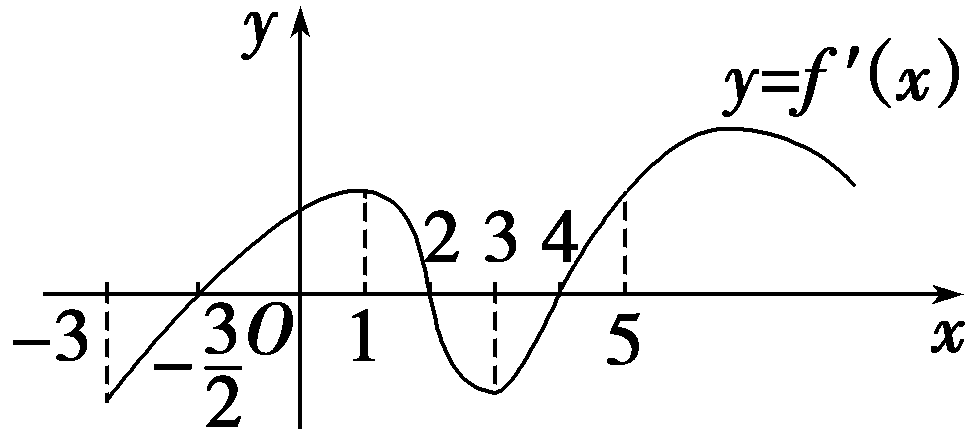
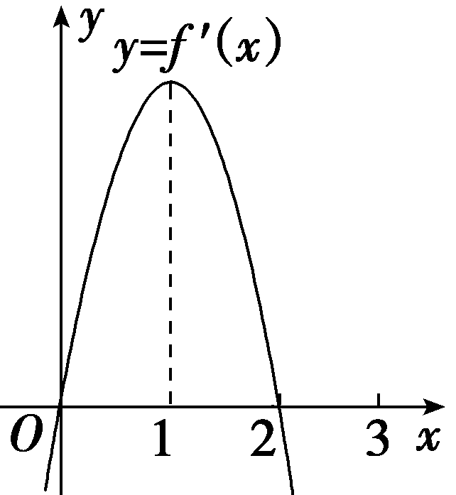
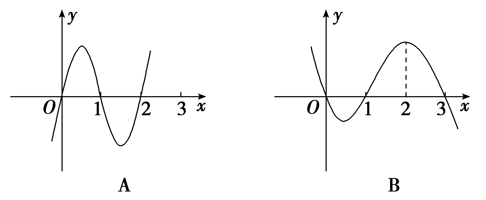
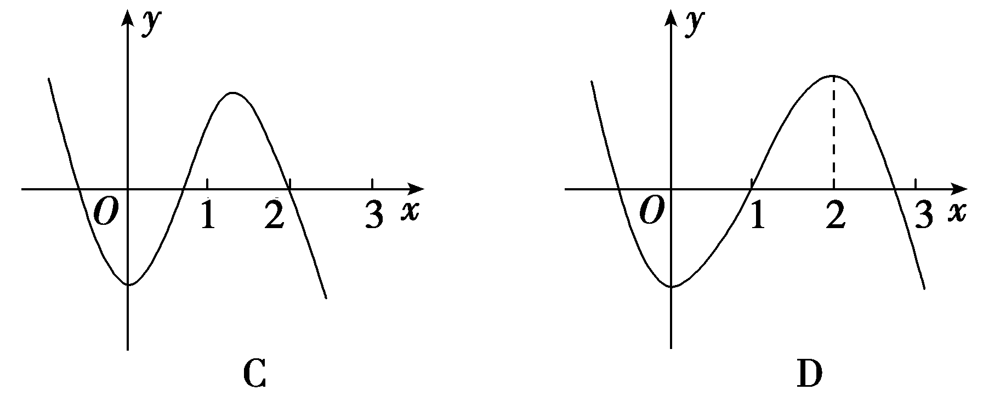

第二节　导数与函数的单调性

【课标研读】　1.结合实例，借助几何直观了解函数的单调性与导数的关系.　2.能利用导数研究函数的单调性；对于多项式函数，能求不超过三次的多项式函数的单调区间.　3.体会导数与单调性的关系.

##### 1.函数的单调性与导数的关系

<table><tr><td>
条件
</td><td>
恒有
</td><td>
结论
</td></tr><tr><td rowspan="3">
函数<em>y</em>＝<em>f</em>(<em>x</em>)在区间(<em>a</em>，<em>b</em>)上可导
</td><td>
<em>f'</em>(<em>x</em>)＞0
</td><td>
<em>f</em>(<em>x</em>)在区间(<em>a</em>，<em>b</em>)上单调递增
</td></tr><tr><td>
<em>f'</em>(<em>x</em>)＜0
</td><td>
<em>f</em>(<em>x</em>)在区间(<em>a</em>，<em>b</em>)上单调递减
</td></tr><tr><td>
<em>f'</em>(<em>x</em>)＝0
</td><td>
<em>f</em>(<em>x</em>)在区间(<em>a</em>，<em>b</em>)上是常数函数
</td></tr></table>

[微提醒]　讨论函数的单调性或求函数的单调区间的实质是解不等式，求解时，要坚持“定义域优先”原则.

##### 2.利用导数判断函数单调性的步骤

第一步，确定函数的<u>定义域</u>；

第二步，求出导数<em>f'</em>(<em>x</em>)的<u>零点</u>；

第三步，用*f'*(*x*)的零点将*f*(*x*)的定义域划分为若干个区间，列表给出*f'*(*x*)在各区间上的正负，由此得出函数*y*＝*f*(*x*)在定义域内的单调性.

【常用结论】

（1）若函数*f*(*x*)在(*a*，*b*)上单调递增，则当*x*∈(*a*，*b*)时，*f'*(*x*)≥0恒成立；若函数*f*(*x*)在(*a*，*b*)上单调递减，则当*x*∈(*a*，*b*)时，*f'*(*x*)≤0恒成立.

（2）若函数*f*(*x*)在(*a*，*b*)上存在单调递增区间，则当*x*∈(*a*，*b*)时，*f'*(*x*)＞0有解；若函数*f*(*x*)在(*a*，*b*)上存在单调递减区间，则当*x*∈(*a*，*b*)时，*f'*(*x*)＜0有解.

【自主检测】

##### 1.(多选)下列结论正确的是(　　)

$\quad$A.如果函数*f*(*x*)在某个区间内恒有*f'*(*x*)＝0，则*f*(*x*)在此区间内没有单调性

$\quad$B.在(*a*，*b*)内*f'*(*x*)≤0且*f'*(*x*)＝0的根有有限个，则*f*(*x*)在(*a*，*b*)内单调递减

$\quad$C.若函数*f*(*x*)在定义域上都有*f'*(*x*)＞0，则*f*(*x*)在定义域上一定单调递增

$\quad$D.函数<em>f</em>(<em>x</em>)＝<em>x</em>－sin <em>x</em>在<strong>R</strong>上是增函数

答案ABD

##### 2.(链接人教A选择性必修二P86例2)(多选)如图是函数*y*＝*f*(*x*)的导函数*y*＝*f'*(*x*)的图象，则下列判断正确的是(　　)

$\quad$A.在区间(－2，1)上*f*(*x*)单调递增

$\quad$B.在区间(2，3)上*f*(*x*)单调递减

$\quad$C.在区间(4，5)上*f*(*x*)单调递增

$\quad$D.在区间(3，5)上*f*(*x*)单调递减

答案BC

解析在区间(－2，1)上，当<te<te<te<te<te<te<te<te<te<te<te*x*t style="italic">x</text>t style="italic">x</text>t style="italic">x</text>t style="italic">x</text>t style="italic">x</text>t style="italic">x</text>t style="italic">x</text>t style="italic">x</text>t style="italic">x</text>t style="italic">x</text>t style="italic">x</text>∈ $\left(－2,-\frac{3}{2}\right)$ 时，<te<te<te<te<te<te<te<te<te<te<te*x*t style="italic">x</text>t style="italic">x</text>t style="italic">x</text>t style="italic">x</text>t style="italic">x</text>t style="italic">x</text>t style="italic">x</text>t style="italic">x</text>t style="italic">x</text>t style="italic">x</text>t style="italic">*<text style="italic"><text style="italic"><text style="italic">f*</text></text>'</text></text>(*x*)＜0，当x∈ $\left(－\frac{3}{2}，1\right)$ 时，<te<te<te<te<te<te<te<te<te<te<te*x*t style="italic">x</text>t style="italic">x</text>t style="italic">x</text>t style="italic">x</text>t style="italic">x</text>t style="italic">x</text>t style="italic">x</text>t style="italic">x</text>t style="italic">x</text>t style="italic">x</text>t style="italic">*<text style="italic"><text style="italic"><text style="italic">f*</text></text>'</text></text>(*x*)＞0，故f(x)在区间 $\left(－2,-\frac{3}{2}\right)$ 上单调递减，在区间 $\left(－\frac{3}{2}，1\right)$ 上单调递增，故A错误；在区间(3，5)上，当<te<te<te<te<te<te<te<te<te<te<te*x*t style="italic">x</text>t style="italic">x</text>t style="italic">x</text>t style="italic">x</text>t style="italic">x</text>t style="italic">x</text>t style="italic">x</text>t style="italic">x</text>t style="italic">x</text>t style="italic">x</text>t style="italic">x</text>∈(3，4)时，*<text style="italic"><text style="italic"><text style="italic"><text style="italic">f*</text></text>'</text></text>(x)＜0，当x∈(4，5)时，*<text style="italic"><text style="italic">f'*</text></text>(x)＞0，故f(x)在区间(3，4)上单调递减，在区间(4，5)上单调递增，故C正确，D错误；在区间(2，3)上，f'(x)＜0，所以f(x)单调递减，故B正确.故选BC.

##### 3.(链接人教A选择性必修二P86例1)函数*f*(*x*)＝cos *x*－*x*在(0，π)上的单调性是(　　)

$\quad$A.先增后减	
$\quad$B.先减后增

$\quad$C.增函数	
$\quad$D.减函数

答案D

解析因为*f'*(*x*)＝－sin *x*－1＜0在(0，π)上恒成立，所以*f*(*x*)在(0，π)上是减函数.故选D.

##### 4.函数<em>f</em>(<em>x</em>)＝<em>x</em>－ln <em>x</em>的单调递减区间为<u>　　　　</u>.

答案(0，1)

解析函数<te<te<te<te<te<te*x*t style="italic">x</text>t style="italic">x</text>t style="italic">x</text>t style="italic">x</text>t style="italic">x</text>t style="italic">*f*</text>(x)的定义域为{x｜x＞0}，由*f'*(x)＝1－ $\frac{1}{x}$ ＜0，得0＜<te<te<te<te<te*x*t style="italic">x</text>t style="italic">x</text>t style="italic">x</text>t style="italic">x</text>t style="italic">x</text>＜1，所以函数*<text style="italic">f*</text>(x)的单调递减区间为(0，1).

考点一　不含参数的函数的单调性　　　　自主练透

##### 1.(2025·吉林长春质检)已知<em>x</em>∈(0，π)，则函数<em>f</em>(<em>x</em>)＝e<em>x</em>cos <em>x</em>的增区间为(　　)

$\quad$A.( 0， $\frac{\pi }{2}$ )	
$\quad$B.( 0， $\frac{3\pi }{4}$ )

$\quad$C.( 0， $\frac{\pi }{4}$ )	
$\quad$D. $\left(\frac{3\pi }{4}，\pi \right)$

答案C

解析因为<te<te<te<te<te<te<te<te<te<te<te<te<te<te<te<te<te<te*x*t style="italic">x</text>t style="italic">x</text>t style="italic">x</text>t style="italic">x</text>t style="italic">x</text>t style="italic">x</text>t style="italic">x</text>t style="italic">x</text>t style="italic,superscript">x</text>t style="italic,superscript">x</text>t style="italic">x</text>t style="italic">x</text>t style="italic">x</text>t style="italic">x</text>t style="italic">x</text>t style="italic,superscript">x</text>t style="italic">x</text>t style="italic">*<text style="italic">f*</text></text>(x)＝excos x，x∈(0，π)，所以*<text style="italic"><text style="italic"><text style="italic">f'*</text></text></text>(x)＝(cos x－sin x)ex $＝\sqrt{2}$ e<te<te<te<te<te<te<te<te<te<te<te<te<te<te<te<te<te*x*t style="italic">x</text>t style="italic">x</text>t style="italic">x</text>t style="italic">x</text>t style="italic">x</text>t style="italic">x</text>t style="italic">x</text>t style="italic">x</text>t style="italic,superscript">x</text>t style="italic,superscript">x</text>t style="italic">x</text>t style="italic">x</text>t style="italic">x</text>t style="italic">x</text>t style="italic">x</text>t style="italic,superscript">x</text>t style="italic">x</text>cos(x＋ $\frac{\pi }{4}$ )，令<te<te<te<te<te<te<te<te<te<te<te<te<te<te<te<te<te<te*x*t style="italic">x</text>t style="italic">x</text>t style="italic">x</text>t style="italic">x</text>t style="italic">x</text>t style="italic">x</text>t style="italic">x</text>t style="italic">x</text>t style="italic,superscript">x</text>t style="italic,superscript">x</text>t style="italic">x</text>t style="italic">x</text>t style="italic">x</text>t style="italic">x</text>t style="italic">x</text>t style="italic,superscript">x</text>t style="italic">x</text>t style="italic">*<text style="italic">f*</text></text>'(x)＝0，解得x $＝\frac{\pi }{4}$ ，当<te<te<te<te<te<te<te<te<te<te<te<te<te<te<te<te<te*x*t style="italic">x</text>t style="italic">x</text>t style="italic">x</text>t style="italic">x</text>t style="italic">x</text>t style="italic">x</text>t style="italic">x</text>t style="italic">x</text>t style="italic,superscript">x</text>t style="italic,superscript">x</text>t style="italic">x</text>t style="italic">x</text>t style="italic">x</text>t style="italic">x</text>t style="italic">x</text>t style="italic,superscript">x</text>t style="italic">x</text>∈( 0， $\frac{\pi }{4}$ )时，<te<te<te<te<te<te<te<te<te<te<te<te<te<te<te<te<te<te*x*t style="italic">x</text>t style="italic">x</text>t style="italic">x</text>t style="italic">x</text>t style="italic">x</text>t style="italic">x</text>t style="italic">x</text>t style="italic">x</text>t style="italic,superscript">x</text>t style="italic,superscript">x</text>t style="italic">x</text>t style="italic">x</text>t style="italic">x</text>t style="italic">x</text>t style="italic">x</text>t style="italic,superscript">x</text>t style="italic">x</text>t style="italic">*<text style="italic">f*</text></text>'(x)＞0，当x∈ $\left(\frac{\pi }{4}，\pi \right)$ 时，<te<te<te<te<te<te<te<te<te<te<te<te<te<te<te<te<te<te*x*t style="italic">x</text>t style="italic">x</text>t style="italic">x</text>t style="italic">x</text>t style="italic">x</text>t style="italic">x</text>t style="italic">x</text>t style="italic">x</text>t style="italic,superscript">x</text>t style="italic,superscript">x</text>t style="italic">x</text>t style="italic">x</text>t style="italic">x</text>t style="italic">x</text>t style="italic">x</text>t style="italic,superscript">x</text>t style="italic">x</text>t style="italic">*<text style="italic">f*</text></text>'(x)＜0，所以f(x)在 $\left(0，\frac{\pi }{4}\right)$ 上单调递增，在( $\frac{\pi }{4}$ ，π)上单调递减，所以<te<te<te<te<te<te<te<te<te<te<te<te<te<te<te<te<te<te*x*t style="italic">x</text>t style="italic">x</text>t style="italic">x</text>t style="italic">x</text>t style="italic">x</text>t style="italic">x</text>t style="italic">x</text>t style="italic">x</text>t style="italic,superscript">x</text>t style="italic,superscript">x</text>t style="italic">x</text>t style="italic">x</text>t style="italic">x</text>t style="italic">x</text>t style="italic">x</text>t style="italic,superscript">x</text>t style="italic">x</text>t style="italic">*<text style="italic">f*</text></text>(x)在(0，π)上的增区间为 $\left(0，\frac{\pi }{4}\right)$ .故选C.

##### 2.(2025·湖南湘潭模拟)函数&lt;te&lt;te<em>x</em>t style="italic"&gt;x&lt;/text&gt;t style="italic"&gt;f&lt;/text&gt;(x) $＝\frac{3lnx}{2}$ ＋ $\frac{9}{2x}$ ＋&lt;te<em>x</em>t style="italic"&gt;x&lt;/text&gt;的单调递减区间为<u>　　　　</u>.

答案 $\left(0，\frac{3}{2}\right)$

解析<te<te<te<te<te<te<te*x*t style="italic">x</text>t style="italic">x</text>t style="italic">x</text>t style="italic">x</text>t style="italic">x</text>t style="italic">x</text>t style="italic">*f*</text>(x)的定义域为(0，＋∞)，*<text style="italic"><text style="italic">f'*</text></text>(x) $＝\frac{3}{2x}$ － $\frac{9}{2x^{2}}$ ＋1 $＝\frac{\left(2x－3\right)\left(x+3\right)}{2x^{2}}$ ，当<te<te<te<te<te<te*x*t style="italic">x</text>t style="italic">x</text>t style="italic">x</text>t style="italic">x</text>t style="italic">x</text>t style="italic">x</text>∈ $\left(0，\frac{3}{2}\right)$ 时，<te<te<te<te<te<te<te*x*t style="italic">x</text>t style="italic">x</text>t style="italic">x</text>t style="italic">x</text>t style="italic">x</text>t style="italic">x</text>t style="italic">*f*</text>'(x)＜0，当x∈ $\left(\frac{3}{2}，＋\infty \right)$ 时，<te<te<te<te<te<te<te*x*t style="italic">x</text>t style="italic">x</text>t style="italic">x</text>t style="italic">x</text>t style="italic">x</text>t style="italic">x</text>t style="italic">*f*</text>'(x)＞0，所以f(x)的单调递减区间为 $\left(0，\frac{3}{2}\right)$ .

##### 3.设<te<te*x*t style="italic">x</text>t style="italic">*f*</text>(x) $＝\frac{sinx}{2+cosx}$ ，讨论<te<te*x*t style="italic">x</text>t style="italic">*f*</text>(x)的单调性.

解：由题得函数的定义域为<te<te<te<te*x*t style="italic">x</text>t style="italic">x</text>t style="italic">x</text>t style="bold">R</text>，*<text style="italic">f'*</text>(x)＝ $\frac{\left(2+cosx\right)cosx－sinx\left(－sinx\right)}{\left(2+cosx\right)^{2}}＝\frac{2cosx+1}{\left(2+cosx\right)^{2}}$ .令<te<te<te<te*x*t style="italic">x</text>t style="italic">x</text>t style="italic">x</text>t style="italic">*f'*</text>(x)＞0，得cos x＞－ $\frac{1}{2}$ ，即2<te*x*t style="italic">*k*</text>π－ $\frac{2\pi }{3}$ ＜<te<te<te*x*t style="italic">x</text>t style="italic">x</text>t style="italic">x</text>＜2*<text style="italic">k*</text>π＋ $\frac{2\pi }{3}\left(k\in Z\right)$ .

令<te<te<te*x*t style="italic">x</text>t style="italic">x</text>t style="italic">f'</text>(x)＜0，得cos x＜－ $\frac{1}{2}$ ，即2<te*x*t style="italic">*k*</text>π＋ $\frac{2\pi }{3}$ ＜<te<te*x*t style="italic">x</text>t style="italic">x</text>＜2*<text style="italic">k*</text>π＋ $\frac{4\pi }{3}\left(k\in Z\right)$ .

故<te*x*t style="italic">f</text>(x)的增区间为 $\left(2k\pi －\frac{2\pi }{3}，2k\pi ＋\frac{2\pi }{3}\right)\left(k\in Z\right)$ ，减区间为( 2*<text style="italic">k*</text>π＋ $\frac{2\pi }{3}$ ，2*<text style="italic">k*</text>π＋ $\frac{4\pi }{3})\left(k\in Z\right)$ .

求不含参数函数单调区间的步骤与注意点

##### 1.步骤：（1）求函数的定义域；（2）求*f*(*x*)的导数*f'*(*x*)；（3）在定义域内解不等式：*f'*(*x*)＞0的解集即为单调递增区间，*f'*(*x*)＜0的解集即为单调递减区间.

##### 2.注意点：（1）不能忽视函数定义域；（2）当函数有多个单调递增区间(或单调递减区间)时，不能用“∪”连接，要用“逗号”或“和”隔开；（3）当不等式*f'*(*x*)＞0(或*f'*(*x*)＜0)不可解时，可通过二次求导，分析*f'*(*x*)的零点情况，借助图象等得到其解集，进而得到单调区间.

考点二　含参数的函数的单调性　　　　师生共研

(&lt;te<em>x</em>t style="superscript"&gt;2&lt;/text&gt;024·山东青岛一模)已知函数&lt;te&lt;te<em>x</em>t style="italic"&gt;x&lt;/text&gt;t style="italic"&gt;f&lt;/text&gt;(x) $＝\frac{1}{2}$ &lt;te&lt;te<em>x</em>t style="italic"&gt;x&lt;/text&gt;t style="italic"&gt;x&lt;/text&gt;2－<em>ax</em>＋ln x.

（1）若<em>a</em>＝1，曲线<em>y</em>＝<em>f</em>(<em>x</em>)在点(<em>x</em>0，<em>f</em>(<em>x</em>0))处的切线斜率为1，求该切线的方程；

（2）讨论*f*(*x*)的单调性.

解：（1）当&lt;te&lt;te&lt;te<em>x</em>t style="italic"&gt;x&lt;/text&gt;t style="italic"&gt;x&lt;/text&gt;t style="italic"&gt;a&lt;/text&gt;＝1时，<em>&lt;text style="italic"&gt;f'</em>&lt;/text&gt;(x) $＝\frac{x^{2}－x+1}{x}$ ，由题意可知，&lt;te&lt;te&lt;te<em>x</em>t style="italic"&gt;x&lt;/text&gt;t style="italic"&gt;x&lt;/text&gt;t style="italic"&gt;<em>f'</em>&lt;/text&gt;(x&lt;text style="subscript"&gt;0&lt;/text&gt;)＝1，解得x0＝1，

又因为<te<text st*y*le="italic">x</text>t style="italic">f</text>（1）＝－ $\frac{1}{2}$ ，所以切线方程为<text st*y*le="italic">x</text>－y－ $\frac{3}{2}＝$ 0.

（2）<te<te*x*t style="italic">x</text>t style="italic">f</text>(x)的定义域为(0，＋∞)，*f'*(x) $＝\frac{x^{2}－ax+1}{x}$ ，

当*a*≤0时，*f'*(*x*)＞0恒成立，*f*(*x*)在(0，＋∞)单调递增；

当<em>a</em>＞0时，令<em>g</em>(<em>x</em>)＝<em>x</em>2－<em>ax</em>＋1，<em>Δ</em>＝<em>a</em>2－4，

(*ⅰ*)当*Δ*≤0即0＜*a*≤2时，*f'*(*x*)≥0恒成立，*f*(*x*)在(0，＋∞)单调递增，

(<te*x*t style="it*a*lic">ⅱ</text>)当*Δ*＞0即a＞2时，*f'*(x) $＝\frac{\left(x－\frac{a－\sqrt{a^{2}－4}}{2}\right)\left(x－\frac{a＋\sqrt{a^{2}－4}}{2}\right)}{x}$ ，

由<te<te<te*x*t style="italic">x</text>t style="italic">x</text>t style="italic">f'</text>(x)＞0，得0＜x＜ $\frac{a－\sqrt{a^{2}－4}}{2}$ 或<te<te*x*t style="italic">x</text>t style="italic">x</text>＞ $\frac{a＋\sqrt{a^{2}－4}}{2}$ ，

由<te<te*x*t style="italic">x</text>t style="italic">f'</text>(x)＜0，得 $\frac{a－\sqrt{a^{2}－4}}{2}$ ＜<te*x*t style="italic">x</text>＜ $\frac{a＋\sqrt{a^{2}－4}}{2}$ ，

所以<te*x*t style="italic">f</text>(x)在(0， $\frac{a－\sqrt{a^{2}－4}}{2}$ )，( $\frac{a＋\sqrt{a^{2}－4}}{2}$ ，＋∞)单调递增，在( $\frac{a－\sqrt{a^{2}－4}}{2}$ ， $\frac{a＋\sqrt{a^{2}－4}}{2}$ )单调递减.

综上：当*a*≤2时，*f*(*x*)在(0，＋∞)单调递增；

当<te<te*x*t style="italic">x</text>t style="italic">a</text>＞2时，*<text style="italic">f*</text>(x)在(0， $\frac{a－\sqrt{a^{2}－4}}{2}$ )，( $\frac{a＋\sqrt{a^{2}－4}}{2}$ ，＋∞)单调递增；<te<te*x*t style="italic">x</text>t style="italic">*f*</text>(x)在( $\frac{a－\sqrt{a^{2}－4}}{2}$ ， $\frac{a＋\sqrt{a^{2}－4}}{2}$ )单调递减.

讨论含参函数单调性的方法

##### 1.研究含参数的函数的单调性，要依据参数对不等式解集的影响进行分类讨论.

##### 2.划分函数的单调区间时，要在函数定义域内讨论，还要确定导数为零的点和函数的间断点.

对点练1.已知函数<em>f</em>(<em>x</em>)＝e<em>x</em>－<em>ax</em>－<em>a</em>，<em>a</em>∈<strong>R</strong>，讨论<em>f</em>(<em>x</em>)的单调区间.

解：函数<em>f</em>(<em>x</em>)＝e<em>x</em>－<em>ax</em>－<em>a</em>的定义域为<strong>R</strong>，

求导得<em>f'</em>(<em>x</em>)＝e<em>x</em>－<em>a</em>，

当*a*≤0时，*f'*(*x*)＞0恒成立，

即*f*(*x*)在(－∞，＋∞)上单调递增；

当<em>a</em>＞0时，令<em>f'</em>(<em>x</em>)＝e<em>x</em>－<em>a</em>＞0，解得<em>x</em>＞ln <em>a</em>，

令<em>f'</em>(<em>x</em>)＝e<em>x</em>－<em>a</em>＜0，解得<em>x</em>＜ln <em>a</em>，

即*f*(*x*)在(－∞，ln *a*)上单调递减，在(ln *a*，＋∞)上单调递增.

综上所述，当*a*≤0时，*f*(*x*)的单调递增区间为(－∞，＋∞)，无单调递减区间；

当*a*＞0时，*f*(*x*)的单调递减区间为(－∞，ln *a*)，单调递增区间为(ln *a*，＋∞).

考点三　函数单调性的应用　　　　多维探究

角度1　比较大小或解不等式

（1）(多选)下列不等式成立的是(　　)

$\quad$A.2ln $\frac{3}{2}＜\frac{3}{2}$ ln 2	
$\quad$B. $\sqrt{2}$ ln $\sqrt{3}＜\sqrt{3}$ ln $\sqrt{2}$

$\quad$C.5ln 4＜4ln 5	
$\quad$D.π＞eln π

（2）函数<em>f</em>(<em>x</em>)＝e<em>x</em>－e－<em>x</em>＋sin <em>x</em>，则不等式<em>f</em>(<em>x</em>)＞0的解集是(　　)

$\quad$A.(0，＋∞)	
$\quad$B.(－∞，0)

$\quad$C.(0，π)	
$\quad$D.(－π，0)

答案（1）AD　（2）A

解析（1）设<te<te<te<te<te<te<te<te<te*x*t style="italic">x</text>t style="italic">x</text>t style="italic">x</text>t style="italic">x</text>t style="italic">x</text>t style="italic">x</text>t style="italic">x</text>t style="italic">x</text>t style="italic">*<text style="italic"><text style="italic"><text style="italic"><text style="italic"><text style="italic"><text style="italic"><text style="italic"><text style="italic"><text style="italic">f*</text></text></text></text></text></text></text></text></text></text>(x) $＝\frac{lnx}{x}$ (<te<te<te<te<te<te<te<te*x*t style="italic">x</text>t style="italic">x</text>t style="italic">x</text>t style="italic">x</text>t style="italic">x</text>t style="italic">x</text>t style="italic">x</text>t style="italic">x</text>＞0)，则*<text style="italic"><text style="italic"><text style="italic"><text style="italic"><text style="italic"><text style="italic"><text style="italic"><text style="italic"><text style="italic"><text style="italic">f*</text></text></text></text></text></text></text></text></text></text>'(x) $＝\frac{1－lnx}{x^{2}}$ ，所以当0＜<te<te<te<te<te<te<te<te*x*t style="italic">x</text>t style="italic">x</text>t style="italic">x</text>t style="italic">x</text>t style="italic">x</text>t style="italic">x</text>t style="italic">x</text>t style="italic">x</text>＜e时，*<text style="italic"><text style="italic"><text style="italic"><text style="italic"><text style="italic"><text style="italic"><text style="italic"><text style="italic"><text style="italic"><text style="italic">f*</text></text></text></text></text></text></text></text></text></text>'(x)＞0，函数f(x)单调递增；当x＞e时，*<text style="italic"><text style="italic">f'*</text></text>(x)＜0，函数f(x)单调递减.因为 $\frac{3}{2}$ ＜2＜e，所以<te<te<te<te<te<te<te<te<te*x*t style="italic">x</text>t style="italic">x</text>t style="italic">x</text>t style="italic">x</text>t style="italic">x</text>t style="italic">x</text>t style="italic">x</text>t style="italic">x</text>t style="italic">*<text style="italic"><text style="italic"><text style="italic"><text style="italic"><text style="italic"><text style="italic"><text style="italic"><text style="italic"><text style="italic">f*</text></text></text></text></text></text></text></text></text></text> $\left(\frac{3}{2}\right)$ ＜<te<te<te<te<te<te<te<te<te*x*t style="italic">x</text>t style="italic">x</text>t style="italic">x</text>t style="italic">x</text>t style="italic">x</text>t style="italic">x</text>t style="italic">x</text>t style="italic">x</text>t style="italic">*<text style="italic"><text style="italic"><text style="italic"><text style="italic"><text style="italic"><text style="italic"><text style="italic"><text style="italic"><text style="italic">f*</text></text></text></text></text></text></text></text></text></text>（2），即2ln $\frac{3}{2}＜\frac{3}{2}$ ln 2，故选项A正确；因为 $\sqrt{2}＜\sqrt{3}$ ＜e，所以<te<te<te<te<te<te<te<te<te*x*t style="italic">x</text>t style="italic">x</text>t style="italic">x</text>t style="italic">x</text>t style="italic">x</text>t style="italic">x</text>t style="italic">x</text>t style="italic">x</text>t style="italic">*<text style="italic"><text style="italic"><text style="italic"><text style="italic"><text style="italic"><text style="italic"><text style="italic"><text style="italic"><text style="italic">f*</text></text></text></text></text></text></text></text></text></text>( $\sqrt{2}$ )＜<te<te<te<te<te<te<te<te<te*x*t style="italic">x</text>t style="italic">x</text>t style="italic">x</text>t style="italic">x</text>t style="italic">x</text>t style="italic">x</text>t style="italic">x</text>t style="italic">x</text>t style="italic">*<text style="italic"><text style="italic"><text style="italic"><text style="italic"><text style="italic"><text style="italic"><text style="italic"><text style="italic"><text style="italic">f*</text></text></text></text></text></text></text></text></text></text> $\left(\sqrt{3}\right)$ ，即 $\sqrt{2}$ ln $\sqrt{3}＞\sqrt{3}$ ln $\sqrt{2}$ ，故选项B不正确；因为e＜4＜5，所以<te<te<te<te<te<te<te<te<te*x*t style="italic">x</text>t style="italic">x</text>t style="italic">x</text>t style="italic">x</text>t style="italic">x</text>t style="italic">x</text>t style="italic">x</text>t style="italic">x</text>t style="italic">*<text style="italic"><text style="italic"><text style="italic"><text style="italic"><text style="italic"><text style="italic"><text style="italic"><text style="italic"><text style="italic">f*</text></text></text></text></text></text></text></text></text></text>（4）＞f(5)，即5ln 4＞4ln 5，故选项C不正确；因为e＜π，所以f(e)＞f(π)，即π＞eln π，故选项D正确.故选AD.

（2）对函数&lt;te&lt;te&lt;te&lt;te&lt;te&lt;te&lt;te&lt;te&lt;te&lt;te&lt;te&lt;te&lt;te&lt;te<em>x</em>t style="italic"&gt;x&lt;/text&gt;t style="italic"&gt;x&lt;/text&gt;t style="italic"&gt;x&lt;/text&gt;t style="italic"&gt;x&lt;/text&gt;t style="italic"&gt;x&lt;/text&gt;t style="italic"&gt;x&lt;/text&gt;t style="italic"&gt;x&lt;/text&gt;t style="italic,superscript"&gt;x&lt;/text&gt;t style="italic"&gt;x&lt;/text&gt;t style="italic,superscript"&gt;x&lt;/text&gt;t style="italic,superscript"&gt;x&lt;/text&gt;t style="italic"&gt;x&lt;/text&gt;t style="italic"&gt;x&lt;/text&gt;t style="italic"&gt;<em>&lt;text style="italic"&gt;&lt;text style="italic"&gt;&lt;text style="italic"&gt;&lt;text style="italic"&gt;&lt;text style="italic"&gt;f</em>&lt;/text&gt;&lt;/text&gt;&lt;/text&gt;&lt;/text&gt;&lt;/text&gt;&lt;/text&gt;(x)求导得<em>&lt;text style="italic"&gt;f'</em>&lt;/text&gt;(x)＝ex＋e－x＋cos x，因为ex＋ $\frac{1}{e^{x}}$ ≥2，当且仅当&lt;te&lt;te&lt;te&lt;te&lt;te&lt;te&lt;te&lt;te&lt;te&lt;te&lt;te&lt;te&lt;te<em>x</em>t style="italic"&gt;x&lt;/text&gt;t style="italic"&gt;x&lt;/text&gt;t style="italic"&gt;x&lt;/text&gt;t style="italic"&gt;x&lt;/text&gt;t style="italic"&gt;x&lt;/text&gt;t style="italic"&gt;x&lt;/text&gt;t style="italic"&gt;x&lt;/text&gt;t style="italic,superscript"&gt;x&lt;/text&gt;t style="italic"&gt;x&lt;/text&gt;t style="italic,superscript"&gt;x&lt;/text&gt;t style="italic,superscript"&gt;x&lt;/text&gt;t style="italic"&gt;x&lt;/text&gt;t style="italic"&gt;x&lt;/text&gt;＝0时等号成立，－1≤cos x≤1，所以<em>&lt;text style="italic"&gt;&lt;text style="italic"&gt;&lt;text style="italic"&gt;&lt;text style="italic"&gt;&lt;text style="italic"&gt;&lt;text style="italic"&gt;f</em>&lt;/text&gt;&lt;/text&gt;&lt;/text&gt;&lt;/text&gt;&lt;/text&gt;&lt;/text&gt;'(x)＞0，所以f(x)在<strong>R</strong>上单调递增，因为f(－x)＝－f(x)，所以f(x)是奇函数，即f(0)＝e0－e－0＋sin 0＝0，所以f(x)＞0的解集为(0，＋∞).故选A.

角度2　根据函数的单调性求参数

(一题多变)(2023·新课标Ⅱ卷)已知函数<em>f</em>(<em>x</em>)＝<em>a</em>e<em>x</em>－ln <em>x</em>在区间(1，2)单调递增，则<em>a</em>的最小值为(　　)

$\quad$A.e2	
$\quad$B.e

$\quad$C.e－1	
$\quad$D.e－2

答案C

解析依题可知，&lt;te&lt;te&lt;te&lt;te&lt;te&lt;te&lt;te&lt;te&lt;te&lt;te&lt;te&lt;te&lt;te&lt;text style="it&lt;text style="it<em>a</em>lic"&gt;a&lt;/text&gt;lic"&gt;x&lt;/text&gt;t style="italic"&gt;x&lt;/text&gt;t style="italic,superscript"&gt;x&lt;/text&gt;t style="italic"&gt;x&lt;/text&gt;t style="italic"&gt;x&lt;/text&gt;t style="italic"&gt;x&lt;/text&gt;t style="italic,superscript"&gt;x&lt;/text&gt;t style="italic"&gt;x&lt;/text&gt;t style="italic"&gt;x&lt;/text&gt;t style="italic,superscript"&gt;x&lt;/text&gt;t style="italic"&gt;x&lt;/text&gt;t style="it<em>a</em>lic,superscript"&gt;x&lt;/text&gt;t style="it<em>a</em>lic"&gt;x&lt;/text&gt;t style="italic"&gt;f'&lt;/text&gt;(x)＝aex－ $\frac{1}{x}$ ≥0在(1，2)上恒成立，显然&lt;te&lt;te&lt;te&lt;te&lt;te&lt;te&lt;te&lt;te&lt;te&lt;te&lt;te&lt;te&lt;text style="it&lt;text style="it<em>a</em>lic"&gt;a&lt;/text&gt;lic"&gt;x&lt;/text&gt;t style="italic"&gt;x&lt;/text&gt;t style="italic,superscript"&gt;x&lt;/text&gt;t style="italic"&gt;x&lt;/text&gt;t style="italic"&gt;x&lt;/text&gt;t style="italic"&gt;x&lt;/text&gt;t style="italic,superscript"&gt;x&lt;/text&gt;t style="italic"&gt;x&lt;/text&gt;t style="italic"&gt;x&lt;/text&gt;t style="italic,superscript"&gt;x&lt;/text&gt;t style="italic"&gt;x&lt;/text&gt;t style="it<em>a</em>lic,superscript"&gt;x&lt;/text&gt;t style="italic"&gt;a&lt;/text&gt;＞0，所以<em>x</em>ex≥ $\frac{1}{a}$ ，设&lt;te&lt;te&lt;te&lt;te&lt;te&lt;te&lt;te&lt;te&lt;te&lt;text style="it&lt;text style="it<em>a</em>lic"&gt;a&lt;/text&gt;lic"&gt;x&lt;/text&gt;t style="italic"&gt;x&lt;/text&gt;t style="italic,superscript"&gt;x&lt;/text&gt;t style="italic"&gt;x&lt;/text&gt;t style="italic"&gt;x&lt;/text&gt;t style="italic"&gt;x&lt;/text&gt;t style="italic,superscript"&gt;x&lt;/text&gt;t style="italic"&gt;x&lt;/text&gt;t style="italic"&gt;x&lt;/text&gt;t style="italic"&gt;<em>&lt;text style="italic"&gt;&lt;text style="italic"&gt;g</em>&lt;/text&gt;&lt;/text&gt;&lt;/text&gt;(&lt;te&lt;te&lt;te<em>x</em>t style="italic"&gt;x&lt;/text&gt;t style="it<em>a</em>lic,superscript"&gt;x&lt;/text&gt;t style="it<em>a</em>lic"&gt;x&lt;/text&gt;)＝xex，x∈(1，2)，所以<em>g'</em>(x)＝(x＋1)ex＞0，所以g(x)在(1，2)上单调递增，g(x)＞g(1)＝e，故e≥ $\frac{1}{a}$ ，即&lt;te&lt;te&lt;te&lt;te&lt;te&lt;te&lt;te&lt;te&lt;te&lt;te&lt;te&lt;te&lt;text style="it&lt;text style="it<em>a</em>lic"&gt;a&lt;/text&gt;lic"&gt;x&lt;/text&gt;t style="italic"&gt;x&lt;/text&gt;t style="italic,superscript"&gt;x&lt;/text&gt;t style="italic"&gt;x&lt;/text&gt;t style="italic"&gt;x&lt;/text&gt;t style="italic"&gt;x&lt;/text&gt;t style="italic,superscript"&gt;x&lt;/text&gt;t style="italic"&gt;x&lt;/text&gt;t style="italic"&gt;x&lt;/text&gt;t style="italic,superscript"&gt;x&lt;/text&gt;t style="italic"&gt;x&lt;/text&gt;t style="it<em>a</em>lic,superscript"&gt;x&lt;/text&gt;t style="italic"&gt;a&lt;/text&gt;≥ $\frac{1}{e}＝$ e&lt;text style="superscript"&gt;－1&lt;/text&gt;，即&lt;te&lt;te&lt;te&lt;te&lt;te&lt;te&lt;te&lt;te&lt;te&lt;te&lt;te&lt;te&lt;text style="it&lt;text style="it<em>a</em>lic"&gt;a&lt;/text&gt;lic"&gt;x&lt;/text&gt;t style="italic"&gt;x&lt;/text&gt;t style="italic,superscript"&gt;x&lt;/text&gt;t style="italic"&gt;x&lt;/text&gt;t style="italic"&gt;x&lt;/text&gt;t style="italic"&gt;x&lt;/text&gt;t style="italic,superscript"&gt;x&lt;/text&gt;t style="italic"&gt;x&lt;/text&gt;t style="italic"&gt;x&lt;/text&gt;t style="italic,superscript"&gt;x&lt;/text&gt;t style="italic"&gt;x&lt;/text&gt;t style="it<em>a</em>lic,superscript"&gt;x&lt;/text&gt;t style="italic"&gt;a&lt;/text&gt;的最小值为e－1.故选C.

[变式探究]

##### 1.(变条件、变问法)在本例中，若函数*f*(*x*)在区间(1，2)上存在单调递增区间，求实数*a*的取值范围.

解：因为*f*(*x*)在(1，2)上存在单调递增区间，

所以∃*x*∈(1，2)，使*f'*(*x*)＞0有解，

即&lt;te<em>x</em>t style="it<em>a</em>lic"&gt;x&lt;/text&gt;∈(1，2)时，不等式aex－ $\frac{1}{x}$ ＞0有解，

即<te*x*t style="italic">a</text>＞ $\frac{1}{xe^{x}}$ ，*x*∈(1，2)有解，

由例3解析可知， $\frac{1}{xe^{x}}$ ∈ $\left(\frac{1}{2e^{2}}，\frac{1}{e}\right)$ ，所以*a*＞ $\frac{1}{2e^{2}}$ ，

即实数*a*的取值范围为( $\frac{1}{2e^{2}}$ ，＋∞).

##### 2.(变条件、变问法)若函数*f*(*x*)在区间(1，2)上不单调，求实数*a*的取值范围.

解：因为&lt;te&lt;te&lt;te<em>x</em>t style="it<em>a</em>lic"&gt;x&lt;/text&gt;t style="italic"&gt;x&lt;/text&gt;t style="italic"&gt;f&lt;/text&gt;(x)在(1，2)上不单调，且<em>f″</em>(x)＝aex＋ $\frac{1}{x^{2}}$ ＞0，

所以当*x*∈(1，2)时，*f'*(*x*)＝0有解，

即方程&lt;te<em>x</em>t style="italic"&gt;a&lt;/text&gt;ex－ $\frac{1}{x}＝$ 0有解，

即<te*x*t style="italic">a</text> $＝\frac{1}{xe^{x}}$ 在*x*∈(1，2)上有解，

由例3解析可知*，* $\frac{1}{xe^{x}}$ ∈( $\frac{1}{2e^{2}}$ *，* $\frac{1}{e}$ )*，*

所以实数*a*的取值范围为( $\frac{1}{2e^{2}}$ ， $\frac{1}{e}$ ).

##### 1.利用导数比较大小或解不等式的方法

利用导数比较大小或解不等式，其关键是构造函数，再根据单调性比较大小或解不等式.

（1）比较大小时，要注意当自变量不在同一单调区间内时，应先利用函数的性质将其转化到同一单调区间上，再进行比较.

（2）解不等式时，要注意将常数巧妙地转化为函数值，再根据单调性去掉函数符号“*f*”.

##### 2.由函数的单调性求参数的取值范围的方法

（1）函数在区间(*a*，*b*)上单调，实际上就是在该区间上*f'*(*x*)≥0(或*f'*(*x*)≤0)恒成立.

（2）函数在区间(*a*，*b*)上存在单调区间，实际上就是*f'*(*x*)＞0 (或*f'*(*x*)＜0)在该区间上存在解集.

对点练2.设函数<em>f</em>(<em>x</em>)是定义域为<strong>R</strong>的奇函数，且当<em>x</em>≥0时，<em>f</em>(<em>x</em>)＝e<em>x</em>－cos <em>x</em>，则不等式<em>f</em>(2<em>x</em>－1)＋<em>f</em>(<em>x</em>－2)＞0的解集为(　　)

$\quad$A.(－∞，1)	
$\quad$B. $\left(－\infty ，\frac{1}{3}\right)$

$\quad$C. $\left(\frac{1}{3}，＋\infty \right)$ 	
$\quad$D.(1，＋∞)

答案D

解析根据题意，当<em>x</em>≥0时，<em>f</em>(<em>x</em>)＝e<em>x</em>－cos <em>x</em>，此时有<em>f'</em>(<em>x</em>)＝e<em>x</em>＋sin <em>x</em>＞0，则<em>f</em>(<em>x</em>)在[0，＋∞)上为增函数，又<em>f</em>(<em>x</em>)为<strong>R</strong>上的奇函数，故<em>f</em>(<em>x</em>)在<strong>R</strong>上为增函数.<em>f</em>(2<em>x</em>－1)＋<em>f</em>(<em>x</em>－2)＞0⇒<em>f</em>(2<em>x</em>－1)＞－<em>f</em>(<em>x</em>－2)⇒<em>f</em>(2<em>x</em>－1)＞<em>f</em>(2－<em>x</em>)⇒2<em>x</em>－1＞2－<em>x</em>，解得<em>x</em>＞1，即不等式的解集为(1，＋∞).故选D.

对点练3.已知函数&lt;&lt;&lt;<em>t</em>ext style="italic"&gt;t&lt;/text&gt;ext style="italic"&gt;t&lt;/text&gt;e&lt;te&lt;te&lt;te<em>x</em>t style="italic"&gt;x&lt;/text&gt;t style="italic"&gt;x&lt;/text&gt;t style="italic"&gt;x&lt;/text&gt;t style="italic"&gt;f&lt;/text&gt;(x)＝－ $\frac{1}{2}$ &lt;&lt;&lt;<em>t</em>ext style="italic"&gt;t&lt;/text&gt;ext style="italic"&gt;t&lt;/text&gt;e&lt;te&lt;te<em>x</em>t style="italic"&gt;x&lt;/text&gt;t style="italic"&gt;x&lt;/text&gt;t style="italic"&gt;x&lt;/text&gt;2－3x＋4ln x在(t，t＋2)上不单调，则实数t的取值范围是<u>　　　　　　　</u>.

答案[0，1)

解析由题意，&lt;&lt;&lt;&lt;&lt;<em>t</em>ext style="italic"&gt;t&lt;/text&gt;ext style="italic"&gt;t&lt;/text&gt;ext style="italic"&gt;t&lt;/text&gt;ext style="italic"&gt;t&lt;/text&gt;e&lt;te&lt;te&lt;te&lt;te&lt;te&lt;te&lt;te&lt;te<em>x</em>t style="italic"&gt;x&lt;/text&gt;t style="italic"&gt;x&lt;/text&gt;t style="italic"&gt;x&lt;/text&gt;t style="italic"&gt;x&lt;/text&gt;t style="italic"&gt;x&lt;/text&gt;t style="italic"&gt;x&lt;/text&gt;t style="italic"&gt;x&lt;/text&gt;t style="italic"&gt;x&lt;/text&gt;t style="italic"&gt;<em>&lt;text style="italic"&gt;f</em>'&lt;/text&gt;&lt;/text&gt;(x)＝－x－3＋ $\frac{4}{x}＝$ － $\frac{x^{2}+3x－4}{x}$ ，&lt;&lt;&lt;&lt;&lt;<em>t</em>ext style="italic"&gt;t&lt;/text&gt;ext style="italic"&gt;t&lt;/text&gt;ext style="italic"&gt;t&lt;/text&gt;ext style="italic"&gt;t&lt;/text&gt;e&lt;te&lt;te&lt;te&lt;te&lt;te&lt;te&lt;te<em>x</em>t style="italic"&gt;x&lt;/text&gt;t style="italic"&gt;x&lt;/text&gt;t style="italic"&gt;x&lt;/text&gt;t style="italic"&gt;x&lt;/text&gt;t style="italic"&gt;x&lt;/text&gt;t style="italic"&gt;x&lt;/text&gt;t style="italic"&gt;x&lt;/text&gt;t style="italic"&gt;x&lt;/text&gt;∈ $\left(0，＋\infty \right)$ ，当&lt;&lt;&lt;&lt;&lt;<em>t</em>ext style="italic"&gt;t&lt;/text&gt;ext style="italic"&gt;t&lt;/text&gt;ext style="italic"&gt;t&lt;/text&gt;ext style="italic"&gt;t&lt;/text&gt;e&lt;te&lt;te&lt;te&lt;te&lt;te&lt;te&lt;te&lt;te<em>x</em>t style="italic"&gt;x&lt;/text&gt;t style="italic"&gt;x&lt;/text&gt;t style="italic"&gt;x&lt;/text&gt;t style="italic"&gt;x&lt;/text&gt;t style="italic"&gt;x&lt;/text&gt;t style="italic"&gt;x&lt;/text&gt;t style="italic"&gt;x&lt;/text&gt;t style="italic"&gt;x&lt;/text&gt;t style="italic"&gt;<em>&lt;text style="italic"&gt;f</em>'&lt;/text&gt;&lt;/text&gt;(x)＝0时，有x2＋3x－4＝0，得x＝－4(舍去)或x＝1，因为f(x)在(t，t＋2)上不单调，且(t，t＋2)⊆(0，＋∞)，所以 $\left\{\begin{matrix}t<1<t+2，\\t\geq 0，\end{matrix}\right.$ 解得&lt;&lt;&lt;&lt;<em>t</em>ext style="italic"&gt;t&lt;/text&gt;ext style="italic"&gt;t&lt;/text&gt;ext style="italic"&gt;t&lt;/text&gt;ext style="italic"&gt;t&lt;/text&gt;∈[0，1).

[真题再现]　(2023·新高考Ⅰ卷节选)已知函数<em>f</em>(<em>x</em>)＝<em>a</em>(e<em>x</em>＋<em>a</em>)－<em>x</em>.

（1）讨论*f*(*x*)的单调性；（2）略.

解：（1）&lt;te&lt;te<em>x</em>t style="it<em>a</em>lic"&gt;x&lt;/text&gt;t style="italic"&gt;f&lt;/text&gt;(x)的定义域为<strong>R</strong>，<em>f'</em> $\left(x\right)＝$ &lt;te<em>x</em>t style="italic"&gt;a&lt;/text&gt;e<em>x</em>－1，

当<em>a</em>≤0时，<em>&lt;text style="italic"&gt;f</em>'&lt;/text&gt; $\left(x\right)$ ＜0，<em>f</em> $\left(x\right)$ 在<strong>R</strong>上单调递减；

当<te<te<text style="it*a*lic">x</text>t style="italic,superscript">x</text>t style="italic">a</text>＞0时，令*f'* $\left(x\right)＝$ 0，得e<te<text style="it*a*lic">x</text>t style="italic,superscript">x</text> $＝\frac{1}{a}$ ，即<te<text style="it*a*lic">x</text>t style="italic,superscript">x</text>＝－ln *a*，

函数*f* $\left(x\right)$ 在 $\left(－\infty ,-lna\right)$ 上单调递减，在 $\left(－lna，＋\infty \right)$ 上单调递增.

综上，当<em>a</em>≤0时，<em>f</em>(<em>x</em>)在<strong>R</strong>上单调递减；当<em>a</em>＞0时，<em>f</em>(<em>x</em>)在(－∞，－ln <em>a</em>)上单调递减，在(－ln <em>a</em>，＋∞)上单调递增.

（2）略.

[教材呈现]　(人教A选择性必修二P104T19(1))已知函数<em>f</em>(<em>x</em>)＝<em>a</em>e2<em>x</em>＋(<em>a</em>－2)e<em>x</em>－<em>x</em>.（1）讨论<em>f</em>(<em>x</em>)的单调性；（2）略.

点评：本题与教材习题都是通过分类讨论求函数的单调性，解答时首先要确定*f*(*x*)的定义域，再求得导函数，然后分类讨论导函数的符号即可确定原函数的单调性.

课时测评21　导数与函数的单调性 $\frac{对应学生}{用书P351}$

(时间：60分钟　满分：88分)

(本栏目内容，在学生用书中以独立形式分册装订！)

(1—8题，每小题5分，共40分)

##### 1.若函数&lt;te&lt;te&lt;te&lt;text style="it<em>a</em>lic"&gt;x&lt;/text&gt;t style="italic"&gt;x&lt;/text&gt;t style="italic"&gt;x&lt;/text&gt;t style="italic"&gt;f&lt;/text&gt;(x) $＝\frac{1}{3}$ &lt;te&lt;te&lt;text style="it<em>a</em>lic"&gt;x&lt;/text&gt;t style="italic"&gt;x&lt;/text&gt;t style="italic"&gt;x&lt;/text&gt;3－ $\frac{3}{2}$ &lt;te&lt;te&lt;text style="it<em>a</em>lic"&gt;x&lt;/text&gt;t style="italic"&gt;x&lt;/text&gt;t style="italic"&gt;x&lt;/text&gt;2＋<em>ax</em>＋4的单调递减区间是[－1，4]，则a＝(　　)

$\quad$A.－4	
$\quad$B.－1

$\quad$C.1	
$\quad$D.4

答案A

解析易知<em>f'</em>(<em>x</em>)＝<em>x</em>2－3<em>x</em>＋<em>a</em>，由题意知<em>f'</em>(<em>x</em>)≤0的解集为[－1，4]，则－1与4是方程<em>x</em>2－3<em>x</em>＋<em>a</em>＝0的两个根，故<em>a</em>＝－1×4＝－4.故选A.

##### 2.已知*f'*(*x*)是函数*y*＝*f*(*x*)的导函数，且*y*＝*f'*(*x*)的图象如图所示，则函数*y*＝*f*(*x*)的图象可能是(　　)

答案D

解析根据导函数的图象可得，当*x*∈(－∞，0)时，*f'*(*x*)＜0，则*f*(*x*)单调递减；当*x*∈(0，2)时，*f'*(*x*)＞0，则*f*(*x*)单调递增；当*x*∈(2，＋∞)时，*f'*(*x*)＜0，则*f*(*x*)单调递减，所以只有D选项符合.故选D.

##### 3.已知函数<te<te<text style="it<text style="itali*c*">a</text>lic">x</text>t style="italic">x</text>t style="italic">*<text style="italic"><text style="italic">f*</text></text></text>(x) $＝\left(x－\frac{1}{x}\right)$ ln <te<text style="it<text style="itali*c*">a</text>lic">x</text>t style="italic">x</text>，且a＝*<text style="italic"><text style="italic"><text style="italic">f*</text></text></text> $\left(\frac{2}{3}\right)$ ，<text style="itali*c*">b</text>＝<te<te<text style="it*a*lic">x</text>t style="italic">x</text>t style="italic">*<text style="italic"><text style="italic">f*</text></text></text> $\left(\frac{4}{5}\right)$ ，*c*＝<te<te<text style="it*a*lic">x</text>t style="italic">x</text>t style="italic">*<text style="italic"><text style="italic">f*</text></text></text> $\left(e^{－\frac{1}{2}}\right)$ ，则(　　)

$\quad$A.*a*＞*b*＞*c*	
$\quad$B.*c*＞*a*＞*b*

$\quad$C.*a*＞*c*＞*b*	
$\quad$D.*c*＞*b*＞*a*

答案B

解析由<te<te<te<te<te<te<te<text style="it*a*li<text style="itali*c*">c</text>">x</text>t style="italic">x</text>t style="italic">x</text>t style="italic">x</text>t style="italic">x</text>t style="italic">x</text>t style="italic">x</text>t style="italic">*<text style="italic"><text style="italic"><text style="italic"><text style="italic">f*</text></text></text></text></text>(x) $＝\left(x－\frac{1}{x}\right)$ ln <te<te<te<te<te<te<text style="it*a*li<text style="itali*c*">c</text>">x</text>t style="italic">x</text>t style="italic">x</text>t style="italic">x</text>t style="italic">x</text>t style="italic">x</text>t style="italic">x</text>，得*<text style="italic"><text style="italic"><text style="italic"><text style="italic"><text style="italic">f*</text></text></text></text></text>'(x) $＝\left(1+\frac{1}{x^{2}}\right)$ ln <te<te<te<te<te<te<text style="it*a*li<text style="itali*c*">c</text>">x</text>t style="italic">x</text>t style="italic">x</text>t style="italic">x</text>t style="italic">x</text>t style="italic">x</text>t style="italic">x</text>＋ $\left(1－\frac{1}{x^{2}}\right)$ ，当<te<te<te<te<te<te<text style="it*a*li<text style="itali*c*">c</text>">x</text>t style="italic">x</text>t style="italic">x</text>t style="italic">x</text>t style="italic">x</text>t style="italic">x</text>t style="italic">x</text>∈(0，1)时，*<text style="italic"><text style="italic"><text style="italic"><text style="italic"><text style="italic">f*</text></text></text></text></text>'(x)＜0，f(x)单调递减，因为c＝f $\left(\frac{1}{\sqrt{e}}\right)$ ，0＜ $\frac{1}{\sqrt{e}}＜\frac{2}{3}＜\frac{4}{5}$ ＜1，所以<te<te<te<te<te<te<te<text style="it*a*li<text style="itali*c*">c</text>">x</text>t style="italic">x</text>t style="italic">x</text>t style="italic">x</text>t style="italic">x</text>t style="italic">x</text>t style="italic">x</text>t style="italic">*<text style="italic"><text style="italic"><text style="italic"><text style="italic">f*</text></text></text></text></text> $\left(\frac{1}{\sqrt{e}}\right)$ ＞<te<te<te<te<te<te<te<text style="it*a*li<text style="itali*c*">c</text>">x</text>t style="italic">x</text>t style="italic">x</text>t style="italic">x</text>t style="italic">x</text>t style="italic">x</text>t style="italic">x</text>t style="italic">*<text style="italic"><text style="italic"><text style="italic"><text style="italic">f*</text></text></text></text></text> $\left(\frac{2}{3}\right)$ ＞<te<te<te<te<te<te<te<text style="it*a*li<text style="itali*c*">c</text>">x</text>t style="italic">x</text>t style="italic">x</text>t style="italic">x</text>t style="italic">x</text>t style="italic">x</text>t style="italic">x</text>t style="italic">*<text style="italic"><text style="italic"><text style="italic"><text style="italic">f*</text></text></text></text></text> $\left(\frac{4}{5}\right)$ ，故<text style="it*a*li*c*">c</text>＞a＞*b*.故选B.

##### 4.若函数<em>f</em>(<em>x</em>)＝2<em>x</em>2＋<em>ax</em>＋ln <em>x</em>在(0，＋∞)上不单调，则实数<em>a</em>的取值范围为(　　)

$\quad$A.(－∞，－4)	
$\quad$B.(－∞，－4]

$\quad$C.(－4，＋∞)	
$\quad$D.[－4，＋∞)

答案A

解析&lt;te&lt;te&lt;te&lt;te&lt;te&lt;te&lt;te&lt;te&lt;te&lt;te&lt;text style="it&lt;text style="it&lt;text style="it<em>a</em>lic"&gt;a&lt;/text&gt;lic"&gt;a&lt;/text&gt;lic"&gt;x&lt;/text&gt;t style="italic"&gt;x&lt;/text&gt;t style="italic"&gt;x&lt;/text&gt;t style="it<em>a</em>lic"&gt;x&lt;/text&gt;t style="italic"&gt;x&lt;/text&gt;t style="it&lt;text style="it&lt;text style="it<em>a</em>lic"&gt;a&lt;/text&gt;lic"&gt;a&lt;/text&gt;lic"&gt;x&lt;/text&gt;t style="italic"&gt;x&lt;/text&gt;t style="italic"&gt;x&lt;/text&gt;t style="it<em>a</em>lic"&gt;x&lt;/text&gt;t style="italic"&gt;x&lt;/text&gt;t style="italic"&gt;<em>&lt;text style="italic"&gt;&lt;text style="italic"&gt;f</em>'&lt;/text&gt;&lt;/text&gt;&lt;/text&gt;(x)＝4x＋a＋ $\frac{1}{x}$ ，由&lt;te&lt;te&lt;te&lt;te&lt;te&lt;te&lt;te&lt;te&lt;te&lt;text style="it&lt;text style="it&lt;text style="it<em>a</em>lic"&gt;a&lt;/text&gt;lic"&gt;a&lt;/text&gt;lic"&gt;x&lt;/text&gt;t style="italic"&gt;x&lt;/text&gt;t style="italic"&gt;x&lt;/text&gt;t style="it<em>a</em>lic"&gt;x&lt;/text&gt;t style="italic"&gt;x&lt;/text&gt;t style="it&lt;text style="it&lt;text style="it<em>a</em>lic"&gt;a&lt;/text&gt;lic"&gt;a&lt;/text&gt;lic"&gt;x&lt;/text&gt;t style="italic"&gt;x&lt;/text&gt;t style="italic"&gt;x&lt;/text&gt;t style="it<em>a</em>lic"&gt;x&lt;/text&gt;t style="italic"&gt;x&lt;/text&gt;＞0，可得<em>&lt;text style="italic"&gt;&lt;text style="italic"&gt;&lt;text style="italic"&gt;f</em>'&lt;/text&gt;&lt;/text&gt;&lt;/text&gt;(x)＝4x＋a＋ $\frac{1}{x}$ ≥&lt;te&lt;text style="it&lt;text style="it&lt;text style="it<em>a</em>lic"&gt;a&lt;/text&gt;lic"&gt;a&lt;/text&gt;lic"&gt;x&lt;/text&gt;t style="superscript"&gt;2&lt;/text&gt; $\sqrt{4x\cdot \frac{1}{x}}$ ＋&lt;te&lt;te&lt;te&lt;te&lt;te&lt;te&lt;te&lt;te&lt;text style="it&lt;text style="it&lt;text style="it<em>a</em>lic"&gt;a&lt;/text&gt;lic"&gt;a&lt;/text&gt;lic"&gt;x&lt;/text&gt;t style="italic"&gt;x&lt;/text&gt;t style="italic"&gt;x&lt;/text&gt;t style="it<em>a</em>lic"&gt;x&lt;/text&gt;t style="italic"&gt;x&lt;/text&gt;t style="it&lt;text style="it&lt;text style="it<em>a</em>lic"&gt;a&lt;/text&gt;lic"&gt;a&lt;/text&gt;lic"&gt;x&lt;/text&gt;t style="italic"&gt;x&lt;/text&gt;t style="italic"&gt;x&lt;/text&gt;t style="italic"&gt;a&lt;/text&gt;＝4＋a，当且仅当4&lt;te<em>x</em>t style="italic"&gt;x&lt;/text&gt; $＝\frac{1}{x}$ 时，等号成立，所以&lt;te&lt;te&lt;te&lt;te&lt;te&lt;te&lt;te&lt;te&lt;te&lt;te&lt;text style="it&lt;text style="it&lt;text style="it<em>a</em>lic"&gt;a&lt;/text&gt;lic"&gt;a&lt;/text&gt;lic"&gt;x&lt;/text&gt;t style="italic"&gt;x&lt;/text&gt;t style="italic"&gt;x&lt;/text&gt;t style="it<em>a</em>lic"&gt;x&lt;/text&gt;t style="italic"&gt;x&lt;/text&gt;t style="it&lt;text style="it&lt;text style="it<em>a</em>lic"&gt;a&lt;/text&gt;lic"&gt;a&lt;/text&gt;lic"&gt;x&lt;/text&gt;t style="italic"&gt;x&lt;/text&gt;t style="italic"&gt;x&lt;/text&gt;t style="it<em>a</em>lic"&gt;x&lt;/text&gt;t style="italic"&gt;x&lt;/text&gt;t style="italic"&gt;<em>&lt;text style="italic"&gt;&lt;text style="italic"&gt;f</em>'&lt;/text&gt;&lt;/text&gt;&lt;/text&gt;(x)的最小值为4＋a.若要函数f(x)＝2x2＋<em>ax</em>＋ln x在(0，＋∞)上不单调，则4＋a＜0，解得a＜－4，则实数a的取值范围为(－∞，－4).故选A.

##### 5.(新定义)(多选)若函数*f*(*x*)·ln *x*在定义域上单调递增，则称函数*f*(*x*)具有*M*性质.下列函数中具有*M*性质的函数为(　　)

$\quad$A.<te<te<te*x*t style="italic">x</text>t style="italic">x</text>t style="italic">*f*</text>(x) $＝\frac{1}{e}$ 	
$\quad$B.<te<te<te*x*t style="italic">x</text>t style="italic">x</text>t style="italic">*f*</text>(x)＝x－1

$\quad$C.&lt;te&lt;te&lt;te<em>x</em>t style="italic"&gt;x&lt;/text&gt;t style="italic"&gt;x&lt;/text&gt;t style="italic"&gt;<em>f</em>&lt;/text&gt;(x) $＝\frac{1}{e^{x}}$ 	
$\quad$D.&lt;te&lt;te&lt;te<em>x</em>t style="italic"&gt;x&lt;/text&gt;t style="italic"&gt;x&lt;/text&gt;t style="italic"&gt;<em>f</em>&lt;/text&gt;(x)＝ex

答案AD

解析令&lt;te&lt;te&lt;te&lt;te&lt;te&lt;te&lt;te&lt;te&lt;te&lt;te&lt;te&lt;te&lt;te&lt;te&lt;te&lt;te&lt;te&lt;te&lt;te&lt;te&lt;te&lt;te&lt;te&lt;te&lt;te&lt;te&lt;te&lt;te&lt;te&lt;te&lt;te&lt;te&lt;te&lt;te&lt;te&lt;te&lt;te&lt;te&lt;te&lt;te&lt;te&lt;te&lt;te&lt;te&lt;te&lt;te&lt;te<em>x</em>t style="italic,superscript"&gt;x&lt;/text&gt;t style="italic"&gt;x&lt;/text&gt;t style="italic"&gt;x&lt;/text&gt;t style="italic"&gt;x&lt;/text&gt;t style="italic"&gt;x&lt;/text&gt;t style="italic"&gt;x&lt;/text&gt;t style="italic"&gt;x&lt;/text&gt;t style="italic"&gt;x&lt;/text&gt;t style="italic"&gt;x&lt;/text&gt;t style="italic"&gt;x&lt;/text&gt;t style="italic"&gt;x&lt;/text&gt;t style="italic"&gt;x&lt;/text&gt;t style="italic"&gt;x&lt;/text&gt;t style="italic"&gt;x&lt;/text&gt;t style="italic,superscript"&gt;x&lt;/text&gt;t style="italic"&gt;x&lt;/text&gt;t style="italic"&gt;x&lt;/text&gt;t style="italic"&gt;x&lt;/text&gt;t style="italic,superscript"&gt;x&lt;/text&gt;t style="italic"&gt;x&lt;/text&gt;t style="italic"&gt;x&lt;/text&gt;t style="italic"&gt;x&lt;/text&gt;t style="italic"&gt;x&lt;/text&gt;t style="italic"&gt;x&lt;/text&gt;t style="italic"&gt;x&lt;/text&gt;t style="italic"&gt;x&lt;/text&gt;t style="italic"&gt;x&lt;/text&gt;t style="italic"&gt;x&lt;/text&gt;t style="italic"&gt;x&lt;/text&gt;t style="italic"&gt;x&lt;/text&gt;t style="italic"&gt;x&lt;/text&gt;t style="italic"&gt;x&lt;/text&gt;t style="italic"&gt;x&lt;/text&gt;t style="italic"&gt;x&lt;/text&gt;t style="italic"&gt;x&lt;/text&gt;t style="italic"&gt;x&lt;/text&gt;t style="italic"&gt;x&lt;/text&gt;t style="italic"&gt;x&lt;/text&gt;t style="italic"&gt;x&lt;/text&gt;t style="italic"&gt;x&lt;/text&gt;t style="italic"&gt;x&lt;/text&gt;t style="italic"&gt;x&lt;/text&gt;t style="italic"&gt;x&lt;/text&gt;t style="italic"&gt;x&lt;/text&gt;t style="italic"&gt;x&lt;/text&gt;t style="italic"&gt;x&lt;/text&gt;t style="italic"&gt;<em>&lt;text style="italic"&gt;&lt;text style="italic"&gt;&lt;text style="italic"&gt;&lt;text style="italic"&gt;&lt;text style="italic"&gt;&lt;text style="italic"&gt;&lt;text style="italic"&gt;g</em>&lt;/text&gt;&lt;/text&gt;&lt;/text&gt;&lt;/text&gt;&lt;/text&gt;&lt;/text&gt;&lt;/text&gt;&lt;/text&gt;(x)＝<em>f</em>(x)·ln x，x∈(0，＋∞).对于A，g(x) $＝\frac{1}{e}$ ·ln &lt;te&lt;te&lt;te&lt;te&lt;te&lt;te&lt;te&lt;te&lt;te&lt;te&lt;te&lt;te&lt;te&lt;te&lt;te&lt;te&lt;te&lt;te&lt;te&lt;te&lt;te&lt;te&lt;te&lt;te&lt;te&lt;te&lt;te&lt;te&lt;te&lt;te&lt;te&lt;te&lt;te&lt;te&lt;te&lt;te&lt;te&lt;te&lt;te&lt;te&lt;te&lt;te&lt;te&lt;te&lt;te&lt;te<em>x</em>t style="italic,superscript"&gt;x&lt;/text&gt;t style="italic"&gt;x&lt;/text&gt;t style="italic"&gt;x&lt;/text&gt;t style="italic"&gt;x&lt;/text&gt;t style="italic"&gt;x&lt;/text&gt;t style="italic"&gt;x&lt;/text&gt;t style="italic"&gt;x&lt;/text&gt;t style="italic"&gt;x&lt;/text&gt;t style="italic"&gt;x&lt;/text&gt;t style="italic"&gt;x&lt;/text&gt;t style="italic"&gt;x&lt;/text&gt;t style="italic"&gt;x&lt;/text&gt;t style="italic"&gt;x&lt;/text&gt;t style="italic"&gt;x&lt;/text&gt;t style="italic,superscript"&gt;x&lt;/text&gt;t style="italic"&gt;x&lt;/text&gt;t style="italic"&gt;x&lt;/text&gt;t style="italic"&gt;x&lt;/text&gt;t style="italic,superscript"&gt;x&lt;/text&gt;t style="italic"&gt;x&lt;/text&gt;t style="italic"&gt;x&lt;/text&gt;t style="italic"&gt;x&lt;/text&gt;t style="italic"&gt;x&lt;/text&gt;t style="italic"&gt;x&lt;/text&gt;t style="italic"&gt;x&lt;/text&gt;t style="italic"&gt;x&lt;/text&gt;t style="italic"&gt;x&lt;/text&gt;t style="italic"&gt;x&lt;/text&gt;t style="italic"&gt;x&lt;/text&gt;t style="italic"&gt;x&lt;/text&gt;t style="italic"&gt;x&lt;/text&gt;t style="italic"&gt;x&lt;/text&gt;t style="italic"&gt;x&lt;/text&gt;t style="italic"&gt;x&lt;/text&gt;t style="italic"&gt;x&lt;/text&gt;t style="italic"&gt;x&lt;/text&gt;t style="italic"&gt;x&lt;/text&gt;t style="italic"&gt;x&lt;/text&gt;t style="italic"&gt;x&lt;/text&gt;t style="italic"&gt;x&lt;/text&gt;t style="italic"&gt;x&lt;/text&gt;t style="italic"&gt;x&lt;/text&gt;t style="italic"&gt;x&lt;/text&gt;t style="italic"&gt;x&lt;/text&gt;t style="italic"&gt;x&lt;/text&gt;t style="italic"&gt;x&lt;/text&gt;，x∈ $\left(0，＋\infty \right)$ ，则&lt;te&lt;te&lt;te&lt;te&lt;te&lt;te&lt;te&lt;te&lt;te&lt;te&lt;te&lt;te&lt;te&lt;te&lt;te&lt;te&lt;te&lt;te&lt;te&lt;te&lt;te&lt;te&lt;te&lt;te&lt;te&lt;te&lt;te&lt;te&lt;te&lt;te&lt;te&lt;te&lt;te&lt;te&lt;te&lt;te&lt;te&lt;te&lt;te&lt;te&lt;te&lt;te&lt;te&lt;te&lt;te&lt;te&lt;te<em>x</em>t style="italic,superscript"&gt;x&lt;/text&gt;t style="italic"&gt;x&lt;/text&gt;t style="italic"&gt;x&lt;/text&gt;t style="italic"&gt;x&lt;/text&gt;t style="italic"&gt;x&lt;/text&gt;t style="italic"&gt;x&lt;/text&gt;t style="italic"&gt;x&lt;/text&gt;t style="italic"&gt;x&lt;/text&gt;t style="italic"&gt;x&lt;/text&gt;t style="italic"&gt;x&lt;/text&gt;t style="italic"&gt;x&lt;/text&gt;t style="italic"&gt;x&lt;/text&gt;t style="italic"&gt;x&lt;/text&gt;t style="italic"&gt;x&lt;/text&gt;t style="italic,superscript"&gt;x&lt;/text&gt;t style="italic"&gt;x&lt;/text&gt;t style="italic"&gt;x&lt;/text&gt;t style="italic"&gt;x&lt;/text&gt;t style="italic,superscript"&gt;x&lt;/text&gt;t style="italic"&gt;x&lt;/text&gt;t style="italic"&gt;x&lt;/text&gt;t style="italic"&gt;x&lt;/text&gt;t style="italic"&gt;x&lt;/text&gt;t style="italic"&gt;x&lt;/text&gt;t style="italic"&gt;x&lt;/text&gt;t style="italic"&gt;x&lt;/text&gt;t style="italic"&gt;x&lt;/text&gt;t style="italic"&gt;x&lt;/text&gt;t style="italic"&gt;x&lt;/text&gt;t style="italic"&gt;x&lt;/text&gt;t style="italic"&gt;x&lt;/text&gt;t style="italic"&gt;x&lt;/text&gt;t style="italic"&gt;x&lt;/text&gt;t style="italic"&gt;x&lt;/text&gt;t style="italic"&gt;x&lt;/text&gt;t style="italic"&gt;x&lt;/text&gt;t style="italic"&gt;x&lt;/text&gt;t style="italic"&gt;x&lt;/text&gt;t style="italic"&gt;x&lt;/text&gt;t style="italic"&gt;x&lt;/text&gt;t style="italic"&gt;x&lt;/text&gt;t style="italic"&gt;x&lt;/text&gt;t style="italic"&gt;x&lt;/text&gt;t style="italic"&gt;x&lt;/text&gt;t style="italic"&gt;x&lt;/text&gt;t style="italic"&gt;x&lt;/text&gt;t style="italic"&gt;<em>&lt;text style="italic"&gt;&lt;text style="italic"&gt;&lt;text style="italic"&gt;&lt;text style="italic"&gt;&lt;text style="italic"&gt;&lt;text style="italic"&gt;&lt;text style="italic"&gt;g</em>&lt;/text&gt;&lt;/text&gt;&lt;/text&gt;&lt;/text&gt;&lt;/text&gt;&lt;/text&gt;&lt;/text&gt;&lt;/text&gt;<em>&lt;text style="italic"&gt;'</em>&lt;/text&gt;(x) $＝\frac{1}{ex}$ ＞0恒成立，&lt;te&lt;te&lt;te&lt;te&lt;te&lt;te&lt;te&lt;te&lt;te&lt;te&lt;te&lt;te&lt;te&lt;te&lt;te&lt;te&lt;te&lt;te&lt;te&lt;te&lt;te&lt;te&lt;te&lt;te&lt;te&lt;te&lt;te&lt;te&lt;te&lt;te&lt;te&lt;te&lt;te&lt;te&lt;te&lt;te&lt;te&lt;te&lt;te&lt;te&lt;te&lt;te&lt;te&lt;te&lt;te&lt;te&lt;te<em>x</em>t style="italic,superscript"&gt;x&lt;/text&gt;t style="italic"&gt;x&lt;/text&gt;t style="italic"&gt;x&lt;/text&gt;t style="italic"&gt;x&lt;/text&gt;t style="italic"&gt;x&lt;/text&gt;t style="italic"&gt;x&lt;/text&gt;t style="italic"&gt;x&lt;/text&gt;t style="italic"&gt;x&lt;/text&gt;t style="italic"&gt;x&lt;/text&gt;t style="italic"&gt;x&lt;/text&gt;t style="italic"&gt;x&lt;/text&gt;t style="italic"&gt;x&lt;/text&gt;t style="italic"&gt;x&lt;/text&gt;t style="italic"&gt;x&lt;/text&gt;t style="italic,superscript"&gt;x&lt;/text&gt;t style="italic"&gt;x&lt;/text&gt;t style="italic"&gt;x&lt;/text&gt;t style="italic"&gt;x&lt;/text&gt;t style="italic,superscript"&gt;x&lt;/text&gt;t style="italic"&gt;x&lt;/text&gt;t style="italic"&gt;x&lt;/text&gt;t style="italic"&gt;x&lt;/text&gt;t style="italic"&gt;x&lt;/text&gt;t style="italic"&gt;x&lt;/text&gt;t style="italic"&gt;x&lt;/text&gt;t style="italic"&gt;x&lt;/text&gt;t style="italic"&gt;x&lt;/text&gt;t style="italic"&gt;x&lt;/text&gt;t style="italic"&gt;x&lt;/text&gt;t style="italic"&gt;x&lt;/text&gt;t style="italic"&gt;x&lt;/text&gt;t style="italic"&gt;x&lt;/text&gt;t style="italic"&gt;x&lt;/text&gt;t style="italic"&gt;x&lt;/text&gt;t style="italic"&gt;x&lt;/text&gt;t style="italic"&gt;x&lt;/text&gt;t style="italic"&gt;x&lt;/text&gt;t style="italic"&gt;x&lt;/text&gt;t style="italic"&gt;x&lt;/text&gt;t style="italic"&gt;x&lt;/text&gt;t style="italic"&gt;x&lt;/text&gt;t style="italic"&gt;x&lt;/text&gt;t style="italic"&gt;x&lt;/text&gt;t style="italic"&gt;x&lt;/text&gt;t style="italic"&gt;x&lt;/text&gt;t style="italic"&gt;x&lt;/text&gt;t style="italic"&gt;<em>&lt;text style="italic"&gt;&lt;text style="italic"&gt;&lt;text style="italic"&gt;&lt;text style="italic"&gt;&lt;text style="italic"&gt;&lt;text style="italic"&gt;&lt;text style="italic"&gt;g</em>&lt;/text&gt;&lt;/text&gt;&lt;/text&gt;&lt;/text&gt;&lt;/text&gt;&lt;/text&gt;&lt;/text&gt;&lt;/text&gt;(x)在(0，＋∞)上单调递增，符合题意；对于B，g(x)＝(x－1)ln x，x∈(0，＋∞)，则<em>&lt;text style="italic"&gt;g&lt;text style="italic"&gt;&lt;text style="italic"&gt;'</em>&lt;/text&gt;&lt;/text&gt;&lt;/text&gt;(x)＝ln x－ $\frac{1}{x}$ ＋1，又 $\left(lnx－\frac{1}{x}+1\right)$ &lt;te&lt;te&lt;te&lt;te&lt;te&lt;te&lt;te&lt;te&lt;te&lt;te&lt;te&lt;te&lt;te&lt;te&lt;te&lt;te&lt;te&lt;te&lt;te&lt;te&lt;te&lt;te&lt;te&lt;te&lt;te&lt;te&lt;te&lt;te&lt;te&lt;te&lt;te&lt;te<em>x</em>t style="italic,superscript"&gt;x&lt;/text&gt;t style="italic"&gt;x&lt;/text&gt;t style="italic"&gt;x&lt;/text&gt;t style="italic"&gt;x&lt;/text&gt;t style="italic"&gt;x&lt;/text&gt;t style="italic"&gt;x&lt;/text&gt;t style="italic"&gt;x&lt;/text&gt;t style="italic"&gt;x&lt;/text&gt;t style="italic"&gt;x&lt;/text&gt;t style="italic"&gt;x&lt;/text&gt;t style="italic"&gt;x&lt;/text&gt;t style="italic"&gt;x&lt;/text&gt;t style="italic"&gt;x&lt;/text&gt;t style="italic"&gt;x&lt;/text&gt;t style="italic,superscript"&gt;x&lt;/text&gt;t style="italic"&gt;x&lt;/text&gt;t style="italic"&gt;x&lt;/text&gt;t style="italic"&gt;x&lt;/text&gt;t style="italic,superscript"&gt;x&lt;/text&gt;t style="italic"&gt;x&lt;/text&gt;t style="italic"&gt;x&lt;/text&gt;t style="italic"&gt;x&lt;/text&gt;t style="italic"&gt;x&lt;/text&gt;t style="italic"&gt;x&lt;/text&gt;t style="italic"&gt;x&lt;/text&gt;t style="italic"&gt;x&lt;/text&gt;t style="italic"&gt;x&lt;/text&gt;t style="italic"&gt;x&lt;/text&gt;t style="italic"&gt;x&lt;/text&gt;t style="italic"&gt;x&lt;/text&gt;t style="italic"&gt;x&lt;/text&gt;t style="italic"&gt;<em>'</em>&lt;/text&gt; $＝\frac{1}{x}$ ＋ $\frac{1}{x^{2}}$ ＞0，&lt;te&lt;te&lt;te&lt;te&lt;te&lt;te&lt;te&lt;te&lt;te&lt;te&lt;te&lt;te&lt;te&lt;te&lt;te&lt;te&lt;te&lt;te&lt;te&lt;te&lt;te&lt;te&lt;te&lt;te&lt;te&lt;te&lt;te&lt;te&lt;te&lt;te&lt;te&lt;te&lt;te&lt;te&lt;te&lt;te&lt;te&lt;te&lt;te&lt;te&lt;te&lt;te&lt;te&lt;te&lt;te&lt;te&lt;te<em>x</em>t style="italic,superscript"&gt;x&lt;/text&gt;t style="italic"&gt;x&lt;/text&gt;t style="italic"&gt;x&lt;/text&gt;t style="italic"&gt;x&lt;/text&gt;t style="italic"&gt;x&lt;/text&gt;t style="italic"&gt;x&lt;/text&gt;t style="italic"&gt;x&lt;/text&gt;t style="italic"&gt;x&lt;/text&gt;t style="italic"&gt;x&lt;/text&gt;t style="italic"&gt;x&lt;/text&gt;t style="italic"&gt;x&lt;/text&gt;t style="italic"&gt;x&lt;/text&gt;t style="italic"&gt;x&lt;/text&gt;t style="italic"&gt;x&lt;/text&gt;t style="italic,superscript"&gt;x&lt;/text&gt;t style="italic"&gt;x&lt;/text&gt;t style="italic"&gt;x&lt;/text&gt;t style="italic"&gt;x&lt;/text&gt;t style="italic,superscript"&gt;x&lt;/text&gt;t style="italic"&gt;x&lt;/text&gt;t style="italic"&gt;x&lt;/text&gt;t style="italic"&gt;x&lt;/text&gt;t style="italic"&gt;x&lt;/text&gt;t style="italic"&gt;x&lt;/text&gt;t style="italic"&gt;x&lt;/text&gt;t style="italic"&gt;x&lt;/text&gt;t style="italic"&gt;x&lt;/text&gt;t style="italic"&gt;x&lt;/text&gt;t style="italic"&gt;x&lt;/text&gt;t style="italic"&gt;x&lt;/text&gt;t style="italic"&gt;x&lt;/text&gt;t style="italic"&gt;x&lt;/text&gt;t style="italic"&gt;x&lt;/text&gt;t style="italic"&gt;x&lt;/text&gt;t style="italic"&gt;x&lt;/text&gt;t style="italic"&gt;x&lt;/text&gt;t style="italic"&gt;x&lt;/text&gt;t style="italic"&gt;x&lt;/text&gt;t style="italic"&gt;x&lt;/text&gt;t style="italic"&gt;x&lt;/text&gt;t style="italic"&gt;x&lt;/text&gt;t style="italic"&gt;x&lt;/text&gt;t style="italic"&gt;x&lt;/text&gt;t style="italic"&gt;x&lt;/text&gt;t style="italic"&gt;x&lt;/text&gt;t style="italic"&gt;x&lt;/text&gt;t style="italic"&gt;<em>&lt;text style="italic"&gt;&lt;text style="italic"&gt;&lt;text style="italic"&gt;&lt;text style="italic"&gt;&lt;text style="italic"&gt;&lt;text style="italic"&gt;&lt;text style="italic"&gt;g</em>&lt;/text&gt;&lt;/text&gt;&lt;/text&gt;&lt;/text&gt;&lt;/text&gt;&lt;/text&gt;&lt;/text&gt;&lt;/text&gt;<em>&lt;text style="italic"&gt;'</em>&lt;/text&gt;（1）＝0，所以当0＜x＜1时，<em>&lt;text style="italic"&gt;&lt;text style="italic"&gt;&lt;text style="italic"&gt;&lt;text style="italic"&gt;&lt;text style="italic"&gt;&lt;text style="italic"&gt;&lt;text style="italic"&gt;&lt;text style="italic"&gt;&lt;text style="italic"&gt;g'</em>&lt;/text&gt;&lt;/text&gt;&lt;/text&gt;&lt;/text&gt;&lt;/text&gt;&lt;/text&gt;&lt;/text&gt;&lt;/text&gt;&lt;/text&gt;(x)＜0，g(x)在(0，1)上单调递减，当x＞1时，g'(x)＞0，g(x)在(1，＋∞)上单调递增，不符合题意；对于C，g(x) $＝\frac{1}{e^{x}}$ ·ln &lt;te&lt;te&lt;te&lt;te&lt;te&lt;te&lt;te&lt;te&lt;te&lt;te&lt;te&lt;te&lt;te&lt;te&lt;te&lt;te&lt;te&lt;te&lt;te&lt;te&lt;te&lt;te&lt;te&lt;te&lt;te&lt;te&lt;te&lt;te&lt;te&lt;te&lt;te&lt;te&lt;te&lt;te&lt;te&lt;te&lt;te&lt;te&lt;te&lt;te&lt;te&lt;te&lt;te&lt;te&lt;te&lt;te<em>x</em>t style="italic,superscript"&gt;x&lt;/text&gt;t style="italic"&gt;x&lt;/text&gt;t style="italic"&gt;x&lt;/text&gt;t style="italic"&gt;x&lt;/text&gt;t style="italic"&gt;x&lt;/text&gt;t style="italic"&gt;x&lt;/text&gt;t style="italic"&gt;x&lt;/text&gt;t style="italic"&gt;x&lt;/text&gt;t style="italic"&gt;x&lt;/text&gt;t style="italic"&gt;x&lt;/text&gt;t style="italic"&gt;x&lt;/text&gt;t style="italic"&gt;x&lt;/text&gt;t style="italic"&gt;x&lt;/text&gt;t style="italic"&gt;x&lt;/text&gt;t style="italic,superscript"&gt;x&lt;/text&gt;t style="italic"&gt;x&lt;/text&gt;t style="italic"&gt;x&lt;/text&gt;t style="italic"&gt;x&lt;/text&gt;t style="italic,superscript"&gt;x&lt;/text&gt;t style="italic"&gt;x&lt;/text&gt;t style="italic"&gt;x&lt;/text&gt;t style="italic"&gt;x&lt;/text&gt;t style="italic"&gt;x&lt;/text&gt;t style="italic"&gt;x&lt;/text&gt;t style="italic"&gt;x&lt;/text&gt;t style="italic"&gt;x&lt;/text&gt;t style="italic"&gt;x&lt;/text&gt;t style="italic"&gt;x&lt;/text&gt;t style="italic"&gt;x&lt;/text&gt;t style="italic"&gt;x&lt;/text&gt;t style="italic"&gt;x&lt;/text&gt;t style="italic"&gt;x&lt;/text&gt;t style="italic"&gt;x&lt;/text&gt;t style="italic"&gt;x&lt;/text&gt;t style="italic"&gt;x&lt;/text&gt;t style="italic"&gt;x&lt;/text&gt;t style="italic"&gt;x&lt;/text&gt;t style="italic"&gt;x&lt;/text&gt;t style="italic"&gt;x&lt;/text&gt;t style="italic"&gt;x&lt;/text&gt;t style="italic"&gt;x&lt;/text&gt;t style="italic"&gt;x&lt;/text&gt;t style="italic"&gt;x&lt;/text&gt;t style="italic"&gt;x&lt;/text&gt;t style="italic"&gt;x&lt;/text&gt;t style="italic"&gt;x&lt;/text&gt;，x∈ $\left(0，＋\infty \right)$ ，则&lt;te&lt;te&lt;te&lt;te&lt;te&lt;te&lt;te&lt;te&lt;te&lt;te&lt;te&lt;te&lt;te&lt;te&lt;te&lt;te&lt;te&lt;te&lt;te&lt;te&lt;te&lt;te&lt;te&lt;te&lt;te&lt;te&lt;te&lt;te&lt;te&lt;te&lt;te&lt;te&lt;te&lt;te&lt;te&lt;te&lt;te&lt;te&lt;te&lt;te&lt;te&lt;te&lt;te&lt;te&lt;te&lt;te&lt;te<em>x</em>t style="italic,superscript"&gt;x&lt;/text&gt;t style="italic"&gt;x&lt;/text&gt;t style="italic"&gt;x&lt;/text&gt;t style="italic"&gt;x&lt;/text&gt;t style="italic"&gt;x&lt;/text&gt;t style="italic"&gt;x&lt;/text&gt;t style="italic"&gt;x&lt;/text&gt;t style="italic"&gt;x&lt;/text&gt;t style="italic"&gt;x&lt;/text&gt;t style="italic"&gt;x&lt;/text&gt;t style="italic"&gt;x&lt;/text&gt;t style="italic"&gt;x&lt;/text&gt;t style="italic"&gt;x&lt;/text&gt;t style="italic"&gt;x&lt;/text&gt;t style="italic,superscript"&gt;x&lt;/text&gt;t style="italic"&gt;x&lt;/text&gt;t style="italic"&gt;x&lt;/text&gt;t style="italic"&gt;x&lt;/text&gt;t style="italic,superscript"&gt;x&lt;/text&gt;t style="italic"&gt;x&lt;/text&gt;t style="italic"&gt;x&lt;/text&gt;t style="italic"&gt;x&lt;/text&gt;t style="italic"&gt;x&lt;/text&gt;t style="italic"&gt;x&lt;/text&gt;t style="italic"&gt;x&lt;/text&gt;t style="italic"&gt;x&lt;/text&gt;t style="italic"&gt;x&lt;/text&gt;t style="italic"&gt;x&lt;/text&gt;t style="italic"&gt;x&lt;/text&gt;t style="italic"&gt;x&lt;/text&gt;t style="italic"&gt;x&lt;/text&gt;t style="italic"&gt;x&lt;/text&gt;t style="italic"&gt;x&lt;/text&gt;t style="italic"&gt;x&lt;/text&gt;t style="italic"&gt;x&lt;/text&gt;t style="italic"&gt;x&lt;/text&gt;t style="italic"&gt;x&lt;/text&gt;t style="italic"&gt;x&lt;/text&gt;t style="italic"&gt;x&lt;/text&gt;t style="italic"&gt;x&lt;/text&gt;t style="italic"&gt;x&lt;/text&gt;t style="italic"&gt;x&lt;/text&gt;t style="italic"&gt;x&lt;/text&gt;t style="italic"&gt;x&lt;/text&gt;t style="italic"&gt;x&lt;/text&gt;t style="italic"&gt;x&lt;/text&gt;t style="italic"&gt;<em>&lt;text style="italic"&gt;&lt;text style="italic"&gt;&lt;text style="italic"&gt;&lt;text style="italic"&gt;&lt;text style="italic"&gt;&lt;text style="italic"&gt;&lt;text style="italic"&gt;g</em>&lt;/text&gt;&lt;/text&gt;&lt;/text&gt;&lt;/text&gt;&lt;/text&gt;&lt;/text&gt;&lt;/text&gt;&lt;/text&gt;<em>&lt;text style="italic"&gt;'</em>&lt;/text&gt;(x) $＝\frac{\frac{1}{x}－lnx}{e^{x}}$ ，又 $\left(\frac{1}{x}－lnx\right)$ &lt;te&lt;te&lt;te&lt;te&lt;te&lt;te&lt;te&lt;te&lt;te&lt;te&lt;te&lt;te&lt;te&lt;te&lt;te&lt;te&lt;te&lt;te&lt;te&lt;te&lt;te&lt;te&lt;te&lt;te&lt;te&lt;te&lt;te&lt;te&lt;te&lt;te&lt;te&lt;te<em>x</em>t style="italic,superscript"&gt;x&lt;/text&gt;t style="italic"&gt;x&lt;/text&gt;t style="italic"&gt;x&lt;/text&gt;t style="italic"&gt;x&lt;/text&gt;t style="italic"&gt;x&lt;/text&gt;t style="italic"&gt;x&lt;/text&gt;t style="italic"&gt;x&lt;/text&gt;t style="italic"&gt;x&lt;/text&gt;t style="italic"&gt;x&lt;/text&gt;t style="italic"&gt;x&lt;/text&gt;t style="italic"&gt;x&lt;/text&gt;t style="italic"&gt;x&lt;/text&gt;t style="italic"&gt;x&lt;/text&gt;t style="italic"&gt;x&lt;/text&gt;t style="italic,superscript"&gt;x&lt;/text&gt;t style="italic"&gt;x&lt;/text&gt;t style="italic"&gt;x&lt;/text&gt;t style="italic"&gt;x&lt;/text&gt;t style="italic,superscript"&gt;x&lt;/text&gt;t style="italic"&gt;x&lt;/text&gt;t style="italic"&gt;x&lt;/text&gt;t style="italic"&gt;x&lt;/text&gt;t style="italic"&gt;x&lt;/text&gt;t style="italic"&gt;x&lt;/text&gt;t style="italic"&gt;x&lt;/text&gt;t style="italic"&gt;x&lt;/text&gt;t style="italic"&gt;x&lt;/text&gt;t style="italic"&gt;x&lt;/text&gt;t style="italic"&gt;x&lt;/text&gt;t style="italic"&gt;x&lt;/text&gt;t style="italic"&gt;x&lt;/text&gt;t style="italic"&gt;<em>'</em>&lt;/text&gt;＝－ $\frac{1}{x^{2}}$ － $\frac{1}{x}$ ＜0，所以&lt;te&lt;te&lt;te&lt;te&lt;te&lt;te&lt;te&lt;te&lt;te&lt;te&lt;te&lt;te&lt;te&lt;te&lt;te&lt;te&lt;te&lt;te&lt;te&lt;te&lt;te&lt;te&lt;te&lt;te&lt;te&lt;te&lt;te&lt;te&lt;te&lt;te&lt;te&lt;te&lt;te&lt;te&lt;te&lt;te&lt;te&lt;te&lt;te&lt;te&lt;te&lt;te&lt;te&lt;te&lt;te&lt;te&lt;te<em>x</em>t style="italic,superscript"&gt;x&lt;/text&gt;t style="italic"&gt;x&lt;/text&gt;t style="italic"&gt;x&lt;/text&gt;t style="italic"&gt;x&lt;/text&gt;t style="italic"&gt;x&lt;/text&gt;t style="italic"&gt;x&lt;/text&gt;t style="italic"&gt;x&lt;/text&gt;t style="italic"&gt;x&lt;/text&gt;t style="italic"&gt;x&lt;/text&gt;t style="italic"&gt;x&lt;/text&gt;t style="italic"&gt;x&lt;/text&gt;t style="italic"&gt;x&lt;/text&gt;t style="italic"&gt;x&lt;/text&gt;t style="italic"&gt;x&lt;/text&gt;t style="italic,superscript"&gt;x&lt;/text&gt;t style="italic"&gt;x&lt;/text&gt;t style="italic"&gt;x&lt;/text&gt;t style="italic"&gt;x&lt;/text&gt;t style="italic,superscript"&gt;x&lt;/text&gt;t style="italic"&gt;x&lt;/text&gt;t style="italic"&gt;x&lt;/text&gt;t style="italic"&gt;x&lt;/text&gt;t style="italic"&gt;x&lt;/text&gt;t style="italic"&gt;x&lt;/text&gt;t style="italic"&gt;x&lt;/text&gt;t style="italic"&gt;x&lt;/text&gt;t style="italic"&gt;x&lt;/text&gt;t style="italic"&gt;x&lt;/text&gt;t style="italic"&gt;x&lt;/text&gt;t style="italic"&gt;x&lt;/text&gt;t style="italic"&gt;x&lt;/text&gt;t style="italic"&gt;x&lt;/text&gt;t style="italic"&gt;x&lt;/text&gt;t style="italic"&gt;x&lt;/text&gt;t style="italic"&gt;x&lt;/text&gt;t style="italic"&gt;x&lt;/text&gt;t style="italic"&gt;x&lt;/text&gt;t style="italic"&gt;x&lt;/text&gt;t style="italic"&gt;x&lt;/text&gt;t style="italic"&gt;x&lt;/text&gt;t style="italic"&gt;x&lt;/text&gt;t style="italic"&gt;x&lt;/text&gt;t style="italic"&gt;x&lt;/text&gt;t style="italic"&gt;x&lt;/text&gt;t style="italic"&gt;x&lt;/text&gt;t style="italic"&gt;x&lt;/text&gt;t style="italic"&gt;<em>&lt;text style="italic"&gt;&lt;text style="italic"&gt;&lt;text style="italic"&gt;&lt;text style="italic"&gt;&lt;text style="italic"&gt;&lt;text style="italic"&gt;&lt;text style="italic"&gt;g</em>&lt;/text&gt;&lt;/text&gt;&lt;/text&gt;&lt;/text&gt;&lt;/text&gt;&lt;/text&gt;&lt;/text&gt;&lt;/text&gt;<em>&lt;text style="italic"&gt;'</em>&lt;/text&gt;(x)在定义域上单调递减，且<em>&lt;text style="italic"&gt;&lt;text style="italic"&gt;&lt;text style="italic"&gt;&lt;text style="italic"&gt;&lt;text style="italic"&gt;&lt;text style="italic"&gt;&lt;text style="italic"&gt;&lt;text style="italic"&gt;&lt;text style="italic"&gt;g'</em>&lt;/text&gt;&lt;/text&gt;&lt;/text&gt;&lt;/text&gt;&lt;/text&gt;&lt;/text&gt;&lt;/text&gt;&lt;/text&gt;&lt;/text&gt;(e) $＝\frac{\frac{1}{e}－1}{e^{e}}$ ＜0，不符合题意；对于D，&lt;te&lt;te&lt;te&lt;te&lt;te&lt;te&lt;te&lt;te&lt;te&lt;te&lt;te&lt;te&lt;te&lt;te&lt;te&lt;te&lt;te&lt;te&lt;te&lt;te&lt;te&lt;te&lt;te&lt;te&lt;te&lt;te&lt;te&lt;te&lt;te&lt;te&lt;te&lt;te&lt;te&lt;te&lt;te&lt;te&lt;te&lt;te&lt;te&lt;te&lt;te&lt;te&lt;te&lt;te&lt;te&lt;te&lt;te<em>x</em>t style="italic,superscript"&gt;x&lt;/text&gt;t style="italic"&gt;x&lt;/text&gt;t style="italic"&gt;x&lt;/text&gt;t style="italic"&gt;x&lt;/text&gt;t style="italic"&gt;x&lt;/text&gt;t style="italic"&gt;x&lt;/text&gt;t style="italic"&gt;x&lt;/text&gt;t style="italic"&gt;x&lt;/text&gt;t style="italic"&gt;x&lt;/text&gt;t style="italic"&gt;x&lt;/text&gt;t style="italic"&gt;x&lt;/text&gt;t style="italic"&gt;x&lt;/text&gt;t style="italic"&gt;x&lt;/text&gt;t style="italic"&gt;x&lt;/text&gt;t style="italic,superscript"&gt;x&lt;/text&gt;t style="italic"&gt;x&lt;/text&gt;t style="italic"&gt;x&lt;/text&gt;t style="italic"&gt;x&lt;/text&gt;t style="italic,superscript"&gt;x&lt;/text&gt;t style="italic"&gt;x&lt;/text&gt;t style="italic"&gt;x&lt;/text&gt;t style="italic"&gt;x&lt;/text&gt;t style="italic"&gt;x&lt;/text&gt;t style="italic"&gt;x&lt;/text&gt;t style="italic"&gt;x&lt;/text&gt;t style="italic"&gt;x&lt;/text&gt;t style="italic"&gt;x&lt;/text&gt;t style="italic"&gt;x&lt;/text&gt;t style="italic"&gt;x&lt;/text&gt;t style="italic"&gt;x&lt;/text&gt;t style="italic"&gt;x&lt;/text&gt;t style="italic"&gt;x&lt;/text&gt;t style="italic"&gt;x&lt;/text&gt;t style="italic"&gt;x&lt;/text&gt;t style="italic"&gt;x&lt;/text&gt;t style="italic"&gt;x&lt;/text&gt;t style="italic"&gt;x&lt;/text&gt;t style="italic"&gt;x&lt;/text&gt;t style="italic"&gt;x&lt;/text&gt;t style="italic"&gt;x&lt;/text&gt;t style="italic"&gt;x&lt;/text&gt;t style="italic"&gt;x&lt;/text&gt;t style="italic"&gt;x&lt;/text&gt;t style="italic"&gt;x&lt;/text&gt;t style="italic"&gt;x&lt;/text&gt;t style="italic"&gt;x&lt;/text&gt;t style="italic"&gt;<em>&lt;text style="italic"&gt;&lt;text style="italic"&gt;&lt;text style="italic"&gt;&lt;text style="italic"&gt;&lt;text style="italic"&gt;&lt;text style="italic"&gt;&lt;text style="italic"&gt;g</em>&lt;/text&gt;&lt;/text&gt;&lt;/text&gt;&lt;/text&gt;&lt;/text&gt;&lt;/text&gt;&lt;/text&gt;&lt;/text&gt;(x)＝ex·ln x，x∈ $\left(0，＋\infty \right)$ ，则&lt;te&lt;te&lt;te&lt;te&lt;te&lt;te&lt;te&lt;te&lt;te&lt;te&lt;te&lt;te&lt;te&lt;te&lt;te&lt;te&lt;te&lt;te&lt;te&lt;te&lt;te&lt;te&lt;te&lt;te&lt;te&lt;te&lt;te&lt;te&lt;te&lt;te&lt;te&lt;te&lt;te&lt;te&lt;te&lt;te&lt;te&lt;te&lt;te&lt;te&lt;te&lt;te&lt;te&lt;te&lt;te&lt;te&lt;te<em>x</em>t style="italic,superscript"&gt;x&lt;/text&gt;t style="italic"&gt;x&lt;/text&gt;t style="italic"&gt;x&lt;/text&gt;t style="italic"&gt;x&lt;/text&gt;t style="italic"&gt;x&lt;/text&gt;t style="italic"&gt;x&lt;/text&gt;t style="italic"&gt;x&lt;/text&gt;t style="italic"&gt;x&lt;/text&gt;t style="italic"&gt;x&lt;/text&gt;t style="italic"&gt;x&lt;/text&gt;t style="italic"&gt;x&lt;/text&gt;t style="italic"&gt;x&lt;/text&gt;t style="italic"&gt;x&lt;/text&gt;t style="italic"&gt;x&lt;/text&gt;t style="italic,superscript"&gt;x&lt;/text&gt;t style="italic"&gt;x&lt;/text&gt;t style="italic"&gt;x&lt;/text&gt;t style="italic"&gt;x&lt;/text&gt;t style="italic,superscript"&gt;x&lt;/text&gt;t style="italic"&gt;x&lt;/text&gt;t style="italic"&gt;x&lt;/text&gt;t style="italic"&gt;x&lt;/text&gt;t style="italic"&gt;x&lt;/text&gt;t style="italic"&gt;x&lt;/text&gt;t style="italic"&gt;x&lt;/text&gt;t style="italic"&gt;x&lt;/text&gt;t style="italic"&gt;x&lt;/text&gt;t style="italic"&gt;x&lt;/text&gt;t style="italic"&gt;x&lt;/text&gt;t style="italic"&gt;x&lt;/text&gt;t style="italic"&gt;x&lt;/text&gt;t style="italic"&gt;x&lt;/text&gt;t style="italic"&gt;x&lt;/text&gt;t style="italic"&gt;x&lt;/text&gt;t style="italic"&gt;x&lt;/text&gt;t style="italic"&gt;x&lt;/text&gt;t style="italic"&gt;x&lt;/text&gt;t style="italic"&gt;x&lt;/text&gt;t style="italic"&gt;x&lt;/text&gt;t style="italic"&gt;x&lt;/text&gt;t style="italic"&gt;x&lt;/text&gt;t style="italic"&gt;x&lt;/text&gt;t style="italic"&gt;x&lt;/text&gt;t style="italic"&gt;x&lt;/text&gt;t style="italic"&gt;x&lt;/text&gt;t style="italic"&gt;x&lt;/text&gt;t style="italic"&gt;<em>&lt;text style="italic"&gt;&lt;text style="italic"&gt;&lt;text style="italic"&gt;&lt;text style="italic"&gt;&lt;text style="italic"&gt;&lt;text style="italic"&gt;&lt;text style="italic"&gt;g</em>&lt;/text&gt;&lt;/text&gt;&lt;/text&gt;&lt;/text&gt;&lt;/text&gt;&lt;/text&gt;&lt;/text&gt;&lt;/text&gt;<em>&lt;text style="italic"&gt;'</em>&lt;/text&gt;(x)＝ex· $\left(lnx＋\frac{1}{x}\right)$ ，令&lt;te&lt;te&lt;te&lt;te&lt;te&lt;te&lt;te&lt;te&lt;te&lt;te&lt;te&lt;te&lt;te&lt;te&lt;te<em>x</em>t style="italic,superscript"&gt;x&lt;/text&gt;t style="italic"&gt;x&lt;/text&gt;t style="italic"&gt;x&lt;/text&gt;t style="italic"&gt;x&lt;/text&gt;t style="italic"&gt;x&lt;/text&gt;t style="italic"&gt;x&lt;/text&gt;t style="italic"&gt;x&lt;/text&gt;t style="italic"&gt;x&lt;/text&gt;t style="italic"&gt;x&lt;/text&gt;t style="italic"&gt;x&lt;/text&gt;t style="italic"&gt;x&lt;/text&gt;t style="italic"&gt;x&lt;/text&gt;t style="italic"&gt;x&lt;/text&gt;t style="italic"&gt;x&lt;/text&gt;t style="italic"&gt;<em>&lt;text style="italic"&gt;&lt;text style="italic"&gt;&lt;text style="italic"&gt;&lt;text style="italic"&gt;h</em>&lt;/text&gt;&lt;/text&gt;&lt;/text&gt;&lt;/text&gt;&lt;/text&gt;(&lt;te&lt;te&lt;te&lt;te&lt;te&lt;te&lt;te&lt;te&lt;te&lt;te&lt;te&lt;te&lt;te&lt;te&lt;te&lt;te&lt;te&lt;te&lt;te&lt;te&lt;te&lt;te&lt;te&lt;te&lt;te&lt;te&lt;te&lt;te&lt;te&lt;te&lt;te<em>x</em>t style="italic"&gt;x&lt;/text&gt;t style="italic"&gt;x&lt;/text&gt;t style="italic"&gt;x&lt;/text&gt;t style="italic,superscript"&gt;x&lt;/text&gt;t style="italic"&gt;x&lt;/text&gt;t style="italic"&gt;x&lt;/text&gt;t style="italic"&gt;x&lt;/text&gt;t style="italic"&gt;x&lt;/text&gt;t style="italic"&gt;x&lt;/text&gt;t style="italic"&gt;x&lt;/text&gt;t style="italic"&gt;x&lt;/text&gt;t style="italic"&gt;x&lt;/text&gt;t style="italic"&gt;x&lt;/text&gt;t style="italic"&gt;x&lt;/text&gt;t style="italic"&gt;x&lt;/text&gt;t style="italic"&gt;x&lt;/text&gt;t style="italic"&gt;x&lt;/text&gt;t style="italic"&gt;x&lt;/text&gt;t style="italic"&gt;x&lt;/text&gt;t style="italic"&gt;x&lt;/text&gt;t style="italic"&gt;x&lt;/text&gt;t style="italic"&gt;x&lt;/text&gt;t style="italic"&gt;x&lt;/text&gt;t style="italic"&gt;x&lt;/text&gt;t style="italic"&gt;x&lt;/text&gt;t style="italic"&gt;x&lt;/text&gt;t style="italic"&gt;x&lt;/text&gt;t style="italic"&gt;x&lt;/text&gt;t style="italic"&gt;x&lt;/text&gt;t style="italic"&gt;x&lt;/text&gt;t style="italic"&gt;x&lt;/text&gt;)＝ln x＋ $\frac{1}{x}$ ，则&lt;te&lt;te&lt;te&lt;te&lt;te&lt;te&lt;te&lt;te&lt;te&lt;te&lt;te&lt;te&lt;te&lt;te&lt;te<em>x</em>t style="italic,superscript"&gt;x&lt;/text&gt;t style="italic"&gt;x&lt;/text&gt;t style="italic"&gt;x&lt;/text&gt;t style="italic"&gt;x&lt;/text&gt;t style="italic"&gt;x&lt;/text&gt;t style="italic"&gt;x&lt;/text&gt;t style="italic"&gt;x&lt;/text&gt;t style="italic"&gt;x&lt;/text&gt;t style="italic"&gt;x&lt;/text&gt;t style="italic"&gt;x&lt;/text&gt;t style="italic"&gt;x&lt;/text&gt;t style="italic"&gt;x&lt;/text&gt;t style="italic"&gt;x&lt;/text&gt;t style="italic"&gt;x&lt;/text&gt;t style="italic"&gt;<em>&lt;text style="italic"&gt;&lt;text style="italic"&gt;&lt;text style="italic"&gt;&lt;text style="italic"&gt;h</em>&lt;/text&gt;&lt;/text&gt;&lt;/text&gt;&lt;/text&gt;&lt;/text&gt;&lt;te&lt;te&lt;te&lt;te&lt;te&lt;te&lt;te&lt;te&lt;te&lt;te&lt;te&lt;te&lt;te&lt;te&lt;te&lt;te&lt;te<em>x</em>t style="italic"&gt;x&lt;/text&gt;t style="italic"&gt;x&lt;/text&gt;t style="italic"&gt;x&lt;/text&gt;t style="italic,superscript"&gt;x&lt;/text&gt;t style="italic"&gt;x&lt;/text&gt;t style="italic"&gt;x&lt;/text&gt;t style="italic"&gt;x&lt;/text&gt;t style="italic"&gt;x&lt;/text&gt;t style="italic"&gt;x&lt;/text&gt;t style="italic"&gt;x&lt;/text&gt;t style="italic"&gt;x&lt;/text&gt;t style="italic"&gt;x&lt;/text&gt;t style="italic"&gt;x&lt;/text&gt;t style="italic"&gt;x&lt;/text&gt;t style="italic"&gt;x&lt;/text&gt;t style="italic"&gt;x&lt;/text&gt;t style="italic"&gt;<em>'</em>&lt;/text&gt;(&lt;te&lt;te&lt;te&lt;te&lt;te&lt;te&lt;te&lt;te&lt;te&lt;te&lt;te&lt;te&lt;te&lt;te<em>x</em>t style="italic"&gt;x&lt;/text&gt;t style="italic"&gt;x&lt;/text&gt;t style="italic"&gt;x&lt;/text&gt;t style="italic"&gt;x&lt;/text&gt;t style="italic"&gt;x&lt;/text&gt;t style="italic"&gt;x&lt;/text&gt;t style="italic"&gt;x&lt;/text&gt;t style="italic"&gt;x&lt;/text&gt;t style="italic"&gt;x&lt;/text&gt;t style="italic"&gt;x&lt;/text&gt;t style="italic"&gt;x&lt;/text&gt;t style="italic"&gt;x&lt;/text&gt;t style="italic"&gt;x&lt;/text&gt;t style="italic"&gt;x&lt;/text&gt;) $＝\frac{1}{x}$ － $\frac{1}{x^{2}}＝\frac{x－1}{x^{2}}$ ，所以当&lt;te&lt;te&lt;te&lt;te&lt;te&lt;te&lt;te&lt;te&lt;te&lt;te&lt;te&lt;te&lt;te&lt;te&lt;te&lt;te&lt;te&lt;te&lt;te&lt;te&lt;te&lt;te&lt;te&lt;te&lt;te&lt;te&lt;te&lt;te&lt;te&lt;te&lt;te&lt;te&lt;te&lt;te&lt;te&lt;te&lt;te&lt;te&lt;te&lt;te&lt;te&lt;te&lt;te&lt;te&lt;te&lt;te<em>x</em>t style="italic,superscript"&gt;x&lt;/text&gt;t style="italic"&gt;x&lt;/text&gt;t style="italic"&gt;x&lt;/text&gt;t style="italic"&gt;x&lt;/text&gt;t style="italic"&gt;x&lt;/text&gt;t style="italic"&gt;x&lt;/text&gt;t style="italic"&gt;x&lt;/text&gt;t style="italic"&gt;x&lt;/text&gt;t style="italic"&gt;x&lt;/text&gt;t style="italic"&gt;x&lt;/text&gt;t style="italic"&gt;x&lt;/text&gt;t style="italic"&gt;x&lt;/text&gt;t style="italic"&gt;x&lt;/text&gt;t style="italic"&gt;x&lt;/text&gt;t style="italic,superscript"&gt;x&lt;/text&gt;t style="italic"&gt;x&lt;/text&gt;t style="italic"&gt;x&lt;/text&gt;t style="italic"&gt;x&lt;/text&gt;t style="italic,superscript"&gt;x&lt;/text&gt;t style="italic"&gt;x&lt;/text&gt;t style="italic"&gt;x&lt;/text&gt;t style="italic"&gt;x&lt;/text&gt;t style="italic"&gt;x&lt;/text&gt;t style="italic"&gt;x&lt;/text&gt;t style="italic"&gt;x&lt;/text&gt;t style="italic"&gt;x&lt;/text&gt;t style="italic"&gt;x&lt;/text&gt;t style="italic"&gt;x&lt;/text&gt;t style="italic"&gt;x&lt;/text&gt;t style="italic"&gt;x&lt;/text&gt;t style="italic"&gt;x&lt;/text&gt;t style="italic"&gt;x&lt;/text&gt;t style="italic"&gt;x&lt;/text&gt;t style="italic"&gt;x&lt;/text&gt;t style="italic"&gt;x&lt;/text&gt;t style="italic"&gt;x&lt;/text&gt;t style="italic"&gt;x&lt;/text&gt;t style="italic"&gt;x&lt;/text&gt;t style="italic"&gt;x&lt;/text&gt;t style="italic"&gt;x&lt;/text&gt;t style="italic"&gt;x&lt;/text&gt;t style="italic"&gt;x&lt;/text&gt;t style="italic"&gt;x&lt;/text&gt;t style="italic"&gt;x&lt;/text&gt;t style="italic"&gt;x&lt;/text&gt;t style="italic"&gt;x&lt;/text&gt;＞1时，<em>&lt;text style="italic"&gt;&lt;text style="italic"&gt;&lt;text style="italic"&gt;&lt;text style="italic"&gt;&lt;text style="italic"&gt;h</em>&lt;/text&gt;&lt;/text&gt;&lt;/text&gt;&lt;/text&gt;&lt;/text&gt;<em>&lt;text style="italic"&gt;'</em>&lt;/text&gt;(x)＞0，h(x)在(1，＋∞)上单调递增；当0＜x＜1时，<em>&lt;text style="italic"&gt;&lt;text style="italic"&gt;h'</em>&lt;/text&gt;&lt;/text&gt;(x)＜0，h(x)在(0，1)上单调递减.所以h(x)在x＝1处取得极小值，也是最小值，h(x)min＝h(1)＝1＞0，所以<em>&lt;text style="italic"&gt;&lt;text style="italic"&gt;&lt;text style="italic"&gt;&lt;text style="italic"&gt;&lt;text style="italic"&gt;&lt;text style="italic"&gt;&lt;text style="italic"&gt;&lt;text style="italic"&gt;g</em>&lt;/text&gt;&lt;/text&gt;&lt;/text&gt;&lt;/text&gt;&lt;/text&gt;&lt;/text&gt;&lt;/text&gt;&lt;/text&gt;'(x)＝ex· $\left(lnx＋\frac{1}{x}\right)$ ＞0恒成立，&lt;te&lt;te&lt;te&lt;te&lt;te&lt;te&lt;te&lt;te&lt;te&lt;te&lt;te&lt;te&lt;te&lt;te&lt;te&lt;te&lt;te&lt;te&lt;te&lt;te&lt;te&lt;te&lt;te&lt;te&lt;te&lt;te&lt;te&lt;te&lt;te&lt;te&lt;te&lt;te&lt;te&lt;te&lt;te&lt;te&lt;te&lt;te&lt;te&lt;te&lt;te&lt;te&lt;te&lt;te&lt;te&lt;te&lt;te<em>x</em>t style="italic,superscript"&gt;x&lt;/text&gt;t style="italic"&gt;x&lt;/text&gt;t style="italic"&gt;x&lt;/text&gt;t style="italic"&gt;x&lt;/text&gt;t style="italic"&gt;x&lt;/text&gt;t style="italic"&gt;x&lt;/text&gt;t style="italic"&gt;x&lt;/text&gt;t style="italic"&gt;x&lt;/text&gt;t style="italic"&gt;x&lt;/text&gt;t style="italic"&gt;x&lt;/text&gt;t style="italic"&gt;x&lt;/text&gt;t style="italic"&gt;x&lt;/text&gt;t style="italic"&gt;x&lt;/text&gt;t style="italic"&gt;x&lt;/text&gt;t style="italic,superscript"&gt;x&lt;/text&gt;t style="italic"&gt;x&lt;/text&gt;t style="italic"&gt;x&lt;/text&gt;t style="italic"&gt;x&lt;/text&gt;t style="italic,superscript"&gt;x&lt;/text&gt;t style="italic"&gt;x&lt;/text&gt;t style="italic"&gt;x&lt;/text&gt;t style="italic"&gt;x&lt;/text&gt;t style="italic"&gt;x&lt;/text&gt;t style="italic"&gt;x&lt;/text&gt;t style="italic"&gt;x&lt;/text&gt;t style="italic"&gt;x&lt;/text&gt;t style="italic"&gt;x&lt;/text&gt;t style="italic"&gt;x&lt;/text&gt;t style="italic"&gt;x&lt;/text&gt;t style="italic"&gt;x&lt;/text&gt;t style="italic"&gt;x&lt;/text&gt;t style="italic"&gt;x&lt;/text&gt;t style="italic"&gt;x&lt;/text&gt;t style="italic"&gt;x&lt;/text&gt;t style="italic"&gt;x&lt;/text&gt;t style="italic"&gt;x&lt;/text&gt;t style="italic"&gt;x&lt;/text&gt;t style="italic"&gt;x&lt;/text&gt;t style="italic"&gt;x&lt;/text&gt;t style="italic"&gt;x&lt;/text&gt;t style="italic"&gt;x&lt;/text&gt;t style="italic"&gt;x&lt;/text&gt;t style="italic"&gt;x&lt;/text&gt;t style="italic"&gt;x&lt;/text&gt;t style="italic"&gt;x&lt;/text&gt;t style="italic"&gt;x&lt;/text&gt;t style="italic"&gt;<em>&lt;text style="italic"&gt;&lt;text style="italic"&gt;&lt;text style="italic"&gt;&lt;text style="italic"&gt;&lt;text style="italic"&gt;&lt;text style="italic"&gt;&lt;text style="italic"&gt;g</em>&lt;/text&gt;&lt;/text&gt;&lt;/text&gt;&lt;/text&gt;&lt;/text&gt;&lt;/text&gt;&lt;/text&gt;&lt;/text&gt;(x)在(0，＋∞)上单调递增，符合题意.故选AD.

##### 6.(多选)若函数<em>f</em>(<em>x</em>)＝<em>ax</em>3＋3<em>x</em>2－<em>x</em>＋1恰好有三个单调区间，则实数<em>a</em>的取值可以是(　　)

$\quad$A.－3	
$\quad$B.－1

$\quad$C.0	
$\quad$D.2

答案BD

解析依题意知，&lt;te&lt;te&lt;text style="it&lt;text style="it<em>a</em>lic"&gt;a&lt;/text&gt;lic"&gt;x&lt;/text&gt;t style="italic"&gt;x&lt;/text&gt;t style="italic"&gt;f'&lt;/text&gt;(x)＝3<em>ax</em>2＋6x－1有两个不相等的零点，故 $\left\{\begin{matrix}a\ne 0，\\\Delta =36+12a>0，\end{matrix}\right.$ 解得&lt;text style="it<em>a</em>lic"&gt;a&lt;/text&gt;＞－3且a≠0.故选BD.

##### 7.(2024·四川绵阳模拟)设函数<em>f</em>(<em>x</em>)＝<em>a</em>ln <em>x</em>＋<em>bx</em>2，若函数<em>f</em>(<em>x</em>)的图象在点(1，<em>f</em>（1）)处的切线方程为<em>y</em>＝<em>x</em>，则函数<em>f</em>(<em>x</em>)的单调递增区间为<u>　　　　</u>.

答案 $\left(\frac{\sqrt{2}}{2}，＋\infty \right)$

解析<te*x*t style="italic">f'</text>(x) $＝\frac{a}{x}$ ＋2b*x*，由题意得 $\left\{\begin{matrix}f(1)=1，\\f'（1）=1，\end{matrix}\right.$ 即 $\left\{\begin{matrix}b=1，\\a+2b=1，\end{matrix}\right.$ 解得 $\left\{\begin{matrix}a＝－1，\\b=1，\end{matrix}\right.$

所以<te<te<te<te<te<te*x*t st*y*le="italic">x</text>t style="italic">x</text>t style="italic">x</text>t style="italic">x</text>t style="italic">x</text>t style="italic">*<text style="italic">f*'</text></text>(x)＝－ $\frac{1}{x}$ ＋2<te<te<te<te<te*x*t st*y*le="italic">x</text>t style="italic">x</text>t style="italic">x</text>t style="italic">x</text>t style="italic">x</text> $＝\frac{2x^{2}－1}{x}$ (<te<te<te<te<te*x*t st*y*le="italic">x</text>t style="italic">x</text>t style="italic">x</text>t style="italic">x</text>t style="italic">x</text>＞0)，由*<text style="italic"><text style="italic">f*'</text></text>(x)＞0，得x＞ $\frac{\sqrt{2}}{2}$ ，所以函数<te*x*t style="italic">y</text>＝*f*(<te<te<te<te*x*t style="italic">x</text>t style="italic">x</text>t style="italic">x</text>t style="italic">x</text>)的单调递增区间为 $\left(\frac{\sqrt{2}}{2}，＋\infty \right)$ .

##### 8.(开放题)已知函数<em>f</em>(<em>x</em>)的定义域为<em>D</em>，给出下列三个条件：①∀<em>x</em>∈<em>D</em>，有<em>f</em>(<em>x</em>)＋<em>f</em>(－<em>x</em>)＝0；②∀<em>x</em>∈<em>D</em>，有<em>f'</em>(<em>x</em>)≤0；③∃<em>x</em>1，<em>x</em>2∈<em>D</em>且<em>x</em>1＜<em>x</em>2，有<em>f</em>(<em>x</em>1)＜<em>f</em>(<em>x</em>2).试写出一个同时满足条件①②③的函数<em>f</em>(<em>x</em>)，则<em>f</em>(<em>x</em>)＝<u>　　　　</u>.

答案 $\frac{1}{x}$ (答案不唯一)

解析由①可得，<te<te<te<te*x*t style="italic">x</text>t style="italic">x</text>t style="italic">x</text>t style="italic">*<text style="italic">f*</text></text>(x)在定义域内为奇函数，由②可得*f'*(x)≤0恒成立，由③可得f(x)不是在整个定义域上单调递减，故可有f(x) $＝\frac{1}{x}$ .

##### 9.(13分)已知函数<em>f</em>(<em>x</em>)＝<em>x</em>3＋<em>ax</em>2＋1，<em>a</em>∈<strong>R</strong>.

（1）讨论函数*f*(*x*)的单调区间；(8分)

（2）若函数<te<text style="it*a*lic">x</text>t style="italic">f</text>(x)的单调递减区间是 $\left(－\frac{2}{3}，0\right)$ ，求*a*的值.(5分)

解：（1）由题意知，&lt;te&lt;te&lt;te<em>x</em>t style="italic"&gt;x&lt;/text&gt;t style="italic"&gt;x&lt;/text&gt;t style="italic"&gt;f'&lt;/text&gt;(x)＝3x2＋2<em>ax</em>＝3x $\left(x＋\frac{2a}{3}\right)$ ，

当<em>a</em>＝0时，<em>f'</em>(<em>x</em>)＝3<em>x</em>2≥0恒成立，所以<em>f</em>(<em>x</em>)的单调递增区间是(－∞，＋∞)，没有单调递减区间；

当<te<te<te<te*x*t style="italic">x</text>t style="italic">x</text>t style="italic">x</text>t style="italic">a</text>＞0时，令*<text style="italic">f'*</text>(x)＞0，可得x∈ $\left(－\infty ，-\frac{2a}{3}\right)$ ∪(0，＋∞)，令<te<te<te<te*x*t style="italic">x</text>t style="italic">x</text>t style="italic">x</text>t style="italic">*f'*</text>(x)＜0，可得x∈ $\left(－\frac{2a}{3}，0\right)$ ，

所以<te*x*t style="italic">f</text>(x)的单调递增区间为 $\left(－\infty ，-\frac{2a}{3}\right)$ ，(0，＋∞)，单调递减区间为 $\left(－\frac{2a}{3}，0\right)$ ；

当<te<te<te<te*x*t style="italic">x</text>t style="italic">x</text>t style="italic">x</text>t style="italic">a</text>＜0时，令*<text style="italic">f'*</text>(x)＞0，可得x∈(－∞，0)∪ $\left(－\frac{2a}{3}，＋\infty \right)$ ，令<te<te<te<te*x*t style="italic">x</text>t style="italic">x</text>t style="italic">x</text>t style="italic">*f'*</text>(x)＜0，可得x∈ $\left(0，-\frac{2a}{3}\right)$ ，

所以<te*x*t style="italic">f</text>(x)的单调递增区间为(－∞，0)， $\left(－\frac{2a}{3}，＋\infty \right)$ ，单调递减区间为 $\left(0，-\frac{2a}{3}\right)$ .

(2)由题意知，&lt;te&lt;te&lt;text style="it<em>a</em>lic"&gt;x&lt;/text&gt;t style="italic"&gt;x&lt;/text&gt;t style="italic"&gt;f'&lt;/text&gt;(x)＝3x2＋2<em>ax</em>＝0的两根为－ $\frac{2}{3}$ ，0，所以－ $\frac{2a}{3}＝$ － $\frac{2}{3}$ ，解得<em>a</em>＝1.

(10、11题，每小题5分，共10分)

##### 10.(多选)(2025·八省适应性测试)在人工神经网络中，单个神经元输入与输出的函数关系可以称为激励函数.双曲正切函数是一种激励函数.定义双曲正弦函数sin h<te<te*x*t style="italic">x</text>t style="italic">x</text> $＝\frac{e^{x}－e^{－x}}{2}$ ，双曲余弦函数cos h<te<te*x*t style="italic">x</text>t style="italic">x</text> $＝\frac{e^{x}＋e^{－x}}{2}$ ，双曲正切函数tan h<te<te*x*t style="italic">x</text>t style="italic">x</text> $＝\frac{sinhx}{coshx}$ .则(　　)

$\quad$A.双曲正弦函数是增函数

$\quad$B.双曲余弦函数是增函数

$\quad$C.双曲正切函数是增函数

$\quad$D.tan h $\left(x＋y\right)＝\frac{tanhx＋tanhy}{1+tanhxtanhy}$

答案ACD

解析对于A，令&lt;te&lt;te&lt;te&lt;te&lt;te&lt;te&lt;te&lt;te&lt;te&lt;te<em>x</em>t style="italic"&gt;x&lt;/text&gt;t style="italic,superscript"&gt;x&lt;/text&gt;t st<em>y</em>le="italic,superscript"&gt;x&lt;/text&gt;t st<em>y</em>le="italic"&gt;x&lt;/text&gt;t style="italic"&gt;x&lt;/text&gt;t style="italic"&gt;x&lt;/text&gt;t style="italic"&gt;x&lt;/text&gt;t style="italic"&gt;x&lt;/text&gt;t style="italic"&gt;x&lt;/text&gt;t style="italic"&gt;f&lt;/text&gt; $\left(x\right)＝$ sin h&lt;te&lt;te&lt;te&lt;te&lt;te&lt;te&lt;te&lt;te&lt;te<em>x</em>t style="italic"&gt;x&lt;/text&gt;t style="italic,superscript"&gt;x&lt;/text&gt;t st<em>y</em>le="italic,superscript"&gt;x&lt;/text&gt;t st<em>y</em>le="italic"&gt;x&lt;/text&gt;t style="italic"&gt;x&lt;/text&gt;t style="italic"&gt;x&lt;/text&gt;t style="italic"&gt;x&lt;/text&gt;t style="italic"&gt;x&lt;/text&gt;t style="italic"&gt;x&lt;/text&gt; $＝\frac{e^{x}－e^{－x}}{2}$ ，则&lt;te&lt;te&lt;te&lt;te&lt;te&lt;te&lt;te&lt;te&lt;te&lt;te<em>x</em>t style="italic"&gt;x&lt;/text&gt;t style="italic,superscript"&gt;x&lt;/text&gt;t st<em>y</em>le="italic,superscript"&gt;x&lt;/text&gt;t st<em>y</em>le="italic"&gt;x&lt;/text&gt;t style="italic"&gt;x&lt;/text&gt;t style="italic"&gt;x&lt;/text&gt;t style="italic"&gt;x&lt;/text&gt;t style="italic"&gt;x&lt;/text&gt;t style="italic"&gt;x&lt;/text&gt;t style="italic"&gt;f&lt;/text&gt;'(x) $＝\frac{e^{x}＋e^{－x}}{2}$ ＞0恒成立，故双曲正弦函数是增函数，故A正确；对于B，令&lt;te&lt;te&lt;te&lt;te&lt;te&lt;te&lt;te&lt;te<em>x</em>t style="italic"&gt;x&lt;/text&gt;t style="italic,superscript"&gt;x&lt;/text&gt;t st<em>y</em>le="italic,superscript"&gt;x&lt;/text&gt;t st<em>y</em>le="italic"&gt;x&lt;/text&gt;t style="italic"&gt;x&lt;/text&gt;t style="italic"&gt;x&lt;/text&gt;t style="italic"&gt;x&lt;/text&gt;t style="italic"&gt;<em>g</em>&lt;/text&gt; $\left(x\right)＝$ cos h&lt;te&lt;te&lt;te&lt;te&lt;te&lt;te&lt;te&lt;te&lt;te<em>x</em>t style="italic"&gt;x&lt;/text&gt;t style="italic,superscript"&gt;x&lt;/text&gt;t st<em>y</em>le="italic,superscript"&gt;x&lt;/text&gt;t st<em>y</em>le="italic"&gt;x&lt;/text&gt;t style="italic"&gt;x&lt;/text&gt;t style="italic"&gt;x&lt;/text&gt;t style="italic"&gt;x&lt;/text&gt;t style="italic"&gt;x&lt;/text&gt;t style="italic"&gt;x&lt;/text&gt; $＝\frac{e^{x}＋e^{－x}}{2}$ ，则&lt;te&lt;te&lt;te&lt;te&lt;te&lt;te&lt;te&lt;te<em>x</em>t style="italic"&gt;x&lt;/text&gt;t style="italic,superscript"&gt;x&lt;/text&gt;t st<em>y</em>le="italic,superscript"&gt;x&lt;/text&gt;t st<em>y</em>le="italic"&gt;x&lt;/text&gt;t style="italic"&gt;x&lt;/text&gt;t style="italic"&gt;x&lt;/text&gt;t style="italic"&gt;x&lt;/text&gt;t style="italic"&gt;<em>g</em>&lt;/text&gt;' $\left(x\right)＝\frac{e^{x}－e^{－x}}{2}$ ，由选项A知，&lt;te&lt;te&lt;te&lt;te&lt;te&lt;te&lt;te&lt;te<em>x</em>t style="italic"&gt;x&lt;/text&gt;t style="italic,superscript"&gt;x&lt;/text&gt;t st<em>y</em>le="italic,superscript"&gt;x&lt;/text&gt;t st<em>y</em>le="italic"&gt;x&lt;/text&gt;t style="italic"&gt;x&lt;/text&gt;t style="italic"&gt;x&lt;/text&gt;t style="italic"&gt;x&lt;/text&gt;t style="italic"&gt;<em>g</em>&lt;/text&gt;' $\left(x\right)$ 为增函数，又&lt;te&lt;te&lt;te&lt;te&lt;te&lt;te&lt;te&lt;te<em>x</em>t style="italic"&gt;x&lt;/text&gt;t style="italic,superscript"&gt;x&lt;/text&gt;t st<em>y</em>le="italic,superscript"&gt;x&lt;/text&gt;t st<em>y</em>le="italic"&gt;x&lt;/text&gt;t style="italic"&gt;x&lt;/text&gt;t style="italic"&gt;x&lt;/text&gt;t style="italic"&gt;x&lt;/text&gt;t style="italic"&gt;<em>g</em>&lt;/text&gt;' $\left(0\right)＝\frac{e^{0}－e^{0}}{2}＝$ 0，故当&lt;te&lt;te&lt;te&lt;te&lt;te&lt;te&lt;te&lt;te&lt;te<em>x</em>t style="italic"&gt;x&lt;/text&gt;t style="italic,superscript"&gt;x&lt;/text&gt;t st<em>y</em>le="italic,superscript"&gt;x&lt;/text&gt;t st<em>y</em>le="italic"&gt;x&lt;/text&gt;t style="italic"&gt;x&lt;/text&gt;t style="italic"&gt;x&lt;/text&gt;t style="italic"&gt;x&lt;/text&gt;t style="italic"&gt;x&lt;/text&gt;t style="italic"&gt;x&lt;/text&gt;∈ $\left(－\infty ，0\right)$ 时，&lt;te&lt;te&lt;te&lt;te&lt;te&lt;te&lt;te&lt;te<em>x</em>t style="italic"&gt;x&lt;/text&gt;t style="italic,superscript"&gt;x&lt;/text&gt;t st<em>y</em>le="italic,superscript"&gt;x&lt;/text&gt;t st<em>y</em>le="italic"&gt;x&lt;/text&gt;t style="italic"&gt;x&lt;/text&gt;t style="italic"&gt;x&lt;/text&gt;t style="italic"&gt;x&lt;/text&gt;t style="italic"&gt;<em>g</em>&lt;/text&gt;' $\left(x\right)$ ＜0，当&lt;te&lt;te&lt;te&lt;te&lt;te&lt;te&lt;te&lt;te&lt;te<em>x</em>t style="italic"&gt;x&lt;/text&gt;t style="italic,superscript"&gt;x&lt;/text&gt;t st<em>y</em>le="italic,superscript"&gt;x&lt;/text&gt;t st<em>y</em>le="italic"&gt;x&lt;/text&gt;t style="italic"&gt;x&lt;/text&gt;t style="italic"&gt;x&lt;/text&gt;t style="italic"&gt;x&lt;/text&gt;t style="italic"&gt;x&lt;/text&gt;t style="italic"&gt;x&lt;/text&gt;∈ $\left(0，＋\infty \right)$ 时，&lt;te&lt;te&lt;te&lt;te&lt;te&lt;te&lt;te&lt;te<em>x</em>t style="italic"&gt;x&lt;/text&gt;t style="italic,superscript"&gt;x&lt;/text&gt;t st<em>y</em>le="italic,superscript"&gt;x&lt;/text&gt;t st<em>y</em>le="italic"&gt;x&lt;/text&gt;t style="italic"&gt;x&lt;/text&gt;t style="italic"&gt;x&lt;/text&gt;t style="italic"&gt;x&lt;/text&gt;t style="italic"&gt;<em>g</em>&lt;/text&gt;' $\left(x\right)$ ＞0，故&lt;te&lt;te&lt;te&lt;te&lt;te&lt;te&lt;te&lt;te<em>x</em>t style="italic"&gt;x&lt;/text&gt;t style="italic,superscript"&gt;x&lt;/text&gt;t st<em>y</em>le="italic,superscript"&gt;x&lt;/text&gt;t st<em>y</em>le="italic"&gt;x&lt;/text&gt;t style="italic"&gt;x&lt;/text&gt;t style="italic"&gt;x&lt;/text&gt;t style="italic"&gt;x&lt;/text&gt;t style="italic"&gt;<em>g</em>&lt;/text&gt; $\left(x\right)$ 在 $\left(－\infty ，0\right)$ 上单调递减，在 $\left(0，＋\infty \right)$ 上单调递增，故B错误；对于C，tan h&lt;te&lt;te&lt;te&lt;te&lt;te&lt;te&lt;te&lt;te&lt;te<em>x</em>t style="italic"&gt;x&lt;/text&gt;t style="italic,superscript"&gt;x&lt;/text&gt;t st<em>y</em>le="italic,superscript"&gt;x&lt;/text&gt;t st<em>y</em>le="italic"&gt;x&lt;/text&gt;t style="italic"&gt;x&lt;/text&gt;t style="italic"&gt;x&lt;/text&gt;t style="italic"&gt;x&lt;/text&gt;t style="italic"&gt;x&lt;/text&gt;t style="italic"&gt;x&lt;/text&gt; $＝\frac{sinhx}{coshx}＝\frac{\frac{e^{x}－e^{－x}}{2}}{\frac{e^{x}＋e^{－x}}{2}}＝\frac{e^{x}－e^{－x}}{e^{x}＋e^{－x}}＝\frac{e^{2x}－1}{e^{2x}+1}＝$ 1－ $\frac{2}{e^{2x}+1}$ ，由&lt;te&lt;te&lt;te&lt;te<em>x</em>t style="italic"&gt;x&lt;/text&gt;t style="italic,superscript"&gt;x&lt;/text&gt;t st<em>y</em>le="italic,superscript"&gt;x&lt;/text&gt;t style="italic"&gt;y&lt;/text&gt;＝e&lt;text style="superscript"&gt;2&lt;/text&gt;&lt;te&lt;te&lt;te&lt;te&lt;te<em>x</em>t style="italic"&gt;x&lt;/text&gt;t style="italic"&gt;x&lt;/text&gt;t style="italic"&gt;x&lt;/text&gt;t style="italic"&gt;x&lt;/text&gt;t style="italic"&gt;x&lt;/text&gt;＋1在<strong>R</strong>上单调递增，且y＝e2x＋1＞1，故tan hx＝1－ $\frac{2}{e^{2x}+1}$ 是增函数，故C正确；对于D，由C知tan h&lt;te&lt;te&lt;te&lt;te&lt;te&lt;te&lt;te&lt;te&lt;te<em>x</em>t style="italic"&gt;x&lt;/text&gt;t style="italic,superscript"&gt;x&lt;/text&gt;t st<em>y</em>le="italic,superscript"&gt;x&lt;/text&gt;t st<em>y</em>le="italic"&gt;x&lt;/text&gt;t style="italic"&gt;x&lt;/text&gt;t style="italic"&gt;x&lt;/text&gt;t style="italic"&gt;x&lt;/text&gt;t style="italic"&gt;x&lt;/text&gt;t style="italic"&gt;x&lt;/text&gt; $＝\frac{e^{2x}－1}{e^{2x}+1}$ ，则tan h $\left(x＋y\right)＝\frac{e^{2x+2y}－1}{e^{2x+2y}+1}$ ，

$\frac{tanhx＋tanhy}{1+tanhxtanhy}＝\frac{\frac{e^{2x}－1}{e^{2x}+1}＋\frac{e^{2y}－1}{e^{2y}+1}}{1+\frac{e^{2x}－1}{e^{2x}+1}\cdot \frac{e^{2y}－1}{e^{2y}+1}}$

$＝\frac{\left(e^{2x}－1\right)\left(e^{2y}+1\right)＋\left(e^{2y}－1\right)\left(e^{2x}+1\right)}{\left(e^{2x}+1\right)\left(e^{2y}+1\right)＋\left(e^{2x}－1\right)\left(e^{2y}－1\right)}$

$＝\frac{e^{2x+2y}＋e^{2x}－e^{2y}－1+e^{2x+2y}－e^{2x}＋e^{2y}－1}{e^{2x+2y}＋e^{2x}＋e^{2y}+1+e^{2x+2y}－e^{2x}－e^{2y}+1}$

$＝\frac{2e^{2x+2y}－2}{2e^{2x+2y}+2}＝\frac{e^{2x+2y}－1}{e^{2x+2y}+1}$ ，

故tan h $\left(x＋y\right)＝\frac{tanhx＋tanhy}{1+tanhxtanhy}$ ，故D正确.故选ACD.

##### 11.(2023·全国乙卷)设<em>a</em>∈(0，1)，若函数<em>f</em>(<em>x</em>)＝<em>ax</em>＋(1＋<em>a</em>)<em>x</em>在(0，＋∞)上单调递增，则<em>a</em>的取值范围是<u>　　　　</u>.

答案 $\left[\frac{\sqrt{5}－1}{2}，1\right)$

解析由函数的解析式可得<em>f'</em>(<em>x</em>)＝<em>ax</em>ln <em>a</em>＋(1＋<em>a</em>)<em>x</em>ln(1＋<em>a</em>)≥0在区间(0，＋∞)上恒成立，

则(1＋&lt;te&lt;te&lt;te&lt;text style="it&lt;text style="it&lt;text style="it&lt;text style="it<em>a</em>lic"&gt;a&lt;/text&gt;lic"&gt;a&lt;/text&gt;lic"&gt;a&lt;/text&gt;lic,superscript"&gt;x&lt;/text&gt;t style="it<em>a</em>lic,superscript"&gt;x&lt;/text&gt;t style="it&lt;text style="it<em>a</em>lic"&gt;a&lt;/text&gt;lic,superscript"&gt;x&lt;/text&gt;t style="italic"&gt;a&lt;/text&gt;)xln(1＋a)≥－axln a，即( $\frac{1+a}{a}$ )&lt;te&lt;te&lt;text style="it&lt;text style="it&lt;text style="it&lt;text style="it<em>a</em>lic"&gt;a&lt;/text&gt;lic"&gt;a&lt;/text&gt;lic"&gt;a&lt;/text&gt;lic,superscript"&gt;x&lt;/text&gt;t style="it<em>a</em>lic,superscript"&gt;x&lt;/text&gt;t style="it&lt;text style="it<em>a</em>lic"&gt;a&lt;/text&gt;lic,superscript"&gt;x&lt;/text&gt;≥－ $\frac{lna}{ln(1+a)}$ 在区间(0，＋∞)上恒成立，故( $\frac{1+a}{a}$ )0＝1≥－ $\frac{lna}{ln(1+a)}$ ，而1＋&lt;te&lt;te&lt;te&lt;text style="it&lt;text style="it&lt;text style="it&lt;text style="it<em>a</em>lic"&gt;a&lt;/text&gt;lic"&gt;a&lt;/text&gt;lic"&gt;a&lt;/text&gt;lic,superscript"&gt;x&lt;/text&gt;t style="it<em>a</em>lic,superscript"&gt;x&lt;/text&gt;t style="it&lt;text style="it<em>a</em>lic"&gt;a&lt;/text&gt;lic,superscript"&gt;x&lt;/text&gt;t style="italic"&gt;a&lt;/text&gt;∈(1，2)，故ln(1＋a)＞0，故 $\left\{\begin{matrix}ln(1+a)\geq －lna，\\0<a<1，\end{matrix}\right.$ 即 $\left\{\begin{matrix}a(a+1)\geq 1，\\0<a<1，\end{matrix}\right.$ 故 $\frac{\sqrt{5}－1}{2}$ ≤&lt;te&lt;te&lt;te&lt;text style="it&lt;text style="it&lt;text style="it&lt;text style="it<em>a</em>lic"&gt;a&lt;/text&gt;lic"&gt;a&lt;/text&gt;lic"&gt;a&lt;/text&gt;lic,superscript"&gt;x&lt;/text&gt;t style="it<em>a</em>lic,superscript"&gt;x&lt;/text&gt;t style="it&lt;text style="it<em>a</em>lic"&gt;a&lt;/text&gt;lic,superscript"&gt;x&lt;/text&gt;t style="italic"&gt;a&lt;/text&gt;＜1，所以实数a的取值范围是 $\left[\frac{\sqrt{5}－1}{2}，1\right)$ .

##### 12.(15分)已知函数<te<te<te*x*t style="italic">x</text>t style="it*a*lic">x</text>t style="italic">*f*</text>(x)＝*ax*－(a＋1)ln x－ $\frac{1}{x}$ ，讨论函数<te<te<te*x*t style="italic">x</text>t style="it*a*lic">x</text>t style="italic">*f*</text>(x)的单调性.

解：因为<te<te<te<te*x*t style="it*a*lic">x</text>t style="italic">x</text>t style="it*a*lic">x</text>t style="italic">f</text>(x)＝*ax*－(a＋1)ln x－ $\frac{1}{x}$ ，所以<te<te<te<te*x*t style="it*a*lic">x</text>t style="italic">x</text>t style="it*a*lic">x</text>t style="italic">f</text>'(x)＝a－ $\frac{a+1}{x}$ ＋ $\frac{1}{x^{2}}＝\frac{ax^{2}-(a+1)x+1}{x^{2}}＝\frac{(ax－1)(x－1)}{x^{2}}$ ，<te<te<te*x*t style="it*a*lic">x</text>t style="italic">x</text>t style="it*a*lic">x</text>＞0.

当*a*≤0时，令*f'*(*x*)＞0，得0＜*x*＜1，令*f'*(*x*)＜0，得*x*＞1，

所以*f*(*x*)在(0，1)上单调递增，在(1，＋∞)上单调递减；

当0＜<te<te<te<te<te*x*t style="italic">x</text>t style="italic">x</text>t style="italic">x</text>t style="italic">x</text>t style="italic">a</text>＜1时，令*<text style="italic">f'*</text>(x)＞0，得0＜x＜1或x＞ $\frac{1}{a}$ ，令<te<te<te<te<te*x*t style="italic">x</text>t style="italic">x</text>t style="italic">x</text>t style="italic">x</text>t style="italic">*f'*</text>(x)＜0，得1＜x＜ $\frac{1}{a}$ ，

所以<te*x*t style="italic">f</text>(x)在(0，1)上单调递增，在 $\left(1，\frac{1}{a}\right)$ 上单调递减，在 $\left(\frac{1}{a}，＋\infty \right)$ 上单调递增；

当<te<te*x*t style="italic">x</text>t style="italic">a</text>＝1时，*<text style="italic">f*'</text>(x) $＝\frac{(x－1)^{2}}{x^{2}}$ ≥0恒成立，所以<te*x*t style="italic">f</text>(*x*)在(0，＋∞)上单调递增；

当<te<te<te<te<te*x*t style="italic">x</text>t style="italic">x</text>t style="italic">x</text>t style="italic">x</text>t style="italic">a</text>＞1时，令*<text style="italic">f'*</text>(x)＞0，得0＜x＜ $\frac{1}{a}$ 或<te<te<te<te*x*t style="italic">x</text>t style="italic">x</text>t style="italic">x</text>t style="italic">x</text>＞1，令*<text style="italic">f'*</text>(x)＜0，得 $\frac{1}{a}$ ＜<te<te<te<te*x*t style="italic">x</text>t style="italic">x</text>t style="italic">x</text>t style="italic">x</text>＜1，

所以<te*x*t style="italic">f</text>(x)在 $\left(0，\frac{1}{a}\right)$ 上单调递增，在 $\left(\frac{1}{a}，1\right)$ 上单调递减，在(1，＋∞)上单调递增.

综上所述，当*a*≤0时，*f*(*x*)在(0，1)上单调递增，在(1，＋∞)上单调递减；

当0＜<te*x*t style="italic">a</text>＜1时，*f*(x)在(0，1)上单调递增，在 $\left(1，\frac{1}{a}\right)$ 上单调递减，在 $\left(\frac{1}{a}，＋\infty \right)$ 上单调递增；

当*a*＝1时，*f*(*x*)在(0，＋∞)上单调递增；

当<te*x*t style="italic">a</text>＞1时，*f*(x)在 $\left(0，\frac{1}{a}\right)$ 上单调递增，在 $\left(\frac{1}{a}，1\right)$ 上单调递减，在(1，＋∞)上单调递增.

(13、14题，每小题5分，共10分)

##### 13.(2025·江苏南京六校联考)已知<text style="itali*c*">a</text> $＝\frac{1}{2 024}$ ，<text style="itali*c*">b</text>＝ln $\frac{2 025}{2 024}$ ，*c*＝t*a*n $\frac{1}{2 024}$ ，则(　　)

$\quad$A.*b*＜*a*＜*c*	
$\quad$B.*c*＜*b*＜*a*

$\quad$C.*a*＜*c*＜*b*	
$\quad$D.*c*＜*a*＜*b*

答案A

解析因为<te<te<te<te<te<te<te<te<text style="it<text style="it<text style="itali*c*">a</text>lic">a</text>li*c*">x</text>t style="italic">x</text>t style="italic">x</text>t style="italic">x</text>t style="italic">x</text>t style="italic">x</text>t style="it*a*lic">x</text>t style="italic">x</text>t style="it*a*lic">*<text style="italic"><text style="italic">b*</text></text></text>＝ln $\frac{2 025}{2 024}＝$ ln $\left(1+\frac{1}{2 024}\right)$ ，所以<te<te<te<te<te<te<te<te<text style="it<text style="it<text style="itali*c*">a</text>lic">a</text>li*c*">x</text>t style="italic">x</text>t style="italic">x</text>t style="italic">x</text>t style="italic">x</text>t style="italic">x</text>t style="it*a*lic">x</text>t style="italic">x</text>t style="it*a*lic">*<text style="italic"><text style="italic">b*</text></text></text>－a＝ln $\left(1+\frac{1}{2 024}\right)$ － $\frac{1}{2 024}$ ，设<te<te<te<te<te<te<te<te<text style="it<text style="it<text style="itali*c*">a</text>lic">a</text>li*c*">x</text>t style="italic">x</text>t style="italic">x</text>t style="italic">x</text>t style="italic">x</text>t style="italic">x</text>t style="it*a*lic">x</text>t style="italic">x</text>t style="italic">*<text style="italic"><text style="italic">f*</text></text></text> $\left(x\right)＝$ ln $\left(1+x\right)$ －<te<te<te<te<te<te<te<text style="it<text style="it<text style="itali*c*">a</text>lic">a</text>li*c*">x</text>t style="italic">x</text>t style="italic">x</text>t style="italic">x</text>t style="italic">x</text>t style="italic">x</text>t style="it*a*lic">x</text>t style="italic">x</text>(0＜x＜1)，则*<text style="italic"><text style="italic"><text style="italic">f*</text></text></text>' $\left(x\right)＝\frac{1}{1+x}$ －1＝－ $\frac{x}{1+x}$ ＜0，所以<te<te<te<te<te<te<te<te<text style="it<text style="it<text style="itali*c*">a</text>lic">a</text>li*c*">x</text>t style="italic">x</text>t style="italic">x</text>t style="italic">x</text>t style="italic">x</text>t style="italic">x</text>t style="it*a*lic">x</text>t style="italic">x</text>t style="italic">*<text style="italic"><text style="italic">f*</text></text></text> $\left(x\right)$ 在 $\left(0，1\right)$ 上单调递减，所以<te<te<te<te<te<te<te<te<text style="it<text style="it<text style="itali*c*">a</text>lic">a</text>li*c*">x</text>t style="italic">x</text>t style="italic">x</text>t style="italic">x</text>t style="italic">x</text>t style="italic">x</text>t style="it*a*lic">x</text>t style="italic">x</text>t style="italic">*<text style="italic"><text style="italic">f*</text></text></text> $\left(\frac{1}{2 024}\right)$ ＜<te<te<te<te<te<te<te<te<text style="it<text style="it<text style="itali*c*">a</text>lic">a</text>li*c*">x</text>t style="italic">x</text>t style="italic">x</text>t style="italic">x</text>t style="italic">x</text>t style="italic">x</text>t style="it*a*lic">x</text>t style="italic">x</text>t style="italic">*<text style="italic"><text style="italic">f*</text></text></text> $\left(0\right)＝$ 0，即ln $\left(1+\frac{1}{2 024}\right)＜\frac{1}{2 024}$ ，所以<te<te<te<te<te<te<te<te<text style="it<text style="it<text style="itali*c*">a</text>lic">a</text>li*c*">x</text>t style="italic">x</text>t style="italic">x</text>t style="italic">x</text>t style="italic">x</text>t style="italic">x</text>t style="it*a*lic">x</text>t style="italic">x</text>t style="it*a*lic">*<text style="italic"><text style="italic">b*</text></text></text>＜a；令*<text style="italic"><text style="italic"><text style="italic">g*</text></text></text>(x)＝tan x－x(0＜x＜1)，则*g'*(x) $＝\frac{1}{cos^{2}x}$ －1＞0，所以<te<te<te<te<te<te<text style="it<text style="it<text style="itali*c*">a</text>lic">a</text>li*c*">x</text>t style="italic">x</text>t style="italic">x</text>t style="italic">x</text>t style="italic">x</text>t style="italic">x</text>t style="italic">*<text style="italic"><text style="italic">g*</text></text></text>(<te<text style="it*a*lic">x</text>t style="italic">x</text>)在(0，1)上单调递增，所以g $\left(\frac{1}{2 024}\right)$ ＞<te<te<te<te<te<te<text style="it<text style="it<text style="itali*c*">a</text>lic">a</text>li*c*">x</text>t style="italic">x</text>t style="italic">x</text>t style="italic">x</text>t style="italic">x</text>t style="italic">x</text>t style="italic">*<text style="italic"><text style="italic">g*</text></text></text>（0）＝0，即t<te<te<text style="it*a*lic">x</text>t style="italic">x</text>t style="italic">a</text>n $\frac{1}{2 024}＞\frac{1}{2 024}$ ，则<text style="it<text style="it<text style="itali*c*">a</text>lic">a</text>lic">c</text>＞<te<te<te<te<te<te<te<te*x*t style="italic">x</text>t style="italic">x</text>t style="italic">x</text>t style="italic">x</text>t style="italic">x</text>t style="it*a*lic">x</text>t style="italic">x</text>t style="italic">a</text>，综上所述：*<text style="italic"><text style="italic"><text style="italic">b*</text></text></text>＜a＜c.故选A.

##### 14.(2025·湖南怀化模拟)已知函数&lt;te&lt;te&lt;te&lt;text style="it&lt;text style="it&lt;text style="it<em>a</em>lic"&gt;a&lt;/text&gt;lic"&gt;a&lt;/text&gt;lic"&gt;x&lt;/text&gt;t style="italic"&gt;x&lt;/text&gt;t style="italic"&gt;x&lt;/text&gt;t style="italic"&gt;<em>&lt;text style="italic"&gt;f</em>&lt;/text&gt;&lt;/text&gt;(x) $＝\frac{3^{x}－1}{3^{x}+1}$ ＋&lt;te&lt;te&lt;text style="it&lt;text style="it&lt;text style="it<em>a</em>lic"&gt;a&lt;/text&gt;lic"&gt;a&lt;/text&gt;lic"&gt;x&lt;/text&gt;t style="italic"&gt;x&lt;/text&gt;t style="italic"&gt;x&lt;/text&gt;＋sin x－1，若<em>&lt;text style="italic"&gt;&lt;text style="italic"&gt;f</em>&lt;/text&gt;&lt;/text&gt;(a－1)＋f(2a2)≤－2，则实数a的取值范围是(　　)

$\quad$A. $\left[－1，\frac{1}{2}\right]$

$\quad$B. $\left(－\infty ,-1\right]$ ∪ $\left[\frac{1}{2}，＋\infty \right)$

$\quad$C. $\left[－\frac{1}{2}，1\right]$

$\quad$D. $\left(－\infty ,-\frac{1}{2}\right]$ ∪ $\left[1，＋\infty \right)$

答案A

解析令&lt;te&lt;te&lt;te&lt;te&lt;te&lt;te&lt;te&lt;te&lt;te&lt;te&lt;te&lt;te&lt;te&lt;te&lt;te&lt;te&lt;te&lt;te&lt;te&lt;te&lt;te&lt;te&lt;te&lt;te&lt;te&lt;te&lt;te&lt;text style="it&lt;text style="it&lt;text style="it&lt;text style="it&lt;text style="it<em>a</em>lic"&gt;a&lt;/text&gt;lic"&gt;a&lt;/text&gt;lic"&gt;a&lt;/text&gt;lic"&gt;a&lt;/text&gt;lic"&gt;x&lt;/text&gt;t style="italic"&gt;x&lt;/text&gt;t style="italic"&gt;x&lt;/text&gt;t style="italic"&gt;x&lt;/text&gt;t st<em>y</em>le="italic"&gt;x&lt;/text&gt;t style="italic"&gt;x&lt;/text&gt;t style="italic"&gt;x&lt;/text&gt;t st&lt;text st&lt;text st<em>y</em>le="italic"&gt;y&lt;/text&gt;le="italic"&gt;y&lt;/text&gt;le="italic,superscript"&gt;x&lt;/text&gt;t st<em>y</em>le="italic"&gt;x&lt;/text&gt;t style="italic"&gt;x&lt;/text&gt;t style="italic"&gt;x&lt;/text&gt;t style="italic"&gt;x&lt;/text&gt;t style="italic"&gt;x&lt;/text&gt;t style="italic"&gt;x&lt;/text&gt;t style="italic"&gt;x&lt;/text&gt;t style="it&lt;text style="it&lt;text style="it&lt;text style="it&lt;text style="it&lt;text style="it<em>a</em>lic"&gt;a&lt;/text&gt;lic"&gt;a&lt;/text&gt;lic"&gt;a&lt;/text&gt;lic"&gt;a&lt;/text&gt;lic"&gt;a&lt;/text&gt;lic"&gt;x&lt;/text&gt;t style="italic"&gt;x&lt;/text&gt;t style="italic"&gt;x&lt;/text&gt;t style="italic"&gt;x&lt;/text&gt;t style="italic"&gt;x&lt;/text&gt;t style="italic"&gt;x&lt;/text&gt;t style="italic"&gt;x&lt;/text&gt;t style="italic"&gt;x&lt;/text&gt;t style="italic"&gt;x&lt;/text&gt;t style="italic"&gt;x&lt;/text&gt;t style="italic"&gt;x&lt;/text&gt;t style="italic"&gt;x&lt;/text&gt;t style="italic"&gt;<em>&lt;text style="italic"&gt;&lt;text style="italic"&gt;&lt;text style="italic"&gt;&lt;text style="italic"&gt;&lt;text style="italic"&gt;&lt;text style="italic"&gt;&lt;text style="italic"&gt;&lt;text style="italic"&gt;h</em>&lt;/text&gt;&lt;/text&gt;&lt;/text&gt;&lt;/text&gt;&lt;/text&gt;&lt;/text&gt;&lt;/text&gt;&lt;/text&gt;&lt;/text&gt;(x)＝<em>&lt;text style="italic"&gt;&lt;text style="italic"&gt;f</em>&lt;/text&gt;&lt;/text&gt;(x)＋1 $＝\frac{3^{x}－1}{3^{x}+1}$ ＋&lt;te&lt;te&lt;te&lt;te&lt;te&lt;te&lt;te&lt;te&lt;te&lt;te&lt;te&lt;te&lt;te&lt;te&lt;te&lt;te&lt;te&lt;te&lt;te&lt;te&lt;te&lt;te&lt;te&lt;te&lt;te&lt;te&lt;text style="it&lt;text style="it&lt;text style="it&lt;text style="it&lt;text style="it<em>a</em>lic"&gt;a&lt;/text&gt;lic"&gt;a&lt;/text&gt;lic"&gt;a&lt;/text&gt;lic"&gt;a&lt;/text&gt;lic"&gt;x&lt;/text&gt;t style="italic"&gt;x&lt;/text&gt;t style="italic"&gt;x&lt;/text&gt;t style="italic"&gt;x&lt;/text&gt;t st<em>y</em>le="italic"&gt;x&lt;/text&gt;t style="italic"&gt;x&lt;/text&gt;t style="italic"&gt;x&lt;/text&gt;t st&lt;text st&lt;text st<em>y</em>le="italic"&gt;y&lt;/text&gt;le="italic"&gt;y&lt;/text&gt;le="italic,superscript"&gt;x&lt;/text&gt;t st<em>y</em>le="italic"&gt;x&lt;/text&gt;t style="italic"&gt;x&lt;/text&gt;t style="italic"&gt;x&lt;/text&gt;t style="italic"&gt;x&lt;/text&gt;t style="italic"&gt;x&lt;/text&gt;t style="italic"&gt;x&lt;/text&gt;t style="italic"&gt;x&lt;/text&gt;t style="it&lt;text style="it&lt;text style="it&lt;text style="it&lt;text style="it&lt;text style="it<em>a</em>lic"&gt;a&lt;/text&gt;lic"&gt;a&lt;/text&gt;lic"&gt;a&lt;/text&gt;lic"&gt;a&lt;/text&gt;lic"&gt;a&lt;/text&gt;lic"&gt;x&lt;/text&gt;t style="italic"&gt;x&lt;/text&gt;t style="italic"&gt;x&lt;/text&gt;t style="italic"&gt;x&lt;/text&gt;t style="italic"&gt;x&lt;/text&gt;t style="italic"&gt;x&lt;/text&gt;t style="italic"&gt;x&lt;/text&gt;t style="italic"&gt;x&lt;/text&gt;t style="italic"&gt;x&lt;/text&gt;t style="italic"&gt;x&lt;/text&gt;t style="italic"&gt;x&lt;/text&gt;t style="italic"&gt;x&lt;/text&gt;＋sin x，因为<em>&lt;text style="italic"&gt;&lt;text style="italic"&gt;&lt;text style="italic"&gt;&lt;text style="italic"&gt;&lt;text style="italic"&gt;&lt;text style="italic"&gt;&lt;text style="italic"&gt;&lt;text style="italic"&gt;&lt;text style="italic"&gt;h</em>&lt;/text&gt;&lt;/text&gt;&lt;/text&gt;&lt;/text&gt;&lt;/text&gt;&lt;/text&gt;&lt;/text&gt;&lt;/text&gt;&lt;/text&gt; $\left(－x\right)＝\frac{3^{－x}－1}{3^{－x}+1}$ －&lt;te&lt;te&lt;te&lt;te&lt;te&lt;te&lt;te&lt;te&lt;te&lt;te&lt;te&lt;te&lt;te&lt;te&lt;te&lt;te&lt;te&lt;te&lt;te&lt;te&lt;te&lt;te&lt;te&lt;te&lt;te&lt;te&lt;text style="it&lt;text style="it&lt;text style="it&lt;text style="it&lt;text style="it<em>a</em>lic"&gt;a&lt;/text&gt;lic"&gt;a&lt;/text&gt;lic"&gt;a&lt;/text&gt;lic"&gt;a&lt;/text&gt;lic"&gt;x&lt;/text&gt;t style="italic"&gt;x&lt;/text&gt;t style="italic"&gt;x&lt;/text&gt;t style="italic"&gt;x&lt;/text&gt;t st<em>y</em>le="italic"&gt;x&lt;/text&gt;t style="italic"&gt;x&lt;/text&gt;t style="italic"&gt;x&lt;/text&gt;t st&lt;text st&lt;text st<em>y</em>le="italic"&gt;y&lt;/text&gt;le="italic"&gt;y&lt;/text&gt;le="italic,superscript"&gt;x&lt;/text&gt;t st<em>y</em>le="italic"&gt;x&lt;/text&gt;t style="italic"&gt;x&lt;/text&gt;t style="italic"&gt;x&lt;/text&gt;t style="italic"&gt;x&lt;/text&gt;t style="italic"&gt;x&lt;/text&gt;t style="italic"&gt;x&lt;/text&gt;t style="italic"&gt;x&lt;/text&gt;t style="it&lt;text style="it&lt;text style="it&lt;text style="it&lt;text style="it&lt;text style="it<em>a</em>lic"&gt;a&lt;/text&gt;lic"&gt;a&lt;/text&gt;lic"&gt;a&lt;/text&gt;lic"&gt;a&lt;/text&gt;lic"&gt;a&lt;/text&gt;lic"&gt;x&lt;/text&gt;t style="italic"&gt;x&lt;/text&gt;t style="italic"&gt;x&lt;/text&gt;t style="italic"&gt;x&lt;/text&gt;t style="italic"&gt;x&lt;/text&gt;t style="italic"&gt;x&lt;/text&gt;t style="italic"&gt;x&lt;/text&gt;t style="italic"&gt;x&lt;/text&gt;t style="italic"&gt;x&lt;/text&gt;t style="italic"&gt;x&lt;/text&gt;t style="italic"&gt;x&lt;/text&gt;t style="italic"&gt;x&lt;/text&gt;－sin x $＝\frac{1－3^{x}}{1+3^{x}}$ －&lt;te&lt;te&lt;te&lt;te&lt;te&lt;te&lt;te&lt;te&lt;te&lt;te&lt;te&lt;te&lt;te&lt;te&lt;te&lt;te&lt;te&lt;te&lt;te&lt;te&lt;te&lt;te&lt;te&lt;te&lt;te&lt;te&lt;text style="it&lt;text style="it&lt;text style="it&lt;text style="it&lt;text style="it<em>a</em>lic"&gt;a&lt;/text&gt;lic"&gt;a&lt;/text&gt;lic"&gt;a&lt;/text&gt;lic"&gt;a&lt;/text&gt;lic"&gt;x&lt;/text&gt;t style="italic"&gt;x&lt;/text&gt;t style="italic"&gt;x&lt;/text&gt;t style="italic"&gt;x&lt;/text&gt;t st<em>y</em>le="italic"&gt;x&lt;/text&gt;t style="italic"&gt;x&lt;/text&gt;t style="italic"&gt;x&lt;/text&gt;t st&lt;text st&lt;text st<em>y</em>le="italic"&gt;y&lt;/text&gt;le="italic"&gt;y&lt;/text&gt;le="italic,superscript"&gt;x&lt;/text&gt;t st<em>y</em>le="italic"&gt;x&lt;/text&gt;t style="italic"&gt;x&lt;/text&gt;t style="italic"&gt;x&lt;/text&gt;t style="italic"&gt;x&lt;/text&gt;t style="italic"&gt;x&lt;/text&gt;t style="italic"&gt;x&lt;/text&gt;t style="italic"&gt;x&lt;/text&gt;t style="it&lt;text style="it&lt;text style="it&lt;text style="it&lt;text style="it&lt;text style="it<em>a</em>lic"&gt;a&lt;/text&gt;lic"&gt;a&lt;/text&gt;lic"&gt;a&lt;/text&gt;lic"&gt;a&lt;/text&gt;lic"&gt;a&lt;/text&gt;lic"&gt;x&lt;/text&gt;t style="italic"&gt;x&lt;/text&gt;t style="italic"&gt;x&lt;/text&gt;t style="italic"&gt;x&lt;/text&gt;t style="italic"&gt;x&lt;/text&gt;t style="italic"&gt;x&lt;/text&gt;t style="italic"&gt;x&lt;/text&gt;t style="italic"&gt;x&lt;/text&gt;t style="italic"&gt;x&lt;/text&gt;t style="italic"&gt;x&lt;/text&gt;t style="italic"&gt;x&lt;/text&gt;t style="italic"&gt;x&lt;/text&gt;－sin x＝－ $\frac{3^{x}－1}{3^{x}+1}$ －&lt;te&lt;te&lt;te&lt;te&lt;te&lt;te&lt;te&lt;te&lt;te&lt;te&lt;te&lt;te&lt;te&lt;te&lt;te&lt;te&lt;te&lt;te&lt;te&lt;te&lt;te&lt;te&lt;te&lt;te&lt;te&lt;te&lt;text style="it&lt;text style="it&lt;text style="it&lt;text style="it&lt;text style="it<em>a</em>lic"&gt;a&lt;/text&gt;lic"&gt;a&lt;/text&gt;lic"&gt;a&lt;/text&gt;lic"&gt;a&lt;/text&gt;lic"&gt;x&lt;/text&gt;t style="italic"&gt;x&lt;/text&gt;t style="italic"&gt;x&lt;/text&gt;t style="italic"&gt;x&lt;/text&gt;t st<em>y</em>le="italic"&gt;x&lt;/text&gt;t style="italic"&gt;x&lt;/text&gt;t style="italic"&gt;x&lt;/text&gt;t st&lt;text st&lt;text st<em>y</em>le="italic"&gt;y&lt;/text&gt;le="italic"&gt;y&lt;/text&gt;le="italic,superscript"&gt;x&lt;/text&gt;t st<em>y</em>le="italic"&gt;x&lt;/text&gt;t style="italic"&gt;x&lt;/text&gt;t style="italic"&gt;x&lt;/text&gt;t style="italic"&gt;x&lt;/text&gt;t style="italic"&gt;x&lt;/text&gt;t style="italic"&gt;x&lt;/text&gt;t style="italic"&gt;x&lt;/text&gt;t style="it&lt;text style="it&lt;text style="it&lt;text style="it&lt;text style="it&lt;text style="it<em>a</em>lic"&gt;a&lt;/text&gt;lic"&gt;a&lt;/text&gt;lic"&gt;a&lt;/text&gt;lic"&gt;a&lt;/text&gt;lic"&gt;a&lt;/text&gt;lic"&gt;x&lt;/text&gt;t style="italic"&gt;x&lt;/text&gt;t style="italic"&gt;x&lt;/text&gt;t style="italic"&gt;x&lt;/text&gt;t style="italic"&gt;x&lt;/text&gt;t style="italic"&gt;x&lt;/text&gt;t style="italic"&gt;x&lt;/text&gt;t style="italic"&gt;x&lt;/text&gt;t style="italic"&gt;x&lt;/text&gt;t style="italic"&gt;x&lt;/text&gt;t style="italic"&gt;x&lt;/text&gt;t style="italic"&gt;x&lt;/text&gt;－sin x＝－<em>&lt;text style="italic"&gt;&lt;text style="italic"&gt;&lt;text style="italic"&gt;&lt;text style="italic"&gt;&lt;text style="italic"&gt;&lt;text style="italic"&gt;&lt;text style="italic"&gt;&lt;text style="italic"&gt;&lt;text style="italic"&gt;h</em>&lt;/text&gt;&lt;/text&gt;&lt;/text&gt;&lt;/text&gt;&lt;/text&gt;&lt;/text&gt;&lt;/text&gt;&lt;/text&gt;&lt;/text&gt;(x)，所以h(x)为奇函数，原不等式化为<em>&lt;text style="italic"&gt;&lt;text style="italic"&gt;f</em>&lt;/text&gt;&lt;/text&gt;(&lt;text style="superscript"&gt;&lt;text style="superscript"&gt;&lt;text style="superscript"&gt;&lt;text style="superscript"&gt;2&lt;/text&gt;&lt;/text&gt;&lt;/text&gt;&lt;/text&gt;a2)＋1≤－f(a－1)－1，即h(2a2)≤－h(a－1)，即h(2a2)≤h(1－a).h(x) $＝\frac{3^{x}－1}{3^{x}+1}$ ＋&lt;te&lt;te&lt;te&lt;te&lt;te&lt;te&lt;te&lt;te&lt;te&lt;te&lt;te&lt;te&lt;te&lt;te&lt;te&lt;te&lt;te&lt;te&lt;te&lt;te&lt;te&lt;te&lt;te&lt;te&lt;te&lt;te&lt;text style="it&lt;text style="it&lt;text style="it&lt;text style="it&lt;text style="it<em>a</em>lic"&gt;a&lt;/text&gt;lic"&gt;a&lt;/text&gt;lic"&gt;a&lt;/text&gt;lic"&gt;a&lt;/text&gt;lic"&gt;x&lt;/text&gt;t style="italic"&gt;x&lt;/text&gt;t style="italic"&gt;x&lt;/text&gt;t style="italic"&gt;x&lt;/text&gt;t st<em>y</em>le="italic"&gt;x&lt;/text&gt;t style="italic"&gt;x&lt;/text&gt;t style="italic"&gt;x&lt;/text&gt;t st&lt;text st&lt;text st<em>y</em>le="italic"&gt;y&lt;/text&gt;le="italic"&gt;y&lt;/text&gt;le="italic,superscript"&gt;x&lt;/text&gt;t st<em>y</em>le="italic"&gt;x&lt;/text&gt;t style="italic"&gt;x&lt;/text&gt;t style="italic"&gt;x&lt;/text&gt;t style="italic"&gt;x&lt;/text&gt;t style="italic"&gt;x&lt;/text&gt;t style="italic"&gt;x&lt;/text&gt;t style="italic"&gt;x&lt;/text&gt;t style="it&lt;text style="it&lt;text style="it&lt;text style="it&lt;text style="it&lt;text style="it<em>a</em>lic"&gt;a&lt;/text&gt;lic"&gt;a&lt;/text&gt;lic"&gt;a&lt;/text&gt;lic"&gt;a&lt;/text&gt;lic"&gt;a&lt;/text&gt;lic"&gt;x&lt;/text&gt;t style="italic"&gt;x&lt;/text&gt;t style="italic"&gt;x&lt;/text&gt;t style="italic"&gt;x&lt;/text&gt;t style="italic"&gt;x&lt;/text&gt;t style="italic"&gt;x&lt;/text&gt;t style="italic"&gt;x&lt;/text&gt;t style="italic"&gt;x&lt;/text&gt;t style="italic"&gt;x&lt;/text&gt;t style="italic"&gt;x&lt;/text&gt;t style="italic"&gt;x&lt;/text&gt;t style="italic"&gt;x&lt;/text&gt;＋sin x $＝\frac{3^{x}+1－2}{3^{x}+1}$ ＋&lt;te&lt;te&lt;te&lt;te&lt;te&lt;te&lt;te&lt;te&lt;te&lt;te&lt;te&lt;te&lt;te&lt;te&lt;te&lt;te&lt;te&lt;te&lt;te&lt;te&lt;te&lt;te&lt;te&lt;te&lt;te&lt;te&lt;text style="it&lt;text style="it&lt;text style="it&lt;text style="it&lt;text style="it<em>a</em>lic"&gt;a&lt;/text&gt;lic"&gt;a&lt;/text&gt;lic"&gt;a&lt;/text&gt;lic"&gt;a&lt;/text&gt;lic"&gt;x&lt;/text&gt;t style="italic"&gt;x&lt;/text&gt;t style="italic"&gt;x&lt;/text&gt;t style="italic"&gt;x&lt;/text&gt;t st<em>y</em>le="italic"&gt;x&lt;/text&gt;t style="italic"&gt;x&lt;/text&gt;t style="italic"&gt;x&lt;/text&gt;t st&lt;text st&lt;text st<em>y</em>le="italic"&gt;y&lt;/text&gt;le="italic"&gt;y&lt;/text&gt;le="italic,superscript"&gt;x&lt;/text&gt;t st<em>y</em>le="italic"&gt;x&lt;/text&gt;t style="italic"&gt;x&lt;/text&gt;t style="italic"&gt;x&lt;/text&gt;t style="italic"&gt;x&lt;/text&gt;t style="italic"&gt;x&lt;/text&gt;t style="italic"&gt;x&lt;/text&gt;t style="italic"&gt;x&lt;/text&gt;t style="it&lt;text style="it&lt;text style="it&lt;text style="it&lt;text style="it&lt;text style="it<em>a</em>lic"&gt;a&lt;/text&gt;lic"&gt;a&lt;/text&gt;lic"&gt;a&lt;/text&gt;lic"&gt;a&lt;/text&gt;lic"&gt;a&lt;/text&gt;lic"&gt;x&lt;/text&gt;t style="italic"&gt;x&lt;/text&gt;t style="italic"&gt;x&lt;/text&gt;t style="italic"&gt;x&lt;/text&gt;t style="italic"&gt;x&lt;/text&gt;t style="italic"&gt;x&lt;/text&gt;t style="italic"&gt;x&lt;/text&gt;t style="italic"&gt;x&lt;/text&gt;t style="italic"&gt;x&lt;/text&gt;t style="italic"&gt;x&lt;/text&gt;t style="italic"&gt;x&lt;/text&gt;t style="italic"&gt;x&lt;/text&gt;＋sin x＝1－ $\frac{2}{3^{x}+1}$ ＋&lt;te&lt;te&lt;te&lt;te&lt;te&lt;te&lt;te&lt;te&lt;te&lt;te&lt;te&lt;te&lt;te&lt;te&lt;te&lt;te&lt;te&lt;te&lt;te&lt;te&lt;te&lt;te&lt;te&lt;te&lt;te&lt;te&lt;text style="it&lt;text style="it&lt;text style="it&lt;text style="it&lt;text style="it<em>a</em>lic"&gt;a&lt;/text&gt;lic"&gt;a&lt;/text&gt;lic"&gt;a&lt;/text&gt;lic"&gt;a&lt;/text&gt;lic"&gt;x&lt;/text&gt;t style="italic"&gt;x&lt;/text&gt;t style="italic"&gt;x&lt;/text&gt;t style="italic"&gt;x&lt;/text&gt;t st<em>y</em>le="italic"&gt;x&lt;/text&gt;t style="italic"&gt;x&lt;/text&gt;t style="italic"&gt;x&lt;/text&gt;t st&lt;text st&lt;text st<em>y</em>le="italic"&gt;y&lt;/text&gt;le="italic"&gt;y&lt;/text&gt;le="italic,superscript"&gt;x&lt;/text&gt;t st<em>y</em>le="italic"&gt;x&lt;/text&gt;t style="italic"&gt;x&lt;/text&gt;t style="italic"&gt;x&lt;/text&gt;t style="italic"&gt;x&lt;/text&gt;t style="italic"&gt;x&lt;/text&gt;t style="italic"&gt;x&lt;/text&gt;t style="italic"&gt;x&lt;/text&gt;t style="it&lt;text style="it&lt;text style="it&lt;text style="it&lt;text style="it&lt;text style="it<em>a</em>lic"&gt;a&lt;/text&gt;lic"&gt;a&lt;/text&gt;lic"&gt;a&lt;/text&gt;lic"&gt;a&lt;/text&gt;lic"&gt;a&lt;/text&gt;lic"&gt;x&lt;/text&gt;t style="italic"&gt;x&lt;/text&gt;t style="italic"&gt;x&lt;/text&gt;t style="italic"&gt;x&lt;/text&gt;t style="italic"&gt;x&lt;/text&gt;t style="italic"&gt;x&lt;/text&gt;t style="italic"&gt;x&lt;/text&gt;t style="italic"&gt;x&lt;/text&gt;t style="italic"&gt;x&lt;/text&gt;t style="italic"&gt;x&lt;/text&gt;t style="italic"&gt;x&lt;/text&gt;t style="italic"&gt;x&lt;/text&gt;＋sin x，因为y＝3x为增函数，所以y $＝\frac{2}{3^{x}+1}$ 为减函数，所以&lt;te&lt;te&lt;te&lt;te&lt;te&lt;te&lt;te&lt;te&lt;text style="it&lt;text style="it&lt;text style="it&lt;text style="it&lt;text style="it<em>a</em>lic"&gt;a&lt;/text&gt;lic"&gt;a&lt;/text&gt;lic"&gt;a&lt;/text&gt;lic"&gt;a&lt;/text&gt;lic"&gt;x&lt;/text&gt;t style="italic"&gt;x&lt;/text&gt;t style="italic"&gt;x&lt;/text&gt;t style="italic"&gt;x&lt;/text&gt;t st<em>y</em>le="italic"&gt;x&lt;/text&gt;t style="italic"&gt;x&lt;/text&gt;t style="italic"&gt;x&lt;/text&gt;t st&lt;text st&lt;text st<em>y</em>le="italic"&gt;y&lt;/text&gt;le="italic"&gt;y&lt;/text&gt;le="italic,superscript"&gt;x&lt;/text&gt;t style="italic"&gt;y&lt;/text&gt;＝－ $\frac{2}{3^{x}+1}$ 为增函数，又因为&lt;te&lt;te&lt;te&lt;te&lt;te&lt;te&lt;te&lt;te&lt;text style="it&lt;text style="it&lt;text style="it&lt;text style="it&lt;text style="it<em>a</em>lic"&gt;a&lt;/text&gt;lic"&gt;a&lt;/text&gt;lic"&gt;a&lt;/text&gt;lic"&gt;a&lt;/text&gt;lic"&gt;x&lt;/text&gt;t style="italic"&gt;x&lt;/text&gt;t style="italic"&gt;x&lt;/text&gt;t style="italic"&gt;x&lt;/text&gt;t st<em>y</em>le="italic"&gt;x&lt;/text&gt;t style="italic"&gt;x&lt;/text&gt;t style="italic"&gt;x&lt;/text&gt;t st&lt;text st&lt;text st<em>y</em>le="italic"&gt;y&lt;/text&gt;le="italic"&gt;y&lt;/text&gt;le="italic,superscript"&gt;x&lt;/text&gt;t style="italic"&gt;y&lt;/text&gt;＝&lt;te&lt;te&lt;te&lt;te&lt;te&lt;te&lt;te&lt;te&lt;te&lt;te&lt;te&lt;te&lt;te&lt;te&lt;te&lt;te&lt;te&lt;te<em>x</em>t style="italic"&gt;x&lt;/text&gt;t style="italic"&gt;x&lt;/text&gt;t style="italic"&gt;x&lt;/text&gt;t style="italic"&gt;x&lt;/text&gt;t style="italic"&gt;x&lt;/text&gt;t style="italic"&gt;x&lt;/text&gt;t style="it&lt;text style="it&lt;text style="it&lt;text style="it&lt;text style="it&lt;text style="it<em>a</em>lic"&gt;a&lt;/text&gt;lic"&gt;a&lt;/text&gt;lic"&gt;a&lt;/text&gt;lic"&gt;a&lt;/text&gt;lic"&gt;a&lt;/text&gt;lic"&gt;x&lt;/text&gt;t style="italic"&gt;x&lt;/text&gt;t style="italic"&gt;x&lt;/text&gt;t style="italic"&gt;x&lt;/text&gt;t style="italic"&gt;x&lt;/text&gt;t style="italic"&gt;x&lt;/text&gt;t style="italic"&gt;x&lt;/text&gt;t style="italic"&gt;x&lt;/text&gt;t style="italic"&gt;x&lt;/text&gt;t style="italic"&gt;x&lt;/text&gt;t style="italic"&gt;x&lt;/text&gt;t style="italic"&gt;x&lt;/text&gt;＋sin x，<em>y'</em>＝1＋cos x≥0，所以y＝x＋sin x为增函数，所以<em>&lt;text style="italic"&gt;&lt;text style="italic"&gt;&lt;text style="italic"&gt;&lt;text style="italic"&gt;&lt;text style="italic"&gt;&lt;text style="italic"&gt;&lt;text style="italic"&gt;&lt;text style="italic"&gt;&lt;text style="italic"&gt;h</em>&lt;/text&gt;&lt;/text&gt;&lt;/text&gt;&lt;/text&gt;&lt;/text&gt;&lt;/text&gt;&lt;/text&gt;&lt;/text&gt;&lt;/text&gt;(x)在x∈<strong>R</strong>上单调递增，所以&lt;text style="superscript"&gt;&lt;text style="superscript"&gt;&lt;text style="superscript"&gt;&lt;text style="superscript"&gt;2&lt;/text&gt;&lt;/text&gt;&lt;/text&gt;&lt;/text&gt;a2≤1－a，即2a2＋a－1≤0，解得a∈ $\left[－1，\frac{1}{2}\right]$ .故选A.

