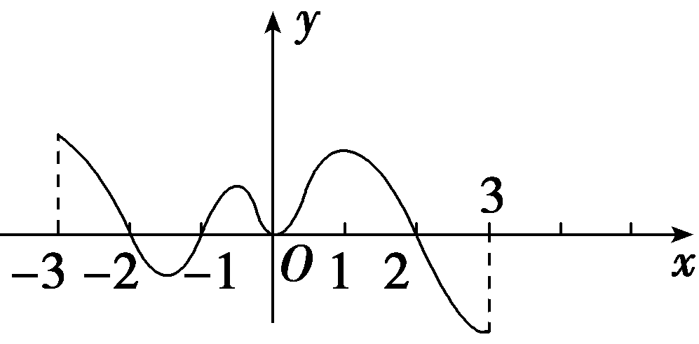
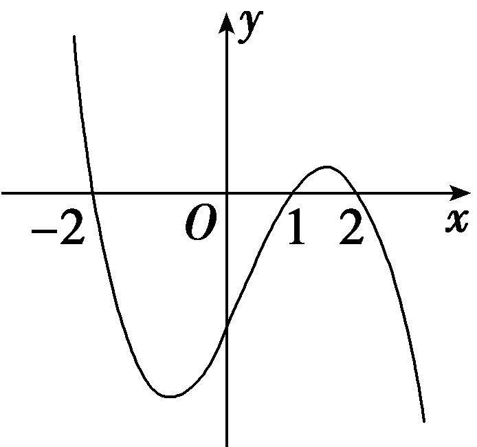
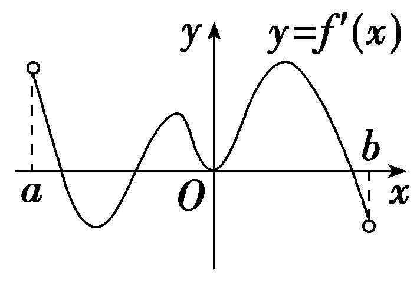
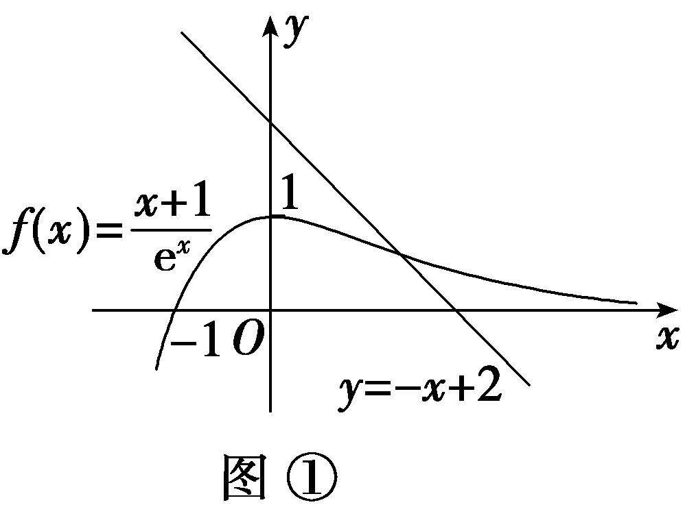
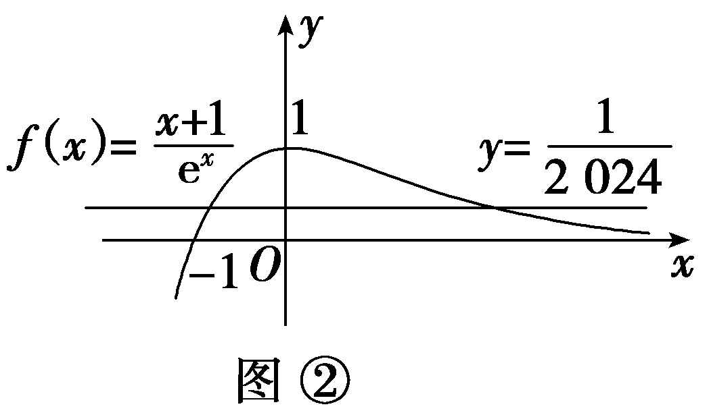
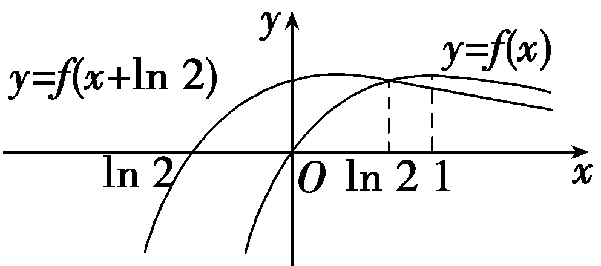

第三节　导数与函数的极值、最值

【课标研读】　1.借助函数图象，了解函数在某点取得极值的必要条件和充分条件.　2.能利用导数求函数的极大值、极小值以及给定闭区间上不超过三次的多项式函数的最大值、最小值.　3.体会导数与极值、最大(小)值的关系.

##### 1.函数的极值

（1）函数的极小值

函数<em>y</em>＝<em>f</em>(<em>x</em>)在点<em>x</em>＝<em>a</em>处的函数值<em>f</em>(<em>a</em>)比它在点<em>x</em>＝<em>a</em>附近其他点处的函数值都小，<em>f'</em>(<em>a</em>)＝0；而且在点<em>x</em>＝<em>a</em>附近的左侧<em><u>f'</u></em><u>(</u><em><u>x</u></em><u>)＜0</u>，右侧<em><u>f'</u></em><u>(</u><em><u>x</u></em><u>)＞0</u>.则<em>a</em>叫做函数<em>y</em>＝<em>f</em>(<em>x</em>)的极小值点，<em>f</em>(<em>a</em>)叫做函数<em>y</em>＝<em>f</em>(<em>x</em>)的极小值.

（2）函数的极大值

函数<em>y</em>＝<em>f</em>(<em>x</em>)在点<em>x</em>＝<em>b</em>处的函数值<em>f</em>(<em>b</em>)比它在点<em>x</em>＝<em>b</em>附近其他点处的函数值都大，<em>f'</em>(<em>b</em>)＝0；而且在点<em>x</em>＝<em>b</em>附近的左侧<em><u>f'</u></em><u>(</u><em><u>x</u></em><u>)＞0</u>，右侧<em><u>f'</u></em><u>(</u><em><u>x</u></em><u>)＜0</u>.则<em>b</em>叫做函数<em>y</em>＝<em>f</em>(<em>x</em>)的极大值点，<em>f</em>(<em>b</em>)叫做函数<em>y</em>＝<em>f</em>(<em>x</em>)的极大值.

（3）极小值点、极大值点统称为<u>极值点</u>，极小值和极大值统称为<u>极值</u>.

微提醒　（1）函数的极值点一定出现在区间的内部，区间的端点不能称为极值点.（2）在一个给定的区间上，函数可能有多个极值点，也可能不存在极值点.（3）极大值与极小值之间无确定的大小关系.

##### 2.函数的最值

（1）一般地，如果在区间[*a*，*b*]上函数*y*＝*f*(*x*)的图象是一条连续不断的曲线，那么它必有最大值和最小值.

（2）一般地，求函数*y*＝*f*(*x*)在闭区间[*a*，*b*]上的最大值与最小值的步骤如下：

①求函数<em>y</em>＝<em>f</em>(<em>x</em>)在区间(<em>a</em>，<em>b</em>)上的<u>极值</u>；

②将函数<em>y</em>＝<em>f</em>(<em>x</em>)的各极值与端点处的函数值<em><u>f</u></em><u>(</u><em><u>a</u></em><u>)，</u><em><u>f</u></em><u>(</u><em><u>b</u></em><u>)</u>比较，其中最大的一个是<u>最大值</u>，最小的一个是<u>最小值</u>.

[微提醒]　对函数最值的理解

（1）函数在其定义域上或在某给定区间上若存在最大(小)值，则其具有唯一性，即只能有一个最大(小)值.（2）函数的最值可以在区间端点处取得，但极值不能在区间端点处取得.（3）函数有最值时，不一定有极值；有极值时，不一定有最值.

【常用结论】

（1）对于可导函数<em>f</em>(<em>x</em>)，“<em>f'</em>(<em>x</em>0)＝0”是“函数<em>f</em>(<em>x</em>)在<em>x</em>＝<em>x</em>0处有极值”的必要不充分条件.

（2）若函数*f*(*x*)在区间(*a*，*b*)内只有一个极值点，则相应的极值点一定是函数的最值点.

（3）若*f*(*x*)在[*a*，*b*]上单调递增，则*f*(*a*)，*f*(*b*)分别是*f*(*x*)在[*a*，*b*]上的最小值、最大值；若*f*(*x*)在[*a*，*b*]上单调递减，则*f*(*a*)，*f*(*b*)分别是*f*(*x*)在[*a*，*b*]上的最大值、最小值.

【自主检测】

##### 1.(多选)下列结论正确的是(　　)

$\quad$A.函数的极值可能不止一个，也可能没有

$\quad$B.函数的极小值一定小于函数的极大值

$\quad$C.函数的极小值一定是函数的最小值

$\quad$D.函数的极大值一定不是函数的最小值

答案AD

##### 2.(链接人教A选择性必修二P92T1)如图是*f*(*x*)的导函数*f'*(*x*)的图象，则*f*(*x*)的极小值点的个数为(　　)

$\quad$A.1	
$\quad$B.2

$\quad$C.3	
$\quad$D.4

答案A

解析由题意知，只有在*x*＝－1处，*f'*(－1)＝0，且其两侧导数符号为左负右正，故*f*(*x*)的极小值点只有1个.故选A.

##### 3.(链接人教A选择性必修二P95例7)函数*f*(*x*)＝2*x*－*x*ln *x*的极大值是(　　)

$\quad$A. $\frac{1}{e}$ 	
$\quad$B. $\frac{2}{e}$

$\quad$C.e	
$\quad$D.e2

答案C

解析<em>f'</em>(<em>x</em>)＝2－(ln <em>x</em>＋1)＝1－ln <em>x</em>.令<em>f'</em>(<em>x</em>)＝0，得<em>x</em>＝e.当0＜<em>x</em>＜e时，<em>f'</em>(<em>x</em>)＞0；当<em>x</em>＞e时，<em>f'</em>(<em>x</em>)＜0.所以<em>x</em>＝e时，<em>f</em>(<em>x</em>)取到极大值，<em>f</em>(<em>x</em>)极大值＝<em>f</em>(e)＝e.故选C.

##### 4.(链接人教A选择性必修二P98T6)已知&lt;te&lt;te&lt;te&lt;te&lt;te<em>x</em>t style="italic"&gt;x&lt;/text&gt;t style="italic"&gt;x&lt;/text&gt;t style="italic"&gt;x&lt;/text&gt;t style="italic"&gt;x&lt;/text&gt;t style="italic"&gt;<em>f</em>&lt;/text&gt;(x)＝x3－12x＋1，x∈ $\left[－\frac{1}{3}，1\right]$ ，则&lt;te&lt;te&lt;te&lt;te&lt;te<em>x</em>t style="italic"&gt;x&lt;/text&gt;t style="italic"&gt;x&lt;/text&gt;t style="italic"&gt;x&lt;/text&gt;t style="italic"&gt;x&lt;/text&gt;t style="italic"&gt;<em>f</em>&lt;/text&gt;(x)的最大值为<u>&lt;text style="underline"&gt;　　　　</u>　　　&lt;/text&gt;，最小值为　　　　.

答案 $\frac{134}{27}$ 　－10

解析&lt;te&lt;te&lt;te&lt;te&lt;te&lt;te&lt;te&lt;te<em>x</em>t style="italic"&gt;x&lt;/text&gt;t style="italic"&gt;x&lt;/text&gt;t style="italic"&gt;x&lt;/text&gt;t style="italic"&gt;x&lt;/text&gt;t style="italic"&gt;x&lt;/text&gt;t style="italic"&gt;x&lt;/text&gt;t style="italic"&gt;x&lt;/text&gt;t style="italic"&gt;<em>&lt;text style="italic"&gt;&lt;text style="italic"&gt;&lt;text style="italic"&gt;&lt;text style="italic"&gt;f</em>&lt;/text&gt;&lt;/text&gt;&lt;/text&gt;'&lt;/text&gt;&lt;/text&gt;(x)＝3x2－12＝3(x－2)(x＋2)，因为x∈ $\left[－\frac{1}{3}，1\right]$ ，所以&lt;te&lt;te&lt;te&lt;te&lt;te&lt;te&lt;te&lt;te<em>x</em>t style="italic"&gt;x&lt;/text&gt;t style="italic"&gt;x&lt;/text&gt;t style="italic"&gt;x&lt;/text&gt;t style="italic"&gt;x&lt;/text&gt;t style="italic"&gt;x&lt;/text&gt;t style="italic"&gt;x&lt;/text&gt;t style="italic"&gt;x&lt;/text&gt;t style="italic"&gt;<em>&lt;text style="italic"&gt;&lt;text style="italic"&gt;&lt;text style="italic"&gt;&lt;text style="italic"&gt;f</em>&lt;/text&gt;&lt;/text&gt;&lt;/text&gt;'&lt;/text&gt;&lt;/text&gt;(x)＜0，故f(x)在 $\left[－\frac{1}{3}，1\right]$ 上单调递减，所以&lt;te&lt;te<em>x</em>t style="italic"&gt;x&lt;/text&gt;t style="italic"&gt;<em>&lt;text style="italic"&gt;&lt;text style="italic"&gt;f</em>&lt;/text&gt;&lt;/text&gt;&lt;/text&gt;(&lt;te&lt;te&lt;te&lt;te&lt;te<em>x</em>t style="italic"&gt;x&lt;/text&gt;t style="italic"&gt;x&lt;/text&gt;t style="italic"&gt;x&lt;/text&gt;t style="italic"&gt;x&lt;/text&gt;t style="italic"&gt;x&lt;/text&gt;)的最大值为f $\left(－\frac{1}{3}\right)＝\frac{134}{27}$ ，最小值为&lt;te&lt;te<em>x</em>t style="italic"&gt;x&lt;/text&gt;t style="italic"&gt;<em>&lt;text style="italic"&gt;&lt;text style="italic"&gt;f</em>&lt;/text&gt;&lt;/text&gt;&lt;/text&gt;（1）＝－10.

考点一　利用导数研究函数的极值　　　　多维探究

角度1　根据函数图象判断极值

(2025·河南郑州模拟)设函数<em>f</em>(<em>x</em>)在<strong>R</strong>上可导，其导函数为<em>f'</em>(<em>x</em>)，且函数<em>y</em>＝(1－<em>x</em>)<em>f'</em>(<em>x</em>)的图象如图所示，则下列结论中一定成立的是(　　)

$\quad$A.函数*f*(*x*)有极大值*f*（2）和极小值*f*（1）

$\quad$B.函数*f*(*x*)有极大值*f*(－2)和极小值*f*（1）

$\quad$C.函数*f*(*x*)有极大值*f*（2）和极小值*f*(－2)

$\quad$D.函数*f*(*x*)有极大值*f*(－2)和极小值*f*（2）

答案D

解析由题图可知，当*x*＜－2时，*f'*(*x*)＞0；当－2＜*x*＜1时，*f'*(*x*)＜0；当1＜*x*＜2时，*f'*(*x*)＜0；当*x*＞2时，*f'*(*x*)＞0.故函数*f*(*x*)在*x*＝－2处取得极大值，在*x*＝2处取得极小值.故选D.

角度2　求已知函数的极值(极值点)

已知函数<em>f</em>(<em>x</em>)＝ln <em>x</em>－<em>ax</em>(<em>a</em>∈<strong>R</strong>).

（1）当<te*x*t style="italic">a</text> $＝\frac{1}{2}$ 时，求<te*x*t style="italic">f</text>(x)的极值；

（2）讨论函数*f*(*x*)在定义域内极值点的个数.

解：（1）当<te<te<te<te<te*x*t style="italic">x</text>t style="italic">x</text>t style="italic">x</text>t style="italic">x</text>t style="italic">a</text> $＝\frac{1}{2}$ 时，<te<te<te<te<te*x*t style="italic">x</text>t style="italic">x</text>t style="italic">x</text>t style="italic">x</text>t style="italic">f</text>(x)＝ln x－ $\frac{1}{2}$ <te<te<te<te*x*t style="italic">x</text>t style="italic">x</text>t style="italic">x</text>t style="italic">x</text>，x∈(0，＋∞)，且*f*'(x) $＝\frac{1}{x}$ － $\frac{1}{2}＝\frac{2－x}{2x}$ ，

令*f'*(*x*)＝0，解得*x*＝2，则当*x*变化时，*f'*(*x*)，*f*(*x*)的变化情况如下表：

<table><tr><td>
<em>x</em>
</td><td>
(0，2)
</td><td>
2
</td><td>
(2，＋∞)
</td></tr><tr><td>
<em>f'</em>(<em>x</em>)
</td><td>
＋
</td><td>
0
</td><td>
－
</td></tr><tr><td>
<em>f</em>(<em>x</em>)
</td><td>
单调递增
</td><td>
ln 2－1
</td><td>
单调递减
</td></tr></table>

故<em>f</em>(<em>x</em>)极大值＝<em>f</em>（2）＝ln 2－1，无极小值.

（2）<te<te*x*t style="it*a*lic">x</text>t style="italic">f'</text>(x) $＝\frac{1}{x}$ －<te*x*t style="italic">a</text> $＝\frac{1－ax}{x}$ (<te*x*t style="it*a*lic">x</text>＞0).

当*a*≤0时，*f'*(*x*)＞0在(0，＋∞)上恒成立，则函数*f*(*x*)在(0，＋∞)上单调递增，无极值点；

当<te<te*x*t style="italic">x</text>t style="italic">a</text>＞0时，若x∈ $\left(0，\frac{1}{a}\right)$ ，则<te*x*t style="italic">f'</text>(*x*)＞0，

若<te*x*t style="italic">x</text>∈ $\left(\frac{1}{a}，＋\infty \right)$ ，则<te*x*t style="italic">f'</text>(*x*)＜0，

故函数<te<te*x*t style="italic">x</text>t style="italic">f</text>(x)在x $＝\frac{1}{a}$ 处有极大值.

综上可知，当<te<te<te*x*t style="italic">x</text>t style="it*a*lic">x</text>t style="italic">a</text>≤0时，函数*<text style="italic">f*</text>(x)无极值点；当a＞0时，函数f(x)有一个极大值点，即x $＝\frac{1}{a}$ .

角度3　已知函数的极值(极值点)求参数

(2025·八省适应性测试)已知函数<te<te<te*x*t style="italic">x</text>t style="it*a*lic">x</text>t style="italic">f</text>(x)＝aln x＋ $\frac{b}{x}$ －<te<te*x*t style="italic">x</text>t style="it*a*lic">x</text>.

（1）设*a*＝1，*b*＝－2，求曲线*y*＝*f*(*x*)的斜率为2的切线方程；

（2）若*x*＝1是*f*(*x*)的极小值点，求实数*b*的取值范围.

解：（1）当<te<te<te<te*x*t style="italic">x</text>t style="italic">x</text>t style="italic">x</text>t style="italic">a</text>＝1，*b*＝－2时，*f*(x)＝ln x－ $\frac{2}{x}$ －<te<te<te*x*t style="italic">x</text>t style="italic">x</text>t style="italic">x</text>，其中x＞0，

则<te<te*x*t style="italic">x</text>t style="italic">*f'*</text>(x) $＝\frac{1}{x}$ ＋ $\frac{2}{x^{2}}$ －1 $＝\frac{x－x^{2}+2}{x^{2}}$ ，令<te<te*x*t style="italic">x</text>t style="italic">*f'*</text>(x)＝2，所以 $\frac{x－x^{2}+2}{x^{2}}＝$ 2，

化简得3&lt;te&lt;te<em>x</em>t style="italic"&gt;x&lt;/text&gt;t style="italic"&gt;x&lt;/text&gt;2－x－2＝0，即 $\left(x－1\right)\left(3x+2\right)＝$ 0，解得&lt;te&lt;te<em>x</em>t style="italic"&gt;x&lt;/text&gt;t style="italic"&gt;x&lt;/text&gt;＝1(负值舍去).

又此时*f*（1）＝－3，则切线方程过点 $\left(1,-3\right)$ ，

所以切线方程为<te<text st*y*le="italic">x</text>t style="italic">y</text>＋3＝2 $\left(x－1\right)$ ，即2<text st*y*le="italic">x</text>－*y*－5＝0.

（2）由题意可得<te<te*x*t style="italic">x</text>t style="italic">f</text>(x)定义域为 $\left(0，＋\infty \right)$ ，<te<te*x*t style="italic">x</text>t style="italic">f</text>'(x) $＝\frac{a}{x}$ － $\frac{b}{x^{2}}$ －1 $＝\frac{－x^{2}＋ax－b}{x^{2}}$ .

因为*x*＝1是*f*(*x*)的极小值点，则*f'*（1）＝－1＋*a*－*b*＝0，所以*a*＝*b*＋1，

则<te*x*t style="italic">f'</text>(x) $＝\frac{－x^{2}＋\left(b+1\right)x－b}{x^{2}}＝$ － $\frac{\left(x－1\right)\left(x－b\right)}{x^{2}}$ .

若<te<te<te*x*t style="italic">x</text>t style="italic">x</text>t style="italic">b</text>≤0时，令*<text style="italic">f'*</text>(x)＞0，所以0＜x＜1，令f' $\left(x\right)$ ＜0，所以<te<te*x*t style="italic">x</text>t style="italic">x</text>＞1，

则<te*x*t style="italic">f</text>(x)在 $\left(0，1\right)$ 上单调递增，在 $\left(1，＋\infty \right)$ 上单调递减，

得*x*＝1是*f*(*x*)的极大值点，不满足题意.

若0＜*b*＜1时，令*f'*(*x*)＞0，所以*b*＜*x*＜1，

令<te<te*x*t style="italic">x</text>t style="italic">f'</text> $\left(x\right)$ ＜0，所以0＜<te*x*t style="italic">x</text>＜*b*或x＞1，

则<te*x*t style="italic">f</text>(x)在 $\left(b，1\right)$ 上单调递增，在 $\left(0，b\right)$ ， $\left(1，＋\infty \right)$ 上单调递减，

得*x*＝1是*f*(*x*)的极大值点，不满足题意.

若<te<te*x*t style="italic">x</text>t style="italic">b</text>＝1，则*<text style="italic">f*'</text>(x)＝－ $\frac{\left(x－1\right)^{2}}{x^{2}}$ ＜0，<te*x*t style="italic">f</text>(*x*)在 $\left(0，＋\infty \right)$ 上单调递减，无极值，不满足题意.

若<te<te<te<te*x*t style="italic">x</text>t style="italic">x</text>t style="italic">x</text>t style="italic">*<text style="italic">b*</text></text>＞1，令*<text style="italic">f'*</text>(x)＞0，所以1＜x＜b，令f' $\left(x\right)$ ＜0，所以0＜<te<te<te*x*t style="italic">x</text>t style="italic">x</text>t style="italic">x</text>＜1或x＞*<text style="italic"><text style="italic">b*</text></text>，

则<te*x*t style="italic">f</text>(x)在 $\left(1，b\right)$ 上单调递增，在 $\left(0，1\right)$ ， $\left(b，＋\infty \right)$ 上单调递减，

得*x*＝1是*f*(*x*)的极小值点，满足题意.

所以*x*＝1是*f*(*x*)的极小值点时，*b*＞1，即实数*b*的取值范围为(1，＋∞).

##### 1.由图象判断函数*y*＝*f*(*x*)极值的两个关键点

（1）由*y*＝*f'*(*x*)的图象与*x*轴的交点，可得函数*y*＝*f*(*x*)的可能极值点.

（2）由导函数*y*＝*f'*(*x*)的图象可以看出*f'*(*x*)的正负，从而可得函数*y*＝*f*(*x*)的单调性，两者结合可得极值点.

##### 2.求函数的极值或极值点的步骤

第一步：求导数*f'*(*x*)，不要忘记函数*f*(*x*)的定义域；

第二步：求方程*f'*(*x*)＝0的根；

第三步：检查在方程的根的左、右两侧*f'*(*x*)的符号，确定极值点或函数的极值.

##### 3.根据函数的极值(点)求参数的两个要领

（1）列式：根据极值点处导数为0和极值这两个条件列方程组，利用待定系数法求解.

（2）验证：求解后验证根的合理性.

对点练1.(2025·福建福州质检)已知函数<em>f</em>(<em>x</em>)＝<em>x</em>(<em>x</em>－<em>c</em>)2在<em>x</em>＝2处有极小值，则<em>c</em>的值为(　　)

$\quad$A.2	
$\quad$B.4

$\quad$C.6	
$\quad$D.2或6

答案A

解析由题意，<te<te<te<te<te<te<te<te<te<te<te<te<te<te<te<te<te<te<te<te<te<te<te<te<te<te<te<te<te<te<te<te<text style="itali*c*">x</text>t style="italic">x</text>t style="italic">x</text>t style="italic">x</text>t style="italic">x</text>t style="italic">x</text>t style="italic">x</text>t style="italic">x</text>t style="italic">x</text>t style="italic">x</text>t style="italic">x</text>t style="italic">x</text>t style="italic">x</text>t style="italic">x</text>t style="itali*c*">x</text>t style="italic">x</text>t style="italic">x</text>t style="italic">x</text>t style="italic">x</text>t style="italic">x</text>t style="italic">x</text>t style="italic">x</text>t style="italic">x</text>t style="italic">x</text>t style="italic">x</text>t style="italic">x</text>t style="italic">x</text>t style="italic">x</text>t style="itali<text style="itali<text style="itali<text style="itali*c*">c</text>">c</text>">c</text>">x</text>t style="itali*c*">x</text>t style="italic">x</text>t style="italic">x</text>t style="italic">*<text style="italic"><text style="italic"><text style="italic"><text style="italic"><text style="italic"><text style="italic"><text style="italic"><text style="italic"><text style="italic"><text style="italic">f*</text></text></text></text></text></text></text>'</text></text></text></text>(x) $＝\left(x－c\right)^{2}$ ＋2<te<te<te<te<te<te<te<te<te<te<te<te<te<te<te<te<te<te<te<te<te<te<te<te<te<te<te<te<te<te<te<text style="itali*c*">x</text>t style="italic">x</text>t style="italic">x</text>t style="italic">x</text>t style="italic">x</text>t style="italic">x</text>t style="italic">x</text>t style="italic">x</text>t style="italic">x</text>t style="italic">x</text>t style="italic">x</text>t style="italic">x</text>t style="italic">x</text>t style="italic">x</text>t style="itali*c*">x</text>t style="italic">x</text>t style="italic">x</text>t style="italic">x</text>t style="italic">x</text>t style="italic">x</text>t style="italic">x</text>t style="italic">x</text>t style="italic">x</text>t style="italic">x</text>t style="italic">x</text>t style="italic">x</text>t style="italic">x</text>t style="italic">x</text>t style="itali<text style="itali<text style="itali<text style="itali*c*">c</text>">c</text>">c</text>">x</text>t style="itali*c*">x</text>t style="italic">x</text>t style="italic">x</text> $\left(x－c\right)＝$ (<te<te<te<te<te<te<te<te<te<te<te<te<te<te<te<te<te<te<te<te<te<te<te<te<te<te<te<te<te<te<te<text style="itali*c*">x</text>t style="italic">x</text>t style="italic">x</text>t style="italic">x</text>t style="italic">x</text>t style="italic">x</text>t style="italic">x</text>t style="italic">x</text>t style="italic">x</text>t style="italic">x</text>t style="italic">x</text>t style="italic">x</text>t style="italic">x</text>t style="italic">x</text>t style="itali*c*">x</text>t style="italic">x</text>t style="italic">x</text>t style="italic">x</text>t style="italic">x</text>t style="italic">x</text>t style="italic">x</text>t style="italic">x</text>t style="italic">x</text>t style="italic">x</text>t style="italic">x</text>t style="italic">x</text>t style="italic">x</text>t style="italic">x</text>t style="itali<text style="itali<text style="itali<text style="itali*c*">c</text>">c</text>">c</text>">x</text>t style="itali*c*">x</text>t style="italic">x</text>t style="italic">x</text>－c)·(3x－c)，则*<text style="italic"><text style="italic"><text style="italic"><text style="italic"><text style="italic"><text style="italic"><text style="italic"><text style="italic"><text style="italic"><text style="italic"><text style="italic">f*</text></text></text></text></text></text></text>'</text></text></text></text>（2） $＝\left(2－c\right)\left(6－c\right)＝$ 0，所以<te<te<te<te<te<te<te<te<te<te<te<te<te<te<te<te<te<te<te<te<te<te<te<te<te<te<te<te<te<text style="itali*c*">x</text>t style="italic">x</text>t style="italic">x</text>t style="italic">x</text>t style="italic">x</text>t style="italic">x</text>t style="italic">x</text>t style="italic">x</text>t style="italic">x</text>t style="italic">x</text>t style="italic">x</text>t style="italic">x</text>t style="italic">x</text>t style="italic">x</text>t style="itali*c*">x</text>t style="italic">x</text>t style="italic">x</text>t style="italic">x</text>t style="italic">x</text>t style="italic">x</text>t style="italic">x</text>t style="italic">x</text>t style="italic">x</text>t style="italic">x</text>t style="italic">x</text>t style="italic">x</text>t style="italic">x</text>t style="italic">x</text>t style="itali<text style="itali<text style="itali<text style="itali*c*">c</text>">c</text>">c</text>">x</text>t style="italic">c</text>＝2或c＝6.若c＝2，则<te<te<te*x*t style="italic">x</text>t style="italic">x</text>t style="italic">*<text style="italic"><text style="italic"><text style="italic"><text style="italic"><text style="italic"><text style="italic"><text style="italic"><text style="italic"><text style="italic"><text style="italic">f*</text></text></text></text></text></text></text>'</text></text></text></text>(x)＝(x－2)(3x－2)，当x∈ $\left(－\infty ，\frac{2}{3}\right)$ 时，<te<te<te<te<te<te<te<te<te<te<te<te<te<te<te<te<te<te<te<te<te<te<te<te<te<te<te<te<te<te<te<te<text style="itali*c*">x</text>t style="italic">x</text>t style="italic">x</text>t style="italic">x</text>t style="italic">x</text>t style="italic">x</text>t style="italic">x</text>t style="italic">x</text>t style="italic">x</text>t style="italic">x</text>t style="italic">x</text>t style="italic">x</text>t style="italic">x</text>t style="italic">x</text>t style="itali*c*">x</text>t style="italic">x</text>t style="italic">x</text>t style="italic">x</text>t style="italic">x</text>t style="italic">x</text>t style="italic">x</text>t style="italic">x</text>t style="italic">x</text>t style="italic">x</text>t style="italic">x</text>t style="italic">x</text>t style="italic">x</text>t style="italic">x</text>t style="itali<text style="itali<text style="itali<text style="itali*c*">c</text>">c</text>">c</text>">x</text>t style="itali*c*">x</text>t style="italic">x</text>t style="italic">x</text>t style="italic">*<text style="italic"><text style="italic"><text style="italic"><text style="italic"><text style="italic"><text style="italic"><text style="italic"><text style="italic"><text style="italic"><text style="italic">f*</text></text></text></text></text></text></text>'</text></text></text></text>(x)＞0，f(x)单调递增；当x∈ $\left(\frac{2}{3}，2\right)$ 时，<te<te<te<te<te<te<te<te<te<te<te<te<te<te<te<te<te<te<te<te<te<te<te<te<te<te<te<te<te<te<te<te<text style="itali*c*">x</text>t style="italic">x</text>t style="italic">x</text>t style="italic">x</text>t style="italic">x</text>t style="italic">x</text>t style="italic">x</text>t style="italic">x</text>t style="italic">x</text>t style="italic">x</text>t style="italic">x</text>t style="italic">x</text>t style="italic">x</text>t style="italic">x</text>t style="itali*c*">x</text>t style="italic">x</text>t style="italic">x</text>t style="italic">x</text>t style="italic">x</text>t style="italic">x</text>t style="italic">x</text>t style="italic">x</text>t style="italic">x</text>t style="italic">x</text>t style="italic">x</text>t style="italic">x</text>t style="italic">x</text>t style="italic">x</text>t style="itali<text style="itali<text style="itali<text style="itali*c*">c</text>">c</text>">c</text>">x</text>t style="itali*c*">x</text>t style="italic">x</text>t style="italic">x</text>t style="italic">*<text style="italic"><text style="italic"><text style="italic"><text style="italic"><text style="italic"><text style="italic"><text style="italic"><text style="italic"><text style="italic"><text style="italic">f*</text></text></text></text></text></text></text>'</text></text></text></text>(x)＜0，f(x)单调递减；当x∈(2，＋∞)时，*<text style="italic"><text style="italic"><text style="italic"><text style="italic"><text style="italic">f'*</text></text></text></text></text>(x)＞0，f(x)单调递增，函数f(x)在x＝2处有极小值，满足题意；若c＝6，则f'(x)＝(x－6)(3x－6)，当x∈(－∞，2)时，f'(x)＞0，f(x)单调递增；当x∈(2，6)时，f'(x)＜0，f(x)单调递减；当x∈(6，＋∞)时，f'(x)＞0，f(x)单调递增，函数f(x)在x＝2处有极大值，不符合题意.综上，c＝2.故选A.

对点练2.(2025·江苏苏州模拟)已知函数<em>f</em>(<em>x</em>)＝<em>x</em>2－4<em>x</em>＋<em>a</em>ln <em>x</em>有两个极值点，则实数<em>a</em>的取值范围为(　　)

$\quad$A.(－∞，2]	
$\quad$B.(－∞，2)

$\quad$C.(0，2]	
$\quad$D.(0，2)

答案D

解析函数&lt;te&lt;te&lt;te&lt;te&lt;te&lt;te&lt;te&lt;te&lt;te&lt;text style="it<em>a</em>lic"&gt;x&lt;/text&gt;t style="italic"&gt;x&lt;/text&gt;t style="it<em>a</em>lic"&gt;x&lt;/text&gt;t style="italic"&gt;x&lt;/text&gt;t style="italic"&gt;x&lt;/text&gt;t style="italic"&gt;x&lt;/text&gt;t style="italic"&gt;x&lt;/text&gt;t style="italic"&gt;x&lt;/text&gt;t style="italic"&gt;x&lt;/text&gt;t style="italic"&gt;<em>f</em>&lt;/text&gt;(x)的定义域是(0，＋∞)，<em>&lt;text style="italic"&gt;f'</em>&lt;/text&gt;(x)＝&lt;text style="subscript"&gt;2&lt;/text&gt;x－4＋ $\frac{a}{x}＝\frac{2x^{2}－4x＋a}{x}$ .因为函数&lt;te&lt;te&lt;te&lt;te&lt;te&lt;te&lt;te&lt;te&lt;te&lt;text style="it<em>a</em>lic"&gt;x&lt;/text&gt;t style="italic"&gt;x&lt;/text&gt;t style="it<em>a</em>lic"&gt;x&lt;/text&gt;t style="italic"&gt;x&lt;/text&gt;t style="italic"&gt;x&lt;/text&gt;t style="italic"&gt;x&lt;/text&gt;t style="italic"&gt;x&lt;/text&gt;t style="italic"&gt;x&lt;/text&gt;t style="italic"&gt;x&lt;/text&gt;t style="italic"&gt;<em>f</em>&lt;/text&gt;(x)有两个极值点，所以方程<em>&lt;text style="italic"&gt;f'</em>&lt;/text&gt;(x)＝0有两个不相等的正根，所以方程&lt;text style="subscript"&gt;2&lt;/text&gt;x2－4x＋a＝0有两个不相等的正根x1，x2，所以 $\left\{\begin{matrix}\Delta =16－8a>0，\\x_{1}x_{2}＝\frac{a}{2}>0，\end{matrix}\right.$ 得0＜&lt;te&lt;te&lt;text style="it<em>a</em>lic"&gt;x&lt;/text&gt;t style="italic"&gt;x&lt;/text&gt;t style="italic"&gt;a&lt;/text&gt;＜&lt;te<em>x</em>t style="superscript"&gt;2&lt;/text&gt;.故选D.

考点二　利用导数研究函数的最值　　　　多维探究

角度1　不含参数的函数的最值

（1）(2025·广东佛山模拟)函数&lt;te&lt;te&lt;te<em>x</em>t style="italic"&gt;x&lt;/text&gt;t style="italic"&gt;x&lt;/text&gt;t style="italic"&gt;f&lt;/text&gt;(x)＝sin x＋ $\frac{1}{2}$ sin 2&lt;te&lt;te<em>x</em>t style="italic"&gt;x&lt;/text&gt;t style="italic"&gt;x&lt;/text&gt;的最大值为<u>　　　　</u>.

（2）(2021·新高考Ⅰ卷)函数<em>f</em>(<em>x</em>)＝｜2<em>x</em>－1｜－2ln <em>x</em>的最小值为<u>　　　　</u>.

答案（1） $\frac{3\sqrt{3}}{4}$ 　 （2）1

解析（1）由题意得&lt;te&lt;te&lt;te&lt;te&lt;te&lt;te&lt;te&lt;te&lt;te&lt;te&lt;te&lt;te&lt;te&lt;te&lt;te&lt;te&lt;te&lt;te&lt;te&lt;te<em>x</em>t style="italic"&gt;x&lt;/text&gt;t style="italic"&gt;x&lt;/text&gt;t style="italic"&gt;x&lt;/text&gt;t style="italic"&gt;x&lt;/text&gt;t style="italic"&gt;x&lt;/text&gt;t style="italic"&gt;x&lt;/text&gt;t style="italic"&gt;x&lt;/text&gt;t style="italic"&gt;x&lt;/text&gt;t style="italic"&gt;x&lt;/text&gt;t style="italic"&gt;x&lt;/text&gt;t style="italic"&gt;x&lt;/text&gt;t style="italic"&gt;x&lt;/text&gt;t style="italic"&gt;x&lt;/text&gt;t style="italic"&gt;x&lt;/text&gt;t style="italic"&gt;x&lt;/text&gt;t style="italic"&gt;x&lt;/text&gt;t style="italic"&gt;x&lt;/text&gt;t style="italic"&gt;x&lt;/text&gt;t style="italic"&gt;x&lt;/text&gt;t style="italic"&gt;<em>&lt;text style="italic"&gt;&lt;text style="italic"&gt;&lt;text style="italic"&gt;f</em>&lt;/text&gt;&lt;/text&gt;&lt;/text&gt;&lt;/text&gt;(x)为周期函数，且<em>T</em>＝2π，<em>&lt;text style="italic"&gt;&lt;text style="italic"&gt;f'</em>&lt;/text&gt;&lt;/text&gt;(x)＝cos x＋cos 2x＝2cos2x＋cos x－1＝(2cos x－1)(cos x＋1)，因为cos x＋1≥0，所以当 $\frac{1}{2}$ ＜cos &lt;te&lt;te&lt;te&lt;te&lt;te&lt;te&lt;te&lt;te&lt;te&lt;te&lt;te&lt;te&lt;te&lt;te&lt;te&lt;te&lt;te&lt;te&lt;te<em>x</em>t style="italic"&gt;x&lt;/text&gt;t style="italic"&gt;x&lt;/text&gt;t style="italic"&gt;x&lt;/text&gt;t style="italic"&gt;x&lt;/text&gt;t style="italic"&gt;x&lt;/text&gt;t style="italic"&gt;x&lt;/text&gt;t style="italic"&gt;x&lt;/text&gt;t style="italic"&gt;x&lt;/text&gt;t style="italic"&gt;x&lt;/text&gt;t style="italic"&gt;x&lt;/text&gt;t style="italic"&gt;x&lt;/text&gt;t style="italic"&gt;x&lt;/text&gt;t style="italic"&gt;x&lt;/text&gt;t style="italic"&gt;x&lt;/text&gt;t style="italic"&gt;x&lt;/text&gt;t style="italic"&gt;x&lt;/text&gt;t style="italic"&gt;x&lt;/text&gt;t style="italic"&gt;x&lt;/text&gt;t style="italic"&gt;x&lt;/text&gt;≤1时，<em>&lt;text style="italic"&gt;&lt;text style="italic"&gt;&lt;text style="italic"&gt;&lt;text style="italic"&gt;f</em>&lt;/text&gt;&lt;/text&gt;&lt;/text&gt;&lt;/text&gt;'(x)＞0，当－1≤cos x＜ $\frac{1}{2}$ 时，&lt;te&lt;te&lt;te&lt;te&lt;te&lt;te&lt;te&lt;te&lt;te&lt;te&lt;te&lt;te&lt;te&lt;te&lt;te&lt;te&lt;te&lt;te&lt;te&lt;te<em>x</em>t style="italic"&gt;x&lt;/text&gt;t style="italic"&gt;x&lt;/text&gt;t style="italic"&gt;x&lt;/text&gt;t style="italic"&gt;x&lt;/text&gt;t style="italic"&gt;x&lt;/text&gt;t style="italic"&gt;x&lt;/text&gt;t style="italic"&gt;x&lt;/text&gt;t style="italic"&gt;x&lt;/text&gt;t style="italic"&gt;x&lt;/text&gt;t style="italic"&gt;x&lt;/text&gt;t style="italic"&gt;x&lt;/text&gt;t style="italic"&gt;x&lt;/text&gt;t style="italic"&gt;x&lt;/text&gt;t style="italic"&gt;x&lt;/text&gt;t style="italic"&gt;x&lt;/text&gt;t style="italic"&gt;x&lt;/text&gt;t style="italic"&gt;x&lt;/text&gt;t style="italic"&gt;x&lt;/text&gt;t style="italic"&gt;x&lt;/text&gt;t style="italic"&gt;<em>&lt;text style="italic"&gt;&lt;text style="italic"&gt;&lt;text style="italic"&gt;f</em>&lt;/text&gt;&lt;/text&gt;&lt;/text&gt;&lt;/text&gt;'(x)≤0，即当2<em>&lt;text style="italic"&gt;&lt;text style="italic"&gt;&lt;text style="italic"&gt;&lt;text style="italic"&gt;&lt;text style="italic"&gt;&lt;text style="italic"&gt;&lt;text style="italic"&gt;k</em>&lt;/text&gt;&lt;/text&gt;&lt;/text&gt;&lt;/text&gt;&lt;/text&gt;&lt;/text&gt;&lt;/text&gt;π－ $\frac{\pi }{3}$ ＜&lt;te&lt;te&lt;te&lt;te&lt;te&lt;te&lt;te&lt;te&lt;te&lt;te&lt;te&lt;te&lt;te&lt;te&lt;te&lt;te&lt;te&lt;te&lt;te<em>x</em>t style="italic"&gt;x&lt;/text&gt;t style="italic"&gt;x&lt;/text&gt;t style="italic"&gt;x&lt;/text&gt;t style="italic"&gt;x&lt;/text&gt;t style="italic"&gt;x&lt;/text&gt;t style="italic"&gt;x&lt;/text&gt;t style="italic"&gt;x&lt;/text&gt;t style="italic"&gt;x&lt;/text&gt;t style="italic"&gt;x&lt;/text&gt;t style="italic"&gt;x&lt;/text&gt;t style="italic"&gt;x&lt;/text&gt;t style="italic"&gt;x&lt;/text&gt;t style="italic"&gt;x&lt;/text&gt;t style="italic"&gt;x&lt;/text&gt;t style="italic"&gt;x&lt;/text&gt;t style="italic"&gt;x&lt;/text&gt;t style="italic"&gt;x&lt;/text&gt;t style="italic"&gt;x&lt;/text&gt;t style="italic"&gt;x&lt;/text&gt;＜2<em>&lt;text style="italic"&gt;&lt;text style="italic"&gt;&lt;text style="italic"&gt;&lt;text style="italic"&gt;&lt;text style="italic"&gt;&lt;text style="italic"&gt;&lt;text style="italic"&gt;k</em>&lt;/text&gt;&lt;/text&gt;&lt;/text&gt;&lt;/text&gt;&lt;/text&gt;&lt;/text&gt;&lt;/text&gt;π＋ $\frac{\pi }{3}$ ，&lt;te&lt;te&lt;te&lt;te&lt;te&lt;te&lt;te<em>x</em>t style="italic"&gt;x&lt;/text&gt;t style="italic"&gt;x&lt;/text&gt;t style="italic"&gt;x&lt;/text&gt;t style="italic"&gt;x&lt;/text&gt;t style="italic"&gt;x&lt;/text&gt;t style="italic"&gt;x&lt;/text&gt;t style="italic"&gt;<em>&lt;text style="italic"&gt;&lt;text style="italic"&gt;&lt;text style="italic"&gt;&lt;text style="italic"&gt;&lt;text style="italic"&gt;&lt;text style="italic"&gt;k</em>&lt;/text&gt;&lt;/text&gt;&lt;/text&gt;&lt;/text&gt;&lt;/text&gt;&lt;/text&gt;&lt;/text&gt;∈<strong>&lt;text style="bold"&gt;&lt;text style="bold"&gt;Z</strong>&lt;/text&gt;&lt;/text&gt;时，&lt;te&lt;te&lt;te&lt;te&lt;te&lt;te&lt;te&lt;te&lt;te&lt;te&lt;te&lt;te&lt;te<em>x</em>t style="italic"&gt;x&lt;/text&gt;t style="italic"&gt;x&lt;/text&gt;t style="italic"&gt;x&lt;/text&gt;t style="italic"&gt;x&lt;/text&gt;t style="italic"&gt;x&lt;/text&gt;t style="italic"&gt;x&lt;/text&gt;t style="italic"&gt;x&lt;/text&gt;t style="italic"&gt;x&lt;/text&gt;t style="italic"&gt;x&lt;/text&gt;t style="italic"&gt;x&lt;/text&gt;t style="italic"&gt;x&lt;/text&gt;t style="italic"&gt;x&lt;/text&gt;t style="italic"&gt;<em>&lt;text style="italic"&gt;&lt;text style="italic"&gt;&lt;text style="italic"&gt;f</em>&lt;/text&gt;&lt;/text&gt;&lt;/text&gt;&lt;/text&gt;(x)单调递增，当2kπ＋ $\frac{\pi }{3}$ ＜&lt;te&lt;te&lt;te&lt;te&lt;te&lt;te&lt;te&lt;te&lt;te&lt;te&lt;te&lt;te&lt;te&lt;te&lt;te&lt;te&lt;te&lt;te&lt;te<em>x</em>t style="italic"&gt;x&lt;/text&gt;t style="italic"&gt;x&lt;/text&gt;t style="italic"&gt;x&lt;/text&gt;t style="italic"&gt;x&lt;/text&gt;t style="italic"&gt;x&lt;/text&gt;t style="italic"&gt;x&lt;/text&gt;t style="italic"&gt;x&lt;/text&gt;t style="italic"&gt;x&lt;/text&gt;t style="italic"&gt;x&lt;/text&gt;t style="italic"&gt;x&lt;/text&gt;t style="italic"&gt;x&lt;/text&gt;t style="italic"&gt;x&lt;/text&gt;t style="italic"&gt;x&lt;/text&gt;t style="italic"&gt;x&lt;/text&gt;t style="italic"&gt;x&lt;/text&gt;t style="italic"&gt;x&lt;/text&gt;t style="italic"&gt;x&lt;/text&gt;t style="italic"&gt;x&lt;/text&gt;t style="italic"&gt;x&lt;/text&gt;＜2<em>&lt;text style="italic"&gt;&lt;text style="italic"&gt;&lt;text style="italic"&gt;&lt;text style="italic"&gt;&lt;text style="italic"&gt;&lt;text style="italic"&gt;&lt;text style="italic"&gt;k</em>&lt;/text&gt;&lt;/text&gt;&lt;/text&gt;&lt;/text&gt;&lt;/text&gt;&lt;/text&gt;&lt;/text&gt;π＋ $\frac{5\pi }{3}$ ，&lt;te&lt;te&lt;te&lt;te&lt;te&lt;te&lt;te<em>x</em>t style="italic"&gt;x&lt;/text&gt;t style="italic"&gt;x&lt;/text&gt;t style="italic"&gt;x&lt;/text&gt;t style="italic"&gt;x&lt;/text&gt;t style="italic"&gt;x&lt;/text&gt;t style="italic"&gt;x&lt;/text&gt;t style="italic"&gt;<em>&lt;text style="italic"&gt;&lt;text style="italic"&gt;&lt;text style="italic"&gt;&lt;text style="italic"&gt;&lt;text style="italic"&gt;&lt;text style="italic"&gt;k</em>&lt;/text&gt;&lt;/text&gt;&lt;/text&gt;&lt;/text&gt;&lt;/text&gt;&lt;/text&gt;&lt;/text&gt;∈<strong>&lt;text style="bold"&gt;&lt;text style="bold"&gt;Z</strong>&lt;/text&gt;&lt;/text&gt;时，&lt;te&lt;te&lt;te&lt;te&lt;te&lt;te&lt;te&lt;te&lt;te&lt;te&lt;te&lt;te&lt;te<em>x</em>t style="italic"&gt;x&lt;/text&gt;t style="italic"&gt;x&lt;/text&gt;t style="italic"&gt;x&lt;/text&gt;t style="italic"&gt;x&lt;/text&gt;t style="italic"&gt;x&lt;/text&gt;t style="italic"&gt;x&lt;/text&gt;t style="italic"&gt;x&lt;/text&gt;t style="italic"&gt;x&lt;/text&gt;t style="italic"&gt;x&lt;/text&gt;t style="italic"&gt;x&lt;/text&gt;t style="italic"&gt;x&lt;/text&gt;t style="italic"&gt;x&lt;/text&gt;t style="italic"&gt;<em>&lt;text style="italic"&gt;&lt;text style="italic"&gt;&lt;text style="italic"&gt;f</em>&lt;/text&gt;&lt;/text&gt;&lt;/text&gt;&lt;/text&gt;(x)单调递减，故f(x)在x＝2kπ＋ $\frac{\pi }{3}$ ，&lt;te&lt;te&lt;te&lt;te&lt;te&lt;te&lt;te<em>x</em>t style="italic"&gt;x&lt;/text&gt;t style="italic"&gt;x&lt;/text&gt;t style="italic"&gt;x&lt;/text&gt;t style="italic"&gt;x&lt;/text&gt;t style="italic"&gt;x&lt;/text&gt;t style="italic"&gt;x&lt;/text&gt;t style="italic"&gt;<em>&lt;text style="italic"&gt;&lt;text style="italic"&gt;&lt;text style="italic"&gt;&lt;text style="italic"&gt;&lt;text style="italic"&gt;&lt;text style="italic"&gt;k</em>&lt;/text&gt;&lt;/text&gt;&lt;/text&gt;&lt;/text&gt;&lt;/text&gt;&lt;/text&gt;&lt;/text&gt;∈<strong>&lt;text style="bold"&gt;&lt;text style="bold"&gt;Z</strong>&lt;/text&gt;&lt;/text&gt;处取得极大值，即最大值，所以&lt;te&lt;te&lt;te&lt;te&lt;te&lt;te&lt;te&lt;te&lt;te&lt;te&lt;te&lt;te&lt;te<em>x</em>t style="italic"&gt;x&lt;/text&gt;t style="italic"&gt;x&lt;/text&gt;t style="italic"&gt;x&lt;/text&gt;t style="italic"&gt;x&lt;/text&gt;t style="italic"&gt;x&lt;/text&gt;t style="italic"&gt;x&lt;/text&gt;t style="italic"&gt;x&lt;/text&gt;t style="italic"&gt;x&lt;/text&gt;t style="italic"&gt;x&lt;/text&gt;t style="italic"&gt;x&lt;/text&gt;t style="italic"&gt;x&lt;/text&gt;t style="italic"&gt;x&lt;/text&gt;t style="italic"&gt;<em>&lt;text style="italic"&gt;&lt;text style="italic"&gt;&lt;text style="italic"&gt;f</em>&lt;/text&gt;&lt;/text&gt;&lt;/text&gt;&lt;/text&gt;(x)max＝sin $\frac{\pi }{3}$ ＋ $\frac{1}{2}$ sin(&lt;te&lt;te&lt;te&lt;te&lt;te&lt;te&lt;te&lt;te&lt;te&lt;te&lt;te&lt;te&lt;te&lt;te&lt;te&lt;te<em>x</em>t style="italic"&gt;x&lt;/text&gt;t style="italic"&gt;x&lt;/text&gt;t style="italic"&gt;x&lt;/text&gt;t style="italic"&gt;x&lt;/text&gt;t style="italic"&gt;x&lt;/text&gt;t style="italic"&gt;x&lt;/text&gt;t style="italic"&gt;x&lt;/text&gt;t style="italic"&gt;x&lt;/text&gt;t style="italic"&gt;x&lt;/text&gt;t style="italic"&gt;x&lt;/text&gt;t style="italic"&gt;x&lt;/text&gt;t style="italic"&gt;x&lt;/text&gt;t style="italic"&gt;x&lt;/text&gt;t style="italic"&gt;x&lt;/text&gt;t style="italic"&gt;x&lt;/text&gt;t style="superscript"&gt;2&lt;/text&gt;× $\frac{\pi }{3}$ ) $＝\frac{\sqrt{3}}{2}$ ＋ $\frac{1}{2}$ × $\frac{\sqrt{3}}{2}＝\frac{3\sqrt{3}}{4}$ .

（2）函数&lt;te&lt;te&lt;te&lt;te&lt;te&lt;te&lt;te&lt;te&lt;te&lt;te&lt;te&lt;te&lt;te&lt;te&lt;te&lt;te&lt;te&lt;te&lt;te<em>x</em>t style="italic"&gt;x&lt;/text&gt;t style="italic"&gt;x&lt;/text&gt;t style="italic"&gt;x&lt;/text&gt;t style="italic"&gt;x&lt;/text&gt;t style="italic"&gt;x&lt;/text&gt;t style="italic"&gt;x&lt;/text&gt;t style="italic"&gt;x&lt;/text&gt;t style="italic"&gt;x&lt;/text&gt;t style="italic"&gt;x&lt;/text&gt;t style="italic"&gt;x&lt;/text&gt;t style="italic"&gt;x&lt;/text&gt;t style="italic"&gt;x&lt;/text&gt;t style="italic"&gt;x&lt;/text&gt;t style="italic"&gt;x&lt;/text&gt;t style="italic"&gt;x&lt;/text&gt;t style="italic"&gt;x&lt;/text&gt;t style="italic"&gt;x&lt;/text&gt;t style="italic"&gt;x&lt;/text&gt;t style="italic"&gt;<em>&lt;text style="italic"&gt;&lt;text style="italic"&gt;&lt;text style="italic"&gt;&lt;text style="italic"&gt;&lt;text style="italic"&gt;&lt;text style="italic"&gt;f</em>&lt;/text&gt;&lt;/text&gt;&lt;/text&gt;&lt;/text&gt;&lt;/text&gt;&lt;/text&gt;&lt;/text&gt;(x)＝｜2x－1｜－2ln x的定义域为(0，＋∞).①当x＞ $\frac{1}{2}$ 时，&lt;te&lt;te&lt;te&lt;te&lt;te&lt;te&lt;te&lt;te&lt;te&lt;te&lt;te&lt;te&lt;te&lt;te&lt;te&lt;te&lt;te&lt;te&lt;te<em>x</em>t style="italic"&gt;x&lt;/text&gt;t style="italic"&gt;x&lt;/text&gt;t style="italic"&gt;x&lt;/text&gt;t style="italic"&gt;x&lt;/text&gt;t style="italic"&gt;x&lt;/text&gt;t style="italic"&gt;x&lt;/text&gt;t style="italic"&gt;x&lt;/text&gt;t style="italic"&gt;x&lt;/text&gt;t style="italic"&gt;x&lt;/text&gt;t style="italic"&gt;x&lt;/text&gt;t style="italic"&gt;x&lt;/text&gt;t style="italic"&gt;x&lt;/text&gt;t style="italic"&gt;x&lt;/text&gt;t style="italic"&gt;x&lt;/text&gt;t style="italic"&gt;x&lt;/text&gt;t style="italic"&gt;x&lt;/text&gt;t style="italic"&gt;x&lt;/text&gt;t style="italic"&gt;x&lt;/text&gt;t style="italic"&gt;<em>&lt;text style="italic"&gt;&lt;text style="italic"&gt;&lt;text style="italic"&gt;&lt;text style="italic"&gt;&lt;text style="italic"&gt;&lt;text style="italic"&gt;f</em>&lt;/text&gt;&lt;/text&gt;&lt;/text&gt;&lt;/text&gt;&lt;/text&gt;&lt;/text&gt;&lt;/text&gt;(x)＝2x－1－2ln x，所以<em>&lt;text style="italic"&gt;&lt;text style="italic"&gt;f'</em>&lt;/text&gt;&lt;/text&gt;(x)＝2－ $\frac{2}{x}＝\frac{2(x－1)}{x}$ ，当 $\frac{1}{2}$ ＜&lt;te&lt;te&lt;te&lt;te&lt;te&lt;te&lt;te&lt;te&lt;te&lt;te&lt;te&lt;te&lt;te&lt;te&lt;te&lt;te&lt;te&lt;te<em>x</em>t style="italic"&gt;x&lt;/text&gt;t style="italic"&gt;x&lt;/text&gt;t style="italic"&gt;x&lt;/text&gt;t style="italic"&gt;x&lt;/text&gt;t style="italic"&gt;x&lt;/text&gt;t style="italic"&gt;x&lt;/text&gt;t style="italic"&gt;x&lt;/text&gt;t style="italic"&gt;x&lt;/text&gt;t style="italic"&gt;x&lt;/text&gt;t style="italic"&gt;x&lt;/text&gt;t style="italic"&gt;x&lt;/text&gt;t style="italic"&gt;x&lt;/text&gt;t style="italic"&gt;x&lt;/text&gt;t style="italic"&gt;x&lt;/text&gt;t style="italic"&gt;x&lt;/text&gt;t style="italic"&gt;x&lt;/text&gt;t style="italic"&gt;x&lt;/text&gt;t style="italic"&gt;x&lt;/text&gt;＜1时，<em>&lt;text style="italic"&gt;&lt;text style="italic"&gt;&lt;text style="italic"&gt;&lt;text style="italic"&gt;&lt;text style="italic"&gt;&lt;text style="italic"&gt;&lt;text style="italic"&gt;f</em>&lt;/text&gt;&lt;/text&gt;&lt;/text&gt;&lt;/text&gt;&lt;/text&gt;&lt;/text&gt;&lt;/text&gt;'(x)＜0，当x＞1时，<em>&lt;text style="italic"&gt;&lt;text style="italic"&gt;f'</em>&lt;/text&gt;&lt;/text&gt;(x)＞0，所以f(x)&lt;text style="subscript"&gt;&lt;text style="subscript"&gt;min&lt;/text&gt;&lt;/text&gt;＝f(1)＝2－1－2ln 1＝1；②当0＜x≤ $\frac{1}{2}$ 时，&lt;te&lt;te&lt;te&lt;te&lt;te&lt;te&lt;te&lt;te&lt;te&lt;te&lt;te&lt;te&lt;te&lt;te&lt;te&lt;te&lt;te&lt;te&lt;te<em>x</em>t style="italic"&gt;x&lt;/text&gt;t style="italic"&gt;x&lt;/text&gt;t style="italic"&gt;x&lt;/text&gt;t style="italic"&gt;x&lt;/text&gt;t style="italic"&gt;x&lt;/text&gt;t style="italic"&gt;x&lt;/text&gt;t style="italic"&gt;x&lt;/text&gt;t style="italic"&gt;x&lt;/text&gt;t style="italic"&gt;x&lt;/text&gt;t style="italic"&gt;x&lt;/text&gt;t style="italic"&gt;x&lt;/text&gt;t style="italic"&gt;x&lt;/text&gt;t style="italic"&gt;x&lt;/text&gt;t style="italic"&gt;x&lt;/text&gt;t style="italic"&gt;x&lt;/text&gt;t style="italic"&gt;x&lt;/text&gt;t style="italic"&gt;x&lt;/text&gt;t style="italic"&gt;x&lt;/text&gt;t style="italic"&gt;<em>&lt;text style="italic"&gt;&lt;text style="italic"&gt;&lt;text style="italic"&gt;&lt;text style="italic"&gt;&lt;text style="italic"&gt;&lt;text style="italic"&gt;f</em>&lt;/text&gt;&lt;/text&gt;&lt;/text&gt;&lt;/text&gt;&lt;/text&gt;&lt;/text&gt;&lt;/text&gt;(x)＝1－2x－2ln x在 $\left(0，\frac{1}{2}\right]$ 上单调递减，所以&lt;te&lt;te&lt;te&lt;te&lt;te&lt;te&lt;te&lt;te&lt;te&lt;te&lt;te&lt;te&lt;te&lt;te&lt;te&lt;te&lt;te&lt;te&lt;te<em>x</em>t style="italic"&gt;x&lt;/text&gt;t style="italic"&gt;x&lt;/text&gt;t style="italic"&gt;x&lt;/text&gt;t style="italic"&gt;x&lt;/text&gt;t style="italic"&gt;x&lt;/text&gt;t style="italic"&gt;x&lt;/text&gt;t style="italic"&gt;x&lt;/text&gt;t style="italic"&gt;x&lt;/text&gt;t style="italic"&gt;x&lt;/text&gt;t style="italic"&gt;x&lt;/text&gt;t style="italic"&gt;x&lt;/text&gt;t style="italic"&gt;x&lt;/text&gt;t style="italic"&gt;x&lt;/text&gt;t style="italic"&gt;x&lt;/text&gt;t style="italic"&gt;x&lt;/text&gt;t style="italic"&gt;x&lt;/text&gt;t style="italic"&gt;x&lt;/text&gt;t style="italic"&gt;x&lt;/text&gt;t style="italic"&gt;<em>&lt;text style="italic"&gt;&lt;text style="italic"&gt;&lt;text style="italic"&gt;&lt;text style="italic"&gt;&lt;text style="italic"&gt;&lt;text style="italic"&gt;f</em>&lt;/text&gt;&lt;/text&gt;&lt;/text&gt;&lt;/text&gt;&lt;/text&gt;&lt;/text&gt;&lt;/text&gt;(x)&lt;text style="subscript"&gt;&lt;text style="subscript"&gt;min&lt;/text&gt;&lt;/text&gt;＝f $\left(\frac{1}{2}\right)＝$ －2ln $\frac{1}{2}＝$ 2ln 2＝ln 4＞ln e＝1.综上，&lt;te&lt;te&lt;te&lt;te&lt;te&lt;te&lt;te&lt;te&lt;te&lt;te&lt;te&lt;te&lt;te&lt;te&lt;te&lt;te&lt;te&lt;te&lt;te<em>x</em>t style="italic"&gt;x&lt;/text&gt;t style="italic"&gt;x&lt;/text&gt;t style="italic"&gt;x&lt;/text&gt;t style="italic"&gt;x&lt;/text&gt;t style="italic"&gt;x&lt;/text&gt;t style="italic"&gt;x&lt;/text&gt;t style="italic"&gt;x&lt;/text&gt;t style="italic"&gt;x&lt;/text&gt;t style="italic"&gt;x&lt;/text&gt;t style="italic"&gt;x&lt;/text&gt;t style="italic"&gt;x&lt;/text&gt;t style="italic"&gt;x&lt;/text&gt;t style="italic"&gt;x&lt;/text&gt;t style="italic"&gt;x&lt;/text&gt;t style="italic"&gt;x&lt;/text&gt;t style="italic"&gt;x&lt;/text&gt;t style="italic"&gt;x&lt;/text&gt;t style="italic"&gt;x&lt;/text&gt;t style="italic"&gt;<em>&lt;text style="italic"&gt;&lt;text style="italic"&gt;&lt;text style="italic"&gt;&lt;text style="italic"&gt;&lt;text style="italic"&gt;&lt;text style="italic"&gt;f</em>&lt;/text&gt;&lt;/text&gt;&lt;/text&gt;&lt;/text&gt;&lt;/text&gt;&lt;/text&gt;&lt;/text&gt;(x)&lt;text style="subscript"&gt;&lt;text style="subscript"&gt;min&lt;/text&gt;&lt;/text&gt;＝1.

角度2　含参数的函数的最值

已知函数*f*(*x*)＝*x*ln *x*－*a*(*x*－1)，求函数*f*(*x*)在区间[1，e]上的最小值.

解：*f*(*x*)＝*x*ln *x*－*a*(*x*－1)，

则*f'*(*x*)＝ln *x*＋1－*a*，

由<em>f'</em>(<em>x</em>)＝0，得<em>x</em>＝e<em>a</em>－1.

所以<em>f</em>(<em>x</em>)在区间(0，e<em>a</em>－1)上单调递减，

在区间(e<em>a</em>－1，＋∞)上单调递增.

①当e<em>a</em>－1≤1，即<em>a</em>≤1时，<em>f</em>(<em>x</em>)在[1，e]上单调递增，所以<em>f</em>(<em>x</em>)的最小值为<em>f</em>（1）＝0.

②当1＜e<em>a</em>－1＜e，即1＜<em>a</em>＜2时，

<te*x*t style="italic">f</text>(x)在 $\left[1，e^{a－1}\right]$ 上单调递减，

在(e<em>a</em>－1，e]上单调递增，

所以&lt;te&lt;text style="it&lt;text style="it<em>a</em>lic"&gt;a&lt;/text&gt;lic"&gt;x&lt;/text&gt;t style="italic"&gt;<em>f</em>&lt;/text&gt;(x)的最小值为f $\left(e^{a－1}\right)＝$ &lt;text style="it<em>a</em>lic"&gt;a&lt;/text&gt;－ea－1.

③当e<em>a</em>－1≥e，即<em>a</em>≥2时，

*f*(*x*)在[1，e]上单调递减，

所以*f*(*x*)的最小值为*f*(e)＝*a*＋e－*a*e.

综上，当*a*≤1时，*f*(*x*)的最小值为0；

当1＜<em>a</em>＜2时，<em>f</em>(<em>x</em>)的最小值为<em>a</em>－e<em>a</em>－1；

当*a*≥2时，*f*(*x*)的最小值为*a*＋e－*a*e.

角度3　已知函数的最值求参数

（1）(2025·福建莆田模拟)已知函数<em>f</em>(<em>x</em>)＝(<em>x</em>＋1)2＋cos(<em>x</em>＋1)＋<em>a</em>的最小值是4，则<em>a</em>＝(　　)

$\quad$A.3	
$\quad$B.4

$\quad$C.5	
$\quad$D.6

(&lt;te&lt;text style="it&lt;text style="it<em>a</em>lic"&gt;a&lt;/text&gt;lic"&gt;x&lt;/text&gt;t style="superscript"&gt;2&lt;/text&gt;)(2025·辽宁沈阳检测)函数&lt;te&lt;te<em>x</em>t style="italic"&gt;x&lt;/text&gt;t style="italic"&gt;f&lt;/text&gt;(x) $＝\frac{1}{2}$ &lt;te&lt;te&lt;text style="it&lt;text style="it<em>a</em>lic"&gt;a&lt;/text&gt;lic"&gt;x&lt;/text&gt;t style="italic"&gt;x&lt;/text&gt;t style="italic"&gt;x&lt;/text&gt;2－ln x在区间 $\left(a，a＋\frac{1}{2}\right)$ (其中&lt;text style="it<em>a</em>lic"&gt;a&lt;/text&gt;＞0)上存在最小值，则实数a的取值范围为<u>　　　　</u>.

答案（1）A　（2） $\left(\frac{1}{2}，1\right)$

解析（1）由题意得<te<te<te<te<te<te<te<te<te<te<text style="it<text style="it*a*lic">a</text>lic">x</text>t style="italic">x</text>t style="italic">x</text>t style="italic">x</text>t style="italic">x</text>t style="italic">x</text>t style="italic">x</text>t style="italic">x</text>t style="italic">x</text>t style="italic">x</text>t style="italic">*<text style="italic"><text style="italic"><text style="italic"><text style="italic"><text style="italic">f*</text>'</text></text></text></text></text>(x)＝2(x＋1)－sin $\left(x+1\right)$ ，<te<te<te<te<te<te<te<te<text style="it<text style="it*a*lic">a</text>lic">x</text>t style="italic">x</text>t style="italic">x</text>t style="italic">x</text>t style="italic">x</text>t style="italic">x</text>t style="italic">x</text>t style="italic">x</text>t style="italic">*<text style="italic">f*</text>″</text>(<te*x*t style="italic">x</text>)＝2－cos $\left(x+1\right)$ ＞0，所以<te<te<te<te<te<te<te<te<te<te<text style="it<text style="it*a*lic">a</text>lic">x</text>t style="italic">x</text>t style="italic">x</text>t style="italic">x</text>t style="italic">x</text>t style="italic">x</text>t style="italic">x</text>t style="italic">x</text>t style="italic">x</text>t style="italic">x</text>t style="italic">*<text style="italic"><text style="italic"><text style="italic"><text style="italic"><text style="italic">f*</text>'</text></text></text></text></text>(x)单调递增，又f'(－1)＝0，所以当x＜－1时，f'(x)＜0，当x＞－1时，f'(x)＞0，故x＝－1为f(x)的极小值点，也是最小值点，即f(－1)＝1＋a＝4，解得a＝3.故选A.

（2）由题意得<te<te<te<te<te<te<te<te<te<text style="it<text style="it<text style="it*a*lic">a</text>lic">a</text>lic">x</text>t style="italic">x</text>t style="italic">x</text>t style="italic">x</text>t style="italic">x</text>t style="italic">x</text>t style="italic">x</text>t style="italic">x</text>t style="italic">x</text>t style="italic">*<text style="italic">f*</text></text>(x)的定义域为(0，＋∞)，*<text style="italic"><text style="italic">f'*</text></text>(x)＝x－ $\frac{1}{x}$ ，令<te<te<te<te<te<te<te<te<te<text style="it<text style="it<text style="it*a*lic">a</text>lic">a</text>lic">x</text>t style="italic">x</text>t style="italic">x</text>t style="italic">x</text>t style="italic">x</text>t style="italic">x</text>t style="italic">x</text>t style="italic">x</text>t style="italic">x</text>t style="italic">*<text style="italic">f*</text></text>'(x)＞0，解得x＞1，令*<text style="italic"><text style="italic">f'*</text></text>(x)＜0，解得0＜x＜1，所以f(x)在(0，1)上单调递减，在(1，＋∞)上单调递增，因为f(x)在区间 $\left(a，a＋\frac{1}{2}\right)$ (其中<text style="it<text style="it*a*lic">a</text>lic">a</text>＞0)上存在最小值，所以 $\left\{\begin{matrix}a<1，\\a＋\frac{1}{2}>1，\end{matrix}\right.$ 解得 $\frac{1}{2}$ ＜<text style="it<text style="it*a*lic">a</text>lic">a</text>＜1，所以实数a的取值范围为 $\left(\frac{1}{2}，1\right)$ .

##### 1.求函数*f*(*x*)在闭区间[*a*，*b*]上的最值时，在得到极值的基础上，结合区间端点的函数值*f*(*a*)，*f*(*b*)与*f*(*x*)的各极值进行比较得到函数的最值.

##### 2.若所给函数*f*(*x*)含参数，则需通过对参数分类讨论，判断函数的单调性，从而得到函数*f*(*x*)的最值.

对点练3.已知函数*f*(*x*)＝*ax*＋ln *x*，其中*a*为常数.

（1）当*a*＝－1时，求*f*(*x*)的最大值；

（2）若*f*(*x*)在区间(0，e]上的最大值为－3，求*a*的值.

解：（1）易知*f*(*x*)的定义域为(0，＋∞)，

当<te<te<te<te<te<te*x*t style="italic">x</text>t style="italic">x</text>t style="italic">x</text>t style="italic">x</text>t style="italic">x</text>t style="italic">a</text>＝－1时，*f*(x)＝－x＋ln x，*<text style="italic">f'*</text>(x)＝－1＋ $\frac{1}{x}＝\frac{1－x}{x}$ ，令<te<te<te<te<te<te*x*t style="italic">x</text>t style="italic">x</text>t style="italic">x</text>t style="italic">x</text>t style="italic">x</text>t style="italic">f</text>'(x)＝0，得x＝1.

当0＜*x*＜1时，*f'*(*x*)＞0；当*x*＞1时，*f'*(*x*)＜0.

所以<em>f</em>(<em>x</em>)在(0，1)上单调递增，在(1，＋∞)上单调递减.所以<em>f</em>(<em>x</em>)max＝<em>f</em>（1）＝－1.所以当<em>a</em>＝－1时，函数<em>f</em>(<em>x</em>)在(0，＋∞)上的最大值为－1.

（2）<te<te*x*t style="it*a*lic">x</text>t style="italic">f'</text>(x)＝a＋ $\frac{1}{x}$ ，<te*x*t style="it*a*lic">x</text>∈ $\left(0，e\right]$ ， $\frac{1}{x}$ ∈ $\left[\frac{1}{e}，＋\infty \right)$ .

①若<te<te*x*t style="italic">x</text>t style="italic">a</text>≥－ $\frac{1}{e}$ ，则<te<te*x*t style="italic">x</text>t style="italic">*f*'</text>(x)≥0，从而f(x)在(0，e]上是增函数，

所以<em>f</em>(<em>x</em>)max＝<em>f</em>(e)＝<em>a</em>e＋1≥0，不符合题意；

②若<te<te<te*x*t style="italic">x</text>t style="it*a*lic">x</text>t style="italic">a</text>＜－ $\frac{1}{e}$ ，令<te<te<te*x*t style="italic">x</text>t style="it*a*lic">x</text>t style="italic">f'</text>(x)＞0，则*a*＋ $\frac{1}{x}$ ＞0，结合<te<te*x*t style="italic">x</text>t style="it*a*lic">x</text>∈(0，e]，解得0＜x＜－ $\frac{1}{a}$ ，

令<te<te*x*t style="it*a*lic">x</text>t style="italic">f'</text>(x)＜0，则a＋ $\frac{1}{x}$ ＜0，结合<te*x*t style="it*a*lic">x</text>∈(0，e]，

解得－ $\frac{1}{a}$ ＜*x*≤e.

从而<te*x*t style="italic">f</text>(x)在 $\left(0,-\frac{1}{a}\right)$ 上单调递增，在 $\left(－\frac{1}{a}，e\right]$ 上单调递减，

所以&lt;te<em>x</em>t style="italic"&gt;<em>f</em>&lt;/text&gt;(x)max＝f $\left(－\frac{1}{a}\right)＝$ －1＋ln $\left(－\frac{1}{a}\right)$ .

令－1＋ln $\left(－\frac{1}{a}\right)＝$ －3，则ln $\left(－\frac{1}{a}\right)＝$ －2，

即<em>a</em>＝－e2.

因为－e&lt;text style="superscript"&gt;2&lt;/text&gt;＜－ $\frac{1}{e}$ ，所以<em>a</em>＝－e&lt;text style="superscript"&gt;2&lt;/text&gt;符合题意.

[真题再现]　（1）(2021·全国乙卷)设<em>a</em>≠0，若<em>x</em>＝<em>a</em>为函数<em>f</em>(<em>x</em>)＝<em>a</em>(<em>x</em>－<em>a</em>)2(<em>x</em>－<em>b</em>)的极大值点，则(　　 )

$\quad$A.*a*＜*b*	
$\quad$B.*a*＞*b*

$\quad$C.<em>ab</em>＜<em>a</em>2	
$\quad$D.<em>ab</em>＞<em>a</em>2

答案D

解析&lt;te&lt;te&lt;te&lt;te&lt;te&lt;te&lt;te&lt;te&lt;te&lt;te&lt;te&lt;te&lt;te&lt;te&lt;te&lt;te&lt;te&lt;te&lt;te&lt;te&lt;text style="it&lt;text style="it&lt;text style="it&lt;text style="it&lt;text style="it<em>a</em>lic"&gt;a&lt;/text&gt;lic"&gt;a&lt;/text&gt;lic"&gt;a&lt;/text&gt;lic"&gt;a&lt;/text&gt;lic"&gt;x&lt;/text&gt;t style="it<em>a</em>lic"&gt;x&lt;/text&gt;t style="italic"&gt;x&lt;/text&gt;t style="it&lt;text style="it&lt;text style="it&lt;text style="it&lt;text style="it<em>a</em>lic"&gt;a&lt;/text&gt;lic"&gt;a&lt;/text&gt;lic"&gt;a&lt;/text&gt;lic"&gt;a&lt;/text&gt;lic"&gt;x&lt;/text&gt;t style="it<em>a</em>lic"&gt;x&lt;/text&gt;t style="italic"&gt;x&lt;/text&gt;t style="it<em>a</em>lic"&gt;x&lt;/text&gt;t style="it<em>a</em>lic"&gt;x&lt;/text&gt;t style="italic"&gt;x&lt;/text&gt;t style="it<em>a</em>lic"&gt;x&lt;/text&gt;t style="it<em>a</em>lic"&gt;x&lt;/text&gt;t style="it&lt;text style="it<em>a</em>lic"&gt;a&lt;/text&gt;lic"&gt;x&lt;/text&gt;t style="it<em>a</em>lic"&gt;x&lt;/text&gt;t style="it<em>a</em>lic"&gt;x&lt;/text&gt;t style="it<em>a</em>lic"&gt;x&lt;/text&gt;t style="it<em>a</em>lic"&gt;x&lt;/text&gt;t style="it<em>a</em>lic"&gt;x&lt;/text&gt;t style="it<em>a</em>lic"&gt;x&lt;/text&gt;t style="it<em>a</em>lic"&gt;x&lt;/text&gt;t style="it<em>a</em>lic"&gt;x&lt;/text&gt;t style="italic"&gt;<em>&lt;text style="italic"&gt;&lt;text style="italic"&gt;&lt;text style="italic"&gt;f</em>&lt;/text&gt;&lt;/text&gt;&lt;/text&gt;&lt;/text&gt;(x)＝a(x－a)&lt;text style="superscript"&gt;&lt;text style="superscript"&gt;&lt;text style="superscript"&gt;&lt;text style="superscript"&gt;&lt;text style="superscript"&gt;&lt;text style="su&lt;text style="italic"&gt;&lt;text style="italic"&gt;b&lt;/text&gt;script"&gt;&lt;text style="superscript"&gt;&lt;text style="superscript"&gt;2&lt;/text&gt;&lt;/text&gt;&lt;/text&gt;&lt;/text&gt;&lt;/text&gt;&lt;/text&gt;&lt;/text&gt;&lt;/text&gt;&lt;/text&gt;(x－<em>&lt;text style="italic"&gt;&lt;text style="italic"&gt;&lt;text style="italic"&gt;&lt;text style="italic"&gt;b</em>&lt;/text&gt;&lt;/text&gt;&lt;/text&gt;&lt;/text&gt;)＝a[x3－(2a＋b)x2＋(2<em>&lt;text style="italic"&gt;&lt;text style="italic"&gt;&lt;text style="italic"&gt;&lt;text style="italic"&gt;ab</em>&lt;/text&gt;&lt;/text&gt;&lt;/text&gt;&lt;/text&gt;＋a2)x－a2b]，所以<em>&lt;text style="italic"&gt;f'</em>&lt;/text&gt;(x)＝a[3x2－(4a＋2b)x＋2ab＋a2]＝a(x－a)[3x－(a＋2b)].令f'(x)＝0，得x1＝a，x2 $＝\frac{a+2b}{3}$ .①若&lt;te&lt;te&lt;te&lt;te&lt;te&lt;te&lt;te&lt;te&lt;te&lt;te&lt;te&lt;te&lt;te&lt;te&lt;te&lt;te&lt;te&lt;te&lt;te&lt;text style="it&lt;text style="it&lt;text style="it&lt;text style="it&lt;text style="it<em>a</em>lic"&gt;a&lt;/text&gt;lic"&gt;a&lt;/text&gt;lic"&gt;a&lt;/text&gt;lic"&gt;a&lt;/text&gt;lic"&gt;x&lt;/text&gt;t style="it<em>a</em>lic"&gt;x&lt;/text&gt;t style="italic"&gt;x&lt;/text&gt;t style="it&lt;text style="it&lt;text style="it&lt;text style="it&lt;text style="it<em>a</em>lic"&gt;a&lt;/text&gt;lic"&gt;a&lt;/text&gt;lic"&gt;a&lt;/text&gt;lic"&gt;a&lt;/text&gt;lic"&gt;x&lt;/text&gt;t style="it<em>a</em>lic"&gt;x&lt;/text&gt;t style="italic"&gt;x&lt;/text&gt;t style="it<em>a</em>lic"&gt;x&lt;/text&gt;t style="it<em>a</em>lic"&gt;x&lt;/text&gt;t style="italic"&gt;x&lt;/text&gt;t style="it<em>a</em>lic"&gt;x&lt;/text&gt;t style="it<em>a</em>lic"&gt;x&lt;/text&gt;t style="it&lt;text style="it<em>a</em>lic"&gt;a&lt;/text&gt;lic"&gt;x&lt;/text&gt;t style="it<em>a</em>lic"&gt;x&lt;/text&gt;t style="it<em>a</em>lic"&gt;x&lt;/text&gt;t style="it<em>a</em>lic"&gt;x&lt;/text&gt;t style="it<em>a</em>lic"&gt;x&lt;/text&gt;t style="it<em>a</em>lic"&gt;x&lt;/text&gt;t style="it<em>a</em>lic"&gt;x&lt;/text&gt;t style="it<em>a</em>lic"&gt;x&lt;/text&gt;t style="italic"&gt;a&lt;/text&gt;＞0，要使函数&lt;te<em>x</em>t style="italic"&gt;<em>&lt;text style="italic"&gt;&lt;text style="italic"&gt;&lt;text style="italic"&gt;f</em>&lt;/text&gt;&lt;/text&gt;&lt;/text&gt;&lt;/text&gt;(x)在x＝a处取得极大值，则需f(x)在(－∞，a)上单调递增，在 $\left(a，\frac{a+2b}{3}\right)$ 上单调递减，此时需&lt;te&lt;te&lt;te&lt;te&lt;te&lt;te&lt;te&lt;te&lt;te&lt;te&lt;te&lt;te&lt;te&lt;te&lt;te&lt;te&lt;te&lt;te&lt;te&lt;text style="it&lt;text style="it&lt;text style="it&lt;text style="it&lt;text style="it<em>a</em>lic"&gt;a&lt;/text&gt;lic"&gt;a&lt;/text&gt;lic"&gt;a&lt;/text&gt;lic"&gt;a&lt;/text&gt;lic"&gt;x&lt;/text&gt;t style="it<em>a</em>lic"&gt;x&lt;/text&gt;t style="italic"&gt;x&lt;/text&gt;t style="it&lt;text style="it&lt;text style="it&lt;text style="it&lt;text style="it<em>a</em>lic"&gt;a&lt;/text&gt;lic"&gt;a&lt;/text&gt;lic"&gt;a&lt;/text&gt;lic"&gt;a&lt;/text&gt;lic"&gt;x&lt;/text&gt;t style="it<em>a</em>lic"&gt;x&lt;/text&gt;t style="italic"&gt;x&lt;/text&gt;t style="it<em>a</em>lic"&gt;x&lt;/text&gt;t style="it<em>a</em>lic"&gt;x&lt;/text&gt;t style="italic"&gt;x&lt;/text&gt;t style="it<em>a</em>lic"&gt;x&lt;/text&gt;t style="it<em>a</em>lic"&gt;x&lt;/text&gt;t style="it&lt;text style="it<em>a</em>lic"&gt;a&lt;/text&gt;lic"&gt;x&lt;/text&gt;t style="it<em>a</em>lic"&gt;x&lt;/text&gt;t style="it<em>a</em>lic"&gt;x&lt;/text&gt;t style="it<em>a</em>lic"&gt;x&lt;/text&gt;t style="it<em>a</em>lic"&gt;x&lt;/text&gt;t style="it<em>a</em>lic"&gt;x&lt;/text&gt;t style="it<em>a</em>lic"&gt;x&lt;/text&gt;t style="it<em>a</em>lic"&gt;x&lt;/text&gt;t style="italic"&gt;a&lt;/text&gt;＜ $\frac{a+2b}{3}$ ，得0＜&lt;te&lt;te&lt;te&lt;te&lt;te&lt;te&lt;te&lt;te&lt;te&lt;te&lt;te&lt;te&lt;te&lt;te&lt;te&lt;te&lt;te&lt;te&lt;te&lt;text style="it&lt;text style="it&lt;text style="it&lt;text style="it&lt;text style="it<em>a</em>lic"&gt;a&lt;/text&gt;lic"&gt;a&lt;/text&gt;lic"&gt;a&lt;/text&gt;lic"&gt;a&lt;/text&gt;lic"&gt;x&lt;/text&gt;t style="it<em>a</em>lic"&gt;x&lt;/text&gt;t style="italic"&gt;x&lt;/text&gt;t style="it&lt;text style="it&lt;text style="it&lt;text style="it&lt;text style="it<em>a</em>lic"&gt;a&lt;/text&gt;lic"&gt;a&lt;/text&gt;lic"&gt;a&lt;/text&gt;lic"&gt;a&lt;/text&gt;lic"&gt;x&lt;/text&gt;t style="it<em>a</em>lic"&gt;x&lt;/text&gt;t style="italic"&gt;x&lt;/text&gt;t style="it<em>a</em>lic"&gt;x&lt;/text&gt;t style="it<em>a</em>lic"&gt;x&lt;/text&gt;t style="italic"&gt;x&lt;/text&gt;t style="it<em>a</em>lic"&gt;x&lt;/text&gt;t style="it<em>a</em>lic"&gt;x&lt;/text&gt;t style="it&lt;text style="it<em>a</em>lic"&gt;a&lt;/text&gt;lic"&gt;x&lt;/text&gt;t style="it<em>a</em>lic"&gt;x&lt;/text&gt;t style="it<em>a</em>lic"&gt;x&lt;/text&gt;t style="it<em>a</em>lic"&gt;x&lt;/text&gt;t style="it<em>a</em>lic"&gt;x&lt;/text&gt;t style="it<em>a</em>lic"&gt;x&lt;/text&gt;t style="it<em>a</em>lic"&gt;x&lt;/text&gt;t style="it<em>a</em>lic"&gt;x&lt;/text&gt;t style="italic"&gt;a&lt;/text&gt;＜<em>&lt;text style="italic"&gt;&lt;text style="italic"&gt;&lt;text style="italic"&gt;&lt;text style="italic"&gt;&lt;text style="italic"&gt;&lt;text style="italic"&gt;b</em>&lt;/text&gt;&lt;/text&gt;&lt;/text&gt;&lt;/text&gt;&lt;/text&gt;&lt;/text&gt;，所以a&lt;text style="superscript"&gt;&lt;text style="superscript"&gt;&lt;text style="superscript"&gt;&lt;text style="superscript"&gt;&lt;text style="superscript"&gt;&lt;text style="subscript"&gt;&lt;text style="superscript"&gt;&lt;text style="superscript"&gt;&lt;text style="superscript"&gt;2&lt;/text&gt;&lt;/text&gt;&lt;/text&gt;&lt;/text&gt;&lt;/text&gt;&lt;/text&gt;&lt;/text&gt;&lt;/text&gt;&lt;/text&gt;＜<em>&lt;text style="italic"&gt;&lt;text style="italic"&gt;&lt;text style="italic"&gt;&lt;text style="italic"&gt;ab</em>&lt;/text&gt;&lt;/text&gt;&lt;/text&gt;&lt;/text&gt;.②若a＜0，要使函数&lt;te<em>x</em>t style="italic"&gt;<em>&lt;text style="italic"&gt;&lt;text style="italic"&gt;&lt;text style="italic"&gt;f</em>&lt;/text&gt;&lt;/text&gt;&lt;/text&gt;&lt;/text&gt;(x)在x＝a处取得极大值，则需f(x)在 $\left(\frac{a+2b}{3}，a\right)$ 上单调递增，在(&lt;te&lt;te&lt;te&lt;te&lt;te&lt;te&lt;te&lt;te&lt;te&lt;te&lt;te&lt;te&lt;te&lt;te&lt;te&lt;te&lt;te&lt;te&lt;te&lt;text style="it&lt;text style="it&lt;text style="it&lt;text style="it&lt;text style="it<em>a</em>lic"&gt;a&lt;/text&gt;lic"&gt;a&lt;/text&gt;lic"&gt;a&lt;/text&gt;lic"&gt;a&lt;/text&gt;lic"&gt;x&lt;/text&gt;t style="it<em>a</em>lic"&gt;x&lt;/text&gt;t style="italic"&gt;x&lt;/text&gt;t style="it&lt;text style="it&lt;text style="it&lt;text style="it&lt;text style="it<em>a</em>lic"&gt;a&lt;/text&gt;lic"&gt;a&lt;/text&gt;lic"&gt;a&lt;/text&gt;lic"&gt;a&lt;/text&gt;lic"&gt;x&lt;/text&gt;t style="it<em>a</em>lic"&gt;x&lt;/text&gt;t style="italic"&gt;x&lt;/text&gt;t style="it<em>a</em>lic"&gt;x&lt;/text&gt;t style="it<em>a</em>lic"&gt;x&lt;/text&gt;t style="italic"&gt;x&lt;/text&gt;t style="it<em>a</em>lic"&gt;x&lt;/text&gt;t style="it<em>a</em>lic"&gt;x&lt;/text&gt;t style="it&lt;text style="it<em>a</em>lic"&gt;a&lt;/text&gt;lic"&gt;x&lt;/text&gt;t style="it<em>a</em>lic"&gt;x&lt;/text&gt;t style="it<em>a</em>lic"&gt;x&lt;/text&gt;t style="it<em>a</em>lic"&gt;x&lt;/text&gt;t style="it<em>a</em>lic"&gt;x&lt;/text&gt;t style="it<em>a</em>lic"&gt;x&lt;/text&gt;t style="it<em>a</em>lic"&gt;x&lt;/text&gt;t style="it<em>a</em>lic"&gt;x&lt;/text&gt;t style="italic"&gt;a&lt;/text&gt;，＋∞)上单调递减，此时需满足a＞ $\frac{a+2b}{3}$ ，得&lt;te&lt;te&lt;te&lt;te&lt;te&lt;te&lt;te&lt;te&lt;te&lt;te&lt;te&lt;te&lt;te&lt;te&lt;te&lt;te&lt;te&lt;text style="it&lt;text style="it&lt;text style="it&lt;text style="it&lt;text style="it<em>a</em>lic"&gt;a&lt;/text&gt;lic"&gt;a&lt;/text&gt;lic"&gt;a&lt;/text&gt;lic"&gt;a&lt;/text&gt;lic"&gt;x&lt;/text&gt;t style="it<em>a</em>lic"&gt;x&lt;/text&gt;t style="italic"&gt;x&lt;/text&gt;t style="it&lt;text style="it&lt;text style="it&lt;text style="it&lt;text style="it<em>a</em>lic"&gt;a&lt;/text&gt;lic"&gt;a&lt;/text&gt;lic"&gt;a&lt;/text&gt;lic"&gt;a&lt;/text&gt;lic"&gt;x&lt;/text&gt;t style="it<em>a</em>lic"&gt;x&lt;/text&gt;t style="italic"&gt;x&lt;/text&gt;t style="it<em>a</em>lic"&gt;x&lt;/text&gt;t style="it<em>a</em>lic"&gt;x&lt;/text&gt;t style="italic"&gt;x&lt;/text&gt;t style="it<em>a</em>lic"&gt;x&lt;/text&gt;t style="it<em>a</em>lic"&gt;x&lt;/text&gt;t style="it&lt;text style="it<em>a</em>lic"&gt;a&lt;/text&gt;lic"&gt;x&lt;/text&gt;t style="it<em>a</em>lic"&gt;x&lt;/text&gt;t style="it<em>a</em>lic"&gt;x&lt;/text&gt;t style="it<em>a</em>lic"&gt;x&lt;/text&gt;t style="it<em>a</em>lic"&gt;x&lt;/text&gt;t style="it<em>a</em>lic"&gt;x&lt;/text&gt;t style="it<em>a</em>lic"&gt;<em>&lt;text style="italic"&gt;&lt;text style="italic"&gt;&lt;text style="italic"&gt;&lt;text style="italic"&gt;&lt;text style="italic"&gt;b</em>&lt;/text&gt;&lt;/text&gt;&lt;/text&gt;&lt;/text&gt;&lt;/text&gt;&lt;/text&gt;＜&lt;te&lt;te<em>x</em>t style="it<em>a</em>lic"&gt;x&lt;/text&gt;t style="italic"&gt;a&lt;/text&gt;＜0，所以a&lt;text style="superscript"&gt;&lt;text style="superscript"&gt;&lt;text style="superscript"&gt;&lt;text style="superscript"&gt;&lt;text style="superscript"&gt;&lt;text style="subscript"&gt;&lt;text style="superscript"&gt;&lt;text style="superscript"&gt;&lt;text style="superscript"&gt;2&lt;/text&gt;&lt;/text&gt;&lt;/text&gt;&lt;/text&gt;&lt;/text&gt;&lt;/text&gt;&lt;/text&gt;&lt;/text&gt;&lt;/text&gt;＜<em>&lt;text style="italic"&gt;&lt;text style="italic"&gt;&lt;text style="italic"&gt;&lt;text style="italic"&gt;ab</em>&lt;/text&gt;&lt;/text&gt;&lt;/text&gt;&lt;/text&gt;.综上可知，a2＜ab.故选D.

（2）(2024·新课标Ⅱ卷节选)已知函数<em>f</em>(<em>x</em>)＝e<em>x</em>－<em>ax</em>－<em>a</em>3.若<em>f</em>(<em>x</em>)有极小值，且极小值小于0，求<em>a</em>的取值范围.

解：易知函数&lt;te&lt;te&lt;text style="it<em>a</em>lic,superscript"&gt;x&lt;/text&gt;t style="italic"&gt;x&lt;/text&gt;t style="italic"&gt;f&lt;/text&gt;(x)的定义域为<strong>R</strong>，<em>f'</em> $\left(x\right)＝$ e&lt;te&lt;text style="it<em>a</em>lic,superscript"&gt;x&lt;/text&gt;t style="italic"&gt;x&lt;/text&gt;－a.

当<em>a</em>≤0时，<em>f'</em>(<em>x</em>)＞0，函数<em>f</em>(<em>x</em>)在<strong>R</strong>上单调递增，无极值；

当<te<te<te<text style="it*a*lic">x</text>t style="italic">x</text>t style="it*a*lic">x</text>t style="italic">a</text>＞0时，由*<text style="italic">f'*</text> $\left(x\right)$ ＞0，得<te<te<text style="it*a*lic">x</text>t style="italic">x</text>t style="it*a*lic">x</text>＞ln *a*，由*<text style="italic">f'*</text>(x)＜0，得x＜ln a，

所以函数<em>f</em>(<em>x</em>)在区间(－∞，ln <em>a</em>)上单调递减，在区间(ln <em>a</em>，＋∞)上单调递增，所以<em>f</em>(<em>x</em>)的极小值为<em>f</em>(ln <em>a</em>)＝<em>a</em>－<em>a</em>ln <em>a</em>－<em>a</em>3.

由题意知<em>a</em>－<em>a</em>ln <em>a</em>－<em>a</em>3＜0(<em>a</em>＞0)，等价于1－ln <em>a</em>－<em>a</em>2＜0(<em>a</em>＞0).

令&lt;text style="it&lt;text style="it&lt;text style="it<em>a</em>lic"&gt;a&lt;/text&gt;lic"&gt;a&lt;/text&gt;lic"&gt;g&lt;/text&gt; $\left(a\right)＝$ 1－ln &lt;text style="it&lt;text style="it<em>a</em>lic"&gt;a&lt;/text&gt;lic"&gt;a&lt;/text&gt;－a2(a＞0)，

则<text style="it*a*lic">g'</text> $\left(a\right)＝$ － $\frac{1}{a}$ －2*a*＜0，

所以函数*g*(*a*)在(0，＋∞)上单调递减，

又*g*（1）＝0，故当0＜*a*≤1时，*g*(*a*)≥0；当*a*＞1时，*g*(*a*)＜0.

故实数*a*的取值范围为(1，＋∞).

[教材呈现]　(人教A选择性必修二P104T9)已知函数<em>f</em>(<em>x</em>)＝<em>x</em>(<em>x</em>－<em>c</em>)2在<em>x</em>＝2处有极大值，求<em>c</em>的值.

点评：真题（1）和教材习题考查的都是三次函数，考查角度相同，不同之处是高考试题在教材习题的基础上添加了一个参数，解答本题要先考虑导函数的零点情况，注意零点左右附近导函数值是否变号，结合极大值点的性质，对*a*进行分类讨论，结合*f*(*x*)图象，即可得到*a*，*b*所满足的关系，由此确定正确选项.真题（2）与教材习题考查角度及解题方法一致，只是函数解析式不同.

课时测评22　导数与函数的极值、最值 $\frac{对应学生}{用书P353}$

(时间：60分钟　满分：88分)

(本栏目内容，在学生用书中以独立形式分册装订！)

(1—8题，每小题5分，共40分)

##### 1.已知函数*f*(*x*)的定义域为(*a*，*b*)，导函数*f'*(*x*)在(*a*，*b*)上的图象如图所示，则函数*f*(*x*)在(*a*，*b*)上的极大值点的个数为(　　)

$\quad$A.1	
$\quad$B.2

$\quad$C.3	
$\quad$D.4

答案B

解析由函数极值的定义和导函数的图象可知，*f'*(*x*)在(*a*，*b*)上与*x*轴的交点个数为4，但是在原点附近的导数值恒大于零，故*x*＝0不是函数*f*(*x*)的极值点.其余的3个交点都是极值点，其中有2个点满足其附近的导数值左正右负，故极大值点有2个.故选B.

##### 2.已知函数<em>f</em>(<em>x</em>)＝2ln <em>x</em>＋<em>ax</em>2－3<em>x</em>在<em>x</em>＝2处取得极小值，则<em>f</em>(<em>x</em>)的极大值为(　　)

$\quad$A.2	
$\quad$B.－ $\frac{5}{2}$

$\quad$C.3＋ln 2	
$\quad$D.－2＋2ln 2

答案B

解析&lt;te&lt;te&lt;te&lt;te&lt;te&lt;te&lt;te&lt;te&lt;te&lt;te&lt;te<em>x</em>t style="italic"&gt;x&lt;/text&gt;t style="italic"&gt;x&lt;/text&gt;t style="italic"&gt;x&lt;/text&gt;t style="italic"&gt;x&lt;/text&gt;t style="italic"&gt;x&lt;/text&gt;t style="italic"&gt;x&lt;/text&gt;t style="italic"&gt;x&lt;/text&gt;t style="it&lt;text style="it<em>a</em>lic"&gt;a&lt;/text&gt;lic"&gt;x&lt;/text&gt;t style="italic"&gt;x&lt;/text&gt;t style="italic"&gt;x&lt;/text&gt;t style="italic"&gt;<em>&lt;text style="italic"&gt;&lt;text style="italic"&gt;&lt;text style="italic"&gt;&lt;text style="italic"&gt;f</em>&lt;/text&gt;&lt;/text&gt;&lt;/text&gt;&lt;/text&gt;'&lt;/text&gt;(x) $＝\frac{2}{x}$ ＋&lt;te&lt;te&lt;te&lt;te&lt;te<em>x</em>t style="italic"&gt;x&lt;/text&gt;t style="italic"&gt;x&lt;/text&gt;t style="italic"&gt;x&lt;/text&gt;t style="italic"&gt;x&lt;/text&gt;t style="superscript"&gt;2&lt;/text&gt;&lt;te&lt;te&lt;te<em>x</em>t style="italic"&gt;x&lt;/text&gt;t style="italic"&gt;x&lt;/text&gt;t style="it<em>a</em>lic"&gt;a&lt;/text&gt;&lt;te&lt;te<em>x</em>t style="italic"&gt;x&lt;/text&gt;t style="italic"&gt;x&lt;/text&gt;－3，因为<em>&lt;text style="italic"&gt;&lt;text style="italic"&gt;&lt;text style="italic"&gt;&lt;text style="italic"&gt;f</em>&lt;/text&gt;&lt;/text&gt;&lt;/text&gt;&lt;/text&gt;(x)在x＝2处取得极小值，所以<em>&lt;text style="italic"&gt;&lt;text style="italic"&gt;f'</em>&lt;/text&gt;&lt;/text&gt;（2）＝4a－2＝0，解得a $＝\frac{1}{2}$ ，所以&lt;te&lt;te&lt;te&lt;te&lt;te&lt;te&lt;te&lt;te&lt;te&lt;te<em>x</em>t style="italic"&gt;x&lt;/text&gt;t style="italic"&gt;x&lt;/text&gt;t style="italic"&gt;x&lt;/text&gt;t style="italic"&gt;x&lt;/text&gt;t style="italic"&gt;x&lt;/text&gt;t style="italic"&gt;x&lt;/text&gt;t style="italic"&gt;x&lt;/text&gt;t style="it&lt;text style="it<em>a</em>lic"&gt;a&lt;/text&gt;lic"&gt;x&lt;/text&gt;t style="italic"&gt;x&lt;/text&gt;t style="italic"&gt;<em>&lt;text style="italic"&gt;&lt;text style="italic"&gt;&lt;text style="italic"&gt;f</em>&lt;/text&gt;&lt;/text&gt;&lt;/text&gt;&lt;/text&gt;(<em>x</em>)＝2ln x＋ $\frac{1}{2}$ &lt;te&lt;te&lt;te&lt;te&lt;te&lt;te&lt;te&lt;te&lt;te&lt;te<em>x</em>t style="italic"&gt;x&lt;/text&gt;t style="italic"&gt;x&lt;/text&gt;t style="italic"&gt;x&lt;/text&gt;t style="italic"&gt;x&lt;/text&gt;t style="italic"&gt;x&lt;/text&gt;t style="italic"&gt;x&lt;/text&gt;t style="italic"&gt;x&lt;/text&gt;t style="it&lt;text style="it<em>a</em>lic"&gt;a&lt;/text&gt;lic"&gt;x&lt;/text&gt;t style="italic"&gt;x&lt;/text&gt;t style="italic"&gt;x&lt;/text&gt;2－3x，<em>&lt;text style="italic"&gt;&lt;text style="italic"&gt;&lt;text style="italic"&gt;&lt;text style="italic"&gt;&lt;text style="italic"&gt;f</em>&lt;/text&gt;&lt;/text&gt;&lt;/text&gt;&lt;/text&gt;'&lt;/text&gt;(x) $＝\frac{2}{x}$ ＋&lt;te&lt;te&lt;te&lt;te&lt;te&lt;te&lt;te&lt;te&lt;te&lt;te<em>x</em>t style="italic"&gt;x&lt;/text&gt;t style="italic"&gt;x&lt;/text&gt;t style="italic"&gt;x&lt;/text&gt;t style="italic"&gt;x&lt;/text&gt;t style="italic"&gt;x&lt;/text&gt;t style="italic"&gt;x&lt;/text&gt;t style="italic"&gt;x&lt;/text&gt;t style="it&lt;text style="it<em>a</em>lic"&gt;a&lt;/text&gt;lic"&gt;x&lt;/text&gt;t style="italic"&gt;x&lt;/text&gt;t style="italic"&gt;x&lt;/text&gt;－3 $＝\frac{\left(x－1\right)\left(x－2\right)}{x}$ ，所以&lt;te&lt;te&lt;te&lt;te&lt;te&lt;te&lt;te&lt;te&lt;te&lt;te<em>x</em>t style="italic"&gt;x&lt;/text&gt;t style="italic"&gt;x&lt;/text&gt;t style="italic"&gt;x&lt;/text&gt;t style="italic"&gt;x&lt;/text&gt;t style="italic"&gt;x&lt;/text&gt;t style="italic"&gt;x&lt;/text&gt;t style="italic"&gt;x&lt;/text&gt;t style="it&lt;text style="it<em>a</em>lic"&gt;a&lt;/text&gt;lic"&gt;x&lt;/text&gt;t style="italic"&gt;x&lt;/text&gt;t style="italic"&gt;<em>&lt;text style="italic"&gt;&lt;text style="italic"&gt;&lt;text style="italic"&gt;f</em>&lt;/text&gt;&lt;/text&gt;&lt;/text&gt;&lt;/text&gt;(<em>x</em>)在(0，1)，(2，＋∞)上单调递增，在(1，2)上单调递减，所以f(x)的极大值为f(1) $＝\frac{1}{2}$ －3＝－ $\frac{5}{2}$ .故选B.

##### 3.(2022·全国乙卷)函数*f*(*x*)＝cos *x*＋(*x*＋1)sin *x*＋1在区间[0，2π]的最小值、最大值分别为(　　 )

$\quad$A.－ $\frac{\pi }{2}$ ， $\frac{\pi }{2}$ 	
$\quad$B.－ $\frac{3\pi }{2}$ ， $\frac{\pi }{2}$

$\quad$C.－ $\frac{\pi }{2}$ ， $\frac{\pi }{2}$ ＋2	
$\quad$D.－ $\frac{3\pi }{2}$ ， $\frac{\pi }{2}$ ＋2

答案D

解析&lt;te&lt;te&lt;te&lt;te&lt;te&lt;te&lt;te&lt;te&lt;te&lt;te&lt;te&lt;te&lt;te&lt;te&lt;te&lt;te&lt;te&lt;te&lt;te<em>x</em>t style="italic"&gt;x&lt;/text&gt;t style="italic"&gt;x&lt;/text&gt;t style="italic"&gt;x&lt;/text&gt;t style="italic"&gt;x&lt;/text&gt;t style="italic"&gt;x&lt;/text&gt;t style="italic"&gt;x&lt;/text&gt;t style="italic"&gt;x&lt;/text&gt;t style="italic"&gt;x&lt;/text&gt;t style="italic"&gt;x&lt;/text&gt;t style="italic"&gt;x&lt;/text&gt;t style="italic"&gt;x&lt;/text&gt;t style="italic"&gt;x&lt;/text&gt;t style="italic"&gt;x&lt;/text&gt;t style="italic"&gt;x&lt;/text&gt;t style="italic"&gt;x&lt;/text&gt;t style="italic"&gt;x&lt;/text&gt;t style="italic"&gt;x&lt;/text&gt;t style="italic"&gt;x&lt;/text&gt;t style="italic"&gt;<em>&lt;text style="italic"&gt;&lt;text style="italic"&gt;&lt;text style="italic"&gt;&lt;text style="italic"&gt;&lt;text style="italic"&gt;&lt;text style="italic"&gt;&lt;text style="italic"&gt;f</em>&lt;/text&gt;&lt;/text&gt;&lt;/text&gt;&lt;/text&gt;&lt;/text&gt;&lt;/text&gt;&lt;/text&gt;&lt;/text&gt;(x)＝cos x＋(x＋1)sin x＋1，x∈[0，2π]，则<em>&lt;text style="italic"&gt;f'</em>&lt;/text&gt;(x)＝－sin x＋sin x＋(x＋1)cos x＝(x＋1)cos x，x∈[0，2π].令f'(x)＝0，解得x＝－1(舍去)或x $＝\frac{\pi }{2}$ 或&lt;te&lt;te&lt;te&lt;te&lt;te&lt;te&lt;te&lt;te&lt;te&lt;te&lt;te&lt;te&lt;te&lt;te&lt;te&lt;te&lt;te&lt;te<em>x</em>t style="italic"&gt;x&lt;/text&gt;t style="italic"&gt;x&lt;/text&gt;t style="italic"&gt;x&lt;/text&gt;t style="italic"&gt;x&lt;/text&gt;t style="italic"&gt;x&lt;/text&gt;t style="italic"&gt;x&lt;/text&gt;t style="italic"&gt;x&lt;/text&gt;t style="italic"&gt;x&lt;/text&gt;t style="italic"&gt;x&lt;/text&gt;t style="italic"&gt;x&lt;/text&gt;t style="italic"&gt;x&lt;/text&gt;t style="italic"&gt;x&lt;/text&gt;t style="italic"&gt;x&lt;/text&gt;t style="italic"&gt;x&lt;/text&gt;t style="italic"&gt;x&lt;/text&gt;t style="italic"&gt;x&lt;/text&gt;t style="italic"&gt;x&lt;/text&gt;t style="italic"&gt;x&lt;/text&gt; $＝\frac{3\pi }{2}$ .因为&lt;te&lt;te&lt;te&lt;te&lt;te&lt;te&lt;te&lt;te&lt;te&lt;te&lt;te&lt;te&lt;te&lt;te&lt;te&lt;te&lt;te&lt;te&lt;te<em>x</em>t style="italic"&gt;x&lt;/text&gt;t style="italic"&gt;x&lt;/text&gt;t style="italic"&gt;x&lt;/text&gt;t style="italic"&gt;x&lt;/text&gt;t style="italic"&gt;x&lt;/text&gt;t style="italic"&gt;x&lt;/text&gt;t style="italic"&gt;x&lt;/text&gt;t style="italic"&gt;x&lt;/text&gt;t style="italic"&gt;x&lt;/text&gt;t style="italic"&gt;x&lt;/text&gt;t style="italic"&gt;x&lt;/text&gt;t style="italic"&gt;x&lt;/text&gt;t style="italic"&gt;x&lt;/text&gt;t style="italic"&gt;x&lt;/text&gt;t style="italic"&gt;x&lt;/text&gt;t style="italic"&gt;x&lt;/text&gt;t style="italic"&gt;x&lt;/text&gt;t style="italic"&gt;x&lt;/text&gt;t style="italic"&gt;<em>&lt;text style="italic"&gt;&lt;text style="italic"&gt;&lt;text style="italic"&gt;&lt;text style="italic"&gt;&lt;text style="italic"&gt;&lt;text style="italic"&gt;&lt;text style="italic"&gt;f</em>&lt;/text&gt;&lt;/text&gt;&lt;/text&gt;&lt;/text&gt;&lt;/text&gt;&lt;/text&gt;&lt;/text&gt;&lt;/text&gt; $\left(\frac{\pi }{2}\right)＝$ cos $\frac{\pi }{2}$ ＋ $\left(\frac{\pi }{2}+1\right)$ sin $\frac{\pi }{2}$ ＋1＝2＋ $\frac{\pi }{2}$ ，&lt;te&lt;te&lt;te&lt;te&lt;te&lt;te&lt;te&lt;te&lt;te&lt;te&lt;te&lt;te&lt;te&lt;te&lt;te&lt;te&lt;te&lt;te&lt;te<em>x</em>t style="italic"&gt;x&lt;/text&gt;t style="italic"&gt;x&lt;/text&gt;t style="italic"&gt;x&lt;/text&gt;t style="italic"&gt;x&lt;/text&gt;t style="italic"&gt;x&lt;/text&gt;t style="italic"&gt;x&lt;/text&gt;t style="italic"&gt;x&lt;/text&gt;t style="italic"&gt;x&lt;/text&gt;t style="italic"&gt;x&lt;/text&gt;t style="italic"&gt;x&lt;/text&gt;t style="italic"&gt;x&lt;/text&gt;t style="italic"&gt;x&lt;/text&gt;t style="italic"&gt;x&lt;/text&gt;t style="italic"&gt;x&lt;/text&gt;t style="italic"&gt;x&lt;/text&gt;t style="italic"&gt;x&lt;/text&gt;t style="italic"&gt;x&lt;/text&gt;t style="italic"&gt;x&lt;/text&gt;t style="italic"&gt;<em>&lt;text style="italic"&gt;&lt;text style="italic"&gt;&lt;text style="italic"&gt;&lt;text style="italic"&gt;&lt;text style="italic"&gt;&lt;text style="italic"&gt;&lt;text style="italic"&gt;f</em>&lt;/text&gt;&lt;/text&gt;&lt;/text&gt;&lt;/text&gt;&lt;/text&gt;&lt;/text&gt;&lt;/text&gt;&lt;/text&gt; $\left(\frac{3\pi }{2}\right)＝$ cos $\frac{3\pi }{2}$ ＋ $\left(\frac{3\pi }{2}+1\right)$ sin $\frac{3\pi }{2}$ ＋1＝－ $\frac{3\pi }{2}$ ，又&lt;te&lt;te&lt;te&lt;te&lt;te&lt;te&lt;te&lt;te&lt;te&lt;te&lt;te&lt;te&lt;te&lt;te&lt;te&lt;te&lt;te&lt;te&lt;te<em>x</em>t style="italic"&gt;x&lt;/text&gt;t style="italic"&gt;x&lt;/text&gt;t style="italic"&gt;x&lt;/text&gt;t style="italic"&gt;x&lt;/text&gt;t style="italic"&gt;x&lt;/text&gt;t style="italic"&gt;x&lt;/text&gt;t style="italic"&gt;x&lt;/text&gt;t style="italic"&gt;x&lt;/text&gt;t style="italic"&gt;x&lt;/text&gt;t style="italic"&gt;x&lt;/text&gt;t style="italic"&gt;x&lt;/text&gt;t style="italic"&gt;x&lt;/text&gt;t style="italic"&gt;x&lt;/text&gt;t style="italic"&gt;x&lt;/text&gt;t style="italic"&gt;x&lt;/text&gt;t style="italic"&gt;x&lt;/text&gt;t style="italic"&gt;x&lt;/text&gt;t style="italic"&gt;x&lt;/text&gt;t style="italic"&gt;<em>&lt;text style="italic"&gt;&lt;text style="italic"&gt;&lt;text style="italic"&gt;&lt;text style="italic"&gt;&lt;text style="italic"&gt;&lt;text style="italic"&gt;&lt;text style="italic"&gt;f</em>&lt;/text&gt;&lt;/text&gt;&lt;/text&gt;&lt;/text&gt;&lt;/text&gt;&lt;/text&gt;&lt;/text&gt;&lt;/text&gt;（0）＝cos 0＋(0＋1)sin 0＋1＝2，f(2π)＝cos 2π＋(2π＋1)sin 2π＋1＝2，所以f(x)max＝f $\left(\frac{\pi }{2}\right)＝$ 2＋ $\frac{\pi }{2}$ ，&lt;te&lt;te&lt;te&lt;te&lt;te&lt;te&lt;te&lt;te&lt;te&lt;te&lt;te&lt;te&lt;te&lt;te&lt;te&lt;te&lt;te&lt;te&lt;te<em>x</em>t style="italic"&gt;x&lt;/text&gt;t style="italic"&gt;x&lt;/text&gt;t style="italic"&gt;x&lt;/text&gt;t style="italic"&gt;x&lt;/text&gt;t style="italic"&gt;x&lt;/text&gt;t style="italic"&gt;x&lt;/text&gt;t style="italic"&gt;x&lt;/text&gt;t style="italic"&gt;x&lt;/text&gt;t style="italic"&gt;x&lt;/text&gt;t style="italic"&gt;x&lt;/text&gt;t style="italic"&gt;x&lt;/text&gt;t style="italic"&gt;x&lt;/text&gt;t style="italic"&gt;x&lt;/text&gt;t style="italic"&gt;x&lt;/text&gt;t style="italic"&gt;x&lt;/text&gt;t style="italic"&gt;x&lt;/text&gt;t style="italic"&gt;x&lt;/text&gt;t style="italic"&gt;x&lt;/text&gt;t style="italic"&gt;<em>&lt;text style="italic"&gt;&lt;text style="italic"&gt;&lt;text style="italic"&gt;&lt;text style="italic"&gt;&lt;text style="italic"&gt;&lt;text style="italic"&gt;&lt;text style="italic"&gt;f</em>&lt;/text&gt;&lt;/text&gt;&lt;/text&gt;&lt;/text&gt;&lt;/text&gt;&lt;/text&gt;&lt;/text&gt;&lt;/text&gt;(x)min＝f $\left(\frac{3\pi }{2}\right)＝$ － $\frac{3\pi }{2}$ .故选<em>D</em>.

##### 4.(2022·全国甲卷)当<te<te*x*t style="it*a*lic">x</text>t style="italic">x</text>＝1时，函数*f*(x)＝aln x＋ $\frac{b}{x}$ 取得最大值－2，则<te<te*x*t style="it*a*lic">x</text>t style="italic">f</text>'（2）＝(　　 )

$\quad$A.－1	
$\quad$B.－ $\frac{1}{2}$

$\quad$C. $\frac{1}{2}$ 	
$\quad$D.1

答案B

解析函数<te<te<te<te<te*x*t style="italic">x</text>t style="italic">x</text>t style="italic">x</text>t style="italic">x</text>t style="italic">*f*</text>(x)的定义域为(0，＋∞)，依题意可知 $\left\{\begin{matrix}f(1)＝－2，\\f'（1）=0，\end{matrix}\right.$ 而<te<te<te<te<te*x*t style="italic">x</text>t style="italic">x</text>t style="italic">x</text>t style="italic">x</text>t style="italic">*f*</text>'(x) $＝\frac{a}{x}$ － $\frac{b}{x^{2}}$ ，所以 $\left\{\begin{matrix}b＝－2，\\a－b=0，\end{matrix}\right.$ 即 $\left\{\begin{matrix}a＝－2，\\b＝－2，\end{matrix}\right.$ 所以<te<te<te<te<te*x*t style="italic">x</text>t style="italic">x</text>t style="italic">x</text>t style="italic">x</text>t style="italic">*f*</text>'(x)＝－ $\frac{2}{x}$ ＋ $\frac{2}{x^{2}}$ ，因此函数<te<te<te<te<te*x*t style="italic">x</text>t style="italic">x</text>t style="italic">x</text>t style="italic">x</text>t style="italic">*f*</text>(x)在(0，1)上单调递增，在(1，＋∞)上单调递减，当x＝1时取最大值，满足题意.所以*<text style="italic"><text style="italic">f'*</text></text>（2）＝－1＋ $\frac{1}{2}＝$ － $\frac{1}{2}$ .故选B.

##### 5.(多选)下列说法正确的是(　　)

$\quad$A.<te<te*x*t style="italic">x</text>t style="italic">f</text>(x)＝x＋ $\frac{1}{e^{x}}\left(x\in R\right)$ 的最小值为1

$\quad$B.<te<te*x*t style="italic">x</text>t style="italic">f</text>(x) $＝\frac{e^{x}}{x}$ (<te*x*t style="italic">x</text>＞0)的最小值为1

$\quad$C.*f*(*x*)＝*x*－ln *x*(*x*＞0)的最小值为1

$\quad$D.<te<te<te*x*t style="italic">x</text>t style="italic">x</text>t style="italic">f</text>(x)＝x $e^{\frac{1}{x}}$ (<te<te*x*t style="italic">x</text>t style="italic">x</text>＞0)的最小值为1

答案AC

解析<te<te<te<te<te<te<te<te<te<te<te<te<te<te<te<te<te<te<te<te<te<te<te<te*x*t style="italic">x</text>t style="italic">x</text>t style="italic">x</text>t style="italic">x</text>t style="italic">x</text>t style="italic">x</text>t style="italic">x</text>t style="italic">x</text>t style="italic">x</text>t style="italic">x</text>t style="italic">x</text>t style="italic">x</text>t style="italic">x</text>t style="italic">x</text>t style="italic">x</text>t style="italic">x</text>t style="italic">x</text>t style="italic">x</text>t style="italic">x</text>t style="italic">x</text>t style="italic">x</text>t style="italic">x</text>t style="italic">x</text>t style="italic">*<text style="italic"><text style="italic"><text style="italic"><text style="italic"><text style="italic"><text style="italic"><text style="italic"><text style="italic"><text style="italic"><text style="italic"><text style="italic"><text style="italic"><text style="italic"><text style="italic">f*</text></text></text></text></text></text></text></text></text></text></text></text></text></text></text>(x)＝x＋ $\frac{1}{e^{x}}\left(x\in R\right)$ ，<te<te<te<te<te<te<te<te<te<te<te<te<te<te<te<te<te<te<te<te<te<te<te<te*x*t style="italic">x</text>t style="italic">x</text>t style="italic">x</text>t style="italic">x</text>t style="italic">x</text>t style="italic">x</text>t style="italic">x</text>t style="italic">x</text>t style="italic">x</text>t style="italic">x</text>t style="italic">x</text>t style="italic">x</text>t style="italic">x</text>t style="italic">x</text>t style="italic">x</text>t style="italic">x</text>t style="italic">x</text>t style="italic">x</text>t style="italic">x</text>t style="italic">x</text>t style="italic">x</text>t style="italic">x</text>t style="italic">x</text>t style="italic">*<text style="italic"><text style="italic"><text style="italic"><text style="italic"><text style="italic"><text style="italic"><text style="italic"><text style="italic"><text style="italic"><text style="italic"><text style="italic"><text style="italic"><text style="italic"><text style="italic">f*</text></text></text></text></text></text></text></text></text></text></text></text></text></text></text>'(x)＝1－ $\frac{1}{e^{x}}＝\frac{e^{x}－1}{e^{x}}$ ，函数<te<te<te<te<te<te<te<te<te<te<te<te<te<te<te<te<te<te<te<te<te<te<te<te*x*t style="italic">x</text>t style="italic">x</text>t style="italic">x</text>t style="italic">x</text>t style="italic">x</text>t style="italic">x</text>t style="italic">x</text>t style="italic">x</text>t style="italic">x</text>t style="italic">x</text>t style="italic">x</text>t style="italic">x</text>t style="italic">x</text>t style="italic">x</text>t style="italic">x</text>t style="italic">x</text>t style="italic">x</text>t style="italic">x</text>t style="italic">x</text>t style="italic">x</text>t style="italic">x</text>t style="italic">x</text>t style="italic">x</text>t style="italic">*<text style="italic"><text style="italic"><text style="italic"><text style="italic"><text style="italic"><text style="italic"><text style="italic"><text style="italic"><text style="italic"><text style="italic"><text style="italic"><text style="italic"><text style="italic"><text style="italic">f*</text></text></text></text></text></text></text></text></text></text></text></text></text></text></text>(x)在(－∞，0)上单调递减，在(0，＋∞)上单调递增，故函数f(x)的最小值为f(0)＝1，故A正确；f(x) $＝\frac{e^{x}}{x}$ (<te<te<te<te<te<te<te<te<te<te<te<te<te<te<te<te<te<te<te<te<te<te<te*x*t style="italic">x</text>t style="italic">x</text>t style="italic">x</text>t style="italic">x</text>t style="italic">x</text>t style="italic">x</text>t style="italic">x</text>t style="italic">x</text>t style="italic">x</text>t style="italic">x</text>t style="italic">x</text>t style="italic">x</text>t style="italic">x</text>t style="italic">x</text>t style="italic">x</text>t style="italic">x</text>t style="italic">x</text>t style="italic">x</text>t style="italic">x</text>t style="italic">x</text>t style="italic">x</text>t style="italic">x</text>t style="italic">x</text>＞0)，*<text style="italic"><text style="italic"><text style="italic"><text style="italic"><text style="italic"><text style="italic"><text style="italic"><text style="italic"><text style="italic"><text style="italic"><text style="italic"><text style="italic"><text style="italic"><text style="italic"><text style="italic">f*</text></text></text></text></text></text></text></text></text></text></text></text></text></text></text>'(x) $＝\frac{e^{x}\left(x－1\right)}{x^{2}}$ ，函数<te<te<te<te<te<te<te<te<te<te<te<te<te<te<te<te<te<te<te<te<te<te<te<te*x*t style="italic">x</text>t style="italic">x</text>t style="italic">x</text>t style="italic">x</text>t style="italic">x</text>t style="italic">x</text>t style="italic">x</text>t style="italic">x</text>t style="italic">x</text>t style="italic">x</text>t style="italic">x</text>t style="italic">x</text>t style="italic">x</text>t style="italic">x</text>t style="italic">x</text>t style="italic">x</text>t style="italic">x</text>t style="italic">x</text>t style="italic">x</text>t style="italic">x</text>t style="italic">x</text>t style="italic">x</text>t style="italic">x</text>t style="italic">*<text style="italic"><text style="italic"><text style="italic"><text style="italic"><text style="italic"><text style="italic"><text style="italic"><text style="italic"><text style="italic"><text style="italic"><text style="italic"><text style="italic"><text style="italic"><text style="italic">f*</text></text></text></text></text></text></text></text></text></text></text></text></text></text></text>(x)在(0，1)上单调递减，在(1，＋∞)上单调递增，故函数f(x)的最小值为f(1)＝e，故B错误；f(x)＝x－ln x(x＞0)，*<text style="italic"><text style="italic"><text style="italic">f'*</text></text></text>(x)＝1－ $\frac{1}{x}＝\frac{x－1}{x}$ ，函数<te<te<te<te<te<te<te<te<te<te<te<te<te<te<te<te<te<te<te<te<te<te<te<te*x*t style="italic">x</text>t style="italic">x</text>t style="italic">x</text>t style="italic">x</text>t style="italic">x</text>t style="italic">x</text>t style="italic">x</text>t style="italic">x</text>t style="italic">x</text>t style="italic">x</text>t style="italic">x</text>t style="italic">x</text>t style="italic">x</text>t style="italic">x</text>t style="italic">x</text>t style="italic">x</text>t style="italic">x</text>t style="italic">x</text>t style="italic">x</text>t style="italic">x</text>t style="italic">x</text>t style="italic">x</text>t style="italic">x</text>t style="italic">*<text style="italic"><text style="italic"><text style="italic"><text style="italic"><text style="italic"><text style="italic"><text style="italic"><text style="italic"><text style="italic"><text style="italic"><text style="italic"><text style="italic"><text style="italic"><text style="italic">f*</text></text></text></text></text></text></text></text></text></text></text></text></text></text></text>(x)在(0，1)上单调递减，在(1，＋∞)上单调递增，故函数f(x)的最小值为f(1)＝1，故C正确；f(x)＝x $e^{\frac{1}{x}}$ (<te<te<te<te<te<te<te<te<te<te<te<te<te<te<te<te<te<te<te<te<te<te<te*x*t style="italic">x</text>t style="italic">x</text>t style="italic">x</text>t style="italic">x</text>t style="italic">x</text>t style="italic">x</text>t style="italic">x</text>t style="italic">x</text>t style="italic">x</text>t style="italic">x</text>t style="italic">x</text>t style="italic">x</text>t style="italic">x</text>t style="italic">x</text>t style="italic">x</text>t style="italic">x</text>t style="italic">x</text>t style="italic">x</text>t style="italic">x</text>t style="italic">x</text>t style="italic">x</text>t style="italic">x</text>t style="italic">x</text>＞0)，*<text style="italic"><text style="italic"><text style="italic"><text style="italic"><text style="italic"><text style="italic"><text style="italic"><text style="italic"><text style="italic"><text style="italic"><text style="italic"><text style="italic"><text style="italic"><text style="italic"><text style="italic">f*</text></text></text></text></text></text></text></text></text></text></text></text></text></text></text>'(x) $＝e^{\frac{1}{x}}$ ＋<te<te<te<te<te<te<te<te<te<te<te<te<te<te<te<te<te<te<te<te<te<te<te*x*t style="italic">x</text>t style="italic">x</text>t style="italic">x</text>t style="italic">x</text>t style="italic">x</text>t style="italic">x</text>t style="italic">x</text>t style="italic">x</text>t style="italic">x</text>t style="italic">x</text>t style="italic">x</text>t style="italic">x</text>t style="italic">x</text>t style="italic">x</text>t style="italic">x</text>t style="italic">x</text>t style="italic">x</text>t style="italic">x</text>t style="italic">x</text>t style="italic">x</text>t style="italic">x</text>t style="italic">x</text>t style="italic">x</text> $e^{\frac{1}{x}}$ · $\left(－\frac{1}{x^{2}}\right)＝\frac{\left(x－1\right)e^{\frac{1}{x}}}{x}$ ，函数<te<te<te<te<te<te<te<te<te<te<te<te<te<te<te<te<te<te<te<te<te<te<te<te*x*t style="italic">x</text>t style="italic">x</text>t style="italic">x</text>t style="italic">x</text>t style="italic">x</text>t style="italic">x</text>t style="italic">x</text>t style="italic">x</text>t style="italic">x</text>t style="italic">x</text>t style="italic">x</text>t style="italic">x</text>t style="italic">x</text>t style="italic">x</text>t style="italic">x</text>t style="italic">x</text>t style="italic">x</text>t style="italic">x</text>t style="italic">x</text>t style="italic">x</text>t style="italic">x</text>t style="italic">x</text>t style="italic">x</text>t style="italic">*<text style="italic"><text style="italic"><text style="italic"><text style="italic"><text style="italic"><text style="italic"><text style="italic"><text style="italic"><text style="italic"><text style="italic"><text style="italic"><text style="italic"><text style="italic"><text style="italic">f*</text></text></text></text></text></text></text></text></text></text></text></text></text></text></text>(x)在(0，1)上单调递减，在(1，＋∞)上单调递增，故函数f(x)的最小值为f(1)＝e，故D错误.故选AC.

##### 6.(多选)(2024·湖南永州一模)对于函数<te*x*t style="italic">f</text>(x) $＝\frac{x+1}{e^{x}}$ ，则(　　)

$\quad$A.*f*(*x*)有极大值，没有极小值

$\quad$B.*f*(*x*)有极小值，没有极大值

$\quad$C.函数*f*(*x*)与*y*＝－*x*＋2的图象有两个交点

$\quad$D.函数<te<te*x*t style="italic">x</text>t style="italic">g</text>(x)＝*f*(x)－ $\frac{1}{2 024}$ 有两个零点

答案AD

解析由题意得&lt;te&lt;te&lt;te&lt;te&lt;te&lt;te&lt;te&lt;te&lt;te<em>x</em>t style="italic"&gt;x&lt;/text&gt;t style="italic"&gt;x&lt;/text&gt;t style="italic"&gt;x&lt;/text&gt;t style="italic"&gt;x&lt;/text&gt;t style="italic"&gt;x&lt;/text&gt;t style="italic"&gt;x&lt;/text&gt;t style="italic,superscript"&gt;x&lt;/text&gt;t style="italic"&gt;x&lt;/text&gt;t style="italic"&gt;<em>&lt;text style="italic"&gt;&lt;text style="italic"&gt;f</em>&lt;/text&gt;'&lt;/text&gt;&lt;/text&gt;(x) $＝\frac{e^{x}－e^{x}\left(x+1\right)}{(e^{x})^{2}}＝$ － $\frac{x}{e^{x}}$ ，因为e&lt;te&lt;te&lt;te&lt;te&lt;te&lt;te&lt;te&lt;te<em>x</em>t style="italic"&gt;x&lt;/text&gt;t style="italic"&gt;x&lt;/text&gt;t style="italic"&gt;x&lt;/text&gt;t style="italic"&gt;x&lt;/text&gt;t style="italic"&gt;x&lt;/text&gt;t style="italic"&gt;x&lt;/text&gt;t style="italic,superscript"&gt;x&lt;/text&gt;t style="italic"&gt;x&lt;/text&gt;＞0在x∈<strong>R</strong>恒成立，所以当x＞0时，<em>&lt;text style="italic"&gt;&lt;text style="italic"&gt;&lt;text style="italic"&gt;f</em>&lt;/text&gt;'&lt;/text&gt;&lt;/text&gt;(x)＜0，f(x)单调递减；当x＜0时，<em>f'</em>(x)＞0，f(x)单调递增，

所以*f*(*x*)在*x*＝0处有极大值，没有极小值，故A正确，B错误；根据*f*(*x*)的单调性，画出函数*f*(*x*)及*y*＝－*x*＋2的图象，如图①所示：

由图可知，函数<te<te<te<te<te<te<te<te<te*x*t style="italic">x</text>t st*y*le="italic">x</text>t st*y*le="italic">x</text>t st*y*le="italic">x</text>t style="italic">x</text>t style="italic">x</text>t style="italic">x</text>t st*y*le="italic">x</text>t style="italic">*<text style="italic"><text style="italic"><text style="italic"><text style="italic">f*</text></text></text></text></text>(x)与y＝－x＋2的图象只有一个交点，故C错误；函数*<text style="italic">g*</text>(x)＝f(x)－ $\frac{1}{2 024}$ 的零点个数即为函数<te<te<te<te<te<te<te<te<te*x*t style="italic">x</text>t st*y*le="italic">x</text>t st*y*le="italic">x</text>t st*y*le="italic">x</text>t style="italic">x</text>t style="italic">x</text>t style="italic">x</text>t st*y*le="italic">x</text>t style="italic">*<text style="italic"><text style="italic"><text style="italic"><text style="italic">f*</text></text></text></text></text>(x)与y $＝\frac{1}{2 024}$ 的图象交点个数，画出函数<te<te<te<te<te<te<te<te<te*x*t style="italic">x</text>t st*y*le="italic">x</text>t st*y*le="italic">x</text>t st*y*le="italic">x</text>t style="italic">x</text>t style="italic">x</text>t style="italic">x</text>t st*y*le="italic">x</text>t style="italic">*<text style="italic"><text style="italic"><text style="italic"><text style="italic">f*</text></text></text></text></text>(x)及y $＝\frac{1}{2 024}$ 的图象，如图②所示：由图可知，函数<te<te<te<te<te<te<te<te<te*x*t style="italic">x</text>t st*y*le="italic">x</text>t st*y*le="italic">x</text>t st*y*le="italic">x</text>t style="italic">x</text>t style="italic">x</text>t style="italic">x</text>t st*y*le="italic">x</text>t style="italic">*<text style="italic"><text style="italic"><text style="italic"><text style="italic">f*</text></text></text></text></text>(x)与y $＝\frac{1}{2 024}$ 的图象有两个交点，即函数<te<te<te<te<te<te<te*x*t style="italic">x</text>t st*y*le="italic">x</text>t st*y*le="italic">x</text>t st*y*le="italic">x</text>t style="italic">x</text>t style="italic">x</text>t style="italic">*g*</text>(<te*x*t st*y*le="italic">x</text>)＝*<text style="italic"><text style="italic"><text style="italic"><text style="italic"><text style="italic">f*</text></text></text></text></text>(x)－ $\frac{1}{2 024}$ 有两个零点，故D正确.故选AD.

##### 7.(开放题)写出一个存在极值的偶函数<em>f</em>(<em>x</em>)＝<u>　　　　</u>.

答案cos *x*(答案不唯一)

解析余弦函数*f*(*x*)＝cos *x*为偶函数，且存在极值.

##### 8.甲、乙两地相距240 km，汽车从甲地以速度<em>v</em>(km/h)匀速行驶到乙地.已知汽车每小时的运输成本由固定成本和可变成本组成，固定成本为160元，可变成本为 $\frac{v^{3}}{6 400}$ 元.为使全程运输成本最小，汽车应以<u>　　　　</u>km/h的速度行驶.

答案80

解析设全程运输成本为<text st<text st*y*le="italic">y</text>le="italic">y</text>元，由题意，得y $＝\frac{240}{v}\left(160+\frac{v^{3}}{6 400}\right)＝$ 240 $\left(\frac{160}{v}＋\frac{v^{2}}{6 400}\right)$ ，<text st*y*le="italic">*<text style="italic"><text style="italic"><text style="italic">v*</text></text></text></text>＞0，<text st*y*le="italic">y</text>'＝240(－ $\frac{160}{v^{2}}$ ＋ $\frac{v}{3 200}$ ).令<text st<text st*y*le="italic">y</text>le="italic">y</text>'＝0，得*<text style="italic"><text style="italic"><text style="italic"><text style="italic">v*</text></text></text></text>＝80.当v＞80时，*<text style="italic"><text style="italic"><text style="italic">y'*</text></text></text>＞0；当0＜v＜80时，y'＜0.所以函数y $＝\frac{240}{v}$ (160＋ $\frac{v^{3}}{6 400}$ )在(0，80)上单调递减，在(80，＋∞)上单调递增，所以当<text st*y*le="italic">*<text style="italic"><text style="italic"><text style="italic">v*</text></text></text></text>＝80时，全程运输成本最小.

##### 9.(13分)已知函数<em>f</em>(<em>x</em>)＝e<em>x</em>cos <em>x</em>－<em>x</em>.

（1）求曲线*y*＝*f*(*x*)在点(0，*f*（0）)处的切线方程；(5分)

（2）求函数<te*x*t style="italic">f</text>(x)在区间 $\left[0，\frac{\pi }{2}\right]$ 上的最大值和最小值.(8分)

解：（1）因为<em>f</em>(<em>x</em>)＝e<em>x</em>cos <em>x</em>－<em>x</em>，所以<em>f'</em>(<em>x</em>)＝e<em>x</em>(cos <em>x</em>－sin <em>x</em>)－1，<em>f'</em>（0）＝0.

又因为*f*（0）＝1，

所以曲线*y*＝*f*(*x*)在点(0，*f*（0）)处的切线方程为*y*＝1.

（2）设&lt;te&lt;te&lt;te<em>x</em>t style="italic"&gt;x&lt;/text&gt;t style="italic"&gt;x&lt;/text&gt;t style="italic"&gt;h&lt;/text&gt;(x)＝<em>f'</em>(x)＝ex $\left(cosx－sinx\right)$ －1，

则<em>h'</em>(<em>x</em>)＝e<em>x</em>(cos <em>x</em>－sin <em>x</em>－sin <em>x</em>－cos <em>x</em>)＝－2e<em>x</em>sin <em>x</em>.

当<te*x*t style="italic">x</text>∈ $\left[0，\frac{\pi }{2}\right]$ 时，<te*x*t style="italic">h'</text>(*x*)≤0，

所以<te*x*t style="italic">h</text>(x)在区间 $\left[0，\frac{\pi }{2}\right]$ 上单调递减，

所以对任意<te*x*t style="italic">x</text>∈ $\left[0，\frac{\pi }{2}\right]$ 有<te*x*t style="italic">*h*</text>(*x*)≤h(0)＝0，

即*f'*(*x*)≤0，

所以函数<te*x*t style="italic">f</text>(x)在区间 $\left[0，\frac{\pi }{2}\right]$ 上单调递减.

因此<te*x*t style="italic">*<text style="italic">f*</text></text>(x)在区间 $\left[0，\frac{\pi }{2}\right]$ 上的最大值为<te*x*t style="italic">*<text style="italic">f*</text></text>（0）＝1，最小值为f $\left(\frac{\pi }{2}\right)＝$ － $\frac{\pi }{2}$ .

(10、11题，每小题5分，共10分)

##### 10.(2025·江苏扬州第二次调研)若函数<em>f</em>(<em>x</em>)＝e<em>ax</em>＋2<em>x</em>有大于零的极值点，则实数<em>a</em>的取值范围为(　　)

$\quad$A.<text style="it*a*lic">a</text>＞－2	
$\quad$B.a＞－ $\frac{1}{2}$

$\quad$C.<text style="it*a*lic">a</text>＜－2	
$\quad$D.a＜－ $\frac{1}{2}$

答案C

解析函数&lt;te&lt;te&lt;te&lt;te&lt;te&lt;te&lt;te&lt;te&lt;te&lt;te&lt;text style="it<em>a</em>lic"&gt;x&lt;/text&gt;t style="italic"&gt;x&lt;/text&gt;t style="italic"&gt;x&lt;/text&gt;t style="italic"&gt;x&lt;/text&gt;t style="italic"&gt;x&lt;/text&gt;t style="italic"&gt;x&lt;/text&gt;t style="italic"&gt;x&lt;/text&gt;t style="italic"&gt;x&lt;/text&gt;t style="it&lt;text style="it&lt;text style="it&lt;text style="it<em>a</em>lic"&gt;a&lt;/text&gt;lic"&gt;a&lt;/text&gt;lic"&gt;a&lt;/text&gt;lic"&gt;x&lt;/text&gt;t style="italic"&gt;x&lt;/text&gt;t style="italic"&gt;<em>&lt;text style="italic"&gt;&lt;text style="italic"&gt;f</em>&lt;/text&gt;&lt;/text&gt;&lt;/text&gt;(x)＝e<em>&lt;text style="italic,superscript"&gt;&lt;text style="italic,superscript"&gt;&lt;text style="italic,superscript"&gt;&lt;text style="italic,superscript"&gt;ax</em>&lt;/text&gt;&lt;/text&gt;&lt;/text&gt;&lt;/text&gt;＋2x，可得<em>&lt;text style="italic"&gt;&lt;text style="italic"&gt;&lt;text style="italic"&gt;&lt;text style="italic"&gt;f'</em>&lt;/text&gt;&lt;/text&gt;&lt;/text&gt;&lt;/text&gt; $\left(x\right)＝$ &lt;te&lt;te&lt;te&lt;te&lt;te&lt;te&lt;te&lt;te&lt;text style="it<em>a</em>lic"&gt;x&lt;/text&gt;t style="italic"&gt;x&lt;/text&gt;t style="italic"&gt;x&lt;/text&gt;t style="italic"&gt;x&lt;/text&gt;t style="italic"&gt;x&lt;/text&gt;t style="italic"&gt;x&lt;/text&gt;t style="italic"&gt;x&lt;/text&gt;t style="italic"&gt;x&lt;/text&gt;t style="it&lt;text style="it&lt;text style="it<em>a</em>lic"&gt;a&lt;/text&gt;lic"&gt;a&lt;/text&gt;lic"&gt;a&lt;/text&gt;ea&lt;te<em>x</em>t style="italic"&gt;x&lt;/text&gt;＋2，若a≥0，<em>&lt;text style="italic"&gt;&lt;text style="italic"&gt;&lt;text style="italic"&gt;f</em>&lt;/text&gt;&lt;/text&gt;&lt;/text&gt;' $\left(x\right)$ ＞0，此时&lt;te&lt;te&lt;te&lt;te&lt;te&lt;te&lt;te&lt;te&lt;te&lt;te&lt;text style="it<em>a</em>lic"&gt;x&lt;/text&gt;t style="italic"&gt;x&lt;/text&gt;t style="italic"&gt;x&lt;/text&gt;t style="italic"&gt;x&lt;/text&gt;t style="italic"&gt;x&lt;/text&gt;t style="italic"&gt;x&lt;/text&gt;t style="italic"&gt;x&lt;/text&gt;t style="italic"&gt;x&lt;/text&gt;t style="it&lt;text style="it&lt;text style="it&lt;text style="it<em>a</em>lic"&gt;a&lt;/text&gt;lic"&gt;a&lt;/text&gt;lic"&gt;a&lt;/text&gt;lic"&gt;x&lt;/text&gt;t style="italic"&gt;x&lt;/text&gt;t style="italic"&gt;<em>&lt;text style="italic"&gt;&lt;text style="italic"&gt;f</em>&lt;/text&gt;&lt;/text&gt;&lt;/text&gt; $\left(x\right)$ 单调递增，无极值点，故&lt;te&lt;te&lt;te&lt;te&lt;te&lt;te&lt;te&lt;te&lt;text style="it<em>a</em>lic"&gt;x&lt;/text&gt;t style="italic"&gt;x&lt;/text&gt;t style="italic"&gt;x&lt;/text&gt;t style="italic"&gt;x&lt;/text&gt;t style="italic"&gt;x&lt;/text&gt;t style="italic"&gt;x&lt;/text&gt;t style="italic"&gt;x&lt;/text&gt;t style="italic"&gt;x&lt;/text&gt;t style="it&lt;text style="it&lt;text style="it<em>a</em>lic"&gt;a&lt;/text&gt;lic"&gt;a&lt;/text&gt;lic"&gt;a&lt;/text&gt;＜0，令&lt;te&lt;te<em>x</em>t style="italic"&gt;x&lt;/text&gt;t style="italic"&gt;<em>&lt;text style="italic"&gt;&lt;text style="italic"&gt;f</em>&lt;/text&gt;&lt;/text&gt;&lt;/text&gt;' $\left(x\right)＝$ &lt;te&lt;te&lt;te&lt;te&lt;te&lt;te&lt;te&lt;te&lt;text style="it<em>a</em>lic"&gt;x&lt;/text&gt;t style="italic"&gt;x&lt;/text&gt;t style="italic"&gt;x&lt;/text&gt;t style="italic"&gt;x&lt;/text&gt;t style="italic"&gt;x&lt;/text&gt;t style="italic"&gt;x&lt;/text&gt;t style="italic"&gt;x&lt;/text&gt;t style="italic"&gt;x&lt;/text&gt;t style="it&lt;text style="it&lt;text style="it<em>a</em>lic"&gt;a&lt;/text&gt;lic"&gt;a&lt;/text&gt;lic"&gt;a&lt;/text&gt;ea&lt;te<em>x</em>t style="italic"&gt;x&lt;/text&gt;＋2＝0，解得x $＝\frac{1}{a}$ ln(－ $\frac{2}{a}$ )，当&lt;te&lt;te&lt;te&lt;te&lt;te&lt;te&lt;te&lt;te&lt;te&lt;text style="it<em>a</em>lic"&gt;x&lt;/text&gt;t style="italic"&gt;x&lt;/text&gt;t style="italic"&gt;x&lt;/text&gt;t style="italic"&gt;x&lt;/text&gt;t style="italic"&gt;x&lt;/text&gt;t style="italic"&gt;x&lt;/text&gt;t style="italic"&gt;x&lt;/text&gt;t style="italic"&gt;x&lt;/text&gt;t style="it&lt;text style="it&lt;text style="it&lt;text style="it<em>a</em>lic"&gt;a&lt;/text&gt;lic"&gt;a&lt;/text&gt;lic"&gt;a&lt;/text&gt;lic"&gt;x&lt;/text&gt;t style="italic"&gt;x&lt;/text&gt;＞ $\frac{1}{a}$ ln(－ $\frac{2}{a}$ )时，&lt;te&lt;te&lt;te&lt;te&lt;te&lt;te&lt;te&lt;te&lt;te&lt;te&lt;text style="it<em>a</em>lic"&gt;x&lt;/text&gt;t style="italic"&gt;x&lt;/text&gt;t style="italic"&gt;x&lt;/text&gt;t style="italic"&gt;x&lt;/text&gt;t style="italic"&gt;x&lt;/text&gt;t style="italic"&gt;x&lt;/text&gt;t style="italic"&gt;x&lt;/text&gt;t style="italic"&gt;x&lt;/text&gt;t style="it&lt;text style="it&lt;text style="it&lt;text style="it<em>a</em>lic"&gt;a&lt;/text&gt;lic"&gt;a&lt;/text&gt;lic"&gt;a&lt;/text&gt;lic"&gt;x&lt;/text&gt;t style="italic"&gt;x&lt;/text&gt;t style="italic"&gt;<em>&lt;text style="italic"&gt;&lt;text style="italic"&gt;f</em>&lt;/text&gt;&lt;/text&gt;&lt;/text&gt;' $\left(x\right)$ ＞0，当&lt;te&lt;te&lt;te&lt;te&lt;te&lt;te&lt;te&lt;te&lt;te&lt;text style="it<em>a</em>lic"&gt;x&lt;/text&gt;t style="italic"&gt;x&lt;/text&gt;t style="italic"&gt;x&lt;/text&gt;t style="italic"&gt;x&lt;/text&gt;t style="italic"&gt;x&lt;/text&gt;t style="italic"&gt;x&lt;/text&gt;t style="italic"&gt;x&lt;/text&gt;t style="italic"&gt;x&lt;/text&gt;t style="it&lt;text style="it&lt;text style="it&lt;text style="it<em>a</em>lic"&gt;a&lt;/text&gt;lic"&gt;a&lt;/text&gt;lic"&gt;a&lt;/text&gt;lic"&gt;x&lt;/text&gt;t style="italic"&gt;x&lt;/text&gt;＜ $\frac{1}{a}$ ln(－ $\frac{2}{a}$ )时，&lt;te&lt;te&lt;te&lt;te&lt;te&lt;te&lt;te&lt;te&lt;te&lt;te&lt;text style="it<em>a</em>lic"&gt;x&lt;/text&gt;t style="italic"&gt;x&lt;/text&gt;t style="italic"&gt;x&lt;/text&gt;t style="italic"&gt;x&lt;/text&gt;t style="italic"&gt;x&lt;/text&gt;t style="italic"&gt;x&lt;/text&gt;t style="italic"&gt;x&lt;/text&gt;t style="italic"&gt;x&lt;/text&gt;t style="it&lt;text style="it&lt;text style="it&lt;text style="it<em>a</em>lic"&gt;a&lt;/text&gt;lic"&gt;a&lt;/text&gt;lic"&gt;a&lt;/text&gt;lic"&gt;x&lt;/text&gt;t style="italic"&gt;x&lt;/text&gt;t style="italic"&gt;<em>&lt;text style="italic"&gt;&lt;text style="italic"&gt;f</em>&lt;/text&gt;&lt;/text&gt;&lt;/text&gt;' $\left(x\right)$ ＜0，故&lt;te&lt;te&lt;te&lt;te&lt;te&lt;te&lt;te&lt;te&lt;te&lt;text style="it<em>a</em>lic"&gt;x&lt;/text&gt;t style="italic"&gt;x&lt;/text&gt;t style="italic"&gt;x&lt;/text&gt;t style="italic"&gt;x&lt;/text&gt;t style="italic"&gt;x&lt;/text&gt;t style="italic"&gt;x&lt;/text&gt;t style="italic"&gt;x&lt;/text&gt;t style="italic"&gt;x&lt;/text&gt;t style="it&lt;text style="it&lt;text style="it&lt;text style="it<em>a</em>lic"&gt;a&lt;/text&gt;lic"&gt;a&lt;/text&gt;lic"&gt;a&lt;/text&gt;lic"&gt;x&lt;/text&gt;t style="italic"&gt;x&lt;/text&gt; $＝\frac{1}{a}$ ln(－ $\frac{2}{a}$ )是&lt;te&lt;te&lt;te&lt;te&lt;te&lt;te&lt;te&lt;te&lt;te&lt;te&lt;text style="it<em>a</em>lic"&gt;x&lt;/text&gt;t style="italic"&gt;x&lt;/text&gt;t style="italic"&gt;x&lt;/text&gt;t style="italic"&gt;x&lt;/text&gt;t style="italic"&gt;x&lt;/text&gt;t style="italic"&gt;x&lt;/text&gt;t style="italic"&gt;x&lt;/text&gt;t style="italic"&gt;x&lt;/text&gt;t style="it&lt;text style="it&lt;text style="it&lt;text style="it<em>a</em>lic"&gt;a&lt;/text&gt;lic"&gt;a&lt;/text&gt;lic"&gt;a&lt;/text&gt;lic"&gt;x&lt;/text&gt;t style="italic"&gt;x&lt;/text&gt;t style="italic"&gt;<em>&lt;text style="italic"&gt;&lt;text style="italic"&gt;f</em>&lt;/text&gt;&lt;/text&gt;&lt;/text&gt;(x)＝e<em>&lt;text style="italic,superscript"&gt;&lt;text style="italic,superscript"&gt;&lt;text style="italic,superscript"&gt;&lt;text style="italic,superscript"&gt;ax</em>&lt;/text&gt;&lt;/text&gt;&lt;/text&gt;&lt;/text&gt;＋2x的极值点.由于函数f(x)＝eax＋2x有大于零的极值点，所以 $\frac{1}{a}$ ln(－ $\frac{2}{a}$ )＞0⇒ln(－ $\frac{2}{a}$ )＜0⇒0＜－ $\frac{2}{a}$ ＜1，解得&lt;te&lt;te&lt;te&lt;te&lt;te&lt;te&lt;te&lt;te&lt;text style="it<em>a</em>lic"&gt;x&lt;/text&gt;t style="italic"&gt;x&lt;/text&gt;t style="italic"&gt;x&lt;/text&gt;t style="italic"&gt;x&lt;/text&gt;t style="italic"&gt;x&lt;/text&gt;t style="italic"&gt;x&lt;/text&gt;t style="italic"&gt;x&lt;/text&gt;t style="italic"&gt;x&lt;/text&gt;t style="it&lt;text style="it&lt;text style="it<em>a</em>lic"&gt;a&lt;/text&gt;lic"&gt;a&lt;/text&gt;lic"&gt;a&lt;/text&gt;＜－2.故选C.

##### 11.(多选)(2023·新课标Ⅱ卷)若函数<te<te<text style="it*a*lic">x</text>t style="it*a*lic">x</text>t style="italic">f</text>(x)＝aln x＋ $\frac{b}{x}$ ＋ $\frac{c}{x^{2}}$ (<te<text style="it*a*lic">x</text>t style="italic">a</text>≠0)既有极大值也有极小值，则(　　 )

$\quad$A.*bc*＞0	
$\quad$B.*ab*＞0

$\quad$C.<em>b</em>2＋8<em>ac</em>＞0	
$\quad$D.<em>ac</em>＜0

答案BCD

解析函数&lt;te&lt;te&lt;te&lt;te&lt;te&lt;te&lt;te&lt;text style="it<em>a</em>lic"&gt;x&lt;/text&gt;t style="italic"&gt;x&lt;/text&gt;t style="it&lt;text style="itali<em>c</em>"&gt;a&lt;/text&gt;lic"&gt;x&lt;/text&gt;t style="italic"&gt;x&lt;/text&gt;t style="italic"&gt;x&lt;/text&gt;t style="italic"&gt;x&lt;/text&gt;t style="it<em>a</em>lic"&gt;x&lt;/text&gt;t style="italic"&gt;<em>f</em>&lt;/text&gt;(x)＝aln x＋ $\frac{b}{x}$ ＋ $\frac{c}{x^{2}}$ 的定义域为(0，＋∞)，则&lt;te&lt;te&lt;te&lt;te&lt;te&lt;te&lt;te&lt;text style="it<em>a</em>lic"&gt;x&lt;/text&gt;t style="italic"&gt;x&lt;/text&gt;t style="it&lt;text style="itali<em>c</em>"&gt;a&lt;/text&gt;lic"&gt;x&lt;/text&gt;t style="italic"&gt;x&lt;/text&gt;t style="italic"&gt;x&lt;/text&gt;t style="italic"&gt;x&lt;/text&gt;t style="it<em>a</em>lic"&gt;x&lt;/text&gt;t style="italic"&gt;<em>f</em>&lt;/text&gt;'(x) $＝\frac{a}{x}$ － $\frac{b}{x^{2}}$ － $\frac{2c}{x^{3}}＝\frac{ax^{2}－bx－2c}{x^{3}}$ ，因为函数&lt;te&lt;te&lt;te&lt;te&lt;te&lt;te&lt;te&lt;text style="it<em>a</em>lic"&gt;x&lt;/text&gt;t style="italic"&gt;x&lt;/text&gt;t style="it&lt;text style="itali<em>c</em>"&gt;a&lt;/text&gt;lic"&gt;x&lt;/text&gt;t style="italic"&gt;x&lt;/text&gt;t style="italic"&gt;x&lt;/text&gt;t style="italic"&gt;x&lt;/text&gt;t style="it<em>a</em>lic"&gt;x&lt;/text&gt;t style="italic"&gt;<em>f</em>&lt;/text&gt;(x)既有极大值也有极小值，则函数<em>&lt;text style="italic"&gt;f'</em>&lt;/text&gt;(x)在(0，＋∞)上有两个变号零点，而a≠0，因此方程<em>ax</em>&lt;text style="su&lt;text style="italic"&gt;bscript"&gt;&lt;text style="superscript"&gt;2&lt;/text&gt;&lt;/text&gt;&lt;/text&gt;－<em>bx</em>－2c＝0有两个不相等的正实数根x1，x2，于是 $\left\{\begin{matrix}\Delta ＝b^{2}+8ac>0，\\x_{1}＋x_{2}＝\frac{b}{a}>0，\\x_{1}x_{2}＝－\frac{2c}{a}>0，\end{matrix}\right.$ 即有&lt;text style="it<em>a</em>lic"&gt;b&lt;/text&gt;&lt;te&lt;te<em>x</em>t style="italic"&gt;x&lt;/text&gt;t style="supers<em>c</em>ript"&gt;&lt;text style="superscript"&gt;&lt;text style="superscript"&gt;2&lt;/text&gt;&lt;/text&gt;&lt;/text&gt;＋8&lt;te&lt;te&lt;te&lt;te&lt;text style="it<em>a</em>lic"&gt;x&lt;/text&gt;t style="italic"&gt;x&lt;/text&gt;t style="italic"&gt;x&lt;/text&gt;t style="italic"&gt;x&lt;/text&gt;t style="italic"&gt;a&lt;/text&gt;c＞0，<em>ab</em>＞0，<em>&lt;text style="italic"&gt;ac</em>&lt;/text&gt;＜0，显然a2<em>&lt;text style="italic"&gt;bc</em>&lt;/text&gt;＜0，即bc＜0，故A错误，B、C、D正确.故选BCD.

##### 12.(15分)(2024·河南洛平许济质检四)已知函数<te<te*x*t style="it*a*lic">x</text>t style="italic">f</text> $\left(x\right)＝$ <te*x*t style="it*a*lic">x</text>－ $\frac{1}{x}$ －<te*x*t style="italic">a</text>ln *x*.

（1）当<text st*y*le="italic">a</text>＝2时，求曲线y＝*f* $\left(x\right)$ 在点 $\left(1，f\left(1\right)\right)$ 处的切线方程；(5分)

（2）若<text style="it<text style="it<text style="it*a*lic">a</text>lic">a</text>li*c*">f</text> $\left(x\right)$ 有两个极值点<text style="it<text style="it<text style="it*a*lic">a</text>lic">a</text>li*c*">b</text>，c，记过两点*B* $\left(b，f\left(b\right)\right)$ ，<text style="it<text style="it<text style="it*a*lic">a</text>lic">a</text>lic">C</text> $\left(c，f\left(c\right)\right)$ 的直线的斜率为<text style="it<text style="it<text style="it*a*lic">a</text>lic">a</text>lic">*k*</text>，是否存在实数a，使k＋a＝2成立？若存在，求a的值；若不存在，请说明理由.(10分)

解：（1）由题意得，函数<te*x*t style="italic">f</text>(x)的导函数*f'* $\left(x\right)＝$ 1＋ $\frac{1}{x^{2}}$ － $\frac{a}{x}＝\frac{x^{2}－ax+1}{x^{2}}\left(x>0\right)$ .

当*a*＝2时，*<text style="italic">f*'</text> $\left(1\right)＝$ 0，*f* $\left(1\right)＝$ 0，即切点为 $\left(1，0\right)$ ，

所以曲线<text st<text st*y*le="italic">y</text>le="italic">y</text>＝*f* $\left(x\right)$ 在 $\left(1，0\right)$ 处的切线方程为<text st<text st*y*le="italic">y</text>le="italic">y</text>－0＝0× $\left(x－1\right)$ ，即<text st<text st*y*le="italic">y</text>le="italic">y</text>＝0.

（2）假设存在*a*，使得*k*＋*a*＝2.

由题意可知，<text style="it<text style="itali*c*">a</text>li<text style="itali*c*">c</text>">*<text style="italic"><text style="italic">b*</text></text></text>，c是方程*f'* $\left(x\right)＝\frac{x^{2}－ax+1}{x^{2}}＝$ 0 $\left(x>0\right)$ 的两个不等实数根，即<text style="it<text style="itali*c*">a</text>li<text style="itali*c*">c</text>">*<text style="italic"><text style="italic">b*</text></text></text>＋c＝a $\left(a>0\right)$ 且<text style="it<text style="itali*c*">a</text>li<text style="itali*c*">c</text>">*<text style="italic"><text style="italic">b*</text></text></text>c＝1，不妨令b＞c，则b＞1，

因为<text style="it*a*lic">*k*</text> $＝\frac{f\left(b\right)－f\left(c\right)}{b－c}＝$ 2－ $\frac{2alnb}{b－\frac{1}{b}}$ ，所以由<text style="it*a*lic">*k*</text>＋a＝2，得*<text style="italic">b*</text>－ $\frac{1}{b}$ －2ln *<text style="italic">b*</text>＝0.

构造函数<te<te*x*t style="italic">x</text>t style="italic">h</text> $\left(x\right)＝$ <te*x*t style="italic">x</text>－ $\frac{1}{x}$ －2ln <te*x*t style="italic">x</text> $\left(x>1\right)$ ，而<te<te*x*t style="italic">x</text>t style="italic">h</text>' $\left(x\right)＝\frac{x^{2}－2x+1}{x^{2}}$ ＞0恒成立，

所以*<text style="italic"><text style="italic">h*</text></text> $\left(x\right)$ 在 $\left(1，＋\infty \right)$ 上单调递增，即*<text style="italic"><text style="italic">h*</text></text> $\left(x\right)$ ＞*<text style="italic"><text style="italic">h*</text></text> $\left(1\right)＝$ 0.

所以当*<text style="italic"><text style="italic"><text style="italic"><text style="italic">b*</text></text></text></text>＞1时，b－ $\frac{1}{b}$ －2ln *<text style="italic"><text style="italic"><text style="italic"><text style="italic">b*</text></text></text></text>＞0恒成立，即b－ $\frac{1}{b}$ －2ln *<text style="italic"><text style="italic"><text style="italic"><text style="italic">b*</text></text></text></text>＝0无解.

所以，不存在实数*a*，使得*k*＋*a*＝2.

(13、14题，每小题5分，共10分)

##### 13.(2024·江苏南京、盐城一模)(新定义)用min $\left\{x，y\right\}$ 表示<text st*y*le="italic">x</text>，y中的最小数.已知函数*f* $\left(x\right)＝\frac{x}{e^{x}}$ ，则min $\left\{f\left(x\right)，f\left(x＋ln2\right)\right\}$ 的最大值为(　　)

$\quad$A. $\frac{2}{e^{2}}$ 	
$\quad$B. $\frac{1}{e}$

$\quad$C. $\frac{ln2}{2}$ 	
$\quad$D.ln 2

答案C

解析因为<te<te*x*t style="italic">x</text>t style="italic">*<text style="italic"><text style="italic">f*</text></text></text> $\left(x\right)＝\frac{x}{e^{x}}$ ，所以<te<te*x*t style="italic">x</text>t style="italic">*<text style="italic"><text style="italic">f*</text></text></text>' $\left(x\right)＝\frac{1－x}{e^{x}}$ ，根据导数易知<te<te*x*t style="italic">x</text>t style="italic">*<text style="italic"><text style="italic">f*</text></text></text> $\left(x\right)$ 在 $\left(－\infty ，1\right)$ 上单调递增，在 $\left(1，＋\infty \right)$ 上单调递减；由题意令<te<te*x*t style="italic">x</text>t style="italic">*<text style="italic"><text style="italic">f*</text></text></text> $\left(x\right)＝$ <te<te*x*t style="italic">x</text>t style="italic">*<text style="italic"><text style="italic">f*</text></text></text>(x＋ln 2)，即 $\frac{x}{e^{x}}＝\frac{x＋ln2}{e^{x＋ln2}}$ ，解得<te*x*t style="italic">x</text>＝ln 2；作出图象，则min $\left\{f\left(x\right)，f\left(x＋ln2\right)\right\}$ 的最大值为两函数图象交点处函数值，为 $\frac{ln2}{2}$ .故选C.

##### 14.(多选)已知函数<em>f</em>(<em>x</em>)＝<em>x</em>ln <em>x</em>＋<em>x</em>2，<em>x</em>0是函数<em>f</em>(<em>x</em>)的极值点，以下几个结论中正确的是(　　)

$\quad$A.&lt;te<em>x</em>t style="subscript"&gt;0&lt;/text&gt;＜<em>x</em>0＜ $\frac{1}{e}$ 	
$\quad$B.&lt;te<em>x</em>t style="italic"&gt;x&lt;/text&gt;&lt;text style="subscript"&gt;0&lt;/text&gt;＞ $\frac{1}{e}$

$\quad$C.<em>f</em>(<em>x</em>0)＋2<em>x</em>0＜0	
$\quad$D.<em>f</em>(<em>x</em>0)＋2<em>x</em>0＞0

答案AD

解析函数&lt;te&lt;te&lt;te&lt;te&lt;te&lt;te&lt;te&lt;te&lt;te&lt;te&lt;te&lt;te&lt;te&lt;te&lt;te&lt;te&lt;te&lt;te&lt;te&lt;te&lt;te&lt;te&lt;te&lt;te&lt;te&lt;te<em>x</em>t style="italic"&gt;x&lt;/text&gt;t style="italic"&gt;x&lt;/text&gt;t style="italic"&gt;x&lt;/text&gt;t style="italic"&gt;x&lt;/text&gt;t style="italic"&gt;x&lt;/text&gt;t style="italic"&gt;x&lt;/text&gt;t style="italic"&gt;x&lt;/text&gt;t style="italic"&gt;x&lt;/text&gt;t style="italic"&gt;x&lt;/text&gt;t style="italic"&gt;x&lt;/text&gt;t style="italic"&gt;x&lt;/text&gt;t style="italic"&gt;x&lt;/text&gt;t style="italic"&gt;x&lt;/text&gt;t style="italic"&gt;x&lt;/text&gt;t style="italic"&gt;x&lt;/text&gt;t style="italic"&gt;x&lt;/text&gt;t style="italic"&gt;x&lt;/text&gt;t style="italic"&gt;x&lt;/text&gt;t style="italic"&gt;x&lt;/text&gt;t style="italic"&gt;x&lt;/text&gt;t style="italic"&gt;x&lt;/text&gt;t style="italic"&gt;x&lt;/text&gt;t style="italic"&gt;x&lt;/text&gt;t style="italic"&gt;x&lt;/text&gt;t style="italic"&gt;x&lt;/text&gt;t style="italic"&gt;<em>&lt;text style="italic"&gt;f</em>&lt;/text&gt;&lt;/text&gt;(x)＝xln x＋x2(x＞&lt;text style="subscript"&gt;&lt;text style="subscript"&gt;&lt;text style="subscript"&gt;&lt;text style="subscript"&gt;&lt;text style="subscript"&gt;&lt;text style="subscript"&gt;&lt;text style="subscript"&gt;&lt;text style="subscript"&gt;&lt;text style="subscript"&gt;&lt;text style="subscript"&gt;&lt;text style="subscript"&gt;&lt;text style="subscript"&gt;&lt;text style="subscript"&gt;0&lt;/text&gt;&lt;/text&gt;&lt;/text&gt;&lt;/text&gt;&lt;/text&gt;&lt;/text&gt;&lt;/text&gt;&lt;/text&gt;&lt;/text&gt;&lt;/text&gt;&lt;/text&gt;&lt;/text&gt;&lt;/text&gt;)，所以<em>&lt;text style="italic"&gt;&lt;text style="italic"&gt;&lt;text style="italic"&gt;&lt;text style="italic"&gt;f'</em>&lt;/text&gt;&lt;/text&gt;&lt;/text&gt;&lt;/text&gt;(x)＝ln x＋1＋2x，因为x0是函数f(x)的极值点，所以f'(x0)＝0，即ln x0＋1＋2x0＝0，又函数f'(x)＝ln x＋1＋2x在(0，＋∞)上单调递增，所以f' $\left(\frac{1}{e}\right)＝\frac{2}{e}$ ＞&lt;te&lt;te&lt;te&lt;te&lt;te&lt;te&lt;te&lt;te&lt;te&lt;te&lt;te&lt;te&lt;te&lt;te&lt;te&lt;te&lt;te<em>x</em>t style="italic"&gt;x&lt;/text&gt;t style="italic"&gt;x&lt;/text&gt;t style="italic"&gt;x&lt;/text&gt;t style="italic"&gt;x&lt;/text&gt;t style="italic"&gt;x&lt;/text&gt;t style="italic"&gt;x&lt;/text&gt;t style="italic"&gt;x&lt;/text&gt;t style="italic"&gt;x&lt;/text&gt;t style="italic"&gt;x&lt;/text&gt;t style="italic"&gt;x&lt;/text&gt;t style="italic"&gt;x&lt;/text&gt;t style="italic"&gt;x&lt;/text&gt;t style="italic"&gt;x&lt;/text&gt;t style="italic"&gt;x&lt;/text&gt;t style="italic"&gt;x&lt;/text&gt;t style="italic"&gt;x&lt;/text&gt;t style="subscript"&gt;&lt;text style="subscript"&gt;&lt;text style="subscript"&gt;&lt;text style="subscript"&gt;&lt;text style="subscript"&gt;&lt;text style="subscript"&gt;&lt;text style="subscript"&gt;&lt;text style="subscript"&gt;&lt;text style="subscript"&gt;&lt;text style="subscript"&gt;&lt;text style="subscript"&gt;&lt;text style="subscript"&gt;&lt;text style="subscript"&gt;0&lt;/text&gt;&lt;/text&gt;&lt;/text&gt;&lt;/text&gt;&lt;/text&gt;&lt;/text&gt;&lt;/text&gt;&lt;/text&gt;&lt;/text&gt;&lt;/text&gt;&lt;/text&gt;&lt;/text&gt;&lt;/text&gt;＝&lt;te&lt;te&lt;te&lt;te&lt;te&lt;te&lt;te&lt;te&lt;te<em>x</em>t style="italic"&gt;x&lt;/text&gt;t style="italic"&gt;x&lt;/text&gt;t style="italic"&gt;x&lt;/text&gt;t style="italic"&gt;x&lt;/text&gt;t style="italic"&gt;x&lt;/text&gt;t style="italic"&gt;x&lt;/text&gt;t style="italic"&gt;x&lt;/text&gt;t style="italic"&gt;x&lt;/text&gt;t style="italic"&gt;<em>&lt;text style="italic"&gt;f</em>&lt;/text&gt;&lt;/text&gt;' $\left(x_{0}\right)$ ，所以&lt;te&lt;te&lt;te&lt;te&lt;te&lt;te&lt;te&lt;te&lt;te&lt;te&lt;te&lt;te&lt;te&lt;te&lt;te&lt;te&lt;te<em>x</em>t style="italic"&gt;x&lt;/text&gt;t style="italic"&gt;x&lt;/text&gt;t style="italic"&gt;x&lt;/text&gt;t style="italic"&gt;x&lt;/text&gt;t style="italic"&gt;x&lt;/text&gt;t style="italic"&gt;x&lt;/text&gt;t style="italic"&gt;x&lt;/text&gt;t style="italic"&gt;x&lt;/text&gt;t style="italic"&gt;x&lt;/text&gt;t style="italic"&gt;x&lt;/text&gt;t style="italic"&gt;x&lt;/text&gt;t style="italic"&gt;x&lt;/text&gt;t style="italic"&gt;x&lt;/text&gt;t style="italic"&gt;x&lt;/text&gt;t style="italic"&gt;x&lt;/text&gt;t style="italic"&gt;x&lt;/text&gt;t style="subscript"&gt;&lt;text style="subscript"&gt;&lt;text style="subscript"&gt;&lt;text style="subscript"&gt;&lt;text style="subscript"&gt;&lt;text style="subscript"&gt;&lt;text style="subscript"&gt;&lt;text style="subscript"&gt;&lt;text style="subscript"&gt;&lt;text style="subscript"&gt;&lt;text style="subscript"&gt;&lt;text style="subscript"&gt;&lt;text style="subscript"&gt;0&lt;/text&gt;&lt;/text&gt;&lt;/text&gt;&lt;/text&gt;&lt;/text&gt;&lt;/text&gt;&lt;/text&gt;&lt;/text&gt;&lt;/text&gt;&lt;/text&gt;&lt;/text&gt;&lt;/text&gt;&lt;/text&gt;＜&lt;te&lt;te&lt;te&lt;te&lt;te&lt;te&lt;te&lt;te<em>x</em>t style="italic"&gt;x&lt;/text&gt;t style="italic"&gt;x&lt;/text&gt;t style="italic"&gt;x&lt;/text&gt;t style="italic"&gt;x&lt;/text&gt;t style="italic"&gt;x&lt;/text&gt;t style="italic"&gt;x&lt;/text&gt;t style="italic"&gt;x&lt;/text&gt;t style="italic"&gt;x&lt;/text&gt;0＜ $\frac{1}{e}$ ，即A正确，B不正确；&lt;te&lt;te&lt;te&lt;te&lt;te&lt;te&lt;te&lt;te&lt;te&lt;te&lt;te&lt;te&lt;te&lt;te&lt;te&lt;te&lt;te&lt;te&lt;te&lt;te&lt;te&lt;te&lt;te&lt;te&lt;te&lt;te<em>x</em>t style="italic"&gt;x&lt;/text&gt;t style="italic"&gt;x&lt;/text&gt;t style="italic"&gt;x&lt;/text&gt;t style="italic"&gt;x&lt;/text&gt;t style="italic"&gt;x&lt;/text&gt;t style="italic"&gt;x&lt;/text&gt;t style="italic"&gt;x&lt;/text&gt;t style="italic"&gt;x&lt;/text&gt;t style="italic"&gt;x&lt;/text&gt;t style="italic"&gt;x&lt;/text&gt;t style="italic"&gt;x&lt;/text&gt;t style="italic"&gt;x&lt;/text&gt;t style="italic"&gt;x&lt;/text&gt;t style="italic"&gt;x&lt;/text&gt;t style="italic"&gt;x&lt;/text&gt;t style="italic"&gt;x&lt;/text&gt;t style="italic"&gt;x&lt;/text&gt;t style="italic"&gt;x&lt;/text&gt;t style="italic"&gt;x&lt;/text&gt;t style="italic"&gt;x&lt;/text&gt;t style="italic"&gt;x&lt;/text&gt;t style="italic"&gt;x&lt;/text&gt;t style="italic"&gt;x&lt;/text&gt;t style="italic"&gt;x&lt;/text&gt;t style="italic"&gt;x&lt;/text&gt;t style="italic"&gt;<em>&lt;text style="italic"&gt;f</em>&lt;/text&gt;&lt;/text&gt; $\left(x_{0}\right)$ ＋&lt;te&lt;te&lt;te&lt;te&lt;te&lt;te&lt;te&lt;te&lt;te&lt;te&lt;te&lt;te&lt;te&lt;te&lt;te&lt;te&lt;te&lt;te&lt;te&lt;te&lt;te&lt;te<em>x</em>t style="italic"&gt;x&lt;/text&gt;t style="italic"&gt;x&lt;/text&gt;t style="italic"&gt;x&lt;/text&gt;t style="italic"&gt;x&lt;/text&gt;t style="italic"&gt;x&lt;/text&gt;t style="italic"&gt;x&lt;/text&gt;t style="italic"&gt;x&lt;/text&gt;t style="italic"&gt;x&lt;/text&gt;t style="italic"&gt;x&lt;/text&gt;t style="italic"&gt;x&lt;/text&gt;t style="italic"&gt;x&lt;/text&gt;t style="italic"&gt;x&lt;/text&gt;t style="italic"&gt;x&lt;/text&gt;t style="italic"&gt;x&lt;/text&gt;t style="italic"&gt;x&lt;/text&gt;t style="italic"&gt;x&lt;/text&gt;t style="italic"&gt;x&lt;/text&gt;t style="italic"&gt;x&lt;/text&gt;t style="italic"&gt;x&lt;/text&gt;t style="italic"&gt;x&lt;/text&gt;t style="italic"&gt;x&lt;/text&gt;t style="superscript"&gt;2&lt;/text&gt;&lt;te&lt;te&lt;te<em>x</em>t style="italic"&gt;x&lt;/text&gt;t style="italic"&gt;x&lt;/text&gt;t style="italic"&gt;x&lt;/text&gt;&lt;text style="subscript"&gt;&lt;text style="subscript"&gt;&lt;text style="subscript"&gt;&lt;text style="subscript"&gt;&lt;text style="subscript"&gt;&lt;text style="subscript"&gt;&lt;text style="subscript"&gt;&lt;text style="subscript"&gt;&lt;text style="subscript"&gt;&lt;text style="subscript"&gt;&lt;text style="subscript"&gt;&lt;text style="subscript"&gt;&lt;text style="subscript"&gt;0&lt;/text&gt;&lt;/text&gt;&lt;/text&gt;&lt;/text&gt;&lt;/text&gt;&lt;/text&gt;&lt;/text&gt;&lt;/text&gt;&lt;/text&gt;&lt;/text&gt;&lt;/text&gt;&lt;/text&gt;&lt;/text&gt;＝x0ln x0＋ $x_{0}^{2}$ ＋&lt;te&lt;te&lt;te&lt;te&lt;te&lt;te&lt;te&lt;te&lt;te&lt;te&lt;te&lt;te&lt;te&lt;te&lt;te&lt;te&lt;te&lt;te&lt;te&lt;te&lt;te&lt;te<em>x</em>t style="italic"&gt;x&lt;/text&gt;t style="italic"&gt;x&lt;/text&gt;t style="italic"&gt;x&lt;/text&gt;t style="italic"&gt;x&lt;/text&gt;t style="italic"&gt;x&lt;/text&gt;t style="italic"&gt;x&lt;/text&gt;t style="italic"&gt;x&lt;/text&gt;t style="italic"&gt;x&lt;/text&gt;t style="italic"&gt;x&lt;/text&gt;t style="italic"&gt;x&lt;/text&gt;t style="italic"&gt;x&lt;/text&gt;t style="italic"&gt;x&lt;/text&gt;t style="italic"&gt;x&lt;/text&gt;t style="italic"&gt;x&lt;/text&gt;t style="italic"&gt;x&lt;/text&gt;t style="italic"&gt;x&lt;/text&gt;t style="italic"&gt;x&lt;/text&gt;t style="italic"&gt;x&lt;/text&gt;t style="italic"&gt;x&lt;/text&gt;t style="italic"&gt;x&lt;/text&gt;t style="italic"&gt;x&lt;/text&gt;t style="superscript"&gt;2&lt;/text&gt;&lt;te&lt;te&lt;te<em>x</em>t style="italic"&gt;x&lt;/text&gt;t style="italic"&gt;x&lt;/text&gt;t style="italic"&gt;x&lt;/text&gt;&lt;text style="subscript"&gt;&lt;text style="subscript"&gt;&lt;text style="subscript"&gt;&lt;text style="subscript"&gt;&lt;text style="subscript"&gt;&lt;text style="subscript"&gt;&lt;text style="subscript"&gt;&lt;text style="subscript"&gt;&lt;text style="subscript"&gt;&lt;text style="subscript"&gt;&lt;text style="subscript"&gt;&lt;text style="subscript"&gt;&lt;text style="subscript"&gt;0&lt;/text&gt;&lt;/text&gt;&lt;/text&gt;&lt;/text&gt;&lt;/text&gt;&lt;/text&gt;&lt;/text&gt;&lt;/text&gt;&lt;/text&gt;&lt;/text&gt;&lt;/text&gt;&lt;/text&gt;&lt;/text&gt;＝x0(ln x0＋x0＋2)＝x0(1－x0)＞0，即D正确，C不正确.故选AD.

