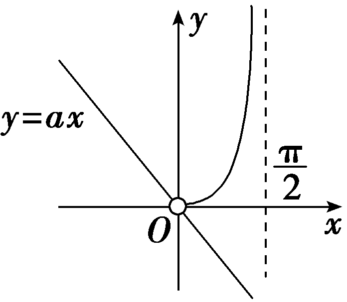

突破1　利用导数研究不等式的恒(能)成立问题

对利用导数研究不等式恒成立与有解问题，一般可转化为最值问题处理.若<em>a</em>＞<em>f</em>(<em>x</em>)对<em>x</em>∈<em>D</em>恒成立，则只需<em>a</em>＞<em>f</em>(<em>x</em>)max；若<em>a</em>＜<em>f</em>(<em>x</em>)对<em>x</em>∈<em>D</em>恒成立，则只需<em>a</em>＜<em>f</em>(<em>x</em>)min；若存在<em>x</em>0∈<em>D</em>，使<em>a</em>＞<em>f</em>(<em>x</em>0)成立，则只需<em>a</em>＞<em>f</em>(<em>x</em>)min；若存在<em>x</em>0∈<em>D</em>，使<em>a</em>＜<em>f</em>(<em>x</em>0)成立，则只需<em>a</em>＜<em>f</em>(<em>x</em>)max.由此构造不等式，求解参数的取值范围.

技法一　分离参数法

(一题多变)已知函数&lt;te&lt;te&lt;te&lt;te&lt;te&lt;te&lt;text style="it<em>a</em>lic"&gt;x&lt;/text&gt;t style="italic"&gt;x&lt;/text&gt;t style="italic"&gt;x&lt;/text&gt;t style="italic"&gt;x&lt;/text&gt;t style="italic,superscript"&gt;x&lt;/text&gt;t style="italic"&gt;x&lt;/text&gt;t style="italic"&gt;<em>f</em>&lt;/text&gt;(x)＝ex＋<em>ax</em>2－x.若当x≥0时，f(x)≥ $\frac{1}{2}$ &lt;te&lt;te&lt;te&lt;te&lt;te&lt;text style="it<em>a</em>lic"&gt;x&lt;/text&gt;t style="italic"&gt;x&lt;/text&gt;t style="italic"&gt;x&lt;/text&gt;t style="italic"&gt;x&lt;/text&gt;t style="italic,superscript"&gt;x&lt;/text&gt;t style="italic"&gt;x&lt;/text&gt;3＋1，求实数a的取值范围.

解：由&lt;te&lt;te&lt;te&lt;te&lt;te&lt;te<em>x</em>t style="italic"&gt;x&lt;/text&gt;t style="italic"&gt;x&lt;/text&gt;t style="italic,superscript"&gt;x&lt;/text&gt;t style="italic"&gt;x&lt;/text&gt;t style="italic"&gt;x&lt;/text&gt;t style="italic"&gt;f&lt;/text&gt;(x)≥ $\frac{1}{2}$ &lt;te&lt;te&lt;te&lt;te&lt;te<em>x</em>t style="italic"&gt;x&lt;/text&gt;t style="italic"&gt;x&lt;/text&gt;t style="italic,superscript"&gt;x&lt;/text&gt;t style="italic"&gt;x&lt;/text&gt;t style="italic"&gt;x&lt;/text&gt;&lt;text style="superscript"&gt;3&lt;/text&gt;＋1，得ex＋<em>ax</em>2－x≥ $\frac{1}{2}$ &lt;te&lt;te&lt;te&lt;te&lt;te<em>x</em>t style="italic"&gt;x&lt;/text&gt;t style="italic"&gt;x&lt;/text&gt;t style="italic,superscript"&gt;x&lt;/text&gt;t style="italic"&gt;x&lt;/text&gt;t style="italic"&gt;x&lt;/text&gt;&lt;text style="superscript"&gt;3&lt;/text&gt;＋1，其中x≥0，

当*x*＝0时，不等式为1≥1，显然成立，符合题意.

当<text style="it<text style="it*a*lic">a</text>lic">x</text>＞0时，分离参数a得，a≥－ $\frac{e^{x}－\frac{1}{2}x^{3}－x－1}{x^{2}}$ ，

记<te<te<te*x*t style="italic">x</text>t style="italic">x</text>t style="italic">g</text>(x)＝－ $\frac{e^{x}－\frac{1}{2}x^{3}－x－1}{x^{2}}$ (<te<te*x*t style="italic">x</text>t style="italic">x</text>＞0)，则*g*'(x)＝－ $\frac{(x－2)(e^{x}－\frac{1}{2}x^{2}－x－1)}{x^{3}}$ ，

令&lt;te&lt;te&lt;te&lt;te&lt;te&lt;te&lt;te&lt;te&lt;te&lt;te&lt;te&lt;te&lt;te<em>x</em>t style="italic"&gt;x&lt;/text&gt;t style="italic,superscript"&gt;x&lt;/text&gt;t style="italic"&gt;x&lt;/text&gt;t style="italic"&gt;x&lt;/text&gt;t style="italic"&gt;x&lt;/text&gt;t style="italic,superscript"&gt;x&lt;/text&gt;t style="italic"&gt;x&lt;/text&gt;t style="italic"&gt;x&lt;/text&gt;t style="italic"&gt;x&lt;/text&gt;t style="italic"&gt;x&lt;/text&gt;t style="italic,superscript"&gt;x&lt;/text&gt;t style="italic"&gt;x&lt;/text&gt;t style="italic"&gt;h&lt;/text&gt;(x)＝ex－ $\frac{1}{2}$ &lt;te&lt;te&lt;te&lt;te&lt;te&lt;te&lt;te&lt;te&lt;te&lt;te&lt;te&lt;te<em>x</em>t style="italic"&gt;x&lt;/text&gt;t style="italic,superscript"&gt;x&lt;/text&gt;t style="italic"&gt;x&lt;/text&gt;t style="italic"&gt;x&lt;/text&gt;t style="italic"&gt;x&lt;/text&gt;t style="italic,superscript"&gt;x&lt;/text&gt;t style="italic"&gt;x&lt;/text&gt;t style="italic"&gt;x&lt;/text&gt;t style="italic"&gt;x&lt;/text&gt;t style="italic"&gt;x&lt;/text&gt;t style="italic,superscript"&gt;x&lt;/text&gt;t style="italic"&gt;x&lt;/text&gt;2－x－1(x＞0)，则<em>h</em>'(x)＝ex－x－1，再令<em>φ</em>(x)＝<em>&lt;text style="italic"&gt;h'</em>&lt;/text&gt;(x)＝ex－x－1(x＞0)，

则&lt;te&lt;te&lt;te&lt;te&lt;te&lt;te&lt;te&lt;te&lt;te&lt;te<em>x</em>t style="italic"&gt;x&lt;/text&gt;t style="italic,superscript"&gt;x&lt;/text&gt;t style="italic"&gt;x&lt;/text&gt;t style="italic"&gt;x&lt;/text&gt;t style="italic"&gt;x&lt;/text&gt;t style="italic"&gt;x&lt;/text&gt;t style="italic"&gt;x&lt;/text&gt;t style="italic,superscript"&gt;x&lt;/text&gt;t style="italic"&gt;x&lt;/text&gt;t style="italic"&gt;φ'&lt;/text&gt;(x)＝ex－1＞0，故<em>&lt;text style="italic"&gt;&lt;text style="italic"&gt;&lt;text style="italic"&gt;&lt;text style="italic"&gt;&lt;text style="italic"&gt;&lt;text style="italic"&gt;h</em>&lt;/text&gt;&lt;/text&gt;&lt;/text&gt;'&lt;/text&gt;&lt;/text&gt;&lt;/text&gt;(x)单调递增，h'(x)＞h'（0）＝0，故函数h(x)单调递增，h(x)＞h(0)＝0，由h(x)＞0，可得ex－ $\frac{1}{2}$ &lt;te&lt;te&lt;te&lt;te&lt;te&lt;te&lt;te&lt;te&lt;te<em>x</em>t style="italic"&gt;x&lt;/text&gt;t style="italic,superscript"&gt;x&lt;/text&gt;t style="italic"&gt;x&lt;/text&gt;t style="italic"&gt;x&lt;/text&gt;t style="italic"&gt;x&lt;/text&gt;t style="italic"&gt;x&lt;/text&gt;t style="italic"&gt;x&lt;/text&gt;t style="italic,superscript"&gt;x&lt;/text&gt;t style="italic"&gt;x&lt;/text&gt;2－x－1＞0恒成立.

故当*x*∈(0，2)时，*g'*(*x*)＞0，*g*(*x*)单调递增；当*x*∈(2，＋∞)时，*g'*(*x*)＜0，*g*(*x*)单调递减.

故&lt;te&lt;text style="it<em>a</em>lic"&gt;x&lt;/text&gt;t style="italic"&gt;<em>g</em>&lt;/text&gt;(x)max＝g(2) $＝\frac{7－e^{2}}{4}$ .综上可得，实数<em>a</em>的取值范围是［ $\frac{7－e^{2}}{4}$ ，＋∞).

[变式探究]

(变条件，引入三角函数)已知函数&lt;te&lt;te&lt;te&lt;te&lt;te&lt;text style="it<em>a</em>lic"&gt;x&lt;/text&gt;t style="italic"&gt;x&lt;/text&gt;t style="italic"&gt;x&lt;/text&gt;t style="it<em>a</em>lic"&gt;x&lt;/text&gt;t style="italic"&gt;x&lt;/text&gt;t style="italic"&gt;<em>f</em>&lt;/text&gt;(x)＝sin x－2<em>ax</em>，a∈<strong>R</strong>，若关于x的不等式f(x)≤cos x－1在区间( $\frac{\pi }{2}$ ，π)上恒成立，求实数&lt;te&lt;te&lt;te&lt;text style="it<em>a</em>lic"&gt;x&lt;/text&gt;t style="italic"&gt;x&lt;/text&gt;t style="italic"&gt;x&lt;/text&gt;t style="italic"&gt;a&lt;/text&gt;的取值范围.

解：不等式<te<te*x*t style="italic">x</text>t style="italic">f</text>(x)≤cos x－1在区间( $\frac{\pi }{2}$ ，π)上恒成立，

即2*a*≥ $\frac{sinx－cosx+1}{x}$ 在区间( $\frac{\pi }{2}$ ，π)上恒成立，

设<te*x*t style="italic">g</text>(x) $＝\frac{sinx－cosx+1}{x}$ ，

则<te*x*t style="italic">g'</text>(x) $＝\frac{xcosx＋xsinx－sinx＋cosx－1}{x^{2}}$ .

设*h*(*x*)＝*x*cos *x*＋*x*sin *x*－sin *x*＋cos *x*－1，

则*h'*(*x*)＝－*x*sin *x*＋*x*cos *x*＝*x*(cos *x*－sin *x*).

因为当<te<te*x*t style="italic">x</text>t style="italic">x</text>∈( $\frac{\pi }{2}$ ，π)时，sin <te<te*x*t style="italic">x</text>t style="italic">x</text>＞0，cos x＜0，

所以当<te*x*t style="italic">x</text>∈( $\frac{\pi }{2}$ ，π)时，<te*x*t style="italic">h'</text>(*x*)＜0，

所以函数<te*x*t style="italic">*h*</text>(x)在( $\frac{\pi }{2}$ ，π)上单调递减，且<te*x*t style="italic">*h*</text>( $\frac{\pi }{2}$ ) $＝\frac{\pi }{2}$ －2＜0，

所以当<te<te*x*t style="italic">x</text>t style="italic">x</text>∈( $\frac{\pi }{2}$ ，π)时，<te<te*x*t style="italic">x</text>t style="italic">h</text>(*x*)＜0，即*g'*(x)＜0，

则函数<te*x*t style="italic">*g*</text>(x)在( $\frac{\pi }{2}$ ，π)上单调递减，且<te*x*t style="italic">*g*</text>( $\frac{\pi }{2}$ ) $＝\frac{4}{\pi }$ ，

所以当<te<text style="it*a*lic">x</text>t style="italic">x</text>∈( $\frac{\pi }{2}$ ，π)时，<te<text style="it*a*lic">x</text>t style="italic">g</text>(*x*)＜ $\frac{4}{\pi }$ ，所以*a*≥ $\frac{2}{\pi }$ .

故实数*a*的取值范围为［ $\frac{2}{\pi }$ ，＋∞).

##### 1.分离变量，构造函数，直接把问题转化为函数的最值问题，这要比分类讨论法简便很多.

##### 2.<em>a</em>≥<em>f</em>(<em>x</em>)恒成立⇔<em>a</em>≥<em>f</em>(<em>x</em>)max；

<em>a</em>≤<em>f</em>(<em>x</em>)恒成立⇔<em>a</em>≤<em>f</em>(<em>x</em>)min；

<em>a</em>≥<em>f</em>(<em>x</em>)能成立⇔<em>a</em>≥<em>f</em>(<em>x</em>)min；

<em>a</em>≤<em>f</em>(<em>x</em>)能成立⇔<em>a</em>≤<em>f</em>(<em>x</em>)max.

对点练1.(2024·山东德州二模)已知函数<te<te<te*x*t style="italic">x</text>t style="italic">x</text>t style="italic">f</text>(x)＝*mx*－ln x，x∈ $\left(1，＋\infty \right)$ .

（1）讨论*f* $\left(x\right)$ 的单调性；

(&lt;te<em>x</em>t style="superscript"&gt;2&lt;/text&gt;)若 $e^{\left(m－1\right)x+1}$ &lt;te&lt;te<em>x</em>t style="italic"&gt;x&lt;/text&gt;t style="italic"&gt;f&lt;/text&gt; $\left(x\right)$ ≥&lt;te<em>x</em>t style="italic"&gt;x&lt;/text&gt;2－x恒成立，求实数<em>m</em>的取值范围.

解：（1）由题可知<te*x*t style="italic">*f'*</text> $\left(x\right)＝$ <te*x*t style="italic">m</text>－ $\frac{1}{x}$ ，*x*∈ $\left(1，＋\infty \right)$ ，且<te*x*t style="italic">*f'*</text> $\left(x\right)$ 在定义域上单调递增，

当*<text style="italic">m*</text>≤0时，*f'* $\left(x\right)＝$ *<text style="italic">m*</text>－ $\frac{1}{x}$ ＜0恒成立，

此时*f* $\left(x\right)$ 在 $\left(1，＋\infty \right)$ 上单调递减，

当0＜<te*x*t style="italic">m</text>＜1时，令*f'* $\left(x\right)＝$ 0，则*x* $＝\frac{1}{m}$ ，

所以*x*∈ $\left(1，\frac{1}{m}\right)$ 时，*<text style="italic">f*'</text> $\left(x\right)$ ＜0，此时*f* $\left(x\right)$ 单调递减；

*x*∈ $\left(\frac{1}{m}，＋\infty \right)$ 时，*<text style="italic">f*'</text> $\left(x\right)$ ＞0，此时*f* $\left(x\right)$ 单调递增，

当*m*≥1，即0＜ $\frac{1}{m}$ ≤1时，此时*<text style="italic">f*'</text> $\left(x\right)$ ＞0在 $\left(1，＋\infty \right)$ 上恒成立，*f* $\left(x\right)$ 单调递增.

综上，当*m*≤0时，*f* $\left(x\right)$ 在 $\left(1，＋\infty \right)$ 上单调递减；

当0＜*m*＜1时，*f* $\left(x\right)$ 在 $\left(1，\frac{1}{m}\right)$ 上单调递减，在 $\left(\frac{1}{m}，＋\infty \right)$ 上单调递增；

当*m*≥1时，*f* $\left(x\right)$ 在 $\left(1，＋\infty \right)$ 上单调递增.

(&lt;te<em>x</em>t style="superscript"&gt;2&lt;/text&gt;)因为&lt;te<em>x</em>t style="italic"&gt;x&lt;/text&gt;∈ $\left(1，＋\infty \right)$ ，所以&lt;te&lt;te<em>x</em>t style="italic"&gt;x&lt;/text&gt;t style="italic"&gt;x&lt;/text&gt;2－x＞0，

又 $e^{\left(m－1\right)x+1}$ &lt;te&lt;te&lt;te<em>x</em>t style="italic"&gt;x&lt;/text&gt;t style="italic"&gt;x&lt;/text&gt;t style="italic"&gt;<em>f</em>&lt;/text&gt; $\left(x\right)$ ≥&lt;te&lt;te<em>x</em>t style="italic"&gt;x&lt;/text&gt;t style="italic"&gt;x&lt;/text&gt;2－x，所以<em>&lt;text style="italic"&gt;f</em>&lt;/text&gt; $\left(x\right)$ ＞0，即m&lt;te&lt;te<em>x</em>t style="italic"&gt;x&lt;/text&gt;t style="italic"&gt;x&lt;/text&gt;－ln x＞0，

故*x*∈ $\left(1，＋\infty \right)$ 时，*m*＞ $\frac{lnx}{x}$ 恒成立，

令<te*x*t style="italic">φ</text> $\left(x\right)＝\frac{lnx}{x}$ ，*x*∈ $\left(1，＋\infty \right)$ ，则<te*x*t style="italic">φ</text>' $\left(x\right)＝\frac{1－lnx}{x^{2}}$ ，

当*x*∈ $\left(1，e\right)$ 时，*<text style="italic">φ*'</text> $\left(x\right)$ ＞0，*φ* $\left(x\right)$ 为增函数，

当*x*∈ $\left(e，＋\infty \right)$ 时，*<text style="italic">φ*'</text> $\left(x\right)$ ＜0，*φ* $\left(x\right)$ 为减函数，

所以*<text style="italic">φ*</text> $\left(x\right)_{max}＝$ *<text style="italic">φ*</text> $\left(e\right)＝\frac{1}{e}$ ，从而*m*＞ $\frac{1}{e}$ .

将 $e^{\left(m－1\right)x+1}$ &lt;te&lt;te<em>x</em>t style="italic"&gt;x&lt;/text&gt;t style="italic"&gt;f&lt;/text&gt; $\left(x\right)$ ≥&lt;te<em>x</em>t style="italic"&gt;x&lt;/text&gt;2－x两边同时取以e为底的对数可得

$\left(m－1\right)$ <te*x*t style="italic">x</text>＋1＋ln $\left(mx－lnx\right)$ ≥ln <te*x*t style="italic">x</text>＋ln $\left(x－1\right)$ ，

整理可得 $\left(mx－lnx\right)$ ＋ln $\left(mx－lnx\right)$ ≥ $\left(x－1\right)$ ＋ln $\left(x－1\right)$ .

令<<*t*ext style="italic">t</text>ext style="italic">*<text style="italic">g*</text></text> $\left(t\right)＝$ <*t*ext style="italic">t</text>＋ln t，则*<text style="italic"><text style="italic">g*</text></text> $\left(mx－lnx\right)$ ≥<<*t*ext style="italic">t</text>ext style="italic">*<text style="italic">g*</text></text> $\left(x－1\right)$ ，

且*g* $\left(t\right)$ 在 $\left(0，＋\infty \right)$ 上单调递增，

因为<te<te<te<te*x*t style="italic">x</text>t style="italic">x</text>t style="italic">x</text>t style="italic">*mx*</text>－ln x＞0且x－1＞0，所以mx－ln x≥x－1在 $\left(1，＋\infty \right)$ 上恒成立，

所以*m*≥ $\frac{x＋lnx－1}{x}＝$ 1＋ $\frac{lnx－1}{x}$ 恒成立，

令*h* $\left(x\right)＝\frac{lnx－1}{x}$ ，则*h*' $\left(x\right)＝\frac{2－lnx}{x^{2}}$ ，

当*x*∈ $\left(1，e^{2}\right)$ 时，*<text style="italic">h*'</text> $\left(x\right)$ ＞0，*h* $\left(x\right)$ 单调递增，

当*x*∈ $\left(e^{2}，＋\infty \right)$ 时，*<text style="italic">h*'</text> $\left(x\right)$ ＜0，*h* $\left(x\right)$ 单调递减，

所以*<text style="italic">h*</text> $\left(x\right)_{max}＝$ *<text style="italic">h*</text> $\left(e^{2}\right)＝\frac{1}{e^{2}}$ ，所以*m*≥1＋ $\frac{1}{e^{2}}$ ，

又因为 $\frac{1}{e}$ ＜1＋ $\frac{1}{e^{2}}$ ，所以*m*≥1＋ $\frac{1}{e^{2}}$ .

所以实数*m*的取值范围为［1＋ $\frac{1}{e^{2}}$ ，＋∞).

技法二　分类讨论法

(2025·安徽马鞍山模拟)已知函数<em>f</em>(<em>x</em>)＝e<em>x</em>＋(<em>m</em>＋1)<em>x</em>，<em>m</em>∈<strong>R</strong>.

（1）当*m*＝1时，求曲线*y*＝*f*(*x*)在点(0，*f*（0）)处的切线方程；

（2）若存在&lt;te&lt;te&lt;te<em>x</em>t style="italic"&gt;x&lt;/text&gt;t style="italic,superscript"&gt;x&lt;/text&gt;t style="italic"&gt;x&lt;/text&gt;∈[1，2]，使得不等式ex＋ $\frac{x^{2}}{2}$ ＋&lt;te&lt;te<em>x</em>t style="italic"&gt;x&lt;/text&gt;t style="italic"&gt;<em>&lt;text style="italic"&gt;m</em>&lt;/text&gt;&lt;/text&gt;ln &lt;te<em>x</em>t style="italic"&gt;x&lt;/text&gt;＋m≥<em>f</em>(x)成立，求m的取值范围.

解：（1）当&lt;te&lt;te&lt;te&lt;te&lt;te&lt;te&lt;te<em>x</em>t style="italic"&gt;x&lt;/text&gt;t style="italic"&gt;x&lt;/text&gt;t style="italic,superscript"&gt;x&lt;/text&gt;t style="italic"&gt;x&lt;/text&gt;t style="italic,superscript"&gt;x&lt;/text&gt;t style="italic"&gt;x&lt;/text&gt;t style="italic"&gt;m&lt;/text&gt;＝1时，<em>f</em>(x)＝ex＋ $\left(m+1\right)$ &lt;te&lt;te&lt;te&lt;te&lt;te&lt;te<em>x</em>t style="italic"&gt;x&lt;/text&gt;t style="italic"&gt;x&lt;/text&gt;t style="italic,superscript"&gt;x&lt;/text&gt;t style="italic"&gt;x&lt;/text&gt;t style="italic,superscript"&gt;x&lt;/text&gt;t style="italic"&gt;x&lt;/text&gt;＝ex＋2x，定义域为<strong>R</strong>，<em>f</em>'(x)＝ex＋2，

所以*f*（0）＝1，*f'*（0）＝3，

所以曲线*y*＝*f*(*x*)在点(0，*f*（0）)处的切线方程为*y*－1＝3(*x*－0)，

即*y*＝3*x*＋1.

（2）不等式e&lt;te&lt;te&lt;te&lt;te<em>x</em>t style="italic"&gt;x&lt;/text&gt;t style="italic"&gt;x&lt;/text&gt;t style="italic"&gt;x&lt;/text&gt;t style="italic,superscript"&gt;x&lt;/text&gt;＋ $\frac{x^{2}}{2}$ ＋&lt;te&lt;te&lt;te&lt;te<em>x</em>t style="italic"&gt;x&lt;/text&gt;t style="italic"&gt;x&lt;/text&gt;t style="italic"&gt;x&lt;/text&gt;t style="italic"&gt;<em>&lt;text style="italic"&gt;&lt;text style="italic"&gt;&lt;text style="italic"&gt;m</em>&lt;/text&gt;&lt;/text&gt;&lt;/text&gt;&lt;/text&gt;ln <em>x</em>＋m≥<em>f</em>(x)可化为 $\frac{x^{2}}{2}$ ＋&lt;te&lt;te&lt;te&lt;te<em>x</em>t style="italic"&gt;x&lt;/text&gt;t style="italic"&gt;x&lt;/text&gt;t style="italic"&gt;x&lt;/text&gt;t style="italic"&gt;<em>&lt;text style="italic"&gt;&lt;text style="italic"&gt;&lt;text style="italic"&gt;m</em>&lt;/text&gt;&lt;/text&gt;&lt;/text&gt;&lt;/text&gt;ln <em>x</em>－(m＋1)x＋m≥0，

即存在<te<te*x*t style="italic">x</text>t style="italic">x</text>∈[1，2]，使得不等式 $\frac{x^{2}}{2}$ ＋<te<te*x*t style="italic">x</text>t style="italic">*<text style="italic">m*</text></text>ln *x*－(m＋1)x＋m≥0成立.

构造函数<te<te<te<te<te<te<te*x*t style="italic">x</text>t style="italic">x</text>t style="italic">x</text>t style="italic">x</text>t style="italic">x</text>t style="italic">x</text>t style="italic">h</text>(x) $＝\frac{x^{2}}{2}$ ＋<te<te<te<te<te<te*x*t style="italic">x</text>t style="italic">x</text>t style="italic">x</text>t style="italic">x</text>t style="italic">x</text>t style="italic">*m*</text>ln *x*－ $\left(m+1\right)$ <te<te<te<te<te<te*x*t style="italic">x</text>t style="italic">x</text>t style="italic">x</text>t style="italic">x</text>t style="italic">x</text>t style="italic">x</text>＋*<text style="italic">m*</text>，x∈[1，2]，则*h*'(x)＝x＋ $\frac{m}{x}$ － $\left(m+1\right)＝\frac{1}{x}\left(x－m\right)$ <te*x*t style="italic">·</text>(<te<te<te<te<te*x*t style="italic">x</text>t style="italic">x</text>t style="italic">x</text>t style="italic">x</text>t style="italic">x</text>－1).

①当<em>m</em>≤1时，<em>h'</em>(<em>x</em>)≥0恒成立，故<em>h</em>(<em>x</em>)在[1，2]上单调递增，故<em>h</em>(<em>x</em>)max＝<em>h</em>（2）＝<em>m</em>ln 2－<em>m</em>≥0，解得<em>m</em>≤0，故<em>m</em>≤0；

②当1＜<te<te<te<te<te*x*t style="italic">x</text>t style="italic">x</text>t style="italic">x</text>t style="italic">x</text>t style="italic">*<text style="italic"><text style="italic"><text style="italic"><text style="italic"><text style="italic"><text style="italic"><text style="italic">m*</text></text></text></text></text></text></text></text>＜2时，令*<text style="italic"><text style="italic"><text style="italic"><text style="italic">h*</text></text>'</text></text>(x)＞0，解得m＜x＜2；令h'(x)＜0，解得1＜x＜m，故h(x)在[1，m]上单调递减，在(m，2]上单调递增，又h(1)＝－ $\frac{1}{2}$ ，故<te*x*t style="italic">*<text style="italic">h*</text></text>（2）＝<te<te<te<te*x*t style="italic">x</text>t style="italic">x</text>t style="italic">x</text>t style="italic">*<text style="italic"><text style="italic"><text style="italic"><text style="italic"><text style="italic"><text style="italic"><text style="italic">m*</text></text></text></text></text></text></text></text>ln 2－m≥0，解得m≤0，这与1＜m＜2相矛盾，舍去；

③当&lt;te&lt;te&lt;te<em>x</em>t style="italic"&gt;x&lt;/text&gt;t style="italic"&gt;x&lt;/text&gt;t style="italic"&gt;m&lt;/text&gt;≥2时，<em>&lt;text style="italic"&gt;&lt;text style="italic"&gt;&lt;text style="italic"&gt;h</em>&lt;/text&gt;&lt;/text&gt;'&lt;/text&gt;(x)≤0恒成立，故h(x)在[1，2]上单调递减，故h(x)max＝h(1)＝－ $\frac{1}{2}$ ＜0，不符合题意，应舍去.

综上所述，*m*的取值范围为(－∞，0].

对于不适合分离参数的不等式，常常将参数看作常数直接构造函数，常用分类讨论法，利用导数研究单调性、最值，从而得出参数范围.

对点练2.(2025·陕西汉中模拟)已知函数<em>f</em>(<em>x</em>)＝<em>x</em>2＋<em>a</em>ln <em>x</em>.

（1）讨论*f*(*x*)的单调性；

（2）若*f*(*x*)≥0恒成立，求*a*的取值范围.

解：（1）因为<te<te<te*x*t style="italic">x</text>t style="italic">x</text>t style="italic">f'</text>(x)＝2x＋ $\frac{a}{x}$ ，<te<te*x*t style="italic">x</text>t style="italic">x</text>＞0，

①若*a*≥0，则*f'*(*x*)＞0恒成立，*f*(*x*)在(0，＋∞)上单调递增.

②若<te<te*x*t style="italic">x</text>t style="italic">a</text>＜0，令*f'*(x)＝0，得x $＝\sqrt{－\frac{a}{2}}$ ，

当<te<te*x*t style="italic">x</text>t style="italic">x</text>∈ $\left(0，\sqrt{－\frac{a}{2}}\right)$ 时，<te<te*x*t style="italic">x</text>t style="italic">*f*'</text>(*x*)＜0，f(x)单调递减；

当<te<te*x*t style="italic">x</text>t style="italic">x</text>∈( $\sqrt{－\frac{a}{2}}$ ，＋∞)时，<te<te*x*t style="italic">x</text>t style="italic">*f*'</text>(*x*)＞0，f(x)单调递增.

综上所述，当*a*≥0时，*f*(*x*)在(0，＋∞)上单调递增；

当<te*x*t style="italic">a</text>＜0时，*f*(x)在(0， $\sqrt{－\frac{a}{2}}$ )上单调递减，在( $\sqrt{－\frac{a}{2}}$ ，＋∞)上单调递增.

（2）由（1）知<te<te*x*t style="italic">x</text>t style="italic">f'</text>(x) $＝\frac{2x^{2}＋a}{x}$ (<te*x*t style="italic">x</text>＞0)，

当<em>a</em>＞0时，<em>f'</em>(<em>x</em>)＞0，所以<em>f</em>(<em>x</em>)单调递增，又<em>x</em>→0＋，<em>f</em>(<em>x</em>)→－∞，故<em>f</em>(<em>x</em>)≥0不恒成立；

当<em>a</em>＝0时，<em>f</em>(<em>x</em>)＝<em>x</em>2＞0，符合题意；

当<te*x*t style="italic">a</text>＜0时，*f*(x)在 $\left(0，\sqrt{－\frac{a}{2}}\right)$ 上单调递减，在( $\sqrt{－\frac{a}{2}}$ ，＋∞)上单调递增，

所以&lt;te&lt;te&lt;text style="it&lt;text style="it&lt;text style="it&lt;text style="it<em>a</em>lic"&gt;a&lt;/text&gt;lic"&gt;a&lt;/text&gt;lic"&gt;a&lt;/text&gt;lic"&gt;x&lt;/text&gt;t style="it<em>a</em>lic"&gt;x&lt;/text&gt;t style="italic"&gt;<em>&lt;text style="italic"&gt;f</em>&lt;/text&gt;&lt;/text&gt;(x)min＝f( $\sqrt{－\frac{a}{2}}$ )＝－ $\frac{a}{2}$ ＋&lt;te&lt;text style="it&lt;text style="it&lt;text style="it&lt;text style="it<em>a</em>lic"&gt;a&lt;/text&gt;lic"&gt;a&lt;/text&gt;lic"&gt;a&lt;/text&gt;lic"&gt;x&lt;/text&gt;t style="italic"&gt;a&lt;/text&gt;ln $\sqrt{－\frac{a}{2}}$ ，由&lt;te&lt;te&lt;text style="it&lt;text style="it&lt;text style="it&lt;text style="it<em>a</em>lic"&gt;a&lt;/text&gt;lic"&gt;a&lt;/text&gt;lic"&gt;a&lt;/text&gt;lic"&gt;x&lt;/text&gt;t style="it<em>a</em>lic"&gt;x&lt;/text&gt;t style="italic"&gt;<em>&lt;text style="italic"&gt;f</em>&lt;/text&gt;&lt;/text&gt;(x)≥0恒成立，可得－ $\frac{a}{2}$ ＋&lt;te&lt;text style="it&lt;text style="it&lt;text style="it&lt;text style="it<em>a</em>lic"&gt;a&lt;/text&gt;lic"&gt;a&lt;/text&gt;lic"&gt;a&lt;/text&gt;lic"&gt;x&lt;/text&gt;t style="italic"&gt;a&lt;/text&gt;ln $\sqrt{－\frac{a}{2}}$ ≥0，解得&lt;te&lt;text style="it&lt;text style="it&lt;text style="it&lt;text style="it<em>a</em>lic"&gt;a&lt;/text&gt;lic"&gt;a&lt;/text&gt;lic"&gt;a&lt;/text&gt;lic"&gt;x&lt;/text&gt;t style="italic"&gt;a&lt;/text&gt;≥－2e，所以－2e≤a＜0.综上，a的取值范围为[－2e，0].

技法三　最值定位法

设&lt;te&lt;te&lt;te&lt;te&lt;te&lt;te<em>x</em>t style="italic"&gt;x&lt;/text&gt;t style="italic"&gt;x&lt;/text&gt;t style="italic"&gt;x&lt;/text&gt;t style="italic"&gt;x&lt;/text&gt;t style="italic"&gt;x&lt;/text&gt;t style="italic"&gt;f&lt;/text&gt;(x) $＝\frac{a}{x}$ ＋&lt;te&lt;te&lt;te&lt;te&lt;te<em>x</em>t style="italic"&gt;x&lt;/text&gt;t style="italic"&gt;x&lt;/text&gt;t style="italic"&gt;x&lt;/text&gt;t style="italic"&gt;x&lt;/text&gt;t style="italic"&gt;x&lt;/text&gt;ln x，<em>g</em>(x)＝x3－x2－3.

（1）如果存在<em>x</em>1，<em>x</em>2∈[0，2]，使得<em>g</em>(<em>x</em>1)－<em>g</em>(<em>x</em>2)≥<em>M</em>成立，求满足上述条件的最大整数<em>M</em>；

（2）如果对于任意的<<<text style="it*a*lic">t</text>ext *s*tyle="italic">t</text>ext style="italic">s</text>，t∈［ $\frac{1}{2}$ ，2］，都有<<text style="it*a*lic">t</text>ext *s*tyle="italic">f</text>(<*t*ext style="italic">s</text>)≥*g*(t)成立，求实数a的取值范围.

解：（1）存在<em>x</em>1，<em>x</em>2∈[0，2]，使得<em>g</em>(<em>x</em>1)－<em>g</em>(<em>x</em>2)≥<em>M</em>成立，等价于[<em>g</em>(<em>x</em>1)－<em>g</em>(<em>x</em>2)]max≥<em>M</em>成立.

<em>g'</em>(<em>x</em>)＝3<em>x</em>2－2<em>x</em>＝<em>x</em>(3<em>x</em>－2)，

令<te<te<te*x*t style="italic">x</text>t style="italic">x</text>t style="italic">g'</text>(x)＝0，得x＝0或x $＝\frac{2}{3}$ ，

因为*<text style="italic"><text style="italic">g*</text></text>( $\frac{2}{3}$ )＝－ $\frac{85}{27}$ ，*<text style="italic"><text style="italic">g*</text></text>（0）＝－3，g(2)＝1，

所以当<em>x</em>∈[0，2]时，<em>g</em>(<em>x</em>)max＝<em>g</em>（2）＝1，

&lt;te<em>x</em>t style="italic"&gt;<em>g</em>&lt;/text&gt;(x)min＝g( $\frac{2}{3}$ )＝－ $\frac{85}{27}$ ，

[&lt;te&lt;te&lt;te&lt;te<em>x</em>t style="italic"&gt;x&lt;/text&gt;t style="italic"&gt;x&lt;/text&gt;t style="italic"&gt;x&lt;/text&gt;t style="italic"&gt;<em>&lt;text style="italic"&gt;&lt;text style="italic"&gt;g</em>&lt;/text&gt;&lt;/text&gt;&lt;/text&gt;(x1)－g(x2)]&lt;text style="subscript"&gt;max&lt;/text&gt;＝g(x)max－g(x)min $＝\frac{112}{27}$ ，

所以满足条件的最大整数*M*为4.

（2）对任意的<<*t*ext *s*tyle="italic">t</text>ext style="italic">s</text>，t∈［ $\frac{1}{2}$ ，2］都有<*t*ext *s*tyle="italic">f</text>(<*t*ext style="italic">s</text>)≥*g*(t)，

则<em>f</em>(<em>x</em>)min≥<em>g</em>(<em>x</em>)max.

由（1）知当&lt;te<em>x</em>t style="italic"&gt;x&lt;/text&gt;∈［ $\frac{1}{2}$ ，2］时，&lt;te<em>x</em>t style="italic"&gt;<em>g</em>&lt;/text&gt;(<em>x</em>)max＝g(2)＝1，

所以当&lt;te&lt;te&lt;te&lt;te&lt;te&lt;te<em>x</em>t style="italic"&gt;x&lt;/text&gt;t style="italic"&gt;x&lt;/text&gt;t style="it<em>a</em>lic"&gt;x&lt;/text&gt;t style="italic"&gt;x&lt;/text&gt;t style="italic"&gt;x&lt;/text&gt;t style="italic"&gt;x&lt;/text&gt;∈［ $\frac{1}{2}$ ，&lt;te<em>x</em>t style="superscript"&gt;2&lt;/text&gt;］时，&lt;te&lt;te&lt;te&lt;te&lt;te<em>x</em>t style="italic"&gt;x&lt;/text&gt;t style="it<em>a</em>lic"&gt;x&lt;/text&gt;t style="italic"&gt;x&lt;/text&gt;t style="italic"&gt;x&lt;/text&gt;t style="italic"&gt;f&lt;/text&gt;(<em>x</em>) $＝\frac{a}{x}$ ＋&lt;te&lt;te&lt;te&lt;te&lt;te&lt;te<em>x</em>t style="italic"&gt;x&lt;/text&gt;t style="italic"&gt;x&lt;/text&gt;t style="it<em>a</em>lic"&gt;x&lt;/text&gt;t style="italic"&gt;x&lt;/text&gt;t style="italic"&gt;x&lt;/text&gt;t style="italic"&gt;x&lt;/text&gt;ln x≥1恒成立，即a≥x－x2ln x恒成立.

令&lt;te&lt;te&lt;te&lt;te&lt;te<em>x</em>t style="italic"&gt;x&lt;/text&gt;t style="italic"&gt;x&lt;/text&gt;t style="italic"&gt;x&lt;/text&gt;t style="italic"&gt;x&lt;/text&gt;t style="italic"&gt;h&lt;/text&gt;(x)＝x－x2ln x，x∈［ $\frac{1}{2}$ ，&lt;te&lt;te<em>x</em>t style="italic"&gt;x&lt;/text&gt;t style="superscript"&gt;2&lt;/text&gt;］，

所以*h'*(*x*)＝1－2*x*ln *x*－*x*，

令*φ*(*x*)＝1－2*x*ln *x*－*x*，

所以*φ'*(*x*)＝－3－2ln *x*＜0，

<te*x*t style="italic">h'</text>(x)在［ $\frac{1}{2}$ ，2］上单调递减，

又<te<te*x*t style="italic">x</text>t style="italic">*h'*</text>（1）＝0，所以当x∈［ $\frac{1}{2}$ ，1］时，<te<te*x*t style="italic">x</text>t style="italic">*h'*</text>(x)≥0，

当*x*∈[1，2]时，*h'*(*x*)≤0，

所以<te*x*t style="italic">h</text>(x)在［ $\frac{1}{2}$ ，1］上单调递增，在[1，2]上单调递减，

所以<em>h</em>(<em>x</em>)max＝<em>h</em>（1）＝1，故<em>a</em>≥1.

所以实数*a*的取值范围是[1，＋∞).

“双变量”的恒(能)成立问题，常见的转化有：

##### 1.∀<em>x</em>1∈<em>M</em>，∃<em>x</em>2∈<em>N</em>，<em>f</em>(<em>x</em>1)＞<em>g</em>(<em>x</em>2)⇔<em>f</em>(<em>x</em>)min＞<em>g</em>(<em>x</em>)min.

##### 2.∀<em>x</em>1∈<em>M</em>，∀<em>x</em>2∈<em>N</em>，<em>f</em>(<em>x</em>1)＞<em>g</em>(<em>x</em>2)⇔<em>f</em>(<em>x</em>)min＞<em>g</em>(<em>x</em>)max.

##### 3.∃<em>x</em>1∈<em>M</em>，∃<em>x</em>2∈<em>N</em>，<em>f</em>(<em>x</em>1)＞<em>g</em>(<em>x</em>2)⇔<em>f</em>(<em>x</em>)max＞<em>g</em>(<em>x</em>)min.

##### 4.∃<em>x</em>1∈<em>M</em>，∀<em>x</em>2∈<em>N</em>，<em>f</em>(<em>x</em>1)＞<em>g</em>(<em>x</em>2)⇔<em>f</em>(<em>x</em>)max＞<em>g</em>(<em>x</em>)max.

对点练&lt;te&lt;te&lt;te&lt;te&lt;te&lt;te&lt;te&lt;text style="it<em>a</em>lic"&gt;x&lt;/text&gt;t style="italic"&gt;x&lt;/text&gt;t style="italic"&gt;x&lt;/text&gt;t style="italic"&gt;x&lt;/text&gt;t style="it<em>a</em>lic"&gt;x&lt;/text&gt;t style="italic"&gt;x&lt;/text&gt;t style="italic"&gt;x&lt;/text&gt;t style="superscript"&gt;3&lt;/text&gt;.已知&lt;te&lt;te<em>x</em>t style="italic"&gt;x&lt;/text&gt;t style="italic"&gt;<em>f</em>&lt;/text&gt;(x)＝x3－3x＋3－ $\frac{x}{e^{x}}$ ，&lt;te&lt;te&lt;te&lt;te&lt;te&lt;te&lt;text style="it<em>a</em>lic"&gt;x&lt;/text&gt;t style="italic"&gt;x&lt;/text&gt;t style="italic"&gt;x&lt;/text&gt;t style="italic"&gt;x&lt;/text&gt;t style="it<em>a</em>lic"&gt;x&lt;/text&gt;t style="italic"&gt;x&lt;/text&gt;t style="italic"&gt;<em>g</em>&lt;/text&gt;(&lt;te&lt;te<em>x</em>t style="italic"&gt;x&lt;/text&gt;t style="italic"&gt;x&lt;/text&gt;)＝ln(x＋&lt;text style="subscript"&gt;1&lt;/text&gt;)＋a，∃x1∈[0，&lt;text style="subscript"&gt;2&lt;/text&gt;]，∀x2∈[0，2]，使得<em>&lt;text style="italic"&gt;f</em>&lt;/text&gt;(x1)≤g(x2)成立，则实数a的取值范围是<u>　　　　</u>.

答案 $\left[1－\frac{1}{e}，＋\infty \right)$

解析因为∃<em>x</em>1∈[0，2]，∀<em>x</em>2∈[0，2]，使得<em>f</em>(<em>x</em>1)≤<em>g</em>(<em>x</em>2)成立等价于在[0，2]上，<em>f</em>(<em>x</em>)min≤<em>g</em>(<em>x</em>)min.

易得<te<te<te*x*t style="italic">x</text>t style="italic">x</text>t style="italic">f'</text>(x) $＝\left(x－1\right)\left(3x+3+\frac{1}{e^{x}}\right)$ ，当<te<te*x*t style="italic">x</text>t style="italic">x</text>∈[0，2]时，3x＋3＋ $\frac{1}{e^{x}}$ ＞0，

所以*f*(*x*)在[0，1]上单调递减，在[1，2]上单调递增，

所以函数<te<te<te<text style="it<text style="it<text style="it*a*lic">a</text>lic">a</text>lic">x</text>t style="italic">x</text>t style="italic">x</text>t style="italic">*f*</text>(x)在[0，2]上的最小值为f(1)＝1－ $\frac{1}{e}$ .易知<te<te<text style="it<text style="it<text style="it*a*lic">a</text>lic">a</text>lic">x</text>t style="italic">x</text>t style="italic">*<text style="italic">g*</text></text>(*x*)在[0，2]上单调递增，所以函数g(x)在[0，2]上的最小值为g(0)＝a，所以1－ $\frac{1}{e}$ ≤<text style="it<text style="it*a*lic">a</text>lic">a</text>，即实数a的取值范围是 $\left[1－\frac{1}{e}，＋\infty \right)$ .

课时测评24　利用导数研究不等式的恒(能)成立问题 $\frac{对应学生}{用书P357}$

(时间：60分钟　满分：79分)

(本栏目内容，在学生用书中以独立形式分册装订！)

(1—3题，每小题5分，共15分)

&lt;te&lt;text style="it<em>a</em>lic"&gt;x&lt;/text&gt;t style="subscript"&gt;1&lt;/text&gt;.已知函数&lt;te&lt;te&lt;te<em>x</em>t style="italic"&gt;x&lt;/text&gt;t style="italic"&gt;x&lt;/text&gt;t style="italic"&gt;f&lt;/text&gt;(x) $＝\frac{ae^{x}}{x}$ － $\frac{1}{2}$ &lt;te&lt;te&lt;te&lt;text style="it<em>a</em>lic"&gt;x&lt;/text&gt;t style="italic"&gt;x&lt;/text&gt;t style="italic"&gt;x&lt;/text&gt;t style="italic"&gt;x&lt;/text&gt;，若对任意的0＜x1＜x2，都有 $\frac{f\left(x_{1}\right)}{x_{2}}$ － $\frac{f\left(x_{2}\right)}{x_{1}}$ ＜0，则实数<em>a</em>的取值范围是(　　)

$\quad$A. $\left(－\infty ，\frac{1}{e}\right]$ 	
$\quad$B. $\left[\frac{1}{e^{2}}，＋\infty \right)$

$\quad$C. $\left[\frac{2}{e}，＋\infty \right)$ 	
$\quad$D. $\left[\frac{1}{e}，＋\infty \right)$

答案D

解析因为对任意的0＜&lt;te&lt;te&lt;te&lt;te&lt;te&lt;te&lt;te&lt;te&lt;te&lt;te&lt;te&lt;te&lt;te&lt;te&lt;te&lt;te&lt;te&lt;te&lt;te&lt;te&lt;te&lt;te&lt;te&lt;te&lt;text style="it&lt;text style="it<em>a</em>lic"&gt;a&lt;/text&gt;lic"&gt;x&lt;/text&gt;t style="italic"&gt;x&lt;/text&gt;t style="italic"&gt;x&lt;/text&gt;t style="italic"&gt;x&lt;/text&gt;t style="italic"&gt;x&lt;/text&gt;t style="italic"&gt;x&lt;/text&gt;t style="italic"&gt;x&lt;/text&gt;t style="italic"&gt;x&lt;/text&gt;t style="italic"&gt;x&lt;/text&gt;t style="italic"&gt;x&lt;/text&gt;t style="it<em>a</em>lic"&gt;x&lt;/text&gt;t style="italic,superscript"&gt;x&lt;/text&gt;t style="it<em>a</em>lic"&gt;x&lt;/text&gt;t style="italic"&gt;x&lt;/text&gt;t style="italic"&gt;x&lt;/text&gt;t style="italic,superscript"&gt;x&lt;/text&gt;t style="it<em>a</em>lic"&gt;x&lt;/text&gt;t style="italic"&gt;x&lt;/text&gt;t style="italic"&gt;x&lt;/text&gt;t style="italic"&gt;x&lt;/text&gt;t style="italic"&gt;x&lt;/text&gt;t style="italic"&gt;x&lt;/text&gt;t style="italic"&gt;x&lt;/text&gt;t style="italic"&gt;x&lt;/text&gt;t style="italic"&gt;x&lt;/text&gt;&lt;text style="subscript"&gt;&lt;text style="subscript"&gt;1&lt;/text&gt;&lt;/text&gt;＜x&lt;text style="subscript"&gt;&lt;text style="subscript"&gt;&lt;text style="superscript"&gt;2&lt;/text&gt;&lt;/text&gt;&lt;/text&gt;，都有 $\frac{f(x_{1})}{x_{2}}$ － $\frac{f(x_{2})}{x_{1}}$ ＜0，即&lt;te&lt;te&lt;te&lt;te&lt;te&lt;te&lt;te&lt;te&lt;te&lt;te&lt;te&lt;te&lt;te&lt;te&lt;te&lt;te&lt;te&lt;te&lt;te&lt;te&lt;te&lt;te&lt;te&lt;te&lt;text style="it&lt;text style="it<em>a</em>lic"&gt;a&lt;/text&gt;lic"&gt;x&lt;/text&gt;t style="italic"&gt;x&lt;/text&gt;t style="italic"&gt;x&lt;/text&gt;t style="italic"&gt;x&lt;/text&gt;t style="italic"&gt;x&lt;/text&gt;t style="italic"&gt;x&lt;/text&gt;t style="italic"&gt;x&lt;/text&gt;t style="italic"&gt;x&lt;/text&gt;t style="italic"&gt;x&lt;/text&gt;t style="italic"&gt;x&lt;/text&gt;t style="it<em>a</em>lic"&gt;x&lt;/text&gt;t style="italic,superscript"&gt;x&lt;/text&gt;t style="it<em>a</em>lic"&gt;x&lt;/text&gt;t style="italic"&gt;x&lt;/text&gt;t style="italic"&gt;x&lt;/text&gt;t style="italic,superscript"&gt;x&lt;/text&gt;t style="it<em>a</em>lic"&gt;x&lt;/text&gt;t style="italic"&gt;x&lt;/text&gt;t style="italic"&gt;x&lt;/text&gt;t style="italic"&gt;x&lt;/text&gt;t style="italic"&gt;x&lt;/text&gt;t style="italic"&gt;x&lt;/text&gt;t style="italic"&gt;x&lt;/text&gt;t style="italic"&gt;x&lt;/text&gt;t style="italic"&gt;x&lt;/text&gt;&lt;text style="subscript"&gt;&lt;text style="subscript"&gt;1&lt;/text&gt;&lt;/text&gt;<em>&lt;text style="italic"&gt;f</em>&lt;/text&gt;(x1)＜x&lt;text style="subscript"&gt;&lt;text style="subscript"&gt;&lt;text style="superscript"&gt;2&lt;/text&gt;&lt;/text&gt;&lt;/text&gt;f(x2)，所以设<em>&lt;text style="italic"&gt;g</em>&lt;/text&gt;(x)＝<em>xf</em>(x)＝x $\left(\frac{ae^{x}}{x}－\frac{1}{2}x\right)＝$ &lt;te&lt;te&lt;te&lt;te&lt;te&lt;te&lt;te&lt;te&lt;te&lt;te&lt;te&lt;te&lt;te&lt;te&lt;te&lt;te&lt;text style="it&lt;text style="it<em>a</em>lic"&gt;a&lt;/text&gt;lic"&gt;x&lt;/text&gt;t style="italic"&gt;x&lt;/text&gt;t style="italic"&gt;x&lt;/text&gt;t style="italic"&gt;x&lt;/text&gt;t style="italic"&gt;x&lt;/text&gt;t style="italic"&gt;x&lt;/text&gt;t style="italic"&gt;x&lt;/text&gt;t style="italic"&gt;x&lt;/text&gt;t style="italic"&gt;x&lt;/text&gt;t style="italic"&gt;x&lt;/text&gt;t style="it<em>a</em>lic"&gt;x&lt;/text&gt;t style="italic,superscript"&gt;x&lt;/text&gt;t style="it<em>a</em>lic"&gt;x&lt;/text&gt;t style="italic"&gt;x&lt;/text&gt;t style="italic"&gt;x&lt;/text&gt;t style="italic,superscript"&gt;x&lt;/text&gt;t style="italic"&gt;a&lt;/text&gt;e&lt;te&lt;te&lt;te&lt;te&lt;te&lt;te&lt;te&lt;te<em>x</em>t style="italic"&gt;x&lt;/text&gt;t style="italic"&gt;x&lt;/text&gt;t style="italic"&gt;x&lt;/text&gt;t style="italic"&gt;x&lt;/text&gt;t style="italic"&gt;x&lt;/text&gt;t style="italic"&gt;x&lt;/text&gt;t style="italic"&gt;x&lt;/text&gt;t style="italic"&gt;x&lt;/text&gt;－ $\frac{1}{2}$ &lt;te&lt;te&lt;te&lt;te&lt;te&lt;te&lt;te&lt;te&lt;te&lt;te&lt;te&lt;te&lt;te&lt;te&lt;te&lt;te&lt;te&lt;te&lt;te&lt;te&lt;te&lt;te&lt;te&lt;te&lt;text style="it&lt;text style="it<em>a</em>lic"&gt;a&lt;/text&gt;lic"&gt;x&lt;/text&gt;t style="italic"&gt;x&lt;/text&gt;t style="italic"&gt;x&lt;/text&gt;t style="italic"&gt;x&lt;/text&gt;t style="italic"&gt;x&lt;/text&gt;t style="italic"&gt;x&lt;/text&gt;t style="italic"&gt;x&lt;/text&gt;t style="italic"&gt;x&lt;/text&gt;t style="italic"&gt;x&lt;/text&gt;t style="italic"&gt;x&lt;/text&gt;t style="it<em>a</em>lic"&gt;x&lt;/text&gt;t style="italic,superscript"&gt;x&lt;/text&gt;t style="it<em>a</em>lic"&gt;x&lt;/text&gt;t style="italic"&gt;x&lt;/text&gt;t style="italic"&gt;x&lt;/text&gt;t style="italic,superscript"&gt;x&lt;/text&gt;t style="it<em>a</em>lic"&gt;x&lt;/text&gt;t style="italic"&gt;x&lt;/text&gt;t style="italic"&gt;x&lt;/text&gt;t style="italic"&gt;x&lt;/text&gt;t style="italic"&gt;x&lt;/text&gt;t style="italic"&gt;x&lt;/text&gt;t style="italic"&gt;x&lt;/text&gt;t style="italic"&gt;x&lt;/text&gt;t style="italic"&gt;x&lt;/text&gt;&lt;text style="subscript"&gt;&lt;text style="subscript"&gt;&lt;text style="superscript"&gt;2&lt;/text&gt;&lt;/text&gt;&lt;/text&gt;，则<em>&lt;text style="italic"&gt;g</em>&lt;/text&gt;(x)在(0，＋∞)上单调递增，所以<em>g'</em>(x)＝aex－x≥0在(0，＋∞)上恒成立，即a≥ $\frac{x}{e^{x}}$ 在(0，＋∞)上恒成立.令&lt;te&lt;te&lt;te&lt;te&lt;te&lt;te&lt;te&lt;te&lt;te&lt;te&lt;text style="it&lt;text style="it<em>a</em>lic"&gt;a&lt;/text&gt;lic"&gt;x&lt;/text&gt;t style="italic"&gt;x&lt;/text&gt;t style="italic"&gt;x&lt;/text&gt;t style="italic"&gt;x&lt;/text&gt;t style="italic"&gt;x&lt;/text&gt;t style="italic"&gt;x&lt;/text&gt;t style="italic"&gt;x&lt;/text&gt;t style="italic"&gt;x&lt;/text&gt;t style="italic"&gt;x&lt;/text&gt;t style="italic"&gt;x&lt;/text&gt;t style="italic"&gt;<em>&lt;text style="italic"&gt;&lt;text style="italic"&gt;&lt;text style="italic"&gt;h</em>&lt;/text&gt;&lt;/text&gt;&lt;/text&gt;&lt;/text&gt;(&lt;te&lt;te&lt;te&lt;te&lt;te&lt;te&lt;te&lt;te&lt;te&lt;te&lt;te&lt;te&lt;te&lt;te&lt;text style="it<em>a</em>lic"&gt;x&lt;/text&gt;t style="italic,superscript"&gt;x&lt;/text&gt;t style="it<em>a</em>lic"&gt;x&lt;/text&gt;t style="italic"&gt;x&lt;/text&gt;t style="italic"&gt;x&lt;/text&gt;t style="italic,superscript"&gt;x&lt;/text&gt;t style="it<em>a</em>lic"&gt;x&lt;/text&gt;t style="italic"&gt;x&lt;/text&gt;t style="italic"&gt;x&lt;/text&gt;t style="italic"&gt;x&lt;/text&gt;t style="italic"&gt;x&lt;/text&gt;t style="italic"&gt;x&lt;/text&gt;t style="italic"&gt;x&lt;/text&gt;t style="italic"&gt;x&lt;/text&gt;t style="italic"&gt;x&lt;/text&gt;) $＝\frac{x}{e^{x}}$ ，&lt;te&lt;te&lt;te&lt;te&lt;te&lt;te&lt;te&lt;te&lt;te&lt;te&lt;te&lt;te&lt;te&lt;te&lt;te&lt;te&lt;te&lt;te&lt;te&lt;te&lt;te&lt;te&lt;te&lt;te&lt;text style="it&lt;text style="it<em>a</em>lic"&gt;a&lt;/text&gt;lic"&gt;x&lt;/text&gt;t style="italic"&gt;x&lt;/text&gt;t style="italic"&gt;x&lt;/text&gt;t style="italic"&gt;x&lt;/text&gt;t style="italic"&gt;x&lt;/text&gt;t style="italic"&gt;x&lt;/text&gt;t style="italic"&gt;x&lt;/text&gt;t style="italic"&gt;x&lt;/text&gt;t style="italic"&gt;x&lt;/text&gt;t style="italic"&gt;x&lt;/text&gt;t style="it<em>a</em>lic"&gt;x&lt;/text&gt;t style="italic,superscript"&gt;x&lt;/text&gt;t style="it<em>a</em>lic"&gt;x&lt;/text&gt;t style="italic"&gt;x&lt;/text&gt;t style="italic"&gt;x&lt;/text&gt;t style="italic,superscript"&gt;x&lt;/text&gt;t style="it<em>a</em>lic"&gt;x&lt;/text&gt;t style="italic"&gt;x&lt;/text&gt;t style="italic"&gt;x&lt;/text&gt;t style="italic"&gt;x&lt;/text&gt;t style="italic"&gt;x&lt;/text&gt;t style="italic"&gt;x&lt;/text&gt;t style="italic"&gt;x&lt;/text&gt;t style="italic"&gt;x&lt;/text&gt;t style="italic"&gt;x&lt;/text&gt;∈ $\left(0，＋\infty \right)$ ，则&lt;te&lt;te&lt;te&lt;te&lt;te&lt;te&lt;te&lt;te&lt;te&lt;te&lt;text style="it&lt;text style="it<em>a</em>lic"&gt;a&lt;/text&gt;lic"&gt;x&lt;/text&gt;t style="italic"&gt;x&lt;/text&gt;t style="italic"&gt;x&lt;/text&gt;t style="italic"&gt;x&lt;/text&gt;t style="italic"&gt;x&lt;/text&gt;t style="italic"&gt;x&lt;/text&gt;t style="italic"&gt;x&lt;/text&gt;t style="italic"&gt;x&lt;/text&gt;t style="italic"&gt;x&lt;/text&gt;t style="italic"&gt;x&lt;/text&gt;t style="italic"&gt;<em>&lt;text style="italic"&gt;&lt;text style="italic"&gt;&lt;text style="italic"&gt;h</em>&lt;/text&gt;&lt;/text&gt;&lt;/text&gt;&lt;/text&gt;'(&lt;te&lt;te&lt;te&lt;te&lt;te&lt;te&lt;te&lt;te&lt;te&lt;te&lt;te&lt;te&lt;te&lt;te&lt;text style="it<em>a</em>lic"&gt;x&lt;/text&gt;t style="italic,superscript"&gt;x&lt;/text&gt;t style="it<em>a</em>lic"&gt;x&lt;/text&gt;t style="italic"&gt;x&lt;/text&gt;t style="italic"&gt;x&lt;/text&gt;t style="italic,superscript"&gt;x&lt;/text&gt;t style="it<em>a</em>lic"&gt;x&lt;/text&gt;t style="italic"&gt;x&lt;/text&gt;t style="italic"&gt;x&lt;/text&gt;t style="italic"&gt;x&lt;/text&gt;t style="italic"&gt;x&lt;/text&gt;t style="italic"&gt;x&lt;/text&gt;t style="italic"&gt;x&lt;/text&gt;t style="italic"&gt;x&lt;/text&gt;t style="italic"&gt;x&lt;/text&gt;) $＝\frac{1－x}{e^{x}}$ ，所以当&lt;te&lt;te&lt;te&lt;te&lt;te&lt;te&lt;te&lt;te&lt;te&lt;te&lt;te&lt;te&lt;te&lt;te&lt;te&lt;te&lt;te&lt;te&lt;te&lt;te&lt;te&lt;te&lt;te&lt;te&lt;text style="it&lt;text style="it<em>a</em>lic"&gt;a&lt;/text&gt;lic"&gt;x&lt;/text&gt;t style="italic"&gt;x&lt;/text&gt;t style="italic"&gt;x&lt;/text&gt;t style="italic"&gt;x&lt;/text&gt;t style="italic"&gt;x&lt;/text&gt;t style="italic"&gt;x&lt;/text&gt;t style="italic"&gt;x&lt;/text&gt;t style="italic"&gt;x&lt;/text&gt;t style="italic"&gt;x&lt;/text&gt;t style="italic"&gt;x&lt;/text&gt;t style="it<em>a</em>lic"&gt;x&lt;/text&gt;t style="italic,superscript"&gt;x&lt;/text&gt;t style="it<em>a</em>lic"&gt;x&lt;/text&gt;t style="italic"&gt;x&lt;/text&gt;t style="italic"&gt;x&lt;/text&gt;t style="italic,superscript"&gt;x&lt;/text&gt;t style="it<em>a</em>lic"&gt;x&lt;/text&gt;t style="italic"&gt;x&lt;/text&gt;t style="italic"&gt;x&lt;/text&gt;t style="italic"&gt;x&lt;/text&gt;t style="italic"&gt;x&lt;/text&gt;t style="italic"&gt;x&lt;/text&gt;t style="italic"&gt;x&lt;/text&gt;t style="italic"&gt;x&lt;/text&gt;t style="italic"&gt;x&lt;/text&gt;∈(0，&lt;text style="subscript"&gt;&lt;text style="subscript"&gt;1&lt;/text&gt;&lt;/text&gt;)时，<em>&lt;text style="italic"&gt;&lt;text style="italic"&gt;&lt;text style="italic"&gt;&lt;text style="italic"&gt;h</em>&lt;/text&gt;&lt;/text&gt;&lt;/text&gt;&lt;/text&gt;'(x)＞0，h(x)单调递增，当x∈(1，＋∞)时，<em>&lt;text style="italic"&gt;&lt;text style="italic"&gt;h'</em>&lt;/text&gt;&lt;/text&gt;(x)＜0，h(x)单调递减，即h(x)max＝h(1) $＝\frac{1}{e}$ ，所以&lt;te&lt;te&lt;te&lt;te&lt;te&lt;te&lt;te&lt;te&lt;te&lt;te&lt;te&lt;te&lt;te&lt;te&lt;te&lt;te&lt;text style="it&lt;text style="it<em>a</em>lic"&gt;a&lt;/text&gt;lic"&gt;x&lt;/text&gt;t style="italic"&gt;x&lt;/text&gt;t style="italic"&gt;x&lt;/text&gt;t style="italic"&gt;x&lt;/text&gt;t style="italic"&gt;x&lt;/text&gt;t style="italic"&gt;x&lt;/text&gt;t style="italic"&gt;x&lt;/text&gt;t style="italic"&gt;x&lt;/text&gt;t style="italic"&gt;x&lt;/text&gt;t style="italic"&gt;x&lt;/text&gt;t style="it<em>a</em>lic"&gt;x&lt;/text&gt;t style="italic,superscript"&gt;x&lt;/text&gt;t style="it<em>a</em>lic"&gt;x&lt;/text&gt;t style="italic"&gt;x&lt;/text&gt;t style="italic"&gt;x&lt;/text&gt;t style="italic,superscript"&gt;x&lt;/text&gt;t style="italic"&gt;a&lt;/text&gt;≥ $\frac{1}{e}$ ，故实数&lt;te&lt;te&lt;te&lt;te&lt;te&lt;te&lt;te&lt;te&lt;te&lt;te&lt;te&lt;te&lt;te&lt;te&lt;te&lt;te&lt;text style="it&lt;text style="it<em>a</em>lic"&gt;a&lt;/text&gt;lic"&gt;x&lt;/text&gt;t style="italic"&gt;x&lt;/text&gt;t style="italic"&gt;x&lt;/text&gt;t style="italic"&gt;x&lt;/text&gt;t style="italic"&gt;x&lt;/text&gt;t style="italic"&gt;x&lt;/text&gt;t style="italic"&gt;x&lt;/text&gt;t style="italic"&gt;x&lt;/text&gt;t style="italic"&gt;x&lt;/text&gt;t style="italic"&gt;x&lt;/text&gt;t style="it<em>a</em>lic"&gt;x&lt;/text&gt;t style="italic,superscript"&gt;x&lt;/text&gt;t style="it<em>a</em>lic"&gt;x&lt;/text&gt;t style="italic"&gt;x&lt;/text&gt;t style="italic"&gt;x&lt;/text&gt;t style="italic,superscript"&gt;x&lt;/text&gt;t style="italic"&gt;a&lt;/text&gt;的取值范围是［ $\frac{1}{e}$ ，＋∞).故选D.

&lt;te&lt;te&lt;text style="it<em>a</em>lic"&gt;x&lt;/text&gt;t style="it<em>a</em>lic"&gt;x&lt;/text&gt;t style="superscript"&gt;2&lt;/text&gt;.(多选)(2024·江西重点中学协作体第一次联考)已知函数&lt;te&lt;te&lt;te<em>x</em>t style="italic,superscript"&gt;x&lt;/text&gt;t style="italic,superscript"&gt;x&lt;/text&gt;t style="italic"&gt;<em>&lt;text style="italic"&gt;f</em>&lt;/text&gt;&lt;/text&gt; $\left(x\right)＝$ e&lt;te&lt;te&lt;te&lt;te&lt;text style="it<em>a</em>lic"&gt;x&lt;/text&gt;t style="it<em>a</em>lic"&gt;x&lt;/text&gt;t style="italic"&gt;x&lt;/text&gt;t style="italic,superscript"&gt;x&lt;/text&gt;t style="italic,superscript"&gt;x&lt;/text&gt;－1＋e1－x＋x2－2x，若不等式<em>&lt;text style="italic"&gt;&lt;text style="italic"&gt;f</em>&lt;/text&gt;&lt;/text&gt;(2－a)＜f $\left(x^{2}+3\right)$ 对任意的&lt;te&lt;te&lt;te&lt;te&lt;text style="it<em>a</em>lic"&gt;x&lt;/text&gt;t style="it<em>a</em>lic"&gt;x&lt;/text&gt;t style="italic"&gt;x&lt;/text&gt;t style="italic,superscript"&gt;x&lt;/text&gt;t style="italic,superscript"&gt;x&lt;/text&gt;∈<strong>R</strong>恒成立，则实数a的取值可能是(　　)

$\quad$A.－4	
$\quad$B.－ $\frac{1}{2}$

$\quad$C.1	
$\quad$D.2

答案BCD

解析因为&lt;te&lt;te&lt;te&lt;te&lt;te&lt;te&lt;te&lt;te&lt;te&lt;te&lt;te&lt;te&lt;te&lt;te&lt;te&lt;te&lt;te&lt;te&lt;te&lt;te&lt;te&lt;te&lt;te&lt;te&lt;te&lt;te&lt;te&lt;text style="it&lt;text style="it<em>a</em>lic"&gt;a&lt;/text&gt;lic"&gt;x&lt;/text&gt;t style="italic"&gt;x&lt;/text&gt;t style="italic"&gt;x&lt;/text&gt;t style="italic"&gt;x&lt;/text&gt;t style="italic,superscript"&gt;x&lt;/text&gt;t style="italic,superscript"&gt;x&lt;/text&gt;t style="italic"&gt;x&lt;/text&gt;t style="italic,superscript"&gt;x&lt;/text&gt;t style="italic,superscript"&gt;x&lt;/text&gt;t style="italic"&gt;x&lt;/text&gt;t style="italic,superscript"&gt;x&lt;/text&gt;t style="italic,superscript"&gt;x&lt;/text&gt;t style="italic,superscript"&gt;x&lt;/text&gt;t style="italic,superscript"&gt;x&lt;/text&gt;t style="italic"&gt;x&lt;/text&gt;t style="italic"&gt;x&lt;/text&gt;t st<em>y</em>le="italic"&gt;x&lt;/text&gt;t style="italic"&gt;x&lt;/text&gt;t style="italic"&gt;x&lt;/text&gt;t style="italic,superscript"&gt;x&lt;/text&gt;t style="italic,superscript"&gt;x&lt;/text&gt;t style="italic"&gt;x&lt;/text&gt;t style="italic"&gt;x&lt;/text&gt;t style="italic"&gt;x&lt;/text&gt;t style="italic,superscript"&gt;x&lt;/text&gt;t style="italic,superscript"&gt;x&lt;/text&gt;t style="italic"&gt;x&lt;/text&gt;t style="italic"&gt;<em>&lt;text style="italic"&gt;&lt;text style="italic"&gt;&lt;text style="italic"&gt;&lt;text style="italic"&gt;&lt;text style="italic"&gt;&lt;text style="italic"&gt;f</em>&lt;/text&gt;&lt;/text&gt;&lt;/text&gt;&lt;/text&gt;&lt;/text&gt;&lt;/text&gt;&lt;/text&gt;(x)＝ex&lt;text style="superscript"&gt;&lt;text style="superscript"&gt;&lt;text style="superscript"&gt;&lt;text style="superscript"&gt;&lt;text style="superscript"&gt;－1&lt;/text&gt;&lt;/text&gt;&lt;/text&gt;&lt;/text&gt;&lt;/text&gt;＋e&lt;text style="superscript"&gt;&lt;text style="superscript"&gt;&lt;text style="superscript"&gt;&lt;text style="superscript"&gt;&lt;text style="superscript"&gt;1－&lt;/text&gt;&lt;/text&gt;&lt;/text&gt;&lt;/text&gt;&lt;/text&gt;x＋x&lt;text style="superscript"&gt;2&lt;/text&gt;－2x，所以f(2－x)＝e1－x＋ex－1＋ $\left(2－x\right)^{2}$ －&lt;te&lt;te&lt;te&lt;te&lt;te&lt;te&lt;te&lt;te&lt;te&lt;te&lt;te&lt;te&lt;te&lt;te&lt;te&lt;te&lt;te&lt;te&lt;te&lt;te&lt;te&lt;te&lt;te&lt;text style="it&lt;text style="it<em>a</em>lic"&gt;a&lt;/text&gt;lic"&gt;x&lt;/text&gt;t style="italic"&gt;x&lt;/text&gt;t style="italic"&gt;x&lt;/text&gt;t style="italic"&gt;x&lt;/text&gt;t style="italic,superscript"&gt;x&lt;/text&gt;t style="italic,superscript"&gt;x&lt;/text&gt;t style="italic"&gt;x&lt;/text&gt;t style="italic,superscript"&gt;x&lt;/text&gt;t style="italic,superscript"&gt;x&lt;/text&gt;t style="italic"&gt;x&lt;/text&gt;t style="italic,superscript"&gt;x&lt;/text&gt;t style="italic,superscript"&gt;x&lt;/text&gt;t style="italic,superscript"&gt;x&lt;/text&gt;t style="italic,superscript"&gt;x&lt;/text&gt;t style="italic"&gt;x&lt;/text&gt;t style="italic"&gt;x&lt;/text&gt;t st<em>y</em>le="italic"&gt;x&lt;/text&gt;t style="italic"&gt;x&lt;/text&gt;t style="italic"&gt;x&lt;/text&gt;t style="italic,superscript"&gt;x&lt;/text&gt;t style="italic,superscript"&gt;x&lt;/text&gt;t style="italic"&gt;x&lt;/text&gt;t style="italic"&gt;x&lt;/text&gt;t style="superscript"&gt;2&lt;/text&gt; $\left(2－x\right)＝$ &lt;te&lt;te&lt;te&lt;te&lt;te&lt;te&lt;te&lt;te&lt;te&lt;te&lt;te&lt;te&lt;te&lt;te&lt;te&lt;te&lt;te&lt;te&lt;te&lt;te&lt;te&lt;te&lt;te&lt;te&lt;te&lt;te&lt;te&lt;text style="it&lt;text style="it<em>a</em>lic"&gt;a&lt;/text&gt;lic"&gt;x&lt;/text&gt;t style="italic"&gt;x&lt;/text&gt;t style="italic"&gt;x&lt;/text&gt;t style="italic"&gt;x&lt;/text&gt;t style="italic,superscript"&gt;x&lt;/text&gt;t style="italic,superscript"&gt;x&lt;/text&gt;t style="italic"&gt;x&lt;/text&gt;t style="italic,superscript"&gt;x&lt;/text&gt;t style="italic,superscript"&gt;x&lt;/text&gt;t style="italic"&gt;x&lt;/text&gt;t style="italic,superscript"&gt;x&lt;/text&gt;t style="italic,superscript"&gt;x&lt;/text&gt;t style="italic,superscript"&gt;x&lt;/text&gt;t style="italic,superscript"&gt;x&lt;/text&gt;t style="italic"&gt;x&lt;/text&gt;t style="italic"&gt;x&lt;/text&gt;t st<em>y</em>le="italic"&gt;x&lt;/text&gt;t style="italic"&gt;x&lt;/text&gt;t style="italic"&gt;x&lt;/text&gt;t style="italic,superscript"&gt;x&lt;/text&gt;t style="italic,superscript"&gt;x&lt;/text&gt;t style="italic"&gt;x&lt;/text&gt;t style="italic"&gt;x&lt;/text&gt;t style="italic"&gt;x&lt;/text&gt;t style="italic,superscript"&gt;x&lt;/text&gt;t style="italic,superscript"&gt;x&lt;/text&gt;t style="italic"&gt;x&lt;/text&gt;t style="italic"&gt;<em>&lt;text style="italic"&gt;&lt;text style="italic"&gt;&lt;text style="italic"&gt;&lt;text style="italic"&gt;&lt;text style="italic"&gt;&lt;text style="italic"&gt;f</em>&lt;/text&gt;&lt;/text&gt;&lt;/text&gt;&lt;/text&gt;&lt;/text&gt;&lt;/text&gt;&lt;/text&gt; $\left(x\right)$ ，即函数&lt;te&lt;te&lt;te&lt;te&lt;te&lt;te&lt;te&lt;te&lt;te&lt;te&lt;te&lt;te&lt;te&lt;te&lt;te&lt;te&lt;te&lt;te&lt;te&lt;te&lt;te&lt;te&lt;te&lt;te&lt;te&lt;te&lt;te&lt;text style="it&lt;text style="it<em>a</em>lic"&gt;a&lt;/text&gt;lic"&gt;x&lt;/text&gt;t style="italic"&gt;x&lt;/text&gt;t style="italic"&gt;x&lt;/text&gt;t style="italic"&gt;x&lt;/text&gt;t style="italic,superscript"&gt;x&lt;/text&gt;t style="italic,superscript"&gt;x&lt;/text&gt;t style="italic"&gt;x&lt;/text&gt;t style="italic,superscript"&gt;x&lt;/text&gt;t style="italic,superscript"&gt;x&lt;/text&gt;t style="italic"&gt;x&lt;/text&gt;t style="italic,superscript"&gt;x&lt;/text&gt;t style="italic,superscript"&gt;x&lt;/text&gt;t style="italic,superscript"&gt;x&lt;/text&gt;t style="italic,superscript"&gt;x&lt;/text&gt;t style="italic"&gt;x&lt;/text&gt;t style="italic"&gt;x&lt;/text&gt;t st<em>y</em>le="italic"&gt;x&lt;/text&gt;t style="italic"&gt;x&lt;/text&gt;t style="italic"&gt;x&lt;/text&gt;t style="italic,superscript"&gt;x&lt;/text&gt;t style="italic,superscript"&gt;x&lt;/text&gt;t style="italic"&gt;x&lt;/text&gt;t style="italic"&gt;x&lt;/text&gt;t style="italic"&gt;x&lt;/text&gt;t style="italic,superscript"&gt;x&lt;/text&gt;t style="italic,superscript"&gt;x&lt;/text&gt;t style="italic"&gt;x&lt;/text&gt;t style="italic"&gt;<em>&lt;text style="italic"&gt;&lt;text style="italic"&gt;&lt;text style="italic"&gt;&lt;text style="italic"&gt;&lt;text style="italic"&gt;&lt;text style="italic"&gt;f</em>&lt;/text&gt;&lt;/text&gt;&lt;/text&gt;&lt;/text&gt;&lt;/text&gt;&lt;/text&gt;&lt;/text&gt;(x)的图象关于直线x＝1对称.当x＞1时，y＝x&lt;text style="superscript"&gt;2&lt;/text&gt;－2x $＝\left(x－1\right)^{2}$ &lt;te&lt;te&lt;te&lt;te&lt;te&lt;te&lt;te&lt;te&lt;te&lt;te&lt;te&lt;te&lt;te&lt;te&lt;te&lt;te&lt;te&lt;te&lt;te&lt;te&lt;te&lt;te&lt;te&lt;te&lt;te&lt;text style="it&lt;text style="it<em>a</em>lic"&gt;a&lt;/text&gt;lic"&gt;x&lt;/text&gt;t style="italic"&gt;x&lt;/text&gt;t style="italic"&gt;x&lt;/text&gt;t style="italic"&gt;x&lt;/text&gt;t style="italic,superscript"&gt;x&lt;/text&gt;t style="italic,superscript"&gt;x&lt;/text&gt;t style="italic"&gt;x&lt;/text&gt;t style="italic,superscript"&gt;x&lt;/text&gt;t style="italic,superscript"&gt;x&lt;/text&gt;t style="italic"&gt;x&lt;/text&gt;t style="italic,superscript"&gt;x&lt;/text&gt;t style="italic,superscript"&gt;x&lt;/text&gt;t style="italic,superscript"&gt;x&lt;/text&gt;t style="italic,superscript"&gt;x&lt;/text&gt;t style="italic"&gt;x&lt;/text&gt;t style="italic"&gt;x&lt;/text&gt;t st<em>y</em>le="italic"&gt;x&lt;/text&gt;t style="italic"&gt;x&lt;/text&gt;t style="italic"&gt;x&lt;/text&gt;t style="italic,superscript"&gt;x&lt;/text&gt;t style="italic,superscript"&gt;x&lt;/text&gt;t style="italic"&gt;x&lt;/text&gt;t style="italic"&gt;x&lt;/text&gt;t style="italic"&gt;x&lt;/text&gt;t style="italic,superscript"&gt;x&lt;/text&gt;t style="superscript"&gt;&lt;text style="superscript"&gt;&lt;text style="superscript"&gt;&lt;text style="superscript"&gt;&lt;text style="superscript"&gt;－1&lt;/text&gt;&lt;/text&gt;&lt;/text&gt;&lt;/text&gt;&lt;/text&gt;为增函数；令<em>&lt;text style="italic"&gt;g</em>&lt;/text&gt; $\left(x\right)＝$ e&lt;te&lt;te&lt;te&lt;te&lt;te&lt;te&lt;te&lt;te&lt;te&lt;te&lt;te&lt;te&lt;te&lt;te&lt;te&lt;te&lt;te&lt;te&lt;te&lt;te&lt;te&lt;te&lt;te&lt;te&lt;te&lt;te&lt;text style="it&lt;text style="it<em>a</em>lic"&gt;a&lt;/text&gt;lic"&gt;x&lt;/text&gt;t style="italic"&gt;x&lt;/text&gt;t style="italic"&gt;x&lt;/text&gt;t style="italic"&gt;x&lt;/text&gt;t style="italic,superscript"&gt;x&lt;/text&gt;t style="italic,superscript"&gt;x&lt;/text&gt;t style="italic"&gt;x&lt;/text&gt;t style="italic,superscript"&gt;x&lt;/text&gt;t style="italic,superscript"&gt;x&lt;/text&gt;t style="italic"&gt;x&lt;/text&gt;t style="italic,superscript"&gt;x&lt;/text&gt;t style="italic,superscript"&gt;x&lt;/text&gt;t style="italic,superscript"&gt;x&lt;/text&gt;t style="italic,superscript"&gt;x&lt;/text&gt;t style="italic"&gt;x&lt;/text&gt;t style="italic"&gt;x&lt;/text&gt;t st<em>y</em>le="italic"&gt;x&lt;/text&gt;t style="italic"&gt;x&lt;/text&gt;t style="italic"&gt;x&lt;/text&gt;t style="italic,superscript"&gt;x&lt;/text&gt;t style="italic,superscript"&gt;x&lt;/text&gt;t style="italic"&gt;x&lt;/text&gt;t style="italic"&gt;x&lt;/text&gt;t style="italic"&gt;x&lt;/text&gt;t style="italic,superscript"&gt;x&lt;/text&gt;t style="italic,superscript"&gt;x&lt;/text&gt;t style="italic"&gt;x&lt;/text&gt;&lt;text style="superscript"&gt;&lt;text style="superscript"&gt;&lt;text style="superscript"&gt;&lt;text style="superscript"&gt;&lt;text style="superscript"&gt;－1&lt;/text&gt;&lt;/text&gt;&lt;/text&gt;&lt;/text&gt;&lt;/text&gt;＋e&lt;text style="superscript"&gt;&lt;text style="superscript"&gt;&lt;text style="superscript"&gt;&lt;text style="superscript"&gt;&lt;text style="superscript"&gt;1－&lt;/text&gt;&lt;/text&gt;&lt;/text&gt;&lt;/text&gt;&lt;/text&gt;x，则<em>&lt;text style="italic"&gt;g</em>&lt;/text&gt;' $\left(x\right)＝$ e&lt;te&lt;te&lt;te&lt;te&lt;te&lt;te&lt;te&lt;te&lt;te&lt;te&lt;te&lt;te&lt;te&lt;te&lt;te&lt;te&lt;te&lt;te&lt;te&lt;te&lt;te&lt;te&lt;te&lt;te&lt;te&lt;te&lt;text style="it&lt;text style="it<em>a</em>lic"&gt;a&lt;/text&gt;lic"&gt;x&lt;/text&gt;t style="italic"&gt;x&lt;/text&gt;t style="italic"&gt;x&lt;/text&gt;t style="italic"&gt;x&lt;/text&gt;t style="italic,superscript"&gt;x&lt;/text&gt;t style="italic,superscript"&gt;x&lt;/text&gt;t style="italic"&gt;x&lt;/text&gt;t style="italic,superscript"&gt;x&lt;/text&gt;t style="italic,superscript"&gt;x&lt;/text&gt;t style="italic"&gt;x&lt;/text&gt;t style="italic,superscript"&gt;x&lt;/text&gt;t style="italic,superscript"&gt;x&lt;/text&gt;t style="italic,superscript"&gt;x&lt;/text&gt;t style="italic,superscript"&gt;x&lt;/text&gt;t style="italic"&gt;x&lt;/text&gt;t style="italic"&gt;x&lt;/text&gt;t st<em>y</em>le="italic"&gt;x&lt;/text&gt;t style="italic"&gt;x&lt;/text&gt;t style="italic"&gt;x&lt;/text&gt;t style="italic,superscript"&gt;x&lt;/text&gt;t style="italic,superscript"&gt;x&lt;/text&gt;t style="italic"&gt;x&lt;/text&gt;t style="italic"&gt;x&lt;/text&gt;t style="italic"&gt;x&lt;/text&gt;t style="italic,superscript"&gt;x&lt;/text&gt;t style="italic,superscript"&gt;x&lt;/text&gt;t style="italic"&gt;x&lt;/text&gt;&lt;text style="superscript"&gt;&lt;text style="superscript"&gt;&lt;text style="superscript"&gt;&lt;text style="superscript"&gt;&lt;text style="superscript"&gt;－1&lt;/text&gt;&lt;/text&gt;&lt;/text&gt;&lt;/text&gt;&lt;/text&gt;－e&lt;text style="superscript"&gt;&lt;text style="superscript"&gt;&lt;text style="superscript"&gt;&lt;text style="superscript"&gt;&lt;text style="superscript"&gt;1－&lt;/text&gt;&lt;/text&gt;&lt;/text&gt;&lt;/text&gt;&lt;/text&gt;x，x＞1时，ex－1＞1，e1－x＜1，所以<em>&lt;text style="italic"&gt;g</em>&lt;/text&gt;'(x)＞0，所以g $\left(x\right)＝$ e&lt;te&lt;te&lt;te&lt;te&lt;te&lt;te&lt;te&lt;te&lt;te&lt;te&lt;te&lt;te&lt;te&lt;te&lt;te&lt;te&lt;te&lt;te&lt;te&lt;te&lt;te&lt;te&lt;te&lt;te&lt;te&lt;te&lt;text style="it&lt;text style="it<em>a</em>lic"&gt;a&lt;/text&gt;lic"&gt;x&lt;/text&gt;t style="italic"&gt;x&lt;/text&gt;t style="italic"&gt;x&lt;/text&gt;t style="italic"&gt;x&lt;/text&gt;t style="italic,superscript"&gt;x&lt;/text&gt;t style="italic,superscript"&gt;x&lt;/text&gt;t style="italic"&gt;x&lt;/text&gt;t style="italic,superscript"&gt;x&lt;/text&gt;t style="italic,superscript"&gt;x&lt;/text&gt;t style="italic"&gt;x&lt;/text&gt;t style="italic,superscript"&gt;x&lt;/text&gt;t style="italic,superscript"&gt;x&lt;/text&gt;t style="italic,superscript"&gt;x&lt;/text&gt;t style="italic,superscript"&gt;x&lt;/text&gt;t style="italic"&gt;x&lt;/text&gt;t style="italic"&gt;x&lt;/text&gt;t st<em>y</em>le="italic"&gt;x&lt;/text&gt;t style="italic"&gt;x&lt;/text&gt;t style="italic"&gt;x&lt;/text&gt;t style="italic,superscript"&gt;x&lt;/text&gt;t style="italic,superscript"&gt;x&lt;/text&gt;t style="italic"&gt;x&lt;/text&gt;t style="italic"&gt;x&lt;/text&gt;t style="italic"&gt;x&lt;/text&gt;t style="italic,superscript"&gt;x&lt;/text&gt;t style="italic,superscript"&gt;x&lt;/text&gt;t style="italic"&gt;x&lt;/text&gt;&lt;text style="superscript"&gt;&lt;text style="superscript"&gt;&lt;text style="superscript"&gt;&lt;text style="superscript"&gt;&lt;text style="superscript"&gt;－1&lt;/text&gt;&lt;/text&gt;&lt;/text&gt;&lt;/text&gt;&lt;/text&gt;＋e&lt;text style="superscript"&gt;&lt;text style="superscript"&gt;&lt;text style="superscript"&gt;&lt;text style="superscript"&gt;&lt;text style="superscript"&gt;1－&lt;/text&gt;&lt;/text&gt;&lt;/text&gt;&lt;/text&gt;&lt;/text&gt;x为增函数，所以当x＞1时，<em>&lt;text style="italic"&gt;&lt;text style="italic"&gt;&lt;text style="italic"&gt;&lt;text style="italic"&gt;&lt;text style="italic"&gt;&lt;text style="italic"&gt;&lt;text style="italic"&gt;f</em>&lt;/text&gt;&lt;/text&gt;&lt;/text&gt;&lt;/text&gt;&lt;/text&gt;&lt;/text&gt;&lt;/text&gt;(x)为增函数.由对称性可知，当x＜1时，f(x)为减函数.因为f(&lt;text style="superscript"&gt;2&lt;/text&gt;－a)＜f $\left(x^{2}+3\right)$ 恒成立，所以 $\left|1－a\right|＜\left|x^{2}+2\right|$ 恒成立，即 $\left|1－a\right|$ ＜&lt;te&lt;te&lt;te&lt;te&lt;te&lt;te&lt;te&lt;te&lt;te&lt;te&lt;te&lt;te&lt;te&lt;te&lt;te&lt;te&lt;te&lt;te&lt;te&lt;te&lt;te&lt;te&lt;te&lt;text style="it&lt;text style="it<em>a</em>lic"&gt;a&lt;/text&gt;lic"&gt;x&lt;/text&gt;t style="italic"&gt;x&lt;/text&gt;t style="italic"&gt;x&lt;/text&gt;t style="italic"&gt;x&lt;/text&gt;t style="italic,superscript"&gt;x&lt;/text&gt;t style="italic,superscript"&gt;x&lt;/text&gt;t style="italic"&gt;x&lt;/text&gt;t style="italic,superscript"&gt;x&lt;/text&gt;t style="italic,superscript"&gt;x&lt;/text&gt;t style="italic"&gt;x&lt;/text&gt;t style="italic,superscript"&gt;x&lt;/text&gt;t style="italic,superscript"&gt;x&lt;/text&gt;t style="italic,superscript"&gt;x&lt;/text&gt;t style="italic,superscript"&gt;x&lt;/text&gt;t style="italic"&gt;x&lt;/text&gt;t style="italic"&gt;x&lt;/text&gt;t st<em>y</em>le="italic"&gt;x&lt;/text&gt;t style="italic"&gt;x&lt;/text&gt;t style="italic"&gt;x&lt;/text&gt;t style="italic,superscript"&gt;x&lt;/text&gt;t style="italic,superscript"&gt;x&lt;/text&gt;t style="italic"&gt;x&lt;/text&gt;t style="italic"&gt;x&lt;/text&gt;t style="superscript"&gt;2&lt;/text&gt;，解得&lt;te&lt;te<em>x</em>t style="italic,superscript"&gt;x&lt;/text&gt;t style="superscript"&gt;&lt;text style="superscript"&gt;&lt;text style="superscript"&gt;&lt;text style="superscript"&gt;&lt;text style="superscript"&gt;－1&lt;/text&gt;&lt;/text&gt;&lt;/text&gt;&lt;/text&gt;&lt;/text&gt;＜a＜3.故选BCD.

##### 3.(2025·洛平许济第四次质量检测)若关于&lt;te&lt;te<em>x</em>t style="italic,superscript"&gt;x&lt;/text&gt;t style="italic"&gt;x&lt;/text&gt;的不等式ex＋x＋2ln $\frac{1}{x}$ ≥<em>&lt;text style="italic"&gt;m</em>&lt;/text&gt;&lt;te&lt;te<em>x</em>t style="italic,superscript"&gt;x&lt;/text&gt;t style="italic"&gt;x&lt;/text&gt;2＋ln m恒成立，则实数m的最大值为<u>　　　　</u>.

答案 $\frac{e^{2}}{4}$

解析显然首先&lt;te&lt;te&lt;te&lt;te&lt;te&lt;te&lt;te&lt;te&lt;te&lt;te&lt;te&lt;te&lt;te&lt;te&lt;te&lt;te&lt;te&lt;te<em>x</em>t style="italic"&gt;x&lt;/text&gt;t style="italic"&gt;x&lt;/text&gt;t style="italic"&gt;x&lt;/text&gt;t style="italic"&gt;x&lt;/text&gt;t style="italic"&gt;x&lt;/text&gt;t style="italic"&gt;x&lt;/text&gt;t style="italic"&gt;x&lt;/text&gt;t style="italic"&gt;x&lt;/text&gt;t style="italic"&gt;x&lt;/text&gt;t style="italic,superscript"&gt;x&lt;/text&gt;t style="italic"&gt;x&lt;/text&gt;t style="italic,superscript"&gt;x&lt;/text&gt;t style="italic"&gt;x&lt;/text&gt;t style="italic,superscript"&gt;x&lt;/text&gt;t style="italic"&gt;x&lt;/text&gt;t style="italic,superscript"&gt;x&lt;/text&gt;t style="italic"&gt;x&lt;/text&gt;t style="italic"&gt;<em>&lt;text style="italic"&gt;&lt;text style="italic"&gt;&lt;text style="italic"&gt;&lt;text style="italic"&gt;&lt;text style="italic"&gt;&lt;text style="italic"&gt;m</em>&lt;/text&gt;&lt;/text&gt;&lt;/text&gt;&lt;/text&gt;&lt;/text&gt;&lt;/text&gt;&lt;/text&gt;＞0，x＞0，ex＋x＋&lt;text style="superscript"&gt;&lt;text style="superscript"&gt;&lt;text style="superscript"&gt;2&lt;/text&gt;&lt;/text&gt;&lt;/text&gt;ln $\frac{1}{x}$ ≥&lt;te&lt;te&lt;te&lt;te&lt;te&lt;te&lt;te&lt;te&lt;te&lt;te&lt;te&lt;te&lt;te&lt;te&lt;te&lt;te&lt;te&lt;te<em>x</em>t style="italic"&gt;x&lt;/text&gt;t style="italic"&gt;x&lt;/text&gt;t style="italic"&gt;x&lt;/text&gt;t style="italic"&gt;x&lt;/text&gt;t style="italic"&gt;x&lt;/text&gt;t style="italic"&gt;x&lt;/text&gt;t style="italic"&gt;x&lt;/text&gt;t style="italic"&gt;x&lt;/text&gt;t style="italic"&gt;x&lt;/text&gt;t style="italic,superscript"&gt;x&lt;/text&gt;t style="italic"&gt;x&lt;/text&gt;t style="italic,superscript"&gt;x&lt;/text&gt;t style="italic"&gt;x&lt;/text&gt;t style="italic,superscript"&gt;x&lt;/text&gt;t style="italic"&gt;x&lt;/text&gt;t style="italic,superscript"&gt;x&lt;/text&gt;t style="italic"&gt;x&lt;/text&gt;t style="italic"&gt;<em>&lt;text style="italic"&gt;&lt;text style="italic"&gt;&lt;text style="italic"&gt;&lt;text style="italic"&gt;&lt;text style="italic"&gt;&lt;text style="italic"&gt;m</em>&lt;/text&gt;&lt;/text&gt;&lt;/text&gt;&lt;/text&gt;&lt;/text&gt;&lt;/text&gt;&lt;/text&gt;x&lt;text style="superscript"&gt;&lt;text style="superscript"&gt;&lt;text style="superscript"&gt;2&lt;/text&gt;&lt;/text&gt;&lt;/text&gt;＋ln m⇔ex＋x≥<em>&lt;text style="italic"&gt;&lt;text style="italic"&gt;&lt;text style="italic"&gt;mx</em>&lt;/text&gt;&lt;/text&gt;&lt;/text&gt;2＋ln m－2ln $\frac{1}{x}＝e^{ln\left(mx^{2}\right)}$ ＋ln(&lt;te&lt;te&lt;te&lt;te&lt;te&lt;te&lt;te&lt;te&lt;te&lt;te&lt;te&lt;te&lt;te&lt;te&lt;te&lt;te&lt;te&lt;te<em>x</em>t style="italic"&gt;x&lt;/text&gt;t style="italic"&gt;x&lt;/text&gt;t style="italic"&gt;x&lt;/text&gt;t style="italic"&gt;x&lt;/text&gt;t style="italic"&gt;x&lt;/text&gt;t style="italic"&gt;x&lt;/text&gt;t style="italic"&gt;x&lt;/text&gt;t style="italic"&gt;x&lt;/text&gt;t style="italic"&gt;x&lt;/text&gt;t style="italic,superscript"&gt;x&lt;/text&gt;t style="italic"&gt;x&lt;/text&gt;t style="italic,superscript"&gt;x&lt;/text&gt;t style="italic"&gt;x&lt;/text&gt;t style="italic,superscript"&gt;x&lt;/text&gt;t style="italic"&gt;x&lt;/text&gt;t style="italic,superscript"&gt;x&lt;/text&gt;t style="italic"&gt;x&lt;/text&gt;t style="italic"&gt;<em>&lt;text style="italic"&gt;&lt;text style="italic"&gt;&lt;text style="italic"&gt;&lt;text style="italic"&gt;&lt;text style="italic"&gt;&lt;text style="italic"&gt;m</em>&lt;/text&gt;&lt;/text&gt;&lt;/text&gt;&lt;/text&gt;&lt;/text&gt;&lt;/text&gt;&lt;/text&gt;x&lt;text style="superscript"&gt;&lt;text style="superscript"&gt;&lt;text style="superscript"&gt;2&lt;/text&gt;&lt;/text&gt;&lt;/text&gt;)，令<em>&lt;text style="italic"&gt;&lt;text style="italic"&gt;&lt;text style="italic"&gt;f</em>&lt;/text&gt;&lt;/text&gt;&lt;/text&gt; $\left(x\right)＝$ e&lt;te&lt;te&lt;te&lt;te&lt;te&lt;te&lt;te&lt;te&lt;te&lt;te&lt;te&lt;te&lt;te&lt;te&lt;te&lt;te&lt;te<em>x</em>t style="italic"&gt;x&lt;/text&gt;t style="italic"&gt;x&lt;/text&gt;t style="italic"&gt;x&lt;/text&gt;t style="italic"&gt;x&lt;/text&gt;t style="italic"&gt;x&lt;/text&gt;t style="italic"&gt;x&lt;/text&gt;t style="italic"&gt;x&lt;/text&gt;t style="italic"&gt;x&lt;/text&gt;t style="italic"&gt;x&lt;/text&gt;t style="italic,superscript"&gt;x&lt;/text&gt;t style="italic"&gt;x&lt;/text&gt;t style="italic,superscript"&gt;x&lt;/text&gt;t style="italic"&gt;x&lt;/text&gt;t style="italic,superscript"&gt;x&lt;/text&gt;t style="italic"&gt;x&lt;/text&gt;t style="italic,superscript"&gt;x&lt;/text&gt;t style="italic"&gt;x&lt;/text&gt;＋x，则<em>&lt;text style="italic"&gt;&lt;text style="italic"&gt;&lt;text style="italic"&gt;f</em>&lt;/text&gt;&lt;/text&gt;&lt;/text&gt;' $\left(x\right)＝$ e&lt;te&lt;te&lt;te&lt;te&lt;te&lt;te&lt;te&lt;te&lt;te&lt;te&lt;te&lt;te&lt;te&lt;te&lt;te&lt;te&lt;te<em>x</em>t style="italic"&gt;x&lt;/text&gt;t style="italic"&gt;x&lt;/text&gt;t style="italic"&gt;x&lt;/text&gt;t style="italic"&gt;x&lt;/text&gt;t style="italic"&gt;x&lt;/text&gt;t style="italic"&gt;x&lt;/text&gt;t style="italic"&gt;x&lt;/text&gt;t style="italic"&gt;x&lt;/text&gt;t style="italic"&gt;x&lt;/text&gt;t style="italic,superscript"&gt;x&lt;/text&gt;t style="italic"&gt;x&lt;/text&gt;t style="italic,superscript"&gt;x&lt;/text&gt;t style="italic"&gt;x&lt;/text&gt;t style="italic,superscript"&gt;x&lt;/text&gt;t style="italic"&gt;x&lt;/text&gt;t style="italic,superscript"&gt;x&lt;/text&gt;t style="italic"&gt;x&lt;/text&gt;＋1＞0，所以<em>&lt;text style="italic"&gt;&lt;text style="italic"&gt;&lt;text style="italic"&gt;f</em>&lt;/text&gt;&lt;/text&gt;&lt;/text&gt; $\left(x\right)$ 在定义域内严格单调递增，所以若有&lt;te&lt;te&lt;te&lt;te&lt;te&lt;te&lt;te&lt;te&lt;te&lt;te&lt;te&lt;te&lt;te<em>x</em>t style="italic"&gt;x&lt;/text&gt;t style="italic"&gt;x&lt;/text&gt;t style="italic"&gt;x&lt;/text&gt;t style="italic"&gt;x&lt;/text&gt;t style="italic"&gt;x&lt;/text&gt;t style="italic"&gt;x&lt;/text&gt;t style="italic"&gt;x&lt;/text&gt;t style="italic"&gt;x&lt;/text&gt;t style="italic"&gt;x&lt;/text&gt;t style="italic,superscript"&gt;x&lt;/text&gt;t style="italic"&gt;x&lt;/text&gt;t style="italic,superscript"&gt;x&lt;/text&gt;t style="italic"&gt;<em>&lt;text style="italic"&gt;&lt;text style="italic"&gt;f</em>&lt;/text&gt;&lt;/text&gt;&lt;/text&gt; $\left(x\right)$ ≥&lt;te&lt;te&lt;te&lt;te&lt;te&lt;te&lt;te&lt;te&lt;te&lt;te&lt;te&lt;te&lt;te<em>x</em>t style="italic"&gt;x&lt;/text&gt;t style="italic"&gt;x&lt;/text&gt;t style="italic"&gt;x&lt;/text&gt;t style="italic"&gt;x&lt;/text&gt;t style="italic"&gt;x&lt;/text&gt;t style="italic"&gt;x&lt;/text&gt;t style="italic"&gt;x&lt;/text&gt;t style="italic"&gt;x&lt;/text&gt;t style="italic"&gt;x&lt;/text&gt;t style="italic,superscript"&gt;x&lt;/text&gt;t style="italic"&gt;x&lt;/text&gt;t style="italic,superscript"&gt;x&lt;/text&gt;t style="italic"&gt;<em>&lt;text style="italic"&gt;&lt;text style="italic"&gt;f</em>&lt;/text&gt;&lt;/text&gt;&lt;/text&gt;(ln(&lt;te&lt;te&lt;te&lt;te&lt;te<em>x</em>t style="italic,superscript"&gt;x&lt;/text&gt;t style="italic"&gt;x&lt;/text&gt;t style="italic,superscript"&gt;x&lt;/text&gt;t style="italic"&gt;x&lt;/text&gt;t style="italic"&gt;<em>&lt;text style="italic"&gt;&lt;text style="italic"&gt;&lt;text style="italic"&gt;&lt;text style="italic"&gt;&lt;text style="italic"&gt;&lt;text style="italic"&gt;m</em>&lt;/text&gt;&lt;/text&gt;&lt;/text&gt;&lt;/text&gt;&lt;/text&gt;&lt;/text&gt;&lt;/text&gt;x&lt;text style="superscript"&gt;&lt;text style="superscript"&gt;&lt;text style="superscript"&gt;2&lt;/text&gt;&lt;/text&gt;&lt;/text&gt;))成立，则必有x≥ln $\left(mx^{2}\right)＝$ ln &lt;te&lt;te&lt;te&lt;te&lt;te&lt;te&lt;te&lt;te&lt;te&lt;te&lt;te&lt;te&lt;te&lt;te&lt;te&lt;te&lt;te&lt;te<em>x</em>t style="italic"&gt;x&lt;/text&gt;t style="italic"&gt;x&lt;/text&gt;t style="italic"&gt;x&lt;/text&gt;t style="italic"&gt;x&lt;/text&gt;t style="italic"&gt;x&lt;/text&gt;t style="italic"&gt;x&lt;/text&gt;t style="italic"&gt;x&lt;/text&gt;t style="italic"&gt;x&lt;/text&gt;t style="italic"&gt;x&lt;/text&gt;t style="italic,superscript"&gt;x&lt;/text&gt;t style="italic"&gt;x&lt;/text&gt;t style="italic,superscript"&gt;x&lt;/text&gt;t style="italic"&gt;x&lt;/text&gt;t style="italic,superscript"&gt;x&lt;/text&gt;t style="italic"&gt;x&lt;/text&gt;t style="italic,superscript"&gt;x&lt;/text&gt;t style="italic"&gt;x&lt;/text&gt;t style="italic"&gt;<em>&lt;text style="italic"&gt;&lt;text style="italic"&gt;&lt;text style="italic"&gt;&lt;text style="italic"&gt;&lt;text style="italic"&gt;&lt;text style="italic"&gt;m</em>&lt;/text&gt;&lt;/text&gt;&lt;/text&gt;&lt;/text&gt;&lt;/text&gt;&lt;/text&gt;&lt;/text&gt;＋&lt;text style="superscript"&gt;&lt;text style="superscript"&gt;&lt;text style="superscript"&gt;2&lt;/text&gt;&lt;/text&gt;&lt;/text&gt;ln x，即ln m≤x－2ln x对于任意的x＞0恒成立，令<em>&lt;text style="italic"&gt;&lt;text style="italic"&gt;&lt;text style="italic"&gt;&lt;text style="italic"&gt;g</em>&lt;/text&gt;&lt;/text&gt;&lt;/text&gt;&lt;/text&gt; $\left(x\right)＝$ &lt;te&lt;te&lt;te&lt;te&lt;te&lt;te&lt;te&lt;te&lt;te&lt;te&lt;te&lt;te&lt;te&lt;te&lt;te&lt;te&lt;te<em>x</em>t style="italic"&gt;x&lt;/text&gt;t style="italic"&gt;x&lt;/text&gt;t style="italic"&gt;x&lt;/text&gt;t style="italic"&gt;x&lt;/text&gt;t style="italic"&gt;x&lt;/text&gt;t style="italic"&gt;x&lt;/text&gt;t style="italic"&gt;x&lt;/text&gt;t style="italic"&gt;x&lt;/text&gt;t style="italic"&gt;x&lt;/text&gt;t style="italic,superscript"&gt;x&lt;/text&gt;t style="italic"&gt;x&lt;/text&gt;t style="italic,superscript"&gt;x&lt;/text&gt;t style="italic"&gt;x&lt;/text&gt;t style="italic,superscript"&gt;x&lt;/text&gt;t style="italic"&gt;x&lt;/text&gt;t style="italic,superscript"&gt;x&lt;/text&gt;t style="italic"&gt;x&lt;/text&gt;－&lt;text style="superscript"&gt;&lt;text style="superscript"&gt;&lt;text style="superscript"&gt;2&lt;/text&gt;&lt;/text&gt;&lt;/text&gt;ln x $\left(x>0\right)$ ，则&lt;te&lt;te&lt;te&lt;te&lt;te<em>x</em>t style="italic"&gt;x&lt;/text&gt;t style="italic"&gt;x&lt;/text&gt;t style="italic"&gt;x&lt;/text&gt;t style="italic"&gt;x&lt;/text&gt;t style="italic"&gt;<em>&lt;text style="italic"&gt;&lt;text style="italic"&gt;&lt;text style="italic"&gt;g</em>&lt;/text&gt;&lt;/text&gt;&lt;/text&gt;&lt;/text&gt;' $\left(x\right)＝$ 1－ $\frac{2}{x}＝\frac{x－2}{x}$ ，当0＜&lt;te&lt;te&lt;te&lt;te&lt;te&lt;te&lt;te&lt;te&lt;te&lt;te&lt;te&lt;te&lt;te&lt;te&lt;te&lt;te&lt;te<em>x</em>t style="italic"&gt;x&lt;/text&gt;t style="italic"&gt;x&lt;/text&gt;t style="italic"&gt;x&lt;/text&gt;t style="italic"&gt;x&lt;/text&gt;t style="italic"&gt;x&lt;/text&gt;t style="italic"&gt;x&lt;/text&gt;t style="italic"&gt;x&lt;/text&gt;t style="italic"&gt;x&lt;/text&gt;t style="italic"&gt;x&lt;/text&gt;t style="italic,superscript"&gt;x&lt;/text&gt;t style="italic"&gt;x&lt;/text&gt;t style="italic,superscript"&gt;x&lt;/text&gt;t style="italic"&gt;x&lt;/text&gt;t style="italic,superscript"&gt;x&lt;/text&gt;t style="italic"&gt;x&lt;/text&gt;t style="italic,superscript"&gt;x&lt;/text&gt;t style="italic"&gt;x&lt;/text&gt;＜&lt;text style="superscript"&gt;&lt;text style="superscript"&gt;&lt;text style="superscript"&gt;2&lt;/text&gt;&lt;/text&gt;&lt;/text&gt;时，<em>&lt;text style="italic"&gt;&lt;text style="italic"&gt;&lt;text style="italic"&gt;&lt;text style="italic"&gt;g</em>&lt;/text&gt;&lt;/text&gt;&lt;/text&gt;&lt;/text&gt;' $\left(x\right)$ ＜0，&lt;te&lt;te&lt;te&lt;te&lt;te<em>x</em>t style="italic"&gt;x&lt;/text&gt;t style="italic"&gt;x&lt;/text&gt;t style="italic"&gt;x&lt;/text&gt;t style="italic"&gt;x&lt;/text&gt;t style="italic"&gt;<em>&lt;text style="italic"&gt;&lt;text style="italic"&gt;&lt;text style="italic"&gt;g</em>&lt;/text&gt;&lt;/text&gt;&lt;/text&gt;&lt;/text&gt; $\left(x\right)$ 单调递减，当&lt;te&lt;te&lt;te&lt;te&lt;te&lt;te&lt;te&lt;te&lt;te&lt;te&lt;te&lt;te&lt;te&lt;te&lt;te&lt;te&lt;te<em>x</em>t style="italic"&gt;x&lt;/text&gt;t style="italic"&gt;x&lt;/text&gt;t style="italic"&gt;x&lt;/text&gt;t style="italic"&gt;x&lt;/text&gt;t style="italic"&gt;x&lt;/text&gt;t style="italic"&gt;x&lt;/text&gt;t style="italic"&gt;x&lt;/text&gt;t style="italic"&gt;x&lt;/text&gt;t style="italic"&gt;x&lt;/text&gt;t style="italic,superscript"&gt;x&lt;/text&gt;t style="italic"&gt;x&lt;/text&gt;t style="italic,superscript"&gt;x&lt;/text&gt;t style="italic"&gt;x&lt;/text&gt;t style="italic,superscript"&gt;x&lt;/text&gt;t style="italic"&gt;x&lt;/text&gt;t style="italic,superscript"&gt;x&lt;/text&gt;t style="italic"&gt;x&lt;/text&gt;＞&lt;text style="superscript"&gt;&lt;text style="superscript"&gt;&lt;text style="superscript"&gt;2&lt;/text&gt;&lt;/text&gt;&lt;/text&gt;时，<em>&lt;text style="italic"&gt;&lt;text style="italic"&gt;&lt;text style="italic"&gt;&lt;text style="italic"&gt;g</em>&lt;/text&gt;&lt;/text&gt;&lt;/text&gt;&lt;/text&gt;' $\left(x\right)$ ＞0，&lt;te&lt;te&lt;te&lt;te&lt;te<em>x</em>t style="italic"&gt;x&lt;/text&gt;t style="italic"&gt;x&lt;/text&gt;t style="italic"&gt;x&lt;/text&gt;t style="italic"&gt;x&lt;/text&gt;t style="italic"&gt;<em>&lt;text style="italic"&gt;&lt;text style="italic"&gt;&lt;text style="italic"&gt;g</em>&lt;/text&gt;&lt;/text&gt;&lt;/text&gt;&lt;/text&gt; $\left(x\right)$ 单调递增，所以当&lt;te&lt;te&lt;te&lt;te&lt;te&lt;te&lt;te&lt;te&lt;te&lt;te&lt;te&lt;te&lt;te&lt;te&lt;te&lt;te&lt;te<em>x</em>t style="italic"&gt;x&lt;/text&gt;t style="italic"&gt;x&lt;/text&gt;t style="italic"&gt;x&lt;/text&gt;t style="italic"&gt;x&lt;/text&gt;t style="italic"&gt;x&lt;/text&gt;t style="italic"&gt;x&lt;/text&gt;t style="italic"&gt;x&lt;/text&gt;t style="italic"&gt;x&lt;/text&gt;t style="italic"&gt;x&lt;/text&gt;t style="italic,superscript"&gt;x&lt;/text&gt;t style="italic"&gt;x&lt;/text&gt;t style="italic,superscript"&gt;x&lt;/text&gt;t style="italic"&gt;x&lt;/text&gt;t style="italic,superscript"&gt;x&lt;/text&gt;t style="italic"&gt;x&lt;/text&gt;t style="italic,superscript"&gt;x&lt;/text&gt;t style="italic"&gt;x&lt;/text&gt;＝&lt;text style="superscript"&gt;&lt;text style="superscript"&gt;&lt;text style="superscript"&gt;2&lt;/text&gt;&lt;/text&gt;&lt;/text&gt;时，<em>&lt;text style="italic"&gt;&lt;text style="italic"&gt;&lt;text style="italic"&gt;&lt;text style="italic"&gt;g</em>&lt;/text&gt;&lt;/text&gt;&lt;/text&gt;&lt;/text&gt; $\left(x\right)$ 取得最小值&lt;te&lt;te&lt;te&lt;te&lt;te<em>x</em>t style="italic"&gt;x&lt;/text&gt;t style="italic"&gt;x&lt;/text&gt;t style="italic"&gt;x&lt;/text&gt;t style="italic"&gt;x&lt;/text&gt;t style="italic"&gt;<em>&lt;text style="italic"&gt;&lt;text style="italic"&gt;&lt;text style="italic"&gt;g</em>&lt;/text&gt;&lt;/text&gt;&lt;/text&gt;&lt;/text&gt; $\left(2\right)＝$ &lt;te&lt;te&lt;te&lt;te&lt;te&lt;te&lt;te&lt;te&lt;te&lt;te&lt;te&lt;te&lt;te&lt;te&lt;te<em>x</em>t style="italic"&gt;x&lt;/text&gt;t style="italic"&gt;x&lt;/text&gt;t style="italic"&gt;x&lt;/text&gt;t style="italic"&gt;x&lt;/text&gt;t style="italic"&gt;x&lt;/text&gt;t style="italic"&gt;x&lt;/text&gt;t style="italic"&gt;x&lt;/text&gt;t style="italic"&gt;x&lt;/text&gt;t style="italic"&gt;x&lt;/text&gt;t style="italic,superscript"&gt;x&lt;/text&gt;t style="italic"&gt;x&lt;/text&gt;t style="italic,superscript"&gt;x&lt;/text&gt;t style="italic"&gt;x&lt;/text&gt;t style="italic,superscript"&gt;x&lt;/text&gt;t style="superscript"&gt;&lt;text style="superscript"&gt;&lt;text style="superscript"&gt;2&lt;/text&gt;&lt;/text&gt;&lt;/text&gt;－2ln 2＝ln $\frac{e^{2}}{4}$ ，从而ln &lt;te&lt;te&lt;te&lt;te&lt;te&lt;te&lt;te&lt;te&lt;te&lt;te&lt;te&lt;te&lt;te&lt;te&lt;te&lt;te&lt;te&lt;te<em>x</em>t style="italic"&gt;x&lt;/text&gt;t style="italic"&gt;x&lt;/text&gt;t style="italic"&gt;x&lt;/text&gt;t style="italic"&gt;x&lt;/text&gt;t style="italic"&gt;x&lt;/text&gt;t style="italic"&gt;x&lt;/text&gt;t style="italic"&gt;x&lt;/text&gt;t style="italic"&gt;x&lt;/text&gt;t style="italic"&gt;x&lt;/text&gt;t style="italic,superscript"&gt;x&lt;/text&gt;t style="italic"&gt;x&lt;/text&gt;t style="italic,superscript"&gt;x&lt;/text&gt;t style="italic"&gt;x&lt;/text&gt;t style="italic,superscript"&gt;x&lt;/text&gt;t style="italic"&gt;x&lt;/text&gt;t style="italic,superscript"&gt;x&lt;/text&gt;t style="italic"&gt;x&lt;/text&gt;t style="italic"&gt;<em>&lt;text style="italic"&gt;&lt;text style="italic"&gt;&lt;text style="italic"&gt;&lt;text style="italic"&gt;&lt;text style="italic"&gt;&lt;text style="italic"&gt;m</em>&lt;/text&gt;&lt;/text&gt;&lt;/text&gt;&lt;/text&gt;&lt;/text&gt;&lt;/text&gt;&lt;/text&gt;≤ln $\frac{e^{2}}{4}$ ，所以0＜&lt;te&lt;te&lt;te&lt;te&lt;te&lt;te&lt;te&lt;te&lt;te&lt;te&lt;te&lt;te&lt;te&lt;te&lt;te&lt;te&lt;te&lt;te<em>x</em>t style="italic"&gt;x&lt;/text&gt;t style="italic"&gt;x&lt;/text&gt;t style="italic"&gt;x&lt;/text&gt;t style="italic"&gt;x&lt;/text&gt;t style="italic"&gt;x&lt;/text&gt;t style="italic"&gt;x&lt;/text&gt;t style="italic"&gt;x&lt;/text&gt;t style="italic"&gt;x&lt;/text&gt;t style="italic"&gt;x&lt;/text&gt;t style="italic,superscript"&gt;x&lt;/text&gt;t style="italic"&gt;x&lt;/text&gt;t style="italic,superscript"&gt;x&lt;/text&gt;t style="italic"&gt;x&lt;/text&gt;t style="italic,superscript"&gt;x&lt;/text&gt;t style="italic"&gt;x&lt;/text&gt;t style="italic,superscript"&gt;x&lt;/text&gt;t style="italic"&gt;x&lt;/text&gt;t style="italic"&gt;<em>&lt;text style="italic"&gt;&lt;text style="italic"&gt;&lt;text style="italic"&gt;&lt;text style="italic"&gt;&lt;text style="italic"&gt;&lt;text style="italic"&gt;m</em>&lt;/text&gt;&lt;/text&gt;&lt;/text&gt;&lt;/text&gt;&lt;/text&gt;&lt;/text&gt;&lt;/text&gt;≤ $\frac{e^{2}}{4}$ ，即实数&lt;te&lt;te&lt;te&lt;te&lt;te&lt;te&lt;te&lt;te&lt;te&lt;te&lt;te&lt;te&lt;te&lt;te&lt;te&lt;te&lt;te&lt;te<em>x</em>t style="italic"&gt;x&lt;/text&gt;t style="italic"&gt;x&lt;/text&gt;t style="italic"&gt;x&lt;/text&gt;t style="italic"&gt;x&lt;/text&gt;t style="italic"&gt;x&lt;/text&gt;t style="italic"&gt;x&lt;/text&gt;t style="italic"&gt;x&lt;/text&gt;t style="italic"&gt;x&lt;/text&gt;t style="italic"&gt;x&lt;/text&gt;t style="italic,superscript"&gt;x&lt;/text&gt;t style="italic"&gt;x&lt;/text&gt;t style="italic,superscript"&gt;x&lt;/text&gt;t style="italic"&gt;x&lt;/text&gt;t style="italic,superscript"&gt;x&lt;/text&gt;t style="italic"&gt;x&lt;/text&gt;t style="italic,superscript"&gt;x&lt;/text&gt;t style="italic"&gt;x&lt;/text&gt;t style="italic"&gt;<em>&lt;text style="italic"&gt;&lt;text style="italic"&gt;&lt;text style="italic"&gt;&lt;text style="italic"&gt;&lt;text style="italic"&gt;&lt;text style="italic"&gt;m</em>&lt;/text&gt;&lt;/text&gt;&lt;/text&gt;&lt;/text&gt;&lt;/text&gt;&lt;/text&gt;&lt;/text&gt;的最大值为 $\frac{e^{2}}{4}$ .

##### 4.(15分)(2024·山东菏泽三模)已知函数<te*x*t style="italic">f</text> $\left(x\right)＝$ *x* $\left(a－\frac{lnx}{x}\right)\left(a>0\right)$ .

（1）讨论*f* $\left(x\right)$ 的最值；(6分)

（2）若*a*＝1，且*f* $\left(x\right)$ ≤ $\frac{ke^{x}－x}{x}$ ，求实数*k*的取值范围.(9分)

解：（1）因为<te<text style="it*a*lic">x</text>t style="italic">f</text> $\left(x\right)＝$ <text style="it*a*lic">x</text> $\left(a－\frac{lnx}{x}\right)$ 的定义域为 $\left(0，＋\infty \right)$ ，可得<te<text style="it*a*lic">x</text>t style="italic">f</text>' $\left(x\right)＝$ *a*－ $\frac{1}{x}＝\frac{ax－1}{x}$ .

由<te*x*t style="italic">a</text>＞0，令*f'* $\left(x\right)＝$ 0，可得*x* $＝\frac{1}{a}$ ；

当*x*∈ $\left(0，\frac{1}{a}\right)$ 时，*<text style="italic">f*'</text> $\left(x\right)$ ＜0，*f* $\left(x\right)$ 单调递减，

当*x*∈ $\left(\frac{1}{a}，＋\infty \right)$ 时，*<text style="italic">f*'</text> $\left(x\right)$ ＞0，*f* $\left(x\right)$ 单调递增，

故当<text style="it*a*lic">x</text> $＝\frac{1}{a}$ 时，<text style="it*a*lic">*f*</text> $\left(x\right)$ 取得极小值，也是最小值，且最小值为<text style="it*a*lic">*f*</text> $\left(\frac{1}{a}\right)＝$ 1＋ln *a*，无最大值.

（2）当<te<te*x*t style="italic">x</text>t style="italic">a</text>＝1时，由*f* $\left(x\right)$ ≤ $\frac{ke^{x}－x}{x}$ ，可得<te*x*t style="italic">x</text>－ln x≤ $\frac{ke^{x}－x}{x}$ ，

整理得&lt;te&lt;te&lt;te&lt;te&lt;te<em>x</em>t style="italic"&gt;x&lt;/text&gt;t style="italic"&gt;x&lt;/text&gt;t style="italic"&gt;x&lt;/text&gt;t style="italic,superscript"&gt;x&lt;/text&gt;t style="italic"&gt;<em>k</em>&lt;/text&gt;ex≥x2＋x－xln x，即k≥ $\frac{x^{2}＋x－xlnx}{e^{x}}$ ，

令*h* $\left(x\right)＝\frac{x^{2}＋x－xlnx}{e^{x}}$ ，

则*h'* $\left(x\right)＝\frac{\left(2x+1－lnx－1\right)e^{x}－\left(x^{2}＋x－xlnx\right)e^{x}}{\left(e^{x}\right)^{2}}＝\frac{\left(x－lnx\right)\left(1－x\right)}{e^{x}}$ ，

由（1）知，当<te<te<te<te*x*t style="italic">x</text>t style="italic">x</text>t style="italic">x</text>t style="italic">a</text>＝1时，*<text style="italic">f*</text> $\left(x\right)＝$ <te<te<te*x*t style="italic">x</text>t style="italic">x</text>t style="italic">x</text>－ln x的最小值为*<text style="italic">f*</text> $\left(1\right)＝$ 1＞0，即<te<te<te*x*t style="italic">x</text>t style="italic">x</text>t style="italic">x</text>－ln x＞0恒成立，

所以当*x*∈ $\left(0，1\right)$ 时，*<text style="italic">h*'</text> $\left(x\right)$ ＞0，*h* $\left(x\right)$ 单调递增；

当*x*∈ $\left(1，＋\infty \right)$ 时，*<text style="italic">h*'</text> $\left(x\right)$ ＜0，*h* $\left(x\right)$ 单调递减.

故当*x*＝1时，*<text style="italic">h*</text> $\left(x\right)$ 取得最大值*<text style="italic">h*</text> $\left(1\right)＝\frac{2}{e}$ ，

即*k*≥ $\frac{2}{e}$ ，

故实数*k*的取值范围为 $\left[\frac{2}{e}，＋\infty \right)$ .

##### 5.(15分)已知函数<em>f</em>(<em>x</em>)＝e<em>x</em>＋<em>ax</em>＋<em>b</em>(e是自然对数的底数)，曲线<em>y</em>＝<em>f</em>(<em>x</em>)在点(0，<em>f</em>（0）)处的切线为<em>y</em>＝<em>a</em>－<em>b</em>.

（1）求*a*，*b*的值；(6分)

（2）若不等式<te<te*x*t style="italic">x</text>t style="italic">f</text>(x)＞*<text style="italic">m*x</text>－1在x∈ $\left[\frac{1}{e}，e\right]$ 上恒成立，求正实数*m*的取值范围.(9分)

解：（1）由<em>f</em>(<em>x</em>)＝e<em>x</em>＋<em>ax</em>＋<em>b</em>可得<em>f'</em>(<em>x</em>)＝e<em>x</em>＋<em>a</em>，

因为曲线*y*＝*f*(*x*)在点(0，*f*（0）)处的切线为*y*＝*a*－*b*，

所以 $\left\{\begin{matrix}f'（0）=1+a=0，\\f(0)=1+b＝a－b，\end{matrix}\right.$ 解得*a*＝－1，*b*＝－1.

（2）由（1）知<em>f</em>(<em>x</em>)＝e<em>x</em>－<em>x</em>－1，

因为不等式<te<te*x*t style="italic">x</text>t style="italic">f</text>(x)＞*mx*－1在x∈ $\left[\frac{1}{e}，e\right]$ 上恒成立，

所以e<te<te*x*t style="italic">x</text>t style="italic,superscript">x</text>－x＞*mx*在x∈ $\left[\frac{1}{e}，e\right]$ 上恒成立，

即<te*x*t style="italic">m</text>＜ $\frac{e^{x}}{x}$ －1在*x*∈ $\left[\frac{1}{e}，e\right]$ 上恒成立.

令<te<te<te<te*x*t style="italic">x</text>t style="italic">x</text>t style="italic">x</text>t style="italic">g</text>(x) $＝\frac{e^{x}}{x}$ －1，则<te<te<te<te*x*t style="italic">x</text>t style="italic">x</text>t style="italic">x</text>t style="italic">g</text>'(x) $＝\frac{e^{x}\left(x－1\right)}{x^{2}}$ ，令<te<te<te<te*x*t style="italic">x</text>t style="italic">x</text>t style="italic">x</text>t style="italic">g</text>'(x) $＝\frac{e^{x}\left(x－1\right)}{x^{2}}＝$ 0，解得<te<te<te*x*t style="italic">x</text>t style="italic">x</text>t style="italic">x</text>＝1.

所以当 $\frac{1}{e}$ ≤<te<te<te<te<te*x*t style="italic">x</text>t style="italic">x</text>t style="italic">x</text>t style="italic">x</text>t style="italic">x</text>＜1时，*<text style="italic"><text style="italic">g*</text>'</text>(x)＜0，g(x)单调递减；当1＜x≤e时，*g'*(x)＞0，g(x)单调递增，

所以*g*(*x*)的最小值为*g*（1）＝e－1，所以*m*＜e－1，即正实数*m*的取值范围为(0，e－1).

##### 6.(17分)(2023·全国甲卷)已知函数<te<te*x*t style="italic">x</text>t style="italic">f</text>(x)＝*ax*－ $\frac{sinx}{cos^{2}x}$ ，<te*x*t style="italic">x</text>∈(0， $\frac{\pi }{2}$ ).

（1）当*a*＝1时，讨论*f*(*x*)的单调性；(7分)

（2）若*f*(*x*)＋sin *x*＜0，求实数*a*的取值范围.(10分)

解：（1）当<te<te<te*x*t style="italic">x</text>t style="italic">x</text>t style="italic">a</text>＝1时，*f*(x)＝x－ $\frac{sinx}{cos^{2}x}$ ，<te<te*x*t style="italic">x</text>t style="italic">x</text>∈ $\left(0，\frac{\pi }{2}\right)$ ，

<te*x*t style="italic">f'</text>(x)＝1－ $\frac{cos^{3}x+2sin^{2}xcosx}{cos^{4}x}$

$＝\frac{cos^{3}x－cos^{2}x－2sin^{2}x}{cos^{3}x}＝\frac{cos^{3}x＋cos^{2}x－2}{cos^{3}x}$ ，

由于&lt;te&lt;te&lt;te&lt;te<em>x</em>t style="italic"&gt;x&lt;/text&gt;t style="italic"&gt;x&lt;/text&gt;t style="italic"&gt;x&lt;/text&gt;t style="italic"&gt;x&lt;/text&gt;∈(0， $\frac{\pi }{2}$ )，所以cos &lt;te&lt;te&lt;te&lt;te<em>x</em>t style="italic"&gt;x&lt;/text&gt;t style="italic"&gt;x&lt;/text&gt;t style="italic"&gt;x&lt;/text&gt;t style="italic"&gt;x&lt;/text&gt;∈(0，1)，所以cos&lt;text style="superscript"&gt;3&lt;/text&gt;x＋cos2x－2＜0，cos3x＞0，

所以<te*x*t style="italic">f'</text>(x) $＝\frac{cos^{3}x＋cos^{2}x－2}{cos^{3}x}$ ＜0在(0， $\frac{\pi }{2}$ )上恒成立，

所以函数<te*x*t style="italic">f</text>(x)在( 0， $\frac{\pi }{2}$ )上单调递减.

（2）令<te<te*x*t style="italic">x</text>t style="italic">g</text>(x) $＝\frac{sinx}{cos^{2}x}$ －sin <te*x*t style="italic">x</text> $＝\frac{sinx－sinxcos^{2}x}{cos^{2}x}＝\frac{sinx－sinx\left(1－sin^{2}x\right)}{cos^{2}x}＝\frac{sin^{3}x}{cos^{2}x}$ ，

则<te*x*t style="italic">g'</text>(x) $＝\frac{3cos^{3}xsin^{2}x+2sin^{4}xcosx}{cos^{4}x}$

$＝\frac{3cos^{2}xsin^{2}x+2sin^{4}x}{cos^{3}x}$ ，

因为&lt;te&lt;te&lt;te&lt;te&lt;te&lt;te<em>x</em>t style="italic"&gt;x&lt;/text&gt;t style="italic"&gt;x&lt;/text&gt;t style="italic"&gt;x&lt;/text&gt;t style="italic"&gt;x&lt;/text&gt;t style="italic"&gt;x&lt;/text&gt;t style="italic"&gt;x&lt;/text&gt;∈ $\left(0，\frac{\pi }{2}\right)$ ，所以&lt;te&lt;te&lt;te<em>x</em>t style="italic"&gt;x&lt;/text&gt;t style="italic"&gt;x&lt;/text&gt;t style="superscript"&gt;3&lt;/text&gt;cos&lt;te&lt;te&lt;te<em>x</em>t style="italic"&gt;x&lt;/text&gt;t style="italic"&gt;x&lt;/text&gt;t style="superscript"&gt;2&lt;/text&gt;<em>x</em>sin2x＋2sin4x＞0，cos3x＞0，则<em>&lt;text style="italic"&gt;g</em>'&lt;/text&gt;(x)＞0，所以函数g(x)在 $\left(0，\frac{\pi }{2}\right)$ 上单调递增，

<te<te*x*t style="italic">x</text>t style="italic">*g*</text>（0）＝0，当x→ $\frac{\pi }{2}$ 时，<te<te*x*t style="italic">x</text>t style="italic">*g*</text>(x)→＋∞，

因为<te<te<te*x*t style="italic">x</text>t style="italic">x</text>t style="italic">f</text>(x)＋sin x＜0恒成立，所以 $\frac{sinx}{cos^{2}x}$ －sin <te<te*x*t style="italic">x</text>t style="italic">x</text>＞*ax*在 $\left(0，\frac{\pi }{2}\right)$ 上恒成立，

即直线<te<te*x*t style="italic">x</text>t style="italic">y</text>＝*ax*在0＜x＜ $\frac{\pi }{2}$ 时恒在<te*x*t style="italic">g</text>(*x*)的图象下方，如图所示，

由图及*g'*（0）＝0可得*a*≤0，

即实数*a*的取值范围为(－∞，0].

##### 7.(17分)(一题多问)(2024·新课标Ⅰ卷)已知函数&lt;te&lt;te<em>x</em>t style="italic"&gt;x&lt;/text&gt;t style="italic"&gt;f&lt;/text&gt;(x)＝ln $\frac{x}{2－x}$ ＋a&lt;te<em>x</em>t style="italic"&gt;x&lt;/text&gt;＋<em>b</em>(x－1)3.

（1）若*b*＝0，且*f'*(*x*)≥0，求*a*的最小值；(3分)

（2）证明：曲线*y*＝*f*(*x*)是中心对称图形；(5分)

（3）若*f*(*x*)＞－2当且仅当1＜*x*＜2，求实数*b*的取值范围.(9分)

解：（1）*f*(*x*)的定义域为(0，2)，

若<text style="it<text style="it*a*lic">a</text>lic">b</text>＝0，则*f* $\left(x\right)＝$ ln $\frac{x}{2－x}$ ＋<text style="it<text style="it*a*lic">a</text>lic">ax</text>，*f*' $\left(x\right)＝\frac{2－x}{x}$ · $\frac{\left(2－x\right)＋x}{\left(2－x\right)^{2}}$ ＋<text style="it*a*lic">a</text> $＝\frac{2}{x\left(2－x\right)}$ ＋<text style="it*a*lic">a</text>，

当<te<text style="it<text style="it*a*lic">a</text>lic">x</text>t style="italic">x</text>∈(0，2)时，x $\left(2－x\right)$ ∈ $\left(0，1\right]$ ，<text style="it<text style="it*a*lic">a</text>lic">f'</text> $\left(x\right)_{min}＝$ 2＋<text style="it*a*lic">a</text>≥0，则a≥－2，

故*a*的最小值为－2.

（2）证明：因为&lt;te&lt;te&lt;te&lt;te&lt;te&lt;text style="it<em>a</em>lic"&gt;x&lt;/text&gt;t style="it<em>a</em>lic"&gt;x&lt;/text&gt;t style="italic"&gt;x&lt;/text&gt;t style="italic"&gt;x&lt;/text&gt;t style="it<em>a</em>lic"&gt;x&lt;/text&gt;t style="italic"&gt;x&lt;/text&gt;∈(0，2)，<em>&lt;text style="italic"&gt;f</em>&lt;/text&gt;(2－x)＝ln $\frac{2－x}{x}$ ＋&lt;te&lt;te&lt;te&lt;te&lt;text style="it<em>a</em>lic"&gt;x&lt;/text&gt;t style="it<em>a</em>lic"&gt;x&lt;/text&gt;t style="italic"&gt;x&lt;/text&gt;t style="italic"&gt;x&lt;/text&gt;t style="italic"&gt;a&lt;/text&gt;(2－&lt;te<em>x</em>t style="italic"&gt;x&lt;/text&gt;)＋<em>&lt;text style="italic"&gt;b</em>&lt;/text&gt;(1－x)&lt;text style="superscript"&gt;3&lt;/text&gt;＝－ln $\frac{x}{2－x}$ －&lt;te&lt;te&lt;te&lt;te&lt;text style="it<em>a</em>lic"&gt;x&lt;/text&gt;t style="it<em>a</em>lic"&gt;x&lt;/text&gt;t style="italic"&gt;x&lt;/text&gt;t style="italic"&gt;x&lt;/text&gt;t style="italic"&gt;a&lt;/text&gt;&lt;te<em>x</em>t style="italic"&gt;x&lt;/text&gt;－<em>&lt;text style="italic"&gt;b</em>&lt;/text&gt;(x－1)&lt;text style="superscript"&gt;3&lt;/text&gt;＋2a＝－<em>&lt;text style="italic"&gt;f</em>&lt;/text&gt;(x)＋2a，

故曲线*y*＝*f*(*x*)关于点(1，*a*)中心对称.

（3）因为*f*(*x*)＞－2当且仅当1＜*x*＜2，所以*f*（1）＝*a*＝－2，

此时<te*x*t style="italic">f</text> $\left(x\right)＝$ ln $\frac{x}{2－x}$ －2*x*＋*b* $\left(x－1\right)^{3}$ ，

&lt;te&lt;te<em>x</em>t style="italic"&gt;x&lt;/text&gt;t style="italic"&gt;f'&lt;/text&gt; $\left(x\right)＝\frac{2－x}{x}$ · $\frac{\left(2－x\right)＋x}{\left(2－x\right)^{2}}$ －&lt;te<em>x</em>t style="superscript"&gt;2&lt;/text&gt;＋3&lt;te<em>x</em>t style="italic"&gt;<em>&lt;text style="italic"&gt;b</em>&lt;/text&gt;&lt;/text&gt; $\left(x－1\right)^{2}＝\frac{2}{x\left(2－x\right)}$ －&lt;te<em>x</em>t style="superscript"&gt;2&lt;/text&gt;＋3&lt;te<em>x</em>t style="italic"&gt;<em>&lt;text style="italic"&gt;b</em>&lt;/text&gt;&lt;/text&gt;(x－1)2＝(x－1)2［ $\frac{2}{x(2－x)}$ ＋3&lt;te&lt;te<em>x</em>t style="italic"&gt;x&lt;/text&gt;t style="italic"&gt;<em>&lt;text style="italic"&gt;b</em>&lt;/text&gt;&lt;/text&gt;］.

记<te<te*x*t style="italic">x</text>t style="italic">*<text style="italic">g*</text></text> $\left(x\right)＝\frac{2}{x\left(2－x\right)}$ ＋3<te<te*x*t style="italic">x</text>t style="italic">*b*</text>，x∈ $\left(0，2\right)$ ，易知<te<te*x*t style="italic">x</text>t style="italic">*<text style="italic">g*</text></text>(x)在(0，1)上单调递减，在(1，2)上单调递增，g(1)＝2＋3*<text style="italic">b*</text>，

当<te<te<te*x*t style="italic">x</text>t style="italic">x</text>t style="italic">b</text>≥－ $\frac{2}{3}$ 时，<te<te<te*x*t style="italic">x</text>t style="italic">x</text>t style="italic">g</text>(x)≥0，*<text style="italic">f*'</text>(x)≥0，f(x)在(0，2)上单调递增，

又*f*（1）＝－2，故符合题意.

当*<text style="italic">b*</text>＜－ $\frac{2}{3}$ 时，*<text style="italic">g*</text> $\left(1\right)$ ＜0，*<text style="italic">g*</text> $\left(x\right)＝\frac{2}{x\left(2－x\right)}$ ＋3*<text style="italic">b*</text> $＝\frac{－3bx^{2}+6bx+2}{x\left(2－x\right)}$ ，

令<te<te*x*t style="italic">x</text>t style="italic">g</text>(x)＝0，得x＝1± $\sqrt{1+\frac{2}{3b}}$ ，

因为*b*＜－ $\frac{2}{3}$ ，所以 $\sqrt{1+\frac{2}{3b}}$ ∈ $\left(0，1\right)$ ，故1＋ $\sqrt{1+\frac{2}{3b}}$ ∈ $\left(1，2\right)$ ，1－ $\sqrt{1+\frac{2}{3b}}$ ∈ $\left(0，1\right)$ ，

所以当<te<te<te*x*t style="italic">x</text>t style="italic">x</text>t style="italic">x</text>∈ $\left(1，1+\sqrt{1+\frac{2}{3b}}\right)$ 时，<te<te<te*x*t style="italic">x</text>t style="italic">x</text>t style="italic">g</text>(*x*)＜0，*<text style="italic"><text style="italic"><text style="italic">f*</text></text>'</text>(x)＜0，f(x)在(1，1＋ $\sqrt{1+\frac{2}{3b}}$ )上单调递减，故<te*x*t style="italic">*<text style="italic">f*</text></text>(1＋ $\sqrt{1+\frac{2}{3b}}$ )＜<te*x*t style="italic">*<text style="italic">f*</text></text> $\left(1\right)＝$ －2，不符合题意.

综上，*b*的取值范围为 $\left[－\frac{2}{3}，＋\infty \right)$ .

