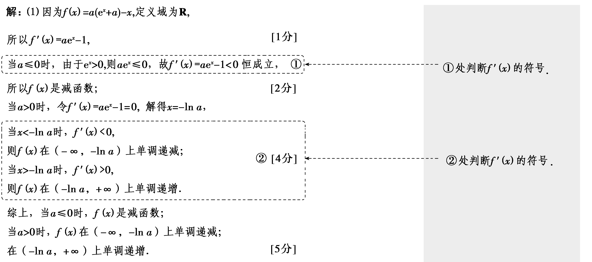
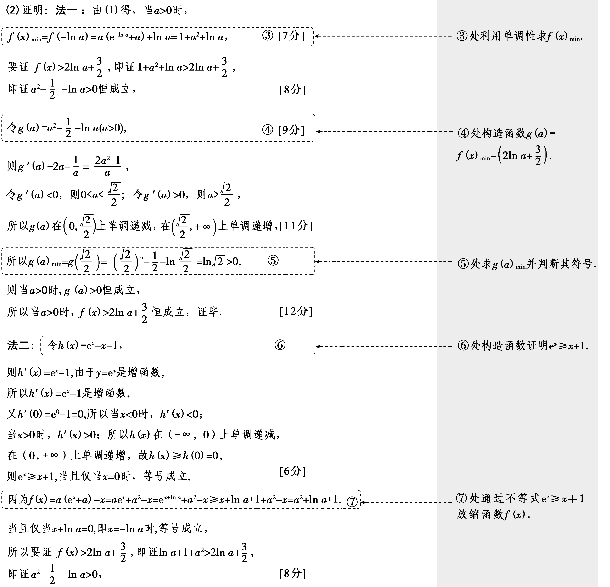
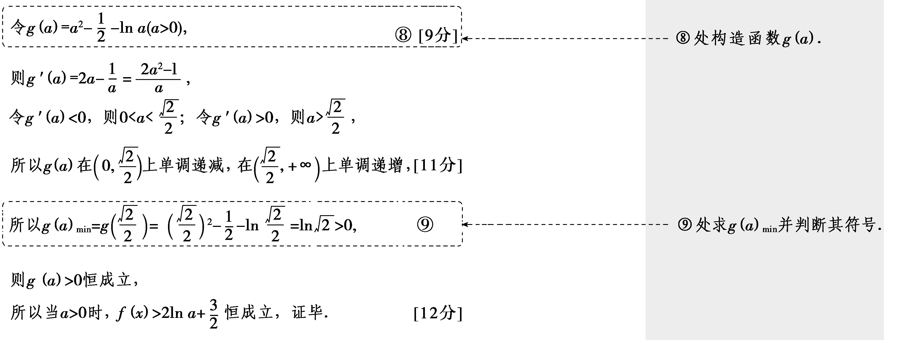

突破2　利用导数证明不等式

导数中的不等式证明是高考的常考题型之一，常与函数的性质、函数的零点与极值、数列等相结合，虽然题目难度较大，但是解题方法多种多样，如构造函数法、放缩法等，针对不同的题目，会灵活采用不同的解题方法.

技法一　移项构造函数法(或直接利用函数的最值法)

[答题规范](12分)(2023·新课标Ⅰ卷)已知函数<em>f</em>(<em>x</em>)＝<em>a</em>(e<em>x</em>＋<em>a</em>)－<em>x</em>.

（1）讨论*f*(*x*)的单调性；[切入点：求导，讨论*a*的正负]

（2）(一题多解)证明：当<te<text style="it*a*lic">x</text>t style="italic">a</text>＞0时，*f*(x)＞2ln a＋ $\frac{3}{2}$ .

[法一　关键点：作差法比较&lt;te&lt;text style="it<em>a</em>lic"&gt;x&lt;/text&gt;t style="italic"&gt;f&lt;/text&gt;(x)min与2ln a＋ $\frac{3}{2}$ 的大小]

[法二　关键点：利用不等式e<em>x</em>≥<em>x</em>＋1把函数<em>f</em>(<em>x</em>)中的指数换成一次函数]

[思路分析]

（1）求*f'*(*x*)→分*a*≤0，*a*＞0判断*f'*(*x*) 的符号→*f*(*x*) 的单调性.

（2）法一：求&lt;te&lt;te&lt;text style="it<em>a</em>lic"&gt;x&lt;/text&gt;t style="it<em>a</em>lic"&gt;x&lt;/text&gt;t style="italic"&gt;<em>f</em>&lt;/text&gt;(x)&lt;text style="subscript"&gt;min&lt;/text&gt;→构造函数<em>&lt;text style="italic"&gt;g</em>&lt;/text&gt;(a)＝f(x)min－ $\left(2lna＋\frac{3}{2}\right)$ →求&lt;te&lt;text style="it<em>a</em>lic"&gt;x&lt;/text&gt;t style="it<em>a</em>lic"&gt;<em>g</em>&lt;/text&gt;(a)最小值.

法二：证明不等式e&lt;te&lt;te&lt;te&lt;te&lt;te&lt;text style="it&lt;text style="it&lt;text style="it&lt;text style="it&lt;text style="it&lt;text style="it<em>a</em>lic"&gt;a&lt;/text&gt;lic"&gt;a&lt;/text&gt;lic"&gt;a&lt;/text&gt;lic"&gt;a&lt;/text&gt;lic"&gt;a&lt;/text&gt;lic"&gt;x&lt;/text&gt;t style="it<em>a</em>lic"&gt;x&lt;/text&gt;t style="it<em>a</em>lic,superscript"&gt;x&lt;/text&gt;t style="italic,superscript"&gt;x&lt;/text&gt;t style="it<em>a</em>lic"&gt;x&lt;/text&gt;t style="italic,superscript"&gt;x&lt;/text&gt;≥x＋1→aex＝ex＋ln a≥x＋ln a＋1→<em>f</em>(x)≥a&lt;text style="superscript"&gt;2&lt;/text&gt;＋ln a＋1→构造函数<em>&lt;text style="italic"&gt;g</em>&lt;/text&gt;(a)＝a2＋ln a＋1－ $\left(2lna＋\frac{3}{2}\right)$ →求&lt;text style="it&lt;text style="it&lt;text style="it&lt;text style="it<em>a</em>lic"&gt;a&lt;/text&gt;lic"&gt;a&lt;/text&gt;lic"&gt;a&lt;/text&gt;lic"&gt;<em>g</em>&lt;/text&gt;(&lt;te&lt;te&lt;te&lt;te&lt;text style="it&lt;text style="it<em>a</em>lic"&gt;a&lt;/text&gt;lic"&gt;x&lt;/text&gt;t style="it<em>a</em>lic"&gt;x&lt;/text&gt;t style="it<em>a</em>lic,superscript"&gt;x&lt;/text&gt;t style="italic,superscript"&gt;x&lt;/text&gt;t style="italic"&gt;a&lt;/text&gt;)最小值.

<table><tr><td></td></tr></table>

##### 1.若待证不等式的一边含有自变量，另一边为常数，可直接求函数的最值，利用最值证明不等式.

##### 2.若待证不等式的两边含有同一个变量，一般地，可以直接构造“左减右”的函数，有时对复杂的式子要进行变形，利用导数研究其单调性和最值，借助所构造函数的单调性和最值即可得证.

对点练1.(2023·新课标Ⅱ卷节选)证明：当0＜<em>x</em>＜1时，<em>x</em>－<em>x</em>2＜sin <em>x</em>＜<em>x</em>.

证明：令<em>h</em>(<em>x</em>)＝<em>x</em>－<em>x</em>2－sin <em>x</em>(0＜<em>x</em>＜1)，则<em>h'</em>(<em>x</em>)＝1－2<em>x</em>－cos <em>x</em>(0＜<em>x</em>＜1).

令*p*(*x*)＝1－2*x*－cos *x*(0＜*x*＜1)，则*p'*(*x*)＝－2＋sin *x*＜0，

所以*p*(*x*)在(0，1)上单调递减，即*h'*(*x*)在(0，1)上单调递减，

又*h'*（0）＝0，所以当0＜*x*＜1时，*h'*(*x*)＜*h'*（0）＝0，*h*(*x*)单调递减，

所以当0＜*x*＜1时，*h*(*x*)＜*h*（0）＝0，

即<em>x</em>－<em>x</em>2＜sin <em>x</em>.

令*g*(*x*)＝sin *x*－*x*(0＜*x*＜1)，

则*g'*(*x*)＝cos *x*－1＜0，

所以*g*(*x*)在(0，1)上单调递减，又*g*（0）＝0，

所以当0＜*x*＜1时，*g*(*x*)＜*g*（0）＝0，即sin *x*＜*x*.

综上，当0＜<em>x</em>＜1时，<em>x</em>－<em>x</em>2＜sin <em>x</em>＜<em>x</em>.

技法二　分拆函数法(或凹凸反转法)

已知函数<em>f</em>(<em>x</em>)＝<em>ax</em>ln <em>x</em>＋<em>x</em>2，<em>g</em>(<em>x</em>)＝e<em>x</em>＋<em>x</em>－1，0＜<em>a</em>≤1，求证：<em>f</em>(<em>x</em>)＜<em>g</em>(<em>x</em>).

证明：要证明*f*(*x*)＜*g*(*x*)，

即证明<em>ax</em>ln <em>x</em>＋<em>x</em>2＜e<em>x</em>＋<em>x</em>－1，

只需证明 $\frac{alnx}{x}$ ＋1＜ $\frac{e^{x}＋x－1}{x^{2}}$ ，

令<te<te*x*t style="italic">x</text>t style="italic">u</text>(x) $＝\frac{alnx}{x}$ ＋1，<te*x*t style="italic">v</text>(*x*) $＝\frac{e^{x}＋x－1}{x^{2}}$ ，

又<te<text style="it*a*lic">x</text>t style="italic">u'</text>(x) $＝\frac{a(1－lnx)}{x^{2}}$ ，0＜*a*≤1，

则0＜*x*＜e时，*u'*(*x*)＞0，函数*u*(*x*)在(0，e)上单调递增；

*x*＞e时，*u'*(*x*)＜0，函数*u*(*x*)在(e，＋∞)上单调递减；

所以<te*x*t style="italic">x</text>＝e时，*u*(x)取得最大值，最大值为 $\frac{a}{e}$ ＋1，

由<te<te*x*t style="italic">x</text>t style="italic">v</text>(x) $＝\frac{e^{x}＋x－1}{x^{2}}$ 可得<te<te*x*t style="italic">x</text>t style="italic">v</text>'(x) $＝\frac{(x－2)(e^{x}－1)}{x^{3}}$ ，

则0＜*x*＜2时，*v'*(*x*)＜0，函数*v*(*x*)在(0，2)上单调递减；

*x*＞2时，*v'*(*x*)＞0，函数*v*(*x*)在(2，＋∞)上单调递增；

则<te*x*t style="italic">x</text>＝2时，*v*(x)取得最小值，且最小值为 $\frac{e^{2}+1}{4}$ ，

又 $\frac{e^{2}+1}{4}$ － $\frac{a}{e}$ －1≥ $\frac{e^{2}－3}{4}$ － $\frac{1}{e}$ ＞0，

所以 $\frac{e^{2}+1}{4}＞\frac{a}{e}$ ＋1，

即 $\left(\frac{alnx}{x}+1\right)_{max}＜\left(\frac{e^{x}＋x－1}{x^{2}}\right)_{min}$ ，

所以0＜*a*≤1时，*f*(*x*)＜*g*(*x*).

##### 1.若直接求导比较复杂或无从下手时，或两次求导都不能判断导数的正负时，可将待证式进行变形，构造两个函数，从而找到可以传递的中间量，达到证明的目标.含ln <em>x</em>与e<em>x</em>的混合式不能直接构造函数，要将指数与对数分离，分别计算它们的最值，借助最值进行证明.

##### 2.等价变形的目的是便于求导后找到极值点，一般地，e<em>x</em>与ln <em>x</em>要分离，常构造<em>xn</em>与ln <em>x</em>，<em>xn</em>与e<em>x</em>的积、商形式，便于求导后找到极值点.

对点练&lt;te&lt;te&lt;te&lt;te&lt;te&lt;te<em>x</em>t style="italic"&gt;x&lt;/text&gt;t style="italic"&gt;x&lt;/text&gt;t style="italic"&gt;x&lt;/text&gt;t style="italic"&gt;x&lt;/text&gt;t style="italic"&gt;x&lt;/text&gt;t style="superscript"&gt;2&lt;/text&gt;.(2024·河南郑州模拟节选)已知函数&lt;te&lt;te<em>x</em>t style="italic"&gt;x&lt;/text&gt;t style="italic"&gt;<em>f</em>&lt;/text&gt;(x)＝ex2－xln x，求证：当x＞0时，f(x)＜xex＋ $\frac{1}{e}$ .

证明：要证&lt;te&lt;te&lt;te<em>x</em>t style="italic"&gt;x&lt;/text&gt;t style="italic"&gt;x&lt;/text&gt;t style="italic"&gt;f&lt;/text&gt;(x)＜xex＋ $\frac{1}{e}$ ，

只需证e<te<te<te<te<te*x*t style="italic,superscript">x</text>t style="italic">x</text>t style="italic,superscript">x</text>t style="italic">x</text>t style="italic">x</text>－ln x＜ex＋ $\frac{1}{ex}$ ，即e<te<te<te<te<te*x*t style="italic,superscript">x</text>t style="italic">x</text>t style="italic,superscript">x</text>t style="italic">x</text>t style="italic">x</text>－ex＜ln x＋ $\frac{1}{ex}$ .

令<te<te<te<te*x*t style="italic">x</text>t style="italic">x</text>t style="italic">x</text>t style="italic">h</text>(x)＝ln x＋ $\frac{1}{ex}$ (<te<te<te*x*t style="italic">x</text>t style="italic">x</text>t style="italic">x</text>＞0)，则*h*'(x) $＝\frac{ex－1}{ex^{2}}$ ，

易知<te*x*t style="italic">h</text>(x)在 $\left(0，\frac{1}{e}\right)$ 上单调递减，在 $\left(\frac{1}{e}，＋\infty \right)$ 上单调递增，

则&lt;te&lt;te<em>x</em>t style="italic"&gt;x&lt;/text&gt;t style="italic"&gt;<em>h</em>&lt;/text&gt;(x)min＝h $\left(\frac{1}{e}\right)＝$ 0，所以ln &lt;te<em>x</em>t style="italic"&gt;x&lt;/text&gt;＋ $\frac{1}{ex}$ ≥0.

再令<em>φ</em>(<em>x</em>)＝e<em>x</em>－e<em>x</em>，则<em>φ'</em>(<em>x</em>)＝e－e<em>x</em>，

易知*φ*(*x*)在(0，1)上单调递增，

在(1，＋∞)上单调递减，

则<em>φ</em>(<em>x</em>)max＝<em>φ</em>（1）＝0，所以e<em>x</em>－e<em>x</em>≤0.

因为*h*(*x*)与*φ*(*x*)不同时为0，

所以e<te<te*x*t style="italic,superscript">x</text>t style="italic">x</text>－ex＜ln x＋ $\frac{1}{ex}$ ，故原不等式成立.

技法三　适当放缩法

(一题多变)当<em>x</em>＞0时，证明：e<em>x</em>－sin <em>x</em>－1＞<em>x</em>ln <em>x</em>.

证明：设*h*(*x*)＝*x*－sin *x*，则*h'*(*x*)＝1－cos *x*≥0，*h*(*x*)单调递增，

所以当*x*＞0时，*h*(*x*)＞*h*（0）＝0，

即*x*＞sin *x*(*x*＞0).

所以e<em>x</em>－sin <em>x</em>－1＞e<em>x</em>－<em>x</em>－1，

所以要证e<em>x</em>－sin <em>x</em>－1＞<em>x</em>ln <em>x</em>，

只需证明e<em>x</em>－<em>x</em>－1＞<em>x</em>ln <em>x</em>，

设<em>f</em>(<em>x</em>)＝e<em>x</em>－<em>x</em>－1，则<em>f'</em>(<em>x</em>)＝e<em>x</em>－1，

则*x*∈(－∞，0)时，*f'*(*x*)＜0，*f*(*x*)单调递减；

*x*∈(0，＋∞)时，*f'*(*x*)＞0，*f*(*x*)单调递增.

所以*f*(*x*)的最小值为*f*（0）＝0.

当*x*∈(0，1)时，*f*(*x*)＞0，*x*ln *x*＜0，

所以e<em>x</em>－<em>x</em>－1＞<em>x</em>ln <em>x</em>.

当<em>x</em>∈[1，＋∞)时，设<em>F</em>(<em>x</em>)＝e<em>x</em>－<em>x</em>－1－<em>x</em>ln <em>x</em>，

则<em>F'</em>(<em>x</em>)＝e<em>x</em>－ln <em>x</em>－2，

设&lt;te&lt;te&lt;te&lt;te&lt;te<em>x</em>t style="italic"&gt;x&lt;/text&gt;t style="italic"&gt;x&lt;/text&gt;t style="italic,superscript"&gt;x&lt;/text&gt;t style="italic"&gt;x&lt;/text&gt;t style="italic"&gt;g&lt;/text&gt;(x)＝ex－ln x－2，则<em>g'</em>(x)＝ex－ $\frac{1}{x}$ ，

因为*g'*(*x*)在[1，＋∞)上单调递增，

且*g'*（1）＝e－1＞0，

所以*g'*(*x*)＞0在[1，＋∞)上恒成立，

所以*g*(*x*)在[1，＋∞)上单调递增，

又*g*（1）＝e－2＞0，

所以*F'*(*x*)＞0在[1，＋∞)上恒成立，

故*F*(*x*)在[1，＋∞)上单调递增，

*F*(*x*)≥*F*（1）＝e－2＞0在[1，＋∞)上恒成立.

综上，当<em>x</em>＞0时，e<em>x</em>－sin <em>x</em>－1＞<em>x</em>ln <em>x</em>.

[变式探究]

(变设问)已知函数&lt;te&lt;te&lt;te&lt;te<em>x</em>t style="italic"&gt;x&lt;/text&gt;t style="italic"&gt;x&lt;/text&gt;t style="italic"&gt;x&lt;/text&gt;t style="italic"&gt;<em>f</em>&lt;/text&gt;(x) $＝\frac{sinx}{2+cosx}$ ，求证：当&lt;te&lt;te&lt;te<em>x</em>t style="italic"&gt;x&lt;/text&gt;t style="italic"&gt;x&lt;/text&gt;t style="italic"&gt;x&lt;/text&gt;＞0时，3<em>&lt;text style="italic"&gt;f</em>&lt;/text&gt;(x)＋1＜ex.

证明：当<em>x</em>＞0时，要证明3<em>f</em>(<em>x</em>)＋1＜e<em>x</em>，

即证明<te*x*t style="italic">f</text>(x)＜ $\frac{e^{x}－1}{3}$ ，

记<em>F</em>(<em>x</em>)＝e<em>x</em>－<em>x</em>－1，

因为<em>F'</em>(<em>x</em>)＝e<em>x</em>－1，

当*x*∈(0，＋∞)时，*F'*(*x*)＞0，所以*F*(*x*)在(0，＋∞)上单调递增，

所以<em>F</em>(<em>x</em>)＝e<em>x</em>－<em>x</em>－1＞<em>F</em>（0）＝0，

故e<te*x*t style="italic,superscript">x</text>－1＞x，即 $\frac{x}{3}＜\frac{e^{x}－1}{3}$ .

故只需证明<te<te*x*t style="italic">x</text>t style="italic">f</text>(x)＜ $\frac{x}{3}$ (<te*x*t style="italic">x</text>＞0)，

令<te<te<te*x*t style="italic">x</text>t style="italic">x</text>t style="italic">G</text>(x)＝*f*(x)－ $\frac{1}{3}$ <te<te*x*t style="italic">x</text>t style="italic">x</text>，

则<te<te<te*x*t style="italic">x</text>t style="italic">x</text>t style="italic">G</text>(x) $＝\frac{sinx}{2+cosx}$ － $\frac{1}{3}$ <te<te*x*t style="italic">x</text>t style="italic">x</text>，则*G*'(x) $＝\frac{2cosx+1}{(2+cosx)^{2}}$ － $\frac{1}{3}＝\frac{-(cosx－1)^{2}}{3(2+cosx)^{2}}$ ，

故对于∀*x*＞0，都有*G'*(*x*)≤0，因而*G*(*x*)在(0，＋∞)上单调递减，

对于∀<te<te<te<te<te*x*t style="italic">x</text>t style="italic">x</text>t style="italic">x</text>t style="italic">x</text>t style="italic">x</text>＞0，都有*<text style="italic">G*</text>(x)＜G(0)＝0，因此对于∀x＞0，都有*<text style="italic"><text style="italic">f*</text></text>(x)＜ $\frac{x}{3}$ ，所以<te<te<te*x*t style="italic">x</text>t style="italic">x</text>t style="italic">*<text style="italic">f*</text></text>(<te<te*x*t style="italic">x</text>t style="italic">x</text>)＜ $\frac{x}{3}＜\frac{e^{x}－1}{3}$ 成立，即<te<te<te*x*t style="italic">x</text>t style="italic">x</text>t style="italic">*<text style="italic">f*</text></text>(<te<te*x*t style="italic">x</text>t style="italic">x</text>)＜ $\frac{e^{x}－1}{3}$ 成立，故原不等式成立.

##### 1.利用导数证明不等式时，若所证明的不等式中含有e<em>x</em>，ln <em>x</em>，sin <em>x</em>，cos <em>x</em>，tan <em>x</em>，或其他多项式函数中的两种以上的函数，可考虑先利用不等式进行放缩，使问题简化.然后再构造函数进行证明.

##### 2.常见的放缩有：

（1）正弦、正切放缩：tan <te<te<te*x*t style="italic">x</text>t style="italic">x</text>t style="italic">x</text>＞x＞sin x，x∈ $\left(0，\frac{\pi }{2}\right)$ .

（2）切线放缩：e<em>x</em>≥<em>x</em>＋1＞<em>x</em>－1≥ln <em>x</em>，利用切线放缩可把指数式、对数式转化为一次式，有利于后续的求解.

对点练3.(2024·山东济南模拟节选)已知函数<em>f</em>(<em>x</em>)＝e<em>x</em>，证明：当<em>x</em>＞－2时，<em>f</em>(<em>x</em>)＞ln(<em>x</em>＋2).

证明：设<em>g</em>(<em>x</em>)＝<em>f</em>(<em>x</em>)－(<em>x</em>＋1)＝e<em>x</em>－<em>x</em>－1(<em>x</em>＞－2)，则<em>g'</em>(<em>x</em>)＝e<em>x</em>－1，

当－2＜*x*＜0时，*g'*(*x*)＜0；

当*x*＞0时，*g'*(*x*)＞0，即*g*(*x*)在(－2，0)上单调递减，在(0，＋∞)上单调递增，

于是当<em>x</em>＝0时，<em>g</em>(<em>x</em>)min＝<em>g</em>（0）＝0，

因此当*x*＞－2时，*f*(*x*)≥*x*＋1(当且仅当*x*＝0时取等号)，

令*h*(*x*)＝*x*＋1－ln(*x*＋2)(*x*＞－2)，

则<te*x*t style="italic">h'</text>(x)＝1－ $\frac{1}{x+2}＝\frac{x+1}{x+2}$ ，

则当－2＜*x*＜－1时，*h'*(*x*)＜0；

当*x*＞－1时，*h'*(*x*)＞0，即有*h*(*x*)在(－2，－1)上单调递减，在(－1，＋∞)上单调递增，

于是当<em>x</em>＝－1时，<em>h</em>(<em>x</em>)min＝<em>h</em>(－1)＝0，

因此当*x*＞－2时，*x*＋1≥ln(*x*＋2)(当且仅当*x*＝－1时取等号)，

因为等号不同时成立，所以当*x*＞－2时，*f*(*x*)＞ln(*x*＋2).

技法四　特殊化法

(2022·新高考Ⅱ卷)已知函数<em>f</em>(<em>x</em>)＝<em>x</em>e<em>ax</em>－e<em>x</em>.

（1）当*a*＝1时，讨论*f*(*x*)的单调性；

（2）当*x*＞0时，*f*(*x*)＜－1，求实数*a*的取值范围；

（3）设<em>&lt;text style="italic"&gt;n</em>&lt;/text&gt;∈<strong>N</strong><em>\*</em>，证明： $\frac{1}{\sqrt{1^{2}+1}}$ ＋ $\frac{1}{\sqrt{2^{2}+2}}$ ＋…＋ $\frac{1}{\sqrt{n^{2}＋n}}$ ＞l<em>&lt;text style="italic"&gt;n</em>&lt;/text&gt;(n＋1).

解：（1）当<em>a</em>＝1时，<em>f</em>(<em>x</em>)＝<em>x</em>e<em>x</em>－e<em>x</em>，<em>x</em>∈<strong>R</strong>，则<em>f'</em>(<em>x</em>)＝<em>x</em>e<em>x</em>，当<em>x</em>＞0时，<em>f'</em>(<em>x</em>)＞0，当<em>x</em>＜0时，<em>f'</em>(<em>x</em>)＜0，

所以函数*f*(*x*)在(－∞，0)上单调递减，在(0，＋∞)上单调递增.

（2）函数<em>f</em>(<em>x</em>)的定义域为<strong>R</strong>，<em>f'</em>(<em>x</em>)＝(1＋<em>ax</em>)e<em>ax</em>－e<em>x</em>.

对于<em>x</em>∈(0，＋∞)，当<em>a</em>≥1时，<em>f'</em>(<em>x</em>)＝(1＋<em>ax</em>)e<em>ax</em>－e<em>x</em>＞e<em>ax</em>－e<em>x</em>≥e<em>x</em>－e<em>x</em>＝0，所以<em>f'</em>(<em>x</em>)＞0，<em>f</em>(<em>x</em>)在(0，＋∞)上单调递增.

因为*f*（0）＝－1，所以*f*(*x*)＞－1，不满足题意.

当<em>a</em>≤0时，<em>f'</em>(<em>x</em>)≤e<em>ax</em>－e<em>x</em>≤1－e<em>x</em>＜0且等号不恒成立，

所以*f*(*x*)在(0，＋∞)上单调递减.

因为*f*（0）＝－1，所以*f*(*x*)＜－1，满足题意.

当0＜&lt;te&lt;te<em>x</em>t style="italic"&gt;x&lt;/text&gt;t style="italic"&gt;a&lt;/text&gt;≤ $\frac{1}{2}$ 时，&lt;te&lt;te<em>x</em>t style="italic"&gt;x&lt;/text&gt;t style="italic"&gt;f'&lt;/text&gt;(x)≤(1＋ $\frac{x}{2})e^{\frac{x}{2}}$ －e&lt;te<em>x</em>t style="italic"&gt;x&lt;/text&gt; $＝e^{\frac{x}{2}}$ (1＋ $\frac{x}{2}$ － $e^{\frac{x}{2}}$ ).

令<te<te<te<te<te<te<te*x*t style="italic">x</text>t style="italic">x</text>t style="italic">x</text>t style="italic">x</text>t style="italic">x</text>t style="italic">x</text>t style="italic">*<text style="italic"><text style="italic">g*</text></text></text>(x)＝1＋ $\frac{x}{2}$ － $e^{\frac{x}{2}}$ ，则<te<te<te<te<te<te<te*x*t style="italic">x</text>t style="italic">x</text>t style="italic">x</text>t style="italic">x</text>t style="italic">x</text>t style="italic">x</text>t style="italic">*<text style="italic"><text style="italic">g*</text></text></text>'(x) $＝\frac{1}{2}$ － $\frac{1}{2}e^{\frac{x}{2}}$ ＜0，所以<te<te<te<te<te<te<te*x*t style="italic">x</text>t style="italic">x</text>t style="italic">x</text>t style="italic">x</text>t style="italic">x</text>t style="italic">x</text>t style="italic">*<text style="italic"><text style="italic">g*</text></text></text>(x)在(0，＋∞)上单调递减，所以g(x)＜g(0)＝0，所以*<text style="italic">f*'</text>(x) $＝e^{\frac{x}{2}}$ ·<te<te<te<te<te<te<te*x*t style="italic">x</text>t style="italic">x</text>t style="italic">x</text>t style="italic">x</text>t style="italic">x</text>t style="italic">x</text>t style="italic">*<text style="italic"><text style="italic">g*</text></text></text>(x)＜0，*f*(x)在(0，＋∞)上单调递减.

因为*f*（0）＝－1，所以*f*(*x*)＜－1，满足题意.

当 $\frac{1}{2}$ ＜&lt;te&lt;te<em>x</em>t style="it<em>a</em>lic"&gt;x&lt;/text&gt;t style="italic"&gt;a&lt;/text&gt;＜1时，<em>f'</em>(x)＝e<em>&lt;text style="italic"&gt;ax</em>&lt;/text&gt;[1＋ax－e(1－a)x].

令<em>h</em>(<em>x</em>)＝1＋<em>ax</em>－e(1－<em>a</em>)<em>x</em>，

则<em>h'</em>(<em>x</em>)＝<em>a</em>＋(<em>a</em>－1)e(1－<em>a</em>)<em>x</em>.

因为<em>h'</em>(<em>x</em>)为减函数，又<em>h'</em>（0）＝2<em>a</em>－1＞0，<em>x</em>→＋∞，<em>h'</em>(<em>x</em>)＜0，所以∃<em>x</em>0∈(0，＋∞)，使<em>h'</em>(<em>x</em>0)＝0，所以当<em>x</em>∈(0，<em>x</em>0)时，<em>h'</em>(<em>x</em>)＞0，<em>h</em>(<em>x</em>)在(0，<em>x</em>0)上单调递增，<em>h</em>(<em>x</em>)＞<em>h</em>（0）＝0，所以当<em>x</em>∈(0，<em>x</em>0)时，<em>f'</em>(<em>x</em>)＝e<em>ax</em>·<em>h</em>(<em>x</em>)＞0，<em>f</em>(<em>x</em>)在(0，<em>x</em>0)上单调递增.

因为*f*（0）＝－1，所以*f*(*x*)＞－1，不满足题意.

综上，*a*的取值范围是(－∞， $\frac{1}{2}$ ］.

（3）证明：由（2）知当&lt;te&lt;te&lt;te&lt;te&lt;te&lt;te<em>x</em>t style="italic"&gt;x&lt;/text&gt;t style="italic,superscript"&gt;x&lt;/text&gt;t style="italic"&gt;x&lt;/text&gt;t style="italic"&gt;x&lt;/text&gt;t style="italic"&gt;x&lt;/text&gt;t style="italic"&gt;a&lt;/text&gt; $＝\frac{1}{2}$ ，且&lt;te&lt;te&lt;te&lt;te&lt;te<em>x</em>t style="italic"&gt;x&lt;/text&gt;t style="italic,superscript"&gt;x&lt;/text&gt;t style="italic"&gt;x&lt;/text&gt;t style="italic"&gt;x&lt;/text&gt;t style="italic"&gt;x&lt;/text&gt;∈(0，＋∞)时，<em>f</em>(x)＜－1，即x $e^{\frac{x}{2}}$ －e&lt;te&lt;te&lt;te&lt;te&lt;te<em>x</em>t style="italic"&gt;x&lt;/text&gt;t style="italic,superscript"&gt;x&lt;/text&gt;t style="italic"&gt;x&lt;/text&gt;t style="italic"&gt;x&lt;/text&gt;t style="italic"&gt;x&lt;/text&gt;＜－1，所以x $e^{\frac{x}{2}}$ ＜e&lt;te&lt;te&lt;te&lt;te&lt;te<em>x</em>t style="italic"&gt;x&lt;/text&gt;t style="italic,superscript"&gt;x&lt;/text&gt;t style="italic"&gt;x&lt;/text&gt;t style="italic"&gt;x&lt;/text&gt;t style="italic"&gt;x&lt;/text&gt;－1.

令<<<*t*ext style="italic">t</text>ext style="italic">t</text>e<te*x*t style="italic,superscript">x</text>t style="italic">t</text>＝ex＞1，则x＝ln t，所以ln t· $\sqrt{t}$ ＜<<<*t*ext style="italic">t</text>ext style="italic">t</text>e<te*x*t style="italic,superscript">x</text>t style="italic">t</text>－1.

令&lt;text style="<em>i</em>talic"&gt;t&lt;/text&gt; $＝\frac{i+1}{i}$ ＞1，<em>i</em>∈<strong>N</strong><em>\*</em>，则ln $\frac{i+1}{i}\sqrt{\frac{i+1}{i}}＜\frac{i+1}{i}$ －1 $＝\frac{1}{i}$ ，

所以ln $\frac{i+1}{i}＜\frac{1}{i}\sqrt{\frac{i}{i+1}}＝\sqrt{\frac{1}{i(i+1)}}＝\frac{1}{\sqrt{i^{2}＋i}}$ ，

所以 $\overset{n}{\underset{i=1}{\sum }}\frac{1}{\sqrt{i^{2}＋i}}$ ＞ $\overset{n}{\underset{i=1}{\sum }}$ l*n* $\frac{i+1}{i}$ ＝l*n* $\frac{2}{1}$ ＋l*n* $\frac{3}{2}$ ＋…＋l*n* $\frac{n+1}{n}$ ＝l*n*(n＋1).

证明与数列有关的不等式的策略

在证明与数列有关的不等式时，往往是从题目中已经证得的结论(参数取值范围、不等式等)出发，通过特殊化处理，即将其中的变量替换为特殊的变量，尤其是可替换为与自然数*n*有关的式子，然后再结合数列中的裂项求和以及不等式的放缩等方法证得结论.

对点练4.已知函数<te<te*x*t style="italic">x</text>t style="italic">f</text>(x)＝ln(x＋1)－ $\frac{2x}{x+2}$ .证明：

（1）当*x*＞0时，*f*(*x*)＞0；

（2） $\frac{1}{3}$ ＋ $\frac{1}{5}$ ＋…＋ $\frac{1}{2n+1}$ ＜ln $\sqrt{n+1}$ .

证明：（1）当<te<te<te*x*t style="italic">x</text>t style="italic">x</text>t style="italic">x</text>＞0时，*<text style="italic"><text style="italic"><text style="italic">f*</text></text>'</text>(x) $＝\frac{1}{x+1}$ － $\frac{4}{(x+2)^{2}}＝\frac{x^{2}}{(x+1)(x+2)^{2}}$ ＞0，所以<te<te*x*t style="italic">x</text>t style="italic">*<text style="italic">f*</text></text>(<te*x*t style="italic">x</text>)单调递增，所以f(x)＞f(0)＝0.

（2）由（1）知，当<te*x*t style="italic">x</text>＞0时，ln(x＋1)＞ $\frac{2x}{x+2}$ .

令<text style="italic">x</text> $＝\frac{1}{n}$  ，则有 $\frac{2\cdot \frac{1}{n}}{\frac{1}{n}+2}$ ＜ln( $\frac{1}{n}$ ＋1)⇒ $\frac{2}{2n+1}$ ＜ln $\frac{n+1}{n}$ ，故 $\frac{2}{3}$ ＜ln $\frac{2}{1}$ ， $\frac{2}{5}$ ＜ln $\frac{3}{2}$ ，…， $\frac{2}{2n+1}$ ＜ln $\frac{n+1}{n}$ .

将以上各式相加，得 $\frac{2}{3}$ ＋ $\frac{2}{5}$ ＋…＋ $\frac{2}{2n+1}$ ＜l*<text style="italic">n*</text> $\frac{2}{1}$ ＋l*<text style="italic">n*</text> $\frac{3}{2}$ ＋…＋l*<text style="italic">n*</text> $\frac{n+1}{n}＝$ l*<text style="italic">n*</text>( $\frac{2}{1}$ · $\frac{3}{2}$ ·…· $\frac{n+1}{n}$ )＝l*<text style="italic">n*</text>(n＋1)，故 $\frac{1}{3}$ ＋ $\frac{1}{5}$ ＋…＋ $\frac{1}{2n+1}＜\frac{1}{2}$ l*<text style="italic">n*</text>(n＋1)＝ln $\sqrt{n+1}$ ，即不等式 $\frac{1}{3}$ ＋ $\frac{1}{5}$ ＋…＋ $\frac{1}{2n+1}$ ＜l*<text style="italic">n*</text> $\sqrt{n+1}$ 成立.

课时测评25　利用导数证明不等式 $\frac{对应学生}{用书P359}$

(时间：60分钟　满分：74分)

(本栏目内容，在学生用书中以独立形式分册装订！)

(1—2题，每小题5分，共10分)

##### 1.已知<em>a</em>＝4log2e，<em>b</em>＝6log3e，<em>c</em>＝10log5e，e为自然对数的底数，则(　　)

$\quad$A.*c*＞*a*＞*b*	
$\quad$B.*a*＞*c*＞*b*

$\quad$C.*b*＞*a*＞*c*	
$\quad$D.*a*＞*b*＞*c*

答案A

解析<te<te<te<text style="it<text style="it*a*li*c*">a</text>lic">x</text>t style="italic">x</text>t style="it<text style="itali*c*">a</text>lic">x</text>t style="itali*c*">a</text> $＝\frac{4}{ln2}$ ，<te<te<te<text style="it<text style="it*a*li*c*">a</text>lic">x</text>t style="italic">x</text>t style="it<text style="itali*c*">a</text>lic">x</text>t style="itali*c*">*<text style="italic">b*</text></text> $＝\frac{6}{ln3}$ ，<te<te<te<text style="it<text style="it*a*li*c*">a</text>lic">x</text>t style="italic">x</text>t style="it<text style="itali*c*">a</text>lic">x</text>t style="italic">c</text> $＝\frac{10}{ln5}$ ，令<te<te<te<text style="it<text style="it*a*li*c*">a</text>lic">x</text>t style="italic">x</text>t style="it<text style="itali*c*">a</text>lic">x</text>t style="italic">*<text style="italic"><text style="italic"><text style="italic"><text style="italic">f*</text></text></text></text></text>(x) $＝\frac{2x}{lnx}$ ，则<te<te<te<text style="it<text style="it*a*li*c*">a</text>lic">x</text>t style="italic">x</text>t style="it<text style="itali*c*">a</text>lic">x</text>t style="itali*c*">a</text>＝*<text style="italic"><text style="italic"><text style="italic"><text style="italic"><text style="italic">f*</text></text></text></text></text>（2），*<text style="italic"><text style="italic">b*</text></text>＝f(3)，c＝f(5).*f'*(x) $＝\frac{2lnx－2}{\left(lnx\right)^{2}}$ ，易知<te<te<te<text style="it<text style="it*a*li*c*">a</text>lic">x</text>t style="italic">x</text>t style="it<text style="itali*c*">a</text>lic">x</text>t style="italic">*<text style="italic"><text style="italic"><text style="italic"><text style="italic">f*</text></text></text></text></text>(x)在(e，＋∞)上单调递增.又<text style="itali*c*">a</text> $＝\frac{4}{ln2}＝\frac{8}{2ln2}＝\frac{8}{ln4}＝$ <te<te<te<text style="it<text style="it*a*li*c*">a</text>lic">x</text>t style="italic">x</text>t style="it<text style="itali*c*">a</text>lic">x</text>t style="italic">*<text style="italic"><text style="italic"><text style="italic"><text style="italic">f*</text></text></text></text></text>（4），而3＜4＜5，所以*c*＞*a*＞*<text style="italic"><text style="italic">b*</text></text>.故选A.

##### 2.设*a*＝2 023ln 2 025，*b*＝2 024ln 2 024，*c*＝2 025ln 2 023，则(　　)

$\quad$A.*a*＞*b*＞*c*	
$\quad$B.*c*＞*b*＞*a*

$\quad$C.*a*＞*c*＞*b*	
$\quad$D.*b*＞*a*＞*c*

答案B

解析设&lt;te&lt;te&lt;te&lt;te&lt;te&lt;te&lt;te&lt;te&lt;te&lt;te&lt;text style="it&lt;text style="it<em>a</em>li<em>c</em>"&gt;a&lt;/text&gt;lic"&gt;x&lt;/text&gt;t style="italic"&gt;x&lt;/text&gt;t style="italic"&gt;x&lt;/text&gt;t style="italic"&gt;x&lt;/text&gt;t style="italic"&gt;x&lt;/text&gt;t style="itali<em>c</em>"&gt;x&lt;/text&gt;t style="italic"&gt;x&lt;/text&gt;t style="italic"&gt;x&lt;/text&gt;t style="italic"&gt;x&lt;/text&gt;t style="italic"&gt;x&lt;/text&gt;t style="italic"&gt;<em>&lt;text style="italic"&gt;&lt;text style="italic"&gt;f</em>&lt;/text&gt;&lt;/text&gt;&lt;/text&gt;(x) $＝\frac{lnx}{x+1}$ ，则&lt;te&lt;te&lt;te&lt;te&lt;te&lt;te&lt;te&lt;te&lt;te&lt;te&lt;text style="it&lt;text style="it<em>a</em>li<em>c</em>"&gt;a&lt;/text&gt;lic"&gt;x&lt;/text&gt;t style="italic"&gt;x&lt;/text&gt;t style="italic"&gt;x&lt;/text&gt;t style="italic"&gt;x&lt;/text&gt;t style="italic"&gt;x&lt;/text&gt;t style="itali<em>c</em>"&gt;x&lt;/text&gt;t style="italic"&gt;x&lt;/text&gt;t style="italic"&gt;x&lt;/text&gt;t style="italic"&gt;x&lt;/text&gt;t style="italic"&gt;x&lt;/text&gt;t style="italic"&gt;<em>&lt;text style="italic"&gt;&lt;text style="italic"&gt;f</em>&lt;/text&gt;&lt;/text&gt;&lt;/text&gt;'(x) $＝\frac{1+\frac{1}{x}－lnx}{\left(x+1\right)^{2}}$ ，当&lt;te&lt;te&lt;te&lt;te&lt;te&lt;te&lt;te&lt;te&lt;te&lt;text style="it&lt;text style="it<em>a</em>li<em>c</em>"&gt;a&lt;/text&gt;lic"&gt;x&lt;/text&gt;t style="italic"&gt;x&lt;/text&gt;t style="italic"&gt;x&lt;/text&gt;t style="italic"&gt;x&lt;/text&gt;t style="italic"&gt;x&lt;/text&gt;t style="itali<em>c</em>"&gt;x&lt;/text&gt;t style="italic"&gt;x&lt;/text&gt;t style="italic"&gt;x&lt;/text&gt;t style="italic"&gt;x&lt;/text&gt;t style="italic"&gt;x&lt;/text&gt;∈[e&lt;text style="superscript"&gt;&lt;text style="superscript"&gt;&lt;text style="superscript"&gt;2&lt;/text&gt;&lt;/text&gt;&lt;/text&gt;，＋∞)时，<em>&lt;text style="italic"&gt;&lt;text style="italic"&gt;&lt;text style="italic"&gt;f</em>&lt;/text&gt;&lt;/text&gt;&lt;/text&gt;'(x)＜0，故f(x)在[e2，＋∞)上单调递减，所以f(2 023)＞f(2 024)，即 $\frac{ln2 023}{2 024}＞\frac{ln2 024}{2 025}$ ，所以&lt;te&lt;te&lt;te&lt;te&lt;te&lt;te&lt;te&lt;text style="it&lt;text style="it<em>a</em>li<em>c</em>"&gt;a&lt;/text&gt;lic"&gt;x&lt;/text&gt;t style="italic"&gt;x&lt;/text&gt;t style="italic"&gt;x&lt;/text&gt;t style="italic"&gt;x&lt;/text&gt;t style="italic"&gt;x&lt;/text&gt;t style="itali<em>c</em>"&gt;x&lt;/text&gt;t style="italic"&gt;x&lt;/text&gt;t style="superscript"&gt;&lt;text style="superscript"&gt;&lt;text style="superscript"&gt;2&lt;/text&gt;&lt;/text&gt;&lt;/text&gt; 025ln 2 023＞2 024ln 2 024，所以c＞<em>&lt;text style="italic"&gt;&lt;text style="italic"&gt;b</em>&lt;/text&gt;&lt;/text&gt;；设<em>&lt;text style="italic"&gt;&lt;text style="italic"&gt;&lt;text style="italic"&gt;g</em>&lt;/text&gt;&lt;/text&gt;&lt;/text&gt;(&lt;te&lt;te<em>x</em>t style="italic"&gt;x&lt;/text&gt;t style="italic"&gt;x&lt;/text&gt;) $＝\frac{lnx}{x－1}$ ，则&lt;te&lt;te&lt;te&lt;te&lt;te&lt;text style="it&lt;text style="it<em>a</em>li<em>c</em>"&gt;a&lt;/text&gt;lic"&gt;x&lt;/text&gt;t style="italic"&gt;x&lt;/text&gt;t style="italic"&gt;x&lt;/text&gt;t style="italic"&gt;x&lt;/text&gt;t style="italic"&gt;x&lt;/text&gt;t style="italic"&gt;<em>&lt;text style="italic"&gt;&lt;text style="italic"&gt;g</em>&lt;/text&gt;&lt;/text&gt;&lt;/text&gt;'(&lt;te&lt;te&lt;te&lt;te&lt;text style="itali<em>c</em>"&gt;x&lt;/text&gt;t style="italic"&gt;x&lt;/text&gt;t style="italic"&gt;x&lt;/text&gt;t style="italic"&gt;x&lt;/text&gt;t style="italic"&gt;x&lt;/text&gt;) $＝\frac{1－\frac{1}{x}－lnx}{\left(x－1\right)^{2}}$ ，当&lt;te&lt;te&lt;te&lt;te&lt;te&lt;te&lt;te&lt;te&lt;te&lt;text style="it&lt;text style="it<em>a</em>li<em>c</em>"&gt;a&lt;/text&gt;lic"&gt;x&lt;/text&gt;t style="italic"&gt;x&lt;/text&gt;t style="italic"&gt;x&lt;/text&gt;t style="italic"&gt;x&lt;/text&gt;t style="italic"&gt;x&lt;/text&gt;t style="itali<em>c</em>"&gt;x&lt;/text&gt;t style="italic"&gt;x&lt;/text&gt;t style="italic"&gt;x&lt;/text&gt;t style="italic"&gt;x&lt;/text&gt;t style="italic"&gt;x&lt;/text&gt;∈[e&lt;text style="superscript"&gt;&lt;text style="superscript"&gt;&lt;text style="superscript"&gt;2&lt;/text&gt;&lt;/text&gt;&lt;/text&gt;，＋∞)时，<em>&lt;text style="italic"&gt;&lt;text style="italic"&gt;&lt;text style="italic"&gt;g</em>&lt;/text&gt;&lt;/text&gt;&lt;/text&gt;'(x)＜0，故g(x)在[e2，＋∞)上单调递减，所以g(2 024)＞g(2 025)，即 $\frac{ln2 024}{2 023}＞\frac{ln2 025}{2 024}$ ，所以&lt;te&lt;te&lt;te&lt;te&lt;te&lt;te&lt;te&lt;text style="it&lt;text style="it<em>a</em>li<em>c</em>"&gt;a&lt;/text&gt;lic"&gt;x&lt;/text&gt;t style="italic"&gt;x&lt;/text&gt;t style="italic"&gt;x&lt;/text&gt;t style="italic"&gt;x&lt;/text&gt;t style="italic"&gt;x&lt;/text&gt;t style="itali<em>c</em>"&gt;x&lt;/text&gt;t style="italic"&gt;x&lt;/text&gt;t style="superscript"&gt;&lt;text style="superscript"&gt;&lt;text style="superscript"&gt;2&lt;/text&gt;&lt;/text&gt;&lt;/text&gt; 024ln 2 024＞2 023ln 2 025，所以<em>&lt;text style="italic"&gt;&lt;text style="italic"&gt;b</em>&lt;/text&gt;&lt;/text&gt;＞a，所以c＞b＞a.故选B.

##### 3.(15分)已知*x*＞－1，证明：

（1）e<em>x</em>－1≥<em>x</em>≥ln(<em>x</em>＋1)；(6分)

（2）(e<em>x</em>－1)ln(<em>x</em>＋1)≥<em>x</em>2.(9分)

证明：（1）令*f*(*x*)＝*x*－ln(*x*＋1)，

则<te<te*x*t style="italic">x</text>t style="italic">f'</text>(x) $＝\frac{x}{x+1}$ ，<te*x*t style="italic">x</text>＞－1，

当－1＜*x*＜0时，*f'*(*x*)＜0，*f*(*x*)单调递减；

当*x*＞0时，*f'*(*x*)＞0，*f*(*x*)单调递增，

所以*f*(*x*)≥*f*（0）＝0，等号仅当*x*＝0时成立，即*x*≥ln(*x*＋1)，

从而e<em>x</em>≥eln(<em>x</em>＋1)＝<em>x</em>＋1，所以e<em>x</em>－1≥<em>x</em>.

综上，e<em>x</em>－1≥<em>x</em>≥ln(<em>x</em>＋1).

（2）显然当<em>x</em>＝0时，(e<em>x</em>－1)ln(<em>x</em>＋1)＝<em>x</em>2＝0.

令<te<te*x*t style="italic">x</text>t style="italic">g</text>(x) $＝\frac{x}{e^{x}－1}$ ，<te*x*t style="italic">x</text>≠0，

则<te<te*x*t style="italic">x</text>t style="italic">g'</text>(x) $＝\frac{(1－x)e^{x}－1}{(e^{x}－1)^{2}}$ ，<te*x*t style="italic">x</text>≠0.

令<em>h</em>(<em>x</em>)＝(1－<em>x</em>)e<em>x</em>－1，则<em>h'</em>(<em>x</em>)＝－<em>x</em>e<em>x</em>，

当－1＜*x*＜0时，*h'*(*x*)＞0，*h*(*x*)单调递增；

当*x*＞0时，*h'*(*x*)＜0，*h*(*x*)单调递减，

所以*h*(*x*)≤*h*（0）＝0，等号仅当*x*＝0时成立，

从而<te<te*x*t style="italic">x</text>t style="italic">g'</text>(x) $＝\frac{h(x)}{(e^{x}－1)^{2}}$ ＜0，<te*x*t style="italic">x</text>≠0，

所以*g*(*x*)在(－1，0)和(0，＋∞)上单调递减.

由（1）知，当－1＜*x*＜0时，0＞*x*＞ln(*x*＋1)；

当*x*＞0时，*x*＞ln(*x*＋1)＞0，

所以*g*(*x*)＜*g*(ln(*x*＋1))，

即 $\frac{x}{e^{x}－1}＜\frac{ln(x+1)}{e^{ln(x+1)}－1}＝\frac{ln(x+1)}{x}$ .

又当<em>x</em>＞－1且<em>x</em>≠0时，<em>x</em>(e<em>x</em>－1)＞0，

所以(e<em>x</em>－1)ln(<em>x</em>＋1)＞<em>x</em>2.

综上，当<em>x</em>＞－1时，(e<em>x</em>－1)ln(<em>x</em>＋1)≥<em>x</em>2.

##### 4.(15分)已知函数*f*(*x*)＝*x*ln *x*－*ax*.

（1）当*a*＝－1时，求函数*f*(*x*)在(0，＋∞)上的最值；(6分)

（2）证明：对一切<te*x*t style="italic">x</text>∈(0，＋∞)，都有ln x＋1＞ $\frac{1}{e^{x+1}}$ － $\frac{2}{e^{2}x}$ 成立.(9分)

解：（1）函数*f*(*x*)＝*x*ln *x*－*ax*的定义域为(0，＋∞)，

当*a*＝－1时，*f*(*x*)＝*x*ln *x*＋*x*，*f'*(*x*)＝ln *x*＋2，

由<te<te*x*t style="italic">x</text>t style="italic">f'</text>(x)＝0，得x $＝\frac{1}{e^{2}}$ ，

当0＜<te*x*t style="italic">x</text>＜ $\frac{1}{e^{2}}$ 时，<te*x*t style="italic">f'</text>(*x*)＜0；

当<te*x*t style="italic">x</text>＞ $\frac{1}{e^{2}}$ 时，<te*x*t style="italic">f'</text>(*x*)＞0，

所以<te*x*t style="italic">f</text>(x)在 $\left(0，\frac{1}{e^{2}}\right)$ 上单调递减，在 $\left(\frac{1}{e^{2}}，＋\infty \right)$ 上单调递增，

因此&lt;te&lt;te&lt;te<em>x</em>t style="italic"&gt;x&lt;/text&gt;t style="italic"&gt;x&lt;/text&gt;t style="italic"&gt;<em>&lt;text style="italic"&gt;f</em>&lt;/text&gt;&lt;/text&gt;(x)在x $＝\frac{1}{e^{2}}$ 处取得最小值，即&lt;te&lt;te&lt;te<em>x</em>t style="italic"&gt;x&lt;/text&gt;t style="italic"&gt;x&lt;/text&gt;t style="italic"&gt;<em>&lt;text style="italic"&gt;f</em>&lt;/text&gt;&lt;/text&gt;(x)min＝f $\left(\frac{1}{e^{2}}\right)＝$ － $\frac{1}{e^{2}}$ ，无最大值.

（2）证明：当<te*x*t style="italic">x</text>＞0时，ln x＋1＞ $\frac{1}{e^{x+1}}$ － $\frac{2}{e^{2}x}$ ，

等价于&lt;te&lt;te&lt;te&lt;te&lt;te&lt;te&lt;te&lt;te&lt;te&lt;te<em>x</em>t style="italic"&gt;x&lt;/text&gt;t style="italic"&gt;x&lt;/text&gt;t style="italic"&gt;x&lt;/text&gt;t style="italic"&gt;x&lt;/text&gt;t style="italic"&gt;x&lt;/text&gt;t style="italic"&gt;x&lt;/text&gt;t style="italic"&gt;x&lt;/text&gt;t style="italic"&gt;x&lt;/text&gt;t style="it<em>a</em>lic"&gt;x&lt;/text&gt;t style="italic"&gt;x&lt;/text&gt;(ln x＋1)＞ $\frac{x}{e^{x+1}}$ － $\frac{2}{e^{2}}$ ，由（1）知，当&lt;te&lt;te&lt;te&lt;te&lt;te&lt;te&lt;te&lt;te&lt;te<em>x</em>t style="italic"&gt;x&lt;/text&gt;t style="italic"&gt;x&lt;/text&gt;t style="italic"&gt;x&lt;/text&gt;t style="italic"&gt;x&lt;/text&gt;t style="italic"&gt;x&lt;/text&gt;t style="italic"&gt;x&lt;/text&gt;t style="italic"&gt;x&lt;/text&gt;t style="italic"&gt;x&lt;/text&gt;t style="italic"&gt;a&lt;/text&gt;＝－1时，<em>f</em>(&lt;te<em>x</em>t style="italic"&gt;x&lt;/text&gt;)＝xln x＋x≥－ $\frac{1}{e^{2}}$ ，当且仅当&lt;te&lt;te&lt;te&lt;te&lt;te&lt;te&lt;te&lt;te&lt;te&lt;te<em>x</em>t style="italic"&gt;x&lt;/text&gt;t style="italic"&gt;x&lt;/text&gt;t style="italic"&gt;x&lt;/text&gt;t style="italic"&gt;x&lt;/text&gt;t style="italic"&gt;x&lt;/text&gt;t style="italic"&gt;x&lt;/text&gt;t style="italic"&gt;x&lt;/text&gt;t style="italic"&gt;x&lt;/text&gt;t style="it<em>a</em>lic"&gt;x&lt;/text&gt;t style="italic"&gt;x&lt;/text&gt; $＝\frac{1}{e^{2}}$ 时取等号，设&lt;te&lt;te&lt;te&lt;te<em>x</em>t style="italic"&gt;x&lt;/text&gt;t style="italic"&gt;x&lt;/text&gt;t style="italic"&gt;x&lt;/text&gt;t style="italic"&gt;<em>&lt;text style="italic"&gt;G</em>&lt;/text&gt;&lt;/text&gt;(&lt;te&lt;te&lt;te&lt;te&lt;te&lt;te<em>x</em>t style="italic"&gt;x&lt;/text&gt;t style="italic"&gt;x&lt;/text&gt;t style="italic"&gt;x&lt;/text&gt;t style="italic"&gt;x&lt;/text&gt;t style="it<em>a</em>lic"&gt;x&lt;/text&gt;t style="italic"&gt;x&lt;/text&gt;) $＝\frac{x}{e^{x+1}}$ － $\frac{2}{e^{2}}$ ，&lt;te&lt;te&lt;te&lt;te&lt;te&lt;te&lt;te&lt;te&lt;te&lt;te<em>x</em>t style="italic"&gt;x&lt;/text&gt;t style="italic"&gt;x&lt;/text&gt;t style="italic"&gt;x&lt;/text&gt;t style="italic"&gt;x&lt;/text&gt;t style="italic"&gt;x&lt;/text&gt;t style="italic"&gt;x&lt;/text&gt;t style="italic"&gt;x&lt;/text&gt;t style="italic"&gt;x&lt;/text&gt;t style="it<em>a</em>lic"&gt;x&lt;/text&gt;t style="italic"&gt;x&lt;/text&gt;∈(0，＋∞)，则<em>&lt;text style="italic"&gt;&lt;text style="italic"&gt;G</em>&lt;/text&gt;&lt;/text&gt;'(x) $＝\frac{1－x}{e^{x+1}}$ ，易知&lt;te&lt;te&lt;te&lt;te<em>x</em>t style="italic"&gt;x&lt;/text&gt;t style="italic"&gt;x&lt;/text&gt;t style="italic"&gt;x&lt;/text&gt;t style="italic"&gt;<em>&lt;text style="italic"&gt;G</em>&lt;/text&gt;&lt;/text&gt;(&lt;te&lt;te&lt;te&lt;te&lt;te&lt;te<em>x</em>t style="italic"&gt;x&lt;/text&gt;t style="italic"&gt;x&lt;/text&gt;t style="italic"&gt;x&lt;/text&gt;t style="italic"&gt;x&lt;/text&gt;t style="it<em>a</em>lic"&gt;x&lt;/text&gt;t style="italic"&gt;x&lt;/text&gt;)max＝G(1)＝－ $\frac{1}{e^{2}}$ ，

当且仅当<te<te<te<te*x*t style="italic">x</text>t style="italic">x</text>t style="italic">x</text>t style="italic">x</text>＝1时取到，从而可知对一切x∈(0，＋∞)，都有*f*(x)＞*G*(x)，即ln x＋1＞ $\frac{1}{e^{x+1}}$ － $\frac{2}{e^{2}x}$ .

##### 5.(17分)(2025·广东汕头模拟)设<em>f</em>(<em>x</em>)＝e<em>x</em>，<em>g</em>(<em>x</em>)＝ln <em>x</em>，

证明：*xf*(*x*)≥*x*＋*g*(*x*)＋1.

证明：因为<em>f</em>(<em>x</em>)＝e<em>x</em>，<em>g</em>(<em>x</em>)＝ln <em>x</em>，所以<em>xf</em>(<em>x</em>)≥<em>x</em>＋<em>g</em>(<em>x</em>)＋1等价于<em>x</em>e<em>x</em>≥<em>x</em>＋ln <em>x</em>＋1，即e<em>x</em>＋ln <em>x</em>≥<em>x</em>＋ln <em>x</em>＋1，

令<em>t</em>＝<em>x</em>＋ln <em>x</em>，<em>t</em>∈<strong>R</strong>，则只需证e<em>t</em>≥<em>t</em>＋1，

设<em>φ</em>(<em>t</em>)＝e<em>t</em>－<em>t</em>－1，<em>t</em>∈<strong>R</strong>，则<em>φ'</em>(<em>t</em>)＝e<em>t</em>－1，<em>t</em>∈<strong>R</strong>，

当*t*＜0时，*φ'*(*t*)＜0，*φ*(*t*)单调递减；当*t*＞0时，*φ'*(*t*)＞0，*φ*(*t*)单调递增；

故<em>φ</em>(<em>t</em>)≥<em>φ</em>（0）＝1－0－1＝0，即e<em>t</em>≥<em>t</em>＋1成立，

所以e<em>x</em>＋ln <em>x</em>≥<em>x</em>＋ln <em>x</em>＋1成立，即<em>xf</em>(<em>x</em>)≥<em>x</em>＋<em>g</em>(<em>x</em>)＋1得证.

##### 6.(17分)已知函数<em>f</em>(<em>x</em>)＝<em>a</em>e<em>x</em>－1－ln <em>x</em>－1.

（1）若*a*＝1，求*f*(*x*)在(1，*f*（1）)处的切线方程；(6分)

（2）(一题多解)证明：当*a*≥1时，*f*(*x*)≥0.(11分)

解：（1）当<em>a</em>＝1时，<em>f</em>(<em>x</em>)＝e<em>x</em>－1－ln <em>x</em>－1(<em>x</em>＞0)，

&lt;te&lt;te<em>x</em>t style="italic"&gt;x&lt;/text&gt;t style="italic"&gt;<em>f'</em>&lt;/text&gt;(x)＝ex－1－ $\frac{1}{x}$ ，<em>k</em>＝&lt;te&lt;te<em>x</em>t style="italic"&gt;x&lt;/text&gt;t style="italic"&gt;<em>f'</em>&lt;/text&gt;（1）＝0，

又*f*（1）＝0，所以切点为(1，0).

所以切线方程为*y*－0＝0(*x*－1)，即*y*＝0.

（2）证明：因为*a*≥1，

所以<em>a</em>e<em>x</em>－1≥e<em>x</em>－1，

所以<em>f</em>(<em>x</em>)≥e<em>x</em>－1－ln <em>x</em>－1.

法一：令<em>φ</em>(<em>x</em>)＝e<em>x</em>－1－ln <em>x</em>－1(<em>x</em>＞0)，

所以&lt;te&lt;te&lt;te&lt;te<em>x</em>t style="italic"&gt;x&lt;/text&gt;t style="italic,superscript"&gt;x&lt;/text&gt;t style="italic"&gt;x&lt;/text&gt;t style="italic"&gt;φ'&lt;/text&gt;(x)＝ex&lt;text style="superscript"&gt;－1&lt;/text&gt;－ $\frac{1}{x}$ ，令&lt;te&lt;te<em>x</em>t style="italic"&gt;x&lt;/text&gt;t style="italic"&gt;h&lt;/text&gt;(&lt;te<em>x</em>t style="italic"&gt;x&lt;/text&gt;)＝ex&lt;text style="superscript"&gt;－1&lt;/text&gt;－ $\frac{1}{x}$ ，

所以&lt;te&lt;te<em>x</em>t style="italic"&gt;x&lt;/text&gt;t style="italic"&gt;h'&lt;/text&gt;(x)＝ex－1＋ $\frac{1}{x^{2}}$ ＞0，

所以*φ'*(*x*)在(0，＋∞)上单调递增，又*φ'*（1）＝0，

所以当*x*∈(0，1)时，*φ'*(*x*)＜0；

当*x*∈(1，＋∞)时，*φ'*(*x*)＞0，

所以*φ*(*x*)在(0，1)上单调递减，

在(1，＋∞)上单调递增，

所以<em>φ</em>(<em>x</em>)min＝<em>φ</em>（1）＝0，所以<em>φ</em>(<em>x</em>)≥0，

所以*f*(*x*)≥*φ*(*x*)≥0，即*f*(*x*)≥0.

法二(切线放缩法)：令<em>g</em>(<em>x</em>)＝e<em>x</em>－<em>x</em>－1，

所以<em>g'</em>(<em>x</em>)＝e<em>x</em>－1.

当*x*∈(－∞，0)时，*g'*(*x*)＜0；

当*x*∈(0，＋∞)时，*g'*(*x*)＞0，

所以*g*(*x*)在(－∞，0)上单调递减，在(0，＋∞)上单调递增，

所以<em>g</em>(<em>x</em>)min＝<em>g</em>（0）＝0，

故e<em>x</em>≥<em>x</em>＋1，当且仅当<em>x</em>＝0时取“＝”.

同理可证ln *x*≤*x*－1，当且仅当*x*＝1时取“＝”.

由e<em>x</em>≥<em>x</em>＋1⇒e<em>x</em>－1≥<em>x</em>(当且仅当<em>x</em>＝1时取“＝”)，

由*x*－1≥ln *x*⇒*x*≥ln *x*＋1(当且仅当*x*＝1时取“＝”)，

所以e<em>x</em>－1≥<em>x</em>≥ln <em>x</em>＋1，所以e<em>x</em>－1≥ln <em>x</em>＋1，

即e<em>x</em>－1－ln <em>x</em>－1≥0(当且仅当<em>x</em>＝1时取“＝”)，

所以当*a*≥1时，*f*(*x*)≥0.

