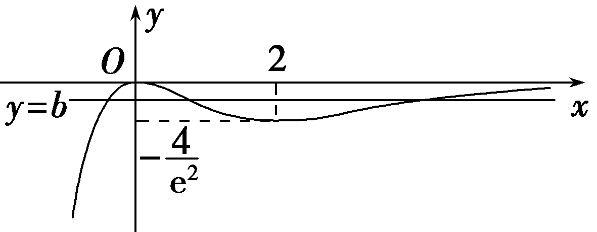
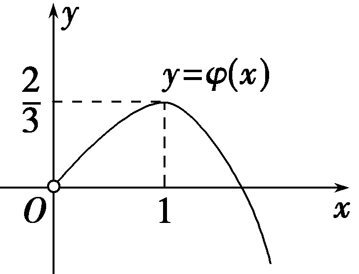

突破3　利用导数研究函数的零点

函数零点问题在高考中占有很重要的地位，主要涉及判断函数零点的个数或范围.高考常考查三次函数与复合函数的零点问题，以及函数零点与其他知识的交汇问题，一般作为解答题的压轴题出现.

技法一　数形结合法

(2024·南昌模拟节选)已知函数<em>f</em>(<em>x</em>)＝(<em>x</em>－<em>a</em>)2＋<em>b</em>e<em>x</em>(<em>a</em>，<em>b</em>∈<strong>R</strong>)，若<em>a</em>＝0时，函数<em>y</em>＝<em>f</em>(<em>x</em>)有3个零点，求实数<em>b</em>的取值范围.

解：<em>a</em>＝0时，<em>f</em>(<em>x</em>)＝<em>x</em>2＋<em>b</em>e<em>x</em>，函数<em>y</em>＝<em>f</em>(<em>x</em>)有3个零点，即关于<em>x</em>的方程<em>f</em>(<em>x</em>)＝0有3个根，

也即关于*x*的方程*b*＝－ $\frac{x^{2}}{e^{x}}$ 有3个根.

令<te<te*x*t st*y*le="italic">x</text>t style="italic">*g*</text>(x)＝－ $\frac{x^{2}}{e^{x}}$ ，则直线<te*x*t style="italic">y</text>＝*b*与<te*x*t style="italic">*g*</text>(x)＝－ $\frac{x^{2}}{e^{x}}$ 的图象有3个交点.

<te*x*t style="italic">g'</text>(x) $＝\frac{x(x－2)}{e^{x}}$ ，

由*g'*(*x*)＜0，解得0＜*x*＜2；

由*g'*(*x*)＞0，解得*x*＜0或*x*＞2，

所以*g*(*x*)在(－∞，0)上单调递增，在(0，2)上单调递减，在(2，＋∞)上单调递增.

*<text style="italic">g*</text>（0）＝0，g(2)＝－ $\frac{4}{e^{2}}$ ，

当*x*＞0时，*g*(*x*)＜0；

当*x*→＋∞时，*g*(*x*)→0；

当*x*→－∞时，*g*(*x*)→－∞，

作出*g*(*x*)的大致图象如图所示，作出直线*y*＝*b*.

由图可知，若直线<te*x*t style="italic">y</text>＝*<text style="italic">b*</text>与*g*(x)的图象有3个交点，则－ $\frac{4}{e^{2}}$ ＜<te*x*t style="italic">*b*</text>＜0，

即实数*b*的取值范围为 $\left(－\frac{4}{e^{2}}，0\right)$ .

含参数的函数零点个数，可转化为方程解的个数，若能分离参数，可将参数分离出来后，用*x*表示参数的函数，作出该函数的图象，根据图象特征求参数的范围.

对点练1.设函数&lt;te&lt;te&lt;te&lt;te<em>x</em>t style="italic"&gt;x&lt;/text&gt;t style="italic"&gt;x&lt;/text&gt;t style="italic"&gt;x&lt;/text&gt;t style="italic"&gt;f&lt;/text&gt;(x)＝ln x＋ $\frac{m}{x}$ ，&lt;te&lt;te<em>x</em>t style="italic"&gt;x&lt;/text&gt;t style="italic"&gt;m&lt;/text&gt;∈<strong>R</strong>，讨论函数<em>g</em>(&lt;te<em>x</em>t style="italic"&gt;x&lt;/text&gt;)＝<em>f</em>'(x)－ $\frac{x}{3}$ 零点的个数.

解：由题意知<te<te<te*x*t style="italic">x</text>t style="italic">x</text>t style="italic">g</text>(x)＝*f'*(x)－ $\frac{x}{3}＝\frac{1}{x}$ － $\frac{m}{x^{2}}$ － $\frac{x}{3}$ (<te<te*x*t style="italic">x</text>t style="italic">x</text>＞0)，

令&lt;te&lt;te&lt;te&lt;te<em>x</em>t style="italic"&gt;x&lt;/text&gt;t style="italic"&gt;x&lt;/text&gt;t style="italic"&gt;x&lt;/text&gt;t style="italic"&gt;g&lt;/text&gt;(x)＝0，得<em>m</em>＝－ $\frac{1}{3}$ &lt;te&lt;te&lt;te<em>x</em>t style="italic"&gt;x&lt;/text&gt;t style="italic"&gt;x&lt;/text&gt;t style="italic"&gt;x&lt;/text&gt;3＋x(x＞0).

设&lt;te&lt;te&lt;te&lt;te<em>x</em>t style="italic"&gt;x&lt;/text&gt;t style="italic"&gt;x&lt;/text&gt;t style="italic"&gt;x&lt;/text&gt;t style="italic"&gt;φ&lt;/text&gt;(x)＝－ $\frac{1}{3}$ &lt;te&lt;te&lt;te<em>x</em>t style="italic"&gt;x&lt;/text&gt;t style="italic"&gt;x&lt;/text&gt;t style="italic"&gt;x&lt;/text&gt;3＋x(x＞0)，

则<em>φ'</em>(<em>x</em>)＝－<em>x</em>2＋1＝－(<em>x</em>－1)(<em>x</em>＋1).

当*x*∈(0，1)时，*φ'*(*x*)＞0，*φ*(*x*)在(0，1)上单调递增；

当*x*∈(1，＋∞)时，*φ'*(*x*)＜0，*φ*(*x*)在(1，＋∞)上单调递减.

所以*x*＝1是*φ*(*x*)的唯一极值点，且是极大值点，

所以*x*＝1也是*φ*(*x*)的最大值点，

所以<te*x*t style="italic">*φ*</text>(x)的最大值为φ（1） $＝\frac{2}{3}$ .

结合*y*＝*φ*(*x*)的图象(如图)可知，

①当<te*x*t style="italic">m</text>＞ $\frac{2}{3}$ 时，函数<te*x*t style="italic">g</text>(x)无零点；

②当<te*x*t style="italic">m</text> $＝\frac{2}{3}$ 时，函数<te*x*t style="italic">g</text>(x)有且只有一个零点；

③当0＜<te*x*t style="italic">m</text>＜ $\frac{2}{3}$ 时，函数<te*x*t style="italic">g</text>(x)有两个零点；

④当*m*≤0时，函数*g*(*x*)有且只有一个零点.

综上所述，当<te*x*t style="italic">m</text>＞ $\frac{2}{3}$ 时，函数<te*x*t style="italic">g</text>(x)无零点；

当<te*x*t style="italic">*m*</text> $＝\frac{2}{3}$ 或<te*x*t style="italic">*m*</text>≤0时，函数*g*(x)有且只有一个零点；

当0＜<te*x*t style="italic">m</text>＜ $\frac{2}{3}$ 时，函数<te*x*t style="italic">g</text>(x)有两个零点.

技法二　函数性质法

已知函数<em>f</em>(<em>x</em>)＝(2<em>a</em>＋1)<em>x</em>2－2<em>x</em>2ln <em>x</em>－4，e是自然对数的底数，∀<em>x</em>＞0，e<em>x</em>＞<em>x</em>＋1.

（1）求*f*(*x*)的单调区间；

（2）记*p*：*f*(*x*)有两个零点；*q*：*a*＞ln 2.求证：*p*是*q*的充要条件.

要求：先证充分性，再证必要性.

解：（1）因为<em>f</em>(<em>x</em>)＝(2<em>a</em>＋1)<em>x</em>2－2<em>x</em>2ln <em>x</em>－4，

所以*f*(*x*)的定义域为(0，＋∞)，

*f'*(*x*)＝4*x*(*a*－ln *x*).

因为当0＜<em>x</em>＜e<em>a</em>时，<em>f'</em>(<em>x</em>)＞0，

所以<em>f</em>(<em>x</em>)在(0，e<em>a</em>)上单调递增；

因为当<em>x</em>＞e<em>a</em>时，<em>f'</em>(<em>x</em>)＜0，

所以<em>f</em>(<em>x</em>)在(e<em>a</em>，＋∞)上单调递减.

所以<em>f</em>(<em>x</em>)的单调递增区间为(0，e<em>a</em>)，单调递减区间为(e<em>a</em>，＋∞).

（2）证明：先证充分性.

由（1）知，当<em>x</em>＝e<em>a</em>时，<em>f</em>(<em>x</em>)取得最大值，即<em>f</em>(<em>x</em>)的最大值为<em>f</em>(e<em>a</em>)＝e2<em>a</em>－4.

由<em>f</em>(<em>x</em>)有两个零点，得e2<em>a</em>－4＞0，解得<em>a</em>＞ln 2.

所以*a*＞ln 2.

再证必要性.

因为<em>a</em>＞ln 2，所以e2<em>a</em>＞4.所以<em>f</em>(e<em>a</em>)＝e2<em>a</em>－4＞0.

因为<em>a</em>＞ln 2＞0，∀<em>x</em>＞0，e<em>x</em>＞<em>x</em>＋1，

所以e2<em>a</em>＞2<em>a</em>＋1＞2<em>a</em>.

所以&lt;text style="it&lt;text style="it&lt;text style="it<em>a</em>lic,superscript"&gt;a&lt;/text&gt;lic,superscript"&gt;a&lt;/text&gt;lic"&gt;f&lt;/text&gt;(e－a)＝e－2a(4a＋1)－4 $＝\frac{4a+1}{e^{2a}}$ －4＜ $\frac{4a+1}{2a}$ －4 $＝\frac{1}{2a}$ －2＜ $\frac{1}{2ln2}$ －2 $＝\frac{1}{ln4}$ －2＜0.

所以∃<em>x</em>1∈(e－<em>a</em>，e<em>a</em>)，使<em>f</em>(<em>x</em>1)＝0；

因为<em>f</em>(e<em>a</em>＋1)＝－e2<em>a</em>＋2－4＜0，

所以∃<em>x</em>2∈(e<em>a</em>，e<em>a</em>＋1)，使<em>f</em>(<em>x</em>2)＝0.

因为<em>f</em>(<em>x</em>)在(0，e<em>a</em>)上单调递增，在(e<em>a</em>，＋∞)上单调递减，

所以∀<em>x</em>∈(0，＋∞)，<em>x</em>≠<em>x</em>1且<em>x</em>≠<em>x</em>2，易得<em>f</em>(<em>x</em>)≠0.

所以当*a*＞ln 2时，使*f*(*x*)有两个零点.

综上所述，*p*是*q*的充要条件.

利用函数性质研究函数的零点，主要是根据函数单调性、奇偶性、最值或极值的符号确定函数零点的个数，此类问题在求解过程中可以通过数形结合的方法确定函数存在零点的条件.

对点练2.已知函数<em>f</em>(<em>x</em>)＝e<em>x</em>－<em>a</em>(<em>x</em>＋2).

（1）当*a*＝1时，讨论*f*(*x*)的单调性；

（2）若*f*(*x*)有两个零点，求*a*的取值范围.

解：（1）当<em>a</em>＝1时，<em>f</em>(<em>x</em>)＝e<em>x</em>－<em>x</em>－2，

则<em>f'</em>(<em>x</em>)＝e<em>x</em>－1.

当*x*＜0时，*f'*(*x*)＜0；当*x*＞0时，*f'*(*x*)＞0.

所以*f*(*x*)在(－∞，0)上单调递减，在(0，＋∞)上单调递增.

（2）<em>f'</em>(<em>x</em>)＝e<em>x</em>－<em>a</em>.

当*a*≤0时，*f'*(*x*)＞0，所以*f*(*x*)在(－∞，＋∞)上单调递增，故*f*(*x*)至多存在一个零点，不符合题意.

当*a*＞0时，由*f'*(*x*)＝0可得*x*＝ln *a*.当*x*∈(－∞，ln *a*)时，*f'*(*x*)＜0；当*x*∈(ln *a*，＋∞)时，*f'*(*x*)＞0.所以*f*(*x*)在(－∞，ln *a*)上单调递减，在(ln *a*，＋∞)上单调递增.故当*x*＝ln *a*时，*f*(*x*)取得最小值，最小值为*f*(ln *a*)＝－*a*(1＋ln *a*).

(<te*x*t style="it<text style="it*a*lic">a</text>lic">ⅰ</text>)若0＜a≤ $\frac{1}{e}$ ，则<te*x*t style="it*a*lic">*f*</text>(ln *a*)≥0，f(x)在(－∞，＋∞)至多存在一个零点，不符合题意.

(<text style="it<text style="it*a*lic">a</text>lic">ⅱ</text>)若a＞ $\frac{1}{e}$ ，则<text style="it*a*lic">f</text>(ln *a*)＜0.

由于<em>f</em>(－2)＝e－2＞0，所以<em>f</em>(<em>x</em>)在(－∞，ln <em>a</em>)上存在唯一零点.

由（1）知，当<em>x</em>＞2时，e<em>x</em>－<em>x</em>－2＞0，

所以当<te<te<te<te<text style="it*a*lic">x</text>t style="it*a*lic">x</text>t style="it*a*lic">x</text>t style="it*a*lic">x</text>t style="italic">x</text>＞4且x＞2ln (2a)时，*f*(x) $＝e^{\frac{x}{2}}$ · $e^{\frac{x}{2}}$ －<te<te<te<text style="it*a*lic">x</text>t style="it*a*lic">x</text>t style="it*a*lic">x</text>t style="italic">a</text>(<te*x*t style="italic">x</text>＋2)＞ $e^{ln\left(2a\right)}$ · $\left(\frac{x}{2}+2\right)$ －<te<te<te<text style="it*a*lic">x</text>t style="it*a*lic">x</text>t style="it*a*lic">x</text>t style="italic">a</text>(<te*x*t style="italic">x</text>＋2)＝2a＞0.

故*f*(*x*)在(ln *a*，＋∞)上存在唯一零点.从而*f*(*x*)在(－∞，＋∞)上有两个零点.

综上，*a*的取值范围是 $\left(\frac{1}{e}，＋\infty \right)$ .

技法三　构造函数法

(一题多变)设<te<te*x*t style="italic">x</text>t style="italic">f</text>(x)＝cos x＋ $\frac{x^{2}}{2}$ －1.

（1）求证：*f*(*x*)在区间(0，＋∞)上没有零点；

（2）若不等式e<em>ax</em>≥sin <em>x</em>－cos <em>x</em>＋2对任意的<em>x</em>≥0恒成立，求实数<em>a</em>的取值范围.

解：（1）证明：因为<te<te*x*t style="italic">x</text>t style="italic">f</text>(x)＝cos x＋ $\frac{x^{2}}{2}$ －1，

则*f'*(*x*)＝*x*－sin *x*，

设*φ*(*x*)＝*x*－sin *x*，则*φ'*(*x*)＝1－cos *x*，

当*x*＞0时，*φ'*(*x*)＝1－cos *x*≥0，即*f'*(*x*)＝*x*－sin *x*在(0，＋∞)上单调递增，

所以*f'*(*x*)＞*f'*（0）＝0，

所以*f*(*x*)在(0，＋∞)上单调递增，

所以*f*(*x*)＞*f*（0）＝0，

所以*f*(*x*)在区间(0，＋∞)上没有零点.

（2）由（1）知，当<te<te<te*x*t style="italic">x</text>t style="italic">x</text>t style="italic">x</text>≥0时，sin x≤x，cos x≥－ $\frac{x^{2}}{2}$ ＋1，

所以 $\frac{x^{2}}{2}$ ＋<te<te*x*t style="italic">x</text>t style="italic">x</text>＋1≥sin x－cos x＋2.

设<te<te<te<te*x*t style="italic">x</text>t style="italic,superscript">x</text>t style="italic">x</text>t style="italic">G</text>(x)＝ex－ $\frac{x^{2}}{2}$ －<te<te<te*x*t style="italic">x</text>t style="italic,superscript">x</text>t style="italic">x</text>－1(x≥0)，

则<em>G'</em>(<em>x</em>)＝e<em>x</em>－<em>x</em>－1，

设<em>g</em>(<em>x</em>)＝e<em>x</em>－<em>x</em>－1(<em>x</em>≥0)，

则<em>g'</em>(<em>x</em>)＝e<em>x</em>－1≥0，

所以*g*(*x*)在[0，＋∞)上单调递增，

所以*g*(*x*)≥*g*（0）＝0，即*G'*(*x*)≥0，

所以*G*(*x*)在[0，＋∞)上单调递增.

所以<te<te<te*x*t style="italic,superscript">x</text>t style="italic">x</text>t style="italic">*G*</text>(x)≥G(0)＝0，即ex≥ $\frac{x^{2}}{2}$ ＋<te<te*x*t style="italic,superscript">x</text>t style="italic">x</text>＋1，

所以e<em>x</em>≥sin <em>x</em>－cos <em>x</em>＋2对任意的<em>x</em>≥0恒成立.

当<em>x</em>≥0，<em>a</em>≥1时，e<em>ax</em>≥e<em>x</em>，

所以当<em>a</em>≥1时，e<em>ax</em>≥sin <em>x</em>－cos <em>x</em>＋2对任意的<em>x</em>≥0恒成立.

当<em>a</em>＜1时，设<em>h</em>(<em>x</em>)＝e<em>ax</em>－sin <em>x</em>＋cos <em>x</em>－2，

则<em>h'</em>(<em>x</em>)＝<em>a</em>e<em>ax</em>－cos <em>x</em>－sin <em>x</em>，

<em>h'</em>（0）＝<em>a</em>－1＜0，所以存在实数<em>x</em>0＞0，使得对于任意的<em>x</em>∈(0，<em>x</em>0)，均有<em>h'</em>(<em>x</em>)＜0，

所以<em>h</em>(<em>x</em>)在(0，<em>x</em>0)上单调递减，

又<em>h</em>（0）＝0，所以当<em>x</em>∈(0，<em>x</em>0)时，<em>h</em>(<em>x</em>)＜0，

即e<em>ax</em>＜sin <em>x</em>－cos <em>x</em>＋2，

所以*a*＜1不符合题意.

综上所述，实数*a*的取值范围为[1，＋∞).

[变式探究]

(变设问) (2021·全国甲卷节选)已知<te<te<te<text st<text style="it*a*lic">y</text>le="italic">x</text>t st*y*le="italic">x</text>t style="italic">x</text>t style="it*a*lic">a</text>＞0且a≠1，函数*<text style="italic">f*</text>(x) $＝\frac{x^{a}}{a^{x}}$ (<te<te<text st<text style="it*a*lic">y</text>le="italic">x</text>t st*y*le="italic">x</text>t style="italic">x</text>＞0).若曲线y＝*<text style="italic">f*</text>(x)与直线y＝1有且仅有两个交点，求实数<text style="it*a*lic">a</text>的取值范围.

解：曲线*y*＝*f*(*x*)与直线*y*＝1有且仅有两个交点，

可转化为方程 $\frac{x^{a}}{a^{x}}＝$ 1(*x*＞0)有两个不同的解，即方程 $\frac{lnx}{x}＝\frac{lna}{a}$ 有两个不同的解.

设<te<te<te<te*x*t style="italic">x</text>t style="italic">x</text>t style="italic">x</text>t style="italic">g</text>(x) $＝\frac{lnx}{x}$ (<te<te<te*x*t style="italic">x</text>t style="italic">x</text>t style="italic">x</text>＞0)，则*g*'(x) $＝\frac{1－lnx}{x^{2}}$ (<te<te<te*x*t style="italic">x</text>t style="italic">x</text>t style="italic">x</text>＞0)，

令<te<te*x*t style="italic">x</text>t style="italic">g'</text>(x) $＝\frac{1－lnx}{x^{2}}＝$ 0，得<te*x*t style="italic">x</text>＝e，

当0＜*x*＜e时，*g'*(*x*)＞0，函数*g*(*x*)单调递增；

当*x*＞e时，*g'*(*x*)＜0，函数*g*(*x*)单调递减，

故&lt;te&lt;te&lt;te<em>x</em>t style="italic"&gt;x&lt;/text&gt;t style="italic"&gt;x&lt;/text&gt;t style="italic"&gt;<em>&lt;text style="italic"&gt;g</em>&lt;/text&gt;&lt;/text&gt;(x)max＝g(e) $＝\frac{1}{e}$ ，且当&lt;te&lt;te<em>x</em>t style="italic"&gt;x&lt;/text&gt;t style="italic"&gt;x&lt;/text&gt;＞e时，<em>&lt;text style="italic"&gt;&lt;text style="italic"&gt;g</em>&lt;/text&gt;&lt;/text&gt;(x)∈ $\left(0，\frac{1}{e}\right)$ ，

又<text style="it<text style="it*a*lic">a</text>lic">g</text>（1）＝0，所以0＜ $\frac{lna}{a}＜\frac{1}{e}$ ，所以<text style="it*a*lic">a</text>＞1且a≠e，

故实数*a*的取值范围为(1，e)∪(e，＋∞).

##### 1.涉及函数的零点(方程的根)问题，主要利用导数确定函数的单调区间和极值点，根据函数零点的个数寻找函数在给定区间的极值以及区间端点的函数值与0的关系，从而求得参数的取值范围.

##### 2.解决此类问题的关键是将函数的零点、方程的根、曲线交点相互转化，突出导数的工具作用，体现化归与转化的数学思想方法.

对点练3.已知函数<em>f</em>(<em>x</em>)＝e<em>x</em>－1＋<em>ax</em>(<em>a</em>∈<strong>R</strong>).

（1）当*x*≥0时，*f*(*x*)≥0，求实数*a*的取值范围；

（2）(一题多解)若关于<te<text style="it<text style="it*a*lic">a</text>lic">x</text>t style="italic">x</text>的方程 $\frac{f(x)-ax+1}{e^{a}}＝$ ln <te<text style="it<text style="it*a*lic">a</text>lic">x</text>t style="italic">x</text>＋a有两个不同的实数解，求实数a的取值范围.

解：（1）由题意，得<em>f'</em>(<em>x</em>)＝e<em>x</em>＋<em>a</em>.

若*a*≥－1，则当*x*∈[0，＋∞)时，*f'*(*x*)≥0恒成立，

所以*f*(*x*)在[0，＋∞)上单调递增，

所以当*x*∈[0，＋∞)时，*f*(*x*)≥*f*（0）＝0，符合题意；

若*a*＜－1，令*f'*(*x*)＜0，得*x*＜ln(－*a*)，

所以*f*(*x*)在(0，ln(－*a*))上单调递减，

所以当*x*∈(0，ln(－*a*))时，*f*(*x*)＜*f*（0）＝0，不符合题意.

综上，实数*a*的取值范围为[－1，＋∞).

（2）法一：由 $\frac{f(x)-ax+1}{e^{a}}＝$ ln &lt;te&lt;te&lt;text style="it<em>a</em>lic"&gt;x&lt;/text&gt;t style="it<em>a</em>lic,superscript"&gt;x&lt;/text&gt;t style="it<em>a</em>lic"&gt;x&lt;/text&gt;＋a，得ex－a＝ln x＋a.

令e&lt;&lt;&lt;<em>t</em>ext style="italic"&gt;t&lt;/text&gt;e&lt;te<em>x</em>t style="italic"&gt;x&lt;/text&gt;t style="italic"&gt;t&lt;/text&gt;ext style="it<em>a</em>lic,superscript"&gt;x&lt;/text&gt;－a＝t，则 $\left\{\begin{matrix}x－a＝lnt，\\lnx＋a＝t，\end{matrix}\right.$  所以&lt;&lt;&lt;<em>t</em>ext style="italic"&gt;t&lt;/text&gt;e&lt;te<em>x</em>t style="italic"&gt;x&lt;/text&gt;t style="italic"&gt;t&lt;/text&gt;ext style="it<em>a</em>lic,superscript"&gt;x&lt;/text&gt;＋ln x＝t＋ln t.

易知*y*＝*x*＋ln *x*在(0，＋∞)上单调递增，

所以*t*＝*x*，得*a*＝*x*－ln *x*.

则原问题可转化为方程*a*＝*x*－ln *x*有两个不同的实数解.

令<te<te<te<te<te*x*t style="italic">x</text>t style="italic">x</text>t style="italic">x</text>t style="italic">x</text>t style="italic">φ</text>(x)＝x－ln x(x＞0)，则*φ'*(x) $＝\frac{x－1}{x}$ ，

令*φ'*(*x*)＜0，得0＜*x*＜1；

令*φ'*(*x*)＞0，得*x*＞1，

所以*φ*(*x*)在(0，1)上单调递减，在(1，＋∞)上单调递增，

所以<em>φ</em>(<em>x</em>)min＝<em>φ</em>（1）＝1，当<em>x</em>→0时，<em>φ</em>(<em>x</em>)→＋∞，当<em>x</em>→＋∞时，<em>φ</em>(<em>x</em>)→＋∞.

所以当*a*＞1时，*a*＝*x*－ln *x*有两个不同的实数解.

综上，实数*a*的取值范围为(1，＋∞).

法二：由 $\frac{f(x)-ax+1}{e^{a}}＝$ ln <text style="it*a*lic">x</text>＋a，

得e<em>x</em>＝e<em>a</em>(ln <em>x</em>＋<em>a</em>)，

所以<em>x</em>e<em>x</em>＝<em>x</em>e<em>a</em>(ln <em>x</em>＋<em>a</em>)，即<em>x</em>e<em>x</em>＝e<em>a</em>＋ln <em>x</em>(ln <em>x</em>＋<em>a</em>).

令<em>u</em>(<em>x</em>)＝<em>x</em>e<em>x</em>，则有<em>u</em>(<em>x</em>)＝<em>u</em>(<em>a</em>＋ln <em>x</em>).

当<em>x</em>＞0时，<em>u'</em>(<em>x</em>)＝(<em>x</em>＋1)e<em>x</em>＞0，

所以<em>u</em>(<em>x</em>)＝<em>x</em>e<em>x</em>在(0，＋∞)上单调递增，

所以*x*＝*a*＋ln *x*，即*a*＝*x*－ln *x*.

下同法一.

课时测评26　利用导数研究函数的零点 $\frac{对应学生}{用书P361}$

(时间：60分钟　满分：79分)

(本栏目内容，在学生用书中以独立形式分册装订！)

(1—3题，每小题5分，共15分)

##### 1.(2024·江苏南通第二次诊断测试)若直线*y*＝2*x*－1与函数*f*(*x*)＝ln *x*－*ax*的图象有交点，则实数*a*的取值范围是(　　)

$\quad$A.(－∞，－1]	
$\quad$B.(－∞，1)

$\quad$C.[1，＋∞)	
$\quad$D.(－2，－1]

答案A

解析因为直线&lt;te&lt;te&lt;te&lt;te&lt;te&lt;te&lt;te&lt;te&lt;te&lt;te&lt;te&lt;te&lt;te&lt;te&lt;te&lt;te&lt;te&lt;te&lt;te&lt;te&lt;text style="it&lt;text style="it<em>a</em>lic"&gt;a&lt;/text&gt;lic"&gt;x&lt;/text&gt;t style="italic"&gt;x&lt;/text&gt;t style="italic"&gt;x&lt;/text&gt;t style="italic"&gt;x&lt;/text&gt;t style="italic"&gt;x&lt;/text&gt;t style="italic"&gt;x&lt;/text&gt;t style="italic"&gt;x&lt;/text&gt;t style="italic"&gt;x&lt;/text&gt;t style="italic"&gt;x&lt;/text&gt;t style="italic"&gt;x&lt;/text&gt;t style="italic"&gt;x&lt;/text&gt;t style="italic"&gt;x&lt;/text&gt;t style="italic"&gt;x&lt;/text&gt;t style="italic"&gt;x&lt;/text&gt;t style="italic"&gt;x&lt;/text&gt;t style="it<em>a</em>lic"&gt;x&lt;/text&gt;t style="italic"&gt;x&lt;/text&gt;t style="italic"&gt;x&lt;/text&gt;t style="italic"&gt;x&lt;/text&gt;t style="italic"&gt;x&lt;/text&gt;t style="italic"&gt;y&lt;/text&gt;＝2x－1与函数<em>f</em>(x)＝ln x－<em>&lt;text style="italic"&gt;ax</em>&lt;/text&gt;的图象有交点，所以方程2x－1＝ln x－ax有解，即a $＝\frac{lnx+1}{x}$ －2在(0，&lt;te&lt;te&lt;te&lt;text style="it&lt;text style="it<em>a</em>lic"&gt;a&lt;/text&gt;lic"&gt;x&lt;/text&gt;t style="italic"&gt;x&lt;/text&gt;t style="italic"&gt;x&lt;/text&gt;t style="superscript"&gt;＋&lt;/text&gt;∞)上有解.令&lt;te&lt;te&lt;te&lt;te&lt;te&lt;te&lt;te&lt;te&lt;te&lt;te&lt;te&lt;te<em>x</em>t style="italic"&gt;x&lt;/text&gt;t style="italic"&gt;x&lt;/text&gt;t style="italic"&gt;x&lt;/text&gt;t style="italic"&gt;x&lt;/text&gt;t style="italic"&gt;x&lt;/text&gt;t style="italic"&gt;x&lt;/text&gt;t style="italic"&gt;x&lt;/text&gt;t style="italic"&gt;x&lt;/text&gt;t style="italic"&gt;x&lt;/text&gt;t style="italic"&gt;x&lt;/text&gt;t style="italic"&gt;x&lt;/text&gt;t style="italic"&gt;<em>&lt;text style="italic"&gt;&lt;text style="italic"&gt;&lt;text style="italic"&gt;&lt;text style="italic"&gt;&lt;text style="italic"&gt;g</em>&lt;/text&gt;&lt;/text&gt;&lt;/text&gt;&lt;/text&gt;&lt;/text&gt;&lt;/text&gt;(&lt;te&lt;te&lt;te&lt;te&lt;text style="it<em>a</em>lic"&gt;x&lt;/text&gt;t style="italic"&gt;x&lt;/text&gt;t style="italic"&gt;x&lt;/text&gt;t style="italic"&gt;x&lt;/text&gt;t style="italic"&gt;x&lt;/text&gt;) $＝\frac{lnx+1}{x}$ －2(&lt;te&lt;te&lt;te&lt;te&lt;te&lt;te&lt;te&lt;te&lt;te&lt;te&lt;te&lt;te&lt;te&lt;te&lt;te&lt;te&lt;te&lt;te&lt;te&lt;text style="it&lt;text style="it<em>a</em>lic"&gt;a&lt;/text&gt;lic"&gt;x&lt;/text&gt;t style="italic"&gt;x&lt;/text&gt;t style="italic"&gt;x&lt;/text&gt;t style="italic"&gt;x&lt;/text&gt;t style="italic"&gt;x&lt;/text&gt;t style="italic"&gt;x&lt;/text&gt;t style="italic"&gt;x&lt;/text&gt;t style="italic"&gt;x&lt;/text&gt;t style="italic"&gt;x&lt;/text&gt;t style="italic"&gt;x&lt;/text&gt;t style="italic"&gt;x&lt;/text&gt;t style="italic"&gt;x&lt;/text&gt;t style="italic"&gt;x&lt;/text&gt;t style="italic"&gt;x&lt;/text&gt;t style="italic"&gt;x&lt;/text&gt;t style="it<em>a</em>lic"&gt;x&lt;/text&gt;t style="italic"&gt;x&lt;/text&gt;t style="italic"&gt;x&lt;/text&gt;t style="italic"&gt;x&lt;/text&gt;t style="italic"&gt;x&lt;/text&gt;＞0)，则<em>&lt;text style="italic"&gt;&lt;text style="italic"&gt;&lt;text style="italic"&gt;&lt;text style="italic"&gt;&lt;text style="italic"&gt;&lt;text style="italic"&gt;g</em>&lt;/text&gt;&lt;/text&gt;&lt;/text&gt;&lt;/text&gt;&lt;/text&gt;&lt;/text&gt;'(x) $＝\frac{－lnx}{x^{2}}$ .当0＜&lt;te&lt;te&lt;te&lt;te&lt;te&lt;te&lt;te&lt;te&lt;te&lt;te&lt;te&lt;te&lt;te&lt;te&lt;te&lt;te&lt;te&lt;te&lt;te&lt;text style="it&lt;text style="it<em>a</em>lic"&gt;a&lt;/text&gt;lic"&gt;x&lt;/text&gt;t style="italic"&gt;x&lt;/text&gt;t style="italic"&gt;x&lt;/text&gt;t style="italic"&gt;x&lt;/text&gt;t style="italic"&gt;x&lt;/text&gt;t style="italic"&gt;x&lt;/text&gt;t style="italic"&gt;x&lt;/text&gt;t style="italic"&gt;x&lt;/text&gt;t style="italic"&gt;x&lt;/text&gt;t style="italic"&gt;x&lt;/text&gt;t style="italic"&gt;x&lt;/text&gt;t style="italic"&gt;x&lt;/text&gt;t style="italic"&gt;x&lt;/text&gt;t style="italic"&gt;x&lt;/text&gt;t style="italic"&gt;x&lt;/text&gt;t style="it<em>a</em>lic"&gt;x&lt;/text&gt;t style="italic"&gt;x&lt;/text&gt;t style="italic"&gt;x&lt;/text&gt;t style="italic"&gt;x&lt;/text&gt;t style="italic"&gt;x&lt;/text&gt;＜1时，<em>&lt;text style="italic"&gt;&lt;text style="italic"&gt;&lt;text style="italic"&gt;&lt;text style="italic"&gt;&lt;text style="italic"&gt;&lt;text style="italic"&gt;g</em>&lt;/text&gt;&lt;/text&gt;&lt;/text&gt;&lt;/text&gt;&lt;/text&gt;&lt;/text&gt;'(x)＞0，函数g(x)单调递增；当x＞1时，<em>&lt;text style="italic"&gt;&lt;text style="italic"&gt;g'</em>&lt;/text&gt;&lt;/text&gt;(x)＜0，函数g(x)单调递减.所以当x＝1时，g(x)有极大值也是最大值，且g(1)＝－1，且当x→0＋时，g(x)→－∞，当x→＋∞时，g(x)→－2，所以a≤－1，所以实数a的取值范围是(－∞，－1].故选A.

##### 2.函数<em>f</em>(<em>x</em>)＝<em>x</em>3＋<em>ax</em>＋2存在3个零点，则实数<em>a</em> 的取值范围是(　　)

$\quad$A.(－∞，－2)	
$\quad$B.(－∞，－3)

$\quad$C.(－4，－1)	
$\quad$D.(－3，0)

答案B

解析&lt;te&lt;te&lt;te&lt;te&lt;te&lt;te&lt;te&lt;te&lt;te&lt;te&lt;te&lt;te&lt;te&lt;te&lt;te&lt;te&lt;text style="it&lt;text style="it<em>a</em>lic"&gt;a&lt;/text&gt;lic"&gt;x&lt;/text&gt;t style="italic"&gt;x&lt;/text&gt;t style="italic"&gt;x&lt;/text&gt;t style="italic"&gt;x&lt;/text&gt;t style="italic"&gt;x&lt;/text&gt;t style="italic"&gt;x&lt;/text&gt;t style="italic"&gt;x&lt;/text&gt;t style="italic"&gt;x&lt;/text&gt;t style="it<em>a</em>lic"&gt;x&lt;/text&gt;t style="italic"&gt;x&lt;/text&gt;t style="it<em>a</em>lic"&gt;x&lt;/text&gt;t style="italic"&gt;x&lt;/text&gt;t style="it<em>a</em>lic"&gt;x&lt;/text&gt;t style="italic"&gt;x&lt;/text&gt;t style="italic"&gt;x&lt;/text&gt;t style="italic"&gt;x&lt;/text&gt;t style="italic"&gt;<em>&lt;text style="italic"&gt;&lt;text style="italic"&gt;&lt;text style="italic"&gt;&lt;text style="italic"&gt;&lt;text style="italic"&gt;f</em>&lt;/text&gt;&lt;/text&gt;&lt;/text&gt;&lt;/text&gt;&lt;/text&gt;&lt;/text&gt;(x)＝x3＋<em>ax</em>＋&lt;text style="superscript"&gt;2&lt;/text&gt;，则<em>&lt;text style="italic"&gt;&lt;text style="italic"&gt;&lt;text style="italic"&gt;f'</em>&lt;/text&gt;&lt;/text&gt;&lt;/text&gt;(x)＝3x2＋a，若f(x)存在 3 个零点，则f(x)必存在极大值和极小值，则 a＜0，令f'(x)＝3x2＋a＝0，解得x＝－ $\sqrt{\frac{－a}{3}}$ 或&lt;te&lt;te&lt;te&lt;te&lt;te&lt;te&lt;te&lt;te&lt;te&lt;te&lt;te&lt;te&lt;te&lt;te&lt;te&lt;text style="it&lt;text style="it<em>a</em>lic"&gt;a&lt;/text&gt;lic"&gt;x&lt;/text&gt;t style="italic"&gt;x&lt;/text&gt;t style="italic"&gt;x&lt;/text&gt;t style="italic"&gt;x&lt;/text&gt;t style="italic"&gt;x&lt;/text&gt;t style="italic"&gt;x&lt;/text&gt;t style="italic"&gt;x&lt;/text&gt;t style="italic"&gt;x&lt;/text&gt;t style="it<em>a</em>lic"&gt;x&lt;/text&gt;t style="italic"&gt;x&lt;/text&gt;t style="it<em>a</em>lic"&gt;x&lt;/text&gt;t style="italic"&gt;x&lt;/text&gt;t style="it<em>a</em>lic"&gt;x&lt;/text&gt;t style="italic"&gt;x&lt;/text&gt;t style="italic"&gt;x&lt;/text&gt;t style="italic"&gt;x&lt;/text&gt; $＝\sqrt{\frac{－a}{3}}$ ，且当&lt;te&lt;te&lt;te&lt;te&lt;te&lt;te&lt;te&lt;te&lt;te&lt;te&lt;te&lt;te&lt;te&lt;te&lt;te&lt;text style="it&lt;text style="it<em>a</em>lic"&gt;a&lt;/text&gt;lic"&gt;x&lt;/text&gt;t style="italic"&gt;x&lt;/text&gt;t style="italic"&gt;x&lt;/text&gt;t style="italic"&gt;x&lt;/text&gt;t style="italic"&gt;x&lt;/text&gt;t style="italic"&gt;x&lt;/text&gt;t style="italic"&gt;x&lt;/text&gt;t style="italic"&gt;x&lt;/text&gt;t style="it<em>a</em>lic"&gt;x&lt;/text&gt;t style="italic"&gt;x&lt;/text&gt;t style="it<em>a</em>lic"&gt;x&lt;/text&gt;t style="italic"&gt;x&lt;/text&gt;t style="it<em>a</em>lic"&gt;x&lt;/text&gt;t style="italic"&gt;x&lt;/text&gt;t style="italic"&gt;x&lt;/text&gt;t style="italic"&gt;x&lt;/text&gt;∈ $\left(－\infty ,-\sqrt{\frac{－a}{3}}\right)$ ∪( $\sqrt{\frac{－a}{3}}$ ，＋∞)时，&lt;te&lt;te&lt;te&lt;te&lt;te&lt;te&lt;te&lt;te&lt;te&lt;te&lt;te&lt;te&lt;te&lt;te&lt;te&lt;te&lt;text style="it&lt;text style="it<em>a</em>lic"&gt;a&lt;/text&gt;lic"&gt;x&lt;/text&gt;t style="italic"&gt;x&lt;/text&gt;t style="italic"&gt;x&lt;/text&gt;t style="italic"&gt;x&lt;/text&gt;t style="italic"&gt;x&lt;/text&gt;t style="italic"&gt;x&lt;/text&gt;t style="italic"&gt;x&lt;/text&gt;t style="italic"&gt;x&lt;/text&gt;t style="it<em>a</em>lic"&gt;x&lt;/text&gt;t style="italic"&gt;x&lt;/text&gt;t style="it<em>a</em>lic"&gt;x&lt;/text&gt;t style="italic"&gt;x&lt;/text&gt;t style="it<em>a</em>lic"&gt;x&lt;/text&gt;t style="italic"&gt;x&lt;/text&gt;t style="italic"&gt;x&lt;/text&gt;t style="italic"&gt;x&lt;/text&gt;t style="italic"&gt;<em>&lt;text style="italic"&gt;&lt;text style="italic"&gt;&lt;text style="italic"&gt;&lt;text style="italic"&gt;&lt;text style="italic"&gt;f</em>&lt;/text&gt;&lt;/text&gt;&lt;/text&gt;&lt;/text&gt;&lt;/text&gt;&lt;/text&gt;'(x)＞0，当x∈ $\left(－\sqrt{\frac{－a}{3}}，\sqrt{\frac{－a}{3}}\right)$ 时，&lt;te&lt;te&lt;te&lt;te&lt;te&lt;te&lt;te&lt;te&lt;te&lt;te&lt;te&lt;te&lt;te&lt;te&lt;te&lt;te&lt;text style="it&lt;text style="it<em>a</em>lic"&gt;a&lt;/text&gt;lic"&gt;x&lt;/text&gt;t style="italic"&gt;x&lt;/text&gt;t style="italic"&gt;x&lt;/text&gt;t style="italic"&gt;x&lt;/text&gt;t style="italic"&gt;x&lt;/text&gt;t style="italic"&gt;x&lt;/text&gt;t style="italic"&gt;x&lt;/text&gt;t style="italic"&gt;x&lt;/text&gt;t style="it<em>a</em>lic"&gt;x&lt;/text&gt;t style="italic"&gt;x&lt;/text&gt;t style="it<em>a</em>lic"&gt;x&lt;/text&gt;t style="italic"&gt;x&lt;/text&gt;t style="it<em>a</em>lic"&gt;x&lt;/text&gt;t style="italic"&gt;x&lt;/text&gt;t style="italic"&gt;x&lt;/text&gt;t style="italic"&gt;x&lt;/text&gt;t style="italic"&gt;<em>&lt;text style="italic"&gt;&lt;text style="italic"&gt;&lt;text style="italic"&gt;&lt;text style="italic"&gt;&lt;text style="italic"&gt;f</em>&lt;/text&gt;&lt;/text&gt;&lt;/text&gt;&lt;/text&gt;&lt;/text&gt;&lt;/text&gt;'(x)＜0，故f(x)的极大值为f $\left(－\sqrt{\frac{－a}{3}}\right)$ ，极小值为&lt;te&lt;te&lt;te&lt;te&lt;te&lt;te&lt;te&lt;te&lt;te&lt;te&lt;te&lt;te&lt;te&lt;te&lt;te&lt;te&lt;text style="it&lt;text style="it<em>a</em>lic"&gt;a&lt;/text&gt;lic"&gt;x&lt;/text&gt;t style="italic"&gt;x&lt;/text&gt;t style="italic"&gt;x&lt;/text&gt;t style="italic"&gt;x&lt;/text&gt;t style="italic"&gt;x&lt;/text&gt;t style="italic"&gt;x&lt;/text&gt;t style="italic"&gt;x&lt;/text&gt;t style="italic"&gt;x&lt;/text&gt;t style="it<em>a</em>lic"&gt;x&lt;/text&gt;t style="italic"&gt;x&lt;/text&gt;t style="it<em>a</em>lic"&gt;x&lt;/text&gt;t style="italic"&gt;x&lt;/text&gt;t style="it<em>a</em>lic"&gt;x&lt;/text&gt;t style="italic"&gt;x&lt;/text&gt;t style="italic"&gt;x&lt;/text&gt;t style="italic"&gt;x&lt;/text&gt;t style="italic"&gt;<em>&lt;text style="italic"&gt;&lt;text style="italic"&gt;&lt;text style="italic"&gt;&lt;text style="italic"&gt;&lt;text style="italic"&gt;f</em>&lt;/text&gt;&lt;/text&gt;&lt;/text&gt;&lt;/text&gt;&lt;/text&gt;&lt;/text&gt; $\left(\sqrt{\frac{－a}{3}}\right)$ ，若&lt;te&lt;te&lt;te&lt;te&lt;te&lt;te&lt;te&lt;te&lt;te&lt;te&lt;te&lt;te&lt;te&lt;te&lt;te&lt;te&lt;text style="it&lt;text style="it<em>a</em>lic"&gt;a&lt;/text&gt;lic"&gt;x&lt;/text&gt;t style="italic"&gt;x&lt;/text&gt;t style="italic"&gt;x&lt;/text&gt;t style="italic"&gt;x&lt;/text&gt;t style="italic"&gt;x&lt;/text&gt;t style="italic"&gt;x&lt;/text&gt;t style="italic"&gt;x&lt;/text&gt;t style="italic"&gt;x&lt;/text&gt;t style="it<em>a</em>lic"&gt;x&lt;/text&gt;t style="italic"&gt;x&lt;/text&gt;t style="it<em>a</em>lic"&gt;x&lt;/text&gt;t style="italic"&gt;x&lt;/text&gt;t style="it<em>a</em>lic"&gt;x&lt;/text&gt;t style="italic"&gt;x&lt;/text&gt;t style="italic"&gt;x&lt;/text&gt;t style="italic"&gt;x&lt;/text&gt;t style="italic"&gt;<em>&lt;text style="italic"&gt;&lt;text style="italic"&gt;&lt;text style="italic"&gt;&lt;text style="italic"&gt;&lt;text style="italic"&gt;f</em>&lt;/text&gt;&lt;/text&gt;&lt;/text&gt;&lt;/text&gt;&lt;/text&gt;&lt;/text&gt;(x)存在 3 个零点，则 $\left\{\begin{matrix}f\left(－\sqrt{\frac{－a}{3}}\right)>0，\\f\left(\sqrt{\frac{－a}{3}}\right)<0，\end{matrix}\right.$ 即 $\left\{\begin{matrix}\frac{a}{3} \sqrt{\frac{－a}{3}}－a\sqrt{\frac{－a}{3}}+2>0，\\\frac{－a}{3} \sqrt{\frac{－a}{3}}＋a\sqrt{\frac{－a}{3}}+2<0，\end{matrix}\right.$ 解得&lt;te&lt;te&lt;te&lt;te&lt;te&lt;te&lt;te&lt;te&lt;te&lt;te&lt;te&lt;te&lt;text style="it&lt;text style="it<em>a</em>lic"&gt;a&lt;/text&gt;lic"&gt;x&lt;/text&gt;t style="italic"&gt;x&lt;/text&gt;t style="italic"&gt;x&lt;/text&gt;t style="italic"&gt;x&lt;/text&gt;t style="italic"&gt;x&lt;/text&gt;t style="italic"&gt;x&lt;/text&gt;t style="italic"&gt;x&lt;/text&gt;t style="italic"&gt;x&lt;/text&gt;t style="it<em>a</em>lic"&gt;x&lt;/text&gt;t style="italic"&gt;x&lt;/text&gt;t style="it<em>a</em>lic"&gt;x&lt;/text&gt;t style="italic"&gt;x&lt;/text&gt;t style="italic"&gt;a&lt;/text&gt;＜－&lt;te&lt;te<em>x</em>t style="italic"&gt;x&lt;/text&gt;t style="superscript"&gt;3&lt;/text&gt;，所以实数a的取值范围是(－∞，－3).故选B.

##### 3.(新定义)若函数&lt;&lt;&lt;&lt;te&lt;te&lt;te&lt;te&lt;te&lt;te&lt;te&lt;te<em>x</em>t style="italic"&gt;x&lt;/text&gt;t style="italic"&gt;x&lt;/text&gt;t style="italic"&gt;x&lt;/text&gt;t style="italic"&gt;x&lt;/text&gt;t style="italic"&gt;x&lt;/text&gt;t style="italic"&gt;x&lt;/text&gt;t style="italic"&gt;x&lt;/text&gt;t style="italic"&gt;t&lt;/text&gt;ext style="italic"&gt;t&lt;/text&gt;ext style="italic"&gt;t&lt;/text&gt;e&lt;te<em>x</em>t style="italic"&gt;x&lt;/text&gt;t style="italic"&gt;<em>&lt;text style="italic"&gt;&lt;text style="italic"&gt;f</em>&lt;/text&gt;&lt;/text&gt;&lt;/text&gt;(x)与<em>&lt;text style="italic"&gt;&lt;text style="italic"&gt;g</em>&lt;/text&gt;&lt;/text&gt;(x)满足：存在实数t，使得f(t)＝<em>g'</em>(t)，则称函数g(x)为f(x)的“友导”函数.已知函数g(x) $＝\frac{1}{2}$ <em>k</em>&lt;&lt;&lt;&lt;te&lt;te&lt;te&lt;te&lt;te&lt;te&lt;te&lt;te<em>x</em>t style="italic"&gt;x&lt;/text&gt;t style="italic"&gt;x&lt;/text&gt;t style="italic"&gt;x&lt;/text&gt;t style="italic"&gt;x&lt;/text&gt;t style="italic"&gt;x&lt;/text&gt;t style="italic"&gt;x&lt;/text&gt;t style="italic"&gt;x&lt;/text&gt;t style="italic"&gt;t&lt;/text&gt;ext style="italic"&gt;t&lt;/text&gt;ext style="italic"&gt;t&lt;/text&gt;e<em>x</em>t style="italic"&gt;x&lt;/text&gt;&lt;text style="superscript"&gt;2&lt;/text&gt;－x＋3为函数<em>&lt;text style="italic"&gt;&lt;text style="italic"&gt;&lt;text style="italic"&gt;f</em>&lt;/text&gt;&lt;/text&gt;&lt;/text&gt;(x)＝x2ln x＋x的“友导”函数，则实数k的取值范围是<u>　　　　</u>.

答案[2，＋∞)

解析由&lt;te&lt;te&lt;te&lt;te&lt;te&lt;te&lt;te&lt;te&lt;te&lt;te&lt;te&lt;te&lt;te&lt;te&lt;te&lt;te&lt;te&lt;te&lt;te&lt;te&lt;te&lt;te&lt;te&lt;te&lt;te&lt;te&lt;te&lt;te&lt;te&lt;te&lt;te&lt;te&lt;te&lt;te<em>x</em>t style="italic"&gt;x&lt;/text&gt;t style="italic"&gt;x&lt;/text&gt;t style="italic"&gt;x&lt;/text&gt;t style="italic"&gt;x&lt;/text&gt;t style="italic"&gt;x&lt;/text&gt;t style="italic"&gt;x&lt;/text&gt;t style="italic"&gt;x&lt;/text&gt;t style="italic"&gt;x&lt;/text&gt;t style="italic"&gt;x&lt;/text&gt;t style="italic"&gt;x&lt;/text&gt;t style="italic"&gt;x&lt;/text&gt;t style="italic"&gt;x&lt;/text&gt;t style="italic"&gt;x&lt;/text&gt;t style="italic"&gt;x&lt;/text&gt;t style="italic"&gt;x&lt;/text&gt;t style="italic"&gt;x&lt;/text&gt;t style="italic"&gt;x&lt;/text&gt;t style="italic"&gt;x&lt;/text&gt;t style="italic"&gt;x&lt;/text&gt;t style="italic"&gt;x&lt;/text&gt;t style="italic"&gt;x&lt;/text&gt;t style="italic"&gt;x&lt;/text&gt;t style="italic"&gt;x&lt;/text&gt;t style="italic"&gt;x&lt;/text&gt;t style="italic"&gt;x&lt;/text&gt;t style="italic"&gt;x&lt;/text&gt;t style="italic"&gt;x&lt;/text&gt;t style="italic"&gt;x&lt;/text&gt;t style="italic"&gt;x&lt;/text&gt;t style="italic"&gt;x&lt;/text&gt;t style="italic"&gt;x&lt;/text&gt;t style="italic"&gt;x&lt;/text&gt;t style="italic"&gt;x&lt;/text&gt;t style="italic"&gt;<em>g</em>&lt;/text&gt;(x) $＝\frac{1}{2}$ &lt;te&lt;te&lt;te&lt;te&lt;te&lt;te&lt;te&lt;te&lt;te&lt;te&lt;te&lt;te&lt;te&lt;te&lt;te&lt;te&lt;te&lt;te&lt;te&lt;te&lt;te&lt;te<em>x</em>t style="italic"&gt;x&lt;/text&gt;t style="italic"&gt;x&lt;/text&gt;t style="italic"&gt;x&lt;/text&gt;t style="italic"&gt;x&lt;/text&gt;t style="italic"&gt;x&lt;/text&gt;t style="italic"&gt;x&lt;/text&gt;t style="italic"&gt;x&lt;/text&gt;t style="italic"&gt;x&lt;/text&gt;t style="italic"&gt;x&lt;/text&gt;t style="italic"&gt;x&lt;/text&gt;t style="italic"&gt;x&lt;/text&gt;t style="italic"&gt;x&lt;/text&gt;t style="italic"&gt;x&lt;/text&gt;t style="italic"&gt;x&lt;/text&gt;t style="italic"&gt;x&lt;/text&gt;t style="italic"&gt;x&lt;/text&gt;t style="italic"&gt;x&lt;/text&gt;t style="italic"&gt;x&lt;/text&gt;t style="italic"&gt;x&lt;/text&gt;t style="italic"&gt;x&lt;/text&gt;t style="italic"&gt;x&lt;/text&gt;t style="italic"&gt;<em>&lt;text style="italic"&gt;k</em>&lt;/text&gt;&lt;/text&gt;&lt;te&lt;te&lt;te&lt;te&lt;te&lt;te&lt;te&lt;te&lt;te&lt;te&lt;te<em>x</em>t style="italic"&gt;x&lt;/text&gt;t style="italic"&gt;x&lt;/text&gt;t style="italic"&gt;x&lt;/text&gt;t style="italic"&gt;x&lt;/text&gt;t style="italic"&gt;x&lt;/text&gt;t style="italic"&gt;x&lt;/text&gt;t style="italic"&gt;x&lt;/text&gt;t style="italic"&gt;x&lt;/text&gt;t style="italic"&gt;x&lt;/text&gt;t style="italic"&gt;x&lt;/text&gt;t style="italic"&gt;x&lt;/text&gt;&lt;text style="superscript"&gt;&lt;text style="superscript"&gt;&lt;text style="superscript"&gt;2&lt;/text&gt;&lt;/text&gt;&lt;/text&gt;－x＋3可得<em>&lt;text style="italic"&gt;g</em>&lt;/text&gt;'(x)＝<em>&lt;text style="italic"&gt;&lt;text style="italic"&gt;&lt;text style="italic"&gt;kx</em>&lt;/text&gt;&lt;/text&gt;&lt;/text&gt;－1，因为函数g(x) $＝\frac{1}{2}$ &lt;te&lt;te&lt;te&lt;te&lt;te&lt;te&lt;te&lt;te&lt;te&lt;te&lt;te&lt;te&lt;te&lt;te&lt;te&lt;te&lt;te&lt;te&lt;te&lt;te&lt;te&lt;te<em>x</em>t style="italic"&gt;x&lt;/text&gt;t style="italic"&gt;x&lt;/text&gt;t style="italic"&gt;x&lt;/text&gt;t style="italic"&gt;x&lt;/text&gt;t style="italic"&gt;x&lt;/text&gt;t style="italic"&gt;x&lt;/text&gt;t style="italic"&gt;x&lt;/text&gt;t style="italic"&gt;x&lt;/text&gt;t style="italic"&gt;x&lt;/text&gt;t style="italic"&gt;x&lt;/text&gt;t style="italic"&gt;x&lt;/text&gt;t style="italic"&gt;x&lt;/text&gt;t style="italic"&gt;x&lt;/text&gt;t style="italic"&gt;x&lt;/text&gt;t style="italic"&gt;x&lt;/text&gt;t style="italic"&gt;x&lt;/text&gt;t style="italic"&gt;x&lt;/text&gt;t style="italic"&gt;x&lt;/text&gt;t style="italic"&gt;x&lt;/text&gt;t style="italic"&gt;x&lt;/text&gt;t style="italic"&gt;x&lt;/text&gt;t style="italic"&gt;<em>&lt;text style="italic"&gt;k</em>&lt;/text&gt;&lt;/text&gt;&lt;te&lt;te&lt;te&lt;te&lt;te&lt;te&lt;te&lt;te&lt;te&lt;te&lt;te<em>x</em>t style="italic"&gt;x&lt;/text&gt;t style="italic"&gt;x&lt;/text&gt;t style="italic"&gt;x&lt;/text&gt;t style="italic"&gt;x&lt;/text&gt;t style="italic"&gt;x&lt;/text&gt;t style="italic"&gt;x&lt;/text&gt;t style="italic"&gt;x&lt;/text&gt;t style="italic"&gt;x&lt;/text&gt;t style="italic"&gt;x&lt;/text&gt;t style="italic"&gt;x&lt;/text&gt;t style="italic"&gt;x&lt;/text&gt;&lt;text style="superscript"&gt;&lt;text style="superscript"&gt;&lt;text style="superscript"&gt;2&lt;/text&gt;&lt;/text&gt;&lt;/text&gt;－x＋3为函数<em>f</em>(x)＝x2ln x＋x的“友导”函数，所以<em>&lt;text style="italic"&gt;&lt;text style="italic"&gt;&lt;text style="italic"&gt;kx</em>&lt;/text&gt;&lt;/text&gt;&lt;/text&gt;－1＝x2ln x＋x有解，即k＝xln x＋1＋ $\frac{1}{x}$ 有解.令&lt;te&lt;te&lt;te&lt;te&lt;te&lt;te&lt;te&lt;te&lt;te&lt;te&lt;te&lt;te&lt;te&lt;te&lt;te&lt;te&lt;te&lt;te&lt;te&lt;te<em>x</em>t style="italic"&gt;x&lt;/text&gt;t style="italic"&gt;x&lt;/text&gt;t style="italic"&gt;x&lt;/text&gt;t style="italic"&gt;x&lt;/text&gt;t style="italic"&gt;x&lt;/text&gt;t style="italic"&gt;x&lt;/text&gt;t style="italic"&gt;x&lt;/text&gt;t style="italic"&gt;x&lt;/text&gt;t style="italic"&gt;x&lt;/text&gt;t style="italic"&gt;x&lt;/text&gt;t style="italic"&gt;x&lt;/text&gt;t style="italic"&gt;x&lt;/text&gt;t style="italic"&gt;x&lt;/text&gt;t style="italic"&gt;x&lt;/text&gt;t style="italic"&gt;x&lt;/text&gt;t style="italic"&gt;x&lt;/text&gt;t style="italic"&gt;x&lt;/text&gt;t style="italic"&gt;x&lt;/text&gt;t style="italic"&gt;x&lt;/text&gt;t style="italic"&gt;<em>&lt;text style="italic"&gt;&lt;text style="italic"&gt;&lt;text style="italic"&gt;h</em>&lt;/text&gt;&lt;/text&gt;&lt;/text&gt;&lt;/text&gt;(&lt;te&lt;te&lt;te&lt;te&lt;te&lt;te&lt;te&lt;te&lt;te&lt;te&lt;te&lt;te&lt;te<em>x</em>t style="italic"&gt;x&lt;/text&gt;t style="italic"&gt;x&lt;/text&gt;t style="italic"&gt;x&lt;/text&gt;t style="italic"&gt;x&lt;/text&gt;t style="italic"&gt;x&lt;/text&gt;t style="italic"&gt;x&lt;/text&gt;t style="italic"&gt;x&lt;/text&gt;t style="italic"&gt;x&lt;/text&gt;t style="italic"&gt;x&lt;/text&gt;t style="italic"&gt;x&lt;/text&gt;t style="italic"&gt;x&lt;/text&gt;t style="italic"&gt;x&lt;/text&gt;t style="italic"&gt;x&lt;/text&gt;)＝xln x＋1＋ $\frac{1}{x}$ (&lt;te&lt;te&lt;te&lt;te&lt;te&lt;te&lt;te&lt;te&lt;te&lt;te&lt;te&lt;te&lt;te&lt;te&lt;te&lt;te&lt;te&lt;te&lt;te&lt;te&lt;te&lt;te&lt;te&lt;te&lt;te&lt;te&lt;te&lt;te&lt;te&lt;te&lt;te&lt;te&lt;te<em>x</em>t style="italic"&gt;x&lt;/text&gt;t style="italic"&gt;x&lt;/text&gt;t style="italic"&gt;x&lt;/text&gt;t style="italic"&gt;x&lt;/text&gt;t style="italic"&gt;x&lt;/text&gt;t style="italic"&gt;x&lt;/text&gt;t style="italic"&gt;x&lt;/text&gt;t style="italic"&gt;x&lt;/text&gt;t style="italic"&gt;x&lt;/text&gt;t style="italic"&gt;x&lt;/text&gt;t style="italic"&gt;x&lt;/text&gt;t style="italic"&gt;x&lt;/text&gt;t style="italic"&gt;x&lt;/text&gt;t style="italic"&gt;x&lt;/text&gt;t style="italic"&gt;x&lt;/text&gt;t style="italic"&gt;x&lt;/text&gt;t style="italic"&gt;x&lt;/text&gt;t style="italic"&gt;x&lt;/text&gt;t style="italic"&gt;x&lt;/text&gt;t style="italic"&gt;x&lt;/text&gt;t style="italic"&gt;x&lt;/text&gt;t style="italic"&gt;x&lt;/text&gt;t style="italic"&gt;x&lt;/text&gt;t style="italic"&gt;x&lt;/text&gt;t style="italic"&gt;x&lt;/text&gt;t style="italic"&gt;x&lt;/text&gt;t style="italic"&gt;x&lt;/text&gt;t style="italic"&gt;x&lt;/text&gt;t style="italic"&gt;x&lt;/text&gt;t style="italic"&gt;x&lt;/text&gt;t style="italic"&gt;x&lt;/text&gt;t style="italic"&gt;x&lt;/text&gt;t style="italic"&gt;x&lt;/text&gt;＞0)，则<em>&lt;text style="italic"&gt;&lt;text style="italic"&gt;&lt;text style="italic"&gt;&lt;text style="italic"&gt;h</em>&lt;/text&gt;&lt;/text&gt;&lt;/text&gt;&lt;/text&gt;'(x)＝1＋ln x－ $\frac{1}{x^{2}}$ ，再令&lt;te&lt;te&lt;te&lt;te&lt;te&lt;te&lt;te&lt;te&lt;te&lt;te&lt;te&lt;te&lt;te&lt;te<em>x</em>t style="italic"&gt;x&lt;/text&gt;t style="italic"&gt;x&lt;/text&gt;t style="italic"&gt;x&lt;/text&gt;t style="italic"&gt;x&lt;/text&gt;t style="italic"&gt;x&lt;/text&gt;t style="italic"&gt;x&lt;/text&gt;t style="italic"&gt;x&lt;/text&gt;t style="italic"&gt;x&lt;/text&gt;t style="italic"&gt;x&lt;/text&gt;t style="italic"&gt;x&lt;/text&gt;t style="italic"&gt;x&lt;/text&gt;t style="italic"&gt;x&lt;/text&gt;t style="italic"&gt;x&lt;/text&gt;t style="italic"&gt;<em>&lt;text style="italic"&gt;φ</em>&lt;/text&gt;&lt;/text&gt;(&lt;te&lt;te&lt;te&lt;te&lt;te&lt;te&lt;te&lt;te&lt;te&lt;te&lt;te&lt;te&lt;te&lt;te&lt;te&lt;te&lt;te&lt;te&lt;te<em>x</em>t style="italic"&gt;x&lt;/text&gt;t style="italic"&gt;x&lt;/text&gt;t style="italic"&gt;x&lt;/text&gt;t style="italic"&gt;x&lt;/text&gt;t style="italic"&gt;x&lt;/text&gt;t style="italic"&gt;x&lt;/text&gt;t style="italic"&gt;x&lt;/text&gt;t style="italic"&gt;x&lt;/text&gt;t style="italic"&gt;x&lt;/text&gt;t style="italic"&gt;x&lt;/text&gt;t style="italic"&gt;x&lt;/text&gt;t style="italic"&gt;x&lt;/text&gt;t style="italic"&gt;x&lt;/text&gt;t style="italic"&gt;x&lt;/text&gt;t style="italic"&gt;x&lt;/text&gt;t style="italic"&gt;x&lt;/text&gt;t style="italic"&gt;x&lt;/text&gt;t style="italic"&gt;x&lt;/text&gt;t style="italic"&gt;x&lt;/text&gt;)＝1＋ln x－ $\frac{1}{x^{2}}$ (&lt;te&lt;te&lt;te&lt;te&lt;te&lt;te&lt;te&lt;te&lt;te&lt;te&lt;te&lt;te&lt;te&lt;te&lt;te&lt;te&lt;te&lt;te&lt;te&lt;te&lt;te&lt;te&lt;te&lt;te&lt;te&lt;te&lt;te&lt;te&lt;te&lt;te&lt;te&lt;te&lt;te<em>x</em>t style="italic"&gt;x&lt;/text&gt;t style="italic"&gt;x&lt;/text&gt;t style="italic"&gt;x&lt;/text&gt;t style="italic"&gt;x&lt;/text&gt;t style="italic"&gt;x&lt;/text&gt;t style="italic"&gt;x&lt;/text&gt;t style="italic"&gt;x&lt;/text&gt;t style="italic"&gt;x&lt;/text&gt;t style="italic"&gt;x&lt;/text&gt;t style="italic"&gt;x&lt;/text&gt;t style="italic"&gt;x&lt;/text&gt;t style="italic"&gt;x&lt;/text&gt;t style="italic"&gt;x&lt;/text&gt;t style="italic"&gt;x&lt;/text&gt;t style="italic"&gt;x&lt;/text&gt;t style="italic"&gt;x&lt;/text&gt;t style="italic"&gt;x&lt;/text&gt;t style="italic"&gt;x&lt;/text&gt;t style="italic"&gt;x&lt;/text&gt;t style="italic"&gt;x&lt;/text&gt;t style="italic"&gt;x&lt;/text&gt;t style="italic"&gt;x&lt;/text&gt;t style="italic"&gt;x&lt;/text&gt;t style="italic"&gt;x&lt;/text&gt;t style="italic"&gt;x&lt;/text&gt;t style="italic"&gt;x&lt;/text&gt;t style="italic"&gt;x&lt;/text&gt;t style="italic"&gt;x&lt;/text&gt;t style="italic"&gt;x&lt;/text&gt;t style="italic"&gt;x&lt;/text&gt;t style="italic"&gt;x&lt;/text&gt;t style="italic"&gt;x&lt;/text&gt;t style="italic"&gt;x&lt;/text&gt;＞0)，所以<em>&lt;text style="italic"&gt;&lt;text style="italic"&gt;φ</em>&lt;/text&gt;&lt;/text&gt;'(x) $＝\frac{1}{x}$ ＋ $\frac{2}{x^{3}}$ ＞0，所以&lt;te&lt;te&lt;te&lt;te&lt;te&lt;te&lt;te&lt;te&lt;te&lt;te&lt;te&lt;te&lt;te&lt;te<em>x</em>t style="italic"&gt;x&lt;/text&gt;t style="italic"&gt;x&lt;/text&gt;t style="italic"&gt;x&lt;/text&gt;t style="italic"&gt;x&lt;/text&gt;t style="italic"&gt;x&lt;/text&gt;t style="italic"&gt;x&lt;/text&gt;t style="italic"&gt;x&lt;/text&gt;t style="italic"&gt;x&lt;/text&gt;t style="italic"&gt;x&lt;/text&gt;t style="italic"&gt;x&lt;/text&gt;t style="italic"&gt;x&lt;/text&gt;t style="italic"&gt;x&lt;/text&gt;t style="italic"&gt;x&lt;/text&gt;t style="italic"&gt;<em>&lt;text style="italic"&gt;φ</em>&lt;/text&gt;&lt;/text&gt;(&lt;te&lt;te&lt;te&lt;te&lt;te&lt;te&lt;te&lt;te&lt;te&lt;te&lt;te&lt;te&lt;te&lt;te&lt;te&lt;te&lt;te&lt;te&lt;te<em>x</em>t style="italic"&gt;x&lt;/text&gt;t style="italic"&gt;x&lt;/text&gt;t style="italic"&gt;x&lt;/text&gt;t style="italic"&gt;x&lt;/text&gt;t style="italic"&gt;x&lt;/text&gt;t style="italic"&gt;x&lt;/text&gt;t style="italic"&gt;x&lt;/text&gt;t style="italic"&gt;x&lt;/text&gt;t style="italic"&gt;x&lt;/text&gt;t style="italic"&gt;x&lt;/text&gt;t style="italic"&gt;x&lt;/text&gt;t style="italic"&gt;x&lt;/text&gt;t style="italic"&gt;x&lt;/text&gt;t style="italic"&gt;x&lt;/text&gt;t style="italic"&gt;x&lt;/text&gt;t style="italic"&gt;x&lt;/text&gt;t style="italic"&gt;x&lt;/text&gt;t style="italic"&gt;x&lt;/text&gt;t style="italic"&gt;x&lt;/text&gt;)＝1＋ln x－ $\frac{1}{x^{2}}$ 在(0，＋∞)上单调递增，因为&lt;te&lt;te&lt;te&lt;te&lt;te&lt;te&lt;te&lt;te&lt;te&lt;te&lt;te&lt;te&lt;te&lt;te&lt;te&lt;te&lt;te&lt;te&lt;te&lt;te<em>x</em>t style="italic"&gt;x&lt;/text&gt;t style="italic"&gt;x&lt;/text&gt;t style="italic"&gt;x&lt;/text&gt;t style="italic"&gt;x&lt;/text&gt;t style="italic"&gt;x&lt;/text&gt;t style="italic"&gt;x&lt;/text&gt;t style="italic"&gt;x&lt;/text&gt;t style="italic"&gt;x&lt;/text&gt;t style="italic"&gt;x&lt;/text&gt;t style="italic"&gt;x&lt;/text&gt;t style="italic"&gt;x&lt;/text&gt;t style="italic"&gt;x&lt;/text&gt;t style="italic"&gt;x&lt;/text&gt;t style="italic"&gt;x&lt;/text&gt;t style="italic"&gt;x&lt;/text&gt;t style="italic"&gt;x&lt;/text&gt;t style="italic"&gt;x&lt;/text&gt;t style="italic"&gt;x&lt;/text&gt;t style="italic"&gt;x&lt;/text&gt;t style="italic"&gt;<em>&lt;text style="italic"&gt;&lt;text style="italic"&gt;&lt;text style="italic"&gt;h</em>&lt;/text&gt;&lt;/text&gt;&lt;/text&gt;&lt;/text&gt;'（1）＝<em>&lt;text style="italic"&gt;&lt;text style="italic"&gt;φ</em>&lt;/text&gt;&lt;/text&gt;（1）＝0，所以当&lt;te&lt;te&lt;te&lt;te&lt;te&lt;te&lt;te&lt;te&lt;te&lt;te&lt;te&lt;te&lt;te<em>x</em>t style="italic"&gt;x&lt;/text&gt;t style="italic"&gt;x&lt;/text&gt;t style="italic"&gt;x&lt;/text&gt;t style="italic"&gt;x&lt;/text&gt;t style="italic"&gt;x&lt;/text&gt;t style="italic"&gt;x&lt;/text&gt;t style="italic"&gt;x&lt;/text&gt;t style="italic"&gt;x&lt;/text&gt;t style="italic"&gt;x&lt;/text&gt;t style="italic"&gt;x&lt;/text&gt;t style="italic"&gt;x&lt;/text&gt;t style="italic"&gt;x&lt;/text&gt;t style="italic"&gt;x&lt;/text&gt;＞1时，<em>&lt;text style="italic"&gt;&lt;text style="italic"&gt;&lt;text style="italic"&gt;h'</em>&lt;/text&gt;&lt;/text&gt;&lt;/text&gt;(x)＞0，当0＜x＜1时，h'(x)＜0，所以h(x)在(0，1)上单调递减，在(1，＋∞)上单调递增，所以h(x)min＝h(1)＝&lt;text style="superscript"&gt;&lt;text style="superscript"&gt;&lt;text style="superscript"&gt;2&lt;/text&gt;&lt;/text&gt;&lt;/text&gt;，且当x→＋∞时，h(x)→＋∞，所以<em>&lt;text style="italic"&gt;&lt;text style="italic"&gt;k</em>&lt;/text&gt;&lt;/text&gt;≥2，即实数k的取值范围是[2，＋∞).

##### 4.(15分)已知函数<em>f</em>(<em>x</em>)＝<em>x</em>e<em>x</em>－<em>ax</em>－<em>a</em>ln <em>x</em>＋<em>a</em>，若函数<em>f</em>(<em>x</em>)有两个零点，求实数<em>a</em>的取值范围.

解：<te<te<te<te<te<te<te<te<te<te<text style="it*a*lic,superscript">x</text>t style="italic">x</text>t style="italic">x</text>t style="italic,superscript">x</text>t style="it*a*lic,superscript">x</text>t style="italic">x</text>t style="it*a*lic">x</text>t style="it*a*lic,superscript">x</text>t style="italic">x</text>t style="italic">x</text>t style="italic">f</text>(x)＝xex－*ax*－aln x＋a＝xex－a(ln ex＋ln x－1)＝xex－a $\left[ln\left(xe^{x}\right)－1\right]$ .

令&lt;&lt;&lt;&lt;te<em>x</em>t style="italic"&gt;t&lt;/text&gt;ext style="italic"&gt;t&lt;/text&gt;e&lt;te<em>x</em>t style="italic"&gt;x&lt;/text&gt;t style="italic"&gt;t&lt;/text&gt;e&lt;te&lt;te&lt;te<em>x</em>t style="italic"&gt;x&lt;/text&gt;t style="italic,superscript"&gt;x&lt;/text&gt;t style="italic"&gt;x&lt;/text&gt;t style="italic"&gt;t&lt;/text&gt;＝xex，x＞0，则<em>t'</em> $＝\left(x+1\right)$ e&lt;&lt;&lt;&lt;te<em>x</em>t style="italic"&gt;t&lt;/text&gt;ext style="italic"&gt;t&lt;/text&gt;e&lt;te<em>x</em>t style="italic"&gt;x&lt;/text&gt;t style="italic"&gt;t&lt;/text&gt;e&lt;te&lt;te<em>x</em>t style="italic"&gt;x&lt;/text&gt;t style="italic,superscript"&gt;x&lt;/text&gt;t style="italic"&gt;x&lt;/text&gt;＞0，所以<em>t</em>＝xex在(0，＋∞)上单调递增，且t＞0，t与x是一一对应的关系.

则函数<<<<*t*ext style="it*a*lic">t</text>ext style="it*a*lic">t</text>ext style="italic">t</text>e*x*t style="italic">f</text>(x)的零点的个数可转化为关于t的方程t－a(ln t－1)＝0的根的个数，由题意可知a≠0，故可转化为关于t的方程 $\frac{1}{a}＝\frac{lnt－1}{t}$ 的根的个数.

令&lt;&lt;&lt;&lt;&lt;&lt;&lt;&lt;<em>t</em>ext style="italic"&gt;t&lt;/text&gt;ext style="italic"&gt;t&lt;/text&gt;ext style="italic"&gt;t&lt;/text&gt;ext style="italic"&gt;t&lt;/text&gt;ext style="italic"&gt;t&lt;/text&gt;ext style="italic"&gt;t&lt;/text&gt;ext style="italic"&gt;t&lt;/text&gt;ext style="italic"&gt;<em>g</em>&lt;/text&gt;(t) $＝\frac{lnt－1}{t}$ ，则&lt;&lt;&lt;&lt;&lt;&lt;&lt;&lt;<em>t</em>ext style="italic"&gt;t&lt;/text&gt;ext style="italic"&gt;t&lt;/text&gt;ext style="italic"&gt;t&lt;/text&gt;ext style="italic"&gt;t&lt;/text&gt;ext style="italic"&gt;t&lt;/text&gt;ext style="italic"&gt;t&lt;/text&gt;ext style="italic"&gt;t&lt;/text&gt;ext style="italic"&gt;<em>g</em>&lt;/text&gt;'(t) $＝\frac{2－lnt}{t^{2}}$ .令&lt;&lt;&lt;&lt;&lt;&lt;&lt;&lt;<em>t</em>ext style="italic"&gt;t&lt;/text&gt;ext style="italic"&gt;t&lt;/text&gt;ext style="italic"&gt;t&lt;/text&gt;ext style="italic"&gt;t&lt;/text&gt;ext style="italic"&gt;t&lt;/text&gt;ext style="italic"&gt;t&lt;/text&gt;ext style="italic"&gt;t&lt;/text&gt;ext style="italic"&gt;<em>g</em>&lt;/text&gt;'(t)＝0可得t＝e2，当t在区间(0，＋∞)内变化时，<em>&lt;text style="italic"&gt;&lt;text style="italic"&gt;g'</em>&lt;/text&gt;&lt;/text&gt;(t)，g(t)随t的变化情况如表：

<table><tr><td>
<em>t</em>
</td><td>
(0，e2)
</td><td>
e2
</td><td>
(e2，＋∞)
</td></tr><tr><td>
<em>g'</em>(<em>t</em>)
</td><td>
＋
</td><td>
0
</td><td>
－
</td></tr><tr><td>
<em>g</em>(<em>t</em>)
</td><td>
单调递增
</td><td></td><td>
单调递减
</td></tr></table>

又<<<<*t*ext style="italic">t</text>ext style="italic">t</text>ext style="italic">t</text>ext style="italic">*<text style="italic">g*</text></text> $\left(e^{2}\right)＝\frac{1}{e^{2}}$ ＞0，<<<*t*ext style="italic">t</text>ext style="italic">t</text>ext style="italic">t</text>→＋∞时，*<text style="italic"><text style="italic">g*</text></text>(t)→0，t→0时，g(t)→－∞，

所以要使&lt;te&lt;text style="it<em>a</em>lic"&gt;x&lt;/text&gt;t style="italic"&gt;f&lt;/text&gt;(x)有两个零点，则0＜ $\frac{1}{a}＜\frac{1}{e^{2}}$ ，即<em>a</em>＞e2.

所以实数<em>a</em>的取值范围为(e2，＋∞).

##### 5.(15分)已知函数<te<te<te<te*x*t style="italic">x</text>t style="italic,superscript">x</text>t style="italic">x</text>t style="italic">f</text>(x)＝ex－1，*g*(x) $＝\sqrt{x}$ ＋<te<te<te*x*t style="italic">x</text>t style="italic,superscript">x</text>t style="italic">x</text>，其中e是自然对数的底数，e＝2.718 28….

（1）证明：函数*h*(*x*)＝*f*(*x*)－*g*(*x*)在区间(1，2)上有零点；(5分)

（2）求方程*f*(*x*)＝*g*(*x*)的根的个数，并说明理由.(10分)

解：（1）证明：由题意可得

<te<te<te<te<te*x*t style="italic,superscript">x</text>t style="italic">x</text>t style="italic">x</text>t style="italic">x</text>t style="italic">h</text>(x)＝*f*(x)－*g*(x)＝ex－1－ $\sqrt{x}$ －<te<te<te<te*x*t style="italic,superscript">x</text>t style="italic">x</text>t style="italic">x</text>t style="italic">x</text>，

所以<em>&lt;text style="italic"&gt;h</em>&lt;/text&gt;（1）＝e－3＜0，h(2)＝e2－3－ $\sqrt{2}$ ＞0，

所以*h*（1）*h*（2）＜0，

所以函数*h*(*x*)在区间(1，2)上有零点.

（2）由（1）可知<te<te<te<te<te*x*t style="italic,superscript">x</text>t style="italic">x</text>t style="italic">x</text>t style="italic">x</text>t style="italic">h</text>(x)＝*f*(x)－*g*(x)＝ex－1－ $\sqrt{x}$ －<te<te<te<te*x*t style="italic,superscript">x</text>t style="italic">x</text>t style="italic">x</text>t style="italic">x</text>.

由<te<te<te*x*t style="italic">x</text>t style="italic">x</text>t style="italic">g</text>(x) $＝\sqrt{x}$ ＋<te<te*x*t style="italic">x</text>t style="italic">x</text>知x∈[0，＋∞)，

而*h*（0）＝0，则*x*＝0为*h*(*x*)的一个零点.

又*h*(*x*)在(1，2)内有零点，

因此*h*(*x*)在[0，＋∞)上至少有两个零点.

&lt;te&lt;te<em>x</em>t style="italic"&gt;x&lt;/text&gt;t style="italic"&gt;h'&lt;/text&gt;(x)＝ex－ $\frac{1}{2}x^{－\frac{1}{2}}$ －1，

记&lt;te&lt;te<em>x</em>t style="italic"&gt;x&lt;/text&gt;t style="italic"&gt;φ&lt;/text&gt;(x)＝ex－ $\frac{1}{2}x^{－\frac{1}{2}}$ －1，

则&lt;te&lt;te<em>x</em>t style="italic"&gt;x&lt;/text&gt;t style="italic"&gt;φ'&lt;/text&gt;(x)＝ex＋ $\frac{1}{4}x^{－\frac{3}{2}}$ ，

当*x*∈(0，＋∞)时，*φ'*(*x*)＞0，

因此*φ*(*x*)在(0，＋∞)上单调递增，

易知*φ*(*x*)在(0，＋∞)内至多有一个零点，

即*h*(*x*)在[0，＋∞)内至多有两个零点，

则*h*(*x*)在[0，＋∞)上有且只有两个零点，

所以方程*f*(*x*)＝*g*(*x*)的根的个数为2.

##### 6.(17分)(2022·全国乙卷)已知函数<te<te*x*t style="italic">x</text>t style="italic">f</text>(x)＝*ax*－ $\frac{1}{x}$ － $\left(a+1\right)$ ln <te*x*t style="italic">x</text>.

（1）当*a*＝0时，求*f*(*x*)的最大值；(5分)

（2）若*f*(*x*)恰有一个零点，求实数*a*的取值范围.(12分)

解：（1）当<te<te<te*x*t style="italic">x</text>t style="italic">x</text>t style="italic">a</text>＝0时，*f*(x)＝－ $\frac{1}{x}$ －ln <te<te*x*t style="italic">x</text>t style="italic">x</text>(x＞0)，

所以<te*x*t style="italic">f'</text>(x) $＝\frac{1}{x^{2}}$ － $\frac{1}{x}＝\frac{1－x}{x^{2}}$ .

当*x*∈(0，1)时，*f'*(*x*)＞0，*f*(*x*)单调递增，

当*x*∈(1，＋∞)时，*f'*(*x*)＜0，*f*(*x*)单调递减，

所以<em>f</em>(<em>x</em>)max＝<em>f</em>（1）＝－1.

（2）由<te<te<te<te<te*x*t style="it*a*lic">x</text>t style="italic">x</text>t style="italic">x</text>t style="italic">x</text>t style="italic">f</text>(x)＝*ax*－ $\frac{1}{x}$ － $\left(a+1\right)$ ln <te<te<te<te*x*t style="it*a*lic">x</text>t style="italic">x</text>t style="italic">x</text>t style="italic">x</text>(x＞0)，得*f*'(x)＝a＋ $\frac{1}{x^{2}}$ － $\frac{a+1}{x}＝\frac{\left(ax－1\right)\left(x－1\right)}{x^{2}}$ (<te<te<te<te*x*t style="it*a*lic">x</text>t style="italic">x</text>t style="italic">x</text>t style="italic">x</text>＞0).

若*a*＝0，由（1）可知，*f*(*x*)不存在零点；

若<te*x*t style="italic">a</text>＜0，*f'*(x) $＝\frac{a\left(x－\frac{1}{a}\right)\left(x－1\right)}{x^{2}}$ ，

当*x*∈(0，1)时，*f'*(*x*)＞0，*f*(*x*)单调递增，

当*x*∈(1，＋∞)时，*f'*(*x*)＜0，*f*(*x*)单调递减，

所以<em>f</em>(<em>x</em>)max＝<em>f</em>（1）＝<em>a</em>－1＜0，

所以*f*(*x*)不存在零点；

若*a*＝1，则*f'*(*x*)≥0，*f*(*x*)在(0，＋∞)上单调递增，

因为*f*（1）＝*a*－1＝0，所以函数*f*(*x*)恰有一个零点.

若&lt;te&lt;te&lt;te&lt;te<em>x</em>t style="italic"&gt;x&lt;/text&gt;t style="italic"&gt;x&lt;/text&gt;t style="it<em>a</em>lic"&gt;x&lt;/text&gt;t style="italic"&gt;a&lt;/text&gt;＞1，则<em>&lt;text style="italic"&gt;&lt;text style="italic"&gt;&lt;text style="italic"&gt;&lt;text style="italic"&gt;&lt;text style="italic"&gt;f</em>&lt;/text&gt;&lt;/text&gt;&lt;/text&gt;&lt;/text&gt;&lt;/text&gt;(x)在( 0， $\frac{1}{a}$ )，(1，&lt;te&lt;te<em>x</em>t style="italic"&gt;x&lt;/text&gt;t style="superscript"&gt;＋&lt;/text&gt;∞)上单调递增，在 $\left(\frac{1}{a}，1\right)$ 上单调递减，因为&lt;te&lt;te&lt;te&lt;te<em>x</em>t style="italic"&gt;x&lt;/text&gt;t style="italic"&gt;x&lt;/text&gt;t style="it<em>a</em>lic"&gt;x&lt;/text&gt;t style="italic"&gt;<em>&lt;text style="italic"&gt;&lt;text style="italic"&gt;&lt;text style="italic"&gt;&lt;text style="italic"&gt;f</em>&lt;/text&gt;&lt;/text&gt;&lt;/text&gt;&lt;/text&gt;&lt;/text&gt;（1）＝<em>a</em>－1＞0，所以f $\left(\frac{1}{a}\right)$ ＞&lt;te&lt;te&lt;te&lt;te<em>x</em>t style="italic"&gt;x&lt;/text&gt;t style="italic"&gt;x&lt;/text&gt;t style="it<em>a</em>lic"&gt;x&lt;/text&gt;t style="italic"&gt;<em>&lt;text style="italic"&gt;&lt;text style="italic"&gt;&lt;text style="italic"&gt;&lt;text style="italic"&gt;f</em>&lt;/text&gt;&lt;/text&gt;&lt;/text&gt;&lt;/text&gt;&lt;/text&gt;（1）＞0，当x→0＋时，f(x)→－∞，由零点存在定理可知f(x)在 $\left(0，\frac{1}{a}\right)$ 上必有一个零点，

所以*a*＞1满足条件.

若0＜<te<te<te<te<text style="it*a*lic">x</text>t style="italic">x</text>t style="italic">x</text>t style="it*a*lic">x</text>t style="italic">a</text>＜1，则*<text style="italic"><text style="italic"><text style="italic"><text style="italic"><text style="italic">f*</text></text></text></text></text>(x)在(0，1)， $\left(\frac{1}{a}，＋\infty \right)$ 上单调递增，在 $\left(1，\frac{1}{a}\right)$ 上单调递减，因为<te<te<te<te<text style="it*a*lic">x</text>t style="italic">x</text>t style="italic">x</text>t style="it*a*lic">x</text>t style="italic">*<text style="italic"><text style="italic"><text style="italic"><text style="italic">f*</text></text></text></text></text>（1）＝*a*－1＜0，所以f $\left(\frac{1}{a}\right)$ ＜<te<te<te<te<text style="it*a*lic">x</text>t style="italic">x</text>t style="italic">x</text>t style="it*a*lic">x</text>t style="italic">*<text style="italic"><text style="italic"><text style="italic"><text style="italic">f*</text></text></text></text></text>（1）＜0，当x→＋∞时，f(x)→＋∞，由零点存在定理可知f(x)在 $\left(\frac{1}{a}，＋\infty \right)$ 上必有一个零点，即0＜<te<te<te<te<text style="it*a*lic">x</text>t style="italic">x</text>t style="italic">x</text>t style="it*a*lic">x</text>t style="italic">a</text>＜1满足条件.

综上，若*f*(*x*)恰有一个零点，则实数*a*的取值范围为(0，＋∞).

##### 7.(17分)(2024·安徽淮南二模)已知函数&lt;te&lt;te&lt;te&lt;te&lt;text style="it<em>a</em>lic"&gt;x&lt;/text&gt;t style="italic"&gt;x&lt;/text&gt;t style="italic"&gt;x&lt;/text&gt;t style="italic"&gt;x&lt;/text&gt;t style="italic"&gt;f&lt;/text&gt;(x)＝x $e^{\frac{a}{x}}$ ＋ln &lt;te&lt;te&lt;te&lt;text style="it<em>a</em>lic"&gt;x&lt;/text&gt;t style="italic"&gt;x&lt;/text&gt;t style="italic"&gt;x&lt;/text&gt;t style="italic"&gt;x&lt;/text&gt;＋ $\frac{a}{x}$ ，&lt;te&lt;te&lt;te&lt;text style="it<em>a</em>lic"&gt;x&lt;/text&gt;t style="italic"&gt;x&lt;/text&gt;t style="italic"&gt;x&lt;/text&gt;t style="italic"&gt;x&lt;/text&gt;∈ $\left(0，＋\infty \right)$ ，其中<em>a</em>∈<strong>R</strong>.

（1）讨论函数*f*(*x*)的单调性；(5分)

（2）若方程*f*(*x*)＝e＋1恰有两个实根，求实数*a*的取值范围.(12分)

解：（1）<te<te*x*t style="italic">x</text>t style="italic">f</text>(x)的定义域为 $\left(0，＋\infty \right)$ ，<te<te*x*t style="italic">x</text>t style="italic">f</text>'(x) $＝\left(1－\frac{a}{x}\right)e^{\frac{a}{x}}$ － $\frac{a}{x^{2}}$ ＋ $\frac{1}{x}＝\left(1－\frac{a}{x}\right)\left(e^{\frac{a}{x}}＋\frac{1}{x}\right)$ .

当*a*≤0时，*f'*(*x*)＞0，函数*f*(*x*)在(0，＋∞)上单调递增，

当*a*＞0时，当*x*∈(0，*a*)时，*f'*(*x*)＜0，当*x*∈(*a*，＋∞)时，*f'*(*x*)＞0，

即函数*f*(*x*)在(0，*a*)上单调递减，在(*a*，＋∞)上单调递增，

所以当*a*≤0时，函数*f*(*x*)在(0，＋∞)上单调递增；

当*a*＞0时，函数*f*(*x*)在(0，*a*)上单调递减，在(*a*，＋∞)上单调递增.

（2）<te<te<te<te<te*x*t style="italic">x</text>t style="italic">x</text>t style="italic">x</text>t style="italic">x</text>t style="italic">f</text>(x)＝x $e^{\frac{a}{x}}$ ＋ln <te<te<te<te*x*t style="italic">x</text>t style="italic">x</text>t style="italic">x</text>t style="italic">x</text>＋ $\frac{a}{x}＝$ <te<te<te<te*x*t style="italic">x</text>t style="italic">x</text>t style="italic">x</text>t style="italic">x</text> $e^{\frac{a}{x}}$ ＋ln <te<te<te<te*x*t style="italic">x</text>t style="italic">x</text>t style="italic">x</text>t style="italic">x</text> $e^{\frac{a}{x}}$ ，

令<<<te*x*t style="italic">t</text>ext style="italic">t</text>e<te*x*t style="italic">x</text>t style="italic">t</text>＝*h*(x)＝x $e^{\frac{a}{x}}$ (<<<te*x*t style="italic">t</text>ext style="italic">t</text>e<te*x*t style="italic">x</text>t style="italic">t</text>＞0)，则ln t＝ln x＋ $\frac{a}{x}$ ，

设<<<<<<te*x*t style="italic">t</text>ext style="italic">t</text>ext style="italic">t</text>ext style="italic">t</text>ext style="italic">t</text>ext style="italic">*g*</text>(t)＝t＋ln t，则*g'*(t)＝1＋ $\frac{1}{t}$ ＞0，<<<<<<te*x*t style="italic">t</text>ext style="italic">t</text>ext style="italic">t</text>ext style="italic">t</text>ext style="italic">t</text>ext style="italic">*g*</text>(t)为增函数，*t'*＝*h'*(x) $＝\left(1－\frac{a}{x}\right)e^{\frac{a}{x}}$ ，

当*a*≤0时，则*h'*(*x*)＞0，函数*h*(*x*)在(0，＋∞)上单调递增，则*f*(*x*)＝*g*(*h*(*x*))为增函数，

因此方程*f*(*x*)＝e＋1不可能有两个实根；

当*a*＞0时，函数*h*(*x*)在(0，*a*)上单调递减，在(*a*，＋∞)上单调递增，由于*g*(e)＝e＋1，

*f*(*x*)＝*g*(*h*(*x*))，方程*f*(*x*)＝e＋1恰有两个根，当且仅当*h*(*x*)＝e有两个实根，

因此 $\left[h(x)\right]_{min}＝$ <text style="it<text style="it<text style="it*a*lic">a</text>lic">a</text>lic">h</text>(a)＝ae＜e，即0＜a＜1，

由于<te<text style="it*a*lic">x</text>t style="italic">*h*</text>(e) $＝e^{\frac{a}{e}+1}$ ＞e，则<te<text style="it*a*lic">x</text>t style="italic">*h*</text>(x)＝e在(a，＋∞)上恰有一个实根.

设&lt;te&lt;te&lt;te&lt;te&lt;te&lt;te&lt;te<em>x</em>t style="italic,superscript"&gt;x&lt;/text&gt;t style="italic"&gt;x&lt;/text&gt;t style="italic"&gt;x&lt;/text&gt;t style="italic"&gt;x&lt;/text&gt;t style="italic,superscript"&gt;x&lt;/text&gt;t style="italic"&gt;x&lt;/text&gt;t style="italic"&gt;φ&lt;/text&gt;(x)＝ex－ $\frac{1}{2}$ &lt;te&lt;te&lt;te&lt;te&lt;te&lt;te<em>x</em>t style="italic,superscript"&gt;x&lt;/text&gt;t style="italic"&gt;x&lt;/text&gt;t style="italic"&gt;x&lt;/text&gt;t style="italic"&gt;x&lt;/text&gt;t style="italic,superscript"&gt;x&lt;/text&gt;t style="italic"&gt;x&lt;/text&gt;2－x－1，则<em>φ</em>'(x)＝ex－x－1，

令<em>y</em>＝e<em>x</em>－<em>x</em>－1，则<em>y'</em>＝e<em>x</em>－1＞0，

即函数*φ'*(*x*)在(0，＋∞)上单调递增，*φ'*(*x*)＞*φ'*（0）＝0，所以函数*φ*(*x*)在(0，＋∞)上单调递增，

当*x*∈(0，＋∞)时，*φ*(*x*)＞*φ*（0）＝0，

即e&lt;te&lt;te<em>x</em>t style="italic"&gt;x&lt;/text&gt;t style="italic,superscript"&gt;x&lt;/text&gt;＞ $\frac{1}{2}$ &lt;te&lt;te<em>x</em>t style="italic"&gt;x&lt;/text&gt;t style="italic,superscript"&gt;x&lt;/text&gt;2＋x＋1，

所以<te<te<te<te<te<text style="it<text style="it*a*lic">a</text>lic">x</text>t style="it*a*lic">x</text>t style="italic">x</text>t style="italic">x</text>t style="italic">x</text>t style="italic">h</text>(x)＝x $e^{\frac{a}{x}}$ ＞<te<te<te<te<text style="it<text style="it*a*lic">a</text>lic">x</text>t style="it*a*lic">x</text>t style="italic">x</text>t style="italic">x</text>t style="italic">x</text> $\left[\frac{1}{2}\left(\frac{a}{x}\right)^{2}＋\frac{a}{x}+1\right]＝\frac{a^{2}}{2x}$ ＋<te<te<te<te<text style="it<text style="it*a*lic">a</text>lic">x</text>t style="it*a*lic">x</text>t style="italic">x</text>t style="italic">x</text>t style="italic">x</text>＋a，由于x∈(0，a)，0＜a＜1，

取&lt;te&lt;text style="it&lt;text style="it<em>a</em>lic"&gt;a&lt;/text&gt;lic"&gt;x&lt;/text&gt;t style="subscript"&gt;0&lt;/text&gt;＜&lt;text style="it<em>a</em>lic"&gt;x&lt;/text&gt;0 $＝\frac{a^{2}}{2e}$ ＜&lt;te&lt;text style="it&lt;text style="it<em>a</em>lic"&gt;a&lt;/text&gt;lic"&gt;x&lt;/text&gt;t style="italic"&gt;a&lt;/text&gt;＜1，则<em>h</em> $\left(x_{0}\right)＞\frac{a^{2}}{2x_{0}}$ ＋&lt;te&lt;text style="it&lt;text style="it<em>a</em>lic"&gt;a&lt;/text&gt;lic"&gt;x&lt;/text&gt;t style="it<em>a</em>lic"&gt;x&lt;/text&gt;&lt;text style="subscript"&gt;0&lt;/text&gt;＋a＝e＋ $\frac{a^{2}}{2e}$ ＋&lt;te&lt;text style="it&lt;text style="it<em>a</em>lic"&gt;a&lt;/text&gt;lic"&gt;x&lt;/text&gt;t style="italic"&gt;a&lt;/text&gt;＞e，

因此*h*(*x*)＝e在(0，*a*)上恰有一个根，从而*h*(*x*)＝e有两个实根，

所以实数*a*的取值范围为(0，1).

