第七节　正弦定理、余弦定理的综合应用

【课标研读】　能够运用正弦定理、余弦定理等知识和方法解决一些与测量和几何计算有关的实际问题.

测量中的几个有关术语

【自主检测】

##### 1.(多选)下列结论错误的是(　　)

$\quad$A.东南方向与南偏东45°方向相同

*B*.若△*<text style="italic">A*BC</text>为锐角三角形且A＝ $\frac{\pi }{3}$ ，则角*B*的取值范围是 $\left(0，\frac{\pi }{2}\right)$

$\quad$C.从*A*处望*B*处的仰角为*α*，从*B*处望*A*处的俯角为*β*，则*α*，*β*的关系为*α*＋*β*＝180°

$\quad$D.俯角是铅垂线与目标视线所成的角，其范围为 $\left[0，\frac{\pi }{2}\right]$

答案BCD

##### 2.(链接人教A必修二P49例9)如图所示，设*A*，*B*两点在河的两岸，一测量者与*A*在河的同侧，在所在的河岸边先确定一点*C*，测出*A*，*C*的距离为50 m，∠*ACB*＝45°，∠*CAB*＝105°后，可以计算出*A*，*B*两点的距离为(　　)

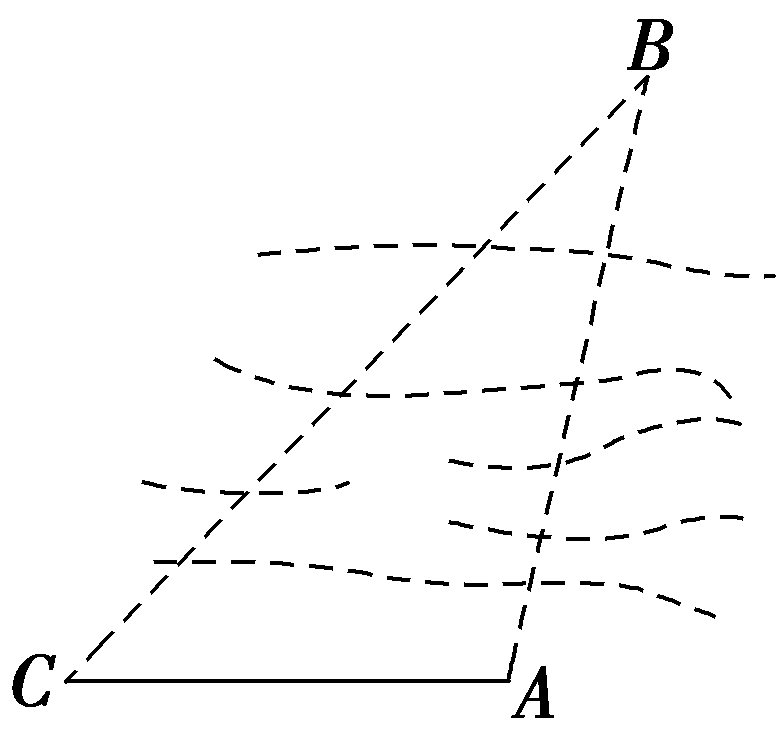

$\quad$A.50 $\sqrt{2}$  m	
$\quad$B.50 $\sqrt{3}$  m

$\quad$C.25 $\sqrt{2}$  m	
$\quad$D. $\frac{25\sqrt{2}}{2}$  m

答案A

解析因为∠*<text style="italic">A*C*B*</text>＝45°，∠*C<text style="italic">AB*</text>＝105°，所以∠*<text style="italic">ABC*</text>＝180°－45°－105°＝30°.在△ABC中，由正弦定理得 $\frac{AB}{sin\angle ACB}$ ＝ $\frac{AC}{sin\angle ABC}$ ，即 $\frac{AB}{sin45\circ }$ ＝ $\frac{50}{sin30\circ }$ ，解得*<text style="italic">AB*</text>＝50 $\sqrt{2}$ .所以*A*，*B*两点的距离为50 $\sqrt{2}$  m.故选*A*.

##### 3.两座灯塔*A*和*B*与海岸观察站*C*的距离相等，灯塔*A*在观察站北偏东40°，灯塔*B*在观察站南偏东60°，则灯塔*A*在灯塔*B*的(　　)

$\quad$A.北偏东10°	
$\quad$B.北偏西10°

$\quad$C.南偏东10°	
$\quad$D.南偏西10°

答案B

解析由题可知*AC*＝*BC*，∠*ACB*＝80°，所以∠*ABC*＝50°，*A*，*B*，*C*位置关系如图，则灯塔*A*在灯塔*B*的北偏西10°.故选B.

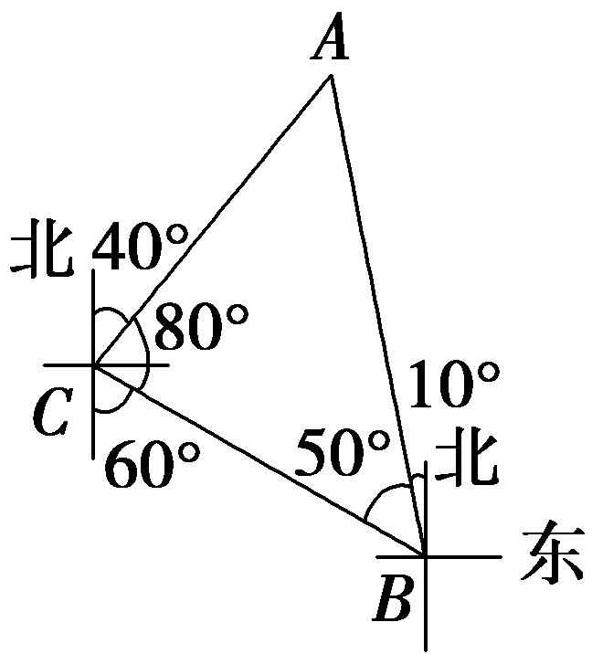

##### 4.(链接人教A必修二P49例10)如图所示，*D*，*C*，*B*在地平面同一直线上，*DC*＝10 m，从*D*，*C*两地测得*A*点的仰角分别为30°和45°，则*A*点离地面的高*AB*等于(　　)

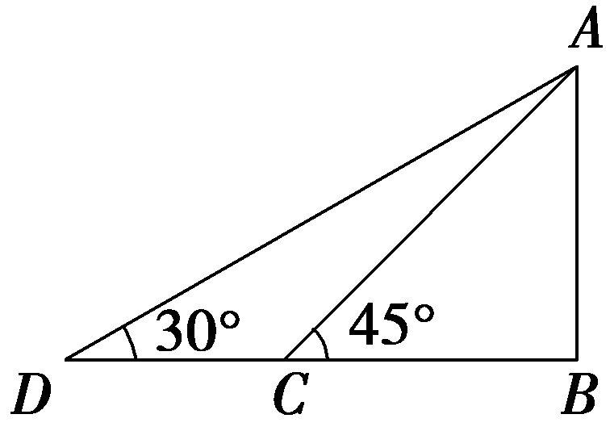

$\quad$A.10 m	
$\quad$B.5 $\sqrt{3}$  m

$\quad$C.5 $\left(\sqrt{3}－1\right)$  m	
$\quad$D.5 $\left(\sqrt{3}+1\right)$  m

答案D

解析法一：设<te<te<te<te*x*t style="italic">x</text>t style="italic">x</text>t style="italic">x</text>t style="italic">*A*B</text>＝x，则*BC*＝x，所以*BD*＝10＋x.所以tan∠*ADB*＝ $\frac{AB}{DB}$ ＝ $\frac{x}{10+x}$ ＝ $\frac{\sqrt{3}}{3}$ ，解得<te<te<te*x*t style="italic">x</text>t style="italic">x</text>t style="italic">x</text>＝5( $\sqrt{3}$ ＋1).所以*A*点离地面的高<te<te<te<te*x*t style="italic">x</text>t style="italic">x</text>t style="italic">x</text>t style="italic">*AB*</text>等于5( $\sqrt{3}$ ＋1) m.故选D.

法二：因为∠*<text style="italic"><text style="italic">AC*</text>B</text>＝45°，所以∠*ACD*＝135°，所以∠*CAD*＝180°－135°－30°＝15°.由正弦定理，得AC＝ $\frac{CD}{sin\angle CAD}$ ·sin∠*ADC*＝ $\frac{10}{sin15\circ }$ ·sin 30°＝ $\frac{20}{\sqrt{6}－\sqrt{2}}$  .所以*AB*＝*<text style="italic">AC*</text>sin 45°＝5 $\left(\sqrt{3}+1\right)$  m.故选D.

考点一　解三角形应用举例　　　　多维探究

角度1　测量距离问题

山东省科技馆新馆目前成为济南科教新地标(如图①)，其主体建筑采用与地形吻合的矩形设计，将数学符号“∞”完美嵌入其中，寓意无限未知、无限发展、无限可能和无限的科技创新.如图②，为了测量科技馆最高点<em>A</em>与其附近一建筑物楼顶<em>B</em>之间的距离，无人机在点<em>C</em>测得点<em>A</em>和点<em>B</em>的俯角分别为75°，30°，随后无人机沿水平方向飞行600 m到点<em>D</em>，此时测得点<em>A</em>和点<em>B</em>的俯角分别为45°和60°(<em>A</em>，<em>B</em>，<em>C</em>，<em>D</em>在同一铅垂平面内)，则<em>A</em>，<em>B</em>两点之间的距离为<u>　　　　</u>m.

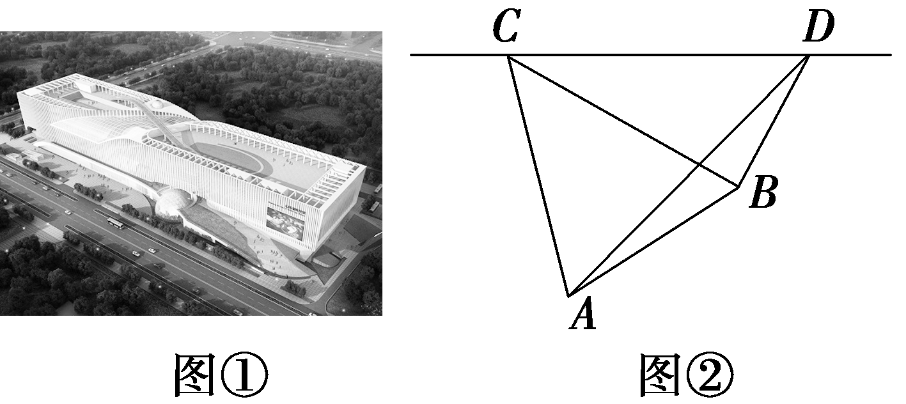

答案100 $\sqrt{15}$

解析由题意，知∠<em>DCB</em>＝30°，∠<em>&lt;text style="italic"&gt;&lt;text style="italic"&gt;CD</em>&lt;/text&gt;B&lt;/text&gt;＝60° ，所以∠<em>&lt;text style="italic"&gt;C&lt;text style="italic"&gt;BD</em>&lt;/text&gt;&lt;/text&gt;＝90°，所以在Rt△CBD中，BD＝ $\frac{1}{2}$ <em>&lt;text style="italic"&gt;CD</em>&lt;/text&gt;＝300 m，<em>&lt;text style="italic"&gt;&lt;text style="italic"&gt;BC</em>&lt;/text&gt;&lt;/text&gt;＝ $\frac{\sqrt{3}}{2}$ <em>&lt;text style="italic"&gt;CD</em>&lt;/text&gt;＝300 $\sqrt{3}$  m.又∠<em>DCA</em>＝75° ，∠<em>&lt;text style="italic"&gt;CD</em>&lt;/text&gt;A＝45° ，所以∠<em>CAD</em>＝60°，在△<em>&lt;text style="italic"&gt;&lt;text style="italic"&gt;&lt;text style="italic"&gt;AC</em>&lt;/text&gt;&lt;/text&gt;D&lt;/text&gt;中，由正弦定理得， $\frac{AC}{sin45\circ }$ ＝ $\frac{CD}{sin60\circ }$ ，所以<em>&lt;text style="italic"&gt;&lt;text style="italic"&gt;AC</em>&lt;/text&gt;&lt;/text&gt;＝ $\frac{600}{\frac{\sqrt{3}}{2}}$ × $\frac{\sqrt{2}}{2}$ ＝&lt;text style="superscript"&gt;&lt;text style="superscript"&gt;2&lt;/text&gt;&lt;/text&gt;00 $\sqrt{6}$  m.在△A<em>&lt;text style="italic"&gt;&lt;text style="italic"&gt;BC</em>&lt;/text&gt;&lt;/text&gt;中，∠<em>&lt;text style="italic"&gt;&lt;text style="italic"&gt;AC</em>&lt;/text&gt;&lt;/text&gt;B＝∠A<em>&lt;text style="italic"&gt;CD</em>&lt;/text&gt;－∠<em>BCD</em>＝75°－30°＝45°，由余弦定理得，<em>&lt;text style="italic"&gt;AB</em>&lt;/text&gt;&lt;text style="superscript"&gt;&lt;text style="superscript"&gt;2&lt;/text&gt;&lt;/text&gt;＝AC2＋BC2－2AC·BC·cos ∠<em>&lt;text style="italic"&gt;ACB</em>&lt;/text&gt;＝ $\left(200\sqrt{6}\right)^{2}$ ＋ $\left(300\sqrt{3}\right)^{2}$ －&lt;text style="superscript"&gt;&lt;text style="superscript"&gt;2&lt;/text&gt;&lt;/text&gt;×200 $\sqrt{6}$ ×300 $\sqrt{3}$ × $\frac{\sqrt{2}}{2}$ ＝150 000，所以<em>&lt;text style="italic"&gt;AB</em>&lt;/text&gt;＝100 $\sqrt{15}$  m.

角度2　测量高度问题

（1）如图甲，首钢滑雪大跳台是冬奥历史上第一座与工业遗产再利用直接结合的竞赛场馆，大跳台的设计中融入了世界文化遗产敦煌壁画中“飞天”的元素.如图乙，某研究性学习小组为了估算赛道造型最高点*<text style="italic"><text style="italic">A*</text></text>距离地面的高度*<text style="italic">A<text style="italic">B*</text></text>(*AB*与地面垂直)，在赛道一侧找到一座建筑物*<text style="italic"><text style="italic"><text style="italic">C*</text>*D*</text></text>，测得*<text style="italic">CD*</text>的高度为*<text style="italic">h*</text>，并从C点测得A点的仰角为30°；在赛道与建筑物CD之间的地面上的点*<text style="italic">E*</text>处测得A点，C点的仰角分别为75°和30°(其中B，E，D三点共线).该学习小组利用这些数据估算得AB约为60米，则CD的高h约为(参考数据： $\sqrt{2}$ ≈1.41， $\sqrt{3}$ ≈1.73， $\sqrt{6}$ ≈2.45)(　　)

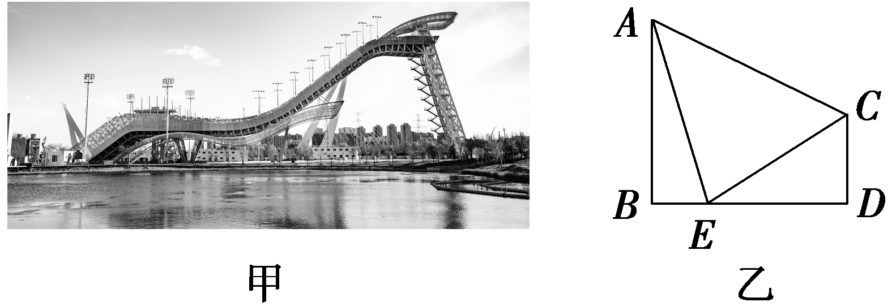

$\quad$A.11米	
$\quad$B.20.8米

$\quad$C.25.4米	
$\quad$D.31.8米

（2）大型城雕“商”字坐落在商丘市睢阳区神火大道与南京路交汇处，“商”字城雕有着厚重悠久的历史和文化，它时刻撬动着人们认识商丘、走进商丘的欲望.吴斌同学在今年国庆期间到商丘去旅游，经过“商”字城雕时，他想利用解三角形的知识测量一下该雕塑的高度(即图中线段*<text style="italic">AB*</text>的长度).他在该雕塑塔的正东*<text style="italic">C*</text>处沿着南偏西60°的方向前进7 $\sqrt{2}$ 米后到达*<text style="italic">D*</text>处(*A*，*<text style="italic">C*</text>，D三点在同一个水平面内)，测得图中线段*<text style="italic">A<text style="italic">B*</text></text>在东北方向，且测得点B的仰角为71.565°，则该雕塑的高度大约是(参考数据：tan 71.565°≈3)(　　)

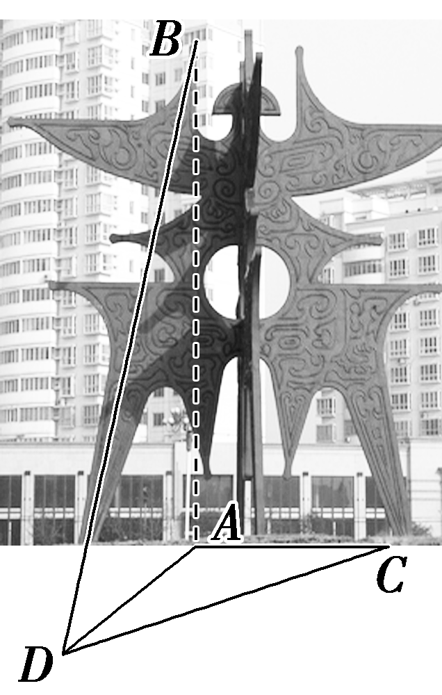

$\quad$A.19米	
$\quad$B.20米

$\quad$C.21米	
$\quad$D.22米

答案（1）C　（2）C

解析（1）由题意可得∠*<text style="italic">AE*B</text>＝75°，∠*<text style="italic"><text style="italic">CE*</text>D</text>＝30°，则∠*AEC*＝75°，∠*<text style="italic">ACE*</text>＝60°，∠*CAE*＝45°.在Rt△*ABE*中，AE＝ $\frac{AB}{sin75\circ }$ ＝ $\frac{60}{sin75\circ }$ .在△*<text style="italic">A<text style="italic"><text style="italic">CE*</text></text></text>中，由正弦定理得 $\frac{AE}{sin\angle ACE}$ ＝ $\frac{CE}{sin\angle CAE}$ ，所以*<text style="italic">CE*</text>＝ $\frac{20\sqrt{6}}{sin75\circ }$ ，所以*<text style="italic">CD*</text>＝ $\frac{1}{2}$ *<text style="italic">CE*</text>＝ $\frac{10\sqrt{6}}{sin75\circ }$ .又sin 75°＝sin(45°＋30°)＝ $\frac{\sqrt{6}＋\sqrt{2}}{4}$ ，所以*<text style="italic">CD*</text>＝ $\frac{40\sqrt{6}}{\sqrt{6}＋\sqrt{2}}$ ＝60－20 $\sqrt{3}$ ≈60－20×1.73＝25.4(米).故选C.

（2）在△*<text style="italic">A<text style="italic">CD*</text></text>中，∠*C<text style="italic"><text style="italic">AD*</text></text>＝135°，∠ACD＝30°，CD＝7 $\sqrt{2}$ ，由正弦定理得 $\frac{AD}{sin\angle ACD}$ ＝ $\frac{CD}{sin\angle CAD}$ ，所以*<text style="italic">AD*</text>＝ $\frac{CD\times sin\angle ACD}{sin\angle CAD}$ ＝7(米)，在Rt△*<text style="italic">AB*D</text>中，∠*BDA*＝71.565°，所以AB＝*<text style="italic">AD*</text>×tan 71.565°≈7×3＝21(米).故选C.

角度3　测量角度问题

甲船在&lt;text style="it<em>a</em>lic"&gt;A&lt;/text&gt;处观察到乙船在它北偏东60°的<em>B</em>处，两船相距a海里，乙船正在向正北方向行驶，若甲船的速度是乙船的 $\sqrt{3}$ 倍，则甲船应按北偏东<em>&lt;text style="italic"&gt;θ</em>&lt;/text&gt;方向前进，才能在<em>C</em>处追上乙船，此时θ＝<u>　　　　</u>.

答案30°

解析如图所示，由题可知∠<te<te*x*t style="italic">x</text>t style="italic">CA*B*</text>＝60°－*<text style="italic"><text style="italic"><text style="italic">θ*</text></text></text>，B＝120°，设*BC*＝x海里，则*AC*＝ $\sqrt{3}$ <te*x*t style="italic">x</text>海里，在△A*B*C中， $\frac{BC}{sin\angle CAB}$ ＝ $\frac{AC}{sinB}$ ，即 $\frac{x}{sin\left(60\circ －\theta \right)}$ ＝ $\frac{\sqrt{3}x}{sin120\circ }$ ，解得sin $\left(60\circ －\theta \right)$ ＝ $\frac{1}{2}$ ，又0°＜60°－<te<te*x*t style="italic">x</text>t style="italic">*<text style="italic"><text style="italic">θ*</text></text></text>＜90°，所以60°－θ＝30°，解得θ＝30°.

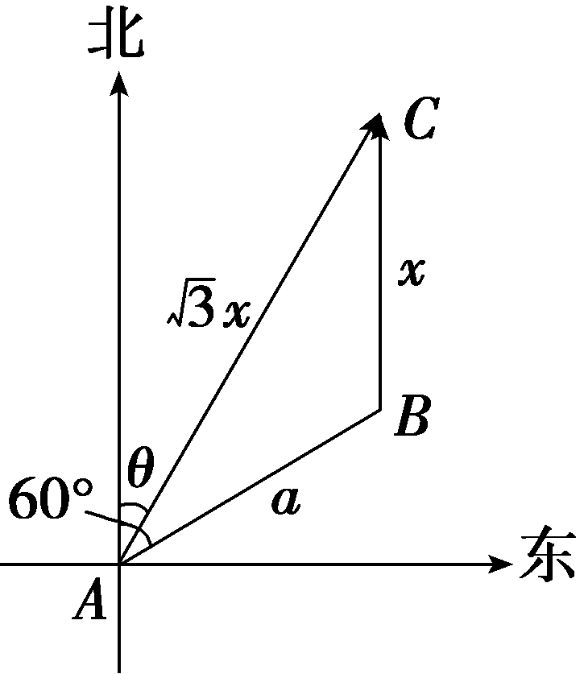

解三角形实际应用问题的常见类型及解题策略

<table><tr><td>
求解与测量距离、高度有关的问题
</td><td>
画出示意图，先确定所求量所在的三角形，若其他量已知，则直接利用正、余弦定理求解；若有未知量，则把未知量放在另一确定三角形中求解，有时需设出未知量，从几个三角形中列出方程(组)，解方程(组)得出所要求的量.
</td></tr><tr><td>
求解角度问题
</td><td>
根据实际问题画出图形，并在图形中标出有关的角和距离，利用正、余弦定理进行求解，最后将解得的结果转化为实际问题的解.
</td></tr></table>

注意：方向角是相对于某点而言的，因此在确定方向时，必须先弄清是哪一个点的方向角.另外也要注意方位角、俯角和仰角的含义.

对点练1.设*M*，*N*为某海边相邻的两座山峰的山顶，*M*，*N*到海平面的距离分别为100米，50米.现欲在*M*，*N*之间架设高压电网，需计算*M*，*N*之间的距离.勘测人员在海平面上选取一点*P*，利用测角仪从*P*点测得的*M*，*N*点的仰角分别为30°，45°，并从*P*点观测到∠*MPN*＝45°，则*M*，*N*之间的距离为(　　)

$\quad$A.50 $\sqrt{10}$  米	
$\quad$B.50 $\sqrt{14}$  米

$\quad$C.50 $\sqrt{22}$  米	
$\quad$D.50 $\sqrt{26}$  米

答案A

解析如图，由题可知∠<em>M&lt;text style="italic"&gt;PM</em>&lt;/text&gt;&lt;text style="subscript"&gt;&lt;text style="subscript"&gt;&lt;text style="subscript"&gt;1&lt;/text&gt;&lt;/text&gt;&lt;/text&gt;＝30°，∠<em>N&lt;text style="italic"&gt;PN</em>&lt;/text&gt;1＝45°，<em>MM</em>1＝100米，<em>NN</em>1＝50米，所以PM＝200米，PN＝50 $\sqrt{2}$ 米，又∠M<em>PN</em>＝45°，所以<em>&lt;text style="italic"&gt;MN</em>&lt;/text&gt;2＝40 000＋5 000－2×200×50 $\sqrt{2}$ × $\frac{\sqrt{2}}{2}$ ＝25 000，所以<em>&lt;text style="italic"&gt;MN</em>&lt;/text&gt;＝50 $\sqrt{10}$ 米.故选A.

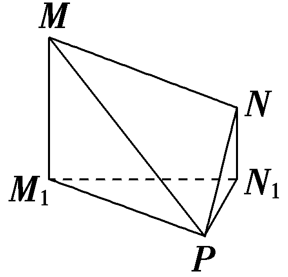

对点练2.冬奥会会徽以汉字“冬”为灵感来源，结合中国书法的艺术形态，将悠久的中国传统文化底蕴与国际化风格融为一体(如图①)，呈现出中国在新时代的新形象、新梦想.某同学查阅资料得知，书法中的一些特殊笔画都有固定的角度，比如在弯折位置通常采用30°，45°，60°，90°，120°，150°等特殊角度.为了判断“冬”的弯折角度是否符合书法中的美学要求，该同学取端点绘制了△*ABD*，如图②所示，测得*AB*＝5，*BD*＝6，*AC*＝4，*AD*＝3，若点*C*恰好在边*BD*上，则sin ∠*ACD*＝(　　)

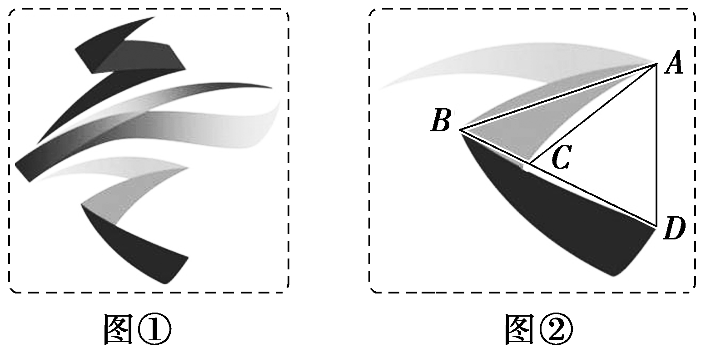

$\quad$A. $\frac{5}{9}$ 	
$\quad$B. $\frac{2\sqrt{14}}{9}$

$\quad$C. $\frac{\sqrt{22}}{6}$ 	
$\quad$D. $\frac{\sqrt{14}}{6}$

答案D

解析由题意，在△*ABD*中，由余弦定理的推论得，cos∠*<text style="italic"><text style="italic">ADB*</text></text>＝ $\frac{AD^{2}＋BD^{2}－AB^{2}}{2AD\cdot BD}$ ＝ $\frac{9+36－25}{2\times 3\times 6}$ ＝ $\frac{5}{9}$ .因为∠*<text style="italic"><text style="italic">ADB*</text></text>∈ $\left(0，\pi \right)$ ，所以sin ∠*<text style="italic"><text style="italic">ADB*</text></text>＝ $\sqrt{1－cos^{2}\angle ADB}$ ＝ $\sqrt{1－\left(\frac{5}{9}\right)^{2}}$ ＝ $\frac{2\sqrt{14}}{9}$ .在△*<text style="italic">ACD*</text>中，由正弦定理得 $\frac{AC}{sin\angle ADB}$ ＝ $\frac{AD}{sin\angle ACD}$ ，所以 $\frac{4}{\frac{2\sqrt{14}}{9}}$ ＝ $\frac{3}{sin\angle ACD}$ ，解得sin ∠*<text style="italic">ACD*</text>＝ $\frac{\sqrt{14}}{6}$ .故选D.

对点练3.“落霞与孤鹜齐飞，秋水共长天一色”，滕王阁，江南三大名楼之一，因初唐诗人王勃所作《滕王阁序》而名传千古，如图所示，在滕王阁旁的水平地面上共线的三点<em>A</em>，<em>B</em>，<em>C</em>处测得其顶点<em>P</em>的仰角分别为30°，60°，45°，且<em>AB</em>＝<em>BC</em>＝75米，则滕王阁的高度<em>OP</em>＝<u>　　　　</u>米.

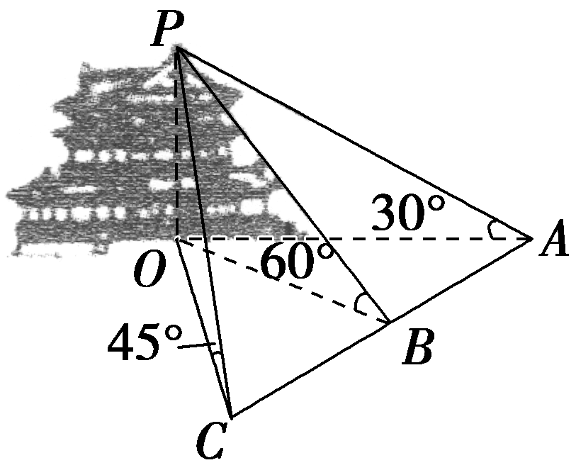

答案15 $\sqrt{15}$

解析设*OP*＝*<text style="italic"><text style="italic"><text style="italic">h*</text></text></text>，则*OA*＝ $\frac{OP}{tan30\circ }$ ＝ $\sqrt{3}$ *<text style="italic"><text style="italic"><text style="italic">h*</text></text></text>，*OB*＝ $\frac{OP}{tan60\circ }$ ＝ $\frac{\sqrt{3}}{3}$ *<text style="italic"><text style="italic"><text style="italic">h*</text></text></text>，*OC*＝ $\frac{OP}{tan45\circ }$ ＝*<text style="italic"><text style="italic"><text style="italic">h*</text></text></text>.

法一：(两角互补，余弦值互为相反数)由∠*<text style="italic">OBC*</text>＋∠*<text style="italic">OBA*</text>＝π得cos∠OBC＝－cos∠OBA，由余弦定理得 $\frac{\left(\frac{\sqrt{3}}{3}h\right)^{2}+75^{2}－h^{2}}{2\times \frac{\sqrt{3}}{3}h\times 75}$ ＝－ $\frac{\left(\frac{\sqrt{3}}{3}h\right)^{2}+75^{2}－\left(\sqrt{3}h\right)^{2}}{2\times \frac{\sqrt{3}}{3}h\times 75}$ ，

化简得<em>&lt;text style="italic"&gt;&lt;text style="italic"&gt;h</em>&lt;/text&gt;&lt;/text&gt;2＝3 375，易知h＞0，所以h＝15 $\sqrt{15}$ ，即<em>OP</em>为15 $\sqrt{15}$ 米.

法二：(同角的余弦值相等)在△*<text style="italic">OCB*</text>中，cos∠OCB＝ $\frac{h^{2}+75^{2}－\left(\frac{\sqrt{3}}{3}h\right)^{2}}{2\times h\times 75}$ ，

在△*OCA*中，cos∠*OCB*＝ $\frac{h^{2}+150^{2}－\left(\sqrt{3}h\right)^{2}}{2\times h\times 150}$ ，

所以 $\frac{h^{2}+75^{2}－\left(\frac{\sqrt{3}}{3}h\right)^{2}}{2\times h\times 75}$ ＝ $\frac{h^{2}+150^{2}－\left(\sqrt{3}h\right)^{2}}{2\times h\times 150}$ ，

化简得<em>&lt;text style="italic"&gt;&lt;text style="italic"&gt;h</em>&lt;/text&gt;&lt;/text&gt;2＝3 375，易知h＞0，所以h＝15 $\sqrt{15}$ ，即<em>OP</em>为15 $\sqrt{15}$ 米.

考点二　平面图形中的计算问题　　　　师生共研

如图，在四边形<em>ABCD</em>中，<em>AB</em>2＋<em>BC</em>2＋<em>AB</em>·<em>BC</em>＝<em>AC</em>2.

（1）若*AB*＝3*BC*＝3，求△*ABC*的面积；

（2）若*CD*＝ $\sqrt{3}$ *BC*，∠*CAD*＝30°，∠B*CD*＝120°，求∠*ACB*的值.

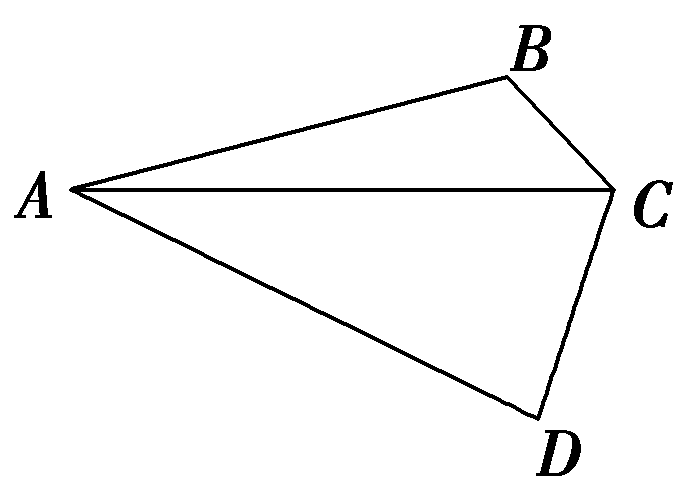

解：（1）在△*A<text style="italic">B*C</text>中，cos B＝ $\frac{AB^{2}＋BC^{2}－AC^{2}}{2AB\cdot BC}$ ＝ $\frac{－AB\cdot BC}{2AB\cdot BC}$ ＝－ $\frac{1}{2}$ ，

因为0°＜*B*＜180°，所以*B*＝120°.

<em>S</em>△<em>&lt;text style="italic"&gt;AB</em>C&lt;/text&gt;＝ $\frac{1}{2}$ <em>AB</em>·<em>BC</em>sin 120°＝ $\frac{1}{2}$ ×3×1× $\frac{\sqrt{3}}{2}$ ＝ $\frac{3\sqrt{3}}{4}$ .

（2）由（1）知*B*＝120°，设∠*ACB*＝*θ*，

则∠*ACD*＝120°－*θ*，*D*＝30°＋*θ*，∠*BAC*＝60°－*θ*.

在△*<text style="italic">AC*D</text>中，由 $\frac{AC}{sin(30\circ ＋\theta )}$ ＝ $\frac{CD}{sin30\circ }$ ，得*AC*＝ $\frac{sin(30\circ ＋\theta )}{sin30\circ }$ *CD*.

在△*A<text style="italic">BC*</text>中，由 $\frac{AC}{sin120\circ }$ ＝ $\frac{BC}{sin(60\circ －\theta )}$ ，得*AC*＝ $\frac{sin120\circ }{sin(60\circ －\theta )}$ *BC*.

联立上式，并由*CD*＝ $\sqrt{3}$ *BC*得sin(30°＋*<text style="italic">θ*</text>)sin(60°－θ)＝ $\frac{1}{4}$ ，

所以sin(60°＋2*θ*)＝ $\frac{1}{2}$ .

由题可知0°＜*θ*＜60°，

所以60°＜60°＋2*θ*＜180°，

所以60°＋2*θ*＝150°，解得*θ*＝45°，即∠*ACB*＝45°.

平面多边形中解三角形问题的求解思路

##### 1.将所给平面图形拆分成若干个三角形，然后确定在哪些三角形中利用正、余弦定理建立边角关系进行求解.

##### 2.寻找和各个三角形之间的联系，特别是公共边、邻角之间的等量关系，交叉使用公共条件进行求解.

注意：（1）三角形相似、平行四边形性质等几何结论的应用.（2）方程思想的灵活运用，通过设出未知变量，建立方程进行求解.

对点练4.如图，△*ABC*是边长为3的等边三角形，线段*AE*交*BC*于点*D*，*BD*＝1.

（1）求sin∠*ADB*；

（2）若*AD*＝3*DE*，求*BE*的长.

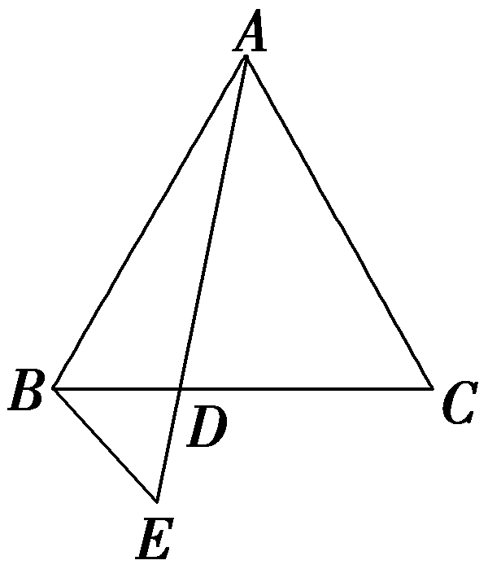

解：（1）在△<em>&lt;text style="italic"&gt;&lt;text style="italic"&gt;AB</em>&lt;/text&gt;D&lt;/text&gt;中，由余弦定理可得<em>&lt;text style="italic"&gt;&lt;text style="italic"&gt;AD</em>&lt;/text&gt;&lt;/text&gt;&lt;text style="superscript"&gt;&lt;text style="superscript"&gt;&lt;text style="superscript"&gt;&lt;text style="superscript"&gt;&lt;text style="superscript"&gt;2&lt;/text&gt;&lt;/text&gt;&lt;/text&gt;&lt;/text&gt;&lt;/text&gt;＝AB2＋<em>&lt;text style="italic"&gt;BD</em>&lt;/text&gt;2－2AB×BD×cos∠<em>ABD</em>，代入数据可得AD2＝32＋12－2×3×1× $\frac{1}{2}$ ＝7，所以<em>&lt;text style="italic"&gt;&lt;text style="italic"&gt;AD</em>&lt;/text&gt;&lt;/text&gt;＝ $\sqrt{7}$ .

由正弦定理可得 $\frac{AB}{sin\angle ADB}$ ＝ $\frac{AD}{sin\angle ABD}$ ，

所以sin∠*ADB*＝ $\frac{AB\times sin\angle ABD}{AD}$ ＝ $\frac{3\times \frac{\sqrt{3}}{2}}{\sqrt{7}}$ ＝ $\frac{3\sqrt{21}}{14}$ .

（2）在△*ABD*中，由（1）及余弦定理得cos∠*ADB*＝－ $\frac{\sqrt{7}}{14}$ ，

cos∠*EDB*＝cos $\left(\pi －\angle ADB\right)$ ＝－cos∠*ADB*＝ $\frac{\sqrt{7}}{14}$ ，

又*DE*＝ $\frac{AD}{3}$ ＝ $\frac{\sqrt{7}}{3}$ ，

所以在△<em>&lt;text style="italic"&gt;&lt;text style="italic"&gt;BE</em>&lt;/text&gt;D&lt;/text&gt;中，由余弦定理可得BE&lt;text style="superscript"&gt;&lt;text style="superscript"&gt;2&lt;/text&gt;&lt;/text&gt;＝<em>&lt;text style="italic"&gt;BD</em>&lt;/text&gt;2＋<em>&lt;text style="italic"&gt;DE</em>&lt;/text&gt;2－2BD×DE×cos∠<em>EDB</em>＝1＋ $\frac{7}{9}$ －&lt;text style="superscript"&gt;&lt;text style="superscript"&gt;2&lt;/text&gt;&lt;/text&gt;×1× $\frac{\sqrt{7}}{3}$ × $\frac{\sqrt{7}}{14}$ ＝ $\frac{13}{9}$ ，故<em>&lt;text style="italic"&gt;BE</em>&lt;/text&gt;＝ $\frac{\sqrt{13}}{3}$ .

[真题再现]　(2021·全国乙卷)魏晋时期刘徽撰写的《海岛算经》是关于测量的数学著作，其中第一题是测量海岛的高.如图，点*E*，*H*，*G*在水平线*AC*上，*DE*和*FG*是两个垂直于水平面且等高的测量标杆的高度，称为“表高”，*EG*称为“表距”，*GC*和*EH*都称为“表目距”，*GC*与*EH*的差称为“表目距的差”，则海岛的高*AB*＝(　　)

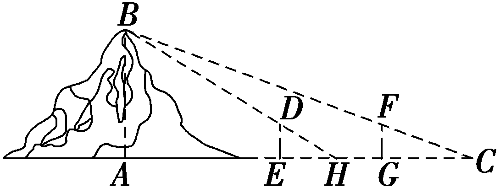

$\quad$A. $\frac{表高\times 表距}{表目距的差}$ ＋表高	
$\quad$B. $\frac{表高\times 表距}{表目距的差}$ －表高

$\quad$C. $\frac{表高\times 表距}{表目距的差}$ ＋表距	
$\quad$D. $\frac{表高\times 表距}{表目距的差}$ －表距

答案A

解析因为*<text style="italic">FG*</text>∥*<text style="italic"><text style="italic">AB*</text></text>，所以 $\frac{FG}{AB}$ ＝ $\frac{GC}{CA}$ ，所以*<text style="italic"><text style="italic"><text style="italic"><text style="italic">GC*</text></text></text></text>＝ $\frac{FG}{AB}$ ·*<text style="italic">CA*</text>.因为*<text style="italic"><text style="italic">DE*</text></text>∥*<text style="italic"><text style="italic">AB*</text></text>，所以 $\frac{DE}{AB}$ ＝ $\frac{EH}{AH}$ ，所以*<text style="italic"><text style="italic"><text style="italic">EH*</text></text></text>＝ $\frac{DE}{AB}$ ·*<text style="italic">AH*</text>.又*<text style="italic"><text style="italic">DE*</text></text>＝*<text style="italic">FG*</text>，所以*<text style="italic"><text style="italic"><text style="italic"><text style="italic">GC*</text></text></text></text>－*<text style="italic"><text style="italic"><text style="italic">EH*</text></text></text>＝ $\frac{DE}{AB}$ ·(*<text style="italic">CA*</text>－*<text style="italic">AH*</text>)＝ $\frac{DE}{AB}$ ×*HC*＝ $\frac{DE}{AB}$ ×(*HG*＋*<text style="italic"><text style="italic"><text style="italic"><text style="italic">GC*</text></text></text></text>)＝ $\frac{DE}{AB}$ ×(*<text style="italic">EG*</text>－*<text style="italic"><text style="italic"><text style="italic">EH*</text></text></text>＋*<text style="italic"><text style="italic"><text style="italic"><text style="italic">GC*</text></text></text></text>).由题设中信息可得，表目距的差为GC－EH，表高为*<text style="italic"><text style="italic">DE*</text></text>，表距为EG，则上式可化为，表目距的差＝ $\frac{表高}{AB}$ ×(表距＋表目距的差)，所以*<text style="italic"><text style="italic">AB*</text></text>＝ $\frac{表高}{表目距的差}$ ×(表距＋表目距的差)＝ $\frac{表高\times 表距}{表目距的差}$ ＋表高.故选A.

[教材呈现]　(人教A必修二P49例10)如图，*AB*是底部*B*不可到达的一座建筑物，*A*为建筑物的最高点.设计一种测量建筑物高度*AB*的方法，并求出建筑物的高度.

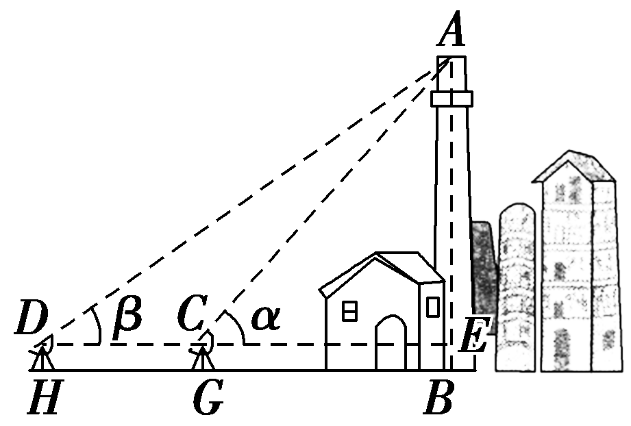

点评：高考题和教材例题考查的角度都是求物体的高度，应用的是简单的三角函数的知识，而没有用到正弦定理和余弦定理，都侧重于考查数学知识在实际问题中的应用.

课时测评39　正弦定理、余弦定理的综合应用 $\frac{对应学生}{用书P387}$

(时间：50分钟　满分：88分)

(本栏目内容，在学生用书中以独立形式分册装订！)

(1—8题，每小题5分，共40分)

##### 1.如图所示，两座灯塔*A*和*B*到海岸观察站*C*的距离相等，灯塔*A*在观察站南偏西40°方向上，灯塔*B*在观察站南偏东60°方向上，则灯塔*A*在灯塔*B*的(　　)

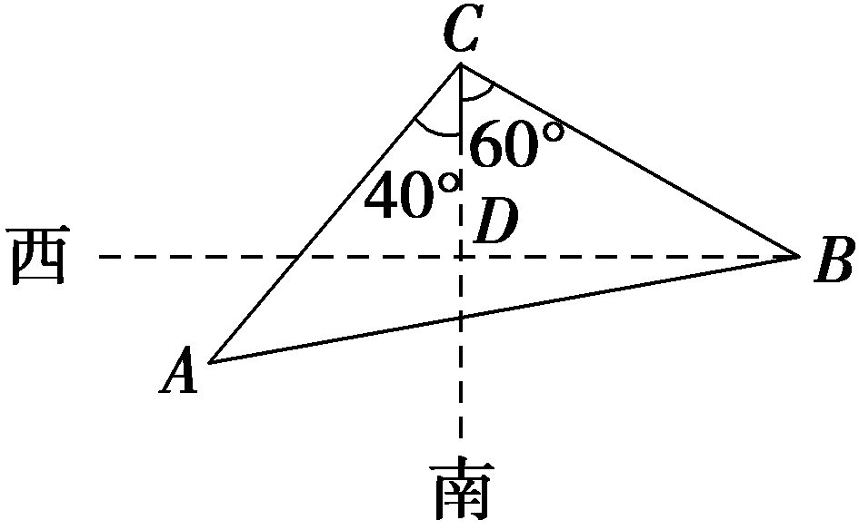

$\quad$A.北偏东10°方向上	
$\quad$B.北偏西10°方向上

$\quad$C.南偏东80°方向上	
$\quad$D.南偏西80°方向上

答案D

解析由条件及题图可知，△*ABC*为等腰三角形，所以∠*BAC*＝∠*ABC*＝40°，又∠*BCD*＝60°，所以∠*CBD*＝30°，所以∠*DBA*＝10°，因此灯塔*A*在灯塔*B*的南偏西80°方向上.故选D.

##### 2.已知飞机的飞行航线*AB*和地面目标*C*在同一铅直平面内，在*A*处测得目标*C*的俯角为30°，飞行26 km到达*B*处，测得目标*C*的俯角为75°，此时*B*处与地面目标*C*的距离为(　　)

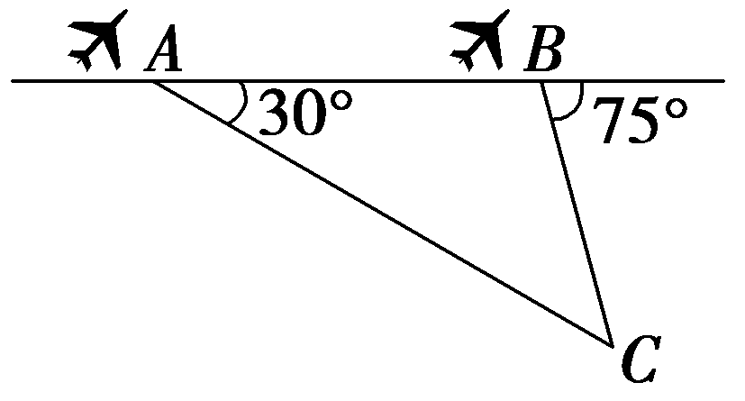

$\quad$A.13 $\sqrt{6}$  km	
$\quad$B.5 $\sqrt{2}$  km

$\quad$C.5 km	
$\quad$D.13 $\sqrt{2}$  km

答案D

解析由题知，在△*<text style="italic">ABC*</text>中，A＝30°，B＝180°－75°＝105°，所以C＝180°－30°－105°＝45°，由正弦定理可知， $\frac{BC}{sin30\circ }$ ＝ $\frac{AB}{sin45\circ }$ ⇒*BC*＝ $\frac{AB}{sin45\circ }$ ·sin 30°＝ $\frac{26}{\frac{\sqrt{2}}{2}}$ × $\frac{1}{2}$ ＝13 $\sqrt{2}\left(km\right)$ .故选D.

##### 3.(2025·河北承德模拟)如图，在曲柄<em>CB</em>绕<em>C</em>点旋转时，活塞<em>A</em>做直线往复运动，连杆<em>AB</em>＝4 cm，曲柄<em>CB</em>＝1 cm，当曲柄<em>CB</em>从初始位置<em>CB</em>0按顺时针方向旋转60°时，活塞<em>A</em>从<em>A</em>0到达<em>A</em>的位置，则<em>A</em>0<em>A</em>＝(　　)

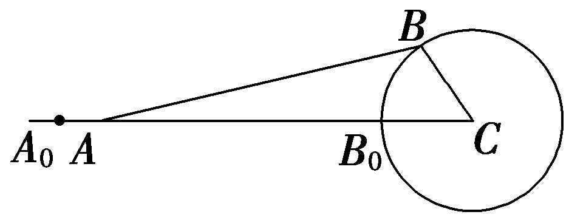

$\quad$A. $\frac{11－\sqrt{61}}{2}$  cm	
$\quad$B. $\frac{11－\sqrt{51}}{2}$  cm

$\quad$C. $\frac{9－\sqrt{61}}{2}$  cm	
$\quad$D. $\frac{9－\sqrt{51}}{2}$  cm

答案C

解析连接<em>BB</em>0，如图所示，

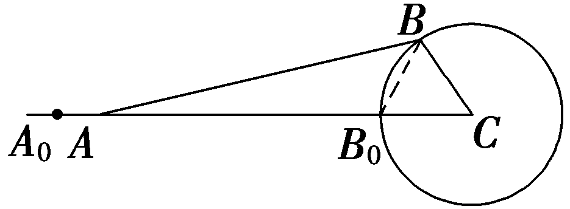

因为∠<em>&lt;text style="italic"&gt;&lt;text style="italic"&gt;&lt;text style="italic"&gt;&lt;text style="italic"&gt;B</em>&lt;/text&gt;&lt;/text&gt;&lt;/text&gt;<em>C</em>B&lt;/text&gt;&lt;text style="subscript"&gt;&lt;text style="subscript"&gt;&lt;text style="subscript"&gt;&lt;text style="subscript"&gt;&lt;text style="subscript"&gt;&lt;text style="subscript"&gt;&lt;text style="subscript"&gt;&lt;text style="subscript"&gt;&lt;text style="subscript"&gt;&lt;text style="subscript"&gt;0&lt;/text&gt;&lt;/text&gt;&lt;/text&gt;&lt;/text&gt;&lt;/text&gt;&lt;/text&gt;&lt;/text&gt;&lt;/text&gt;&lt;/text&gt;&lt;/text&gt;＝60°，所以△<em>&lt;text style="italic"&gt;&lt;text style="italic"&gt;BB</em>&lt;/text&gt;&lt;/text&gt;0C为等边三角形，故∠BB0<em>&lt;text style="italic"&gt;&lt;text style="italic"&gt;&lt;text style="italic"&gt;&lt;text style="italic"&gt;&lt;text style="italic"&gt;&lt;text style="italic"&gt;A</em>&lt;/text&gt;&lt;/text&gt;&lt;/text&gt;&lt;/text&gt;&lt;/text&gt;&lt;/text&gt;＝120°，BB0＝<em>BC</em>＝1 cm，在△<em>&lt;text style="italic"&gt;AB</em>B&lt;/text&gt;0中，AB＝4 cm，由余弦定理得cos 120°＝ $\frac{B_{0}A^{2}＋B_{0}B^{2}－AB^{2}}{2B_{0}A\cdot B_{0}B}$ ＝ $\frac{B_{0}A^{2}+1－16}{2B_{0}A}$ ＝－ $\frac{1}{2}$ ，解得<em>&lt;text style="italic"&gt;&lt;text style="italic"&gt;&lt;text style="italic"&gt;B</em>&lt;/text&gt;&lt;/text&gt;&lt;/text&gt;&lt;text style="subscript"&gt;&lt;text style="subscript"&gt;&lt;text style="subscript"&gt;&lt;text style="subscript"&gt;&lt;text style="subscript"&gt;&lt;text style="subscript"&gt;&lt;text style="subscript"&gt;&lt;text style="subscript"&gt;&lt;text style="subscript"&gt;&lt;text style="subscript"&gt;0&lt;/text&gt;&lt;/text&gt;&lt;/text&gt;&lt;/text&gt;&lt;/text&gt;&lt;/text&gt;&lt;/text&gt;&lt;/text&gt;&lt;/text&gt;&lt;/text&gt;<em>&lt;text style="italic"&gt;&lt;text style="italic"&gt;&lt;text style="italic"&gt;&lt;text style="italic"&gt;&lt;text style="italic"&gt;&lt;text style="italic"&gt;A</em>&lt;/text&gt;&lt;/text&gt;&lt;/text&gt;&lt;/text&gt;&lt;/text&gt;&lt;/text&gt;＝ $\frac{－1+\sqrt{61}}{2}$  cm(负值已舍去)，则<em>&lt;text style="italic"&gt;&lt;text style="italic"&gt;&lt;text style="italic"&gt;&lt;text style="italic"&gt;&lt;text style="italic"&gt;&lt;text style="italic"&gt;A</em>&lt;/text&gt;&lt;/text&gt;&lt;/text&gt;&lt;/text&gt;&lt;/text&gt;&lt;/text&gt;&lt;text style="subscript"&gt;&lt;text style="subscript"&gt;&lt;text style="subscript"&gt;&lt;text style="subscript"&gt;&lt;text style="subscript"&gt;&lt;text style="subscript"&gt;&lt;text style="subscript"&gt;&lt;text style="subscript"&gt;&lt;text style="subscript"&gt;&lt;text style="subscript"&gt;0&lt;/text&gt;&lt;/text&gt;&lt;/text&gt;&lt;/text&gt;&lt;/text&gt;&lt;/text&gt;&lt;/text&gt;&lt;/text&gt;&lt;/text&gt;&lt;/text&gt;A＝A0<em>&lt;text style="italic"&gt;&lt;text style="italic"&gt;&lt;text style="italic"&gt;B</em>&lt;/text&gt;&lt;/text&gt;&lt;/text&gt;0－B0A＝4－B0A＝4－ $\frac{－1+\sqrt{61}}{2}$ ＝ $\frac{9－\sqrt{61}}{2}\left(cm\right)$ .故选<em>C</em>.

##### 4.(2021·全国甲卷)2020年12月8日，中国和尼泊尔联合公布珠穆朗玛峰最新高程为8 848.86 (单位：m)，三角高程测量法是珠峰高程测量方法之一.如图是三角高程测量法的一个示意图，现有*<text style="italic">A*</text>，*B*，*<text style="italic">C*</text>三点，且*<text style="italic">A* </text>，*<text style="italic"><text style="italic">B* </text></text>，*<text style="italic">C* </text>在同一水平面上的投影*A'*，*B'*，*C'* 满足∠*A'C'B'*＝45°，∠*<text style="italic">A'B'C'*</text>＝60°.由C 点测得B 点的仰角为15°，*BB'* 与*<text style="italic">CC'*</text>的差为100；由B 点测得A 点的仰角为45°，则A，C两点到水平面A'B'C'的高度差*AA'*－CC'约为( $\sqrt{3}$ ≈1.732)(　　)

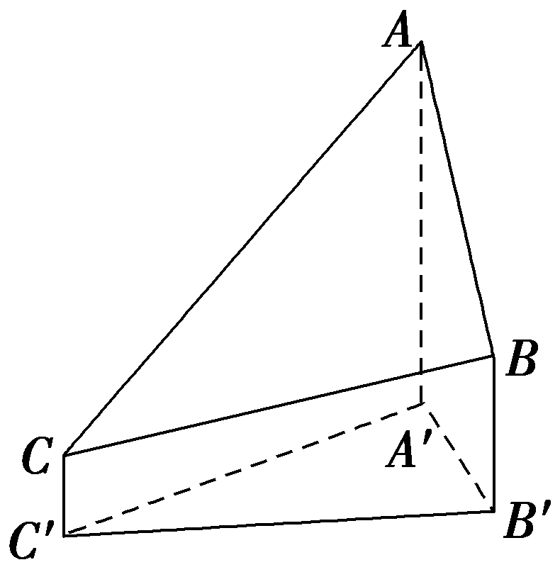

$\quad$A.346	
$\quad$B.373

$\quad$C.446	
$\quad$D.473

答案B

解析如图所示，根据题意过*C*作*C<text style="italic">E*</text>∥*C'<text style="italic"><text style="italic">B*</text>'</text>，交*BB'* 于E，过B作*B<text style="italic">D*</text>∥*<text style="italic"><text style="italic">A*'B'</text></text>，交*<text style="italic">AA'*</text>于D，则*<text style="italic">BE*</text>＝100，*C'B'*＝*CE*＝ $\frac{100}{tan15\circ }$ .在△*A*'*C*'*<text style="italic">B*</text>'中，∠C'*<text style="italic">A'B'*</text>＝75°，则*B<text style="italic">D*</text>＝A'B'＝ $\frac{C'B'\times sin45\circ }{sin75\circ }$ .又在*<text style="italic">B*</text>点处测得*A*点的仰角为45°，所以A*D*＝*<text style="italic"><text style="italic">BD*</text></text>＝ $\frac{C'B'\times sin45\circ }{sin75\circ }$ ，所以高度差*<text style="italic">A*A'</text>－*C*C'＝A*D*＋*<text style="italic">B*</text>*E*＝ $\frac{C'B'\times sin45\circ }{sin75\circ }$ ＋100＝ $\frac{\frac{100}{tan15\circ }\times sin45\circ }{sin75\circ }$ ＋100＝ $\frac{100sin45\circ }{sin15\circ }$ ＋100＝ $\frac{100\times \frac{\sqrt{2}}{2}}{\frac{\sqrt{6}－\sqrt{2}}{4}}$ ＋100＝100( $\sqrt{3}$ ＋1)＋100≈373.故选*<text style="italic">B*</text>.

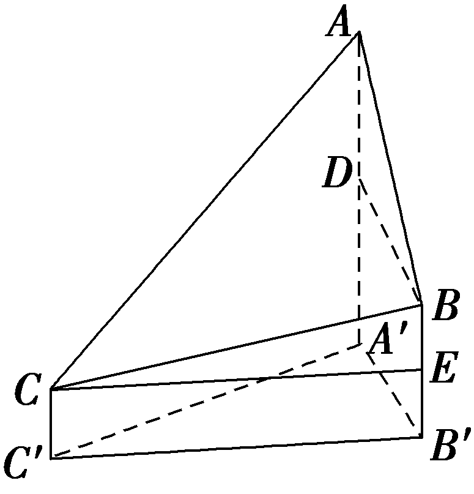

##### 5.(多选)某货轮在*<text style="italic">A*</text>处测得灯塔*<text style="italic">B*</text>在北偏东75°方向，距离为12 $\sqrt{6}$  n mile，测得灯塔*C*在北偏西30°方向，距离为8 $\sqrt{3}$  n mile.货轮由*<text style="italic">A*</text>处向正北方向航行到*D*处时，测得灯塔*<text style="italic">B*</text>在南偏东60°方向，则下列说法正确的是(　　 )

$\quad$A.*A*处与*D*处之间的距离是24 n mile

$\quad$B.灯塔*C*与*D*处之间的距离是16 n mile

$\quad$C.灯塔*C*在*D*处的南偏西30°方向

$\quad$D.*D*处在灯塔*B*的北偏西30°方向

答案AC

解析如图，由题意可知∠*AD<text style="italic">B*</text>＝60°，∠*BAD*＝75°，∠*CAD*＝30°，*AB*＝12 $\sqrt{6}$  n mile，*AC*＝8 $\sqrt{3}$  n mile，所以*B*＝180°－60°－75°＝45°.在△*AB*D中，由正弦定

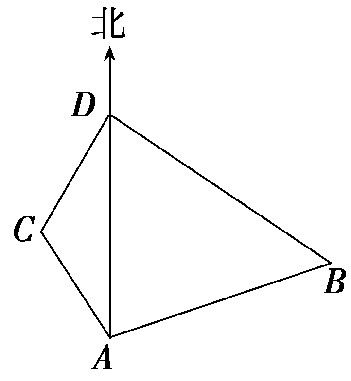

理得 $\frac{AD}{sinB}$ ＝ $\frac{AB}{sin\angle ADB}$ ，所以*A<text style="italic"><text style="italic">D*</text></text>＝ $\frac{AB\cdot sinB}{sin\angle ADB}$ ＝ $\frac{12\sqrt{6}\times \frac{\sqrt{2}}{2}}{\frac{\sqrt{3}}{2}}$ ＝24(n mile)，故A正确；在△*A<text style="italic"><text style="italic"><text style="italic">C<text style="italic">D*</text></text></text></text>中，由余弦定理得CD＝ $\sqrt{AC^{2}＋AD^{2}－2AC\cdot ADcos\angle CAD}$ ＝ $\sqrt{(8\sqrt{3})^{2}+24^{2}－2\times 8\sqrt{3}\times 24\times \frac{\sqrt{3}}{2}}$ ＝8 $\sqrt{3}$ (n mile)，故*B*错误；由B项解析知*<text style="italic"><text style="italic">C<text style="italic">D*</text></text></text>＝*AC*，所以∠*CDA*＝∠C*AD*＝30°，所以灯塔C在D处的南偏西30°方向，故C正确；由∠*ADB*＝60°，得D处在灯塔B的北偏西60°方向，故D错误.故选AC.

##### 6.(多选)如图，在平面四边形*A<text style="italic">B*C*D*</text>中，已知B＋D＝180°，*AB*＝2，*BC*＝4 $\sqrt{2}$ ，C*D*＝4，*AD*＝2 $\sqrt{5}$ ，下列四个结论中正确的是(　　)

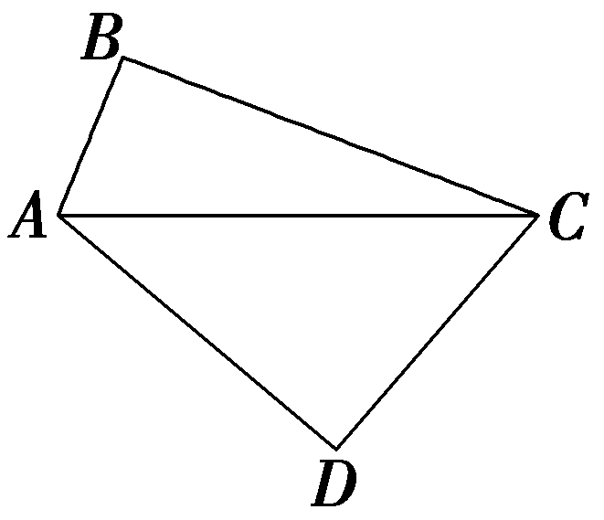

$\quad$A.*B*＝*D*＝90°

$\quad$B.四边形*ABCD*的面积为4 $\sqrt{2}$ ＋ $\sqrt{5}$

$\quad$C.*AC*＝6

$\quad$D.四边形*ABCD*的周长为6＋4 $\sqrt{2}$ ＋2 $\sqrt{5}$

答案ACD

解析在&lt;text sty<em>l</em>e="subscript"&gt;△&lt;/text&gt;<em>&lt;text style="italic"&gt;&lt;text style="italic"&gt;A&lt;text style="italic"&gt;&lt;text style="italic"&gt;&lt;text style="italic"&gt;&lt;text style="italic"&gt;&lt;text style="italic"&gt;&lt;text style="italic"&gt;&lt;text style="italic"&gt;&lt;text style="italic"&gt;&lt;text style="italic"&gt;&lt;text style="italic"&gt;&lt;text style="italic"&gt;B</em>&lt;/text&gt;&lt;/text&gt;&lt;/text&gt;&lt;/text&gt;&lt;/text&gt;&lt;/text&gt;&lt;/text&gt;&lt;/text&gt;&lt;/text&gt;&lt;/text&gt;&lt;/text&gt;&lt;/text&gt;C&lt;/text&gt;中，可得<em>&lt;text style="italic"&gt;&lt;text style="italic"&gt;AC</em>&lt;/text&gt;&lt;/text&gt;&lt;text style="superscript"&gt;&lt;text style="superscript"&gt;&lt;text style="superscript"&gt;&lt;text style="superscript"&gt;&lt;text style="superscript"&gt;2&lt;/text&gt;&lt;/text&gt;&lt;/text&gt;&lt;/text&gt;&lt;/text&gt;＝<em>&lt;text style="italic"&gt;AB</em>&lt;/text&gt;2＋<em>&lt;text style="italic"&gt;&lt;text style="italic"&gt;&lt;text style="italic"&gt;BC</em>&lt;/text&gt;&lt;/text&gt;&lt;/text&gt;2－2AB·BCcos B＝4＋32－2×2×4 $\sqrt{2}$ cos &lt;text sty<em>l</em>e="italic"&gt;<em>&lt;text style="italic"&gt;&lt;text style="italic"&gt;&lt;text style="italic"&gt;&lt;text style="italic"&gt;&lt;text style="italic"&gt;&lt;text style="italic"&gt;&lt;text style="italic"&gt;&lt;text style="italic"&gt;&lt;text style="italic"&gt;B</em>&lt;/text&gt;&lt;/text&gt;&lt;/text&gt;&lt;/text&gt;&lt;/text&gt;&lt;/text&gt;&lt;/text&gt;&lt;/text&gt;&lt;/text&gt;&lt;/text&gt;＝36－16 $\sqrt{2}$ cos &lt;text sty<em>l</em>e="italic"&gt;<em>&lt;text style="italic"&gt;&lt;text style="italic"&gt;&lt;text style="italic"&gt;&lt;text style="italic"&gt;&lt;text style="italic"&gt;&lt;text style="italic"&gt;&lt;text style="italic"&gt;&lt;text style="italic"&gt;&lt;text style="italic"&gt;B</em>&lt;/text&gt;&lt;/text&gt;&lt;/text&gt;&lt;/text&gt;&lt;/text&gt;&lt;/text&gt;&lt;/text&gt;&lt;/text&gt;&lt;/text&gt;&lt;/text&gt;.在&lt;text style="subscript"&gt;△&lt;/text&gt;<em>&lt;text style="italic"&gt;&lt;text style="italic"&gt;AC</em>&lt;/text&gt;&lt;/text&gt;<em>&lt;text style="italic"&gt;&lt;text style="italic"&gt;&lt;text style="italic"&gt;&lt;text style="italic"&gt;&lt;text style="italic"&gt;&lt;text style="italic"&gt;&lt;text style="italic"&gt;D</em>&lt;/text&gt;&lt;/text&gt;&lt;/text&gt;&lt;/text&gt;&lt;/text&gt;&lt;/text&gt;&lt;/text&gt;中，可得AC&lt;text style="superscript"&gt;&lt;text style="superscript"&gt;&lt;text style="superscript"&gt;&lt;text style="superscript"&gt;&lt;text style="superscript"&gt;2&lt;/text&gt;&lt;/text&gt;&lt;/text&gt;&lt;/text&gt;&lt;/text&gt;＝<em>&lt;text style="italic"&gt;&lt;text style="italic"&gt;&lt;text style="italic"&gt;AD</em>&lt;/text&gt;&lt;/text&gt;&lt;/text&gt;2＋<em>&lt;text style="italic"&gt;&lt;text style="italic"&gt;&lt;text style="italic"&gt;CD</em>&lt;/text&gt;&lt;/text&gt;&lt;/text&gt;2－2AD·CDcos D＝20＋16－2×2 $\sqrt{5}$ ×4cos &lt;text sty<em>l</em>e="italic"&gt;<em>&lt;text style="italic"&gt;&lt;text style="italic"&gt;&lt;text style="italic"&gt;&lt;text style="italic"&gt;&lt;text style="italic"&gt;&lt;text style="italic"&gt;D</em>&lt;/text&gt;&lt;/text&gt;&lt;/text&gt;&lt;/text&gt;&lt;/text&gt;&lt;/text&gt;&lt;/text&gt;＝36－16 $\sqrt{5}$ cos &lt;text sty<em>l</em>e="italic"&gt;<em>&lt;text style="italic"&gt;&lt;text style="italic"&gt;&lt;text style="italic"&gt;&lt;text style="italic"&gt;&lt;text style="italic"&gt;&lt;text style="italic"&gt;D</em>&lt;/text&gt;&lt;/text&gt;&lt;/text&gt;&lt;/text&gt;&lt;/text&gt;&lt;/text&gt;&lt;/text&gt;，则可得36－16 $\sqrt{2}$ cos &lt;text sty<em>l</em>e="italic"&gt;<em>&lt;text style="italic"&gt;&lt;text style="italic"&gt;&lt;text style="italic"&gt;&lt;text style="italic"&gt;&lt;text style="italic"&gt;&lt;text style="italic"&gt;&lt;text style="italic"&gt;&lt;text style="italic"&gt;&lt;text style="italic"&gt;B</em>&lt;/text&gt;&lt;/text&gt;&lt;/text&gt;&lt;/text&gt;&lt;/text&gt;&lt;/text&gt;&lt;/text&gt;&lt;/text&gt;&lt;/text&gt;&lt;/text&gt;＝36－16 $\sqrt{5}$ cos &lt;text sty<em>l</em>e="italic"&gt;<em>&lt;text style="italic"&gt;&lt;text style="italic"&gt;&lt;text style="italic"&gt;&lt;text style="italic"&gt;&lt;text style="italic"&gt;&lt;text style="italic"&gt;D</em>&lt;/text&gt;&lt;/text&gt;&lt;/text&gt;&lt;/text&gt;&lt;/text&gt;&lt;/text&gt;&lt;/text&gt;，即 $\sqrt{2}$ cos &lt;text sty<em>l</em>e="italic"&gt;<em>&lt;text style="italic"&gt;&lt;text style="italic"&gt;&lt;text style="italic"&gt;&lt;text style="italic"&gt;&lt;text style="italic"&gt;&lt;text style="italic"&gt;&lt;text style="italic"&gt;&lt;text style="italic"&gt;&lt;text style="italic"&gt;B</em>&lt;/text&gt;&lt;/text&gt;&lt;/text&gt;&lt;/text&gt;&lt;/text&gt;&lt;/text&gt;&lt;/text&gt;&lt;/text&gt;&lt;/text&gt;&lt;/text&gt;＝ $\sqrt{5}$ cos &lt;text sty<em>l</em>e="italic"&gt;<em>&lt;text style="italic"&gt;&lt;text style="italic"&gt;&lt;text style="italic"&gt;&lt;text style="italic"&gt;&lt;text style="italic"&gt;&lt;text style="italic"&gt;D</em>&lt;/text&gt;&lt;/text&gt;&lt;/text&gt;&lt;/text&gt;&lt;/text&gt;&lt;/text&gt;&lt;/text&gt;，因为<em>&lt;text style="italic"&gt;&lt;text style="italic"&gt;&lt;text style="italic"&gt;&lt;text style="italic"&gt;&lt;text style="italic"&gt;&lt;text style="italic"&gt;&lt;text style="italic"&gt;&lt;text style="italic"&gt;&lt;text style="italic"&gt;&lt;text style="italic"&gt;B</em>&lt;/text&gt;&lt;/text&gt;&lt;/text&gt;&lt;/text&gt;&lt;/text&gt;&lt;/text&gt;&lt;/text&gt;&lt;/text&gt;&lt;/text&gt;&lt;/text&gt;＋D＝180°，可得cos B＝－cos D，可得cos B＝0，又因为B为三角形的内角，所以B＝90°，所以B＝D＝90°，故A正确；由<em>&lt;text style="italic"&gt;&lt;text style="italic"&gt;S</em>&lt;/text&gt;&lt;/text&gt;四边形<em>&lt;text style="italic"&gt;&lt;text style="italic"&gt;&lt;text style="italic"&gt;&lt;text style="italic"&gt;AB</em>&lt;/text&gt;&lt;/text&gt;&lt;/text&gt;C&lt;/text&gt;D＝S&lt;text style="subscript"&gt;△&lt;/text&gt;A<em>&lt;text style="italic"&gt;&lt;text style="italic"&gt;&lt;text style="italic"&gt;BC</em>&lt;/text&gt;&lt;/text&gt;&lt;/text&gt;＋S△<em>&lt;text style="italic"&gt;&lt;text style="italic"&gt;AC</em>&lt;/text&gt;&lt;/text&gt;D＝ $\frac{1}{2}$ &lt;text sty<em>l</em>e="italic"&gt;<em>A&lt;text style="italic"&gt;&lt;text style="italic"&gt;&lt;text style="italic"&gt;&lt;text style="italic"&gt;&lt;text style="italic"&gt;&lt;text style="italic"&gt;&lt;text style="italic"&gt;&lt;text style="italic"&gt;&lt;text style="italic"&gt;&lt;text style="italic"&gt;&lt;text style="italic"&gt;B</em>&lt;/text&gt;&lt;/text&gt;&lt;/text&gt;&lt;/text&gt;&lt;/text&gt;&lt;/text&gt;&lt;/text&gt;&lt;/text&gt;&lt;/text&gt;&lt;/text&gt;&lt;/text&gt;&lt;/text&gt;·<em>&lt;text style="italic"&gt;&lt;text style="italic"&gt;&lt;text style="italic"&gt;BC</em>&lt;/text&gt;&lt;/text&gt;&lt;/text&gt;＋ $\frac{1}{2}$ &lt;text sty<em>l</em>e="italic"&gt;<em>A&lt;text style="italic"&gt;&lt;text style="italic"&gt;&lt;text style="italic"&gt;&lt;text style="italic"&gt;&lt;text style="italic"&gt;&lt;text style="italic"&gt;&lt;text style="italic"&gt;&lt;text style="italic"&gt;D</em>&lt;/text&gt;&lt;/text&gt;&lt;/text&gt;&lt;/text&gt;&lt;/text&gt;&lt;/text&gt;&lt;/text&gt;&lt;/text&gt;&lt;/text&gt;·<em>&lt;text style="italic"&gt;&lt;text style="italic"&gt;&lt;text style="italic"&gt;CD</em>&lt;/text&gt;&lt;/text&gt;&lt;/text&gt;＝ $\frac{1}{2}$ ×&lt;text sty<em>l</em>e="superscript"&gt;&lt;text style="superscript"&gt;&lt;text style="superscript"&gt;&lt;text style="superscript"&gt;&lt;text style="superscript"&gt;2&lt;/text&gt;&lt;/text&gt;&lt;/text&gt;&lt;/text&gt;&lt;/text&gt;×4 $\sqrt{2}$ ＋ $\frac{1}{2}$ ×&lt;text sty<em>l</em>e="superscript"&gt;&lt;text style="superscript"&gt;&lt;text style="superscript"&gt;&lt;text style="superscript"&gt;&lt;text style="superscript"&gt;2&lt;/text&gt;&lt;/text&gt;&lt;/text&gt;&lt;/text&gt;&lt;/text&gt; $\sqrt{5}$ ×4＝4 $\sqrt{2}$ ＋4 $\sqrt{5}$ ，故&lt;text sty<em>l</em>e="italic"&gt;<em>&lt;text style="italic"&gt;&lt;text style="italic"&gt;&lt;text style="italic"&gt;&lt;text style="italic"&gt;&lt;text style="italic"&gt;&lt;text style="italic"&gt;&lt;text style="italic"&gt;&lt;text style="italic"&gt;&lt;text style="italic"&gt;B</em>&lt;/text&gt;&lt;/text&gt;&lt;/text&gt;&lt;/text&gt;&lt;/text&gt;&lt;/text&gt;&lt;/text&gt;&lt;/text&gt;&lt;/text&gt;&lt;/text&gt;不正确；在Rt&lt;text style="subscript"&gt;△&lt;/text&gt;<em>&lt;text style="italic"&gt;&lt;text style="italic"&gt;&lt;text style="italic"&gt;&lt;text style="italic"&gt;AB</em>&lt;/text&gt;&lt;/text&gt;&lt;/text&gt;C&lt;/text&gt;中，可得<em>&lt;text style="italic"&gt;&lt;text style="italic"&gt;AC</em>&lt;/text&gt;&lt;/text&gt;＝ $\sqrt{AB^{2}＋BC^{2}}$ ＝ $\sqrt{2^{2}＋\left(4\sqrt{2}\right)^{2}}$ ＝6，故C正确；&lt;text sty<em>l</em>e="subscript"&gt;四边形&lt;/text&gt;<em>&lt;text style="italic"&gt;&lt;text style="italic"&gt;A&lt;text style="italic"&gt;&lt;text style="italic"&gt;&lt;text style="italic"&gt;&lt;text style="italic"&gt;&lt;text style="italic"&gt;&lt;text style="italic"&gt;&lt;text style="italic"&gt;&lt;text style="italic"&gt;&lt;text style="italic"&gt;&lt;text style="italic"&gt;&lt;text style="italic"&gt;B</em>&lt;/text&gt;&lt;/text&gt;&lt;/text&gt;&lt;/text&gt;&lt;/text&gt;&lt;/text&gt;&lt;/text&gt;&lt;/text&gt;&lt;/text&gt;&lt;/text&gt;&lt;/text&gt;&lt;/text&gt;C&lt;/text&gt;<em>&lt;text style="italic"&gt;&lt;text style="italic"&gt;&lt;text style="italic"&gt;&lt;text style="italic"&gt;&lt;text style="italic"&gt;&lt;text style="italic"&gt;&lt;text style="italic"&gt;D</em>&lt;/text&gt;&lt;/text&gt;&lt;/text&gt;&lt;/text&gt;&lt;/text&gt;&lt;/text&gt;&lt;/text&gt;的周长为l＝<em>&lt;text style="italic"&gt;AB</em>&lt;/text&gt;＋<em>&lt;text style="italic"&gt;&lt;text style="italic"&gt;&lt;text style="italic"&gt;BC</em>&lt;/text&gt;&lt;/text&gt;&lt;/text&gt;＋<em>&lt;text style="italic"&gt;&lt;text style="italic"&gt;&lt;text style="italic"&gt;AD</em>&lt;/text&gt;&lt;/text&gt;&lt;/text&gt;＋<em>&lt;text style="italic"&gt;&lt;text style="italic"&gt;&lt;text style="italic"&gt;CD</em>&lt;/text&gt;&lt;/text&gt;&lt;/text&gt;＝&lt;text style="superscript"&gt;&lt;text style="superscript"&gt;&lt;text style="superscript"&gt;&lt;text style="superscript"&gt;&lt;text style="superscript"&gt;2&lt;/text&gt;&lt;/text&gt;&lt;/text&gt;&lt;/text&gt;&lt;/text&gt;＋4 $\sqrt{2}$ ＋&lt;text sty<em>l</em>e="superscript"&gt;&lt;text style="superscript"&gt;&lt;text style="superscript"&gt;&lt;text style="superscript"&gt;&lt;text style="superscript"&gt;2&lt;/text&gt;&lt;/text&gt;&lt;/text&gt;&lt;/text&gt;&lt;/text&gt; $\sqrt{5}$ ＋4＝6＋4 $\sqrt{2}$ ＋&lt;text sty<em>l</em>e="superscript"&gt;&lt;text style="superscript"&gt;&lt;text style="superscript"&gt;&lt;text style="superscript"&gt;&lt;text style="superscript"&gt;2&lt;/text&gt;&lt;/text&gt;&lt;/text&gt;&lt;/text&gt;&lt;/text&gt; $\sqrt{5}$ ，故&lt;text sty<em>l</em>e="italic"&gt;<em>&lt;text style="italic"&gt;&lt;text style="italic"&gt;&lt;text style="italic"&gt;&lt;text style="italic"&gt;&lt;text style="italic"&gt;&lt;text style="italic"&gt;D</em>&lt;/text&gt;&lt;/text&gt;&lt;/text&gt;&lt;/text&gt;&lt;/text&gt;&lt;/text&gt;&lt;/text&gt;正确.故选<em>&lt;text style="italic"&gt;&lt;text style="italic"&gt;AC</em>&lt;/text&gt;&lt;/text&gt;D.

##### 7.一船向正北方向匀速行驶，看见正西方向两座相距20海里的灯塔恰好与该船在同一直线上，继续航行半小时后，看见其中一座灯塔在南偏西45°方向上，另一座灯塔在南偏西75°方向上，则该船的速度是<u>　　　　</u>海里<em>/</em>小时.

答案20( $\sqrt{3}$ －1)

解析如图所示，设船的初始位置为*A*，半小时后行驶到*B*，两座灯塔分别位于*C*和*D*，所以∠*ABC*＝45°，∠*ABD*＝75°，则∠*CBD*＝30°，∠*<text style="italic">CDB*</text>＝15°，所以tan∠CDB＝tan 15°＝tan $\left(45\circ －30\circ \right)$ ＝ $\frac{tan45\circ －tan30\circ }{1+tan45\circ tan30\circ }$ ＝ $\frac{1－\frac{\sqrt{3}}{3}}{1+1\times \frac{\sqrt{3}}{3}}$ ＝2－ $\sqrt{3}$ ，

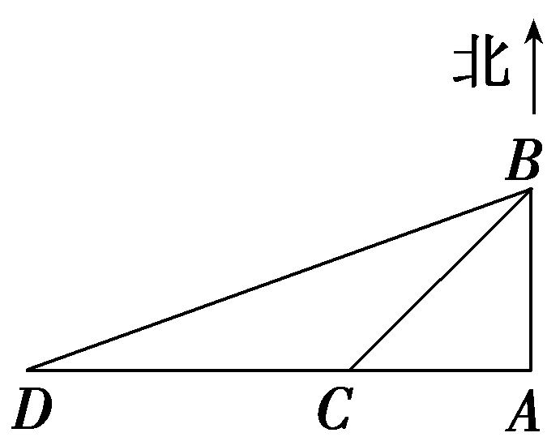

设<te<te<te<te*x<<text style="italic">/* text>t style="italic">x</text>t style="italic">x</text>t style="italic">x</text>t style="italic">BA</text>＝x海里，则*CA*＝x海里，在Rt△*BAD*中，*DA*＝20＋x，则tan ∠*ADB*＝ $\frac{AB}{AD}$ ＝ $\frac{x}{20+x}$ ＝2－ $\sqrt{3}$ ，解得<te<te<te*x<<text style="italic">/* text>t style="italic">x</text>t style="italic">x</text>t style="italic">x</text>＝10 $\left(\sqrt{3}－1\right)$ ，所以该船的速度为10 $\left(\sqrt{3}－1\right)$ ÷ $\frac{1}{2}$ ＝20 $\left(\sqrt{3}－1\right)$ (海里*/* 小时).

##### 8.在平面四边形<em>A&lt;text style="italic"&gt;&lt;text style="italic"&gt;B</em>C&lt;/text&gt;D&lt;/text&gt;中，BC⊥<em>&lt;text style="italic"&gt;CD</em>&lt;/text&gt;，B＝ $\frac{3\pi }{4}$ ，A<em>B</em>＝3 $\sqrt{2}$ ，<em>AD</em>＝2 $\sqrt{10}$ ，若<em>AC</em>＝3 $\sqrt{5}$ ，则<em>&lt;text style="italic"&gt;CD</em>&lt;/text&gt;＝<u>　　　　</u>.

答案1或5

解析因为在△<em>A&lt;text style="italic"&gt;B</em>C&lt;/text&gt;中，B＝ $\frac{3\pi }{4}$ ，A<em>B</em>＝3 $\sqrt{2}$ ，<em>&lt;text style="italic"&gt;AC</em>&lt;/text&gt;＝3 $\sqrt{5}$ ，由正弦定理可得 $\frac{AC}{sinB}$ ＝ $\frac{AB}{sin\angle ACB}$ ，所以sin∠<em>&lt;text style="italic"&gt;AC</em>&lt;/text&gt;<em>B</em>＝ $\frac{AB\cdot sinB}{AC}$ ＝ $\frac{3\sqrt{2}\times \frac{\sqrt{2}}{2}}{3\sqrt{5}}$ ＝ $\frac{\sqrt{5}}{5}$ ，又<em>B</em>C⊥<em>&lt;text style="italic"&gt;&lt;text style="italic"&gt;&lt;text style="italic"&gt;&lt;text style="italic"&gt;CD</em>&lt;/text&gt;&lt;/text&gt;&lt;/text&gt;&lt;/text&gt;，所以∠<em>&lt;text style="italic"&gt;AC</em>&lt;/text&gt;B＋∠<em>&lt;text style="italic"&gt;&lt;text style="italic"&gt;&lt;text style="italic"&gt;ACD</em>&lt;/text&gt;&lt;/text&gt;&lt;/text&gt;＝ $\frac{\pi }{2}$ ，因此cos∠<em>&lt;text style="italic"&gt;AC</em>&lt;/text&gt;D＝sin∠AC<em>B</em>＝ $\frac{\sqrt{5}}{5}$ ，在△<em>&lt;text style="italic"&gt;AC</em>&lt;/text&gt;D中，<em>AD</em>＝2 $\sqrt{10}$ ，<em>&lt;text style="italic"&gt;AC</em>&lt;/text&gt;＝3 $\sqrt{5}$ ，由余弦定理可得cos∠<em>&lt;text style="italic"&gt;AC</em>&lt;/text&gt;D＝ $\frac{AC^{2}＋CD^{2}－AD^{2}}{2AC\cdot CD}$ ＝ $\frac{5+CD^{2}}{6\sqrt{5}CD}$ ＝ $\frac{\sqrt{5}}{5}$ ，所以<em>&lt;text style="italic"&gt;&lt;text style="italic"&gt;&lt;text style="italic"&gt;&lt;text style="italic"&gt;CD</em>&lt;/text&gt;&lt;/text&gt;&lt;/text&gt;&lt;/text&gt;2－6CD＋5＝0，解得CD＝1或CD＝5.

##### 9.(13分)如图所示，在平面四边形*<text style="italic"><text style="italic">AB*C</text>D</text>中，∠A*BC*＝150°，∠*A<text style="italic">CD*</text>＝60°，AB＝ $\sqrt{3}$ ，*BC*＝1，*CD*＝ $\sqrt{7}$ .

（1）求*BD*的长；(5分)

（2） 若*AC*与*BD*交于点*O*，求△*AOD*的面积.(8分)

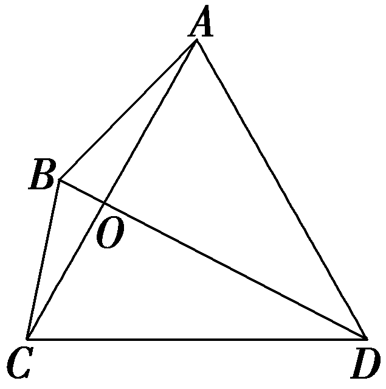

解：（1）由题意，在△<em>&lt;text style="italic"&gt;&lt;text style="italic"&gt;AB</em>&lt;/text&gt;C&lt;/text&gt;中，由余弦定理得，<em>&lt;text style="italic"&gt;AC</em>&lt;/text&gt;&lt;text style="superscript"&gt;&lt;text style="superscript"&gt;2&lt;/text&gt;&lt;/text&gt;＝AB2＋<em>&lt;text style="italic"&gt;BC</em>&lt;/text&gt;2－2AB·BC·cos∠<em>ABC</em>＝3＋1－2× $\sqrt{3}$ ×1× $\left(－\frac{\sqrt{3}}{2}\right)$ ＝7，所以<em>&lt;text style="italic"&gt;AC</em>&lt;/text&gt;＝ $\sqrt{7}$ .

在△*ABC*中，cos∠*<text style="italic"><text style="italic">ACB*</text></text>＝ $\frac{1+7－3}{2\sqrt{7}}$ ＝ $\frac{5\sqrt{7}}{14}$ ，又0°＜∠*<text style="italic"><text style="italic">ACB*</text></text>＜180°，所以sin∠ACB＝ $\frac{\sqrt{21}}{14}$ ，

所以cos∠*BCD*＝cos(∠*ACB*＋∠*ACD*)＝ $\frac{5\sqrt{7}}{14}$ × $\frac{1}{2}$ － $\frac{\sqrt{21}}{14}$ × $\frac{\sqrt{3}}{2}$ ＝ $\frac{\sqrt{7}}{14}$ .

在△<em>&lt;text style="italic"&gt;&lt;text style="italic"&gt;BC</em>&lt;/text&gt;D&lt;/text&gt;中，由余弦定理可知，<em>&lt;text style="italic"&gt;BD</em>&lt;/text&gt;&lt;text style="superscript"&gt;&lt;text style="superscript"&gt;2&lt;/text&gt;&lt;/text&gt;＝BC2＋<em>&lt;text style="italic"&gt;CD</em>&lt;/text&gt;2－2BC·CD·cos∠<em>BCD</em>＝1＋7－2×1× $\sqrt{7}$ × $\frac{\sqrt{7}}{14}$ ＝7，所以<em>&lt;text style="italic"&gt;BD</em>&lt;/text&gt;＝ $\sqrt{7}$ .

（2）由（1）可知*AC*＝*CD*＝ $\sqrt{7}$ ，又因为∠*AC*D＝60°，所以△A*CD*为等边三角形，

所以∠*C<text style="italic">AD*</text>＝60°，AD＝ $\sqrt{7}$ .

在△*BCD*中，cos∠*BDC*＝ $\frac{7+7－1}{2\times \sqrt{7}\times \sqrt{7}}$ ＝ $\frac{13}{14}$ ，

又0°＜∠*BDC*＜180°，

所以sin∠*BDC*＝ $\frac{3\sqrt{3}}{14}$ .

在△*AOD*中，cos∠*ADO*＝cos $\left(\angle ADC－\angle BDC\right)$ ＝ $\frac{1}{2}$ × $\frac{13}{14}$ ＋ $\frac{\sqrt{3}}{2}$ × $\frac{3\sqrt{3}}{14}$ ＝ $\frac{11}{14}$ ，

又0°＜∠*<text style="italic">ADO*</text>＜180°，故sin∠ADO＝ $\frac{5\sqrt{3}}{14}$ ，

所以cos∠*AOD*＝－cos $\left(\angle CAD＋\angle ADO\right)$ ＝－ $\left(\frac{1}{2}\times \frac{11}{14}－\frac{\sqrt{3}}{2}\times \frac{5\sqrt{3}}{14}\right)$ ＝ $\frac{1}{7}$ ，

又0°＜∠*AOD*＜180°，

所以sin∠*AOD*＝ $\frac{4\sqrt{3}}{7}$ .

在△*<text style="italic">AO*D</text>中，由正弦定理可知 $\frac{AD}{sin\angle AOD}$ ＝ $\frac{AO}{sin\angle ADO}$ ，即 $\frac{\sqrt{7}}{\frac{4\sqrt{3}}{7}}$ ＝ $\frac{AO}{\frac{5\sqrt{3}}{14}}$ ，解得*AO*＝ $\frac{5\sqrt{7}}{8}$ ，

所以<em>S</em>△<em>&lt;text style="italic"&gt;AO</em>D&lt;/text&gt;＝ $\frac{1}{2}$ <em>AO</em>·<em>AD</em>·sin∠<em>OAD</em>＝ $\frac{1}{2}$ × $\frac{5\sqrt{7}}{8}$ × $\sqrt{7}$ × $\frac{\sqrt{3}}{2}$ ＝ $\frac{35\sqrt{3}}{32}$ .

(10、11题，每小题5分，共10分)

##### 10.(多选)东汉末年的数学家赵爽在《周髀算经》中利用一副“弦图”，根据面积关系给出了勾股定理的证明，后人称其为“赵爽弦图”.如图 ①，它是由四个全等的直角三角形与一个小正方形拼成的一个大正方形.我们通过类比得到图②，它是由三个全等的钝角三角形与一个小等边三角形*DEF*拼成的一个大等边三角形*ABC*，则(　　)

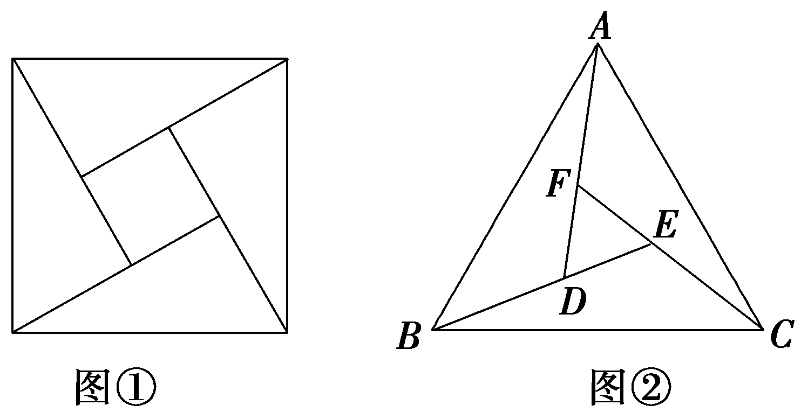

$\quad$A.这三个全等的钝角三角形可能是等腰三角形

$\quad$B.若*AB*＝ $\sqrt{7}$ *DF*，则*BD*＝*DE*

$\quad$C.若*AF*＝3，sin ∠*CAF*＝ $\frac{5\sqrt{3}}{14}$ ，则*EF*＝2

$\quad$D.若*DE*＝ $\frac{1}{3}$ *BE*，则△*ABC*的面积是△*DE*F面积的19倍

答案BCD

解析若三个全等的钝角三角形是等腰三角形，则&lt;&lt;&lt;&lt;&lt;&lt;<em>t</em>ext style="italic"&gt;t&lt;/text&gt;ext style="italic"&gt;t&lt;/text&gt;ext style="italic"&gt;t&lt;/text&gt;ext style="italic"&gt;t&lt;/text&gt;ext style="italic"&gt;t&lt;/text&gt;ext style="italic"&gt;A<em>F</em>&lt;/text&gt;＝<em>&lt;text style="italic"&gt;&lt;text style="italic"&gt;CF</em>&lt;/text&gt;&lt;/text&gt;＝<em>B&lt;text style="italic"&gt;E</em>&lt;/text&gt;＝<em>CE</em>＝<em>A&lt;text style="italic"&gt;D</em>&lt;/text&gt;＝<em>&lt;text style="italic"&gt;&lt;text style="italic"&gt;&lt;text style="italic"&gt;&lt;text style="italic"&gt;&lt;text style="italic"&gt;&lt;text style="italic"&gt;&lt;text style="italic"&gt;&lt;text style="italic"&gt;&lt;text style="italic"&gt;&lt;text style="italic"&gt;&lt;text style="italic"&gt;BD</em>&lt;/text&gt;&lt;/text&gt;&lt;/text&gt;&lt;/text&gt;&lt;/text&gt;&lt;/text&gt;&lt;/text&gt;&lt;/text&gt;&lt;/text&gt;&lt;/text&gt;&lt;/text&gt;，从而F，E，D三点重合，不符合题意，故A错误；在&lt;text style="subscript"&gt;&lt;text style="subscript"&gt;&lt;text style="subscript"&gt;△&lt;/text&gt;&lt;/text&gt;&lt;/text&gt;<em>&lt;text style="italic"&gt;&lt;text style="italic"&gt;&lt;text style="italic"&gt;&lt;text style="italic"&gt;AB</em>&lt;/text&gt;&lt;/text&gt;&lt;/text&gt;D&lt;/text&gt;中，不妨设<em>&lt;text style="italic"&gt;&lt;text style="italic"&gt;DF</em>&lt;/text&gt;&lt;/text&gt;＝t，则AB＝ $\sqrt{7}$ &lt;&lt;&lt;&lt;&lt;&lt;<em>t</em>ext style="italic"&gt;t&lt;/text&gt;ext style="italic"&gt;t&lt;/text&gt;ext style="italic"&gt;t&lt;/text&gt;ext style="italic"&gt;t&lt;/text&gt;ext style="italic"&gt;t&lt;/text&gt;ext style="italic"&gt;D&lt;/text&gt;<em>F</em>＝ $\sqrt{7}$ &lt;&lt;&lt;&lt;&lt;<em>t</em>ext style="italic"&gt;t&lt;/text&gt;ext style="italic"&gt;t&lt;/text&gt;ext style="italic"&gt;t&lt;/text&gt;ext style="italic"&gt;t&lt;/text&gt;ext style="italic"&gt;t&lt;/text&gt;，由余弦定理得<em>&lt;text style="italic"&gt;&lt;text style="italic"&gt;&lt;text style="italic"&gt;AB</em>&lt;/text&gt;&lt;/text&gt;&lt;/text&gt;&lt;text style="superscript"&gt;&lt;text style="superscript"&gt;&lt;text style="superscript"&gt;&lt;text style="superscript"&gt;&lt;text style="superscript"&gt;&lt;text style="superscript"&gt;&lt;text style="superscript"&gt;&lt;text style="superscript"&gt;&lt;text style="superscript"&gt;&lt;text style="superscript"&gt;2&lt;/text&gt;&lt;/text&gt;&lt;/text&gt;&lt;/text&gt;&lt;/text&gt;&lt;/text&gt;&lt;/text&gt;&lt;/text&gt;&lt;/text&gt;&lt;/text&gt;＝<em>B&lt;text style="italic"&gt;D</em>&lt;/text&gt;2＋ $\left(BD＋t\right)^{2}$ －&lt;&lt;&lt;&lt;<em>t</em>ext style="italic"&gt;t&lt;/text&gt;ext style="italic"&gt;t&lt;/text&gt;ext style="italic"&gt;t&lt;/text&gt;ext style="superscript"&gt;&lt;text style="superscript"&gt;&lt;text style="superscript"&gt;&lt;text style="superscript"&gt;&lt;text style="superscript"&gt;&lt;text style="superscript"&gt;&lt;text style="superscript"&gt;&lt;text style="superscript"&gt;&lt;text style="superscript"&gt;&lt;text style="superscript"&gt;2&lt;/text&gt;&lt;/text&gt;&lt;/text&gt;&lt;/text&gt;&lt;/text&gt;&lt;/text&gt;&lt;/text&gt;&lt;/text&gt;&lt;/text&gt;&lt;/text&gt;&lt;&lt;<em>t</em>ext style="italic"&gt;t&lt;/text&gt;ext style="italic"&gt;B<em>D</em>&lt;/text&gt;· $\left(BD＋t\right)$ cos 1&lt;&lt;&lt;&lt;<em>t</em>ext style="italic"&gt;t&lt;/text&gt;ext style="italic"&gt;t&lt;/text&gt;ext style="italic"&gt;t&lt;/text&gt;ext style="superscript"&gt;&lt;text style="superscript"&gt;&lt;text style="superscript"&gt;&lt;text style="superscript"&gt;&lt;text style="superscript"&gt;&lt;text style="superscript"&gt;&lt;text style="superscript"&gt;&lt;text style="superscript"&gt;&lt;text style="superscript"&gt;&lt;text style="superscript"&gt;2&lt;/text&gt;&lt;/text&gt;&lt;/text&gt;&lt;/text&gt;&lt;/text&gt;&lt;/text&gt;&lt;/text&gt;&lt;/text&gt;&lt;/text&gt;&lt;/text&gt;0°，7&lt;<em>t</em>ext style="italic"&gt;t&lt;/text&gt;2＝<em>B&lt;text style="italic"&gt;D</em>&lt;/text&gt;2＋(<em>&lt;text style="italic"&gt;&lt;text style="italic"&gt;&lt;text style="italic"&gt;&lt;text style="italic"&gt;&lt;text style="italic"&gt;&lt;text style="italic"&gt;&lt;text style="italic"&gt;&lt;text style="italic"&gt;&lt;text style="italic"&gt;&lt;text style="italic"&gt;BD</em>&lt;/text&gt;&lt;/text&gt;&lt;/text&gt;&lt;/text&gt;&lt;/text&gt;&lt;/text&gt;&lt;/text&gt;&lt;/text&gt;&lt;/text&gt;&lt;/text&gt;＋t)2＋BD·(BD＋t)，解得BD＝t(负值已舍去)，所以BD＝D<em>E</em>，故B正确；在&lt;text style="subscript"&gt;&lt;text style="subscript"&gt;&lt;text style="subscript"&gt;△&lt;/text&gt;&lt;/text&gt;&lt;/text&gt;A<em>C&lt;text style="italic"&gt;F</em>&lt;/text&gt;中，sin∠C<em>&lt;text style="italic"&gt;AF</em>&lt;/text&gt;＝ $\frac{5\sqrt{3}}{14}$ ，而∠&lt;&lt;&lt;&lt;&lt;&lt;<em>t</em>ext style="italic"&gt;t&lt;/text&gt;ext style="italic"&gt;t&lt;/text&gt;ext style="italic"&gt;t&lt;/text&gt;ext style="italic"&gt;t&lt;/text&gt;ext style="italic"&gt;t&lt;/text&gt;ext style="italic"&gt;A<em>F</em>&lt;/text&gt;C＝1&lt;text style="superscript"&gt;&lt;text style="superscript"&gt;&lt;text style="superscript"&gt;&lt;text style="superscript"&gt;&lt;text style="superscript"&gt;&lt;text style="superscript"&gt;&lt;text style="superscript"&gt;&lt;text style="superscript"&gt;&lt;text style="superscript"&gt;&lt;text style="superscript"&gt;2&lt;/text&gt;&lt;/text&gt;&lt;/text&gt;&lt;/text&gt;&lt;/text&gt;&lt;/text&gt;&lt;/text&gt;&lt;/text&gt;&lt;/text&gt;&lt;/text&gt;0°，所以cos∠<em>&lt;text style="italic"&gt;&lt;text style="italic"&gt;&lt;text style="italic"&gt;&lt;text style="italic"&gt;C&lt;text style="italic"&gt;AF</em>&lt;/text&gt;&lt;/text&gt;&lt;/text&gt;&lt;/text&gt;&lt;/text&gt;＝ $\sqrt{1－sin^{2}\angle CAF}$ ＝ $\frac{11}{14}$ ，sin∠A&lt;&lt;&lt;&lt;&lt;&lt;<em>t</em>ext style="italic"&gt;t&lt;/text&gt;ext style="italic"&gt;t&lt;/text&gt;ext style="italic"&gt;t&lt;/text&gt;ext style="italic"&gt;t&lt;/text&gt;ext style="italic"&gt;t&lt;/text&gt;ext style="italic"&gt;C<em>F</em>&lt;/text&gt;＝sin(60°－∠C<em>&lt;text style="italic"&gt;AF</em>&lt;/text&gt;)＝sin 60°·cos∠<em>&lt;text style="italic"&gt;&lt;text style="italic"&gt;&lt;text style="italic"&gt;&lt;text style="italic"&gt;CAF</em>&lt;/text&gt;&lt;/text&gt;&lt;/text&gt;&lt;/text&gt;－cos 60°sin ∠CAF＝ $\frac{3\sqrt{3}}{14}$ ，由正弦定理得 $\frac{CF}{sin\angle CAF}$ ＝ $\frac{AF}{sin\angle ACF}$ ，解得&lt;&lt;&lt;&lt;&lt;&lt;<em>t</em>ext style="italic"&gt;t&lt;/text&gt;ext style="italic"&gt;t&lt;/text&gt;ext style="italic"&gt;t&lt;/text&gt;ext style="italic"&gt;t&lt;/text&gt;ext style="italic"&gt;t&lt;/text&gt;ext style="italic"&gt;C<em>F</em>&lt;/text&gt;＝5，又因为<em>&lt;text style="italic"&gt;AF</em>&lt;/text&gt;＝<em>E</em>C＝3，所以<em>EF</em>＝<em>&lt;text style="italic"&gt;CF</em>&lt;/text&gt;－<em>&lt;text style="italic"&gt;EC</em>&lt;/text&gt;＝&lt;text style="superscript"&gt;&lt;text style="superscript"&gt;&lt;text style="superscript"&gt;&lt;text style="superscript"&gt;&lt;text style="superscript"&gt;&lt;text style="superscript"&gt;&lt;text style="superscript"&gt;&lt;text style="superscript"&gt;&lt;text style="superscript"&gt;&lt;text style="superscript"&gt;2&lt;/text&gt;&lt;/text&gt;&lt;/text&gt;&lt;/text&gt;&lt;/text&gt;&lt;/text&gt;&lt;/text&gt;&lt;/text&gt;&lt;/text&gt;&lt;/text&gt;，故C正确；若<em>D</em>E＝ $\frac{1}{3}$ &lt;&lt;&lt;&lt;&lt;&lt;<em>t</em>ext style="italic"&gt;t&lt;/text&gt;ext style="italic"&gt;t&lt;/text&gt;ext style="italic"&gt;t&lt;/text&gt;ext style="italic"&gt;t&lt;/text&gt;ext style="italic"&gt;t&lt;/text&gt;ext style="italic"&gt;B<em>E</em>&lt;/text&gt;，设<em>D</em>E＝<em>&lt;text style="italic"&gt;&lt;text style="italic"&gt;&lt;text style="italic"&gt;&lt;text style="italic"&gt;&lt;text style="italic"&gt;m</em>&lt;/text&gt;&lt;/text&gt;&lt;/text&gt;&lt;/text&gt;&lt;/text&gt;，则<em>&lt;text style="italic"&gt;BE</em>&lt;/text&gt;＝<em>&lt;text style="italic"&gt;&lt;text style="italic"&gt;&lt;text style="italic"&gt;AD</em>&lt;/text&gt;&lt;/text&gt;&lt;/text&gt;＝3m，<em>&lt;text style="italic"&gt;&lt;text style="italic"&gt;&lt;text style="italic"&gt;&lt;text style="italic"&gt;&lt;text style="italic"&gt;&lt;text style="italic"&gt;&lt;text style="italic"&gt;&lt;text style="italic"&gt;&lt;text style="italic"&gt;&lt;text style="italic"&gt;&lt;text style="italic"&gt;BD</em>&lt;/text&gt;&lt;/text&gt;&lt;/text&gt;&lt;/text&gt;&lt;/text&gt;&lt;/text&gt;&lt;/text&gt;&lt;/text&gt;&lt;/text&gt;&lt;/text&gt;&lt;/text&gt;＝&lt;text style="superscript"&gt;&lt;text style="superscript"&gt;&lt;text style="superscript"&gt;&lt;text style="superscript"&gt;&lt;text style="superscript"&gt;&lt;text style="superscript"&gt;&lt;text style="superscript"&gt;&lt;text style="superscript"&gt;&lt;text style="superscript"&gt;&lt;text style="superscript"&gt;2&lt;/text&gt;&lt;/text&gt;&lt;/text&gt;&lt;/text&gt;&lt;/text&gt;&lt;/text&gt;&lt;/text&gt;&lt;/text&gt;&lt;/text&gt;&lt;/text&gt;m，在&lt;text style="subscript"&gt;&lt;text style="subscript"&gt;&lt;text style="subscript"&gt;△&lt;/text&gt;&lt;/text&gt;&lt;/text&gt;<em>&lt;text style="italic"&gt;&lt;text style="italic"&gt;&lt;text style="italic"&gt;&lt;text style="italic"&gt;AB</em>&lt;/text&gt;&lt;/text&gt;&lt;/text&gt;D&lt;/text&gt;中，AB2＝BD2＋AD2－2BD·ADcos 120°＝19m2，<em>&lt;text style="italic"&gt;&lt;text style="italic"&gt;&lt;text style="italic"&gt;S</em>&lt;/text&gt;&lt;/text&gt;&lt;/text&gt;△<em>A&lt;text style="italic"&gt;BC</em>&lt;/text&gt;＝ $\frac{1}{2}$ &lt;&lt;&lt;&lt;&lt;<em>t</em>ext style="italic"&gt;t&lt;/text&gt;ext style="italic"&gt;t&lt;/text&gt;ext style="italic"&gt;t&lt;/text&gt;ext style="italic"&gt;t&lt;/text&gt;ext style="italic"&gt;<em>&lt;text style="italic"&gt;&lt;text style="italic"&gt;AB</em>&lt;/text&gt;&lt;/text&gt;&lt;/text&gt;·<em>BC</em>sin 60°＝19<em>&lt;text style="italic"&gt;&lt;text style="italic"&gt;&lt;text style="italic"&gt;&lt;text style="italic"&gt;&lt;text style="italic"&gt;m</em>&lt;/text&gt;&lt;/text&gt;&lt;/text&gt;&lt;/text&gt;&lt;/text&gt;&lt;text style="superscript"&gt;&lt;text style="superscript"&gt;&lt;text style="superscript"&gt;&lt;text style="superscript"&gt;&lt;text style="superscript"&gt;&lt;text style="superscript"&gt;&lt;text style="superscript"&gt;&lt;text style="superscript"&gt;&lt;text style="superscript"&gt;&lt;text style="superscript"&gt;2&lt;/text&gt;&lt;/text&gt;&lt;/text&gt;&lt;/text&gt;&lt;/text&gt;&lt;/text&gt;&lt;/text&gt;&lt;/text&gt;&lt;/text&gt;&lt;/text&gt;× $\frac{\sqrt{3}}{4}$ ，<em>&lt;text style="italic"&gt;&lt;text style="italic"&gt;&lt;text style="italic"&gt;S</em>&lt;/text&gt;&lt;/text&gt;&lt;/text&gt;&lt;text style="subscript"&gt;&lt;text style="subscript"&gt;&lt;text style="subscript"&gt;△&lt;/text&gt;&lt;/text&gt;&lt;/text&gt;&lt;&lt;&lt;&lt;&lt;&lt;<em>t</em>ext style="italic"&gt;t&lt;/text&gt;ext style="italic"&gt;t&lt;/text&gt;ext style="italic"&gt;t&lt;/text&gt;ext style="italic"&gt;t&lt;/text&gt;ext style="italic"&gt;t&lt;/text&gt;ext style="italic"&gt;D&lt;/text&gt;<em>EF</em>＝ $\frac{1}{2}$ &lt;&lt;&lt;&lt;&lt;&lt;<em>t</em>ext style="italic"&gt;t&lt;/text&gt;ext style="italic"&gt;t&lt;/text&gt;ext style="italic"&gt;t&lt;/text&gt;ext style="italic"&gt;t&lt;/text&gt;ext style="italic"&gt;t&lt;/text&gt;ext style="italic"&gt;D&lt;/text&gt;<em>F</em>·D<em>E</em>sin 60°＝<em>&lt;text style="italic"&gt;&lt;text style="italic"&gt;&lt;text style="italic"&gt;&lt;text style="italic"&gt;&lt;text style="italic"&gt;m</em>&lt;/text&gt;&lt;/text&gt;&lt;/text&gt;&lt;/text&gt;&lt;/text&gt;&lt;text style="superscript"&gt;&lt;text style="superscript"&gt;&lt;text style="superscript"&gt;&lt;text style="superscript"&gt;&lt;text style="superscript"&gt;&lt;text style="superscript"&gt;&lt;text style="superscript"&gt;&lt;text style="superscript"&gt;&lt;text style="superscript"&gt;&lt;text style="superscript"&gt;2&lt;/text&gt;&lt;/text&gt;&lt;/text&gt;&lt;/text&gt;&lt;/text&gt;&lt;/text&gt;&lt;/text&gt;&lt;/text&gt;&lt;/text&gt;&lt;/text&gt;× $\frac{\sqrt{3}}{4}$ ，所以<em>&lt;text style="italic"&gt;&lt;text style="italic"&gt;&lt;text style="italic"&gt;S</em>&lt;/text&gt;&lt;/text&gt;&lt;/text&gt;&lt;text style="subscript"&gt;&lt;text style="subscript"&gt;&lt;text style="subscript"&gt;△&lt;/text&gt;&lt;/text&gt;&lt;/text&gt;&lt;&lt;&lt;&lt;&lt;<em>t</em>ext style="italic"&gt;t&lt;/text&gt;ext style="italic"&gt;t&lt;/text&gt;ext style="italic"&gt;t&lt;/text&gt;ext style="italic"&gt;t&lt;/text&gt;ext style="italic"&gt;<em>&lt;text style="italic"&gt;&lt;text style="italic"&gt;AB</em>&lt;/text&gt;&lt;/text&gt;&lt;/text&gt;C＝19S△&lt;<em>t</em>ext style="italic"&gt;D&lt;/text&gt;<em>EF</em>，故D正确.故选<em>BC</em>D.

##### 11.已知在△<em>&lt;text style="italic"&gt;&lt;text style="italic"&gt;AB</em>&lt;/text&gt;C&lt;/text&gt;中，AB＝2，<em>D</em>为AB中点，<em>CD</em>＝ $\sqrt{2}$ ，∠<em>B&lt;text style="italic"&gt;AC</em>&lt;/text&gt;＝2∠BC<em>D</em>，则边AC的长为<u>　　　　</u>.

答案 $\frac{－1+\sqrt{17}}{2}$

解析设<te<text st*y*le="italic">x</text>t style="italic">AC</text>＝x，*BC*＝y，在△*<text style="italic">ADC*</text>和△*<text style="italic"><text style="italic">BDC*</text></text>中，由正弦定理得 $\frac{\sqrt{2}}{sin\angle BAC}$ ＝ $\frac{x}{sin\angle ADC}$ ， $\frac{1}{sin\angle BCD}$ ＝ $\frac{y}{sin\angle BDC}$ ，又sin∠*<text style="italic">ADC*</text>＝sin∠*<text style="italic"><text style="italic">BDC*</text></text>，得 $\frac{sin\angle BAC}{sin\angle BCD}$ ＝ $\frac{\sqrt{2}y}{x}$ .在△*<text style="italic"><text style="italic">BDC*</text></text>中，cos∠<text st*y*le="italic">BC</text>D＝ $\frac{y^{2}+2－1}{2\sqrt{2}y}$ ，由∠B<te<text st*y*le="italic">x</text>t style="italic">AC</text>＝2∠*BC*D，有sin∠*<text style="italic">BAC*</text>＝2sin∠*<text style="italic"><text style="italic"><text style="italic">BCD*</text></text></text>cos∠BCD，所以 $\frac{\sqrt{2}y}{x}$ ＝2· $\frac{y^{2}+2－1}{2\sqrt{2}y}$ ，

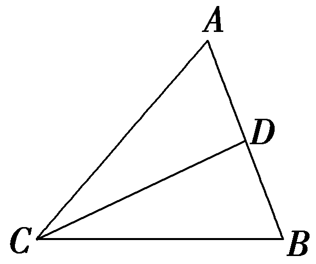

整理得&lt;te&lt;te&lt;te&lt;te&lt;te&lt;te&lt;te&lt;te&lt;te<em>x</em>t style="italic"&gt;x&lt;/text&gt;t style="italic"&gt;x&lt;/text&gt;t style="italic"&gt;x&lt;/text&gt;t style="italic"&gt;x&lt;/text&gt;t style="italic"&gt;x&lt;/text&gt;t style="italic"&gt;x&lt;/text&gt;t st<em>y</em>le="italic"&gt;x&lt;/text&gt;t style="italic"&gt;x&lt;/text&gt;t style="superscript"&gt;&lt;text style="superscript"&gt;&lt;text style="superscript"&gt;2&lt;/text&gt;&lt;/text&gt;&lt;/text&gt;<em>y</em>2＝x $\left(y^{2}+1\right)$ ①.又cos∠&lt;te&lt;te&lt;te&lt;te&lt;te&lt;te&lt;te&lt;te<em>x</em>t style="italic"&gt;x&lt;/text&gt;t style="italic"&gt;x&lt;/text&gt;t style="italic"&gt;x&lt;/text&gt;t style="italic"&gt;x&lt;/text&gt;t style="italic"&gt;x&lt;/text&gt;t style="italic"&gt;x&lt;/text&gt;t st<em>y</em>le="italic"&gt;x&lt;/text&gt;t style="italic"&gt;<em>ADC</em>&lt;/text&gt;＝－cos∠<em>BDC</em>，即 $\frac{1+2－x^{2}}{2\sqrt{2}}$ ＝－ $\frac{1+2－y^{2}}{2\sqrt{2}}$ ，整理得&lt;te&lt;te&lt;te&lt;te&lt;te&lt;te&lt;te&lt;te<em>x</em>t style="italic"&gt;x&lt;/text&gt;t style="italic"&gt;x&lt;/text&gt;t style="italic"&gt;x&lt;/text&gt;t style="italic"&gt;x&lt;/text&gt;t style="italic"&gt;x&lt;/text&gt;t style="italic"&gt;x&lt;/text&gt;t st<em>y</em>le="italic"&gt;x&lt;/text&gt;t style="italic"&gt;x&lt;/text&gt;&lt;text style="superscript"&gt;&lt;text style="superscript"&gt;&lt;text style="superscript"&gt;2&lt;/text&gt;&lt;/text&gt;&lt;/text&gt;＋<em>y</em>2＝6②，联立①②得x3－2x2－7x＋12＝0，即 $\left(x－3\right)\left(x^{2}＋x－4\right)$ ＝0，解得&lt;te&lt;te&lt;te&lt;te&lt;te&lt;te&lt;te&lt;te<em>x</em>t style="italic"&gt;x&lt;/text&gt;t style="italic"&gt;x&lt;/text&gt;t style="italic"&gt;x&lt;/text&gt;t style="italic"&gt;x&lt;/text&gt;t style="italic"&gt;x&lt;/text&gt;t style="italic"&gt;x&lt;/text&gt;t st<em>y</em>le="italic"&gt;x&lt;/text&gt;t style="italic"&gt;x&lt;/text&gt;＝3或x＝ $\frac{－1+\sqrt{17}}{2}$ (负值已舍去)，由△&lt;te&lt;te&lt;te&lt;te&lt;te&lt;te&lt;te&lt;te<em>x</em>t style="italic"&gt;x&lt;/text&gt;t style="italic"&gt;x&lt;/text&gt;t style="italic"&gt;x&lt;/text&gt;t style="italic"&gt;x&lt;/text&gt;t style="italic"&gt;x&lt;/text&gt;t style="italic"&gt;x&lt;/text&gt;t st<em>y</em>le="italic"&gt;x&lt;/text&gt;t style="italic"&gt;<em>ADC</em>&lt;/text&gt;中的三边关系知 $\sqrt{2}$ －1＜&lt;te&lt;te&lt;te&lt;te&lt;te&lt;te&lt;te&lt;te<em>x</em>t style="italic"&gt;x&lt;/text&gt;t style="italic"&gt;x&lt;/text&gt;t style="italic"&gt;x&lt;/text&gt;t style="italic"&gt;x&lt;/text&gt;t style="italic"&gt;x&lt;/text&gt;t style="italic"&gt;x&lt;/text&gt;t st<em>y</em>le="italic"&gt;x&lt;/text&gt;t style="italic"&gt;x&lt;/text&gt;＜ $\sqrt{2}$ ＋1，故&lt;te&lt;te&lt;te&lt;te&lt;te&lt;te&lt;te&lt;te<em>x</em>t style="italic"&gt;x&lt;/text&gt;t style="italic"&gt;x&lt;/text&gt;t style="italic"&gt;x&lt;/text&gt;t style="italic"&gt;x&lt;/text&gt;t style="italic"&gt;x&lt;/text&gt;t style="italic"&gt;x&lt;/text&gt;t st<em>y</em>le="italic"&gt;x&lt;/text&gt;t style="italic"&gt;x&lt;/text&gt;＝ $\frac{－1+\sqrt{17}}{2}$ ，所以<em>AC</em>＝ $\frac{－1+\sqrt{17}}{2}$ .

##### 12.(15分)某地区政府计划在一处栀子花种植地修建花海公园.如图，公园用栅栏围成等腰梯形形状，其中*B*＝75°，*BC*长为400 m；在*BC*上选择一点*Q*作为公园入口，从公园入口出发修建两条观光步道*QE*，*QF*，其中步道终点*E*，*F*两点在边界*AB*，*DC*上，且∠*BQE*＝∠*CQF*＝60°.

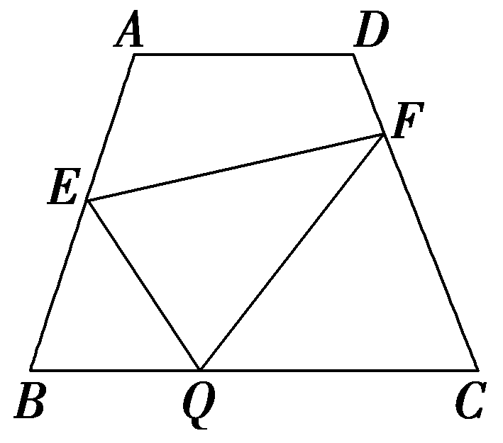

（1） 观光步道的总长度是否为定值？若是，求出该定值；若不是，请说明理由；(7分)

（2） 金沙天街的“奇遇集市”凭借其地理优势及花样百出的“小摊摊”，吸引了众多周围的游客、学生以及上班族，该区政府决定效仿金沙天街的做法，在花海公园原有规划基础上增添一条商业步道*EF*用于建设“偶遇集市”，若建设观光步道平均每米需花费100元，建设商业步道平均每米需花费300元，试求建设步道总花费的最小值.(8分)

解：（1）是定值.理由如下：因为四边形*ABCD*为等腰梯形，则*C*＝*B*＝75°，

在△*<text style="italic">BEQ*</text>中，∠*BQE*＝60°，则∠BEQ＝45°，由正弦定理可得 $\frac{QE}{sinB}$ ＝ $\frac{BQ}{sin\angle BEQ}$ ，

则*QE*＝ $\frac{BQsinB}{sin\angle BEQ}$ ＝ $\frac{BQsin75\circ }{sin45\circ }$ ，同理可得*QF*＝ $\frac{CQsin75\circ }{sin45\circ }$ ，

因此，*QE*＋*QF*＝ $\frac{\left(BQ＋CQ\right)sin75\circ }{sin45\circ }$ ＝ $\frac{400sin\left(30\circ +45\circ \right)}{sin45\circ }$

＝ $\frac{400\left(sin30\circ cos45\circ ＋cos30\circ sin45\circ \right)}{sin45\circ }$ ＝400(cos 30°＋sin 30°)＝400× $\frac{\sqrt{3}+1}{2}$ ＝200 $\left(\sqrt{3}+1\right)\left(m\right)$ .

所以观光步道的总长度是定值，定值为200( $\sqrt{3}$ ＋1)m.

（2）在△*QEF*中，∠*EQF*＝180°－∠*BQE*－∠*CQF*＝180°－2×60°＝60°，

由余弦定理可得<em>EF</em>&lt;text style="superscript"&gt;&lt;text style="superscript"&gt;&lt;text style="superscript"&gt;&lt;text style="superscript"&gt;&lt;text style="superscript"&gt;&lt;text style="superscript"&gt;2&lt;/text&gt;&lt;/text&gt;&lt;/text&gt;&lt;/text&gt;&lt;/text&gt;&lt;/text&gt;＝<em>&lt;text style="italic"&gt;&lt;text style="italic"&gt;&lt;text style="italic"&gt;&lt;text style="italic"&gt;&lt;text style="italic"&gt;&lt;text style="italic"&gt;QE</em>&lt;/text&gt;&lt;/text&gt;&lt;/text&gt;&lt;/text&gt;&lt;/text&gt;&lt;/text&gt;2＋<em>&lt;text style="italic"&gt;&lt;text style="italic"&gt;&lt;text style="italic"&gt;&lt;text style="italic"&gt;&lt;text style="italic"&gt;QF</em>&lt;/text&gt;&lt;/text&gt;&lt;/text&gt;&lt;/text&gt;&lt;/text&gt;2－2QE·<em>QF</em> cos 60°＝QE2＋QF2－QE·QF＝(QE＋QF)2－3QE·QF≥(QE＋QF)2－3× $\frac{(QE＋QF)^{2}}{4}$ ＝ $\frac{\left(QE＋QF\right)^{2}}{4}$ ，

所以*EF*≥ $\frac{QE＋QF}{2}$ ＝100 $\left(\sqrt{3}+1\right)$ ，

当且仅当*<text style="italic">Q*E</text>＝*QF*＝100 $\left(\sqrt{3}+1\right)$ ，即当*Q*为*BC*的中点时，等号成立，

因此，建设步道总花费的最小值为2×100×100( $\sqrt{3}$ ＋1)＋300×100( $\sqrt{3}$ ＋1)＝50 000( $\sqrt{3}$ ＋1)(元).

(13、14题，每小题5分，共10分)

##### 13.图①是南北方向水平放置的圭表(一种度量日影长的天文仪器，由“圭”和“表”两个部件组成)的示意图，其中表高为*h*，日影长为*l*.图②是地球轴截面的示意图，虚线表示点*A*处的水平面.已知某测绘兴趣小组在冬至日正午时刻(太阳直射点的纬度为南纬23°26*'*)，在某地利用一表高为2 dm的圭表按图①方式放置后，测得日影长为2.98 dm，则该地的纬度约为北纬(参考数据：tan 34°≈0.67，tan 56°≈1.48)(　　)

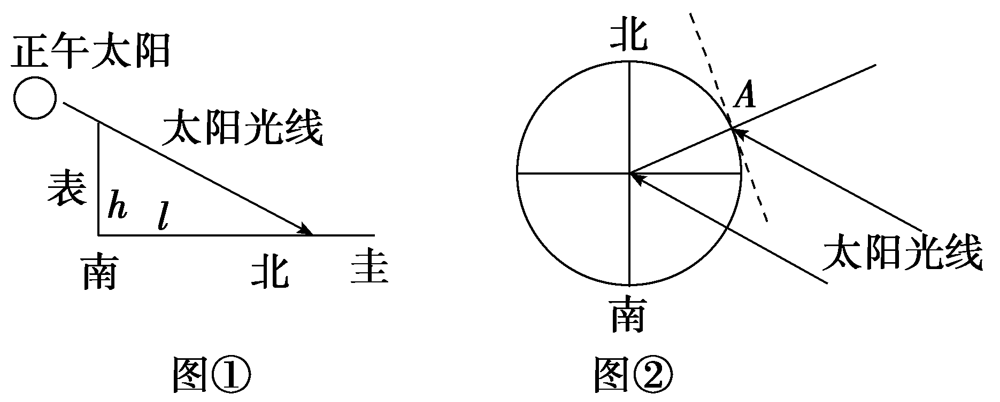

$\quad$A.23°26*'*	
$\quad$B.32°34*'*

$\quad$C.34°	
$\quad$D.56°

答案B

解析如图所示，由图③可得tan *α*＝ $\frac{2}{2.98}$ ≈0.67，

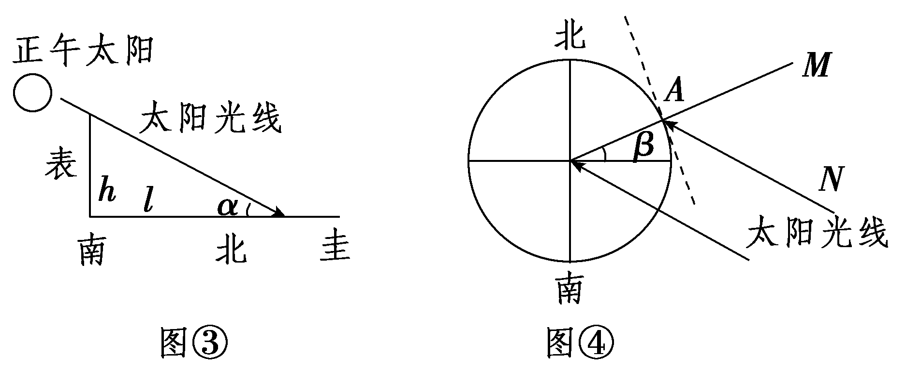

又tan 34°≈0.67，所以*α*≈34°，所以由图④知∠*MAN*≈90°－34°＝56°，所以*β*≈56°－23°26*'*＝32°34*'*，该地的纬度约为北纬32°34*'*.故选B.

##### 14.(新角度)拿破仑·波拿巴，十九世纪法国伟大的军事家、政治家，对数学很有兴趣，他发现并证明了著名的拿破仑定理：“以任意三角形的三条边为边向外构造三个等边三角形，则这三个三角形的中心恰为另一个等边三角形的顶点”.如图，在△<em>&lt;text style="italic"&gt;&lt;text style="italic"&gt;AB</em>&lt;/text&gt;C&lt;/text&gt;中，∠<em>B&lt;text style="italic"&gt;&lt;text style="italic"&gt;AC</em>&lt;/text&gt;&lt;/text&gt;＝60°，以AB，<em>BC</em>，AC为边向外作三个等边三角形，其中心依次为<em>D</em>，<em>E</em>，<em>F</em>，若<em>DF</em>＝2 $\sqrt{3}$ ，则 $\frac{AB}{AD}$ ＝<u>&lt;text style="underline"&gt;　　　　</u>&lt;/text&gt;，<em>&lt;text style="italic"&gt;AB</em>&lt;/text&gt;＋<em>&lt;text style="italic"&gt;AC</em>&lt;/text&gt;的最大值为　　　　.

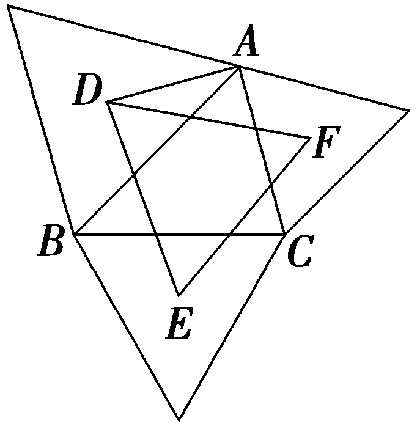

答案 $\sqrt{3}$ 　4 $\sqrt{3}$

解析设&lt;te&lt;te&lt;te&lt;te&lt;te&lt;text style="itali&lt;text style="itali&lt;text style="itali<em>c</em>"&gt;c&lt;/text&gt;"&gt;c&lt;/text&gt;"&gt;x&lt;/text&gt;t style="itali<em>c</em>"&gt;x&lt;/text&gt;t style="italic"&gt;x&lt;/text&gt;t style="italic"&gt;x&lt;/text&gt;t style="itali<em>c</em>"&gt;x&lt;/text&gt;t style="it&lt;text style="itali<em>c</em>"&gt;a&lt;/text&gt;lic"&gt;BC&lt;/text&gt;＝a，<em>AC</em>＝<em>&lt;text style="italic"&gt;&lt;text style="italic"&gt;&lt;text style="italic"&gt;b</em>&lt;/text&gt;&lt;/text&gt;&lt;/text&gt;，<em>AB</em>＝c.如图，连接<em>&lt;text style="italic"&gt;&lt;text style="italic"&gt;&lt;text style="italic"&gt;AF</em>&lt;/text&gt;&lt;/text&gt;&lt;/text&gt;，<em>B&lt;text style="italic"&gt;D</em>&lt;/text&gt;，<em>&lt;text style="italic"&gt;&lt;text style="italic"&gt;&lt;text style="italic"&gt;&lt;text style="italic"&gt;AD</em>&lt;/text&gt;&lt;/text&gt;&lt;/text&gt;&lt;/text&gt;.由拿破仑定理知，△<em>DEF</em>为等边三角形.因为D为等边三角形的中心，所以在△<em>DAB</em>中，∠<em>A&lt;text style="italic"&gt;BD</em>&lt;/text&gt;＝∠<em>&lt;text style="italic"&gt;BAD</em>&lt;/text&gt;＝30°，∠<em>ADB</em>＝1&lt;text style="superscript"&gt;&lt;text style="superscript"&gt;&lt;text style="superscript"&gt;&lt;text style="superscript"&gt;&lt;text style="superscript"&gt;&lt;text style="superscript"&gt;&lt;text style="superscript"&gt;&lt;text style="superscript"&gt;&lt;text style="superscript"&gt;2&lt;/text&gt;&lt;/text&gt;&lt;/text&gt;&lt;/text&gt;&lt;/text&gt;&lt;/text&gt;&lt;/text&gt;&lt;/text&gt;&lt;/text&gt;0°，设AD＝BD＝x，由余弦定理得c2＝x2＋x2－2x2cos 120°，即c2＝3x2，解得 $\frac{c}{x}$ ＝ $\sqrt{3}$ ，即 $\frac{AB}{AD}$ ＝ $\sqrt{3}$ ，所以&lt;te&lt;te&lt;te&lt;te&lt;te&lt;text style="itali&lt;text style="itali&lt;text style="itali<em>c</em>"&gt;c&lt;/text&gt;"&gt;c&lt;/text&gt;"&gt;x&lt;/text&gt;t style="itali<em>c</em>"&gt;x&lt;/text&gt;t style="italic"&gt;x&lt;/text&gt;t style="italic"&gt;x&lt;/text&gt;t style="itali<em>c</em>"&gt;x&lt;/text&gt;t style="italic"&gt;A<em>D</em>&lt;/text&gt;＝ $\frac{c}{\sqrt{3}}$ ，同理&lt;te&lt;te&lt;te&lt;te&lt;te&lt;text style="itali&lt;text style="itali&lt;text style="itali<em>c</em>"&gt;c&lt;/text&gt;"&gt;c&lt;/text&gt;"&gt;x&lt;/text&gt;t style="itali<em>c</em>"&gt;x&lt;/text&gt;t style="italic"&gt;x&lt;/text&gt;t style="italic"&gt;x&lt;/text&gt;t style="itali<em>c</em>"&gt;x&lt;/text&gt;t style="italic"&gt;<em>&lt;text style="italic"&gt;&lt;text style="italic"&gt;AF</em>&lt;/text&gt;&lt;/text&gt;&lt;/text&gt;＝ $\frac{b}{\sqrt{3}}$ ，又∠B&lt;te&lt;te&lt;te&lt;te&lt;te&lt;text style="itali&lt;text style="itali&lt;text style="itali<em>c</em>"&gt;c&lt;/text&gt;"&gt;c&lt;/text&gt;"&gt;x&lt;/text&gt;t style="itali<em>c</em>"&gt;x&lt;/text&gt;t style="italic"&gt;x&lt;/text&gt;t style="italic"&gt;x&lt;/text&gt;t style="itali<em>c</em>"&gt;x&lt;/text&gt;t style="itali<em>c</em>"&gt;AC&lt;/text&gt;＝60°，∠C<em>&lt;text style="italic"&gt;&lt;text style="italic"&gt;&lt;text style="italic"&gt;AF</em>&lt;/text&gt;&lt;/text&gt;&lt;/text&gt;＝30°，所以∠<em>D</em>AF＝∠B<em>&lt;text style="italic"&gt;&lt;text style="italic"&gt;&lt;text style="italic"&gt;&lt;text style="italic"&gt;AD</em>&lt;/text&gt;&lt;/text&gt;&lt;/text&gt;&lt;/text&gt;＋∠<em>&lt;text style="italic"&gt;BAC</em>&lt;/text&gt;＋∠<em>&lt;text style="italic"&gt;CAF</em>&lt;/text&gt;＝1&lt;text style="superscript"&gt;&lt;text style="superscript"&gt;&lt;text style="superscript"&gt;&lt;text style="superscript"&gt;&lt;text style="superscript"&gt;&lt;text style="superscript"&gt;&lt;text style="superscript"&gt;&lt;text style="superscript"&gt;&lt;text style="superscript"&gt;2&lt;/text&gt;&lt;/text&gt;&lt;/text&gt;&lt;/text&gt;&lt;/text&gt;&lt;/text&gt;&lt;/text&gt;&lt;/text&gt;&lt;/text&gt;0°，在△<em>A&lt;text style="italic"&gt;DF</em>&lt;/text&gt;中，由余弦定理可得DF2＝AD2＋AF2－2AD·AF·cos 120°，即12＝ $\frac{c^{2}}{3}$ ＋ $\frac{b^{2}}{3}$ －&lt;te&lt;te&lt;te&lt;te&lt;text style="itali&lt;text style="itali&lt;text style="itali<em>c</em>"&gt;c&lt;/text&gt;"&gt;c&lt;/text&gt;"&gt;x&lt;/text&gt;t style="itali<em>c</em>"&gt;x&lt;/text&gt;t style="italic"&gt;x&lt;/text&gt;t style="italic"&gt;x&lt;/text&gt;t style="superscript"&gt;&lt;text style="superscript"&gt;&lt;text style="superscript"&gt;&lt;text style="superscript"&gt;&lt;text style="superscript"&gt;&lt;text style="superscript"&gt;&lt;text style="superscript"&gt;&lt;text style="superscript"&gt;&lt;text style="superscript"&gt;2&lt;/text&gt;&lt;/text&gt;&lt;/text&gt;&lt;/text&gt;&lt;/text&gt;&lt;/text&gt;&lt;/text&gt;&lt;/text&gt;&lt;/text&gt;· $\frac{bc}{3}$ · $\left(－\frac{1}{2}\right)$ ，化简得(&lt;te&lt;te&lt;te&lt;te&lt;te&lt;text style="itali&lt;text style="itali&lt;text style="itali<em>c</em>"&gt;c&lt;/text&gt;"&gt;c&lt;/text&gt;"&gt;x&lt;/text&gt;t style="itali<em>c</em>"&gt;x&lt;/text&gt;t style="italic"&gt;x&lt;/text&gt;t style="italic"&gt;x&lt;/text&gt;t style="itali<em>c</em>"&gt;x&lt;/text&gt;t style="itali<em>c</em>"&gt;<em>&lt;text style="italic"&gt;&lt;text style="italic"&gt;b</em>&lt;/text&gt;&lt;/text&gt;&lt;/text&gt;＋c)&lt;text style="superscript"&gt;&lt;text style="superscript"&gt;&lt;text style="superscript"&gt;&lt;text style="superscript"&gt;&lt;text style="superscript"&gt;&lt;text style="superscript"&gt;&lt;text style="superscript"&gt;&lt;text style="superscript"&gt;&lt;text style="superscript"&gt;2&lt;/text&gt;&lt;/text&gt;&lt;/text&gt;&lt;/text&gt;&lt;/text&gt;&lt;/text&gt;&lt;/text&gt;&lt;/text&gt;&lt;/text&gt;＝<em>bc</em>＋36，由基本不等式得 $\left(b＋c\right)^{2}$ ≤ $\left(\frac{b＋c}{2}\right)^{2}$ ＋36，解得&lt;te&lt;te&lt;te&lt;te&lt;te&lt;text style="itali&lt;text style="itali&lt;text style="itali<em>c</em>"&gt;c&lt;/text&gt;"&gt;c&lt;/text&gt;"&gt;x&lt;/text&gt;t style="itali<em>c</em>"&gt;x&lt;/text&gt;t style="italic"&gt;x&lt;/text&gt;t style="italic"&gt;x&lt;/text&gt;t style="itali<em>c</em>"&gt;x&lt;/text&gt;t style="itali<em>c</em>"&gt;<em>&lt;text style="italic"&gt;&lt;text style="italic"&gt;b</em>&lt;/text&gt;&lt;/text&gt;&lt;/text&gt;＋c≤4 $\sqrt{3}$ (当且仅当&lt;te&lt;te&lt;te&lt;te&lt;te&lt;text style="itali&lt;text style="itali&lt;text style="itali<em>c</em>"&gt;c&lt;/text&gt;"&gt;c&lt;/text&gt;"&gt;x&lt;/text&gt;t style="itali<em>c</em>"&gt;x&lt;/text&gt;t style="italic"&gt;x&lt;/text&gt;t style="italic"&gt;x&lt;/text&gt;t style="itali<em>c</em>"&gt;x&lt;/text&gt;t style="itali<em>c</em>"&gt;<em>&lt;text style="italic"&gt;&lt;text style="italic"&gt;b</em>&lt;/text&gt;&lt;/text&gt;&lt;/text&gt;＝c＝&lt;text style="superscript"&gt;&lt;text style="superscript"&gt;&lt;text style="superscript"&gt;&lt;text style="superscript"&gt;&lt;text style="superscript"&gt;&lt;text style="superscript"&gt;&lt;text style="superscript"&gt;&lt;text style="superscript"&gt;&lt;text style="superscript"&gt;2&lt;/text&gt;&lt;/text&gt;&lt;/text&gt;&lt;/text&gt;&lt;/text&gt;&lt;/text&gt;&lt;/text&gt;&lt;/text&gt;&lt;/text&gt; $\sqrt{3}$ 时取等号)，所以 $\left(AB＋AC\right)_{max}$ ＝4 $\sqrt{3}$ .

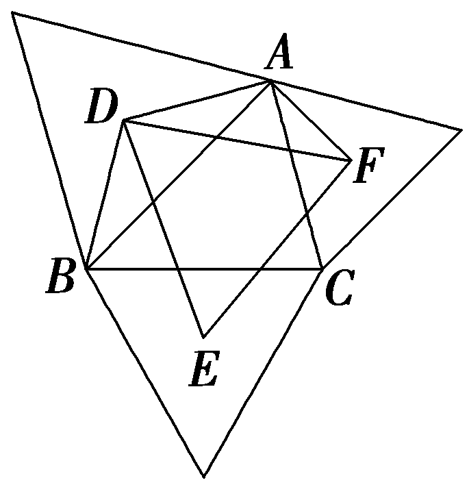

