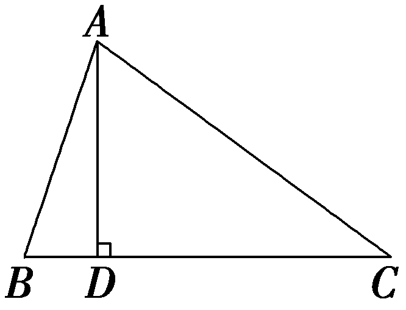
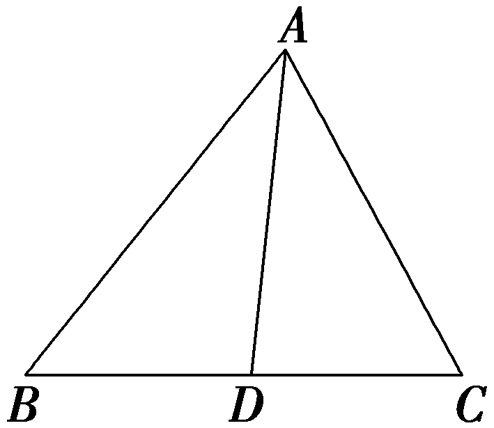
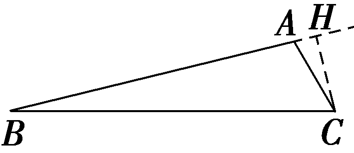

培优课9　三角形中的高线、中线、角平分线

### 题型一　三角形中的高线问题

(2023·新高考Ⅰ卷)已知在△*ABC*中，*A*＋*B*＝3*C*，2sin(*A*－*C*)＝sin *B*.

（1）求sin *A*；

（2）设*AB*＝5，求*AB*边上的高.

解：法一：（1）在△*ABC*中，*A*＋*B*＝π－*C*，因为*A*＋*B*＝3*C*，

所以3*<text style="italic"><text style="italic"><text style="italic">C*</text></text></text>＝π－C，所以C＝ $\frac{\pi }{4}$ .因为2sin(*A*－*<text style="italic"><text style="italic"><text style="italic">C*</text></text></text>)＝sin *B*，所以2sin $\left(A－\frac{\pi }{4}\right)$ ＝sin $\left(\frac{3\pi }{4}－A\right)$ ，

展开并整理得 $\sqrt{2}$ (sin *<text style="italic"><text style="italic"><text style="italic"><text style="italic"><text style="italic">A*</text></text></text></text></text>－cos A)＝ $\frac{\sqrt{2}}{2}$ (cos *<text style="italic"><text style="italic"><text style="italic"><text style="italic"><text style="italic">A*</text></text></text></text></text>＋sin A)，得sin A＝3cos A，

又sin&lt;text style="superscript"&gt;2&lt;/text&gt;<em>&lt;text style="italic"&gt;&lt;text style="italic"&gt;&lt;text style="italic"&gt;A</em>&lt;/text&gt;&lt;/text&gt;&lt;/text&gt;＋cos2A＝1，且sin A＞0，所以sin A＝ $\frac{3\sqrt{10}}{10}$ .

（2）由正弦定理 $\frac{BC}{sinA}$ ＝ $\frac{AB}{sinC}$ ，得*BC*＝ $\frac{AB}{sinC}$ ·sin *A*＝ $\frac{5}{\frac{\sqrt{2}}{2}}$ × $\frac{3\sqrt{10}}{10}$ ＝3 $\sqrt{5}$ .

由余弦定理<em>AB</em>&lt;text style="superscript"&gt;&lt;text style="superscript"&gt;&lt;text style="superscript"&gt;&lt;text style="superscript"&gt;&lt;text style="superscript"&gt;2&lt;/text&gt;&lt;/text&gt;&lt;/text&gt;&lt;/text&gt;&lt;/text&gt;＝<em>&lt;text style="italic"&gt;A&lt;text style="italic"&gt;C</em>&lt;/text&gt;&lt;/text&gt;2＋<em>&lt;text style="italic"&gt;BC</em>&lt;/text&gt;2－2<em>&lt;text style="italic"&gt;AC</em>&lt;/text&gt;·BCcos C，得52＝AC2＋(3 $\sqrt{5}$ )&lt;text style="superscript"&gt;&lt;text style="superscript"&gt;&lt;text style="superscript"&gt;&lt;text style="superscript"&gt;&lt;text style="superscript"&gt;2&lt;/text&gt;&lt;/text&gt;&lt;/text&gt;&lt;/text&gt;&lt;/text&gt;－2<em>&lt;text style="italic"&gt;A&lt;text style="italic"&gt;C</em>&lt;/text&gt;&lt;/text&gt;·3 $\sqrt{5}$ cos $\frac{\pi }{4}$ ，

整理得<em>&lt;text style="italic"&gt;&lt;text style="italic"&gt;&lt;text style="italic"&gt;AC</em>&lt;/text&gt;&lt;/text&gt;&lt;/text&gt;2－3 $\sqrt{10}$ <em>&lt;text style="italic"&gt;&lt;text style="italic"&gt;&lt;text style="italic"&gt;AC</em>&lt;/text&gt;&lt;/text&gt;&lt;/text&gt;＋20＝0，解得AC＝ $\sqrt{10}$ 或<em>&lt;text style="italic"&gt;&lt;text style="italic"&gt;&lt;text style="italic"&gt;AC</em>&lt;/text&gt;&lt;/text&gt;&lt;/text&gt;＝2 $\sqrt{10}$ .

由（1）得，tan *<text style="italic"><text style="italic">A*</text></text>＝3＞ $\sqrt{3}$ ，所以 $\frac{\pi }{3}$ ＜*<text style="italic"><text style="italic">A*</text></text>＜ $\frac{\pi }{2}$ ，又*<text style="italic"><text style="italic">A*</text></text>＋*<text style="italic"><text style="italic">B*</text></text>＝ $\frac{3\pi }{4}$ ，所以*<text style="italic"><text style="italic">B*</text></text>＞ $\frac{\pi }{4}$ ，即*C*＜*<text style="italic"><text style="italic">B*</text></text>，

所以*<text style="italic"><text style="italic">AB*</text></text>＜*<text style="italic"><text style="italic">A<text style="italic">C*</text></text></text>，所以AC＝2 $\sqrt{10}$ .设*<text style="italic"><text style="italic">AB*</text></text>边上的高为*<text style="italic">h*</text>，则 $\frac{1}{2}$ ·*<text style="italic"><text style="italic">AB*</text></text>·*<text style="italic">h*</text>＝ $\frac{1}{2}$ ·*<text style="italic"><text style="italic">A<text style="italic">C*</text></text></text>·*BC*sin C，

即5*<text style="italic">h*</text>＝2 $\sqrt{10}$ ×3 $\sqrt{5}$ × $\frac{\sqrt{2}}{2}$ ，解得*<text style="italic">h*</text>＝6，所以*AB*边上的高为6.

法二：（1）在△*<text style="italic"><text style="italic">A*</text>*<text style="italic">B*</text>*<text style="italic"><text style="italic"><text style="italic"><text style="italic">C*</text></text></text></text></text>中，A＋B＝π－C，因为A＋B＝3C，所以3C＝π－C，所以C＝ $\frac{\pi }{4}$ .

因为2sin(*A*－*C*)＝sin *B*，所以2sin(*A*－*C*)＝sin[π－(*A*＋*C*)]＝sin(*A*＋*C*)，

所以2sin *A*cos *C*－2cos *A*sin *C*＝sin *A*cos *C*＋cos *A*sin *C*，

所以sin *<text style="italic"><text style="italic"><text style="italic">A*</text></text></text>cos *<text style="italic"><text style="italic"><text style="italic">C*</text></text></text>＝3cos Asin C，易得cos Acos C≠0，所以tan A＝3tan C＝3tan $\frac{\pi }{4}$ ＝3，

又sin <em>&lt;text style="italic"&gt;&lt;text style="italic"&gt;&lt;text style="italic"&gt;A</em>&lt;/text&gt;&lt;/text&gt;&lt;/text&gt;＞0，tan A＝ $\frac{sinA}{cosA}$ ，sin&lt;text style="superscript"&gt;2&lt;/text&gt;<em>&lt;text style="italic"&gt;&lt;text style="italic"&gt;&lt;text style="italic"&gt;A</em>&lt;/text&gt;&lt;/text&gt;&lt;/text&gt;＋cos2A＝1，

所以sin *A*＝ $\frac{3\sqrt{10}}{10}$ .

（2）由（1）知tan *<text style="italic"><text style="italic"><text style="italic">A*</text></text></text>＝3＞0，所以A为锐角，又sin A＝ $\frac{3\sqrt{10}}{10}$ ，所以cos *<text style="italic"><text style="italic"><text style="italic">A*</text></text></text>＝ $\frac{\sqrt{10}}{10}$ ，

所以sin *B*＝sin $\left(\frac{3\pi }{4}－A\right)$ ＝ $\frac{\sqrt{2}}{2}$ (cos *<text style="italic">A*</text>＋sin A)＝ $\frac{\sqrt{2}}{2}$ × $\left(\frac{\sqrt{10}}{10}＋\frac{3\sqrt{10}}{10}\right)$ ＝ $\frac{2\sqrt{5}}{5}$ .

由正弦定理 $\frac{AC}{sinB}$ ＝ $\frac{AB}{sinC}$ ，得*AC*＝ $\frac{AB\cdot sinB}{sinC}$ ＝ $\frac{5\times \frac{2\sqrt{5}}{5}}{\frac{\sqrt{2}}{2}}$ ＝2 $\sqrt{10}$ ，

故*<text style="italic">A*B</text>边上的高为*AC*·sin A＝2 $\sqrt{10}$ × $\frac{3\sqrt{10}}{10}$ ＝6.

高线问题的处理策略

##### 1.等面积法：*AD*·*BC*＝*AB*·*AC*·sin ∠*BAC*.

##### 2.*AD*＝*AB*·sin ∠*ABD*＝*AC*·sin ∠*ACD*.

对点练1.设△<text style="it<text style="itali*c*">a</text>lic">*AB<text style="italic">C*</text></text>的内角A，B，C的对边分别为a，*b*，c，且cos C＝ $\frac{a－csinB}{b}$ .

（1）求角*B*的大小；

（2）若边*AB*上的高为 $\frac{c}{4}$ ，求cos *C*的值.

解：（1）由余弦定理得 $\frac{a^{2}＋b^{2}－c^{2}}{2ab}$ ＝ $\frac{a－csinB}{b}$ ，

所以<em>a</em>2＋<em>b</em>2－<em>c</em>2＝2<em>a</em>(<em>a</em>－<em>c</em>sin <em>B</em>)，

所以<em>b</em>2＝<em>a</em>2＋<em>c</em>2－2<em>ac</em>sin <em>B</em>.又因为<em>b</em>2＝<em>a</em>2＋<em>c</em>2－2<em>ac</em>cos <em>B</em>，所以sin <em>B</em>＝cos <em>B</em>，

则tan *<text style="italic"><text style="italic">B*</text></text>＝1.因为B∈(0，π)，所以B＝ $\frac{\pi }{4}$ .

（2）因为△<text style="it<text style="itali*c*">a</text>lic">A*B*C</text>的面积*S*＝ $\frac{1}{2}$ <text style="it<text style="itali*c*">a</text>lic">*ac*</text>sin *B*＝ $\frac{\sqrt{2}}{4}$ <text style="it<text style="itali*c*">a</text>lic">*ac*</text>＝ $\frac{c^{2}}{8}$ ，则<text style="itali*c*">a</text>＝ $\frac{\sqrt{2}}{4}$ *c*，

由余弦定理得&lt;text style="it&lt;text style="itali&lt;text style="itali&lt;text style="itali&lt;text style="itali&lt;text style="itali&lt;text style="itali<em>c</em>"&gt;c&lt;/text&gt;"&gt;c&lt;/text&gt;"&gt;c&lt;/text&gt;"&gt;c&lt;/text&gt;"&gt;c&lt;/text&gt;"&gt;a&lt;/text&gt;lic"&gt;<em>b</em>&lt;/text&gt;&lt;text style="superscript"&gt;&lt;text style="superscript"&gt;&lt;text style="superscript"&gt;&lt;text style="superscript"&gt;2&lt;/text&gt;&lt;/text&gt;&lt;/text&gt;&lt;/text&gt;＝a2＋c2－2<em>ac</em>cos <em>B</em>＝ $\left(\frac{\sqrt{2}}{4}c\right)^{2}$ ＋&lt;text style="itali&lt;text style="itali&lt;text style="itali&lt;text style="itali&lt;text style="itali<em>c</em>"&gt;c&lt;/text&gt;"&gt;c&lt;/text&gt;"&gt;c&lt;/text&gt;"&gt;c&lt;/text&gt;"&gt;c&lt;/text&gt;&lt;text style="superscript"&gt;&lt;text style="superscript"&gt;&lt;text style="superscript"&gt;&lt;text style="superscript"&gt;2&lt;/text&gt;&lt;/text&gt;&lt;/text&gt;&lt;/text&gt;－2× $\frac{\sqrt{2}}{4}$ &lt;text style="itali&lt;text style="itali&lt;text style="itali&lt;text style="itali&lt;text style="itali<em>c</em>"&gt;c&lt;/text&gt;"&gt;c&lt;/text&gt;"&gt;c&lt;/text&gt;"&gt;c&lt;/text&gt;"&gt;c&lt;/text&gt;×c× $\frac{\sqrt{2}}{2}$ ＝ $\frac{5}{8}$ &lt;text style="itali&lt;text style="itali&lt;text style="itali&lt;text style="itali&lt;text style="itali<em>c</em>"&gt;c&lt;/text&gt;"&gt;c&lt;/text&gt;"&gt;c&lt;/text&gt;"&gt;c&lt;/text&gt;"&gt;c&lt;/text&gt;&lt;text style="superscript"&gt;&lt;text style="superscript"&gt;&lt;text style="superscript"&gt;&lt;text style="superscript"&gt;2&lt;/text&gt;&lt;/text&gt;&lt;/text&gt;&lt;/text&gt;，所以&lt;text style="it<em>a</em>lic"&gt;<em>b</em>&lt;/text&gt;＝ $\frac{\sqrt{10}}{4}$ &lt;text style="itali&lt;text style="itali&lt;text style="itali&lt;text style="itali&lt;text style="itali<em>c</em>"&gt;c&lt;/text&gt;"&gt;c&lt;/text&gt;"&gt;c&lt;/text&gt;"&gt;c&lt;/text&gt;"&gt;c&lt;/text&gt;，所以cos <em>C</em>＝ $\frac{a－csinB}{b}$ ＝ $\frac{\frac{\sqrt{2}}{4}c－\frac{\sqrt{2}}{2}c}{\frac{\sqrt{10}}{4}c}$ ＝－ $\frac{\sqrt{5}}{5}$ .

### 题型二　三角形中的中线问题

(2023·新高考Ⅱ卷)记△<text style="it<text style="itali*c*">a</text>lic">*ABC*</text>的内角A，B，C的对边分别为a，*b*，c，已知△*A<text style="italic">BC*</text>面积为 $\sqrt{3}$ ，*D*为<text style="it<text style="itali*c*">a</text>lic">B</text>*C*的中点，且*A*D＝1.

（1）若∠*ADC*＝ $\frac{\pi }{3}$ ，求tan *B*；

（2）若<em>b</em>2＋<em>c</em>2＝8，求<em>b</em>，<em>c</em>.

解：（1）因为在△<text style="it<text style="it*a*lic">a</text>lic">A*BC*</text>中，*D*为BC的中点，∠*<text style="italic"><text style="italic">AD*</text>C</text>＝ $\frac{\pi }{3}$ ，A<text style="it<text style="it*a*lic">a</text>lic">D</text>＝1，所以 $S_{\bigtriangleup }_{ADC}$ ＝ $\frac{1}{2}$ A<text style="it<text style="it*a*lic">a</text>lic">D</text>·*DC*sin ∠*<text style="italic"><text style="italic">AD*</text>C</text>＝ $\frac{1}{2}$ ×1× $\frac{1}{2}$ <text style="it*a*lic">a</text>× $\frac{\sqrt{3}}{2}$ ＝ $\frac{\sqrt{3}}{8}$ <text style="it*a*lic">a</text>，

因为△<text style="it<text style="it*a*lic">a</text>lic">ABC</text>的面积为 $\sqrt{3}$ ，所以 $\frac{\sqrt{3}}{8}$ <text style="it*a*lic">a</text>＝ $\frac{\sqrt{3}}{2}$ ，解得<text style="it*a*lic">a</text>＝4，

因为在△*ABD*中，∠*ADB*＝ $\frac{2\pi }{3}$ ，

由余弦定理得<em>c</em>2＝<em>BD</em>2＋<em>AD</em>2－2<em>BD</em>·<em>AD</em>cos ∠<em>ADB</em>，

即&lt;text style="itali<em>c</em>"&gt;c&lt;/text&gt;2＝4＋1－2×2×1×(－ $\frac{1}{2}$ )＝7，解得&lt;text style="itali<em>c</em>"&gt;c&lt;/text&gt;＝ $\sqrt{7}$ ，

所以cos *B*＝ $\frac{7+4－1}{2\sqrt{7}\times 2}$ ＝ $\frac{5\sqrt{7}}{14}$ ，

sin *B*＝ $\sqrt{1－cos^{2}B}$ ＝ $\sqrt{1－(\frac{5\sqrt{7}}{14})^{2}}$ ＝ $\frac{\sqrt{21}}{14}$ ，

所以tan *B*＝ $\frac{sinB}{cosB}$ ＝ $\frac{\sqrt{3}}{5}$ .

（2）在△*ABD*与△*ACD*中，由余弦定理得 $\left\{\begin{matrix}c^{2}＝\frac{1}{4}a^{2}+1－2\times \frac{1}{2}a\times 1\times cos(\pi －\angle ADC),\\b^{2}＝\frac{1}{4}a^{2}+1－2\times \frac{1}{2}a\times 1\times cos\angle ADC，\end{matrix}\right.$

整理得 $\frac{1}{2}$ &lt;text style="it<em>a</em>li&lt;text style="itali<em>c</em>"&gt;c&lt;/text&gt;"&gt;a&lt;/text&gt;&lt;text style="superscript"&gt;&lt;text style="superscript"&gt;&lt;text style="superscript"&gt;&lt;text style="superscript"&gt;2&lt;/text&gt;&lt;/text&gt;&lt;/text&gt;&lt;/text&gt;＋2＝<em>&lt;text style="italic"&gt;b</em>&lt;/text&gt;2＋c2，而b2＋c2＝8，则a＝2 $\sqrt{3}$ ，

由<em>S</em>△<em>&lt;text style="italic"&gt;ADC</em>&lt;/text&gt;＝ $\frac{1}{2}$ × $\sqrt{3}$ ×1×sin ∠<em>&lt;text style="italic"&gt;ADC</em>&lt;/text&gt;＝ $\frac{\sqrt{3}}{2}$ ，

解得sin ∠*ADC*＝1，

而0＜∠*<text style="italic">ADC*</text>＜π，于是∠ADC＝ $\frac{\pi }{2}$ ，

所以<text style="itali*c*">b</text>＝c＝ $\sqrt{AD^{2}＋CD^{2}}$ ＝2.

与三角形中线有关的解题策略

##### 1.中线长定理：在△<em>ABC</em>中，<em>AD</em>是边<em>BC</em>上的中线，则<em>AB</em>2＋<em>AC</em>2＝2(<em>BD</em>2＋<em>AD</em>2).

推导过程：在△<em>A&lt;text style="italic"&gt;&lt;text style="italic"&gt;B</em>&lt;/text&gt;D&lt;/text&gt;中，cos B＝ $\frac{AB^{2}＋BD^{2}－AD^{2}}{2AB\cdot BD}$ ，在△A<em>&lt;text style="italic"&gt;B</em>&lt;/text&gt;C中，cos B＝ $\frac{AB^{2}＋BC^{2}－AC^{2}}{2AB\cdot BC}$ ，联立得A<em>&lt;text style="italic"&gt;B</em>&lt;/text&gt;&lt;text style="superscript"&gt;&lt;text style="superscript"&gt;&lt;text style="superscript"&gt;2&lt;/text&gt;&lt;/text&gt;&lt;/text&gt;＋<em>AC</em>2＝2(<em>BD</em>2＋<em>AD</em>2).

&lt;text style="supers<em>c</em>ript"&gt;2&lt;/text&gt;.向量法： $\vec{AD}^{2}$ ＝ $\frac{1}{4}$ (&lt;text style="itali<em>c</em>"&gt;b&lt;/text&gt;&lt;text style="superscript"&gt;2&lt;/text&gt;＋c2＋2<em>bc</em>cos <em>A</em>).

推导过程：由 $\vec{AD}$ ＝ $\frac{1}{2}(\vec{AB}$ ＋ $\vec{AC}$ )，得 $\vec{AD}^{2}$ ＝ $\frac{1}{4}(\vec{AB}$ ＋ $\vec{AC}$ )&lt;text style="supers<em>c</em>ript"&gt;&lt;text style="superscript"&gt;2&lt;/text&gt;&lt;/text&gt;＝ $\frac{1}{4}\vec{AB}^{2}$ ＋ $\frac{1}{4}\vec{AC}^{2}$ ＋ $\frac{1}{2}$ ｜ $\vec{AB}$ ｜｜ $\vec{AC}$ ｜·<em>c</em>os <em>&lt;text style="italic"&gt;A</em>&lt;/text&gt;，所以 $\vec{AD}^{2}$ ＝ $\frac{1}{4}$ (&lt;text style="itali<em>c</em>"&gt;b&lt;/text&gt;&lt;text style="superscript"&gt;&lt;text style="superscript"&gt;2&lt;/text&gt;&lt;/text&gt;＋c2＋2<em>bc</em>cos <em>&lt;text style="italic"&gt;A</em>&lt;/text&gt;).

对点练2.(2025·河北石家庄模拟)在△<text style="it<text style="it*a*li*c*">a</text>lic">*ABC*</text>中，角A，B，C的对边分别为a，*b*，c，且 $\left(sinA－\sqrt{3}sinB\right)$ <text style="it*a*li*c*">a</text>＝ $\left(c－b\right)\left(sinC＋sinB\right)$ .

（1）求角*C*的大小；

（2）若边*c*＝2，边*AB*的中点为*D*，求中线*CD*长的最大值.

解：（1）因为 $\left(sinA－\sqrt{3}sinB\right)$ <text style="itali*c*">a</text>＝(c－*b*)(sin *C*＋sin *B*)，

由正弦定理可得 $\left(a－\sqrt{3}b\right)$ &lt;text style="it&lt;text style="itali<em>c</em>"&gt;a&lt;/text&gt;lic"&gt;a&lt;/text&gt;＝ $\left(c－b\right)\left(c＋b\right)$ ，则&lt;text style="it&lt;text style="itali<em>c</em>"&gt;a&lt;/text&gt;lic"&gt;a&lt;/text&gt;&lt;text style="superscript"&gt;&lt;text style="superscript"&gt;2&lt;/text&gt;&lt;/text&gt;－ $\sqrt{3}$ &lt;text style="it&lt;text style="itali<em>c</em>"&gt;a&lt;/text&gt;lic"&gt;a&lt;/text&gt;<em>b</em>＝c&lt;text style="superscript"&gt;&lt;text style="superscript"&gt;2&lt;/text&gt;&lt;/text&gt;－b2，

即&lt;text style="itali<em>c</em>"&gt;a&lt;/text&gt;&lt;text style="superscript"&gt;&lt;text style="superscript"&gt;2&lt;/text&gt;&lt;/text&gt;＋<em>b</em>2－c2＝ $\sqrt{3}$ &lt;text style="itali<em>c</em>"&gt;a&lt;/text&gt;<em>b</em>，由余弦定理可得cos <em>C</em>＝ $\frac{a^{2}＋b^{2}－c^{2}}{2ab}$ ＝ $\frac{\sqrt{3}ab}{2ab}$ ＝ $\frac{\sqrt{3}}{2}$ ，

因为*<text style="italic">C*</text>∈ $\left(0，\pi \right)$ ，所以*<text style="italic">C*</text>＝ $\frac{\pi }{6}$ .

（2）因为*D*为*AB*的中点，所以 $\vec{CD}$ ＝ $\frac{1}{2}\left(\vec{CA}＋\vec{CB}\right)$ ，

则 $\vec{CD}^{2}$ ＝ $\frac{1}{4}\left(\vec{CA}＋\vec{CB}\right)^{2}$ ＝ $\frac{1}{4}\vec{CA}^{2}$ ＋ $\frac{1}{2}\vec{CA}$ · $\vec{CB}$ ＋ $\frac{1}{4}\vec{CB}^{2}$ ＝ $\frac{1}{4}\left(a^{2}＋\sqrt{3}ab＋b^{2}\right)$ ，

又由余弦定理得，<em>c</em>2＝<em>a</em>2＋<em>b</em>2－2<em>ab</em>cos <em>C</em>，

即4＝<em>a</em>&lt;text style="superscript"&gt;&lt;text style="superscript"&gt;2&lt;/text&gt;&lt;/text&gt;＋<em>b</em>2－ $\sqrt{3}$ <em>ab</em>，所以<em>CD</em>&lt;text style="superscript"&gt;&lt;text style="superscript"&gt;2&lt;/text&gt;&lt;/text&gt;＝ $\frac{1}{4}\left(4+2\sqrt{3}ab\right)$ ＝1＋ $\frac{\sqrt{3}}{2}$ <em>ab</em>.

由4＝&lt;text style="it<em>a</em>lic"&gt;a&lt;/text&gt;&lt;text style="superscript"&gt;&lt;text style="superscript"&gt;&lt;text style="superscript"&gt;2&lt;/text&gt;&lt;/text&gt;&lt;/text&gt;＋<em>&lt;text style="italic"&gt;b</em>&lt;/text&gt;2－ $\sqrt{3}$ &lt;text style="it<em>a</em>lic"&gt;a&lt;/text&gt;<em>&lt;text style="italic"&gt;b</em>&lt;/text&gt;得，4＋ $\sqrt{3}$ &lt;text style="it<em>a</em>lic"&gt;a&lt;/text&gt;<em>&lt;text style="italic"&gt;b</em>&lt;/text&gt;＝a&lt;text style="superscript"&gt;&lt;text style="superscript"&gt;&lt;text style="superscript"&gt;2&lt;/text&gt;&lt;/text&gt;&lt;/text&gt;＋b2≥2<em>&lt;text style="italic"&gt;&lt;text style="italic"&gt;ab</em>&lt;/text&gt;&lt;/text&gt;，

则<text style="it*a*lic">a*b*</text>≤4 $\left(2+\sqrt{3}\right)$ ，当且仅当*a*＝*b*＝2 $\sqrt{2+\sqrt{3}}$ 取等号，

即<em>CD</em>2≤1＋ $\frac{\sqrt{3}}{2}$ ×4 $\left(2+\sqrt{3}\right)$ ＝1＋2 $\sqrt{3}\left(2+\sqrt{3}\right)$ ＝7＋4 $\sqrt{3}$ ＝ $\left(\sqrt{3}+2\right)^{2}$ ，

所以*<text style="italic">CD*</text>≤ $\sqrt{3}$ ＋2，即中线*<text style="italic">CD*</text>长的最大值为 $\sqrt{3}$ ＋2.

### 题型三　三角形中的角平分线问题

在△<text style="it<text style="it*a*li*c*">a</text>lic">*A<text style="italic">B*</text>*C*</text>中，内角A，B，C所对的边分别为a，*<text style="italic">b*</text>，c，且asin B＝bsin $\left(A＋\frac{\pi }{3}\right)$ .

（1）求角*A*的大小；

（2）(一题多解)若*AB*＝3，*AC*＝1，∠*BAC*的平分线交*BC*于点*D*，求*AD*的长.

解：（1）因为*a*sin *<text style="italic"><text style="italic">B*</text></text>＝*b*sin $\left(A＋\frac{\pi }{3}\right)$ ，由正弦定理得sin *A*sin *<text style="italic"><text style="italic">B*</text></text>＝sin Bsin $\left(A＋\frac{\pi }{3}\right)$ .

因为sin *B*≠0，所以sin *A*＝sin $\left(A＋\frac{\pi }{3}\right)$ ，

所以sin *<text style="italic"><text style="italic">A*</text></text>＝ $\frac{1}{2}$ sin *<text style="italic"><text style="italic">A*</text></text>＋ $\frac{\sqrt{3}}{2}$ cos *<text style="italic"><text style="italic">A*</text></text>，

即 $\frac{1}{2}$ sin *<text style="italic"><text style="italic">A*</text></text>＝ $\frac{\sqrt{3}}{2}$ cos *<text style="italic"><text style="italic">A*</text></text>，所以tan A＝ $\sqrt{3}$ .

因为*<text style="italic">A*</text>∈(0，π)，所以A＝ $\frac{\pi }{3}$ .

（2）法一：因为<em>S</em>△<em>ABC</em>＝<em>S</em>△<em>ABD</em>＋<em>S</em>△<em>ADC</em>，

所以 $\frac{1}{2}$ *<text style="italic">AB*</text>·*<text style="italic">AC*</text>·sin∠*BAC*＝ $\frac{1}{2}$ *<text style="italic">AB*</text>·*<text style="italic">AD*</text>·sin∠*BAD*＋ $\frac{1}{2}$ *<text style="italic">AD*</text>·*<text style="italic">AC*</text>·sin∠*DAC*，

所以 $\frac{1}{2}$ ×3×1×sin $\frac{\pi }{3}$ ＝ $\frac{1}{2}$ ×3×*<text style="italic"><text style="italic">AD*</text></text>×sin $\frac{\pi }{6}$ ＋ $\frac{1}{2}$ ×*<text style="italic"><text style="italic">AD*</text></text>×1×sin $\frac{\pi }{6}$ ，所以*<text style="italic"><text style="italic">AD*</text></text>＝ $\frac{3\sqrt{3}}{4}$ .

法二：在△<em>A&lt;text style="italic"&gt;&lt;text style="italic"&gt;BC</em>&lt;/text&gt;&lt;/text&gt;中，由余弦定理得BC&lt;text style="superscript"&gt;&lt;text style="superscript"&gt;&lt;text style="superscript"&gt;&lt;text style="superscript"&gt;2&lt;/text&gt;&lt;/text&gt;&lt;/text&gt;&lt;/text&gt;＝<em>&lt;text style="italic"&gt;AB</em>&lt;/text&gt;2＋<em>&lt;text style="italic"&gt;AC</em>&lt;/text&gt;2－2AB·AC·cos∠<em>BAC</em>＝32＋12－2×3×1×cos $\frac{\pi }{3}$ ＝7，所以<em>&lt;text style="italic"&gt;BC</em>&lt;/text&gt;＝ $\sqrt{7}$ .

在△*ABD*中，由正弦定理得 $\frac{BD}{sin\angle BAD}$ ＝ $\frac{AB}{sin\angle ADB}$ ，

在△*ADC*中，由正弦定理得 $\frac{DC}{sin\angle DAC}$ ＝ $\frac{AC}{sin\angle ADC}$ .

因为sin∠*BAD*＝sin∠*DAC*，sin∠*ADB*＝sin∠*ADC*，

所以 $\frac{BD}{DC}$ ＝ $\frac{AB}{AC}$ ＝ $\frac{3}{1}$ ，所以*DC*＝ $\frac{\sqrt{7}}{4}$ .

在△&lt;te&lt;te&lt;te&lt;te&lt;te&lt;te<em>x</em>t style="italic"&gt;x&lt;/text&gt;t style="italic"&gt;x&lt;/text&gt;t style="italic"&gt;x&lt;/text&gt;t style="italic"&gt;x&lt;/text&gt;t style="italic"&gt;x&lt;/text&gt;t style="italic"&gt;A<em>DC</em>&lt;/text&gt;中，由余弦定理得DC&lt;text style="superscript"&gt;&lt;text style="superscript"&gt;&lt;text style="superscript"&gt;&lt;text style="superscript"&gt;2&lt;/text&gt;&lt;/text&gt;&lt;/text&gt;&lt;/text&gt;＝<em>&lt;text style="italic"&gt;&lt;text style="italic"&gt;AD</em>&lt;/text&gt;&lt;/text&gt;2＋<em>&lt;text style="italic"&gt;AC</em>&lt;/text&gt;2－2AD·AC·cos∠<em>DAC</em>，设AD＝x，则 $\frac{7}{16}$ ＝&lt;te&lt;te&lt;te&lt;te&lt;te<em>x</em>t style="italic"&gt;x&lt;/text&gt;t style="italic"&gt;x&lt;/text&gt;t style="italic"&gt;x&lt;/text&gt;t style="italic"&gt;x&lt;/text&gt;t style="italic"&gt;x&lt;/text&gt;&lt;text style="superscript"&gt;&lt;text style="superscript"&gt;&lt;text style="superscript"&gt;&lt;text style="superscript"&gt;2&lt;/text&gt;&lt;/text&gt;&lt;/text&gt;&lt;/text&gt;＋1－2x· $\frac{\sqrt{3}}{2}$ ，即&lt;te&lt;te&lt;te&lt;te&lt;te<em>x</em>t style="italic"&gt;x&lt;/text&gt;t style="italic"&gt;x&lt;/text&gt;t style="italic"&gt;x&lt;/text&gt;t style="italic"&gt;x&lt;/text&gt;t style="italic"&gt;x&lt;/text&gt;&lt;text style="superscript"&gt;&lt;text style="superscript"&gt;&lt;text style="superscript"&gt;&lt;text style="superscript"&gt;2&lt;/text&gt;&lt;/text&gt;&lt;/text&gt;&lt;/text&gt;－ $\sqrt{3}$ &lt;te&lt;te&lt;te&lt;te&lt;te<em>x</em>t style="italic"&gt;x&lt;/text&gt;t style="italic"&gt;x&lt;/text&gt;t style="italic"&gt;x&lt;/text&gt;t style="italic"&gt;x&lt;/text&gt;t style="italic"&gt;x&lt;/text&gt;＋ $\frac{9}{16}$ ＝0，解得&lt;te&lt;te&lt;te&lt;te&lt;te<em>x</em>t style="italic"&gt;x&lt;/text&gt;t style="italic"&gt;x&lt;/text&gt;t style="italic"&gt;x&lt;/text&gt;t style="italic"&gt;x&lt;/text&gt;t style="italic"&gt;x&lt;/text&gt;＝ $\frac{3\sqrt{3}}{4}$ 或 $\frac{\sqrt{3}}{4}$ .

在△*AB<text style="italic"><text style="italic">C*</text></text>中，由余弦定理得cos C＝ $\frac{1+7－9}{2\sqrt{7}}$ ＝－ $\frac{1}{2\sqrt{7}}$ ＜0，所以*<text style="italic">C*</text>是钝角，则在△*<text style="italic"><text style="italic">AD*</text>C</text>中，AD＞*AC*，所以AD＝ $\frac{3\sqrt{3}}{4}$ .

法三：在△*ABD*中，由正弦定理得 $\frac{BD}{sin\angle BAD}$ ＝ $\frac{AB}{sin\angle ADB}$ ，在△*ADC*中，由正弦定理得 $\frac{DC}{sin\angle DAC}$ ＝ $\frac{AC}{sin\angle ADC}$ .

因为sin∠*BAD*＝sin∠*DAC*，sin∠*ADB*＝sin∠*ADC*，

所以 $\frac{BD}{DC}$ ＝ $\frac{AB}{AC}$ ＝ $\frac{3}{1}$ ，所以 $\vec{AD}$ ＝ $\vec{AB}$ ＋ $\vec{BD}$ ＝ $\vec{AB}$ ＋ $\frac{3}{4}\vec{BC}$ ＝ $\vec{AB}$ ＋ $\frac{3}{4}(\vec{AC}$ － $\vec{AB}$ )＝ $\frac{1}{4}\vec{AB}$ ＋ $\frac{3}{4}\vec{AC}$ ，

所以｜ $\vec{AD}$ ｜&lt;text style="superscript"&gt;&lt;text style="superscript"&gt;2&lt;/text&gt;&lt;/text&gt;＝ $\left(\frac{1}{4}\vec{AB}＋\frac{3}{4}\vec{AC}\right)^{2}$ ＝ $\frac{1}{16}$ ｜ $\vec{AB}$ ｜&lt;text style="superscript"&gt;&lt;text style="superscript"&gt;2&lt;/text&gt;&lt;/text&gt;＋ $\frac{9}{16}$ ｜ $\vec{AC}$ ｜&lt;text style="superscript"&gt;&lt;text style="superscript"&gt;2&lt;/text&gt;&lt;/text&gt;＋ $\frac{3}{8}\vec{AB}$ · $\vec{AC}$ ＝ $\frac{1}{16}$ ×9＋ $\frac{9}{16}$ ×1＋ $\frac{3}{8}$ ×3×1× $\frac{1}{2}$ ＝ $\frac{27}{16}$ ，所以<em>AD</em>＝ $\frac{3\sqrt{3}}{4}$ .

三角形中与角平分线有关的解题策略

在△*ABC*中，*AD*平分∠*BAC*，角*A*，*B*，*C*所对的边分别为*a*，*b*，*c*.

##### 1.利用角度的倍数关系：∠*BAC*＝2∠*BAD*＝2∠*CAD*.

##### 2.内角平分线定理： $\frac{AB}{AC}$ ＝ $\frac{BD}{DC}$ .

##### 3.等面积法：因为&lt;text style="itali<em>c</em>"&gt;<em>&lt;text style="italic"&gt;S</em>&lt;/text&gt;&lt;/text&gt;&lt;text style="su<em>b</em>script"&gt;&lt;text style="subscript"&gt;△&lt;/text&gt;&lt;/text&gt;<em>&lt;text style="italic"&gt;A</em>BD&lt;/text&gt;＋S△<em>ACD</em>＝S△<em>ABC</em>，所以 $\frac{1}{2}$ <em>c</em>·<em>&lt;text style="italic"&gt;&lt;text style="italic"&gt;A</em>D&lt;/text&gt;&lt;/text&gt;sin $\frac{A}{2}$ ＋ $\frac{1}{2}$ <em>b</em>·<em>&lt;text style="italic"&gt;&lt;text style="italic"&gt;A</em>D&lt;/text&gt;&lt;/text&gt;sin $\frac{A}{2}$ ＝ $\frac{1}{2}$ <em>bc</em>sin <em>A</em>，所以 $\left(b＋c\right)$ <em>&lt;text style="italic"&gt;&lt;text style="italic"&gt;A</em>D&lt;/text&gt;&lt;/text&gt;＝2<em>bc</em>cos $\frac{A}{2}$ ，整理得<em>&lt;text style="italic"&gt;&lt;text style="italic"&gt;A</em>D&lt;/text&gt;&lt;/text&gt;＝ $\frac{2bccos\frac{A}{2}}{b＋c}$ (角平分线长公式).

对点练3.(2025·广东佛山模拟)记锐角△<em>ABC</em>的内角<em>A</em>，<em>B</em>，<em>C</em>的对边分别为<em>a</em>，<em>b</em>，<em>c</em>，已知sin2<em>C</em>＋sin2<em>B</em>－sin2<em>A</em>＝sin <em>B</em>sin <em>C</em>.

（1）求*A*；

（2）已知*A*的角平分线交*BC*于点*D*，求 $\frac{BD}{CD}$ 的取值范围.

解：（1）因为sin2<em>C</em>＋sin2<em>B</em>－sin2<em>A</em>＝sin <em>B</em>sin <em>C</em>，

由正弦定理可得<em>c</em>2＋<em>b</em>2－<em>a</em>2＝<em>bc</em>，

所以cos *A*＝ $\frac{c^{2}＋b^{2}－a^{2}}{2bc}$ ＝ $\frac{1}{2}$ .

又*<text style="italic">A*</text>∈ $\left(0，\pi \right)$ ，所以*<text style="italic">A*</text>＝ $\frac{\pi }{3}$ .（2）因为 $\frac{BD}{CD}$ ＝ $\frac{S_{\bigtriangleup ABD}}{S_{\bigtriangleup ACD}}$ ＝ $\frac{\frac{1}{2}AB\cdot ADsin\angle BAD}{\frac{1}{2}AC\cdot ADsin\angle CAD}$ ＝ $\frac{AB}{AC}$ ＝ $\frac{c}{b}$ ＝ $\frac{sinC}{sinB}$ ＝ $\frac{sin \left(\frac{2\pi }{3}－B\right)}{sinB}$ ＝ $\frac{sin \frac{2\pi }{3}cosB－cos \frac{2\pi }{3}sinB}{sinB}$ ＝ $\frac{\sqrt{3}}{2tanB}$ ＋ $\frac{1}{2}$ .

因为△*ABC*为锐角三角形，所以 $\left\{\begin{matrix}0<B＜\frac{\pi }{2}，\\0<\frac{2\pi }{3}－B＜\frac{\pi }{2}，\end{matrix}\right.$

解得 $\frac{\pi }{6}$ ＜*<text style="italic">B*</text>＜ $\frac{\pi }{2}$ ，所以tan *<text style="italic">B*</text>＞ $\frac{\sqrt{3}}{3}$ ，

所以 $\frac{1}{2}$ ＜ $\frac{\sqrt{3}}{2tanB}$ ＋ $\frac{1}{2}$ ＜2，即 $\frac{BD}{CD}$ 的取值范围为 $\left(\frac{1}{2}，2\right)$ .

课时测评41　三角形中的高线、中线、角平分线 $\frac{对应学生}{用书P391}$

(时间：60分钟　满分：64分)

(本栏目内容，在学生用书中以独立形式分册装订！)

##### 1.(15分)在△<text style="it<text style="itali<text style="itali*c*">c</text>">a</text>lic">*<text style="italic">A*</text>*<text style="italic"><text style="italic">B*</text></text>*C*</text>中，内角A，B，C的对边分别为a，*<text style="italic"><text style="italic">b*</text></text>，c，且 $\sqrt{3}$ <text style="itali*c*">c</text>sin <text style="it*a*lic">*<text style="italic">B*</text></text>＋*<text style="italic"><text style="italic">b*</text></text>cos(*<text style="italic">A*</text>＋B)＝b.

（1）求角*C*的大小；(6分)

（2）若*a*＝8，△*<text style="italic">AB*C</text>的面积为4 $\sqrt{3}$ ，求*AB*边上的高.(9分)

解：（1）因为 $\sqrt{3}$ *c*sin *B*＋*<text style="italic">b*</text>cos $\left(A＋B\right)$ ＝*<text style="italic">b*</text>，

由正弦定理可得 $\sqrt{3}$ sin *C*sin *<text style="italic"><text style="italic">B*</text></text>＋sin Bcos $\left(A＋B\right)$ ＝sin *<text style="italic"><text style="italic">B*</text></text>，

所以 $\sqrt{3}$ sin *<text style="italic">C*</text>sin *<text style="italic"><text style="italic">B*</text></text>－sin Bcos C＝sin B.

因为sin *B*≠0，所以 $\sqrt{3}$ sin *<text style="italic">C*</text>－cos C＝1，

所以sin $\left(C－\frac{\pi }{6}\right)$ ＝ $\frac{1}{2}$ ，

因为*<text style="italic"><text style="italic">C*</text></text>∈ $\left(0，\pi \right)$ ，所以*<text style="italic"><text style="italic">C*</text></text>－ $\frac{\pi }{6}$ ＝ $\frac{\pi }{6}$ ，所以*<text style="italic"><text style="italic">C*</text></text>＝ $\frac{\pi }{3}$ .

（2）如图所示，

因为*S*＝ $\frac{1}{2}$ *a<text style="italic"><text style="italic">b*</text></text>sin *C*＝ $\frac{1}{2}$ ×8×*<text style="italic">b*</text>sin $\frac{\pi }{3}$ ＝2 $\sqrt{3}$ *<text style="italic">b*</text>＝4 $\sqrt{3}$ ，

所以*b*＝2.

由余弦定理可知*c*＝ $\sqrt{2^{2}＋8^{2}－2\times 2\times 8\times cos\frac{\pi }{3}}$ ＝2 $\sqrt{13}$ .

而*S*＝ $\frac{1}{2}$ *c<text style="italic"><text style="italic">h*</text></text>＝ $\frac{1}{2}$ ×2 $\sqrt{13}$ ×*<text style="italic">h*</text>＝4 $\sqrt{3}$ ，解得*<text style="italic">h*</text>＝ $\frac{4\sqrt{39}}{13}$ ，

所以*AB*边上的高为 $\frac{4\sqrt{39}}{13}$ .

##### 2.(15分)(2024·江西上饶一模)在△<text style="it<text style="it<text style="itali*c*">a</text>li*c*">a</text>lic">*<text style="italic"><text style="italic">A*</text></text>*BC*</text>中，内角A，B，C所对边的长分别为a，*<text style="italic">b*</text>，c，且满足a＋c＝b( $\sqrt{3}$ sin <text style="it<text style="it<text style="itali*c*">a</text>li*c*">a</text>lic">*<text style="italic">A*</text></text>＋cos A).

（1）求*B*；(7分)

（2）若*b*＝3，且△*<text style="italic">ABC*</text>的面积为 $\sqrt{3}$ ，*<text style="italic">BD*</text>是△*<text style="italic">ABC*</text>的中线，求BD的长.(8分)

解：（1）因为<text style="itali*c*">a</text>＋c＝*b*( $\sqrt{3}$ sin *<text style="italic">A*</text>＋*c*os A)，

由正弦定理可得sin *<text style="italic"><text style="italic">A*</text></text>＋sin *C*＝sin *B*( $\sqrt{3}$ sin *<text style="italic"><text style="italic">A*</text></text>＋cos A)，

即sin *<text style="italic"><text style="italic"><text style="italic">A*</text></text></text>＋sin(A＋*<text style="italic">B*</text>)＝sin B( $\sqrt{3}$ sin *<text style="italic"><text style="italic"><text style="italic">A*</text></text></text>＋cos A)，

即sin *<text style="italic"><text style="italic">A*</text></text>＋sin Acos *<text style="italic">B*</text>＝ $\sqrt{3}$ sin *<text style="italic"><text style="italic">A*</text></text>sin *<text style="italic">B*</text>，

又因为sin *A*＞0，所以 $\sqrt{3}$ sin *<text style="italic">B*</text>－cos B＝1，

所以sin(*B*－ $\frac{\pi }{6}$ )＝ $\frac{1}{2}$ .

又因为*<text style="italic">B*</text>∈(0，π)，所以B－ $\frac{\pi }{6}$ ∈(－ $\frac{\pi }{6}$ ， $\frac{5\pi }{6}$ )，

所以*<text style="italic">B*</text>－ $\frac{\pi }{6}$ ＝ $\frac{\pi }{6}$ ，所以*<text style="italic">B*</text>＝ $\frac{\pi }{3}$ .

（2）因为<em>S</em>△<em>A&lt;text style="italic"&gt;B</em>C&lt;/text&gt;＝ $\sqrt{3}$ ，所以 $\frac{1}{2}$ <em>&lt;text style="italic"&gt;ac</em>&lt;/text&gt;sin <em>B</em>＝ $\sqrt{3}$ 得<em>&lt;text style="italic"&gt;ac</em>&lt;/text&gt;＝4，

由余弦定理得：<em>a</em>2＋<em>c</em>2＝<em>b</em>2＋2<em>ac</em>cos <em>B</em>＝13.

又 $\vec{BD}$ ＝ $\frac{1}{2}(\vec{BA}$ ＋ $\vec{BC}$ )，所以｜ $\vec{BD}$ ｜&lt;text style="supers&lt;text style="it<em>a</em>lic"&gt;c&lt;/text&gt;ript"&gt;&lt;text style="superscript"&gt;&lt;text style="superscript"&gt;2&lt;/text&gt;&lt;/text&gt;&lt;/text&gt;＝ $\frac{1}{4}(\vec{BA}$ ＋ $\vec{BC}$ )&lt;text style="supers&lt;text style="it<em>a</em>lic"&gt;c&lt;/text&gt;ript"&gt;&lt;text style="superscript"&gt;&lt;text style="superscript"&gt;2&lt;/text&gt;&lt;/text&gt;&lt;/text&gt;＝ $\frac{1}{4}$ (&lt;text style="it<em>a</em>lic"&gt;c&lt;/text&gt;&lt;text style="superscript"&gt;&lt;text style="superscript"&gt;&lt;text style="superscript"&gt;2&lt;/text&gt;&lt;/text&gt;&lt;/text&gt;＋a2＋2<em>ac</em>cos <em>B</em>)＝ $\frac{17}{4}$ ，

得｜ $\vec{BD}$ ｜＝ $\frac{\sqrt{17}}{2}$ ，故*BD*的长为 $\frac{\sqrt{17}}{2}$ .

##### 3.(17分)记△&lt;text style="it&lt;text style="it&lt;text style="itali&lt;text style="itali<em>c</em>"&gt;c&lt;/text&gt;"&gt;a&lt;/text&gt;li<em>c</em>"&gt;a&lt;/text&gt;lic"&gt;<em>ABC</em>&lt;/text&gt;的内角A，B，C的对边分别为a，<em>&lt;text style="italic"&gt;b</em>&lt;/text&gt;，c，已知△<em>ABC</em>的面积为<em>S</em>＝ $\frac{\sqrt{3}}{4}$ (&lt;text style="it&lt;text style="itali&lt;text style="itali<em>c</em>"&gt;c&lt;/text&gt;"&gt;a&lt;/text&gt;li<em>c</em>"&gt;a&lt;/text&gt;&lt;text style="superscript"&gt;&lt;text style="superscript"&gt;2&lt;/text&gt;&lt;/text&gt;＋<em>&lt;text style="italic"&gt;b</em>&lt;/text&gt;2－c2)，c＝2 $\sqrt{3}$ .

（1）若<text style="it*a*lic">B</text>＝ $\frac{\pi }{4}$ ，求*a*；(8分)

（2）*D*为*AB*上一点，从下列条件①、条件②中任选一个作为已知，求线段*CD*的最大值.(9分)

条件①：*CD*为∠*C*的平分线；条件②：*CD*为边*AB*上的中线.

注：若选择多个条件分别解答，则按第一个解答计分.

解：（1）因为*S*＝ $\frac{\sqrt{3}}{4}\left(a^{2}＋b^{2}－c^{2}\right)$ ，

由余弦定理可得<em>a</em>2＋<em>b</em>2－<em>c</em>2＝2<em>ab</em>cos <em>C</em>，

所以*S*＝ $\frac{\sqrt{3}}{4}$ ·2*ab*cos *C*，

由三角形的面积公式可得*S*＝ $\frac{1}{2}$ *ab*sin *C*，

所以 $\frac{\sqrt{3}}{4}$ ·2*<text style="italic">ab*</text>cos *<text style="italic">C*</text>＝ $\frac{1}{2}$ *<text style="italic">ab*</text>sin *<text style="italic">C*</text>，

所以tan *<text style="italic"><text style="italic">C*</text></text>＝ $\sqrt{3}$ ，又*<text style="italic"><text style="italic">C*</text></text>∈(0，π)，故C＝ $\frac{\pi }{3}$ .

由正弦定理得， $\frac{a}{sinA}$ ＝ $\frac{c}{sinC}$ ，

且sin *A*＝sin $\left(B＋C\right)$ ＝sin $\left(\frac{\pi }{4}＋\frac{\pi }{3}\right)$ ＝sin $\frac{\pi }{4}$ cos $\frac{\pi }{3}$ ＋cos $\frac{\pi }{4}$ sin $\frac{\pi }{3}$ ＝ $\frac{\sqrt{2}＋\sqrt{6}}{4}$ ，

所以 $\frac{a}{\frac{\sqrt{2}＋\sqrt{6}}{4}}$ ＝ $\frac{2\sqrt{3}}{\frac{\sqrt{3}}{2}}$ ，故有*a*＝ $\sqrt{6}$ ＋ $\sqrt{2}$ .

（2）选择条件①：

在△<em>ABC</em>中，由余弦定理<em>a</em>2＋<em>b</em>2－<em>c</em>2＝2<em>ab</em>cos <em>C</em>，得<em>a</em>2＋<em>b</em>2－12＝<em>ab</em>，

即 $\left(a＋b\right)^{2}$ ＝12＋3<text style="it<text style="it*a*lic">a</text>lic">a*<text style="italic">b*</text></text>≤12＋3 $\left(\frac{a＋b}{2}\right)^{2}$ ，故0＜<text style="it*a*lic">a</text>＋*<text style="italic">b*</text>≤4 $\sqrt{3}$ ，当且仅当<text style="it*a*lic">a</text>＝*<text style="italic">b*</text>＝2 $\sqrt{3}$ 时，等号成立，

又因为<em>S</em>△<em>CDA</em>＋<em>S</em>△<em>CDB</em>＝<em>S</em>△<em>ABC</em>，

所以<text style="it*a*lic">CD</text>＝ $\frac{\sqrt{3}ab}{a＋b}$ ＝ $\frac{\sqrt{3}[\left(a＋b\right)^{2}－12]}{3\left(a＋b\right)}$ ＝ $\frac{\sqrt{3}}{3}$ ［(*a*＋*b*)－ $\frac{12}{a＋b}$ ］≤ $\frac{\sqrt{3}}{3}\left(4\sqrt{3}－\frac{12}{4\sqrt{3}}\right)$ ＝3，

故*CD*的最大值为3.

选择条件②：

由题知&lt;text style="superscript"&gt;&lt;text style="superscript"&gt;&lt;text style="superscript"&gt;&lt;text style="superscript"&gt;&lt;text style="superscript"&gt;&lt;text style="superscript"&gt;2&lt;/text&gt;&lt;/text&gt;&lt;/text&gt;&lt;/text&gt;&lt;/text&gt;&lt;/text&gt; $\vec{CD}$ ＝ $\vec{CA}$ ＋ $\vec{CB}$ ，平方得4｜ $\vec{CD}$ ｜&lt;text style="superscript"&gt;&lt;text style="superscript"&gt;&lt;text style="superscript"&gt;&lt;text style="superscript"&gt;&lt;text style="superscript"&gt;&lt;text style="superscript"&gt;2&lt;/text&gt;&lt;/text&gt;&lt;/text&gt;&lt;/text&gt;&lt;/text&gt;&lt;/text&gt;＝ $\vec{CA}^{2}$ ＋ $\vec{CB}^{2}$ ＋&lt;text style="superscript"&gt;&lt;text style="superscript"&gt;&lt;text style="superscript"&gt;&lt;text style="superscript"&gt;&lt;text style="superscript"&gt;&lt;text style="superscript"&gt;2&lt;/text&gt;&lt;/text&gt;&lt;/text&gt;&lt;/text&gt;&lt;/text&gt;&lt;/text&gt; $\vec{CA}$ · $\vec{CB}$ ＝&lt;text style="it&lt;text style="it&lt;text style="it<em>a</em>lic"&gt;a&lt;/text&gt;lic"&gt;a&lt;/text&gt;lic"&gt;<em>&lt;text style="italic"&gt;b</em>&lt;/text&gt;&lt;/text&gt;&lt;text style="superscript"&gt;&lt;text style="superscript"&gt;&lt;text style="superscript"&gt;&lt;text style="superscript"&gt;&lt;text style="superscript"&gt;&lt;text style="superscript"&gt;2&lt;/text&gt;&lt;/text&gt;&lt;/text&gt;&lt;/text&gt;&lt;/text&gt;&lt;/text&gt;＋a2＋2<em>&lt;text style="italic"&gt;&lt;text style="italic"&gt;ab</em>&lt;/text&gt;&lt;/text&gt;cos <em>C</em>＝a2＋b2＋ab，在△<em>ABC</em>中，由余弦定理得a2＋b2－12＝ab.

即 $\left(a＋b\right)^{2}$ ＝12＋3*ab*≤12＋3 $\left(\frac{a＋b}{2}\right)^{2}$ ，

所以(&lt;text style="it<em>a</em>lic"&gt;a&lt;/text&gt;＋<em>&lt;text style="italic"&gt;b</em>&lt;/text&gt;)2≤48，当且仅当a＝b＝2 $\sqrt{3}$ 时，等号成立，

故有4｜&lt;text style="it<em>a</em>lic"&gt;CD&lt;/text&gt;｜&lt;text style="superscript"&gt;&lt;text style="superscript"&gt;2&lt;/text&gt;&lt;/text&gt;＝a2＋<em>b</em>2＋<em>&lt;text style="italic"&gt;ab</em>&lt;/text&gt;＝ $\left(a＋b\right)^{2}$ －<em>ab</em>＝ $\left(a＋b\right)^{2}$ － $\frac{\left(a＋b\right)^{2}－12}{3}$ ＝ $\frac{2}{3}\left(a＋b\right)^{2}$ ＋4≤36，

从而0＜｜*CD*｜≤3，故*CD*的最大值为3.

##### 4.(17分)“费马点”是由十七世纪法国数学家费马提出并征解的一个问题.该问题是：“在一个三角形内求作一点，使其与此三角形的三个顶点的距离之和最小.”意大利数学家托里拆利给出了解答，当△*ABC*的三个内角均小于120°时，使得∠*APB*＝∠*BPC*＝∠*CPA*＝120°的点*P*即为费马点；当△*ABC*有一个内角大于或等于120°时，最大内角的顶点为费马点.在△*ABC*中，内角*A*，*B*，*C*的对边分别为*a*，*b*，*c*.

（1）若cos(*A*－*C*)＋cos *B*＝ $\frac{tanAtanC}{tanAtanC－1}$ .(8分)

①求*B*；

②若△*<text style="italic">ABC*</text>的面积为 $\sqrt{3}$ ，设点*P*为△*<text style="italic">ABC*</text>的费马点，求 $\vec{PA}$ · $\vec{PC}$ 的取值范围；

（2）若△<em>ABC</em>内一点<em>P</em>满足∠<em>PAB</em>＝∠<em>PBC</em>＝∠<em>PCA</em>＝<em>θ</em>，且<em>PB</em>平分∠<em>ABC</em>，试问是否存在常数<em>t</em>，使得<em>b</em>2＝<em>tac</em>，若存在，求出常数<em>t</em>；若不存在，请说明理由.(9分)

解：（1）①因为cos(*<text style="italic">A*</text>－*<text style="italic">C*</text>)＋cos *<text style="italic">B*</text>＝ $\frac{tanAtanC}{tanAtanC－1}$ ，且*<text style="italic">A*</text>＋*<text style="italic">B*</text>＋*<text style="italic">C*</text>＝π，

所以cos(*<text style="italic">A*</text>－*<text style="italic">C*</text>)－cos(A＋C)＝ $\frac{tanAtanC}{tanAtanC－1}$ ，

所以cos*<text style="italic"><text style="italic"><text style="italic">A*</text></text></text>cos*<text style="italic"><text style="italic"><text style="italic">C*</text></text></text>＋sin Asin C－(cos Acos C－sin Asin C)＝ $\frac{sinAsinC}{sinAsinC－cosAcosC}$ ，

即2sin *A*sin *C*＝ $\frac{sinAsinC}{－cos(A＋C)}$ ，

因为*A*∈(0，π)，*C*∈(0，π)，所以sin *A*≠0，sin *C*≠0，

所以cos *B*＝ $\frac{1}{2}$ ，

因为*<text style="italic">B*</text>∈(0，π)，所以B＝ $\frac{\pi }{3}$ .

②因为∠*<text style="italic">ABC*</text>＝ $\frac{\pi }{3}$ ，所以△*<text style="italic">ABC*</text>的内角均小于 $\frac{2\pi }{3}$ ，

所以点*P*在△*ABC*的内部，且∠*APB*＝∠*BPC*＝∠*CPA*＝ $\frac{2\pi }{3}$ ，

由<em>S</em>△<em>A&lt;text style="italic"&gt;B</em>C&lt;/text&gt;＝ $\frac{1}{2}$ <em>&lt;text style="italic"&gt;ac</em>&lt;/text&gt;sin <em>B</em>＝ $\sqrt{3}$ ，得<em>&lt;text style="italic"&gt;ac</em>&lt;/text&gt;＝4，

设∠*ABP*＝*<text style="italic"><text style="italic">θ*</text></text>，θ∈ $\left(0，\frac{\pi }{3}\right)$ ，则∠*CBP*＝ $\frac{\pi }{3}$ －*<text style="italic"><text style="italic">θ*</text></text>，

在△<text style="itali*c*">*PA*B</text>中，由正弦定理得 $\frac{PA}{sin\theta }$ ＝ $\frac{c}{sin\angle APB}$ ，即<text style="itali*c*">PA</text>＝ $\frac{2}{\sqrt{3}}$ *c*sin *θ*，

在△<text style="it*a*lic">PBC</text>中，由正弦定理得 $\frac{PC}{sin \left(\frac{\pi }{3}－\theta \right)}$ ＝ $\frac{a}{sin\angle CPB}$ ，即<text style="it*a*lic">PC</text>＝ $\frac{2}{\sqrt{3}}$ *a*sin $\left(\frac{\pi }{3}－\theta \right)$ ，

所以 $\vec{PA}$ · $\vec{PC}$ ＝<text style="it*a*li*c*">PA</text>·*PC*cos $\frac{2\pi }{3}$ ＝ $\frac{2}{\sqrt{3}}$ <text style="it*a*lic">c</text>sin *θ*· $\frac{2}{\sqrt{3}}$ *a*sin $\left(\frac{\pi }{3}－\theta \right)$ × $\left(－\frac{1}{2}\right)$

＝－ $\frac{2}{3}$ *ac*sin *<text style="italic">θ*</text>sin $\left(\frac{\pi }{3}－\theta \right)$ ＝－ $\frac{8}{3}$ sin *<text style="italic">θ*</text>sin $\left(\frac{\pi }{3}－\theta \right)$

＝－ $\frac{8}{3}$ sin *<text style="italic">θ*</text> $\left(\frac{\sqrt{3}}{2}cos\theta －\frac{1}{2}sin\theta \right)$ ＝－ $\frac{8}{3}(\frac{\sqrt{3}}{4}$ sin 2*<text style="italic">θ*</text>－ $\frac{1}{2}$ · $\frac{1－cos2\theta }{2}$ )

＝－ $\frac{8}{3}\left(\frac{\sqrt{3}}{4}sin2\theta ＋\frac{1}{4}cos2\theta －\frac{1}{4}\right)$

＝－ $\frac{4}{3}$ sin $\left(2\theta ＋\frac{\pi }{6}\right)$ ＋ $\frac{2}{3}$ ，

因为*<text style="italic">θ*</text>∈ $\left(0，\frac{\pi }{3}\right)$ ，所以2*<text style="italic">θ*</text>＋ $\frac{\pi }{6}$ ∈ $\left(\frac{\pi }{6}，\frac{5\pi }{6}\right)$ ，

所以sin $\left(2\theta ＋\frac{\pi }{6}\right)$ ∈ $\left(\frac{1}{2}，1\right]$ ，

所以 $\vec{PA}$ · $\vec{PC}$ 的取值范围为 $\left[－\frac{2}{3}，0\right)$ .

（2）因为&lt;text style="it<em>a</em>li<em>c</em>"&gt;<em>&lt;text style="italic"&gt;&lt;text style="italic"&gt;S</em>&lt;/text&gt;&lt;/text&gt;&lt;/text&gt;&lt;text style="su<em>b</em>script"&gt;&lt;text style="subscript"&gt;&lt;text style="subscript"&gt;△&lt;/text&gt;&lt;/text&gt;&lt;/text&gt;<em>ABC</em>＝S△<em>PAB</em>＋S△<em>PBC</em>＋S△<em>PAC</em>＝ $\frac{1}{2}$ &lt;text style="it<em>a</em>lic"&gt;c&lt;/text&gt;·<em>AP</em>sin <em>&lt;text style="italic"&gt;&lt;text style="italic"&gt;θ</em>&lt;/text&gt;&lt;/text&gt;＋ $\frac{1}{2}$ <em>a</em>·<em>BP</em>sin <em>&lt;text style="italic"&gt;&lt;text style="italic"&gt;θ</em>&lt;/text&gt;&lt;/text&gt;＋ $\frac{1}{2}$ <em>b</em>·<em>CP</em>sin &lt;text style="it<em>a</em>lic"&gt;<em>&lt;text style="italic"&gt;θ</em>&lt;/text&gt;&lt;/text&gt;，

即&lt;text style="it<em>a</em>li<em>c</em>"&gt;S&lt;/text&gt;&lt;text style="su<em>b</em>script"&gt;△&lt;/text&gt;<em>ABC</em>＝ $\frac{1}{2}$ sin &lt;text style="it<em>a</em>li<em>c</em>"&gt;θ&lt;/text&gt;(c·<em>AP</em>＋a·<em>BP</em>＋<em>b</em>·<em>CP</em>)，

所以<text style="it*a*lic">c</text>·*AP*＋a·*BP*＋*b*·*CP*＝ $\frac{2S_{\bigtriangleup ABC}}{sin\theta }$ ，

在△*PAB*，△*PBC*，△*PAC*中，

分别由余弦定理得<em>BP</em>2＝<em>c</em>2＋<em>AP</em>2－2<em>c</em>·<em>AP</em>cos <em>θ</em>，

<em>CP</em>2＝<em>a</em>2＋<em>BP</em>2－2<em>a</em>·<em>BP</em>cos <em>θ</em>，<em>AP</em>2＝<em>b</em>2＋<em>CP</em>2－2<em>b</em>·<em>CP</em>cos <em>θ</em>，

三式相加整理得2cos <em>θ</em>(<em>c</em>·<em>AP</em>＋<em>a</em>·<em>BP</em>＋<em>b</em>·<em>CP</em>)＝<em>a</em>2＋<em>b</em>2＋<em>c</em>2，

将&lt;text style="it&lt;text style="it&lt;text style="itali<em>c</em>"&gt;a&lt;/text&gt;lic"&gt;a&lt;/text&gt;lic"&gt;c&lt;/text&gt;·<em>AP</em>＋a·<em>BP</em>＋<em>&lt;text style="italic"&gt;b</em>&lt;/text&gt;·<em>CP</em>＝ $\frac{2S_{\bigtriangleup ABC}}{sin\theta }$ 代入得&lt;text style="it&lt;text style="itali<em>c</em>"&gt;a&lt;/text&gt;lic"&gt;a&lt;/text&gt;&lt;text style="superscript"&gt;&lt;text style="superscript"&gt;2&lt;/text&gt;&lt;/text&gt;＋<em>&lt;text style="italic"&gt;b</em>&lt;/text&gt;2＋<em>c</em>2＝2cos <em>θ</em>· $\frac{2S_{\bigtriangleup ABC}}{sin\theta }$ ，

因为<em>PB</em>平分∠<em>&lt;text style="italic"&gt;&lt;text style="italic,subscript"&gt;ABC</em>&lt;/text&gt;&lt;/text&gt;，所以∠ABC＝2<em>&lt;text style="italic"&gt;θ</em>&lt;/text&gt;，<em>S</em>△ABC＝ $\frac{1}{2}$ <em>ac</em>sin 2<em>&lt;text style="italic"&gt;θ</em>&lt;/text&gt;，

所以&lt;text style="itali<em>c</em>"&gt;a&lt;/text&gt;&lt;text style="superscript"&gt;&lt;text style="superscript"&gt;&lt;text style="superscript"&gt;2&lt;/text&gt;&lt;/text&gt;&lt;/text&gt;＋<em>b</em>2＋c2＝2cos <em>&lt;text style="italic"&gt;&lt;text style="italic"&gt;θ</em>&lt;/text&gt;&lt;/text&gt;· $\frac{2S_{\bigtriangleup ABC}}{sin\theta }$ ＝&lt;text style="supers<em>c</em>ript"&gt;&lt;text style="superscript"&gt;&lt;text style="superscript"&gt;2&lt;/text&gt;&lt;/text&gt;&lt;/text&gt;cos <em>&lt;text style="italic"&gt;&lt;text style="italic"&gt;θ</em>&lt;/text&gt;&lt;/text&gt;· $\frac{acsin2\theta }{sin\theta }$ ＝4&lt;text style="itali<em>c</em>"&gt;a&lt;/text&gt;ccos&lt;text style="superscript"&gt;&lt;text style="superscript"&gt;&lt;text style="superscript"&gt;2&lt;/text&gt;&lt;/text&gt;&lt;/text&gt;<em>&lt;text style="italic"&gt;&lt;text style="italic"&gt;θ</em>&lt;/text&gt;&lt;/text&gt;，③

又由余弦定理可得&lt;text style="itali<em>c</em>"&gt;a&lt;/text&gt;&lt;text style="superscript"&gt;&lt;text style="superscript"&gt;&lt;text style="superscript"&gt;2&lt;/text&gt;&lt;/text&gt;&lt;/text&gt;＋c2＝<em>&lt;text style="italic"&gt;b</em>&lt;/text&gt;2＋2<em>&lt;text style="italic"&gt;ac</em>&lt;/text&gt;cos 2<em>θ</em>＝b2＋2ac $\left(cos^{2}\theta －sin^{2}\theta \right)$ ，④

由③－④得<em>&lt;text style="italic"&gt;b</em>&lt;/text&gt;&lt;text style="superscript"&gt;2&lt;/text&gt;＝－b2＋2<em>ac</em> $\left(sin^{2}\theta ＋cos^{2}\theta \right)$ ，

所以<em>&lt;text style="italic"&gt;b</em>&lt;/text&gt;&lt;text style="superscript"&gt;2&lt;/text&gt;＝<em>&lt;text style="italic"&gt;ac</em>&lt;/text&gt; $\left(sin^{2}\theta ＋cos^{2}\theta \right)$ ，即<em>&lt;text style="italic"&gt;b</em>&lt;/text&gt;&lt;text style="superscript"&gt;2&lt;/text&gt;＝<em>&lt;text style="italic"&gt;ac</em>&lt;/text&gt;，

所以存在常数<em>t</em>＝1，使得<em>b</em>2＝<em>ac</em>.

