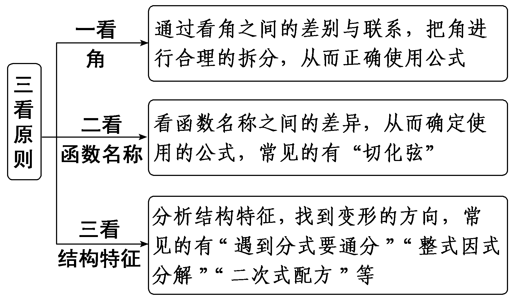
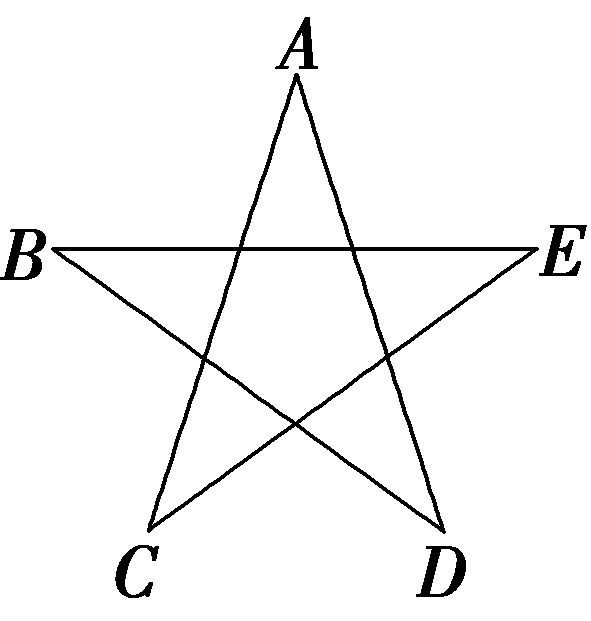
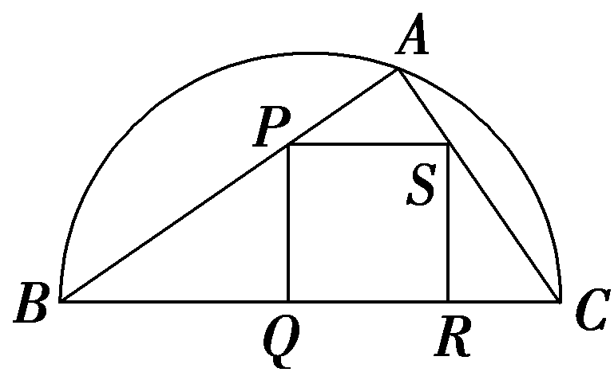

第2课时　简单的三角恒等变换

【课标研读】　能运用两角和与差的正弦、余弦、正切公式，二倍角的正弦、余弦、正切公式进行简单的恒等变换(包括推导出积化和差、和差化积、半角公式，这三组公式不要求记忆).

##### 1.半角公式

（1）sin $\frac{\alpha }{2}$ ＝± $\sqrt{\frac{1－cos\alpha }{2}}$ .

（2）cos $\frac{\alpha }{2}$ ＝± $\sqrt{\frac{1+cos\alpha }{2}}$ .

（3）tan $\frac{\alpha }{2}$ ＝± $\sqrt{\frac{1－cos\alpha }{1+cos\alpha }}$ .

符号由 $\frac{\alpha }{2}$ 所在象限决定.

##### 2.三角恒等变换常用方法

（1）常值代换：特别是用“1”的代换，如：1＝sin&lt;te&lt;te<em>x</em>t style="italic"&gt;x&lt;/text&gt;t style="superscript"&gt;2&lt;/text&gt;x＋cos2x＝tan $\frac{\pi }{4}$ 等.

（2）弦切互化：tan <em>&lt;text style="italic"&gt;&lt;text style="italic"&gt;&lt;text style="italic"&gt;&lt;text style="italic"&gt;θ</em>&lt;/text&gt;&lt;/text&gt;&lt;/text&gt;&lt;/text&gt;＝ $\frac{sin\theta }{cos\theta }$ ，sin <em>&lt;text style="italic"&gt;&lt;text style="italic"&gt;&lt;text style="italic"&gt;&lt;text style="italic"&gt;θ</em>&lt;/text&gt;&lt;/text&gt;&lt;/text&gt;&lt;/text&gt;＝tan θcos θ(θ≠ $\frac{\pi }{2}$ ＋<em>&lt;text style="italic"&gt;k</em>&lt;/text&gt;π，k∈<strong>Z</strong>)等.

（3）降幂扩角：sin <em>&lt;text style="italic"&gt;&lt;text style="italic"&gt;&lt;text style="italic"&gt;&lt;text style="italic"&gt;θ</em>&lt;/text&gt;&lt;/text&gt;&lt;/text&gt;&lt;/text&gt;cos θ＝ $\frac{1}{2}$ sin &lt;text style="superscript"&gt;2&lt;/text&gt;<em>&lt;text style="italic"&gt;&lt;text style="italic"&gt;&lt;text style="italic"&gt;&lt;text style="italic"&gt;θ</em>&lt;/text&gt;&lt;/text&gt;&lt;/text&gt;&lt;/text&gt;，sin2θ＝ $\frac{1－cos2\theta }{2}$ ，cos&lt;text style="superscript"&gt;2&lt;/text&gt;<em>&lt;text style="italic"&gt;&lt;text style="italic"&gt;&lt;text style="italic"&gt;&lt;text style="italic"&gt;θ</em>&lt;/text&gt;&lt;/text&gt;&lt;/text&gt;&lt;/text&gt;＝ $\frac{1+cos2\theta }{2}$ 等.

（4）升幂缩角：1＋cos <em>θ</em>＝2cos2 $\frac{\theta }{2}$ ，

1－cos <em>θ</em>＝2sin2 $\frac{\theta }{2}$ 等.

（5）引入辅助角：<text style="it*a*lic">a</text>sin *<text style="italic"><text style="italic">θ*</text></text>＋*<text style="italic">b*</text>cos θ＝ $\sqrt{a^{2}＋b^{2}}$ sin(<text style="it*a*lic">*<text style="italic">θ*</text></text>＋*<text style="italic"><text style="italic"><text style="italic">φ*</text></text></text>)，这里辅助角φ所在象限由*a*，*<text style="italic">b*</text>的符号确定，φ角的值由tan φ＝ $\frac{b}{a}$ 确定.

（6）项的分拆：如sin2<em>x</em>＋2cos2<em>x</em>＝(sin2<em>x</em>＋cos2<em>x</em>)＋cos2<em>x</em>＝1＋cos2<em>x</em>等.

【常用结论】

（1）tan $\frac{\alpha }{2}$ ＝ $\frac{sin\alpha }{1+cos\alpha }$ ＝ $\frac{1－cos\alpha }{sin\alpha }$ .

（2）万能公式

sin *<text style="italic">α*</text>＝ $\frac{2tan\frac{\alpha }{2}}{1+tan^{2}\frac{\alpha }{2}}$ ；cos *<text style="italic">α*</text>＝ $\frac{1－tan^{2}\frac{\alpha }{2}}{1+tan^{2}\frac{\alpha }{2}}$ ；

tan *α*＝ $\frac{2tan\frac{\alpha }{2}}{1－tan^{2}\frac{\alpha }{2}}$ .

【自主检测】

##### 1.(多选)下列结论正确的是(　　)

$\quad$A.半角的正弦、余弦公式实质就是将倍角的余弦公式逆求而得来的

$\quad$B.存在实数*α*，使tan 2*α*＝2tan *α*

$\quad$C.cos2 $\frac{\theta }{2}$ ＝1＋ $\frac{cos\theta }{2}$

$\quad$D.tan $\frac{\alpha }{2}$ ＝ $\frac{sin\alpha }{1+cos\alpha }$ ＝ $\frac{1－cos\alpha }{sin\alpha }$

答案ABD

##### 2.(链接人教A必修一P226T2)cos 15°＝(　　)

$\quad$A. $\sqrt{\frac{1+cos30\circ }{2}}$ 	
$\quad$B. $\sqrt{\frac{1－cos30\circ }{2}}$

$\quad$C.± $\sqrt{\frac{1+cos30\circ }{2}}$ 	
$\quad$D.± $\sqrt{\frac{1－cos30\circ }{2}}$

答案A

解析因为15°是第一象限角，所以cos 15°＞0，由半角的余弦公式可知cos 15°＝ $\sqrt{\frac{1+cos30\circ }{2}}$ .故选A.

##### 3.(链接人教A必修一P226T1)已知sin *<text style="italic">α*</text>＝ $\frac{\sqrt{5}}{5}$ ，cos *<text style="italic">α*</text>＝ $\frac{2\sqrt{5}}{5}$ ，则tan $\frac{\alpha }{2}$ 等于(　　)

$\quad$A.2－ $\sqrt{5}$ 　　	
$\quad$B.2＋ $\sqrt{5}$

$\quad$C. $\sqrt{5}$ －2　	
$\quad$D.± $\left(\sqrt{5}－2\right)$

答案C

解析因为sin *<text style="italic">α*</text>＝ $\frac{\sqrt{5}}{5}$ ，cos *<text style="italic">α*</text>＝ $\frac{2\sqrt{5}}{5}$ ，所以tan $\frac{\alpha }{2}$ ＝ $\frac{sin\alpha }{1+cos\alpha }$ ＝ $\sqrt{5}$ －2.故选C.

##### 4.tan $\frac{\pi }{8}$ ＝<u>　　　　</u>.

答案 $\sqrt{2}$ －1

解析tan $\frac{\pi }{8}$ ＝ $\frac{1－cos\frac{\pi }{4}}{sin\frac{\pi }{4}}$ ＝ $\frac{1－\frac{\sqrt{2}}{2}}{\frac{\sqrt{2}}{2}}$ ＝ $\sqrt{2}$ －1.

考点一　三角函数式的化简　　　　自主练透

##### 1.若*α*∈( $\frac{\pi }{2}$ ，π)，则 $\sqrt{1－sin\alpha }$ ＋ $\sqrt{1+sin\alpha }$ ＝(　　)

$\quad$A.2cos $\frac{\alpha }{2}$ 	
$\quad$B.2sin $\frac{\alpha }{2}$

$\quad$C. －2sin $\frac{\alpha }{2}$ 	
$\quad$D. －2cos $\frac{\alpha }{2}$

答案B

解析因为*α*∈( $\frac{\pi }{2}$ ，π)，所以 $\frac{\alpha }{2}$ ∈( $\frac{\pi }{4}$ ， $\left.\frac{\pi }{2}\right.$ )，sin $\frac{\alpha }{2}$ ＞cos $\frac{\alpha }{2}$ ，原式＝ $\sqrt{cos^{2}\frac{\alpha }{2}＋sin ^{2}\frac{\alpha }{2}－2sin \frac{\alpha }{2}cos\frac{\alpha }{2}}$ ＋ $\sqrt{cos^{2}\frac{\alpha }{2}＋sin ^{2}\frac{\alpha }{2}+2sin \frac{\alpha }{2}cos\frac{\alpha }{2}}$ ＝

$\sqrt{\left(cos\frac{\alpha }{2}－sin \frac{\alpha }{2}\right)^{2}}$ ＋ $\sqrt{\left(cos\frac{\alpha }{2}＋sin \frac{\alpha }{2}\right)^{2}}$ ＝sin $\frac{\alpha }{2}$ －cos $\frac{\alpha }{2}$ ＋sin $\frac{\alpha }{2}$ ＋cos $\frac{\alpha }{2}$ ＝2sin $\frac{\alpha }{2}$ .故选B.

##### 2.化简： $\frac{cos40\circ }{cos25\circ \sqrt{1－cos50\circ }}$ ＝(　　)

$\quad$A. $\sqrt{2}$ 	
$\quad$B. 2 $\sqrt{2}$

$\quad$C. $\sqrt{3}$ 	
$\quad$D. $\sqrt{3}$ －1

答案A

解析原式＝ $\frac{cos\left(90\circ －50\circ \right)}{cos25\circ \sqrt{1－\left(1－2sin ^{2}25\circ \right)}}$ ＝ $\frac{sin 50\circ }{\sqrt{2}cos25\circ sin 25\circ }$ ＝ $\frac{2sin 50\circ }{\sqrt{2}sin 50\circ }$ ＝ $\sqrt{2}$ .故选A.

##### 3. 化简：（1） $\frac{2cos^{2}\alpha －1}{tan\left(\frac{\pi }{4}－\alpha \right)sin^{2}\left(\frac{\pi }{4}＋\alpha \right)}$ ＝<u>　　　　</u>.

（2） $\left(\frac{1}{tan \frac{\alpha }{2}}－tan\frac{\alpha }{2}\right)$ · $\left(1+tan\alpha \cdot tan \frac{\alpha }{2}\right)$ ＝<u>　　　　</u>.

答案（1）2　（2） $\frac{2}{sin\alpha }$

解析（1）原式＝ $\frac{cos2\alpha }{\frac{sin\left(\frac{\pi }{4}－\alpha \right)}{cos\left(\frac{\pi }{4}－\alpha \right)}sin^{2}\left(\frac{\pi }{4}＋\alpha \right)}$ ＝ $\frac{cos2\alpha }{\frac{sin\left(\frac{\pi }{4}－\alpha \right)}{sin\left(\frac{\pi }{4}＋\alpha \right)}sin^{2}\left(\frac{\pi }{4}＋\alpha \right)}$ ＝ $\frac{cos2\alpha }{sin\left(\frac{\pi }{4}－\alpha \right)sin\left(\frac{\pi }{4}＋\alpha \right)}$ ＝ $\frac{cos2\alpha }{cos\left(\frac{\pi }{4}＋\alpha \right)sin\left(\frac{\pi }{4}＋\alpha \right)}$ ＝ $\frac{cos2\alpha }{\frac{1}{2}sin\left(\frac{\pi }{2}+2\alpha \right)}$ ＝ $\frac{2cos2\alpha }{cos2\alpha }$ ＝2.

（2）原式＝ $\left(\frac{cos\frac{\alpha }{2}}{sin \frac{\alpha }{2}}－\frac{sin \frac{\alpha }{2}}{cos\frac{\alpha }{2}}\right)$ ·(1＋ $\frac{sin\alpha }{cos\alpha }$ · $\frac{sin \frac{\alpha }{2}}{cos\frac{\alpha }{2}}$ )＝ $\frac{cos^{2}\frac{\alpha }{2}－sin^{2}\frac{\alpha }{2}}{sin \frac{\alpha }{2}\cdot cos\frac{\alpha }{2}}$ · $\frac{cos\alpha \cdot cos\frac{\alpha }{2}＋sin\alpha \cdot sin \frac{\alpha }{2}}{cos\alpha \cdot cos\frac{\alpha }{2}}$ ＝ $\frac{cos\alpha }{\frac{1}{2}sin\alpha }$ · $\frac{cos\frac{\alpha }{2}}{cos\alpha \cdot cos\frac{\alpha }{2}}$ ＝ $\frac{2}{sin\alpha }$ .

三角函数式的化简要遵循“三看”原则

注意：化简时要注意观察条件中角之间的联系(和、差、倍、互余、互补等)，寻找式子与三角函数公式间的联系，找到变形方向.

考点二　三角函数式的求值　　　　多维探究

角度1　给角求值

（1）sin 40°(tan 10°－ $\sqrt{3}$ )等于(　　)

$\quad$A.2	
$\quad$B.－2

$\quad$C.1	
$\quad$D.－1

（2）计算：(1＋tan 13°)(1＋tan 17°)(1＋tan 28°)·(1＋tan 32°)＝<u>　　　　</u>.

答案（1）D　（2）4

解析（1）sin 40°·(tan 10°－ $\sqrt{3}$ )＝sin 40°· $\left(\frac{sin10\circ }{cos10\circ }－\sqrt{3}\right)$ ＝sin 40°· $\frac{sin10\circ －\sqrt{3}cos10\circ }{cos10\circ }$

＝sin 40°· $\frac{2\left(\frac{1}{2}sin10\circ －\frac{\sqrt{3}}{2}cos10\circ \right)}{cos10\circ }$

＝sin 40°· $\frac{2(cos60\circ \cdot sin10\circ －sin60\circ \cdot cos10\circ )}{cos10\circ }$

＝sin 40°· $\frac{2sin(10\circ －60\circ )}{cos10\circ }$

＝sin 40°· $\frac{－2sin50\circ }{cos10\circ }$ ＝ $\frac{－2sin40\circ \cdot cos40\circ }{cos10\circ }$

＝ $\frac{－sin80\circ }{cos10\circ }$ ＝－1.故选D.

（2）因为1＝tan 45°＝tan(13°＋32°)＝ $\frac{tan13\circ ＋tan32\circ }{1－tan13\circ tan32\circ }$ ，所以tan 13°＋tan 32°＝1－tan 13°tan 32°，即tan 13°＋tan 32°＋tan 13°tan 32°＝1，所以(1＋tan 13°)(1＋tan 32°)＝1＋tan 13°＋tan 32°＋tan 13°tan 32°＝2，同理可得(1＋tan 17°)(1＋tan 28°)＝2.所以(1＋tan 13°)(1＋tan 17°)(1＋tan 28°)(1＋tan 32°)＝4.

角度2　给值求值

（1）已知5sin 2<em>&lt;text style="italic"&gt;&lt;text style="italic"&gt;α</em>&lt;/text&gt;&lt;/text&gt;＋6cos(π－α)＝0，α∈ $\left(0，\frac{\pi }{2}\right)$ ，则cos2 $\left(\frac{\alpha }{2}＋\frac{\pi }{4}\right)$ ＝(　　)

$\quad$A.－ $\frac{1}{5}$ 	
$\quad$B. $\frac{1}{5}$

$\quad$C. $\frac{3}{5}$ 	
$\quad$D. $\frac{4}{5}$

（2）(2024·新课标Ⅱ卷)已知<em>&lt;text style="italic"&gt;&lt;text style="italic"&gt;&lt;text style="italic"&gt;α</em>&lt;/text&gt;&lt;/text&gt;&lt;/text&gt;为第一象限角，<em>&lt;text style="italic"&gt;&lt;text style="italic"&gt;&lt;text style="italic"&gt;β</em>&lt;/text&gt;&lt;/text&gt;&lt;/text&gt;为第三象限角，tan α＋tan β＝4，tan αtan β＝ $\sqrt{2}$ ＋1，则sin(<em>&lt;text style="italic"&gt;&lt;text style="italic"&gt;&lt;text style="italic"&gt;α</em>&lt;/text&gt;&lt;/text&gt;&lt;/text&gt;＋<em>&lt;text style="italic"&gt;&lt;text style="italic"&gt;&lt;text style="italic"&gt;β</em>&lt;/text&gt;&lt;/text&gt;&lt;/text&gt;)＝<u>　　　　</u>.

答案（1）B　（2）－ $\frac{2\sqrt{2}}{3}$

解析（1）由题知10sin <em>&lt;text style="italic"&gt;&lt;text style="italic"&gt;&lt;text style="italic"&gt;&lt;text style="italic"&gt;&lt;text style="italic"&gt;α</em>&lt;/text&gt;&lt;/text&gt;&lt;/text&gt;&lt;/text&gt;&lt;/text&gt;cos α＝6cos α，因为α∈(0， $\frac{\pi }{2}$ )，所以cos <em>&lt;text style="italic"&gt;&lt;text style="italic"&gt;&lt;text style="italic"&gt;&lt;text style="italic"&gt;&lt;text style="italic"&gt;α</em>&lt;/text&gt;&lt;/text&gt;&lt;/text&gt;&lt;/text&gt;&lt;/text&gt;≠0，所以sin α＝ $\frac{3}{5}$ ，则cos&lt;text style="superscript"&gt;2&lt;/text&gt;( $\frac{\alpha }{2}$ ＋ $\frac{\pi }{4}$ )＝cos&lt;text style="superscript"&gt;2&lt;/text&gt;［ $\frac{1}{2}\left(\alpha ＋\frac{\pi }{2}\right)$ ］＝ $\frac{cos\left(\alpha ＋\frac{\pi }{2}\right)+1}{2}$ ＝ $\frac{－sin\alpha +1}{2}$ ＝ $\frac{－\frac{3}{5}+1}{2}$ ＝ $\frac{1}{5}$ .故选B.

(&lt;text style="superscript"&gt;2&lt;/text&gt;)由题知tan $\left(\alpha ＋\beta \right)$ ＝ $\frac{tan\alpha ＋tan\beta }{1－tan\alpha tan\beta }$ ＝ $\frac{4}{1－\sqrt{2}－1}$ ＝－&lt;text style="superscript"&gt;2&lt;/text&gt; $\sqrt{2}$ ，即sin(<em>&lt;text style="italic"&gt;&lt;text style="italic"&gt;&lt;text style="italic"&gt;&lt;text style="italic"&gt;&lt;text style="italic"&gt;&lt;text style="italic"&gt;&lt;text style="italic"&gt;α</em>&lt;/text&gt;&lt;/text&gt;&lt;/text&gt;&lt;/text&gt;&lt;/text&gt;&lt;/text&gt;&lt;/text&gt;＋<em>&lt;text style="italic"&gt;&lt;text style="italic"&gt;&lt;text style="italic"&gt;&lt;text style="italic"&gt;&lt;text style="italic"&gt;&lt;text style="italic"&gt;&lt;text style="italic"&gt;β</em>&lt;/text&gt;&lt;/text&gt;&lt;/text&gt;&lt;/text&gt;&lt;/text&gt;&lt;/text&gt;&lt;/text&gt;)＝－&lt;text style="superscript"&gt;2&lt;/text&gt; $\sqrt{2}$ cos(<em>&lt;text style="italic"&gt;&lt;text style="italic"&gt;&lt;text style="italic"&gt;&lt;text style="italic"&gt;&lt;text style="italic"&gt;&lt;text style="italic"&gt;&lt;text style="italic"&gt;α</em>&lt;/text&gt;&lt;/text&gt;&lt;/text&gt;&lt;/text&gt;&lt;/text&gt;&lt;/text&gt;&lt;/text&gt;＋<em>&lt;text style="italic"&gt;&lt;text style="italic"&gt;&lt;text style="italic"&gt;&lt;text style="italic"&gt;&lt;text style="italic"&gt;&lt;text style="italic"&gt;&lt;text style="italic"&gt;β</em>&lt;/text&gt;&lt;/text&gt;&lt;/text&gt;&lt;/text&gt;&lt;/text&gt;&lt;/text&gt;&lt;/text&gt;)，又sin&lt;text style="superscript"&gt;2&lt;/text&gt;(α＋β)＋cos2 $\left(\alpha ＋\beta \right)$ ＝1，可得sin(<em>&lt;text style="italic"&gt;&lt;text style="italic"&gt;&lt;text style="italic"&gt;&lt;text style="italic"&gt;&lt;text style="italic"&gt;&lt;text style="italic"&gt;&lt;text style="italic"&gt;α</em>&lt;/text&gt;&lt;/text&gt;&lt;/text&gt;&lt;/text&gt;&lt;/text&gt;&lt;/text&gt;&lt;/text&gt;＋<em>&lt;text style="italic"&gt;&lt;text style="italic"&gt;&lt;text style="italic"&gt;&lt;text style="italic"&gt;&lt;text style="italic"&gt;&lt;text style="italic"&gt;&lt;text style="italic"&gt;β</em>&lt;/text&gt;&lt;/text&gt;&lt;/text&gt;&lt;/text&gt;&lt;/text&gt;&lt;/text&gt;&lt;/text&gt;)＝± $\frac{2\sqrt{2}}{3}$ .由&lt;text style="superscript"&gt;2&lt;/text&gt;<em>&lt;text style="italic"&gt;&lt;text style="italic"&gt;&lt;text style="italic"&gt;&lt;text style="italic"&gt;&lt;text style="italic"&gt;k</em>&lt;/text&gt;&lt;/text&gt;&lt;/text&gt;&lt;/text&gt;&lt;/text&gt;π＜<em>&lt;text style="italic"&gt;&lt;text style="italic"&gt;&lt;text style="italic"&gt;&lt;text style="italic"&gt;&lt;text style="italic"&gt;&lt;text style="italic"&gt;&lt;text style="italic"&gt;α</em>&lt;/text&gt;&lt;/text&gt;&lt;/text&gt;&lt;/text&gt;&lt;/text&gt;&lt;/text&gt;&lt;/text&gt;＜2kπ＋ $\frac{\pi }{2}$ ，<em>&lt;text style="italic"&gt;&lt;text style="italic"&gt;&lt;text style="italic"&gt;&lt;text style="italic"&gt;&lt;text style="italic"&gt;k</em>&lt;/text&gt;&lt;/text&gt;&lt;/text&gt;&lt;/text&gt;&lt;/text&gt;∈<strong>&lt;text style="bold"&gt;&lt;text style="bold"&gt;Z</strong>&lt;/text&gt;&lt;/text&gt;，&lt;text style="superscript"&gt;2&lt;/text&gt;<em>&lt;text style="italic"&gt;&lt;text style="italic"&gt;&lt;text style="italic"&gt;&lt;text style="italic"&gt;&lt;text style="italic"&gt;m</em>&lt;/text&gt;&lt;/text&gt;&lt;/text&gt;&lt;/text&gt;&lt;/text&gt;π＋π＜<em>&lt;text style="italic"&gt;&lt;text style="italic"&gt;&lt;text style="italic"&gt;&lt;text style="italic"&gt;&lt;text style="italic"&gt;&lt;text style="italic"&gt;&lt;text style="italic"&gt;β</em>&lt;/text&gt;&lt;/text&gt;&lt;/text&gt;&lt;/text&gt;&lt;/text&gt;&lt;/text&gt;&lt;/text&gt;＜2mπ＋ $\frac{3\pi }{2}$ ，<em>&lt;text style="italic"&gt;&lt;text style="italic"&gt;&lt;text style="italic"&gt;&lt;text style="italic"&gt;&lt;text style="italic"&gt;m</em>&lt;/text&gt;&lt;/text&gt;&lt;/text&gt;&lt;/text&gt;&lt;/text&gt;∈<strong>&lt;text style="bold"&gt;&lt;text style="bold"&gt;Z</strong>&lt;/text&gt;&lt;/text&gt;，得&lt;text style="superscript"&gt;2&lt;/text&gt;(<em>&lt;text style="italic"&gt;&lt;text style="italic"&gt;&lt;text style="italic"&gt;&lt;text style="italic"&gt;&lt;text style="italic"&gt;k</em>&lt;/text&gt;&lt;/text&gt;&lt;/text&gt;&lt;/text&gt;&lt;/text&gt;＋m)π＋π＜<em>&lt;text style="italic"&gt;&lt;text style="italic"&gt;&lt;text style="italic"&gt;&lt;text style="italic"&gt;&lt;text style="italic"&gt;&lt;text style="italic"&gt;&lt;text style="italic"&gt;α</em>&lt;/text&gt;&lt;/text&gt;&lt;/text&gt;&lt;/text&gt;&lt;/text&gt;&lt;/text&gt;&lt;/text&gt;＋<em>&lt;text style="italic"&gt;&lt;text style="italic"&gt;&lt;text style="italic"&gt;&lt;text style="italic"&gt;&lt;text style="italic"&gt;&lt;text style="italic"&gt;&lt;text style="italic"&gt;β</em>&lt;/text&gt;&lt;/text&gt;&lt;/text&gt;&lt;/text&gt;&lt;/text&gt;&lt;/text&gt;&lt;/text&gt;＜2(k＋m)π＋2π，k＋m∈Z.又tan(α＋β)＜0，所以α＋β是第四象限角，故sin $\left(\alpha ＋\beta \right)$ ＝－ $\frac{2\sqrt{2}}{3}$ .

角度3　给值求角

（1）(2025·江西九江模拟)已知*<text style="italic"><text style="italic">α*</text></text>，*<text style="italic"><text style="italic">β*</text></text>∈ $\left(0，\frac{\pi }{2}\right)$ ，cos $\left(\alpha －\beta \right)$ ＝ $\frac{5}{6}$ ，tan *<text style="italic"><text style="italic">α*</text></text>·tan *<text style="italic"><text style="italic">β*</text></text>＝ $\frac{1}{4}$ ，则*<text style="italic"><text style="italic">α*</text></text>＋*<text style="italic"><text style="italic">β*</text></text>＝(　　)

$\quad$A. $\frac{\pi }{3}$ 	
$\quad$B. $\frac{\pi }{4}$

$\quad$C. $\frac{\pi }{6}$ 	
$\quad$D. $\frac{2\pi }{3}$

（2）设*<text style="italic">α*</text>∈ $\left(0，\frac{\pi }{2}\right)$  ，*β*∈(0， $\frac{\pi }{2}$ ) ，且tan *<text style="italic">α*</text>＝ $\frac{1+sin\beta }{cos\beta }$  ，则(　　)

$\quad$A.3*<text style="italic">α*</text>－*<text style="italic">β*</text>＝ $\frac{\pi }{2}$ 	
$\quad$B. 3*<text style="italic">α*</text>＋*<text style="italic">β*</text>＝ $\frac{\pi }{2}$

$\quad$C. 2*<text style="italic">α*</text>－*<text style="italic">β*</text>＝ $\frac{\pi }{2}$  	
$\quad$D. 2*<text style="italic">α*</text>＋*<text style="italic">β*</text>＝ $\frac{\pi }{2}$

答案（1）A　（2）C

解析（1）因为cos $\left(\alpha －\beta \right)$ ＝ $\frac{5}{6}$ ，tan *α*·tan *β*＝ $\frac{1}{4}$ ，

所以 $\left\{\begin{matrix}cos\alpha cos\beta ＋sin\alpha sin\beta ＝\frac{5}{6}，\\\frac{sin\alpha sin\beta }{cos\alpha cos\beta }＝\frac{1}{4}，\end{matrix}\right.$ 解得 $\left\{\begin{matrix}cos\alpha cos\beta ＝\frac{2}{3}，\\sin\alpha sin\beta ＝\frac{1}{6}，\end{matrix}\right.$ 所以cos $\left(\alpha ＋\beta \right)$ ＝cos *<text style="italic"><text style="italic"><text style="italic"><text style="italic">α*</text></text></text></text>cos *<text style="italic"><text style="italic"><text style="italic"><text style="italic">β*</text></text></text></text>－sin αsin β＝ $\frac{1}{2}$ ，又*<text style="italic"><text style="italic"><text style="italic"><text style="italic">α*</text></text></text></text>，*<text style="italic"><text style="italic"><text style="italic"><text style="italic">β*</text></text></text></text>∈ $\left(0，\frac{\pi }{2}\right)$ ，所以*<text style="italic"><text style="italic"><text style="italic"><text style="italic">α*</text></text></text></text>＋*<text style="italic"><text style="italic"><text style="italic"><text style="italic">β*</text></text></text></text>∈ $\left(0，\pi \right)$ ，所以*<text style="italic"><text style="italic"><text style="italic"><text style="italic">α*</text></text></text></text>＋*<text style="italic"><text style="italic"><text style="italic"><text style="italic">β*</text></text></text></text>＝ $\frac{\pi }{3}$ .故选A.

（2）由已知得，tan *<text style="italic"><text style="italic"><text style="italic"><text style="italic"><text style="italic"><text style="italic"><text style="italic"><text style="italic"><text style="italic"><text style="italic"><text style="italic"><text style="italic"><text style="italic"><text style="italic">α*</text></text></text></text></text></text></text></text></text></text></text></text></text></text>＝ $\frac{sin\alpha }{cos\alpha }$ ＝ $\frac{1+sin\beta }{cos\beta }$ ，去分母得，sin *<text style="italic"><text style="italic"><text style="italic"><text style="italic"><text style="italic"><text style="italic"><text style="italic"><text style="italic"><text style="italic"><text style="italic"><text style="italic"><text style="italic"><text style="italic"><text style="italic">α*</text></text></text></text></text></text></text></text></text></text></text></text></text></text>cos *<text style="italic"><text style="italic"><text style="italic"><text style="italic"><text style="italic"><text style="italic"><text style="italic">β*</text></text></text></text></text></text></text>＝cos α＋cos αsin β，所以sin αcos β－cos αsin β＝cos α，sin(α－β)＝cos α＝sin( $\frac{\pi }{2}$ －*<text style="italic"><text style="italic"><text style="italic"><text style="italic"><text style="italic"><text style="italic"><text style="italic"><text style="italic"><text style="italic"><text style="italic"><text style="italic"><text style="italic"><text style="italic"><text style="italic">α*</text></text></text></text></text></text></text></text></text></text></text></text></text></text>).又因为－ $\frac{\pi }{2}$ ＜*<text style="italic"><text style="italic"><text style="italic"><text style="italic"><text style="italic"><text style="italic"><text style="italic"><text style="italic"><text style="italic"><text style="italic"><text style="italic"><text style="italic"><text style="italic"><text style="italic">α*</text></text></text></text></text></text></text></text></text></text></text></text></text></text>－*<text style="italic"><text style="italic"><text style="italic"><text style="italic"><text style="italic"><text style="italic"><text style="italic">β*</text></text></text></text></text></text></text>＜ $\frac{\pi }{2}$ ，0＜ $\frac{\pi }{2}$ －*<text style="italic"><text style="italic"><text style="italic"><text style="italic"><text style="italic"><text style="italic"><text style="italic"><text style="italic"><text style="italic"><text style="italic"><text style="italic"><text style="italic"><text style="italic"><text style="italic">α*</text></text></text></text></text></text></text></text></text></text></text></text></text></text>＜ $\frac{\pi }{2}$ ，所以*<text style="italic"><text style="italic"><text style="italic"><text style="italic"><text style="italic"><text style="italic"><text style="italic"><text style="italic"><text style="italic"><text style="italic"><text style="italic"><text style="italic"><text style="italic"><text style="italic">α*</text></text></text></text></text></text></text></text></text></text></text></text></text></text>－*<text style="italic"><text style="italic"><text style="italic"><text style="italic"><text style="italic"><text style="italic"><text style="italic">β*</text></text></text></text></text></text></text>＝ $\frac{\pi }{2}$ －*<text style="italic"><text style="italic"><text style="italic"><text style="italic"><text style="italic"><text style="italic"><text style="italic"><text style="italic"><text style="italic"><text style="italic"><text style="italic"><text style="italic"><text style="italic"><text style="italic">α*</text></text></text></text></text></text></text></text></text></text></text></text></text></text>，即2α－*<text style="italic"><text style="italic"><text style="italic"><text style="italic"><text style="italic"><text style="italic"><text style="italic">β*</text></text></text></text></text></text></text>＝ $\frac{\pi }{2}$ .故选C.

##### 1.给角求值问题的解题策略

观察所给角与特殊角之间的关系，利用和、差、倍角公式等将非特殊角的三角函数值转化为：

（1）特殊角的三角函数值；（2）正、负相消的项和特殊角的三角函数值；（3）可约分的项和特殊角的三角函数值等.

##### 2.给值求值问题的解题策略

已知某些角的三角函数值，求另外一些角的三角函数值的解题关键：把“所求角”用“已知角”表示.

##### 3.给值求角问题的解题原则

“给值求角”实质上可转化为“给值求值”，即通过求角的某个三角函数值来求角(注意角的范围)，在选取函数时，遵循以下原则：

（1）已知正切函数值，选正切函数.

（2）已知正弦、余弦函数值，选正弦或余弦函数，若角的范围是 $\left(0，\frac{\pi }{2}\right)$ ，选正、余弦函数皆可；若角的范围是(0，π)，选余弦函数；若角的范围为 $\left(－\frac{\pi }{2}，\frac{\pi }{2}\right)$ ，选正弦函数.

对点练1.(2025·江西鹰潭模拟)已知*<text style="italic"><text style="italic">θ*</text></text>∈ $\left(0，\frac{\pi }{2}\right)$ ，tan(*<text style="italic"><text style="italic">θ*</text></text>＋ $\frac{\pi }{4}$ )＝－ $\frac{2}{3}$ tan *<text style="italic"><text style="italic">θ*</text></text>，则 $\frac{cos\left(\theta ＋\frac{\pi }{2}\right)cos2\theta }{\sqrt{2} sin\left(\theta ＋\frac{\pi }{4}\right)}$ ＝(　　)

$\quad$A.－ $\frac{1}{2}$ 	
$\quad$B.－ $\frac{3}{5}$

$\quad$C.3	
$\quad$D. $\frac{3}{5}$

答案D

解析因为tan $\left(\theta ＋\frac{\pi }{4}\right)$ ＝－ $\frac{2}{3}$ tan *<text style="italic"><text style="italic"><text style="italic"><text style="italic"><text style="italic"><text style="italic"><text style="italic">θ*</text></text></text></text></text></text></text>，所以 $\frac{tan\theta +1}{1－tan\theta }$ ＝－ $\frac{2}{3}$ tan *<text style="italic"><text style="italic"><text style="italic"><text style="italic"><text style="italic"><text style="italic"><text style="italic">θ*</text></text></text></text></text></text></text>，又θ∈ $\left(0，\frac{\pi }{2}\right)$ ，即tan *<text style="italic"><text style="italic"><text style="italic"><text style="italic"><text style="italic"><text style="italic"><text style="italic">θ*</text></text></text></text></text></text></text>＞0，解得tan θ＝3，所以 $\frac{cos\left(\theta ＋\frac{\pi }{2}\right)cos2\theta }{\sqrt{2}sin\left(\theta ＋\frac{\pi }{4}\right)}$ ＝ $\frac{－sin\theta (cos^{2}\theta －sin^{2}\theta )}{sin\theta ＋cos\theta }$ ＝－sin *<text style="italic"><text style="italic"><text style="italic"><text style="italic"><text style="italic"><text style="italic"><text style="italic">θ*</text></text></text></text></text></text></text>(cos θ－sin θ)＝ $\frac{－sin\theta cos\theta ＋sin^{2}\theta }{sin^{2}\theta ＋cos^{2}\theta }$ ＝ $\frac{－tan\theta ＋tan^{2}\theta }{tan^{2}\theta +1}$ ＝ $\frac{－3+3^{2}}{3^{2}+1}$ ＝ $\frac{3}{5}$ .故选D.

对点练&lt;text style="superscript"&gt;2&lt;/text&gt;.(2025·黑龙江双鸭山模拟)已知<em>&lt;text style="italic"&gt;&lt;text style="italic"&gt;&lt;text style="italic"&gt;&lt;text style="italic"&gt;α</em>&lt;/text&gt;&lt;/text&gt;&lt;/text&gt;&lt;/text&gt;，<em>&lt;text style="italic"&gt;&lt;text style="italic"&gt;&lt;text style="italic"&gt;β</em>&lt;/text&gt;&lt;/text&gt;&lt;/text&gt;∈ $\left(0，\frac{\pi }{4}\right)$ ，cos&lt;text style="superscript"&gt;2&lt;/text&gt;<em>&lt;text style="italic"&gt;&lt;text style="italic"&gt;&lt;text style="italic"&gt;&lt;text style="italic"&gt;α</em>&lt;/text&gt;&lt;/text&gt;&lt;/text&gt;&lt;/text&gt;－sin 2α＝ $\frac{1}{7}$ ，且3sin <em>&lt;text style="italic"&gt;&lt;text style="italic"&gt;&lt;text style="italic"&gt;β</em>&lt;/text&gt;&lt;/text&gt;&lt;/text&gt;＝sin (&lt;text style="superscript"&gt;2&lt;/text&gt;<em>&lt;text style="italic"&gt;&lt;text style="italic"&gt;&lt;text style="italic"&gt;&lt;text style="italic"&gt;α</em>&lt;/text&gt;&lt;/text&gt;&lt;/text&gt;&lt;/text&gt;＋β)，则α＋β的值为(　　)

$\quad$A. $\frac{\pi }{12}$ 	
$\quad$B. $\frac{\pi }{6}$

$\quad$C. $\frac{\pi }{4}$ 	
$\quad$D. $\frac{\pi }{3}$

答案D

解析因为cos&lt;text style="superscript"&gt;&lt;text style="superscript"&gt;&lt;text style="superscript"&gt;&lt;text style="superscript"&gt;&lt;text style="superscript"&gt;2&lt;/text&gt;&lt;/text&gt;&lt;/text&gt;&lt;/text&gt;&lt;/text&gt;<em>&lt;text style="italic"&gt;&lt;text style="italic"&gt;&lt;text style="italic"&gt;&lt;text style="italic"&gt;&lt;text style="italic"&gt;&lt;text style="italic"&gt;&lt;text style="italic"&gt;&lt;text style="italic"&gt;&lt;text style="italic"&gt;&lt;text style="italic"&gt;&lt;text style="italic"&gt;&lt;text style="italic"&gt;&lt;text style="italic"&gt;&lt;text style="italic"&gt;&lt;text style="italic"&gt;&lt;text style="italic"&gt;&lt;text style="italic"&gt;&lt;text style="italic"&gt;&lt;text style="italic"&gt;&lt;text style="italic"&gt;&lt;text style="italic"&gt;&lt;text style="italic"&gt;α</em>&lt;/text&gt;&lt;/text&gt;&lt;/text&gt;&lt;/text&gt;&lt;/text&gt;&lt;/text&gt;&lt;/text&gt;&lt;/text&gt;&lt;/text&gt;&lt;/text&gt;&lt;/text&gt;&lt;/text&gt;&lt;/text&gt;&lt;/text&gt;&lt;/text&gt;&lt;/text&gt;&lt;/text&gt;&lt;/text&gt;&lt;/text&gt;&lt;/text&gt;&lt;/text&gt;&lt;/text&gt;－sin 2α＝ $\frac{1}{7}$ ，cos&lt;text style="superscript"&gt;&lt;text style="superscript"&gt;&lt;text style="superscript"&gt;&lt;text style="superscript"&gt;&lt;text style="superscript"&gt;2&lt;/text&gt;&lt;/text&gt;&lt;/text&gt;&lt;/text&gt;&lt;/text&gt;<em>&lt;text style="italic"&gt;&lt;text style="italic"&gt;&lt;text style="italic"&gt;&lt;text style="italic"&gt;&lt;text style="italic"&gt;&lt;text style="italic"&gt;&lt;text style="italic"&gt;&lt;text style="italic"&gt;&lt;text style="italic"&gt;&lt;text style="italic"&gt;&lt;text style="italic"&gt;&lt;text style="italic"&gt;&lt;text style="italic"&gt;&lt;text style="italic"&gt;&lt;text style="italic"&gt;&lt;text style="italic"&gt;&lt;text style="italic"&gt;&lt;text style="italic"&gt;&lt;text style="italic"&gt;&lt;text style="italic"&gt;&lt;text style="italic"&gt;&lt;text style="italic"&gt;α</em>&lt;/text&gt;&lt;/text&gt;&lt;/text&gt;&lt;/text&gt;&lt;/text&gt;&lt;/text&gt;&lt;/text&gt;&lt;/text&gt;&lt;/text&gt;&lt;/text&gt;&lt;/text&gt;&lt;/text&gt;&lt;/text&gt;&lt;/text&gt;&lt;/text&gt;&lt;/text&gt;&lt;/text&gt;&lt;/text&gt;&lt;/text&gt;&lt;/text&gt;&lt;/text&gt;&lt;/text&gt;＋sin 2α＝1，所以cos2α＝ $\frac{4}{7}$ ，sin &lt;text style="superscript"&gt;&lt;text style="superscript"&gt;&lt;text style="superscript"&gt;&lt;text style="superscript"&gt;&lt;text style="superscript"&gt;2&lt;/text&gt;&lt;/text&gt;&lt;/text&gt;&lt;/text&gt;&lt;/text&gt;<em>&lt;text style="italic"&gt;&lt;text style="italic"&gt;&lt;text style="italic"&gt;&lt;text style="italic"&gt;&lt;text style="italic"&gt;&lt;text style="italic"&gt;&lt;text style="italic"&gt;&lt;text style="italic"&gt;&lt;text style="italic"&gt;&lt;text style="italic"&gt;&lt;text style="italic"&gt;&lt;text style="italic"&gt;&lt;text style="italic"&gt;&lt;text style="italic"&gt;&lt;text style="italic"&gt;&lt;text style="italic"&gt;&lt;text style="italic"&gt;&lt;text style="italic"&gt;&lt;text style="italic"&gt;&lt;text style="italic"&gt;&lt;text style="italic"&gt;&lt;text style="italic"&gt;α</em>&lt;/text&gt;&lt;/text&gt;&lt;/text&gt;&lt;/text&gt;&lt;/text&gt;&lt;/text&gt;&lt;/text&gt;&lt;/text&gt;&lt;/text&gt;&lt;/text&gt;&lt;/text&gt;&lt;/text&gt;&lt;/text&gt;&lt;/text&gt;&lt;/text&gt;&lt;/text&gt;&lt;/text&gt;&lt;/text&gt;&lt;/text&gt;&lt;/text&gt;&lt;/text&gt;&lt;/text&gt;＝ $\frac{3}{7}$ .因为<em>&lt;text style="italic"&gt;&lt;text style="italic"&gt;&lt;text style="italic"&gt;&lt;text style="italic"&gt;&lt;text style="italic"&gt;&lt;text style="italic"&gt;&lt;text style="italic"&gt;&lt;text style="italic"&gt;&lt;text style="italic"&gt;&lt;text style="italic"&gt;&lt;text style="italic"&gt;&lt;text style="italic"&gt;&lt;text style="italic"&gt;&lt;text style="italic"&gt;&lt;text style="italic"&gt;&lt;text style="italic"&gt;&lt;text style="italic"&gt;&lt;text style="italic"&gt;&lt;text style="italic"&gt;&lt;text style="italic"&gt;&lt;text style="italic"&gt;&lt;text style="italic"&gt;α</em>&lt;/text&gt;&lt;/text&gt;&lt;/text&gt;&lt;/text&gt;&lt;/text&gt;&lt;/text&gt;&lt;/text&gt;&lt;/text&gt;&lt;/text&gt;&lt;/text&gt;&lt;/text&gt;&lt;/text&gt;&lt;/text&gt;&lt;/text&gt;&lt;/text&gt;&lt;/text&gt;&lt;/text&gt;&lt;/text&gt;&lt;/text&gt;&lt;/text&gt;&lt;/text&gt;&lt;/text&gt;∈ $\left(0，\frac{\pi }{4}\right)$ ，所以cos <em>&lt;text style="italic"&gt;&lt;text style="italic"&gt;&lt;text style="italic"&gt;&lt;text style="italic"&gt;&lt;text style="italic"&gt;&lt;text style="italic"&gt;&lt;text style="italic"&gt;&lt;text style="italic"&gt;&lt;text style="italic"&gt;&lt;text style="italic"&gt;&lt;text style="italic"&gt;&lt;text style="italic"&gt;&lt;text style="italic"&gt;&lt;text style="italic"&gt;&lt;text style="italic"&gt;&lt;text style="italic"&gt;&lt;text style="italic"&gt;&lt;text style="italic"&gt;&lt;text style="italic"&gt;&lt;text style="italic"&gt;&lt;text style="italic"&gt;&lt;text style="italic"&gt;α</em>&lt;/text&gt;&lt;/text&gt;&lt;/text&gt;&lt;/text&gt;&lt;/text&gt;&lt;/text&gt;&lt;/text&gt;&lt;/text&gt;&lt;/text&gt;&lt;/text&gt;&lt;/text&gt;&lt;/text&gt;&lt;/text&gt;&lt;/text&gt;&lt;/text&gt;&lt;/text&gt;&lt;/text&gt;&lt;/text&gt;&lt;/text&gt;&lt;/text&gt;&lt;/text&gt;&lt;/text&gt;＝ $\frac{2}{\sqrt{7}}$ ，sin <em>&lt;text style="italic"&gt;&lt;text style="italic"&gt;&lt;text style="italic"&gt;&lt;text style="italic"&gt;&lt;text style="italic"&gt;&lt;text style="italic"&gt;&lt;text style="italic"&gt;&lt;text style="italic"&gt;&lt;text style="italic"&gt;&lt;text style="italic"&gt;&lt;text style="italic"&gt;&lt;text style="italic"&gt;&lt;text style="italic"&gt;&lt;text style="italic"&gt;&lt;text style="italic"&gt;&lt;text style="italic"&gt;&lt;text style="italic"&gt;&lt;text style="italic"&gt;&lt;text style="italic"&gt;&lt;text style="italic"&gt;&lt;text style="italic"&gt;&lt;text style="italic"&gt;α</em>&lt;/text&gt;&lt;/text&gt;&lt;/text&gt;&lt;/text&gt;&lt;/text&gt;&lt;/text&gt;&lt;/text&gt;&lt;/text&gt;&lt;/text&gt;&lt;/text&gt;&lt;/text&gt;&lt;/text&gt;&lt;/text&gt;&lt;/text&gt;&lt;/text&gt;&lt;/text&gt;&lt;/text&gt;&lt;/text&gt;&lt;/text&gt;&lt;/text&gt;&lt;/text&gt;&lt;/text&gt;＝ $\frac{\sqrt{3}}{\sqrt{7}}$ ，所以tan <em>&lt;text style="italic"&gt;&lt;text style="italic"&gt;&lt;text style="italic"&gt;&lt;text style="italic"&gt;&lt;text style="italic"&gt;&lt;text style="italic"&gt;&lt;text style="italic"&gt;&lt;text style="italic"&gt;&lt;text style="italic"&gt;&lt;text style="italic"&gt;&lt;text style="italic"&gt;&lt;text style="italic"&gt;&lt;text style="italic"&gt;&lt;text style="italic"&gt;&lt;text style="italic"&gt;&lt;text style="italic"&gt;&lt;text style="italic"&gt;&lt;text style="italic"&gt;&lt;text style="italic"&gt;&lt;text style="italic"&gt;&lt;text style="italic"&gt;&lt;text style="italic"&gt;α</em>&lt;/text&gt;&lt;/text&gt;&lt;/text&gt;&lt;/text&gt;&lt;/text&gt;&lt;/text&gt;&lt;/text&gt;&lt;/text&gt;&lt;/text&gt;&lt;/text&gt;&lt;/text&gt;&lt;/text&gt;&lt;/text&gt;&lt;/text&gt;&lt;/text&gt;&lt;/text&gt;&lt;/text&gt;&lt;/text&gt;&lt;/text&gt;&lt;/text&gt;&lt;/text&gt;&lt;/text&gt;＝ $\frac{\sqrt{3}}{2}$ .由3sin <em>&lt;text style="italic"&gt;&lt;text style="italic"&gt;&lt;text style="italic"&gt;&lt;text style="italic"&gt;&lt;text style="italic"&gt;&lt;text style="italic"&gt;&lt;text style="italic"&gt;β</em>&lt;/text&gt;&lt;/text&gt;&lt;/text&gt;&lt;/text&gt;&lt;/text&gt;&lt;/text&gt;&lt;/text&gt;＝sin (&lt;text style="superscript"&gt;&lt;text style="superscript"&gt;&lt;text style="superscript"&gt;&lt;text style="superscript"&gt;&lt;text style="superscript"&gt;2&lt;/text&gt;&lt;/text&gt;&lt;/text&gt;&lt;/text&gt;&lt;/text&gt;<em>&lt;text style="italic"&gt;&lt;text style="italic"&gt;&lt;text style="italic"&gt;&lt;text style="italic"&gt;&lt;text style="italic"&gt;&lt;text style="italic"&gt;&lt;text style="italic"&gt;&lt;text style="italic"&gt;&lt;text style="italic"&gt;&lt;text style="italic"&gt;&lt;text style="italic"&gt;&lt;text style="italic"&gt;&lt;text style="italic"&gt;&lt;text style="italic"&gt;&lt;text style="italic"&gt;&lt;text style="italic"&gt;&lt;text style="italic"&gt;&lt;text style="italic"&gt;&lt;text style="italic"&gt;&lt;text style="italic"&gt;&lt;text style="italic"&gt;&lt;text style="italic"&gt;α</em>&lt;/text&gt;&lt;/text&gt;&lt;/text&gt;&lt;/text&gt;&lt;/text&gt;&lt;/text&gt;&lt;/text&gt;&lt;/text&gt;&lt;/text&gt;&lt;/text&gt;&lt;/text&gt;&lt;/text&gt;&lt;/text&gt;&lt;/text&gt;&lt;/text&gt;&lt;/text&gt;&lt;/text&gt;&lt;/text&gt;&lt;/text&gt;&lt;/text&gt;&lt;/text&gt;&lt;/text&gt;＋β)，得3sin [(α＋β)－α]＝sin [(α＋β)＋α]，即3sin(α＋β)cos α－3cos(α＋β)sin α＝sin (α＋β)cos α＋cos(α＋β)sin α，

所以sin (*<text style="italic"><text style="italic"><text style="italic"><text style="italic"><text style="italic"><text style="italic"><text style="italic">α*</text></text></text></text></text></text></text>＋*<text style="italic"><text style="italic"><text style="italic"><text style="italic">β*</text></text></text></text>)cos α＝2cos(α＋β)sin α，所以tan(α＋β)＝2tan α＝ $\sqrt{3}$ .又0＜*<text style="italic"><text style="italic"><text style="italic"><text style="italic"><text style="italic"><text style="italic"><text style="italic">α*</text></text></text></text></text></text></text>＋*<text style="italic"><text style="italic"><text style="italic"><text style="italic">β*</text></text></text></text>＜ $\frac{\pi }{2}$ ，所以*<text style="italic"><text style="italic"><text style="italic"><text style="italic"><text style="italic"><text style="italic"><text style="italic">α*</text></text></text></text></text></text></text>＋*<text style="italic"><text style="italic"><text style="italic"><text style="italic">β*</text></text></text></text>＝ $\frac{\pi }{3}$ .故选D.

对点练3.sin 70°·sin 50°·sin 30°·sin 10°＝<u>　　　　</u>.

答案 $\frac{1}{16}$

解析原式＝cos 20°·cos 40°·cos 60°·cos 80°＝ $\frac{1}{2}$ cos 20°·cos 40°·cos 80°＝ $\frac{sin20\circ \cdot cos20\circ \cdot cos40\circ \cdot cos80\circ }{2sin20\circ }$ ＝ $\frac{sin40\circ \cdot cos40\circ \cdot cos80\circ }{4sin20\circ }$ ＝ $\frac{sin80\circ \cdot cos80\circ }{8sin20\circ }$ ＝ $\frac{sin160\circ }{16sin20\circ }$ ＝ $\frac{1}{16}$ .

考点三　三角恒等变换的综合应用　　　　师生共研

已知向量<te<text style="it<text style="*b*old,italic">a</text>lic">x</text>t style="*b*old,italic">a</text>＝(cos $\frac{x}{2}$ ＋sin $\frac{x}{2}$ ，2sin $\frac{x}{2}$ )，<te<text style="it<text style="*b*old,italic">a</text>lic">x</text>t style="bold,italic">b</text>＝(cos $\frac{x}{2}$ －sin $\frac{x}{2}$ ， $\sqrt{3}$ cos $\frac{x}{2}$ )，函数<te<text style="it<text style="*b*old,italic">a</text>lic">x</text>t style="italic">f</text>(x)＝<text style="*b*old,italic">a</text>·b.

（1）求函数*f*(*x*)的最大值，并指出*f*(*x*)取最大值时*x*的取值集合；

（2）若*<text style="italic"><text style="italic">α*</text></text>，*<text style="italic"><text style="italic">β*</text></text>为锐角，cos(α＋β)＝ $\frac{12}{13}$ ，*<text style="italic">f*</text>(*<text style="italic"><text style="italic">β*</text></text>)＝ $\frac{6}{5}$ ，求*<text style="italic">f*</text>(*<text style="italic"><text style="italic">α*</text></text>＋ $\frac{\pi }{6}$ )的值.

解：（1）&lt;te&lt;te&lt;te&lt;te<em>x</em>t style="italic"&gt;x&lt;/text&gt;t style="italic"&gt;x&lt;/text&gt;t style="italic"&gt;x&lt;/text&gt;t style="italic"&gt;f&lt;/text&gt;(x)＝cos&lt;text style="superscript"&gt;2&lt;/text&gt; $\frac{x}{2}$ －sin &lt;te&lt;te&lt;te<em>x</em>t style="italic"&gt;x&lt;/text&gt;t style="italic"&gt;x&lt;/text&gt;t style="superscript"&gt;2&lt;/text&gt; $\frac{x}{2}$ ＋&lt;te&lt;te&lt;te<em>x</em>t style="italic"&gt;x&lt;/text&gt;t style="italic"&gt;x&lt;/text&gt;t style="superscript"&gt;2&lt;/text&gt; $\sqrt{3}$ sin $\frac{x}{2}$ cos $\frac{x}{2}$ ＝cos &lt;te&lt;te&lt;te<em>x</em>t style="italic"&gt;x&lt;/text&gt;t style="italic"&gt;x&lt;/text&gt;t style="italic"&gt;x&lt;/text&gt;＋ $\sqrt{3}$ sin &lt;te&lt;te&lt;te<em>x</em>t style="italic"&gt;x&lt;/text&gt;t style="italic"&gt;x&lt;/text&gt;t style="italic"&gt;x&lt;/text&gt;＝&lt;text style="superscript"&gt;2&lt;/text&gt;sin(x＋ $\frac{\pi }{6}$ )，

令&lt;te<em>x</em>t style="italic"&gt;x&lt;/text&gt;＋ $\frac{\pi }{6}$ ＝ $\frac{\pi }{2}$ ＋2&lt;te<em>x</em>t style="italic"&gt;<em>&lt;text style="italic"&gt;&lt;text style="italic"&gt;k</em>&lt;/text&gt;&lt;/text&gt;&lt;/text&gt;π，k∈<strong>&lt;text style="bold"&gt;Z</strong>&lt;/text&gt;，得<em>x</em>＝ $\frac{\pi }{3}$ ＋2&lt;te<em>x</em>t style="italic"&gt;<em>&lt;text style="italic"&gt;&lt;text style="italic"&gt;k</em>&lt;/text&gt;&lt;/text&gt;&lt;/text&gt;π，k∈<strong>&lt;text style="bold"&gt;Z</strong>&lt;/text&gt;，

所以&lt;te&lt;te&lt;te&lt;te<em>x</em>t style="italic"&gt;x&lt;/text&gt;t style="italic"&gt;x&lt;/text&gt;t style="italic"&gt;x&lt;/text&gt;t style="italic"&gt;f&lt;/text&gt;(x)的最大值为2，此时x的取值集合为{x｜x＝ $\frac{\pi }{3}$ ＋2<em>&lt;text style="italic"&gt;k</em>&lt;/text&gt;π，k∈<strong>Z</strong>}.

（2）由*<text style="italic"><text style="italic">α*</text></text>，*<text style="italic"><text style="italic">β*</text></text>为锐角，cos(α＋β)＝ $\frac{12}{13}$ ，得sin (*<text style="italic"><text style="italic">α*</text></text>＋*<text style="italic"><text style="italic">β*</text></text>)＝ $\frac{5}{13}$ ，

由*f*(*<text style="italic">β*</text>)＝ $\frac{6}{5}$ 得，sin(*<text style="italic">β*</text>＋ $\frac{\pi }{6}$ )＝ $\frac{3}{5}$ ，

因为0＜*<text style="italic">β*</text>＜ $\frac{\pi }{2}$ ，所以 $\frac{\pi }{6}$ ＜*<text style="italic">β*</text>＋ $\frac{\pi }{6}$ ＜ $\frac{2\pi }{3}$ ，

又sin(*β*＋ $\frac{\pi }{6}$ )＝ $\frac{3}{5}$ ∈( $\frac{1}{2}$ ， $\frac{\sqrt{2}}{2}$ )，

所以 $\frac{\pi }{6}$ ＜*<text style="italic">β*</text>＋ $\frac{\pi }{6}$ ＜ $\frac{\pi }{4}$ ，所以cos(*<text style="italic">β*</text>＋ $\frac{\pi }{6}$ )＝ $\frac{4}{5}$ ，

所以cos(*<text style="italic">α*</text>－ $\frac{\pi }{6}$ )＝cos［(*<text style="italic">α*</text>＋*<text style="italic">β*</text>)－(β＋ $\frac{\pi }{6}$ )］

＝cos(*<text style="italic">α*</text>＋*<text style="italic"><text style="italic"><text style="italic">β*</text></text></text>)cos(β＋ $\frac{\pi }{6}$ )＋sin (*<text style="italic">α*</text>＋*<text style="italic"><text style="italic"><text style="italic">β*</text></text></text>)sin(β＋ $\frac{\pi }{6}$ )＝ $\frac{63}{65}$ ，

所以*f*(*<text style="italic"><text style="italic"><text style="italic">α*</text></text></text>＋ $\frac{\pi }{6}$ )＝2sin(*<text style="italic"><text style="italic"><text style="italic">α*</text></text></text>＋ $\frac{\pi }{3}$ )＝2sin( $\frac{\pi }{2}$ ＋*<text style="italic"><text style="italic"><text style="italic">α*</text></text></text>－ $\frac{\pi }{6}$ )＝2cos(*<text style="italic"><text style="italic"><text style="italic">α*</text></text></text>－ $\frac{\pi }{6}$ )＝ $\frac{126}{65}$ .

##### 1.进行三角恒等变换要抓住：变角、变函数名称、变结构，尤其是角之间的关系；注意公式的逆用和变形使用.

##### 2.形如<te<te<te*x*t st*y*le="italic">x</text>t style="italic">x</text>t style="it*a*lic">y</text>＝asin x＋*b*cos x化为y＝ $\sqrt{a^{2}＋b^{2}}$ sin (<te<te*x*t st*y*le="italic">x</text>t style="italic">x</text>＋*φ*)，可进一步研究函数的周期性、单调性、最值与对称性等性质.

对点练4.已知函数<te<te<te*x*t style="italic">x</text>t style="italic">x</text>t style="italic">f</text>(x)＝4cos xcos(x＋ $\frac{\pi }{6}$ )－ $\sqrt{3}$ .

（1）求*f*(*x*)的单调递增区间；

（2）若*<text style="italic"><text style="italic">α*</text></text>∈［0， $\frac{\pi }{2}$ ］，且*f*(*<text style="italic"><text style="italic">α*</text></text>)＝ $\frac{6}{5}$ ，求cos 2*<text style="italic"><text style="italic">α*</text></text>.

解：（1）<te<te<te*x*t style="italic">x</text>t style="italic">x</text>t style="italic">f</text>(x)＝4cos xcos(x＋ $\frac{\pi }{6}$ )－ $\sqrt{3}$

＝4cos <te<te*x*t style="italic">x</text>t style="italic">x</text>( $\frac{\sqrt{3}}{2}$ cos <te<te*x*t style="italic">x</text>t style="italic">x</text>－ $\frac{1}{2}$ sin <te<te*x*t style="italic">x</text>t style="italic">x</text>)－ $\sqrt{3}$

＝<te<te<te*x*t style="italic">x</text>t style="italic">x</text>t style="superscript">2</text> $\sqrt{3}$ cos<te<te<te*x*t style="italic">x</text>t style="italic">x</text>t style="superscript">2</text>x－2sin xcos x－ $\sqrt{3}$

＝ $\sqrt{3}$ (1＋cos 2<te*x*t style="italic">x</text>)－sin 2x－ $\sqrt{3}$

＝ $\sqrt{3}$ cos 2<te<te*x*t style="italic">x</text>t style="italic">x</text>－sin 2x＝2cos(2x＋ $\frac{\pi }{6}$ ).

令2&lt;te&lt;te<em>x</em>t style="italic"&gt;x&lt;/text&gt;t style="italic"&gt;<em>&lt;text style="italic"&gt;&lt;text style="italic"&gt;&lt;text style="italic"&gt;&lt;text style="italic"&gt;k</em>&lt;/text&gt;&lt;/text&gt;&lt;/text&gt;&lt;/text&gt;&lt;/text&gt;π－π≤2x＋ $\frac{\pi }{6}$ ≤2&lt;te&lt;te<em>x</em>t style="italic"&gt;x&lt;/text&gt;t style="italic"&gt;<em>&lt;text style="italic"&gt;&lt;text style="italic"&gt;&lt;text style="italic"&gt;&lt;text style="italic"&gt;k</em>&lt;/text&gt;&lt;/text&gt;&lt;/text&gt;&lt;/text&gt;&lt;/text&gt;π(k∈<strong>&lt;text style="bold"&gt;Z</strong>&lt;/text&gt;)，解得kπ－ $\frac{7\pi }{12}$ ≤&lt;te<em>x</em>t style="italic"&gt;x&lt;/text&gt;≤<em>&lt;text style="italic"&gt;&lt;text style="italic"&gt;&lt;text style="italic"&gt;&lt;text style="italic"&gt;&lt;text style="italic"&gt;k</em>&lt;/text&gt;&lt;/text&gt;&lt;/text&gt;&lt;/text&gt;&lt;/text&gt;π－ $\frac{\pi }{12}$ (&lt;te&lt;te<em>x</em>t style="italic"&gt;x&lt;/text&gt;t style="italic"&gt;<em>&lt;text style="italic"&gt;&lt;text style="italic"&gt;&lt;text style="italic"&gt;&lt;text style="italic"&gt;k</em>&lt;/text&gt;&lt;/text&gt;&lt;/text&gt;&lt;/text&gt;&lt;/text&gt;∈<strong>&lt;text style="bold"&gt;Z</strong>&lt;/text&gt;)，

所以&lt;te<em>x</em>t style="italic"&gt;f&lt;/text&gt;(x)的单调递增区间为［<em>&lt;text style="italic"&gt;&lt;text style="italic"&gt;k</em>&lt;/text&gt;&lt;/text&gt;π－ $\frac{7\pi }{12}$ ，<em>&lt;text style="italic"&gt;&lt;text style="italic"&gt;k</em>&lt;/text&gt;&lt;/text&gt;π－ $\frac{\pi }{12}$ ］(<em>&lt;text style="italic"&gt;&lt;text style="italic"&gt;k</em>&lt;/text&gt;&lt;/text&gt;∈<strong>Z</strong>).

（2）由*<text style="italic"><text style="italic"><text style="italic">α*</text></text></text>∈［0， $\frac{\pi }{2}$ ］，且*<text style="italic">f*</text>(*<text style="italic"><text style="italic"><text style="italic">α*</text></text></text>)＝ $\frac{6}{5}$ ，得*<text style="italic">f*</text>(*<text style="italic"><text style="italic"><text style="italic">α*</text></text></text>)＝2cos(2α＋ $\frac{\pi }{6}$ )＝ $\frac{6}{5}$ ，

所以cos(2*α*＋ $\frac{\pi }{6}$ )＝ $\frac{3}{5}$ ，

因为0≤*<text style="italic">α*</text>≤ $\frac{\pi }{2}$ ，所以 $\frac{\pi }{6}$ ≤2*<text style="italic">α*</text>＋ $\frac{\pi }{6}$ ≤ $\frac{7\pi }{6}$ ，

则 $\frac{\pi }{6}$ ≤2*α*＋ $\frac{\pi }{6}$ ≤ $\frac{\pi }{2}$ ，

所以sin(2*α*＋ $\frac{\pi }{6}$ )＝ $\frac{4}{5}$ ，

则cos 2*<text style="italic"><text style="italic"><text style="italic">α*</text></text></text>＝cos［(2α＋ $\frac{\pi }{6}$ )－ $\frac{\pi }{6}$ ］＝cos(2*<text style="italic"><text style="italic"><text style="italic">α*</text></text></text>＋ $\frac{\pi }{6}$ )·cos $\frac{\pi }{6}$ ＋sin(2*<text style="italic"><text style="italic"><text style="italic">α*</text></text></text>＋ $\frac{\pi }{6}$ )sin $\frac{\pi }{6}$

＝ $\frac{3}{5}$ × $\frac{\sqrt{3}}{2}$ ＋ $\frac{4}{5}$ × $\frac{1}{2}$ ＝ $\frac{3\sqrt{3}+4}{10}$ .

[真题呈现]　(2023·新课标Ⅱ卷)已知*<text style="italic">α*</text>为锐角，cos α＝ $\frac{1+\sqrt{5}}{4}$ ，则sin $\frac{\alpha }{2}$ ＝(　　)

$\quad$A. $\frac{3－\sqrt{5}}{8}$ 	
$\quad$B. $\frac{－1+\sqrt{5}}{8}$

$\quad$C. $\frac{3－\sqrt{5}}{4}$ 	
$\quad$D. $\frac{－1+\sqrt{5}}{4}$

答案D

解析因为cos <em>&lt;text style="italic"&gt;α</em>&lt;/text&gt;＝1－2sin2 $\frac{\alpha }{2}$ ＝ $\frac{1+\sqrt{5}}{4}$ ，而<em>&lt;text style="italic"&gt;α</em>&lt;/text&gt;为锐角，

所以sin $\frac{\alpha }{2}$ ＝ $\sqrt{\frac{3－\sqrt{5}}{8}}$ ＝ $\sqrt{\frac{(\sqrt{5}－1)^{2}}{16}}$ ＝ $\frac{\sqrt{5}－1}{4}$ ＝ $\frac{－1+\sqrt{5}}{4}$ .故选D.

[教材呈现]　(人教A必修一P226T2)已知cos *<text style="italic">θ*</text>＝ $\frac{1}{3}$ ，且270°＜*<text style="italic">θ*</text>＜360°，试求sin $\frac{\theta }{2}$ 和cos $\frac{\theta }{2}$ 的值.

点评：高考题及教材习题均考查正弦的半角公式，只是角的取值范围不同.

课时测评33　简单的三角恒等变换 $\frac{对应学生}{用书P375}$

(时间：60分钟　满分：88分)

(本栏目内容，在学生用书中以独立形式分册装订！)

(1—8题，每小题5分，共40分)

##### 1. $\frac{cos40\circ }{cos25\circ \sqrt{1－sin40\circ }}$ ＝(　　)

$\quad$A.1	
$\quad$B. $\sqrt{3}$

$\quad$C. $\sqrt{2}$ 	
$\quad$D.2

答案C

解析原式＝ $\frac{cos^{2}20\circ －sin^{2}20\circ }{cos25\circ \left(cos20\circ －sin20\circ \right)}$ ＝ $\frac{cos20\circ ＋sin20\circ }{cos25\circ }$ ＝ $\frac{\sqrt{2}cos25\circ }{cos25\circ }$ ＝ $\sqrt{2}$ .故选C.

##### 2.(2025·安徽合肥模拟)已知 $\sqrt{3}$ sin *<text style="italic"><text style="italic"><text style="italic">α*</text></text></text>＋cos α＝ $\frac{6}{5}$ ， $\frac{\pi }{3}$ ＜*<text style="italic"><text style="italic"><text style="italic">α*</text></text></text>＜ $\frac{5\pi }{6}$ ，则cos *<text style="italic"><text style="italic"><text style="italic">α*</text></text></text>＝(　　)

$\quad$A. $\frac{3+4\sqrt{3}}{10}$ 	
$\quad$B. $\frac{3－4\sqrt{3}}{10}$

$\quad$C. $\frac{3\sqrt{3}+4}{10}$ 	
$\quad$D. $\frac{3\sqrt{3}－4}{10}$

答案B

解析因为 $\sqrt{3}$ sin *<text style="italic"><text style="italic"><text style="italic"><text style="italic"><text style="italic"><text style="italic"><text style="italic"><text style="italic"><text style="italic"><text style="italic">α*</text></text></text></text></text></text></text></text></text></text>＋cos α＝ $\frac{6}{5}$ ， $\frac{\pi }{3}$ ＜*<text style="italic"><text style="italic"><text style="italic"><text style="italic"><text style="italic"><text style="italic"><text style="italic"><text style="italic"><text style="italic"><text style="italic">α*</text></text></text></text></text></text></text></text></text></text>＜ $\frac{5\pi }{6}$ ，所以2sin(*<text style="italic"><text style="italic"><text style="italic"><text style="italic"><text style="italic"><text style="italic"><text style="italic"><text style="italic"><text style="italic"><text style="italic">α*</text></text></text></text></text></text></text></text></text></text>＋ $\frac{\pi }{6}$ )＝ $\frac{6}{5}$ ，则sin(*<text style="italic"><text style="italic"><text style="italic"><text style="italic"><text style="italic"><text style="italic"><text style="italic"><text style="italic"><text style="italic"><text style="italic">α*</text></text></text></text></text></text></text></text></text></text>＋ $\frac{\pi }{6}$ )＝ $\frac{3}{5}$ ，而 $\frac{\pi }{3}$ ＜*<text style="italic"><text style="italic"><text style="italic"><text style="italic"><text style="italic"><text style="italic"><text style="italic"><text style="italic"><text style="italic"><text style="italic">α*</text></text></text></text></text></text></text></text></text></text>＜ $\frac{5\pi }{6}$ ，所以 $\frac{\pi }{2}$ ＜*<text style="italic"><text style="italic"><text style="italic"><text style="italic"><text style="italic"><text style="italic"><text style="italic"><text style="italic"><text style="italic"><text style="italic">α*</text></text></text></text></text></text></text></text></text></text>＋ $\frac{\pi }{6}$ ＜π，所以cos(*<text style="italic"><text style="italic"><text style="italic"><text style="italic"><text style="italic"><text style="italic"><text style="italic"><text style="italic"><text style="italic"><text style="italic">α*</text></text></text></text></text></text></text></text></text></text>＋ $\frac{\pi }{6}$ )＝－ $\frac{4}{5}$ ，故cos *<text style="italic"><text style="italic"><text style="italic"><text style="italic"><text style="italic"><text style="italic"><text style="italic"><text style="italic"><text style="italic"><text style="italic">α*</text></text></text></text></text></text></text></text></text></text>＝cos $\left[(\alpha ＋\frac{\pi }{6})－\frac{\pi }{6}\right]$ ＝cos(*<text style="italic"><text style="italic"><text style="italic"><text style="italic"><text style="italic"><text style="italic"><text style="italic"><text style="italic"><text style="italic"><text style="italic">α*</text></text></text></text></text></text></text></text></text></text>＋ $\frac{\pi }{6}$ )cos $\frac{\pi }{6}$ ＋sin(*<text style="italic"><text style="italic"><text style="italic"><text style="italic"><text style="italic"><text style="italic"><text style="italic"><text style="italic"><text style="italic"><text style="italic">α*</text></text></text></text></text></text></text></text></text></text>＋ $\frac{\pi }{6}$ )sin $\frac{\pi }{6}$ ＝－ $\frac{4}{5}$ × $\frac{\sqrt{3}}{2}$ ＋ $\frac{3}{5}$ × $\frac{1}{2}$ ＝ $\frac{3－4\sqrt{3}}{10}$ ，故选B.

##### 3.若cos $\left(\frac{\pi }{2}+2\alpha \right)$ －4sin 2<em>&lt;text style="italic"&gt;α</em>&lt;/text&gt;＝－2，则tan 2α＝(　　)

$\quad$A. －2	
$\quad$B. － $\frac{1}{2}$

$\quad$C. 2	
$\quad$D. $\frac{1}{2}$

答案C

解析由cos $\left(\frac{\pi }{2}+2\alpha \right)$ －4sin &lt;text style="superscript"&gt;2&lt;/text&gt;<em>&lt;text style="italic"&gt;&lt;text style="italic"&gt;α</em>&lt;/text&gt;&lt;/text&gt;＝－2，得－sin 2α－4sin 2α＝－2，即 $\frac{2sin\alpha cos\alpha +4sin ^{2}\alpha }{sin ^{2}\alpha ＋cos^{2}\alpha }$ ＝&lt;text style="superscript"&gt;2&lt;/text&gt;，即 $\frac{2tan\alpha +4tan ^{2}\alpha }{tan^{2}\alpha +1}$ ＝&lt;text style="superscript"&gt;2&lt;/text&gt;，

所以&lt;text style="superscript"&gt;&lt;text style="superscript"&gt;2&lt;/text&gt;&lt;/text&gt;tan <em>&lt;text style="italic"&gt;&lt;text style="italic"&gt;&lt;text style="italic"&gt;&lt;text style="italic"&gt;&lt;text style="italic"&gt;α</em>&lt;/text&gt;&lt;/text&gt;&lt;/text&gt;&lt;/text&gt;&lt;/text&gt;＋4tan 2α＝2tan 2α＋2，所以tan α＝1－tan 2α，则tan 2α＝ $\frac{2tan\alpha }{1－tan ^{2}\alpha }$ ＝&lt;text style="superscript"&gt;&lt;text style="superscript"&gt;2&lt;/text&gt;&lt;/text&gt;.故选C.

##### 4.已知tan *<text style="italic">α*</text>＝ $\frac{1}{3}$  ，tan *<text style="italic"><text style="italic">β*</text></text>＝－ $\frac{1}{7}$  ，且*<text style="italic">α*</text> ，*<text style="italic"><text style="italic">β*</text></text>∈(0，π) ，则2α－β＝(　　)

$\quad$A. $\frac{\pi }{4}$ 	
$\quad$B. $\frac{\pi }{4}$ 或 $\frac{5\pi }{4}$

$\quad$C.－ $\frac{3\pi }{4}$ 	
$\quad$D. $\frac{\pi }{4}$ 或 $\frac{5\pi }{4}$ 或－ $\frac{3\pi }{4}$

答案C

解析因为tan *<text style="italic"><text style="italic"><text style="italic"><text style="italic"><text style="italic"><text style="italic"><text style="italic"><text style="italic">α*</text></text></text></text></text></text></text></text>＝ $\frac{1}{3}$ ＞0，且*<text style="italic"><text style="italic"><text style="italic"><text style="italic"><text style="italic"><text style="italic"><text style="italic"><text style="italic">α*</text></text></text></text></text></text></text></text>∈(0，π)，所以α∈(0， $\frac{\pi }{2}$ )，2*<text style="italic"><text style="italic"><text style="italic"><text style="italic"><text style="italic"><text style="italic"><text style="italic"><text style="italic">α*</text></text></text></text></text></text></text></text>∈(0，π)，所以tan 2α＝ $\frac{2tan\alpha }{1－tan^{2}\alpha }$ ＝ $\frac{2\times \frac{1}{3}}{1－(\frac{1}{3})^{2}}$ ＝ $\frac{3}{4}$ ＞0，所以2*<text style="italic"><text style="italic"><text style="italic"><text style="italic"><text style="italic"><text style="italic"><text style="italic"><text style="italic">α*</text></text></text></text></text></text></text></text>∈(0， $\frac{\pi }{2}$ ).因为tan *<text style="italic"><text style="italic"><text style="italic"><text style="italic"><text style="italic">β*</text></text></text></text></text>＝－ $\frac{1}{7}$ ＜0，且*<text style="italic"><text style="italic"><text style="italic"><text style="italic"><text style="italic">β*</text></text></text></text></text>∈(0，π)，所以β∈( $\frac{\pi }{2}$ ，π)，所以2*<text style="italic"><text style="italic"><text style="italic"><text style="italic"><text style="italic"><text style="italic"><text style="italic"><text style="italic">α*</text></text></text></text></text></text></text></text>－*<text style="italic"><text style="italic"><text style="italic"><text style="italic"><text style="italic">β*</text></text></text></text></text>∈(－π，0)，又tan(2α－β)＝ $\frac{tan2\alpha －tan\beta }{1+tan2\alpha tan\beta }$ ＝ $\frac{\frac{3}{4}－(－\frac{1}{7})}{1+\frac{3}{4}\times (－\frac{1}{7})}$ ＝1，所以2*<text style="italic"><text style="italic"><text style="italic"><text style="italic"><text style="italic"><text style="italic"><text style="italic"><text style="italic">α*</text></text></text></text></text></text></text></text>－*<text style="italic"><text style="italic"><text style="italic"><text style="italic"><text style="italic">β*</text></text></text></text></text>＝－ $\frac{3\pi }{4}$ .故选C.

##### 5.(多选)已知*<text style="italic">α*</text>∈ $\left(\pi ，2\pi \right)$ ，sin *<text style="italic">α*</text>＝ $\frac{tan\alpha }{2}$ ＝tan $\frac{\beta }{2}$ ，则(　　)

$\quad$A.tan *<text style="italic">α*</text>＝ $\sqrt{3}$ 	
$\quad$B.cos *<text style="italic">α*</text>＝ $\frac{1}{2}$

$\quad$C.tan *<text style="italic">β*</text>＝4 $\sqrt{3}$ 	
$\quad$D.cos *<text style="italic">β*</text>＝ $\frac{1}{7}$

答案BD

解析因为sin *<text style="italic"><text style="italic"><text style="italic"><text style="italic"><text style="italic"><text style="italic">α*</text></text></text></text></text></text>＝tan αcos α＝ $\frac{tan\alpha }{2}$ ，且*<text style="italic"><text style="italic"><text style="italic"><text style="italic"><text style="italic"><text style="italic">α*</text></text></text></text></text></text>∈(π，2π)，所以cos α＝ $\frac{1}{2}$ ，所以sin *<text style="italic"><text style="italic"><text style="italic"><text style="italic"><text style="italic"><text style="italic">α*</text></text></text></text></text></text>＝－ $\frac{\sqrt{3}}{2}$ ，tan *<text style="italic"><text style="italic"><text style="italic"><text style="italic"><text style="italic"><text style="italic">α*</text></text></text></text></text></text>＝－ $\sqrt{3}$ ，故A错误，B正确；因为tan $\frac{\beta }{2}$ ＝－ $\frac{\sqrt{3}}{2}$ ，所以tan *<text style="italic">β*</text>＝ $\frac{2tan\frac{\beta }{2}}{1－tan^{2}\frac{\beta }{2}}$ ＝－4 $\sqrt{3}$ ，cos *<text style="italic">β*</text>＝ $\frac{cos^{2}\frac{\beta }{2}－sin^{2}\frac{\beta }{2}}{sin^{2}\frac{\beta }{2}＋cos^{2}\frac{\beta }{2}}$ ＝ $\frac{1－tan^{2}\frac{\beta }{2}}{tan^{2}\frac{\beta }{2}+1}$ ＝ $\frac{1}{7}$ ，故C错误，D正确.故选BD.

##### 6.(多选)已知 $\frac{\pi }{4}$ ≤*<text style="italic"><text style="italic">α*</text></text>≤π，π≤*<text style="italic">β*</text>≤ $\frac{3\pi }{2}$ ，sin 2*<text style="italic"><text style="italic">α*</text></text>＝ $\frac{4}{5}$ ，cos(*<text style="italic"><text style="italic">α*</text></text>＋*<text style="italic">β*</text>)＝－ $\frac{\sqrt{2}}{10}$ ，则(　　)

$\quad$A.cos *<text style="italic"><text style="italic">α*</text></text>＝－ $\frac{\sqrt{10}}{10}$ 	
$\quad$B.sin *<text style="italic"><text style="italic">α*</text></text>－cos α＝ $\frac{\sqrt{5}}{5}$

$\quad$C.*<text style="italic">β*</text>－*<text style="italic">α*</text>＝ $\frac{3\pi }{4}$ 	
$\quad$D.cos *<text style="italic">α*</text>cos *<text style="italic">β*</text>＝－ $\frac{\sqrt{2}}{5}$

答案BC

解析因为 $\frac{\pi }{4}$ ≤<em>&lt;text style="italic"&gt;&lt;text style="italic"&gt;&lt;text style="italic"&gt;&lt;text style="italic"&gt;&lt;text style="italic"&gt;&lt;text style="italic"&gt;&lt;text style="italic"&gt;&lt;text style="italic"&gt;&lt;text style="italic"&gt;&lt;text style="italic"&gt;&lt;text style="italic"&gt;&lt;text style="italic"&gt;&lt;text style="italic"&gt;&lt;text style="italic"&gt;&lt;text style="italic"&gt;&lt;text style="italic"&gt;&lt;text style="italic"&gt;&lt;text style="italic"&gt;&lt;text style="italic"&gt;&lt;text style="italic"&gt;&lt;text style="italic"&gt;&lt;text style="italic"&gt;&lt;text style="italic"&gt;&lt;text style="italic"&gt;&lt;text style="italic"&gt;&lt;text style="italic"&gt;&lt;text style="italic"&gt;&lt;text style="italic"&gt;&lt;text style="italic"&gt;&lt;text style="italic"&gt;&lt;text style="italic"&gt;&lt;text style="italic"&gt;&lt;text style="italic"&gt;&lt;text style="italic"&gt;&lt;text style="italic"&gt;α</em>&lt;/text&gt;&lt;/text&gt;&lt;/text&gt;&lt;/text&gt;&lt;/text&gt;&lt;/text&gt;&lt;/text&gt;&lt;/text&gt;&lt;/text&gt;&lt;/text&gt;&lt;/text&gt;&lt;/text&gt;&lt;/text&gt;&lt;/text&gt;&lt;/text&gt;&lt;/text&gt;&lt;/text&gt;&lt;/text&gt;&lt;/text&gt;&lt;/text&gt;&lt;/text&gt;&lt;/text&gt;&lt;/text&gt;&lt;/text&gt;&lt;/text&gt;&lt;/text&gt;&lt;/text&gt;&lt;/text&gt;&lt;/text&gt;&lt;/text&gt;&lt;/text&gt;&lt;/text&gt;&lt;/text&gt;&lt;/text&gt;&lt;/text&gt;≤π，所以 $\frac{\pi }{2}$ ≤&lt;text style="superscript"&gt;&lt;text style="superscript"&gt;2&lt;/text&gt;&lt;/text&gt;<em>&lt;text style="italic"&gt;&lt;text style="italic"&gt;&lt;text style="italic"&gt;&lt;text style="italic"&gt;&lt;text style="italic"&gt;&lt;text style="italic"&gt;&lt;text style="italic"&gt;&lt;text style="italic"&gt;&lt;text style="italic"&gt;&lt;text style="italic"&gt;&lt;text style="italic"&gt;&lt;text style="italic"&gt;&lt;text style="italic"&gt;&lt;text style="italic"&gt;&lt;text style="italic"&gt;&lt;text style="italic"&gt;&lt;text style="italic"&gt;&lt;text style="italic"&gt;&lt;text style="italic"&gt;&lt;text style="italic"&gt;&lt;text style="italic"&gt;&lt;text style="italic"&gt;&lt;text style="italic"&gt;&lt;text style="italic"&gt;&lt;text style="italic"&gt;&lt;text style="italic"&gt;&lt;text style="italic"&gt;&lt;text style="italic"&gt;&lt;text style="italic"&gt;&lt;text style="italic"&gt;&lt;text style="italic"&gt;&lt;text style="italic"&gt;&lt;text style="italic"&gt;&lt;text style="italic"&gt;&lt;text style="italic"&gt;α</em>&lt;/text&gt;&lt;/text&gt;&lt;/text&gt;&lt;/text&gt;&lt;/text&gt;&lt;/text&gt;&lt;/text&gt;&lt;/text&gt;&lt;/text&gt;&lt;/text&gt;&lt;/text&gt;&lt;/text&gt;&lt;/text&gt;&lt;/text&gt;&lt;/text&gt;&lt;/text&gt;&lt;/text&gt;&lt;/text&gt;&lt;/text&gt;&lt;/text&gt;&lt;/text&gt;&lt;/text&gt;&lt;/text&gt;&lt;/text&gt;&lt;/text&gt;&lt;/text&gt;&lt;/text&gt;&lt;/text&gt;&lt;/text&gt;&lt;/text&gt;&lt;/text&gt;&lt;/text&gt;&lt;/text&gt;&lt;/text&gt;&lt;/text&gt;≤2π，又sin 2α＝ $\frac{4}{5}$ ＞0，故有 $\frac{\pi }{2}$ ≤&lt;text style="superscript"&gt;&lt;text style="superscript"&gt;2&lt;/text&gt;&lt;/text&gt;<em>&lt;text style="italic"&gt;&lt;text style="italic"&gt;&lt;text style="italic"&gt;&lt;text style="italic"&gt;&lt;text style="italic"&gt;&lt;text style="italic"&gt;&lt;text style="italic"&gt;&lt;text style="italic"&gt;&lt;text style="italic"&gt;&lt;text style="italic"&gt;&lt;text style="italic"&gt;&lt;text style="italic"&gt;&lt;text style="italic"&gt;&lt;text style="italic"&gt;&lt;text style="italic"&gt;&lt;text style="italic"&gt;&lt;text style="italic"&gt;&lt;text style="italic"&gt;&lt;text style="italic"&gt;&lt;text style="italic"&gt;&lt;text style="italic"&gt;&lt;text style="italic"&gt;&lt;text style="italic"&gt;&lt;text style="italic"&gt;&lt;text style="italic"&gt;&lt;text style="italic"&gt;&lt;text style="italic"&gt;&lt;text style="italic"&gt;&lt;text style="italic"&gt;&lt;text style="italic"&gt;&lt;text style="italic"&gt;&lt;text style="italic"&gt;&lt;text style="italic"&gt;&lt;text style="italic"&gt;&lt;text style="italic"&gt;α</em>&lt;/text&gt;&lt;/text&gt;&lt;/text&gt;&lt;/text&gt;&lt;/text&gt;&lt;/text&gt;&lt;/text&gt;&lt;/text&gt;&lt;/text&gt;&lt;/text&gt;&lt;/text&gt;&lt;/text&gt;&lt;/text&gt;&lt;/text&gt;&lt;/text&gt;&lt;/text&gt;&lt;/text&gt;&lt;/text&gt;&lt;/text&gt;&lt;/text&gt;&lt;/text&gt;&lt;/text&gt;&lt;/text&gt;&lt;/text&gt;&lt;/text&gt;&lt;/text&gt;&lt;/text&gt;&lt;/text&gt;&lt;/text&gt;&lt;/text&gt;&lt;/text&gt;&lt;/text&gt;&lt;/text&gt;&lt;/text&gt;&lt;/text&gt;≤π， $\frac{\pi }{4}$ ≤<em>&lt;text style="italic"&gt;&lt;text style="italic"&gt;&lt;text style="italic"&gt;&lt;text style="italic"&gt;&lt;text style="italic"&gt;&lt;text style="italic"&gt;&lt;text style="italic"&gt;&lt;text style="italic"&gt;&lt;text style="italic"&gt;&lt;text style="italic"&gt;&lt;text style="italic"&gt;&lt;text style="italic"&gt;&lt;text style="italic"&gt;&lt;text style="italic"&gt;&lt;text style="italic"&gt;&lt;text style="italic"&gt;&lt;text style="italic"&gt;&lt;text style="italic"&gt;&lt;text style="italic"&gt;&lt;text style="italic"&gt;&lt;text style="italic"&gt;&lt;text style="italic"&gt;&lt;text style="italic"&gt;&lt;text style="italic"&gt;&lt;text style="italic"&gt;&lt;text style="italic"&gt;&lt;text style="italic"&gt;&lt;text style="italic"&gt;&lt;text style="italic"&gt;&lt;text style="italic"&gt;&lt;text style="italic"&gt;&lt;text style="italic"&gt;&lt;text style="italic"&gt;&lt;text style="italic"&gt;&lt;text style="italic"&gt;α</em>&lt;/text&gt;&lt;/text&gt;&lt;/text&gt;&lt;/text&gt;&lt;/text&gt;&lt;/text&gt;&lt;/text&gt;&lt;/text&gt;&lt;/text&gt;&lt;/text&gt;&lt;/text&gt;&lt;/text&gt;&lt;/text&gt;&lt;/text&gt;&lt;/text&gt;&lt;/text&gt;&lt;/text&gt;&lt;/text&gt;&lt;/text&gt;&lt;/text&gt;&lt;/text&gt;&lt;/text&gt;&lt;/text&gt;&lt;/text&gt;&lt;/text&gt;&lt;/text&gt;&lt;/text&gt;&lt;/text&gt;&lt;/text&gt;&lt;/text&gt;&lt;/text&gt;&lt;/text&gt;&lt;/text&gt;&lt;/text&gt;&lt;/text&gt;≤ $\frac{\pi }{2}$ ，解出cos &lt;text style="superscript"&gt;&lt;text style="superscript"&gt;2&lt;/text&gt;&lt;/text&gt;<em>&lt;text style="italic"&gt;&lt;text style="italic"&gt;&lt;text style="italic"&gt;&lt;text style="italic"&gt;&lt;text style="italic"&gt;&lt;text style="italic"&gt;&lt;text style="italic"&gt;&lt;text style="italic"&gt;&lt;text style="italic"&gt;&lt;text style="italic"&gt;&lt;text style="italic"&gt;&lt;text style="italic"&gt;&lt;text style="italic"&gt;&lt;text style="italic"&gt;&lt;text style="italic"&gt;&lt;text style="italic"&gt;&lt;text style="italic"&gt;&lt;text style="italic"&gt;&lt;text style="italic"&gt;&lt;text style="italic"&gt;&lt;text style="italic"&gt;&lt;text style="italic"&gt;&lt;text style="italic"&gt;&lt;text style="italic"&gt;&lt;text style="italic"&gt;&lt;text style="italic"&gt;&lt;text style="italic"&gt;&lt;text style="italic"&gt;&lt;text style="italic"&gt;&lt;text style="italic"&gt;&lt;text style="italic"&gt;&lt;text style="italic"&gt;&lt;text style="italic"&gt;&lt;text style="italic"&gt;&lt;text style="italic"&gt;α</em>&lt;/text&gt;&lt;/text&gt;&lt;/text&gt;&lt;/text&gt;&lt;/text&gt;&lt;/text&gt;&lt;/text&gt;&lt;/text&gt;&lt;/text&gt;&lt;/text&gt;&lt;/text&gt;&lt;/text&gt;&lt;/text&gt;&lt;/text&gt;&lt;/text&gt;&lt;/text&gt;&lt;/text&gt;&lt;/text&gt;&lt;/text&gt;&lt;/text&gt;&lt;/text&gt;&lt;/text&gt;&lt;/text&gt;&lt;/text&gt;&lt;/text&gt;&lt;/text&gt;&lt;/text&gt;&lt;/text&gt;&lt;/text&gt;&lt;/text&gt;&lt;/text&gt;&lt;/text&gt;&lt;/text&gt;&lt;/text&gt;&lt;/text&gt;＝－ $\frac{3}{5}$ ＝&lt;text style="superscript"&gt;&lt;text style="superscript"&gt;2&lt;/text&gt;&lt;/text&gt;cos2<em>&lt;text style="italic"&gt;&lt;text style="italic"&gt;&lt;text style="italic"&gt;&lt;text style="italic"&gt;&lt;text style="italic"&gt;&lt;text style="italic"&gt;&lt;text style="italic"&gt;&lt;text style="italic"&gt;&lt;text style="italic"&gt;&lt;text style="italic"&gt;&lt;text style="italic"&gt;&lt;text style="italic"&gt;&lt;text style="italic"&gt;&lt;text style="italic"&gt;&lt;text style="italic"&gt;&lt;text style="italic"&gt;&lt;text style="italic"&gt;&lt;text style="italic"&gt;&lt;text style="italic"&gt;&lt;text style="italic"&gt;&lt;text style="italic"&gt;&lt;text style="italic"&gt;&lt;text style="italic"&gt;&lt;text style="italic"&gt;&lt;text style="italic"&gt;&lt;text style="italic"&gt;&lt;text style="italic"&gt;&lt;text style="italic"&gt;&lt;text style="italic"&gt;&lt;text style="italic"&gt;&lt;text style="italic"&gt;&lt;text style="italic"&gt;&lt;text style="italic"&gt;&lt;text style="italic"&gt;&lt;text style="italic"&gt;α</em>&lt;/text&gt;&lt;/text&gt;&lt;/text&gt;&lt;/text&gt;&lt;/text&gt;&lt;/text&gt;&lt;/text&gt;&lt;/text&gt;&lt;/text&gt;&lt;/text&gt;&lt;/text&gt;&lt;/text&gt;&lt;/text&gt;&lt;/text&gt;&lt;/text&gt;&lt;/text&gt;&lt;/text&gt;&lt;/text&gt;&lt;/text&gt;&lt;/text&gt;&lt;/text&gt;&lt;/text&gt;&lt;/text&gt;&lt;/text&gt;&lt;/text&gt;&lt;/text&gt;&lt;/text&gt;&lt;/text&gt;&lt;/text&gt;&lt;/text&gt;&lt;/text&gt;&lt;/text&gt;&lt;/text&gt;&lt;/text&gt;&lt;/text&gt;－1⇒cos2α＝ $\frac{1}{5}$ ⇒cos <em>&lt;text style="italic"&gt;&lt;text style="italic"&gt;&lt;text style="italic"&gt;&lt;text style="italic"&gt;&lt;text style="italic"&gt;&lt;text style="italic"&gt;&lt;text style="italic"&gt;&lt;text style="italic"&gt;&lt;text style="italic"&gt;&lt;text style="italic"&gt;&lt;text style="italic"&gt;&lt;text style="italic"&gt;&lt;text style="italic"&gt;&lt;text style="italic"&gt;&lt;text style="italic"&gt;&lt;text style="italic"&gt;&lt;text style="italic"&gt;&lt;text style="italic"&gt;&lt;text style="italic"&gt;&lt;text style="italic"&gt;&lt;text style="italic"&gt;&lt;text style="italic"&gt;&lt;text style="italic"&gt;&lt;text style="italic"&gt;&lt;text style="italic"&gt;&lt;text style="italic"&gt;&lt;text style="italic"&gt;&lt;text style="italic"&gt;&lt;text style="italic"&gt;&lt;text style="italic"&gt;&lt;text style="italic"&gt;&lt;text style="italic"&gt;&lt;text style="italic"&gt;&lt;text style="italic"&gt;&lt;text style="italic"&gt;α</em>&lt;/text&gt;&lt;/text&gt;&lt;/text&gt;&lt;/text&gt;&lt;/text&gt;&lt;/text&gt;&lt;/text&gt;&lt;/text&gt;&lt;/text&gt;&lt;/text&gt;&lt;/text&gt;&lt;/text&gt;&lt;/text&gt;&lt;/text&gt;&lt;/text&gt;&lt;/text&gt;&lt;/text&gt;&lt;/text&gt;&lt;/text&gt;&lt;/text&gt;&lt;/text&gt;&lt;/text&gt;&lt;/text&gt;&lt;/text&gt;&lt;/text&gt;&lt;/text&gt;&lt;/text&gt;&lt;/text&gt;&lt;/text&gt;&lt;/text&gt;&lt;/text&gt;&lt;/text&gt;&lt;/text&gt;&lt;/text&gt;&lt;/text&gt;＝ $\frac{\sqrt{5}}{5}$ ，故A错误；(sin <em>&lt;text style="italic"&gt;&lt;text style="italic"&gt;&lt;text style="italic"&gt;&lt;text style="italic"&gt;&lt;text style="italic"&gt;&lt;text style="italic"&gt;&lt;text style="italic"&gt;&lt;text style="italic"&gt;&lt;text style="italic"&gt;&lt;text style="italic"&gt;&lt;text style="italic"&gt;&lt;text style="italic"&gt;&lt;text style="italic"&gt;&lt;text style="italic"&gt;&lt;text style="italic"&gt;&lt;text style="italic"&gt;&lt;text style="italic"&gt;&lt;text style="italic"&gt;&lt;text style="italic"&gt;&lt;text style="italic"&gt;&lt;text style="italic"&gt;&lt;text style="italic"&gt;&lt;text style="italic"&gt;&lt;text style="italic"&gt;&lt;text style="italic"&gt;&lt;text style="italic"&gt;&lt;text style="italic"&gt;&lt;text style="italic"&gt;&lt;text style="italic"&gt;&lt;text style="italic"&gt;&lt;text style="italic"&gt;&lt;text style="italic"&gt;&lt;text style="italic"&gt;&lt;text style="italic"&gt;&lt;text style="italic"&gt;α</em>&lt;/text&gt;&lt;/text&gt;&lt;/text&gt;&lt;/text&gt;&lt;/text&gt;&lt;/text&gt;&lt;/text&gt;&lt;/text&gt;&lt;/text&gt;&lt;/text&gt;&lt;/text&gt;&lt;/text&gt;&lt;/text&gt;&lt;/text&gt;&lt;/text&gt;&lt;/text&gt;&lt;/text&gt;&lt;/text&gt;&lt;/text&gt;&lt;/text&gt;&lt;/text&gt;&lt;/text&gt;&lt;/text&gt;&lt;/text&gt;&lt;/text&gt;&lt;/text&gt;&lt;/text&gt;&lt;/text&gt;&lt;/text&gt;&lt;/text&gt;&lt;/text&gt;&lt;/text&gt;&lt;/text&gt;&lt;/text&gt;&lt;/text&gt;－cos α)&lt;text style="superscript"&gt;&lt;text style="superscript"&gt;2&lt;/text&gt;&lt;/text&gt;＝1－sin 2α＝ $\frac{1}{5}$ ，又 $\frac{\pi }{4}$ ≤<em>&lt;text style="italic"&gt;&lt;text style="italic"&gt;&lt;text style="italic"&gt;&lt;text style="italic"&gt;&lt;text style="italic"&gt;&lt;text style="italic"&gt;&lt;text style="italic"&gt;&lt;text style="italic"&gt;&lt;text style="italic"&gt;&lt;text style="italic"&gt;&lt;text style="italic"&gt;&lt;text style="italic"&gt;&lt;text style="italic"&gt;&lt;text style="italic"&gt;&lt;text style="italic"&gt;&lt;text style="italic"&gt;&lt;text style="italic"&gt;&lt;text style="italic"&gt;&lt;text style="italic"&gt;&lt;text style="italic"&gt;&lt;text style="italic"&gt;&lt;text style="italic"&gt;&lt;text style="italic"&gt;&lt;text style="italic"&gt;&lt;text style="italic"&gt;&lt;text style="italic"&gt;&lt;text style="italic"&gt;&lt;text style="italic"&gt;&lt;text style="italic"&gt;&lt;text style="italic"&gt;&lt;text style="italic"&gt;&lt;text style="italic"&gt;&lt;text style="italic"&gt;&lt;text style="italic"&gt;&lt;text style="italic"&gt;α</em>&lt;/text&gt;&lt;/text&gt;&lt;/text&gt;&lt;/text&gt;&lt;/text&gt;&lt;/text&gt;&lt;/text&gt;&lt;/text&gt;&lt;/text&gt;&lt;/text&gt;&lt;/text&gt;&lt;/text&gt;&lt;/text&gt;&lt;/text&gt;&lt;/text&gt;&lt;/text&gt;&lt;/text&gt;&lt;/text&gt;&lt;/text&gt;&lt;/text&gt;&lt;/text&gt;&lt;/text&gt;&lt;/text&gt;&lt;/text&gt;&lt;/text&gt;&lt;/text&gt;&lt;/text&gt;&lt;/text&gt;&lt;/text&gt;&lt;/text&gt;&lt;/text&gt;&lt;/text&gt;&lt;/text&gt;&lt;/text&gt;&lt;/text&gt;≤ $\frac{\pi }{2}$ ，所以sin <em>&lt;text style="italic"&gt;&lt;text style="italic"&gt;&lt;text style="italic"&gt;&lt;text style="italic"&gt;&lt;text style="italic"&gt;&lt;text style="italic"&gt;&lt;text style="italic"&gt;&lt;text style="italic"&gt;&lt;text style="italic"&gt;&lt;text style="italic"&gt;&lt;text style="italic"&gt;&lt;text style="italic"&gt;&lt;text style="italic"&gt;&lt;text style="italic"&gt;&lt;text style="italic"&gt;&lt;text style="italic"&gt;&lt;text style="italic"&gt;&lt;text style="italic"&gt;&lt;text style="italic"&gt;&lt;text style="italic"&gt;&lt;text style="italic"&gt;&lt;text style="italic"&gt;&lt;text style="italic"&gt;&lt;text style="italic"&gt;&lt;text style="italic"&gt;&lt;text style="italic"&gt;&lt;text style="italic"&gt;&lt;text style="italic"&gt;&lt;text style="italic"&gt;&lt;text style="italic"&gt;&lt;text style="italic"&gt;&lt;text style="italic"&gt;&lt;text style="italic"&gt;&lt;text style="italic"&gt;&lt;text style="italic"&gt;α</em>&lt;/text&gt;&lt;/text&gt;&lt;/text&gt;&lt;/text&gt;&lt;/text&gt;&lt;/text&gt;&lt;/text&gt;&lt;/text&gt;&lt;/text&gt;&lt;/text&gt;&lt;/text&gt;&lt;/text&gt;&lt;/text&gt;&lt;/text&gt;&lt;/text&gt;&lt;/text&gt;&lt;/text&gt;&lt;/text&gt;&lt;/text&gt;&lt;/text&gt;&lt;/text&gt;&lt;/text&gt;&lt;/text&gt;&lt;/text&gt;&lt;/text&gt;&lt;/text&gt;&lt;/text&gt;&lt;/text&gt;&lt;/text&gt;&lt;/text&gt;&lt;/text&gt;&lt;/text&gt;&lt;/text&gt;&lt;/text&gt;&lt;/text&gt;≥cos α，所以sin α－cos α＝ $\frac{\sqrt{5}}{5}$ ，故B正确；因为 $\frac{\pi }{4}$ ≤<em>&lt;text style="italic"&gt;&lt;text style="italic"&gt;&lt;text style="italic"&gt;&lt;text style="italic"&gt;&lt;text style="italic"&gt;&lt;text style="italic"&gt;&lt;text style="italic"&gt;&lt;text style="italic"&gt;&lt;text style="italic"&gt;&lt;text style="italic"&gt;&lt;text style="italic"&gt;&lt;text style="italic"&gt;&lt;text style="italic"&gt;&lt;text style="italic"&gt;&lt;text style="italic"&gt;&lt;text style="italic"&gt;&lt;text style="italic"&gt;&lt;text style="italic"&gt;&lt;text style="italic"&gt;&lt;text style="italic"&gt;&lt;text style="italic"&gt;&lt;text style="italic"&gt;&lt;text style="italic"&gt;&lt;text style="italic"&gt;&lt;text style="italic"&gt;&lt;text style="italic"&gt;&lt;text style="italic"&gt;&lt;text style="italic"&gt;&lt;text style="italic"&gt;&lt;text style="italic"&gt;&lt;text style="italic"&gt;&lt;text style="italic"&gt;&lt;text style="italic"&gt;&lt;text style="italic"&gt;&lt;text style="italic"&gt;α</em>&lt;/text&gt;&lt;/text&gt;&lt;/text&gt;&lt;/text&gt;&lt;/text&gt;&lt;/text&gt;&lt;/text&gt;&lt;/text&gt;&lt;/text&gt;&lt;/text&gt;&lt;/text&gt;&lt;/text&gt;&lt;/text&gt;&lt;/text&gt;&lt;/text&gt;&lt;/text&gt;&lt;/text&gt;&lt;/text&gt;&lt;/text&gt;&lt;/text&gt;&lt;/text&gt;&lt;/text&gt;&lt;/text&gt;&lt;/text&gt;&lt;/text&gt;&lt;/text&gt;&lt;/text&gt;&lt;/text&gt;&lt;/text&gt;&lt;/text&gt;&lt;/text&gt;&lt;/text&gt;&lt;/text&gt;&lt;/text&gt;&lt;/text&gt;≤ $\frac{\pi }{2}$ ，π≤<em>&lt;text style="italic"&gt;&lt;text style="italic"&gt;&lt;text style="italic"&gt;&lt;text style="italic"&gt;&lt;text style="italic"&gt;&lt;text style="italic"&gt;&lt;text style="italic"&gt;&lt;text style="italic"&gt;&lt;text style="italic"&gt;&lt;text style="italic"&gt;&lt;text style="italic"&gt;&lt;text style="italic"&gt;&lt;text style="italic"&gt;&lt;text style="italic"&gt;&lt;text style="italic"&gt;&lt;text style="italic"&gt;β</em>&lt;/text&gt;&lt;/text&gt;&lt;/text&gt;&lt;/text&gt;&lt;/text&gt;&lt;/text&gt;&lt;/text&gt;&lt;/text&gt;&lt;/text&gt;&lt;/text&gt;&lt;/text&gt;&lt;/text&gt;&lt;/text&gt;&lt;/text&gt;&lt;/text&gt;&lt;/text&gt;≤ $\frac{3\pi }{2}$ ，所以 $\frac{5\pi }{4}$ ≤<em>&lt;text style="italic"&gt;&lt;text style="italic"&gt;&lt;text style="italic"&gt;&lt;text style="italic"&gt;&lt;text style="italic"&gt;&lt;text style="italic"&gt;&lt;text style="italic"&gt;&lt;text style="italic"&gt;&lt;text style="italic"&gt;&lt;text style="italic"&gt;&lt;text style="italic"&gt;&lt;text style="italic"&gt;&lt;text style="italic"&gt;&lt;text style="italic"&gt;&lt;text style="italic"&gt;&lt;text style="italic"&gt;&lt;text style="italic"&gt;&lt;text style="italic"&gt;&lt;text style="italic"&gt;&lt;text style="italic"&gt;&lt;text style="italic"&gt;&lt;text style="italic"&gt;&lt;text style="italic"&gt;&lt;text style="italic"&gt;&lt;text style="italic"&gt;&lt;text style="italic"&gt;&lt;text style="italic"&gt;&lt;text style="italic"&gt;&lt;text style="italic"&gt;&lt;text style="italic"&gt;&lt;text style="italic"&gt;&lt;text style="italic"&gt;&lt;text style="italic"&gt;&lt;text style="italic"&gt;&lt;text style="italic"&gt;α</em>&lt;/text&gt;&lt;/text&gt;&lt;/text&gt;&lt;/text&gt;&lt;/text&gt;&lt;/text&gt;&lt;/text&gt;&lt;/text&gt;&lt;/text&gt;&lt;/text&gt;&lt;/text&gt;&lt;/text&gt;&lt;/text&gt;&lt;/text&gt;&lt;/text&gt;&lt;/text&gt;&lt;/text&gt;&lt;/text&gt;&lt;/text&gt;&lt;/text&gt;&lt;/text&gt;&lt;/text&gt;&lt;/text&gt;&lt;/text&gt;&lt;/text&gt;&lt;/text&gt;&lt;/text&gt;&lt;/text&gt;&lt;/text&gt;&lt;/text&gt;&lt;/text&gt;&lt;/text&gt;&lt;/text&gt;&lt;/text&gt;&lt;/text&gt;＋<em>&lt;text style="italic"&gt;&lt;text style="italic"&gt;&lt;text style="italic"&gt;&lt;text style="italic"&gt;&lt;text style="italic"&gt;&lt;text style="italic"&gt;&lt;text style="italic"&gt;&lt;text style="italic"&gt;&lt;text style="italic"&gt;&lt;text style="italic"&gt;&lt;text style="italic"&gt;&lt;text style="italic"&gt;&lt;text style="italic"&gt;&lt;text style="italic"&gt;&lt;text style="italic"&gt;&lt;text style="italic"&gt;β</em>&lt;/text&gt;&lt;/text&gt;&lt;/text&gt;&lt;/text&gt;&lt;/text&gt;&lt;/text&gt;&lt;/text&gt;&lt;/text&gt;&lt;/text&gt;&lt;/text&gt;&lt;/text&gt;&lt;/text&gt;&lt;/text&gt;&lt;/text&gt;&lt;/text&gt;&lt;/text&gt;≤&lt;text style="superscript"&gt;&lt;text style="superscript"&gt;2&lt;/text&gt;&lt;/text&gt;π，又cos(α＋β)＝－ $\frac{\sqrt{2}}{10}$ ＜0，所以 $\frac{5\pi }{4}$ ≤<em>&lt;text style="italic"&gt;&lt;text style="italic"&gt;&lt;text style="italic"&gt;&lt;text style="italic"&gt;&lt;text style="italic"&gt;&lt;text style="italic"&gt;&lt;text style="italic"&gt;&lt;text style="italic"&gt;&lt;text style="italic"&gt;&lt;text style="italic"&gt;&lt;text style="italic"&gt;&lt;text style="italic"&gt;&lt;text style="italic"&gt;&lt;text style="italic"&gt;&lt;text style="italic"&gt;&lt;text style="italic"&gt;&lt;text style="italic"&gt;&lt;text style="italic"&gt;&lt;text style="italic"&gt;&lt;text style="italic"&gt;&lt;text style="italic"&gt;&lt;text style="italic"&gt;&lt;text style="italic"&gt;&lt;text style="italic"&gt;&lt;text style="italic"&gt;&lt;text style="italic"&gt;&lt;text style="italic"&gt;&lt;text style="italic"&gt;&lt;text style="italic"&gt;&lt;text style="italic"&gt;&lt;text style="italic"&gt;&lt;text style="italic"&gt;&lt;text style="italic"&gt;&lt;text style="italic"&gt;&lt;text style="italic"&gt;α</em>&lt;/text&gt;&lt;/text&gt;&lt;/text&gt;&lt;/text&gt;&lt;/text&gt;&lt;/text&gt;&lt;/text&gt;&lt;/text&gt;&lt;/text&gt;&lt;/text&gt;&lt;/text&gt;&lt;/text&gt;&lt;/text&gt;&lt;/text&gt;&lt;/text&gt;&lt;/text&gt;&lt;/text&gt;&lt;/text&gt;&lt;/text&gt;&lt;/text&gt;&lt;/text&gt;&lt;/text&gt;&lt;/text&gt;&lt;/text&gt;&lt;/text&gt;&lt;/text&gt;&lt;/text&gt;&lt;/text&gt;&lt;/text&gt;&lt;/text&gt;&lt;/text&gt;&lt;/text&gt;&lt;/text&gt;&lt;/text&gt;&lt;/text&gt;＋<em>&lt;text style="italic"&gt;&lt;text style="italic"&gt;&lt;text style="italic"&gt;&lt;text style="italic"&gt;&lt;text style="italic"&gt;&lt;text style="italic"&gt;&lt;text style="italic"&gt;&lt;text style="italic"&gt;&lt;text style="italic"&gt;&lt;text style="italic"&gt;&lt;text style="italic"&gt;&lt;text style="italic"&gt;&lt;text style="italic"&gt;&lt;text style="italic"&gt;&lt;text style="italic"&gt;&lt;text style="italic"&gt;β</em>&lt;/text&gt;&lt;/text&gt;&lt;/text&gt;&lt;/text&gt;&lt;/text&gt;&lt;/text&gt;&lt;/text&gt;&lt;/text&gt;&lt;/text&gt;&lt;/text&gt;&lt;/text&gt;&lt;/text&gt;&lt;/text&gt;&lt;/text&gt;&lt;/text&gt;&lt;/text&gt;≤ $\frac{3\pi }{2}$ ，解得sin (<em>&lt;text style="italic"&gt;&lt;text style="italic"&gt;&lt;text style="italic"&gt;&lt;text style="italic"&gt;&lt;text style="italic"&gt;&lt;text style="italic"&gt;&lt;text style="italic"&gt;&lt;text style="italic"&gt;&lt;text style="italic"&gt;&lt;text style="italic"&gt;&lt;text style="italic"&gt;&lt;text style="italic"&gt;&lt;text style="italic"&gt;&lt;text style="italic"&gt;&lt;text style="italic"&gt;&lt;text style="italic"&gt;&lt;text style="italic"&gt;&lt;text style="italic"&gt;&lt;text style="italic"&gt;&lt;text style="italic"&gt;&lt;text style="italic"&gt;&lt;text style="italic"&gt;&lt;text style="italic"&gt;&lt;text style="italic"&gt;&lt;text style="italic"&gt;&lt;text style="italic"&gt;&lt;text style="italic"&gt;&lt;text style="italic"&gt;&lt;text style="italic"&gt;&lt;text style="italic"&gt;&lt;text style="italic"&gt;&lt;text style="italic"&gt;&lt;text style="italic"&gt;&lt;text style="italic"&gt;&lt;text style="italic"&gt;α</em>&lt;/text&gt;&lt;/text&gt;&lt;/text&gt;&lt;/text&gt;&lt;/text&gt;&lt;/text&gt;&lt;/text&gt;&lt;/text&gt;&lt;/text&gt;&lt;/text&gt;&lt;/text&gt;&lt;/text&gt;&lt;/text&gt;&lt;/text&gt;&lt;/text&gt;&lt;/text&gt;&lt;/text&gt;&lt;/text&gt;&lt;/text&gt;&lt;/text&gt;&lt;/text&gt;&lt;/text&gt;&lt;/text&gt;&lt;/text&gt;&lt;/text&gt;&lt;/text&gt;&lt;/text&gt;&lt;/text&gt;&lt;/text&gt;&lt;/text&gt;&lt;/text&gt;&lt;/text&gt;&lt;/text&gt;&lt;/text&gt;&lt;/text&gt;＋<em>&lt;text style="italic"&gt;&lt;text style="italic"&gt;&lt;text style="italic"&gt;&lt;text style="italic"&gt;&lt;text style="italic"&gt;&lt;text style="italic"&gt;&lt;text style="italic"&gt;&lt;text style="italic"&gt;&lt;text style="italic"&gt;&lt;text style="italic"&gt;&lt;text style="italic"&gt;&lt;text style="italic"&gt;&lt;text style="italic"&gt;&lt;text style="italic"&gt;&lt;text style="italic"&gt;&lt;text style="italic"&gt;β</em>&lt;/text&gt;&lt;/text&gt;&lt;/text&gt;&lt;/text&gt;&lt;/text&gt;&lt;/text&gt;&lt;/text&gt;&lt;/text&gt;&lt;/text&gt;&lt;/text&gt;&lt;/text&gt;&lt;/text&gt;&lt;/text&gt;&lt;/text&gt;&lt;/text&gt;&lt;/text&gt;)＝－ $\frac{7\sqrt{2}}{10}$ ，所以cos(<em>&lt;text style="italic"&gt;&lt;text style="italic"&gt;&lt;text style="italic"&gt;&lt;text style="italic"&gt;&lt;text style="italic"&gt;&lt;text style="italic"&gt;&lt;text style="italic"&gt;&lt;text style="italic"&gt;&lt;text style="italic"&gt;&lt;text style="italic"&gt;&lt;text style="italic"&gt;&lt;text style="italic"&gt;&lt;text style="italic"&gt;&lt;text style="italic"&gt;&lt;text style="italic"&gt;&lt;text style="italic"&gt;β</em>&lt;/text&gt;&lt;/text&gt;&lt;/text&gt;&lt;/text&gt;&lt;/text&gt;&lt;/text&gt;&lt;/text&gt;&lt;/text&gt;&lt;/text&gt;&lt;/text&gt;&lt;/text&gt;&lt;/text&gt;&lt;/text&gt;&lt;/text&gt;&lt;/text&gt;&lt;/text&gt;－<em>&lt;text style="italic"&gt;&lt;text style="italic"&gt;&lt;text style="italic"&gt;&lt;text style="italic"&gt;&lt;text style="italic"&gt;&lt;text style="italic"&gt;&lt;text style="italic"&gt;&lt;text style="italic"&gt;&lt;text style="italic"&gt;&lt;text style="italic"&gt;&lt;text style="italic"&gt;&lt;text style="italic"&gt;&lt;text style="italic"&gt;&lt;text style="italic"&gt;&lt;text style="italic"&gt;&lt;text style="italic"&gt;&lt;text style="italic"&gt;&lt;text style="italic"&gt;&lt;text style="italic"&gt;&lt;text style="italic"&gt;&lt;text style="italic"&gt;&lt;text style="italic"&gt;&lt;text style="italic"&gt;&lt;text style="italic"&gt;&lt;text style="italic"&gt;&lt;text style="italic"&gt;&lt;text style="italic"&gt;&lt;text style="italic"&gt;&lt;text style="italic"&gt;&lt;text style="italic"&gt;&lt;text style="italic"&gt;&lt;text style="italic"&gt;&lt;text style="italic"&gt;&lt;text style="italic"&gt;&lt;text style="italic"&gt;α</em>&lt;/text&gt;&lt;/text&gt;&lt;/text&gt;&lt;/text&gt;&lt;/text&gt;&lt;/text&gt;&lt;/text&gt;&lt;/text&gt;&lt;/text&gt;&lt;/text&gt;&lt;/text&gt;&lt;/text&gt;&lt;/text&gt;&lt;/text&gt;&lt;/text&gt;&lt;/text&gt;&lt;/text&gt;&lt;/text&gt;&lt;/text&gt;&lt;/text&gt;&lt;/text&gt;&lt;/text&gt;&lt;/text&gt;&lt;/text&gt;&lt;/text&gt;&lt;/text&gt;&lt;/text&gt;&lt;/text&gt;&lt;/text&gt;&lt;/text&gt;&lt;/text&gt;&lt;/text&gt;&lt;/text&gt;&lt;/text&gt;&lt;/text&gt;)＝cos[(α＋β)－&lt;text style="superscript"&gt;&lt;text style="superscript"&gt;2&lt;/text&gt;&lt;/text&gt;α]＝－ $\frac{\sqrt{2}}{10}$ × $\left(－\frac{3}{5}\right)$ ＋ $\left(－\frac{7\sqrt{2}}{10}\right)$ × $\frac{4}{5}$ ＝－ $\frac{\sqrt{2}}{2}$ ，又因为 $\frac{5\pi }{4}$ ≤<em>&lt;text style="italic"&gt;&lt;text style="italic"&gt;&lt;text style="italic"&gt;&lt;text style="italic"&gt;&lt;text style="italic"&gt;&lt;text style="italic"&gt;&lt;text style="italic"&gt;&lt;text style="italic"&gt;&lt;text style="italic"&gt;&lt;text style="italic"&gt;&lt;text style="italic"&gt;&lt;text style="italic"&gt;&lt;text style="italic"&gt;&lt;text style="italic"&gt;&lt;text style="italic"&gt;&lt;text style="italic"&gt;&lt;text style="italic"&gt;&lt;text style="italic"&gt;&lt;text style="italic"&gt;&lt;text style="italic"&gt;&lt;text style="italic"&gt;&lt;text style="italic"&gt;&lt;text style="italic"&gt;&lt;text style="italic"&gt;&lt;text style="italic"&gt;&lt;text style="italic"&gt;&lt;text style="italic"&gt;&lt;text style="italic"&gt;&lt;text style="italic"&gt;&lt;text style="italic"&gt;&lt;text style="italic"&gt;&lt;text style="italic"&gt;&lt;text style="italic"&gt;&lt;text style="italic"&gt;&lt;text style="italic"&gt;α</em>&lt;/text&gt;&lt;/text&gt;&lt;/text&gt;&lt;/text&gt;&lt;/text&gt;&lt;/text&gt;&lt;/text&gt;&lt;/text&gt;&lt;/text&gt;&lt;/text&gt;&lt;/text&gt;&lt;/text&gt;&lt;/text&gt;&lt;/text&gt;&lt;/text&gt;&lt;/text&gt;&lt;/text&gt;&lt;/text&gt;&lt;/text&gt;&lt;/text&gt;&lt;/text&gt;&lt;/text&gt;&lt;/text&gt;&lt;/text&gt;&lt;/text&gt;&lt;/text&gt;&lt;/text&gt;&lt;/text&gt;&lt;/text&gt;&lt;/text&gt;&lt;/text&gt;&lt;/text&gt;&lt;/text&gt;&lt;/text&gt;&lt;/text&gt;＋<em>&lt;text style="italic"&gt;&lt;text style="italic"&gt;&lt;text style="italic"&gt;&lt;text style="italic"&gt;&lt;text style="italic"&gt;&lt;text style="italic"&gt;&lt;text style="italic"&gt;&lt;text style="italic"&gt;&lt;text style="italic"&gt;&lt;text style="italic"&gt;&lt;text style="italic"&gt;&lt;text style="italic"&gt;&lt;text style="italic"&gt;&lt;text style="italic"&gt;&lt;text style="italic"&gt;&lt;text style="italic"&gt;β</em>&lt;/text&gt;&lt;/text&gt;&lt;/text&gt;&lt;/text&gt;&lt;/text&gt;&lt;/text&gt;&lt;/text&gt;&lt;/text&gt;&lt;/text&gt;&lt;/text&gt;&lt;/text&gt;&lt;/text&gt;&lt;/text&gt;&lt;/text&gt;&lt;/text&gt;&lt;/text&gt;≤ $\frac{3\pi }{2}$ ，－π≤－&lt;text style="superscript"&gt;&lt;text style="superscript"&gt;2&lt;/text&gt;&lt;/text&gt;<em>&lt;text style="italic"&gt;&lt;text style="italic"&gt;&lt;text style="italic"&gt;&lt;text style="italic"&gt;&lt;text style="italic"&gt;&lt;text style="italic"&gt;&lt;text style="italic"&gt;&lt;text style="italic"&gt;&lt;text style="italic"&gt;&lt;text style="italic"&gt;&lt;text style="italic"&gt;&lt;text style="italic"&gt;&lt;text style="italic"&gt;&lt;text style="italic"&gt;&lt;text style="italic"&gt;&lt;text style="italic"&gt;&lt;text style="italic"&gt;&lt;text style="italic"&gt;&lt;text style="italic"&gt;&lt;text style="italic"&gt;&lt;text style="italic"&gt;&lt;text style="italic"&gt;&lt;text style="italic"&gt;&lt;text style="italic"&gt;&lt;text style="italic"&gt;&lt;text style="italic"&gt;&lt;text style="italic"&gt;&lt;text style="italic"&gt;&lt;text style="italic"&gt;&lt;text style="italic"&gt;&lt;text style="italic"&gt;&lt;text style="italic"&gt;&lt;text style="italic"&gt;&lt;text style="italic"&gt;&lt;text style="italic"&gt;α</em>&lt;/text&gt;&lt;/text&gt;&lt;/text&gt;&lt;/text&gt;&lt;/text&gt;&lt;/text&gt;&lt;/text&gt;&lt;/text&gt;&lt;/text&gt;&lt;/text&gt;&lt;/text&gt;&lt;/text&gt;&lt;/text&gt;&lt;/text&gt;&lt;/text&gt;&lt;/text&gt;&lt;/text&gt;&lt;/text&gt;&lt;/text&gt;&lt;/text&gt;&lt;/text&gt;&lt;/text&gt;&lt;/text&gt;&lt;/text&gt;&lt;/text&gt;&lt;/text&gt;&lt;/text&gt;&lt;/text&gt;&lt;/text&gt;&lt;/text&gt;&lt;/text&gt;&lt;/text&gt;&lt;/text&gt;&lt;/text&gt;&lt;/text&gt;≤－ $\frac{\pi }{2}$ ，所以 $\frac{\pi }{4}$ ≤<em>&lt;text style="italic"&gt;&lt;text style="italic"&gt;&lt;text style="italic"&gt;&lt;text style="italic"&gt;&lt;text style="italic"&gt;&lt;text style="italic"&gt;&lt;text style="italic"&gt;&lt;text style="italic"&gt;&lt;text style="italic"&gt;&lt;text style="italic"&gt;&lt;text style="italic"&gt;&lt;text style="italic"&gt;&lt;text style="italic"&gt;&lt;text style="italic"&gt;&lt;text style="italic"&gt;&lt;text style="italic"&gt;β</em>&lt;/text&gt;&lt;/text&gt;&lt;/text&gt;&lt;/text&gt;&lt;/text&gt;&lt;/text&gt;&lt;/text&gt;&lt;/text&gt;&lt;/text&gt;&lt;/text&gt;&lt;/text&gt;&lt;/text&gt;&lt;/text&gt;&lt;/text&gt;&lt;/text&gt;&lt;/text&gt;－<em>&lt;text style="italic"&gt;&lt;text style="italic"&gt;&lt;text style="italic"&gt;&lt;text style="italic"&gt;&lt;text style="italic"&gt;&lt;text style="italic"&gt;&lt;text style="italic"&gt;&lt;text style="italic"&gt;&lt;text style="italic"&gt;&lt;text style="italic"&gt;&lt;text style="italic"&gt;&lt;text style="italic"&gt;&lt;text style="italic"&gt;&lt;text style="italic"&gt;&lt;text style="italic"&gt;&lt;text style="italic"&gt;&lt;text style="italic"&gt;&lt;text style="italic"&gt;&lt;text style="italic"&gt;&lt;text style="italic"&gt;&lt;text style="italic"&gt;&lt;text style="italic"&gt;&lt;text style="italic"&gt;&lt;text style="italic"&gt;&lt;text style="italic"&gt;&lt;text style="italic"&gt;&lt;text style="italic"&gt;&lt;text style="italic"&gt;&lt;text style="italic"&gt;&lt;text style="italic"&gt;&lt;text style="italic"&gt;&lt;text style="italic"&gt;&lt;text style="italic"&gt;&lt;text style="italic"&gt;&lt;text style="italic"&gt;α</em>&lt;/text&gt;&lt;/text&gt;&lt;/text&gt;&lt;/text&gt;&lt;/text&gt;&lt;/text&gt;&lt;/text&gt;&lt;/text&gt;&lt;/text&gt;&lt;/text&gt;&lt;/text&gt;&lt;/text&gt;&lt;/text&gt;&lt;/text&gt;&lt;/text&gt;&lt;/text&gt;&lt;/text&gt;&lt;/text&gt;&lt;/text&gt;&lt;/text&gt;&lt;/text&gt;&lt;/text&gt;&lt;/text&gt;&lt;/text&gt;&lt;/text&gt;&lt;/text&gt;&lt;/text&gt;&lt;/text&gt;&lt;/text&gt;&lt;/text&gt;&lt;/text&gt;&lt;/text&gt;&lt;/text&gt;&lt;/text&gt;&lt;/text&gt;≤π，有β－α＝ $\frac{3\pi }{4}$ ，故C正确；由cos(<em>&lt;text style="italic"&gt;&lt;text style="italic"&gt;&lt;text style="italic"&gt;&lt;text style="italic"&gt;&lt;text style="italic"&gt;&lt;text style="italic"&gt;&lt;text style="italic"&gt;&lt;text style="italic"&gt;&lt;text style="italic"&gt;&lt;text style="italic"&gt;&lt;text style="italic"&gt;&lt;text style="italic"&gt;&lt;text style="italic"&gt;&lt;text style="italic"&gt;&lt;text style="italic"&gt;&lt;text style="italic"&gt;&lt;text style="italic"&gt;&lt;text style="italic"&gt;&lt;text style="italic"&gt;&lt;text style="italic"&gt;&lt;text style="italic"&gt;&lt;text style="italic"&gt;&lt;text style="italic"&gt;&lt;text style="italic"&gt;&lt;text style="italic"&gt;&lt;text style="italic"&gt;&lt;text style="italic"&gt;&lt;text style="italic"&gt;&lt;text style="italic"&gt;&lt;text style="italic"&gt;&lt;text style="italic"&gt;&lt;text style="italic"&gt;&lt;text style="italic"&gt;&lt;text style="italic"&gt;&lt;text style="italic"&gt;α</em>&lt;/text&gt;&lt;/text&gt;&lt;/text&gt;&lt;/text&gt;&lt;/text&gt;&lt;/text&gt;&lt;/text&gt;&lt;/text&gt;&lt;/text&gt;&lt;/text&gt;&lt;/text&gt;&lt;/text&gt;&lt;/text&gt;&lt;/text&gt;&lt;/text&gt;&lt;/text&gt;&lt;/text&gt;&lt;/text&gt;&lt;/text&gt;&lt;/text&gt;&lt;/text&gt;&lt;/text&gt;&lt;/text&gt;&lt;/text&gt;&lt;/text&gt;&lt;/text&gt;&lt;/text&gt;&lt;/text&gt;&lt;/text&gt;&lt;/text&gt;&lt;/text&gt;&lt;/text&gt;&lt;/text&gt;&lt;/text&gt;&lt;/text&gt;＋<em>&lt;text style="italic"&gt;&lt;text style="italic"&gt;&lt;text style="italic"&gt;&lt;text style="italic"&gt;&lt;text style="italic"&gt;&lt;text style="italic"&gt;&lt;text style="italic"&gt;&lt;text style="italic"&gt;&lt;text style="italic"&gt;&lt;text style="italic"&gt;&lt;text style="italic"&gt;&lt;text style="italic"&gt;&lt;text style="italic"&gt;&lt;text style="italic"&gt;&lt;text style="italic"&gt;&lt;text style="italic"&gt;β</em>&lt;/text&gt;&lt;/text&gt;&lt;/text&gt;&lt;/text&gt;&lt;/text&gt;&lt;/text&gt;&lt;/text&gt;&lt;/text&gt;&lt;/text&gt;&lt;/text&gt;&lt;/text&gt;&lt;/text&gt;&lt;/text&gt;&lt;/text&gt;&lt;/text&gt;&lt;/text&gt;)＝cos αcos β－sin αsin β＝－ $\frac{\sqrt{2}}{10}$ ，cos(<em>&lt;text style="italic"&gt;&lt;text style="italic"&gt;&lt;text style="italic"&gt;&lt;text style="italic"&gt;&lt;text style="italic"&gt;&lt;text style="italic"&gt;&lt;text style="italic"&gt;&lt;text style="italic"&gt;&lt;text style="italic"&gt;&lt;text style="italic"&gt;&lt;text style="italic"&gt;&lt;text style="italic"&gt;&lt;text style="italic"&gt;&lt;text style="italic"&gt;&lt;text style="italic"&gt;&lt;text style="italic"&gt;β</em>&lt;/text&gt;&lt;/text&gt;&lt;/text&gt;&lt;/text&gt;&lt;/text&gt;&lt;/text&gt;&lt;/text&gt;&lt;/text&gt;&lt;/text&gt;&lt;/text&gt;&lt;/text&gt;&lt;/text&gt;&lt;/text&gt;&lt;/text&gt;&lt;/text&gt;&lt;/text&gt;－<em>&lt;text style="italic"&gt;&lt;text style="italic"&gt;&lt;text style="italic"&gt;&lt;text style="italic"&gt;&lt;text style="italic"&gt;&lt;text style="italic"&gt;&lt;text style="italic"&gt;&lt;text style="italic"&gt;&lt;text style="italic"&gt;&lt;text style="italic"&gt;&lt;text style="italic"&gt;&lt;text style="italic"&gt;&lt;text style="italic"&gt;&lt;text style="italic"&gt;&lt;text style="italic"&gt;&lt;text style="italic"&gt;&lt;text style="italic"&gt;&lt;text style="italic"&gt;&lt;text style="italic"&gt;&lt;text style="italic"&gt;&lt;text style="italic"&gt;&lt;text style="italic"&gt;&lt;text style="italic"&gt;&lt;text style="italic"&gt;&lt;text style="italic"&gt;&lt;text style="italic"&gt;&lt;text style="italic"&gt;&lt;text style="italic"&gt;&lt;text style="italic"&gt;&lt;text style="italic"&gt;&lt;text style="italic"&gt;&lt;text style="italic"&gt;&lt;text style="italic"&gt;&lt;text style="italic"&gt;&lt;text style="italic"&gt;α</em>&lt;/text&gt;&lt;/text&gt;&lt;/text&gt;&lt;/text&gt;&lt;/text&gt;&lt;/text&gt;&lt;/text&gt;&lt;/text&gt;&lt;/text&gt;&lt;/text&gt;&lt;/text&gt;&lt;/text&gt;&lt;/text&gt;&lt;/text&gt;&lt;/text&gt;&lt;/text&gt;&lt;/text&gt;&lt;/text&gt;&lt;/text&gt;&lt;/text&gt;&lt;/text&gt;&lt;/text&gt;&lt;/text&gt;&lt;/text&gt;&lt;/text&gt;&lt;/text&gt;&lt;/text&gt;&lt;/text&gt;&lt;/text&gt;&lt;/text&gt;&lt;/text&gt;&lt;/text&gt;&lt;/text&gt;&lt;/text&gt;&lt;/text&gt;)＝cos αcos β＋sin αsin β＝－ $\frac{\sqrt{2}}{2}$ ，两式联立得cos <em>&lt;text style="italic"&gt;&lt;text style="italic"&gt;&lt;text style="italic"&gt;&lt;text style="italic"&gt;&lt;text style="italic"&gt;&lt;text style="italic"&gt;&lt;text style="italic"&gt;&lt;text style="italic"&gt;&lt;text style="italic"&gt;&lt;text style="italic"&gt;&lt;text style="italic"&gt;&lt;text style="italic"&gt;&lt;text style="italic"&gt;&lt;text style="italic"&gt;&lt;text style="italic"&gt;&lt;text style="italic"&gt;&lt;text style="italic"&gt;&lt;text style="italic"&gt;&lt;text style="italic"&gt;&lt;text style="italic"&gt;&lt;text style="italic"&gt;&lt;text style="italic"&gt;&lt;text style="italic"&gt;&lt;text style="italic"&gt;&lt;text style="italic"&gt;&lt;text style="italic"&gt;&lt;text style="italic"&gt;&lt;text style="italic"&gt;&lt;text style="italic"&gt;&lt;text style="italic"&gt;&lt;text style="italic"&gt;&lt;text style="italic"&gt;&lt;text style="italic"&gt;&lt;text style="italic"&gt;&lt;text style="italic"&gt;α</em>&lt;/text&gt;&lt;/text&gt;&lt;/text&gt;&lt;/text&gt;&lt;/text&gt;&lt;/text&gt;&lt;/text&gt;&lt;/text&gt;&lt;/text&gt;&lt;/text&gt;&lt;/text&gt;&lt;/text&gt;&lt;/text&gt;&lt;/text&gt;&lt;/text&gt;&lt;/text&gt;&lt;/text&gt;&lt;/text&gt;&lt;/text&gt;&lt;/text&gt;&lt;/text&gt;&lt;/text&gt;&lt;/text&gt;&lt;/text&gt;&lt;/text&gt;&lt;/text&gt;&lt;/text&gt;&lt;/text&gt;&lt;/text&gt;&lt;/text&gt;&lt;/text&gt;&lt;/text&gt;&lt;/text&gt;&lt;/text&gt;&lt;/text&gt;cos <em>&lt;text style="italic"&gt;&lt;text style="italic"&gt;&lt;text style="italic"&gt;&lt;text style="italic"&gt;&lt;text style="italic"&gt;&lt;text style="italic"&gt;&lt;text style="italic"&gt;&lt;text style="italic"&gt;&lt;text style="italic"&gt;&lt;text style="italic"&gt;&lt;text style="italic"&gt;&lt;text style="italic"&gt;&lt;text style="italic"&gt;&lt;text style="italic"&gt;&lt;text style="italic"&gt;&lt;text style="italic"&gt;β</em>&lt;/text&gt;&lt;/text&gt;&lt;/text&gt;&lt;/text&gt;&lt;/text&gt;&lt;/text&gt;&lt;/text&gt;&lt;/text&gt;&lt;/text&gt;&lt;/text&gt;&lt;/text&gt;&lt;/text&gt;&lt;/text&gt;&lt;/text&gt;&lt;/text&gt;&lt;/text&gt;＝－ $\frac{3\sqrt{2}}{10}$ ，故D错误.故选BC.

##### 7.（1）若sin <em>α</em>＝－ $\frac{3}{5}$ ，<em>α</em> 是第三象限角，则 $\frac{1－tan\frac{\alpha }{2}}{1+tan\frac{\alpha }{2}}$ ＝<u>　　　　</u>.

（2）若 $\frac{sin\theta }{1+cos\theta }$ ＝2，则tan <em>θ</em>＝<u>　　　　</u>.

答案（1） －2　（2）－ $\frac{4}{3}$

解析（1）因为sin *<text style="italic">α*</text>＝－ $\frac{3}{5}$ ，且*<text style="italic">α*</text> 是第三象限角，所以cos α＝－ $\sqrt{1－sin ^{2}\alpha }$ ＝－ $\frac{4}{5}$ ，则 $\frac{1－tan \frac{\alpha }{2}}{1+tan \frac{\alpha }{2}}$ ＝ $\frac{cos\frac{\alpha }{2}－sin \frac{\alpha }{2}}{cos\frac{\alpha }{2}＋sin \frac{\alpha }{2}}$ ＝ $\frac{\left(cos\frac{\alpha }{2}－sin \frac{\alpha }{2}\right)^{2}}{\left(cos\frac{\alpha }{2}＋sin \frac{\alpha }{2}\right)\left(cos\frac{\alpha }{2}－sin \frac{\alpha }{2}\right)}$  ＝ $\frac{\left(cos\frac{\alpha }{2}－sin \frac{\alpha }{2}\right)^{2}}{cos^{2}\frac{\alpha }{2}－sin ^{2}\frac{\alpha }{2}}$ ＝ $\frac{1－sin\alpha }{cos\alpha }$ ＝ $\frac{1+\frac{3}{5}}{－\frac{4}{5}}$  ＝－2.

（2）由 $\frac{sin\theta }{1+cos\theta }$ ＝ $\frac{2sin\frac{\theta }{2}cos\frac{\theta }{2}}{sin^{2}\frac{\theta }{2}＋cos^{2}\frac{\theta }{2}＋cos^{2}\frac{\theta }{2}－sin^{2}\frac{\theta }{2}}$ ＝ $\frac{sin\frac{\theta }{2}}{cos\frac{\theta }{2}}$ ＝tan $\frac{\theta }{2}$ ＝2，得tan *θ*＝ $\frac{2tan\frac{\theta }{2}}{1－tan^{2}\frac{\theta }{2}}$ ＝ $\frac{4}{1－4}$ ＝－ $\frac{4}{3}$ .

##### 8.(2025·湖北武汉期中)若<em>&lt;text style="italic"&gt;f</em>&lt;/text&gt; $\left(\alpha \right)$ ＝ $\frac{1}{2}$ tan <em>α</em>＋ $\frac{2sin \frac{\alpha }{2}\cdot sin \frac{\alpha }{2}－1}{4sin \frac{\alpha }{2}cos\frac{\alpha }{2}}$ ，则<em>&lt;text style="italic"&gt;f</em>&lt;/text&gt; $\left(\frac{\pi }{8}\right)$ 的值是<u>　　　</u>.

答案－1

解析*<text style="italic">f*</text> $\left(\alpha \right)$ ＝ $\frac{1}{2}$ tan *α*＋ $\frac{2sin \frac{\alpha }{2}\cdot sin \frac{\alpha }{2}－1}{4sin \frac{\alpha }{2}cos\frac{\alpha }{2}}$ ＝ $\frac{sin\alpha }{2cos\alpha }$ － $\frac{cos\alpha }{2sin\alpha }$ ＝ $\frac{sin ^{2}\alpha －cos^{2}\alpha }{2sin\alpha cos\alpha }$ ＝ $\frac{－cos2\alpha }{sin2\alpha }$ ＝－ $\frac{1}{tan2\alpha }$ ，所以*<text style="italic">f*</text> $\left(\frac{\pi }{8}\right)$ ＝－ $\frac{1}{tan \frac{\pi }{4}}$ ＝－1.

##### 9.(13分)化简并求值：

（1） $\frac{sin12\circ (2cos^{2}12\circ －1)}{\sqrt{3}－tan12\circ }$ ；(4分)

（2） $\frac{\sqrt{3}－4sin20\circ +8sin^{3}20\circ }{2sin20\circ sin480\circ }$ ；(4分)

（3） $\left(\frac{1}{cos^{2}80\circ }－\frac{3}{cos^{2}10\circ }\right)$ · $\frac{1}{cos20\circ }$ .(5分)

解：（1）原式＝ $\frac{sin12\circ cos12\circ cos24\circ }{\sqrt{3}cos12\circ －sin12\circ }$

＝ $\frac{\frac{1}{2}sin24\circ cos24\circ }{2(sin60\circ cos12\circ －sin12\circ cos60\circ )}$ ＝ $\frac{\frac{1}{4}sin 48\circ }{2sin48\circ }$ ＝ $\frac{1}{8}$ .

（2）原式＝ $\frac{\sqrt{3}－4sin 20\circ (1－2sin^{2}20\circ )}{2sin20\circ sin480\circ }$ ＝ $\frac{\sqrt{3}－4sin 20\circ cos 40\circ }{2sin20\circ sin480\circ }$

＝ $\frac{2sin(20\circ +40\circ )-4sin20\circ cos40\circ }{2sin20\circ sin480\circ }$

＝ $\frac{2sin(40\circ －20\circ )}{2sin20\circ sin480\circ }$ ＝ $\frac{1}{sin480\circ }$ ＝ $\frac{1}{sin120\circ }$ ＝ $\frac{2\sqrt{3}}{3}$ .

（3）原式＝ $\frac{(cos10\circ －\sqrt{3}cos 80\circ )(cos 10\circ ＋\sqrt{3}cos 80\circ )}{cos^{2}80\circ cos^{2}10\circ cos 20\circ }$

＝ $\frac{(cos10\circ －\sqrt{3}sin 10\circ )(cos 10\circ ＋\sqrt{3}sin 10\circ )}{cos^{2}80\circ cos^{2}10\circ cos 20\circ }$

＝ $\frac{4cos70\circ cos50\circ }{cos^{2}80\circ cos^{2}10\circ cos 20\circ }$ ＝ $\frac{4sin20\circ sin40\circ }{sin^{2}10\circ cos^{2}10\circ cos 20\circ }$

＝ $\frac{32sin^{2}20\circ cos 20\circ }{sin^{2}20\circ cos 20\circ }$ ＝32.

(10、11题，每小题5分，共10分)

##### 10.若*<text style="italic"><text style="italic">α*</text></text>∈ $\left(\frac{\pi }{4}，\frac{3\pi }{4}\right)$ ，6tan $\left(\frac{\pi }{4}＋\alpha \right)$ ＋4cos $\left(\frac{\pi }{4}－\alpha \right)$ ＝5cos 2*<text style="italic"><text style="italic">α*</text></text>，则sin 2α＝(　　)

$\quad$A. $\frac{24}{25}$ 	
$\quad$B. $\frac{12}{25}$

$\quad$C. $\frac{7}{25}$ 	
$\quad$D. $\frac{1}{5}$

答案C

解析令&lt;&lt;&lt;&lt;&lt;&lt;&lt;&lt;&lt;&lt;&lt;&lt;&lt;&lt;<em>t</em>ext style="italic"&gt;t&lt;/text&gt;ext style="italic"&gt;t&lt;/text&gt;ext style="italic"&gt;t&lt;/text&gt;ext style="italic"&gt;t&lt;/text&gt;ext style="italic"&gt;t&lt;/text&gt;ext style="italic"&gt;t&lt;/text&gt;ext style="italic"&gt;t&lt;/text&gt;ext style="italic"&gt;t&lt;/text&gt;ext style="italic"&gt;t&lt;/text&gt;ext style="italic"&gt;t&lt;/text&gt;ext style="italic"&gt;t&lt;/text&gt;ext style="italic"&gt;t&lt;/text&gt;ext style="italic"&gt;t&lt;/text&gt;ext style="italic"&gt;t&lt;/text&gt;＝ $\frac{\pi }{4}$ ＋&lt;&lt;&lt;&lt;&lt;&lt;&lt;&lt;&lt;&lt;&lt;&lt;&lt;&lt;<em>t</em>ext style="italic"&gt;t&lt;/text&gt;ext style="italic"&gt;t&lt;/text&gt;ext style="italic"&gt;t&lt;/text&gt;ext style="italic"&gt;t&lt;/text&gt;ext style="italic"&gt;t&lt;/text&gt;ext style="italic"&gt;t&lt;/text&gt;ext style="italic"&gt;t&lt;/text&gt;ext style="italic"&gt;t&lt;/text&gt;ext style="italic"&gt;t&lt;/text&gt;ext style="italic"&gt;t&lt;/text&gt;ext style="italic"&gt;t&lt;/text&gt;ext style="italic"&gt;t&lt;/text&gt;ext style="italic"&gt;t&lt;/text&gt;ext style="italic"&gt;<em>&lt;text style="italic"&gt;α</em>&lt;/text&gt;&lt;/text&gt;，<em>t</em>∈ $\left(\frac{\pi }{2}，\pi \right)$ ，得&lt;&lt;&lt;&lt;&lt;&lt;&lt;&lt;&lt;&lt;&lt;&lt;&lt;&lt;<em>t</em>ext style="italic"&gt;t&lt;/text&gt;ext style="italic"&gt;t&lt;/text&gt;ext style="italic"&gt;t&lt;/text&gt;ext style="italic"&gt;t&lt;/text&gt;ext style="italic"&gt;t&lt;/text&gt;ext style="italic"&gt;t&lt;/text&gt;ext style="italic"&gt;t&lt;/text&gt;ext style="italic"&gt;t&lt;/text&gt;ext style="italic"&gt;t&lt;/text&gt;ext style="italic"&gt;t&lt;/text&gt;ext style="italic"&gt;t&lt;/text&gt;ext style="italic"&gt;t&lt;/text&gt;ext style="italic"&gt;t&lt;/text&gt;ext style="italic"&gt;<em>&lt;text style="italic"&gt;α</em>&lt;/text&gt;&lt;/text&gt;＝<em>t</em>－ $\frac{\pi }{4}$ ，则6&lt;&lt;&lt;&lt;&lt;&lt;&lt;&lt;&lt;&lt;&lt;&lt;&lt;&lt;<em>t</em>ext style="italic"&gt;t&lt;/text&gt;ext style="italic"&gt;t&lt;/text&gt;ext style="italic"&gt;t&lt;/text&gt;ext style="italic"&gt;t&lt;/text&gt;ext style="italic"&gt;t&lt;/text&gt;ext style="italic"&gt;t&lt;/text&gt;ext style="italic"&gt;t&lt;/text&gt;ext style="italic"&gt;t&lt;/text&gt;ext style="italic"&gt;t&lt;/text&gt;ext style="italic"&gt;t&lt;/text&gt;ext style="italic"&gt;t&lt;/text&gt;ext style="italic"&gt;t&lt;/text&gt;ext style="italic"&gt;t&lt;/text&gt;ext style="italic"&gt;t&lt;/text&gt;an t＋4cos $\left(\frac{\pi }{2}－t\right)$ ＝5cos $\left(2t－\frac{\pi }{2}\right)$ ，即6&lt;&lt;&lt;&lt;&lt;&lt;&lt;&lt;&lt;&lt;&lt;&lt;&lt;&lt;<em>t</em>ext style="italic"&gt;t&lt;/text&gt;ext style="italic"&gt;t&lt;/text&gt;ext style="italic"&gt;t&lt;/text&gt;ext style="italic"&gt;t&lt;/text&gt;ext style="italic"&gt;t&lt;/text&gt;ext style="italic"&gt;t&lt;/text&gt;ext style="italic"&gt;t&lt;/text&gt;ext style="italic"&gt;t&lt;/text&gt;ext style="italic"&gt;t&lt;/text&gt;ext style="italic"&gt;t&lt;/text&gt;ext style="italic"&gt;t&lt;/text&gt;ext style="italic"&gt;t&lt;/text&gt;ext style="italic"&gt;t&lt;/text&gt;ext style="italic"&gt;t&lt;/text&gt;an t＋4sin t＝5sin 2t＝10sin tcos t，整理得(5cos t＋3)(cos t－1)＝0，且cos t＜0，那么cos t＝－ $\frac{3}{5}$ ，则sin &lt;<em>t</em>ext style="superscript"&gt;2&lt;/text&gt;&lt;&lt;&lt;&lt;&lt;&lt;&lt;&lt;&lt;&lt;&lt;&lt;&lt;<em>t</em>ext style="italic"&gt;t&lt;/text&gt;ext style="italic"&gt;t&lt;/text&gt;ext style="italic"&gt;t&lt;/text&gt;ext style="italic"&gt;t&lt;/text&gt;ext style="italic"&gt;t&lt;/text&gt;ext style="italic"&gt;t&lt;/text&gt;ext style="italic"&gt;t&lt;/text&gt;ext style="italic"&gt;t&lt;/text&gt;ext style="italic"&gt;t&lt;/text&gt;ext style="italic"&gt;t&lt;/text&gt;ext style="italic"&gt;t&lt;/text&gt;ext style="italic"&gt;t&lt;/text&gt;ext style="italic"&gt;<em>&lt;text style="italic"&gt;α</em>&lt;/text&gt;&lt;/text&gt;＝sin $\left(2t－\frac{\pi }{2}\right)$ ＝－cos &lt;<em>t</em>ext style="superscript"&gt;2&lt;/text&gt;&lt;&lt;&lt;&lt;&lt;&lt;&lt;&lt;&lt;&lt;&lt;&lt;&lt;<em>t</em>ext style="italic"&gt;t&lt;/text&gt;ext style="italic"&gt;t&lt;/text&gt;ext style="italic"&gt;t&lt;/text&gt;ext style="italic"&gt;t&lt;/text&gt;ext style="italic"&gt;t&lt;/text&gt;ext style="italic"&gt;t&lt;/text&gt;ext style="italic"&gt;t&lt;/text&gt;ext style="italic"&gt;t&lt;/text&gt;ext style="italic"&gt;t&lt;/text&gt;ext style="italic"&gt;t&lt;/text&gt;ext style="italic"&gt;t&lt;/text&gt;ext style="italic"&gt;t&lt;/text&gt;ext style="italic"&gt;t&lt;/text&gt;＝1－2cos2t＝ $\frac{7}{25}$ .故选C.

##### 11.魏晋南北朝时期，祖冲之利用割圆术以正24 576边形，求出圆周率π约等于 $\frac{355}{113}$ ，和π相比，其误差小于八亿分之一，这个记录在一千年后才被打破.若已知π的近似值还可以表示成4sin 52°，则 $\frac{\pi \sqrt{16－\pi ^{2}}}{cos^{4}3.5\circ ＋sin ^{4}3.5\circ －\frac{3}{4}}$ 的值约为(　　)

$\quad$A.－32	
$\quad$B.－ $\frac{1}{32}$

$\quad$C.32	
$\quad$D. $\frac{1}{32}$

答案C

解析将π＝4sin 52°代入 $\frac{\pi \sqrt{16－\pi ^{2}}}{cos^{4}3.5\circ ＋sin ^{4}3.5\circ －\frac{3}{4}}$ ，可得 $\frac{\pi \sqrt{16－\pi ^{2}}}{cos^{4}3.5\circ ＋sin ^{4}3.5\circ －\frac{3}{4}}$ ＝

$\frac{4sin52\circ \cdot 4cos52\circ }{\left(\frac{1+cos7\circ }{2}\right)^{2}＋\left(\frac{1－cos7\circ }{2}\right)^{2}－\frac{3}{4}}$ ＝ $\frac{8sin104\circ }{\frac{1}{2}cos^{2}7\circ －\frac{1}{4}}$ ＝ $\frac{8sin104\circ }{\frac{1}{4}(1+cos14\circ )-\frac{1}{4}}$ ＝ $\frac{8cos14\circ }{\frac{1}{4}cos14\circ }$ ＝32.故选C.

12.(15分)已知2sin <em>α</em>＝2sin2 $\frac{\alpha }{2}$ －1.

（1）求sin *α*cos *α*＋cos 2*α*的值；(5分)

(2)已知<em>&lt;text style="italic"&gt;α</em>&lt;/text&gt;∈(0，π)，<em>&lt;text style="italic"&gt;&lt;text style="italic"&gt;&lt;text style="italic"&gt;β</em>&lt;/text&gt;&lt;/text&gt;&lt;/text&gt;∈ $\left(0，\frac{\pi }{2}\right)$ ，且tan2<em>&lt;text style="italic"&gt;&lt;text style="italic"&gt;&lt;text style="italic"&gt;β</em>&lt;/text&gt;&lt;/text&gt;&lt;/text&gt;－6tan β＝1，求<em>&lt;text style="italic"&gt;α</em>&lt;/text&gt;＋2β的值.(10分)

解：（1）由已知得2sin *α*＝－cos *α*，

所以tan *α*＝－ $\frac{1}{2}$ .

sin *<text style="italic"><text style="italic">α*</text></text>cos α＋cos 2α＝ $\frac{sin\alpha cos\alpha ＋cos^{2}\alpha －sin^{2}\alpha }{sin^{2}\alpha ＋cos^{2}\alpha }$

＝ $\frac{tan\alpha +1－tan^{2}\alpha }{tan^{2}\alpha +1}$ ＝ $\frac{1}{5}$ .

（2）由tan2<em>β</em>－6tan <em>β</em>＝1，

可得tan 2*β*＝ $\frac{2tan\beta }{1－tan^{2}\beta }$ ＝－ $\frac{1}{3}$ ，

所以tan(*α*＋2*β*)＝ $\frac{tan\alpha ＋tan2\beta }{1－tan\alpha tan2\beta }$ ＝ $\frac{－\frac{1}{2}－\frac{1}{3}}{1－\left(－\frac{1}{2}\right)\times \left(－\frac{1}{3}\right)}$ ＝－1.

因为*<text style="italic">β*</text>∈ $\left(0，\frac{\pi }{2}\right)$ ，所以2*<text style="italic">β*</text>∈(0，π)，

又tan 2*<text style="italic">β*</text>＝－ $\frac{1}{3}$ ＞－ $\frac{\sqrt{3}}{3}$ ，则2*<text style="italic">β*</text>∈ $\left(\frac{5\pi }{6}，\pi \right)$ ，

因为*<text style="italic">α*</text>∈(0，π)，tan α＝－ $\frac{1}{2}$ ＞－ $\frac{\sqrt{3}}{3}$ ，

则*<text style="italic">α*</text>∈ $\left(\frac{5\pi }{6}，\pi \right)$ ，则*<text style="italic">α*</text>＋2*β*∈ $\left(\frac{5\pi }{3}，2\pi \right)$ ，

所以*α*＋2*β*＝ $\frac{7\pi }{4}$ .

(13、14题，每小题5分，共10分)

##### 13.(2024·河北邯郸第四次调研)正五角星是一个非常优美的几何图形，其与黄金分割有着密切的联系，在如图所示的五角星中，以<em>A</em>，<em>B</em>，<em>C</em>，<em>D</em>，<em>E</em>为顶点的多边形为正五边形，设∠<em>CAD</em>＝<em>α</em>，则cos <em>α</em>＋cos 2<em>α</em>＋cos 3<em>α</em>＋cos 4<em>α</em>＝<u>　　　　</u>，cos <em>α</em>cos 2<em>α</em>cos 3<em>α</em>cos 4<em>α</em>＝<u>　　　　</u>.

答案 0　 $\frac{1}{16}$

解析正五角星可分割成5个三角形和1个正五边形，五个三角形各自内角和为180°，正五边形的内角和为180°× $\left(5－2\right)$ ＝180°×3＝540°；每个角为 $\frac{540\circ }{5}$ ＝108°，三角形是等腰三角形，底角是五边形的外角，即底角为180°－108°＝72°，三角形内角和为180°，那么三角形顶角，即五角星尖角为180°－72°×2＝36°，即∠*CAD*＝*α*＝36°.

cos *α*＋cos 2*α*＋cos 3*α*＋cos 4*α*＝cos36°＋cos72°＋cos108°＋cos144°

＝cos36°＋cos72°＋cos $\left(180\circ －72\circ \right)$ ＋cos(180°－36°)

＝cos 36°＋cos 72°－cos 72°－cos 36°＝0；

cos *<text style="italic"><text style="italic"><text style="italic">α*</text></text></text>cos 2αcos 3αcos 4α＝cos 36°cos 72°cos 108°cos 144°＝ $\left(cos 36\circ cos 72\circ \right)^{2}$ .

因为cos 36°·cos 72°＝ $\frac{2sin 36\circ \cdot cos36\circ \cdot cos72\circ }{2sin 36\circ }$ ＝ $\frac{sin 72\circ \cdot cos 72\circ }{2sin 36\circ }$ ＝ $\frac{sin 144\circ }{4sin 36\circ }$ ＝ $\frac{1}{4}$ ，

所以cos *<text style="italic"><text style="italic"><text style="italic">α*</text></text></text>cos 2αcos 3αcos 4α＝ $\frac{1}{16}$ .

14.如图，某园林单位准备绿化一块直径为&lt;text style="it&lt;text style="it<em>a</em>lic"&gt;a&lt;/text&gt;lic"&gt;<em>BC</em>&lt;/text&gt;的半圆形空地，△<em>&lt;text style="italic"&gt;&lt;text style="italic"&gt;&lt;text style="italic"&gt;ABC</em>&lt;/text&gt;&lt;/text&gt;&lt;/text&gt;外的地方种草，△ABC的内接正方形<em>PQR&lt;text style="italic"&gt;&lt;text style="italic"&gt;S</em>&lt;/text&gt;&lt;/text&gt;为一水池，其余的地方种花，若BC＝a，∠ABC＝<em>&lt;text style="italic"&gt;θ</em>&lt;/text&gt;，设△ABC的面积为S1，正方形<em>PQRS</em>的面积为S2，当a固定，θ变化时，则 $\frac{S_{1}}{S_{2}}$ 的最小值为<u>　　　　</u>.

答案 $\frac{9}{4}$

解析设&lt;&lt;&lt;&lt;&lt;&lt;&lt;&lt;&lt;<em>t</em>ext style="italic"&gt;t&lt;/text&gt;ext style="italic"&gt;t&lt;/text&gt;ext style="italic"&gt;t&lt;/text&gt;ext style="italic"&gt;t&lt;/text&gt;ext style="italic"&gt;t&lt;/text&gt;ext style="italic"&gt;t&lt;/text&gt;ext style="italic"&gt;t&lt;/text&gt;ext style="italic"&gt;t&lt;/text&gt;e&lt;te&lt;te&lt;te&lt;te&lt;text style="it&lt;text style="it&lt;text style="it<em>a</em>lic"&gt;a&lt;/text&gt;lic"&gt;a&lt;/text&gt;lic"&gt;x&lt;/text&gt;t style="it<em>a</em>lic"&gt;x&lt;/text&gt;t style="italic"&gt;x&lt;/text&gt;t style="italic"&gt;x&lt;/text&gt;t style="italic"&gt;x&lt;/text&gt;t style="italic"&gt;<em>&lt;text style="italic"&gt;QR</em>&lt;/text&gt;&lt;/text&gt;＝x，则在Rt△<em>BPQ</em>中，<em>BQ</em>＝ $\frac{x}{tan\theta }$ ，在R&lt;&lt;&lt;&lt;&lt;&lt;&lt;&lt;<em>t</em>ext style="italic"&gt;t&lt;/text&gt;ext style="italic"&gt;t&lt;/text&gt;ext style="italic"&gt;t&lt;/text&gt;ext style="italic"&gt;t&lt;/text&gt;ext style="italic"&gt;t&lt;/text&gt;ext style="italic"&gt;t&lt;/text&gt;ext style="italic"&gt;t&lt;/text&gt;ext style="italic"&gt;t&lt;/text&gt;△&lt;te&lt;te&lt;te&lt;te&lt;text style="it&lt;text style="it&lt;text style="it<em>a</em>lic"&gt;a&lt;/text&gt;lic"&gt;a&lt;/text&gt;lic"&gt;x&lt;/text&gt;t style="it<em>a</em>lic"&gt;x&lt;/text&gt;t style="italic"&gt;x&lt;/text&gt;t style="italic"&gt;x&lt;/text&gt;t style="italic"&gt;C<em>&lt;text style="italic"&gt;S</em>&lt;/text&gt;R&lt;/text&gt;中，<em>RC</em>＝<em>x</em>tan <em>&lt;text style="italic"&gt;&lt;text style="italic"&gt;&lt;text style="italic"&gt;&lt;text style="italic"&gt;&lt;text style="italic"&gt;&lt;text style="italic"&gt;&lt;text style="italic"&gt;&lt;text style="italic"&gt;&lt;text style="italic"&gt;&lt;text style="italic"&gt;&lt;text style="italic"&gt;&lt;text style="italic"&gt;&lt;text style="italic"&gt;θ</em>&lt;/text&gt;&lt;/text&gt;&lt;/text&gt;&lt;/text&gt;&lt;/text&gt;&lt;/text&gt;&lt;/text&gt;&lt;/text&gt;&lt;/text&gt;&lt;/text&gt;&lt;/text&gt;&lt;/text&gt;&lt;/text&gt;.由 $\frac{x}{tan\theta }$ ＋&lt;&lt;&lt;&lt;&lt;&lt;&lt;&lt;&lt;<em>t</em>ext style="italic"&gt;t&lt;/text&gt;ext style="italic"&gt;t&lt;/text&gt;ext style="italic"&gt;t&lt;/text&gt;ext style="italic"&gt;t&lt;/text&gt;ext style="italic"&gt;t&lt;/text&gt;ext style="italic"&gt;t&lt;/text&gt;ext style="italic"&gt;t&lt;/text&gt;ext style="italic"&gt;t&lt;/text&gt;e&lt;te&lt;te&lt;te&lt;text style="it&lt;text style="it&lt;text style="it<em>a</em>lic"&gt;a&lt;/text&gt;lic"&gt;a&lt;/text&gt;lic"&gt;x&lt;/text&gt;t style="it<em>a</em>lic"&gt;x&lt;/text&gt;t style="italic"&gt;x&lt;/text&gt;t style="italic"&gt;x&lt;/text&gt;t style="italic"&gt;x&lt;/text&gt;＋xtan <em>&lt;text style="italic"&gt;&lt;text style="italic"&gt;&lt;text style="italic"&gt;&lt;text style="italic"&gt;&lt;text style="italic"&gt;&lt;text style="italic"&gt;&lt;text style="italic"&gt;&lt;text style="italic"&gt;&lt;text style="italic"&gt;&lt;text style="italic"&gt;&lt;text style="italic"&gt;&lt;text style="italic"&gt;&lt;text style="italic"&gt;θ</em>&lt;/text&gt;&lt;/text&gt;&lt;/text&gt;&lt;/text&gt;&lt;/text&gt;&lt;/text&gt;&lt;/text&gt;&lt;/text&gt;&lt;/text&gt;&lt;/text&gt;&lt;/text&gt;&lt;/text&gt;&lt;/text&gt;＝a，解得x＝ $\frac{acos\theta sin\theta }{1+cos\theta sin\theta }$ ，所以&lt;&lt;&lt;&lt;&lt;&lt;&lt;&lt;&lt;<em>t</em>ext style="italic"&gt;t&lt;/text&gt;ext style="italic"&gt;t&lt;/text&gt;ext style="italic"&gt;t&lt;/text&gt;ext style="italic"&gt;t&lt;/text&gt;ext style="italic"&gt;t&lt;/text&gt;ext style="italic"&gt;t&lt;/text&gt;ext style="italic"&gt;t&lt;/text&gt;ext style="italic"&gt;t&lt;/text&gt;e&lt;te&lt;te&lt;te&lt;te&lt;text style="it&lt;text style="it&lt;text style="it<em>a</em>lic"&gt;a&lt;/text&gt;lic"&gt;a&lt;/text&gt;lic"&gt;x&lt;/text&gt;t style="it<em>a</em>lic"&gt;x&lt;/text&gt;t style="italic"&gt;x&lt;/text&gt;t style="italic"&gt;x&lt;/text&gt;t style="italic"&gt;x&lt;/text&gt;t style="italic"&gt;<em>&lt;text style="italic"&gt;QR</em>&lt;/text&gt;&lt;/text&gt;＝ $\frac{acos\theta sin\theta }{1+cos\theta sin\theta }$ ，所以&lt;&lt;&lt;&lt;&lt;&lt;&lt;&lt;&lt;<em>t</em>ext style="italic"&gt;t&lt;/text&gt;ext style="italic"&gt;t&lt;/text&gt;ext style="italic"&gt;t&lt;/text&gt;ext style="italic"&gt;t&lt;/text&gt;ext style="italic"&gt;t&lt;/text&gt;ext style="italic"&gt;t&lt;/text&gt;ext style="italic"&gt;t&lt;/text&gt;ext style="italic"&gt;t&lt;/text&gt;ext style="it&lt;text style="it&lt;text style="it<em>a</em>lic"&gt;a&lt;/text&gt;lic"&gt;a&lt;/text&gt;lic"&gt;<em>S</em>&lt;/text&gt;1＝ $\frac{1}{2}$ &lt;&lt;&lt;&lt;&lt;&lt;&lt;&lt;&lt;<em>t</em>ext style="italic"&gt;t&lt;/text&gt;ext style="italic"&gt;t&lt;/text&gt;ext style="italic"&gt;t&lt;/text&gt;ext style="italic"&gt;t&lt;/text&gt;ext style="italic"&gt;t&lt;/text&gt;ext style="italic"&gt;t&lt;/text&gt;ext style="italic"&gt;t&lt;/text&gt;ext style="italic"&gt;t&lt;/text&gt;ext style="it&lt;text style="it&lt;text style="it<em>a</em>lic"&gt;a&lt;/text&gt;lic"&gt;a&lt;/text&gt;lic"&gt;AB&lt;/text&gt;·<em>AC</em>＝ $\frac{1}{2}$ &lt;&lt;&lt;&lt;&lt;&lt;&lt;&lt;&lt;<em>t</em>ext style="italic"&gt;t&lt;/text&gt;ext style="italic"&gt;t&lt;/text&gt;ext style="italic"&gt;t&lt;/text&gt;ext style="italic"&gt;t&lt;/text&gt;ext style="italic"&gt;t&lt;/text&gt;ext style="italic"&gt;t&lt;/text&gt;ext style="italic"&gt;t&lt;/text&gt;ext style="italic"&gt;t&lt;/text&gt;e&lt;text style="it&lt;text style="it&lt;text style="it<em>a</em>lic"&gt;a&lt;/text&gt;lic"&gt;a&lt;/text&gt;lic"&gt;x&lt;/text&gt;t style="italic"&gt;a&lt;/text&gt;cos &lt;te&lt;te<em>x</em>t style="italic"&gt;x&lt;/text&gt;t style="italic"&gt;<em>&lt;text style="italic"&gt;&lt;text style="italic"&gt;&lt;text style="italic"&gt;&lt;text style="italic"&gt;&lt;text style="italic"&gt;&lt;text style="italic"&gt;&lt;text style="italic"&gt;&lt;text style="italic"&gt;&lt;text style="italic"&gt;&lt;text style="italic"&gt;&lt;text style="italic"&gt;&lt;text style="italic"&gt;θ</em>&lt;/text&gt;&lt;/text&gt;&lt;/text&gt;&lt;/text&gt;&lt;/text&gt;&lt;/text&gt;&lt;/text&gt;&lt;/text&gt;&lt;/text&gt;&lt;/text&gt;&lt;/text&gt;&lt;/text&gt;&lt;/text&gt;·asin θ＝ $\frac{1}{2}$ &lt;&lt;&lt;&lt;&lt;&lt;&lt;&lt;&lt;<em>t</em>ext style="italic"&gt;t&lt;/text&gt;ext style="italic"&gt;t&lt;/text&gt;ext style="italic"&gt;t&lt;/text&gt;ext style="italic"&gt;t&lt;/text&gt;ext style="italic"&gt;t&lt;/text&gt;ext style="italic"&gt;t&lt;/text&gt;ext style="italic"&gt;t&lt;/text&gt;ext style="italic"&gt;t&lt;/text&gt;e&lt;text style="it&lt;text style="it&lt;text style="it<em>a</em>lic"&gt;a&lt;/text&gt;lic"&gt;a&lt;/text&gt;lic"&gt;x&lt;/text&gt;t style="italic"&gt;a&lt;/text&gt;&lt;text style="subscript"&gt;&lt;text style="superscript"&gt;2&lt;/text&gt;&lt;/text&gt;sin &lt;te&lt;te<em>x</em>t style="italic"&gt;x&lt;/text&gt;t style="italic"&gt;<em>&lt;text style="italic"&gt;&lt;text style="italic"&gt;&lt;text style="italic"&gt;&lt;text style="italic"&gt;&lt;text style="italic"&gt;&lt;text style="italic"&gt;&lt;text style="italic"&gt;&lt;text style="italic"&gt;&lt;text style="italic"&gt;&lt;text style="italic"&gt;&lt;text style="italic"&gt;&lt;text style="italic"&gt;θ</em>&lt;/text&gt;&lt;/text&gt;&lt;/text&gt;&lt;/text&gt;&lt;/text&gt;&lt;/text&gt;&lt;/text&gt;&lt;/text&gt;&lt;/text&gt;&lt;/text&gt;&lt;/text&gt;&lt;/text&gt;&lt;/text&gt;cos θ，<em>&lt;text style="italic"&gt;S</em>&lt;/text&gt;2＝&lt;te&lt;te<em>x</em>t style="italic"&gt;x&lt;/text&gt;t style="italic"&gt;<em>&lt;text style="italic"&gt;QR</em>&lt;/text&gt;&lt;/text&gt;2＝ $\frac{a^{2}cos^{2}\theta sin^{2}\theta }{(1+cos\theta sin\theta )^{2}}$ ，所以 $\frac{S_{1}}{S_{2}}$ ＝ $\frac{(1+sin\theta cos\theta )^{2}}{sin2\theta }$ ＝ $\frac{\left(1+\frac{1}{2}sin2\theta \right)^{2}}{sin2\theta }$ ＝ $\frac{1}{sin2\theta }$ ＋ $\frac{1}{4}$ sin &lt;&lt;&lt;&lt;&lt;&lt;&lt;&lt;&lt;<em>t</em>ext style="italic"&gt;t&lt;/text&gt;ext style="italic"&gt;t&lt;/text&gt;ext style="italic"&gt;t&lt;/text&gt;ext style="italic"&gt;t&lt;/text&gt;ext style="italic"&gt;t&lt;/text&gt;ext style="italic"&gt;t&lt;/text&gt;ext style="italic"&gt;t&lt;/text&gt;ext style="italic"&gt;t&lt;/text&gt;ext style="superscript"&gt;&lt;text style="superscript"&gt;2&lt;/text&gt;&lt;/text&gt;&lt;te&lt;te&lt;te&lt;text style="it&lt;text style="it&lt;text style="it<em>a</em>lic"&gt;a&lt;/text&gt;lic"&gt;a&lt;/text&gt;lic"&gt;x&lt;/text&gt;t style="it<em>a</em>lic"&gt;x&lt;/text&gt;t style="italic"&gt;x&lt;/text&gt;t style="italic"&gt;<em>&lt;text style="italic"&gt;&lt;text style="italic"&gt;&lt;text style="italic"&gt;&lt;text style="italic"&gt;&lt;text style="italic"&gt;&lt;text style="italic"&gt;&lt;text style="italic"&gt;&lt;text style="italic"&gt;&lt;text style="italic"&gt;&lt;text style="italic"&gt;&lt;text style="italic"&gt;&lt;text style="italic"&gt;θ</em>&lt;/text&gt;&lt;/text&gt;&lt;/text&gt;&lt;/text&gt;&lt;/text&gt;&lt;/text&gt;&lt;/text&gt;&lt;/text&gt;&lt;/text&gt;&lt;/text&gt;&lt;/text&gt;&lt;/text&gt;&lt;/text&gt;＋1，令t＝sin 2θ，因为0＜θ＜ $\frac{\pi }{2}$ ，所以0＜&lt;&lt;&lt;&lt;&lt;&lt;&lt;&lt;&lt;<em>t</em>ext style="italic"&gt;t&lt;/text&gt;ext style="italic"&gt;t&lt;/text&gt;ext style="italic"&gt;t&lt;/text&gt;ext style="italic"&gt;t&lt;/text&gt;ext style="italic"&gt;t&lt;/text&gt;ext style="italic"&gt;t&lt;/text&gt;ext style="italic"&gt;t&lt;/text&gt;ext style="italic"&gt;t&lt;/text&gt;ext style="superscript"&gt;&lt;text style="superscript"&gt;2&lt;/text&gt;&lt;/text&gt;&lt;te&lt;te&lt;te&lt;text style="it&lt;text style="it&lt;text style="it<em>a</em>lic"&gt;a&lt;/text&gt;lic"&gt;a&lt;/text&gt;lic"&gt;x&lt;/text&gt;t style="it<em>a</em>lic"&gt;x&lt;/text&gt;t style="italic"&gt;x&lt;/text&gt;t style="italic"&gt;<em>&lt;text style="italic"&gt;&lt;text style="italic"&gt;&lt;text style="italic"&gt;&lt;text style="italic"&gt;&lt;text style="italic"&gt;&lt;text style="italic"&gt;&lt;text style="italic"&gt;&lt;text style="italic"&gt;&lt;text style="italic"&gt;&lt;text style="italic"&gt;&lt;text style="italic"&gt;&lt;text style="italic"&gt;θ</em>&lt;/text&gt;&lt;/text&gt;&lt;/text&gt;&lt;/text&gt;&lt;/text&gt;&lt;/text&gt;&lt;/text&gt;&lt;/text&gt;&lt;/text&gt;&lt;/text&gt;&lt;/text&gt;&lt;/text&gt;&lt;/text&gt;＜π，则t＝sin 2θ∈(0，1]，令<em>&lt;text style="italic"&gt;&lt;text style="italic"&gt;&lt;text style="italic"&gt;&lt;text style="italic"&gt;g</em>&lt;/text&gt;&lt;/text&gt;&lt;/text&gt;&lt;/text&gt;(t)＝ $\frac{S_{1}}{S_{2}}$ ＝ $\frac{1}{t}$ ＋ $\frac{1}{4}$ &lt;&lt;&lt;&lt;&lt;&lt;&lt;&lt;<em>t</em>ext style="italic"&gt;t&lt;/text&gt;ext style="italic"&gt;t&lt;/text&gt;ext style="italic"&gt;t&lt;/text&gt;ext style="italic"&gt;t&lt;/text&gt;ext style="italic"&gt;t&lt;/text&gt;ext style="italic"&gt;t&lt;/text&gt;ext style="italic"&gt;t&lt;/text&gt;ext style="italic"&gt;t&lt;/text&gt;＋1，所以<em>&lt;text style="italic"&gt;&lt;text style="italic"&gt;&lt;text style="italic"&gt;&lt;text style="italic"&gt;g</em>&lt;/text&gt;&lt;/text&gt;&lt;/text&gt;&lt;/text&gt;'(t)＝－ $\frac{1}{t^{2}}$ ＋ $\frac{1}{4}$ ＜0，所以函数&lt;&lt;&lt;&lt;&lt;&lt;&lt;<em>t</em>ext style="italic"&gt;t&lt;/text&gt;ext style="italic"&gt;t&lt;/text&gt;ext style="italic"&gt;t&lt;/text&gt;ext style="italic"&gt;t&lt;/text&gt;ext style="italic"&gt;t&lt;/text&gt;ext style="italic"&gt;t&lt;/text&gt;ext style="italic"&gt;<em>&lt;text style="italic"&gt;&lt;text style="italic"&gt;&lt;text style="italic"&gt;g</em>&lt;/text&gt;&lt;/text&gt;&lt;/text&gt;&lt;/text&gt;(&lt;<em>t</em>ext style="italic"&gt;t&lt;/text&gt;)在(0，1]上单调递减，因此当t＝1时，g(t)有最小值，g(t)min＝g(1)＝ $\frac{9}{4}$ ，此时sin &lt;&lt;&lt;&lt;&lt;&lt;&lt;&lt;&lt;<em>t</em>ext style="italic"&gt;t&lt;/text&gt;ext style="italic"&gt;t&lt;/text&gt;ext style="italic"&gt;t&lt;/text&gt;ext style="italic"&gt;t&lt;/text&gt;ext style="italic"&gt;t&lt;/text&gt;ext style="italic"&gt;t&lt;/text&gt;ext style="italic"&gt;t&lt;/text&gt;ext style="italic"&gt;t&lt;/text&gt;ext style="superscript"&gt;&lt;text style="superscript"&gt;2&lt;/text&gt;&lt;/text&gt;&lt;te&lt;te&lt;te&lt;text style="it&lt;text style="it&lt;text style="it<em>a</em>lic"&gt;a&lt;/text&gt;lic"&gt;a&lt;/text&gt;lic"&gt;x&lt;/text&gt;t style="it<em>a</em>lic"&gt;x&lt;/text&gt;t style="italic"&gt;x&lt;/text&gt;t style="italic"&gt;<em>&lt;text style="italic"&gt;&lt;text style="italic"&gt;&lt;text style="italic"&gt;&lt;text style="italic"&gt;&lt;text style="italic"&gt;&lt;text style="italic"&gt;&lt;text style="italic"&gt;&lt;text style="italic"&gt;&lt;text style="italic"&gt;&lt;text style="italic"&gt;&lt;text style="italic"&gt;&lt;text style="italic"&gt;θ</em>&lt;/text&gt;&lt;/text&gt;&lt;/text&gt;&lt;/text&gt;&lt;/text&gt;&lt;/text&gt;&lt;/text&gt;&lt;/text&gt;&lt;/text&gt;&lt;/text&gt;&lt;/text&gt;&lt;/text&gt;&lt;/text&gt;＝1，θ＝ $\frac{\pi }{4}$ ，所以当&lt;&lt;&lt;&lt;&lt;&lt;&lt;&lt;&lt;<em>t</em>ext style="italic"&gt;t&lt;/text&gt;ext style="italic"&gt;t&lt;/text&gt;ext style="italic"&gt;t&lt;/text&gt;ext style="italic"&gt;t&lt;/text&gt;ext style="italic"&gt;t&lt;/text&gt;ext style="italic"&gt;t&lt;/text&gt;ext style="italic"&gt;t&lt;/text&gt;ext style="italic"&gt;t&lt;/text&gt;e&lt;te&lt;te&lt;text style="it&lt;text style="it&lt;text style="it<em>a</em>lic"&gt;a&lt;/text&gt;lic"&gt;a&lt;/text&gt;lic"&gt;x&lt;/text&gt;t style="it<em>a</em>lic"&gt;x&lt;/text&gt;t style="italic"&gt;x&lt;/text&gt;t style="italic"&gt;<em>&lt;text style="italic"&gt;&lt;text style="italic"&gt;&lt;text style="italic"&gt;&lt;text style="italic"&gt;&lt;text style="italic"&gt;&lt;text style="italic"&gt;&lt;text style="italic"&gt;&lt;text style="italic"&gt;&lt;text style="italic"&gt;&lt;text style="italic"&gt;&lt;text style="italic"&gt;&lt;text style="italic"&gt;θ</em>&lt;/text&gt;&lt;/text&gt;&lt;/text&gt;&lt;/text&gt;&lt;/text&gt;&lt;/text&gt;&lt;/text&gt;&lt;/text&gt;&lt;/text&gt;&lt;/text&gt;&lt;/text&gt;&lt;/text&gt;&lt;/text&gt;＝ $\frac{\pi }{4}$ 时， $\frac{S_{1}}{S_{2}}$ 取得最小值，最小值为 $\frac{9}{4}$ .

